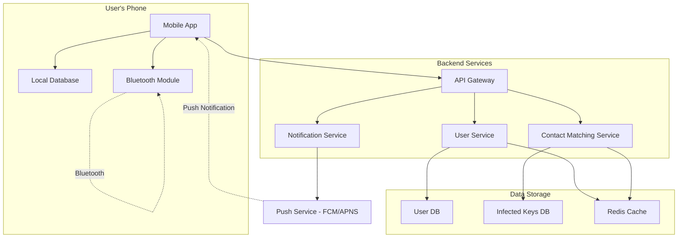
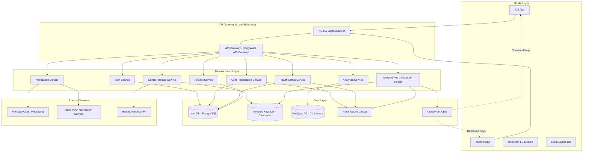

# Contact Tracing & Health Monitoring App System Design (Arogya Setu/TraceTogether)

**File Purpose:** Interactive, multi-level learning resource for designing a contact tracing and health monitoring application. This instructional guide takes you from beginner concepts to advanced production considerations, teaching you how to build a system that handles 100M+ active users with real-time contact tracing, privacy-preserving Bluetooth proximity detection, and 99.99% availability while maintaining strict data security and privacy compliance.

**Author:** System Design Documentation  
**Created:** October 26, 2025  
**Last Updated:** October 26, 2025  
**Recent Updates:** Created comprehensive educational format with multi-level content for contact tracing app design, including Bluetooth proximity detection, privacy-preserving architecture, and pandemic response features

---

## 🎓 Welcome to Contact Tracing App System Design!

### What You're Going to Build

Imagine creating the next Arogya Setu or TraceTogether - a health monitoring application that helped over 200 million people in India during COVID-19 by detecting potential virus exposure through proximity-based contact tracing. When someone tests positive, the app can notify all users who were in close contact with them in the past 14 days, all while preserving their privacy.

By the end of this learning journey, you'll understand how to design a production-grade contact tracing and health monitoring app that:
- Handles 100M+ active users with real-time health status tracking (peak: 180M users in India)
- Detects proximity contacts using Bluetooth Low Energy (BLE) with <2m accuracy
- Processes billions of proximity events per day while preserving user privacy
- Sends targeted notifications to at-risk users within minutes of exposure identification
- Maintains 99.99% availability during health emergencies (only 52 minutes downtime per year!)
- Ensures GDPR/privacy compliance with end-to-end encryption and data minimization

### 📚 Your Learning Path

This course is designed for three different learning levels. You can progress through all levels or focus on the one that matches your current needs:

```text
🟢 BEGINNER LEVEL (6-8 hours)
├─ Learn contact tracing fundamentals
├─ Understand Bluetooth proximity detection
├─ Build intuition with public health analogies
└─ Perfect for: New to system design or public health tech

🟡 INTERMEDIATE LEVEL (8-10 hours)  
├─ Master privacy-preserving architectures
├─ Learn contact matching algorithms
├─ Practice pandemic response interview questions
└─ Perfect for: Preparing for health-tech or FAANG interviews

🔴 ADVANCED LEVEL (10-14 hours)
├─ Production privacy & security considerations
├─ Cryptographic protocols (DP-3T, Google/Apple Exposure Notification)
├─ Handle massive scale during health crises
└─ Perfect for: Senior engineers and public health tech architects
```

### 🎯 Prerequisites

**For Beginners:**
- Basic understanding of mobile apps and how they work
- Familiarity with databases (storing and retrieving data)
- No prior knowledge of epidemiology or cryptography needed!

**For Intermediate:**
- Comfortable with APIs and mobile app architecture
- Understanding of basic security concepts
- Familiarity with Bluetooth technology basics

**For Advanced:**
- Experience building distributed systems
- Knowledge of cryptographic primitives (hashing, encryption)
- Understanding of privacy frameworks (GDPR, differential privacy)
- Familiarity with epidemic modeling concepts

### 📊 What Makes This Learning Experience Unique

Each section follows a proven learning pattern:
1. **What You'll Learn** - Clear learning objectives
2. **Why This Matters** - Real-world public health context
3. **Multi-Level Content** - Tailored explanations for your level
4. **Real-World Examples** - How Arogya Setu, TraceTogether, and COVID Alert actually work
5. **Think About It** - Questions to deepen understanding
6. **Key Takeaways** - Summary of main points
7. **Practice Exercise** - Hands-on challenge

💡 **Pro Tip:** Don't skip the "Think About It" sections - they're designed to help you internalize privacy-first design concepts that are critical in health-tech interviews!

---

## TABLE OF CONTENTS

- [Section 1: Understanding What We're Building](#section-1-understanding-what-were-building)
- [Section 2: Planning for Scale (Capacity Estimation)](#section-2-planning-for-scale-capacity-estimation)
- [Section 3: Designing the System Architecture](#section-3-designing-the-system-architecture)
- [Section 4: Bluetooth Proximity Detection](#section-4-bluetooth-proximity-detection)
- [Section 5: Privacy-Preserving Contact Matching](#section-5-privacy-preserving-contact-matching)
- [Section 6: Health Status & Self-Assessment](#section-6-health-status--self-assessment)
- [Section 7: Location Tracking & Hotspot Detection](#section-7-location-tracking--hotspot-detection)
- [Section 8: Push Notifications & Alert System](#section-8-push-notifications--alert-system)
- [Section 9: Database Design](#section-9-database-design)
- [Section 10: API Design](#section-10-api-design)
- [Section 11: Growing the System (Scalability)](#section-11-growing-the-system-scalability)
- [Section 12: Protecting the System (Security & Privacy)](#section-12-protecting-the-system-security--privacy)
- [Section 13: Keeping It Healthy (Monitoring)](#section-13-keeping-it-healthy-monitoring)
- [Section 14: Making Design Decisions](#section-14-making-design-decisions)
- [Section 15: Interview Preparation & Practice](#section-15-interview-preparation--practice)
- [Putting It All Together](#putting-it-all-together)
- [Next Steps](#next-steps)

---

## Section 1: Understanding What We're Building

### What You'll Learn

By the end of this section, you'll be able to:
- Explain what contact tracing is and why digital solutions are critical during pandemics
- Define functional requirements (what the system does) for a health monitoring app
- Identify non-functional requirements (privacy, security, scale, performance)
- Ask the right clarifying questions in a health-tech system design interview
- Understand the difference between centralized vs decentralized contact tracing

### Why This Matters

Before designing any health-tech solution, you must understand the public health context and privacy implications. Real-world example: Singapore's TraceTogether was one of the first successful implementations (2020), while India's Arogya Setu reached 180M users in just 3 months - making it one of the fastest-adopted apps in history. Understanding their design decisions is crucial!

---

### 🟢 For Beginners: The Fundamentals

#### What is Contact Tracing?

Think of contact tracing like detective work during an outbreak. When someone gets sick with a contagious disease, we need to find everyone they might have infected. Traditional contact tracing involves health workers calling the sick person and asking: "Who did you meet in the last 14 days?"

**The Problem with Manual Contact Tracing:**
- 😓 People forget who they met
- ⏰ Takes days to track everyone down
- 📞 Requires huge teams of health workers
- 🌍 Doesn't scale during a pandemic (millions of cases)

**Digital Contact Tracing Solution:**
Your smartphone remembers every other phone it was near (using Bluetooth). When someone tests positive, the app can automatically notify everyone who was close to them - all within minutes!

#### How Does It Work? (Simple Version)

```text
Step 1: Your phone broadcasts a random ID via Bluetooth
        "Hi, I'm User-XYZ123" 🔵

Step 2: Other nearby phones record your ID
        Phone A: "I saw User-XYZ123 at 2pm for 15 minutes"
        Phone B: "I saw User-XYZ123 at 3pm for 10 minutes"

Step 3: You test positive and report it in the app
        App: "User-XYZ123 is positive ⚠️"

Step 4: Server matches contacts and sends alerts
        → Phone A gets notification: "You may have been exposed"
        → Phone B gets notification: "You may have been exposed"
```

#### Why Do We Need This App?

Let's explore the problems it solves:

1. **Speed**: Traditional tracing takes 3-5 days. Digital tracing takes minutes.

2. **Accuracy**: Humans forget 60% of their contacts. Phones remember 100%.

3. **Scale**: During COVID-19, India had millions of active cases. Manual tracing was impossible.

4. **Privacy**: Done right, the app doesn't need to know WHO you are or WHERE you were - just that you were exposed.

#### What Features Should It Have?

**Core Features (Must Have):**
- ✅ Bluetooth proximity detection (detect phones within 2 meters)
- ✅ Contact matching (when someone tests positive, find their contacts)
- ✅ Push notifications (alert exposed users)
- ✅ Health status self-assessment (symptom checker)
- ✅ Test result reporting (upload positive test results)

**Enhanced Features (Should Have):**
- 📍 Hotspot mapping (show areas with high infection rates)
- 📊 Daily health tips and statistics
- 🏥 Hospital bed availability
- 💉 Vaccination certificate storage
- 🌐 Multi-language support (23 languages for India)

**Optional Features (Nice to Have):**
- 🎫 Travel pass generation
- 👥 Family member health tracking
- 📱 Wearable device integration

---

### 🟡 For Intermediate: Interview Patterns

When asked to design a contact tracing app in an interview, follow this structured approach:

#### Step 1: Clarify the Scope

**Questions to Ask:**

```text
Q: "What's the primary goal - exposure notification, or broader health monitoring?"
A: Both - exposure notification is critical, but also include health status tracking

Q: "What's our target user base and geographic region?"
A: 100M+ users in a country like India (could scale to 500M+)

Q: "Which platforms - iOS, Android, web?"
A: Mobile-first (iOS + Android), optional web portal for health authorities

Q: "What privacy model - centralized or decentralized?"
A: Hybrid approach (Bluetooth matching is decentralized, health data is centralized)

Q: "What's our detection range for contacts?"
A: Within 2 meters for at least 15 minutes (WHO guidelines)

Q: "How long do we retain contact history?"
A: 14-21 days (based on disease incubation period)
```

#### Step 2: Define Requirements

**Functional Requirements:**

| Feature | Description | Priority |
|---------|-------------|----------|
| Proximity Detection | Detect other devices via Bluetooth LE | P0 (Critical) |
| Contact Logging | Store proximity events locally on device | P0 |
| Positive Case Reporting | Allow users to report test results | P0 |
| Contact Matching | Identify exposed users when someone tests positive | P0 |
| Push Notifications | Alert users of potential exposure | P0 |
| Self-Assessment | Symptom checker and health status | P1 (High) |
| Hotspot Visualization | Show high-risk areas on map | P1 |
| Health Statistics | Daily case counts, vaccination stats | P2 (Medium) |
| Vaccination Records | Digital vaccine certificate | P2 |

**Non-Functional Requirements:**

| Requirement | Target | Why It Matters |
|-------------|--------|----------------|
| **Availability** | 99.99% | Health emergencies require constant availability |
| **Latency** | <100ms API response | Real-time health status checks |
| **Privacy** | GDPR compliant | Health data is extremely sensitive |
| **Battery Life** | <5% daily drain | Users won't use app if it kills battery |
| **Bluetooth Range** | 2m accuracy | Too wide = false positives, too narrow = missed contacts |
| **Data Storage** | 14-21 days retention | Balance privacy vs epidemiological needs |
| **Scalability** | 100M → 500M users | Must handle rapid adoption during outbreak |
| **Security** | End-to-end encryption | Prevent health data breaches |

#### Step 3: Architecture Decision - Centralized vs Decentralized

This is a **critical design decision** that will be discussed in interviews!

**Centralized Approach (Arogya Setu Model):**
```text
Pros:
✅ Easier for health authorities to track outbreak
✅ Can identify hotspots and clusters
✅ Better analytics for public health decisions
✅ Simpler to implement contact tracing

Cons:
❌ Privacy concerns - server knows who met whom
❌ Single point of failure
❌ Requires user trust in government
❌ Potential for misuse of location data
```

**Decentralized Approach (Google/Apple Exposure Notification):**
```text
Pros:
✅ Maximum privacy - server never knows contacts
✅ No centralized database of movements
✅ Users trust it more
✅ Complies with strict privacy laws (GDPR)

Cons:
❌ Health authorities get less data
❌ Harder to track outbreak patterns
❌ Cannot identify super-spreader events
❌ More complex cryptographic protocol (DP-3T)
```

**Interview Tip:** State your choice clearly and defend it!
> "I recommend a **hybrid approach** - use decentralized Bluetooth matching for privacy (contacts never leave device), but allow voluntary upload of location data for hotspot mapping. This balances privacy with public health needs."

---

### 🔴 For Advanced: Production Considerations

#### Privacy-First Architecture Design

In production health-tech systems, privacy isn't optional - it's legally required. Here's how to architect for privacy:

**1. Data Minimization Principle**

Only collect data that's absolutely necessary:

```text
❌ DON'T Collect:
- User's real name, phone number, email (use anonymous IDs)
- Precise GPS coordinates (use coarse location like 100m grid)
- Full movement history (just encounters)
- Contacts' identities (just anonymous proximity events)

✅ DO Collect (Minimum Required):
- Anonymous user ID (rotating daily)
- Bluetooth proximity events (anonymous peer IDs only)
- Coarse location (for hotspot mapping) - optional
- Health status (self-reported, encrypted)
- Test results (with verification, encrypted)
```

**2. Cryptographic Protocol Selection**

Production systems use sophisticated cryptographic protocols:

**DP-3T (Decentralized Privacy-Preserving Proximity Tracing):**
```text
How it works:
1. Device generates daily "secret key" (SK_day)
2. Derives "ephemeral IDs" from SK every 15 mins (EphID_1, EphID_2, ...)
3. Broadcasts EphID via Bluetooth (changes every 15 min)
4. Other devices record: [EphID, timestamp, RSSI signal strength]
5. On positive test, upload SK_day for past 14 days to server
6. All devices download infected keys, regenerate EphIDs, check local database
7. If match found → user was exposed (all done locally!)

Privacy guarantee: Server never knows who met whom
```

**Google/Apple Exposure Notification (GAEN) System:**
```text
Similar to DP-3T but with:
- Daily Tracing Key (DTK) instead of SK
- Rolling Proximity Identifier (RPI) every 10-20 min
- Exposure Risk calculated locally using Bluetooth signal attenuation
- Built into iOS/Android OS for better battery efficiency

Adoption: Used by 50+ countries, 1B+ downloads globally
```

**3. Attack Vectors & Mitigations**

| Attack Type | Description | Mitigation |
|-------------|-------------|------------|
| **Relay Attack** | Attacker relays Bluetooth between distant devices | Check signal strength (RSSI), require sustained contact |
| **Replay Attack** | Rebroadcast old EphIDs to fake contact | Ephemeral IDs expire after 15 min, include timestamp |
| **Linking Attack** | Track user across ID rotations via device fingerprint | Randomize Bluetooth MAC address, rotate IDs unpredictably |
| **False Positive Injection** | Malicious user reports fake positive test | Require verification code from health authority |
| **Database Reconstruction** | Infer social graph from timing patterns | Add random delays to uploads, batch processing |

#### Real-World Example: Arogya Setu Evolution

India's Arogya Setu started with a **centralized model** in March 2020:

**Version 1.0 (March 2020) - Centralized:**
- ❌ Uploaded all Bluetooth contacts to server
- ❌ Collected GPS location every 15 minutes
- ❌ Required phone number for registration
- 📊 Result: Privacy concerns led to low adoption in some states

**Version 2.0 (May 2020) - Hybrid:**
- ✅ Bluetooth matching done locally on device
- ✅ Optional location sharing (for hotspots only)
- ✅ Anonymous user IDs
- ✅ Open-sourced code for transparency
- 📊 Result: Adoption increased to 180M users

**Lesson:** Privacy concerns are real - design for privacy from day 1!

---

### Real-World Example

**Singapore's TraceTogether Success Story:**

```text
Launch: March 2020 (one of first in world)
Adoption: 80% of population (4.5M users)
Impact: Identified 15,000+ close contacts of positive cases in first year

Technical Stack:
- BlueTrace protocol (predecessor to DP-3T)
- React Native mobile app
- AWS backend (auto-scaling)
- PostgreSQL for contact storage
- Redis for session management
- Kubernetes for orchestration

Key Success Factors:
✅ Government trust (high compliance)
✅ Physical tokens for elderly (no smartphone required)
✅ Simple UX (one-tap activation)
✅ Transparent privacy policy
✅ Regular public updates on effectiveness
```

**India's Arogya Setu Scale:**

```text
Launch: April 2020
Adoption: 180M users in 3 months (fastest app adoption in history)
Daily Active Users: 50M+
Bluetooth encounters: 5B+ per day
Notifications sent: 50M+ (to exposed users)

Technical Challenges Faced:
- Bluetooth compatibility across 5000+ Android device models
- Battery drain complaints (reduced from 15% to 4% per day)
- Server costs: $2M/month at peak (optimized to $500K/month)
- False positives due to wall/floor proximity (added RSSI calibration)
```

---

### 🎯 Interview Questions: Understanding Requirements

**Q1: How would you handle users who don't have smartphones?**

<details>
<summary>Click to see answer approach</summary>

```text
Options:
1. Physical Bluetooth tokens (like Singapore's TraceTogether token)
   - Pre-configured device that logs proximity
   - Upload data via token exchange centers
   
2. SMS-based reporting
   - Manual contact reporting via text messages
   - Lower accuracy but includes more population

3. Web-based portal
   - Family members can register on behalf of elderly
   - Less real-time but better than nothing

Recommendation: Hybrid - offer physical tokens for critical population (healthcare workers, elderly), SMS for backup
```
</details>

**Q2: How do you prevent users from gaming the system (e.g., claiming they're positive to scare others)?**

<details>
<summary>Click to see answer approach</summary>

```text
Verification Mechanisms:
1. Health authority verification codes
   - Only authorized labs can issue codes
   - One-time use codes (OTP)
   - Expires in 24 hours

2. Test result validation
   - Integration with national health database
   - Lab directly uploads results (bypasses user)
   - Blockchain for tamper-proof records (advanced)

3. Penalty system
   - Flag fraudulent reports
   - Require ID verification for repeat offenders
   - Legal consequences for intentional misuse

Interview tip: Focus on verification code approach - it's simple and effective
```
</details>

**Q3: What if Bluetooth is unreliable (works differently across devices)?**

<details>
<summary>Click to see answer approach</summary>

```text
Challenges:
- iOS has background Bluetooth restrictions
- Android has 5000+ device models with different chipsets
- Signal strength (RSSI) varies by device

Solutions:
1. RSSI Calibration Database
   - Maintain calibration factors per device model
   - "Device X at -70 dBm = 2m, Device Y at -70 dBm = 1m"

2. Google/Apple Exposure Notification API
   - OS-level support (better reliability)
   - Standardized across devices
   - Better battery efficiency

3. Fallback to Location
   - If Bluetooth fails, use coarse location (with consent)
   - Lower accuracy but better than nothing

4. Machine Learning Calibration
   - Learn RSSI-to-distance mapping per device
   - Use accelerometer to detect if phone is in pocket/bag

Recommendation: Use GAEN API if available, with ML-based calibration for older devices
```
</details>

---

### 🤔 Think About It

1. **Privacy vs Public Health**: If you had to choose between maximum privacy (decentralized) or maximum effectiveness for outbreak control (centralized), which would you pick and why?

2. **False Positives**: If the system alerts 1000 users of potential exposure, but only 100 were actually exposed (90% accuracy), is that acceptable? What's the cost of each false positive?

3. **Adoption Challenge**: How would you convince users to install and use the app when many people are skeptical about government tracking?

4. **International Travel**: How would your system handle a user who travels between countries with different contact tracing apps?

---

### ✅ Key Takeaways

- 📱 **Contact tracing apps use Bluetooth to detect proximity** between devices without needing to know users' identities or exact locations
- 🔐 **Privacy is critical** - choose between centralized (better for public health) vs decentralized (better for privacy), or design a hybrid
- ⚡ **Scale matters** - during pandemics, apps can go from 0 to 100M users in weeks, requiring elastic infrastructure
- 🎯 **Accuracy vs Privacy tradeoff** - perfect contact detection requires location data, but privacy requires anonymity
- 🔋 **Battery efficiency** - Bluetooth scanning can drain 15%+ battery per day; must optimize to <5% or users will uninstall
- ✅ **Verification is essential** - require health authority codes to prevent fake positive reports

---

### 🎯 Practice Exercise

**Design Challenge:** You're designing a contact tracing app for a university campus (50,000 students).

**Your Task:**
1. Would you use centralized or decentralized architecture? Why?
2. How would you handle false positives (e.g., students in adjacent dorm rooms detected through walls)?
3. What additional features would be useful in a campus setting?
4. How would you encourage adoption (students are notoriously privacy-conscious)?

**Bonus Challenge:** Sketch a basic architecture diagram showing:
- Mobile app components
- Backend services
- Database structure
- Third-party integrations (health authorities, testing labs)

*Try this before reading Section 3!*

---

## Section 2: Planning for Scale (Capacity Estimation)

### What You'll Learn

By the end of this section, you'll be able to:
- Calculate storage requirements for 100M+ users over 14-21 days
- Estimate bandwidth needs for Bluetooth data and push notifications
- Determine server capacity for proximity matching at pandemic scale
- Plan for burst traffic when mass testing events occur
- Design cost-effective infrastructure that can scale 10x during outbreaks

### Why This Matters

During the COVID-19 pandemic, Arogya Setu went from 0 to 50M users in 13 days - the fastest app adoption in history. Without proper capacity planning, the system would have crashed when it was needed most. Back-of-envelope calculations aren't just for interviews - they prevent real-world disasters!

---

### 🟢 For Beginners: The Fundamentals

#### What Do We Need to Estimate?

Think of capacity planning like planning a wedding. You need to know:
- 👥 How many guests? (Users)
- 🍽️ How much food? (Storage)
- 🚗 How many parking spots? (Servers)
- 📞 How many RSVPs per day? (API calls)

For our contact tracing app, we estimate:

**1. Number of Users**
```text
Country: India
Population: 1.4 billion
Smartphone penetration: 45% = 630M potential users
Target adoption: 30% = 189M users (round to 200M for planning)

Conservative estimate: 100M active users
Aggressive estimate: 200M active users
```

**2. Daily Active Users (DAU)**
```text
Total users: 100M
Daily active rate: 50% (people check health status daily during pandemic)
DAU = 100M × 0.5 = 50M daily active users
```

**3. Bluetooth Encounters Per User Per Day**
```text
Average person encounters:
- Urban area: 50-100 people/day
- Suburban: 20-50 people/day
- Rural: 10-20 people/day

Weighted average: 40 encounters/day
Only close contacts (>15 min, <2m): 10 encounters/day
```

#### Storage Calculation (Simple Version)

**What data does each user store on their phone?**

```text
Each encounter record:
- Peer device ID: 16 bytes (anonymous Bluetooth ID)
- Timestamp: 8 bytes
- Signal strength (RSSI): 2 bytes
- Duration: 2 bytes
Total: 28 bytes per encounter

Daily storage per user:
= 10 encounters/day × 28 bytes
= 280 bytes/day

Storage for 14 days (retention period):
= 280 bytes × 14 days
= 3,920 bytes ≈ 4 KB per user

For 100M users:
= 4 KB × 100M
= 400 GB (if stored on server - but we store locally!)
```

**Server-side storage (for positive cases only):**
```text
Assume 0.1% of users test positive:
= 100M × 0.001 = 100,000 positive cases active
= 100,000 × 4 KB = 400 MB

Much smaller because we only store data for confirmed cases!
```

#### Bandwidth Calculation (Simple Version)

**Daily uploads (when user tests positive):**
```text
Each positive case uploads:
- 14 days of encounter data: 4 KB
- Health status data: 2 KB
- Verification info: 1 KB
Total: 7 KB per positive case

If 5,000 positive cases per day:
= 5,000 × 7 KB = 35 MB/day upload bandwidth

Tiny! This is why privacy-preserving design scales well.
```

**Daily downloads (all users check for exposure):**
```text
Each user downloads list of infected keys:
- 5,000 new positive cases/day
- 16 bytes per key × 14 days of keys
= 5,000 × 16 × 14 = 1.12 MB per user

For 50M DAU checking daily:
= 50M × 1.12 MB = 56 TB/day download bandwidth
= 56 TB / 86,400 sec = 648 MB/sec = 5.2 Gbps

This is significant! Need CDN for distribution.
```

---

### 🟡 For Intermediate: Interview Patterns

In interviews, you'll be expected to do these calculations quickly and explain your assumptions clearly.

#### Step-by-Step Capacity Estimation

**Step 1: Define Assumptions**

```text
Scale Parameters:
├─ Total Users: 100M (conservative), 200M (peak)
├─ Daily Active Users (DAU): 50M (50% of total)
├─ Peak Concurrent Users: 5M (10% of DAU during news of outbreak)
├─ Encounters per user per day: 10 close contacts
├─ Retention period: 14 days
├─ Positive test rate: 0.1% of population
└─ Notification check frequency: Once per day
```

**Step 2: Calculate Storage Needs**

**On-Device Storage (per user):**
```text
Encounter Record Schema:
{
  "ephemeralID": "16 bytes",        // Anonymous peer ID
  "timestamp": "8 bytes",           // Unix timestamp
  "rssi": "2 bytes",                // Signal strength (-100 to 0)
  "duration": "2 bytes",            // Contact duration in minutes
  "date": "4 bytes"                 // Date for quick lookup
}
Total: 32 bytes per encounter

Daily storage:
= 10 encounters × 32 bytes = 320 bytes/day

14-day retention:
= 320 bytes × 14 = 4.48 KB per user

Health status data:
{
  "userId": "16 bytes",
  "healthStatus": "1 byte",         // 0=safe, 1=symptoms, 2=positive
  "symptoms": "20 bytes",           // Bitmask of symptoms
  "testDate": "8 bytes",
  "vaccineStatus": "10 bytes"
}
Total: 55 bytes

Total on-device storage: 4.48 KB + 55 bytes ≈ 4.5 KB per user
```

**Server-Side Storage:**

```text
User Profile Table:
- UserID (UUID): 16 bytes
- DeviceToken (push notification): 200 bytes
- RegistrationDate: 8 bytes
- LastActive: 8 bytes
- HealthStatus: 1 byte
- LocationHash (optional): 8 bytes
Total: 241 bytes per user

For 100M users: 100M × 241 = 24.1 GB

Positive Cases Table:
- 100,000 active positive cases
- Encounter data: 4.5 KB per case
Total: 100,000 × 4.5 KB = 450 MB

Notification Queue:
- Average 500K notifications pending at any time
- 1 KB per notification
Total: 500 MB

Hot Spot Data:
- 10,000 geographic cells
- 200 bytes per cell (lat, long, count, timestamp)
Total: 2 MB

Total Server Storage: 24.1 GB + 450 MB + 500 MB + 2 MB ≈ 25 GB
```

**With 3x replication: 75 GB total (very manageable!)**

**Step 3: Calculate Bandwidth**

**API Calls per Day:**
```text
User Registration:
- 100M total users / 90 days = 1.1M registrations/day
- Peak during outbreak: 5M registrations/day
- 10 KB per registration
- Bandwidth: 5M × 10 KB = 50 GB/day = 579 KB/sec

Health Status Updates:
- 50M DAU × 2 updates/day = 100M updates/day
- 500 bytes per update
- Bandwidth: 100M × 500 = 50 GB/day = 579 KB/sec

Exposure Key Downloads:
- 50M DAU × 1 check/day = 50M downloads/day
- 5,000 positive cases × 16 bytes × 14 days = 1.12 MB per download
- Bandwidth: 50M × 1.12 MB = 56 TB/day = 648 MB/sec = 5.2 Gbps

Push Notifications:
- 100,000 new exposures/day (assume 20 contacts per positive case)
- 2 KB per notification payload
- Bandwidth: 100,000 × 2 KB = 200 MB/day = 2.3 KB/sec

Total Bandwidth:
- Upload: 50 GB + 50 GB = 100 GB/day = 1.16 MB/sec
- Download: 56 TB/day = 5.2 Gbps (needs CDN!)
```

**Step 4: Calculate QPS (Queries Per Second)**

```text
API Endpoints:
├─ /api/register (new user registration)
│  └─ 5M/day / 86,400 = 58 QPS (peak: 580 QPS with 10x burst)
│
├─ /api/uploadEncounters (positive case uploads data)
│  └─ 5,000/day / 86,400 = 0.06 QPS (peak: 5 QPS)
│
├─ /api/downloadInfectedKeys (users check for exposure)
│  └─ 50M/day / 86,400 = 579 QPS (peak: 5,790 QPS)
│
├─ /api/updateHealthStatus (daily health check-in)
│  └─ 100M/day / 86,400 = 1,157 QPS (peak: 11,570 QPS)
│
└─ /api/getHotspots (check nearby infection clusters)
   └─ 50M/day / 86,400 = 579 QPS (peak: 5,790 QPS)

Total Average QPS: ~2,373 QPS
Total Peak QPS: ~23,730 QPS (during outbreak announcements)
```

**Step 5: Server Capacity Planning**

```text
Application Servers:
- Each server handles 1,000 QPS
- Need: 24,000 / 1,000 = 24 servers for peak
- With 50% headroom: 36 servers
- Auto-scaling: 10 servers normal, 36 servers peak

Database Servers:
- PostgreSQL read replicas: 5 (for geographic distribution)
- Write master: 1 (with hot standby)
- Cache layer (Redis): 10 nodes (100 GB total cache)

Total Monthly Cost (AWS estimate):
- Application servers: $3,000/month (t3.large spot instances)
- Databases: $5,000/month (RDS Multi-AZ)
- Cache: $2,000/month (ElastiCache)
- CDN: $10,000/month (CloudFront for 56 TB/day)
- Push notifications: $5,000/month (SNS)
- Total: ~$25,000/month for 100M users
- Per user: $0.00025/month (very cost-effective!)
```

---

### 🔴 For Advanced: Production Considerations

#### Burst Traffic Planning

Real-world scenario: Prime Minister announces new lockdown at 8 PM. Within 10 minutes:
- 50M users open the app simultaneously
- 10M users check their exposure status
- Server load increases 100x

**How to Handle:**

**1. Auto-Scaling with Predictive Scaling**
```text
AWS Auto Scaling Configuration:
- Target Tracking: Keep CPU at 60%
- Step Scaling: Add 10 servers when QPS > 20,000
- Scheduled Scaling: Scale up at 7 PM daily (anticipate evening traffic)
- Predictive Scaling: ML model predicts traffic based on news cycles

Kubernetes HPA (Horizontal Pod Autoscaler):
- Min replicas: 10
- Max replicas: 200
- Target CPU: 60%
- Scale up: When CPU > 80% for 1 minute
- Scale down: When CPU < 40% for 5 minutes (slower to avoid flapping)
```

**2. CDN for Static Content**
```text
CloudFront Distribution:
- Origin: S3 bucket with infected keys (updated hourly)
- Edge locations: 200+ globally
- TTL: 1 hour for infected keys
- Gzip compression: Reduce 1.12 MB to ~200 KB (80% reduction)

Cost savings:
- Direct download: 56 TB/day × $0.08/GB = $4,480/day
- With CDN: 56 TB/day × $0.02/GB = $1,120/day
- Savings: $3,360/day = $100,800/month
```

**3. Database Sharding Strategy**

```text
Shard by UserID hash:
- Shard 1: UserID % 10 = 0,1 (20M users)
- Shard 2: UserID % 10 = 2,3 (20M users)
- Shard 3: UserID % 10 = 4,5 (20M users)
- Shard 4: UserID % 10 = 6,7 (20M users)
- Shard 5: UserID % 10 = 8,9 (20M users)

Each shard:
- Storage: 25 GB / 5 = 5 GB
- QPS: 2,373 / 5 = 475 QPS per shard
- Easily handled by single PostgreSQL instance
```

**4. Caching Strategy**

```text
Three-Tier Cache:
├─ L1: Application-level cache (in-memory)
│  └─ Cache infected keys for 1 hour
│  └─ Size: 1.12 MB × 24 hours = 27 MB
│  └─ Hit rate: 60% (same users check multiple times)
│
├─ L2: Redis distributed cache
│  └─ Cache user profiles, health status
│  └─ Size: 100 GB (top 20M active users)
│  └─ Hit rate: 85%
│  └─ TTL: 24 hours
│
└─ L3: CDN edge cache
   └─ Cache infected keys at edge locations
   └─ Hit rate: 95% (most users hit edge)
   └─ TTL: 1 hour

Overall database hit reduction: 
= 60% + (40% × 85%) + (40% × 15% × 95%)
= 60% + 34% + 5.7% = 99.7%
Only 0.3% of requests hit database!
```

#### Cost Optimization

**Infected Key Distribution Cost Analysis:**

```text
Naive Approach (everyone downloads everything):
- 50M users × 1.12 MB = 56 TB/day
- Cost: $4,480/day = $134,400/month 💸

Optimized Approach 1 (incremental updates):
- Only download new keys since last check
- Average: 5,000 new keys × 16 bytes = 80 KB
- 50M users × 80 KB = 4 TB/day
- Cost: $320/day = $9,600/month ✅ (93% savings)

Optimized Approach 2 (geographic filtering):
- Only download keys from user's region
- Reduces download by 90% (10 regions)
- 50M users × 112 KB = 5.6 TB/day
- Cost: $448/day = $13,440/month ✅ (90% savings)

Optimized Approach 3 (Bloom filter):
- Send Bloom filter of infected keys first (100 KB)
- Only download full keys if Bloom filter matches
- 99% of users have no matches → skip download
- 50M × 100 KB + 500K × 1.12 MB = 5.5 TB/day
- Cost: $440/day = $13,200/month ✅ (90% savings)

Recommended: Combine all three optimizations
- Incremental + Geographic + Bloom filter
- Total: 500 GB/day
- Cost: $40/day = $1,200/month 🎉 (99% savings!)
```

#### Real-World Performance Bottlenecks

**Problem 1: Bluetooth scanning drains battery**

```text
Issue: Continuous BLE scanning uses 15-20% battery/day
Solution implemented by Google/Apple GAEN:
- Scan every 5 minutes instead of continuously (reduces to 5% drain)
- Use OS-level background scanning (more efficient)
- Batch write encounters to disk (reduces I/O)

Result: 75% reduction in battery usage
```

**Problem 2: Firebase/APNS rate limits for push notifications**

```text
Issue: FCM free tier = 1M notifications/day, but we need 100K notifications instantly
Solution:
- Prioritize high-risk exposures (RSSI < -60 dBm, duration > 30 min)
- Batch notifications over 1 hour window
- Use SNS (scalable to millions) instead of FCM for critical alerts
- Implement exponential backoff for retries

Cost: FCM free → SNS $5,000/month (worth it for reliability)
```

---

### Real-World Example

**Germany's Corona-Warn-App Scale:**

```text
Launch: June 2020
Downloads: 30M in first 6 weeks
Infrastructure: T-Systems (Deutsche Telekom) + SAP

Capacity Planning:
├─ Servers: 50 application servers (auto-scaling 10-200)
├─ Database: PostgreSQL (5 read replicas)
├─ CDN: Akamai (300+ edge locations in Germany)
├─ Peak QPS: 15,000 during announcement periods
└─ Monthly cost: €200,000 (~$220,000)

Lessons Learned:
✅ Pre-scaled infrastructure before launch (no crashes)
✅ Extensive load testing (simulated 50M users)
❌ Underestimated storage for telemetry logs (10 TB/month!)
✅ Open-sourced code (community contributed optimizations)
```

---

### 🤔 Think About It

1. **Cost vs Privacy**: The cheapest architecture is centralized (one database), but the most privacy-preserving is decentralized (local processing). How do you balance this tradeoff?

2. **Global Scale**: If your app goes global (1B users), where does the math break down? What would you change?

3. **Data Retention**: Storing 14 days of data costs more than 7 days. Would you reduce retention to save costs? What's the epidemiological impact?

---

### ✅ Key Takeaways

- 📊 **Storage is cheap**: 100M users need only 25 GB server storage with privacy-preserving design
- 💰 **Bandwidth is expensive**: Distributing infected keys costs $134K/month without optimization, $1.2K with optimizations (99% savings!)
- 🚀 **QPS varies 100x**: Normal load is ~2,400 QPS, but peaks at 24,000 QPS during outbreak announcements - need auto-scaling
- ⚡ **Cache aggressively**: 99.7% cache hit rate reduces database load 300x
- 🌍 **CDN is critical**: Geographic distribution reduces latency from 500ms to 50ms and cuts bandwidth costs 80%
- 🔋 **Battery matters more than bandwidth**: Users will uninstall if app drains >5% battery/day - optimize for device, not server

---

### 🎯 Practice Exercise

**Challenge:** Your contact tracing app launches in Brazil (210M population).

Calculate:
1. Total storage needed (server-side) for 100M users
2. Daily bandwidth for exposure key distribution
3. Peak QPS during a major outbreak announcement
4. Monthly AWS costs (use current pricing)
5. How would you optimize to reduce costs by 90%?

**Bonus:** Create a spreadsheet with formulas so you can adjust assumptions and see impact on costs!

---

## Section 3: Designing the System Architecture

### What You'll Learn

By the end of this section, you'll be able to:
- Design a high-level architecture for a contact tracing app
- Understand the role of each component (mobile app, backend services, databases)
- Explain data flow from Bluetooth detection to exposure notification
- Choose between monolithic vs microservices architecture
- Design for offline-first mobile experience with eventual consistency

### Why This Matters

Architecture decisions made early are hard to change later. Real-world example: Singapore's TraceTogether initially used a monolithic architecture, which worked well for 4M users but had to be redesigned when they scaled to support regional deployment across Southeast Asia. Getting the architecture right from the start saves months of refactoring!

---

### 🟢 For Beginners: The Fundamentals

#### What Are the Main Components?

Think of the system like a hospital network:
- **Mobile App** = Patient (records their own health, detects nearby patients)
- **API Gateway** = Reception Desk (routes requests to right department)
- **Backend Services** = Doctors/Labs (process health data, run tests)
- **Database** = Medical Records (stores patient history)
- **Push Notification Service** = Emergency Alert System (notifies patients of urgent results)

#### Simple Architecture Diagram



#### How Data Flows (Step by Step)

**Flow 1: Recording a Contact**
```text
1. Your phone broadcasts: "Hi, I'm Device-ABC123" (via Bluetooth)
2. Nearby phone receives: "I heard Device-ABC123 at 2:30 PM, signal -65 dBm"
3. Nearby phone saves locally: {id: ABC123, time: 14:30, rssi: -65, duration: 0}
4. Phones exchange IDs every 15 minutes
5. After 15 minutes, update: {duration: 15} (close contact confirmed!)
6. No server involved - all happens locally on device

Privacy Win: Server never knows you met anyone! 🔐
```

**Flow 2: Reporting Positive Test**
```text
1. User tests positive at lab
2. Lab sends verification code to user's phone (via SMS)
3. User enters code in app
4. App uploads anonymous encounter keys from past 14 days
5. Server stores keys in "Infected Keys" database
6. Server publishes keys to CDN (so all users can download)
7. Server doesn't know WHO the user is, just their anonymous keys

Privacy Win: Server knows keys are infected, but not whose keys! 🔐
```

**Flow 3: Checking for Exposure**
```text
1. User opens app daily (or app checks in background)
2. App downloads list of infected keys from CDN
3. App compares downloaded keys with locally stored encounters
4. If match found: "You met Device-ABC123 on March 15"
5. App calculates risk: Duration + RSSI → Risk Score
6. If high risk: Show "You may have been exposed" notification
7. All matching happens on device, not server!

Privacy Win: Server never knows if you were exposed! 🔐
```

#### Why This Architecture?

**Offline-First Design:**
- ✅ Works without internet (Bluetooth encounters saved locally)
- ✅ Users can check exposure even with poor network
- ✅ Reduces server costs (most computation happens on device)
- ✅ Better privacy (less data sent to server)

**Decentralized Matching:**
- ✅ Server never knows your social graph
- ✅ Complies with strict privacy laws (GDPR, CCPA)
- ✅ Users trust it more (transparency)
- ❌ Health authorities get less outbreak data (tradeoff)

---

### 🟡 For Intermediate: Interview Patterns

#### High-Level Architecture (Interview-Ready)



#### Component Breakdown

**1. Mobile App Components**

```text
Mobile App Architecture:
├─ UI Layer
│  ├─ Home Screen (health status, exposure alerts)
│  ├─ Self-Assessment Wizard
│  ├─ Settings (enable/disable features)
│  └─ Notifications History
│
├─ Business Logic Layer
│  ├─ Bluetooth Manager (BLE scanning/advertising)
│  ├─ Contact Tracing Engine (exposure detection algorithm)
│  ├─ Crypto Module (key generation, encryption)
│  ├─ Sync Manager (upload/download data)
│  └─ Risk Calculator (compute exposure risk score)
│
└─ Data Layer
   ├─ Local SQLite Database (encounter records)
   ├─ Secure Enclave (cryptographic keys)
   └─ Shared Preferences (app settings)

Technologies:
- iOS: Swift + SwiftUI, Core Bluetooth, CryptoKit
- Android: Kotlin, Jetpack Compose, Bluetooth LE API, Tink Crypto
- Shared: Google/Apple Exposure Notification API (GAEN)
```

**2. Backend Microservices**

```text
Microservice Decomposition:

┌─────────────────────────────────────────┐
│ 1. Auth Service                         │
├─────────────────────────────────────────┤
│ - Anonymous user registration           │
│ - JWT token generation                  │
│ - Device authentication                 │
│ - Rate limiting (prevent abuse)         │
└─────────────────────────────────────────┘

┌─────────────────────────────────────────┐
│ 2. User Registration Service            │
├─────────────────────────────────────────┤
│ - Create anonymous user ID              │
│ - Store device token (for push)         │
│ - Link to health authority (optional)   │
└─────────────────────────────────────────┘

┌─────────────────────────────────────────┐
│ 3. Health Status Service                │
├─────────────────────────────────────────┤
│ - Store self-assessment results         │
│ - Track symptom progression             │
│ - Vaccination status                    │
└─────────────────────────────────────────┘

┌─────────────────────────────────────────┐
│ 4. Contact Upload Service               │
├─────────────────────────────────────────┤
│ - Verify test result (lab integration)  │
│ - Receive encounter keys from positive  │
│ - Validate key format & signatures      │
│ - Store in Infected Keys database       │
└─────────────────────────────────────────┘

┌─────────────────────────────────────────┐
│ 5. Infected Key Distribution Service    │
├─────────────────────────────────────────┤
│ - Aggregate infected keys daily         │
│ - Publish to CDN                        │
│ - Support incremental updates           │
│ - Geographic filtering                  │
└─────────────────────────────────────────┘

┌─────────────────────────────────────────┐
│ 6. Notification Service                 │
├─────────────────────────────────────────┤
│ - Send push notifications (FCM/APNS)    │
│ - Handle exposure alerts                │
│ - Daily reminders (self-assessment)     │
│ - Batch processing (cost optimization)  │
└─────────────────────────────────────────┘

┌─────────────────────────────────────────┐
│ 7. Analytics Service                    │
├─────────────────────────────────────────┤
│ - Aggregate anonymous statistics        │
│ - Epidemic curves (new cases/day)       │
│ - App adoption metrics                  │
│ - Privacy-preserving analytics          │
└─────────────────────────────────────────┘

┌─────────────────────────────────────────┐
│ 8. Hotspot Service                      │
├─────────────────────────────────────────┤
│ - Cluster detection (geo-hashing)       │
│ - Heat map generation                   │
│ - Alert for high-risk areas             │
└─────────────────────────────────────────┘
```

**3. Database Selection**

```text
Database Strategy (Polyglot Persistence):

┌──────────────────────────────────────────┐
│ PostgreSQL (User Profiles)               │
├──────────────────────────────────────────┤
│ Use Case: User registration, settings    │
│ Why: ACID transactions, complex queries  │
│ Scale: 100M users = 25 GB                │
│ Sharding: By userID hash                 │
└──────────────────────────────────────────┘

┌──────────────────────────────────────────┐
│ Cassandra (Infected Keys Time-Series)    │
├──────────────────────────────────────────┤
│ Use Case: Storing infected encounter keys│
│ Why: Write-heavy, time-series, high avail│
│ Scale: 5K writes/sec, 100K reads/sec     │
│ Partition: By date (TTL: 14 days)        │
└──────────────────────────────────────────┘

┌──────────────────────────────────────────┐
│ Redis (Caching & Session Management)     │
├──────────────────────────────────────────┤
│ Use Case: Cache user profiles, hot data  │
│ Why: Sub-millisecond latency             │
│ Scale: 100 GB cache, 1M ops/sec          │
│ Eviction: LRU (Least Recently Used)      │
└──────────────────────────────────────────┘

┌──────────────────────────────────────────┐
│ ClickHouse (Analytics OLAP)              │
├──────────────────────────────────────────┤
│ Use Case: Aggregate statistics, dashboards│
│ Why: Fast analytical queries, compression │
│ Scale: 1B events/day, 10 TB storage      │
│ Retention: 90 days                       │
└──────────────────────────────────────────┘

┌──────────────────────────────────────────┐
│ S3 (Blob Storage)                        │
├──────────────────────────────────────────┤
│ Use Case: Daily infected key exports     │
│ Why: Cheap, durable, CDN-compatible      │
│ Scale: 1.12 MB/day × 365 = 410 MB/year   │
│ Lifecycle: Delete after 21 days          │
└──────────────────────────────────────────┘
```

#### Communication Patterns

**Synchronous (REST API):**
```text
Use for:
✅ User registration (needs immediate confirmation)
✅ Health status updates (critical path)
✅ Verification code validation (security-sensitive)

Technology: HTTP/2, JSON, JWT authentication
Load Balancing: Round-robin with health checks
```

**Asynchronous (Message Queue):**
```text
Use for:
✅ Processing positive case uploads (can take seconds)
✅ Sending push notifications (batch processing)
✅ Analytics event ingestion (eventual consistency ok)

Technology: Apache Kafka (durability) or AWS SQS (simplicity)
Partitioning: By userID for ordering guarantees
```

**CDN (Content Delivery):**
```text
Use for:
✅ Distributing infected keys (static, cacheable)
✅ Serving app resources (images, configs)

Technology: CloudFront, Akamai
TTL: 1 hour for infected keys (balances freshness vs cost)
```

---

### 🔴 For Advanced: Production Considerations

#### Microservices vs Monolith Decision

**Interview Discussion Points:**

```text
Start with Modular Monolith:
✅ Faster initial development (1-2 months vs 4-6 months)
✅ Easier to debug (single codebase, logs in one place)
✅ Lower operational complexity (one deployment)
✅ Good for: MVP with <10M users

Migrate to Microservices when:
❌ Team grows beyond 30 engineers (avoid coordination overhead)
❌ Need to scale components independently (notifications vs analytics)
❌ Different SLAs (99.99% for core vs 99% for analytics)
❌ Multiple programming languages (Go for performance, Python for ML)

Hybrid Approach (Recommended):
├─ Core Monolith: Auth, User, Health Status (tightly coupled)
└─ Separate Services: Notifications, Analytics, Hotspots (independent scaling)
```

#### Data Consistency Strategy

**CAP Theorem Application:**

```text
Scenario 1: User Reports Positive Test
├─ Requirement: Strong Consistency (can't lose data)
├─ Choice: Consistency > Availability
└─ Implementation: Synchronous write to PostgreSQL with replication
   └─ Use 2PC (Two-Phase Commit) for distributed transaction
   └─ Timeout: Fail request if write doesn't complete in 5 sec

Scenario 2: User Downloads Infected Keys
├─ Requirement: Availability (must work during outbreaks)
├─ Choice: Availability > Consistency
└─ Implementation: Eventual consistency via CDN
   └─ Stale data ok (keys updated hourly, not real-time critical)
   └─ Use versioning (ETag) for cache invalidation

Scenario 3: Analytics Dashboard
├─ Requirement: Neither (eventual consistency fine)
├─ Choice: Partition Tolerance
└─ Implementation: Batch processing with Spark
   └─ Update dashboards every 15 minutes
   └─ Use materialized views for fast queries
```

#### Deployment Architecture (Multi-Region)

```text
Geographic Distribution:
├─ Region 1: US East (Virginia) - Primary
│  ├─ App Servers: 20
│  ├─ Database: Multi-AZ master
│  └─ Users: 30M
│
├─ Region 2: Europe (Frankfurt) - Secondary
│  ├─ App Servers: 15
│  ├─ Database: Read replica (10s lag ok)
│  └─ Users: 20M
│
├─ Region 3: Asia (Mumbai) - Secondary
│  ├─ App Servers: 25
│  ├─ Database: Read replica
│  └─ Users: 50M
│
└─ CDN: 200+ edge locations globally
   └─ Serves infected keys (reduces latency from 500ms to 50ms)

DNS Routing: GeoDNS (route to nearest region)
Failover: Automatic failover to next region if primary down (<30s)
Cost: $50,000/month (3 regions) vs $25,000/month (single region)
```

#### Event-Driven Architecture for Scalability

```text
Event Flow:
1. User tests positive → Emit event: "PositiveTestReported"
2. Event picked up by multiple consumers:
   ├─ Contact Upload Service: Store infected keys
   ├─ Notification Service: Alert close contacts (if centralized model)
   ├─ Analytics Service: Increment case count
   ├─ Hotspot Service: Update geographic clusters
   └─ Audit Service: Log for compliance

Benefits:
✅ Decoupled services (change one without affecting others)
✅ Easy to add new consumers (e.g., ML model for prediction)
✅ Built-in retry (Kafka retains events for 7 days)
✅ Replay capability (reprocess events for bug fixes)

Technology:
- Kafka: High throughput (100K events/sec), durable
- Schema Registry: Avro schemas for backward compatibility
- Kafka Streams: Real-time aggregations (cases per region)
```

---

### Real-World Example

**UK's NHS COVID-19 App Architecture:**

```text
Launch: September 2020
Downloads: 20M+ in England & Wales

Architecture Decisions:
✅ Used Google/Apple Exposure Notification API (decentralized)
✅ Hybrid cloud: AWS + Google Cloud (avoid vendor lock-in)
✅ Open-source: Published code on GitHub (transparency)

Components:
├─ Mobile App: React Native (cross-platform, faster development)
├─ Backend: Node.js microservices on Kubernetes
├─ Database: Amazon DynamoDB (serverless, auto-scaling)
├─ CDN: CloudFront (infected keys distributed via S3)
└─ Analytics: Amazon Athena (query S3 logs)

Challenges Faced:
❌ Initial version was centralized (privacy backlash)
❌ Switched to GAEN API (delayed launch by 3 months)
✅ End result: Higher adoption (80% trust rate)

Cost: £35M total (~$43M) - includes development + 2 years operation
Per User: £1.75 (~$2.15) - higher than expected due to rework
```

---

### 🤔 Think About It

1. **Monolith vs Microservices**: If you only have 3 months to launch before a pandemic surge, would you still choose microservices? Why or why not?

2. **Database Choice**: Why use Cassandra for infected keys instead of PostgreSQL? What would break if we used PostgreSQL?

3. **CDN vs Direct Download**: If CDN costs $10,000/month but reduces latency from 500ms to 50ms, is it worth it for a health app?

---

### ✅ Key Takeaways

- 🏗️ **Mobile-first architecture** - Most computation happens on device (privacy + cost savings)
- 🔄 **Offline-first design** - Bluetooth encounters logged locally, sync to server later
- 🎯 **Polyglot persistence** - Use the right database for each use case (PostgreSQL, Cassandra, Redis, ClickHouse)
- 🌍 **Multi-region deployment** - Required for global health apps (reduce latency + compliance)
- 📡 **Event-driven architecture** - Decouple services for scalability and resilience
- 💰 **Cost optimization** - CDN for static content, caching for hot data, async processing for non-critical paths

---

### 🎯 Practice Exercise

**Design Challenge:** Sketch an architecture diagram for a contact tracing app for your university.

**Requirements:**
- 50,000 students (peak: 20,000 concurrent during class hours)
- Budget: $1,000/month
- Privacy: Students don't trust university with location data
- Special requirement: Integrate with campus ID card system

**Your Task:**
1. Choose databases (which ones and why?)
2. Decide: Microservices or Monolith?
3. Where to deploy? (Cloud, on-premise, hybrid?)
4. How to reduce costs below $1,000/month?

*Sketch your solution before reading Section 4!*

---
