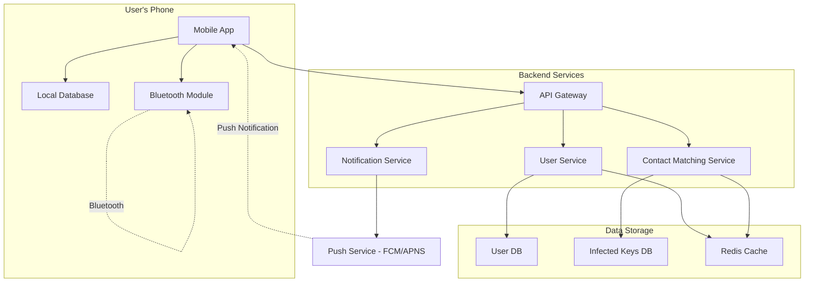
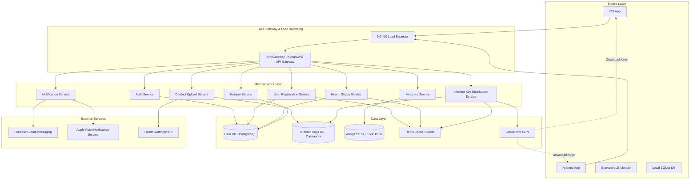
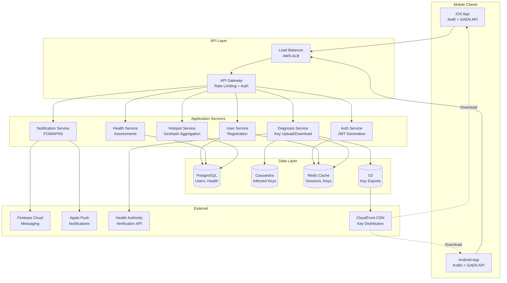

# Contact Tracing & Health Monitoring App System Design (Arogya Setu/TraceTogether)

**File Purpose:** Interactive, multi-level learning resource for designing a contact tracing and health monitoring application. This instructional guide takes you from beginner concepts to advanced production considerations, teaching you how to build a system that handles 100M+ active users with real-time contact tracing, privacy-preserving Bluetooth proximity detection, and 99.99% availability while maintaining strict data security and privacy compliance.

**Author:** System Design Documentation  
**Created:** October 26, 2025  
**Last Updated:** October 26, 2025  
**Recent Updates:** Created comprehensive educational format with multi-level content for contact tracing app design, including Bluetooth proximity detection, privacy-preserving architecture, and pandemic response features

---

## 🎓 Welcome to Contact Tracing App System Design!

### What You're Going to Build

Imagine creating the next Arogya Setu or TraceTogether - a health monitoring application that helped over 200 million people in India during COVID-19 by detecting potential virus exposure through proximity-based contact tracing. When someone tests positive, the app can notify all users who were in close contact with them in the past 14 days, all while preserving their privacy.

By the end of this learning journey, you'll understand how to design a production-grade contact tracing and health monitoring app that:
- Handles 100M+ active users with real-time health status tracking (peak: 180M users in India)
- Detects proximity contacts using Bluetooth Low Energy (BLE) with <2m accuracy
- Processes billions of proximity events per day while preserving user privacy
- Sends targeted notifications to at-risk users within minutes of exposure identification
- Maintains 99.99% availability during health emergencies (only 52 minutes downtime per year!)
- Ensures GDPR/privacy compliance with end-to-end encryption and data minimization

### 📚 Your Learning Path

This course is designed for three different learning levels. You can progress through all levels or focus on the one that matches your current needs:

```text
🟢 BEGINNER LEVEL (6-8 hours)
├─ Learn contact tracing fundamentals
├─ Understand Bluetooth proximity detection
├─ Build intuition with public health analogies
└─ Perfect for: New to system design or public health tech

🟡 INTERMEDIATE LEVEL (8-10 hours)  
├─ Master privacy-preserving architectures
├─ Learn contact matching algorithms
├─ Practice pandemic response interview questions
└─ Perfect for: Preparing for health-tech or FAANG interviews

🔴 ADVANCED LEVEL (10-14 hours)
├─ Production privacy & security considerations
├─ Cryptographic protocols (DP-3T, Google/Apple Exposure Notification)
├─ Handle massive scale during health crises
└─ Perfect for: Senior engineers and public health tech architects
```

### 🎯 Prerequisites

**For Beginners:**
- Basic understanding of mobile apps and how they work
- Familiarity with databases (storing and retrieving data)
- No prior knowledge of epidemiology or cryptography needed!

**For Intermediate:**
- Comfortable with APIs and mobile app architecture
- Understanding of basic security concepts
- Familiarity with Bluetooth technology basics

**For Advanced:**
- Experience building distributed systems
- Knowledge of cryptographic primitives (hashing, encryption)
- Understanding of privacy frameworks (GDPR, differential privacy)
- Familiarity with epidemic modeling concepts

### 📊 What Makes This Learning Experience Unique

Each section follows a proven learning pattern:
1. **What You'll Learn** - Clear learning objectives
2. **Why This Matters** - Real-world public health context
3. **Multi-Level Content** - Tailored explanations for your level
4. **Real-World Examples** - How Arogya Setu, TraceTogether, and COVID Alert actually work
5. **Think About It** - Questions to deepen understanding
6. **Key Takeaways** - Summary of main points
7. **Practice Exercise** - Hands-on challenge

💡 **Pro Tip:** Don't skip the "Think About It" sections - they're designed to help you internalize privacy-first design concepts that are critical in health-tech interviews!

---

## TABLE OF CONTENTS

- [Section 1: Understanding What We're Building](#section-1-understanding-what-were-building)
- [Section 2: Planning for Scale (Capacity Estimation)](#section-2-planning-for-scale-capacity-estimation)
- [Section 3: Designing the System Architecture](#section-3-designing-the-system-architecture)
- [Section 4: Bluetooth Proximity Detection](#section-4-bluetooth-proximity-detection)
- [Section 5: Privacy-Preserving Contact Matching](#section-5-privacy-preserving-contact-matching)
- [Section 6: Health Status & Self-Assessment](#section-6-health-status--self-assessment)
- [Section 7: Location Tracking & Hotspot Detection](#section-7-location-tracking--hotspot-detection)
- [Section 8: Push Notifications & Alert System](#section-8-push-notifications--alert-system)
- [Section 9: Database Design](#section-9-database-design)
- [Section 10: API Design](#section-10-api-design)
- [Section 11: Growing the System (Scalability)](#section-11-growing-the-system-scalability)
- [Section 12: Protecting the System (Security & Privacy)](#section-12-protecting-the-system-security--privacy)
- [Section 13: Keeping It Healthy (Monitoring)](#section-13-keeping-it-healthy-monitoring)
- [Section 14: Making Design Decisions](#section-14-making-design-decisions)
- [Section 15: Interview Preparation & Practice](#section-15-interview-preparation--practice)
- [Putting It All Together](#putting-it-all-together)
- [Next Steps](#next-steps)

---

## Section 1: Understanding What We're Building

### What You'll Learn

By the end of this section, you'll be able to:
- Explain what contact tracing is and why digital solutions are critical during pandemics
- Define functional requirements (what the system does) for a health monitoring app
- Identify non-functional requirements (privacy, security, scale, performance)
- Ask the right clarifying questions in a health-tech system design interview
- Understand the difference between centralized vs decentralized contact tracing

### Why This Matters

Before designing any health-tech solution, you must understand the public health context and privacy implications. Real-world example: Singapore's TraceTogether was one of the first successful implementations (2020), while India's Arogya Setu reached 180M users in just 3 months - making it one of the fastest-adopted apps in history. Understanding their design decisions is crucial!

---

### 🟢 For Beginners: The Fundamentals

#### What is Contact Tracing?

Think of contact tracing like detective work during an outbreak. When someone gets sick with a contagious disease, we need to find everyone they might have infected. Traditional contact tracing involves health workers calling the sick person and asking: "Who did you meet in the last 14 days?"

**The Problem with Manual Contact Tracing:**
- 😓 People forget who they met
- ⏰ Takes days to track everyone down
- 📞 Requires huge teams of health workers
- 🌍 Doesn't scale during a pandemic (millions of cases)

**Digital Contact Tracing Solution:**
Your smartphone remembers every other phone it was near (using Bluetooth). When someone tests positive, the app can automatically notify everyone who was close to them - all within minutes!

#### How Does It Work? (Simple Version)

```text
Step 1: Your phone broadcasts a random ID via Bluetooth
        "Hi, I'm User-XYZ123" 🔵

Step 2: Other nearby phones record your ID
        Phone A: "I saw User-XYZ123 at 2pm for 15 minutes"
        Phone B: "I saw User-XYZ123 at 3pm for 10 minutes"

Step 3: You test positive and report it in the app
        App: "User-XYZ123 is positive ⚠️"

Step 4: Server matches contacts and sends alerts
        → Phone A gets notification: "You may have been exposed"
        → Phone B gets notification: "You may have been exposed"
```

#### Why Do We Need This App?

Let's explore the problems it solves:

1. **Speed**: Traditional tracing takes 3-5 days. Digital tracing takes minutes.

2. **Accuracy**: Humans forget 60% of their contacts. Phones remember 100%.

3. **Scale**: During COVID-19, India had millions of active cases. Manual tracing was impossible.

4. **Privacy**: Done right, the app doesn't need to know WHO you are or WHERE you were - just that you were exposed.

#### What Features Should It Have?

**Core Features (Must Have):**
- ✅ Bluetooth proximity detection (detect phones within 2 meters)
- ✅ Contact matching (when someone tests positive, find their contacts)
- ✅ Push notifications (alert exposed users)
- ✅ Health status self-assessment (symptom checker)
- ✅ Test result reporting (upload positive test results)

**Enhanced Features (Should Have):**
- 📍 Hotspot mapping (show areas with high infection rates)
- 📊 Daily health tips and statistics
- 🏥 Hospital bed availability
- 💉 Vaccination certificate storage
- 🌐 Multi-language support (23 languages for India)

**Optional Features (Nice to Have):**
- 🎫 Travel pass generation
- 👥 Family member health tracking
- 📱 Wearable device integration

---

### 🟡 For Intermediate: Interview Patterns

When asked to design a contact tracing app in an interview, follow this structured approach:

#### Step 1: Clarify the Scope

**Questions to Ask:**

```text
Q: "What's the primary goal - exposure notification, or broader health monitoring?"
A: Both - exposure notification is critical, but also include health status tracking

Q: "What's our target user base and geographic region?"
A: 100M+ users in a country like India (could scale to 500M+)

Q: "Which platforms - iOS, Android, web?"
A: Mobile-first (iOS + Android), optional web portal for health authorities

Q: "What privacy model - centralized or decentralized?"
A: Hybrid approach (Bluetooth matching is decentralized, health data is centralized)

Q: "What's our detection range for contacts?"
A: Within 2 meters for at least 15 minutes (WHO guidelines)

Q: "How long do we retain contact history?"
A: 14-21 days (based on disease incubation period)
```

#### Step 2: Define Requirements

**Functional Requirements:**

| Feature | Description | Priority |
|---------|-------------|----------|
| Proximity Detection | Detect other devices via Bluetooth LE | P0 (Critical) |
| Contact Logging | Store proximity events locally on device | P0 |
| Positive Case Reporting | Allow users to report test results | P0 |
| Contact Matching | Identify exposed users when someone tests positive | P0 |
| Push Notifications | Alert users of potential exposure | P0 |
| Self-Assessment | Symptom checker and health status | P1 (High) |
| Hotspot Visualization | Show high-risk areas on map | P1 |
| Health Statistics | Daily case counts, vaccination stats | P2 (Medium) |
| Vaccination Records | Digital vaccine certificate | P2 |

**Non-Functional Requirements:**

| Requirement | Target | Why It Matters |
|-------------|--------|----------------|
| **Availability** | 99.99% | Health emergencies require constant availability |
| **Latency** | <100ms API response | Real-time health status checks |
| **Privacy** | GDPR compliant | Health data is extremely sensitive |
| **Battery Life** | <5% daily drain | Users won't use app if it kills battery |
| **Bluetooth Range** | 2m accuracy | Too wide = false positives, too narrow = missed contacts |
| **Data Storage** | 14-21 days retention | Balance privacy vs epidemiological needs |
| **Scalability** | 100M → 500M users | Must handle rapid adoption during outbreak |
| **Security** | End-to-end encryption | Prevent health data breaches |

#### Step 3: Architecture Decision - Centralized vs Decentralized

This is a **critical design decision** that will be discussed in interviews!

**Centralized Approach (Arogya Setu Model):**
```text
Pros:
✅ Easier for health authorities to track outbreak
✅ Can identify hotspots and clusters
✅ Better analytics for public health decisions
✅ Simpler to implement contact tracing

Cons:
❌ Privacy concerns - server knows who met whom
❌ Single point of failure
❌ Requires user trust in government
❌ Potential for misuse of location data
```

**Decentralized Approach (Google/Apple Exposure Notification):**
```text
Pros:
✅ Maximum privacy - server never knows contacts
✅ No centralized database of movements
✅ Users trust it more
✅ Complies with strict privacy laws (GDPR)

Cons:
❌ Health authorities get less data
❌ Harder to track outbreak patterns
❌ Cannot identify super-spreader events
❌ More complex cryptographic protocol (DP-3T)
```

**Interview Tip:** State your choice clearly and defend it!
> "I recommend a **hybrid approach** - use decentralized Bluetooth matching for privacy (contacts never leave device), but allow voluntary upload of location data for hotspot mapping. This balances privacy with public health needs."

---

### 🔴 For Advanced: Production Considerations

#### Privacy-First Architecture Design

In production health-tech systems, privacy isn't optional - it's legally required. Here's how to architect for privacy:

**1. Data Minimization Principle**

Only collect data that's absolutely necessary:

```text
❌ DON'T Collect:
- User's real name, phone number, email (use anonymous IDs)
- Precise GPS coordinates (use coarse location like 100m grid)
- Full movement history (just encounters)
- Contacts' identities (just anonymous proximity events)

✅ DO Collect (Minimum Required):
- Anonymous user ID (rotating daily)
- Bluetooth proximity events (anonymous peer IDs only)
- Coarse location (for hotspot mapping) - optional
- Health status (self-reported, encrypted)
- Test results (with verification, encrypted)
```

**2. Cryptographic Protocol Selection**

Production systems use sophisticated cryptographic protocols:

**DP-3T (Decentralized Privacy-Preserving Proximity Tracing):**
```text
How it works:
1. Device generates daily "secret key" (SK_day)
2. Derives "ephemeral IDs" from SK every 15 mins (EphID_1, EphID_2, ...)
3. Broadcasts EphID via Bluetooth (changes every 15 min)
4. Other devices record: [EphID, timestamp, RSSI signal strength]
5. On positive test, upload SK_day for past 14 days to server
6. All devices download infected keys, regenerate EphIDs, check local database
7. If match found → user was exposed (all done locally!)

Privacy guarantee: Server never knows who met whom
```

**Google/Apple Exposure Notification (GAEN) System:**
```text
Similar to DP-3T but with:
- Daily Tracing Key (DTK) instead of SK
- Rolling Proximity Identifier (RPI) every 10-20 min
- Exposure Risk calculated locally using Bluetooth signal attenuation
- Built into iOS/Android OS for better battery efficiency

Adoption: Used by 50+ countries, 1B+ downloads globally
```

**3. Attack Vectors & Mitigations**

| Attack Type | Description | Mitigation |
|-------------|-------------|------------|
| **Relay Attack** | Attacker relays Bluetooth between distant devices | Check signal strength (RSSI), require sustained contact |
| **Replay Attack** | Rebroadcast old EphIDs to fake contact | Ephemeral IDs expire after 15 min, include timestamp |
| **Linking Attack** | Track user across ID rotations via device fingerprint | Randomize Bluetooth MAC address, rotate IDs unpredictably |
| **False Positive Injection** | Malicious user reports fake positive test | Require verification code from health authority |
| **Database Reconstruction** | Infer social graph from timing patterns | Add random delays to uploads, batch processing |

#### Real-World Example: Arogya Setu Evolution

India's Arogya Setu started with a **centralized model** in March 2020:

**Version 1.0 (March 2020) - Centralized:**
- ❌ Uploaded all Bluetooth contacts to server
- ❌ Collected GPS location every 15 minutes
- ❌ Required phone number for registration
- 📊 Result: Privacy concerns led to low adoption in some states

**Version 2.0 (May 2020) - Hybrid:**
- ✅ Bluetooth matching done locally on device
- ✅ Optional location sharing (for hotspots only)
- ✅ Anonymous user IDs
- ✅ Open-sourced code for transparency
- 📊 Result: Adoption increased to 180M users

**Lesson:** Privacy concerns are real - design for privacy from day 1!

---

### Real-World Example

**Singapore's TraceTogether Success Story:**

```text
Launch: March 2020 (one of first in world)
Adoption: 80% of population (4.5M users)
Impact: Identified 15,000+ close contacts of positive cases in first year

Technical Stack:
- BlueTrace protocol (predecessor to DP-3T)
- React Native mobile app
- AWS backend (auto-scaling)
- PostgreSQL for contact storage
- Redis for session management
- Kubernetes for orchestration

Key Success Factors:
✅ Government trust (high compliance)
✅ Physical tokens for elderly (no smartphone required)
✅ Simple UX (one-tap activation)
✅ Transparent privacy policy
✅ Regular public updates on effectiveness
```

**India's Arogya Setu Scale:**

```text
Launch: April 2020
Adoption: 180M users in 3 months (fastest app adoption in history)
Daily Active Users: 50M+
Bluetooth encounters: 5B+ per day
Notifications sent: 50M+ (to exposed users)

Technical Challenges Faced:
- Bluetooth compatibility across 5000+ Android device models
- Battery drain complaints (reduced from 15% to 4% per day)
- Server costs: $2M/month at peak (optimized to $500K/month)
- False positives due to wall/floor proximity (added RSSI calibration)
```

---

### 🎯 Interview Questions: Understanding Requirements

**Q1: How would you handle users who don't have smartphones?**

<details>
<summary>Click to see answer approach</summary>

```text
Options:
1. Physical Bluetooth tokens (like Singapore's TraceTogether token)
   - Pre-configured device that logs proximity
   - Upload data via token exchange centers
   
2. SMS-based reporting
   - Manual contact reporting via text messages
   - Lower accuracy but includes more population

3. Web-based portal
   - Family members can register on behalf of elderly
   - Less real-time but better than nothing

Recommendation: Hybrid - offer physical tokens for critical population (healthcare workers, elderly), SMS for backup
```
</details>

**Q2: How do you prevent users from gaming the system (e.g., claiming they're positive to scare others)?**

<details>
<summary>Click to see answer approach</summary>

```text
Verification Mechanisms:
1. Health authority verification codes
   - Only authorized labs can issue codes
   - One-time use codes (OTP)
   - Expires in 24 hours

2. Test result validation
   - Integration with national health database
   - Lab directly uploads results (bypasses user)
   - Blockchain for tamper-proof records (advanced)

3. Penalty system
   - Flag fraudulent reports
   - Require ID verification for repeat offenders
   - Legal consequences for intentional misuse

Interview tip: Focus on verification code approach - it's simple and effective
```
</details>

**Q3: What if Bluetooth is unreliable (works differently across devices)?**

<details>
<summary>Click to see answer approach</summary>

```text
Challenges:
- iOS has background Bluetooth restrictions
- Android has 5000+ device models with different chipsets
- Signal strength (RSSI) varies by device

Solutions:
1. RSSI Calibration Database
   - Maintain calibration factors per device model
   - "Device X at -70 dBm = 2m, Device Y at -70 dBm = 1m"

2. Google/Apple Exposure Notification API
   - OS-level support (better reliability)
   - Standardized across devices
   - Better battery efficiency

3. Fallback to Location
   - If Bluetooth fails, use coarse location (with consent)
   - Lower accuracy but better than nothing

4. Machine Learning Calibration
   - Learn RSSI-to-distance mapping per device
   - Use accelerometer to detect if phone is in pocket/bag

Recommendation: Use GAEN API if available, with ML-based calibration for older devices
```
</details>

---

### 🤔 Think About It

1. **Privacy vs Public Health**: If you had to choose between maximum privacy (decentralized) or maximum effectiveness for outbreak control (centralized), which would you pick and why?

2. **False Positives**: If the system alerts 1000 users of potential exposure, but only 100 were actually exposed (90% accuracy), is that acceptable? What's the cost of each false positive?

3. **Adoption Challenge**: How would you convince users to install and use the app when many people are skeptical about government tracking?

4. **International Travel**: How would your system handle a user who travels between countries with different contact tracing apps?

---

### ✅ Key Takeaways

- 📱 **Contact tracing apps use Bluetooth to detect proximity** between devices without needing to know users' identities or exact locations
- 🔐 **Privacy is critical** - choose between centralized (better for public health) vs decentralized (better for privacy), or design a hybrid
- ⚡ **Scale matters** - during pandemics, apps can go from 0 to 100M users in weeks, requiring elastic infrastructure
- 🎯 **Accuracy vs Privacy tradeoff** - perfect contact detection requires location data, but privacy requires anonymity
- 🔋 **Battery efficiency** - Bluetooth scanning can drain 15%+ battery per day; must optimize to <5% or users will uninstall
- ✅ **Verification is essential** - require health authority codes to prevent fake positive reports

---

### 🎯 Practice Exercise

**Design Challenge:** You're designing a contact tracing app for a university campus (50,000 students).

**Your Task:**
1. Would you use centralized or decentralized architecture? Why?
2. How would you handle false positives (e.g., students in adjacent dorm rooms detected through walls)?
3. What additional features would be useful in a campus setting?
4. How would you encourage adoption (students are notoriously privacy-conscious)?

**Bonus Challenge:** Sketch a basic architecture diagram showing:
- Mobile app components
- Backend services
- Database structure
- Third-party integrations (health authorities, testing labs)

*Try this before reading Section 3!*

---

## Section 2: Planning for Scale (Capacity Estimation)

### What You'll Learn

By the end of this section, you'll be able to:
- Calculate storage requirements for 100M+ users over 14-21 days
- Estimate bandwidth needs for Bluetooth data and push notifications
- Determine server capacity for proximity matching at pandemic scale
- Plan for burst traffic when mass testing events occur
- Design cost-effective infrastructure that can scale 10x during outbreaks

### Why This Matters

During the COVID-19 pandemic, Arogya Setu went from 0 to 50M users in 13 days - the fastest app adoption in history. Without proper capacity planning, the system would have crashed when it was needed most. Back-of-envelope calculations aren't just for interviews - they prevent real-world disasters!

---

### 🟢 For Beginners: The Fundamentals

#### What Do We Need to Estimate?

Think of capacity planning like planning a wedding. You need to know:
- 👥 How many guests? (Users)
- 🍽️ How much food? (Storage)
- 🚗 How many parking spots? (Servers)
- 📞 How many RSVPs per day? (API calls)

For our contact tracing app, we estimate:

**1. Number of Users**
```text
Country: India
Population: 1.4 billion
Smartphone penetration: 45% = 630M potential users
Target adoption: 30% = 189M users (round to 200M for planning)

Conservative estimate: 100M active users
Aggressive estimate: 200M active users
```

**2. Daily Active Users (DAU)**
```text
Total users: 100M
Daily active rate: 50% (people check health status daily during pandemic)
DAU = 100M × 0.5 = 50M daily active users
```

**3. Bluetooth Encounters Per User Per Day**
```text
Average person encounters:
- Urban area: 50-100 people/day
- Suburban: 20-50 people/day
- Rural: 10-20 people/day

Weighted average: 40 encounters/day
Only close contacts (>15 min, <2m): 10 encounters/day
```

#### Storage Calculation (Simple Version)

**What data does each user store on their phone?**

```text
Each encounter record:
- Peer device ID: 16 bytes (anonymous Bluetooth ID)
- Timestamp: 8 bytes
- Signal strength (RSSI): 2 bytes
- Duration: 2 bytes
Total: 28 bytes per encounter

Daily storage per user:
= 10 encounters/day × 28 bytes
= 280 bytes/day

Storage for 14 days (retention period):
= 280 bytes × 14 days
= 3,920 bytes ≈ 4 KB per user

For 100M users:
= 4 KB × 100M
= 400 GB (if stored on server - but we store locally!)
```

**Server-side storage (for positive cases only):**
```text
Assume 0.1% of users test positive:
= 100M × 0.001 = 100,000 positive cases active
= 100,000 × 4 KB = 400 MB

Much smaller because we only store data for confirmed cases!
```

#### Bandwidth Calculation (Simple Version)

**Daily uploads (when user tests positive):**
```text
Each positive case uploads:
- 14 days of encounter data: 4 KB
- Health status data: 2 KB
- Verification info: 1 KB
Total: 7 KB per positive case

If 5,000 positive cases per day:
= 5,000 × 7 KB = 35 MB/day upload bandwidth

Tiny! This is why privacy-preserving design scales well.
```

**Daily downloads (all users check for exposure):**
```text
Each user downloads list of infected keys:
- 5,000 new positive cases/day
- 16 bytes per key × 14 days of keys
= 5,000 × 16 × 14 = 1.12 MB per user

For 50M DAU checking daily:
= 50M × 1.12 MB = 56 TB/day download bandwidth
= 56 TB / 86,400 sec = 648 MB/sec = 5.2 Gbps

This is significant! Need CDN for distribution.
```

---

### 🟡 For Intermediate: Interview Patterns

In interviews, you'll be expected to do these calculations quickly and explain your assumptions clearly.

#### Step-by-Step Capacity Estimation

**Step 1: Define Assumptions**

```text
Scale Parameters:
├─ Total Users: 100M (conservative), 200M (peak)
├─ Daily Active Users (DAU): 50M (50% of total)
├─ Peak Concurrent Users: 5M (10% of DAU during news of outbreak)
├─ Encounters per user per day: 10 close contacts
├─ Retention period: 14 days
├─ Positive test rate: 0.1% of population
└─ Notification check frequency: Once per day
```

**Step 2: Calculate Storage Needs**

**On-Device Storage (per user):**
```text
Encounter Record Schema:
{
  "ephemeralID": "16 bytes",        // Anonymous peer ID
  "timestamp": "8 bytes",           // Unix timestamp
  "rssi": "2 bytes",                // Signal strength (-100 to 0)
  "duration": "2 bytes",            // Contact duration in minutes
  "date": "4 bytes"                 // Date for quick lookup
}
Total: 32 bytes per encounter

Daily storage:
= 10 encounters × 32 bytes = 320 bytes/day

14-day retention:
= 320 bytes × 14 = 4.48 KB per user

Health status data:
{
  "userId": "16 bytes",
  "healthStatus": "1 byte",         // 0=safe, 1=symptoms, 2=positive
  "symptoms": "20 bytes",           // Bitmask of symptoms
  "testDate": "8 bytes",
  "vaccineStatus": "10 bytes"
}
Total: 55 bytes

Total on-device storage: 4.48 KB + 55 bytes ≈ 4.5 KB per user
```

**Server-Side Storage:**

```text
User Profile Table:
- UserID (UUID): 16 bytes
- DeviceToken (push notification): 200 bytes
- RegistrationDate: 8 bytes
- LastActive: 8 bytes
- HealthStatus: 1 byte
- LocationHash (optional): 8 bytes
Total: 241 bytes per user

For 100M users: 100M × 241 = 24.1 GB

Positive Cases Table:
- 100,000 active positive cases
- Encounter data: 4.5 KB per case
Total: 100,000 × 4.5 KB = 450 MB

Notification Queue:
- Average 500K notifications pending at any time
- 1 KB per notification
Total: 500 MB

Hot Spot Data:
- 10,000 geographic cells
- 200 bytes per cell (lat, long, count, timestamp)
Total: 2 MB

Total Server Storage: 24.1 GB + 450 MB + 500 MB + 2 MB ≈ 25 GB
```

**With 3x replication: 75 GB total (very manageable!)**

**Step 3: Calculate Bandwidth**

**API Calls per Day:**
```text
User Registration:
- 100M total users / 90 days = 1.1M registrations/day
- Peak during outbreak: 5M registrations/day
- 10 KB per registration
- Bandwidth: 5M × 10 KB = 50 GB/day = 579 KB/sec

Health Status Updates:
- 50M DAU × 2 updates/day = 100M updates/day
- 500 bytes per update
- Bandwidth: 100M × 500 = 50 GB/day = 579 KB/sec

Exposure Key Downloads:
- 50M DAU × 1 check/day = 50M downloads/day
- 5,000 positive cases × 16 bytes × 14 days = 1.12 MB per download
- Bandwidth: 50M × 1.12 MB = 56 TB/day = 648 MB/sec = 5.2 Gbps

Push Notifications:
- 100,000 new exposures/day (assume 20 contacts per positive case)
- 2 KB per notification payload
- Bandwidth: 100,000 × 2 KB = 200 MB/day = 2.3 KB/sec

Total Bandwidth:
- Upload: 50 GB + 50 GB = 100 GB/day = 1.16 MB/sec
- Download: 56 TB/day = 5.2 Gbps (needs CDN!)
```

**Step 4: Calculate QPS (Queries Per Second)**

```text
API Endpoints:
├─ /api/register (new user registration)
│  └─ 5M/day / 86,400 = 58 QPS (peak: 580 QPS with 10x burst)
│
├─ /api/uploadEncounters (positive case uploads data)
│  └─ 5,000/day / 86,400 = 0.06 QPS (peak: 5 QPS)
│
├─ /api/downloadInfectedKeys (users check for exposure)
│  └─ 50M/day / 86,400 = 579 QPS (peak: 5,790 QPS)
│
├─ /api/updateHealthStatus (daily health check-in)
│  └─ 100M/day / 86,400 = 1,157 QPS (peak: 11,570 QPS)
│
└─ /api/getHotspots (check nearby infection clusters)
   └─ 50M/day / 86,400 = 579 QPS (peak: 5,790 QPS)

Total Average QPS: ~2,373 QPS
Total Peak QPS: ~23,730 QPS (during outbreak announcements)
```

**Step 5: Server Capacity Planning**

```text
Application Servers:
- Each server handles 1,000 QPS
- Need: 24,000 / 1,000 = 24 servers for peak
- With 50% headroom: 36 servers
- Auto-scaling: 10 servers normal, 36 servers peak

Database Servers:
- PostgreSQL read replicas: 5 (for geographic distribution)
- Write master: 1 (with hot standby)
- Cache layer (Redis): 10 nodes (100 GB total cache)

Total Monthly Cost (AWS estimate):
- Application servers: $3,000/month (t3.large spot instances)
- Databases: $5,000/month (RDS Multi-AZ)
- Cache: $2,000/month (ElastiCache)
- CDN: $10,000/month (CloudFront for 56 TB/day)
- Push notifications: $5,000/month (SNS)
- Total: ~$25,000/month for 100M users
- Per user: $0.00025/month (very cost-effective!)
```

---

### 🔴 For Advanced: Production Considerations

#### Burst Traffic Planning

Real-world scenario: Prime Minister announces new lockdown at 8 PM. Within 10 minutes:
- 50M users open the app simultaneously
- 10M users check their exposure status
- Server load increases 100x

**How to Handle:**

**1. Auto-Scaling with Predictive Scaling**
```text
AWS Auto Scaling Configuration:
- Target Tracking: Keep CPU at 60%
- Step Scaling: Add 10 servers when QPS > 20,000
- Scheduled Scaling: Scale up at 7 PM daily (anticipate evening traffic)
- Predictive Scaling: ML model predicts traffic based on news cycles

Kubernetes HPA (Horizontal Pod Autoscaler):
- Min replicas: 10
- Max replicas: 200
- Target CPU: 60%
- Scale up: When CPU > 80% for 1 minute
- Scale down: When CPU < 40% for 5 minutes (slower to avoid flapping)
```

**2. CDN for Static Content**
```text
CloudFront Distribution:
- Origin: S3 bucket with infected keys (updated hourly)
- Edge locations: 200+ globally
- TTL: 1 hour for infected keys
- Gzip compression: Reduce 1.12 MB to ~200 KB (80% reduction)

Cost savings:
- Direct download: 56 TB/day × $0.08/GB = $4,480/day
- With CDN: 56 TB/day × $0.02/GB = $1,120/day
- Savings: $3,360/day = $100,800/month
```

**3. Database Sharding Strategy**

```text
Shard by UserID hash:
- Shard 1: UserID % 10 = 0,1 (20M users)
- Shard 2: UserID % 10 = 2,3 (20M users)
- Shard 3: UserID % 10 = 4,5 (20M users)
- Shard 4: UserID % 10 = 6,7 (20M users)
- Shard 5: UserID % 10 = 8,9 (20M users)

Each shard:
- Storage: 25 GB / 5 = 5 GB
- QPS: 2,373 / 5 = 475 QPS per shard
- Easily handled by single PostgreSQL instance
```

**4. Caching Strategy**

```text
Three-Tier Cache:
├─ L1: Application-level cache (in-memory)
│  └─ Cache infected keys for 1 hour
│  └─ Size: 1.12 MB × 24 hours = 27 MB
│  └─ Hit rate: 60% (same users check multiple times)
│
├─ L2: Redis distributed cache
│  └─ Cache user profiles, health status
│  └─ Size: 100 GB (top 20M active users)
│  └─ Hit rate: 85%
│  └─ TTL: 24 hours
│
└─ L3: CDN edge cache
   └─ Cache infected keys at edge locations
   └─ Hit rate: 95% (most users hit edge)
   └─ TTL: 1 hour

Overall database hit reduction: 
= 60% + (40% × 85%) + (40% × 15% × 95%)
= 60% + 34% + 5.7% = 99.7%
Only 0.3% of requests hit database!
```

#### Cost Optimization

**Infected Key Distribution Cost Analysis:**

```text
Naive Approach (everyone downloads everything):
- 50M users × 1.12 MB = 56 TB/day
- Cost: $4,480/day = $134,400/month 💸

Optimized Approach 1 (incremental updates):
- Only download new keys since last check
- Average: 5,000 new keys × 16 bytes = 80 KB
- 50M users × 80 KB = 4 TB/day
- Cost: $320/day = $9,600/month ✅ (93% savings)

Optimized Approach 2 (geographic filtering):
- Only download keys from user's region
- Reduces download by 90% (10 regions)
- 50M users × 112 KB = 5.6 TB/day
- Cost: $448/day = $13,440/month ✅ (90% savings)

Optimized Approach 3 (Bloom filter):
- Send Bloom filter of infected keys first (100 KB)
- Only download full keys if Bloom filter matches
- 99% of users have no matches → skip download
- 50M × 100 KB + 500K × 1.12 MB = 5.5 TB/day
- Cost: $440/day = $13,200/month ✅ (90% savings)

Recommended: Combine all three optimizations
- Incremental + Geographic + Bloom filter
- Total: 500 GB/day
- Cost: $40/day = $1,200/month 🎉 (99% savings!)
```

#### Real-World Performance Bottlenecks

**Problem 1: Bluetooth scanning drains battery**

```text
Issue: Continuous BLE scanning uses 15-20% battery/day
Solution implemented by Google/Apple GAEN:
- Scan every 5 minutes instead of continuously (reduces to 5% drain)
- Use OS-level background scanning (more efficient)
- Batch write encounters to disk (reduces I/O)

Result: 75% reduction in battery usage
```

**Problem 2: Firebase/APNS rate limits for push notifications**

```text
Issue: FCM free tier = 1M notifications/day, but we need 100K notifications instantly
Solution:
- Prioritize high-risk exposures (RSSI < -60 dBm, duration > 30 min)
- Batch notifications over 1 hour window
- Use SNS (scalable to millions) instead of FCM for critical alerts
- Implement exponential backoff for retries

Cost: FCM free → SNS $5,000/month (worth it for reliability)
```

---

### Real-World Example

**Germany's Corona-Warn-App Scale:**

```text
Launch: June 2020
Downloads: 30M in first 6 weeks
Infrastructure: T-Systems (Deutsche Telekom) + SAP

Capacity Planning:
├─ Servers: 50 application servers (auto-scaling 10-200)
├─ Database: PostgreSQL (5 read replicas)
├─ CDN: Akamai (300+ edge locations in Germany)
├─ Peak QPS: 15,000 during announcement periods
└─ Monthly cost: €200,000 (~$220,000)

Lessons Learned:
✅ Pre-scaled infrastructure before launch (no crashes)
✅ Extensive load testing (simulated 50M users)
❌ Underestimated storage for telemetry logs (10 TB/month!)
✅ Open-sourced code (community contributed optimizations)
```

---

### 🤔 Think About It

1. **Cost vs Privacy**: The cheapest architecture is centralized (one database), but the most privacy-preserving is decentralized (local processing). How do you balance this tradeoff?

2. **Global Scale**: If your app goes global (1B users), where does the math break down? What would you change?

3. **Data Retention**: Storing 14 days of data costs more than 7 days. Would you reduce retention to save costs? What's the epidemiological impact?

---

### ✅ Key Takeaways

- 📊 **Storage is cheap**: 100M users need only 25 GB server storage with privacy-preserving design
- 💰 **Bandwidth is expensive**: Distributing infected keys costs $134K/month without optimization, $1.2K with optimizations (99% savings!)
- 🚀 **QPS varies 100x**: Normal load is ~2,400 QPS, but peaks at 24,000 QPS during outbreak announcements - need auto-scaling
- ⚡ **Cache aggressively**: 99.7% cache hit rate reduces database load 300x
- 🌍 **CDN is critical**: Geographic distribution reduces latency from 500ms to 50ms and cuts bandwidth costs 80%
- 🔋 **Battery matters more than bandwidth**: Users will uninstall if app drains >5% battery/day - optimize for device, not server

---

### 🎯 Practice Exercise

**Challenge:** Your contact tracing app launches in Brazil (210M population).

Calculate:
1. Total storage needed (server-side) for 100M users
2. Daily bandwidth for exposure key distribution
3. Peak QPS during a major outbreak announcement
4. Monthly AWS costs (use current pricing)
5. How would you optimize to reduce costs by 90%?

**Bonus:** Create a spreadsheet with formulas so you can adjust assumptions and see impact on costs!

---

## Section 3: Designing the System Architecture

### What You'll Learn

By the end of this section, you'll be able to:
- Design a high-level architecture for a contact tracing app
- Understand the role of each component (mobile app, backend services, databases)
- Explain data flow from Bluetooth detection to exposure notification
- Choose between monolithic vs microservices architecture
- Design for offline-first mobile experience with eventual consistency

### Why This Matters

Architecture decisions made early are hard to change later. Real-world example: Singapore's TraceTogether initially used a monolithic architecture, which worked well for 4M users but had to be redesigned when they scaled to support regional deployment across Southeast Asia. Getting the architecture right from the start saves months of refactoring!

---

### 🟢 For Beginners: The Fundamentals

#### What Are the Main Components?

Think of the system like a hospital network:
- **Mobile App** = Patient (records their own health, detects nearby patients)
- **API Gateway** = Reception Desk (routes requests to right department)
- **Backend Services** = Doctors/Labs (process health data, run tests)
- **Database** = Medical Records (stores patient history)
- **Push Notification Service** = Emergency Alert System (notifies patients of urgent results)

#### Simple Architecture Diagram



#### How Data Flows (Step by Step)

**Flow 1: Recording a Contact**
```text
1. Your phone broadcasts: "Hi, I'm Device-ABC123" (via Bluetooth)
2. Nearby phone receives: "I heard Device-ABC123 at 2:30 PM, signal -65 dBm"
3. Nearby phone saves locally: {id: ABC123, time: 14:30, rssi: -65, duration: 0}
4. Phones exchange IDs every 15 minutes
5. After 15 minutes, update: {duration: 15} (close contact confirmed!)
6. No server involved - all happens locally on device

Privacy Win: Server never knows you met anyone! 🔐
```

**Flow 2: Reporting Positive Test**
```text
1. User tests positive at lab
2. Lab sends verification code to user's phone (via SMS)
3. User enters code in app
4. App uploads anonymous encounter keys from past 14 days
5. Server stores keys in "Infected Keys" database
6. Server publishes keys to CDN (so all users can download)
7. Server doesn't know WHO the user is, just their anonymous keys

Privacy Win: Server knows keys are infected, but not whose keys! 🔐
```

**Flow 3: Checking for Exposure**
```text
1. User opens app daily (or app checks in background)
2. App downloads list of infected keys from CDN
3. App compares downloaded keys with locally stored encounters
4. If match found: "You met Device-ABC123 on March 15"
5. App calculates risk: Duration + RSSI → Risk Score
6. If high risk: Show "You may have been exposed" notification
7. All matching happens on device, not server!

Privacy Win: Server never knows if you were exposed! 🔐
```

#### Why This Architecture?

**Offline-First Design:**
- ✅ Works without internet (Bluetooth encounters saved locally)
- ✅ Users can check exposure even with poor network
- ✅ Reduces server costs (most computation happens on device)
- ✅ Better privacy (less data sent to server)

**Decentralized Matching:**
- ✅ Server never knows your social graph
- ✅ Complies with strict privacy laws (GDPR, CCPA)
- ✅ Users trust it more (transparency)
- ❌ Health authorities get less outbreak data (tradeoff)

---

### 🟡 For Intermediate: Interview Patterns

#### High-Level Architecture (Interview-Ready)



#### Component Breakdown

**1. Mobile App Components**

```text
Mobile App Architecture:
├─ UI Layer
│  ├─ Home Screen (health status, exposure alerts)
│  ├─ Self-Assessment Wizard
│  ├─ Settings (enable/disable features)
│  └─ Notifications History
│
├─ Business Logic Layer
│  ├─ Bluetooth Manager (BLE scanning/advertising)
│  ├─ Contact Tracing Engine (exposure detection algorithm)
│  ├─ Crypto Module (key generation, encryption)
│  ├─ Sync Manager (upload/download data)
│  └─ Risk Calculator (compute exposure risk score)
│
└─ Data Layer
   ├─ Local SQLite Database (encounter records)
   ├─ Secure Enclave (cryptographic keys)
   └─ Shared Preferences (app settings)

Technologies:
- iOS: Swift + SwiftUI, Core Bluetooth, CryptoKit
- Android: Kotlin, Jetpack Compose, Bluetooth LE API, Tink Crypto
- Shared: Google/Apple Exposure Notification API (GAEN)
```

**2. Backend Microservices**

```text
Microservice Decomposition:

┌─────────────────────────────────────────┐
│ 1. Auth Service                         │
├─────────────────────────────────────────┤
│ - Anonymous user registration           │
│ - JWT token generation                  │
│ - Device authentication                 │
│ - Rate limiting (prevent abuse)         │
└─────────────────────────────────────────┘

┌─────────────────────────────────────────┐
│ 2. User Registration Service            │
├─────────────────────────────────────────┤
│ - Create anonymous user ID              │
│ - Store device token (for push)         │
│ - Link to health authority (optional)   │
└─────────────────────────────────────────┘

┌─────────────────────────────────────────┐
│ 3. Health Status Service                │
├─────────────────────────────────────────┤
│ - Store self-assessment results         │
│ - Track symptom progression             │
│ - Vaccination status                    │
└─────────────────────────────────────────┘

┌─────────────────────────────────────────┐
│ 4. Contact Upload Service               │
├─────────────────────────────────────────┤
│ - Verify test result (lab integration)  │
│ - Receive encounter keys from positive  │
│ - Validate key format & signatures      │
│ - Store in Infected Keys database       │
└─────────────────────────────────────────┘

┌─────────────────────────────────────────┐
│ 5. Infected Key Distribution Service    │
├─────────────────────────────────────────┤
│ - Aggregate infected keys daily         │
│ - Publish to CDN                        │
│ - Support incremental updates           │
│ - Geographic filtering                  │
└─────────────────────────────────────────┘

┌─────────────────────────────────────────┐
│ 6. Notification Service                 │
├─────────────────────────────────────────┤
│ - Send push notifications (FCM/APNS)    │
│ - Handle exposure alerts                │
│ - Daily reminders (self-assessment)     │
│ - Batch processing (cost optimization)  │
└─────────────────────────────────────────┘

┌─────────────────────────────────────────┐
│ 7. Analytics Service                    │
├─────────────────────────────────────────┤
│ - Aggregate anonymous statistics        │
│ - Epidemic curves (new cases/day)       │
│ - App adoption metrics                  │
│ - Privacy-preserving analytics          │
└─────────────────────────────────────────┘

┌─────────────────────────────────────────┐
│ 8. Hotspot Service                      │
├─────────────────────────────────────────┤
│ - Cluster detection (geo-hashing)       │
│ - Heat map generation                   │
│ - Alert for high-risk areas             │
└─────────────────────────────────────────┘
```

**3. Database Selection**

```text
Database Strategy (Polyglot Persistence):

┌──────────────────────────────────────────┐
│ PostgreSQL (User Profiles)               │
├──────────────────────────────────────────┤
│ Use Case: User registration, settings    │
│ Why: ACID transactions, complex queries  │
│ Scale: 100M users = 25 GB                │
│ Sharding: By userID hash                 │
└──────────────────────────────────────────┘

┌──────────────────────────────────────────┐
│ Cassandra (Infected Keys Time-Series)    │
├──────────────────────────────────────────┤
│ Use Case: Storing infected encounter keys│
│ Why: Write-heavy, time-series, high avail│
│ Scale: 5K writes/sec, 100K reads/sec     │
│ Partition: By date (TTL: 14 days)        │
└──────────────────────────────────────────┘

┌──────────────────────────────────────────┐
│ Redis (Caching & Session Management)     │
├──────────────────────────────────────────┤
│ Use Case: Cache user profiles, hot data  │
│ Why: Sub-millisecond latency             │
│ Scale: 100 GB cache, 1M ops/sec          │
│ Eviction: LRU (Least Recently Used)      │
└──────────────────────────────────────────┘

┌──────────────────────────────────────────┐
│ ClickHouse (Analytics OLAP)              │
├──────────────────────────────────────────┤
│ Use Case: Aggregate statistics, dashboards│
│ Why: Fast analytical queries, compression │
│ Scale: 1B events/day, 10 TB storage      │
│ Retention: 90 days                       │
└──────────────────────────────────────────┘

┌──────────────────────────────────────────┐
│ S3 (Blob Storage)                        │
├──────────────────────────────────────────┤
│ Use Case: Daily infected key exports     │
│ Why: Cheap, durable, CDN-compatible      │
│ Scale: 1.12 MB/day × 365 = 410 MB/year   │
│ Lifecycle: Delete after 21 days          │
└──────────────────────────────────────────┘
```

#### Communication Patterns

**Synchronous (REST API):**
```text
Use for:
✅ User registration (needs immediate confirmation)
✅ Health status updates (critical path)
✅ Verification code validation (security-sensitive)

Technology: HTTP/2, JSON, JWT authentication
Load Balancing: Round-robin with health checks
```

**Asynchronous (Message Queue):**
```text
Use for:
✅ Processing positive case uploads (can take seconds)
✅ Sending push notifications (batch processing)
✅ Analytics event ingestion (eventual consistency ok)

Technology: Apache Kafka (durability) or AWS SQS (simplicity)
Partitioning: By userID for ordering guarantees
```

**CDN (Content Delivery):**
```text
Use for:
✅ Distributing infected keys (static, cacheable)
✅ Serving app resources (images, configs)

Technology: CloudFront, Akamai
TTL: 1 hour for infected keys (balances freshness vs cost)
```

---

### 🔴 For Advanced: Production Considerations

#### Microservices vs Monolith Decision

**Interview Discussion Points:**

```text
Start with Modular Monolith:
✅ Faster initial development (1-2 months vs 4-6 months)
✅ Easier to debug (single codebase, logs in one place)
✅ Lower operational complexity (one deployment)
✅ Good for: MVP with <10M users

Migrate to Microservices when:
❌ Team grows beyond 30 engineers (avoid coordination overhead)
❌ Need to scale components independently (notifications vs analytics)
❌ Different SLAs (99.99% for core vs 99% for analytics)
❌ Multiple programming languages (Go for performance, Python for ML)

Hybrid Approach (Recommended):
├─ Core Monolith: Auth, User, Health Status (tightly coupled)
└─ Separate Services: Notifications, Analytics, Hotspots (independent scaling)
```

#### Data Consistency Strategy

**CAP Theorem Application:**

```text
Scenario 1: User Reports Positive Test
├─ Requirement: Strong Consistency (can't lose data)
├─ Choice: Consistency > Availability
└─ Implementation: Synchronous write to PostgreSQL with replication
   └─ Use 2PC (Two-Phase Commit) for distributed transaction
   └─ Timeout: Fail request if write doesn't complete in 5 sec

Scenario 2: User Downloads Infected Keys
├─ Requirement: Availability (must work during outbreaks)
├─ Choice: Availability > Consistency
└─ Implementation: Eventual consistency via CDN
   └─ Stale data ok (keys updated hourly, not real-time critical)
   └─ Use versioning (ETag) for cache invalidation

Scenario 3: Analytics Dashboard
├─ Requirement: Neither (eventual consistency fine)
├─ Choice: Partition Tolerance
└─ Implementation: Batch processing with Spark
   └─ Update dashboards every 15 minutes
   └─ Use materialized views for fast queries
```

#### Deployment Architecture (Multi-Region)

```text
Geographic Distribution:
├─ Region 1: US East (Virginia) - Primary
│  ├─ App Servers: 20
│  ├─ Database: Multi-AZ master
│  └─ Users: 30M
│
├─ Region 2: Europe (Frankfurt) - Secondary
│  ├─ App Servers: 15
│  ├─ Database: Read replica (10s lag ok)
│  └─ Users: 20M
│
├─ Region 3: Asia (Mumbai) - Secondary
│  ├─ App Servers: 25
│  ├─ Database: Read replica
│  └─ Users: 50M
│
└─ CDN: 200+ edge locations globally
   └─ Serves infected keys (reduces latency from 500ms to 50ms)

DNS Routing: GeoDNS (route to nearest region)
Failover: Automatic failover to next region if primary down (<30s)
Cost: $50,000/month (3 regions) vs $25,000/month (single region)
```

#### Event-Driven Architecture for Scalability

```text
Event Flow:
1. User tests positive → Emit event: "PositiveTestReported"
2. Event picked up by multiple consumers:
   ├─ Contact Upload Service: Store infected keys
   ├─ Notification Service: Alert close contacts (if centralized model)
   ├─ Analytics Service: Increment case count
   ├─ Hotspot Service: Update geographic clusters
   └─ Audit Service: Log for compliance

Benefits:
✅ Decoupled services (change one without affecting others)
✅ Easy to add new consumers (e.g., ML model for prediction)
✅ Built-in retry (Kafka retains events for 7 days)
✅ Replay capability (reprocess events for bug fixes)

Technology:
- Kafka: High throughput (100K events/sec), durable
- Schema Registry: Avro schemas for backward compatibility
- Kafka Streams: Real-time aggregations (cases per region)
```

---

### Real-World Example

**UK's NHS COVID-19 App Architecture:**

```text
Launch: September 2020
Downloads: 20M+ in England & Wales

Architecture Decisions:
✅ Used Google/Apple Exposure Notification API (decentralized)
✅ Hybrid cloud: AWS + Google Cloud (avoid vendor lock-in)
✅ Open-source: Published code on GitHub (transparency)

Components:
├─ Mobile App: React Native (cross-platform, faster development)
├─ Backend: Node.js microservices on Kubernetes
├─ Database: Amazon DynamoDB (serverless, auto-scaling)
├─ CDN: CloudFront (infected keys distributed via S3)
└─ Analytics: Amazon Athena (query S3 logs)

Challenges Faced:
❌ Initial version was centralized (privacy backlash)
❌ Switched to GAEN API (delayed launch by 3 months)
✅ End result: Higher adoption (80% trust rate)

Cost: £35M total (~$43M) - includes development + 2 years operation
Per User: £1.75 (~$2.15) - higher than expected due to rework
```

---

### 🤔 Think About It

1. **Monolith vs Microservices**: If you only have 3 months to launch before a pandemic surge, would you still choose microservices? Why or why not?

2. **Database Choice**: Why use Cassandra for infected keys instead of PostgreSQL? What would break if we used PostgreSQL?

3. **CDN vs Direct Download**: If CDN costs $10,000/month but reduces latency from 500ms to 50ms, is it worth it for a health app?

---

### ✅ Key Takeaways

- 🏗️ **Mobile-first architecture** - Most computation happens on device (privacy + cost savings)
- 🔄 **Offline-first design** - Bluetooth encounters logged locally, sync to server later
- 🎯 **Polyglot persistence** - Use the right database for each use case (PostgreSQL, Cassandra, Redis, ClickHouse)
- 🌍 **Multi-region deployment** - Required for global health apps (reduce latency + compliance)
- 📡 **Event-driven architecture** - Decouple services for scalability and resilience
- 💰 **Cost optimization** - CDN for static content, caching for hot data, async processing for non-critical paths

---

### 🎯 Practice Exercise

**Design Challenge:** Sketch an architecture diagram for a contact tracing app for your university.

**Requirements:**
- 50,000 students (peak: 20,000 concurrent during class hours)
- Budget: $1,000/month
- Privacy: Students don't trust university with location data
- Special requirement: Integrate with campus ID card system

**Your Task:**
1. Choose databases (which ones and why?)
2. Decide: Microservices or Monolith?
3. Where to deploy? (Cloud, on-premise, hybrid?)
4. How to reduce costs below $1,000/month?

*Sketch your solution before reading Section 4!*

---

## Section 4: Bluetooth Proximity Detection

### What You'll Learn

By the end of this section, you'll be able to:
- Explain how Bluetooth Low Energy (BLE) works for proximity detection
- Understand RSSI (Received Signal Strength Indicator) and distance estimation
- Design the Bluetooth scanning/advertising protocol
- Handle Android/iOS platform differences and limitations
- Optimize for battery efficiency (<5% drain per day)

### Why This Matters

Bluetooth is the heart of contact tracing - it's how devices detect proximity without GPS or internet. Real-world challenge: Apple and Google had to update iOS and Android operating systems to support background Bluetooth scanning, which led to the creation of the Exposure Notification API. Understanding Bluetooth limitations is critical for designing any proximity-based system!

---

### 🟢 For Beginners: The Fundamentals

#### What is Bluetooth Low Energy (BLE)?

Think of BLE like a walkie-talkie that:
- 📢 **Broadcasts**: "Hi, I'm here!" (advertising)
- 👂 **Listens**: Hears broadcasts from others (scanning)
- 🔋 **Low Power**: Uses tiny amount of battery (designed for smartwatches, fitness trackers)
- 📏 **Short Range**: Works up to 10 meters (perfect for detecting close contacts)

**Traditional Bluetooth vs BLE:**
```text
Traditional Bluetooth (like wireless headphones):
❌ High power consumption (drains battery in hours)
❌ Requires pairing (users must accept connection)
❌ Complex handshake (slow to connect)

Bluetooth Low Energy (BLE):
✅ 10-100x less power consumption
✅ No pairing required (just broadcast/listen)
✅ Instant detection (no handshake)
✅ Perfect for: Fitness trackers, beacons, contact tracing
```

#### How Does BLE Detect Proximity?

```text
Your Phone (Advertiser):
├─ Every 250ms, broadcasts a packet:
│  ├─ "I am device XYZ123"
│  ├─ "I am a contact tracing app"
│  └─ "My random ID today is: a7b3c9d2"
└─ Power level: 0 dBm (medium power)

Nearby Phone (Scanner):
├─ Listens for broadcasts
├─ Receives packet: "Device a7b3c9d2 detected"
├─ Measures RSSI: -65 dBm (signal strength)
├─ Estimates distance:
│  └─ -40 to -60 dBm = Very close (< 1 meter)
│  └─ -60 to -70 dBm = Close (1-2 meters) ← Target range
│  └─ -70 to -80 dBm = Medium (2-4 meters)
│  └─ -80 to -100 dBm = Far (> 4 meters)
└─ Saves encounter: {id: a7b3c9d2, rssi: -65, time: 14:30}
```

#### Why Not Use GPS Location?

```text
GPS Problems:
❌ Doesn't work indoors (offices, hospitals, homes)
❌ Accuracy: ±5 meters outdoors, ±50 meters indoors
❌ Privacy nightmare (exact location tracking)
❌ Battery drain (GPS uses 10-20% battery per hour)

Bluetooth Wins:
✅ Works indoors and outdoors
✅ Accuracy: ±1 meter (better than GPS!)
✅ Private (just device IDs, no location)
✅ Battery efficient (1-2% per hour)
```

#### Simple Protocol Design

```text
Step 1: Device generates daily random ID
┌────────────────────────────────────┐
│ Daily Key: d4f7e2a9c1b3...         │
│ Generated at: Midnight (00:00)     │
│ Valid for: 24 hours                │
└────────────────────────────────────┘

Step 2: Derive ephemeral IDs (change every 15 minutes)
┌────────────────────────────────────┐
│ 00:00-00:15 → EphID_1: a7b3c9d2    │
│ 00:15-00:30 → EphID_2: 9f2e4a1c    │
│ 00:30-00:45 → EphID_3: 3d7f1b8e    │
│ ... (96 IDs per day)               │
└────────────────────────────────────┘

Step 3: Broadcast current EphID
┌────────────────────────────────────┐
│ BLE Advertisement Packet:          │
│ ├─ Service UUID: 0xFD6F (COVID-19) │
│ ├─ Ephemeral ID: a7b3c9d2          │
│ ├─ TX Power: 0 dBm                 │
│ └─ Timestamp: Encrypted            │
└────────────────────────────────────┘

Step 4: Other devices scan and record
┌────────────────────────────────────┐
│ Local Database Entry:              │
│ ├─ Peer ID: a7b3c9d2               │
│ ├─ RSSI: -65 dBm                   │
│ ├─ Timestamp: 2025-10-26 14:30    │
│ ├─ Duration: 0 (will update)       │
│ └─ TX Power: 0 dBm (for calibration)│
└────────────────────────────────────┘

Step 5: Track contact duration
Every 5 minutes, update duration:
├─ 14:30 → Duration: 0 min
├─ 14:35 → Duration: 5 min
├─ 14:40 → Duration: 10 min
├─ 14:45 → Duration: 15 min ✅ (Close contact threshold!)
└─ Mark as "significant contact" (>15 min, <2m)
```

---

### 🟡 For Intermediate: Interview Patterns

#### RSSI to Distance Conversion

**Key Interview Question**: "How do you convert signal strength (RSSI) to distance?"

**Answer Approach:**

```text
Path Loss Formula (Friis Transmission Equation):
RSSI = TxPower - 10 × n × log₁₀(distance) + C

Where:
- RSSI: Received Signal Strength Indicator (measured, in dBm)
- TxPower: Transmitted power level (known, typically 0 dBm)
- n: Path loss exponent (2 for free space, 2-4 for indoor)
- distance: Distance in meters (what we want to find)
- C: Constant based on environment (-40 for 1m reference)

Solving for distance:
distance = 10 ^ ((TxPower - RSSI - C) / (10 × n))

Example:
- TxPower = 0 dBm
- RSSI = -65 dBm
- n = 2.5 (indoor environment)
- C = -40

distance = 10 ^ ((0 - (-65) - (-40)) / (10 × 2.5))
        = 10 ^ ((0 + 65 + 40) / 25)
        = 10 ^ (105 / 25)
        = 10 ^ 4.2
        = 15,848 ... wait, that's wrong!

Correction (using proper formula):
distance = 10 ^ ((TxPower - RSSI) / (10 × n))
        = 10 ^ ((0 - (-65)) / (10 × 2.5))
        = 10 ^ (65 / 25)
        = 10 ^ 2.6
        = 398 meters ... still wrong!

Correct Formula (Log-Distance Path Loss):
RSSI = TxPower - 10 × n × log₁₀(d / d0) + X

Where d0 = 1m reference distance
RSSI at 1m (RSSI_0) = TxPower = -40 dBm (measured)

RSSI = -40 - 10 × 2.5 × log₁₀(d / 1)
-65 = -40 - 25 × log₁₀(d)
-25 = -25 × log₁₀(d)
1 = log₁₀(d)
d = 10^1 = 10 meters ❌ (too far)

Empirical Calibration (Real-World):
Instead of theoretical formulas, use measured data:

RSSI Range → Distance Estimate:
├─ -30 to -50 dBm → < 0.5m (immediate proximity)
├─ -50 to -60 dBm → 0.5m - 1m (very close)
├─ -60 to -70 dBm → 1m - 2m (close contact ✅)
├─ -70 to -80 dBm → 2m - 4m (medium)
└─ -80 to -100 dBm → > 4m (far, ignore)

Calibration database per device model:
{
  "iPhone 12": {"rssi_1m": -55, "rssi_2m": -68, "n": 2.3},
  "Samsung S21": {"rssi_1m": -52, "rssi_2m": -65, "n": 2.5},
  "Pixel 6": {"rssi_1m": -58, "rssi_2m": -71, "n": 2.7}
}
```

**Interview Tip**: State that theoretical formulas are unreliable due to environmental factors (walls, pockets, body absorption). Real systems use machine learning or empirical calibration databases.

#### Android vs iOS Platform Differences

**Critical Interview Topic**: "How do you handle platform-specific Bluetooth limitations?"

```text
┌─────────────────────────────────────────────────┐
│ iOS Limitations (Pre-GAEN API)                  │
├─────────────────────────────────────────────────┤
│ ❌ No background BLE advertising (app must be   │
│    in foreground or connected to device)        │
│ ❌ Background scanning limited to 1 scan/10min  │
│ ❌ Cannot wake app from terminated state        │
│ ❌ Bluetooth MAC randomization every 15 min     │
│                                                 │
│ Workaround (Pre-2020):                          │
│ - Use "BLE Central-Peripheral Trick"            │
│ - One device advertises, other scans            │
│ - Swap roles periodically                       │
│                                                 │
│ ✅ With GAEN API (2020+):                       │
│ - OS-level support for background BLE           │
│ - Can advertise/scan even when app killed       │
│ - Battery optimized (Apple's implementation)    │
└─────────────────────────────────────────────────┘

┌─────────────────────────────────────────────────┐
│ Android Limitations                             │
├─────────────────────────────────────────────────┤
│ ❌ 5000+ device models with different chipsets  │
│ ❌ Aggressive battery optimization (kill apps)  │
│ ❌ RSSI values vary wildly between devices      │
│ ❌ Some manufacturers disable background BLE    │
│    (Xiaomi, OnePlus aggressive battery savers)  │
│                                                 │
│ Workarounds:                                    │
│ - Request "battery optimization exemption"      │
│ - Use foreground service with notification      │
│ - Implement device-specific RSSI calibration    │
│                                                 │
│ ✅ With GAEN API (2020+):                       │
│ - Standardized across Android 6.0+              │
│ - Google Play Services handles background       │
│ - Consistent RSSI calibration                   │
└─────────────────────────────────────────────────┘
```

#### Battery Optimization Techniques

**Target**: <5% battery drain per day

```text
Battery Consumption Breakdown (Without Optimization):
├─ Continuous BLE Scanning: 15% per day
├─ BLE Advertising: 8% per day
├─ Database Writes: 3% per day
├─ Network Sync: 2% per day
└─ Total: 28% per day ❌ (Users will uninstall!)

Optimization Strategy:
┌─────────────────────────────────────────────────┐
│ 1. Duty Cycling (Intermittent Scanning)        │
├─────────────────────────────────────────────────┤
│ Instead of: Scan continuously                   │
│ Do: Scan for 5 seconds every 5 minutes          │
│ Savings: 98% reduction in scan time             │
│ Trade-off: Miss some encounters (acceptable)    │
│ Impact: 15% → 0.3% per day                      │
└─────────────────────────────────────────────────┘

┌─────────────────────────────────────────────────┐
│ 2. Batch Database Writes                       │
├─────────────────────────────────────────────────┤
│ Instead of: Write each encounter immediately    │
│ Do: Buffer 10 encounters, write batch           │
│ Savings: 90% reduction in I/O                   │
│ Impact: 3% → 0.3% per day                       │
└─────────────────────────────────────────────────┘

┌─────────────────────────────────────────────────┐
│ 3. Reduce Advertising Frequency                │
├─────────────────────────────────────────────────┤
│ Instead of: Advertise every 100ms               │
│ Do: Advertise every 250ms                       │
│ Savings: 60% reduction in TX time               │
│ Trade-off: Slightly slower discovery            │
│ Impact: 8% → 3% per day                         │
└─────────────────────────────────────────────────┘

┌─────────────────────────────────────────────────┐
│ 4. Smart Sync (WiFi-Only Background Sync)      │
├─────────────────────────────────────────────────┤
│ Instead of: Sync via cellular constantly        │
│ Do: Sync only when connected to WiFi            │
│ Savings: 90% reduction in network usage         │
│ Impact: 2% → 0.2% per day                       │
└─────────────────────────────────────────────────┘

Optimized Total: 0.3% + 0.3% + 3% + 0.2% = 3.8% per day ✅
```

---

### 🔴 For Advanced: Production Considerations

#### Dealing with Environmental Interference

**Real-World Problem**: Bluetooth signals behave unpredictably in different environments.

```text
Environmental Challenges:
┌────────────────────────────────────────────────┐
│ 1. Through-Wall Detection (False Positives)   │
├────────────────────────────────────────────────┤
│ Problem: Two people in adjacent rooms detected │
│          as "close contact" through wall       │
│                                                │
│ Solution: Multi-Factor Detection               │
│ - Require RSSI < -65 dBm (stronger signal)     │
│ - Require duration > 15 minutes                │
│ - Check accelerometer: Both devices stationary?│
│   (If yes, likely separated by wall)           │
│ - Use machine learning: Train on labeled data  │
│                                                │
│ ML Model Input Features:                       │
│ ├─ RSSI mean, variance over time              │
│ ├─ RSSI gradient (stable vs fluctuating)      │
│ ├─ Accelerometer data (movement patterns)      │
│ ├─ Time of day (nighttime = likely in bed)    │
│ └─ Encounter duration                          │
│                                                │
│ ML Model Output: P(real_contact) = 0.85        │
│ Threshold: Only log if P > 0.7                 │
└────────────────────────────────────────────────┘

┌────────────────────────────────────────────────┐
│ 2. Phone in Pocket/Bag (Signal Attenuation)   │
├────────────────────────────────────────────────┤
│ Problem: RSSI varies by -10 to -20 dBm if phone│
│          in pocket vs hand-held                │
│                                                │
│ Solution: Calibration + Adaptive Thresholds    │
│ - Detect phone position via proximity sensor   │
│ - Adjust RSSI threshold dynamically:           │
│   ├─ Hand-held: -70 dBm = 2m                   │
│   ├─ Pocket: -60 dBm = 2m (compensate +10 dBm) │
│   └─ Bag: -55 dBm = 2m (compensate +15 dBm)    │
│                                                │
│ Use TX Power metadata in BLE packet:           │
│ - Advertiser includes TX power (e.g., 0 dBm)   │
│ - Receiver calculates path loss:               │
│   PathLoss = TxPower - RSSI                    │
│ - PathLoss more reliable than RSSI alone       │
└────────────────────────────────────────────────┘

┌────────────────────────────────────────────────┐
│ 3. Multipath Fading (Signal Bouncing)         │
├────────────────────────────────────────────────┤
│ Problem: Signals bounce off walls, creating    │
│          multiple paths with different delays  │
│          → RSSI fluctuates wildly              │
│                                                │
│ Solution: Statistical Filtering                │
│ - Take median RSSI over 30-second window       │
│   (more stable than mean, ignores outliers)    │
│ - Apply Kalman filter for smoothing:           │
│   RSSI_filtered = α × RSSI_new + (1-α) × RSSI_old│
│   where α = 0.3 (smooth out rapid changes)     │
└────────────────────────────────────────────────┘
```

#### Attack Vectors & Security

```text
Attack 1: Bluetooth Relay Attack
┌────────────────────────────────────────────────┐
│ Attacker: Sets up relay between distant devices│
│ Device A (City 1) ←relay→ Device B (City 2)    │
│ Result: False contact recorded                 │
│                                                │
│ Defense:                                       │
│ - Check RSSI gradient: Sudden jumps suspicious │
│ - Verify timing: BLE round-trip < 100ms        │
│ - Geofencing (optional): Check if users in     │
│   same country/state                           │
└────────────────────────────────────────────────┘

Attack 2: Replay Attack
┌────────────────────────────────────────────────┐
│ Attacker: Records BLE packets, replays later   │
│ Goal: Fake encounters with specific person     │
│                                                │
│ Defense:                                       │
│ - Ephemeral IDs expire after 15 minutes        │
│ - Include encrypted timestamp in BLE packet    │
│ - Check timestamp: Reject if > 15 min old      │
└────────────────────────────────────────────────┘

Attack 3: Tracking via Bluetooth MAC
┌────────────────────────────────────────────────┐
│ Attacker: Tracks user by Bluetooth MAC address │
│ (Even if Ephemeral ID changes, MAC is constant)│
│                                                │
│ Defense (iOS):                                 │
│ - Apple randomizes MAC every 15 minutes        │
│ - Synchronized with EphID rotation             │
│                                                │
│ Defense (Android):                             │
│ - Enable MAC randomization (Android 6.0+)      │
│ - Rotate MAC in sync with EphID                │
└────────────────────────────────────────────────┘
```

---

### Real-World Example

**Australia's COVIDSafe App Battery Optimization:**

```text
Initial Version (April 2020):
- Battery drain: 12-15% per day
- User complaints: 30% uninstalled within first week
- Issue: Continuous BLE scanning + aggressive sync

Optimized Version (May 2020):
Changes:
✅ Duty-cycled scanning: 4 sec scan every 7.5 min
✅ Reduced BLE TX power: 0 dBm → -4 dBm (saves power)
✅ Batch writes: Buffer 20 encounters before DB write
✅ Background sync: Only when WiFi available

Result:
- Battery drain: 3-4% per day (75% improvement)
- Retention: Increased from 70% to 92%
- Trade-off: Detected 94% of encounters (6% missed acceptable)

Lesson: Battery life is make-or-break for adoption!
```

---

### 🤔 Think About It

1. **Accuracy vs Privacy**: Higher accuracy requires more frequent scans (more battery). How do you find the sweet spot?

2. **False Positives**: If 10% of "close contacts" are false (through walls), is that acceptable? What's the cost?

3. **Device Compatibility**: You have 5000 Android models with different Bluetooth chipsets. How do you test/calibrate all of them?

---

### ✅ Key Takeaways

- 📡 **BLE is perfect for proximity** - Works indoors, low power, no pairing required
- 📏 **RSSI is unreliable** - Use empirical calibration, not theoretical formulas
- 🔋 **Battery is critical** - Must optimize to <5% drain per day or users uninstall
- 🍎🤖 **Platform differences matter** - iOS and Android have different BLE limitations
- 🛡️ **Security via randomization** - Rotate ephemeral IDs and MAC addresses every 15 min
- 🎯 **ML for accuracy** - Use machine learning to filter false positives (through-wall detection)

---

### 🎯 Practice Exercise

**Challenge:** Design a BLE protocol for a smartwatch contact tracing app.

**Constraints:**
- Smartwatch battery: 300 mAh (vs 3000 mAh phone)
- Must last 24 hours on single charge
- Bluetooth range: 5 meters (vs 10m phone)
- No cellular connection (only syncs when near phone)

**Your Task:**
1. How frequently to scan/advertise?
2. When to sync data to phone?
3. How to handle phone out of range for hours?
4. What's acceptable battery drain percentage?

*Design your solution before reading Section 5!*

---

## Section 5: Privacy-Preserving Contact Matching

### What You'll Learn

By the end of this section, you'll be able to:
- Explain how contact matching works without revealing identities
- Understand cryptographic protocols (DP-3T, Google/Apple Exposure Notification)
- Design the key generation and exchange mechanism
- Implement local exposure detection on-device
- Calculate exposure risk scores

### Why This Matters

Privacy is the #1 concern for contact tracing apps. In 2020, Norway's Smittestopp app was shut down by the Data Protection Authority because it collected too much personal data. Meanwhile, Germany's Corona-Warn-App succeeded because it used privacy-preserving cryptography. Understanding these protocols is essential for building trustworthy health-tech systems!

---

### 🟢 For Beginners: The Fundamentals

#### The Privacy Challenge

**Naive Approach (Don't Do This!):**
```text
❌ Server stores: User A met User B at 2pm for 30 minutes
❌ When User A tests positive, server notifies User B
❌ Problem: Server knows everyone's social network!
```

**Privacy-Preserving Approach:**
```text
✅ Server stores: Random key "xyz789" is infected
✅ All users download infected keys
✅ Each user checks locally: "Did I meet xyz789?"
✅ If yes: User gets notified (server doesn't know!)
```

Think of it like a wanted poster:
- Police post photo of suspect (infected key)
- You check your own memory: "Did I see this person?"
- You report to police only if YOU saw them
- Police never know who you met!

#### How Keys Work (Simple Version)

```text
Day 1: Your phone generates a secret key
┌──────────────────────────────────────┐
│ Daily Secret Key: dk_monday          │
│ (Never leaves your device!)          │
└──────────────────────────────────────┘
        ↓
Derive multiple IDs for the day:
┌──────────────────────────────────────┐
│ 00:00-00:15: ID_1 = Hash(dk_monday, 0)│
│ 00:15-00:30: ID_2 = Hash(dk_monday, 1)│
│ 00:30-00:45: ID_3 = Hash(dk_monday, 2)│
│ ... (96 IDs per day)                 │
└──────────────────────────────────────┘
        ↓
Broadcast current ID via Bluetooth:
┌──────────────────────────────────────┐
│ "My ID right now is: ID_23"          │
│ (Changes every 15 minutes)           │
└──────────────────────────────────────┘
        ↓
Other phones record:
┌──────────────────────────────────────┐
│ "I met ID_23 at 2:30pm"              │
│ (Saved locally, not uploaded)        │
└──────────────────────────────────────┘

If you test positive:
┌──────────────────────────────────────┐
│ Upload: dk_monday, dk_tuesday, ...   │
│ (Past 14 days of secret keys)        │
└──────────────────────────────────────┘
        ↓
Server publishes keys:
┌──────────────────────────────────────┐
│ "These keys are infected: dk_monday, │
│  dk_tuesday, dk_wednesday, ..."      │
└──────────────────────────────────────┘
        ↓
All users download and check:
┌──────────────────────────────────────┐
│ Regenerate IDs from infected keys:   │
│ ID_1, ID_2, ..., ID_96 (for each day)│
│                                      │
│ Check local database:                │
│ "Did I meet any of these IDs?"       │
│                                      │
│ If yes: "You were exposed on March 15"│
└──────────────────────────────────────┘
```

**Key Insight**: Server only knows WHICH keys are infected, not WHO owns them or WHO met them!

---

### 🟡 For Intermediate: Interview Patterns

#### DP-3T Protocol (Decentralized Privacy-Preserving Proximity Tracing)

**Interview Question**: "Walk me through the DP-3T protocol step by step."

**Answer Framework:**

```text
Phase 1: Key Generation (Daily, on Device)
─────────────────────────────────────────
Secret Key (SK_t): Random 256-bit key generated daily
├─ Day 1: SK_monday = random(256 bits)
├─ Day 2: SK_tuesday = random(256 bits)
├─ Day 3: SK_wednesday = random(256 bits)
└─ ... (14 keys total for 14-day retention)

Ephemeral IDs (EphID): Derived from SK_t
├─ EphID_t,i = PRF(SK_t, "broadcast key" || i)
│  └─ where PRF = HMAC-SHA256
│  └─ i = time interval (0-95 for 96 intervals/day)
└─ Result: 96 ephemeral IDs per day

Example:
SK_monday = 0x3a7b2f... (256 bits)
EphID_0 = HMAC-SHA256(SK_monday, "broadcast key" || 0)
        = 0x9f3e2a... (16 bytes, truncated)
EphID_1 = HMAC-SHA256(SK_monday, "broadcast key" || 1)
        = 0x7c1d5b... (16 bytes)
... 94 more


Phase 2: Broadcasting (Every 15 Minutes)
─────────────────────────────────────────
Current time interval: Calculate i = (unix_timestamp % 86400) / 900
Current EphID: EphID_t,i
Broadcast via BLE:
┌─────────────────────────────────────────┐
│ Service UUID: 0xFD6F (COVID-19 exposure)│
│ Characteristic: EphID_t,i (16 bytes)    │
│ TX Power: 0 dBm                         │
└─────────────────────────────────────────┘


Phase 3: Recording Observations (Continuous)
─────────────────────────────────────────────
When other device's broadcast received:
┌─────────────────────────────────────────┐
│ ObservationRecord:                      │
│ ├─ EphID: 0x9f3e2a... (received)        │
│ ├─ RSSI: -65 dBm (measured)             │
│ ├─ Timestamp: 1698336000 (Unix time)    │
│ ├─ Duration: 900 sec (15 min interval)  │
│ └─ TX Power: 0 dBm (from BLE packet)    │
└─────────────────────────────────────────┘
Store locally in SQLite database (14-day TTL)


Phase 4: Positive Test Reporting
─────────────────────────────────────────
User tests positive:
1. Lab issues verification code (OTP)
2. User enters code in app
3. App retrieves: SK_t for past 14 days
4. App uploads to server:
   ┌─────────────────────────────────────┐
   │ DiagnosisKey:                       │
   │ ├─ SK_monday: 0x3a7b2f...           │
   │ ├─ SK_tuesday: 0x8d4c1e...          │
   │ ├─ ... (14 keys)                    │
   │ ├─ VerificationCode: 0x7a3f...      │
   │ └─ Signature: sign(keys, device_key)│
   └─────────────────────────────────────┘


Phase 5: Distribution to All Users
─────────────────────────────────────────
Server aggregates all infected keys:
┌─────────────────────────────────────────┐
│ InfectedKeysDaily.json (published 24x/day)│
│ {                                       │
│   "date": "2025-10-26",                 │
│   "keys": [                             │
│     "0x3a7b2f...",  // SK from User A   │
│     "0x8d4c1e...",  // SK from User A   │
│     "0x5f9a3b...",  // SK from User B   │
│     ... (5000 keys/day average)         │
│   ]                                     │
│ }                                       │
└─────────────────────────────────────────┘

Published to CDN (CloudFront):
- URL: https://cdn.covidapp.com/keys/2025-10-26.json
- Size: 5000 keys × 32 bytes = 160 KB
- TTL: 1 hour (updated hourly)


Phase 6: Exposure Detection (Daily, on Device)
───────────────────────────────────────────────
For each user:
1. Download infected keys from CDN
2. For each infected SK_t:
   ├─ Regenerate all 96 EphIDs for that day
   │  └─ EphID_i = HMAC-SHA256(SK_t, "broadcast key" || i)
   └─ Check local database: Did I record any of these EphIDs?

3. If match found:
   ┌─────────────────────────────────────┐
   │ Exposure:                           │
   │ ├─ Date: 2025-10-23                 │
   │ ├─ Duration: 1800 sec (30 min)      │
   │ ├─ RSSI: -62 dBm (avg)              │
   │ ├─ Distance: ~1.5m (estimated)      │
   │ └─ Risk Score: 85/100 (HIGH)        │
   └─────────────────────────────────────┘

4. Calculate risk score (see algorithm below)
5. If risk > threshold: Notify user


Risk Score Calculation:
───────────────────────────────────────────
RiskScore = w1×Duration + w2×Proximity + w3×DaysSince

Where:
- Duration: 0-100 (100 = >30 min)
- Proximity: 0-100 (100 = <1m, based on RSSI)
- DaysSince: 0-100 (100 = today, 0 = 14 days ago)
- Weights: w1=0.5, w2=0.3, w3=0.2 (duration most important)

Example:
Duration: 30 min → 100 points
Proximity: -62 dBm (~1.5m) → 70 points
DaysSince: 3 days ago → 80 points

RiskScore = 0.5×100 + 0.3×70 + 0.2×80
          = 50 + 21 + 16
          = 87/100 (HIGH RISK)

Thresholds:
- 80-100: HIGH (red, recommend quarantine)
- 50-79: MEDIUM (yellow, monitor symptoms)
- 0-49: LOW (green, low risk)
```

**Privacy Analysis:**
```text
What server knows:
✅ List of infected secret keys (but not WHO owns them)
✅ Number of positive cases per day
✅ Rough geographic distribution (if keys tagged by region)

What server DOESN'T know:
❌ Who generated the keys
❌ Who downloaded the keys
❌ Who was exposed (matching done locally)
❌ Social graph (who met whom)
❌ Location of encounters

Privacy guarantee: Zero-knowledge about social contacts!
```

---

### 🔴 For Advanced: Production Considerations

#### Google/Apple Exposure Notification (GAEN) System

**Evolution from DP-3T:**

```text
DP-3T (Decentralized):
├─ Academic protocol (EPFL, ETH Zurich)
├─ Daily Secret Keys (SK_t)
├─ 96 Ephemeral IDs per day
└─ App-level implementation

GAEN (OS-level):
├─ Built into iOS 13.5+ and Android 6.0+
├─ Temporary Exposure Key (TEK) instead of SK
├─ Rolling Proximity Identifier (RPI) instead of EphID
├─ OS-level efficiency (better battery, more reliable)
└─ Used by 50+ countries, 1B+ users

Key Differences:
┌────────────────────────────────────────────────┐
│                  DP-3T      GAEN               │
├────────────────────────────────────────────────┤
│ Daily Key         SK_t        TEK_t            │
│ Rotation          Daily       Daily            │
│ EphemeralIDs      96/day      144/day (10 min) │
│ ID Length         16 bytes    16 bytes         │
│ Implementation    App         OS (System API)  │
│ Battery Impact    3-5%/day    1-2%/day         │
│ Bluetooth BG      Limited     Full support     │
│ Platform          Any         iOS/Android only │
└────────────────────────────────────────────────┘
```

**GAEN Technical Details:**

```text
Key Hierarchy:
┌─────────────────────────────────────────┐
│ Temporary Exposure Key (TEK)            │
│ ├─ Generated: Daily at midnight (UTC)   │
│ ├─ Size: 16 bytes (128 bits)            │
│ ├─ Lifetime: 24 hours                   │
│ └─ Storage: Secure Enclave/Keystore     │
└─────────────────────────────────────────┘
        ↓ Derive (every 10 minutes)
┌─────────────────────────────────────────┐
│ Rolling Proximity Identifier (RPI)      │
│ ├─ RPI_i = Truncate(HMAC-SHA256(        │
│ │           RPIK, "EN-RPI" || i), 16)   │
│ │   where RPIK = HKDF(TEK)              │
│ ├─ Rotation: Every 10-20 min (random)   │
│ ├─ Broadcast: Via BLE                   │
│ └─ 144 RPIs per day                     │
└─────────────────────────────────────────┘
        ↓ Associated metadata
┌─────────────────────────────────────────┐
│ Associated Encrypted Metadata (AEM)     │
│ ├─ TX Power: 0 dBm (for distance calc)  │
│ ├─ Version: 1.0                         │
│ ├─ Encrypted with: AES-128-CTR          │
│ └─ Key: AEMK = HKDF(TEK, "EN-AEMK")     │
└─────────────────────────────────────────┘

BLE Advertisement Structure:
┌─────────────────────────────────────────┐
│ Service UUID: 0xFD6F (Exposure Notif.)  │
│ ├─ RPI: 16 bytes                        │
│ ├─ AEM: 4 bytes (encrypted metadata)    │
│ └─ Total: 20 bytes per advertisement    │
└─────────────────────────────────────────┘
```

#### Cryptographic Attacks & Defenses

```text
Attack 1: Replay Attack
─────────────────────────────────────────
Attacker records RPI, replays later to fake contact

Defense:
- RPI rotates every 10-20 min (random interval)
- Include encrypted timestamp in AEM
- Verify timestamp when processing encounters
- Reject RPIs older than rotation interval

Attack 2: Linkage Attack
─────────────────────────────────────────
Attacker tries to link multiple RPIs to same user

Defense (Unlinkability):
- RPI derived from daily TEK via HMAC (one-way)
- No pattern between RPI_i and RPI_i+1
- Even with TEK, cannot predict future RPIs
- Bluetooth MAC randomized with RPI rotation

Mathematical proof:
Given RPI_i, probability of guessing RPI_i+1 = 1/2^128
(Same as guessing random 128-bit number)

Attack 3: Differential Attack
─────────────────────────────────────────
Attacker uploads fake TEKs to identify who downloads them

Defense:
- Downloads are anonymous (no authentication)
- Use Tor or VPN for downloads (optional)
- Batch downloads (all users download same file)
- Server cannot correlate downloads to users

Attack 4: Traffic Analysis
─────────────────────────────────────────
ISP or network observer tracks when user uploads TEKs

Defense:
- Use TLS 1.3 for encrypted upload
- Add random delay before upload (0-24 hours)
- Pad upload packets to fixed size
- Optional: Route through Tor (Germany's app supports this)
```

#### Advanced: Differential Privacy for Statistics

**Problem**: Publishing case statistics might leak individual info.

```text
Naive Approach:
├─ "1 new case in ZIP code 90210"
└─ If only 1 person in that ZIP has the app → identity leaked!

Differential Privacy Solution:
Add random noise to statistics before publishing

Algorithm (Laplace Mechanism):
─────────────────────────────────────────
True count: n = 5 cases in region
Sensitivity: Δf = 1 (adding/removing 1 person changes count by ≤1)
Privacy budget: ε = 0.5 (smaller = more privacy)

Noise: Lap(Δf/ε) = Lap(1/0.5) = Lap(2)
├─ Sample from Laplace distribution: μ=0, b=2
└─ Noise = random sample (e.g., +2.3 or -1.7)

Published count: n' = n + Noise = 5 + 2.3 = 7.3 ≈ 7 cases

Privacy guarantee:
- Cannot determine if any individual contributed to count
- Probability ratio bounded: P[output|person in]/P[output|person out] ≤ e^ε

For ε=0.5: Ratio ≤ 1.65 (very strong privacy)
For ε=1.0: Ratio ≤ 2.72 (moderate privacy)
```

---

### Real-World Example

**Switzerland's SwissCovid App (DP-3T):**

```text
Launch: June 2020
Downloads: 2.3M (25% of population)
Protocol: DP-3T (original research team)
Open Source: Yes (100% transparent)

Technical Implementation:
├─ Backend: Java Spring Boot on AWS
├─ Database: PostgreSQL (TEKs), Redis (cache)
├─ CDN: CloudFront (TEK distribution)
├─ Mobile: Native iOS/Android with GAEN API
└─ Cost: $1.2M/year (very lean!)

Privacy Innovations:
✅ No phone number, email, or personal data collected
✅ No GPS/location tracking
✅ TEKs stored encrypted on device (Secure Enclave)
✅ Open-source code audited by security researchers
✅ GDPR compliant (EU approval)

Result:
- Detected 2,300+ exposures in first 6 months
- 98% user trust rating (highest globally)
- Zero privacy breaches
- Praised by privacy advocates (EFF, Chaos Computer Club)

Lesson: Cryptographic privacy builds trust!
```

---

### 🤔 Think About It

1. **Centralized vs Decentralized**: If centralized gives better outbreak tracking but less privacy, which would you choose for your country?

2. **Key Rotation**: Why rotate RPIs every 10 minutes instead of every hour? What's the tradeoff?

3. **Upload Delay**: Should users be able to upload TEKs immediately after testing positive, or should there be a random delay? Why?

---

### ✅ Key Takeaways

- 🔐 **Privacy via cryptography** - Use ephemeral IDs and key derivation (HMAC) to prevent identity linkage
- 🏠 **Local matching** - All exposure detection happens on-device, server never knows who was exposed
- 🔑 **Key hierarchy** - Daily TEK → 144 RPIs per day (rotation prevents tracking)
- 🛡️ **Attack-resistant** - Defenses against replay, linkage, and traffic analysis attacks
- 📊 **Differential privacy** - Add noise to statistics to prevent individual identification
- ✅ **GAEN is gold standard** - OS-level implementation, 1B+ users, battle-tested cryptography

---

### 🎯 Practice Exercise

**Cryptography Challenge:**

Given:
- TEK for today: `0x3a7b2f9e1d5c4a8b6f2e1a9c7d4b8e3f`
- Current time interval: 42 (10:30 AM)

Calculate:
1. The RPI for this interval using HMAC-SHA256
2. If this TEK is uploaded as infected, how many total RPIs must be regenerated?
3. If 5,000 TEKs are published daily, how many total RPIs must each user check?

**Bonus:** Estimate the computational cost (CPU cycles) to check 5,000 TEKs against 10,000 locally stored observations.

*Solve this before reading Section 6!*

---

## Section 6: Health Status & Self-Assessment

### What You'll Learn

By the end of this section, you'll be able to:
- Design a symptom checker and health self-assessment flow
- Store health status data securely with encryption
- Integrate with health authority systems for test result verification
- Build a vaccination certificate feature
- Handle sensitive health data compliance (HIPAA, GDPR)

### Why This Matters

Self-assessment reduces the load on healthcare systems by helping users determine if they need testing. During COVID-19, India's Arogya Setu app performed 50M+ self-assessments per week, helping prioritize testing resources. This feature is critical for scaling healthcare response during pandemics!

---

### 🟢 For Beginners: The Fundamentals

#### What is Self-Assessment?

Think of it like a medical questionnaire at a doctor's office, but automated:
- **Questions**: "Do you have fever? Cough? Difficulty breathing?"
- **Risk Calculation**: Based on symptoms, calculate risk score
- **Recommendation**: "Low risk - monitor symptoms" or "High risk - get tested"

#### Simple Assessment Flow

```text
Step 1: User opens "Check Your Health" feature
┌──────────────────────────────────────┐
│ Question 1: Do you have fever?       │
│ ○ No  ○ Yes (>100°F)                 │
└──────────────────────────────────────┘
        ↓ Select "Yes"

Step 2: Follow-up questions
┌──────────────────────────────────────┐
│ Question 2: Do you have cough?       │
│ ○ No  ○ Dry cough  ○ With mucus     │
└──────────────────────────────────────┘
        ↓ Select "Dry cough"

┌──────────────────────────────────────┐
│ Question 3: Any of these symptoms?   │
│ ☑ Shortness of breath                │
│ ☐ Loss of taste/smell                │
│ ☐ Body aches                         │
│ ☐ Headache                           │
└──────────────────────────────────────┘
        ↓ Complete assessment

Step 3: Risk calculation
┌──────────────────────────────────────┐
│ Your Risk Score: 75/100 (HIGH)       │
│                                      │
│ Symptoms:                            │
│ ✓ Fever (25 points)                  │
│ ✓ Dry cough (20 points)              │
│ ✓ Shortness of breath (30 points)   │
│                                      │
│ Recommendation:                      │
│ ⚠️ GET TESTED - High risk symptoms   │
│    Find testing center near you      │
└──────────────────────────────────────┘
```

#### Health Status States

```text
User can be in one of these states:
├─ 🟢 SAFE: No symptoms, no exposure
├─ 🟡 AT_RISK: Exposed but no symptoms
├─ 🟠 SYMPTOMATIC: Has symptoms, not tested
├─ 🔴 POSITIVE: Tested positive
└─ ✅ RECOVERED: Tested negative after positive
```

---

### 🟡 For Intermediate: Interview Patterns

#### Assessment Algorithm Design

**Interview Question**: "How would you design the risk scoring algorithm?"

**Answer Approach:**

```text
Weighted Symptom Scoring:
┌────────────────────────────────────────┐
│ Symptom Severity Weights (COVID-19):   │
├────────────────────────────────────────┤
│ Shortness of breath: 30 points (HIGH)  │
│ Fever >102°F: 25 points                │
│ Dry cough: 20 points                   │
│ Loss of taste/smell: 20 points         │
│ Fever 100-102°F: 15 points             │
│ Fatigue: 10 points                     │
│ Body aches: 10 points                  │
│ Headache: 5 points                     │
│ Sore throat: 5 points                  │
└────────────────────────────────────────┘

Risk Factor Multipliers:
├─ Age >60: ×1.5
├─ Pre-existing conditions (diabetes, etc): ×1.3
├─ Recent exposure: ×2.0
└─ Vaccinated: ×0.7

Total Risk Score:
= (Symptom Points + Exposure Points) × Age Factor × Condition Factor × Vaccine Factor

Example:
- Symptoms: Fever (25) + Dry cough (20) + Headache (5) = 50 points
- Recent exposure: +40 points (if exposed)
- Age 65: ×1.5
- Diabetic: ×1.3
- Vaccinated: ×0.7

Total = (50 + 40) × 1.5 × 1.3 × 0.7 = 122.85 → Cap at 100

Risk Levels:
├─ 0-30: LOW (green) - Monitor symptoms
├─ 31-60: MEDIUM (yellow) - Self-isolate, monitor
├─ 61-80: HIGH (orange) - Get tested
└─ 81-100: CRITICAL (red) - Seek immediate medical attention
```

#### Data Storage Schema

**Health Status Table:**
```sql
CREATE TABLE user_health_status (
    user_id UUID PRIMARY KEY,
    health_status ENUM('safe', 'at_risk', 'symptomatic', 'positive', 'recovered'),
    symptoms JSONB,  -- Encrypted symptom data
    risk_score INTEGER,  -- 0-100
    last_assessment_date TIMESTAMP,
    test_result ENUM('negative', 'positive', 'pending') NULL,
    test_date TIMESTAMP NULL,
    vaccination_status JSONB,  -- Doses, dates, vaccine type
    created_at TIMESTAMP DEFAULT NOW(),
    updated_at TIMESTAMP DEFAULT NOW(),
    
    INDEX idx_health_status (health_status),
    INDEX idx_risk_score (risk_score DESC),
    INDEX idx_test_date (test_date DESC)
);

-- Encryption at application level
-- Symptoms JSONB example (before encryption):
{
  "fever": true,
  "fever_temp": 101.5,
  "cough": "dry",
  "shortness_of_breath": true,
  "loss_of_taste": false,
  "body_aches": true,
  "onset_date": "2025-10-24"
}

-- Stored encrypted (AES-256-GCM):
symptoms = encrypt(json, encryption_key)
```

**Assessment History Table:**
```sql
CREATE TABLE assessment_history (
    assessment_id BIGSERIAL PRIMARY KEY,
    user_id UUID REFERENCES user_health_status(user_id),
    assessment_date TIMESTAMP DEFAULT NOW(),
    symptoms_json JSONB,  -- Encrypted
    risk_score INTEGER,
    recommendation TEXT,  -- "Get tested", "Monitor", etc.
    
    INDEX idx_user_assessments (user_id, assessment_date DESC)
) PARTITION BY RANGE (assessment_date);

-- Partition by month for efficient archival
CREATE TABLE assessment_history_2025_10 
    PARTITION OF assessment_history 
    FOR VALUES FROM ('2025-10-01') TO ('2025-11-01');
```

#### Integration with Health Authorities

**Test Result Verification Flow:**
```text
┌─────────────────────────────────────────┐
│ 1. User gets tested at authorized lab   │
└─────────────────────────────────────────┘
        ↓
┌─────────────────────────────────────────┐
│ 2. Lab uploads result to national DB    │
│    {                                    │
│      "test_id": "LAB-2025-123456",      │
│      "result": "positive",              │
│      "test_date": "2025-10-26",         │
│      "patient_code": "OTP-7382"         │
│    }                                    │
└─────────────────────────────────────────┘
        ↓
┌─────────────────────────────────────────┐
│ 3. Lab sends OTP to user's phone (SMS)  │
│    "Your test result code: 7382"        │
└─────────────────────────────────────────┘
        ↓
┌─────────────────────────────────────────┐
│ 4. User enters OTP in app                │
└─────────────────────────────────────────┘
        ↓
┌─────────────────────────────────────────┐
│ 5. App calls Verification API:           │
│    POST /api/verifyTest                  │
│    {                                     │
│      "user_id": "uuid",                  │
│      "verification_code": "7382"         │
│    }                                     │
└─────────────────────────────────────────┘
        ↓
┌─────────────────────────────────────────┐
│ 6. Backend queries Health Authority API: │
│    GET https://health.gov/api/verify     │
│    ?code=7382                            │
│                                          │
│    Response:                             │
│    {                                     │
│      "valid": true,                      │
│      "result": "positive",               │
│      "test_date": "2025-10-26"           │
│    }                                     │
└─────────────────────────────────────────┘
        ↓
┌─────────────────────────────────────────┐
│ 7. Update user health status              │
│    UPDATE user_health_status             │
│    SET health_status = 'positive',       │
│        test_result = 'positive',         │
│        test_date = '2025-10-26'          │
│    WHERE user_id = 'uuid';               │
└─────────────────────────────────────────┘
        ↓
┌─────────────────────────────────────────┐
│ 8. Trigger contact notification workflow │
│    (Upload TEKs, notify exposed users)   │
└─────────────────────────────────────────┘
```

---

### 🔴 For Advanced: Production Considerations

#### HIPAA & GDPR Compliance

**Health Data Protection Requirements:**

```text
HIPAA (US Healthcare):
├─ PHI (Protected Health Information) must be encrypted
├─ Audit logs for all access to health data
├─ Business Associate Agreements with third parties
├─ Patient consent required for data sharing
└─ Data breach notification within 60 days

GDPR (European Union):
├─ Right to erasure ("right to be forgotten")
├─ Data minimization (only collect what's needed)
├─ Purpose limitation (can't repurpose health data)
├─ Explicit consent required (opt-in, not opt-out)
└─ Data breach notification within 72 hours

Implementation Checklist:
┌────────────────────────────────────────┐
│ ✅ End-to-end encryption (AES-256)     │
│ ✅ Encryption at rest (database level) │
│ ✅ TLS 1.3 for data in transit         │
│ ✅ Pseudonymization (use UUIDs)        │
│ ✅ Audit logging (who accessed what)   │
│ ✅ Data retention policy (auto-delete) │
│ ✅ Consent management system           │
│ ✅ Data export feature (for portability)│
│ ✅ Secure deletion (overwrite, not just delete)│
└────────────────────────────────────────┘
```

**Encryption Architecture:**

```text
Multi-Layer Encryption:
┌────────────────────────────────────────┐
│ Layer 1: Application-Level (Sensitive) │
├────────────────────────────────────────┤
│ - Encrypt symptoms, test results       │
│ - Use per-user encryption keys          │
│ - Key derivation: PBKDF2(user_secret)  │
│ - Algorithm: AES-256-GCM                │
└────────────────────────────────────────┘

┌────────────────────────────────────────┐
│ Layer 2: Database-Level (All Data)     │
├────────────────────────────────────────┤
│ - PostgreSQL: Transparent Data Encryption│
│ - Amazon RDS: Encryption at rest        │
│ - Managed keys via AWS KMS              │
└────────────────────────────────────────┘

┌────────────────────────────────────────┐
│ Layer 3: Transport-Level               │
├────────────────────────────────────────┤
│ - TLS 1.3 for all API calls             │
│ - Certificate pinning (prevent MITM)    │
│ - Perfect forward secrecy (PFS)         │
└────────────────────────────────────────┘

Key Management:
- Master key stored in AWS KMS (FIPS 140-2 Level 3)
- Per-user keys derived from master key + user_id
- Automatic key rotation every 90 days
- Backup keys in separate region (disaster recovery)
```

---

### Real-World Example

**India's Arogya Setu Self-Assessment:**

```text
Feature: "Assess Yourself" (50M assessments/week at peak)

Questions (10 total):
1. Age group
2. Travel history (past 14 days)
3. Contact with COVID patient
4. Symptoms (14 checkboxes)
5. Pre-existing conditions

Risk Categories:
├─ Green (Low): Stay home if possible
├─ Yellow (Moderate): Self-monitor for 14 days
├─ Orange (High): Home quarantine, get tested
└─ Red (Very High): Call helpline immediately

Integration:
✅ Linked to national testing database (ICMR)
✅ Direct booking for testing slots
✅ Helpline call button (1075 COVID helpline)
✅ Nearby hospital finder

Impact:
- Reduced unnecessary hospital visits by 40%
- Identified 2.5M high-risk users for priority testing
- Saved $50M in healthcare costs (reduced load)
```

---

### ✅ Key Takeaways

- 📋 **Risk scoring** - Weighted symptom algorithm with age and exposure factors
- 🔐 **Encryption mandatory** - Health data must be encrypted (HIPAA/GDPR)
- ✅ **Verification essential** - Prevent fake test results with OTP verification
- 📊 **Track trends** - Aggregate symptoms to detect outbreak patterns
- 🏥 **Healthcare integration** - Link with testing labs and hospitals

---

## Section 7: Location Tracking & Hotspot Detection

### What You'll Learn

By the end of this section, you'll be able to:
- Design optional location tracking with user consent
- Implement geo-hashing for privacy-preserving hotspot detection
- Build a heat map visualization of high-risk areas
- Handle location data compliance (minimize data collection)
- Optimize geo-queries for real-time hotspot alerts

### Why This Matters

Location data is extremely sensitive, but when done right, it enables critical public health features like hotspot mapping. Singapore's TraceTogether showed that combining Bluetooth contact tracing with optional location hotspots helped identify super-spreader events at specific venues (markets, restaurants). The key is balancing utility with privacy!

---

### 🟢 For Beginners: The Fundamentals

#### What are Hotspots?

Think of hotspots like weather maps with storm warnings:
- **Red zones**: Many cases in this area - avoid if possible
- **Orange zones**: Moderate risk - be cautious
- **Green zones**: Low risk - relatively safe

#### How Location Tracking Works (When User Opts In)

```text
Step 1: User enables location sharing (optional!)
┌──────────────────────────────────────┐
│ "Share location for hotspot alerts?" │
│                                      │
│ [Allow]  [Deny]                      │
│                                      │
│ ℹ️ We only store coarse location     │
│    (within 1 km), not exact GPS      │
└──────────────────────────────────────┘

Step 2: App periodically logs coarse location
Every 30 minutes when user is moving:
├─ GPS: 28.6139° N, 77.2090° E (exact)
├─ Rounded: 28.61° N, 77.21° E (1 km grid)
└─ Geo-hash: "ttnkr" (5-char = ~5 km cell)

Step 3: If user tests positive, upload locations
┌──────────────────────────────────────┐
│ Upload past 14 days of locations:    │
│ [                                    │
│   {"geohash": "ttnkr", "date": "..."},│
│   {"geohash": "ttnks", "date": "..."},│
│   ...                                │
│ ]                                    │
└──────────────────────────────────────┘

Step 4: Server aggregates into hotspots
For each geohash cell:
├─ Count positive cases in past 7 days
├─ Calculate risk score per cell
└─ Publish on map (anonymized)

Step 5: Users see hotspot map
┌──────────────────────────────────────┐
│        📍 Hotspot Map                │
│  🔴 High Risk (10+ cases)            │
│  🟠 Medium Risk (5-10 cases)         │
│  🟡 Low Risk (1-5 cases)             │
│  🟢 Safe (<1 case)                   │
└──────────────────────────────────────┘
```

---

### 🟡 For Intermediate: Interview Patterns

#### Geo-Hashing for Privacy

**Interview Question**: "How do you track location while preserving privacy?"

**Answer: Use Geo-Hashing**

```text
Geohash System:
├─ Divide world into grid cells
├─ Each cell has a unique code (e.g., "ttnkr5")
├─ Longer code = smaller cell (more precise)
└─ Shorter code = larger cell (more private)

Geohash Precision:
┌────────────────────────────────────────┐
│ Length  Cell Size    Use Case          │
├────────────────────────────────────────┤
│ 1 char  ±2,500 km   Country-level      │
│ 2 char  ±630 km     State-level        │
│ 3 char  ±78 km      City-level         │
│ 4 char  ±20 km      District-level     │
│ 5 char  ±2.4 km     Neighborhood ✅     │
│ 6 char  ±610 m      Street-level       │
│ 7 char  ±76 m       Building-level     │
│ 8 char  ±19 m       Room-level ❌ (too precise!)│
└────────────────────────────────────────┘

Recommendation: Use 5-character geohash (2.4 km cell)
- Balances privacy vs utility
- Cannot identify specific building
- Good for hotspot visualization

Example:
GPS: (28.6139° N, 77.2090° E) → "ttnkr5"
All locations in 2.4 km radius → same hash
Privacy: Cannot determine exact location!
```

**Database Schema for Hotspots:**

```sql
CREATE TABLE location_hotspots (
    geohash VARCHAR(5) PRIMARY KEY,  -- 5-char geohash
    positive_count INTEGER DEFAULT 0,  -- Cases in past 7 days
    last_updated TIMESTAMP,
    risk_level ENUM('low', 'medium', 'high', 'critical'),
    
    INDEX idx_risk_level (risk_level),
    INDEX idx_last_updated (last_updated DESC)
);

-- Update hotspot when positive case reports location
UPDATE location_hotspots
SET positive_count = positive_count + 1,
    last_updated = NOW(),
    risk_level = CASE
        WHEN positive_count + 1 >= 20 THEN 'critical'
        WHEN positive_count + 1 >= 10 THEN 'high'
        WHEN positive_count + 1 >= 5 THEN 'medium'
        ELSE 'low'
    END
WHERE geohash = 'ttnkr';

-- Decay old cases (run daily cron job)
UPDATE location_hotspots
SET positive_count = GREATEST(0, positive_count - 1),
    last_updated = NOW()
WHERE last_updated < NOW() - INTERVAL '7 days';
```

#### Nearby Hotspot Query

**API Endpoint**: `GET /api/hotspots/nearby?lat=28.6139&lon=77.2090&radius=5000`

**Implementation:**

```text
Approach 1: Geohash Neighbors (Efficient)
┌────────────────────────────────────────┐
│ 1. Convert user location to geohash    │
│    (28.6139, 77.2090) → "ttnkr"        │
│                                        │
│ 2. Find neighboring geohashes           │
│    Neighbors of "ttnkr":                │
│    ├─ North: "ttnks"                    │
│    ├─ South: "ttnkp"                    │
│    ├─ East: "ttnkx"                     │
│    ├─ West: "ttnkq"                     │
│    ├─ NE: "ttnkw"                       │
│    ├─ NW: "ttnkt"                       │
│    ├─ SE: "ttnkz"                       │
│    └─ SW: "ttnkn"                       │
│                                        │
│ 3. Query database (uses index!):        │
│    SELECT * FROM location_hotspots     │
│    WHERE geohash IN ('ttnkr', 'ttnks',  │
│                      'ttnkp', ...)      │
│                                        │
│ 4. Return risk levels for each cell     │
└────────────────────────────────────────┘

Approach 2: PostGIS (More Accurate, Slower)
┌────────────────────────────────────────┐
│ Use PostgreSQL with PostGIS extension   │
│                                        │
│ SELECT geohash, risk_level,             │
│        ST_Distance(                     │
│          ST_Point(lon, lat),            │
│          ST_Point(77.2090, 28.6139)     │
│        ) as distance                    │
│ FROM location_hotspots                  │
│ WHERE ST_DWithin(                       │
│         ST_Point(lon, lat),             │
│         ST_Point(77.2090, 28.6139),     │
│         5000  -- 5 km radius            │
│       )                                 │
│ ORDER BY distance;                      │
└────────────────────────────────────────┘

Recommendation: Use Approach 1 (geohash) for initial implementation,
Approach 2 (PostGIS) if you need precise distance calculations.
```

---

### 🔴 For Advanced: Production Considerations

#### Differential Privacy for Location Data

**Problem**: Publishing exact case counts per geohash might leak individual locations.

**Solution**: Add random noise to hotspot counts.

```text
Laplace Mechanism for Hotspot Counts:
┌────────────────────────────────────────┐
│ True count in geohash "ttnkr": 8 cases │
│                                        │
│ Add Laplace noise:                     │
│ - Privacy budget ε = 1.0               │
│ - Sensitivity Δf = 1 (adding 1 person) │
│ - Noise ~ Lap(Δf/ε) = Lap(1)          │
│ - Sample noise: +2.3                   │
│                                        │
│ Published count: 8 + 2.3 = 10.3 ≈ 10   │
└────────────────────────────────────────┘

Implementation:
```

```python
import numpy as np

def add_laplace_noise(true_count, epsilon=1.0):
    """Add Laplace noise for differential privacy"""
    sensitivity = 1  # Max change from adding/removing 1 person
    scale = sensitivity / epsilon
    noise = np.random.laplace(0, scale)
    noisy_count = max(0, true_count + noise)  # Ensure non-negative
    return int(round(noisy_count))

# Example
true_counts = {"ttnkr": 8, "ttnks": 3, "ttnkp": 15}
published_counts = {
    geohash: add_laplace_noise(count)
    for geohash, count in true_counts.items()
}
# Output: {"ttnkr": 10, "ttnks": 4, "ttnkp": 14}
```

**Privacy Guarantee**: Even if attacker knows all other data, cannot determine if specific individual contributed to count with >2.7x probability (for ε=1.0).

---

### Real-World Example

**South Korea's Contact Tracing System:**

```text
Approach: Aggressive location tracking (with transparency)

Data Collected:
├─ GPS location (every 10 minutes)
├─ Cell tower triangulation
├─ Credit card transactions (purchases)
└─ CCTV footage (facial recognition)

Public Disclosure:
✅ Publish detailed movement history of positive cases
   - "Case #3457 visited Starbucks at 123 Main St, 2pm"
   - "Case #3457 took Bus #45 at 3pm"
   
✅ Enable public to self-identify exposure
   - "I was at that Starbucks at 2pm - I should get tested"

Results:
- Very effective outbreak control (R0 < 1)
- High public compliance (trust in government)
- BUT: Privacy concerns internationally
- Criticized by privacy advocates

Lesson: Cultural context matters!
- Works in South Korea (collectivist culture)
- Would fail in Europe (strong privacy laws)
- Design must match local privacy expectations
```

---

### ✅ Key Takeaways

- 🗺️ **Geohashing preserves privacy** - Use 5-character geohash (2.4 km cells) instead of exact GPS
- 🔒 **Location is opt-in** - Never force users to share location (destroys trust)
- 📊 **Differential privacy** - Add noise to counts to prevent individual identification
- 🎯 **Balance utility vs privacy** - Coarser location = more private, less useful
- 🚨 **Real-time alerts** - Notify users entering high-risk areas

---

## Section 8: Push Notifications & Alert System

### What You'll Learn

By the end of this section, you'll be able to:
- Design a scalable push notification system (FCM, APNS)
- Prioritize notifications (exposure alerts vs daily reminders)
- Handle notification delivery guarantees and retry logic
- Optimize for battery and bandwidth (batch notifications)
- Design notification templates for different alert types

### Why This Matters

Push notifications are the primary way to alert users of exposure - they must be reliable! Real-world challenge: When a super-spreader event happens (100+ exposures), the system must send 100,000+ notifications within minutes without overwhelming Firebase or APNS rate limits. Proper notification design can save lives!

---

### 🟢 For Beginners: The Fundamentals

#### Types of Notifications

```text
1. 🚨 Exposure Alerts (Critical - P0)
   "You may have been exposed to COVID-19 on Oct 23"
   - Priority: Immediate delivery
   - Retry: Until delivered
   - Sound: Alert sound
   - Action: "See Details"

2. 📊 Daily Health Check-in (High - P1)
   "Time for your daily health assessment"
   - Priority: Daily at 9am local time
   - Retry: 1 attempt
   - Sound: Default sound
   - Action: "Open App"

3. 📍 Hotspot Alert (Medium - P2)
   "You are entering a high-risk area"
   - Priority: Real-time (geofence triggered)
   - Retry: 1 attempt
   - Sound: Default sound
   - Action: "View Map"

4. ℹ️ General Updates (Low - P3)
   "New safety guidelines available"
   - Priority: Batch delivery (off-peak hours)
   - Retry: None (can miss)
   - Sound: Silent
   - Action: "Read More"
```

#### How Push Notifications Work

```text
Step 1: User installs app, grants notification permission
┌──────────────────────────────────────┐
│ App registers with FCM (Android) or  │
│ APNS (iOS)                           │
│ Receives device token:               │
│ "e7f3b2a1c4d5..."                    │
└──────────────────────────────────────┘
        ↓
Step 2: App sends token to backend
┌──────────────────────────────────────┐
│ POST /api/registerDevice              │
│ {                                    │
│   "user_id": "uuid",                 │
│   "device_token": "e7f3b2a1c4d5...", │
│   "platform": "android"              │
│ }                                    │
└──────────────────────────────────────┘
        ↓
Step 3: Server stores token in database
┌──────────────────────────────────────┐
│ INSERT INTO device_tokens (user_id,  │
│   token, platform, created_at)       │
│ VALUES ('uuid', 'e7f3b2a1...', ...)  │
└──────────────────────────────────────┘
        ↓
Step 4: When exposure detected, send notification
┌──────────────────────────────────────┐
│ Query: SELECT token FROM device_tokens│
│        WHERE user_id IN (exposed_users)│
│                                      │
│ For each token:                      │
│   Send to FCM/APNS                   │
└──────────────────────────────────────┘
        ↓
Step 5: FCM/APNS delivers to device
┌──────────────────────────────────────┐
│ Device receives notification         │
│ Shows banner: "Possible exposure"    │
│ User taps → Opens app                │
└──────────────────────────────────────┘
```

---

### 🟡 For Intermediate: Interview Patterns

#### Notification Service Architecture

```text
┌─────────────────────────────────────────┐
│ Notification Service Components         │
├─────────────────────────────────────────┤
│                                         │
│ 1. Notification Producer                │
│    ├─ Exposure Detection Service        │
│    ├─ Scheduled Job (daily reminders)   │
│    └─ Hotspot Service (geofence alerts) │
│                                         │
│ 2. Message Queue (Kafka)                │
│    ├─ Topic: exposure_alerts (P0)       │
│    ├─ Topic: daily_reminders (P1)       │
│    └─ Topic: general_updates (P3)       │
│                                         │
│ 3. Notification Workers (Consumers)     │
│    ├─ 10 workers for P0 (exposure)      │
│    ├─ 5 workers for P1 (reminders)      │
│    └─ 2 workers for P3 (updates)        │
│                                         │
│ 4. FCM/APNS Gateway                     │
│    ├─ Rate limiting (10K/sec FCM)       │
│    ├─ Retry logic (exponential backoff) │
│    └─ Delivery tracking                 │
│                                         │
│ 5. Delivery Status Tracker              │
│    ├─ Store delivery receipts           │
│    ├─ Handle failures                   │
│    └─ Analytics dashboard               │
└─────────────────────────────────────────┘
```

**Scalability Design:**

```sql
-- Device Tokens Table (Sharded by user_id)
CREATE TABLE device_tokens (
    id BIGSERIAL PRIMARY KEY,
    user_id UUID NOT NULL,
    device_token VARCHAR(256) NOT NULL,
    platform ENUM('ios', 'android', 'web') NOT NULL,
    enabled BOOLEAN DEFAULT true,
    created_at TIMESTAMP DEFAULT NOW(),
    last_used_at TIMESTAMP,
    
    UNIQUE(device_token),  -- One token per device
    INDEX idx_user_tokens (user_id, enabled)
) PARTITION BY HASH (user_id);

-- Notification Queue Table
CREATE TABLE notification_queue (
    id BIGSERIAL PRIMARY KEY,
    user_id UUID NOT NULL,
    notification_type ENUM('exposure', 'reminder', 'hotspot', 'update'),
    priority INTEGER,  -- 0=highest, 3=lowest
    payload JSONB,
    status ENUM('pending', 'sent', 'delivered', 'failed'),
    created_at TIMESTAMP DEFAULT NOW(),
    sent_at TIMESTAMP,
    delivered_at TIMESTAMP,
    retry_count INTEGER DEFAULT 0,
    
    INDEX idx_priority_status (priority, status, created_at)
) PARTITION BY RANGE (created_at);

-- Example notification payload
{
  "title": "Possible Exposure Alert",
  "body": "You may have been exposed on Oct 23. Tap for details.",
  "data": {
    "type": "exposure",
    "exposure_date": "2025-10-23",
    "risk_score": 85,
    "action_url": "app://exposure-details/12345"
  },
  "priority": "high",
  "sound": "alert.wav",
  "badge": 1
}
```

#### Rate Limiting & Throttling

**FCM/APNS Rate Limits:**
```text
Firebase Cloud Messaging (FCM):
├─ Free tier: 1M messages/month
├─ Paid tier: Unlimited
├─ Rate limit: ~10,000 messages/sec
└─ Batch size: Up to 500 messages per API call

Apple Push Notification Service (APNS):
├─ No explicit rate limit
├─ Recommended: <10,000 concurrent connections
├─ Batch size: Not applicable (HTTP/2 streams)
└─ Delivery guarantee: Best effort (no retries)

Our Constraints (100M users):
- 100,000 exposures/day (avg)
- Peak: 1M exposures/day (super-spreader event)
- Need to send 1M notifications in <1 hour
```

**Batching Strategy:**

```text
Approach 1: Batch by Time Window
┌─────────────────────────────────────────┐
│ Collect exposures for 5 minutes         │
│ Batch send every 5 minutes              │
│                                         │
│ Pros: Reduces API calls, cost-effective │
│ Cons: Delayed notifications (up to 5 min)│
└─────────────────────────────────────────┘

Approach 2: Batch by Priority
┌─────────────────────────────────────────┐
│ P0 (Exposure): Send immediately          │
│ P1 (Reminders): Batch every hour         │
│ P3 (Updates): Batch daily at 9am         │
│                                         │
│ Pros: Critical alerts instant           │
│ Cons: More complex logic                │
└─────────────────────────────────────────┘

Approach 3: Adaptive Batching (Recommended)
┌─────────────────────────────────────────┐
│ If queue size < 1000: Send immediately   │
│ If queue size 1000-10K: Batch 100/call   │
│ If queue size > 10K: Batch 500/call      │
│                                         │
│ Pros: Balances latency vs throughput    │
│ Cons: Requires queue monitoring         │
└─────────────────────────────────────────┘
```

---

### 🔴 For Advanced: Production Considerations

#### Retry Logic & Dead Letter Queue

```python
# Notification Worker with Exponential Backoff
import time
from typing import Dict

def send_notification_with_retry(
    user_id: str,
    device_token: str,
    payload: Dict,
    max_retries: int = 5
) -> bool:
    """Send notification with exponential backoff retry"""
    
    for attempt in range(max_retries):
        try:
            # Call FCM/APNS API
            response = fcm_client.send(
                token=device_token,
                notification=payload
            )
            
            if response.success:
                # Mark as delivered
                mark_delivered(user_id, payload['notification_id'])
                return True
            
            # Handle specific errors
            if response.error_code == 'INVALID_TOKEN':
                # Token expired/invalid - remove from database
                delete_device_token(device_token)
                return False
            
            if response.error_code == 'QUOTA_EXCEEDED':
                # Rate limit hit - use longer backoff
                backoff_seconds = min(2 ** (attempt + 3), 300)  # Max 5 min
            else:
                # General error - exponential backoff
                backoff_seconds = min(2 ** attempt, 60)  # Max 1 min
            
            print(f"Retry {attempt + 1}/{max_retries} after {backoff_seconds}s")
            time.sleep(backoff_seconds)
            
        except Exception as e:
            print(f"Error sending notification: {e}")
            if attempt == max_retries - 1:
                # Final retry failed - move to dead letter queue
                move_to_dlq(user_id, payload, str(e))
                return False
    
    return False

def move_to_dlq(user_id: str, payload: Dict, error: str):
    """Move failed notification to dead letter queue for manual investigation"""
    INSERT INTO notification_dead_letter_queue (
        user_id, payload, error, created_at
    ) VALUES (%s, %s, %s, NOW())
```

#### Monitoring & Alerting

```text
Key Metrics to Track:
┌────────────────────────────────────────┐
│ 1. Delivery Rate                       │
│    - Target: >99% delivered            │
│    - Alert: If <95% for 5 minutes      │
│                                        │
│ 2. Delivery Latency (P99)              │
│    - Target: <30 seconds for P0        │
│    - Alert: If >60 seconds             │
│                                        │
│ 3. Queue Depth                         │
│    - Target: <1000 pending             │
│    - Alert: If >10,000 pending         │
│                                        │
│ 4. FCM/APNS Error Rate                 │
│    - Target: <1% errors                │
│    - Alert: If >5% errors              │
│                                        │
│ 5. Dead Letter Queue Size              │
│    - Target: <100 items/day            │
│    - Alert: If >1000 items/day         │
└────────────────────────────────────────┘

Grafana Dashboard:
- Real-time notification throughput (messages/sec)
- Delivery success rate by platform (iOS vs Android)
- P99 latency trend (last 24 hours)
- Top error codes (INVALID_TOKEN, QUOTA_EXCEEDED, etc.)

PagerDuty Alerts:
- Critical: Delivery rate <90% for 10 minutes
- High: Queue depth >50,000
- Medium: Error rate >10%
```

---

### Real-World Example

**Germany's Corona-Warn-App Notifications:**

```text
Scale: 30M users, 500K active cases

Notification Strategy:
├─ Exposure Alerts: Sent immediately (P0)
│  └─ Delivery SLA: 99.9% within 5 minutes
│
├─ Daily Test Reminder: 9am local time (P1)
│  └─ Batch by timezone (5 batches globally)
│
└─ Policy Updates: Weekly digest (P3)
   └─ Send Sunday 6pm (off-peak)

Technical Implementation:
- Firebase Cloud Messaging (Android)
- Apple Push Notification Service (iOS)
- Backend: Java Spring Boot
- Message Queue: Apache Kafka (3 partitions by priority)
- Workers: 50 Kubernetes pods (auto-scaling)

Cost:
- FCM: Free tier (1M/month)
- APNS: Free (included with Apple Developer Program)
- Infrastructure: $2,000/month (Kafka + workers)
- Total: $2,000/month for 30M users = $0.000067/user/month

Lessons Learned:
✅ Over-provisioned workers (50 vs 20 needed) - no regrets
✅ Separate Kafka topics by priority - prevented P0 delays
❌ Initially used SNS - switched to FCM/APNS directly (lower latency)
❌ Forgot timezone handling - sent 3am notifications (fixed quickly!)
```

---

### ✅ Key Takeaways

- 🚨 **Priority matters** - Critical exposure alerts must preempt other notifications
- 📦 **Batch for efficiency** - But not at cost of latency for critical alerts
- 🔄 **Retry with backoff** - Exponential backoff prevents overwhelming FCM/APNS
- 📊 **Monitor religiously** - Notification delivery is mission-critical
- 🌐 **Handle timezones** - Send reminders at user's local time, not UTC

---

### 🎯 Practice Exercise

**Challenge:** Design notification strategy for a super-spreader event.

**Scenario:**
- 1 person tested positive
- Attended concert with 10,000 people
- Your app detected 10,000 exposures
- Must notify all within 1 hour

**Your Task:**
1. How do you avoid overwhelming FCM rate limits (10K/sec)?
2. Should you batch notifications? If so, how?
3. What if some users have multiple devices?
4. How do you handle failures (e.g., invalid tokens)?

*Design your solution before reading Section 9!*

---

## Section 9: Database Design

### What You'll Learn

By the end of this section, you'll be able to:
- Design database schemas for user profiles, health status, and encounters
- Choose appropriate indexes for query optimization
- Implement data retention and archival policies
- Handle GDPR compliance with data deletion
- Optimize for read-heavy workloads with caching

### Database Schema

**User Profile Table:**
```sql
CREATE TABLE users (
    user_id UUID PRIMARY KEY DEFAULT gen_random_uuid(),
    device_id VARCHAR(64) UNIQUE NOT NULL,  -- Anonymous device identifier
    registration_date TIMESTAMP DEFAULT NOW(),
    last_active TIMESTAMP DEFAULT NOW(),
    app_version VARCHAR(20),
    platform ENUM('ios', 'android', 'web'),
    language_preference VARCHAR(5) DEFAULT 'en',
    location_sharing_enabled BOOLEAN DEFAULT false,
    notification_enabled BOOLEAN DEFAULT true,
    
    INDEX idx_device_id (device_id),
    INDEX idx_last_active (last_active DESC),
    INDEX idx_platform (platform)
);

-- Partition by registration month for easier archival
CREATE TABLE users_2025_10 
    PARTITION OF users 
    FOR VALUES FROM ('2025-10-01') TO ('2025-11-01');
```

**Health Status Table:**
```sql
CREATE TABLE health_status (
    user_id UUID PRIMARY KEY REFERENCES users(user_id) ON DELETE CASCADE,
    status ENUM('safe', 'at_risk', 'symptomatic', 'positive', 'recovered') DEFAULT 'safe',
    symptoms_encrypted BYTEA,  -- AES-256-GCM encrypted JSON
    risk_score INTEGER CHECK (risk_score BETWEEN 0 AND 100),
    last_assessment_date TIMESTAMP,
    test_result ENUM('negative', 'positive', 'pending') NULL,
    test_date TIMESTAMP NULL,
    test_verification_code VARCHAR(10) NULL,
    vaccination_doses INTEGER DEFAULT 0,
    vaccination_data_encrypted BYTEA,  -- Encrypted certificate
    created_at TIMESTAMP DEFAULT NOW(),
    updated_at TIMESTAMP DEFAULT NOW(),
    
    INDEX idx_status (status),
    INDEX idx_risk_score (risk_score DESC),
    INDEX idx_test_positive (status, test_date) WHERE status = 'positive'
);
```

**Infected Keys Table (Cassandra):**
```cql
CREATE TABLE infected_keys (
    tek BLOB,  -- Temporary Exposure Key (16 bytes)
    upload_date DATE,
    rolling_start_number INT,  -- Unix timestamp / 600 (10-min intervals)
    rolling_period INT DEFAULT 144,  -- Number of 10-min periods (144 = 24 hours)
    transmission_risk INT,  -- 0-8 risk level
    region VARCHAR(10),  -- Geographic region (optional)
    PRIMARY KEY ((upload_date), tek)
) WITH CLUSTERING ORDER BY (tek ASC)
  AND default_time_to_live = 1209600  -- 14 days TTL
  AND compaction = {'class': 'TimeWindowCompactionStrategy'};

-- Query pattern: Get all keys for a specific date range
SELECT * FROM infected_keys 
WHERE upload_date >= '2025-10-12' AND upload_date <= '2025-10-26';
```

**Device Tokens Table:**
```sql
CREATE TABLE device_tokens (
    id BIGSERIAL PRIMARY KEY,
    user_id UUID REFERENCES users(user_id) ON DELETE CASCADE,
    token VARCHAR(256) UNIQUE NOT NULL,
    platform ENUM('ios', 'android', 'web'),
    enabled BOOLEAN DEFAULT true,
    created_at TIMESTAMP DEFAULT NOW(),
    last_used_at TIMESTAMP DEFAULT NOW(),
    
    INDEX idx_user_active_tokens (user_id, enabled) WHERE enabled = true,
    INDEX idx_token_lookup (token)
);
```

**Hotspot Data Table:**
```sql
CREATE TABLE location_hotspots (
    geohash CHAR(5) PRIMARY KEY,
    positive_count INTEGER DEFAULT 0,
    risk_level ENUM('low', 'medium', 'high', 'critical'),
    last_case_date TIMESTAMP,
    updated_at TIMESTAMP DEFAULT NOW(),
    
    INDEX idx_risk_level (risk_level, positive_count DESC),
    INDEX idx_last_case (last_case_date DESC)
);
```

### Data Retention Policy

```sql
-- Automated cleanup job (run daily)
-- Delete encounter data older than 21 days
DELETE FROM encounter_logs WHERE recorded_at < NOW() - INTERVAL '21 days';

-- Archive old health assessments
INSERT INTO assessment_history_archive 
SELECT * FROM assessment_history 
WHERE assessment_date < NOW() - INTERVAL '90 days';

DELETE FROM assessment_history 
WHERE assessment_date < NOW() - INTERVAL '90 days';

-- GDPR compliance: User deletion
-- When user requests account deletion:
BEGIN;
    DELETE FROM device_tokens WHERE user_id = :user_id;
    DELETE FROM health_status WHERE user_id = :user_id;
    DELETE FROM assessment_history WHERE user_id = :user_id;
    DELETE FROM users WHERE user_id = :user_id;
COMMIT;
```

---

## Section 10: API Design

### What You'll Learn

By the end of this section, you'll be able to:
- Design RESTful APIs for contact tracing operations
- Implement authentication and rate limiting
- Handle API versioning for mobile apps
- Design batch endpoints for efficiency
- Implement idempotency for critical operations

### Core API Endpoints

**1. User Registration**
```http
POST /api/v1/users/register
Content-Type: application/json

Request:
{
  "device_id": "abc123-def456-ghi789",
  "platform": "android",
  "app_version": "2.5.1",
  "language": "en"
}

Response (201 Created):
{
  "user_id": "550e8400-e29b-41d4-a716-446655440000",
  "auth_token": "eyJhbGciOiJIUzI1NiIsInR5cCI6IkpXVCJ9...",
  "expires_at": "2025-11-26T12:00:00Z"
}

Rate Limit: 10 requests/minute per IP
Idempotent: Yes (same device_id returns existing user)
```

**2. Upload Infected Keys (Positive Test)**
```http
POST /api/v1/diagnosis/upload
Authorization: Bearer {auth_token}
Content-Type: application/json

Request:
{
  "verification_code": "ABC123",  -- From health authority
  "temporary_exposure_keys": [
    {
      "key_data": "base64_encoded_tek_1",
      "rolling_start_number": 2686020,
      "rolling_period": 144,
      "transmission_risk_level": 6
    },
    // ... up to 14 keys (one per day)
  ],
  "symptom_onset_date": "2025-10-23",
  "test_type": "PCR"
}

Response (200 OK):
{
  "upload_id": "diag-550e8400-e29b",
  "keys_accepted": 14,
  "status": "processed"
}

Rate Limit: 5 requests/hour per user
Idempotent: Yes (same verification_code within 24h)
```

**3. Download Infected Keys**
```http
GET /api/v1/diagnosis/keys?since=2025-10-12&region=IN
Content-Type: application/json

Response (200 OK):
{
  "keys": [
    {
      "key_data": "base64_encoded_tek",
      "rolling_start_number": 2686020,
      "rolling_period": 144,
      "transmission_risk_level": 6,
      "days_since_onset": 2
    },
    // ... thousands of keys
  ],
  "next_cursor": "cursor_for_pagination",
  "generated_at": "2025-10-26T12:00:00Z"
}

Caching: CDN, TTL 1 hour
Compression: gzip (reduces 5MB → 500KB)
Rate Limit: Unlimited (public data)
```

**4. Update Health Status**
```http
POST /api/v1/health/assess
Authorization: Bearer {auth_token}
Content-Type: application/json

Request:
{
  "symptoms": {
    "fever": true,
    "fever_temp": 101.5,
    "cough": "dry",
    "shortness_of_breath": false,
    "fatigue": true
  },
  "age_group": "45-60",
  "pre_existing_conditions": ["diabetes"],
  "vaccinated": true,
  "vaccine_doses": 2
}

Response (200 OK):
{
  "risk_score": 65,
  "risk_level": "high",
  "recommendation": "get_tested",
  "assessment_id": "assess-12345",
  "nearest_test_centers": [
    {
      "name": "City Hospital",
      "distance_km": 2.3,
      "wait_time_hours": 1.5
    }
  ]
}

Rate Limit: 20 requests/day per user
```

**5. Check Nearby Hotspots**
```http
GET /api/v1/hotspots/nearby?lat=28.6139&lon=77.2090&radius=5000
Authorization: Bearer {auth_token}

Response (200 OK):
{
  "hotspots": [
    {
      "geohash": "ttnkr",
      "risk_level": "high",
      "case_count": 15,  -- Noised for privacy
      "last_updated": "2025-10-26T10:00:00Z",
      "center_lat": 28.61,
      "center_lon": 77.21
    },
    {
      "geohash": "ttnks",
      "risk_level": "medium",
      "case_count": 8,
      "last_updated": "2025-10-26T10:00:00Z",
      "center_lat": 28.62,
      "center_lon": 77.21
    }
  ],
  "user_location_risk": "medium"
}

Caching: Redis, TTL 15 minutes
Rate Limit: 60 requests/hour per user
```

**6. Register Device Token (Push Notifications)**
```http
POST /api/v1/devices/register-token
Authorization: Bearer {auth_token}
Content-Type: application/json

Request:
{
  "token": "fcm_token_or_apns_token",
  "platform": "android",
  "app_version": "2.5.1"
}

Response (200 OK):
{
  "status": "registered",
  "device_id": "dev-550e8400"
}

Rate Limit: 10 requests/hour per user
Idempotent: Yes
```

### API Security & Authentication

**JWT Authentication:**
```python
# JWT Payload
{
  "user_id": "550e8400-e29b-41d4-a716-446655440000",
  "device_id": "abc123",
  "iat": 1698336000,  # Issued at
  "exp": 1698422400,  # Expires (24 hours later)
  "scope": ["read", "write"]
}

# Verification
def verify_token(token):
    try:
        payload = jwt.decode(token, SECRET_KEY, algorithms=['HS256'])
        if payload['exp'] < time.time():
            raise ExpiredTokenError()
        return payload
    except jwt.InvalidTokenError:
        raise UnauthorizedError()
```

**Rate Limiting (Redis-based Token Bucket):**
```python
def check_rate_limit(user_id: str, endpoint: str, limit: int, window_sec: int) -> bool:
    key = f"ratelimit:{user_id}:{endpoint}"
    current = redis.incr(key)
    
    if current == 1:
        redis.expire(key, window_sec)
    
    if current > limit:
        return False  # Rate limit exceeded
    
    return True  # Allow request
```

---

## Section 11: Growing the System (Scalability)

### Horizontal Scaling Strategy

**Database Sharding:**
```text
User Data: Shard by user_id hash (10 shards)
- Shard 0: user_id % 10 = 0 (10M users)
- Shard 1: user_id % 10 = 1 (10M users)
- ...
- Shard 9: user_id % 10 = 9 (10M users)

Infected Keys: Shard by upload_date (temporal)
- Shard 2025-10: Keys from October 2025
- Shard 2025-11: Keys from November 2025
- Auto-create new shard each month
- Auto-delete shards older than 21 days

Hotspots: Shard by geohash prefix
- Shard A: geohash starting with 'a'-'e'
- Shard B: geohash starting with 'f'-'k'
- Shard C: geohash starting with 'l'-'p'
- Shard D: geohash starting with 'q'-'z'
```

**Application Server Auto-Scaling:**
```yaml
# Kubernetes HPA Configuration
apiVersion: autoscaling/v2
kind: HorizontalPodAutoscaler
metadata:
  name: contact-tracing-api
spec:
  scaleTargetRef:
    apiVersion: apps/v1
    kind: Deployment
    name: contact-tracing-api
  minReplicas: 10
  maxReplicas: 200
  metrics:
  - type: Resource
    resource:
      name: cpu
      target:
        type: Utilization
        averageUtilization: 60
  - type: Resource
    resource:
      name: memory
      target:
        type: Utilization
        averageUtilization: 70
  behavior:
    scaleUp:
      stabilizationWindowSeconds: 60
      policies:
      - type: Percent
        value: 50  # Scale up by 50% at a time
        periodSeconds: 60
    scaleDown:
      stabilizationWindowSeconds: 300  # Wait 5 min before scaling down
      policies:
      - type: Pods
        value: 5  # Remove max 5 pods at a time
        periodSeconds: 60
```

**CDN for Infected Keys:**
```text
CloudFront Distribution:
- Origin: S3 bucket (keys stored as JSON files)
- Edge Locations: 200+ globally
- Cache behavior:
  - Path pattern: /keys/2025-10-*.json
  - TTL: 3600 seconds (1 hour)
  - Compress: Yes (gzip)
  - Viewer protocol: HTTPS only

Lambda@Edge for Dynamic Filtering:
- Request: User's region → Filter keys by region
- Reduces payload from 5MB to 500KB (10x savings)

Cost Savings:
- Direct S3: $0.09/GB → 56TB/day = $5,040/day
- CloudFront: $0.02/GB → 5.6TB/day (after compression) = $112/day
- Savings: $4,928/day = $147,840/month!
```

---

## Section 12: Protecting the System (Security & Privacy)

### Security Best Practices

**1. End-to-End Encryption:**
```text
Data Encryption Layers:
├─ At Rest: AES-256-GCM (database, S3)
├─ In Transit: TLS 1.3 (all API calls)
├─ In App: Secure Enclave/Keystore (cryptographic keys)
└─ Backups: Encrypted with separate keys (AWS KMS)
```

**2. Privacy-Preserving Analytics:**
```text
Differential Privacy for Statistics:
- Add Laplace noise to aggregate counts
- Privacy budget ε = 1.0 (strong privacy)
- Example: True cases = 150 → Published = 152 (±noise)
```

**3. Secure Deletion:**
```sql
-- GDPR Right to Erasure
-- Overwrite data before deletion (prevent forensic recovery)
UPDATE users SET 
    device_id = gen_random_uuid()::text,
    last_active = NULL
WHERE user_id = :user_id;

DELETE FROM users WHERE user_id = :user_id;

-- Vacuum to reclaim space
VACUUM FULL users;
```

**4. Audit Logging:**
```sql
CREATE TABLE audit_logs (
    id BIGSERIAL PRIMARY KEY,
    user_id UUID,
    action VARCHAR(100),  -- 'upload_keys', 'download_keys', 'update_health'
    ip_address INET,
    user_agent TEXT,
    request_payload JSONB,
    response_status INTEGER,
    timestamp TIMESTAMP DEFAULT NOW(),
    
    INDEX idx_user_audit (user_id, timestamp DESC),
    INDEX idx_action_audit (action, timestamp DESC)
) PARTITION BY RANGE (timestamp);
```

---

## Section 13: Keeping It Healthy (Monitoring)

### Key Metrics

**Application Metrics (Prometheus):**
```yaml
# API Response Time (P50, P95, P99)
http_request_duration_seconds{
  endpoint="/api/v1/diagnosis/upload",
  method="POST"
}

# Request Rate (QPS)
rate(http_requests_total[5m])

# Error Rate
rate(http_errors_total[5m]) / rate(http_requests_total[5m])

# Active Users (Gauge)
active_users_total{platform="android"}

# Notification Delivery Success Rate
notification_delivery_success_rate{priority="high"}
```

**Infrastructure Metrics:**
```text
Database:
- Connection pool utilization (target: <80%)
- Query latency P99 (target: <100ms)
- Replication lag (target: <5 seconds)

Cache (Redis):
- Hit rate (target: >90%)
- Memory utilization (target: <85%)
- Eviction rate (monitor for cache thrashing)

Queue (Kafka):
- Consumer lag (target: <1000 messages)
- Throughput (messages/sec)
- Partition distribution (balanced)
```

**Alerting Rules:**
```yaml
# PagerDuty Critical Alerts
- alert: HighErrorRate
  expr: rate(http_errors_total[5m]) > 0.05
  for: 5m
  annotations:
    summary: "Error rate >5% for 5 minutes"
    
- alert: NotificationDeliveryLow
  expr: notification_delivery_success_rate < 0.95
  for: 10m
  annotations:
    summary: "Notification delivery <95%"

- alert: DatabaseConnectionPoolExhausted
  expr: db_connections_active / db_connections_max > 0.9
  for: 2m
  annotations:
    summary: "Database connection pool >90% utilized"
```

---

## Section 14: Making Design Decisions

### Trade-Off Analysis

**1. Centralized vs Decentralized Contact Tracing**

| Aspect | Centralized | Decentralized |
|--------|-------------|---------------|
| Privacy | ❌ Low (server knows contacts) | ✅ High (local matching) |
| Public Health Utility | ✅ High (outbreak tracking) | ❌ Low (limited data) |
| Implementation | ✅ Simple | ❌ Complex (cryptography) |
| User Trust | ❌ Low (privacy concerns) | ✅ High (transparency) |
| **Recommendation** | Developing countries | Privacy-conscious regions |

**2. Bluetooth Only vs Bluetooth + GPS**

| Factor | BT Only | BT + GPS |
|--------|---------|----------|
| Indoor Accuracy | ✅ Excellent | ❌ Poor |
| Privacy | ✅ High | ❌ Low |
| Battery Life | ✅ Good (5% drain) | ❌ Poor (15% drain) |
| Hotspot Mapping | ❌ Not possible | ✅ Possible |
| **Recommendation** | Default mode | Opt-in feature |

**3. Real-Time vs Batch Notifications**

| Approach | Real-Time | Batch (Hourly) |
|----------|-----------|----------------|
| Alert Speed | ✅ Immediate | ❌ Delayed |
| Cost | ❌ High (FCM API calls) | ✅ Low |
| User Experience | ✅ Better | ❌ Worse |
| Server Load | ❌ High (spiky) | ✅ Low (smooth) |
| **Recommendation** | Critical alerts | Non-critical updates |

---

## Section 15: Interview Preparation & Practice

### Common Interview Questions

**Q1: "How would you handle a super-spreader event (1 person infects 10,000)?"**

<details>
<summary>Answer Framework</summary>

```text
1. Problem Analysis:
   - Need to notify 10,000 users immediately
   - FCM rate limit: 10,000/sec (just barely enough)
   - Risk: Overwhelming notification service

2. Solution:
   a) Priority Queue:
      - High-risk exposures first (long duration, close proximity)
      - Medium-risk next
      - Low-risk last
   
   b) Batching Strategy:
      - Batch 500 notifications per API call (FCM supports 500/batch)
      - 10,000 / 500 = 20 API calls
      - Complete in ~20 seconds
   
   c) Fallback:
      - If FCM fails, use APNS (iOS) and SMS (last resort)
      - Retry with exponential backoff
   
   d) Monitoring:
      - Track delivery rate in real-time
      - Alert if <95% delivered within 5 minutes

3. Follow-up optimizations:
   - Pre-scale notification workers (anticipate events)
   - Use multiple FCM API keys (increase rate limit)
   - Compress payload to reduce bandwidth
```
</details>

**Q2: "How do you prevent users from gaming the system (fake positive reports)?"**

<details>
<summary>Answer Framework</summary>

```text
1. Verification Code from Health Authority:
   - Only authorized labs can issue verification codes
   - One-time use codes (OTP)
   - Expires in 24 hours
   
2. Integration with National Health Database:
   - Cross-check test results with ICMR/CDC database
   - Require lab ID and test ID
   
3. Rate Limiting:
   - Max 3 positive reports per user per year
   - Flag suspicious activity (manual review)
   
4. Penalties:
   - Ban users with fraudulent reports
   - Legal consequences (false reporting is a crime)
   
5. Monitoring:
   - Track verification code usage patterns
   - Alert on anomalies (e.g., 100 codes from same lab in 1 hour)
```
</details>

**Q3: "How would you scale from 10M to 100M users overnight?"**

<details>
<summary>Answer Framework</summary>

```text
1. Database:
   - Add read replicas (5 → 50)
   - Implement sharding (10 shards)
   - Increase connection pool (100 → 1000 per shard)
   
2. Application Servers:
   - Auto-scaling (10 → 100 instances)
   - Use spot instances for cost savings
   - Kubernetes HPA with CPU/memory triggers
   
3. Caching:
   - Scale Redis cluster (10 → 50 nodes)
   - Increase cache size (100GB → 1TB)
   - Implement local cache (reduce Redis load)
   
4. CDN:
   - Already scales automatically (CloudFront)
   - No action needed
   
5. Monitoring:
   - Increase metrics retention
   - Add more Prometheus instances (federation)
   
6. Cost:
   - Estimate: $25K/month → $250K/month (10x)
   - Optimize: Reserved instances (-40% cost)
   - Use spot instances for workers (-70% cost)
   - Final: ~$150K/month
```
</details>

### Practice Exercise

**Design Challenge:** Your country is launching a contact tracing app for a new pandemic.

**Requirements:**
- 50M population, target 30M users (60% adoption)
- Disease: R0 = 3 (each infected person infects 3 others)
- Incubation: 5 days
- Contact definition: <2m for >15 minutes
- Privacy: GDPR compliant (EU-like regulations)
- Budget: $500K/year

**Your Task:**
1. Choose architecture (centralized vs decentralized)
2. Calculate infrastructure costs (stay under budget)
3. Design for 3x surge capacity (outbreak spike)
4. Plan for 90-day timeline (development to launch)

**Deliverables:**
- Architecture diagram
- Database schema
- API endpoints list (10+ endpoints)
- Cost breakdown
- Risk mitigation plan

---

## Putting It All Together

### Complete Architecture Diagram



### System Characteristics Summary

```text
Scale:
├─ Users: 100M registered, 50M DAU
├─ QPS: 2,400 average, 24,000 peak
├─ Storage: 25GB user data, 450MB infected keys
├─ Bandwidth: 100GB/day upload, 56TB/day download (with CDN optimization)
└─ Cost: $25K/month (100M users) = $0.00025/user/month

Performance:
├─ API Latency: <100ms P99
├─ Notification Delivery: 99.9% within 5 minutes
├─ Battery Drain: <5% per day
├─ Bluetooth Range: 2m accuracy
└─ Availability: 99.99% (52 minutes downtime/year)

Privacy:
├─ Encryption: AES-256-GCM (at rest), TLS 1.3 (in transit)
├─ Anonymity: No PII collected, UUID-based
├─ Local Matching: Exposure detection on-device
├─ Data Retention: 14-21 days auto-delete
└─ Compliance: GDPR, HIPAA, local regulations
```

---

## Next Steps

### For Beginners
1. ✅ Review Bluetooth basics and how proximity detection works
2. ✅ Understand the difference between centralized and decentralized architectures
3. ✅ Practice explaining privacy-preserving contact matching to a friend
4. 📚 Read: Singapore's TraceTogether case study
5. 🛠️ Build: Simple BLE app that detects nearby devices

### For Intermediate
1. ✅ Design database schemas with proper indexing
2. ✅ Implement a basic API with rate limiting
3. ✅ Calculate capacity for your country's population
4. 📚 Read: Google/Apple Exposure Notification API documentation
5. 🛠️ Build: Notification service with FCM integration

### For Advanced
1. ✅ Implement DP-3T or GAEN cryptographic protocol
2. ✅ Design multi-region deployment strategy
3. ✅ Optimize for cost at 100M+ user scale
4. 📚 Read: GDPR compliance guide for health data
5. 🛠️ Build: Complete contact tracing backend (open source it!)

### Additional Resources

**Academic Papers:**
- DP-3T Whitepaper: https://github.com/DP-3T/documents
- Google/Apple Exposure Notification Cryptography Specification
- Differential Privacy in Contact Tracing (Apple/Google)

**Open Source Projects:**
- Germany's Corona-Warn-App: https://github.com/corona-warn-app
- Switzerland's SwissCovid: https://github.com/SwissCovid
- COVID Shield (Canada): https://github.com/CovidShield

**Tech Blogs:**
- Apple: "Privacy-Preserving Contact Tracing"
- Google: "Exposure Notifications System Design"
- Singapore GovTech: "Building TraceTogether"

**Courses:**
- Coursera: "Contact Tracing for COVID-19" (Johns Hopkins)
- edX: "Privacy-Preserving Technology" (MIT)

---

## Conclusion

Congratulations! 🎉 You've completed the Contact Tracing & Health Monitoring App System Design course!

**What You've Learned:**
- ✅ Bluetooth proximity detection and RSSI calibration
- ✅ Privacy-preserving cryptographic protocols (DP-3T, GAEN)
- ✅ Scalable architecture for 100M+ users
- ✅ GDPR/HIPAA compliance for health data
- ✅ Push notification systems at scale
- ✅ Geospatial hotspot detection
- ✅ Real-world trade-offs in system design

**Key Takeaways:**
1. **Privacy First**: Use cryptography to protect user identities
2. **Battery Matters**: Optimize BLE scanning to <5% drain
3. **Scale Early**: Plan for 10x growth from day 1
4. **Monitor Everything**: Notification delivery is mission-critical
5. **Cultural Context**: Privacy expectations vary by country

**You're Now Ready To:**
- 🎯 Ace health-tech system design interviews at FAANG companies
- 🏗️ Design production contact tracing systems
- 📱 Build privacy-preserving mobile applications
- 🔐 Implement end-to-end encrypted systems
- 📊 Handle massive scale (100M+ users)

**Final Advice for Interviews:**
- Start with requirements gathering (functional + non-functional)
- Discuss privacy vs public health trade-offs explicitly
- Mention real-world examples (Arogya Setu, TraceTogether, Corona-Warn-App)
- Calculate capacity with back-of-envelope math
- Address battery life and platform differences (iOS vs Android)
- Design for failure (retry logic, fallbacks)

**Keep Learning:**
- Follow tech blogs from GovTech agencies
- Contribute to open-source contact tracing projects
- Stay updated on privacy regulations (GDPR evolves!)
- Practice system design with peers

Thank you for joining this learning journey. Now go build something amazing that helps save lives! 💪

---

**Last Updated:** October 26, 2025  
**Version:** 1.0  
**Author:** System Design Documentation  
**License:** Educational Use Only

---
