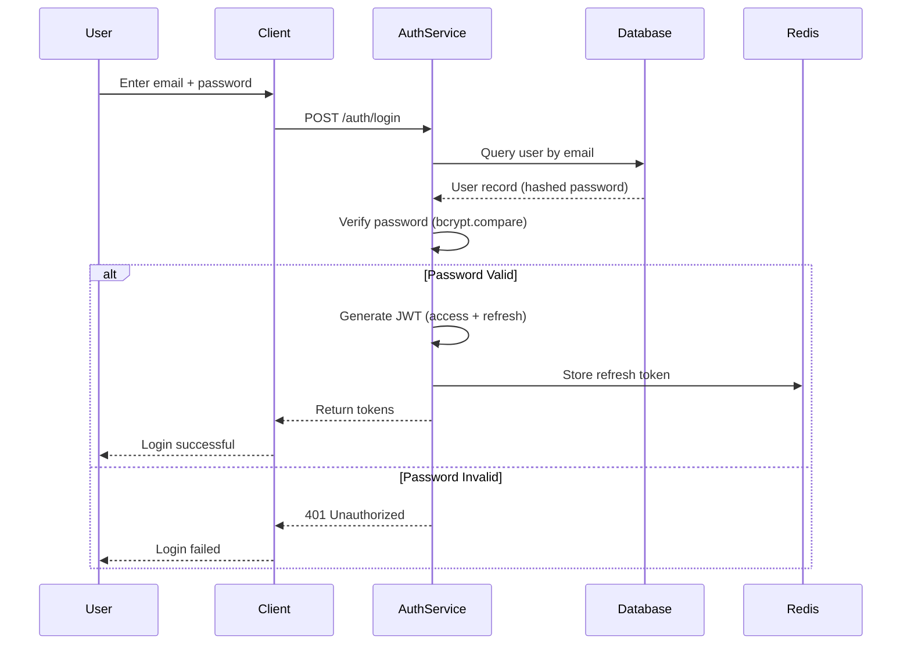
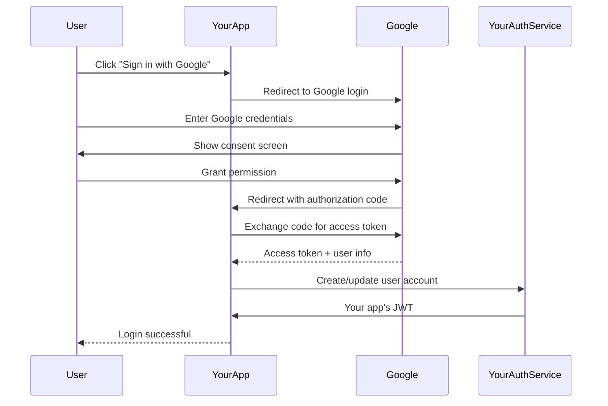
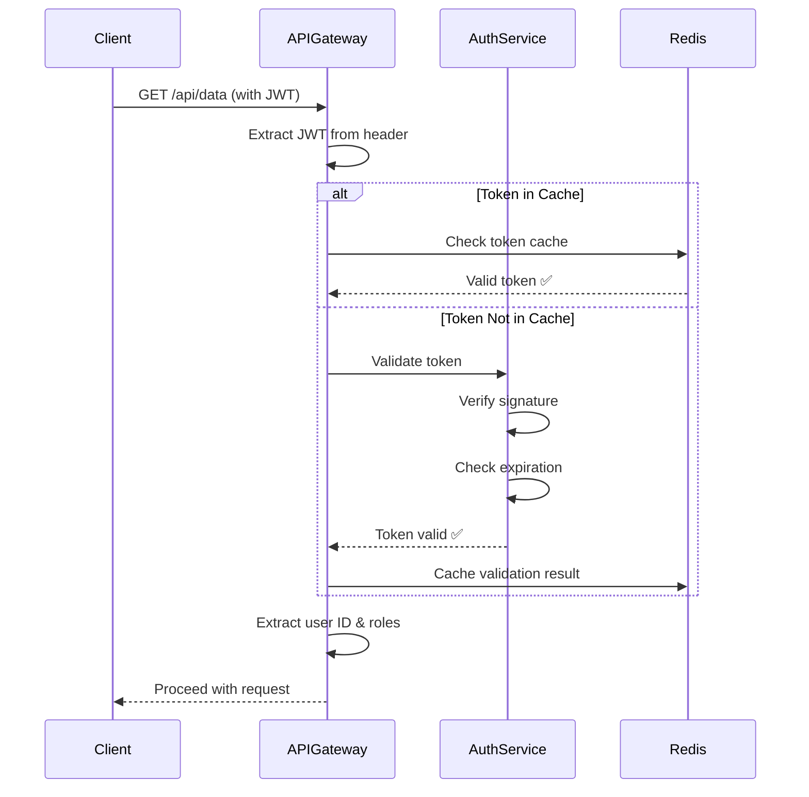

# Authentication & Authorization System Design

**Difficulty Level:** ⭐⭐⭐⭐ Very Hard  
**Tags:** `Security`, `Identity Management`, `OAuth 2.0`, `JWT`, `SSO`, `Distributed Systems`, `Encryption`, `Access Control`, `Multi-Factor Authentication`, `SAML`

**File Purpose:** Interactive, multi-level learning resource for designing an enterprise-grade Authentication and Authorization system. This instructional guide takes you from beginner concepts to advanced production considerations, teaching you how to build a system that handles 10M+ users, processes 100K authentication requests per second, supports multiple protocols (OAuth 2.0, SAML, OIDC), achieves 99.99% availability, and maintains <50ms token validation latency.

**Author:** System Design Documentation  
**Created:** January 22, 2026  
**Last Updated:** January 22, 2026  
**Recent Updates:** Initial creation with comprehensive authentication and authorization patterns

---

## 🎓 Welcome to Authentication & Authorization System Design!

### What You're Going to Build

Imagine creating the security backbone for a major enterprise like Okta, Auth0, or AWS Cognito - a service that securely verifies who users are (authentication) and what they're allowed to do (authorization). 

By the end of this learning journey, you'll understand how to design a production-grade authentication and authorization system that:
- Handles millions of users across multiple applications
- Supports modern protocols like OAuth 2.0, SAML, and OpenID Connect
- Validates tokens in under 50 milliseconds
- Implements multi-factor authentication (MFA) for enhanced security
- Provides Single Sign-On (SSO) across multiple applications
- Scales globally across multiple data centers
- Stays available 99.99% of the time (that's only 52 minutes of downtime per year!)
- Protects against common security threats (brute force, token theft, session hijacking)

### 📚 Your Learning Path

This course is designed for three different learning levels. You can progress through all levels or focus on the one that matches your current needs:

```text
🟢 BEGINNER LEVEL (6-8 hours)
├─ Learn fundamental security concepts
├─ Understand authentication vs authorization
├─ Build intuition with everyday analogies
└─ Perfect for: New to security and system design

🟡 INTERMEDIATE LEVEL (8-10 hours)  
├─ Master OAuth 2.0, JWT, and SAML protocols
├─ Learn authorization models (RBAC, ABAC)
├─ Practice common interview questions
└─ Perfect for: Preparing for FAANG interviews

🔴 ADVANCED LEVEL (10-15 hours)
├─ Production security considerations
├─ Token management at scale
├─ Handle edge cases and security threats
└─ Perfect for: Senior engineers and security architects
```

### 🎯 Prerequisites

**For Beginners:**
- Basic understanding of HTTP and web requests
- Familiarity with usernames and passwords
- Understanding of what an API is
- No prior security experience needed!

**For Intermediate:**
- Comfortable with REST APIs and HTTP headers
- Understanding of cryptography basics (hashing, encryption)
- Familiarity with tokens and sessions
- Basic knowledge of distributed systems

**For Advanced:**
- Experience building secure systems
- Knowledge of cryptographic protocols
- Understanding of distributed systems and consistency models
- Familiarity with compliance standards (GDPR, SOC 2, ISO 27001)

### 📊 What Makes This Learning Experience Unique

Each section follows a proven learning pattern:
1. **What You'll Learn** - Clear learning objectives
2. **Why This Matters** - Real-world security context
3. **Multi-Level Content** - Tailored explanations for your level
4. **Real-World Examples** - How Auth0, Okta, and AWS Cognito actually do it
5. **Security Considerations** - Common vulnerabilities and how to prevent them
6. **Think About It** - Questions to deepen understanding
7. **Key Takeaways** - Summary of main points
8. **Practice Exercise** - Hands-on security challenges

💡 **Pro Tip:** Security is critical! Don't skip the "Security Considerations" sections - they cover vulnerabilities that can lead to major breaches!

---

## TABLE OF CONTENTS

- [Section 1: Understanding What We're Building](#section-1-understanding-what-were-building)
- [Section 2: Planning for Scale](#section-2-planning-for-scale)
- [Section 3: Designing the System Architecture](#section-3-designing-the-system-architecture)
- [Section 4: Authentication Protocols Deep Dive](#section-4-authentication-protocols-deep-dive)
- [Section 5: Authorization Models](#section-5-authorization-models)
- [Section 6: How Users Interact (API Design)](#section-6-how-users-interact-api-design)
- [Section 7: Storing Our Data](#section-7-storing-our-data)
- [Section 8: Token Management & Session Handling](#section-8-token-management--session-handling)
- [Section 9: Multi-Factor Authentication (MFA)](#section-9-multi-factor-authentication-mfa)
- [Section 10: Single Sign-On & Identity Federation](#section-10-single-sign-on--identity-federation)
- [Section 11: Growing the System (Scalability)](#section-11-growing-the-system-scalability)
- [Section 12: Protecting the System (Security)](#section-12-protecting-the-system-security)
- [Section 13: Keeping It Healthy (Monitoring)](#section-13-keeping-it-healthy-monitoring)
- [Section 14: Making Design Decisions](#section-14-making-design-decisions)
- [Putting It All Together](#putting-it-all-together)
- [Next Steps](#next-steps)

---

## Section 1: Understanding What We're Building

### What You'll Learn

By the end of this section, you'll be able to:
- Explain the difference between authentication (who you are) and authorization (what you can do)
- Define functional requirements for an authentication system
- Identify non-functional requirements (security, performance, availability)
- Understand common authentication flows (password-based, OAuth 2.0, SAML)
- Ask the right clarifying questions in a security system design interview
- Recognize threat models and security vulnerabilities

### Why This Matters

Authentication and authorization are the foundation of every secure application. Get it wrong, and you risk data breaches, account takeovers, and regulatory fines. Real-world example: Okta processes over 15,000 authentication requests per second for companies like FedEx, Slack, and T-Mobile. Understanding these fundamentals shapes how you design secure, scalable identity systems.

---

### 🟢 For Beginners: The Fundamentals

#### What is Authentication vs Authorization?

Think of going to a members-only club:

**Authentication (Who are you?):**
- You show your ID at the door
- The bouncer verifies "This is really John Smith"
- This proves your identity

**Authorization (What can you do?):**
- Your membership card shows you're a "VIP member"
- The bouncer checks what areas you can access
- VIP members get rooftop access, regular members don't
- This determines your permissions

**Real-World Example:**
```text
Logging into Facebook:
├─ Authentication: You enter email + password → Facebook verifies it's you
└─ Authorization: Facebook checks what you can do:
    ├─ Can post to your timeline? ✅ Yes
    ├─ Can delete someone else's post? ❌ No
    └─ Can access admin panel? ❌ No (unless you're a Facebook employee)
```

**Key Difference:**
- **Authentication** = Proving who you are (like showing your driver's license)
- **Authorization** = Checking what you're allowed to do (like having a backstage pass)

#### Why Do We Need a Dedicated Authentication System?

Let's explore the problems they solve:

1. **Security at Scale**:
   - Imagine if every app (Gmail, YouTube, Google Drive) had its own login
   - You'd have 50+ passwords to remember
   - Each app would need to implement security from scratch
   - One vulnerability would only affect that app

   **Better approach:** Central authentication system (like Google Account)
   - One secure login for all apps
   - Security experts focus on one system
   - Fix a vulnerability once, all apps benefit

2. **User Experience**:
   - ❌ Bad: Login to Gmail, login to Google Drive, login to YouTube
   - ✅ Good: Login once, access everything (Single Sign-On)

3. **Compliance & Auditing**:
   - Regulations require tracking who accessed what and when
   - Centralized logging makes audits easier
   - Example: HIPAA requires detailed access logs for healthcare data

4. **Advanced Security Features**:
   - Multi-Factor Authentication (MFA)
   - Biometric authentication
   - Adaptive authentication (detecting suspicious logins)
   - Rate limiting and brute force protection

#### Core Features: What Should It Do?

Let's think about what users and applications need:

**Core Features (MVP - Minimum Viable Product):**

1. **User Registration**
   - User provides: email, password, name
   - System: Creates account, sends verification email
   - Security: Hash password (never store plaintext!)
   - Time: <500ms

2. **User Login (Authentication)**
   - User provides: email + password
   - System verifies credentials
   - System returns: Access token (like a temporary pass)
   - Time: <200ms
   - Security: Lock account after 5 failed attempts

3. **Token Validation**
   - Application asks: "Is this token valid?"
   - System checks: Token exists, not expired, not revoked
   - Time: <50ms (happens on every API call!)
   - This is the most frequent operation

4. **Password Management**
   - Reset forgotten password via email
   - Change password when logged in
   - Password strength requirements
   - Password history (can't reuse last 5 passwords)

5. **Logout**
   - Invalidate user's token
   - Clear session data
   - Immediate effect across all devices

**Nice-to-Have Features (Future):**

- Multi-Factor Authentication (SMS, authenticator apps)
- Social login (Sign in with Google, Facebook)
- Single Sign-On (SSO) across multiple apps
- Biometric authentication (fingerprint, face ID)
- Session management (see all logged-in devices)
- Risk-based authentication (detect suspicious logins)

💡 **Pro Tip:** In security interviews, always mention encryption, hashing, and secure storage. Never say "store the password" - always say "hash the password with bcrypt/Argon2!"

#### Common Authentication Methods

Let's understand different ways users can prove their identity:

**1. Password-Based (Most Common)**
```text
Flow:
User → Enters email + password
     → Server hashes password
     → Compares with stored hash
     → Returns token if match

Pros: Simple, everyone understands it
Cons: Passwords are weak (people reuse them)
Security: MUST use strong hashing (bcrypt, Argon2)
```

**2. Multi-Factor Authentication (MFA)**
```text
Something you know (password)
+ Something you have (phone, security key)
= Much more secure!

Example:
1. Enter password ✅
2. System sends code to your phone
3. Enter code from phone ✅
4. Login successful

Why it works: Even if attacker steals your password,
               they don't have your phone!
```

**3. Biometric**
```text
Examples: Fingerprint, Face ID, retina scan

Pros: 
├─ Can't forget your fingerprint
├─ Hard to steal
└─ Great user experience

Cons:
├─ Expensive hardware required
├─ Privacy concerns
└─ Can't change your fingerprint if compromised
```

**4. Social Login (OAuth 2.0)**
```text
"Sign in with Google" button

Flow:
1. User clicks "Sign in with Google"
2. Redirect to Google's login page
3. User logs in to Google (not your app!)
4. Google sends you token proving user identity
5. Your app trusts Google's authentication

Benefits:
├─ No password management for you
├─ User doesn't create another account
└─ Leverages Google's security team
```

---

### 🟡 For Intermediate: Interview Patterns

#### Functional vs Non-Functional Requirements

When you're in a system design interview, you need to translate "we need authentication" into concrete technical requirements. Here's the framework:

**Functional Requirements** (What the system DOES):

| Requirement | Description | Interview Tip |
|------------|-------------|---------------|
| User Registration | Create new account with email/password | Ask: Email verification required? |
| User Login | Authenticate with credentials | Ask: Session-based or token-based? |
| Token Generation | Create JWT or session token | Clarify: Token expiration time? |
| Token Validation | Verify token on each request | Ask: Stateful or stateless validation? |
| Token Refresh | Get new token without re-login | Clarify: Refresh token rotation? |
| Password Reset | Reset via email/SMS | Ask: Token expiration for reset links? |
| Multi-Factor Auth | SMS, TOTP, hardware keys | Clarify: Required or optional? |
| Single Sign-On | Access multiple apps with one login | Ask: SAML or OAuth 2.0? |
| Role Management | Assign permissions to users | Clarify: RBAC or ABAC model? |
| Session Management | Track active sessions | Ask: Concurrent sessions allowed? |
| Audit Logging | Track all authentication events | Clarify: Retention period? |

**Non-Functional Requirements** (How WELL it does it):

```text
Security (Highest Priority):
├─ Password Hashing: bcrypt (cost factor 12) or Argon2
├─ Token Signing: RSA-256 or HMAC-SHA256
├─ Encryption in Transit: TLS 1.3
├─ Encryption at Rest: AES-256
├─ Protection: Rate limiting, brute force detection
└─ Compliance: GDPR, SOC 2, ISO 27001, HIPAA

Performance:
├─ Login: <200ms (P99)
│  └─ Why? Users expect instant feedback
│  └─ Interview insight: Cache user data in Redis
│
├─ Token Validation: <50ms (P99)
│  └─ Why? Happens on EVERY API call
│  └─ Interview insight: Use stateless JWT or cache
│
└─ Token Generation: <100ms
   └─ Why? Infrequent operation, can be slower

Availability: 99.99% uptime
└─ Why? If auth is down, ALL apps are down
└─ Interview insight: Multi-region, active-active

Scalability:
├─ 10M users
├─ 100K authentication requests per second
├─ 1M token validations per second
└─ Interview insight: Read-heavy (validations >> logins)

Durability:
└─ Zero data loss - audit logs are critical
└─ Interview insight: Replicate to multiple regions

Compliance:
├─ GDPR: Right to be forgotten, data portability
├─ SOC 2: Audit trails, access controls
├─ ISO 27001: Information security management
└─ PCI DSS (if handling payments): Strict requirements
```

#### The Clarifying Questions Framework

Great security engineers ask clarifying questions. Here's your interview script:

**Phase 1: Understand the Use Case**
- "Are we building authentication for a single app or multiple apps (SSO)?"
- "Is this for internal employees or external customers?"
- "What's the expected number of users and authentication requests?"

**Phase 2: Understand Authentication Methods**
- "Should we support password-based authentication, or also social login?"
- "Is Multi-Factor Authentication required or optional?"
- "Do we need to support legacy systems (SAML, LDAP)?"

**Phase 3: Understand Security Requirements**
- "What compliance standards do we need to meet (GDPR, SOC 2, HIPAA)?"
- "What's the token lifetime? (Short-lived access tokens + long-lived refresh tokens?)"
- "How do we handle compromised tokens?"

**Phase 4: Understand Authorization**
- "Do we need fine-grained permissions (ABAC) or simple roles (RBAC)?"
- "How many roles/permissions do we expect?"
- "Do permissions change frequently?"

**Phase 5: Understand Performance**
- "What's our latency target for token validation?"
- "Can we use stateless tokens (JWT) or need stateful sessions?"
- "What's our availability target (99.9% vs 99.99%)?"

⚠️ **Common Mistake:** Don't jump into OAuth 2.0 immediately. First understand if you need SSO, third-party login, or just basic authentication. OAuth 2.0 is complex - only use it when needed!

#### Making Assumptions Explicit

After asking questions, state your assumptions clearly:

```text
"Based on our discussion, I'm going to assume:

✅ Authentication Method: Password-based + MFA (optional)
   → This covers 90% of use cases
   → MFA is opt-in for users who want extra security

✅ Token Strategy: JWT (JSON Web Tokens)
   → Access token: 15-minute expiration
   → Refresh token: 30-day expiration
   → Stateless validation (no database lookup needed)

✅ Scale: 10M users, 100K auth requests/sec
   → Read-heavy workload (validations >> logins)
   → Optimize for token validation speed

✅ Authorization Model: RBAC (Role-Based Access Control)
   → Roles: Admin, Manager, User
   → Permissions embedded in JWT claims
   → Simpler than ABAC, covers most use cases

✅ Security Standards: SOC 2 compliant
   → Audit logging required
   → Encryption at rest and in transit
   → Password hashing with bcrypt (cost 12)

✅ High Availability: 99.99% uptime
   → Multi-region deployment
   → Active-active for reads, active-passive for writes

✅ User Experience: Single Sign-On within our ecosystem
   → One login, access multiple apps
   → Session sharing via shared Redis

Are these assumptions reasonable?"
```

This shows structured thinking and invites course correction early!

#### Authentication Flow Examples

Let's visualize the most common flows:

**Flow 1: Password-Based Login**



**Flow 2: OAuth 2.0 (Social Login)**



**Flow 3: Token Validation (Every API Request)**



---

### 🔴 For Advanced: Production Considerations

#### Security Architecture Principles

When designing authentication at scale, follow these principles:

**Principle 1: Defense in Depth (Multiple Security Layers)**

```text
Layer 1: Network Security
├─ DDoS protection (Cloudflare, AWS Shield)
├─ WAF (Web Application Firewall)
└─ Rate limiting at edge

Layer 2: Application Security
├─ Input validation
├─ SQL injection prevention
├─ XSS protection
└─ CSRF tokens

Layer 3: Authentication Security
├─ Strong password hashing (Argon2)
├─ Account lockout after failed attempts
├─ MFA for sensitive operations
└─ Anomaly detection

Layer 4: Data Security
├─ Encryption at rest (AES-256)
├─ Encryption in transit (TLS 1.3)
├─ Key rotation (every 90 days)
└─ Secrets management (HashiCorp Vault)

Layer 5: Monitoring & Response
├─ Real-time alerting
├─ Audit logging
├─ Incident response plan
└─ Security information and event management (SIEM)
```

**Principle 2: Least Privilege**

```text
Concept: Users/services should have minimum permissions needed

Implementation:
├─ Default: Deny all access
├─ Explicit: Grant specific permissions
├─ Time-bound: Temporary elevated access
└─ Regular audits: Remove unused permissions

Example:
❌ Bad: All developers have production database access
✅ Good: Developers request temporary access (expires in 4 hours)
         Access request logged and reviewed
```

**Principle 3: Zero Trust Architecture**

```text
Traditional: Trust internal network, protect perimeter
Zero Trust: Never trust, always verify

Implementation:
├─ Authenticate every request (even internal)
├─ Verify device health (is laptop patched?)
├─ Check user context (normal behavior?)
├─ Minimal access (just-in-time permissions)
└─ Continuous monitoring

Example: Google's BeyondCorp
├─ No VPN needed
├─ Every request authenticated
├─ Device must be corporate-managed
└─ Works from anywhere securely
```

#### Compliance & Regulatory Requirements

Real-world authentication systems must comply with regulations:

**GDPR (EU Data Protection):**

```text
Requirements:
├─ Right to Access: Users can download all their data
├─ Right to be Forgotten: Delete user data on request
├─ Data Minimization: Only collect necessary data
├─ Consent Management: Clear opt-in for data processing
├─ Breach Notification: Report breaches within 72 hours
└─ Data Portability: Export data in machine-readable format

Implementation Impact:
├─ User data export API endpoint
├─ Soft delete with grace period
├─ Audit log of all data access
├─ Geo-fencing (EU data stays in EU)
└─ Cookie consent management

Penalties: Up to €20M or 4% of global revenue
```

**SOC 2 (Security Controls):**

```text
Trust Service Criteria:
├─ Security: Access controls, encryption
├─ Availability: 99.9% uptime SLA
├─ Processing Integrity: Complete, accurate processing
├─ Confidentiality: Protect confidential data
└─ Privacy: Notice, choice, collection, access

Authentication-Specific Controls:
├─ MFA for all employees
├─ Password complexity requirements
├─ Session timeout (15 minutes idle)
├─ Audit logs retained for 1 year
├─ Quarterly access reviews
├─ Penetration testing annually
└─ Incident response plan tested

Audit Process: External auditor reviews controls annually
```

**ISO 27001 (Information Security Management):**

```text
Key Requirements:
├─ Risk Assessment: Identify threats, vulnerabilities
├─ Security Policies: Documented procedures
├─ Access Control: Authentication and authorization
├─ Cryptography: Encryption standards
├─ Incident Management: Detection and response
└─ Compliance: Regular audits

Authentication Controls:
├─ Password policy (minimum length, complexity)
├─ Account lockout policy
├─ Privileged access management
├─ Segregation of duties
└─ Security awareness training
```

**HIPAA (Healthcare Data):**

```text
If handling healthcare data:
├─ Access Control: Unique user IDs, emergency access
├─ Audit Controls: Log all access to PHI
├─ Integrity: Protect data from unauthorized changes
├─ Transmission Security: Encrypt data in transit
└─ Person Authentication: Verify user identity

Implementation:
├─ Role-based access to patient data
├─ Audit log: Who accessed which patient record, when
├─ Automatic logoff after 10 minutes
├─ Encrypt all databases containing PHI
└─ BAA (Business Associate Agreement) with vendors

Penalties: $100 - $50,000 per violation
```

#### Threat Modeling & Security Considerations

**Common Attack Vectors:**

1. **Brute Force Attacks**
```text
Threat: Attacker tries many passwords
Defense:
├─ Rate limiting (5 attempts per minute)
├─ Account lockout (after 5 failures, lock for 30 min)
├─ CAPTCHA (after 3 failures)
├─ Progressive delays (1s, 2s, 4s, 8s...)
└─ IP-based blocking (100 failures → block IP)
```

2. **Credential Stuffing**
```text
Threat: Attacker uses leaked passwords from other sites
Defense:
├─ Check against known breach databases (HaveIBeenPwned)
├─ Require password change if credential found in breach
├─ Anomaly detection (login from new location)
├─ Device fingerprinting
└─ MFA requirement for suspicious logins
```

3. **Session Hijacking**
```text
Threat: Attacker steals user's session token
Defense:
├─ Short-lived tokens (15 min access, 30 day refresh)
├─ Secure cookie flags (HttpOnly, Secure, SameSite)
├─ Token binding to IP/device
├─ Refresh token rotation (one-time use)
└─ Token revocation on logout
```

4. **Phishing & Social Engineering**
```text
Threat: Trick user into revealing credentials
Defense:
├─ Email verification for new devices
├─ Anomaly detection (new location, device)
├─ Security keys (FIDO2 - phishing-resistant)
├─ User education (security awareness training)
└─ Risk-based authentication (challenge on suspicious login)
```

5. **Token Theft**
```text
Threat: Attacker intercepts or steals JWT
Defense:
├─ Always use HTTPS (TLS 1.3)
├─ Short token lifetime (15 minutes)
├─ Token refresh flow
├─ Store tokens securely (HttpOnly cookies, not localStorage)
├─ Token introspection endpoint
└─ Real-time token revocation
```

#### Advanced Security Patterns

**Pattern 1: Adaptive Authentication**

```text
Concept: Adjust security based on risk level

Risk Factors:
├─ New device? +10 risk points
├─ New location? +15 risk points
├─ Failed login attempts recently? +20 risk points
├─ VPN/Tor usage? +25 risk points
└─ Impossible travel (US → China in 1 hour)? +50 risk points

Risk Score → Actions:
├─ 0-20: Normal login
├─ 21-40: Require email verification code
├─ 41-60: Require MFA
├─ 61-80: Require security questions + MFA
└─ 81-100: Block login, require manual review

Real-world: AWS uses this for console logins
```

**Pattern 2: Passwordless Authentication**

```text
Methods:
├─ Magic Links: Email a one-time login link
├─ WebAuthn: FIDO2 security keys
├─ Push Notifications: Approve login on your phone
└─ Biometrics: Fingerprint, Face ID

Benefits:
├─ No passwords to forget or steal
├─ Phishing-resistant (WebAuthn)
├─ Better user experience
└─ No password database to breach

Challenges:
├─ Fallback for lost device
├─ User adoption
└─ Device compatibility

Example: Slack uses magic links for login
```

**Pattern 3: Continuous Authentication**

```text
Traditional: Authenticate once, trust for session
Continuous: Constantly verify user behavior

Signals:
├─ Typing patterns (biometric behavior)
├─ Mouse movement patterns
├─ Navigation patterns (how user browses)
├─ Time-of-day patterns
└─ Device sensor data

Action on Anomaly:
├─ Mild: Increase monitoring
├─ Moderate: Require re-authentication
├─ Severe: Terminate session, alert security team

Use Cases:
├─ Financial trading platforms
├─ Healthcare systems
└─ Government systems
```

---

### Real-World Example: How Auth0 Evolved

Let's look at how Auth0 made architectural decisions:

**2013 - Launch (Developer Focus):**
```text
Core Need: Developers need easy authentication
├─ Feature: OAuth 2.0 + Social login
├─ Scale: Thousands of developers
├─ Decision: Developer experience first
└─ Result: Rapid adoption, 1000+ customers in 6 months
```

**2015 - Enterprise Push:**
```text
Customer Feedback: "We need SAML for enterprise SSO"
├─ Added: SAML 2.0 support
├─ Added: Active Directory integration
├─ Added: Audit logs for compliance
├─ Decision: Build enterprise features
└─ Result: Fortune 500 customers (Mazda, AMD)
```

**2018 - Security Hardening:**
```text
Market Trend: Increased breaches and regulations
├─ Added: Anomaly detection (ML-based)
├─ Added: Breached password detection
├─ Added: MFA enforcement policies
├─ Added: GDPR compliance features
├─ Decision: Security as competitive advantage
└─ Result: SOC 2 Type II certified
```

**2021 - Passwordless Future:**
```text
User Expectation: Easier, more secure authentication
├─ Added: WebAuthn/FIDO2 support
├─ Added: Biometric authentication
├─ Added: Passwordless SMS/Email
├─ Decision: Leading edge of authentication
└─ Result: 1.5B logins per month processed
```

📊 **By The Numbers:**
- 2013: 100 authentication requests/sec
- 2018: 10,000 requests/sec
- 2023: 100,000 requests/sec
- 2024: 15,000+ enterprise customers

Key Lesson: Started simple (OAuth), added complexity based on customer needs (SAML, MFA, passwordless), not guessing upfront!

---

### 🤔 Think About It

1. **For Beginners:** Why do you think we use "hashing" for passwords instead of "encryption"? What's the difference, and why does it matter? (Hint: Think about whether you need to "decrypt" a password)

2. **For Intermediate:** If you had to choose between session-based authentication (server stores session) vs token-based authentication (JWT), which would you choose for:
   - A banking app?
   - A mobile app?
   - A microservices architecture?
   Why?

3. **For Advanced:** How would your authentication design change if you were building for:
   - A government agency (Top Secret clearance)?
   - A healthcare provider (HIPAA compliance)?
   - A cryptocurrency exchange (high-value targets)?
   What specific security measures would you add?

---

### ✅ Key Takeaways

- **Authentication vs Authorization**: Authentication proves who you are (ID check), authorization determines what you can do (access level)
- **Security is paramount**: Hash passwords with bcrypt/Argon2, use HTTPS, implement rate limiting, enable MFA
- **Token strategy matters**: Short-lived access tokens (15 min) + long-lived refresh tokens (30 days) = security + UX
- **Compliance is non-negotiable**: GDPR, SOC 2, ISO 27001, HIPAA have specific requirements you must meet
- **Defense in depth**: Multiple security layers (network, application, authentication, data, monitoring)
- **Performance targets**: <50ms token validation (happens on every request), <200ms login
- **Scale considerations**: 10M users, 100K auth requests/sec, 1M validations/sec
- **Threat modeling**: Understand attack vectors (brute force, credential stuffing, session hijacking) and mitigate them

---

### 🎯 Practice Exercise

**Scenario:** You're designing an authentication system for a healthcare startup. They need to comply with HIPAA and handle patient data access for doctors, nurses, and patients.

**Your Task:**
1. List 5 functional requirements specific to healthcare authentication
2. List 5 non-functional requirements with HIPAA justifications
3. What clarifying questions would you ask the healthcare team?
4. Design a role hierarchy (doctors, nurses, patients) with permissions
5. What additional security measures would you implement beyond basic authentication?
6. How would you handle emergency access (doctor needs patient data urgently)?

**Think about:**
- Audit logging requirements
- Session timeout policies
- Access control granularity (which nurse can access which patient?)
- Compliance reporting
- Break-glass procedures (emergency access)

---
