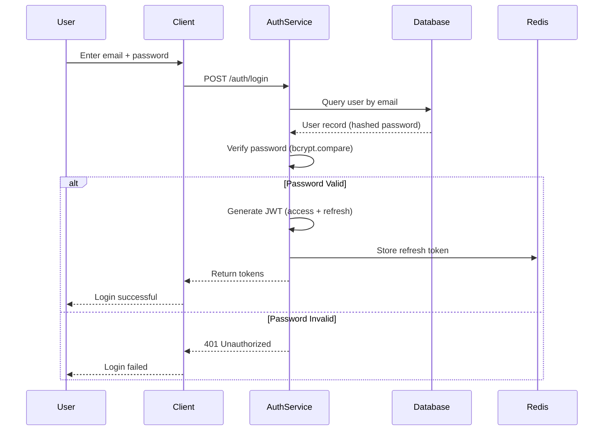
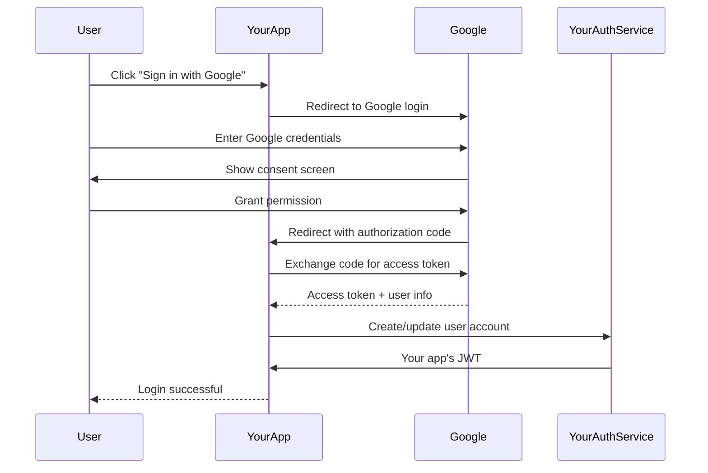
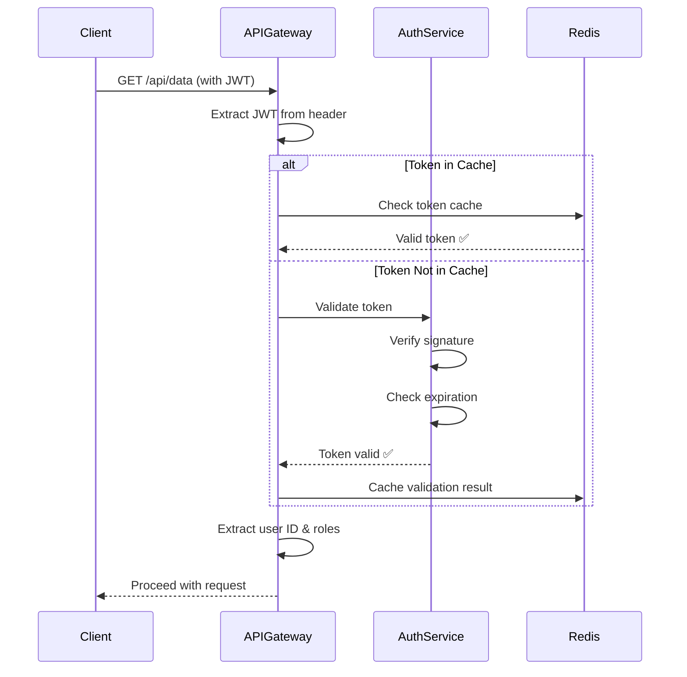

# Authentication & Authorization System Design

**Difficulty Level:** ⭐⭐⭐⭐ Very Hard  
**Tags:** `Security`, `Identity Management`, `OAuth 2.0`, `JWT`, `SSO`, `Distributed Systems`, `Encryption`, `Access Control`, `Multi-Factor Authentication`, `SAML`

**File Purpose:** Interactive, multi-level learning resource for designing an enterprise-grade Authentication and Authorization system. This instructional guide takes you from beginner concepts to advanced production considerations, teaching you how to build a system that handles 10M+ users, processes 100K authentication requests per second, supports multiple protocols (OAuth 2.0, SAML, OIDC), achieves 99.99% availability, and maintains <50ms token validation latency.

**Author:** System Design Documentation  
**Created:** January 22, 2026  
**Last Updated:** January 22, 2026  
**Recent Updates:** Initial creation with comprehensive authentication and authorization patterns

---

## 🎓 Welcome to Authentication & Authorization System Design!

### What You're Going to Build

Imagine creating the security backbone for a major enterprise like Okta, Auth0, or AWS Cognito - a service that securely verifies who users are (authentication) and what they're allowed to do (authorization). 

By the end of this learning journey, you'll understand how to design a production-grade authentication and authorization system that:
- Handles millions of users across multiple applications
- Supports modern protocols like OAuth 2.0, SAML, and OpenID Connect
- Validates tokens in under 50 milliseconds
- Implements multi-factor authentication (MFA) for enhanced security
- Provides Single Sign-On (SSO) across multiple applications
- Scales globally across multiple data centers
- Stays available 99.99% of the time (that's only 52 minutes of downtime per year!)
- Protects against common security threats (brute force, token theft, session hijacking)

### 📚 Your Learning Path

This course is designed for three different learning levels. You can progress through all levels or focus on the one that matches your current needs:

```text
🟢 BEGINNER LEVEL (6-8 hours)
├─ Learn fundamental security concepts
├─ Understand authentication vs authorization
├─ Build intuition with everyday analogies
└─ Perfect for: New to security and system design

🟡 INTERMEDIATE LEVEL (8-10 hours)  
├─ Master OAuth 2.0, JWT, and SAML protocols
├─ Learn authorization models (RBAC, ABAC)
├─ Practice common interview questions
└─ Perfect for: Preparing for FAANG interviews

🔴 ADVANCED LEVEL (10-15 hours)
├─ Production security considerations
├─ Token management at scale
├─ Handle edge cases and security threats
└─ Perfect for: Senior engineers and security architects
```

### 🎯 Prerequisites

**For Beginners:**
- Basic understanding of HTTP and web requests
- Familiarity with usernames and passwords
- Understanding of what an API is
- No prior security experience needed!

**For Intermediate:**
- Comfortable with REST APIs and HTTP headers
- Understanding of cryptography basics (hashing, encryption)
- Familiarity with tokens and sessions
- Basic knowledge of distributed systems

**For Advanced:**
- Experience building secure systems
- Knowledge of cryptographic protocols
- Understanding of distributed systems and consistency models
- Familiarity with compliance standards (GDPR, SOC 2, ISO 27001)

### 📊 What Makes This Learning Experience Unique

Each section follows a proven learning pattern:
1. **What You'll Learn** - Clear learning objectives
2. **Why This Matters** - Real-world security context
3. **Multi-Level Content** - Tailored explanations for your level
4. **Real-World Examples** - How Auth0, Okta, and AWS Cognito actually do it
5. **Security Considerations** - Common vulnerabilities and how to prevent them
6. **Think About It** - Questions to deepen understanding
7. **Key Takeaways** - Summary of main points
8. **Practice Exercise** - Hands-on security challenges

💡 **Pro Tip:** Security is critical! Don't skip the "Security Considerations" sections - they cover vulnerabilities that can lead to major breaches!

---

## TABLE OF CONTENTS

- [Section 1: Understanding What We're Building](#section-1-understanding-what-were-building)
- [Section 2: Planning for Scale](#section-2-planning-for-scale)
- [Section 3: Designing the System Architecture](#section-3-designing-the-system-architecture)
- [Section 4: Authentication Protocols Deep Dive](#section-4-authentication-protocols-deep-dive)
- [Section 5: Authorization Models](#section-5-authorization-models)
- [Section 6: How Users Interact (API Design)](#section-6-how-users-interact-api-design)
- [Section 7: Storing Our Data](#section-7-storing-our-data)
- [Section 8: Token Management & Session Handling](#section-8-token-management--session-handling)
- [Section 9: Multi-Factor Authentication (MFA)](#section-9-multi-factor-authentication-mfa)
- [Section 10: Single Sign-On & Identity Federation](#section-10-single-sign-on--identity-federation)
- [Section 11: Growing the System (Scalability)](#section-11-growing-the-system-scalability)
- [Section 12: Protecting the System (Security)](#section-12-protecting-the-system-security)
- [Section 13: Keeping It Healthy (Monitoring)](#section-13-keeping-it-healthy-monitoring)
- [Section 14: Making Design Decisions](#section-14-making-design-decisions)
- [Putting It All Together](#putting-it-all-together)
- [Next Steps](#next-steps)

---

## Section 1: Understanding What We're Building

### What You'll Learn

By the end of this section, you'll be able to:
- Explain the difference between authentication (who you are) and authorization (what you can do)
- Define functional requirements for an authentication system
- Identify non-functional requirements (security, performance, availability)
- Understand common authentication flows (password-based, OAuth 2.0, SAML)
- Ask the right clarifying questions in a security system design interview
- Recognize threat models and security vulnerabilities

### Why This Matters

Authentication and authorization are the foundation of every secure application. Get it wrong, and you risk data breaches, account takeovers, and regulatory fines. Real-world example: Okta processes over 15,000 authentication requests per second for companies like FedEx, Slack, and T-Mobile. Understanding these fundamentals shapes how you design secure, scalable identity systems.

---

### 🟢 For Beginners: The Fundamentals

#### What is Authentication vs Authorization?

Think of going to a members-only club:

**Authentication (Who are you?):**
- You show your ID at the door
- The bouncer verifies "This is really John Smith"
- This proves your identity

**Authorization (What can you do?):**
- Your membership card shows you're a "VIP member"
- The bouncer checks what areas you can access
- VIP members get rooftop access, regular members don't
- This determines your permissions

**Real-World Example:**
```text
Logging into Facebook:
├─ Authentication: You enter email + password → Facebook verifies it's you
└─ Authorization: Facebook checks what you can do:
    ├─ Can post to your timeline? ✅ Yes
    ├─ Can delete someone else's post? ❌ No
    └─ Can access admin panel? ❌ No (unless you're a Facebook employee)
```

**Key Difference:**
- **Authentication** = Proving who you are (like showing your driver's license)
- **Authorization** = Checking what you're allowed to do (like having a backstage pass)

#### Why Do We Need a Dedicated Authentication System?

Let's explore the problems they solve:

1. **Security at Scale**:
   - Imagine if every app (Gmail, YouTube, Google Drive) had its own login
   - You'd have 50+ passwords to remember
   - Each app would need to implement security from scratch
   - One vulnerability would only affect that app

   **Better approach:** Central authentication system (like Google Account)
   - One secure login for all apps
   - Security experts focus on one system
   - Fix a vulnerability once, all apps benefit

2. **User Experience**:
   - ❌ Bad: Login to Gmail, login to Google Drive, login to YouTube
   - ✅ Good: Login once, access everything (Single Sign-On)

3. **Compliance & Auditing**:
   - Regulations require tracking who accessed what and when
   - Centralized logging makes audits easier
   - Example: HIPAA requires detailed access logs for healthcare data

4. **Advanced Security Features**:
   - Multi-Factor Authentication (MFA)
   - Biometric authentication
   - Adaptive authentication (detecting suspicious logins)
   - Rate limiting and brute force protection

#### Core Features: What Should It Do?

Let's think about what users and applications need:

**Core Features (MVP - Minimum Viable Product):**

1. **User Registration**
   - User provides: email, password, name
   - System: Creates account, sends verification email
   - Security: Hash password (never store plaintext!)
   - Time: <500ms

2. **User Login (Authentication)**
   - User provides: email + password
   - System verifies credentials
   - System returns: Access token (like a temporary pass)
   - Time: <200ms
   - Security: Lock account after 5 failed attempts

3. **Token Validation**
   - Application asks: "Is this token valid?"
   - System checks: Token exists, not expired, not revoked
   - Time: <50ms (happens on every API call!)
   - This is the most frequent operation

4. **Password Management**
   - Reset forgotten password via email
   - Change password when logged in
   - Password strength requirements
   - Password history (can't reuse last 5 passwords)

5. **Logout**
   - Invalidate user's token
   - Clear session data
   - Immediate effect across all devices

**Nice-to-Have Features (Future):**

- Multi-Factor Authentication (SMS, authenticator apps)
- Social login (Sign in with Google, Facebook)
- Single Sign-On (SSO) across multiple apps
- Biometric authentication (fingerprint, face ID)
- Session management (see all logged-in devices)
- Risk-based authentication (detect suspicious logins)

💡 **Pro Tip:** In security interviews, always mention encryption, hashing, and secure storage. Never say "store the password" - always say "hash the password with bcrypt/Argon2!"

#### Common Authentication Methods

Let's understand different ways users can prove their identity:

**1. Password-Based (Most Common)**
```text
Flow:
User → Enters email + password
     → Server hashes password
     → Compares with stored hash
     → Returns token if match

Pros: Simple, everyone understands it
Cons: Passwords are weak (people reuse them)
Security: MUST use strong hashing (bcrypt, Argon2)
```

**2. Multi-Factor Authentication (MFA)**
```text
Something you know (password)
+ Something you have (phone, security key)
= Much more secure!

Example:
1. Enter password ✅
2. System sends code to your phone
3. Enter code from phone ✅
4. Login successful

Why it works: Even if attacker steals your password,
               they don't have your phone!
```

**3. Biometric**
```text
Examples: Fingerprint, Face ID, retina scan

Pros: 
├─ Can't forget your fingerprint
├─ Hard to steal
└─ Great user experience

Cons:
├─ Expensive hardware required
├─ Privacy concerns
└─ Can't change your fingerprint if compromised
```

**4. Social Login (OAuth 2.0)**
```text
"Sign in with Google" button

Flow:
1. User clicks "Sign in with Google"
2. Redirect to Google's login page
3. User logs in to Google (not your app!)
4. Google sends you token proving user identity
5. Your app trusts Google's authentication

Benefits:
├─ No password management for you
├─ User doesn't create another account
└─ Leverages Google's security team
```

---

### 🟡 For Intermediate: Interview Patterns

#### Functional vs Non-Functional Requirements

When you're in a system design interview, you need to translate "we need authentication" into concrete technical requirements. Here's the framework:

**Functional Requirements** (What the system DOES):

| Requirement | Description | Interview Tip |
|------------|-------------|---------------|
| User Registration | Create new account with email/password | Ask: Email verification required? |
| User Login | Authenticate with credentials | Ask: Session-based or token-based? |
| Token Generation | Create JWT or session token | Clarify: Token expiration time? |
| Token Validation | Verify token on each request | Ask: Stateful or stateless validation? |
| Token Refresh | Get new token without re-login | Clarify: Refresh token rotation? |
| Password Reset | Reset via email/SMS | Ask: Token expiration for reset links? |
| Multi-Factor Auth | SMS, TOTP, hardware keys | Clarify: Required or optional? |
| Single Sign-On | Access multiple apps with one login | Ask: SAML or OAuth 2.0? |
| Role Management | Assign permissions to users | Clarify: RBAC or ABAC model? |
| Session Management | Track active sessions | Ask: Concurrent sessions allowed? |
| Audit Logging | Track all authentication events | Clarify: Retention period? |

**Non-Functional Requirements** (How WELL it does it):

```text
Security (Highest Priority):
├─ Password Hashing: bcrypt (cost factor 12) or Argon2
├─ Token Signing: RSA-256 or HMAC-SHA256
├─ Encryption in Transit: TLS 1.3
├─ Encryption at Rest: AES-256
├─ Protection: Rate limiting, brute force detection
└─ Compliance: GDPR, SOC 2, ISO 27001, HIPAA

Performance:
├─ Login: <200ms (P99)
│  └─ Why? Users expect instant feedback
│  └─ Interview insight: Cache user data in Redis
│
├─ Token Validation: <50ms (P99)
│  └─ Why? Happens on EVERY API call
│  └─ Interview insight: Use stateless JWT or cache
│
└─ Token Generation: <100ms
   └─ Why? Infrequent operation, can be slower

Availability: 99.99% uptime
└─ Why? If auth is down, ALL apps are down
└─ Interview insight: Multi-region, active-active

Scalability:
├─ 10M users
├─ 100K authentication requests per second
├─ 1M token validations per second
└─ Interview insight: Read-heavy (validations >> logins)

Durability:
└─ Zero data loss - audit logs are critical
└─ Interview insight: Replicate to multiple regions

Compliance:
├─ GDPR: Right to be forgotten, data portability
├─ SOC 2: Audit trails, access controls
├─ ISO 27001: Information security management
└─ PCI DSS (if handling payments): Strict requirements
```

#### The Clarifying Questions Framework

Great security engineers ask clarifying questions. Here's your interview script:

**Phase 1: Understand the Use Case**
- "Are we building authentication for a single app or multiple apps (SSO)?"
- "Is this for internal employees or external customers?"
- "What's the expected number of users and authentication requests?"

**Phase 2: Understand Authentication Methods**
- "Should we support password-based authentication, or also social login?"
- "Is Multi-Factor Authentication required or optional?"
- "Do we need to support legacy systems (SAML, LDAP)?"

**Phase 3: Understand Security Requirements**
- "What compliance standards do we need to meet (GDPR, SOC 2, HIPAA)?"
- "What's the token lifetime? (Short-lived access tokens + long-lived refresh tokens?)"
- "How do we handle compromised tokens?"

**Phase 4: Understand Authorization**
- "Do we need fine-grained permissions (ABAC) or simple roles (RBAC)?"
- "How many roles/permissions do we expect?"
- "Do permissions change frequently?"

**Phase 5: Understand Performance**
- "What's our latency target for token validation?"
- "Can we use stateless tokens (JWT) or need stateful sessions?"
- "What's our availability target (99.9% vs 99.99%)?"

⚠️ **Common Mistake:** Don't jump into OAuth 2.0 immediately. First understand if you need SSO, third-party login, or just basic authentication. OAuth 2.0 is complex - only use it when needed!

#### Making Assumptions Explicit

After asking questions, state your assumptions clearly:

```text
"Based on our discussion, I'm going to assume:

✅ Authentication Method: Password-based + MFA (optional)
   → This covers 90% of use cases
   → MFA is opt-in for users who want extra security

✅ Token Strategy: JWT (JSON Web Tokens)
   → Access token: 15-minute expiration
   → Refresh token: 30-day expiration
   → Stateless validation (no database lookup needed)

✅ Scale: 10M users, 100K auth requests/sec
   → Read-heavy workload (validations >> logins)
   → Optimize for token validation speed

✅ Authorization Model: RBAC (Role-Based Access Control)
   → Roles: Admin, Manager, User
   → Permissions embedded in JWT claims
   → Simpler than ABAC, covers most use cases

✅ Security Standards: SOC 2 compliant
   → Audit logging required
   → Encryption at rest and in transit
   → Password hashing with bcrypt (cost 12)

✅ High Availability: 99.99% uptime
   → Multi-region deployment
   → Active-active for reads, active-passive for writes

✅ User Experience: Single Sign-On within our ecosystem
   → One login, access multiple apps
   → Session sharing via shared Redis

Are these assumptions reasonable?"
```

This shows structured thinking and invites course correction early!

#### Authentication Flow Examples

Let's visualize the most common flows:

**Flow 1: Password-Based Login**



**Flow 2: OAuth 2.0 (Social Login)**



**Flow 3: Token Validation (Every API Request)**



---

### 🔴 For Advanced: Production Considerations

#### Security Architecture Principles

When designing authentication at scale, follow these principles:

**Principle 1: Defense in Depth (Multiple Security Layers)**

```text
Layer 1: Network Security
├─ DDoS protection (Cloudflare, AWS Shield)
├─ WAF (Web Application Firewall)
└─ Rate limiting at edge

Layer 2: Application Security
├─ Input validation
├─ SQL injection prevention
├─ XSS protection
└─ CSRF tokens

Layer 3: Authentication Security
├─ Strong password hashing (Argon2)
├─ Account lockout after failed attempts
├─ MFA for sensitive operations
└─ Anomaly detection

Layer 4: Data Security
├─ Encryption at rest (AES-256)
├─ Encryption in transit (TLS 1.3)
├─ Key rotation (every 90 days)
└─ Secrets management (HashiCorp Vault)

Layer 5: Monitoring & Response
├─ Real-time alerting
├─ Audit logging
├─ Incident response plan
└─ Security information and event management (SIEM)
```

**Principle 2: Least Privilege**

```text
Concept: Users/services should have minimum permissions needed

Implementation:
├─ Default: Deny all access
├─ Explicit: Grant specific permissions
├─ Time-bound: Temporary elevated access
└─ Regular audits: Remove unused permissions

Example:
❌ Bad: All developers have production database access
✅ Good: Developers request temporary access (expires in 4 hours)
         Access request logged and reviewed
```

**Principle 3: Zero Trust Architecture**

```text
Traditional: Trust internal network, protect perimeter
Zero Trust: Never trust, always verify

Implementation:
├─ Authenticate every request (even internal)
├─ Verify device health (is laptop patched?)
├─ Check user context (normal behavior?)
├─ Minimal access (just-in-time permissions)
└─ Continuous monitoring

Example: Google's BeyondCorp
├─ No VPN needed
├─ Every request authenticated
├─ Device must be corporate-managed
└─ Works from anywhere securely
```

#### Compliance & Regulatory Requirements

Real-world authentication systems must comply with regulations:

**GDPR (EU Data Protection):**

```text
Requirements:
├─ Right to Access: Users can download all their data
├─ Right to be Forgotten: Delete user data on request
├─ Data Minimization: Only collect necessary data
├─ Consent Management: Clear opt-in for data processing
├─ Breach Notification: Report breaches within 72 hours
└─ Data Portability: Export data in machine-readable format

Implementation Impact:
├─ User data export API endpoint
├─ Soft delete with grace period
├─ Audit log of all data access
├─ Geo-fencing (EU data stays in EU)
└─ Cookie consent management

Penalties: Up to €20M or 4% of global revenue
```

**SOC 2 (Security Controls):**

```text
Trust Service Criteria:
├─ Security: Access controls, encryption
├─ Availability: 99.9% uptime SLA
├─ Processing Integrity: Complete, accurate processing
├─ Confidentiality: Protect confidential data
└─ Privacy: Notice, choice, collection, access

Authentication-Specific Controls:
├─ MFA for all employees
├─ Password complexity requirements
├─ Session timeout (15 minutes idle)
├─ Audit logs retained for 1 year
├─ Quarterly access reviews
├─ Penetration testing annually
└─ Incident response plan tested

Audit Process: External auditor reviews controls annually
```

**ISO 27001 (Information Security Management):**

```text
Key Requirements:
├─ Risk Assessment: Identify threats, vulnerabilities
├─ Security Policies: Documented procedures
├─ Access Control: Authentication and authorization
├─ Cryptography: Encryption standards
├─ Incident Management: Detection and response
└─ Compliance: Regular audits

Authentication Controls:
├─ Password policy (minimum length, complexity)
├─ Account lockout policy
├─ Privileged access management
├─ Segregation of duties
└─ Security awareness training
```

**HIPAA (Healthcare Data):**

```text
If handling healthcare data:
├─ Access Control: Unique user IDs, emergency access
├─ Audit Controls: Log all access to PHI
├─ Integrity: Protect data from unauthorized changes
├─ Transmission Security: Encrypt data in transit
└─ Person Authentication: Verify user identity

Implementation:
├─ Role-based access to patient data
├─ Audit log: Who accessed which patient record, when
├─ Automatic logoff after 10 minutes
├─ Encrypt all databases containing PHI
└─ BAA (Business Associate Agreement) with vendors

Penalties: $100 - $50,000 per violation
```

#### Threat Modeling & Security Considerations

**Common Attack Vectors:**

1. **Brute Force Attacks**
```text
Threat: Attacker tries many passwords
Defense:
├─ Rate limiting (5 attempts per minute)
├─ Account lockout (after 5 failures, lock for 30 min)
├─ CAPTCHA (after 3 failures)
├─ Progressive delays (1s, 2s, 4s, 8s...)
└─ IP-based blocking (100 failures → block IP)
```

2. **Credential Stuffing**
```text
Threat: Attacker uses leaked passwords from other sites
Defense:
├─ Check against known breach databases (HaveIBeenPwned)
├─ Require password change if credential found in breach
├─ Anomaly detection (login from new location)
├─ Device fingerprinting
└─ MFA requirement for suspicious logins
```

3. **Session Hijacking**
```text
Threat: Attacker steals user's session token
Defense:
├─ Short-lived tokens (15 min access, 30 day refresh)
├─ Secure cookie flags (HttpOnly, Secure, SameSite)
├─ Token binding to IP/device
├─ Refresh token rotation (one-time use)
└─ Token revocation on logout
```

4. **Phishing & Social Engineering**
```text
Threat: Trick user into revealing credentials
Defense:
├─ Email verification for new devices
├─ Anomaly detection (new location, device)
├─ Security keys (FIDO2 - phishing-resistant)
├─ User education (security awareness training)
└─ Risk-based authentication (challenge on suspicious login)
```

5. **Token Theft**
```text
Threat: Attacker intercepts or steals JWT
Defense:
├─ Always use HTTPS (TLS 1.3)
├─ Short token lifetime (15 minutes)
├─ Token refresh flow
├─ Store tokens securely (HttpOnly cookies, not localStorage)
├─ Token introspection endpoint
└─ Real-time token revocation
```

#### Advanced Security Patterns

**Pattern 1: Adaptive Authentication**

```text
Concept: Adjust security based on risk level

Risk Factors:
├─ New device? +10 risk points
├─ New location? +15 risk points
├─ Failed login attempts recently? +20 risk points
├─ VPN/Tor usage? +25 risk points
└─ Impossible travel (US → China in 1 hour)? +50 risk points

Risk Score → Actions:
├─ 0-20: Normal login
├─ 21-40: Require email verification code
├─ 41-60: Require MFA
├─ 61-80: Require security questions + MFA
└─ 81-100: Block login, require manual review

Real-world: AWS uses this for console logins
```

**Pattern 2: Passwordless Authentication**

```text
Methods:
├─ Magic Links: Email a one-time login link
├─ WebAuthn: FIDO2 security keys
├─ Push Notifications: Approve login on your phone
└─ Biometrics: Fingerprint, Face ID

Benefits:
├─ No passwords to forget or steal
├─ Phishing-resistant (WebAuthn)
├─ Better user experience
└─ No password database to breach

Challenges:
├─ Fallback for lost device
├─ User adoption
└─ Device compatibility

Example: Slack uses magic links for login
```

**Pattern 3: Continuous Authentication**

```text
Traditional: Authenticate once, trust for session
Continuous: Constantly verify user behavior

Signals:
├─ Typing patterns (biometric behavior)
├─ Mouse movement patterns
├─ Navigation patterns (how user browses)
├─ Time-of-day patterns
└─ Device sensor data

Action on Anomaly:
├─ Mild: Increase monitoring
├─ Moderate: Require re-authentication
├─ Severe: Terminate session, alert security team

Use Cases:
├─ Financial trading platforms
├─ Healthcare systems
└─ Government systems
```

---

### Real-World Example: How Auth0 Evolved

Let's look at how Auth0 made architectural decisions:

**2013 - Launch (Developer Focus):**
```text
Core Need: Developers need easy authentication
├─ Feature: OAuth 2.0 + Social login
├─ Scale: Thousands of developers
├─ Decision: Developer experience first
└─ Result: Rapid adoption, 1000+ customers in 6 months
```

**2015 - Enterprise Push:**
```text
Customer Feedback: "We need SAML for enterprise SSO"
├─ Added: SAML 2.0 support
├─ Added: Active Directory integration
├─ Added: Audit logs for compliance
├─ Decision: Build enterprise features
└─ Result: Fortune 500 customers (Mazda, AMD)
```

**2018 - Security Hardening:**
```text
Market Trend: Increased breaches and regulations
├─ Added: Anomaly detection (ML-based)
├─ Added: Breached password detection
├─ Added: MFA enforcement policies
├─ Added: GDPR compliance features
├─ Decision: Security as competitive advantage
└─ Result: SOC 2 Type II certified
```

**2021 - Passwordless Future:**
```text
User Expectation: Easier, more secure authentication
├─ Added: WebAuthn/FIDO2 support
├─ Added: Biometric authentication
├─ Added: Passwordless SMS/Email
├─ Decision: Leading edge of authentication
└─ Result: 1.5B logins per month processed
```

📊 **By The Numbers:**
- 2013: 100 authentication requests/sec
- 2018: 10,000 requests/sec
- 2023: 100,000 requests/sec
- 2024: 15,000+ enterprise customers

Key Lesson: Started simple (OAuth), added complexity based on customer needs (SAML, MFA, passwordless), not guessing upfront!

---

### 🤔 Think About It

1. **For Beginners:** Why do you think we use "hashing" for passwords instead of "encryption"? What's the difference, and why does it matter? (Hint: Think about whether you need to "decrypt" a password)

2. **For Intermediate:** If you had to choose between session-based authentication (server stores session) vs token-based authentication (JWT), which would you choose for:
   - A banking app?
   - A mobile app?
   - A microservices architecture?
   Why?

3. **For Advanced:** How would your authentication design change if you were building for:
   - A government agency (Top Secret clearance)?
   - A healthcare provider (HIPAA compliance)?
   - A cryptocurrency exchange (high-value targets)?
   What specific security measures would you add?

---

### ✅ Key Takeaways

- **Authentication vs Authorization**: Authentication proves who you are (ID check), authorization determines what you can do (access level)
- **Security is paramount**: Hash passwords with bcrypt/Argon2, use HTTPS, implement rate limiting, enable MFA
- **Token strategy matters**: Short-lived access tokens (15 min) + long-lived refresh tokens (30 days) = security + UX
- **Compliance is non-negotiable**: GDPR, SOC 2, ISO 27001, HIPAA have specific requirements you must meet
- **Defense in depth**: Multiple security layers (network, application, authentication, data, monitoring)
- **Performance targets**: <50ms token validation (happens on every request), <200ms login
- **Scale considerations**: 10M users, 100K auth requests/sec, 1M validations/sec
- **Threat modeling**: Understand attack vectors (brute force, credential stuffing, session hijacking) and mitigate them

---

### 🎯 Practice Exercise

**Scenario:** You're designing an authentication system for a healthcare startup. They need to comply with HIPAA and handle patient data access for doctors, nurses, and patients.

**Your Task:**
1. List 5 functional requirements specific to healthcare authentication
2. List 5 non-functional requirements with HIPAA justifications
3. What clarifying questions would you ask the healthcare team?
4. Design a role hierarchy (doctors, nurses, patients) with permissions
5. What additional security measures would you implement beyond basic authentication?
6. How would you handle emergency access (doctor needs patient data urgently)?

**Think about:**
- Audit logging requirements
- Session timeout policies
- Access control granularity (which nurse can access which patient?)
- Compliance reporting
- Break-glass procedures (emergency access)

---

## Section 2: Planning for Scale

### What You'll Learn

By the end of this section, you'll be able to:
- Calculate authentication traffic estimates (login QPS and token validation QPS)
- Estimate storage requirements for users, sessions, and audit logs
- Determine bandwidth and resource needs for auth systems
- Understand the massive difference between authentication and authorization loads
- Perform back-of-the-envelope calculations for security-critical systems

### Why This Matters

"How many authentication requests per second?" "How large will our audit logs grow?" "How much cache do we need for token validation?" These questions are crucial for security systems because downtime means no one can access your application! Real example: Auth0 experienced a 2-hour outage in 2020 that locked out users from 15,000+ applications - poor capacity planning for a traffic spike caused cascading failures.

---

### 🟢 For Beginners: Understanding Auth System Scale

#### What Makes Auth Systems Different?

Authentication and authorization systems have unique scaling characteristics:

```text
Normal Application vs Auth System:

E-commerce Site:
├─ Users visit occasionally (few times/day)
├─ Some browse, some buy
├─ Traffic spread throughout day
└─ Users directly interact with site

Auth System (Supporting E-commerce):
├─ EVERY user action needs authorization
├─ Login: Once per session (low frequency)
├─ Token validation: EVERY API call (extremely high frequency)
├─ Must be fast (adds to every request!)
└─ Downtime blocks ALL access
```

The key insight: **Authorization checks happen far more frequently than authentication!**

#### Breaking Down the Numbers

Let's start with a realistic scenario and work through the math:

**Step 1: How many users do we have?**

```text
Our System Size:
├─ Total registered users: 10,000,000 (10M users)
├─ Daily Active Users (DAU): 2,000,000 (20% of total - typical for apps)
└─ Think of this as a medium-sized social media app or SaaS platform
```

**Step 2: Authentication Load (Login Requests)**

```text
How often do users log in?

Assumptions:
├─ 2M daily active users
├─ Users log in once per day on average
├─ Some log in multiple times (different devices)
└─ Multiply by 1.2× for multi-device logins

Daily Logins:
└─ 2,000,000 DAU × 1.2 = 2,400,000 logins per day

Logins Per Second (QPS):
├─ 2,400,000 logins ÷ 86,400 seconds/day
├─ = 27.7 logins/second
└─ ≈ 28 logins/second (average)

Peak Login Traffic:
├─ Morning rush (8-10 AM): 40% of daily logins
├─ Peak is 5× average traffic
└─ Peak: 28 × 5 = 140 logins/second

💡 Key Insight: Authentication is relatively low volume - 
                most users log in once and stay logged in!
```

**Step 3: Authorization Load (Token Validation)**

Here's where it gets interesting:

```text
How often do we validate tokens?

Each user action requires authorization check:
├─ Viewing a page: 1-5 API calls
├─ Posting content: 3-10 API calls
├─ Scrolling feed: 10-20 API calls
└─ Average: 10 API calls per user action

User Activity:
├─ Active user makes: 50 actions per day
├─ Each action: 10 API calls average
└─ Total API calls: 500 per user per day

Daily Authorization Checks:
├─ 2,000,000 DAU × 500 API calls
└─ = 1,000,000,000 (1 billion!) API calls per day

Authorization QPS:
├─ 1,000,000,000 ÷ 86,400 seconds
├─ = 11,574 authorizations/second
└─ ≈ 12,000 auth checks/second (average)

Peak Authorization Load:
├─ Peak is 3× average (evening usage spike)
└─ Peak: 12,000 × 3 = 36,000 auth checks/second

🚨 CRITICAL INSIGHT: Authorization checks are 400× more frequent 
                     than authentication! (12,000 vs 28 per second)
```

**Step 4: The Authorization Challenge**

```text
Why is this such a big deal?

Every API Request Flow:
1. User makes request (GET /posts/123)
2. ⏱️ Validate JWT token (who is this?)
3. ⏱️ Check permissions (can they access this?)
4. Process actual request
5. Return response

Authorization adds latency to EVERY request!

Target Performance:
├─ Token validation: <10ms
├─ Permission check: <5ms
├─ Total auth overhead: <15ms
└─ If 36,000 QPS, we need this consistently!

Without proper design:
├─ Database lookup per request: 50-100ms
├─ 36,000 × 100ms = 3,600,000ms = 3,600 seconds of DB time per second!
└─ Impossible! We need caching and optimization!
```

#### Storage Requirements

**User Data Storage:**

```text
Per User Storage:

User Record:
├─ User ID: 8 bytes (UUID or long integer)
├─ Email: 100 bytes average
├─ Password hash (bcrypt): 60 bytes
├─ Name: 50 bytes
├─ Phone: 20 bytes
├─ Created timestamp: 8 bytes
├─ Last login: 8 bytes
├─ Account status: 1 byte
├─ Metadata: 50 bytes (preferences, settings)
└─ Total: ~300 bytes per user

Total User Storage:
├─ 10,000,000 users × 300 bytes
├─ = 3,000,000,000 bytes
├─ = 3 GB raw data
└─ With indexes (30%): ~4 GB

💡 User data is tiny! Not our storage concern.
```

**Session Storage:**

```text
Active Session Data:

Per Session:
├─ Session ID: 32 bytes
├─ User ID: 8 bytes
├─ Device info: 100 bytes
├─ IP address: 16 bytes
├─ Refresh token: 128 bytes
├─ Expiry timestamp: 8 bytes
├─ Last activity: 8 bytes
└─ Total: ~300 bytes per session

Active Sessions:
├─ 2M DAU × 1.5 devices average = 3M active sessions
├─ 3,000,000 × 300 bytes = 900 MB
└─ Need in fast storage (Redis/Memcached)

Session History (30-day retention):
├─ 2.4M logins/day × 30 days = 72M sessions
├─ 72,000,000 × 300 bytes = 21.6 GB
└─ Can store in database (cheaper)
```

**Audit Log Storage (CRITICAL!):**

```text
Security Audit Logs:

Per Authentication Event:
├─ Event ID: 8 bytes
├─ User ID: 8 bytes
├─ Event type: 20 bytes (LOGIN, LOGOUT, MFA, etc.)
├─ Timestamp: 8 bytes
├─ IP address: 16 bytes
├─ Device fingerprint: 50 bytes
├─ Location (city/country): 30 bytes
├─ Success/failure: 1 byte
├─ Failure reason: 50 bytes
└─ Total: ~200 bytes per auth event

Daily Authentication Logs:
├─ 2.4M logins × 200 bytes = 480 MB/day
├─ Monthly: 480 MB × 30 = 14.4 GB/month
├─ Yearly: 14.4 GB × 12 = 173 GB/year
└─ 5-year retention: 865 GB

Per Authorization Event:
├─ Much smaller: just user ID + resource + result
├─ Total: ~80 bytes per check

Daily Authorization Logs:
├─ 1 billion checks × 80 bytes = 80 GB/day 😱
├─ Monthly: 80 GB × 30 = 2.4 TB/month
├─ Yearly: 2.4 TB × 12 = 28.8 TB/year
└─ 2-year retention: 57.6 TB

🚨 AUDIT LOGS ARE HUGE! This is the real storage challenge!

Common Strategies:
├─ Sample non-suspicious activity (log 1% of normal checks)
├─ Always log failures and suspicious patterns
├─ Compress old logs (10:1 compression ratio)
├─ Move to cold storage after 90 days
└─ Effective storage: ~10 TB (manageable)
```

**Token/Permission Cache:**

```text
Caching User Permissions:

Per User Cache Entry:
├─ User ID: 8 bytes
├─ Roles: 50 bytes (array of role IDs)
├─ Permissions: 200 bytes (array of permission IDs)
├─ Group memberships: 100 bytes
├─ Metadata: 50 bytes
└─ Total: ~400 bytes per user

Cache for Active Users:
├─ 2M DAU × 400 bytes = 800 MB
├─ With overhead: ~1 GB
└─ Must be in Redis for <5ms access

JWT Token Blacklist (for revoked tokens):
├─ Store revoked token IDs until expiry
├─ Average: 10,000 revoked tokens at any time
├─ 10,000 × 32 bytes = 320 KB
└─ Negligible storage
```

#### Resource Summary for Beginners

```text
📊 STORAGE SUMMARY (10M users, 2M DAU):

Hot Storage (Redis/Memcached):
├─ Active sessions: 900 MB
├─ User permissions cache: 1 GB
├─ Token blacklist: 1 MB
└─ Total: ~2 GB (needs fast memory)

Database Storage:
├─ User data: 4 GB
├─ Session history (30 days): 21 GB
├─ Auth audit logs (1 year): 173 GB
├─ Auth audit logs (sampled, 1 year): 3 TB
└─ Total: ~3.2 TB with optimizations

Real-World Cost:
├─ Redis cache (2 GB): $50/month
├─ Database (5 TB): $200/month
├─ Backup storage: $50/month
└─ Total storage: ~$300/month

The takeaway? Storage is cheap! The challenge is SPEED.
```

---

### 🟡 For Intermediate: Interview Calculation Techniques

#### The Auth System Calculation Framework

In interviews, follow this systematic approach for authentication systems:

**Step 1: Establish Scale and Assumptions**

```text
"Let me establish our system scale:

GIVEN:
├─ Total users: 10M registered
├─ Daily Active Users (DAU): 2M (20% - typical for SaaS)
├─ Average session duration: 4 hours
├─ API calls per user session: 500 calls
└─ Multi-device factor: 1.2× (some users on phone + laptop)

KEY ASSUMPTIONS:
├─ Users log in once per session (not per API call!)
├─ Every API call requires authorization check
├─ Token validation must be <10ms (doesn't block user)
└─ Audit logs required for compliance (SOC 2, ISO 27001)
```

**Step 2: Calculate Authentication Load (The Interview Script)**

```text
"Let me break down authentication traffic:

AUTHENTICATION (LOGIN) CALCULATIONS:

Daily Logins:
├─ 2M DAU × 1.2 multi-device factor = 2.4M logins/day
├─ Some users log out and back in (20% = 2 sessions/day)
├─ Adjusted: 2.4M × 1.2 = 2.88M ≈ 3M logins/day
└─ Simplify to: 3M logins/day

Average QPS:
├─ 3M logins ÷ 100K seconds ≈ 30 logins/second
└─ This is manageable for most systems

Peak QPS:
├─ Morning rush (8-10 AM): 30% of daily logins in 2 hours
├─ 3M × 0.3 = 900K logins in 7,200 seconds
├─ Peak: 900K ÷ 7,200 = 125 logins/second
└─ Design for 200 logins/sec (add 60% buffer)

AUTHENTICATION ENDPOINTS:
├─ POST /auth/login: 200 QPS peak
├─ POST /auth/refresh-token: 150 QPS peak (sessions expire)
├─ POST /auth/logout: 50 QPS peak
├─ POST /auth/mfa-verify: 100 QPS peak (50% of logins use MFA)
└─ Total auth endpoints: ~500 QPS peak
```

**Step 3: Calculate Authorization Load (Critical!)**

```text
"Now for authorization - this is where scale gets challenging:

AUTHORIZATION (PERMISSION CHECK) CALCULATIONS:

API Call Volume:
├─ 2M DAU × 500 API calls per day = 1B API calls/day
├─ Every API call needs authorization check
└─ This is 100× more than authentication!

Average Authorization QPS:
├─ 1,000,000,000 ÷ 100,000 seconds ≈ 10,000 checks/second
└─ This requires serious infrastructure

Peak Authorization QPS:
├─ Evening usage spike (7-10 PM): 35% of daily traffic
├─ Peak multiplier: 3×
├─ Peak: 10,000 × 3 = 30,000 checks/second
└─ Design for 50,000 checks/sec (include headroom)

LATENCY REQUIREMENTS:
├─ Each API call already has processing time (50-200ms)
├─ Authorization must add minimal overhead
├─ Target: <10ms for token validation
├─ Target: <5ms for permission check
└─ Total auth overhead: <15ms per request

AT SCALE:
├─ 50,000 requests/sec × 15ms = 750 seconds of work per second!
├─ Need ~800 cores just for authorization (if single-threaded)
├─ OR use aggressive caching to reduce to ~20 cores
└─ Caching is absolutely critical!
```

**Step 4: Storage Calculations with Audit Requirements**

```text
"Storage planning for auth systems has unique requirements:

USER DATA STORAGE:
├─ Per user: 300 bytes (credentials, profile)
├─ 10M users × 300 bytes = 3 GB
├─ With indexes (30%) = 4 GB
└─ Trivial storage requirement

SESSION STORAGE:
├─ Active sessions: 2M DAU × 1.5 devices = 3M sessions
├─ Per session: 300 bytes
├─ Total: 3M × 300 = 900 MB in Redis
├─ Historical (30 days): 3M × 30 = 90M sessions
├─ 90M × 300 bytes = 27 GB in database
└─ Session storage is manageable

AUDIT LOG STORAGE (The Real Challenge):
├─ Per auth event: 200 bytes
├─ Per authz event: 80 bytes

Authentication Logs:
├─ 3M logins/day × 200 bytes = 600 MB/day
├─ 1 year: 600 MB × 365 = 219 GB
└─ 5 years: 1.1 TB (required for compliance)

Authorization Logs:
├─ 1B checks/day × 80 bytes = 80 GB/day 😱
├─ 1 year: 80 GB × 365 = 29.2 TB
└─ THIS IS THE BOTTLENECK!

OPTIMIZATION STRATEGIES:
├─ Sample normal activity: Log 1% = 292 GB/year
├─ Always log: Failures, admin actions, sensitive resources
├─ Compression: 10:1 ratio = 29 GB/year actual storage
├─ Cold storage after 90 days: Move to S3 Glacier
└─ Final: ~500 GB hot + 5 TB cold storage

KEY INTERVIEW POINT:
└─ 'We need intelligent audit logging - full logging isn't 
    feasible at scale. Sample successes, log all failures.'
```

**Step 5: Cache Sizing for Performance**

```text
"Caching is critical for authorization performance:

PERMISSION CACHE (Redis):
├─ Cache user → permissions mapping
├─ 2M DAU × 400 bytes = 800 MB
├─ Add 50% overhead: 1.2 GB
├─ Distribute across 3 Redis nodes: 400 MB each
└─ TTL: 5 minutes (balance freshness vs load)

TOKEN VALIDATION CACHE:
├─ Cache valid tokens (avoid database lookup)
├─ Average tokens: 3M active sessions × 128 bytes = 384 MB
├─ Store: Token signature → user_id + expiry
├─ Hit ratio target: 99% (avoids DB for 99 out of 100 checks)
└─ This reduces database load by 100×!

REVOKED TOKEN BLACKLIST:
├─ Store revoked tokens until natural expiry
├─ Average: 10K revoked tokens × 32 bytes = 320 KB
├─ Check on every request: O(1) lookup in Redis
└─ Minimal storage, critical for security

CACHE EFFECTIVENESS:
├─ Without cache: 30,000 QPS × 20ms DB lookup = 600 seconds/sec
├─ With cache (99% hit): 30,000 × 1% × 20ms + 99% × 1ms = 6.3 seconds/sec
└─ Cache reduces load by 95×! Absolutely essential!
```

**Step 6: Geographic Distribution**

```text
"For a global auth system, we need multi-region deployment:

USER DISTRIBUTION:
├─ North America: 40% = 800K DAU
├─ Europe: 30% = 600K DAU
├─ Asia: 25% = 500K DAU
├─ Other: 5% = 100K DAU
└─ Deploy in at least 3 regions (US, EU, APAC)

PER-REGION REQUIREMENTS:
North America:
├─ Auth QPS: 80 logins/sec peak
├─ Authz QPS: 12,000 checks/sec peak
├─ Cache: 400 MB Redis
└─ Database: Primary in US-East, replicas in US-West

Europe:
├─ Auth QPS: 60 logins/sec peak
├─ Authz QPS: 9,000 checks/sec peak
├─ Cache: 300 MB Redis
└─ Database: Replica from primary (eventual consistency OK)

Asia:
├─ Auth QPS: 50 logins/sec peak
├─ Authz QPS: 7,500 checks/sec peak
├─ Cache: 250 MB Redis
└─ Database: Replica from primary

LATENCY TARGETS:
├─ Same region: <10ms auth overhead
├─ Cross-region: <50ms (acceptable for login, not for API calls)
└─ Strategy: Validate tokens locally, sync user changes globally
```

**Step 7: Infrastructure Sizing**

```text
"Let me size the infrastructure:

APPLICATION SERVERS (Auth Service):
├─ Assume: 2,000 requests/sec per server (mixed auth/authz)
├─ Peak: 50,000 authz + 500 auth = 50,500 QPS total
├─ Servers needed: 50,500 ÷ 2,000 = 26 servers
├─ With redundancy (2N): 52 servers globally
└─ Distribution: 22 US, 18 EU, 12 APAC

DATABASE SERVERS:
├─ Primary (writes): 1 server (200 login writes/sec is light)
├─ Read replicas: 5 servers (distribute read load)
├─ Specs: 16 vCPU, 64 GB RAM, 1 TB SSD each
└─ Cost: ~$500/month per server = $3,000/month

CACHE SERVERS (Redis):
├─ Total cache: 2 GB data + 50% overhead = 3 GB
├─ Distribute: 10 Redis nodes × 300 MB each
├─ Replication: 2× for HA = 20 Redis nodes
├─ Specs: 4 vCPU, 8 GB RAM each
└─ Cost: ~$100/month per node = $2,000/month

MESSAGE QUEUE (Audit Logs):
├─ Kafka for async audit log processing
├─ 3 brokers for HA
├─ Handle: 80 GB/day = 1 MB/sec sustained
└─ Cost: ~$300/month

LOAD BALANCERS:
├─ 3 load balancers (1 per region)
├─ Handle: 50,000 QPS total
└─ Cost: ~$300/month

TOTAL INFRASTRUCTURE:
├─ Application servers: $5,200/month (52 × $100)
├─ Database: $3,000/month
├─ Cache: $2,000/month
├─ Message queue: $300/month
├─ Load balancers: $300/month
├─ Monitoring & logging: $500/month
└─ Total: ~$11,300/month

COST PER USER:
├─ $11,300 ÷ 10M users = $0.00113 per user/month
└─ $0.0136 per user/year (very affordable!)
```

**Step 8: The Interview Presentation**

```text
"Let me summarize our auth system capacity planning:

📊 TRAFFIC SUMMARY:
├─ Authentication: 200 QPS peak (logins)
├─ Authorization: 50,000 QPS peak (permission checks)
├─ Ratio: 250:1 authorization is the real challenge!
└─ Key: Must optimize authorization path aggressively

💾 STORAGE SUMMARY:
├─ User data: 4 GB (trivial)
├─ Active sessions: 1 GB Redis (critical for speed)
├─ Session history: 27 GB (30-day window)
├─ Audit logs: 500 GB hot + 5 TB cold (compliance)
└─ Total: ~6 TB (manageable with tiering)

🖥️ INFRASTRUCTURE SUMMARY:
├─ Auth service: 52 servers globally
├─ Database: 6 servers (1 primary + 5 replicas)
├─ Cache: 20 Redis nodes (with replication)
├─ Message queue: 3 Kafka brokers
└─ Total: ~80 servers for 10M users

💰 COST SUMMARY:
├─ Infrastructure: $11,300/month
├─ Bandwidth: $200/month
├─ Storage: $300/month
└─ Total: $11,800/month = $0.00118/user/month

🎯 CRITICAL DESIGN DECISIONS:
├─ Aggressive caching (99% hit rate reduces DB load 100×)
├─ Sampled audit logging (1% sample for normal activity)
├─ Multi-region deployment (low latency globally)
├─ JWT tokens (stateless validation = no DB lookup)
└─ Async audit log processing (doesn't block requests)

📈 SCALABILITY HEADROOM:
├─ Current: 50K authz QPS
├─ Capacity: 100K authz QPS (2× headroom)
└─ Can handle 2× growth before major changes

Questions on any of these calculations?"
```

---

### 🔴 For Advanced: Production Capacity Planning

#### Real-World Capacity Modeling

Production auth systems face unique scaling challenges:

**Multi-Tenancy Considerations:**

```text
ENTERPRISE SAAS WITH 1,000 CUSTOMERS:

Tenant Distribution (Power Law):
├─ Top 10 tenants: 60% of traffic (6K QPS each at peak)
├─ Next 90 tenants: 30% of traffic (300 QPS each)
├─ Remaining 900 tenants: 10% of traffic (10 QPS each)
└─ Challenge: Prevent large tenants from starving small ones

Noisy Neighbor Problem:
├─ Tenant A: 10K QPS burst (misconfigured retry logic)
├─ Shared infrastructure: Slows down all other tenants
├─ Solution: Per-tenant rate limiting + quotas

Isolation Strategies:
├─ Shared database: Logical isolation (tenant_id in every query)
├─ Shared cache: Namespace by tenant (tenant_123:user_456:perms)
├─ Separate pools: Dedicated infrastructure for top 10 tenants
└─ Cost vs isolation trade-off:
    - Full isolation: $500K/month (10 dedicated stacks)
    - Shared with limits: $50K/month (rate limiting per tenant)
    - Hybrid: $150K/month (top 10 dedicated, others shared)

Recommendation: Hybrid approach
├─ Top 10 tenants: Dedicated auth services (predictable performance)
├─ Next 90: Premium shared pool (higher limits, priority queue)
├─ Remaining: Standard shared pool (lower limits, best effort)
└─ Avoids 90% of noisy neighbor issues at 30% of full isolation cost
```

**Token Validation at Scale:**

```text
JWT VALIDATION OPTIMIZATION:

Standard JWT Validation:
├─ Parse JWT: 0.1ms
├─ Verify signature: 2ms (RSA) or 0.5ms (HMAC)
├─ Check expiry: 0.01ms
├─ Fetch user permissions from DB: 20ms
└─ Total: ~22ms per request

At 50,000 QPS:
├─ 50,000 × 22ms = 1,100,000ms = 1,100 seconds of CPU per second
└─ Impossible without massive parallelization!

OPTIMIZATION LAYERS:

Layer 1 - Signature Caching:
├─ Cache: token_signature → validated_claims
├─ TTL: Token expiry time
├─ Hit rate: 95% (same token reused in short window)
├─ Cached validation: 0.2ms
├─ Result: 50,000 × (0.95 × 0.2ms + 0.05 × 2ms) = 14.5 seconds/sec
└─ 76× improvement!

Layer 2 - Permission Caching:
├─ Cache: user_id → permissions
├─ TTL: 5 minutes (balance freshness vs load)
├─ Hit rate: 99% (permissions don't change often)
├─ Cached lookup: 0.5ms vs 20ms DB
├─ Result: 14.5 × 0.025 = 0.36 seconds/sec
└─ 40× additional improvement!

Layer 3 - Read-Through Cache:
├─ On cache miss: Fetch from DB + update cache
├─ Single request triggers cache refresh
├─ Other concurrent requests: Wait for cache (not DB)
└─ Prevents cache stampede (100 concurrent requests → 1 DB query)

Layer 4 - Token Structure Optimization:
├─ Include basic permissions in JWT claims
├─ "roles": ["admin", "editor"]
├─ No DB lookup for common checks
├─ Only fetch full permissions for complex authorization
└─ Covers 80% of checks without DB

Final Performance:
├─ 80% checks: JWT only (2ms)
├─ 19% checks: JWT + cached permissions (2.5ms)
├─ 1% checks: JWT + DB lookup (22ms)
├─ Average: 0.8 × 2 + 0.19 × 2.5 + 0.01 × 22 = 2.3ms
├─ At 50,000 QPS: 50,000 × 2.3ms = 115 seconds/sec
└─ Requires only ~120 CPU cores (very achievable!)
```

**Audit Log Processing at Scale:**

```text
ASYNC AUDIT LOG ARCHITECTURE:

Challenge: 80 GB/day of audit logs
├─ Can't write synchronously (adds latency to every request)
├─ Can't lose logs (compliance requirement)
└─ Must be searchable (security investigation)

Async Pipeline Design:

Request → [Auth Service] → Response to user (fast!)
              ↓ (non-blocking)
          [Local Buffer]
              ↓ (batch)
          [Kafka Topic]
              ↓ (consume)
          [Processor]
              ↓ (parallel)
        [Elasticsearch] + [S3 Archive]

Component Details:

1. Local Buffer (in memory):
├─ Ring buffer: 10,000 events
├─ Flush when: Buffer full OR every 1 second
├─ If full: Drop low-priority events (success logs)
└─ Never drop: Failures, admin actions, sensitive resource access

2. Kafka (message queue):
├─ Topic: auth-audit-logs
├─ Partitions: 50 (parallel processing)
├─ Replication: 3× (durability)
├─ Retention: 7 days (reprocess if needed)
├─ Throughput: 1M messages/sec capability
└─ Cost: ~$500/month

3. Processing Service:
├─ Consumers: 50 parallel workers
├─ Each processes: 20K events/sec
├─ Total: 1M events/sec capacity
├─ Actions:
│   ├─ Enrich: Add geolocation, user metadata
│   ├─ Classify: Normal, suspicious, critical
│   ├─ Index: Send to Elasticsearch (searchable)
│   └─ Archive: Send to S3 (long-term storage)
└─ Latency: Logs searchable within 10 seconds

4. Elasticsearch (searchable):
├─ Hot data: Last 30 days (immediate search)
├─ Storage: 2.4 TB (with replication)
├─ Indices: Daily rotation (easy to manage retention)
├─ Query performance: <1 second for most queries
└─ Cost: ~$2,000/month

5. S3 Archive (long-term):
├─ All logs: Compressed Parquet format (10:1 ratio)
├─ Storage: 3 TB/year (5-year retention = 15 TB)
├─ Access: Rare (compliance audits, investigations)
├─ Query: AWS Athena (serverless SQL)
└─ Cost: $225/month ($0.023/GB × 10,000 GB)

Total Audit System Cost: ~$2,700/month
├─ Kafka: $500
├─ Processors: $200
├─ Elasticsearch: $2,000
└─ S3: $225

Cost per audit event: $2,700 ÷ 30B events = $0.00000009
└─ Less than 1 millionth of a cent per event!
```

**Disaster Recovery Planning:**

```text
RTO (Recovery Time Objective) AND RPO (Recovery Point Objective):

Auth System DR Requirements:
├─ RTO: 5 minutes (auth is critical - everything depends on it)
├─ RPO: 0 minutes (can't lose user registrations or permission changes)
└─ Availability target: 99.99% (52 minutes downtime/year)

Multi-Region Active-Active:

Primary Region (US-East):
├─ Auth services: 25 servers
├─ Database: Primary (all writes)
├─ Cache: Redis cluster
└─ Audit logs: Kafka + processors

Secondary Region (EU-West):
├─ Auth services: 18 servers (lower traffic)
├─ Database: Async replica (2-second lag)
├─ Cache: Redis cluster (separate)
└─ Audit logs: Kafka + processors

Tertiary Region (APAC):
├─ Auth services: 9 servers
├─ Database: Async replica
├─ Cache: Redis cluster
└─ Audit logs: Kafka + processors

Failover Scenarios:

Scenario 1: Primary region down
├─ Detection: Health checks fail (10 seconds)
├─ Action: DNS failover to EU-West (30 seconds)
├─ Impact: 40-second outage for writes
├─ Reads: Continue serving from replicas
└─ Data loss: Max 2 seconds of writes (RPO)

Scenario 2: Database failure
├─ Detection: 5 seconds
├─ Action: Promote replica to primary (15 seconds)
├─ Impact: 20-second outage for writes
├─ Reads: Unaffected
└─ Data loss: Possible 2 seconds of writes

Scenario 3: Cache failure
├─ Detection: Immediate (cache miss)
├─ Action: Route to database (automatic)
├─ Impact: Latency increases (10ms → 25ms)
├─ Mitigation: Database can handle traffic
└─ Data loss: None (cache is ephemeral)

Scenario 4: Total region failure (earthquake)
├─ Detection: 30 seconds (all health checks fail)
├─ Action: Failover to secondary + tertiary
├─ Impact: 60-second outage
├─ Capacity: Remaining regions handle 2× traffic
└─ Data loss: Max 2 seconds

Testing DR:
├─ Monthly: Failover drill (planned)
├─ Quarterly: Chaos engineering (random failures)
├─ Annually: Total region failure simulation
└─ Track: Actual RTO/RPO vs targets, improve procedures
```

**Capacity Growth Modeling:**

```text
EXPONENTIAL GROWTH PROJECTION:

Current State (Year 0):
├─ Users: 10M
├─ DAU: 2M
├─ Auth QPS: 200 peak
├─ Authz QPS: 50K peak
└─ Cost: $11,800/month

Growth Rate: 50% annually (fast-growing SaaS)

Year 1:
├─ Users: 15M (+50%)
├─ DAU: 3M (+50%)
├─ Auth QPS: 300 peak
├─ Authz QPS: 75K peak
├─ Infrastructure: Add 50% capacity = 80 → 120 servers
├─ Cost: $17,700/month
└─ Action: Optimize caching (defer major changes)

Year 2:
├─ Users: 22.5M (+50%)
├─ DAU: 4.5M (+50%)
├─ Auth QPS: 450 peak
├─ Authz QPS: 112K peak
├─ Infrastructure: 180 servers (approaching limits)
├─ Cost: $26,500/month
└─ Action: Implement database sharding (1 primary → 4 shards)

Year 3:
├─ Users: 33.8M (+50%)
├─ DAU: 6.8M (+50%)
├─ Auth QPS: 675 peak
├─ Authz QPS: 170K peak
├─ Infrastructure: 280 servers + 4 DB shards
├─ Cost: $42,000/month
└─ Action: Edge caching for authz checks (CDN-like)

Year 4:
├─ Users: 50.6M (+50%)
├─ DAU: 10M (+50%)
├─ Auth QPS: 1,000 peak
├─ Authz QPS: 250K peak
├─ Infrastructure: 400 servers + 8 DB shards
├─ Cost: $65,000/month
└─ Action: Consider service mesh for cross-region optimization

Year 5:
├─ Users: 76M (+50%)
├─ DAU: 15M (+50%)
├─ Auth QPS: 1,500 peak
├─ Authz QPS: 375K peak
├─ Infrastructure: 600 servers + 16 DB shards
├─ Cost: $95,000/month
└─ Action: Major architecture review (microservices for auth?)

Cost Optimization Over Time:
├─ Year 1: Basic optimization (caching) - save 20%
├─ Year 2: Reserved instances - save 40%
├─ Year 3: Spot instances for non-critical - save 15%
├─ Year 4: Custom hardware (TPUs for ML fraud detection) - save 25%
└─ Year 5: Actual cost: $50,000/month (vs $95K projected)

Key Planning Insights:
├─ Plan infrastructure changes 6 months ahead
├─ Database sharding is most complex (plan 9 months ahead)
├─ Don't over-optimize early (YAGNI principle)
├─ Cost per user decreases with scale (economies of scale)
└─ Year 0: $0.00118/user/month → Year 5: $0.00066/user/month
```

#### Performance Optimization Strategies

**Token Management Optimization:**

```text
REFRESH TOKEN STRATEGY:

Problem: JWT access tokens expire (15 min typical)
├─ Users make 500 API calls per session (4 hours)
├─ Without refresh: Force re-login every 15 min (bad UX)
├─ With refresh: Seamless token renewal
└─ But: Refresh adds load

Naive Approach (Expensive):
├─ Check token expiry on every API call
├─ If expires in <2 minutes: Auto-refresh
├─ Cost: 50,000 QPS × 2ms = 100 seconds/sec overhead
└─ Wasteful: Most tokens are fresh

Optimized Approach:
├─ Client-side: Track token expiry locally
├─ Client refreshes: 1 minute before expiry
├─ Refresh endpoint: POST /auth/refresh-token
├─ Frequency: Once per 15 min per user
├─ Load: 2M DAU ÷ (15 min × 60 sec) = 2,222 QPS
└─ 22× lower load!

Implementation:
1. Access token (short-lived, JWT):
   ├─ Expiry: 15 minutes
   ├─ Contains: user_id, roles, basic permissions
   └─ Stateless: No DB lookup needed

2. Refresh token (long-lived, opaque):
   ├─ Expiry: 30 days
   ├─ Stored: Database + Redis
   ├─ Rotates: Every use (security best practice)
   └─ Enables: Revocation (e.g., logout all devices)

Refresh Flow:
1. Client: Detects access token expires in 1 minute
2. Client: POST /auth/refresh-token with refresh_token
3. Server: Validates refresh token (Redis lookup: 1ms)
4. Server: Issues new access token + new refresh token
5. Server: Invalidates old refresh token
6. Client: Uses new access token for subsequent calls

Security Benefits:
├─ Access token leaked: Expires in 15 min (limited damage)
├─ Refresh token leaked: Can revoke (logout all)
├─ Token rotation: Old refresh tokens don't work
└─ Suspicious activity: Block refresh (force re-auth)
```

**Distributed Caching Strategy:**

```text
MULTI-TIER CACHE ARCHITECTURE:

L1 Cache - In-Memory (Application Server):
├─ Location: Each auth service instance
├─ Technology: Local HashMap/LRU cache
├─ Size: 100 MB per server (52 servers = 5.2 GB total)
├─ Contents: Hot permissions (last 1,000 users accessed)
├─ TTL: 1 minute (short - prevent stale permissions)
├─ Hit rate: 70% (Covers most common users)
├─ Latency: 0.01ms (nanoseconds!)
└─ Consistency: Eventually consistent (1-min lag acceptable)

L2 Cache - Distributed (Redis Cluster):
├─ Location: Centralized per region
├─ Technology: Redis cluster (10 shards)
├─ Size: 2 GB total (all active user permissions)
├─ Contents: All DAU permissions
├─ TTL: 5 minutes
├─ Hit rate: 29% (L1 miss → L2 hit)
├─ Latency: 1ms (network + lookup)
└─ Consistency: 5-min lag acceptable

L3 Cache - Database Read Replicas:
├─ Location: 5 replicas per region
├─ Technology: PostgreSQL with read-only replicas
├─ Size: Full dataset (10M users)
├─ Contents: All user permissions
├─ TTL: Real-time replication (2-sec lag)
├─ Hit rate: 1% (L1+L2 miss → DB)
├─ Latency: 20ms (SQL query)
└─ Consistency: 2-sec lag (async replication)

Combined Performance:
├─ 70% requests: L1 hit (0.01ms) = 35K QPS
├─ 29% requests: L2 hit (1ms) = 14.5K QPS
├─ 1% requests: L3 hit (20ms) = 500 QPS
├─ Weighted average: 0.70 × 0.01 + 0.29 × 1 + 0.01 × 20 = 0.5ms
└─ At 50K QPS: 50,000 × 0.5ms = 25 seconds/sec (manageable!)

Cache Invalidation Strategy:
├─ Permission change: Invalidate specific user in L2
├─ Propagation: L2 invalidation triggers L1 eviction (pubsub)
├─ Max staleness: 1 min (L1) + 5 min (L2) = 6 min total
└─ Critical changes: Force re-auth (logout user)

Cost Analysis:
├─ L1: Free (part of app servers)
├─ L2: $2,000/month (Redis cluster)
├─ L3: $3,000/month (DB replicas - needed anyway)
└─ Total incremental cost: $2,000/month

Value: Reduces DB load by 99×
├─ Without cache: 50K QPS × 20ms = 1,000 seconds/sec
├─ With cache: 500 QPS × 20ms = 10 seconds/sec
└─ Enables handling 100× more traffic with same DB
```

---

### Real-World Example: Auth0's Scale Evolution

**2015 - Early Growth:**
```text
Scale:
├─ 50K tenants
├─ 500M authentications/month
├─ Infrastructure: 50 servers, single region (US)
└─ Cost: ~$20K/month

Bottleneck:
└─ MongoDB database becoming overloaded

Solution:
└─ Sharded MongoDB, added Redis caching
```

**2018 - Enterprise Adoption:**
```text
Scale:
├─ 500K tenants
├─ 4.5B authentications/month (9× growth!)
├─ Infrastructure: 500 servers, 3 regions
└─ Cost: ~$150K/month

Bottleneck:
└─ Authorization checks (RBAC) slowing down API calls

Solution:
├─ Edge caching for permissions (Fastly CDN)
├─ JWT with embedded permissions
└─ Reduced authorization latency from 25ms → 5ms
```

**2023 - Massive Scale:**
```text
Scale:
├─ 8M+ tenants
├─ 42B+ authentications/month
├─ Infrastructure: 2,000+ servers, 10+ regions
└─ Cost: ~$500K/month (optimized down from $1.2M)

Architecture:
├─ Multi-region active-active
├─ Edge computing for token validation
├─ ML-based fraud detection (real-time)
└─ 99.99% uptime SLA

Optimizations:
├─ Custom ASICs for JWT signing (10× faster)
├─ Intelligent audit sampling (10:1 reduction)
├─ Tiered storage (hot/warm/cold)
└─ Reserved instances + spot instances (40% cost savings)

By The Numbers:
├─ Cost per auth: $0.012 (2023) vs $0.40 (2015)
├─ Latency: 5ms (2023) vs 100ms (2015)
└─ Key lesson: Continuous optimization essential!
```

---

### 🤔 Think About It

1. **For Beginners:** Why is authorization traffic 400× higher than authentication traffic in our calculations? Can you think of a scenario where this ratio would be different?

2. **For Intermediate:** If you had to choose between reducing authentication latency from 200ms to 100ms OR reducing authorization latency from 20ms to 10ms, which would have a bigger impact on user experience? Why?

3. **For Advanced:** Your audit logs are growing 80 GB/day. Your CFO says "We can't afford this storage cost." What's your response? What trade-offs would you present between compliance, cost, and security?

---

### ✅ Key Takeaways

- **Authentication vs Authorization**: Auth happens once, authz happens on every API call (100-400× more frequent)
- **Caching is critical**: Without 99% cache hit rate, authorization becomes a bottleneck
- **Audit logs dominate storage**: Authorization logs can be 100× larger than user data
- **Sample intelligently**: Log all failures and sensitive actions, sample routine successes
- **Multi-tier caching**: L1 (local) + L2 (Redis) + L3 (DB) = 99%+ hit rate
- **Global deployment**: Multi-region for latency, not just redundancy
- **Plan for 2× growth**: Before hitting capacity limits, not after
- **JWT enables scale**: Stateless validation = no DB lookup on every request
- **Cost per user decreases**: Economies of scale (Year 0: $0.00118/user → Year 5: $0.00066/user)
- **DR is non-negotiable**: Auth system down = entire application down (RTO: 5 min)

---

### 🎯 Practice Exercise

**Scenario:** You're planning an authentication system for a video streaming service (like Netflix).

**Given Information:**
- 100M registered users globally
- 40M daily active users (40% DAU)
- Each user streams 3 videos/day average
- Each video: 20 API calls (quality changes, progress tracking, recommendations)
- Geography: 35% Americas, 30% Europe, 25% Asia, 10% Other
- Each user logs in on 2.5 devices on average (phone, TV, laptop)
- Peak hours: 8 PM - 11 PM in each timezone (4× average traffic)

**Your Task:**
1. Calculate authentication load (login QPS average and peak)
2. Calculate authorization load (API call QPS average and peak)
3. Calculate storage requirements:
   - User data
   - Active sessions
   - Audit logs (1-year retention with intelligent sampling)
4. Size the infrastructure:
   - How many auth service servers?
   - How much Redis cache?
   - How many database servers?
5. Multi-region strategy:
   - How many regions?
   - How to distribute traffic?
   - Latency targets per region?
6. Estimate monthly cost (research AWS/GCP pricing)
7. What happens if a major region goes down? (Calculate RTO/RPO)

**Bonus Challenge:**
- Device authentication: Each user has 2.5 devices. Should they share sessions or have separate tokens? Why?
- Family accounts: 4 users share one account. How does this change your calculations?
- Offline viewing: Users download videos to watch offline. How do you handle authorization checks without internet?

---
