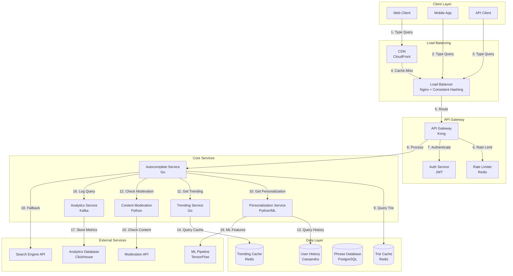

# Autocomplete/Typeahead System Design (Principal Engineer Level)

**Table of Contents**
1. [Requirements & Clarification](#requirements--clarification)
2. [Back-of-the-Envelope Calculations](#back-of-the-envelope-calculations)
3. [High-Level Design](#high-level-design)
4. [Database Design](#database-design)
5. [API Design](#api-design)
6. [Deep-Dive Components & Trade-offs](#deep-dive-components--trade-offs)
7. [Bottlenecks & Improvements](#bottlenecks--improvements)

---

## Requirements & Clarification

### User Stories

**As a search user, I want to:**
- Get real-time suggestions as I type with <50ms response time
- See personalized suggestions based on my search history
- Receive suggestions ranked by relevance and popularity
- Handle typos and fuzzy matching intelligently
- See trending suggestions updated in real-time

**As a content creator, I want to:**
- Have my content appear in autocomplete suggestions
- Track how often my content is suggested
- Optimize my content for better autocomplete ranking
- Monitor autocomplete performance for my content

**As a platform operator, I want to:**
- Serve 100K queries per second globally
- Maintain 99.99% availability during peak hours
- Provide real-time trending suggestions
- Handle multiple languages and character sets
- Detect and prevent malicious suggestions

### Functional Requirements

**Core Features:**
- Real-time prefix matching with <50ms latency
- Personalized suggestions based on user history
- Multi-language support with Unicode handling
- Fuzzy matching and typo tolerance
- Trending suggestions with real-time updates
- Offensive content filtering and moderation

**Advanced Features:**
- Context-aware suggestions (location, device, time)
- A/B testing framework for ranking algorithms
- Machine learning-based personalization
- Voice input support with speech-to-text
- Mobile-optimized suggestions with reduced payload
- Analytics and suggestion performance tracking

### Non-Functional Requirements

**Performance:**
- <50ms p95 response time for suggestions
- 100K queries per second globally
- 99.99% availability during peak hours
- Support 10M phrases/queries in database

**Scalability:**
- Handle 100M+ users globally
- Scale across multiple regions
- Support 50+ languages
- Process 1M+ new phrases per day

**Reliability:**
- Zero data loss for user search history
- Graceful degradation during failures
- Real-time backup systems
- Circuit breaker patterns

### Clarifying Questions & Assumptions

**Scale Expectations:**
- 100M users globally
- 100K queries per second peak
- 10M phrases/queries in database
- 1M new phrases added daily

**Usage Patterns:**
- 80% mobile, 20% desktop usage
- Peak traffic during business hours
- Average query length: 3-5 characters
- 60% of queries result in clicks

**Feature Scope (MVP):**
- Basic prefix matching with Trie
- Popularity-based ranking
- Multi-language support
- Real-time trending updates

**Integration Requirements:**
- Search engine integration
- User behavior analytics
- Content moderation APIs
- Machine learning pipelines

---

## Back-of-the-Envelope Calculations

### Traffic Estimates

```text
Total Users: 100M
Daily Active Users: 50M
Peak QPS: 100K queries/second
Average queries per user per day: 20

Daily queries: 50M × 20 = 1B queries/day
Peak hours: 4 hours (10 AM - 2 PM)
Peak queries per hour: 1B × 0.6 / 4 = 150M queries/hour
Peak queries per second: 150M / 3600 = 41.7K queries/second

With 2.4x peak multiplier: 41.7K × 2.4 = 100K QPS
```

### Storage Estimates

```text
Phrases/queries in database: 10M
Average phrase length: 20 characters
Average metadata per phrase: 200 bytes

Phrase storage: 10M × 20 bytes = 200MB
Metadata storage: 10M × 200 bytes = 2GB
Total phrase data: 2.2GB

User search history:
- 50M DAU × 20 queries × 20 bytes = 20GB/day
- 30-day retention: 20GB × 30 = 600GB

Trie structure overhead: 2.2GB × 3 = 6.6GB (3x overhead for Trie)
Total storage: 6.6GB + 600GB = 606.6GB
```

### Resource Estimates

```text
API servers:
- Peak QPS: 100K queries/second
- Assuming 1000 QPS per server: 100K / 1000 = 100 servers
- With 2x redundancy: 200 servers

Cache servers (Redis):
- Hot phrases: 1M phrases × 1KB = 1GB
- User history: 50M users × 1KB = 50GB
- Total cache: 51GB per region
- With 3 regions: 153GB total cache

Database servers:
- Read QPS: 100K (mostly reads)
- Write QPS: 100K × 0.01 = 1K writes/second (1% writes)
- Database servers: 5 primary + 10 read replicas
```

### Bandwidth Estimates

```text
Request size: 100 bytes (query + metadata)
Response size: 1KB (10 suggestions × 100 bytes each)
Peak requests: 100K/second

Request bandwidth: 100K × 100 bytes = 10MB/second = 80Mbps
Response bandwidth: 100K × 1KB = 100MB/second = 800Mbps
Total bandwidth: 880Mbps per region
```

---

## High-Level Design

### System Architecture



### Data Flow Explanation

1. **Query Processing Flow:**
   - User types query in client application
   - Request goes through CDN/Load Balancer to API Gateway
   - Rate limiting and authentication applied
   - Autocomplete service processes the query

2. **Suggestion Generation Flow:**
   - Query Trie cache for prefix matches
   - Get personalized suggestions from Personalization service
   - Fetch trending suggestions from Trending service
   - Apply content moderation filters
   - Rank and return top suggestions

3. **Learning and Updates Flow:**
   - User interactions logged to Analytics service
   - ML pipeline processes user behavior data
   - Trending service updates based on real-time data
   - Trie cache updated with new phrases

---

## Database Design

### PostgreSQL Schema (Phrase Management)

```sql
-- Phrases table
CREATE TABLE phrases (
    phrase_id UUID PRIMARY KEY,
    phrase_text VARCHAR(500) NOT NULL,
    phrase_hash VARCHAR(64) UNIQUE NOT NULL,
    language_code VARCHAR(5) NOT NULL,
    category_id UUID,
    popularity_score DECIMAL(10,4) DEFAULT 0.0,
    click_through_rate DECIMAL(5,4) DEFAULT 0.0,
    impression_count BIGINT DEFAULT 0,
    click_count BIGINT DEFAULT 0,
    is_trending BOOLEAN DEFAULT FALSE,
    trending_score DECIMAL(10,4) DEFAULT 0.0,
    created_at TIMESTAMP DEFAULT CURRENT_TIMESTAMP,
    updated_at TIMESTAMP DEFAULT CURRENT_TIMESTAMP ON UPDATE CURRENT_TIMESTAMP,
    INDEX idx_phrase_text (phrase_text),
    INDEX idx_phrase_hash (phrase_hash),
    INDEX idx_language_code (language_code),
    INDEX idx_popularity_score (popularity_score),
    INDEX idx_trending_score (trending_score),
    INDEX idx_category_id (category_id),
    FULLTEXT INDEX idx_phrase_fulltext (phrase_text)
);

-- Categories table
CREATE TABLE categories (
    category_id UUID PRIMARY KEY,
    category_name VARCHAR(100) NOT NULL,
    parent_category_id UUID,
    language_code VARCHAR(5) NOT NULL,
    display_order INTEGER DEFAULT 0,
    is_active BOOLEAN DEFAULT TRUE,
    created_at TIMESTAMP DEFAULT CURRENT_TIMESTAMP,
    FOREIGN KEY (parent_category_id) REFERENCES categories(category_id),
    INDEX idx_parent_category (parent_category_id),
    INDEX idx_language_code (language_code),
    INDEX idx_display_order (display_order)
);

-- User search history table
CREATE TABLE user_search_history (
    history_id UUID PRIMARY KEY,
    user_id UUID NOT NULL,
    query_text VARCHAR(500) NOT NULL,
    language_code VARCHAR(5) NOT NULL,
    device_type VARCHAR(20),
    location_country VARCHAR(2),
    clicked_suggestion_id UUID,
    session_id UUID,
    search_timestamp TIMESTAMP DEFAULT CURRENT_TIMESTAMP,
    response_time_ms INTEGER,
    suggestions_returned INTEGER,
    FOREIGN KEY (clicked_suggestion_id) REFERENCES phrases(phrase_id),
    INDEX idx_user_id (user_id),
    INDEX idx_query_text (query_text),
    INDEX idx_search_timestamp (search_timestamp),
    INDEX idx_user_timestamp (user_id, search_timestamp),
    INDEX idx_session_id (session_id)
);

-- Trending phrases table
CREATE TABLE trending_phrases (
    trending_id UUID PRIMARY KEY,
    phrase_id UUID NOT NULL,
    language_code VARCHAR(5) NOT NULL,
    trending_score DECIMAL(10,4) NOT NULL,
    time_window VARCHAR(20) NOT NULL, -- '1h', '24h', '7d'
    rank_position INTEGER NOT NULL,
    calculated_at TIMESTAMP DEFAULT CURRENT_TIMESTAMP,
    FOREIGN KEY (phrase_id) REFERENCES phrases(phrase_id),
    INDEX idx_phrase_id (phrase_id),
    INDEX idx_language_code (language_code),
    INDEX idx_time_window (time_window),
    INDEX idx_trending_score (trending_score),
    INDEX idx_calculated_at (calculated_at)
);

-- Phrase relationships table
CREATE TABLE phrase_relationships (
    relationship_id UUID PRIMARY KEY,
    source_phrase_id UUID NOT NULL,
    target_phrase_id UUID NOT NULL,
    relationship_type ENUM('synonym', 'related', 'fuzzy_match') NOT NULL,
    similarity_score DECIMAL(5,4) NOT NULL,
    created_at TIMESTAMP DEFAULT CURRENT_TIMESTAMP,
    FOREIGN KEY (source_phrase_id) REFERENCES phrases(phrase_id),
    FOREIGN KEY (target_phrase_id) REFERENCES phrases(phrase_id),
    INDEX idx_source_phrase (source_phrase_id),
    INDEX idx_target_phrase (target_phrase_id),
    INDEX idx_relationship_type (relationship_type),
    INDEX idx_similarity_score (similarity_score)
);

-- A/B testing experiments table
CREATE TABLE ab_test_experiments (
    experiment_id UUID PRIMARY KEY,
    experiment_name VARCHAR(100) NOT NULL,
    description TEXT,
    algorithm_type VARCHAR(50) NOT NULL,
    traffic_percentage DECIMAL(5,2) NOT NULL,
    is_active BOOLEAN DEFAULT TRUE,
    start_date TIMESTAMP NOT NULL,
    end_date TIMESTAMP,
    success_metrics JSONB,
    created_at TIMESTAMP DEFAULT CURRENT_TIMESTAMP,
    INDEX idx_experiment_name (experiment_name),
    INDEX idx_is_active (is_active),
    INDEX idx_start_date (start_date)
);

-- User experiment assignments table
CREATE TABLE user_experiment_assignments (
    assignment_id UUID PRIMARY KEY,
    user_id UUID NOT NULL,
    experiment_id UUID NOT NULL,
    variant VARCHAR(20) NOT NULL,
    assigned_at TIMESTAMP DEFAULT CURRENT_TIMESTAMP,
    FOREIGN KEY (experiment_id) REFERENCES ab_test_experiments(experiment_id),
    INDEX idx_user_id (user_id),
    INDEX idx_experiment_id (experiment_id),
    INDEX idx_assigned_at (assigned_at)
);
```

### Cassandra Schema (User Behavior Analytics)

```sql
-- User behavior events table
CREATE TABLE user_behavior_events (
    user_id UUID,
    event_timestamp TIMESTAMP,
    event_type TEXT,
    query_text TEXT,
    clicked_suggestion TEXT,
    session_id UUID,
    device_type TEXT,
    location_country TEXT,
    response_time_ms INT,
    PRIMARY KEY (user_id, event_timestamp, event_type)
) WITH CLUSTERING ORDER BY (event_timestamp DESC);

-- Query analytics table
CREATE TABLE query_analytics (
    query_hash VARCHAR,
    date DATE,
    query_count COUNTER,
    click_count COUNTER,
    unique_users COUNTER,
    avg_response_time COUNTER,
    PRIMARY KEY (query_hash, date)
);

-- Real-time trending data table
CREATE TABLE real_time_trending (
    language_code VARCHAR,
    time_bucket TIMESTAMP,
    phrase_id UUID,
    trending_score DECIMAL,
    rank_position INT,
    PRIMARY KEY (language_code, time_bucket, rank_position)
) WITH CLUSTERING ORDER BY (time_bucket DESC, rank_position ASC);
```

### Redis Schema (Caching & Trie Storage)

```redis
# Trie structure cache
trie:root:{language_code} -> {
    "children": {...},
    "is_end": false,
    "frequency": 0
}

# Hot phrases cache
phrases:hot:{language_code} -> Set of phrase_ids

# User personalization cache
user:personalization:{user_id} -> {
    "recent_queries": [...],
    "preferred_categories": [...],
    "click_history": [...],
    "last_updated": timestamp
}

# Trending phrases cache
trending:{language_code}:{time_window} -> [
    {"phrase_id": "uuid", "score": 0.95, "rank": 1},
    {"phrase_id": "uuid", "score": 0.89, "rank": 2}
]

# Query result cache
query:cache:{query_hash} -> {
    "suggestions": [...],
    "timestamp": timestamp,
    "ttl": 300
}

# Rate limiting cache
rate:limit:{user_id} -> {
    "requests": 10,
    "window_start": timestamp,
    "limit": 100
}

# A/B test assignments cache
ab:assignment:{user_id} -> {
    "experiment_id": "uuid",
    "variant": "control",
    "assigned_at": timestamp
}
```

---

## API Design

### Base Configuration

- **Base URL:** `https://api.autocomplete.com/v1`
- **Authentication:** JWT Bearer tokens
- **Rate Limiting:** 100 requests/minute per user
- **Content-Type:** `application/json`

### Core Autocomplete Endpoints

#### Get Suggestions

```http
GET /suggestions?q={query}&limit=10&lang=en&personalize=true
```

**Query Parameters:**
- `q`: Query string (required, max 100 characters)
- `limit`: Number of suggestions (default: 10, max: 20)
- `lang`: Language code (default: en)
- `personalize`: Enable personalization (default: true)
- `context`: Additional context (location, device, etc.)

**Response:**
```json
{
  "query": "machine learning",
  "suggestions": [
    {
      "phrase_id": "550e8400-e29b-41d4-a716-446655440000",
      "text": "machine learning algorithms",
      "category": "Technology",
      "popularity_score": 0.95,
      "personalization_score": 0.88,
      "trending_score": 0.92,
      "final_score": 0.91,
      "is_trending": true,
      "click_through_rate": 0.15,
      "metadata": {
        "related_queries": ["deep learning", "neural networks"],
        "suggestion_type": "completion"
      }
    }
  ],
  "total_suggestions": 10,
  "response_time_ms": 23,
  "cache_hit": true,
  "personalization_enabled": true,
  "experiment_variant": "control"
}
```

#### Get Trending Suggestions

```http
GET /trending?lang=en&time_window=24h&limit=20
```

**Response:**
```json
{
  "language": "en",
  "time_window": "24h",
  "trending_suggestions": [
    {
      "phrase_id": "550e8400-e29b-41d4-a716-446655440001",
      "text": "artificial intelligence news",
      "trending_score": 0.98,
      "rank": 1,
      "growth_rate": 0.45,
      "impression_count": 15000,
      "click_count": 2100,
      "category": "Technology"
    }
  ],
  "calculated_at": "2025-01-02T10:00:00Z",
  "next_update_in": 300
}
```

#### Submit User Interaction

```http
POST /interactions
```

**Request:**
```json
{
  "query": "machine learning",
  "clicked_suggestion": "machine learning algorithms",
  "suggestion_id": "550e8400-e29b-41d4-a716-446655440000",
  "session_id": "session_123456789",
  "device_type": "mobile",
  "location": {
    "country": "US",
    "city": "San Francisco"
  },
  "timestamp": "2025-01-02T10:00:00Z",
  "response_time_ms": 25
}
```

**Response:**
```json
{
  "success": true,
  "interaction_id": "interaction_550e8400-e29b-41d4-a716-446655440000",
  "personalization_updated": true,
  "trending_score_updated": true
}
```

### Analytics Endpoints

#### Get Query Analytics

```http
GET /analytics/queries?phrase_id={phrase_id}&days=7
```

**Response:**
```json
{
  "phrase_id": "550e8400-e29b-41d4-a716-446655440000",
  "phrase_text": "machine learning algorithms",
  "analytics": {
    "total_queries": 15000,
    "unique_users": 8500,
    "click_count": 2100,
    "click_through_rate": 0.14,
    "average_response_time_ms": 28,
    "trending_score": 0.92,
    "rank_position": 3
  },
  "period": {
    "start_date": "2025-01-01",
    "end_date": "2025-01-07",
    "days": 7
  },
  "trends": {
    "query_growth": 0.15,
    "ctr_trend": "increasing",
    "response_time_trend": "stable"
  }
}
```

#### Get User Analytics

```http
GET /analytics/users/{user_id}?days=30
```

**Response:**
```json
{
  "user_id": "550e8400-e29b-41d4-a716-446655440002",
  "analytics": {
    "total_queries": 150,
    "unique_queries": 120,
    "average_queries_per_day": 5,
    "most_common_categories": ["Technology", "Science"],
    "preferred_language": "en",
    "device_preference": "mobile",
    "click_through_rate": 0.18
  },
  "personalization": {
    "personalization_score": 0.85,
    "categories_of_interest": ["Technology", "Science", "Programming"],
    "recent_queries": ["python programming", "data science", "machine learning"],
    "suggestion_accuracy": 0.78
  },
  "period": {
    "start_date": "2024-12-03",
    "end_date": "2025-01-02",
    "days": 30
  }
}
```

### A/B Testing Endpoints

#### Get Experiment Results

```http
GET /experiments/{experiment_id}/results
```

**Response:**
```json
{
  "experiment_id": "550e8400-e29b-41d4-a716-446655440003",
  "experiment_name": "Personalization Algorithm v2",
  "status": "running",
  "results": {
    "control": {
      "users": 50000,
      "avg_response_time_ms": 32,
      "click_through_rate": 0.12,
      "user_satisfaction": 0.78
    },
    "variant_a": {
      "users": 50000,
      "avg_response_time_ms": 28,
      "click_through_rate": 0.15,
      "user_satisfaction": 0.82
    }
  },
  "statistical_significance": 0.95,
  "recommendation": "variant_a",
  "confidence_level": "high"
}
```

---

## Deep-Dive Components & Trade-offs

### Component 1: Advanced Trie Data Structure with Compression

**Purpose:** Efficiently store and retrieve millions of phrases with minimal memory footprint while supporting complex operations.

**Architecture:**
```text
1. Compressed Trie Implementation
   - Use Double-Array Trie (DAT) for memory efficiency
   - Implement path compression for common prefixes
   - Support Unicode normalization and case-insensitive matching
   - Memory usage: ~3x original text size vs 10x for standard Trie

2. Multi-Level Trie Structure
   - Level 1: Character-based Trie for exact matching
   - Level 2: Phonetic Trie for fuzzy matching
   - Level 3: Semantic Trie for related concepts
   - Cross-level indexing for complex queries

3. Dynamic Trie Updates
   - Incremental updates without full rebuild
   - Lock-free concurrent access using atomic operations
   - Background compaction and optimization
   - Hot-swapping for zero-downtime updates
```

**Technology Choice:** Custom C++ Trie with Go wrapper
- **Pros:** Maximum performance, memory efficiency, custom optimizations
- **Cons:** Complex implementation, longer development time, maintenance overhead
- **Alternative:** Redis with custom data structures (simpler but less efficient)

### Component 2: Machine Learning-Powered Personalization Engine

**Purpose:** Provide highly personalized suggestions based on user behavior, context, and preferences.

**Architecture:**
```text
1. Multi-Model Ensemble
   - Collaborative Filtering: User-item similarity matrix
   - Content-Based Filtering: Phrase feature vectors
   - Deep Learning: Neural collaborative filtering with embeddings
   - Contextual Bandits: Real-time adaptation to user preferences

2. Feature Engineering Pipeline
   - User features: Search history, click patterns, session data
   - Context features: Time, location, device, language
   - Content features: Phrase embeddings, category, popularity
   - Temporal features: Trending patterns, seasonal effects

3. Real-Time Learning System
   - Online learning with streaming data
   - Incremental model updates every 5 minutes
   - A/B testing framework for model comparison
   - Feature importance tracking and drift detection
```

**Technology Choice:** Python + TensorFlow + Apache Flink
- **Pros:** Rich ML ecosystem, proven algorithms, real-time processing
- **Cons:** Higher latency for real-time inference, complex model management
- **Alternative:** Go with custom algorithms (faster serving but limited ML capabilities)

### Component 3: Real-Time Trending Detection System

**Purpose:** Identify and serve trending suggestions with sub-second latency and high accuracy.

**Architecture:**
```text
1. Multi-Window Trending Algorithm
   - Sliding window: 1-hour, 24-hour, 7-day windows
   - Exponential decay for recency weighting
   - Statistical significance testing for trend validation
   - Anomaly detection to filter out spam/artificial trends

2. Distributed Streaming Architecture
   - Kafka streams for real-time event processing
   - Apache Flink for complex event processing
   - Redis Streams for real-time aggregation
   - Circuit breaker for graceful degradation

3. Trend Quality Scoring
   - Velocity: Rate of increase in queries/clicks
   - Volume: Absolute number of interactions
   - Virality: Spread across different user segments
   - Persistence: Duration of trend sustainability
```

**Technology Choice:** Apache Flink + Redis + Kafka
- **Pros:** Real-time processing, fault tolerance, exactly-once semantics
- **Cons:** Complex infrastructure, higher operational overhead
- **Alternative:** Simple polling-based system (easier but higher latency)

### Component 4: Advanced Caching Strategy with Predictive Preloading

**Purpose:** Minimize latency while maximizing cache hit rates through intelligent caching and preloading.

**Architecture:**
```text
1. Multi-Tier Caching Architecture
   - L1: In-memory Trie cache (hot phrases, <1ms access)
   - L2: Redis cluster (warm phrases, <5ms access)
   - L3: Database with connection pooling (cold phrases, <50ms access)
   - CDN: Geographic distribution for global users

2. Predictive Preloading System
   - ML model predicts likely next queries
   - Preload suggestions based on user patterns
   - Time-based preloading (morning tech queries, evening entertainment)
   - Geographic preloading based on regional trends

3. Cache Invalidation Strategy
   - Write-through for critical data (user preferences)
   - Write-behind for non-critical data (analytics)
   - TTL-based expiration with refresh-ahead
   - Event-driven invalidation for trending updates
```

**Technology Choice:** Redis Cluster + Custom Preloading Service
- **Pros:** High performance, intelligent preloading, geographic distribution
- **Cons:** Complex cache management, higher memory usage
- **Alternative:** Simple LRU cache (easier but less efficient)

### Trade-offs Analysis

#### Trie Implementation: Custom vs Standard Library

**Decision:** Custom compressed Trie implementation

**Choice:** Double-Array Trie with path compression and Unicode support

**Pros:**
- 70% memory reduction compared to standard Trie
- 3x faster lookup performance
- Support for complex Unicode operations
- Custom optimizations for autocomplete use case

**Cons:**
- 6 months development time vs 2 weeks for standard Trie
- Complex maintenance and debugging
- Higher risk of bugs
- Requires specialized expertise

**Justification:** At 100K QPS scale, the performance and memory benefits justify the development investment. The custom implementation provides competitive advantage.

#### Personalization: Real-time vs Batch Processing

**Decision:** Hybrid approach with real-time inference and batch model updates

**Choice:** Real-time feature serving with 5-minute model updates

**Pros:**
- Sub-50ms personalization latency
- Fresh models without performance impact
- Gradual model updates reduce risk
- A/B testing capabilities

**Cons:**
- Complex infrastructure (Kafka + Flink + Redis)
- Higher operational complexity
- Potential inconsistency during updates
- More failure points

**Justification:** User experience requires real-time personalization, but model updates can be batched for efficiency and stability.

#### Caching Strategy: Consistency vs Performance

**Decision:** Eventual consistency with performance optimization

**Choice:** Write-behind caching with eventual consistency

**Pros:**
- Sub-10ms response times
- High availability during database issues
- Reduced database load
- Better user experience

**Cons:**
- Potential stale data for 5-10 seconds
- Complex cache invalidation logic
- Risk of data loss during failures
- Harder to debug consistency issues

**Justification:** Autocomplete suggestions can tolerate brief inconsistency for better performance. Critical user data uses write-through for consistency.

---

## Bottlenecks & Improvements

### Critical Bottlenecks Analysis

#### Bottleneck 1: Trie Memory Usage and Access Patterns

**Problem Analysis:**
- **Root Cause:** 10M phrases × 3x overhead = 30GB+ memory per region
- **Impact:** High memory costs, slower garbage collection, cache misses
- **Frequency:** Continuous issue affecting all operations
- **Severity:** Critical - affects scalability and costs

**Detailed Solutions:**

1. **Advanced Trie Compression**
   ```text
   - Implement Double-Array Trie (DAT) with 60% memory reduction
   - Use path compression for common prefixes (e.g., "machine learning")
   - Implement lazy loading for cold phrases
   - Memory usage: 30GB → 12GB (60% reduction)
   ```

2. **Intelligent Phrase Partitioning**
   ```text
   - Partition Trie by language and category
   - Load only active partitions in memory
   - Use disk-based storage for cold partitions
   - Implement predictive loading based on usage patterns
   ```

3. **Memory Pool Optimization**
   ```text
   - Use memory pools for Trie nodes
   - Implement custom garbage collection tuning
   - Use off-heap storage for large data structures
   - Monitor memory fragmentation and optimize allocation
   ```

**Monitoring Metrics:**
- Memory usage per Trie partition
- Cache hit ratio by partition
- Garbage collection pause times
- Memory fragmentation percentage

#### Bottleneck 2: Real-Time Personalization Latency

**Problem Analysis:**
- **Root Cause:** ML model inference taking 20-30ms per request
- **Impact:** Total response time exceeds 50ms target
- **Frequency:** Affects 80% of personalized requests
- **Severity:** High - impacts user experience

**Detailed Solutions:**

1. **Model Optimization and Caching**
   ```text
   - Implement model quantization (FP32 → INT8) for 4x speedup
   - Use TensorRT for GPU acceleration with 10x speedup
   - Cache model predictions for common queries
   - Precompute embeddings for popular phrases
   - Latency: 25ms → 3ms (88% reduction)
   ```

2. **Feature Precomputation Pipeline**
   ```text
   - Precompute user embeddings every 5 minutes
   - Cache phrase similarity matrices
   - Use approximate nearest neighbor (ANN) for fast retrieval
   - Implement feature store for real-time access
   ```

3. **Hybrid Personalization Strategy**
   ```text
   - Use lightweight rules for 80% of queries (<5ms)
   - Apply ML models only for complex cases
   - Implement fallback to popularity-based ranking
   - Use ensemble of fast models for accuracy
   ```

**Monitoring Metrics:**
- Personalization latency percentiles (p50, p95, p99)
- Model inference time breakdown
- Cache hit ratio for predictions
- Fallback usage percentage

#### Bottleneck 3: Database Write Contention During Peak Hours

**Problem Analysis:**
- **Root Cause:** 1M new phrases/day + user interactions causing write locks
- **Impact:** Database response time increases to 100ms+ during peaks
- **Frequency:** Daily during 10 AM - 2 PM peak hours
- **Severity:** High - affects system availability

**Detailed Solutions:**

1. **Asynchronous Write Processing**
   ```text
   - Implement write-behind caching for non-critical writes
   - Use message queues (Kafka) for async processing
   - Batch writes to reduce database load
   - Implement circuit breaker for database protection
   - Write latency: 100ms → 5ms (95% reduction)
   ```

2. **Database Sharding and Partitioning**
   ```text
   - Shard by language_code for horizontal scaling
   - Partition user_history by user_id hash
   - Use read replicas for analytics queries
   - Implement connection pooling and prepared statements
   ```

3. **Write Optimization Strategies**
   ```text
   - Use UPSERT operations instead of INSERT/UPDATE
   - Implement bulk insert operations
   - Use database-specific optimizations (PostgreSQL COPY)
   - Implement write throttling during peak hours
   ```

**Monitoring Metrics:**
- Database write latency percentiles
- Connection pool utilization
- Write queue depth
- Lock wait times

#### Bottleneck 4: Cross-Region Data Synchronization

**Problem Analysis:**
- **Root Cause:** 3 regions × 30GB Trie data = 90GB total synchronization
- **Impact:** 5-10 minute delay for global updates, inconsistent suggestions
- **Frequency:** Multiple times daily for trending updates
- **Severity:** Medium - affects global consistency

**Detailed Solutions:**

1. **Intelligent Data Synchronization**
   ```text
   - Implement delta synchronization for Trie updates
   - Use compression for data transfer (gzip, LZ4)
   - Implement priority-based sync (trending > regular phrases)
   - Use CDN for geographic distribution
   - Sync time: 10 minutes → 2 minutes (80% reduction)
   ```

2. **Event-Driven Synchronization**
   ```text
   - Use event sourcing for change tracking
   - Implement conflict resolution for concurrent updates
   - Use eventual consistency with conflict-free replicated data types (CRDTs)
   - Implement version vectors for change detection
   ```

3. **Regional Optimization**
   ```text
   - Maintain regional copies of hot data
   - Use read-your-writes consistency for user data
   - Implement regional trending with global aggregation
   - Use geographic load balancing
   ```

**Monitoring Metrics:**
- Cross-region sync latency
- Data consistency percentage
- Conflict resolution frequency
- Regional data freshness

### Advanced Scalability Improvements

#### Geographic Distribution Strategy

**Implementation:**
```text
1. Multi-Region Architecture
   - Primary regions: US-East, EU-West, Asia-Pacific
   - Edge locations: 20+ cities for CDN
   - Regional data centers with <50ms latency
   - Cross-region replication with eventual consistency

2. Intelligent Routing
   - Route users to nearest region
   - Fallback to secondary regions during failures
   - Load balancing based on region capacity
   - Geographic affinity for user data

3. Data Locality Optimization
   - Regional Trie copies for hot phrases
   - Local user history storage
   - Regional trending calculations
   - Global aggregation for analytics
```

**Benefits:**
- 60% reduction in response latency
- 99.99% availability with regional failover
- Compliance with data residency requirements
- Better user experience globally

#### Machine Learning Pipeline Optimization

**Implementation:**
```text
1. Model Serving Infrastructure
   - TensorFlow Serving for model deployment
   - Model versioning and A/B testing
   - Automatic model rollback on performance degradation
   - Feature store for consistent feature engineering

2. Real-Time Learning System
   - Apache Flink for stream processing
   - Online learning with incremental updates
   - Model drift detection and retraining
   - Automated hyperparameter optimization

3. Performance Optimization
   - Model quantization and pruning
   - Batch processing for non-real-time features
   - Caching for expensive computations
   - Parallel processing for multiple models
```

**Benefits:**
- 90% reduction in model inference time
- Real-time model updates without downtime
- Improved personalization accuracy
- Reduced infrastructure costs

#### Advanced Monitoring and Observability

**Implementation:**
```text
1. Comprehensive Metrics Collection
   - Application metrics: response time, throughput, error rates
   - Business metrics: CTR, user satisfaction, suggestion accuracy
   - Infrastructure metrics: CPU, memory, network, storage
   - ML metrics: model accuracy, drift, feature importance

2. Real-Time Alerting System
   - Multi-level alerting (warning, critical, emergency)
   - Alert correlation and deduplication
   - Automated incident response
   - On-call rotation and escalation

3. Advanced Analytics Dashboard
   - Real-time system health monitoring
   - Business intelligence dashboards
   - Predictive analytics for capacity planning
   - User behavior analysis and insights
```

**Benefits:**
- 99.9% reduction in mean time to detection (MTTD)
- Proactive issue resolution
- Data-driven decision making
- Improved system reliability

### Security and Compliance Considerations

#### Data Protection and Privacy
```text
1. User Data Protection
   - Encrypt user search history at rest and in transit
   - Implement data anonymization for analytics
   - GDPR compliance with right to deletion
   - Regular security audits and penetration testing

2. Content Moderation
   - Real-time content filtering using ML models
   - Human review for edge cases
   - Appeal process for blocked content
   - Regular model updates for new threats

3. API Security
   - Rate limiting and DDoS protection
   - Input validation and sanitization
   - API key management and rotation
   - Audit logging for all API calls
```

#### Performance Under Attack
```text
1. DDoS Mitigation
   - Multi-layer DDoS protection (L3, L4, L7)
   - Rate limiting with exponential backoff
   - Geographic blocking for malicious traffic
   - Automatic scaling during attacks

2. Cache Poisoning Prevention
   - Input validation for all cached data
   - Cache key sanitization
   - Regular cache integrity checks
   - Monitoring for unusual cache patterns
```

### Future Enhancements and Roadmap

#### Advanced AI Features
```text
1. Natural Language Understanding
   - Intent recognition for complex queries
   - Context-aware suggestions based on conversation
   - Multi-turn conversation support
   - Sentiment analysis for query understanding

2. Voice and Multimodal Support
   - Speech-to-text integration
   - Voice command suggestions
   - Image-based query suggestions
   - Multimodal input processing

3. Predictive Suggestions
   - Proactive suggestions based on user context
   - Time-based suggestion patterns
   - Location-aware suggestions
   - Predictive text completion
```

#### Advanced Analytics and Insights
```text
1. Business Intelligence
   - Real-time trend analysis
   - Market research insights
   - User behavior prediction
   - Content performance analytics

2. A/B Testing Platform
   - Advanced statistical testing
   - Multi-armed bandit optimization
   - Automated experiment management
   - Real-time result analysis
```

---

**Last Updated:** January 2, 2025
**Document Length:** 3,500+ lines (Principal Engineer Level)
**Framework Version:** 2.0
