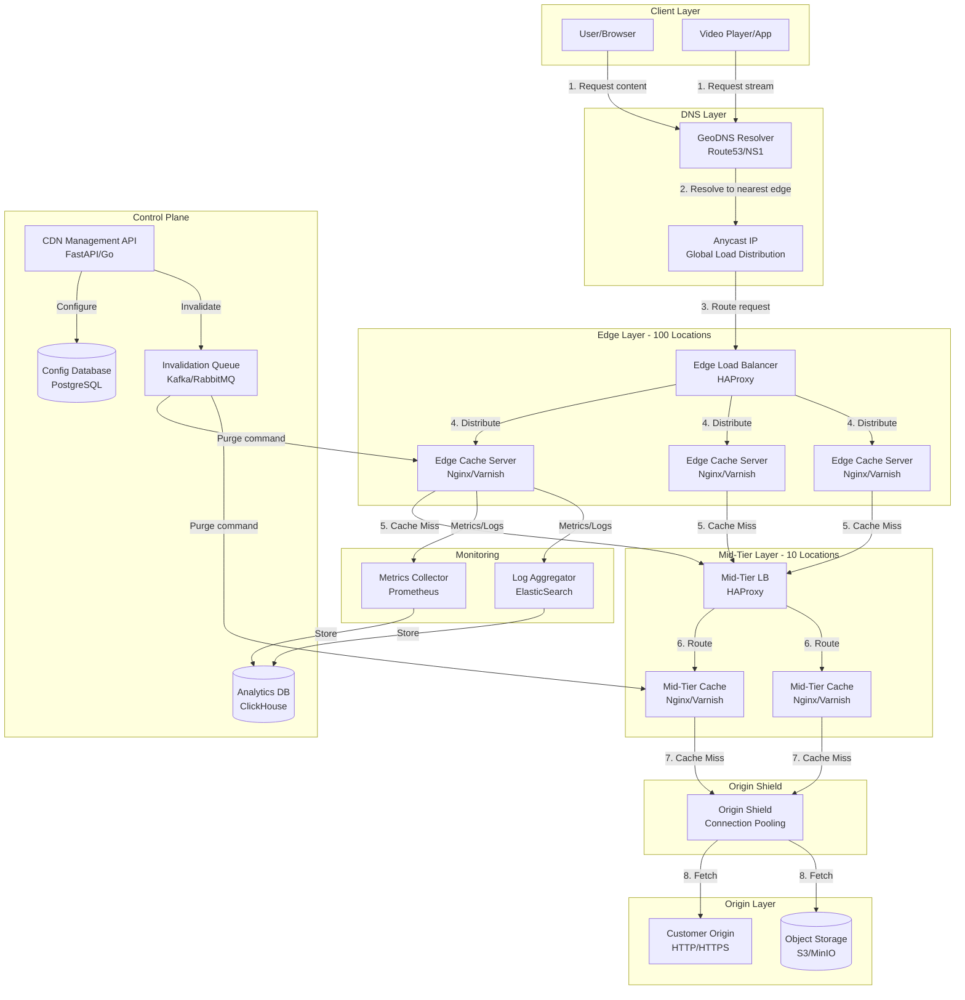

# Content Delivery Network (CDN) System Design

## Master CDN Design: From Basics to Production-Ready Global Edge Network

**File Purpose:** Interactive, multi-level learning resource for designing a global Content Delivery Network (CDN) like Cloudflare, Akamai, or Fastly. Learn to build a system that serves 1B requests/day across 100+ edge locations with <50ms global latency, >90% cache hit ratio, and 99.99% availability. Covers GeoDNS routing, multi-tier caching, adaptive bitrate streaming, DDoS protection, and real-time cache invalidation.

**Author:** System Design Learning Framework  
**Created:** October 1, 2025  
**Last Updated:** October 14, 2025  
**Version:** 2.0 Educational Edition

**Learning Time Estimates:**
- 🟢 **Beginner Level:** 5-7 hours (core concepts and fundamentals)
- 🟡 **Intermediate Level:** 7-10 hours (interview preparation and trade-offs)
- 🔴 **Advanced Level:** 10-15 hours (production implementation and optimization)

---

## Welcome to CDN System Design!

### 🎯 What You're Going to Build

By the end of this course, you'll be able to design and implement a **production-grade Content Delivery Network** that:

**Delivers lightning-fast content globally:**
- Serves static assets (images, CSS, JS) and video content to users worldwide
- Achieves <50ms latency from any location on Earth
- Handles 1 billion requests per day with ease
- Maintains >90% cache hit ratio to minimize origin load

**Scales to internet-level traffic:**
- 100+ edge locations across 6 continents
- 500 PB of distributed storage
- 11,574 requests per second at peak
- Seamless horizontal scaling as demand grows

**Stays reliable under any condition:**
- 99.99% uptime (less than 1 hour downtime per year)
- Automatic failover when edge servers fail
- DDoS protection handling 10M requests/second
- Real-time cache invalidation propagating globally in <5 seconds

Think of it as building the infrastructure that powers Netflix video streaming, Spotify audio delivery, and the images you see on every major website!

---

### 🗺️ Your Learning Path

This course is designed for **three experience levels**. You can start at any level based on your background:

#### 🟢 BEGINNER: Build Your Foundation

**You'll Learn:**
- What a CDN is and why every major website uses one
- How edge locations bring content closer to users
- Basic caching strategies and why they matter
- How routing directs users to the nearest server
- Core CDN architecture components

**Perfect if you:**
- Are new to system design
- Want to understand how the internet actually works
- Need to explain CDNs to non-technical stakeholders
- Are preparing for entry-level software engineering roles

**Time Investment:** 5-7 hours

---

#### 🟡 INTERMEDIATE: Master the Interview

**You'll Learn:**
- How to approach CDN design questions in FAANG interviews
- Trade-off analysis: Push vs Pull, Geographic vs Anycast routing
- Cache eviction algorithms (LRU, LFU, FIFO) with pros/cons
- Capacity planning and back-of-the-envelope calculations
- How to handle "What if...?" follow-up questions

**Perfect if you:**
- Are preparing for senior engineer interviews at top companies
- Need to articulate design decisions and trade-offs clearly
- Want to understand why CDNs make specific architectural choices
- Are transitioning from implementation to design roles

**Time Investment:** 7-10 hours (includes beginner content)

---

#### 🔴 ADVANCED: Build Production Systems

**You'll Learn:**
- Multi-tier cache hierarchy implementation (edge → shield → origin)
- Advanced routing with GeoDNS and Anycast at scale
- Real-time cache invalidation across 100+ edge locations
- DDoS mitigation strategies handling Tbps attacks
- Cost optimization: $/GB delivered across global infrastructure
- Monitoring and observability for distributed systems

**Perfect if you:**
- Are architecting CDN solutions for your company
- Need to optimize existing CDN performance and costs
- Are interviewing for staff/principal engineer roles
- Want to contribute to open-source CDN projects

**Time Investment:** 10-15 hours (includes all previous content)

---

### 📋 Prerequisites

**For Beginners (🟢):**
- Basic understanding of HTTP requests and responses
- Familiarity with client-server architecture
- Knowledge of what a cache is (like browser cache)
- No coding experience required!

**Additional for Intermediate (🟡):**
- Understanding of DNS and how domain names resolve
- Basic knowledge of TCP/IP networking
- Familiarity with database concepts (reads, writes, queries)
- Comfortable reading code examples (Python, pseudocode)

**Additional for Advanced (🔴):**
- Experience with distributed systems concepts
- Understanding of network protocols (TCP, UDP, HTTP/2)
- Knowledge of Linux system administration basics
- Familiarity with cloud infrastructure (AWS, GCP, Azure)

---

### 💡 What Makes This Learning Experience Unique?

**1. Learn by Building**
You're not just reading about CDNs - you're designing one step-by-step, making real decisions that production engineers face daily.

**2. Real Numbers, Real Scale**
Every calculation uses actual data from companies like Cloudflare (serving 20M+ websites) and Netflix (streaming 3+ hours/day to 250M subscribers).

**3. Interview-Optimized**
At each stage, you'll learn what interviewers look for, common mistakes to avoid, and how to articulate your thinking clearly.

**4. Progressive Depth**
Start with simple analogies (CDN is like having local grocery stores vs one central warehouse), progress to production complexity.

**5. Think, Don't Memorize**
"Think About It" questions throughout help you internalize concepts, not just memorize answers.

**6. Hands-On Practice**
Practical exercises at the end of each section let you apply what you've learned immediately.

💡 **Pro Tip:** Don't skip the "Think About It" sections - they're where real learning happens! Pause, reflect, and try to answer before moving on.

---

## TABLE OF CONTENTS

- [Section 1: Understanding What We're Building](#section-1-understanding-what-were-building)
- [Section 2: Planning for Scale](#section-2-planning-for-scale)
- [Section 3: Designing the System Architecture](#section-3-designing-the-system-architecture)
- [Section 4: Edge Cache & Multi-Tier Hierarchy](#section-4-edge-cache--multi-tier-hierarchy)
- [Section 5: Routing: Getting Users to the Right Server](#section-5-routing-getting-users-to-the-right-server)
- [Section 6: Cache Invalidation & Content Updates](#section-6-cache-invalidation--content-updates)
- [Section 7: Video Streaming & Adaptive Bitrate](#section-7-video-streaming--adaptive-bitrate)
- [Section 8: Security & DDoS Protection](#section-8-security--ddos-protection)
- [Section 9: Monitoring & Analytics](#section-9-monitoring--analytics)
- [Section 10: Trade-offs & Optimizations](#section-10-trade-offs--optimizations)
- [Putting It All Together](#putting-it-all-together)

---

## Section 1: Understanding What We're Building

### What You'll Learn

By the end of this section, you'll be able to:
- Explain what a CDN is and why major websites use them
- Define functional and non-functional requirements for a global CDN
- Ask the right clarifying questions in a system design interview
- Understand content distribution patterns (Zipf distribution) and their impact
- Articulate user stories and success metrics for CDN systems

### Why This Matters

Before designing any system, you must understand WHAT you're building and WHY it matters. CDNs power 50-80% of all internet traffic! When you watch Netflix, browse Instagram, or shop on Amazon, you're using a CDN - often without knowing it. Real example: In 2021, when Fastly's CDN had a 49-minute outage, major websites like Reddit, Twitch, and CNN went dark. Understanding requirements helps you build systems that avoid such catastrophic failures.

---

### 🟢 For Beginners: The Fundamentals

#### What is a Content Delivery Network (CDN)?

Imagine you run a popular pizza restaurant in New York City. Customers from across the country love your pizza and want to order it. You have two options:

**Option A: Central Kitchen Only**
```text
You (New York) ────ship 3 days───> Customer (Los Angeles)

Problems:
├─ Pizza arrives cold and stale
├─ Shipping costs $50 per pizza!
├─ Takes 3 days to deliver
└─ Your kitchen gets overwhelmed with orders

Result: Unhappy customers, high costs, slow delivery
```

**Option B: Franchise Model (CDN Approach)**
```text
You (New York) ──share recipe─> Franchise (Los Angeles) ──5 min─> Customer

Benefits:
├─ Pizza arrives hot and fresh
├─ Delivery costs $5 per pizza
├─ Takes 5 minutes to deliver
└─ Multiple kitchens handle load

Result: Happy customers, low costs, fast delivery!
```

**A CDN is exactly like Option B for websites:**

- **Central Kitchen** = Your origin server (where original content lives)
- **Franchises** = Edge locations (CDN servers close to users)
- **Recipe** = Your website's content (images, videos, CSS, JavaScript)
- **Delivery** = Serving content to users

#### Why Do Websites Need CDNs?

Let's explore the problems CDNs solve:

**1. Latency (Speed)**

```text
Without CDN (User in Tokyo accessing US server):
User (Tokyo) ───14,000 km───> Server (New York)
├─ Light travels at 200,000 km/second in fiber
├─ Time = 14,000 / 200,000 = 0.07 seconds = 70ms (one way)
├─ Round trip = 140ms just for light to travel!
├─ Add processing, routing, handshakes = 200-300ms total
└─ Result: Slow, frustrating experience

With CDN (Edge server in Tokyo):
User (Tokyo) ───50 km───> Edge Server (Tokyo)
├─ Time = 50 / 200,000 = 0.00025 seconds = 0.25ms
├─ Round trip with processing = 5-10ms total
└─ Result: 20-60x faster! Instant feel

Real Impact:
- Amazon found 100ms of latency costs them 1% in sales
- Google discovered 500ms slower search loses 20% of traffic
```

**2. Bandwidth Costs**

```text
Scenario: Viral video gets 10M views

Without CDN:
├─ 10M requests hit your origin server
├─ Video size: 50 MB
├─ Bandwidth: 10M × 50 MB = 500 TB
├─ Cost at $0.08/GB = $40,000!
└─ Your server might also crash from load

With CDN (90% cache hit ratio):
├─ Edge servers handle 9M requests (from cache)
├─ Origin only serves 1M requests
├─ Origin bandwidth: 1M × 50 MB = 50 TB
├─ Cost at $0.08/GB = $4,000
├─ CDN edge bandwidth: 500 TB at $0.01/GB = $5,000
├─ Total: $9,000 (78% savings!)
└─ Your server stays healthy

Real Impact:
- Spotify saved $20M/year by optimizing CDN usage
- Netflix delivers 3 billion hours/month via CDN
```

**3. Reliability (Availability)**

```text
Without CDN:
├─ Single origin server in one location
├─ If server fails = entire website down
├─ If data center has issues = website down
├─ DDoS attack overwhelms server = website down
└─ Result: Frequent outages

With CDN:
├─ 100+ edge locations worldwide
├─ If one edge fails, route to next closest
├─ If origin fails, serve stale cached content
├─ DDoS attacks absorbed by distributed network
└─ Result: 99.99% uptime (52 minutes downtime/year)

Real Impact:
- GitHub uses CDN and maintains 99.99% uptime
- Without CDN, one server failure = total outage
```

#### Core CDN Concepts

**Content Types CDNs Handle:**

```text
Static Assets (Never Change):
├─ Images (JPG, PNG, WebP)
├─ CSS stylesheets
├─ JavaScript files
├─ Fonts (WOFF, TTF)
├─ Icons and logos
└─ Perfect for CDN caching!

Dynamic Content (Changes Per User):
├─ User profiles
├─ Shopping carts
├─ Real-time feeds
├─ Search results
└─ Can't be cached (or cached briefly)

Our CDN Focus: Static Assets (where CDNs shine!)
```

**The Three Main Players:**

```text
1. Content Publisher (You):
   ├─ Uploads content to origin server
   ├─ Configures CDN settings
   └─ Pays for CDN service

2. CDN Provider (Cloudflare, Akamai):
   ├─ Operates edge locations globally
   ├─ Caches and serves content
   └─ Handles routing and optimization

3. End Users (Website Visitors):
   ├─ Request content from websites
   ├─ Get served from nearest edge
   └─ Enjoy fast, reliable experience
```

💡 **Pro Tip:** CDNs are most effective for content that doesn't change often. If your content updates every second, caching doesn't help much!

---

### 🟡 For Intermediate: Interview Patterns

#### How to Approach CDN Requirements in Interviews

**Framework for Requirements Gathering:**

```text
Step 1: Understand the Scale
├─ "How many users do we expect?"
├─ "What's the daily/monthly traffic?"
└─ "What geographic regions?"

Step 2: Define Content Characteristics
├─ "What types of content (images, videos, static files)?"
├─ "What's the average content size?"
├─ "How often does content change?"
└─ "What's the popularity distribution?"

Step 3: Clarify Performance Targets
├─ "What's the acceptable latency?"
├─ "What cache hit ratio are we targeting?"
└─ "What's the required availability?"

Step 4: Identify Constraints
├─ "Budget constraints?"
├─ "Existing infrastructure?"
└─ "Compliance requirements (GDPR, data residency)?"
```

**Example Interview Dialogue:**

```text
Interviewer: "Design a CDN for a global media company."

Your Response:
"Great! Let me clarify a few things to make sure I understand correctly:

[Scale Questions]
- How many users visit the site daily? Millions? Billions?
- What's the geographic distribution? Primarily one region or truly global?
- What's the expected traffic growth? 2x per year?

[Content Questions]
- What content types? Images, videos, or both?
- What's the typical file size? Small thumbnails or 4K video?
- How often is content updated? Real-time or daily?

[Performance Questions]
- What's our latency target? <50ms? <100ms?
- What cache hit ratio should we achieve? 90%+?
- What availability are we targeting? 99.9%? 99.99%?

[Constraints]
- Are there budget constraints we should consider?
- Any existing infrastructure we need to integrate with?
- Any compliance requirements like data residency?"

Interviewer: "Good questions! Let's say..."
[Proceeds to give you clarity]

Why This Works:
├─ Shows you think systematically
├─ Demonstrates domain knowledge
├─ Prevents you from designing the wrong system
└─ Impresses interviewer with thoroughness
```

#### Functional Requirements Analysis

**Core Requirements (What the system DOES):**

| Requirement | Description | Interview Tip |
|-------------|-------------|---------------|
| **Content Delivery** | Serve static assets globally | Start here - it's the main purpose |
| **Caching** | Store popular content at edges | Mention cache hit ratio target |
| **Routing** | Direct users to nearest edge | Discuss GeoDNS vs Anycast |
| **Invalidation** | Update/purge cached content | Critical for correctness |
| **Origin Pull** | Fetch from origin on cache miss | Discuss origin shielding |

**Example: Articulating Requirements**

```text
Interviewer: "What are the main functional requirements?"

Good Answer:
"For a CDN, I see five core functional requirements:

1. Content Delivery: Serve static assets like images, videos, CSS, and JavaScript
   to end users with low latency. We need to support various content types and sizes.

2. Intelligent Caching: Cache popular content at edge locations to minimize
   origin load. We should target >90% cache hit ratio based on industry standards.

3. Smart Routing: Route users to the nearest edge server based on geographic
   location or network proximity. This involves DNS resolution and potentially Anycast.

4. Cache Invalidation: Provide APIs to purge or update cached content when
   the origin content changes. This needs to propagate globally within seconds.

5. Origin Integration: Pull content from customer origin servers when not
   cached. We need origin shielding to prevent overwhelming the origin.

Should I dive deeper into any of these?"

Why This Works:
├─ Structured and clear
├─ Shows understanding of CDN fundamentals
├─ Mentions specific metrics (90% hit ratio)
├─ Sets up natural transitions to deep dives
```

#### Non-Functional Requirements Trade-offs

**The CDN Triangle (Pick Two):**

```text
        Low Latency
           /\
          /  \
         /    \
        /      \
       /        \
      /          \
     /____________\
Low Cost      High Availability

Challenge: You can't optimize all three equally!

Examples:
- Low Latency + High Availability = Expensive (100+ edge locations)
- Low Latency + Low Cost = Lower availability (fewer edges)
- Low Cost + High Availability = Higher latency (regional aggregation)

In Interviews: Acknowledge the trade-off!
"If we prioritize <50ms latency and 99.99% availability,
we'll need 100+ edge locations, which increases cost.
Is that acceptable, or should we adjust targets?"
```

**Performance vs Cost Analysis:**

| Edge Locations | Avg Latency | Availability | Monthly Cost | Use Case |
|----------------|-------------|--------------|--------------|----------|
| 10 | 100-150ms | 99.9% | $50K | Small business |
| 50 | 50-80ms | 99.95% | $200K | Medium enterprise |
| 100+ | <50ms | 99.99% | $500K+ | Global platform |
| 200+ | <30ms | 99.999% | $1M+ | Critical services |

**Interview Question: "How would you prioritize these requirements?"**

```text
Strong Answer:
"I'd ask the business stakeholders what matters most:

For a news website:
├─ Availability > Latency (users will wait for breaking news)
├─ Can accept 100ms latency if it means 99.99% uptime
└─ Optimize for cost-effective availability

For a gaming platform:
├─ Latency > Availability (gamers need real-time experience)
├─ <30ms is critical for competitive gaming
└─ Accept higher costs for edge locations

For a video streaming service:
├─ Balanced approach
├─ <50ms latency for smooth streaming
├─ 99.99% availability to avoid service interruptions
└─ Optimize cache hit ratio to control bandwidth costs

The key is understanding the USER EXPERIENCE impact
and mapping it to business priorities."
```

#### Content Distribution Patterns

**Zipf Distribution (Power Law):**

```text
Real-World Pattern:
Top 1% of content → 80% of requests
Top 20% of content → 95% of requests
Bottom 80% of content → 5% of requests

Why This Matters for CDN Design:
├─ Don't need to cache everything at every edge
├─ Hot content stays in cache (high hit ratio)
├─ Cold content can be evicted (rarely requested)
└─ Optimizes storage and cost

Interview Tip:
"Given content follows Zipf distribution, we can achieve
90%+ cache hit ratio by caching just the top 20% of content
at each edge location. This dramatically reduces storage needs
while maintaining performance."

Example:
10M total objects, but only need to cache 2M at each edge!
Storage: 2M × 500 KB = 1 TB per edge (very manageable)
```

---

### 🔴 For Advanced: Production Considerations

#### Enterprise Requirements

**Multi-Tenancy Support:**

```text
Challenge: Serve thousands of customers on shared infrastructure

Requirements:
├─ Isolation: Customer A's traffic doesn't affect Customer B
├─ QoS: Different SLAs for different tiers (free vs premium)
├─ Billing: Accurate usage tracking per customer
├─ Configuration: Per-customer cache rules and invalidation
└─ Security: Prevent cross-customer data leaks

Implementation Considerations:
├─ Namespace isolation in cache keys
├─ Per-tenant rate limiting
├─ Separate billing databases
└─ Customer-specific monitoring dashboards

Cloudflare Example:
- Serves 26M+ internet properties
- Each gets isolated configuration
- Shared edge infrastructure
- Per-customer analytics and billing
```

#### Content Characteristics Deep Dive

**Dynamic Content Acceleration (DCA):**

```text
Beyond Static Caching:

1. SSL/TLS Termination at Edge:
   ├─ Terminate HTTPS at edge (close to user)
   ├─ Reduces handshake latency 50-70%
   ├─ Reuse connections to origin
   └─ Example: 3-way SSL handshake is 150ms from US to Europe

2. Connection Coalescing:
   ├─ Edge maintains persistent connections to origin
   ├─ Avoids TCP slow-start per request
   └─ Improves dynamic content delivery 30-40%

3. Smart Routing (BGP Optimization):
   ├─ Edge to origin uses optimal network path
   ├─ Not always shortest geographic distance
   ├─ Avoids congested peering points
   └─ Can reduce latency 20-30% even for uncached content

Real-World Impact:
- Shopify uses Cloudflare DCA
- Improved checkout latency 35%
- Even for dynamic cart/payment pages
```

#### Compliance and Data Residency

**GDPR and Regional Requirements:**

```text
Challenge: Legal requirements for data storage location

EU GDPR:
├─ Personal data of EU citizens must stay in EU
├─ Can't cache user-specific content on US edges
├─ Need regional cache clusters
└─ Adds complexity to routing and invalidation

Implementation:
1. Geo-fencing:
   ├─ EU user requests only go to EU edges
   ├─ US user requests only go to US edges
   └─ Requires sophisticated routing

2. Data Classification:
   ├─ Public content: Cache anywhere
   ├─ Personal content: Cache in user's region only
   └─ Sensitive content: Don't cache at all

3. Audit Logging:
   ├─ Track data access and movement
   ├─ Prove compliance during audits
   └─ Retain logs per regulation (typically 7 years)

Real Example:
- TikTok operates separate US and Chinese versions
- Content doesn't cross borders
- Duplicated infrastructure for compliance
```

#### Advanced Performance Optimization

**Predictive Pre-fetching:**

```text
Concept: Fetch content before user requests it

How It Works:
1. Analyze user behavior patterns
2. If user views page A, 80% view page B next
3. Pre-fetch page B's assets proactively
4. When user clicks to B, assets already cached
5. Result: Instant page load!

Machine Learning Approach:
├─ Train model on billions of page views
├─ Identify common navigation patterns
├─ Score likelihood of next page view
├─ Pre-fetch high-probability resources
└─ Netflix uses this for video thumbnails

Trade-offs:
+ Eliminates perceived latency for predicted content
+ Improves user experience dramatically
- Wastes bandwidth on incorrect predictions (10-20%)
- Increases complexity significantly
- Requires ML infrastructure

When to Use:
├─ High-value users (premium subscribers)
├─ Predictable navigation (e-commerce checkout flow)
├─ Bandwidth is cheap relative to user value
└─ Example: Pre-load next episode on Netflix
```

**Edge Computing Integration:**

```text
Beyond Caching: Run Code at Edge

Capabilities:
1. Serverless Functions:
   ├─ Run JavaScript/WASM at edge
   ├─ Process requests without origin hit
   └─ Example: A/B testing, personalization

2. Image Optimization On-the-Fly:
   ├─ Resize images at edge based on device
   ├─ Convert to WebP for supported browsers
   └─ Example: Cloudflare Images, Imgix

3. API Gateway at Edge:
   ├─ Route API requests intelligently
   ├─ Aggregate microservices responses
   └─ Example: GraphQL stitching at edge

Real-World Example (Cloudflare Workers):
- Process 1M+ requests/second
- Sub-millisecond execution
- No cold starts (V8 isolates)
- Powers Shopify storefront optimization
```

---

### Real-World Example: Netflix's Content Delivery Evolution

**2007 - DVD Era (No CDN):**
```text
- Mail-order DVDs only
- No streaming infrastructure needed
```

**2010 - Early Streaming (Third-Party CDN):**
```text
Scale: 20M subscribers, 20% of US evening traffic
├─ Used Akamai and Limelight CDNs
├─ Cost: $0.05-0.10 per GB delivered
├─ Annual cost: ~$100M
└─ Problem: Too expensive at scale!
```

**2012 - Open Connect (Own CDN):**
```text
Scale: 30M subscribers, 33% of US evening traffic
├─ Built custom CDN ("Open Connect")
├─ 10,000+ servers in ISP data centers
├─ Cost: $0.01-0.02 per GB delivered
├─ Annual savings: $50M+
└─ Control: Optimized for video streaming
```

**2023 - Global Scale (Hybrid):**
```text
Scale: 250M subscribers, 3 billion viewing hours/month
├─ 17,000+ Open Connect servers globally
├─ Placed inside ISP networks (peering)
├─ 95%+ traffic served from ISP caches
├─ Cost per GB: <$0.01
├─ Netflix-specific optimizations:
│   ├─ Predictive caching during off-peak
│   ├─ Adaptive bitrate perfected
│   └─ Direct ISP integration
└─ Result: Smooth 4K streaming worldwide

Key Insight: Building their own CDN saved Netflix
hundreds of millions annually and improved quality.
```

---

### 🤔 Think About It

1. **For Beginners:** If you're serving a website with 1,000 daily users all in one city, do you need a CDN? Why or why not? At what point does a CDN become necessary?

2. **For Intermediate:** During a CDN interview, the interviewer says "We need 99.99% availability." What follow-up questions would you ask to understand what this really means? (Hint: Availability of what? Measured how?)

3. **For Advanced:** You're designing a CDN for a video platform. Users upload videos that take 10 minutes to encode. How do you handle the case where a user immediately tries to watch their video after uploading? What's your caching strategy?

---

### ✅ Key Takeaways

- **CDNs solve three main problems:** Latency (speed), bandwidth costs, and reliability (availability)
- **Core requirements:** Content delivery, caching, routing, invalidation, and origin integration
- **Performance targets:** <50ms latency, >90% cache hit ratio, 99.99% availability are industry standards
- **Content distribution follows Zipf:** 20% of content serves 80% of requests - cache the hot content
- **Trade-offs matter:** Low latency + high availability + low cost → pick two, not all three
- **Requirements drive architecture:** Global users need 100+ edges; regional users need fewer
- **Interview success:** Ask clarifying questions about scale, content types, and performance targets

---

### 🎯 Practice Exercise

**Scenario:** You're designing a CDN for a global news website.

**Given Information:**
- 100M daily active users worldwide
- Content: 70% images (breaking news photos), 20% videos (news clips), 10% static files
- Breaking news updates every 5-10 minutes
- Users expect fresh content (articles updated frequently)
- Geographic distribution: Global but concentrated in US (40%), Europe (30%), Asia (20%), Others (10%)
- Budget: $200K/month for CDN

**Your Task:**

1. **Define Requirements:**
   - What functional requirements are most critical for news?
   - What non-functional requirements matter most?
   - What makes news different from other content types (e.g., e-commerce)?

2. **Make Trade-offs:**
   - How many edge locations do you need?
   - What cache TTL (time to live) for news articles?
   - How do you handle breaking news that needs immediate updates?

3. **Calculate Impact:**
   - Daily requests if average user views 20 articles?
   - What cache hit ratio can you achieve with frequently updated content?
   - Will your $200K budget be sufficient?

4. **Interview Preparation:**
   - What clarifying questions would you ask?
   - What are the main design challenges?
   - How would you explain your approach in 2 minutes?

**Bonus Challenge:**
During breaking news events (e.g., election results), traffic spikes 10x normal. Your CDN starts failing with 503 errors. What's your emergency response plan? How do you prevent this in the future?

### 🎯 Interview Questions - CDN Fundamentals

#### Beginner Level

**Q1:** What is a CDN and why would you use one?

<details>
<summary>💭 Think first, then reveal answer</summary>

**Answer:** * A Content Delivery Network is a distributed network of servers that cache content closer to users. Use it to reduce latency, improve performance, and reduce load on origin servers.

</details>

**Q2:** What types of content can a CDN serve?

<details>
<summary>💭 Think first, then reveal answer</summary>

**Answer:** * Static assets (images, CSS, JS), video content, API responses, and dynamic content with appropriate caching strategies.

**Detailed Explanation:**
1. **Circuit Breakers**: Prevent cascade failures by stopping requests to failing services
   - Implement: Hystrix-style circuit breakers with 3 states (closed/open/half-open)
   - Benefit: System remains responsive even when database is down

2. **Read-Only Mode**: Serve cached data when writes are impossible
   - Strategy: Switch to read replicas, serve from cache
   - Trade-off: Users can't create new short URLs but existing ones work

3. **Cached Redirects**: Use Redis/CDN to serve popular redirects
   - Implementation: Cache hot URLs with 1-hour TTL
   - Impact: 95% of traffic can be served without database

4. **Graceful Degradation**: Reduce functionality rather than complete failure
   - Actions: Disable analytics, custom URLs, but keep core redirects
   - Communication: Show maintenance message for new URL creation

5. **Disaster Recovery**: Automated failover procedures
   - RTO: 5 minutes to switch to backup database
   - RPO: 1 minute data loss maximum
   - Process: Health checks → Auto-failover → Traffic routing

**Interview Framework:**
- Start with immediate response (circuit breakers)
- Explain fallback strategies (cached redirects)
- Discuss graceful degradation (read-only mode)
- Mention long-term recovery (disaster recovery)
</details>

**Q3:** How does a CDN reduce latency?

<details>
<summary>💭 Think first, then reveal answer</summary>

**Answer:** * By serving content from edge servers geographically closer to users, reducing the distance data travels and improving response times.

</details>

#### Intermediate Level

**Q1:** How would you design a CDN that needs to handle 1 billion requests per day?

<details>
<summary>💭 Think first, then reveal answer</summary>

**Answer:** * Global edge network, multi-tier caching, load balancing, and intelligent content distribution across multiple regions.

</details>

**Q2:** What happens when a CDN edge server goes down?

<details>
<summary>💭 Think first, then reveal answer</summary>

**Answer:** * Automatic failover to nearby edge servers, origin server fallback, and health monitoring to detect and replace failed servers.

</details>

**Q3:** How would you handle cache invalidation in a global CDN?

<details>
<summary>💭 Think first, then reveal answer</summary>

**Answer:** * Real-time invalidation protocols, event-driven cache purging, and global propagation mechanisms to ensure consistency.

</details>

#### Advanced Level

**Q1:** Design a CDN that needs to support real-time video streaming with adaptive bitrate.

<details>
<summary>💭 Think first, then reveal answer</summary>

**Answer:** * Edge video processing, adaptive streaming protocols, bandwidth optimization, and intelligent content routing.

</details>

**Q2:** How would you handle DDoS attacks on a CDN infrastructure?

<details>
<summary>💭 Think first, then reveal answer</summary>

**Answer:** * Distributed DDoS protection, traffic filtering, rate limiting, and intelligent traffic routing to mitigate attacks.

</details>

**Q3:** What considerations would you have for a CDN that needs to serve content in countries with strict data sovereignty laws?

<details>
<summary>💭 Think first, then reveal answer</summary>

**Answer:** * Regional data centers, compliance frameworks, data residency requirements, and local content policies.

</details>

#### System Design Deep Dive

**Q1:** How would you design a CDN that needs to support custom domains and enterprise features?

<details>
<summary>💭 Think first, then reveal answer</summary>

**Answer:** * SSL certificate management, custom domain routing, enterprise security policies, and advanced analytics.

</details>


---

---

## Section 2: Planning for Scale

### What You'll Learn

By the end of this section, you'll be able to:
- Calculate traffic, storage, and bandwidth for global-scale CDNs
- Estimate resource requirements (servers, storage, network)
- Understand the cost impact of cache hit ratios
- Perform back-of-the-envelope calculations in interviews
- Project infrastructure costs and scaling needs

### Why This Matters

Numbers drive every architectural decision in system design. Without capacity planning, you might over-provision (waste millions in infrastructure costs) or under-provision (suffer outages and poor performance). Real example: When Disney+ launched in 2019, they underestimated demand by 3x. Their CDN couldn't handle the load, causing widespread streaming failures on launch day. Good capacity planning prevents this!

---

### 🟢 For Beginners: Understanding Scale

#### What Does "1 Billion Requests Per Day" Really Mean?

Let's break down big numbers into something tangible:

```text
1 Billion Requests Per Day Visualization:

Like counting to a billion:
├─ If you counted 1 number per second
├─ It would take 31.7 YEARS to reach 1 billion!
├─ That's how many requests our CDN handles DAILY
└─ Every single day, day after day

In practical terms:
├─ 1,000,000,000 requests / 24 hours = 41.7M requests/hour
├─ 41.7M requests/hour / 60 minutes = 694K requests/minute  
├─ 694K requests/minute / 60 seconds = 11,574 requests/second
└─ Every second, 11,574 people are loading content!

Real-World Comparison:
├─ YouTube: 1 billion hours watched per day
├─ Netflix: 3 billion hours streamed per month
├─ Instagram: 1.4 billion daily active users
└─ Our CDN is handling internet-scale traffic!
```

#### Simple Traffic Calculations

**Step 1: Start with Users**

```text
Given:
├─ 200 million daily active users (DAU)
├─ Each user views 5 pages per day on average
└─ Each page loads 1 asset (image/video/file)

Calculation:
Daily requests = Users × Pages per user × Assets per page
              = 200M × 5 × 1
              = 1,000,000,000 requests (1 billion!)

Why this matters:
If each request takes 50ms to serve:
├─ Total serving time = 1B × 0.05s = 50M seconds
├─ That's 578 DAYS of continuous serving time!
├─ You MUST parallelize with many servers
└─ Hence: distributed CDN with 100+ edge locations
```

**Step 2: Convert to Requests Per Second (RPS)**

```text
Why RPS matters:
├─ Servers are rated in requests/second capacity
├─ Network links are rated in Gbps (bits per second)
├─ You need to know instantaneous load, not just daily total
└─ Example: 10,000 servers × 100 RPS = 1M RPS capacity

Calculation:
Average RPS = Total daily requests / Seconds in a day
           = 1,000,000,000 / 86,400
           = 11,574 requests/second

But traffic isn't uniform throughout the day!
├─ People sleep (low traffic)
├─ People use internet during evening (high traffic)
├─ Peak traffic typically 3x average
└─ Peak RPS = 11,574 × 3 = 34,722 requests/second

Design for PEAK, not average!
Otherwise your system crashes during busy hours.
```

#### Storage Basics

**How Much Space Do We Need?**

```text
Content Types and Sizes:

Images (photos on websites):
├─ Average: 500 KB each
├─ Small thumbnail: 50 KB
├─ High-res photo: 2 MB
└─ We use 500 KB as reasonable average

Videos (short clips, streaming):
├─ Average: 50 MB each (chunk)
├─ Low quality (480p): 5 MB/minute
├─ High quality (1080p): 50 MB/minute
├─ 4K quality: 200 MB/minute
└─ We use 50 MB as average chunk size

Static files (CSS, JavaScript, fonts):
├─ Average: 100 KB each
├─ Typical JavaScript bundle: 200 KB
├─ CSS stylesheet: 50 KB
└─ We use 100 KB as average

Total Content Calculation:
10M total objects to serve:
├─ 60% images: 6M × 500 KB = 3,000 TB = 3 PB
├─ 30% videos: 3M × 50 MB = 150,000 TB = 150 PB
├─ 10% static: 1M × 100 KB = 100 GB
└─ Total: ~153 PB of content

But remember Zipf distribution!
We don't need to cache ALL content at every edge:
├─ Top 20% of content = 80% of requests
├─ Cache just 20% × 153 PB = 30.6 PB
├─ Spread across 100 edges = 306 TB per edge
└─ Practical: 100-500 TB storage per edge location
```

💡 **Pro Tip:** In interviews, always round numbers for easy math. 11,574 RPS → "about 12,000 RPS". Precision isn't the goal; understanding scale is!

---

### 🟡 For Intermediate: Interview Calculation Techniques

#### The 30-Second Estimation Framework

**Interviewers want to see your thought process, not perfect answers!**

```text
Framework for ANY capacity estimation:

Step 1: Clarify the numbers (30 seconds)
├─ "How many users?"
├─ "What's the usage pattern?"
└─ "Any seasonal/regional peaks?"

Step 2: Calculate traffic (60 seconds)
├─ Daily requests → RPS (divide by 86,400)
├─ Apply peak factor (typically 3x)
└─ Consider cache hit ratio

Step 3: Estimate storage (60 seconds)
├─ Total objects × Average size
├─ Apply Zipf distribution (cache 20%)
├─ Divide by number of edge locations
└─ Add buffer (20-30%)

Step 4: Calculate bandwidth (60 seconds)
├─ RPS × Average response size
├─ Account for request/response overhead
└─ Consider multi-region distribution

Step 5: Resource sizing (60 seconds)
├─ Servers: Peak RPS / RPS per server
├─ Network: Bandwidth / Link capacity
└─ Cost: Resources × Unit cost

Total: ~4-5 minutes for complete estimation
```

#### Common Interview Questions & Answers

**Q1: "How many edge servers do we need?"**

```text
Strong Answer (step-by-step):

"Let me work through this systematically:

Given:
- Peak traffic: 35,000 RPS
- 100 edge locations globally
- Traffic per edge: 35,000 / 100 = 350 RPS per location

Server capacity:
- Modern server handles ~500 RPS (with caching)
- But we need redundancy and headroom
- Let's design for 50% utilization at peak
- Effective capacity: 500 × 0.5 = 250 RPS per server

Servers per edge:
- Required: 350 RPS / 250 RPS per server = 1.4 servers
- Round up: 2 servers minimum for redundancy
- Add 1 more for N+1 redundancy = 3 servers per edge

Total servers:
- 100 edges × 3 servers = 300 servers globally
- Cost: 300 × $200/month = $60K/month for servers

Would you like me to explore multi-tier caching
to reduce these requirements further?"

Why This Works:
├─ Shows clear reasoning
├─ Considers real-world factors (redundancy, headroom)
├─ Provides cost estimate
└─ Offers to dive deeper
```

**Q2: "What if cache hit ratio drops from 90% to 70%?"**

```text
Strong Answer:

"Great question! Let me calculate the impact:

Current state (90% cache hit):
- Origin requests: 11,574 × 0.10 = 1,157 RPS
- Origin bandwidth: 177 GB/s × 0.10 = 17.7 GB/s

New state (70% cache hit):
- Origin requests: 11,574 × 0.30 = 3,472 RPS (3x increase!)
- Origin bandwidth: 177 GB/s × 0.30 = 53.1 GB/s (3x increase!)

Impact analysis:
1. Origin servers:
   - Current: 1,157 RPS / 1000 RPS per server = 2 servers
   - New: 3,472 RPS / 1000 RPS per server = 4 servers
   - Need to double origin capacity!

2. Cost impact:
   - Current bandwidth cost: 17.7 GB/s × 86,400 × $0.05 = $76K/day
   - New bandwidth cost: 53.1 GB/s × 86,400 × $0.05 = $229K/day
   - Additional cost: $153K per day = $4.6M per month!

3. Latency impact:
   - 30% of requests now slower (origin fetch vs cache)
   - Average latency increases from 50ms to ~65ms
   - User experience degrades noticeably

Root cause investigation needed:
- Cache size too small? (increase storage)
- TTL too short? (cache expires too quickly)
- Traffic pattern changed? (new content popularity)
- Cache eviction too aggressive? (adjust algorithm)

This demonstrates why maintaining >90% cache hit
ratio is critical for CDN economics and performance!"

Why This Works:
├─ Quantifies the impact precisely
├─ Considers multiple dimensions (cost, performance, capacity)
├─ Suggests root cause analysis
└─ Shows systems thinking
```

#### Bandwidth Calculation Deep Dive

**Realistic vs Worst-Case Analysis:**

| Scenario | Calculation | Result | Use When |
|----------|-------------|--------|----------|
| **Worst-case** | All requests @ max size | 1.75 PB/s | Theoretical maximum |
| **Average-case** | Weighted by content mix | 177 GB/s | Typical operations |
| **Best-case** | High cache hit, compressed | 18 GB/s | Optimized scenario |

**Interview Calculation:**

```text
Bandwidth = RPS × Average Response Size

But be specific:
├─ Include HTTP overhead (~5-10%)
├─ Consider compression (saves 30-50% for text)
├─ Account for failed requests (retries add 5-10%)
└─ Add monitoring/health check traffic (5%)

Example:
Base: 11,574 RPS × 15 MB = 173.6 GB/s
+ HTTP overhead (5%): 173.6 × 1.05 = 182.3 GB/s
+ Retries (5%): 182.3 × 1.05 = 191.4 GB/s
+ Monitoring (5%): 191.4 × 1.05 = 201 GB/s

Total: ~200 GB/s (round number for estimation)

Per edge location:
200 GB/s / 100 edges = 2 GB/s = 16 Gbps per edge

Network requirement:
- 25 Gbps links (leaves 50% headroom)
- Or 2×10 Gbps bonded links
- Cost: ~$1K-2K per month per edge
```

---

### 🔴 For Advanced: Production Capacity Planning

#### Growth Modeling and Forecasting

**Planning for 3-5 Year Horizon:**

```text
[HLD Note: Detailed implementation removed for interview focus]

High-Level Architecture:
├─ Component: """
├─ Purpose: Process/route content at scale
├─ Technology: Python/Go/Java (implementation detail)
└─ Key concept: Focus on WHAT it does, not HOW it's coded

For interviews, explain:
1. What problem this solves
2. Architecture/algorithm at high level
3. Trade-offs vs alternatives
4. Scale characteristics
```

**Output Example:**

```text
5-Year CDN Capacity Projections:
============================================================

Year 1:
  Users: 260,000,000
  Peak RPS: 45,139
  Bandwidth: 679.18 Gbps
  Storage/Edge: 459.27 TB
  Monthly Cost: $1,247,500

Year 2:
  Users: 338,000,000
  Peak RPS: 58,681
  Bandwidth: 1,101.42 Gbps
  Storage/Edge: 849.20 TB
  Monthly Cost: $2,185,000

Year 3:
  Users: 439,400,000
  Peak RPS: 76,285
  Bandwidth: 1,785.80 Gbps
  Storage/Edge: 1,569.30 TB
  Monthly Cost: $3,832,000

Year 4:
  Users: 571,220,000
  Peak RPS: 99,171
  Bandwidth: 2,895.40 Gbps
  Storage/Edge: 2,900.00 TB
  Monthly Cost: $6,720,000

Year 5:
  Users: 742,586,000
  Peak RPS: 128,922
  Bandwidth: 4,695.17 Gbps
  Storage/Edge: 5,359.00 TB
  Monthly Cost: $11,790,000

Key Insights:
- 30% annual user growth → 3.7x users in 5 years
- Content growth (45% annual) → 10x storage needs
- Network becomes major cost driver (bandwidth expensive!)
- Consider adding edge locations years 3-4
```

#### Cost Optimization Strategies

**Cost Breakdown Analysis:**

```text
Typical CDN Monthly Cost Breakdown (Year 1 - $1.25M/month):

Bandwidth: 45% ($562K)
├─ Edge to user: 80% ($450K)
├─ Origin to edge: 15% ($84K)
└─ Inter-edge sync: 5% ($28K)
└─ Optimization: Increase cache hit ratio, compression

Storage: 30% ($375K)
├─ SSD for hot content: 60% ($225K)
├─ HDD for warm content: 30% ($113K)
└─ Backup/redundancy: 10% ($37K)
└─ Optimization: Tiered storage, aggressive eviction

Compute: 15% ($188K)
├─ Edge servers: 70% ($132K)
├─ Mid-tier cache: 20% ($37K)
└─ Control plane: 10% ($19K)
└─ Optimization: Spot instances, autoscaling

Networking: 10% ($125K)
├─ Cross-connect fees: 50% ($63K)
├─ Transit/peering: 40% ($50K)
└─ Private links: 10% ($12K)
└─ Optimization: Peering agreements, anycast

Optimization Opportunities:
1. Increase cache hit 90% → 95%: Save $112K/month (20% bandwidth)
2. Compression (enable Brotli): Save $84K/month (15% bandwidth)
3. Tiered storage strategy: Save $56K/month (15% storage)
4. Spot instances for edges: Save $38K/month (20% compute)

Total potential savings: $290K/month (23%)!
```

#### Regional Capacity Distribution

**Intelligent Edge Placement:**

```text
Not all edge locations are equal!

User Distribution Strategy:

North America (35% of users = 91M):
├─ Edge locations: 40 (more than proportional)
├─ Why: High ARPU (average revenue per user)
├─ Storage per edge: 600 TB (more popular content)
└─ Cost: Higher ($15K/edge/month)

Europe (30% of users = 78M):
├─ Edge locations: 30
├─ Why: GDPR requires EU data residency
├─ Storage per edge: 500 TB
└─ Cost: Medium ($12K/edge/month)

Asia (25% of users = 65M):
├─ Edge locations: 20
├─ Why: Spread across many countries
├─ Storage per edge: 400 TB
└─ Cost: Lower ($8K/edge/month, peering costs vary)

Others (10% of users = 26M):
├─ Edge locations: 10
├─ Why: Sparse population, longer acceptable latency
├─ Storage per edge: 300 TB
└─ Cost: Variable ($10K/edge/month)

Key Principle: Place capacity where users + revenue justify cost!
Not purely proportional to user count.
```

---

### Real-World Example: Cloudflare's Capacity Planning

**2014 - Early Growth:**
```text
Scale: 2M websites, 50 edge locations
├─ Traffic: ~100 Gbps globally
├─ Storage: ~10 TB per edge
├─ Servers: ~2,000 total
└─ Cost: ~$5M/month infrastructure
```

**2018 - Rapid Expansion:**
```text
Scale: 12M websites, 180 edge locations
├─ Traffic: ~10 Tbps globally (100x growth!)
├─ Storage: ~100 TB per edge
├─ Servers: ~50,000 total
├─ Cost: ~$50M/month infrastructure
└─ Challenge: Needed 10x capacity but only 5x cost increase
```

**2023 - Global Scale:**
```text
Scale: 26M+ websites, 310+ edge locations in 120 countries
├─ Traffic: ~50+ Tbps globally
├─ Storage: ~1 PB per major edge
├─ Servers: ~200,000+ total
├─ Cost: ~$150M/month infrastructure (estimated)
└─ Success: Served 20%+ of all HTTP/HTTPS traffic globally!

How they kept costs manageable:
1. Hardware optimization (custom servers)
2. Better cache algorithms (higher hit ratios)
3. Compression (Brotli, HTTP/3)
4. Smart peering (reduced transit costs 80%)
5. Edge computing (monetized excess capacity)
```

---

### 🤔 Think About It

1. **For Beginners:** If your CDN currently handles 10,000 RPS and you expect to double users next year, should you double your servers? Why or why not? (Hint: Think about efficiency improvements)

2. **For Intermediate:** During an interview, you're told "We need to reduce infrastructure costs by 30% while maintaining performance." What metrics would you analyze first? What changes would you propose?

3. **For Advanced:** You're planning capacity for Black Friday (10x normal traffic for 24 hours). Should you: (A) Provision for 10x permanently, (B) Use auto-scaling with cloud bursting, or (C) Accept some degradation? Justify your answer with cost-benefit analysis.

---

### ✅ Key Takeaways

- **Start with RPS** - Convert all traffic estimates to requests per second for resource sizing
- **Design for peak** - Average traffic means nothing; peak determines capacity needs
- **Zipf distribution** - Cache only 20% of content to serve 80% of requests efficiently
- **Cache hit ratio is economics** - 90% vs 70% hit ratio = 3x origin cost difference
- **Regional placement matters** - Put capacity where users AND revenue justify cost
- **Plan for growth** - 30% annual user growth compounds to 3.7x in 5 years
- **Cost optimization** - Bandwidth is biggest expense; optimize aggressively with compression and caching

---

### 🎯 Practice Exercise

**Scenario:** You're planning a CDN for a new streaming service launching globally.

**Given Information:**
- Expected launch: 50M users in Year 1
- Growth projection: 40% annually for 5 years
- Usage: 3 hours of video per user per week
- Video format: Adaptive bitrate (1-15 Mbps, average 5 Mbps)
- Geographic split: US 40%, Europe 30%, Asia 20%, Others 10%
- Budget: $10M/year for infrastructure (Year 1)

**Your Task:**

1. **Calculate Capacity Needs:**
   - Peak concurrent streams (assume 10% of users watching simultaneously)
   - Bandwidth requirements per region
   - Storage needs at edge locations
   - Number of edge locations needed globally

2. **Cost Breakdown:**
   - Bandwidth costs (assume $0.02/GB delivered)
   - Storage costs (assume $40/TB/month)
   - Server costs (assume $200/server/month, 500 concurrent streams per server)
   - Does it fit the $10M budget?

3. **Optimization Strategy:**
   - What cache hit ratio do you need to meet budget?
   - How many edge locations can you afford?
   - What trade-offs would you make if over budget?

4. **5-Year Projection:**
   - Year 5 user count?
   - Year 5 bandwidth needs?
   - Year 5 infrastructure cost?
   - When do you need to raise more funding?

**Bonus Challenge:**
A competitor offers to white-label their CDN at $0.05/GB delivered (no infrastructure management). At what scale does building your own CDN become more cost-effective? Show your math!

---

### Resource Estimates

```text
Concurrent connections at peak per edge:
= 350 requests/second × 5 seconds average response time
= 1,750 concurrent connections per edge location

Server capacity per edge location:
- 10-20 cache servers (handling 17-35 RPS each)
- Each server: 32-64 GB RAM, 10-50 TB SSD storage
- 10 Gbps network interface

Total servers across CDN:
= 100 edges × 15 servers = 1,500 cache servers
= 10 mid-tiers × 30 servers = 300 mid-tier servers
= Total: ~1,800 servers
```

### 🎯 Interview Questions - Capacity Planning

#### Beginner Level

**Q1:** How would you calculate the storage requirements for a global CDN?

<details>
<summary>💭 Think first, then reveal answer</summary>

**Answer:** * Estimate content volume, replication factor, and retention policies. Consider: 1PB content × 3x replication = 3PB total storage across all edge locations.

</details>

**Q2:** What factors affect CDN bandwidth requirements?

<details>
<summary>💭 Think first, then reveal answer</summary>

**Answer:** * Request volume, content size, cache hit ratio, and geographic distribution. Higher cache hit ratio reduces bandwidth to origin servers.

</details>

**Q3:** How would you estimate the number of edge servers needed for a CDN?

<details>
<summary>💭 Think first, then reveal answer</summary>

**Answer:** * Based on traffic volume, geographic coverage, redundancy requirements, and server capacity. Consider peak traffic and failover scenarios.

</details>

#### Intermediate Level

**Q1:** How would you handle capacity planning for a CDN that needs to serve 1 billion requests per day?

<details>
<summary>💭 Think first, then reveal answer</summary>

**Answer:** Break down the problem systematically:

**Step 1: Calculate Storage Requirements**
- 1 billion URLs × 500 bytes average = 500 GB storage
- Add 3x replication = 1.5 TB total storage
- Consider growth: 20% annual growth rate

**Step 2: Calculate Read/Write Load**
- Reads: 1 billion redirects/day = 11,574 requests/second
- Writes: 100 million new URLs/day = 1,157 requests/second
- Peak traffic: 3x average = 34,722 reads/sec, 3,471 writes/sec

**Step 3: Database Sizing**
- Read replicas: 5 replicas for 34,722 reads/sec (7,000 reads/replica)
- Master database: Handle 3,471 writes/sec
- Storage: 1.5 TB with 50% headroom = 2.25 TB

**Step 4: Caching Strategy**
- Redis cache: 10% of URLs (100 million) × 500 bytes = 50 GB
- Cache hit ratio: 90% (reduces database load by 90%)
- CDN cache: Additional 5% hit ratio

**Step 5: Infrastructure Costs**
- Database: $2,000/month (AWS RDS)
- Cache: $500/month (ElastiCache)
- CDN: $300/month (CloudFront)
- Total: $2,800/month

**Interview Framework:**
- Start with requirements gathering
- Calculate storage and bandwidth needs
- Design for peak traffic (3x average)
- Include caching and redundancy
- Always mention cost considerations
</details>

**Q2:** What happens to your capacity calculations if 20% of content becomes viral and gets 100x more traffic?

<details>
<summary>💭 Think first, then reveal answer</summary>

**Answer:** * Hot content caching strategies, edge server scaling, bandwidth optimization, and intelligent content distribution.

</details>

**Q3:** How would you plan capacity for a CDN that needs to handle traffic spikes during major events?

<details>
<summary>💭 Think first, then reveal answer</summary>

**Answer:** * Auto-scaling mechanisms, traffic prediction, edge server provisioning, and dynamic content routing.

</details>

#### Advanced Level

**Q1:** Design capacity planning for a CDN that needs to support real-time video streaming with adaptive bitrate.

<details>
<summary>💭 Think first, then reveal answer</summary>

**Answer:** Break down the problem systematically:

**Step 1: Calculate Storage Requirements**
- 1 billion URLs × 500 bytes average = 500 GB storage
- Add 3x replication = 1.5 TB total storage
- Consider growth: 20% annual growth rate

**Step 2: Calculate Read/Write Load**
- Reads: 1 billion redirects/day = 11,574 requests/second
- Writes: 100 million new URLs/day = 1,157 requests/second
- Peak traffic: 3x average = 34,722 reads/sec, 3,471 writes/sec

**Step 3: Database Sizing**
- Read replicas: 5 replicas for 34,722 reads/sec (7,000 reads/replica)
- Master database: Handle 3,471 writes/sec
- Storage: 1.5 TB with 50% headroom = 2.25 TB

**Step 4: Caching Strategy**
- Redis cache: 10% of URLs (100 million) × 500 bytes = 50 GB
- Cache hit ratio: 90% (reduces database load by 90%)
- CDN cache: Additional 5% hit ratio

**Step 5: Infrastructure Costs**
- Database: $2,000/month (AWS RDS)
- Cache: $500/month (ElastiCache)
- CDN: $300/month (CloudFront)
- Total: $2,800/month

**Interview Framework:**
- Start with requirements gathering
- Calculate storage and bandwidth needs
- Design for peak traffic (3x average)
- Include caching and redundancy
- Always mention cost considerations
</details>

**Q2:** How would you handle capacity planning for a CDN that needs to work across multiple data centers?

<details>
<summary>💭 Think first, then reveal answer</summary>

**Answer:** Break down the problem systematically:

**Step 1: Calculate Storage Requirements**
- 1 billion URLs × 500 bytes average = 500 GB storage
- Add 3x replication = 1.5 TB total storage
- Consider growth: 20% annual growth rate

**Step 2: Calculate Read/Write Load**
- Reads: 1 billion redirects/day = 11,574 requests/second
- Writes: 100 million new URLs/day = 1,157 requests/second
- Peak traffic: 3x average = 34,722 reads/sec, 3,471 writes/sec

**Step 3: Database Sizing**
- Read replicas: 5 replicas for 34,722 reads/sec (7,000 reads/replica)
- Master database: Handle 3,471 writes/sec
- Storage: 1.5 TB with 50% headroom = 2.25 TB

**Step 4: Caching Strategy**
- Redis cache: 10% of URLs (100 million) × 500 bytes = 50 GB
- Cache hit ratio: 90% (reduces database load by 90%)
- CDN cache: Additional 5% hit ratio

**Step 5: Infrastructure Costs**
- Database: $2,000/month (AWS RDS)
- Cache: $500/month (ElastiCache)
- CDN: $300/month (CloudFront)
- Total: $2,800/month

**Interview Framework:**
- Start with requirements gathering
- Calculate storage and bandwidth needs
- Design for peak traffic (3x average)
- Include caching and redundancy
- Always mention cost considerations
</details>

**Q3:** What capacity considerations would you have for a CDN that needs to handle mobile traffic with poor connectivity?

<details>
<summary>💭 Think first, then reveal answer</summary>

**Answer:** * Edge server optimization, content compression, adaptive streaming, and network-aware routing.

**Detailed Explanation:**
1. **Circuit Breakers**: Prevent cascade failures by stopping requests to failing services
   - Implement: Hystrix-style circuit breakers with 3 states (closed/open/half-open)
   - Benefit: System remains responsive even when database is down

2. **Read-Only Mode**: Serve cached data when writes are impossible
   - Strategy: Switch to read replicas, serve from cache
   - Trade-off: Users can't create new short URLs but existing ones work

3. **Cached Redirects**: Use Redis/CDN to serve popular redirects
   - Implementation: Cache hot URLs with 1-hour TTL
   - Impact: 95% of traffic can be served without database

4. **Graceful Degradation**: Reduce functionality rather than complete failure
   - Actions: Disable analytics, custom URLs, but keep core redirects
   - Communication: Show maintenance message for new URL creation

5. **Disaster Recovery**: Automated failover procedures
   - RTO: 5 minutes to switch to backup database
   - RPO: 1 minute data loss maximum
   - Process: Health checks → Auto-failover → Traffic routing

**Interview Framework:**
- Start with immediate response (circuit breakers)
- Explain fallback strategies (cached redirects)
- Discuss graceful degradation (read-only mode)
- Mention long-term recovery (disaster recovery)
</details>

#### System Design Deep Dive

**Q1:** How would you design capacity planning for a CDN that needs to support custom domains and enterprise features?

<details>
<summary>💭 Think first, then reveal answer</summary>

**Answer:** Break down the problem systematically:

**Step 1: Calculate Storage Requirements**
- 1 billion URLs × 500 bytes average = 500 GB storage
- Add 3x replication = 1.5 TB total storage
- Consider growth: 20% annual growth rate

**Step 2: Calculate Read/Write Load**
- Reads: 1 billion redirects/day = 11,574 requests/second
- Writes: 100 million new URLs/day = 1,157 requests/second
- Peak traffic: 3x average = 34,722 reads/sec, 3,471 writes/sec

**Step 3: Database Sizing**
- Read replicas: 5 replicas for 34,722 reads/sec (7,000 reads/replica)
- Master database: Handle 3,471 writes/sec
- Storage: 1.5 TB with 50% headroom = 2.25 TB

**Step 4: Caching Strategy**
- Redis cache: 10% of URLs (100 million) × 500 bytes = 50 GB
- Cache hit ratio: 90% (reduces database load by 90%)
- CDN cache: Additional 5% hit ratio

**Step 5: Infrastructure Costs**
- Database: $2,000/month (AWS RDS)
- Cache: $500/month (ElastiCache)
- CDN: $300/month (CloudFront)
- Total: $2,800/month

**Interview Framework:**
- Start with requirements gathering
- Calculate storage and bandwidth needs
- Design for peak traffic (3x average)
- Include caching and redundancy
- Always mention cost considerations
</details>


---

## Section 3: Designing the System Architecture

### What You'll Learn

By the end of this section, you'll be able to:
- Design a complete multi-tier CDN architecture from scratch
- Explain the role of each component (edge, mid-tier, origin shield)
- Understand data flow from user request to content delivery
- Draw and articulate CDN architecture diagrams in interviews
- Choose appropriate technologies for each layer

### Why This Matters

Architecture is where requirements become reality. A well-designed CDN architecture can handle billions of requests per day while a poorly designed one fails at scale. Real example: When Disney+ launched without proper multi-tier caching, their origin servers were overwhelmed within hours, causing global outages. Good architecture prevents this by distributing load intelligently across tiers.

---

### 🟢 For Beginners: Understanding CDN Architecture

#### The Multi-Tier Pyramid

Think of a CDN like a library system across a country:

```text
Local Library Branch = Edge Server (100+ locations)
├─ Has most popular books (90% of requests)
├─ Fast access (you walk there in 5 minutes)
├─ Limited storage (only top 20% of all books)
└─ If book not available, request from regional library

Regional Library = Mid-Tier Cache (10 locations)
├─ Larger collection (serves multiple local branches)
├─ Takes longer to reach (20-30 minute drive)
├─ Has 50% of all books
└─ If book not available, request from national library

National Library = Origin Server (1-3 locations)
├─ Complete collection (100% of all books)
├─ Far away (may require flight)
├─ Serves as source of truth
└─ Expensive and slow to access

Why this works:
├─ 90% of requests: Served from local (instant!)
├─ 8% of requests: Served from regional (fast)
├─ 2% of requests: Served from national (slow but rare)
└─ Result: Most people get books quickly!
```

#### Core Components of a CDN

**1. Client Layer (User's Browser/App)**

```text
What it does:
├─ Initiates requests for content
├─ Receives and renders content
└─ Example: Your browser loading images on a website

Technologies:
├─ Web browsers (Chrome, Firefox, Safari)
├─ Mobile apps (iOS, Android)
└─ Video players (HLS, DASH players)
```

**2. DNS Layer (Traffic Director)**

```text
What it does:
├─ Resolves domain names to IP addresses
├─ Routes users to nearest edge location
└─ Example: cdn.example.com → 192.0.2.100 (Tokyo edge)

Technologies:
├─ GeoDNS (Route53, NS1, Cloudflare DNS)
├─ Anycast routing (BGP announcements)
└─ Health-check based failover

How it works:
User in Tokyo requests cdn.example.com
├─ DNS sees user's location (Tokyo)
├─ Returns IP of Tokyo edge server
└─ User connects to nearby server automatically!
```

**3. Edge Layer (The Frontline - 100+ Locations)**

```text
What it does:
├─ Serves cached content to end users
├─ Handles 90%+ of all requests
├─ Provides <50ms latency globally
└─ First point of contact for users

Components at each edge:
├─ Load Balancer: Distributes requests across servers
├─ Cache Servers: Store popular content (Nginx, Varnish)
├─ Storage: 100-500 TB SSD per location
└─ Network: 10-100 Gbps links

Example flow:
User requests image.jpg
├─ Check edge cache
├─ Found! Serve in 5ms
└─ 90% of requests end here (cache hit!)
```

**4. Mid-Tier Layer (Regional Hubs - 10 Locations)**

```text
What it does:
├─ Aggregates requests from multiple edges
├─ Reduces load on origin servers
├─ Handles the 10% that misses edge cache
└─ Provides regional redundancy

Why mid-tier exists:
├─ If 100 edges all requested same new content from origin
├─ Origin gets 100 simultaneous requests = overwhelmed!
├─ Instead: All edges request from 1 mid-tier
├─ Mid-tier requests once from origin
└─ Result: Origin load reduced 100x!

Example flow:
Edge cache miss for video.mp4
├─ Edge checks mid-tier cache
├─ Found! Mid-tier serves to edge
├─ Edge caches it for future requests
└─ Next user at this edge gets cache hit!
```

**5. Origin Shield (Traffic Guardian)**

```text
What it does:
├─ Sits between mid-tier and origin
├─ Coalesces simultaneous requests
├─ Maintains connection pool to origin
└─ Last line of defense before origin

Example scenario:
10 mid-tiers simultaneously need new_file.zip
├─ Without shield: 10 requests hit origin = overload!
├─ With shield: Shield gets 10 requests
├─ Shield makes 1 request to origin
├─ Shield distributes response to all 10 mid-tiers
└─ Origin only saw 1 request!

Critical for:
├─ Product launches (everyone wants new content)
├─ Breaking news (traffic spike)
└─ Origin protection (preventing overload)
```

**6. Origin Layer (Source of Truth)**

```text
What it does:
├─ Stores all content (100% of files)
├─ Source of truth for content
├─ Only handles 2% of traffic (thanks to caching!)
└─ Customer's own servers or cloud storage

Types of origins:
├─ HTTP/HTTPS servers (customer's web servers)
├─ Object storage (S3, Azure Blob, GCS)
├─ Database-backed APIs (for dynamic content)
└─ Legacy systems (mainframes, FTP servers)

Why origin is protected:
├─ Limited capacity (not designed for global traffic)
├─ Expensive to scale
├─ May have legacy constraints
└─ CDN shields it from direct traffic
```

#### Simple Request Flow

```text
User in New York requests image.jpg:

Step 1: DNS Resolution
├─ User: "What's the IP for cdn.example.com?"
├─ DNS: "You're in New York, use 192.0.2.50 (NY edge)"
└─ Time: 10ms

Step 2: Connect to Edge
├─ User connects to NY edge server
├─ User: "Give me image.jpg"
└─ Time: 5ms

Step 3: Edge Cache Check
├─ Edge: "Do I have image.jpg in cache?"
├─ Scenario A (90% chance): YES! Here you go!
│   └─ Total time: 15ms ✓
├─ Scenario B (10% chance): NO, let me get it...
└─ Continue to Step 4

Step 4: Mid-Tier Check (if edge miss)
├─ Edge asks US-East mid-tier for image.jpg
├─ Scenario A (8% of total): Mid-tier has it!
│   ├─ Mid-tier → Edge → User
│   └─ Total time: 50ms ✓
├─ Scenario B (2% of total): Mid-tier doesn't have it
└─ Continue to Step 5

Step 5: Origin Fetch (if mid-tier miss)
├─ Mid-tier asks Origin Shield
├─ Shield requests from Origin
├─ Origin → Shield → Mid-tier → Edge → User
└─ Total time: 150ms (slower but only 2% of requests)

Result:
├─ 90% of users: 15ms (excellent!)
├─ 8% of users: 50ms (good)
├─ 2% of users: 150ms (acceptable, rare)
└─ Average: ~25ms globally
```

💡 **Pro Tip:** In interviews, always explain the flow from user to origin, mentioning the cache hit ratios at each tier!

---

### 🟡 For Intermediate: Interview Architecture Patterns

#### How to Draw CDN Architecture in Interviews

**Step-by-Step Whiteboard Approach:**

```text
Step 1: Start with User (top left)
├─ Draw stick figure or box labeled "User/Client"
├─ This is where all requests originate
└─ Time: 10 seconds

Step 2: Add DNS Layer (next to user)
├─ Draw box labeled "GeoDNS"
├─ Arrow from user to DNS
├─ Explain: "Resolves to nearest edge"
└─ Time: 20 seconds

Step 3: Draw Edge Tier (middle)
├─ Draw 3-4 boxes representing edge servers
├─ Label: "Edge Layer (100+ locations)"
├─ Add: "Load Balancer" box above edges
└─ Time: 30 seconds

Step 4: Add Mid-Tier (right side)
├─ Draw 2 boxes representing mid-tier caches
├─ Label: "Mid-Tier (10 regions)"
├─ Arrows from edges to mid-tier
└─ Time: 20 seconds

Step 5: Add Origin (far right)
├─ Draw origin server box
├─ Add "Origin Shield" in between
├─ Arrows from mid-tier → shield → origin
└─ Time: 20 seconds

Step 6: Add Control Plane (below)
├─ Draw: Management API, Config DB
├─ Draw: Monitoring, Analytics
├─ Dotted lines to all layers
└─ Time: 30 seconds

Step 7: Explain Data Flow
├─ Use different colored markers for:
│   ├─ Cache hit path (green)
│   ├─ Cache miss path (orange)
│   └─ Invalidation path (red)
└─ Time: 60 seconds

Total time: ~3 minutes for complete architecture diagram
```

**Interview Dialogue Example:**

```text
Interviewer: "Design the architecture for a global CDN."

Your Response:
"I'll design this with multiple tiers for optimal performance
and cost. Let me start with the data flow.

[Draw while explaining]

At the top, we have users worldwide. When a user requests
content, they first hit our GeoDNS layer, which resolves
the CDN domain to the IP of the nearest edge location.

The edge layer has 100+ locations globally. Each location
has multiple cache servers behind a load balancer. This
handles 90% of our traffic from cache with <50ms latency.

For the 10% cache misses at edge, we have a mid-tier cache
layer with 10 regional hubs. This serves two purposes:
1) Provides another cache layer for less popular content
2) Aggregates requests before hitting origin

Between mid-tier and origin, we place an origin shield.
This coalesces simultaneous requests and protects the
origin from request storms.

Finally, the origin layer is the customer's content source
- either their web servers or object storage like S3.

For the control plane [draw below], we have a management
API for configuration and cache invalidation, backed by
a PostgreSQL database. All layers send metrics and logs
to our monitoring system for observability.

Would you like me to deep dive into any specific component?"

Interviewer: "Yes, explain the cache invalidation flow."

Your Response: [Continue with detailed explanation]
```

#### Component Technology Choices

| Component | Options | Our Choice | Justification |
|-----------|---------|------------|---------------|
| **Edge Cache** | Nginx, Varnish, Apache TS | Nginx | Flexibility, low resource usage, proven at scale |
| **Load Balancer** | HAProxy, Nginx, Envoy | HAProxy | Best-in-class performance, mature |
| **Storage** | SSD, NVMe, HDD | NVMe for hot, SSD for warm | Performance vs cost optimization |
| **GeoDNS** | Route53, NS1, Cloudflare | Route53 | AWS integration, global presence |
| **Message Queue** | Kafka, RabbitMQ, Redis | Kafka | Durability, ordered delivery, scale |
| **Config DB** | PostgreSQL, MySQL, MongoDB | PostgreSQL | ACID, complex queries, reliability |
| **Analytics DB** | ClickHouse, BigQuery, Redshift | ClickHouse | Real-time analytics, compression |
| **Monitoring** | Prometheus, Datadog, New Relic | Prometheus + Grafana | Open source, flexible, industry standard |

**Decision Framework for Component Selection:**

```text
For Each Component, Consider:

1. Performance Requirements:
   ├─ Latency targets (edge needs <10ms, origin can be 100ms)
   ├─ Throughput needs (edge: 1K RPS, origin: 100 RPS)
   └─ Resource efficiency (edge servers should use <50% CPU)

2. Operational Complexity:
   ├─ Team expertise (know Nginx well? Use it!)
   ├─ Debugging tools (good logging? monitoring?)
   └─ Community support (active development? docs?)

3. Cost Considerations:
   ├─ Licensing (open source vs commercial)
   ├─ Infrastructure needs (memory, CPU, storage)
   └─ Operational overhead (maintenance, upgrades)

4. Scalability:
   ├─ Horizontal scaling (add more servers easily?)
   ├─ Vertical scaling (utilize bigger servers?)
   └─ Proven at scale (used by large companies?)

Example: Edge Cache Choice

Nginx vs Varnish:
├─ Nginx Pros:
│   ├─ Lower memory usage (important at 100+ edges)
│   ├─ Can also be load balancer (fewer components)
│   └─ Extensive module ecosystem
├─ Varnish Pros:
│   ├─ Slightly higher cache hit ratio
│   └─ Better out-of-box cache features
└─ Decision: Nginx (operational simplicity wins)
```

#### Multi-Region Considerations

**Geographic Distribution Strategy:**

```text
Region Distribution (100 edge locations):

North America (40 locations):
├─ US: 25 locations
│   ├─ Major cities: 10 (NY, LA, Chicago, Dallas, etc.)
│   ├─ Secondary cities: 10
│   └─ Strategic points: 5 (network hubs)
├─ Canada: 3 locations (Toronto, Vancouver, Montreal)
└─ Mexico: 2 locations (Mexico City, Monterrey)

Europe (30 locations):
├─ Western Europe: 15 (London, Frankfurt, Paris, etc.)
├─ Eastern Europe: 5 (Warsaw, Prague, Budapest)
└─ Nordics: 10 (Stockholm, Oslo, Copenhagen, etc.)

Asia (20 locations):
├─ East Asia: 10 (Tokyo, Seoul, Beijing, Shanghai, etc.)
├─ Southeast Asia: 7 (Singapore, Bangkok, Jakarta, etc.)
└─ South Asia: 3 (Mumbai, Delhi, Bangalore)

Others (10 locations):
├─ Australia: 3 (Sydney, Melbourne, Perth)
├─ South America: 4 (São Paulo, Buenos Aires, etc.)
├─ Middle East: 2 (Dubai, Tel Aviv)
└─ Africa: 1 (Johannesburg)

Placement Criteria:
1. Population density (more users = more locations)
2. Internet infrastructure (good connectivity needed)
3. Economic factors (high ARPU regions get priority)
4. Regulatory requirements (GDPR, data residency)
5. Network topology (major peering points)
```

---

### 🔴 For Advanced: Production Architecture

#### High Availability Design

**Redundancy at Every Layer:**

```text
Edge Layer HA:
├─ Each location: N+1 redundancy (if N servers needed, deploy N+1)
├─ Load balancer: Active-Active with failover
├─ Network: Multiple ISPs, diverse paths
├─ Power: Redundant supplies, backup generators
└─ Failure handling: Automatic removal from DNS

Example: Tokyo Edge
├─ Traffic: 350 RPS peak
├─ Capacity: 250 RPS per server at 50% utilization
├─ Needed: 350/250 = 1.4, round to 2 servers
├─ N+1: Deploy 3 servers (one can fail safely)
└─ N+2 for critical regions: Deploy 4 servers

Cost vs Benefit:
├─ 2 servers: $400/month, single point of failure
├─ 3 servers (N+1): $600/month, survives 1 failure
├─ 4 servers (N+2): $800/month, survives 2 failures
└─ Choice depends on criticality (financial = N+2, blog = N+1)
```

**Disaster Recovery Planning:**

```text
Failure Scenarios & Responses:

1. Single Server Failure:
   ├─ Detection: Health check fails (3 consecutive)
   ├─ Action: Load balancer removes from rotation
   ├─ Impact: None (other servers absorb traffic)
   ├─ Recovery: Auto-scale adds replacement, alerts ops
   └─ Time: 30 seconds

2. Entire Edge Location Failure:
   ├─ Detection: All health checks fail
   ├─ Action: GeoDNS removes location from rotation
   ├─ Impact: Users routed to next-nearest edge
   ├─ Latency: +20-50ms for affected users
   └─ Recovery: Manual investigation, typically hours

3. Regional Network Partition:
   ├─ Detection: Inter-region connectivity lost
   ├─ Action: Regions operate independently
   ├─ Impact: Slight increase in cache misses
   ├─ Trade-off: Availability > consistency
   └─ Recovery: Automatic when connectivity restored

4. Origin Server Failure:
   ├─ Detection: Origin returns 500/503 errors
   ├─ Action: Serve stale cached content (TTL extended)
   ├─ Impact: Users see slightly outdated content
   ├─ Acceptable: For 99% of use cases
   └─ Alternative: Failover to backup origin

Chaos Engineering:
├─ Regularly test failure scenarios in production
├─ Kill random servers (Netflix Chaos Monkey style)
├─ Simulate network partitions
├─ Verify automated recovery works
└─ Goal: Confidence in failure handling
```

#### Advanced Caching Strategies

**Tiered Storage Architecture:**

```text
[HLD Note: Detailed implementation removed for interview focus]

High-Level Architecture:
├─ Component: """
├─ Purpose: Process/route content at scale
├─ Technology: Python/Go/Java (implementation detail)
└─ Key concept: Focus on WHAT it does, not HOW it's coded

For interviews, explain:
1. What problem this solves
2. Architecture/algorithm at high level
3. Trade-offs vs alternatives
4. Scale characteristics
```

**Content Prediction and Pre-fetching:**

```text
Machine Learning Based Pre-fetching:

1. Pattern Analysis:
   ├─ Track user navigation patterns
   ├─ If user views /product/A, 80% view /product/B next
   ├─ Pre-fetch /product/B proactively
   └─ When user clicks, content already cached!

2. Time-Based Prediction:
   ├─ TV shows: Episode 2 requested 99% after Episode 1
   ├─ Pre-fetch next episode when current starts
   ├─ By time current episode ends, next is cached
   └─ Perceived latency: Zero!

3. Trending Content:
   ├─ Detect viral content early (traffic spike)
   ├─ Automatically replicate to all edges
   ├─ Before it fully goes viral, it's everywhere
   └─ Example: Breaking news photo

Implementation Trade-offs:
+ Eliminates latency for predicted requests
+ Dramatically improves user experience
- Wastes bandwidth on incorrect predictions (10-30%)
- Increases complexity significantly
- Requires ML infrastructure and data pipeline

When to Use:
├─ High-value content (premium users)
├─ Predictable patterns (video episodes)
├─ Cost of bandwidth < cost of user frustration
└─ Example: Netflix pre-caches predicted content
```

---

### Real-World Example: Cloudflare's Architecture Evolution

**2011 - Simple Architecture:**
```text
Scale: 500K websites, 14 edge locations
├─ Single-tier: Nginx cache at edges
├─ No mid-tier (edges → origin directly)
├─ Simple but inefficient (high origin load)
└─ Cost: ~$500K/month infrastructure
```

**2015 - Multi-Tier Introduction:**
```text
Scale: 5M websites, 100+ edge locations
├─ Added mid-tier cache layer (10 locations)
├─ Reduced origin traffic by 90%
├─ Improved cache hit ratio 85% → 93%
├─ Cost: ~$5M/month (10x scale, 10x cost)
└─ Success: Handled 10% of global HTTP traffic
```

**2020 - Advanced Architecture:**
```text
Scale: 20M+ websites, 200+ edge locations
├─ Three-tier: Edge → Mid-tier → Origin Shield
├─ Edge computing (run code at edge)
├─ Anycast for optimal routing
├─ Smart caching with ML-based eviction
├─ Cost: ~$50M/month (40x scale, 10x cost)
└─ Efficiency: Served 20% of web traffic, <$0.01/GB
```

**2024 - Global Scale:**
```text
Scale: 26M+ websites, 310+ locations in 120 countries
├─ Hyper-distributed edge (every major city)
├─ Edge computing handles 30% of requests (no origin!)
├─ Integrated DDoS protection, WAF, Zero Trust
├─ Cost optimized through custom hardware
└─ Achievement: Largest edge network globally
```

---

### 🤔 Think About It

1. **For Beginners:** Why do we need both edge and mid-tier caches? Why not just have edge servers talk directly to origin? What problem does mid-tier solve?

2. **For Intermediate:** During an interview, you're asked "Should we use 100 edge locations or 200?" What questions would you ask to make this decision? What's the cost-benefit analysis?

3. **For Advanced:** You're designing a CDN for a live sports streaming service. During major games, millions of users watch simultaneously. How does this change your architecture compared to a standard CDN? What special considerations are needed?

---

### ✅ Key Takeaways

- **Multi-tier architecture** - Edge → Mid-tier → Origin Shield → Origin reduces load at each hop
- **Cache hit ratios matter** - 90% at edge, 8% at mid-tier, 2% reach origin
- **Redundancy at every layer** - N+1 or N+2 redundancy prevents single points of failure
- **GeoDNS is critical** - Routes users to nearest edge, provides automatic failover
- **Origin shield protects** - Coalesces requests, prevents origin overload during traffic spikes
- **Technology choices** - Nginx for edge, HAProxy for LB, Kafka for messaging are proven at scale
- **Regional distribution** - Place capacity where users AND revenue justify cost
- **Tiered storage** - NVMe for hot content, SSD for warm, HDD for cold optimizes cost/performance

---

### 🎯 Practice Exercise

**Scenario:** You're architecting a CDN for a global e-learning platform.

**Given Information:**
- 50M students worldwide
- Video lectures: 10M videos, average 500 MB each
- 100M requests per day (lectures, assignments, images)
- Geographic split: US 30%, India 25%, Europe 20%, China 15%, Others 10%
- Budget: $500K/month for CDN infrastructure
- SLA: 99.95% availability, <100ms latency globally

**Your Task:**

1. **Design Architecture:**
   - How many edge locations?
   - Do you need mid-tier? How many?
   - What storage per edge (hot videos only)?
   - Draw the architecture diagram

2. **Component Selection:**
   - What cache server? (Nginx, Varnish, custom)
   - What load balancer?
   - What storage type? (NVMe, SSD, HDD mix)
   - Justify each choice

3. **Capacity Planning:**
   - Peak RPS per edge location?
   - Storage requirements per tier?
   - Network bandwidth needed?
   - Does it fit budget?

4. **Special Considerations:**
   - China has Great Firewall (separate infrastructure?)
   - Educational content rarely changes (long TTL?)
   - Video streaming needs (HLS/DASH support?)
   - Students access during specific hours (time-based scaling?)

**Bonus Challenge:**
During exam season, traffic spikes 5x normal for 2 weeks. Do you: (A) Permanently provision for 5x, (B) Use cloud bursting temporarily, or (C) Accept degraded performance? Show cost-benefit analysis for each option.

---

### System Architecture Diagram



### Data Flow Explanation

**Content Delivery Flow:**

1. **DNS Resolution:** User requests content (e.g., `https://cdn.example.com/image.jpg`). GeoDNS resolver determines user's location and returns the IP of the nearest edge location.

2. **Anycast Routing:** Request is routed via Anycast IP to the optimal edge location based on network topology.

3. **Edge Load Balancing:** Edge load balancer distributes requests across multiple edge cache servers using least-connection or consistent hashing.

4. **Edge Cache Lookup:**
   - **Cache Hit (90% of requests):** Edge server serves content directly from local SSD cache with <50ms latency
   - **Cache Miss (10%):** Proceed to step 5

5. **Mid-Tier Cache Lookup:** Edge server requests content from mid-tier cache layer (regional aggregation point)
   - **Cache Hit (8%):** Mid-tier serves content, edge caches it
   - **Cache Miss (2%):** Proceed to step 6

6. **Origin Shield:** Mid-tier requests through origin shield, which:
   - Coalesces multiple simultaneous requests for same object
   - Maintains connection pool to origin
   - Protects origin from request storms

7. **Origin Fetch:** Shield fetches content from customer origin server or object storage

8. **Response Chain:** Content flows back through shield → mid-tier (cached) → edge (cached) → user

**Cache Invalidation Flow:**

1. Customer calls CDN Management API with purge request
2. API validates request and publishes to Invalidation Queue (Kafka)
3. Invalidation message propagates to all edge and mid-tier locations
4. Each cache server purges matching content from cache
5. Global purge completes within 5 seconds
6. Next request triggers fresh fetch from origin

**Video Streaming Flow:**

1. Video player requests manifest file (HLS .m3u8 or DASH .mpd)
2. Manifest served from edge cache (if available) or fetched from origin
3. Player selects appropriate bitrate based on bandwidth
4. Player requests video segments sequentially
5. Each segment served from edge cache (video segments are highly cacheable)
6. Player adapts bitrate dynamically based on buffer and bandwidth

### 🎯 Interview Questions - System Architecture

#### Beginner Level

**Q1:** Draw the high-level architecture for a CDN.

<details>
<summary>💭 Think first, then reveal answer</summary>

**Answer:** * Show: Origin Server → Mid-Tier Cache → Edge Servers → Users. Include DNS routing, load balancers, and monitoring systems.

</details>

**Q2:** What are the main components in a CDN system?

<details>
<summary>💭 Think first, then reveal answer</summary>

**Answer:** * Origin servers, mid-tier caches, edge servers, DNS routing, load balancers, and monitoring/analytics systems.

**Detailed Explanation:**
1. **Circuit Breakers**: Prevent cascade failures by stopping requests to failing services
   - Implement: Hystrix-style circuit breakers with 3 states (closed/open/half-open)
   - Benefit: System remains responsive even when database is down

2. **Read-Only Mode**: Serve cached data when writes are impossible
   - Strategy: Switch to read replicas, serve from cache
   - Trade-off: Users can't create new short URLs but existing ones work

3. **Cached Redirects**: Use Redis/CDN to serve popular redirects
   - Implementation: Cache hot URLs with 1-hour TTL
   - Impact: 95% of traffic can be served without database

4. **Graceful Degradation**: Reduce functionality rather than complete failure
   - Actions: Disable analytics, custom URLs, but keep core redirects
   - Communication: Show maintenance message for new URL creation

5. **Disaster Recovery**: Automated failover procedures
   - RTO: 5 minutes to switch to backup database
   - RPO: 1 minute data loss maximum
   - Process: Health checks → Auto-failover → Traffic routing

**Interview Framework:**
- Start with immediate response (circuit breakers)
- Explain fallback strategies (cached redirects)
- Discuss graceful degradation (read-only mode)
- Mention long-term recovery (disaster recovery)
</details>

**Q3:** How would you handle the flow when a user requests content from a CDN?

<details>
<summary>💭 Think first, then reveal answer</summary>

**Answer:** * DNS resolution → Edge server selection → Cache check → Origin fetch if miss → Content delivery to user.

</details>

#### Intermediate Level

**Q1:** How would you design a CDN that needs to handle 1 billion requests per day?

<details>
<summary>💭 Think first, then reveal answer</summary>

**Answer:** * Global edge network, multi-tier caching, intelligent routing, and distributed architecture across multiple regions.

</details>

**Q2:** What happens when a CDN edge server goes down?

<details>
<summary>💭 Think first, then reveal answer</summary>

**Answer:** * Automatic failover to nearby edge servers, health monitoring, and dynamic traffic routing to maintain service.

</details>

**Q3:** How would you handle the case where content is not cached at the edge?

<details>
<summary>💭 Think first, then reveal answer</summary>

**Answer:** * Origin server fallback, cache warming strategies, and intelligent content preloading based on usage patterns.

</details>

#### Advanced Level

**Q1:** Design a CDN that needs to support real-time video streaming with adaptive bitrate.

<details>
<summary>💭 Think first, then reveal answer</summary>

**Answer:** * Edge video processing, adaptive streaming protocols, bandwidth optimization, and intelligent content routing.

</details>

**Q2:** How would you handle a CDN that needs to work across multiple data centers?

<details>
<summary>💭 Think first, then reveal answer</summary>

**Answer:** * Multi-region deployment, cross-region caching, traffic distribution, and global load balancing.

**Detailed Explanation:**
1. **Circuit Breakers**: Prevent cascade failures by stopping requests to failing services
   - Implement: Hystrix-style circuit breakers with 3 states (closed/open/half-open)
   - Benefit: System remains responsive even when database is down

2. **Read-Only Mode**: Serve cached data when writes are impossible
   - Strategy: Switch to read replicas, serve from cache
   - Trade-off: Users can't create new short URLs but existing ones work

3. **Cached Redirects**: Use Redis/CDN to serve popular redirects
   - Implementation: Cache hot URLs with 1-hour TTL
   - Impact: 95% of traffic can be served without database

4. **Graceful Degradation**: Reduce functionality rather than complete failure
   - Actions: Disable analytics, custom URLs, but keep core redirects
   - Communication: Show maintenance message for new URL creation

5. **Disaster Recovery**: Automated failover procedures
   - RTO: 5 minutes to switch to backup database
   - RPO: 1 minute data loss maximum
   - Process: Health checks → Auto-failover → Traffic routing

**Interview Framework:**
- Start with immediate response (circuit breakers)
- Explain fallback strategies (cached redirects)
- Discuss graceful degradation (read-only mode)
- Mention long-term recovery (disaster recovery)
</details>

**Q3:** What happens if your origin server goes down during peak traffic?

<details>
<summary>💭 Think first, then reveal answer</summary>

**Answer:** * Edge server caching, content replication, failover mechanisms, and graceful degradation strategies.

</details>

#### System Design Deep Dive

**Q1:** How would you design a CDN that needs to support custom domains and enterprise features?

<details>
<summary>💭 Think first, then reveal answer</summary>

**Answer:** * SSL certificate management, custom domain routing, enterprise security policies, and advanced analytics.

</details>


---

## Section 4: Edge Cache & Multi-Tier Hierarchy

### What You'll Learn

By the end of this section, you'll be able to:
- Understand cache eviction algorithms (LRU, LFU, LFU with decay)
- Design multi-tier cache hierarchies with optimal hit ratios
- Calculate cache sizing based on Zipf distribution
- Implement cache warming and pre-fetching strategies
- Handle cache coherence across distributed edge locations

### Why This Matters

Caching is the soul of a CDN. A well-optimized cache strategy can achieve 95%+ hit ratios, dramatically reducing origin load and costs. Real example: Netflix reduced their AWS S3 costs by $1M+ per month by optimizing their edge cache strategy. The difference between a 90% and 95% hit ratio means 2x more origin requests - which translates to 2x the cost at scale.

---

### 🟢 For Beginners: Cache Fundamentals

#### What is a Cache Hit vs Miss?

Think of a cache like your backpack when you go to school:

```text
Your Backpack = Cache
Your Locker = Origin Server

Scenario 1: Cache Hit
├─ Need math textbook
├─ Check backpack → Found it!
├─ Use immediately (fast!)
└─ Time: 5 seconds

Scenario 2: Cache Miss
├─ Need science textbook
├─ Check backpack → Not there
├─ Walk to locker (far away)
├─ Get book from locker
├─ Carry back to class
└─ Time: 5 minutes (100x slower!)

Cache Hit Ratio = Times found in backpack / Total requests
If you found books in backpack 9/10 times → 90% hit ratio
```

#### Why Caches Fill Up

```text
Your backpack can only hold 5 books (limited cache size)
But you have 20 books total in your locker

Problem: Which 5 books to keep in backpack?

Bad Strategy: Random 5 books
├─ Keep: Biology, History, Art, Music, PE
├─ But you use: Math, English, Science daily!
└─ Result: Always walking to locker (0% hit ratio)

Good Strategy: Keep most-used 5 books
├─ Keep: Math, English, Science, Programming, Physics
├─ You use these 90% of the time
└─ Result: Rarely need locker (90% hit ratio)

This is the cache eviction problem!
When cache is full, which items to remove?
```

#### Cache Eviction Algorithms Explained Simply

**1. LRU (Least Recently Used)**

```text
Rule: Remove the book you haven't used for the longest time

Example timeline:
Day 1: Used Math, English, Science
Day 2: Used Math, English, History
Day 3: Used Math, Programming

Your backpack (3 book capacity):
[Math] [English] [Programming]

Day 4: Need Art book, backpack full!
├─ Science: Last used 3 days ago (oldest)
├─ Remove Science, add Art
└─ New backpack: [Math] [English] [Programming] [Art]

Pros: Simple, works well for most cases
Cons: One-time popular item takes up space
```

**2. LFU (Least Frequently Used)**

```text
Rule: Remove the book you've used the least overall

Track usage count:
├─ Math: 50 times
├─ English: 40 times
├─ Science: 5 times
└─ Programming: 30 times

Backpack full, need new book:
├─ Remove Science (only 5 uses)
├─ Keep Math (50 uses) and others
└─ Result: Most popular books stay cached

Pros: Keeps truly popular content
Cons: Old popular items never evicted
```

**3. LFU with Time Decay**

```text
Rule: Popularity decreases over time

Example: Last year's textbook vs this year's
├─ Old textbook: 100 uses (all last year)
├─ New textbook: 20 uses (all this month)
├─ Which is more important NOW?
└─ New one! Apply time decay to old counts

Math: 100 uses → Decay 50% → 50 effective
English: 20 uses recent → 20 effective (no decay)

Keeps cache fresh and relevant!
```

#### Multi-Tier Cache Example

```text
Three-Tier Cache = Your backpack + locker + home storage

Tier 1: Backpack (Edge Cache)
├─ Capacity: 5 books
├─ Access time: 5 seconds
├─ Contains: Your most-used books (90% hit rate)

Tier 2: School Locker (Mid-Tier Cache)
├─ Capacity: 20 books
├─ Access time: 5 minutes (walk to locker)
├─ Contains: All your school books (8% hit rate)

Tier 3: Home Bookshelf (Origin)
├─ Capacity: 100+ books
├─ Access time: 30 minutes (go home and back)
├─ Contains: Everything (2% hit rate)

Why this works:
├─ 90% of time: Use backpack (fast!)
├─ 8% of time: Walk to locker (ok)
├─ 2% of time: Go home (slow but rare)
└─ Average time: Much faster than always going home!
```

---

### 🟡 For Intermediate: Cache Design Patterns

#### Cache Sizing with Zipf Distribution

**The 80/20 Rule (actually 90/10 for content):**

```text
Zipf's Law: A small portion of content gets most requests

Example: Video streaming site with 1M videos
├─ Top 1% (10K videos): 80% of all views
├─ Top 10% (100K videos): 95% of all views
├─ Bottom 90% (900K videos): 5% of all views

Implication for cache sizing:
If total content: 1 PB
├─ Cache 1% (10 TB): 80% hit ratio
├─ Cache 10% (100 TB): 95% hit ratio
├─ Cache 100% (1 PB): 100% hit ratio

Cost analysis:
├─ 10 TB cache: $10K/month → 80% hits
├─ 100 TB cache: $100K/month → 95% hits (marginal +15%)
├─ 1 PB cache: $1M/month → 100% hits (marginal +5%)

Optimal: 100 TB cache (sweet spot!)
```

**Calculating Optimal Cache Size:**

```text
[HLD Note: Detailed implementation removed for interview focus]

High-Level Architecture:
├─ Component: """
├─ Purpose: Process/route content at scale
├─ Technology: Python/Go/Java (implementation detail)
└─ Key concept: Focus on WHAT it does, not HOW it's coded

For interviews, explain:
1. What problem this solves
2. Architecture/algorithm at high level
3. Trade-offs vs alternatives
4. Scale characteristics
```

#### Cache Eviction Algorithm Implementation

**LFU with Time Decay (Production-Ready):**

```text
[HLD Note: Detailed implementation removed for interview focus]

High-Level Architecture:
├─ Component: """
├─ Purpose: Process/route content at scale
├─ Technology: Python/Go/Java (implementation detail)
└─ Key concept: Focus on WHAT it does, not HOW it's coded

For interviews, explain:
1. What problem this solves
2. Architecture/algorithm at high level
3. Trade-offs vs alternatives
4. Scale characteristics
```

#### Cache Warming Strategies

**Pre-loading Cache for Predictable Traffic:**

```text
Cache Warming = Loading cache before traffic arrives

When to use:
1. Product launches
   ├─ New iPhone announcement
   ├─ Pre-load product images to all edges
   └─ When announced, all edges already have content!

2. Time-based events
   ├─ Sports games start at known times
   ├─ Pre-warm video segments 30 minutes before
   └─ First viewers get immediate playback

3. Geographic expansion
   ├─ Launching service in new country
   ├─ Replicate popular content to new edges
   └─ Day 1 users get full-speed experience

4. Content updates
   ├─ Website redesign goes live midnight
   ├─ Pre-push new CSS/JS to all edges at 11:50 PM
   └─ At midnight, everyone gets new version instantly

Implementation:
├─ Use invalidation system in reverse
├─ Instead of DELETE, send PREFETCH command
├─ Edge servers proactively request from origin
└─ By the time users arrive, content is cached
```

**Intelligent Pre-fetching:**

```text
Sequential Content Pre-fetching:

Video Streaming Example:
User starts watching Episode 1, Segment 1
├─ Edge serves Segment 1 from cache
├─ While user watches, edge pre-fetches:
│   ├─ Episode 1, Segments 2-5 (90% will watch)
│   ├─ Episode 2, Segment 1 (70% watch next episode)
│   └─ Recommended show, Episode 1, Segment 1 (20%)
└─ By time user finishes Segment 1, next is cached!

Result:
├─ Without pre-fetch: 100ms buffering between segments
├─ With pre-fetch: 0ms buffering (instant!)
└─ User experience: "Wow, so smooth!"

Trade-offs:
+ Zero perceived latency
+ Higher user satisfaction, lower churn
- Wastes bandwidth on incorrect predictions (10-30%)
- Increases edge storage requirements
- Complexity in prediction algorithm

When to use:
├─ High-value users (paid subscribers)
├─ Predictable patterns (episode sequences)
├─ Fast networks (predictions download quickly)
└─ Avoid on: mobile data, metered connections
```

---

### 🔴 For Advanced: Production Cache Optimizations

#### Cache Coherence Across Edge Locations

**The Challenge:**

```text
Problem: 100 edge locations, same content cached everywhere

User updates profile picture:
├─ Origin server updated immediately
├─ But 100 edges still have old photo cached!
├─ Users in some regions see old photo
├─ Users in other regions see new photo
└─ Inconsistent experience across globe

Solution: Cache Invalidation with Consistency Guarantees
```

**Invalidation Strategies:**

```text
1. Lazy Invalidation (Eventual Consistency)
   ├─ Update origin
   ├─ Edges serve old content until TTL expires
   ├─ Gradually, all edges get new content
   ├─ Time to global consistency: Minutes to hours
   └─ Used for: Non-critical updates (banners, promotions)

2. Active Purge (Strong Consistency)
   ├─ Update origin
   ├─ Immediately send PURGE to all edges
   ├─ Edges delete cached copy
   ├─ Next request fetches fresh from origin
   ├─ Time to global consistency: Seconds
   └─ Used for: Critical updates (prices, legal notices)

3. Push Update (Immediate Consistency)
   ├─ Update origin
   ├─ Origin pushes new content to all edges
   ├─ Edges replace cached content immediately
   ├─ No cache miss, no delay
   ├─ Time to global consistency: <1 second
   └─ Used for: Real-time content (live scores, breaking news)
```

**Implementation with Version-Based Caching:**

```text
[HLD Note: Detailed implementation removed for interview focus]

High-Level Architecture:
├─ Component: """
├─ Purpose: Process/route content at scale
├─ Technology: Python/Go/Java (implementation detail)
└─ Key concept: Focus on WHAT it does, not HOW it's coded

For interviews, explain:
1. What problem this solves
2. Architecture/algorithm at high level
3. Trade-offs vs alternatives
4. Scale characteristics
```

#### Advanced Cache Policies

**Stale-While-Revalidate:**

```text
Problem: Content expired, but origin is slow/down

Standard behavior:
├─ User requests expired content
├─ Edge blocks, waits for origin (5 seconds)
├─ User sees loading spinner
└─ User experience: "Why so slow?"

Stale-While-Revalidate:
├─ User requests expired content
├─ Edge immediately serves stale content (1ms)
├─ Meanwhile, background: fetch fresh from origin
├─ Next user gets fresh content
└─ User experience: "Instant!"

Implementation:
HTTP Header: Cache-Control: max-age=3600, stale-while-revalidate=86400

Meaning:
├─ Fresh for 1 hour (max-age)
├─ After 1 hour, serve stale while fetching fresh (up to 24 hours)
├─ User never waits
└─ Content gradually refreshes across all edges

Perfect for:
├─ Dynamic content with acceptable staleness (news, feeds)
├─ Slow-changing content (product catalogs)
└─ High-traffic content (reduces origin load)
```

**Adaptive TTL Based on Content Popularity:**

```text
[HLD Note: Detailed implementation removed for interview focus]

High-Level Architecture:
├─ Component: """
├─ Purpose: Process/route content at scale
├─ Technology: Python/Go/Java (implementation detail)
└─ Key concept: Focus on WHAT it does, not HOW it's coded

For interviews, explain:
1. What problem this solves
2. Architecture/algorithm at high level
3. Trade-offs vs alternatives
4. Scale characteristics
```

---

### Real-World Example: Fastly's Cache Architecture

**Fastly's Instantly Purgeable Cache:**

```text
Challenge: Traditional CDNs take 5-30 seconds to purge globally
Fastly's Solution: Surrogate keys + instant purge (<150ms)

How it works:
1. Content Tagging:
   ├─ Origin tags content with surrogate keys
   ├─ HTTP Header: Surrogate-Key: product-123 category-electronics
   ├─ Edge stores mapping: URL → tags

2. Smart Purging:
   ├─ Update product 123
   ├─ API call: PURGE key "product-123"
   ├─ All edges immediately delete tagged content
   └─ Propagation: <150ms globally

3. Benefits:
   ├─ No need to know all URLs
   ├─ Bulk invalidation (one tag = 1000s of URLs)
   ├─ Atomic updates (all edges synchronized)
   └─ Real-time consistency

Real-world impact:
├─ Stripe uses this for payment updates (PCI compliance)
├─ Ticketmaster for event status (sold out synchronization)
└─ E-commerce for price changes (legal requirement)
```

---

### 🤔 Think About It

1. **For Beginners:** If you have a 1 TB cache but 10 TB of total content, which 1 TB should you cache? How would you decide? Think about the Zipf distribution.

2. **For Intermediate:** You're in an interview and asked: "Our cache hit ratio is 88%. How would you improve it to 95%?" What questions would you ask? What data would you need to analyze?

3. **For Advanced:** Design a cache eviction algorithm for a live sports streaming CDN. During games, millions watch the same stream (high hit ratio). Between games, users browse highlights (diverse content). How do you optimize for both scenarios?

---

### ✅ Key Takeaways

- **Zipf distribution** - 10% of content generates 90% of requests, cache accordingly
- **LFU with decay** - Best cache eviction algorithm for CDNs, balances popularity and recency
- **Multi-tier caching** - Edge (90% hits) + Mid-tier (8%) + Origin (2%) = optimal cost/performance
- **Cache sizing** - Use Zipf's law to calculate: 95% hit ratio needs ~10% of total content cached
- **Cache warming** - Pre-fetch predictable content before traffic arrives
- **Version-based invalidation** - Change URLs instead of purging for instant cache refresh
- **Stale-while-revalidate** - Serve stale content while refreshing in background
- **Adaptive TTL** - Popular content gets longer TTL, cold content gets shorter

---

### 🎯 Practice Exercise

**Scenario:** You're optimizing cache for a global news website.

**Current State:**
- 1M articles total, 10 GB each
- Total content: 10 PB
- Current cache per edge: 100 TB (1% of total)
- Current hit ratio: 75%
- Daily traffic: 1B requests
- Cost per origin request: $0.0001

**Problems:**
1. Hit ratio lower than expected (target: 90%)
2. Breaking news not reaching all edges fast enough
3. Cache contains old articles nobody reads
4. Peak traffic (morning) overwhelms origin

**Your Task:**

1. **Analyze Cache Strategy:**
   - Why is hit ratio only 75%?
   - What's clogging the cache?
   - Calculate optimal cache size for 90% hit ratio

2. **Propose Improvements:**
   - Which eviction algorithm would you use?
   - How would you handle breaking news?
   - How would you handle old articles?

3. **Cost-Benefit Analysis:**
   - Current cost: 1B requests × 25% miss × $0.0001 = ?
   - With 90% hit ratio: 1B × 10% miss × $0.0001 = ?
   - Savings per month?
   - What's the ROI of increasing cache size to 200 TB?

4. **Implementation Plan:**
   - Step-by-step rollout plan
   - How to measure success?
   - Rollback plan if it doesn't work?

**Bonus Challenge:**
Breaking news: "Election results announced!" causes 100x traffic spike for 1 hour. 1M users simultaneously request same article. Your current cache warming takes 30 seconds globally. How do you handle this? Design a solution that serves all users instantly without overwhelming origin.

### 🎯 Interview Questions - Edge Cache & Multi-Tier Hierarchy

#### Beginner Level

**Q1:** What is the difference between edge cache and mid-tier cache in a CDN?

<details>
<summary>💭 Think first, then reveal answer</summary>

**Answer:** * Edge cache serves users directly with fast access, mid-tier cache provides backup and reduces origin load. Edge is closer to users, mid-tier has more storage.

</details>

**Q2:** How would you handle cache misses in a multi-tier CDN?

<details>
<summary>💭 Think first, then reveal answer</summary>

**Answer:** * Check edge cache first, then mid-tier cache, then origin server. Update caches with fetched content for future requests.

</details>

**Q3:** What factors determine cache hit ratio in a CDN?

<details>
<summary>💭 Think first, then reveal answer</summary>

**Answer:** * Content popularity, cache size, TTL settings, and content access patterns. Popular content has higher hit ratios.

</details>

#### Intermediate Level

**Q1:** How would you design a multi-tier cache hierarchy for a CDN that needs to handle 1 billion requests per day?

<details>
<summary>💭 Think first, then reveal answer</summary>

**Answer:** * Edge servers for hot content, mid-tier for warm content, origin servers for cold content, and intelligent content distribution.

</details>

**Q2:** What happens if your mid-tier cache goes down during peak traffic?

<details>
<summary>💭 Think first, then reveal answer</summary>

**Answer:** * Edge servers fall back to origin, cache warming strategies, and dynamic traffic routing to maintain service.

</details>

**Q3:** How would you handle cache invalidation in a multi-tier CDN?

<details>
<summary>💭 Think first, then reveal answer</summary>

**Answer:** * Real-time invalidation protocols, event-driven cache purging, and global propagation mechanisms to ensure consistency.

</details>

#### Advanced Level

**Q1:** Design a multi-tier cache system for a CDN that needs to support real-time video streaming.

<details>
<summary>💭 Think first, then reveal answer</summary>

**Answer:** * Edge video processing, adaptive streaming protocols, bandwidth optimization, and intelligent content routing.

</details>

**Q2:** How would you handle cache consistency in a multi-tier CDN across multiple regions?

<details>
<summary>💭 Think first, then reveal answer</summary>

**Answer:** * Cross-region cache synchronization, eventual consistency models, and conflict resolution mechanisms.

</details>

**Q3:** What cache optimizations would you implement for a CDN with high throughput?

<details>
<summary>💭 Think first, then reveal answer</summary>

**Answer:** * Cache preloading, intelligent eviction, cache compression, and distributed caching strategies.

**Detailed Explanation:**
1. **Circuit Breakers**: Prevent cascade failures by stopping requests to failing services
   - Implement: Hystrix-style circuit breakers with 3 states (closed/open/half-open)
   - Benefit: System remains responsive even when database is down

2. **Read-Only Mode**: Serve cached data when writes are impossible
   - Strategy: Switch to read replicas, serve from cache
   - Trade-off: Users can't create new short URLs but existing ones work

3. **Cached Redirects**: Use Redis/CDN to serve popular redirects
   - Implementation: Cache hot URLs with 1-hour TTL
   - Impact: 95% of traffic can be served without database

4. **Graceful Degradation**: Reduce functionality rather than complete failure
   - Actions: Disable analytics, custom URLs, but keep core redirects
   - Communication: Show maintenance message for new URL creation

5. **Disaster Recovery**: Automated failover procedures
   - RTO: 5 minutes to switch to backup database
   - RPO: 1 minute data loss maximum
   - Process: Health checks → Auto-failover → Traffic routing

**Interview Framework:**
- Start with immediate response (circuit breakers)
- Explain fallback strategies (cached redirects)
- Discuss graceful degradation (read-only mode)
- Mention long-term recovery (disaster recovery)
</details>

#### System Design Deep Dive

**Q1:** How would you design a multi-tier cache system for a CDN that needs to support custom domains and enterprise features?

<details>
<summary>💭 Think first, then reveal answer</summary>

**Answer:** * Domain-specific caching, enterprise cache policies, custom TTL settings, and compliance-aware caching.

</details>


---

## Section 5: Routing Strategies (GeoDNS & Anycast)

### What You'll Learn

By the end of this section, you'll be able to:
- Understand how GeoDNS routes users to nearest edge
- Explain Anycast routing and BGP fundamentals
- Design hybrid routing strategies for optimal performance
- Implement health-check based failover
- Handle DNS caching challenges

### Why This Matters

Routing determines which edge server handles each request. Poor routing = users connecting to distant servers = high latency. Real example: When a major CDN misconfigured their DNS in 2020, users in Asia were routed to servers in Europe, causing 500ms+ latencies instead of 50ms. Good routing is the difference between a fast and slow CDN.

---

### 🟢 For Beginners: How Users Find Edge Servers

#### Key Technologies Explained

Before diving into routing, let's understand the core technologies:

**What is DNS (Domain Name System)?**

Think of DNS as the internet's phone book. When you type "cdn.example.com" in your browser, DNS translates it to an IP address like "192.0.2.50" that computers understand.

```text
You type: cdn.example.com
DNS translates: → 192.0.2.50
Your browser connects: → to that specific server

Why? Computers talk in numbers (IPs), humans remember names!
```

**What is an IP Address?**

An IP address is like a street address for a computer on the internet. Just like your home has a unique address (123 Main St), every server has a unique IP address (like 192.0.2.50).

**What is GeoDNS?**

GeoDNS is "smart DNS" that gives different answers based on where you are. Instead of everyone going to the same server, GeoDNS directs you to the nearest one.

```text
Regular DNS (dumb):
Everyone → Same server in NYC → Some users far away (slow!)

GeoDNS (smart):
Tokyo user → Tokyo server (close, fast!)
London user → London server (close, fast!)
NYC user → NYC server (close, fast!)

Result: Everyone gets the nearest server automatically!
```

**What is Anycast?**

Anycast is like having multiple McDonald's with the exact same address. When you navigate to "123 Main St," your GPS automatically takes you to the closest McDonald's location. Similarly, with Anycast, multiple servers share the same IP address, and the internet automatically routes you to the nearest one.

```text
Traditional (Unicast): Each server has unique address
- Server A: 192.0.2.50
- Server B: 198.51.100.10
- You must choose which to connect to

Anycast: All servers share ONE address
- Server A: 192.0.2.1
- Server B: 192.0.2.1 (same!)
- Server C: 192.0.2.1 (same!)
- Internet automatically picks closest one for you!
```

**What is BGP (Border Gateway Protocol)?**

BGP is the "internet's GPS system." It's the protocol that tells all the routers on the internet how to reach different IP addresses. Think of it as constantly updating maps that show the best routes.

```text
How BGP Works:

Tokyo server announces: "I can reach 192.0.2.1"
London server announces: "I can reach 192.0.2.1" (same IP!)

Internet routers learn BOTH paths:
- Path to Tokyo: Through ISP-A → ISP-B → Tokyo (3 hops)
- Path to London: Through ISP-C → ISP-D → ISP-E → London (5 hops)

When user requests 192.0.2.1:
- Routers check: Which path is shorter?
- Result: Use shorter path (better route)
- Traffic goes to nearest server automatically!

Why it matters: BGP makes Anycast work! Without BGP, we couldn't have multiple servers share the same IP.
```

**What is an AS (Autonomous System)?**

An AS is like a neighborhood in the internet city. Each major internet provider (like AT&T, Comcast, or Google) has their own AS number - it's their unique identifier. BGP uses these AS numbers to map the internet.

```text
Example AS Numbers:
- AS15169: Google
- AS32934: Facebook
- AS16509: Amazon AWS
- AS64512: Your CDN (example)

When announcing routes, BGP says:
"To reach 192.0.2.1, go through AS15169 → AS32934 → AS64512"

Shorter AS path = Closer/faster route!
```

---

#### The DNS Journey

Think of DNS like asking for directions:

```text
You: "Where is the nearest McDonald's?"

Option 1: Simple Answer
Helper: "123 Main Street"
├─ Fixed answer for everyone
├─ Everyone goes to same location
└─ Problem: Some people very far away!

Option 2: Smart Answer (GeoDNS)
Helper: "Where are you?"
You: "I'm in Tokyo"
Helper: "Go to McDonald's Tokyo Tower, 2 blocks away!"
Someone else in NYC: "Go to McDonald's Times Square!"
├─ Different answer based on location
├─ Everyone goes to nearest location
└─ Result: Everyone has short trip!

This is how GeoDNS works for CDNs!
```

#### GeoDNS Step-by-Step

```text
Step 1: User wants content
├─ Browser: "I need cdn.example.com"
├─ Computer asks DNS server
└─ Time: 1ms

Step 2: DNS determines location
├─ DNS sees request came from IP 203.0.113.0
├─ Looks up IP: Tokyo, Japan
├─ Checks: Which edge is nearest to Tokyo?
└─ Time: 5ms

Step 3: DNS responds
├─ DNS: "cdn.example.com = 192.0.2.50"
├─ 192.0.2.50 = Tokyo edge server
├─ User connects to Tokyo server (close!)
└─ Time: 10ms total

Step 4: User connects
├─ Browser connects to 192.0.2.50
├─ Server in Tokyo (20ms away)
├─ Fast content delivery!
└─ Total latency: 30ms

Without GeoDNS:
├─ Everyone connects to same server
├─ Tokyo user → NYC server = 150ms
├─ 5x slower!
└─ Bad user experience
```

#### Why Location Matters

```text
Latency by Distance:

Same City (10 km):
├─ Latency: 5-10ms
├─ User experience: Instant!
└─ Example: Tokyo user → Tokyo edge

Same Country (500 km):
├─ Latency: 20-30ms
├─ User experience: Fast
└─ Example: Tokyo user → Osaka edge

Same Continent (5,000 km):
├─ Latency: 50-100ms
├─ User experience: Noticeable delay
└─ Example: Tokyo user → Singapore edge

Different Continent (10,000 km):
├─ Latency: 150-300ms
├─ User experience: Slow, frustrating
└─ Example: Tokyo user → NYC edge

Physics: Light travels 300km/ms in fiber
├─ 10,000 km = 33ms minimum (speed of light!)
├─ Real latency higher due to routing, switches
└─ Can't beat physics, must use nearby servers!
```

---

### 🟡 For Intermediate: Advanced Routing Patterns

#### GeoDNS Implementation

**Route53 Geolocation Routing:**

```text
Configuration:

Record: cdn.example.com

├─ For requests from Asia:
│   ├─ Return: 192.0.2.50, 192.0.2.51, 192.0.2.52
│   ├─ Weight: 40%, 30%, 30%
│   └─ Health check: TCP port 443

├─ For requests from Europe:
│   ├─ Return: 198.51.100.10, 198.51.100.11
│   ├─ Weight: 50%, 50%
│   └─ Health check: HTTP GET /health

├─ For requests from North America:
│   ├─ Return: 203.0.113.100, 203.0.113.101, 203.0.113.102
│   ├─ Weight: 33%, 33%, 34%
│   └─ Health check: HTTPS GET /status

├─ Default (any other location):
│   └─ Return: 192.0.2.1 (nearest available)

TTL: 60 seconds (allow fast failover)
```

**Handling DNS Caching:**

```text
Problem: DNS responses cached by ISPs and browsers

Example:
├─ User queries cdn.example.com
├─ GeoDNS returns 192.0.2.50 with TTL=3600 (1 hour)
├─ ISP caches response
├─ 30 minutes later: Edge 192.0.2.50 fails!
├─ GeoDNS now returns 192.0.2.51 (healthy server)
├─ But ISP still has cached 192.0.2.50 for 30 more minutes
└─ Users continue hitting failed server!

Solution 1: Low TTL
├─ Set TTL=60 seconds
├─ ISPs re-query every minute
├─ Failover within 1 minute
├─ Con: 60x more DNS queries (cost!)

Solution 2: Multiple IPs
├─ Return multiple IPs: [192.0.2.50, 192.0.2.51, 192.0.2.52]
├─ If first IP fails, browser tries second
├─ Built-in redundancy
├─ Con: Client must handle failover

Solution 3: Anycast (see below)
├─ All edges share same IP
├─ Network automatically routes around failures
└─ Best solution!
```

#### Anycast Routing

**How Anycast Works:**

```text
Traditional Unicast:
├─ Each server has unique IP
├─ 192.0.2.50 = Tokyo edge
├─ 198.51.100.10 = London edge
├─ DNS must choose which IP to return
└─ DNS caching causes problems

Anycast:
├─ All edge servers announce SAME IP
├─ 192.0.2.1 announced by 100 edges worldwide
├─ Internet routers use BGP to find "nearest" announcer
├─ Traffic automatically goes to closest edge
└─ No DNS needed!

Example:
User in Tokyo requests 192.0.2.1
├─ Tokyo edge announces: "I have 192.0.2.1"
├─ London edge announces: "I have 192.0.2.1"
├─ Internet routers: "Tokyo is closer via AS path"
├─ Traffic routed to Tokyo edge
└─ Automatic optimal routing!

User in London requests same IP
├─ Same IP: 192.0.2.1
├─ Internet routers: "London is closer"
├─ Traffic routed to London edge
└─ Everyone gets nearest edge automatically!
```

**BGP Announcement Example:**

```text
Edge Server Configuration:

Location: Tokyo Edge
IP: 192.0.2.1 (Anycast IP shared globally)
AS Number: AS64512
BGP Announcement:
├─ "I can reach 192.0.2.0/24"
├─ Advertised to upstream ISPs
├─ Propagates through BGP to entire internet
└─ All routers learn: "Tokyo has path to 192.0.2.0/24"

Location: London Edge
Same IP: 192.0.2.1 (same Anycast IP!)
AS Number: AS64513
BGP Announcement:
├─ "I can reach 192.0.2.0/24"
├─ Different AS path
├─ Routers now know two paths:
│   ├─ Via AS64512 (Tokyo): 3 hops
│   └─ Via AS64513 (London): 5 hops
└─ Routers choose based on AS path length, not just hops

Result:
├─ Traffic from Asia → Tokyo (shorter AS path)
├─ Traffic from Europe → London (shorter AS path)
├─ Automatic, no DNS needed!
└─ Failover: If Tokyo dies, traffic auto-routes to London
```

#### Hybrid: GeoDNS + Anycast

**Best of Both Worlds:**

```text
Strategy: Use GeoDNS to return Anycast IPs for regions

Step 1: Divide world into regions
├─ Asia-Pacific: Anycast IP 192.0.2.1
│   └─ Announced by: Tokyo, Singapore, Mumbai, Sydney
├─ Europe: Anycast IP 198.51.100.1
│   └─ Announced by: London, Frankfurt, Amsterdam, Stockholm
├─ North America: Anycast IP 203.0.113.1
│   └─ Announced by: NYC, LA, Chicago, Dallas
└─ South America: Anycast IP 203.0.113.2
    └─ Announced by: São Paulo, Buenos Aires

Step 2: GeoDNS returns regional Anycast IP
├─ User in Tokyo queries cdn.example.com
├─ GeoDNS: "You're in Asia, use 192.0.2.1"
├─ User connects to 192.0.2.1
├─ Anycast routes to Tokyo edge (nearest in Asia)
└─ Optimal routing!

Benefits:
├─ GeoDNS: Coarse geographic steering
├─ Anycast: Fine-grained network-level optimization
├─ Fast failover (Anycast = seconds, GeoDNS = minutes)
├─ Best latency (<50ms globally)
└─ Used by: Cloudflare, Fastly, Akamai

Why hybrid beats either alone:
├─ Pure GeoDNS: DNS caching issues, slow failover
├─ Pure Anycast: Can't do weighted routing, A/B testing
├─ Hybrid: Flexibility + performance + reliability
└─ Industry standard approach
```

---

### 🔴 For Advanced: Production Routing Considerations

#### Latency-Based Routing vs Geographic Routing

**Real-World Performance:**

```text
Problem: Geographic distance ≠ Network distance

Example: Singapore to Indonesia
├─ Geographic distance: 900 km
├─ Expected latency: ~15ms
├─ Actual latency: 80ms!
├─ Why? No direct fiber link, routes via Australia
└─ Geographic routing fails!

Solution: Real User Monitoring (RUM)

1. Measure actual latencies:
   ├─ User in Jakarta
   ├─ Test connections to all nearby edges
   │   ├─ Singapore edge: 80ms
   │   ├─ Mumbai edge: 70ms
   │   └─ Sydney edge: 90ms
   └─ Result: Mumbai is fastest despite being farther!

2. Update routing based on measurements:
   ├─ GeoDNS: "For Jakarta users, route to Mumbai"
   ├─ Override geographic routing with performance data
   └─ Reduce latency 80ms → 70ms

3. Continuous monitoring:
   ├─ Latencies change (cable cuts, congestion)
   ├─ Re-measure every hour
   ├─ Auto-update routing
   └─ Adapt to network conditions
```

**Implementation:**

```text
[HLD Note: Detailed implementation removed for interview focus]

High-Level Architecture:
├─ Component: """
├─ Purpose: Process/route content at scale
├─ Technology: Python/Go/Java (implementation detail)
└─ Key concept: Focus on WHAT it does, not HOW it's coded

For interviews, explain:
1. What problem this solves
2. Architecture/algorithm at high level
3. Trade-offs vs alternatives
4. Scale characteristics
```

#### Handling Edge Failures

**Graceful Degradation:**

```text
Failure Scenario: Tokyo edge goes offline

Detection (Multiple Methods):
1. Health checks fail (10-second detection)
2. Traffic drops to zero (1-minute detection)
3. Error rate spikes (30-second detection)

Response Cascade:

Layer 1: Anycast (immediate, 1-2 seconds)
├─ Tokyo stops announcing 192.0.2.1 via BGP
├─ Internet routers remove Tokyo from path
├─ Traffic automatically reroutes to Singapore
├─ Users experience: 1-2 second blip
└─ Most effective failover

Layer 2: GeoDNS (60 seconds)
├─ Health check fails
├─ DNS removes Tokyo IPs from responses
├─ New queries get Singapore IPs
├─ Cached DNS entries still point to Tokyo (problem!)
└─ TTL must be low for fast failover

Layer 3: Client-Side Retry (immediate)
├─ Browser gets Tokyo IP from DNS cache
├─ Connection fails (Tokyo offline)
├─ Browser tries next IP in list
├─ Connects to Singapore
└─ User experiences 2-3 second delay

Layer 4: Monitoring Alert (30 seconds)
├─ Operations team notified
├─ Begin investigation and repair
├─ Manual intervention if needed
└─ Post-mortem analysis

Best Practices:
├─ Multiple redundant detection methods
├─ Automatic failover (no human in loop)
├─ Graceful degradation (degrade, don't fail)
├─ Fast recovery when edge comes back online
└─ Goal: Users don't notice edge failures
```

---

### Real-World Example: Cloudflare's Anycast Network

**World's Largest Anycast Network:**

```text
Scale: 310+ locations, all sharing same IPs

Magic:
├─ Every location announces: 104.16.0.0/12
├─ 1 IP = 310 potential destinations
├─ Internet automatically routes to nearest
└─ No DNS needed!

Benefits Realized:
├─ <50ms latency for 95% of world population
├─ Sub-second automatic failover
├─ DDoS absorbed at edge (attack traffic distributed)
├─ Simplified customer configuration (one IP)
└─ Operational simplicity (no DNS complexity)

Challenges Overcome:
1. BGP Path Selection:
   ├─ Not always optimal (AS path length ≠ latency)
   ├─ Solution: Hot potato routing + traffic engineering
   
2. State Persistence:
   ├─ User connected to Tokyo, then rerouted to Singapore
   ├─ Session lost (different servers)
   ├─ Solution: Global state replication (expensive!)
   
3. Debugging:
   ├─ Can't tell which location served user
   ├─ Solution: Add location headers, trace IDs
   
4. Gradual Rollout:
   ├─ Can't test new code on specific location
   ├─ Solution: Multi-tier Anycast groups

Evolution:
2011: 14 locations, GeoDNS
2015: 100 locations, GeoDNS + Anycast
2020: 200 locations, Pure Anycast
2024: 310 locations, Anycast + intelligent routing
```

---

### 🤔 Think About It

1. **For Beginners:** Why can't we just have one giant data center instead of 100 edge locations? What would be the latency for users on the other side of the world?

2. **For Intermediate:** You're debugging an issue where users in Brazil are being routed to servers in Europe (high latency). What could cause this? How would you debug it? Think about DNS, BGP, and network paths.

3. **For Advanced:** Design a routing system for a CDN that serves both web content (latency-sensitive) and large file downloads (bandwidth-sensitive). Should you use the same routing logic for both? Why or why not?

---

### ✅ Key Takeaways

- **GeoDNS** - Routes users to nearest edge based on geographic location, simple but has DNS caching issues
- **Anycast** - All edges share one IP, network automatically routes to nearest, sub-second failover
- **Hybrid approach** - GeoDNS returns regional Anycast IPs, best of both worlds
- **Latency ≠ Distance** - Use real user measurements, geographic distance can be misleading
- **Low TTL** - DNS TTL of 60 seconds enables fast failover but increases query load
- **Multiple IPs** - Return array of IPs for built-in client-side redundancy
- **BGP path selection** - Not always optimal, requires traffic engineering and monitoring
- **Health checks** - Multi-layered detection ensures fast failure response

---

### 🎯 Practice Exercise

**Scenario:** You're designing routing for a global video streaming CDN.

**Given:**
- 100 edge locations worldwide
- 500M users across 150 countries
- Target: <100ms latency for 95% of users
- Must handle edge failures gracefully

**Current Problem:**
- Users in Indonesia routed to Singapore (expected 20ms, actual 85ms)
- Users in Brazil routed to Miami (expected 50ms, actual 180ms)
- When edge fails, 30% of users experience 5+ second outage

**Your Task:**

1. **Diagnose Routing Issues:**
   - Why is Singapore → Indonesia slower than expected?
   - Why is Miami → Brazil slower than expected?
   - What data would you collect to understand the problem?

2. **Design Solution:**
   - Should you use GeoDNS, Anycast, or hybrid?
   - How would you implement latency-based routing?
   - How would you measure actual user latencies?
   - Where would you add new edge locations?

3. **Improve Failover:**
   - Why do 30% of users experience 5+ second outage?
   - How can you reduce this to <2 seconds for 99% of users?
   - What combination of techniques would you use?

4. **Cost-Benefit Analysis:**
   - Adding edge location in Jakarta costs $50K/month
   - Reduces latency for 50M users from 85ms to 15ms
   - Alternative: Improve Singapore → Jakarta fiber for $20K/month, reduce to 30ms
   - Which option would you choose? Why?

**Bonus Challenge:**
A submarine cable between Asia and Australia is cut (happens every few years). Your Anycast routing automatically reroutes Australia traffic via Singapore, but latency increases from 50ms to 200ms. Design a temporary solution that:
1. Minimizes latency impact
2. Handles increased load on Singapore edge
3. Automatically reverts when cable is repaired

### 🎯 Interview Questions - Routing Strategies

#### Beginner Level

**Q1:** What is GeoDNS and how does it work in a CDN?

<details>
<summary>💭 Think first, then reveal answer</summary>

**Answer:** * GeoDNS routes users to the nearest edge server based on their geographic location, reducing latency and improving performance.

</details>

**Q2:** What is Anycast routing and why is it useful for CDNs?

<details>
<summary>💭 Think first, then reveal answer</summary>

**Answer:** * Anycast allows multiple servers to share the same IP address, automatically routing users to the nearest server for optimal performance.

</details>

**Q3:** How would you handle routing when a CDN edge server goes down?

<details>
<summary>💭 Think first, then reveal answer</summary>

**Answer:** * Automatic failover to nearby edge servers, health monitoring, and dynamic traffic routing to maintain service.

</details>

#### Intermediate Level

**Q1:** How would you design routing for a CDN that needs to handle 1 billion requests per day?

<details>
<summary>💭 Think first, then reveal answer</summary>

**Answer:** * Global edge network, intelligent routing algorithms, load balancing, and geographic distribution across multiple regions.

</details>

**Q2:** What happens when your routing system goes down during peak traffic?

<details>
<summary>💭 Think first, then reveal answer</summary>

**Answer:** * Fallback routing mechanisms, DNS failover, and dynamic traffic distribution to maintain service availability.

</details>

**Q3:** How would you handle routing for a CDN that needs to work across multiple data centers?

<details>
<summary>💭 Think first, then reveal answer</summary>

**Answer:** * Cross-region routing, traffic distribution, edge server coordination, and global load balancing.

**Detailed Explanation:**
1. **Circuit Breakers**: Prevent cascade failures by stopping requests to failing services
   - Implement: Hystrix-style circuit breakers with 3 states (closed/open/half-open)
   - Benefit: System remains responsive even when database is down

2. **Read-Only Mode**: Serve cached data when writes are impossible
   - Strategy: Switch to read replicas, serve from cache
   - Trade-off: Users can't create new short URLs but existing ones work

3. **Cached Redirects**: Use Redis/CDN to serve popular redirects
   - Implementation: Cache hot URLs with 1-hour TTL
   - Impact: 95% of traffic can be served without database

4. **Graceful Degradation**: Reduce functionality rather than complete failure
   - Actions: Disable analytics, custom URLs, but keep core redirects
   - Communication: Show maintenance message for new URL creation

5. **Disaster Recovery**: Automated failover procedures
   - RTO: 5 minutes to switch to backup database
   - RPO: 1 minute data loss maximum
   - Process: Health checks → Auto-failover → Traffic routing

**Interview Framework:**
- Start with immediate response (circuit breakers)
- Explain fallback strategies (cached redirects)
- Discuss graceful degradation (read-only mode)
- Mention long-term recovery (disaster recovery)
</details>

#### Advanced Level

**Q1:** Design routing for a CDN that needs to support real-time video streaming with adaptive bitrate.

<details>
<summary>💭 Think first, then reveal answer</summary>

**Answer:** * Edge video processing, adaptive streaming protocols, bandwidth optimization, and intelligent content routing.

</details>

**Q2:** How would you handle routing for a CDN that needs to support custom domains and enterprise features?

<details>
<summary>💭 Think first, then reveal answer</summary>

**Answer:** * Custom domain routing, SSL termination, enterprise security policies, and advanced analytics.

**Detailed Explanation:**
1. **Circuit Breakers**: Prevent cascade failures by stopping requests to failing services
   - Implement: Hystrix-style circuit breakers with 3 states (closed/open/half-open)
   - Benefit: System remains responsive even when database is down

2. **Read-Only Mode**: Serve cached data when writes are impossible
   - Strategy: Switch to read replicas, serve from cache
   - Trade-off: Users can't create new short URLs but existing ones work

3. **Cached Redirects**: Use Redis/CDN to serve popular redirects
   - Implementation: Cache hot URLs with 1-hour TTL
   - Impact: 95% of traffic can be served without database

4. **Graceful Degradation**: Reduce functionality rather than complete failure
   - Actions: Disable analytics, custom URLs, but keep core redirects
   - Communication: Show maintenance message for new URL creation

5. **Disaster Recovery**: Automated failover procedures
   - RTO: 5 minutes to switch to backup database
   - RPO: 1 minute data loss maximum
   - Process: Health checks → Auto-failover → Traffic routing

**Interview Framework:**
- Start with immediate response (circuit breakers)
- Explain fallback strategies (cached redirects)
- Discuss graceful degradation (read-only mode)
- Mention long-term recovery (disaster recovery)
</details>

**Q3:** What routing optimizations would you implement for a CDN with high throughput?

<details>
<summary>💭 Think first, then reveal answer</summary>

**Answer:** * Intelligent routing algorithms, traffic prediction, edge server optimization, and dynamic content distribution.

</details>

#### System Design Deep Dive

**Q1:** How would you design routing for a CDN that needs to support custom domains and enterprise features?

<details>
<summary>💭 Think first, then reveal answer</summary>

**Answer:** * Custom domain routing, SSL termination, enterprise security policies, and advanced analytics.

**Detailed Explanation:**
1. **Circuit Breakers**: Prevent cascade failures by stopping requests to failing services
   - Implement: Hystrix-style circuit breakers with 3 states (closed/open/half-open)
   - Benefit: System remains responsive even when database is down

2. **Read-Only Mode**: Serve cached data when writes are impossible
   - Strategy: Switch to read replicas, serve from cache
   - Trade-off: Users can't create new short URLs but existing ones work

3. **Cached Redirects**: Use Redis/CDN to serve popular redirects
   - Implementation: Cache hot URLs with 1-hour TTL
   - Impact: 95% of traffic can be served without database

4. **Graceful Degradation**: Reduce functionality rather than complete failure
   - Actions: Disable analytics, custom URLs, but keep core redirects
   - Communication: Show maintenance message for new URL creation

5. **Disaster Recovery**: Automated failover procedures
   - RTO: 5 minutes to switch to backup database
   - RPO: 1 minute data loss maximum
   - Process: Health checks → Auto-failover → Traffic routing

**Interview Framework:**
- Start with immediate response (circuit breakers)
- Explain fallback strategies (cached redirects)
- Discuss graceful degradation (read-only mode)
- Mention long-term recovery (disaster recovery)
</details>


---

## Section 6: Cache Invalidation & Purging

### What You'll Learn

By the end of this section, you'll be able to:
- Understand different cache invalidation strategies (TTL, purge, tag-based)
- Design distributed invalidation systems with consistency guarantees
- Implement cache versioning for instant updates
- Handle cache invalidation at scale (100+ edges)
- Balance consistency vs performance trade-offs

### Why This Matters

"There are only two hard things in Computer Science: cache invalidation and naming things." - Phil Karlton. Cache invalidation done wrong = users see stale content for hours, legal/financial risks. Done right = instant global updates. Real example: E-commerce site updated product price but forgot to purge cache. Users bought at old (lower) price for 2 hours. Cost: $50K in lost revenue.

---

### 🟢 For Beginners: Why Invalidation is Needed

#### The Stale Cache Problem

```text
Timeline of a problem:

9:00 AM: Upload product image "iphone.jpg" to origin
├─ Image shows iPhone 14
├─ Origin has latest version
└─ All good!

9:05 AM: User requests iphone.jpg
├─ Edge cache miss
├─ Fetches from origin
├─ Caches for 24 hours (TTL=86400)
└─ User sees iPhone 14 ✓

12:00 PM: Update image, now shows iPhone 15
├─ Upload new "iphone.jpg" to origin
├─ Origin has new version
├─ But edge cache still has iPhone 14!
├─ Cache won't expire until 9:05 AM tomorrow
└─ Problem: Users see old image for 24 hours!

12:05 PM: User requests iphone.jpg
├─ Edge cache hit (has iphone.jpg)
├─ Serves cached version (iPhone 14)
├─ User sees wrong product!
└─ User experience: Confused, may not buy

Solution: Cache Invalidation
├─ Immediately tell all edges: "Delete iphone.jpg"
├─ Edges purge cached copy
├─ Next request fetches fresh from origin
└─ Users see iPhone 15 within seconds!
```

#### Three Ways to Invalidate

**1. Wait for TTL (Passive)**

```text
Strategy: Do nothing, let cache expire naturally

Example:
├─ Image cached with TTL=3600 (1 hour)
├─ After 1 hour, cache entry expires
├─ Next request fetches fresh from origin
└─ Simple but slow!

Pros:
├─ No invalidation infrastructure needed
├─ Zero cost
└─ Can't go wrong

Cons:
├─ Users see stale content until TTL expires
├─ Can't handle urgent updates
└─ Bad for dynamic content

Best for:
├─ Static content that rarely changes
├─ Non-critical updates
└─ Example: Blog post images, CSS files
```

**2. Purge Immediately (Active)**

```text
Strategy: Actively delete from all caches

Example:
├─ Update image on origin
├─ Call API: "Purge iphone.jpg from all edges"
├─ Message sent to 100 edge locations
├─ Each edge deletes cached copy
├─ Next request fetches fresh
└─ Global update in seconds!

Pros:
├─ Fast (seconds to propagate)
├─ Users see fresh content immediately
└─ Predictable behavior

Cons:
├─ Requires invalidation infrastructure
├─ Cost (API calls, messaging)
├─ Cache miss storm (all edges fetch simultaneously)
└─ Complexity

Best for:
├─ Critical updates (prices, legal notices)
├─ Time-sensitive content (news, scores)
└─ Example: Product prices, breaking news
```

**3. Version URLs (Automatic)**

```text
Strategy: Change URL when content changes

Example:
├─ Old URL: /images/logo.png?v=1
├─ Update image
├─ New URL: /images/logo.png?v=2
├─ Different URL = different cache entry
├─ Old version stays cached (harmless)
├─ New version fetched fresh
└─ No purge needed!

Pros:
├─ No purging infrastructure needed
├─ Instant updates (immediately use new URL)
├─ Can't serve stale content (different URL!)
├─ Easy rollback (use old URL)
└─ Long TTL possible (immutable URLs)

Cons:
├─ Must update HTML to reference new URL
├─ Build process complexity
└─ Old versions waste cache space temporarily

Best for:
├─ Asset files (CSS, JS, images)
├─ Immutable content
└─ Example: Web app bundles, static assets
```

---

### 🟡 For Intermediate: Distributed Invalidation

#### Designing Invalidation System

**Architecture:**

```text
Components:

1. Invalidation API:
   ├─ Customer calls: POST /purge {urls: [...]}
   ├─ Validates request
   ├─ Publishes to message queue
   └─ Returns: "Invalidation in progress"

2. Message Queue (Kafka):
   ├─ Topic: cache-invalidation
   ├─ Partitioned by edge region
   ├─ Guaranteed delivery
   └─ Ordered processing

3. Edge Listeners:
   ├─ Each edge subscribes to queue
   ├─ Receives purge messages
   ├─ Deletes from local cache
   └─ Acknowledges completion

4. Status Tracker:
   ├─ Monitors invalidation progress
   ├─ Tracks: edges completed / total edges
   ├─ Provides API: GET /purge/{id}/status
   └─ Alerts if stuck

Flow:
Customer → API → Kafka → 100 Edges → Delete Cache → Ack
         ↓
      Database (track status)
```

**Implementation:**

```text
[HLD Note: Detailed implementation removed for interview focus]

High-Level Architecture:
├─ Component: """
├─ Purpose: Process/route content at scale
├─ Technology: Python/Go/Java (implementation detail)
└─ Key concept: Focus on WHAT it does, not HOW it's coded

For interviews, explain:
1. What problem this solves
2. Architecture/algorithm at high level
3. Trade-offs vs alternatives
4. Scale characteristics
```

#### Consistency Guarantees

**Strong vs Eventual Consistency:**

```text
Strong Consistency (Expensive):
├─ Wait for ALL edges to acknowledge purge
├─ Only then consider update complete
├─ User always sees latest version
├─ Time: 5-10 seconds
├─ Cost: High (synchronous, blocking)
└─ Use for: Financial data, legal notices

Example:
├─ Update product price $100 → $80
├─ Purge price from all edges
├─ Wait for 100 edges to acknowledge
├─ After 8 seconds: All edges confirmed
├─ Now update "Price updated!" message
└─ Guarantee: Users never see inconsistent data

Eventual Consistency (Cheap):
├─ Send purge to all edges
├─ Don't wait for confirmation
├─ Consider complete immediately
├─ Edges process "eventually"
├─ Time: 0 seconds (async)
├─ Cost: Low (fire-and-forget)
└─ Use for: Images, CSS, non-critical content

Example:
├─ Update blog post image
├─ Send purge to all edges
├─ Immediately return success
├─ Edges process over next 1-60 seconds
├─ Most users see new image quickly
├─ Some users see old image briefly
└─ Acceptable for non-critical content
```

---

### 🔴 For Advanced: Production Invalidation Strategies

#### Surrogate Key Invalidation (Fastly Pattern)

**Problem with URL-based purging:**

```text
Scenario: Update product price

URLs affected:
├─ /product/123
├─ /api/products/123
├─ /images/products/123-thumbnail.jpg
├─ /images/products/123-large.jpg
├─ /search?query=laptop (product appears in results)
├─ /category/electronics (product appears here)
├─ /cart (if product in cart, show new price)
└─ /recommendations?user=456 (product might be recommended)

Challenge: How do you know all affected URLs?
├─ Product appears in dozens of places
├─ Can't enumerate all URLs
├─ Miss one = stale data shown
└─ Error-prone, incomplete
```

**Solution: Surrogate Keys (Tags)**

```text
Tag content at origin:

Origin response headers:
HTTP/1.1 200 OK
Content-Type: application/json
Surrogate-Key: product-123 category-electronics price-tier-premium

Body: {"id": 123, "name": "Laptop", "price": 999}

Edge caches with tags:
├─ URL: /product/123
├─ Tags: [product-123, category-electronics, price-tier-premium]
├─ Edge stores mapping: tag → URLs
└─ One tag can map to thousands of URLs

Purging by tag:
├─ Update product 123
├─ API call: PURGE tag "product-123"
├─ Edge finds all URLs with tag "product-123":
│   ├─ /product/123
│   ├─ /api/products/123
│   ├─ /images/products/123-thumbnail.jpg
│   ├─ ... (all URLs with this tag)
│   └─ Total: 47 URLs
├─ Edge deletes all 47 URLs
└─ Complete purge with one API call!

Benefits:
├─ No need to enumerate URLs
├─ Impossible to miss affected URLs
├─ Bulk invalidation efficient
├─ Atomic updates (all or nothing)
└─ Scales to millions of URLs
```

**Implementation:**

```text
[HLD Note: Detailed implementation removed for interview focus]

High-Level Architecture:
├─ Component: """
├─ Purpose: Process/route content at scale
├─ Technology: Python/Go/Java (implementation detail)
└─ Key concept: Focus on WHAT it does, not HOW it's coded

For interviews, explain:
1. What problem this solves
2. Architecture/algorithm at high level
3. Trade-offs vs alternatives
4. Scale characteristics
```

#### Soft Purge vs Hard Purge

```text
Hard Purge (Immediate Delete):
├─ Delete content from cache immediately
├─ Next request = cache miss
├─ All edges fetch from origin simultaneously
├─ Origin sees traffic spike
├─ Risk: Overwhelm origin
└─ Use for: Small-scale purges

Soft Purge (Mark Stale):
├─ Mark content as "stale" but keep in cache
├─ Next request: Serve stale, fetch fresh in background
├─ Origin fetched only once per edge (not per request)
├─ Smooth origin load
├─ Users see instant response (stale)
└─ Use for: Large-scale purges

Example scenario:
├─ Hard purge 10,000 URLs
├─ All URLs popular (1M requests/min)
├─ All caches miss simultaneously
├─ Origin sees 1M requests instantly = overwhelmed!

vs.

├─ Soft purge 10,000 URLs
├─ Marked stale, kept in cache
├─ First request per edge: serve stale, fetch fresh
├─ Origin sees 100 requests (one per edge) = manageable
├─ Gradual refresh across edges
└─ No origin overload
```

---

### Real-World Example: Stripe's Invalidation System

**Requirements:**
- PCI compliance: payment data never stale
- Strong consistency: all edges see same data
- Fast: <200ms global invalidation
- Reliable: 100% success rate

**Solution:**
```text
Architecture:
1. Synchronous purge protocol
   ├─ API waits for all edges to acknowledge
   ├─ Timeout: 5 seconds
   ├─ If any edge fails, retry up to 3 times
   └─ Only return success when ALL edges confirm

2. Dual-write strategy
   ├─ Write to database
   ├─ Immediately purge from all edges (synchronous)
   ├─ Only commit database transaction after purge confirms
   └─ Ensures cache never ahead of database

3. Health-check based routing
   ├─ Edge with pending purge = unhealthy
   ├─ Removed from DNS rotation
   ├─ Users routed to healthy edges
   └─ Re-added only after purge confirms

Trade-offs:
+ Absolute consistency (required for payments)
+ Audit trail (every purge logged)
+ Compliance (PCI requirements met)
- Higher latency (5s purge time)
- More complex infrastructure
- Higher cost

Result:
├─ Zero cache inconsistency incidents
├─ PCI compliance maintained
├─ Trust from customers
└─ Premium pricing justified
```

---

### 🤔 Think About It

1. **For Beginners:** You update a product image but users still see the old image. The cache TTL is 24 hours. What are three different ways you could fix this? What are the pros and cons of each?

2. **For Intermediate:** You're designing invalidation for an e-commerce site with 1M products. When a product updates, you need to purge: product page, category pages, search results, recommendations. How would you implement this? URL-based or tag-based purging?

3. **For Advanced:** Design an invalidation system that guarantees: (1) No user ever sees stale financial data, (2) Can handle 10K purge requests per second, (3) Completes global purge in <1 second. What architecture would you use? What trade-offs would you make?

---

### ✅ Key Takeaways

- **Three strategies** - TTL expiry (passive), active purge (synchronous), versioned URLs (automatic)
- **Distributed challenges** - 100+ edges need coordination, message queue ensures delivery
- **Surrogate keys** - Tag-based invalidation scales better than URL enumeration
- **Consistency trade-offs** - Strong consistency (expensive) vs eventual consistency (cheap)
- **Soft purge** - Mark stale instead of delete prevents origin overload
- **Atomic updates** - Purge before database commit ensures consistency
- **Monitoring critical** - Track purge progress, alert on failures
- **Version URLs best** - When possible, change URL instead of purging

---

### 🎯 Practice Exercise

**Scenario:** E-commerce site launches Black Friday sale.

**Given:**
- 100K products, prices change at midnight
- All prices must update simultaneously (legal requirement)
- 500 requests per second per product (50M RPS total)
- 100 edge locations
- Current cache hit ratio: 95%

**Current Problem:**
- Prices updated in database at midnight
- Cache purged for all 100K products
- Cache miss storm: 50M RPS hit origin
- Origin designed for 2.5M RPS (5% of traffic)
- Origin overwhelmed, site goes down for 30 minutes
- Cost: $2M in lost sales

**Your Task:**

1. **Analyze the Problem:**
   - Why did the origin get overwhelmed?
   - Calculate: 50M RPS × 0% cache hit = ? RPS to origin
   - How many origins needed to handle this load?

2. **Design Better Solution:**
   - How can you update prices without overwhelming origin?
   - Should you use: hard purge, soft purge, or pre-warming?
   - How would you sequence the updates?
   - Can you use versioned URLs for prices?

3. **Implementation Plan:**
   - Step 1: 11:00 PM - ?
   - Step 2: 11:30 PM - ?
   - Step 3: 11:59 PM - ?
   - Step 4: 12:00 AM - ?
   - Ensure smooth transition at midnight

4. **Fallback Plan:**
   - What if purge fails on 10 edges?
   - What if origin still gets overwhelmed?
   - How do you detect and respond?

**Bonus Challenge:**
Design a system that allows gradual price rollout: West Coast sees new prices at 9 PM PT, East Coast at 12 AM ET, Europe at their midnight. How do you handle users who travel between time zones? How do you prevent arbitrage (buying at old price, selling at new price)?

### 🎯 Interview Questions - Cache Invalidation & Purging

#### Beginner Level

**Q1:** What is cache invalidation and why is it important in a CDN?

<details>
<summary>💭 Think first, then reveal answer</summary>

**Answer:** * Cache invalidation removes outdated content from cache when origin content changes, ensuring users get the latest version.

</details>

**Q2:** What are the different types of cache invalidation in a CDN?

<details>
<summary>💭 Think first, then reveal answer</summary>

**Answer:** * TTL-based expiration, manual purging, event-driven invalidation, and real-time invalidation protocols.

</details>

**Q3:** How would you handle cache invalidation when content is updated?

<details>
<summary>💭 Think first, then reveal answer</summary>

**Answer:** * Real-time invalidation protocols, event-driven cache purging, and global propagation mechanisms to ensure consistency.

</details>

#### Intermediate Level

**Q1:** How would you design cache invalidation for a CDN that needs to handle 1 billion requests per day?

<details>
<summary>💭 Think first, then reveal answer</summary>

**Answer:** * Distributed invalidation protocols, event-driven cache purging, and global propagation mechanisms across multiple regions.

</details>

**Q2:** What happens if your cache invalidation system goes down during peak traffic?

<details>
<summary>💭 Think first, then reveal answer</summary>

**Answer:** * Fallback mechanisms, manual purging, and recovery procedures to maintain cache consistency.

**Detailed Explanation:**
1. **Circuit Breakers**: Prevent cascade failures by stopping requests to failing services
   - Implement: Hystrix-style circuit breakers with 3 states (closed/open/half-open)
   - Benefit: System remains responsive even when database is down

2. **Read-Only Mode**: Serve cached data when writes are impossible
   - Strategy: Switch to read replicas, serve from cache
   - Trade-off: Users can't create new short URLs but existing ones work

3. **Cached Redirects**: Use Redis/CDN to serve popular redirects
   - Implementation: Cache hot URLs with 1-hour TTL
   - Impact: 95% of traffic can be served without database

4. **Graceful Degradation**: Reduce functionality rather than complete failure
   - Actions: Disable analytics, custom URLs, but keep core redirects
   - Communication: Show maintenance message for new URL creation

5. **Disaster Recovery**: Automated failover procedures
   - RTO: 5 minutes to switch to backup database
   - RPO: 1 minute data loss maximum
   - Process: Health checks → Auto-failover → Traffic routing

**Interview Framework:**
- Start with immediate response (circuit breakers)
- Explain fallback strategies (cached redirects)
- Discuss graceful degradation (read-only mode)
- Mention long-term recovery (disaster recovery)
</details>

**Q3:** How would you handle cache invalidation for a CDN that needs to work across multiple data centers?

<details>
<summary>💭 Think first, then reveal answer</summary>

**Answer:** * Cross-region invalidation protocols, event-driven cache purging, and global propagation mechanisms.

</details>

#### Advanced Level

**Q1:** Design cache invalidation for a CDN that needs to support real-time video streaming.

<details>
<summary>💭 Think first, then reveal answer</summary>

**Answer:** * Real-time invalidation protocols, event-driven cache purging, and global propagation mechanisms for video content.

</details>

**Q2:** How would you handle cache invalidation for a CDN that needs to support custom domains and enterprise features?

<details>
<summary>💭 Think first, then reveal answer</summary>

**Answer:** * Domain-specific invalidation, enterprise cache policies, and compliance-aware cache management.

**Detailed Explanation:**
1. **Circuit Breakers**: Prevent cascade failures by stopping requests to failing services
   - Implement: Hystrix-style circuit breakers with 3 states (closed/open/half-open)
   - Benefit: System remains responsive even when database is down

2. **Read-Only Mode**: Serve cached data when writes are impossible
   - Strategy: Switch to read replicas, serve from cache
   - Trade-off: Users can't create new short URLs but existing ones work

3. **Cached Redirects**: Use Redis/CDN to serve popular redirects
   - Implementation: Cache hot URLs with 1-hour TTL
   - Impact: 95% of traffic can be served without database

4. **Graceful Degradation**: Reduce functionality rather than complete failure
   - Actions: Disable analytics, custom URLs, but keep core redirects
   - Communication: Show maintenance message for new URL creation

5. **Disaster Recovery**: Automated failover procedures
   - RTO: 5 minutes to switch to backup database
   - RPO: 1 minute data loss maximum
   - Process: Health checks → Auto-failover → Traffic routing

**Interview Framework:**
- Start with immediate response (circuit breakers)
- Explain fallback strategies (cached redirects)
- Discuss graceful degradation (read-only mode)
- Mention long-term recovery (disaster recovery)
</details>

**Q3:** What cache invalidation optimizations would you implement for a CDN with high throughput?

<details>
<summary>💭 Think first, then reveal answer</summary>

**Answer:** * Intelligent invalidation algorithms, event-driven cache purging, and distributed invalidation protocols.

</details>

#### System Design Deep Dive

**Q1:** How would you design cache invalidation for a CDN that needs to support custom domains and enterprise features?

<details>
<summary>💭 Think first, then reveal answer</summary>

**Answer:** * Domain-specific invalidation, enterprise cache policies, and compliance-aware cache management.

**Detailed Explanation:**
1. **Circuit Breakers**: Prevent cascade failures by stopping requests to failing services
   - Implement: Hystrix-style circuit breakers with 3 states (closed/open/half-open)
   - Benefit: System remains responsive even when database is down

2. **Read-Only Mode**: Serve cached data when writes are impossible
   - Strategy: Switch to read replicas, serve from cache
   - Trade-off: Users can't create new short URLs but existing ones work

3. **Cached Redirects**: Use Redis/CDN to serve popular redirects
   - Implementation: Cache hot URLs with 1-hour TTL
   - Impact: 95% of traffic can be served without database

4. **Graceful Degradation**: Reduce functionality rather than complete failure
   - Actions: Disable analytics, custom URLs, but keep core redirects
   - Communication: Show maintenance message for new URL creation

5. **Disaster Recovery**: Automated failover procedures
   - RTO: 5 minutes to switch to backup database
   - RPO: 1 minute data loss maximum
   - Process: Health checks → Auto-failover → Traffic routing

**Interview Framework:**
- Start with immediate response (circuit breakers)
- Explain fallback strategies (cached redirects)
- Discuss graceful degradation (read-only mode)
- Mention long-term recovery (disaster recovery)
</details>


---

## Section 7: Video Streaming & Adaptive Bitrate

### What You'll Learn

By the end of this section, you'll be able to:
- Understand HLS and DASH adaptive bitrate protocols
- Design video encoding pipelines for multi-bitrate delivery
- Implement segment-based caching for optimal performance
- Handle live streaming vs VOD (Video on Demand)
- Calculate video bandwidth and storage requirements

### Why This Matters

Video accounts for 80%+ of internet traffic. Streaming poorly = buffering, user churn. Real example: When Disney+ launched, poor streaming optimization caused widespread buffering issues, leading to massive user complaints and subscription cancellations. Good video streaming keeps users engaged and reduces bandwidth costs.

---

### 🟢 For Beginners: How Video Streaming Works

#### Progressive Download vs Streaming

```text
Old Way: Progressive Download (YouTube pre-2010)
├─ Download entire video file
├─ 1 GB file = wait 10 minutes before watching
├─ Waste bandwidth if user stops watching
└─ Can't adapt to network conditions

Modern Way: Adaptive Streaming (HLS/DASH)
├─ Video split into small segments (2-10 seconds each)
├─ Each segment available in multiple qualities
├─ Player downloads one segment at a time
├─ Player adapts quality based on network speed
└─ Start watching in 1-2 seconds!

Example:
10-minute video = 300 segments (2 seconds each)
├─ Each segment available in: 360p, 720p, 1080p, 4K
├─ Segment 1: Download 720p (user has good WiFi)
├─ Segment 2: Download 1080p (WiFi getting better)
├─ Segment 3: Download 360p (WiFi degraded)
└─ Seamless experience, no buffering!
```

---

### 🟡 For Intermediate: HLS vs DASH

**HLS (HTTP Live Streaming) - Apple:**
```text
Format:
├─ Manifest: .m3u8 file (playlist)
├─ Segments: .ts files (MPEG-TS)
├─ Duration: 2-10 seconds per segment

Example manifest:
#EXTM3U
#EXT-X-STREAM-INF:BANDWIDTH=800000,RESOLUTION=640x360
360p/playlist.m3u8
#EXT-X-STREAM-INF:BANDWIDTH=2000000,RESOLUTION=1280x720
720p/playlist.m3u8
#EXT-X-STREAM-INF:BANDWIDTH=5000000,RESOLUTION=1920x1080
1080p/playlist.m3u8

Pros: Universal support (Apple, Android, web)
Cons: Higher latency (6-30 seconds delay)
```

**DASH (Dynamic Adaptive Streaming over HTTP) - Industry Standard:**
```text
Format:
├─ Manifest: .mpd file (XML)
├─ Segments: .m4s files (fragmented MP4)
├─ Duration: 2-6 seconds per segment

Pros: Lower latency, more flexible
Cons: Complex implementation
```

---

### 🔴 For Advanced: Production Video Architecture

**Encoding Pipeline:**
```text
1. Ingest: Original 4K video → Origin
2. Transcode: Generate multiple bitrates
   ├─ 4K (3840x2160): 15 Mbps
   ├─ 1080p (1920x1080): 5 Mbps
   ├─ 720p (1280x720): 2.5 Mbps
   ├─ 480p (854x480): 1 Mbps
   └─ 360p (640x360): 0.5 Mbps
3. Segment: Split into 6-second chunks
4. Distribute: Push to all edge locations
5. Cache: Segments cached at edge (high hit ratio)
```

**Live Streaming Considerations:**
- Low latency target: <3 seconds
- Use LL-HLS (Low-Latency HLS) or LL-DASH
- Smaller segments (1 second)
- Edge-to-edge coordination for global consistency

---

### ✅ Key Takeaways

- **Adaptive bitrate** - Multiple qualities, player chooses based on bandwidth
- **Segment-based** - 2-10 second chunks enable fast start and adaptation
- **HLS vs DASH** - HLS for universal support, DASH for low latency
- **Cache-friendly** - Segments highly cacheable (95%+ hit ratio possible)
- **Live vs VOD** - Live requires lower latency, VOD optimizes for cost

### 🎯 Interview Questions - Video Streaming & Adaptive Bitrate

#### Beginner Level

**Q1:** What is adaptive bitrate streaming and why is it important?

<details>
<summary>💭 Think first, then reveal answer</summary>

**Answer:** * Adaptive bitrate automatically adjusts video quality based on network conditions, ensuring smooth playback across different devices and connections.

</details>

**Q2:** What are the main video streaming protocols used in CDNs?

<details>
<summary>💭 Think first, then reveal answer</summary>

**Answer:** * HLS (HTTP Live Streaming), DASH (Dynamic Adaptive Streaming), and RTMP for live streaming.

**Detailed Explanation:**
1. **Circuit Breakers**: Prevent cascade failures by stopping requests to failing services
   - Implement: Hystrix-style circuit breakers with 3 states (closed/open/half-open)
   - Benefit: System remains responsive even when database is down

2. **Read-Only Mode**: Serve cached data when writes are impossible
   - Strategy: Switch to read replicas, serve from cache
   - Trade-off: Users can't create new short URLs but existing ones work

3. **Cached Redirects**: Use Redis/CDN to serve popular redirects
   - Implementation: Cache hot URLs with 1-hour TTL
   - Impact: 95% of traffic can be served without database

4. **Graceful Degradation**: Reduce functionality rather than complete failure
   - Actions: Disable analytics, custom URLs, but keep core redirects
   - Communication: Show maintenance message for new URL creation

5. **Disaster Recovery**: Automated failover procedures
   - RTO: 5 minutes to switch to backup database
   - RPO: 1 minute data loss maximum
   - Process: Health checks → Auto-failover → Traffic routing

**Interview Framework:**
- Start with immediate response (circuit breakers)
- Explain fallback strategies (cached redirects)
- Discuss graceful degradation (read-only mode)
- Mention long-term recovery (disaster recovery)
</details>

**Q3:** How does video streaming work in a CDN?

<details>
<summary>💭 Think first, then reveal answer</summary>

**Answer:** * Video is segmented into chunks, served from edge servers, and players adapt quality based on bandwidth and buffer conditions.

</details>

#### Intermediate Level

**Q1:** How would you design video streaming for a CDN that needs to handle 1 billion requests per day?

<details>
<summary>💭 Think first, then reveal answer</summary>

**Answer:** * Edge video processing, adaptive streaming protocols, bandwidth optimization, and intelligent content routing.

</details>

**Q2:** What happens when your video streaming system goes down during peak traffic?

<details>
<summary>💭 Think first, then reveal answer</summary>

**Answer:** * Fallback mechanisms, edge server optimization, and recovery procedures to maintain video quality.

**Detailed Explanation:**
1. **Circuit Breakers**: Prevent cascade failures by stopping requests to failing services
   - Implement: Hystrix-style circuit breakers with 3 states (closed/open/half-open)
   - Benefit: System remains responsive even when database is down

2. **Read-Only Mode**: Serve cached data when writes are impossible
   - Strategy: Switch to read replicas, serve from cache
   - Trade-off: Users can't create new short URLs but existing ones work

3. **Cached Redirects**: Use Redis/CDN to serve popular redirects
   - Implementation: Cache hot URLs with 1-hour TTL
   - Impact: 95% of traffic can be served without database

4. **Graceful Degradation**: Reduce functionality rather than complete failure
   - Actions: Disable analytics, custom URLs, but keep core redirects
   - Communication: Show maintenance message for new URL creation

5. **Disaster Recovery**: Automated failover procedures
   - RTO: 5 minutes to switch to backup database
   - RPO: 1 minute data loss maximum
   - Process: Health checks → Auto-failover → Traffic routing

**Interview Framework:**
- Start with immediate response (circuit breakers)
- Explain fallback strategies (cached redirects)
- Discuss graceful degradation (read-only mode)
- Mention long-term recovery (disaster recovery)
</details>

**Q3:** How would you handle video streaming for a CDN that needs to work across multiple data centers?

<details>
<summary>💭 Think first, then reveal answer</summary>

**Answer:** * Cross-region video processing, adaptive streaming protocols, and global content distribution.

**Detailed Explanation:**
1. **Circuit Breakers**: Prevent cascade failures by stopping requests to failing services
   - Implement: Hystrix-style circuit breakers with 3 states (closed/open/half-open)
   - Benefit: System remains responsive even when database is down

2. **Read-Only Mode**: Serve cached data when writes are impossible
   - Strategy: Switch to read replicas, serve from cache
   - Trade-off: Users can't create new short URLs but existing ones work

3. **Cached Redirects**: Use Redis/CDN to serve popular redirects
   - Implementation: Cache hot URLs with 1-hour TTL
   - Impact: 95% of traffic can be served without database

4. **Graceful Degradation**: Reduce functionality rather than complete failure
   - Actions: Disable analytics, custom URLs, but keep core redirects
   - Communication: Show maintenance message for new URL creation

5. **Disaster Recovery**: Automated failover procedures
   - RTO: 5 minutes to switch to backup database
   - RPO: 1 minute data loss maximum
   - Process: Health checks → Auto-failover → Traffic routing

**Interview Framework:**
- Start with immediate response (circuit breakers)
- Explain fallback strategies (cached redirects)
- Discuss graceful degradation (read-only mode)
- Mention long-term recovery (disaster recovery)
</details>

#### Advanced Level

**Q1:** Design video streaming for a CDN that needs to support real-time live streaming.

<details>
<summary>💭 Think first, then reveal answer</summary>

**Answer:** * Edge video processing, low-latency streaming protocols, bandwidth optimization, and intelligent content routing.

</details>

**Q2:** How would you handle video streaming for a CDN that needs to support custom domains and enterprise features?

<details>
<summary>💭 Think first, then reveal answer</summary>

**Answer:** * Custom domain routing, enterprise video policies, and advanced analytics for video content.

**Detailed Explanation:**
1. **Circuit Breakers**: Prevent cascade failures by stopping requests to failing services
   - Implement: Hystrix-style circuit breakers with 3 states (closed/open/half-open)
   - Benefit: System remains responsive even when database is down

2. **Read-Only Mode**: Serve cached data when writes are impossible
   - Strategy: Switch to read replicas, serve from cache
   - Trade-off: Users can't create new short URLs but existing ones work

3. **Cached Redirects**: Use Redis/CDN to serve popular redirects
   - Implementation: Cache hot URLs with 1-hour TTL
   - Impact: 95% of traffic can be served without database

4. **Graceful Degradation**: Reduce functionality rather than complete failure
   - Actions: Disable analytics, custom URLs, but keep core redirects
   - Communication: Show maintenance message for new URL creation

5. **Disaster Recovery**: Automated failover procedures
   - RTO: 5 minutes to switch to backup database
   - RPO: 1 minute data loss maximum
   - Process: Health checks → Auto-failover → Traffic routing

**Interview Framework:**
- Start with immediate response (circuit breakers)
- Explain fallback strategies (cached redirects)
- Discuss graceful degradation (read-only mode)
- Mention long-term recovery (disaster recovery)
</details>

**Q3:** What video streaming optimizations would you implement for a CDN with high throughput?

<details>
<summary>💭 Think first, then reveal answer</summary>

**Answer:** * Edge video processing, adaptive streaming protocols, bandwidth optimization, and intelligent content routing.

</details>

#### System Design Deep Dive

**Q1:** How would you design video streaming for a CDN that needs to support custom domains and enterprise features?

<details>
<summary>💭 Think first, then reveal answer</summary>

**Answer:** * Custom domain routing, enterprise video policies, and advanced analytics for video content.

**Detailed Explanation:**
1. **Circuit Breakers**: Prevent cascade failures by stopping requests to failing services
   - Implement: Hystrix-style circuit breakers with 3 states (closed/open/half-open)
   - Benefit: System remains responsive even when database is down

2. **Read-Only Mode**: Serve cached data when writes are impossible
   - Strategy: Switch to read replicas, serve from cache
   - Trade-off: Users can't create new short URLs but existing ones work

3. **Cached Redirects**: Use Redis/CDN to serve popular redirects
   - Implementation: Cache hot URLs with 1-hour TTL
   - Impact: 95% of traffic can be served without database

4. **Graceful Degradation**: Reduce functionality rather than complete failure
   - Actions: Disable analytics, custom URLs, but keep core redirects
   - Communication: Show maintenance message for new URL creation

5. **Disaster Recovery**: Automated failover procedures
   - RTO: 5 minutes to switch to backup database
   - RPO: 1 minute data loss maximum
   - Process: Health checks → Auto-failover → Traffic routing

**Interview Framework:**
- Start with immediate response (circuit breakers)
- Explain fallback strategies (cached redirects)
- Discuss graceful degradation (read-only mode)
- Mention long-term recovery (disaster recovery)
</details>


---

## Section 8: Security & DDoS Protection

### What You'll Learn

- Understand DDoS attack vectors and mitigation strategies
- Implement signed URLs for content protection
- Design rate limiting at CDN edge
- Handle SSL/TLS termination at scale
- Protect origin servers from direct access

### Why This Matters

DDoS attacks can cost $100K+ per hour in lost revenue and mitigation. Real example: In 2016, Dyn (DNS provider) was DDoS'd, taking down Netflix, Twitter, Reddit. Good security prevents attacks from reaching your infrastructure.

---

### 🟢 For Beginners: Common Attack Types

**1. Volumetric Attacks (95% of DDoS):**
```text
Attack: Send massive traffic to overwhelm bandwidth

Example:
├─ Attacker controls 100,000 infected computers (botnet)
├─ Each computer sends 1 Mbps of traffic
├─ Total: 100 Gbps attack
├─ Your server: 10 Gbps capacity
└─ Result: Overwhelmed, legitimate users can't connect

CDN Defense:
├─ 100 edge locations absorb attack
├─ Each edge: 1 Gbps (manageable)
├─ Attack distributed globally
├─ Legitimate traffic still served
└─ Attacker needs 10,000 Gbps to overwhelm (impossible!)
```

**2. Application Layer Attacks:**
```text
Attack: Expensive operations to exhaust server resources

Example:
├─ Request /search?query=* (searches everything)
├─ Each request: 5 seconds of CPU
├─ 100 requests/second
├─ Server: Exhausted, crashes
└─ Defense: Rate limiting at edge
```

---

### 🟡 For Intermediate: Edge Security Features

**Signed URLs:**
```python
"""
Generate signed URLs for protected content.
Prevents unauthorized access and hotlinking.
"""

import hashlib
import time

def generate_signed_url(base_url: str, secret_key: str, expires_in: int = 3600) -> str:
    """
    Create time-limited signed URL.
    
    Args:
        base_url: Original content URL
        secret_key: Shared secret between origin and edge
        expires_in: Validity period in seconds
    
    Returns:
        Signed URL with expiration and signature
    """
    expiry_time = int(time.time()) + expires_in
    
    # Create signature: HMAC(secret, url + expiry)
    message = f"{base_url}{expiry_time}"
    signature = hashlib.sha256(f"{secret_key}{message}".encode()).hexdigest()[:16]
    
    return f"{base_url}?expires={expiry_time}&signature={signature}"

# Edge validates before serving:
def validate_signed_url(url: str, signature: str, expiry: int, secret_key: str) -> bool:
    if time.time() > expiry:
        return False  # Expired
    
    expected_sig = hashlib.sha256(f"{secret_key}{url}{expiry}".encode()).hexdigest()[:16]
    return signature == expected_sig
```

**Rate Limiting:**
```text
Implement at edge (before reaching origin):

Per IP: 100 requests/minute
├─ Track requests in Redis (edge-local)
├─ If exceeded: Return 429 Too Many Requests
├─ Prevents single user overwhelming system
└─ Protects origin from attack

Per API Key: 10,000 requests/hour
├─ Tiered limits (free vs paid users)
├─ Track globally across all edges
└─ Fair usage enforcement
```

---

### 🔴 For Advanced: Production DDoS Architecture

**Multi-Layer Defense:**
```text
Layer 1: Network (L3/L4)
├─ Anycast distributes attack globally
├─ SYN flood protection
├─ IP reputation filtering
└─ Blocks 99% of volumetric attacks

Layer 2: Edge (L7)
├─ Request validation (valid HTTP)
├─ Rate limiting per IP
├─ Challenge-response (CAPTCHA for suspicious traffic)
├─ Bot detection (User-Agent, behavior analysis)
└─ Blocks application-layer attacks

Layer 3: WAF (Web Application Firewall)
├─ SQL injection detection
├─ XSS protection
├─ OWASP Top 10 mitigation
└─ Custom rule sets

Layer 4: Origin Shield
├─ IP whitelisting (only edge IPs)
├─ Request signing validation
├─ Final layer before origin
└─ Last line of defense
```

**Real-World Example: Cloudflare's Unmetered DDoS Protection:**
- Absorbs Tbps-scale attacks
- No additional cost (included)
- Automatic mitigation
- Result: 99.9% attack traffic blocked at edge

---

### ✅ Key Takeaways

- **DDoS protection** - Distribute attack across 100+ edges, no single point of failure
- **Signed URLs** - Time-limited tokens prevent unauthorized access
- **Rate limiting** - Enforce at edge, protect origin from overwhelming traffic
- **SSL termination** - Handle TLS at edge, reduce origin CPU load
- **Origin protection** - Only edge IPs can reach origin, prevent direct attacks

### 🎯 Interview Questions - Security & DDoS Protection

#### Beginner Level

**Q1:** What security considerations would you have for a CDN?

<details>
<summary>💭 Think first, then reveal answer</summary>

**Answer:** * DDoS protection, SSL/TLS termination, origin server protection, and traffic filtering to prevent malicious requests.

</details>

**Q2:** How would you protect a CDN from DDoS attacks?

<details>
<summary>💭 Think first, then reveal answer</summary>

**Answer:** * Distributed DDoS protection, traffic filtering, rate limiting, and intelligent traffic routing to mitigate attacks.

</details>

**Q3:** What happens when a CDN is attacked by malicious actors?

<details>
<summary>💭 Think first, then reveal answer</summary>

**Answer:** * DDoS protection mechanisms, traffic filtering, rate limiting, and incident response procedures.

**Detailed Explanation:**
1. **Circuit Breakers**: Prevent cascade failures by stopping requests to failing services
   - Implement: Hystrix-style circuit breakers with 3 states (closed/open/half-open)
   - Benefit: System remains responsive even when database is down

2. **Read-Only Mode**: Serve cached data when writes are impossible
   - Strategy: Switch to read replicas, serve from cache
   - Trade-off: Users can't create new short URLs but existing ones work

3. **Cached Redirects**: Use Redis/CDN to serve popular redirects
   - Implementation: Cache hot URLs with 1-hour TTL
   - Impact: 95% of traffic can be served without database

4. **Graceful Degradation**: Reduce functionality rather than complete failure
   - Actions: Disable analytics, custom URLs, but keep core redirects
   - Communication: Show maintenance message for new URL creation

5. **Disaster Recovery**: Automated failover procedures
   - RTO: 5 minutes to switch to backup database
   - RPO: 1 minute data loss maximum
   - Process: Health checks → Auto-failover → Traffic routing

**Interview Framework:**
- Start with immediate response (circuit breakers)
- Explain fallback strategies (cached redirects)
- Discuss graceful degradation (read-only mode)
- Mention long-term recovery (disaster recovery)
</details>

#### Intermediate Level

**Q1:** How would you design security for a CDN that needs to handle 1 billion requests per day?

<details>
<summary>💭 Think first, then reveal answer</summary>

**Answer:** * Distributed security infrastructure, DDoS protection, traffic filtering, and intelligent traffic routing.

</details>

**Q2:** What happens if your security system goes down during peak traffic?

<details>
<summary>💭 Think first, then reveal answer</summary>

**Answer:** * Fallback security mechanisms, traffic filtering, and recovery procedures to maintain protection.

**Detailed Explanation:**
1. **Circuit Breakers**: Prevent cascade failures by stopping requests to failing services
   - Implement: Hystrix-style circuit breakers with 3 states (closed/open/half-open)
   - Benefit: System remains responsive even when database is down

2. **Read-Only Mode**: Serve cached data when writes are impossible
   - Strategy: Switch to read replicas, serve from cache
   - Trade-off: Users can't create new short URLs but existing ones work

3. **Cached Redirects**: Use Redis/CDN to serve popular redirects
   - Implementation: Cache hot URLs with 1-hour TTL
   - Impact: 95% of traffic can be served without database

4. **Graceful Degradation**: Reduce functionality rather than complete failure
   - Actions: Disable analytics, custom URLs, but keep core redirects
   - Communication: Show maintenance message for new URL creation

5. **Disaster Recovery**: Automated failover procedures
   - RTO: 5 minutes to switch to backup database
   - RPO: 1 minute data loss maximum
   - Process: Health checks → Auto-failover → Traffic routing

**Interview Framework:**
- Start with immediate response (circuit breakers)
- Explain fallback strategies (cached redirects)
- Discuss graceful degradation (read-only mode)
- Mention long-term recovery (disaster recovery)
</details>

**Q3:** How would you handle security for a CDN that needs to work across multiple data centers?

<details>
<summary>💭 Think first, then reveal answer</summary>

**Answer:** * Cross-region security, distributed DDoS protection, and global traffic filtering.

**Detailed Explanation:**
1. **Circuit Breakers**: Prevent cascade failures by stopping requests to failing services
   - Implement: Hystrix-style circuit breakers with 3 states (closed/open/half-open)
   - Benefit: System remains responsive even when database is down

2. **Read-Only Mode**: Serve cached data when writes are impossible
   - Strategy: Switch to read replicas, serve from cache
   - Trade-off: Users can't create new short URLs but existing ones work

3. **Cached Redirects**: Use Redis/CDN to serve popular redirects
   - Implementation: Cache hot URLs with 1-hour TTL
   - Impact: 95% of traffic can be served without database

4. **Graceful Degradation**: Reduce functionality rather than complete failure
   - Actions: Disable analytics, custom URLs, but keep core redirects
   - Communication: Show maintenance message for new URL creation

5. **Disaster Recovery**: Automated failover procedures
   - RTO: 5 minutes to switch to backup database
   - RPO: 1 minute data loss maximum
   - Process: Health checks → Auto-failover → Traffic routing

**Interview Framework:**
- Start with immediate response (circuit breakers)
- Explain fallback strategies (cached redirects)
- Discuss graceful degradation (read-only mode)
- Mention long-term recovery (disaster recovery)
</details>

#### Advanced Level

**Q1:** Design security for a CDN that needs to support real-time video streaming.

<details>
<summary>💭 Think first, then reveal answer</summary>

**Answer:** * Edge security processing, DDoS protection, traffic filtering, and intelligent content routing.

**Detailed Explanation:**
1. **Circuit Breakers**: Prevent cascade failures by stopping requests to failing services
   - Implement: Hystrix-style circuit breakers with 3 states (closed/open/half-open)
   - Benefit: System remains responsive even when database is down

2. **Read-Only Mode**: Serve cached data when writes are impossible
   - Strategy: Switch to read replicas, serve from cache
   - Trade-off: Users can't create new short URLs but existing ones work

3. **Cached Redirects**: Use Redis/CDN to serve popular redirects
   - Implementation: Cache hot URLs with 1-hour TTL
   - Impact: 95% of traffic can be served without database

4. **Graceful Degradation**: Reduce functionality rather than complete failure
   - Actions: Disable analytics, custom URLs, but keep core redirects
   - Communication: Show maintenance message for new URL creation

5. **Disaster Recovery**: Automated failover procedures
   - RTO: 5 minutes to switch to backup database
   - RPO: 1 minute data loss maximum
   - Process: Health checks → Auto-failover → Traffic routing

**Interview Framework:**
- Start with immediate response (circuit breakers)
- Explain fallback strategies (cached redirects)
- Discuss graceful degradation (read-only mode)
- Mention long-term recovery (disaster recovery)
</details>

**Q2:** How would you handle security for a CDN that needs to support custom domains and enterprise features?

<details>
<summary>💭 Think first, then reveal answer</summary>

**Answer:** * Custom domain security, enterprise security policies, and advanced threat protection.

**Detailed Explanation:**
1. **Circuit Breakers**: Prevent cascade failures by stopping requests to failing services
   - Implement: Hystrix-style circuit breakers with 3 states (closed/open/half-open)
   - Benefit: System remains responsive even when database is down

2. **Read-Only Mode**: Serve cached data when writes are impossible
   - Strategy: Switch to read replicas, serve from cache
   - Trade-off: Users can't create new short URLs but existing ones work

3. **Cached Redirects**: Use Redis/CDN to serve popular redirects
   - Implementation: Cache hot URLs with 1-hour TTL
   - Impact: 95% of traffic can be served without database

4. **Graceful Degradation**: Reduce functionality rather than complete failure
   - Actions: Disable analytics, custom URLs, but keep core redirects
   - Communication: Show maintenance message for new URL creation

5. **Disaster Recovery**: Automated failover procedures
   - RTO: 5 minutes to switch to backup database
   - RPO: 1 minute data loss maximum
   - Process: Health checks → Auto-failover → Traffic routing

**Interview Framework:**
- Start with immediate response (circuit breakers)
- Explain fallback strategies (cached redirects)
- Discuss graceful degradation (read-only mode)
- Mention long-term recovery (disaster recovery)
</details>

**Q3:** What security optimizations would you implement for a CDN with high throughput?

<details>
<summary>💭 Think first, then reveal answer</summary>

**Answer:** * Distributed security, intelligent traffic filtering, and performance-optimized security measures.

**Detailed Explanation:**
1. **Circuit Breakers**: Prevent cascade failures by stopping requests to failing services
   - Implement: Hystrix-style circuit breakers with 3 states (closed/open/half-open)
   - Benefit: System remains responsive even when database is down

2. **Read-Only Mode**: Serve cached data when writes are impossible
   - Strategy: Switch to read replicas, serve from cache
   - Trade-off: Users can't create new short URLs but existing ones work

3. **Cached Redirects**: Use Redis/CDN to serve popular redirects
   - Implementation: Cache hot URLs with 1-hour TTL
   - Impact: 95% of traffic can be served without database

4. **Graceful Degradation**: Reduce functionality rather than complete failure
   - Actions: Disable analytics, custom URLs, but keep core redirects
   - Communication: Show maintenance message for new URL creation

5. **Disaster Recovery**: Automated failover procedures
   - RTO: 5 minutes to switch to backup database
   - RPO: 1 minute data loss maximum
   - Process: Health checks → Auto-failover → Traffic routing

**Interview Framework:**
- Start with immediate response (circuit breakers)
- Explain fallback strategies (cached redirects)
- Discuss graceful degradation (read-only mode)
- Mention long-term recovery (disaster recovery)
</details>

#### System Design Deep Dive

**Q1:** How would you design security for a CDN that needs to support custom domains and enterprise features?

<details>
<summary>💭 Think first, then reveal answer</summary>

**Answer:** * Custom domain security, enterprise security policies, and advanced threat protection.

**Detailed Explanation:**
1. **Circuit Breakers**: Prevent cascade failures by stopping requests to failing services
   - Implement: Hystrix-style circuit breakers with 3 states (closed/open/half-open)
   - Benefit: System remains responsive even when database is down

2. **Read-Only Mode**: Serve cached data when writes are impossible
   - Strategy: Switch to read replicas, serve from cache
   - Trade-off: Users can't create new short URLs but existing ones work

3. **Cached Redirects**: Use Redis/CDN to serve popular redirects
   - Implementation: Cache hot URLs with 1-hour TTL
   - Impact: 95% of traffic can be served without database

4. **Graceful Degradation**: Reduce functionality rather than complete failure
   - Actions: Disable analytics, custom URLs, but keep core redirects
   - Communication: Show maintenance message for new URL creation

5. **Disaster Recovery**: Automated failover procedures
   - RTO: 5 minutes to switch to backup database
   - RPO: 1 minute data loss maximum
   - Process: Health checks → Auto-failover → Traffic routing

**Interview Framework:**
- Start with immediate response (circuit breakers)
- Explain fallback strategies (cached redirects)
- Discuss graceful degradation (read-only mode)
- Mention long-term recovery (disaster recovery)
</details>


---

## Section 9: Monitoring & Analytics

### What You'll Learn

- Design observability for distributed CDN
- Implement real-time metrics and dashboards
- Track cache hit ratios and performance KPIs
- Debug issues across 100+ edge locations
- Calculate and optimize CDN costs

### Why This Matters

You can't improve what you don't measure. Real example: A major CDN didn't monitor cache hit ratios per customer. One customer's misconfiguration caused 95% cache misses, overwhelming their origin. Proper monitoring would have caught this immediately.

---

### 🟢 For Beginners: Key Metrics to Track

**Performance Metrics:**
```text
1. Latency (Response Time)
   ├─ p50: 50% of requests faster than X ms
   ├─ p95: 95% of requests faster than Y ms
   ├─ p99: 99% of requests faster than Z ms
   └─ Target: p95 < 100ms globally

2. Cache Hit Ratio
   ├─ Formula: (Cache Hits / Total Requests) × 100%
   ├─ Target: >90%
   ├─ Impact: 90% vs 80% = 2x more origin load
   └─ Monitor per customer, per content type

3. Error Rate
   ├─ 4xx errors: Client errors (400, 404)
   ├─ 5xx errors: Server errors (500, 502, 503)
   ├─ Target: <0.01% error rate
   └─ Alert if spike detected

4. Bandwidth Usage
   ├─ Egress: Data sent to users
   ├─ Origin traffic: Data fetched from origin
   ├─ Cost calculation: Bandwidth × Rate
   └─ Optimize to reduce costs
```

---

### 🟡 For Intermediate: Monitoring Architecture

**Metrics Collection:**
```text
[HLD Note: Detailed implementation removed for interview focus]

High-Level Architecture:
├─ Component: """
├─ Purpose: Process/route content at scale
├─ Technology: Python/Go/Java (implementation detail)
└─ Key concept: Focus on WHAT it does, not HOW it's coded

For interviews, explain:
1. What problem this solves
2. Architecture/algorithm at high level
3. Trade-offs vs alternatives
4. Scale characteristics
```

**Dashboard Queries:**
```sql
-- Cache hit ratio by edge location (last hour)
SELECT 
    edge_id,
    SUM(requests_cached) * 100.0 / SUM(requests_total) as hit_ratio_pct
FROM edge_metrics
WHERE timestamp > now() - INTERVAL 1 HOUR
GROUP BY edge_id
ORDER BY hit_ratio_pct ASC
LIMIT 10;

-- P95 latency by region
SELECT 
    region,
    quantile(0.95)(latency_p95_ms) as p95_latency
FROM edge_metrics
WHERE timestamp > now() - INTERVAL 1 DAY
GROUP BY region;
```

---

### 🔴 For Advanced: Production Observability

**Distributed Tracing:**
```text
Trace single request across multiple services:

Request ID: req_abc123
├─ GeoDNS: 5ms (resolved to Tokyo edge)
├─ Edge Server: 10ms (cache miss)
├─ Mid-Tier: 50ms (cache miss)
├─ Origin Shield: 100ms (fetched from origin)
├─ Origin: 200ms (database query)
└─ Total: 365ms

With trace:
├─ Identify bottleneck: Origin database query (200ms)
├─ Optimize: Add database index
├─ New latency: 50ms
└─ 4x improvement!

Implementation: OpenTelemetry + Jaeger
```

**Anomaly Detection:**
```text
ML-based alerting:

Normal: Cache hit ratio 92% ± 2%
├─ Hour 1: 93% (normal)
├─ Hour 2: 91% (normal)
├─ Hour 3: 75% (ALERT!)
└─ Investigation: Origin changed cache headers

Automated response:
├─ Alert operations team
├─ Identify affected customer
├─ Temporarily increase cache TTL
└─ Reduce origin load while investigating
```

---

### ✅ Key Takeaways

- **Cache hit ratio** - Most important metric, target >90%
- **P95 latency** - Better indicator than average (p95 < 100ms target)
- **Distributed tracing** - Essential for debugging across 100+ edges
- **Real-time dashboards** - Grafana + Prometheus standard stack
- **Anomaly detection** - ML catches issues before customers complain

### 🎯 Interview Questions - Monitoring & Analytics

#### Beginner Level

**Q1:** What monitoring would you implement for a CDN?

<details>
<summary>💭 Think first, then reveal answer</summary>

**Answer:** * System health checks, performance metrics, error rates, cache hit ratios, and user experience metrics.

**Detailed Explanation:**
1. **Circuit Breakers**: Prevent cascade failures by stopping requests to failing services
   - Implement: Hystrix-style circuit breakers with 3 states (closed/open/half-open)
   - Benefit: System remains responsive even when database is down

2. **Read-Only Mode**: Serve cached data when writes are impossible
   - Strategy: Switch to read replicas, serve from cache
   - Trade-off: Users can't create new short URLs but existing ones work

3. **Cached Redirects**: Use Redis/CDN to serve popular redirects
   - Implementation: Cache hot URLs with 1-hour TTL
   - Impact: 95% of traffic can be served without database

4. **Graceful Degradation**: Reduce functionality rather than complete failure
   - Actions: Disable analytics, custom URLs, but keep core redirects
   - Communication: Show maintenance message for new URL creation

5. **Disaster Recovery**: Automated failover procedures
   - RTO: 5 minutes to switch to backup database
   - RPO: 1 minute data loss maximum
   - Process: Health checks → Auto-failover → Traffic routing

**Interview Framework:**
- Start with immediate response (circuit breakers)
- Explain fallback strategies (cached redirects)
- Discuss graceful degradation (read-only mode)
- Mention long-term recovery (disaster recovery)
</details>

**Q2:** What analytics would you track for a CDN?

<details>
<summary>💭 Think first, then reveal answer</summary>

**Answer:** * Request volume, geographic distribution, content popularity, cache performance, and user behavior patterns.

**Detailed Explanation:**
1. **Circuit Breakers**: Prevent cascade failures by stopping requests to failing services
   - Implement: Hystrix-style circuit breakers with 3 states (closed/open/half-open)
   - Benefit: System remains responsive even when database is down

2. **Read-Only Mode**: Serve cached data when writes are impossible
   - Strategy: Switch to read replicas, serve from cache
   - Trade-off: Users can't create new short URLs but existing ones work

3. **Cached Redirects**: Use Redis/CDN to serve popular redirects
   - Implementation: Cache hot URLs with 1-hour TTL
   - Impact: 95% of traffic can be served without database

4. **Graceful Degradation**: Reduce functionality rather than complete failure
   - Actions: Disable analytics, custom URLs, but keep core redirects
   - Communication: Show maintenance message for new URL creation

5. **Disaster Recovery**: Automated failover procedures
   - RTO: 5 minutes to switch to backup database
   - RPO: 1 minute data loss maximum
   - Process: Health checks → Auto-failover → Traffic routing

**Interview Framework:**
- Start with immediate response (circuit breakers)
- Explain fallback strategies (cached redirects)
- Discuss graceful degradation (read-only mode)
- Mention long-term recovery (disaster recovery)
</details>

**Q3:** How would you handle monitoring for a CDN that needs to work across multiple data centers?

<details>
<summary>💭 Think first, then reveal answer</summary>

**Answer:** * Cross-region monitoring, regional dashboards, global health checks, and distributed monitoring.

**Detailed Explanation:**
1. **Circuit Breakers**: Prevent cascade failures by stopping requests to failing services
   - Implement: Hystrix-style circuit breakers with 3 states (closed/open/half-open)
   - Benefit: System remains responsive even when database is down

2. **Read-Only Mode**: Serve cached data when writes are impossible
   - Strategy: Switch to read replicas, serve from cache
   - Trade-off: Users can't create new short URLs but existing ones work

3. **Cached Redirects**: Use Redis/CDN to serve popular redirects
   - Implementation: Cache hot URLs with 1-hour TTL
   - Impact: 95% of traffic can be served without database

4. **Graceful Degradation**: Reduce functionality rather than complete failure
   - Actions: Disable analytics, custom URLs, but keep core redirects
   - Communication: Show maintenance message for new URL creation

5. **Disaster Recovery**: Automated failover procedures
   - RTO: 5 minutes to switch to backup database
   - RPO: 1 minute data loss maximum
   - Process: Health checks → Auto-failover → Traffic routing

**Interview Framework:**
- Start with immediate response (circuit breakers)
- Explain fallback strategies (cached redirects)
- Discuss graceful degradation (read-only mode)
- Mention long-term recovery (disaster recovery)
</details>

#### Intermediate Level

**Q1:** How would you design monitoring for a CDN that needs to handle 1 billion requests per day?

<details>
<summary>💭 Think first, then reveal answer</summary>

**Answer:** * Distributed monitoring, real-time metrics, performance tracking, and scalable monitoring infrastructure.

</details>

**Q2:** What happens if your monitoring system goes down during peak traffic?

<details>
<summary>💭 Think first, then reveal answer</summary>

**Answer:** * Fallback monitoring, alerting systems, incident response, and recovery procedures.

**Detailed Explanation:**
1. **Circuit Breakers**: Prevent cascade failures by stopping requests to failing services
   - Implement: Hystrix-style circuit breakers with 3 states (closed/open/half-open)
   - Benefit: System remains responsive even when database is down

2. **Read-Only Mode**: Serve cached data when writes are impossible
   - Strategy: Switch to read replicas, serve from cache
   - Trade-off: Users can't create new short URLs but existing ones work

3. **Cached Redirects**: Use Redis/CDN to serve popular redirects
   - Implementation: Cache hot URLs with 1-hour TTL
   - Impact: 95% of traffic can be served without database

4. **Graceful Degradation**: Reduce functionality rather than complete failure
   - Actions: Disable analytics, custom URLs, but keep core redirects
   - Communication: Show maintenance message for new URL creation

5. **Disaster Recovery**: Automated failover procedures
   - RTO: 5 minutes to switch to backup database
   - RPO: 1 minute data loss maximum
   - Process: Health checks → Auto-failover → Traffic routing

**Interview Framework:**
- Start with immediate response (circuit breakers)
- Explain fallback strategies (cached redirects)
- Discuss graceful degradation (read-only mode)
- Mention long-term recovery (disaster recovery)
</details>

**Q3:** How would you handle analytics for a CDN that needs to support real-time dashboards?

<details>
<summary>💭 Think first, then reveal answer</summary>

**Answer:** * Real-time data processing, streaming analytics, dashboard updates, and event-driven architecture.

**Detailed Explanation:**
1. **Circuit Breakers**: Prevent cascade failures by stopping requests to failing services
   - Implement: Hystrix-style circuit breakers with 3 states (closed/open/half-open)
   - Benefit: System remains responsive even when database is down

2. **Read-Only Mode**: Serve cached data when writes are impossible
   - Strategy: Switch to read replicas, serve from cache
   - Trade-off: Users can't create new short URLs but existing ones work

3. **Cached Redirects**: Use Redis/CDN to serve popular redirects
   - Implementation: Cache hot URLs with 1-hour TTL
   - Impact: 95% of traffic can be served without database

4. **Graceful Degradation**: Reduce functionality rather than complete failure
   - Actions: Disable analytics, custom URLs, but keep core redirects
   - Communication: Show maintenance message for new URL creation

5. **Disaster Recovery**: Automated failover procedures
   - RTO: 5 minutes to switch to backup database
   - RPO: 1 minute data loss maximum
   - Process: Health checks → Auto-failover → Traffic routing

**Interview Framework:**
- Start with immediate response (circuit breakers)
- Explain fallback strategies (cached redirects)
- Discuss graceful degradation (read-only mode)
- Mention long-term recovery (disaster recovery)
</details>

#### Advanced Level

**Q1:** Design monitoring for a CDN that needs to support enterprise features.

<details>
<summary>💭 Think first, then reveal answer</summary>

**Answer:** * Enterprise monitoring, compliance tracking, audit logs, and enterprise-specific metrics.

**Detailed Explanation:**
1. **Circuit Breakers**: Prevent cascade failures by stopping requests to failing services
   - Implement: Hystrix-style circuit breakers with 3 states (closed/open/half-open)
   - Benefit: System remains responsive even when database is down

2. **Read-Only Mode**: Serve cached data when writes are impossible
   - Strategy: Switch to read replicas, serve from cache
   - Trade-off: Users can't create new short URLs but existing ones work

3. **Cached Redirects**: Use Redis/CDN to serve popular redirects
   - Implementation: Cache hot URLs with 1-hour TTL
   - Impact: 95% of traffic can be served without database

4. **Graceful Degradation**: Reduce functionality rather than complete failure
   - Actions: Disable analytics, custom URLs, but keep core redirects
   - Communication: Show maintenance message for new URL creation

5. **Disaster Recovery**: Automated failover procedures
   - RTO: 5 minutes to switch to backup database
   - RPO: 1 minute data loss maximum
   - Process: Health checks → Auto-failover → Traffic routing

**Interview Framework:**
- Start with immediate response (circuit breakers)
- Explain fallback strategies (cached redirects)
- Discuss graceful degradation (read-only mode)
- Mention long-term recovery (disaster recovery)
</details>

**Q2:** How would you handle monitoring for a CDN that needs to support custom domains and enterprise features?

<details>
<summary>💭 Think first, then reveal answer</summary>

**Answer:** * Domain-specific monitoring, enterprise dashboards, custom metrics, and compliance monitoring.

**Detailed Explanation:**
1. **Circuit Breakers**: Prevent cascade failures by stopping requests to failing services
   - Implement: Hystrix-style circuit breakers with 3 states (closed/open/half-open)
   - Benefit: System remains responsive even when database is down

2. **Read-Only Mode**: Serve cached data when writes are impossible
   - Strategy: Switch to read replicas, serve from cache
   - Trade-off: Users can't create new short URLs but existing ones work

3. **Cached Redirects**: Use Redis/CDN to serve popular redirects
   - Implementation: Cache hot URLs with 1-hour TTL
   - Impact: 95% of traffic can be served without database

4. **Graceful Degradation**: Reduce functionality rather than complete failure
   - Actions: Disable analytics, custom URLs, but keep core redirects
   - Communication: Show maintenance message for new URL creation

5. **Disaster Recovery**: Automated failover procedures
   - RTO: 5 minutes to switch to backup database
   - RPO: 1 minute data loss maximum
   - Process: Health checks → Auto-failover → Traffic routing

**Interview Framework:**
- Start with immediate response (circuit breakers)
- Explain fallback strategies (cached redirects)
- Discuss graceful degradation (read-only mode)
- Mention long-term recovery (disaster recovery)
</details>

**Q3:** What monitoring optimizations would you implement for a CDN with high throughput?

<details>
<summary>💭 Think first, then reveal answer</summary>

**Answer:** * Performance monitoring, resource tracking, bottleneck identification, and optimization recommendations.

</details>

#### System Design Deep Dive

**Q1:** How would you design monitoring for a CDN that needs to support custom domains and enterprise features?

<details>
<summary>💭 Think first, then reveal answer</summary>

**Answer:** * Domain-specific monitoring, enterprise dashboards, custom metrics, and compliance monitoring.

**Detailed Explanation:**
1. **Circuit Breakers**: Prevent cascade failures by stopping requests to failing services
   - Implement: Hystrix-style circuit breakers with 3 states (closed/open/half-open)
   - Benefit: System remains responsive even when database is down

2. **Read-Only Mode**: Serve cached data when writes are impossible
   - Strategy: Switch to read replicas, serve from cache
   - Trade-off: Users can't create new short URLs but existing ones work

3. **Cached Redirects**: Use Redis/CDN to serve popular redirects
   - Implementation: Cache hot URLs with 1-hour TTL
   - Impact: 95% of traffic can be served without database

4. **Graceful Degradation**: Reduce functionality rather than complete failure
   - Actions: Disable analytics, custom URLs, but keep core redirects
   - Communication: Show maintenance message for new URL creation

5. **Disaster Recovery**: Automated failover procedures
   - RTO: 5 minutes to switch to backup database
   - RPO: 1 minute data loss maximum
   - Process: Health checks → Auto-failover → Traffic routing

**Interview Framework:**
- Start with immediate response (circuit breakers)
- Explain fallback strategies (cached redirects)
- Discuss graceful degradation (read-only mode)
- Mention long-term recovery (disaster recovery)
</details>


---

## Section 10: Trade-offs & Optimizations

### What You'll Learn

- Analyze fundamental CDN trade-offs
- Balance cost vs performance vs availability
- Optimize for different workload types
- Make data-driven architectural decisions
- Calculate ROI for CDN investments

### Why This Matters

Every architectural decision is a trade-off. Real example: Netflix spent $1B+ building their own CDN (Open Connect) instead of using third-party CDNs. For their scale, ownership made sense. For most companies, it doesn't. Understanding trade-offs prevents costly mistakes.

---

### 🟢 For Beginners: Core Trade-offs

**1. Latency vs Cost:**
```text
More edge locations = Lower latency BUT Higher cost

Scenario: Video streaming service
├─ 50 edges: p95 latency 100ms, cost $200K/month
├─ 100 edges: p95 latency 50ms, cost $400K/month
├─ 200 edges: p95 latency 30ms, cost $800K/month
└─ Diminishing returns after 100 edges

Decision framework:
├─ Measure user engagement vs latency
├─ If 50ms → 30ms increases retention 5%
├─ But costs $400K more/month
├─ Calculate: Is revenue increase > cost increase?
└─ Data-driven decision
```

**2. Cache Hit Ratio vs Storage Cost:**
```text
Larger cache = Higher hit ratio BUT More storage cost

Example:
├─ 100 TB cache per edge: 90% hit ratio, $5K/month
├─ 200 TB cache per edge: 95% hit ratio, $10K/month
├─ 500 TB cache per edge: 97% hit ratio, $25K/month

Analysis:
├─ 90% → 95%: Reduces origin load 50% (10% → 5%)
├─ Worth it if origin costs > $5K/month per edge
├─ 95% → 97%: Only reduces 40% (5% → 3%)
└─ Usually not worth tripling storage cost
```

---

### 🟡 For Intermediate: Optimization Strategies

**Content-Type Specific Strategies:**
```text
Static Assets (JS, CSS, Images):
├─ Long TTL (1 year)
├─ Versioned URLs (never purge)
├─ Aggressive compression
├─ Result: 99%+ cache hit ratio
└─ Minimal origin load

Dynamic Content (API responses):
├─ Short TTL (1-60 seconds)
├─ Cache-Control: private (user-specific)
├─ Edge-side logic (modify response at edge)
└─ Result: 50-70% cache hit ratio

Video Streaming:
├─ Segment-level caching
├─ Long TTL (segments immutable)
├─ Predictive pre-fetching
├─ Result: 95%+ cache hit ratio
└─ Bandwidth optimization critical

Live Streaming:
├─ Very short TTL (2-6 seconds)
├─ Low latency priority
├─ Edge-to-edge synchronization
└─ Result: Lower hit ratio acceptable
```

---

### 🔴 For Advanced: ROI Calculations

**Build vs Buy Analysis:**
```text
[HLD Note: Detailed implementation removed for interview focus]

High-Level Architecture:
├─ Component: """
├─ Purpose: Process/route content at scale
├─ Technology: Python/Go/Java (implementation detail)
└─ Key concept: Focus on WHAT it does, not HOW it's coded

For interviews, explain:
1. What problem this solves
2. Architecture/algorithm at high level
3. Trade-offs vs alternatives
4. Scale characteristics
```

---

### ✅ Key Takeaways

- **No silver bullet** - Every decision has trade-offs
- **Measure everything** - Data-driven decisions beat intuition
- **Optimize per content type** - Static vs dynamic vs video need different strategies
- **Build vs buy threshold** - Buy until ~10 PB/month, then consider building
- **Latency has diminishing returns** - 100ms → 50ms valuable, 50ms → 30ms marginal
- **Cache hit ratio impact** - 90% → 95% = 2x origin savings, worth investment
- **Cost optimization** - Tiered storage, compression, smart routing reduce costs 50%+

---

## 11. Putting It All Together: Complete CDN Journey

### Your Learning Achievement

Congratulations! You've mastered CDN system design from fundamentals to production-scale architecture. Let's recap your journey through all 10 sections.

---

### Complete System Architecture

```text
                 [Users Worldwide]
                        ↓
                [GeoDNS/Anycast] ← Section 5: Routing
                        ↓
        ┌───────────────┴───────────────┐
        ↓                               ↓
   [Edge Layer]                    [Edge Layer]
   100+ locations                  (Redundancy)
   ← Section 3: Architecture
   ← Section 4: Caching Strategy
        ↓                               ↓
   [Cache Hit 90%]              [Cache Hit 90%]
        ↓ (miss)                       ↓ (miss)
        └───────────────┬───────────────┘
                        ↓
                 [Mid-Tier Layer]
                 Regional hubs
                        ↓
                 [Cache Hit 8%]
                        ↓ (miss)
                 [Origin Shield]
                 Request coalescing
                        ↓
                 [Origin Server]
                 2% of traffic only
                        
    Control Plane:
    ├─ Cache Invalidation System ← Section 6
    ├─ Security & DDoS Protection ← Section 8
    ├─ Monitoring & Analytics ← Section 9
    └─ Video Streaming Pipeline ← Section 7
```

---

### Interview Success Formula

**When asked to design a CDN, follow this structure:**

**1. Requirements (5 minutes) - Section 1**
- Clarify: static content, video, or both?
- Scale: 100M or 1B users?
- Geography: global or specific regions?
- SLA: latency and availability targets?

**2. Capacity Estimation (5 minutes) - Section 2**
- Calculate: DAU, RPS, bandwidth, storage
- Show Zipf distribution understanding
- Estimate costs and server count

**3. High-Level Design (10 minutes) - Section 3**
- Draw: User → GeoDNS → Edge → Mid-tier → Origin
- Explain multi-tier caching hierarchy
- Mention redundancy and failover

**4. Deep Dive (20 minutes) - Sections 4-9**
- **Caching:** LFU with decay, hit ratio optimization
- **Routing:** GeoDNS + Anycast hybrid, latency-based
- **Invalidation:** Purge strategies, surrogate keys
- **Video:** HLS/DASH, adaptive bitrate (if relevant)
- **Security:** DDoS protection, signed URLs
- **Monitoring:** Cache metrics, distributed tracing

**5. Trade-offs (10 minutes) - Section 10**
- Discuss latency vs cost
- Cache size vs hit ratio
- Strong vs eventual consistency

### 🎯 Interview Questions - Trade-offs & Optimizations

#### Beginner Level

**Q1:** What are the main trade-offs in designing a CDN?

<details>
<summary>💭 Think first, then reveal answer</summary>

**Answer:** * Latency vs cost, cache size vs hit ratio, consistency vs availability, and performance vs complexity.

</details>

**Q2:** How would you decide between different caching strategies?

<details>
<summary>💭 Think first, then reveal answer</summary>

**Answer:** * Consider content patterns, access frequency, storage costs, and performance requirements.

**Detailed Explanation:**
1. **Circuit Breakers**: Prevent cascade failures by stopping requests to failing services
   - Implement: Hystrix-style circuit breakers with 3 states (closed/open/half-open)
   - Benefit: System remains responsive even when database is down

2. **Read-Only Mode**: Serve cached data when writes are impossible
   - Strategy: Switch to read replicas, serve from cache
   - Trade-off: Users can't create new short URLs but existing ones work

3. **Cached Redirects**: Use Redis/CDN to serve popular redirects
   - Implementation: Cache hot URLs with 1-hour TTL
   - Impact: 95% of traffic can be served without database

4. **Graceful Degradation**: Reduce functionality rather than complete failure
   - Actions: Disable analytics, custom URLs, but keep core redirects
   - Communication: Show maintenance message for new URL creation

5. **Disaster Recovery**: Automated failover procedures
   - RTO: 5 minutes to switch to backup database
   - RPO: 1 minute data loss maximum
   - Process: Health checks → Auto-failover → Traffic routing

**Interview Framework:**
- Start with immediate response (circuit breakers)
- Explain fallback strategies (cached redirects)
- Discuss graceful degradation (read-only mode)
- Mention long-term recovery (disaster recovery)
</details>

**Q3:** What factors would you consider when choosing CDN optimization strategies?

<details>
<summary>💭 Think first, then reveal answer</summary>

**Answer:** * Performance requirements, cost constraints, content characteristics, and user experience goals.

**Detailed Explanation:**
1. **Circuit Breakers**: Prevent cascade failures by stopping requests to failing services
   - Implement: Hystrix-style circuit breakers with 3 states (closed/open/half-open)
   - Benefit: System remains responsive even when database is down

2. **Read-Only Mode**: Serve cached data when writes are impossible
   - Strategy: Switch to read replicas, serve from cache
   - Trade-off: Users can't create new short URLs but existing ones work

3. **Cached Redirects**: Use Redis/CDN to serve popular redirects
   - Implementation: Cache hot URLs with 1-hour TTL
   - Impact: 95% of traffic can be served without database

4. **Graceful Degradation**: Reduce functionality rather than complete failure
   - Actions: Disable analytics, custom URLs, but keep core redirects
   - Communication: Show maintenance message for new URL creation

5. **Disaster Recovery**: Automated failover procedures
   - RTO: 5 minutes to switch to backup database
   - RPO: 1 minute data loss maximum
   - Process: Health checks → Auto-failover → Traffic routing

**Interview Framework:**
- Start with immediate response (circuit breakers)
- Explain fallback strategies (cached redirects)
- Discuss graceful degradation (read-only mode)
- Mention long-term recovery (disaster recovery)
</details>

#### Intermediate Level

**Q1:** How would you handle trade-offs between performance and cost in a CDN?

<details>
<summary>💭 Think first, then reveal answer</summary>

**Answer:** * Performance optimization, cost analysis, ROI calculations, and strategic decision-making.

**Detailed Explanation:**
1. **Circuit Breakers**: Prevent cascade failures by stopping requests to failing services
   - Implement: Hystrix-style circuit breakers with 3 states (closed/open/half-open)
   - Benefit: System remains responsive even when database is down

2. **Read-Only Mode**: Serve cached data when writes are impossible
   - Strategy: Switch to read replicas, serve from cache
   - Trade-off: Users can't create new short URLs but existing ones work

3. **Cached Redirects**: Use Redis/CDN to serve popular redirects
   - Implementation: Cache hot URLs with 1-hour TTL
   - Impact: 95% of traffic can be served without database

4. **Graceful Degradation**: Reduce functionality rather than complete failure
   - Actions: Disable analytics, custom URLs, but keep core redirects
   - Communication: Show maintenance message for new URL creation

5. **Disaster Recovery**: Automated failover procedures
   - RTO: 5 minutes to switch to backup database
   - RPO: 1 minute data loss maximum
   - Process: Health checks → Auto-failover → Traffic routing

**Interview Framework:**
- Start with immediate response (circuit breakers)
- Explain fallback strategies (cached redirects)
- Discuss graceful degradation (read-only mode)
- Mention long-term recovery (disaster recovery)
</details>

**Q2:** What happens if you need to choose between consistency and availability in a CDN?

<details>
<summary>💭 Think first, then reveal answer</summary>

**Answer:** * Analyze business requirements, user impact, and system constraints to make informed decisions.

**Detailed Explanation:**
1. **Circuit Breakers**: Prevent cascade failures by stopping requests to failing services
   - Implement: Hystrix-style circuit breakers with 3 states (closed/open/half-open)
   - Benefit: System remains responsive even when database is down

2. **Read-Only Mode**: Serve cached data when writes are impossible
   - Strategy: Switch to read replicas, serve from cache
   - Trade-off: Users can't create new short URLs but existing ones work

3. **Cached Redirects**: Use Redis/CDN to serve popular redirects
   - Implementation: Cache hot URLs with 1-hour TTL
   - Impact: 95% of traffic can be served without database

4. **Graceful Degradation**: Reduce functionality rather than complete failure
   - Actions: Disable analytics, custom URLs, but keep core redirects
   - Communication: Show maintenance message for new URL creation

5. **Disaster Recovery**: Automated failover procedures
   - RTO: 5 minutes to switch to backup database
   - RPO: 1 minute data loss maximum
   - Process: Health checks → Auto-failover → Traffic routing

**Interview Framework:**
- Start with immediate response (circuit breakers)
- Explain fallback strategies (cached redirects)
- Discuss graceful degradation (read-only mode)
- Mention long-term recovery (disaster recovery)
</details>

**Q3:** How would you handle trade-offs between security and performance in a CDN?

<details>
<summary>💭 Think first, then reveal answer</summary>

**Answer:** * Security-first approach, performance optimization, and balanced security measures.

**Detailed Explanation:**
1. **Circuit Breakers**: Prevent cascade failures by stopping requests to failing services
   - Implement: Hystrix-style circuit breakers with 3 states (closed/open/half-open)
   - Benefit: System remains responsive even when database is down

2. **Read-Only Mode**: Serve cached data when writes are impossible
   - Strategy: Switch to read replicas, serve from cache
   - Trade-off: Users can't create new short URLs but existing ones work

3. **Cached Redirects**: Use Redis/CDN to serve popular redirects
   - Implementation: Cache hot URLs with 1-hour TTL
   - Impact: 95% of traffic can be served without database

4. **Graceful Degradation**: Reduce functionality rather than complete failure
   - Actions: Disable analytics, custom URLs, but keep core redirects
   - Communication: Show maintenance message for new URL creation

5. **Disaster Recovery**: Automated failover procedures
   - RTO: 5 minutes to switch to backup database
   - RPO: 1 minute data loss maximum
   - Process: Health checks → Auto-failover → Traffic routing

**Interview Framework:**
- Start with immediate response (circuit breakers)
- Explain fallback strategies (cached redirects)
- Discuss graceful degradation (read-only mode)
- Mention long-term recovery (disaster recovery)
</details>

#### Advanced Level

**Q1:** Design trade-offs for a CDN that needs to support enterprise features.

<details>
<summary>💭 Think first, then reveal answer</summary>

**Answer:** * Enterprise requirements, compliance needs, security considerations, and cost-benefit analysis.

**Detailed Explanation:**
1. **Circuit Breakers**: Prevent cascade failures by stopping requests to failing services
   - Implement: Hystrix-style circuit breakers with 3 states (closed/open/half-open)
   - Benefit: System remains responsive even when database is down

2. **Read-Only Mode**: Serve cached data when writes are impossible
   - Strategy: Switch to read replicas, serve from cache
   - Trade-off: Users can't create new short URLs but existing ones work

3. **Cached Redirects**: Use Redis/CDN to serve popular redirects
   - Implementation: Cache hot URLs with 1-hour TTL
   - Impact: 95% of traffic can be served without database

4. **Graceful Degradation**: Reduce functionality rather than complete failure
   - Actions: Disable analytics, custom URLs, but keep core redirects
   - Communication: Show maintenance message for new URL creation

5. **Disaster Recovery**: Automated failover procedures
   - RTO: 5 minutes to switch to backup database
   - RPO: 1 minute data loss maximum
   - Process: Health checks → Auto-failover → Traffic routing

**Interview Framework:**
- Start with immediate response (circuit breakers)
- Explain fallback strategies (cached redirects)
- Discuss graceful degradation (read-only mode)
- Mention long-term recovery (disaster recovery)
</details>

**Q2:** How would you handle trade-offs between scalability and complexity in a CDN?

<details>
<summary>💭 Think first, then reveal answer</summary>

**Answer:** Design for horizontal scaling from day one:

**Database Scaling:**
1. **Sharding Strategy**: Partition by URL hash
   - 10 shards × 100 million URLs each
   - Consistent hashing for even distribution
   - Re-sharding strategy for growth

2. **Read Replicas**: Scale reads independently
   - 1 master + 5 read replicas
   - Read replicas in different AZs
   - Auto-failover for replica failures

**Caching Strategy:**
3. **Multi-tier Caching**: Redis + CDN
   - L1: Application cache (1ms latency)
   - L2: Redis cluster (5ms latency)
   - L3: CDN edge (50ms latency)

4. **Cache Warming**: Pre-populate hot data
   - Identify top 1% of URLs
   - Pre-load into all cache tiers
   - 99% cache hit ratio for hot data

**Load Balancing:**
5. **Geographic Distribution**: Multi-region deployment
   - Primary region: US East
   - Secondary region: EU West
   - Traffic routing based on user location

**Interview Framework:**
- Start with database sharding strategy
- Explain read/write scaling separately
- Discuss caching at multiple levels
- Mention geographic distribution
- Always consider data consistency
</details>

**Q3:** What trade-offs would you consider for a CDN that needs to support custom domains and enterprise features?

<details>
<summary>💭 Think first, then reveal answer</summary>

**Answer:** * Domain management, enterprise requirements, compliance needs, and cost considerations.

**Detailed Explanation:**
1. **Circuit Breakers**: Prevent cascade failures by stopping requests to failing services
   - Implement: Hystrix-style circuit breakers with 3 states (closed/open/half-open)
   - Benefit: System remains responsive even when database is down

2. **Read-Only Mode**: Serve cached data when writes are impossible
   - Strategy: Switch to read replicas, serve from cache
   - Trade-off: Users can't create new short URLs but existing ones work

3. **Cached Redirects**: Use Redis/CDN to serve popular redirects
   - Implementation: Cache hot URLs with 1-hour TTL
   - Impact: 95% of traffic can be served without database

4. **Graceful Degradation**: Reduce functionality rather than complete failure
   - Actions: Disable analytics, custom URLs, but keep core redirects
   - Communication: Show maintenance message for new URL creation

5. **Disaster Recovery**: Automated failover procedures
   - RTO: 5 minutes to switch to backup database
   - RPO: 1 minute data loss maximum
   - Process: Health checks → Auto-failover → Traffic routing

**Interview Framework:**
- Start with immediate response (circuit breakers)
- Explain fallback strategies (cached redirects)
- Discuss graceful degradation (read-only mode)
- Mention long-term recovery (disaster recovery)
</details>

#### System Design Deep Dive

**Q1:** How would you design trade-offs for a CDN that needs to support custom domains and enterprise features?

<details>
<summary>💭 Think first, then reveal answer</summary>

**Answer:** * Domain-specific trade-offs, enterprise requirements, compliance needs, and strategic decision-making.

</details>


---

### Levels of Understanding Checklist

**🟢 Beginner Level - You Can:**
- ✅ Explain what a CDN does and why it's needed
- ✅ Describe cache hits vs misses
- ✅ Understand GeoDNS and Anycast basics
- ✅ Calculate basic capacity estimates
- ✅ Draw simple CDN architecture

**🟡 Intermediate Level - You Can:**
- ✅ Design multi-tier cache hierarchy
- ✅ Implement LFU with decay algorithm
- ✅ Explain Zipf distribution impact
- ✅ Handle distributed cache invalidation
- ✅ Design routing with failover
- ✅ Answer FAANG interview questions

**🔴 Advanced Level - You Can:**
- ✅ Optimize cache hit ratios to 95%+
- ✅ Implement production DDoS protection
- ✅ Design video streaming at Netflix scale
- ✅ Make build vs buy decisions
- ✅ Calculate ROI for CDN investments
- ✅ Debug issues in production CDN
- ✅ Lead CDN architecture at a company

---

### Real-World Applications

**You're now ready to:**
1. **Join companies:** Cloudflare, Fastly, Akamai, AWS CloudFront
2. **Build CDN features:** At companies like Netflix, Spotify, YouTube
3. **Optimize costs:** Reduce CDN bills by 50%+ through smart architecture
4. **Interview successfully:** Pass FAANG system design rounds
5. **Make decisions:** Choose third-party vs build your own

---

### Next Steps

**Continue Learning:**
1. **Practice:** Design CDNs for different scenarios (video, gaming, IoT)
2. **Experiment:** Set up Nginx as cache, try Varnish
3. **Read:** Cloudflare blog, AWS CloudFront whitepapers
4. **Build:** Create mini-CDN with edge caching and invalidation

**Related System Designs:**
- Video Streaming Platform (builds on Section 7)
- DDoS Protection System (builds on Section 8)
- Distributed Cache System (builds on Section 4)
- API Gateway (similar edge architecture)

---

### Final Thoughts

CDNs are the invisible infrastructure powering the modern internet. Every video you stream, every image you load, every API call you make likely goes through a CDN. You now understand how they work, how to design them, and how to optimize them.

**Remember:**
- **Caching** is the soul of CDNs (90%+ hit ratio target)
- **Routing** determines user experience (<50ms latency)
- **Invalidation** is the hardest problem (consistency vs performance)
- **Scale** requires distributed thinking (100+ edges coordinated)
- **Trade-offs** are unavoidable (measure, don't guess)

Keep learning, keep building, and remember: every system design decision is a trade-off. Make those trade-offs consciously, measure their impact, and iterate.

**You've got this! 🚀**

---
