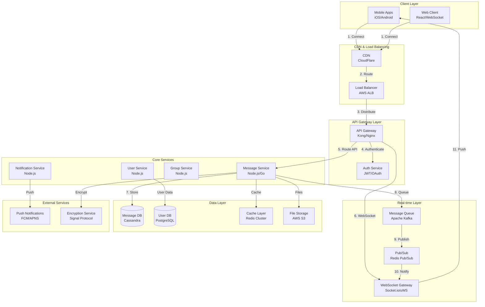

# Chat Application System Design (WhatsApp-like)

**File Purpose:** Comprehensive system design document for a real-time messaging application supporting 500M daily active users with end-to-end encryption, multimedia support, and high availability requirements.

**Author:** System Design Documentation  
**Created:** October 2, 2025  
**Last Updated:** October 2, 2025

---

## Table of Contents

1. [Requirements & Clarification](#requirements--clarification)
2. [Back-of-the-Envelope Calculations](#back-of-the-envelope-calculations)
3. [High-Level Design](#high-level-design)
4. [Database Design](#database-design)
5. [API Design](#api-design)
6. [Deep-Dive Components & Trade-offs](#deep-dive-components--trade-offs)
7. [Bottlenecks & Improvements](#bottlenecks--improvements)

---

## Requirements & Clarification

### User Stories

- **As a user**, I want to send real-time messages to individuals and groups so that I can communicate instantly
- **As a user**, I want to share multimedia content (images, videos, voice) so that I can express myself fully
- **As a user**, I want end-to-end encryption so that my conversations remain private
- **As a user**, I want to see read receipts and typing indicators so that I know when others have seen my messages
- **As a user**, I want to receive messages even when offline so that I don't miss important communications

### Functional Requirements

**Core Messaging:**

- Send/receive text messages in real-time
- 1-to-1 and group chats (up to 256 members)
- Message delivery confirmation and read receipts
- Typing indicators and online/last-seen status

**Multimedia Support:**

- Image sharing (JPEG, PNG, WebP)
- Video sharing (MP4, MOV)
- Voice messages (AAC, MP3)
- File attachments (up to 100MB)

**Advanced Features:**

- End-to-end encryption using Signal Protocol
- Message search and history
- Push notifications for offline users
- Cross-platform support (iOS, Android, Web)

### Non-Functional Requirements

**Performance:**

- Message delivery latency < 100ms
- Support 100M concurrent connections
- 99.9% message delivery guarantee
- System availability: 99.95%

**Scale:**

- 500M daily active users
- 50B messages per day
- Peak concurrent users: 100M
- Message retention: 30 days offline storage

**Security:**

- End-to-end encryption for all messages
- Forward secrecy
- Authentication and authorization
- Data privacy compliance (GDPR, CCPA)

### Clarifying Questions & Assumptions

**Scale & Usage:**

- Global distribution across multiple regions
- Peak usage during evening hours (3x average load)
- 80% mobile users, 20% web users
- Average user sends 100 messages/day

**Feature Scope (MVP):**

- Text and multimedia messaging
- Basic group functionality
- Read receipts and online status
- Push notifications
- End-to-end encryption

**Out of Scope:**

- Voice/video calls
- Stories/status updates
- Payment features
- Advanced group admin features

---

## Back-of-the-Envelope Calculations

### Traffic Estimates

```text
Daily Active Users (DAU): 500M
Messages per user per day: 100
Total daily messages: 50B

Average messages per second: 50B / 86,400 = ~580K QPS
Peak messages per second (3x): ~1.7M QPS

Read operations (message retrieval): 4x write operations
Peak read QPS: ~6.8M QPS

Group messages (20% of total): 10B messages/day
Average group size: 8 members
Group fan-out messages: 10B × 8 = 80B operations/day
```

### Storage Estimates

```text
Text Message Storage:
- Average message size: 100 bytes
- Daily text messages: 40B (80% of total)
- Daily text storage: 40B × 100 bytes = 4TB/day

Multimedia Storage:
- Daily multimedia messages: 10B (20% of total)
- Average multimedia size: 2MB
- Daily multimedia storage: 10B × 2MB = 20PB/day

Metadata Storage:
- Message metadata: 200 bytes per message
- Daily metadata: 50B × 200 bytes = 10TB/day

Total Daily Storage: ~20PB
30-day retention: ~600PB
Annual storage (with growth): ~250EB
```

### Resource Estimates

```text
Concurrent Connections: 100M
WebSocket connections per server: 10K
Required WebSocket servers: 10,000

Database Operations:
- Write QPS: 1.7M (peak)
- Read QPS: 6.8M (peak)
- Database shards needed: ~100 (based on 20K QPS per shard)

Memory Requirements:
- Connection state: 100M × 1KB = 100GB
- Message cache (hot data): 1TB
- User session cache: 500GB
```

### Bandwidth Estimates

```text
Average message size (including metadata): 150 bytes
Peak message bandwidth: 1.7M × 150 bytes = 255MB/s

Multimedia bandwidth:
- Peak multimedia messages: 340K/s (20% of total)
- Average multimedia size: 2MB
- Peak multimedia bandwidth: 680GB/s

Total peak bandwidth: ~680GB/s
```

---

## High-Level Design

### System Architecture Diagram



### Data Flow Explanation

1. **Client Connection**: Mobile/web clients establish WebSocket connections through CDN
2. **Load Distribution**: Load balancer distributes connections across API gateway instances
3. **Authentication**: API gateway validates user authentication via Auth service
4. **Message Processing**: Message service processes incoming messages and applies encryption
5. **Data Persistence**: Messages stored in Cassandra with metadata cached in Redis
6. **Message Queuing**: Kafka queues messages for reliable delivery and fan-out processing
7. **Real-time Delivery**: Pub/Sub system notifies WebSocket gateways of new messages
8. **Client Notification**: WebSocket gateways push messages to connected clients
9. **Offline Handling**: Push notification service handles offline users
10. **Multimedia Storage**: Large files stored in S3 with CDN distribution

---

## Database Design

### Message Storage (Cassandra)

```text
Messages Table:
- message_id (PK, UUID)
- chat_id (Partition Key, UUID)
- sender_id (UUID)
- message_type (VARCHAR) // text, image, video, voice, file
- content (TEXT) // encrypted message content
- media_url (VARCHAR) // S3 URL for multimedia
- timestamp (TIMESTAMP)
- message_status (VARCHAR) // sent, delivered, read
- reply_to_message_id (UUID)
- encryption_key_id (VARCHAR)

Partition Strategy: Partition by chat_id with timestamp clustering
Indexes: sender_id, timestamp, message_status
TTL: 30 days for automatic cleanup
```

### User Management (PostgreSQL)

```text
Users Table:
- user_id (PK, UUID)
- phone_number (VARCHAR, UNIQUE)
- username (VARCHAR, UNIQUE)
- display_name (VARCHAR)
- profile_picture_url (VARCHAR)
- public_key (TEXT) // for E2E encryption
- last_seen (TIMESTAMP)
- is_online (BOOLEAN)
- created_at (TIMESTAMP)
- updated_at (TIMESTAMP)

User_Sessions Table:
- session_id (PK, UUID)
- user_id (FK, UUID)
- device_id (VARCHAR)
- device_type (VARCHAR) // ios, android, web
- push_token (VARCHAR)
- last_active (TIMESTAMP)
- created_at (TIMESTAMP)
```

### Group Management (PostgreSQL)

```text
Groups Table:
- group_id (PK, UUID)
- group_name (VARCHAR)
- group_description (TEXT)
- group_picture_url (VARCHAR)
- created_by (FK, UUID)
- max_members (INTEGER) // default 256
- created_at (TIMESTAMP)
- updated_at (TIMESTAMP)

Group_Members Table:
- group_id (FK, UUID)
- user_id (FK, UUID)
- role (VARCHAR) // admin, member
- joined_at (TIMESTAMP)
- last_read_message_id (UUID)

Primary Key: (group_id, user_id)
```

### Message Status Tracking (Redis)

```text
Message_Delivery_Status:
Key: message:{message_id}:status
Value: {
  "sent_at": timestamp,
  "delivered_to": [user_ids],
  "read_by": [user_ids],
  "failed_delivery": [user_ids]
}
TTL: 7 days

User_Online_Status:
Key: user:{user_id}:status
Value: {
  "is_online": boolean,
  "last_seen": timestamp,
  "active_sessions": [session_ids]
}
TTL: 1 hour
```

---

## API Design

### Base Configuration

```text
Base URL: https://api.chatapp.com/v1
Authentication: Bearer JWT tokens
Rate Limiting: 1000 requests/minute per user
Content-Type: application/json
```

### Authentication Endpoints

#### Register User

```http
POST /auth/register
```

**Request:**
```json
{
  "phone_number": "+1234567890",
  "verification_code": "123456",
  "display_name": "John Doe",
  "public_key": "base64_encoded_public_key"
}
```

**Response (201):**
```json
{
  "user_id": "uuid",
  "access_token": "jwt_token",
  "refresh_token": "refresh_jwt",
  "expires_in": 3600
}
```

#### Login

```http
POST /auth/login
```

**Request:**
```json
{
  "phone_number": "+1234567890",
  "verification_code": "123456",
  "device_id": "device_uuid"
}
```

**Response (200):**
```json
{
  "user_id": "uuid",
  "access_token": "jwt_token",
  "refresh_token": "refresh_jwt",
  "expires_in": 3600
}
```

### Message Endpoints

#### Send Message

```http
POST /messages
```

**Headers:**
```text
Authorization: Bearer {access_token}
Content-Type: application/json
```

**Request:**
```json
{
  "chat_id": "uuid",
  "message_type": "text",
  "content": "encrypted_message_content",
  "reply_to_message_id": "uuid",
  "encryption_key_id": "key_id"
}
```

**Response (201):**
```json
{
  "message_id": "uuid",
  "timestamp": "2025-10-02T10:30:00Z",
  "status": "sent"
}
```

#### Get Messages

```http
GET /messages/{chat_id}
```

**Query Parameters:**
- `limit`: integer (default: 50, max: 100)
- `before`: timestamp (for pagination)
- `after`: timestamp (for new messages)

**Response (200):**
```json
{
  "messages": [
    {
      "message_id": "uuid",
      "sender_id": "uuid",
      "message_type": "text",
      "content": "encrypted_content",
      "timestamp": "2025-10-02T10:30:00Z",
      "status": "read",
      "reply_to_message_id": "uuid"
    }
  ],
  "has_more": true,
  "next_cursor": "timestamp"
}
```

#### Upload Media

```http
POST /media/upload
```

**Request (multipart/form-data):**
```text
file: binary_file_data
chat_id: uuid
message_type: image|video|voice|file
```

**Response (201):**
```json
{
  "media_id": "uuid",
  "media_url": "https://cdn.chatapp.com/media/uuid",
  "thumbnail_url": "https://cdn.chatapp.com/thumbnails/uuid",
  "file_size": 1024000,
  "mime_type": "image/jpeg"
}
```

### Group Management Endpoints

#### Create Group

```http
POST /groups
```

**Request:**
```json
{
  "group_name": "Family Chat",
  "group_description": "Family group chat",
  "member_ids": ["uuid1", "uuid2", "uuid3"]
}
```

**Response (201):**
```json
{
  "group_id": "uuid",
  "group_name": "Family Chat",
  "created_at": "2025-10-02T10:30:00Z",
  "members_count": 4
}
```

#### Add Group Members

```http
POST /groups/{group_id}/members
```

**Request:**
```json
{
  "user_ids": ["uuid1", "uuid2"]
}
```

**Response (200):**
```json
{
  "added_members": [
    {
      "user_id": "uuid1",
      "display_name": "Alice",
      "joined_at": "2025-10-02T10:30:00Z"
    }
  ],
  "failed_additions": []
}
```

### User Status Endpoints

#### Update Online Status

```http
PUT /users/me/status
```

**Request:**
```json
{
  "is_online": true,
  "last_seen": "2025-10-02T10:30:00Z"
}
```

**Response (200):**
```json
{
  "status": "updated"
}
```

#### Get User Status

```http
GET /users/{user_id}/status
```

**Response (200):**
```json
{
  "user_id": "uuid",
  "is_online": false,
  "last_seen": "2025-10-02T09:15:00Z"
}
```

### WebSocket Events

#### Connection

```text
URL: wss://ws.chatapp.com/v1/connect
Headers: Authorization: Bearer {access_token}
```

#### Message Events

**Incoming Message:**
```json
{
  "event": "message_received",
  "data": {
    "message_id": "uuid",
    "chat_id": "uuid",
    "sender_id": "uuid",
    "content": "encrypted_content",
    "timestamp": "2025-10-02T10:30:00Z"
  }
}
```

**Typing Indicator:**
```json
{
  "event": "typing_start",
  "data": {
    "chat_id": "uuid",
    "user_id": "uuid",
    "timestamp": "2025-10-02T10:30:00Z"
  }
}
```

**Read Receipt:**
```json
{
  "event": "message_read",
  "data": {
    "message_id": "uuid",
    "chat_id": "uuid",
    "read_by": "uuid",
    "timestamp": "2025-10-02T10:30:00Z"
  }
}
```

### Cross-Cutting Concerns

**Rate Limiting:**
- Authentication: 10 requests/minute
- Messaging: 1000 messages/minute
- Media upload: 100 uploads/hour
- Group operations: 50 requests/minute

**Error Response Format:**
```json
{
  "error": {
    "code": "INVALID_REQUEST",
    "message": "The request is invalid",
    "details": "Specific error details"
  },
  "timestamp": "2025-10-02T10:30:00Z"
}
```

**Pagination Strategy:**
- Cursor-based pagination for messages (timestamp-based)
- Offset-based pagination for user lists
- Maximum page size: 100 items

---

## Deep-Dive Components & Trade-offs

### WebSocket Connection Management

**Architecture:**
```text
WebSocket Gateway Cluster:
- Horizontal scaling with session affinity
- Connection state stored in Redis
- Health checks and automatic failover
- Load balancing based on connection count
```

**Connection Handling:**
- Each gateway server handles 10K concurrent connections
- Connection pooling and multiplexing
- Heartbeat mechanism (30-second intervals)
- Graceful connection migration during server maintenance

**Trade-offs:**

```text
Decision: WebSocket vs Server-Sent Events (SSE)
Choice: WebSocket
Pros: Bidirectional communication, lower latency, better mobile support
Cons: More complex connection management, higher resource usage
Justification: Real-time messaging requires bidirectional communication for typing indicators and read receipts
```

### Message Queue Architecture

**Kafka Configuration:**
```text
Topics:
- messages.incoming (partitioned by chat_id)
- messages.delivery (partitioned by user_id)
- notifications.push (partitioned by user_id)

Partitioning Strategy:
- 100 partitions per topic
- Replication factor: 3
- Retention: 7 days
```

**Message Processing Pipeline:**
1. Message received → Kafka producer
2. Encryption service processes message
3. Database persistence (Cassandra)
4. Fan-out for group messages
5. Delivery to online users via WebSocket
6. Push notifications for offline users

**Trade-offs:**

```text
Decision: Kafka vs RabbitMQ vs Amazon SQS
Choice: Apache Kafka
Pros: High throughput, durability, partitioning, replay capability
Cons: Operational complexity, higher resource usage
Justification: Need to handle 1.7M messages/second with guaranteed delivery and replay capability
```

### Group Chat Fan-out Strategy

**Fan-out Approaches:**

**Push Model (Chosen):**
```text
Process:
1. Message arrives for group
2. Query group members from cache
3. Create delivery tasks for each member
4. Queue individual delivery messages
5. Process deliveries asynchronously

Pros: Immediate delivery, simple client logic
Cons: Higher write amplification, storage overhead
```

**Pull Model (Alternative):**
```text
Process:
1. Store message once in group timeline
2. Clients poll for new messages
3. Fetch messages on demand

Pros: Lower storage overhead, simpler server logic
Cons: Higher latency, more complex client logic
```

**Hybrid Approach:**
- Push for small groups (< 50 members)
- Pull for large groups (> 50 members)
- Configurable threshold based on group activity

### Read Receipt Tracking

**Efficient Tracking System:**
```text
Data Structure (Redis):
Key: msg:{message_id}:receipts
Value: Bitmap of user positions

Benefits:
- O(1) read/write operations
- Memory efficient (1 bit per user)
- Fast aggregation queries
```

**Implementation:**
1. Assign each user a unique position in bitmap
2. Set bit when user reads message
3. Count set bits for read count
4. Use Redis BITCOUNT for efficient counting

**Privacy Controls:**
- User setting to disable read receipts
- Group admin controls for read receipt visibility
- Last-seen privacy settings

### End-to-End Encryption (Signal Protocol)

**Key Management:**
```text
Components:
- Identity Keys (long-term, per device)
- Signed Pre-keys (medium-term, rotated weekly)
- One-time Pre-keys (ephemeral, single use)
- Message Keys (per message, forward secrecy)
```

**Encryption Flow:**
1. Key exchange using X3DH protocol
2. Double Ratchet for ongoing communication
3. Message encryption with AES-256-GCM
4. Key rotation for forward secrecy

**Key Storage:**
- Client-side key storage (secure enclave/keychain)
- Server stores public keys and pre-keys only
- No server access to private keys or message content

**Trade-offs:**

```text
Decision: Signal Protocol vs Custom Encryption
Choice: Signal Protocol
Pros: Battle-tested, forward secrecy, deniability, open source
Cons: Implementation complexity, key management overhead
Justification: Security requirements demand proven encryption with forward secrecy
```

### Message Storage Strategy

**Hot vs Cold Storage:**

**Hot Storage (Redis + Cassandra):**
```text
Criteria: Messages from last 7 days
Storage: Redis cache + Cassandra primary
Access Pattern: High frequency, low latency
Retention: 7 days in cache, permanent in Cassandra
```

**Cold Storage (S3 + Glacier):**
```text
Criteria: Messages older than 30 days
Storage: S3 Standard → Glacier after 90 days
Access Pattern: Rare access, higher latency acceptable
Retention: Long-term archival
```

**Warm Storage (Cassandra):**
```text
Criteria: Messages 7-30 days old
Storage: Cassandra with lower replication factor
Access Pattern: Medium frequency
Retention: 30 days active storage
```

### Caching Strategy

**Multi-Level Caching:**

**L1 Cache (Application Level):**
- User session data
- Recent message cache (last 50 messages per chat)
- Group member lists
- TTL: 5 minutes

**L2 Cache (Redis Cluster):**
- User profiles and status
- Group metadata
- Message delivery status
- Online user presence
- TTL: 1 hour to 24 hours

**L3 Cache (CDN):**
- Media files (images, videos)
- User profile pictures
- Static assets
- TTL: 7 days with cache invalidation

**Cache Invalidation:**
- Write-through for critical data (user status)
- Cache-aside for read-heavy data (messages)
- Event-driven invalidation via message queue
- TTL-based expiration for non-critical data

---

## Bottlenecks & Improvements

### Potential Bottlenecks

#### Database Write Contention

**Problem:** High write load on message database during peak hours
**Solution:** 
- Horizontal sharding by chat_id
- Write-optimized Cassandra configuration
- Batch writes for group message fan-out
- Async replication to read replicas

**Monitoring:** Track write latency percentiles and queue depth

#### WebSocket Connection Limits

**Problem:** Single server connection limits (10K per server)
**Solution:**
- Auto-scaling WebSocket gateway cluster
- Connection load balancing with consistent hashing
- Connection pooling and multiplexing
- Graceful connection migration

**Monitoring:** Connection count per server, connection establishment rate

#### Message Queue Lag

**Problem:** Kafka consumer lag during traffic spikes
**Solution:**
- Dynamic partition scaling
- Consumer group auto-scaling
- Priority queues for different message types
- Circuit breaker pattern for downstream services

**Monitoring:** Consumer lag metrics, processing rate, error rates

#### Encryption Performance

**Problem:** CPU overhead from Signal Protocol operations
**Solution:**
- Hardware security modules (HSM) for key operations
- Async encryption processing
- Key caching and pre-computation
- Dedicated encryption service cluster

**Monitoring:** Encryption latency, CPU utilization, key operation rates

### Scalability Improvements

#### Geographic Distribution

**Multi-Region Deployment:**
```text
Regions: US-East, US-West, EU-West, Asia-Pacific
Strategy: Active-Active with data locality
Replication: Async cross-region for disaster recovery
Routing: GeoDNS-based routing to nearest region
```

**Data Replication:**
- User data replicated to home region + 1 backup
- Messages replicated within region only
- Media files distributed via global CDN
- Cross-region backup for disaster recovery

#### Advanced Caching

**Intelligent Prefetching:**
- ML-based prediction of message access patterns
- Preload recent conversations for active users
- Predictive media caching based on user behavior
- Smart cache warming during low-traffic periods

**Edge Caching:**
- Deploy cache nodes closer to users
- Regional message caches for popular groups
- Edge-based user presence tracking
- Distributed session management

#### Real-Time Optimizations

**WebSocket Improvements:**
- HTTP/3 and QUIC protocol support
- Connection multiplexing
- Adaptive compression based on network conditions
- Smart reconnection with exponential backoff

**Message Delivery Optimization:**
- Priority queues (urgent vs normal messages)
- Batch delivery for multiple messages
- Smart routing based on user activity patterns
- Predictive message pre-delivery

### Monitoring and Observability

#### System Metrics

**Performance Metrics:**
```text
Latency Percentiles:
- P50, P95, P99 message delivery latency
- WebSocket connection establishment time
- Database query response times
- API endpoint response times

Throughput Metrics:
- Messages per second (by type)
- WebSocket connections per second
- API requests per second
- Database operations per second

Error Rates:
- Message delivery failures
- WebSocket connection failures
- API error rates (4xx, 5xx)
- Database connection errors
```

**Business Metrics:**
```text
User Engagement:
- Daily/Monthly active users
- Messages per user per day
- Group participation rates
- Media sharing frequency

Reliability Metrics:
- Message delivery success rate
- End-to-end message latency
- System uptime and availability
- Push notification delivery rate
```

#### Alerting Strategy

**Critical Alerts (Immediate Response):**
- Message delivery rate < 99.9%
- System availability < 99.95%
- Database connection failures > 1%
- WebSocket connection success rate < 99%

**Warning Alerts (15-minute response):**
- Message latency P95 > 200ms
- Queue lag > 10 seconds
- Error rate > 0.1%
- CPU/Memory utilization > 80%

**Monitoring Tools:**
- Prometheus + Grafana for metrics
- ELK stack for log analysis
- Jaeger for distributed tracing
- PagerDuty for alert management

### Security Considerations

#### Input Validation and Sanitization

**Message Content:**
- Input length limits (text: 4KB, media: 100MB)
- Content type validation
- Malware scanning for file uploads
- XSS prevention for web clients

**API Security:**
- Request rate limiting per user/IP
- Input parameter validation
- SQL injection prevention
- CSRF protection for web APIs

#### Authentication & Authorization

**Multi-Factor Authentication:**
- SMS-based verification for registration
- TOTP support for enhanced security
- Biometric authentication on mobile
- Device registration and management

**Authorization Model:**
- JWT tokens with short expiration (1 hour)
- Refresh token rotation
- Device-specific tokens
- Permission-based access control

#### Data Protection

**Encryption at Rest:**
- Database encryption (AES-256)
- File system encryption
- Encrypted backups
- Key rotation policies

**Encryption in Transit:**
- TLS 1.3 for all API communications
- Certificate pinning for mobile apps
- HSTS headers for web clients
- Perfect forward secrecy

#### DDoS Protection

**Network Level:**
- CloudFlare DDoS protection
- Rate limiting at CDN level
- IP-based blocking for malicious traffic
- Geographic traffic filtering

**Application Level:**
- User-based rate limiting
- Connection throttling
- Request queuing and prioritization
- Circuit breaker patterns

### Future Enhancements

#### Advanced Features

**AI-Powered Features:**
- Smart reply suggestions
- Message translation
- Spam and abuse detection
- Content moderation automation

**Enhanced Group Features:**
- Group video calls
- Screen sharing
- File collaboration
- Advanced admin controls

**Business Features:**
- Business accounts with analytics
- Broadcast lists for announcements
- Integration with CRM systems
- API for third-party integrations

#### Performance Optimizations

**Next-Generation Protocols:**
- HTTP/3 and QUIC adoption
- WebRTC for peer-to-peer messaging
- 5G optimization for mobile clients
- Edge computing for regional processing

**Machine Learning Integration:**
- Predictive message caching
- Intelligent load balancing
- Anomaly detection for security
- User behavior analysis for optimization

#### User Experience Improvements

**Cross-Platform Sync:**
- Real-time sync across all devices
- Seamless handoff between devices
- Universal clipboard for media
- Consistent UI/UX across platforms

**Accessibility Features:**
- Voice-to-text transcription
- Text-to-speech for messages
- High contrast mode support
- Screen reader compatibility

**Advanced Search:**
- Full-text search across all messages
- Media search by content
- Date and user-based filtering
- Search result highlighting

---

## Conclusion

This chat application system design supports 500M daily active users with 50B messages per day while maintaining sub-100ms latency and 99.9% delivery guarantee. The architecture emphasizes:

- **Scalability**: Horizontal scaling at every layer with proper sharding strategies
- **Reliability**: Multi-level redundancy and fault tolerance mechanisms
- **Security**: End-to-end encryption with Signal Protocol implementation
- **Performance**: Optimized caching, efficient data structures, and real-time delivery
- **Maintainability**: Microservices architecture with clear separation of concerns

The system is designed to handle 3x peak traffic loads and can scale further through geographic distribution and advanced caching strategies. Security and privacy are built into the core architecture, ensuring user data protection while maintaining high performance standards.

**Key Success Factors:**
1. Proper database sharding and caching strategies
2. Efficient WebSocket connection management
3. Robust message queue architecture for reliability
4. Comprehensive monitoring and alerting systems
5. Strong security foundation with end-to-end encryption

This design provides a solid foundation for a production-ready chat application that can compete with industry leaders while maintaining the flexibility to evolve with changing requirements and scale.
