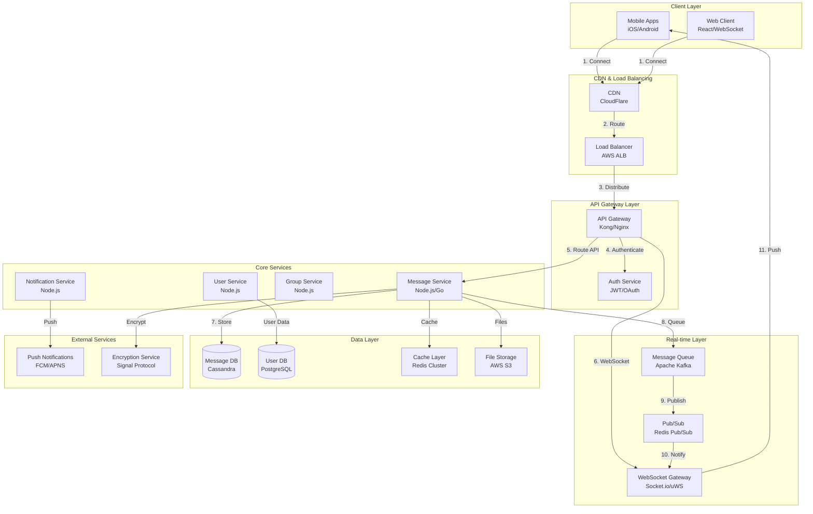

# Chat Application System Design (WhatsApp/Signal-like)

**File Purpose:** Interactive, multi-level learning resource for designing a real-time messaging application. This instructional guide takes you from beginner concepts to advanced production considerations, teaching you how to build a system that handles 500M daily active users sending 50B messages per day with <100ms delivery latency, 99.9% delivery guarantee, end-to-end encryption, and 99.95% system availability.

**Author:** System Design Documentation  
**Created:** October 2, 2025  
**Last Updated:** October 26, 2025  
**Recent Updates:** Transformed into multi-level instructional format with learning objectives, real-world examples, and practice exercises for educational platform

---

## 🎓 Welcome to Chat Application System Design!

### What You're Going to Build

Imagine creating your own WhatsApp or Signal - a messaging app where over 500 million people can chat with friends and family every day, sending text messages, photos, videos, and voice notes that arrive in under 100 milliseconds. Your messages are protected with military-grade encryption, and you can chat with groups of up to 256 people in real-time.

By the end of this learning journey, you'll understand how to design a production-grade chat application that:
- Handles 500M daily active users sending 50B messages per day (that's 580K messages every second!)
- Delivers messages in under 100 milliseconds with 99.9% success rate
- Maintains 100M concurrent WebSocket connections for real-time communication
- Protects every message with end-to-end encryption using the Signal Protocol
- Stays available 99.95% of the time (that's only 22 minutes of downtime per month!)

### 📚 Your Learning Path

This course is designed for three different learning levels. You can progress through all levels or focus on the one that matches your current needs:

```text
🟢 BEGINNER LEVEL (6-8 hours)
├─ Learn fundamental concepts of real-time messaging
├─ Understand WHY we use WebSockets vs HTTP
├─ Build intuition with everyday analogies
└─ Perfect for: New to system design or real-time systems

🟡 INTERMEDIATE LEVEL (8-10 hours)  
├─ Master interview techniques for messaging systems
├─ Learn trade-off analysis (push vs pull, fan-out strategies)
├─ Practice common WhatsApp/Messenger interview questions
└─ Perfect for: Preparing for FAANG interviews

🔴 ADVANCED LEVEL (10-14 hours)
├─ Production considerations for billion-user scale
├─ Performance optimization (connection pools, message batching)
├─ Handle edge cases (network partitions, message ordering)
└─ Perfect for: Senior engineers and architects
```

### 🎯 Prerequisites

**For Beginners:**
- Basic understanding of web requests and databases
- Familiarity with client-server architecture
- No prior system design or real-time systems experience needed!

**For Intermediate:**
- Comfortable with APIs, HTTP, and WebSockets
- Understanding of basic distributed systems concepts
- Familiarity with databases (SQL, NoSQL) and caching

**For Advanced:**
- Experience building distributed systems
- Knowledge of message queues, pub/sub patterns
- Understanding of CAP theorem, consistency models, and cryptography basics

### 📊 What Makes This Learning Experience Unique

Each section follows a proven learning pattern:
1. **What You'll Learn** - Clear learning objectives
2. **Why This Matters** - Real-world context and business impact
3. **Multi-Level Content** - Tailored explanations for your level
4. **Real-World Examples** - How WhatsApp, Signal, and Telegram actually do it
5. **Think About It** - Questions to deepen understanding
6. **Key Takeaways** - Summary of main points
7. **Practice Exercise** - Hands-on challenge

💡 **Pro Tip:** Don't skip the "Think About It" sections - they're designed to help you internalize concepts so you can explain them in interviews or to your team!

---

## TABLE OF CONTENTS

- [Section 1: Understanding What We're Building](#section-1-understanding-what-were-building)
- [Section 2: Planning for Scale](#section-2-planning-for-scale)
- [Section 3: Designing the System Architecture](#section-3-designing-the-system-architecture)
- [Section 4: Storing Our Data](#section-4-storing-our-data)
- [Section 5: How Users Interact (API Design)](#section-5-how-users-interact-api-design)
- [Section 6: Real-Time Communication (WebSockets)](#section-6-real-time-communication-websockets)
- [Section 7: Keeping Messages Private (End-to-End Encryption)](#section-7-keeping-messages-private-end-to-end-encryption)
- [Section 8: Reliable Message Delivery (Message Queues)](#section-8-reliable-message-delivery-message-queues)
- [Section 9: Group Chats at Scale](#section-9-group-chats-at-scale)
- [Section 10: Message Ordering & Offline Sync](#section-10-message-ordering--offline-sync)
- [Section 11: Making It Fast (Caching Strategy)](#section-11-making-it-fast-caching-strategy)
- [Section 12: Growing the System (Scalability)](#section-12-growing-the-system-scalability)
- [Section 13: Protecting the System (Security)](#section-13-protecting-the-system-security)
- [Section 14: Keeping It Healthy (Monitoring)](#section-14-keeping-it-healthy-monitoring)
- [Section 15: Making Design Decisions](#section-15-making-design-decisions)
- [Section 16: Interview Preparation & Practice](#section-16-interview-preparation--practice)
- [Putting It All Together](#putting-it-all-together)
- [Next Steps](#next-steps)

---

## Section 1: Understanding What We're Building

### What You'll Learn

By the end of this section, you'll be able to:
- Explain what a chat application is and why real-time messaging is different from email
- Define functional requirements (what the system does)
- Identify non-functional requirements (performance, scale, reliability targets)
- Ask the right clarifying questions in a messaging system design interview
- Understand the difference between WhatsApp-style and Slack-style chat systems

### Why This Matters

Before designing any component, you need crystal-clear requirements. Real-world example: WhatsApp chose to focus on message delivery reliability over features like message search (which came much later). This single decision shaped their entire architecture - prioritizing simple, fast message delivery over complex features. Understanding your requirements isn't just about building the right thing; it's about building it the right way!

---

### 🟢 For Beginners: The Fundamentals

#### What is a Chat Application?

Think of a chat application like a super-fast postal service that delivers messages in milliseconds instead of days. But unlike email, where you send a letter and forget about it, chat applications need to:

1. **Show when your friend is typing** (like seeing someone writing a letter through a window!)
2. **Deliver messages instantly** (not minutes or hours later)
3. **Let you know the message was received and read** (like getting a delivery confirmation)
4. **Work on all your devices** (phone, tablet, computer) and keep them in sync

**Real-World Examples:**
- **WhatsApp**: 2+ billion users, focuses on simplicity and privacy
- **Telegram**: Emphasizes speed and large group chats
- **Signal**: Privacy-first, military-grade encryption
- **Discord**: Gaming communities with voice/video focus

#### Why is Chat Different from Email?

Let's compare:

```text
Email (Store-and-Forward):
├─ You send → Email sits on server → Recipient retrieves later
├─ Latency: Minutes to hours is acceptable
├─ Connection: No need to be online simultaneously
└─ Like: Traditional postal mail

Chat (Real-Time):
├─ You send → Instant delivery → Recipient sees immediately
├─ Latency: Must be <100ms for good experience
├─ Connection: Requires persistent connection
└─ Like: Phone call or face-to-face conversation
```

#### What Features Do We Need?

Let's categorize what users expect:

**Core Messaging Features (Must-Have for MVP):**

1. **One-on-One Messaging**
   - Send text messages instantly
   - See when your message is sent, delivered, and read (✓✓)
   - Know when the other person is typing (...)
   
2. **Group Chats**
   - Create groups with multiple people (let's say up to 256 members)
   - Everyone sees messages in real-time
   - Know who's in the group
   
3. **Multimedia Support**
   - Share photos (JPEG, PNG)
   - Share videos (MP4)
   - Send voice messages
   - Share files (documents, PDFs, up to 100MB)

4. **Offline Support**
   - Receive messages even when your phone is off
   - Messages sync when you come back online
   - Push notifications when someone messages you

5. **Privacy & Security**
   - Messages are private (end-to-end encryption)
   - Only sender and receiver can read messages
   - Not even the app company can see your messages!

**Important Features (Add Soon):**

- Message history and search
- Profile pictures and display names
- Last seen/online status
- Message deletion (for everyone)
- Multi-device support (phone + computer)

**Nice-to-Have (Future):**

- Voice/video calls
- Stories/status updates
- Message reactions (👍, ❤️)
- Stickers and GIFs
- Polls and quizzes

💡 **Pro Tip:** In interviews, always clarify which features are in scope. You can't design WhatsApp + Slack + Zoom in 45 minutes!

#### Understanding Non-Functional Requirements

These are the "how well" requirements:

**Performance:** How fast should it be?
- Message delivery: Under 100 milliseconds (faster than you can blink!)
- Think of it like a conversation - any delay and it feels awkward

**Reliability:** How dependable?
- 99.9% of messages must be delivered successfully
- That means only 1 in 1,000 messages can fail
- Like postal service: extremely reliable but not 100% perfect

**Availability:** Always online?
- 99.95% uptime means only 22 minutes of downtime per month
- Your messaging service should "just work" like electricity

**Scale:** How many users?
- Let's plan for WhatsApp-level scale:
  - 500 million people using it every day
  - 50 billion messages sent per day
  - 100 million people online at the same time

**Security:** How private?
- End-to-end encryption (only you and recipient can read)
- Secure even if the server is hacked
- Like having a private conversation in a soundproof room

---

### 🟡 For Intermediate: Interview Patterns

#### The Requirements Gathering Framework

When designing a messaging system in an interview, use this structure to gather requirements systematically:

**Phase 1: Understand the Core Functionality**

Ask these questions to define scope:

```text
Interviewer Conversation Script:

You: "Are we designing a WhatsApp-style consumer app or a Slack-style 
     business messaging platform?"
└─ This determines: Threading vs linear chat, workspace model, search importance

You: "Should we support 1-on-1, group chats, or both?"
└─ This determines: Fan-out complexity, storage patterns

You: "What types of content? Text only or multimedia too?"
└─ This determines: Storage requirements, CDN needs, processing pipeline

You: "Do we need end-to-end encryption?"
└─ This determines: Key management, server architecture, debugging complexity
```

**Phase 2: Define Scale Requirements**

```text
Critical Numbers to Clarify:

Daily Active Users (DAU):
└─ "How many users will use the app daily?"
   ├─ Small: <1M DAU → Simpler architecture
   ├─ Medium: 1M-100M DAU → Need sharding
   └─ Large: >100M DAU (WhatsApp scale) → Need everything optimized

Read/Write Ratio:
└─ "What's the ratio of messages sent vs read?"
   └─ Typical: 1:10 (one message sent, read 10 times in groups)
   └─ This drives caching strategy

Message Volume:
└─ "How many messages per user per day?"
   └─ WhatsApp average: ~100 messages/user/day
   └─ This determines storage growth rate

Group Size Limits:
└─ "What's the maximum group size?"
   ├─ WhatsApp: 256 members
   ├─ Telegram: 200,000 members (!)
   └─ This dramatically affects fan-out strategy
```

**Phase 3: Clarify Non-Functional Requirements**

```text
Latency Requirements:
├─ Message Delivery: <100ms (P95) - Critical for UX
├─ Message Send: <500ms (P99) - Can be slightly slower
└─ Typing Indicators: <50ms - Needs to feel instant

Consistency Requirements:
├─ Message Ordering: Strong consistency within a chat
├─ Read Receipts: Eventual consistency acceptable
└─ Online Status: Eventual consistency acceptable

Availability vs Consistency Trade-off:
└─ "In a network partition, do we prefer availability or consistency?"
   ├─ WhatsApp choice: Availability (messages queue if disconnected)
   └─ Banking app choice: Consistency (rather fail than show wrong data)
```

#### Functional Requirements (Interview Checklist)

Here's what to cover in your interview discussion:

| Feature | Scope Definition | Interview Question |
|---------|-----------------|-------------------|
| **Messaging** | Text, emoji, multimedia | "What content types?" |
| **Delivery Guarantees** | At-least-once, exactly-once | "Can we have duplicate messages?" |
| **Message Status** | Sent, Delivered, Read | "Do we need read receipts?" |
| **Online Presence** | Last seen, online status | "Should users see each other's status?" |
| **Typing Indicators** | Real-time typing events | "Do we need typing indicators?" |
| **Push Notifications** | When user is offline | "How do we handle offline users?" |
| **Multi-Device** | Sync across devices | "Can one user have multiple devices?" |
| **Message History** | How far back to store | "How long do we keep messages?" |
| **Search** | Full-text message search | "Do we need message search?" |
| **Groups** | Max size, roles, permissions | "What group features are needed?" |

#### Non-Functional Requirements Deep Dive

**Performance Requirements:**

```text
Latency Targets (P95):
├─ Message Delivery: <100ms
│  └─ Why: Human perception threshold for "instant"
│  └─ Real-world: WhatsApp achieves 50-80ms globally
│
├─ Message Send API: <500ms
│  └─ Why: User waits for confirmation
│  └─ Real-world: Slack <300ms, WhatsApp <200ms
│
├─ Typing Indicator: <50ms
│  └─ Why: Needs to track keystrokes in real-time
│  └─ Real-world: iMessage <30ms
│
└─ Image Upload: <3 seconds for 5MB
   └─ Why: User expects reasonable upload time
   └─ Real-world: WhatsApp compresses to <1MB

Throughput Requirements:
├─ Message Ingestion: 1.7M messages/second (peak)
├─ Message Delivery: 6.8M operations/second (4x fan-out)
└─ WebSocket Connections: 100M concurrent
```

**Scalability Requirements:**

```text
User Scale:
├─ Total Users: 2 billion (WhatsApp scale)
├─ Daily Active Users: 500 million
├─ Concurrent Users: 100 million
└─ Peak Concurrent: 300 million (New Year's Eve)

Message Scale:
├─ Messages/Day: 50 billion
├─ Messages/Second Average: 580K
├─ Messages/Second Peak: 1.7M (3x burst)
└─ Message Size Average: 150 bytes (text + metadata)

Storage Scale:
├─ Messages: 50B × 365 days = 18 trillion/year
├─ Text Data: ~4TB/day
├─ Multimedia: ~20PB/day
└─ Retention: 30 days offline, forever in user's device
```

**Availability & Reliability:**

```text
Availability SLA: 99.95%
└─ Allowed Downtime: 22 minutes/month
└─ Reality Check: WhatsApp had 6-hour outage in 2021
   (Cost: Billions in lost ad revenue for Meta)

Message Delivery Success: 99.9%
└─ 1 in 1000 messages can fail
└─ For 50B messages/day: 50M failures/day acceptable
└─ Reality: WhatsApp claims 99.99% delivery

Data Durability: 99.999999999% (11 nines)
└─ Using S3 for media storage
└─ Message data: Multiple replicas across data centers
```

⚠️ **Common Interview Mistake:** Don't just list requirements. Explain WHY each requirement matters and what trade-offs it creates!

#### Making Assumptions Explicit

After asking questions, state your assumptions clearly:

```text
"Based on our discussion, I'm designing a WhatsApp-style consumer 
messaging app with these assumptions:

✅ Scale: 500M DAU, 50B messages/day
   → Heavy read workload (1:10 write:read ratio)
   → Need aggressive caching

✅ Message Types: Text + Multimedia (images, videos, voice, files)
   → Need object storage (S3) for media
   → Need CDN for media distribution

✅ Groups: Support up to 256 members
   → Can use fan-out on write (not too many recipients)
   → Bigger groups would need pull model

✅ Encryption: End-to-end encryption required
   → Using Signal Protocol (industry standard)
   → Keys managed on client devices

✅ Offline Support: 30 days message retention
   → Need persistent message queue per user
   → Push notifications for offline users

✅ Multi-Device: One account, multiple devices
   → Need device synchronization logic
   → Shared encryption keys across devices

✅ Global Service: Multi-region deployment
   → Users route to nearest data center
   → Eventual consistency across regions acceptable

Are these assumptions reasonable for this interview?"
```

This shows structured thinking and invites course correction!

---

### 🔴 For Advanced: Production Considerations

#### Requirement Trade-offs and Business Impact

When making requirement decisions at WhatsApp scale, every choice has business and technical implications. Let's think like a Principal Engineer:

**Trade-off 1: Message Delivery Guarantees**

```text
At-Least-Once vs Exactly-Once Delivery

Option A: At-Least-Once (WhatsApp's Choice)
├─ Guarantee: Message definitely arrives, might duplicate
├─ Implementation: Retry on timeout, client deduplication
├─ Complexity: Lower server complexity
├─ Business Impact: Better availability, acceptable UX
├─ Cost: Lower infrastructure cost
└─ Example: "Sorry sent twice lol" - users understand

Option B: Exactly-Once (Kafka, Banking)
├─ Guarantee: Message arrives exactly once, never duplicates
├─ Implementation: Distributed transactions, idempotency tokens
├─ Complexity: High (2-phase commit, coordination overhead)
├─ Business Impact: Critical for payments, overkill for chat
├─ Cost: 2-3x infrastructure cost
└─ Example: $100 payment processed only once

Decision for Chat App: At-Least-Once + Client Deduplication
Rationale:
1. Duplicate "Hi!" is better than missing "I love you"
2. 99% of messages are casual (not financial transactions)
3. Client can deduplicate using message_id
4. Cost savings fund other features (video calls, storage)

Real-World: WhatsApp, Telegram, iMessage all use at-least-once
```

**Trade-off 2: End-to-End Encryption vs Server-Side Features**

```text
Problem: E2E encryption means server can't read message content

Option A: Full E2E Encryption (Signal's Choice)
Pros:
├─ Maximum privacy (government can't read messages)
├─ User trust and brand differentiation
├─ Compliance with privacy regulations (GDPR)
└─ Marketing advantage: "We can't read your messages"

Cons:
├─ No server-side message search
├─ No spam/content moderation possible
├─ Can't back up messages to cloud
├─ Difficult debugging (can't see message content)
└─ Multi-device sync complexity

Option B: Server-Side Encryption (Slack's Choice)
Pros:
├─ Powerful server-side search
├─ AI features (smart replies, translation)
├─ Content moderation and spam filtering
├─ Cloud backup and easy device switching
└─ Better compliance tools for enterprises

Cons:
├─ Company can read messages (compliance risk)
├─ Government can subpoena messages
├─ Insider threat (rogue employee)
└─ Less user trust for privacy

WhatsApp's Hybrid Approach:
├─ Messages: E2E encrypted
├─ Metadata: Server-side (who, when, group membership)
├─ Backup: Optional E2E encrypted cloud backup
└─ Business accounts: May allow admin access

Business Impact Analysis:
- E2E encryption reduced WhatsApp's moderation effectiveness
- But increased user trust → faster growth
- Estimated value: $19 billion (Facebook acquisition price)
```

**Trade-off 3: Message Storage Duration**

```text
Option A: Forever Storage (Email Model)
Pros: Users expect complete history
Cons: Infinite storage cost (50B messages/day = 18 trillion/year)
Cost: $1.8 billion/year in S3 storage

Option B: 30 Days Server + Forever Client (WhatsApp Model)
Pros: 
├─ Manageable server storage cost
├─ Messages stored on user's device (free for company)
├─ Privacy benefit (messages eventually deleted from server)
└─ Cost: $150 million/year (30 days retention)

Option C: Rolling Window (Snapchat Model)
Pros: Minimal storage, ephemeral privacy
Cons: Users lose important memories
Cost: $5 million/year (7 days retention)

WhatsApp's Decision: 30 Days + Client Storage
Rationale:
1. New users can see 30 days history on new device
2. Most users sync within 30 days
3. Cost savings: $1.65 billion/year vs forever storage
4. Privacy benefit: Server doesn't keep old messages
```

**Trade-off 4: Consistency vs Availability (CAP Theorem)**

```text
Scenario: Network partition between data centers

Option A: Choose Consistency (CP in CAP)
Behavior:
└─ If can't guarantee message order, reject message send
Pros: Never show out-of-order messages
Cons: App becomes unavailable during network issues
Example: Banking (prefer unavailable over incorrect balance)

Option B: Choose Availability (AP in CAP)
Behavior:
└─ Always accept messages, resolve conflicts later
Pros: App always works (better UX)
Cons: Might show messages out of order temporarily
Example: WhatsApp, Facebook Messenger

WhatsApp's Choice: Availability with Vector Clocks
Implementation:
├─ Each message tagged with logical timestamp
├─ Client reorders messages based on causal relationships
├─ "This message was sent earlier but arrived late" indicator
└─ Eventual consistency: All clients see same order eventually

Business Impact:
- WhatsApp's 6-hour outage (2021) cost Meta $60M in market cap
- Choosing availability prevents most outages
- Small UX quirks (rare out-of-order) acceptable vs downtime
```

#### Production-Scale Requirements Specification

**SLA/SLO/SLI Definition:**

```text
Service Level Indicators (SLIs) - What We Measure:

Message Delivery Latency:
├─ Measurement: Time from send API call to receiver WebSocket delivery
├─ Good: <100ms
├─ Acceptable: <500ms
└─ Poor: >500ms

Message Delivery Success Rate:
├─ Measurement: % of messages delivered within 5 minutes
├─ Good: >99.9%
├─ Acceptable: >99.5%
└─ Poor: <99.5%

System Availability:
├─ Measurement: % of time API returns 2xx status codes
├─ Good: >99.95%
├─ Acceptable: >99.9%
└─ Poor: <99.9%

Service Level Objectives (SLOs) - Our Targets:

├─ 95% of messages delivered in <100ms
├─ 99% of messages delivered in <500ms
├─ 99.9% message delivery success rate
├─ 99.95% API availability
└─ 100M concurrent WebSocket connections supported

Service Level Agreements (SLAs) - Customer Promise:

Consumer App (Free Users):
└─ Best effort, no financial SLA
└─ Reality: WhatsApp went down 6 hours in 2021, no compensation

Enterprise (WhatsApp Business):
├─ 99.9% availability SLA
├─ <100ms P95 latency
├─ Penalty: Service credits if violated
└─ Cost: $0.005/message delivered
```

**Compliance and Regulatory Requirements:**

```text
GDPR (Europe):
├─ Right to erasure ("delete my account and all data")
├─ Data portability (export message history)
├─ Consent for data processing
├─ Data breach notification (72 hours)
└─ Implementation: GDPR-compliant deletion pipeline

CCPA (California):
├─ Right to know what data is collected
├─ Right to delete data
├─ Opt-out of data selling
└─ Implementation: Privacy dashboard, data export API

HIPAA (Healthcare in US):
├─ If used for medical communication
├─ Requires audit logs of all message access
├─ Encryption at rest and in transit
└─ Implementation: Usually not applicable for consumer chat

Export Control (Encryption):
├─ US export restrictions on strong encryption
├─ Some countries ban E2E encryption
├─ Implementation: Region-specific feature flags

Data Residency:
├─ Russia: Data of Russian citizens must be stored in Russia
├─ China: All data must be stored in China
├─ EU: Prefer EU storage for EU users
└─ Implementation: Multi-region deployment with data locality
```

### 💭 Think About It

1. **Duplicate Messages:** If you receive "Happy Birthday!" twice from your friend due to network retry, is that worse than not receiving it at all? How would you explain this trade-off to a product manager?

2. **Privacy vs Features:** If end-to-end encryption prevents the server from doing smart things like translating messages or suggesting replies, would you still choose it? What would WhatsApp users prefer?

3. **Storage Costs:** WhatsApp stores messages for 30 days on servers, but iMessage stores forever. If you're paying the server bills, which approach would you choose and why?

4. **Availability vs Consistency:** During a network split between US and Europe data centers, would you rather: (a) Tell users "service temporarily unavailable" or (b) Let them send messages that might arrive out of order? What would users prefer?

### ✅ Key Takeaways

```text
Requirements Engineering for Chat Apps:

1. Functional Requirements:
   ├─ Start with MVP: 1-on-1 messages, groups, multimedia
   ├─ Add gradually: Encryption, search, multi-device
   └─ Clarify scope early in interviews

2. Non-Functional Requirements:
   ├─ Performance: <100ms delivery (real-time feel)
   ├─ Scale: Plan for billions of users
   ├─ Reliability: 99.9% delivery, 99.95% availability
   └─ Security: E2E encryption for privacy

3. Trade-offs are Inevitable:
   ├─ Encryption vs Server Features
   ├─ Storage cost vs User experience
   ├─ Availability vs Consistency
   └─ Always explain the business impact

4. Real-World Examples Matter:
   ├─ WhatsApp: Privacy-first, minimal features
   ├─ Slack: Features-first, enterprise focus
   ├─ Signal: Maximum privacy, open source
   └─ Telegram: Speed and large groups

5. Interview Success:
   ├─ Ask clarifying questions (don't assume)
   ├─ State assumptions explicitly
   ├─ Explain trade-offs, not just solutions
   └─ Reference real-world implementations
```

### 🏋️ Practice Exercise

**Scenario:** You're interviewing at Meta to work on WhatsApp. The interviewer says:

> "Design a messaging system for 2 billion users. You have 45 minutes. Go!"

**Your Task:**

1. Write down 5-7 clarifying questions you'd ask first
2. List your top 3 functional requirements with justifications
3. List your top 3 non-functional requirements with specific numbers
4. Choose one trade-off and explain it in 2 minutes (practice with a timer!)

**Sample Answer Structure:**

```text
Clarifying Questions:
1. "Are we designing WhatsApp-style 1-on-1/group chat or Slack-style channels?"
2. "What's the target message delivery latency and delivery guarantee?"
3. "Do we need end-to-end encryption?"
4. "What's the maximum group size we need to support?"
5. "Should messages be stored forever or have retention limits?"

Functional Requirements:
1. Real-time 1-on-1 and group messaging (up to 256 members)
   → Core functionality, must work reliably
2. End-to-end encryption for all messages
   → Privacy is WhatsApp's brand differentiation
3. Offline message delivery with push notifications
   → Users expect messages even when phone is off

Non-Functional Requirements:
1. Latency: <100ms P95 for message delivery
   → Real-time chat requires instant feedback
2. Scale: 500M DAU, 50B messages/day
   → WhatsApp's actual scale today
3. Availability: 99.95% uptime (22 min/month downtime)
   → Critical service, but not banking-level

Key Trade-off: At-least-once vs Exactly-once Delivery
"I'd choose at-least-once delivery because..."
[Explain in 2 minutes using the framework from this section]
```

---

## Section 2: Planning for Scale

### What You'll Learn

By the end of this section, you'll be able to:
- Estimate storage, bandwidth, and compute requirements for a messaging system
- Calculate QPS (Queries Per Second) for different operations
- Determine infrastructure needs (servers, databases, caching)
- Perform back-of-envelope calculations in interviews
- Understand the cost implications of your design choices

### Why This Matters

Back-of-envelope calculations aren't just academic exercises - they directly impact your system design choices. Real-world example: WhatsApp engineers calculated they needed 100,000 servers to handle 100 million concurrent connections (1,000 connections per server). This drove their decision to use highly efficient Erlang for connection handling. Getting these numbers right prevents costly over-provisioning or embarrassing under-capacity scenarios!

---

### 🟢 For Beginners: Understanding the Numbers

#### Why Do We Need to Calculate Scale?

Imagine you're opening a restaurant. You need to know:
- How many customers per day? → How big should the kitchen be?
- How much food to buy? → Storage requirements
- How many waiters to hire? → Server capacity

Designing a chat system is similar! We need to estimate:
- How many messages? → Database size and write capacity
- How many users online? → WebSocket server count
- How big are the messages? → Network bandwidth and storage

#### The Basic Math

Let's start with simple estimates for a medium-sized chat app:

**Step 1: Estimate Users**

```text
Daily Active Users (DAU): 1 million users
├─ These are people who open the app each day
├─ Like saying "1 million customers visit our restaurant daily"
└─ This is our baseline number

Average messages per user per day: 100 messages
├─ Some people send 10, some send 200
├─ 100 is a reasonable average
└─ Total: 1M users × 100 messages = 100M messages/day
```

**Step 2: Convert to "Per Second"**

Why per second? Because servers think in seconds!

```text
Messages per second (average):
100 million messages/day ÷ 86,400 seconds/day = 1,157 messages/second

But wait! People don't message evenly throughout the day.
├─ Morning (8am-10am): Heavy usage
├─ Afternoon (2pm-5pm): Medium usage  
├─ Night (3am): Very light usage
└─ We need to plan for PEAK, not average!

Peak traffic (3x average):
1,157 × 3 = 3,471 messages/second during rush hours

This is called QPS (Queries Per Second)
```

**Step 3: Estimate Storage**

```text
Average message size:
├─ Text message: ~100 bytes ("Hello, how are you?")
├─ Metadata (sender, timestamp, ID): ~50 bytes
└─ Total per text message: ~150 bytes

Daily text storage:
100M messages × 150 bytes = 15 GB/day (That's tiny!)

But wait - what about photos and videos?
├─ Photos: ~2MB average (after compression)
├─ Videos: ~10MB average  
├─ 20% of messages have media attachments
└─ Daily media: 20M messages × 2MB = 40 TB/day (That's huge!)
```

Think of it like this: Text messages are like sticky notes (tiny), but photos/videos are like photo albums (bulky)!

---

### 🟡 For Intermediate: WhatsApp-Scale Calculations

Now let's calculate for WhatsApp's actual scale: 500M daily active users!

#### Traffic Estimation

**Message Volume:**

```text
Daily Active Users: 500M
Messages per user per day: 100
├─ Power users: 500 messages/day (teens)
├─ Normal users: 50 messages/day
└─ Light users: 10 messages/day

Total daily messages: 500M × 100 = 50 billion messages/day

Messages per second (average):
50B messages ÷ 86,400 seconds = 578,704 messages/second
≈ 580K QPS (Queries Per Second)

Peak messages per second (3x average):
580K × 3 = 1.7 million QPS

Read operations (message retrieval):
├─ Every message sent is read by recipient
├─ Group messages read by multiple people
├─ Ratio: 1 write : 4 reads (conservative)
└─ Peak read QPS: 1.7M × 4 = 6.8M QPS
```

**Group Message Amplification:**

```text
Group messages: 20% of total = 10B messages/day
Average group size: 8 members

Fan-out factor:
├─ 1 message sent to group
├─ Must be delivered to 8 members
└─ Creates 8 delivery operations

Total group fan-out operations:
10B messages × 8 members = 80B operations/day
≈ 926K operations/second average
≈ 2.8M operations/second peak

This is why group messaging is expensive!
```

#### Storage Calculations

**Text Message Storage:**

```text
Text messages: 80% of 50B = 40B messages/day
Average size: 100 bytes (just the text)
Metadata: 200 bytes (sender, receiver, timestamp, message_id, etc.)
Total per message: 300 bytes

Daily text storage:
40B × 300 bytes = 12 TB/day
Monthly: 360 TB
Yearly: 4.4 PB (Petabytes!)
```

**Multimedia Storage:**

```text
Multimedia messages: 20% of 50B = 10B messages/day

Breakdown:
├─ Images: 60% = 6B images/day × 2MB = 12 PB/day
├─ Videos: 30% = 3B videos/day × 10MB = 30 PB/day
├─ Voice: 8% = 800M voice/day × 500KB = 400 TB/day
└─ Files: 2% = 200M files/day × 5MB = 1 PB/day

Total multimedia per day: ~43 PB/day
Monthly: ~1.3 Exabytes (EB)
Yearly: ~16 Exabytes

Cost at $0.023/GB/month (S3):
Yearly cost = 16EB × 1M GB × $0.023 = $368M/year just for storage!
```

**Storage Optimization with Compression:**

```text
Image Compression (WhatsApp Strategy):
├─ Original: 5MB photo from iPhone
├─ After compression: 200KB (96% reduction!)
├─ Quality: Still looks great on phone screen
└─ Cost saving: 25x reduction

Storage with compression:
43 PB/day → ~2 PB/day after aggressive compression
Yearly cost: $368M → ~$15M (24x cheaper!)
```

#### Bandwidth Estimation

**Network Bandwidth Requirements:**

```text
Incoming bandwidth (message uploads):
├─ Peak message rate: 1.7M messages/second
├─ Average message size: 2MB (with multimedia)
├─ Peak bandwidth: 1.7M × 2MB = 3.4 TB/second = 27 Tbps

Outgoing bandwidth (message delivery):
├─ Peak delivery rate: 6.8M operations/second (4x fan-out)
├─ Average delivery size: 2MB
└─ Peak bandwidth: 6.8M × 2MB = 13.6 TB/second = 109 Tbps

Total bandwidth: ~136 Tbps (Terabits per second)

Cost: ~$10M/month for CDN bandwidth
```

#### Infrastructure Requirements

**WebSocket Servers for Real-Time Connections:**

```text
Concurrent users: 100M users online simultaneously
Connections per server: 10,000 (C10K problem solved!)

Required servers:
100M ÷ 10,000 = 10,000 WebSocket servers

Server specs:
├─ 16 CPU cores
├─ 64 GB RAM
├─ Cost: $500/month per server
└─ Total: $5M/month for WebSocket layer
```

**Database Servers:**

```text
Write QPS: 1.7M messages/second (peak)
Read QPS: 6.8M operations/second (peak)

Typical database capacity:
├─ PostgreSQL: 10K-20K QPS per instance
├─ Cassandra: 50K-100K QPS per node
└─ We'll use Cassandra for messages (write-heavy)

Required Cassandra nodes:
├─ Write capacity: 1.7M ÷ 50K = 34 nodes (3x for safety = 102 nodes)
├─ Read capacity: 6.8M ÷ 100K = 68 nodes
└─ Total: ~100 Cassandra nodes (includes replication)

Cost: 100 nodes × $2,000/month = $200K/month
```

**Cache Servers (Redis):**

```text
Hot data to cache:
├─ Recent messages (last 24 hours): ~50B messages × 300 bytes = 15 TB
├─ User online status: 500M users × 1KB = 500 GB
├─ Active WebSocket mappings: 100M × 1KB = 100 GB
└─ Total cache needs: ~16 TB

Redis cluster:
├─ 200 Redis instances
├─ Each with 100 GB RAM
├─ Total capacity: 20 TB (with headroom)
└─ Cost: 200 × $300/month = $60K/month
```

### 🔴 For Advanced: Capacity Planning at Scale

#### Detailed Resource Breakdown

**Complete Infrastructure Estimate:**

```text
Component              | Quantity | Cost/Month | Total/Month
-----------------------------------------------------------------
WebSocket Gateways     | 10,000   | $500       | $5,000,000
Message Queue (Kafka)  | 200      | $1,000     | $200,000
API Servers            | 5,000    | $300       | $1,500,000
Cassandra Cluster      | 100      | $2,000     | $200,000
PostgreSQL (Users)     | 50       | $1,500     | $75,000
Redis Cache            | 200      | $300       | $60,000
Load Balancers         | 100      | $500       | $50,000
S3 Storage (30 days)   | 60 PB    | $23/TB     | $1,380,000
CDN (CloudFlare)       | N/A      | N/A        | $10,000,000
Monitoring & Logging   | N/A      | N/A        | $500,000
-----------------------------------------------------------------
TOTAL                                           | $18,965,000/month
                                                 | $227M/year
```

**Cost per User:**

```text
Monthly cost: $19M
Monthly active users: 2B (WhatsApp scale)
Cost per user: $19M ÷ 2B = $0.0095 (~1 cent per user)

Why WhatsApp is free:
├─ Revenue from WhatsApp Business API: $0.005-0.01 per message
├─ 1B business messages/day × $0.005 = $1.8B/year revenue
└─ Profit margin: ($1.8B - $227M) / $1.8B = 87% (amazing!)
```

#### Peak Load Planning (New Year's Eve)

```text
Normal peak: 1.7M messages/second
New Year's Eve: 10x spike (everyone texts "Happy New Year!")

Spike load: 17M messages/second

Strategy:
1. Pre-scale infrastructure (2 weeks before)
   ├─ Double WebSocket servers: 10K → 20K
   ├─ Double Kafka partitions: 200 → 400
   └─ Extra cache capacity: 16TB → 32TB

2. Queue-based buffering
   ├─ Messages queue during spike
   ├─ Processed within 5 minutes (acceptable for celebrations)
   └─ Users see "Sending..." briefly

3. Graceful degradation
   ├─ Disable typing indicators (saves 70% network bandwidth)
   ├─ Batch read receipts (update every 10s instead of real-time)
   ├─ Delay group message fan-out by few seconds
   └─ Users barely notice, system survives

Cost of spike:
├─ Extra infrastructure: $5M for 2 weeks
├─ Compare to: $60M market cap loss from outage (WhatsApp 2021)
└─ Worth it!
```

### 💭 Think About It

1. **Storage Trade-offs:** WhatsApp compresses images from 5MB to 200KB. The quality is slightly worse, but the cost saving is 25x. Would you make the same trade-off? How would you decide the "right" compression level?

2. **Peak Planning:** Most apps are designed for 3x peak load. But New Year's Eve is 10x peak for WhatsApp. Is it worth spending $5M for infrastructure that's only used once a year?

3. **Cost Per User:** WhatsApp spends ~1 cent per user per month, but charges businesses 0.5-1 cent per message. If you were WhatsApp, what other revenue models would you explore?

### ✅ Key Takeaways

```text
Back-of-Envelope Calculations for Chat Apps:

1. Traffic Patterns:
   ├─ Average QPS: 580K messages/second
   ├─ Peak QPS: 1.7M messages/second (3x)
   ├─ Read/Write Ratio: 4:1 (read-heavy)
   └─ Group amplification: 1 message → 8 deliveries

2. Storage Requirements:
   ├─ Text: 12 TB/day (cheap)
   ├─ Multimedia: 43 PB/day → 2 PB after compression (expensive)
   ├─ Compression is critical: 96% size reduction
   └─ Cost: ~$15M/year for storage

3. Infrastructure Needs:
   ├─ WebSocket servers: 10,000 (for 100M concurrent)
   ├─ Database nodes: 100 Cassandra nodes
   ├─ Cache: 200 Redis instances (16TB total)
   └─ Total cost: ~$19M/month = $227M/year

4. Optimization Opportunities:
   ├─ Compression: 25x storage savings
   ├─ CDN: Reduces origin bandwidth by 90%
   ├─ Caching: Reduces database load by 80%
   └─ Smart fan-out: Batch group messages

5. Interview Tips:
   ├─ Always calculate both average and peak
   ├─ Don't forget fan-out amplification
   ├─ Show cost awareness
   ├─ Explain optimization strategies
   └─ Reference real systems (WhatsApp, Telegram)
```

### 🏋️ Practice Exercise

**Scenario:** You're designing a messaging app for a startup. Expected scale:
- 10 million daily active users
- Each user sends 50 messages/day
- 30% of messages are images (1MB average after compression)
- Target: 99.9% availability, <200ms latency

**Calculate:**

1. **Traffic:**
   - Messages per second (average and peak)
   - Read QPS (assume 1:5 write:read ratio)

2. **Storage:**
   - Daily storage requirement (text + images)
   - Monthly storage cost (use $0.023/GB/month)

3. **Infrastructure:**
   - WebSocket servers needed (assume 5K connections/server, 20% of DAU concurrent)
   - Database nodes (assume 20K QPS per PostgreSQL instance)

**Sample Answer:**

```text
Traffic:
- Messages/day: 10M × 50 = 500M
- Messages/second (avg): 500M ÷ 86,400 = 5,787 QPS
- Messages/second (peak): 5,787 × 3 = 17,361 QPS
- Read QPS: 17,361 × 5 = 86,805 QPS

Storage:
- Text (70%): 350M × 300 bytes = 105 GB/day
- Images (30%): 150M × 1MB = 150 TB/day
- Total/day: ~150 TB
- Monthly cost: 150TB × 30 days × $0.023/GB = $103,500

Infrastructure:
- Concurrent users: 10M × 20% = 2M
- WebSocket servers: 2M ÷ 5K = 400 servers
- DB write capacity: 17,361 ÷ 20K = 1 master (with replicas)
- DB read capacity: 86,805 ÷ 20K = 5 read replicas

Total infrastructure: ~500 servers
Estimated cost: ~$250K/month
Cost per user: $250K ÷ 10M = $0.025 (2.5 cents/user)
```

---

```

### Storage Estimates

```text
Text Message Storage:
- Average message size: 100 bytes
- Daily text messages: 40B (80% of total)
- Daily text storage: 40B × 100 bytes = 4TB/day

Multimedia Storage:
- Daily multimedia messages: 10B (20% of total)
- Average multimedia size: 2MB
- Daily multimedia storage: 10B × 2MB = 20PB/day

Metadata Storage:
- Message metadata: 200 bytes per message
- Daily metadata: 50B × 200 bytes = 10TB/day

Total Daily Storage: ~20PB
30-day retention: ~600PB
Annual storage (with growth): ~250EB
```

### Resource Estimates

```text
Concurrent Connections: 100M
WebSocket connections per server: 10K
Required WebSocket servers: 10,000

Database Operations:
- Write QPS: 1.7M (peak)
- Read QPS: 6.8M (peak)
- Database shards needed: ~100 (based on 20K QPS per shard)

Memory Requirements:
- Connection state: 100M × 1KB = 100GB
- Message cache (hot data): 1TB
- User session cache: 500GB
```

### Bandwidth Estimates

```text
Average message size (including metadata): 150 bytes
Peak message bandwidth: 1.7M × 150 bytes = 255MB/s

Multimedia bandwidth:
- Peak multimedia messages: 340K/s (20% of total)
- Average multimedia size: 2MB
- Peak multimedia bandwidth: 680GB/s

Total peak bandwidth: ~680GB/s
```

---

## High-Level Design

### System Architecture Diagram



### Data Flow Explanation

1. **Client Connection**: Mobile/web clients establish WebSocket connections through CDN
2. **Load Distribution**: Load balancer distributes connections across API gateway instances
3. **Authentication**: API gateway validates user authentication via Auth service
4. **Message Processing**: Message service processes incoming messages and applies encryption
5. **Data Persistence**: Messages stored in Cassandra with metadata cached in Redis
6. **Message Queuing**: Kafka queues messages for reliable delivery and fan-out processing
7. **Real-time Delivery**: Pub/Sub system notifies WebSocket gateways of new messages
8. **Client Notification**: WebSocket gateways push messages to connected clients
9. **Offline Handling**: Push notification service handles offline users
10. **Multimedia Storage**: Large files stored in S3 with CDN distribution

### Load Balancing Strategy

**Multi-Layer Load Balancing:**

```text
Layer 1: DNS Load Balancing
- GeoDNS routing to nearest region
- Health check-based failover
- Weighted round-robin for traffic distribution

Layer 2: Application Load Balancer (ALB)
- SSL termination and certificate management
- Path-based routing (/api/v1/* → API servers, /ws/* → WebSocket servers)
- Health checks with custom endpoints
- Session affinity for WebSocket connections

Layer 3: Internal Load Balancing
- Service mesh (Istio) for microservice communication
- Circuit breaker patterns for fault tolerance
- Retry logic with exponential backoff
- Load balancing algorithms: Least connections for WebSocket, Round-robin for API
```

**WebSocket Connection Load Balancing:**

```text
Challenge: WebSocket connections are stateful and long-lived
Solution: Consistent hashing with session affinity

Implementation:
1. Hash user_id to determine WebSocket server
2. Store mapping in Redis for failover scenarios
3. Graceful connection migration during server maintenance
4. Connection pooling to optimize resource usage

Failover Strategy:
- Health checks every 30 seconds
- Automatic failover within 10 seconds
- Connection state backup in Redis
- Client-side reconnection with exponential backoff
```

**Database Load Balancing:**

```text
Read Replicas:
- 3 read replicas per master for PostgreSQL
- Read traffic distributed via pgpool-II
- Lag monitoring to ensure data consistency

Write Distribution:
- Sharding for horizontal write scaling
- Connection pooling (PgBouncer) for connection management
- Query routing based on shard key (user_id, chat_id)
```

---

## Database Design

### Message Storage (Cassandra)

```text
Messages Table:
- message_id (PK, UUID)
- chat_id (Partition Key, UUID)
- sender_id (UUID)
- message_type (VARCHAR) // text, image, video, voice, file
- content (TEXT) // encrypted message content
- media_url (VARCHAR) // S3 URL for multimedia
- timestamp (TIMESTAMP)
- message_status (VARCHAR) // sent, delivered, read
- reply_to_message_id (UUID)
- encryption_key_id (VARCHAR)

Partition Strategy: Partition by chat_id with timestamp clustering
Indexes: sender_id, timestamp, message_status
TTL: 30 days for automatic cleanup
```

### User Management (PostgreSQL)

```text
Users Table:
- user_id (PK, UUID)
- phone_number (VARCHAR, UNIQUE)
- username (VARCHAR, UNIQUE)
- display_name (VARCHAR)
- profile_picture_url (VARCHAR)
- public_key (TEXT) // for E2E encryption
- last_seen (TIMESTAMP)
- is_online (BOOLEAN)
- created_at (TIMESTAMP)
- updated_at (TIMESTAMP)

User_Sessions Table:
- session_id (PK, UUID)
- user_id (FK, UUID)
- device_id (VARCHAR)
- device_type (VARCHAR) // ios, android, web
- push_token (VARCHAR)
- last_active (TIMESTAMP)
- created_at (TIMESTAMP)
```

### Group Management (PostgreSQL)

```text
Groups Table:
- group_id (PK, UUID)
- group_name (VARCHAR)
- group_description (TEXT)
- group_picture_url (VARCHAR)
- created_by (FK, UUID)
- max_members (INTEGER) // default 256
- created_at (TIMESTAMP)
- updated_at (TIMESTAMP)

Group_Members Table:
- group_id (FK, UUID)
- user_id (FK, UUID)
- role (VARCHAR) // admin, member
- joined_at (TIMESTAMP)
- last_read_message_id (UUID)

Primary Key: (group_id, user_id)
```

### Message Status Tracking (Redis)

```text
Message_Delivery_Status:
Key: message:{message_id}:status
Value: {
  "sent_at": timestamp,
  "delivered_to": [user_ids],
  "read_by": [user_ids],
  "failed_delivery": [user_ids]
}
TTL: 7 days

User_Online_Status:
Key: user:{user_id}:status
Value: {
  "is_online": boolean,
  "last_seen": timestamp,
  "active_sessions": [session_ids]
}
TTL: 1 hour
```

### Database Sharding Strategy

**Message Database Sharding (Cassandra):**

```text
Sharding Strategy: Hash-based partitioning by chat_id
Rationale: Messages in same chat need to be co-located for efficient retrieval

Partition Function: hash(chat_id) % num_shards
Number of Shards: 128 (allows for future expansion)
Replication Factor: 3 (across different availability zones)

Shard Distribution:
- Shard 0-31: US-East datacenter
- Shard 32-63: US-West datacenter  
- Shard 64-95: EU datacenter
- Shard 96-127: Asia-Pacific datacenter

Hot Partition Handling:
- Monitor partition sizes and query patterns
- Split hot partitions using consistent hashing
- Use virtual nodes (256 per physical node) for better distribution
```

**User Database Sharding (PostgreSQL):**

```text
Sharding Strategy: Range-based partitioning by user_id
Rationale: User operations are typically isolated per user

Shard Key: user_id (UUID)
Sharding Function: user_id ranges mapped to shards
Number of Shards: 64 (16 per region)

Shard Mapping:
- Shard 0: user_id 00000000-1fffffff
- Shard 1: user_id 20000000-3fffffff
- ...and so on

Cross-Shard Operations:
- Friend relationships span shards → use distributed transactions
- Group memberships → denormalize group member lists
- Search operations → use dedicated search service (Elasticsearch)
```

**Group Database Sharding:**

```text
Sharding Strategy: Hybrid approach
- Small groups (<50 members): Hash by group_id
- Large groups (>50 members): Separate partition per group

Large Group Handling:
- Dedicated partitions for viral groups
- Read replicas for popular groups
- Separate fan-out service for large groups
```

### Data Consistency Patterns

**Consistency Requirements by Data Type:**

```text
Strong Consistency (ACID):
- User authentication data
- Payment transactions
- Group membership changes
- Message ordering within a chat

Eventual Consistency:
- User online status
- Read receipts
- Typing indicators
- Message delivery confirmations

Causal Consistency:
- Message threads and replies
- Group message ordering
- User activity timeline
```

**Message Ordering Consistency:**

```text
Problem: Ensuring message order in distributed system
Solution: Hybrid timestamp approach

Implementation:
1. Logical timestamps (Lamport clocks) for causality
2. Physical timestamps for total ordering
3. Sequence numbers per chat for deterministic ordering

Message ID Format: {chat_id}_{logical_timestamp}_{physical_timestamp}_{sender_id}

Conflict Resolution:
- Use sender_id as tiebreaker for simultaneous messages
- Client-side ordering based on logical timestamps
- Server-side validation and reordering if needed
```

**Cross-Region Consistency:**

```text
Pattern: Multi-Master with Conflict Resolution

Implementation:
- Each region acts as master for local users
- Async replication between regions (eventual consistency)
- Vector clocks for conflict detection
- Last-writer-wins for simple conflicts
- Application-level resolution for complex conflicts

Conflict Examples:
- Simultaneous group member additions → merge both
- Message deletion vs message edit → deletion wins
- User status updates → latest timestamp wins
```

**Transaction Patterns:**

```text
Saga Pattern for Distributed Transactions:
Example: Group message sending

Step 1: Validate group membership (User Service)
Step 2: Store message (Message Service) 
Step 3: Fan-out to members (Fanout Service)
Step 4: Update delivery status (Status Service)

Compensation Actions:
- If Step 3 fails → mark message as failed, retry later
- If Step 4 fails → message delivered but status unknown
- Use idempotency keys to prevent duplicate processing
```

---

## API Design

### Base Configuration

```text
Base URL: https://api.chatapp.com/v1
Authentication: Bearer JWT tokens
Rate Limiting: 1000 requests/minute per user
Content-Type: application/json
```

### Authentication Endpoints

#### Register User

```http
POST /auth/register
```

**Request:**

```json
{
  "phone_number": "+1234567890",
  "verification_code": "123456",
  "display_name": "John Doe",
  "public_key": "base64_encoded_public_key"
}
```

**Response (201):**

```json
{
  "user_id": "uuid",
  "access_token": "jwt_token",
  "refresh_token": "refresh_jwt",
  "expires_in": 3600
}
```

#### Login

```http
POST /auth/login
```

**Request:**

```json
{
  "phone_number": "+1234567890",
  "verification_code": "123456",
  "device_id": "device_uuid"
}
```

**Response (200):**

```json
{
  "user_id": "uuid",
  "access_token": "jwt_token",
  "refresh_token": "refresh_jwt",
  "expires_in": 3600
}
```

### Message Endpoints

#### Send Message

```http
POST /messages
```

**Headers:**

```text
Authorization: Bearer {access_token}
Content-Type: application/json
```

**Request:**

```json
{
  "chat_id": "uuid",
  "message_type": "text",
  "content": "encrypted_message_content",
  "reply_to_message_id": "uuid",
  "encryption_key_id": "key_id"
}
```

**Response (201):**

```json
{
  "message_id": "uuid",
  "timestamp": "2025-10-02T10:30:00Z",
  "status": "sent"
}
```

#### Get Messages

```http
GET /messages/{chat_id}
```

**Query Parameters:**

- `limit`: integer (default: 50, max: 100)
- `before`: timestamp (for pagination)
- `after`: timestamp (for new messages)

**Response (200):**

```json
{
  "messages": [
    {
      "message_id": "uuid",
      "sender_id": "uuid",
      "message_type": "text",
      "content": "encrypted_content",
      "timestamp": "2025-10-02T10:30:00Z",
      "status": "read",
      "reply_to_message_id": "uuid"
    }
  ],
  "has_more": true,
  "next_cursor": "timestamp"
}
```

#### Upload Media

```http
POST /media/upload
```

**Request (multipart/form-data):**

```text
file: binary_file_data
chat_id: uuid
message_type: image|video|voice|file
```

**Response (201):**

```json
{
  "media_id": "uuid",
  "media_url": "https://cdn.chatapp.com/media/uuid",
  "thumbnail_url": "https://cdn.chatapp.com/thumbnails/uuid",
  "file_size": 1024000,
  "mime_type": "image/jpeg"
}
```

### Group Management Endpoints

#### Create Group

```http
POST /groups
```

**Request:**

```json
{
  "group_name": "Family Chat",
  "group_description": "Family group chat",
  "member_ids": ["uuid1", "uuid2", "uuid3"]
}
```

**Response (201):**

```json
{
  "group_id": "uuid",
  "group_name": "Family Chat",
  "created_at": "2025-10-02T10:30:00Z",
  "members_count": 4
}
```

#### Add Group Members

```http
POST /groups/{group_id}/members
```

**Request:**

```json
{
  "user_ids": ["uuid1", "uuid2"]
}
```

**Response (200):**

```json
{
  "added_members": [
    {
      "user_id": "uuid1",
      "display_name": "Alice",
      "joined_at": "2025-10-02T10:30:00Z"
    }
  ],
  "failed_additions": []
}
```

### User Status Endpoints

#### Update Online Status

```http
PUT /users/me/status
```

**Request:**

```json
{
  "is_online": true,
  "last_seen": "2025-10-02T10:30:00Z"
}
```

**Response (200):**

```json
{
  "status": "updated"
}
```

#### Get User Status

```http
GET /users/{user_id}/status
```

**Response (200):**

```json
{
  "user_id": "uuid",
  "is_online": false,
  "last_seen": "2025-10-02T09:15:00Z"
}
```

### WebSocket Events

#### Connection

```text
URL: wss://ws.chatapp.com/v1/connect
Headers: Authorization: Bearer {access_token}
```

#### Message Events

**Incoming Message:**

```json
{
  "event": "message_received",
  "data": {
    "message_id": "uuid",
    "chat_id": "uuid",
    "sender_id": "uuid",
    "content": "encrypted_content",
    "timestamp": "2025-10-02T10:30:00Z"
  }
}
```

**Typing Indicator:**

```json
{
  "event": "typing_start",
  "data": {
    "chat_id": "uuid",
    "user_id": "uuid",
    "timestamp": "2025-10-02T10:30:00Z"
  }
}
```

**Read Receipt:**

```json
{
  "event": "message_read",
  "data": {
    "message_id": "uuid",
    "chat_id": "uuid",
    "read_by": "uuid",
    "timestamp": "2025-10-02T10:30:00Z"
  }
}
```

### Cross-Cutting Concerns

**Rate Limiting:**

- Authentication: 10 requests/minute
- Messaging: 1000 messages/minute
- Media upload: 100 uploads/hour
- Group operations: 50 requests/minute

**Error Response Format:**

```json
{
  "error": {
    "code": "INVALID_REQUEST",
    "message": "The request is invalid",
    "details": "Specific error details"
  },
  "timestamp": "2025-10-02T10:30:00Z"
}
```

**Pagination Strategy:**

- Cursor-based pagination for messages (timestamp-based)
- Offset-based pagination for user lists
- Maximum page size: 100 items

---

## Deep-Dive Components

### WebSocket Connection Management

**Architecture:**

```text
WebSocket Gateway Cluster:
- Horizontal scaling with session affinity
- Connection state stored in Redis
- Health checks and automatic failover
- Load balancing based on connection count
```

**Connection Handling:**

- Each gateway server handles 10K concurrent connections
- Connection pooling and multiplexing
- Heartbeat mechanism (30-second intervals)
- Graceful connection migration during server maintenance

**Trade-offs:**

```text
Decision: WebSocket vs Server-Sent Events (SSE)
Choice: WebSocket
Pros: Bidirectional communication, lower latency, better mobile support
Cons: More complex connection management, higher resource usage
Justification: Real-time messaging requires bidirectional communication for typing indicators and read receipts
```

### Message Queue Architecture

**Kafka Configuration:**

```text
Topics:
- messages.incoming (partitioned by chat_id)
- messages.delivery (partitioned by user_id)
- notifications.push (partitioned by user_id)

Partitioning Strategy:
- 100 partitions per topic
- Replication factor: 3
- Retention: 7 days
```

**Message Processing Pipeline:**

1. Message received → Kafka producer
2. Encryption service processes message
3. Database persistence (Cassandra)
4. Fan-out for group messages
5. Delivery to online users via WebSocket
6. Push notifications for offline users

**Trade-offs:**

```text
Decision: Kafka vs RabbitMQ vs Amazon SQS
Choice: Apache Kafka
Pros: High throughput, durability, partitioning, replay capability
Cons: Operational complexity, higher resource usage
Justification: Need to handle 1.7M messages/second with guaranteed delivery and replay capability
```

### Group Chat Fan-out Strategy

**Fan-out Approaches:**

**Push Model (Chosen):**

```text
Process:
1. Message arrives for group
2. Query group members from cache
3. Create delivery tasks for each member
4. Queue individual delivery messages
5. Process deliveries asynchronously

Pros: Immediate delivery, simple client logic
Cons: Higher write amplification, storage overhead
```

**Pull Model (Alternative):**

```text
Process:
1. Store message once in group timeline
2. Clients poll for new messages
3. Fetch messages on demand

Pros: Lower storage overhead, simpler server logic
Cons: Higher latency, more complex client logic
```

**Hybrid Approach:**

- Push for small groups (< 50 members)
- Pull for large groups (> 50 members)
- Configurable threshold based on group activity

### Read Receipt Tracking

**Efficient Tracking System:**

```text
Data Structure (Redis):
Key: msg:{message_id}:receipts
Value: Bitmap of user positions

Benefits:
- O(1) read/write operations
- Memory efficient (1 bit per user)
- Fast aggregation queries
```

**Implementation:**

1. Assign each user a unique position in bitmap
2. Set bit when user reads message
3. Count set bits for read count
4. Use Redis BITCOUNT for efficient counting

**Privacy Controls:**

- User setting to disable read receipts
- Group admin controls for read receipt visibility
- Last-seen privacy settings

### End-to-End Encryption (Signal Protocol)

**Key Management:**

```text
Components:
- Identity Keys (long-term, per device)
- Signed Pre-keys (medium-term, rotated weekly)
- One-time Pre-keys (ephemeral, single use)
- Message Keys (per message, forward secrecy)
```

**Encryption Flow:**

1. Key exchange using X3DH protocol
2. Double Ratchet for ongoing communication
3. Message encryption with AES-256-GCM
4. Key rotation for forward secrecy

**Key Storage:**

- Client-side key storage (secure enclave/keychain)
- Server stores public keys and pre-keys only
- No server access to private keys or message content

**Trade-offs:**

```text
Decision: Signal Protocol vs Custom Encryption
Choice: Signal Protocol
Pros: Battle-tested, forward secrecy, deniability, open source
Cons: Implementation complexity, key management overhead
Justification: Security requirements demand proven encryption with forward secrecy
```

### Message Storage Strategy

**Hot vs Cold Storage:**

**Hot Storage (Redis + Cassandra):**

```text
Criteria: Messages from last 7 days
Storage: Redis cache + Cassandra primary
Access Pattern: High frequency, low latency
Retention: 7 days in cache, permanent in Cassandra
```

**Cold Storage (S3 + Glacier):**

```text
Criteria: Messages older than 30 days
Storage: S3 Standard → Glacier after 90 days
Access Pattern: Rare access, higher latency acceptable
Retention: Long-term archival
```

**Warm Storage (Cassandra):**

```text
Criteria: Messages 7-30 days old
Storage: Cassandra with lower replication factor
Access Pattern: Medium frequency
Retention: 30 days active storage
```

### 7. Connection Pool Management

**Challenge:** Managing 100M concurrent WebSocket connections efficiently

**Architecture:**

```text
Connection Pool Hierarchy:
- Global Pool: Tracks all active connections
- Regional Pools: Connections per geographic region  
- Server Pools: Connections per WebSocket server
- User Pools: Connections per user (multi-device support)

Pool Configuration:
- Max connections per server: 10,000
- Connection timeout: 30 seconds idle
- Heartbeat interval: 30 seconds
- Reconnection backoff: exponential (1s, 2s, 4s, 8s, max 30s)
```

**Connection State Management:**

```text
Connection Metadata (Redis):
Key: conn:{connection_id}
Value: {
  "user_id": "uuid",
  "device_id": "device_uuid", 
  "server_id": "ws_server_01",
  "connected_at": timestamp,
  "last_heartbeat": timestamp,
  "session_data": {...}
}
TTL: 1 hour (auto-cleanup on disconnect)

User Connection Mapping (Redis):
Key: user:{user_id}:connections
Value: Set of connection_ids
TTL: 24 hours
```

**Connection Lifecycle:**

```text
1. Connection Establishment:
   - WebSocket handshake
   - JWT token validation
   - User authentication
   - Connection registration in pool
   - Subscribe to user's message channels

2. Connection Maintenance:
   - Periodic heartbeat (ping/pong)
   - Connection health monitoring
   - Automatic reconnection on failure
   - Load balancing adjustments

3. Connection Termination:
   - Graceful disconnect handling
   - Connection cleanup from pools
   - Unsubscribe from channels
   - Update user online status
```

### 8. Message Ordering & Deduplication

**Message Ordering Challenge:**

```text
Problem: Ensuring consistent message order across distributed system
- Network delays cause out-of-order delivery
- Multiple client devices sending simultaneously
- Server processing delays vary

Solution: Multi-level ordering strategy
```

**Ordering Implementation:**

```text
Level 1: Client-Side Ordering
- Each client maintains local sequence number
- Messages tagged with client_sequence_id
- Client buffers out-of-order messages

Level 2: Server-Side Ordering  
- Server assigns global sequence number per chat
- Uses atomic counter in Redis for sequence generation
- Messages stored with both client and server sequence

Level 3: Delivery Ordering
- Messages delivered in server sequence order
- Client reorders based on server sequence
- Gap detection triggers message re-request
```

**Deduplication Strategy:**

```text
Idempotency Key Generation:
Key Format: {user_id}_{client_sequence_id}_{timestamp}

Deduplication Process:
1. Check Redis for existing message with same idempotency key
2. If exists, return existing message_id (no-op)
3. If new, process message and store idempotency mapping
4. TTL on idempotency keys: 24 hours

Edge Cases:
- Client retry with same key → return original response
- Network partition → client may send duplicate
- Server failure → idempotency ensures no duplicates
```

**Conflict Resolution:**

```text
Simultaneous Message Scenarios:
1. Same user, multiple devices → use device_id as tiebreaker
2. Multiple users, same timestamp → use user_id lexicographic order
3. Message edit vs delete → delete operation wins
4. Group member add/remove conflicts → merge operations

Vector Clock Implementation:
- Each client maintains vector clock
- Messages include vector timestamp
- Server detects causality violations
- Conflict resolution based on business rules
```

### 9. Offline Message Sync

**Offline Scenario Handling:**

```text
User Offline Patterns:
- Mobile app backgrounded (iOS/Android)
- Network connectivity lost
- Device powered off
- Airplane mode enabled

Sync Requirements:
- Deliver all missed messages on reconnection
- Maintain message order
- Handle large message backlogs efficiently
- Support partial sync for bandwidth optimization
```

**Sync Architecture:**

```text
Offline Message Storage:
- Messages stored in user's message queue (Redis Streams)
- Queue per user: user:{user_id}:offline_messages
- Message retention: 30 days
- Automatic cleanup after successful delivery

Sync Protocol:
1. Client sends last_seen_message_id on reconnection
2. Server queries messages after last_seen timestamp
3. Messages sent in batches (50 messages per batch)
4. Client acknowledges each batch
5. Server removes acknowledged messages from queue
```

**Efficient Sync Implementation:**

```text
Incremental Sync:
- Client stores watermark of last synced message
- Server sends only messages after watermark
- Batch processing to avoid overwhelming client
- Compression for large message payloads

Delta Sync for Groups:
- Track group membership changes during offline period
- Send membership delta before message sync
- Handle messages from users no longer in group
- Update local group state before message processing

Bandwidth Optimization:
- Message prioritization (direct messages > group messages)
- Metadata-only sync for large media files
- Progressive download of media content
- Adaptive batch sizes based on connection quality
```

### 10. Multi-Device Synchronization

**Multi-Device Challenges:**

```text
Synchronization Requirements:
- Real-time sync across all user devices
- Consistent read receipts and message status
- Unified notification management
- Seamless handoff between devices

Device Types:
- Primary devices: iPhone, Android phone
- Secondary devices: iPad, desktop app, web browser
- Each device maintains independent connection
```

**Sync Architecture:**

```text
Device Registration:
- Each device gets unique device_id
- Device capabilities stored (push notifications, media support)
- Device priority for notification routing
- Active device detection based on recent activity

Message Sync Protocol:
1. Message sent from Device A
2. Server broadcasts to all user's devices
3. Other devices receive message and update UI
4. Read receipt from any device syncs to all devices
5. Typing indicators shared across devices
```

**State Synchronization:**

```text
Synchronized State:
- Message read/unread status
- Chat mute/unmute settings
- User online status
- Typing indicators
- Draft messages

Sync Implementation:
- Redis Pub/Sub for real-time state updates
- State changes published to user:{user_id}:sync channel
- All devices subscribe to sync channel
- Conflict resolution using last-writer-wins with timestamps

Device-Specific State:
- Notification preferences (per device)
- UI settings and themes
- Local draft messages
- Cached media files
```

**Notification Orchestration:**

```text
Smart Notification Routing:
- Detect active device based on recent activity
- Send push notifications only to inactive devices
- Suppress notifications on active device
- Handle notification when user switches devices

Priority Rules:
1. If user active on any device → no push notifications
2. If multiple devices inactive → send to primary device only
3. If primary device unavailable → send to all devices
4. Desktop notifications have lower priority than mobile

Implementation:
- Track last_activity_timestamp per device
- Device considered active if activity within 5 minutes
- Notification service queries device activity before sending
- Real-time activity updates via WebSocket heartbeat
```

## Trade-Offs Analysis

### Major Architectural Decisions

#### Decision 1: WebSocket vs Server-Sent Events (SSE)

```text
Choice: WebSocket
Pros: 
- Bidirectional communication for typing indicators and read receipts
- Lower latency for real-time messaging
- Better mobile app support
- Single connection for all real-time features

Cons:
- More complex connection management
- Higher server resource usage
- Requires sticky sessions for load balancing
- More difficult to debug and monitor

Justification: Real-time messaging requires bidirectional communication, making WebSocket the clear choice despite complexity.
```

#### Decision 2: Message Queue Technology

```text
Choice: Apache Kafka
Pros:
- High throughput (millions of messages/second)
- Durability and replication
- Message replay capability
- Partitioning for scalability
- Strong ecosystem and tooling

Cons:
- Operational complexity
- Higher resource requirements
- Learning curve for developers
- Potential over-engineering for simple use cases

Alternatives Considered:
- RabbitMQ: Easier to operate but lower throughput
- Amazon SQS: Managed service but vendor lock-in
- Redis Pub/Sub: Simple but no durability guarantees

Justification: Need to handle 1.7M messages/second with guaranteed delivery and replay capability.
```

#### Decision 3: Database Architecture

```text
Choice: Multi-Database Approach (PostgreSQL + Cassandra + Redis)
Pros:
- Optimized for different data patterns
- PostgreSQL for ACID transactions (users, groups)
- Cassandra for high-write throughput (messages)
- Redis for caching and real-time state

Cons:
- Increased operational complexity
- Multiple systems to monitor and maintain
- Data consistency challenges across systems
- Higher infrastructure costs

Alternative: Single Database (PostgreSQL with sharding)
Pros: Simpler operations, ACID guarantees
Cons: Limited write scalability, single point of failure

Justification: Message volume (50B/day) requires specialized storage, while user data needs ACID properties.
```

#### Decision 4: End-to-End Encryption Protocol

```text
Choice: Signal Protocol
Pros:
- Battle-tested security (used by WhatsApp, Signal)
- Forward secrecy and deniability
- Open source and well-documented
- Strong cryptographic properties

Cons:
- Implementation complexity
- Key management overhead
- Performance impact on message processing
- Debugging difficulties (encrypted data)

Alternative: Custom Encryption
Pros: Full control, optimized for use case
Cons: Security risks, development time, lack of peer review

Justification: Security is critical for messaging app; proven protocol reduces risk.
```

#### Decision 5: Group Chat Fan-out Strategy

```text
Choice: Hybrid Approach (Push + Pull)
Push Model (Small Groups <50 members):
- Immediate message delivery
- Simple client implementation
- Higher server resource usage

Pull Model (Large Groups >50 members):
- Lower server resource usage
- Client polls for new messages
- Higher latency, more complex client logic

Hybrid Benefits:
- Optimized for different group sizes
- Handles viral groups efficiently
- Balances performance and resource usage

Justification: Different group sizes have different characteristics; hybrid approach optimizes for both.
```

### Caching Strategy

**Multi-Level Caching:**

**L1 Cache (Application Level):**

- User session data
- Recent message cache (last 50 messages per chat)
- Group member lists
- TTL: 5 minutes

**L2 Cache (Redis Cluster):**

- User profiles and status
- Group metadata
- Message delivery status
- Online user presence
- TTL: 1 hour to 24 hours

**L3 Cache (CDN):**

- Media files (images, videos)
- User profile pictures
- Static assets
- TTL: 7 days with cache invalidation

**Cache Invalidation:**

- Write-through for critical data (user status)
- Cache-aside for read-heavy data (messages)
- Event-driven invalidation via message queue
- TTL-based expiration for non-critical data

---

## Bottlenecks & Improvements

### Potential Bottlenecks

#### Database Write Contention

**Problem:** High write load on message database during peak hours
**Solution:**

- Horizontal sharding by chat_id
- Write-optimized Cassandra configuration
- Batch writes for group message fan-out
- Async replication to read replicas

**Monitoring:** Track write latency percentiles and queue depth

#### WebSocket Connection Limits

**Problem:** Single server connection limits (10K per server)
**Solution:**

- Auto-scaling WebSocket gateway cluster
- Connection load balancing with consistent hashing
- Connection pooling and multiplexing
- Graceful connection migration

**Monitoring:** Connection count per server, connection establishment rate

#### Message Queue Lag

**Problem:** Kafka consumer lag during traffic spikes
**Solution:**

- Dynamic partition scaling
- Consumer group auto-scaling
- Priority queues for different message types
- Circuit breaker pattern for downstream services

**Monitoring:** Consumer lag metrics, processing rate, error rates

#### Encryption Performance

**Problem:** CPU overhead from Signal Protocol operations
**Solution:**

- Hardware security modules (HSM) for key operations
- Async encryption processing
- Key caching and pre-computation
- Dedicated encryption service cluster

**Monitoring:** Encryption latency, CPU utilization, key operation rates

### Scalability Improvements

#### Geographic Distribution

**Multi-Region Deployment:**

```text
Regions: US-East, US-West, EU-West, Asia-Pacific
Strategy: Active-Active with data locality
Replication: Async cross-region for disaster recovery
Routing: GeoDNS-based routing to nearest region
```

**Data Replication:**

- User data replicated to home region + 1 backup
- Messages replicated within region only
- Media files distributed via global CDN
- Cross-region backup for disaster recovery

#### Advanced Caching

**Intelligent Prefetching:**

- ML-based prediction of message access patterns
- Preload recent conversations for active users
- Predictive media caching based on user behavior
- Smart cache warming during low-traffic periods

**Edge Caching:**

- Deploy cache nodes closer to users
- Regional message caches for popular groups
- Edge-based user presence tracking
- Distributed session management

#### Real-Time Optimizations

**WebSocket Improvements:**

- HTTP/3 and QUIC protocol support
- Connection multiplexing
- Adaptive compression based on network conditions
- Smart reconnection with exponential backoff

**Message Delivery Optimization:**

- Priority queues (urgent vs normal messages)
- Batch delivery for multiple messages
- Smart routing based on user activity patterns
- Predictive message pre-delivery

### Advanced Optimization Techniques

#### Database Optimization

**Query Optimization:**

```text
Index Optimization:
├── Composite Indexes for Common Queries
│   ├── (chat_id, timestamp) for message retrieval
│   ├── (user_id, timestamp) for user message history
│   ├── (group_id, user_id) for group membership checks
│   └── (sender_id, timestamp) for sender timeline
├── Covering Indexes
│   ├── Include frequently accessed columns in index
│   ├── Avoid table lookups for index-only scans
│   ├── Reduce I/O operations significantly
│   └── Example: CREATE INDEX idx_messages_covering ON messages(chat_id, timestamp) INCLUDE (sender_id, content, message_type)
├── Partial Indexes
│   ├── Index only active/recent messages
│   ├── Example: WHERE timestamp > NOW() - INTERVAL '30 days'
│   ├── Smaller index size improves performance
│   └── Faster writes and reduced storage
└── Index Maintenance
    ├── Regular ANALYZE for statistics updates
    ├── Periodic REINDEX to remove bloat
    ├── Monitor index usage and remove unused indexes
    └── Automated index suggestion tools
```

**Cassandra-Specific Optimizations:**

```text
Data Modeling Best Practices:
├── Partition Size Management
│   ├── Keep partitions under 100MB for optimal performance
│   ├── Use bucketing for high-volume chats (chat_id + time_bucket)
│   ├── Monitor partition sizes with nodetool
│   └── Split large partitions proactively
├── Compaction Strategy
│   ├── Size-Tiered Compaction (STCS) for write-heavy workloads
│   ├── Leveled Compaction (LCS) for read-heavy workloads
│   ├── Time-Window Compaction (TWCS) for time-series data
│   └── Optimize compaction based on access patterns
├── Read/Write Consistency Tuning
│   ├── QUORUM for critical operations (group membership)
│   ├── LOCAL_QUORUM for geo-distributed deployments
│   ├── ONE for high-throughput operations (message delivery status)
│   └── ALL for strongly consistent reads (rare use)
└── Materialized Views
    ├── Create views for common query patterns
    ├── Example: Messages by sender for user timeline
    ├── Trade-off: Additional write cost for read optimization
    └── Use sparingly for critical queries only
```

**PostgreSQL-Specific Optimizations:**

```text
Connection Pooling:
├── PgBouncer Configuration
│   ├── Transaction pooling mode for stateless operations
│   ├── Session pooling for complex transactions
│   ├── Pool size: 2-4x CPU cores per database
│   └── Monitor pool utilization and wait times
├── Prepared Statements
│   ├── Reuse query plans for common queries
│   ├── Reduce parsing and planning overhead
│   ├── Cache execution plans in application layer
│   └── Use parameterized queries for security
├── Vacuum and Analyze
│   ├── Autovacuum tuning for high-write tables
│   ├── Analyze after bulk operations
│   ├── Monitor bloat and dead tuples
│   └── Scheduled maintenance windows
└── Partition Management
    ├── Time-based partitioning for user_sessions
    ├── Hash partitioning for users table
    ├── Automatic partition creation
    ├── Archive old partitions to cold storage
    └── Partition pruning for query optimization
```

#### Network Optimization

**Protocol-Level Optimizations:**

```text
WebSocket Optimization:
├── Compression (permessage-deflate)
│   ├── Enable compression for text messages
│   ├── Compression level: 6 (balance CPU vs size)
│   ├── Shared compression context for better ratios
│   ├── Skip compression for small messages (<128 bytes)
│   └── Typical compression ratio: 60-70% for text
├── Binary Protocol
│   ├── Use binary frames instead of text for efficiency
│   ├── Protocol Buffers (protobuf) for message serialization
│   ├── 30-50% size reduction vs JSON
│   ├── Faster parsing and lower CPU usage
│   └── Schema versioning for backward compatibility
├── Frame Batching
│   ├── Combine multiple messages into single WebSocket frame
│   ├── Reduce TCP overhead and network round-trips
│   ├── Batch size: 5-10 messages or 100ms window
│   ├── Configurable based on network conditions
│   └── Flush immediately for high-priority messages
└── Connection Multiplexing
    ├── Single WebSocket connection per device
    ├── Multiplex all conversations over one connection
    ├── Reduce connection overhead and server resources
    ├── Implement protocol-level routing
    └── Fallback to multiple connections if needed
```

**HTTP/3 and QUIC Adoption:**

```text
Next-Generation Protocol Benefits:
├── HTTP/3 Features
│   ├── Built on QUIC (UDP-based protocol)
│   ├── 0-RTT connection establishment
│   ├── Improved connection migration (mobile networks)
│   ├── Better performance on lossy networks
│   └── Multiplexing without head-of-line blocking
├── Implementation Strategy
│   ├── Gradual rollout starting with API endpoints
│   ├── Client-side feature detection and fallback
│   ├── Monitor performance gains vs HTTP/2
│   ├── CDN support for HTTP/3 distribution
│   └── Mobile app updates to support QUIC
├── Performance Improvements
│   ├── 20-30% faster connection establishment
│   ├── 10-15% lower latency on mobile networks
│   ├── Better handling of network switches
│   └── Reduced packet loss impact
└── Challenges
    ├── Server-side implementation complexity
    ├── Increased CPU usage for QUIC processing
    ├── Firewall and middlebox compatibility
    └── Debugging and monitoring tools maturity
```

**CDN and Edge Optimization:**

```text
Content Delivery Network Strategy:
├── Multi-Tier CDN Architecture
│   ├── Tier 1: CloudFlare for DDoS protection and edge caching
│   ├── Tier 2: AWS CloudFront for media distribution
│   ├── Tier 3: Regional caches for frequently accessed content
│   └── Origin shielding to reduce backend load
├── Smart Caching Rules
│   ├── Media files: Cache for 30 days with immutable headers
│   ├── Profile pictures: Cache for 7 days with cache-control
│   ├── API responses: Cache for 1-5 minutes where applicable
│   ├── Dynamic content: No-cache with ETag validation
│   └── Vary headers for mobile vs desktop content
├── Edge Computing
│   ├── Cloudflare Workers for edge logic execution
│   ├── User authentication at edge for reduced latency
│   ├── Request routing and load balancing at edge
│   ├── Rate limiting and security checks at edge
│   └── Content transformation (image resizing, format conversion)
└── Purge and Invalidation Strategy
    ├── Instant purge for deleted content
    ├── Soft purge with grace period for updates
    ├── Purge by tags for related content groups
    ├── Automated purge on user actions
    └── Monitor purge propagation times
```

#### Memory and Caching Optimization

**Redis Optimization:**

```text
Redis Performance Tuning:
├── Memory Management
│   ├── maxmemory-policy: allkeys-lru for cache use case
│   ├── maxmemory-policy: volatile-ttl for time-sensitive data
│   ├── Memory fragmentation monitoring and defragmentation
│   ├── Use Redis 6+ memory optimization features
│   └── Separate Redis instances for different data patterns
├── Data Structure Optimization
│   ├── Use Hashes for objects instead of individual keys
│   │   └── Example: HSET user:123 name "John" status "online"
│   ├── Use Sorted Sets for message timelines
│   │   └── Example: ZADD chat:456:messages {timestamp} {message_id}
│   ├── Use Bitmaps for read receipts tracking
│   │   └── Example: SETBIT message:789:read_by {user_position} 1
│   ├── Use Streams for message queues
│   │   └── Example: XADD offline_messages:123 * message {data}
│   └── Use HyperLogLog for unique visitor counts
├── Pipelining and Batch Operations
│   ├── Batch multiple commands into single network round-trip
│   ├── Use MGET/MSET for multiple key operations
│   ├── Pipeline up to 100 commands for optimal performance
│   ├── Lua scripts for atomic multi-operation execution
│   └── Trade-off: Slightly higher latency for individual operations
├── Connection Pooling
│   ├── Maintain persistent connection pools
│   ├── Pool size: 2x application threads
│   ├── Connection timeout: 30 seconds
│   ├── Idle connection reaping after 5 minutes
│   └── Monitor connection pool metrics
└── Redis Cluster Optimization
    ├── 16,384 hash slots distributed across nodes
    ├── Co-locate related data using hash tags {user_id}
    ├── Read from replicas for read-heavy workloads
    ├── Monitor hot keys and redistribute if needed
    └── Use Redis Enterprise for advanced features
```

**Application-Level Caching:**

```text
In-Memory Cache Strategy:
├── Local Cache (Application Server)
│   ├── Caffeine cache for Java applications
│   ├── Node-cache for Node.js applications
│   ├── LRU eviction policy with size limits
│   ├── TTL: 1-5 minutes for frequently accessed data
│   ├── Cache size: 100-500MB per server
│   └── Use cases: User sessions, group member lists
├── Distributed Cache (Redis)
│   ├── Shared cache across all application servers
│   ├── TTL: 5 minutes to 1 hour based on data type
│   ├── Cache size: 10-100GB per cluster
│   ├── Replication factor: 2-3 for high availability
│   └── Use cases: User profiles, recent messages, online status
├── Cache Warming Strategies
│   ├── Predictive pre-loading for active users
│   ├── Background jobs during low-traffic periods
│   ├── Load on first access with cache-aside pattern
│   ├── Refresh before expiration to avoid cache miss spikes
│   └── ML-based prediction of access patterns
└── Cache Invalidation Patterns
    ├── Write-Through: Update cache synchronously with database
    ├── Write-Behind: Async cache updates for better performance
    ├── Cache-Aside: Application manages cache population
    ├── Event-Driven: Kafka events trigger cache invalidation
    └── TTL-Based: Automatic expiration for non-critical data
```

#### Message Processing Optimization

**Batch Processing:**

```text
Message Batching Strategies:
├── Group Message Fan-out Batching
│   ├── Accumulate messages for same group (100ms window)
│   ├── Single database write for multiple messages
│   ├── Batch size: 10-50 messages per batch
│   ├── Reduces database write operations by 70-80%
│   └── Trade-off: Slight delivery delay acceptable for groups
├── Notification Batching
│   ├── Batch push notifications for same user
│   ├── Reduce FCM/APNS API calls
│   ├── Combine multiple message notifications
│   ├── Batch interval: 500ms - 2 seconds
│   └── Configurable per user preferences
├── Database Write Batching
│   ├── Cassandra batch statements for related writes
│   ├── Batch size: 20-100 rows depending on size
│   ├── Use logged batches for atomicity when needed
│   ├── Unlogged batches for better performance
│   └── Monitor batch size impact on performance
└── Read Batching
    ├── Prefetch messages in larger chunks
    ├── Use pagination with optimal page size (50-100)
    ├── Parallel queries for multiple chats
    ├── Result streaming for large result sets
    └── Client-side buffering for smooth scrolling
```

**Asynchronous Processing:**

```text
Async Operation Patterns:
├── Message Queue Processing
│   ├── Kafka consumer groups for parallel processing
│   ├── Consumer count: 2-4x partition count
│   ├── Commit offsets after successful processing
│   ├── Dead letter queue for failed messages
│   └── Retry logic with exponential backoff
├── Background Jobs
│   ├── Message archival to cold storage
│   ├── User analytics aggregation
│   ├── Spam detection and content moderation
│   ├── Media thumbnail generation
│   └── Database maintenance and cleanup
├── Async API Patterns
│   ├── Accept message with 202 Accepted response
│   ├── Process message asynchronously
│   ├── WebSocket notification on completion
│   ├── Webhook callbacks for third-party integrations
│   └── Status polling endpoint as fallback
└── Worker Pool Optimization
    ├── Separate worker pools for different task types
    ├── Priority queues for urgent tasks
    ├── Autoscaling based on queue depth
    ├── Circuit breaker for failing workers
    └── Worker health monitoring and restart
```

#### Serialization and Data Format Optimization

**Efficient Data Serialization:**

```text
Serialization Format Comparison:
├── Protocol Buffers (Recommended)
│   ├── Binary format with schema definition
│   ├── 3-10x smaller than JSON
│   ├── Faster serialization/deserialization
│   ├── Strong typing and validation
│   ├── Backward/forward compatibility
│   └── Use cases: WebSocket messages, inter-service communication
├── MessagePack
│   ├── Binary JSON-like format
│   ├── 2-3x smaller than JSON
│   ├── Faster than JSON, slower than protobuf
│   ├── Schema-less flexibility
│   └── Use cases: API responses, caching
├── FlatBuffers
│   ├── Zero-copy deserialization
│   ├── Extremely fast access (no parsing)
│   ├── Larger size than protobuf
│   ├── Use cases: Real-time high-frequency messages
│   └── Trade-off: More complex implementation
├── JSON (Baseline)
│   ├── Human-readable and debuggable
│   ├── Universal compatibility
│   ├── Larger size and slower parsing
│   ├── Use cases: External APIs, debugging
│   └── Compression recommended (gzip)
└── Implementation Strategy
    ├── Use protobuf for WebSocket communication
    ├── JSON for REST API endpoints
    ├── MessagePack for Redis cache storage
    ├── Content negotiation for different clients
    └── Version negotiation for protocol upgrades
```

**Data Compression:**

```text
Compression Strategies:
├── Message Content Compression
│   ├── gzip for text messages (60-70% reduction)
│   ├── Brotli for static content (5-20% better than gzip)
│   ├── LZ4 for real-time compression (faster, less compression)
│   ├── Compression threshold: 1KB (skip small messages)
│   └── Adaptive compression based on CPU availability
├── Media Compression
│   ├── Image compression: WebP format (25-35% smaller than JPEG)
│   ├── Video compression: H.265/HEVC (50% better than H.264)
│   ├── Audio compression: Opus codec (better quality at lower bitrates)
│   ├── Progressive loading for images
│   └── Thumbnail generation (multiple sizes)
├── Database Compression
│   ├── Cassandra compression: LZ4 (default, good balance)
│   ├── PostgreSQL compression: TOAST for large columns
│   ├── Column-level compression for text data
│   ├── Trade-off: CPU overhead vs storage savings
│   └── Monitor compression ratios and performance
└── Network-Level Compression
    ├── HTTP compression (gzip, br) for API responses
    ├── WebSocket permessage-deflate extension
    ├── TLS compression disabled (CRIME vulnerability)
    ├── CDN-level compression for static assets
    └── Compression caching to reduce CPU
```

#### Mobile-Specific Optimizations

**Battery and Data Optimization:**

```text
Mobile App Optimizations:
├── Connection Management
│   ├── Adaptive heartbeat intervals based on battery level
│   │   ├── Full battery: 30 seconds
│   │   ├── Medium battery: 60 seconds
│   │   └── Low battery (<20%): 120 seconds
│   ├── Background connection management
│   │   ├── Disconnect WebSocket when app backgrounded (iOS)
│   │   ├── Use push notifications for offline messages
│   │   ├── Reconnect on app foreground
│   │   └── Smart reconnection based on network conditions
│   ├── Network Change Handling
│   │   ├── Detect WiFi ↔ Cellular transitions
│   │   ├── Graceful connection migration
│   │   ├── Reduce data usage on cellular
│   │   └── Quality adaptation based on network type
│   └── Exponential Backoff for Reconnection
│       ├── Initial delay: 1 second
│       ├── Max delay: 30 seconds
│       ├── Jitter to prevent thundering herd
│       └── Reset on successful connection
├── Data Usage Optimization
│   ├── Download media only on WiFi (default)
│   ├── Progressive image loading (thumbnail → full)
│   ├── Video preview instead of auto-download
│   ├── Compression for message sync
│   ├── Delta sync for incremental updates
│   └── Cache management (limit size, auto-cleanup)
├── Battery Optimization
│   ├── Coalesce background sync operations
│   ├── Use push notifications instead of polling
│   ├── Reduce GPS usage for location sharing
│   ├── Optimize animation and rendering
│   └── Monitor battery impact with profiling tools
└── Performance Optimization
    ├── Lazy loading for chat list
    ├── Virtual scrolling for message history
    ├── Image caching with LRU eviction
    ├── Debounce typing indicators
    └── Optimize database queries (SQLite)
```

**Offline-First Architecture:**

```text
Offline Capability:
├── Local Storage Strategy
│   ├── SQLite for message history
│   ├── Recent messages: 30 days (configurable)
│   ├── Media files: Cache based on available space
│   ├── User profiles and contacts: Full cache
│   └── Incremental sync on reconnection
├── Conflict Resolution
│   ├── Local timestamp for message ordering
│   ├── Server timestamp as source of truth
│   ├── Automatic merge for non-conflicting changes
│   ├── User prompt for conflicting edits
│   └── Vector clocks for causality tracking
├── Queue Management
│   ├── Persistent queue for outgoing messages
│   ├── Retry failed messages automatically
│   ├── Show pending status to user
│   ├── Reorder if needed based on dependencies
│   └── Cleanup after successful delivery
└── Sync Optimization
    ├── Differential sync (only changes)
    ├── Priority sync (recent chats first)
    ├── Batch sync for efficiency
    ├── Background sync when on WiFi
    └── Progress indicator for large syncs
```

#### AI and Machine Learning Optimizations

**Intelligent Caching:**

```text
ML-Based Cache Optimization:
├── Access Pattern Prediction
│   ├── Train models on historical access patterns
│   ├── Predict which chats user will open next
│   ├── Prefetch messages proactively
│   ├── Features: time of day, day of week, user behavior
│   └── Accuracy target: 70-80% for worthwhile gains
├── Cache Eviction Policy
│   ├── ML-based LRU replacement policy
│   ├── Predict probability of future access
│   ├── Retain high-probability items longer
│   ├── Evict low-probability items first
│   └── Continuous learning from access patterns
├── Preloading Strategy
│   ├── Load frequent contacts on app startup
│   ├── Prefetch media during idle periods
│   ├── Warm cache based on predicted usage
│   ├── Time-based prediction (morning vs evening patterns)
│   └── Context-aware preloading (location, calendar)
└── Resource Allocation
    ├── Dynamic cache size based on usage patterns
    ├── Allocate more resources to active users
    ├── Reduce resources for inactive users
    ├── Balance between cache hit rate and memory cost
    └── Continuous optimization through A/B testing
```

**Smart Message Routing:**

```text
Intelligent Message Delivery:
├── Priority Detection
│   ├── ML model to classify message urgency
│   ├── Features: sender relationship, keywords, time
│   ├── Priority levels: urgent, normal, low
│   ├── Route urgent messages through fast path
│   └── Batch low-priority messages
├── Network-Aware Delivery
│   ├── Detect user's network conditions
│   ├── Adaptive message size and quality
│   ├── Defer large media on slow networks
│   ├── Optimize compression based on bandwidth
│   └── Queue messages during poor connectivity
├── User Behavior Prediction
│   ├── Predict when user will be online
│   ├── Queue messages for likely-online periods
│   ├── Reduce push notifications if user will check soon
│   ├── Optimize notification timing
│   └── Personalized delivery strategies
└── Load Prediction
    ├── Forecast message volume and traffic spikes
    ├── Proactive scaling before predicted peaks
    ├── Resource allocation based on forecasts
    ├── Capacity planning with ML models
    └── Seasonal and event-based predictions
```

### Monitoring and Observability

#### System Metrics

**Performance Metrics:**

```text
Latency Percentiles:
- P50, P95, P99 message delivery latency
- WebSocket connection establishment time
- Database query response times
- API endpoint response times

Throughput Metrics:
- Messages per second (by type)
- WebSocket connections per second
- API requests per second
- Database operations per second

Error Rates:
- Message delivery failures
- WebSocket connection failures
- API error rates (4xx, 5xx)
- Database connection errors
```

**Business Metrics:**

```text
User Engagement:
- Daily/Monthly active users
- Messages per user per day
- Group participation rates
- Media sharing frequency

Reliability Metrics:
- Message delivery success rate
- End-to-end message latency
- System uptime and availability
- Push notification delivery rate
```

#### Alerting Strategy

**Critical Alerts (Immediate Response):**

- Message delivery rate < 99.9%
- System availability < 99.95%
- Database connection failures > 1%
- WebSocket connection success rate < 99%

**Warning Alerts (15-minute response):**

- Message latency P95 > 200ms
- Queue lag > 10 seconds
- Error rate > 0.1%
- CPU/Memory utilization > 80%

**Monitoring Tools:**

- Prometheus + Grafana for metrics
- ELK stack for log analysis
- Jaeger for distributed tracing
- PagerDuty for alert management

### Security Considerations

#### Input Validation and Sanitization

**Message Content:**

- Input length limits (text: 4KB, media: 100MB)
- Content type validation
- Malware scanning for file uploads
- XSS prevention for web clients

**API Security:**

- Request rate limiting per user/IP
- Input parameter validation
- SQL injection prevention
- CSRF protection for web APIs

#### Authentication & Authorization

**Multi-Factor Authentication:**

- SMS-based verification for registration
- TOTP support for enhanced security
- Biometric authentication on mobile
- Device registration and management

**Authorization Model:**

- JWT tokens with short expiration (1 hour)
- Refresh token rotation
- Device-specific tokens
- Permission-based access control

#### Data Protection

**Encryption at Rest:**

- Database encryption (AES-256)
- File system encryption
- Encrypted backups
- Key rotation policies

**Encryption in Transit:**

- TLS 1.3 for all API communications
- Certificate pinning for mobile apps
- HSTS headers for web clients
- Perfect forward secrecy

#### DDoS Protection

**Network Level:**

- CloudFlare DDoS protection
- Rate limiting at CDN level
- IP-based blocking for malicious traffic
- Geographic traffic filtering

**Application Level:**

- User-based rate limiting
- Connection throttling
- Request queuing and prioritization
- Circuit breaker patterns

### Extended Edge Cases & Failure Scenarios

**Network Partition Scenarios:**

```text
Split-Brain Problem:
- Multiple regions become isolated
- Each region continues operating independently
- Conflicting state updates occur

Resolution Strategy:
- Implement quorum-based decisions
- Designate primary region for conflict resolution
- Use vector clocks to detect conflicts
- Merge conflicts when partitions heal

Example: User sends message in Region A, simultaneously receives message in Region B
Solution: Use logical timestamps and merge both events in causal order
```

**Cascading Failure Prevention:**

```text
Circuit Breaker Implementation:
- Monitor service health and response times
- Open circuit when failure threshold exceeded
- Provide fallback responses during outages
- Gradually restore service with half-open state

Bulkhead Pattern:
- Isolate critical resources (connection pools, threads)
- Prevent one failing component from affecting others
- Separate thread pools for different operations
- Resource quotas per service/user

Timeout and Retry Strategies:
- Exponential backoff with jitter
- Maximum retry limits to prevent amplification
- Different timeout values for different operations
- Dead letter queues for permanently failed messages
```

**Data Corruption Scenarios:**

```text
Message Corruption Detection:
- Checksums for message integrity
- Cryptographic signatures for authenticity
- Regular data validation jobs
- Automated corruption detection and repair

Recovery Procedures:
- Restore from backup if corruption detected
- Re-sync affected users from replicas
- Notify users of potential message loss
- Implement message recovery from other participants
```

### Disaster Recovery & Business Continuity

**Multi-Region Disaster Recovery:**

```text
Recovery Time Objective (RTO): 15 minutes
Recovery Point Objective (RPO): 5 minutes

Primary-Secondary Region Setup:
- Active-Active for user traffic distribution
- Active-Passive for critical data stores
- Cross-region replication with 5-minute lag
- Automated failover for critical services

Failover Procedures:
1. Detect primary region failure (health checks)
2. Promote secondary region to primary
3. Update DNS routing to secondary region
4. Restore services in order of criticality
5. Sync data when primary region recovers
```

**Data Backup Strategy:**

```text
Backup Tiers:
- Hot Backup: Real-time replication to secondary region
- Warm Backup: Hourly snapshots to object storage
- Cold Backup: Daily full backups to long-term storage

Backup Verification:
- Automated backup integrity checks
- Regular restore testing (monthly)
- Point-in-time recovery capabilities
- Cross-region backup distribution

Recovery Scenarios:
- Single server failure: Auto-failover to replica
- Database corruption: Restore from latest clean backup
- Region failure: Failover to secondary region
- Complete disaster: Restore from cold backup
```

### Deployment Strategy

**Blue-Green Deployment:**

```text
Deployment Process:
1. Deploy new version to Green environment
2. Run automated tests on Green environment
3. Gradually shift traffic from Blue to Green (canary)
4. Monitor metrics and error rates
5. Complete cutover or rollback if issues detected

Benefits:
- Zero-downtime deployments
- Quick rollback capability
- Full testing before production traffic
- Reduced deployment risk

Challenges:
- Database schema changes require careful planning
- Stateful services (WebSocket) need connection migration
- Double infrastructure cost during deployment
```

**Canary Deployment for WebSocket Services:**

```text
Gradual Rollout Strategy:
- Start with 1% of new connections to new version
- Monitor connection success rates and latency
- Gradually increase to 5%, 10%, 25%, 50%, 100%
- Rollback immediately if metrics degrade

Connection Migration:
- New connections go to new version
- Existing connections remain on old version
- Graceful shutdown of old version after all connections migrate
- Emergency connection migration for critical issues
```

### Testing Strategy

**Load Testing:**

```text
Performance Testing Scenarios:
- Normal load: 580K messages/second
- Peak load: 1.7M messages/second (3x normal)
- Stress test: 5M messages/second (failure point)
- Endurance test: 24-hour sustained peak load

WebSocket Connection Testing:
- 100M concurrent connections simulation
- Connection establishment rate testing
- Heartbeat and keepalive testing
- Graceful disconnect handling

Tools:
- Artillery.io for WebSocket load testing
- JMeter for API load testing
- Custom scripts for message throughput testing
```

**Chaos Engineering:**

```text
Failure Injection Scenarios:
- Random server shutdowns
- Network partition simulation
- Database connection failures
- Message queue unavailability
- High latency injection

Chaos Experiments:
- Kill random WebSocket servers during peak traffic
- Simulate network splits between regions
- Inject message delivery delays
- Corrupt random messages in transit
- Overload specific database shards

Monitoring During Chaos:
- Message delivery success rates
- Connection recovery times
- User experience impact
- System recovery capabilities
```

### Cost Analysis

**Infrastructure Costs (Monthly):**

```text
Compute Resources:
- WebSocket servers (1000 instances): $50,000
- API servers (500 instances): $25,000
- Message processing workers (2000 instances): $100,000
- Load balancers and networking: $15,000

Storage Costs:
- Cassandra cluster (100 nodes): $80,000
- PostgreSQL cluster (50 nodes): $40,000
- Redis cluster (200 nodes): $60,000
- Object storage (S3): $30,000

Network and CDN:
- Data transfer costs: $40,000
- CDN for media delivery: $25,000

Total Monthly Infrastructure: $465,000
Cost per DAU: $0.93
Cost per message: $0.000009
```

**Cost Optimization Strategies:**

```text
Resource Optimization:
- Auto-scaling based on traffic patterns
- Reserved instances for predictable workloads
- Spot instances for batch processing
- Resource right-sizing based on utilization

Data Optimization:
- Message compression to reduce storage
- Intelligent data tiering (hot/warm/cold)
- Automated cleanup of old data
- Deduplication for media files

Network Optimization:
- Regional data centers to reduce transfer costs
- CDN optimization for media delivery
- Compression for API responses
- Connection pooling and reuse
```

### SLA/SLO/SLI Definitions

**Service Level Indicators (SLIs):**

```text
Availability SLIs:
- API availability: % of successful API requests
- WebSocket availability: % of successful connections
- Message delivery: % of messages delivered within SLA

Performance SLIs:
- Message delivery latency: P95 < 100ms
- API response time: P95 < 200ms
- Connection establishment time: P95 < 1s

Reliability SLIs:
- Message delivery success rate: > 99.9%
- Data durability: > 99.999%
- System uptime: > 99.95%
```

**Service Level Objectives (SLOs):**

```text
Availability SLOs:
- 99.95% API availability (21.6 minutes downtime/month)
- 99.9% WebSocket availability (43.2 minutes downtime/month)
- 99.9% message delivery success rate

Performance SLOs:
- 95% of messages delivered within 100ms
- 95% of API requests respond within 200ms
- 95% of connections established within 1 second

Capacity SLOs:
- Support 100M concurrent connections
- Handle 1.7M messages/second peak load
- Store 30 days of message history per user
```

**Service Level Agreements (SLAs):**

```text
Customer-Facing SLAs:
- 99.9% service availability
- < 100ms message delivery latency (P95)
- 99.9% message delivery guarantee
- 24/7 customer support response

SLA Penalties:
- 99.5-99.9% availability: 10% service credit
- 99.0-99.5% availability: 25% service credit
- < 99.0% availability: 50% service credit

Exclusions:
- Scheduled maintenance windows
- Force majeure events
- Customer-caused outages
- Third-party service failures
```

## Security Considerations

**Advanced Authentication & Authorization:**

```text
Multi-Factor Authentication:
- SMS-based verification for registration
- TOTP (Time-based One-Time Password) support
- Biometric authentication on mobile devices
- Hardware security key support (WebAuthn)

Zero-Trust Architecture:
- All internal communications encrypted (mTLS)
- Service-to-service authentication required
- Network segmentation and micro-perimeters
- Continuous security monitoring and validation

OAuth 2.0 + PKCE Implementation:
- Authorization code flow with PKCE for mobile apps
- Refresh token rotation for enhanced security
- Scope-based permissions for third-party integrations
- JWT tokens with short expiration times
```

**Advanced Threat Protection:**

```text
DDoS Protection:
- Rate limiting at multiple layers (CDN, load balancer, application)
- Behavioral analysis to detect attack patterns
- Automatic IP blocking for malicious traffic
- Capacity planning for large-scale attacks

Abuse Detection:
- ML-based spam detection for messages
- Behavioral analysis for fake accounts
- Content moderation for inappropriate material
- Automated account suspension for violations

Security Monitoring:
- Real-time security event correlation (SIEM)
- Anomaly detection for unusual patterns
- Automated incident response workflows
- Regular security audits and penetration testing
```

## Monitoring & Observability

**Comprehensive Metrics Collection:**

```text
Application Metrics:
- Message throughput (messages/second)
- Connection counts (active, establishing, terminating)
- API response times and error rates
- Queue depths and processing delays

Business Metrics:
- Daily/Monthly active users
- Message delivery success rates
- User engagement metrics
- Feature adoption rates

Infrastructure Metrics:
- CPU, memory, disk, network utilization
- Database performance (query times, connection pools)
- Cache hit rates and eviction rates
- Load balancer health and distribution
```

**Advanced Alerting Strategy:**

```text
Alert Severity Levels:
- P0 (Critical): Service down, data loss, security breach
- P1 (High): Performance degradation, partial outage
- P2 (Medium): Capacity warnings, non-critical failures
- P3 (Low): Maintenance reminders, optimization opportunities

Alert Routing:
- P0 alerts: Immediate PagerDuty notification + SMS
- P1 alerts: PagerDuty notification during business hours
- P2 alerts: Email notification to on-call team
- P3 alerts: Daily digest email to engineering team

Alert Fatigue Prevention:
- Dynamic thresholds based on historical patterns
- Alert correlation to reduce noise
- Automatic alert suppression during maintenance
- Regular alert review and tuning sessions
```

### Future Enhancements

#### Advanced Features

**AI-Powered Features:**

- Smart reply suggestions
- Message translation
- Spam and abuse detection
- Content moderation automation

**Enhanced Group Features:**

- Group video calls
- Screen sharing
- File collaboration
- Advanced admin controls

**Business Features:**

- Business accounts with analytics
- Broadcast lists for announcements
- Integration with CRM systems
- API for third-party integrations

#### Performance Optimizations

**Next-Generation Protocols:**

- HTTP/3 and QUIC adoption
- WebRTC for peer-to-peer messaging
- 5G optimization for mobile clients
- Edge computing for regional processing

**Machine Learning Integration:**

- Predictive message caching
- Intelligent load balancing
- Anomaly detection for security
- User behavior analysis for optimization

#### User Experience Improvements

**Cross-Platform Sync:**

- Real-time sync across all devices
- Seamless handoff between devices
- Universal clipboard for media
- Consistent UI/UX across platforms

**Accessibility Features:**

- Voice-to-text transcription
- Text-to-speech for messages
- High contrast mode support
- Screen reader compatibility

**Advanced Search:**

- Full-text search across all messages
- Media search by content
- Date and user-based filtering
- Search result highlighting

---

## Conclusion

This chat application system design supports 500M daily active users with 50B messages per day while maintaining sub-100ms latency and 99.9% delivery guarantee. The architecture emphasizes:

- **Scalability**: Horizontal scaling at every layer with proper sharding strategies
- **Reliability**: Multi-level redundancy and fault tolerance mechanisms
- **Security**: End-to-end encryption with Signal Protocol implementation
- **Performance**: Optimized caching, efficient data structures, and real-time delivery
- **Maintainability**: Microservices architecture with clear separation of concerns

The system is designed to handle 3x peak traffic loads and can scale further through geographic distribution and advanced caching strategies. Security and privacy are built into the core architecture, ensuring user data protection while maintaining high performance standards.

**Key Success Factors:**

1. Proper database sharding and caching strategies
2. Efficient WebSocket connection management
3. Robust message queue architecture for reliability
4. Comprehensive monitoring and alerting systems
5. Strong security foundation with end-to-end encryption

This design provides a solid foundation for a production-ready chat application that can compete with industry leaders while maintaining the flexibility to evolve with changing requirements and scale.
