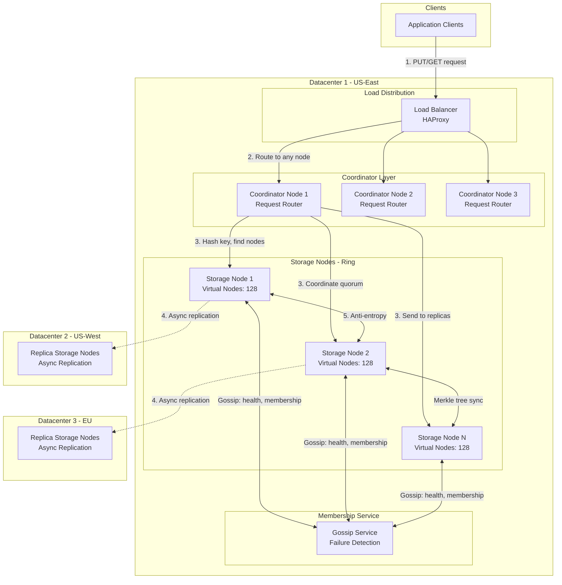

# Distributed Key-Value Store System Design

**File Purpose:** Complete system design document for a highly available, distributed key-value store (similar to DynamoDB/Cassandra) for e-commerce applications with multi-datacenter deployment.

**Last Updated:** October 1, 2025

---

## TABLE OF CONTENTS

- [1. REQUIREMENTS & CLARIFICATION](#1-requirements--clarification)
  - [User Stories](#user-stories)
  - [Functional Requirements](#functional-requirements)
  - [Non-Functional Requirements](#non-functional-requirements)
  - [Assumptions & Out of Scope](#assumptions--out-of-scope)
- [2. BACK-OF-THE-ENVELOPE CALCULATIONS](#2-back-of-the-envelope-calculations)
  - [Traffic Estimates](#traffic-estimates)
  - [Storage Estimates](#storage-estimates)
  - [Memory Estimates](#memory-estimates)
  - [Bandwidth Estimates](#bandwidth-estimates)
  - [Node Resource Summary](#node-resource-summary)
- [3. HIGH-LEVEL DESIGN](#3-high-level-design)
  - [System Architecture Diagram](#system-architecture-diagram)
  - [Data Flow Explanation](#data-flow-explanation)
- [4. DATABASE DESIGN](#4-database-design)
  - [Data Storage Schema](#data-storage-schema)
  - [Storage Implementation](#storage-implementation)
- [5. API DESIGN](#5-api-design)
  - [Base Configuration](#base-configuration)
  - [Authentication & Authorization](#authentication--authorization)
  - [Core Key-Value Operations](#core-key-value-operations)
  - [Admin Operations](#admin-operations)
  - [Cross-Cutting API Concerns](#cross-cutting-api-concerns)
- [6. DEEP-DIVE COMPONENTS & TRADE-OFFS](#6-deep-dive-components--trade-offs)
  - [6.1 Consistent Hashing with Virtual Nodes](#61-consistent-hashing-with-virtual-nodes)
  - [6.2 Replication and Quorum (R + W > N)](#62-replication-and-quorum-r--w--n)
  - [6.3 Vector Clocks for Conflict Resolution](#63-vector-clocks-for-conflict-resolution)
  - [6.4 Gossip Protocol for Membership](#64-gossip-protocol-for-membership)
  - [6.5 Hinted Handoff for Temporary Failures](#65-hinted-handoff-for-temporary-failures)
  - [6.6 Merkle Trees for Anti-Entropy Repair](#66-merkle-trees-for-anti-entropy-repair)
  - [6.7 CAP Theorem Trade-offs](#67-cap-theorem-trade-offs)
- [7. BOTTLENECKS & IMPROVEMENTS](#7-bottlenecks--improvements)
  - [Potential Bottlenecks](#potential-bottlenecks)
  - [Scalability Improvements](#scalability-improvements)
  - [Monitoring and Observability](#monitoring-and-observability)
  - [Security Considerations](#security-considerations)
  - [Future Enhancements](#future-enhancements)
- [8. CONCLUSION](#8-conclusion)

---

## 1. REQUIREMENTS & CLARIFICATION

### User Stories

- As an **e-commerce application developer**, I want to store and retrieve product data with high availability so that my application remains operational even during infrastructure failures
- As a **platform engineer**, I want automatic data rebalancing when adding nodes so that I can scale the system without manual intervention
- As a **system architect**, I want tunable consistency levels so that I can optimize for either performance or correctness based on the use case
- As an **operations engineer**, I want the system to handle network partitions gracefully so that partial failures don't cause complete outages

### Functional Requirements

**MVP Core Features:**

1. **Basic Operations:**
   - PUT(key, value) - Store key-value pairs
   - GET(key) - Retrieve values by key
   - DELETE(key) - Remove key-value pairs
   - Multi-GET - Batch read operations

2. **Data Management:**
   - Automatic data partitioning across nodes
   - Configurable replication factor (N)
   - Dynamic node addition/removal with automatic rebalancing
   - Version tracking for all writes

3. **Consistency Control:**
   - Tunable consistency levels: eventual, quorum, strong
   - Configurable read (R) and write (W) quorum values
   - Conflict resolution using vector clocks

4. **Failure Handling:**
   - Automatic failure detection via gossip protocol
   - Hinted handoff for temporary node failures
   - Anti-entropy repair using Merkle trees
   - Multi-datacenter replication

### Non-Functional Requirements

**Performance:**

- Write throughput: 100,000 writes/second
- Read throughput: 500,000 reads/second
- Latency: p99 < 50ms for reads, < 100ms for writes
- Support up to 1000+ nodes

**Availability:**

- 99.99% availability target (52 minutes downtime/year)
- No single point of failure
- Survive datacenter failures

**Scalability:**

- Store 10TB+ of data across 100+ nodes
- Linear horizontal scalability
- Support 3+ geographic regions

**Consistency:**

- Eventual consistency by default
- Tunable to quorum or strong consistency
- Conflict resolution for concurrent writes

### Assumptions & Out of Scope

**Assumptions:**

- Each key-value pair averages 1KB in size
- Read-heavy workload (5:1 read-to-write ratio)
- Keys are strings (max 256 bytes)
- Values are binary blobs (max 1MB)
- Network latency between datacenters: 50-100ms

**Out of Scope for MVP:**

- Complex querying (no secondary indexes initially)
- Transactions across multiple keys
- Compression of values
- Encryption at rest (assumes infrastructure layer)
- Time-series optimizations

---

## 2. BACK-OF-THE-ENVELOPE CALCULATIONS

### Traffic Estimates

```text
Write Operations:
- Target: 100,000 writes/second
- Daily writes: 100,000 * 86,400 = 8.64 billion writes/day
- Peak writes (3x average): 300,000 writes/second

Read Operations:
- Target: 500,000 reads/second
- Daily reads: 500,000 * 86,400 = 43.2 billion reads/day
- Peak reads (3x average): 1.5 million reads/second

Total Operations:
- Daily: ~52 billion operations/day
- Per second average: 600,000 ops/sec
- Peak: 1.8 million ops/sec
```

### Storage Estimates

```text
Data Storage:
- Average key-value size: 1KB
- Initial dataset: 10TB = 10 billion key-value pairs
- Daily new data: 8.64B writes * 1KB = 8.64TB/day
- With 20% unique writes: ~1.7TB new data/day
- 3-year storage: 10TB + (1.7TB * 1095 days) = ~1,872TB

Replication Factor (N=3):
- Actual storage needed: 1,872TB * 3 = 5,616TB
- With 20% overhead: ~6,740TB total

Per Node Storage (100 nodes):
- Per node: 6,740TB / 100 = 67.4TB
- Recommended: 80TB per node for growth
```

### Memory Estimates

```text
Metadata per Key:
- Key: 256 bytes
- Value location: 8 bytes
- Version vector: ~100 bytes
- Merkle tree node: 32 bytes
- Total: ~400 bytes per key

Hot Data Cache (10% of keys):
- Hot keys: 1 billion keys * 400 bytes = 400GB metadata
- Hot values: 1 billion * 1KB = 1TB
- Total hot cache: ~1.4TB
- Per node (100 nodes): 14GB

Working Memory per Node:
- Hot cache: 14GB
- Bloom filters: 2GB
- Merkle trees: 1GB
- Connection pools: 1GB
- OS and buffers: 4GB
- Total: ~22GB minimum, recommend 64GB RAM/node
```

### Bandwidth Estimates

```text
Write Bandwidth (with replication N=3):
- Write size: 1KB data + 512 bytes metadata
- Per second: 100,000 * 1.5KB * 3 replicas = 450MB/sec
- Peak: 1.35GB/sec

Read Bandwidth:
- Read size: 1KB data + 256 bytes metadata
- Per second: 500,000 * 1.25KB = 625MB/sec
- Peak: 1.88GB/sec

Cross-Datacenter:
- Async replication: ~150MB/sec per datacenter link
- Gossip overhead: ~10MB/sec
- Total: ~160MB/sec between datacenters
```

### Node Resource Summary

```text
Per Node (100 nodes):
- Storage: 80TB (SSD preferred)
- Memory: 64GB RAM
- CPU: 16 cores
- Network: 10Gbps NIC
- OS: Linux kernel 5.x+

Coordinator Overhead:
- Each request coordinates with R/W nodes
- Default R=2, W=2 for quorum (N=3)
- Max concurrent requests per node: 10,000
```

---

## 3. HIGH-LEVEL DESIGN

### System Architecture Diagram



### Data Flow Explanation

**Write Path (PUT operation):**

1. **Client Request:** Client sends PUT(key, value) to load balancer
2. **Routing:** Load balancer routes to any coordinator node (stateless)
3. **Key Hashing:** Coordinator hashes key using consistent hashing with virtual nodes
4. **Replica Identification:** Identifies N replicas (default N=3) on the ring
5. **Quorum Write:** Sends write to all N replicas, waits for W responses (default W=2)
6. **Version Assignment:** Each replica assigns vector clock for versioning
7. **Response:** Returns success when W replicas acknowledge
8. **Hinted Handoff:** If replica unavailable, coordinator stores hint for later delivery
9. **Async Replication:** Data eventually replicates to other datacenters

**Read Path (GET operation):**

1. **Client Request:** Client sends GET(key) to load balancer
2. **Routing:** Load balancer routes to any coordinator node
3. **Key Hashing:** Coordinator hashes key to find replica nodes
4. **Quorum Read:** Sends read request to R replicas (default R=2)
5. **Version Comparison:** Compares vector clocks from R responses
6. **Conflict Resolution:** If versions diverge, returns all versions to client or applies resolution
7. **Response:** Returns latest version (or multiple versions if conflict)
8. **Read Repair:** Asynchronously updates stale replicas in background

**Failure Detection:**

1. **Gossip Protocol:** Every node gossips with 3 random nodes every second
2. **Heartbeat:** Shares membership list and health status
3. **Failure Detection:** If node doesn't respond for 10 seconds, marked as suspected
4. **Confirmation:** After 30 seconds without response, marked as down
5. **Routing Update:** Coordinator nodes route around failed nodes
6. **Hinted Handoff:** Stores writes for failed nodes temporarily

---

## 4. DATABASE DESIGN

### Data Storage Schema

**Note:** This is a key-value store, so we don't have traditional relational tables. Instead, we have internal storage structures.

**Primary Data Store Structure:**

```text
Key-Value Entry:
- partition_key (BINARY, 32 bytes) - Hash of the actual key
- sort_key (STRING, 256 bytes) - Original key for range queries in future
- value (BLOB, max 1MB) - Actual data
- vector_clock (JSON, ~100 bytes) - {node_id: counter} map
- created_at (TIMESTAMP, 8 bytes)
- last_modified (TIMESTAMP, 8 bytes)
- checksum (BINARY, 32 bytes) - SHA-256 of value
- is_deleted (BOOLEAN, 1 byte) - Tombstone marker
- ttl_expiry (TIMESTAMP, 8 bytes, nullable) - Optional expiration

Storage Format: SSTable (Sorted String Table) + Write-Ahead Log
Compaction: Size-tiered compaction strategy
```

**Metadata Store (per node):**

```text
Node Membership:
- node_id (UUID, PK)
- ip_address (STRING)
- port (INT)
- datacenter (STRING)
- rack (STRING)
- token_ranges (JSON) - Virtual node tokens owned
- status (ENUM: up, down, suspected, joining, leaving)
- heartbeat_timestamp (TIMESTAMP)
- version (INT) - Schema version

Token Ring:
- token (INT128, PK) - Position on ring
- node_id (UUID, FK) - Owner node
- is_virtual (BOOLEAN)
- created_at (TIMESTAMP)
```

**Hinted Handoff Store:**

```text
Hints:
- hint_id (UUID, PK)
- target_node_id (UUID) - Failed node
- partition_key (BINARY)
- original_key (STRING)
- value (BLOB)
- vector_clock (JSON)
- created_at (TIMESTAMP)
- expiry (TIMESTAMP) - Drop hint after 3 hours
```

**Merkle Tree Store (for anti-entropy):**

```text
Merkle Tree Nodes:
- partition_range (STRING, PK) - Token range
- tree_level (INT, PK)
- node_position (INT, PK)
- hash_value (BINARY, 32 bytes) - SHA-256 of children
- last_updated (TIMESTAMP)

Storage: One Merkle tree per partition range
Depth: 8 levels (256 leaf nodes per tree)
Rebuild frequency: Every 10 minutes
```

### Storage Implementation

**Physical Storage:**

- **SSTable Files:** Immutable sorted files on disk
- **MemTable:** In-memory write buffer (64MB)
- **Commit Log:** Write-ahead log for durability
- **Bloom Filters:** Probabilistic key existence check
- **Compaction:** Periodic merge of SSTables

**Indexing Strategy:**

- **Primary Index:** In-memory sparse index for SSTable blocks
- **Bloom Filter:** Reduce unnecessary disk reads (1% false positive rate)
- **Block Index:** 4KB blocks within SSTables

---

## 5. API DESIGN

### Base Configuration

```text
Protocol: HTTP/REST and gRPC
Base URL: https://api.kvstore.example.com/v1
Authentication: API Key (X-API-Key header) or OAuth 2.0
Rate Limiting: 10,000 requests/second per API key
Versioning: URL path versioning (/v1/, /v2/)
Compression: gzip, br (Brotli)
```

### Authentication & Authorization

#### Register API Key

```http
POST /v1/auth/keys
```

**Request:**

```json
{
  "application_name": "my-ecommerce-app",
  "permissions": ["read", "write", "delete"],
  "rate_limit": 5000
}
```

**Response (201 Created):**

```json
{
  "api_key": "kvs_a1b2c3d4e5f6g7h8i9j0",
  "application_name": "my-ecommerce-app",
  "created_at": "2025-10-01T10:00:00Z",
  "expires_at": "2026-10-01T10:00:00Z"
}
```

---

### Core Key-Value Operations

#### PUT - Store Key-Value Pair

```http
PUT /v1/keys/{key}
```

**Headers:**

```text
X-API-Key: kvs_a1b2c3d4e5f6g7h8i9j0
Content-Type: application/json
X-Consistency-Level: quorum (optional: eventual|quorum|strong)
X-Write-Quorum: 2 (optional, default=2)
X-TTL-Seconds: 3600 (optional, for expiration)
```

**Request Body:**

```json
{
  "value": "base64_encoded_data_or_json",
  "metadata": {
    "content_type": "application/json",
    "tags": ["product", "inventory"]
  },
  "if_match": "vector_clock_optional" 
}
```

**Response (200 OK):**

```json
{
  "key": "product:12345",
  "version": {
    "node1": 5,
    "node2": 3,
    "node3": 5
  },
  "timestamp": "2025-10-01T10:30:00Z",
  "nodes_written": ["node1", "node2", "node3"]
}
```

**Response (409 Conflict):**

```json
{
  "error": "version_conflict",
  "message": "Write conflict detected",
  "existing_versions": [
    {
      "version": {"node1": 5, "node2": 3},
      "value": "base64_data_version_1"
    },
    {
      "version": {"node1": 4, "node3": 5},
      "value": "base64_data_version_2"
    }
  ]
}
```

---

#### GET - Retrieve Value by Key

```http
GET /v1/keys/{key}
```

**Headers:**

```text
X-API-Key: kvs_a1b2c3d4e5f6g7h8i9j0
X-Consistency-Level: quorum (optional)
X-Read-Quorum: 2 (optional)
```

**Response (200 OK):**

```json
{
  "key": "product:12345",
  "value": "base64_encoded_data_or_json",
  "version": {
    "node1": 5,
    "node2": 3,
    "node3": 5
  },
  "metadata": {
    "content_type": "application/json",
    "tags": ["product", "inventory"]
  },
  "last_modified": "2025-10-01T10:30:00Z"
}
```

**Response (404 Not Found):**

```json
{
  "error": "key_not_found",
  "message": "Key 'product:12345' does not exist"
}
```

**Response (409 Conflict - Multiple Versions):**

```json
{
  "error": "version_conflict",
  "message": "Multiple versions exist",
  "versions": [
    {
      "version": {"node1": 5, "node2": 3},
      "value": "base64_data_version_1",
      "last_modified": "2025-10-01T10:30:00Z"
    },
    {
      "version": {"node1": 4, "node3": 5},
      "value": "base64_data_version_2",
      "last_modified": "2025-10-01T10:29:00Z"
    }
  ]
}
```

---

#### DELETE - Remove Key

```http
DELETE /v1/keys/{key}
```

**Headers:**

```text
X-API-Key: kvs_a1b2c3d4e5f6g7h8i9j0
X-Consistency-Level: quorum
```

**Response (204 No Content):**

(Empty response body)

**Response (404 Not Found):**

```json
{
  "error": "key_not_found",
  "message": "Key 'product:12345' does not exist"
}
```

---

#### Batch GET - Retrieve Multiple Keys

```http
POST /v1/keys/batch-get
```

**Request:**

```json
{
  "keys": ["product:1", "product:2", "product:3"],
  "consistency_level": "eventual"
}
```

**Response (200 OK):**

```json
{
  "results": [
    {
      "key": "product:1",
      "value": "base64_data",
      "status": "found"
    },
    {
      "key": "product:2",
      "status": "not_found"
    },
    {
      "key": "product:3",
      "value": "base64_data",
      "status": "found"
    }
  ],
  "total": 3,
  "found": 2
}
```

---

### Admin Operations

#### Get Cluster Status

```http
GET /v1/admin/cluster/status
```

**Response (200 OK):**

```json
{
  "cluster_name": "prod-cluster",
  "total_nodes": 100,
  "healthy_nodes": 98,
  "unhealthy_nodes": 2,
  "datacenters": [
    {
      "name": "us-east",
      "nodes": 40,
      "status": "healthy"
    },
    {
      "name": "us-west",
      "nodes": 30,
      "status": "healthy"
    },
    {
      "name": "eu-central",
      "nodes": 30,
      "status": "degraded"
    }
  ],
  "ring_size": 12800,
  "data_size_tb": 5600
}
```

---

#### Get Node Information

```http
GET /v1/admin/nodes/{node_id}
```

**Response (200 OK):**

```json
{
  "node_id": "node-abc-123",
  "ip_address": "10.0.1.50",
  "datacenter": "us-east",
  "status": "up",
  "token_ranges": [128, 256, 384],
  "data_size_gb": 5600,
  "cpu_usage": 45.5,
  "memory_usage": 62.3,
  "disk_usage": 70.8,
  "last_heartbeat": "2025-10-01T10:35:00Z"
}
```

---

#### Add Node to Cluster

```http
POST /v1/admin/nodes
```

**Request:**

```json
{
  "node_id": "node-new-456",
  "ip_address": "10.0.1.75",
  "datacenter": "us-east",
  "rack": "rack-5",
  "virtual_nodes": 128
}
```

**Response (202 Accepted):**

```json
{
  "node_id": "node-new-456",
  "status": "joining",
  "token_assignment": "in_progress",
  "estimated_rebalance_time": "30 minutes"
}
```

---

#### Repair Partition Range

```http
POST /v1/admin/repair
```

**Request:**

```json
{
  "partition_range": {
    "start_token": "1000",
    "end_token": "2000"
  },
  "datacenters": ["us-east"]
}
```

**Response (202 Accepted):**

```json
{
  "repair_id": "repair-789",
  "status": "running",
  "progress": 0,
  "estimated_completion": "2025-10-01T11:00:00Z"
}
```

---

### Cross-Cutting API Concerns

**Rate Limiting:**

```text
Per API Key:
- Standard tier: 1,000 requests/second
- Premium tier: 10,000 requests/second
- Admin endpoints: 100 requests/second

Headers:
- X-RateLimit-Limit: 10000
- X-RateLimit-Remaining: 8543
- X-RateLimit-Reset: 1696161600
```

**Error Response Format:**

```json
{
  "error": "error_code",
  "message": "Human-readable error message",
  "details": {
    "field": "additional context"
  },
  "request_id": "req-123-456",
  "timestamp": "2025-10-01T10:30:00Z"
}
```

**Common HTTP Status Codes:**

- `200 OK` - Successful GET/PUT
- `201 Created` - Resource created
- `204 No Content` - Successful DELETE
- `400 Bad Request` - Invalid request format
- `401 Unauthorized` - Missing/invalid API key
- `404 Not Found` - Key doesn't exist
- `409 Conflict` - Version conflict
- `429 Too Many Requests` - Rate limit exceeded
- `500 Internal Server Error` - Server error
- `503 Service Unavailable` - Cluster degraded

**Idempotency:**

- PUT operations are idempotent with `if_match` version check
- DELETE operations are idempotent (repeated deletes return 404)
- Use `X-Idempotency-Key` header for critical writes

**Pagination (for future list operations):**

```json
{
  "items": [],
  "next_token": "cursor_value",
  "has_more": true
}
```

---

## 6. DEEP-DIVE COMPONENTS & TRADE-OFFS

### 6.1 Consistent Hashing with Virtual Nodes

**Purpose:** Distribute data evenly across nodes and minimize data movement when nodes join/leave.

**Implementation:**

```text
Hash Function: MD5 (128-bit output)
Virtual Nodes per Physical Node: 128-256
Ring Size: 2^128 positions

Algorithm:
1. Assign each physical node 128 random tokens on ring
2. For incoming key, hash key to get position: hash(key) → token
3. Walk clockwise on ring to find first node ≥ token
4. Select N consecutive nodes (replicas)

Example Ring (simplified):
Token 0    → Node A (virtual node 1)
Token 500  → Node B (virtual node 1)
Token 1000 → Node A (virtual node 2)
Token 1500 → Node C (virtual node 1)
...

Key "product:12345" hashes to 750 → stored on Node B, Node A, Node C
```

**Benefits:**

- Even distribution: Each node owns ~1/N of data
- Minimal data movement: Only 1/N of data moves when adding node
- Heterogeneous clusters: High-capacity nodes get more virtual nodes
- Fault tolerance: Replicas spread across physical nodes

**Trade-offs:**

- **Pro:** Adding 1 node affects only neighboring nodes (1% data movement with 100 nodes)
- **Pro:** Virtual nodes smooth out hot spots
- **Con:** Complexity in membership management
- **Con:** More metadata to track (128 tokens × 100 nodes = 12,800 tokens)

---

### 6.2 Replication and Quorum (R + W > N)

**Replication Strategy:**

```text
Replication Factor (N): 3 (default)
- Primary replica: First node found clockwise on ring
- Replicas 2-3: Next N-1 nodes clockwise
- Cross-datacenter: At least 1 replica per datacenter

Read Quorum (R): 2 (default)
Write Quorum (W): 2 (default)

Consistency Guarantee: R + W > N ensures overlap
Example: R=2, W=2, N=3 → 2+2=4 > 3 ✓ (guarantees read sees latest write)
```

**Consistency Levels:**

| Level      | R | W | Behavior                        | Use Case                |
|------------|---|---|---------------------------------|-------------------------|
| Eventual   | 1 | 1 | Fastest, may read stale data    | Analytics, logs         |
| Quorum     | 2 | 2 | Balanced consistency            | Most applications       |
| Strong     | 3 | 3 | All replicas, highest latency   | Financial transactions  |

**Quorum Write Flow:**

```text
1. Coordinator receives PUT(key, value)
2. Hash key to find N=3 replica nodes: [A, B, C]
3. Increment vector clock: {coord: 5} → {A: 6}
4. Send write to all 3 nodes in parallel
5. Wait for W=2 acknowledgments (A and B respond)
6. Return success to client (latency: p99 < 100ms)
7. Node C eventually receives write (hinted handoff if C is down)
```

**Quorum Read Flow:**

```text
1. Coordinator receives GET(key)
2. Hash key to find N=3 replica nodes: [A, B, C]
3. Send read to R=2 nodes: [A, B]
4. Receive responses with vector clocks:
   - Node A: {A:6, B:5, C:4}
   - Node B: {A:6, B:5, C:4}
5. Both have same version → return value (latency: p99 < 50ms)
6. Asynchronously read repair Node C in background
```

**Trade-offs:**

- **Decision:** Quorum-based replication (R=2, W=2, N=3)
- **Pros:**
  - Survives 1 node failure without downtime
  - Read-after-write consistency with quorum
  - Tunable for different workloads
- **Cons:**
  - Higher latency than R=1, W=1
  - Conflict resolution complexity with concurrent writes
  - Wasted storage (3× replication)
- **Justification:** 99.99% availability requirement favors quorum over strong consistency

---

### 6.3 Vector Clocks for Conflict Resolution

**Purpose:** Track causality of updates to detect and resolve conflicts from concurrent writes.

**Vector Clock Structure:**

```json
{
  "node_A": 6,
  "node_B": 5,
  "node_C": 4
}
```

**Conflict Detection:**

```text
Version V1 = {A:6, B:5, C:4}
Version V2 = {A:5, B:6, C:4}

Compare:
- V1 dominates V2? No (A:6>5 but B:5<6)
- V2 dominates V1? No (B:6>5 but A:5<6)
→ CONFLICT: V1 and V2 are concurrent (siblings)

Happened-before:
- V1 = {A:3, B:2, C:1}
- V2 = {A:4, B:2, C:1}
- V2 dominates V1 (all counters ≥ V1) → V2 is newer
```

**Write Process:**

```text
1. Client writes to key "cart:user123"
2. Coordinator reads existing vector clock: {A:5, B:3, C:3}
3. Coordinator increments its counter: {A:6, B:3, C:3}
4. Writes to replicas with new vector clock
5. Each replica stores value + vector clock
```

**Conflict Resolution Strategies:**

```text
1. Last-Write-Wins (LWW):
   - Use wall-clock timestamp as tie-breaker
   - Simple but loses data from losing version
   - Suitable for: counters, caches

2. Client-Side Merge:
   - Return all conflicting versions to client
   - Client merges (e.g., union of shopping cart items)
   - Client writes back merged version
   - Suitable for: shopping carts, collaborative docs

3. Application Logic:
   - Custom merge function per key type
   - E.g., CRDTs for counters (sum values)
   - Suitable for: analytics, counters
```

**Trade-offs:**

- **Decision:** Vector clocks with client-side merge for conflicts
- **Pros:**
  - Accurately tracks causality
  - No data loss (all versions preserved)
  - Works with network partitions
- **Cons:**
  - Vector clocks grow with nodes (up to 100+ entries)
  - Client must handle conflict resolution
  - Complexity for application developers
- **Justification:** E-commerce needs (shopping carts) benefit from preserving all versions

**Vector Clock Pruning:**

- Limit to last 10 nodes that touched the key
- Prune entries older than 30 days
- Reset clock periodically with read repair

---

### 6.4 Gossip Protocol for Membership

**Purpose:** Detect node failures, share membership state, and maintain consistent cluster view without centralized coordination.

**Gossip Algorithm:**

```text
Every 1 second per node:
1. Select 3 random nodes from membership list
2. Send gossip message with:
   - My view of membership (all nodes + statuses)
   - My heartbeat counter
   - Token assignments
3. Receive gossip from others
4. Merge membership views:
   - Keep highest heartbeat counter per node
   - Update node statuses based on staleness
5. Propagate updates to local routing table
```

**Failure Detection:**

```text
Heartbeat Timestamp Staleness:
- < 5 seconds: UP (healthy)
- 5-10 seconds: SUSPECTED (may be down)
- > 10 seconds: DOWN (route around node)

Phi Accrual Failure Detector:
- Track arrival intervals of heartbeats
- Calculate suspicion level (φ value)
- φ > 8: Mark node as down (99.99% confidence)
- Adaptive to network latency variations
```

**Membership State Machine:**

```text
States: UP → SUSPECTED → DOWN → LEFT

Transitions:
- UP → SUSPECTED: Missed 2 heartbeats (2 seconds)
- SUSPECTED → UP: Received heartbeat
- SUSPECTED → DOWN: Missed 10 heartbeats (10 seconds)
- DOWN → UP: Node rejoins (rare)
- DOWN → LEFT: Admin removes node permanently
```

**Gossip Message Format:**

```json
{
  "sender_node": "node-A",
  "sender_heartbeat": 12345,
  "timestamp": "2025-10-01T10:30:00Z",
  "membership": [
    {"node_id": "node-A", "status": "UP", "heartbeat": 12345},
    {"node_id": "node-B", "status": "UP", "heartbeat": 12340},
    {"node_id": "node-C", "status": "SUSPECTED", "heartbeat": 12330}
  ],
  "token_updates": [
    {"token": 1000, "owner": "node-A"}
  ]
}
```

**Trade-offs:**

- **Decision:** Gossip protocol for membership
- **Pros:**
  - Decentralized (no single point of failure)
  - Scales to 1000+ nodes
  - Eventually consistent view
  - Low overhead (30KB/sec per node)
- **Cons:**
  - Delayed failure detection (5-10 seconds)
  - Membership view may temporarily diverge
  - False positives during network issues
- **Justification:** High availability favors decentralized coordination

---

### 6.5 Hinted Handoff for Temporary Failures

**Purpose:** Ensure writes succeed even when replica nodes are temporarily unavailable.

**Hinted Handoff Mechanism:**

```text
Scenario: Write to key "product:12345", replicas [A, B, C]
Problem: Node C is down

Process:
1. Coordinator tries write to A, B, C
2. A and B succeed (W=2 satisfied)
3. C doesn't respond (timeout after 50ms)
4. Coordinator stores "hint" locally:
   {
     "target_node": "C",
     "key": "product:12345",
     "value": "...",
     "version": {A:6, B:5, C:4}
   }
5. Return success to client
6. Background process monitors Node C health via gossip
7. When C comes back UP, replay hint to C
8. Delete hint after successful delivery
```

**Hint Storage:**

- Store hints on coordinator node that received write
- Maximum hint retention: 3 hours
- After 3 hours, rely on anti-entropy repair (Merkle trees)
- Hints stored in separate SSTable for fast replay

**Replay Process:**

```text
Every 10 seconds:
1. Check hint queue for offline nodes
2. Query gossip: Is target node UP?
3. If UP, send batched hints to target
4. Confirm delivery with acknowledgment
5. Delete delivered hints
6. If node still DOWN after 3 hours, drop hints
```

**Trade-offs:**

- **Decision:** Hinted handoff with 3-hour retention
- **Pros:**
  - Writes succeed during temporary node failures
  - Fast recovery when node returns
  - Reduces data inconsistency window
- **Cons:**
  - Extra storage on coordinator (up to 50GB per node)
  - Hints may be lost if coordinator crashes
  - Delays read availability if all replicas have hints
- **Justification:** 99.99% availability requirement favors accepting writes during failures

---

### 6.6 Merkle Trees for Anti-Entropy Repair

**Purpose:** Efficiently detect and repair inconsistencies between replicas by comparing data ranges without transferring full datasets.

**Merkle Tree Structure:**

```text
Per Partition Range (e.g., tokens 1000-2000):

               Root Hash (H0)
              /              \
         H1                      H2
       /    \                  /    \
     H3      H4              H5      H6
    / \      / \            / \      / \
  L0 L1    L2 L3          L4 L5    L6 L7

Leaf Nodes (L0-L7): 
- Each leaf = hash of keys in sub-range
- Example: L0 = SHA256(key1 + key2 + ...)
- 256 leaf nodes per tree (8-level tree)

Internal Nodes:
- Each internal node = SHA256(left_child_hash + right_child_hash)
- Root hash represents entire partition range
```

**Anti-Entropy Process:**

```text
Every 10 minutes per node:
1. Select a partition range to sync (round-robin)
2. Build Merkle tree for local data in range
3. Send root hash to replica nodes
4. If root hashes match → data is consistent, DONE
5. If root hashes differ → compare child hashes recursively:
   - Compare H1 and H2
   - Find divergent subtrees
   - Drill down to leaf nodes
6. Identify specific key ranges with differences
7. Exchange only those keys/values
8. Update local data and rebuild tree
```

**Example Repair:**

```text
Node A root hash: 0xABCD1234
Node B root hash: 0xABCD5678  (mismatch!)

Compare level 1:
- A.H1 = 0x1111, B.H1 = 0x1111 (match)
- A.H2 = 0x2222, B.H2 = 0x3333 (mismatch!)

Drill into H2:
- A.H5 = 0xAAAA, B.H5 = 0xAAAA (match)
- A.H6 = 0xBBBB, B.H6 = 0xCCCC (mismatch!)

Drill into H6:
- Leaf L6 differs: keys in range [6000-7000]
- Transfer ~100 keys from Node A to Node B
- Node B updates local data
- Rebuild Merkle tree → hashes now match
```

**Merkle Tree Maintenance:**

- **Build frequency:** Rebuild tree every 10 minutes per partition
- **Storage overhead:** ~1MB per tree × 100 partitions = 100MB per node
- **Comparison frequency:** Compare with replicas every hour
- **Lazy repair:** Only repair partitions with detected differences

**Trade-offs:**

- **Decision:** Merkle trees for anti-entropy with 10-minute rebuild
- **Pros:**
  - Efficient: Only transfer divergent data
  - Scalable: Logarithmic comparison (8 levels for 256 ranges)
  - Comprehensive: Catches all inconsistencies eventually
- **Cons:**
  - CPU overhead rebuilding trees
  - Memory for storing trees (100MB per node)
  - Repair latency (up to 10 minutes to detect + transfer)
- **Justification:** Eventual consistency model requires periodic repair

---

### 6.7 CAP Theorem Trade-offs

**CAP Theorem Choices:**

```text
During network partition, choose 2 of 3:
- Consistency (C): All nodes see same data
- Availability (A): System always responds
- Partition Tolerance (P): Works despite network splits

DynamoDB/Cassandra: AP System (Availability + Partition Tolerance)
```

#### Our Design Decision: AP with Tunable Consistency

**Normal Operation (No Partition):**

- Strong consistency possible with R=N, W=N
- Quorum consistency with R+W>N
- Eventual consistency with R=1, W=1

**During Network Partition:**

```text
Scenario: Datacenters US-East and US-West lose connectivity

AP Behavior:
1. Both datacenters continue accepting reads/writes
2. Writes to US-East don't immediately replicate to US-West
3. Clients get responses (Availability maintained)
4. Data temporarily diverges (Consistency sacrificed)
5. When partition heals, vector clocks detect conflicts
6. Conflicts resolved via merge or last-write-wins

Alternative CP Behavior (not chosen):
1. Detect partition via quorum failure
2. Reject writes that can't reach quorum
3. System becomes unavailable (Availability sacrificed)
4. Data remains consistent
```

**Split-Brain Scenario:**

```text
Problem: Both partitions accept writes to same key

Example:
- US-East receives: PUT(cart:user1, [item A, item B])
- US-West receives: PUT(cart:user1, [item C])
- Vector clocks diverge:
  - US-East: {east:10}
  - US-West: {west:8}

Resolution:
1. When partition heals, replicas exchange data
2. Detect conflict via vector clocks (concurrent writes)
3. Merge cart items: [item A, item B, item C]
4. Write merged version with unified vector clock: {east:11, west:9}
```

**Trade-offs Table:**

| Aspect | AP (Our Choice) | CP (Alternative) |
|--------|-----------------|-------------------|
| **Availability** | 99.99%+ even during partitions | Degrades to 95-99% |
| **Consistency** | Eventual, may have conflicts | Strong, no conflicts |
| **Latency** | Low (50-100ms) | Higher (100-500ms) |
| **Conflict Resolution** | Required (vector clocks) | Not needed |
| **Use Case Fit** | E-commerce, social media | Banking, inventory |

**Decision Justification:**

- Requirement: 99.99% availability (explicit AP preference)
- E-commerce tolerates temporary inconsistencies (e.g., cart items)
- Network partitions are rare but must be handled gracefully
- Tunable consistency allows strong reads for critical operations

---

## 7. BOTTLENECKS & IMPROVEMENTS

### Potential Bottlenecks

#### 7.1 Coordinator Hotspots

**Problem:** Coordinators handling popular keys become bottlenecks.

```text
Scenario: 
- Product "iPhone 15" key receives 50,000 reads/sec
- All requests hash to same coordinator node
- Coordinator overwhelmed, latency spikes to 5 seconds
```

**Solution:**

- **Client-side request routing:** Clients hash keys and connect directly to replica nodes
- **Coordinator pool:** 20-50 coordinator nodes behind load balancer
- **Key sharding:** Split hot keys into multiple sub-keys (iPhone-shard-0, iPhone-shard-1)
- **Read caching:** CDN/edge cache for extremely hot read keys

**Monitoring:**

- Track per-key request rates (top 100 keys)
- Alert if single key exceeds 10,000 req/sec
- Alert if coordinator CPU > 80%

---

#### 7.2 Write Amplification from Compaction

**Problem:** SSTable compaction reads and rewrites large amounts of data, consuming disk I/O.

```text
Scenario:
- Node has 60TB of data in 1,000 SSTables
- Size-tiered compaction merges SSTables
- Compaction rewrites 600GB of data, saturating disk
- Read latency increases from 10ms to 200ms
```

**Solution:**

- **Leveled compaction:** Reduces write amplification from 50× to 10×
- **Incremental compaction:** Compact 10GB chunks instead of full tables
- **SSD/NVMe drives:** High IOPS (100K+) reduces impact
- **Separate disks:** Compaction on secondary disk, reads on primary

**Monitoring:**

- Track compaction queue depth (alert if > 100 pending)
- Monitor disk write throughput (alert if > 80% capacity)
- Track read latency during compaction (alert if p99 > 150ms)

---

#### 7.3 Gossip Overhead at 1000+ Nodes

**Problem:** Gossip messages scale with cluster size, consuming network bandwidth.

```text
At 1000 nodes:
- Each node gossips with 3 peers every second
- Membership list size: 1000 nodes × 200 bytes = 200KB
- Per node: 200KB × 3 peers/sec = 600KB/sec
- Cluster total: 600KB × 1000 nodes = 600MB/sec
```

**Solution:**

- **Compression:** gzip gossip messages (5:1 ratio) → 120MB/sec total
- **Incremental updates:** Send only deltas, not full membership
- **Hierarchical gossip:** Group nodes by datacenter, gossip locally then cross-DC
- **Gossip fanout:** Reduce from 3 peers to 2 at large scale

**Monitoring:**

- Track gossip message size (alert if > 50KB)
- Monitor gossip traffic per node (alert if > 1MB/sec)
- Track membership convergence time (alert if > 30 seconds)

---

#### 7.4 Cross-Datacenter Replication Lag

**Problem:** Async replication to remote datacenters lags during peak traffic.

```text
Scenario:
- US-East writes 100K writes/sec
- Cross-DC link to EU has 150MB/sec capacity
- Average write size: 1.5KB
- Required bandwidth: 150MB/sec (exactly at capacity!)
- During peak (3×): 450MB/sec needed → 300MB/sec dropped
- EU datacenter lags by hours
```

**Solution:**

- **Prioritize critical data:** Replicate user profiles first, analytics last
- **Compression:** Compress replication stream (2-3× reduction)
- **Larger network pipes:** Upgrade to 1Gbps cross-DC links
- **Multiple replication streams:** Parallel TCP connections
- **Local quorum:** Quorum only within datacenter for lower latency

**Monitoring:**

- Track replication lag per datacenter (alert if > 60 seconds)
- Monitor cross-DC bandwidth utilization (alert if > 90%)
- Track pending replication queue size (alert if > 1M items)

---

#### 7.5 Conflict Resolution Burden on Clients

**Problem:** Clients must handle conflict resolution, adding application complexity.

```text
Scenario:
- Shopping cart has concurrent updates from mobile and web
- System returns 2 conflicting versions
- Client must merge: union of items, sum of quantities
- Developer complexity increases
```

**Solution:**

- **Server-side merge for common types:** Built-in strategies for sets, counters, LWW
- **CRDTs:** Conflict-free replicated data types (G-Counter, PN-Counter, OR-Set)
- **Conflict rate metrics:** Track conflicts per key type, optimize high-conflict keys
- **Default LWW:** Fallback to last-write-wins with timestamp for simple values

**Monitoring:**

- Track conflict rate (% of reads with multiple versions)
- Alert if conflict rate > 1% for any key prefix
- Monitor client-side merge latency

---

### Scalability Improvements

#### 7.6 Geographic Distribution - Active-Active Multi-Region

**Current:** 3 datacenters with async replication (US-East primary)

**Improvement:**

- **Active-active writes:** Each datacenter accepts writes independently
- **Conflict-free routing:** Route users to nearest datacenter (lower latency)
- **Regional quorums:** Quorum within region only (US-East R=2, W=2 from 3 local nodes)
- **Cross-region eventual:** Async replication across regions

**Benefits:**

- Latency: US-East 20ms → EU users 150ms, after improvement: EU 20ms
- Availability: Survive entire datacenter failure (region-independent)
- Write throughput: 100K writes/sec → 300K writes/sec (3 regions)

**Implementation:**

```text
Consistency Model: Per-region linearizability, cross-region eventual
Example:
- User in EU writes to EU datacenter, quorum in EU (20ms latency)
- Change replicates to US-East and US-West asynchronously (100ms+)
- User in US reads from US datacenter (may not see EU write immediately)
- Eventually consistent after 1-2 seconds
```

---

#### 7.7 Read Optimization - Bloom Filters and Caching

**Current:** Each read checks multiple SSTables on disk (4-10 disk reads)

**Improvement:**

**Bloom Filters:**

- 1% false positive rate
- Reduce unnecessary disk reads by 90%
- Memory: 10 bits per key × 10B keys = 12GB per node

**Multi-tier Caching:**

```text
L1 (In-memory): 10% hottest keys (1GB per node, 99% hit rate for hot keys)
L2 (Redis cluster): 30% warm keys (100GB total, 90% hit rate)
L3 (Disk SSTables): Cold keys (60TB per node)
```

**Benefits:**

- Read latency: p99 100ms → 10ms (cached) or 50ms (Bloom filter)
- Disk IOPS: 100K reads/sec → 10K reads/sec (90% cache hit rate)
- Cost: $5K/node for SSDs → $3K/node with caching

---

#### 7.8 Dynamic Token Rebalancing

**Current:** Static token assignment, manual rebalancing when adding nodes

**Improvement:**

- **Automatic rebalancing:** Background process monitors data distribution
- **Gradual migration:** Move virtual nodes 1 at a time (10 minutes each)
- **Load-aware allocation:** Assign more tokens to underutilized nodes
- **Zero-downtime:** Migrations happen without client impact

**Algorithm:**

```text
Every hour:
1. Calculate data distribution: [Node A: 70TB, Node B: 60TB, Node C: 50TB]
2. Target: 60TB per node (equal distribution)
3. Identify move: Node A → Node C (move 10TB)
4. Select virtual nodes to move: 10 tokens from A to C
5. Stream data for each token (1TB per token)
6. Update ring: Token 1000 owner A → C
7. Delete data from Node A after successful transfer
```

---

### Monitoring and Observability

#### Key Metrics to Track

**System Metrics:**

```text
Latency:
- GET p50, p95, p99, p999 (target: p99 < 50ms)
- PUT p50, p95, p99 (target: p99 < 100ms)

Throughput:
- Reads/second per node
- Writes/second per node
- Cross-DC replication throughput

Error Rates:
- Request failures (5xx errors) < 0.01%
- Timeout rate < 0.1%
- Conflict resolution failures < 1%

Availability:
- Uptime percentage per datacenter (target: 99.99%)
- Node availability (target: 98% nodes UP)
```

**Data Metrics:**

```text
Storage:
- Total data size per node (target: < 80TB)
- SSTable count (alert if > 1000)
- Compaction lag (alert if > 100 pending)

Consistency:
- Replication lag per datacenter (alert if > 60s)
- Hinted handoff queue size (alert if > 100K)
- Merkle tree sync lag (alert if > 30 minutes)
- Conflict rate (alert if > 1%)
```

**Infrastructure Metrics:**

```text
Per Node:
- CPU utilization (alert if > 80%)
- Memory usage (alert if > 90%)
- Disk usage (alert if > 80%)
- Network bandwidth (alert if > 8Gbps on 10Gbps NIC)

Gossip:
- Membership convergence time (alert if > 30s)
- False failure detection rate (alert if > 0.1%)
```

#### Alerting Strategy

**Critical Alerts (Page on-call):**

- Any datacenter availability < 99.9%
- Cross-DC replication lag > 5 minutes
- >10% of nodes DOWN
- p99 latency > 500ms for 5 minutes

**Warning Alerts (Email):**

- Any node DOWN for > 10 minutes
- Conflict rate > 1% for any key prefix
- Compaction queue > 100 pending
- Disk usage > 80%

#### Dashboards

1. **Overview Dashboard:** Cluster health, request rates, latency percentiles
2. **Per-Node Dashboard:** CPU, memory, disk, network, request distribution
3. **Consistency Dashboard:** Replication lag, conflicts, Merkle sync status
4. **Capacity Dashboard:** Storage usage, growth projections, node capacity

---

### Security Considerations

#### 7.9 Authentication & Authorization

- **API Keys:** Scoped to specific key prefixes (e.g., product:*, user:*)
- **OAuth 2.0:** For user-facing applications
- **Mutual TLS:** Between internal cluster nodes
- **IAM Roles:** For admin operations

#### 7.10 Encryption

- **At Rest:** AES-256 encryption of SSTables (OS-level or disk encryption)
- **In Transit:** TLS 1.3 for all client connections
- **Cross-DC:** IPsec tunnels between datacenters
- **Key Management:** External KMS (AWS KMS, HashiCorp Vault)

#### 7.11 Access Control

- **Multi-tenancy:** Key prefixes per tenant (tenant123:cart:user1)
- **Rate Limiting:** Per API key (1K-10K req/sec)
- **IP Whitelisting:** For admin endpoints
- **Audit Logging:** All write operations logged to immutable storage

#### 7.12 DDoS Protection

- **Rate Limiting:** Edge rate limiting (Cloudflare, AWS Shield)
- **Connection Limits:** Max 10K concurrent connections per client IP
- **Request Size Limits:** Max 1MB per PUT
- **Slow Query Timeouts:** Kill requests exceeding 10 seconds

---

### Future Enhancements

#### 7.13 Secondary Indexes

**Feature:** Query by value instead of key.

```text
Example: 
- Primary key: user:12345 → {name: "Alice", city: "NYC"}
- Secondary index: city:NYC → [user:12345, user:67890]

Implementation:
- Maintain separate key-value pairs for indexes
- Update indexes on every write (distributed transaction)
- Query: GET city:NYC → returns user IDs → batch GET user details
```

**Challenges:** Distributed transactions, consistency, storage overhead (2-3×)

---

#### 7.14 Time-Series Optimization

**Feature:** Optimize for time-based data (logs, metrics, events).

```text
Storage Strategy:
- Time-bucketed keys: logs:2025-10-01:user123
- Automatic expiration via TTL
- Compaction optimized for time-ordered writes
- Range scans within time buckets
```

**Benefits:** 10× compression, faster range queries

---

#### 7.15 CRDTs for Built-in Conflict Resolution

**Feature:** Conflict-free replicated data types.

```text
Types:
- G-Counter: Increment-only counter (sum replicas)
- PN-Counter: Increment/decrement counter
- OR-Set: Add/remove set (preserves all adds)
- LWW-Register: Last-write-wins with timestamp

Usage:
PUT(likes:product123, {type: "counter", op: "+1"})
→ System automatically merges concurrent increments
```

**Benefits:** No client-side conflict resolution, simpler API

---

#### 7.16 Machine Learning for Load Prediction

**Feature:** Predict hot keys and proactively replicate.

```text
ML Model:
- Input: Historical access patterns (key, time, request count)
- Output: Probability of key becoming hot in next 1 hour
- Action: Pre-replicate predicted hot keys to 5+ nodes

Benefits:
- Reduce latency for flash traffic (viral posts, sales events)
- Auto-scale replicas for hot keys
```

---

#### 7.17 Stream Processing Integration

**Feature:** Real-time change streams for applications.

```text
Change Data Capture (CDC):
- Every write publishes event to Kafka:
  {key: "product:123", op: "PUT", value: "...", timestamp: "..."}
- Consumers: search indexes (Elasticsearch), analytics (Spark), caches (Redis)

Use Cases:
- Invalidate CDN cache on product update
- Update search index in real-time
- Trigger workflows (email on order creation)
```

---

## 8. CONCLUSION

This distributed key-value store design achieves the target requirements:

✅ **Performance:** 100K writes/sec, 500K reads/sec with p99 < 100ms  
✅ **Scale:** 10TB+ data across 100+ nodes, horizontally scalable to 1000+  
✅ **Availability:** 99.99% uptime via AP system with tunable consistency  
✅ **Durability:** N=3 replication, hinted handoff, anti-entropy repair  
✅ **Partition Tolerance:** Gossip protocol, vector clocks, multi-datacenter  

**Key Design Choices:**

1. **AP System:** Favor availability over consistency (CAP theorem)
2. **Consistent Hashing:** Even distribution with virtual nodes
3. **Quorum Replication:** R=2, W=2, N=3 for balanced consistency
4. **Vector Clocks:** Conflict detection and resolution
5. **Gossip Protocol:** Decentralized failure detection
6. **Hinted Handoff:** Handle temporary failures
7. **Merkle Trees:** Efficient anti-entropy repair

**Trade-offs:**

- **Availability > Consistency:** Accept eventual consistency for high availability
- **Horizontal Scalability > Cost:** 3× replication for durability
- **Simplicity > Features:** MVP focuses on core KV operations

This design provides a solid foundation for an e-commerce platform, balancing performance, availability, and operational complexity. Future enhancements can add secondary indexes, CRDTs, and ML-driven optimizations as the platform matures.

---

## REFERENCES & FURTHER READING

- **Amazon DynamoDB Paper:** [dynamo-paper.pdf](https://www.allthingsdistributed.com/files/amazon-dynamo-sosp2007.pdf)
- **Apache Cassandra Architecture:** [cassandra.apache.org](https://cassandra.apache.org/doc/)
- **Consistent Hashing:** "Consistent Hashing and Random Trees" (Karger et al., 1997)
- **Vector Clocks:** "Time, Clocks, and the Ordering of Events" (Lamport, 1978)
- **Gossip Protocols:** "Epidemic Algorithms for Replicated Database Maintenance" (Demers et al., 1987)
- **CAP Theorem:** "Brewer's Conjecture and the Feasibility of Consistent, Available, Partition-Tolerant Web Services" (Gilbert & Lynch, 2002)

---

**Document Version:** 1.0  
**Author:** System Design Interview Framework  
**Date:** October 1, 2025
