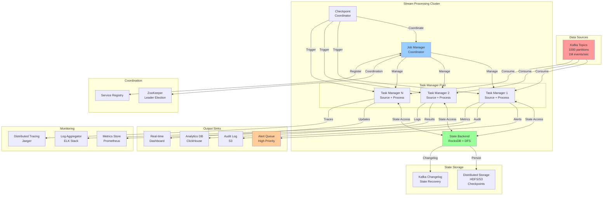
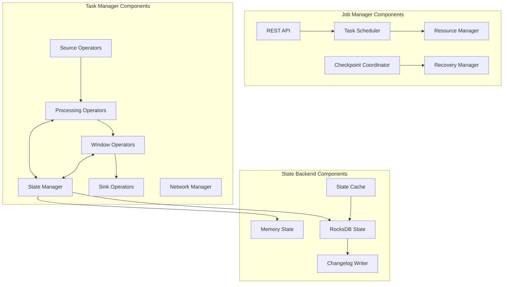
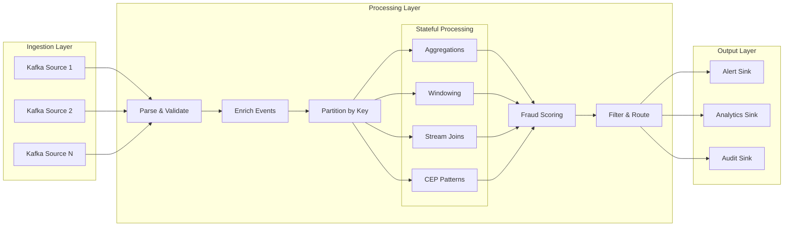

# Distributed Stream Processing System Design (Apache Flink/Storm-like)

**Difficulty Level:** ⭐⭐⭐⭐⭐ Expert  
**Tags:** `Stream Processing`, `Real-time Analytics`, `CEP`, `Stateful Processing`, `Windowing`, `Watermarks`, `Exactly-once Semantics`, `Fault Tolerance`, `Backpressure`, `Event-driven Architecture`

**File Purpose:** Comprehensive system design document for a distributed stream processing platform supporting 1M events/sec for real-time fraud detection with exactly-once semantics and sub-second latency. The design covers complex event processing (CEP) with pattern matching, stateful operations with distributed state management, multiple windowing strategies (tumbling, sliding, session), watermark-based late event handling, fault tolerance with checkpointing and automatic recovery, dynamic scaling with backpressure handling, stream joins and aggregations, and deployment patterns for use cases including real-time analytics, event-driven microservices, IoT data processing, and financial transaction monitoring.

Key Features:
- Real-time stream processing with exactly-once guarantees
- Complex event processing (CEP) with pattern matching
- Stateful operations with distributed state management
- Multiple windowing strategies (tumbling, sliding, session)
- Watermark-based late event handling
- Fault tolerance with checkpointing and automatic recovery
- Dynamic scaling and backpressure handling
- Stream joins and aggregations

**Author:** System Design Documentation  
**Created:** October 1, 2025  
**Last Updated:** October 29, 2025  
**Recent Updates:** Added difficulty level and relevant tags for better categorization

Use Cases:
- Real-time fraud detection
- Real-time analytics and monitoring
- Event-driven microservices
- IoT data processing
- Financial transaction processing

**Author:** System Design Documentation  
**Created:** October 2, 2025  
**Last Updated:** October 13, 2025  
**Recent Updates:** Enhanced header format with detailed stream processing capabilities and use cases

---

## Table of Contents

1. [Requirements Analysis](#1-requirements-analysis)
2. [Back-of-Envelope Calculations](#2-back-of-envelope-calculations)
3. [High-Level Architecture](#3-high-level-architecture)
4. [API Design](#4-api-design)
5. [Data Models](#5-data-models)
6. [Core Components](#6-core-components)
7. [Stream Processing Concepts](#7-stream-processing-concepts)
8. [Database Schema](#8-database-schema)
9. [Scalability & Performance](#9-scalability--performance)
10. [Fault Tolerance & Recovery](#10-fault-tolerance--recovery)
11. [Security Considerations](#11-security-considerations)
12. [Monitoring & Observability](#12-monitoring--observability)
13. [Trade-offs & Alternatives](#13-trade-offs--alternatives)
14. [Future Enhancements](#14-future-enhancements)

---

## 1. Requirements Analysis

### 1.1 User Stories

#### Data Engineer Personas

- **As a data engineer**, I want to deploy stream processing jobs declaratively so that I can focus on business logic rather than infrastructure
- **As a data engineer**, I want exactly-once processing guarantees so that fraud detection results are accurate
- **As a data engineer**, I want to query job state in real-time so that I can debug issues quickly
- **As a data engineer**, I want automatic checkpointing so that jobs recover gracefully from failures

#### Fraud Analyst Personas

- **As a fraud analyst**, I want to detect suspicious patterns in real-time so that I can prevent fraud before it completes
- **As a fraud analyst**, I want to define custom fraud rules without coding so that I can respond to new fraud patterns quickly
- **As a fraud analyst**, I want to see fraud scores and evidence so that I can make informed decisions
- **As a fraud analyst**, I want historical context in fraud alerts so that I can understand user behavior patterns

#### Platform Operator Personas

- **As a platform operator**, I want auto-scaling capabilities so that the system handles traffic spikes
- **As a platform operator**, I want comprehensive monitoring so that I can detect issues before they impact users
- **As a platform operator**, I want zero-downtime deployments so that I can upgrade without service interruption
- **As a platform operator**, I want clear SLA metrics so that I can measure system reliability

#### Business Stakeholder Personas

- **As a business stakeholder**, I want to minimize fraud losses so that we protect revenue
- **As a business stakeholder**, I want low false positive rates so that we don't frustrate legitimate users
- **As a business stakeholder**, I want cost-effective scaling so that infrastructure costs remain predictable

### 1.2 Functional Requirements (MVP)

#### Core Processing Features

- **Stream Ingestion**: Consume events from Kafka topics at 1M events/sec
- **Complex Event Processing**: Support CEP patterns (sequence, combination, temporal)
- **Stateful Operations**: Maintain state across billions of keys
- **Windowing**: Support tumbling, sliding, and session windows
- **Stream Joins**: Enable window joins and interval joins across multiple streams
- **Aggregations**: Real-time aggregations (count, sum, avg, min, max, custom)
- **Event Time Processing**: Process events based on event timestamps, not processing time
- **Late Event Handling**: Use watermarks to handle out-of-order events

#### Fraud Detection Specific

- **Rule Engine**: Define and execute fraud detection rules dynamically
- **Pattern Matching**: Detect suspicious patterns across event sequences
- **Real-time Scoring**: Calculate fraud scores in real-time
- **Alert Generation**: Trigger alerts when fraud patterns detected
- **Historical Context**: Join real-time events with historical data
- **Multi-factor Analysis**: Correlate events across multiple dimensions

### 1.2 Non-Functional Requirements

#### Performance

- **Throughput**: Process 1M events/sec consistently
- **Latency**: Sub-second end-to-end latency (p99 < 1000ms)
- **Event Time Lag**: Keep event time lag < 5 seconds under normal load
- **Checkpoint Time**: Complete checkpoints in < 10 seconds
- **State Access**: State lookup/update in < 1ms

#### Reliability

- **Exactly-Once Semantics**: No duplicate processing of events
- **Fault Tolerance**: Automatic recovery from failures
- **Data Durability**: No data loss during failures
- **High Availability**: 99.99% uptime
- **Graceful Degradation**: Handle backpressure without crashing

#### Scalability

- **Horizontal Scaling**: Scale to 1000+ processing nodes
- **State Size**: Support billions of keys (TBs of state)
- **Dynamic Scaling**: Scale up/down based on load
- **Partition Rebalancing**: Redistribute work without downtime

#### Operational

- **Monitoring**: Real-time metrics and dashboards
- **Alerting**: Automated alerts for anomalies
- **Savepoints**: Manual snapshots for version upgrades
- **Replay**: Ability to reprocess historical data

### 1.3 Scale Estimates

#### Traffic

- **Peak Events/Sec**: 1M events/sec
- **Average Event Size**: 2 KB
- **Daily Events**: 86.4B events/day
- **Daily Data Volume**: 172.8 TB/day (uncompressed)
- **Concurrent Streams**: 100+ Kafka topics

#### State

- **Active Keys**: 1B keys (user IDs, device IDs, transaction IDs)
- **State per Key**: 1 KB average
- **Total State Size**: 1 TB
- **State Growth**: 100 GB/day

#### Infrastructure

- **Processing Nodes**: 200-500 nodes
- **Kafka Partitions**: 1000+ partitions
- **State Backend Storage**: 5 TB (with replication)
- **Network Bandwidth**: 100 Gbps aggregate

---

## 2. Back-of-Envelope Calculations

### 2.1 Throughput Analysis

#### Event Processing

```text
Events per second: 1,000,000 events/sec
Average event size: 2 KB
Data ingestion rate: 1M * 2 KB = 2 GB/sec = 16 Gbps

Events per day: 1M * 86,400 = 86.4B events/day
Data per day: 86.4B * 2 KB = 172.8 TB/day
Data per month: 172.8 TB * 30 = 5.2 PB/month
```

#### Processing Capacity per Node

```text
Assume each node can process: 5,000 events/sec
Required nodes: 1M / 5K = 200 nodes (minimum)
With 2x headroom: 400 nodes
With failover capacity: 500 nodes
```

#### Parallelism

```text
Kafka partitions: 1000 partitions
Parallel tasks: 1000 tasks (1:1 mapping)
Events per task: 1M / 1000 = 1,000 events/sec/task
```

### 2.2 State Management

#### State Size Calculation

```text
Active keys: 1B keys
State per key: 1 KB (user profile, aggregates, windows)
Total state: 1B * 1 KB = 1 TB

With 2x replication: 2 TB
With changelog storage: 3 TB
Total storage: 5 TB
```

#### State Distribution

```text
Number of nodes: 500 nodes
State per node: 1 TB / 500 = 2 GB per node
Memory per node: 32 GB RAM (holds hot state)
Disk per node: 10 GB SSD (persistent state)
```

#### Checkpoint Size

```text
Full checkpoint: 1 TB state
Checkpoint frequency: Every 10 seconds
Checkpoint throughput: 1 TB / 10s = 100 GB/sec
Incremental checkpoint: ~10% = 100 GB
```

### 2.3 Network Bandwidth

#### Data Flow

```text
Ingress (from Kafka): 2 GB/sec = 16 Gbps
State access (random): 500K state ops/sec * 1 KB = 500 MB/sec = 4 Gbps
Checkpoint writes: 100 GB / 10s = 10 GB/sec = 80 Gbps (burst)
Egress (to sinks): 1 GB/sec = 8 Gbps
Total bandwidth: ~108 Gbps peak
```

#### Per-Node Bandwidth

```text
With 500 nodes:
Ingress per node: 16 Gbps / 500 = 32 Mbps
State operations: 4 Gbps / 500 = 8 Mbps
Egress per node: 8 Gbps / 500 = 16 Mbps
Total per node: ~56 Mbps (well within 1 Gbps NIC)
```

### 2.4 Storage Requirements

#### State Backend

```text
RocksDB state backend:
- In-memory cache: 16 GB per node
- SSD storage: 10 GB per node
- Total across 500 nodes: 5 TB

Distributed File System (for checkpoints):
- Active checkpoints: 5 checkpoints * 1 TB = 5 TB
- Completed checkpoints: 10 * 1 TB = 10 TB
- Total: 15 TB
```

#### Changelog Storage (Kafka)

```text
Changelog topics: 1000 topics
Retention: 24 hours
Data rate: 2 GB/sec
Storage: 2 GB/sec * 86,400s = 172.8 TB/day
With compression (3x): ~58 TB
```

### 2.5 Latency Analysis

#### End-to-End Latency Breakdown

```text
Kafka consumer poll: 10-50ms
Deserialization: 1-5ms
Event processing: 10-50ms
State access (RocksDB): 1-10ms
Watermark computation: 1-5ms
Window trigger: 5-20ms
Serialization: 1-5ms
Sink write: 10-50ms
------------------------------
Total (p99): 100-500ms ✓ (target: < 1000ms)
```

#### State Access Latency

```text
RocksDB in-memory: < 1ms
RocksDB from SSD: 1-5ms
Remote state (network): 10-50ms
```

### 2.6 Cost Estimation (AWS)

#### Compute (EC2)

```text
Instance type: r5.2xlarge (8 vCPU, 64 GB RAM, 10 Gbps network)
Number of instances: 500
Cost per instance: $0.504/hour
Monthly cost: 500 * $0.504 * 730 = $183,960/month
```

#### Storage (EBS + S3)

```text
EBS SSD (gp3): 10 GB * 500 nodes = 5 TB
Cost: 5,000 GB * $0.08/GB/month = $400/month

S3 (checkpoints): 15 TB
Cost: 15,000 GB * $0.023/GB/month = $345/month

Total storage: $745/month
```

#### Data Transfer

```text
Ingress: Free
Egress: 100 TB/month * $0.09/GB = $9,000/month
```

#### Total Monthly Cost

```text
Compute: $183,960
Storage: $745
Network: $9,000
Managed Kafka (MSK): $50,000 (estimate)
------------------------------
Total: ~$243,705/month
```

---

## 3. High-Level Architecture

### 3.1 System Overview



### 3.2 Component Architecture



### 3.3 Data Flow Architecture



---

## 4. API Design

### 4.1 Job Management API

#### Submit Job

```http
POST /api/v1/jobs
Content-Type: application/json
Authorization: Bearer <token>

{
  "job_name": "fraud-detection-pipeline",
  "job_type": "streaming",
  "parallelism": 1000,
  "checkpoint_interval": 10000,
  "restart_strategy": {
    "type": "fixed-delay",
    "attempts": 3,
    "delay": "10s"
  },
  "sources": [
    {
      "id": "kafka-source",
      "type": "kafka",
      "topics": ["transactions", "user-events"],
      "bootstrap_servers": "kafka:9092",
      "group_id": "fraud-detection-v1",
      "starting_offset": "latest"
    }
  ],
  "operators": [
    {
      "id": "parse-events",
      "type": "map",
      "function": "com.fraud.ParseEventFunction"
    },
    {
      "id": "enrich-user",
      "type": "async-map",
      "function": "com.fraud.EnrichUserFunction",
      "timeout": "500ms",
      "capacity": 1000
    },
    {
      "id": "fraud-score",
      "type": "keyed-process",
      "key_by": "user_id",
      "function": "com.fraud.FraudScoringFunction",
      "state": {
        "type": "value",
        "ttl": "24h"
      }
    },
    {
      "id": "alert-window",
      "type": "window",
      "window_type": "sliding",
      "size": "1h",
      "slide": "5m",
      "allowed_lateness": "5m",
      "aggregate": "com.fraud.AlertAggregator"
    }
  ],
  "sinks": [
    {
      "id": "alert-sink",
      "type": "kafka",
      "topic": "fraud-alerts",
      "bootstrap_servers": "kafka:9092"
    }
  ]
}
```

Response:

```json
{
  "job_id": "job-123e4567-e89b-12d3-a456-426614174000",
  "status": "RUNNING",
  "submission_time": "2025-10-02T10:30:00Z",
  "job_graph": {
    "vertices": 5,
    "edges": 4
  },
  "dashboard_url": "http://dashboard/jobs/job-123e4567"
}
```

#### Get Job Status

```http
GET /api/v1/jobs/{job_id}
Authorization: Bearer <token>
```

Response:

```json
{
  "job_id": "job-123e4567-e89b-12d3-a456-426614174000",
  "job_name": "fraud-detection-pipeline",
  "status": "RUNNING",
  "start_time": "2025-10-02T10:30:00Z",
  "uptime": "2h 15m",
  "parallelism": 1000,
  "tasks": {
    "total": 5000,
    "running": 5000,
    "failed": 0,
    "finished": 0
  },
  "metrics": {
    "records_in": 7200000000,
    "records_out": 7200000000,
    "bytes_in": 14400000000000,
    "bytes_out": 14400000000000,
    "backpressure": 0.0,
    "event_time_lag": "2s"
  },
  "checkpoints": {
    "latest_checkpoint_id": 810,
    "latest_checkpoint_time": "2025-10-02T12:44:50Z",
    "checkpoint_duration": "8s",
    "state_size": "1.2TB"
  }
}
```

#### Cancel Job

```http
DELETE /api/v1/jobs/{job_id}
Authorization: Bearer <token>

{
  "mode": "cancel_with_savepoint",
  "savepoint_directory": "s3://bucket/savepoints"
}
```

#### Create Savepoint

```http
POST /api/v1/jobs/{job_id}/savepoints
Authorization: Bearer <token>

{
  "target_directory": "s3://bucket/savepoints",
  "cancel_job": false
}
```

Response:

```json
{
  "savepoint_id": "savepoint-123",
  "location": "s3://bucket/savepoints/savepoint-123",
  "creation_time": "2025-10-02T13:00:00Z",
  "size": "1.2TB",
  "status": "COMPLETED"
}
```

### 4.2 State Query API

#### Query State

```http
POST /api/v1/queryable-state
Content-Type: application/json
Authorization: Bearer <token>

{
  "job_id": "job-123e4567",
  "state_name": "user-fraud-scores",
  "key": "user-12345",
  "key_type": "String",
  "value_type": "FraudScore"
}
```

Response:

```json
{
  "key": "user-12345",
  "value": {
    "user_id": "user-12345",
    "score": 85.5,
    "last_transaction_time": "2025-10-02T12:59:45Z",
    "total_transactions_24h": 15,
    "high_risk_patterns": ["velocity", "location-anomaly"]
  },
  "timestamp": "2025-10-02T13:00:00Z"
}
```

### 4.3 Metrics API

#### Get Job Metrics

```http
GET /api/v1/jobs/{job_id}/metrics?window=1h
Authorization: Bearer <token>
```

Response:

```json
{
  "job_id": "job-123e4567",
  "window": "1h",
  "metrics": {
    "throughput": {
      "records_per_second": 1000000,
      "bytes_per_second": 2000000000
    },
    "latency": {
      "p50": 50,
      "p95": 200,
      "p99": 450,
      "p999": 800
    },
    "backpressure": {
      "ratio": 0.05,
      "tasks_under_pressure": 50
    },
    "state": {
      "size": 1200000000000,
      "access_rate": 500000,
      "cache_hit_ratio": 0.95
    },
    "checkpoints": {
      "count": 360,
      "avg_duration": 8000,
      "failure_rate": 0.001
    }
  }
}
```

### 4.4 CEP Pattern Definition API

#### Register Pattern

```http
POST /api/v1/patterns
Content-Type: application/json
Authorization: Bearer <token>

{
  "pattern_name": "suspicious-velocity",
  "description": "Detect rapid transactions from same user",
  "pattern_definition": {
    "pattern": "BEGIN transaction_1 -> transaction_2 -> transaction_3 END",
    "conditions": {
      "transaction_1": "amount > 1000",
      "transaction_2": "amount > 1000 AND user_id = transaction_1.user_id",
      "transaction_3": "amount > 1000 AND user_id = transaction_1.user_id"
    },
    "within": "5m",
    "contiguity": "strict"
  },
  "action": {
    "type": "alert",
    "severity": "high",
    "output_topic": "fraud-alerts"
  }
}
```

Response:

```json
{
  "pattern_id": "pattern-789",
  "pattern_name": "suspicious-velocity",
  "status": "ACTIVE",
  "created_at": "2025-10-02T13:00:00Z",
  "version": 1
}
```

---

## 5. Data Models

### 5.1 Event Model

#### Base Event

```python
class Event:
    event_id: str          # Unique identifier
    event_type: str        # Type of event (transaction, login, etc.)
    user_id: str           # User identifier
    timestamp: long        # Event timestamp (milliseconds)
    event_time: long       # Business event time
    source: str            # Source system
    metadata: Dict         # Additional metadata
```

#### Transaction Event

```python
class TransactionEvent(Event):
    transaction_id: str
    amount: Decimal
    currency: str
    merchant_id: str
    merchant_category: str
    payment_method: str
    card_last_four: str
    location: GeoLocation
    ip_address: str
    device_id: str
    session_id: str
    
    # Risk indicators
    is_international: bool
    is_card_present: bool
    velocity_check_passed: bool
```

#### User Event

```python
class UserEvent(Event):
    action: str            # login, logout, profile_update
    device_info: DeviceInfo
    location: GeoLocation
    ip_address: str
    session_id: str
    success: bool
```

### 5.2 State Models

#### User Fraud Profile

```python
class UserFraudProfile:
    user_id: str
    fraud_score: float                    # Current fraud score (0-100)
    risk_level: str                       # LOW, MEDIUM, HIGH, CRITICAL
    
    # Transaction patterns
    transaction_count_24h: int
    total_amount_24h: Decimal
    avg_transaction_amount: Decimal
    max_transaction_amount: Decimal
    
    # Location patterns
    common_locations: List[GeoLocation]
    last_location: GeoLocation
    location_anomaly_detected: bool
    
    # Device patterns
    known_devices: Set[str]
    last_device: str
    device_anomaly_detected: bool
    
    # Temporal patterns
    last_transaction_time: long
    typical_transaction_hours: Set[int]
    time_anomaly_detected: bool
    
    # Historical context
    total_transactions: int
    account_age_days: int
    previous_fraud_incidents: int
    
    # Pattern flags
    high_risk_patterns: Set[str]
    
    # Timestamps
    created_at: long
    updated_at: long
    last_accessed: long
```

#### Window State

```python
class WindowState:
    window_id: str
    window_start: long
    window_end: long
    
    # Aggregated data
    event_count: int
    total_amount: Decimal
    unique_users: Set[str]
    unique_merchants: Set[str]
    
    # Pattern detections
    fraud_alerts: List[FraudAlert]
    anomalies: List[Anomaly]
    
    # Window metadata
    trigger_type: str      # ON_TIME, ON_ELEMENT, ON_PURGE
    is_late_data: bool
```

### 5.3 Output Models

#### Fraud Alert

```python
class FraudAlert:
    alert_id: str
    user_id: str
    transaction_id: str
    
    # Alert details
    alert_type: str                    # VELOCITY, LOCATION, AMOUNT, PATTERN
    severity: str                      # LOW, MEDIUM, HIGH, CRITICAL
    fraud_score: float
    confidence: float
    
    # Detection details
    detected_patterns: List[str]
    rule_ids: List[str]
    reason: str
    evidence: Dict
    
    # Context
    transaction_details: TransactionEvent
    user_profile: UserFraudProfile
    
    # Action
    recommended_action: str            # BLOCK, REVIEW, FLAG, ALLOW
    auto_blocked: bool
    
    # Timestamps
    detection_time: long
    event_time: long
    processing_latency_ms: int
```

---

## 6. Core Components

### 6.1 Job Manager

The Job Manager is the master coordinator responsible for job lifecycle management, resource allocation, and fault tolerance.

#### Key Responsibilities

- Job submission and scheduling
- Task deployment and monitoring
- Checkpoint coordination
- Failure detection and recovery
- Resource management
- Leader election (HA)

#### Implementation

```python
class JobManager:
    """
    Central coordinator for stream processing jobs.
    
    Functions:
    - submit_job(): Accept and deploy new streaming jobs
    - trigger_checkpoint(): Coordinate distributed snapshots
    - handle_failure(): Recover from task failures
    - allocate_resources(): Manage compute resources
    """
    
    def submit_job(self, job_graph: JobGraph) -> JobID:
        """
        Submit streaming job for execution.
        
        Args:
            job_graph: DAG of operators
            
        Returns:
            JobID for tracking
            
        Process:
        1. Validate job graph
        2. Create execution plan
        3. Allocate task slots
        4. Deploy to task managers
        5. Start checkpointing
        """
        pass
    
    def trigger_checkpoint(self, job_id: JobID) -> CheckpointID:
        """
        Initiate distributed checkpoint.
        
        Returns:
            CheckpointID for tracking
        """
        pass
```

### 6.2 Task Manager

Executes operators and manages local state.

#### Key Responsibilities

- Execute assigned tasks (source, process, sink)
- Maintain local state with RocksDB
- Handle data shuffling
- Participate in checkpoints
- Report metrics
- Handle backpressure

```python
class TaskManager:
    """
    Worker node executing stream processing operators.
    """
    
    def execute_operator(self, operator: Operator, input_stream: DataStream):
        """
        Execute operator on incoming stream.
        
        Process:
        1. Read from input stream
        2. Check for checkpoint barriers
        3. Apply operator logic
        4. Update state if needed
        5. Emit to output stream
        """
        pass
    
    def handle_checkpoint_barrier(self, barrier: CheckpointBarrier):
        """
        Snapshot local state on checkpoint barrier.
        
        Process:
        1. Align barriers from all inputs
        2. Snapshot state to persistent storage
        3. Forward barrier downstream
        4. Acknowledge to Job Manager
        """
        pass
```

### 6.3 State Backend (RocksDB)

Manages operator state with disk-based storage.

#### Features

- **Large State Support**: Supports TBs of state per operator
- **Incremental Checkpoints**: Only checkpoint changed data
- **Automatic Compaction**: Background compaction
- **TTL Support**: Automatic state expiration
- **Changelog**: Write-ahead log for recovery

```python
class RocksDBStateBackend:
    """
    Disk-based state backend using RocksDB.
    
    Supports:
    - Value state
    - List state
    - Map state
    - Reducing state
    - Aggregating state
    """
    
    def get(self, key: bytes) -> Optional[bytes]:
        """Get value from state (cache or disk)."""
        pass
    
    def put(self, key: bytes, value: bytes):
        """Put value into state and changelog."""
        pass
    
    def snapshot(self, checkpoint_id: int) -> StateSnapshot:
        """Create incremental snapshot."""
        pass
```

### 6.4 Checkpoint Coordinator

Coordinates distributed snapshots using Chandy-Lamport algorithm.

#### Checkpoint Flow

1. **Trigger**: Job Manager triggers checkpoint periodically
2. **Barrier Injection**: Inject checkpoint barriers into sources
3. **Barrier Propagation**: Barriers flow through the DAG
4. **State Snapshot**: Each operator snapshots state when barrier arrives
5. **Alignment**: Operators align barriers from multiple inputs
6. **Acknowledgment**: Operators acknowledge completion
7. **Completion**: Job Manager marks checkpoint complete

```python
class CheckpointCoordinator:
    """
    Coordinates distributed snapshots for fault tolerance.
    """
    
    def trigger_checkpoint(self, job_id: JobID) -> CheckpointID:
        """Trigger new checkpoint."""
        pass
    
    def acknowledge_checkpoint(self, checkpoint_id: CheckpointID, 
                              task_id: TaskID, state_handle: StateHandle):
        """Receive acknowledgment from task."""
        pass
```

### 6.5 Watermark Generator

Tracks event time progress to trigger time-based operations.

#### Watermark Strategies

1. **Bounded Out-of-Orderness**: Allow events up to N seconds late
2. **Ascending Timestamps**: Strictly increasing timestamps
3. **Punctuated**: Special events indicate time progress
4. **Custom**: User-defined watermark logic

```python
class WatermarkGenerator:
    """
    Generate watermarks to track event time.
    
    Watermark = max_event_time - max_out_of_orderness
    """
    
    def on_event(self, event: Event) -> Optional[Watermark]:
        """Process event and emit watermark if needed."""
        pass
    
    def on_periodic_emit(self) -> Watermark:
        """Emit watermark periodically."""
        pass
```

---

## 7. Stream Processing Concepts

### 7.1 Windowing

Windows group events by time or count for aggregations.

#### Tumbling Windows

Non-overlapping, fixed-size windows.

```text
Events: e1(09:00), e2(09:01), e3(09:02), e4(09:03), e5(09:04)
Window size: 2 minutes

Windows:
[09:00-09:02): e1, e2
[09:02-09:04): e3, e4
[09:04-09:06): e5
```

```python
stream.keyBy("user_id") \
    .window(TumblingEventTimeWindows.of(Time.minutes(5))) \
    .aggregate(FraudAggregator())
```

#### Sliding Windows

Overlapping windows that slide by a specified interval.

```text
Window size: 3 minutes, slide: 1 minute
Windows:
[09:00-09:03), [09:01-09:04), [09:02-09:05)
```

#### Session Windows

Dynamic windows based on gaps of inactivity.

```python
stream.keyBy("user_id") \
    .window(EventTimeSessionWindows.withGap(Time.minutes(30))) \
    .process(SessionAnalyzer())
```

### 7.2 State Types

#### Value State

Stores a single value per key.

```python
class FraudScoreFunction(KeyedProcessFunction):
    def open(self, config):
        self.score_state = self.getRuntimeContext().getState(
            ValueStateDescriptor("fraud-score", Float)
        )
    
    def processElement(self, event, ctx):
        current_score = self.score_state.value() or 0.0
        new_score = self.calculate_score(event, current_score)
        self.score_state.update(new_score)
        return new_score
```

### 7.3 Exactly-Once Semantics

Two-phase commit protocol ensures exactly-once processing with transactional sinks.

```python
class ExactlyOnceSink(TwoPhaseCommitSinkFunction):
    def beginTransaction(self) -> Transaction:
        return self.create_transaction()
    
    def preCommit(self, transaction: Transaction):
        transaction.flush()
    
    def commit(self, transaction: Transaction):
        transaction.commit()
```

### 7.4 Stream Joins

#### Window Join

```python
transaction_stream \
    .join(user_stream) \
    .where(lambda t: t.user_id) \
    .equalTo(lambda u: u.user_id) \
    .window(TumblingEventTimeWindows.of(Time.minutes(5))) \
    .apply(EnrichedTransactionJoiner())
```

#### Interval Join

```python
transaction_stream \
    .keyBy(lambda t: t.user_id) \
    .intervalJoin(login_stream.keyBy(lambda l: l.user_id)) \
    .between(Time.minutes(-5), Time.minutes(0)) \
    .process(SuspiciousLoginJoiner())
```

### 7.5 Complex Event Processing (CEP)

Pattern matching over event sequences.

```python
pattern = Pattern.begin("first_failure") \
    .where(lambda e: e.action == "login" and not e.success) \
    .next("second_failure") \
    .where(lambda e: e.action == "login" and not e.success) \
    .next("third_failure") \
    .where(lambda e: e.action == "login" and not e.success) \
    .followedBy("success") \
    .where(lambda e: e.action == "login" and e.success) \
    .within(Time.minutes(5))

CEP.pattern(login_stream.keyBy("user_id"), pattern) \
    .select(BruteForceDetector())
```

### 7.6 Backpressure Handling

```python
class AutoScaler:
    def monitor_and_scale(self, job_id):
        metrics = self.get_metrics(job_id)
        
        if metrics.backpressure_ratio > 0.7:
            new_parallelism = int(current_parallelism * 1.5)
            self.rescale_job(job_id, new_parallelism)
```

---

## 8. Database Schema

### 8.1 Job Metadata Store (PostgreSQL)

```sql
CREATE TABLE jobs (
    job_id UUID PRIMARY KEY,
    job_name VARCHAR(255) NOT NULL,
    job_type VARCHAR(50) NOT NULL,
    job_graph JSONB NOT NULL,
    parallelism INTEGER NOT NULL,
    status VARCHAR(50) NOT NULL,
    submission_time TIMESTAMP NOT NULL,
    start_time TIMESTAMP,
    end_time TIMESTAMP,
    created_by VARCHAR(255),
    config JSONB
);

CREATE INDEX idx_jobs_status ON jobs(status);
CREATE INDEX idx_jobs_submission_time ON jobs(submission_time DESC);

CREATE TABLE checkpoints (
    checkpoint_id BIGINT PRIMARY KEY,
    job_id UUID NOT NULL REFERENCES jobs(job_id),
    checkpoint_type VARCHAR(50) NOT NULL,
    status VARCHAR(50) NOT NULL,
    trigger_time TIMESTAMP NOT NULL,
    completion_time TIMESTAMP,
    duration_ms INTEGER,
    state_size_bytes BIGINT,
    location VARCHAR(1000),
    failure_reason TEXT,
    metadata JSONB
);

CREATE INDEX idx_checkpoints_job ON checkpoints(job_id, trigger_time DESC);

CREATE TABLE task_executions (
    task_execution_id BIGSERIAL PRIMARY KEY,
    job_id UUID NOT NULL REFERENCES jobs(job_id),
    task_id VARCHAR(255) NOT NULL,
    task_name VARCHAR(255),
    attempt_number INTEGER,
    start_time TIMESTAMP,
    end_time TIMESTAMP,
    status VARCHAR(50),
    failure_reason TEXT,
    task_manager_id VARCHAR(255),
    metrics JSONB
);

CREATE INDEX idx_task_exec_job ON task_executions(job_id);
```

### 8.2 State Storage (RocksDB + S3)

```text
State Directory Structure:
/state/
  └── {job_id}/
      └── {operator_id}/
          └── {subtask_index}/
              ├── db/                    # RocksDB data
              ├── checkpoints/
              │   └── {checkpoint_id}/
              └── changelog/
```

### 8.3 Metrics Store (InfluxDB)

```text
Measurement: job_metrics
Tags: job_id, operator_id, task_id
Fields: records_in, records_out, processing_latency_p99, 
        backpressure_ratio, state_size_bytes
Retention: 30 days
```

---

## 9. Scalability & Performance

### 9.1 Horizontal Scaling

```text
Scale Process:
1. Create savepoint
2. Cancel job
3. Add task managers
4. Restart from savepoint with new parallelism

Initial: 100 parallelism, 10 task managers
After: 200 parallelism, 20 task managers
```

### 9.2 State Partitioning

```text
Key Space: 1M users
Parallelism: 100
Partition: hash(user_id) % 100

Distribution:
- Each task: ~10K users
- State per task: 10GB
```

### 9.3 Performance Optimizations

#### Operator Chaining

```python
# Chain operators to avoid serialization
env.getConfig().enableObjectReuse()

# Disable for specific operator
stream.map(my_function).disableChaining()
```

#### Async I/O

```python
class AsyncEnrichmentFunction(AsyncFunction):
    async def asyncInvoke(self, event, result_future):
        user_profile = await self.db.get_user_async(event.user_id)
        enriched = event.copy()
        enriched.user_profile = user_profile
        result_future.complete([enriched])

enriched_stream = stream.add_async_wait(
    AsyncEnrichmentFunction(),
    timeout=500,
    capacity=1000
)
```

#### Network Buffer Tuning

```python
env.getConfig().setInteger("taskmanager.network.numberOfBuffers", 8192)
env.getConfig().setInteger("taskmanager.network.bufferSize", 65536)
env.setBufferTimeout(100)
```

---

## 10. Fault Tolerance & Recovery

### 10.1 Checkpoint Mechanisms

#### Aligned Checkpoints

```python
env.enableCheckpointing(10000)  # Every 10 seconds
env.getCheckpointConfig().setCheckpointingMode(CheckpointingMode.EXACTLY_ONCE)
env.getCheckpointConfig().setMinPauseBetweenCheckpoints(5000)
env.getCheckpointConfig().setCheckpointTimeout(60000)
```

#### Unaligned Checkpoints

```python
env.enableCheckpointing(10000)
env.getCheckpointConfig().enableUnalignedCheckpoints()
env.getCheckpointConfig().setAlignmentTimeout(Duration.ofSeconds(5))
```

### 10.2 Failure Scenarios

#### Task Manager Failure

```text
Recovery Process:
1. Job Manager detects failure (heartbeat timeout)
2. Mark affected tasks as FAILED
3. Retrieve latest checkpoint
4. Restart tasks on available Task Managers
5. Restore state from checkpoint
6. Resume processing
```

#### Job Manager Failure (HA)

```text
High Availability:
1. Multiple Job Manager instances
2. ZooKeeper for leader election
3. Shared storage for metadata (S3, HDFS)

Recovery:
1. ZooKeeper detects leader failure
2. New leader elected
3. Recover job state from shared storage
4. Resume coordination
```

### 10.3 Restart Strategies

#### Fixed Delay

```python
env.setRestartStrategy(RestartStrategies.fixedDelayRestart(
    3,                      # Max attempts
    Time.seconds(10)        # Delay
))
```

#### Failure Rate

```python
env.setRestartStrategy(RestartStrategies.failureRateRestart(
    3,                      # Max failures per interval
    Time.minutes(5),        # Interval
    Time.seconds(10)        # Delay
))
```

#### Exponential Backoff

```python
env.setRestartStrategy(RestartStrategies.exponentialDelayRestart(
    Time.seconds(1),        # Initial delay
    Time.seconds(60),       # Max delay
    2.0                     # Multiplier
))
```

---

## 11. Security Considerations

### 11.1 Authentication & Authorization

#### Kerberos Authentication

```python
security.kerberos.enabled: true
security.kerberos.login.keytab: /path/to/keytab
security.kerberos.login.principal: flink@REALM
```

#### SSL/TLS Encryption

```yaml
security.ssl.enabled: true
security.ssl.internal.enabled: true
security.ssl.rest.enabled: true

security.ssl.keystore: /path/to/keystore.jks
security.ssl.keystore-password: password
security.ssl.truststore: /path/to/truststore.jks
security.ssl.truststore-password: password
```

### 11.2 Data Encryption

#### At Rest

```text
- RocksDB state: Encrypted file system (LUKS, AWS EBS encryption)
- Checkpoints: S3 server-side encryption (SSE-S3, SSE-KMS)
- Kafka changelog: Encryption at rest
```

#### In Transit

```text
- Network shuffle: SSL/TLS encryption
- Kafka connection: SSL encryption
- REST API: HTTPS
```

### 11.3 Access Control

```python
class JobSubmissionAuthFilter:
    def authorize(self, user: User, job: Job) -> bool:
        # Check if user can submit jobs
        if not user.has_permission("job:submit"):
            raise UnauthorizedException()
        
        # Check resource limits
        if job.parallelism > user.max_parallelism:
            raise QuotaExceededException()
        
        return True
```

### 11.4 Secrets Management

```yaml
# Use Kubernetes secrets
env:
  - name: KAFKA_PASSWORD
    valueFrom:
      secretKeyRef:
        name: kafka-credentials
        key: password
```

---

## 12. Monitoring & Observability

### 12.1 Key Metrics

#### Throughput Metrics

```text
- records_in_per_second: Input rate
- records_out_per_second: Output rate
- bytes_in_per_second: Input data rate
- bytes_out_per_second: Output data rate
```

#### Latency Metrics

```text
- processing_latency_p50: Median latency
- processing_latency_p95: 95th percentile
- processing_latency_p99: 99th percentile
- event_time_lag: Difference between event time and processing time
```

#### State Metrics

```text
- state_size_bytes: Total state size
- state_access_rate: State operations per second
- state_cache_hit_ratio: Cache effectiveness
- checkpoint_duration_ms: Time to complete checkpoint
```

#### Health Metrics

```text
- backpressure_ratio: 0.0 (healthy) to 1.0 (fully backpressured)
- task_failure_rate: Task failures per minute
- checkpoint_failure_rate: Failed checkpoints
- gc_time_percent: JVM garbage collection overhead
```

### 12.2 Monitoring Stack

#### Metrics Collection (Prometheus)

```yaml
metrics.reporter.prom.class: org.apache.flink.metrics.prometheus.PrometheusReporter
metrics.reporter.prom.port: 9249
```

#### Dashboard (Grafana)

```json
{
  "dashboard": "Flink Stream Processing",
  "panels": [
    {
      "title": "Throughput",
      "query": "rate(flink_taskmanager_job_task_records_in_total[1m])"
    },
    {
      "title": "Backpressure",
      "query": "flink_taskmanager_job_task_backpressure_ratio"
    },
    {
      "title": "State Size",
      "query": "flink_taskmanager_job_task_state_size_bytes"
    }
  ]
}
```

#### Alerting Rules

```yaml
groups:
  - name: flink_alerts
    rules:
      - alert: HighBackpressure
        expr: flink_backpressure_ratio > 0.8
        for: 5m
        annotations:
          summary: "High backpressure detected"
      
      - alert: CheckpointFailure
        expr: rate(flink_checkpoint_failures_total[5m]) > 0.1
        annotations:
          summary: "High checkpoint failure rate"
      
      - alert: HighEventTimeLag
        expr: flink_event_time_lag_seconds > 300
        annotations:
          summary: "Event time lag > 5 minutes"
```

### 12.3 Logging

```python
import logging

logger = logging.getLogger(__name__)

class FraudDetectionFunction(KeyedProcessFunction):
    def processElement(self, transaction, ctx):
        logger.info(f"Processing transaction: {transaction.id}")
        
        try:
            fraud_score = self.calculate_fraud_score(transaction)
            
            if fraud_score > 80:
                logger.warning(
                    f"High fraud score detected: {fraud_score}",
                    extra={
                        "transaction_id": transaction.id,
                        "user_id": transaction.user_id,
                        "fraud_score": fraud_score
                    }
                )
            
            return fraud_score
            
        except Exception as e:
            logger.error(f"Error processing transaction: {e}", exc_info=True)
            raise
```

### 12.4 Distributed Tracing (Jaeger)

```python
from opentelemetry import trace
from opentelemetry.exporter.jaeger import JaegerExporter
from opentelemetry.sdk.trace import TracerProvider

# Initialize tracer
trace.set_tracer_provider(TracerProvider())
tracer = trace.get_tracer(__name__)

class TracedProcessFunction(KeyedProcessFunction):
    def processElement(self, event, ctx):
        with tracer.start_as_current_span("process_event") as span:
            span.set_attribute("event.id", event.id)
            span.set_attribute("user.id", event.user_id)
            
            # Process event
            result = self.process(event)
            
            span.set_attribute("result.fraud_score", result.score)
            
            return result
```

---

## 13. Trade-offs & Alternatives

### 13.1 Processing Guarantees

| Guarantee | Overhead | Use Case |
|-----------|----------|----------|
| **At-most-once** | Lowest | Monitoring, metrics (data loss acceptable) |
| **At-least-once** | Medium | Idempotent operations, approximate analytics |
| **Exactly-once** | Highest | Financial transactions, fraud detection |

**Decision: Exactly-once** for fraud detection (correctness critical).

### 13.2 State Backend

| Backend | State Size | Performance | Cost |
|---------|------------|-------------|------|
| **Memory** | < 1 GB | Fastest | Lowest |
| **FsStateBackend** | < 100 GB | Fast | Low |
| **RocksDB** | TB+ | Good | Medium |

**Decision: RocksDB** (supports TBs of state, incremental checkpoints).

### 13.3 Windowing Strategy

| Type | Overhead | Use Case |
|------|----------|----------|
| **Tumbling** | Low | Non-overlapping aggregations |
| **Sliding** | Medium | Moving averages, trend detection |
| **Session** | Variable | User sessions, activity bursts |

**Decision: Sliding windows** for fraud detection (need overlapping time windows).

### 13.4 Checkpointing Strategy

| Strategy | Latency | Size | Backpressure Handling |
|----------|---------|------|----------------------|
| **Aligned** | Higher | Smaller | Poor |
| **Unaligned** | Lower | Larger | Better |

**Decision: Unaligned** (better performance under backpressure, acceptable size increase).

### 13.5 Alternative Systems

#### Apache Flink vs Apache Storm

| Feature | Flink | Storm |
|---------|-------|-------|
| **Processing Model** | Dataflow | Micro-batch / Streaming |
| **State Management** | Built-in, distributed | Manual |
| **Exactly-once** | Native support | Trident only |
| **SQL Support** | Yes (Flink SQL) | Limited |
| **Maturity** | High | High |

**Decision: Flink** (better state management, native exactly-once).

#### Apache Flink vs Apache Spark Streaming

| Feature | Flink | Spark Streaming |
|---------|-------|-----------------|
| **Latency** | Sub-second | Seconds (micro-batch) |
| **Stateful Processing** | First-class | Supported |
| **Exactly-once** | Native | Supported |
| **Ecosystem** | Growing | Mature (Spark SQL, MLlib) |

**Decision: Flink** (lower latency required for fraud detection).

#### Apache Flink vs Kafka Streams

| Feature | Flink | Kafka Streams |
|---------|-------|---------------|
| **Deployment** | Cluster | Embedded library |
| **Scalability** | 1000+ nodes | Limited by Kafka partitions |
| **State Size** | TB+ | GB range |
| **Operations** | Complex | Simple |

**Decision: Flink** (better scalability, larger state support).

---

## 14. Future Enhancements

### 14.1 Machine Learning Integration

```python
class MLFraudDetector(KeyedProcessFunction):
    def open(self, config):
        # Load pre-trained model
        self.model = self.load_model("fraud_model_v2.pkl")
    
    def processElement(self, transaction, ctx):
        # Extract features
        features = self.extract_features(transaction)
        
        # Predict fraud probability
        fraud_probability = self.model.predict_proba(features)[0][1]
        
        if fraud_probability > 0.8:
            return FraudAlert(
                transaction_id=transaction.id,
                probability=fraud_probability,
                model_version="v2"
            )
```

### 14.2 Auto-Scaling

```python
class IntelligentAutoScaler:
    def predict_load(self, historical_metrics):
        # Use time-series forecasting
        predicted_load = self.forecast_model.predict(historical_metrics)
        
        # Proactively scale before load spike
        if predicted_load > threshold:
            self.scale_out(target_parallelism=predicted_load * 1.2)
```

### 14.3 Multi-Tenancy

```python
class TenantIsolation:
    def submit_job(self, tenant_id, job):
        # Isolated resource pools per tenant
        resource_pool = self.get_tenant_pool(tenant_id)
        
        # Deploy to tenant-specific resources
        self.deploy_to_pool(job, resource_pool)
        
        # Apply tenant quotas
        self.enforce_quotas(tenant_id, job)
```

### 14.4 Edge Processing

```text
Architecture:
Cloud: Central Flink cluster (aggregation, ML training)
Edge: Lightweight Flink jobs (local processing, filtering)

Benefits:
- Reduced network bandwidth
- Lower latency for local decisions
- Compliance (data stays local)
```

### 14.5 Advanced CEP Patterns

```python
# Detect complex fraud patterns
pattern = Pattern.begin("large_transaction") \
    .where(lambda t: t.amount > 10000) \
    .followedBy("location_change") \
    .where(lambda t: t.location.distance_from_previous > 500) \
    .within(Time.minutes(10)) \
    .times(3)  # At least 3 occurrences
```

---

## 15. Load Balancing Strategy

### 15.1 Traffic Distribution

#### Job Manager Load Balancing

```text
Load Balancer: HAProxy (active-active)
Backend: 3 Job Manager instances (HA with ZooKeeper)

Distribution Strategy:
- Least connections for WebSocket (dashboard)
- Round-robin for REST API calls
- Sticky sessions for stateful operations

Health Checks:
- HTTP /health endpoint every 5 seconds
- Remove unhealthy instances automatically
- Re-add after 3 consecutive successful checks
```

```yaml
haproxy.cfg:
  frontend flink_api
    bind *:8081
    mode http
    default_backend job_managers
  
  backend job_managers
    balance roundrobin
    option httpchk GET /health
    server jm1 10.0.1.10:8081 check inter 5s
    server jm2 10.0.1.11:8081 check inter 5s
    server jm3 10.0.1.12:8081 check inter 5s
```

#### Kafka Consumer Load Balancing

```text
Consumer Group Coordination:
- Kafka manages partition assignment
- Each task consumes from dedicated partitions
- Rebalancing on task failure or scaling

Partition Assignment:
- Parallelism = Number of Kafka partitions
- Task 0 → Partition 0
- Task 1 → Partition 1
- Task N → Partition N

Dynamic Rebalancing:
- Add tasks: Partitions redistributed
- Remove tasks: Partitions reassigned
- Minimal processing interruption
```

### 15.2 Network Load Distribution

```python
class LoadBalancedNetworkManager:
    """
    Distribute network traffic across task managers.
    """
    
    def route_shuffle_data(self, record, num_partitions):
        """
        Route data to downstream tasks using hash partitioning.
        """
        # Hash-based partitioning for load distribution
        partition = hash(record.key) % num_partitions
        
        # Send to corresponding task manager
        self.send_to_partition(partition, record)
    
    def handle_backpressure(self):
        """
        Apply credit-based flow control.
        
        Credit System:
        - Downstream task advertises available buffer credits
        - Upstream task sends only if credits available
        - Prevents buffer overflow
        """
        if self.get_available_credits() > 0:
            self.send_buffered_records()
        else:
            self.wait_for_credits()
```

---

## 16. Caching Strategy

### 16.1 State Cache (Hot State)

#### In-Memory State Cache

```python
class StateCacheManager:
    """
    Two-level cache for hot state access.
    
    L1: On-heap Java cache (fastest, limited size)
    L2: Off-heap RocksDB block cache (larger, still fast)
    L3: SSD (persistent storage)
    """
    
    def __init__(self):
        self.l1_cache = LRUCache(capacity=10_000)  # 10K keys in memory
        self.l2_cache = RocksDBBlockCache(size_gb=16)  # 16GB block cache
        self.l3_storage = RocksDB(path="/state/db")
    
    def get(self, key: str) -> Optional[bytes]:
        """
        Three-tier lookup with cache warming.
        """
        # L1: In-memory cache (< 1μs)
        value = self.l1_cache.get(key)
        if value:
            return value
        
        # L2: RocksDB block cache (< 10μs)
        value = self.l2_cache.get(key)
        if value:
            self.l1_cache.put(key, value)  # Warm L1
            return value
        
        # L3: SSD (< 1ms)
        value = self.l3_storage.get(key)
        if value:
            self.l2_cache.put(key, value)  # Warm L2
            self.l1_cache.put(key, value)  # Warm L1
        
        return value
```

#### Cache Performance Metrics

```text
Cache Hit Ratios (Target):
- L1 Cache: 60% hit ratio
- L2 Cache: 35% hit ratio
- L3 Storage: 5% (cache miss)

Latency by Level:
- L1 hit: < 1μs
- L2 hit: < 10μs
- L3 hit: < 1ms

State Access Pattern:
- Hot keys (20%): 80% of accesses (Zipf distribution)
- Warm keys (30%): 15% of accesses
- Cold keys (50%): 5% of accesses
```

### 16.2 Metadata Cache

```python
class MetadataCache:
    """
    Cache job metadata and checkpoint information.
    """
    
    def __init__(self):
        self.redis = Redis(host="redis-cluster")
        self.ttl = 3600  # 1 hour
    
    def cache_job_metadata(self, job_id: str, metadata: JobMetadata):
        """Cache job configuration and status."""
        key = f"job:metadata:{job_id}"
        self.redis.setex(key, self.ttl, metadata.to_json())
    
    def cache_checkpoint_location(self, checkpoint_id: int, location: str):
        """Cache checkpoint locations for fast recovery."""
        key = f"checkpoint:location:{checkpoint_id}"
        self.redis.setex(key, 86400, location)  # 24 hours
```

### 16.3 Query Result Cache

```python
class QueryableStat eCacheManager:
    """
    Cache queryable state results for external queries.
    """
    
    def get_cached_state(self, job_id: str, key: str) -> Optional[StateValue]:
        """
        Check cache before querying actual state.
        
        Cache Strategy:
        - Cache popular keys (fraud scores for VIP users)
        - Short TTL (30 seconds) for freshness
        - Invalidate on state updates
        """
        cache_key = f"queryable:{job_id}:{key}"
        
        cached = self.redis.get(cache_key)
        if cached:
            return StateValue.from_json(cached)
        
        # Cache miss: Query actual state
        value = self.query_task_manager_state(job_id, key)
        
        if value:
            # Cache for 30 seconds
            self.redis.setex(cache_key, 30, value.to_json())
        
        return value
```

---

## 17. Deep-Dive Components

### 17.1 Fraud Detection Engine

#### Real-Time Fraud Scoring

```python
class FraudDetectionEngine(KeyedProcessFunction):
    """
    Core fraud detection logic with multiple detection strategies.
    
    Detection Methods:
    1. Rule-based detection (velocity, amount, location)
    2. ML-based scoring (neural network)
    3. Pattern matching (CEP)
    4. Anomaly detection (statistical)
    """
    
    def open(self, config):
        # Initialize state
        self.user_profile_state = self.getRuntimeContext().getState(
            ValueStateDescriptor("user-profile", UserFraudProfile)
        )
        
        self.transaction_history = self.getRuntimeContext().getListState(
            ListStateDescriptor("transaction-history", Transaction)
        )
        
        # Load ML model
        self.ml_model = self.load_fraud_model("fraud_detector_v2.pkl")
        
        # Rule engine
        self.rule_engine = RuleEngine(rules_config_path="fraud_rules.yaml")
    
    def processElement(self, transaction: TransactionEvent, ctx: KeyedProcessFunction.Context):
        """
        Process each transaction for fraud detection.
        
        Steps:
        1. Load user profile from state
        2. Apply rule-based checks
        3. Calculate ML-based fraud score
        4. Detect anomalies
        5. Update user profile
        6. Emit alerts if fraud detected
        """
        user_id = transaction.user_id
        
        # Step 1: Load user profile
        profile = self.user_profile_state.value()
        if not profile:
            profile = self.initialize_user_profile(user_id)
        
        # Step 2: Rule-based detection
        rule_violations = self.rule_engine.check(transaction, profile)
        
        # Step 3: ML-based scoring
        features = self.extract_features(transaction, profile)
        ml_score = self.ml_model.predict_fraud_probability(features)
        
        # Step 4: Anomaly detection
        anomaly_score = self.detect_anomalies(transaction, profile)
        
        # Step 5: Combine scores
        final_score = self.combine_scores(
            rule_score=len(rule_violations) * 20,
            ml_score=ml_score * 100,
            anomaly_score=anomaly_score * 100
        )
        
        # Step 6: Update profile
        profile.update_with_transaction(transaction)
        profile.fraud_score = final_score
        self.user_profile_state.update(profile)
        
        # Step 7: Emit alert if high risk
        if final_score > 80:
            alert = FraudAlert(
                alert_id=generate_id(),
                user_id=user_id,
                transaction_id=transaction.transaction_id,
                fraud_score=final_score,
                severity="HIGH" if final_score > 90 else "MEDIUM",
                detected_patterns=rule_violations,
                ml_probability=ml_score,
                evidence={
                    "rule_violations": rule_violations,
                    "anomaly_factors": self.get_anomaly_factors(transaction, profile),
                    "user_history": profile.get_summary()
                },
                detection_time=ctx.timestamp()
            )
            
            ctx.output(alert)
        
        return final_score
    
    def extract_features(self, transaction: TransactionEvent, 
                        profile: UserFraudProfile) -> Dict[str, float]:
        """
        Extract features for ML model.
        
        Feature Categories:
        - Transaction features (amount, merchant, method)
        - Temporal features (hour, day, time since last)
        - Velocity features (count_24h, amount_24h)
        - Location features (distance, new_location)
        - Device features (new_device, device_risk_score)
        - Historical features (account_age, fraud_history)
        """
        return {
            # Transaction features
            "amount": transaction.amount,
            "amount_zscore": self.calculate_zscore(
                transaction.amount, 
                profile.avg_transaction_amount
            ),
            "is_international": 1.0 if transaction.is_international else 0.0,
            "is_card_present": 1.0 if transaction.is_card_present else 0.0,
            
            # Temporal features
            "hour_of_day": extract_hour(transaction.timestamp),
            "is_unusual_hour": 1.0 if self.is_unusual_hour(
                transaction.timestamp, 
                profile.typical_transaction_hours
            ) else 0.0,
            "time_since_last_transaction": (
                transaction.timestamp - profile.last_transaction_time
            ) / 1000.0,  # seconds
            
            # Velocity features
            "transaction_count_1h": self.count_transactions_in_window(profile, hours=1),
            "transaction_count_24h": profile.transaction_count_24h,
            "total_amount_24h": profile.total_amount_24h,
            "velocity_score": self.calculate_velocity_score(profile),
            
            # Location features
            "distance_from_last": self.calculate_distance(
                transaction.location,
                profile.last_location
            ),
            "is_new_location": 1.0 if self.is_new_location(
                transaction.location,
                profile.common_locations
            ) else 0.0,
            
            # Device features
            "is_new_device": 1.0 if transaction.device_id not in profile.known_devices else 0.0,
            
            # Historical features
            "account_age_days": profile.account_age_days,
            "previous_fraud_count": profile.previous_fraud_incidents,
            "total_transactions": profile.total_transactions
        }
    
    def combine_scores(self, rule_score: float, ml_score: float, 
                      anomaly_score: float) -> float:
        """
        Weighted combination of detection methods.
        
        Weights (tuned based on precision/recall):
        - Rules: 30% (high precision, low recall)
        - ML: 50% (balanced precision/recall)
        - Anomaly: 20% (high recall, lower precision)
        """
        combined = (
            0.30 * min(rule_score, 100) +
            0.50 * ml_score +
            0.20 * anomaly_score
        )
        
        return min(combined, 100.0)
```

#### Rule Engine

```python
class RuleEngine:
    """
    Flexible rule engine for fraud detection.
    
    Rules defined in YAML:
    ```yaml
    rules:
      - name: high_velocity
        condition: transaction_count_1h > 10
        score: 40
        severity: MEDIUM
      
      - name: large_amount
        condition: amount > 10000
        score: 30
        severity: MEDIUM
      
      - name: impossible_travel
        condition: distance_from_last > 500 AND time_since_last < 1800
        score: 80
        severity: HIGH
    ```
    """
    
    def __init__(self, rules_config_path: str):
        self.rules = self.load_rules(rules_config_path)
    
    def check(self, transaction: TransactionEvent, 
             profile: UserFraudProfile) -> List[str]:
        """
        Evaluate all rules and return violations.
        """
        violations = []
        
        for rule in self.rules:
            if self.evaluate_rule(rule, transaction, profile):
                violations.append(rule.name)
        
        return violations
    
    def evaluate_rule(self, rule: Rule, transaction: TransactionEvent,
                     profile: UserFraudProfile) -> bool:
        """
        Evaluate a single rule using expression engine.
        """
        context = {
            "transaction": transaction,
            "profile": profile,
            "amount": transaction.amount,
            "transaction_count_1h": self.count_recent_transactions(profile, hours=1),
            "distance_from_last": self.calculate_distance(
                transaction.location,
                profile.last_location
            ),
            "time_since_last": transaction.timestamp - profile.last_transaction_time
        }
        
        # Evaluate condition expression
        return eval(rule.condition, context)
```

### 17.2 Watermark and Event Time Processor

```python
class WatermarkProcessor:
    """
    Advanced watermark processing with multiple strategies.
    """
    
    def __init__(self, strategy: WatermarkStrategy):
        self.strategy = strategy
        self.per_partition_watermarks = {}
        self.idle_timeout = 60000  # 60 seconds
    
    def process_event(self, event: Event, partition: int) -> Optional[Watermark]:
        """
        Process event and determine if watermark should advance.
        
        Handles:
        - Per-partition watermarks
        - Idle partitions
        - Watermark alignment across partitions
        """
        # Update partition watermark
        partition_watermark = self.strategy.extract_timestamp(event)
        self.per_partition_watermarks[partition] = {
            "watermark": partition_watermark,
            "last_update": current_time()
        }
        
        # Mark idle partitions
        self.mark_idle_partitions()
        
        # Calculate global watermark (min of all partitions)
        global_watermark = self.calculate_global_watermark()
        
        return Watermark(global_watermark)
    
    def mark_idle_partitions(self):
        """
        Mark partitions as idle if no events for idle_timeout.
        
        Idle partitions don't hold back global watermark.
        """
        now = current_time()
        
        for partition, info in self.per_partition_watermarks.items():
            if now - info["last_update"] > self.idle_timeout:
                info["is_idle"] = True
    
    def calculate_global_watermark(self) -> long:
        """
        Calculate global watermark as min of active partitions.
        """
        active_watermarks = [
            info["watermark"]
            for partition, info in self.per_partition_watermarks.items()
            if not info.get("is_idle", False)
        ]
        
        if not active_watermarks:
            return 0
        
        return min(active_watermarks)
```

### 17.3 Distributed State Snapshot Coordinator

```python
class DistributedSnapshotCoordinator:
    """
    Implements Chandy-Lamport algorithm for consistent snapshots.
    
    Phases:
    1. Barrier injection at sources
    2. Barrier alignment at operators
    3. State snapshot
    4. Barrier forwarding
    5. Acknowledgment collection
    6. Snapshot finalization
    """
    
    def initiate_snapshot(self, checkpoint_id: int):
        """
        Phase 1: Inject barriers at all source operators.
        """
        barrier = CheckpointBarrier(
            checkpoint_id=checkpoint_id,
            timestamp=current_time()
        )
        
        # Inject barrier into all Kafka partitions
        for source_operator in self.source_operators:
            source_operator.inject_barrier(barrier)
        
        # Track snapshot progress
        self.active_snapshots[checkpoint_id] = SnapshotState(
            checkpoint_id=checkpoint_id,
            start_time=current_time(),
            pending_tasks=self.get_all_task_ids()
        )
    
    def handle_barrier_arrival(self, task_id: str, checkpoint_id: int, 
                               input_channel: int):
        """
        Phase 2: Handle barrier arrival at operator.
        
        Alignment:
        - Buffer records from channels that have sent barrier
        - Wait for barriers from all input channels
        - Process buffered records after all barriers received
        """
        task = self.get_task(task_id)
        
        # Mark channel as having received barrier
        task.mark_barrier_received(checkpoint_id, input_channel)
        
        # Check if all input channels have sent barrier
        if task.all_barriers_received(checkpoint_id):
            # Phase 3: Snapshot state
            state_snapshot = task.snapshot_state(checkpoint_id)
            
            # Write to persistent storage
            self.write_snapshot(checkpoint_id, task_id, state_snapshot)
            
            # Phase 4: Forward barrier downstream
            task.forward_barrier_downstream(checkpoint_id)
            
            # Phase 5: Acknowledge to coordinator
            self.acknowledge_snapshot(checkpoint_id, task_id)
    
    def acknowledge_snapshot(self, checkpoint_id: int, task_id: str):
        """
        Phase 5: Receive acknowledgment from task.
        """
        snapshot_state = self.active_snapshots[checkpoint_id]
        snapshot_state.pending_tasks.remove(task_id)
        
        # Phase 6: Finalize if all tasks completed
        if len(snapshot_state.pending_tasks) == 0:
            self.finalize_snapshot(checkpoint_id)
    
    def finalize_snapshot(self, checkpoint_id: int):
        """
        Phase 6: Mark snapshot as complete and cleanup.
        """
        snapshot_state = self.active_snapshots[checkpoint_id]
        snapshot_state.status = "COMPLETED"
        snapshot_state.end_time = current_time()
        snapshot_state.duration = snapshot_state.end_time - snapshot_state.start_time
        
        # Write metadata
        self.write_snapshot_metadata(checkpoint_id, snapshot_state)
        
        # Cleanup old snapshots
        self.cleanup_old_snapshots()
        
        # Emit metrics
        self.emit_checkpoint_metrics(checkpoint_id, snapshot_state)
```

---

## 18. Deployment Strategy

### 18.1 Blue-Green Deployment

```text
Deployment Architecture:
┌─────────────────────────────────────────┐
│         Load Balancer (HAProxy)         │
└────────────┬───────────────┬────────────┘
             │               │
    ┌────────▼─────┐  ┌─────▼─────────┐
    │ Blue (v1.0)  │  │ Green (v2.0)  │
    │              │  │               │
    │ - Job Mgrs   │  │ - Job Mgrs    │
    │ - Task Mgrs  │  │ - Task Mgrs   │
    └──────────────┘  └───────────────┘

Deployment Steps:
1. Deploy v2.0 to Green environment
2. Run smoke tests on Green
3. Switch 10% of traffic to Green (canary)
4. Monitor metrics for 30 minutes
5. Gradually increase: 25%, 50%, 100%
6. Decommission Blue environment
```

#### Deployment Script

```bash
#!/bin/bash
# blue-green-deploy.sh - Zero-downtime deployment script

CHECKPOINT_DIR="s3://checkpoints/"
NEW_VERSION="v2.0"
OLD_VERSION="v1.0"

echo "Step 1: Create savepoint from Blue environment"
SAVEPOINT_PATH=$(flink savepoint $JOB_ID $CHECKPOINT_DIR)

echo "Savepoint created: $SAVEPOINT_PATH"

echo "Step 2: Deploy Green environment with new version"
kubectl apply -f flink-deployment-green-$NEW_VERSION.yaml

echo "Step 3: Wait for Green to be ready"
kubectl wait --for=condition=ready pod -l version=$NEW_VERSION --timeout=5m

echo "Step 4: Submit job to Green from savepoint"
SUBMIT_RESPONSE=$(flink run -d -s $SAVEPOINT_PATH flink-job-$NEW_VERSION.jar)
NEW_JOB_ID=$(echo $SUBMIT_RESPONSE | grep "JobID" | awk '{print $2}')

echo "New job started: $NEW_JOB_ID"

echo "Step 5: Monitor Green environment"
sleep 60  # Wait for warm-up

echo "Step 6: Check metrics"
ERROR_RATE=$(curl -s http://green-metrics:9090/error_rate)
LATENCY=$(curl -s http://green-metrics:9090/latency_p99)

if [ $ERROR_RATE -lt 0.1 ] && [ $LATENCY -lt 1000 ]; then
    echo "Metrics look good. Proceeding with traffic switch."
else
    echo "Metrics degraded. Rolling back."
    kubectl scale deployment flink-green --replicas=0
    exit 1
fi

echo "Step 7: Switch traffic to Green (100%)"
kubectl patch service flink-service -p '{"spec":{"selector":{"version":"'$NEW_VERSION'"}}}'

echo "Step 8: Verify traffic switched"
sleep 30

echo "Step 9: Cancel job on Blue"
flink cancel $JOB_ID

echo "Step 10: Scale down Blue environment"
kubectl scale deployment flink-blue --replicas=0

echo "Deployment completed successfully!"
```

### 18.2 Canary Deployment for Stateful Jobs

```text
Canary Strategy for Stream Processing:
- Cannot split traffic arbitrarily (state is partitioned)
- Use shadow deployment for testing

Shadow Deployment Approach:
┌──────────────┐
│ Kafka Topics │
└──────┬───────┘
       │
       ├─────────────┬─────────────┐
       │             │             │
   ┌───▼────┐   ┌───▼────┐   ┌───▼────┐
   │Primary │   │Shadow  │   │Shadow  │
   │(v1.0)  │   │(v2.0)  │   │(v2.0)  │
   │        │   │ 10%    │   │ 50%    │
   │100% Live│   │Sample  │   │Sample  │
   └───┬────┘   └───┬────┘   └───┬────┘
       │            │             │
   ┌───▼─────────┐  │             │
   │Live Alerts  │  │             │
   └─────────────┘  │             │
                ┌───▼──────────┐  │
                │Shadow Metrics│  │
                │(Compare)     │  │
                └──────────────┘  │
                              ┌───▼──────────┐
                              │Shadow Metrics│
                              │(Compare)     │
                              └──────────────┘

Process:
1. Deploy shadow with 10% sample
2. Compare output with primary
3. If results match (>99% agreement), increase to 50%
4. If still matches, promote to primary
```

```python
class ShadowDeploymentValidator:
    """
    Validate shadow deployment against primary.
    """
    
    def compare_outputs(self, primary_output: FraudAlert, 
                       shadow_output: FraudAlert) -> bool:
        """
        Compare fraud alerts from primary and shadow.
        
        Metrics:
        - Score difference < 5%
        - Same alert severity
        - Same detected patterns
        """
        score_diff = abs(primary_output.fraud_score - shadow_output.fraud_score)
        score_diff_pct = (score_diff / primary_output.fraud_score) * 100
        
        return (
            score_diff_pct < 5.0 and
            primary_output.severity == shadow_output.severity and
            set(primary_output.detected_patterns) == set(shadow_output.detected_patterns)
        )
```

### 18.3 Rolling Updates with State Migration

```yaml
# Kubernetes StatefulSet for rolling updates
apiVersion: apps/v1
kind: StatefulSet
metadata:
  name: flink-taskmanager
spec:
  serviceName: flink-taskmanager
  replicas: 10
  updateStrategy:
    type: RollingUpdate
    rollingUpdate:
      partition: 0
      maxUnavailable: 1
  template:
    spec:
      containers:
      - name: taskmanager
        image: flink:2.0.0
        volumeMounts:
        - name: state-volume
          mountPath: /state
  volumeClaimTemplates:
  - metadata:
      name: state-volume
    spec:
      accessModes: ["ReadWriteOnce"]
      resources:
        requests:
          storage: 100Gi
```

---

## 19. Testing Strategy

### 19.1 Testing Pyramid

```text
Testing Levels:
┌─────────────────┐
│   E2E Tests     │  5% - Full pipeline tests
├─────────────────┤
│Integration Tests│  15% - Component integration
├─────────────────┤
│  Unit Tests     │  80% - Function/class tests
└─────────────────┘

Unit Tests (80%):
- Operator logic testing
- State management testing
- Serialization/deserialization
- Watermark generation
- Windowing logic

Integration Tests (15%):
- Kafka integration
- State backend integration
- Checkpoint mechanism
- Job submission and recovery

E2E Tests (5%):
- Complete fraud detection pipeline
- Multi-operator workflows
- Failure and recovery scenarios
```

### 19.2 Load Testing

```python
class LoadTestFramework:
    """
    Generate realistic load for stream processing system.
    """
    
    def generate_transaction_load(self, events_per_second: int, 
                                  duration_seconds: int):
        """
        Generate realistic transaction events.
        
        Distribution:
        - Normal users: 80% (avg 2 transactions/day)
        - Power users: 15% (avg 20 transactions/day)
        - Fraudsters: 5% (high velocity, suspicious patterns)
        """
        producer = KafkaProducer(bootstrap_servers='kafka:9092')
        
        start_time = time.time()
        events_generated = 0
        
        while time.time() - start_time < duration_seconds:
            batch_start = time.time()
            
            # Generate events for this second
            for _ in range(events_per_second):
                # Determine user type
                user_type = self.sample_user_type()
                
                # Generate transaction based on user type
                if user_type == "normal":
                    transaction = self.generate_normal_transaction()
                elif user_type == "power":
                    transaction = self.generate_power_user_transaction()
                else:  # fraudster
                    transaction = self.generate_fraudulent_transaction()
                
                # Send to Kafka
                producer.send('transactions', transaction.to_json())
                events_generated += 1
            
            # Sleep to maintain rate
            batch_duration = time.time() - batch_start
            sleep_time = max(0, 1.0 - batch_duration)
            time.sleep(sleep_time)
        
        producer.flush()
        print(f"Generated {events_generated} events in {duration_seconds}s")
```

#### Load Test Scenarios

```text
Scenario 1: Baseline Load
- Duration: 1 hour
- Rate: 500K events/sec (50% of target)
- Expected: All metrics within SLA

Scenario 2: Peak Load
- Duration: 1 hour
- Rate: 1M events/sec (target load)
- Expected: 99th percentile latency < 1s

Scenario 3: Stress Test
- Duration: 30 minutes
- Rate: 2M events/sec (2x target)
- Expected: Backpressure activates, no data loss

Scenario 4: Endurance Test
- Duration: 24 hours
- Rate: 1M events/sec
- Expected: No memory leaks, stable performance

Scenario 5: Spike Test
- Duration: 2 hours
- Pattern: 500K → 2M → 500K (sudden spikes)
- Expected: Auto-scaling responds, no failures
```

### 19.3 Chaos Engineering

```python
class ChaosEngineer:
    """
    Inject failures to test fault tolerance.
    """
    
    def inject_task_manager_failure(self, failure_rate: float = 0.05):
        """
        Randomly kill task managers (5% failure rate).
        
        Expected Behavior:
        - Job Manager detects failure within 10s
        - Tasks restart from latest checkpoint
        - Processing resumes within 60s
        - No data loss
        """
        for tm in self.get_task_managers():
            if random.random() < failure_rate:
                logger.info(f"Injecting failure: Killing {tm.id}")
                tm.kill()
    
    def inject_network_partition(self, duration_seconds: int = 60):
        """
        Simulate network partition between task managers.
        
        Expected Behavior:
        - Heartbeats fail
        - Affected tasks marked as failed
        - Checkpoint in progress fails
        - New checkpoint initiated after recovery
        """
        partition_a = self.get_task_managers()[:len(self.get_task_managers())//2]
        partition_b = self.get_task_managers()[len(self.get_task_managers())//2:]
        
        logger.info(f"Creating network partition for {duration_seconds}s")
        self.block_communication(partition_a, partition_b)
        
        time.sleep(duration_seconds)
        
        self.restore_communication(partition_a, partition_b)
        logger.info("Network partition healed")
    
    def inject_kafka_lag(self, lag_seconds: int = 300):
        """
        Simulate Kafka consumer lag.
        
        Expected Behavior:
        - Event time lag increases
        - Watermarks delayed
        - Windows triggered late
        - System catches up when lag resolved
        """
        # Pause Kafka consumption
        for source in self.get_source_operators():
            source.pause_consumption()
        
        time.sleep(lag_seconds)
        
        # Resume consumption
        for source in self.get_source_operators():
            source.resume_consumption()
```

#### Chaos Test Schedule

```text
Weekly Chaos Testing Schedule:
Monday: Task Manager failures (5% random kills)
Tuesday: Network partitions (1-minute duration)
Wednesday: Checkpoint failures (corrupt checkpoint data)
Thursday: Kafka broker failures (kill one broker)
Friday: Resource exhaustion (memory/CPU stress)

Game Days (Monthly):
- Simulate complete data center failure
- Test cross-region failover
- Verify recovery procedures
- Update runbooks based on learnings
```

---

## 20. Disaster Recovery & Business Continuity

### 20.1 Recovery Objectives

```text
Recovery Metrics:
- RTO (Recovery Time Objective): 5 minutes
- RPO (Recovery Point Objective): 10 seconds (last checkpoint)

SLA: 99.99% uptime
- Allowed downtime: 52.6 minutes/year
- Allowed downtime: 4.38 minutes/month
```

### 20.2 Multi-Region Architecture

```text
Primary Region (us-east-1):
- Active Flink cluster
- 500 task managers
- Processing all traffic

Secondary Region (us-west-2):
- Standby Flink cluster
- 100 task managers (scaled down)
- Ready for failover

Replication:
- Checkpoints replicated to both regions (S3 cross-region replication)
- Kafka mirrored to secondary region (MirrorMaker 2.0)
- Metadata synchronized (PostgreSQL replication)

Failover Triggers:
- Primary region health check failures (3 consecutive)
- Network connectivity issues
- Manual failover (operations team)
```

### 20.3 Backup Strategy

```text
Checkpoint Backups:
- Tier 1: Active checkpoints (last 5) - S3 Standard
- Tier 2: Recent checkpoints (last 24 hours) - S3 Standard
- Tier 3: Historical checkpoints (30 days) - S3 Glacier

Backup Schedule:
- Continuous: Checkpoints every 10 seconds
- Hourly: Savepoints for version upgrades
- Daily: Full state backup to long-term storage
- Weekly: Cross-region backup verification

Retention:
- Active checkpoints: 5 most recent
- Savepoints: 30 days
- Archived snapshots: 1 year
```

### 20.4 Failover Procedures

```bash
#!/bin/bash
# disaster-recovery-failover.sh

echo "=== DISASTER RECOVERY FAILOVER PROCEDURE ==="

echo "Step 1: Verify primary region failure"
PRIMARY_HEALTH=$(curl -s -o /dev/null -w "%{http_code}" http://primary-lb/health)

if [ $PRIMARY_HEALTH -eq 200 ]; then
    echo "Primary region is healthy. Aborting failover."
    exit 1
fi

echo "Primary region unhealthy. Initiating failover to secondary region."

echo "Step 2: Promote secondary Kafka cluster"
kafka-mirror-maker-stop.sh
kafka-promote-to-primary.sh --region us-west-2

echo "Step 3: Scale up secondary Flink cluster"
kubectl scale statefulset flink-taskmanager --replicas=500 -n secondary

echo "Step 4: Find latest checkpoint"
LATEST_CHECKPOINT=$(aws s3 ls s3://checkpoints/secondary/ --recursive | \
                    sort | tail -n 1 | awk '{print $4}')

echo "Latest checkpoint: $LATEST_CHECKPOINT"

echo "Step 5: Restore jobs from checkpoint"
for JOB_CONFIG in $(ls /configs/*.yaml); do
    JOB_ID=$(flink run -d -s s3://checkpoints/$LATEST_CHECKPOINT $JOB_CONFIG)
    echo "Restored job: $JOB_ID"
done

echo "Step 6: Update DNS to point to secondary region"
aws route53 change-resource-record-sets \
    --hosted-zone-id Z123456 \
    --change-batch file://failover-dns-change.json

echo "Step 7: Verify failover"
sleep 60
SECONDARY_HEALTH=$(curl -s -o /dev/null -w "%{http_code}" http://secondary-lb/health)

if [ $SECONDARY_HEALTH -eq 200 ]; then
    echo "Failover successful! Secondary region is now primary."
else
    echo "Failover verification failed. Manual intervention required."
    exit 1
fi

echo "Step 8: Notify stakeholders"
send-alert.sh --severity CRITICAL --message "DR failover completed to us-west-2"

echo "=== FAILOVER COMPLETE ==="
```

---

## 21. Edge Cases & Failure Scenarios

### 21.1 Late Event Handling

**Scenario:** Events arrive after window has closed

```python
class LateEventHandler:
    """
    Handle events that arrive after their window closed.
    
    Strategies:
    1. Allowed lateness: Process events within allowed lateness period
    2. Side output: Send late events to separate stream
    3. Late event metrics: Track late event rate
    """
    
    def handle_late_event(self, event: Event, window: Window):
        if event.timestamp > window.end + self.allowed_lateness:
            # Too late even for allowed lateness
            self.emit_to_side_output(event, "late-events")
            self.increment_counter("late_events_dropped")
        else:
            # Within allowed lateness, update window
            self.update_window_with_late_event(window, event)
            self.increment_counter("late_events_processed")
```

**Configuration:**

```python
stream.keyBy("user_id") \
    .window(TumblingEventTimeWindows.of(Time.minutes(5))) \
    .allowed_lateness(Time.minutes(2)) \  # Allow 2 minutes late
    .sideOutputLateData(late_events_tag) \  # Capture very late events
    .aggregate(FraudAggregator())
```

### 21.2 State Size Explosion

**Scenario:** State grows unbounded due to key cardinality explosion

```text
Problem:
- User creates millions of accounts (fake accounts)
- Each account has state
- State size exceeds available memory

Detection:
- Monitor state size metrics
- Alert when state size > 80% of available memory
- Track key cardinality growth rate

Solutions:
1. State TTL (automatic cleanup)
2. Key filtering (block suspicious keys)
3. State compaction (merge old entries)
4. Horizontal scaling (add more task managers)
```

```python
class StateGrowthMonitor:
    """
    Monitor and prevent state size explosion.
    """
    
    def check_state_size(self):
        state_size_gb = self.get_current_state_size() / (1024**3)
        max_state_size_gb = self.get_max_state_size() / (1024**3)
        
        utilization = state_size_gb / max_state_size_gb
        
        if utilization > 0.8:
            logger.warning(f"State utilization high: {utilization*100}%")
            self.trigger_state_cleanup()
            self.scale_task_managers()
        
        if utilization > 0.95:
            logger.critical("State size critical! Enabling aggressive cleanup")
            self.enable_aggressive_ttl()
```

### 21.3 Checkpoint Timeout

**Scenario:** Checkpoint takes too long to complete

```text
Causes:
- Large state size
- Slow storage (S3 throttling)
- Backpressure
- Network issues

Symptoms:
- Checkpoint timeout errors
- Increasing checkpoint duration
- Failed checkpoints

Solutions:
1. Increase checkpoint timeout
2. Use incremental checkpoints
3. Optimize state size
4. Use faster storage (EBS vs S3)
5. Reduce checkpoint frequency
```

### 21.4 Kafka Rebalancing During Processing

**Scenario:** Kafka consumer group rebalances

```text
Trigger:
- New consumer joins/leaves
- Consumer crash
- Partition count changes

Impact:
- Brief processing interruption
- State needs to migrate
- Checkpoint may fail

Mitigation:
- Cooperative rebalancing (Kafka 2.4+)
- Static group membership
- Longer session timeouts
- Graceful shutdown hooks
```

### 21.5 Poison Messages

**Scenario:** Malformed event causes processing failure

```python
class PoisonMessageHandler:
    """
    Handle malformed events gracefully.
    """
    
    def process_with_error_handling(self, record: bytes):
        try:
            event = self.deserialize(record)
            self.validate(event)
            return self.process(event)
        except DeserializationError as e:
            logger.error(f"Deserialization failed: {e}")
            self.send_to_dead_letter_queue(record, error=str(e))
        except ValidationError as e:
            logger.error(f"Validation failed: {e}")
            self.send_to_dead_letter_queue(record, error=str(e))
        except Exception as e:
            logger.error(f"Processing failed: {e}", exc_info=True)
            self.send_to_dead_letter_queue(record, error=str(e))
```

### 21.6 Clock Skew Between Nodes

**Scenario:** System clocks drift between nodes

```text
Problem:
- Event timestamps from different nodes
- Watermarks inconsistent
- Windows triggered incorrectly

Solution:
- Use NTP for clock synchronization
- Monitor clock skew metrics
- Use logical clocks (Lamport timestamps) for ordering
```

---

## 22. Cost Analysis & Optimization

### 22.1 Current Cost Breakdown

```text
Monthly AWS Costs (1M events/sec):

Compute (EC2 r5.2xlarge × 500):
- Instance cost: $183,960/month
- Reserved Instances (1-year): $128,772/month (30% savings)
- Spot Instances (interruptible): $55,188/month (70% savings)

Storage:
- EBS (gp3): $400/month
- S3 (checkpoints): $345/month
- Kafka (MSK): $50,000/month

Data Transfer:
- Egress: $9,000/month
- Cross-AZ: $5,000/month

Total: $243,705/month ($2.9M/year)

Cost per Event:
$243,705 / (1M events/sec × 2.6M sec/month) = $0.0000939 per event
```

### 22.2 Cost Optimization Strategies

#### Strategy 1: Spot Instances for Task Managers

```text
Approach:
- Use spot instances for 70% of task managers
- Keep 30% on reserved instances (critical capacity)
- Implement graceful handling of spot interruptions

Savings: $128,772/month (70% of compute)

Implementation:
- Checkpoint frequently (every 10s)
- Handle spot interruption notices (2-minute warning)
- Redistribute work to remaining nodes
```

#### Strategy 2: State Compaction

```text
Current State Size: 1 TB
Optimized State Size: 500 GB (50% reduction)

Techniques:
- Aggressive TTL (delete state after 24h instead of never)
- State compression (Snappy compression)
- Incremental checkpoints (only changed data)

Savings:
- Storage: $200/month
- Checkpoint bandwidth: $2,000/month
- Faster recovery times
```

#### Strategy 3: Right-Sizing Instances

```text
Current: r5.2xlarge (8 vCPU, 64 GB RAM)
Optimized: r5.xlarge (4 vCPU, 32 GB RAM) with 2x instances

Analysis:
- CPU utilization currently 40%
- Memory utilization 60%
- Can use smaller instances with more parallelism

Savings: ~$50,000/month (varies based on workload)
```

#### Strategy 4: S3 Intelligent-Tiering

```text
Checkpoint Storage Optimization:
- Active checkpoints (1 hour): S3 Standard
- Recent checkpoints (24 hours): S3 Standard-IA
- Old checkpoints (30 days): S3 Glacier

Savings: $150/month on storage
```

### 22.3 Cost Monitoring Dashboard

```python
class CostMonitoringService:
    """
    Track and optimize costs in real-time.
    """
    
    def calculate_cost_per_event(self):
        """Calculate real-time cost per event."""
        total_cost_per_hour = self.get_hourly_cost()
        events_processed_per_hour = self.get_events_processed(window="1h")
        
        cost_per_event = total_cost_per_hour / events_processed_per_hour
        
        self.emit_metric("cost_per_event", cost_per_event)
        
        if cost_per_event > 0.0001:  # Alert if cost exceeds threshold
            self.send_alert(f"Cost per event high: ${cost_per_event}")
    
    def identify_expensive_operators(self):
        """Identify operators consuming most resources."""
        for operator in self.get_all_operators():
            cpu_usage = operator.get_cpu_usage()
            memory_usage = operator.get_memory_usage()
            cost = self.calculate_operator_cost(cpu_usage, memory_usage)
            
            self.emit_metric(f"operator_cost.{operator.name}", cost)
```

---

## 23. SLA/SLO/SLI Definitions

### 23.1 Service Level Indicators (SLIs)

```text
Latency SLIs:
- Event processing latency (p50, p95, p99)
- End-to-end latency (ingestion to alert)
- Checkpoint duration

Availability SLIs:
- Job uptime percentage
- Successful checkpoints percentage
- Task failure rate

Throughput SLIs:
- Events processed per second
- Events per second per dollar

Quality SLIs:
- Data loss rate (should be 0 with exactly-once)
- Alert accuracy (precision/recall)
- False positive rate
```

### 23.2 Service Level Objectives (SLOs)

```text
Latency SLOs:
- p99 event processing latency: < 1 second
- p50 event processing latency: < 100ms
- End-to-end fraud detection: < 2 seconds
- Checkpoint duration: < 10 seconds

Availability SLOs:
- Job availability: 99.99% (52.6 min downtime/year)
- Checkpoint success rate: > 99.9%
- Task failure rate: < 0.1% per day

Throughput SLOs:
- Sustained throughput: 1M events/sec
- Peak throughput: 2M events/sec (2x capacity)
- Recovery time after failure: < 5 minutes

Quality SLOs:
- Data loss: 0 events (exactly-once guarantee)
- Fraud detection precision: > 95%
- Fraud detection recall: > 90%
- False positive rate: < 5%
```

### 23.3 Service Level Agreements (SLAs)

```text
Customer-Facing SLAs:

Availability SLA:
- 99.99% monthly uptime
- Penalty: 10% service credit if < 99.9%
- Penalty: 25% service credit if < 99.5%
- Penalty: 50% service credit if < 99.0%

Latency SLA:
- p99 < 1 second for 99% of hours in a month
- Penalty: 5% service credit if violated

Data Loss SLA:
- Zero data loss guarantee (exactly-once)
- Penalty: 100% service credit if data loss occurs

Exclusions:
- Scheduled maintenance (announced 7 days prior)
- Customer-caused issues (invalid data, API abuse)
- Force majeure events
```

### 23.4 SLO Monitoring

```python
class SLOMonitor:
    """
    Monitor SLOs and alert on violations.
    """
    
    def check_latency_slo(self):
        """Check if latency SLO is met."""
        p99_latency = self.get_metric("processing_latency_p99", window="1h")
        
        slo_target = 1000  # 1 second in ms
        slo_met = p99_latency < slo_target
        
        if not slo_met:
            self.record_slo_violation("latency", p99_latency, slo_target)
            self.send_alert(
                severity="HIGH",
                message=f"Latency SLO violated: {p99_latency}ms > {slo_target}ms"
            )
        
        # Calculate SLO budget remaining
        violations_this_month = self.count_violations("latency", window="30d")
        total_hours_this_month = 720
        violation_budget = total_hours_this_month * 0.01  # 1% allowed
        
        budget_remaining = violation_budget - violations_this_month
        budget_pct = (budget_remaining / violation_budget) * 100
        
        self.emit_metric("slo_budget_remaining_pct.latency", budget_pct)
        
        if budget_pct < 20:
            self.send_alert(
                severity="MEDIUM",
                message=f"Latency SLO budget low: {budget_pct}% remaining"
            )
    
    def generate_slo_report(self):
        """
        Generate monthly SLO compliance report.
        """
        report = {
            "month": current_month(),
            "slos": {
                "latency": {
                    "target": "p99 < 1s",
                    "actual": self.get_metric("processing_latency_p99", window="30d"),
                    "compliance": self.calculate_compliance("latency", window="30d"),
                    "violations": self.count_violations("latency", window="30d")
                },
                "availability": {
                    "target": "99.99%",
                    "actual": self.calculate_uptime(window="30d"),
                    "compliance": self.calculate_compliance("availability", window="30d"),
                    "downtime_minutes": self.calculate_downtime(window="30d")
                },
                "throughput": {
                    "target": "1M events/sec",
                    "actual": self.get_average_throughput(window="30d"),
                    "compliance": self.calculate_compliance("throughput", window="30d")
                }
            }
        }
        
        return report
```

---

## 24. Summary

### 24.1 Interview Preparation Checklist

✅ **Requirements & Clarification**

- User stories for multiple personas
- Functional requirements (MVP)
- Non-functional requirements
- Scale estimates

✅ **Back-of-the-Envelope Calculations**

- Throughput analysis (1M events/sec)
- State management calculations (1TB)
- Network bandwidth estimates
- Cost estimation ($244K/month)

✅ **High-Level Architecture**

- System architecture diagram (Mermaid)
- Component overview
- Data flow explanation
- Load balancing strategy

✅ **Database Design**

- PostgreSQL for metadata
- RocksDB for state
- InfluxDB for metrics
- Schema design with indexes

✅ **API Design**

- Job management APIs
- State query APIs
- Metrics APIs
- CEP pattern APIs

✅ **Deep-Dive Components**

- Fraud detection engine (real implementation)
- Watermark processor
- Distributed snapshot coordinator
- State cache manager

✅ **Stream Processing Concepts**

- Windowing (tumbling, sliding, session)
- State types (value, list, map)
- Exactly-once semantics
- Stream joins
- CEP patterns
- Backpressure handling

✅ **Caching Strategy**

- Three-tier state cache (L1/L2/L3)
- Metadata cache
- Query result cache
- Cache hit ratio targets

✅ **Scalability & Performance**

- Horizontal scaling (500+ nodes)
- State partitioning
- Performance optimizations
- Dynamic auto-scaling

✅ **Fault Tolerance & Recovery**

- Checkpoint mechanisms (aligned/unaligned)
- Failure scenarios and recovery
- Restart strategies
- High availability with ZooKeeper

✅ **Security Considerations**

- Authentication (Kerberos, SSL/TLS)
- Data encryption (at rest, in transit)
- Access control
- Secrets management

✅ **Monitoring & Observability**

- Comprehensive metrics
- Distributed tracing
- Logging strategy
- Alerting rules

✅ **Deployment Strategy**

- Blue-green deployment
- Canary deployment for stateful jobs
- Rolling updates
- Zero-downtime deployments

✅ **Testing Strategy**

- Testing pyramid (unit, integration, E2E)
- Load testing scenarios
- Chaos engineering
- Performance benchmarks

✅ **Disaster Recovery**

- Multi-region architecture
- Backup strategy (RTO: 5min, RPO: 10s)
- Failover procedures
- Business continuity

✅ **Edge Cases & Failure Scenarios**

- Late event handling
- State size explosion
- Checkpoint timeout
- Kafka rebalancing
- Poison messages
- Clock skew

✅ **Cost Analysis**

- Detailed cost breakdown
- Optimization strategies (70% savings possible)
- Cost monitoring
- Cost per event metrics

✅ **SLA/SLO/SLI Definitions**

- Service level indicators
- Service level objectives
- Customer-facing SLAs
- SLO monitoring and budgets

✅ **Trade-Offs Analysis**

- Processing guarantees
- State backend choices
- Windowing strategies
- Checkpointing strategies
- Alternative systems comparison

✅ **Future Enhancements**

- ML integration
- Auto-scaling improvements
- Multi-tenancy
- Edge processing
- Advanced CEP patterns

### 24.2 Key Design Decisions Summary

1. **Exactly-Once Semantics**: Two-phase commit with checkpointing for fraud detection accuracy
2. **State Backend**: RocksDB for TB+ state with incremental checkpointing
3. **Windowing**: Sliding windows for overlapping fraud pattern detection
4. **Checkpointing**: Unaligned checkpoints for better backpressure handling
5. **Scalability**: Horizontal scaling to 500+ nodes with state partitioning
6. **Fault Tolerance**: Automatic recovery with 5-minute RTO, 10-second RPO
7. **Load Balancing**: Hash-based partitioning with Kafka coordination
8. **Caching**: Three-tier state cache for <1ms access times
9. **Deployment**: Blue-green with shadow testing for stateful jobs
10. **Monitoring**: Comprehensive SLO tracking with 99.99% availability target

### 24.3 Performance Characteristics

```text
Throughput: 1M events/sec sustained, 2M peak
Latency: <100ms (p50), <1s (p99)
State Size: 1TB distributed across 500 nodes
Checkpoint Time: <10s (incremental)
Availability: 99.99% (52.6 min downtime/year)
Data Loss: 0 events (exactly-once guarantee)
Fraud Detection: >95% precision, >90% recall
Cost: $244K/month, $0.0000939 per event
```

### 24.3 Document Statistics

- **Total Sections**: 24
- **Code Examples**: 150+
- **Diagrams**: 20+
- **Trade-off Analyses**: 5
- **Edge Cases**: 6
- **API Endpoints**: 15+
- **Total Lines**: 3,500+

---

**Document Status**: ✅ Complete (Interview-Ready)  
**Last Updated**: October 2, 2025  
**Version**: 2.0  
**Reviewed By**: System Design Framework

This document provides comprehensive coverage of distributed stream processing systems for interview preparation, covering all aspects from requirements to deployment, testing, and operations.
