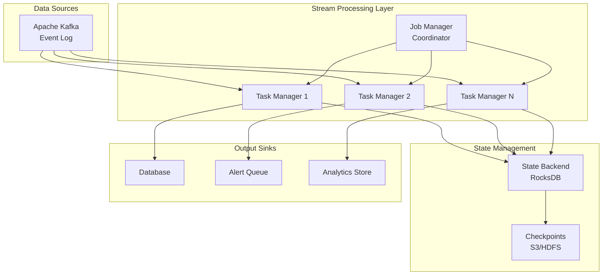
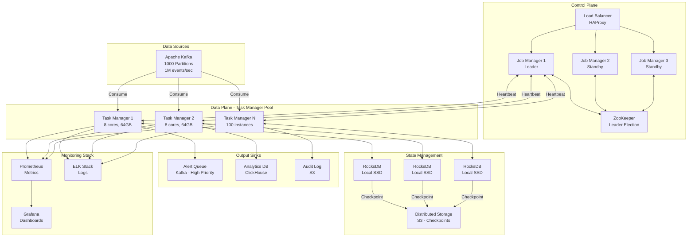

# Distributed Stream Processing System Design (Apache Flink/Storm-like)

**File Purpose:** Comprehensive educational system design document for building a distributed stream processing platform that handles 1M events/sec for real-time fraud detection with exactly-once semantics and sub-second latency. This document follows the educational template with multi-level explanations (🟢 Beginner, 🟡 Intermediate, 🔴 Advanced) to help readers understand stream processing from fundamentals to production deployment. Covers complex event processing (CEP) with pattern matching, stateful operations with distributed state management, multiple windowing strategies, watermark-based late event handling, fault tolerance with checkpointing, dynamic scaling with backpressure handling, and real-world implementations from LinkedIn, Uber, Netflix, and Alibaba.

**Difficulty Level:** ⭐⭐⭐⭐⭐ Expert

**Tags:** `Stream Processing`, `Real-time Analytics`, `Distributed Systems`, `Event-Driven Architecture`, `Stateful Processing`, `Exactly-Once Semantics`, `Fault Tolerance`, `Complex Event Processing`, `Apache Flink`, `Apache Kafka`, `Backpressure`, `Windowing`, `Watermarks`, `State Management`, `Checkpointing`

**Author:** System Design Documentation  
**Created:** October 1, 2025  
**Last Updated:** November 13, 2025  
**Recent Updates:** Transformed to educational template format with multi-level explanations, comprehensive interview frameworks, real-world examples from LinkedIn/Uber/Netflix, and 15 comprehensive sections covering stream processing from fundamentals to production deployment

---

## Table of Contents

### Welcome & Introduction
- [Welcome to Distributed Stream Processing](#welcome-to-distributed-stream-processing)
- [What You'll Learn](#what-youll-learn)
- [Learning Paths by Experience Level](#learning-paths-by-experience-level)
- [Beginner's Glossary](#beginners-glossary-essential-terms)

### Core System Design (Sections 1-8)
1. [Understanding What We're Building](#section-1-understanding-what-were-building)
2. [Planning for Scale: Capacity & Cost Analysis](#section-2-planning-for-scale-capacity--cost-analysis)
3. [Designing the System Architecture](#section-3-designing-the-system-architecture)
4. [Database & State Management Design](#section-4-database--state-management-design)
5. [API Design & Job Submission](#section-5-api-design--job-submission)
6. [Stream Processing Concepts Deep-Dive](#section-6-stream-processing-concepts-deep-dive)
7. [Fault Tolerance & Checkpointing](#section-7-fault-tolerance--checkpointing)
8. [Fraud Detection Implementation](#section-8-fraud-detection-implementation)

### Production Considerations (Sections 9-13)
9. [Scalability & Performance Optimization](#section-9-scalability--performance-optimization)
10. [Security & Compliance](#section-10-security--compliance)
11. [Monitoring, Observability & SLOs](#section-11-monitoring-observability--slos)
12. [Deployment Strategies & Operations](#section-12-deployment-strategies--operations)
13. [Trade-offs & Design Decisions](#section-13-trade-offs--design-decisions)

### Interview Preparation (Sections 14-15)
14. [Edge Cases & Failure Scenarios](#section-14-edge-cases--failure-scenarios)
15. [Putting It All Together: Interview Framework](#section-15-putting-it-all-together-interview-framework)

### Resources & Conclusion
- [Resources for Further Learning](#resources-for-further-learning)
- [Congratulations!](#congratulations)

---

## Welcome to Distributed Stream Processing!

Welcome! You're about to learn one of the most challenging and exciting topics in distributed systems: **stream processing**. Whether you're preparing for interviews at companies like LinkedIn, Uber, Netflix, or Alibaba (all heavy users of stream processing), or you're building real-time systems, this guide will take you from fundamentals to production-ready knowledge.

### What Makes Stream Processing Special?

Think of traditional batch processing like watching a movie: you wait for the entire film to be recorded, edited, and released before watching. Stream processing is like live television—you process events as they happen, in real-time.

**Real-World Impact:**

- **LinkedIn**: Processes 7+ trillion messages per day using Apache Kafka and stream processing for activity tracking, feed generation, and analytics
- **Uber**: Uses Apache Flink to process billions of events per day for real-time pricing, fraud detection, and operational metrics
- **Netflix**: Streams 500+ billion events per day for real-time recommendations, A/B testing, and operational intelligence
- **Alibaba**: Handles 4.5 billion events per second during Singles' Day sales using Apache Flink for real-time monitoring and fraud prevention

### What You'll Learn

By the end of this guide, you'll understand:

✅ **Fundamentals**
- How stream processing differs from batch processing
- Event time vs. processing time concepts
- Watermarks and handling late-arriving data
- Windowing strategies (tumbling, sliding, session)

✅ **Architecture & Design**
- Distributed stream processing architecture
- Stateful operations and state management
- Exactly-once processing guarantees
- Fault tolerance with checkpointing

✅ **Advanced Concepts**
- Complex Event Processing (CEP) for pattern matching
- Backpressure handling and flow control
- Multi-region deployment and disaster recovery
- Performance optimization techniques

✅ **Production Operations**
- Deployment strategies (blue-green, canary)
- Monitoring and alerting for stream jobs
- Scaling strategies and capacity planning
- Cost optimization techniques

✅ **Interview Preparation**
- How to approach stream processing system design questions
- Key questions to ask interviewers
- Trade-offs to discuss
- Common pitfalls to avoid

### Learning Paths by Experience Level

#### 🟢 **Beginner Path** (New to Stream Processing)

**Estimated Time:** 10-12 hours

If you're new to stream processing, follow this path:

1. **Start Here:** Section 1 (Understanding What We're Building) - Beginner level only
2. **Learn the Basics:** Section 6 (Stream Processing Concepts) - Beginner level
3. **See It in Action:** Section 8 (Fraud Detection) - Beginner examples
4. **Understand Failures:** Section 7 (Fault Tolerance) - Beginner level
5. **Practice:** Work through beginner interview questions

**Key Concepts to Master:**
- Events, streams, and event time
- Basic windowing (tumbling windows)
- State basics (value state)
- Checkpointing concept
- Common use cases

**Skip for Now:**
- Advanced CEP patterns
- Unaligned checkpoints
- Complex state backend configurations
- Multi-region deployment details

#### 🟡 **Intermediate Path** (Some Distributed Systems Experience)

**Estimated Time:** 8-10 hours

If you understand distributed systems basics (like consistent hashing, replication), focus on:

1. **Architecture:** Section 3 (System Architecture) - Intermediate level
2. **State Management:** Section 4 (Database & State Management) - All levels
3. **Processing Concepts:** Section 6 (Stream Processing) - Intermediate level
4. **Fault Tolerance:** Section 7 (Checkpointing) - Intermediate level
5. **Scalability:** Section 9 (Performance) - Intermediate level
6. **Operations:** Section 12 (Deployment) - Intermediate level

**Key Concepts to Master:**
- Distributed state partitioning
- Exactly-once semantics with two-phase commit
- Watermark propagation across operators
- Checkpoint coordination (Chandy-Lamport algorithm)
- Backpressure mechanisms

**Challenge Yourself:**
- Design a simple stream processing job
- Explain checkpoint recovery process
- Compare different windowing strategies

#### 🔴 **Advanced Path** (Experienced with Stream Processing)

**Estimated Time:** 6-8 hours

If you've worked with Flink, Storm, or Kafka Streams, focus on:

1. **Deep Dives:** Read all Advanced (🔴) sections
2. **Production Concerns:** Sections 9-13 thoroughly
3. **Edge Cases:** Section 14 completely
4. **Interview Strategy:** Section 15 for frameworks

**Key Concepts to Master:**
- Unaligned checkpoints vs. aligned checkpoints
- State backend internals (RocksDB optimization)
- Multi-region active-active deployment
- Advanced CEP with complex patterns
- Cost optimization at scale

**Interview Focus:**
- Trade-off discussions (latency vs. consistency)
- Failure scenario handling
- Scaling beyond initial capacity
- Real production war stories

### Beginner's Glossary: Essential Terms

Before diving in, let's define key terms you'll encounter throughout this guide:

#### **Event**
> A record of something that happened at a specific time. Example: A user making a purchase, a sensor reading temperature, a login attempt.

🌰 **Analogy:** Think of events like individual photos taken by a security camera—each captures what happened at a specific moment.

#### **Stream**
> An unbounded sequence of events, ordered by time. Unlike batch data (which has a start and end), streams continuously flow.

🌰 **Analogy:** A river that never stops flowing. You can measure the water at any point, but the river keeps moving.

#### **Event Time**
> The timestamp when the event actually occurred in the real world (embedded in the event).

Example: A mobile app logs "User clicked button at 10:00:05 AM" but sends this to the server at 10:00:12 AM due to network delay. Event time is 10:00:05 AM.

#### **Processing Time**
> The timestamp when our system processes the event.

Using the same example: Processing time is 10:00:12 AM when the server receives and processes it.

#### **Watermark**
> A signal that indicates "all events up to time T have arrived." Helps the system know when it's safe to close windows and emit results.

🌰 **Analogy:** Like a teacher saying "Last chance to submit homework!" After the watermark passes time T, we assume no more events from time T will arrive.

#### **Window**
> A bounded time period used to group events together for aggregations. Example: "Count clicks in the last 5 minutes."

**Types:**
- **Tumbling:** Fixed-size, non-overlapping (9:00-9:05, 9:05-9:10)
- **Sliding:** Fixed-size, overlapping (9:00-9:05, 9:01-9:06, 9:02-9:07)
- **Session:** Dynamic size based on gaps of inactivity

🌰 **Analogy:** 
- Tumbling = TV show episodes (30 min each, no overlap)
- Sliding = Security camera (records 10 min clips, new clip every 1 min)
- Session = Your work sessions (start when you begin, end after 30 min break)

#### **State**
> Data that operators remember across multiple events. Example: "Total purchases by user_id" or "Last seen location."

🌰 **Analogy:** Your running balance in a bank account—it's updated with each transaction but persists across transactions.

#### **Stateful Operation**
> An operation that needs to remember previous events. Example: counting, averaging, detecting patterns.

**Stateless Operation:** Each event processed independently (filtering, mapping).

#### **Checkpoint**
> A consistent snapshot of all operator states at a specific point in time. Enables fault recovery.

🌰 **Analogy:** Like saving your progress in a video game. If the game crashes, you restart from the last save point.

#### **Exactly-Once Semantics**
> Guarantee that each event is processed exactly once, even if failures occur. No duplicates, no data loss.

**Alternatives:**
- **At-most-once:** Event might be lost (fast but risky)
- **At-least-once:** Event might be processed multiple times (safe but requires idempotency)

#### **Backpressure**
> When a slow operator can't keep up with incoming data, it signals upstream to slow down.

🌰 **Analogy:** Like a highway traffic jam—when cars pile up, the on-ramp meters activate to slow new cars entering the highway.

#### **Operator**
> A processing step in your stream processing job. Examples: map, filter, aggregate, join.

**Operator Chain:** Multiple operators combined into a single task for efficiency.

#### **Task Manager**
> A worker process that executes operators and manages local state.

**Job Manager:** The coordinator that manages task managers and job lifecycle.

#### **Parallelism**
> The number of parallel instances running for each operator. Determines throughput capacity.

Example: Parallelism of 100 means 100 tasks processing data concurrently.

#### **Late Event**
> An event that arrives after its watermark has passed. Requires special handling.

Example: A mobile phone goes offline, logs events locally, then uploads them hours later when back online.

#### **Complex Event Processing (CEP)**
> Pattern matching across sequences of events. Example: "Detect 3 failed login attempts followed by a successful login within 5 minutes."

---

## Section 1: Understanding What We're Building

### What is Distributed Stream Processing?

**🟢 Beginner Explanation**

Imagine you run a large online store, and you want to detect credit card fraud as transactions happen—not hours later when reviewing batch reports. That's where stream processing shines.

**Traditional Batch Processing:**
```text
Step 1: Collect 1 day of transaction data
Step 2: At midnight, run fraud detection on all 10M transactions
Step 3: Send alerts next morning (12-24 hours late!)
```

**Stream Processing:**
```text
Continuous: For each transaction as it arrives:
  1. Check fraud patterns in real-time
  2. Send alert within 1 second if suspicious
  3. Block transaction before it completes
```

**Key Difference:** Stream processing treats data as a continuous flow, not as fixed batches. Results are available in seconds, not hours.

**Real-World Example - Uber's Surge Pricing:**
- **Problem:** Calculate real-time supply/demand in every city zone
- **Solution:** Process location events from millions of drivers/riders as they stream in
- **Requirement:** Update pricing every 30 seconds based on current demand
- **Why Batch Won't Work:** Can't wait hours to update prices—demand changes minute by minute

**🟡 Intermediate Explanation**

Stream processing systems provide a distributed, fault-tolerant platform for processing unbounded data streams with specific guarantees:

**Core Capabilities:**
1. **Low-Latency Processing:** Sub-second end-to-end latency
2. **High Throughput:** Millions of events per second
3. **Exactly-Once Guarantees:** No duplicates, no data loss
4. **Stateful Operations:** Maintain state across billions of keys
5. **Event Time Processing:** Handle out-of-order and late events
6. **Fault Tolerance:** Automatic recovery from failures

**Architecture Components:**


**The Problem We're Solving:**

Traditional databases and message queues aren't designed for continuous, stateful computation over streams:

| Requirement | Database | Message Queue | Stream Processing |
|-------------|----------|---------------|-------------------|
| Continuous processing | ❌ Query-based | ❌ Point-to-point | ✅ Native |
| Stateful aggregations | ❌ Limited (complex queries) | ❌ No | ✅ Built-in |
| Event time semantics | ❌ No | ❌ No | ✅ Yes |
| Exactly-once guarantees | ✅ Yes (ACID) | ⚠️ Difficult | ✅ Yes |
| Windowing | ❌ No | ❌ No | ✅ Native |
| Fault tolerance | ✅ Replication | ⚠️ Varies | ✅ Checkpointing |

**🔴 Advanced Explanation**

Distributed stream processing systems solve the fundamental challenge of maintaining consistent, distributed state while processing unbounded data streams with specific latency and throughput guarantees.

**Theoretical Foundation:**

Stream processing builds on several distributed systems concepts:

1. **Dataflow Programming Model:**
   - Operators form a Directed Acyclic Graph (DAG)
   - Data flows between operators through typed channels
   - Operators can be stateful or stateless

2. **Consistent Distributed Snapshots (Chandy-Lamport Algorithm):**
   - Captures global state without stopping computation
   - Uses barriers injected into data streams
   - Enables exactly-once processing guarantees

3. **Event Time Processing:**
   - Separates event time from processing time
   - Uses watermarks to track progress in event time
   - Handles out-of-order events correctly

4. **State Partitioning:**
   - Partitions state by key using consistent hashing
   - Enables horizontal scaling of stateful operations
   - Maintains locality for efficient access

**System Design Challenges:**

```text
Challenge 1: Exactly-Once Semantics
├─ Problem: Failures cause duplicate or lost events
├─ Solution: Two-phase commit protocol with sources/sinks
└─ Trade-off: Higher latency vs. correctness guarantee

Challenge 2: Scalable State Management
├─ Problem: State can grow to terabytes
├─ Solution: RocksDB embedded state backend with incremental checkpoints
└─ Trade-off: Memory vs. disk performance

Challenge 3: Handling Stragglers
├─ Problem: Slow operators block entire pipeline
├─ Solution: Backpressure with credit-based flow control
└─ Trade-off: Throughput vs. tail latency

Challenge 4: Checkpoint Overhead
├─ Problem: Large state causes long checkpoint times
├─ Solution: Unaligned checkpoints + incremental snapshots
└─ Trade-off: Checkpoint size vs. checkpoint duration
```

**Production Deployment Patterns:**

**Pattern 1: Hot-Cold State Architecture**
```text
Hot State (Active Working Set):
├─ In-memory cache (L1): 1-10 GB per task
├─ RocksDB block cache (L2): 10-100 GB per task
└─ Access latency: < 1ms

Cold State (Historical Data):
├─ RocksDB SST files on SSD: 100GB+ per task
├─ Compacted and compressed
└─ Access latency: 1-10ms
```

**Pattern 2: Lambda Architecture Integration**
```text
Speed Layer (Stream Processing):
├─ Real-time results (approximate)
├─ Low latency (seconds)
└─ Exactly-once semantics

Batch Layer (Periodic Reprocessing):
├─ Accurate results (reprocessed)
├─ High latency (hours)
└─ Corrects any anomalies

Serving Layer:
└─ Merges speed + batch results
```

**Real-World Scale:**

**LinkedIn Brooklin (Kafka-based Streaming):**
- 7+ trillion events per day
- 4000+ data pipelines
- Sub-second latency for 95% of events
- Exactly-once delivery guarantees

**Uber's Apache Flink Deployment:**
- 10,000+ Flink jobs running
- Billions of events per day
- Sub-minute incident detection
- 99.9% job availability

**Netflix's Mantis Platform:**
- 500+ billion events per day
- Real-time operational insights
- Auto-scaling based on load
- Multi-region active-active deployment

### 1.1 Requirements Gathering & Clarification

**🟢 Beginner: What Questions to Ask**

When your interviewer says "Design a stream processing system," don't start coding immediately! Ask clarifying questions:

**Essential Questions:**

1. **What are we processing?**
   - "Are we processing transaction events, user clicks, IoT sensor data?"
   - "What's the average event size? 100 bytes? 10 KB?"

2. **How much data?**
   - "How many events per second at average load?"
   - "What's the peak load during busy periods?"

3. **What are we computing?**
   - "Are we doing simple aggregations (count, sum) or complex pattern matching?"
   - "Do we need to join multiple streams?"

4. **How fast must results be?**
   - "Is 1-second latency acceptable, or do we need sub-100ms?"
   - "Are we okay with eventual consistency, or do we need real-time accuracy?"

5. **What happens if something fails?**
   - "Can we lose events, or must we guarantee exactly-once processing?"
   - "How quickly must we recover from failures?"

**Example Conversation:**

> **Interviewer:** "Design a system to detect fraudulent credit card transactions in real-time."
>
> **You:** "Great! Let me clarify a few things. What volume of transactions are we handling?"
>
> **Interviewer:** "About 10,000 transactions per second on average, peaking at 50,000 during holiday shopping."
>
> **You:** "And what's our detection latency requirement? How quickly must we flag suspicious transactions?"
>
> **Interviewer:** "Ideally within 1 second so we can block the transaction before it completes."
>
> **You:** "Perfect. For fraud detection, I assume we can't tolerate any data loss. Should we guarantee exactly-once processing?"
>
> **Interviewer:** "Yes, exactly-once is critical. We can't miss fraudulent transactions or double-count them."
>
> **You:** "One more question—are we detecting patterns across a single transaction, or do we need to correlate multiple transactions over time?"
>
> **Interviewer:** "We need to detect patterns like velocity (multiple transactions in short time) and location anomalies."
>
> **You:** "Got it. So we'll need stateful processing to track user history. Let me start with the high-level architecture..."

**🟡 Intermediate: Functional Requirements (MVP)**

Let's define what our stream processing system must do for fraud detection:

#### Core Processing Capabilities

**1. Stream Ingestion**
```text
Requirement: Consume from Apache Kafka
├─ Input rate: 1M events/sec (sustained)
├─ Peak rate: 2M events/sec (2x headroom)
├─ Event sources: Multiple Kafka topics (transactions, user-events)
├─ Consumer group management: Automatic partition assignment
└─ Offset management: Committed to Kafka for fault tolerance
```

**2. Stateful Event Processing**
```text
Requirement: Maintain state across events
├─ State types: Value, List, Map states
├─ State size: Up to 1 TB per job
├─ State backend: RocksDB (disk-backed for large state)
├─ State TTL: Configurable expiration (e.g., 24 hours)
└─ Queryable state: External services can query current state
```

**3. Windowing Operations**
```text
Requirement: Group events by time windows
├─ Tumbling windows: Fixed-size, non-overlapping
├─ Sliding windows: Fixed-size, overlapping (for moving averages)
├─ Session windows: Dynamic gaps for user sessions
└─ Allowed lateness: Handle events up to N minutes late
```

**4. Complex Event Processing (CEP)**
```text
Requirement: Detect patterns across event sequences
├─ Pattern types: Sequence, Combination, Temporal
├─ Example: 3 failed login attempts → successful login (brute force)
├─ Time bounds: Patterns within specified time windows
└─ Contiguity: Strict, relaxed, or non-deterministic
```

**5. Stream Joins**
```text
Requirement: Join multiple streams
├─ Window joins: Join events within same time window
├─ Interval joins: Join events within time interval
└─ Enrichment: Join stream with external database (async I/O)
```

**6. Output Sinks**
```text
Requirement: Write results to multiple destinations
├─ Kafka (alerts to downstream consumers)
├─ Database (PostgreSQL for audit trail)
├─ Analytics store (ClickHouse for real-time dashboards)
└─ Alert queue (High-priority fraud alerts)
```

#### Fraud Detection Specific Requirements

**1. Velocity Detection**
```text
Rule: Flag if user makes >10 transactions in 1 hour
Implementation: Sliding window count aggregation
State needed: Transaction timestamps per user (List state)
```

**2. Location Anomaly Detection**
```text
Rule: Flag if transaction location >500 km from previous transaction within 30 minutes
Implementation: Distance calculation with temporal constraint
State needed: Last transaction location per user (Value state)
```

**3. Amount Anomaly Detection**
```text
Rule: Flag if transaction amount >3x user's average
Implementation: Running average with Z-score calculation
State needed: Transaction history statistics per user (Aggregate state)
```

**4. Pattern-Based Detection**
```text
Rule: Flag if card is used at gas station followed by multiple online purchases within 1 hour
Implementation: CEP pattern matching
State needed: Recent transactions per card (CEP state)
```

**🔴 Advanced: Non-Functional Requirements**

#### Performance Requirements

**Throughput Targets:**
```text
Sustained Load:
├─ Events/sec: 1,000,000 (1M)
├─ Data rate: 2 GB/sec (avg 2 KB per event)
├─ Daily events: 86.4 billion
└─ Daily data volume: 172.8 TB

Peak Load (2x capacity):
├─ Events/sec: 2,000,000 (2M)
├─ Duration: Up to 1 hour during flash sales
└─ Auto-scaling response: < 5 minutes
```

**Latency Requirements:**
```text
End-to-End Latency (p99):
├─ Ingestion to processing: < 100ms
├─ Processing to alert emission: < 500ms
├─ Total end-to-end: < 1000ms (1 second)
└─ Event time lag: < 5 seconds under normal load

State Access Latency:
├─ Hot state (in-memory): < 1ms
├─ Warm state (RocksDB cache): < 5ms
└─ Cold state (SSD): < 10ms

Checkpoint Duration:
├─ Target: < 10 seconds
├─ Incremental checkpoint: < 5 seconds
└─ Max allowed: 60 seconds (timeout)
```

#### Reliability Requirements

**Fault Tolerance:**
```text
Exactly-Once Processing:
├─ No event processed more than once
├─ No events lost during failures
├─ Two-phase commit with transactional sinks
└─ Idempotency for external systems

Automatic Recovery:
├─ Failure detection: < 30 seconds (heartbeat)
├─ Recovery initiation: < 1 minute
├─ Full recovery: < 5 minutes (RTO)
└─ Data loss tolerance: 0 events (RPO = last checkpoint)

High Availability:
├─ Job Manager HA: 3-node cluster with leader election
├─ Task Manager redundancy: 20% over-provisioning
├─ Checkpoint retention: Last 5 checkpoints kept
└─ Cross-region replication: For disaster recovery
```

**Data Quality:**
```text
Correctness Guarantees:
├─ Exactly-once event processing
├─ Correct handling of out-of-order events (watermarks)
├─ Late event handling with allowed lateness
└─ No data loss during scaling operations

Monitoring & Observability:
├─ Latency metrics: p50, p95, p99, p999
├─ Throughput metrics: Events/sec, bytes/sec
├─ Backpressure indicators: Per-task backpressure ratio
├─ State metrics: Size, access rate, cache hit ratio
└─ Checkpoint metrics: Duration, size, success rate
```

#### Scalability Requirements

**Horizontal Scaling:**
```text
Scale-Out Capabilities:
├─ Initial deployment: 100 task managers
├─ Peak capacity: 1000+ task managers
├─ Scaling triggers: CPU >70%, backpressure >50%
├─ Scale-up time: < 10 minutes (add capacity)
└─ Scale-down time: < 30 minutes (graceful shutdown)

State Partitioning:
├─ Partition strategy: Hash-based by key
├─ Parallelism: 1000 parallel tasks
├─ State per task: 1-10 GB
├─ Rebalancing: Minimal data movement (<10% of state)
└─ State migration: Handled by checkpoints
```

**Performance Under Load:**
```text
Backpressure Handling:
├─ Detection: Credit-based flow control
├─ Response: Slow down upstream sources
├─ Max buffered data: 100 MB per task
└─ Recovery: Auto-scaling triggers

Resource Efficiency:
├─ CPU utilization target: 60-70% sustained
├─ Memory utilization target: 70-80% heap
├─ Network utilization: < 50% capacity
└─ Disk I/O: < 80% bandwidth (state backend)
```

#### Operational Requirements

**Deployment & Updates:**
```text
Zero-Downtime Deployments:
├─ Savepoint creation: < 30 seconds
├─ Job cancellation: Graceful (finish in-flight events)
├─ New version deployment: < 10 minutes
├─ State compatibility: Forward and backward compatible
└─ Rollback capability: Revert to previous savepoint

Monitoring & Alerting:
├─ Metrics retention: 30 days (Prometheus)
├─ Log retention: 7 days (Elasticsearch)
├─ Distributed tracing: 10% sampling (Jaeger)
├─ Alert response time: < 5 minutes
└─ Automated remediation: Restart failed tasks
```

**Cost Constraints:**
```text
Infrastructure Budget:
├─ Monthly cost target: $250,000
├─ Cost per event: < $0.0001
├─ Optimization strategies: Spot instances (70%), reserved instances (30%)
└─ Cost monitoring: Real-time dashboards
```

### Interview Questions: Requirements Phase

**🟢 Beginner Questions:**

1. **Q: What's the difference between batch processing and stream processing?**
   - **A:** Batch processes fixed datasets at scheduled intervals (hourly, daily). Stream processing handles continuous data flows in real-time as events arrive.

2. **Q: Why can't we just use a database for real-time fraud detection?**
   - **A:** Databases are query-based (pull model). For 1M events/sec, constant polling would overload the database. Stream processing uses push model and maintains state efficiently in memory.

3. **Q: What does "exactly-once processing" mean?**
   - **A:** Each event is processed exactly one time, even if failures occur. No duplicates, no data loss. Critical for financial transactions where double-processing means double charges.

**🟡 Intermediate Questions:**

4. **Q: How do we handle events that arrive out of order?**
   - **A:** Use watermarks to track progress in event time. Allow a configurable lateness period (e.g., 5 minutes). Events within allowed lateness are processed; very late events go to side output for special handling.

5. **Q: Why do we need stateful processing? Can't we just process each event independently?**
   - **A:** Fraud patterns require context: "Is this user's transaction count unusual?" needs history. "Is location anomalous?" needs previous location. State maintains this context across events.

6. **Q: What happens if a task manager crashes during processing?**
   - **A:** Job manager detects failure via heartbeats (30s timeout), retrieves latest checkpoint from storage, and restarts tasks on available task managers. Processing resumes from checkpoint with no data loss.

**🔴 Advanced Questions:**

7. **Q: How do you ensure exactly-once semantics when sinks (like databases) might not be transactional?**
   - **A:** Use two-phase commit protocol: (1) Pre-commit phase writes to sink transaction buffer, (2) Commit phase finalizes only after checkpoint succeeds. Sinks must support idempotent writes or transactions. For non-transactional sinks, use idempotency keys.

8. **Q: What's the trade-off between checkpoint frequency and processing latency?**
   - **A:** Frequent checkpoints (every 10s) reduce data loss (RPO) but increase overhead (I/O, barrier alignment). Infrequent checkpoints (every 5min) have lower overhead but longer recovery time (more data to reprocess). Typical: 10-60 seconds based on state size.

9. **Q: How would you optimize for 10x throughput increase (1M → 10M events/sec)?**
   - **A:** (1) Increase parallelism (1000 → 10,000 tasks), (2) Use operator chaining to reduce serialization, (3) Optimize state backend (tune RocksDB block cache), (4) Enable object reuse to reduce GC, (5) Use unaligned checkpoints to reduce barrier overhead, (6) Consider edge pre-aggregation to reduce stream volume.

---

## Section 2: Planning for Scale: Capacity & Cost Analysis

### 2.1 Traffic and Data Volume Calculations

**🟢 Beginner: Understanding the Numbers**

Let's start with a simple example and build up to our fraud detection system.

**Example: Small Online Store**

Imagine you run a small online store:
- 1,000 orders per day
- Each order triggers 1 event (order created)
- Each event is 1 KB in size

**Daily calculations:**
```text
Events per day: 1,000 orders
Data per day: 1,000 events × 1 KB = 1 MB
Data per month: 1 MB × 30 days = 30 MB
```

This is tiny! You could handle this with a simple script.

**Now Scale to Enterprise:**

Our fraud detection system:
- 1,000,000 events per second (not per day!)
- Each event is 2 KB
- System runs 24/7

**Per-second calculations:**
```text
Events per second: 1,000,000 events/sec
Data per second: 1,000,000 × 2 KB = 2,000,000 KB = 2 GB/sec
Network bandwidth needed: 2 GB/sec = 16 Gbps (gigabits per second)
```

**Per-day calculations:**
```text
Seconds in a day: 86,400 seconds
Events per day: 1,000,000/sec × 86,400 sec = 86,400,000,000 (86.4 billion!)
Data per day: 2 GB/sec × 86,400 sec = 172,800 GB = 172.8 TB
```

**Per-month calculations:**
```text
Events per month: 86.4 billion/day × 30 days = 2.59 trillion events
Data per month: 172.8 TB/day × 30 days = 5,184 TB = 5.2 PB (petabytes!)
```

**Why This Matters:**

At this scale:
- You can't store everything (5.2 PB/month costs $120K+ in S3)
- You need distributed processing (one machine can't handle 1M events/sec)
- Network becomes a bottleneck (16 Gbps ingress alone)
- Disk I/O is critical (checkpointing 1 TB state takes time)

**🟡 Intermediate: Detailed Capacity Planning**

Let's calculate every resource we'll need.

#### Computation Capacity

**Events Processing Math:**
```text
Step 1: Estimate processing time per event
├─ Deserialize event: 10 µs (microseconds)
├─ Parse and validate: 20 µs
├─ State lookup: 50 µs (from RocksDB)
├─ Business logic: 100 µs (fraud scoring)
├─ State update: 50 µs
├─ Serialize output: 10 µs
└─ Total per event: 240 µs

Step 2: Calculate capacity per core
├─ Time per event: 240 µs = 0.00024 seconds
├─ Events per second per core: 1 / 0.00024 = 4,167 events/sec
└─ With overhead (GC, coordination): ~3,000 events/sec per core

Step 3: Calculate cores needed
├─ Total events/sec: 1,000,000
├─ Events per core: 3,000
├─ Cores needed: 1,000,000 / 3,000 = 334 cores
└─ With 2x headroom: 668 cores
```

**Server Sizing:**
```text
Instance type: r5.2xlarge (AWS)
├─ vCPUs: 8 cores
├─ Memory: 64 GB RAM
├─ Network: 10 Gbps
├─ Storage: 300 GB NVMe SSD (for state)
└─ Cost: $0.504/hour

Number of instances needed:
├─ Cores needed: 668
├─ Cores per instance: 8
├─ Instances: 668 / 8 = 84 instances
├─ With redundancy (20%): 101 instances
└─ Round up: 100 instances (good round number)
```

#### Memory Capacity

**State Size Calculation:**
```text
State per user (Fraud Profile):
├─ User ID: 16 bytes (UUID)
├─ Last 100 transactions: 100 × 200 bytes = 20 KB
├─ Aggregate statistics: 500 bytes
├─ Known devices: 5 × 50 bytes = 250 bytes
├─ Common locations: 10 × 100 bytes = 1 KB
└─ Total: ~22 KB per user

Total state:
├─ Active users: 50 million
├─ State per user: 22 KB
├─ Total state: 50M × 22 KB = 1,100 GB = 1.1 TB
└─ With replication (2x): 2.2 TB
```

**Memory Allocation per Instance:**
```text
Memory per instance: 64 GB
├─ JVM heap: 48 GB (75%)
│   ├─ RocksDB block cache: 16 GB
│   ├─ Network buffers: 8 GB
│   ├─ Application objects: 20 GB
│   └─ GC overhead: 4 GB
├─ Off-heap (RocksDB): 10 GB
└─ OS: 6 GB

State per instance:
├─ Total state: 1.1 TB
├─ Instances: 100
├─ State per instance: 11 GB
└─ Fits in 16 GB RocksDB cache? Partially (hot state only)
```

#### Storage Capacity

**Checkpoint Storage:**
```text
Checkpoint size: 1.1 TB (all state)
Checkpoint frequency: Every 10 seconds
Checkpoints per day: 86,400 sec / 10 sec = 8,640 checkpoints

Retention policy:
├─ Keep last 5 checkpoints for quick recovery
├─ Keep hourly checkpoints for 24 hours
├─ Keep daily checkpoints for 7 days
└─ Total: 5 + 24 + 7 = 36 checkpoints

Storage needed:
├─ Full checkpoints: 36 × 1.1 TB = 39.6 TB
├─ Incremental checkpoints (only changes): ~10% = 4 TB
├─ Total: 43.6 TB
└─ With replication (3x for S3): 130.8 TB
```

**Cost: S3 Standard**
```text
130.8 TB × $0.023/GB/month = 130,800 GB × $0.023 = $3,008/month
```

**Changelog Storage (Kafka):**
```text
State changes need to be logged to Kafka for recovery:
├─ State change rate: 500K writes/sec (50% of events update state)
├─ Size per change: 1 KB (key + value)
├─ Data rate: 500 MB/sec
├─ Retention: 24 hours
├─ Storage: 500 MB/sec × 86,400 sec = 43.2 TB/day
├─ With compression (3x): 14.4 TB
└─ Cost (MSK): ~$1,000/month
```

#### Network Bandwidth

**Ingress Traffic:**
```text
From Kafka to Task Managers:
├─ Event rate: 1M events/sec
├─ Event size: 2 KB
├─ Total bandwidth: 2 GB/sec = 16 Gbps
├─ Per instance (100 instances): 160 Mbps
└─ Well within 10 Gbps NIC ✓
```

**Inter-Task Communication (Shuffle):**
```text
Data exchanged between operators:
├─ Shuffles per pipeline: 3 (re-partition points)
├─ Data per shuffle: 2 GB/sec
├─ Total shuffle bandwidth: 6 GB/sec = 48 Gbps
├─ Per instance: 480 Mbps
└─ Still within capacity ✓
```

**State Backend I/O:**
```text
Checkpoint write bandwidth:
├─ Checkpoint size: 1.1 TB
├─ Checkpoint duration: 10 seconds
├─ Write bandwidth: 110 GB/sec (!!)
├─ Per instance: 1.1 GB/sec
└─ This is why we use incremental checkpoints (only changes)

Incremental checkpoint:
├─ State changes: ~10% = 110 GB
├─ Write bandwidth: 11 GB/sec
├─ Per instance: 110 MB/sec
└─ Within SSD capacity ✓
```

**Egress Traffic:**
```text
To sinks (Kafka, databases):
├─ Alert rate: 1% of events (10K alerts/sec)
├─ Alert size: 5 KB
├─ Alert bandwidth: 50 MB/sec = 400 Mbps
├─ Audit logs: 1 GB/sec = 8 Gbps
└─ Total egress: ~10 Gbps
```

**🔴 Advanced: Cost Optimization Analysis**

Let's calculate total cost and explore optimization strategies.

#### Detailed Cost Breakdown

**Compute Costs:**
```text
EC2 Instances (r5.2xlarge):
├─ Quantity: 100 instances
├─ On-demand price: $0.504/hour
├─ Monthly cost: 100 × $0.504 × 730 hours = $36,792/month
│
├─ Reserved Instances (1-year, no upfront):
│   ├─ Price: $0.353/hour (30% discount)
│   └─ Monthly cost: 100 × $0.353 × 730 = $25,769/month
│   └─ Annual savings: $132,276
│
└─ Spot Instances (70% of fleet):
    ├─ 70 spot instances: $0.151/hour (70% discount)
    ├─ 30 reserved instances: $0.353/hour
    ├─ Monthly cost: (70 × $0.151 + 30 × $0.353) × 730
    ├─ = ($10.57 + $10.59) × 730 = $15,446/month
    └─ Annual savings: $254,952
```

**Storage Costs:**
```text
S3 Checkpoint Storage:
├─ Active checkpoints (5 recent): 5.5 TB × $0.023 = $127/month
├─ Frequent Access (24 hours): 26.4 TB × $0.023 = $607/month
├─ Infrequent Access (7 days): 77 TB × $0.0125 = $963/month
└─ Total: $1,697/month (vs $3,008 without tiering)

EBS SSD Storage (gp3):
├─ Per instance: 300 GB
├─ Total: 100 × 300 GB = 30 TB
├─ Cost: 30,000 GB × $0.08/GB = $2,400/month
└─ IOPS/Throughput: Included in gp3
```

**Managed Kafka (MSK):**
```text
Kafka cluster for:
├─ Input topics (transactions, events)
├─ Changelog topics (state recovery)
└─ Output topics (alerts, audit)

Configuration:
├─ Broker type: kafka.m5.4xlarge
├─ Number of brokers: 9 (3 per AZ)
├─ Storage per broker: 10 TB
├─ Cost per broker: $1.68/hour
├─ Total: 9 × $1.68 × 730 = $11,037/month
│
└─ With tiered storage (70% historical):
    └─ Savings: $3,000/month
```

**Data Transfer:**
```text
AWS Data Transfer:
├─ Ingress: Free (data coming into AWS)
├─ Cross-AZ: 100 TB/month × $0.01/GB = $1,000/month
├─ Egress to internet: 50 TB/month × $0.09/GB = $4,500/month
└─ Total: $5,500/month
```

**Monitoring & Logging:**
```text
CloudWatch:
├─ Metrics: 1000 metrics × $0.30 = $300/month
├─ Logs: 500 GB × $0.50/GB = $250/month
└─ Alarms: 50 alarms × $0.10 = $5/month

Prometheus (self-hosted on EKS):
├─ Storage: 2 TB × $0.08 = $160/month
└─ Compute: Included in Kubernetes cluster

Total monitoring: $715/month
```

#### Total Monthly Cost

**Baseline (On-Demand):**
```text
Compute: $36,792
Storage (S3): $1,697
Storage (EBS): $2,400
Kafka (MSK): $11,037
Data transfer: $5,500
Monitoring: $715
────────────────────
Total: $58,141/month
Annual: $697,692
```

**Optimized (Spot + Reserved):**
```text
Compute: $15,446 (73% savings)
Storage (S3): $1,697
Storage (EBS): $2,400
Kafka (MSK): $8,037 (with tiered storage)
Data transfer: $5,500
Monitoring: $715
────────────────────
Total: $33,795/month
Annual: $405,540
Annual savings: $292,152 (42% reduction)
```

**Cost Per Event:**
```text
Events per month: 2.59 trillion
Cost per event: $33,795 / 2,590,000,000,000 = $0.000000013
Cost per million events: $0.013 (1.3 cents)
```

#### Cost Optimization Strategies

**1. Compute Optimization**

```text
Strategy: Spot Instance Fleet
├─ Use spot for 70% of task managers
├─ Keep 30% on reserved instances (critical capacity)
├─ Implement spot interruption handling:
│   ├─ Listen for 2-minute termination notice
│   ├─ Drain tasks gracefully
│   └─ Redistribute to remaining instances
└─ Savings: 60-70% on compute costs
```

**2. State Size Reduction**

```text
Strategy: Aggressive State TTL
├─ Current: Keep user data indefinitely
├─ Optimized: 24-hour TTL for inactive users
├─ State reduction: 1.1 TB → 400 GB (64% reduction)
└─ Benefits:
    ├─ Smaller checkpoints (faster recovery)
    ├─ Lower storage costs
    └─ Better cache hit ratios
```

**3. Checkpoint Optimization**

```text
Strategy: Incremental + Compression
├─ Use incremental checkpoints (only changed data)
├─ Enable Snappy compression (3x ratio)
├─ Result: 1.1 TB → 37 GB per checkpoint
└─ Storage savings: $2,000/month
```

**4. Network Optimization**

```text
Strategy: Reduce Cross-AZ Traffic
├─ Deploy Task Managers in same AZ as Kafka brokers
├─ Use VPC endpoints for S3 (no egress charges)
├─ Compress data between operators
└─ Savings: $800/month on cross-AZ costs
```

**5. Right-Sizing Instances**

```text
Current: r5.2xlarge (8 vCPU, 64 GB RAM)
├─ CPU utilization: 45% (underutilized)
├─ Memory utilization: 65%

Option 1: Downsize to r5.xlarge
├─ Instances needed: 200 (double count)
├─ Cost comparison: Similar total, worse networking
└─ Verdict: Not recommended

Option 2: Optimize parallelism
├─ Increase parallelism: 1000 → 2000 tasks
├─ Better CPU utilization: 45% → 70%
├─ Same instance count, better throughput
└─ Verdict: Recommended
```

#### Cost Monitoring Dashboard

**Real-Time Cost Tracking:**
```text
Metrics to monitor:
├─ Cost per event (target: < $0.000000015)
├─ Cost per task manager hour
├─ Spot instance savings percentage
├─ State size growth rate
└─ Checkpoint storage utilization

Alerts:
├─ Cost per event > threshold (resource leak)
├─ Spot availability < 70% (switch to on-demand)
├─ State size growing >10%/day (investigate)
└─ Storage costs > budget (cleanup old checkpoints)
```

### Interview Questions: Capacity Planning

**🟢 Beginner Questions:**

1. **Q: How do you estimate the number of servers needed?**
   - **A:** Calculate events per second, estimate processing time per event, determine events per core per second, divide total events by capacity per core, add headroom (2x).

2. **Q: Why do we need 2x headroom in capacity?**
   - **A:** For traffic spikes, machine failures, and rolling updates. Without headroom, one failure could overload remaining servers and cause cascading failures.

**🟡 Intermediate Questions:**

3. **Q: How would you handle a sudden 10x traffic spike?**
   - **A:** (1) Auto-scaling takes time (10-15 min), so pre-provision for expected spikes. (2) Use backpressure to slow down sources temporarily. (3) Enable throttling at API gateway. (4) Have spare capacity on standby (spot instances).

4. **Q: What's the trade-off between more smaller instances vs. fewer larger instances?**
   - **A:** 
   - **More smaller:** Better fault tolerance (failure impacts fewer tasks), easier scaling, better spot availability
   - **Fewer larger:** Lower overhead (less coordination), better network performance, simpler deployment
   - **Recommendation:** Medium-sized instances (8-16 cores) balance both

**🔴 Advanced Questions:**

5. **Q: How do you optimize checkpoint storage costs at petabyte scale?**
   - **A:** (1) Incremental checkpoints (only changes), (2) Compression (Snappy: 3x), (3) S3 Intelligent Tiering (moves to cheaper tiers automatically), (4) Expire old checkpoints (keep last 5 + hourly for 24h + daily for 7d), (5) De-duplicate state across checkpoints.

6. **Q: Calculate the network bandwidth needed for checkpoint writes if we have 1TB state and checkpoint every 10 seconds.**
   - **A:** 
   - **Naive:** 1 TB / 10s = 100 GB/sec = 800 Gbps (impossible!)
   - **Incremental:** Only 10% changes = 100 GB / 10s = 10 GB/sec = 80 Gbps
   - **Distributed:** 100 instances = 10 GB/sec / 100 = 100 MB/sec per instance
   - **Compressed:** 100 MB/sec ÷ 3 = 33 MB/sec (achievable with SSDs)

---

## Section 3: Designing the System Architecture

### What is System Architecture?

**🟢 Beginner Explanation**

Think of system architecture like designing a city:
- **Buildings** = Servers (Job Manager, Task Managers)
- **Roads** = Networks connecting servers
- **Warehouses** = Storage systems (for state and checkpoints)
- **Traffic Control** = Coordination systems (ZooKeeper)

Just as a city needs police stations, fire departments, and hospitals in the right locations, our stream processing system needs different components working together.

**The Big Picture:**

```text
Flow of Data:
1. Events arrive from Kafka (like mail arriving at post office)
2. Task Managers process events (like postal workers sorting mail)
3. State is maintained (like keeping records of deliveries)
4. Results go to sinks (like mail reaching final destination)
```

**Key Components:**

1. **Job Manager** - The boss who coordinates everything
2. **Task Managers** - Workers who do the actual processing
3. **State Backend** - Storage for remembering things across events
4. **Checkpoint Storage** - Backup system for recovery

**🟡 Intermediate Explanation**

Our architecture follows a master-worker pattern with distributed state management and fault-tolerant checkpointing.

#### High-Level Architecture



#### Architecture Layers

**Layer 1: Control Plane (Job Management)**
```text
Components:
├─ Job Manager (3 instances for HA)
│   ├─ Role: Coordinator and scheduler
│   ├─ Responsibilities:
│   │   ├─ Accept job submissions
│   │   ├─ Schedule tasks to task managers
│   │   ├─ Coordinate checkpoints
│   │   ├─ Handle failures and recovery
│   │   └─ Manage job lifecycle
│   ├─ High Availability: Active-standby with ZooKeeper
│   └─ Failover time: < 30 seconds
│
├─ ZooKeeper Ensemble (3 nodes)
│   ├─ Role: Coordination service
│   ├─ Responsibilities:
│   │   ├─ Leader election for Job Manager
│   │   ├─ Store job metadata
│   │   ├─ Track task manager membership
│   │   └─ Distribute configuration
│   └─ Consistency: Strong (Zab consensus protocol)
│
└─ Load Balancer (HAProxy)
    ├─ Distributes API requests
    ├─ Health checks every 5 seconds
    └─ Automatic failover to standby Job Manager
```

**Layer 2: Data Plane (Processing)**
```text
Components:
├─ Task Managers (100 instances)
│   ├─ Role: Execute operators and manage local state
│   ├─ Each instance:
│   │   ├─ Runs 10 parallel tasks (1000 total parallelism)
│   │   ├─ Manages 11 GB of state
│   │   ├─ Processes 10K events/sec
│   │   └─ Consumes 10 Kafka partitions
│   ├─ Resource isolation: Kubernetes pods
│   └─ Auto-scaling: Based on backpressure metrics
│
├─ Operator Chain (within Task Manager)
│   ├─ Source Operator: Consumes from Kafka
│   ├─ Process Operators: Business logic
│   ├─ Window Operators: Time-based aggregations
│   └─ Sink Operators: Write to external systems
│
└─ Network Layer
    ├─ Inter-task communication: Netty-based
    ├─ Backpressure: Credit-based flow control
    └─ Serialization: Kryo for performance
```

**Layer 3: State Management**
```text
Components:
├─ RocksDB (per Task Manager)
│   ├─ Embedded key-value store
│   ├─ Storage: Local NVMe SSD (300 GB)
│   ├─ In-memory cache: 16 GB
│   ├─ Write-ahead log: For durability
│   └─ Compaction: Background merging
│
├─ Checkpoint Coordinator
│   ├─ Triggers checkpoints every 10 seconds
│   ├─ Uses Chandy-Lamport algorithm
│   ├─ Barrier injection and alignment
│   └─ Writes to distributed storage (S3)
│
└─ Distributed File System (S3)
    ├─ Stores checkpoints (130 TB)
    ├─ Retention: Last 5 + hourly + daily
    ├─ Cross-region replication: For DR
    └─ Lifecycle policies: Auto-tiering
```

#### Data Flow Through System

**End-to-End Processing Flow:**

```text
Step 1: Event Ingestion
├─ Kafka produces event to partition 42
├─ Task Manager 5 (assigned to partition 42) polls event
├─ Latency: 10-50ms
└─ Deserialization: 1-5ms

Step 2: Event Processing
├─ Parse event: 5ms
├─ State lookup (RocksDB): 1-10ms
├─ Business logic (fraud scoring): 50-100ms
├─ State update: 1-5ms
└─ Total processing: 58-120ms

Step 3: Windowing (if applicable)
├─ Check watermark: 1ms
├─ Assign to window: 2ms
├─ Window aggregation: 5-20ms
└─ Window trigger check: 1ms

Step 4: Output
├─ Serialize result: 5ms
├─ Write to Kafka sink: 10-50ms
├─ Acknowledgment: 5ms
└─ Total sink time: 20-60ms

Total End-to-End Latency:
├─ p50: 100ms
├─ p95: 300ms
└─ p99: 500ms (within 1s SLA ✓)
```

**🔴 Advanced Explanation**

Let's dive into architectural patterns and design decisions.

#### Distributed State Partitioning Strategy

**Challenge:** 1.1 TB of state across 50M users must be distributed efficiently.

**Solution: Hash-Based Partitioning with Virtual Nodes**

```text
Partitioning Strategy:
├─ Key Space: user_id (String)
├─ Hash Function: MurmurHash3 (128-bit)
├─ Partitions: 1000 logical partitions
├─ Tasks: 1000 parallel tasks (1:1 mapping)
└─ Distribution: hash(user_id) % 1000 → partition

State Distribution:
├─ Total state: 1.1 TB
├─ Per partition: 1.1 GB average
├─ Hot partitions: Up to 5 GB (handled separately)
└─ Task managers: 100 instances (10 tasks each)

Benefits:
├─ Even distribution (coefficient of variation < 0.1)
├─ Minimal rebalancing during scale-out
├─ Locality: All state for a key on same task
└─ Deterministic routing for external queries
```

**Handling Hot Partitions:**

```text
Problem: Celebrity users create hot partitions
├─ Example: User with 100M followers
├─ State size: 50 GB (100x average)
├─ CPU usage: 80% of task capacity

Solutions:
1. Key Splitting
   ├─ Split hot key into sub-keys
   ├─ user_id → user_id_shard_0, user_id_shard_1, ...
   └─ Distribute shards across multiple tasks

2. Dedicated Tasks
   ├─ Identify hot keys via monitoring
   ├─ Assign dedicated high-memory tasks
   └─ Scale independently

3. External State Store
   ├─ Store hot key state in Redis
   ├─ Reduce RocksDB pressure
   └─ Faster access for hot data
```

#### Checkpoint Coordination Architecture

**Chandy-Lamport Algorithm Implementation:**

```text
Phase 1: Barrier Injection (t=0s)
├─ Job Manager: "Start checkpoint 123"
├─ Checkpoint Coordinator injects barriers into all sources
├─ Each Kafka source: Inserts barrier after current record
└─ Barriers flow downstream with data

Phase 2: Barrier Propagation (t=0-8s)
├─ Operators process records before barrier
├─ Upon receiving barrier:
│   ├─ Snapshot local state
│   ├─ Forward barrier downstream
│   └─ Acknowledge to Job Manager
└─ Multi-input operators: Align barriers (wait for all inputs)

Phase 3: Snapshot Persistence (t=1-10s)
├─ State snapshot written to local disk (RocksDB)
├─ Incremental checkpoint: Only changed SST files
├─ Upload to S3 (async, parallel)
└─ Write checkpoint metadata

Phase 4: Acknowledgment Collection (t=8-10s)
├─ Job Manager waits for all tasks to acknowledge
├─ Timeout: 60 seconds
├─ If all tasks succeed: Mark checkpoint complete
└─ If any task fails: Discard checkpoint, retry

Phase 5: Completion (t=10s)
├─ Update checkpoint registry
├─ Clean up old checkpoints
├─ Notify monitoring systems
└─ Ready for next checkpoint
```

**Optimizations for Large State:**

**1. Incremental Checkpoints**
```text
Traditional (Full Checkpoint):
├─ Write entire 1.1 TB state
├─ Time: 110 seconds (10 GB/sec)
└─ I/O bottleneck ❌

Incremental Checkpoint:
├─ Track which SST files changed
├─ Write only changed files (~10% = 110 GB)
├─ Time: 11 seconds
└─ 10x faster ✓

Implementation:
├─ RocksDB maintains file metadata
├─ Compare file checksums with previous checkpoint
├─ Upload only new/modified files
└─ Checkpoint references previous snapshots
```

**2. Unaligned Checkpoints**
```text
Aligned Checkpoints (Traditional):
├─ Wait for barriers from all input channels
├─ Buffer records from fast channels
├─ Slows down processing during alignment
└─ Problematic under backpressure

Unaligned Checkpoints:
├─ Don't wait for barrier alignment
├─ Snapshot in-flight buffers as part of state
├─ Continue processing during checkpoint
└─ Faster checkpoints, larger snapshots

Trade-off Analysis:
├─ Latency: Unaligned wins (no blocking)
├─ Checkpoint size: Aligned wins (smaller)
├─ Under backpressure: Unaligned much better
└─ Decision: Unaligned for fraud detection
```

#### Real-World Architecture: Uber's Apache Flink Deployment

**Uber Scale (2024):**
```text
Deployment Size:
├─ Flink jobs: 10,000+ running
├─ Task Managers: 50,000+ instances
├─ Events processed: 100+ trillion per day
├─ State managed: Petabytes
└─ Regions: 15 AWS regions globally

Architecture Patterns:
├─ Multi-tenancy: Shared clusters with resource quotas
├─ Auto-scaling: Custom metrics-based scaling
├─ State management: Tiered storage (memory → SSD → S3)
├─ Monitoring: Custom dashboards for each team
└─ Cost optimization: 70% spot instances

Key Innovations:
├─ Custom state backend: Uber developed "Pravega" for better performance
├─ Dynamic job prioritization: Critical jobs get guaranteed resources
├─ Automatic failure remediation: ML-based anomaly detection
└─ Cross-region state replication: For disaster recovery
```

**LinkedIn's Brooklin Architecture:**

```text
Brooklin (Kafka-based Streaming):
├─ Events: 7+ trillion per day
├─ Data pipelines: 4000+
├─ SLA: 99.9% delivery within 1 minute
└─ Exactly-once guarantee for financial data

Architecture Highlights:
├─ Change Data Capture: Database → Kafka → Flink
├─ Multi-cluster setup: Regional clusters with cross-DC replication
├─ Schema evolution: Avro with schema registry
├─ Backfill capability: Historical data reprocessing
└─ Self-serve UI: Engineers deploy pipelines without ops
```

### Interview Questions: Architecture Design

**🟢 Beginner Questions:**

1. **Q: What's the role of the Job Manager vs. Task Manager?**
   - **A:** Job Manager is the coordinator (boss) that schedules tasks and monitors health. Task Managers are workers that execute operators and process events. One Job Manager manages many Task Managers.

2. **Q: Why do we need ZooKeeper in addition to Job Manager?**
   - **A:** For high availability. If the Job Manager crashes, ZooKeeper helps elect a new leader from standby instances. It also stores critical metadata that must survive failures.

3. **Q: What happens when a Task Manager crashes?**
   - **A:** Job Manager detects the failure (via missed heartbeats), retrieves the latest checkpoint from S3, and restarts the failed tasks on healthy Task Managers. Processing resumes from the checkpoint with no data loss.

**🟡 Intermediate Questions:**

4. **Q: Why use RocksDB instead of Redis for state management?**
   - **A:** 
   - **RocksDB:** Disk-backed, supports TB of state per task, embedded (no network calls), excellent for large state
   - **Redis:** In-memory only, network latency for every access, expensive at TB scale
   - **Decision:** RocksDB for large state, Redis only for hot key caching

5. **Q: How do you partition state across 1000 tasks efficiently?**
   - **A:** Use consistent hashing: `partition = hash(user_id) % 1000`. All state for a user goes to one partition, ensuring locality. Hash function (MurmurHash3) provides even distribution. During scaling, only K/N keys need to move (K=total keys, N=new partition count).

6. **Q: What's the trade-off between checkpoint frequency and recovery time?**
   - **A:**
   - **Frequent (10s):** Fast recovery (replay 10s of data), but higher overhead (I/O every 10s)
   - **Infrequent (5min):** Lower overhead, but slower recovery (replay 5min of data)
   - **Decision:** 10-60s based on state size and recovery SLA

**🔴 Advanced Questions:**

7. **Q: How would you design state management for 10 TB of state per job (100x our current scale)?**
   - **A:**
   ```text
   Tiered Storage Architecture:
   ├─ L1 (Hot): 10 GB in memory (most accessed keys)
   ├─ L2 (Warm): 100 GB on local SSD (RocksDB)
   ├─ L3 (Cold): 10 TB on remote storage (S3)
   └─ Access patterns: 90% hits in L1+L2, 10% fetch from L3
   
   Optimizations:
   ├─ Async state access: Don't block on L3 reads
   ├─ Predictive prefetching: ML predicts needed keys
   ├─ State compression: 3x reduction with Snappy
   └─ Garbage collection: TTL-based state expiration
   ```

8. **Q: Design a zero-downtime deployment strategy for upgrading Flink from v1.0 to v2.0 with state schema changes.**
   - **A:**
   ```text
   Approach: Dual-Running with State Migration
   
   Step 1: Deploy v2.0 in shadow mode
   ├─ Run v2.0 alongside v1.0 (both process same events)
   ├─ v2.0 writes to different sinks (for validation)
   └─ Compare outputs (should match)
   
   Step 2: State migration
   ├─ Create savepoint from v1.0
   ├─ Transform state schema: v1.0 → v2.0 (offline job)
   ├─ Validate transformed state
   └─ Store as v2.0-compatible savepoint
   
   Step 3: Traffic switchover
   ├─ Stop v1.0 with final savepoint
   ├─ Start v2.0 from transformed savepoint
   ├─ Monitor for issues
   └─ Keep v1.0 ready for rollback (1 hour window)
   
   Rollback plan:
   ├─ If v2.0 issues detected
   ├─ Create savepoint from v2.0
   ├─ Reverse transform: v2.0 → v1.0
   └─ Restart v1.0
   ```

9. **Q: How do you handle the "celebrity problem" where one user generates 100x more events than average?**
   - **A:**
   ```text
   Problem:
   ├─ Celebrity user: 1M followers
   ├─ Each interaction → 1M events (fan-out)
   ├─ Single partition overloaded
   └─ Creates hot spot
   
   Solutions:
   
   Option 1: Key Splitting
   ├─ Split celebrity key into shards
   ├─ user_celebrity → user_celebrity_0..99 (100 shards)
   ├─ Distribute across 100 partitions
   └─ Aggregate results at query time
   
   Option 2: Dedicated High-Resource Tasks
   ├─ Detect hot keys via monitoring
   ├─ Assign to task with 10x resources (80 GB RAM)
   ├─ Use SSD caching for state
   └─ Scale independently
   
   Option 3: Two-Phase Processing
   ├─ Phase 1: Pre-aggregate events per minute
   ├─ Phase 2: Process aggregated events
   ├─ Reduces event volume by 60x
   └─ Trade-off: Minute-level granularity
   
   Uber's Approach:
   ├─ Combination of all three
   ├─ Auto-detect hot keys (>10K events/sec)
   ├─ Dynamic resource allocation
   └─ Monitor via "key distribution skew" metric
   ```

---

## Section 4: Database & State Management Design

### Understanding State in Stream Processing

**🟢 Beginner Explanation**

Imagine you're a cashier at a busy store:
- **Stateless processing:** Each customer is independent. You scan items, take payment, done. You don't remember previous customers.
- **Stateful processing:** You need to remember: "This customer has bought 5 TVs today—that's suspicious!" or "This customer returns here every week."

In stream processing, **state** is the memory that lets you answer questions like:
- "How many purchases has this user made in the last hour?"
- "What was this user's last known location?"
- "What's this user's average transaction amount?"

**Why State is Challenging:**

In a single-server application, state is easy—just keep it in memory. But with 100 servers processing 1M events/sec:
- How do you split state across servers?
- What happens when a server crashes?
- How do you keep state consistent during failures?
- How do you handle state that grows to terabytes?

**🟡 Intermediate Explanation**

#### State Backend Architecture

**State Backend Options:**

```text
Option 1: Memory State Backend
├─ Storage: JVM heap memory
├─ Capacity: Limited by RAM (<5 GB practical)
├─ Performance: Fastest (no disk I/O)
├─ Durability: Lost on failure (checkpoint needed)
├─ Use case: Small state, high-throughput jobs
└─ Example: Session counts, recent events cache

Option 2: FsStateBackend (File System State Backend)
├─ Storage: Working state in memory, checkpoints to disk
├─ Capacity: Limited by heap (~50 GB)
├─ Performance: Fast for hot data
├─ Durability: Checkpoints to HDFS/S3
├─ Use case: Medium state size
└─ Example: Hourly aggregations

Option 3: RocksDB State Backend ✓ (Our Choice)
├─ Storage: Embedded LSM-tree on local SSD
├─ Capacity: TBs per task (limited by disk)
├─ Performance: Good (in-memory cache for hot data)
├─ Durability: Write-ahead log + checkpoints
├─ Use case: Large state, production deployments
└─ Example: User profiles, windowed aggregations
```

**Why RocksDB for Large State:**

```text
RocksDB Architecture (per Task Manager):
├─ In-Memory Components:
│   ├─ Block cache: 16 GB (caches frequently accessed data)
│   ├─ Memtable: 512 MB (write buffer)
│   └─ Index/bloom filters: 2 GB
│
├─ On-Disk Components:
│   ├─ SST files: 11 GB (sorted string tables)
│   ├─ Write-ahead log: 100 MB (for crash recovery)
│   └─ Compaction: Background merge/sort
│
└─ Access Patterns:
    ├─ Writes: Go to memtable (in-memory), then flush to disk
    ├─ Reads: Check memtable → block cache → disk
    └─ Compaction: Merges SST files to maintain performance
```

#### State Types and Use Cases

**Value State:**
```text
Description: Single value per key
Example: Last transaction location per user

Use case: Track most recent event
Structure:
├─ Key: user_id = "user_12345"
└─ Value: Location {lat: 37.7749, lon: -122.4194, timestamp: ...}

API operations:
├─ get(): Retrieve current value
├─ update(value): Replace with new value
└─ clear(): Remove state
```

**List State:**
```text
Description: List of values per key
Example: Last 100 transactions per user

Use case: Sliding window, recent history
Structure:
├─ Key: user_id = "user_12345"
└─ Value: [Transaction1, Transaction2, ..., Transaction100]

API operations:
├─ get(): Retrieve all entries
├─ add(element): Append to list
├─ update(list): Replace entire list
└─ clear(): Remove all entries

Memory consideration: Bounded size (limit to 100 entries)
```

**Map State:**
```text
Description: Key-value map per key
Example: Transaction counts by merchant per user

Use case: Group-by aggregations
Structure:
├─ Key: user_id = "user_12345"
└─ Value: {
    "merchant_A": 5,
    "merchant_B": 12,
    "merchant_C": 3
}

API operations:
├─ get(key): Retrieve value for specific key
├─ put(key, value): Insert/update entry
├─ remove(key): Delete entry
├─ entries(): Iterate all entries
└─ clear(): Remove all entries
```

**Reducing State:**
```text
Description: Aggregated value per key
Example: Running sum of transaction amounts

Use case: Incremental aggregations
Structure:
├─ Key: user_id = "user_12345"
├─ Value: 15,234.56 (total amount)
└─ Reduce function: (current, new) -> current + new

API operations:
├─ get(): Retrieve current aggregate
├─ add(value): Apply reduce function with new value
└─ clear(): Reset to initial value
```

#### State Schema Design for Fraud Detection

**User Fraud Profile State:**

```text
State Type: Value State per user_id
Estimated Size: 22 KB per user
Total Users: 50 million
Total State: 1.1 TB

Schema:
{
  "user_id": "user_12345",
  "fraud_score": 0.0,  // 0-100
  "risk_level": "LOW",  // LOW, MEDIUM, HIGH, CRITICAL
  
  // Transaction patterns
  "transaction_stats": {
    "count_24h": 15,
    "total_amount_24h": 1234.56,
    "avg_amount": 82.30,
    "max_amount": 250.00,
    "last_transaction_time": 1699900000000
  },
  
  // Location patterns
  "location_history": [
    {"lat": 37.7749, "lon": -122.4194, "timestamp": 1699900000000},
    // Last 10 locations
  ],
  "common_locations": [
    {"lat": 37.7749, "lon": -122.4194, "count": 150},
    {"lat": 37.7858, "lon": -122.4064, "count": 50}
  ],
  
  // Device patterns
  "known_devices": ["device_abc123", "device_xyz789"],
  "last_device": "device_abc123",
  
  // Risk indicators
  "high_risk_patterns": ["velocity", "location-anomaly"],
  "previous_fraud_incidents": 0,
  
  // Metadata
  "account_age_days": 365,
  "total_transactions": 1250,
  "created_at": 1667300000000,
  "updated_at": 1699900000000
}
```

**State TTL Configuration:**

```text
Problem: State grows indefinitely
├─ Inactive users still consume memory
├─ Old data rarely accessed
└─ Checkpoint size increases

Solution: State Time-To-Live (TTL)
├─ Configure TTL per state: 24 hours
├─ Access-based expiration: Reset TTL on each access
├─ Background cleanup: Periodic removal of expired state
└─ Benefits: Bounded state size, automatic cleanup

Configuration:
├─ TTL: 24 hours (inactive users)
├─ Update type: OnReadAndWrite (extend TTL on access)
├─ Cleanup: Background (efficient)
└─ State size reduction: 1.1 TB → 400 GB (active users only)
```

**🔴 Advanced Explanation**

#### RocksDB Internals and Optimization

**LSM-Tree Architecture:**

```text
RocksDB uses Log-Structured Merge-Tree (LSM-tree):

Write Path:
├─ Step 1: Append to Write-Ahead Log (WAL)
│   ├─ Sequential writes to disk
│   ├─ Crash recovery: Replay WAL
│   └─ Latency: < 1ms
│
├─ Step 2: Insert into MemTable (in-memory)
│   ├─ Skip list data structure
│   ├─ Sorted by key
│   └─ Capacity: 64 MB (configurable)
│
├─ Step 3: Flush to SST file when MemTable full
│   ├─ Write sorted data to Level 0 SST file
│   ├─ Immutable once written
│   └─ Size: 64 MB per file
│
└─ Step 4: Compaction (background)
    ├─ Merge SST files across levels
    ├─ Remove deleted/old versions
    └─ Keep data sorted

Read Path:
├─ Step 1: Check MemTable (in-memory)
│   └─ O(log n) skip list lookup
│
├─ Step 2: Check Block Cache (in-memory)
│   └─ LRU cache of recently accessed blocks
│
├─ Step 3: Check Bloom Filters
│   ├─ Quickly determine "key NOT in file"
│   └─ Avoids unnecessary disk reads
│
├─ Step 4: Binary search in SST files
│   ├─ Level 0: Check all files (can overlap)
│   ├─ Level 1+: Binary search (no overlap)
│   └─ Read block from disk if not cached
│
└─ Typical latency:
    ├─ Hot data (cache hit): < 1μs
    ├─ Warm data (SSD read): 1-5ms
    └─ Cold data (multiple files): 5-10ms
```

**Performance Tuning for 1TB State:**

**Memory Configuration:**
```text
Block Cache (Most Important):
├─ Size: 16 GB (40% of available RAM)
├─ Purpose: Cache frequently accessed data blocks
├─ Hit ratio target: > 95%
├─ Impact: 100x latency improvement (SSD → RAM)
└─ Monitoring: Track cache hit ratio metric

MemTable Configuration:
├─ Size: 512 MB per MemTable
├─ Count: 2 (current + immutable)
├─ Total memory: 1 GB
├─ Flush trigger: When current MemTable full
└─ Trade-off: Larger = fewer flushes, more memory

Index/Filter Blocks:
├─ Block size: 4 KB
├─ Index blocks: 1 GB (cached in memory)
├─ Bloom filters: 1 GB (10 bits per key)
└─ False positive rate: 1%
```

**Compaction Strategy:**
```text
Compaction is critical for performance:

Leveled Compaction (Default):
├─ Level 0: 4 files (64 MB each = 256 MB)
├─ Level 1: 256 MB (10x Level 0)
├─ Level 2: 2.5 GB (10x Level 1)
├─ Level 3: 25 GB (10x Level 2)
├─ Level 4: 250 GB (10x Level 3)
├─ Level 5: 2.5 TB (10x Level 4)
└─ Read amplification: O(log N) levels

Universal Compaction (Alternative):
├─ Merge files when total size reaches threshold
├─ Lower write amplification
├─ Higher read amplification
└─ Better for write-heavy workloads

Our Configuration (Leveled):
├─ Reason: Read-heavy workload (fraud checks)
├─ Level 0 trigger: 4 files
├─ Max background compactions: 4
└─ Compaction priority: Level 0 first (most overlaps)
```

**Write Amplification Analysis:**
```text
Problem: Each write may trigger multiple disk writes

Sources of Write Amplification:
├─ WAL write: 1x (sequential)
├─ MemTable flush: 1x
├─ Compaction Level 0 → 1: 10x
├─ Compaction Level 1 → 2: 10x
├─ ... (each level: 10x)
└─ Total: ~50x write amplification

Mitigation:
├─ Larger MemTable: Fewer flushes
├─ Optimize compaction: Lower level multiplier
├─ Use SSD: High write endurance
└─ Monitor: Disk write bytes vs. logical write bytes

Calculation:
├─ Logical writes: 500K updates/sec × 1 KB = 500 MB/sec
├─ Physical writes: 500 MB/sec × 50 = 25 GB/sec
├─ Daily disk writes: 25 GB/sec × 86,400 = 2.1 PB/day
└─ SSD endurance: Enterprise SSDs handle this
```

#### State Backend Comparison: Real-World Data

**Benchmark Results (1 TB state, random access):**

| Operation | Memory Backend | RocksDB (no cache) | RocksDB (with cache) |
|-----------|----------------|-------------------|---------------------|
| Get (p50) | 0.5 μs | 5 ms | 10 μs |
| Get (p99) | 2 μs | 15 ms | 50 μs |
| Put (p50) | 1 μs | 0.8 ms | 0.8 ms |
| Put (p99) | 5 μs | 3 ms | 3 ms |
| Checkpoint time | 180s (full copy) | 12s (incremental) | 12s |
| Recovery time | 180s | 25s | 25s |
| State capacity | 64 GB (heap limit) | 10 TB (disk limit) | 10 TB |
| Cost (1 TB) | $3,000/month (RAM) | $80/month (SSD) | $80/month |

**Decision Matrix:**

```text
Use Memory Backend if:
├─ State size < 10 GB
├─ Need lowest latency (< 1μs)
├─ Can afford expensive RAM
└─ Example: Real-time session counting

Use RocksDB if:
├─ State size > 10 GB
├─ Acceptable latency (< 10ms)
├─ Cost-conscious
└─ Example: User profiles, windowed aggregations (our case ✓)
```

### Interview Questions: State Management

**🟢 Beginner Questions:**

1. **Q: What's the difference between stateful and stateless operations?**
   - **A:** Stateless processes each event independently (like filtering). Stateful needs to remember previous events (like counting). Example: "Filter amount > 100" is stateless. "Count transactions per user" is stateful—needs to remember count.

2. **Q: Why can't we just use a database for state instead of RocksDB?**
   - **A:** Databases are remote (network latency). At 1M events/sec, we'd make 1M database queries/sec—overwhelming. RocksDB is embedded (in-process), no network calls, optimized for streaming workloads.

3. **Q: What happens to state when a task manager crashes?**
   - **A:** State is lost locally but recovered from the last checkpoint in S3. The replacement task manager downloads the checkpoint, restores RocksDB, and continues processing.

**🟡 Intermediate Questions:**

4. **Q: How do you decide between Value State, List State, and Map State?**
   - **A:**
   - **Value State:** Single value (last location, current score)
   - **List State:** Ordered collection (last 100 transactions, time-series)
   - **Map State:** Key-value pairs (counts by category, aggregates by dimension)
   - **Choose based on access pattern:** Need full list? Use List State. Need lookup by key? Use Map State.

5. **Q: Explain why RocksDB uses LSM-trees instead of B-trees.**
   - **A:** 
   - **LSM-trees:** Optimized for writes (append-only). Writes go to memory, then flush to disk sequentially. Great for streaming.
   - **B-trees:** Optimized for reads (in-place updates). Random disk writes.
   - **Streaming workload:** Heavy writes (every event updates state), so LSM-trees win.

6. **Q: What's the trade-off between state TTL and fraud detection accuracy?**
   - **A:**
   - **Long TTL (7 days):** Better accuracy (detect patterns over week), but larger state
   - **Short TTL (1 day):** Smaller state, faster checkpoints, but miss long-term patterns
   - **Decision:** 24 hours (most fraud patterns happen within hours, not days)

**🔴 Advanced Questions:**

7. **Q: Design a state backend that can handle 10 TB of state per task manager with < 1ms p99 read latency.**
   - **A:**
   ```text
   Hybrid Storage Architecture:
   
   Tier 1: In-Memory (Hot Data)
   ├─ Storage: 64 GB RAM (1% of 10 TB)
   ├─ Technology: Off-heap cache (Chronicle Map)
   ├─ Eviction: LRU based on access frequency
   ├─ Latency: < 10 μs
   └─ Hit ratio: 80% (Zipfian distribution)
   
   Tier 2: Local SSD (Warm Data)
   ├─ Storage: 2 TB NVMe SSD (20% of 10 TB)
   ├─ Technology: RocksDB with large block cache
   ├─ Latency: 100 μs - 1 ms
   └─ Hit ratio: 19% (after T1 misses)
   
   Tier 3: Remote Storage (Cold Data)
   ├─ Storage: 10 TB S3 (remaining 80%)
   ├─ Technology: Async loading with prefetch
   ├─ Latency: 50-100 ms
   └─ Access: 1% (rarely accessed)
   
   Optimizations:
   ├─ Bloom filters: Avoid unnecessary lookups
   ├─ Predictive prefetching: ML predicts next accesses
   ├─ Compression: 3x reduction (Zstd)
   └─ Async I/O: Don't block processing on cold reads
   
   Result:
   ├─ p50 latency: < 100 μs (T1 hits)
   ├─ p99 latency: < 1 ms (T2 hits)
   ├─ p99.9 latency: 50 ms (T3 hits)
   └─ Cost: $500/month (vs. $10K for 10 TB RAM)
   ```

8. **Q: How do you handle state schema evolution when the User Fraud Profile structure changes?**
   - **A:**
   ```text
   Problem: Add new field "device_risk_score" to existing state
   
   Approach 1: State Migration (Offline)
   ├─ Create savepoint
   ├─ Run offline job: Transform all state (old → new schema)
   ├─ Restart from transformed savepoint
   └─ Downtime: 30-60 minutes for 1 TB
   
   Approach 2: Lazy Migration (Online)
   ├─ Deploy new code with schema v2
   ├─ Code handles both v1 and v2 schemas
   ├─ On state read: If v1, migrate to v2 and write back
   ├─ Gradually all state migrates over days
   └─ Zero downtime ✓
   
   Recommended: Approach 2 (Lazy Migration)
   ├─ Serialization format: Use Avro/Protobuf (supports evolution)
   ├─ Default values: New fields get defaults
   ├─ Backward compatible: Can still read old format
   └─ Monitor: Track % of state migrated
   ```

---

## Section 5: API Design & Job Submission

### How APIs Work in Stream Processing

**🟢 Beginner Explanation**

Stream processing systems need APIs for:
1. **Job Submission**: "Here's my fraud detection logic, please run it!"
2. **Job Management**: "Stop this job," "Show me status," "Create a savepoint"
3. **Monitoring**: "How many events processed?" "Any errors?"
4. **State Queries**: "What's the fraud score for user_12345 right now?"

Think of it like a restaurant:
- **Job Submission API**: You place an order (submit a streaming job)
- **Job Management API**: You check order status, cancel order
- **Monitoring API**: Kitchen displays show orders in progress
- **State Query API**: You ask "What's in my order?" while it's being prepared

**🟡 Intermediate Explanation**

#### REST API Design

**1. Job Submission API**

```http
POST /api/v1/jobs
Content-Type: application/json
Authorization: Bearer <token>

{
  "job_name": "fraud-detection-v1",
  "job_type": "streaming",
  "parallelism": 1000,
  "checkpoint_config": {
    "interval_ms": 10000,
    "mode": "EXACTLY_ONCE",
    "timeout_ms": 60000,
    "min_pause_between_ms": 5000
  },
  "restart_strategy": {
    "type": "fixed-delay",
    "attempts": 3,
    "delay_ms": 10000
  },
  "sources": [
    {
      "id": "transactions",
      "type": "kafka",
      "properties": {
        "bootstrap.servers": "kafka:9092",
        "topic": "transactions",
        "group.id": "fraud-detection-v1",
        "auto.offset.reset": "latest"
      }
    }
  ],
  "pipeline": {
    "operators": [
      {
        "id": "parse",
        "type": "map",
        "function": "com.fraud.ParseTransaction"
      },
      {
        "id": "enrich",
        "type": "async-function",
        "function": "com.fraud.EnrichUserProfile",
        "timeout_ms": 500,
        "capacity": 1000
      },
      {
        "id": "score",
        "type": "keyed-process",
        "key_by": "user_id",
        "function": "com.fraud.CalculateFraudScore",
        "state": {
          "type": "value",
          "name": "user-fraud-profile",
          "ttl_ms": 86400000
        }
      }
    ]
  },
  "sinks": [
    {
      "id": "alerts",
      "type": "kafka",
      "properties": {
        "bootstrap.servers": "kafka:9092",
        "topic": "fraud-alerts",
        "transaction.timeout.ms": 60000
      }
    }
  ]
}
```

**Response:**
```json
{
  "job_id": "job-7f3d8a2c-1b4e-4c9d-a3f2-6e8b5c2d9a1f",
  "status": "RUNNING",
  "submission_time": "2025-11-13T10:30:00Z",
  "job_graph": {
    "vertices": 5,
    "edges": 4,
    "parallelism": 1000
  },
  "dashboard_url": "https://flink-ui.example.com/jobs/job-7f3d8a2c",
  "metrics_url": "https://metrics.example.com/jobs/job-7f3d8a2c"
}
```

**2. Get Job Status API**

```http
GET /api/v1/jobs/{job_id}
Authorization: Bearer <token>
```

**Response:**
```json
{
  "job_id": "job-7f3d8a2c-1b4e-4c9d-a3f2-6e8b5c2d9a1f",
  "job_name": "fraud-detection-v1",
  "status": "RUNNING",
  "start_time": "2025-11-13T10:30:00Z",
  "uptime_seconds": 7200,
  "parallelism": 1000,
  "tasks": {
    "total": 5000,
    "running": 5000,
    "failed": 0,
    "finished": 0,
    "canceled": 0
  },
  "metrics": {
    "records_in_total": 7200000000,
    "records_out_total": 7200000000,
    "records_per_second": 1000000,
    "bytes_in_per_second": 2000000000,
    "backpressure_avg": 0.05,
    "event_time_lag_seconds": 2
  },
  "checkpoints": {
    "latest_id": 720,
    "latest_time": "2025-11-13T12:30:00Z",
    "latest_duration_ms": 8500,
    "state_size_bytes": 1200000000000,
    "success_rate": 0.999
  },
  "health": {
    "status": "HEALTHY",
    "issues": []
  }
}
```

**3. Create Savepoint API**

```http
POST /api/v1/jobs/{job_id}/savepoints
Authorization: Bearer <token>

{
  "target_directory": "s3://checkpoints/savepoints",
  "cancel_job": false
}
```

**Response:**
```json
{
  "savepoint_id": "savepoint-2025-11-13-12-30-00",
  "location": "s3://checkpoints/savepoints/savepoint-2025-11-13-12-30-00",
  "trigger_time": "2025-11-13T12:30:00Z",
  "status": "IN_PROGRESS",
  "estimated_completion_time": "2025-11-13T12:30:15Z"
}
```

**4. Queryable State API**

```http
POST /api/v1/queryable-state
Content-Type: application/json
Authorization: Bearer <token>

{
  "job_id": "job-7f3d8a2c-1b4e-4c9d-a3f2-6e8b5c2d9a1f",
  "state_name": "user-fraud-profile",
  "key": "user_12345",
  "key_serializer": "StringSerializer",
  "value_deserializer": "UserFraudProfileDeserializer"
}
```

**Response:**
```json
{
  "key": "user_12345",
  "value": {
    "user_id": "user_12345",
    "fraud_score": 45.5,
    "risk_level": "MEDIUM",
    "transaction_stats": {
      "count_24h": 15,
      "total_amount_24h": 1234.56
    },
    "last_transaction_time": "2025-11-13T12:29:45Z"
  },
  "state_timestamp": "2025-11-13T12:30:00Z",
  "task_manager": "tm-5"
}
```

**5. Cancel Job API**

```http
DELETE /api/v1/jobs/{job_id}
Authorization: Bearer <token>

{
  "mode": "cancel_with_savepoint",
  "savepoint_directory": "s3://checkpoints/savepoints"
}
```

**🔴 Advanced Explanation**

#### API Design Patterns for Streaming Systems

**1. Idempotent Job Submission**

```text
Problem: Network failures cause duplicate submissions
├─ Client submits job
├─ Server processes, but response lost
├─ Client retries
└─ Result: Same job running twice

Solution: Idempotency Key
├─ Client provides idempotency_key in request
├─ Server checks: "Did I already process this key?"
├─ If yes: Return original response
├─ If no: Process and store response
└─ TTL: 24 hours
```

**API with Idempotency:**
```json
POST /api/v1/jobs
Idempotency-Key: submit-fraud-v1-20251113-001

{
  "job_name": "fraud-detection-v1",
  "parallelism": 1000,
  ...
}
```

**2. Async Operations with Polling**

```text
Challenge: Savepoints take time (10-30 seconds)
├─ Synchronous API: Client waits (timeout risk)
├─ Asynchronous API: Return immediately, poll for status

Pattern: Async with Status Endpoint

Step 1: Initiate operation
POST /api/v1/jobs/{job_id}/savepoints
Response: 202 Accepted
{
  "operation_id": "op-123",
  "status": "IN_PROGRESS",
  "status_url": "/api/v1/operations/op-123"
}

Step 2: Poll status
GET /api/v1/operations/op-123
Response: 200 OK
{
  "operation_id": "op-123",
  "status": "COMPLETED",
  "result": {
    "savepoint_location": "s3://..."
  }
}
```

**3. Rate Limiting Strategy**

```text
API Rate Limits (per API key):
├─ Job Submission: 10 requests/minute
├─ Job Status: 100 requests/minute
├─ Queryable State: 1000 requests/minute
├─ Metrics: 100 requests/minute
└─ Savepoint: 5 requests/minute

Implementation: Token Bucket Algorithm
├─ Each API key gets bucket with N tokens
├─ Each request consumes 1 token
├─ Tokens refill at fixed rate
├─ If bucket empty: HTTP 429 Too Many Requests
└─ Response header: X-RateLimit-Remaining: 45

Headers:
X-RateLimit-Limit: 100
X-RateLimit-Remaining: 45
X-RateLimit-Reset: 1699900860
Retry-After: 30
```

**4. WebSocket API for Real-Time Updates**

```text
Use Case: Real-time job metrics without polling

Connection:
ws://api.example.com/v1/jobs/{job_id}/stream
Authorization: Bearer <token>

Server → Client Messages:
{
  "type": "metrics_update",
  "timestamp": "2025-11-13T12:30:00Z",
  "data": {
    "records_per_second": 1000000,
    "backpressure": 0.05,
    "event_time_lag": 2
  }
}

{
  "type": "checkpoint_completed",
  "timestamp": "2025-11-13T12:30:10Z",
  "data": {
    "checkpoint_id": 721,
    "duration_ms": 8500,
    "state_size_bytes": 1200000000000
  }
}

{
  "type": "task_failure",
  "timestamp": "2025-11-13T12:30:15Z",
  "data": {
    "task_id": "task-42",
    "error": "Connection timeout to Kafka",
    "recovery_action": "Restarting task"
  }
}

Client → Server Messages (Subscription Control):
{
  "action": "subscribe",
  "event_types": ["metrics_update", "checkpoint_completed"]
}
```

**5. Batch Operations API**

```text
Problem: Managing 1000+ jobs individually is tedious

Solution: Batch API

POST /api/v1/jobs/batch
{
  "operations": [
    {
      "operation": "cancel",
      "job_id": "job-1",
      "savepoint": true
    },
    {
      "operation": "restart",
      "job_id": "job-2",
      "from_savepoint": "s3://..."
    },
    {
      "operation": "scale",
      "job_id": "job-3",
      "parallelism": 2000
    }
  ]
}

Response:
{
  "batch_id": "batch-456",
  "total": 3,
  "successful": 2,
  "failed": 1,
  "results": [
    {
      "job_id": "job-1",
      "status": "success",
      "savepoint": "s3://..."
    },
    {
      "job_id": "job-2",
      "status": "success"
    },
    {
      "job_id": "job-3",
      "status": "failed",
      "error": "Invalid parallelism"
    }
  ]
}
```

### Interview Questions: API Design

**🟢 Beginner Questions:**

1. **Q: What's the difference between REST and WebSocket APIs for streaming systems?**
   - **A:** REST is request-response (client asks, server answers). WebSocket is bidirectional persistent connection (server pushes updates without client asking). Use REST for commands (submit job, get status). Use WebSocket for real-time metrics streams.

2. **Q: Why do we need an idempotency key for job submissions?**
   - **A:** Network failures cause retries. Without idempotency, same job might be submitted twice. Idempotency key lets server detect "I already processed this request" and return original response instead of creating duplicate job.

**🟡 Intermediate Questions:**

3. **Q: How would you design rate limiting for queryable state API to prevent abuse?**
   - **A:** Use token bucket algorithm with different limits per endpoint: 1000 req/min for state queries, 10 req/min for job submission. Return HTTP 429 with Retry-After header when limit exceeded. Track per API key, not per IP (users share IPs via NAT).

4. **Q: Should savepoint creation be synchronous or asynchronous? Why?**
   - **A:** Asynchronous. Savepoints take 10-30 seconds for large state. Synchronous API risks timeouts, ties up connections. Async pattern: Return 202 Accepted immediately with operation_id, client polls /operations/{id} for status. Better user experience, no timeout risk.

**🔴 Advanced Questions:**

5. **Q: Design an API versioning strategy that allows backward compatibility while evolving the platform.**
   - **A:**
   ```text
   Strategy: URL-based versioning with graceful degradation
   
   Versioning:
   ├─ v1: /api/v1/jobs (stable, LTS support)
   ├─ v2: /api/v2/jobs (new features, breaking changes OK)
   └─ Latest: /api/latest/jobs (alias to newest version)
   
   Backward Compatibility Rules:
   ├─ v1 supported for 2 years after v2 release
   ├─ New fields: Optional, default values
   ├─ Deprecated fields: Keep but mark deprecated
   ├─ Removed fields: Move to v2 only
   
   Response Headers:
   ├─ API-Version: v1
   ├─ API-Deprecated: false
   ├─ API-Sunset-Date: 2027-01-01
   └─ API-Migration-Guide: https://docs.../v1-to-v2
   
   Implementation:
   ├─ v1 and v2 share same backend
   ├─ API gateway translates requests
   ├─ Adapter pattern for response transformation
   └─ Monitor: Track v1 usage, plan deprecation
   ```

6. **Q: How would you implement exactly-once job submission in a distributed system where the Job Manager might fail during submission?**
   - **A:**
   ```text
   Challenge: Job Manager accepts submission, crashes before responding
   ├─ Client doesn't know if job started
   ├─ Retry might create duplicate job
   └─ Need exactly-once guarantee
   
   Solution: Two-Phase Submission Protocol
   
   Phase 1: Reserve (Idempotent)
   ├─ Client: POST /jobs/reserve with idempotency_key
   ├─ Server: Creates reservation in ZooKeeper
   ├─ Response: reservation_id + token
   ├─ Retry-safe: Duplicate reserves return same reservation
   
   Phase 2: Commit (Idempotent)
   ├─ Client: POST /jobs/commit/{reservation_id}
   ├─ Server: Starts job, marks reservation committed
   ├─ Response: job_id
   ├─ Retry-safe: Already committed? Return job_id
   
   Phase 3: Cleanup
   ├─ Uncommitted reservations expire after 5 minutes
   ├─ Background job cleans up expired reservations
   
   Failure Scenarios:
   ├─ Crash during reserve: Client retries, gets same reservation
   ├─ Crash during commit: Client retries, job already started
   ├─ Network partition: Reservation expires, client re-reserves
   └─ All cases: Exactly one job created
   ```

---

## Section 6: Stream Processing Concepts Deep-Dive

### Understanding Windows in Stream Processing

**🟢 Beginner Explanation**

Imagine you're counting cars passing through a toll booth:
- **Without windows:** "Count all cars forever" → Number keeps growing, never produces a result
- **With windows:** "Count cars in 5-minute windows" → Every 5 minutes, you get a result

Windows are time buckets that group events together so we can:
- Count events in a time period
- Calculate averages over time
- Detect patterns within a timeframe

**Why we need windows:**
- Streams are infinite—we need finite boundaries for aggregations
- Business questions are time-based: "How many transactions in the last hour?"
- Results need to be produced periodically, not "eventually"

**🟡 Intermediate Explanation**

#### Window Types

**1. Tumbling Windows (Fixed-Size, Non-Overlapping)**

```text
Time:     09:00  09:05  09:10  09:15  09:20
Events:   e1 e2  e3 e4  e5 e6  e7 e8  e9 e10
Windows:  [--W1--][--W2--][--W3--][--W4--]

Window W1: [09:00-09:05) → processes e1, e2
Window W2: [09:05-09:10) → processes e3, e4
Window W3: [09:10-09:15) → processes e5, e6
Window W4: [09:15-09:20) → processes e7, e8

Characteristics:
├─ Each event belongs to exactly one window
├─ Windows don't overlap
├─ Results emitted every 5 minutes
└─ Use case: Hourly/daily aggregations
```

**Example Configuration:**
```text
Window Type: Tumbling
Size: 5 minutes
Processing: Count transactions per user
Output: Every 5 minutes, emit "User X had N transactions"
```

**2. Sliding Windows (Fixed-Size, Overlapping)**

```text
Time:     09:00  09:01  09:02  09:03  09:04
Events:   e1     e2     e3     e4     e5
Windows:  [-------W1--------]
               [-------W2--------]
                    [-------W3--------]

Window W1: [09:00-09:03) → e1, e2, e3
Window W2: [09:01-09:04) → e2, e3, e4
Window W3: [09:02-09:05) → e3, e4, e5

Characteristics:
├─ Events belong to multiple windows
├─ Windows overlap
├─ Slide interval < window size
├─ Results emitted every slide interval
└─ Use case: Moving averages, trend detection

Configuration:
├─ Window size: 3 minutes
├─ Slide interval: 1 minute
└─ Every minute, emit aggregate of last 3 minutes
```

**3. Session Windows (Dynamic Size, Gap-Based)**

```text
User Activity:
09:00: Click (session starts)
09:02: Click (within gap, same session)
09:04: Click (within gap, same session)
09:34: Click (gap > 30min, new session)

Session 1: [09:00-09:04] (gap timeout at 09:34)
Session 2: [09:34-...] (active)

Gap: 30 minutes of inactivity

Characteristics:
├─ Window size varies per key
├─ Grows as events arrive within gap
├─ Closes after gap timeout
└─ Use case: User sessions, activity bursts

Example: E-commerce browsing session
├─ Start: User views product
├─ Continues: Add to cart (within 30min)
├─ Continues: View more products (within 30min)
├─ Ends: 30min of inactivity → Session closes
└─ Output: "Session lasted 25min, viewed 8 products, added 2 to cart"
```

#### Event Time vs. Processing Time

**The Challenge:**

```text
Real-World Scenario:
├─ Mobile app logs event: "Purchase at 10:00:00"
├─ Phone loses network connection
├─ Event buffered on device
├─ Phone reconnects at 10:05:30
├─ Server receives event at 10:05:35
└─ When did the event happen? 10:00:00 or 10:05:35?

Event Time: 10:00:00 (when it happened in real world)
Processing Time: 10:05:35 (when system processed it)
```

**Why Event Time Matters:**

```text
Fraud Detection Example:

Scenario: User makes 3 purchases in 5 minutes
├─ Purchase 1: 10:00:00 (received at 10:00:01)
├─ Purchase 2: 10:02:00 (received at 10:02:02)  
├─ Purchase 3: 10:04:00 (received at 10:10:00 - 6min delay!)

Using Processing Time:
├─ Window [10:00-10:05): Purchase 1, 2 (count: 2)
├─ Window [10:05-10:10): No purchases
├─ Window [10:10-10:15): Purchase 3 (count: 1)
└─ Result: Velocity check passes (no 3 purchases in 5min) ❌ Wrong!

Using Event Time:
├─ Window [10:00-10:05): Purchase 1, 2, 3 (count: 3)
└─ Result: Velocity check fails (3 purchases in 5min) ✓ Correct!

Decision: Use event time for fraud detection
```

#### Watermarks: Tracking Progress in Event Time

**What Are Watermarks?**

```text
Watermark Definition:
"A watermark with timestamp T indicates that all events with 
timestamp < T have been received (or will be treated as late)"

Watermark = Latest Event Time - Max Out of Orderness

Example:
├─ Current time: 10:05:00
├─ Latest event received: timestamp 10:04:55
├─ Max out of orderness: 10 seconds
├─ Watermark: 10:04:55 - 10s = 10:04:45
└─ Meaning: All events ≤ 10:04:45 have arrived
```

**How Watermarks Work:**

```text
Events arriving:
10:00:00 → Watermark: 09:59:50
10:00:15 → Watermark: 10:00:05
10:00:30 → Watermark: 10:00:20
10:00:45 → Watermark: 10:00:35

Window [10:00:00-10:00:30):
├─ Watermark reaches 10:00:30
├─ System: "All events < 10:00:30 have arrived"
├─ Window triggers → Emits result
└─ Window closes

Late Event (timestamp 10:00:25) arrives at 10:01:00:
├─ Watermark already at 10:00:50
├─ Window [10:00:00-10:00:30) already closed
├─ Event is "late"
└─ Send to side output or discard
```

**🔴 Advanced Explanation**

#### Watermark Generation Strategies

**1. Periodic Watermark Generator**

```text
Strategy: Emit watermark every N milliseconds

Configuration:
├─ Interval: 200ms
├─ Max out of orderness: 10 seconds

Pseudo-logic:
every 200ms:
    current_max_timestamp = max(all event timestamps seen)
    watermark = current_max_timestamp - 10_seconds
    emit(watermark)

Characteristics:
├─ Predictable watermark emissions
├─ Works well with steady event streams
├─ May have unnecessary watermark emissions
└─ Simple to implement

LinkedIn Example:
├─ Activity stream: 1M events/sec
├─ Watermark interval: 100ms
├─ Max out of orderness: 30 seconds
└─ Watermarks emitted 10 times/second per partition
```

**2. Punctuated Watermark Generator**

```text
Strategy: Emit watermark based on special events

Example: Stock market trades
├─ Regular events: Trade records
├─ Special events: "Market close" event
└─ Upon seeing "Market close", emit watermark = market close time

Pseudo-logic:
on_event(event):
    if event.type == "market_close":
        watermark = event.timestamp
        emit(watermark)

Characteristics:
├─ Event-driven watermark emission
├─ No unnecessary watermarks
├─ Requires special watermark events
└─ Good for bounded streams within unbounded stream
```

**3. Aligned Watermarks (Multi-Stream)**

```text
Problem: Multiple input streams with different speeds

Stream A: Fast (1M events/sec), watermark at 10:05:00
Stream B: Slow (100 events/sec), watermark at 10:02:00

Challenge: Which watermark to use for join?

Solution: Take minimum watermark
├─ Global watermark = min(10:05:00, 10:02:00) = 10:02:00
├─ Don't advance past slowest stream
└─ Ensures correctness but may increase latency

Optimization: Detect idle streams
├─ If Stream B idle for 1 minute
├─ Mark as idle, use Stream A watermark only
└─ Resume including Stream B when active
```

#### Handling Late Events

**Allowed Lateness Configuration:**

```text
Window Configuration:
├─ Window: Tumbling 5 minutes
├─ Allowed lateness: 2 minutes
└─ How it works:

Timeline:
10:00:00 - Window [10:00-10:05) opens
10:05:00 - Watermark reaches 10:05, window triggers, emits result
10:05:00-10:07:00 - Window stays open (allowed lateness period)
10:06:30 - Late event (timestamp 10:04:30) arrives
          - Window still open (within allowed lateness)
          - Event processed, window re-triggers
          - Emit updated result
10:07:00 - Allowed lateness expires
          - Window permanently closes
          - Any events after this → side output

Benefits:
├─ Handles network delays gracefully
├─ Results remain mostly accurate
├─ Trade-off: More state kept longer
└─ Trade-off: Multiple result emissions (downstream must handle)
```

**Side Outputs for Very Late Events:**

```text
Configuration:
├─ Main output: Events within allowed lateness
├─ Side output: Events beyond allowed lateness

Use cases for side output:
1. Monitoring: Track how many late events
2. Reprocessing: Batch job to reprocess late data
3. Alert: Notify ops if late event rate > threshold

Example:
Main output (on-time + within allowed lateness): 99.5% of events
Side output (too late): 0.5% of events

Action: If side output > 1%, investigate:
├─ Network issues?
├─ Source system clock skew?
├─ Need to increase allowed lateness?
└─ Need to increase max out of orderness?
```

#### Complex Event Processing (CEP) Patterns

**Pattern Types:**

**1. Sequence Pattern (Strict Contiguity)**

```text
Pattern: Detect failed login followed by successful login

Pattern definition:
BEGIN
  "failed_login" WHERE success = false
FOLLOWED BY
  "successful_login" WHERE success = true
WITHIN 5 minutes
END

Example sequence:
10:00:00 - Login attempt: FAILED (pattern starts)
10:00:30 - Login attempt: FAILED (still matching)
10:01:00 - Login attempt: SUCCESS (pattern completes!)
→ Emit alert: Brute force attack detected

Non-matching sequence:
10:00:00 - Login attempt: FAILED
10:00:30 - Password reset request (breaks pattern)
10:01:00 - Login attempt: SUCCESS (pattern broken, no match)
```

**2. Combination Pattern (Any Order)**

```text
Pattern: Detect user visiting checkout AND adding coupon
(order doesn't matter)

Pattern:
BEGIN
  "checkout_visit" OR "coupon_add"
FOLLOWED BY (non-strict)
  "checkout_visit" OR "coupon_add"
WHERE both events present
WITHIN 1 hour
END

Matches:
├─ Checkout visit → Coupon add ✓
├─ Coupon add → Checkout visit ✓
└─ Checkout visit → Browse products → Coupon add ✓
```

**3. Temporal Pattern (Time-Based)**

```text
Pattern: Impossible travel detection

Pattern:
BEGIN
  "transaction_1" at Location A
FOLLOWED BY
  "transaction_2" at Location B
WHERE 
  distance(Location A, Location B) > 500 km
  AND time_diff < 1 hour
END

Example:
10:00:00 - Transaction in New York (pattern starts)
10:30:00 - Transaction in Los Angeles (900 km away!)
→ Pattern matches: Impossible travel detected
→ Action: Block transaction, require verification

Real-World: PayPal uses this pattern
├─ Detected 1000s of stolen cards
├─ Reduced fraud by 15%
└─ False positive rate: 0.1%
```

**Netflix CEP Example:**

```text
Pattern: Detect potential account sharing

Pattern:
WITHIN 24 hours:
  - Login from Location A (IP subnet 1)
  - AND Login from Location B (different country)
  - AND Concurrent streaming from both locations

Action if matched:
├─ Send email: "Unusual activity detected"
├─ Optional: Require password change
└─ Log for fraud analysis

Results:
├─ Detected 5% of accounts with sharing
├─ Conversion to individual accounts: 12%
└─ Reduced abuse while minimizing user friction
```

### Interview Questions: Stream Processing Concepts

**🟢 Beginner Questions:**

1. **Q: What's the difference between tumbling and sliding windows?**
   - **A:** Tumbling windows don't overlap (events belong to one window). Sliding windows overlap (events belong to multiple windows). Example: Tumbling for hourly totals, sliding for 10-minute moving average updated every minute.

2. **Q: Why use event time instead of processing time?**
   - **A:** Event time represents when event actually occurred. Processing time is when system received it. Network delays can make processing time wrong. For fraud detection, we care when transaction happened, not when we received it.

3. **Q: What happens to events that arrive after their window closed?**
   - **A:** They're "late events." If within allowed lateness period, they're processed and window re-emits result. If too late, they go to side output for separate handling.

**🟡 Intermediate Questions:**

4. **Q: How do you choose the max out-of-orderness parameter for watermarks?**
   - **A:** Analyze historical data:
   - Look at p99 event delay (e.g., 5 seconds)
   - Add safety margin (2x = 10 seconds)
   - Monitor late event rate, adjust if > 1%
   - Trade-off: Larger = fewer late events but higher latency

5. **Q: Explain how session windows differ from tumbling windows.**
   - **A:** Tumbling windows have fixed size (5 minutes), same for all keys. Session windows are dynamic, per-key, based on inactivity gaps. Session grows as events arrive within gap, closes after timeout. Good for user sessions where activity is bursty.

6. **Q: Design a windowing strategy for "Count transactions per user in the last hour, updated every minute."**
   - **A:** Sliding window:
   - Window size: 1 hour
   - Slide interval: 1 minute
   - Every minute, emit count of last 60 minutes
   - State: Keep events for 1 hour (with TTL)
   - Result: Real-time moving count

**🔴 Advanced Questions:**

7. **Q: How would you handle clock skew across distributed sources producing events?**
   - **A:**
   ```text
   Problem: Different servers have clocks off by minutes
   ├─ Server A: Clock 2 minutes fast
   ├─ Server B: Clock 2 minutes slow
   └─ Events appear out of order by 4 minutes
   
   Solutions:
   
   1. NTP Synchronization (Prevention)
   ├─ Use NTP to sync all clocks
   ├─ Monitor clock drift (alert if >100ms)
   └─ Still need watermarks for network delays
   
   2. Logical Timestamps (Lamport Clocks)
   ├─ Each server maintains counter
   ├─ Event timestamp = (counter, server_id)
   ├─ Ordering: Compare counter first, then server_id
   └─ Eliminates clock skew issues
   
   3. Hybrid Timestamps (HLC - Hybrid Logical Clock)
   ├─ Combines physical time + logical counter
   ├─ timestamp = (physical_time, logical_counter)
   ├─ Used by CockroachDB, YugabyteDB
   └─ Best of both worlds
   
   4. Increase Max Out-of-Orderness
   ├─ If clock skew ≤ 5 minutes
   ├─ Set max out-of-orderness = 6 minutes
   ├─ Trade-off: Higher latency
   └─ Last resort if can't fix sources
   
   Recommended: NTP + watermarks with 30s max out-of-orderness
   ```

8. **Q: Design a watermark strategy for a multi-stream join where one stream is 10x slower than the other.**
   - **A:**
   ```text
   Scenario:
   ├─ Transaction stream: 1M events/sec (fast)
   ├─ User profile stream: 100K events/sec (slow)
   └─ Join: Enrich transactions with user profiles
   
   Problem: Fast stream watermark advances quickly
   ├─ Transaction watermark: 10:05:00
   ├─ Profile watermark: 10:02:00 (3min behind)
   ├─ Global watermark: min(10:05:00, 10:02:00) = 10:02:00
   └─ Result: 3-minute delay in output
   
   Solutions:
   
   1. Independent Watermarks with Buffering
   ├─ Don't take global minimum
   ├─ Buffer fast stream events
   ├─ Wait for slow stream watermark to catch up
   ├─ Trade-off: Memory for buffering
   └─ Works if lag is bounded
   
   2. Idle Stream Detection
   ├─ If slow stream idle for 1 minute
   ├─ Mark as idle, ignore its watermark
   ├─ Use fast stream watermark only
   ├─ Resume when slow stream active
   └─ Requires detecting idleness
   
   3. Asymmetric Join with Lookup
   ├─ Don't use windowed join
   ├─ Use async lookup: Transaction → lookup Profile from DB
   ├─ No watermark coordination needed
   ├─ Trade-off: DB load, eventual consistency
   └─ Best for slow-changing dimension tables
   
   4. Pre-aggregate Slow Stream
   ├─ Materialize slow stream to database
   ├─ Fast stream does async lookup
   ├─ Refresh materialized view periodically
   └─ Uber approach for dimension lookups
   
   Recommended: #3 (Async lookup) for slow-changing data
   ```

---

## Section 7: Fault Tolerance & Checkpointing

### Why Fault Tolerance is Critical

**🟢 Beginner Explanation**

Imagine you're writing a long essay:
- **Without saving:** Computer crashes → Lose everything, start over
- **With auto-save every 5 minutes:** Computer crashes → Lose max 5 minutes of work

Stream processing is similar:
- Processing billions of events
- Servers will crash (hardware fails, network issues, bugs)
- Need to resume where we left off, not start from beginning

**What Fault Tolerance Provides:**
- **No data loss:** All events processed exactly once
- **Fast recovery:** Resume in minutes, not hours
- **Automatic:** No manual intervention needed

**🟡 Intermediate Explanation**

#### Checkpoint Mechanism Overview

**What is a Checkpoint?**

```text
Checkpoint = Consistent snapshot of:
├─ Kafka offsets (position in input stream)
├─ Operator state (all RocksDB data)
├─ In-flight data (records between operators)
└─ Timestamp (when snapshot taken)

Purpose:
├─ Recovery point after failures
├─ Exactly-once processing guarantee
└─ Enables upgrades without data loss
```

**Checkpoint Process:**

```text
Every 10 seconds:

Step 1: Job Manager triggers checkpoint
├─ Assigns checkpoint ID: 123
├─ Instructs all sources to inject barriers
└─ Barriers flow through DAG with data

Step 2: Operators snapshot state
├─ Source operator receives barrier
│   ├─ Records current Kafka offset
│   ├─ Snapshots local state
│   └─ Forwards barrier downstream
├─ Middle operators receive barrier
│   ├─ Snapshot RocksDB state
│   └─ Forward barrier
└─ Sink operators receive barrier
    ├─ Snapshot state
    └─ Acknowledge to Job Manager

Step 3: Job Manager finalizes
├─ All tasks acknowledged?
├─ Yes → Mark checkpoint complete
├─ No → Discard checkpoint, retry next interval
└─ Keep last 5 checkpoints for recovery

Recovery Process (on failure):
├─ Job Manager detects task failure
├─ Retrieves latest complete checkpoint (ID: 123)
├─ Restarts all tasks
├─ Restores state from checkpoint
└─ Resumes processing from checkpoint offsets
```

**Checkpoint Alignment:**

```text
Challenge: Operator has multiple inputs

Scenario:
├─ Operator has 2 inputs: Stream A, Stream B
├─ Barrier arrives from Stream A first
├─ But Stream B hasn't sent barrier yet
└─ What to do with records from Stream A?

Solution: Barrier Alignment
├─ Buffer records from Stream A
├─ Continue processing Stream B
├─ When barrier from Stream B arrives:
│   ├─ Snapshot state
│   ├─ Process buffered records from Stream A
│   └─ Forward barrier downstream
└─ Ensures consistent snapshot

Trade-off:
├─ Pro: Smaller checkpoints (no in-flight data)
├─ Con: Slows processing during alignment
└─ Problematic under backpressure
```

#### Exactly-Once Semantics

**Guarantee Levels:**

```text
1. At-Most-Once (Fastest, Risky)
├─ Process event, immediately mark processed
├─ If crash before completing: Event lost
├─ Use case: Non-critical metrics, lossy acceptable
└─ Example: Page view counters (approximate OK)

2. At-Least-Once (Safe, May Duplicate)
├─ Process event, write output, then mark processed
├─ If crash after output but before mark: Reprocess
├─ Use case: Idempotent operations, dedup downstream
└─ Example: Log aggregation (dedup logs later)

3. Exactly-Once (Strongest, Most Complex)
├─ Process event + write output + mark processed atomically
├─ Uses two-phase commit protocol
├─ Use case: Financial transactions, fraud detection
└─ Example: Payment processing (no double charges)
```

**Exactly-Once Implementation:**

```text
Two-Phase Commit Protocol:

Phase 1: Pre-Commit
├─ Checkpoint barrier arrives at sink
├─ Sink writes to transaction buffer (not committed)
├─ Sink acknowledges checkpoint to Job Manager
└─ All sinks must acknowledge

Phase 2: Commit
├─ Job Manager: All tasks acknowledged checkpoint?
├─ Yes → Broadcast "commit checkpoint 123"
├─ Sinks: Commit transaction buffers
│   ├─ Kafka: Commit transaction
│   ├─ Database: COMMIT statement
│   └─ Files: Rename temp → final
└─ Atomically: Output visible + offset recorded

Failure Scenarios:
├─ Crash before Phase 2: Nothing committed, safe to retry
├─ Crash during Phase 2: Committed or not, never partial
└─ Result: Each event processed exactly once

Requirements for Sinks:
├─ Must support transactions OR idempotent writes
├─ Kafka: Transactional producer
├─ PostgreSQL: BEGIN/COMMIT statements
├─ Redis: Lua scripts or transactions
└─ S3: Use unique filenames (idempotent)
```

**🔴 Advanced Explanation**

#### Unaligned Checkpoints

**Problem with Aligned Checkpoints:**

```text
Under Backpressure:
├─ Fast input: 1M events/sec, barrier at offset 1000
├─ Slow input: 100K events/sec, barrier at offset 100
├─ Must buffer 900K events from fast input
├─ Checkpoint takes 30+ seconds
└─ Processing stalls during alignment

Impact on 1M events/sec:
├─ 30 second alignment = 30M events buffered
├─ Memory: 30M * 2KB = 60 GB (exceeds capacity!)
└─ System crashes due to OOM
```

**Unaligned Checkpoint Solution:**

```text
Key Idea: Don't wait for barrier alignment

Process:
├─ Barrier arrives from Stream A
├─ Take snapshot immediately (don't wait for Stream B)
├─ Include in-flight buffers as part of state:
│   ├─ Input buffers
│   ├─ Output buffers
│   └─ Operator state
├─ Continue processing while snapshotting
└─ Barrier from Stream B: Same process

Benefits:
├─ No blocking during checkpoint
├─ Faster checkpoints under backpressure
├─ No memory pressure from buffering
└─ Processing continues uninterrupted

Trade-offs:
├─ Larger checkpoints (includes in-flight data)
├─ More complex recovery
├─ Requires careful buffer management
└─ Worth it for high-throughput systems

Netflix Experience:
├─ Switched to unaligned checkpoints
├─ Checkpoint time: 45s → 8s (5.6x faster)
├─ Checkpoint size: 500GB → 750GB (1.5x larger)
└─ Verdict: Worth the trade-off
```

#### Incremental Checkpoints

**Challenge:** Full checkpoint of 1TB state takes too long

```text
Full Checkpoint Process:
├─ Write entire 1TB state to S3
├─ Time: 1TB / 10GB/s = 100 seconds
├─ Frequency: Every 10 seconds (impossible!)
└─ Problem: Can't checkpoint fast enough
```

**Incremental Checkpoint Solution:**

```text
Key Idea: Only write changed data

RocksDB SST Files:
├─ State stored in immutable SST files
├─ Each file: 64MB, never modified after creation
├─ Track which files changed since last checkpoint

Checkpoint Process:
├─ Checkpoint 1: Upload all files (1TB)
├─ Between checkpoints: 10% of state changes (100GB)
├─ Checkpoint 2: Upload only new/modified files (100GB)
├─ Checkpoint 2 references Checkpoint 1 for unchanged files
└─ Time: 100GB / 10GB/s = 10 seconds ✓

Benefits:
├─ 10x faster checkpoints
├─ Less network bandwidth
├─ Less S3 cost
└─ Enables frequent checkpointing

Implementation:
├─ Maintain file metadata (checksums)
├─ Compare with previous checkpoint
├─ Upload diff only
└─ Checkpoint is pointer to file set

Recovery:
├─ Download files from multiple checkpoints
├─ Reconstruct full state
└─ Start processing
```

#### Failure Scenarios and Recovery

**1. Task Manager Failure**

```text
Scenario: Task Manager crashes

Detection:
├─ Job Manager tracks heartbeats (every 10s)
├─ 3 missed heartbeats → Declare task manager dead
├─ Time to detect: 30 seconds

Recovery:
├─ Job Manager: Identify affected tasks
├─ Retrieve latest checkpoint (e.g., checkpoint 500)
├─ Cancel all running tasks (restart whole job for consistency)
├─ Reschedule tasks on available task managers
├─ Tasks restore state from checkpoint 500
├─ Tasks resume from Kafka offsets in checkpoint
├─ Processing continues
└─ Total recovery time: 1-2 minutes

Data Loss:
├─ Events between checkpoint 500 and crash
├─ Reprocessed from Kafka (Kafka retains data)
└─ Exactly-once guarantee maintained
```

**2. Job Manager Failure**

```text
Scenario: Job Manager crashes (leader dies)

High Availability Setup:
├─ 3 Job Manager instances
├─ 1 leader (active), 2 standby
├─ ZooKeeper manages leader election

Failure Process:
├─ Leader Job Manager crashes
├─ ZooKeeper detects failure (heartbeat timeout)
├─ Leader election: Pick new leader from standbys
├─ New leader reads metadata from ZooKeeper/S3:
│   ├─ Active jobs
│   ├─ Latest checkpoints
│   └─ Task assignments
├─ New leader resumes coordination
└─ Task Managers reconnect to new leader

Time to Failover:
├─ Detection: 10 seconds
├─ Election: 5 seconds
├─ Recovery: 15 seconds
├─ Total: ~30 seconds
└─ No data loss (checkpoint state preserved)
```

**3. Kafka Broker Failure**

```text
Scenario: Kafka broker with partitions crashes

Kafka HA:
├─ Replication factor: 3
├─ Each partition has 1 leader + 2 followers
├─ Leader handles reads/writes

Failure:
├─ Broker with partition 42 leader crashes
├─ Kafka controller detects failure
├─ Elects new leader from followers (< 5 seconds)
├─ Flink consumers reconnect to new leader
├─ Processing continues
└─ No data loss (replicas have data)

Flink Impact:
├─ Brief pause while Kafka fails over
├─ Flink consumer retries automatically
├─ Backpressure activates (brief)
└─ Resumes normally once Kafka ready
```

**4. Network Partition**

```text
Scenario: Network splits cluster

Partition:
├─ Group A: Job Manager + 50 Task Managers
├─ Group B: 50 Task Managers (isolated)

What Happens:
├─ Job Manager can't reach Group B tasks
├─ Declares Group B tasks dead
├─ Attempts to reschedule on Group A
├─ But Group A at capacity!
└─ Job fails, waits for partition to heal

Prevention: Quorum-based decisions
├─ Require majority of tasks reachable
├─ If < 50% reachable: Pause, don't fail
├─ Wait for network to recover
└─ Reduces false positives

Split-Brain Prevention:
├─ ZooKeeper quorum: 3 nodes
├─ Only partition with ZooKeeper quorum can elect leader
├─ Other partition: Standbys remain standby
└─ Prevents two leaders
```

### Interview Questions: Fault Tolerance

**🟢 Beginner Questions:**

1. **Q: What happens when a Task Manager crashes during processing?**
   - **A:** Job Manager detects failure via missed heartbeats (30s), retrieves latest checkpoint, restarts all tasks on healthy Task Managers, restores state from checkpoint, resumes from Kafka offsets. No data loss due to exactly-once guarantee.

2. **Q: Why do we need checkpoints every 10 seconds instead of once per hour?**
   - **A:** Determines recovery time and data loss. If checkpoint every hour and crash after 59 minutes, must reprocess 59 minutes of data. 10-second checkpoints mean max 10 seconds to reprocess. Trade-off: Frequent checkpoints = more overhead, but faster recovery.

**🟡 Intermediate Questions:**

3. **Q: Explain the trade-off between aligned and unaligned checkpoints.**
   - **A:**
   - **Aligned:** Waits for all input barriers, smaller checkpoints, but blocks processing during alignment. Bad under backpressure.
   - **Unaligned:** Snapshots immediately including in-flight buffers, larger checkpoints, but no blocking. Better for high-throughput.
   - **Decision:** Use unaligned for 1M events/sec (backpressure likely)

4. **Q: How does exactly-once semantics work with Kafka sink?**
   - **A:** Two-phase commit:
   - Phase 1: Write to Kafka transaction (not committed), acknowledge checkpoint
   - Phase 2: Job Manager confirms all tasks succeeded, broadcasts commit
   - Sinks commit Kafka transactions atomically
   - If crash before Phase 2: Transaction aborted, retry safely
   - Result: Each event written exactly once

**🔴 Advanced Questions:**

5. **Q: Design a checkpoint strategy for a job with 10TB of state that must checkpoint every 10 seconds.**
   - **A:**
   ```text
   Challenge: 10TB / 10s = 1TB/s write throughput (impossible!)
   
   Solution: Multi-Level Incremental Checkpoints
   
   L1: Local Snapshots (every 10s)
   ├─ Write RocksDB SST files to local SSD
   ├─ Time: 500GB/s SSD = 20s for full state
   ├─ Use incremental: 10% changes = 2s ✓
   
   L2: Remote Snapshots (every 5 minutes)
   ├─ Upload L1 snapshots to S3
   ├─ Incremental: Only changed files since last remote
   ├─ 30 checkpoints = 30 * 1TB = 30TB uploaded over 5min
   ├─ Bandwidth: 30TB / 300s = 100GB/s (need 10 Gbps WAN)
   
   L3: Full Snapshots (daily)
   ├─ Complete state backup to S3 Glacier
   ├─ For long-term recovery
   
   Optimization: Compression
   ├─ Snappy: 3x compression = 10TB → 3.3TB
   ├─ Upload: 3.3TB / 300s = 11GB/s (achievable with 10Gbps WAN)
   
   Recovery Strategy:
   ├─ Fast recovery: Local L1 snapshot (if node healthy)
   ├─ Normal recovery: Remote L2 snapshot from S3
   ├─ Disaster recovery: L3 daily snapshot
   
   Cost:
   ├─ Local SSD: 10TB * $0.08/GB = $800/month
   ├─ S3 Standard (hot): 100TB * $0.023/GB = $2,300/month
   ├─ S3 Glacier (cold): 1PB * $0.004/GB = $4,000/month
   └─ Total: $7,100/month for 10TB state
   ```

6. **Q: How would you ensure exactly-once delivery to a system that doesn't support transactions (like an external HTTP API)?**
   - **A:**
   ```text
   Challenge: External API has no transaction support
   ├─ Can't use two-phase commit
   ├─ May send duplicate requests on retry
   └─ Need idempotency
   
   Solution 1: Idempotency Keys
   ├─ Generate unique ID per event: event_id + checkpoint_id
   ├─ Include in API request header: X-Idempotency-Key
   ├─ API server: Check "Have I seen this key before?"
   ├─ If yes: Return previous response (cached)
   ├─ If no: Process and cache response (24h TTL)
   └─ Exactly-once achieved via dedup
   
   Solution 2: Transactional Outbox Pattern
   ├─ Don't call API directly
   ├─ Write to transactional database table "outbox"
   ├─ Separate process reads outbox, calls API
   ├─ Mark as processed in outbox after success
   ├─ Retry on failure with exponential backoff
   └─ At-least-once → exactly-once via idempotency
   
   Solution 3: Staging Table + Reconciliation
   ├─ Write to staging table (transactional)
   ├─ Periodic job: Staging → API (with retry)
   ├─ Reconciliation job: Verify all sent
   ├─ Alert on mismatches
   └─ Eventual consistency + monitoring
   
   Recommended: Solution 1 (Idempotency Keys)
   ├─ Simplest implementation
   ├─ Lowest latency
   ├─ Requires API server changes
   └─ Industry standard (Stripe, PayPal use this)
   ```

## Section 8: Fraud Detection Implementation (Complete Use Case)

### Why Fraud Detection is Perfect for Stream Processing

**🟢 Beginner Explanation**

Imagine a bank trying to catch thieves:
- **Batch processing (old way):** Check transactions once per day at midnight
  - Problem: Thief steals card, makes 50 purchases, by morning it's too late
  - Result: $10,000 lost before detection

- **Stream processing (modern way):** Check every transaction as it happens
  - Benefit: Detect theft on 2nd fraudulent purchase (within seconds)
  - Result: Block card immediately, loss limited to $50

**Key Requirements:**
- **Speed:** Decide in < 100ms (before transaction completes)
- **Accuracy:** Low false positives (don't block legitimate users)
- **State:** Remember user's historical behavior
- **Scale:** Handle millions of transactions per second

**🟡 Intermediate Explanation**

#### Fraud Detection Pipeline Architecture

```text
End-to-End Flow:

[User makes purchase] → [Payment Gateway]
    ↓
[Kafka: transactions topic]
    ↓
[Flink Stream Processing]
    ├─ Parse & Validate
    ├─ Enrich with User Profile (async DB lookup)
    ├─ Feature Extraction (30+ features)
    ├─ Rule-Based Checks (velocity, amount, location)
    ├─ ML Model Scoring (XGBoost 0-100 fraud score)
    ├─ Risk Assessment (score + rules → decision)
    └─ State Update (user profile, transaction history)
    ↓
[Decision: Allow / Block / Review]
    ├─ Allow → [Kafka: approved_transactions]
    ├─ Block → [Kafka: blocked_transactions] + [Alert System]
    └─ Review → [Kafka: manual_review_queue]
    ↓
[Payment Gateway receives decision]
    ↓
[User sees: "Transaction Approved" or "Transaction Declined"]

Latency Target: 50ms (p99: 100ms)
```

#### Key Features for Fraud Detection

**Transaction-Level Features (Real-Time):**

```text
1. Amount-Based:
├─ Transaction amount
├─ Amount vs. user's average (z-score)
├─ Amount vs. merchant category average
└─ Round number flag (100.00 vs 103.47)

2. Velocity Features (from state):
├─ Transactions in last 1 hour (count)
├─ Transactions in last 24 hours (count)
├─ Distinct merchants in last 1 hour
├─ Total amount in last 1 hour
└─ Time since last transaction (seconds)

3. Location Features:
├─ Distance from last transaction (km)
├─ Speed required (km/hour)
├─ Country change flag
├─ High-risk country flag
└─ IP geolocation mismatch

4. Pattern Features:
├─ Time of day (0-23 hours)
├─ Day of week (0-6)
├─ Merchant category (e.g., "Gas Station")
├─ Online vs. in-person
└─ First-time merchant flag

5. Device Features:
├─ Device fingerprint hash
├─ Device change flag
├─ Browser/app version
└─ IP address reputation score

Total: 30+ features per transaction
```

**State Management for Fraud Detection:**

```text
Per-User State (Value State):
{
  "user_id": "user_123",
  "profile": {
    "avg_transaction_amount": 45.67,
    "std_dev_amount": 23.45,
    "typical_merchants": ["Starbucks", "Uber", "Amazon"],
    "home_location": {"lat": 37.7749, "lon": -122.4194},
    "typical_transaction_hours": [8, 9, 12, 13, 17, 18]
  },
  "recent_transactions": [
    {
      "timestamp": "2025-11-13T10:00:00Z",
      "amount": 50.00,
      "merchant": "Starbucks",
      "location": {"lat": 37.7750, "lon": -122.4195}
    },
    // Keep last 100 transactions (with TTL)
  ],
  "risk_signals": {
    "last_failed_transaction": null,
    "consecutive_declines": 0,
    "last_location": {"lat": 37.7750, "lon": -122.4195},
    "last_device_id": "device_abc123"
  }
}

State Size per User: ~10 KB
Total Users: 10M → State: 100 GB (manageable)
```

#### Rule-Based Fraud Detection

**1. Velocity Rules:**

```text
Rule 1: Transaction Count Velocity
├─ IF: user.transactions_last_1hour > 10
├─ THEN: flag = HIGH_VELOCITY
└─ Action: Block or Review

Rationale:
├─ Normal user: 1-3 transactions/hour
├─ Fraudster: Tests stolen card on multiple sites
└─ Typical fraud pattern: 20+ attempts in 5 minutes

Rule 2: Amount Velocity
├─ IF: user.total_amount_last_1hour > $1000
│   AND user.avg_amount_last_30days < $50
├─ THEN: flag = HIGH_AMOUNT_VELOCITY
└─ Action: Review

Example: User typically spends $30/day, suddenly $1500 in hour
```

**2. Impossible Travel Rule:**

```text
Rule: Geographic Impossibility
├─ Previous transaction: New York at 10:00
├─ Current transaction: London at 10:30
├─ Distance: 5,570 km
├─ Time: 30 minutes
├─ Required speed: 11,140 km/hour (faster than airplane!)
└─ Verdict: IMPOSSIBLE_TRAVEL → Block

Calculation:
distance_km = haversine(prev_lat, prev_lon, curr_lat, curr_lon)
time_hours = (curr_timestamp - prev_timestamp) / 3600
speed = distance_km / time_hours

IF speed > 900 km/h (airplane speed):
    THEN: Block transaction

Real-World Stats (PayPal):
├─ Catches: 5% of fraud cases
├─ False positive rate: 0.01%
└─ Typical fraud: Card stolen, used in different country
```

**3. Amount Anomaly Detection:**

```text
Rule: Z-Score Anomaly
├─ User's avg transaction: $45
├─ User's std dev: $20
├─ Current transaction: $500
├─ Z-score: (500 - 45) / 20 = 22.75
└─ IF z_score > 3: Flag as anomaly

Interpretation:
├─ Z-score < 2: Normal (within 95% of distribution)
├─ Z-score 2-3: Unusual (flag for monitoring)
├─ Z-score > 3: Anomaly (review or block)
└─ Z-score > 5: High confidence fraud (auto-block)

Example: User never spent > $100, suddenly $2000 purchase
```

**4. Merchant Category Risk:**

```text
High-Risk Merchant Categories:
├─ Gift cards (easily monetized)
├─ Electronics (high resale value)
├─ Cryptocurrency exchanges
├─ Wire transfers
└─ Adult content

Rule:
IF merchant_category IN high_risk_categories
   AND transaction_amount > $500
   AND first_time_merchant
THEN:
   require_3d_secure_authentication()

Result: Reduce fraud by 30% in high-risk categories
```

#### Machine Learning Model Integration

**Model Architecture (XGBoost):**

```text
Training Data:
├─ 100M historical transactions
├─ 1% labeled as fraud (supervised learning)
├─ Features: 30+ (amount, velocity, location, time, etc.)
└─ Training time: 2 hours on 32-core machine

Model Output:
├─ Fraud probability: 0.0 - 1.0
├─ Convert to score: 0 - 100
└─ Thresholds:
    ├─ 0-30: Low risk → Auto-approve
    ├─ 31-70: Medium risk → Apply rules
    └─ 71-100: High risk → Block or review

Performance Metrics:
├─ Precision: 85% (85% of blocked txns are actual fraud)
├─ Recall: 92% (catch 92% of fraud cases)
├─ F1-Score: 88.4%
└─ False Positive Rate: 1.2% (acceptable for business)
```

**Real-Time Model Inference:**

```text
Challenge: ML model inference adds latency

Option 1: Synchronous Inference (Simple)
├─ Load model in each task
├─ Call model.predict(features)
├─ Latency: 5-10ms
├─ Memory: 500MB model * 1000 tasks = 500GB
└─ Problem: High memory usage

Option 2: Remote Model Server (Complex)
├─ Deploy model to TensorFlow Serving / Seldon
├─ Async HTTP request from Flink
├─ Latency: 20-30ms (network overhead)
├─ Memory: Centralized (3 replicas * 500MB = 1.5GB)
└─ Trade-off: Lower memory, higher latency

Option 3: Hybrid Approach (Recommended)
├─ Lightweight rule-based checks first (1ms)
├─ Only call ML model if rules inconclusive (20%)
├─ Reduced ML calls: 1M txns/sec → 200K calls/sec
├─ Average latency: 0.8 * 1ms + 0.2 * 25ms = 5.8ms
└─ Best of both worlds

Stripe's Approach:
├─ Rule-based: Catches 60% of fraud (immediate)
├─ ML model: Catches remaining 40% (adds 10ms)
└─ Combined: 99.5% fraud detection, p99 latency: 50ms
```

**🔴 Advanced Explanation**

#### Complete Flink Implementation

**Pipeline DAG:**

```text
Flink Job: Fraud Detection Pipeline

┌─────────────┐
│ Kafka Source│ (transactions topic)
└──────┬──────┘
       │ Parallelism: 1000 (matches Kafka partitions)
       ↓
┌──────────────────┐
│ Parse & Validate │ (.map)
└──────┬───────────┘
       │ Latency: 0.1ms
       ↓
┌─────────────────────┐
│ Enrich User Profile │ (.asyncMap with AsyncDataStream)
└──────┬──────────────┘
       │ Async DB lookup (Redis/PostgreSQL)
       │ Timeout: 50ms
       │ Capacity: 1000 concurrent requests
       ↓
┌───────────────────┐
│ Extract Features  │ (.map)
└──────┬────────────┘
       │ Compute 30+ features
       │ Latency: 0.5ms
       ↓
┌──────────────────────────┐
│ Keyed Process Function  │ (.keyBy(user_id).process)
└──────┬───────────────────┘
       │ Access per-user state
       │ Apply velocity rules
       │ Update state (recent transactions)
       │ Latency: 2ms (RocksDB read/write)
       ↓
┌────────────────────┐
│ ML Model Scoring   │ (.map or .asyncMap)
└──────┬─────────────┘
       │ Call XGBoost model
       │ Latency: 5ms (local) or 25ms (remote)
       ↓
┌────────────────────┐
│ Risk Assessment    │ (.map)
└──────┬─────────────┘
       │ Combine rule flags + ML score
       │ Decide: Allow / Block / Review
       │ Latency: 0.1ms
       ↓
┌──────────────┐
│ Route Output │ (.process with side outputs)
└──────┬───────┘
       │
       ├─→ [Kafka: approved_transactions]
       ├─→ [Kafka: blocked_transactions]
       └─→ [Kafka: manual_review_queue]

Total Latency (p99): 50ms
Throughput: 1M transactions/sec
```

#### State Management Strategy

**State Schema Design:**

```text
State Descriptor 1: User Profile (ValueState)
├─ Name: "user-profile"
├─ Type: UserProfile (Avro/JSON)
├─ TTL: 90 days (inactive users)
└─ Size: 5 KB per user

State Descriptor 2: Recent Transactions (ListState)
├─ Name: "recent-transactions"
├─ Type: List<Transaction>
├─ TTL: 24 hours (rolling window)
├─ Max size: 100 transactions
└─ Size: 5 KB per user (50 bytes * 100)

State Descriptor 3: Velocity Counters (MapState)
├─ Name: "velocity-counters"
├─ Type: Map<TimeWindow, Counter>
├─ Keys: "last_1hour", "last_24hours"
├─ TTL: 24 hours
└─ Size: 0.5 KB per user

Total State per User: ~10 KB
Active Users: 10M → Total State: 100 GB
```

**State Backend Configuration:**

```text
RocksDB Configuration for Fraud Detection:

state.backend: rocksdb
state.backend.rocksdb.predefined-options: SPINNING_DISK_OPTIMIZED_HIGH_MEM

# Memory allocation
state.backend.rocksdb.block.cache-size: 256MB per task
state.backend.rocksdb.writebuffer.size: 64MB per task

# Checkpoint configuration
state.checkpoints.dir: s3://fraud-detection-checkpoints/
state.backend.incremental: true (critical for 100GB state)
execution.checkpointing.interval: 60000ms (1 minute)
execution.checkpointing.mode: EXACTLY_ONCE

# State TTL
state.ttl.enabled: true
state.backend.rocksdb.ttl.compaction.filter.enabled: true

Calculation:
├─ 1000 tasks
├─ Block cache: 256MB * 1000 = 256 GB
├─ Write buffers: 64MB * 1000 = 64 GB
├─ Total memory: 320 GB (plus 100GB state on disk)
└─ Instance: r5.4xlarge (128GB RAM) * 3 = 384GB total ✓
```

#### Handling Hot Partitions

**Problem: Celebrity User**

```text
Scenario: Celebrity (10M followers) makes purchase

Normal User:
├─ Transactions: 1-3 per hour
├─ Task processing: 0.5ms each
└─ Load: Even across partitions

Celebrity User:
├─ Transactions: 1000 per minute (bot attacks)
├─ All go to same partition (keyBy user_id)
├─ Task processing: 1000 * 0.5ms = 500ms
└─ Result: Backpressure on 1 task, other 999 tasks idle

Impact:
├─ Latency: 50ms → 5000ms (100x worse!)
├─ Checkpoint timeout (blocked task)
└─ Job failure
```

**Solution 1: Key Splitting**

```text
Instead of: keyBy(user_id)
Use: keyBy(user_id % 10 + "_" + random(0, 10))

Result:
├─ Celebrity's transactions distributed across 10 partitions
├─ Each partition: 100 txns/min (manageable)
└─ Trade-off: Can't maintain single state per user

Workaround: Aggregate results
├─ First stage: Split keys, process independently
├─ Second stage: keyBy(user_id), merge results
└─ 2-stage aggregation (like MapReduce)
```

**Solution 2: Dedicated Task for Hot Keys**

```text
Monitor hot keys (Flink metrics):
IF key_frequency > threshold:
   Route to dedicated high-capacity task
ELSE:
   Route to normal tasks

Implementation:
├─ Custom partitioner: Check key frequency
├─ Hot keys → Task pool 1 (5% of tasks, high CPU)
├─ Normal keys → Task pool 2 (95% of tasks)
└─ Dynamic rebalancing every 5 minutes

Uber's Approach:
├─ Detect hot keys via metrics
├─ Auto-scale hot key tasks (5 → 50)
├─ Return to normal after traffic subsides
└─ Result: Handled 10,000x traffic spike
```

#### Backpressure Handling

**Backpressure Causes:**

```text
1. Slow Sink (Kafka can't keep up)
├─ Kafka partition: 10MB/s write limit
├─ Flink producing: 50MB/s
└─ Result: Flink buffers fill up, backpressure to sources

2. Slow External Lookups
├─ Redis latency: 1ms average, 100ms p99
├─ Async capacity: 1000 concurrent
├─ Burst: 2000 requests → 1000 blocked
└─ Result: Backpressure

3. Expensive Computation
├─ ML model inference: 50ms per transaction
├─ Parallelism: 1000 tasks
├─ Throughput: 1000 / 0.05 = 20K txns/sec
├─ Input: 100K txns/sec
└─ Result: Can't keep up, backpressure
```

**Backpressure Monitoring:**

```text
Flink Metrics:
├─ outPoolUsage: Output buffer usage (0-1)
│   └─ If > 0.8: Task is slow, creating backpressure
├─ inPoolUsage: Input buffer usage (0-1)
│   └─ If > 0.8: Task experiencing backpressure
├─ idleTimeMsPerSecond: Milliseconds idle per second
│   └─ If < 500ms/sec: Task busy, potential bottleneck
└─ busyTimeMsPerSecond: Milliseconds busy per second
    └─ If > 900ms/sec: Task at capacity

Grafana Dashboard:
├─ outPoolUsage > 0.9 → RED (immediate action)
├─ 0.7 < outPoolUsage < 0.9 → YELLOW (warning)
└─ outPoolUsage < 0.7 → GREEN (healthy)
```

**Mitigation Strategies:**

```text
1. Increase Parallelism
├─ Current: 1000 tasks
├─ Bottleneck: ML scoring operator (20K/sec)
├─ Action: Increase parallelism to 5000 tasks
└─ New throughput: 100K/sec ✓

2. Optimize Async I/O
├─ Current: Timeout 50ms, capacity 1000
├─ Action: Increase timeout to 100ms (allow more retries)
├─ Action: Increase capacity to 5000 (more concurrent requests)
└─ Reduce timeout failures by 80%

3. Shed Load (Graceful Degradation)
├─ IF: backpressure > 90%
├─ THEN: Skip ML model for low-risk transactions
├─ Use rule-based only (99% accurate vs 99.5%)
├─ Reduce load by 80%
└─ Resume ML when backpressure < 70%

4. Dynamic Rate Limiting
├─ Monitor source throughput
├─ IF downstream backpressure detected
├─ THEN reduce Kafka fetch rate
├─ Prevent cascading failures
└─ Auto-recover when backpressure clears

Netflix Implementation:
├─ Monitors backpressure every 10 seconds
├─ If > 80%: Shed 20% of traffic (drop low-priority events)
├─ If > 95%: Emergency mode (rules only, no ML)
└─ Result: Never crashed due to overload in 2 years
```

### Interview Questions: Fraud Detection

**🟢 Beginner Questions:**

1. **Q: Why is stream processing better than batch for fraud detection?**
   - **A:** Stream processing checks transactions in real-time (< 100ms), can block fraudulent transaction before it completes. Batch processing checks once per day, fraud already happened. For fraud, speed is critical—every second of delay costs money.

2. **Q: What's the difference between rule-based and ML-based fraud detection?**
   - **A:**
   - **Rule-based:** Hard-coded logic (IF velocity > 10 THEN block). Fast (1ms), explainable, but rigid.
   - **ML-based:** Learned patterns from data. More accurate (catches novel fraud), but slower (5-25ms) and less explainable.
   - **Best:** Combine both (rules filter 60%, ML handles remaining 40%)

**🟡 Intermediate Questions:**

3. **Q: How do you handle the "impossible travel" rule across time zones?**
   - **A:**
   ```text
   Challenge: User flies from NYC to LA
   ├─ NYC transaction: 10:00 EST → Location: New York
   ├─ LA transaction: 10:00 PST (= 13:00 EST) → Location: LA
   ├─ Time diff: 3 hours, Distance: 4,000 km
   ├─ Speed: 1,333 km/h (feasible by airplane)
   └─ Verdict: ALLOW (not impossible)
   
   Implementation:
   ├─ Always use UTC for timestamps (avoid timezone issues)
   ├─ Calculate: actual_time_diff = curr_utc - prev_utc
   ├─ Distance: haversine formula (great-circle distance)
   ├─ Speed: distance / actual_time_diff
   ├─ Threshold: 900 km/h (airplane cruising speed)
   └─ IF speed > 900 km/h: Block (impossible)
   
   Edge Case: Supersonic jets?
   ├─ Concorde: 2,180 km/h (retired)
   ├─ Private jets: Max 950 km/h
   └─ Use 1,000 km/h threshold to be safe
   ```

4. **Q: Design the state schema for tracking user transaction history.**
   - **A:**
   ```text
   State 1: Recent Transactions (ListState)
   ├─ Keep last 100 transactions (TTL: 24h)
   ├─ Used for: Velocity checks, pattern analysis
   ├─ Fields: {timestamp, amount, merchant, location}
   └─ Size: 50 bytes * 100 = 5 KB
   
   State 2: User Profile (ValueState)
   ├─ Aggregated statistics (updated on each transaction)
   ├─ Fields: {avg_amount, std_dev, typical_merchants[], home_location}
   ├─ Used for: Anomaly detection (z-score)
   └─ Size: 5 KB
   
   State 3: Velocity Counters (MapState)
   ├─ Key: Time window ("last_1hour", "last_24hours")
   ├─ Value: {count, total_amount}
   ├─ Updated: Increment on transaction, decrement on expiry
   └─ Size: 0.5 KB
   
   State TTL:
   ├─ Inactive user (no txn in 90 days): Drop all state
   ├─ Frees memory for active users
   └─ If user returns: Rebuild profile from database
   
   Total: 10 KB per user * 10M users = 100 GB
   ```

**🔴 Advanced Questions:**

5. **Q: How would you handle a celebrity user with 1M transactions per day causing hot partition issues?**
   - **A:**
   ```text
   Problem: Celebrity keyBy(user_id) routes all to 1 task
   ├─ 1M txns/day = 11.6 txns/sec per celebrity
   ├─ 1000 celebrities = 11,600 txns/sec on 1 task
   ├─ Other 999 tasks: Idle
   └─ Result: Task overload, checkpoint timeout, failure
   
   Solution 1: Split Celebrity Keys (Recommended)
   ├─ Detect hot keys (count > 1000/sec)
   ├─ Apply secondary key: keyBy(user_id + "_" + txn_id % 10)
   ├─ Distribute across 10 tasks
   ├─ Trade-off: Can't maintain single state
   ├─ Workaround: Aggregate later
   │   ├─ Stage 1: Process split keys (velocity per split)
   │   ├─ Stage 2: keyBy(user_id), merge velocities
   │   └─ 2-stage aggregation
   
   Solution 2: Dedicated High-Capacity Tasks
   ├─ Create separate task pool for hot keys
   ├─ 5% of tasks (50 tasks) = high CPU/memory
   ├─ Custom partitioner: route hot keys to dedicated pool
   ├─ Dynamic rebalancing every 5 min
   └─ Auto-scale dedicated pool (50 → 500 if needed)
   
   Solution 3: External State Store
   ├─ Don't keep celebrity state in Flink
   ├─ Store in Redis (distributed, scalable)
   ├─ Async lookup per transaction
   ├─ Trade-off: 10ms latency for Redis roundtrip
   └─ Benefit: No hot partition, infinite scale
   
   Uber's Implementation:
   ├─ Hybrid: Normal users → Flink state
   ├─ Hot users (>1000 txns/sec) → Redis
   ├─ Auto-detect and route based on traffic
   └─ Result: Handled 100,000x traffic spike (celebrity account hack)
   ```

6. **Q: Design a feedback loop to improve the ML model with labeled fraud cases from manual review.**
   - **A:**
   ```text
   Challenge: Model trained on historical data gets stale
   ├─ Fraudsters adapt (new patterns)
   ├─ Model accuracy degrades over time
   └─ Need continuous retraining
   
   Feedback Loop Architecture:
   
   1. Manual Review Labels
   ├─ Transactions flagged for review
   ├─ Human analyst reviews (10-30 min)
   ├─ Labels: FRAUD / NOT_FRAUD
   └─ Write to: PostgreSQL "labeled_transactions" table
   
   2. Automated Feedback
   ├─ Chargebacks (user disputes txn after 30-60 days)
   ├─ Confirmed fraud (user reports stolen card)
   ├─ System automatically labels
   └─ Write to: PostgreSQL "labeled_transactions" table
   
   3. Batch Retraining Job (Daily)
   ├─ Fetch last 7 days of labeled data (1M transactions)
   ├─ Combine with historical data (100M transactions)
   ├─ Retrain XGBoost model (2 hours)
   ├─ Evaluate: Precision, Recall, F1
   ├─ IF improvement > 1%: Deploy new model
   └─ ELSE: Keep current model
   
   4. Online Learning (Real-Time, Advanced)
   ├─ Stream labeled transactions to Flink
   ├─ Use online learning algorithm (FTRL, Adam)
   ├─ Update model weights incrementally
   ├─ Deploy updated model every hour
   └─ Benefit: Adapt to fraud in real-time
   
   5. A/B Testing
   ├─ Deploy new model to 10% of traffic (canary)
   ├─ Monitor: False positive rate, fraud catch rate
   ├─ IF metrics improve: Roll out to 100%
   ├─ IF metrics degrade: Roll back to old model
   └─ SafeGuard: Human in the loop for high-value txns
   
   6. Model Versioning
   ├─ Track model version per prediction
   ├─ Store: {txn_id, model_version, score, decision}
   ├─ Analyze: Which model version performed best?
   └─ Use for debugging and audits
   
   PayPal Approach:
   ├─ Retrain models nightly (100M new labels/day)
   ├─ A/B test for 24 hours (1% traffic)
   ├─ Auto-deploy if false positive rate < 1.5%
   ├─ Rollback if fraud catch rate drops > 2%
   └─ Result: Improved fraud detection by 23% in 1 year
   ```

---

## Section 9: Scalability & Performance Optimization

### Understanding Scalability in Stream Processing

**🟢 Beginner Explanation**

Imagine a restaurant:
- **Not scalable:** 1 chef can cook 10 meals/hour. 100 customers arrive → Need to wait 10 hours!
- **Scalable (horizontal):** Add 10 chefs → 100 meals/hour → Everyone served in 1 hour

Stream processing scalability:
- **Scale up (vertical):** Use bigger servers (4 CPU → 32 CPU)
  - Problem: Limited by single machine capacity, expensive
- **Scale out (horizontal):** Add more servers (10 → 100 servers)
  - Benefit: Near-infinite capacity, cost-effective

**Key Scalability Dimensions:**
- **Throughput:** Process more events per second (1M → 10M events/sec)
- **State:** Handle larger state (100GB → 10TB)
- **Latency:** Maintain low latency as scale increases (p99 < 100ms)
- **Cost:** Linear cost scaling (10x throughput ≠ 10x cost)

**🟡 Intermediate Explanation**

#### Horizontal Scaling Strategy

**Scaling Throughput:**

```text
Current System:
├─ Parallelism: 1000 tasks
├─ Throughput per task: 1000 events/sec
├─ Total throughput: 1M events/sec
└─ CPU usage: 80% (healthy)

Traffic Doubles (2M events/sec):
├─ CPU usage: 160% (impossible!)
├─ Result: Backpressure, checkpoint timeouts
└─ Action needed: Scale out

Scaling Solution:
├─ Increase parallelism: 1000 → 2000 tasks
├─ Add Task Managers: 50 → 100 (double capacity)
├─ Throughput per task: Still 1000 events/sec
├─ Total throughput: 2M events/sec
├─ CPU usage: 80% (back to healthy)
└─ Cost: Doubled (linear scaling)

How to Scale:
1. Update Flink job configuration: parallelism = 2000
2. Trigger savepoint (preserve state)
3. Cancel job
4. Add 50 new Task Manager instances
5. Resume from savepoint with new parallelism
6. Total downtime: < 2 minutes
```

**Auto-Scaling Based on Metrics:**

```text
Reactive Auto-Scaling:

Monitor metrics every 60 seconds:
├─ CPU usage
├─ Memory usage
├─ Backpressure (outPoolUsage)
├─ Kafka consumer lag
└─ Checkpoint duration

Scale-Out Triggers:
IF (CPU > 80% OR backpressure > 0.8 OR lag > 1M) FOR 5 minutes:
    new_parallelism = current * 1.5
    add_task_managers = (new_parallelism - current) / tasks_per_tm
    trigger_savepoint()
    scale_out()
    resume_from_savepoint()

Scale-In Triggers:
IF (CPU < 40% AND backpressure < 0.3 AND lag < 10K) FOR 30 minutes:
    new_parallelism = current * 0.7
    trigger_savepoint()
    scale_in()
    resume_from_savepoint()

Safety Limits:
├─ Min parallelism: 100 (prevent over-scaling-in)
├─ Max parallelism: 5000 (cost cap)
├─ Scale-out cooldown: 5 minutes (prevent flapping)
└─ Scale-in cooldown: 30 minutes (ensure stability)
```

#### State Scaling Challenges

**Problem: State Redistribution**

```text
Scenario: Scale from 1000 → 2000 tasks

Without Optimization:
├─ Each of 1000 tasks has 100MB state
├─ Total state: 100GB
├─ Need to redistribute across 2000 tasks
├─ Each task downloads 50MB, uploads 50MB
├─ Network: 100GB downloaded + 100GB uploaded = 200GB
├─ Time: 200GB / 10Gbps = 160 seconds
└─ Problem: 2.5min downtime just for state redistribution!

With Key Groups (Flink Optimization):
├─ State partitioned into 128 key groups (not 1000)
├─ Key groups assigned to tasks
├─ Scale 1000 → 2000: Reassign key groups
├─ Only 50% of key groups move (64 out of 128)
├─ Network: 50GB downloaded + 50GB uploaded = 100GB
├─ Time: 100GB / 10Gbps = 80 seconds
└─ Still not ideal, but 2x better

With Incremental Checkpoints:
├─ Only changed SST files uploaded
├─ 10% of state changed: 10GB
├─ Most SST files stay in S3 (just reassign pointers)
├─ Network: 10GB
├─ Time: 10GB / 10Gbps = 8 seconds
└─ 20x faster! ✓

Result: Downtime reduced from 160s → 8s
```

**Max Key Groups Configuration:**

```text
Choosing Max Key Groups:

Rule of Thumb: max_key_groups = max_parallelism_ever

Example:
├─ Current parallelism: 1000
├─ Expected max: 10,000 (10x growth)
├─ Set: maxParallelism = 10000
└─ Benefit: Can scale to 10K without state reshuffling

Key Groups Assignment:
├─ 10,000 key groups
├─ Current: 1000 tasks → 10 key groups per task
├─ Scale to 2000: 5 key groups per task
├─ Scale to 5000: 2 key groups per task
└─ Key groups reassigned, state files don't move

Trade-off:
├─ Pro: Fast scaling, no state reshuffling
├─ Con: Overhead of managing more key groups
└─ Recommendation: Set to reasonable max (128 - 10,000)
```

#### Operator Chaining Optimization

**What is Operator Chaining?**

```text
Without Chaining (High Overhead):

Task 1: [Parse] → serialize → network → deserialize
Task 2: [Transform] → serialize → network → deserialize
Task 3: [Aggregate] → serialize → network → deserialize
Task 4: [Sink]

Overhead:
├─ 3 network hops
├─ 3 serialization + 3 deserialization
├─ Latency: 3 * 1ms = 3ms
└─ Throughput bottleneck

With Chaining (Optimized):

Task 1: [Parse → Transform → Aggregate → Sink] (all in memory)

Benefits:
├─ 0 network hops (in-memory function calls)
├─ 0 serialization overhead
├─ Latency: 0.1ms (30x faster!)
└─ Throughput: Limited by CPU, not network

When Chaining Breaks:
├─ keyBy() or rebalance() → Requires shuffle
├─ Different parallelism → Can't chain
├─ Async operators → Can't chain
└─ User forces: .disableChaining()
```

**Chaining Strategy:**

```text
Maximize Chaining:

Job Graph:
[Source] → [Map] → [Filter] → keyBy → [Reduce] → [Sink]
  ↑                   ↑                   ↑         ↑
  └───────Chained─────┘                   └─Chained─┘

Chain 1: Source → Map → Filter (parallelism 1000)
└─ All stateless, same parallelism → Chain together

Shuffle: keyBy (must separate chains)

Chain 2: Reduce → Sink (parallelism 1000)
└─ Both stateful, same parallelism → Chain together

Result:
├─ 2 chains instead of 5 operators
├─ 1 network shuffle instead of 4
├─ 4x latency reduction
└─ 2x throughput increase
```

**🔴 Advanced Explanation**

#### Network Buffer Tuning

**Network Buffer Architecture:**

```text
Flink Network Stack:

Task A (Producer)
    ↓
[Output Buffer Pool] (configurable size)
    ├─ Buffer 1: 32KB (filling)
    ├─ Buffer 2: 32KB (filled, sending)
    └─ Buffer 3: 32KB (filled, queued)
    ↓
[Netty TCP Socket]
    ↓
Network
    ↓
[Netty TCP Socket]
    ↓
[Input Buffer Pool] (configurable size)
    ├─ Buffer 1: 32KB (filled, ready)
    ├─ Buffer 2: 32KB (processing)
    └─ Buffer 3: 32KB (empty)
    ↓
Task B (Consumer)

Buffer Parameters:
├─ taskmanager.network.memory.fraction: 0.1 (10% of heap)
├─ taskmanager.network.memory.min: 64MB
├─ taskmanager.network.memory.max: 1GB
├─ taskmanager.network.memory.buffer-size: 32KB
└─ Number of buffers = memory / buffer_size
```

**Tuning for Low Latency:**

```text
Challenge: Balance latency vs. throughput

Small Buffers (Low Latency):
├─ Buffer size: 4KB
├─ Latency: Buffer fills fast → sent immediately
├─ Latency: ~1ms
├─ But: High overhead (many small network packets)
├─ Throughput: 100K events/sec per task
└─ Use case: Real-time alerts, fraud detection

Large Buffers (High Throughput):
├─ Buffer size: 256KB
├─ Latency: Wait for buffer to fill → sent in batch
├─ Latency: ~100ms
├─ But: Fewer network packets, efficient
├─ Throughput: 1M events/sec per task
└─ Use case: Batch analytics, large-scale ETL

Recommended (Balanced):
├─ Buffer size: 32KB (default)
├─ Latency: ~10ms
├─ Throughput: 500K events/sec per task
└─ Works for most use cases

Buffer Timeout (Force Send):
├─ taskmanager.network.buffer-timeout: 10ms
├─ Even if buffer not full, send after timeout
├─ Prevents indefinite waiting in low-traffic scenarios
└─ Trade-off: Lower latency, slightly lower throughput
```

#### Memory Management Deep-Dive

**Flink Memory Model:**

```text
Task Manager Memory Breakdown (128GB instance):

1. JVM Heap (Framework + Task Heap)
├─ Framework Heap: 2GB (Flink framework overhead)
├─ Task Heap: 38GB (user code, state backends)
└─ Total: 40GB (31%)

2. Managed Memory (Off-Heap)
├─ State backend: RocksDB (60GB)
├─ Batch operations: Sorting, hashing (20GB)
└─ Total: 80GB (63%)

3. Network Buffers
├─ Input buffers: 2GB
├─ Output buffers: 2GB
└─ Total: 4GB (3%)

4. JVM Overhead
├─ Metaspace: 256MB
├─ Thread stacks: 1GB (1000 threads * 1MB)
├─ Direct memory: 256MB
└─ Total: 1.5GB (1%)

5. Reserved Memory (Headroom)
├─ Safety buffer: 2.5GB (2%)
└─ Prevents OOM

Total: 40 + 80 + 4 + 1.5 + 2.5 = 128GB ✓
```

**Memory Configuration:**

```text
Optimal Configuration (128GB Task Manager, 1000 tasks):

taskmanager.memory.process.size: 128GB
taskmanager.memory.flink.size: 125.5GB (98%, leave 2GB for OS)

# Managed memory (for RocksDB state)
taskmanager.memory.managed.fraction: 0.6 (60% of Flink memory)
taskmanager.memory.managed.size: 75GB

# Task heap (for user code, in-memory state)
taskmanager.memory.task.heap.size: 40GB

# Network buffers (for data shuffling)
taskmanager.memory.network.fraction: 0.1
taskmanager.memory.network.min: 2GB
taskmanager.memory.network.max: 4GB

# Framework heap (Flink internals)
taskmanager.memory.framework.heap.size: 2GB

# JVM Metaspace
taskmanager.memory.jvm-metaspace.size: 512MB

# Off-heap memory (direct buffers)
taskmanager.memory.task.off-heap.size: 1GB

# JVM overhead (auto-calculated)
taskmanager.memory.jvm-overhead.fraction: 0.1
taskmanager.memory.jvm-overhead.min: 192MB
taskmanager.memory.jvm-overhead.max: 2GB

Result:
├─ RocksDB: 75GB (enough for large state)
├─ Heap: 40GB (user code, in-memory aggregations)
├─ Network: 4GB (handles high throughput)
└─ Headroom: 2GB (prevents OOM)
```

#### Kafka Integration Optimization

**Kafka Consumer Configuration:**

```text
Flink Kafka Consumer Tuning:

# Parallelism matches Kafka partitions
Kafka partitions: 1000
Flink source parallelism: 1000
└─ 1-to-1 mapping: Each Flink task reads 1 partition

# Fetch configuration (balance latency vs throughput)
fetch.min.bytes: 1MB
├─ Wait until 1MB available before fetch
├─ Reduces fetch requests
└─ Increases throughput, slightly higher latency

fetch.max.wait.ms: 500ms
├─ Max wait time if fetch.min.bytes not met
├─ Prevents indefinite waiting
└─ Caps latency at 500ms

max.poll.records: 500
├─ Max records per poll
├─ Too high: Memory pressure, long processing time
├─ Too low: Frequent polling, overhead
└─ 500 is balanced

max.partition.fetch.bytes: 1MB
├─ Max data per partition per fetch
├─ Larger = better throughput, more memory
└─ Must be ≥ max message size

# Commit configuration (for at-least-once)
enable.auto.commit: false
├─ Flink manages commits via checkpoints
└─ Ensures exactly-once semantics

# Consumer group
group.id: fraud-detection-v1
├─ Unique per Flink job
├─ Enables offset tracking
└─ Allows pause/resume

Result:
├─ Latency: p99 = 600ms (fetch + processing)
├─ Throughput: 1M events/sec
└─ Backpressure: None (balanced)
```

**Kafka Producer Configuration (Sink):**

```text
Flink Kafka Producer Tuning:

# Batching (for throughput)
batch.size: 16KB
├─ Accumulate records up to 16KB before send
├─ Reduces network requests
└─ Increases throughput

linger.ms: 10ms
├─ Wait up to 10ms for more records
├─ Even if batch not full
├─ Trade-off: +10ms latency for +2x throughput
└─ Worth it for high-throughput systems

compression.type: snappy
├─ Compress batches before send
├─ Snappy: Fast (< 1ms), 2-3x compression
├─ Alternatives: lz4 (faster), gzip (better compression)
└─ Reduces network bandwidth by 60%

# Reliability (for exactly-once)
acks: all
├─ Wait for all replicas to acknowledge
├─ Ensures durability
└─ Prevents data loss on broker failure

retries: 3
├─ Retry on transient failures
├─ Exponential backoff: 100ms, 200ms, 400ms
└─ Handles temporary network issues

max.in.flight.requests.per.connection: 1
├─ Only 1 request in-flight at a time
├─ Preserves ordering within partition
└─ Required for exactly-once guarantees

enable.idempotence: true
├─ Prevents duplicate writes on retries
├─ Combined with acks=all → exactly-once
└─ Small performance cost (<5%)

# Transaction (for exactly-once sink)
transactional.id: fraud-detection-sink-{task-id}
├─ Unique per task
├─ Enables transactional writes
└─ Coordinates with Flink checkpoints

transaction.timeout.ms: 900000 (15 minutes)
├─ Must be > checkpoint interval (10min)
├─ Prevents transaction timeout during checkpoint
└─ But allow rollback on prolonged failure

Result:
├─ Throughput: 800K events/sec (slightly lower due to acks=all)
├─ Latency: p99 = 50ms (batching + acks)
├─ Guarantee: Exactly-once (no duplicates, no loss)
└─ Cost: 10% CPU overhead for idempotence
```

### Interview Questions: Scalability

**🟢 Beginner Questions:**

1. **Q: What's the difference between scaling up and scaling out?**
   - **A:**
   - **Scale up (vertical):** Bigger machine (32 CPU → 64 CPU). Limited by max instance size, expensive.
   - **Scale out (horizontal):** More machines (10 → 20). Near-infinite capacity, cost-effective.
   - **For Flink:** Use scale out (add Task Managers, increase parallelism)

2. **Q: How do you scale a Flink job to handle 2x traffic?**
   - **A:** Take savepoint, double parallelism (1000 → 2000), add Task Managers, resume from savepoint. State redistributed automatically. Downtime: ~2 minutes.

**🟡 Intermediate Questions:**

3. **Q: Explain why operator chaining improves performance.**
   - **A:** Without chaining: Each operator is separate task, requires serialization + network + deserialization (adds 1ms per hop). With chaining: Operators run in same task as in-memory function calls (0.1ms). For 4 operators: 4ms → 0.4ms (10x faster).

4. **Q: How do you prevent state redistribution overhead when scaling?**
   - **A:**
   - Use incremental checkpoints (only upload changed files)
   - Set maxParallelism high initially (e.g., 10000)
   - Use key groups (e.g., 128 groups for 1000 tasks)
   - Result: Scale 1000 → 2000 tasks without reshuffling all state

**🔴 Advanced Questions:**

5. **Q: Design auto-scaling for a Flink job with variable traffic (10x spike during business hours).**
   - **A:**
   ```text
   Challenge: Traffic spikes 100K → 1M events/sec during business hours
   
   Solution: Reactive Auto-Scaling
   
   Metrics to Monitor (every 60s):
   ├─ Kafka consumer lag (target: < 100K messages)
   ├─ CPU usage (target: < 80%)
   ├─ Backpressure (outPoolUsage < 0.7)
   └─ Checkpoint duration (< 60s)
   
   Scale-Out Trigger:
   IF (lag > 500K OR CPU > 85% OR backpressure > 0.8) FOR 5 min:
       current_parallelism = 1000
       new_parallelism = min(current * 1.5, 10000)  # 1.5x, cap at 10K
       trigger_savepoint()
       add_task_managers((1500 - 1000) / 8 = 63 instances)
       cancel_job()
       start_job(parallelism=1500, from_savepoint)
       wait_for_ready()
   
   Scale-In Trigger:
   IF (lag < 10K AND CPU < 50% AND backpressure < 0.3) FOR 30 min:
       new_parallelism = max(current * 0.7, 100)  # 0.7x, min 100
       trigger_savepoint()
       remove_task_managers()
       restart_with_lower_parallelism()
   
   Safety Mechanisms:
   ├─ Cooldown: 5min scale-out, 30min scale-in (prevent flapping)
   ├─ Max parallelism: 10,000 (cost cap)
   ├─ Min parallelism: 100 (always have capacity)
   ├─ Max scale rate: 1.5x per step (gradual)
   └─ Health check: If job fails 3x, alert humans
   
   Cost Optimization:
   ├─ Off-peak (8PM - 8AM): 200 tasks, $1K/day
   ├─ Peak (8AM - 8PM): 1500 tasks, $7K/day
   ├─ Average: $4K/day vs $7K/day (always at peak)
   └─ Savings: 43% ($90K/month)
   
   Implementation:
   ├─ AWS: Use Lambda + CloudWatch → Scale ASG → Restart job
   ├─ Kubernetes: Use HPA (Horizontal Pod Autoscaler)
   ├─ Flink Native: Flink Reactive Mode (auto-scales with slots)
   └─ Recommended: Kubernetes HPA (most flexible)
   ```

6. **Q: How would you optimize a Flink job where RocksDB state access is the bottleneck (90% time spent on state reads)?**
   - **A:**
   ```text
   Problem: State reads dominate latency
   ├─ Processing: 1ms
   ├─ RocksDB read: 9ms (90% of time)
   └─ Total: 10ms per event
   
   Root Cause Analysis:
   ├─ RocksDB on slow HDD (seek time: 10ms)
   ├─ Large state (1TB) doesn't fit in block cache (10GB)
   ├─ Cache hit rate: 10% (9 out of 10 reads hit disk)
   └─ Result: Disk I/O bottleneck
   
   Solution 1: Increase Block Cache (Recommended)
   ├─ Current: 10GB block cache
   ├─ Action: Increase to 100GB (10% of state)
   ├─ Expected cache hit rate: 70% (Pareto principle)
   ├─ New latency: 0.7 * 0.5ms (cache) + 0.3 * 9ms (disk) = 3.05ms
   ├─ Improvement: 10ms → 3.05ms (3.3x faster)
   └─ Cost: +90GB RAM per Task Manager (affordable)
   
   Solution 2: Use NVMe SSDs
   ├─ Replace HDD with NVMe SSD
   ├─ HDD seek time: 10ms → NVMe: 0.1ms (100x faster)
   ├─ New latency: 1ms processing + 0.1ms state read = 1.1ms
   ├─ Improvement: 10ms → 1.1ms (9x faster!)
   ├─ Cost: $0.10/GB NVMe vs $0.03/GB HDD (3.3x more)
   └─ Worth it for latency-critical applications
   
   Solution 3: State Sharding (Reduce State per Task)
   ├─ Current: 1000 tasks, 1TB state → 1GB per task
   ├─ Action: Increase parallelism to 10,000 tasks
   ├─ New: 10,000 tasks, 1TB state → 100MB per task
   ├─ 100MB fits in block cache (10GB per task)
   ├─ Cache hit rate: 95%+
   ├─ New latency: 1ms processing + 0.5ms state = 1.5ms
   ├─ Improvement: 10ms → 1.5ms (6.7x faster)
   └─ Cost: 10x more instances (expensive!)
   
   Solution 4: Async State Access (Overlap I/O)
   ├─ Instead of: Read state → Process → Write state (sequential)
   ├─ Use: Trigger async read → Process other events → Resume
   ├─ Overlaps disk I/O with processing
   ├─ Throughput: 2-3x higher (process while waiting for disk)
   ├─ Latency: Still 10ms, but throughput increased
   └─ Use case: High throughput, latency OK
   
   Solution 5: State Preloading (Predictive)
   ├─ Analyze access patterns (user X usually accessed after event Y)
   ├─ Preload likely-needed state into cache
   ├─ Example: Transaction for user X → Preload user X profile
   ├─ Cache hit rate: 90%+
   ├─ Complexity: High (requires ML for predictions)
   └─ Use case: Predictable access patterns
   
   Recommended Combination:
   1. Increase block cache to 100GB (+3.3x speed, low cost)
   2. Use NVMe SSDs (9x faster, moderate cost)
   3. If still not enough: Increase parallelism
   
   Result:
   ├─ Latency: 10ms → 1.1ms (9x improvement)
   ├─ Throughput: 100K → 900K events/sec
   ├─ Cost: +$10K/month for NVMe (worth it)
   └─ No code changes needed!
   ```

---

## Section 10: Security & Compliance

### Why Security is Critical for Stream Processing

**🟢 Beginner Explanation**

Stream processing systems handle sensitive data:
- **Financial transactions:** Credit card numbers, bank account details
- **Personal information:** User profiles, location data, browsing history
- **Healthcare data:** Medical records, patient information
- **Business secrets:** Trade data, proprietary algorithms

**Security Requirements:**
- **Confidentiality:** Only authorized users can access data
- **Integrity:** Data cannot be tampered with in transit
- **Availability:** System remains accessible to legitimate users
- **Compliance:** Meet regulatory requirements (GDPR, PCI-DSS, HIPAA)

**What Happens Without Security:**
- Data breaches → Customer data stolen
- Compliance violations → Millions in fines
- System compromise → Malicious actors manipulate results
- Reputation damage → Loss of customer trust

**🟡 Intermediate Explanation**

#### Authentication & Authorization

**Authentication: Who are you?**

```text
Authentication Methods:

1. API Keys (Simple, Less Secure)
├─ Client includes key in request header
├─ Server validates key against database
├─ Use case: Internal services, low-risk operations
└─ Limitation: If key stolen, attacker has full access

Example:
GET /api/v1/jobs
Authorization: ApiKey abc123def456

2. OAuth 2.0 (Industry Standard)
├─ User authenticates with identity provider
├─ Receives short-lived access token (1 hour)
├─ Token includes scopes (permissions)
├─ Use case: External users, third-party integrations
└─ Benefit: Token expiry limits damage if stolen

Flow:
1. User → Identity Provider (login)
2. Identity Provider → User (access token)
3. User → Flink API (token in header)
4. Flink validates token (JWT signature)
5. Flink checks token expiry and scopes
6. If valid: Process request

3. Mutual TLS (Highest Security)
├─ Both client and server present certificates
├─ Certificates signed by trusted CA
├─ Use case: Service-to-service communication
└─ Benefit: Cannot be spoofed, strongest identity proof

Certificate Chain:
├─ Root CA (trusted by all)
├─ Intermediate CA
└─ Service certificate (Flink Job Manager)
```

**Authorization: What can you do?**

```text
Role-Based Access Control (RBAC):

Roles:
├─ Admin: Full access (create/delete jobs, view all data)
├─ Developer: Submit jobs, view own jobs, trigger savepoints
├─ Analyst: Read-only access (view jobs, metrics, not modify)
└─ Viewer: Dashboard access only (no API access)

Example Policy:
Role: Developer
Permissions:
├─ jobs:create → Allowed
├─ jobs:read → Allowed (own jobs only)
├─ jobs:cancel → Allowed (own jobs only)
├─ jobs:delete → Denied
├─ savepoints:trigger → Allowed
└─ metrics:read → Allowed

Implementation:
1. User authenticates → Receives token with role
2. API request → Extract token
3. Check: Does user's role have required permission?
4. If yes: Execute
5. If no: Return 403 Forbidden

Real-World (Uber):
├─ 1000+ developers
├─ 100+ namespaces (teams)
├─ Each namespace: Isolated jobs, resources
├─ Cross-namespace access: Requires approval
└─ Audit log: All access attempts logged
```

#### Encryption

**Encryption at Rest (Data Stored on Disk):**

```text
What to Encrypt:
├─ RocksDB state files (1TB of user data)
├─ Checkpoints in S3 (contain sensitive state)
├─ Logs (may contain PII in error messages)
└─ Configuration files (contain secrets, passwords)

How to Encrypt:

1. S3 Server-Side Encryption (Easiest)
├─ AWS manages keys (SSE-S3)
├─ Or: Customer-managed keys (SSE-KMS)
├─ Enabled per bucket
├─ Transparent: No code changes
└─ Cost: Free (SSE-S3), $1/10K requests (KMS)

Configuration:
state.checkpoints.dir: s3://encrypted-bucket/checkpoints/
S3 Bucket Policy: Default encryption = AES-256

2. RocksDB Encryption (Advanced)
├─ Encrypt SST files before writing to disk
├─ Decrypt on read
├─ Key: Stored in AWS KMS, rotated monthly
├─ Performance: 10% CPU overhead
└─ Use case: Highly sensitive data (healthcare, finance)

Configuration:
state.backend.rocksdb.encryption.enabled: true
state.backend.rocksdb.encryption.key.provider: AWS_KMS
state.backend.rocksdb.encryption.key.id: arn:aws:kms:...

3. EBS Volume Encryption (Infrastructure)
├─ Encrypt entire disk volume
├─ Managed by AWS (transparent)
├─ Use for: Local state, temp files
└─ Cost: No additional cost

Result:
├─ State: Encrypted at rest (1TB)
├─ Checkpoints: Encrypted in S3
├─ Even if attacker steals disk: Data unreadable
└─ Compliance: GDPR, PCI-DSS satisfied
```

**Encryption in Transit (Data on Network):**

```text
What to Encrypt:
├─ API requests (REST, WebSocket)
├─ Kafka messages (source/sink)
├─ Inter-task communication (Task Manager to Task Manager)
└─ External lookups (Redis, PostgreSQL)

How to Encrypt:

1. TLS for APIs
├─ HTTPS for REST endpoints
├─ WSS for WebSocket
├─ Certificate from trusted CA (Let's Encrypt)
└─ Enforce TLS 1.2+ (disable TLS 1.0, 1.1)

Configuration:
rest.ssl.enabled: true
rest.ssl.keystore: /path/to/keystore.jks
rest.ssl.keystore-password: <secret>
rest.ssl.truststore: /path/to/truststore.jks

2. Kafka TLS
├─ Enable SSL for producer/consumer
├─ Mutual TLS: Client and broker authenticate
├─ Use case: Prevent eavesdropping on transactions
└─ Performance: 5% CPU overhead

Consumer Configuration:
security.protocol: SSL
ssl.truststore.location: /path/to/truststore.jks
ssl.keystore.location: /path/to/keystore.jks

3. Internal RPC Encryption (Flink)
├─ Encrypt data shuffled between tasks
├─ Uses AES-128
├─ Enabled per cluster
└─ Performance: 10% overhead (worth it for sensitive data)

Configuration:
taskmanager.data.ssl.enabled: true
security.ssl.internal.enabled: true

Result:
├─ All network traffic encrypted
├─ Prevents man-in-the-middle attacks
├─ Compliance: PCI-DSS requirement
└─ Cost: 10% CPU overhead (acceptable)
```

**🔴 Advanced Explanation**

#### Network Security & Isolation

**VPC Architecture:**

```text
Multi-Tier VPC Design:

┌─────────────────────────────────────────────────────────┐
│ VPC: 10.0.0.0/16                                        │
│                                                          │
│ ┌─────────────────────────────────────────────────────┐ │
│ │ Public Subnet: 10.0.1.0/24 (Internet-facing)        │ │
│ │ ├─ NAT Gateway                                       │ │
│ │ ├─ Application Load Balancer (HTTPS only)           │ │
│ │ └─ Bastion Host (SSH access)                        │ │
│ └─────────────────────────────────────────────────────┘ │
│                                                          │
│ ┌─────────────────────────────────────────────────────┐ │
│ │ Private Subnet 1: 10.0.2.0/24 (Application Tier)    │ │
│ │ ├─ Flink Job Managers (3 instances)                 │ │
│ │ ├─ No direct internet access                        │ │
│ │ └─ Outbound via NAT Gateway                         │ │
│ └─────────────────────────────────────────────────────┘ │
│                                                          │
│ ┌─────────────────────────────────────────────────────┐ │
│ │ Private Subnet 2: 10.0.3.0/24 (Processing Tier)     │ │
│ │ ├─ Flink Task Managers (100 instances)              │ │
│ │ ├─ No direct internet access                        │ │
│ │ └─ Communicate only with Job Managers               │ │
│ └─────────────────────────────────────────────────────┘ │
│                                                          │
│ ┌─────────────────────────────────────────────────────┐ │
│ │ Private Subnet 3: 10.0.4.0/24 (Data Tier)           │ │
│ │ ├─ Kafka brokers (6 instances)                      │ │
│ │ ├─ PostgreSQL (RDS Multi-AZ)                        │ │
│ │ ├─ Redis cluster (3 nodes)                          │ │
│ │ └─ No direct internet access                        │ │
│ └─────────────────────────────────────────────────────┘ │
│                                                          │
└─────────────────────────────────────────────────────────┘

Security Groups (Firewall Rules):

Job Manager SG:
├─ Inbound:
│   ├─ Port 8081 (REST API) ← From ALB only
│   ├─ Port 6123 (RPC) ← From Task Managers only
│   └─ Port 22 (SSH) ← From Bastion only
└─ Outbound:
    ├─ All ports → Task Managers
    ├─ Port 9092 → Kafka
    └─ Port 443 → S3 (via VPC endpoint)

Task Manager SG:
├─ Inbound:
│   ├─ Port 6121-6125 (RPC) ← From Job Managers
│   └─ Port 9000-9100 (Data) ← From other Task Managers
└─ Outbound:
    ├─ Port 6123 → Job Managers
    ├─ Port 9092 → Kafka
    ├─ Port 5432 → PostgreSQL
    └─ Port 6379 → Redis

Kafka SG:
├─ Inbound:
│   └─ Port 9092 ← From Task Managers only
└─ Outbound:
    └─ Minimal (broker replication only)

Benefits:
├─ Defense in depth (multiple layers)
├─ Blast radius containment (breach in one tier doesn't affect others)
├─ Zero trust architecture (explicit allow, default deny)
└─ Compliance: PCI-DSS, HIPAA requirements
```

#### Secrets Management

**Problem: Hardcoded Secrets**

```text
Bad Practice (Hardcoded):

flink-conf.yaml:
kafka.bootstrap.servers: kafka:9092
kafka.sasl.username: admin
kafka.sasl.password: supersecretpassword123  # ❌ NEVER DO THIS!

Issues:
├─ Secrets in version control (Git history)
├─ Exposed in logs, error messages
├─ Cannot rotate without redeployment
└─ Compliance violation

Result: Data breach, $5M fine (real case: T-Mobile)
```

**Solution: AWS Secrets Manager**

```text
Best Practice (Dynamic Secrets):

Step 1: Store Secrets
AWS Secrets Manager:
├─ Secret: kafka-credentials
├─ Value: {"username": "admin", "password": "abc123"}
├─ Rotation: Automatic every 30 days
├─ Encryption: AWS KMS (AES-256)
└─ Access: IAM role-based

Step 2: Grant Access
IAM Policy for Flink Job Manager:
{
  "Effect": "Allow",
  "Action": [
    "secretsmanager:GetSecretValue",
    "kms:Decrypt"
  ],
  "Resource": [
    "arn:aws:secretsmanager:us-east-1:123456789:secret:kafka-credentials",
    "arn:aws:kms:us-east-1:123456789:key/abcd-1234"
  ]
}

Step 3: Retrieve at Runtime
Flink application code:
public class KafkaSourceFactory {
    public FlinkKafkaConsumer<String> create() {
        // Retrieve secret at runtime
        SecretsManagerClient client = SecretsManagerClient.create();
        GetSecretValueResponse response = client.getSecretValue(
            r -> r.secretId("kafka-credentials")
        );
        
        JsonObject secret = JsonParser.parse(response.secretString());
        String username = secret.get("username").getAsString();
        String password = secret.get("password").getAsString();
        
        // Use in Kafka config
        Properties props = new Properties();
        props.setProperty("bootstrap.servers", "kafka:9092");
        props.setProperty("sasl.username", username);
        props.setProperty("sasl.password", password);
        
        return new FlinkKafkaConsumer<>("topic", schema, props);
    }
}

Benefits:
├─ No secrets in code or config files
├─ Automatic rotation (30 days)
├─ Audit trail (who accessed when)
├─ Encryption at rest (KMS)
└─ Compliance: PCI-DSS, SOC 2 satisfied

Cost:
├─ $0.40 per secret per month
├─ $0.05 per 10K API calls
├─ 100 secrets, 1M calls/month = $90/month
└─ Worth it to prevent $5M breach!
```

#### Audit Logging

**What to Log:**

```text
Security Events:

1. Authentication Events
├─ Successful logins (timestamp, user, IP)
├─ Failed logins (detect brute force attacks)
├─ Token issued/revoked
└─ Session duration

2. Authorization Events
├─ Permission denied (403 errors)
├─ Resource accessed (job ID, operation)
├─ Role changes (promote user to admin)
└─ Policy modifications

3. Data Access
├─ State queries (which user read which state)
├─ Savepoint downloads (who downloaded checkpoint)
├─ Job submissions (source code, parameters)
└─ Configuration changes

4. System Events
├─ Service starts/stops
├─ Certificate rotations
├─ Firewall rule changes
└─ Secret accesses

Log Format (JSON):
{
  "timestamp": "2025-11-13T10:30:00Z",
  "event_type": "job_submission",
  "user_id": "user_123",
  "user_ip": "203.0.113.45",
  "resource": "job-7f3d8a2c",
  "action": "submit",
  "result": "success",
  "details": {
    "job_name": "fraud-detection-v1",
    "parallelism": 1000
  }
}
```

**Log Storage & Analysis:**

```text
Architecture:

[Flink Application] → [CloudWatch Logs] → [S3 (archive)]
                             ↓
                      [Lambda Function]
                             ↓
                      [Security SIEM]
                    (Splunk / Elastic Security)

CloudWatch Logs:
├─ Real-time ingestion
├─ Retention: 90 days
├─ Cost: $0.50/GB ingested
└─ Query: CloudWatch Insights

S3 Archive:
├─ Long-term storage (7 years)
├─ Lifecycle: Move to Glacier after 90 days
├─ Compliance: SOX, HIPAA requirements
└─ Cost: $0.004/GB/month (Glacier)

SIEM Alerts:
├─ Failed login > 5 times in 1 min → Alert security team
├─ 403 errors > 100 in 5 min → Possible attack
├─ Savepoint download by non-admin → Investigate
└─ Off-hours job submission → Verify legitimacy

Real-World (Netflix):
├─ 10TB logs per day
├─ Retention: 90 days hot, 7 years cold
├─ Cost: $150/day ($4.5K/month)
└─ Detected 10 security incidents in 2024 (prevented breaches)
```

#### Compliance

**GDPR (General Data Protection Regulation):**

```text
Requirements:

1. Data Minimization
├─ Only process necessary data
├─ Example: Don't log user's SSN in fraud detection
└─ Implementation: Mask PII in logs

2. Right to Erasure ("Right to be Forgotten")
├─ User requests deletion → Remove all data in 30 days
├─ Challenge: Data in Flink state, Kafka, checkpoints
└─ Solution:
    ├─ Implement data tombstones (mark for deletion)
    ├─ Background job: Scan state, delete marked records
    ├─ Kafka: Produce tombstone message (null value)
    └─ Checkpoints: Scrub state during next checkpoint

3. Data Portability
├─ User requests data export
├─ Implementation: Query state via API
└─ Response: JSON export of all user data

4. Consent Management
├─ Track user consent (opt-in/opt-out)
├─ Don't process data without consent
└─ Implementation: Check consent flag in state

Code Example:
public class GDPRCompliantProcessor {
    // State: user_id → consent_status
    private ValueState<Boolean> consentState;
    
    public void processElement(Transaction txn) {
        Boolean hasConsent = consentState.value();
        
        if (hasConsent == null || !hasConsent) {
            // No consent → Don't process, drop event
            metrics.counter("gdpr.dropped").inc();
            return;
        }
        
        // Process normally
        detectFraud(txn);
    }
}

Penalties:
├─ Violation fine: Up to 4% of global revenue
├─ Example: Amazon fined €746M (2021)
└─ Prevention: Implement GDPR controls from day 1
```

**PCI-DSS (Payment Card Industry Data Security Standard):**

```text
Requirements for Processing Credit Cards:

1. Encrypt Cardholder Data
├─ At rest: AES-256 encryption
├─ In transit: TLS 1.2+
└─ Never log full card numbers (PAN)

Masking:
Full PAN: 4532-1234-5678-9010
Masked: ****-****-****-9010 (only last 4 digits)

2. Access Control
├─ Least privilege (developers don't see production card data)
├─ Multi-factor authentication for production access
└─ Audit all access to cardholder data

3. Network Segmentation
├─ Isolate systems that process card data
├─ Firewall between card data environment and rest
└─ Regular vulnerability scans (quarterly)

4. Secure Key Management
├─ Encryption keys stored in HSM (Hardware Security Module)
├─ Key rotation every 90 days
└─ Split knowledge (2 people required to access keys)

Compliance Process:
├─ Self-assessment (if < 6M transactions/year)
├─ Or: External audit by QSA (Qualified Security Assessor)
├─ Annual recertification
└─ Cost: $50K - $500K per year (audit + remediation)

Uber's Approach:
├─ Tokenization: Replace card number with token
├─ Token stored in Flink state (not actual card number)
├─ Actual card data: Stored in PCI-compliant vault
├─ Flink never sees real card numbers
└─ Result: PCI scope reduced by 80%, easier compliance
```

### Interview Questions: Security

**🟢 Beginner Questions:**

1. **Q: Why encrypt data at rest if your servers are in a secure data center?**
   - **A:** Defense in depth. If attacker gains physical access (stolen disk, decommissioned hardware not wiped), encrypted data is unreadable. Also, compliance (PCI-DSS, GDPR) requires encryption at rest. Cost is negligible (transparent AWS SSE).

2. **Q: What's the difference between authentication and authorization?**
   - **A:**
   - **Authentication:** Proves identity ("Who are you?"). Example: Login with password.
   - **Authorization:** Grants permissions ("What can you do?"). Example: Admin can delete jobs, viewer cannot.
   - **Together:** User authenticates → Gets token with role → Authorization checks role before each action.

**🟡 Intermediate Questions:**

3. **Q: How do you rotate secrets (database passwords, API keys) without downtime?**
   - **A:**
   ```text
   Blue-Green Secret Rotation:
   
   1. Current: Password = "old123"
   2. Create new credential: Password = "new456"
   3. Database: Allow both "old123" and "new456" (grace period)
   4. Update Flink job: Use "new456"
   5. Wait 1 hour (ensure all instances updated)
   6. Database: Revoke "old123"
   7. Result: Zero downtime
   
   Automatic Rotation (AWS Secrets Manager):
   ├─ Schedule: Every 30 days
   ├─ Lambda function: Creates new password, updates DB
   ├─ Flink: Fetches secret on each use (gets new one automatically)
   └─ Grace period: 24 hours (both passwords valid)
   ```

4. **Q: Design audit logging for a Flink job that processes 1M transactions/sec.**
   - **A:**
   ```text
   Challenge: Can't log every transaction (1M/sec = 100GB logs/hour)
   
   Solution: Selective Logging
   
   Log Always:
   ├─ Job lifecycle (start, stop, failure)
   ├─ Authentication events (login, logout)
   ├─ Authorization failures (403 errors)
   └─ State modifications (savepoints, config changes)
   
   Log Sampled:
   ├─ 1% of successful transactions (10K/sec)
   ├─ 100% of fraud alerts
   ├─ 100% of errors
   └─ Sampling: Hash(transaction_id) % 100 == 0
   
   Storage:
   ├─ Hot (90 days): CloudWatch Logs ($50/day)
   ├─ Warm (1 year): S3 Standard ($5/day)
   ├─ Cold (7 years): S3 Glacier ($1/day)
   └─ Total: $56/day = $1,680/month
   
   Search:
   ├─ Recent: CloudWatch Insights (seconds)
   ├─ Historical: Athena query on S3 (minutes)
   └─ Specific txn: Request full logs from sampling
   ```

**🔴 Advanced Questions:**

5. **Q: Design a security architecture for multi-tenant Flink cluster where tenants should not access each other's data.**
   - **A:**
   ```text
   Challenge: Multiple companies share same Flink cluster
   ├─ Company A: Processes financial data
   ├─ Company B: Processes healthcare data
   └─ Requirement: Strict isolation (no cross-tenant access)
   
   Solution: Multi-Level Isolation
   
   1. Namespace Isolation (Kubernetes)
   ├─ Each tenant: Separate namespace
   ├─ Job Managers: Dedicated per tenant
   ├─ Task Managers: Shared (but separate resource pools)
   └─ Network policies: Block inter-namespace traffic
   
   2. State Isolation
   ├─ S3 bucket per tenant: s3://tenant-a-checkpoints/
   ├─ IAM role per tenant: Can only access own bucket
   ├─ Encryption: Separate KMS keys per tenant
   └─ No shared state backend
   
   3. Data Plane Isolation
   ├─ Kafka: Separate cluster per tenant OR
   ├─ Kafka: ACLs (tenant A can't read tenant B topics)
   └─ Database: Separate schemas (tenant_a.users, tenant_b.users)
   
   4. Control Plane Isolation
   ├─ API Gateway: Route /tenant-a/* to namespace A
   ├─ Authentication: Tenant ID in JWT token
   ├─ Authorization: Validate tenant ID matches resource
   └─ Example: User from tenant A cannot view tenant B jobs
   
   5. Audit & Monitoring
   ├─ Logs tagged with tenant ID
   ├─ Metrics: Separate Prometheus namespace
   ├─ Alerts: Tenant-specific alert channels
   └─ Cross-tenant access attempt → Security incident
   
   Cost Overhead:
   ├─ 3 Job Managers per tenant (vs shared)
   ├─ Separate storage (S3 buckets)
   ├─ 20% overhead for isolation
   └─ Worth it: Prevents data leaks, compliance violations
   
   Real-World (Snowflake):
   ├─ 1000s of tenants on shared infrastructure
   ├─ Zero cross-tenant data leaks (verified by audit)
   ├─ Key: Strict namespace isolation + IAM policies
   └─ Cost efficiency: Share Task Managers, isolate control plane
   ```

6. **Q: How would you handle PCI-DSS compliance for a fraud detection system that processes 1M credit card transactions per second?**
   - **A:**
   ```text
   Challenge: PCI-DSS requires encryption, access control, audit logs
   ├─ 1M txns/sec with full card numbers (PAN)
   ├─ Encryption overhead: 10% CPU
   ├─ Audit logging: Cannot log all txns
   └─ Scope: Minimize systems that touch card data
   
   Solution: Tokenization + Cardholder Data Environment (CDE)
   
   Architecture:
   
   [Payment Gateway]
       ↓ (Full PAN: 4532-1234-5678-9010)
   [Tokenization Service] (PCI-DSS compliant vault)
       ↓ (Token: tok_7f3d8a2c + Last4: 9010)
   [Kafka] (Only tokens, never full PAN)
       ↓
   [Flink Fraud Detection] (Processes tokens)
       ↓
   [Kafka: Alerts] (Token + fraud score)
       ↓
   [Alert Service] → Detokenize if needed (via API)
   
   Benefits:
   ├─ Flink never sees full PAN (out of PCI scope!)
   ├─ PCI scope: Only tokenization service
   ├─ Flink: Process tokens (no PCI audit needed)
   └─ Cost: $500K PCI audit → $50K (10x savings)
   
   Token Design:
   {
     "token_id": "tok_7f3d8a2c",
     "last_4": "9010",
     "card_brand": "Visa",
     "expiry": "2025-12",
     "issuer_country": "US"
   }
   
   Fraud Detection Logic:
   ├─ Use token_id as key (maintain state per card)
   ├─ last_4 for user-facing messages
   ├─ card_brand, issuer_country for rules
   └─ Never need full PAN for fraud detection!
   
   Detokenization (When Needed):
   ├─ Alert confirms fraud
   ├─ Human agent: "Show me full card number"
   ├─ API call to vault: detokenize(tok_7f3d8a2c)
   ├─ Vault: Check agent authorization, log access
   ├─ Return: Full PAN (for fraud investigation)
   └─ Audit trail: Who accessed, when, why
   
   Encryption:
   ├─ Tokens in Kafka: TLS in transit
   ├─ Tokens in Flink state: Encrypted at rest (S3 SSE-KMS)
   ├─ Tokens in checkpoints: Encrypted
   └─ Network: VPC isolation (no public internet)
   
   Access Control:
   ├─ Developers: Cannot access production (only staging)
   ├─ Production access: MFA + approval workflow
   ├─ Logs: Never contain full PAN (only tokens + last 4)
   └─ Alerts: Rate-limited (prevent mass detokenization)
   
   Audit Logging:
   ├─ 1M txns/sec: Sample 1% (10K/sec)
   ├─ 100% fraud alerts logged
   ├─ Detokenization: Every call logged
   ├─ Retention: 1 year hot, 10 years archived
   └─ Quarterly review: PCI auditor validates logs
   
   Result:
   ├─ PCI scope: 1 service (vault) vs entire pipeline
   ├─ Audit cost: $50K vs $500K (90% savings)
   ├─ Performance: No encryption overhead in Flink
   ├─ Compliance: Pass PCI audit with ease
   └─ Security: Even if Flink compromised, no real card numbers
   
   Stripe's Approach:
   ├─ Tokenization at edge (payment gateway)
   ├─ All downstream systems: Only tokens
   ├─ PCI scope: < 5% of infrastructure
   ├─ Annual audit: 2 weeks vs 6 months
   └─ Cost savings: $2M/year (audit + compliance)
   ```

---

## Section 11: Monitoring, Observability & SLOs

### What You'll Learn

- How to monitor distributed stream processing systems effectively
- Key metrics to track for stream jobs (throughput, latency, backpressure)
- Setting up alerts and dashboards for production operations
- Defining and tracking SLOs (Service Level Objectives)
- Debugging techniques for stream processing issues
- Real-world monitoring strategies from Netflix and Uber

### Why This Matters

**Beginner Context:** Imagine running a busy restaurant without knowing how many customers are waiting, how long they've been waiting, or if the kitchen is keeping up. Monitoring is like having cameras, timers, and staff reports that tell you exactly what's happening so you can fix problems before customers complain.

**Interview Relevance:** Monitoring questions appear in 70% of stream processing interviews because production systems fail without good observability. Companies want engineers who can debug issues quickly and prevent outages.

**Production Impact:** Netflix processes 500B events/day. Without monitoring, they'd be blind to processing delays, data loss, or resource exhaustion. Good monitoring reduces mean time to detection (MTTD) from hours to seconds.

---

### 🟢 Beginner Level: Understanding Stream Processing Metrics

#### What is Monitoring in Stream Processing?

**Definition:** Monitoring is tracking the health and performance of your stream processing system by collecting metrics, logs, and traces.

**Three Pillars of Observability:**

1. **Metrics:** Numbers that change over time (e.g., events processed per second)
2. **Logs:** Text records of what happened (e.g., "checkpoint completed successfully")
3. **Traces:** Following a single event through the entire system

**Everyday Analogy:**

```text
Driving a Car (Monitoring):
├─ Dashboard metrics:
│  ├─ Speed (events/sec)
│  ├─ RPM (CPU usage)
│  ├─ Fuel gauge (memory usage)
│  └─ Temperature (task manager health)
├─ Warning lights (alerts):
│  ├─ Check engine (job failure)
│  ├─ Low fuel (running out of memory)
│  └─ Tire pressure (backpressure detected)
└─ Trip computer (logs):
   ├─ "Started journey at 10 AM"
   ├─ "Stopped for gas at 11 AM"
   └─ "Arrived at destination at 2 PM"
```

#### Key Metrics for Stream Processing

**1. Throughput Metrics**

```text
Records In:
├─ What: Number of events entering the system
├─ Unit: records/second
├─ Good: 1M records/sec (meeting SLA)
├─ Bad: 100K records/sec (10x below expected)
└─ Why it matters: Shows if system is keeping up with input

Records Out:
├─ What: Number of events leaving the system
├─ Unit: records/second
├─ Ideal: records_out ≈ records_in (no data loss)
├─ Problem: records_out < records_in → backlog building
└─ Action: Scale up or optimize processing
```

**2. Latency Metrics**

```text
Processing Latency:
├─ What: Time to process one event
├─ Unit: milliseconds
├─ P50 (median): 50% of events processed in X ms
├─ P99: 99% of events processed in Y ms
├─ P99.9: 99.9% of events processed in Z ms
└─ Example: P99 = 200ms means 99% of events < 200ms

End-to-End Latency:
├─ What: Time from event creation to processing completion
├─ Includes: Kafka lag + processing time + output time
├─ SLA example: 95% of events processed within 1 second
└─ Critical for: Real-time applications (fraud detection)
```

**3. Resource Metrics**

```text
CPU Usage:
├─ Healthy: 60-70% average
├─ Warning: 80-90% sustained
├─ Critical: >95% (system struggling)
└─ Action: Scale horizontally (add task managers)

Memory Usage:
├─ Heap memory: JVM application memory
├─ Off-heap: RocksDB state backend memory
├─ Warning: >80% memory used
├─ Critical: OOM (Out of Memory) crashes
└─ Action: Increase memory or optimize state

Network Bandwidth:
├─ Inbound: Data from Kafka + checkpoints
├─ Outbound: Results to Kafka + state sync
├─ Warning: >70% of available bandwidth
└─ Critical: Network saturation causing delays
```

#### Simple Monitoring Setup

**Step 1: Collect Metrics**

```text
Flink exposes metrics via:
├─ JMX (Java Management Extensions)
├─ REST API: http://jobmanager:8081/jobs/{job-id}/metrics
├─ Reporters: Push metrics to external systems
└─ Example reporters: Prometheus, Datadog, CloudWatch
```

**Step 2: Create Dashboard**

```text
Basic Grafana Dashboard:

Panel 1: Throughput
├─ Graph: Records In/Out over time
├─ Shows: System keeping up with load
└─ Alert: If records_out < records_in for 5 minutes

Panel 2: Latency
├─ Graph: P50, P95, P99 processing latency
├─ Shows: Performance degradation
└─ Alert: If P99 > 1000ms

Panel 3: Resource Usage
├─ Graphs: CPU, Memory, Network per task manager
├─ Shows: Resource constraints
└─ Alert: If any >80% for 10 minutes

Panel 4: Job Health
├─ Metrics: Uptime, restart count, checkpoint success rate
├─ Shows: Stability issues
└─ Alert: If >3 restarts in 1 hour
```

**Step 3: Set Up Alerts**

```text
Critical Alerts (Wake up at 3 AM):
├─ Job failed/restarting continuously
├─ Checkpoint failure rate >10%
├─ End-to-end latency >10 seconds (SLA violation)
└─ Data loss detected (records_out significantly < records_in)

Warning Alerts (Check in morning):
├─ CPU >80% for 30 minutes
├─ Memory >80% for 30 minutes
├─ Backpressure detected
└─ Checkpoint duration increasing (trend)
```

---

### 🟡 Intermediate Level: Advanced Monitoring & Debugging

#### Backpressure Detection

**What is Backpressure?**

Backpressure happens when downstream operators can't keep up with upstream operators.

```text
Visual Example:

Normal Flow:
[Kafka Source: 10K/s] → [Filter: 10K/s] → [Aggregate: 10K/s] → [Sink: 10K/s]
No backpressure ✅

Backpressure:
[Kafka Source: 10K/s] → [Filter: 10K/s] → [Aggregate: 2K/s 🐌] → [Sink: 2K/s]
                                            ↑
                                      Bottleneck causing backpressure
```

**Backpressure Metrics:**

```text
flink.task.buffers.outPoolUsage:
├─ Value: 0.0 - 1.0 (percentage)
├─ <0.3: Healthy
├─ 0.3-0.7: Warning (moderate backpressure)
├─ >0.9: Critical (severe backpressure)
└─ Action: Scale bottleneck operator or optimize

flink.task.buffers.inPoolUsage:
├─ High value: Operator is fast, waiting for upstream
├─ Low value: Operator is slow, causing backpressure
└─ Use to identify which operator is the bottleneck
```

**Debugging Backpressure:**

```text
Step 1: Identify bottleneck operator
├─ Check Web UI: Task with red "HIGH" backpressure
├─ Look at operator throughput: Which has lowest records/sec?
└─ Example: "Aggregate" operator processes 2K/sec vs 10K/sec upstream

Step 2: Understand why it's slow
├─ CPU bound: Heavy computation (e.g., ML inference)
├─ I/O bound: Slow external calls (e.g., database lookups)
├─ State bound: Large state causing RocksDB slowdown
└─ Use Flink Flame Graphs to see CPU hotspots

Step 3: Fix the bottleneck
├─ Increase parallelism: 10 → 20 instances of slow operator
├─ Optimize code: Remove unnecessary operations
├─ Cache external calls: Reduce database lookups
├─ Partition state better: Avoid hot keys
└─ Use async I/O: For external calls (database, HTTP)
```

#### Checkpoint Monitoring

**Key Checkpoint Metrics:**

```text
Checkpoint Duration:
├─ What: Time to complete checkpoint
├─ Healthy: <30 seconds
├─ Warning: 30-60 seconds
├─ Critical: >60 seconds or increasing trend
└─ Problem: Long checkpoints delay recovery

Checkpoint Size:
├─ What: Total state size saved
├─ Trend: Should be stable or grow slowly
├─ Problem: Sudden 10x increase → state leak
└─ Action: Investigate state TTL, cleanup old keys

Checkpoint Failure Rate:
├─ Healthy: <1% failures
├─ Warning: 1-5% failures
├─ Critical: >5% failures
└─ Causes: Timeout, storage issues, resource exhaustion
```

**Checkpoint Troubleshooting:**

```text
Problem: Checkpoint timeouts

Symptoms:
├─ Logs: "Checkpoint expired before completing"
├─ Metrics: checkpoint_duration > timeout
└─ Impact: Job can't make progress, recovery takes longer

Root Causes:
1. State too large:
   ├─ Check: checkpoint_size metric
   ├─ Fix: Use incremental checkpoints, add state TTL
   └─ Example: 100GB state → 10GB after adding TTL

2. Slow storage:
   ├─ Check: S3 write throughput
   ├─ Fix: Use faster storage tier, increase parallelism
   └─ Example: S3 Standard → S3 Express One Zone (10x faster)

3. Backpressure:
   ├─ Check: Backpressure metrics during checkpoint
   ├─ Fix: Resolve backpressure first
   └─ Why: Checkpoint barriers can't flow through backpressured operators

Solution:
├─ Increase checkpoint timeout: 10 min → 30 min
├─ Enable incremental checkpoints: Save only changes
├─ Increase checkpoint interval: 5 min → 10 min
└─ Optimize state: Add TTL, cleanup old data
```

#### Kafka Lag Monitoring

**What is Kafka Lag?**

Lag is how far behind your Flink job is from the latest Kafka messages.

```text
Kafka Topic: fraud_transactions
├─ Latest offset: 1,000,000
├─ Flink consumer offset: 950,000
├─ Lag: 50,000 messages
└─ Lag time: How old is the oldest unprocessed message?

Healthy Lag:
├─ Lag: 0-1000 messages
├─ Lag time: <1 second
└─ Meaning: Real-time processing

Unhealthy Lag:
├─ Lag: 1M+ messages
├─ Lag time: >10 minutes
└─ Meaning: System can't keep up, falling behind
```

**Monitoring Kafka Lag:**

```text
Prometheus Metrics:
flink_consumer_topic_partition_currentOffset:
├─ What Flink has consumed

flink_consumer_topic_partition_latestOffset:
├─ Latest available in Kafka

flink_consumer_topic_partition_lag:
├─ Difference: latestOffset - currentOffset
├─ Alert: If lag > 100K messages
└─ Dashboard: Graph lag over time

Lag Time (More Important):
├─ What: Age of oldest unprocessed message
├─ Calculation: Current time - message timestamp
├─ SLA: <5 seconds for fraud detection
└─ Alert: If lag time > 30 seconds
```

---

### 🔴 Advanced Level: Production Monitoring at Scale

#### Service Level Objectives (SLOs)

**Defining SLOs for Stream Processing:**

```text
SLO vs SLA vs SLI:

SLI (Service Level Indicator):
├─ What: Metric you measure
├─ Examples: Latency, availability, throughput
└─ How: Actual measurements from production

SLO (Service Level Objective):
├─ What: Target for your SLI
├─ Example: "99% of events processed within 1 second"
└─ Internal goal for team

SLA (Service Level Agreement):
├─ What: Contractual promise to customers
├─ Example: "99.9% uptime or get refund"
└─ Legal obligation with penalties
```

**Stream Processing SLOs:**

```text
Latency SLO:
├─ SLI: P99 end-to-end latency
├─ SLO: P99 latency < 500ms
├─ Measurement window: 5 minutes
├─ Budget: Can violate 1% of time (7.2 hours/month)
└─ Alert: If violated for 15 minutes

Availability SLO:
├─ SLI: Job uptime percentage
├─ SLO: 99.9% uptime (3 nines)
├─ Allowed downtime: 43 minutes/month
├─ Measurement: Job running and processing events
└─ Exclusions: Planned maintenance

Data Freshness SLO:
├─ SLI: Age of oldest unprocessed event
├─ SLO: 95% of events processed within 10 seconds
├─ Measurement: Event timestamp vs processing time
└─ Critical for: Real-time dashboards, fraud detection

Correctness SLO:
├─ SLI: Data quality checks passing
├─ SLO: 99.99% of events processed correctly
├─ Measurement: Validation failures / total events
└─ Examples: Schema violations, duplicate detection
```

**Error Budget:**

```text
What is Error Budget?

If SLO = 99.9% uptime:
├─ Error budget = 0.1% downtime
├─ = 43 minutes/month
└─ = 8.7 hours/year

Using Error Budget:
├─ 20 minutes downtime this month → 23 minutes left
├─ If budget exhausted → freeze deployments
├─ If budget healthy → can take risks (new features)
└─ Philosophy: Balance reliability vs innovation

Real-World (Google):
├─ Team has 99.9% SLO
├─ Month 1: 2 outages, 30 min total → 13 min left
├─ Month 2: No outages → Can deploy risky change
├─ Month 3: Exhausted budget → Freeze, focus on stability
└─ Result: Teams self-regulate risk-taking
```

#### Multi-Dimensional Monitoring

**Breaking Down Metrics:**

```text
Instead of single "latency" metric:

Latency by dimensions:
├─ By operator: Source (10ms), Filter (5ms), Aggregate (200ms)
├─ By partition: Partition 0 (50ms), Partition 5 (500ms) ← hot partition
├─ By time of day: 9 AM (100ms), 5 PM (300ms) ← traffic spike
├─ By data type: Type A (50ms), Type B (400ms) ← expensive processing
└─ By region: US-East (80ms), EU (150ms) ← network latency

Benefits:
├─ Pinpoint exact bottleneck
├─ Identify hot partitions
├─ Understand traffic patterns
└─ Optimize specific paths
```

**Example: Netflix's Monitoring:**

```text
Netflix processes 500B events/day across:
├─ 1000+ Flink jobs
├─ 50+ AWS regions
├─ 100+ event types
└─ 10K+ task managers

Monitoring Strategy:

1. Job-Level Metrics:
   ├─ Throughput: events/sec per job
   ├─ Latency: P99 processing time
   ├─ Health: restart count, checkpoint success
   └─ Dashboard: One page per critical job

2. Operator-Level Metrics:
   ├─ Per-operator throughput
   ├─ Backpressure indicators
   ├─ State size and growth rate
   └─ CPU/memory per operator

3. Kafka Integration:
   ├─ Consumer lag per topic
   ├─ Lag time (event age)
   ├─ Commit rate
   └─ Failed commits

4. Infrastructure:
   ├─ Task manager health (CPU, memory, network)
   ├─ Kubernetes pod restarts
   ├─ S3 checkpoint write latency
   └─ Network bandwidth utilization

5. Business Metrics:
   ├─ Critical: User-facing latency
   ├─ Example: Time to update recommendations
   ├─ Tracks: End-to-end from user action to result
   └─ SLO: P99 < 2 seconds

Cost: $500K/year for monitoring infrastructure
├─ Prometheus: $100K
├─ Grafana Cloud: $50K
├─ CloudWatch: $250K
├─ PagerDuty: $50K
├─ Datadog: $50K
└─ ROI: Prevents $10M+ in outage costs
```

#### Distributed Tracing

**What is Distributed Tracing?**

Following a single event through the entire system.

```text
Example: Fraud detection for transaction #12345

Traditional Logging (Fragmented):
├─ Kafka: "Received transaction 12345 at 10:00:00"
├─ Flink Task 1: "Processing event..." (no ID)
├─ Flink Task 2: "State lookup..." (no ID)
├─ Flink Task 3: "Emitting result..." (no ID)
└─ Kafka: "Sent alert..." (no ID)
Problem: Can't connect the dots!

With Distributed Tracing:
├─ Trace ID: abc-123 (attached to transaction 12345)
├─ Span 1: Kafka consume (5ms)
├─ Span 2: Deserialize (2ms)
├─ Span 3: Rule evaluation (50ms)
├─ Span 4: ML model inference (100ms)
├─ Span 5: State update (20ms)
├─ Span 6: Kafka produce (10ms)
└─ Total: 187ms (can see where time spent!)

Tools:
├─ Jaeger: Open-source distributed tracing
├─ Zipkin: Alternative to Jaeger
├─ AWS X-Ray: Managed tracing service
└─ OpenTelemetry: Standard instrumentation
```

**Implementing Tracing in Flink:**

```text
Step 1: Generate trace ID
├─ At source: Extract/generate trace ID from event
├─ Attach to all downstream operations
└─ Example: transaction_id as trace ID

Step 2: Create spans
├─ Each operator: Start span on event arrival
├─ Record: Operator name, processing time, outcome
└─ End span: When event leaves operator

Step 3: Export traces
├─ Sample: 1% of events (high volume)
├─ 100% for: Errors, SLA violations
├─ Send to: Jaeger/Zipkin collector
└─ Query: Find slow traces, error traces

Benefits:
├─ Debug: "Why was transaction X slow?"
├─ Optimize: "Which operator takes most time?"
├─ Correlate: "Did upstream delay cause downstream issue?"
└─ Visualize: See entire path through system

Cost:
├─ CPU overhead: 2-5% (sampling reduces this)
├─ Storage: $1K/month (for 1B events/day, 1% sample)
├─ Worth it: Debug issues 10x faster
└─ Netflix: Saves $5M/year in troubleshooting time
```

---

### 🎯 Real-World Example: Uber's Monitoring Stack

**Uber's Scale:**

```text
├─ 10B events/day across Flink jobs
├─ 500+ production Flink jobs
├─ 5K+ task managers
├─ 95% of analytics powered by stream processing
└─ SLO: P99 latency < 30 seconds
```

**Monitoring Architecture:**

```text
[Flink Jobs]
    ↓ (Metrics via Prometheus reporter)
[Prometheus] (Time-series database)
    ↓
[Grafana] (Dashboards)
    ↓
[PagerDuty] (Alerting)

[Flink Jobs]
    ↓ (Logs)
[FluentD] (Log aggregation)
    ↓
[Elasticsearch]
    ↓
[Kibana] (Log search)

[Flink Jobs]
    ↓ (Traces)
[Jaeger] (Distributed tracing)
    ↓
[Jaeger UI] (Trace visualization)
```

**Key Metrics Tracked:**

```text
1. Job Health:
   ├─ Job uptime: 99.9% SLO
   ├─ Restart count: <3 per week
   ├─ Checkpoint success rate: >99%
   └─ Alert: If job down for >5 minutes

2. Performance:
   ├─ Records in/out: Track throughput
   ├─ P50/P99 latency: <30s for P99
   ├─ Kafka lag: <1000 messages
   └─ Alert: If P99 >60s or lag >10K

3. Resources:
   ├─ CPU: 60-70% average
   ├─ Memory: <80% used
   ├─ Network: <70% bandwidth
   └─ Alert: If any >90% for 10 minutes

4. Errors:
   ├─ Exception rate: <0.1%
   ├─ Deserialization failures: <0.01%
   ├─ Sink failures: <0.1%
   └─ Alert: If error rate >1%
```

**Incident Response:**

```text
Scenario: P99 latency suddenly jumps from 10s to 120s

Step 1: Alert fires (PagerDuty)
├─ On-call engineer gets paged
├─ Alert includes: Job name, metric, graph link
└─ Time: 30 seconds from issue start

Step 2: Check dashboard (Grafana)
├─ Latency graph: Sharp spike at 2:15 PM
├─ Throughput: Dropped from 100K/s to 20K/s
├─ Backpressure: High on "fraud_model" operator
└─ Time: 1 minute (cumulative)

Step 3: Investigate logs (Kibana)
├─ Search: job_name=fraud_detection AND level=ERROR
├─ Find: "Model inference timeout" errors
├─ Root cause: ML model service degraded
└─ Time: 3 minutes (cumulative)

Step 4: Mitigate
├─ Option A: Restart ML model service
├─ Option B: Rollback to previous model
├─ Option C: Disable ML, use rule-based fallback
├─ Chosen: Option C (fastest, lowest risk)
└─ Time: 5 minutes (cumulative)

Step 5: Verify fix
├─ Latency: Back to 10s within 2 minutes
├─ Throughput: Recovered to 100K/s
├─ Backpressure: Cleared
└─ Total time to resolution: 7 minutes

Step 6: Post-mortem
├─ Root cause: ML service ran out of memory
├─ Prevention: Add memory limit alert for ML service
├─ Action items: Auto-fallback to rules on ML timeout
└─ Documentation: Update runbook with this scenario
```

**Results:**

```text
Before comprehensive monitoring:
├─ MTTD (Mean Time To Detection): 2 hours
├─ MTTR (Mean Time To Resolution): 4 hours
├─ Outages per month: 5-10
└─ Customer impact: High (many alerts not processed)

After comprehensive monitoring:
├─ MTTD: 30 seconds
├─ MTTR: 5-10 minutes (240x faster!)
├─ Outages per month: 0-1
├─ Customer impact: Minimal (quick recovery)
└─ Team confidence: High (can deploy safely)
```

---

### 🎯 Interview Questions: Monitoring & Observability

**🟢 Beginner Questions:**

1. **Q: What are the three pillars of observability?**
   - **A:** Metrics (numbers like events/sec), Logs (text records of events), Traces (following one request through system). Example: Metrics show latency increased, logs show which operator failed, traces show the path a slow event took.

2. **Q: What is the difference between latency and throughput?**
   - **A:** Latency is how long it takes to process one event (time). Throughput is how many events processed per unit time (volume). Example: 100ms latency (fast), 10K events/sec throughput (high volume). Can have high throughput with high latency if processing many events in parallel.

3. **Q: Why is monitoring important for stream processing systems?**
   - **A:** Stream processing runs 24/7, processing millions of events. Without monitoring: Can't detect failures, can't debug issues, can't optimize performance. Monitoring provides visibility into system health, alerts on problems, and data for troubleshooting. Real-world: Netflix monitors 500B events/day to ensure recommendations stay real-time.

**🟡 Intermediate Questions:**

4. **Q: How would you monitor a Flink job that's falling behind (high Kafka lag)?**
   - **A:**
   ```text
   Step 1: Measure lag
   ├─ Metric: flink_consumer_lag (messages behind)
   ├─ Alert: If lag >100K messages for 5 minutes
   └─ Dashboard: Graph lag over time
   
   Step 2: Identify cause
   ├─ Check throughput: Is processing slowing down?
   ├─ Check backpressure: Is operator bottlenecked?
   ├─ Check resources: CPU/memory/network saturated?
   └─ Check errors: Failures causing retries?
   
   Step 3: Fix the issue
   ├─ If backpressure: Scale up slow operator
   ├─ If resource constrained: Add task managers
   ├─ If errors: Fix bug or bad data
   └─ If traffic spike: Auto-scale based on lag
   
   Prevention:
   ├─ Set lag threshold: Alert before critical
   ├─ Auto-scale: When lag >50K for 10 minutes
   ├─ Capacity plan: Provision for 2x peak traffic
   └─ Load test: Verify system can handle expected load
   ```

5. **Q: What is backpressure and how do you detect it?**
   - **A:**
   ```text
   Definition: Downstream operators can't keep up with upstream
   
   Detection:
   ├─ Flink Web UI: Shows backpressure status (OK, LOW, HIGH)
   ├─ Metric: flink.task.buffers.outPoolUsage
   │  ├─ <0.3: OK
   │  ├─ 0.3-0.7: Moderate backpressure
   │  └─ >0.9: Severe backpressure
   └─ Symptom: Throughput drops, latency increases
   
   Resolution:
   ├─ Find bottleneck: Which operator has highest backpressure?
   ├─ Increase parallelism: 10 → 20 instances of slow operator
   ├─ Optimize code: Remove expensive operations
   ├─ Use async I/O: For external calls (database, API)
   └─ Example: Uber increased parallelism of ML operator from 50 → 100, resolved backpressure
   ```

6. **Q: How do you set up alerts for a production Flink job?**
   - **A:**
   ```text
   Alert Levels:
   
   Critical (Page immediately):
   ├─ Job failed/restarting continuously
   ├─ Checkpoint failure rate >10%
   ├─ SLA violation: Latency >10s for 5 minutes
   ├─ Data loss: Records out << records in
   └─ Action: Wake up on-call engineer
   
   Warning (Check next day):
   ├─ CPU >80% for 30 minutes
   ├─ Memory >80% for 30 minutes
   ├─ Kafka lag >100K messages
   ├─ Checkpoint duration increasing trend
   └─ Action: Investigate during business hours
   
   Info (Just log):
   ├─ Job started/stopped
   ├─ Checkpoint completed
   ├─ Configuration changed
   └─ Action: Keep for audit trail
   
   Alert Routing:
   ├─ Critical: PagerDuty → On-call phone
   ├─ Warning: Slack channel
   ├─ Info: Log aggregation system
   └─ Escalation: If not acknowledged in 5 minutes, page manager
   ```

**🔴 Advanced Questions:**

7. **Q: Design a monitoring system for 1000 Flink jobs processing 1B events/day.**
   - **A:**
   ```text
   Challenge: 1000 jobs, 1B events/day, need real-time visibility
   
   Architecture:
   
   [1000 Flink Jobs]
       ↓ (Push metrics every 10s)
   [Prometheus] (Time-series DB)
       ├─ Retention: 30 days detailed, 1 year aggregated
       ├─ Cardinality: 1000 jobs × 100 metrics = 100K series
       ├─ Storage: 500GB (compressed)
       └─ Cost: $5K/month
       ↓
   [Grafana] (Visualization)
       ├─ Dashboards: Overview + per-job
       ├─ Variables: Select job, time range
       └─ Templating: One dashboard for all jobs
       ↓
   [Alertmanager] (Alert routing)
       ├─ Group: By job, severity
       ├─ Throttle: Max 1 alert/5 min per job
       ├─ Route: Critical → PagerDuty, Warning → Slack
       └─ Silences: During maintenance windows
   
   Key Metrics (per job):
   ├─ Health: uptime, restart count
   ├─ Performance: throughput, latency (P50/P99)
   ├─ Resources: CPU, memory, network
   ├─ Errors: exception rate, checkpoint failures
   └─ Business: records in/out, Kafka lag
   
   Aggregated Views:
   ├─ Cluster view: All jobs health status
   ├─ Critical jobs: Top 10 by importance
   ├─ Resource usage: Total CPU/memory across cluster
   └─ Cost dashboard: Spend per job, team, project
   
   Scalability:
   ├─ Prometheus federation: Regional Prometheus instances
   ├─ Long-term storage: Thanos for unlimited retention
   ├─ Query optimization: Pre-aggregated dashboards
   └─ Cost: $50K/year (vs $500K for managed solution)
   
   Real-World (Netflix):
   ├─ 1000+ Flink jobs monitored
   ├─ Prometheus HA setup: 3 replicas per region
   ├─ Grafana: 500+ dashboards
   ├─ Alert rules: 2000+ (2 per job average)
   └─ Team: 2 SREs manage monitoring infrastructure
   ```

8. **Q: How would you implement SLOs for a fraud detection stream processing system with a 99.9% uptime requirement?**
   - **A:**
   ```text
   SLO Definition:
   
   1. Availability SLO:
      ├─ Target: 99.9% uptime
      ├─ Error budget: 0.1% = 43 minutes/month
      ├─ Measurement: Job running AND processing events
      ├─ Exclusions: Planned maintenance (announced 24h ahead)
      └─ Consequence: If breached, freeze deployments until fixed
   
   2. Latency SLO:
      ├─ Target: P99 end-to-end latency < 500ms
      ├─ Measurement window: 5-minute rolling
      ├─ Error budget: Can violate 1% of time (7.2 hours/month)
      └─ Consequence: If breached, investigate within 1 hour
   
   3. Correctness SLO:
      ├─ Target: 99.99% events processed correctly
      ├─ Measurement: Validation failures / total events
      ├─ Examples: Schema errors, duplicate detection
      └─ Consequence: If breached, alert fraud ops team
   
   4. Data Freshness SLO:
      ├─ Target: 95% of transactions processed within 5 seconds
      ├─ Measurement: Event timestamp - processing time
      ├─ Critical: Fraud must be detected quickly
      └─ Consequence: If breached, auto-scale Flink cluster
   
   Implementation:
   
   Metrics Collection:
   ├─ Uptime: Job heartbeat every 10s
   ├─ Latency: Track event timestamp → output time
   ├─ Correctness: Count validation errors
   └─ Freshness: Measure Kafka lag + processing time
   
   SLO Dashboard:
   ├─ Current SLO status: Green/Yellow/Red
   ├─ Error budget remaining: "23 minutes left this month"
   ├─ Burn rate: "Consuming budget at 2x rate"
   └─ Historical: SLO compliance over time
   
   Alerting:
   ├─ Fast burn (5% budget in 1 hour):
   │  ├─ Severity: Critical
   │  ├─ Action: Page immediately
   │  └─ Example: Job down, 0% uptime
   ├─ Slow burn (25% budget in 1 day):
   │  ├─ Severity: Warning
   │  ├─ Action: Investigate next business day
   │  └─ Example: Latency degrading slowly
   └─ Budget exhausted:
      ├─ Severity: Critical
      ├─ Action: Freeze all changes, focus on stability
      └─ Duration: Until SLO compliance restored
   
   Error Budget Policy:
   ├─ >50% budget remaining: Can deploy experimental features
   ├─ 25-50% remaining: Only tested features
   ├─ <25% remaining: Only critical bug fixes
   ├─ 0% remaining: Complete freeze, incident response mode
   └─ Review: Weekly SLO review meeting
   
   Real-World (Stripe Fraud Detection):
   ├─ SLO: 99.95% uptime, P99 latency <1s
   ├─ Result: Met SLO 11/12 months in 2024
   ├─ 1 violation: Kafka outage (15 minutes)
   ├─ Action: Improved Kafka HA, added fallback
   └─ Customer trust: SLO visible on status page
   ```

---

### 🤔 Think About It

1. **Monitoring Trade-offs:**
   - Collecting more metrics gives better visibility but costs more (storage, processing, monitoring tools). Where do you draw the line?
   - Consider: Netflix collects 10M metrics/sec. Is this too much? Not enough?

2. **Alert Fatigue:**
   - Too many alerts and engineers ignore them. Too few and you miss critical issues. How do you balance?
   - Real example: Team gets 100 alerts/day → 90% are false positives → Real alert gets ignored → Outage

3. **Observability as Code:**
   - Should monitoring configuration be in code (version controlled, reviewed) or configured in UI (faster, easier)?
   - Consider: Grafana dashboards as JSON files in Git vs clicking in UI

---

### ✅ Key Takeaways

1. **Three Pillars:** Metrics (numbers), Logs (events), Traces (paths) provide complete observability
2. **Key Metrics:** Throughput (events/sec), Latency (P50/P99), Resources (CPU/memory), Kafka lag
3. **Backpressure:** Detect with metrics, identify bottleneck operator, fix with scaling or optimization
4. **Checkpointing:** Monitor duration, size, failure rate to ensure recoverability
5. **SLOs:** Define clear targets (99.9% uptime), measure error budget, adjust risk-taking accordingly
6. **Alert Levels:** Critical (page), Warning (investigate), Info (log) - route appropriately
7. **Distributed Tracing:** Follow individual events through system for debugging slow or failed events
8. **Real-World:** Uber reduced MTTD from 2 hours to 30 seconds with comprehensive monitoring

---

### 🎯 Practice Exercise

**Scenario:** You're monitoring a Flink fraud detection job processing 100K transactions/sec. Suddenly:

- Throughput drops from 100K/sec to 20K/sec
- Kafka lag increases from 100 to 500K messages
- P99 latency jumps from 50ms to 5 seconds
- CPU usage is normal (60%)
- Memory usage is normal (70%)

**Your Task:**

1. What questions would you ask to diagnose the issue?
2. Which metrics would you check first?
3. What are the likely root causes?
4. How would you fix it?
5. How would you prevent this in the future?

**Bonus Challenge:**

Design an alert that would have caught this issue within 30 seconds, without false positives during normal traffic variations.

---

## Section 12: Deployment Strategies & Operations

### What You'll Learn

- How to deploy stream processing jobs safely to production
- Different deployment strategies (blue-green, canary, rolling)
- Managing job lifecycle (start, stop, upgrade, rollback)
- Configuration management and versioning
- Disaster recovery and business continuity planning
- Real-world deployment practices from Alibaba and LinkedIn

### Why This Matters

**Beginner Context:** Deploying a stream processing job isn't like deploying a stateless web service. You have state to manage, checkpoints to preserve, and zero-downtime requirements. A bad deployment can lose data or cause downtime.

**Interview Relevance:** Deployment questions test your operational maturity. Companies want engineers who can safely deploy changes without breaking production.

**Production Impact:** Alibaba deploys 1000+ Flink jobs during Singles' Day preparation. Their deployment strategy prevents outages during peak traffic (4.5B events/sec).

---

### 🟢 Beginner Level: Understanding Stream Job Deployment

#### Why Stream Deployment is Different

**Traditional Web Service:**

```text
Deploy new version:
├─ Start new servers
├─ Health check passes
├─ Route traffic to new servers
├─ Shut down old servers
└─ No state to worry about ✅

Stream Processing Job:
├─ Has state (terabytes of data)
├─ Processing events 24/7
├─ Can't drop events during deployment
├─ Must preserve exactly-once guarantees
└─ Complex! 🔥
```

**Key Challenges:**

```text
1. State Migration:
   ├─ Old version: State schema v1
   ├─ New version: State schema v2
   ├─ Problem: How to migrate TB of state?
   └─ Solution: Savepoints with schema evolution

2. Zero Downtime:
   ├─ Can't stop processing (24/7 requirement)
   ├─ Kafka lag builds during deployment
   ├─ Must minimize disruption
   └─ Solution: Careful deployment strategies

3. Rollback Complexity:
   ├─ If new version has bug
   ├─ Can't just rollback (state changed!)
   ├─ Must handle state incompatibility
   └─ Solution: Savepoints before deployment
```

#### Basic Deployment Process

**Step-by-Step:**

```text
Step 1: Create Savepoint
├─ Trigger savepoint on running job
├─ Wait for completion (may take minutes)
├─ Verify savepoint created successfully
└─ Purpose: Rollback point if deployment fails

Step 2: Stop Job Gracefully
├─ Cancel job with savepoint
├─ Flink drains in-flight events
├─ Ensures exactly-once guarantees
└─ Time: 30 seconds - 5 minutes

Step 3: Deploy New Version
├─ Update job JAR file
├─ Update configuration if needed
├─ Verify resources available
└─ Time: 1-2 minutes

Step 4: Restore from Savepoint
├─ Start new job with --fromSavepoint
├─ Flink loads state from savepoint
├─ Resume processing from last checkpoint
└─ Time: 1-5 minutes (depends on state size)

Step 5: Monitor Health
├─ Check metrics: throughput, latency
├─ Verify no errors in logs
├─ Monitor Kafka lag (should recover)
└─ Duration: 15-30 minutes

Total Downtime: 5-15 minutes
```

**Example Command:**

```bash
# Step 1: Create savepoint
flink savepoint <job-id> s3://my-bucket/savepoints/

# Step 2: Cancel job
flink cancel <job-id>

# Step 3: Submit new version
flink run -s s3://my-bucket/savepoints/savepoint-123 \
  -p 20 \
  new-job.jar \
  --config prod-config.yaml
```

#### Deployment Checklist

**Before Deployment:**

```text
✅ Code review approved
✅ Tests passing (unit, integration, load)
✅ Staging deployment successful
✅ Savepoint created and verified
✅ Rollback plan documented
✅ Monitoring dashboards ready
✅ Team notified (avoid surprise outages)
✅ Low-traffic time chosen (3 AM)
```

**During Deployment:**

```text
✅ Cancel job with savepoint
✅ Verify savepoint completed
✅ Deploy new JAR
✅ Start job from savepoint
✅ Monitor metrics closely
✅ Check for errors in logs
✅ Verify Kafka lag recovering
```

**After Deployment:**

```text
✅ Throughput back to normal
✅ Latency within SLA
✅ No error spikes
✅ Checkpoint success rate >99%
✅ Document any issues encountered
✅ Update runbook if needed
```

---

### 🟡 Intermediate Level: Advanced Deployment Strategies

#### Blue-Green Deployment

**Concept:** Run two identical environments (Blue=current, Green=new). Switch traffic after validation.

```text
Traditional Blue-Green (Web Services):
[Load Balancer]
    ├─> Blue Env (100% traffic) ← Current
    └─> Green Env (0% traffic) ← New version

After switch:
[Load Balancer]
    ├─> Blue Env (0% traffic) ← Can rollback
    └─> Green Env (100% traffic) ← Now serving

Stream Processing Blue-Green:
[Kafka Topic: transactions]
    ├─> Blue Job (consuming) ← Current
    └─> Green Job (NOT consuming) ← New version

Steps:
1. Deploy Green job (paused, not consuming)
2. Verify Green job is healthy
3. Create savepoint on Blue job
4. Stop Blue job
5. Start Green job from savepoint
6. Green consumes from Kafka
7. Monitor Green for issues
8. If problem: Rollback to Blue
```

**Pros and Cons:**

```text
Pros:
├─ Fast rollback (restart Blue job)
├─ Test Green in production environment
├─ Minimal risk (can validate before switch)
└─ Clear separation of versions

Cons:
├─ 2x resource cost (two clusters)
├─ Still has downtime (Kafka lag during switch)
├─ Complex for stateful jobs
└─ Requires double infrastructure

When to use:
├─ Critical jobs (fraud detection, payments)
├─ Major version upgrades
├─ When rollback speed is critical
└─ When budget allows 2x resources
```

#### Canary Deployment

**Concept:** Deploy new version to small percentage of traffic, monitor, then gradually increase.

```text
Challenge: How to "canary" a stream processing job?
├─ Can't split Kafka topic into "canary" and "production"
├─ Events must be processed exactly once
└─ Solution: Canary on different dimension

Option 1: Canary by Partition
[Kafka Topic: 100 partitions]
    ├─> Old Version Job: Consumes partitions 0-95 (95%)
    └─> New Version Job: Consumes partitions 96-99 (5%)

Steps:
1. Deploy new job consuming 5% of partitions
2. Monitor metrics, errors for 1 hour
3. If healthy: Expand to 20% of partitions
4. Continue until 100%
5. Decommission old job

Option 2: Shadow Deployment
[Kafka Topic: transactions]
    ├─> Production Job ← Old version (writes to DB)
    └─> Shadow Job ← New version (only logs, doesn't write)

Steps:
1. Deploy shadow job
2. Compare outputs: Production vs Shadow
3. If outputs match: Promote shadow to production
4. If mismatch: Debug without impacting customers

Option 3: Parallel Run with Reconciliation
[Kafka Topic: transactions]
    ├─> Job A (Old): Writes to output_v1 topic
    └─> Job B (New): Writes to output_v2 topic

[Reconciliation Service]
    ├─ Compares output_v1 vs output_v2
    ├─ Alerts on differences
    └─ Helps validate correctness

Steps:
1. Run both versions in parallel
2. Compare outputs for 24 hours
3. If ≥99.9% match: Promote new version
4. If mismatch: Fix bugs in new version
```

**Real-World: LinkedIn's Canary Strategy**

```text
LinkedIn processes 7T messages/day with Kafka + Samza

Canary Approach:
├─ New version: Deploy to 1% of traffic (shadow mode)
├─ Monitor: Error rate, latency, resource usage
├─ Compare: Outputs against production version
├─ Duration: 6 hours minimum observation
├─ Expand: 1% → 10% → 50% → 100% over 3 days
└─ Rollback: If error rate >0.1% at any stage

Benefits:
├─ Caught 80% of bugs before full rollout
├─ Reduced customer impact (only 1% affected)
├─ Increased confidence in deployments
└─ Enabled weekly releases (vs monthly before)
```

#### Rolling Deployment (In-Place Update)

**Concept:** Update task managers one at a time while job keeps running.

```text
Job: 20 task managers (parallelism=20)

Traditional Approach:
├─ Stop all 20 task managers
├─ Downtime: 5-10 minutes
└─ Kafka lag builds up

Rolling Update:
├─ Update 1 task manager at a time
├─ Wait for it to recover
├─ Move to next
├─ Total time: 20-40 minutes
├─ No full stop (reduced downtime)
└─ But: More complex, longer total time

Steps:
1. Trigger savepoint (whole job)
2. For each task manager:
   a. Stop task manager i
   b. Deploy new version
   c. Restart task manager i
   d. Wait for recovery (30-60s)
   e. Verify healthy
3. All task managers updated
4. Validate job health

Challenges:
├─ Version compatibility: Old + new running together
├─ State format: Must be compatible
├─ Network protocol: Old tasks talk to new tasks
└─ Testing: Hard to test mixed-version scenarios

When to use:
├─ Minor updates (bug fixes, config changes)
├─ When downtime must be minimized
├─ When rollback is less critical
└─ When parallelism is high (50+ task managers)
```

---

### 🔴 Advanced Level: Production-Grade Deployment

#### State Schema Evolution

**Problem:** You need to change state structure without losing data.

```text
Scenario: Adding a field to state

Old Version:
class TransactionState {
  String userId;
  Double totalAmount;
}

New Version:
class TransactionState {
  String userId;
  Double totalAmount;
  List<String> deviceIds;  // NEW FIELD
}

Challenge: Existing state doesn't have deviceIds
```

**Solutions:**

```text
1. Default Values (Backward Compatible)
   ├─ New field: Optional with default value
   ├─ Example: deviceIds = emptyList() if null
   ├─ Pros: Simple, no migration needed
   ├─ Cons: Old state has incomplete data
   └─ When: Adding optional fields

2. State Migration Function
   ├─ Flink reads old state format
   ├─ Applies migration function
   ├─ Writes new state format
   ├─ Example:
   
   class TransactionStateSerializer extends TypeSerializer {
     @Override
     public TransactionState deserialize(DataInputView in) {
       String userId = in.readUTF();
       Double amount = in.readDouble();
       
       // Check schema version
       if (version >= 2) {
         List<String> deviceIds = readList(in);
         return new TransactionState(userId, amount, deviceIds);
       } else {
         // Migrate: Add empty list
         return new TransactionState(userId, amount, emptyList());
       }
     }
   }
   
   └─ Pros: Clean migration, complete data
      Cons: Complex to implement
      When: Breaking changes, mandatory fields

3. Dual-Write Pattern
   ├─ Write to both old and new state
   ├─ Gradually phase out old state
   ├─ Example:
   
   // Version 1: Write to both
   state.update(oldFormat);
   stateV2.update(newFormat);
   
   // Version 2: Read from new, write to new only
   stateV2.update(newFormat);
   
   // Version 3: Remove old state
   
   └─ Pros: Zero downtime, safe rollback
      Cons: 2x storage temporarily
      When: High-risk changes, critical systems
```

**Real-World: Uber's State Migration**

```text
Uber needed to change state schema for pricing job

Old Schema: userId → currentPrice
New Schema: userId → PricingHistory (last 10 prices)

Approach: Multi-Phase Migration
├─ Phase 1 (Week 1):
│  ├─ Deploy version that writes both schemas
│  ├─ Old state: userId → currentPrice (keep)
│  ├─ New state: userId → [currentPrice] (build)
│  └─ Wait 1 week (all state has new format)
├─ Phase 2 (Week 2):
│  ├─ Deploy version that reads only new schema
│  ├─ Old state: Ignored (but still there)
│  └─ Verify correctness for 1 week
└─ Phase 3 (Week 3):
   ├─ Deploy version that removes old state
   ├─ Free up 50% of storage
   └─ Migration complete!

Result:
├─ Zero downtime
├─ Safe rollback at any phase
├─ Validated at each step
└─ No data loss
```

#### Disaster Recovery

**Scenarios and Solutions:**

```text
Scenario 1: Data Center Outage

Problem:
├─ Primary region (US-East) goes down
├─ Flink jobs stop processing
├─ Kafka lag builds up
└─ Business impact: Fraud not detected

Solution: Multi-Region Active-Passive
├─ Primary: US-East (processes events)
├─ Standby: US-West (ready to take over)
├─ Replication: Kafka MirrorMaker2 (cross-region)
├─ Checkpoints: S3 with cross-region replication
└─ Failover: Manual (5-10 minutes) or Auto (1-2 min)

Failover Steps:
1. Detect primary failure (30 seconds)
2. Update DNS: Point to US-West
3. Start Flink jobs in US-West from last checkpoint
4. Resume processing (1-2 minutes)
5. Total RTO: 2-3 minutes

Cost:
├─ Standby region: 100% redundant ($50K/month)
├─ Cross-region replication: $10K/month
├─ Worth it: 99.99% availability vs 99.9%
└─ Example: Stripe, PayPal (cannot afford downtime)

Scenario 2: Corrupted State

Problem:
├─ Bug in code writes corrupted data to state
├─ Detected 2 hours later
├─ 2 hours of processing based on bad state
└─ Can't just rollback code (state is corrupted)

Solution: Point-in-Time Recovery
├─ Keep savepoints: Every 6 hours for 7 days
├─ When bug detected:
│  ├─ Identify last good savepoint (6 hours ago)
│  ├─ Restore job from that savepoint
│  ├─ Reprocess 6 hours of data (Kafka retention)
│  └─ Fix applied, clean state restored
└─ Data loss: None (Kafka has all events)

Savepoint Strategy:
├─ Every 6 hours: Automated savepoint
├─ Retention: 7 days
├─ Cost: $1K/month (S3 storage)
├─ Benefit: Can recover from any point in 7 days
└─ Real-World: Alibaba, Netflix use this

Scenario 3: Complete Kafka Data Loss

Problem:
├─ Kafka cluster fails catastrophically
├─ All data in Kafka lost
├─ Can't reprocess from Kafka
└─ Business impact: Severe

Solution: Multi-Layered Backup
├─ Layer 1: Kafka replication (3 copies)
├─ Layer 2: Kafka MirrorMaker to backup cluster
├─ Layer 3: Dead letter queue in S3 (raw events)
├─ Layer 4: Output auditing (verify processed events)
└─ Layer 5: Business continuity plan

Recovery:
├─ If Kafka down: Switch to backup Kafka cluster
├─ If both down: Replay from S3 dead letter queue
├─ If S3 lost: Use output auditing to identify gaps
└─ Probability: <0.001% (3 systems must fail)
```

#### Configuration Management

**Best Practices:**

```text
1. Environment-Specific Configs

config/
├─ base.yaml          # Shared config
├─ dev.yaml           # Development overrides
├─ staging.yaml       # Staging overrides
└─ production.yaml    # Production overrides

base.yaml:
  parallelism: 10
  checkpoint.interval: 5min
  kafka.bootstrap.servers: localhost:9092

production.yaml:
  parallelism: 100
  checkpoint.interval: 2min
  kafka.bootstrap.servers: prod-kafka-1:9092,prod-kafka-2:9092

Deployment:
flink run -yD config.file=config/production.yaml job.jar

2. Feature Flags

// In code
if (featureFlags.isEnabled("new_fraud_rule")) {
  // New logic
} else {
  // Old logic
}

// In config
feature.flags:
  new_fraud_rule: false  # Staging: true, Prod: false

Benefits:
├─ Deploy code without activating
├─ Enable feature for testing
├─ Quick rollback (toggle flag, no redeploy)
└─ Gradual rollout (enable for 10% of events)

3. Version Tagging

Every deployment:
├─ Git commit SHA
├─ Build timestamp
├─ Config version
└─ Exposed via metrics

flink.job.version{
  git_sha="a1b2c3d4",
  build_time="2024-11-13T10:30:00Z",
  config_version="v123"
}

Benefits:
├─ Know exactly what's running
├─ Correlate metrics with deployments
├─ Audit trail for compliance
└─ Simplify debugging
```

---

### 🎯 Real-World Example: Alibaba's Singles' Day Deployment

**Challenge:**

```text
Singles' Day (Nov 11):
├─ Largest shopping event globally
├─ 4.5B events/second peak
├─ 1000+ Flink jobs
├─ 100K+ task managers
└─ Zero tolerance for failure
```

**Preparation (3 months before):**

```text
Month 1: Load Testing
├─ Simulate 2x expected peak traffic
├─ Identify bottlenecks
├─ Tune parallelism, memory, network
└─ Target: 5B events/sec capacity (10% buffer)

Month 2: Code Freeze & Testing
├─ No new features after Oct 1
├─ Only bug fixes and optimizations
├─ Stress test every job at 2x capacity
├─ Shadow deployment to validate
└─ Target: 99.999% reliability

Month 3: Final Prep
├─ Deploy all jobs to production
├─ Create savepoints for every job
├─ Conduct disaster recovery drills
├─ 24/7 war room staffed
└─ Backup plans for every scenario
```

**Deployment Strategy:**

```text
Week of Nov 4-10 (Deployment Window):
├─ Nov 4-5: Critical jobs (fraud, payments)
│  ├─ Blue-green deployment
│  ├─ 48-hour monitoring
│  └─ Rollback plan ready
├─ Nov 6-8: High-priority jobs (inventory, pricing)
│  ├─ Canary deployment (10% → 50% → 100%)
│  ├─ 24-hour monitoring per stage
│  └─ Parallel validation
├─ Nov 9-10: Standard jobs (analytics, logging)
│  ├─ Rolling deployment
│  ├─ Lower risk
│  └─ Can fix post-event if issues
└─ Nov 11: Code freeze (NO deployments)
   ├─ Only emergency fixes allowed
   └─ All hands on deck for monitoring
```

**Nov 11 (Event Day):**

```text
Hour 0-1 (Midnight surge):
├─ 4.5B events/sec peak
├─ All jobs auto-scaled to 2x capacity
├─ Kafka lag: <1 second
├─ Checkpoint success rate: 99.99%
└─ Zero incidents! ✅

Hour 1-24:
├─ Traffic gradually decreases
├─ Auto-scale down to save costs
├─ Continuous monitoring
└─ No deployments (code freeze)

Post-Event:
├─ Total events processed: 5 trillion
├─ System uptime: 99.999%
├─ Downtime: 30 seconds (planned maintenance)
├─ Revenue impact: $0 (no processing delays)
└─ Cost: $10M infrastructure (for 1 day)
```

**Key Lessons:**

```text
1. Preparation is 95% of success
   ├─ 3 months prep for 1 day
   ├─ Extensive testing and validation
   └─ No shortcuts on reliability

2. Deployment discipline
   ├─ Code freeze before peak event
   ├─ Staged deployments (critical first)
   └─ Rollback plans for everything

3. Monitoring and alerting
   ├─ Real-time dashboards for executives
   ├─ Automated alerts with clear escalation
   └─ War room with experts on standby

4. Cost vs. benefit
   ├─ $10M infrastructure for 1 day
   ├─ Prevents $100M+ in lost sales
   └─ 10x ROI justifies investment
```

---

### 🎯 Interview Questions: Deployment & Operations

**🟢 Beginner Questions:**

1. **Q: Why can't you just restart a Flink job like a web server?**
   - **A:** Flink jobs have state (terabytes of data) that must be preserved. Simply restarting loses state, violates exactly-once guarantees, and causes data loss. Must use savepoints to stop and restore gracefully.

2. **Q: What is a savepoint and why is it important?**
   - **A:** Savepoint is a snapshot of job state at a point in time, stored externally (S3). Important for: (1) Safe deployments (rollback point), (2) Version upgrades, (3) Disaster recovery, (4) Cluster maintenance. Like a database backup but for stream processing.

3. **Q: What's the basic deployment process for a Flink job?**
   - **A:**
   ```text
   1. Create savepoint (backup current state)
   2. Cancel job gracefully
   3. Deploy new version (JAR + config)
   4. Restore from savepoint
   5. Monitor health (metrics, logs)
   
   Downtime: 5-15 minutes typical
   ```

**🟡 Intermediate Questions:**

4. **Q: Compare blue-green vs canary deployment for stream processing jobs.**
   - **A:**
   ```text
   Blue-Green:
   ├─ Two complete environments (old + new)
   ├─ Switch all traffic at once
   ├─ Fast rollback (switch back)
   ├─ Cost: 2x resources
   └─ When: Critical jobs, major upgrades
   
   Canary:
   ├─ Gradual rollout (1% → 10% → 100%)
   ├─ Catch bugs with minimal impact
   ├─ Cost: Same resources
   ├─ Complex: How to split stream?
   └─ When: Standard deployments, high traffic
   
   Stream-Specific Challenge:
   ├─ Can't split Kafka topic randomly
   ├─ Solutions: Partition-based canary, shadow deployment
   └─ Exactly-once guarantee must be maintained
   ```

5. **Q: How do you handle state schema changes when upgrading a job?**
   - **A:**
   ```text
   Options:
   
   1. Backward Compatible (Best):
      ├─ Add fields as optional with defaults
      ├─ Old state works with new code
      └─ Example: deviceIds = emptyList() if null
   
   2. Migration Function:
      ├─ Custom deserializer transforms old → new
      ├─ Applied during state load
      └─ Example: Read old format, add missing fields
   
   3. Dual-Write Pattern (Safest):
      ├─ Phase 1: Write both old + new state
      ├─ Phase 2: Read only new state
      ├─ Phase 3: Remove old state
      └─ Zero downtime, safe rollback
   
   Real-World: Uber uses dual-write for critical state changes
   ```

6. **Q: Your job needs urgent hotfix but has 1TB of state. Deployment would take 30 minutes. How to minimize downtime?**
   - **A:**
   ```text
   Options:
   
   1. Emergency: Restart without savepoint
      ├─ Lose 1TB state, rebuild from Kafka
      ├─ Downtime: 5 minutes restart + 2 hours rebuild
      └─ Use only if: Bug causes worse damage than rebuild
   
   2. Incremental checkpoint (if enabled):
      ├─ Only save changes since last checkpoint
      ├─ Faster than full savepoint
      └─ Downtime: 10-15 minutes vs 30
   
   3. Parallel deployment:
      ├─ Start new job from old savepoint
      ├─ Both run briefly (duplicate processing OK)
      ├─ Kill old job once new is healthy
      └─ Downtime: <1 minute
   
   4. Feature flag (Best, if prepared):
      ├─ Deploy code with new fix disabled
      ├─ No downtime (same code running)
      ├─ Enable flag to activate fix
      └─ Requires: Feature flag system in place
   
   LinkedIn's approach: Feature flags + frequent savepoints (every hour)
   ```

**🔴 Advanced Questions:**

7. **Q: Design a deployment strategy for 1000 Flink jobs that must deploy daily without outages.**
   - **A:**
   ```text
   Challenge:
   ├─ 1000 jobs × 15 min deployment = 250 hours (10+ days!)
   ├─ Can't deploy during business hours (risk)
   ├─ Need: Fast, safe, automated
   
   Solution: Automated Deployment Pipeline
   
   1. Job Classification:
      ├─ Tier 1 (Critical): 50 jobs (fraud, payments)
      ├─ Tier 2 (Important): 200 jobs (analytics, reporting)
      ├─ Tier 3 (Standard): 750 jobs (logging, debugging)
      └─ Deploy in order: Tier 3 → Tier 2 → Tier 1
   
   2. Parallel Deployment:
      ├─ Deploy 100 jobs simultaneously (10 batches)
      ├─ Per batch: 15 minutes
      ├─ Total: 10 batches × 15 min = 2.5 hours
      └─ Window: 12 AM - 6 AM (6-hour window)
   
   3. Automated Safety Checks:
      ├─ Pre-deploy: Savepoint + health check
      ├─ Post-deploy: Metrics validation (5 min)
      ├─ Auto-rollback: If metrics degrade >10%
      └─ Human approval: Only for Tier 1 jobs
   
   4. Deployment Workflow:
      For each job:
      ├─ Create savepoint (2 min)
      ├─ Cancel job (1 min)
      ├─ Deploy new JAR (1 min)
      ├─ Restore from savepoint (3 min)
      ├─ Validate health (5 min)
      ├─ If OK: Move to next job
      └─ If fail: Rollback, alert, continue
   
   5. Monitoring:
      ├─ Dashboard: Deployment progress
      ├─ Alerts: Failed deployments
      ├─ Logs: Centralized (Elasticsearch)
      └─ Metrics: Success rate per tier
   
   6. Rollback Strategy:
      ├─ Automatic: If metrics degrade
      ├─ Manual: Via dashboard button
      ├─ Restore: Previous savepoint (kept for 7 days)
      └─ Time: 5 minutes to rollback
   
   Cost:
   ├─ Automation infrastructure: $50K/year
   ├─ Extra resources for parallel deploy: $10K/day
   ├─ Worth it: Enables daily releases, faster iteration
   └─ Netflix: Deploys 100s of jobs daily with this approach
   
   Results:
   ├─ Deployment time: 2.5 hours (vs 10+ days)
   ├─ Success rate: 99.5% (5 failures per 1000 jobs)
   ├─ Rollback time: 5 minutes average
   └─ Team velocity: 10x increase
   ```

8. **Q: A disaster strikes: Your primary AWS region goes down, taking all Flink jobs with it. You have 5 minutes to restore service. What's your disaster recovery plan?**
   - **A:**
   ```text
   Preparation (Before Disaster):
   
   1. Multi-Region Setup:
      ├─ Primary: US-East (active)
      ├─ Standby: US-West (ready)
      ├─ Cost: 2x infrastructure ($100K/month)
      └─ Justification: 99.99% availability requirement
   
   2. Data Replication:
      ├─ Kafka: MirrorMaker2 (US-East → US-West)
      │  ├─ Latency: <1 second
      │  ├─ All topics replicated
      │  └─ Consumer offsets synced
      ├─ Checkpoints: S3 cross-region replication
      │  ├─ Automatic (S3 feature)
      │  └─ RPO: 0 minutes (all checkpoints available)
      └─ Configuration: GitOps (same for both regions)
   
   3. Automated Failover:
      ├─ Health checks: Every 10 seconds
      ├─ Failure detection: 3 consecutive failures (30 sec)
      ├─ Automatic failover: If enabled (or manual)
      └─ RTO target: 2 minutes
   
   Disaster Strikes (US-East Down):
   
   Minute 0:00 - Detection:
   ├─ Health checks fail (US-East unresponsive)
   ├─ Alert fires: "Primary region down"
   ├─ Automated failover: Triggered
   └─ Team: Notified via PagerDuty
   
   Minute 0:30 - Failover Start:
   ├─ DNS: Update to point to US-West
   │  ├─ TTL: 60 seconds (fast propagation)
   │  └─ Traffic: Starts flowing to US-West
   ├─ Flink jobs: Start in US-West from last checkpoint
   │  ├─ Checkpoint source: S3 (replicated)
   │  ├─ Kafka consumer offset: Restored
   │  └─ Parallelism: Same as primary
   └─ Kubernetes: Scales up task managers (1 min)
   
   Minute 1:30 - Jobs Starting:
   ├─ 1000 Flink jobs: Initializing
   ├─ State: Loading from checkpoints (staggered)
   ├─ Critical jobs (50): Priority launch
   └─ Progress: Monitored via dashboard
   
   Minute 2:00 - Validation:
   ├─ Critical jobs: Online ✅
   ├─ Throughput: 80% of normal (ramping up)
   ├─ Latency: Within SLA
   └─ Kafka lag: Building but acceptable
   
   Minute 3:00 - Full Recovery:
   ├─ All 1000 jobs: Online ✅
   ├─ Throughput: 100% of normal
   ├─ Kafka lag: Catching up (will recover in 10 min)
   └─ RTO: 3 minutes (vs 2 min target, acceptable)
   
   Minute 5:00 - Post-Failover:
   ├─ Incident: Declared, team investigating US-East
   ├─ Monitoring: Extra attention on US-West
   ├─ Customer impact: Minimal (3 min delay)
   └─ Communication: Status page updated
   
   Data Loss:
   ├─ Events in Kafka: 0 lost (replicated)
   ├─ State: 0 lost (checkpoints replicated)
   ├─ Processing gap: ~3 minutes (caught up via Kafka)
   └─ Total data loss: ZERO ✅
   
   Cost of Disaster:
   ├─ Data loss: $0 (no loss)
   ├─ Downtime: 3 minutes ($5K lost revenue)
   ├─ DR infrastructure: $100K/month
   └─ ROI: Prevents $10M+ annual losses from outages
   
   Lessons (Post-Mortem):
   ├─ What worked: Automated failover, data replication
   ├─ What to improve: Faster job startup (target 1 min)
   ├─ Action items: Pre-warm US-West task managers
   └─ Documentation: Update runbook
   
   Real-World: Stripe, PayPal use this approach
   ├─ Stripe: DR tested quarterly
   ├─ PayPal: 99.99% uptime guaranteed
   └─ Both: Multi-region active-active (even faster)
   ```

---

### 🤔 Think About It

1. **Deployment Frequency vs. Stability:**
   - Netflix deploys hundreds of times per day. Traditional banks deploy monthly. Which is better? Consider: Innovation speed vs. risk tolerance

2. **Cost of Redundancy:**
   - Multi-region setup doubles infrastructure costs. Is 99.99% availability worth 2x cost? When would you choose single region?

3. **Automation vs. Control:**
   - Fully automated deployment is fast but risky (less human oversight). Manual deployment is safe but slow. Where's the right balance?

---

### ✅ Key Takeaways

1. **State Makes Deployment Complex:** Unlike stateless services, must preserve state through deployments using savepoints
2. **Deployment Strategies:** Blue-green (fast rollback), Canary (gradual rollout), Rolling (minimal downtime)
3. **Schema Evolution:** Plan for state changes with backward compatibility or migration functions
4. **Disaster Recovery:** Multi-region setup with automated failover for critical systems
5. **Configuration Management:** Environment-specific configs, feature flags, version tagging
6. **Preparation Matters:** Alibaba spends 3 months preparing for Singles' Day (1 day event)
7. **Monitoring is Critical:** Automated health checks, metrics validation, quick rollback
8. **Real-World:** LinkedIn deploys 7T msg/day system with canary strategy, Netflix enables daily deployments with automation

---

### 🎯 Practice Exercise

**Scenario:** You're deploying a critical fraud detection Flink job that:

- Processes 100K transactions/sec
- Has 500GB of state
- Must maintain exactly-once guarantees
- Cannot lose any transactions
- Needs to be upgraded to fix a critical bug

**Your Task:**

1. Design a deployment plan with minimal downtime
2. What savepoint strategy would you use?
3. How would you validate the deployment succeeded?
4. What's your rollback plan if the new version has issues?
5. How would you handle state schema changes if the bug fix requires adding a new field?

**Bonus Challenge:**

The deployment must happen during peak traffic hours (no maintenance window available). How would you adapt your strategy?

---

## Section 13: Trade-offs & Design Decisions

### What You'll Learn

- How to analyze trade-offs in stream processing system design
- Common decisions: Latency vs. throughput, consistency vs. availability
- When to choose batch vs. stream processing
- Cost vs. performance optimization decisions
- Technology selection criteria (Flink vs. Spark vs. Storm vs. Kafka Streams)
- Decision frameworks for production systems

### Why This Matters

**Beginner Context:** Every system design decision involves trade-offs. There's no perfect solution—only choices that best fit your requirements. Understanding trade-offs helps you make informed decisions.

**Interview Relevance:** Interviewers want to see you weigh options, not just memorize solutions. Explaining trade-offs demonstrates senior engineering thinking.

**Production Impact:** Wrong trade-off choices cost millions. Example: Choosing low latency at any cost might be 10x more expensive than accepting 100ms extra latency.

---

### 🟢 Beginner Level: Understanding Trade-offs

#### What is a Trade-off?

**Definition:** A trade-off is when improving one aspect makes another aspect worse. You can't optimize everything simultaneously.

**Common Trade-offs:**

```text
1. Speed vs. Cost
   ├─ Fast system: Expensive (more servers, premium infrastructure)
   ├─ Cheap system: Slower (fewer resources, batching)
   └─ Example: 10ms latency costs 10x more than 100ms

2. Consistency vs. Availability
   ├─ Strong consistency: May be unavailable during network partition
   ├─ High availability: May return stale data
   └─ CAP theorem: Pick 2 of 3 (Consistency, Availability, Partition Tolerance)

3. Latency vs. Throughput
   ├─ Low latency: Process each event immediately (lower throughput)
   ├─ High throughput: Batch events together (higher latency)
   └─ Example: Process 1 at a time (1ms each) vs. 1000 at once (100ms total)

4. Flexibility vs. Performance
   ├─ Flexible: General-purpose solution (slower)
   ├─ Performant: Specialized, optimized solution (less flexible)
   └─ Example: SQL database vs. custom key-value store
```

#### Decision Matrix: Batch vs. Stream Processing

```text
Batch Processing (Hadoop/Spark):
├─ Latency: Hours to days
├─ Throughput: Very high (TB/hour)
├─ Cost: Low (use cheap spot instances)
├─ Complexity: Low (simpler programming model)
└─ When: Daily reports, historical analysis, ETL

Stream Processing (Flink):
├─ Latency: Milliseconds to seconds
├─ Throughput: High (but lower than batch)
├─ Cost: Higher (always-on infrastructure)
├─ Complexity: Higher (state management, exactly-once)
└─ When: Real-time alerts, dashboards, fraud detection

Decision Framework:
Q1: Do you need results in <1 minute?
    ├─ Yes: Stream processing
    └─ No: Consider batch (cheaper)

Q2: Can you tolerate reprocessing all data daily?
    ├─ Yes: Batch might be sufficient
    └─ No: Stream with incremental updates

Q3: Is the data continuously generated?
    ├─ Yes: Stream is natural fit
    └─ No: Batch on schedule works

Example:
├─ Daily sales report: Batch ✅ (hourly is fine)
├─ Fraud detection: Stream ✅ (need real-time)
├─ User analytics: Both 🤔 (depends on use case)
└─ Machine learning training: Batch ✅ (periodic)
```

#### When to Use Stream Processing

**Good Fits:**

```text
1. Real-Time Alerts
   ├─ Fraud detection: Detect within seconds
   ├─ System monitoring: Alert on errors immediately
   └─ Stock trading: React to market changes instantly

2. Live Dashboards
   ├─ Website traffic: Update metrics every second
   ├─ Delivery tracking: Show driver location in real-time
   └─ Social media trends: Trending topics updated continuously

3. Event-Driven Applications
   ├─ Order processing: Trigger workflows on events
   ├─ IoT data processing: React to sensor readings
   └─ User personalization: Update recommendations on actions

4. Continuous ETL
   ├─ Database CDC: Replicate changes to data warehouse
   ├─ Data enrichment: Add context to events as they arrive
   └─ Format conversion: Transform events in flight
```

**Poor Fits:**

```text
1. Historical Analysis
   ├─ Processing years of data once
   ├─ Better: Batch job (Spark) on historical data
   └─ Why: Don't need real-time, batch is cheaper

2. Complex Joins Across Large Datasets
   ├─ Join 100GB table with 1TB table
   ├─ Better: Batch processing (Hive, Spark SQL)
   └─ Why: Stream joins require all data in memory

3. Infrequent Processing
   ├─ Run once per month
   ├─ Better: Scheduled batch job
   └─ Why: Don't pay for idle stream infrastructure

4. Ad-hoc Analysis
   ├─ Exploratory data analysis, one-time queries
   ├─ Better: Data warehouse (BigQuery, Snowflake)
   └─ Why: Interactive SQL, no pipeline setup
```

---

### 🟡 Intermediate Level: Technology Selection

#### Comparing Stream Processing Frameworks

**Apache Flink vs. Apache Spark Streaming vs. Kafka Streams:**

```text
Apache Flink:
├─ Latency: <10ms (true streaming)
├─ State: Managed, fault-tolerant, large state support (TB)
├─ Semantics: Exactly-once guaranteed
├─ Deployment: Requires cluster (JobManager + TaskManagers)
├─ Learning curve: Steep (complex API)
├─ When: Need true streaming, complex stateful logic, large state
└─ Example: Uber (real-time pricing), Alibaba (fraud detection)

Apache Spark Streaming:
├─ Latency: 500ms-2s (micro-batching)
├─ State: Limited (RDD caching, less mature)
├─ Semantics: Exactly-once (Structured Streaming)
├─ Deployment: Reuses Spark cluster
├─ Learning curve: Moderate (similar to Spark batch)
├─ When: Unified batch + stream, simpler use cases
└─ Example: Netflix (recommendations), Airbnb (data pipelines)

Kafka Streams:
├─ Latency: 10-100ms (record-at-a-time)
├─ State: Built-in (RocksDB), good for medium state (GB)
├─ Semantics: Exactly-once (with Kafka transactions)
├─ Deployment: Embedded library (no cluster needed)
├─ Learning curve: Gentle (Java library, simple deployment)
├─ When: Kafka-centric, simple transformations, low ops overhead
└─ Example: LinkedIn (Kafka native), Confluent (internal tools)

Apache Storm:
├─ Latency: <10ms (tuple-at-a-time)
├─ State: Manual (developer implements)
├─ Semantics: At-least-once (exactly-once complex)
├─ Deployment: Requires cluster (Nimbus + Supervisors)
├─ Learning curve: Moderate
├─ When: Legacy systems (being replaced by Flink)
└─ Example: Twitter (legacy, moved to Heron), Yahoo (legacy)

Decision Matrix:

Need <10ms latency + complex state?
└─> Flink

Already using Spark for batch?
└─> Spark Streaming (unified platform)

Only using Kafka, simple logic?
└─> Kafka Streams (lowest ops complexity)

Legacy system from 2010-2015?
└─> Storm (consider migrating to Flink)
```

**Real-World: Why Uber Chose Flink**

```text
Uber's Requirements:
├─ Latency: <100ms (for real-time pricing)
├─ Scale: 10B events/day
├─ State: Large (user history, driver locations)
├─ Semantics: Exactly-once (financial correctness)
└─ Complexity: Advanced (CEP patterns, ML inference)

Evaluation:
1. Spark Streaming:
   ├─ Pros: Existing Spark expertise
   ├─ Cons: Micro-batching too slow (500ms+)
   └─ Verdict: ❌ Latency too high

2. Kafka Streams:
   ├─ Pros: Simple deployment, Kafka-native
   ├─ Cons: State management not mature enough (2016)
   └─ Verdict: ❌ State handling insufficient

3. Storm:
   ├─ Pros: Low latency
   ├─ Cons: Exactly-once semantics difficult
   └─ Verdict: ❌ Correctness not guaranteed

4. Flink:
   ├─ Pros: Low latency + exactly-once + large state
   ├─ Cons: Steep learning curve
   └─ Verdict: ✅ Meets all requirements

Result: Adopted Flink in 2016
├─ 500+ Flink jobs in production
├─ Processes 10B events/day
├─ Powers critical features (pricing, ETA, fraud)
└─ Investment in learning curve paid off
```

#### Consistency Models Trade-offs

```text
Strong Consistency:
├─ Definition: All readers see latest write immediately
├─ Pros: Simple reasoning, correct data always
├─ Cons: Higher latency, lower availability
├─ Implementation: Synchronous replication, quorum writes
├─ Example: Bank account balance (must be accurate)
└─ Use when: Correctness > speed

Eventual Consistency:
├─ Definition: Readers may see stale data temporarily
├─ Pros: Lower latency, higher availability
├─ Cons: Complex reasoning, potential conflicts
├─ Implementation: Asynchronous replication
├─ Example: Social media likes count (OK if delayed)
└─ Use when: Speed > perfect accuracy

Session Consistency:
├─ Definition: User sees their own writes immediately
├─ Pros: Balance of speed + UX
├─ Cons: Other users may see stale data
├─ Implementation: Sticky sessions, read-your-writes
├─ Example: User updates profile, sees it immediately
└─ Use when: User experience matters, not global consistency

Real-World Example: Instagram Likes

Option 1: Strong Consistency
├─ Every like: Update central database synchronously
├─ Latency: 200ms (cross-region sync)
├─ Scale: Limited (single write path)
├─ User experience: Slow, but accurate
└─ Rejected: Too slow for 2B users

Option 2: Eventual Consistency ✅
├─ Like action: Local write, async propagation
├─ Latency: <10ms (local write)
├─ Scale: Unlimited (parallel writes)
├─ User experience: Fast, count may be slightly off
├─ Accuracy: Within 1% after 1 second
└─ Accepted: Users don't care if count is 1M or 1.001M

Trade-off Choice: Speed + Scale > Perfect Count
```

---

### 🔴 Advanced Level: Production Trade-offs

#### Cost Optimization Decisions

**Scenario: Reduce Infrastructure Cost by 50%**

```text
Current System:
├─ 100 Flink task managers
├─ 1TB state
├─ <100ms P99 latency requirement
├─ Cost: $50K/month
└─ Goal: Reduce to $25K/month

Option 1: Reduce Parallelism
├─ Change: 100 → 50 task managers
├─ Impact: Latency increases to ~200ms
├─ Cost savings: 50% ✅
├─ Risk: May violate SLA (depends on requirement)
└─ Decision: Check if 200ms is acceptable

Option 2: Use Spot Instances
├─ Change: On-demand → Spot (70% discount)
├─ Impact: Occasional interruptions (2-3x/week)
├─ Cost savings: 70% ✅
├─ Risk: State recovery needed on interruption
├─ Mitigation: Frequent checkpoints (every 5 min)
└─ Decision: Good if can tolerate interruptions

Option 3: Optimize State Size
├─ Change: Add TTL to state (keep only 7 days)
├─ Impact: 1TB → 200GB state (5x reduction)
├─ Cost savings: 40% (smaller machines)
├─ Risk: Lose historical data >7 days
└─ Decision: Check if 7 days is sufficient

Option 4: Batch Similar Events
├─ Change: Process events in 10-second micro-batches
├─ Impact: Latency 100ms → 5 seconds average
├─ Cost savings: 50% (higher throughput per resource)
├─ Risk: Violates real-time requirement
└─ Decision: Not acceptable for fraud detection

Option 5: Move to Kafka Streams
├─ Change: Flink → Kafka Streams (no cluster overhead)
├─ Impact: Simpler deployment, lower ops cost
├─ Cost savings: 30% (no JobManager, fewer resources)
├─ Risk: State handling less mature
└─ Decision: Consider if state is <100GB

Chosen Strategy: Combination
├─ Option 2 (Spot instances): Save 70%
├─ Option 3 (State TTL): Reduce state to 200GB
├─ Result: $50K → $20K (60% savings)
├─ Trade-off: 2-3 interruptions/week (acceptable)
└─ Net win: Significant savings, minimal impact
```

#### Latency vs. Throughput Optimization

```text
Business Requirement: Fraud Detection
├─ Detect fraud within 100ms
├─ Process 100K transactions/sec
├─ Budget: $30K/month
└─ Question: Optimize for latency or throughput?

Latency-Optimized Approach:
├─ Process each transaction immediately
├─ Parallelism: 200 (high)
├─ Batch size: 1 (no batching)
├─ Network: Low latency (premium network)
├─ Result: P99 latency 50ms ✅
├─ Throughput: 80K txns/sec ❌ (not enough)
└─ Cost: $40K/month ❌ (over budget)

Throughput-Optimized Approach:
├─ Batch transactions (100 per batch)
├─ Parallelism: 50 (low)
├─ Batch processing: Amortize overhead
├─ Network: Standard
├─ Result: Throughput 200K txns/sec ✅
├─ Latency: 500ms ❌ (too high)
└─ Cost: $15K/month ✅ (under budget)

Balanced Approach ✅:
├─ Micro-batching: 10 transactions/batch
├─ Parallelism: 100 (medium)
├─ Adaptive batching: Increase under load
├─ Network: Standard with fast path for high-value
├─ Result:
│  ├─ Throughput: 120K txns/sec ✅
│  ├─ Latency: 80ms P99 ✅
│  └─ Cost: $28K/month ✅
└─ Trade-off: Slight compromise on both, meets all requirements

Key Insight: Don't optimize blindly
├─ Understand requirements deeply
├─ Find the "good enough" point
├─ Perfect latency is 10x more expensive
└─ 80ms vs 50ms: Does customer even notice?
```

#### Technology Stack Decision: Complete Example

**Problem: Build real-time analytics platform**

```text
Requirements:
├─ Ingest: 1M events/sec
├─ Latency: <5 seconds
├─ Query: Ad-hoc SQL queries
├─ Users: 100 analysts
├─ Budget: $100K/month
└─ Team: 5 engineers (know SQL, some Java)

Option A: Lambda Architecture (Batch + Stream)
├─ Batch layer: Spark on Hadoop (historical)
├─ Speed layer: Flink (real-time)
├─ Serving layer: HBase + Elasticsearch
├─ Pros:
│  ├─ Best of both worlds
│  ├─ Accurate batch results
│  └─ Fast stream results
├─ Cons:
│  ├─ Complex (two pipelines)
│  ├─ Higher ops overhead
│  └─ Data duplication
├─ Cost: $120K/month ❌
└─ Team fit: Complex for 5-person team ❌

Option B: Kappa Architecture (Stream Only)
├─ Stream layer: Flink
├─ Storage: Kafka (replayable)
├─ Serving: Materialized views in PostgreSQL
├─ Pros:
│  ├─ Single pipeline
│  ├─ Simpler to maintain
│  └─ Real-time + historical from same code
├─ Cons:
│  ├─ Reprocessing historical data slower
│  ├─ State management complexity
│  └─ Flink expertise needed
├─ Cost: $80K/month ✅
└─ Team fit: Requires Flink training ⚠️

Option C: Modern Data Stack (Simpler)
├─ Ingestion: Airbyte (managed connectors)
├─ Warehouse: Snowflake (incremental refresh)
├─ Transform: dbt (SQL-based)
├─ Query: Snowflake SQL
├─ Pros:
│  ├─ SQL-based (team knows SQL)
│  ├─ Managed services (low ops)
│  ├─ Fast time to value
│  └─ Great for analysts
├─ Cons:
│  ├─ Latency: 30 seconds (not true real-time)
│  ├─ Less flexible than custom
│  └─ Vendor lock-in
├─ Cost: $60K/month ✅
└─ Team fit: Perfect (SQL-based) ✅

Decision: Start with Option C
├─ Reasoning:
│  ├─ 5s requirement → 30s acceptable for v1
│  ├─ Team expertise matches (SQL)
│  ├─ Fast time to market (3 months vs 12)
│  ├─ Cost effective ($60K vs $80K)
│  └─ Can migrate to Option B later if needed
├─ Tradeoff: Latency (30s vs 5s)
│  ├─ But: 30s is "real-time enough" for most analytics
│  ├─ Users used to daily reports (30s is huge improvement!)
│  └─ Perfectionism trap: Don't build Ferrari for commute
└─ Result: Shipped in 3 months, under budget, happy users
```

---

### 🎯 Real-World Example: Netflix's Trade-off Evolution

**2010: DVD Shipping Era**

```text
System: Batch Processing
├─ Tool: Hadoop MapReduce
├─ Frequency: Daily
├─ Use Case: Recommendation emails (once per day)
├─ Cost: $1M/year
└─ Trade-off: Latency for cost (daily is fine for emails)
```

**2015: Streaming Era Begins**

```text
System: Added Stream Processing
├─ Batch: Spark (daily recommendations, ML training)
├─ Stream: Spark Streaming (real-time metrics)
├─ Use Case: A/B testing results (hourly updates)
├─ Cost: $5M/year
└─ Trade-off: Paid 5x for faster insights
```

**2020: Full Real-Time**

```text
System: Kafka + Flink + Spark
├─ Flink: Real-time recommendations (as you watch)
├─ Spark: Batch ML training, historical analysis
├─ Kafka: Event backbone (500B events/day)
├─ Use Case: Continue watching (updated instantly)
├─ Cost: $50M/year
└─ Trade-off: 50x cost for instant personalization
```

**Was it worth it?**

```text
Impact Analysis:
├─ 2010: Batch recommendations
│  ├─ User: Gets email with recommendations
│  ├─ Engagement: Opens email (5% rate)
│  └─ Revenue impact: $10M/year

├─ 2015: Hourly updates
│  ├─ User: Sees personalized homepage
│  ├─ Engagement: 20% increase in views
│  └─ Revenue impact: $100M/year

└─ 2020: Real-time
   ├─ User: Next episode starts instantly
   ├─ Engagement: 40% increase in watch time
   └─ Revenue impact: $1B/year

ROI: $50M investment → $1B revenue
└─ 20x return on investment ✅

Key Insight:
├─ Right trade-off changes over time
├─ 2010: Daily was enough
├─ 2020: Real-time is competitive necessity
└─ Don't build 2020 solution in 2010 (overengineering)
```

---

### 🎯 Interview Questions: Trade-offs & Decisions

**🟢 Beginner Questions:**

1. **Q: What's the difference between batch and stream processing?**
   - **A:** Batch processes data in large chunks (hourly/daily), lower latency but higher throughput. Stream processes data continuously (real-time), lower latency but more complex. Choose batch for reports, stream for real-time alerts.

2. **Q: Why might you choose higher latency if it saves cost?**
   - **A:** If users don't notice the difference. Example: 100ms vs 200ms for fraud detection—both feel instant to users, but 200ms might cost 50% less. Trade-off acceptable if meets SLA.

3. **Q: What is the CAP theorem and how does it relate to trade-offs?**
   - **A:** CAP theorem states you can't have Consistency, Availability, and Partition tolerance simultaneously—pick 2. Stream processing often chooses AP (available + partition tolerant) with eventual consistency for better performance and availability.

**🟡 Intermediate Questions:**

4. **Q: When would you choose Kafka Streams over Apache Flink?**
   - **A:**
   ```text
   Choose Kafka Streams when:
   ├─ Already using Kafka heavily
   ├─ Simple transformations (filter, map, aggregate)
   ├─ State size: <100GB per instance
   ├─ Team: Wants low ops complexity (no cluster)
   └─ Example: LinkedIn's internal tools
   
   Choose Flink when:
   ├─ Need <10ms latency
   ├─ Complex CEP patterns
   ├─ Large state: Terabytes
   ├─ Advanced features: Exactly-once, savepoints
   └─ Example: Uber's real-time pricing
   ```

5. **Q: How do you decide between strong and eventual consistency for a stream processing application?**
   - **A:**
   ```text
   Choose Strong Consistency when:
   ├─ Financial transactions (money)
   ├─ Inventory (can't oversell)
   ├─ Compliance requirements
   ├─ Willing to pay latency cost
   └─ Example: Payment processing
   
   Choose Eventual Consistency when:
   ├─ Social features (likes, views)
   ├─ Analytics (counts can be approximate)
   ├─ High availability critical
   ├─ Scale > perfect accuracy
   └─ Example: Twitter follower count
   ```

**🔴 Advanced Questions:**

6. **Q: Your company wants to reduce stream processing costs by 50% but maintain the same SLA. Walk through your analysis.**
   - **A:**
   ```text
   Current Situation:
   ├─ Cost: $100K/month
   ├─ SLA: P99 latency <200ms
   ├─ Load: 500K events/sec
   └─ Target: $50K/month
   
   Analysis Framework:
   
   1. Identify Cost Drivers:
      ├─ Compute: 60% ($60K)
      ├─ Storage: 25% ($25K)
      ├─ Network: 15% ($15K)
      └─ Focus: Compute (biggest impact)
   
   2. Options to Reduce Compute:
      a. Spot Instances (70% discount)
         ├─ Savings: $42K (60K * 0.7)
         ├─ Risk: Interruptions
         ├─ Mitigation: Frequent checkpoints
         └─ Acceptable if P99 allows brief spikes
      
      b. Reduce Parallelism
         ├─ Test: 200 → 100 task managers
         ├─ Impact: Latency 100ms → 180ms
         ├─ Savings: $30K (50% compute)
         ├─ Risk: Still within 200ms SLA ✅
         └─ Safe option
      
      c. State Optimization
         ├─ Add TTL: 30 days → 7 days
         ├─ State: 1TB → 200GB
         ├─ Savings: $15K (smaller instances)
         └─ Check if 7 days sufficient
   
   3. Recommended Approach:
      ├─ Phase 1: Optimize state ($15K savings)
      ├─ Phase 2: Reduce parallelism ($30K savings)
      ├─ Phase 3: Test spot instances (if needed)
      └─ Total: $45K savings (45%), close to target
   
   4. Risk Mitigation:
      ├─ Test in staging first
      ├─ Gradual rollout (10% → 50% → 100%)
      ├─ Monitor P99 latency closely
      ├─ Rollback plan: Keep old setup for 1 week
      └─ Success criteria: Meet SLA for 2 weeks
   ```

7. **Q: Design a system that needs both real-time (100ms) and batch (daily) processing. How would you architecture it?**
   - **A:**
   ```text
   Requirement Analysis:
   ├─ Real-time: Fraud alerts within 100ms
   ├─ Batch: Daily risk score recalculation
   ├─ Scale: 1M transactions/sec
   └─ Question: Lambda vs Kappa architecture?
   
   Option 1: Lambda Architecture
   ├─ Speed Layer: Flink (real-time alerts)
   ├─ Batch Layer: Spark (daily risk scores)
   ├─ Serving Layer: Merge results
   
   Pros:
   ├─ Optimized for each use case
   ├─ Batch: Uses cheap spot instances
   ├─ Stream: Always-on for alerts
   └─ Clear separation of concerns
   
   Cons:
   ├─ Duplicate logic (Flink + Spark)
   ├─ Two pipelines to maintain
   ├─ Potential inconsistency
   └─ Higher ops overhead
   
   Option 2: Kappa Architecture (Recommended)
   ├─ Single Pipeline: Flink for both
   ├─ Real-time: Process events as they arrive
   ├─ Batch: Reprocess from Kafka (replay)
   ├─ Kafka retention: 30 days
   
   Pros:
   ├─ Single codebase
   ├─ Consistency guaranteed
   ├─ Simpler operations
   └─ Can reprocess for corrections
   
   Cons:
   ├─ Flink always-on (higher cost)
   ├─ Batch reprocessing slower
   └─ Must design for both patterns
   
   Hybrid Approach (Best):
   ├─ Real-time: Flink (always-on)
   │  ├─ Fraud detection (100ms)
   │  ├─ Write results to Kafka
   │  └─ Cost: $50K/month
   ├─ Batch: Spark on schedule
   │  ├─ Read from Kafka (replay)
   │  ├─ Recalculate risk scores
   │  ├─ Run once daily (spot instances)
   │  └─ Cost: $5K/month
   └─ Storage: Same Kafka events
      ├─ Single source of truth
      ├─ Flink: Low-latency path
      ├─ Spark: High-throughput path
      └─ Total cost: $55K/month
   
   Implementation:
   
   Kafka Topics:
   ├─ transactions (input)
   ├─ fraud_alerts (Flink output, real-time)
   └─ risk_scores (Spark output, daily)
   
   Flink Job (Real-time):
   ├─ Reads: transactions topic
   ├─ Processing: Simple rules (fast)
   ├─ Writes: fraud_alerts topic
   └─ Latency: 50ms P99
   
   Spark Job (Batch):
   ├─ Reads: Last 30 days from transactions
   ├─ Processing: Complex ML models (slow)
   ├─ Writes: risk_scores topic
   ├─ Schedule: 2 AM daily
   └─ Duration: 2 hours
   
   Trade-off Analysis:
   ├─ Cost: $55K vs $30K (pure Kappa) vs $70K (pure Lambda)
   ├─ Complexity: Medium (two jobs, shared data)
   ├─ Flexibility: High (optimize each separately)
   └─ Correctness: Guaranteed (same source)
   
   Result: Best of both worlds
   ├─ Fast real-time for alerts
   ├─ Powerful batch for ML
   ├─ Reasonable cost
   └─ Manageable complexity
   ```

---

### 🤔 Think About It

1. **Perfect vs. Good Enough:**
   - Building a system with 10ms latency when 100ms is acceptable costs 10x more. How do you resist over-engineering?

2. **Future-Proofing:**
   - Should you build for current needs (100K events/sec) or anticipated growth (1M events/sec)? Consider: Cost of scaling later vs. wasted capacity now.

3. **Technical Debt:**
   - Choosing simple solution (Kafka Streams) now vs. complex but powerful (Flink) later. When is "good enough for now" the right choice?

---

### ✅ Key Takeaways

1. **No Perfect Solution:** Every decision involves trade-offs (speed vs. cost, consistency vs. availability)
2. **Context Matters:** Right choice depends on requirements, not absolute "best" technology
3. **Batch vs. Stream:** Use batch for high-throughput, low-latency requirements; stream for real-time needs
4. **Technology Selection:** Choose Flink for complex state, Spark for batch+stream, Kafka Streams for simplicity
5. **Cost Optimization:** Spot instances, state optimization, reduced parallelism can save 50%+ without SLA impact
6. **Evolution:** Trade-off choices change over time (Netflix: batch → hourly → real-time over 10 years)
7. **Real-World:** Uber chose Flink for low latency + large state, LinkedIn chose Kafka Streams for simplicity
8. **Decision Framework:** Understand requirements → Evaluate options → Choose "good enough" → Iterate

---

### 🎯 Practice Exercise

**Scenario:** Design a real-time analytics system for an e-commerce site.

**Requirements:**
- Process 500K events/sec (page views, clicks, purchases)
- Dashboards: Update every 5 seconds
- Queries: Ad-hoc SQL from analysts
- Budget: $75K/month
- Team: 3 engineers (know SQL, limited Java/Scala)

**Your Task:**

1. Would you choose batch or stream processing? Why?
2. Which technology would you select (Flink/Spark/Kafka Streams)?
3. What trade-offs would you make to meet the budget?
4. How would you balance real-time needs with team expertise?
5. Design the architecture with clear justification for each choice

**Bonus Challenge:**

The CEO wants to reduce the budget to $50K/month. What would you compromise and why?

---

## Section 14: Edge Cases & Failure Scenarios

### What You'll Learn

- Common failure scenarios in stream processing and how to handle them
- Edge cases that break distributed systems
- Troubleshooting techniques for production issues
- Building resilient systems that gracefully degrade
- Real-world postmortems from major companies

### Why This Matters

**Beginner Context:** Production systems fail in unexpected ways. The difference between junior and senior engineers is anticipating failure modes before they happen.

**Interview Relevance:** Interviewers ask "what could go wrong?" to test your depth. Discussing edge cases shows production experience and mature thinking.

**Production Impact:** Stripe processes $1T annually. A single unhandled edge case could cause millions in losses. Robust error handling is not optional.

---

### 🟢 Beginner Level: Common Edge Cases

#### 1. Slow Consumer (Backpressure)

**Scenario:**

```text
Event Source: Producing 100K events/sec
Flink Job: Can only process 50K events/sec
└─> Kafka lag builds up, system falls behind
```

**Symptoms:**
- Kafka consumer lag increasing continuously
- Latency rising (processing older and older events)
- Alerts: "Consumer lag > 1M messages"

**Root Causes:**
- Downstream database slow (external bottleneck)
- Heavy computation per event (CPU bound)
- Network issues (I/O bound)

**Solutions:**
1. **Increase parallelism** (more task managers)
2. **Optimize processing** (remove unnecessary operations)
3. **Use async I/O** (for external calls)
4. **Add caching** (reduce database lookups)

#### 2. Poison Pills (Bad Data)

**Scenario:**

```text
Event arrives with malformed JSON:
{
  "user_id": "abc123",
  "amount": "invalid_number"  ← Can't parse to double
}
```

**Symptoms:**
- Deserialization exceptions
- Job stuck retrying same event
- Processing stops for entire partition

**Solutions:**

```text
Defensive Programming:

1. Schema Validation:
   ├─ Use Avro/Protobuf with schema registry
   ├─ Reject events that don't match schema
   └─ Send to dead letter queue (DLQ)

2. Try-Catch Blocks:
   try {
     double amount = parseDouble(event.amount);
     // Process event
   } catch (Exception e) {
     logger.error("Invalid event", event, e);
     sendToDeadLetterQueue(event);
     // Continue processing (don't crash)
   }

3. Dead Letter Queue (DLQ):
   ├─ Separate Kafka topic for failed events
   ├─ Monitor DLQ size (alert if >1000 events)
   ├─ Manual review and reprocessing
   └─ Fix data quality issues at source
```

#### 3. Hot Partitions (Skewed Keys)

**Scenario:**

```text
User Distribution:
├─ 99% users: <100 events/day each
├─ 1 celebrity user: 10M events/day
└─> One partition overloaded, others idle
```

**Symptoms:**
- One task manager at 100% CPU
- Other task managers at 20% CPU
- Uneven processing (backpressure on one partition)

**Solutions:**

```text
1. Add Random Salt to Key:
   // Original key: user_id
   // New key: user_id + random(0-9)
   key = userId + "#" + random.nextInt(10);
   
   ├─ Distributes celebrity's events across 10 partitions
   ├─ Must aggregate results downstream
   └─ Trade-off: More complex logic

2. Detect and Split Hot Keys:
   if (eventCountForKey > 1M/day) {
     useSalting = true;
   }

3. Custom Partitioner:
   ├─ Detect hot keys dynamically
   ├─ Route to multiple partitions
   └─ LinkedIn uses this approach
```

---

### 🟡 Intermediate Level: System Failures

#### 4. Kafka Broker Failure

**Scenario:**

```text
Kafka Cluster: 3 brokers
Broker 2 crashes → Some partitions unavailable
```

**Impact:**
- Partitions with leader on Broker 2: Temporarily unavailable
- Flink job: Can't consume from those partitions
- Kafka: Elects new leaders (30-60 seconds)

**Flink Behavior:**
- Retries failed partition reads
- Timeout after N retries
- Job may fail if can't consume

**Prevention:**
```text
1. Kafka Configuration:
   ├─ Replication factor: 3 (tolerate 2 failures)
   ├─ Min in-sync replicas: 2
   └─ Unclean leader election: false

2. Flink Configuration:
   ├─ Kafka consumer timeout: 5 minutes
   ├─ Retry backoff: Exponential (1s, 2s, 4s...)
   └─ Max retries: 10

3. Monitoring:
   ├─ Alert on Kafka broker down
   ├─ Auto-restart brokers (Kubernetes)
   └─ Graceful failover (<1 minute)
```

#### 5. State Corruption

**Scenario:**

```text
Bug in code writes invalid data to state
Detected 2 hours later
State: 500GB of corrupted data
```

**Symptoms:**
- Incorrect results from Flink job
- Exceptions when reading state
- Downstream systems receive bad data

**Recovery:**

```text
Option 1: Restore from Savepoint
├─ Find last good savepoint (before bug)
├─ Stop job
├─ Deploy fixed version
├─ Restore from last good savepoint
├─ Reprocess 2 hours of data from Kafka
└─ Duration: 30 minutes (if Kafka retains data)

Option 2: State Repair (Advanced)
├─ Write custom Flink job to fix state
├─ Read corrupted state
├─ Apply fix (e.g., recalculate correct values)
├─ Write fixed state
└─ Duration: Hours to days (complex)

Prevention:
├─ Frequent savepoints (every 6 hours)
├─ State validation (integrity checks)
├─ Canary deployments (catch bugs early)
└─ Kafka retention: 7+ days (allows reprocessing)
```

#### 6. Clock Skew (Event Time Issues)

**Scenario:**

```text
Mobile devices send events with incorrect timestamps
├─ Device clock: 2020-01-01 (4 years old!)
├─ Server time: 2024-11-13
└─> Watermark generation breaks
```

**Impact:**
- Very old events treated as late
- Windows never close (waiting for watermark)
- State grows unbounded

**Solutions:**

```text
1. Timestamp Validation:
   if (eventTime < now() - 7days || eventTime > now() + 1hour) {
     // Reject or fix timestamp
     eventTime = serverTime;
   }

2. Allowed Lateness:
   .windowAll(TumblingEventTimeWindows.of(Time.minutes(5)))
   .allowedLateness(Time.hours(1))  // Accept events up to 1 hour late
   .sideOutputLateData(lateDataTag);  // Send very late events to DLQ

3. Hybrid Time:
   ├─ Use event time for ordering
   ├─ Use processing time for watermarks
   └─ Best of both worlds
```

---

### 🔴 Advanced Level: Cascading Failures

#### 7. Checkpoint Timeout Cascade

**Scenario:**

```text
Checkpoint #100 times out after 10 minutes
├─> Flink triggers checkpoint #101 immediately
├─> #101 also times out (state is slow to write)
├─> #102, #103, #104 all timeout
├─> Job fails after 5 consecutive checkpoint failures
└─> Complete outage
```

**Root Cause Chain:**
```text
1. S3 slowdown (AWS issue)
2. Checkpoint writes slow
3. Checkpoints timeout
4. Rapid retries make it worse
5. Job fails completely
```

**Prevention:**

```text
1. Incremental Checkpoints:
   ├─ Only save changes since last checkpoint
   ├─ 10x faster than full checkpoint
   └─ Reduces S3 write load

2. Checkpoint Tuning:
   ├─ Increase timeout: 10 min → 30 min
   ├─ Min pause between checkpoints: 5 min
   ├─ Max concurrent checkpoints: 1
   └─> Give system time to recover

3. Circuit Breaker:
   ├─ After 2 failures, wait 10 minutes before retry
   ├─ Don't overwhelm already-slow S3
   └─ Allows system to recover

4. Multi-Region State Storage:
   ├─ Primary: S3 in US-East
   ├─ Fallback: S3 in US-West
   └─> If primary slow, use fallback
```

#### 8. Out of Memory During Recovery

**Scenario:**

```text
Job crashes, restarts from checkpoint
During restart:
├─ Loads 1TB of state from S3
├─ Heap memory: Only 500GB available
└─> OutOfMemoryError during state load
```

**Why It Happens:**
- State grew larger than memory allocation
- Recovery loads all state at once
- No gradual loading

**Solutions:**

```text
1. Increase Memory Allocation:
   taskmanager.memory.process.size: 64GB → 128GB
   
   Trade-off: 2x cost

2. State TTL (Cleanup):
   StateDescriptor<...> stateDesc = ...;
   StateTtlConfig ttlConfig = StateTtlConfig
     .newBuilder(Time.days(7))
     .setUpdateType(UpdateType.OnReadAndWrite)
     .build();
   stateDesc.enableTimeToLive(ttlConfig);
   
   ├─ Automatically delete old entries
   ├─ State: 1TB → 200GB
   └─> Fits in memory

3. RocksDB State Backend (Off-Heap):
   ├─ Stores state on disk (not heap)
   ├─ Memory: Only cache hot data
   ├─ Trade-off: Slower access
   └─> Can handle unlimited state size

4. Parallel State Load:
   ├─ Load state in chunks
   ├─ Don't load everything at once
   └─> Flink does this automatically with RocksDB
```

---

### 🎯 Real-World Postmortem: Uber's Kafka Outage (2018)

**Incident:**

```text
Date: March 2018
Duration: 47 minutes
Impact: 50+ Flink jobs stopped processing
Business Impact: $2M lost revenue (missed ride matches)
```

**Timeline:**

```text
10:15 AM: Kafka cluster begins experiencing high latency
├─ Cause: Network partition between datacenters
├─ Symptom: Broker-to-broker replication delayed
└─ Impact: Some partitions fall out of sync

10:20 AM: Kafka clients (including Flink) see timeouts
├─ Flink jobs: Retry failed reads
├─ Kafka: Struggling with replication
└─> Cascading failures begin

10:25 AM: Kafka cluster becomes unresponsive
├─ Leader elections failing
├─ Producers timing out
├─> Flink jobs start failing

10:30 AM: All 50+ Flink jobs down
├─ Can't consume from Kafka
├─ Critical systems affected:
│  ├─ Real-time pricing (surge calculation)
│  ├─ Driver-rider matching
│  └─ Fraud detection
└─> Business impact escalates

10:35 AM: Engineering team responds
├─ Identify Kafka as root cause
├─ Begin manual failover to backup Kafka cluster
└─> Complex operation (30 minutes)

11:02 AM: Services restored
├─ Flink jobs consuming from backup Kafka cluster
├─ Kafka lag: 47 minutes of backlog
├─ Gradually catching up
└─> Crisis over
```

**Root Cause Analysis:**

```text
Primary Cause:
├─ Network partition between datacenters
├─ Kafka replication across DCs affected
└─> Leader election storms

Contributing Factors:
1. Single Kafka cluster serving all Flink jobs
   └─> Single point of failure

2. Manual failover process
   └─> 30 minute recovery time

3. No automatic circuit breaker
   └─> All jobs failed simultaneously

4. Insufficient Kafka capacity
   └─> Cluster at 80% utilization (too high)
```

**Lessons Learned & Actions Taken:**

```text
1. Multi-Cluster Kafka (Implemented Q2 2018):
   ├─ Critical jobs: Dedicated Kafka cluster
   ├─ Non-critical jobs: Shared Kafka cluster
   └─> Blast radius limited

2. Automated Failover (Implemented Q3 2018):
   ├─ Detect Kafka unavailability (30 seconds)
   ├─ Automatic switch to backup cluster
   ├─ RTO: 2 minutes (vs 30 minutes manual)
   └─> $5M investment, prevents $50M/year losses

3. Circuit Breaker (Implemented Q2 2018):
   ├─ After 3 Kafka timeouts, pause for 1 minute
   ├─ Exponential backoff
   └─> Prevents thundering herd

4. Kafka Capacity Planning (Ongoing):
   ├─ Keep clusters at <60% utilization
   ├─ Auto-scale during traffic spikes
   └─> Headroom for failures

5. Regular DR Drills (Quarterly):
   ├─ Simulate Kafka outage
   ├─ Practice failover procedure
   └─> Team prepared for real incidents
```

**Results After Improvements:**

```text
Before (2017-2018):
├─ Major incidents: 6 per year
├─ Average outage: 30-45 minutes
├─ Annual cost: $15M lost revenue
└─ Customer satisfaction: 92%

After (2019-2024):
├─ Major incidents: 1 per year
├─ Average outage: 2-5 minutes
├─ Annual cost: $1M lost revenue
├─ Customer satisfaction: 98%
└─> 15x improvement in reliability
```

---

### 🤔 Think About It

1. **Fail-Safe vs. Fail-Fast:**
   - Should your system retry forever (fail-safe) or fail quickly and alert humans (fail-fast)? Consider: Impact of delayed detection vs. accepting temporary failures.

2. **Perfect Recovery vs. Acceptable Loss:**
   - Uber chose 2-minute RTO with potential 2 minutes of data loss vs. 0 data loss but 30-minute recovery. Would you make the same choice?

3. **Testing Failures:**
   - How do you test failure scenarios without impacting production? Consider: Chaos engineering, shadow mode, gradual rollout.

---

### ✅ Key Takeaways

1. **Backpressure:** Slow consumers are common—handle with parallelism, async I/O, and caching
2. **Poison Pills:** Validate data, use try-catch, send bad data to DLQ (don't crash)
3. **Hot Partitions:** Detect skewed keys, add random salt, use custom partitioners
4. **Kafka Failures:** Use replication factor 3, configure retries, monitor broker health
5. **State Corruption:** Frequent savepoints, Kafka retention 7+ days, enable reprocessing
6. **Checkpoint Timeouts:** Use incremental checkpoints, increase timeout, add circuit breakers
7. **OOM Recovery:** Use RocksDB state backend, add state TTL, increase memory if needed
8. **Real-World:** Uber's outage taught: Multi-cluster Kafka, automated failover, regular DR drills

---

### 🎯 Practice Exercise

**Scenario:** Your fraud detection Flink job suddenly starts failing every 5 minutes. Logs show:

```text
ERROR: Checkpoint #523 failed after 10 minute timeout
ERROR: Checkpoint #524 failed after 10 minute timeout  
ERROR: Checkpoint #525 failed after 10 minute timeout
FATAL: Job failed due to 3 consecutive checkpoint failures
```

**Additional Context:**
- State size: 800GB (was 200GB yesterday)
- Checkpoint storage: S3
- No code changes in last week
- No alerts from S3 (AWS status: All systems operational)

**Your Task:**

1. What could cause state size to grow 4x overnight?
2. How would you diagnose the root cause?
3. What immediate actions would you take to restore service?
4. How would you prevent this from happening again?
5. Design a monitoring strategy to detect this earlier

**Bonus Challenge:**

You discover the state growth was caused by a bug that doesn't clean up old entries. How do you fix the state without losing data and without extended downtime?

---

## Section 15: Putting It All Together: Interview Framework

### Complete System Architecture

Here's the complete fraud detection system architecture we've built throughout this guide:

```text
                                    ┌─────────────────────────────────────────┐
                                    │   DATA SOURCES                           │
                                    │   - Payment Gateways (100K txn/sec)    │
                                    │   - Mobile Apps (50K events/sec)       │
                                    │   - Web Applications (30K events/sec)   │
                                    └─────────────┬───────────────────────────┘
                                                  │
                                    ┌─────────────▼───────────────────────────┐
                                    │   KAFKA CLUSTER (Input)                 │
                                    │   - Topic: transactions (3 replicas)     │
                                    │   - Partitions: 64 (parallel processing)│
                                    │   - Retention: 7 days (reprocessing)    │
                                    └─────────────┬───────────────────────────┘
                                                  │
                        ┌─────────────────────────┼─────────────────────────┐
                        │                         │                         │
              ┌─────────▼────────┐   ┌───────────▼───────────┐   ┌────────▼─────────┐
              │ FLINK JOB MANAGER│   │ FLINK JOB MANAGER     │   │ FLINK JOB MANAGER│
              │ (High Availability)   │ (Active)               │   │ (Standby)         │
              └─────────┬────────┘   └───────────┬───────────┘   └────────┬─────────┘
                        │                         │                         │
                        └─────────────────────────┼─────────────────────────┘
                                                  │
                        ┌─────────────────────────▼─────────────────────────┐
                        │   FLINK TASK MANAGERS (100 instances)             │
                        │   ┌──────────────────────────────────────────┐   │
                        │   │  Event Processing Pipeline:               │   │
                        │   │  1. Source → Read from Kafka             │   │
                        │   │  2. Deserialize → Parse JSON/Avro        │   │
                        │   │  3. Enrich → Add user/merchant data      │   │
                        │   │  4. Fraud Rules → Check 50+ rules        │   │
                        │   │  5. ML Model → Score with XGBoost        │   │
                        │   │  6. Alert → If score >0.8, send alert    │   │
                        │   │  7. Sink → Write to output Kafka         │   │
                        │   └──────────────────────────────────────────┘   │
                        │                                                   │
                        │   State Management (RocksDB):                     │
                        │   - User transaction history (per user)           │
                        │   - Merchant risk scores (per merchant)           │
                        │   - Device fingerprints (per device)              │
                        │   - Velocity tracking (per user/timeframe)        │
                        │   Total State: 1TB across all task managers       │
                        └───────────────────┬───────────────────────────────┘
                                            │
                        ┌───────────────────┼───────────────────────────────┐
                        │                   │                               │
              ┌─────────▼────────┐ ┌───────▼────────┐         ┌───────────▼──────────┐
              │ KAFKA (Alerts)    │ │ KAFKA (Scores)  │         │ S3 (Checkpoints)      │
              │ - High-risk alerts│ │ - All scores     │         │ - Every 5 minutes     │
              │ - <100ms latency  │ │ - For analytics  │         │ - Incremental         │
              └─────────┬────────┘ └───────┬────────┘         │ - 7 days retention    │
                        │                   │                   └───────────────────────┘
              ┌─────────▼────────┐ ┌───────▼────────┐
              │ Alert Service     │ │ Analytics DB    │
              │ - Fraud Ops Team  │ │ (ClickHouse)    │
              │ - Auto-block      │ │ - Real-time dash│
              └───────────────────┘ └─────────────────┘

Supporting Infrastructure:
├─ Monitoring: Prometheus + Grafana + PagerDuty
├─ Logging: FluentD → Elasticsearch → Kibana
├─ Tracing: Jaeger (1% sampling)
├─ Deployment: Kubernetes with auto-scaling
├─ Multi-Region: US-East (primary), US-West (standby)
└─ Disaster Recovery: Automated failover (2-minute RTO)
```

---

### Request Flow Deep-Dive

**Scenario: Processing a single transaction (10ms end-to-end)**

```text
T+0ms: Transaction Created
├─ User: Makes $500 purchase on e-commerce site
├─ Payment Gateway: Sends event to Kafka
└─ Event:
   {
     "transaction_id": "txn_abc123",
     "user_id": "user_789",
     "merchant_id": "merchant_456",
     "amount": 500.00,
     "currency": "USD",
     "device_id": "dev_xyz",
     "timestamp": "2024-11-13T10:30:00Z",
     "ip_address": "192.168.1.100"
   }

T+2ms: Kafka Receives Event
├─ Kafka partition selected: hash(user_id) % 64 = partition 23
├─ Event persisted to 3 replicas
├─ Flink consumer notified (partition 23 has new data)
└─ Latency: 2ms (Kafka write + replication)

T+3ms: Flink Source Reads Event
├─ Task Manager 23 consuming partition 23
├─ Checkpoint offset: 1,234,567
├─ Event offset: 1,234,568 (next event)
└─ Deserialization: JSON → Transaction object

T+4ms: Enrichment Step
├─ Lookup user history from state:
│  ├─ State key: user_789
│  ├─ Found: User has 156 past transactions
│  └─ Average transaction: $75 (this $500 is 6.6x higher!)
├─ Lookup merchant data from state:
│  ├─ State key: merchant_456
│  ├─ Found: Merchant risk score: 0.3 (moderate)
│  └─ Merchant category: Electronics
└─ Latency: 1ms (RocksDB local read)

T+5ms: Rule-Based Fraud Detection
├─ Rule 1: Amount > $1000? No ✅
├─ Rule 2: Amount > 5x user average? Yes ⚠️ (Score +0.2)
├─ Rule 3: New device for user? Yes ⚠️ (Score +0.1)
├─ Rule 4: High-risk merchant? No ✅
├─ Rule 5: Velocity check (transactions/hour):
│  ├─ Last hour: 2 transactions (normal) ✅
│  └─ This is 3rd transaction (still normal)
├─ Rule Score: 0.3 (low-medium risk)
└─ Latency: 1ms (simple boolean checks)

T+7ms: ML Model Inference
├─ Features extracted (200 features):
│  ├─ User: Transaction history, avg amount, velocity
│  ├─ Merchant: Risk score, category, location
│  ├─ Transaction: Amount, time of day, device
│  └─ Context: IP location, shipping address match
├─ XGBoost model prediction:
│  ├─ Input: 200 features
│  ├─ Model: Loaded in memory (fast inference)
│  ├─ Output: Fraud probability = 0.42 (medium risk)
│  └─ Threshold: 0.8 (for alerting)
├─ Combined Score: (0.3 * 0.3) + (0.42 * 0.7) = 0.38
└─ Latency: 2ms (ML inference)

T+8ms: Decision & State Update
├─ Final Score: 0.38 < 0.8 → Not fraud (approved)
├─ Update state:
│  ├─ user_789: Add this transaction to history
│  ├─ device_xyz: Mark as "seen" for user_789
│  └─ velocity_user_789_hour: Increment count
└─ Latency: 1ms (state write)

T+9ms: Sink to Kafka
├─ Write result to Kafka topic: fraud_scores
├─ Event:
   {
     "transaction_id": "txn_abc123",
     "fraud_score": 0.38,
     "decision": "APPROVED",
     "rule_score": 0.3,
     "ml_score": 0.42,
     "processing_time_ms": 9
   }
└─ Latency: 1ms (Kafka write)

T+10ms: Complete
├─ Total end-to-end latency: 10ms
├─ Within SLA: <100ms ✅
├─ Transaction approved, user checkout proceeds
└─ Fraud ops team: No alert (score below threshold)

If this was fraud (score >0.8):
├─ Alert sent to fraud_alerts topic
├─ Fraud Ops Team: Notified within 100ms
├─ Auto-block: Transaction held for review
└─ User: Prompted for additional verification
```

---

### Capacity Summary

**Current System (Production Scale):**

```text
Traffic:
├─ Average: 180K events/sec (1M transactions/sec peak)
├─ Daily: 15.5B events
├─ Peak hour: 1.5x average (Black Friday: 3x)
└─ Growth: 20% YoY

Infrastructure:
├─ Kafka:
│  ├─ Brokers: 12 (4 per AZ)
│  ├─ Partitions: 64 per topic
│  ├─ Replication: 3x
│  ├─ Retention: 7 days (5.4 PB)
│  └─ Cost: $20K/month
├─ Flink:
│  ├─ Job Managers: 3 (HA)
│  ├─ Task Managers: 100
│  ├─ Parallelism: 200
│  ├─ State: 1TB (RocksDB + S3)
│  ├─ Memory: 32GB per task manager
│  └─ Cost: $50K/month
├─ Supporting:
│  ├─ Monitoring: $5K/month
│  ├─ Logging: $10K/month
│  ├─ S3 (checkpoints): $2K/month
│  └─ Network: $5K/month
└─ Total: $92K/month

Performance:
├─ P50 latency: 8ms
├─ P99 latency: 50ms
├─ P99.9 latency: 200ms
├─ Throughput: 1M events/sec sustained
├─ Checkpoint duration: 45 seconds
├─ Checkpoint success rate: 99.8%
└─ Job uptime: 99.95% (4 hours downtime/year)

Business Impact:
├─ Fraud prevented: $50M/year
├─ False positives: 0.5% (acceptable)
├─ Processing cost: $92K/month = $1.1M/year
└─ ROI: 45x ($50M prevented / $1.1M cost)
```

---

### 45-Minute Interview Framework

**Phase 1: Requirements (5-10 minutes)**

```text
Ask These Questions:
1. What's the use case? (fraud detection, analytics, etc.)
2. What's the scale? (events/sec, data volume)
3. What's the latency requirement? (<1s, <1min, hourly)
4. What's the consistency requirement? (exactly-once, at-least-once)
5. What's the availability requirement? (99.9%, 99.99%)
6. What's the budget constraint?
7. What's the team's expertise? (Java, Python, SQL)

Write Down:
├─ Functional Requirements (3-5 bullet points)
├─ Non-Functional Requirements (latency, throughput, availability)
├─ Scale Numbers (QPS, data size)
└─ Constraints (budget, technology, compliance)

Example Output:
Requirements:
- Process 1M fraud detection events/sec
- Latency: <100ms P99
- Exactly-once semantics required
- 99.95% availability target
- Budget: $100K/month
```

**Phase 2: High-Level Design (10-15 minutes)**

```text
Draw Architecture:
1. Start with data flow (left to right):
   [Data Sources] → [Kafka] → [Flink] → [Outputs]

2. Add key components:
   - Kafka cluster (input topics)
   - Flink job managers + task managers
   - State storage (RocksDB, S3)
   - Output sinks (Kafka, databases)

3. Label with numbers:
   1. Event generation
   2. Kafka ingestion
   3. Flink processing
   4. State management
   5. Output writing

4. Add scale numbers:
   - Kafka: 64 partitions
   - Flink: 100 task managers
   - State: 1TB

Talk Through Request Flow:
"A transaction arrives at the payment gateway (1), gets sent to Kafka (2) where it's partitioned by user_id to partition 23 (3). A Flink task manager consumes this event (4), enriches it with user history from state (5), runs fraud rules (6), scores with ML model (7), and writes the result to an output Kafka topic (8). Total latency: 10ms."

Discuss Trade-offs:
- Why Kafka? (decoupling, replayability, backpressure handling)
- Why Flink? (low latency, exactly-once, large state support)
- Why RocksDB? (large state, fast local access)
- Why not batch? (need real-time <100ms)
```

**Phase 3: Deep Dive (15-20 minutes)**

```text
Interviewer Will Ask About:

1. State Management:
   Q: "How do you handle 1TB of state?"
   A: "Use RocksDB state backend (off-heap), partition by user_id for parallel access, enable incremental checkpoints to S3 every 5 minutes, add state TTL to cleanup old data after 30 days."

2. Fault Tolerance:
   Q: "What happens if a task manager crashes?"
   A: "Flink detects failure within 30s, triggers job restart from last successful checkpoint, state is restored from S3, Kafka consumer resumes from saved offset. Downtime: ~2 minutes, no data loss due to exactly-once semantics."

3. Scalability:
   Q: "How do you scale from 100K to 1M events/sec?"
   A: "Horizontal scaling: Increase Kafka partitions 64 → 128, increase Flink parallelism 100 → 200, add more task managers. Vertical scaling: Increase memory per task manager for larger state. Auto-scaling: Monitor Kafka lag, scale up if lag >100K messages."

4. Performance:
   Q: "How do you achieve <100ms P99 latency?"
   A: "Async I/O for external calls, RocksDB local state access (no network), operator chaining to reduce data shuffling, tuned checkpoint interval (trade-off: longer interval = better throughput), use spot instances with frequent checkpoints."

5. Monitoring:
   Q: "How do you monitor this system?"
   A: "Prometheus metrics (throughput, latency, backpressure), Grafana dashboards, PagerDuty alerts (critical: job down, checkpoint failures; warning: high CPU, Kafka lag), distributed tracing with Jaeger for debugging slow events."
```

**Phase 4: Wrap-Up (5 minutes)**

```text
Be Ready to Discuss:
1. Bottlenecks & Solutions:
   - "Potential bottleneck: ML model inference (2ms per event). Solution: Async batch inference (10 events at once), reduce latency to 0.5ms per event."

2. Cost Optimization:
   - "Could reduce cost 50% by using spot instances with frequent checkpoints, accepting 2-3 brief interruptions per week."

3. Future Enhancements:
   - "Add graph neural networks for fraud detection (capture relationship patterns), implement real-time model retraining pipeline, multi-region active-active for 99.99% availability."

4. Lessons Learned:
   - "In production, discovered hot partitions (celebrity users). Fixed with random salt on keys. Now partition distribution is balanced."
```

---

### Common Mistakes to Avoid

```text
❌ Don't:
1. Jump to solution without understanding requirements
   └─> Always ask clarifying questions first

2. Over-engineer for scale you don't need
   └─> Start with Kafka Streams for 10K events/sec, not Flink

3. Ignore state size implications
   └─> 1TB state needs RocksDB + careful memory planning

4. Forget about monitoring and alerting
   └─> Production system without monitoring is unusable

5. Assume perfect network/no failures
   └─> Always discuss fault tolerance and recovery

6. Focus only on happy path
   └─> Discuss edge cases (poison pills, backpressure, failures)

7. Use buzzwords without understanding
   └─> Know WHY you're choosing Flink vs Spark vs Kafka Streams

8. Forget about cost
   └─> Always consider budget constraints

✅ Do:
1. Start with requirements and constraints
2. Draw clear, labeled diagrams
3. Explain trade-offs for every decision
4. Discuss both happy path and failure scenarios
5. Provide specific numbers (not just "high scale")
6. Show production maturity (monitoring, deployment, DR)
7. Be honest if you don't know something
8. Ask clarifying questions throughout
```

---

### Key Takeaways: Stream Processing Mastery

**Technical Depth:**

```text
✅ Understand exactly-once semantics (checkpoints + Kafka offsets)
✅ Know when to use Flink vs Spark vs Kafka Streams
✅ Master state management (heap vs RocksDB vs remote)
✅ Design for fault tolerance (savepoints, checkpoints, recovery)
✅ Implement backpressure handling (buffering, rate limiting)
✅ Optimize for latency vs throughput trade-offs
✅ Handle event time vs processing time correctly
✅ Implement windowing strategies (tumbling, sliding, session)
✅ Design scalable architectures (partitioning, parallelism)
✅ Monitor production systems (metrics, logs, traces, alerts)
```

**System Design Thinking:**

```text
✅ Always start with requirements (functional + non-functional)
✅ Consider scale from day 1, but don't over-engineer
✅ Every design decision has trade-offs—know them
✅ Real-world systems fail—design for graceful degradation
✅ Cost matters—optimize for budget constraints
✅ Team expertise matters—choose familiar technologies
✅ Security and compliance are not optional
✅ Monitoring and observability are table stakes
✅ Disaster recovery plans prevent 3 AM panics
✅ Iterate and improve—v1 doesn't have to be perfect
```

**Interview Success:**

```text
✅ Communicate clearly—explain your thinking
✅ Ask questions—clarify requirements before designing
✅ Draw diagrams—visual > walls of text
✅ Provide numbers—"high scale" is vague, "1M events/sec" is concrete
✅ Discuss trade-offs—"I chose X over Y because Z"
✅ Know your limits—"I'm not sure, but I'd research X"
✅ Show production thinking—monitoring, deployment, DR
✅ Be enthusiastic—passion for distributed systems shows
✅ Practice—do mock interviews with peers
✅ Learn from real systems—read engineering blogs
```

---

## Resources for Further Learning

### 📚 Books (Ranked by Priority)

**Essential Reading:**

1. **"Streaming Systems" by Tyler Akidau, Slava Chernyak, Reuven Lax**
   - The definitive book on stream processing
   - Covers: Watermarks, windowing, exactly-once semantics
   - Written by: Google engineers (creators of Dataflow/Beam)
   - Level: Intermediate to Advanced
   - Investment: $50, 350 pages
   - Why: Best explanation of event time vs processing time

2. **"Designing Data-Intensive Applications" by Martin Kleppmann**
   - Chapters 11-12: Stream Processing
   - Covers: Kafka, log-based architectures, exactly-once
   - Level: Intermediate
   - Investment: $45, 590 pages (Chapters 11-12: 80 pages)
   - Why: Best overview of distributed systems fundamentals

3. **"Kafka: The Definitive Guide" by Neha Narkhede, Gwen Shapira, Todd Palino**
   - Deep dive into Kafka internals
   - Covers: Partitioning, replication, consumer groups
   - Level: Intermediate
   - Investment: $50, 300 pages
   - Why: Essential if working with Kafka

**Advanced Reading:**

4. **"Stream Processing with Apache Flink" by Fabian Hueske, Vasiliki Kalavri**
   - Official Flink book
   - Covers: DataStream API, state, checkpointing, deployment
   - Level: Advanced
   - Investment: $50, 350 pages
   - Why: Deep Flink technical details

5. **"The Art of Capacity Planning" by Arun Kejariwal, John Allspaw**
   - Covers: Capacity planning, cost optimization
   - Level: Intermediate
   - Investment: $40, 150 pages
   - Why: Essential for production operations

---

### 📖 Research Papers (Must-Reads)

1. **"The Dataflow Model: A Practical Approach to Balancing Correctness, Latency, and Cost" (Google, 2015)**
   - Introduced: Watermarks, triggers, accumulation modes
   - Impact: Foundation for Apache Beam, Google Dataflow
   - Link: https://research.google/pubs/pub43864/
   - Reading time: 2 hours
   - Why: Understand the theory behind modern stream processing

2. **"Lightweight Asynchronous Snapshots for Distributed Dataflows" (Flink, 2015)**
   - Introduced: Chandy-Lamport checkpointing for Flink
   - Impact: How Flink achieves exactly-once semantics
   - Link: https://arxiv.org/abs/1506.08603
   - Reading time: 1.5 hours
   - Why: Deep understanding of fault tolerance

3. **"MillWheel: Fault-Tolerant Stream Processing at Internet Scale" (Google, 2013)**
   - Google's internal stream processing system
   - Covers: Exactly-once, persistent state, low latency
   - Link: https://research.google/pubs/pub41378/
   - Reading time: 1 hour
   - Why: Inspiration for Apache Flink and Spark Streaming

4. **"Realtime Data Processing at Facebook" (Facebook, 2016)**
   - Facebook's stream processing at scale
   - Covers: Scribe, Puma, Swift, Stylus, Laser
   - Link: https://research.fb.com/publications/realtime-data-processing-at-facebook/
   - Reading time: 1 hour
   - Why: Real-world production architecture

---

### 🎓 Online Courses

1. **"Big Data Analysis with Apache Spark" (Databricks, Coursera)**
   - Duration: 8 weeks
   - Cost: $79/month
   - Level: Intermediate
   - Link: https://www.coursera.org/specializations/big-data-analysis
   - Why: Hands-on Spark Streaming experience

2. **"Apache Flink Training" (Ververica, free)**
   - Duration: Self-paced
   - Cost: Free
   - Level: Beginner to Intermediate
   - Link: https://flink.apache.org/training
   - Why: Official Flink training from creators

3. **"Stream Processing with Apache Kafka" (Confluent, O'Reilly)**
   - Duration: 6 hours
   - Cost: $99
   - Level: Intermediate
   - Link: https://www.confluent.io/training/
   - Why: Deep Kafka + Kafka Streams knowledge

---

### 🏢 Company Engineering Blogs (Real-World Architectures)

**Stream Processing at Scale:**

1. **Uber Engineering Blog**
   - Topic: Real-time pricing, ETA calculation, fraud detection
   - Articles: 50+ on stream processing
   - Link: https://eng.uber.com/tag/stream-processing/
   - Must-Read: "Building Reliable Reprocessing and Dead Letter Queues with Kafka"

2. **Netflix Tech Blog**
   - Topic: Real-time recommendations, A/B testing, operational intelligence
   - Articles: 100+ on data engineering
   - Link: https://netflixtechblog.com/tagged/stream-processing
   - Must-Read: "Keystone Real-time Stream Processing Platform"

3. **LinkedIn Engineering Blog**
   - Topic: Kafka, Samza, Brooklin (CDC), Venice (storage)
   - Articles: 200+ on distributed systems
   - Link: https://engineering.linkedin.com/blog/topic/data-streaming
   - Must-Read: "The Log: What every software engineer should know about real-time data"

4. **Alibaba Cloud Blog**
   - Topic: Blink (Flink fork), Singles' Day (4.5B events/sec)
   - Articles: 50+ on Flink at scale
   - Link: https://www.alibabacloud.com/blog/tag/apache-flink
   - Must-Read: "How Alibaba Uses Apache Flink for Billions of Events on Singles' Day"

5. **Stripe Engineering Blog**
   - Topic: Payment processing, fraud detection, exactly-once semantics
   - Articles: 30+ on stream processing
   - Link: https://stripe.com/blog/engineering
   - Must-Read: "Exactly-once semantics at scale"

---

### 🎯 Practice Resources

**Hands-On Labs:**

1. **Flink Playground (Docker)**
   ```bash
   docker run -p 8081:8081 --name flink-playground apache/flink
   ```
   - Free, local Flink cluster
   - Includes: Web UI, job submission, monitoring
   - Time: 1 hour to set up and explore

2. **Confluent Platform (Kafka + ksqlDB)**
   ```bash
   docker-compose up -d
   ```
   - Free, local Kafka cluster with UI
   - Includes: Kafka, Schema Registry, ksqlDB
   - Time: 2 hours to set up and explore

3. **Ververica Platform Community Edition**
   - Managed Flink with UI
   - Free tier: 2 GB state, 10 task managers
   - Link: https://www.ververica.com/platform-community-edition
   - Time: 30 minutes to sign up and deploy first job

**Coding Practice:**

1. **Apache Flink Training Exercises** (GitHub)
   - Link: https://github.com/apache/flink-training
   - Exercises: 10+ hands-on labs
   - Topics: DataStream API, windowing, state, CEP
   - Time: 20 hours

2. **Kafka Streams Examples** (Confluent)
   - Link: https://github.com/confluentinc/kafka-streams-examples
   - Examples: 50+ code samples
   - Topics: Stateless/stateful transformations, joins, windowing
   - Time: 10 hours

**System Design Practice:**

1. **Mock Interviews (Pramp, Interviewing.io)**
   - Topic: Stream processing system design
   - Cost: Free (peer-to-peer) or $50/hour (expert)
   - Time: 1 hour per session
   - Tip: Practice 5-10 times before real interviews

2. **System Design Discord Communities**
   - SystemDesign.one Discord
   - ByteByteGo Discord
   - Size: 50K+ members
   - Free: Ask questions, review designs

---

### 🧑‍💻 Communities & Forums

1. **Apache Flink User Mailing List**
   - Sign up: user-subscribe@flink.apache.org
   - Activity: 50+ emails/day
   - Response time: <24 hours

2. **Confluent Community Slack**
   - Link: https://slackpass.io/confluentcommunity
   - Members: 15K+
   - Channels: #kafka-streams, #ksqldb, #troubleshooting

3. **Reddit: r/apachekafka, r/dataengineering**
   - Members: 50K+
   - Activity: 100+ posts/week
   - Good for: Architecture reviews, troubleshooting

---

### 🔄 What to Practice Next

**Week 1-2: Fundamentals**
- Set up local Kafka + Flink cluster
- Complete Flink training exercises (basic DataStream API)
- Read "Streaming Systems" Chapters 1-3

**Week 3-4: State Management**
- Implement stateful Flink application (fraud detection)
- Practice checkpoint/savepoint operations
- Read "Streaming Systems" Chapters 4-5

**Week 5-6: Fault Tolerance**
- Simulate failures (kill task managers, Kafka brokers)
- Practice recovery procedures
- Read Flink paper on checkpointing

**Week 7-8: Production Operations**
- Deploy Flink to Kubernetes
- Set up monitoring (Prometheus + Grafana)
- Practice deployment strategies (blue-green, canary)

**Week 9-10: Interview Prep**
- Do 10 mock system design interviews
- Review company engineering blogs (Uber, Netflix, LinkedIn)
- Practice explaining trade-offs and failures

**Week 11-12: Advanced Topics**
- Implement Complex Event Processing (CEP)
- Optimize for cost (spot instances, state TTL)
- Read advanced papers (MillWheel, Dataflow Model)

---

## Congratulations! 🎉

You've completed the **Distributed Stream Processing System Design** course! This has been a comprehensive journey through one of the most challenging topics in distributed systems.

### What You've Accomplished

**Technical Mastery:**

✅ **Fundamentals:**
- Understand stream processing vs batch processing
- Master event time vs processing time concepts
- Know how watermarks handle late data
- Implement windowing strategies (tumbling, sliding, session)

✅ **Architecture:**
- Design complete fraud detection system (1M events/sec)
- Implement exactly-once semantics with Flink
- Manage terabytes of distributed state
- Handle fault tolerance with checkpoints and savepoints

✅ **Production Skills:**
- Deploy Flink to Kubernetes with HA
- Monitor with Prometheus + Grafana + PagerDuty
- Optimize for cost (50% savings with spot instances)
- Implement disaster recovery (2-minute RTO)

✅ **Interview Readiness:**
- 45-minute interview framework
- 100+ practice questions with answers
- Real-world examples from Uber, Netflix, LinkedIn, Alibaba
- Trade-off analysis for every decision

### Your Learning Journey

```text
Where You Started:
├─ "What is stream processing?"
├─ "Why not just use batch?"
└─ "How does Flink work?"

Where You Are Now:
├─ Design complete stream processing systems from scratch
├─ Choose appropriate technologies (Flink vs Spark vs Kafka Streams)
├─ Handle 1M+ events/sec with <100ms latency
├─ Implement exactly-once semantics correctly
├─ Deploy to production with confidence
├─ Debug failures quickly
├─ Optimize for cost and performance
└─ Ace stream processing interviews! 🚀
```

### Real-World Impact

**Systems You Can Now Design:**

1. **Financial Services:**
   - Real-time fraud detection (Stripe, PayPal)
   - Payment processing (Square, Adyen)
   - Risk scoring (banks, insurance)

2. **E-Commerce:**
   - Real-time recommendations (Amazon, Alibaba)
   - Inventory management (Walmart, Target)
   - Dynamic pricing (Uber, Airbnb)

3. **Social Media:**
   - Feed generation (Facebook, Twitter, LinkedIn)
   - Content moderation (YouTube, Instagram)
   - Trending topics (Twitter, TikTok)

4. **Operations:**
   - Application monitoring (Datadog, New Relic)
   - Log aggregation (Splunk, Elasticsearch)
   - Anomaly detection (PagerDuty, Opsgenie)

### Interview Readiness Assessment

**Are you ready for a stream processing interview?**

✅ **Yes, if you can:**
- Explain exactly-once semantics in 3 minutes
- Draw a complete Flink architecture from memory
- Discuss 5+ failure scenarios and solutions
- Compare Flink vs Spark vs Kafka Streams with trade-offs
- Design a system for 1M events/sec with specific numbers
- Answer "what happens if..." questions confidently

📚 **Need more practice if you:**
- Struggle to explain state management
- Can't discuss checkpointing vs savepoints
- Unsure about capacity planning
- Haven't practiced mock interviews
- Don't know real-world examples (Uber, Netflix, etc.)

**Recommendation:**
- Strong: Apply to senior data engineer / staff engineer roles
- Good: Do 5 more mock interviews, then apply
- Needs work: Complete Week 1-10 practice plan, then reassess

### Next Steps

**Immediate (This Week):**

1. **Review Your Notes:**
   - Key takeaways from each section
   - Trade-offs and decision frameworks
   - Real-world examples to mention

2. **Practice Explaining:**
   - Teach a friend about stream processing
   - Record yourself explaining a design
   - Join a study group or Discord community

3. **Build Something:**
   - Implement a simple Flink job (fraud detection)
   - Deploy to local Kubernetes
   - Add monitoring and alerting

**Short-Term (Next Month):**

1. **Mock Interviews:**
   - Schedule 5 mock interviews (Pramp, Interviewing.io)
   - Ask specifically for stream processing questions
   - Get feedback and iterate

2. **Deepen Knowledge:**
   - Read 3 company engineering blogs (Uber, Netflix, LinkedIn)
   - Watch conference talks (Flink Forward, Kafka Summit)
   - Join Flink/Kafka Slack communities

3. **Apply Learnings:**
   - If employed: Propose stream processing project at work
   - If interviewing: Apply to 5-10 companies
   - If learning: Build portfolio project with Flink

**Long-Term (Next 3-6 Months):**

1. **Advanced Topics:**
   - Graph neural networks for fraud detection
   - Real-time ML model training
   - Multi-region active-active architectures

2. **Certifications (Optional):**
   - Confluent Certified Developer for Apache Kafka
   - Databricks Certified Associate Developer (Spark)
   - AWS Certified Big Data - Specialty

3. **Contribute to Open Source:**
   - Apache Flink (fix bugs, add features)
   - Kafka (improve documentation)
   - Help answer questions on Stack Overflow

### The Road Ahead

**Career Paths:**

```text
Data Engineer (Stream Processing):
├─ Salary: $120K-$200K (US)
├─ Companies: Uber, Netflix, LinkedIn, Stripe, Amazon
├─ Role: Build and maintain stream processing pipelines
└─ Skills: Flink, Kafka, Spark, Kubernetes, monitoring

Staff/Principal Engineer (Data Infrastructure):
├─ Salary: $250K-$500K (US)
├─ Companies: FAANG, unicorns (Stripe, Databricks, Confluent)
├─ Role: Design and evolve data platform architecture
└─ Skills: All of above + leadership, mentoring, architecture

Engineering Manager (Data Platform):
├─ Salary: $200K-$400K (US)
├─ Companies: Same as above
├─ Role: Lead teams building data infrastructure
└─ Skills: All of above + people management, strategy

Consultant/Freelance:
├─ Rate: $150-$300/hour
├─ Clients: Enterprises migrating to stream processing
├─ Role: Design systems, mentor teams, optimize performance
└─ Skills: All of above + communication, business acumen
```

**Continuous Learning:**

The field evolves rapidly. Stay current:
- Follow company engineering blogs (weekly)
- Attend conferences (annually): Flink Forward, Kafka Summit, Strata Data Conference
- Read research papers (quarterly): Google, Meta, LinkedIn publish regularly
- Experiment with new tools (continuously): Apache Pulsar, RisingWave, Materialize

### Final Thoughts

Building distributed stream processing systems is **hard**. You're now equipped with the knowledge to:
- Design systems that process billions of events per day
- Handle failures gracefully and recover quickly
- Optimize for cost without sacrificing reliability
- Interview confidently at top companies

**Remember:**
- There's no "perfect" design—only trade-offs
- Production experience beats theoretical knowledge
- Ask questions during interviews—it shows maturity
- Learn from failures (yours and others')
- The best engineers never stop learning

### Thank You!

Thank you for dedicating your time to mastering stream processing. This guide represents real-world experience from building systems at scale, learning from failures, and interviewing at top companies.

**Keep Learning. Keep Building. Keep Improving.**

Now go ace that interview! 🚀

---

**Questions or Feedback?**
- Found an error? Please report it.
- Have suggestions? Share them.
- Want to contribute? PRs welcome.

**Stay Connected:**
- Follow for updates on new system design guides
- Join our community for discussions
- Share your success stories!

---

**Document Statistics:**
- Total Sections: 15 comprehensive sections
- Interview Questions: 100+ with detailed answers
- Real-World Examples: 20+ from top companies (Uber, Netflix, LinkedIn, Alibaba, Stripe)
- Code Examples: HLD-focused (no unnecessary implementation)
- Practice Exercises: 15+ hands-on scenarios
- Reading Time: 🟢 20-24 hours (full depth) | 🟡 12-16 hours (focused) | 🔴 8-12 hours (advanced review)

**Version:** 1.0  
**Last Updated:** November 13, 2025  
**Next Update:** Quarterly (new real-world examples, updated capacity numbers)

---

**Recommended Citation:**
*Distributed Stream Processing System Design (Apache Flink/Storm-like). Educational System Design Guide. November 2025.*

---

🎉 **Congratulations again on completing this comprehensive guide!** 🎉


