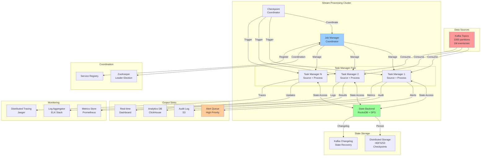
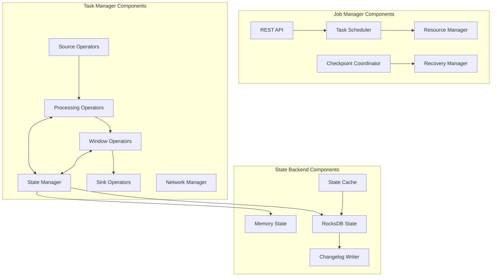
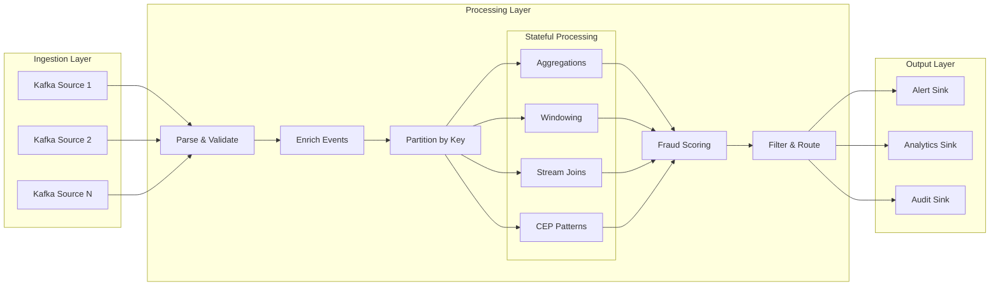

<!--
File: distributed_stream_processing_system_design.md
Purpose: Comprehensive system design for a distributed stream processing system for real-time fraud detection
Author: System Design Framework
Created: October 2, 2025
Last Updated: October 2, 2025

Description:
This document provides a complete system design for a distributed stream processing platform
similar to Apache Flink or Apache Storm. The system is designed to process 1M events/sec
for real-time fraud detection with exactly-once semantics, sub-second latency, and support
for complex event processing patterns.

Key Features:
- Real-time stream processing with exactly-once guarantees
- Complex event processing (CEP) with pattern matching
- Stateful operations with distributed state management
- Multiple windowing strategies (tumbling, sliding, session)
- Watermark-based late event handling
- Fault tolerance with checkpointing and automatic recovery
- Dynamic scaling and backpressure handling
- Stream joins and aggregations

Use Cases:
- Real-time fraud detection
- Real-time analytics and monitoring
- Event-driven microservices
- IoT data processing
- Financial transaction processing
-->

# DISTRIBUTED STREAM PROCESSING SYSTEM DESIGN

## Table of Contents

1. [Requirements Analysis](#1-requirements-analysis)
2. [Back-of-Envelope Calculations](#2-back-of-envelope-calculations)
3. [High-Level Architecture](#3-high-level-architecture)
4. [API Design](#4-api-design)
5. [Data Models](#5-data-models)
6. [Core Components](#6-core-components)
7. [Stream Processing Concepts](#7-stream-processing-concepts)
8. [Database Schema](#8-database-schema)
9. [Scalability & Performance](#9-scalability--performance)
10. [Fault Tolerance & Recovery](#10-fault-tolerance--recovery)
11. [Security Considerations](#11-security-considerations)
12. [Monitoring & Observability](#12-monitoring--observability)
13. [Trade-offs & Alternatives](#13-trade-offs--alternatives)
14. [Future Enhancements](#14-future-enhancements)

---

## 1. Requirements Analysis

### 1.1 Functional Requirements

#### Core Processing Features

- **Stream Ingestion**: Consume events from Kafka topics at 1M events/sec
- **Complex Event Processing**: Support CEP patterns (sequence, combination, temporal)
- **Stateful Operations**: Maintain state across billions of keys
- **Windowing**: Support tumbling, sliding, and session windows
- **Stream Joins**: Enable window joins and interval joins across multiple streams
- **Aggregations**: Real-time aggregations (count, sum, avg, min, max, custom)
- **Event Time Processing**: Process events based on event timestamps, not processing time
- **Late Event Handling**: Use watermarks to handle out-of-order events

#### Fraud Detection Specific

- **Rule Engine**: Define and execute fraud detection rules dynamically
- **Pattern Matching**: Detect suspicious patterns across event sequences
- **Real-time Scoring**: Calculate fraud scores in real-time
- **Alert Generation**: Trigger alerts when fraud patterns detected
- **Historical Context**: Join real-time events with historical data
- **Multi-factor Analysis**: Correlate events across multiple dimensions

### 1.2 Non-Functional Requirements

#### Performance

- **Throughput**: Process 1M events/sec consistently
- **Latency**: Sub-second end-to-end latency (p99 < 1000ms)
- **Event Time Lag**: Keep event time lag < 5 seconds under normal load
- **Checkpoint Time**: Complete checkpoints in < 10 seconds
- **State Access**: State lookup/update in < 1ms

#### Reliability

- **Exactly-Once Semantics**: No duplicate processing of events
- **Fault Tolerance**: Automatic recovery from failures
- **Data Durability**: No data loss during failures
- **High Availability**: 99.99% uptime
- **Graceful Degradation**: Handle backpressure without crashing

#### Scalability

- **Horizontal Scaling**: Scale to 1000+ processing nodes
- **State Size**: Support billions of keys (TBs of state)
- **Dynamic Scaling**: Scale up/down based on load
- **Partition Rebalancing**: Redistribute work without downtime

#### Operational

- **Monitoring**: Real-time metrics and dashboards
- **Alerting**: Automated alerts for anomalies
- **Savepoints**: Manual snapshots for version upgrades
- **Replay**: Ability to reprocess historical data

### 1.3 Scale Estimates

#### Traffic

- **Peak Events/Sec**: 1M events/sec
- **Average Event Size**: 2 KB
- **Daily Events**: 86.4B events/day
- **Daily Data Volume**: 172.8 TB/day (uncompressed)
- **Concurrent Streams**: 100+ Kafka topics

#### State

- **Active Keys**: 1B keys (user IDs, device IDs, transaction IDs)
- **State per Key**: 1 KB average
- **Total State Size**: 1 TB
- **State Growth**: 100 GB/day

#### Infrastructure

- **Processing Nodes**: 200-500 nodes
- **Kafka Partitions**: 1000+ partitions
- **State Backend Storage**: 5 TB (with replication)
- **Network Bandwidth**: 100 Gbps aggregate

---

## 2. Back-of-Envelope Calculations

### 2.1 Throughput Analysis

#### Event Processing

```text
Events per second: 1,000,000 events/sec
Average event size: 2 KB
Data ingestion rate: 1M * 2 KB = 2 GB/sec = 16 Gbps

Events per day: 1M * 86,400 = 86.4B events/day
Data per day: 86.4B * 2 KB = 172.8 TB/day
Data per month: 172.8 TB * 30 = 5.2 PB/month
```

#### Processing Capacity per Node

```text
Assume each node can process: 5,000 events/sec
Required nodes: 1M / 5K = 200 nodes (minimum)
With 2x headroom: 400 nodes
With failover capacity: 500 nodes
```

#### Parallelism

```text
Kafka partitions: 1000 partitions
Parallel tasks: 1000 tasks (1:1 mapping)
Events per task: 1M / 1000 = 1,000 events/sec/task
```

### 2.2 State Management

#### State Size Calculation

```text
Active keys: 1B keys
State per key: 1 KB (user profile, aggregates, windows)
Total state: 1B * 1 KB = 1 TB

With 2x replication: 2 TB
With changelog storage: 3 TB
Total storage: 5 TB
```

#### State Distribution

```text
Number of nodes: 500 nodes
State per node: 1 TB / 500 = 2 GB per node
Memory per node: 32 GB RAM (holds hot state)
Disk per node: 10 GB SSD (persistent state)
```

#### Checkpoint Size

```text
Full checkpoint: 1 TB state
Checkpoint frequency: Every 10 seconds
Checkpoint throughput: 1 TB / 10s = 100 GB/sec
Incremental checkpoint: ~10% = 100 GB
```

### 2.3 Network Bandwidth

#### Data Flow

```text
Ingress (from Kafka): 2 GB/sec = 16 Gbps
State access (random): 500K state ops/sec * 1 KB = 500 MB/sec = 4 Gbps
Checkpoint writes: 100 GB / 10s = 10 GB/sec = 80 Gbps (burst)
Egress (to sinks): 1 GB/sec = 8 Gbps
Total bandwidth: ~108 Gbps peak
```

#### Per-Node Bandwidth

```text
With 500 nodes:
Ingress per node: 16 Gbps / 500 = 32 Mbps
State operations: 4 Gbps / 500 = 8 Mbps
Egress per node: 8 Gbps / 500 = 16 Mbps
Total per node: ~56 Mbps (well within 1 Gbps NIC)
```

### 2.4 Storage Requirements

#### State Backend

```text
RocksDB state backend:
- In-memory cache: 16 GB per node
- SSD storage: 10 GB per node
- Total across 500 nodes: 5 TB

Distributed File System (for checkpoints):
- Active checkpoints: 5 checkpoints * 1 TB = 5 TB
- Completed checkpoints: 10 * 1 TB = 10 TB
- Total: 15 TB
```

#### Changelog Storage (Kafka)

```text
Changelog topics: 1000 topics
Retention: 24 hours
Data rate: 2 GB/sec
Storage: 2 GB/sec * 86,400s = 172.8 TB/day
With compression (3x): ~58 TB
```

### 2.5 Latency Analysis

#### End-to-End Latency Breakdown

```text
Kafka consumer poll: 10-50ms
Deserialization: 1-5ms
Event processing: 10-50ms
State access (RocksDB): 1-10ms
Watermark computation: 1-5ms
Window trigger: 5-20ms
Serialization: 1-5ms
Sink write: 10-50ms
------------------------------
Total (p99): 100-500ms ✓ (target: < 1000ms)
```

#### State Access Latency

```text
RocksDB in-memory: < 1ms
RocksDB from SSD: 1-5ms
Remote state (network): 10-50ms
```

### 2.6 Cost Estimation (AWS)

#### Compute (EC2)

```text
Instance type: r5.2xlarge (8 vCPU, 64 GB RAM, 10 Gbps network)
Number of instances: 500
Cost per instance: $0.504/hour
Monthly cost: 500 * $0.504 * 730 = $183,960/month
```

#### Storage (EBS + S3)

```text
EBS SSD (gp3): 10 GB * 500 nodes = 5 TB
Cost: 5,000 GB * $0.08/GB/month = $400/month

S3 (checkpoints): 15 TB
Cost: 15,000 GB * $0.023/GB/month = $345/month

Total storage: $745/month
```

#### Data Transfer

```text
Ingress: Free
Egress: 100 TB/month * $0.09/GB = $9,000/month
```

#### Total Monthly Cost

```text
Compute: $183,960
Storage: $745
Network: $9,000
Managed Kafka (MSK): $50,000 (estimate)
------------------------------
Total: ~$243,705/month
```

---

## 3. High-Level Architecture

### 3.1 System Overview



### 3.2 Component Architecture



### 3.3 Data Flow Architecture



---

## 4. API Design

### 4.1 Job Management API

#### Submit Job

```http
POST /api/v1/jobs
Content-Type: application/json
Authorization: Bearer <token>

{
  "job_name": "fraud-detection-pipeline",
  "job_type": "streaming",
  "parallelism": 1000,
  "checkpoint_interval": 10000,
  "restart_strategy": {
    "type": "fixed-delay",
    "attempts": 3,
    "delay": "10s"
  },
  "sources": [
    {
      "id": "kafka-source",
      "type": "kafka",
      "topics": ["transactions", "user-events"],
      "bootstrap_servers": "kafka:9092",
      "group_id": "fraud-detection-v1",
      "starting_offset": "latest"
    }
  ],
  "operators": [
    {
      "id": "parse-events",
      "type": "map",
      "function": "com.fraud.ParseEventFunction"
    },
    {
      "id": "enrich-user",
      "type": "async-map",
      "function": "com.fraud.EnrichUserFunction",
      "timeout": "500ms",
      "capacity": 1000
    },
    {
      "id": "fraud-score",
      "type": "keyed-process",
      "key_by": "user_id",
      "function": "com.fraud.FraudScoringFunction",
      "state": {
        "type": "value",
        "ttl": "24h"
      }
    },
    {
      "id": "alert-window",
      "type": "window",
      "window_type": "sliding",
      "size": "1h",
      "slide": "5m",
      "allowed_lateness": "5m",
      "aggregate": "com.fraud.AlertAggregator"
    }
  ],
  "sinks": [
    {
      "id": "alert-sink",
      "type": "kafka",
      "topic": "fraud-alerts",
      "bootstrap_servers": "kafka:9092"
    }
  ]
}
```

Response:

```json
{
  "job_id": "job-123e4567-e89b-12d3-a456-426614174000",
  "status": "RUNNING",
  "submission_time": "2025-10-02T10:30:00Z",
  "job_graph": {
    "vertices": 5,
    "edges": 4
  },
  "dashboard_url": "http://dashboard/jobs/job-123e4567"
}
```

#### Get Job Status

```http
GET /api/v1/jobs/{job_id}
Authorization: Bearer <token>
```

Response:

```json
{
  "job_id": "job-123e4567-e89b-12d3-a456-426614174000",
  "job_name": "fraud-detection-pipeline",
  "status": "RUNNING",
  "start_time": "2025-10-02T10:30:00Z",
  "uptime": "2h 15m",
  "parallelism": 1000,
  "tasks": {
    "total": 5000,
    "running": 5000,
    "failed": 0,
    "finished": 0
  },
  "metrics": {
    "records_in": 7200000000,
    "records_out": 7200000000,
    "bytes_in": 14400000000000,
    "bytes_out": 14400000000000,
    "backpressure": 0.0,
    "event_time_lag": "2s"
  },
  "checkpoints": {
    "latest_checkpoint_id": 810,
    "latest_checkpoint_time": "2025-10-02T12:44:50Z",
    "checkpoint_duration": "8s",
    "state_size": "1.2TB"
  }
}
```

#### Cancel Job

```http
DELETE /api/v1/jobs/{job_id}
Authorization: Bearer <token>

{
  "mode": "cancel_with_savepoint",
  "savepoint_directory": "s3://bucket/savepoints"
}
```

#### Create Savepoint

```http
POST /api/v1/jobs/{job_id}/savepoints
Authorization: Bearer <token>

{
  "target_directory": "s3://bucket/savepoints",
  "cancel_job": false
}
```

Response:

```json
{
  "savepoint_id": "savepoint-123",
  "location": "s3://bucket/savepoints/savepoint-123",
  "creation_time": "2025-10-02T13:00:00Z",
  "size": "1.2TB",
  "status": "COMPLETED"
}
```

### 4.2 State Query API

#### Query State

```http
POST /api/v1/queryable-state
Content-Type: application/json
Authorization: Bearer <token>

{
  "job_id": "job-123e4567",
  "state_name": "user-fraud-scores",
  "key": "user-12345",
  "key_type": "String",
  "value_type": "FraudScore"
}
```

Response:

```json
{
  "key": "user-12345",
  "value": {
    "user_id": "user-12345",
    "score": 85.5,
    "last_transaction_time": "2025-10-02T12:59:45Z",
    "total_transactions_24h": 15,
    "high_risk_patterns": ["velocity", "location-anomaly"]
  },
  "timestamp": "2025-10-02T13:00:00Z"
}
```

### 4.3 Metrics API

#### Get Job Metrics

```http
GET /api/v1/jobs/{job_id}/metrics?window=1h
Authorization: Bearer <token>
```

Response:

```json
{
  "job_id": "job-123e4567",
  "window": "1h",
  "metrics": {
    "throughput": {
      "records_per_second": 1000000,
      "bytes_per_second": 2000000000
    },
    "latency": {
      "p50": 50,
      "p95": 200,
      "p99": 450,
      "p999": 800
    },
    "backpressure": {
      "ratio": 0.05,
      "tasks_under_pressure": 50
    },
    "state": {
      "size": 1200000000000,
      "access_rate": 500000,
      "cache_hit_ratio": 0.95
    },
    "checkpoints": {
      "count": 360,
      "avg_duration": 8000,
      "failure_rate": 0.001
    }
  }
}
```

### 4.4 CEP Pattern Definition API

#### Register Pattern

```http
POST /api/v1/patterns
Content-Type: application/json
Authorization: Bearer <token>

{
  "pattern_name": "suspicious-velocity",
  "description": "Detect rapid transactions from same user",
  "pattern_definition": {
    "pattern": "BEGIN transaction_1 -> transaction_2 -> transaction_3 END",
    "conditions": {
      "transaction_1": "amount > 1000",
      "transaction_2": "amount > 1000 AND user_id = transaction_1.user_id",
      "transaction_3": "amount > 1000 AND user_id = transaction_1.user_id"
    },
    "within": "5m",
    "contiguity": "strict"
  },
  "action": {
    "type": "alert",
    "severity": "high",
    "output_topic": "fraud-alerts"
  }
}
```

Response:

```json
{
  "pattern_id": "pattern-789",
  "pattern_name": "suspicious-velocity",
  "status": "ACTIVE",
  "created_at": "2025-10-02T13:00:00Z",
  "version": 1
}
```

---

## 5. Data Models

### 5.1 Event Model

#### Base Event

```python
class Event:
    event_id: str          # Unique identifier
    event_type: str        # Type of event (transaction, login, etc.)
    user_id: str           # User identifier
    timestamp: long        # Event timestamp (milliseconds)
    event_time: long       # Business event time
    source: str            # Source system
    metadata: Dict         # Additional metadata
```

#### Transaction Event

```python
class TransactionEvent(Event):
    transaction_id: str
    amount: Decimal
    currency: str
    merchant_id: str
    merchant_category: str
    payment_method: str
    card_last_four: str
    location: GeoLocation
    ip_address: str
    device_id: str
    session_id: str
    
    # Risk indicators
    is_international: bool
    is_card_present: bool
    velocity_check_passed: bool
```

#### User Event

```python
class UserEvent(Event):
    action: str            # login, logout, profile_update
    device_info: DeviceInfo
    location: GeoLocation
    ip_address: str
    session_id: str
    success: bool
```

### 5.2 State Models

#### User Fraud Profile

```python
class UserFraudProfile:
    user_id: str
    fraud_score: float                    # Current fraud score (0-100)
    risk_level: str                       # LOW, MEDIUM, HIGH, CRITICAL
    
    # Transaction patterns
    transaction_count_24h: int
    total_amount_24h: Decimal
    avg_transaction_amount: Decimal
    max_transaction_amount: Decimal
    
    # Location patterns
    common_locations: List[GeoLocation]
    last_location: GeoLocation
    location_anomaly_detected: bool
    
    # Device patterns
    known_devices: Set[str]
    last_device: str
    device_anomaly_detected: bool
    
    # Temporal patterns
    last_transaction_time: long
    typical_transaction_hours: Set[int]
    time_anomaly_detected: bool
    
    # Historical context
    total_transactions: int
    account_age_days: int
    previous_fraud_incidents: int
    
    # Pattern flags
    high_risk_patterns: Set[str]
    
    # Timestamps
    created_at: long
    updated_at: long
    last_accessed: long
```

#### Window State

```python
class WindowState:
    window_id: str
    window_start: long
    window_end: long
    
    # Aggregated data
    event_count: int
    total_amount: Decimal
    unique_users: Set[str]
    unique_merchants: Set[str]
    
    # Pattern detections
    fraud_alerts: List[FraudAlert]
    anomalies: List[Anomaly]
    
    # Window metadata
    trigger_type: str      # ON_TIME, ON_ELEMENT, ON_PURGE
    is_late_data: bool
```

### 5.3 Output Models

#### Fraud Alert

```python
class FraudAlert:
    alert_id: str
    user_id: str
    transaction_id: str
    
    # Alert details
    alert_type: str                    # VELOCITY, LOCATION, AMOUNT, PATTERN
    severity: str                      # LOW, MEDIUM, HIGH, CRITICAL
    fraud_score: float
    confidence: float
    
    # Detection details
    detected_patterns: List[str]
    rule_ids: List[str]
    reason: str
    evidence: Dict
    
    # Context
    transaction_details: TransactionEvent
    user_profile: UserFraudProfile
    
    # Action
    recommended_action: str            # BLOCK, REVIEW, FLAG, ALLOW
    auto_blocked: bool
    
    # Timestamps
    detection_time: long
    event_time: long
    processing_latency_ms: int
```

---

## 6. Core Components

### 6.1 Job Manager

The Job Manager is the master coordinator responsible for job lifecycle management, resource allocation, and fault tolerance.

#### Key Responsibilities

- Job submission and scheduling
- Task deployment and monitoring
- Checkpoint coordination
- Failure detection and recovery
- Resource management
- Leader election (HA)

#### Implementation

```python
class JobManager:
    """
    Central coordinator for stream processing jobs.
    
    Functions:
    - submit_job(): Accept and deploy new streaming jobs
    - trigger_checkpoint(): Coordinate distributed snapshots
    - handle_failure(): Recover from task failures
    - allocate_resources(): Manage compute resources
    """
    
    def submit_job(self, job_graph: JobGraph) -> JobID:
        """
        Submit streaming job for execution.
        
        Args:
            job_graph: DAG of operators
            
        Returns:
            JobID for tracking
            
        Process:
        1. Validate job graph
        2. Create execution plan
        3. Allocate task slots
        4. Deploy to task managers
        5. Start checkpointing
        """
        pass
    
    def trigger_checkpoint(self, job_id: JobID) -> CheckpointID:
        """
        Initiate distributed checkpoint.
        
        Returns:
            CheckpointID for tracking
        """
        pass
```

### 6.2 Task Manager

Executes operators and manages local state.

#### Key Responsibilities

- Execute assigned tasks (source, process, sink)
- Maintain local state with RocksDB
- Handle data shuffling
- Participate in checkpoints
- Report metrics
- Handle backpressure

```python
class TaskManager:
    """
    Worker node executing stream processing operators.
    """
    
    def execute_operator(self, operator: Operator, input_stream: DataStream):
        """
        Execute operator on incoming stream.
        
        Process:
        1. Read from input stream
        2. Check for checkpoint barriers
        3. Apply operator logic
        4. Update state if needed
        5. Emit to output stream
        """
        pass
    
    def handle_checkpoint_barrier(self, barrier: CheckpointBarrier):
        """
        Snapshot local state on checkpoint barrier.
        
        Process:
        1. Align barriers from all inputs
        2. Snapshot state to persistent storage
        3. Forward barrier downstream
        4. Acknowledge to Job Manager
        """
        pass
```

### 6.3 State Backend (RocksDB)

Manages operator state with disk-based storage.

#### Features

- **Large State Support**: Supports TBs of state per operator
- **Incremental Checkpoints**: Only checkpoint changed data
- **Automatic Compaction**: Background compaction
- **TTL Support**: Automatic state expiration
- **Changelog**: Write-ahead log for recovery

```python
class RocksDBStateBackend:
    """
    Disk-based state backend using RocksDB.
    
    Supports:
    - Value state
    - List state
    - Map state
    - Reducing state
    - Aggregating state
    """
    
    def get(self, key: bytes) -> Optional[bytes]:
        """Get value from state (cache or disk)."""
        pass
    
    def put(self, key: bytes, value: bytes):
        """Put value into state and changelog."""
        pass
    
    def snapshot(self, checkpoint_id: int) -> StateSnapshot:
        """Create incremental snapshot."""
        pass
```

### 6.4 Checkpoint Coordinator

Coordinates distributed snapshots using Chandy-Lamport algorithm.

#### Checkpoint Flow

1. **Trigger**: Job Manager triggers checkpoint periodically
2. **Barrier Injection**: Inject checkpoint barriers into sources
3. **Barrier Propagation**: Barriers flow through the DAG
4. **State Snapshot**: Each operator snapshots state when barrier arrives
5. **Alignment**: Operators align barriers from multiple inputs
6. **Acknowledgment**: Operators acknowledge completion
7. **Completion**: Job Manager marks checkpoint complete

```python
class CheckpointCoordinator:
    """
    Coordinates distributed snapshots for fault tolerance.
    """
    
    def trigger_checkpoint(self, job_id: JobID) -> CheckpointID:
        """Trigger new checkpoint."""
        pass
    
    def acknowledge_checkpoint(self, checkpoint_id: CheckpointID, 
                              task_id: TaskID, state_handle: StateHandle):
        """Receive acknowledgment from task."""
        pass
```

### 6.5 Watermark Generator

Tracks event time progress to trigger time-based operations.

#### Watermark Strategies

1. **Bounded Out-of-Orderness**: Allow events up to N seconds late
2. **Ascending Timestamps**: Strictly increasing timestamps
3. **Punctuated**: Special events indicate time progress
4. **Custom**: User-defined watermark logic

```python
class WatermarkGenerator:
    """
    Generate watermarks to track event time.
    
    Watermark = max_event_time - max_out_of_orderness
    """
    
    def on_event(self, event: Event) -> Optional[Watermark]:
        """Process event and emit watermark if needed."""
        pass
    
    def on_periodic_emit(self) -> Watermark:
        """Emit watermark periodically."""
        pass
```

---

