# E-commerce Website System Design (Amazon-like)

**File Purpose:** Comprehensive system design document for a large-scale e-commerce platform supporting 100M products, 500M users, and 1M orders per day with peak traffic handling (10x during sales). The design covers product catalog system with search and filtering, shopping cart service with session management, inventory management with real-time stock updates, order processing pipeline with saga pattern, payment integration with multiple gateways, recommendation engine using collaborative filtering, flash sale handling with queue-based architecture, fraud detection, user reviews and ratings system, and achieving 99.99% availability with strong consistency for orders and eventual consistency for product views.

**Author:** System Design Documentation  
**Created:** January 2, 2025  
**Last Updated:** October 13, 2025  
**Recent Updates:** Enhanced header format with comprehensive e-commerce features and architecture patterns

---

## Table of Contents

1. [Requirements & Clarification](#requirements--clarification)
2. [Back-of-the-Envelope Calculations](#back-of-the-envelope-calculations)
3. [High-Level Design](#high-level-design)
   - [System Architecture Diagram](#system-architecture-diagram)
   - [Data Flow Explanation](#data-flow-explanation)
   - [Load Balancing Strategy](#load-balancing-strategy)
4. [Database Design](#database-design)
   - [Data Consistency Patterns](#data-consistency-patterns)
5. [API Design](#api-design)
6. [Deep-Dive Components](#deep-dive-components)
   - [Component 1: Product Catalog System](#component-1-product-catalog-system)
   - [Component 2: Shopping Cart Service](#component-2-shopping-cart-service)
   - [Component 3: Inventory Management System](#component-3-inventory-management-system)
   - [Component 4: Order Processing Pipeline](#component-4-order-processing-pipeline)
   - [Component 5: Payment Integration](#component-5-payment-integration)
   - [Component 6: Recommendation Engine](#component-6-recommendation-engine)
7. [Trade-Offs Analysis](#trade-offs-analysis)
8. [Caching Strategy](#caching-strategy)
9. [Bottlenecks & Improvements](#bottlenecks--improvements)
   - [Potential Bottlenecks & Solutions](#potential-bottlenecks--solutions)
   - [Flash Sale Handling](#flash-sale-handling)
   - [Extended Edge Cases & Failure Scenarios](#extended-edge-cases--failure-scenarios)
   - [Disaster Recovery & Business Continuity](#disaster-recovery--business-continuity)
10. [Security Considerations](#security-considerations)
11. [Cost Analysis](#cost-analysis)
12. [SLA/SLO/SLI Definitions](#slaslosli-definitions)
13. [Testing Strategy](#testing-strategy)
14. [Deployment Strategy](#deployment-strategy)
15. [Future Enhancements](#future-enhancements)
16. [Conclusion](#conclusion)

---

## Requirements & Clarification

### User Stories

**As a shopper, I want to:**
- Browse and search 100M products with <500ms page load time
- Add items to cart and checkout securely with 99.99% uptime
- Track my orders in real-time from placement to delivery
- Get personalized product recommendations
- Read reviews and ratings from other customers
- Receive notifications for order status updates
- Use multiple payment methods (cards, wallets, COD)

**As a seller, I want to:**
- List and manage my products easily
- Track inventory across multiple warehouses
- Process orders efficiently with automated workflows
- Access analytics on sales, revenue, and customer behavior
- Manage returns and refunds
- Run promotional campaigns and flash sales

**As a platform operator, I want to:**
- Handle 1M orders per day with peak traffic of 10x during sales
- Maintain 99.99% uptime for checkout flow
- Ensure inventory consistency across all touchpoints
- Detect and prevent fraud in real-time
- Scale to support global operations
- Provide low-latency experience worldwide

### Functional Requirements

**Core Features (MVP):**

1. **Product Catalog**
   - Search and browse products with advanced filters
   - Product details page with images, descriptions, specs
   - Category hierarchy and navigation
   - Product variations (size, color, etc.)
   - Stock availability display

2. **Shopping Cart**
   - Add/remove/update items
   - Cart persistence across sessions
   - Cart sharing and save for later
   - Price calculations with taxes and discounts
   - Inventory reservation during checkout

3. **User Management**
   - Registration and authentication
   - Profile management
   - Address book
   - Order history
   - Wishlist management

4. **Checkout & Payment**
   - Multi-step checkout flow
   - Multiple payment methods
   - Address selection and validation
   - Order review and confirmation
   - Payment processing with retries

5. **Order Management**
   - Order placement and tracking
   - Order cancellation and modification
   - Return and refund processing
   - Order history and invoices
   - Delivery status updates

6. **Inventory Management**
   - Real-time stock tracking
   - Multi-warehouse support
   - Inventory reservation and release
   - Stock replenishment alerts
   - Inventory reconciliation

7. **Review & Rating System**
   - Product reviews and ratings
   - Verified purchase badges
   - Review helpfulness voting
   - Image/video reviews
   - Seller ratings

8. **Recommendation Engine**
   - Personalized product recommendations
   - Similar products
   - Frequently bought together
   - Trending products
   - Recently viewed items

### Non-Functional Requirements

1. **Availability:** 
   - 99.99% uptime for checkout (52 minutes downtime/year)
   - 99.9% uptime for browsing (8.76 hours downtime/year)

2. **Performance:**
   - <500ms page load time (p95)
   - <2s checkout completion time
   - <100ms search response time
   - Real-time inventory updates (<1s)

3. **Scalability:**
   - Support 500M registered users
   - Handle 100M products in catalog
   - Process 1M orders per day
   - Handle 10x traffic during flash sales
   - Serve 100M page views per day

4. **Consistency:**
   - Strong consistency for inventory and orders
   - Eventual consistency for product catalog updates
   - ACID guarantees for financial transactions

5. **Security:**
   - PCI DSS compliance for payment processing
   - Data encryption at rest and in transit
   - Fraud detection and prevention
   - DDoS protection
   - Regular security audits

### Clarifying Questions & Assumptions

**Scale Expectations:**
- 500M registered users, 50M daily active users
- 100M products across all categories
- 1M orders per day, 10M during flash sales
- Average order value: $50
- Peak traffic: 10x during Black Friday/Cyber Monday
- Global presence: 10+ countries, multi-currency support

**Usage Patterns:**
- 70% mobile, 30% desktop/tablet
- Average session duration: 15 minutes
- Cart abandonment rate: 70%
- Conversion rate: 2-3%
- Peak hours: 8 PM - 11 PM local time
- Flash sales duration: 1-6 hours

**Business Rules:**
- Inventory reservation: 15 minutes during checkout
- Return window: 30 days
- Payment authorization validity: 7 days
- Free shipping threshold: $25
- Maximum cart items: 100
- Maximum order value: $10,000

---

## Back-of-the-Envelope Calculations

### Traffic Estimates

```text
Daily Active Users (DAU): 50M
Sessions per user per day: 2
Average session duration: 15 minutes
Pages per session: 10

Total daily sessions: 50M × 2 = 100M sessions
Total daily page views: 100M × 10 = 1B page views
Page views per second (average): 1B / 86,400 = 11,574 PV/s
Peak traffic (10x during sales): 115,740 PV/s

Search queries:
- 60% sessions include search
- Average searches per session: 3
- Daily searches: 100M × 0.6 × 3 = 180M searches
- Search QPS (average): 180M / 86,400 = 2,083 QPS
- Peak search QPS: 20,830 QPS

Orders:
- Conversion rate: 2%
- Daily orders: 100M sessions × 0.02 = 2M orders (1M normal + 1M from returning customers)
- Actually: 1M orders per day (given)
- Orders per second (average): 1M / 86,400 = 11.5 OPS
- Peak orders per second: 115 OPS (10x during sales: 1,150 OPS)
```

### Storage Estimates

```text
Product Catalog:
- 100M products
- Average product data: 10 KB (text, metadata)
- Average product images: 5 images × 500 KB = 2.5 MB
- Total product data: 100M × 10 KB = 1 TB
- Total product images: 100M × 2.5 MB = 250 TB
- With CDN: 250 TB

User Data:
- 500M users
- Average user profile: 5 KB
- Total user data: 500M × 5 KB = 2.5 TB

Order Data:
- 1M orders per day
- 365M orders per year
- Average order data: 5 KB
- Total order data per year: 365M × 5 KB = 1.8 TB
- 5-year retention: 1.8 TB × 5 = 9 TB

Inventory Data:
- 100M SKUs across warehouses
- 10 warehouses
- Inventory record: 100 bytes
- Total inventory: 100M × 10 × 100 bytes = 100 GB

Review Data:
- Average 10 reviews per product
- 1B reviews total
- Average review: 500 bytes
- Total reviews: 1B × 500 bytes = 500 GB

Total Storage:
- Product catalog: 1 TB
- Product images: 250 TB (CDN)
- User data: 2.5 TB
- Orders: 9 TB (5 years)
- Inventory: 100 GB
- Reviews: 500 GB
- Total: ~263 TB (with 3x replication: ~800 TB)
```

### Bandwidth Estimates

```text
Average page size: 500 KB (HTML + assets)
CDN-cached assets: 80% (images, CSS, JS)
Dynamic content: 20% × 500 KB = 100 KB

Normal traffic:
- Page views per second: 11,574 PV/s
- Dynamic bandwidth: 11,574 × 100 KB = 1.16 GB/s = 9.3 Gbps
- CDN bandwidth: 11,574 × 400 KB = 4.6 GB/s = 37 Gbps

Peak traffic (10x):
- Dynamic bandwidth: 93 Gbps
- CDN bandwidth: 370 Gbps

Order processing:
- Average order: 5 KB
- Orders per second: 11.5 OPS
- Order bandwidth: 11.5 × 5 KB = 57.5 KB/s (negligible)
```

### Database Operations

```text
Read Operations:
- Product page views: 1B/day
- Product reads per page: 1
- Total product reads: 1B/day = 11,574 RPS
- Peak product reads: 115,740 RPS

- Search queries: 180M/day = 2,083 QPS
- Average results per search: 20
- Total search reads: 2,083 × 20 = 41,660 RPS
- Peak search reads: 416,600 RPS

Write Operations:
- New orders: 1M/day = 11.5 OPS
- Order updates (status changes): 4 per order = 46 OPS
- Inventory updates: 11.5 × 2 (decrement + potential replenish) = 23 OPS
- Review submissions: 100K/day = 1.2 WPS
- Total writes: ~82 WPS
- Peak writes: 820 WPS

Cache Requirements:
- Hot products (top 1%): 1M products × 10 KB = 10 GB
- Search result cache: 1M queries × 20 results × 100 bytes = 2 GB
- Session data: 10M concurrent sessions × 5 KB = 50 GB
- Total cache: ~62 GB per region
```

### Resource Estimates

```text
API Servers:
- Peak page views: 115,740 PV/s
- Assuming 500 RPS per server
- API servers needed: 115,740 / 500 = 232 servers
- With 2x redundancy: 464 servers

Search Servers:
- Peak search QPS: 20,830
- Elasticsearch: 1000 QPS per node
- Search nodes needed: 20,830 / 1000 = 21 nodes
- With 3x replication: 63 nodes

Database Servers:
- Product DB: 20 primary + 80 read replicas
- User DB: 10 primary + 40 read replicas
- Order DB: 15 primary + 60 read replicas
- Inventory DB: 10 primary + 20 read replicas (strong consistency)

Cache Servers:
- Redis cluster: 62 GB per region
- 3 regions: 186 GB total
- Redis nodes (64 GB each): 3 nodes per region = 9 nodes total

Message Queue:
- Kafka cluster: 10 brokers
- Handle order events, inventory updates, notifications
- Throughput: 100K events/second

CDN:
- CloudFront or similar
- 250 TB product images
- 100+ edge locations globally
```

---

## High-Level Design

### System Architecture Diagram

```mermaid
graph TB
    subgraph Client Layer
        Web[Web Browser]
        Mobile[Mobile App]
        SellerPortal[Seller Portal]
    end
    
    subgraph CDN & Load Balancing
        CDN[CDN<br/>CloudFront<br/>250 TB Images]
        GlobalLB[Global Load Balancer<br/>Route53<br/>Geographic Routing]
        RegionalLB[Regional LB<br/>Nginx/ALB]
    end
    
    subgraph API Gateway Layer
        APIGateway[API Gateway<br/>Kong/AWS API Gateway]
        RateLimiter[Rate Limiter<br/>Redis]
        AuthService[Auth Service<br/>OAuth 2.0/JWT]
    end
    
    subgraph Core Services
        ProductService[Product Service<br/>Go]
        CartService[Cart Service<br/>Go]
        OrderService[Order Service<br/>Go]
        InventoryService[Inventory Service<br/>Go]
        UserService[User Service<br/>Go]
        SearchService[Search Service<br/>Elasticsearch]
        RecommendationService[Recommendation<br/>Python/ML]
        ReviewService[Review Service<br/>Go]
        NotificationService[Notification<br/>Go]
    end
    
    subgraph Payment & Fraud
        PaymentGateway[Payment Gateway<br/>Stripe/PayPal]
        FraudDetection[Fraud Detection<br/>ML Model]
    end
    
    subgraph Data Layer
        ProductDB[(Product DB<br/>PostgreSQL<br/>Master-Replica)]
        UserDB[(User DB<br/>PostgreSQL<br/>Sharded)]
        OrderDB[(Order DB<br/>PostgreSQL<br/>Sharded by Date)]
        InventoryDB[(Inventory DB<br/>PostgreSQL<br/>Strong Consistency)]
        CartCache[(Cart Cache<br/>Redis)]
        SessionCache[(Session Cache<br/>Redis)]
        SearchIndex[(Search Index<br/>Elasticsearch)]
    end
    
    subgraph Message Queue Layer
        Kafka[Kafka Cluster<br/>Event Streaming]
        OrderEvents[Order Events Topic]
        InventoryEvents[Inventory Events Topic]
        NotificationEvents[Notification Events Topic]
    end
    
    subgraph Background Workers
        OrderProcessor[Order Processor<br/>Worker Pool]
        InventorySync[Inventory Sync<br/>Worker Pool]
        EmailWorker[Email Worker<br/>SendGrid]
        RecommendationTrainer[Recommendation Trainer<br/>Spark]
    end
    
    subgraph External Services
        ShippingAPI[Shipping APIs<br/>FedEx/UPS/USPS]
        TaxService[Tax Calculation<br/>Avalara]
        AnalyticsDB[Analytics DB<br/>ClickHouse]
    end
    
    Web -->|1. Browse Products| CDN
    Mobile -->|2. Search/Order| GlobalLB
    SellerPortal -->|3. Manage Inventory| GlobalLB
    
    CDN -->|4. Cache Miss| GlobalLB
    GlobalLB -->|5. Route by Region| RegionalLB
    RegionalLB -->|6. Forward| APIGateway
    
    APIGateway -->|7. Rate Limit| RateLimiter
    APIGateway -->|8. Authenticate| AuthService
    APIGateway -->|9. Route| ProductService
    
    ProductService -->|10. Read| ProductDB
    ProductService -->|11. Search| SearchService
    SearchService -->|12. Query| SearchIndex
    
    CartService -->|13. Get/Update| CartCache
    CartService -->|14. Reserve| InventoryService
    InventoryService -->|15. Check/Update| InventoryDB
    
    OrderService -->|16. Create Order| OrderDB
    OrderService -->|17. Process Payment| PaymentGateway
    PaymentGateway -->|18. Fraud Check| FraudDetection
    OrderService -->|19. Publish Event| Kafka
    
    Kafka -->|20. Consume| OrderProcessor
    OrderProcessor -->|21. Update Inventory| InventoryService
    OrderProcessor -->|22. Send Notification| NotificationService
    OrderProcessor -->|23. Ship| ShippingAPI
    
    RecommendationService -->|24. Get Recommendations| RecommendationTrainer
    RecommendationTrainer -->|25. Train Model| AnalyticsDB
    
    ReviewService -->|26. Store Review| ProductDB
    NotificationService -->|27. Send Email| EmailWorker
```



### Data Flow Explanation

#### Product Browsing Flow
1. User requests product page
2. Request routed through CDN (cache hit for images)
3. API Gateway authenticates and rate-limits
4. Product Service fetches from ProductDB or cache
5. Search Service provides related products
6. Recommendation Service suggests personalized items
7. Review Service fetches product reviews
8. Response assembled and returned to user

#### Shopping Cart Flow
1. User adds item to cart
2. Cart Service checks authentication
3. Inventory Service validates stock availability
4. Cart stored in Redis (session cache)
5. Inventory soft-reserved for 15 minutes
6. Cart persisted to database for long-term storage
7. Real-time cart total calculated with taxes

#### Checkout & Order Flow
1. User initiates checkout
2. Inventory Service hard-reserves items
3. Tax Service calculates taxes
4. Payment Gateway processes payment
5. Fraud Detection validates transaction
6. Order Service creates order in OrderDB
7. Order event published to Kafka
8. Inventory updated (decremented)
9. Notification sent to user and seller
10. Shipping label generated
11. Order tracking enabled

#### Inventory Management Flow
1. Seller updates inventory
2. Inventory Service validates and updates InventoryDB
3. Inventory event published to Kafka
4. Cache invalidated for affected products
5. Search index updated with new stock status
6. Low stock alerts triggered if threshold met
7. Replenishment orders auto-generated

### Load Balancing Strategy

**Geographic Distribution:**
- Use Route53 GeoDNS for global traffic routing
- 3 primary regions: US-East, EU-West, Asia-Pacific
- Route users to nearest region for lowest latency
- Automatic failover to secondary region on failure

**Application Load Balancing:**
- Layer 7 (ALB) for HTTP/HTTPS traffic
- Health checks every 30 seconds
- Connection draining for graceful shutdowns
- Sticky sessions for shopping cart consistency

**Database Load Balancing:**
- Read replicas for read-heavy workloads
- Connection pooling (HikariCP)
- Query routing: writes to primary, reads to replicas
- Automatic failover with promoted replica

---

## Database Design

### PostgreSQL Schema (Product Catalog)

```sql
-- Products table
CREATE TABLE products (
    product_id UUID PRIMARY KEY DEFAULT gen_random_uuid(),
    seller_id UUID NOT NULL,
    sku VARCHAR(100) UNIQUE NOT NULL,
    name VARCHAR(500) NOT NULL,
    description TEXT,
    brand VARCHAR(100),
    category_id UUID NOT NULL,
    
    -- Pricing
    base_price DECIMAL(12,2) NOT NULL,
    sale_price DECIMAL(12,2),
    currency VARCHAR(3) DEFAULT 'USD',
    
    -- Product details
    weight_kg DECIMAL(8,3),
    dimensions_cm VARCHAR(50),
    color VARCHAR(50),
    size VARCHAR(20),
    
    -- Status
    status VARCHAR(20) DEFAULT 'active',
    is_featured BOOLEAN DEFAULT FALSE,
    is_bestseller BOOLEAN DEFAULT FALSE,
    
    -- Metadata
    average_rating DECIMAL(3,2) DEFAULT 0.00,
    review_count INTEGER DEFAULT 0,
    view_count BIGINT DEFAULT 0,
    order_count BIGINT DEFAULT 0,
    
    -- Timestamps
    created_at TIMESTAMP DEFAULT CURRENT_TIMESTAMP,
    updated_at TIMESTAMP DEFAULT CURRENT_TIMESTAMP ON UPDATE CURRENT_TIMESTAMP,
    
    -- Indexes
    INDEX idx_seller_id (seller_id),
    INDEX idx_category_id (category_id),
    INDEX idx_sku (sku),
    INDEX idx_status (status),
    INDEX idx_created_at (created_at),
    INDEX idx_average_rating (average_rating),
    INDEX idx_order_count (order_count),
    
    -- Composite indexes
    INDEX idx_category_rating (category_id, average_rating),
    INDEX idx_category_price (category_id, base_price),
    INDEX idx_status_featured (status, is_featured),
    
    -- Full-text search
    FULLTEXT INDEX idx_search (name, description, brand),
    
    FOREIGN KEY (seller_id) REFERENCES sellers(seller_id),
    FOREIGN KEY (category_id) REFERENCES categories(category_id)
) PARTITION BY RANGE (YEAR(created_at));

-- Categories table
CREATE TABLE categories (
    category_id UUID PRIMARY KEY DEFAULT gen_random_uuid(),
    parent_category_id UUID,
    name VARCHAR(100) NOT NULL,
    slug VARCHAR(100) UNIQUE NOT NULL,
    description TEXT,
    image_url VARCHAR(500),
    display_order INTEGER DEFAULT 0,
    is_active BOOLEAN DEFAULT TRUE,
    created_at TIMESTAMP DEFAULT CURRENT_TIMESTAMP,
    
    INDEX idx_parent_category (parent_category_id),
    INDEX idx_slug (slug),
    INDEX idx_display_order (display_order),
    
    FOREIGN KEY (parent_category_id) REFERENCES categories(category_id)
);

-- Product images table
CREATE TABLE product_images (
    image_id UUID PRIMARY KEY DEFAULT gen_random_uuid(),
    product_id UUID NOT NULL,
    image_url VARCHAR(500) NOT NULL,
    thumbnail_url VARCHAR(500),
    display_order INTEGER DEFAULT 0,
    is_primary BOOLEAN DEFAULT FALSE,
    created_at TIMESTAMP DEFAULT CURRENT_TIMESTAMP,
    
    INDEX idx_product_id (product_id),
    INDEX idx_display_order (display_order),
    
    FOREIGN KEY (product_id) REFERENCES products(product_id) ON DELETE CASCADE
);

-- Product variants table
CREATE TABLE product_variants (
    variant_id UUID PRIMARY KEY DEFAULT gen_random_uuid(),
    product_id UUID NOT NULL,
    sku VARCHAR(100) UNIQUE NOT NULL,
    color VARCHAR(50),
    size VARCHAR(20),
    price DECIMAL(12,2) NOT NULL,
    stock_quantity INTEGER DEFAULT 0,
    is_available BOOLEAN DEFAULT TRUE,
    created_at TIMESTAMP DEFAULT CURRENT_TIMESTAMP,
    
    INDEX idx_product_id (product_id),
    INDEX idx_sku (sku),
    INDEX idx_is_available (is_available),
    
    FOREIGN KEY (product_id) REFERENCES products(product_id) ON DELETE CASCADE
);
```

### PostgreSQL Schema (User Management)

```sql
-- Users table
CREATE TABLE users (
    user_id UUID PRIMARY KEY DEFAULT gen_random_uuid(),
    email VARCHAR(255) UNIQUE NOT NULL,
    username VARCHAR(50) UNIQUE,
    password_hash VARCHAR(255) NOT NULL,
    first_name VARCHAR(100),
    last_name VARCHAR(100),
    phone VARCHAR(20),
    
    -- Status
    status VARCHAR(20) DEFAULT 'active',
    email_verified BOOLEAN DEFAULT FALSE,
    phone_verified BOOLEAN DEFAULT FALSE,
    
    -- Preferences
    preferred_language VARCHAR(10) DEFAULT 'en',
    preferred_currency VARCHAR(3) DEFAULT 'USD',
    
    -- Timestamps
    created_at TIMESTAMP DEFAULT CURRENT_TIMESTAMP,
    updated_at TIMESTAMP DEFAULT CURRENT_TIMESTAMP ON UPDATE CURRENT_TIMESTAMP,
    last_login_at TIMESTAMP,
    
    -- Indexes
    INDEX idx_email (email),
    INDEX idx_username (username),
    INDEX idx_status (status),
    INDEX idx_created_at (created_at)
) PARTITION BY HASH (user_id) PARTITIONS 16;

-- User addresses table
CREATE TABLE user_addresses (
    address_id UUID PRIMARY KEY DEFAULT gen_random_uuid(),
    user_id UUID NOT NULL,
    address_type VARCHAR(20) DEFAULT 'shipping',
    first_name VARCHAR(100),
    last_name VARCHAR(100),
    street_address_1 VARCHAR(255) NOT NULL,
    street_address_2 VARCHAR(255),
    city VARCHAR(100) NOT NULL,
    state VARCHAR(100) NOT NULL,
    postal_code VARCHAR(20) NOT NULL,
    country VARCHAR(2) NOT NULL,
    phone VARCHAR(20),
    is_default BOOLEAN DEFAULT FALSE,
    created_at TIMESTAMP DEFAULT CURRENT_TIMESTAMP,
    
    INDEX idx_user_id (user_id),
    INDEX idx_is_default (is_default),
    
    FOREIGN KEY (user_id) REFERENCES users(user_id) ON DELETE CASCADE
);

-- User payment methods table
CREATE TABLE user_payment_methods (
    payment_method_id UUID PRIMARY KEY DEFAULT gen_random_uuid(),
    user_id UUID NOT NULL,
    payment_type VARCHAR(20) NOT NULL,
    card_last_four VARCHAR(4),
    card_brand VARCHAR(20),
    card_exp_month INTEGER,
    card_exp_year INTEGER,
    billing_address_id UUID,
    is_default BOOLEAN DEFAULT FALSE,
    created_at TIMESTAMP DEFAULT CURRENT_TIMESTAMP,
    
    INDEX idx_user_id (user_id),
    INDEX idx_is_default (is_default),
    
    FOREIGN KEY (user_id) REFERENCES users(user_id) ON DELETE CASCADE,
    FOREIGN KEY (billing_address_id) REFERENCES user_addresses(address_id)
);
```

### PostgreSQL Schema (Shopping Cart)

```sql
-- Shopping carts table
CREATE TABLE shopping_carts (
    cart_id UUID PRIMARY KEY DEFAULT gen_random_uuid(),
    user_id UUID,
    session_id VARCHAR(100),
    status VARCHAR(20) DEFAULT 'active',
    created_at TIMESTAMP DEFAULT CURRENT_TIMESTAMP,
    updated_at TIMESTAMP DEFAULT CURRENT_TIMESTAMP ON UPDATE CURRENT_TIMESTAMP,
    expires_at TIMESTAMP,
    
    INDEX idx_user_id (user_id),
    INDEX idx_session_id (session_id),
    INDEX idx_status (status),
    INDEX idx_expires_at (expires_at),
    
    FOREIGN KEY (user_id) REFERENCES users(user_id)
);

-- Cart items table
CREATE TABLE cart_items (
    cart_item_id UUID PRIMARY KEY DEFAULT gen_random_uuid(),
    cart_id UUID NOT NULL,
    product_id UUID NOT NULL,
    variant_id UUID,
    quantity INTEGER NOT NULL CHECK (quantity > 0),
    unit_price DECIMAL(12,2) NOT NULL,
    added_at TIMESTAMP DEFAULT CURRENT_TIMESTAMP,
    
    INDEX idx_cart_id (cart_id),
    INDEX idx_product_id (product_id),
    
    FOREIGN KEY (cart_id) REFERENCES shopping_carts(cart_id) ON DELETE CASCADE,
    FOREIGN KEY (product_id) REFERENCES products(product_id),
    FOREIGN KEY (variant_id) REFERENCES product_variants(variant_id),
    UNIQUE (cart_id, product_id, variant_id)
);
```

### PostgreSQL Schema (Orders)

```sql
-- Orders table
CREATE TABLE orders (
    order_id UUID PRIMARY KEY DEFAULT gen_random_uuid(),
    user_id UUID NOT NULL,
    order_number VARCHAR(50) UNIQUE NOT NULL,
    
    -- Order totals
    subtotal DECIMAL(12,2) NOT NULL,
    tax_amount DECIMAL(12,2) DEFAULT 0.00,
    shipping_amount DECIMAL(12,2) DEFAULT 0.00,
    discount_amount DECIMAL(12,2) DEFAULT 0.00,
    total_amount DECIMAL(12,2) NOT NULL,
    currency VARCHAR(3) DEFAULT 'USD',
    
    -- Status
    order_status VARCHAR(20) DEFAULT 'pending',
    payment_status VARCHAR(20) DEFAULT 'pending',
    fulfillment_status VARCHAR(20) DEFAULT 'unfulfilled',
    
    -- Addresses
    shipping_address_id UUID NOT NULL,
    billing_address_id UUID NOT NULL,
    
    -- Payment
    payment_method VARCHAR(50),
    payment_gateway_order_id VARCHAR(100),
    
    -- Timestamps
    created_at TIMESTAMP DEFAULT CURRENT_TIMESTAMP,
    updated_at TIMESTAMP DEFAULT CURRENT_TIMESTAMP ON UPDATE CURRENT_TIMESTAMP,
    paid_at TIMESTAMP,
    shipped_at TIMESTAMP,
    delivered_at TIMESTAMP,
    cancelled_at TIMESTAMP,
    
    -- Indexes
    INDEX idx_user_id (user_id),
    INDEX idx_order_number (order_number),
    INDEX idx_order_status (order_status),
    INDEX idx_payment_status (payment_status),
    INDEX idx_created_at (created_at),
    INDEX idx_user_created (user_id, created_at),
    
    FOREIGN KEY (user_id) REFERENCES users(user_id),
    FOREIGN KEY (shipping_address_id) REFERENCES user_addresses(address_id),
    FOREIGN KEY (billing_address_id) REFERENCES user_addresses(address_id)
) PARTITION BY RANGE (created_at);

-- Order items table
CREATE TABLE order_items (
    order_item_id UUID PRIMARY KEY DEFAULT gen_random_uuid(),
    order_id UUID NOT NULL,
    product_id UUID NOT NULL,
    variant_id UUID,
    product_name VARCHAR(500) NOT NULL,
    sku VARCHAR(100) NOT NULL,
    quantity INTEGER NOT NULL CHECK (quantity > 0),
    unit_price DECIMAL(12,2) NOT NULL,
    total_price DECIMAL(12,2) NOT NULL,
    created_at TIMESTAMP DEFAULT CURRENT_TIMESTAMP,
    
    INDEX idx_order_id (order_id),
    INDEX idx_product_id (product_id),
    
    FOREIGN KEY (order_id) REFERENCES orders(order_id) ON DELETE CASCADE,
    FOREIGN KEY (product_id) REFERENCES products(product_id)
) PARTITION BY RANGE (created_at);

-- Order status history table
CREATE TABLE order_status_history (
    history_id UUID PRIMARY KEY DEFAULT gen_random_uuid(),
    order_id UUID NOT NULL,
    from_status VARCHAR(20),
    to_status VARCHAR(20) NOT NULL,
    notes TEXT,
    created_by UUID,
    created_at TIMESTAMP DEFAULT CURRENT_TIMESTAMP,
    
    INDEX idx_order_id (order_id),
    INDEX idx_created_at (created_at),
    
    FOREIGN KEY (order_id) REFERENCES orders(order_id) ON DELETE CASCADE
);
```

### PostgreSQL Schema (Inventory Management)

```sql
-- Inventory table
CREATE TABLE inventory (
    inventory_id UUID PRIMARY KEY DEFAULT gen_random_uuid(),
    product_id UUID NOT NULL,
    variant_id UUID,
    warehouse_id UUID NOT NULL,
    quantity_available INTEGER DEFAULT 0 CHECK (quantity_available >= 0),
    quantity_reserved INTEGER DEFAULT 0 CHECK (quantity_reserved >= 0),
    reorder_point INTEGER DEFAULT 10,
    reorder_quantity INTEGER DEFAULT 100,
    last_restocked_at TIMESTAMP,
    updated_at TIMESTAMP DEFAULT CURRENT_TIMESTAMP ON UPDATE CURRENT_TIMESTAMP,
    
    INDEX idx_product_id (product_id),
    INDEX idx_variant_id (variant_id),
    INDEX idx_warehouse_id (warehouse_id),
    INDEX idx_quantity_available (quantity_available),
    
    FOREIGN KEY (product_id) REFERENCES products(product_id),
    FOREIGN KEY (variant_id) REFERENCES product_variants(variant_id),
    FOREIGN KEY (warehouse_id) REFERENCES warehouses(warehouse_id),
    UNIQUE (product_id, variant_id, warehouse_id)
);

-- Inventory reservations table
CREATE TABLE inventory_reservations (
    reservation_id UUID PRIMARY KEY DEFAULT gen_random_uuid(),
    inventory_id UUID NOT NULL,
    cart_id UUID,
    order_id UUID,
    quantity INTEGER NOT NULL CHECK (quantity > 0),
    status VARCHAR(20) DEFAULT 'active',
    expires_at TIMESTAMP NOT NULL,
    created_at TIMESTAMP DEFAULT CURRENT_TIMESTAMP,
    
    INDEX idx_inventory_id (inventory_id),
    INDEX idx_cart_id (cart_id),
    INDEX idx_order_id (order_id),
    INDEX idx_status (status),
    INDEX idx_expires_at (expires_at),
    
    FOREIGN KEY (inventory_id) REFERENCES inventory(inventory_id),
    FOREIGN KEY (cart_id) REFERENCES shopping_carts(cart_id),
    FOREIGN KEY (order_id) REFERENCES orders(order_id)
);

-- Warehouses table
CREATE TABLE warehouses (
    warehouse_id UUID PRIMARY KEY DEFAULT gen_random_uuid(),
    name VARCHAR(100) NOT NULL,
    code VARCHAR(20) UNIQUE NOT NULL,
    address VARCHAR(500),
    city VARCHAR(100),
    state VARCHAR(100),
    country VARCHAR(2),
    postal_code VARCHAR(20),
    is_active BOOLEAN DEFAULT TRUE,
    created_at TIMESTAMP DEFAULT CURRENT_TIMESTAMP,
    
    INDEX idx_code (code),
    INDEX idx_is_active (is_active)
);
```

### PostgreSQL Schema (Reviews & Ratings)

```sql
-- Product reviews table
CREATE TABLE product_reviews (
    review_id UUID PRIMARY KEY DEFAULT gen_random_uuid(),
    product_id UUID NOT NULL,
    user_id UUID NOT NULL,
    order_id UUID,
    rating INTEGER NOT NULL CHECK (rating BETWEEN 1 AND 5),
    title VARCHAR(200),
    comment TEXT,
    is_verified_purchase BOOLEAN DEFAULT FALSE,
    helpful_count INTEGER DEFAULT 0,
    not_helpful_count INTEGER DEFAULT 0,
    status VARCHAR(20) DEFAULT 'pending',
    created_at TIMESTAMP DEFAULT CURRENT_TIMESTAMP,
    updated_at TIMESTAMP DEFAULT CURRENT_TIMESTAMP ON UPDATE CURRENT_TIMESTAMP,
    
    INDEX idx_product_id (product_id),
    INDEX idx_user_id (user_id),
    INDEX idx_order_id (order_id),
    INDEX idx_rating (rating),
    INDEX idx_status (status),
    INDEX idx_created_at (created_at),
    INDEX idx_product_rating (product_id, rating),
    
    FOREIGN KEY (product_id) REFERENCES products(product_id),
    FOREIGN KEY (user_id) REFERENCES users(user_id),
    FOREIGN KEY (order_id) REFERENCES orders(order_id),
    UNIQUE (product_id, user_id, order_id)
);

-- Review images table
CREATE TABLE review_images (
    image_id UUID PRIMARY KEY DEFAULT gen_random_uuid(),
    review_id UUID NOT NULL,
    image_url VARCHAR(500) NOT NULL,
    display_order INTEGER DEFAULT 0,
    created_at TIMESTAMP DEFAULT CURRENT_TIMESTAMP,
    
    INDEX idx_review_id (review_id),
    
    FOREIGN KEY (review_id) REFERENCES product_reviews(review_id) ON DELETE CASCADE
);

-- Review helpfulness votes table
CREATE TABLE review_votes (
    vote_id UUID PRIMARY KEY DEFAULT gen_random_uuid(),
    review_id UUID NOT NULL,
    user_id UUID NOT NULL,
    is_helpful BOOLEAN NOT NULL,
    created_at TIMESTAMP DEFAULT CURRENT_TIMESTAMP,
    
    INDEX idx_review_id (review_id),
    INDEX idx_user_id (user_id),
    
    FOREIGN KEY (review_id) REFERENCES product_reviews(review_id) ON DELETE CASCADE,
    FOREIGN KEY (user_id) REFERENCES users(user_id),
    UNIQUE (review_id, user_id)
);
```

### Redis Schema (Caching)

```redis
# Shopping cart cache
cart:{cart_id} -> {
    "user_id": "uuid",
    "items": [
        {"product_id": "uuid", "quantity": 2, "price": 29.99},
        ...
    ],
    "subtotal": 59.98,
    "expires_at": timestamp
}
TTL: 86400 (24 hours)

# User session cache
session:{session_id} -> {
    "user_id": "uuid",
    "cart_id": "uuid",
    "last_activity": timestamp,
    "device_info": {...}
}
TTL: 3600 (1 hour)

# Product cache
product:{product_id} -> {
    "name": "...",
    "price": 29.99,
    "stock": 100,
    "rating": 4.5,
    "image_url": "..."
}
TTL: 300 (5 minutes)

# Search result cache
search:{query_hash} -> {
    "products": [...],
    "total_count": 1000,
    "filters": {...}
}
TTL: 300 (5 minutes)

# Inventory cache
inventory:{product_id}:{warehouse_id} -> {
    "available": 100,
    "reserved": 10
}
TTL: 60 (1 minute)

# Popular products cache
popular:products:{category_id} -> ZSET [
    {product_id: score},
    ...
]
TTL: 3600 (1 hour)

# Rate limiting
rate:limit:{user_id}:{endpoint} -> {
    "count": 10,
    "window_start": timestamp,
    "limit": 100
}
TTL: 60 (1 minute)
```

### Elasticsearch Schema (Product Search)

```json
{
  "mappings": {
    "properties": {
      "product_id": {"type": "keyword"},
      "sku": {"type": "keyword"},
      "name": {
        "type": "text",
        "fields": {
          "keyword": {"type": "keyword"},
          "autocomplete": {
            "type": "text",
            "analyzer": "autocomplete"
          }
        }
      },
      "description": {"type": "text"},
      "brand": {
        "type": "text",
        "fields": {"keyword": {"type": "keyword"}}
      },
      "category_id": {"type": "keyword"},
      "category_path": {"type": "keyword"},
      "base_price": {"type": "float"},
      "sale_price": {"type": "float"},
      "average_rating": {"type": "float"},
      "review_count": {"type": "integer"},
      "order_count": {"type": "integer"},
      "in_stock": {"type": "boolean"},
      "is_featured": {"type": "boolean"},
      "is_bestseller": {"type": "boolean"},
      "attributes": {
        "type": "nested",
        "properties": {
          "name": {"type": "keyword"},
          "value": {"type": "keyword"}
        }
      },
      "created_at": {"type": "date"},
      "updated_at": {"type": "date"}
    }
  }
}
```

## API Design

### Base Configuration

- **Base URL:** `https://api.ecommerce.com/v1`
- **Authentication:** OAuth 2.0, JWT tokens for session management
- **Rate Limiting:** 
  - Browsing: 1000 requests/hour per IP
  - Checkout: 100 requests/hour per user
  - Seller API: 10000 requests/hour per seller
- **Content-Type:** `application/json`

### Product Catalog APIs

#### Search Products

```http
GET /products/search?q=laptop&category=electronics&min_price=500&max_price=2000&sort=popularity&page=1&size=20
```

**Query Parameters:**
- `q`: Search query (optional)
- `category`: Category slug or ID (optional)
- `min_price`, `max_price`: Price range (optional)
- `brand`: Filter by brand (optional)
- `rating`: Minimum rating (optional)
- `in_stock`: Only show in-stock items (optional)
- `sort`: Sort by (price, popularity, rating, newest)
- `page`: Page number (default: 1)
- `size`: Items per page (default: 20, max: 100)

**Response:**
```json
{
  "query": "laptop",
  "filters": {
    "category": "electronics",
    "price_range": {"min": 500, "max": 2000}
  },
  "results": [
    {
      "product_id": "550e8400-e29b-41d4-a716-446655440000",
      "sku": "LAPTOP-001",
      "name": "Dell XPS 15 Laptop",
      "brand": "Dell",
      "base_price": 1499.99,
      "sale_price": 1299.99,
      "discount_percentage": 13,
      "currency": "USD",
      "average_rating": 4.7,
      "review_count": 1250,
      "in_stock": true,
      "thumbnail_url": "https://cdn.ecommerce.com/products/laptop-001/thumb.jpg",
      "variants": [
        {
          "variant_id": "var-001",
          "color": "Silver",
          "size": "15-inch",
          "price": 1299.99,
          "in_stock": true
        }
      ]
    }
  ],
  "pagination": {
    "page": 1,
    "size": 20,
    "total_results": 1500,
    "total_pages": 75
  },
  "facets": {
    "brands": [
      {"name": "Dell", "count": 250},
      {"name": "HP", "count": 180}
    ],
    "price_ranges": [
      {"range": "500-1000", "count": 450},
      {"range": "1000-1500", "count": 650}
    ]
  },
  "response_time_ms": 45
}
```

#### Get Product Details

```http
GET /products/{product_id}
```

**Response:**
```json
{
  "product_id": "550e8400-e29b-41d4-a716-446655440000",
  "sku": "LAPTOP-001",
  "name": "Dell XPS 15 Laptop",
  "description": "High-performance laptop with Intel i7...",
  "brand": "Dell",
  "category": {
    "category_id": "cat-001",
    "name": "Laptops",
    "slug": "electronics/computers/laptops",
    "breadcrumb": ["Electronics", "Computers", "Laptops"]
  },
  "pricing": {
    "base_price": 1499.99,
    "sale_price": 1299.99,
    "discount_percentage": 13,
    "currency": "USD",
    "tax_included": false
  },
  "inventory": {
    "in_stock": true,
    "available_quantity": 50,
    "stock_status": "in_stock",
    "restocking_date": null
  },
  "specifications": {
    "processor": "Intel Core i7-11800H",
    "ram": "16GB DDR4",
    "storage": "512GB SSD",
    "display": "15.6\" FHD",
    "weight": "2.0 kg"
  },
  "images": [
    {
      "image_id": "img-001",
      "url": "https://cdn.ecommerce.com/products/laptop-001/image1.jpg",
      "thumbnail_url": "https://cdn.ecommerce.com/products/laptop-001/thumb1.jpg",
      "display_order": 1,
      "is_primary": true
    }
  ],
  "variants": [...],
  "ratings_summary": {
    "average_rating": 4.7,
    "review_count": 1250,
    "rating_distribution": {
      "5": 850,
      "4": 300,
      "3": 70,
      "2": 20,
      "1": 10
    }
  },
  "shipping_info": {
    "free_shipping": true,
    "estimated_delivery_days": 3,
    "available_shipping_methods": ["standard", "express"]
  },
  "seller_info": {
    "seller_id": "seller-001",
    "name": "Official Dell Store",
    "rating": 4.8,
    "is_verified": true
  },
  "related_products": [...],
  "frequently_bought_together": [...]
}
```

### Shopping Cart APIs

#### Add to Cart

```http
POST /cart/items
```

**Request:**
```json
{
  "product_id": "550e8400-e29b-41d4-a716-446655440000",
  "variant_id": "var-001",
  "quantity": 2
}
```

**Response:**
```json
{
  "cart_id": "cart-550e8400",
  "cart_item_id": "item-550e8400",
  "product": {
    "product_id": "550e8400-e29b-41d4-a716-446655440000",
    "name": "Dell XPS 15 Laptop",
    "variant": "Silver, 15-inch",
    "unit_price": 1299.99,
    "quantity": 2,
    "subtotal": 2599.98,
    "in_stock": true
  },
  "cart_summary": {
    "item_count": 3,
    "subtotal": 3599.97,
    "estimated_tax": 359.99,
    "estimated_shipping": 0.00,
    "estimated_total": 3959.96,
    "currency": "USD"
  },
  "inventory_reserved": true,
  "reservation_expires_at": "2025-01-02T10:30:00Z"
}
```

#### Get Cart

```http
GET /cart
```

**Response:**
```json
{
  "cart_id": "cart-550e8400",
  "user_id": "user-001",
  "items": [
    {
      "cart_item_id": "item-001",
      "product": {
        "product_id": "prod-001",
        "name": "Dell XPS 15 Laptop",
        "image_url": "...",
        "unit_price": 1299.99,
        "quantity": 2,
        "subtotal": 2599.98,
        "in_stock": true,
        "max_quantity": 50
      }
    }
  ],
  "summary": {
    "item_count": 2,
    "subtotal": 2599.98,
    "discount": 0.00,
    "estimated_tax": 259.99,
    "estimated_shipping": 0.00,
    "total": 2859.97,
    "currency": "USD"
  },
  "applied_coupons": [],
  "available_payment_methods": ["card", "paypal", "cod"],
  "created_at": "2025-01-02T10:00:00Z",
  "updated_at": "2025-01-02T10:15:00Z",
  "expires_at": "2025-01-03T10:00:00Z"
}
```

#### Update Cart Item

```http
PUT /cart/items/{cart_item_id}
```

**Request:**
```json
{
  "quantity": 3
}
```

#### Remove from Cart

```http
DELETE /cart/items/{cart_item_id}
```

### Checkout APIs

#### Initiate Checkout

```http
POST /checkout/initiate
```

**Request:**
```json
{
  "cart_id": "cart-550e8400",
  "shipping_address_id": "addr-001",
  "billing_address_id": "addr-002",
  "shipping_method": "express",
  "payment_method": "card"
}
```

**Response:**
```json
{
  "checkout_id": "checkout-550e8400",
  "cart_id": "cart-550e8400",
  "order_summary": {
    "items": [...],
    "subtotal": 2599.98,
    "tax": 259.99,
    "shipping": 15.00,
    "discount": 0.00,
    "total": 2874.97,
    "currency": "USD"
  },
  "shipping_address": {...},
  "billing_address": {...},
  "shipping_method": {
    "method": "express",
    "name": "Express Shipping (2 days)",
    "cost": 15.00,
    "estimated_delivery": "2025-01-04"
  },
  "payment_method": {
    "type": "card",
    "last_four": "4242",
    "brand": "visa"
  },
  "inventory_reserved": true,
  "reservation_expires_at": "2025-01-02T10:45:00Z",
  "checkout_token": "chk_token_abc123"
}
```

#### Complete Checkout

```http
POST /checkout/complete
```

**Request:**
```json
{
  "checkout_id": "checkout-550e8400",
  "checkout_token": "chk_token_abc123",
  "payment_details": {
    "payment_method_id": "pm-001",
    "cvv": "123",
    "save_payment_method": true
  },
  "idempotency_key": "order_550e8400_12345"
}
```

**Response:**
```json
{
  "order_id": "order-550e8400",
  "order_number": "ORD-2025-001234",
  "status": "confirmed",
  "payment_status": "paid",
  "total_amount": 2874.97,
  "currency": "USD",
  "estimated_delivery": "2025-01-04",
  "tracking_url": "https://ecommerce.com/orders/order-550e8400/track",
  "created_at": "2025-01-02T10:30:00Z"
}
```

### Order Management APIs

#### Get Order Details

```http
GET /orders/{order_id}
```

**Response:**
```json
{
  "order_id": "order-550e8400",
  "order_number": "ORD-2025-001234",
  "user_id": "user-001",
  "status": "shipped",
  "payment_status": "paid",
  "fulfillment_status": "partially_fulfilled",
  "items": [
    {
      "order_item_id": "item-001",
      "product_id": "prod-001",
      "product_name": "Dell XPS 15 Laptop",
      "sku": "LAPTOP-001",
      "quantity": 2,
      "unit_price": 1299.99,
      "total_price": 2599.98,
      "fulfillment_status": "shipped",
      "tracking_number": "1Z999AA10123456784",
      "carrier": "UPS"
    }
  ],
  "summary": {
    "subtotal": 2599.98,
    "tax": 259.99,
    "shipping": 15.00,
    "discount": 0.00,
    "total": 2874.97,
    "currency": "USD"
  },
  "shipping_address": {...},
  "billing_address": {...},
  "payment_method": {
    "type": "card",
    "last_four": "4242",
    "brand": "visa"
  },
  "timeline": [
    {
      "status": "confirmed",
      "timestamp": "2025-01-02T10:30:00Z",
      "note": "Order confirmed and payment received"
    },
    {
      "status": "processing",
      "timestamp": "2025-01-02T11:00:00Z",
      "note": "Order is being prepared for shipment"
    },
    {
      "status": "shipped",
      "timestamp": "2025-01-02T16:00:00Z",
      "note": "Order shipped via UPS",
      "tracking_number": "1Z999AA10123456784"
    }
  ],
  "can_cancel": false,
  "can_return": true,
  "return_window_ends_at": "2025-02-01T23:59:59Z",
  "created_at": "2025-01-02T10:30:00Z"
}
```

#### Cancel Order

```http
POST /orders/{order_id}/cancel
```

**Request:**
```json
{
  "reason": "Changed my mind",
  "refund_method": "original_payment_method"
}
```

#### Request Return

```http
POST /orders/{order_id}/returns
```

**Request:**
```json
{
  "items": [
    {
      "order_item_id": "item-001",
      "quantity": 1,
      "reason": "Defective product",
      "description": "Screen has dead pixels"
    }
  ],
  "refund_method": "original_payment_method"
}
```

### Seller APIs

#### Create Product

```http
POST /seller/products
```

**Request:**
```json
{
  "name": "Dell XPS 15 Laptop",
  "sku": "LAPTOP-001",
  "description": "High-performance laptop...",
  "brand": "Dell",
  "category_id": "cat-001",
  "base_price": 1499.99,
  "currency": "USD",
  "weight_kg": 2.0,
  "dimensions_cm": "35.7 x 23.5 x 1.8",
  "specifications": {...},
  "variants": [...],
  "images": [...]
}
```

#### Update Inventory

```http
PUT /seller/inventory/{product_id}
```

**Request:**
```json
{
  "warehouse_id": "wh-001",
  "quantity_change": 100,
  "operation": "add",
  "reason": "Restocking"
}
```

#### Get Sales Analytics

```http
GET /seller/analytics?start_date=2025-01-01&end_date=2025-01-31
```

**Response:**
```json
{
  "period": {
    "start_date": "2025-01-01",
    "end_date": "2025-01-31",
    "days": 31
  },
  "metrics": {
    "total_orders": 1500,
    "total_revenue": 187500.00,
    "total_units_sold": 3200,
    "average_order_value": 125.00,
    "return_rate": 0.03,
    "customer_satisfaction": 4.6
  },
  "top_products": [
    {
      "product_id": "prod-001",
      "name": "Dell XPS 15 Laptop",
      "units_sold": 450,
      "revenue": 58494.50
    }
  ],
  "revenue_trend": [
    {"date": "2025-01-01", "revenue": 6500.00},
    {"date": "2025-01-02", "revenue": 7200.00}
  ],
  "geographic_distribution": {
    "US": 112500.00,
    "UK": 37500.00,
    "CA": 37500.00
  }
}
```

---

## Deep-Dive Components

### Component 1: Product Catalog System

**Purpose:** Efficiently store, search, and retrieve 100M products with <500ms page load time and support for complex filtering.

**Architecture:**

**1. Data Storage Strategy**
```text
Primary Storage (PostgreSQL):
- Product metadata, pricing, seller info
- ACID compliance for transactions
- Master-replica setup for read scalability
- Partitioning by creation date
- Write throughput: 1K writes/second
- Read throughput: 100K reads/second

Secondary Storage (Elasticsearch):
- Full-text search index
- Fast faceted search and filtering
- Near real-time updates (1-5 seconds)
- 63 nodes (21 shards × 3 replicas)
- Query latency: <100ms p95

Cache Layer (Redis):
- Hot products (top 1%): 1M products
- Product cache: 10 GB
- TTL: 5 minutes
- Cache hit ratio: 85%
- Cache latency: <2ms
```

**2. Search & Discovery System**
```text
Elasticsearch Configuration:
- Index size: 100M documents × 2 KB = 200 GB
- Shard strategy: 21 primary shards × 3 replicas
- Query optimization:
  * Bool queries for filtering
  * Function score for ranking
  * Aggregations for facets
  * Highlighting for snippets

Ranking Algorithm:
- Relevance score (BM25): 40% weight
- Product popularity (orders): 30% weight
- User personalization: 20% weight
- Recency boost: 10% weight

Example Query:
{
  "query": {
    "bool": {
      "must": {"match": {"name": "laptop"}},
      "filter": [
        {"range": {"base_price": {"gte": 500, "lte": 2000}}},
        {"term": {"category_id": "cat-001"}},
        {"term": {"in_stock": true}}
      ]
    }
  },
  "sort": [
    {"_score": "desc"},
    {"order_count": "desc"}
  ],
  "aggs": {
    "brands": {"terms": {"field": "brand.keyword"}},
    "price_ranges": {"range": {"field": "base_price", "ranges": [...]}}
  }
}
```

**3. Product Data Synchronization**
```text
CDC Pipeline (Change Data Capture):
- Debezium connector on PostgreSQL
- Kafka as message broker
- Kafka Connect to Elasticsearch
- Latency: <2 seconds for updates

Sync Flow:
1. Seller updates product in PostgreSQL
2. Debezium captures change from WAL
3. Event published to Kafka
4. Kafka Connect consumes and updates Elasticsearch
5. Cache invalidation via Redis pub/sub
6. CDN purge for product images
```

**4. Performance Optimizations**
```text
Database Optimizations:
- Composite indexes on (category_id, status, average_rating)
- Partial indexes on active products only
- VACUUM and ANALYZE scheduled during low traffic
- Connection pooling (HikariCP) with 200 connections

Query Optimizations:
- Query result caching in Redis
- Prepared statements for common queries
- Batch fetching for product listings
- Lazy loading for images and reviews

CDN Configuration:
- CloudFront with 100+ edge locations
- Cache-Control: max-age=3600 for product images
- Gzip compression for JSON responses
- HTTP/2 for multiplexing
```

**Trade-offs:**

| Aspect | Choice | Alternative | Justification |
|--------|--------|-------------|---------------|
| Primary Storage | PostgreSQL | MongoDB | ACID compliance required for inventory/orders |
| Search | Elasticsearch | PostgreSQL LIKE | 100x faster search, better relevance ranking |
| Cache | Redis | Memcached | Richer data structures, pub/sub for invalidation |
| Sync Method | CDC | Polling | Real-time updates, lower database load |

**Performance Metrics:**
```text
Product Page Load: 450ms p95 (target: <500ms)
Search Response: 85ms p95 (target: <100ms)
Cache Hit Ratio: 85% (target: >80%)
Database CPU: 65% average (target: <70%)
Elasticsearch Query Rate: 2,083 QPS (capacity: 5,000 QPS)
```

---

### Component 2: Shopping Cart Service

**Purpose:** Provide fast, reliable cart management with inventory reservation and session persistence for 50M DAU.

**Architecture:**

**1. Cart Storage Strategy**
```text
Hybrid Approach:
- Redis (primary): Fast reads/writes, session data
- PostgreSQL (backup): Persistent storage, recovery

Redis Cart Structure:
Key: cart:{user_id} or cart:session:{session_id}
Value: {
  "items": [
    {"product_id": "...", "quantity": 2, "price": 29.99, "reserved_at": timestamp},
    ...
  ],
  "subtotal": 59.98,
  "created_at": timestamp,
  "updated_at": timestamp,
  "expires_at": timestamp
}
TTL: 24 hours for guest carts, 30 days for authenticated users

Write Strategy:
- Write to Redis immediately (user-facing)
- Async write to PostgreSQL for persistence
- Kafka event for inventory reservation
```

**2. Inventory Reservation System**
```text
Reservation Flow:
1. User adds item to cart
2. Cart Service checks inventory availability
3. Soft reservation created in inventory_reservations table
4. Reservation expires after 15 minutes
5. Background job releases expired reservations
6. Hard reservation during checkout (until payment)

Reservation Management:
CREATE TABLE inventory_reservations (
  reservation_id UUID PRIMARY KEY,
  inventory_id UUID NOT NULL,
  cart_id UUID,
  quantity INTEGER NOT NULL,
  status VARCHAR(20) DEFAULT 'active',
  expires_at TIMESTAMP NOT NULL,
  created_at TIMESTAMP DEFAULT CURRENT_TIMESTAMP
);

Background Job:
- Runs every 1 minute
- Finds expired reservations
- Releases inventory back to available pool
- Sends notification if cart still active
```

**3. Cart Synchronization Across Devices**
```text
Multi-Device Support:
- Cart stored by user_id (not session)
- Real-time sync via WebSocket
- Conflict resolution: last-write-wins
- Merge strategy for guest → authenticated

Sync Flow:
1. User logs in on new device
2. Load cart from Redis by user_id
3. Merge with local guest cart (if exists)
4. Push updates via WebSocket to all devices
5. Background sync to PostgreSQL
```

**4. Performance Optimizations**
```text
Redis Optimizations:
- Redis Cluster for horizontal scaling
- 12 nodes (4 master + 8 replicas)
- Hash slot distribution for even load
- Pipeline operations for bulk updates

Cart Operations:
- Add to cart: 5ms (Redis write + inventory check)
- Get cart: 2ms (Redis read)
- Update quantity: 3ms (Redis update)
- Remove item: 2ms (Redis delete)

Caching Strategy:
- Product prices cached for 5 minutes
- Inventory status cached for 1 minute
- Cart totals calculated on-demand
- Tax rates cached for 1 hour
```

**Trade-offs:**

| Aspect | Choice | Alternative | Justification |
|--------|--------|-------------|---------------|
| Primary Storage | Redis | PostgreSQL | Sub-10ms latency required, high read/write throughput |
| Backup Storage | PostgreSQL | None | Prevent data loss on Redis failure |
| Reservation Time | 15 minutes | 30 minutes | Balance between conversion and inventory lock |
| Sync Method | WebSocket | Polling | Real-time updates, lower server load |

**Performance Metrics:**
```text
Add to Cart: 5ms p95 (target: <10ms)
Get Cart: 2ms p95 (target: <5ms)
Cart Hit Ratio: 99% (Redis availability)
Reservation Success Rate: 98% (2% out of stock)
Sync Latency: 50ms p95 (across devices)
```

---

### Component 3: Inventory Management System

**Purpose:** Maintain strong consistency for inventory across 100M SKUs and 10 warehouses while handling high concurrency during flash sales.

**Architecture:**

**1. Inventory Data Model**
```text
Multi-Warehouse Support:
CREATE TABLE inventory (
  inventory_id UUID PRIMARY KEY,
  product_id UUID NOT NULL,
  variant_id UUID,
  warehouse_id UUID NOT NULL,
  quantity_available INTEGER DEFAULT 0,
  quantity_reserved INTEGER DEFAULT 0,
  reorder_point INTEGER DEFAULT 10,
  last_restocked_at TIMESTAMP,
  UNIQUE (product_id, variant_id, warehouse_id)
);

Inventory Calculation:
available_for_sale = quantity_available - quantity_reserved

Constraints:
- quantity_available >= 0
- quantity_reserved >= 0
- quantity_reserved <= quantity_available
```

**2. Concurrency Control**
```text
Optimistic Locking:
- Version column for each inventory record
- Compare-and-swap on updates
- Retry logic with exponential backoff

UPDATE inventory
SET quantity_available = quantity_available - ?,
    quantity_reserved = quantity_reserved + ?,
    version = version + 1
WHERE inventory_id = ?
  AND version = ?
  AND (quantity_available - quantity_reserved) >= ?;

Pessimistic Locking (Flash Sales):
- SELECT FOR UPDATE on inventory row
- Ensures strict ordering during high contention
- Row-level locks prevent overselling

BEGIN;
SELECT * FROM inventory
WHERE product_id = ? AND warehouse_id = ?
FOR UPDATE;

-- Check availability
-- Update if sufficient stock

COMMIT;
```

**3. Flash Sale Handling**
```text
Pre-Flash Sale Preparation:
1. Identify hot products (1000 SKUs)
2. Pre-load inventory into Redis
3. Use Redis DECR for atomic operations
4. Set inventory_lock flag in database

During Flash Sale:
1. Check Redis inventory first (cache-aside)
2. DECR operation if available
3. Async sync to PostgreSQL
4. Rate limiting per user (max 1 purchase)

REDIS_KEY: inventory:flash:{product_id}
VALUE: available_quantity

DECR inventory:flash:{product_id}
IF result >= 0:
  reservation_success = true
ELSE:
  INCR inventory:flash:{product_id}  # Rollback
  reservation_success = false

Post-Flash Sale:
1. Reconcile Redis and PostgreSQL
2. Release inventory_lock
3. Process waitlist for sold-out items
```

**4. Inventory Synchronization**
```text
Multi-Channel Sync:
- Online store (web/mobile)
- Physical retail stores (POS systems)
- Third-party marketplaces (Amazon, eBay)

Sync Strategy:
- Event-driven architecture with Kafka
- Each channel publishes inventory events
- Inventory Service consumes and aggregates
- Central inventory source of truth
- Near real-time sync (<5 seconds)

Event Types:
- inventory.reserved
- inventory.released
- inventory.purchased
- inventory.restocked
- inventory.adjusted
```

**5. Inventory Replenishment**
```text
Automated Reordering:
- Monitor inventory levels daily
- Trigger reorder when: available <= reorder_point
- Reorder quantity: reorder_quantity (configurable)
- Predictive ordering using ML (future enhancement)

Reorder Algorithm:
IF quantity_available <= reorder_point THEN
  order_quantity = reorder_quantity
  IF lead_time_days > 0 THEN
    predicted_sales = avg_daily_sales × lead_time_days
    order_quantity = MAX(order_quantity, predicted_sales + safety_stock)
  END IF
  CREATE purchase_order(order_quantity)
END IF
```

**Trade-offs:**

| Aspect | Choice | Alternative | Justification |
|--------|--------|-------------|---------------|
| Locking Strategy | Optimistic | Pessimistic | Higher throughput for normal traffic, pessimistic only for flash sales |
| Flash Sale Storage | Redis DECR | PostgreSQL | 10x faster, atomic operations, handles high concurrency |
| Consistency Model | Strong | Eventual | Prevent overselling, customer trust |
| Sync Frequency | Real-time (<5s) | Batch (hourly) | Fresh inventory data critical for conversions |

**Performance Metrics:**
```text
Inventory Check: 3ms p95 (Redis cache hit)
Reservation Success Rate: 99.5% (normal) / 98% (flash sale)
Overselling Rate: 0.01% (target: <0.1%)
Sync Latency: 4.5s p95 (target: <5s)
Database Deadlocks: 0.05% (retry logic handles)
Flash Sale Throughput: 10,000 orders/second
```

---

### Component 4: Order Processing Pipeline

**Purpose:** Process 1M orders per day with 99.99% reliability, strong consistency, and comprehensive order lifecycle management.

**Architecture:**

**1. Order State Machine**
```text
Order States:
pending → processing → confirmed → shipped → delivered → completed
                     ↓
                  cancelled / refunded

State Transitions:
pending: Order created, payment pending
processing: Payment being processed
confirmed: Payment successful, order confirmed
shipped: Order dispatched from warehouse
delivered: Order delivered to customer
completed: Order fulfilled, no actions pending
cancelled: Order cancelled by user/system
refunded: Payment refunded

State Validation Rules:
- Can cancel: pending, processing, confirmed (before shipped)
- Can return: delivered (within 30 days)
- Can refund: confirmed, shipped, delivered
```

**2. Order Creation Flow**
```text
Synchronous Steps (user-facing, <2s):
1. Validate cart items and inventory
2. Calculate totals (subtotal, tax, shipping)
3. Create order record in database
4. Reserve inventory (hard reservation)
5. Process payment via payment gateway
6. Confirm order and return order_id

Asynchronous Steps (background, via Kafka):
1. Update inventory quantities
2. Send order confirmation email
3. Generate invoice PDF
4. Create shipping label
5. Update analytics and reporting
6. Trigger recommendation model update
7. Send notification to seller

Order Creation Transaction:
BEGIN;
  -- Create order
  INSERT INTO orders (...) VALUES (...);
  
  -- Create order items
  INSERT INTO order_items (...) VALUES (...);
  
  -- Update inventory
  UPDATE inventory
  SET quantity_available = quantity_available - ?
  WHERE inventory_id = ?
    AND quantity_available >= ?;
  
  -- Create shipment record
  INSERT INTO shipments (...) VALUES (...);
COMMIT;

Rollback Handling:
- Payment failure: Release inventory, delete order
- Inventory exhausted: Cancel order, refund payment
- Timeout: Retry with idempotency key
```

**3. Idempotency Design**
```text
Idempotency Key:
- UUID generated by client
- Stored in orders table
- Prevents duplicate orders on retry
- TTL: 24 hours

Implementation:
CREATE TABLE orders (
  order_id UUID PRIMARY KEY,
  idempotency_key VARCHAR(100) UNIQUE,
  ...
);

CREATE INDEX idx_idempotency_key ON orders(idempotency_key);

Check Before Create:
SELECT order_id FROM orders
WHERE idempotency_key = ?
  AND created_at > NOW() - INTERVAL '24 hours';

IF exists:
  RETURN existing_order
ELSE:
  CREATE new_order
```

**4. Order Fulfillment Workflow**
```text
Warehouse Management:
1. Order confirmed → Fulfillment task created
2. Warehouse worker picks items
3. Items packed and labeled
4. Shipping carrier pickup scheduled
5. Tracking number generated
6. Order status updated to 'shipped'
7. Customer notified with tracking link

Shipping Integration:
- Multi-carrier support (UPS, FedEx, USPS)
- Rate shopping for best rates
- Address validation before shipping
- Real-time tracking updates
- Delivery confirmation

Kafka Event Flow:
order.confirmed → fulfillment.pick_requested
fulfillment.picked → fulfillment.pack_requested
fulfillment.packed → shipping.label_requested
shipping.label_created → carrier.pickup_scheduled
carrier.shipped → order.status_updated('shipped')
```

**5. Order Tracking System**
```text
Tracking Data Model:
CREATE TABLE shipment_tracking (
  tracking_id UUID PRIMARY KEY,
  order_id UUID NOT NULL,
  carrier VARCHAR(50) NOT NULL,
  tracking_number VARCHAR(100) NOT NULL,
  status VARCHAR(50) NOT NULL,
  estimated_delivery_date DATE,
  actual_delivery_date TIMESTAMP,
  created_at TIMESTAMP DEFAULT CURRENT_TIMESTAMP,
  updated_at TIMESTAMP DEFAULT CURRENT_TIMESTAMP
);

CREATE TABLE tracking_events (
  event_id UUID PRIMARY KEY,
  tracking_id UUID NOT NULL,
  event_type VARCHAR(50) NOT NULL,
  event_timestamp TIMESTAMP NOT NULL,
  location VARCHAR(255),
  description TEXT,
  FOREIGN KEY (tracking_id) REFERENCES shipment_tracking(tracking_id)
);

Webhook from Carriers:
- Receive tracking updates via webhook
- Parse and store tracking events
- Update order status based on events
- Send proactive notifications to users
```

**Trade-offs:**

| Aspect | Choice | Alternative | Justification |
|--------|--------|-------------|---------------|
| Payment Timing | Synchronous | Asynchronous | User expects immediate confirmation, retry if fails |
| Fulfillment | Asynchronous | Synchronous | Don't block order creation, handle in background |
| Consistency | Strong (ACID) | Eventual | Financial transactions require strong consistency |
| Order Storage | PostgreSQL | NoSQL | ACID compliance critical, complex joins needed |

**Performance Metrics:**
```text
Order Creation: 1.8s p95 (target: <2s)
Payment Processing: 1.2s p95 (via payment gateway)
Order Confirmation Email: 5s p95 (async)
Fulfillment SLA: 95% within 24 hours
Tracking Update Latency: 30s p95 (from carrier webhook)
Order Cancellation: 500ms p95
```

---

### Component 5: Payment Integration

**Purpose:** Process payments securely with PCI DSS compliance, support multiple payment methods, and handle failures gracefully.

**Architecture:**

**1. Payment Gateway Integration**
```text
Supported Payment Methods:
- Credit/Debit Cards (Stripe, PayPal)
- Digital Wallets (Apple Pay, Google Pay)
- Buy Now Pay Later (Affirm, Klarna)
- Cash on Delivery (COD)
- Bank Transfers

Payment Flow (Card):
1. User enters card details (PCI-compliant form)
2. Frontend tokenizes card (Stripe.js)
3. Token sent to backend (never raw card data)
4. Create payment intent with Stripe
5. 3D Secure authentication (if required)
6. Capture payment if authorized
7. Store transaction reference
8. Update order status
```

**2. PCI DSS Compliance**
```text
Compliance Measures:
- Never store raw card numbers
- Use payment gateway tokenization
- Encrypt all payment data in transit (TLS 1.3)
- Encrypt sensitive data at rest (AES-256)
- Regular security audits
- Network segmentation for payment processing
- Access controls and audit logs

Token Storage:
CREATE TABLE user_payment_methods (
  payment_method_id UUID PRIMARY KEY,
  user_id UUID NOT NULL,
  payment_type VARCHAR(20) NOT NULL,
  gateway_token VARCHAR(255) NOT NULL,  -- Tokenized
  card_last_four VARCHAR(4),            -- Display only
  card_brand VARCHAR(20),
  card_exp_month INTEGER,
  card_exp_year INTEGER,
  is_default BOOLEAN DEFAULT FALSE
);
-- No card_number column!
```

**3. Payment State Machine**
```text
Payment States:
pending → authorized → captured → completed
         ↓              ↓
      failed       refunded/partial_refund

State Descriptions:
- pending: Payment initiated
- authorized: Funds reserved, not captured
- captured: Funds captured from customer
- completed: Payment settled
- failed: Payment failed (retry possible)
- refunded: Full refund issued
- partial_refund: Partial refund issued

Authorization vs Capture:
- Authorization: Reserve funds (hold)
- Capture: Actually charge the customer
- Auth valid for 7 days
- Capture during fulfillment
```

**4. Retry and Failure Handling**
```text
Retry Strategy:
- Retry failed payments up to 3 times
- Exponential backoff: 1s, 5s, 15s
- Different failure reasons have different retry logic
- Notify user after all retries exhausted

Failure Categories:
1. Temporary (retry):
   - Network errors
   - Gateway timeout
   - Rate limit errors

2. Permanent (don't retry):
   - Insufficient funds
   - Card declined
   - Invalid card details

3. Requires Action:
   - 3D Secure authentication required
   - Additional verification needed

Circuit Breaker Pattern:
- Monitor payment gateway error rate
- Trip circuit if error rate > 10%
- Fallback to secondary gateway
- Auto-recovery after cooldown period
```

**5. Fraud Detection**
```text
Real-Time Fraud Checks:
1. Card verification (CVV, AVS)
2. Velocity checks (orders per user/card)
3. Geolocation validation
4. Device fingerprinting
5. ML-based risk scoring
6. Blacklist checking

Risk Scoring Model:
risk_score = (
  card_match_score × 0.2 +
  velocity_score × 0.3 +
  geolocation_score × 0.2 +
  device_score × 0.15 +
  ml_score × 0.15
)

IF risk_score > 0.8:
  REJECT payment
ELIF risk_score > 0.5:
  FLAG for manual review
ELSE:
  APPROVE payment

Fraud Prevention:
- Max 3 failed payment attempts per hour
- Block suspicious IP addresses
- Require 3D Secure for high-value orders
- Manual review queue for flagged orders
```

**Trade-offs:**

| Aspect | Choice | Alternative | Justification |
|--------|--------|-------------|---------------|
| Payment Gateway | Stripe | Build in-house | PCI compliance, reliability, faster time-to-market |
| Card Storage | Tokenization | Encrypted storage | PCI DSS requirement, liability transfer |
| Auth vs Capture | Separate | Combined | Flexibility for order changes before fulfillment |
| Fraud Detection | ML + Rules | Rules only | Better accuracy, adapts to new fraud patterns |

**Performance Metrics:**
```text
Payment Processing: 1.2s p95 (target: <2s)
Payment Success Rate: 97% (3% declines)
Fraud Detection: 50ms p95
False Positive Rate: 2% (legitimate orders flagged)
False Negative Rate: 0.5% (fraudulent orders approved)
Chargeback Rate: 0.3% (target: <0.5%)
```

---

### Component 6: Recommendation Engine

**Purpose:** Provide personalized product recommendations to increase conversion rate and average order value using machine learning.

**Architecture:**

**1. Recommendation Types**
```text
1. Homepage Recommendations:
   - Personalized for each user
   - Based on browsing/purchase history
   - Trending products
   - New arrivals

2. Product Detail Page:
   - Similar products
   - Frequently bought together
   - Customers also viewed
   - Complete the look

3. Cart Recommendations:
   - Bundle deals
   - Cross-sell opportunities
   - Upgrade suggestions

4. Email Recommendations:
   - Abandoned cart recovery
   - Personalized promotions
   - Re-engagement campaigns
```

**2. ML Models**
```text
Collaborative Filtering:
- User-item interaction matrix
- Matrix factorization (SVD, ALS)
- Find similar users and recommend their purchases
- Cold start: Use popularity-based fallback

Content-Based Filtering:
- Product features (category, brand, price, attributes)
- TF-IDF for text features
- Cosine similarity between products
- Recommend similar products

Deep Learning (Neural Collaborative Filtering):
- User and item embeddings
- 3-layer neural network
- Learns non-linear patterns
- Higher accuracy but more compute

Hybrid Approach:
final_score = (
  collaborative_score × 0.4 +
  content_based_score × 0.3 +
  deep_learning_score × 0.2 +
  popularity_score × 0.1
)
```

**3. Feature Engineering**
```text
User Features:
- Purchase history (last 90 days)
- Browsing history (last 30 days)
- Search queries
- Cart additions/abandonments
- Demographic info (age, location)
- Device type (mobile/desktop)

Product Features:
- Category and subcategory
- Brand and manufacturer
- Price range
- Average rating
- Review sentiment
- Sales velocity
- Seasonality

Context Features:
- Time of day
- Day of week
- Device type
- Location
- Current session behavior
```

**4. Model Training Pipeline**
```text
Batch Training (Daily):
1. Extract features from data warehouse
2. Train models on Apache Spark
3. Evaluate models (NDCG, precision@k, recall@k)
4. A/B test new models
5. Deploy if metrics improve
6. Update production model

Online Learning (Hourly):
1. Collect real-time user interactions
2. Incremental model updates
3. Fast adaptation to trends
4. No full retraining required

Model Serving:
- TensorFlow Serving for deep learning models
- Redis for precomputed recommendations
- Real-time inference for personalization
- Fallback to cached recommendations

Caching Strategy:
- Precompute recommendations for top 10M users
- Cache in Redis with 1-hour TTL
- Real-time computation for remaining users
- Recommendation request: <10ms p95
```

**5. A/B Testing Framework**
```text
Experiment Design:
- Control group: 50% (current recommendations)
- Variant A: 25% (new algorithm v1)
- Variant B: 25% (new algorithm v2)

Metrics:
- Click-through rate (CTR)
- Conversion rate
- Average order value (AOV)
- Revenue per visitor (RPV)
- User engagement (time on site)

Statistical Significance:
- Run for minimum 2 weeks
- Minimum 10,000 users per variant
- Use t-test for significance (p < 0.05)
- Confidence level: 95%

Automated Rollout:
IF variant_A.metrics > control.metrics AND p_value < 0.05:
  Rollout variant_A to 100%
  Monitor for 1 week
  IF no degradation:
    Make permanent
  ELSE:
    Rollback to control
```

**Trade-offs:**

| Aspect | Choice | Alternative | Justification |
|--------|--------|-------------|---------------|
| Model Type | Hybrid (CF + CB + DL) | Single model | Best accuracy, handles cold start |
| Training Frequency | Daily + Hourly incremental | Weekly | Adapt to trends, fresh recommendations |
| Serving | Precomputed + Real-time | All real-time | Balance latency and freshness |
| Cold Start | Popularity-based | Random | Better user experience for new users |

**Performance Metrics:**
```text
Recommendation Latency: 8ms p95 (precomputed), 45ms p95 (real-time)
Cache Hit Ratio: 92% (top 10M users)
Click-Through Rate: 12% → 18% (50% improvement)
Conversion Rate: 2.5% → 3.8% (52% improvement)
Average Order Value: $50 → $62 (24% improvement)
Revenue Impact: $15M additional annual revenue
```

---

## Trade-Offs Analysis

### Database Choice: PostgreSQL vs NoSQL

**Decision:** PostgreSQL for transactional data (orders, inventory), Elasticsearch for search

**Justification:**
- Orders and inventory require ACID compliance
- Complex joins needed for analytics
- Strong consistency for financial data
- Elasticsearch provides better search performance

**Trade-offs:**
- Pros: Data integrity, complex queries, proven at scale
- Cons: Horizontal scaling challenges, requires sharding for massive scale
- Mitigation: Read replicas, partitioning, caching

### Inventory Consistency: Strong vs Eventual

**Decision:** Strong consistency for inventory

**Justification:**
- Prevent overselling (trust issue)
- Customer satisfaction critical
- Revenue loss from cancellations

**Trade-offs:**
- Pros: Zero overselling, customer trust
- Cons: Higher latency, lower throughput
- Mitigation: Optimistic locking for normal traffic, pessimistic for flash sales

### Cart Storage: Redis vs PostgreSQL

**Decision:** Redis primary, PostgreSQL backup

**Justification:**
- Sub-10ms latency required
- High read/write throughput
- Session-based data suits Redis

**Trade-offs:**
- Pros: Fast operations, horizontal scaling
- Cons: Data loss risk, more complex architecture
- Mitigation: PostgreSQL backup, Redis persistence

### Payment Processing: Stripe vs In-House

**Decision:** Third-party gateway (Stripe)

**Justification:**
- PCI DSS compliance out-of-the-box
- Faster time-to-market
- Lower development/maintenance cost
- Global payment method support

**Trade-offs:**
- Pros: Compliance, reliability, feature-rich
- Cons: Transaction fees (2.9% + $0.30), vendor lock-in
- Mitigation: Multi-gateway support for failover

## Caching Strategy

### Multi-Tier Caching Architecture

**Purpose:** Reduce database load by 85%, achieve sub-100ms response times, and handle 10x traffic spikes.

**Architecture:**

**Tier 1: CDN Edge Caching (CloudFront)**
```text
Purpose: Serve static assets and product images globally
Cache Hit Ratio: 99% for images
TTL: 1 hour for images, 5 minutes for dynamic content
Size: 250 TB across 100+ edge locations

Benefits:
- 50-100ms latency reduction globally
- 99% reduction in origin bandwidth
- Automatic compression (gzip, brotli)
- DDoS protection at edge
```

**Tier 2: Application-Level Cache (Redis)**
```text
Purpose: Cache hot data for fast application access
Cache Hit Ratio: 85% for products, 99% for carts
Size: 62 GB per region (3 regions = 186 GB total)

Cached Data:
1. Product Cache (10 GB):
   - Top 1% hot products (1M products)
   - Product details, pricing, ratings
   - TTL: 5 minutes
   
2. Search Result Cache (2 GB):
   - Popular search queries (1M queries)
   - Paginated results
   - TTL: 5 minutes
   
3. Shopping Cart Cache (50 GB):
   - Active carts (10M concurrent sessions)
   - Session data
   - TTL: 24 hours guest, 30 days authenticated
   
4. Session Cache (50 GB):
   - User sessions
   - Authentication tokens
   - TTL: 1 hour

Redis Configuration:
- Redis Cluster: 12 nodes (4 master + 8 replicas)
- Hash slot distribution for even load
- Persistence: RDB snapshots every 5 minutes
- AOF for durability
```

**Tier 3: Database Query Cache**
```text
Purpose: Cache expensive database queries
Implementation: PostgreSQL query result cache
Size: Configured per database
TTL: Varies by query type (30s - 5 minutes)
```

### Cache Invalidation Strategy

**Write-Through Invalidation:**
```text
Product Update Flow:
1. Update product in PostgreSQL
2. Invalidate product cache in Redis (DEL product:{id})
3. Publish invalidation event to Kafka
4. All API servers receive event and invalidate local cache
5. CDN purge via API for product images
```

**Time-Based Expiration:**
```text
- Product details: 5 minutes TTL
- Search results: 5 minutes TTL
- Shopping cart: 24 hours guest, 30 days authenticated
- Session data: 1 hour TTL
- Inventory: 1 minute TTL (frequently changing)
```

**Event-Driven Invalidation:**
```text
Kafka Topics:
- product.updated → Invalidate product cache
- inventory.changed → Invalidate inventory cache  
- price.updated → Invalidate product + search cache
- review.submitted → Invalidate product rating

Cache Invalidation Events Published:
- Product service → product.updated
- Inventory service → inventory.changed
- Order service → inventory.changed (on order)
```

### Cache Warming Strategy

**Pre-Warming Hot Data:**
```text
Daily at 3 AM (Low Traffic):
1. Identify top 1M products by views/orders
2. Fetch from database
3. Load into Redis cache
4. Warm CDN by requesting product images

Benefits:
- 85% cache hit rate from start of day
- Prevent thundering herd at peak hours
- Smooth performance during traffic ramps
```

**Predictive Warming:**
```text
Flash Sale Preparation:
1. Identify sale products (1000 SKUs)
2. Pre-load inventory into Redis
3. Warm all product details
4. Pre-generate search result pages
5. Push images to CDN edge locations

Time: 1 hour before sale start
Impact: Handle 10x traffic without database overload
```

---

## Bottlenecks & Improvements

### Potential Bottlenecks & Solutions

#### Bottleneck 1: Search Performance Degradation

**Problem Analysis:**
- **Root Cause:** Elasticsearch cluster overloaded during peak hours (10x traffic)
- **Impact:** Search latency 100ms → 500ms, 50% of queries exceed target
- **Frequency:** Daily during peak hours (8 PM - 11 PM)
- **Severity:** High - search is primary discovery mechanism

**Detailed Solutions:**

1. **Horizontal Scaling with Auto-Scaling**
   ```text
   Normal: 63 nodes (21 shards × 3 replicas)
   Peak: 105 nodes (35 shards × 3 replicas)
   
   Auto-scaling triggers:
   - CPU > 70% for 5 minutes: Add 10% nodes
   - Query latency p95 > 150ms: Add 20% nodes
   - Queue depth > 100: Add 10% nodes
   
   Scale-down:
   - CPU < 40% for 30 minutes: Remove 10% nodes
   - Never scale below baseline (63 nodes)
   
   Cost: $500/hour peak capacity vs $5M lost sales
   ROI: 10x return on investment
   ```

2. **Query Result Caching in Redis**
   ```text
   Cache popular searches (top 10K queries = 80% traffic)
   Cache key: query_hash + filters + page
   TTL: 5 minutes
   Size: 2 GB
   
   Performance:
   - Cached query: 2ms (99% faster)
   - Cache hit ratio: 75%
   - Effective latency: 0.75×2ms + 0.25×100ms = 26.5ms
   - 74% improvement vs no cache
   ```

3. **Search Index Optimization**
   ```text
   Optimizations:
   - Increase refresh interval: 1s → 5s (5x write throughput)
   - Force merge segments daily (reduce search overhead)
   - Disable _source field for unused fields (30% storage reduction)
   - Use doc_values for sorting/aggregations (memory optimization)
   - Implement search after for deep pagination (vs from/size)
   
   Performance improvement: 100ms → 85ms (15% faster)
   ```

**Monitoring:**
- Elasticsearch cluster health (green/yellow/red)
- Query latency percentiles (p50, p95, p99)
- Cache hit ratio
- CPU/memory per node
- Queue depth

**Expected Impact:**
- Search latency during peak: 500ms → 85ms (83% improvement)
- Cache hit ratio: 0% → 75%
- Infrastructure cost: +15% (justified by conversion improvement)
- Conversion rate: +8% (faster search = more purchases)

---

#### Bottleneck 2: Checkout Failure During Payment Processing

**Problem Analysis:**
- **Root Cause:** Payment gateway timeouts (2% of transactions during peak)
- **Impact:** Lost orders, customer frustration, revenue loss ($2M annually)
- **Frequency:** Daily during peak checkout hours
- **Severity:** Critical - directly impacts revenue

**Detailed Solutions:**

1. **Async Payment Processing with Status Polling**
   ```text
   Synchronous Flow (Current):
   1. Create order
   2. Call payment gateway (blocks for 5-30s)
   3. If timeout → Order stuck in "pending"
   4. Customer confused, may retry (duplicate order risk)
   
   Asynchronous Flow (Improved):
   1. Create order with status "payment_pending"
   2. Return order_id immediately (<500ms)
   3. Process payment in background worker
   4. Poll payment gateway for result (max 30s)
   5. Update order status
   6. Send webhook to customer
   
   Benefits:
   - User-facing latency: 30s → 0.5s (98% improvement)
   - Timeout handling: Automatic retries in background
   - Customer experience: Immediate confirmation with async notification
   ```

2. **Multi-Gateway Failover with Circuit Breaker**
   ```text
   Primary Gateway: Stripe
   Secondary Gateway: PayPal
   Tertiary Gateway: Braintree
   
   Circuit Breaker Logic:
   - Monitor Stripe error rate
   - If error rate > 5% for 1 minute: OPEN circuit
   - Route new requests to PayPal
   - Retry Stripe every 30s (half-open state)
   - Close circuit when error rate < 1%
   
   Failover time: <1 second
   Availability improvement: 99.5% → 99.95%
   ```

3. **Idempotency with Distributed Locks**
   ```text
   Problem: Customer retries failed payment, creates duplicate order
   
   Solution:
   - Idempotency key: "order_{cart_id}_payment_{timestamp}"
   - Store in Redis with SETNX (atomic check-and-set)
   - TTL: 24 hours
   - Return existing order if duplicate key
   
   Implementation:
   IF SETNX idempotency_key processing:
     Process payment
     Store result with key
   ELSE:
     Wait for result (max 30s)
     Return existing result
   
   Duplicate prevention: 100%
   ```

**Monitoring:**
- Payment gateway latency and error rates
- Circuit breaker state transitions
- Idempotency key cache hit ratio
- Order conversion rate

**Expected Impact:**
- Payment success rate: 98% → 99.5% (1.5% improvement)
- Revenue recovery: $2M annually
- Customer satisfaction: 3.8 → 4.5 rating
- Support tickets: 40% reduction

---

### Flash Sale Handling

**Purpose:** Handle 10x traffic (10M orders/day) during flash sales without system degradation.

**Pre-Sale Preparation (1 hour before):**

1. **Identify Hot Products**
   ```text
   - Sale products: 1000 SKUs
   - Expected demand: 10M orders for 1K SKUs = 10K orders per SKU
   - Inventory per SKU: 5K-50K units
   ```

2. **Pre-Load Inventory to Redis**
   ```text
   For each hot product:
     REDIS_KEY: inventory:flash:{product_id}
     VALUE: available_quantity
     
   Example:
     SET inventory:flash:laptop_001 10000
     EXPIRE inventory:flash:laptop_001 86400
   ```

3. **Warm Caches**
   ```text
   - Product details → Redis (all sale products)
   - Product images → CDN (push to all edge locations)
   - Search results → Pre-generate and cache
   - Shopping cart service → Scale horizontally (2x capacity)
   ```

4. **Scale Infrastructure**
   ```text
   - API servers: 464 → 800 (1.7x)
   - Elasticsearch: 63 → 105 nodes (1.7x)
   - Redis: 12 → 20 nodes (1.7x)
   - Database read replicas: 80 → 160 (2x)
   ```

**During Flash Sale:**

1. **Rate Limiting Per User**
   ```text
   Prevent hoarding:
   - Max 1 unit per user per SKU
   - Max 3 SKUs per user total
   - Enforce via Redis counters
   
   Implementation:
   INCR rate:flash:{user_id}:{product_id}
   IF count > 1:
     REJECT "Already purchased"
   EXPIRE rate:flash:{user_id}:{product_id} 86400
   ```

2. **Atomic Inventory Decrement**
   ```text
   Use Redis DECR for atomic operation:
   
   result = DECR inventory:flash:{product_id}
   IF result >= 0:
     reservation_success = true
     Hard-reserve in PostgreSQL asynchronously
   ELSE:
     INCR inventory:flash:{product_id}  # Rollback
     reservation_success = false
     RETURN "Out of stock"
   
   Throughput: 10,000 orders/second per SKU
   Overselling rate: 0% (atomic operations)
   ```

3. **Queue System for Fairness**
   ```text
   Virtual Waiting Room:
   - Users enter queue 5 minutes before sale
   - Queue position assigned randomly
   - Admitted to sale in batches (1000/minute)
   - Prevents bot advantage
   - Fair distribution of inventory
   ```

**Post-Sale Reconciliation:**

1. **Redis-PostgreSQL Sync**
   ```text
   For each hot product:
     redis_count = GET inventory:flash:{product_id}
     db_count = SELECT quantity_available FROM inventory WHERE product_id = ?
     
     IF redis_count != db_count:
       LOG discrepancy
       Use Redis as source of truth (atomic operations)
       UPDATE inventory SET quantity_available = redis_count
   ```

2. **Performance Metrics**
   ```text
   - Orders processed: 10M in 6 hours = 463 orders/second average
   - Peak throughput: 1,150 orders/second (sustained for 1 hour)
   - Overselling rate: 0.01% (100 out of 10M orders)
   - System availability: 99.98% during sale
   - Customer satisfaction: 4.2/5 (high for flash sale)
   ```

---

## Security Considerations

### Authentication & Authorization

**Multi-Factor Authentication (MFA):**
```text
Required for:
- Sellers accessing merchant portal
- High-value orders (>$1000)
- Sensitive account changes (password, email)

Implementation:
- TOTP (Time-based One-Time Password) via authenticator app
- SMS backup codes
- Biometric (fingerprint, face ID) for mobile
```

**OAuth 2.0 + JWT:**
```text
Authentication Flow:
1. User logs in with email/password
2. Server validates credentials
3. Generate JWT token (30-minute expiry)
4. Return access token + refresh token

JWT Claims:
- user_id
- email
- roles (customer, seller, admin)
- session_id
- exp (expiration timestamp)

Token Refresh:
- Access token expires in 30 minutes
- Refresh token valid for 30 days
- Use refresh token to get new access token
```

**Role-Based Access Control (RBAC):**
```text
Roles:
- Customer: Browse, purchase, review
- Seller: Manage products, inventory, view analytics
- Admin: Full access, user management
- Support: View orders, process refunds

Permissions checked at API Gateway level
Unauthorized access logged for security audit
```

### Data Protection

**Encryption:**
```text
In Transit:
- TLS 1.3 for all API communication
- Certificate pinning for mobile apps
- Perfect forward secrecy (PFS)

At Rest:
- AES-256 encryption for sensitive data
- Separate encryption keys per data type
- Key rotation every 90 days
- Keys stored in AWS KMS/HashiCorp Vault
```

**PII Protection:**
```text
Personally Identifiable Information:
- Full name, email, phone, address
- Payment details (tokenized, never stored raw)
- Order history

Protection Measures:
- Database column-level encryption
- Access logging for all PII queries
- GDPR compliance (right to be forgotten)
- Data retention policies (7 years for orders, 30 days for logs)
```

### API Security

**Rate Limiting:**
```text
Limits:
- Anonymous: 100 requests/hour per IP
- Authenticated: 1000 requests/hour per user
- Checkout: 100 requests/hour per user (prevent abuse)
- Seller API: 10,000 requests/hour per seller

Implementation:
- Token bucket algorithm in Redis
- Sliding window for accurate limiting
- 429 response code when exceeded
- Retry-After header for rate limit reset
```

**Input Validation:**
```text
Validation Layers:
1. Client-side (basic validation, user feedback)
2. API Gateway (schema validation, request size limits)
3. Service layer (business logic validation)

Protections:
- SQL injection prevention (parameterized queries)
- XSS prevention (output encoding, CSP headers)
- CSRF protection (CSRF tokens for state-changing operations)
- Request size limits (10 MB max upload)
```

**DDoS Protection:**
```text
Layers:
1. CloudFlare/Akamai: Network-level DDoS mitigation
2. AWS Shield: Layer 3/4 protection
3. WAF Rules: Layer 7 attack protection
4. Rate limiting: Application-level protection

Monitoring:
- Traffic anomaly detection
- Automated mitigation rules
- Manual override capability
```

---

## Cost Analysis

### Infrastructure Costs

**Compute (Annual):**
```text
API Servers:
- 464 servers × $100/month = $46,400/month = $556,800/year

Database Servers:
- 195 servers × $200/month = $39,000/month = $468,000/year

Elasticsearch:
- 63 nodes × $150/month = $9,450/month = $113,400/year

Redis Cache:
- 12 nodes × $80/month = $960/month = $11,520/year

Kafka:
- 10 brokers × $100/month = $1,000/month = $12,000/year

Total Compute: $1,161,720/year
```

**Storage (Annual):**
```text
Database Storage:
- 300 TB (with 3x replication) × $0.10/GB/month = $30,000/month = $360,000/year

CDN Storage & Bandwidth:
- 250 TB storage × $0.05/GB/month = $12,500/month = $150,000/year
- 5 PB/month bandwidth × $0.05/GB = $250,000/month = $3,000,000/year

Object Storage (images):
- 250 TB × $0.02/GB/month = $5,000/month = $60,000/year

Total Storage: $3,570,000/year
```

**Third-Party Services (Annual):**
```text
Payment Processing:
- $1B transaction volume × 2.9% = $29,000,000/year

Email Service (SendGrid):
- 1B emails/month × $0.0001 = $100,000/month = $1,200,000/year

SMS Service (Twilio):
- 100M SMS/month × $0.01 = $1,000,000/month = $12,000,000/year

Fraud Detection (Sift):
- $50,000/month = $600,000/year

Total Third-Party: $42,800,000/year
```

**Total Annual Cost: $47,531,720**

### Revenue & ROI

**Revenue (Annual):**
```text
Transaction Volume:
- 1M orders/day × $50 average order value = $50M/day
- $50M/day × 365 days = $18.25B/year

Commission (3%):
- $18.25B × 3% = $547.5M/year

Advertising Revenue:
- Sponsored products, banner ads
- $50M/year

Total Revenue: $597.5M/year
```

**ROI Analysis:**
```text
Revenue: $597.5M/year
Cost: $47.5M/year
Profit: $550M/year
ROI: 1158%

Key Drivers:
- Payment processing: $29M (largest cost, unavoidable)
- CDN bandwidth: $3M (critical for performance)
- Infrastructure: $1.2M (scales with business)
```

### Cost Optimization Opportunities

1. **Reserved Instances:**
   - Save 40% on compute by committing 1-3 years
   - Savings: $464K/year

2. **Spot Instances for Non-Critical:**
   - Use for batch processing, analytics
   - Savings: $100K/year

3. **CDN Optimization:**
   - Negotiate volume discounts
   - Optimize cache hit ratio 99% → 99.5%
   - Savings: $150K/year

4. **Database Optimization:**
   - Compress old data
   - Archive cold data to S3
   - Savings: $50K/year

**Total Potential Savings: $764K/year (1.6% cost reduction)**

---

## SLA/SLO/SLI Definitions

### Service Level Indicators (SLIs)

**Availability:**
```text
Definition: Percentage of successful requests
Measurement: (successful_requests / total_requests) × 100
Target: 99.99% for checkout, 99.9% for browsing
```

**Latency:**
```text
Definition: Time from request to response
Measurement: p95 latency in milliseconds
Target: 
- Product page: <500ms
- Search: <100ms
- Checkout: <2s
- Add to cart: <10ms
```

**Error Rate:**
```text
Definition: Percentage of requests returning errors
Measurement: (error_requests / total_requests) × 100
Target: <0.1% for all endpoints
```

### Service Level Objectives (SLOs)

**Checkout Flow:**
```text
Availability SLO: 99.99% uptime
- Allowed downtime: 52 minutes/year
- Measurement window: 30 days
- Consequences if breached: Customer credits, executive escalation
```

**Product Browsing:**
```text
Availability SLO: 99.9% uptime
- Allowed downtime: 8.76 hours/year
- Latency SLO: p95 < 500ms
- Measurement window: 7 days
```

**Search Service:**
```text
Latency SLO: p95 < 100ms
- Measurement window: 1 hour
- Alert if breached for >5 minutes
- Auto-scaling trigger at 80% of SLO
```

### Service Level Agreements (SLAs)

**Customer-Facing SLA:**
```text
Guarantee: 99.9% uptime for core services
Compensation if breached:
- 99.0-99.9%: 10% service credit
- 95.0-99.0%: 25% service credit
- <95.0%: 50% service credit

Exclusions:
- Scheduled maintenance (notified 7 days in advance)
- Force majeure events
- Customer-caused issues
```

**Seller-Facing SLA:**
```text
Guarantee: 99.95% uptime for seller portal
Guarantee: <24 hour settlement time
Compensation if breached:
- Settlement delay: $100/day penalty
- Uptime breach: Pro-rated refund
```

---

## Testing Strategy

### Unit Testing

**Coverage Requirements:**
```text
Target: 80% code coverage
Focus areas:
- Business logic (100% coverage)
- Payment processing (100% coverage)
- Inventory management (100% coverage)
- Utility functions (90% coverage)

Tools:
- Go: testify, gomock
- Python: pytest, unittest.mock
- JavaScript: Jest, Mocha

CI/CD: All tests run on every commit
```

### Integration Testing

**API Testing:**
```text
Tools: Postman, Newman, REST Assured
Scope:
- All API endpoints (200+ endpoints)
- Authentication flows
- Error handling (4xx, 5xx responses)
- Rate limiting

Execution:
- Automated in CI/CD pipeline
- Run against staging environment
- 100% API coverage required before deployment
```

**Database Integration:**
```text
Tests:
- CRUD operations
- Transaction rollbacks
- Deadlock scenarios
- Replication lag handling

Approach:
- Use test database with production schema
- Seed test data before each test
- Clean up after tests
```

### End-to-End Testing

**Critical User Journeys:**
```text
1. Guest Checkout Flow:
   - Browse products
   - Add to cart
   - Checkout as guest
   - Complete payment
   - Receive confirmation email

2. Authenticated User Flow:
   - Login
   - Search products
   - Add multiple items
   - Apply coupon
   - Complete order
   - Track shipment

3. Seller Flow:
   - Login to portal
   - Add new product
   - Update inventory
   - View analytics
   - Process return

Tools: Selenium, Cypress, Playwright
Frequency: Daily automated runs
Environment: Staging (production-like)
```

### Load Testing

**Performance Testing:**
```text
Tool: Apache JMeter, Gatling, K6
Scenarios:
1. Normal Load:
   - 11.5K requests/second
   - Run for 1 hour
   - Validate p95 < SLO

2. Peak Load:
   - 115K requests/second (10x)
   - Run for 15 minutes
   - Validate graceful degradation

3. Spike Test:
   - Ramp from 0 → 100K in 1 minute
   - Validate auto-scaling

4. Endurance Test:
   - 50K requests/second
   - Run for 24 hours
   - Check for memory leaks
```

**Chaos Engineering:**
```text
Experiments:
- Kill random API servers (test redundancy)
- Introduce database latency (test timeouts)
- Simulate payment gateway failure (test fallback)
- Network partition between services (test resilience)

Tool: Chaos Monkey, Gremlin
Frequency: Weekly in staging, monthly in production
```

---

## Deployment Strategy

### Blue-Green Deployment

**Setup:**
```text
Blue Environment: Current production (version 1.0)
Green Environment: New version (version 1.1)

Deployment Process:
1. Deploy version 1.1 to Green environment
2. Run smoke tests on Green
3. Route 5% traffic to Green (canary)
4. Monitor metrics for 30 minutes
5. If healthy, route 100% to Green
6. Keep Blue running for 24 hours (quick rollback)
7. Decommission Blue if no issues
```

**Rollback Plan:**
```text
Trigger: Error rate >1% OR latency p95 >SLO
Action: Immediate traffic switch to Blue
Time: <60 seconds
Notification: Automatic alerts to on-call engineer
```

### Canary Deployment

**Gradual Rollout:**
```text
Stage 1: 5% traffic for 30 minutes
Stage 2: 25% traffic for 1 hour
Stage 3: 50% traffic for 2 hours
Stage 4: 100% traffic

Abort Criteria:
- Error rate increase >50%
- Latency increase >20%
- Customer complaints increase >10%

Monitoring:
- Real-time metrics comparison (canary vs stable)
- Automated rollback if criteria met
```

### Database Migration Strategy

**Schema Changes:**
```text
Backward Compatible Migrations:
1. Add new column (nullable)
2. Deploy code that writes to both old + new
3. Backfill data for new column
4. Deploy code that reads from new column
5. Remove old column in next release

Zero-Downtime Approach:
- Use online DDL (pt-online-schema-change)
- Apply changes during low-traffic hours
- Replicate changes to replicas first, then primary
```

---

## Future Enhancements

### AI-Powered Features

**Visual Search:**
```text
- Upload product image to find similar products
- Computer vision model (ResNet, EfficientNet)
- 95% accuracy for product matching
- <500ms search time
- Revenue impact: 10% increase in conversions
```

**Chatbot Assistant:**
```text
- AI chatbot for customer support
- Answer product questions, order tracking
- Reduce support tickets by 60%
- 24/7 availability
- Integration: OpenAI GPT-4, Claude
```

**Dynamic Pricing:**
```text
- ML-based price optimization
- Consider: demand, inventory, competitor prices
- Maximize revenue while maintaining competitiveness
- A/B test before full rollout
- Expected revenue increase: 5-8%
```

### Advanced Recommendation System

**Session-Based Recommendations:**
```text
- Real-time recommendations based on current session
- RNN/LSTM models for sequence prediction
- "Customers who viewed X also viewed Y"
- Click-through rate improvement: 20%
```

**Lookalike Audiences:**
```text
- Find similar users to high-value customers
- Target with personalized campaigns
- ML clustering algorithms
- Conversion rate improvement: 15%
```

### Sustainability Features

**Carbon Footprint Tracking:**
```text
- Calculate shipping carbon emissions
- Offer carbon offset at checkout
- Display eco-friendly products
- Appeal to environmentally conscious customers
```

**Sustainable Packaging:**
```text
- Partner with eco-friendly packaging suppliers
- Minimal packaging options
- Reusable packaging program
- Customer incentives for returns
```

---

## Conclusion

This e-commerce system design handles 500M users, 100M products, and 1M orders per day with 99.99% checkout uptime. The architecture emphasizes:

1. **Strong Consistency:** Inventory management prevents overselling with optimistic/pessimistic locking
2. **High Performance:** <500ms page load through multi-tier caching and CDN
3. **Scalability:** Flash sale handling with Redis DECR supports 10x traffic spikes
4. **Security:** PCI DSS compliance with payment tokenization and encryption
5. **Reliability:** Multi-region deployment with automated failover

**Key Innovations:**
- Hybrid storage strategy (Redis + PostgreSQL) for cart management
- CDC pipeline for real-time Elasticsearch synchronization
- ML-powered fraud detection and recommendations
- Automated reconciliation and settlement

**Total Cost:** $47.5M/year
**Revenue:** $597.5M/year  
**ROI:** 1158%

The system is designed for global scale with room to grow to 1B users and 1B products through horizontal scaling and geographic expansion.

---

**Last Updated:** January 2, 2025
**Document Length:** 4,200+ lines (Principal Engineer Level)
**Framework Version:** 2.0

