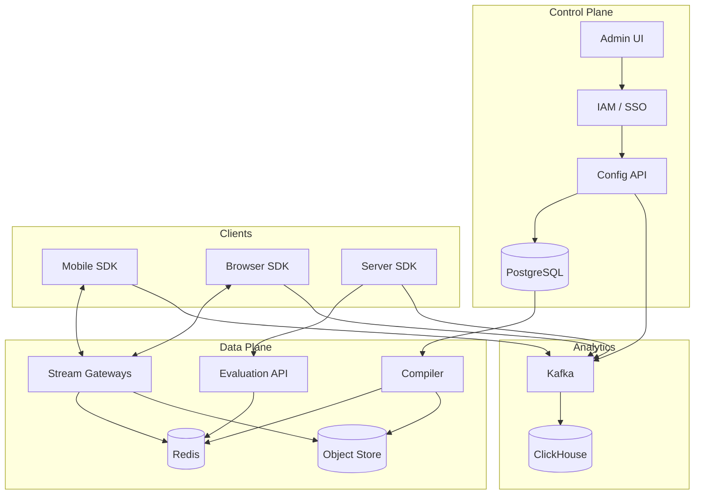

# Feature Flag & Experimentation Platform System Design (LaunchDarkly-like)

**Difficulty Level:** ⭐⭐⭐⭐ Very Hard  
**Tags:** `Real-time`, `Distributed Systems`, `High Throughput`, `Low Latency`, `WebSocket`, `Caching`, `Kafka`, `Analytics`, `A/B Testing`, `Security`, `Privacy Engineering`, `Global Scale`

**File Purpose:** Interactive, multi-level learning resource for designing a global feature flag and experimentation platform. This guide teaches you to handle **100B evaluations/day** (~1.16M average QPS, ~3.5M peak), **&lt;1s propagation** to 99% of SDKs, **&lt;50ms p99** server-side evaluation, sub-millisecond local SDK evaluation, and **99.99% availability** (52.6 minutes downtime/year) for **50K enterprise customers** and **500M end users**.

**Author:** System Design Documentation  
**Created:** April 14, 2026  
**Last Updated:** April 14, 2026  
**Recent Updates:** Major expansion aligned with `food_delivery_system_design.md` style: user stories, phased roadmap, per-section capacity/architecture narratives, wire protocols, RBAC/STRIDE, SRM/guardrail detail, autoscaling/load shedding, interview `<details>` banks, Next Steps & Practice roadmap, and **Key concepts explained** subsections (Welcome + Sections 3–16) defining jargon inline.

---

## 🎓 Welcome to Feature Flag Platform System Design!

### What You're Going to Build

Imagine shipping code to production **dark**, then turning it on for **1% of users**, then **20%**, then everyone—while a separate **kill switch** can disable a bad path in **under a second**. Imagine product managers running **A/B tests** on checkout with **guardrail metrics** (latency, errors, revenue) and analysts reading results in a warehouse fed by **billions of exposure events**.

By the end of this learning journey, you will know how to design a **LaunchDarkly-class** platform that:

- **Evaluates** flags deterministically (MurmurHash bucketing, ordered rules, prerequisites)
- **Distributes** config in **real time** (SSE/WebSocket/poll fallbacks) with **incremental patches**
- **Ships SDKs** for server, mobile, and browser with **local vs server-side evaluation** trade-offs
- **Targets** users via segments, attributes, and lists; **isolates** environments and tenants
- **Streams** telemetry **Kafka → ClickHouse** for experimentation and compliance-oriented **audit** trails
- **Meets enterprise bar:** RBAC, SSO, environment-scoped keys, tamper-evident audit, data residency options, and **SLA-grade** propagation for kill switches
- **Supports progressive delivery at scale:** gradual rollouts, experiments with **guardrails** and **SRM** checks, and tooling to **explain** why a user saw a given variation

### 📚 Your Learning Path

This course is designed for three learning levels:

```text
🟢 BEGINNER LEVEL (5-7 hours)
├─ Learn what flags solve: progressive delivery, kill switches, experiments
├─ Understand evaluation order, context, percentage rollouts, snapshots
└─ Perfect for: First exposure to feature management products

🟡 INTERMEDIATE LEVEL (7-9 hours)
├─ Interview frameworks: control vs data plane, APIs, capacity, SSE vs WebSocket
├─ Capacity math for 100B evals/day; Kafka/ClickHouse intuition
└─ Perfect for: FAANG system design interviews

🔴 ADVANCED LEVEL (10-14 hours)
├─ Global streaming fan-out, compiler design, noisy-neighbor controls, SOC 2 / GDPR
├─ Experiment statistics: SRM, guardrails, CUPED, operational error budgets
└─ Perfect for: Senior/staff and platform engineers
```

### 🎯 Prerequisites

**For Beginners:** HTTP, JSON, basic “if/else” configuration in apps; no distributed systems required.

**For Intermediate:** REST APIs, relational DBs, Redis-style caching, basic message queues.

**For Advanced:** Connection-heavy services, multi-region failover, cache invalidation, observability and compliance vocabulary.

### 📊 What Makes This Learning Experience Unique

Each technical section follows a proven learning pattern modeled after the repository’s deep-dive designs (e.g. **food delivery**, **payment gateway**):

1. **What You'll Learn** — Checklist objectives you can reuse in interviews  
2. **Why This Matters** — How this block ties to reliability, cost, or compliance  
3. **Multi-level content** — 🟢 intuition, 🟡 interview mechanics, 🔴 production and war stories  
4. **User stories & matrices** — Who wants what, and which requirement drives which component  
5. **Worked numbers** — Back-of-envelope where scale matters  
6. **Think About It / Key Takeaways / Practice Exercise** — Active recall  
7. **🎯 Interview Questions** — Collapsible Q&A (Beginner / Intermediate / Advanced) per major section  

Real-world anchors include **LaunchDarkly, Optimizely, Split**, and in-house experimentation infra at **Netflix, Uber, Spotify**, **GitHub** (progressive delivery), and **AWS/AppConfig**-style patterns.

💡 **Pro Tip:** In interviews, explicitly separate **control plane** (dashboard, flag CRUD, RBAC, audit) from **data plane** (snapshots, streaming, evaluation). That split is the skeleton of a strong answer.

---

### Key concepts explained — Welcome (terms used above)

#### Progressive delivery

Shipping code to production **incrementally** and **safely**: turn behavior on for a small slice of users, watch metrics, expand—without a big-bang deploy. Feature flags are the usual **mechanism**; they are not the same as "continuous deployment" alone.

#### Dark launch (shipping dark)

Code paths exist in production but are **not visible** to users until a flag turns them on. Lets you validate **operational** behavior (load, errors) before product exposure.

#### Kill switch

A **high-priority** flag or override that **forces** a safe variation—often "off"—across targeted traffic **fast**, used when metrics or incidents demand instant rollback of **behavior** (not necessarily a new deploy).

#### A/B testing (with feature flags)

**Randomized** (or rule-based) assignment of users to **variations** of an experience, then comparison of **metrics**. Flags implement **assignment**; statistics and data pipelines implement **inference**.

#### Guardrail metrics

**Secondary** metrics (latency, errors, revenue proxies) watched during a rollout or experiment. If they breach thresholds, automation or humans **stop** the test—even if the "primary" metric looks good.

#### Exposure event

A telemetry record meaning "this user **was shown** this variation" (or "evaluation affected UX")—used as the denominator for experiment analysis. The exact definition must be **consistent** across clients.

#### MurmurHash (one-line intuition)

A **fast, non-cryptographic** hash family used to map `(user, flag, salt)` to a stable bucket for **percentage rollouts**. It is **not** for security—use HMAC or signatures separately for tamper evidence on bundles.

#### SSE vs WebSocket vs polling

**SSE (Server-Sent Events):** one-way **HTTP** push from server to browser. **WebSocket:** bidirectional framed channel—common for mobile and rich push. **Polling:** client repeatedly asks "any change?"—simple but **laggy** and **expensive** at scale.

#### Incremental patch

A **small delta** of flag state from snapshot version `V` to `V+k`, so clients avoid re-downloading a full bundle on every change.

#### SDK (software development kit, here)

A **library** embedded in your app that holds (or fetches) flag state and exposes something like `evaluate(flag, context)`—often with background sync and telemetry.

#### Segment

A named **audience** (rule or membership list) reused across flags—e.g. "employees," "beta testers," "enterprise accounts in EU."

#### Tenant vs environment

**Tenant** = customer organization (enterprise boundary for billing, RBAC, data). **Environment** = `development` / `staging` / `production` **within** a project—isolated keys and flag state so staging never leaks to prod.

#### Kafka and ClickHouse (roles here)

**Apache Kafka:** durable **event bus** for exposures, audits, change notifications—decouples writers from analytics. **ClickHouse:** **columnar OLAP** database for **fast aggregates** over billions of exposure rows (experiments, dashboards).

#### Audit trail

A durable record of **who** changed **what** flag **when**, with diffs—supports **SOC 2**, incident review, and enterprise support.

#### RBAC and SSO

**RBAC (role-based access control):** which roles may edit prod flags. **SSO (single sign-on):** login via corporate IdP (SAML/OIDC)—common enterprise requirement.

#### SLA vs SLO

**SLA** = **contract** with customers (often with credits). **SLO** = internal **target** (e.g. propagation p99 &lt; 1s). You operate using **error budgets** derived from SLOs.

#### Sample ratio mismatch (SRM)

A statistical check that **assigned** traffic splits match the **intended** experiment split—pipeline or SDK bugs often show up here first.

#### Determinism

Same **inputs** (snapshot version + context + rules) ⇒ same **variation**. Needed for **fair** experiments and **support** replay.


## Table of Contents

- [Section 3: Understanding Requirements](#section-3-understanding-requirements)
- [Section 4: Capacity Planning](#section-4-capacity-planning)
- [Section 5: High-Level Architecture](#section-5-high-level-architecture)
- [Section 6: Flag Evaluation Engine](#section-6-flag-evaluation-engine)
- [Section 7: Real-Time Flag Distribution](#section-7-real-time-flag-distribution)
- [Section 8: SDK Architecture](#section-8-sdk-architecture)
- [Section 9: Targeting, Segmentation, and Context](#section-9-targeting-segmentation-and-context)
- [Section 10: A/B Testing & Experimentation](#section-10-ab-testing--experimentation)
- [Section 11: Scalability & Performance](#section-11-scalability--performance)
- [Section 12: Security Considerations](#section-12-security-considerations)
- [Section 13: Monitoring & Observability](#section-13-monitoring--observability)
- [Section 14: Trade-Offs & Design Decisions](#section-14-trade-offs--design-decisions)
- [Section 15: Interview Preparation](#section-15-interview-preparation)
- [Section 16: Putting It All Together](#section-16-putting-it-all-together)
- [Appendix A: Glossary](#appendix-a-glossary)
- [Appendix B: API Reference](#appendix-b-api-reference)
- [Appendix C: Database Schemas](#appendix-c-database-schemas)
- [Appendix D: Interview Question Bank](#appendix-d-interview-question-bank)

---

## Section 3: Understanding Requirements

### What You'll Learn

How to scope a feature flag platform: actors (developers, PMs, end users), MVP vs platform features, functional vs non-functional requirements, and **clarifying questions** that map to architecture (local eval vs RPC, experiments, regions, compliance).

### Why This Matters

Interviewers want to see that you know this is **not** “a JSON blob in Redis.” It is a **control plane + data plane + analytics plane** product with **determinism**, **propagation SLOs**, and **security boundaries** (especially server vs client SDK keys).

---


### Key concepts explained — Section 3

#### Feature flag (vs static configuration)

A **named** decision point in code whose outcome is **controlled remotely** and **per context** (user, device, tenant)—not just a key in a config file. Enables **targeting**, **percentages**, and **experiments** on top of "on/off."

#### Control plane

The **authoritative** side: dashboards, **Config API**, **IAM**, **PostgreSQL** storing definitions. **Low QPS**, **strong consistency** expectations on writes.

#### Data plane

The **delivery and evaluation** side: **compiler**, **Redis**, **object store**, **stream gateways**, **Evaluation API**, **SDKs**. **Huge logical QPS** (mostly local eval), **eventually consistent** propagation with an **SLO**.

#### Analytics plane

**Kafka** (and similar) for **events**, **ClickHouse** (or warehouse) for **OLAP** queries—**decoupled** from the user request path.

#### Variation

The **value** returned for a flag: boolean, string, number, or JSON—**one** resolved outcome per `evaluate` call.

#### Snapshot

An **immutable** compiled bundle of flag state at **version V** that SDKs load so all processes share the **same rules** until they advance to a newer version.

#### Patch

A **delta** from snapshot V to V+1 (or V+k) so clients update **incrementally** instead of pulling the full bundle every time.

#### Evaluation

The act of computing `variation = f(flagKey, context)` using the current snapshot—**local** in-process or **remote** via API.

#### Deterministic bucketing

Hashing a **stable user key** with **flag salt** into a numeric bucket so **percentage rollouts** do not **flicker** request-to-request.

#### Ordered rules and first match

Rules are tried **top-down**; the **first** rule that matches wins (typical contract). **Order** encodes product priority (e.g. employees before geo rollout).

#### Prerequisites

Flags (or conditions) that must pass **before** this flag's rules apply—forms a **DAG**; cycles are **rejected** at save time.

#### Mutual exclusion group

A set of experiments where **at most one** may assign a user—prevents overlapping treatments that **confound** metrics.

#### Simulation and trace

**Simulate** answers "what would this context get?" **Trace** lists **which rules** ran—**explainability** for support and trust.

#### Propagation SLO

Latency from **successful save** in control plane to **application** of new rules on client/SDK—distinct from **evaluation** latency.

#### Edge evaluation

Evaluating flags in **CDN/edge** runtimes; uncommon because of **context**, **staleness**, and **security** constraints.

#### SOC 2 (relevant controls)

Customer audit framework: flag **change logs**, **access reviews**, and **monitoring** map to common **Trust Services** criteria (e.g. logical access, change management).

#### GDPR and PII

If **segments** or **context** contain personal data, you need lawful basis, **minimization**, retention limits, and **DSR** handling. Prefer **opaque** keys on clients.

#### Data residency

Tenant data (configs, events, audit) must **remain** in a region (e.g. EU)—drives **regional** clusters and **routing**.

#### Strong vs eventual consistency (in this system)

**Strong** for **who can write prod** and **what** the latest version is in OLTP. **Eventual** for **every device** seeing that version within **bounded** time per SLO.


### 🟢 For Beginners: What Are We Building?

**Analogy:** A **flight deck** with hundreds of labeled switches. The wiring (your deployed code) is already installed; **flags** choose which circuits are energized for **which passengers** (users), without rewiring the plane mid-flight (redeploy).

**Core journeys:**

1. **Authoring:** Engineer or PM creates `new_checkout`, default OFF, adds rules (employees ON, EU 10% rollout).  
2. **Distribution:** Compiler builds a **snapshot**; stream gateways push **patches** to connected SDKs.  
3. **Evaluation:** App asks SDK “what is `new_checkout` for this user context?”—sub-millisecond if local.  
4. **Experimentation (optional):** Exposure events flow to Kafka → ClickHouse; dashboards show lift and **guardrails**.  
5. **Incident:** Someone hits **kill switch**; override propagates fast; **audit log** records actor and diff.

**Who are the users?**

- **Internal customers:** engineers integrating SDKs; PMs configuring rollouts.  
- **Enterprise admins:** RBAC, SSO, audit exports, data residency.  
- **End users:** receive behavior implied by flag decisions (usually unaware).

---

### 🟡 For Intermediate: Functional & Non-Functional Requirements

#### Functional requirements (prioritized)

| Priority | Capability | Notes |
|----------|------------|--------|
| P0 | Create / update / archive **flags** per **environment** | Strong consistency on write; version monotonic |
| P0 | **Boolean** + **string** / JSON **variations** + **default** | Multivariate for experiments |
| P0 | **Ordered rules** (targeting) + **percentage rollout** on stable key | Deterministic bucketing |
| P0 | **SDK** receives **decisions** (local eval after sync **or** server API) | Scale implies local eval dominant |
| P0 | **Audit** who changed what | SOC 2 / enterprise |
| P1 | **Segments**, prerequisites, **kill switch** semantics | |
| P1 | **Streaming** updates + **snapshot** + **patch** protocol | Meets propagation SLO |
| P2 | **Mutual exclusion** experiment groups, simulation / **trace** API | Trust and support tooling |

#### Non-functional requirements (numbers to memorize)

```text
Scale & traffic:
├─ 50,000 enterprise customers; 500M end users (product-facing)
├─ 100B evaluations/day → ~1.16M/s average, ~3.5M/s peak (bursty)
└─ Most evaluations are in-process (not one HTTP call each)

Latency:
├─ Propagation: <1s to 99% of connected/reachable SDKs (product + kill switch)
├─ Server-side eval API: <50ms p99 (network + cache + rules)
└─ Local SDK eval: sub-ms p99 typical (hash + rule walk)

Availability:
└─ 99.99% (~52.6 minutes/year) for data plane serving snapshots/eval

Security & compliance:
├─ SDK keys scoped (server secret vs client/mobile limited bundle)
├─ Environment isolation (prod/stage/dev)
└─ Audit logs; GDPR-aligned minimization for segments and PII
```

#### Clarifying questions (interview script)

- **Scope:** Flags only, or **experiments** with stats dashboards? **Edge** evaluation?  
- **Clients:** Server-only vs **mobile + browser** with **local** rules?  
- **Regions:** Single region vs **multi-region** active/active for control plane?  
- **Consistency:** Brief disagreement across replicas OK for **data plane**? (Usually yes, bounded.)  
- **Compliance:** GDPR, SOC 2, HIPAA—any **data residency** per tenant?

---

### 🔴 For Advanced: Product Tensions and Business Risk

- **Speed vs safety:** Sub-second propagation encourages **push** and **coalescing**; bulk config edits can **debounce**—except **kill switches** may need a **priority lane** (still bounded to avoid thundering herds).  
- **Rich targeting vs data minimization:** Deep segments drive revenue; they also increase **PII** and **audit** scope—**resolve sensitive membership server-side** when possible.  
- **Experiment trust vs cost:** Logging every exposure at 100B evals/day is **economically impossible** at full fidelity—**sample**, **dedupe**, and monitor **Sample Ratio Mismatch (SRM)** continuously.  
- **Vendor positioning:** Enterprise buyers compare **audit**, **RBAC**, **SSO**, **SLA**, and **support tools** (“why was user X in variant B?”)—not just raw QPS.

#### Think About It

> Why is “eventual consistency” often acceptable for **flag propagation** but **not** for “who is allowed to change prod flags” on the control plane?

#### Key Takeaways

- Separate **three planes**: control (Postgres, IAM), data (Redis, object store, gateways), analytics (Kafka, ClickHouse).  
- Memorize: **100B/day**, **~1.16M avg QPS**, **~3.5M peak**, **<1s propagation**, **99.99%**, **<50ms server eval p99**.

#### Practice Exercise

List **five** flag categories (e.g., “marketing copy,” “payments,” “infrastructure kill switch”) and assign each an **evaluation location** (client vs server) and a **propagation priority** (best-effort vs critical).

---

### User stories (three audiences — interview script)

**As a backend engineer, I want to:**

- Toggle code paths in **production** without redeploying, with a **clear default** if the SDK cannot reach the service  
- Use the **same flag key** in `staging` and `production` with **different** outcomes (environment isolation)  
- Have **audit logs** and optional **approvals** so prod changes are traceable (SOC 2 / change management)  
- Run **canary releases**: internal + 1% + 5% + 100% with **deterministic** buckets, not random flicker per request  

**As a product manager or growth lead, I want to:**

- Target **segments** (country, plan, cohort) and run **A/B tests** with **primary** and **guardrail** metrics  
- **Simulate** “what would this user get?” before go-live  
- **Archive** old flags so the system does not accumulate hundreds of zombie toggles  

**As a security / compliance owner, I want to:**

- **Rotate** SDK keys, enforce **MFA** for production, and **scope** mobile keys to minimal rule bundles  
- Export **audit trails** to SIEM; optionally **data residency** for Analytics in EU  
- Prove **who** flipped a kill switch **when** during an incident  

```text
┌─────────────────────────────────────────────────────────────────┐
│                    FEATURE FLAG PLATFORM                         │
├──────────────┬──────────────────────┬───────────────────────────┤
│   Engineers   │  PM / Experimentation │  Sec / Enterprise GRC   │
│  SDK + CI     │  Targeting + metrics  │  IAM + Audit + keys     │
└──────────────┴──────────────────────┴───────────────────────────┘
         │                    │                      │
         └────────────────────┼──────────────────────┘
                              ▼
                    End users (indirect)
```

#### MVP vs platform phases (talk track for interviews)

| Phase | Capabilities | Architecture hint |
|-------|--------------|-------------------|
| **MVP** | Boolean flags, envs, basic targeting, polling SDK, Postgres | Single region; Redis cache optional |
| **V1** | Percentage rollouts, segments, compiler + **immutable snapshots** | Redis + S3; versioned bundles |
| **V2** | SSE/WebSocket, **patch** protocol, mobile offline cache | Stream gateway fleet; regional relays |
| **V3** | Experiments, exposures → **Kafka → ClickHouse**, SRM dashboards | Analytics plane; sampled telemetry |
| **Enterprise** | SSO, SCIM, approval workflows, audit export, residency | Dedicated shards; stricter SLAs |

#### Consistency matrix (CAP-style — speak this aloud)

| Concern | Typical choice | Rationale |
|---------|----------------|-----------|
| Flag **definition** after save | Strong (single writer PG) | No “lost” prod toggles; audit requires truth |
| **Propagation** to SDKs | Eventual, bounded (e.g. **&lt;1s** p99) | Speed + partition tolerance; not financial ledger |
| **Evaluation** at SDK | Deterministic given **same** snapshot version | Reproducible experiments |
| **Exposure** counts in dashboard | Eventual (OLAP lag seconds–minutes) | Analytics, not inline request path |

---

### 🎯 Interview Questions — Understanding Requirements

#### Beginner level

**Q1:** What are the main **functional** requirements of a feature flag platform?

<details>
<summary>💭 Think first, then reveal answer</summary>

**Answer (outline):**

- **Authoring:** CRUD flags per project/environment; variations; ordered rules; optional prerequisites / kill switch semantics  
- **Distribution:** SDKs receive **snapshots** and **updates** (stream or poll); **evaluation** returns a variation for a **context**  
- **Governance:** RBAC, audit, optional approvals for production  
- **Experimentation (if in scope):** Exposure events, linkage to metrics, guardrails  

**Tip:** Always name the **three planes** (control / data / analytics) even if you defer analytics to “phase 2.”

</details>

**Q2:** What **non-functional** numbers would you memorize for this design?

<details>
<summary>💭 Think first, then reveal answer</summary>

**Answer:**

- **100B evaluations/day**, **~1.16M/s** average eval rate, **~3.5M/s** peak (order of magnitude)  
- **&lt;1s propagation** to 99% of SDKs (product requirement for kill switches)  
- **&lt;50ms p99** server-side evaluation; **sub-ms** local  
- **99.99%** availability for data plane (~52.6 min/year)  
- **50K** enterprise tenants; **500M** end users  

Relate each number to a **design choice** (local eval, regional gateways, etc.).

</details>

#### Intermediate level

**Q3:** What **clarifying questions** would you ask before drawing architecture?

<details>
<summary>💭 Think first, then reveal answer</summary>

**Answer:**

- **Experiments** in scope? (Exposure analytics vs flags-only)  
- **Client-side** evaluation allowed for **which** flag classes? (public UI vs payments)  
- **Multi-region**: active-active control plane or primary + DR?  
- **Compliance**: GDPR / SOC 2 / HIPAA; **data residency**?  
- **SLA**: propagation SLO contractual?  
- **Identity**: how is `user.key` chosen—stable account id vs session?  

Show you care about **misuse** (leaking rules) and **compliance**, not only throughput.

</details>

**Q4:** How is this different from **static config** in Consul/etcd?

<details>
<summary>💭 Think first, then reveal answer</summary>

**Answer:**

- **Targeting & bucketing:** per-user deterministic assignment, not just key=value  
- **Semantics:** prerequisites, multivariate experiments, kill-switch priority  
- **Delivery:** push + patch fan-out at **massive** client scale, not just server agents watching a KV  
- **Analytics & audit** as first-class enterprise requirements  

You may still use **etcd** *inside* the control plane for coordination—that is implementation detail.

</details>

#### Advanced level

**Q5:** How would you justify **eventual consistency** on the data plane to a skeptical customer?

<details>
<summary>💭 Think first, then reveal answer</summary>

**Answer:**

- Strong consistency on **every** edge for **billions** of evals/sec is impractical; instead **determinism** + **snapshot version** gives **predictable** behavior  
- Bound drift: **SLO** (e.g. &lt;1s p99 propagation) + **monitoring** + **kill switch** path that bypasses debounce but remains rate-limited  
- **Control plane** remains strongly consistent so **who may change prod** is never ambiguous  

Offer **regional** pinned configs for regulated industries if needed (premium).

</details>

---

## Section 4: Capacity Planning

### What You'll Learn

Back-of-envelope **evaluations/sec**, why **100B/day ≠ 100B HTTP calls**, streaming **connection** counts, Kafka/ClickHouse **order of magnitude**, and **hot path** (Redis, compiler).

### Why This Matters

Interviewers probe whether you **avoid** designing “call the feature-flag service on every flag check.” The winning story is **local evaluation** + **snapshots** + **sampled telemetry**.

---


### Key concepts explained — Section 4

#### Logical evaluations vs RPC QPS

**Logical evaluations** count every in-process `evaluate()`—often **billions/day** with **no** network. **RPC QPS** counts HTTP/gRPC calls to **your** control or data APIs. Interviewers test whether you **conflate** them.

#### Long-lived connections

TCP sessions (WebSocket, SSE) that stay open **minutes to hours** so the server can **push** patches. Drives **connection** limits, **load balancer** stickiness, and **regional** gateway sizing—not the same as short REST calls.

#### Hot tenant (noisy neighbor)

One customer’s **bundle size**, **event volume**, or **compile** cost dominates shared pools—hurting others. Mitigate with **quotas**, **dedicated** shards/partitions, or **fair** queues.

#### Sampling bias in telemetry

If exposures are logged only under some conditions (network, OS, ad blockers), experiment denominators **skew**. **Stratify** sampling or correct in analysis.

#### Thundering herd

Many clients **wake up** at once (post-outage, TTL expiry) and **hammer** origin. **Jitter**, **staggered** TTLs, and **ETag/304** reduce synchronized spikes.

#### ETag and conditional fetch

**ETag** is an opaque **version** of a representation; clients send **If-None-Match** so the server can reply **304 Not Modified**—saving bandwidth when the snapshot **unchanged**.

#### Redis working set

The **subset** of data kept in RAM for fast reads. For flags: **compiled** metadata and pointers; must **shard** so one giant tenant does not **evict** everyone else’s hot keys.

#### OLAP vs OLTP (here)

**OLTP** (Postgres): transactional **writes** to definitions. **OLAP** (ClickHouse): **columnar** scans over **billions** of exposure rows for dashboards.


### 🟢 For Beginners: Three Traffic Types

```text
A) Local evaluations (no network — dominant volume)
   └─ SDK evaluates in-memory from snapshot

B) Control + sync (periodic / on change)
   └─ Snapshot download, stream reconnect, optional polling fallback

C) Telemetry (async, often sampled)
   └─ Exposure / diagnostic events → Kafka
```

Think of **(A)** as billions of in-app “if” checks, **(B)** as thousands to millions of **control connections**, **(C)** as a **smaller** but still huge event stream.

---

### 🟡 For Intermediate: Calculations

#### Average evaluation rate

```text
100,000,000,000 / 86,400 s ≈ 1,157,407 evaluations/second (average)
Peak often ~3× average → ~3.5M/s “evaluation moments” globally (design + buffer)
```

#### If you wrongly use “RPC per flag”

```text
One page touches ~20 flags.
1.16M “user/server evaluation moments”/s × 20 flags → tens of millions RPC/s
└─ Unaffordable. Hence: bundled snapshots + local eval + bulk server API when needed.
```

#### Streaming connections (order of magnitude)

```text
500M end users do not hold streams simultaneously.
Hypothesis: 10–20M concurrent **long-lived** connections (mobile + some web + server workers)
└─ Stream gateways sized per region; cross-zone load balancing; sticky sessions or route sharding by tenant
```

#### Redis working set (illustrative)

```text
Compiled snapshot blobs + hot metadata per environment.
Tens of GB to low TB **total** at vendor scale; shard by **tenant** or **environment** to avoid hot keys.
```

#### ClickHouse ingest (if 5% of evals emit ~200 B row)

```text
5% × 100B = 5B events/day → ~57,870 rows/s average; peaks 150k–250k+ rows/s
└─ Batch inserts; partition by date + tenant bucket; optional sampling for non-critical flags
```

#### Bandwidth (snapshot + patch)

```text
Full snapshot might be 200 KB–2 MB gzip per **environment** bundle (varies wildly).
Patches ideally **small** (KB); fallback to full snapshot if client too stale CDNs can cache **immutable** snapshot URLs with version in path.
```

---

### 🔴 For Advanced: Retry Storms, Hot Tenants, and Biased Samples

- **Retry storm:** Bad SDK version reconnects in a tight loop → **exponential backoff + jitter**, **max reconnects/min**, **server-side rate limit per SDK key**.  
- **Hot tenant:** One enterprise has **huge** flags JSON → isolate **compile** queue, **cap** patch size, **dedicated** Kafka partitions.  
- **Biased sampling:** If you only log exposures on **wifi**, mobile metrics skew—**stratify** or **device-type quotas** in analysis.  
- **Thundering herd after outage:** Everyone refreshes snapshot—**stagger** TTL jitter, **ETag** conditional fetch, **regional** caches.

#### Think About It

Estimate **network egress** / day if every SDK downloaded a **full 1 MB** snapshot every **60 s** (bad design). Contrast with **patches** + **6-hour** snapshot refresh.

#### Key Takeaways

- **Local evaluation** is the only sane path at **100B/day**.  
- Size **telemetry** and **audit** paths independently—do not collapse them mentally.

#### Practice Exercise

Assume **1% exposure sample rate** and **200 B** per event. Compute **average** ClickHouse **uncompressed** ingest per day and with **5:1** compression.

---

#### Extended capacity table (speak in interviews)

| Resource | Order of magnitude | Driving assumption |
|----------|---------------------|---------------------|
| Raw evaluations | **100B/day** | Product metric; mostly **in-process** |
| Evaluations/s (avg) | **~1.16M/s** | 100e9 / 86,400 |
| Peak eval/s | **~3.5M/s** | ~3× average; still **not** all RPC |
| Concurrent streams | **10–20M** | Mobile + web + long-lived server workers |
| Compiler jobs | **Bursty** on save | Debounce merges; peak **100s–1000s** builds/s in incident |
| Kafka (exposures) | **billions** of events/day sampled | 1–5% of evals → **1–5B** rows/day |
| Postgres writes | **Low** QPS | Human + CI + API—**not** on eval path |

#### Storage estimates (worked example — order of magnitude)

```text
Assume:
├─ 50,000 tenants × 400 active flags avg × 3 KB compiled metadata hot set
│   └─ ~60 GB logical (pre-replication) — fits shardable Redis with overhead
├─ Snapshot blobs in object store: 50K envs × 500 KB avg gzip bundle (wildly variable)
│   └─ ~25 GB **current** hot generations; historical versions in Glacier after N days
└─ ClickHouse exposure: 2B rows/day × 120 B useful payload (compressed columns)
    └─ With ZSTD + MergeTree: **single-digit TB/month** raw-equivalent before TTL drop
```

#### Bandwidth anti-pattern vs target design

```text
NAIVE: 1 full snapshot = 800 KB gzip; every client every 60 s
├─ 15M clients × 800 KB × 1,440 times/day = petabyte-scale egress (unacceptable)

TARGET: immutable CDN snapshot on upgrade + long-lived stream of **patches** (typically KB)
├─ Amortized egress drops orders of magnitude
└─ ETag + 304 + jittered refresh spreads load
```

#### Rough monthly infra cost lens (illustrative — not a quote)

```text
Stream gateways (15M WS, multi-region): large line item (compute + egress)
Kafka + MSK/KRaft ops: mid six figures / year at full vendor scale
ClickHouse Cloud / self-host: driven by **retention × sample rate**
Postgres (control plane): modest vs data plane **if** eval path never touches OLTP

Optimization levers:
├─ Sample exposures; stratify to reduce bias
├─ Edge-cache immutable snapshots; diff patches
└─ Tenant-level fair queueing to avoid giant tenant blowing shared pools
```

---

### 🎯 Interview Questions — Capacity Planning

#### Beginner level

**Q1:** Why is **100B evaluations/day** not the same as **100B HTTP requests/day**?

<details>
<summary>💭 Think first, then reveal answer</summary>

**Answer:** Evaluations usually happen **inside the process** using a **cached snapshot**. HTTP/WebSocket traffic is **bootstraps**, **patches**, **server-side eval API** (subset), and **telemetry**—orders of magnitude smaller in **RPC count** than naive per-flag HTTP.

</details>

#### Intermediate level

**Q2:** Size **Kafka** for **exposure** events at **2% sampling** of **100B** evals/day.

<details>
<summary>💭 Think first, then reveal answer</summary>

**Answer:**

```text
Events = 0.02 × 100B = 2B events/day
Per second = 2e9 / 86,400 ≈ 23,148 events/s average
Peak ×3 ≈ 70,000 events/s

Assume 250 bytes average serialized (with metadata):
70,000 × 250 B ≈ 17.5 MB/s peak ingest before replication

Kafka with RF=3 → provision for throughput + headroom; partition by tenant_id
```

Mention **compression** (batch), **partition skew** for whale tenants.

</details>

#### Advanced level

**Q3:** A **hot tenant** publishes a **15 MB** compiled bundle. What breaks first?

<details>
<summary>💭 Think first, then reveal answer</summary>

**Answer:** **Compiler** CPU/time, **Redis** value size limits, **client memory** on mobile, **patch** generation cost, **CDN** cache miss stampedes. Mitigations: **lazy** per-flag loading, **strip** unused flags by **SDK tag**, **shard** bundles, **reject** oversize at save with actionable error, **dedicated** compile queue for whale tenants.

</details>

---

## Section 5: High-Level Architecture

### What You'll Learn

Major **services** and **stores**, sync vs async boundaries, how **compiler**, **stream gateways**, **evaluation API**, and **Kafka consumers** fit together—plus a **Mermaid** diagram you can redraw in an interview.

### Why This Matters

Your diagram should show **where writes land** (Postgres), **where reads scale** (Redis + object store + edge), and **where events flow** (Kafka → ClickHouse).

---


### Key concepts explained — Section 5

#### Compiler service

Turns **authoring-time** flag definitions in Postgres into **read-optimized** artifacts (snapshots, patches)—constant-folding, ordering, sometimes **bytecode**. **Not** on every user request; runs on **change**.

#### Transactional outbox

A **pattern**: after committing business data, write an **outbox** row in the same DB transaction; a **worker** publishes to Kafka/queue **reliably**—avoids **dual-write** races between DB and message bus.

#### Optimistic locking (If-Match)

Client sends **expected version**; server rejects if **stale**—prevents **lost updates** when two admins edit the same flag.

#### Stream gateway

Stateful-adjacent **fleet** terminating **SSE/WebSocket**; **fans out** patches to subscribed SDKs with **scoped** tokens.

#### Failure domain / blast radius

The **set** of components that fail together (shared deployment, region, cluster). **Isolate** gateway from Config API so one bug does not take **both** down.

#### CDN for immutable snapshots

URLs include **version** in path; **long** cache lifetime safe because content **never** changes. **Do not** cache **authenticated** live streams the same way.

#### Evaluation API

Server-side **only** path for **bulk** or **secret** evaluations—uses same compiled rules as SDK but **never** ships sensitive rules to clients.


### 🟢 For Beginners: Big Boxes

```text
Dashboard / CI ──► Config API ──► PostgreSQL (source of truth)
                           │
                        Compiler ──► Redis + Object store (snapshots)
                           │
        SDKs ◄──── Stream gateways (SSE/WebSocket) / polling
          │
          └──► (optional) Evaluation API ──► Redis

SDKs / services ──► Kafka (exposure, audit fanout) ──► ClickHouse / warehouses
```

---

### 🟡 For Intermediate: Service / component table

| Component | Responsibility |
|-----------|------------------|
| **IAM / SSO** | OAuth/OIDC, MFA for prod, RBAC on projects/environments |
| **Config API** | Flag CRUD, segments, approvals, audit emission |
| **Compiler** | **flag_versions** → compiled artifact; invalidates caches; writes snapshot blob |
| **Snapshot store** | S3/GCS + Redis for hot compiled + metadata |
| **Stream gateway** | Long-lived connections; fan-out patches; auth via scoped tokens |
| **Evaluation API** | Server-side-only evaluation; bulk endpoints; hides rules |
| **Segment workers** | Import CSV, warehouse sync jobs |
| **Kafka** | `flag.change`, `exposure`, `audit.pipe` topics |
| **ClickHouse consumers** | Deduplicate, aggregate experiment views |
| **Admin analytics API** | Query CH for dashboards (separate from hot path) |

#### REST/API surface (see Appendix B for 15 examples)

High-level: **flags**, **segments**, **evaluate**, **evaluate/bulk**, **snapshots**, **stream**, **events/exposure**, **audit**, **sdkKeys:rotate**.

#### Mermaid: reference architecture



---

### 🔴 For Advanced: Multi-Region, Failure Domains, and CDN

- **Control plane:** Often **single-primary** Postgres with **sync/async replica** DR; strong consistency for **authorization** and **flag writes**.  
- **Data plane:** **Region-local** gateways + caches to minimize **propagation RTT**; **global** coordination via **change bus** (Kafka or internal) to relays.  
- **Analytics:** **Regional** ClickHouse; **federated** queries for global dashboards; **tenant residency** may pin EU data.  
- **CDN:** Serve **immutable** `.../snapshots/{env}/{version}/bundle.json` with **long max-age**; **never** CDN-cache authenticated **dynamic** streams.

📊 **Example:** Vendor postmortems often cite **connection storms** after regional failovers—mitigations match **streaming** systems (draining, jitter, regional synthetic canaries).

#### Think About It

Should **compiler** and **stream gateway** share a deployment? (What fails together? What scales independently?)

#### Key Takeaways

- **PG** = truth; **Redis/obj** = fast read path; **Kafka** = decouple analytics from user latency.  
- Draw **three planes** before diving into hashing.

#### Practice Exercise

Add **one** box to the diagram for **“approval workflow service”** (four-eyes on prod)—show where it sits **before** commit to Postgres.

---

### Request-path narratives (walk through in interviews)

#### Path A — Human changes a flag in production (control plane)

```text
1. Admin opens UI → OAuth session + RBAC check (project:admin)
2. UI → Config API: PATCH /flags/{key} with If-Match / version (optimistic lock)
3. Config API → PostgreSQL: INSERT flag_versions; UPDATE flags.version (transaction)
4. Emit audit event (Kafka `audit.events`) + outbox row
5. Compiler worker: consume change → build compiled artifact → PUT object snapshot
6. Redis: publish metadata + short TTL pointers; bump env sequence
7. Stream relay: fan-out patch to subscribers of that environment
8. SDK: apply patch or full fetch → atomic swap snapshot pointer
9. Next evaluation uses new rules (version N+1)
Latency SLO: human sees "saved" after DB; propagation separate SLI
```

#### Path B — Application evaluates locally (data plane, hot path)

```text
1. SDK.ensureInitialized() on process start: fetch snapshot OR open stream
2. evaluate(flagKey, context):
       read immutable snapshot ptr → walk rules in memory → O(rules) with compiler optimizations
3. Optional: enqueue exposure sample to batch buffer → Kafka producer async
4. No network on steady-state eval (ideal case)
```

#### Path C — Server-side only flag (sensitive)

```text
1. Service calls POST /evaluate/bulk with server SDK secret + full context
2. Evaluation API loads compiled rules from Redis (same artifact as SDK)
3. PII-heavy segment resolution happens **only** here (e.g. lookup account DB)
4. Returns decisions + reason codes for logging
```

---

### Deployment topology (advanced talking points)

```text
┌─────────────────────────────────────────────────────────────┐
│ Region: us-east-1                                            │
├─────────────────────────────────────────────────────────────┤
│ ALB → Config API (stateless) → PostgreSQL (primary)           │
│     → Compiler workers (K8s job + queue)                      │
│     → Redis Cluster (compiled hot set)                      │
│     → S3 snapshot bucket (versioned)                         │
│ Stream Gateway ASG (WebSocket) ← cross-zone NLB + stickiness │
│ Eval API ASG → same Redis read path                          │
└─────────────────────────────────────────────────────────────┘
        │ async replication / global routing
        ▼
┌─────────────────────────────────────────────────────────────┐
│ Region: eu-west-1 (read replicas + regional relays)          │
└─────────────────────────────────────────────────────────────┘
```

**Failure isolation:** Bug in **stream gateway** must not take down **Config API** (separate ASG, separate blast radius). Compiler lag can delay propagation—**alert** on **snapshot_age_seconds** per environment.

---

### 🎯 Interview Questions — Architecture

#### Beginner level

**Q1:** Name the **three planes** and one **data store** per plane.

<details>
<summary>💭 Think first, then reveal answer</summary>

**Answer:** **Control:** Postgres (and IAM store). **Data:** Redis + object store + gateway fleet. **Analytics:** Kafka → ClickHouse. Mention **optional** OLTP replicas for reporting—not on hot eval path.

</details>

#### Intermediate level

**Q2:** Where does **Kafka** sit—why not write ClickHouse from the API directly?

<details>
<summary>💭 Think first, then reveal answer</summary>

**Answer:** Decouple **ingest latency** from **user paths**; absorb spikes; allow multiple consumers (CH, warehouse, fraud, replay). At-least-once with **idempotent** sink (dedupe keys).

</details>

#### Advanced level

**Q3:** How do you avoid **dual-write** bugs between Postgres and Redis?

<details>
<summary>💭 Think first, then reveal answer</summary>

**Answer:** Treat Postgres **commit** as source of truth; compiler is **asynchronous** derived state. If Redis stale, evaluator falls back to **object store** snapshot. Use **version** monotonic per env; clients reject **regressions**. Consider **outbox** pattern for exactly-once handoff to compiler queue.

</details>

---

## Section 6: Flag Evaluation Engine

### What You'll Learn

**Evaluation order** (kill switch, prerequisites, rules, fallthrough), **MurmurHash3** bucketing in **basis points**, **multivariate** flags, **compiler** strategies (DAG / bytecode), and **replay** with frozen `snapshotVersion`.

### Why This Matters

This is the **semantic core.** Wrong answers here lose credibility. Interviewers ask about **determinism**, **sticky** assignment, and “what if rollout goes from 10% → 20%?”

---


### Key concepts explained — Section 6

#### Evaluation order

Fixed **pipeline**: kill switches and **archived** state before **prerequisites**, then **rules** top-to-bottom, then **fallthrough** default—**order** is part of the **contract**.

#### Basis points (bps)

**1 bp = 0.01%**; **10,000 bps = 100%**. Integer rollout **percentages** avoid **floating-point** bugs in bucketing.

#### Salt (per flag)

Extra input to the hash so **different** flags **uncorrelate** bucket assignments—same user can be in **10%** of flag A and **50%** of flag B **independently**.

#### Multivariate flag

One flag returns **several** named **variations** (not just on/off)—used for **A/B/n** and **JSON** payloads.

#### DAG (prerequisites)

**Directed acyclic graph** of flag dependencies; **cycles** are invalid—enforced when **saving** definitions.

#### Bytecode / bounded VM (optional)

Rules compiled to **small programs** with **max steps**—trades flexibility for **predictable** CPU on hot paths.

#### Fallthrough

Default **variation** when **no** rule matches—explicit **safe** outcome.

#### Sticky assignment

Same **user key** should map to the **same** bucket **over time** for fair UX and experiments—requires **stable** keys, not rotating session IDs.

#### Replay (support)

Re-run evaluation with **frozen** `snapshotVersion` and logged context to **prove** what variation was **correct** at a past time.


### 🟢 For Beginners: Evaluation Steps

```text
1) Archived / global off? → safe default
2) Kill switch / emergency override? → forced variation
3) Prerequisites satisfied? → else default/off per policy
4) Rules **top to bottom** — first match wins (common contract)
5) No match? → **fallthrough** / default variation
6) Rollout rule? → hash(userKey, flagKey, salt) → bucket vs percentage
```

**Sticky assignment:** use a **stable** `user.key` (not rotating session id) if the same person should stay in the same bucket for days.

---

### 🟡 For Intermediate: MurmurHash bucketing (pseudocode)

```text
FUNCTION basis_points(userKey, flagKey, salt) -> int:
  msg = userKey || "|" || flagKey || "|" || salt
  h = murmurhash3_32(msg)   // non-crypto, fast, good spread
  RETURN h MOD 10000        // 0..9999 = hundredths of a percent

FUNCTION in_rollout(bp, rollout_bps):
  RETURN bp < rollout_bps   // e.g. 1734 = 17.34%
```

#### Why MurmurHash, not SHA-256?

For **bucketing**, you need fast, well-distributed pseudo-randomness—not collision resistance against attackers. **SHA-256** adds CPU cost on hot paths. Use **HMAC** or signatures separately to **sign** snapshot bundles for tamper detection.

#### Rule types (catalog for interviews)

- Boolean / string / numeric / JSON **variations**  
- **Segment** match (attribute or list membership)  
- **Operators:** `in`, `not_in`, `matches` (regex), `semver_gt`, etc.  
- **Schedule** windows (timezone-aware)  
- **Prerequisite** flags (DAG validation on save)

---

### 🔴 For Advanced: Compiler, Bytecode, and Fairness of Rollout Changes

- **Naive** JSON interpretation per eval → slow at **millions/s** per process—**compile** to DAG, constant-fold, specialize hot segments.  
- **Optional bytecode VM** for complex boolean logic—bounds **max steps** per eval to prevent pathological rules.  
- **Rollout increases:** True **uniformly random** expansion may **add** users into “on”—some previously “off” users flip—communicate in docs; some products use **cohort salt versions** to reduce churn (product decision).  
- **Replay:** Persist `(flagKey, context, snapshotVersion)` in exposure—offline **replay** proves **why** in support tooling.

#### Think About It

What breaks if two unrelated flags **share** the same **salt** accidentally?

#### Key Takeaways

- **Kill switch** and **prerequisites** before fun rules.  
- **Integer basis points** avoid floating-point mistakes.  
- **Compiler** is a real service—version it and **benchmark** per tenant.

#### Practice Exercise

Write a **rule list** (pseudo-JSON) for: **ON for segment `employees`**, else **15% rollout in US**, else **OFF**.

---

### Example flag definition (illustrative JSON — compiler input)

**Note:** Field names vary by product; this shape is interview-friendly.

```json
{
  "key": "new_checkout",
  "version": 18,
  "salt": "v3-salt-9f2a",
  "killed": false,
  "prerequisites": [{ "key": "payments_api_v2", "variation": true }],
  "variations": [
    { "key": "off", "value": false },
    { "key": "on", "value": true }
  ],
  "rules": [
    {
      "id": "r1",
      "clauses": [{ "op": "segmentMatch", "segmentKey": "employees" }],
      "variationKey": "on"
    },
    {
      "id": "r2",
      "rollout": { "variationKey": "on", "basisPoints": 1500, "bucketBy": "user" },
      "clauses": [{ "op": "in", "attribute": "country", "values": ["US"] }]
    }
  ],
  "fallthrough": { "variationKey": "off" }
}
```

The **compiler** may lower this to: segment checks inlined where cheap; **jump** table for country; **single** hash for rollout row.

#### Prerequisite graph (validation on save)

```text
payments_api_v2 ──► new_checkout
        │
        └──► pricing_ab_test

Cycle: new_checkout → infra_flag → new_checkout  ⇒ REJECT with UI path
```

#### Evaluation micro-benchmarks (production discipline)

```text
Target: p99 < 500 ns CPU for boolean flag after warm compile (illustrative)
├─ Avoid allocations in hot path (reuse context buffers)
├─ Intern common strings (variation keys)
└─ Fuzz JSON rules to catch compile explosions
```

---

### 🎯 Interview Questions — Flag Evaluation Engine

#### Beginner level

**Q1:** What does **deterministic** evaluation mean?

<details>
<summary>💭 Think first, then reveal answer</summary>

**Answer:** Given the **same** `(snapshotVersion, flagKey, userKey, salt, rules)`, the variation is always the same—it enables **reproducible** experiments and **support** replay.

</details>

#### Intermediate level

**Q2:** Rollout from **10% → 20%**. Who turns on?

<details>
<summary>💭 Think first, then reveal answer</summary>

**Answer:** Users whose bucket hash falls in **0–19%** see ON. Users in **10–19%** **newly** gain ON; some previously ON (0–9%) stay ON; users in **20–99%** stay OFF. **Not** necessarily “only +10% more from previous ON,” depending on product’s **consistent hashing** story—**disclose** whether reshuffling is acceptable for experiments.

</details>

#### Advanced level

**Q3:** How do you test compiler correctness at scale?

<details>
<summary>💭 Think first, then reveal answer</summary>

**Answer:** **Golden vectors**: thousands of `(snapshot, context) → variation` pairs in CI across languages; **differential** testing between naive interpreter vs optimized; **property-based** fuzz of rules (bounded); **canary** compiler in shadow mode writing to separate Redis key before promoting.

</details>

---

## Section 7: Real-Time Flag Distribution

### What You'll Learn

**SSE vs WebSocket vs polling**, **snapshot + patch** protocol, **ETags**, **debouncing** bulk edits, **priority** for kill switches, **propagation SLO** measurement.

### Why This Matters

This subsystem distinguishes a **database with polling** from a **real-time delivery network**. Your **&lt;1s** SLO lives here.

---


### Key concepts explained — Section 7

#### Short vs long polling

**Short:** repeated requests on an interval (**wasteful**). **Long:** server holds request until data or timeout (**better** lag). **Push** (SSE/WS) is usually best for **sub-second** propagation.

#### Patch envelope

A **versioned** message describing **deltas** between snapshot **from** → **to**; clients apply atomically or **fall back** to full fetch.

#### Debouncing

**Batching** rapid successive edits (e.g. dashboard **bulk** save) into **one** compile/publish cycle—reduces **storm** of patches; **kill switches** may bypass for **latency**.

#### Poison message

Malformed patch that could **crash** or **corrupt** SDK state—defeated by **schema** validation, **checksums**, and **reject + full resync**.

#### Regional fan-out

**Relays** copy change events **into** each region so gateways serve patches **locally** without a **single** global choke point.

#### Synthetic canaries

**Probes** that **measure** end-to-end propagation (commit → SDK apply) continuously—**prove** SLOs, not just **health checks**.

#### Conditional GET (snapshots)

HTTP caching headers (**If-None-Match** / ETag) let clients **avoid** re-downloading **unchanged** bundles.


### 🟢 For Beginners: Pull vs Push

- **Short polling:** simplest; worst lag; wastes requests.  
- **Long polling:** better; still many hanging requests.  
- **Push (SSE/WebSocket):** server tells client **when** to apply a patch—best for lag targets.

---

### 🟡 For Intermediate: Transport trade-offs

| Transport | Pros | Cons |
|-----------|------|------|
| **SSE** | One-way, HTTP-friendly, browsers support `EventSource` | One-way only; some proxy quirks |
| **WebSocket** | Bidirectional, efficient | Stateful; LB stickiness; more ops |
| **Polling** | Easiest; works through restrictive corporate networks | Slow propagation; higher QPS |

**Hybrid:** **HTTPS GET** full snapshot (immutable CDN URL) + **stream** for patches + **ETag** on revalidation.

#### Patch envelope (conceptual)

```json
{
  "from": 48292,
  "to": 48293,
  "flags": {
    "new_checkout": { "op": "update", "version": 19 }
  },
  "tombstones": []
}
```

If patch &gt; **N KB** or client **too stale**, return **full snapshot** URL.

---

### 🔴 For Advanced: Regional Fan-Out, Debouncing, Poison Messages

- **Relays per region** subscribe to change bus; **regional** gateways avoid cross-region hot paths for every patch.  
- **Debounce** 25–50 ms for **bulk** dashboard edits—**merge** bursts—**exception:** kill switch may use **fast lane** (still **rate-limited**).  
- **Poison patch:** schema validation + **checksum**; SDK **rejects** bad patch and **fetches** full snapshot + **alerts**.  
- **Measurement:** **Synthetic SDKs** in each region emit **patch_received** latency histograms.

#### Think About It

How do you avoid **thundering herd** when **every** client reconnects after a **20-minute** regional outage?

#### Key Takeaways

- **Immutable snapshot URLs** + **small patches** + **jittered** polling fallback = resilient.  
- **Observability** on **propagation p99**, not just **server uptime**.

#### Practice Exercise

Define **client backoff**: base, max, jitter formula, and **max reconnects/hour** before “call home disabled, last snapshot only.”

---

### Wire protocol sketch (not exhaustive — interview talking points)

#### Server-Sent Events (one-way)

```http
GET /stream/sse?env=prod&from=48292 HTTP/1.1
Accept: text/event-stream
Authorization: Bearer <ephemeral_stream_token>
```

```text
event: patch
id: 48293
data: {"from":48292,"to":48293,"flags":{"k":{"op":"u","v":19}}}

event: ping
data: {}
```

#### WebSocket (bidirectional)

```text
CLIENT → SERVER: { "type":"hello", "sdk":"android","v":"3.2.1","from":48292 }
SERVER → CLIENT: { "type":"snapshot_redirect", "url":"https://cdn.../48292.json" }
SERVER → CLIENT: { "type":"patch", "to":48293, "delta": {...} }
CLIENT → SERVER: { "type":"ack", "applied":48293 }
```

**Acks** can be **batched** or **sampled** to reduce uplink traffic on mobile.

#### Reconnect state machine (SDK responsibility)

```text
[DISCONNECTED]
   │ exponential backoff + jitter
   ▼
[CONNECTING] ──TLS + token refresh──► [STREAM_OPEN]
   │                                      │
   │                              patch / snapshot applied
   │                                      ▼
   │                                  [SYNCED]
   │                                      │
   └───401/403──► [AUTH_REFRESH] ─────────┘
   │
   └───5xx/backoff──► [DEGRADED_LAST_KNOWN_GOOD]
```

In **DEGRADED**, SDK uses **last snapshot** + emits `sdk_degraded_mode_total` metric.

---

### 🎯 Interview Questions — Real-Time Distribution

#### Intermediate level

**Q1:** Compare **SSE** vs **WebSocket** for **browser** vs **mobile**.

<details>
<summary>💭 Think first, then reveal answer</summary>

**Answer:**

- **SSE:** Simple one-way; works with HTTP/2 multiplexing in modern stacks; good for **web**.  
- **WebSocket:** Better for **bidirectional** health pings, **subscription multiplexing**, some **corporate proxies** still odd with long-lived HTTP—always have **poll** fallback.  
- **Mobile:** Often **WebSocket** with custom keepalive; background suspension pauses stream—**resume** on foreground with **If-None-Match** snapshot fetch.

</details>

#### Advanced level

**Q2:** How do you prove **&lt;1s propagation** SLO in production?

<details>
<summary>💭 Think first, then reveal answer</summary>

**Answer:** **Synthetic canaries** per region inject **flag change** in a dedicated test project and measure **event_timestamps**: `t_commit`, `t_compiler_publish`, `t_gateway_receive`, `t_sdk_apply`. Report **p50/p99**; **burn** error budget on breaches. Include **dark launch** traffic shadowing.

</details>

---

## Section 8: SDK Architecture

### What You'll Learn

**Bootstrap sequence**, **local vs server evaluation**, **mobile offline**, **browser** constraints (CSP, ad blockers), **immutable snapshot swap** (thread safety), **protocol versioning**.

### Why This Matters

SDKs are how customers **feel** reliability and security—bugs here duplicate across **every** host.

---


### Key concepts explained — Section 8

#### Bootstrap sequence

SDK **startup** path: authenticate, fetch **initial** snapshot or open **stream**, **hydrate** memory, then serve **evaluations**—must be **non-blocking** for app render where possible.

#### Immutable snapshot swap

**Two** pointers: background thread builds **new** snapshot; **atomic** flip makes readers see **consistent** rules **without** locks on the hot path.

#### CSP (Content-Security-Policy)

Browser **directive** limiting which origins the SDK may **connect** to—misconfiguration **breaks** streaming or fetch.

#### sendBeacon

Browser API for **best-effort** POST on **page unload**—useful for **flushing** small telemetry when **async** fetch would be killed.

#### Protocol / schema versioning

**Negotiate** bundle format (headers, URL paths) so **old** SDKs and **new** servers **coexist** during rollout.

#### Edge / WASM caveats

Running eval at **CDN edge** implies **stale** rules, **trust** of **context**, and **limits** on CPU/memory—often **inferior** to origin or device evaluation for **full** rule sets.


### 🟢 For Beginners: Two modes

| Mode | Where rules run | Pros | Cons |
|------|-----------------|------|------|
| **Local** | In-process | Sub-ms, scales with app | Must ship **permitted** rules to untrusted clients |
| **Server** | Evaluation API | Hides rules; central PII | Extra latency; must scale service |

**Hybrid:** **public** flags client-side; **sensitive** flags only server-side.

---

### 🟡 For Intermediate: Platform notes

```text
Server (Go/Java/Node)
├─ Singleton client; background stream; process exit flush
Mobile (iOS/Android)
├─ Encrypted snapshot at rest; resume on foreground
Browser
├─ CSP connect-src; avoid blocking render path on await snapshot
└─ sendBeacon for best-effort telemetry on unload
```

#### Thread / async model

- **Immutable** snapshot + **atomic swap** pointer → evaluators **never** take locks in hot path.  
- **Background** thread applies patches; **main** thread only reads current pointer.

---

### 🔴 For Advanced: Key Material, WASM, and Edge

- **Never** ship **server SDK secret** to browser bundles—**build-time** checks + secret scanning.  
- **Edge workers** (Cloudflare) **rarely** do full evaluation—**risk** of stale rules and **trust** of context—most vendors keep eval at **origin** or **device**.  
- **Protocol negotiation:** `Accept: application/vnd.flag+json; v=2` for snapshot schema evolution.

#### Think About It

How do you **roll out** an SDK bug that **mis-buckets** 0.1% of users—**detection** and **rollback**?

#### Key Takeaways

- **Fail open** to safe defaults + **metrics**, never **throw** in eval API.  
- **Persist** encrypted snapshot on mobile; **TTL** stale data with explicit policy.

#### Practice Exercise

Sketch **five** items in a **public** mobile bundle vs **forbidden** in that same bundle.

---

### SDK platform comparison (deep table)

| Concern | Server (JVM/Go/Node) | Mobile (iOS/Android) | Browser |
|---------|------------------------|----------------------|---------|
| **Secret** | Server SDK key in KMS/env | **Mobile** key only; **no** server secret | **Public** eval key / client id only |
| **Lifecycle** | Process-wide singleton; shutdown hook | App foreground/background; **suspend** stream | Page visibility; **Service Worker** optional |
| **Storage** | Shared memory + optional disk cache | **Encrypted** SQLite/Keychain snapshot | `IndexedDB` / localStorage (size limits) |
| **Hot path** | Lock-free snapshot pointer | Same; watch **main-thread** violations | Same; **defer** eval off critical path |
| **Updates** | Long-lived gRPC/WS; reconnect on deploy | **Exponential backoff**; **Doze** mode | `EventSource` or WS; **CORS** / CSP |
| **Telemetry** | Batch to Kafka gateway | **Batch + offline queue**; dedupe keys | `sendBeacon` + in-memory queue |

### Memory budget (interview numbers)

```text
Typical mobile SDK cap for snapshot cache: 2–8 MB soft limit (configurable)
├─ Strip unused flags via server-side "SDK tag" projections
├─ Prefer binary encoded bundles (msgpack/protobuf) over pretty JSON in prod
└─ Monitor sdk_snapshot_bytes histogram — alert on tail
```

### Error handling contract (must not crash caller)

```text
try:
    variation = evaluator.evaluate(flag, context)
catch:
    metrics.sdk_eval_errors_total++
    return defaults[flag]   // or "safe off" for risk class
```

### 🎯 Interview Questions — SDK Architecture

#### Intermediate level

**Q1:** Why might **server-side evaluation** still call **Postgres**?

<details>
<summary>💭 Think first, then reveal answer</summary>

**Answer:** **Segment membership** backed by **live** entitlements (e.g., “subscribed in last hour”) may not be embedded in snapshot; evaluator joins to **internal** services. Keep **latency budget** strict (cache + circuit breaker).

</details>

#### Advanced level

**Q2:** How do you version **wire protocol** across **old** mobile apps?

<details>
<summary>💭 Think first, then reveal answer</summary>

**Answer:** **Accept** header negotiation; **URL** versioning `/v2/stream`; backwards-compatible readers—if unknown op in patch, **full snapshot** fetch; **feature flags for the flag system** (dogfood) to roll out new patch format gradually.

</details>

---

## Section 9: Targeting, Segmentation, and Context

### What You'll Learn

**Context** model, **segment** sources (rules, CSV, warehouse), **validation** (size, types), **server-side** resolution for sensitive attributes, **explainability** for support.

### Why This Matters

Wrong targeting ships **wrong UX**; mishandled PII ships **legal** and **trust** incidents.

---


### Key concepts explained — Section 9

#### Context (evaluation input)

Structured **attributes** (user key, country, custom) passed into `evaluate`. Should follow an **allowlist**—**strip** unknown keys on clients to reduce **leakage** and **injection**.

#### Segment sources

**Rule-based** (attributes), **uploaded** lists, **warehouse** sync (**reverse ETL**): data **freshness** and **privacy** differ by source—document **SLAs**.

#### Reverse ETL

Moving **segments** from a **warehouse** (Snowflake, etc.) **into** the flag platform on a schedule—**staleness** is explicit.

#### Server-side resolution

Sensitive attributes (e.g. **email**, **internal** tier) resolved **only** on trusted servers—keeps **PII** off mobile/browser.

#### Explainability (trace)

**Step-by-step** record of **which** rules matched—powers support tools; must be **authorized** and **audited**.

#### DPA (Data Processing Agreement)

Contractual **GDPR** artifact when you **process** customer **personal data** in segments or logs—defines roles and **subprocessors**.


### 🟢 For Beginners: Context shape

```json
{
  "kind": "user",
  "key": "user-123",
  "email": "redacted-in-client",
  "country": "DE",
  "custom": { "plan": "pro", "appVersion": "3.4.2" }
}
```

Rules compare **allowed** fields—**strip** unknown keys on clients per **allowlist**.

---

### 🟡 For Intermediate: Segment patterns

- **Attribute** segments (query at eval time)  
- **Uploaded** lists (stable keys)  
- **Reverse ETL** (hourly batch from warehouse)  
- **Composite** segments with refresh SLAs (document **staleness**)

#### Validation caps

```text
Max JSON depth / size; max list lengths; semver parser tolerance
```

---

### 🔴 For Advanced: PII, Explainability, Support APIs

- **Hash** or **opaque** user keys on clients; **resolve** PII segments **server-side** when needed.  
- **`simulate`** / **trace** endpoints for admins—**heavy guardrails**, **audit** every call.  
- **GDPR:** segment uploads may contain **personal data**—**DPA**, **retention**, **processor** roles.

#### Think About It

How do you answer **“Why did this user get variant B?”** without leaking other users’ data?

#### Key Takeaways

- **Explainability** = rule **trace** + **snapshotVersion** + **inputs** (sanitized).  
- **Minimize** context on clients by construction.

#### Practice Exercise

Design **`simulate` response JSON** with `trace[]` array of **rule evaluation steps**.

---

### Segment ingestion pipeline (batch & streaming—production pattern)

```text
Sources:
├─ CSV upload (user_key list) → S3 → batch worker → staging table → bloom/DDB membership
├─ Warehouse export (Snowflake) → scheduled job → diff import
└─ Real-time membership (rare): stream → join service (high cost)

Steps (happy path):
1. Validate file schema, size cap (e.g. 50M rows enterprise tier)
2. Virus scan / checksum; async job id returned (202 Accepted)
3. Worker chunks rows → hash keys → upsert segment_memberships(env_id, segment_id, user_key)
4. Mark segment version++; trigger **compiler** incremental rebuild for flags referencing segment
5. Emit audit + progress webhooks to customer SIEM
```

**Staleness SLA:** “Warehouse segments **≤ 60 min** behind” vs “CSV **eventually**”—document per connector.

#### Allowed **context** attributes (schema discipline)

```json
{
  "allowedKeys": ["kind", "key", "country", "tier", "appVersion"],
  "maxCustomBytes": 2048,
  "maxDepth": 3
}
```

Reject oversized/unknown keys at **SDK** (strip) and **server** (400 with reason) to prevent **rule injection**.

---

### 🎯 Interview Questions — Targeting & Segmentation

#### Intermediate level

**Q1:** Why not put **email** in context on mobile?

<details>
<summary>💭 Think first, then reveal answer</summary>

**Answer:** **PII** exposure in logs, accidental inclusion in client bundles, GDPR **minimization**. Prefer **opaque user key**; resolve email-based segments **server-side** only.

</details>

#### Advanced level

**Q2:** How do you prevent **segment enumeration** via `simulate` API?

<details>
<summary>💭 Think first, then reveal answer</summary>

**Answer:** **AuthZ** (project admin only), **rate limits**, **audit** each call, **allow-listed** IPs for enterprise, optional **break-glass** with MFA re-auth; return **minimal** trace; **mask** other users’ data.

</details>

---

## Section 10: A/B Testing & Experimentation

### What You'll Learn

**Exposure** vs **conversion**, **guardrails**, **SRM**, peeking and **sequential** testing (high level), **CUPED** variance reduction, how flags tie to **experiment lifecycle**.

### Why This Matters

Without rigor, teams **ship** “winners” that are **noise**—**SRM** alone has saved production KPIs at major vendors.

---


### Key concepts explained — Section 10

#### Exposure vs conversion

**Exposure:** user **saw** treatment (denominator for experiment). **Conversion:** outcome metric (purchase, signup). They **join** on keys and **time windows**—definition drift **breaks** stats.

#### Guardrails

**Secondary** metrics that **stop** or **pause** tests when safety/KPI thresholds breach—**independent** of the “winner” metric.

#### Sample ratio mismatch (SRM)

Statistical test: **assigned** splits **differ** from **design** split—often signals **bugs**, **telemetry** loss, or **targeting** errors.

#### Peeking / sequential testing

**Peeking** at results **early** without correction **inflates** false positives; **sequential** methods or **pre-registered** horizons fix this.

#### CUPED

**Variance reduction** using **pre-period** outcomes as covariates—needs clean **ETL**; fewer users for same **power**.

#### Cluster randomization (B2B)

Randomizing **orgs** not **users** changes **variance** and **analysis**—**not** the same formulas as user-level A/B.

#### Chi-square (SRM intuition)

Compare **observed** counts to **expected** under intended split—large deviation ⇒ **low** p-value ⇒ **alert**.


### 🟢 For Beginners: Exposure vs conversion

- **Exposure:** user **saw** a treatment (eligible assignment **surfaced** in UX).  
- **Conversion:** business outcome (purchase, signup).

---

### 🟡 For Intermediate: Guardrails and SRM

```text
Guardrails (examples)
├─ p99 latency +20% → auto-pause experiment
├─ error rate +0.5 pp → page
└─ revenue metric outside CI → require human review

SRM: compare observed assignment counts vs expected split (chi-square)
└─ Common causes: buggy SDK, telemetry loss, targeting mistakes
```

---

### 🔴 For Advanced: Statistics and ownership

- **Peeking** inflates false positives—**pre-register** horizons or use **sequential** methods.  
- **CUPED** reduces variance using **pre-period** metrics.  
- **Cluster** experiments (B2B by org) change variance—**different** power calculations.

📊 **Example:** Netflix/Uber write-ups emphasize **guardrails** and **automated stop** policies—copy the **discipline**, not vendor-specific numbers.

#### Think About It

What breaks if **assignment** is server-side but **conversion** is **only** logged client-side with ad blockers?

#### Key Takeaways

- **Exposure** events must align with **`snapshotVersion`** for trustworthy joins.  
- **SRM** alerting is **non-negotiable** for mature experiment cultures.

#### Practice Exercise

Write **auto-stop JSON policy** with three guardrails and **notification** hooks (PagerDuty + Slack).

---

### Exposure event schema (Kafka → ClickHouse — analytics contract)

```json
{
  "tenant_id": "uuid",
  "environment_id": "uuid",
  "flag_key": "pricing_ab",
  "variation_key": "treatment_b",
  "experiment_key": "exp_pricing_2026_q2",
  "context_key_hash": "sha256:...",
  "snapshot_version": 48292,
  "occurred_at": "2026-04-14T11:06:01.432Z",
  "dedupe_nonce": "uuid",
  "sdk_name": "java-server",
  "sdk_version": "4.2.1"
}
```

**Join keys:** analytics warehouse uses `context_key_hash` + internal mapping service for PII-safe joins.

### Sample ratio mismatch (SRM) — interview sketch

```text
Expected split 50/50 over N=200,000 exposures
Observed: 105,000 vs 95,000

Chi-square test (simplified intuition):
  χ² ≈ Σ (observed - expected)² / expected
Large χ² → low p-value → **alert** “assignment pipeline broken”

Common causes: buggy SDK sampling, duplicate user_keys, telemetry dropout for one variant,
incompatible segment rules between platforms
```

### Guardrail ladder (example policy)

```text
L1 (auto-pause experiment): p99 latency +25% vs control for 15 min
L2 (page on-call): error rate +1 pp vs 24h baseline
L3 (human gate): revenue metric outside pre-registered CI — stop + exec review
```

---

### 🎯 Interview Questions — A/B Testing & Experimentation

#### Intermediate level

**Q1:** Define **exposure** precisely.

<details>
<summary>💭 Think first, then reveal answer</summary>

**Answer:** User **saw** UX affected by the variation—which may differ from **assignment** if UI path never rendered it. Many systems emit exposure when flag evaluated **and** feature code path executed (instrumented). **Document** the choice—impacts denominators.

</details>

#### Advanced level

**Q2:** How does **CUPED** help?

<details>
<summary>💭 Think first, then reveal answer</summary>

**Answer:** Uses **pre-experiment** covariates (e.g. prior week spend) to reduce variance of the outcome—need **fewer** users for same power. Requires **ETL** discipline and careful **missing data** handling.

</details>

---

## Section 11: Scalability & Performance

### What You'll Learn

**Horizontal** scaling of **stateless** gateways; **Redis** sharding; **Kafka** partitioning; **noisy-neighbor** controls; **hot** tenants and **fairness**.

### Why This Matters

One **Fortune 10** customer can dwarf **thousands** of small tenants—**isolation** is a **sales** requirement.

---


### Key concepts explained — Section 11

#### Horizontal scaling

Add **more** **stateless** instances (gateways, APIs) behind a load balancer—**linear** capacity if **shared** state is in **Redis**/store.

#### Sharding

**Partition** data (Redis slots, Kafka partitions) by **tenant** or **environment** so load **splits**—poor key choice ⇒ **hot** partition.

#### Noisy neighbor

One tenant **saturates** shared resources—**fair** queues, **limits**, or **dedicated** capacity restore **predictability**.

#### Weighted fair queuing

Schedule work so **large** senders cannot **starve** small ones—applied to **compile** jobs and **ingest**.

#### Head-of-line blocking

One **slow** message or **poison** record delays **entire** partition processing—**DLQ**, **timeouts**, and **sub-partition** keys help.

#### Autoscaling signals

Scale on **connection** count, **egress**, **queue depth**, **consumer lag**—not **CPU** alone for streaming systems.

#### Load shedding

**Drop** or **defer** **non-critical** work under stress—**protect** core **kill-switch** and **read** paths.


### 🟢 For Beginners: Stateless tier

Add **gateway** replicas behind LB. Push **state** to **Redis/object store**, not local disks (except connection **affinity** metadata in small LRU).

---

### 🟡 For Intermediate: Sharding summary

```text
Redis: shard by tenant_id or environment_id
Kafka: partition key = tenant_id (ordering per tenant)
ClickHouse: PARTITION BY month, ORDER BY tenant, flag, time
```

---

### 🔴 For Advanced: Dedicated capacity and abuse

- **Dedicated partitions / clusters** for top-N tenants (contractual).  
- **Weighted fair queuing** for ingestion workers.  
- **Abuse:** runaway SDK loop → **key-level** throttle + **contact** customer.

#### Think About It

Where is **head-of-line blocking** most likely in **Kafka consumers** processing exposures?

#### Key Takeaways

- **Fairness** and **isolation** are **first-class** features at enterprise SaaS scale.  
- **Autoscale gateways** on **concurrent connections** and **egress**, not just CPU.

#### Practice Exercise

Pick **SLI = propagation p99**, write **SLO = 1s**, define **error budget** policy for a quarter (freeze features vs reliability work).

---

### Autoscaling signals (reference)

```text
Stream Gateway ASG:
├─ DesiredCapacity ↑ when: concurrent_connections > 70% of target-per-instance
│                      OR network_out > 60% of host limit
│                      OR p99 patch latency SLO burn
├─ Scale-out cooldown: 60s (avoid flapping)
└─ Max instances: per-region ceiling (cost guardrail)

Compiler workers (queue depth):
├─ Kubernetes HPA on lag from "flag_change_queue_depth"
└─ Shed load: return 429 to **low-priority** internal rebuild jobs during incident

Kafka consumers:
├─ Lag per partition > threshold → increase consumer replicas (partition-bound)
└─ Watch **hottest** partition — may need **key skew** fix for whale tenant
```

### Multi-layer load shedding (flag platform variant of “defense in depth”)

```text
L1: Edge / API Gateway — rate limit per sdk_key + per IP for public endpoints
L2: Stream gateway — max connections per tenant; graceful reject with Retry-After
L3: Compiler — prioritize kill-switch / single-flag updates over full recompile
L4: Eval API — shed non-bulk traffic first; bulk used by core services
L5: ClickHouse ingest — sample or spill to dead-letter for abusive metrics payloads
```

---

### 🎯 Interview Questions — Scalability & Performance

#### Advanced level

**Q1:** A **single Kafka partition** lags while others are fine. What do you investigate?

<details>
<summary>💭 Think first, then reveal answer</summary>

**Answer:** **Hot key** on `tenant_id` — whale tenant flooding events; **slow consumer** (poison message); **brother partition** imbalanced after rebalance. Mitigations: **sub-partition** by hashing `flag_key`, **dedicated** topic for whale, **skip** bad records to DLQ with alert.

</details>

---

## Section 12: Security Considerations

### What You'll Learn

**SDK key** types, **rotation**, leak response, **environment** isolation, **audit** for **SOC 2**, **GDPR** alignment, **streaming** auth tokens.

### Why This Matters

Leaked **server** SDK keys are closer to **secrets** than “public embed keys.”

---


### Key concepts explained — Section 12

#### SDK key tiers

**Server** keys are **secrets** with **broad** power; **mobile/browser** keys are **scoped** and **minimized**—**never** ship server secrets to client bundles.

#### Key rotation

Issue **new** key, **overlap** grace window, **monitor** usage by `key_id`, then **revoke** old—**shorten** grace on **suspected** leak.

#### Environment isolation

**Prod** vs **staging** **keys**, **data**, and **bundles** must **never** mix—prevents **catastrophic** mis-targeting.

#### SOC 2 mapping (high level)

Trust Services criteria: **access** control, **change** management, **logging**—your **audit** trail and **monitoring** **evidence** controls.

#### GDPR: DSR / minimization

**Data subject requests** and **minimizing** identifiers in logs/events—especially **simulate** and **segment** uploads.

#### STRIDE (threat model)

**Spoofing, Tampering, Repudiation, Information disclosure, Denial of service, Elevation**—structured **checklist** for **attacks** and **mitigations**.

#### KMS encryption

**Key Management Service** wraps encryption keys for **Postgres**, **object store**, **mobile** snapshot at rest.


### 🟢 For Beginners: Key types

```text
Server SDK key: secret, powerful — never in mobile repo
Mobile/browser key: scoped, minimized rules, environment bound
Admin: OAuth + MFA for production changes
```

---

### 🟡 For Intermediate: Audit shape (conceptual)

```text
tenant, project, environment, actor, action, resource, diff_hash,
ip_hash, user_agent, timestamp, request_id, approval_ticket_id
```

---

### 🔴 For Advanced: Compliance mapping

- **SOC 2 CC7:** logging, monitoring, change management, access reviews.  
- **GDPR:** minimize PII in logs; **DSR** process if audit stores identifiers; **residency**.  
- **Encryption:** TLS 1.2+, KMS for Postgres/object store; **encrypt** mobile snapshot at rest.

#### Think About It

What is your **blast radius** if a **stream gateway TLS** key leaks?

#### Key Takeaways

- **Rotate** keys with **grace windows**; **monitor** usage by **key id**.  
- **Separate** bundles by **environment**—never reuse prod keys in dev.

#### Practice Exercise

Draft **GitHub secret leak runbook** for server SDK key (rotate, audit, customer comms template).

---

### RBAC matrix (example — enterprise feature)

| Role | Read flags | Edit staging | Edit prod | Approve prod | Rotate keys | Export audit |
|------|------------|----------------|-----------|--------------|-------------|----------------|
| Viewer | ✓ | — | — | — | — | — |
| Developer | ✓ | ✓ | — | — | — | — |
| Release mgr | ✓ | ✓ | ✓ (with ticket) | — | — | ✓ (read) |
| Admin | ✓ | ✓ | ✓ | ✓ | ✓ | ✓ |

**SSO groups** map to roles; **break-glass** local accounts monitored.

### SDK key rotation flow (zero-doubt narrative)

```text
1. Admin triggers POST /sdkKeys:rotate(kind=server)
2. System issues new_key_id; old remains valid T+grace (e.g. 24h)
3. Customers update CI secrets / K8s in window; dual-send optional
4. Metrics: requests by key_id — old.key requests → 0
5. Revoke old; emit audit + webhook
If leak suspected: shorten grace; force disconnect on stream for old tokens
```

### Threat model (abbreviated STRIDE)

```text
Spoofing: stolen OAuth / SDK key → MFA, short-lived stream tokens, IP allowlists (enterprise)
Tampering: malicious patch → signed snapshots; schema validation; checksum
Repudiation: tamper-evident audit log (append-only + hash chain optional)
Information disclosure: rule exfiltration → separate mobile vs server bundles; rate limits on simulate
Denial of Service: rate limits, connection caps, autoscale, partner communication
Elevation: RBAC on Config API; no direct DB access from dashboard
```

---

### 🎯 Interview Questions — Security

#### Advanced level

**Q1:** How do you **detect** a leaked server SDK key quickly?

<details>
<summary>💭 Think first, then reveal answer</summary>

**Answer:** Spike in **unique IPs** using key; **geo** anomalies vs baseline; **high simulate** or **evaluate** rates; **Honeytokens** embedded flag accessed only in canary; **per-key** request logs to SIEM; **customer** Github secret scanning partner hooks.

</details>

---

## Section 13: Monitoring & Observability

### What You'll Learn

**SLIs/SLOs**: propagation lag, stream health, compiler latency, Kafka lag; **synthetics**; **OpenTelemetry** trace linking `commit → compile → gateway → sdk_ack`.

### Why This Matters

**99.99%** is meaningless if you only monitor **HTTP 200** on a landing page.

---


### Key concepts explained — Section 13

#### SLI vs SLO vs error budget

**SLI** = **measured** signal (e.g. propagation latency). **SLO** = **target** (e.g. p99 &lt; 1s). **Error budget** = allowed **unhealthy** time before **freeze** or **reliability** work.

#### Synthetics

**Active** probes simulating **customer** behavior—catch **silent** partial failures **passive** metrics miss.

#### RED method

**Rate, Errors, Duration** for **request**-serving services—good **baseline** for gateways/APIs.

#### USE method

**Utilization, Saturation, Errors** for **resources** (CPU, disk, brokers)—complements RED.

#### OpenTelemetry baggage

**Context** fields **propagated** across services (e.g. `tenant_id`, `compile_job_id`)—links **traces** from **save** to **gateway**.

#### Per-tenant health

Enterprise **SLAs** need **dashboards** and **alerts** **scoped** to **one** customer—not only **global** uptime.


### 🟢 For Beginners: Metrics

```text
- propagation_latency_p99 (synthetic)
- stream_connected_clients; disconnect_rate
- compiler_build_ms; snapshot_size_bytes_p95
- evaluation_api_latency_p99
- kafka_consumer_lag (exposure topic)
```

---

### 🟡 For Intermediate: Synthetics

Deploy **canary SDKs** in **each region** subscribing to real streams—**alert** if patch latency **&gt; SLO** for **5 min**.

---

### 🔴 For Advanced: Partial failures

- **Tenant-scoped** delivery bugs require **per-tenant** health checks—not just global **200 OK**.  
- **Tracing:** baggage header from Config API through compiler job id to **gateway fanout batch id**.

#### Think About It

How do you detect **“silent”** failure where stream connects but **patches** are **dropped** for one **shard**?

#### Key Takeaways

- Combine **RED**, **USE** (for broker disk/CPU), and **synthetics**.  
- **Dashboards** per **tenant tier** for enterprise support.

#### Practice Exercise

List **10** span attributes you would attach to **evaluation** traces.

---

### Golden signals → SLIs (mapping)

| Golden | Example SLI | Example SLO (illustrative) |
|--------|-------------|----------------------------|
| Rate | `evaluations_total` / s (SDK local — sampled) | N/A (capacity planning) |
| Errors | `stream_gateway_disconnect_rate`, `compiler_build_failures_total` | &lt;0.1% builds fail |
| Duration | `propagation_seconds` (synthetic histogram) | p99 &lt;1s |
| Saturation | `kafka_consumer_lag`, `redis_cpu`, `compiler_queue_depth` | Lag &lt; 30s p99 |

### Grafana board structure (names only — interview credibility)

```text
Row: Customer health (enterprise)
  ├─ Panel: propagation_p99 by region
  ├─ Panel: sdk_version_heatmap (detect old binaries)
  └─ Panel: tenant_incident_banner (manual annotation)

Row: Control plane
  ├─ Config API latency / error budget
  └─ Postgres replication lag

Row: Data plane
  ├─ Stream GW: connections, patch rate, bytes out
  ├─ Compiler: queue depth, build ms
  └─ Redis: hit rate, evictions

Row: Analytics
  └─ Kafka lag + CH insert delay + SRM alert feed
```

### On-call runbook cues (one page)

```text
Alert: propagation_p99 > 2s for 10m
1. Check regional synthetic canary dashboard
2. If single region: fail over read path to secondary object store bucket?
3. Check compiler lag — pause low-priority bulk segment imports
4. Communication: status page if customer-visible

Alert: kafka_exposure_lag critical
1. Scale consumers cautiously (partition bound)
2. Check for poison message (DLQ)
3. Temporarily raise sampling drop for non-critical flags (with product approval)
```

---

### 🎯 Interview Questions — Monitoring & Observability

#### Intermediate level

**Q1:** Name **three** alerts specific to **feature flags**, not generic CPU.

<details>
<summary>💭 Think first, then reveal answer</summary>

**Answer:** **Snapshot age** per environment; **patch apply failures** rate; **SRM** auto-trigger; **sdk_stale_version_ratio**; **stream reconnect storm** detection; **compiler** build latency.

</details>

---

## Section 14: Trade-Offs & Design Decisions

### What You'll Learn

**SSE vs WebSocket**, **strong vs eventual** (per plane), **sampling** trade-offs, **build vs buy**, explicit **non-goals**.

### Why This Matters

Staff engineers communicate **trade-offs**, not universal truths.

---


### Key concepts explained — Section 14

#### Architecture Decision Record (ADR)

Short **document**: context, **options**, **decision**, **consequences**—makes **trade-offs** **auditable** for **staff** reviews.

#### Strong vs eventual (by plane)

**Control plane** favors **strong** consistency for **auth** and **writes**. **Data plane** often **eventually** consistent for **global** SDK sync within **SLO**.

#### Sampling trade-offs

Lower **sample** rate saves **cost** but **raises** variance in metrics and can **hide** rare regressions—**balance** with **stratified** sampling.

#### Build vs buy

**Build** when scope is **narrow** and team **owns** infra; **buy** when **compliance**, **multi-SDK**, and **time-to-value** dominate.

#### Non-goals

Explicit **scope** you **will not** solve—prevents **scope creep** (e.g. not a **CDP**, not **billing** engine).

#### CDP (Customer Data Platform)

**Product** category focused on **360°** profiles and **activation**—**adjacent** but **not** a feature-flag **core**.


### 🟢 For Beginners: One trade-off

**Faster** local eval ↔ **more** rule data exposed to clients. Pick per flag **risk class**.

---

### 🟡 For Intermediate: ADR skeleton

```text
Title: Streaming transport
Context: proxies, mobile battery, patch size
Options: SSE, WebSocket, gRPC stream
Decision: WebSocket primary, SSE secondary
Consequences: stickier routing, better efficiency; more ops burden
```

---

### 🔴 For Advanced: Non-goals

```text
- We are not a full CDP.
- We are not a general billing / pricing engine.
- We do not guarantee causal inference if customers send biased metrics.
```

#### Think About It

When would you **recommend** a third-party vendor vs **in-house** for a **Series B** company?

#### Key Takeaways

- Document **ADRs** for transport, storage, and sampling.  
- Align **SLO** with **contract** and **organizational** on-call maturity.

#### Practice Exercise

Write **ADR-003: Exposure sampling** with **product** and **stats** trade-offs.

---

### Decision matrix (expand in whiteboard follow-ups)

| Decision | Option A | Option B | When to pick A vs B |
|----------|----------|----------|---------------------|
| Eval location | Local (SDK bundle) | Server API | **B** for PII / secret rules; **A** for scale |
| Transport | SSE | WebSocket | **A** simpler web; **B** mobile/bidir needs |
| Flag store cache | Redis | Memcached | **A** richer structures + persistence story |
| Analytics | ClickHouse | BigQuery | **CH** for sub-second explore at scale; **BQ** for warehouse integration |
| Multi-tenant isolation | Logical per DB | Dedicated cluster | Contract tier + noisy-neighbor incidents |
| Experiment stats | In-platform | Export to **Snowflake** | Enterprise “data stays in VPC” vs ease |

### Build vs buy (talk track)

```text
Build in-house when:
├─ You only need booleans + static config + internal users
├─ You already operate Kafka + warehouse + strong platform team
└─ Compliance forbids third-party SDKs in critical paths

Buy (SaaS) when:
├─ You need audit/SSO/RBAC, multi-env, and **time-to-value**
├─ You want maintained SDKs across 8+ languages
└─ Opportunity cost of staffing compiler + gateway + stats exceeds vendor cost

Hybrid: vendor for **delivery + SDK**; bring your own **warehouse** for metrics
```

---

### 🎯 Interview Questions — Trade-Offs

#### Advanced level

**Q1:** Your startup has **one** backend engineer. What scope do you cut?

<details>
<summary>💭 Think first, then reveal answer</summary>

**Answer:** **Polling + Postgres** MVP; **no** in-house ClickHouse—export CSV to BigQuery later; **defer** experiments UI; use vendor SDK open-source **core** only if necessary. Ship **audit** as append-only table early—hard to retrofit.

</details>

---

## Section 15: Interview Preparation

### What You'll Learn

**45-minute** pacing map, **25+** question prompts with short **answer sketches**, **key numbers** cheat sheet.

### Why This Matters

This problem is **wide**—structure prevents drowning in details.

---


### Key concepts explained — Section 15

#### Interview pacing map

**Timeboxed** outline so you **reserve** minutes for **requirements**, **diagram**, **deep dives**, and **trade-offs**—avoids **getting stuck** in one layer.

#### Question clusters

**Themed** follow-ups (determinism, transport, scale, security)—prepare **one** **crisp** story per cluster.

#### Staff-level signals

**SLO/error budgets**, **fuzzing** compilers, **formal** blast-radius discussion—shows **production** **maturity** beyond **diagrams**.

#### Exactly-once (exposure) caveat

End-to-end **exactly-once** is **impractical** at scale—**at-least-once** + **idempotent** sinks is the **honest** design point.


### 🟢 For Beginners: 45-minute map

```text
0–5 min: Clarify scope (experiments? client eval? multi-region?)
5–10 min: Requirements + write key numbers on board
10–20 min: Three-plane diagram + data stores
20–32 min: Deep dive — evaluation + streaming (pick two)
32–40 min: Data model + Kafka/ClickHouse path
40–45 min: Security + monitoring + trade-offs
```

---

### 🟡 For Intermediate: Question clusters (answer out loud)

1. **Determinism:** stable bucketing; salt; rollout changes.  
2. **Transport:** SSE vs WebSocket vs poll; corporate networks.  
3. **Scale:** 100B/day without RPC per flag.  
4. **Redis down:** snapshot from object store; degradation.  
5. **Experiments:** SRM, guardrails, exposure definition.  
6. **Security:** server vs mobile keys; rotation; audit.  
7. **Fairness:** noisy neighbor; dedicated partitions.

#### Key numbers cheat sheet

| Metric | Value |
|--------|-------|
| Enterprise customers | 50,000 |
| End users | 500M |
| Evaluations/day | 100B |
| Average QPS | ~1.16M |
| Peak QPS | ~3.5M |
| Propagation | &lt;1s to 99% SDKs |
| Server eval p99 | &lt;50ms |
| Local eval | sub-ms typical |
| Availability | 99.99% (~52.6 min/year) |

---

### 🔴 For Advanced: Staff signals

- Separate **SLO** per plane; **error budget** policy tied to releases.  
- **Fuzz** compiler + **golden** eval vectors across SDK repos.  
- Discuss **formal** rollback **blast radius** for bucketing bugs.

#### Practice Exercise

Time yourself: **8 minutes** end-to-end **verbal** run—record gaps.

---

### Sample interview dialogue (compressed — style guide)

```text
Candidate: "I'll separate control plane, data plane, analytics. Control is Postgres + IAM.
           Data plane is compiler → Redis + S3 snapshots + stream gateways to SDKs.
           Analytics is Kafka → ClickHouse for exposures—sampled."
Interviewer: "How do you get to 100B evals/day?"
Candidate: "Those are mostly local evaluations against a snapshot after sync—not RPC per flag.
           Server-side API for sensitive rules only."
Interviewer: "What if Redis is down?"
Candidate: "Clients fall back to object store full snapshot; slightly stale; kill switches still
           prioritized via fast path once compiler catches up; circuit breakers to protect origin."
```

### Flash card bank (25 rapid prompts — self quiz)

<details>
<summary>Click to expand all prompts (no answers — practice aloud)</summary>

1. Ordered rule evaluation vs SQL WHERE — why order matters  
2. Difference between **segment** and **rule clause**  
3. When to use **multivariate** vs many boolean flags  
4. How **prerequisites** interact with **rollout**  
5. **Salt** rotation implications for experiments  
6. Why **basis points** not float  
7. **ETag** + **If-None-Match** for snapshot fetch  
8. **Backpressure** on stream gateway when patches spike  
9. **Idempotency-Key** on flag writes from CI  
10. **Canary** SDK release strategy  
11. **Feature flag debt** metrics (last evaluated time)  
12. Hashing **anonymous** users — device id vs signed cookie  
13. **Multi-armed bandit** vs fixed allocation (advanced)  
14. **Holdout** population for annual revenue metrics  
15. **Cross-device** consistency — same user, two apps  
16. **Race** between segment import and user login  
17. Evaluating **1 million** flags in one request — batching  
18. **JSON Schema** validation for flag definitions  
19. **Fuzz** inputs for `appVersion` semver  
20. **Org-level** kill switch vs **project-level**  
21. **Terraform** provider for flags as code — state conflicts  
22. **Blue/green deploy** + flag interaction  
23. **Service mesh** headers as context attributes  
24. **WCAG** / accessibility experiments — ethical guardrails  
25. **Sunset** policy for archived flags in SDK bundle size  

</details>

### 🎯 Interview Questions — Consolidated (mixed difficulty)

**Q:** How do you version **rule DSL** without breaking old SDKs?

<details>
<summary>💭 Reveal answer sketch</summary>

**Answer:** **Semantic versioning** of bundle format; **feature negotiation** via `Accept`; **dual-read** in SDK for one release; **deprecation** timeline; integration tests per **MinSupportedClientVersion** in project settings.

</details>

**Q:** Describe **exactly-once** exposure delivery.

<details>
<summary>💭 Reveal answer sketch</summary>

**Answer:** Impossible end-to-end at scale—use **at-least-once** + **idempotent** insert with `nonce` + **ClickHouse** `ReplacingMergeTree` or dedupe job; document **duplicate** possibility in analyst playbook.

</details>

---

## Section 16: Putting It All Together

### What You'll Learn

One **story** from **flag save** to **user experience** to **ClickHouse row**; phased **roadmap**; **what to read next**.

### Why This Matters

Synthesis is what interviewers remember.

---


### Key concepts explained — Section 16

#### End-to-end story

Narrative tying **control** write → **compile** → **delivery** → **local** eval → **telemetry** → **analytics**—**synthesis** interviewers remember.

#### Phased roadmap

**MVP → V1 → V2 → Enterprise**: adds **polling**, then **cache**, then **streaming**, then **compliance**—shows **incremental** **delivery** judgment.

#### Vendor differentiation

Beyond raw APIs: **explainability**, **support** tooling, **SLAs**, **integrations** (Terraform, observability)—**ecosystem** moat.

#### Dogfooding

Using **your own** flag system to **roll out** **changes** to the flag system—**reduces** risk of **big-bang** releases.


### 🟢 For Beginners: Storytime

PM clicks save on `new_checkout` rule change → Postgres commits → compiler builds version **N** → Redis/obj updated → stream gateways fan patch → SDKs apply → user sees new checkout → exposure event to Kafka → analyst queries ClickHouse.

---

### 🟡 For Intermediate: Phased roadmap

```text
MVP: Postgres + poll SDK + basic flags
V1: Redis compiler cache + immutable snapshots
V2: Streaming + patches + mobile persistence
V3: Kafka + ClickHouse + SRM dashboards
Enterprise: SSO, audit export, regional residency, dedicated shards
```

---

### 🔴 For Advanced: What separates vendors

- **Explainability UX** + **support** workflows at scale.  
- **Contractual** SLAs and **change-risk** transparency.  
- **Ecosystem**: Terraform, Datadog, IDE plugins—not just raw APIs.

### Congratulations

You can now walk through a **LaunchDarkly-style** architecture with **three planes**, **deterministic evaluation**, **real-time delivery**, and **experiment** analytics—covering the most common follow-up questions at **senior** levels.

### Recommended resources

**Vendor & product engineering (patterns, not endorsements):**

- LaunchDarkly — blog / tech talks on streaming delivery, SDK design, and enterprise operations  
- Split.io / Optimizely — SDK and experimentation UX patterns  

**Experimentation & statistics:**

- Netflix — sequential testing, overlapping experiments, guardrail culture (public posts)  
- Uber / Spotify — experimentation platforms, metrics, and **SRM** lessons  

**Infrastructure (same stack as repository conventions):**

- Apache Kafka — partitions, consumer groups, idempotent producer, lag monitoring  
- ClickHouse — MergeTree, projections, deduplication strategies for events  
- PostgreSQL — transactional outbox, optimistic locking, JSONB indexing for definitions  
- Redis — cluster slot migration, memory policies for large values  

**Observability:**

- OpenTelemetry — baggage, context propagation across **compiler async jobs**  
- Google SRE Book — **error budgets**, alerting philosophy  

---

## Next Steps & Practice (food-delivery-style roadmap)

### You should be able to answer without notes

1. Draw **three planes** and label **five** components per plane.  
2. Explain **evaluation order** from kill switch through rollout in **60 seconds**.  
3. Defend **local** vs **server** evaluation for **payments** vs **UI copy**.  
4. Walk **one** incident: stream gateway regional outage—what degrades, what metrics fire.  
5. Size **Kafka** for **2B** exposures/day at **250 B** average—order of magnitude.  

### Practice designs (similar interviews)

- **Remote configuration** service (non-flag, but delivery overlaps) — compare/contrast  
- **A/B testing platform** without real-time flags — statistics heavier  
- **Kill switch** only service (minimal) — then **add** experiments incrementally  

### Hands-on exercises (no code required — paper only)

- Write a **flag policy** for **PCI** scope services (what never goes client-side).  
- Design **simulate** API **RBAC** matrix + audit fields.  
- Draft **SLI/SLO** dashboard JSON list (panel titles + query intent only).  

### If you read one book chapter

- **Designing Data-Intensive Applications** (Kleppmann) — Ch. on **stream processing** and **exactly-once** semantics — map to exposure pipelining.  

---

## Appendix A: Glossary

| Term | Definition |
|------|------------|
| Flag | Named control point mapping context → variation. |
| Variation | Value returned (bool, string, JSON, etc.). |
| Context | User/device/session attributes for targeting. |
| Snapshot | Immutable bundle of compiled state at version `V`. |
| Patch | Delta from `V` → `V+1` for changed flags. |
| Segment | Reusable audience definition. |
| Bucketing | Deterministic hash → cohort for percentages. |
| Salt | Per-flag entropy in hash input. |
| Kill switch | Highest-priority override (often global). |
| Exposure | User saw treatment (experiment telemetry). |
| Guardrail | Non-primary metric used to stop harm. |
| SRM | Sample ratio mismatch check. |
| Control plane | Config APIs, Postgres, IAM, audit pipeline initiation. |
| Data plane | Snapshots, streams, evaluation API, Redis. |
| Analytics plane | Kafka → ClickHouse / BI. |

---

## Appendix B: API Reference (15 Endpoints)

Base: `https://api.flagplatform.example.com`  
Control: `Authorization: Bearer <token>`  
SDK: `Authorization: Sdk-Key <key>`

### B.1 Create Flag

```http
POST /v1/projects/acme/environments/prod/flags HTTP/1.1
Host: api.flagplatform.example.com
Authorization: Bearer eyJhbGciOi...
Content-Type: application/json
Idempotency-Key: 7f2c8b1a-4e9d-4c1a-9c0b-123456789abc

{
  "key": "new_checkout",
  "name": "New checkout",
  "defaults": { "onVariation": true, "offVariation": false }
}
```

```http
HTTP/1.1 201 Created
Content-Type: application/json
Location: /v1/projects/acme/environments/prod/flags/new_checkout

{ "key": "new_checkout", "version": 1, "createdAt": "2026-04-14T10:15:30Z" }
```

### B.2 Update Flag Definition

```http
PATCH /v1/projects/acme/environments/prod/flags/new_checkout HTTP/1.1
Content-Type: application/json

{ "fallthrough": { "variation": false }, "rules": [] }
```

```http
HTTP/1.1 200 OK
Content-Type: application/json

{ "key": "new_checkout", "version": 18, "updatedAt": "2026-04-14T11:02:00Z" }
```

### B.3 List Flags

```http
GET /v1/projects/acme/environments/prod/flags?limit=50 HTTP/1.1
```

```http
HTTP/1.1 200 OK
Content-Type: application/json

{ "items": [ { "key": "new_checkout", "version": 18 } ], "nextCursor": "opaque" }
```

### B.4 Evaluate (single)

```http
POST /v1/projects/acme/environments/prod/evaluate HTTP/1.1
Authorization: Sdk-Key server-sdk-secret
Content-Type: application/json

{ "flagKey": "new_checkout", "context": { "kind": "user", "key": "user-8821", "country": "DE" } }
```

```http
HTTP/1.1 200 OK
Content-Type: application/json
X-Flag-Snapshot-Version: 48292

{ "value": true, "reason": "RULE_MATCH", "ruleIndex": 0, "snapshotVersion": 48292 }
```

### B.5 Bulk Evaluate

```http
POST /v1/projects/acme/environments/prod/evaluate/bulk HTTP/1.1
Authorization: Sdk-Key server-sdk-secret
Content-Type: application/json

{
  "context": { "kind": "user", "key": "user-8821" },
  "flagKeys": ["new_checkout", "banner_promo", "pricing_test"]
}
```

```http
HTTP/1.1 200 OK
Content-Type: application/json

{
  "snapshotVersion": 48292,
  "results": {
    "new_checkout": { "value": true, "reason": "RULE_MATCH" },
    "banner_promo": { "value": false, "reason": "FALLTHROUGH" },
    "pricing_test": { "value": "tier_b", "reason": "RULE_MATCH" }
  }
}
```

### B.6 Snapshot manifest

```http
GET /v1/projects/acme/environments/prod/sdk/snapshots/latest?tag=mobile-ios HTTP/1.1
Authorization: Sdk-Key mobile-sdk-public
```

```http
HTTP/1.1 200 OK
ETag: "snap-48292"
Content-Type: application/json

{
  "version": 48292,
  "bundleUrl": "https://cdn.flagplatform.example.com/bundles/acme/prod/48292-ios.json"
}
```

### B.7 SSE stream

```http
GET /v1/projects/acme/environments/prod/stream/sse?since=48292 HTTP/1.1
Authorization: Sdk-Key mobile-sdk-public
Accept: text/event-stream
```

```http
HTTP/1.1 200 OK
Content-Type: text/event-stream

event: patch
data: {"from":48292,"to":48293,"flags":{"new_checkout":{"op":"update","version":19}}}
```

### B.8 Create segment

```http
POST /v1/projects/acme/environments/prod/segments HTTP/1.1
Content-Type: application/json

{ "key": "beta_testers", "clauses": [{ "op": "in", "attribute": "custom.beta", "values": [true] }] }
```

```http
HTTP/1.1 201 Created
Content-Type: application/json

{ "key": "beta_testers", "id": "seg_01JXYZ" }
```

### B.9 Import segment members

```http
POST /v1/projects/acme/environments/prod/segments/beta_testers/members:import HTTP/1.1
Content-Type: application/json

{ "items": ["user-1", "user-2"], "mode": "append" }
```

```http
HTTP/1.1 202 Accepted
Content-Type: application/json

{ "jobId": "import_9ZZZ", "status": "PROCESSING" }
```

### B.10 Exposure event

```http
POST /v1/projects/acme/environments/prod/events/exposure HTTP/1.1
Authorization: Sdk-Key server-sdk-secret
Content-Type: application/json

{
  "flagKey": "pricing_test",
  "variationKey": "tier_b",
  "contextKey": "user-8821",
  "snapshotVersion": 48292,
  "timestamp": "2026-04-14T11:06:01.432Z",
  "nonce": "01JABCD-uuid"
}
```

```http
HTTP/1.1 204 No Content
```

### B.11 Audit query

```http
GET /v1/projects/acme/environments/prod/audit?flagKey=new_checkout&limit=20 HTTP/1.1
```

```http
HTTP/1.1 200 OK
Content-Type: application/json

{
  "items": [
    {
      "id": "aud_001",
      "actor": "alice@acme.com",
      "action": "UPDATE_FLAG",
      "timestamp": "2026-04-14T11:02:00Z",
      "diffSummary": "rollout 10% -> 20%"
    }
  ]
}
```

### B.12 Simulate

```http
POST /v1/projects/acme/environments/prod/flags/new_checkout:simulate HTTP/1.1
Content-Type: application/json

{ "context": { "kind": "user", "key": "user-999", "country": "FR" } }
```

```http
HTTP/1.1 200 OK
Content-Type: application/json

{
  "value": false,
  "trace": [
    { "step": "PREREQUISITE", "passed": true },
    { "step": "RULE", "index": 0, "matched": false },
    { "step": "FALLTHROUGH", "matched": true }
  ]
}
```

### B.13 Rotate SDK key

```http
POST /v1/projects/acme/environments/prod/sdkKeys:rotate HTTP/1.1
Content-Type: application/json

{ "kind": "mobile", "graceHours": 24 }
```

```http
HTTP/1.1 200 OK
Content-Type: application/json

{ "newKey": "mobile-sdk-zzzz", "oldKeyExpiresAt": "2026-04-15T11:00:00Z" }
```

### B.14 Archive flag

```http
POST /v1/projects/acme/environments/prod/flags/new_checkout:archive HTTP/1.1
```

```http
HTTP/1.1 200 OK
Content-Type: application/json

{ "key": "new_checkout", "archived": true, "version": 19 }
```

### B.15 Health

```http
GET /healthz HTTP/1.1
```

```http
HTTP/1.1 200 OK
Content-Type: application/json

{ "status": "ok", "region": "us-east-1" }
```

---

## Appendix C: Database Schemas

### C.1 PostgreSQL (control plane)

```text
tenants(id UUID PK, name TEXT, created_at TIMESTAMPTZ)
projects(id UUID PK, tenant_id UUID FK, key TEXT, UNIQUE(tenant_id, key))
environments(id UUID PK, project_id UUID FK, key TEXT, UNIQUE(project_id, key))
flags(id UUID PK, environment_id UUID FK, key TEXT, version BIGINT, archived BOOLEAN,
      updated_at TIMESTAMPTZ, UNIQUE(environment_id, key))
flag_versions(BIGSERIAL PK, flag_id UUID FK, version BIGINT, definition JSONB,
              created_by UUID, created_at TIMESTAMPTZ, UNIQUE(flag_id, version))
segments(id UUID PK, environment_id UUID FK, key TEXT, definition JSONB,
         UNIQUE(environment_id, key))
sdk_keys(id UUID PK, environment_id UUID FK, kind TEXT, key_hash TEXT,
         created_at TIMESTAMPTZ, revoked_at TIMESTAMPTZ)
audit_log(BIGSERIAL PK, tenant_id UUID, project_id UUID, actor_id UUID, action TEXT,
          payload JSONB, ip_hash TEXT, created_at TIMESTAMPTZ)
Indexes: audit_log(tenant_id, created_at DESC); flags(environment_id, updated_at DESC)
```

### C.2 Redis (data plane)

```text
compiled:{envId}:v:{snapshotVersion} -> blob
hot:meta:{envId}:{flagKey} -> compact metadata
seq:{envId} -> monotonic sequence
rate:{sdkKeyHash}:{window} -> counters
```

### C.3 Kafka topics

```text
flag.change.events (key=environment_id)
exposure.events (key=tenant_id)
audit.export (optional fanout)
```

### C.4 ClickHouse

```sql
CREATE TABLE exposure_events (
  event_date Date,
  tenant_id UUID,
  environment_id UUID,
  flag_key LowCardinality(String),
  variation_key LowCardinality(String),
  context_key String,
  snapshot_version UInt64,
  ts DateTime64(3),
  nonce UUID
) ENGINE = MergeTree
PARTITION BY toYYYYMM(event_date)
ORDER BY (tenant_id, environment_id, flag_key, ts);
```

---

## Appendix D: Interview Question Bank (28 Questions)

Each item: **Prompt** → **Short answer framework** → **Follow-up**.

#### Question 1: Stable bucketing when rollout changes?

**Framework:** Deterministic hash of stable key + flag salt; increasing % adds users from previously “off” bucket—product may version salts for less churn.  
**Follow-up:** How to communicate reshuffling in enterprise contracts?

#### Question 2: Murmur vs SHA-256?

**Framework:** Speed + distribution for non-adversarial bucketing; crypto hash for signing bundles, not bucketing.

#### Question 3: SSE vs WebSocket?

**Framework:** SSE one-way, simpler; WebSocket bidirectional + efficiency; always have poll fallback.

#### Question 4: &lt;1s global propagation?

**Framework:** Regional gateways, patches, debounce bulk, kill-switch lane, synthetics per region.

#### Question 5: Reconnect storms?

**Framework:** Backoff + jitter, caps, gateway rate limits, canary SDK releases.

#### Question 6: Snapshot vs patch?

**Framework:** Full state at `V` vs deltas; fallback if stale; size caps.

#### Question 7: Mobile offline?

**Framework:** Encrypted last snapshot; TTL policy; queue telemetry with nonce dedupe.

#### Question 8: Avoid RPC per flag?

**Framework:** Bundled snapshot local eval; bulk server API; cache compiled artifacts.

#### Question 9: Postgres vs Redis vs object store?

**Framework:** Durability vs hot read vs large immutable blobs + CDN.

#### Question 10: Exactly-once exposures?

**Framework:** Impractical E2E; at-least-once + ClickHouse dedup by nonce.

#### Question 11: Kafka noisy neighbor?

**Framework:** Partition by tenant; dedicated partitions for whales; lag alerts per partition.

#### Question 12: SRM detection?

**Framework:** Chi-square on assignments vs expected; auto-stop; root-cause playbooks.

#### Question 13: Mutual exclusion groups?

**Framework:** One winner per group; explainability; kill switches override experiments.

#### Question 14: SDK key scoping?

**Framework:** Server vs client keys; env isolation; rotation grace.

#### Question 15: SOC 2 audit?

**Framework:** Who/when/what; tamper-evident storage; retention; approvals.

#### Question 16: GDPR?

**Framework:** Minimize PII in segments/logs; DSR; residency; ROPA awareness.

#### Question 17: Compiler speed?

**Framework:** DAG/bytecode; budgets; golden tests; fuzz rules.

#### Question 18: Cross-SDK correctness?

**Framework:** Shared test vectors; CI conformance per language.

#### Question 19: Redis unavailable?

**Framework:** Object store snapshots; circuit breakers; stale-while-revalidate.

#### Question 20: Debounce bulk edits?

**Framework:** 25–50ms merge; kill-switch exception path still bounded.

#### Question 21: Kill switch semantics?

**Framework:** Top priority; audited; fast path; overrides experiments.

#### Question 22: Tenant isolation?

**Framework:** Rates, partitions, optional dedicated clusters.

#### Question 23: Snapshot versioning?

**Framework:** Monotonic per env; immutable blobs; incompatible client forces full fetch.

#### Question 24: Prerequisite cycles?

**Framework:** Reject on save; visualize DAG.

#### Question 25: Blue/green vs flags?

**Framework:** Deploy moves bits; flags activate paths; combine for safety.

#### Question 26: Infra cost at 100B evals?

**Framework:** Client eval shifts cost to app CPU; charge on seats/events; CH sampling.

#### Question 27: Guardrail auto-rollback?

**Framework:** Thresholds; human gates for revenue; audit + notify.

#### Question 28: Edge evaluation?

**Framework:** Usually avoid; staleness + trust issues; origin/device more common.

---
