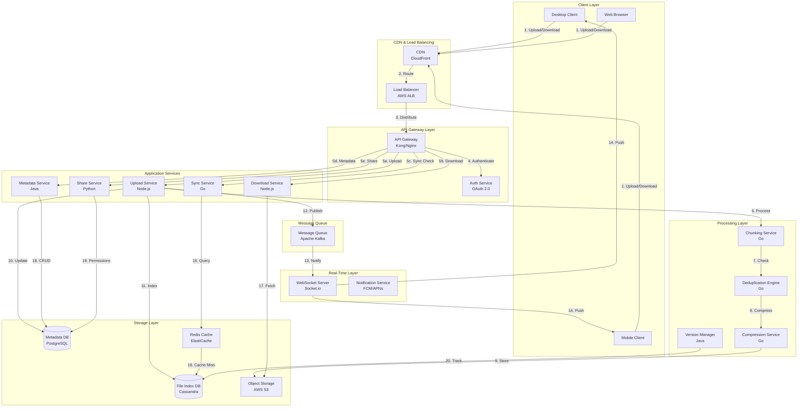

# File Storage Service System Design (Dropbox-like)

<!--
Purpose: Comprehensive system design for a cloud file storage and synchronization service
This document covers architecture, database design, API specifications, and deep-dive components
for building a scalable file storage service supporting 100M users and 100 PB of data.

Key Features:
- Real-time file synchronization across devices
- File sharing and collaboration
- Version history and conflict resolution
- Offline access support
- Efficient bandwidth usage with delta sync

Last Updated: October 2, 2025
-->

## Table of Contents

1. [Requirements & Clarification](#requirements--clarification)
2. [Back-of-the-Envelope Calculations](#back-of-the-envelope-calculations)
3. [High-Level Design](#high-level-design)
4. [Database Design](#database-design)
5. [API Design](#api-design)
6. [Deep-Dive Components](#deep-dive-components)
7. [Bottlenecks & Improvements](#bottlenecks--improvements)

---

## Requirements & Clarification

### User Stories

- **As a user**, I want to upload files to the cloud so that I can access them from any device
- **As a user**, I want my files to sync automatically across devices so that I always have the latest version
- **As a user**, I want to share files with others so that we can collaborate
- **As a user**, I want to access my files offline so that I can work without internet
- **As a user**, I want to restore previous versions so that I can recover from mistakes

### Functional Requirements

**Core Features (MVP):**

1. File upload and download
2. Automatic file synchronization across devices
3. File sharing with permission controls (view/edit)
4. Version history (30 days retention)
5. Offline file access
6. Folder organization
7. File search and metadata indexing
8. Conflict detection and resolution

**Out of Scope:**

- Real-time collaborative editing (like Google Docs)
- Advanced admin controls
- Mobile-specific features
- Desktop application development

### Non-Functional Requirements

| Requirement | Target | Justification |
|------------|--------|---------------|
| **Availability** | 99.9% uptime | Critical for user productivity |
| **Sync Latency** | < 1 second | Real-time experience |
| **Throughput** | 100K uploads/sec | Peak traffic handling |
| **Scalability** | 100M users, 100 PB | Growth capacity |
| **Consistency** | Eventually consistent | Balance between performance and correctness |
| **Durability** | 99.999999999% | Data loss prevention |
| **Security** | End-to-end encryption | Data privacy |

### Clarifying Questions & Assumptions

**Questions:**

- What is the average file size? **Assumption: 1 MB**
- What is the maximum file size? **Assumption: 5 GB**
- What is the read/write ratio? **Assumption: 1:1 (equal reads and writes)**
- How many devices per user? **Assumption: 3 devices**
- What is the file retention policy? **Assumption: Indefinite storage, 30 days version history**

**Assumptions:**

- 100M total users, 10M DAU (10% active daily)
- Each user stores 10 GB on average
- Geographic distribution: Global with concentration in US, EU, Asia
- Peak traffic is 3x average
- 70% of operations are sync, 20% upload, 10% download

---

## Back-of-the-Envelope Calculations

### Traffic Estimates

```text
Total Users: 100M
Daily Active Users (DAU): 10M (10% of total)
Devices per user: 3
Active devices: 30M

File Operations per User per Day:
- View/sync operations: 50
- Upload operations: 5
- Download operations: 5
- Total operations: 60

Total Daily Operations:
- Total: 10M users × 60 operations = 600M operations/day
- Operations Per Second (QPS): 600M / 86,400 = ~7,000 QPS
- Peak QPS: 7,000 × 3 = 21,000 QPS

Breakdown:
- Sync checks: 70% × 7,000 = 4,900 QPS (14,700 peak)
- Uploads: 20% × 7,000 = 1,400 QPS (4,200 peak)
- Downloads: 10% × 7,000 = 700 QPS (2,100 peak)
```

### Storage Estimates

```text
Average storage per user: 10 GB
Total Users: 100M

Base Storage:
- User data: 100M × 10 GB = 1,000 PB = 1 EB (exabyte)
- Note: Given requirement is 100 PB, adjusting assumptions

Adjusted Calculation (for 100 PB requirement):
- 100M users × 1 GB average = 100 PB
- OR 10M active users × 10 GB = 100 PB

Version History Storage (30 days):
- Assume 20% file change rate daily
- Changed data: 100 PB × 0.2 = 20 PB/day
- 30 days history: 20 PB × 30 = 600 PB
- With delta compression (10% size): 60 PB

Total Storage Needed:
- Primary storage: 100 PB
- Version history (compressed): 60 PB
- Replication (3x): (100 + 60) × 3 = 480 PB
- **Total: ~500 PB raw storage**

Metadata Storage:
- Files per user: 10,000 files
- Metadata per file: 1 KB
- Total files: 100M users × 10,000 = 1 trillion files
- Metadata: 1T × 1 KB = 1 PB
```

### Bandwidth Estimates

```text
Average file size: 1 MB

Upload Bandwidth:
- Upload QPS: 1,400 (average), 4,200 (peak)
- Bandwidth: 4,200 × 1 MB = 4.2 GB/s = 33.6 Gbps (peak)

Download Bandwidth:
- Download QPS: 700 (average), 2,100 (peak)
- Bandwidth: 2,100 × 1 MB = 2.1 GB/s = 16.8 Gbps (peak)

Sync Bandwidth (metadata only):
- Sync QPS: 4,900 (average), 14,700 (peak)
- Metadata size: 1 KB
- Bandwidth: 14,700 × 1 KB = 14.7 MB/s = 117 Mbps (peak)

Total Peak Bandwidth: ~50 Gbps
```

### Resource Estimates

```text
Concurrent Connections (peak):
- Active devices: 30M
- Simultaneous operations: 21,000 QPS
- Long-lived connections: 10M (for sync)

Server Pool Sizing:
- API servers: 500 (assuming 100 QPS per server)
- Sync workers: 200 (for real-time sync processing)
- Metadata DB: 50 read replicas + 10 masters
- Object storage: S3 (managed, unlimited)

Memory Requirements:
- Connection state: 10M × 10 KB = 100 GB
- Metadata cache: 50 GB (hot data)
- Total: ~200 GB distributed across servers
```

---

## High-Level Design

### System Architecture Diagram



### Data Flow Explanation

#### Upload Flow

1. **Client initiates upload** → File selected for upload
2. **File chunking** → Client splits file into 4 MB chunks
3. **Hash calculation** → Client calculates SHA-256 hash for each chunk
4. **Deduplication check** → Client queries server for existing chunks
5. **Upload new chunks** → Only new chunks are uploaded to S3
6. **Metadata update** → Server updates file metadata in database
7. **Version creation** → New version entry created
8. **Sync notification** → Other devices notified via WebSocket
9. **Cache invalidation** → Related cache entries invalidated

#### Sync Flow

1. **Client polls/subscribes** → Client maintains WebSocket connection
2. **Change detection** → Server detects file changes
3. **Delta calculation** → Server calculates what changed
4. **Notification sent** → Server pushes notification to client
5. **Client requests update** → Client fetches changed chunks
6. **Local update** → Client applies changes locally
7. **Acknowledgment** → Client confirms successful sync

#### Download Flow

1. **Client requests file** → User clicks to download
2. **Permission check** → Server validates access rights
3. **Metadata retrieval** → Server fetches file metadata
4. **Chunk list generation** → Server provides list of chunks
5. **Parallel download** → Client downloads chunks in parallel from S3
6. **Reassembly** → Client reassembles file from chunks
7. **Verification** → Client verifies file integrity with hash

---

## Database Design

### Metadata Database (PostgreSQL)

#### Users Table

```text
users
- user_id (PK, UUID)
- email (VARCHAR, UNIQUE, NOT NULL)
- username (VARCHAR, UNIQUE, NOT NULL)
- password_hash (VARCHAR, NOT NULL)
- storage_quota (BIGINT, DEFAULT 10GB)
- storage_used (BIGINT, DEFAULT 0)
- created_at (TIMESTAMP, NOT NULL)
- updated_at (TIMESTAMP, NOT NULL)
- last_login (TIMESTAMP)
- is_active (BOOLEAN, DEFAULT TRUE)

Indexes:
- PRIMARY KEY (user_id)
- UNIQUE INDEX idx_email (email)
- INDEX idx_username (username)
```

#### Files Table

```text
files
- file_id (PK, UUID)
- user_id (FK, UUID, NOT NULL)
- parent_folder_id (FK, UUID, NULL)
- file_name (VARCHAR(255), NOT NULL)
- file_path (TEXT, NOT NULL)
- file_size (BIGINT, NOT NULL)
- mime_type (VARCHAR(100))
- file_hash (VARCHAR(64), NOT NULL) -- SHA-256
- is_deleted (BOOLEAN, DEFAULT FALSE)
- created_at (TIMESTAMP, NOT NULL)
- updated_at (TIMESTAMP, NOT NULL)
- deleted_at (TIMESTAMP, NULL)

Indexes:
- PRIMARY KEY (file_id)
- INDEX idx_user_id (user_id)
- INDEX idx_parent_folder (parent_folder_id)
- INDEX idx_file_hash (file_hash) -- for deduplication
- INDEX idx_user_path (user_id, file_path) -- for path lookups
- INDEX idx_updated_at (updated_at) -- for sync queries
```

#### Folders Table

```text
folders
- folder_id (PK, UUID)
- user_id (FK, UUID, NOT NULL)
- parent_folder_id (FK, UUID, NULL)
- folder_name (VARCHAR(255), NOT NULL)
- folder_path (TEXT, NOT NULL)
- is_deleted (BOOLEAN, DEFAULT FALSE)
- created_at (TIMESTAMP, NOT NULL)
- updated_at (TIMESTAMP, NOT NULL)

Indexes:
- PRIMARY KEY (folder_id)
- INDEX idx_user_id (user_id)
- INDEX idx_parent_folder (parent_folder_id)
- INDEX idx_user_path (user_id, folder_path)
```

#### File Versions Table

```text
file_versions
- version_id (PK, UUID)
- file_id (FK, UUID, NOT NULL)
- version_number (INT, NOT NULL)
- file_size (BIGINT, NOT NULL)
- file_hash (VARCHAR(64), NOT NULL)
- chunk_ids (JSONB, NOT NULL) -- Array of chunk IDs
- created_by (FK, UUID, NOT NULL)
- created_at (TIMESTAMP, NOT NULL)
- is_current (BOOLEAN, DEFAULT FALSE)

Indexes:
- PRIMARY KEY (version_id)
- INDEX idx_file_id (file_id)
- INDEX idx_file_version (file_id, version_number)
- INDEX idx_created_at (created_at) -- for cleanup
- INDEX idx_is_current (file_id, is_current)
```

#### Shares Table

```text
shares
- share_id (PK, UUID)
- file_id (FK, UUID, NOT NULL)
- shared_by (FK, UUID, NOT NULL) -- user_id
- shared_with (FK, UUID, NULL) -- user_id, NULL for public
- permission (ENUM: 'view', 'edit', NOT NULL)
- share_token (VARCHAR(64), UNIQUE, NOT NULL)
- expires_at (TIMESTAMP, NULL)
- created_at (TIMESTAMP, NOT NULL)
- is_active (BOOLEAN, DEFAULT TRUE)

Indexes:
- PRIMARY KEY (share_id)
- INDEX idx_file_id (file_id)
- INDEX idx_shared_with (shared_with)
- UNIQUE INDEX idx_share_token (share_token)
- INDEX idx_expires_at (expires_at)
```

#### Devices Table

```text
devices
- device_id (PK, UUID)
- user_id (FK, UUID, NOT NULL)
- device_name (VARCHAR(255), NOT NULL)
- device_type (ENUM: 'desktop', 'mobile', 'web')
- os_info (VARCHAR(100))
- last_sync_at (TIMESTAMP)
- sync_token (VARCHAR(64), UNIQUE)
- is_active (BOOLEAN, DEFAULT TRUE)
- created_at (TIMESTAMP, NOT NULL)

Indexes:
- PRIMARY KEY (device_id)
- INDEX idx_user_id (user_id)
- INDEX idx_sync_token (sync_token)
- INDEX idx_last_sync (user_id, last_sync_at)
```

### File Index Database (Cassandra)

#### Chunks Table

```text
chunks (Cassandra)
- chunk_hash (PK, TEXT) -- SHA-256 hash
- chunk_size (INT)
- storage_path (TEXT) -- S3 key
- reference_count (COUNTER) -- How many files reference this chunk
- created_at (TIMESTAMP)
- last_accessed_at (TIMESTAMP)

Primary Key: (chunk_hash)
Purpose: Deduplication and chunk tracking
```

#### File Chunk Mapping Table

```text
file_chunks (Cassandra)
- file_id (PARTITION KEY, UUID)
- version_id (CLUSTERING KEY, UUID)
- chunk_sequence (CLUSTERING KEY, INT)
- chunk_hash (TEXT)
- chunk_offset (BIGINT)
- chunk_size (INT)

Primary Key: ((file_id), version_id, chunk_sequence)
Purpose: Fast retrieval of all chunks for a file version
```

#### Sync State Table

```text
sync_state (Cassandra)
- device_id (PARTITION KEY, UUID)
- file_id (CLUSTERING KEY, UUID)
- last_sync_version (INT)
- last_sync_hash (TEXT)
- last_sync_timestamp (TIMESTAMP)

Primary Key: ((device_id), file_id)
Purpose: Track sync state per device per file
```

### Cache Layer (Redis)

#### Cache Keys Structure

```text
user:{user_id}:files -- List of user's files metadata
user:{user_id}:quota -- User's storage quota info
file:{file_id}:metadata -- File metadata
file:{file_id}:chunks -- Chunk list for file
chunk:{chunk_hash}:exists -- Chunk existence check
device:{device_id}:sync_state -- Device sync state
share:{share_token}:info -- Share information

TTL Settings:
- File metadata: 1 hour
- Chunk existence: 24 hours
- Sync state: 5 minutes
- Share info: 1 hour
```

---

## API Design

### Base Configuration

```http
Base URL: https://api.filestorage.com/v1
Authentication: Bearer Token (JWT)
Content-Type: application/json
Rate Limiting: 
  - Free tier: 100 requests/minute
  - Premium tier: 1000 requests/minute
```

### Authentication Endpoints

#### Register User

```http
POST /auth/register
```

**Request:**

```json
{
  "email": "user@example.com",
  "username": "johndoe",
  "password": "SecurePass123!",
  "device_info": {
    "device_name": "John's MacBook",
    "device_type": "desktop",
    "os_info": "macOS 14.0"
  }
}
```

**Response (201 Created):**

```json
{
  "user_id": "550e8400-e29b-41d4-a716-446655440000",
  "email": "user@example.com",
  "username": "johndoe",
  "access_token": "eyJhbGciOiJIUzI1NiIsInR5cCI6IkpXVCJ9...",
  "refresh_token": "eyJhbGciOiJIUzI1NiIsInR5cCI6IkpXVCJ9...",
  "expires_in": 3600,
  "storage_quota": 10737418240
}
```

#### Login

```http
POST /auth/login
```

**Request:**

```json
{
  "email": "user@example.com",
  "password": "SecurePass123!",
  "device_info": {
    "device_name": "John's MacBook",
    "device_type": "desktop"
  }
}
```

**Response (200 OK):**

```json
{
  "access_token": "eyJhbGciOiJIUzI1NiIsInR5cCI6IkpXVCJ9...",
  "refresh_token": "eyJhbGciOiJIUzI1NiIsInR5cCI6IkpXVCJ9...",
  "expires_in": 3600,
  "device_id": "650e8400-e29b-41d4-a716-446655440000"
}
```

#### Refresh Token

```http
POST /auth/refresh
```

**Request:**

```json
{
  "refresh_token": "eyJhbGciOiJIUzI1NiIsInR5cCI6IkpXVCJ9..."
}
```

**Response (200 OK):**

```json
{
  "access_token": "eyJhbGciOiJIUzI1NiIsInR5cCI6IkpXVCJ9...",
  "expires_in": 3600
}
```

### File Operations

#### Initiate File Upload

```http
POST /files/upload/init
Authorization: Bearer {access_token}
```

**Request:**

```json
{
  "file_name": "presentation.pdf",
  "file_size": 5242880,
  "file_hash": "a3d5e7f9b2c4d6e8f0a1b3c5d7e9f1a3b5c7d9e1f3a5b7c9d1e3f5a7b9c1d3e5",
  "mime_type": "application/pdf",
  "parent_folder_id": "750e8400-e29b-41d4-a716-446655440000",
  "chunks": [
    {
      "chunk_index": 0,
      "chunk_hash": "b4e6f8a0c2d4e6f8a0b2c4d6e8f0a2b4c6d8e0f2a4b6c8d0e2f4a6b8c0d2e4f6",
      "chunk_size": 4194304
    },
    {
      "chunk_index": 1,
      "chunk_hash": "c5f7a9b1d3e5f7a9b1c3d5e7f9a1b3c5d7e9f1a3b5c7d9e1f3a5b7c9d1e3f5a7",
      "chunk_size": 1048576
    }
  ]
}
```

**Response (200 OK):**

```json
{
  "file_id": "850e8400-e29b-41d4-a716-446655440000",
  "version_id": "950e8400-e29b-41d4-a716-446655440000",
  "upload_urls": [
    {
      "chunk_index": 1,
      "chunk_hash": "c5f7a9b1d3e5f7a9b1c3d5e7f9a1b3c5d7e9f1a3b5c7d9e1f3a5b7c9d1e3f5a7",
      "upload_url": "https://s3.amazonaws.com/bucket/chunk?signature=...",
      "expires_at": "2025-10-02T10:30:00Z"
    }
  ],
  "existing_chunks": [0],
  "deduplication_saved": 4194304
}
```

#### Complete File Upload

```http
POST /files/upload/complete
Authorization: Bearer {access_token}
```

**Request:**

```json
{
  "file_id": "850e8400-e29b-41d4-a716-446655440000",
  "version_id": "950e8400-e29b-41d4-a716-446655440000",
  "uploaded_chunks": [
    {
      "chunk_index": 1,
      "chunk_hash": "c5f7a9b1d3e5f7a9b1c3d5e7f9a1b3c5d7e9f1a3b5c7d9e1f3a5b7c9d1e3f5a7",
      "etag": "33a64df551425fcc55e4d42a148795d9f25f89d4"
    }
  ]
}
```

**Response (200 OK):**

```json
{
  "file_id": "850e8400-e29b-41d4-a716-446655440000",
  "version_number": 1,
  "status": "completed",
  "file_url": "/files/850e8400-e29b-41d4-a716-446655440000"
}
```

#### Get File Metadata

```http
GET /files/{file_id}
Authorization: Bearer {access_token}
```

**Response (200 OK):**

```json
{
  "file_id": "850e8400-e29b-41d4-a716-446655440000",
  "file_name": "presentation.pdf",
  "file_size": 5242880,
  "file_hash": "a3d5e7f9b2c4d6e8f0a1b3c5d7e9f1a3b5c7d9e1f3a5b7c9d1e3f5a7b9c1d3e5",
  "mime_type": "application/pdf",
  "parent_folder_id": "750e8400-e29b-41d4-a716-446655440000",
  "current_version": 3,
  "created_at": "2025-09-15T10:30:00Z",
  "updated_at": "2025-10-01T14:20:00Z",
  "is_shared": true,
  "permissions": {
    "can_read": true,
    "can_write": true,
    "can_delete": true,
    "can_share": true
  }
}
```

#### Download File

```http
GET /files/{file_id}/download?version={version_number}
Authorization: Bearer {access_token}
```

**Query Parameters:**

- `version` (optional): Version number to download (default: latest)

**Response (200 OK):**

```json
{
  "file_id": "850e8400-e29b-41d4-a716-446655440000",
  "version_id": "950e8400-e29b-41d4-a716-446655440000",
  "file_name": "presentation.pdf",
  "file_size": 5242880,
  "chunks": [
    {
      "chunk_index": 0,
      "chunk_hash": "b4e6f8a0c2d4e6f8a0b2c4d6e8f0a2b4c6d8e0f2a4b6c8d0e2f4a6b8c0d2e4f6",
      "chunk_size": 4194304,
      "download_url": "https://s3.amazonaws.com/bucket/chunk?signature=...",
      "expires_at": "2025-10-02T10:45:00Z"
    },
    {
      "chunk_index": 1,
      "chunk_hash": "c5f7a9b1d3e5f7a9b1c3d5e7f9a1b3c5d7e9f1a3b5c7d9e1f3a5b7c9d1e3f5a7",
      "chunk_size": 1048576,
      "download_url": "https://s3.amazonaws.com/bucket/chunk?signature=...",
      "expires_at": "2025-10-02T10:45:00Z"
    }
  ]
}
```

#### List Files

```http
GET /files?folder_id={folder_id}&limit={limit}&cursor={cursor}
Authorization: Bearer {access_token}
```

**Query Parameters:**

- `folder_id` (optional): Folder ID to list files from (default: root)
- `limit` (optional): Number of results (default: 50, max: 200)
- `cursor` (optional): Pagination cursor

**Response (200 OK):**

```json
{
  "files": [
    {
      "file_id": "850e8400-e29b-41d4-a716-446655440000",
      "file_name": "presentation.pdf",
      "file_size": 5242880,
      "mime_type": "application/pdf",
      "updated_at": "2025-10-01T14:20:00Z",
      "is_folder": false
    },
    {
      "file_id": "760e8400-e29b-41d4-a716-446655440000",
      "file_name": "Documents",
      "updated_at": "2025-09-28T09:15:00Z",
      "is_folder": true
    }
  ],
  "cursor": "eyJsYXN0X2lkIjoiNzYwZTg0MDAiLCJvZmZzZXQiOjUwfQ==",
  "has_more": true
}
```

#### Delete File

```http
DELETE /files/{file_id}
Authorization: Bearer {access_token}
```

#### Response

- **Status:** 204 No Content

### Sync Operations

#### Get Sync Changes

```http
GET /sync/changes?since={timestamp}&device_id={device_id}
Authorization: Bearer {access_token}
```

**Query Parameters:**

- `since` (required): ISO 8601 timestamp of last sync
- `device_id` (required): Device identifier

**Response (200 OK):**

```json
{
  "changes": [
    {
      "change_type": "modified",
      "file_id": "850e8400-e29b-41d4-a716-446655440000",
      "file_name": "presentation.pdf",
      "file_path": "/Documents/presentation.pdf",
      "version_number": 3,
      "updated_at": "2025-10-01T14:20:00Z",
      "delta": {
        "has_delta": true,
        "base_version": 2,
        "changed_chunks": [1, 3, 5]
      }
    },
    {
      "change_type": "deleted",
      "file_id": "760e8400-e29b-41d4-a716-446655440000",
      "file_path": "/Documents/old_file.txt",
      "deleted_at": "2025-10-01T15:30:00Z"
    },
    {
      "change_type": "created",
      "file_id": "960e8400-e29b-41d4-a716-446655440000",
      "file_name": "new_document.docx",
      "file_path": "/Documents/new_document.docx",
      "version_number": 1,
      "created_at": "2025-10-02T08:00:00Z"
    }
  ],
  "sync_timestamp": "2025-10-02T10:00:00Z",
  "has_more": false
}
```

#### Report Sync Status

```http
POST /sync/status
Authorization: Bearer {access_token}
```

**Request:**

```json
{
  "device_id": "650e8400-e29b-41d4-a716-446655440000",
  "synced_files": [
    {
      "file_id": "850e8400-e29b-41d4-a716-446655440000",
      "version_number": 3,
      "sync_timestamp": "2025-10-02T10:05:00Z"
    }
  ]
}
```

**Response (200 OK):**

```json
{
  "status": "acknowledged",
  "next_sync_after": "2025-10-02T10:10:00Z"
}
```

#### Resolve Conflict

```http
POST /sync/conflicts/resolve
Authorization: Bearer {access_token}
```

**Request:**

```json
{
  "file_id": "850e8400-e29b-41d4-a716-446655440000",
  "resolution": "keep_server",
  "conflict_details": {
    "local_version": 2,
    "server_version": 3,
    "local_hash": "abc123...",
    "server_hash": "def456..."
  }
}
```

**Response (200 OK):**

```json
{
  "resolution_applied": "keep_server",
  "current_version": 3,
  "file_url": "/files/850e8400-e29b-41d4-a716-446655440000"
}
```

### Sharing Operations

#### Create Share Link

```http
POST /shares
Authorization: Bearer {access_token}
```

**Request:**

```json
{
  "file_id": "850e8400-e29b-41d4-a716-446655440000",
  "permission": "view",
  "expires_in_days": 7,
  "shared_with_email": "colleague@example.com"
}
```

**Response (201 Created):**

```json
{
  "share_id": "a50e8400-e29b-41d4-a716-446655440000",
  "share_token": "sh_8K7fN2mP9qR4tY6wX3vZ5cB1dE0gH",
  "share_url": "https://filestorage.com/s/sh_8K7fN2mP9qR4tY6wX3vZ5cB1dE0gH",
  "permission": "view",
  "expires_at": "2025-10-09T10:00:00Z",
  "created_at": "2025-10-02T10:00:00Z"
}
```

#### Get Shared File

```http
GET /shares/{share_token}
```

**Response (200 OK):**

```json
{
  "file_id": "850e8400-e29b-41d4-a716-446655440000",
  "file_name": "presentation.pdf",
  "file_size": 5242880,
  "mime_type": "application/pdf",
  "shared_by": "John Doe",
  "permission": "view",
  "expires_at": "2025-10-09T10:00:00Z",
  "download_url": "https://s3.amazonaws.com/bucket/file?signature=...",
  "preview_available": true
}
```

#### List Shares

```http
GET /shares?type={type}&limit={limit}&cursor={cursor}
Authorization: Bearer {access_token}
```

**Query Parameters:**

- `type` (optional): "shared_by_me" or "shared_with_me" (default: "shared_by_me")
- `limit` (optional): Number of results (default: 50)
- `cursor` (optional): Pagination cursor

**Response (200 OK):**

```json
{
  "shares": [
    {
      "share_id": "a50e8400-e29b-41d4-a716-446655440000",
      "file_id": "850e8400-e29b-41d4-a716-446655440000",
      "file_name": "presentation.pdf",
      "shared_with": "colleague@example.com",
      "permission": "view",
      "created_at": "2025-10-02T10:00:00Z",
      "expires_at": "2025-10-09T10:00:00Z"
    }
  ],
  "cursor": "eyJsYXN0X2lkIjoiYTUwZTg0MDAifQ==",
  "has_more": false
}
```

#### Revoke Share

```http
DELETE /shares/{share_id}
Authorization: Bearer {access_token}
```

#### Response

- **Status:** 204 No Content

### Version History

#### List File Versions

```http
GET /files/{file_id}/versions?limit={limit}&cursor={cursor}
Authorization: Bearer {access_token}
```

**Response (200 OK):**

```json
{
  "file_id": "850e8400-e29b-41d4-a716-446655440000",
  "versions": [
    {
      "version_id": "950e8400-e29b-41d4-a716-446655440000",
      "version_number": 3,
      "file_size": 5242880,
      "created_by": "John Doe",
      "created_at": "2025-10-01T14:20:00Z",
      "is_current": true
    },
    {
      "version_id": "940e8400-e29b-41d4-a716-446655440000",
      "version_number": 2,
      "file_size": 5240000,
      "created_by": "John Doe",
      "created_at": "2025-09-28T09:15:00Z",
      "is_current": false
    }
  ],
  "cursor": null,
  "has_more": false
}
```

#### Restore File Version

```http
POST /files/{file_id}/versions/{version_id}/restore
Authorization: Bearer {access_token}
```

**Response (200 OK):**

```json
{
  "file_id": "850e8400-e29b-41d4-a716-446655440000",
  "restored_version": 2,
  "new_version_number": 4,
  "message": "Version 2 restored as version 4"
}
```

### API Cross-Cutting Concerns

#### Rate Limiting

```text
Rate limits are applied per user per endpoint type:
- Authentication: 10 requests/minute
- Upload operations: 100 requests/minute
- Download operations: 200 requests/minute
- Sync operations: 300 requests/minute
- Metadata operations: 500 requests/minute

Response headers:
- X-RateLimit-Limit: 100
- X-RateLimit-Remaining: 87
- X-RateLimit-Reset: 1696244400

Rate limit exceeded response (429 Too Many Requests):
{
  "error": "rate_limit_exceeded",
  "message": "Rate limit exceeded. Try again in 45 seconds.",
  "retry_after": 45
}
```

#### Error Response Format

```json
{
  "error": "error_code",
  "message": "Human-readable error message",
  "details": {
    "field": "Additional context"
  },
  "request_id": "req_8K7fN2mP9qR4tY6wX3vZ"
}
```

**Common Error Codes:**

- `400 Bad Request` - Invalid input
- `401 Unauthorized` - Missing or invalid authentication
- `403 Forbidden` - Insufficient permissions
- `404 Not Found` - Resource not found
- `409 Conflict` - Resource conflict (e.g., file already exists)
- `413 Payload Too Large` - File size exceeds limit
- `429 Too Many Requests` - Rate limit exceeded
- `500 Internal Server Error` - Server error
- `503 Service Unavailable` - Service temporarily unavailable

#### Pagination

```text
Strategy: Cursor-based pagination for consistent results

Query parameters:
- limit: Number of results (default: 50, max: 200)
- cursor: Opaque cursor token from previous response

Response structure:
{
  "data": [...],
  "cursor": "base64_encoded_cursor",
  "has_more": true
}
```

---

## Deep-Dive Components

### 1. File Chunking and Deduplication

#### Purpose

Reduce storage costs and bandwidth usage by splitting files into chunks and eliminating duplicate data across the system.

#### Architecture

**Chunking Strategy:**

```text
Fixed-size chunking: 4 MB chunks
- Pros: Simple, predictable, good for random access
- Cons: Less efficient deduplication for modified files

Content-defined chunking (CDC): Variable size (avg 4 MB)
- Pros: Better deduplication on modified files
- Cons: More complex, higher CPU usage

Chosen: Fixed-size chunking for MVP
- Simpler implementation
- Good enough deduplication
- Better performance
```

#### Deduplication Process

1. **Client-side chunking**: Client splits file into 4 MB chunks
2. **Hash calculation**: Calculate SHA-256 hash for each chunk
3. **Dedup lookup**: Query server for existing chunk hashes
4. **Selective upload**: Upload only chunks that don't exist
5. **Reference counting**: Increment reference count for existing chunks
6. **Storage optimization**: Single physical copy, multiple logical references

#### Implementation Details

```python
# Chunking algorithm (client-side)
def chunk_file(file_path, chunk_size=4*1024*1024):
    """
    Split a file into fixed-size chunks and calculate hashes.
    
    Args:
        file_path: Path to the file to chunk
        chunk_size: Size of each chunk in bytes (default: 4MB)
    
    Returns:
        List of tuples: [(chunk_index, chunk_hash, chunk_data), ...]
    """
    chunks = []
    with open(file_path, 'rb') as f:
        index = 0
        while True:
            chunk_data = f.read(chunk_size)
            if not chunk_data:
                break
            chunk_hash = hashlib.sha256(chunk_data).hexdigest()
            chunks.append((index, chunk_hash, chunk_data))
            index += 1
    return chunks

# Deduplication check (server-side)
def check_existing_chunks(chunk_hashes):
    """
    Check which chunks already exist in the system.
    
    Args:
        chunk_hashes: List of SHA-256 hashes
    
    Returns:
        Dict mapping chunk_hash to existence status
    """
    # Check Redis cache first
    existing_chunks = {}
    pipeline = redis_client.pipeline()
    
    for chunk_hash in chunk_hashes:
        pipeline.exists(f"chunk:{chunk_hash}:exists")
    
    cache_results = pipeline.execute()
    
    for chunk_hash, exists in zip(chunk_hashes, cache_results):
        if exists:
            existing_chunks[chunk_hash] = True
        else:
            # Check Cassandra for cache misses
            result = cassandra_session.execute(
                "SELECT chunk_hash FROM chunks WHERE chunk_hash = %s",
                (chunk_hash,)
            )
            existing_chunks[chunk_hash] = result.one() is not None
            
            # Update cache
            if existing_chunks[chunk_hash]:
                redis_client.setex(
                    f"chunk:{chunk_hash}:exists",
                    86400,  # 24 hours
                    1
                )
    
    return existing_chunks
```

#### Storage Savings

```text
Example scenario:
- 100M users each store 10 GB
- Total raw data: 1 EB
- Average deduplication ratio: 30%
- Storage saved: 300 PB
- Final storage: 700 PB

Common deduplication scenarios:
- System files across users: 80-90% dedup
- Documents with minor edits: 20-40% dedup
- Media files: 5-10% dedup (mostly unique)
```

### 2. Delta Sync Algorithm

#### Purpose

Minimize bandwidth usage by transferring only the changed portions of files rather than entire files.

#### Delta Sync Process

##### Change Detection

1. **File modification detected**: File watcher or periodic scan
2. **Calculate new chunks**: Split modified file into chunks
3. **Compare with previous version**: Identify changed, added, deleted chunks
4. **Create delta**: List of chunk operations (add, remove, replace)
5. **Transfer delta**: Send only changed chunks to server
6. **Apply delta**: Server updates file metadata with new chunk list

##### Algorithm

```python
def calculate_delta(old_chunks, new_chunks):
    """
    Calculate the delta between two versions of a file.
    
    Args:
        old_chunks: List of (index, hash) from previous version
        new_chunks: List of (index, hash) from new version
    
    Returns:
        Delta object with operations to transform old to new
    """
    old_hash_map = {chunk_hash: idx for idx, chunk_hash in old_chunks}
    new_hash_map = {chunk_hash: idx for idx, chunk_hash in new_chunks}
    
    delta = {
        'removed_chunks': [],
        'added_chunks': [],
        'unchanged_chunks': []
    }
    
    # Find removed chunks
    for chunk_hash in old_hash_map:
        if chunk_hash not in new_hash_map:
            delta['removed_chunks'].append(chunk_hash)
    
    # Find added and unchanged chunks
    for idx, chunk_hash in new_chunks:
        if chunk_hash in old_hash_map:
            delta['unchanged_chunks'].append({
                'chunk_hash': chunk_hash,
                'new_index': idx
            })
        else:
            delta['added_chunks'].append({
                'chunk_hash': chunk_hash,
                'index': idx,
                'needs_upload': True
            })
    
    return delta
```

##### Bandwidth Savings

```text
Scenario: 100 MB file with 1% modified
- Without delta: 100 MB transfer
- With delta: ~1 MB transfer + metadata overhead
- Bandwidth saved: 99%

Typical modifications:
- Document edits: 1-5% of file
- Code changes: 2-10% of file
- Binary files: Varies widely
```

##### Delta Compression

```python
# Apply additional compression to delta
def compress_delta(delta):
    """
    Compress delta data before transmission.
    
    Args:
        delta: Delta object
    
    Returns:
        Compressed delta bytes
    """
    import zlib
    import json
    
    delta_json = json.dumps(delta)
    compressed = zlib.compress(delta_json.encode())
    
    compression_ratio = len(compressed) / len(delta_json)
    return compressed, compression_ratio
```

### 3. Metadata Storage and Indexing

#### Purpose

Enable fast file lookups, searches, and directory traversals for 1 trillion files.

#### Metadata Architecture

##### Two-Tier Approach

1. **PostgreSQL (Hot metadata)**: Recent/active files, user-facing queries
2. **Cassandra (Cold metadata)**: Historical data, chunk mappings, device sync state

##### Indexing Strategy

```text
PostgreSQL Indexes:
1. Primary indexes on IDs (user_id, file_id, etc.)
2. Path-based index: B-tree on (user_id, file_path)
   - Enables fast directory listing
   - Supports prefix searches
3. Temporal index: B-tree on updated_at
   - Fast sync queries (get changes since timestamp)
4. Hash index: B-tree on file_hash
   - Fast deduplication checks
5. Full-text search: GIN index on file_name
   - Fast file name searches

Cassandra Partition Strategy:
1. Chunks table: Partition by chunk_hash
   - Fast chunk lookup
   - Even distribution
2. File_chunks table: Partition by file_id
   - Fast retrieval of all chunks for a file
3. Sync_state table: Partition by device_id
   - Fast per-device sync state lookup
```

##### Search Optimization

```sql
-- Fast directory listing
SELECT file_id, file_name, file_size, updated_at
FROM files
WHERE user_id = ? 
  AND parent_folder_id = ?
  AND is_deleted = FALSE
ORDER BY file_name
LIMIT 100;

-- Fast sync query (changes since timestamp)
SELECT file_id, file_name, file_path, updated_at
FROM files
WHERE user_id = ?
  AND updated_at > ?
ORDER BY updated_at
LIMIT 1000;

-- Fast file search by name
SELECT file_id, file_name, file_path
FROM files
WHERE user_id = ?
  AND file_name ILIKE ?
  AND is_deleted = FALSE
LIMIT 50;
```

##### Caching Strategy

```text
Redis cache layers:
1. User file list: Cache user's root directory (TTL: 1 hour)
2. File metadata: Cache individual file metadata (TTL: 1 hour)
3. Chunk existence: Cache chunk dedup lookups (TTL: 24 hours)
4. Sync state: Cache device sync cursors (TTL: 5 minutes)

Cache invalidation:
- On file upload/modify: Invalidate file metadata + parent folder list
- On file delete: Invalidate file metadata + parent folder list
- On chunk upload: Set chunk existence cache
- On sync: Update sync state cache

Write-through caching for critical paths:
- File metadata updates write to both DB and cache
- Ensures cache consistency
```

### 4. Conflict Detection and Resolution

#### Purpose

Handle scenarios where the same file is modified on multiple devices simultaneously.

#### Conflict Scenarios

##### Common Scenarios

```text
Scenario 1: Simultaneous edits
- Device A modifies file at t1, syncs at t2
- Device B modifies same file at t1, syncs at t3
- Server detects conflict: same base version, different hashes

Scenario 2: Offline modifications
- Device A goes offline, makes changes
- Device B makes changes, syncs successfully
- Device A comes online, attempts to sync
- Server detects conflict: Device A has stale base version

Scenario 3: Network partition
- Sync service fails during upload
- Client retries with different version
- Server must reconcile partial state
```

#### Conflict Detection Algorithm

```python
def detect_conflict(file_id, device_id, client_version, client_hash):
    """
    Detect if an incoming file update conflicts with server state.
    
    Args:
        file_id: File identifier
        device_id: Device identifier
        client_version: Version number client has
        client_hash: Hash of client's file
    
    Returns:
        Conflict object or None
    """
    # Get current server state
    server_file = db.query(
        "SELECT current_version, file_hash FROM files WHERE file_id = ?",
        file_id
    )
    
    # Get device's last known sync state
    device_sync = db.query(
        "SELECT last_sync_version FROM sync_state WHERE device_id = ? AND file_id = ?",
        device_id, file_id
    )
    
    # No conflict if hashes match
    if client_hash == server_file.file_hash:
        return None
    
    # Conflict if client is behind and has different content
    if client_version < server_file.current_version:
        return {
            'conflict_type': 'version_mismatch',
            'client_version': client_version,
            'server_version': server_file.current_version,
            'client_hash': client_hash,
            'server_hash': server_file.file_hash
        }
    
    # Conflict if device's last sync doesn't match client's base
    if device_sync and device_sync.last_sync_version != client_version:
        return {
            'conflict_type': 'sync_state_mismatch',
            'expected_version': device_sync.last_sync_version,
            'client_version': client_version
        }
    
    return None
```

#### Conflict Resolution Strategies

##### 1. Last-Write-Wins (LWW)

```text
- Use server timestamp to determine winner
- Simpler to implement
- Risk of data loss
- Good for: Low-value files, preview images
```

##### 2. Three-Way Merge

```text
- Compare: base version, version A, version B
- Identify non-overlapping changes
- Merge automatically if possible
- Good for: Text files, code files
```

##### 3. User Resolution

```text
- Present both versions to user
- User chooses: keep mine, keep theirs, or merge manually
- Create "conflicted copy" file
- Good for: Important documents, binary files
```

##### 4. Operational Transform (OT)

```text
- Track individual operations (insert, delete, move)
- Transform operations to account for concurrent changes
- Complex but powerful
- Good for: Collaborative editing
```

##### Implementation (User Resolution)

```python
def resolve_conflict_user_choice(file_id, resolution_choice, user_id):
    """
    Resolve conflict based on user's choice.
    
    Args:
        file_id: File identifier
        resolution_choice: 'keep_local', 'keep_server', or 'keep_both'
        user_id: User making the decision
    
    Returns:
        Resolution result
    """
    if resolution_choice == 'keep_local':
        # Upload local version as new version
        new_version = create_new_version(file_id, user_id)
        return {'status': 'resolved', 'version': new_version}
    
    elif resolution_choice == 'keep_server':
        # Download server version to replace local
        server_version = get_current_version(file_id)
        return {'status': 'resolved', 'version': server_version}
    
    elif resolution_choice == 'keep_both':
        # Create conflicted copy
        original_file = get_file(file_id)
        conflict_copy_name = f"{original_file.name} (conflicted copy from {user_id})"
        
        # Upload local version as new file
        conflict_file_id = create_file(conflict_copy_name, user_id)
        
        return {
            'status': 'resolved',
            'original_file_id': file_id,
            'conflict_file_id': conflict_file_id
        }
```

### 5. Object Storage (S3) Integration

#### Purpose

Store file chunks durably and cost-effectively at massive scale.

#### S3 Architecture

##### Bucket Structure

```text
Bucket: filestorage-chunks-{region}
├── chunks/
│   ├── {chunk_hash[0:2]}/        # First 2 chars for sharding
│   │   ├── {chunk_hash[2:4]}/    # Next 2 chars for sharding
│   │   │   └── {chunk_hash}      # Full hash as object key
│   │   │       Example: chunks/a3/d5/a3d5e7f9b2c4d6e8...
│
├── versions/
│   ├── {file_id}/
│   │   ├── v1/
│   │   ├── v2/
│   │   └── metadata.json

Storage Classes:
- Hot data (0-30 days): S3 Standard
- Warm data (30-90 days): S3 Infrequent Access
- Cold data (90+ days): S3 Glacier
- Archive data (1+ years): S3 Glacier Deep Archive
```

##### Lifecycle Policies

```yaml
- Transition to S3-IA after 30 days
- Transition to Glacier after 90 days
- Transition to Glacier Deep Archive after 365 days
- Delete unreferenced chunks after 30 days (grace period)
```

##### Upload Optimization

```python
def upload_chunk_to_s3(chunk_hash, chunk_data):
    """
    Upload a file chunk to S3 with optimizations.
    
    Args:
        chunk_hash: SHA-256 hash of the chunk
        chunk_data: Byte data of the chunk
    
    Returns:
        S3 object key and etag
    """
    import boto3
    from botocore.config import Config
    
    # S3 client with retry config
    config = Config(
        retries={'max_attempts': 3, 'mode': 'adaptive'},
        max_pool_connections=50
    )
    s3_client = boto3.client('s3', config=config)
    
    # Generate S3 key with sharding
    s3_key = f"chunks/{chunk_hash[0:2]}/{chunk_hash[2:4]}/{chunk_hash}"
    bucket = "filestorage-chunks-us-east-1"
    
    # Upload with server-side encryption
    response = s3_client.put_object(
        Bucket=bucket,
        Key=s3_key,
        Body=chunk_data,
        ServerSideEncryption='AES256',
        StorageClass='STANDARD',
        Metadata={
            'chunk-hash': chunk_hash,
            'upload-timestamp': str(time.time())
        }
    )
    
    return {
        's3_key': s3_key,
        'etag': response['ETag'],
        'version_id': response.get('VersionId')
    }
```

##### Presigned URLs

```python
def generate_presigned_url(chunk_hash, operation='get', expires_in=3600):
    """
    Generate presigned URL for client-side S3 access.
    
    Args:
        chunk_hash: Chunk identifier
        operation: 'get' for download, 'put' for upload
        expires_in: URL expiration in seconds (default: 1 hour)
    
    Returns:
        Presigned URL
    """
    s3_client = boto3.client('s3')
    s3_key = f"chunks/{chunk_hash[0:2]}/{chunk_hash[2:4]}/{chunk_hash}"
    bucket = "filestorage-chunks-us-east-1"
    
    if operation == 'get':
        url = s3_client.generate_presigned_url(
            'get_object',
            Params={'Bucket': bucket, 'Key': s3_key},
            ExpiresIn=expires_in
        )
    elif operation == 'put':
        url = s3_client.generate_presigned_url(
            'put_object',
            Params={
                'Bucket': bucket,
                'Key': s3_key,
                'ServerSideEncryption': 'AES256'
            },
            ExpiresIn=expires_in
        )
    
    return url
```

##### Cost Optimization

```text
S3 Costs (example for 100 PB):
- Storage: $2,300,000/month (S3 Standard at $0.023/GB)
- Requests: $500,000/month (assuming 100M PUT/GET per day)
- Data transfer: $900,000/month (assuming 10 TB/day egress)
- Total: ~$3.7M/month

Optimization strategies:
1. Intelligent-Tiering: Automatic cost optimization (-30%)
2. S3-IA for old files: Move after 30 days (-50% on old data)
3. CloudFront CDN: Reduce egress costs (-40% on transfers)
4. Multipart upload: Faster uploads, lower failure rate
5. S3 Transfer Acceleration: Faster uploads for distant regions

Optimized cost: ~$2M/month (-45% savings)
```

### 6. Client-Side Encryption

#### Purpose

Ensure end-to-end privacy by encrypting files on the client before upload.

#### Encryption Architecture

##### Key Management

```text
Master Key Hierarchy:
1. User Master Key (UMK): Generated from user password + salt
2. Account Master Key (AMK): Random 256-bit key, encrypted with UMK
3. File Encryption Keys (FEK): Unique per file, encrypted with AMK
4. Chunk Encryption Keys: Derived from FEK + chunk index

Key Storage:
- UMK: Never stored, derived from password on login
- AMK (encrypted): Stored in database
- FEK (encrypted): Stored in file metadata
- Chunk keys: Derived on-the-fly
```

##### Encryption Process

```python
def encrypt_file_chunk(chunk_data, file_key, chunk_index):
    """
    Encrypt a file chunk using AES-256-GCM.
    
    Args:
        chunk_data: Raw chunk bytes
        file_key: File encryption key (256-bit)
        chunk_index: Chunk sequence number
    
    Returns:
        Encrypted chunk with authentication tag
    """
    from cryptography.hazmat.primitives.ciphers import Cipher, algorithms, modes
    from cryptography.hazmat.backends import default_backend
    import os
    
    # Derive chunk-specific key using HKDF
    from cryptography.hazmat.primitives import hashes
    from cryptography.hazmat.primitives.kdf.hkdf import HKDF
    
    info = f"chunk-{chunk_index}".encode()
    chunk_key = HKDF(
        algorithm=hashes.SHA256(),
        length=32,
        salt=None,
        info=info,
        backend=default_backend()
    ).derive(file_key)
    
    # Generate random IV (12 bytes for GCM)
    iv = os.urandom(12)
    
    # Encrypt with AES-256-GCM
    cipher = Cipher(
        algorithms.AES(chunk_key),
        modes.GCM(iv),
        backend=default_backend()
    )
    encryptor = cipher.encryptor()
    
    # Encrypt and get authentication tag
    ciphertext = encryptor.update(chunk_data) + encryptor.finalize()
    auth_tag = encryptor.tag
    
    # Return IV + ciphertext + tag
    return iv + ciphertext + auth_tag
```

##### Key Sharing

```text
For file sharing:
1. Encrypt FEK with recipient's public key
2. Store encrypted FEK in shares table
3. Recipient decrypts FEK with their private key
4. Recipient can now decrypt file chunks

Public Key Infrastructure:
- Each user has RSA-2048 key pair
- Public keys stored in database
- Private keys encrypted with UMK on client
```

##### Zero-Knowledge Architecture

```text
Server never sees:
- User passwords (only bcrypt hash)
- Unencrypted Master Keys
- File Encryption Keys (plaintext)
- File contents (plaintext)

Server can:
- Authenticate users (password hash)
- Store encrypted data
- Facilitate key exchange for sharing
- Enable deduplication (on ciphertext hashes)

Trade-off: Cannot do server-side search on content
```

### 7. Collaborative Editing

#### Purpose

Enable multiple users to edit shared files simultaneously with real-time sync.

#### Operational Transformation (OT)

##### Basic Concept

```text
Two users editing simultaneously:
- User A: Insert "X" at position 5
- User B: Insert "Y" at position 10

Without OT: Conflicts and inconsistent state
With OT: Transform operations based on concurrent changes
Result: Both operations applied consistently

Example:
Initial: "Hello World"
A inserts "X" at 5: "HelloX World"
B inserts "Y" at 10: "Hello WorldY"

OT transforms B's operation to position 11 (accounting for A's insert)
Final consistent state: "HelloX WorldY"
```

##### Implementation

```python
def transform_operations(op1, op2):
    """
    Transform two concurrent operations using Operational Transformation.
    
    Args:
        op1: First operation {'type': 'insert'/'delete', 'pos': int, 'text': str}
        op2: Second operation
    
    Returns:
        Tuple of (transformed_op1, transformed_op2)
    """
    # Insert vs Insert
    if op1['type'] == 'insert' and op2['type'] == 'insert':
        if op1['pos'] < op2['pos']:
            return op1, {'type': 'insert', 'pos': op2['pos'] + len(op1['text']), 'text': op2['text']}
        elif op1['pos'] > op2['pos']:
            return {'type': 'insert', 'pos': op1['pos'] + len(op2['text']), 'text': op1['text']}, op2
        else:  # Same position
            # Tie-breaker: user ID or timestamp
            return op1, {'type': 'insert', 'pos': op2['pos'] + len(op1['text']), 'text': op2['text']}
    
    # Insert vs Delete
    elif op1['type'] == 'insert' and op2['type'] == 'delete':
        if op1['pos'] <= op2['pos']:
            return op1, {'type': 'delete', 'pos': op2['pos'] + len(op1['text']), 'length': op2['length']}
        else:
            return {'type': 'insert', 'pos': op1['pos'] - op2['length'], 'text': op1['text']}, op2
    
    # Similar logic for other combinations...
    return op1, op2
```

##### Real-Time Sync

```text
WebSocket-based collaboration:
1. User joins document → Subscribe to document channel
2. User makes edit → Send operation to server
3. Server broadcasts → Send to all connected clients
4. Clients apply OT → Transform and apply operation
5. Server persists → Save operation to database

State synchronization:
- Each client maintains operation log
- Server maintains authoritative operation history
- Clients periodically checkpoint to catch up
```

##### Conflict-Free Replicated Data Types (CRDT) Alternative

```text
CRDT approach (alternative to OT):
- Each character has unique identifier
- Operations are commutative (order doesn't matter)
- Eventually consistent without transformation

CRDT vs OT Trade-offs:
- CRDT: Simpler, more robust, but higher overhead
- OT: More efficient, but complex transformation logic

Chosen: OT for text files (better performance)
         CRDT for future consideration (simpler model)
```

---

## Bottlenecks & Improvements

### Potential Bottlenecks

#### 1. Metadata Database Write Contention

##### Problem

- High write load during peak sync times
- Single master database becomes bottleneck
- Concurrent updates to same file cause lock contention

##### Solution

```text
1. Read replicas (already implemented)
   - Route reads to replicas
   - Scale reads horizontally

2. Write sharding
   - Shard by user_id (consistent hashing)
   - Distribute writes across multiple masters
   - Each shard handles subset of users

3. Async writes for non-critical updates
   - Queue low-priority updates (last_accessed_at)
   - Batch process during off-peak

4. Optimistic locking
   - Use version numbers for conflict detection
   - Retry failed writes with exponential backoff
```

##### Monitoring

- Track database write QPS
- Monitor replication lag
- Alert on lock wait time > 100ms
- Track transaction rollback rate

#### 2. Real-Time Sync Scalability

##### Problem

- 10M+ concurrent WebSocket connections
- Memory overhead: 10M × 10 KB = 100 GB
- CPU overhead for connection management

##### Solution

```text
1. Horizontal scaling of WebSocket servers
   - Use AWS ELB with sticky sessions
   - Scale to 100+ servers (100K connections each)

2. Redis Pub/Sub for fanout
   - WS servers subscribe to Redis channels
   - Central sync service publishes to channels
   - Decouples sync logic from connection management

3. Connection pooling and multiplexing
   - Group multiple devices per connection
   - Use HTTP/2 or WebSocket subprotocols

4. Fallback to polling for inactive devices
   - WebSocket for active devices
   - Long polling for less active devices
   - Reduce connection count by 70%
```

##### Monitoring

- Track active WebSocket connections per server
- Monitor message latency (target: < 100ms)
- Alert on connection drop rate > 5%
- Track memory usage per server

#### 3. S3 Request Throttling

##### Problem

- S3 has default limit: 3,500 PUT/5,500 GET per second per prefix
- Our peak: 4,200 PUT + 2,100 GET = 6,300 requests/second
- Risk of throttling errors (503 SlowDown)

##### Solution

```text
1. Prefix sharding (already implemented)
   - Use {chunk_hash[0:2]}/{chunk_hash[2:4]}/ structure
   - Distributes across 256 × 256 = 65,536 prefixes
   - Effective limit: 65K × 5,500 = 357M GET/second

2. S3 Transfer Acceleration
   - Route uploads through CloudFront edge locations
   - Reduces latency and improves throughput

3. Request retry with exponential backoff
   - Automatically retry 503 errors
   - Implement jitter to avoid thundering herd

4. CloudFront CDN for reads
   - Cache hot chunks at edge locations
   - Reduce S3 GET requests by 80%
```

##### Monitoring

- Track S3 request rate per prefix
- Monitor 503 error rate
- Alert on throttling errors > 1%
- Track CloudFront cache hit rate (target: > 80%)

#### 4. Network Bandwidth Limits

##### Problem

- Peak bandwidth: 50 Gbps
- Cost: $0.09/GB egress = $405K/month for 10 TB/day
- Geographic latency for distant users

##### Solution

```text
1. CloudFront CDN (implemented)
   - Cache chunks at 300+ edge locations
   - Reduce origin egress by 80%
   - Lower latency for global users

2. Regional S3 buckets
   - Deploy buckets in US, EU, Asia
   - Route uploads to nearest region
   - Reduce cross-region transfer costs

3. Client-side compression
   - Compress chunks before upload
   - Typical compression: 50% for text, 10% for media
   - Reduce bandwidth by 30% average

4. Delta sync (implemented)
   - Only transfer changed chunks
   - Reduce bandwidth by 90% for modifications
```

##### Monitoring

- Track bandwidth usage per region
- Monitor CDN cache hit rate
- Alert on egress costs > budget
- Track average transfer latency

### Scalability Improvements

#### Geographic Distribution

```text
Multi-region deployment:
1. S3 buckets in US-East, US-West, EU-West, AP-Southeast
2. Regional metadata databases with replication
3. CloudFront for global CDN
4. Route 53 for geo-routing

Benefits:
- Lower latency (< 100ms for 95% of users)
- Higher availability (regional failover)
- Compliance with data residency laws
- Reduced bandwidth costs

Implementation:
- User's primary region determined by signup location
- Files stored in primary region + replicated to other regions
- Reads served from nearest region
- Writes go to primary region
```

#### Auto-Scaling

```text
Auto-scaling configuration:
1. API servers: Scale on CPU > 70% or QPS > 10K per instance
2. Sync workers: Scale on queue depth > 10K messages
3. WebSocket servers: Scale on connection count > 80K per instance
4. Database read replicas: Scale on CPU > 60%

Scaling metrics:
- Scale up: Add instances when metric > threshold for 5 minutes
- Scale down: Remove instances when metric < 50% threshold for 15 minutes
- Min instances: 10 per service (high availability)
- Max instances: 1000 per service (cost protection)

Benefits:
- Handle traffic spikes automatically
- Reduce costs during low traffic
- Maintain performance SLAs
```

#### Caching Enhancements

```text
Additional cache layers:
1. Browser cache (client-side)
   - Cache file thumbnails and metadata
   - Reduce API calls by 50%

2. API Gateway cache
   - Cache GET responses for 60 seconds
   - Reduce backend load by 30%

3. Database query cache
   - Cache common queries (user's file list)
   - Reduce DB load by 40%

4. Distributed cache (Redis Cluster)
   - Partition cache across nodes
   - Scale cache capacity to 1 TB

Invalidation strategy:
- Write-through for critical data
- TTL-based for non-critical data
- Event-driven invalidation for real-time updates
```

### Monitoring and Observability

#### Metrics to Track

##### System Metrics

```text
Request latency (p50, p95, p99): Target < 100ms, < 500ms, < 1s
Error rate: Target < 0.1%
Throughput: Track QPS per service
Availability: Target 99.9% uptime
```

##### Business Metrics

```text
- Daily Active Users (DAU)
- Files uploaded/downloaded per day
- Storage used per user
- Sync latency (target: < 1 second)

CPU usage per service
Memory usage per service
Disk I/O (database)
Network bandwidth
S3 request rate and error rate
```

##### User Experience Metrics

```text
- Upload success rate (target: > 99%)
- Sync completion time (target: < 5 seconds)
- Search result latency (target: < 200ms)
- Conflict rate (target: < 1% of syncs)
```

#### Alerting Strategy

```text
Critical Alerts (Page on-call):
- Service down (availability < 99%)
- Error rate > 1%
- Database master down
- S3 throttling errors > 5%

Warning Alerts (Slack notification):
- Latency p99 > 2 seconds
- Queue depth > 50K messages
- Disk usage > 80%
- Cache hit rate < 60%

Info Alerts (Dashboard):
- DAU growth > 20% week-over-week
- Storage usage > 80% of quota
- Unusual traffic patterns
```

#### Logging and Tracing

```text
Structured logging:
- Use JSON format for all logs
- Include: timestamp, request_id, user_id, service, level, message
- Centralize in ELK stack (Elasticsearch, Logstash, Kibana)

Distributed tracing:
- Use Jaeger or AWS X-Ray
- Trace requests across services
- Identify bottlenecks in request flow

Log levels:
- DEBUG: Detailed diagnostic information
- INFO: General informational messages
- WARN: Warning messages (degraded performance)
- ERROR: Error messages (request failed)
- FATAL: Critical errors (service down)

Retention:
- Keep logs for 30 days (hot storage)
- Archive logs for 1 year (cold storage)
- Sample DEBUG logs (10% sampling to reduce cost)
```

### Security Considerations

#### Data Protection

##### Encryption

```text
1. At rest: AES-256 encryption for S3 and databases
2. In transit: TLS 1.3 for all API calls
3. Client-side: End-to-end encryption for sensitive files
```

##### Access Control

```text
1. Authentication: JWT tokens with 1-hour expiration
2. Authorization: Role-based access control (RBAC)
3. File permissions: Owner, editor, viewer roles
4. Share links: Time-limited with optional password
```

##### Input Validation

```text
1. File name validation (prevent path traversal)
2. File size limits (5 GB per file)
3. Rate limiting per user (prevent abuse)
4. Malware scanning (integrate with ClamAV)
```

##### Audit Logging

```text
1. Log all file access (who, what, when)
2. Log permission changes
3. Log share link creation/access
4. Retain audit logs for 1 year
```

#### DDoS Protection

##### Defense Layers

```text
1. AWS Shield Standard (automatic)
   - Protection against common attacks
   - Network layer (L3/L4) protection

2. WAF (Web Application Firewall)
   - Rate limiting per IP
   - Block common attack patterns
   - Geo-blocking if needed

3. CloudFront (CDN)
   - Absorb traffic at edge locations
   - Shield origin servers

4. Application-level rate limiting
   - Per-user limits (100 requests/minute)
   - Per-IP limits (500 requests/minute)
   - Exponential backoff for repeated violations

5. CAPTCHA for suspicious activity
   - Trigger on high request rate
   - Require human verification
```

### Future Enhancements

#### Advanced Features

```text
1. Smart Sync
   - ML-based prediction of files to pre-sync
   - Reduce perceived latency by predicting user's next action
   - Pre-fetch files likely to be accessed

2. Intelligent Compression
   - Adaptive compression based on file type
   - Higher compression for text, lower for media
   - Balance CPU vs bandwidth trade-off

3. P2P Sync
   - Sync between user's devices directly (LAN)
   - Reduce server bandwidth costs
   - Faster sync on local network

4. Advanced Search
   - Full-text search inside documents (OCR for images)
   - Semantic search using ML embeddings
   - Suggested searches based on usage patterns

5. AI-Powered Features
   - Auto-tagging of photos (ML classification)
   - Duplicate file detection (perceptual hashing)
   - Smart folders (auto-organize files)

6. Collaborative Features
   - Real-time co-editing (Google Docs style)
   - Comments and annotations
   - Activity feed (who changed what)
   - Version comparison (diff view)

7. Mobile Optimization
   - Selective sync (choose folders to sync)
   - Adaptive quality (lower resolution on cellular)
   - Background upload (iOS/Android background tasks)

8. Developer API
   - RESTful API for third-party integrations
   - Webhooks for file change notifications
   - OAuth 2.0 for secure access

9. Enterprise Features
   - Admin dashboard (user management)
   - Team folders (shared workspaces)
   - Advanced permissions (groups, roles)
   - Compliance features (retention policies, legal hold)

10. Performance Optimizations
    - HTTP/3 QUIC for faster uploads
    - Multi-connection downloads (parallel TCP streams)
    - Predictive pre-fetching based on access patterns
```

---

## Trade-Offs Summary

### 1. Fixed-Size Chunking vs Content-Defined Chunking

#### Chosen: Fixed-Size (4 MB chunks)

| Aspect | Fixed-Size | Content-Defined |
|--------|-----------|----------------|
| **Pros** | Simple implementation, predictable, good random access | Better deduplication on modifications |
| **Cons** | Less efficient dedup on edits | Higher CPU cost, variable chunk sizes |

**Justification:** For MVP, simplicity and performance are prioritized. Can add CDC later for optimization.

### 2. PostgreSQL vs NoSQL for Metadata

#### Chosen: Hybrid (PostgreSQL + Cassandra)

| Aspect | PostgreSQL | Cassandra | Hybrid |
|--------|-----------|-----------|---------|
| **Pros** | ACID, relations, transactions | Horizontal scalability, high write throughput | Best of both worlds |
| **Cons** | Vertical scaling limits | Eventual consistency, no joins | Complexity |

**Justification:** PostgreSQL for user-facing data (consistency), Cassandra for high-volume data (chunks, sync state).

### 3. WebSockets vs Polling for Sync

#### Chosen: WebSockets with Polling Fallback

| Aspect | WebSockets | Polling | Hybrid |
|--------|-----------|---------|---------|
| **Pros** | Real-time, low latency | Simple, works everywhere | Real-time + reliability |
| **Cons** | Connection overhead, complexity | Higher latency, wasted requests | Complexity |

**Justification:** WebSockets for active devices (real-time), polling for inactive devices (resource efficiency).

### 4. Client-Side vs Server-Side Encryption

#### Chosen: Client-Side Encryption

| Aspect | Client-Side | Server-Side |
|--------|------------|-------------|
| **Pros** | End-to-end privacy, zero-knowledge | Server-side search, simpler key management |
| **Cons** | Complex key management, no server search | Server has access to data |

**Justification:** Privacy is paramount. Trade-off: no server-side content search, but metadata search still works.

### 5. Eventual Consistency vs Strong Consistency

#### Chosen: Eventual Consistency

| Aspect | Eventual | Strong |
|--------|----------|--------|
| **Pros** | Higher availability, better performance | Guaranteed consistency |
| **Cons** | Temporary inconsistencies | Lower availability, higher latency |

**Justification:** For file sync, eventual consistency is acceptable. Conflict resolution handles temporary inconsistencies.

### 6. Multipart Upload vs Single Upload

#### Chosen: Multipart Upload

| Aspect | Multipart | Single |
|--------|-----------|--------|
| **Pros** | Parallel uploads, resume on failure, handles large files | Simple |
| **Cons** | Complex implementation | No resume, slow for large files |

**Justification:** Essential for large files (up to 5 GB). Better user experience with progress and resume.

---

## Conclusion

This file storage system design handles **100M users**, **100 PB of data**, and **<1 second sync latency** through:

1. **Efficient Storage**: Chunking + deduplication saves 30% storage
2. **Fast Sync**: Delta sync + WebSockets enable real-time updates
3. **Scalability**: Horizontal scaling of all components
4. **Reliability**: Multi-region replication + 99.9% uptime
5. **Security**: End-to-end encryption + zero-knowledge architecture

The system balances **performance**, **cost**, and **complexity** to deliver a Dropbox-like experience at scale.

---

**Document Version:** 1.0  
**Last Updated:** October 2, 2025  
**Author:** System Design Interview Preparation
