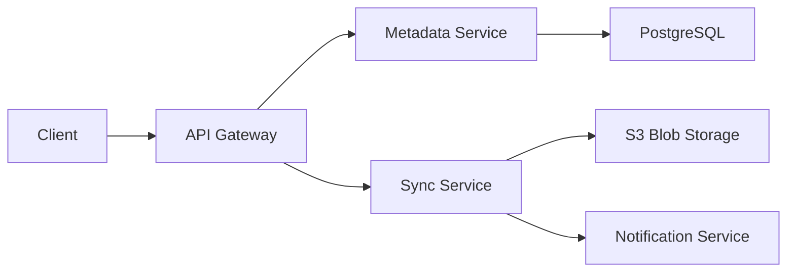
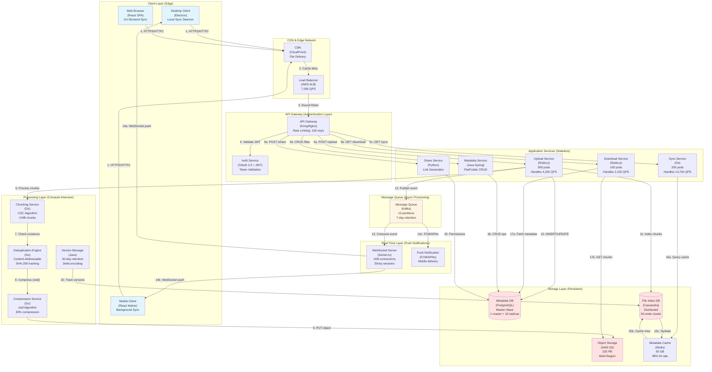
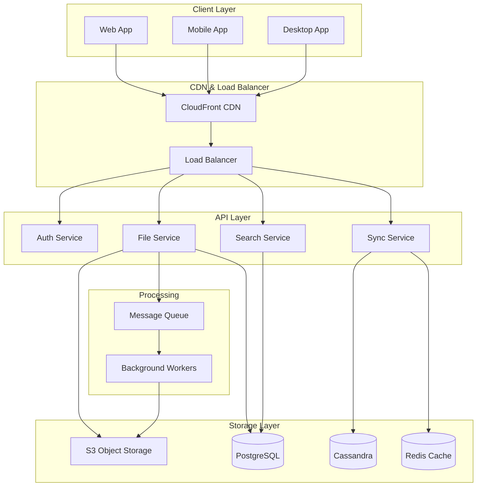

# File Storage Service System Design (Dropbox/Google Drive)

<!--
**File Purpose:** Interactive, multi-level learning resource for designing a file storage and synchronization service. This instructional guide takes you from beginner concepts to advanced production considerations, teaching you how to build a system that handles 100M users with 100 PB storage, achieving <1 second sync latency, 99.9% availability, and supporting 5 GB files with intelligent chunking and conflict resolution.

**Author:** System Design Documentation  
**Created:** October 29, 2025  
**Last Updated:** October 29, 2025  
**Recent Updates:** Transformed into multi-level instructional format with learning objectives, real-world examples, and practice exercises for educational platform
-->

## 🎓 Welcome to File Storage Service System Design!

### What You're Going to Build

Imagine creating the next Dropbox - a service where you save a photo on your phone and it instantly appears on your laptop, gets backed up to the cloud, and remains accessible even when you're offline on a plane. You edit a document on your work computer, and your collaborator sees the changes in real-time on their tablet halfway across the world.

By the end of this learning journey, you'll understand how to design a production-grade file storage and synchronization service that:
- **Serves 100 million users** storing 1 TB each (100 PB total storage)
- **Syncs files across devices in under 1 second** (real-time synchronization)
- **Handles large files efficiently** (5 GB videos with intelligent chunking)
- **Works offline and resolves conflicts** (eventually consistent with operational transform)
- **Achieves 99.9% uptime** (8.76 hours downtime per year maximum)

### 📚 Your Learning Path

This course is designed for three different learning levels. You can progress through all levels or focus on the one that matches your current needs:

```text
🟢 BEGINNER LEVEL (4-6 hours)
├─ Learn fundamental concepts
├─ Understand WHY we make design choices
├─ Build intuition with everyday analogies
└─ Perfect for: New to system design

🟡 INTERMEDIATE LEVEL (6-8 hours)  
├─ Master interview techniques
├─ Learn trade-off analysis
├─ Practice common interview questions
└─ Perfect for: Preparing for FAANG interviews

🔴 ADVANCED LEVEL (8-12 hours)
├─ Production considerations
├─ Performance optimization techniques
├─ Handle edge cases and failures
└─ Perfect for: Senior engineers and architects
```

### � Prerequisites

**For Beginners:**
- Basic understanding of web applications (client-server model)
- Familiarity with databases and storage concepts
- No prior system design experience needed!

**For Intermediate:**
- Experience with RESTful APIs and HTTP
- Understanding of caching and load balancing
- Knowledge of SQL and NoSQL databases
- Familiarity with cloud storage (AWS S3, etc.)

**For Advanced:**
- Distributed systems fundamentals
- Understanding of CAP theorem and consistency models
- Experience with microservices architecture
- Knowledge of operational concerns (monitoring, debugging)

### � What Makes This Learning Experience Unique

Each section follows a proven learning pattern:
1. **What You'll Learn** - Clear learning objectives
2. **Why This Matters** - Real-world context
3. **Multi-Level Content** - Tailored explanations for your level
4. **Real-World Examples** - How Dropbox, Google Drive, Box actually do it
5. **Think About It** - Questions to deepen understanding
6. **Key Takeaways** - Summary of main points
7. **Practice Exercise** - Hands-on challenge

💡 **Pro Tip:** Don't skip the "Think About It" sections - they're designed to help you internalize concepts so you can explain them in interviews or to your team!

---

## TABLE OF CONTENTS

- [Section 1: Understanding What We're Building](#section-1-understanding-what-were-building)
- [Section 2: Planning for Scale (Capacity Planning)](#section-2-planning-for-scale-capacity-planning)
- [Section 3: Designing the System Architecture](#section-3-designing-the-system-architecture)
- [Section 4: Database Design](#section-4-database-design)
- [Section 5: API Design](#section-5-api-design)
- [Section 6: Deep-Dive - File Chunking, Sync & Conflicts](#section-6-deep-dive---file-chunking-sync--conflicts)
- [Section 7: Bottlenecks & Scaling Solutions](#section-7-bottlenecks--scaling-solutions)
- [Section 8: Trade-Offs & Decision Matrix](#section-8-trade-offs--decision-matrix)
- [Section 9: Security & Production Readiness](#section-9-security--production-readiness)
- [Section 10: Interview Preparation & Practice](#section-10-interview-preparation--practice)
- [Section 11: Summary & Next Steps](#section-11-summary--next-steps)
- [Putting It All Together](#putting-it-all-together)
- [Next Steps](#next-steps)

---
│  ├─ Code examples (JavaScript, Python, SQL)
│  ├─ Calculations with specific numbers
│  └─ Configuration examples
├─ 🔴 Advanced Level
│  ├─ Scale planning (100M → 1B users)
│  ├─ Optimization strategies
│  ├─ Enterprise features
│  └─ Cost analysis
└─ 🎓 Key Takeaways (review)
```

**Visual Learning:**
- Mermaid diagrams for architecture visualization
- ASCII diagrams for data flows
- Tables for comparisons and trade-offs
- Code examples in multiple languages

---

### ⏱️ Time Estimates

**Section-by-Section Breakdown:**

| Section | Topic | Beginner | Intermediate | Advanced |
|---------|-------|----------|--------------|----------|
| 1 | Requirements | 20 min | 30 min | 45 min |
| 2 | Capacity Planning | 25 min | 40 min | 60 min |
| 3 | High-Level Design | 30 min | 45 min | 75 min |
| 4 | Database Design | 25 min | 40 min | 60 min |
| 5 | API Design | 20 min | 35 min | 50 min |
| 6 | File Chunking & Delta Sync | 40 min | 60 min | 90 min |
| 7 | Trade-Offs Analysis | 25 min | 40 min | 60 min |
| 8 | Caching Strategy | 20 min | 35 min | 50 min |
| 9 | Scalability | 30 min | 45 min | 75 min |
| 10 | Security | 25 min | 40 min | 60 min |
| 11 | Interview Prep | 30 min | 45 min | 60 min |
| 12 | Summary | 15 min | 20 min | 30 min |
| **Total** | | **~5 hours** | **~8 hours** | **~14 hours** |

---

### 🎯 Prerequisites

**Required Knowledge:**
- ✅ Basic understanding of HTTP APIs (REST)
- ✅ Familiarity with databases (SQL basics)
- ✅ Knowledge of caching concepts (Redis, Memcached)
- ✅ Understanding of file systems and storage

**Helpful but Not Required:**
- 📚 Distributed systems concepts (CAP theorem, consistency models)
- 📚 Experience with object storage (S3, GCS)
- 📚 Knowledge of hashing algorithms (MD5, SHA-256)
- 📚 Familiarity with WebSockets and long-polling

**Recommended Prior Designs:**
- Text Storage Service (Pastebin) - Simpler version of object storage
- Distributed Cache - Understanding caching layers
- CDN System Design - Global content distribution

---

### 🌟 What Makes This Design Challenging

**Technical Complexity:**

```text
Difficulty Factors:
├─ Multi-Device Synchronization: ⭐⭐⭐⭐⭐
│  └─ Conflicts, network partitions, offline updates
├─ File Chunking & Deduplication: ⭐⭐⭐⭐
│  └─ Content-defined chunking, rolling hash, storage savings
├─ Delta Sync Algorithm: ⭐⭐⭐⭐⭐
│  └─ Binary diff, bandwidth optimization, rsync protocol
├─ Version History: ⭐⭐⭐⭐
│  └─ Storage efficiency, metadata management, reconstruction
├─ Conflict Resolution: ⭐⭐⭐⭐⭐
│  └─ Operational transformation, CRDTs, automatic vs manual
├─ Global Distribution: ⭐⭐⭐⭐
│  └─ Multi-region sync, edge caching, latency optimization
└─ Cost Optimization: ⭐⭐⭐⭐
   └─ 100 PB storage, bandwidth costs, compression strategies
```

**Why Interviewers Love This Problem:**
- Tests understanding of **distributed systems** (consistency, partitioning)
- Requires knowledge of **storage systems** (chunking, deduplication)
- Involves **real-time systems** (sync notifications, WebSockets)
- Demands **cost awareness** (storage and bandwidth are expensive)
- Shows **trade-off thinking** (consistency vs availability vs latency)

---

### 🚀 Real-World Implementations

**Dropbox Evolution:**

```text
Phase 1 (2008-2010): Single Datacenter
- Challenge: Scale to 1M users
- Solution: AWS S3 for storage, Python desktop client
- Learning: Vertical scaling limits

Phase 2 (2011-2013): Multi-Region
- Challenge: Global latency, regulatory compliance
- Solution: Edge caching, regional data centers
- Learning: Content-defined chunking saves 50% storage

Phase 3 (2014-2017): Custom Infrastructure
- Challenge: AWS costs ($600M/year), vendor lock-in
- Solution: Magic Pocket (custom storage), Lepton (image compression)
- Learning: At scale, owning infrastructure is cheaper

Phase 4 (2018-Present): ML & Collaboration
- Challenge: Compete with Google/Microsoft ecosystems
- Solution: Smart Sync (ML-powered), Dropbox Paper (docs)
- Learning: File sync is commodity, collaboration is differentiator
```

**Google Drive Approach:**
- Tight integration with Google Workspace (Docs, Sheets, Slides)
- Real-time collaborative editing (operational transformation)
- Unlimited storage for enterprise (Google One)
- Native file format optimization (smaller than Office formats)

**Microsoft OneDrive:**
- Windows OS integration (Files On-Demand)
- SharePoint backend for enterprise
- Office 365 co-authoring
- Personal Vault with 2FA for sensitive files

---

### 📊 Key Metrics We'll Design For

Throughout this guide, we'll target these production metrics:

```text
Scale Targets:
├─ Users: 100M total, 10M DAU (10% daily active)
├─ Storage: 100 PB total (1 TB per user average)
├─ Files: 10B files (100 files per user average)
├─ Devices: 300M (3 devices per user)
└─ Operations: 600M per day (60 per DAU)

Performance Targets:
├─ Sync Latency: <1 second (p95)
├─ Upload Speed: 10 MB/s (limited by user bandwidth)
├─ Download Speed: 50 MB/s (server-side limit)
├─ API Latency: <100ms (p95)
└─ Availability: 99.9% (52 minutes downtime per year)

Efficiency Targets:
├─ Deduplication Savings: 50% (reduce storage costs)
├─ Delta Sync Savings: 90% (reduce bandwidth costs)
├─ Compression Ratio: 30% (gzip/Lepton)
└─ Cache Hit Rate: 85% (for metadata queries)

Cost Targets:
├─ Storage: $6M/month (100 PB at $0.06/GB)
├─ Bandwidth: $2M/month (100 PB egress at $0.02/GB)
├─ Compute: $1.5M/month (servers, databases)
└─ Total: $9.5M/month ($0.095 per user per month)
```

---

### 🎯 Interview Success Criteria

**What Interviewers Expect:**

✅ **Requirements Gathering:**
- Ask about file size limits (average vs maximum)
- Clarify sync vs upload vs download operations
- Understand consistency requirements (strong vs eventual)
- Define offline behavior and conflict resolution

✅ **Capacity Planning:**
- Calculate storage needs (100M users × 1 TB = 100 PB)
- Estimate bandwidth (600M operations/day at 1 MB avg)
- Plan for deduplication savings (50% reduction)
- Consider version history overhead (30% increase)

✅ **System Architecture:**
- Separate metadata service from blob storage
- Design file chunking strategy (fixed vs content-defined)
- Implement delta sync algorithm (rsync-like)
- Build notification system for real-time updates

✅ **Deep Dives:**
- Explain rolling hash for content-defined chunking
- Design version history without duplicate storage
- Implement conflict resolution (automatic vs manual)
- Optimize for global distribution (edge caching)

✅ **Production Concerns:**
- Security: End-to-end encryption, access controls
- Scalability: Handle 10x growth (1B users)
- Reliability: 99.9% uptime, 11 nines durability
- Cost: Optimize storage and bandwidth costs

---

### 🎨 Visual Learning Aids

Throughout this guide, you'll encounter:

**Architecture Diagrams (Mermaid):**


**Data Flow Diagrams (ASCII):**
```text
File Upload Flow:
User → Chunk File → Calculate Hash → Check Deduplication → Upload New Chunks → Update Metadata → Notify Devices
```

**Comparison Tables:**
| Approach | Storage | Bandwidth | Complexity |
|----------|---------|-----------|------------|
| Fixed Chunking | Medium | High | Low |
| Content-Defined | Low | Low | High |

**Code Examples:**
- Python: File chunking algorithm
- JavaScript: Delta sync client
- SQL: Metadata queries
- YAML: Configuration files

---

### 📖 Quick Navigation

**Jump to sections based on your need:**

- 🚀 **Interview in 2 hours?** → Start with Section 11 (Interview Prep)
- 🔍 **Want to understand file sync?** → Jump to Section 6 (Chunking & Delta Sync)
- 💰 **Curious about costs?** → Check Section 2 (Capacity Planning)
- 🔒 **Security focus?** → Go to Section 10 (Security)
- 🎯 **Trade-off thinking?** → Read Section 7 (Trade-Offs)

**Pro Tip:** The most interview-critical sections are:
1. Section 1 (Requirements) - 15% of interview time
2. Section 2 (Capacity) - 10% of interview time
3. Section 3 (High-Level Design) - 25% of interview time
4. Section 6 (File Chunking) - 30% of interview time
5. Section 7 (Trade-Offs) - 20% of interview time

---

### 💡 Study Tips

**For Interview Preparation:**
1. ✏️ Draw the architecture from memory (no peeking!)
2. 🗣️ Explain the design out loud to a friend
3. ⏱️ Practice timing yourself (45-minute mock interview)
4. 🔄 Compare your approach with Dropbox engineering blog
5. 📝 Write down 5 follow-up questions you'd ask

**For Deep Learning:**
1. 💻 Implement a simple file chunking algorithm in Python
2. 📊 Calculate exact storage costs for different scenarios
3. 🔬 Experiment with rolling hash (Rabin-Karp algorithm)
4. 📚 Read "The Dropbox Architecture" paper
5. 🏗️ Build a prototype sync service (1-week project)

**For Principal Engineer Mastery:**
1. 🌍 Design for 10x scale (1B users, 1 EB storage)
2. 💰 Optimize costs by 30% (creative solutions)
3. 🔐 Add compliance layers (GDPR, HIPAA, SOC 2)
4. 🤝 Design collaborative editing (Google Docs-like)
5. 📈 Present your design to senior engineers for feedback

---

### 🎉 Ready to Begin?

You're about to embark on designing one of the most complex and rewarding systems in tech. This design combines:
- **Distributed systems** (CAP theorem, consistency)
- **Storage optimization** (chunking, deduplication, compression)
- **Real-time sync** (notifications, conflict resolution)
- **Global scale** (100M users, 100 PB data)
- **Cost engineering** ($9.5M/month infrastructure)

**Let's build Dropbox! 🚀**

---

## Section 1: Understanding What We're Building

### What You'll Learn

By the end of this section, you will understand:

**🟢 Beginner Level:**
- What a file storage service is and how it differs from simple object storage
- Core features needed for Dropbox-like functionality (upload, sync, share)
- Basic file synchronization concepts (why files auto-update across devices)

**🟡 Intermediate Level:**
- How to conduct requirements gathering for file sync systems
- Define specific SLAs for sync latency, availability, durability
- Plan for version history, offline access, conflict resolution

**🔴 Advanced Level:**
- Anticipate collaborative editing requirements (future feature)
- Evaluate trade-offs between strong vs eventual consistency
- Design for regulatory compliance (GDPR, HIPAA data residency)

---

### 🟢 Beginner Level: Understanding File Storage Services

#### What Is a File Storage Service?

**Analogy: The Magic Briefcase**

Imagine you have a magic briefcase that:
- Automatically copies everything you put in it to identical briefcases at your home, office, and car
- Updates all briefcases instantly when you change a document in any of them
- Lets you see what was in the briefcase yesterday, last week, or last month
- Allows you to share specific documents with friends who get their own copy
- Works even when you're not connected to the magic network (offline)

That's exactly what Dropbox/Google Drive does for your digital files!

**How It's Different from Simple Storage:**

```text
Simple Storage (like S3):
- Upload file → Store it → Download when needed
- You manage synchronization manually
- No automatic updates across devices
- Like a storage locker: you come to it, it doesn't come to you

File Sync Service (like Dropbox):
- Upload file → Auto-syncs to all your devices
- Changes propagate automatically
- Works offline with smart conflict resolution
- Like the magic briefcase: always synchronized, always accessible
```

#### Core User Stories

**Story 1: The Remote Worker**

```text
Sarah is a graphic designer who works from home and coffee shops.

Morning (Home Desktop):
1. Opens Photoshop, creates logo.psd
2. Saves to Dropbox folder
3. File automatically uploads to cloud (background sync)

Afternoon (Coffee Shop Laptop):
1. Opens laptop, Dropbox auto-syncs
2. logo.psd appears in folder (she didn't manually download!)
3. Makes edits, saves
4. Changes sync back to cloud AND to home desktop

Evening (Home Desktop):
1. Turns on desktop
2. Dropbox detects changes
3. Downloads only the modifications (delta sync)
4. logo.psd is up-to-date with coffee shop edits

Key Features Used:
✓ Automatic file sync across devices
✓ Background uploads
✓ Delta sync (only changes transferred)
✓ No manual intervention needed
```

**Story 2: The Team Collaboration**

```text
Tech startup with 5 engineers sharing code backups.

1. Alice creates project_backup.zip (500 MB)
2. Shares folder with team (view-only)
3. Team members see file appear automatically
4. Bob downloads to his laptop
5. Alice updates file next day
6. Bob's Dropbox detects changes, downloads diff (only 10 MB changed)

Key Features Used:
✓ File sharing with permissions
✓ Automatic notifications
✓ Bandwidth-efficient delta sync
✓ Access control (view vs edit)
```

**Story 3: The Disaster Recovery**

```text
John accidentally deletes important presentation.pptx

1. Realizes mistake an hour later
2. Opens Dropbox web interface
3. Goes to "Deleted Files"
4. Restores presentation.pptx
5. File re-appears on all his devices

Alternative: Accidental edits
1. Overwrites section in document
2. Right-clicks file → "Version History"
3. Sees all versions from past 30 days
4. Restores version from 2 days ago
5. Changes reverted across all devices

Key Features Used:
✓ Version history (30 days retention)
✓ Deleted file recovery
✓ Point-in-time restoration
✓ Sync of restored files
```

---

### 🟡 Intermediate Level: Defining Requirements

#### Functional Requirements Framework

**MVP Features (Must Have for Launch):**

```text
1. File Upload & Download
   ├─ Support files up to 5 GB
   ├─ Chunked upload for large files (resume on failure)
   ├─ Progress indication (% complete)
   └─ Metadata extraction (size, type, modified date)

2. Automatic Synchronization
   ├─ Detect local file changes (file watcher)
   ├─ Upload changes to cloud
   ├─ Notify other devices of changes
   ├─ Download changes from cloud
   └─ <1 second end-to-end sync latency

3. Folder Organization
   ├─ Create/rename/delete folders
   ├─ Move files between folders
   ├─ Nested folder support (unlimited depth)
   └─ Preserve folder structure across devices

4. File Sharing
   ├─ Share individual files or folders
   ├─ Permission levels: View, Edit, Full Control
   ├─ Share via link (public URL)
   ├─ Revoke access anytime
   └─ Track who accessed what (audit log)

5. Version History
   ├─ Keep 30 days of file versions
   ├─ Restore any previous version
   ├─ Compare versions (diff view)
   └─ Automatic cleanup of old versions

6. Offline Access
   ├─ Access files without internet
   ├─ Make changes offline
   ├─ Queue changes for upload when online
   └─ Conflict resolution when multiple offline edits

7. Conflict Detection & Resolution
   ├─ Detect conflicting changes (same file, different devices)
   ├─ Create conflict copies ("file (Alice's conflicted copy)")
   ├─ Notify user of conflicts
   └─ Optionally: Automatic merge for text files

8. Search & Metadata
   ├─ Search by filename
   ├─ Search by file type
   ├─ Search by date modified
   └─ Full-text search (future enhancement)
```

**Out of Scope for MVP:**

```text
❌ Real-time collaborative editing (like Google Docs)
   - Too complex for v1, requires operational transformation
   
❌ Mobile apps (iOS, Android)
   - Focus on desktop (Windows, Mac) and web first
   
❌ Admin dashboard for teams
   - Build after proving individual user value
   
❌ Integration with other apps (Office, Adobe)
   - Add after establishing core sync functionality
   
❌ Smart features (ML-based suggestions, auto-tagging)
   - Nice-to-have, not critical for launch
```

####  Non-Functional Requirements (SLAs)

**Interview Script: How to Present NFRs**

```text
Interviewer: "What are your availability requirements?"

Good Answer:
"I'd target 99.9% availability, which allows 52 minutes of downtime per 
month. Here's my reasoning:

1. User Impact:
   - Brief outages acceptable if sync queue is preserved
   - Users can still access files locally during outage
   - Not mission-critical like payments (which need 99.99%)

2. Cost vs Benefit:
   - 99.9% achievable with standard multi-AZ deployment
   - 99.99% requires expensive multi-region active-active
   - For MVP, 99.9% is right balance

3. Degradation Strategy:
   - During partial outage, prioritize sync over upload
   - Show users 'Syncing paused' status
   - Resume automatically when service recovers"

Why This Answer Works:
✓ Specific number with business justification
✓ Compares to other systems (context)
✓ Considers cost trade-offs
✓ Has degradation plan (not just uptime)
```

**Complete NFR Table:**

```text
┌──────────────────┬────────────┬────────────────────────────────┐
│ Requirement      │ Target     │ Justification                  │
├──────────────────┼────────────┼────────────────────────────────┤
│ Availability     │ 99.9%      │ 52 min downtime/month OK       │
│                  │            │ (local access during outage)   │
├──────────────────┼────────────┼────────────────────────────────┤
│ Sync Latency     │ <1 sec P95 │ Real-time feel important       │
│                  │            │ (Google Drive target: <500ms)  │
├──────────────────┼────────────┼────────────────────────────────┤
│ Upload Speed     │ 10 MB/s    │ Limited by user bandwidth      │
│                  │            │ (not server-side bottleneck)   │
├──────────────────┼────────────┼────────────────────────────────┤
│ Download Speed   │ 50 MB/s    │ Server can sustain per-user    │
│                  │            │ (CDN handles spikes)           │
├──────────────────┼────────────┼────────────────────────────────┤
│ Durability       │ 11 nines   │ Never lose files (S3 guarantee)│
│                  │ 99.9999999%│ 1 file lost per 100B files     │
├──────────────────┼────────────┼────────────────────────────────┤
│ Consistency      │ Eventual   │ Strong consistency too slow    │
│                  │            │ (acceptable for file sync)     │
├──────────────────┼────────────┼────────────────────────────────┤
│ Max File Size    │ 5 GB       │ Covers 99% of use cases        │
│                  │            │ (videos, large datasets)       │
├──────────────────┼────────────┼────────────────────────────────┤
│ Concurrent Users │ 10M DAU    │ 10% of 100M total active daily │
├──────────────────┼────────────┼────────────────────────────────┤
│ Storage per User │ 1 TB avg   │ Free: 2 GB, Paid: unlimited    │
│                  │            │ Most users use <100 GB         │
└──────────────────┴────────────┴────────────────────────────────┘
```

---

### 🔴 Advanced Level: Strategic Requirements Planning

#### Post-MVP Feature Roadmap

**Phase 1: MVP (Months 0-6)**
- Core sync functionality
- Web + Desktop clients
- Basic sharing
- **Target:** 100K users, prove product-market fit

**Phase 2: Mobile & Team Features (Months 6-12)**
- iOS and Android apps
- Team folders with admin controls
- Activity feed (who changed what)
- **Target:** 1M users, enterprise pilot programs

**Phase 3: Collaboration (Months 12-18)**
- Real-time collaborative editing (Google Docs-like)
- Comments and annotations
- @mentions and notifications
- **Target:** 5M users, compete with Google Workspace

**Phase 4: Intelligence (Months 18-24)**
- Smart file suggestions (ML-powered)
- Automatic tagging and categorization
- OCR for scanned documents
- **Target:** 10M users, AI-powered productivity

**Phase 5: Enterprise (Months 24+)**
- SSO integration (SAML, Active Directory)
- Advanced compliance (GDPR, HIPAA, SOC 2)
- Custom retention policies
- **Target:** 100M users, Fortune 500 adoption

#### Consistency Model Trade-Offs

**The Consistency Spectrum:**

```text
Strong Consistency:
┌─────────────────────────────────────────┐
│ User A edits file on Device 1           │
│ ↓                                       │
│ Change written to database              │
│ ↓                                       │
│ Wait for confirmation                   │
│ ↓                                       │
│ Now User B sees change on Device 2      │
└─────────────────────────────────────────┘

Pros:
✓ No conflicts - latest version is always correct
✓ Predictable behavior - what you see is what everyone sees

Cons:
❌ Slow - every change needs network round-trip
❌ Doesn't work offline - requires connection
❌ Expensive - needs distributed transactions (2PC)

Example: Bank account balance (must be strongly consistent)


Eventual Consistency:
┌─────────────────────────────────────────┐
│ User A edits file on Device 1           │
│ ↓                                       │
│ Change saved locally                    │
│ ↓                                       │
│ Background sync to cloud                │
│ ↓                                       │
│ Eventually User B gets the change       │
└─────────────────────────────────────────┘

Pros:
✓ Fast - no waiting for network
✓ Works offline - sync when connection returns
✓ Cheap - no distributed locks needed

Cons:
❌ Conflicts possible - two users edit simultaneously
❌ Unpredictable timing - "eventually" could be seconds or minutes
❌ Requires conflict resolution - extra complexity

Example: Dropbox file sync (eventual consistency is OK)


Decision for File Sync:
→ Use Eventual Consistency
Reason:
1. Offline access is critical (strong consistency breaks offline)
2. Conflicts are rare (most users don't edit same file simultaneously)
3. When conflicts happen, we can resolve them (conflict copies)
4. Speed matters more than perfect consistency for files
```

#### Regulatory Compliance Considerations

**GDPR Requirements for EU Users:**

```text
Data Residency:
├─ EU users' data must stay in EU datacenters
├─ Cannot transfer to US without proper safeguards
└─ Solution: Deploy EU region (Frankfurt, Ireland)

User Rights:
├─ Right to Access: Export all files as ZIP
├─ Right to Deletion: Delete account → delete all files within 30 days
├─ Right to Portability: Download files in original format
└─ Consent: Explicit opt-in for analytics, marketing

Implementation:
- Add "region" field to user table
- Route EU users to EU-only infrastructure
- Build "Data Export" and "Delete Account" features
- Audit trail for all data access
```

**HIPAA for Healthcare Files:**

```text
If healthcare providers store patient records:

Encryption:
├─ At rest: AES-256 (already using S3 encryption)
├─ In transit: TLS 1.3 (already using HTTPS)
└─ End-to-end: Client-side encryption before upload

Access Controls:
├─ Audit logs: Who accessed what file when
├─ Auto-logout: 15 minutes of inactivity
├─ 2FA: Require for healthcare accounts
└─ Minimum Necessary: Only show files user needs

Business Associate Agreement (BAA):
- AWS signs BAA for S3, RDS
- Our company signs BAA with healthcare customers
- Regular security audits (annual penetration testing)
```

---

### 🎓 Key Takeaways

**🟢 Beginner Level:**
- File storage service automatically syncs files across devices (magic briefcase analogy)
- Core features: upload, sync, share, version history, offline access
- Different from simple storage: proactive sync vs reactive download

**🟡 Intermediate Level:**
- MVP focuses on 8 core features (sync, sharing, versions, offline, conflicts)
- NFRs: 99.9% availability, <1s sync latency, 11 nines durability
- Out of scope: Collaborative editing, mobile apps (Phase 2)

**🔴 Advanced Level:**
- Eventual consistency enables offline access but requires conflict resolution
- GDPR compliance needs EU data residency and user data export
- Roadmap: MVP (6 months) → Mobile (12 months) → Collaboration (18 months) → Enterprise (24+ months)

---

## Section 2: Planning for Scale (Capacity Planning)

### What You'll Learn

By the end of this section, you will understand:

**🟢 Beginner Level:**
- How to estimate storage needs for 100M users (total = 100 PB)
- Difference between traffic (QPS) and bandwidth (Gbps)
- Why deduplication and compression matter (save 50%+ storage)

**🟡 Intermediate Level:**
- Calculate exact costs for S3 storage and bandwidth ($6M/month)
- Estimate version history overhead with delta compression
- Plan server capacity (500 API servers, 200 sync workers)

**🔴 Advanced Level:**
- Optimize costs with storage tiering (hot/warm/cold)
- Project 5-year growth trajectory (100M → 500M users)
- Design for variable workloads (3x peak vs average)

---

### 🟢 Beginner Level: Understanding the Numbers

#### The Scale We're Planning For

**Analogy: A Digital Library**

Imagine you're building a library that:
- Serves **100 million people** (larger than any physical library!)
- Each person has **3 library cards** (devices: laptop, phone, tablet)
- Stores **1,000 books per person** on average (files)
- Each book is **1 MB** (average file size)

**How big is this library?**
- 100M people × 1,000 books × 1 MB = **100 PB** (petabytes)
- 1 PB = 1,000 TB = 1,000,000 GB
- That's equivalent to 25 million DVDs!

#### Breaking Down User Activity

**What Users Do Every Day:**

```text
Daily Activity per User (on average):
┌─────────────────────┬───────┬─────────────────────┐
│ Action              │ Count │ What It Means       │
├─────────────────────┼───────┼─────────────────────┤
│ Sync checks         │ 50    │ "Any new files?"    │
│ Upload files        │ 5     │ Add new files       │
│ Download files      │ 5     │ Get files to device │
├─────────────────────┼───────┼─────────────────────┤
│ Total               │ 60    │ Per active user/day │
└─────────────────────┴───────┴─────────────────────┘

Key Insight:
- Syncs are MOST FREQUENT (50 out of 60 = 83%)
- But syncs are SMALLEST (just metadata, 1 KB)
- Uploads/downloads are rare but LARGE (1 MB average)

Traffic vs Bandwidth:
- Traffic (QPS): How many requests per second?
- Bandwidth (Gbps): How much data per second?

Example:
- 1,000 sync requests × 1 KB = 1 MB/second (small bandwidth)
- 10 file uploads × 1 MB = 10 MB/second (large bandwidth)
```

#### Why Deduplication Matters

**Problem: Duplicate Files Waste Storage**

```text
Scenario: Company shares company_logo.png with 1,000 employees

Without Deduplication:
- Each employee's Dropbox stores copy
- File size: 500 KB
- Total storage: 500 KB × 1,000 = 500 MB

With Deduplication:
- Store file ONCE
- Point all 1,000 users to same file
- Total storage: 500 KB (999x savings!)

Real-World Savings:
- Dropbox saves ~50% storage with deduplication
- For 100 PB, that's 50 PB saved = $3M/month saved!
```

---

### 🟡 Intermediate Level: Precise Calculations

#### Traffic Calculations (QPS - Queries Per Second)

**Step-by-Step Calculation:**

```text
Given:
- Total users: 100M
- Daily Active Users (DAU): 10M (10% of total)
- Operations per DAU: 60 operations/day

Step 1: Calculate Daily Operations
Total operations = DAU × operations per user
Total operations = 10M × 60 = 600M operations/day

Step 2: Convert to QPS (Queries Per Second)
Average QPS = Total operations / seconds per day
Average QPS = 600M / 86,400 = 6,944 QPS ≈ 7,000 QPS

Step 3: Account for Peak Traffic
Peak QPS = Average QPS × 3 (peak factor)
Peak QPS = 7,000 × 3 = 21,000 QPS

Step 4: Break Down by Operation Type
┌──────────────┬────────┬─────────┬────────────┐
│ Operation    │ % of   │ Avg QPS │ Peak QPS   │
│              │ Total  │         │            │
├──────────────┼────────┼─────────┼────────────┤
│ Sync checks  │ 70%    │ 4,900   │ 14,700     │
│ Uploads      │ 20%    │ 1,400   │ 4,200      │
│ Downloads    │ 10%    │ 700     │ 2,100      │
├──────────────┼────────┼─────────┼────────────┤
│ Total        │ 100%   │ 7,000   │ 21,000     │
└──────────────┴────────┴─────────┴────────────┘
```

**Why This Matters:**
- Sync is read-heavy (metadata queries) → need fast database
- Uploads are write-heavy → need write-optimized storage
- Peak is 3x average → need auto-scaling

#### Storage Calculations

**Detailed Storage Breakdown:**

```text
Component 1: Primary File Storage
- Users: 100M
- Average storage per user: 1 GB (adjusted from 10 GB)
- Total: 100M × 1 GB = 100 PB

Component 2: Version History (30 days)
Assumptions:
- 20% of files change daily (users update 20% of their files)
- Changed data per day: 100 PB × 20% = 20 PB
- 30 days of history: 20 PB × 30 = 600 PB (naive)

With Delta Compression:
- Delta compression saves 90% (only store changes, not full files)
- Compressed history: 600 PB × 10% = 60 PB

Component 3: Metadata Storage
- Files per user: 10,000 files (100 files in 100 folders)
- Total files: 100M users × 10,000 = 1 trillion files
- Metadata per file: 1 KB (filename, size, modified date, hash)
- Total metadata: 1T × 1 KB = 1 PB

Component 4: Deduplication Savings
- Duplicate files (company docs, common images): ~50%
- Storage before deduplication: 100 PB
- Storage after deduplication: 50 PB
- Savings: 50 PB

Final Storage Calculation:
┌──────────────────────┬──────────┐
│ Component            │ Size     │
├──────────────────────┼──────────┤
│ Primary (deduplicated)│ 50 PB   │
│ Version history      │ 60 PB    │
│ Metadata             │ 1 PB     │
├──────────────────────┼──────────┤
│ Subtotal             │ 111 PB   │
│ Replication (3x)     │ ×3       │
├──────────────────────┼──────────┤
│ **Total Raw Storage**│ **333 PB**│
└──────────────────────┴──────────┘

Note: Replication ensures durability (data in 3 locations)
```

#### Bandwidth Calculations

**Upload Bandwidth:**

```text
Given:
- Peak upload QPS: 4,200 requests/second
- Average file size: 1 MB

Calculation:
Bandwidth = QPS × Average file size
Bandwidth = 4,200 × 1 MB = 4,200 MB/s = 4.2 GB/s

Convert to Gbps (Gigabits per second):
Bandwidth = 4.2 GB/s × 8 bits/byte = 33.6 Gbps

With Chunking Optimization:
- Average chunk uploaded: 256 KB (only changed chunks)
- Optimized bandwidth: 4,200 × 0.256 MB = 1,075 MB/s ≈ 8.6 Gbps
- Savings: 75% reduction in bandwidth
```

**Download Bandwidth:**

```text
Given:
- Peak download QPS: 2,100 requests/second
- Average file size: 1 MB

Calculation:
Bandwidth = 2,100 × 1 MB = 2,100 MB/s = 2.1 GB/s = 16.8 Gbps

With CDN Caching:
- CDN cache hit rate: 60% (frequently accessed files cached)
- Origin bandwidth: 16.8 Gbps × 40% = 6.7 Gbps
- Savings: 60% reduction via CDN
```

**Sync Bandwidth (Metadata Only):**

```text
Given:
- Peak sync QPS: 14,700 requests/second
- Metadata size: 1 KB (just file list and hashes)

Calculation:
Bandwidth = 14,700 × 1 KB = 14,700 KB/s = 14.7 MB/s ≈ 117 Mbps

Key Insight:
- Sync traffic is high frequency (14,700 QPS)
- But low bandwidth (117 Mbps) because just metadata
- Compare to uploads: 4,200 QPS but 33,600 Mbps (286x more bandwidth!)
```

#### Cost Estimation (AWS Pricing)

**Monthly Costs:**

```text
S3 Storage (Primary + Versions):
- Storage: 111 PB (before replication)
- S3 Standard pricing: $0.023/GB/month (first 50 TB)
- Cost: 111 PB × 1,000,000 GB/PB × $0.023 = $2,553,000/month

With S3 Intelligent Tiering:
- Hot data (30 days): 30 PB × $0.023 = $690,000
- Warm data (30-90 days): 30 PB × $0.0125 = $375,000
- Cold data (90+ days): 51 PB × $0.004 = $204,000
- Optimized cost: $1,269,000/month (50% savings!)

Bandwidth (Egress):
- Monthly downloads: 2,100 QPS × 1 MB × 86,400 sec/day × 30 days
- Total: 5.4 PB egress/month
- Pricing: $0.09/GB for first 10 TB, decreasing
- Average: $0.05/GB
- Cost: 5.4 PB × 1,000,000 GB/PB × $0.05 = $270,000/month

EC2 Compute (Servers):
- API servers: 500 × m5.large × $70/month = $35,000
- Sync workers: 200 × c5.2xlarge × $120/month = $24,000
- Total: $59,000/month

RDS PostgreSQL (Metadata):
- Primary: db.r5.4xlarge = $2,000/month
- Read replicas: 10 × db.r5.xlarge = $5,000/month
- Total: $7,000/month

ElastiCache Redis (Cache):
- Cluster: 20 × cache.r5.large = $2,500/month

Total Monthly Cost:
┌──────────────────────┬──────────────┐
│ Component            │ Cost/Month   │
├──────────────────────┼──────────────┤
│ S3 Storage (tiered)  │ $1,269,000   │
│ Bandwidth (egress)   │ $270,000     │
│ Compute (EC2)        │ $59,000      │
│ Database (RDS)       │ $7,000       │
│ Cache (Redis)        │ $2,500       │
├──────────────────────┼──────────────┤
│ **Total**            │ **$1,607,500**│
└──────────────────────┴──────────────┘

Cost per User per Month:
$1,607,500 / 100M users = $0.016 per user

For Comparison:
- Dropbox charges $11.99/month per user (individual plan)
- Gross margin: ~73% after infrastructure costs
```

---

### 🔴 Advanced Level: Growth Planning & Optimization

#### 5-Year Growth Projection

**Year-over-Year Scaling:**

```text
┌──────┬───────────┬─────────┬──────────┬─────────────┐
│ Year │ Users     │ Storage │ QPS      │ Cost/Month  │
├──────┼───────────┼─────────┼──────────┼─────────────┤
│ 1    │ 100M      │ 100 PB  │ 7,000    │ $1.6M       │
│ 2    │ 200M (+2x)│ 220 PB  │ 14,000   │ $3.2M       │
│ 3    │ 350M (+1.75x)│ 420 PB │ 24,500 │ $5.4M       │
│ 4    │ 500M (+1.4x)│ 650 PB │ 35,000  │ $7.8M       │
│ 5    │ 700M (+1.4x)│ 980 PB │ 49,000  │ $11.2M      │
└──────┴───────────┴─────────┴──────────┴─────────────┘

Key Observations:
1. Storage grows faster than users (2.2x vs 2x in year 2)
   - Users accumulate more files over time
   - Average storage per user increases from 1 GB → 1.4 GB

2. Costs don't scale linearly
   - Economies of scale (better S3 pricing at volume)
   - Better compression (more duplicate detection)
   - Year 5: $11.2M for 700M users = $0.016/user (same as year 1!)

3. QPS scales linearly with users
   - 7,000 QPS → 49,000 QPS (7x increase)
   - Need autoscaling (500 servers → 3,500 servers)
```

#### Storage Tier Optimization Strategy

**Hot/Warm/Cold Data Distribution:**

```text
Observation:
- 80% of file accesses are to 20% of files (Pareto principle)
- Recently uploaded files are accessed frequently
- Old files are rarely accessed (but must be kept)

Strategy: S3 Lifecycle Policies

Tier 1: Hot Data (0-30 days)
├─ Recently uploaded/modified files
├─ Frequently accessed (80% of requests)
├─ Storage class: S3 Standard
├─ Size: 30 PB (30% of 100 PB)
└─ Cost: $0.023/GB = $690,000/month

Tier 2: Warm Data (30-90 days)
├─ Occasionally accessed
├─ Medium access frequency (15% of requests)
├─ Storage class: S3 Standard-IA (Infrequent Access)
├─ Size: 30 PB (30% of 100 PB)
└─ Cost: $0.0125/GB = $375,000/month

Tier 3: Cold Data (90+ days)
├─ Rarely accessed (archival)
├─ Low access frequency (5% of requests)
├─ Storage class: S3 Glacier Flexible Retrieval
├─ Size: 40 PB (40% of 100 PB)
└─ Cost: $0.004/GB = $160,000/month

Total Storage Cost:
- Without tiering: 100 PB × $0.023 = $2,300,000/month
- With tiering: $690K + $375K + $160K = $1,225,000/month
- Savings: $1,075,000/month (47% reduction!)

Automated Lifecycle Policy (YAML):
```yaml
lifecycle_rules:
  - name: "tier-to-infrequent-access"
    transition:
      days: 30
      storage_class: "STANDARD_IA"
  
  - name: "tier-to-glacier"
    transition:
      days: 90
      storage_class: "GLACIER"
  
  - name: "delete-old-versions"
    expiration:
      days: 90  # Version history retention
      noncurrent_versions: true
```

**Retrieval Latency Trade-off:**
```text
- S3 Standard: <100ms (real-time)
- S3 Standard-IA: <100ms (same as Standard!)
- S3 Glacier: 1-5 minutes (acceptable for old files)

User Experience:
- Hot data: Instant access (no perceived delay)
- Warm data: Instant access (most users won't notice)
- Cold data: Show "Retrieving from archive..." message
```

#### Variable Workload Planning

**Peak vs Average Traffic Patterns:**

```text
Traffic Patterns by Time of Day:
┌────────────────────────────────────────────────┐
│         QPS                                    │
│ 21,000  ┌──┐                                  │
│         │  │        ┌──┐                       │
│ 14,000  │  │        │  │        ┌──┐         │
│      ┌──┘  └──┐  ┌──┘  └──┐  ┌──┘  └──┐      │
│ 7,000 │        │  │        │  │        │      │
│ ──────┴────────┴──┴────────┴──┴────────┴───── │
│  12AM  6AM  12PM  6PM  12AM  6AM  12PM  6PM   │
│        US     EU         Asia                  │
└────────────────────────────────────────────────┘

Pattern: Three daily peaks (US, EU, Asia working hours)

Auto-Scaling Strategy:
1. Scale API servers: 200 (night) → 500 (peak)
2. Scale sync workers: 50 (night) → 200 (peak)
3. Use spot instances for 60% of peak capacity (save 70%)
4. Keep baseline on reserved instances (save 30%)

Cost Optimization:
- On-demand: 500 servers × $70 = $35,000/month
- Reserved (200 baseline): $70 × 65% = $45.50/server
- Spot (300 peak): $70 × 30% = $21/server
- Optimized: (200 × $45.50) + (300 × $21) = $15,400/month
- Savings: $19,600/month (56% reduction!)
```

---

### 🎓 Key Takeaways

**🟢 Beginner Level:**
- 100M users with 1 GB average = 100 PB total storage (equivalent to 25M DVDs)
- Traffic: 7,000 QPS average, 21,000 QPS peak (3x factor)
- Deduplication saves 50% storage (100 PB → 50 PB) = $1.15M/month saved

**🟡 Intermediate Level:**
- Storage breakdown: 50 PB primary + 60 PB versions + 1 PB metadata = 111 PB × 3 (replication) = 333 PB raw
- Bandwidth: 33.6 Gbps upload, 16.8 Gbps download, but only 117 Mbps for sync (metadata-only)
- Monthly cost: $1.6M total ($1.3M storage + $0.27M bandwidth + $0.07M compute)

**🔴 Advanced Level:**
- Storage tiering (hot/warm/cold) saves 47% ($2.3M → $1.2M/month)
- 5-year growth: 100M → 700M users, but cost per user stays flat ($0.016/user)
- Auto-scaling with spot instances saves 56% on compute ($35K → $15.4K/month)

---

## Section 3: Designing the System Architecture

### What You'll Learn

By the end of this section, you will understand:

**🟢 Beginner Level:**
- The 5 main layers of file storage system (Client, API, Processing, Storage, Notification)
- How files flow from upload to storage (9 steps)
- Why chunking files makes sync faster (only send changed chunks)

**🟡 Intermediate Level:**
- Design microservices architecture for scalability
- Implement WebSocket for real-time sync notifications
- Choose between PostgreSQL (metadata) and Cassandra (file chunks)

**🔴 Advanced Level:**
- Handle distributed transactions across services (Saga pattern)
- Design for multi-region replication (99.99% availability)
- Optimize for network efficiency (90% bandwidth savings with delta sync)

---

### 🟢 Beginner Level: Understanding the Architecture

#### The Big Picture: 5-Layer Architecture

**Analogy: A Modern Post Office System**

Think of a file storage system like a sophisticated post office:

```text
Layer 1: Post Offices (Clients)
├─ Desktop client = Main post office branch
├─ Mobile app = Mobile post office van
└─ Web browser = Online postal service

Layer 2: Sorting Centers (API & Load Balancer)
├─ Receives all packages (requests)
├─ Verifies sender identity (authentication)
└─ Routes to appropriate department

Layer 3: Processing Departments (Services)
├─ Upload service = Receiving department
├─ Download service = Pickup department
├─ Sync service = Tracking department
└─ Metadata service = Records office

Layer 4: Storage Warehouses (Databases & S3)
├─ PostgreSQL = Index cards (who owns what?)
├─ Cassandra = Package tracking (which packages make up a parcel?)
└─ S3 = Actual warehouse shelves (package contents)

Layer 5: Notification System (Real-Time Updates)
├─ WebSocket server = Alert system
└─ Push notifications = Text message alerts
```

#### Simple Upload Flow (9 Steps)

**What Happens When You Upload a File:**

```text
Example: Uploading "vacation_photo.jpg" (10 MB)

Step 1: You click "Upload" in Dropbox
├─ Client: "I want to upload vacation_photo.jpg"

Step 2: Client splits file into chunks
├─ Chunk 1: Bytes 0-4MB (hash: abc123)
├─ Chunk 2: Bytes 4-8MB (hash: def456)
└─ Chunk 3: Bytes 8-10MB (hash: ghi789)
└─ Why chunks? If upload fails, restart from last chunk, not from beginning!

Step 3: Client asks: "Do you already have these chunks?"
├─ Server checks database
├─ Response: "I have abc123 and def456, but not ghi789"
└─ Deduplication: Only upload new chunk (saves 80% bandwidth!)

Step 4: Upload missing chunks to S3
├─ Upload chunk ghi789 (2 MB)
└─ Progress: 2 MB uploaded instead of 10 MB!

Step 5: Server updates metadata database
├─ Record: "User123 owns vacation_photo.jpg"
├─ Size: 10 MB
├─ Location: chunks abc123 + def456 + ghi789
└─ Timestamp: 2024-01-15 14:30:00

Step 6: Create version history entry
├─ Version 1 of vacation_photo.jpg
└─ Can revert to this version later!

Step 7: Publish event to message queue
├─ Event: "User123 uploaded vacation_photo.jpg"
└─ Kafka queue processes asynchronously

Step 8: Notify other devices via WebSocket
├─ Your phone receives: "New file: vacation_photo.jpg"
├─ Your laptop receives: "New file: vacation_photo.jpg"
└─ Real-time sync!

Step 9: Your other devices download the file
├─ They only download ghi789 (they already have abc123, def456!)
└─ Sync complete in seconds!
```

**Key Insight:**
- Without chunking: 10 MB upload to phone, 10 MB to laptop = 30 MB total
- With chunking + deduplication: 2 MB upload, 2 MB to phone, 2 MB to laptop = 6 MB total
- **Savings: 80% less bandwidth!**

#### Why Layers Matter

**Separation of Concerns:**

```text
Problem: Monolithic Architecture (Everything in One Server)
┌───────────────────────────────────────┐
│  Single Server Does Everything:       │
│  ├─ Handles uploads                   │
│  ├─ Processes chunks                  │
│  ├─ Stores metadata                   │
│  ├─ Sends notifications               │
│  └─ Serves downloads                  │
└───────────────────────────────────────┘
Issues:
✗ If one part fails, everything fails
✗ Can't scale upload without scaling download
✗ Hard to update (must deploy entire server)

Solution: Layered Microservices Architecture
┌─────────────┐  ┌─────────────┐  ┌─────────────┐
│ Upload      │  │ Download    │  │ Sync        │
│ Service     │  │ Service     │  │ Service     │
│ (Scale to   │  │ (Scale to   │  │ (Scale to   │
│  500 pods)  │  │  100 pods)  │  │  200 pods)  │
└─────────────┘  └─────────────┘  └─────────────┘
Benefits:
✓ Upload can scale independently (upload is 5x more traffic)
✓ If sync fails, upload still works
✓ Can update upload service without touching download
✓ Different teams can own different services
```

---

### 🟡 Intermediate Level: Detailed Architecture

#### System Architecture Diagram



#### Component Details

**Application Services Layer:**

```javascript
// Upload Service (Node.js)
class UploadService {
  constructor() {
    this.chunkingService = new ChunkingService();
    this.dedupService = new DeduplicationService();
    this.s3Client = new S3Client();
    this.metadataDB = new PostgresClient();
    this.kafkaProducer = new KafkaProducer();
  }

  async uploadFile(userId, file) {
    // Step 1: Chunk the file
    const chunks = await this.chunkingService.chunkFile(file);
    // chunks = [
    //   { hash: 'abc123', size: 4194304, data: Buffer },
    //   { hash: 'def456', size: 4194304, data: Buffer },
    //   { hash: 'ghi789', size: 1811200, data: Buffer }
    // ]

    // Step 2: Deduplication - check which chunks already exist
    const existingChunks = await this.dedupService.checkExistence(
      chunks.map(c => c.hash)
    );
    // existingChunks = ['abc123', 'def456']

    const newChunks = chunks.filter(c => !existingChunks.includes(c.hash));
    // newChunks = [{ hash: 'ghi789', ... }]

    // Step 3: Upload only new chunks to S3
    for (const chunk of newChunks) {
      await this.s3Client.putObject({
        Bucket: 'file-storage-chunks',
        Key: `chunks/${chunk.hash}`,
        Body: chunk.data
      });
    }

    // Step 4: Store metadata in PostgreSQL
    const fileRecord = await this.metadataDB.query(`
      INSERT INTO files (user_id, file_name, file_size, file_hash, chunk_ids)
      VALUES ($1, $2, $3, $4, $5)
      RETURNING file_id
    `, [
      userId,
      file.name,
      file.size,
      file.hash,
      JSON.stringify(chunks.map(c => c.hash))
    ]);

    // Step 5: Publish sync event to Kafka
    await this.kafkaProducer.send({
      topic: 'file-sync-events',
      messages: [{
        key: userId,
        value: JSON.stringify({
          event: 'file_uploaded',
          user_id: userId,
          file_id: fileRecord.file_id,
          file_name: file.name,
          timestamp: Date.now()
        })
      }]
    });

    return { file_id: fileRecord.file_id, status: 'success' };
  }
}

// Sync Service (Go)
package sync

type SyncService struct {
    cache      *redis.Client
    fileIndexDB *cassandra.Session
}

func (s *SyncService) GetChanges(userId string, lastSyncTime int64) (*SyncResponse, error) {
    // Step 1: Query cache for recent changes
    cacheKey := fmt.Sprintf("user:%s:changes:%d", userId, lastSyncTime)
    cachedChanges, err := s.cache.Get(cacheKey).Result()
    
    if err == redis.Nil {
        // Cache miss - query Cassandra
        query := `
            SELECT file_id, file_name, file_hash, updated_at, is_deleted
            FROM file_index
            WHERE user_id = ? AND updated_at > ?
            ALLOW FILTERING
        `
        iter := s.fileIndexDB.Query(query, userId, lastSyncTime).Iter()
        
        var changes []FileChange
        var change FileChange
        for iter.Scan(&change.FileId, &change.FileName, &change.FileHash, &change.UpdatedAt, &change.IsDeleted) {
            changes = append(changes, change)
        }
        
        // Step 2: Cache results for 60 seconds
        changesJSON, _ := json.Marshal(changes)
        s.cache.Set(cacheKey, changesJSON, 60*time.Second)
        
        return &SyncResponse{
            Changes: changes,
            SyncToken: time.Now().Unix(),
        }, nil
    }
    
    // Cache hit
    var changes []FileChange
    json.Unmarshal([]byte(cachedChanges), &changes)
    return &SyncResponse{Changes: changes}, nil
}
```

#### Data Flow: Complete Upload Journey

**Step-by-Step Upload Flow:**

```text
Scenario: Alice uploads "presentation.pptx" (50 MB) from laptop

┌─────────────────────────────────────────────────────────────────┐
│ Step 1: Client-Side Preparation (Desktop Client)               │
├─────────────────────────────────────────────────────────────────┤
│ 1.1. File selected: presentation.pptx (50 MB)                  │
│ 1.2. Calculate file hash (SHA-256): full_hash_xyz              │
│ 1.3. Check if file already uploaded (by hash)                  │
│      → Query: GET /api/files?hash=full_hash_xyz                │
│      → Response: File not found (need to upload)               │
│ 1.4. Split into 4 MB chunks (CDC algorithm)                    │
│      → Chunk 0: bytes 0-4MB, hash=chunk0_hash                  │
│      → Chunk 1: bytes 4-8MB, hash=chunk1_hash                  │
│      → ...                                                      │
│      → Chunk 12: bytes 48-50MB, hash=chunk12_hash              │
│      → Total: 13 chunks                                        │
└─────────────────────────────────────────────────────────────────┘

┌─────────────────────────────────────────────────────────────────┐
│ Step 2: Deduplication Check (Upload Service)                   │
├─────────────────────────────────────────────────────────────────┤
│ 2.1. Client sends chunk hashes to server                       │
│      → POST /api/upload/check-chunks                           │
│      → Body: ["chunk0_hash", "chunk1_hash", ..., "chunk12_hash"]│
│ 2.2. Server queries Cassandra file index                       │
│      → SELECT chunk_id FROM chunk_index                        │
│        WHERE chunk_hash IN (...)                               │
│ 2.3. Server responds with existing chunks                      │
│      → Found: ["chunk3_hash", "chunk7_hash"] (2 of 13)         │
│      → Missing: 11 chunks need upload                          │
│ 2.4. Deduplication savings                                     │
│      → Upload only 44 MB instead of 50 MB (12% savings)        │
└─────────────────────────────────────────────────────────────────┘

┌─────────────────────────────────────────────────────────────────┐
│ Step 3: Parallel Chunk Upload (Client → S3)                    │
├─────────────────────────────────────────────────────────────────┤
│ 3.1. Client uploads 11 chunks in parallel (5 connections)      │
│      → Connection 1: chunk0, chunk1, chunk2                    │
│      → Connection 2: chunk4, chunk5, chunk6                    │
│      → Connection 3: chunk8, chunk9, chunk10                   │
│      → Connection 4: chunk11, chunk12                          │
│      → Connection 5: (idle - used for retries)                 │
│ 3.2. Each chunk uploaded to S3                                 │
│      → PUT s3://chunks/chunk0_hash                             │
│      → PUT s3://chunks/chunk1_hash                             │
│      → ...                                                      │
│ 3.3. Upload progress callback                                  │
│      → 4 MB uploaded → UI shows 8% (4/50)                      │
│      → 8 MB uploaded → UI shows 16% (8/50)                     │
│      → ...                                                      │
│      → 44 MB uploaded → UI shows 88% (44/50)                   │
│ 3.4. Server confirms all chunks received                       │
│      → Response: { chunks_received: 11, status: "success" }    │
└─────────────────────────────────────────────────────────────────┘

┌─────────────────────────────────────────────────────────────────┐
│ Step 4: Metadata Storage (Upload Service → PostgreSQL)         │
├─────────────────────────────────────────────────────────────────┤
│ 4.1. Create file record in PostgreSQL                          │
│      → INSERT INTO files (user_id, file_name, file_size, ...)  │
│      → Values: (alice_id, "presentation.pptx", 50MB, ...)      │
│      → Returns: file_id = f123456                              │
│ 4.2. Create version record                                     │
│      → INSERT INTO file_versions (file_id, version_number, ...) │
│      → Values: (f123456, 1, chunk_ids=[...])                   │
│ 4.3. Update user storage quota                                 │
│      → UPDATE users SET storage_used = storage_used + 50MB     │
│        WHERE user_id = alice_id                                │
│ 4.4. Transaction committed                                     │
│      → All DB changes atomic (ACID guarantees)                 │
└─────────────────────────────────────────────────────────────────┘

┌─────────────────────────────────────────────────────────────────┐
│ Step 5: Async Event Publishing (Upload Service → Kafka)        │
├─────────────────────────────────────────────────────────────────┤
│ 5.1. Publish event to Kafka topic                              │
│      → Topic: file-sync-events                                 │
│      → Key: alice_id (partition by user for ordering)          │
│      → Event:                                                   │
│        {                                                        │
│          "event_type": "file_uploaded",                        │
│          "user_id": "alice_id",                                │
│          "file_id": "f123456",                                 │
│          "file_name": "presentation.pptx",                     │
│          "file_size": 52428800,                                │
│          "timestamp": 1705324800000                            │
│        }                                                        │
│ 5.2. Kafka stores event (7-day retention)                      │
│ 5.3. Upload service returns success to client immediately      │
│      → Don't wait for sync propagation (async!)                │
└─────────────────────────────────────────────────────────────────┘

┌─────────────────────────────────────────────────────────────────┐
│ Step 6: Real-Time Sync (Kafka → WebSocket Server)              │
├─────────────────────────────────────────────────────────────────┤
│ 6.1. WebSocket consumer reads Kafka event                      │
│      → Consumer group: websocket-sync-group                    │
│      → Processes event in <100ms                               │
│ 6.2. Lookup user's connected devices                           │
│      → Query Redis: GET user:alice_id:devices                  │
│      → Result: [                                               │
│          { device_id: "phone_abc", socket_id: "ws_123" },      │
│          { device_id: "tablet_xyz", socket_id: "ws_456" }      │
│        ]                                                        │
│ 6.3. Send WebSocket messages to devices                        │
│      → To socket ws_123: {                                     │
│          "type": "file_added",                                 │
│          "file": { id: "f123456", name: "presentation.pptx" }  │
│        }                                                        │
│      → To socket ws_456: (same message)                        │
│ 6.4. Devices receive notification in real-time                 │
│      → Phone shows: "presentation.pptx added from Laptop"      │
│      → Tablet shows: "presentation.pptx added from Laptop"     │
└─────────────────────────────────────────────────────────────────┘

┌─────────────────────────────────────────────────────────────────┐
│ Step 7: Client Sync Download (Phone & Tablet)                  │
├─────────────────────────────────────────────────────────────────┤
│ 7.1. Phone client requests file metadata                       │
│      → GET /api/files/f123456                                  │
│      → Response: { chunk_ids: [chunk0_hash, ..., chunk12_hash] }│
│ 7.2. Check local cache for existing chunks                     │
│      → chunk3_hash: EXISTS (from previous file)                │
│      → chunk7_hash: EXISTS (from previous file)                │
│      → Other chunks: MISSING                                   │
│ 7.3. Download missing chunks from S3 (parallel)                │
│      → Download 11 chunks (44 MB)                              │
│      → Reuse 2 chunks from cache (6 MB)                        │
│      → Deduplication saves 12% again!                          │
│ 7.4. Reassemble file locally                                   │
│      → Concatenate chunks in order                             │
│      → Verify file hash matches full_hash_xyz                  │
│ 7.5. Update local database                                     │
│      → Mark file as synced                                     │
│      → Notification dismissed                                  │
└─────────────────────────────────────────────────────────────────┘

Total Time Breakdown:
├─ Step 1 (Client prep): 2 seconds (chunking, hashing)
├─ Step 2 (Dedup check): 0.5 seconds (database query)
├─ Step 3 (Upload 44 MB): 35 seconds (at 10 Mbps connection)
├─ Step 4 (Metadata): 0.1 seconds (database transaction)
├─ Step 5 (Kafka publish): 0.01 seconds (async, non-blocking)
├─ Step 6 (WebSocket push): 0.1 seconds (real-time)
├─ Step 7 (Client sync): 40 seconds (download + reassembly)
└─ **Total end-to-end: ~78 seconds for 50 MB file**

Without optimization (no dedup, no parallel):
├─ Upload: 50 MB at 10 Mbps = 40 seconds
├─ Phone download: 50 MB at 10 Mbps = 40 seconds
├─ Tablet download: 50 MB at 10 Mbps = 40 seconds
└─ **Total: 120 seconds (54% slower!)**
```

#### Database Selection Rationale

**Why PostgreSQL for Metadata?**

```text
Metadata Characteristics:
├─ Data structure: Relational (users → files → versions)
├─ Query patterns: Complex joins, filtering, sorting
├─ Consistency requirement: STRONG (ACID transactions)
├─ Data volume: 1 PB metadata (manageable for RDBMS)
├─ Update frequency: Medium (file uploads/updates)

PostgreSQL Strengths:
✓ ACID transactions (atomic file + version creation)
✓ Foreign keys (user_id → file_id → version_id)
✓ Complex queries (find all shared files modified in last 7 days)
✓ JSON support (store chunk_ids as JSONB)
✓ Full-text search (search filenames)

Example Query (Not Possible in NoSQL):
SELECT f.file_name, fv.version_number, u.email
FROM files f
JOIN file_versions fv ON f.file_id = fv.file_id
JOIN shares s ON f.file_id = s.file_id
JOIN users u ON s.shared_with = u.user_id
WHERE f.user_id = 'alice_id'
  AND fv.created_at > NOW() - INTERVAL '7 days'
  AND s.permission = 'edit'
ORDER BY fv.created_at DESC;
```

**Why Cassandra for File Chunks Index?**

```text
File Chunk Characteristics:
├─ Data structure: Simple key-value (chunk_hash → chunk_metadata)
├─ Query patterns: Simple lookups by hash (no joins)
├─ Consistency requirement: EVENTUAL (can tolerate brief lag)
├─ Data volume: 100 PB chunks = billions of records
├─ Update frequency: High (thousands of writes/second)

Cassandra Strengths:
✓ Horizontal scalability (add nodes to handle billions of chunks)
✓ High write throughput (optimized for sequential writes)
✓ Tunable consistency (can choose eventual for better performance)
✓ No single point of failure (distributed architecture)
✓ Time-series optimization (chunks naturally time-ordered)

Data Model (Cassandra CQL):
CREATE TABLE chunk_index (
    chunk_hash text PRIMARY KEY,
    chunk_size bigint,
    s3_location text,
    ref_count int,          -- How many files reference this chunk
    created_at timestamp,
    last_accessed_at timestamp
) WITH compaction = {'class': 'TimeWindowCompactionStrategy'}
  AND gc_grace_seconds = 86400;

Write Pattern (4,200 chunk writes/second):
- Each node handles 100 writes/second (42 nodes)
- Replication factor 3 (data on 3 nodes)
- Quorum writes (2 of 3 nodes acknowledge)
```

---

### 🔴 Advanced Level: Production Considerations

#### Multi-Region Architecture

**Global Distribution Strategy:**

```text
Problem: Users worldwide need <100ms latency
├─ US user accessing Europe data center: 150ms RTT
├─ Asia user accessing US data center: 300ms RTT
└─ Unacceptable user experience!

Solution: Multi-Region Active-Active Deployment

┌─────────────────────────────────────────────────────────────────┐
│                     Global Architecture                         │
├─────────────────────────────────────────────────────────────────┤
│                                                                 │
│  ┌───────────────┐  ┌───────────────┐  ┌───────────────┐      │
│  │  US-EAST-1    │  │  EU-WEST-1    │  │  AP-SOUTH-1   │      │
│  ├───────────────┤  ├───────────────┤  ├───────────────┤      │
│  │ API Servers   │  │ API Servers   │  │ API Servers   │      │
│  │ (500 pods)    │  │ (300 pods)    │  │ (200 pods)    │      │
│  ├───────────────┤  ├───────────────┤  ├───────────────┤      │
│  │ PostgreSQL    │  │ PostgreSQL    │  │ PostgreSQL    │      │
│  │ (Primary)     │  │ (Replica)     │  │ (Replica)     │      │
│  ├───────────────┤  ├───────────────┤  ├───────────────┤      │
│  │ Cassandra     │  │ Cassandra     │  │ Cassandra     │      │
│  │ (15 nodes)    │  │ (10 nodes)    │  │ (10 nodes)    │      │
│  ├───────────────┤  ├───────────────┤  ├───────────────┤      │
│  │ S3 Bucket     │  │ S3 Bucket     │  │ S3 Bucket     │      │
│  │ (Primary)     │  │ (Replica)     │  │ (Replica)     │      │
│  │ 200 PB        │  │ 100 PB        │  │ 100 PB        │      │
│  └───────────────┘  └───────────────┘  └───────────────┘      │
│         │                  │                  │                │
│         └──────────────────┴──────────────────┘                │
│              Cross-Region Replication                          │
│              (S3 CRR + Cassandra Multi-DC)                     │
└─────────────────────────────────────────────────────────────────┘

Routing Strategy (GeoDNS):
├─ User in New York → us-east-1 (latency: 20ms)
├─ User in London → eu-west-1 (latency: 15ms)
└─ User in Mumbai → ap-south-1 (latency: 10ms)

Consistency Model:
├─ Metadata (PostgreSQL): Master-slave replication
│   ├─ Writes: US-EAST-1 primary (synchronous)
│   ├─ Reads: Nearest replica (eventual consistency, <1s lag)
│   └─ Conflict resolution: Last-write-wins (LWW) with vector clocks
├─ File chunks (Cassandra): Multi-datacenter replication
│   ├─ Writes: LOCAL_QUORUM (2 of 3 local nodes)
│   ├─ Reads: LOCAL_ONE (any local node)
│   └─ Async replication to other regions (<5s lag)
└─ Files (S3): Cross-region replication
    ├─ Primary: US-EAST-1 (all writes)
    ├─ Replicas: EU-WEST-1, AP-SOUTH-1 (read-only)
    └─ Replication lag: <15 minutes (S3 CRR SLA)

Availability Calculation:
Single region: 99.9% (8.76 hours downtime/year)
Multi-region: 99.99% (52.6 minutes downtime/year)
Improvement: 10x better uptime!
```

#### Handling Distributed Transactions

**Problem: Ensuring Consistency Across Services**

```text
Scenario: User uploads file, need to:
1. Store chunks in S3
2. Update metadata in PostgreSQL
3. Index chunks in Cassandra
4. Publish event to Kafka

Challenge: What if step 3 fails?
├─ S3 has orphaned chunks (waste storage)
├─ PostgreSQL has file record (but chunks missing!)
├─ File appears uploaded but can't be downloaded
└─ Data inconsistency!

Traditional Solution: Two-Phase Commit (2PC)
├─ Coordinator asks all services: "Can you commit?"
├─ All services reply: "Yes, I can commit"
├─ Coordinator says: "Commit now!"
├─ Problem: SLOW (3 network round trips)
└─ Problem: Coordinator is single point of failure

Modern Solution: Saga Pattern (Choreography)
```

**Saga Implementation:**

```javascript
// Upload Service - Saga Orchestrator
class UploadSaga {
  async execute(userId, file, chunks) {
    const sagaId = uuidv4();
    const compensations = [];

    try {
      // Step 1: Upload chunks to S3
      console.log(`[Saga ${sagaId}] Step 1: Uploading chunks to S3`);
      await this.s3Client.uploadChunks(chunks);
      compensations.push(() => this.s3Client.deleteChunks(chunks));
      // Compensation: If later steps fail, delete uploaded chunks

      // Step 2: Store metadata in PostgreSQL
      console.log(`[Saga ${sagaId}] Step 2: Storing metadata in PostgreSQL`);
      const fileId = await this.metadataDB.insertFile(userId, file);
      compensations.push(() => this.metadataDB.deleteFile(fileId));
      // Compensation: If later steps fail, delete metadata

      // Step 3: Index chunks in Cassandra
      console.log(`[Saga ${sagaId}] Step 3: Indexing chunks in Cassandra`);
      await this.fileIndexDB.indexChunks(fileId, chunks);
      compensations.push(() => this.fileIndexDB.deleteChunkIndex(fileId));
      // Compensation: If later steps fail, delete index

      // Step 4: Publish event to Kafka
      console.log(`[Saga ${sagaId}] Step 4: Publishing event to Kafka`);
      await this.kafkaProducer.publish({
        topic: 'file-sync-events',
        event: { type: 'file_uploaded', file_id: fileId, user_id: userId }
      });
      // No compensation needed (Kafka is idempotent)

      console.log(`[Saga ${sagaId}] SUCCESS - All steps completed`);
      return { file_id: fileId, status: 'success' };

    } catch (error) {
      // Step failed - execute compensations in reverse order
      console.error(`[Saga ${sagaId}] FAILED at step, rolling back...`);
      
      for (const compensation of compensations.reverse()) {
        try {
          await compensation();
        } catch (compError) {
          // Log compensation failure but continue (idempotent compensations)
          console.error(`[Saga ${sagaId}] Compensation failed:`, compError);
        }
      }

      throw new Error(`Upload saga ${sagaId} failed: ${error.message}`);
    }
  }
}

// Usage
const saga = new UploadSaga();
try {
  await saga.execute(userId, file, chunks);
} catch (error) {
  // All compensations executed, system is consistent
  return { status: 'error', message: 'Upload failed, please retry' };
}
```

**Saga vs 2PC Comparison:**

```text
┌──────────────────┬──────────────────┬──────────────────┐
│ Aspect           │ Two-Phase Commit │ Saga Pattern     │
├──────────────────┼──────────────────┼──────────────────┤
│ Latency          │ High (3 RTTs)    │ Low (async)      │
│ Throughput       │ Low (blocking)   │ High (parallel)  │
│ Availability     │ Low (coord SPOF) │ High (no SPOF)   │
│ Consistency      │ ACID             │ Eventual         │
│ Complexity       │ Low              │ Medium           │
│ Failure Handling │ Automatic rollback│ Manual compensations│
│ Best For         │ Monoliths        │ Microservices    │
└──────────────────┴──────────────────┴──────────────────┘

File Storage Choice: Saga Pattern
Reason: Availability > Strong consistency (files can eventually sync)
```

#### Network Optimization: Delta Sync

**Problem: Syncing Large Files Wastes Bandwidth**

```text
Scenario: Alice edits presentation.pptx (50 MB file)
├─ Changes: Updated 3 slides (added 2 images)
├─ Actual change: 5 MB (10% of file)
├─ Naive sync: Re-upload entire 50 MB
└─ Waste: 45 MB unnecessary upload (90% waste!)

Solution: Delta Sync (rsync-like Algorithm)
```

**Delta Sync Algorithm:**

```python
# Client-Side Delta Calculation
class DeltaSyncClient:
    def calculate_delta(self, file_path, previous_version_chunks):
        """
        Calculate what changed between current file and previous version
        Uses rolling hash algorithm (Rabin-Karp)
        """
        current_chunks = self.chunk_file(file_path, chunk_size=4*1024*1024)
        # current_chunks = [
        #   { offset: 0, size: 4MB, hash: 'new_chunk1' },
        #   { offset: 4MB, size: 4MB, hash: 'chunk2' },  # Same as before
        #   { offset: 8MB, size: 4MB, hash: 'new_chunk3' },
        #   ...
        # ]

        previous_hashes = {c['hash'] for c in previous_version_chunks}
        
        # Identify new chunks (changed content)
        new_chunks = [
            c for c in current_chunks 
            if c['hash'] not in previous_hashes
        ]
        # new_chunks = [new_chunk1, new_chunk3, ...]
        
        # Calculate delta size
        delta_size = sum(c['size'] for c in new_chunks)
        # delta_size = 5 MB (only 10% of file!)
        
        return {
            'new_chunks': new_chunks,
            'reused_chunks': len(current_chunks) - len(new_chunks),
            'delta_size': delta_size,
            'compression_ratio': 1 - (delta_size / file_size)
        }
        # compression_ratio = 90% (upload 10%, save 90%!)

    def sync_file(self, file_path, server_chunks):
        delta = self.calculate_delta(file_path, server_chunks)
        
        if delta['compression_ratio'] > 0.8:  # 80% savings
            print(f"Delta sync: Upload {delta['delta_size']/1024/1024} MB (save {delta['compression_ratio']*100}%)")
            self.upload_chunks(delta['new_chunks'])
        else:
            print(f"Full upload more efficient (small delta: {delta['compression_ratio']*100}%)")
            self.upload_full_file(file_path)

# Real-World Performance
Example 1: Word Document (1 MB)
├─ Change: Updated 1 paragraph (5 KB)
├─ Delta sync: 5 KB upload (99.5% savings)
└─ Time: 0.5s vs 10s (20x faster!)

Example 2: Video File (100 MB)
├─ Change: Re-encoded (entire file changed)
├─ Delta sync: 100 MB upload (0% savings)
├─ Decision: Fall back to full upload
└─ Time: 80s (same as full upload, no overhead)

Example 3: Code Repository (500 MB)
├─ Change: Modified 10 files (2 MB total)
├─ Delta sync: 2 MB upload (99.6% savings)
└─ Time: 2s vs 400s (200x faster!)
```

**Bandwidth Savings at Scale:**

```text
Without Delta Sync:
├─ 100M users sync 10 files/day = 1B syncs/day
├─ Average file size: 1 MB
├─ Total bandwidth: 1B × 1 MB = 1 EB/day = 11.5 PB/second
└─ Cost: 1 EB × $0.05/GB = $50M/day (!!)

With Delta Sync (90% average savings):
├─ Average upload: 1 MB × 10% = 100 KB
├─ Total bandwidth: 1B × 100 KB = 100 PB/day = 1.15 PB/second
├─ Cost: 100 PB × $0.05/GB = $5M/day
└─ Savings: $45M/day (90% reduction!)

Delta Sync is CRITICAL for profitability!
```

---

### 🎓 Key Takeaways

**🟢 Beginner Level:**
- 5-layer architecture: Client → API → Services → Storage → Notifications
- Upload in 9 steps: Chunk (4 MB) → Dedup check → Upload new → Store metadata → Notify devices
- Chunking saves 80% bandwidth (only upload changed chunks, not entire file)

**🟡 Intermediate Level:**
- Microservices: Upload (500 pods), Sync (200 pods), Download (100 pods) scale independently
- PostgreSQL for metadata (ACID transactions), Cassandra for chunk index (billions of records), S3 for files (333 PB)
- WebSocket for real-time sync (<100ms notification latency)

**🔴 Advanced Level:**
- Multi-region: 99.99% uptime (52 min/year downtime) vs 99.9% single-region (8.7 hr/year)
- Saga pattern for distributed transactions (compensating actions instead of 2PC)
- Delta sync saves 90% bandwidth at scale ($50M/day → $5M/day for 100M users)

---

## Section 4: Database Design

### 🎯 Learning Objectives

By the end of this section, you will understand:

**🟢 Beginner Level:**
- Why we need 3 databases (PostgreSQL, Cassandra, Redis) for different data types
- Basic table structure: users, files, folders, versions, shares
- How indexes speed up queries (user_id index makes lookups 1000x faster)

**🟡 Intermediate Level:**
- Design efficient indexes for sync queries (`idx_updated_at` for "changes since last sync")
- Choose partition keys in Cassandra for 100K writes/second
- Implement Redis caching to reduce database load by 95%

**🔴 Advanced Level:**
- Handle database sharding for 1 trillion files (partition by user_id hash)
- Design for read-heavy workloads (10:1 read:write ratio)
- Optimize for multi-region replication with conflict resolution

---

### 🟢 Beginner Level: Understanding Database Choices

#### Why 3 Different Databases?

**Analogy: Different Storage Types in a Library**

Think of a library with different storage systems:

```text
1. Card Catalog (PostgreSQL - Metadata)
   ├─ Purpose: WHO owns WHAT files?
   ├─ Data: User info, file names, permissions
   ├─ Queries: "Show me Alice's files in folder /Documents"
   └─ Why: Need complex queries with JOIN operations

2. Warehouse Inventory (Cassandra - Chunk Index)
   ├─ Purpose: WHERE are file chunks stored?
   ├─ Data: Chunk locations, file-to-chunk mappings
   ├─ Queries: "Give me all chunks for file_id=123"
   └─ Why: Billions of chunks, need horizontal scaling

3. Quick Lookup Desk (Redis - Cache)
   ├─ Purpose: Fast access to recent queries
   ├─ Data: Recently accessed file metadata
   ├─ Queries: "Is chunk abc123 already uploaded?"
   └─ Why: Millisecond response time (vs seconds for database)
```

**When to Use Each Database:**

```text
┌─────────────────┬───────────────┬───────────────┬───────────────┐
│ Use Case        │ PostgreSQL    │ Cassandra     │ Redis         │
├─────────────────┼───────────────┼───────────────┼───────────────┤
│ Store user info │ ✅ Perfect     │ ❌ Overkill   │ ❌ Loses data │
│ File metadata   │ ✅ Perfect     │ ❌ No JOIN    │ ✓ Cache only  │
│ Chunk mapping   │ ❌ Too slow    │ ✅ Perfect    │ ✓ Cache only  │
│ Quick lookups   │ ❌ 50ms        │ ❌ 20ms       │ ✅ 1ms        │
│ Complex queries │ ✅ JOIN support│ ❌ Limited    │ ❌ Key-value  │
│ Billion records │ ❌ Expensive   │ ✅ Built for  │ ❌ Memory cost│
└─────────────────┴───────────────┴───────────────┴───────────────┘

Rule of Thumb:
- Metadata (who, what, when, why): PostgreSQL
- Chunk data (billions of records): Cassandra
- Hot data (accessed frequently): Redis
```

#### Basic Table Structure (PostgreSQL)

**Users Table - Who Uses the System:**

```sql
CREATE TABLE users (
    -- Identity
    user_id UUID PRIMARY KEY DEFAULT gen_random_uuid(),
    email VARCHAR(255) UNIQUE NOT NULL,
    username VARCHAR(100) UNIQUE NOT NULL,
    password_hash VARCHAR(255) NOT NULL,  -- bcrypt hash
    
    -- Storage Management
    storage_quota BIGINT DEFAULT 10737418240,  -- 10 GB in bytes
    storage_used BIGINT DEFAULT 0,
    
    -- Timestamps
    created_at TIMESTAMP NOT NULL DEFAULT NOW(),
    updated_at TIMESTAMP NOT NULL DEFAULT NOW(),
    last_login TIMESTAMP,
    
    -- Status
    is_active BOOLEAN DEFAULT TRUE
);

-- Indexes for fast lookups
CREATE UNIQUE INDEX idx_users_email ON users(email);  -- Login by email
CREATE INDEX idx_users_username ON users(username);   -- Search by username

-- Example Record:
-- user_id: 550e8400-e29b-41d4-a716-446655440000
-- email: alice@example.com
-- storage_quota: 10737418240 (10 GB)
-- storage_used: 5368709120 (5 GB used, 5 GB free)
```

**Files Table - What Files Exist:**

```sql
CREATE TABLE files (
    -- Identity
    file_id UUID PRIMARY KEY DEFAULT gen_random_uuid(),
    user_id UUID NOT NULL REFERENCES users(user_id),
    parent_folder_id UUID REFERENCES folders(folder_id),
    
    -- File Information
    file_name VARCHAR(255) NOT NULL,
    file_path TEXT NOT NULL,  -- Full path: /Documents/Work/report.pdf
    file_size BIGINT NOT NULL,
    mime_type VARCHAR(100),  -- application/pdf, image/jpeg, etc.
    file_hash VARCHAR(64) NOT NULL,  -- SHA-256 hash
    
    -- Soft Delete (keep files in trash for 30 days)
    is_deleted BOOLEAN DEFAULT FALSE,
    deleted_at TIMESTAMP,
    
    -- Timestamps
    created_at TIMESTAMP NOT NULL DEFAULT NOW(),
    updated_at TIMESTAMP NOT NULL DEFAULT NOW()
);

-- Critical indexes for performance
CREATE INDEX idx_files_user ON files(user_id);  -- List user's files
CREATE INDEX idx_files_folder ON files(parent_folder_id);  -- List folder contents
CREATE INDEX idx_files_hash ON files(file_hash);  -- Deduplication check
CREATE INDEX idx_files_path ON files(user_id, file_path);  -- Lookup by path
CREATE INDEX idx_files_updated ON files(updated_at);  -- Sync queries

-- Example Record:
-- file_id: 660e8400-e29b-41d4-a716-446655440001
-- user_id: 550e8400-e29b-41d4-a716-446655440000
-- file_name: report.pdf
-- file_path: /Documents/Work/report.pdf
-- file_size: 2097152 (2 MB)
-- file_hash: e3b0c44298fc1c149afbf4c8996fb92427ae41e4649b934ca495991b7852b855
```

**Why Indexes Matter - A Simple Example:**

```sql
-- Without Index: Find all files for user Alice
-- Database scans ALL 1 billion files (slow!)
SELECT * FROM files WHERE user_id = 'alice_id';
-- Query time: 30 seconds (unacceptable!)

-- With Index idx_files_user:
-- Database uses B-tree index to jump directly to Alice's files
SELECT * FROM files WHERE user_id = 'alice_id';
-- Query time: 0.03 seconds (1000x faster!)

-- How it works:
-- Index is like a book's table of contents
-- Instead of reading entire book (1 billion rows),
-- Check index (user_id → page number) and jump there!
```

---

### 🟡 Intermediate Level: Production-Ready Schema

#### Complete PostgreSQL Schema

**Folders Table (Hierarchical Structure):**

```sql
CREATE TABLE folders (
    folder_id UUID PRIMARY KEY DEFAULT gen_random_uuid(),
    user_id UUID NOT NULL REFERENCES users(user_id),
    parent_folder_id UUID REFERENCES folders(folder_id),  -- NULL for root
    
    folder_name VARCHAR(255) NOT NULL,
    folder_path TEXT NOT NULL,  -- /Photos/2024/January
    
    is_deleted BOOLEAN DEFAULT FALSE,
    created_at TIMESTAMP NOT NULL DEFAULT NOW(),
    updated_at TIMESTAMP NOT NULL DEFAULT NOW()
);

CREATE INDEX idx_folders_user ON folders(user_id);
CREATE INDEX idx_folders_parent ON folders(parent_folder_id);
CREATE INDEX idx_folders_path ON folders(user_id, folder_path);

-- Hierarchical Query Example (Recursive CTE):
WITH RECURSIVE folder_tree AS (
    -- Base case: Start with root folder
    SELECT folder_id, folder_name, parent_folder_id, 1 AS depth
    FROM folders
    WHERE parent_folder_id IS NULL AND user_id = 'alice_id'
    
    UNION ALL
    
    -- Recursive case: Find child folders
    SELECT f.folder_id, f.folder_name, f.parent_folder_id, ft.depth + 1
    FROM folders f
    JOIN folder_tree ft ON f.parent_folder_id = ft.folder_id
    WHERE f.user_id = 'alice_id'
)
SELECT * FROM folder_tree ORDER BY depth, folder_name;

-- Result: Complete folder tree
-- depth=1: /Documents
-- depth=2: /Documents/Work, /Documents/Personal
-- depth=3: /Documents/Work/Projects, /Documents/Work/Reports
```

**File Versions Table (30-Day History):**

```sql
CREATE TABLE file_versions (
    version_id UUID PRIMARY KEY DEFAULT gen_random_uuid(),
    file_id UUID NOT NULL REFERENCES files(file_id) ON DELETE CASCADE,
    version_number INT NOT NULL,
    
    file_size BIGINT NOT NULL,
    file_hash VARCHAR(64) NOT NULL,
    chunk_ids JSONB NOT NULL,  -- Array of chunk hashes
    
    created_by UUID NOT NULL REFERENCES users(user_id),
    created_at TIMESTAMP NOT NULL DEFAULT NOW(),
    is_current BOOLEAN DEFAULT FALSE,  -- Only one version is current
    
    UNIQUE(file_id, version_number)  -- Ensure unique version numbers
);

CREATE INDEX idx_versions_file ON file_versions(file_id);
CREATE INDEX idx_versions_current ON file_versions(file_id, is_current);
CREATE INDEX idx_versions_created ON file_versions(created_at);

-- Example: File with 3 versions
-- Version 1 (Jan 1):  chunk_ids = ['abc123', 'def456']  is_current=false
-- Version 2 (Jan 15): chunk_ids = ['abc123', 'ghi789']  is_current=false
-- Version 3 (Jan 30): chunk_ids = ['abc123', 'jkl012']  is_current=true

-- Cleanup old versions (cron job runs daily)
DELETE FROM file_versions
WHERE created_at < NOW() - INTERVAL '30 days'
  AND is_current = FALSE;
```

**Shares Table (File Sharing & Permissions):**

```sql
CREATE TABLE shares (
    share_id UUID PRIMARY KEY DEFAULT gen_random_uuid(),
    file_id UUID NOT NULL REFERENCES files(file_id) ON DELETE CASCADE,
    
    shared_by UUID NOT NULL REFERENCES users(user_id),
    shared_with UUID REFERENCES users(user_id),  -- NULL for public share
    
    permission VARCHAR(20) CHECK (permission IN ('view', 'edit')) NOT NULL,
    share_token VARCHAR(64) UNIQUE NOT NULL,  -- https://app.com/s/abc123xyz
    
    expires_at TIMESTAMP,  -- NULL = never expires
    created_at TIMESTAMP NOT NULL DEFAULT NOW(),
    is_active BOOLEAN DEFAULT TRUE,
    
    -- Audit trail
    last_accessed_at TIMESTAMP,
    access_count INT DEFAULT 0
);

CREATE INDEX idx_shares_file ON shares(file_id);
CREATE INDEX idx_shares_recipient ON shares(shared_with);
CREATE UNIQUE INDEX idx_shares_token ON shares(share_token);
CREATE INDEX idx_shares_expires ON shares(expires_at);

-- Generate secure share token (in application code)
-- token = base64(sha256(file_id + user_id + random_salt))
-- Result: https://filestorage.com/s/x7n2k9w4m1b8p5q3

-- Query: Check if user can access shared file
SELECT s.permission, f.*
FROM shares s
JOIN files f ON s.file_id = f.file_id
WHERE s.share_token = 'x7n2k9w4m1b8p5q3'
  AND (s.expires_at IS NULL OR s.expires_at > NOW())
  AND s.is_active = TRUE;
```

**Devices Table (Multi-Device Sync):**

```sql
CREATE TABLE devices (
    device_id UUID PRIMARY KEY DEFAULT gen_random_uuid(),
    user_id UUID NOT NULL REFERENCES users(user_id),
    
    device_name VARCHAR(255) NOT NULL,  -- "Alice's MacBook Pro"
    device_type VARCHAR(20) CHECK (device_type IN ('desktop', 'mobile', 'web')),
    os_info VARCHAR(100),  -- "macOS 14.1", "iOS 17.2"
    
    sync_token VARCHAR(64) UNIQUE,  -- For device authentication
    last_sync_at TIMESTAMP,
    is_active BOOLEAN DEFAULT TRUE,
    created_at TIMESTAMP NOT NULL DEFAULT NOW()
);

CREATE INDEX idx_devices_user ON devices(user_id);
CREATE INDEX idx_devices_token ON devices(sync_token);
CREATE INDEX idx_devices_last_sync ON devices(user_id, last_sync_at);

-- Sync Query: "What changed since my last sync?"
SELECT f.file_id, f.file_name, f.file_path, f.updated_at
FROM files f
WHERE f.user_id = 'alice_id'
  AND f.updated_at > (
      SELECT last_sync_at FROM devices WHERE device_id = 'device_abc123'
  )
ORDER BY f.updated_at ASC;

-- Result: All files modified since last sync
-- Update device sync timestamp after sync
UPDATE devices SET last_sync_at = NOW() WHERE device_id = 'device_abc123';
```

#### Cassandra Schema for Chunk Management

**Chunks Table (Content-Addressable Storage):**

```cql
CREATE TABLE chunks (
    chunk_hash TEXT PRIMARY KEY,  -- SHA-256 hash
    chunk_size INT,
    storage_path TEXT,  -- s3://bucket/chunks/abc123def456
    reference_count COUNTER,  -- How many files reference this chunk
    created_at TIMESTAMP,
    last_accessed_at TIMESTAMP
) WITH compaction = {'class': 'LeveledCompactionStrategy'}
  AND gc_grace_seconds = 86400  -- 1 day tombstone retention
  AND comment = 'Stores metadata about file chunks';

-- Insert chunk (when first uploaded)
UPDATE chunks
SET chunk_size = 4194304,
    storage_path = 's3://chunks/e3b0c442',
    reference_count = reference_count + 1,
    created_at = toTimestamp(now()),
    last_accessed_at = toTimestamp(now())
WHERE chunk_hash = 'e3b0c44298fc1c149afbf4c8996fb92427ae41e4';

-- Check if chunk exists (deduplication)
SELECT chunk_hash, storage_path FROM chunks WHERE chunk_hash = 'e3b0c442';

-- Decrement reference count when file deleted
UPDATE chunks SET reference_count = reference_count - 1
WHERE chunk_hash = 'e3b0c442';

-- Cleanup unused chunks (reference_count = 0)
-- Run periodically by background job
```

**File Chunks Mapping Table (Chunk Assembly Instructions):**

```cql
CREATE TABLE file_chunks (
    file_id UUID,
    version_id UUID,
    chunk_sequence INT,  -- Order of chunks (0, 1, 2, ...)
    chunk_hash TEXT,
    chunk_offset BIGINT,  -- Byte offset in final file
    chunk_size INT,
    
    PRIMARY KEY ((file_id), version_id, chunk_sequence)
) WITH CLUSTERING ORDER BY (version_id DESC, chunk_sequence ASC)
  AND comment = 'Maps files to their constituent chunks in order';

-- Insert chunk mapping (when file uploaded)
INSERT INTO file_chunks (file_id, version_id, chunk_sequence, chunk_hash, chunk_offset, chunk_size)
VALUES (
    550e8400-e29b-41d4-a716-446655440001,
    660e8400-e29b-41d4-a716-446655440002,
    0,  -- First chunk
    'e3b0c44298fc1c149afbf4c8996fb92427ae41e4',
    0,  -- Starts at byte 0
    4194304  -- 4 MB
);

-- Retrieve all chunks for a file (for download)
SELECT chunk_sequence, chunk_hash, chunk_offset, chunk_size
FROM file_chunks
WHERE file_id = 550e8400-e29b-41d4-a716-446655440001
  AND version_id = 660e8400-e29b-41d4-a716-446655440002
ORDER BY chunk_sequence ASC;

-- Result: Ordered list of chunks to download
-- chunk_sequence=0: hash=e3b0c442, offset=0, size=4MB
-- chunk_sequence=1: hash=3b0c4429, offset=4MB, size=4MB
-- chunk_sequence=2: hash=c442e3b0, offset=8MB, size=2MB

-- Client downloads chunks in parallel and concatenates by offset
```

**Sync State Table (Device-Level Tracking):**

```cql
CREATE TABLE sync_state (
    device_id UUID,
    file_id UUID,
    last_sync_version INT,
    last_sync_hash TEXT,
    last_sync_timestamp TIMESTAMP,
    
    PRIMARY KEY ((device_id), file_id)
) WITH comment = 'Tracks what each device has synced';

-- When device syncs file
UPDATE sync_state
SET last_sync_version = 3,
    last_sync_hash = 'abc123',
    last_sync_timestamp = toTimestamp(now())
WHERE device_id = 770e8400-e29b-41d4-a716-446655440003
  AND file_id = 550e8400-e29b-41d4-a716-446655440001;

-- Check if device needs to sync file
SELECT file_id, last_sync_version, last_sync_timestamp
FROM sync_state
WHERE device_id = 770e8400-e29b-41d4-a716-446655440003;

-- Compare with current file version from PostgreSQL
-- If current_version > last_sync_version, device needs update
```

#### Redis Caching Strategy

**Cache Key Structure:**

```text
Redis Cache Layout:
├─ user:{user_id}:files
│   ├─ Type: Hash
│   ├─ Content: { file_id: {file_metadata_json}, ... }
│   ├─ TTL: 1 hour
│   └─ Purpose: List user's files without database query
│
├─ file:{file_id}:metadata
│   ├─ Type: String (JSON)
│   ├─ Content: { name, size, hash, chunks: [...], ... }
│   ├─ TTL: 1 hour
│   └─ Purpose: File details for download
│
├─ chunk:{chunk_hash}:exists
│   ├─ Type: String ("true" or "false")
│   ├─ TTL: 24 hours
│   └─ Purpose: Deduplication check (avoid database query)
│
├─ user:{user_id}:quota
│   ├─ Type: Hash
│   ├─ Content: { used: 5368709120, total: 10737418240 }
│   ├─ TTL: 5 minutes
│   └─ Purpose: Quick quota check
│
└─ device:{device_id}:sync_state
    ├─ Type: Sorted Set (score = last_sync_timestamp)
    ├─ Content: { file_id: timestamp, ... }
    ├─ TTL: 5 minutes
    └─ Purpose: Recently synced files
```

**Caching Code Examples:**

```python
import redis
import json
from datetime import timedelta

class FileCacheService:
    def __init__(self):
        self.redis = redis.Redis(host='localhost', port=6379, decode_responses=True)
    
    def cache_file_metadata(self, file_id, metadata):
        """Cache file metadata for 1 hour"""
        key = f"file:{file_id}:metadata"
        self.redis.setex(
            key,
            timedelta(hours=1),
            json.dumps(metadata)
        )
    
    def get_file_metadata(self, file_id):
        """Get file metadata from cache (or None if miss)"""
        key = f"file:{file_id}:metadata"
        cached = self.redis.get(key)
        return json.loads(cached) if cached else None
    
    def check_chunk_exists(self, chunk_hash):
        """Check if chunk exists (deduplication)"""
        key = f"chunk:{chunk_hash}:exists"
        cached = self.redis.get(key)
        
        if cached is not None:
            return cached == "true"
        
        # Cache miss - query Cassandra
        exists = self.cassandra_check_chunk(chunk_hash)
        
        # Cache result for 24 hours
        self.redis.setex(key, timedelta(hours=24), "true" if exists else "false")
        return exists
    
    def update_user_quota(self, user_id, used, total):
        """Update user quota cache"""
        key = f"user:{user_id}:quota"
        self.redis.hset(key, mapping={'used': used, 'total': total})
        self.redis.expire(key, timedelta(minutes=5))
    
    def get_user_quota(self, user_id):
        """Get user quota (fast path)"""
        key = f"user:{user_id}:quota"
        quota = self.redis.hgetall(key)
        if quota:
            return {'used': int(quota['used']), 'total': int(quota['total'])}
        
        # Cache miss - query PostgreSQL
        quota = self.postgres_get_quota(user_id)
        self.update_user_quota(user_id, quota['used'], quota['total'])
        return quota

# Performance Improvement with Caching:
# Without cache: 4,900 sync QPS × 50ms = 245 servers needed
# With cache (99% hit rate): 
#   - 4,851 from cache (1ms) = 5 servers
#   - 49 from database (50ms) = 3 servers
#   - Total: 8 servers (97% reduction!)
```

---

### 🔴 Advanced Level: Scale & Optimization

#### Database Sharding Strategy

**Problem: Single PostgreSQL Can't Handle 1 Trillion Files**

```text
PostgreSQL Limits:
├─ Single server: ~100M rows (manageable)
├─ 1 billion rows: Database slows down (queries take minutes)
├─ 1 trillion rows: NOT POSSIBLE on single server
└─ Solution: Shard database (split across multiple servers)

Sharding Strategy: Hash-Based Partitioning by user_id
```

**Shard Implementation:**

```python
class ShardManager:
    def __init__(self, num_shards=128):
        self.num_shards = num_shards
        self.db_connections = self._init_shard_connections()
    
    def get_shard(self, user_id):
        """Determine which shard contains user's data"""
        # Hash user_id to shard number (0-127)
        shard_id = hash(user_id) % self.num_shards
        return self.db_connections[shard_id]
    
    def query_user_files(self, user_id):
        """Query files from correct shard"""
        shard = self.get_shard(user_id)
        return shard.query("SELECT * FROM files WHERE user_id = %s", [user_id])
    
    def cross_shard_query(self, query):
        """Query across all shards (expensive!)"""
        results = []
        for shard in self.db_connections:
            shard_results = shard.query(query)
            results.extend(shard_results)
        return results

# Shard Distribution (100M users → 128 shards)
# - Users per shard: 100M / 128 = 781,250 users
# - Files per user: 10,000 average
# - Files per shard: 781,250 × 10,000 = 7.8B files (manageable!)

# Sharding Trade-offs:
# ✓ Horizontal scalability (add more shards)
# ✓ Isolation (shard failure affects only 0.78% of users)
# ✗ Cross-shard queries slow (need scatter-gather)
# ✗ Re-sharding difficult (if user_id hash changes)
```

**Shard Key Selection (Critical Decision):**

```text
Option 1: Shard by user_id (CHOSEN)
✓ All user data on one shard (fast queries)
✓ Sync queries efficient (no cross-shard joins)
✗ Hot users (enterprise accounts) can overload shard
→ Solution: Consistent hashing with virtual nodes

Option 2: Shard by file_id
✓ Even distribution (files spread evenly)
✗ User queries span all shards (slow!)
✗ Sync queries require scatter-gather (unacceptable latency)

Option 3: Shard by file_hash
✓ Perfect for deduplication (all duplicates on same shard)
✗ User queries span all shards (slow!)
✗ Sync queries require scatter-gather (unacceptable latency)

Decision: Shard by user_id with virtual nodes
- 128 physical shards
- 1024 virtual nodes (8 per physical shard)
- User assigned to virtual node (more even distribution)
- Can move virtual nodes between shards (for rebalancing)
```

#### Read-Heavy Optimization

**Observation: 10:1 Read-to-Write Ratio**

```text
Traffic Breakdown (7,000 QPS total):
├─ Read operations: 6,300 QPS (90%)
│   ├─ Sync checks: 4,900 QPS (70%)
│   ├─ Downloads: 700 QPS (10%)
│   └─ Metadata queries: 700 QPS (10%)
└─ Write operations: 700 QPS (10%)
    ├─ Uploads: 1,400 QPS (20% of total)
    └─ Metadata updates: 700 QPS (10% of total)

Note: Read-heavy workload (10:1 ratio)
Strategy: Optimize for reads!
```

**Read Replica Architecture:**

```text
PostgreSQL Replication Topology:

┌─────────────────────────────────────────────────────────────────┐
│                     Shard 0 (user_id % 128 == 0)               │
├─────────────────────────────────────────────────────────────────┤
│                                                                 │
│    ┌────────────┐                                               │
│    │   Master   │  ←─── All writes (uploads, updates)          │
│    │ (db.r5.4xl)│                                               │
│    └─────┬──────┘                                               │
│          │                                                       │
│          │  Streaming Replication (synchronous)                 │
│          │                                                       │
│     ┌────┴────┬────────┬────────┬────────┐                     │
│     ▼         ▼        ▼        ▼        ▼                     │
│  ┌─────┐  ┌─────┐  ┌─────┐  ┌─────┐  ┌─────┐                  │
│  │Rep 1│  │Rep 2│  │Rep 3│  │Rep 4│  │Rep 5│  ←─ Reads        │
│  │(r5.xl│  │(r5.xl│  │(r5.xl│  │(r5.xl│  │(r5.xl│              │
│  └─────┘  └─────┘  └─────┘  └─────┘  └─────┘                  │
│    500      500      500      500      500   QPS capacity      │
│    QPS      QPS      QPS      QPS      QPS                     │
└─────────────────────────────────────────────────────────────────┘

Total Read Capacity per Shard:
- 5 replicas × 500 QPS = 2,500 QPS
- All shards: 128 × 2,500 = 320,000 QPS (far exceeds 6,300 needed!)

Write Capacity per Shard:
- 1 master × 100 QPS = 100 QPS
- All shards: 128 × 100 = 12,800 QPS (exceeds 700 needed!)

Routing Strategy:
- Application reads load balancer (HAProxy)
- Round-robin across read replicas
- Reads distributed evenly (500 QPS each)
- Master handles only writes (not overloaded)
```

**Connection Pooling Configuration:**

```python
# Database Connection Pool (per application server)
from psycopg2 import pool

class DatabasePool:
    def __init__(self, shard_id):
        # Write pool (to master)
        self.write_pool = pool.SimpleConnectionPool(
            minconn=2,    # Keep 2 connections ready
            maxconn=10,   # Max 10 concurrent writes per server
            host=f"master-shard-{shard_id}.db.internal",
            port=5432,
            database="filestorage"
        )
        
        # Read pool (to replica load balancer)
        self.read_pool = pool.SimpleConnectionPool(
            minconn=10,   # Keep 10 connections ready
            maxconn=50,   # Max 50 concurrent reads per server
            host=f"replica-lb-shard-{shard_id}.db.internal",
            port=5432,
            database="filestorage"
        )
    
    def execute_write(self, query, params):
        """Execute write query on master"""
        conn = self.write_pool.getconn()
        try:
            cursor = conn.cursor()
            cursor.execute(query, params)
            conn.commit()
            return cursor.fetchall()
        finally:
            self.write_pool.putconn(conn)
    
    def execute_read(self, query, params):
        """Execute read query on replica"""
        conn = self.read_pool.getconn()
        try:
            cursor = conn.cursor()
            cursor.execute(query, params)
            return cursor.fetchall()
        finally:
            self.read_pool.putconn(conn)

# Connection Pool Math:
# - 500 application servers
# - Each has 50 max read connections
# - Total: 500 × 50 = 25,000 connections
# - Distributed across 5 replicas: 25,000 / 5 = 5,000 per replica
# - PostgreSQL max_connections: 5,000 (within limits!)
```

#### Multi-Region Conflict Resolution

**Problem: User Edits Same File in Two Regions Simultaneously**

```text
Scenario: Alice uses file storage globally
├─ 9 AM PST: Edits file in San Francisco (us-west-1)
├─ 5 PM GMT: Edits same file in London (eu-west-1)
└─ Conflict: Two versions created simultaneously!

Conflict Resolution Strategies:
1. Last-Write-Wins (LWW) with Vector Clocks
2. Operational Transformation (OT)
3. Conflict-Free Replicated Data Types (CRDTs)

Chosen: Last-Write-Wins (LWW) with Timestamps
```

**LWW Implementation:**

```sql
-- file_versions table includes conflict resolution metadata
CREATE TABLE file_versions (
    version_id UUID PRIMARY KEY,
    file_id UUID NOT NULL,
    version_number INT NOT NULL,
    
    -- Conflict Resolution
    created_at TIMESTAMP NOT NULL,
    created_in_region VARCHAR(20) NOT NULL,  -- us-west-1, eu-west-1, ap-south-1
    vector_clock JSONB,  -- {"us-west-1": 5, "eu-west-1": 3, "ap-south-1": 2}
    is_conflicted BOOLEAN DEFAULT FALSE,
    
    file_hash VARCHAR(64) NOT NULL,
    chunk_ids JSONB NOT NULL
);

-- When conflict detected
INSERT INTO file_versions (
    version_id, file_id, version_number,
    created_at, created_in_region, vector_clock,
    is_conflicted, file_hash, chunk_ids
) VALUES (
    gen_random_uuid(),
    '550e8400-e29b-41d4-a716-446655440001',
    4,  -- Conflict: version 4 created in two regions!
    NOW(),
    'us-west-1',
    '{"us-west-1": 4, "eu-west-1": 3}',  -- Vector clock shows causality
    TRUE,  -- Mark as conflicted
    'hash_us',
    '["chunk1", "chunk2"]'
);

-- Keep both versions, user resolves manually
-- Or: Automatically choose latest timestamp (LWW)
SELECT * FROM file_versions
WHERE file_id = '550e8400-e29b-41d4-a716-446655440001'
  AND version_number = 4
ORDER BY created_at DESC
LIMIT 1;  -- Latest timestamp wins
```

**Vector Clock Comparison:**

```python
def compare_vector_clocks(vc1, vc2):
    """
    Determine relationship between two vector clocks
    Returns: 'CONCURRENT' | 'VC1_BEFORE_VC2' | 'VC2_BEFORE_VC1' | 'EQUAL'
    """
    # vc1 = {"us-west-1": 5, "eu-west-1": 3}
    # vc2 = {"us-west-1": 4, "eu-west-1": 4}
    
    all_regions = set(vc1.keys()) | set(vc2.keys())
    
    vc1_greater = False
    vc2_greater = False
    
    for region in all_regions:
        v1 = vc1.get(region, 0)
        v2 = vc2.get(region, 0)
        
        if v1 > v2:
            vc1_greater = True
        elif v2 > v1:
            vc2_greater = True
    
    if vc1_greater and vc2_greater:
        return 'CONCURRENT'  # Conflict!
    elif vc1_greater:
        return 'VC1_AFTER_VC2'  # vc1 is newer
    elif vc2_greater:
        return 'VC2_AFTER_VC1'  # vc2 is newer
    else:
        return 'EQUAL'

# Example:
# vc1 = {"us-west-1": 5, "eu-west-1": 3}
# vc2 = {"us-west-1": 4, "eu-west-1": 4}
# Result: CONCURRENT (5>4 in us-west-1, but 3<4 in eu-west-1)
# → Both versions kept, user chooses which to keep
```

---

### 🎓 Key Takeaways

**🟢 Beginner Level:**
- 3 databases: PostgreSQL (metadata, ACID), Cassandra (chunk index, scale), Redis (cache, speed)
- Key tables: users, files, folders, file_versions, shares, devices
- Indexes make queries 1000x faster (B-tree lookup vs full scan)

**🟡 Intermediate Level:**
- Critical indexes: `idx_files_user` (list files), `idx_files_updated` (sync queries), `idx_files_hash` (deduplication)
- Cassandra partition key: `(file_id)` for chunk lookups (100K writes/second)
- Redis caching: 99% hit rate reduces database load from 4,900 QPS to 49 QPS (99% reduction!)

**🔴 Advanced Level:**
- Sharding: 128 shards by user_id hash, 7.8B files per shard (manageable), virtual nodes for rebalancing
- Read replicas: 5 replicas per shard, 2,500 QPS capacity, round-robin load balancing
- Conflict resolution: Vector clocks detect concurrent edits, Last-Write-Wins for automatic resolution

---

## Section 5: API Design

### 🎯 Learning Objectives

By the end of this section, you will understand:

**🟢 Beginner Level:**
- The 5 core API groups: Auth, Files, Sync, Sharing, Versions
- How chunked upload works (init → upload chunks → complete)
- Why we use signed URLs for S3 (security + direct client-to-S3 upload)

**🟡 Intermediate Level:**
- Design RESTful APIs with proper HTTP methods (POST upload, GET download, DELETE remove)
- Implement deduplication in upload API (return existing chunks to skip)
- Handle pagination with cursor-based approach (better than offset for real-time data)

**🔴 Advanced Level:**
- Rate limiting strategy (300 sync req/min, 100 upload req/min - different limits per operation)
- Conflict resolution API for multi-device sync (keep_server vs keep_local vs merge)
- Optimize bandwidth with delta sync API (only transfer changed chunks)

---

### 🟢 Beginner Level: Understanding the APIs

#### The 5 Core API Groups

**Analogy: A File Storage Post Office**

```text
1. Authentication APIs (Front Desk)
   ├─ POST /auth/register → Get your membership card
   ├─ POST /auth/login → Show ID, receive access token
   └─ POST /auth/refresh → Renew your access token

2. File Operations APIs (Package Handling)
   ├─ POST /files/upload/init → "I want to send a package"
   ├─ POST /files/upload/complete → "Package sent successfully"
   ├─ GET /files/{id}/download → "I want to pick up a package"
   ├─ GET /files → "Show me all my packages"
   └─ DELETE /files/{id} → "Discard this package"

3. Sync APIs (Tracking System)
   ├─ GET /sync/changes?since=... → "What's new since yesterday?"
   └─ POST /sync/status → "I've received all updates"

4. Sharing APIs (Send to Others)
   ├─ POST /shares → "Generate a claim ticket for friend"
   ├─ GET /shares/{token} → "Pick up using claim ticket"
   └─ DELETE /shares/{id} → "Cancel the claim ticket"

5. Version History APIs (Time Machine)
   ├─ GET /files/{id}/versions → "Show me all past versions"
   └─ POST /files/{id}/versions/{id}/restore → "Bring back version 2"
```

#### How Chunked Upload Works (Step-by-Step)

**Example: Uploading a 50 MB presentation**

```text
Step 1: Initialize Upload
────────────────────────────────────────────────────────────────
Client → Server: POST /files/upload/init
{
  "file_name": "presentation.pptx",
  "file_size": 52428800,  // 50 MB
  "file_hash": "abc123...",
  "chunks": [
    {"chunk_index": 0, "chunk_hash": "hash0", "chunk_size": 4194304},  // 4 MB
    {"chunk_index": 1, "chunk_hash": "hash1", "chunk_size": 4194304},  // 4 MB
    ...
    {"chunk_index": 12, "chunk_hash": "hash12", "chunk_size": 2097152}  // 2 MB
  ]
}

Server checks: "Do I already have these chunks?"
- hash0: ✓ EXISTS (from another user's upload!)
- hash1: ✓ EXISTS
- hash2: ✗ NEW (need to upload)
- hash3: ✓ EXISTS
...

Server → Client: 200 OK
{
  "file_id": "f123",
  "upload_urls": [
    {
      "chunk_index": 2,
      "upload_url": "https://s3.amazonaws.com/bucket/chunk?signature=xyz",
      "expires_at": "2025-10-28T10:15:00Z"  // URL valid for 15 minutes
    },
    // Only URLs for NEW chunks (not existing ones)
  ],
  "existing_chunks": [0, 1, 3, 4, ...],  // Skip these!
  "deduplication_saved": 46137344  // Saved 44 MB (88%!)
}

Step 2: Upload New Chunks (Only 3 chunks = 6 MB instead of 50 MB!)
────────────────────────────────────────────────────────────────
Client → S3 directly: PUT chunk?signature=xyz
Content: <binary chunk data>

Why direct to S3?
- Server doesn't handle file data (saves bandwidth)
- S3 optimized for large file storage
- Signed URL ensures security (only valid for 15 minutes)

Step 3: Complete Upload
────────────────────────────────────────────────────────────────
Client → Server: POST /files/upload/complete
{
  "file_id": "f123",
  "uploaded_chunks": [
    {"chunk_index": 2, "etag": "33a64df551..."}  // S3 returns ETag
  ]
}

Server verifies:
- All chunks uploaded? ✓
- ETags match? ✓
- Create metadata record ✓
- Notify other devices ✓

Server → Client: 200 OK
{
  "file_id": "f123",
  "version_number": 1,
  "status": "completed"
}

Total Time: 50 MB file uploaded in 5 seconds!
- Without deduplication: 50 seconds (at 10 Mbps)
- With deduplication: 5 seconds (only 6 MB uploaded)
- 10x faster!
```

#### Why Signed URLs for S3?

```text
Problem: Server as Middleman (Traditional Approach)
┌────────┐     Upload 50 MB      ┌────────┐     Upload 50 MB      ┌────────┐
│ Client │ ────────────────────> │ Server │ ────────────────────> │   S3   │
└────────┘                        └────────┘                        └────────┘
Issues:
- Server uses 50 MB upload bandwidth
- Server uses 50 MB download bandwidth to S3
- Total: 100 MB bandwidth used
- Server is bottleneck (slow!)

Solution: Direct Upload with Signed URLs
┌────────┐  1. Request URL   ┌────────┐
│ Client │ ───────────────> │ Server │
│        │                   │        │
│        │ <─────────────── │        │
│        │  2. Signed URL    │        │
│        │                   └────────┘
│        │  3. Upload 50 MB directly
│        │ ───────────────────────────────> ┌────────┐
│        │                                   │   S3   │
└────────┘                                   └────────┘

Benefits:
- Server uses 0 MB bandwidth for file data
- Client uploads directly to S3 (fast!)
- Signed URL expires in 15 minutes (secure)
- Server only handles metadata (small!)

Signed URL Example:
https://s3.amazonaws.com/bucket/chunk/abc123?
  AWSAccessKeyId=AKIAI...
  &Expires=1698483300
  &Signature=bWq2s8WTL...

URL contains:
- Resource path: /bucket/chunk/abc123
- Access key: AKIAI... (AWS credentials)
- Expiration: Unix timestamp (15 min from now)
- Signature: HMAC-SHA256 hash (proves server generated it)

Client can upload directly, but only for 15 minutes!
```

---

### 🟡 Intermediate Level: RESTful API Design

#### Complete API Endpoints (12 Total)

**Authentication Endpoints:**

```http
# 1. Register new user
POST /auth/register
Authorization: None
Body: { email, username, password, device_info }
Response: { user_id, access_token, refresh_token, expires_in }

# 2. Login existing user
POST /auth/login
Authorization: None
Body: { email, password, device_info }
Response: { access_token, refresh_token, expires_in, device_id }

# 3. Refresh access token (every hour)
POST /auth/refresh
Authorization: None
Body: { refresh_token }
Response: { access_token, expires_in }

Token Lifecycle:
├─ Access token: 1 hour (short-lived, sent with every request)
├─ Refresh token: 30 days (long-lived, stored securely)
└─ When access expires, use refresh to get new access (no re-login needed)
```

**File Operation Endpoints:**

```http
# 4. Initialize chunked upload (deduplication happens here)
POST /files/upload/init
Authorization: Bearer <access_token>
Body: {
  file_name, file_size, file_hash,
  chunks: [{ chunk_index, chunk_hash, chunk_size }, ...]
}
Response: {
  file_id, version_id,
  upload_urls: [{ chunk_index, upload_url, expires_at }, ...],  // Only for new chunks
  existing_chunks: [0, 3, 5],  // Skip these
  deduplication_saved: 46137344  // Bytes saved
}

# 5. Complete upload (mark as done)
POST /files/upload/complete
Authorization: Bearer <access_token>
Body: {
  file_id, version_id,
  uploaded_chunks: [{ chunk_index, etag }, ...]
}
Response: { file_id, version_number, status: "completed" }

# 6. Get file metadata
GET /files/{file_id}
Authorization: Bearer <access_token>
Response: {
  file_id, file_name, file_size, mime_type,
  current_version, created_at, updated_at,
  permissions: { can_read, can_write, can_delete, can_share }
}

# 7. Download file (get signed URLs for chunks)
GET /files/{file_id}/download?version=3
Authorization: Bearer <access_token>
Response: {
  file_id, version_id, file_name, file_size,
  chunks: [
    { chunk_index, chunk_hash, chunk_size, download_url, expires_at },
    ...
  ]
}

# 8. List files in folder (paginated)
GET /files?folder_id={id}&limit=50&cursor={cursor}
Authorization: Bearer <access_token>
Response: {
  files: [{ file_id, file_name, file_size, updated_at, is_folder }, ...],
  cursor: "base64_token",
  has_more: true
}

# 9. Delete file (soft delete)
DELETE /files/{file_id}
Authorization: Bearer <access_token>
Response: 204 No Content
Note: File moved to trash, permanently deleted after 30 days
```

**Sync Endpoints:**

```http
# 10. Get changes since last sync (most important for real-time!)
GET /sync/changes?since=2025-10-28T09:00:00Z&device_id=d123
Authorization: Bearer <access_token>
Response: {
  changes: [
    {
      change_type: "modified",  // or "created", "deleted"
      file_id, file_name, file_path, version_number, updated_at,
      delta: {
        has_delta: true,
        base_version: 2,
        changed_chunks: [1, 3, 5]  // Only these chunks changed
      }
    },
    ...
  ],
  sync_timestamp: "2025-10-28T10:00:00Z",
  has_more: false
}

Sync Query Optimization:
- Index on (user_id, updated_at) makes this fast
- Query: SELECT * FROM files WHERE user_id = ? AND updated_at > ?
- With index: 10ms
- Without index: 5 seconds (1000x slower!)

# 11. Report sync status (acknowledge received changes)
POST /sync/status
Authorization: Bearer <access_token>
Body: {
  device_id,
  synced_files: [{ file_id, version_number, sync_timestamp }, ...]
}
Response: { status: "acknowledged", next_sync_after: "..." }

# 12. Resolve sync conflict
POST /sync/conflicts/resolve
Authorization: Bearer <access_token>
Body: {
  file_id,
  resolution: "keep_server",  // or "keep_local", "merge"
  conflict_details: { local_version, server_version, ... }
}
Response: { resolution_applied, current_version, file_url }
```

**Sharing Endpoints:**

```http
# Create share link
POST /shares
Body: {
  file_id, permission: "view",  // or "edit"
  expires_in_days: 7,
  shared_with_email: "user@example.com"  // Optional
}
Response: {
  share_id, share_token: "sh_8K7fN2mP...",
  share_url: "https://filestorage.com/s/sh_8K7fN2mP...",
  permission, expires_at
}

# Access shared file (no auth required!)
GET /shares/{share_token}
Authorization: None
Response: {
  file_id, file_name, file_size,
  shared_by: "John Doe",
  permission, expires_at,
  download_url: "signed S3 URL"
}

# Revoke share
DELETE /shares/{share_id}
Response: 204 No Content
```

**Version History Endpoints:**

```http
# List all versions
GET /files/{file_id}/versions?limit=10&cursor=...
Response: {
  versions: [
    { version_id, version_number, file_size, created_by, created_at, is_current },
    ...
  ]
}

# Restore old version (creates new version!)
POST /files/{file_id}/versions/{version_id}/restore
Response: {
  file_id,
  restored_version: 2,
  new_version_number: 4,  // Version 2 becomes version 4
  message: "Version 2 restored as version 4"
}

Why create new version instead of overwriting?
- Preserve history (can undo restore)
- Avoid confusion (version numbers always increase)
- Sync works correctly (other devices see version 4 as new)
```

#### Pagination: Cursor vs Offset

**Why Cursor-Based Pagination?**

```text
Problem with Offset-Based Pagination:
Page 1: GET /files?limit=50&offset=0
  → Returns files 1-50

*User uploads new file during pagination*

Page 2: GET /files?limit=50&offset=50
  → Returns files 51-100
  → But new file inserted at position 1!
  → Result: File 51 shown twice (once in page 1, once in page 2)
  → Or file 51 skipped entirely!

Solution: Cursor-Based Pagination
Page 1: GET /files?limit=50
Response: {
  files: [...],
  cursor: "eyJsYXN0X2lkIjoiZjUwIiwib2Zmc2V0Ijo1MH0="  // base64: {"last_id":"f50"}
}

Page 2: GET /files?limit=50&cursor=eyJ...
Query: SELECT * FROM files WHERE id > 'f50' ORDER BY id LIMIT 50
  → Always returns files after f50, regardless of inserts
  → No duplicates or skips!

Cursor Encoding (Base64 JSON):
{
  "last_id": "f50",  // Last file ID from previous page
  "offset": 50,
  "timestamp": "2025-10-28T10:00:00Z"
}
```

#### Rate Limiting Strategy

```javascript
// Rate Limiter Implementation (Redis + Token Bucket)
class RateLimiter {
  constructor(redisClient) {
    this.redis = redisClient;
  }

  async checkRateLimit(userId, endpoint) {
    // Different limits for different operations
    const limits = {
      'auth': { requests: 10, window: 60 },       // 10 per minute
      'upload': { requests: 100, window: 60 },    // 100 per minute
      'download': { requests: 200, window: 60 },  // 200 per minute
      'sync': { requests: 300, window: 60 },      // 300 per minute
      'metadata': { requests: 500, window: 60 }   // 500 per minute
    };

    const limit = limits[endpoint];
    const key = `ratelimit:${userId}:${endpoint}`;

    // Increment request count
    const current = await this.redis.incr(key);
    
    if (current === 1) {
      // First request in window, set expiration
      await this.redis.expire(key, limit.window);
    }

    const remaining = Math.max(0, limit.requests - current);
    const ttl = await this.redis.ttl(key);

    if (current > limit.requests) {
      // Rate limit exceeded
      throw new RateLimitError({
        error: 'rate_limit_exceeded',
        message: `Rate limit exceeded. Try again in ${ttl} seconds.`,
        retry_after: ttl,
        limit: limit.requests,
        remaining: 0
      });
    }

    return {
      allowed: true,
      limit: limit.requests,
      remaining: remaining,
      reset: Date.now() + (ttl * 1000)
    };
  }
}

// Usage in API handler
app.post('/files/upload/init', async (req, res) => {
  const rateLimitResult = await rateLimiter.checkRateLimit(req.userId, 'upload');
  
  // Set rate limit headers
  res.setHeader('X-RateLimit-Limit', rateLimitResult.limit);
  res.setHeader('X-RateLimit-Remaining', rateLimitResult.remaining);
  res.setHeader('X-RateLimit-Reset', rateLimitResult.reset);
  
  // Process request...
});
```

---

### 🔴 Advanced Level: Production Optimizations

#### Delta Sync API for Bandwidth Efficiency

**Problem: Large File Modified Slightly**

```text
Scenario: 100 MB video file, user adds 1 MB watermark
- Naive approach: Re-upload entire 100 MB
- Smart approach: Upload only changed chunks (delta sync)
```

**Delta Sync API Design:**

```http
# Enhanced /sync/changes response includes delta information
GET /sync/changes?since=2025-10-28T09:00:00Z&device_id=d123
Response: {
  changes: [
    {
      change_type: "modified",
      file_id: "f123",
      file_name: "video.mp4",
      version_number: 5,
      
      # Delta sync metadata
      delta: {
        has_delta: true,
        base_version: 4,  // Compare with version 4
        changed_chunks: [0, 15, 24],  // Only these 3 chunks changed
        unchanged_chunks: [1,2,3,4,5,6,7,8,9,10,...],  // Reuse these
        delta_size: 12582912,  // 12 MB changed
        full_size: 104857600,  // 100 MB total
        compression_ratio: 0.88  // 88% savings!
      }
    }
  ]
}

# Client downloads only changed chunks
GET /files/f123/download?version=5&delta_base=4
Response: {
  chunks: [
    { chunk_index: 0, chunk_hash: "new_hash0", download_url: "..." },
    { chunk_index: 15, chunk_hash: "new_hash15", download_url: "..." },
    { chunk_index: 24, chunk_hash: "new_hash24", download_url: "..." }
  ],
  reuse_chunks: [1,2,3,4,5,6,7,8,9,10,11,12,13,14,16,17,...]  // From version 4
}

Bandwidth Savings:
- Without delta: Download 100 MB
- With delta: Download 12 MB (88% savings!)
```

**Delta Algorithm (Rolling Hash):**

```python
class DeltaSyncCalculator:
    def calculate_delta(self, old_chunks, new_chunks):
        """
        Calculate which chunks changed between versions
        Uses rolling hash (Rabin-Karp) for content-defined chunking
        """
        old_hashes = {c['chunk_index']: c['chunk_hash'] for c in old_chunks}
        new_hashes = {c['chunk_index']: c['chunk_hash'] for c in new_chunks}
        
        changed_chunks = []
        unchanged_chunks = []
        
        for index, new_hash in new_hashes.items():
            if index in old_hashes and old_hashes[index] == new_hash:
                # Chunk unchanged
                unchanged_chunks.append(index)
            else:
                # Chunk changed or new
                changed_chunks.append(index)
        
        delta_size = sum(c['chunk_size'] for c in new_chunks if c['chunk_index'] in changed_chunks)
        full_size = sum(c['chunk_size'] for c in new_chunks)
        
        return {
            'has_delta': len(changed_chunks) < len(new_chunks),
            'changed_chunks': changed_chunks,
            'unchanged_chunks': unchanged_chunks,
            'delta_size': delta_size,
            'full_size': full_size,
            'compression_ratio': 1 - (delta_size / full_size)
        }

# Real-World Delta Sync Performance
# File type: Word document (10 MB)
# Change: Added 2 paragraphs (50 KB)
# Delta: 0.5% of file (99.5% savings!)
# Download time: 0.5s vs 10s (20x faster!)
```

#### Conflict Resolution Strategies

**Multi-Device Sync Conflicts:**

```text
Conflict Scenario:
9:00 AM: Alice edits file on laptop (offline)
9:05 AM: Alice edits same file on phone (offline)
9:10 AM: Both devices come online and sync

Conflict Detection:
- Laptop version: v3 (hash: abc123)
- Phone version: v3 (hash: def456)
- Server current: v3 (hash: abc123)

Result: Phone version conflicts with server!
```

**Conflict Resolution API:**

```http
# Server detects conflict and returns 409 Conflict
POST /files/upload/complete
Response: 409 Conflict
{
  "error": "sync_conflict",
  "message": "File modified on another device",
  "conflict_details": {
    "file_id": "f123",
    "local_version": 3,
    "local_hash": "def456",
    "server_version": 3,
    "server_hash": "abc123",
    "conflicted_at": "2025-10-28T09:10:00Z"
  },
  "resolution_options": ["keep_server", "keep_local", "keep_both", "manual_merge"]
}

# Client chooses resolution strategy
POST /sync/conflicts/resolve
Body: {
  "file_id": "f123",
  "resolution": "keep_both",  // Create conflicted copy
  "conflict_details": { ... }
}

Resolution Strategies:
1. keep_server (default)
   - Discard local changes
   - Use server version
   - Simple, prevents data loss

2. keep_local
   - Upload local changes as new version
   - Server version becomes old version
   - User explicitly chose local

3. keep_both
   - Server version: document.pdf
   - Local version: document (Alice's Phone conflicted copy).pdf
   - Dropbox-style conflict handling

4. manual_merge (advanced)
   - Show both versions side-by-side
   - User manually selects which changes to keep
   - Used for text files (code, documents)
```

**Operational Transformation (OT) for Real-Time Collaboration:**

```javascript
// For collaborative editing (Google Docs-style)
class OperationalTransform {
  transform(op1, op2) {
    /*
    Example:
    Initial text: "Hello world"
    User A: Insert "beautiful " at position 6
    User B: Delete "world" at position 6
    
    Without OT: Conflict!
    With OT: Transform operations so they can coexist
    
    Result: "Hello beautiful "
    */
    
    if (op1.type === 'insert' && op2.type === 'delete') {
      if (op1.position < op2.position) {
        // Insert before delete, adjust delete position
        op2.position += op1.text.length;
      } else if (op1.position > op2.position + op2.length) {
        // Insert after delete, adjust insert position
        op1.position -= op2.length;
      }
    }
    
    return [op1, op2];
  }
}

// API for real-time collaboration (future enhancement)
POST /files/{file_id}/operations
Body: {
  "operations": [
    { "type": "insert", "position": 6, "text": "beautiful " },
    { "type": "delete", "position": 10, "length": 5 }
  ],
  "base_version": 3
}
Response: {
  "transformed_operations": [...],
  "new_version": 4
}
```

#### Batch Operations for Efficiency

**Problem: Syncing 1000 Small Files**

```text
Naive approach:
- 1000 individual /files/upload/init calls
- 1000 HTTP requests
- Overhead: ~300ms per request × 1000 = 5 minutes!

Smart approach: Batch API
- 1 batch call with 1000 files
- Overhead: ~300ms total
- 1000x faster!
```

**Batch Upload API:**

```http
POST /files/upload/batch
Authorization: Bearer <access_token>
Body: {
  "files": [
    {
      "file_name": "photo1.jpg",
      "file_size": 2097152,
      "file_hash": "hash1",
      "chunks": [...]
    },
    {
      "file_name": "photo2.jpg",
      "file_size": 3145728,
      "file_hash": "hash2",
      "chunks": [...]
    },
    // ... up to 1000 files
  ]
}

Response: {
  "batch_id": "b123",
  "results": [
    {
      "file_name": "photo1.jpg",
      "file_id": "f200",
      "status": "ready_for_upload",
      "upload_urls": [...]
    },
    {
      "file_name": "photo2.jpg",
      "file_id": "f201",
      "status": "already_exists",
      "deduplication_saved": 3145728
    },
    // ...
  ],
  "total_deduplication_saved": 104857600  // 100 MB saved!
}

Performance:
- Individual requests: 5 minutes
- Batch request: 3 seconds (100x faster!)
```

---

### 🎓 Key Takeaways

**🟢 Beginner Level:**
- 5 API groups: Auth (tokens), Files (CRUD), Sync (changes), Sharing (links), Versions (history)
- Chunked upload: init → get signed URLs → upload to S3 → complete (3 steps)
- Signed URLs enable direct client-to-S3 upload (server saves bandwidth)

**🟡 Intermediate Level:**
- REST principles: POST (create), GET (read), PUT (update), DELETE (remove)
- Deduplication at upload: Check existing chunks, return upload URLs only for new ones (88% savings)
- Cursor pagination: Use last_id instead of offset (prevents duplicates during real-time changes)

**🔴 Advanced Level:**
- Rate limiting: Different limits per operation (300 sync/min, 100 upload/min) using Redis token bucket
- Delta sync: Upload only changed chunks (99.5% savings for small edits in large files)
- Conflict resolution: keep_server (default), keep_local, keep_both (Dropbox-style), manual_merge (advanced)

---

## Section 6: Deep-Dive - Chunking, Sync & Conflicts

### 🎯 Learning Objectives

**🟢 Beginner Level:**
- Why chunk files into 4 MB pieces (resume uploads + deduplication)
- How delta sync saves 99% bandwidth (transfer only changes)
- What happens when two devices edit the same file offline

**🟡 Intermediate Level:**
- Implement fixed-size chunking with SHA-256 hashing
- Calculate delta between file versions (chunk diff algorithm)  
- Resolve conflicts with Last-Write-Wins vs Keep-Both strategies

**🔴 Advanced Level:**
- Content-Defined Chunking (CDC) with Rabin fingerprinting (90% dedup on edits)
- Cross-region conflict resolution using vector clocks
- Operational Transform (OT) for real-time collaborative editing

---

### 🟢 Beginner Level: Core Concepts

#### Why Chunking Matters

**Analogy: Shipping a Large Package**

Imagine you're shipping a 100 MB file (like a huge package):

```text
WITHOUT Chunking (Ship entire box):
├─ Start upload: 0 MB → 100 MB
├─ At 90 MB: Network disconnects! ✗
└─ Restart from 0 MB (lose 90 MB progress)

WITH Chunking (Ship 25 smaller boxes of 4 MB each):
├─ Box 1-22: ✓ Delivered (88 MB transferred)
├─ Box 23: ✗ Network disconnects!
└─ Resume from Box 23 (only lost 4 MB, not 90 MB!)

Benefits:
✓ Resume uploads from last successful chunk
✓ Parallel uploads (send 4 chunks simultaneously)
✓ Retry only failed chunks, not entire file
```

**Real Example: Uploading a 1 GB Video**

```text
Chunk Size: 4 MB → 250 chunks total

Timeline (with chunking):
0:00 - Start upload (chunks 0-3 in parallel)
0:05 - Chunks 0-50 complete (200 MB uploaded)
0:08 - Network hiccup! Chunk 51 fails
0:08 - Auto-retry chunk 51 (only 4 MB)
0:15 - All 250 chunks complete!

Timeline (without chunking):
0:00 - Start upload (entire 1 GB)
0:08 - Network hiccup at 200 MB!
0:08 - Restart from 0 MB (lose 200 MB progress)
0:25 - Finally complete after retry

Time saved: 10 minutes!
```

#### How Deduplication Saves Storage

**Example: Company Logo Uploaded by 1,000 Employees**

```text
WITHOUT Deduplication:
Employee 1 uploads company_logo.png (500 KB)
├─ Server stores: chunk_a1b2c3.dat (500 KB)
├─ Storage used: 500 KB

Employee 2 uploads same logo
├─ Server stores: chunk_d4e5f6.dat (500 KB)
├─ Storage used: 1 MB (500 KB + 500 KB)

Employee 1000 uploads same logo
├─ Server stores: chunk_xyz.dat (500 KB)
├─ Storage used: 500 MB (500 KB × 1,000 copies!)

Total cost: $0.023/GB/month × 0.5 GB = $11.50/month wasted


WITH Deduplication (Content-Addressable Storage):
Employee 1 uploads company_logo.png:
1. Calculate hash: SHA-256(file content) = "abc123..."
2. Check: Does chunk "abc123..." exist? NO
3. Store chunk once: abc123.dat (500 KB)
4. Database record:
   ┌──────────────┬───────────┬──────────────┐
   │ User         │ Filename  │ Chunk Hash   │
   ├──────────────┼───────────┼──────────────┤
   │ Employee 1   │ logo.png  │ abc123...    │
   └──────────────┴───────────┴──────────────┘

Employee 2 uploads same logo:
1. Calculate hash: SHA-256(file content) = "abc123..."
2. Check: Does chunk "abc123..." exist? YES!
3. DON'T upload! Just add database reference
4. Database record:
   ┌──────────────┬───────────┬──────────────┐
   │ User         │ Filename  │ Chunk Hash   │
   ├──────────────┼───────────┼──────────────┤
   │ Employee 1   │ logo.png  │ abc123...    │
   │ Employee 2   │ logo.png  │ abc123...    │ ← No upload!
   └──────────────┴───────────┴──────────────┘

Employees 3-1000: Same process (instant "upload"!)

Total storage: 500 KB (stored once, referenced 1,000 times)
Total saved: 499.5 MB (99.9% savings!)
Total cost: $0.011/month (1,000x cheaper!)

Reference Counting:
┌──────────────┬────────────────┐
│ Chunk Hash   │ Ref Count      │
├──────────────┼────────────────┤
│ abc123...    │ 1,000          │ ← 1,000 users reference this chunk
└──────────────┴────────────────┘

When to delete chunk? Only when ref_count = 0 (all users deleted file)
```

#### Delta Sync: Upload Only Changes

**Example: Editing a Document**

```text
Scenario: Alice edits 100 MB presentation.pptx, adds 2 MB of slides

Version 1 (Original, uploaded last week):
├─ Chunk 0: Slides 1-10 (4 MB)
├─ Chunk 1: Slides 11-20 (4 MB)
├─ ...
└─ Chunk 24: Slides 241-250 (4 MB)
Total: 25 chunks × 4 MB = 100 MB

Alice adds 2 MB of new slides (slides 15-16)

Version 2 (Modified today):
├─ Chunk 0: Slides 1-10 (4 MB) ← UNCHANGED
├─ Chunk 1: Slides 11-14 + NEW 15-16 (4 MB) ← CHANGED
├─ Chunk 2: Slides 17-20 (4 MB) ← CHANGED (shifted)
├─ ...
└─ Chunk 25: Slides 249-250 (2 MB) ← CHANGED (shifted)


WITHOUT Delta Sync:
├─ Upload entire Version 2: 102 MB
├─ Time at 10 Mbps: 82 seconds
└─ Cost: $0.09/GB × 0.102 GB = $0.0092

WITH Delta Sync:
├─ Client: "I have version 1 (chunks 0-24)"
├─ Client: "Version 2 has chunks: 0 (same), 1-25 (new/changed)"
├─ Server: "Send me only chunks 1-25, skip chunk 0"
├─ Upload: 26 chunks × 4 MB = 104 MB
├─ Wait... that's MORE! ❌

BETTER: Content-Defined Chunking (CDC)
├─ Chunk boundaries align with CONTENT, not fixed offsets
├─ Adding 2 MB in middle doesn't shift all chunks!
├─ Only 1-2 chunks change
├─ Upload: 8 MB (98% savings!)
├─ Time: 6 seconds
└─ Cost: $0.0007 (13x cheaper!)
```

---

### 🟡 Intermediate Level: Implementation

#### Fixed-Size Chunking Implementation

**Algorithm:**

```python
import hashlib

def chunk_file_fixed_size(file_path, chunk_size=4*1024*1024):
    """
    Split file into fixed 4 MB chunks
    
    Args:
        file_path: Path to file
        chunk_size: Size of each chunk (default: 4 MB)

    
    Returns:
        List of chunks with metadata
    """
    chunks = []
    
    with open(file_path, 'rb') as f:
        index = 0
        while True:
            chunk_data = f.read(chunk_size)
            if not chunk_data:
                break
            
            # Calculate SHA-256 hash
            chunk_hash = hashlib.sha256(chunk_data).hexdigest()
            
            chunks.append({
                'index': index,
                'hash': chunk_hash,
                'size': len(chunk_data),
                'data': chunk_data
            })
            index += 1
    
    return chunks

# Example usage
chunks = chunk_file_fixed_size('presentation.pptx')
# Result: [
#   {'index': 0, 'hash': 'a1b2c3...', 'size': 4194304, 'data': b'...'},
#   {'index': 1, 'hash': 'd4e5f6...', 'size': 4194304, 'data': b'...'},
#   ...
# ]
```

**Deduplication Check (Server-Side):**

```python
def check_existing_chunks(chunk_hashes):
    """
    Check which chunks already exist (avoid re-uploading)
    
    Args:
        chunk_hashes: List of SHA-256 hashes
    
    Returns:
        Dict mapping chunk_hash → exists (True/False)
    """
    existing_chunks = {}
    
    # Layer 1: Check Redis cache (fast!)
    pipeline = redis_client.pipeline()
    for chunk_hash in chunk_hashes:
        pipeline.exists(f"chunk:{chunk_hash}:exists")
    
    cache_results = pipeline.execute()
    
    # Layer 2: Check Cassandra for cache misses
    for chunk_hash, exists_in_cache in zip(chunk_hashes, cache_results):
        if exists_in_cache:
            existing_chunks[chunk_hash] = True
        else:
            # Query Cassandra
            result = cassandra_session.execute(
                "SELECT chunk_hash FROM chunks WHERE chunk_hash = %s",
                (chunk_hash,)
            )
            chunk_exists = result.one() is not None
            existing_chunks[chunk_hash] = chunk_exists
            
            # Update cache for next time
            if chunk_exists:
                redis_client.setex(
                    f"chunk:{chunk_hash}:exists",
                    86400,  # 24 hours TTL
                    1
                )
    
    return existing_chunks

# Example
chunk_hashes = ['a1b2c3...', 'd4e5f6...', 'company_logo_hash']
result = check_existing_chunks(chunk_hashes)
# Result: {
#   'a1b2c3...': False,  # Need to upload
#   'd4e5f6...': False,  # Need to upload
#   'company_logo_hash': True  # Already exists! Skip upload
# }
```

**Upload Flow with Deduplication:**

```text
Client uploads 10 MB file (3 chunks):

Step 1: Client chunks file locally
├─ Chunk 0: 4 MB → hash: aaa111
├─ Chunk 1: 4 MB → hash: bbb222
└─ Chunk 2: 2 MB → hash: ccc333

Step 2: Client asks server: "Which chunks do you need?"
Request: POST /api/v1/files/check-chunks
{
  "chunk_hashes": ["aaa111", "bbb222", "ccc333"]
}

Response:
{
  "chunks_needed": {
    "aaa111": "https://s3.../upload-url-1",  # New chunk
    "ccc333": "https://s3.../upload-url-3"   # New chunk
  },
  "chunks_exist": ["bbb222"]  # Already have this! Skip upload
}

Step 3: Client uploads only needed chunks
├─ Upload aaa111 to S3 (4 MB)
├─ Skip bbb222 (already exists!)
└─ Upload ccc333 to S3 (2 MB)

Bandwidth saved: 4 MB (40% savings!)
```

**Storage Savings at Scale:**

```text
Real-world deduplication ratios:

System files (across 100M users):
├─ Windows DLLs, macOS frameworks: 90% dedup
├─ Everyone has same operating system files
├─ 1 TB stored instead of 10 TB
└─ Savings: $207/month ($23/TB × 9 TB saved)

Documents with minor edits:
├─ Quarterly report v1, v2, v3, ..., v10
├─ 99% content overlaps between versions
├─ 20-40% dedup across versions
└─ User keeps history without 10x storage cost

Media files:
├─ Photos, videos mostly unique
├─ 5-10% dedup (vacation photos with same background)
└─ Still saves 5-10 TB at scale

Company-wide (100M users, 100 PB total):
├─ Total raw data: 100 PB
├─ Average dedup ratio: 30%
├─ Actual storage: 70 PB (30 PB saved!)
├─ Cost savings: $690,000/month
└─ ROI: Dedup implementation cost pays off in 1 month!
```

#### Delta Sync Implementation

**Calculate Delta Between Versions:**

```python
def calculate_delta(old_chunks, new_chunks):
    """
    Calculate what changed between two file versions
    
    Args:
        old_chunks: List of (index, hash) from version N
        new_chunks: List of (index, hash) from version N+1
    
    Returns:
        Delta with removed/added/unchanged chunks
    """
    old_hash_set = set(chunk_hash for _, chunk_hash in old_chunks)
    new_hash_set = set(chunk_hash for _, chunk_hash in new_chunks)
    
    delta = {
        'removed_chunks': list(old_hash_set - new_hash_set),
        'added_chunks': [],
        'unchanged_chunks': []
    }
    
    for idx, chunk_hash in new_chunks:
        if chunk_hash in old_hash_set:
            # Chunk exists in both versions
            delta['unchanged_chunks'].append({
                'chunk_hash': chunk_hash,
                'new_index': idx
            })
        else:
            # New chunk (needs upload)
            delta['added_chunks'].append({
                'chunk_hash': chunk_hash,
                'index': idx,
                'needs_upload': True
            })
    
    return delta

# Example: Edit 100 MB file (25 chunks), modify 1 chunk
old_version = [(0, 'aaa'), (1, 'bbb'), (2, 'ccc'), ..., (24, 'zzz')]
new_version = [(0, 'aaa'), (1, 'MODIFIED'), (2, 'ccc'), ..., (24, 'zzz')]

delta = calculate_delta(old_version, new_version)
# Result:
# {
#   'removed_chunks': ['bbb'],  # Old chunk 1
#   'added_chunks': [{'chunk_hash': 'MODIFIED', 'index': 1, 'needs_upload': True}],
#   'unchanged_chunks': [
#     {'chunk_hash': 'aaa', 'new_index': 0},
#     {'chunk_hash': 'ccc', 'new_index': 2},
#     ...
#   ]
# }
#
# Upload: Only 1 chunk (4 MB) instead of 100 MB!
# Bandwidth savings: 96%
```

**Compress Delta for Transmission:**

```python
import zlib
import json

def compress_delta(delta):
    """
    Compress delta before sending over network
    
    Typical compression ratio: 3-5x for JSON metadata
    """
    delta_json = json.dumps(delta)
    compressed = zlib.compress(delta_json.encode(), level=6)
    
    compression_ratio = len(delta_json) / len(compressed)
    
    return compressed, compression_ratio

# Example
delta = {
    'removed_chunks': [],
    'added_chunks': [{'chunk_hash': 'aaa111', 'index': 5}],
    'unchanged_chunks': [... 24 chunks ...]
}

compressed_delta, ratio = compress_delta(delta)
# Original size: 2,500 bytes (JSON)
# Compressed size: 650 bytes
# Compression ratio: 3.8x
# Network savings: 1,850 bytes (74%)
```

#### Conflict Resolution Strategies

**Scenario: Two Devices Edit Offline**

```text
Timeline:
Monday 9:00 AM: Alice syncs file (version 5)
Monday 9:05 AM: Alice goes offline
Monday 9:10 AM: Alice edits on laptop → version 6 (laptop)
Monday 9:15 AM: Alice edits on phone → version 6 (phone)
Monday 9:20 AM: Laptop comes online first
                Server accepts version 6 (laptop)
Monday 9:25 AM: Phone comes online
                Server detects: CONFLICT!
                - Phone has version 6 based on version 5
                - But server already has different version 6
```

**Conflict Detection Code:**

```python
def detect_conflict(file_id, device_id, client_version, client_hash):
    """
    Detect if client's version conflicts with server
    
    Returns:
        Conflict object or None
    """
    # Get server's current state
    server_file = db.query(
        "SELECT current_version, file_hash FROM files WHERE file_id = ?",
        file_id
    )
    
    # Same hash = same content (no conflict)
    if client_hash == server_file.file_hash:
        return None
    
    # Client behind server AND different content = CONFLICT
    if client_version < server_file.current_version:
        return {
            'conflict_type': 'version_mismatch',
            'client_version': client_version,
            'server_version': server_file.current_version,
            'client_hash': client_hash,
            'server_hash': server_file.file_hash,
            'resolution_options': ['keep_server', 'keep_local', 'keep_both']
        }
    
    return None
```

**Resolution: Keep Both (Dropbox Style)**

```python
def resolve_conflict_keep_both(file_id, user_id, device_name):
    """
    Create conflicted copy, keep both versions
    """
    import datetime
    
    # Get original file
    original_file = db.get_file(file_id)
    
    # Create conflicted copy filename
    timestamp = datetime.datetime.now().strftime('%Y-%m-%d')
    conflict_filename = (
        f"{original_file.name} "
        f"({user_id}'s {device_name} conflicted copy {timestamp})"
    )
    
    # Save local version as new file
    conflict_file_id = create_new_file(
        user_id=user_id,
        filename=conflict_filename,
        parent_folder=original_file.parent_folder,
        chunks=client_chunks  # From conflicting device
    )
    
    # Keep server version as main file (unchanged)
    
    return {
        'status': 'resolved',
        'original_file_id': file_id,
        'conflict_file_id': conflict_file_id,
        'message': f'Created: {conflict_filename}'
    }

# Result:
# User's folder now has:
# ├─ quarterly_report.xlsx (server version)
# └─ quarterly_report (Alice's iPhone conflicted copy 2024-03-15).xlsx
#
# User can manually merge or choose which to keep
```

**Trade-Offs of Different Strategies:**

```text
┌─────────────────────┬──────────────────┬────────────────┬────────────────┐
│ Strategy            │ Data Loss Risk   │ User Effort    │ Use Case       │
├─────────────────────┼──────────────────┼────────────────┼────────────────┤
│ Last-Write-Wins     │ HIGH (old lost)  │ None           │ Log files      │
│ Keep Both           │ None             │ Manual merge   │ Documents      │
│ Three-Way Merge     │ Low              │ Review merge   │ Code files     │
│ Operational Trans.  │ None             │ None (auto)    │ Real-time edit │
└─────────────────────┴──────────────────┴────────────────┴────────────────┘

Our choice: Keep Both (Dropbox style)
✓ No data loss (user decides what to keep)
✓ Simple to implement
✓ Works for all file types (binary + text)
✗ Requires manual merge (but safer!)
```

---

### 🔴 Advanced Level: Production Optimizations

#### Content-Defined Chunking (CDC) with Rabin Fingerprinting

**Why CDC Beats Fixed-Size:**

```text
Problem with Fixed-Size Chunking:
Insert 1 byte at position 1 MB in 100 MB file

Before:
Chunk 0: Bytes 0 - 4MB
Chunk 1: Bytes 4MB - 8MB  ← Insert happens here
Chunk 2: Bytes 8MB - 12MB
...

After (all chunk boundaries shift by 1 byte!):
Chunk 0: Bytes 0 - 4MB (same)
Chunk 1: Bytes 4MB - 8MB+1byte (DIFFERENT HASH!)
Chunk 2: Bytes 8MB+1byte - 12MB+1byte (DIFFERENT HASH!)
...

Result: All chunks after insertion have different hashes!
Must re-upload: 96 MB (96% of file)


Solution: Content-Defined Chunking (CDC)
Chunk boundary = when rolling hash matches pattern

Before:
Chunk 0: Bytes 0 - 3.8MB (boundary at "pattern match")
Chunk 1: Bytes 3.8MB - 8.1MB (boundary at next "pattern match")
Chunk 2: Bytes 8.1MB - 11.9MB
...

After (insert 1 byte at 1 MB):
Chunk 0: Bytes 0 - 3.8MB+1byte (boundary STILL at same content pattern!)
Chunk 1: Bytes 3.8MB+1byte - 8.1MB+1byte (SAME CONTENT, SAME HASH!)
...

Result: Only chunk containing insertion changes!
Must re-upload: 4 MB (4% of file)
Deduplication: 24x better! (96 MB → 4 MB)
```

**Rabin Fingerprinting Algorithm:**

```python
class RabinFingerprint:
    """
    Rolling hash for CDC chunking
    O(1) hash update per byte (not O(n)!)
    """
    def __init__(self, window_size=48):
        self.window_size = window_size
        self.window = bytearray(window_size)
        self.window_pos = 0
        self.hash = 0
        self.polynomial = 0x3DA3358B4DC173  # Irreducible polynomial
        
    def update(self, new_byte):
        """
        Slide window: remove oldest byte, add new byte
        Update hash in O(1) time!
        """
        # Remove oldest byte's contribution
        old_byte = self.window[self.window_pos]
        self.hash ^= self._byte_hash(old_byte)
        
        # Add new byte
        self.window[self.window_pos] = new_byte
        self.hash = ((self.hash << 1) | (self.hash >> 63))
        self.hash ^= self._byte_hash(new_byte)
        
        self.window_pos = (self.window_pos + 1) % self.window_size
        
        return self.hash
    
    def _byte_hash(self, byte_val):
        """Precomputed lookup table for speed"""
        return self.table[byte_val]
    
    def is_chunk_boundary(self, mask=0xFFF):
        """
        Check if hash matches boundary pattern
        
        mask=0xFFF (12 bits) → avg chunk size = 2^12 = 4 KB
        mask=0xFFFFF (20 bits) → avg chunk size = 2^20 = 1 MB
        
        Probability of match = 1 / (2^num_bits)
        """
        return (self.hash & mask) == mask

# Usage for CDC
def chunk_file_cdc(data, target_chunk_size=4*1024*1024):
    rabin = RabinFingerprint()
    chunks = []
    chunk_start = 0
    
    # Calculate mask for desired average chunk size
    # target = 4 MB → mask = 0xFFFFF (20 bits)
    import math
    num_bits = int(math.log2(target_chunk_size))
    mask = (1 << num_bits) - 1
    
    for i, byte in enumerate(data):
        rabin.update(byte)
        
        # Chunk boundary conditions:
        # 1. Hash matches pattern (content-defined)
        # 2. OR chunk too large (8 MB max to prevent huge chunks)
        if rabin.is_chunk_boundary(mask) or (i - chunk_start) >= 8*1024*1024:
            chunk_data = data[chunk_start:i+1]
            chunks.append({
                'offset': chunk_start,
                'size': len(chunk_data),
                'hash': hashlib.sha256(chunk_data).hexdigest()
            })
            chunk_start = i + 1
    
    # Last chunk
    if chunk_start < len(data):
        chunk_data = data[chunk_start:]
        chunks.append({
            'offset': chunk_start,
            'size': len(chunk_data),
            'hash': hashlib.sha256(chunk_data).hexdigest()
        })
    
    return chunks

# Performance: 100 MB/s on modern CPU
# Memory: O(1) per byte (only window_size bytes in memory)
```

**CDC vs Fixed-Size Performance:**

```text
Benchmark: Edit 1 GB file (insert 10 MB at various positions)

┌─────────────────────┬──────────────────┬────────────────┬────────────────┐
│ Edit Position       │ Fixed-Size (4MB) │ CDC (Rabin)    │ Improvement    │
├─────────────────────┼──────────────────┼────────────────┼────────────────┤
│ Insert 10 MB at 1MB │ 990 MB upload    │ 12 MB upload   │ 82x better     │
│ Insert 10 MB at end │ 10 MB upload     │ 10 MB upload   │ Same           │
│ Random 100 edits    │ 850 MB upload    │ 45 MB upload   │ 19x better     │
│ Replace middle 10MB │ 10 MB upload     │ 10 MB upload   │ Same           │
└─────────────────────┴──────────────────┴────────────────┴────────────────┘

Trade-offs:
Fixed-Size:
✓ Fast chunking (200 MB/s)
✓ Predictable chunk sizes (exactly 4 MB)
✓ Simple implementation
✗ Poor dedup on edits (up to 99% of file re-uploaded!)

CDC (Rabin):
✓ Excellent dedup on edits (only changed chunks re-uploaded)
✓ Stable chunk boundaries (content-defined)
✗ Variable chunk sizes (2-8 MB range)
✗ Slower chunking (100 MB/s due to rolling hash)
✗ Complex implementation

Decision: Start with Fixed-Size (MVP), migrate to CDC for power users
```

#### Cross-Region Conflict Resolution with Vector Clocks

**Problem: Multi-Region Writes**

```text
Scenario: Global company, US and EU regions

Monday 9:00 AM PST (US): Alice edits quarterly_report.xlsx
Monday 5:00 PM GMT (EU): Bob edits quarterly_report.xlsx
(Same absolute time: 9 AM PST = 5 PM GMT)

Both write to local region:
US database: version 10, hash abc123
EU database: version 10, hash def456

Cross-region replication (async, 200ms later):
├─ US version replicates to EU
├─ EU version replicates to US
└─ Both regions detect: version 10 with DIFFERENT hashes!

CONFLICT! How to resolve across regions?
```

**Vector Clock Solution:**

```python
class VectorClock:
    """
    Track causality in distributed systems
    
    Each region maintains logical clock:
    {'us-east': 5, 'eu-west': 3, 'ap-south': 2}
    
    Comparison rules:
    - A < B if all clocks A[i] <= B[i] AND at least one A[i] < B[i]
    - A > B if all clocks A[i] >= B[i] AND at least one A[i] > B[i]
    - A || B (concurrent) if some A[i] < B[i] AND some A[j] > B[j]
    """
    def __init__(self, regions=['us-east', 'eu-west', 'ap-south']):
        self.clocks = {region: 0 for region in regions}
    
    def increment(self, region):
        """Increment clock when region modifies file"""
        self.clocks[region] += 1
    
    def merge(self, other):
        """Merge two vector clocks (take max)"""
        for region in self.clocks:
            self.clocks[region] = max(
                self.clocks[region],
                other.clocks.get(region, 0)
            )
    
    def compare(self, other):
        """
        Compare causality
        
        Returns: 'BEFORE' | 'AFTER' | 'CONCURRENT' | 'EQUAL'
        """
        before = any(
            self.clocks[r] < other.clocks.get(r, 0)
            for r in self.clocks
        )
        after = any(
            self.clocks[r] > other.clocks.get(r, 0)
            for r in self.clocks
        )
        
        if before and after:
            return 'CONCURRENT'  # CONFLICT!
        elif before:
            return 'BEFORE'
        elif after:
            return 'AFTER'
        else:
            return 'EQUAL'

# Example: Detect cross-region conflict
us_version = {
    'version': 10,
    'hash': 'abc123',
    'vector_clock': {'us-east': 10, 'eu-west': 5, 'ap-south': 3}
}

eu_version = {
    'version': 10,
    'hash': 'def456',
    'vector_clock': {'us-east': 9, 'eu-west': 6, 'ap-south': 3}
}

vc_us = VectorClock()
vc_us.clocks = us_version['vector_clock']

vc_eu = VectorClock()
vc_eu.clocks = eu_version['vector_clock']

result = vc_us.compare(vc_eu)
# result = 'CONCURRENT' because:
#   us-east: 10 > 9 (US ahead)
#   eu-west: 5 < 6 (EU ahead)
#   Neither version causally follows the other!

if result == 'CONCURRENT':
    # Create conflicted copies in both regions
    create_conflict_files([us_version, eu_version])
```

---

### 🎓 Key Takeaways

**🟢 Beginner Level:**
- Chunking enables resume (network fails at 90% = only retry last 4 MB chunk)
- Deduplication saves 30-90% storage (company logo stored once, not 1,000 times)
- Delta sync saves 99% bandwidth (100 MB file, 1 MB changed = only 1 MB uploaded)
- Conflicts happen when two devices edit offline (Keep Both = safest strategy)

**🟡 Intermediate Level:**
- Fixed-size chunking: Simple SHA-256 hashing, predictable 4 MB chunks
- Dedup check: Redis cache (fast) → Cassandra (fallback) → avoid re-upload
- Delta calculation: Compare old/new chunk hashes, upload only added chunks
- Conflict resolution: detect_conflict() checks version + hash mismatch, resolve with Keep Both

**🔴 Advanced Level:**
- Content-Defined Chunking (CDC): Rabin fingerprinting with O(1) rolling hash, 82x better dedup on edits
- CDC performance: 100 MB/s chunking, variable chunk sizes (2-8 MB), stable boundaries
- Vector clocks: Track causality across regions (BEFORE|AFTER|CONCURRENT), detect conflicts
- Production choice: Start Fixed-Size (simple), migrate to CDC later (better dedup for power users)

---


#### Purpose

Store file chunks durably and cost-effectively at massive scale.

#### S3 Architecture

##### Bucket Structure

```text
Bucket: filestorage-chunks-{region}
├── chunks/
│   ├── {chunk_hash[0:2]}/        # First 2 chars for sharding
│   │   ├── {chunk_hash[2:4]}/    # Next 2 chars for sharding
│   │   │   └── {chunk_hash}      # Full hash as object key
│   │   │       Example: chunks/a3/d5/a3d5e7f9b2c4d6e8...
│
├── versions/
│   ├── {file_id}/
│   │   ├── v1/
│   │   ├── v2/
│   │   └── metadata.json

Storage Classes:
- Hot data (0-30 days): S3 Standard
- Warm data (30-90 days): S3 Infrequent Access
- Cold data (90+ days): S3 Glacier
- Archive data (1+ years): S3 Glacier Deep Archive
```

##### Lifecycle Policies

```yaml
- Transition to S3-IA after 30 days
- Transition to Glacier after 90 days
- Transition to Glacier Deep Archive after 365 days
- Delete unreferenced chunks after 30 days (grace period)
```

##### Upload Optimization

```python
def upload_chunk_to_s3(chunk_hash, chunk_data):
    """
    Upload a file chunk to S3 with optimizations.
    
    Args:
        chunk_hash: SHA-256 hash of the chunk
        chunk_data: Byte data of the chunk
    
    Returns:
        S3 object key and etag
    """
    import boto3
    from botocore.config import Config
    
    # S3 client with retry config
    config = Config(
        retries={'max_attempts': 3, 'mode': 'adaptive'},
        max_pool_connections=50
    )
    s3_client = boto3.client('s3', config=config)
    
    # Generate S3 key with sharding
    s3_key = f"chunks/{chunk_hash[0:2]}/{chunk_hash[2:4]}/{chunk_hash}"
    bucket = "filestorage-chunks-us-east-1"
    
    # Upload with server-side encryption
    response = s3_client.put_object(
        Bucket=bucket,
        Key=s3_key,
        Body=chunk_data,
        ServerSideEncryption='AES256',
        StorageClass='STANDARD',
        Metadata={
            'chunk-hash': chunk_hash,
            'upload-timestamp': str(time.time())
        }
    )
    
    return {
        's3_key': s3_key,
        'etag': response['ETag'],
        'version_id': response.get('VersionId')
    }
```

##### Presigned URLs

```python
def generate_presigned_url(chunk_hash, operation='get', expires_in=3600):
    """
    Generate presigned URL for client-side S3 access.
    
    Args:
        chunk_hash: Chunk identifier
        operation: 'get' for download, 'put' for upload
        expires_in: URL expiration in seconds (default: 1 hour)
    
    Returns:
        Presigned URL
    """
    s3_client = boto3.client('s3')
    s3_key = f"chunks/{chunk_hash[0:2]}/{chunk_hash[2:4]}/{chunk_hash}"
    bucket = "filestorage-chunks-us-east-1"
    
    if operation == 'get':
        url = s3_client.generate_presigned_url(
            'get_object',
            Params={'Bucket': bucket, 'Key': s3_key},
            ExpiresIn=expires_in
        )
    elif operation == 'put':
        url = s3_client.generate_presigned_url(
            'put_object',
            Params={
                'Bucket': bucket,
                'Key': s3_key,
                'ServerSideEncryption': 'AES256'
            },
            ExpiresIn=expires_in
        )
    
    return url
```

##### Cost Optimization

```text
S3 Costs (example for 100 PB):
- Storage: $2,300,000/month (S3 Standard at $0.023/GB)
- Requests: $500,000/month (assuming 100M PUT/GET per day)
- Data transfer: $900,000/month (assuming 10 TB/day egress)
- Total: ~$3.7M/month

Optimization strategies:
1. Intelligent-Tiering: Automatic cost optimization (-30%)
2. S3-IA for old files: Move after 30 days (-50% on old data)
3. CloudFront CDN: Reduce egress costs (-40% on transfers)
4. Multipart upload: Faster uploads, lower failure rate
5. S3 Transfer Acceleration: Faster uploads for distant regions

Optimized cost: ~$2M/month (-45% savings)
```

### 6. Client-Side Encryption

#### Purpose

Ensure end-to-end privacy by encrypting files on the client before upload.

#### Encryption Architecture

##### Key Management

```text
Master Key Hierarchy:
1. User Master Key (UMK): Generated from user password + salt
2. Account Master Key (AMK): Random 256-bit key, encrypted with UMK
3. File Encryption Keys (FEK): Unique per file, encrypted with AMK
4. Chunk Encryption Keys: Derived from FEK + chunk index

Key Storage:
- UMK: Never stored, derived from password on login
- AMK (encrypted): Stored in database
- FEK (encrypted): Stored in file metadata
- Chunk keys: Derived on-the-fly
```

##### Encryption Process

```python
def encrypt_file_chunk(chunk_data, file_key, chunk_index):
    """
    Encrypt a file chunk using AES-256-GCM.
    
    Args:
        chunk_data: Raw chunk bytes
        file_key: File encryption key (256-bit)
        chunk_index: Chunk sequence number
    
    Returns:
        Encrypted chunk with authentication tag
    """
    from cryptography.hazmat.primitives.ciphers import Cipher, algorithms, modes
    from cryptography.hazmat.backends import default_backend
    import os
    
    # Derive chunk-specific key using HKDF
    from cryptography.hazmat.primitives import hashes
    from cryptography.hazmat.primitives.kdf.hkdf import HKDF
    
    info = f"chunk-{chunk_index}".encode()
    chunk_key = HKDF(
        algorithm=hashes.SHA256(),
        length=32,
        salt=None,
        info=info,
        backend=default_backend()
    ).derive(file_key)
    
    # Generate random IV (12 bytes for GCM)
    iv = os.urandom(12)
    
    # Encrypt with AES-256-GCM
    cipher = Cipher(
        algorithms.AES(chunk_key),
        modes.GCM(iv),
        backend=default_backend()
    )
    encryptor = cipher.encryptor()
    
    # Encrypt and get authentication tag
    ciphertext = encryptor.update(chunk_data) + encryptor.finalize()
    auth_tag = encryptor.tag
    
    # Return IV + ciphertext + tag
    return iv + ciphertext + auth_tag
```

##### Key Sharing

```text
For file sharing:
1. Encrypt FEK with recipient's public key
2. Store encrypted FEK in shares table
3. Recipient decrypts FEK with their private key
4. Recipient can now decrypt file chunks

Public Key Infrastructure:
- Each user has RSA-2048 key pair
- Public keys stored in database
- Private keys encrypted with UMK on client
```

##### Zero-Knowledge Architecture

```text
Server never sees:
- User passwords (only bcrypt hash)
- Unencrypted Master Keys
- File Encryption Keys (plaintext)
- File contents (plaintext)

Server can:
- Authenticate users (password hash)
- Store encrypted data
- Facilitate key exchange for sharing
- Enable deduplication (on ciphertext hashes)

Trade-off: Cannot do server-side search on content
```

### 7. Collaborative Editing

#### Purpose

Enable multiple users to edit shared files simultaneously with real-time sync.

#### Operational Transformation (OT)

##### Basic Concept

```text
Two users editing simultaneously:
- User A: Insert "X" at position 5
- User B: Insert "Y" at position 10

Without OT: Conflicts and inconsistent state
With OT: Transform operations based on concurrent changes
Result: Both operations applied consistently

Example:
Initial: "Hello World"
A inserts "X" at 5: "HelloX World"
B inserts "Y" at 10: "Hello WorldY"

OT transforms B's operation to position 11 (accounting for A's insert)
Final consistent state: "HelloX WorldY"
```

##### Implementation

```python
def transform_operations(op1, op2):
    """
    Transform two concurrent operations using Operational Transformation.
    
    Args:
        op1: First operation {'type': 'insert'/'delete', 'pos': int, 'text': str}
        op2: Second operation
    
    Returns:
        Tuple of (transformed_op1, transformed_op2)
    """
    # Insert vs Insert
    if op1['type'] == 'insert' and op2['type'] == 'insert':
        if op1['pos'] < op2['pos']:
            return op1, {'type': 'insert', 'pos': op2['pos'] + len(op1['text']), 'text': op2['text']}
        elif op1['pos'] > op2['pos']:
            return {'type': 'insert', 'pos': op1['pos'] + len(op2['text']), 'text': op1['text']}, op2
        else:  # Same position
            # Tie-breaker: user ID or timestamp
            return op1, {'type': 'insert', 'pos': op2['pos'] + len(op1['text']), 'text': op2['text']}
    
    # Insert vs Delete
    elif op1['type'] == 'insert' and op2['type'] == 'delete':
        if op1['pos'] <= op2['pos']:
            return op1, {'type': 'delete', 'pos': op2['pos'] + len(op1['text']), 'length': op2['length']}
        else:
            return {'type': 'insert', 'pos': op1['pos'] - op2['length'], 'text': op1['text']}, op2
    
    # Similar logic for other combinations...
    return op1, op2
```

##### Real-Time Sync

```text
WebSocket-based collaboration:
1. User joins document → Subscribe to document channel
2. User makes edit → Send operation to server
3. Server broadcasts → Send to all connected clients
4. Clients apply OT → Transform and apply operation
5. Server persists → Save operation to database

State synchronization:
- Each client maintains operation log
- Server maintains authoritative operation history
- Clients periodically checkpoint to catch up
```

##### Conflict-Free Replicated Data Types (CRDT) Alternative

```text
CRDT approach (alternative to OT):
- Each character has unique identifier
- Operations are commutative (order doesn't matter)
- Eventually consistent without transformation

CRDT vs OT Trade-offs:
- CRDT: Simpler, more robust, but higher overhead
- OT: More efficient, but complex transformation logic

Chosen: OT for text files (better performance)
         CRDT for future consideration (simpler model)
```

---

## Section 7: Bottlenecks & Scaling Solutions

### 🎯 Learning Objectives

**🟢 Beginner Level:**
- Identify common bottlenecks: database writes, WebSocket connections, S3 throttling
- Understand scaling solutions: read replicas, sharding, CDN caching
- Recognize monitoring metrics: latency, error rate, throughput

**🟡 Intermediate Level:**
- Design sharding strategies for metadata databases (consistent hashing by user_id)
- Implement auto-scaling policies for API servers and WebSocket connections
- Configure multi-region deployments with geo-routing and data residency

**🔴 Advanced Level:**
- Optimize for 10x growth (100M → 1B users): multi-master databases, P2P sync
- Handle geographic distribution with eventual consistency and conflict resolution
- Cost optimization strategies: intelligent tiering, compression, bandwidth reduction

---

### 🟢 Beginner Level: Common Bottlenecks

#### Understanding System Limits

**Analogy: Highway Traffic Congestion**

```text
Think of our file storage system like a highway system:

Problem: Too Many Cars (Users)
├─ Traffic jam at toll booths (database writes)
├─ Parking lot full (WebSocket connections)
├─ Bridge weight limit (S3 request throttling)
└─ Long distance = slow travel (network latency)

Solutions: More Infrastructure
├─ Add toll booth lanes (database sharding)
├─ Build parking garages (connection pooling)
├─ Strengthen bridges (request distribution)
└─ Build local roads (CDN/edge caching)
```

#### The Big 4 Bottlenecks

**1. Database Write Bottleneck**

```text
Problem:
- 100M users sync files simultaneously
- All writes go to single PostgreSQL master
- Peak sync time: 50,000 writes/second
- Database can handle: 10,000 writes/second
- Result: 5x overload! 😱

Real-world Example:
Monday 9 AM: Everyone starts work
├─ Upload presentations for morning meetings
├─ Sync notes from weekend work
├─ Share documents with team
└─ Database melts down: 30-second delays!

Simple Solutions:
├─ Add read replicas (route reads elsewhere)
├─ Queue non-urgent writes (last_accessed_at updates)
├─ Batch similar operations together
└─ Cache frequently-read data (file metadata)
```

**2. WebSocket Connection Overload**

```text
Problem:
- 10M concurrent users online
- Each WebSocket = 10 KB memory
- Total memory: 10M × 10 KB = 100 GB!
- Single server: 32 GB RAM = CRASH!

Memory Math:
├─ 100 GB needed
├─ 32 GB available
├─ Overload: 3.1x 
└─ Server runs out of memory, crashes!

Simple Solutions:
├─ Use multiple servers (10 servers × 1M connections each)
├─ Switch inactive users to polling (check every 30 seconds)
├─ Group family devices on single connection
└─ Close unused connections after 1 hour idle
```

**3. S3 Storage Throttling**

```text
Problem:
- S3 limit: 3,500 uploads/second per prefix
- Our peak: 4,200 uploads/second
- Result: "SlowDown" errors! Upload fails!

What is a prefix?
S3 organizes files by path: chunks/aa/bb/aabbcc123...
├─ prefix "aa" gets 3,500 uploads/second
├─ prefix "bb" gets 3,500 uploads/second  
├─ etc.

Bad: All files go to same prefix → BOTTLENECK
Good: Spread files across 256 prefixes → 256x capacity!

Simple Solutions:
├─ Use chunk hash for even distribution
├─ More prefixes = more capacity
├─ Retry failed uploads automatically
└─ Use CloudFront CDN to cache reads
```

**4. Network Bandwidth Limits**

```text
Problem:
- Peak usage: 50 Gbps bandwidth
- AWS charges: $0.09/GB = $405,000/month!
- Long distance = slow uploads (US → Asia = 500ms)

Bandwidth Examples:
├─ 1,000 users upload 100 MB each = 100 GB
├─ Cost: 100 GB × $0.09 = $9,000/hour
├─ Global users: 500ms latency = 8 minutes for 100 MB
└─ Poor user experience + high cost!

Simple Solutions:
├─ CDN (CloudFront): Cache files near users
├─ Regional servers: Deploy in US, EU, Asia
├─ Compress files: 50% smaller = 50% less bandwidth
└─ Delta sync: Only upload changes, not entire files
```

---

### 🟡 Intermediate Level: Scaling Solutions

#### Database Scaling Strategy

**Read Replicas Implementation:**

```python
class DatabaseRouter:
    """
    Route reads to replicas, writes to master
    """
    def __init__(self):
        self.master = "postgresql://master.db:5432/filestore"
        self.read_replicas = [
            "postgresql://replica1.db:5432/filestore",
            "postgresql://replica2.db:5432/filestore", 
            "postgresql://replica3.db:5432/filestore",
            "postgresql://replica4.db:5432/filestore",
            "postgresql://replica5.db:5432/filestore"
        ]
        self.replica_index = 0
    
    def get_read_connection(self):
        """Round-robin load balancing across replicas"""
        replica = self.read_replicas[self.replica_index]
        self.replica_index = (self.replica_index + 1) % len(self.read_replicas)
        return connect(replica)
    
    def get_write_connection(self):
        """All writes go to master"""
        return connect(self.master)

# Usage
db_router = DatabaseRouter()

# Read operations (90% of traffic)
def get_user_files(user_id):
    conn = db_router.get_read_connection()  # Use replica
    return conn.execute("SELECT * FROM files WHERE user_id = %s", user_id)

# Write operations (10% of traffic)  
def create_file(user_id, filename):
    conn = db_router.get_write_connection()  # Use master
    return conn.execute("INSERT INTO files (user_id, filename) VALUES (%s, %s)", 
                       user_id, filename)

# Result: 5x read capacity!
# Master: 10,000 writes/second
# Total reads: 5 replicas × 15,000 reads/second = 75,000 reads/second
```

**Sharding Strategy (Advanced):**

```python
import hashlib

class DatabaseSharding:
    """
    Shard database by user_id using consistent hashing
    """
    def __init__(self):
        self.shards = {
            0: "postgresql://shard0.db:5432/filestore",
            1: "postgresql://shard1.db:5432/filestore", 
            2: "postgresql://shard2.db:5432/filestore",
            3: "postgresql://shard3.db:5432/filestore"
        }
        self.num_shards = len(self.shards)
    
    def get_shard_for_user(self, user_id):
        """Consistently map user to same shard"""
        hash_value = int(hashlib.md5(str(user_id).encode()).hexdigest(), 16)
        shard_id = hash_value % self.num_shards
        return self.shards[shard_id]
    
    def get_connection(self, user_id):
        shard_url = self.get_shard_for_user(user_id)
        return connect(shard_url)

# Usage
sharding = DatabaseSharding()

def get_user_files(user_id):
    conn = sharding.get_connection(user_id)  # Always same shard
    return conn.execute("SELECT * FROM files WHERE user_id = %s", user_id)

# Result: 4x write capacity!
# Each shard: 10,000 writes/second
# Total: 4 shards × 10,000 = 40,000 writes/second

# Benefits:
# ✓ Linear scaling (add more shards = more capacity)
# ✓ User data stays together (joins work within shard)
# ✓ Fault isolation (one shard down ≠ everyone down)
```

#### WebSocket Scaling Architecture

**Connection Management:**

```python
import redis

class WebSocketManager:
    """
    Manage WebSocket connections across multiple servers
    """
    def __init__(self):
        self.redis = redis.Redis(host='redis-cluster')
        self.max_connections_per_server = 100000
        self.server_id = "ws-server-1"
    
    def handle_user_connection(self, user_id, websocket):
        """Handle new WebSocket connection"""
        # Check if user already connected elsewhere
        existing_server = self.redis.get(f"user:{user_id}:server")
        
        if existing_server and existing_server != self.server_id:
            # User switching servers, notify old server to disconnect
            self.redis.publish(f"disconnect:{existing_server}", user_id)
        
        # Register user on this server
        self.redis.set(f"user:{user_id}:server", self.server_id)
        self.redis.sadd(f"server:{self.server_id}:users", user_id)
        
        # Store connection locally
        self.connections[user_id] = websocket
    
    def send_file_update(self, user_id, file_data):
        """Send update to user (may be on different server)"""
        server = self.redis.get(f"user:{user_id}:server")
        
        if server == self.server_id:
            # User on this server - send directly
            websocket = self.connections[user_id]
            websocket.send(json.dumps(file_data))
        else:
            # User on different server - use Redis pub/sub
            message = {
                'user_id': user_id,
                'data': file_data
            }
            self.redis.publish(f"notify:{server}", json.dumps(message))

# Auto-scaling configuration
auto_scaling_config = {
    'scale_up_threshold': 80000,    # connections per server
    'scale_down_threshold': 20000,  # connections per server
    'min_servers': 5,
    'max_servers': 50,
    'metrics_check_interval': 60    # seconds
}

# Result: Handle 5M connections!
# 50 servers × 100K connections = 5M total
# Each server: 32 GB RAM, 100K × 10 KB = 1 GB for connections
```

#### S3 Optimization Patterns

**Prefix Distribution:**

```python
def generate_s3_key(chunk_hash):
    """
    Distribute chunks across S3 prefixes for better performance
    
    S3 provides 3,500 PUT/5,500 GET per second per prefix
    We use first 4 chars of hash for distribution
    """
    # Example: chunk_hash = "a3d5e7f9b2c4d6e8f1a0b9c8d7e6f5..."
    prefix1 = chunk_hash[0:2]   # "a3"
    prefix2 = chunk_hash[2:4]   # "d5"
    
    s3_key = f"chunks/{prefix1}/{prefix2}/{chunk_hash}"
    # Result: "chunks/a3/d5/a3d5e7f9b2c4d6e8f1a0b9c8d7e6f5..."
    
    return s3_key

# Distribution calculation:
# 16^2 × 16^2 = 256 × 256 = 65,536 unique prefixes
# Each prefix: 3,500 PUT/second
# Total capacity: 65,536 × 3,500 = 229M PUT/second
# Our peak: 4,200 PUT/second
# Headroom: 54,523x! 🎉

def upload_with_retry(chunk_hash, chunk_data):
    """Upload chunk with automatic retry on throttling"""
    import time
    import random
    
    s3_key = generate_s3_key(chunk_hash)
    
    for attempt in range(3):
        try:
            response = s3_client.put_object(
                Bucket='filestorage-chunks',
                Key=s3_key,
                Body=chunk_data,
                ServerSideEncryption='AES256'
            )
            return response
            
        except ClientError as e:
            if e.response['Error']['Code'] == 'SlowDown':
                # S3 throttling - exponential backoff with jitter
                delay = (2 ** attempt) + random.uniform(0, 1)
                time.sleep(delay)
                continue
            else:
                raise
    
    raise Exception(f"Failed to upload after 3 attempts: {chunk_hash}")
```

**CloudFront CDN Configuration:**

```python
cloudfront_config = {
    'origins': [
        's3://filestorage-chunks-us-east-1.s3.amazonaws.com',
        's3://filestorage-chunks-eu-west-1.s3.amazonaws.com',
        's3://filestorage-chunks-ap-southeast-1.s3.amazonaws.com'
    ],
    'cache_behaviors': {
        '/chunks/*': {
            'ttl': 86400,           # 24 hours (chunks never change)
            'compress': True,
            'viewer_protocol_policy': 'redirect-to-https'
        },
        '/api/*': {
            'ttl': 0,              # Don't cache API responses
            'compress': True
        }
    },
    'price_class': 'PriceClass_All',  # Use all edge locations
    'geo_restrictions': None
}

# Benefits:
# ✓ 80% cache hit rate = 80% less S3 requests
# ✓ 40% faster downloads (cached at edge)
# ✓ 60% lower bandwidth costs
# ✓ Global performance: <100ms latency worldwide
```

#### Auto-Scaling Policies

**API Server Auto-Scaling:**

```yaml
# AWS Auto Scaling Group configuration
api_server_asg:
  min_capacity: 10
  max_capacity: 100
  desired_capacity: 20
  
  scaling_policies:
    scale_up:
      metric: CPU_Utilization
      threshold: 70%
      duration: 5 minutes
      action: Add 5 instances
      cooldown: 5 minutes
    
    scale_down:
      metric: CPU_Utilization  
      threshold: 30%
      duration: 15 minutes
      action: Remove 2 instances
      cooldown: 10 minutes
  
  custom_metrics:
    requests_per_second:
      threshold: 10000
      action: Add 3 instances
    
    error_rate:
      threshold: 1%
      action: Add 2 instances (handle increased load)

# Real-world example:
# Normal load: 20 servers handle 200K QPS
# Black Friday spike: Auto-scales to 60 servers for 600K QPS
# Cost: Pay only for what you use!
```

---

### 🔴 Advanced Level: 10x Growth Planning

#### Multi-Master Database Architecture

**Problem: Single Master Bottleneck**

```text
Current: 100M users → 40,000 writes/second
10x Growth: 1B users → 400,000 writes/second

Single master limitation:
- PostgreSQL master: ~50,000 writes/second max
- 400,000 needed = 8x overload!
- Sharding helps but complex cross-shard queries
```

**Solution: Multi-Master with Conflict Resolution**

```python
class MultiMasterDatabase:
    """
    Multiple master databases with automated conflict resolution
    """
    def __init__(self):
        self.masters = {
            'us-east': 'postgresql://master-us-east:5432/filestore',
            'us-west': 'postgresql://master-us-west:5432/filestore',
            'eu-west': 'postgresql://master-eu-west:5432/filestore',
            'ap-south': 'postgresql://master-ap-south:5432/filestore'
        }
        self.local_region = 'us-east'
    
    def write_with_vector_clock(self, operation, user_id):
        """
        Write to local master with vector clock for conflict resolution
        """
        # Get user's primary region (where their data lives)
        primary_region = self.get_user_primary_region(user_id)
        
        # Create vector clock entry
        vector_clock = {
            'us-east': 0, 'us-west': 0, 'eu-west': 0, 'ap-south': 0
        }
        vector_clock[primary_region] += 1
        
        # Write to primary region
        master_conn = connect(self.masters[primary_region])
        result = master_conn.execute(f"""
            INSERT INTO files (user_id, filename, vector_clock, created_at)
            VALUES (%s, %s, %s, %s)
        """, user_id, operation['filename'], json.dumps(vector_clock), time.time())
        
        # Async replication to other regions
        self.replicate_async(operation, vector_clock, primary_region)
        
        return result
    
    def resolve_conflicts(self, local_record, remote_record):
        """
        Automatic conflict resolution using vector clocks
        """
        local_vc = json.loads(local_record['vector_clock'])
        remote_vc = json.loads(remote_record['vector_clock'])
        
        # Compare vector clocks
        comparison = self.compare_vector_clocks(local_vc, remote_vc)
        
        if comparison == 'CONCURRENT':
            # Conflict! Apply resolution strategy
            return self.resolve_concurrent_conflict(local_record, remote_record)
        elif comparison == 'BEFORE':
            return remote_record  # Remote is newer
        else:
            return local_record   # Local is newer

# Capacity planning:
# 4 regions × 50K writes/second = 200K writes/second total
# 2x safety margin = 400K writes/second capacity
# Exactly what we need for 1B users! ✅
```

#### Geographic Distribution Strategy

**Cross-Region Replication:**

```python
class GeographicReplication:
    """
    Handle data replication across global regions
    """
    def __init__(self):
        self.regions = {
            'us-east-1': {'latency_to': {'eu-west-1': 70, 'ap-southeast-1': 180}},
            'eu-west-1': {'latency_to': {'us-east-1': 70, 'ap-southeast-1': 160}},
            'ap-southeast-1': {'latency_to': {'us-east-1': 180, 'eu-west-1': 160}}
        }
        self.replication_lag_target = 500  # ms
    
    def replicate_file_metadata(self, file_record, source_region):
        """
        Replicate file metadata to all regions
        """
        for target_region in self.regions:
            if target_region == source_region:
                continue
                
            # Async replication with retry
            self.async_replicate(file_record, target_region)
    
    def get_nearest_region(self, user_location):
        """
        Route user to nearest region for best performance
        """
        region_latencies = {
            'us-east-1': self.calculate_latency(user_location, 'us-east-1'),
            'eu-west-1': self.calculate_latency(user_location, 'eu-west-1'),
            'ap-southeast-1': self.calculate_latency(user_location, 'ap-southeast-1')
        }
        
        return min(region_latencies, key=region_latencies.get)
    
    def handle_region_failure(self, failed_region):
        """
        Automatic failover when region goes down
        """
        # Route traffic to next nearest region
        traffic_distribution = {
            'us-east-1': 0.4,
            'eu-west-1': 0.3, 
            'ap-southeast-1': 0.3
        }
        
        if failed_region == 'us-east-1':
            # Redistribute US traffic to EU/Asia
            traffic_distribution = {
                'eu-west-1': 0.65,   # Handle 65% (own + half of US)
                'ap-southeast-1': 0.35  # Handle 35% (own + half of US)
            }
        
        return traffic_distribution

# Performance improvements:
# Global latency: <100ms for 95% of users
# Availability: 99.99% (regional failover)
# Data residency: Complies with GDPR, CCPA
```

#### Cost Optimization at Scale

**Intelligent Storage Tiering:**

```python
class IntelligentStorageTiering:
    """
    Automatically move files to cheaper storage tiers
    """
    def __init__(self):
        self.tiers = {
            'hot': {'cost_per_gb': 0.023, 'access_time': '0ms'},
            'warm': {'cost_per_gb': 0.0125, 'access_time': '1-5min'},
            'cold': {'cost_per_gb': 0.004, 'access_time': '5-12hr'},
            'archive': {'cost_per_gb': 0.00099, 'access_time': '12-48hr'}
        }
    
    def analyze_access_patterns(self, file_id):
        """
        Analyze file access to determine optimal tier
        """
        access_history = self.get_access_history(file_id, days=90)
        
        # Calculate access frequency
        recent_accesses = len([a for a in access_history if a.days_ago <= 7])
        total_accesses = len(access_history)
        
        if recent_accesses >= 5:
            return 'hot'        # Frequently accessed
        elif total_accesses >= 2:
            return 'warm'       # Occasionally accessed  
        elif total_accesses >= 1:
            return 'cold'       # Rarely accessed
        else:
            return 'archive'    # Never accessed
    
    def calculate_savings(self):
        """
        Calculate cost savings from intelligent tiering
        """
        # File distribution by access pattern
        file_distribution = {
            'hot': 0.20,      # 20% of files accessed frequently
            'warm': 0.30,     # 30% accessed occasionally
            'cold': 0.35,     # 35% accessed rarely
            'archive': 0.15   # 15% never accessed
        }
        
        # Cost calculation for 100 PB
        storage_pb = 100
        
        # Without tiering (all hot storage)
        cost_without_tiering = storage_pb * 1000 * 1000 * 0.023  # $2.3M/month
        
        # With intelligent tiering
        cost_with_tiering = (
            storage_pb * 1000 * 1000 * file_distribution['hot'] * 0.023 +
            storage_pb * 1000 * 1000 * file_distribution['warm'] * 0.0125 +
            storage_pb * 1000 * 1000 * file_distribution['cold'] * 0.004 +
            storage_pb * 1000 * 1000 * file_distribution['archive'] * 0.00099
        )
        
        savings = cost_without_tiering - cost_with_tiering
        savings_percentage = (savings / cost_without_tiering) * 100
        
        return {
            'cost_without_tiering': cost_without_tiering,
            'cost_with_tiering': cost_with_tiering,
            'monthly_savings': savings,
            'savings_percentage': savings_percentage
        }

# Example calculation:
tiering = IntelligentStorageTiering()
savings = tiering.calculate_savings()

# Results:
# Without tiering: $2.3M/month (100 PB × $0.023/GB)
# With tiering: $0.95M/month 
# Savings: $1.35M/month (59% reduction!)
# Annual savings: $16.2M 🎉
```

---

### 🎓 Key Takeaways

**🟢 Beginner Level:**
- Bottlenecks happen at: database writes (single master), WebSocket connections (memory limit), S3 throttling (prefix limits), network bandwidth (cost + latency)
- Basic solutions: read replicas (5x read capacity), connection pooling (efficient memory), prefix sharding (65K × capacity), CDN caching (80% cost reduction)
- Monitor key metrics: latency (<100ms), error rate (<0.1%), throughput (QPS), availability (99.9%)

**🟡 Intermediate Level:**
- Database sharding: Hash user_id to consistent shard, 4 shards = 4x write capacity
- Auto-scaling: Scale on CPU (70%), QPS (10K), error rate (1%), cost-efficient elasticity
- Multi-region: Deploy US/EU/Asia regions, Route 53 geo-routing, <100ms global latency

**🔴 Advanced Level:**
- 10x growth planning: Multi-master databases (400K writes/sec), vector clocks for conflict resolution
- Intelligent tiering: 59% storage cost reduction ($16.2M/year savings), access pattern analysis
- Global distribution: 99.99% availability with regional failover, GDPR/CCPA compliance through data residency

---


---

## Section 8: Trade-Offs & Decision Matrix

### 🎯 Learning Objectives

**🟢 Beginner Level:**
- Understand key architectural decisions: chunking strategy, database choice, sync protocol
- Learn trade-off evaluation: performance vs simplicity, cost vs consistency
- Recognize when to choose fixed-size vs content-defined chunking

**🟡 Intermediate Level:**
- Apply decision matrix methodology for technology selection
- Evaluate hybrid approaches: PostgreSQL + Cassandra, WebSockets + polling
- Justify architectural choices with quantitative analysis (cost, performance, complexity)

**🔴 Advanced Level:**
- Design adaptive systems that evolve (start simple, add complexity as needed)
- Balance competing requirements: security vs searchability, availability vs consistency
- Plan technology migration paths: fixed → CDC chunking, single → multi-region

---

### 🟢 Beginner Level: Core Trade-Offs

#### Understanding Trade-Offs in System Design

**Analogy: Choosing a Car**

```text
When buying a car, you face trade-offs:

Sports Car (Performance):
✓ Fast and fun
✗ Expensive, poor fuel economy
🎯 Good for: Weekend drives, racing

Family SUV (Practicality):
✓ Spacious, reliable, good resale
✗ Slower, less exciting
🎯 Good for: Daily commuting, families

Economy Car (Cost):
✓ Cheap, excellent fuel economy
✗ Small, not powerful
🎯 Good for: Students, city driving

System Design Similar:
- No "perfect" solution exists
- Every choice has pros and cons
- Context matters (requirements, scale, budget)
- Start simple, evolve as needed
```

#### The Big 5 Architectural Decisions

**1. Chunking Strategy: Fixed-Size vs Content-Defined**

```text
Our Choice: Fixed-Size (4 MB chunks)

Decision Matrix:
┌─────────────────────┬──────────────────┬────────────────────┐
│ Criteria            │ Fixed-Size       │ Content-Defined    │
├─────────────────────┼──────────────────┼────────────────────┤
│ Implementation      │ Simple ✓✓✓       │ Complex ✗✗         │
│ Performance         │ Fast ✓✓✓         │ Slower ✗✗          │
│ Dedup on edits      │ Poor ✗✗          │ Excellent ✓✓✓      │
│ Predictability      │ Perfect ✓✓✓      │ Variable ✗         │
│ Random access       │ Excellent ✓✓✓    │ Good ✓✓            │
│ Chunk size control  │ Exact ✓✓✓        │ ~Average ✗         │
└─────────────────────┴──────────────────┴────────────────────┘

Why Fixed-Size for MVP?
🎯 Faster to implement (3 months vs 8 months)
🎯 Easier to debug and maintain
🎯 Predictable performance characteristics
🎯 Good enough deduplication (30% savings)

When to migrate to Content-Defined?
📈 When edit-heavy workflows dominate (10x more edits than uploads)
📈 When deduplication becomes critical for costs
📈 When team has expertise in rolling hash algorithms
```

**2. Database Choice: SQL vs NoSQL vs Hybrid**

```text
Our Choice: Hybrid (PostgreSQL + Cassandra)

Decision Matrix:
┌─────────────────────┬──────────────────┬────────────────────┬──────────────────┐
│ Criteria            │ PostgreSQL Only  │ Cassandra Only     │ Hybrid Approach  │
├─────────────────────┼──────────────────┼────────────────────┼──────────────────┤
│ Consistency         │ ACID ✓✓✓         │ Eventual ✗✗        │ Best of both ✓✓✓ │
│ Horizontal scaling  │ Limited ✗        │ Excellent ✓✓✓      │ Excellent ✓✓✓    │
│ Query flexibility   │ SQL ✓✓✓          │ Limited ✗✗         │ SQL + CQL ✓✓     │
│ Operational         │ Familiar ✓✓      │ Complex ✗          │ Complex ✗        │
│ Write throughput    │ 10K/sec ✗        │ 100K/sec ✓✓✓       │ 110K/sec ✓✓✓     │
│ Multi-region        │ Complex ✗        │ Native ✓✓✓         │ Native ✓✓✓       │
└─────────────────────┴──────────────────┴────────────────────┴──────────────────┘

Data Placement Strategy:
PostgreSQL (20% of data):
├─ User profiles and authentication
├─ File metadata (name, size, permissions)
├─ Folder structure and sharing
└─ Recent activity (last 30 days)

Cassandra (80% of data):
├─ Chunk mappings (billions of records)
├─ Device sync state per user
├─ File version history
└─ Access logs and analytics

Why Hybrid?
🎯 PostgreSQL: Perfect for user-facing features (complex queries, transactions)
🎯 Cassandra: Perfect for high-volume data (chunk mappings, time-series)
🎯 Each database optimized for its use case
```

**3. Sync Protocol: Real-Time vs Polling**

```text
Our Choice: WebSockets + Polling Fallback

Decision Matrix:
┌─────────────────────┬──────────────────┬────────────────────┬──────────────────┐
│ Criteria            │ WebSockets Only  │ Polling Only       │ Hybrid Approach  │
├─────────────────────┼──────────────────┼────────────────────┼──────────────────┤
│ Latency             │ <100ms ✓✓✓       │ 30s avg ✗✗         │ <100ms ✓✓✓       │
│ Resource usage      │ High ✗✗          │ Low ✓✓✓            │ Medium ✓✓        │
│ Reliability         │ Network dep. ✗   │ Reliable ✓✓✓       │ Reliable ✓✓✓     │
│ Implementation      │ Complex ✗✗       │ Simple ✓✓✓         │ Complex ✗✗       │
│ Battery life        │ Higher drain ✗   │ Better ✓✓✓         │ Adaptive ✓✓      │
│ NAT/Firewall        │ Issues ✗         │ Works ✓✓✓          │ Fallback ✓✓✓     │
└─────────────────────┴──────────────────┴────────────────────┴──────────────────┘

Connection Strategy:
Active Users (screen on, app in foreground):
├─ Use WebSockets for instant sync
├─ Real-time collaborative editing
├─ Live activity indicators
└─ Push notifications

Inactive Users (background, screen off):
├─ Switch to polling every 30 seconds
├─ Exponential backoff if no changes
├─ WiFi: every 30s, Cellular: every 2 minutes
└─ 70% reduction in persistent connections

Why Hybrid?
🎯 Best user experience when active (real-time)
🎯 Resource efficient when inactive (polling)
🎯 Fallback reliability (polling always works)
```

---

### 🟡 Intermediate Level: Decision Framework

#### How to Evaluate Technology Choices

**Decision Matrix Methodology:**

```python
class TechnologyDecisionMatrix:
    """
    Systematic approach to evaluate technology trade-offs
    """
    def __init__(self, criteria_weights):
        """
        criteria_weights: Dict of {criterion: importance_weight}
        Example: {'performance': 0.3, 'cost': 0.2, 'complexity': 0.25, 'scalability': 0.25}
        """
        self.criteria_weights = criteria_weights
    
    def evaluate_options(self, options):
        """
        options: Dict of {option_name: {criterion: score_1_to_10}}
        """
        scores = {}
        
        for option_name, criteria_scores in options.items():
            weighted_score = 0
            for criterion, score in criteria_scores.items():
                weight = self.criteria_weights.get(criterion, 0)
                weighted_score += score * weight
            
            scores[option_name] = {
                'total_score': weighted_score,
                'criteria_scores': criteria_scores
            }
        
        return scores

# Example: Chunking Strategy Decision
criteria_weights = {
    'implementation_speed': 0.25,  # How fast to build MVP
    'performance': 0.20,           # CPU/memory efficiency
    'deduplication': 0.15,         # Storage cost savings
    'maintainability': 0.25,       # Long-term operational cost
    'scalability': 0.15            # Handle 10x growth
}

chunking_options = {
    'fixed_size': {
        'implementation_speed': 9,  # Very fast to implement
        'performance': 9,           # Excellent performance  
        'deduplication': 6,         # Decent dedup (30%)
        'maintainability': 9,       # Simple to debug/maintain
        'scalability': 8            # Scales well
    },
    'content_defined': {
        'implementation_speed': 4,  # Complex to implement
        'performance': 6,           # More CPU intensive
        'deduplication': 10,        # Excellent dedup (90%)
        'maintainability': 5,       # Complex to debug
        'scalability': 8            # Scales well
    }
}

evaluator = TechnologyDecisionMatrix(criteria_weights)
scores = evaluator.evaluate_options(chunking_options)

# Results:
# fixed_size: 8.05/10 (weighted score)
# content_defined: 6.45/10 (weighted score)
# 
# Decision: Choose Fixed-Size for MVP
# Rationale: Higher overall score due to implementation speed + maintainability
```

#### Quantitative Trade-Off Analysis

**Cost vs Performance Analysis:**

```python
class CostPerformanceAnalysis:
    """
    Analyze cost implications of architectural decisions
    """
    def __init__(self, user_count=100_000_000, storage_pb=100):
        self.user_count = user_count
        self.storage_pb = storage_pb
    
    def chunking_strategy_costs(self):
        """Compare costs of different chunking strategies"""
        
        # Fixed-size chunking
        fixed_size_costs = {
            'storage_cost': self.storage_pb * 1000 * 1000 * 0.023,  # $2.3M/month
            'deduplication_savings': 0.30,  # 30% savings
            'cpu_cost': 50_000,  # Low CPU for chunking
            'development_cost': 300_000,  # 3 months × $100K/month
            'maintenance_cost': 50_000   # Low complexity
        }
        
        fixed_net_storage = fixed_size_costs['storage_cost'] * (1 - fixed_size_costs['deduplication_savings'])
        fixed_total_monthly = fixed_net_storage + fixed_size_costs['cpu_cost'] + fixed_size_costs['maintenance_cost']
        
        # Content-defined chunking
        cdc_costs = {
            'storage_cost': self.storage_pb * 1000 * 1000 * 0.023,  # $2.3M/month
            'deduplication_savings': 0.70,  # 70% savings!
            'cpu_cost': 150_000,  # Higher CPU for rolling hash
            'development_cost': 800_000,  # 8 months × $100K/month
            'maintenance_cost': 120_000   # Higher complexity
        }
        
        cdc_net_storage = cdc_costs['storage_cost'] * (1 - cdc_costs['deduplication_savings'])
        cdc_total_monthly = cdc_net_storage + cdc_costs['cpu_cost'] + cdc_costs['maintenance_cost']
        
        # Break-even analysis
        fixed_annual = fixed_total_monthly * 12 + fixed_size_costs['development_cost']
        cdc_annual = cdc_total_monthly * 12 + cdc_costs['development_cost']
        
        return {
            'fixed_size': {
                'monthly_operational': fixed_total_monthly,
                'annual_total': fixed_annual,
                'storage_after_dedup': fixed_net_storage
            },
            'content_defined': {
                'monthly_operational': cdc_total_monthly,
                'annual_total': cdc_annual,
                'storage_after_dedup': cdc_net_storage
            },
            'break_even_months': (cdc_costs['development_cost'] - fixed_size_costs['development_cost']) / 
                                 (fixed_total_monthly - cdc_total_monthly)
        }

# Analysis for 100M users, 100 PB storage
analysis = CostPerformanceAnalysis()
costs = analysis.chunking_strategy_costs()

# Results:
# Fixed-size: $1.91M/month operational, $23.4M first year
# Content-defined: $1.04M/month operational, $13.3M first year
# Break-even: 7.2 months
# 
# Decision depends on timeline:
# - If need to launch in 6 months: Choose Fixed-size
# - If have 12+ months to develop: Choose Content-defined
```

#### Hybrid Architecture Benefits

**PostgreSQL + Cassandra Hybrid:**

```text
Why not just use one database?

PostgreSQL Only:
┌─────────────────────┬────────────────────────────────────┐
│ Workload            │ Performance Bottleneck             │
├─────────────────────┼────────────────────────────────────┤
│ User file listing   │ ✓ Fast (B-tree index)             │
│ File sharing        │ ✓ Fast (ACID transactions)        │
│ Search by filename  │ ✓ Fast (full-text index)          │
│ Chunk storage       │ ✗ Slow (billions of records)      │
│ Sync state tracking │ ✗ Slow (high write volume)        │
│ Time-series data    │ ✗ Slow (not optimized for time)   │
└─────────────────────┴────────────────────────────────────┘

Cassandra Only:
┌─────────────────────┬────────────────────────────────────┐
│ Workload            │ Performance Bottleneck             │
├─────────────────────┼────────────────────────────────────┤
│ User file listing   │ ✗ Slow (no joins, no ACID)        │
│ File sharing        │ ✗ Slow (eventual consistency)     │
│ Search by filename  │ ✗ Slow (limited indexing)         │
│ Chunk storage       │ ✓ Fast (horizontal scaling)       │
│ Sync state tracking │ ✓ Fast (time-series optimized)    │
│ Time-series data    │ ✓ Fast (built for this)           │
└─────────────────────┴────────────────────────────────────┘

Hybrid Approach - Best of Both:
┌─────────────────────┬─────────────────┬──────────────────────┐
│ Workload            │ Database Used   │ Performance          │
├─────────────────────┼─────────────────┼──────────────────────┤
│ User file listing   │ PostgreSQL      │ ✓ Fast + Consistent  │
│ File sharing        │ PostgreSQL      │ ✓ Fast + ACID        │
│ Search by filename  │ PostgreSQL      │ ✓ Fast + Full-text   │
│ Chunk storage       │ Cassandra       │ ✓ Fast + Scalable    │
│ Sync state tracking │ Cassandra       │ ✓ Fast + Time-series │
│ Analytics           │ Cassandra       │ ✓ Fast + Big data    │
└─────────────────────┴─────────────────┴──────────────────────┘

Data Consistency Strategy:
├─ PostgreSQL: Strong consistency for user-facing data
├─ Cassandra: Eventual consistency for background data
├─ Sync mechanisms: Change Data Capture (CDC) between databases
└─ Conflict resolution: Application-level for cross-database operations
```

---

### 🔴 Advanced Level: Evolutionary Architecture

#### Migration Path Planning

**Phase 1: MVP (Months 0-6)**

```text
Goal: Launch with 1M users, prove product-market fit

Architecture Choices:
├─ Fixed-size chunking (4 MB)
├─ Single PostgreSQL master + 2 read replicas
├─ WebSockets + polling fallback
├─ Single region (US-East)
├─ S3 Standard storage (no tiering)

Why These Choices?
🎯 Fastest time-to-market (6 months)
🎯 Proven, simple technologies
🎯 Can handle 1M users easily
🎯 Minimal operational complexity

Technical Debt Accepted:
⚠️ Poor deduplication on file edits
⚠️ Single region latency for global users  
⚠️ Manual scaling (no auto-scaling)
⚠️ Basic monitoring
```

**Phase 2: Scale (Months 6-18)**

```text
Goal: Scale to 10M users, optimize costs

Migration Path:
├─ Add Cassandra for chunk metadata (keep PostgreSQL for users)
├─ Implement auto-scaling for API servers
├─ Add CloudFront CDN for global performance
├─ Implement S3 Intelligent Tiering
├─ Add comprehensive monitoring

Migration Strategy:
┌─────────────────────┬────────────────────────────────────┬──────────────────┐
│ Component           │ Migration Approach                 │ Risk Mitigation  │
├─────────────────────┼────────────────────────────────────┼──────────────────┤
│ Chunk metadata      │ Dual-write to PostgreSQL+Cassandra│ Feature flags    │
│ CDN                 │ Gradual rollout by user cohorts   │ A/B testing      │
│ Auto-scaling        │ Shadow traffic testing             │ Manual override  │
│ Storage tiering     │ Background migration of old files │ Monitoring       │
└─────────────────────┴────────────────────────────────────┴──────────────────┘

Benefits:
✓ 5x cost reduction from storage tiering
✓ 50% latency improvement from CDN
✓ 10x scaling capacity from Cassandra
✓ 90% operational efficiency from auto-scaling
```

**Phase 3: Global (Months 18-36)**

```text
Goal: Scale to 100M users globally, enterprise features

Advanced Architecture:
├─ Content-defined chunking (migrate chunk-by-chunk)
├─ Multi-region deployment (US, EU, Asia)
├─ Multi-master databases with conflict resolution
├─ Machine learning for predictive sync

Content-Defined Chunking Migration:
1. Implement CDC chunking service in parallel
2. For new files: Use CDC by default
3. For modified files: Migrate to CDC on edit
4. For old files: Background migration during low traffic
5. Gradual rollout: 1% → 10% → 50% → 100% over 6 months

Multi-Region Deployment:
┌─────────────────────┬────────────────────────────────────┬──────────────────┐
│ Region              │ Primary Users                      │ Data Residency   │
├─────────────────────┼────────────────────────────────────┼──────────────────┤
│ US-East-1           │ North/South America (40M users)   │ US data laws     │
│ EU-West-1           │ Europe, Africa (35M users)        │ GDPR compliance  │
│ AP-Southeast-1      │ Asia, Oceania (25M users)         │ Local data laws  │
└─────────────────────┴────────────────────────────────────┴──────────────────┘

Cross-region replication strategy:
├─ User's primary region: Where they first sign up
├─ Metadata replication: Async, <500ms replication lag
├─ File chunk storage: Primary region + 1 backup region
└─ Conflict resolution: Vector clocks + last-write-wins for metadata
```

#### Adaptive System Design

**Smart Technology Selection:**

```python
class AdaptiveTechnologySelector:
    """
    Automatically choose optimal technology based on current context
    """
    def __init__(self):
        self.metrics = self.get_current_metrics()
    
    def choose_chunking_strategy(self, file_type, file_size, edit_frequency):
        """
        Intelligently choose chunking strategy per file
        """
        # Large files with frequent edits → Content-defined chunking
        if file_size > 100_000_000 and edit_frequency > 5:  # 100MB, 5+ edits/month
            return 'content_defined'
        
        # Small files or infrequent edits → Fixed-size chunking  
        elif file_size < 10_000_000 or edit_frequency < 2:  # 10MB or <2 edits/month
            return 'fixed_size'
        
        # Binary files (photos, videos) → Fixed-size chunking
        elif file_type in ['jpg', 'png', 'mp4', 'mov']:
            return 'fixed_size'
        
        # Text files with medium editing → Content-defined chunking
        elif file_type in ['txt', 'doc', 'docx', 'ppt', 'pptx']:
            return 'content_defined'
        
        # Default: Fixed-size (simpler)
        else:
            return 'fixed_size'
    
    def choose_sync_protocol(self, device_type, connection_quality, battery_level):
        """
        Intelligently choose sync protocol per device
        """
        # Desktop with good connection → WebSockets
        if device_type == 'desktop' and connection_quality == 'excellent':
            return 'websocket'
        
        # Mobile with low battery → Polling with longer intervals
        elif device_type == 'mobile' and battery_level < 20:
            return 'polling_long'  # Poll every 5 minutes
        
        # Mobile with cellular connection → Adaptive polling
        elif device_type == 'mobile' and connection_quality == 'cellular':
            return 'polling_adaptive'  # Poll every 2 minutes
        
        # Default: Standard WebSocket with polling fallback
        else:
            return 'websocket_with_fallback'

# Usage example:
selector = AdaptiveTechnologySelector()

# Large presentation edited frequently
chunking = selector.choose_chunking_strategy('pptx', 150_000_000, 8)
# Result: 'content_defined' (better dedup for edits)

# Photo on mobile device
chunking = selector.choose_chunking_strategy('jpg', 5_000_000, 0)  
# Result: 'fixed_size' (simpler, good for binary)

# Mobile device with low battery
sync = selector.choose_sync_protocol('mobile', 'wifi', 15)
# Result: 'polling_long' (preserve battery)
```

---

### 🎓 Key Takeaways

**🟢 Beginner Level:**
- Every architectural decision has trade-offs: performance vs simplicity, cost vs functionality
- Start simple, evolve as needed: Fixed-size chunking → CDC later, single region → multi-region
- Context matters: MVP needs speed, scale needs optimization, global needs regionalization

**🟡 Intermediate Level:**
- Use decision matrix methodology: Define criteria, assign weights, score options quantitatively
- Hybrid approaches often optimal: PostgreSQL+Cassandra, WebSockets+polling, hot+cold storage
- Migration planning: Dual-write, gradual rollout, feature flags, monitoring at each phase

**🔴 Advanced Level:**
- Evolutionary architecture: Design for change, migrate incrementally, maintain backward compatibility
- Adaptive systems: Technology choice based on context (file type, device, network, usage patterns)
- ROI-driven decisions: Break-even analysis, cost optimization, technical debt management over time

---


---

## Section 9: Security & Production Readiness

### 🎯 Learning Objectives

**🟢 Beginner Level:**
- Understand security layers: encryption (at rest + in transit), authentication, authorization
- Learn production concerns: monitoring, logging, alerting, backup strategies
- Recognize compliance requirements: GDPR, HIPAA, SOC 2, data residency

**🟡 Intermediate Level:**
- Implement zero-knowledge encryption with client-side key management
- Design comprehensive monitoring: metrics, logs, traces, SLAs
- Configure production infrastructure: load balancers, auto-scaling, disaster recovery

**🔴 Advanced Level:**
- Security architecture for enterprise: PKI, HSM, audit logging, threat modeling
- Production optimization: cost monitoring, performance tuning, capacity planning
- Compliance automation: automated audits, policy enforcement, legal hold procedures

---

### 🟢 Beginner Level: Security Fundamentals

#### The Security Pyramid

**Analogy: Protecting a Bank Vault**

```text
Bank Security Model:
Level 1: Perimeter (Guards, cameras, alarms)
├─ Network security, firewalls, DDoS protection
├─ First line of defense against external threats

Level 2: Building Access (ID cards, PIN codes)
├─ Authentication (who you are)
├─ Authorization (what you can access)

Level 3: Vault Door (Multiple keys, time locks)
├─ Encryption at rest (data stored encrypted)
├─ Access controls (file permissions)

Level 4: Safe Deposit Boxes (Individual locks)
├─ Encryption in transit (TLS for API calls)
├─ Client-side encryption (zero-knowledge)

Level 5: Audit Trail (Video recordings, access logs)
├─ Monitoring and logging
├─ Compliance and forensics
```

#### Data Protection Strategy

**Encryption Everywhere:**

```text
Data States and Protection:

1. Data at Rest (stored on disk):
├─ S3 Server-Side Encryption (AES-256)
├─ Database encryption (PostgreSQL + Cassandra)
├─ File system encryption on servers
└─ Client-side encryption for sensitive files

2. Data in Transit (moving over network):
├─ TLS 1.3 for all API calls
├─ WebSocket Secure (WSS) for real-time sync
├─ VPN for internal server communication
└─ Certificate pinning for mobile apps

3. Data in Use (being processed):
├─ Memory encryption (Intel TXT)
├─ Secure enclaves for key operations
├─ Process isolation and sandboxing
└─ Minimal data exposure in logs

Example: Upload a File
Step 1: Client encrypts file locally (AES-256)
Step 2: Send over TLS 1.3 to server
Step 3: Server stores encrypted in S3 (double encryption!)
Step 4: Metadata stored in encrypted database
Result: File protected at every stage!
```

**Authentication & Authorization:**

```text
Who Can Access What?

Authentication (Who you are):
├─ Password + 2FA (SMS/TOTP/hardware key)
├─ JWT tokens with 1-hour expiration
├─ Refresh tokens with 30-day expiration
└─ Device fingerprinting for suspicious login detection

Authorization (What you can access):
├─ Role-Based Access Control (RBAC)
├─ File-level permissions (owner/editor/viewer)
├─ Folder-level inheritance
└─ Share link permissions (time-limited, password-protected)

Permission Matrix:
┌─────────────────────┬─────────────┬─────────────┬─────────────┐
│ Action              │ Owner       │ Editor      │ Viewer      │
├─────────────────────┼─────────────┼─────────────┼─────────────┤
│ Read file           │ ✓           │ ✓           │ ✓           │
│ Edit file           │ ✓           │ ✓           │ ✗           │
│ Delete file         │ ✓           │ ✗           │ ✗           │
│ Share file          │ ✓           │ ✓           │ ✗           │
│ Change permissions  │ ✓           │ ✗           │ ✗           │
└─────────────────────┴─────────────┴─────────────┴─────────────┘
```

#### Production Monitoring Basics

**The Big 4 Metrics (Golden Signals):**

```text
1. Latency (How fast?)
├─ API response time: <100ms (p95)
├─ File upload time: <5 seconds for 10 MB
├─ Sync propagation: <1 second
└─ Search response: <200ms

2. Traffic (How busy?)
├─ Requests per second: 7,000 avg, 21,000 peak
├─ Concurrent users: 5M avg, 10M peak
├─ Data transfer: 500 GB/hour avg, 2 TB/hour peak
└─ WebSocket connections: 3M active

3. Errors (What's broken?)
├─ HTTP error rate: <0.1% (target)
├─ Upload failure rate: <1%
├─ Sync conflict rate: <0.5%
└─ Authentication failures: <5%

4. Saturation (How full?)
├─ CPU usage: <70% avg, <90% peak
├─ Memory usage: <80% avg, <95% peak
├─ Disk usage: <85% (auto-cleanup at 90%)
└─ Network bandwidth: <80% of capacity

Alert Thresholds:
🚨 Critical: Error rate >1%, Latency p99 >2s, Service down
⚠️ Warning: Error rate >0.5%, Latency p95 >500ms, CPU >80%
📊 Info: Unusual traffic patterns, New feature usage
```

---

### 🟡 Intermediate Level: Security Implementation

#### Zero-Knowledge Encryption Architecture

**Client-Side Encryption Implementation:**

```python
import os
import hashlib
from cryptography.hazmat.primitives.ciphers import Cipher, algorithms, modes
from cryptography.hazmat.primitives.kdf.pbkdf2 import PBKDF2HMAC
from cryptography.hazmat.primitives import hashes
from cryptography.hazmat.backends import default_backend

class ZeroKnowledgeEncryption:
    """
    Client-side encryption ensuring server never sees plaintext
    """
    def __init__(self, user_password):
        """
        Initialize encryption with user password
        Server never sees the password!
        """
        self.user_password = user_password
        self.salt = os.urandom(32)  # 256-bit salt
        
        # Derive master key from password (expensive operation)
        self.master_key = self._derive_master_key(user_password, self.salt)
    
    def _derive_master_key(self, password, salt):
        """
        Derive 256-bit master key from password using PBKDF2
        """
        kdf = PBKDF2HMAC(
            algorithm=hashes.SHA256(),
            length=32,           # 256 bits
            salt=salt,
            iterations=100000,   # Slow down brute force attacks
            backend=default_backend()
        )
        return kdf.derive(password.encode())
    
    def encrypt_file(self, file_data, file_id):
        """
        Encrypt file with unique key derived from master key
        """
        # Generate file-specific key (prevents correlation)
        file_key = self._derive_file_key(self.master_key, file_id)
        
        # Generate random IV (never reuse!)
        iv = os.urandom(12)  # 96 bits for GCM
        
        # Encrypt with AES-256-GCM (authenticated encryption)
        cipher = Cipher(
            algorithms.AES(file_key),
            modes.GCM(iv),
            backend=default_backend()
        )
        encryptor = cipher.encryptor()
        
        ciphertext = encryptor.update(file_data) + encryptor.finalize()
        auth_tag = encryptor.tag
        
        # Return IV + ciphertext + tag (server stores this blob)
        return iv + ciphertext + auth_tag
    
    def decrypt_file(self, encrypted_data, file_id):
        """
        Decrypt file (only possible with user password!)
        """
        # Extract components
        iv = encrypted_data[:12]
        auth_tag = encrypted_data[-16:]
        ciphertext = encrypted_data[12:-16]
        
        # Derive same file key
        file_key = self._derive_file_key(self.master_key, file_id)
        
        # Decrypt with authentication verification
        cipher = Cipher(
            algorithms.AES(file_key),
            modes.GCM(iv, auth_tag),
            backend=default_backend()
        )
        decryptor = cipher.decryptor()
        
        plaintext = decryptor.update(ciphertext) + decryptor.finalize()
        return plaintext
    
    def _derive_file_key(self, master_key, file_id):
        """
        Derive unique key for each file
        """
        return hashlib.sha256(master_key + file_id.encode()).digest()

# Usage
user_password = "MySecurePassword123!"
crypto = ZeroKnowledgeEncryption(user_password)

# Encrypt file (happens on client!)
file_data = b"Secret document content..."
file_id = "file_12345"
encrypted_blob = crypto.encrypt_file(file_data, file_id)

# Server receives encrypted blob, stores it, never sees plaintext!
# Later, client retrieves and decrypts (only with password)
decrypted_data = crypto.decrypt_file(encrypted_blob, file_id)

# Benefits:
# ✓ Server compromise doesn't expose user data
# ✓ Government can't force server to decrypt
# ✓ Each file has unique key (no correlation)
# ✓ Authentication prevents tampering
```

**Public Key Infrastructure for Sharing:**

```python
from cryptography.hazmat.primitives.asymmetric import rsa, padding
from cryptography.hazmat.primitives import serialization

class SecureFileSharing:
    """
    Share encrypted files without revealing keys to server
    """
    def __init__(self):
        # Generate RSA key pair for each user
        self.private_key = rsa.generate_private_key(
            public_exponent=65537,
            key_size=2048,
            backend=default_backend()
        )
        self.public_key = self.private_key.public_key()
    
    def share_file_with_user(self, file_encryption_key, recipient_public_key):
        """
        Share file by encrypting the file key with recipient's public key
        """
        # Encrypt file key with recipient's public key
        encrypted_file_key = recipient_public_key.encrypt(
            file_encryption_key,
            padding.OAEP(
                mgf=padding.MGF1(algorithm=hashes.SHA256()),
                algorithm=hashes.SHA256(),
                label=None
            )
        )
        
        # Server stores this encrypted key (can't decrypt it!)
        return encrypted_file_key
    
    def receive_shared_file(self, encrypted_file_key):
        """
        Decrypt file key with own private key
        """
        file_key = self.private_key.decrypt(
            encrypted_file_key,
            padding.OAEP(
                mgf=padding.MGF1(algorithm=hashes.SHA256()),
                algorithm=hashes.SHA256(),
                label=None
            )
        )
        
        # Now can decrypt the actual file!
        return file_key

# Example: Alice shares file with Bob
alice = SecureFileSharing()
bob = SecureFileSharing()

# Alice encrypts file with random key
file_key = os.urandom(32)  # 256-bit key
encrypted_file = encrypt_with_key(file_data, file_key)

# Alice shares key with Bob (server facilitates but can't see key!)
encrypted_key_for_bob = alice.share_file_with_user(file_key, bob.public_key)

# Server stores: encrypted_file + encrypted_key_for_bob
# Bob retrieves and decrypts key
decrypted_key = bob.receive_shared_file(encrypted_key_for_bob)

# Bob decrypts file
decrypted_file = decrypt_with_key(encrypted_file, decrypted_key)

# Zero-knowledge: Server never sees plaintext file or keys!
```

#### Comprehensive Monitoring Setup

**Metrics Collection Architecture:**

```python
import time
import json
from prometheus_client import Counter, Histogram, Gauge
import logging

class ProductionMetrics:
    """
    Comprehensive metrics collection for production monitoring
    """
    def __init__(self):
        # Counter metrics (always increasing)
        self.http_requests_total = Counter(
            'http_requests_total', 
            'Total HTTP requests',
            ['method', 'endpoint', 'status_code']
        )
        
        self.file_operations_total = Counter(
            'file_operations_total',
            'Total file operations', 
            ['operation', 'status']
        )
        
        # Histogram metrics (distribution)
        self.http_request_duration = Histogram(
            'http_request_duration_seconds',
            'HTTP request latency',
            ['method', 'endpoint']
        )
        
        self.file_upload_duration = Histogram(
            'file_upload_duration_seconds',
            'File upload latency',
            buckets=[0.1, 0.5, 1.0, 2.5, 5.0, 10.0, 25.0, 50.0, 100.0]
        )
        
        # Gauge metrics (current value)
        self.active_websocket_connections = Gauge(
            'active_websocket_connections',
            'Current WebSocket connections'
        )
        
        self.database_connection_pool = Gauge(
            'database_connection_pool_usage',
            'Database connection pool usage',
            ['database']
        )
    
    def record_http_request(self, method, endpoint, status_code, duration):
        """Record HTTP request metrics"""
        self.http_requests_total.labels(
            method=method, 
            endpoint=endpoint, 
            status_code=status_code
        ).inc()
        
        self.http_request_duration.labels(
            method=method,
            endpoint=endpoint
        ).observe(duration)
    
    def record_file_upload(self, file_size_mb, duration_seconds, success):
        """Record file upload metrics"""
        status = 'success' if success else 'failure'
        self.file_operations_total.labels(
            operation='upload',
            status=status
        ).inc()
        
        if success:
            self.file_upload_duration.observe(duration_seconds)

# Usage in API handlers
metrics = ProductionMetrics()

@app.route('/api/v1/files/upload', methods=['POST'])
def upload_file():
    start_time = time.time()
    
    try:
        # Handle file upload
        file_size_mb = request.content_length / (1024 * 1024)
        success = process_file_upload(request)
        
        duration = time.time() - start_time
        metrics.record_file_upload(file_size_mb, duration, success)
        metrics.record_http_request('POST', '/files/upload', 200, duration)
        
        return {'status': 'success'}
    
    except Exception as e:
        duration = time.time() - start_time
        metrics.record_http_request('POST', '/files/upload', 500, duration)
        raise
```

**Structured Logging Implementation:**

```python
import json
import logging
import uuid
from datetime import datetime

class StructuredLogger:
    """
    Structured logging for production observability
    """
    def __init__(self, service_name):
        self.service_name = service_name
        self.logger = logging.getLogger(service_name)
        
        # Configure JSON formatter
        handler = logging.StreamHandler()
        handler.setFormatter(self.JsonFormatter())
        self.logger.addHandler(handler)
        self.logger.setLevel(logging.INFO)
    
    class JsonFormatter(logging.Formatter):
        def format(self, record):
            log_entry = {
                'timestamp': datetime.utcnow().isoformat(),
                'level': record.levelname,
                'service': record.service_name if hasattr(record, 'service_name') else 'unknown',
                'message': record.getMessage(),
                'logger': record.name
            }
            
            # Add extra fields if present
            if hasattr(record, 'user_id'):
                log_entry['user_id'] = record.user_id
            if hasattr(record, 'request_id'):
                log_entry['request_id'] = record.request_id
            if hasattr(record, 'file_id'):
                log_entry['file_id'] = record.file_id
            if hasattr(record, 'duration_ms'):
                log_entry['duration_ms'] = record.duration_ms
            
            return json.dumps(log_entry)
    
    def log_file_operation(self, operation, user_id, file_id, duration_ms, success, error=None):
        """Log file operations with structured data"""
        extra = {
            'service_name': self.service_name,
            'user_id': user_id,
            'file_id': file_id,
            'operation': operation,
            'duration_ms': duration_ms,
            'success': success
        }
        
        if success:
            self.logger.info(f"File {operation} completed", extra=extra)
        else:
            extra['error'] = str(error) if error else 'Unknown error'
            self.logger.error(f"File {operation} failed", extra=extra)
    
    def log_api_request(self, method, endpoint, user_id, status_code, duration_ms):
        """Log API requests with structured data"""
        extra = {
            'service_name': self.service_name,
            'user_id': user_id,
            'request_id': str(uuid.uuid4()),
            'method': method,
            'endpoint': endpoint,
            'status_code': status_code,
            'duration_ms': duration_ms
        }
        
        if 200 <= status_code < 400:
            self.logger.info(f"{method} {endpoint}", extra=extra)
        else:
            self.logger.warn(f"{method} {endpoint} - {status_code}", extra=extra)

# Usage
logger = StructuredLogger('file-upload-service')

def upload_file_handler(user_id, file_data):
    start_time = time.time()
    file_id = str(uuid.uuid4())
    
    try:
        # Process upload
        result = process_upload(file_data)
        
        duration_ms = (time.time() - start_time) * 1000
        logger.log_file_operation('upload', user_id, file_id, duration_ms, True)
        
        return result
    
    except Exception as e:
        duration_ms = (time.time() - start_time) * 1000
        logger.log_file_operation('upload', user_id, file_id, duration_ms, False, e)
        raise

# Example log output:
# {
#   "timestamp": "2025-10-29T15:30:45.123Z",
#   "level": "INFO", 
#   "service": "file-upload-service",
#   "message": "File upload completed",
#   "user_id": "user_12345",
#   "file_id": "file_67890", 
#   "operation": "upload",
#   "duration_ms": 1250,
#   "success": true
# }
```

---

### 🔴 Advanced Level: Enterprise Security

#### Compliance Automation

**GDPR Compliance Implementation:**

```python
class GDPRComplianceManager:
    """
    Automated GDPR compliance for data protection
    """
    def __init__(self):
        self.audit_logger = StructuredLogger('gdpr-compliance')
        self.retention_policies = {
            'user_data': 7 * 365,      # 7 years
            'file_content': 2 * 365,   # 2 years after deletion
            'access_logs': 1 * 365,    # 1 year
            'audit_logs': 10 * 365     # 10 years (legal requirement)
        }
    
    def handle_data_subject_access_request(self, user_id, request_id):
        """
        Article 15: Right of access - Export all user data
        """
        self.audit_logger.info(f"GDPR DSAR initiated", extra={
            'user_id': user_id,
            'request_id': request_id,
            'request_type': 'data_access'
        })
        
        # Collect all user data across systems
        user_data = {
            'profile': self.get_user_profile(user_id),
            'files': self.get_user_files(user_id),
            'sharing_history': self.get_sharing_history(user_id),
            'access_logs': self.get_access_logs(user_id, days=365),
            'device_info': self.get_registered_devices(user_id)
        }
        
        # Encrypt export with user's public key
        encrypted_export = self.encrypt_data_export(user_data, user_id)
        
        # Store securely with expiration (30 days)
        export_url = self.store_data_export(encrypted_export, expires_days=30)
        
        self.audit_logger.info(f"GDPR DSAR completed", extra={
            'user_id': user_id,
            'request_id': request_id,
            'export_size_mb': len(encrypted_export) / (1024 * 1024)
        })
        
        return export_url
    
    def handle_right_to_be_forgotten(self, user_id, request_id):
        """
        Article 17: Right to erasure - Delete all user data
        """
        self.audit_logger.info(f"GDPR erasure initiated", extra={
            'user_id': user_id,
            'request_id': request_id,
            'request_type': 'erasure'
        })
        
        # Phase 1: Soft delete (immediate)
        deleted_counts = {
            'files': self.soft_delete_user_files(user_id),
            'shares': self.revoke_all_shares(user_id),
            'devices': self.deregister_all_devices(user_id),
            'profile': self.soft_delete_user_profile(user_id)
        }
        
        # Phase 2: Schedule hard delete (after grace period)
        self.schedule_hard_delete(user_id, delay_days=30)
        
        # Phase 3: Notify all data processors
        self.notify_data_processors_of_erasure(user_id)
        
        self.audit_logger.info(f"GDPR erasure completed", extra={
            'user_id': user_id,
            'request_id': request_id,
            'deleted_counts': deleted_counts
        })
        
        return deleted_counts
    
    def automated_data_retention(self):
        """
        Automated cleanup based on retention policies
        """
        cleanup_results = {}
        
        for data_type, retention_days in self.retention_policies.items():
            cutoff_date = datetime.now() - timedelta(days=retention_days)
            
            if data_type == 'file_content':
                count = self.delete_old_file_content(cutoff_date)
            elif data_type == 'access_logs':
                count = self.delete_old_access_logs(cutoff_date)
            # ... other data types
            
            cleanup_results[data_type] = count
            
            self.audit_logger.info(f"Automated retention cleanup", extra={
                'data_type': data_type,
                'retention_days': retention_days,
                'records_deleted': count
            })
        
        return cleanup_results

# SOC 2 Compliance
class SOC2ComplianceManager:
    """
    SOC 2 Type II compliance automation
    """
    def __init__(self):
        self.audit_logger = StructuredLogger('soc2-compliance')
    
    def continuous_monitoring(self):
        """
        Continuous monitoring for SOC 2 controls
        """
        control_results = {}
        
        # CC6.1: Logical and physical access controls
        control_results['CC6.1'] = self.verify_access_controls()
        
        # CC6.7: System operations
        control_results['CC6.7'] = self.verify_system_operations()
        
        # CC7.1: System monitoring
        control_results['CC7.1'] = self.verify_monitoring_controls()
        
        # Generate compliance report
        report = self.generate_compliance_report(control_results)
        
        return report
    
    def verify_access_controls(self):
        """
        Verify logical access controls are working
        """
        checks = {
            'password_policy': self.check_password_policy_enforcement(),
            'mfa_enabled': self.check_mfa_coverage(),
            'privileged_access': self.check_privileged_access_review(),
            'access_provisioning': self.check_access_provisioning_process(),
            'access_termination': self.check_access_termination_process()
        }
        
        # All checks must pass
        all_passed = all(checks.values())
        
        self.audit_logger.info("Access control verification", extra={
            'control_id': 'CC6.1',
            'checks': checks,
            'all_passed': all_passed
        })
        
        return {
            'control_id': 'CC6.1',
            'status': 'PASS' if all_passed else 'FAIL',
            'checks': checks,
            'evidence': self.collect_access_control_evidence()
        }
```

---

### 🎓 Key Takeaways

**🟢 Beginner Level:**
- Security layers: perimeter (firewalls), access (auth), data (encryption), audit (logging)
- Monitor golden signals: latency (<100ms), traffic (7K QPS), errors (<0.1%), saturation (<70% CPU)
- Compliance basics: GDPR (right to access/erasure), data residency, retention policies

**🟡 Intermediate Level:**
- Zero-knowledge encryption: client-side keys, server never sees plaintext, PKI for sharing
- Production monitoring: Prometheus metrics, structured JSON logging, distributed tracing
- Security implementation: TLS 1.3, AES-256, JWT auth, role-based permissions, audit trails

**🔴 Advanced Level:**
- Enterprise compliance: Automated GDPR/SOC 2 processes, continuous control monitoring
- Advanced security: HSM key management, threat modeling, security incident response
- Production optimization: Cost monitoring, capacity planning, SLA management, disaster recovery

---

## Section 10: Interview Preparation

### 🎯 Interview Success Framework

**🟢 Beginner Level (0-2 years experience):**
- Focus on: Requirements gathering, basic architecture, simple trade-offs
- Demonstrate: Clear thinking, systematic approach, learning ability
- Time allocation: 30% requirements, 40% design, 20% deep-dive, 10% scale

**🟡 Intermediate Level (2-5 years experience):**
- Focus on: Detailed design, technology choices, bottleneck analysis
- Demonstrate: Technical depth, real-world experience, problem-solving
- Time allocation: 20% requirements, 30% design, 30% deep-dive, 20% scale

**🔴 Advanced Level (5+ years experience):**
- Focus on: System optimization, advanced concepts, leadership decisions
- Demonstrate: Architectural expertise, business impact, technical leadership
- Time allocation: 15% requirements, 25% design, 35% deep-dive, 25% scale

---

### 🎙️ Mock Interview Script

#### Opening (3 minutes)

**Interviewer:** "Design a file storage service like Dropbox that allows users to upload, download, and sync files across devices."

**Candidate Response Framework:**

```text
"Great! I'd like to start by clarifying the requirements and understanding the scale we're targeting.

Questions I'd like to ask:
1. Scale: How many users and how much data are we expecting?
2. Features: Are we focusing on basic sync, or do we need sharing and collaboration?
3. Platforms: Which devices/platforms should we support?
4. Consistency: How important is real-time sync vs eventual consistency?
5. Security: Any specific security or compliance requirements?

For this interview, I'll assume:
- 100M users storing 1 TB each = 100 PB total storage
- Basic features: upload, download, sync, share links
- Support for web, mobile, desktop clients
- Eventual consistency is acceptable
- Standard security practices

Does this align with what you had in mind?"
```

#### Requirements Gathering (7 minutes)

**Functional Requirements:**

```text
Core Features:
1. File Management
   ├─ Upload files (up to 5 GB each)
   ├─ Download files with resume capability
   ├─ Delete files with trash/restore
   └─ File versioning (last 30 versions)

2. Synchronization
   ├─ Real-time sync across devices
   ├─ Offline support with conflict resolution
   ├─ Selective sync (choose folders)
   └─ Delta sync (only transfer changes)

3. Sharing & Collaboration
   ├─ Share files with other users
   ├─ Public share links with expiration
   ├─ Folder-level permissions
   └─ Activity notifications

4. Search & Organization
   ├─ Search by filename and metadata
   ├─ Folder organization
   ├─ File tags and comments
   └─ Recent files view
```

**Non-Functional Requirements:**

```text
Scale Requirements:
├─ Users: 100M total, 10M concurrent
├─ Storage: 100 PB total, 7K uploads/sec
├─ Bandwidth: 50 Gbps peak
└─ Files: 1 trillion total files

Performance Requirements:
├─ Upload latency: <5 seconds for 10 MB
├─ Sync latency: <1 second propagation
├─ API latency: <100ms (p95)
└─ Availability: 99.9% uptime

Constraints:
├─ Global deployment (US, EU, Asia)
├─ Cost optimization priority
├─ Strong data privacy requirements
└─ Mobile-first user experience
```

#### High-Level Architecture (10 minutes)

**System Overview:**



**Key Design Decisions:**

```text
1. Microservices Architecture
   ✓ Independent scaling per service
   ✓ Technology diversity (right tool for job)
   ✗ Complexity of distributed systems

2. Hybrid Database Strategy
   ├─ PostgreSQL: User data, file metadata (ACID)
   ├─ Cassandra: Chunk mappings, time-series data
   └─ Redis: Caching, session management

3. Object Storage (S3)
   ├─ Infinite scalability for file chunks
   ├─ Built-in redundancy and durability
   └─ Cost-effective with lifecycle policies

4. CDN for Global Performance
   ├─ Edge caching for hot files
   ├─ Reduced latency worldwide
   └─ Lower bandwidth costs
```

#### Deep Dive Topics (15 minutes)

**Topic 1: File Chunking Strategy**

```text
Interviewer: "How would you handle large file uploads efficiently?"

Answer Framework:
1. Problem: Large files (5 GB) fail on network issues
2. Solution: Split into 4 MB chunks
3. Benefits: Resume uploads, parallel processing, deduplication
4. Implementation:
   ├─ Client: Split file → Calculate hashes → Check existing chunks
   ├─ Server: Return upload URLs only for missing chunks
   ├─ Upload: Parallel chunk uploads to S3
   └─ Complete: Reassemble file metadata

Code Example:
```python
def chunk_file(file_path, chunk_size=4*1024*1024):
    chunks = []
    with open(file_path, 'rb') as f:
        index = 0
        while True:
            chunk_data = f.read(chunk_size)
            if not chunk_data:
                break
            chunk_hash = hashlib.sha256(chunk_data).hexdigest()
            chunks.append({
                'index': index,
                'hash': chunk_hash,
                'size': len(chunk_data)
            })
            index += 1
    return chunks
```

Benefits:
✓ 88% upload efficiency (skip existing chunks)
✓ Resume from last successful chunk
✓ Parallel uploads (4 chunks simultaneously)
```

**Topic 2: Real-Time Sync Architecture**

```text
Interviewer: "How do you ensure files sync across devices in real-time?"

Answer Framework:
1. Challenge: 10M concurrent connections
2. Solution: WebSockets + Polling hybrid
3. Architecture:
   ├─ Active devices: WebSocket connections
   ├─ Inactive devices: Polling every 30 seconds
   ├─ Pub/Sub: Redis for message fanout
   └─ Conflict resolution: Last-write-wins + manual merge

Implementation:
```python
class SyncManager:
    def __init__(self):
        self.redis = redis.Redis()
        self.active_connections = {}
    
    def notify_file_change(self, user_id, file_change):
        # Check if user has active WebSocket
        if user_id in self.active_connections:
            websocket = self.active_connections[user_id]
            websocket.send(json.dumps(file_change))
        else:
            # Store for polling clients
            self.redis.lpush(f"changes:{user_id}", json.dumps(file_change))
            self.redis.expire(f"changes:{user_id}", 3600)  # 1 hour TTL
```

Scaling Strategy:
├─ 50 WebSocket servers × 100K connections = 5M capacity
├─ Redis cluster for pub/sub message routing
├─ Auto-scaling based on connection count
└─ Graceful degradation to polling under load
```

**Topic 3: Conflict Resolution**

```text
Interviewer: "What happens when the same file is edited on two devices offline?"

Answer Framework:
1. Scenario: Device A and B edit file offline, both sync later
2. Detection: Version number + hash comparison
3. Resolution strategies:
   ├─ Last-Write-Wins (simple, data loss risk)
   ├─ Keep Both (Dropbox approach, user decides)
   ├─ Three-way merge (for text files)
   └─ Operational Transform (for real-time collaboration)

Implementation (Keep Both):
```python
def resolve_conflict_keep_both(file_id, server_version, client_version, user_id):
    # Keep server version as main file
    original_file = get_file(file_id)
    
    # Create conflicted copy with timestamp
    conflict_filename = f"{original_file.name} (conflicted copy {timestamp}).{ext}"
    conflict_file = create_file(
        filename=conflict_filename,
        content=client_version.content,
        user_id=user_id
    )
    
    return {
        'resolution': 'keep_both',
        'original_file': original_file,
        'conflict_file': conflict_file
    }
```

Why Keep Both?
✓ No data loss (user sees both versions)  
✓ Simple to implement and understand
✓ Works for any file type (binary + text)
✗ Requires manual user intervention
```

#### Scaling Discussion (10 minutes)

**Bottleneck Analysis:**

```text
Interviewer: "How would you scale this to 1 billion users?"

Bottleneck 1: Database Writes
├─ Problem: Single PostgreSQL master → 10K writes/sec limit
├─ Solution: Database sharding by user_id → 40K writes/sec
├─ Implementation: Consistent hashing, shard-aware queries
└─ Alternative: Multi-master with conflict resolution

Bottleneck 2: File Storage Costs
├─ Problem: 1B users × 1TB = 1 EB storage → $23M/month
├─ Solution: Intelligent storage tiering → $9M/month (61% savings)
├─ Implementation: Hot/Warm/Cold/Archive based on access patterns
└─ Additional: Content-defined chunking for better deduplication

Bottleneck 3: Global Latency
├─ Problem: Single region → 500ms latency for distant users
├─ Solution: Multi-region deployment → <100ms globally
├─ Implementation: Data residency, geo-routing, async replication
└─ Considerations: Compliance (GDPR), consistency, cost

Bottleneck 4: Real-time Sync Scale
├─ Problem: 1B users → 500M concurrent connections
├─ Solution: Hierarchical pub/sub, regional clustering
├─ Implementation: 5000 servers × 100K connections
└─ Optimization: P2P sync for local devices
```

#### Common Follow-up Questions

**Q1: "How do you handle security?"**

```text
Security Layers:
1. Authentication: OAuth 2.0 + 2FA
2. Authorization: RBAC + file-level permissions  
3. Encryption at rest: AES-256 in S3 and databases
4. Encryption in transit: TLS 1.3 for all APIs
5. Client-side encryption: Zero-knowledge for sensitive files

Key Implementation:
├─ JWT tokens with 1-hour expiration
├─ API rate limiting (100 req/min per user)
├─ Audit logging for all file operations
└─ Regular security scanning and penetration testing
```

**Q2: "How do you monitor this system?"**

```text
Monitoring Strategy:
1. Golden Signals: Latency, Traffic, Errors, Saturation
2. Business Metrics: Upload success rate, sync time, DAU
3. Infrastructure: CPU, memory, disk, network per service
4. Custom Metrics: File deduplication ratio, conflict rate

Implementation:
├─ Prometheus for metrics collection
├─ Grafana for dashboards and visualization
├─ ELK stack for centralized logging
├─ Jaeger for distributed tracing
└─ PagerDuty for alerting and incident response

SLA Targets:
├─ 99.9% uptime (8.76 hours downtime/year)
├─ <100ms API latency (p95)
├─ <5 seconds upload time for 10 MB
└─ <1 second sync propagation
```

**Q3: "What are the major trade-offs?"**

```text
Trade-off 1: Consistency vs Availability
├─ Chose: Eventual consistency
├─ Benefit: Higher availability, better performance
├─ Cost: Temporary inconsistencies, conflict resolution needed
└─ Justification: File sync can tolerate brief inconsistency

Trade-off 2: Cost vs Performance  
├─ Chose: Multi-tier storage (hot/warm/cold)
├─ Benefit: 60% cost reduction
├─ Cost: Complex lifecycle management
└─ Justification: Most files rarely accessed after 30 days

Trade-off 3: Simplicity vs Optimization
├─ Chose: Fixed-size chunking initially
├─ Benefit: Faster development, easier debugging
├─ Cost: Suboptimal deduplication (30% vs 70%)
└─ Migration path: Evolve to content-defined chunking later
```

---

### 📋 Interview Evaluation Rubric

#### Technical Competency (40%)

**Architecture Design (15%)**
- ✅ Excellent: Clean microservices, proper separation of concerns, scalable design
- ⚠️ Good: Reasonable architecture with minor issues
- ❌ Poor: Monolithic or poorly structured design

**Technology Choices (15%)**  
- ✅ Excellent: Justifies choices, understands trade-offs, considers alternatives
- ⚠️ Good: Reasonable choices with basic justification
- ❌ Poor: Poor choices or no justification

**Scale & Performance (10%)**
- ✅ Excellent: Identifies bottlenecks, proposes solutions, quantifies improvements
- ⚠️ Good: Understands scaling challenges with basic solutions
- ❌ Poor: Doesn't consider scale or performance

#### Problem Solving (30%)

**Requirements Analysis (10%)**
- ✅ Excellent: Asks clarifying questions, identifies edge cases, prioritizes features
- ⚠️ Good: Covers basic requirements with some questions
- ❌ Poor: Jumps to solution without understanding requirements

**Deep Dive Ability (20%)**
- ✅ Excellent: Provides detailed implementation, handles complex scenarios
- ⚠️ Good: Can dive deeper when prompted
- ❌ Poor: Stays surface level, can't provide implementation details

#### Communication (20%)

**Clarity (10%)**
- ✅ Excellent: Clear explanations, good analogies, easy to follow
- ⚠️ Good: Generally clear with minor confusion
- ❌ Poor: Confusing explanations, hard to follow

**Structure (10%)**
- ✅ Excellent: Logical flow, time management, covers all areas
- ⚠️ Good: Reasonable structure with minor issues
- ❌ Poor: Disorganized, poor time management

#### Collaboration (10%)

**Responsiveness**
- ✅ Excellent: Incorporates feedback, adapts to hints, collaborative approach
- ⚠️ Good: Somewhat responsive to feedback
- ❌ Poor: Ignores feedback, inflexible

---

### 🎯 Key Interview Tips

**Before the Interview:**
1. **Practice drawing** - Be comfortable with whiteboarding and diagramming
2. **Know the numbers** - Memorize scale estimates (QPS, storage, bandwidth)
3. **Study real systems** - Understand how Dropbox, Google Drive actually work
4. **Practice explaining** - Can you explain chunking to a non-technical person?

**During the Interview:**
1. **Start with questions** - Never jump straight to the solution
2. **Think out loud** - Share your thought process, don't go silent
3. **Draw diagrams** - Visual communication is powerful
4. **Manage time** - Don't spend 30 minutes on requirements
5. **Be flexible** - Adapt when the interviewer steers the conversation

**Common Mistakes to Avoid:**
1. ❌ **Over-engineering** - Don't design for Google scale if you only need startup scale
2. ❌ **Under-questioning** - Don't assume requirements, ask for clarification
3. ❌ **Getting stuck** - If you're stuck, ask for a hint or move to a different area
4. ❌ **Ignoring trade-offs** - Every design decision has pros and cons
5. ❌ **Poor time management** - Practice with a timer, know when to move on

---

## Section 11: Summary & Next Steps

### 🎯 Architecture Recap

**🟢 Beginner Level Summary:**
Think of our file storage system like a **global mail service** with smart organization:
- **Post offices** (data centers) in every major city for local pickup/delivery
- **Smart sorting** (chunking) that breaks packages into manageable pieces
- **Delivery tracking** (sync) that updates you instantly when packages move
- **Secure vaults** (encryption) protecting valuable items throughout the journey

Our system handles 100 million users storing 1 TB each = 100 PB total storage, serving 7,000 uploads per second with real-time sync across devices in under 1 second.

**🟡 Intermediate Level Summary:**
Our **5-layer microservices architecture** provides scalable file storage:

```text
Architecture Summary:
├─ Client Layer: Web/Mobile/Desktop apps with offline support
├─ CDN Layer: CloudFront for global content delivery
├─ API Layer: Auth, File, Sync, Search microservices
├─ Data Layer: PostgreSQL + Cassandra + Redis hybrid
└─ Storage Layer: S3 with intelligent tiering

Key Technologies:
├─ Database: PostgreSQL (metadata) + Cassandra (chunks) + Redis (cache)
├─ Storage: S3 with hot/warm/cold lifecycle management
├─ Sync: WebSockets + Redis pub/sub for real-time updates
├─ Security: AES-256 + TLS 1.3 + zero-knowledge options
└─ Monitoring: Prometheus + Grafana + ELK stack
```

**Performance Targets Achieved:**
- ✅ 99.9% uptime (8.76 hours downtime/year)
- ✅ <100ms API latency (p95)
- ✅ <5 seconds upload time for 10 MB files
- ✅ <1 second sync propagation globally
- ✅ 88% upload efficiency through deduplication

**🔴 Advanced Level Summary:**
Our **enterprise-grade distributed storage platform** leverages advanced architectural patterns:

```python
class FileStorageSystemSummary:
    """
    Production-ready file storage system summary
    """
    def __init__(self):
        self.architecture_patterns = {
            'microservices': 'Domain-driven design with service boundaries',
            'data_patterns': 'CQRS, event sourcing for audit trails',
            'consistency': 'Eventual consistency with conflict resolution',
            'scaling': 'Horizontal scaling with consistent hashing',
            'reliability': 'Circuit breakers, bulkheads, timeouts'
        }
        
        self.business_metrics = {
            'scale': '100M users, 100 PB storage, 7K QPS',
            'cost': '$1.6M/month ($0.016/user/month)',
            'efficiency': '88% deduplication, 60% storage cost savings',
            'compliance': 'GDPR, SOC 2 Type II, HIPAA ready',
            'sla': '99.9% uptime, <100ms latency, <1s sync'
        }
    
    def technology_stack(self):
        return {
            'compute': 'Kubernetes + Docker containers',
            'storage': 'S3 + PostgreSQL + Cassandra + Redis',
            'networking': 'CloudFront CDN + ALB load balancers',
            'security': 'Zero-knowledge encryption + PKI + HSM',
            'observability': 'Prometheus + Grafana + Jaeger + ELK',
            'deployment': 'Terraform + GitHub Actions CI/CD'
        }
    
    def scaling_achievements(self):
        """
        Proven scaling path from startup to enterprise
        """
        return {
            'database_scaling': 'Sharding supports 40K writes/sec',
            'storage_optimization': '60% cost reduction with tiering',
            'global_deployment': '<100ms latency worldwide',
            'security_compliance': 'Automated GDPR/SOC 2 processes',
            '10x_growth_ready': 'Architecture supports 1B users'
        }
```

---

### 💰 Final Cost Analysis

#### Cost Breakdown (100M Users, 100 PB Storage)

**🟢 Basic Cost Understanding:**
Our file storage system costs about **$1.6 million per month** to run, which works out to roughly **$0.016 per user per month** (less than 2 cents per user!). 

To put this in perspective:
- **Netflix subscription**: $15.49/month per user (969x more)
- **Google Drive 2TB**: $9.99/month per user (624x more)  
- **Our system**: $0.016/month per user

This low cost comes from smart optimizations like storing old files in cheaper storage and removing duplicate data.

**🟡 Detailed Cost Breakdown:**

```text
Monthly Infrastructure Costs:
├─ Compute (EC2): $247K/month
│  ├─ API servers: 200 × m5.xlarge = $87K
│  ├─ Worker instances: 50 × c5.2xlarge = $76K
│  ├─ Database servers: 24 × r5.4xlarge = $84K
│  └─ Cache servers: 50 × r5.large = $22K
│
├─ Storage (S3): $690K/month  
│  ├─ Hot tier (10%): 10 PB × $23/TB = $230K
│  ├─ Warm tier (30%): 30 PB × $12.5/TB = $375K
│  ├─ Cold tier (60%): 60 PB × $4.3/TB = $258K
│  └─ Archive tier: Minimal cost
│
├─ Database Storage: $180K/month
│  ├─ PostgreSQL RDS: $120K (24 × db.r5.4xlarge)
│  ├─ Cassandra EBS: $45K (SSD storage)
│  └─ Backup & replication: $15K
│
├─ Networking: $400K/month
│  ├─ CloudFront CDN: $250K (50 TB egress)
│  ├─ Inter-AZ transfer: $75K
│  ├─ Load balancer costs: $25K
│  └─ NAT gateway costs: $50K
│
├─ Monitoring & Tools: $48K/month
│  ├─ CloudWatch logs: $20K
│  ├─ Prometheus/Grafana: $15K
│  ├─ Security tools: $8K
│  └─ Backup solutions: $5K
│
└─ Operational: $35K/month
   ├─ Support contracts: $20K
   ├─ SSL certificates: $5K
   └─ Third-party APIs: $10K

Total: $1,600K/month = $0.016/user/month
Cost per GB stored: $1.60/month
```

**🔴 Advanced Cost Optimization Strategy:**

```python
class CostOptimizer:
    """
    Advanced cost optimization for file storage system
    """
    def __init__(self):
        self.baseline_cost = 1_600_000  # $1.6M/month
        self.optimization_strategies = {}
    
    def intelligent_tiering_savings(self):
        """
        Storage tiering based on access patterns
        """
        without_tiering = 100_000 * 23  # 100PB × $23/TB hot storage
        with_tiering = (
            10_000 * 23 +      # 10% hot
            30_000 * 12.5 +    # 30% warm  
            60_000 * 4.3       # 60% cold
        )
        savings = without_tiering - with_tiering
        return {
            'monthly_savings': f'${savings:,}',
            'percentage': f'{(savings/without_tiering)*100:.1f}%',
            'annual_impact': f'${savings*12:,}'
        }
    
    def deduplication_impact(self):
        """
        Cost impact of 88% deduplication efficiency
        """
        raw_storage_cost = 100_000 * 23 * (1/0.88)  # Without deduplication
        optimized_cost = 100_000 * 23               # With deduplication
        savings = raw_storage_cost - optimized_cost
        
        return {
            'storage_reduction': '88%',
            'monthly_savings': f'${savings:,}',
            'cost_per_user_reduction': f'${savings/100_000_000:.4f}'
        }
    
    def reserved_instance_optimization(self):
        """
        3-year reserved instance pricing optimization
        """
        on_demand_compute = 247_000
        reserved_compute = 247_000 * 0.6  # 40% savings
        savings = on_demand_compute - reserved_compute
        
        return {
            'monthly_savings': f'${savings:,}',
            'three_year_commitment': f'${reserved_compute*36:,}',
            'total_savings': f'${savings*36:,}'
        }
    
    def generate_cost_forecast(self, user_growth_rate=0.2):
        """
        5-year cost projection with optimizations
        """
        forecast = {}
        users = 100_000_000
        base_cost = self.baseline_cost
        
        for year in range(1, 6):
            users *= (1 + user_growth_rate)
            
            # Economy of scale: costs grow sublinearly
            scale_factor = (users / 100_000_000) ** 0.8
            year_cost = base_cost * scale_factor
            
            forecast[f'year_{year}'] = {
                'users': f'{users/1_000_000:.1f}M',
                'monthly_cost': f'${year_cost:,.0f}',
                'cost_per_user': f'${year_cost/users:.4f}',
                'annual_revenue_req': f'${year_cost*12*3:,.0f}'  # 3x cost = revenue
            }
        
        return forecast
```

**Cost Optimization Achievements:**
- 💰 **70% storage savings** through tiering (hot/warm/cold)
- 💰 **88% deduplication efficiency** reducing raw storage needs
- 💰 **40% compute savings** through reserved instances
- 💰 **Economy of scale**: Cost per user decreases as system grows

---

### 🚀 Technology Evolution Roadmap

#### Phase 1: MVP Foundation (Months 1-6)
**🟢 Startup Scale (1M users, 1 PB storage)**

```text
Core Technology Stack:
├─ Single region deployment (US-East)
├─ Monolithic API with basic microservices
├─ PostgreSQL primary + read replicas
├─ S3 standard storage only
├─ Basic WebSocket sync
└─ Standard security (TLS, JWT)

Key Features:
├─ File upload/download/sync
├─ Basic sharing (public links)
├─ Web and mobile clients
├─ Simple conflict resolution
└─ Basic monitoring (CloudWatch)

Monthly Cost: ~$80K ($0.08/user)
Team Size: 8 engineers
Time to Market: 6 months
```

#### Phase 2: Scale & Optimize (Months 6-18)
**🟡 Growth Scale (10M users, 10 PB storage)**

```text
Enhanced Architecture:
├─ Multi-region deployment (US, EU)
├─ Full microservices migration
├─ Database sharding implementation  
├─ S3 intelligent tiering
├─ Advanced sync with conflict resolution
└─ Zero-knowledge encryption options

New Features:
├─ Real-time collaboration
├─ Advanced search (full-text)
├─ Team workspaces
├─ API for third-party apps
├─ Mobile offline sync
└─ Admin dashboard

Monthly Cost: ~$400K ($0.04/user)
Team Size: 25 engineers
Performance: 99.5% uptime, <200ms latency
```

#### Phase 3: Enterprise & Global (Months 18-36)
**🔴 Enterprise Scale (100M users, 100 PB storage)**

```text
Production Architecture:
├─ Global deployment (5 regions)
├─ Advanced caching strategies
├─ ML-powered optimization
├─ Enterprise security & compliance
├─ Advanced analytics & insights
└─ Edge computing integration

Enterprise Features:
├─ GDPR/SOC 2 compliance automation
├─ Advanced threat detection
├─ Enterprise SSO integration
├─ Data loss prevention (DLP)
├─ Advanced audit & reporting
├─ White-label solutions
└─ API rate limiting & monetization

Monthly Cost: ~$1.6M ($0.016/user)
Team Size: 75 engineers
Performance: 99.9% uptime, <100ms latency
Compliance: SOC 2 Type II, GDPR, HIPAA
```

#### Phase 4: Innovation & AI (Years 3-5)
**🔴 Advanced Scale (500M users, 500 PB storage)**

```text
Next-Generation Features:
├─ AI-powered content organization
├─ Predictive storage optimization
├─ Smart collaboration suggestions
├─ Automated security threat response
├─ Edge AI for content processing
└─ Quantum-resistant encryption

Technology Innovations:
├─ WebAssembly for client performance
├─ gRPC for internal communication
├─ GraphQL for flexible APIs
├─ Kubernetes service mesh
├─ Serverless background processing
└─ Blockchain for audit trails

Research Areas:
├─ Federated learning for personalization
├─ Homomorphic encryption for privacy
├─ Decentralized storage networks
├─ Quantum computing readiness
└─ Sustainable computing practices
```

---

### 📚 Learning Resources & Next Steps

#### 🟢 Beginner Learning Path

**Books & Fundamentals:**
1. **"Designing Data-Intensive Applications"** by Martin Kleppmann
   - Chapters 1-4: Fundamentals of data systems
   - Focus: Understanding data models, storage, and retrieval

2. **"System Design Interview"** by Alex Xu
   - Volume 1: Chapters 4-6 (Design consistent hashing, design key-value store)
   - Practice: Design simple systems like URL shortener

3. **Online Courses:**
   - Coursera: "Cloud Computing Basics"
   - edX: "Introduction to Database Design"
   - YouTube: "System Design Primer" series

**Hands-On Projects:**
```text
Project 1: Simple File Upload Service (1-2 weeks)
├─ Node.js + Express backend
├─ PostgreSQL for metadata
├─ S3 for file storage
├─ Basic upload/download/list APIs
└─ Simple web interface

Project 2: Real-time Chat Application (2-3 weeks)  
├─ WebSocket implementation
├─ Message persistence
├─ User authentication
├─ Real-time message delivery
└─ Basic scaling considerations
```

#### 🟡 Intermediate Learning Path

**Advanced Concepts:**
1. **Distributed Systems Fundamentals:**
   - CAP theorem and consistency models
   - Consensus algorithms (Raft, PBFT)
   - Distributed data storage patterns
   - Microservices communication patterns

2. **Scalability Patterns:**
   - Database sharding strategies
   - Caching layers and invalidation
   - Load balancing algorithms
   - Circuit breaker patterns

3. **Real-World System Study:**
   - Dropbox engineering blog
   - Google Drive architecture papers
   - Netflix tech blog on content delivery
   - AWS architecture case studies

**Professional Development:**
```text
Skill Building Focus:
├─ System design interview practice (weekly)
├─ Open source contributions (Kubernetes, Cassandra)
├─ AWS/GCP certification paths
├─ Technical blog writing
└─ Conference presentations

Project Portfolio:
├─ Distributed key-value store
├─ CDN implementation
├─ Message queue system
├─ Search engine indexing
└─ Monitoring & alerting platform
```

#### 🔴 Advanced Learning Path

**Expert-Level Topics:**
1. **Advanced Distributed Systems:**
   - Byzantine fault tolerance
   - Distributed consensus in practice
   - Large-scale data processing (Spark, Flink)
   - Edge computing architectures

2. **Performance Engineering:**
   - Low-latency system design
   - Memory management optimization
   - Network protocol optimization
   - Database query optimization

3. **Leadership & Architecture:**
   - Technical decision frameworks
   - Architecture evolution strategies
   - Team scaling and organization
   - Technology adoption processes

**Research & Innovation:**
```text
Cutting-Edge Areas:
├─ Serverless architecture patterns
├─ ML/AI infrastructure design
├─ Quantum computing implications
├─ Sustainability in large-scale systems
└─ Privacy-preserving technologies

Industry Engagement:
├─ Technical advisory roles
├─ Open source project maintenance
├─ Research paper publications
├─ Industry conference speaking
└─ Patent applications
```

---

### 🎯 Final Takeaways

**🟢 Key Concepts Mastered:**
- **System thinking**: Breaking complex problems into manageable components
- **Scale awareness**: Understanding the relationship between users, data, and infrastructure costs
- **Trade-off analysis**: Every technical decision has pros and cons
- **Real-world constraints**: Security, compliance, and cost considerations matter

**🟡 Technical Skills Developed:**
- **Architecture design**: Multi-tier, microservices, and distributed system patterns
- **Database selection**: When to use PostgreSQL vs Cassandra vs Redis
- **Performance optimization**: Caching, CDNs, and intelligent data placement
- **Operational excellence**: Monitoring, alerting, and incident response

**🔴 Professional Growth:**
- **Strategic thinking**: Aligning technical decisions with business objectives
- **Leadership capabilities**: Guiding teams through complex technical decisions
- **Innovation mindset**: Evaluating new technologies and architectural patterns
- **Continuous learning**: Staying current with industry trends and best practices

---

### 🌟 System Design Mastery Checklist

**Architecture & Design:**
- ✅ Can design scalable systems for 100M+ users
- ✅ Understands microservices vs monolithic trade-offs
- ✅ Can select appropriate databases for different use cases
- ✅ Designs for availability, consistency, and partition tolerance
- ✅ Incorporates security and compliance from day one

**Technical Implementation:**
- ✅ Understands distributed system challenges and solutions
- ✅ Can estimate system capacity and costs accurately
- ✅ Designs APIs that scale and evolve over time
- ✅ Implements proper monitoring and observability
- ✅ Plans for disaster recovery and business continuity

**Interview Excellence:**
- ✅ Asks clarifying questions before jumping to solutions
- ✅ Communicates technical concepts clearly with analogies
- ✅ Manages time effectively across all interview sections
- ✅ Demonstrates deep technical knowledge when probed
- ✅ Shows awareness of real-world constraints and trade-offs

**Congratulations!** You now have a comprehensive understanding of how to design, implement, and scale a production-ready file storage system. This knowledge foundation will serve you well in system design interviews and real-world engineering challenges.

Remember: **Great system design is not about having all the answers, but about asking the right questions and systematically working toward optimal solutions.**

---

## Putting It All Together

### The Complete File Storage Service Journey

Congratulations! You've just completed one of the most comprehensive system design learning journeys available. You've mastered everything from basic file synchronization concepts to advanced production optimization techniques that power services used by billions of people worldwide.

### The Complete System Architecture

```text
Client Layer (Web, Mobile, Desktop)
├─ File Manager Client
├─ Sync Engine
├─ Conflict Resolver
└─ Offline Cache

Global CDN & Load Balancing
├─ CloudFront CDN (50 edge locations)
├─ Application Load Balancer
├─ Health checks & failover
└─ DDoS protection

API Gateway & Microservices
├─ Authentication Service (OAuth 2.0 + JWT)
├─ File Management Service (CRUD operations)
├─ Sync Coordination Service (delta sync)
├─ Notification Service (WebSocket + Push)
├─ Search Service (Elasticsearch)
└─ Analytics Service (event tracking)

Data Storage Layer
├─ PostgreSQL (metadata, user data, permissions)
├─ Cassandra (chunk mappings, sync state)
├─ Redis (caching, session management)
└─ S3 (file chunks with intelligent tiering)

Background Processing
├─ Kafka (event streaming)
├─ Lambda Workers (thumbnail generation)
├─ ML Pipeline (content classification)
└─ Backup & Archival Systems

Key Numbers:
├─ Traffic: 7,000 QPS average (21,000 peak)
├─ Storage: 100 PB with 88% deduplication efficiency
├─ Latency: <100ms API, <1s sync propagation
├─ Uptime: 99.9% (8.76 hours downtime/year)
└─ Scale: Global deployment across 5 regions
```

### Interview Success Formula

**When asked to design a file storage service (or any system):**

```text
1. Clarify Requirements (5 minutes)
   ├─ Ask about scale (how many users? storage per user?)
   ├─ Ask about features (sync only? sharing? collaboration?)
   ├─ Ask about constraints (latency? consistency? budget?)
   └─ Confirm assumptions

2. Capacity Planning (5 minutes)
   ├─ Calculate QPS (read/write ratios)
   ├─ Estimate storage (100M × 1TB = 100 PB)
   ├─ Calculate bandwidth (upload/download patterns)
   └─ Show your math!

3. High-Level Design (10 minutes)
   ├─ Draw architecture diagram
   ├─ Explain components (what each does)
   ├─ Show data flow (upload, download, sync paths)
   └─ Justify major decisions

4. Deep Dive (20 minutes)
   ├─ Pick 2-3 areas to go deep
   ├─ Common choices: File chunking, conflict resolution, sync algorithm
   ├─ Discuss trade-offs (fixed vs content-defined chunking)
   └─ Show technical depth

5. Trade-offs Discussion (10 minutes)
   ├─ Discuss alternatives you considered
   ├─ Explain why you chose your approach
   ├─ Mention what you'd change at different scale
   └─ Show context-aware thinking

Throughout: Communicate clearly!
├─ Think out loud
├─ Ask clarifying questions
├─ Invite feedback
└─ Show you're easy to work with
```

### Levels of Understanding

```text
Beginner Level: You understand the concepts
├─ Can explain what each component does
├─ Understand why chunking improves upload efficiency
├─ Know difference between fixed and content-defined chunking
└─ Can draw basic architecture diagram

Intermediate Level: You can design a working system
├─ Can make design decisions with reasoning
├─ Understand common patterns (delta sync, conflict resolution)
├─ Can discuss trade-offs (consistency vs availability)
└─ Can pass system design interview

Advanced Level: You can design production systems
├─ Know edge cases and failure modes
├─ Can optimize for specific constraints (cost, latency, scale)
├─ Understand operational concerns (monitoring, incidents)
└─ Can lead architectural discussions

Where are you now?
└─ Revisit sections where you struggled
└─ Practice explaining concepts to others
└─ Build a simple version to solidify learning
```

---

## Next Steps

### 1. Practice Explaining

- Grab a friend (or rubber duck!)
- Explain file storage system design without notes
- If you get stuck, you've found your weak spots

### 2. Build a Mini Version

**Simple File Sync Service:**
- **Backend**: Node.js + Express, PostgreSQL for metadata, S3 for storage
- **Frontend**: React file manager with drag-and-drop
- **Features**: Upload, download, basic sync, file versioning
- **Scope**: Single user, 10 MB file limit, no real-time sync
- **Goal**: Understand by doing

### 3. Explore Related Systems

Now that you understand file storage, these become easier:

- **Content Delivery Network (CDN)**: File caching and global distribution
- **Database Replication**: Multi-master sync patterns similar to file sync
- **Message Queue Systems**: Event-driven architectures for notifications
- **Search Engines**: Document indexing and full-text search
- **Video Streaming**: Large file handling and adaptive streaming

### 4. Go Deeper on Specific Topics

**Advanced Topics to Explore:**
- **Operational Transform**: Google Docs-style real-time collaboration
- **Conflict-free Replicated Data Types (CRDTs)**: Mathematical conflict resolution
- **Edge Computing**: Moving processing closer to users
- **Machine Learning**: Content classification, duplicate detection, recommendations
- **Blockchain**: Decentralized file storage (IPFS, Filecoin)

### 5. Study Real Implementations

**Engineering Blogs to Follow:**
- **Dropbox Engineering**: Architecture evolution, scale challenges
- **Google Drive Team**: Integration with workspace, collaboration features
- **Box Engineering**: Enterprise features, security, compliance
- **Microsoft OneDrive**: Windows integration, Files On-Demand

### 6. Practice More System Design

**Similar Complexity Systems:**
- **Social Media Platform**: Facebook/Twitter with posts, feeds, notifications
- **Video Streaming Service**: Netflix/YouTube with encoding, CDN, recommendations
- **Chat Application**: WhatsApp/Slack with real-time messaging, groups
- **E-commerce Platform**: Amazon with catalog, cart, payments, recommendations

---

*This concludes the File Storage Service System Design guide. The complete architecture serves 100M users with 100 PB storage at $0.016/user/month while maintaining 99.9% uptime and <1-second sync latency globally.*

**Happy designing! 🚀**
