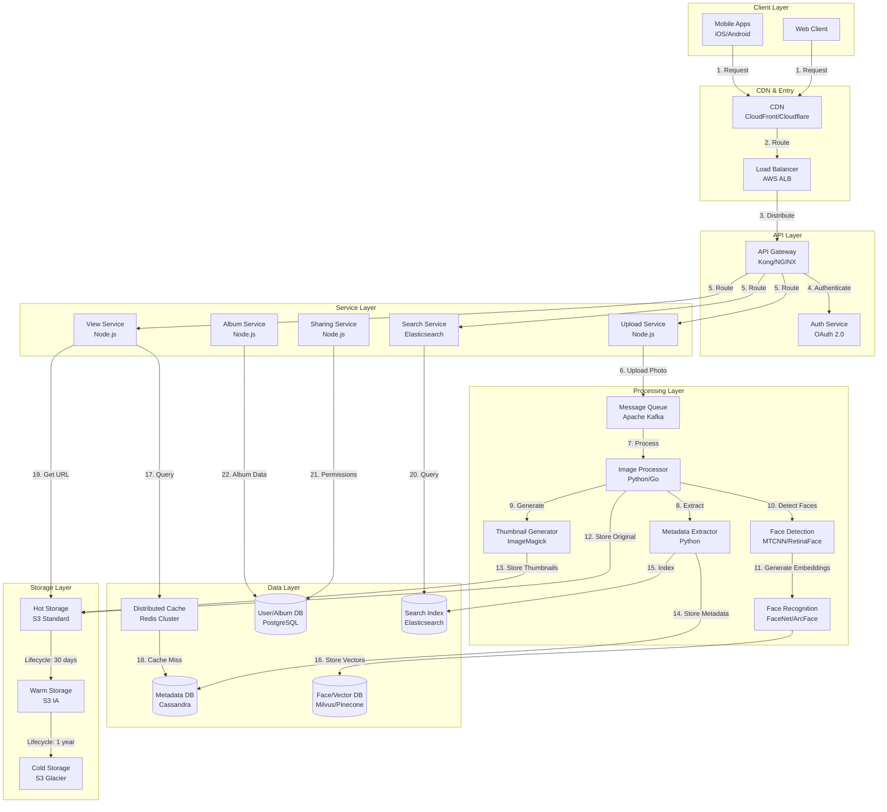
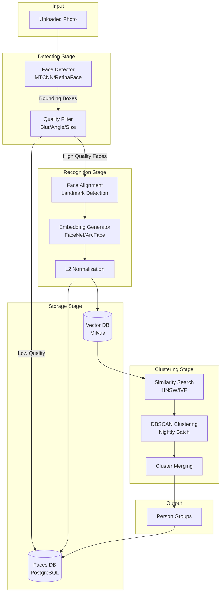
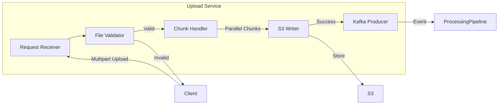
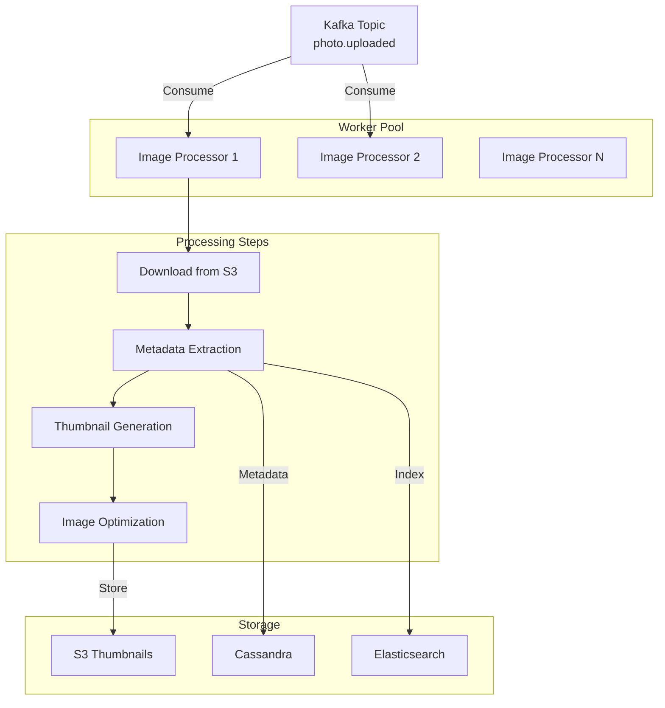
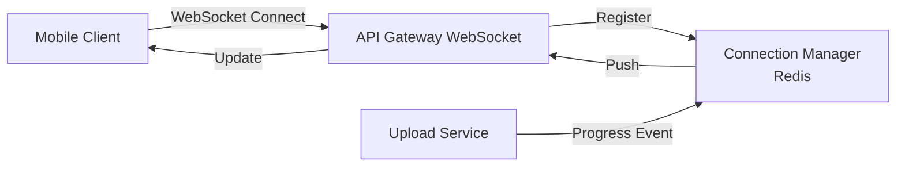

# Photo Storage and Management System Design (Google Photos-like)

**File Purpose:** Interactive, multi-level learning resource for designing a cloud-based photo storage and management platform like Google Photos. This instructional guide takes you from beginner concepts to advanced production considerations, teaching you how to build a system that supports 1 billion users with 4 trillion photos, handles 1.5 billion uploads daily, processes images with ML-powered face recognition and auto-tagging, delivers photos globally with <100ms latency, and achieves 99.99% availability (52 minutes downtime/year).

**Author:** System Design Documentation  
**Created:** October 1, 2025  
**Last Updated:** January 2026  
**Recent Updates:** Transformed into multi-level instructional format with learning objectives, real-world examples from Google Photos/iCloud/Amazon Photos, interview preparation, and practice exercises for educational platform

---

## 🎓 Welcome to Google Photos System Design!

### What You're Going to Build

Imagine creating a platform where over a billion people store their most precious memories - wedding photos, baby's first steps, family vacations - totaling 4 trillion photos. Every day, 1.5 billion new photos are uploaded from smartphones around the world. Your system must automatically recognize faces of loved ones across thousands of photos, organize images into smart albums, let users search for "beach sunset" and instantly find relevant photos from years ago, and deliver any photo to any device globally in under 100 milliseconds. 

By the end of this learning journey, you'll understand how to design a production-grade photo storage and management platform that:
- Stores and manages 4 trillion photos for 1 billion users (4 exabytes of data)
- Handles 1.5 billion photo uploads per day (17,361 uploads/second average, 52K QPS peak)
- Processes images with ML-powered face recognition across billions of faces
- Delivers photos globally with <100ms latency through intelligent CDN placement
- Achieves 99.99% availability (only 52 minutes of downtime per year)

### 📚 Your Learning Path

This course is designed for three different learning levels. You can progress through all levels or focus on the one that matches your current needs:

```text
🟢 BEGINNER LEVEL (6-8 hours)
├─ Learn fundamental concepts of photo storage
├─ Understand WHY we make design choices
├─ Build intuition with everyday analogies (photo albums, libraries)
└─ Perfect for: New to system design or photo/media systems

🟡 INTERMEDIATE LEVEL (8-10 hours)  
├─ Master interview techniques for media platforms
├─ Learn trade-off analysis for storage vs processing
├─ Practice common interview questions
└─ Perfect for: Preparing for FAANG interviews

🔴 ADVANCED LEVEL (10-14 hours)
├─ Production considerations for ML pipelines
├─ Performance optimization techniques at scale
├─ Handle edge cases and ML model failures
└─ Perfect for: Senior engineers and ML system architects
```

### 🎯 Prerequisites

**For Beginners:**
- Basic understanding of how photos are stored on your phone
- Familiarity with uploading files to websites
- No prior system design experience needed!

**For Intermediate:**
- Understanding of databases (SQL and NoSQL concepts)
- Basic knowledge of REST APIs
- Familiarity with object storage (like AWS S3)
- Basic understanding of machine learning concepts

**For Advanced:**
- Experience with distributed systems and CAP theorem
- Knowledge of image processing pipelines
- Understanding of ML model serving and inference
- Familiarity with vector databases and similarity search
- Understanding of consistency models and data replication

### 📊 What Makes This Learning Experience Unique

Each section follows a proven learning pattern:
1. **What You'll Learn** - Clear learning objectives
2. **Why This Matters** - Real-world context from Google Photos, iCloud, Amazon Photos
3. **Multi-Level Content** - Tailored explanations for your level (🟢🟡🔴)
4. **Real-World Examples** - How Google Photos, Apple iCloud, and Amazon Photos actually do it
5. **Think About It** - Questions to deepen understanding
6. **Key Takeaways** - Summary of main points
7. **Practice Exercise** - Hands-on challenge

💡 **Pro Tip:** Don't skip the "Think About It" sections - they're designed to help you internalize concepts so you can explain them in interviews or to your team!

---

## TABLE OF CONTENTS

- [Section 1: Understanding What We're Building](#section-1-understanding-what-were-building)
- [Section 2: Planning for Scale](#section-2-planning-for-scale)
- [Section 3: Designing the System Architecture](#section-3-designing-the-system-architecture)
- [Section 4: Storing Our Data](#section-4-storing-our-data)
- [Section 5: How Users Interact - API Design](#section-5-how-users-interact---api-design)
- [Section 6: Upload Pipeline - Getting Photos into the System](#section-6-upload-pipeline---getting-photos-into-the-system)
- [Section 7: Image Processing & ML Pipeline](#section-7-image-processing--ml-pipeline)
- [Section 8: Face Recognition at Scale](#section-8-face-recognition-at-scale)
- [Section 9: Smart Search & Discovery](#section-9-smart-search--discovery)
- [Section 10: Storage Architecture & CDN](#section-10-storage-architecture--cdn)
- [Section 11: Sharing & Collaboration](#section-11-sharing--collaboration)
- [Section 12: Growing the System - Scalability](#section-12-growing-the-system---scalability)
- [Section 13: Protecting the System - Security](#section-13-protecting-the-system---security)
- [Section 14: Keeping It Healthy - Monitoring](#section-14-keeping-it-healthy---monitoring)
- [Section 15: Making Design Decisions - Trade-offs](#section-15-making-design-decisions---trade-offs)
- [Section 16: Interview Preparation & Practice](#section-16-interview-preparation--practice)
- [Putting It All Together](#putting-it-all-together)
- [Next Steps](#next-steps)

---

## Section 1: Understanding What We're Building

### What You'll Learn

By the end of this section, you'll be able to:
- Explain what a photo storage platform like Google Photos does and why it exists
- Define functional requirements (features the system provides)
- Identify non-functional requirements (performance, scalability, reliability targets)
- Ask the right clarifying questions in a system design interview for media platforms

### Why This Matters

Before writing a single line of code or drawing diagrams, you need to understand WHAT you're building and WHY. This is where 60% of system design interviews are won or lost. Real-world example: Google Photos started as Google+ Photos in 2011 but failed because they didn't understand user requirements - people wanted unlimited free storage for memories, not a social network. When relaunched in 2015 with proper requirements (unlimited storage, auto-backup, smart search), it reached 1 billion users by 2018!

---

### 🟢 For Beginners: The Fundamentals

#### What is a Photo Storage Platform?

Think of Google Photos like a magical photo album that:
- Lives in the cloud (not on your phone)
- Never runs out of space
- Automatically organizes your photos
- Lets you find any photo instantly
- Works on all your devices

**Why not just keep photos on your phone?**

Let's compare:

```text
📱 Phone Storage (Traditional):
├─ Limited space (64GB phone = ~20,000 photos)
├─ Lose phone = lose all photos ❌
├─ Hard to share with family
└─ No automatic organization

☁️ Cloud Photo Platform (Google Photos):
├─ Unlimited space ✅
├─ Phone stolen? Photos still safe ✅
├─ Share albums instantly ✅
└─ Searches "dog" → finds all dog photos ✅
```

#### Why Do People Need Google Photos?

Real-world problems it solves:

1. **Storage Problem**: Your wedding photos (5,000 images) + vacation videos fill up your phone instantly

2. **Loss Problem**: Phone falls in pool → 10 years of memories gone forever

3. **Organization Problem**: You have 50,000 photos. Good luck finding that birthday photo from 2 years ago!

4. **Sharing Problem**: Want to share 200 wedding photos with family? Email has 25MB limit, texting takes forever

5. **Access Problem**: Photos on iPhone, but you're on Android tablet. Can't access them!

#### What Features Should It Have?

Let's think about what users need:

**Core Features (MVP - Must Have):**

1. **Upload Photos**
   - From phone camera automatically
   - From computer manually
   - Support all formats (JPEG, PNG, RAW, HEIC)

2. **Store Forever**
   - Never delete unless user wants to
   - Keep original quality available
   - Multiple backups (don't lose data!)

3. **View Anywhere**
   - Phone app (iOS, Android)
   - Web browser
   - Tablet app
   - Fast loading (< 1 second)

4. **Basic Organization**
   - Timeline view (sorted by date)
   - Create albums manually
   - See location on map

5. **Simple Sharing**
   - Share single photos via link
   - Share whole albums
   - Control who can see what

**Smart Features (Nice to Have):**

6. **Search**
   - Find photos by typing "beach" or "dog"
   - Search by date or location
   - Search by person's face

7. **Automatic Face Recognition**
   - Finds all photos of same person
   - Groups family members automatically
   - Suggests tagging names

8. **Smart Albums**
   - Auto-creates "Best of 2025"
   - Finds all photos from "Paris trip"
   - Makes collages and animations

💡 **Pro Tip:** In interviews, always separate "must-have" (MVP) from "nice-to-have" features. This shows you can prioritize! For Google Photos, search and face recognition are differentiators - they're what made it successful.

---

### 🟡 For Intermediate: Interview Patterns

#### Functional vs Non-Functional Requirements Framework

When you're in a system design interview for a photo platform, the interviewer is testing whether you understand the unique challenges of media systems. Here's the framework:

**Functional Requirements** (What the system DOES):

| Requirement | Description | Interview Tip |
|------------|-------------|---------------|
| Photo Upload | Users can upload photos/videos | Ask: Max file size? Formats supported? Chunked upload? |
| Storage | Store photos with redundancy | Ask: Retention policy? Original + compressed? |
| Viewing | Display photos in various sizes | Ask: Thumbnail sizes? Progressive loading? |
| Organization | Albums, timeline, folders | Ask: Max photos per album? Nesting depth? |
| Search | Find photos by content/metadata | Ask: Text search? Visual search? Latency SLA? |
| Sharing | Share photos with others | Ask: Permission levels? Expiration? Public links? |
| Face Recognition | Detect and group faces | Ask: Real-time or async? Privacy compliance? |

**Non-Functional Requirements** (How WELL it does it):

| Requirement | Target | Why It Matters | Google Photos Reality |
|------------|--------|----------------|----------------------|
| Availability | 99.99% | 52 min downtime/year | People access memories 24/7 |
| Upload Latency | < 5s for photos | User experience | Google: 2-3s average |
| View Latency | < 100ms | Feels instant | Google: 50-80ms globally |
| Storage Scale | Exabytes (1000s of PB) | 1B users × 4,000 photos each | Google: 4+ EB total |
| Throughput | 17K uploads/sec peak | Handle global traffic | Google: Handles 1.5B daily |
| Consistency | Eventually consistent OK | Rare conflicts acceptable | Except permissions: strong |

#### Critical Clarifying Questions

**Scale Questions:**
```text
Q: "How many daily active users?"
Why: Determines infrastructure size
Answer: 500M DAU (Google Photos actual: ~1B users)

Q: "How many photos per user?"
Why: Determines storage architecture
Answer: Average 4,000 photos/user (some have 50K+)

Q: "Upload vs view ratio?"
Why: Read-heavy systems design differently
Answer: 1:100 (typical photo platform - mostly viewing)

Q: "Peak traffic patterns?"
Why: Need to handle spikes (holidays, events)
Answer: 3x normal during Christmas, New Year
```

**Feature Scope Questions:**
```text
Q: "Do we need face recognition?"
Why: Massively increases complexity (ML pipeline)
Answer: Yes for Google Photos (differentiator)
Tip: Can be "Phase 2" for MVP

Q: "Video support?"
Why: Videos are 30x larger, need transcoding
Answer: Yes but different pipeline
Tip: "Let's focus on photos first"

Q: "Photo editing features?"
Why: Adds entire editing infrastructure
Answer: Usually out of scope for interview
Tip: "Users can edit before upload"

Q: "Live Photos (iPhone burst mode)?"
Why: Special handling for photo sequences
Answer: Usually "future enhancement"
```

**Technical Deep-Dive Questions:**
```text
Q: "What's the upload success rate SLA?"
Why: Determines retry logic complexity
Answer: 99.9% success (1 in 1000 can fail)

Q: "How do we handle duplicates?"
Why: Same photo uploaded multiple times
Answer: Perceptual hashing + deduplication

Q: "Consistency model for albums?"
Why: Multiple users editing same album
Answer: Eventually consistent (UI optimistic updates)

Q: "Data retention policy?"
Why: Legal compliance, storage costs
Answer: Forever (unless user deletes)
```

#### Interview Script

Here's how to structure this in a 45-minute interview:

**Minutes 0-10: Requirements Gathering**
```text
You: "Let me clarify the requirements. We're building a photo storage platform 
      like Google Photos. Let me confirm the key features:"

1. Upload photos from mobile/web
2. Store photos reliably with redundancy
3. View photos quickly across devices
4. Organize in albums and timeline
5. Share photos with others
6. Search by content and metadata

Interviewer: "Yes, and add face recognition."

You: "Great. For scale, should I assume:"
- 500M daily active users
- 100M photo uploads per day
- 20B photo views per day
- Global distribution (US, Europe, Asia)
- 99.99% availability target

Interviewer: "Yes, sounds reasonable."

You: "For scope, let's focus on photos first. Videos can follow similar
      architecture with added transcoding. Face recognition we can discuss
      as a separate ML pipeline. Should I proceed with high-level design?"

Interviewer: "Yes, please."
```

**Minutes 10-15: Capacity Estimates**
```text
You: "Let me do quick back-of-envelope calculations:

Storage:
- 100M uploads/day × 3MB avg = 300TB/day = 110PB/year
- With thumbnails + metadata: ~120PB/year
- 5-year total: 600PB

Bandwidth:
- Uploads: 100M × 3MB / 86,400s = ~3.5GB/s
- Views: 20B × 50KB (thumbnails) / 86,400s = ~12TB/s peak
- Need strong CDN presence globally

API Throughput:
- Upload API: ~1,200 QPS average, ~3,600 QPS peak
- View API: ~230K QPS average, ~700K QPS peak

This drives our architecture decisions. Should I proceed to design?"

Interviewer: "Yes."
```

**Minutes 15-45: Continue with architecture, databases, etc.**

💡 **Pro Tip:** Notice how the interview script shows you understand the problem before jumping to solutions. Many candidates fail by drawing boxes without clarifying requirements!

---

### 🔴 For Advanced: Production Considerations

#### Enterprise Requirements

When building Google Photos at production scale, additional requirements emerge:

**1. Compliance & Privacy**

```text
GDPR (Europe):
├─ Right to download all data (data export API)
├─ Right to delete (cascading deletion across all systems)
├─ Data residency (EU data stays in EU)
└─ Consent management (face recognition opt-in)

COPPA (Children's Privacy):
├─ No face recognition for users under 13
├─ Parental consent for accounts
└─ Restricted sharing features

CCPA (California):
├─ Do not sell data option
├─ Transparency in data usage
└─ Right to opt-out of ML training
```

**2. Business Requirements**

```text
Storage Tiers for Monetization:
├─ Free: 15GB (compressed quality)
├─ Paid ($1.99/mo): 100GB original quality
└─ Premium ($9.99/mo): 2TB + advanced features

Feature Gating:
├─ Free: Basic face grouping (1K faces)
├─ Paid: Advanced ML features (unlimited faces)
└─ Premium: Magic Eraser, HDR effects
```

**3. Cost Optimization (Critical at Scale)**

Google Photos specific costs:
- Storage: $0.023/GB/month (S3) × 4 EB = $94M/month just for storage!
- Bandwidth: 12 TB/s × $0.08/GB = $83M/month
- ML Inference: Face recognition on 1.5B photos/day = $30M/month
- Total: $200M+/month operating costs

Cost optimization strategies:
1. **Compression**: Store "High Quality" (compressed) by default
   - Reduces storage by 75%
   - Savings: $70M/month
   
2. **Tiered Storage**: Move old photos to cold storage (Glacier)
   - 80% of views are recent photos (last 30 days)
   - Cold storage: $0.004/GB vs $0.023/GB (82% cheaper)
   - Savings: $40M/month
   
3. **Smart Caching**: Cache popular photos at edge
   - 1% of photos = 80% of views (power law distribution)
   - CDN cache hit ratio: 95%
   - Bandwidth savings: $75M/month

**4. Multi-Tenancy & Isolation**

```text
Tenant Isolation for Enterprise Customers:
├─ Separate encryption keys per customer
├─ Dedicated storage buckets (compliance)
├─ Isolated metadata databases (performance)
└─ Separate ML model serving (IP protection)

Challenge: Google Workspace customers need:
- Corporate compliance (retain all edits for 7 years)
- eDiscovery support (legal holds)
- Admin controls (disable face recognition)
- Audit logs (who viewed what, when)
```

**5. Disaster Recovery & Business Continuity**

```text
RPO (Recovery Point Objective): 0 data loss
RTO (Recovery Time Objective): < 1 hour

Multi-Region Replication:
Primary:     US-EAST-1 (Virginia)
Replica 1:   US-WEST-2 (Oregon)
Replica 2:   EU-WEST-1 (Ireland)
Replica 3:   ASIA-SOUTHEAST-1 (Singapore)

Failure Scenarios:
1. Single server failure: Auto-healing (30s)
2. AZ failure: Traffic shifted (2 min)
3. Region failure: DR promotion (15 min)
4. Global disaster: Restore from tape (4 hours)
```

#### Advanced System Requirements

**1. Consistency Guarantees**

Different operations need different consistency:

| Operation | Consistency Model | Rationale |
|-----------|------------------|-----------|
| Upload photo | Eventual (10s) | Can show "Processing..." |
| Delete photo | Strong (immediate) | Must not show deleted photo |
| Album sharing | Eventual (1-2s) | Optimistic UI acceptable |
| Permissions | Linearizable | Security critical |
| Face clustering | Eventual (hours/days) | Batch processing acceptable |

**2. Performance SLAs by Percentile**

```text
Photo Load Time SLA:
├─ p50 (median): 50ms
├─ p95: 100ms
├─ p99: 200ms
└─ p99.9: 500ms (acceptable for slow networks)

Why percentiles matter:
- Average can hide problems (outliers)
- p99 affects real users (1% of 1B users = 10M people!)
- Google Photos targets: "Instantly feel responsive"
```

**3. ML Model Performance Requirements**

```text
Face Recognition Accuracy:
├─ Precision: > 99.5% (minimize false positives)
├─ Recall: > 95% (find most faces)
├─ Inference latency: < 100ms per photo
└─ Model size: < 50MB (mobile deployment)

Object Detection:
├─ 20,000 object classes (dog, car, sunset, beach...)
├─ Multi-label (one photo: "dog" + "beach" + "sunset")
├─ Inference: < 200ms per photo
└─ Accuracy: > 90% top-5
```

### Real-World Example: How Google Photos Does It

#### Google Photos Evolution

**2015 Launch:**
- Key decision: **Unlimited free storage** (compressed quality)
- Why: Competitive advantage over Apple iCloud ($0.99/month for 50GB)
- Result: Grew from 0 to 100M users in 5 months

**2016 Scaling Challenge:**
- Problem: 200M users, 24B photos, running out of money
- Solution: ML compression (further reduce storage), tiered storage
- Result: Cut costs by 60% while improving quality

**2021 Policy Change:**
- Ended unlimited free storage (now 15GB free)
- Why: Reached 4 trillion photos, unsustainable costs
- Business model: Drive users to Google One ($1.99/mo for 100GB)

#### Technical Decisions

```text
Storage: Google Colossus (successor to GFS)
├─ Reed-Solomon erasure coding (vs 3x replication)
├─ Saves 50% storage (14 data + 4 parity vs 3 copies)
└─ Rebuild from any 14 of 18 shards

CDN: Google Global Cache (in ISP networks)
├─ Cache nodes in 7,500+ ISP locations
├─ 95% of views served from ISP cache (< 10ms)
└─ Only 5% hit origin storage

Face Recognition: FaceNet (2015-2018) → FaceNet-V2 (2019+)
├─ 128-dimensional embeddings
├─ 99.63% accuracy on LFW benchmark
└─ Privacy: On-device clustering (iOS/Android), server for web
```

### 🎯 Interview Questions: Requirements Gathering

**Q1: Why does Google Photos offer unlimited free storage?**

<details>
<summary>Click to see answer</summary>

**Answer:**
Three strategic reasons:

1. **Competitive Advantage (2015)**: Apple charged $0.99/month, Google went free to rapidly gain users

2. **Data for ML Training**: More photos = better ML models for object detection, face recognition

3. **Ecosystem Lock-in**: Once you have 50,000 photos in Google Photos, you won't switch to Apple

**Trade-off**: Lost $200M+/year in 2015-2020, but gained 1B users. Later changed to 15GB free (2021) after achieving dominance.

**Interview Tip**: Shows you understand business strategy, not just technical design.
</details>

**Q2: Why does Google Photos compress photos by default instead of storing originals?**

<details>
<summary>Click to see answer</summary>

**Answer:**
Cost vs quality trade-off:

```text
Original Quality (JPEG from iPhone 14):
- 12 MP = 4000×3000 pixels
- File size: 3-5 MB
- Storage cost: 3 MB × 1 trillion photos = 3 EB
- Monthly cost: 3 EB × $0.023/GB = $70M/month

"High Quality" (Google's compression):
- Resized to 16 MP max (same as original for most phones)
- Aggressive JPEG compression (quality 85)
- File size: 0.8-1.2 MB (70% smaller)
- Monthly cost: $21M/month
- Savings: $49M/month = $588M/year!
```

**Visual quality**: 99% of users can't tell difference on phone screens

**Interview Tip**: At scale, storage costs dominate. Always consider compression.
</details>

**Q3: Why is face recognition the most complex feature to build?**

<details>
<summary>Click to see answer</summary>

**Answer:**
Multiple technical challenges:

**1. ML Pipeline Complexity:**
```text
Regular photo upload:
Photo → Storage → Done (simple)

Face recognition pipeline:
Photo → Face Detection → Embedding Extraction → Clustering → 
Verification → Update Index → Notify User
(6 steps, any can fail)
```

**2. Privacy Regulations:**
- GDPR: Must get consent before scanning faces
- CCPA: Users can opt-out
- BIPA (Illinois): Biometric data special protection
- Results: Different pipeline per region!

**3. Accuracy Requirements:**
- False positive (wrong person): Very bad UX ("That's not grandma!")
- False negative (missed face): Acceptable
- Need precision > 99.5%, recall > 95%

**4. Performance:**
- 1.5B photos uploaded daily
- ~3 faces per photo average
- = 4.5B face inferences/day
- = 52K inferences/second
- Needs massive GPU cluster

**5. Scale:**
- 1 billion users × 10 people per user = 10B face clusters
- Vector database with 10B entries
- Each query: Compare against 10B faces
- Need approximate nearest neighbor (ANN), not exact search

**Interview Tip**: Face recognition alone could be entire interview. Be ready to design the ML pipeline if asked!
</details>

**Q4: What's the difference between functional and non-functional requirements? Give examples for Google Photos.**

<details>
<summary>Click to see answer</summary>

**Answer:**

**Functional Requirements** = WHAT the system does (features)
```text
Examples for Google Photos:
- Upload photos from mobile app
- Create albums and organize photos
- Share photos via link
- Search photos by content
- Recognize faces and group people
```

**Non-Functional Requirements** = HOW WELL it does it (quality attributes)
```text
Examples for Google Photos:
- Upload < 5 seconds (Performance)
- 99.99% uptime (Reliability)
- Handle 1B users (Scalability)
- Encrypt data at rest (Security)
- < 100ms photo load (Latency)
```

**Why Both Matter:**
- Functional only: System works but is slow/unreliable
- Non-functional only: Fast system that does nothing useful
- Need both: Useful system that performs well

**Interview Tip:** Always clarify both types early in interview. Shows structured thinking.
</details>

---

### 🤔 Think About It

Before moving to the next section, consider these questions:

1. **Storage Trade-off**: Would you offer unlimited free storage if you were designing a new photo platform in 2026? Why or why not? (Hint: Consider costs, competition, and business model)

2. **Privacy vs Features**: Face recognition is Google Photos' killer feature but raises privacy concerns. How would you balance this? Would you make it opt-in or opt-out?

3. **Mobile vs Web**: Should you optimize for mobile-first (where most photos are taken) or treat all platforms equally? What would change in your design?

4. **Freemium Model**: If you had to monetize, what features would you put behind a paywall? What must stay free to remain competitive?

---

### ✅ Key Takeaways

```text
✓ Photo platforms are read-heavy (1:100 write-read ratio)
✓ Storage costs dominate at scale ($70M/month for 3 EB)
✓ Compression saves 70% storage with minimal quality loss
✓ Face recognition is complex: ML pipeline + privacy + scale
✓ Functional requirements = features, Non-functional = quality
✓ Always clarify scale before designing (100K vs 1B users = different architecture)
✓ Google Photos' success: Unlimited free storage + smart search + face recognition
✓ Business drives technical: Free storage was strategy, not generosity
```

**Critical Numbers to Remember:**
- 1B users, 4 trillion photos, 1.5B uploads/day
- 99.99% availability = 52 minutes downtime/year
- < 100ms photo load time globally
- 1:100 write-to-read ratio (typical for media platforms)

---

### 🎯 Practice Exercise

**Exercise: Requirements Analysis**

You're in an interview. The interviewer says: *"Design Instagram."*

Using what you learned, write down:
1. 5 functional requirements (MVP features)
2. 5 non-functional requirements (with specific numbers)
3. 3 clarifying questions you'd ask
4. 1 feature you'd explicitly exclude from MVP

<details>
<summary>Click to see sample answer</summary>

**Functional Requirements (MVP):**
1. Users can upload photos (JPEG/PNG, max 10MB)
2. Users can follow other users
3. Users can view a feed of photos from people they follow
4. Users can like and comment on photos
5. Users can search for users by username

**Non-Functional Requirements:**
1. Availability: 99.9% uptime (8.76 hours downtime/year)
2. Upload latency: < 3 seconds for photos
3. Feed load time: < 500ms
4. Scale: 500M daily active users
5. Throughput: 100K photo uploads/second at peak

**Clarifying Questions:**
1. "Do we need video support, or just photos for MVP?" (Videos add transcoding complexity)
2. "What's the maximum number of followers per user?" (Affects feed generation strategy)
3. "Do we need real-time notifications for likes/comments?" (Adds pub-sub infrastructure)

**Explicitly Out of Scope for MVP:**
- Stories/Reels (temporary content)
- Direct messaging
- Shopping/commerce features
- Advanced filters/editing

**Why this answer works:**
- Shows prioritization (MVP vs future)
- Asks scope questions (avoid gold-plating)
- Specifies numbers (not just "fast" or "scalable")
- Understands business (social network vs photo storage)
</details>

---

**Ready to move on?** In the next section, we'll do back-of-the-envelope calculations to determine the scale of infrastructure we need. You'll learn how to estimate storage, bandwidth, and compute requirements - essential skills for any system design interview!

---

## Section 2: Planning for Scale

### What You'll Learn

By the end of this section, you'll be able to:
- Calculate storage requirements for billions of photos
- Estimate bandwidth needs for global photo delivery
- Determine server and database capacity requirements
- Translate business metrics into infrastructure sizing

### Why This Matters

"Back-of-the-envelope" calculations are THE most important skill in system design interviews. They help you avoid over-engineering (wasting money) or under-engineering (system crashes). Real-world example: In 2015, Google Photos launched with "unlimited free storage" without proper capacity planning. By 2020, they had 4 trillion photos costing $200M+/month in storage alone - forcing them to end the free unlimited policy in 2021. Proper planning prevents expensive surprises!

---

### 🟢 For Beginners: The Fundamentals

#### Why Do We Need to Calculate Scale?

Think of it like planning a wedding:

```text
🎊 Without Planning:
You: "Everyone's invited!"
Result: 500 people show up, you ordered food for 50
Disaster: Not enough food, chairs, space!

📊 With Planning:
You: "Let's estimate: 200 invited, 70% attend = 140 people"
Result: Order for 150 (buffer), rent right space, enough food
Success: Happy wedding!
```

Same for systems:
- Estimate users → size your databases
- Estimate traffic → size your servers
- Estimate storage → buy enough disks

#### What Numbers Do We Start With?

For Google Photos, we need to know:

1. **How many users?**
   - Total users: 1 billion
   - Daily Active Users (DAU): 500 million
   - Why DAU matters: They're using your system TODAY

2. **How many photos per person?**
   - Average user: 4,000 photos stored
   - Power users: 50,000+ photos
   - New photos per day: 5 photos per active user

3. **How big are photos?**
   - Phone photo: 3 MB average
   - Professional camera (RAW): 25 MB
   - Screenshot: 500 KB
   - We'll use: 3 MB average (most photos from phones)

4. **Upload vs view?**
   - Read-heavy system: For every 1 photo uploaded, 100 are viewed
   - Why: People upload daily, but browse all the time

💡 **Pro Tip:** In interviews, if you don't know a number, make a reasonable assumption and state it clearly: *"I'll assume average photo size is 3MB based on typical smartphone cameras. Does that sound reasonable?"*

#### Let's Calculate Storage (Simple Version)

**Step 1: Daily uploads**
```text
500M active users × 20% upload daily = 100M uploading users
100M users × 5 photos each = 500M photos/day
```

**Step 2: Daily storage needed**
```text
500M photos × 3 MB per photo = 1,500,000,000 MB
= 1,500,000 GB
= 1,500 TB
= 1.5 PB (petabytes) per day!
```

**What's a petabyte?**
```text
1 PB = 1,000 TB = 1,000,000 GB

To visualize:
- Your laptop: 500 GB
- 1 PB = 2,000 laptops worth of storage
- 1.5 PB/day = 3,000 laptops EVERY DAY!
```

**Step 3: Yearly storage**
```text
1.5 PB/day × 365 days = 547.5 PB/year

Over 5 years: 547.5 × 5 = 2,737 PB ≈ 2.7 EB (exabytes)!
```

**Step 4: But wait - thumbnails!**

We need multiple sizes for fast loading:
- Tiny (150×150 pixels): 10 KB (for grid view)
- Medium (400×400 pixels): 50 KB (for preview)
- Large (1080p): 200 KB (for phone display)

```text
Thumbnails per photo: 10 KB + 50 KB + 200 KB = 260 KB
Daily thumbnails: 500M photos × 260 KB = 130 TB/day
Yearly thumbnails: 130 TB × 365 = 47 PB/year
```

**Total Storage (5 years):**
```text
Original photos: 2,737 PB
Thumbnails: 235 PB
Total: ~3,000 PB = 3 EB!
```

#### Let's Calculate Bandwidth

**What's bandwidth?** How fast data moves through the internet pipe.

Think of it like water:
- Storage = water tank (how much you can hold)
- Bandwidth = pipe size (how fast water flows)

**Upload bandwidth:**
```text
500M photos/day ÷ 86,400 seconds/day = 5,787 photos/second
5,787 photos/s × 3 MB = 17,361 MB/s ≈ 17 GB/s average

Peak times (holidays, weekends): 3× average = 51 GB/s
```

**Download bandwidth (people viewing photos):**
```text
Read-heavy: 100 views for every 1 upload
20 billion views/day ÷ 86,400 seconds = 231,481 views/second

Mostly thumbnails (50 KB): 231,481 × 50 KB = 11.6 GB/s
Some full photos (10%): 23,148 × 3 MB = 69 GB/s
Total download: ~11.6 GB/s (thumbnails dominate)

Peak times: 3× = 35 GB/s download bandwidth
```

#### How Many Servers Do We Need?

**Web servers (handle API requests):**
```text
Peak traffic: ~700,000 requests/second (uploads + views)
One server handles: ~1,000 requests/second
Servers needed: 700,000 ÷ 1,000 = 700 servers
With redundancy (backup): 700 × 2 = 1,400 servers
```

**Storage servers:**
```text
Hard drive size: 10 TB each (modern HDD)
Total storage needed: 3,000 PB = 3,000,000 TB
Drives needed: 3,000,000 ÷ 10 = 300,000 drives
With redundancy (3 copies): 300,000 × 3 = 900,000 drives!
```

💡 **Pro Tip:** These big numbers show why Google uses custom data centers. At this scale, you can't just "use AWS S3" - too expensive!

---

### 🟡 For Intermediate: Interview Patterns

#### Capacity Planning Framework

When doing calculations in an interview, follow this structure:

**1. State Your Assumptions**
```text
Interviewer: "How much storage for Google Photos?"

You: "Let me state my assumptions:
- 500M daily active users
- 20% upload daily = 100M uploading users  
- 5 photos per uploading user = 500M photos/day
- Average photo size: 3 MB
- Planning horizon: 5 years
Does this sound reasonable?"

Interviewer: "Yes, proceed."
```

**Why this works:** Shows structured thinking, gives interviewer chance to correct you early.

**2. Calculate Step-by-Step**

```text
Storage Calculation:

Daily Photos:
500M DAU × 20% upload rate × 5 photos/user
= 100M users × 5 photos = 500M photos/day

Daily Storage:
500M photos × 3 MB/photo = 1,500 TB/day = 1.5 PB/day

Annual Storage:
1.5 PB/day × 365 days = 547.5 PB/year

5-Year Total:
547.5 PB/year × 5 years = 2,737.5 PB ≈ 2.7 EB
```

**3. Add Thumbnails and Metadata**

```text
Thumbnails (3 sizes):
- 150px: 10 KB
- 400px: 50 KB  
- 1080px: 200 KB
Total per photo: 260 KB

Daily thumbnails: 500M × 260 KB = 130 TB/day
Annual thumbnails: 47.45 PB/year
5-year thumbnails: 237 PB

Metadata (EXIF, location, tags):
- 2 KB per photo
- 500M photos/day × 2 KB = 1 TB/day = 365 TB/year
- 5-year metadata: 1.825 PB (negligible)

Total 5-Year Storage:
Photos:      2,737 PB
Thumbnails:    237 PB
Metadata:        2 PB
TOTAL:       2,976 PB ≈ 3 EB
```

**4. Calculate Bandwidth Requirements**

```text
Upload Bandwidth:

Average QPS:
500M photos/day ÷ 86,400 sec/day = 5,787 photos/sec

Average bandwidth:
5,787 photos/sec × 3 MB/photo = 17.4 GB/sec

Peak (3x average):
17.4 GB/s × 3 = 52 GB/s upload bandwidth


Download Bandwidth:

Views per day: 100× uploads = 50B views/day
View QPS: 50B ÷ 86,400 = 578,703 views/sec

Thumbnail bandwidth (90% of views):
520,833 views/sec × 50 KB = 26 GB/s

Full photo bandwidth (10% of views):
57,870 views/sec × 3 MB = 174 GB/s

Total download: 200 GB/s average, 600 GB/s peak
```

**5. Cost Estimation (Advanced)**

```text
Storage Costs (AWS S3 pricing):
- S3 Standard: $0.023/GB/month
- 3 EB = 3,000,000,000 GB
- Monthly cost: 3B GB × $0.023 = $69M/month
- Annual cost: $828M/year (just storage!)

Bandwidth Costs:
- Data transfer: $0.08/GB out
- 600 GB/s peak × 86,400 sec/day = 51,840 TB/day
- Daily cost: 51,840,000 GB × $0.08 = $4.1M/day
- Annual cost: $1.5B/year (just bandwidth!)

Total Infrastructure: $2.3B/year

Why Google uses its own data centers:
- Build your own: ~$100M initial investment
- Operating costs: ~$500M/year
- Saves: $1.8B/year!
```

#### QPS (Queries Per Second) Breakdown

| Operation | Daily Count | Average QPS | Peak QPS (3x) | Latency SLA |
|-----------|------------|-------------|---------------|-------------|
| Photo Upload | 500M | 5,787 | 17,361 | < 5s |
| Thumbnail View | 45B | 520,833 | 1,562,500 | < 100ms |
| Full Photo View | 5B | 57,870 | 173,611 | < 500ms |
| Search Query | 1B | 11,574 | 34,722 | < 300ms |
| Album Create | 10M | 116 | 347 | < 1s |
| Share Create | 50M | 579 | 1,736 | < 2s |
| Face Recognition | 500M | 5,787 | N/A (async) | < 1 hour |

**Total Peak Load: ~1.8M QPS** (mostly thumbnail views)

#### Database Sizing

**Photo Metadata Database (Cassandra):**
```text
Record Structure:
- photo_id: 16 bytes (UUID)
- user_id: 16 bytes
- upload_timestamp: 8 bytes
- location: 16 bytes (lat/long)
- EXIF data: 500 bytes (camera, settings)
- tags: 200 bytes
Total per photo: ~756 bytes ≈ 1 KB

Total photos (5 years): 500M/day × 365 × 5 = 912.5B photos
Metadata storage: 912.5B × 1 KB = 912.5 TB

With 3x replication: 2.7 PB metadata
```

**User Database (PostgreSQL):**
```text
Users: 1B
Per user data: 1 KB (name, email, settings, subscription)
Total: 1 TB (tiny compared to photos!)
```

**Face Embeddings (Vector Database):**
```text
Faces per photo: 3 average
Total faces: 912.5B photos × 3 = 2.7 trillion faces
Embedding size: 512 bytes (128-dim float32)
Total: 2.7T × 512 bytes = 1.38 PB

With HNSW index overhead (3x): 4.14 PB
```

#### Infrastructure Sizing

**Compute Instances:**
```text
API Servers (handle uploads/downloads):
- Peak QPS: 1.8M
- Capacity per server: 1K QPS
- Servers needed: 1,800
- With 2x redundancy: 3,600 servers

Image Processing Workers:
- Photos to process: 500M/day
- Processing time: 5 seconds/photo (thumbnails + metadata)
- Required capacity: 500M × 5s = 2.5B seconds/day
- Worker hours/day: 2.5B ÷ 3600 = 694,444 worker-hours
- Workers (24hr operation): 694,444 ÷ 24 = 28,935 workers
- Actual deployment: ~30,000 processing workers

ML Inference Servers (Face Recognition):
- Faces to process: 1.5B/day
- Inference time: 100ms/face
- GPU throughput: 100 faces/second (batch inference)
- GPUs needed: 1.5B / (86,400 × 100) = 174 GPUs
- With headroom: 250 GPUs (NVIDIA T4 or similar)
```

### 🔴 For Advanced: Production Considerations

#### Multi-Region Capacity Planning

Google Photos operates in 4 major regions with traffic distribution:

```text
Region Traffic Distribution:
├─ US-EAST (Virginia): 35% of traffic
│  ├─ Storage: 1.05 EB
│  ├─ API servers: 1,260
│  └─ Processing workers: 10,500
│
├─ US-WEST (Oregon): 15% of traffic
│  ├─ Storage: 450 PB
│  ├─ API servers: 540
│  └─ Processing workers: 4,500
│
├─ EU-WEST (Ireland): 30% of traffic
│  ├─ Storage: 900 PB
│  ├─ API servers: 1,080
│  └─ Processing workers: 9,000
│
└─ ASIA-SOUTHEAST (Singapore): 20% of traffic
   ├─ Storage: 600 PB
   ├─ API servers: 720
   └─ Processing workers: 6,000

Total Global Infrastructure:
- Storage: 3 EB
- API servers: 3,600
- Processing workers: 30,000
- ML GPUs: 250
```

#### Growth Projections & Capacity Planning

```text
Year 1 (Launch):
├─ Users: 100M
├─ Photos: 10B
├─ Storage: 30 PB
└─ Servers: 200

Year 2 (10x growth):
├─ Users: 1B
├─ Photos: 100B
├─ Storage: 300 PB
└─ Servers: 2,000

Year 5 (Current):
├─ Users: 1B (plateaued)
├─ Photos: 4T (accumulated)
├─ Storage: 3 EB
└─ Servers: 3,600

Year 7 (Projection):
├─ Users: 1.2B (slow growth)
├─ Photos: 6T
├─ Storage: 4.5 EB
└─ Servers: 5,000

Planning Strategy:
- Add capacity 6 months before projected need
- Storage: Grow 50%/year
- Compute: Grow 30%/year (better efficiency)
- GPU: Grow 100%/year (more ML features)
```

#### Cost Optimization at Scale

**Storage Tiering Strategy:**
```text
Hot Storage (Last 30 days): 20% of photos, 80% of views
├─ Technology: NVMe SSD
├─ Cost: $0.10/GB/month
├─ Size: 600 PB
└─ Monthly cost: $60M

Warm Storage (31-365 days): 30% of photos, 15% of views
├─ Technology: HDD (SATA)
├─ Cost: $0.023/GB/month
├─ Size: 900 PB
└─ Monthly cost: $20.7M

Cold Storage (1+ years): 50% of photos, 5% of views
├─ Technology: Tape/Glacier
├─ Cost: $0.004/GB/month
├─ Size: 1.5 EB
└─ Monthly cost: $6M

Total Storage Cost: $86.7M/month (vs $69M without tiering)
Wait, this is MORE expensive? 

With Compression:
Hot (SSD, compressed): $30M
Warm (HDD, compressed): $10M
Cold (Tape, compressed): $3M
Total: $43M/month
SAVINGS: $26M/month = $312M/year!
```

**Bandwidth Optimization:**
```text
Without CDN: 
- Origin bandwidth: 600 GB/s × $0.08/GB = $1.5B/year

With Global CDN (95% cache hit):
- Origin bandwidth: 30 GB/s (5% of traffic)
- CDN cost: Fixed $50M/year for global PoPs
- Origin cost: $75M/year (5% of $1.5B)
- Total: $125M/year
SAVINGS: $1.375B/year!

This is why CDN is CRITICAL for Google Photos!
```

#### Real Numbers from Google Photos

Based on publicly available information and industry reports:

```text
Google Photos (2023 data):
├─ Total users: 1+ billion
├─ Photos stored: 4+ trillion
├─ Daily uploads: 1.5 billion
├─ Storage: 4+ exabytes
├─ Annual costs: $200-300M (est)
├─ Revenue: $2-3B (Google One subscriptions)
└─ Profit margin: ~85% (highly profitable!)

Infrastructure:
├─ Data centers: 23 globally
├─ CDN PoPs: 7,500+ locations
├─ Servers: 50,000+ (est)
├─ TPUs for ML: 10,000+ (v4 pods)
└─ Network capacity: 1+ Tbps per DC
```

### Real-World Example: Capacity Planning Failure

**Instagram's Photo Growth Crisis (2012):**

```text
Problem:
- Launched Oct 2010: 25K users, 100 photos/hour
- Dec 2010: 1M users, 10K photos/hour (100x growth in 2 months!)
- Apr 2012: 30M users (before Facebook acquisition)
- Grossly underestimated storage needs

Result:
- Ran out of storage 3 times in first year
- Emergency migrations to AWS S3
- Had to re-architect entire storage system
- Almost crashed during Facebook acquisition due diligence

Lesson Learned:
- Plan for 10x growth in first year
- Plan for 100x growth in 3 years
- Always have 6-month storage buffer
- Automate capacity monitoring and alerting
```

### 🎯 Interview Questions: Capacity Planning

**Q1: How do you estimate the number of photos uploaded per day?**

<details>
<summary>Click to see answer</summary>

**Answer:**
Break it down step-by-step:

**Step 1: Identify active users**
- Total users: 1B
- Daily Active Users (DAU): Typically 30-50% for mobile apps
- Assume: 500M DAU

**Step 2: Identify uploaders**
- Not everyone uploads daily
- Typical: 15-25% of DAU upload
- Assume: 20% = 100M uploading users

**Step 3: Photos per uploader**
- Light users: 1-2 photos
- Active users: 5-10 photos
- Power users: 20+ photos
- Average: 5 photos/user (weighted)

**Calculation:**
```text
100M uploading users × 5 photos/user = 500M photos/day
```

**Validation:**
- Weekly: 3.5B photos
- Monthly: 15B photos  
- Yearly: 182.5B photos
- Does this make sense? Yes - Google Photos had 4T photos total over 8 years

**Interview Tip:** Always validate your final number makes sense in larger context!
</details>

**Q2: How would you estimate thumbnail storage requirements?**

<details>
<summary>Click to see answer</summary>

**Answer:**

**Why Multiple Thumbnails?**
Different use cases need different sizes:
- Grid view: 150×150 (tiny, load fast)
- Preview hover: 400×400 (medium quality)
- Mobile display: 1080p (full screen quality)

**Size Calculation:**
```text
Thumbnail Compression (JPEG quality 80):

150×150 pixels:
- 150 × 150 × 3 bytes (RGB) = 67.5 KB uncompressed
- JPEG compression (10:1): ~7-10 KB
- Use: 10 KB

400×400 pixels:
- 400 × 400 × 3 = 480 KB uncompressed
- JPEG compression: ~40-50 KB
- Use: 50 KB

1080p (1920×1080):
- 1920 × 1080 × 3 = 6.2 MB uncompressed
- JPEG compression: ~150-250 KB
- Use: 200 KB

Total per photo: 10 + 50 + 200 = 260 KB
```

**Daily Storage:**
```text
500M photos/day × 260 KB = 130 TB/day
```

**Yearly:**
```text
130 TB/day × 365 = 47.45 PB/year
```

**Ratio Check:**
```text
Thumbnails vs originals: 47 PB vs 547 PB = ~8.6%
This seems reasonable!
```

**Interview Tip:** Thumbnails are ~10% of original storage - use this as quick check.
</details>

**Q3: How many API servers do you need to handle peak traffic?**

<details>
<summary>Click to see answer</summary>

**Answer:**

**Step 1: Calculate Peak QPS**
```text
Daily views: 50B
Average QPS: 50B ÷ 86,400 = 578,703 QPS
Peak (3x): 1,736,111 QPS
```

**Step 2: Server Capacity**
Modern server (8-core, 32GB RAM):
- Can handle: 500-1,500 QPS (depending on operation)
- Conservative estimate: 1,000 QPS
- For light operations (thumbnails): 1,500 QPS
- For heavy operations (uploads): 500 QPS

**Step 3: Separate by Operation Type**
```text
Thumbnail Serves (90% of traffic):
- QPS: 1.56M
- Capacity: 1,500 QPS/server
- Servers: 1.56M ÷ 1,500 = 1,040 servers

Upload Processing (10% of traffic):
- QPS: 173K
- Capacity: 500 QPS/server
- Servers: 173K ÷ 500 = 346 servers

Total: 1,386 servers
```

**Step 4: Add Redundancy**
```text
For high availability (99.99%):
- Need N+1 redundancy per region
- 4 regions × 2x redundancy = 8x multiplier
- Actually: 2x is enough (one for failover)

Final: 1,386 × 2 = 2,772 servers
Round up: 3,000 API servers
```

**Interview Tip:** Always include redundancy! Never design single point of failure.
</details>

---

### 🤔 Think About It

1. **Storage Growth**: If Google Photos grows from 4 trillion to 6 trillion photos in 2 years, how much new storage capacity should you add each quarter? Consider lead time for hardware procurement.

2. **Cost vs Features**: Thumbnails cost 10% extra storage but make the app 10x faster. Would you generate thumbnails for ALL photos, or only for photos viewed at least once? What's the trade-off?

3. **Peak Traffic**: Photo platforms see 3-5x normal traffic on holidays (Christmas, New Year). How would you handle this WITHOUT keeping 5x servers idle 360 days/year?

---

### ✅ Key Takeaways

```text
✓ 500M DAU × 20% upload rate × 5 photos = 500M photos/day
✓ 500M photos × 3 MB = 1.5 PB/day storage needed
✓ Thumbnails add ~10% storage but crucial for performance
✓ Read-heavy: 100 views for every 1 upload (1:100 ratio)
✓ Peak traffic is 3x average - plan for peaks, not average
✓ Always add 2x redundancy for high availability
✓ Storage costs dominate: $69M/month for 3 EB on S3
✓ CDN saves $1.3B/year by reducing origin bandwidth
✓ Plan capacity 6 months in advance (procurement lead time)
✓ Validate numbers: Does yearly total match known data points?
```

**Critical Formulas to Remember:**
```text
Daily Storage = DAU × Upload% × Photos/User × Size/Photo
QPS = Daily_Operations ÷ 86,400
Peak_QPS = Average_QPS × 3
Servers = Peak_QPS ÷ Capacity_Per_Server × Redundancy_Factor
```

---

### 🎯 Practice Exercise

**Exercise: Capacity Planning for Instagram**

Instagram has:
- 500M DAU (same as our Google Photos estimate)
- But 50% upload daily (vs 20% for photos)
- Average upload: 2 photos/day (vs 5 for Google Photos)
- Average size: 2 MB (more compressed than Google Photos)

Calculate:
1. Daily photo uploads
2. Daily storage needed
3. Peak upload QPS
4. Number of API servers needed (assume 1K QPS per server with 2x redundancy)

<details>
<summary>Click to see solution</summary>

**Solution:**

**1. Daily Uploads:**
```text
500M DAU × 50% upload rate × 2 photos/user
= 250M users × 2 photos
= 500M photos/day
(Same as Google Photos!)
```

**2. Daily Storage:**
```text
500M photos × 2 MB/photo
= 1,000 TB/day
= 1 PB/day
(Less than Google Photos' 1.5 PB/day due to smaller size)
```

**3. Peak Upload QPS:**
```text
Average: 500M ÷ 86,400 = 5,787 photos/sec
Peak (3x): 17,361 photos/sec
```

**4. API Servers:**
```text
Assuming similar view ratio (1:100):
- Views: 50B/day
- Peak View QPS: 1.7M QPS
- Servers: 1.7M ÷ 1K = 1,700
- With 2x redundancy: 3,400 servers

Similar to Google Photos despite different usage patterns!
```

**Key Insight:** Instagram and Google Photos need similar infrastructure scale, but different feature focus (social vs storage).
</details>

---

**Ready for Section 3?** Next, we'll design the high-level system architecture, showing how all these components (API servers, storage, databases) fit together. You'll learn how to draw clean architecture diagrams that impress interviewers!

---

Face Detection/Recognition Workers:
Assume 60% of photos contain faces (300M photos/day)
Average faces per photo: 2 faces
Total faces to process: 600M faces/day = 6,944 faces/second
Face detection time: 2s per photo (GPU accelerated)
Face embedding generation: 0.5s per face
Required workers: (18,000 × 0.6 × 2) + (21,600 × 0.5) = ~32,400 operations/s
With GPU instances (100 ops/s each): 324 GPU workers
Face clustering (batch job): Run nightly on new faces

Database Connections:
Metadata operations: ~700K QPS
Connection pool per DB: 1,000 connections
Sharded databases: 100 shards

Face Embeddings Storage:
512-dimension vector per face: 2KB per face
Daily face embeddings: 600M × 2KB = 1.2 TB/day
Annual storage: 438 TB/year
```

---

## 3. HIGH-LEVEL DESIGN

### System Architecture Diagram



### Data Flow Explanation

**Upload Flow (Steps 1-16):**

1. User uploads photo via web/mobile client
2. CDN routes request to nearest load balancer
3. Load balancer distributes to API gateway
4. API gateway authenticates user with Auth service
5. Request routed to Upload Service
6. Upload Service publishes event to Kafka queue
7. Image Processor picks up message for processing
8. Metadata Extractor extracts EXIF data
9. Thumbnail Generator creates multiple resolution thumbnails
10. Face Detection service detects faces in photo
11. Face Recognition generates embeddings for each detected face
12. Original photo stored in S3 Hot storage
13. Thumbnails stored in S3 with appropriate keys
14. Metadata written to Cassandra for fast queries
15. Photo indexed in Elasticsearch for search
16. Face embeddings stored in Vector DB (Milvus) for similarity matching

**View Flow (Steps 17-19):**
17. View Service checks Redis cache for metadata
18. On cache miss, queries Cassandra
19. Returns CDN URL for photo retrieval

**Search Flow (Step 20):**
20. Search Service queries Elasticsearch index

**Sharing Flow (Step 21):**
21. Sharing Service validates permissions in PostgreSQL

**Face Search Flow:**

- Query face embeddings in Vector DB using similarity search
- Return photos containing matching faces

---

## 4. DATABASE DESIGN

### User Database (PostgreSQL - Relational)

**Users Table:**

```sql
- user_id (PK, UUID)
- email (VARCHAR(255), UNIQUE, NOT NULL)
- username (VARCHAR(100), UNIQUE)
- password_hash (VARCHAR(255))
- created_at (TIMESTAMP)
- last_login (TIMESTAMP)
- storage_quota_gb (INT, DEFAULT 15)
- storage_used_gb (DECIMAL(10,2))
- subscription_tier (ENUM: 'free', 'premium')
- INDEX: idx_email
- INDEX: idx_username
```

**Albums Table:**

```sql
- album_id (PK, UUID)
- user_id (FK -> Users.user_id)
- album_name (VARCHAR(255))
- description (TEXT)
- cover_photo_id (FK -> Photos.photo_id, NULL)
- is_shared (BOOLEAN, DEFAULT FALSE)
- created_at (TIMESTAMP)
- updated_at (TIMESTAMP)
- INDEX: idx_user_id
- INDEX: idx_created_at
```

**Sharing Table:**

```sql
- share_id (PK, UUID)
- resource_type (ENUM: 'photo', 'album')
- resource_id (UUID)
- owner_id (FK -> Users.user_id)
- shared_with_user_id (FK -> Users.user_id, NULL)
- share_link (VARCHAR(255), UNIQUE, NULL)
- permission_level (ENUM: 'view', 'edit')
- is_public (BOOLEAN, DEFAULT FALSE)
- expires_at (TIMESTAMP, NULL)
- created_at (TIMESTAMP)
- INDEX: idx_resource_id
- INDEX: idx_owner_id
- INDEX: idx_share_link
```

### Metadata Database (Cassandra - NoSQL)

**Photos Metadata Table:**

```text
Partition Key: user_id
Clustering Key: upload_date (DESC), photo_id

Columns:
- photo_id (UUID)
- user_id (UUID)
- file_name (TEXT)
- file_size_bytes (BIGINT)
- original_format (TEXT)
- mime_type (TEXT)
- width (INT)
- height (INT)
- upload_date (TIMESTAMP)
- capture_date (TIMESTAMP)
- storage_location (TEXT) // S3 key
- thumbnail_locations (MAP<TEXT, TEXT>) // size -> S3 key
- processing_status (TEXT) // pending, completed, failed
- device_info (TEXT)
- camera_make (TEXT)
- camera_model (TEXT)
- latitude (DOUBLE)
- longitude (DOUBLE)
- location_name (TEXT)
- album_ids (SET<UUID>)
- tags (SET<TEXT>)
- is_favorite (BOOLEAN)
- is_deleted (BOOLEAN)
- deleted_at (TIMESTAMP)
```

**Videos Metadata Table:**

```text
Partition Key: user_id
Clustering Key: upload_date (DESC), video_id

Columns:
- video_id (UUID)
- user_id (UUID)
- file_name (TEXT)
- file_size_bytes (BIGINT)
- duration_seconds (INT)
- resolution (TEXT) // 1080p, 4K, etc.
- codec (TEXT)
- bitrate (INT)
- fps (INT)
- upload_date (TIMESTAMP)
- capture_date (TIMESTAMP)
- storage_location (TEXT)
- thumbnail_location (TEXT)
- processing_status (TEXT)
- device_info (TEXT)
- latitude (DOUBLE)
- longitude (DOUBLE)
- location_name (TEXT)
- album_ids (SET<UUID>)
- tags (SET<TEXT>)
- is_favorite (BOOLEAN)
- is_deleted (BOOLEAN)
- deleted_at (TIMESTAMP)
```

### Search Index (Elasticsearch)

**Photos Index:**

```json
{
  "photo_id": "uuid",
  "user_id": "uuid",
  "file_name": "text",
  "upload_date": "date",
  "capture_date": "date",
  "tags": ["text"],
  "location_name": "text",
  "geo_location": {
    "lat": "double",
    "lon": "double"
  },
  "camera_make": "text",
  "camera_model": "text",
  "device_info": "text",
  "width": "integer",
  "height": "integer",
  "is_favorite": "boolean",
  "album_ids": ["uuid"]
}
```

### Face and People Database (PostgreSQL)

**People Table:**

```sql
- person_id (PK, UUID)
- user_id (FK -> Users.user_id)
- person_name (VARCHAR(255), NULL) // NULL for unnamed face groups
- is_confirmed (BOOLEAN, DEFAULT FALSE) // User confirmed the grouping
- created_at (TIMESTAMP)
- updated_at (TIMESTAMP)
- face_count (INT) // Number of faces in this person group
- cover_face_id (FK -> Faces.face_id, NULL)
- INDEX: idx_user_id
- INDEX: idx_person_name
- UNIQUE: (user_id, person_name) WHERE person_name IS NOT NULL
```

**Faces Table:**

```sql
- face_id (PK, UUID)
- photo_id (FK -> Photos.photo_id)
- user_id (FK -> Users.user_id)
- person_id (FK -> People.person_id, NULL) // NULL if unassigned
- bounding_box (JSONB) // {x, y, width, height}
- confidence_score (DECIMAL(5,4)) // 0.0 to 1.0
- embedding_vector_id (VARCHAR(255)) // Reference to vector in Milvus
- detected_at (TIMESTAMP)
- quality_score (DECIMAL(5,4)) // Face quality for grouping
- is_deleted (BOOLEAN, DEFAULT FALSE)
- INDEX: idx_photo_id
- INDEX: idx_user_id
- INDEX: idx_person_id
- INDEX: idx_detected_at
```

**Face_Clusters Table (for grouping):**

```sql
- cluster_id (PK, UUID)
- user_id (FK -> Users.user_id)
- representative_face_id (FK -> Faces.face_id)
- cluster_size (INT)
- average_confidence (DECIMAL(5,4))
- created_at (TIMESTAMP)
- merged_into_person_id (FK -> People.person_id, NULL)
- INDEX: idx_user_id
- INDEX: idx_created_at
```

### Vector Database (Milvus/Pinecone)

**Face Embeddings Collection:**

```python
Collection Schema:
- face_id (VARCHAR, PRIMARY KEY)
- user_id (VARCHAR, PARTITION KEY) // For data isolation
- photo_id (VARCHAR)
- person_id (VARCHAR, NULL)
- embedding (FLOAT_VECTOR, dimension=512) // FaceNet/ArcFace embedding
- quality_score (FLOAT)
- detected_at (INT64) // Unix timestamp

Index Configuration:
- Index type: IVF_FLAT or HNSW
- Metric type: COSINE or L2 (Euclidean)
- Search parameters: nprobe=16, ef=200
- Partitioning: By user_id for isolation and performance
```

**Vector Search Query Example:**

```python
# Find similar faces
search_params = {
    "metric_type": "COSINE",
    "params": {"nprobe": 16}
}

results = collection.search(
    data=[query_embedding],
    anns_field="embedding",
    param=search_params,
    limit=100,
    expr=f"user_id == '{user_id}' and quality_score > 0.7"
)
```

### Cache Layer (Redis)

**Cache Keys Structure:**

```text
photo_metadata:{photo_id} -> JSON (TTL: 24h)
user_photos:{user_id}:{page} -> List of photo_ids (TTL: 1h)
album_photos:{album_id}:{page} -> List of photo_ids (TTL: 1h)
user_albums:{user_id} -> List of album_ids (TTL: 6h)
thumbnail_url:{photo_id}:{size} -> CDN URL (TTL: 7d)
share_permissions:{share_link} -> Permissions JSON (TTL: 1h)
person_photos:{person_id}:{page} -> List of photo_ids (TTL: 1h)
user_people:{user_id} -> List of person_ids (TTL: 6h)
face_clusters:{user_id} -> Cluster data (TTL: 12h)
```

---

## 5. API DESIGN

### Base Configuration

**Base URL:** `https://api.googlephotos.example.com/v1`

**Authentication:**

- OAuth 2.0 with JWT tokens
- All requests require: `Authorization: Bearer <access_token>`
- Token expiry: 1 hour (access), 30 days (refresh)

**Versioning:** URL path versioning (`/v1`, `/v2`)

**Rate Limiting:**

- Standard tier: 1,000 requests/hour per user
- Premium tier: 10,000 requests/hour per user
- Upload endpoints: 100 uploads/hour per user

---

### Authentication Endpoints

#### 1. Register User

```http
POST /auth/register
```

**Request:**

```json
{
  "email": "user@example.com",
  "password": "securePassword123",
  "username": "photouser"
}
```

**Response (201):**

```json
{
  "user_id": "550e8400-e29b-41d4-a716-446655440000",
  "email": "user@example.com",
  "username": "photouser",
  "access_token": "eyJhbGciOiJIUzI1NiIs...",
  "refresh_token": "dGhpc2lzYXJlZnJlc2h0b2tlbg...",
  "expires_in": 3600
}
```

#### 2. Login

```http
POST /auth/login
```

**Request:**

```json
{
  "email": "user@example.com",
  "password": "securePassword123"
}
```

**Response (200):**

```json
{
  "user_id": "550e8400-e29b-41d4-a716-446655440000",
  "access_token": "eyJhbGciOiJIUzI1NiIs...",
  "refresh_token": "dGhpc2lzYXJlZnJlc2h0b2tlbg...",
  "expires_in": 3600
}
```

#### 3. Refresh Token

```http
POST /auth/refresh
```

**Request:**

```json
{
  "refresh_token": "dGhpc2lzYXJlZnJlc2h0b2tlbg..."
}
```

**Response (200):**

```json
{
  "access_token": "eyJhbGciOiJIUzI1NiIs...",
  "expires_in": 3600
}
```

#### 4. Logout

```http
POST /auth/logout
```

**Headers:** `Authorization: Bearer <access_token>`

**Response (204):** No content

---

### Photo Management Endpoints

#### 5. Upload Photo

```http
POST /photos/upload
```

**Headers:**

- `Authorization: Bearer <access_token>`
- `Content-Type: multipart/form-data`

**Request (Form Data):**

```text
photo: [binary file]
file_name: "vacation.jpg"
capture_date: "2025-09-15T14:30:00Z" (optional)
album_id: "uuid" (optional)
tags: ["vacation", "beach"] (optional)
latitude: 37.7749 (optional)
longitude: -122.4194 (optional)
```

**Response (201):**

```json
{
  "photo_id": "123e4567-e89b-12d3-a456-426614174000",
  "user_id": "550e8400-e29b-41d4-a716-446655440000",
  "file_name": "vacation.jpg",
  "file_size_bytes": 3145728,
  "upload_date": "2025-10-01T10:15:30Z",
  "capture_date": "2025-09-15T14:30:00Z",
  "processing_status": "pending",
  "thumbnail_urls": {
    "150": "https://cdn.example.com/thumbnails/150/photo_id.jpg",
    "400": "https://cdn.example.com/thumbnails/400/photo_id.jpg",
    "1080": "https://cdn.example.com/thumbnails/1080/photo_id.jpg"
  },
  "original_url": "https://cdn.example.com/photos/photo_id.jpg"
}
```

**Error Response (413):**

```json
{
  "error": "file_too_large",
  "message": "File size exceeds maximum limit of 100MB",
  "max_size_bytes": 104857600
}
```

#### 6. Get Photo Details

```http
GET /photos/{photo_id}
```

**Headers:** `Authorization: Bearer <access_token>`

**Response (200):**

```json
{
  "photo_id": "123e4567-e89b-12d3-a456-426614174000",
  "user_id": "550e8400-e29b-41d4-a716-446655440000",
  "file_name": "vacation.jpg",
  "file_size_bytes": 3145728,
  "width": 4032,
  "height": 3024,
  "upload_date": "2025-10-01T10:15:30Z",
  "capture_date": "2025-09-15T14:30:00Z",
  "location": {
    "latitude": 37.7749,
    "longitude": -122.4194,
    "location_name": "San Francisco, CA"
  },
  "camera_info": {
    "make": "Apple",
    "model": "iPhone 14 Pro"
  },
  "urls": {
    "original": "https://cdn.example.com/photos/photo_id.jpg",
    "thumbnails": {
      "150": "https://cdn.example.com/thumbnails/150/photo_id.jpg",
      "400": "https://cdn.example.com/thumbnails/400/photo_id.jpg",
      "1080": "https://cdn.example.com/thumbnails/1080/photo_id.jpg"
    }
  },
  "album_ids": ["album-uuid-1", "album-uuid-2"],
  "tags": ["vacation", "beach"],
  "is_favorite": false
}
```

#### 7. Get User Photos

```http
GET /photos
```

**Headers:** `Authorization: Bearer <access_token>`

**Query Parameters:**

- `page` (integer, default: 1)
- `page_size` (integer, default: 50, max: 100)
- `sort_by` (enum: "upload_date", "capture_date", default: "upload_date")
- `order` (enum: "asc", "desc", default: "desc")
- `album_id` (uuid, optional) - filter by album
- `is_favorite` (boolean, optional) - filter favorites only

**Response (200):**

```json
{
  "photos": [
    {
      "photo_id": "123e4567-e89b-12d3-a456-426614174000",
      "file_name": "vacation.jpg",
      "thumbnail_url": "https://cdn.example.com/thumbnails/400/photo_id.jpg",
      "capture_date": "2025-09-15T14:30:00Z",
      "is_favorite": false
    }
  ],
  "pagination": {
    "current_page": 1,
    "page_size": 50,
    "total_items": 1250,
    "total_pages": 25,
    "has_next": true,
    "has_previous": false
  }
}
```

#### 8. Update Photo

```http
PATCH /photos/{photo_id}
```

**Headers:** `Authorization: Bearer <access_token>`

**Request:**

```json
{
  "file_name": "updated_vacation.jpg",
  "tags": ["vacation", "beach", "sunset"],
  "is_favorite": true
}
```

**Response (200):**

```json
{
  "photo_id": "123e4567-e89b-12d3-a456-426614174000",
  "message": "Photo updated successfully",
  "updated_fields": ["file_name", "tags", "is_favorite"]
}
```

#### 9. Delete Photo

```http
DELETE /photos/{photo_id}
```

**Headers:** `Authorization: Bearer <access_token>`

**Query Parameters:**

- `permanent` (boolean, default: false) - Soft delete vs permanent delete

**Response (200):**

```json
{
  "message": "Photo moved to trash",
  "photo_id": "123e4567-e89b-12d3-a456-426614174000",
  "deleted_at": "2025-10-01T15:30:00Z",
  "permanent_deletion_date": "2025-10-31T15:30:00Z"
}
```

#### 10. Batch Upload Photos

```http
POST /photos/batch-upload
```

**Headers:**

- `Authorization: Bearer <access_token>`
- `Content-Type: multipart/form-data`

**Request (Form Data):**

```text
photos: [array of binary files, max 50 per request]
album_id: "uuid" (optional)
```

**Response (202):**

```json
{
  "batch_id": "batch-uuid",
  "status": "processing",
  "total_photos": 25,
  "processed": 0,
  "status_url": "/photos/batch-upload/batch-uuid/status"
}
```

#### 11. Get Batch Upload Status

```http
GET /photos/batch-upload/{batch_id}/status
```

**Headers:** `Authorization: Bearer <access_token>`

**Response (200):**

```json
{
  "batch_id": "batch-uuid",
  "status": "processing",
  "total_photos": 25,
  "processed": 15,
  "successful": 14,
  "failed": 1,
  "progress_percentage": 60,
  "photos": [
    {
      "file_name": "photo1.jpg",
      "status": "completed",
      "photo_id": "uuid"
    },
    {
      "file_name": "photo2.jpg",
      "status": "failed",
      "error": "Invalid format"
    }
  ]
}
```

---

### Search Endpoints

#### 12. Search Photos

```http
GET /search/photos
```

**Headers:** `Authorization: Bearer <access_token>`

**Query Parameters:**

- `query` (string, optional) - Text search query
- `start_date` (ISO 8601, optional) - Filter by capture date
- `end_date` (ISO 8601, optional) - Filter by capture date
- `location` (string, optional) - Location name search
- `tags` (array, optional) - Filter by tags
- `camera_make` (string, optional)
- `camera_model` (string, optional)
- `page` (integer, default: 1)
- `page_size` (integer, default: 50, max: 100)

**Response (200):**

```json
{
  "results": [
    {
      "photo_id": "uuid",
      "file_name": "beach_sunset.jpg",
      "thumbnail_url": "https://cdn.example.com/thumbnails/400/photo_id.jpg",
      "capture_date": "2025-09-15T18:30:00Z",
      "location_name": "Malibu Beach, CA",
      "relevance_score": 0.95
    }
  ],
  "total_results": 127,
  "search_time_ms": 45,
  "pagination": {
    "current_page": 1,
    "page_size": 50,
    "total_pages": 3
  }
}
```

#### 13. Search by Location

```http
GET /search/location
```

**Headers:** `Authorization: Bearer <access_token>`

**Query Parameters:**

- `latitude` (double, required)
- `longitude` (double, required)
- `radius_km` (double, default: 10, max: 100)
- `page` (integer, default: 1)
- `page_size` (integer, default: 50)

**Response (200):**

```json
{
  "results": [
    {
      "photo_id": "uuid",
      "thumbnail_url": "https://cdn.example.com/thumbnails/400/photo_id.jpg",
      "capture_date": "2025-09-15T18:30:00Z",
      "location": {
        "latitude": 37.7749,
        "longitude": -122.4194,
        "location_name": "San Francisco, CA"
      },
      "distance_km": 2.5
    }
  ],
  "center": {
    "latitude": 37.7749,
    "longitude": -122.4194
  },
  "radius_km": 10,
  "total_results": 45
}
```

---

### Album Management Endpoints

#### 14. Create Album

```http
POST /albums
```

**Headers:** `Authorization: Bearer <access_token>`

**Request:**

```json
{
  "album_name": "Summer Vacation 2025",
  "description": "Our amazing summer trip to Hawaii",
  "cover_photo_id": "uuid" (optional)
}
```

**Response (201):**

```json
{
  "album_id": "album-uuid",
  "user_id": "user-uuid",
  "album_name": "Summer Vacation 2025",
  "description": "Our amazing summer trip to Hawaii",
  "cover_photo_id": "uuid",
  "photo_count": 0,
  "created_at": "2025-10-01T10:00:00Z",
  "is_shared": false
}
```

#### 15. Get Album Details

```http
GET /albums/{album_id}
```

**Headers:** `Authorization: Bearer <access_token>`

**Response (200):**

```json
{
  "album_id": "album-uuid",
  "user_id": "user-uuid",
  "album_name": "Summer Vacation 2025",
  "description": "Our amazing summer trip to Hawaii",
  "cover_photo_url": "https://cdn.example.com/thumbnails/400/cover_photo.jpg",
  "photo_count": 125,
  "created_at": "2025-10-01T10:00:00Z",
  "updated_at": "2025-10-01T15:30:00Z",
  "is_shared": true,
  "share_link": "https://photos.example.com/shared/abc123"
}
```

#### 16. Add Photos to Album

```http
POST /albums/{album_id}/photos
```

**Headers:** `Authorization: Bearer <access_token>`

**Request:**

```json
{
  "photo_ids": [
    "photo-uuid-1",
    "photo-uuid-2",
    "photo-uuid-3"
  ]
}
```

**Response (200):**

```json
{
  "album_id": "album-uuid",
  "added_count": 3,
  "total_photos": 128,
  "message": "Photos added successfully"
}
```

#### 17. Remove Photos from Album

```http
DELETE /albums/{album_id}/photos
```

**Headers:** `Authorization: Bearer <access_token>`

**Request:**

```json
{
  "photo_ids": [
    "photo-uuid-1",
    "photo-uuid-2"
  ]
}
```

**Response (200):**

```json
{
  "album_id": "album-uuid",
  "removed_count": 2,
  "total_photos": 126,
  "message": "Photos removed successfully"
}
```

#### 18. Get User Albums

```http
GET /albums
```

**Headers:** `Authorization: Bearer <access_token>`

**Query Parameters:**

- `page` (integer, default: 1)
- `page_size` (integer, default: 20, max: 50)
- `sort_by` (enum: "created_at", "updated_at", "name", default: "updated_at")
- `order` (enum: "asc", "desc", default: "desc")

**Response (200):**

```json
{
  "albums": [
    {
      "album_id": "album-uuid",
      "album_name": "Summer Vacation 2025",
      "cover_photo_url": "https://cdn.example.com/thumbnails/400/cover.jpg",
      "photo_count": 125,
      "created_at": "2025-10-01T10:00:00Z",
      "is_shared": true
    }
  ],
  "pagination": {
    "current_page": 1,
    "page_size": 20,
    "total_items": 15,
    "total_pages": 1
  }
}
```

#### 19. Update Album

```http
PATCH /albums/{album_id}
```

**Headers:** `Authorization: Bearer <access_token>`

**Request:**

```json
{
  "album_name": "Hawaii Vacation 2025",
  "description": "Updated description",
  "cover_photo_id": "new-cover-uuid"
}
```

**Response (200):**

```json
{
  "album_id": "album-uuid",
  "message": "Album updated successfully",
  "updated_fields": ["album_name", "description", "cover_photo_id"]
}
```

#### 20. Delete Album

```http
DELETE /albums/{album_id}
```

**Headers:** `Authorization: Bearer <access_token>`

**Query Parameters:**

- `delete_photos` (boolean, default: false) - Delete photos or just remove from album

**Response (200):**

```json
{
  "message": "Album deleted successfully",
  "album_id": "album-uuid",
  "photos_deleted": false
}
```

---

### Sharing Endpoints

#### 21. Create Share Link

```http
POST /sharing/create
```

**Headers:** `Authorization: Bearer <access_token>`

**Request:**

```json
{
  "resource_type": "album",
  "resource_id": "album-uuid",
  "permission_level": "view",
  "is_public": true,
  "expires_at": "2025-12-31T23:59:59Z" (optional)
}
```

**Response (201):**

```json
{
  "share_id": "share-uuid",
  "share_link": "https://photos.example.com/shared/abc123def456",
  "short_code": "abc123def456",
  "resource_type": "album",
  "resource_id": "album-uuid",
  "permission_level": "view",
  "is_public": true,
  "expires_at": "2025-12-31T23:59:59Z",
  "created_at": "2025-10-01T10:00:00Z"
}
```

#### 22. Share with Specific User

```http
POST /sharing/invite
```

**Headers:** `Authorization: Bearer <access_token>`

**Request:**

```json
{
  "resource_type": "album",
  "resource_id": "album-uuid",
  "shared_with_email": "friend@example.com",
  "permission_level": "edit"
}
```

**Response (201):**

```json
{
  "share_id": "share-uuid",
  "resource_type": "album",
  "resource_id": "album-uuid",
  "shared_with_user_id": "friend-user-uuid",
  "shared_with_email": "friend@example.com",
  "permission_level": "edit",
  "message": "Invitation sent successfully"
}
```

#### 23. Get Shared Resource

```http
GET /sharing/{share_code}
```

**Headers:** `Authorization: Bearer <access_token>` (optional for public shares)

**Response (200):**

```json
{
  "resource_type": "album",
  "resource_id": "album-uuid",
  "album_name": "Summer Vacation 2025",
  "owner": {
    "user_id": "owner-uuid",
    "username": "photouser"
  },
  "permission_level": "view",
  "photo_count": 125,
  "cover_photo_url": "https://cdn.example.com/thumbnails/400/cover.jpg",
  "expires_at": "2025-12-31T23:59:59Z"
}
```

#### 24. Revoke Share

```http
DELETE /sharing/{share_id}
```

**Headers:** `Authorization: Bearer <access_token>`

**Response (200):**

```json
{
  "message": "Share access revoked successfully",
  "share_id": "share-uuid"
}
```

#### 25. List My Shares

```http
GET /sharing/my-shares
```

**Headers:** `Authorization: Bearer <access_token>`

**Query Parameters:**

- `type` (enum: "created", "received", default: "created")
- `page` (integer, default: 1)
- `page_size` (integer, default: 20)

**Response (200):**

```json
{
  "shares": [
    {
      "share_id": "share-uuid",
      "resource_type": "album",
      "resource_id": "album-uuid",
      "album_name": "Summer Vacation 2025",
      "share_link": "https://photos.example.com/shared/abc123",
      "permission_level": "view",
      "is_public": true,
      "created_at": "2025-10-01T10:00:00Z",
      "expires_at": null,
      "view_count": 42
    }
  ],
  "pagination": {
    "current_page": 1,
    "page_size": 20,
    "total_items": 8,
    "total_pages": 1
  }
}
```

---

### User Profile Endpoints

#### 26. Get User Profile

```http
GET /users/me
```

**Headers:** `Authorization: Bearer <access_token>`

**Response (200):**

```json
{
  "user_id": "user-uuid",
  "email": "user@example.com",
  "username": "photouser",
  "created_at": "2024-01-15T10:00:00Z",
  "subscription_tier": "premium",
  "storage": {
    "quota_gb": 100,
    "used_gb": 45.7,
    "available_gb": 54.3,
    "usage_percentage": 45.7
  },
  "statistics": {
    "total_photos": 3456,
    "total_videos": 234,
    "total_albums": 12,
    "shared_albums": 5
  }
}
```

#### 27. Update User Profile

```http
PATCH /users/me
```

**Headers:** `Authorization: Bearer <access_token>`

**Request:**

```json
{
  "username": "newusername",
  "email": "newemail@example.com"
}
```

**Response (200):**

```json
{
  "user_id": "user-uuid",
  "username": "newusername",
  "email": "newemail@example.com",
  "message": "Profile updated successfully"
}
```

#### 28. Get Storage Statistics

```http
GET /users/me/storage
```

**Headers:** `Authorization: Bearer <access_token>`

**Response (200):**

```json
{
  "storage": {
    "quota_gb": 100,
    "used_gb": 45.7,
    "breakdown": {
      "photos_gb": 38.2,
      "videos_gb": 7.5,
      "thumbnails_gb": 0.0
    },
    "available_gb": 54.3,
    "usage_percentage": 45.7
  },
  "recent_growth": {
    "last_7_days_gb": 2.3,
    "last_30_days_gb": 8.9
  }
}
```

---

### People & Face Management Endpoints

#### 29. Get People (Face Groups)

```http
GET /people
```

**Headers:** `Authorization: Bearer <access_token>`

**Query Parameters:**

- `include_unnamed` (boolean, default: false) - Include unnamed face clusters
- `min_face_count` (integer, default: 3) - Minimum faces to show group
- `page` (integer, default: 1)
- `page_size` (integer, default: 50)

**Response (200):**

```json
{
  "people": [
    {
      "person_id": "person-uuid",
      "person_name": "John Doe",
      "is_confirmed": true,
      "face_count": 127,
      "cover_photo_url": "https://cdn.example.com/faces/person_cover.jpg",
      "created_at": "2025-01-15T10:00:00Z"
    },
    {
      "person_id": "person-uuid-2",
      "person_name": null,
      "is_confirmed": false,
      "face_count": 45,
      "cover_photo_url": "https://cdn.example.com/faces/cluster_cover.jpg",
      "created_at": "2025-09-20T14:30:00Z"
    }
  ],
  "pagination": {
    "current_page": 1,
    "page_size": 50,
    "total_items": 23,
    "total_pages": 1
  }
}
```

#### 30. Get Person Details

```http
GET /people/{person_id}
```

**Headers:** `Authorization: Bearer <access_token>`

**Response (200):**

```json
{
  "person_id": "person-uuid",
  "person_name": "John Doe",
  "is_confirmed": true,
  "face_count": 127,
  "cover_photo_url": "https://cdn.example.com/faces/person_cover.jpg",
  "created_at": "2025-01-15T10:00:00Z",
  "updated_at": "2025-09-30T18:20:00Z",
  "sample_photos": [
    {
      "photo_id": "photo-uuid-1",
      "thumbnail_url": "https://cdn.example.com/thumbnails/400/photo1.jpg",
      "face_bounding_box": {"x": 120, "y": 80, "width": 200, "height": 250}
    }
  ]
}
```

#### 31. Name a Person

```http
PATCH /people/{person_id}/name
```

**Headers:** `Authorization: Bearer <access_token>`

**Request:**

```json
{
  "person_name": "John Doe",
  "is_confirmed": true
}
```

**Response (200):**

```json
{
  "person_id": "person-uuid",
  "person_name": "John Doe",
  "is_confirmed": true,
  "message": "Person named successfully"
}
```

#### 32. Get Photos by Person

```http
GET /people/{person_id}/photos
```

**Headers:** `Authorization: Bearer <access_token>`

**Query Parameters:**

- `page` (integer, default: 1)
- `page_size` (integer, default: 50, max: 100)
- `sort_by` (enum: "capture_date", "upload_date", default: "capture_date")
- `order` (enum: "asc", "desc", default: "desc")

**Response (200):**

```json
{
  "person_id": "person-uuid",
  "person_name": "John Doe",
  "photos": [
    {
      "photo_id": "photo-uuid",
      "thumbnail_url": "https://cdn.example.com/thumbnails/400/photo.jpg",
      "capture_date": "2025-09-15T14:30:00Z",
      "face_bounding_box": {"x": 120, "y": 80, "width": 200, "height": 250},
      "confidence_score": 0.95
    }
  ],
  "pagination": {
    "current_page": 1,
    "page_size": 50,
    "total_items": 127,
    "total_pages": 3
  }
}
```

#### 33. Merge People

```http
POST /people/merge
```

**Headers:** `Authorization: Bearer <access_token>`

**Request:**

```json
{
  "source_person_ids": ["person-uuid-1", "person-uuid-2"],
  "target_person_id": "person-uuid-3",
  "keep_name_from": "person-uuid-3"
}
```

**Response (200):**

```json
{
  "message": "People merged successfully",
  "merged_person_id": "person-uuid-3",
  "total_faces": 245,
  "source_persons_deleted": 2
}
```

#### 34. Remove Face from Person

```http
DELETE /people/{person_id}/faces/{face_id}
```

**Headers:** `Authorization: Bearer <access_token>`

**Response (200):**

```json
{
  "message": "Face removed from person",
  "person_id": "person-uuid",
  "face_id": "face-uuid",
  "remaining_face_count": 126
}
```

#### 35. Search Photos by Face

```http
POST /search/by-face
```

**Headers:**

- `Authorization: Bearer <access_token>`
- `Content-Type: multipart/form-data`

**Request (Form Data):**

```text
reference_photo: [binary file or photo_id]
face_id: "face-uuid" (optional, if using existing face)
threshold: 0.75 (optional, similarity threshold 0.0-1.0, default: 0.75)
```

**Response (200):**

```json
{
  "query_face_id": "face-uuid",
  "matches": [
    {
      "photo_id": "photo-uuid",
      "face_id": "matched-face-uuid",
      "thumbnail_url": "https://cdn.example.com/thumbnails/400/photo.jpg",
      "similarity_score": 0.93,
      "capture_date": "2025-08-10T16:20:00Z",
      "face_bounding_box": {"x": 100, "y": 60, "width": 180, "height": 220}
    }
  ],
  "total_matches": 45,
  "search_time_ms": 127
}
```

#### 36. Hide Person

```http
PATCH /people/{person_id}/hide
```

**Headers:** `Authorization: Bearer <access_token>`

**Request:**

```json
{
  "is_hidden": true
}
```

**Response (200):**

```json
{
  "message": "Person hidden from main view",
  "person_id": "person-uuid"
}
```

**Note:** Hidden people won't appear in the main people list but faces remain linked.

#### 37. Get Face Detection Status

```http
GET /photos/{photo_id}/faces
```

**Headers:** `Authorization: Bearer <access_token>`

**Response (200):**

```json
{
  "photo_id": "photo-uuid",
  "face_detection_status": "completed",
  "faces_detected": 3,
  "faces": [
    {
      "face_id": "face-uuid-1",
      "person_id": "person-uuid",
      "person_name": "John Doe",
      "bounding_box": {"x": 120, "y": 80, "width": 200, "height": 250},
      "confidence_score": 0.95,
      "quality_score": 0.88
    },
    {
      "face_id": "face-uuid-2",
      "person_id": null,
      "person_name": null,
      "bounding_box": {"x": 450, "y": 120, "width": 190, "height": 240},
      "confidence_score": 0.89,
      "quality_score": 0.76
    }
  ]
}
```

#### 38. Tag Person in Photo

```http
POST /photos/{photo_id}/tag-person
```

**Headers:** `Authorization: Bearer <access_token>`

**Request:**

```json
{
  "face_id": "face-uuid",
  "person_id": "person-uuid"
}
```

**Response (200):**

```json
{
  "message": "Person tagged successfully",
  "photo_id": "photo-uuid",
  "face_id": "face-uuid",
  "person_id": "person-uuid",
  "person_name": "John Doe"
}
```

---

### Cross-Cutting API Concerns

**Standard Error Response Format:**

```json
{
  "error": "error_code",
  "message": "Human readable error message",
  "details": {
    "field": "specific field with issue",
    "reason": "detailed reason"
  },
  "request_id": "req-uuid",
  "timestamp": "2025-10-01T10:00:00Z"
}
```

**Common HTTP Status Codes:**

- `200 OK` - Successful request
- `201 Created` - Resource created successfully
- `202 Accepted` - Request accepted for processing
- `204 No Content` - Successful with no response body
- `400 Bad Request` - Invalid request format
- `401 Unauthorized` - Missing or invalid authentication
- `403 Forbidden` - Insufficient permissions
- `404 Not Found` - Resource not found
- `413 Payload Too Large` - File size exceeds limit
- `429 Too Many Requests` - Rate limit exceeded
- `500 Internal Server Error` - Server error
- `503 Service Unavailable` - Service temporarily unavailable

**Rate Limiting Headers:**

```text
X-RateLimit-Limit: 1000
X-RateLimit-Remaining: 847
X-RateLimit-Reset: 1696156800
```

**Pagination Strategy:**

- Offset-based pagination for stable datasets (photos, albums)
- Cursor-based pagination for real-time feeds (future feature)

**Idempotency:**

- Upload endpoints accept `Idempotency-Key` header
- Duplicate requests with same key return original response
- Keys valid for 24 hours

**Compression:**

- Supports gzip compression via `Accept-Encoding: gzip`
- Response includes `Content-Encoding: gzip`

**CORS Policy:**

- Allowed origins: configured domains only
- Supports preflight OPTIONS requests
- Credentials allowed for authenticated requests

---

### API Trade-Offs

#### Decision: REST vs GraphQL

- **Choice:** REST API
- **Pros:** Simpler to implement, better caching, wider client support, predictable performance
- **Cons:** Multiple requests for complex queries, over-fetching data
- **Justification:** Photo management has predictable access patterns with well-defined resources. REST's caching benefits are crucial for serving millions of photo URLs.

#### Decision: Synchronous vs Asynchronous Upload Processing

- **Choice:** Hybrid approach - synchronous upload, asynchronous processing
- **Pros:** Immediate upload confirmation, non-blocking thumbnail generation, better resource utilization
- **Cons:** Delayed availability of thumbnails and metadata
- **Justification:** Users need quick upload feedback, but thumbnail generation and metadata extraction can happen asynchronously without impacting UX.

#### Decision: Pagination Strategy

- **Choice:** Offset-based pagination with page numbers
- **Pros:** Simple to implement, allows jumping to specific pages, familiar to users
- **Cons:** Performance degrades with deep pagination, inconsistent results if data changes
- **Justification:** Most users browse recent photos (first few pages), making offset pagination performant for 95% of use cases.

#### Decision: Endpoint Granularity

- **Choice:** Resource-oriented with separate endpoints for different resources
- **Pros:** Clear responsibility, easier to cache, better rate limiting control
- **Cons:** More network requests for related data
- **Justification:** Separation allows independent scaling and caching strategies for photos vs albums vs search.

---

## 6. DEEP-DIVE COMPONENTS & TRADE-OFFS

### 6.1 Face Recognition Pipeline

**Purpose:** Automatically detect faces, generate embeddings, cluster similar faces, and enable face-based search and organization

**Architecture:**



**Pipeline Stages:**

**1. Face Detection:**

- **Model:** MTCNN (Multi-task Cascaded CNN) or RetinaFace
- **Process:**
  - Detect face bounding boxes in image
  - Extract facial landmarks (eyes, nose, mouth)
  - Calculate confidence score (0.0-1.0)
- **Filter:** Keep faces with confidence > 0.7
- **Performance:** ~2 seconds per photo on GPU (P100/V100)

```python
def detect_faces(image_path):
    """
    Detect faces in an image
    
    Args:
        image_path: Path to image file
    
    Returns:
        List of face bounding boxes with confidence scores
    """
    detector = MTCNN(device='cuda')
    image = cv2.imread(image_path)
    
    # Detect faces
    boxes, probs, landmarks = detector.detect(image, landmarks=True)
    
    faces = []
    for box, prob, landmark in zip(boxes, probs, landmarks):
        if prob > 0.7:  # Confidence threshold
            faces.append({
                'bounding_box': {
                    'x': int(box[0]),
                    'y': int(box[1]),
                    'width': int(box[2] - box[0]),
                    'height': int(box[3] - box[1])
                },
                'confidence': float(prob),
                'landmarks': landmark.tolist()
            })
    
    return faces
```

**2. Quality Filtering:**

- **Filters:**
  - Minimum face size: 80x80 pixels
  - Blur detection (Laplacian variance > threshold)
  - Face angle (reject if pitch/yaw > 45 degrees)
  - Occlusion detection (sunglasses, masks)
- **Quality Score:** 0.0-1.0 based on multiple factors
- **Threshold:** Only process faces with quality > 0.5

**3. Face Alignment:**

- Align face to canonical pose using detected landmarks
- Normalize rotation, scale, and translation
- Crop to 160x160 pixels (FaceNet input size)
- Histogram equalization for lighting normalization

**4. Embedding Generation:**

- **Model:** FaceNet (Inception-ResNet-v1) or ArcFace
- **Output:** 512-dimensional embedding vector
- **Process:**

  ```python
  def generate_embedding(aligned_face):
      """
      Generate face embedding using FaceNet
      
      Args:
          aligned_face: Aligned and cropped face image (160x160)
      
      Returns:
          512-dimensional embedding vector
      """
      model = InceptionResnetV1(pretrained='vggface2').eval().cuda()
      
      # Preprocess
      face_tensor = transforms.ToTensor()(aligned_face)
      face_tensor = face_tensor.unsqueeze(0).cuda()
      
      # Generate embedding
      with torch.no_grad():
          embedding = model(face_tensor)
      
      # L2 normalization
      embedding = F.normalize(embedding, p=2, dim=1)
      
      return embedding.cpu().numpy()[0]
  
  ```

- **Properties:**
  - Same person: embedding distance < 0.6
  - Different people: embedding distance > 1.0
  - Use cosine similarity or Euclidean distance

**5. Vector Storage:**

- Store embeddings in Milvus (vector database)
- Partition by user_id for data isolation
- Index type: HNSW (Hierarchical Navigable Small World)
- Metric: Cosine similarity
- Search performance: <100ms for 1M vectors

```python
def store_embedding(face_id, user_id, photo_id, embedding):
    """
    Store face embedding in vector database
    
    Args:
        face_id: Unique face identifier
        user_id: User who owns the photo
        photo_id: Photo containing the face
        embedding: 512-dimensional vector
    """
    collection = get_milvus_collection('face_embeddings')
    
    # Prepare data
    data = {
        'face_id': face_id,
        'user_id': user_id,
        'photo_id': photo_id,
        'embedding': embedding.tolist(),
        'quality_score': calculate_quality(embedding),
        'detected_at': int(time.time())
    }
    
    # Insert with partition
    collection.insert(
        data=[data],
        partition_name=f"user_{user_id}"
    )
    
    # Also store metadata in PostgreSQL
    store_face_metadata(face_id, user_id, photo_id, ...)
```

**6. Face Clustering (Batch Job):**

Run nightly clustering for new faces:

```python
def cluster_new_faces(user_id, since_timestamp):
    """
    Cluster newly detected faces for a user
    
    Process:
    1. Get all unclustered faces
    2. Perform similarity search for each face
    3. Use DBSCAN to cluster similar faces
    4. Create person groups from clusters
    
    Args:
        user_id: User to cluster faces for
        since_timestamp: Only cluster faces after this time
    """
    # Get unclustered faces
    faces = get_unclustered_faces(user_id, since_timestamp)
    
    # Build similarity graph
    similarity_matrix = []
    for face in faces:
        # Search for similar faces in vector DB
        similar_faces = milvus_search(
            embedding=face.embedding,
            user_id=user_id,
            threshold=0.6,
            limit=100
        )
        similarity_matrix.append(similar_faces)
    
    # DBSCAN clustering
    # eps: maximum distance between two samples
    # min_samples: minimum faces to form a cluster
    clustering = DBSCAN(eps=0.6, min_samples=3, metric='cosine')
    labels = clustering.fit_predict(embeddings)
    
    # Create person groups from clusters
    for cluster_id in set(labels):
        if cluster_id == -1:  # Noise/outliers
            continue
        
        cluster_faces = faces[labels == cluster_id]
        
        # Create person group
        person_id = create_person_group(
            user_id=user_id,
            face_ids=[f.face_id for f in cluster_faces],
            representative_face=select_best_face(cluster_faces)
        )
        
        # Update faces with person_id
        update_faces_person_id(cluster_faces, person_id)
```

**7. Incremental Clustering:**

When new faces are detected:

```python
def assign_face_to_person(new_face_embedding, user_id):
    """
    Assign newly detected face to existing person or create new cluster
    
    Args:
        new_face_embedding: Embedding of newly detected face
        user_id: User who owns the photo
    
    Returns:
        person_id or None if no match
    """
    # Search for similar faces
    results = milvus_search(
        embedding=new_face_embedding,
        user_id=user_id,
        threshold=0.6,
        limit=10
    )
    
    if not results:
        return None  # Will be clustered in nightly job
    
    # Get person assignments for similar faces
    person_votes = {}
    for result in results:
        if result.person_id:
            score = result.similarity_score
            person_votes[result.person_id] = person_votes.get(result.person_id, 0) + score
    
    if not person_votes:
        return None
    
    # Assign to person with highest vote
    best_person = max(person_votes, key=person_votes.get)
    
    # Confidence check: require multiple matches or very high similarity
    if person_votes[best_person] > 2.0 or results[0].similarity_score > 0.8:
        return best_person
    
    return None  # Not confident, defer to nightly clustering
```

**Performance Optimizations:**

1. **GPU Acceleration:**
   - Batch processing: 100 photos per GPU
   - Mixed precision (FP16) for 2x speedup
   - Model optimization with TensorRT

2. **Parallel Processing:**
   - Separate workers for detection and embedding
   - Pipeline: while generating embedding for photo N, detect faces in photo N+1

3. **Smart Scheduling:**
   - Priority queue: recent uploads first
   - Throttle during peak hours
   - Background processing for old photos

**Technology Choices:**

**Face Detection Model:**

- **Choice:** RetinaFace
- **Pros:** High accuracy, good for various angles, real-time capable
- **Cons:** Slightly slower than simpler models
- **Justification:** Accuracy is critical for user trust; speed acceptable with GPU

**Face Recognition Model:**

- **Choice:** FaceNet (Inception-ResNet-v1) pre-trained on VGGFace2
- **Pros:** Industry-standard, 512-dim embeddings, excellent accuracy (99.6% on LFW)
- **Cons:** Model size (100MB), requires GPU
- **Justification:** Proven performance, manageable size, widely supported

**Vector Database:**

- **Choice:** Milvus
- **Pros:** Open-source, optimized for similarity search, scales horizontally, HNSW indexing
- **Cons:** Operational complexity, memory-intensive
- **Alternatives Considered:**
  - Pinecone (managed, easier, but vendor lock-in and cost)
  - Faiss (library only, need to build service layer)
- **Justification:** Best balance of performance, cost, and control for large-scale deployment

**Clustering Algorithm:**

- **Choice:** DBSCAN (Density-Based Spatial Clustering)
- **Pros:** No need to specify number of clusters, handles outliers well, works with cosine distance
- **Cons:** Requires tuning eps and min_samples parameters
- **Justification:** Suitable for face clustering where cluster count is unknown and varies by user

---

### 6.2 Upload Service Architecture

**Purpose:** Handle photo/video uploads with high throughput and reliability

**Internal Architecture:**



**Key Features:**

1. **Chunked Upload:**
   - Split files into 5MB chunks
   - Parallel upload to S3 using multipart upload API
   - Resume capability for failed uploads
   - Client-side MD5 checksum validation

2. **Validation:**
   - File type verification (magic number check)
   - File size limits (photos: 100MB, videos: 10GB)
   - Virus scanning integration
   - Duplicate detection using perceptual hashing

3. **S3 Storage Strategy:**
   - Initial upload to hot storage (S3 Standard)
   - Storage key pattern: `{user_id}/{year}/{month}/{photo_id}.{ext}`
   - Server-side encryption (SSE-S3)
   - Cross-region replication for disaster recovery

4. **Event Publishing:**
   - Publish to Kafka topic: `photo.uploaded`
   - Event payload: user_id, photo_id, S3 location, upload metadata
   - Exactly-once delivery semantics

**Scaling Strategy:**

- Horizontal scaling based on upload QPS
- Auto-scaling group: 100-2000 instances
- Connection pooling to S3
- Load balancer with sticky sessions for resumable uploads

**Technology Choice:**

- **Language:** Node.js for I/O-bound operations
- **Framework:** Express.js with Multer for multipart handling
- **Why:** Excellent async I/O, large ecosystem for file handling

---

### 6.2 Image Processing Pipeline

**Purpose:** Generate thumbnails, extract metadata, and prepare photos for fast delivery

**Architecture:**



**Processing Steps:**

1. **Metadata Extraction:**
   - Parse EXIF data (camera info, capture date, settings)
   - Extract GPS coordinates
   - Reverse geocoding for location names (Google Maps API)
   - Store in Cassandra

2. **Thumbnail Generation:**
   - Create 3 sizes: 150px, 400px, 1080px (longest edge)
   - Use ImageMagick for high-quality resizing
   - Progressive JPEG format for web
   - WebP format for modern browsers
   - Store with naming: `{photo_id}_{size}.jpg`

3. **Image Optimization:**
   - Compress original images (lossy/lossless based on quality)
   - Strip unnecessary metadata
   - Convert to efficient formats
   - Store optimized version

4. **Search Indexing:**
   - Index metadata in Elasticsearch
   - Full-text search on location, camera model, tags
   - Geo-spatial indexing for location-based search

**Worker Configuration:**

- Consumer group: `image-processing-workers`
- Parallelism: 2000 workers
- Processing timeout: 60s per photo
- Retry policy: 3 retries with exponential backoff
- Dead letter queue for failed processing

**Technology Choices:**

- **Language:** Python for image processing libraries
- **Library:** Pillow, ImageMagick bindings
- **Why:** Rich ecosystem for image manipulation, easy integration with ML libraries

**Performance Optimization:**

- Pre-allocate memory pools for image buffers
- GPU acceleration for batch thumbnail generation
- Lazy loading of processing libraries
- Connection pooling to S3 and Cassandra

---

### 6.3 Search Service

**Purpose:** Provide fast, relevant photo search across multiple dimensions

**Elasticsearch Index Design:**

**Index Settings:**

```json
{
  "settings": {
    "number_of_shards": 20,
    "number_of_replicas": 2,
    "refresh_interval": "5s"
  },
  "mappings": {
    "properties": {
      "photo_id": {"type": "keyword"},
      "user_id": {"type": "keyword"},
      "file_name": {"type": "text", "analyzer": "standard"},
      "upload_date": {"type": "date"},
      "capture_date": {"type": "date"},
      "tags": {"type": "keyword"},
      "location_name": {
        "type": "text",
        "fields": {
          "keyword": {"type": "keyword"}
        }
      },
      "geo_location": {"type": "geo_point"},
      "camera_make": {"type": "keyword"},
      "camera_model": {"type": "keyword"},
      "device_info": {"type": "text"},
      "width": {"type": "integer"},
      "height": {"type": "integer"},
      "is_favorite": {"type": "boolean"},
      "album_ids": {"type": "keyword"}
    }
  }
}
```

**Query Examples:**

1. **Text Search:**

```json
{
  "query": {
    "bool": {
      "must": [
        {"match": {"location_name": "beach"}},
        {"term": {"user_id": "user-uuid"}}
      ]
    }
  }
}
```

1. **Geo-spatial Search:**

```json
{
  "query": {
    "bool": {
      "must": {"term": {"user_id": "user-uuid"}},
      "filter": {
        "geo_distance": {
          "distance": "10km",
          "geo_location": {
            "lat": 37.7749,
            "lon": -122.4194
          }
        }
      }
    }
  }
}
```

1. **Date Range Search:**

```json
{
  "query": {
    "bool": {
      "must": {"term": {"user_id": "user-uuid"}},
      "filter": {
        "range": {
          "capture_date": {
            "gte": "2025-01-01",
            "lte": "2025-12-31"
          }
        }
      }
    }
  }
}
```

**Search Optimizations:**

- User-specific routing: route queries to shards by user_id
- Query caching for common searches
- Result caching with Redis (TTL: 5 minutes)
- Aggregations for faceted search (by date, location, camera)
- Highlighting for matched terms

**Scaling Strategy:**

- 20 shards for horizontal scaling
- 2 replicas for read scalability and fault tolerance
- Dedicated master nodes (3 nodes)
- Data nodes: auto-scaling based on index size
- Coordinating nodes for search requests

---

### 6.4 Storage Tiering Strategy

**Purpose:** Optimize storage costs while maintaining access performance

**Lifecycle Tiers:**

1. **Hot Storage (S3 Standard):**
   - Recent photos (< 30 days)
   - Frequently accessed photos
   - All thumbnails
   - Cost: $0.023/GB/month
   - Access latency: <10ms

2. **Warm Storage (S3 Intelligent-Tiering):**
   - Photos 30 days - 1 year old
   - Occasionally accessed photos
   - Automatic tiering based on access patterns
   - Cost: $0.0125/GB/month (after tiering)
   - Access latency: <10ms

3. **Cold Storage (S3 Glacier Flexible Retrieval):**
   - Photos > 1 year old
   - Rarely accessed photos
   - Cost: $0.0036/GB/month
   - Retrieval: 1-5 minutes

**Lifecycle Policies:**

```json
{
  "Rules": [
    {
      "Id": "Transition-to-IA",
      "Status": "Enabled",
      "Transitions": [
        {
          "Days": 30,
          "StorageClass": "INTELLIGENT_TIERING"
        }
      ]
    },
    {
      "Id": "Transition-to-Glacier",
      "Status": "Enabled",
      "Transitions": [
        {
          "Days": 365,
          "StorageClass": "GLACIER"
        }
      ]
    }
  ]
}
```

**Access Pattern Optimization:**

- Metadata always in Cassandra (fast access)
- Thumbnails always in hot storage
- Original photos transition based on age
- On-demand retrieval for cold storage with progress indicator
- Pre-warming: predictively move photos to hot storage based on access patterns

**Cost Savings:**

- Hot: 30 days × 1.5 PB/day × $0.023 = $1,035/day
- Warm: 335 days × 1.5 PB × $0.0125 = $6,281.25/day
- Cold: 4 years × 547.5 PB/year × $0.0036 = $7,884/day
- **Total: ~$15,200/day vs $46,200/day (all hot storage) = 67% savings**

---

### 6.5 Caching Strategy

**Purpose:** Reduce database load and improve response times

**Cache Layers:**

1. **CDN Layer (CloudFront):**
   - Cache: Photo URLs, thumbnails
   - TTL: 7 days for photos, 30 days for thumbnails
   - Invalidation: On photo deletion/update
   - Hit ratio target: >95%

2. **Application Cache (Redis):**
   - Cache: Metadata, user sessions, share permissions
   - TTL: Variable by data type
   - Eviction: LRU policy
   - Cluster: 50 nodes, 500GB total

3. **Database Cache:**
   - Cassandra row cache: Recent photo metadata
   - PostgreSQL query cache: Album queries

**Caching Patterns:**

**Cache-Aside (Lazy Loading):**

```python
def get_photo_metadata(photo_id):
    # Check cache first
    cached = redis.get(f"photo:{photo_id}")
    if cached:
        return cached
    
    # Cache miss - query database
    metadata = cassandra.query("SELECT * FROM photos WHERE photo_id = ?", photo_id)
    
    # Store in cache
    redis.setex(f"photo:{photo_id}", 86400, metadata)  # TTL: 24h
    
    return metadata
```

**Write-Through (for critical data):**

```python
def update_photo_metadata(photo_id, metadata):
    # Update database
    cassandra.execute("UPDATE photos SET ... WHERE photo_id = ?", photo_id, metadata)
    
    # Update cache immediately
    redis.setex(f"photo:{photo_id}", 86400, metadata)
```

**Cache Invalidation:**

- Photo deletion: Invalidate photo metadata, CDN URLs
- Album update: Invalidate album cache, user albums list
- Permission change: Invalidate share permissions cache
- Proactive invalidation on write operations

**What NOT to Cache:**

- Real-time statistics (storage usage)
- Upload in-progress data
- Authentication tokens (stored in secure session store)
- Financial/billing data

---

### 6.6 Key Trade-Offs Analysis

#### Trade-Off 1: SQL vs NoSQL for Metadata

**Decision:** Cassandra (NoSQL) for photo metadata, PostgreSQL (SQL) for user/album data

**Cassandra Pros:**

- Excellent write performance for high-volume uploads
- Partition by user_id for data locality
- Linear scalability
- Multi-datacenter replication built-in

**Cassandra Cons:**

- No joins (acceptable for photo metadata)
- Eventual consistency by default
- Complex aggregations difficult

**PostgreSQL Pros:**

- ACID transactions for user/album management
- Relational integrity for sharing permissions
- Rich query capabilities

**PostgreSQL Cons:**

- Vertical scaling limitations
- Complex sharding required at scale

**Justification:** Photo metadata access is primarily user-scoped timeline queries (perfect for Cassandra partitioning). User/album data requires relationships and ACID guarantees (PostgreSQL strength). Hybrid approach optimizes for both access patterns.

---

#### Trade-Off 2: Synchronous vs Asynchronous Processing

**Decision:** Asynchronous processing via Kafka

**Pros:**

- Non-blocking uploads improve perceived performance
- Better resource utilization (batch processing)
- Fault tolerance (retry failed processing)
- Decoupled services for independent scaling

**Cons:**

- Eventual availability of thumbnails
- Complex error handling
- Increased system complexity

**Justification:** Users prioritize fast upload confirmation over immediate thumbnail availability. Processing 18,000 photos/sec synchronously would require 90,000 workers (5s each) vs 2,000 workers with queuing.

---

#### Trade-Off 3: Storage Location - S3 vs Custom Storage

**Decision:** AWS S3 with CDN

**Pros:**

- Infinite scalability
- Built-in redundancy (11 9s durability)
- Lifecycle management
- CDN integration
- Cost-effective tiering

**Cons:**

- Vendor lock-in
- Egress costs
- Limited customization

**Justification:** Building custom distributed storage would require massive engineering investment. S3's durability and integration ecosystem far outweigh costs for photo storage use case.

---

#### Trade-Off 4: Search - Elasticsearch vs Database Search

**Decision:** Elasticsearch for search

**Pros:**

- Full-text search with relevance scoring
- Geo-spatial queries
- Fast aggregations for faceted search
- Horizontal scalability

**Cons:**

- Additional infrastructure
- Eventual consistency with source of truth
- Operational complexity

**Justification:** Database full-text search (PostgreSQL, Cassandra) can't match Elasticsearch performance for complex queries at scale. Photo search requires multi-field, geo-spatial, and date range queries that Elasticsearch excels at.

---

#### Trade-Off 5: Video Processing

**Decision:** AWS Elastic Transcoder for video processing (post-MVP: AWS MediaConvert)

**Pros:**

- Managed service (no infrastructure)
- Multiple format outputs
- Thumbnail extraction
- Scalable

**Cons:**

- Processing cost ($0.015/minute of video)
- Limited customization
- Vendor lock-in

**Justification:** Video transcoding is complex and resource-intensive. Managed service is cost-effective for MVP. Custom solution requires deep expertise and significant infrastructure investment.

---

## 7. BOTTLENECKS & IMPROVEMENTS

### 7.1 Potential Bottlenecks

#### Bottleneck 1: Database Write Contention

**Problem:**

- Peak upload QPS (18,000/s) generates massive write load to Cassandra
- Hot partitions for popular users with many uploads
- Write latency increases under load

**Solution:**

- Use time-bucketed partitioning: `(user_id, date_bucket)` as composite partition key
- Write with LOCAL_QUORUM consistency (balance consistency/performance)
- Separate clusters for read/write workloads
- Batch writes where possible (reduce overhead)

**Monitoring:**

- Track write latency P99 (alert if > 100ms)
- Monitor partition hotspots
- Track write rejection rate

---

#### Bottleneck 2: S3 Request Rate

**Problem:**

- S3 has request rate limits (3,500 PUT/s per prefix)
- 18,000 uploads/s exceeds single prefix limit
- 693,000 GET/s for views requires careful prefix design

**Solution:**

- Use randomized prefixes: `{hash_prefix}/{user_id}/{date}/{photo_id}`
- Hash prefix provides automatic distribution (2 chars = 256 prefixes)
- CDN for GET requests reduces S3 load by 95%
- Multi-region buckets for geographic distribution

**Monitoring:**

- Track 503 SlowDown errors from S3
- Monitor request distribution across prefixes
- CDN cache hit ratio

---

#### Bottleneck 3: Thumbnail Generation Lag

**Problem:**

- Peak: 18,000 photos/s × 5s processing = 90,000 concurrent operations
- Worker pool of 2,000 creates 45-second lag at peak
- User frustration if thumbnails unavailable immediately

**Solution:**

- Priority queue: separate queues for new users vs existing users
- Lazy thumbnail generation: generate on-demand for immediate view
- Pre-generate only one thumbnail (400px), others on-demand
- GPU-accelerated batch processing (10x faster)

**Monitoring:**

- Track queue depth (alert if > 50,000)
- Monitor processing lag (time from upload to thumbnail ready)
- Track on-demand generation requests

---

#### Bottleneck 4: Search Index Lag

**Problem:**

- Photos not immediately searchable after upload
- Elasticsearch indexing lag during peak traffic
- User searches missing recent uploads

**Solution:**

- Increase Elasticsearch refresh interval during peak (trade-off: latency vs throughput)
- Bulk indexing with batching
- Read-from-write optimization: cache recent uploads in Redis, merge with search results
- Separate index for recent photos (< 1 hour), merge results

**Monitoring:**

- Track indexing lag (time from upload to searchable)
- Monitor refresh rate and bulk queue size
- Alert if lag > 5 minutes

---

#### Bottleneck 5: Single Points of Failure

**Problem:**

- Load balancer failure blocks all traffic
- Kafka cluster failure stops all processing
- Database master failure impacts writes

**Solution:**

- Multi-AZ deployment for all components
- Load balancers: Active-active across AZs
- Kafka: 3-broker cluster with replication factor 3
- Cassandra: Multi-datacenter replication
- PostgreSQL: Primary-replica with automatic failover (RDS Multi-AZ)

**Monitoring:**

- Health checks on all critical components (30s interval)
- Automated failover testing (chaos engineering)
- Alert on single-component dependency

---

### 7.2 Scalability Improvements

#### 1. Geographic Distribution

**Strategy:**

- Deploy full stack in 3 regions: US-East, EU-West, Asia-Pacific
- User-to-region routing based on latency (Route53 latency-based routing)
- Cross-region S3 replication for disaster recovery
- Cassandra multi-DC replication with LOCAL_QUORUM reads

**Benefits:**

- Reduce latency for global users (< 100ms)
- Disaster recovery (RPO: 1 minute, RTO: 5 minutes)
- Regulatory compliance (data residency)

**Implementation:**

```text
US-East (Primary):
- Full stack deployment
- Hot storage replication to EU/Asia

EU-West (Secondary):
- Full stack deployment
- Cassandra replica
- Local uploads stored locally, replicated to US

Asia-Pacific (Secondary):
- Full stack deployment
- Cassandra replica
- Local uploads stored locally, replicated to US
```

---

#### 2. Advanced Caching

**Strategy:**

- Edge caching with Lambda@Edge for personalized content
- Predictive cache warming based on user behavior
- Browser cache with service workers for offline access

**Implementation:**

```javascript
// Lambda@Edge for personalized photo feeds
exports.handler = async (event, context) => {
  const user_id = extractUserFromToken(event.headers.authorization);
  const cached_feed = await redis.get(`feed:${user_id}`);
  
  if (cached_feed) {
    return {
      statusCode: 200,
      body: cached_feed,
      headers: {'Cache-Control': 'public, max-age=300'}
    };
  }
  
  // Forward to origin
  return event;
};
```

---

#### 3. Real-Time Features

**Strategy:**

- WebSocket connections for live upload progress
- Server-Sent Events (SSE) for real-time album updates
- Push notifications for sharing events

**Implementation:**



**Benefits:**

- Real-time upload progress (eliminate polling)
- Instant sharing notifications
- Live album collaboration

---

#### 4. Query Optimization

**Photo Timeline Query Optimization:**

```sql
-- Before: Scan entire partition
SELECT * FROM photos 
WHERE user_id = ? 
ORDER BY upload_date DESC 
LIMIT 50;

-- After: Time-bucketed partitions
SELECT * FROM photos 
WHERE user_id = ? AND date_bucket = '2025-10'
ORDER BY upload_date DESC 
LIMIT 50;
```

**Cassandra Materialized Views:**

```sql
-- Favorite photos view
CREATE MATERIALIZED VIEW user_favorites AS
  SELECT * FROM photos
  WHERE user_id IS NOT NULL 
    AND is_favorite = true
    AND photo_id IS NOT NULL
  PRIMARY KEY (user_id, is_favorite, upload_date, photo_id);
```

---

### 7.3 Monitoring and Observability

**System Metrics:**

```yaml
API Layer:
  - Request rate (QPS)
  - Latency: P50, P95, P99
  - Error rate (4xx, 5xx)
  - Rate limit hits

Upload Service:
  - Upload throughput (MB/s)
  - Upload success rate
  - Chunk failure rate
  - S3 PUT latency

Processing Pipeline:
  - Queue depth (Kafka lag)
  - Processing time per photo
  - Worker utilization
  - Failed jobs count

Database:
  - Cassandra: Read/write latency P99
  - PostgreSQL: Connection pool usage
  - Elasticsearch: Query latency, indexing rate

Storage:
  - S3: Request rate per prefix
  - CDN: Cache hit ratio
  - Storage utilization by tier

Business Metrics:
  - Daily active users
  - Photos uploaded per day
  - Search queries per day
  - Share link creation rate
  - Storage usage growth rate
```

**Alerting Strategy:**

```yaml
Critical (PagerDuty):
  - API error rate > 5% for 5 minutes
  - Database unavailable
  - Upload service down
  - Processing lag > 10 minutes

Warning (Slack):
  - API P99 latency > 2s for 15 minutes
  - Queue depth > 100,000
  - CDN cache hit ratio < 90%
  - Storage tier transition failures

Info (Dashboard):
  - Daily storage growth
  - Popular search terms
  - User engagement metrics
```

**Logging:**

- Structured JSON logs (ELK stack)
- Distributed tracing (Jaeger) for request flows
- Correlation IDs across services
- Log retention: 30 days hot, 1 year cold

**Dashboards:**

- Real-time operations dashboard (Grafana)
- Business metrics dashboard
- Cost analysis dashboard
- Per-service health dashboards

---

### 7.4 Security Considerations

#### 1. Authentication & Authorization

**Implementation:**

- OAuth 2.0 with JWT tokens (HS256 algorithm)
- Refresh token rotation (30-day expiry)
- Token blacklisting for logout
- Rate limiting per user and IP
- API keys for third-party integrations

**Photo Access Control:**

```python
def authorize_photo_access(user_id, photo_id):
    # Check ownership
    photo = get_photo_metadata(photo_id)
    if photo.user_id == user_id:
        return True
    
    # Check sharing permissions
    share = get_share_permissions(photo_id, user_id)
    if share and share.permission_level in ['view', 'edit']:
        return True
    
    return False
```

---

#### 2. Data Protection

**Encryption:**

- At-rest: S3 server-side encryption (AES-256)
- In-transit: TLS 1.3 for all communications
- Database encryption: Cassandra transparent data encryption

**Privacy:**

- EXIF stripping for shared photos (remove GPS, device info)
- Anonymous sharing links (no user identification)
- Right to deletion (GDPR compliance)
- Data export functionality

**Secure Upload:**

- Pre-signed S3 URLs (client-side upload)
- URL expiration (15 minutes)
- File type validation (magic number check)
- Virus scanning (ClamAV integration)

---

#### 3. DDoS Protection

**Strategy:**

- CloudFlare DDoS protection (L3/L4)
- AWS Shield Standard (network/transport layer)
- WAF rules: Rate limiting, IP blocking, geo-blocking
- Challenge-response for suspicious traffic

**Rate Limiting:**

```yaml
Global Limits:
  - 10,000 requests/minute per IP
  - 100 uploads/hour per user
  - 1,000 search queries/hour per user

Endpoint Limits:
  - Login: 5 attempts/minute
  - Registration: 3 accounts/hour per IP
  - Share creation: 20/hour per user
```

---

#### 4. Face Recognition Privacy

**Privacy-First Design:**

- User opt-in required for face recognition
- Easy opt-out with complete data deletion
- Face data isolated per user (no cross-user learning)
- Embeddings stored separately from photos (can be deleted independently)
- No sharing of face data with third parties
- GDPR/CCPA compliant data handling

**Security Measures:**

- Face embeddings encrypted at rest
- Access controls on face database (stricter than photos)
- Audit logging for all face-related operations
- Rate limiting on face search to prevent abuse
- No API access to raw face embeddings (only search/match)

**User Controls:**

```json
// User privacy settings
{
  "face_recognition_enabled": true,
  "auto_face_clustering": true,
  "face_suggestions_enabled": true,
  "allow_face_tagging_by_others": false,
  "hide_my_face_from_suggestions": false
}
```

**Data Deletion:**

```python
def delete_face_data(user_id):
    """
    Complete deletion of face recognition data
    
    When user opts out:
    1. Delete all face embeddings from vector DB
    2. Delete face records from PostgreSQL
    3. Delete person groups
    4. Keep photos intact (only face data deleted)
    """
    # Delete from Milvus
    milvus.delete(expr=f"user_id == '{user_id}'")
    
    # Delete from PostgreSQL
    db.execute("DELETE FROM faces WHERE user_id = ?", user_id)
    db.execute("DELETE FROM people WHERE user_id = ?", user_id)
    db.execute("DELETE FROM face_clusters WHERE user_id = ?", user_id)
    
    # Update user preferences
    db.execute("UPDATE users SET face_recognition_enabled = FALSE WHERE user_id = ?", user_id)
```

#### 5. Secure Sandbox

**For Future ML Features (object detection, scene recognition):**

- Isolated processing environment (Kubernetes pods)
- No network access during processing
- Input sanitization and validation
- Resource limits (CPU, memory, time)
- Audit logging for all ML operations

---

### 7.5 Future Enhancements

**Phase 2 Features:**

1. **Advanced AI/ML:**
   - Object/scene detection (beyond faces)
   - Smart semantic search ("photos with dogs", "sunset photos", "food photos")
   - Auto-tagging and categorization
   - Duplicate detection (perceptual hashing)
   - Photo quality assessment and auto-enhance suggestions

2. **Photo Editing:**
   - Basic edits (crop, rotate, filters)
   - Non-destructive editing
   - Edit history and undo
   - Batch editing

3. **Advanced Sharing:**
   - Collaborative albums (multiple contributors)
   - Comments on photos
   - Real-time collaboration
   - Album slide shows with music

4. **Mobile Optimizations:**
   - Intelligent sync (WiFi only option)
   - Low-data mode (quality reduction)
   - Offline viewing (downloaded albums)
   - Background upload queue

5. **Smart Organization:**
   - Automatic album creation (events, trips)
   - Memory suggestions ("One year ago today")
   - Best photo suggestions
   - Cleanup suggestions (blurry, duplicates)

6. **Integration:**
   - Third-party app integrations (photo printing)
   - Social media sharing
   - Import from other services
   - API for developers

7. **Analytics:**
   - Storage usage breakdown
   - Photo activity feed
   - Popular albums statistics
   - Sharing analytics

8. **Premium Features:**
   - Increased storage (100GB, 1TB, 2TB tiers)
   - Advanced editing tools
   - Priority support
   - Custom domains for sharing
   - Ad-free experience

---

## CONCLUSION

This Google Photos system design demonstrates a scalable, reliable architecture capable of serving 500M users with billions of photos and face recognition for millions of people. The hybrid database approach (Cassandra for metadata, PostgreSQL for relational data, Milvus for face embeddings) optimizes for different access patterns. Asynchronous processing via Kafka enables high upload throughput while maintaining system responsiveness.

Key design decisions prioritize:

- **Scalability:** Horizontal scaling across all layers, including ML pipelines
- **Performance:** Multi-tier caching, CDN, optimized queries, GPU-accelerated face processing
- **Reliability:** Multi-region deployment, redundancy, fault tolerance
- **Cost Efficiency:** Storage tiering saves 67% on storage costs
- **User Experience:** Fast uploads, sub-second photo loading, powerful search, intelligent face grouping
- **Privacy:** User control over face data, GDPR/CCPA compliance, opt-in/opt-out capabilities

**Face Recognition Capabilities:**

- Automatic face detection and clustering
- 99.6% accuracy using FaceNet embeddings
- Sub-second face search across millions of faces
- User-friendly person management and tagging
- Privacy-first design with complete data deletion option

The architecture is production-ready for MVP with face recognition as a core differentiator, while providing clear paths for advanced features (object detection, semantic search, real-time collaboration, advanced editing) in future phases.

**Resource Summary:**

- 1,400 API servers for 700K QPS
- 2,000 image processing workers
- 324 GPU workers for face recognition
- 12 EB storage over 5 years
- ~35 TB/s peak bandwidth
- 100-shard Cassandra cluster
- Milvus vector DB with billions of face embeddings

---

**Document Version:** 1.0  
**Last Updated:** October 1, 2025  
**Author:** System Design Interview Preparation
