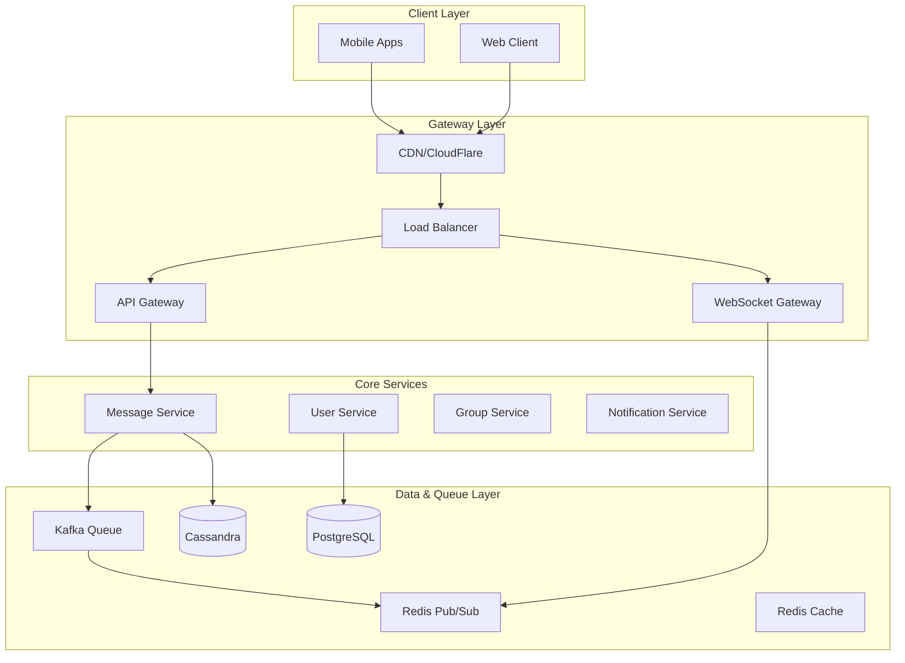

# Chat Application (WhatsApp) - Interview Quick Reference

**File Purpose:** Concise interview-day quick reference for Chat Application system design covering 500M DAU with real-time messaging, end-to-end encryption, and 99.9% delivery guarantee.

**Last Updated:** October 2, 2025

---

## 🎯 Core Problem Statement

- **What:** Real-time messaging platform supporting 500M daily users with instant delivery and end-to-end encryption
- **Key Challenge:** Managing 100M concurrent WebSocket connections while delivering 50B messages/day with <100ms latency
- **Scale:** WhatsApp-level scale with 99.9% delivery guarantee and Signal Protocol encryption

---

## 📊 Numbers That Matter

| Metric | Value | Calculation |
|--------|-------|-------------|
| Daily Active Users | 500M | Given requirement |
| Messages per day | 50B | 500M × 100 messages/user |
| Peak message QPS | 1.7M | 50B / 86,400 × 3 (peak factor) |
| Peak read QPS | 6.8M | 1.7M × 4 (read/write ratio) |
| Concurrent connections | 100M | 500M × 20% online rate |
| WebSocket servers needed | 10,000 | 100M / 10K connections per server |
| Daily storage | 20PB | 40B text (4TB) + 10B media (20PB) |
| Database shards | 128 | Based on 20K QPS per shard |
| Monthly infrastructure cost | $465K | $0.93 per DAU |

---

## 🏗️ High-Level Architecture



### Component Reasoning

- **CDN:** Media delivery, 90% cache hit ratio, global distribution
- **Load Balancer:** Session affinity for WebSocket, health checks
- **API Gateway:** Authentication, rate limiting, routing
- **WebSocket Gateway:** 10K connections/server, Redis state backup
- **Message Service:** Encryption, validation, fan-out logic
- **Kafka:** 1.7M QPS throughput, durability, replay capability
- **Cassandra:** Write-optimized for 50B messages/day, chat_id partitioning
- **PostgreSQL:** ACID for users/groups, read replicas
- **Redis:** Caching, pub/sub, connection state, read receipts

---

## 💾 Data Model (Essentials)

### Messages (Cassandra)

```text
Partition Key: chat_id
Clustering: timestamp DESC
Fields: message_id, sender_id, content (encrypted), media_url, status
Indexes: sender_id, message_status
TTL: 30 days
```

### Users (PostgreSQL)

```text
Primary Key: user_id
Fields: phone_number, display_name, public_key, last_seen, is_online
Sharding: Range-based by user_id (64 shards)
Indexes: phone_number (unique)
```

### Groups (PostgreSQL)

```text
Primary Key: group_id
Fields: group_name, created_by, max_members (256)
Members: Separate table with (group_id, user_id) composite key
Sharding: Hash by group_id for small groups, dedicated partitions for large
```

### Message Status (Redis)

```text
Key: message:{message_id}:status
Value: {sent_at, delivered_to[], read_by[]}
TTL: 7 days
```

---

## 🔌 API Design (Key Endpoints)

| Method | Endpoint | Purpose | Key Details |
|--------|----------|---------|-------------|
| POST | `/messages` | Send message | Idempotency key, encryption_key_id |
| GET | `/messages/{chat_id}` | Get chat history | Cursor pagination, limit 100 |
| POST | `/media/upload` | Upload media | Multipart, 100MB limit, S3 storage |
| WebSocket | `/ws/connect` | Real-time connection | JWT auth, heartbeat every 30s |

### WebSocket Events

```json
{
  "event": "message_received",
  "data": {
    "message_id": "uuid",
    "chat_id": "uuid",
    "content": "encrypted_content",
    "timestamp": "ISO8601"
  }
}
```

---

## 🚀 Critical Talking Points

### 1. WebSocket Connection Management

- **What:** 100M concurrent connections across 10K servers with session affinity
- **Why:** Real-time bidirectional communication for typing indicators and read receipts
- **Detail:** Consistent hashing by user_id, Redis state backup, graceful failover in 10s
- **Alternative:** Server-Sent Events (simpler but unidirectional) or HTTP polling (higher latency)

### 2. Message Queue Architecture (Kafka)

- **What:** 3-topic setup handling 1.7M messages/second with guaranteed delivery
- **Why:** Durability, replay capability, and horizontal scaling for message processing
- **Detail:** Partitioned by chat_id/user_id, replication factor 3, 7-day retention
- **Alternative:** RabbitMQ (easier ops, lower throughput) or SQS (managed, vendor lock-in)

### 3. Database Sharding Strategy

- **What:** Cassandra sharded by chat_id (128 shards), PostgreSQL by user_id (64 shards)
- **Why:** Messages co-located per chat for efficient retrieval, users isolated for ACID operations
- **Detail:** Hash-based for messages, range-based for users, hot partition monitoring
- **Alternative:** Single PostgreSQL (simpler but limited write scalability)

### 4. Group Chat Fan-out Strategy

- **What:** Hybrid push/pull model based on group size (<50 push, >50 pull)
- **Why:** Balances immediate delivery for small groups with resource efficiency for large groups
- **Detail:** Push creates individual delivery tasks, pull uses group timeline polling
- **Alternative:** Pure push (resource intensive) or pure pull (higher latency)

### 5. End-to-End Encryption (Signal Protocol)

- **What:** X3DH key exchange + Double Ratchet with AES-256-GCM message encryption
- **Why:** Battle-tested security with forward secrecy and deniability properties
- **Detail:** Client-side key storage, server only stores public keys, per-message keys
- **Alternative:** Custom encryption (risky) or server-side encryption (no E2E guarantee)

### 6. Read Receipt Tracking

- **What:** Redis bitmap storing read status per message with O(1) operations
- **Why:** Memory efficient (1 bit per user) with fast aggregation using BITCOUNT
- **Detail:** Each user assigned bitmap position, privacy controls available
- **Alternative:** Database table (slower, more storage) or in-memory sets (less persistent)

---

## ⚖️ Key Trade-Offs

| Decision | Choice | Alternative | Why |
|----------|--------|-------------|-----|
| Real-time Protocol | WebSocket | Server-Sent Events | Bidirectional needed for typing indicators |
| Message Queue | Apache Kafka | RabbitMQ/SQS | 1.7M QPS requires high throughput + durability |
| Database Architecture | Multi-DB (PG+Cassandra+Redis) | Single PostgreSQL | Message volume needs specialized storage |
| Encryption | Signal Protocol | Custom/Server-side | Security critical, proven protocol reduces risk |
| Group Fan-out | Hybrid Push/Pull | Pure Push/Pull | Optimizes for different group sizes |

---

## 🔥 Bottlenecks & Solutions

### Database Write Contention

- **Problem:** 1.7M peak writes overwhelming single database
- **Solution:** Horizontal sharding (128 Cassandra shards), write-optimized config, batch writes
- **Monitoring:** Write latency P95, queue depth, hot partition detection

### WebSocket Connection Limits

- **Problem:** 100M connections exceed single server capacity (10K limit)
- **Solution:** Auto-scaling cluster, consistent hashing, connection pooling, graceful migration
- **Monitoring:** Connections per server, establishment rate, failover time

### Message Queue Lag

- **Problem:** Consumer lag during traffic spikes causing delivery delays
- **Solution:** Dynamic partition scaling, consumer auto-scaling, priority queues, circuit breakers
- **Monitoring:** Consumer lag metrics, processing rate, error rates

### Hot Partitions

- **Problem:** Viral groups creating uneven load distribution
- **Solution:** Dedicated partitions for large groups, read replicas, separate fan-out service
- **Monitoring:** Partition size, query patterns, load distribution

---

## 💡 Interview Tips

### Start Here

"I'll design a real-time messaging platform like WhatsApp handling 500M daily users. The key challenges are managing 100M concurrent WebSocket connections, delivering 50B messages daily with sub-100ms latency, and implementing end-to-end encryption."

### Emphasize

- **Scale numbers:** 1.7M peak QPS, 100M concurrent connections, 20PB daily storage
- **Real-time architecture:** WebSocket management with session affinity and failover
- **Security:** Signal Protocol implementation with forward secrecy
- **Reliability:** 99.9% delivery guarantee through Kafka durability and retry mechanisms

### Be Ready For

- **"How do you handle message ordering?"** → Logical timestamps + server sequence numbers
- **"What about network partitions?"** → Vector clocks, quorum decisions, conflict resolution
- **"How do you scale WebSocket connections?"** → Consistent hashing, Redis state backup, graceful migration
- **"Why Cassandra over PostgreSQL for messages?"** → Write optimization, horizontal scaling, TTL support

### Don't Forget

- **Cost analysis:** $465K monthly infrastructure, $0.93 per DAU
- **SLA commitments:** 99.9% availability, <100ms P95 latency, 99.9% delivery rate
- **Disaster recovery:** 15-minute RTO, 5-minute RPO, cross-region replication
- **Monitoring:** P0-P3 alert levels, comprehensive metrics, chaos engineering

---

## 🎯 Key Success Metrics

- **Latency:** P95 message delivery < 100ms
- **Availability:** 99.95% system uptime
- **Delivery:** 99.9% message delivery success rate
- **Connections:** Support 100M concurrent WebSocket connections
- **Throughput:** Handle 1.7M messages/second peak load
- **Storage:** 30-day message retention with hot/warm/cold tiering

---

**Interview Duration:** 45-60 minutes | **Complexity:** Senior/Staff Level | **Focus Areas:** Real-time systems, WebSocket scaling, E2E encryption, Message queues
