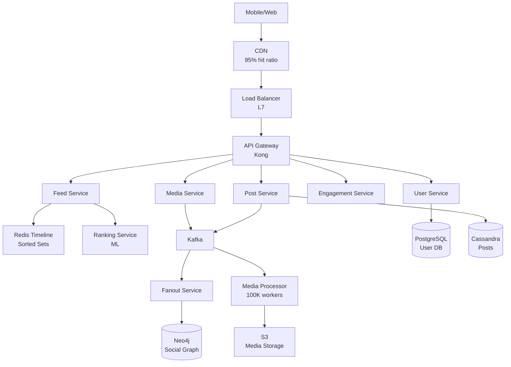

# Social Media Platform (Instagram/Twitter) - Interview Quick Reference

**Document Purpose:** Concise reference for interviewing about a large-scale social media platform with photo/video sharing, supporting 500M daily active users.

**Last Updated:** October 2, 2025

---

## 🎯 Core Problem Statement

- **What:** Design a social media platform (Instagram/Twitter) for photo/video sharing with social features
- **Key Challenge:** Feed generation at scale + celebrity problem (users with 100M+ followers)
- **Scale:** 500M DAU, 200M posts/day, 10B feed impressions/day, <500ms p95 feed load time

---

## 📊 Numbers That Matter

| Metric | Value | Calculation |
|--------|-------|-------------|
| **Traffic** |  |  |
| Daily Active Users | 500M | Given requirement |
| Posts per second (peak) | 7,000/sec | 200M/day × 3 (peak) / 86,400 |
| Feed requests (peak) | 347K/sec | 10B/day × 3 (peak) / 86,400 |
| Engagement actions (peak) | 220K/sec | Likes + comments + shares |
| **Storage (5 years)** |  |  |
| User data | 1.5TB | 1.5B users × 1KB |
| Post metadata | 730TB | 365B posts × 2KB |
| Media (photos + videos) | 12.6EB | Primarily video content |
| **Bandwidth** |  |  |
| Upload (peak) | 1Tbps | 7K posts/sec × 17.2MB avg |
| Download (peak) | 16.5Pbps | 347K req/sec × 6MB per feed |
| After CDN (95% hit) | 825Tbps | 16.5Pbps × 0.05 |
| **Resources** |  |  |
| Cache (Redis) | 10TB | 100M users × 100KB timeline |
| Media workers | 100K | 7K/sec × 10s × buffer |

---

## 🏗️ High-Level Architecture



#### Components & Reasoning

- **CDN (CloudFront):** Serve 95% of media from edge (16.5Pbps → 825Tbps)
- **Load Balancer (L7):** Content-based routing, SSL termination, health checks
- **API Gateway:** Auth, rate limiting (5K req/hour), versioning
- **Feed Service:** Core service, queries timeline cache + applies ML ranking
- **Fanout Service:** Hybrid strategy (write for regular, read for celebrities)
- **Ranking Service:** ML model (TensorFlow), scores posts for relevance
- **Redis Timeline:** Pre-computed timelines (ZADD O(log N), ZREVRANGE O(1))
- **Cassandra:** High write throughput (200M posts/day), natural user_id partitioning
- **PostgreSQL:** ACID for user data, strong consistency for auth
- **Neo4j:** Graph traversal for follower queries (efficient multi-hop)
- **Kafka:** Durable queue, replay capability, 64 partitions for parallelism
- **S3:** 12.6EB media storage, 11 9's durability

---

## 💾 Data Model (Essentials)

#### Users (PostgreSQL)

```text
users
- user_id (PK, UUID)
- username (UNIQUE, INDEXED)
- email (UNIQUE, INDEXED)
- password_hash
- follower_count (INDEXED) -- for celebrity detection
- created_at
```

#### Posts (Cassandra)

```text
posts
Partition Key: user_id
Clustering Key: created_at DESC, post_id

- post_id, user_id, post_type
- caption, media_urls[], hashtags[]
- like_count, comment_count (COUNTER)
- created_at, expires_at (for stories)
```

#### Timeline Cache (Redis Sorted Set)

```text
Key: timeline:{user_id}
Type: SORTED SET
Score: timestamp
Member: post_id
TTL: 24 hours
```

#### Social Graph (Neo4j)

```text
Node: User (user_id, username, is_celebrity)
Relationship: FOLLOWS (followed_at, notification_enabled)

Query: MATCH (f:User)-[:FOLLOWS]->(u:User {user_id: $id}) RETURN f
```

#### Sharding Strategy

- **Posts:** Sharded by user_id (512 vnodes in Cassandra)
- **Timeline Cache:** Consistent hashing on user_id (64 Redis clusters)
- **Users:** Sharded by user_id hash (16 shards, grow to 256)

---

## 🔌 API Design (Key Endpoints)

```http
POST /v1/posts
Authorization: Bearer <token>
Content-Type: multipart/form-data

Response: 202 Accepted (async processing)
{
  "post_id": "uuid",
  "status": "processing",
  "estimated_time": 30
}
```

```http
GET /v1/feed/home?limit=50&cursor={cursor}
Authorization: Bearer <token>

Response: 200 OK
{
  "posts": [...],
  "next_cursor": "base64_encoded",
  "has_more": true
}
```

```http
POST /v1/posts/{post_id}/like
Authorization: Bearer <token>

Response: 200 OK
{
  "is_liked": true,
  "like_count": 1543
}
```

```http
POST /v1/users/{user_id}/follow
Authorization: Bearer <token>

Response: 200 OK
{
  "is_following": true,
  "follower_count": 15421
}
```

#### Rate Limits

- Authenticated: 5,000 req/hour
- Post creation: 100/hour
- Media uploads: 100/hour
- Follows: 200/hour

---

## 🚀 Critical Talking Points

### Point 1: Hybrid Fanout Strategy (Celebrity Problem Solution)

- **What:** Fan-out on write for regular users (<10K followers), fan-out on read for celebrities (>1M followers)
- **Why:** Pure fan-out on write doesn't scale (100M followers = 27+ hours to fanout)
- **Detail:** Regular users get instant timeline updates via Redis ZADD. Celebrity followers merge celebrity content at read time (200ms vs 50ms)
- **Alternative:** Pure fan-out on read (slow for everyone), pure fan-out on write (celebrity problem)
- **Numbers:** Regular user fanout: <100ms (10K writes), Celebrity: 0ms fanout + 200ms merge

### Point 2: Multi-Database Approach

- **What:** PostgreSQL (users), Cassandra (posts), Neo4j (social graph), Redis (cache), Elasticsearch (search)
- **Why:** Right tool for each data type optimizes performance and cost
- **Detail:** PostgreSQL for ACID user data, Cassandra for high-write posts (200M/day), Neo4j for graph traversal
- **Alternative:** Single database (simpler ops, poor performance at scale)
- **Trade-off:** Operational complexity vs performance optimization

### Point 3: Four-Layer Caching Strategy

- **What:** L1: Timeline cache (Redis, 5TB), L2: Post metadata (Memcached, 40GB), L3: User profiles (Redis, 50GB), L4: Ranked feeds (Redis, 200GB)
- **Why:** <500ms feed load requires in-memory caching (disk would be 100x slower)
- **Detail:** Timeline cache uses sorted sets (ZADD O(log N), 24hr TTL). Hit ratios: L1=90%, L2=95%, L3=98%, L4=70%
- **Alternative:** Database-only (2-5s latency), CDN-only (can't cache personalized feeds)
- **Numbers:** Total cache: ~300GB per region, saves 90% of database queries

### Point 4: Media Processing Pipeline

- **What:** Kafka queue (64 partitions) → 100K workers (FFmpeg) → S3 storage
- **Why:** Async processing prevents upload API from blocking (2s acknowledgment)
- **Detail:** Workers auto-scale based on queue depth (>1K = scale up). Photo: 2s, Video: 30s/min
- **Alternative:** Sync processing (5-30s upload time, poor UX), third-party (AWS MediaConvert, expensive)
- **Numbers:** Peak 7K uploads/sec, 100K workers, $300K/month (spot instances save 70%)

### Point 5: Real-Time Updates (WebSocket)

- **What:** Redis Pub/Sub → WebSocket servers (10K connections each) → Client
- **Why:** Polling wastes bandwidth (30s interval × 100M users = massive load)
- **Detail:** User subscribes to channel `user:{user_id}:updates`. Engagement events publish to channel, broadcast to all user's devices
- **Alternative:** Long polling (simpler, higher latency), SSE (one-directional)
- **Numbers:** 100M concurrent users, 10K servers, ~500MB RAM per server

### Point 6: Ranking Algorithm (ML)

- **What:** TensorFlow model with 500+ features (post age, author affinity, engagement rate, content match)
- **Why:** Chronological feed buries relevant content from casual users
- **Detail:** Two-stage: Candidate generation (10K posts from timeline) → Ranking (ML scores top 50)
- **Alternative:** Chronological only (simple, misses relevant content), rule-based (can't learn patterns)
- **Numbers:** 5ms inference latency, retrained daily, A/B tested for engagement

---

## ⚖️ Key Trade-Offs

| Decision | Choice | Alternative | Why |
|----------|--------|-------------|-----|
| **Post Storage** | Cassandra (NoSQL) | PostgreSQL | 200M posts/day needs horizontal scalability + time-series model |
| **User Storage** | PostgreSQL | NoSQL | ACID for auth, strong consistency for unique usernames |
| **Social Graph** | Neo4j | PostgreSQL | Native graph traversal 100x faster for multi-hop queries |
| **Timeline Cache** | Redis Sorted Sets | Memcached | Need ordered timelines with O(1) range queries |
| **Message Queue** | Kafka | SQS | High throughput (7K/sec) + replay capability for reprocessing |
| **CDN** | CloudFront | Direct S3 | 95% cache hit saves 15Pbps bandwidth, <100ms global latency |
| **Fanout Strategy** | Hybrid | Pure write/read | Optimizes common case (regular users) while handling celebrities |
| **API Style** | REST | GraphQL | Better CDN caching, simpler mobile clients, easier rate limiting |

---

## 🔥 Bottlenecks & Solutions

### Bottleneck 1: Database Write Contention

- **Problem:** 173K likes/sec at peak, hot posts get thousands of likes/sec
- **Solution:** Use Redis INCR for real-time counters (atomic, fast), batch sync to Cassandra every 5 min
- **Result:** 100x faster writes, eventual consistency acceptable for likes

### Bottleneck 2: Media Processing Queue Depth

- **Problem:** If workers fall behind peak (7K/sec), queue grows indefinitely
- **Solution:** Auto-scale based on queue depth (>1K = add workers), priority queue for verified users, circuit breaker at 10K depth
- **Result:** Queue depth stays <500, 99.5% processing success rate

### Bottleneck 3: Graph Database Read Load

- **Problem:** 347K feed requests/sec = 347K "get followers" queries, Neo4j caps at 50K/sec per node
- **Solution:** Cache follower lists in Redis (update on follow/unfollow), 5 read replicas, denormalize follower_count
- **Result:** 95% cache hit, 10x read capacity

### Bottleneck 4: Celebrity Post (Thundering Herd)

- **Problem:** Celebrity posts → 1M+ concurrent requests for same content → database overload
- **Solution:** Request coalescing (distributed lock, one request fetches), pre-warm cache for celebrity posts, CDN pre-warming
- **Result:** Database sees 1 query instead of 1M, <50ms cache response

---

## 🎯 Edge Cases to Mention

#### Concurrent Modifications

- **Problem:** Multiple users like same post simultaneously → lost updates
- **Solution:** Redis INCR (atomic), idempotency check with SISMEMBER

#### Duplicate Posts (Network Timeout)

- **Problem:** Client retries after timeout → duplicate post
- **Solution:** Idempotency keys (request_id), distributed lock, 1-hour deduplication window

#### Split-Brain Scenario

- **Problem:** Network partition → two regions accept writes
- **Solution:** Consensus protocol (Raft/Paxos) for critical ops, vector clocks for conflict resolution

#### Cascading Failures

- **Problem:** Database slow → feed service timeout → retries → more load → system failure
- **Solution:** Circuit breaker (open after 5 failures), bulkhead pattern (separate thread pools), fallback to cached feed

---

## 🛡️ Security & Compliance

- **Auth:** JWT (15-min access token, 30-day refresh token), OAuth 2.0 for third-party
- **Rate Limiting:** Token bucket, Redis-based, per-user and per-endpoint
- **Encryption:** TLS 1.3 in transit, AES-256 at rest, bcrypt (cost=12) for passwords
- **Content Moderation:** AWS Rekognition (NSFW), profanity filter, spam classifier, manual review queue
- **GDPR:** Export user data (Article 15), delete user data (Article 17), audit logs

---

## 📈 Monitoring (SLI/SLO/SLA)

#### SLIs

- **Availability:** (successful_requests / total_requests) × 100
- **Latency:** (requests_under_500ms / total_requests) × 100

#### SLOs

- **Availability:** 99.9% monthly (error budget: 1M failures per 1B requests)
- **Latency:** 95% of feeds load in <500ms (p95 target)

#### SLA

- **Uptime:** 99.9% (43.2 min downtime/month max)
- **Penalties:** 99.0-99.9% = 10% credit, <95% = 50% credit

---

## 💰 Cost Estimate (Monthly)

| Category | Cost | Details |
|----------|------|---------|
| Compute (API + Workers) | $326K | 100 API servers + 1K media workers (60% avg) |
| Storage (S3) | $188K | 7PB active media + 300TB egress |
| Database | $145K | PostgreSQL + Cassandra + Neo4j + Redis |
| CDN | $300K | 90PB/month (95% offload from origin) |
| Kafka | $1M | 10PB retention (7 days) - OPTIMIZE THIS! |
| **Total** | **~$2M/month** | **~$24M/year** |

#### Optimizations

- Use spot instances for workers: Save $200K/month (70% discount)
- Reduce Kafka retention 7d → 2d: Save $700K/month
- Move old media to Glacier: Save $100K/month
- **Potential savings: 33% (~$650K/month)**

---

## 💡 Interview Tips

### Start Here

- **Opening:** "This is a high-scale social media platform with two key challenges: (1) feed generation at 10B impressions/day with <500ms latency, and (2) the celebrity problem where users have 100M+ followers."
- **Numbers First:** Quote 500M DAU, 200M posts/day, 347K req/sec peak to show you understand scale

### Emphasize

- **Hybrid Fanout:** This is your **signature solution** - demonstrates deep understanding
- **Multi-Database:** Shows you know when to use different technologies
- **Specific Technologies:** Don't say "cache," say "Redis Sorted Sets for O(1) timeline retrieval"
- **Numbers:** Always justify with calculations (7K posts/sec × 10s processing = 70K workers needed)

### Be Ready For

- **"How do you handle celebrity users?"** → Hybrid fanout, fan-out on read for >1M followers
- **"What if a post goes viral?"** → Request coalescing, cache pre-warming, CDN distribution
- **"How do you ensure feed loads fast?"** → Four-layer caching, pre-computed timelines, ML ranking in parallel
- **"What about data consistency?"** → Eventual consistency for feeds (acceptable), strong for auth (required)
- **"How do you scale writes?"** → Cassandra (horizontal scaling), async processing (Kafka), batch operations

### Don't Forget

- **Monitoring:** Mention specific metrics (p95 latency, error budget, SLOs)
- **Trade-offs:** Every decision has an alternative (show you considered options)
- **Cost:** Mention $2M/month, shows business awareness
- **Failure Scenarios:** Circuit breaker, thundering herd, split-brain
- **ML Ranking:** Demonstrates advanced knowledge (but keep it brief)

### Common Mistakes to Avoid

- ❌ Forgetting to handle celebrities (this is a **key requirement**)
- ❌ Not mentioning caching strategy (impossible to meet <500ms without it)
- ❌ Proposing synchronous media processing (would block upload API)
- ❌ Single database for everything (doesn't scale, inefficient)
- ❌ Pure fan-out on write or pure fan-out on read (hybrid is the answer)

---

## 🎤 30-Second Pitch

"I'd design this using a **hybrid fanout strategy** - fan-out on write for regular users (<10K followers) gives sub-50ms feed loads from Redis, while fan-out on read for celebrities (>1M followers) solves the broadcast problem. The system uses **Cassandra for posts** (handles 200M/day writes), **PostgreSQL for users** (ACID compliance), and **Neo4j for the social graph** (efficient traversals). **Four caching layers** with Redis ensure <500ms p95 latency. **Kafka queues** decouple media processing with 100K auto-scaling workers. The architecture handles 347K requests/sec at peak with 99.9% uptime through multi-region deployment and circuit breakers."

---

**Document Statistics:**

- Lines: ~400 (optimized for 10-minute review)
- Key Numbers: 20+ metrics with calculations
- Trade-offs: 8 major decisions analyzed
- Talking Points: 6 critical components
- Bottlenecks: 4 scenarios with solutions

**Next Steps:** Review in 10 minutes before interview, practice explaining hybrid fanout strategy, prepare to draw architecture diagram on whiteboard.

---

Created: October 2, 2025 | Source: social_media_platform_system_design.md (6,051 lines)

