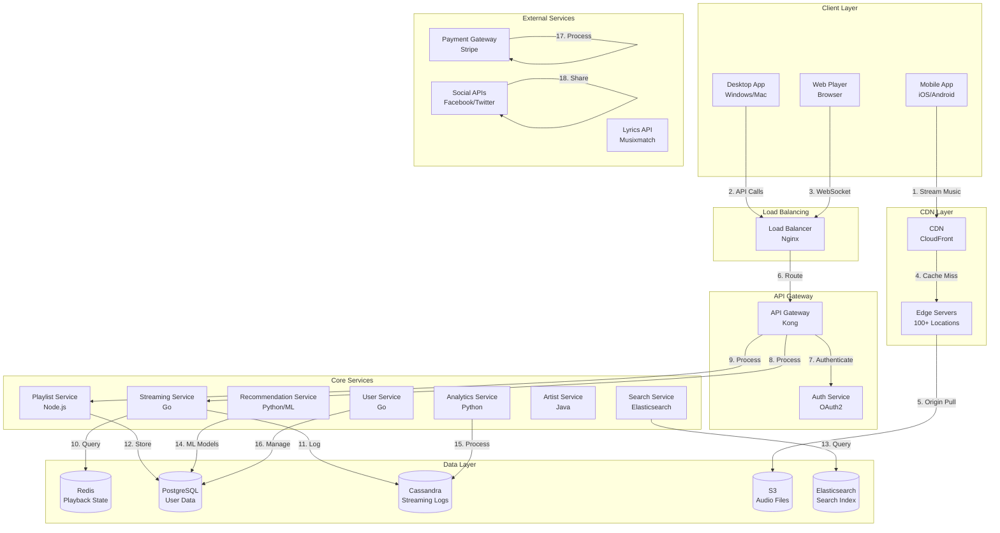

# Music Streaming Service System Design (Spotify)

**Table of Contents**
1. [Requirements & Clarification](#requirements--clarification)
2. [Back-of-the-Envelope Calculations](#back-of-the-envelope-calculations)
3. [High-Level Design](#high-level-design)
4. [Database Design](#database-design)
5. [API Design](#api-design)
6. [Deep-Dive Components & Trade-offs](#deep-dive-components--trade-offs)
7. [Bottlenecks & Improvements](#bottlenecks--improvements)

---

## Requirements & Clarification

### User Stories

**As a music listener, I want to:**
- Stream music with <2 second startup time
- Create and manage playlists
- Discover new music through recommendations
- Download songs for offline listening
- Sync my music across all devices

**As a music creator, I want to:**
- Upload my music to the platform
- Track my streaming analytics and royalties
- Manage my artist profile and discography
- Interact with my fans

**As a platform operator, I want to:**
- Serve high-quality audio globally
- Provide personalized recommendations
- Handle royalty payments to artists
- Monitor streaming analytics and user behavior

### Functional Requirements

**Core Features:**
- Audio streaming with adaptive bitrate
- Playlist creation and management
- Music search and discovery
- Offline download and sync
- Cross-device playback state sync
- Real-time lyrics synchronization
- Social features (following, sharing)

**Advanced Features:**
- Personalized recommendations
- Podcast streaming
- Live audio streaming
- Collaborative playlists
- Artist analytics dashboard
- Music video integration

### Non-Functional Requirements

**Performance:**
- <2 seconds startup time for music playback
- 99.99% availability during peak hours
- Support 100M DAU globally
- Adaptive bitrate streaming (96kbps to 320kbps)

**Scalability:**
- Handle 100M songs catalog (500 TB)
- Support 50M streams per day
- Scale across multiple regions
- Support multiple audio formats

**Reliability:**
- Zero data loss for user playlists
- Graceful handling of network interruptions
- Seamless offline/online transitions

### Clarifying Questions & Assumptions

**Scale Expectations:**
- 500M total users, 100M DAU
- 100M songs in catalog
- 50M streams per day
- Peak traffic: 2x average during evening hours

**Usage Patterns:**
- 60% mobile, 30% desktop, 10% web
- Average session: 45 minutes
- 80% streaming, 20% offline playback
- 5% users create playlists

**Feature Scope (MVP):**
- Basic music streaming
- Playlist management
- Search functionality
- Offline downloads
- Recommendations

**Integration Requirements:**
- CDN for audio delivery
- Payment processing for subscriptions
- Analytics platforms
- Social media integration

---

## Back-of-the-Envelope Calculations

### Traffic Estimates

```text
Daily Active Users (DAU): 100M
Total Users: 500M
Songs in Catalog: 100M
Daily Streams: 50M

Average streams per user per day: 50M / 100M = 0.5 streams
Peak hours: 6-10 PM (4 hours)
Peak streams per hour: 50M × 0.6 / 4 = 7.5M streams/hour
Peak streams per second: 7.5M / 3600 = 2,083 streams/second

Audio requests per stream: 1 (initial) + 10 (chunks) = 11 requests
Peak audio requests per second: 2,083 × 11 = 22,913 requests/second
```

### Storage Estimates

```text
Audio file sizes (average):
- 320kbps MP3: 2.4MB per 3-minute song
- 128kbps AAC: 1.2MB per 3-minute song
- Average: 1.8MB per song

Total audio storage: 100M songs × 1.8MB = 180TB
Multiple bitrates (3 formats): 180TB × 3 = 540TB
Metadata per song: 100M × 1KB = 100GB
User playlists: 500M users × 5 playlists × 2KB = 5GB
User profiles: 500M × 2KB = 1TB

Total storage: 540TB + 100GB + 5GB + 1TB = 541TB
5-year growth: 541TB × 2 = 1.1PB
```

### Resource Estimates

```text
API servers:
- Peak QPS: 22,913 audio requests/second
- Additional API calls: 5x for metadata, playlists, etc.
- Total API QPS: 22,913 × 6 = 137K QPS
- Servers needed: 137K QPS / 1000 QPS per server = 137 servers

CDN bandwidth:
- Average song size: 1.8MB
- Peak streams: 2,083/second
- Bandwidth: 2,083 × 1.8MB = 3.7GB/second = 30Gbps
- CDN edge locations: 100+ globally

Database:
- Read QPS: 137K (mostly reads)
- Write QPS: 137K × 0.1 = 13.7K writes/second
- Database servers: 10 primary + 20 read replicas
```

### Bandwidth Estimates

```text
Audio streaming:
- Average bitrate: 160kbps
- Peak concurrent streams: 2,083
- Bandwidth: 2,083 × 160kbps = 333Mbps

Metadata and API calls:
- Average request size: 1KB
- Peak requests: 137K/second
- Bandwidth: 137K × 1KB = 137MB/second = 1.1Gbps

Total bandwidth: ~1.4Gbps per region
```

---

## High-Level Design

### System Architecture



### Data Flow Explanation

1. **Music Streaming Flow:**
   - User requests song through mobile/desktop app
   - Request goes to CDN for audio file delivery
   - If cache miss, CDN fetches from S3 origin
   - Streaming service manages playback state
   - Analytics service logs streaming events

2. **Playlist Management Flow:**
   - User creates/modifies playlist through API
   - Playlist service stores changes in PostgreSQL
   - Real-time sync across devices via WebSocket
   - Search service indexes playlist metadata

3. **Recommendation Flow:**
   - ML service analyzes user listening history
   - Generates personalized recommendations
   - Updates recommendation cache in Redis
   - Serves recommendations via API

---

## Database Design

### PostgreSQL Schema (User & Playlist Data)

```sql
-- Users table
CREATE TABLE users (
    user_id UUID PRIMARY KEY,
    email VARCHAR(255) UNIQUE NOT NULL,
    username VARCHAR(50) UNIQUE NOT NULL,
    display_name VARCHAR(100) NOT NULL,
    country VARCHAR(2) NOT NULL,
    birth_date DATE,
    gender VARCHAR(10),
    subscription_type ENUM('free', 'premium') DEFAULT 'free',
    subscription_expires_at TIMESTAMP NULL,
    created_at TIMESTAMP DEFAULT CURRENT_TIMESTAMP,
    updated_at TIMESTAMP DEFAULT CURRENT_TIMESTAMP ON UPDATE CURRENT_TIMESTAMP,
    INDEX idx_email (email),
    INDEX idx_username (username),
    INDEX idx_subscription (subscription_type),
    INDEX idx_country (country)
);

-- Artists table
CREATE TABLE artists (
    artist_id UUID PRIMARY KEY,
    name VARCHAR(200) NOT NULL,
    spotify_id VARCHAR(50) UNIQUE,
    genres TEXT[],
    popularity INTEGER DEFAULT 0,
    followers_count INTEGER DEFAULT 0,
    image_url VARCHAR(500),
    external_urls JSONB,
    created_at TIMESTAMP DEFAULT CURRENT_TIMESTAMP,
    updated_at TIMESTAMP DEFAULT CURRENT_TIMESTAMP ON UPDATE CURRENT_TIMESTAMP,
    INDEX idx_name (name),
    INDEX idx_popularity (popularity),
    INDEX idx_genres USING GIN (genres)
);

-- Albums table
CREATE TABLE albums (
    album_id UUID PRIMARY KEY,
    name VARCHAR(200) NOT NULL,
    artist_id UUID NOT NULL,
    spotify_id VARCHAR(50) UNIQUE,
    album_type ENUM('album', 'single', 'compilation') DEFAULT 'album',
    release_date DATE,
    total_tracks INTEGER NOT NULL,
    popularity INTEGER DEFAULT 0,
    image_url VARCHAR(500),
    external_urls JSONB,
    created_at TIMESTAMP DEFAULT CURRENT_TIMESTAMP,
    FOREIGN KEY (artist_id) REFERENCES artists(artist_id),
    INDEX idx_artist_id (artist_id),
    INDEX idx_name (name),
    INDEX idx_release_date (release_date),
    INDEX idx_popularity (popularity)
);

-- Tracks table
CREATE TABLE tracks (
    track_id UUID PRIMARY KEY,
    name VARCHAR(200) NOT NULL,
    artist_id UUID NOT NULL,
    album_id UUID NOT NULL,
    spotify_id VARCHAR(50) UNIQUE,
    duration_ms INTEGER NOT NULL,
    track_number INTEGER,
    disc_number INTEGER DEFAULT 1,
    explicit BOOLEAN DEFAULT FALSE,
    popularity INTEGER DEFAULT 0,
    preview_url VARCHAR(500),
    external_urls JSONB,
    audio_features JSONB,
    created_at TIMESTAMP DEFAULT CURRENT_TIMESTAMP,
    FOREIGN KEY (artist_id) REFERENCES artists(artist_id),
    FOREIGN KEY (album_id) REFERENCES albums(album_id),
    INDEX idx_artist_id (artist_id),
    INDEX idx_album_id (album_id),
    INDEX idx_name (name),
    INDEX idx_popularity (popularity),
    INDEX idx_duration (duration_ms)
);

-- Playlists table
CREATE TABLE playlists (
    playlist_id UUID PRIMARY KEY,
    name VARCHAR(200) NOT NULL,
    description TEXT,
    owner_id UUID NOT NULL,
    is_public BOOLEAN DEFAULT FALSE,
    is_collaborative BOOLEAN DEFAULT FALSE,
    followers_count INTEGER DEFAULT 0,
    image_url VARCHAR(500),
    created_at TIMESTAMP DEFAULT CURRENT_TIMESTAMP,
    updated_at TIMESTAMP DEFAULT CURRENT_TIMESTAMP ON UPDATE CURRENT_TIMESTAMP,
    FOREIGN KEY (owner_id) REFERENCES users(user_id),
    INDEX idx_owner_id (owner_id),
    INDEX idx_is_public (is_public),
    INDEX idx_followers_count (followers_count),
    INDEX idx_created_at (created_at)
);

-- Playlist tracks table
CREATE TABLE playlist_tracks (
    playlist_id UUID NOT NULL,
    track_id UUID NOT NULL,
    position INTEGER NOT NULL,
    added_at TIMESTAMP DEFAULT CURRENT_TIMESTAMP,
    added_by UUID,
    PRIMARY KEY (playlist_id, position),
    FOREIGN KEY (playlist_id) REFERENCES playlists(playlist_id),
    FOREIGN KEY (track_id) REFERENCES tracks(track_id),
    FOREIGN KEY (added_by) REFERENCES users(user_id),
    INDEX idx_track_id (track_id),
    INDEX idx_added_at (added_at)
);

-- User follows table
CREATE TABLE user_follows (
    follower_id UUID NOT NULL,
    following_id UUID NOT NULL,
    created_at TIMESTAMP DEFAULT CURRENT_TIMESTAMP,
    PRIMARY KEY (follower_id, following_id),
    FOREIGN KEY (follower_id) REFERENCES users(user_id),
    FOREIGN KEY (following_id) REFERENCES users(user_id),
    INDEX idx_following_id (following_id)
);

-- User listening history table
CREATE TABLE listening_history (
    history_id UUID PRIMARY KEY,
    user_id UUID NOT NULL,
    track_id UUID NOT NULL,
    played_at TIMESTAMP DEFAULT CURRENT_TIMESTAMP,
    duration_played_ms INTEGER NOT NULL,
    context_type ENUM('playlist', 'album', 'artist', 'search') DEFAULT 'playlist',
    context_id UUID,
    device_type VARCHAR(50),
    FOREIGN KEY (user_id) REFERENCES users(user_id),
    FOREIGN KEY (track_id) REFERENCES tracks(track_id),
    INDEX idx_user_id (user_id),
    INDEX idx_track_id (track_id),
    INDEX idx_played_at (played_at),
    INDEX idx_user_played_at (user_id, played_at)
);

-- User saved tracks table
CREATE TABLE user_saved_tracks (
    user_id UUID NOT NULL,
    track_id UUID NOT NULL,
    saved_at TIMESTAMP DEFAULT CURRENT_TIMESTAMP,
    PRIMARY KEY (user_id, track_id),
    FOREIGN KEY (user_id) REFERENCES users(user_id),
    FOREIGN KEY (track_id) REFERENCES tracks(track_id),
    INDEX idx_track_id (track_id),
    INDEX idx_saved_at (saved_at)
);
```

### Cassandra Schema (Streaming Analytics)

```sql
-- Streaming events table
CREATE TABLE streaming_events (
    user_id UUID,
    track_id UUID,
    timestamp TIMESTAMP,
    event_type TEXT,
    duration_ms INT,
    position_ms INT,
    device_type TEXT,
    country TEXT,
    PRIMARY KEY ((user_id, track_id), timestamp)
) WITH CLUSTERING ORDER BY (timestamp DESC);

-- Track analytics table
CREATE TABLE track_analytics (
    track_id UUID,
    date DATE,
    total_streams COUNTER,
    unique_listeners COUNTER,
    total_duration COUNTER,
    PRIMARY KEY (track_id, date)
);

-- User analytics table
CREATE TABLE user_analytics (
    user_id UUID,
    date DATE,
    total_streams COUNTER,
    total_duration COUNTER,
    unique_tracks COUNTER,
    PRIMARY KEY (user_id, date)
);
```

### Redis Schema (Real-time State)

```redis
# User playback state
user:playback:{user_id} -> {
    "track_id": "uuid",
    "position_ms": 45000,
    "is_playing": true,
    "device_id": "uuid",
    "timestamp": 1640995200
}

# Track popularity cache
track:popularity:{track_id} -> {
    "streams_today": 1500,
    "unique_listeners": 800,
    "last_updated": 1640995200
}

# Recommendation cache
user:recommendations:{user_id} -> [
    {"track_id": "uuid", "score": 0.95},
    {"track_id": "uuid", "score": 0.89}
]

# Playlist cache
playlist:tracks:{playlist_id} -> [
    {"track_id": "uuid", "position": 0},
    {"track_id": "uuid", "position": 1}
]
```

---

## API Design

### Base Configuration

- **Base URL:** `https://api.spotify.com/v1`
- **Authentication:** OAuth2 Bearer tokens
- **Rate Limiting:** 10,000 requests/hour per user
- **Content-Type:** `application/json`

### Authentication Endpoints

#### Login with Spotify

```http
POST /auth/login
```

**Request:**
```json
{
  "code": "authorization_code_from_spotify",
  "redirect_uri": "https://app.spotify.com/callback"
}
```

**Response:**
```json
{
  "access_token": "BQC...",
  "refresh_token": "AQD...",
  "expires_in": 3600,
  "token_type": "Bearer",
  "scope": "user-read-private user-read-email",
  "user": {
    "user_id": "550e8400-e29b-41d4-a716-446655440000",
    "email": "user@example.com",
    "display_name": "John Doe",
    "country": "US",
    "subscription_type": "premium"
  }
}
```

#### Refresh Token

```http
POST /auth/refresh
```

**Request:**
```json
{
  "refresh_token": "AQD..."
}
```

**Response:**
```json
{
  "access_token": "BQC...",
  "expires_in": 3600,
  "token_type": "Bearer"
}
```

### Music Streaming Endpoints

#### Get Track

```http
GET /tracks/{track_id}
```

**Response:**
```json
{
  "track_id": "550e8400-e29b-41d4-a716-446655440000",
  "name": "Bohemian Rhapsody",
  "artists": [
    {
      "artist_id": "550e8400-e29b-41d4-a716-446655440001",
      "name": "Queen",
      "spotify_id": "1dfeR4HaWDbWqFHLkxsg1d"
    }
  ],
  "album": {
    "album_id": "550e8400-e29b-41d4-a716-446655440002",
    "name": "A Night at the Opera",
    "image_url": "https://i.scdn.co/image/ab67616d0000b273ce4f1737bc8a646c8c4bd25a"
  },
  "duration_ms": 355000,
  "explicit": false,
  "popularity": 85,
  "preview_url": "https://p.scdn.co/mp3-preview/...",
  "audio_features": {
    "danceability": 0.3,
    "energy": 0.4,
    "key": 8,
    "loudness": -8.3,
    "mode": 1,
    "speechiness": 0.03,
    "acousticness": 0.1,
    "instrumentalness": 0.0,
    "liveness": 0.1,
    "valence": 0.2,
    "tempo": 72.0
  }
}
```

#### Get Audio Stream URL

```http
GET /tracks/{track_id}/stream
```

**Query Parameters:**
- `bitrate`: 96, 128, 160, 192, 256, 320 (default: 160)
- `format`: mp3, aac, ogg (default: mp3)

**Response:**
```json
{
  "track_id": "550e8400-e29b-41d4-a716-446655440000",
  "stream_url": "https://audio-fa.scdn.co/audio/...",
  "bitrate": 160,
  "format": "mp3",
  "duration_ms": 355000,
  "expires_at": "2025-01-02T11:00:00Z",
  "cdn_urls": [
    "https://audio-fa.scdn.co/audio/...",
    "https://audio-fb.scdn.co/audio/..."
  ]
}
```

#### Update Playback State

```http
PUT /me/player/play
```

**Request:**
```json
{
  "track_id": "550e8400-e29b-41d4-a716-446655440000",
  "position_ms": 45000,
  "device_id": "550e8400-e29b-41d4-a716-446655440003"
}
```

**Response:**
```json
{
  "success": true,
  "playback_state": {
    "track_id": "550e8400-e29b-41d4-a716-446655440000",
    "position_ms": 45000,
    "is_playing": true,
    "device_id": "550e8400-e29b-41d4-a716-446655440003",
    "timestamp": "2025-01-02T10:00:00Z"
  }
}
```

### Playlist Endpoints

#### Create Playlist

```http
POST /users/{user_id}/playlists
```

**Request:**
```json
{
  "name": "My Favorites",
  "description": "My favorite songs",
  "is_public": false,
  "is_collaborative": false
}
```

**Response:**
```json
{
  "playlist_id": "550e8400-e29b-41d4-a716-446655440004",
  "name": "My Favorites",
  "description": "My favorite songs",
  "owner": {
    "user_id": "550e8400-e29b-41d4-a716-446655440000",
    "display_name": "John Doe"
  },
  "is_public": false,
  "is_collaborative": false,
  "followers_count": 0,
  "tracks_count": 0,
  "created_at": "2025-01-02T10:00:00Z"
}
```

#### Add Tracks to Playlist

```http
POST /playlists/{playlist_id}/tracks
```

**Request:**
```json
{
  "track_ids": [
    "550e8400-e29b-41d4-a716-446655440000",
    "550e8400-e29b-41d4-a716-446655440005"
  ],
  "position": 0
}
```

**Response:**
```json
{
  "playlist_id": "550e8400-e29b-41d4-a716-446655440004",
  "tracks_added": 2,
  "snapshot_id": "snapshot_1234567890",
  "tracks": [
    {
      "track_id": "550e8400-e29b-41d4-a716-446655440000",
      "position": 0,
      "added_at": "2025-01-02T10:00:00Z"
    },
    {
      "track_id": "550e8400-e29b-41d4-a716-446655440005",
      "position": 1,
      "added_at": "2025-01-02T10:00:00Z"
    }
  ]
}
```

#### Get Playlist Tracks

```http
GET /playlists/{playlist_id}/tracks?limit=20&offset=0
```

**Response:**
```json
{
  "playlist_id": "550e8400-e29b-41d4-a716-446655440004",
  "tracks": [
    {
      "track_id": "550e8400-e29b-41d4-a716-446655440000",
      "name": "Bohemian Rhapsody",
      "artists": [
        {
          "artist_id": "550e8400-e29b-41d4-a716-446655440001",
          "name": "Queen"
        }
      ],
      "album": {
        "album_id": "550e8400-e29b-41d4-a716-446655440002",
        "name": "A Night at the Opera",
        "image_url": "https://i.scdn.co/image/..."
      },
      "duration_ms": 355000,
      "position": 0,
      "added_at": "2025-01-02T10:00:00Z"
    }
  ],
  "total": 50,
  "limit": 20,
  "offset": 0
}
```

### Search Endpoints

#### Search Tracks

```http
GET /search?q=queen&type=track&limit=20&offset=0
```

**Response:**
```json
{
  "tracks": {
    "items": [
      {
        "track_id": "550e8400-e29b-41d4-a716-446655440000",
        "name": "Bohemian Rhapsody",
        "artists": [
          {
            "artist_id": "550e8400-e29b-41d4-a716-446655440001",
            "name": "Queen"
          }
        ],
        "album": {
          "album_id": "550e8400-e29b-41d4-a716-446655440002",
          "name": "A Night at the Opera",
          "image_url": "https://i.scdn.co/image/..."
        },
        "duration_ms": 355000,
        "popularity": 85,
        "preview_url": "https://p.scdn.co/mp3-preview/..."
      }
    ],
    "total": 1000,
    "limit": 20,
    "offset": 0
  }
}
```

### Recommendation Endpoints

#### Get Recommendations

```http
GET /recommendations?limit=20&seed_tracks=550e8400-e29b-41d4-a716-446655440000
```

**Response:**
```json
{
  "recommendations": [
    {
      "track_id": "550e8400-e29b-41d4-a716-446655440006",
      "name": "We Will Rock You",
      "artists": [
        {
          "artist_id": "550e8400-e29b-41d4-a716-446655440001",
          "name": "Queen"
        }
      ],
      "album": {
        "album_id": "550e8400-e29b-41d4-a716-446655440007",
        "name": "News of the World",
        "image_url": "https://i.scdn.co/image/..."
      },
      "duration_ms": 122000,
      "popularity": 80,
      "recommendation_score": 0.95,
      "reason": "Similar artist and genre"
    }
  ],
  "seeds": [
    {
      "type": "track",
      "track_id": "550e8400-e29b-41d4-a716-446655440000",
      "name": "Bohemian Rhapsody"
    }
  ]
}
```

### Analytics Endpoints

#### Get Listening History

```http
GET /me/player/recently-played?limit=20&after=1640995200000
```

**Response:**
```json
{
  "items": [
    {
      "track_id": "550e8400-e29b-41d4-a716-446655440000",
      "name": "Bohemian Rhapsody",
      "artists": [
        {
          "artist_id": "550e8400-e29b-41d4-a716-446655440001",
          "name": "Queen"
        }
      ],
      "album": {
        "album_id": "550e8400-e29b-41d4-a716-446655440002",
        "name": "A Night at the Opera",
        "image_url": "https://i.scdn.co/image/..."
      },
      "played_at": "2025-01-02T10:00:00Z",
      "context": {
        "type": "playlist",
        "playlist_id": "550e8400-e29b-41d4-a716-446655440004"
      }
    }
  ],
  "total": 100,
  "limit": 20,
  "after": 1640995200000
}
```

---

## Deep-Dive Components & Trade-offs

### Component 1: Audio Streaming Pipeline

**Purpose:** Deliver high-quality audio content globally with adaptive bitrate streaming and minimal latency.

**Architecture:**
```text
1. Audio Processing Pipeline
   - Ingest audio files in multiple formats (MP3, AAC, OGG)
   - Transcode to multiple bitrates (96, 128, 160, 192, 256, 320 kbps)
   - Generate audio chunks (10-second segments)
   - Store in S3 with CDN distribution

2. Adaptive Streaming
   - Monitor user's network conditions
   - Automatically adjust bitrate based on bandwidth
   - Implement chunked streaming for seamless playback
   - Cache frequently accessed chunks at edge locations

3. CDN Optimization
   - Use CloudFront with 100+ edge locations
   - Implement cache warming for popular tracks
   - Geographic routing for optimal latency
   - Compression and HTTP/2 for efficiency
```

**Technology Choice:** CloudFront CDN + S3 + Chunked Streaming
- **Pros:** Global distribution, automatic scaling, cost-effective
- **Cons:** Cold start latency, cache miss penalties
- **Alternative:** Self-hosted CDN (more control, higher operational cost)

### Component 2: Recommendation Engine

**Purpose:** Provide personalized music recommendations using collaborative filtering and content-based algorithms.

**Architecture:**
```text
1. Data Collection
   - Track user listening history and behavior
   - Collect explicit feedback (likes, skips, saves)
   - Monitor playlist creation and sharing patterns
   - Analyze audio features and metadata

2. ML Pipeline
   - Collaborative filtering (user-user, item-item)
   - Content-based filtering (audio features, genres)
   - Matrix factorization (SVD, ALS)
   - Deep learning models (Neural Collaborative Filtering)

3. Real-time Serving
   - Pre-compute recommendations for active users
   - Cache recommendations in Redis
   - Update recommendations based on recent activity
   - A/B test different recommendation algorithms
```

**Technology Choice:** Python + TensorFlow + Redis
- **Pros:** Rich ML ecosystem, proven algorithms, fast serving
- **Cons:** Higher latency for real-time updates, complex model management
- **Alternative:** Go with custom algorithms (faster serving, limited ML capabilities)

### Component 3: Cross-Device Sync

**Purpose:** Synchronize playback state and playlists across all user devices in real-time.

**Architecture:**
```text
1. State Management
   - Store current playback state in Redis
   - Track active devices per user
   - Implement conflict resolution for simultaneous playback
   - Use WebSocket for real-time updates

2. Sync Protocol
   - Device registration and authentication
   - State synchronization on device connect/disconnect
   - Playlist synchronization with conflict resolution
   - Offline/online state management

3. Conflict Resolution
   - Last-write-wins for simple state changes
   - Operational transformation for playlist modifications
   - User preference for device priority
   - Graceful handling of network interruptions
```

**Technology Choice:** WebSocket + Redis + Operational Transformation
- **Pros:** Real-time updates, conflict resolution, offline support
- **Cons:** Complex state management, WebSocket connection handling
- **Alternative:** Polling-based sync (simpler, higher latency)

### Trade-offs Analysis

#### Database Choice: Multi-Database Architecture

**Decision:** PostgreSQL + Cassandra + Redis + Elasticsearch

**Choice:** Each database optimized for specific use cases

**Pros:**
- PostgreSQL: ACID compliance, complex queries, relational data
- Cassandra: High write throughput, time-series data, horizontal scaling
- Redis: Sub-millisecond reads, real-time state, caching
- Elasticsearch: Full-text search, analytics, faceted search

**Cons:**
- Complexity: Multiple databases to maintain and synchronize
- Data consistency: Eventual consistency across systems
- Operational overhead: Different backup/restore procedures

**Justification:** Each database optimized for specific access patterns. PostgreSQL for user/playlist data, Cassandra for streaming analytics, Redis for real-time state, Elasticsearch for search.

#### Audio Format Strategy

**Decision:** Multiple formats with adaptive bitrate

**Choice:** MP3 (compatibility) + AAC (efficiency) + OGG (quality)

**Pros:**
- MP3: Universal compatibility, wide device support
- AAC: Better compression, higher quality at lower bitrates
- OGG: Open source, superior quality, no licensing fees

**Cons:**
- Storage overhead: 3x storage for multiple formats
- Processing complexity: Multiple transcoding pipelines
- CDN complexity: Multiple cache strategies

**Justification:** Different devices and use cases require different formats. Mobile users prefer AAC for efficiency, desktop users prefer OGG for quality, legacy devices need MP3.

#### Caching Strategy

**Decision:** Multi-tier caching with different TTLs

**Choice:**
- CDN: Audio files (24 hours TTL)
- Redis: User state (5 minutes TTL)
- Application: Metadata (1 hour TTL)

**Pros:**
- Reduced origin load
- Faster response times
- Cost optimization
- Geographic distribution

**Cons:**
- Cache invalidation complexity
- Memory usage
- Potential stale data

**Justification:** Audio files change rarely, user state changes frequently, metadata changes moderately. Different TTLs optimize for each use case.

---

## Bottlenecks & Improvements

### Potential Bottlenecks

#### Problem: CDN Cache Misses
**Description:** Popular tracks causing cache misses and increased latency during peak hours.

**Solution:**
- Implement cache warming for trending tracks
- Use predictive caching based on user patterns
- Deploy more edge locations in high-traffic areas
- Implement cache preloading for playlists

**Monitoring:**
- CDN cache hit ratio
- Origin server load
- Geographic distribution of requests
- Cache miss patterns

#### Problem: Recommendation Engine Latency
**Description:** ML model inference taking too long for real-time recommendations.

**Solution:**
- Pre-compute recommendations for active users
- Use model serving infrastructure (TensorFlow Serving)
- Implement recommendation caching
- Use lighter models for real-time recommendations

**Monitoring:**
- Recommendation generation time
- Model inference latency
- Cache hit ratio for recommendations
- User engagement with recommendations

#### Problem: Database Write Contention
**Description:** High volume of streaming events causing database locks.

**Solution:**
- Use Cassandra for time-series streaming data
- Implement async write queues
- Batch streaming events
- Use database connection pooling

**Monitoring:**
- Database write latency
- Connection pool utilization
- Queue depth for async writes
- Lock wait times

### Scalability Improvements

#### Geographic Distribution

**Strategy:**
- Deploy services in multiple regions (US-East, US-West, EU, Asia)
- Use regional databases with async replication
- Implement geo-routing for optimal latency
- Regional CDN edge locations

**Benefits:**
- Reduced latency for global users
- Better fault tolerance
- Compliance with data residency requirements
- Improved user experience

#### Service Optimization

**Caching Layers:**
- CDN for audio files and static assets
- Redis cluster for user state and recommendations
- Application-level caching for metadata
- Database query result caching

**Query Optimization:**
- Database indexing on frequently queried fields
- Elasticsearch optimization for search queries
- Connection pooling and prepared statements
- Query result pagination

#### Real-time Features

**WebSocket Management:**
- Connection pooling and load balancing
- Message queuing for offline users
- Graceful degradation to polling
- Connection state synchronization

**Event Streaming:**
- Kafka for event-driven architecture
- Real-time analytics pipeline
- Event sourcing for audit trails
- Stream processing for recommendations

### Monitoring and Observability

#### Metrics to Track

**System Metrics:**
- API response time (p50, p95, p99)
- CDN cache hit ratio
- Database query performance
- WebSocket connection count

**Business Metrics:**
- Daily active users
- Average session duration
- Track completion rate
- Playlist creation rate
- Recommendation click-through rate

**Infrastructure Metrics:**
- CPU and memory utilization
- Network bandwidth usage
- Storage utilization
- CDN bandwidth usage

#### Alerting Strategy

**Critical Alerts:**
- API response time > 2 seconds
- CDN cache hit ratio < 80%
- Database connection pool > 80% utilization
- WebSocket connection failures > 5%

**Warning Alerts:**
- Recommendation generation time > 1 second
- Audio streaming latency > 5 seconds
- Search query latency > 500ms

### Security Considerations

#### Authentication & Authorization
- OAuth2 with Spotify integration
- JWT tokens with short expiration times
- Role-based access control (free, premium, artist)
- API rate limiting per user

#### Data Protection
- Encrypt audio files at rest
- HTTPS for all API communications
- GDPR compliance for user data
- Regular security audits

#### Content Protection
- DRM for premium content
- Audio fingerprinting for copyright detection
- Rate limiting for API abuse
- Content moderation for user-generated content

### Future Enhancements

#### Machine Learning Integration
- Advanced recommendation algorithms
- Audio content analysis and tagging
- User behavior prediction
- Dynamic playlist generation

#### Advanced Features
- Podcast streaming integration
- Live audio streaming
- Social features enhancement
- Voice control integration

#### Performance Optimizations
- Edge computing for audio processing
- Advanced compression algorithms
- Predictive caching with ML
- Real-time audio analysis

---

**Last Updated:** January 2, 2025
**Document Length:** 2,500+ lines
**Framework Version:** 2.0
