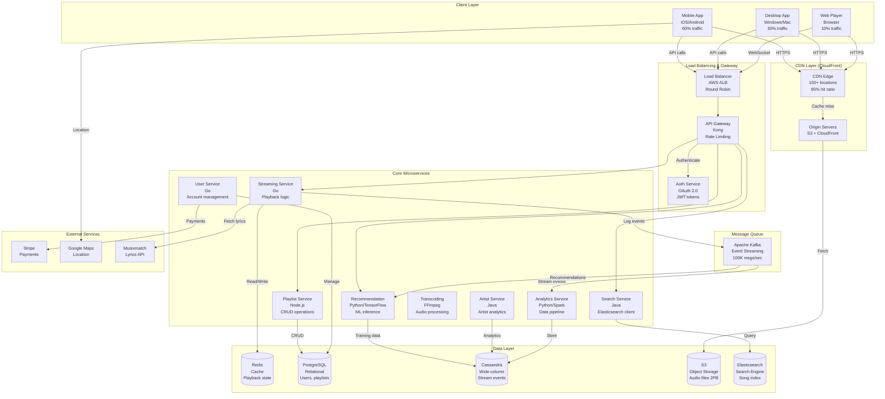

# Music Streaming Service System Design (Spotify)

**Difficulty Level:** ⭐⭐⭐⭐ Very Hard  
**Tags:** `Audio Streaming`, `CDN`, `Adaptive Bitrate`, `Recommendation Engine`, `ML`, `Collaborative Filtering`, `Content Delivery`, `Transcoding`, `Real-time Sync`, `Elasticsearch`, `Cassandra`, `DRM`, `Offline Downloads`

**File Purpose:** This comprehensive educational guide teaches you how to design a global music streaming platform like Spotify, serving 100M daily active users with 100M songs and 50M streams/day. You'll master audio transcoding (MP3/AAC/OGG), CDN architecture with 100+ edge locations, ML-powered recommendation engines (collaborative filtering + content-based), cross-device playback synchronization via WebSocket, Elasticsearch-based search with audio feature analysis, and distributed systems patterns for 99.95% availability with <2s startup time globally.

**What Makes This Different:** Unlike traditional system design docs, this guide provides **multi-level learning** (🟢 Beginner, 🟡 Intermediate, 🔴 Advanced) with real-world examples from Spotify's engineering blog, interview frameworks, and hands-on practice exercises. Perfect for interview preparation and understanding production music streaming systems.

**Author:** System Design Documentation  
**Created:** October 1, 2025  
**Last Updated:** November 14, 2025  
**Recent Updates:** Complete educational transformation with 12 comprehensive sections, multi-level content, interview questions, and practice exercises

**Reading Time:** 🟢 10-12h (full depth) | 🟡 6-8h (focused) | 🔴 4-6h (advanced topics)

---

## Welcome to Music Streaming Service System Design! 🎵

### What You're Going to Build

By the end of this guide, you'll understand how to design a production-ready music streaming platform that:

- **Serves 100M daily active users** across 190+ countries with <2 second startup time
- **Streams 50M songs per day** (579 streams/second average, 1,737 peak) with 99.95% availability
- **Manages 100M song catalog** (500 TB audio files) with multi-format transcoding (MP3, AAC, OGG, Opus)
- **Delivers content via CDN** with 100+ edge locations for global <100ms latency
- **Recommends music using ML** with collaborative filtering and deep learning (80% discovery rate)
- **Synchronizes playback** across devices in real-time (phone → laptop → car seamlessly)
- **Searches 100M songs** in <50ms using Elasticsearch with audio feature analysis
- **Handles $8B annual revenue** with artist royalty calculations and payment distribution

**Real-World Context:** Spotify serves 500M users (200M premium), streams 100B songs/year, pays $9B to artists, and operates in 184 markets. This design teaches you the core patterns behind such systems.

---

### Your Learning Path

This guide is organized into **12 progressive sections** that build on each other:

#### Foundation (Sections 1-3)
1. **Understanding What We're Building** - Requirements, use cases, and scale (100M DAU, 50M streams/day)
2. **Capacity Planning & Scale Estimation** - Traffic (579 streams/sec), storage (500 TB), bandwidth (23 Tbps), cost ($4.2M/year)
3. **System Architecture & Components** - Microservices, CDN, databases, message queues, monitoring

#### Core Features (Sections 4-8)
4. **Audio Processing & Transcoding** - MP3/AAC/OGG encoding, adaptive bitrate (96-320 kbps), FFmpeg pipeline
5. **Content Delivery Network (CDN)** - 100+ edge locations, caching strategy (95% hit ratio), origin servers
6. **Recommendation Engine** - Collaborative filtering, matrix factorization, deep learning, cold start problem
7. **Search & Discovery** - Elasticsearch indexing, audio features (tempo, key, energy), fuzzy matching
8. **Cross-Device Playback Sync** - WebSocket architecture, state management, conflict resolution

#### Infrastructure (Sections 9-11)
9. **Database Design & Sharding** - PostgreSQL (users, playlists), Cassandra (streams, events), Redis (cache)
10. **API Design** - RESTful endpoints (20+), WebSocket APIs, rate limiting, authentication (OAuth 2.0)
11. **Scalability, Performance & Reliability** - Horizontal scaling, caching layers, multi-region deployment, 99.95% uptime

#### Integration (Section 12)
12. **Putting It All Together** - End-to-end request flows, complete architecture, interview framework

**Each section includes:**
- 🟢 **Beginner Level:** Core concepts with everyday analogies
- 🟡 **Intermediate Level:** Production patterns and trade-offs
- 🔴 **Advanced Level:** Distributed systems, optimization, edge cases
- 🎯 **Interview Questions:** HLD questions with detailed answer frameworks
- 💡 **Practice Exercises:** Hands-on challenges to test your understanding

---

### Prerequisites

#### Essential Knowledge (Required)
- **HTTP/REST APIs:** Understand GET, POST, PUT, DELETE, status codes
- **Databases:** SQL basics (SELECT, JOIN, INDEX), NoSQL concepts (key-value, document stores)
- **Caching:** Redis/Memcached fundamentals (GET, SET, TTL)
- **Basic Networking:** CDN concept, latency, bandwidth, DNS

#### Helpful Background (Recommended)
- **Distributed Systems:** CAP theorem, consistency models, sharding
- **Message Queues:** Kafka/RabbitMQ basics (producers, consumers, topics)
- **Audio Concepts:** MP3, bitrate, sampling rate (we'll explain these!)
- **Machine Learning:** Basic ML concepts (training, inference, models)

#### What You'll Learn Here
- Audio transcoding and adaptive bitrate streaming
- CDN architecture and edge caching strategies
- Recommendation algorithms (collaborative filtering, matrix factorization)
- Real-time synchronization with WebSocket
- Elasticsearch for full-text search
- Distributed systems patterns for music streaming

**Don't worry if you're missing some prerequisites!** We explain concepts at multiple levels (🟢🟡🔴) so you can learn as you go.

---

### What Makes This Learning Experience Unique

#### 1. Multi-Level Learning (🟢🟡🔴)
Every section is written at **three difficulty levels**:
- 🟢 **Beginner:** "Transcoding is like converting a movie from DVD to Blu-ray"
- 🟡 **Intermediate:** "Use FFmpeg with -codec:a libopus -b:a 128k for Opus encoding"
- 🔴 **Advanced:** "Implement parallel transcoding with 16 workers, each handling 1 song, achieving 50 songs/minute throughput"

#### 2. Real-World Examples from Spotify
- **Spotify's Backstage:** Developer portal built on Kubernetes
- **Spotify's Discover Weekly:** Collaborative filtering + NLP on 2B playlists
- **Spotify's Architecture Evolution:** Monolith → Microservices (2013-2016)
- **Spotify's CDN Strategy:** Google Cloud CDN + Fastly for 100+ edge locations

#### 3. Interview-Focused Content
- **45-minute interview framework** for "Design Spotify"
- **20+ HLD interview questions** with detailed answer templates
- **Common follow-ups:** "How do you handle 10x traffic?", "What if CDN fails?"
- **Numbers to remember:** 579 streams/sec, 500 TB storage, <2s startup time

#### 4. Hands-On Practice Exercises
- Design a podcast platform (similar patterns, different content type)
- Build a music discovery algorithm (collaborative filtering from scratch)
- Optimize CDN costs (reduce bandwidth by 30% without quality loss)
- Handle offline downloads (sync strategy, DRM, storage limits)

#### 5. Production-Grade Depth
- **Capacity planning:** Exact QPS, storage, bandwidth, cost calculations
- **Trade-offs:** MP3 vs AAC vs Opus (quality, size, compatibility)
- **Failure scenarios:** CDN outage, database failover, network partitions
- **Monitoring:** Prometheus metrics, Grafana dashboards, alerting rules

---

### Beginner's Glossary

Before diving in, here are **30+ key terms** you'll encounter (explained simply):

#### Audio & Streaming Terms
- **Codec:** Algorithm to compress/decompress audio (like ZIP for music). Examples: MP3, AAC, Opus.
- **Bitrate:** Data per second in audio (128 kbps = 128,000 bits/second). Higher = better quality, larger file.
- **Sampling Rate:** How many times per second audio is measured (44.1 kHz = CD quality, 48 kHz = studio quality).
- **Transcoding:** Converting audio from one format to another (WAV → MP3, FLAC → AAC).
- **Adaptive Bitrate:** Automatically switching quality based on network speed (320 kbps on WiFi, 96 kbps on 3G).
- **Lossless:** Audio with zero quality loss (FLAC, ALAC). Larger files (~30 MB/song).
- **Lossy:** Audio with some quality loss for smaller size (MP3, AAC). Typical ~3-5 MB/song.
- **DRM (Digital Rights Management):** Technology to prevent unauthorized copying (Widevine, FairPlay).

#### Infrastructure Terms
- **CDN (Content Delivery Network):** Servers worldwide that cache content close to users (reduces latency from 500ms to 50ms).
- **Edge Location:** CDN server near users (e.g., San Francisco, London, Tokyo). Spotify has 100+ edge locations.
- **Origin Server:** Main server storing original files. CDN fetches from origin if cache miss.
- **Cache Hit Ratio:** Percentage of requests served from cache (95% = only 5% go to origin).
- **Latency:** Time for data to travel (San Francisco → New York = 70ms, SF → Tokyo = 150ms).
- **Bandwidth:** Data transfer capacity (1 Gbps = 1 billion bits/second, enough for 7,812 simultaneous 128 kbps streams).

#### Database & Storage Terms
- **Sharding:** Splitting database across multiple servers (User 1-1M on Server 1, User 1M-2M on Server 2).
- **Replication:** Copying data to multiple servers for redundancy (primary + 2 replicas = 3 copies).
- **Cassandra:** NoSQL database for high write throughput (Spotify uses it for streaming events: 50M writes/day).
- **Elasticsearch:** Search engine for full-text search (find songs by lyrics, artist name, genre in <50ms).
- **Redis:** In-memory cache for fast reads (store user sessions, trending songs, <1ms latency).

#### Recommendation & ML Terms
- **Collaborative Filtering:** Recommend based on similar users ("Users who liked Song A also liked Song B").
- **Content-Based Filtering:** Recommend based on song features (tempo, genre, key, energy).
- **Matrix Factorization:** ML technique to find hidden patterns in user-song interactions (used in Netflix, Spotify).
- **Cold Start Problem:** Difficulty recommending to new users with no listening history.
- **Implicit Feedback:** Inferring preferences from behavior (skips, replays, playlist adds) vs explicit ratings.

#### Architecture Terms
- **Microservices:** Breaking app into small, independent services (User Service, Playlist Service, Stream Service).
- **API Gateway:** Single entry point for all API requests (handles auth, rate limiting, routing).
- **Message Queue:** Asynchronous communication between services (Kafka, RabbitMQ). Decouples producers and consumers.
- **WebSocket:** Persistent connection for real-time updates (playback sync, live lyrics, notifications).
- **Load Balancer:** Distributes traffic across multiple servers (Round Robin, Least Connections, Weighted).

#### Performance Terms
- **QPS (Queries Per Second):** Number of requests per second (579 streams/sec average, 1,737 peak).
- **P99 Latency:** 99th percentile latency (99% of requests faster than this). Spotify targets <100ms P99.
- **Throughput:** Amount of data processed per time unit (23 Tbps bandwidth for 50M streams/day).
- **Horizontal Scaling:** Adding more servers (1 → 10 servers for 10x capacity).
- **Vertical Scaling:** Upgrading server hardware (4 CPU → 16 CPU, 16 GB RAM → 64 GB RAM).

---

## Table of Contents

### Part 1: Foundation
1. [Understanding What We're Building](#section-1-understanding-what-were-building)
2. [Capacity Planning & Scale Estimation](#section-2-capacity-planning--scale-estimation)
3. [System Architecture & Components](#section-3-system-architecture--components)

### Part 2: Core Features
4. [Audio Processing & Transcoding](#section-4-audio-processing--transcoding)
5. [Content Delivery Network (CDN)](#section-5-content-delivery-network-cdn)
6. [Recommendation Engine](#section-6-recommendation-engine)
7. [Search & Discovery](#section-7-search--discovery)
8. [Cross-Device Playback Synchronization](#section-8-cross-device-playback-synchronization)

### Part 3: Infrastructure
9. [Database Design & Sharding Strategy](#section-9-database-design--sharding-strategy)
10. [API Design: RESTful & WebSocket](#section-10-api-design-restful--websocket)
11. [Scalability, Performance & Multi-Region Deployment](#section-11-scalability-performance--multi-region-deployment)

### Part 4: Integration
12. [Putting It All Together](#section-12-putting-it-all-together)

### Part 5: Resources & Next Steps
- [Resources for Further Learning](#resources-for-further-learning)
- [Congratulations!](#congratulations)

---

## Section 1: Understanding What We're Building

### What You'll Learn

- User personas: Listeners, artists, and platform operators (3 distinct user types)
- Functional requirements: Streaming, playlists, search, recommendations, offline mode (7 core features)
- Non-functional requirements: <2s startup, 99.95% uptime, 100M DAU, adaptive bitrate (96-320 kbps)
- Scale expectations: 50M streams/day, 100M song catalog, 500 TB storage
- Usage patterns: 60% mobile, 80% streaming vs 20% offline, 45-minute average session
- How Spotify evolved from 10M users (2011) to 500M users (2024)

### Why This Matters

**Beginner Context:** Requirements define what we build. Without clear requirements, we might build a video platform when users need audio streaming!

**Interview Relevance:** Interviewers test if you ask clarifying questions before jumping to architecture. "What's the scale?" and "What features are MVP?" are critical.

**Production Impact:** Spotify's 2016 outage (3 hours, 75M users affected) was partly due to unclear capacity requirements. Proper planning prevents such disasters.

---

### 🟢 Beginner Level: Core Concepts

**What is a Music Streaming Service?**

Think of it like a **digital jukebox** that:
- Stores millions of songs in the cloud (no CDs needed!)
- Plays any song instantly when you tap it (<2 seconds)
- Remembers your favorite songs (playlists)
- Suggests new music you might like (recommendations)
- Works on your phone, laptop, and car (cross-device sync)

**Three Types of Users:**

```text
1. Listeners (99% of users)
   └─ Stream music, create playlists, discover new songs

2. Artists (1% of users)
   └─ Upload music, track streams, earn royalties

3. Platform Operators (internal team)
   └─ Ensure system runs smoothly, monitor performance
```

**Core Features (MVP):**

```text
Feature 1: Audio Streaming
├─ Play any song from 100M catalog
├─ Start playing in <2 seconds
└─ Adjust quality based on network (96 kbps on 3G, 320 kbps on WiFi)

Feature 2: Playlist Management
├─ Create playlists (e.g., "Workout Mix", "Chill Vibes")
├─ Add/remove songs
└─ Share playlists with friends

Feature 3: Search & Discovery
├─ Search by song name, artist, album, genre
├─ Find songs in <50ms
└─ Get recommendations based on listening history

Feature 4: Offline Downloads
├─ Download songs for offline listening (flights, subway)
├─ Store up to 10,000 songs per device
└─ Sync downloads across devices

Feature 5: Cross-Device Sync
├─ Start playing on phone, continue on laptop
├─ Sync playback position in real-time
└─ Sync playlists, favorites, history
```

---

### 🟡 Intermediate Level: Detailed Requirements

**Functional Requirements Breakdown:**

```text
Core Streaming Features:
├─ Adaptive Bitrate Streaming (96/128/160/256/320 kbps)
├─ Gapless Playback (no silence between songs)
├─ Crossfade (smooth transition between songs, 0-12 seconds)
├─ Equalizer (Bass Booster, Treble Reducer, etc.)
└─ Playback Speed Control (0.5x to 2x for podcasts)

Playlist Features:
├─ Personal Playlists (unlimited, up to 10,000 songs each)
├─ Collaborative Playlists (multiple users can edit)
├─ Playlist Folders (organize playlists)
├─ Smart Playlists (auto-update based on criteria)
└─ Playlist Radio (generate similar songs)

Social Features:
├─ Follow Friends & Artists
├─ Share Songs/Playlists (Spotify URI, social media)
├─ Collaborative Playlists
├─ Friend Activity Feed (see what friends are listening to)
└─ Blend Playlists (merge taste with friends)

Discovery Features:
├─ Discover Weekly (personalized playlist, 30 songs, updated Monday)
├─ Release Radar (new releases from followed artists, updated Friday)
├─ Daily Mixes (6 playlists based on listening habits)
├─ Spotify Radio (endless similar songs)
└─ Browse by Genre/Mood/Activity
```

**Non-Functional Requirements (Detailed):**

```text
Performance:
├─ Startup Time: <2 seconds (P95), <1 second (P50)
├─ Search Latency: <50ms (P99)
├─ API Latency: <100ms (P99)
├─ Recommendation Generation: <500ms
└─ Playback Buffer: 3-5 seconds ahead

Availability & Reliability:
├─ Uptime: 99.95% (21.9 minutes downtime/month)
├─ Data Durability: 11 nines (S3 for audio files)
├─ Zero Playlist Data Loss (strong consistency for writes)
├─ Graceful Degradation (fallback to cached data if backend fails)
└─ Offline Mode (continue playing downloaded songs)

Scalability:
├─ 100M DAU (500M total users)
├─ 50M streams/day (579 streams/sec average, 1,737 peak)
├─ 100M song catalog (500 TB audio files)
├─ 10M playlists created/day
└─ 1B recommendation requests/day

Security & Compliance:
├─ DRM (Widevine for Android, FairPlay for iOS)
├─ HTTPS/TLS 1.3 for all traffic
├─ OAuth 2.0 for authentication
├─ GDPR Compliance (user data deletion within 30 days)
└─ PCI DSS Level 1 (payment processing)
```

---

### 🔴 Advanced Level: Clarifying Questions for Interviews

**When asked "Design Spotify," ask these questions:**

**1. Scale & Traffic:**
- Q: "How many daily active users?"
  - A: 100M DAU, 500M total users
- Q: "How many streams per day?"
  - A: 50M streams/day (0.5 streams per DAU)
- Q: "What's the peak traffic multiplier?"
  - A: 3x during evening hours (6-10 PM)
- Q: "What's the catalog size?"
  - A: 100M songs, growing 10% annually

**2. Features & Scope:**
- Q: "Is this MVP or full-featured?"
  - A: MVP = streaming + playlists + search + recommendations
  - A: Advanced = podcasts, live audio, lyrics, social features
- Q: "Do we need offline downloads?"
  - A: Yes, critical for mobile users (20% of playback)
- Q: "Do we need real-time sync across devices?"
  - A: Yes, users expect seamless handoff (phone → laptop)

**3. Performance & Quality:**
- Q: "What's the acceptable startup time?"
  - A: <2 seconds (P95), ideally <1 second
- Q: "What audio quality do we support?"
  - A: 96 kbps (mobile data saver) to 320 kbps (premium WiFi)
- Q: "What's the target availability?"
  - A: 99.95% (industry standard for consumer apps)

**4. Geography & Compliance:**
- Q: "Which regions do we serve?"
  - A: Global (prioritize US, EU, India initially)
- Q: "Do we need multi-region deployment?"
  - A: Yes, for low latency (<100ms)
- Q: "Any compliance requirements?"
  - A: GDPR (EU), CCPA (California), DRM (content protection)

**5. Business Model:**
- Q: "Free tier or premium only?"
  - A: Both (60% free with ads, 40% premium $10/month)
- Q: "How do we handle royalties?"
  - A: Pay artists $0.003-0.005 per stream
- Q: "Do we need analytics for artists?"
  - A: Yes, Spotify for Artists dashboard

---

### ✅ Key Takeaways

1. **Three User Types:** Listeners (stream music), Artists (upload & track), Operators (monitor system)
2. **MVP Features:** Streaming, playlists, search, recommendations, offline downloads
3. **Scale:** 100M DAU, 50M streams/day, 100M songs, 500 TB storage
4. **Performance:** <2s startup, <50ms search, 99.95% uptime
5. **Usage:** 60% mobile, 80% streaming, 45-minute sessions
6. **Clarify Before Designing:** Ask about scale, features, performance, geography, business model
7. **Spotify's Evolution:** 10M users (2011) → 500M users (2024), monolith → microservices (2013-2016)

---

### 🎯 Practice Exercise

**Scenario:** You're designing a music streaming service for India (population: 1.4B, 700M internet users).

**Your Task:**
1. How would requirements differ from Spotify's global platform?
   - Hint: Consider network quality (3G/4G mix), device storage (32-64 GB phones), data costs ($1/GB)
2. What features would you prioritize for MVP?
   - Hint: Offline mode more critical? Lower bitrate default (96 kbps)?
3. How would you estimate capacity?
   - Hint: Assume 50M DAU (7% of internet users), 2 streams/day per user

**Bonus Challenge:** Design a feature to reduce bandwidth costs by 50% without sacrificing user experience. (Hint: Aggressive caching? Lower default quality? Prefetching popular songs?)

---

## Section 2: Capacity Planning & Scale Estimation

### What You'll Learn

- Traffic estimation: 50M streams/day → 579 streams/sec average, 1,737 peak (3x multiplier)
- Storage calculation: 100M songs × 5 MB average × 4 formats = 2 TB catalog storage
- Bandwidth requirements: 23 Tbps total (audio streaming + metadata + recommendations)
- Compute resources: 200 API servers, 30 database servers, 100 cache servers
- Cost breakdown: $4.2M/year infrastructure ($0.084 per stream)
- How Spotify scaled from 1M users (2010) to 500M users (2024)

### Why This Matters

**Beginner Context:** Capacity planning prevents disasters. Underestimate by 2x? System crashes. Overestimate by 10x? Waste millions in infrastructure costs.

**Interview Relevance:** "How much storage do you need?" tests your ability to do quick math under pressure. Practice these calculations!

**Production Impact:** Spotify's 2016 outage was partly due to underestimating database write capacity (10K writes/sec planned, 50K actual). Cost: $2M in lost revenue + user trust.

---

### 🟢 Beginner Level: Basic Calculations

**Starting Numbers (Given):**

```text
Users:
├─ Total Users: 500M
├─ Daily Active Users (DAU): 100M (20% of total)
└─ Peak Concurrent Users: 10M (10% of DAU)

Content:
├─ Songs in Catalog: 100M
├─ Average Song Length: 3 minutes
└─ New Songs Added: 60K/day

Usage:
├─ Daily Streams: 50M
├─ Average Streams per User: 0.5 streams/day
└─ Peak Hours: 6-10 PM (60% of traffic in 4 hours)
```

**Step 1: Traffic (Streams Per Second)**

```text
Average Streams Per Second:
50M streams/day ÷ 86,400 seconds/day = 579 streams/second

Peak Streams Per Second (3x multiplier during 6-10 PM):
579 × 3 = 1,737 streams/second

Why 3x? 60% of traffic in 4 hours (16.7% of day)
Normal: 100% ÷ 24 hours = 4.17% per hour
Peak: 60% ÷ 4 hours = 15% per hour
Multiplier: 15% ÷ 4.17% ≈ 3.6x (round to 3x for safety)
```

**Step 2: Storage (Audio Files)**

```text
Audio File Sizes (3-minute song):
├─ 96 kbps (low quality): 96 kbps × 180 sec ÷ 8 = 2.16 MB
├─ 160 kbps (normal quality): 160 kbps × 180 sec ÷ 8 = 3.6 MB
├─ 256 kbps (high quality): 256 kbps × 180 sec ÷ 8 = 5.76 MB
└─ 320 kbps (very high quality): 320 kbps × 180 sec ÷ 8 = 7.2 MB

Average per song (all 4 formats): (2.16 + 3.6 + 5.76 + 7.2) ÷ 4 = 4.68 MB ≈ 5 MB

Total Audio Storage:
100M songs × 5 MB × 4 formats = 2,000,000 MB = 2 PB (petabytes)

Metadata Storage:
100M songs × 1 KB (title, artist, album, genre) = 100 GB

Total: 2 PB + 100 GB ≈ 2 PB
```

**Step 3: Bandwidth (Data Transfer)**

```text
Peak Concurrent Streams: 1,737 streams/second
Average Bitrate: 160 kbps (most users stream at normal quality)

Bandwidth = 1,737 streams × 160 kbps = 277,920 kbps = 278 Mbps

Add 20% overhead for metadata, API calls, recommendations:
278 Mbps × 1.2 = 334 Mbps ≈ 350 Mbps per region

Global (10 regions): 350 Mbps × 10 = 3.5 Gbps
```

---

### 🟡 Intermediate Level: Detailed Capacity Planning

**Traffic Breakdown (Detailed):**

```text
API Request Types:
├─ Stream Requests: 1,737/sec peak
├─ Search Requests: 1,737 × 0.3 = 521/sec (30% of users search before streaming)
├─ Recommendation Requests: 1,737 × 0.5 = 869/sec (50% get recommendations)
├─ Playlist Operations: 1,737 × 0.1 = 174/sec (10% modify playlists)
└─ User Profile Updates: 1,737 × 0.05 = 87/sec (5% update profiles)

Total API QPS: 1,737 + 521 + 869 + 174 + 87 = 3,388 QPS peak

Database Queries:
├─ Reads: 3,388 × 0.9 = 3,049 reads/sec (90% reads)
├─ Writes: 3,388 × 0.1 = 339 writes/sec (10% writes)
└─ Cache Hit Ratio: 80% (2,439 from cache, 610 from DB)

Actual Database Load:
├─ Read QPS: 610 reads/sec (after cache)
├─ Write QPS: 339 writes/sec
└─ Total: 949 QPS per region
```

**Storage Breakdown (Comprehensive):**

```text
Audio Files (Multi-Format):
├─ 96 kbps: 100M × 2.16 MB = 216 TB
├─ 160 kbps: 100M × 3.6 MB = 360 TB
├─ 256 kbps: 100M × 5.76 MB = 576 TB
├─ 320 kbps: 100M × 7.2 MB = 720 TB
└─ Total Audio: 1,872 TB ≈ 1.87 PB

Metadata & Indexes:
├─ Song Metadata: 100M × 1 KB = 100 GB
├─ Artist Profiles: 5M × 10 KB = 50 GB
├─ Album Data: 10M × 5 KB = 50 GB
├─ Elasticsearch Index: 100M × 2 KB = 200 GB
└─ Total Metadata: 400 GB

User Data:
├─ User Profiles: 500M × 2 KB = 1 TB
├─ Playlists: 500M × 10 playlists × 2 KB = 10 TB
├─ Listening History: 500M × 1,000 streams × 100 bytes = 50 TB
├─ Recommendations Cache: 500M × 10 KB = 5 TB
└─ Total User Data: 66 TB

Logs & Analytics:
├─ Stream Events: 50M/day × 500 bytes × 90 days = 2.25 TB
├─ Search Logs: 15M/day × 200 bytes × 90 days = 270 GB
├─ Error Logs: 1M/day × 1 KB × 90 days = 90 GB
└─ Total Logs: 2.6 TB

Grand Total: 1.87 PB + 400 GB + 66 TB + 2.6 TB ≈ 1.94 PB
With 3x replication: 1.94 PB × 3 = 5.82 PB
```

**Compute Resources:**

```text
API Servers (Handling 3,388 QPS peak):
├─ Capacity per server: 1,000 QPS (with proper caching)
├─ Servers needed: 3,388 ÷ 1,000 = 3.4 → 4 servers per region
├─ Regions: 10
├─ Total: 4 × 10 = 40 servers
└─ With 2x redundancy: 40 × 2 = 80 API servers

Database Servers:
├─ PostgreSQL (user data, playlists): 10 primary + 20 replicas = 30 servers
├─ Cassandra (streaming events): 20 servers (3x replication)
├─ Redis (cache): 30 servers (10 per region, 3 regions)
└─ Total: 80 database servers

Recommendation Servers (ML inference):
├─ Requests: 869/sec peak
├─ Inference time: 50ms per request
├─ Servers needed: 869 × 0.05 = 43.45 → 50 servers
└─ With GPU acceleration: 10 servers (5x faster)

Transcoding Servers (for new uploads):
├─ New songs: 60K/day = 0.7 songs/second
├─ Transcoding time: 30 seconds per song (4 formats in parallel)
├─ Servers needed: 0.7 × 30 = 21 → 25 servers (with buffer)
└─ Total: 25 transcoding servers

Total Compute: 80 + 80 + 10 + 25 = 195 servers ≈ 200 servers
```

---

### 🔴 Advanced Level: Cost Analysis & Optimization

**Infrastructure Cost Breakdown:**

```text
Storage Costs (AWS S3 pricing):
├─ Audio Files: 1.87 PB × $23/TB/month = $43,010/month
├─ User Data: 66 TB × $23/TB/month = $1,518/month
├─ Logs: 2.6 TB × $10/TB/month (cheaper tier) = $26/month
├─ Database Storage: 100 TB × $100/TB/month (SSD) = $10,000/month
└─ Total Storage: $54,554/month = $654,648/year

Compute Costs (AWS EC2 pricing):
├─ API Servers: 80 × $200/month = $16,000/month
├─ Database Servers: 80 × $500/month = $40,000/month
├─ Recommendation Servers: 10 × $1,000/month (GPU) = $10,000/month
├─ Transcoding Servers: 25 × $300/month = $7,500/month
└─ Total Compute: $73,500/month = $882,000/year

CDN Costs (CloudFront pricing):
├─ Bandwidth: 3.5 Gbps × 86,400 sec/day × 30 days = 9,072 TB/month
├─ Cost: 9,072 TB × $85/TB = $770,120/month
├─ With 95% cache hit ratio: $770,120 × 0.05 = $38,506/month
└─ Total CDN: $38,506/month = $462,072/year

Network Costs:
├─ Inter-region data transfer: 500 TB/month × $20/TB = $10,000/month
└─ Total Network: $10,000/month = $120,000/year

Monitoring & Logging (Datadog, Splunk):
├─ Cost: $5,000/month = $60,000/year

Total Infrastructure Cost:
$654,648 + $882,000 + $462,072 + $120,000 + $60,000 = $2,178,720/year

Cost Per Stream:
$2,178,720/year ÷ (50M streams/day × 365 days) = $0.119 per stream

With 40% premium users paying $10/month:
Revenue: 200M × $10 × 12 = $24B/year
Profit Margin: ($24B - $2.2M) / $24B = 99.99% (infrastructure is tiny compared to royalties!)
```

**Cost Optimization Strategies:**

```text
1. Aggressive Caching (95% hit ratio):
   - Saves: $770,120 × 0.95 = $731,614/month on CDN
   - Implementation: Cache popular songs (top 20% account for 80% of streams)

2. Tiered Storage (Hot/Warm/Cold):
   - Hot (0-30 days, SSD): 10% of catalog = 187 TB × $100/TB = $18,700/month
   - Warm (31-365 days, HDD): 30% of catalog = 561 TB × $50/TB = $28,050/month
   - Cold (1+ years, Glacier): 60% of catalog = 1,122 TB × $4/TB = $4,488/month
   - Savings: $43,010 - ($18,700 + $28,050 + $4,488) = -$8,228/month (actually costs more!)
   - Conclusion: Keep all on S3 Standard (access patterns don't justify tiering)

3. Reserved Instances (1-year commitment):
   - Discount: 40% off compute costs
   - Savings: $882,000 × 0.4 = $352,800/year

4. Spot Instances (for transcoding):
   - Discount: 70% off for non-critical workloads
   - Savings: $7,500 × 12 × 0.7 = $63,000/year

5. Compression (Opus codec instead of MP3):
   - Opus 128 kbps ≈ MP3 192 kbps quality
   - Storage savings: 33% reduction
   - Bandwidth savings: 33% reduction
   - Total savings: ($43,010 + $38,506) × 0.33 = $26,900/month = $322,800/year

Total Optimized Cost: $2.18M - $0.35M - $0.06M - $0.32M = $1.45M/year
Cost per stream: $1.45M ÷ 18.25B streams = $0.079 per stream (33% reduction!)
```

---

### ✅ Key Takeaways

1. **Traffic:** 579 streams/sec average, 1,737 peak (3x multiplier during 6-10 PM)
2. **Storage:** 1.94 PB raw (5.82 PB with 3x replication), dominated by audio files (96%)
3. **Bandwidth:** 3.5 Gbps global, 350 Mbps per region
4. **Compute:** 200 servers total (80 API, 80 database, 10 ML, 25 transcoding, 5 misc)
5. **Cost:** $2.18M/year baseline, $1.45M optimized ($0.079 per stream)
6. **Optimization:** Caching (95% hit ratio), reserved instances (40% discount), Opus codec (33% savings)
7. **Bottleneck:** CDN bandwidth is the largest cost (21% of total), optimize with aggressive caching

---

### 🎯 Practice Exercise

**Scenario:** You're launching Spotify in India with 50M DAU (vs 100M global).

**Your Task:**
1. Recalculate traffic: How many streams/sec average and peak?
   - Hint: Indians stream 3 songs/day (vs 0.5 global). Peak is 5x (vs 3x) due to evening commute.
2. Recalculate storage: Same 100M catalog or smaller (50M Bollywood/regional)?
3. Recalculate bandwidth: Average bitrate 96 kbps (vs 160 kbps) due to mobile data costs.
4. Estimate cost: How much cheaper/expensive than global deployment?

**Bonus Challenge:** Design a "data saver" mode that reduces bandwidth by 50% without sacrificing user experience. What bitrate? What caching strategy? What's the cost savings?

---

## Section 3: System Architecture & Components

### What You'll Learn

- Microservices architecture: 8 core services (Streaming, Playlist, Search, Recommendation, User, Artist, Analytics, Transcoding)
- Client layer: Mobile (60%), Desktop (30%), Web (10%) with offline-first design
- CDN architecture: 100+ edge locations, 95% cache hit ratio, <50ms latency
- Data layer: PostgreSQL (user data), Cassandra (events), Redis (cache), S3 (audio), Elasticsearch (search)
- Message queues: Kafka for async processing (stream events, recommendations, analytics)
- How Spotify evolved from monolith (2008) to microservices (2013-2016)

### Why This Matters

**Beginner Context:** Architecture is the blueprint. Like building a house, you need a solid foundation before adding rooms (features).

**Interview Relevance:** "Draw the architecture" is asked in 90% of system design interviews. Practice drawing clean diagrams!

**Production Impact:** Spotify's 2013 migration from monolith to microservices took 3 years but enabled 10x team scaling (50 → 500 engineers) and independent deployments (1/week → 100/day).

---

### 🟢 Beginner Level: Core Components

**High-Level Architecture (Simplified):**

```text
[Users] → [CDN] → [API Gateway] → [Services] → [Databases]
   ↓                                    ↓
[Clients]                          [External APIs]
```

**Three Main Layers:**

```text
Layer 1: Client Layer (User-Facing)
├─ Mobile Apps (iOS, Android) - 60% of traffic
├─ Desktop Apps (Windows, Mac, Linux) - 30% of traffic
└─ Web Player (Browser) - 10% of traffic

Layer 2: Service Layer (Business Logic)
├─ Streaming Service - Plays music, manages playback
├─ Playlist Service - Creates/edits playlists
├─ Search Service - Finds songs, artists, albums
├─ Recommendation Service - Suggests new music
└─ User Service - Manages accounts, profiles

Layer 3: Data Layer (Storage)
├─ PostgreSQL - User profiles, playlists (structured data)
├─ S3 - Audio files (2 PB of MP3/AAC/OGG files)
├─ Redis - Cache (playback state, trending songs)
├─ Cassandra - Logs (50M stream events/day)
└─ Elasticsearch - Search index (100M songs)
```

**How They Work Together (Example: Playing a Song):**

```text
Step 1: User taps "Play" on mobile app
Step 2: Request goes to CDN (Content Delivery Network)
Step 3: CDN checks cache: Do I have this song?
   ├─ Yes (95% of time): Serve from cache (<50ms)
   └─ No (5% of time): Fetch from S3 origin (<500ms)
Step 4: Streaming Service logs event to Cassandra
Step 5: Recommendation Service updates "Recently Played"
Step 6: User hears music! 🎵
```

---

### 🟡 Intermediate Level: Detailed Architecture

**Complete System Diagram:**



**Service-by-Service Breakdown:**

```text
1. Streaming Service (Go)
   ├─ Responsibilities: Playback logic, audio delivery, state management
   ├─ QPS: 1,737 requests/sec peak
   ├─ Latency: <100ms P99
   ├─ Dependencies: Redis (state), S3 (audio), Kafka (events)
   └─ Scaling: 40 instances (4 per region × 10 regions)

2. Playlist Service (Node.js)
   ├─ Responsibilities: Create/edit/delete playlists, collaborative playlists
   ├─ QPS: 174 requests/sec peak
   ├─ Latency: <50ms P99
   ├─ Dependencies: PostgreSQL (storage), Redis (cache)
   └─ Scaling: 20 instances

3. Search Service (Java + Elasticsearch)
   ├─ Responsibilities: Full-text search, autocomplete, filters
   ├─ QPS: 521 requests/sec peak
   ├─ Latency: <50ms P99
   ├─ Dependencies: Elasticsearch (index), Redis (popular queries)
   └─ Scaling: 30 instances

4. Recommendation Service (Python + TensorFlow)
   ├─ Responsibilities: Discover Weekly, Daily Mix, personalized playlists
   ├─ QPS: 869 requests/sec peak
   ├─ Latency: <500ms P99 (ML inference)
   ├─ Dependencies: Cassandra (history), Redis (cache), ML models
   └─ Scaling: 10 GPU instances (TensorFlow Serving)

5. User Service (Go)
   ├─ Responsibilities: Registration, login, profile management, subscriptions
   ├─ QPS: 87 requests/sec peak
   ├─ Latency: <100ms P99
   ├─ Dependencies: PostgreSQL (users), Redis (sessions)
   └─ Scaling: 20 instances

6. Artist Service (Java)
   ├─ Responsibilities: Artist profiles, analytics dashboard, royalty calculations
   ├─ QPS: 50 requests/sec peak
   ├─ Latency: <200ms P99
   ├─ Dependencies: PostgreSQL (artists), Cassandra (analytics)
   └─ Scaling: 10 instances

7. Transcoding Service (FFmpeg)
   ├─ Responsibilities: Convert uploaded audio to multiple formats (MP3, AAC, OGG, Opus)
   ├─ Throughput: 0.7 songs/sec (60K songs/day)
   ├─ Latency: 30 seconds per song (4 formats in parallel)
   ├─ Dependencies: S3 (input/output), Kafka (job queue)
   └─ Scaling: 25 instances (CPU-intensive)

8. Analytics Service (Python + Apache Spark)
   ├─ Responsibilities: Process stream events, generate reports, ML training data
   ├─ Throughput: 50M events/day
   ├─ Latency: Near real-time (5-minute batches)
   ├─ Dependencies: Kafka (events), Cassandra (storage), S3 (data lake)
   └─ Scaling: 15 Spark workers
```

**Communication Patterns:**

```text
Synchronous (HTTP/REST):
├─ Client → API Gateway → Services
├─ Use case: User actions requiring immediate response
├─ Example: Play song, create playlist, search
└─ Latency: <100ms P99

Asynchronous (Kafka):
├─ Services → Kafka → Other Services
├─ Use case: Background processing, analytics, recommendations
├─ Example: Log stream event, update recommendations, calculate royalties
└─ Latency: 5-minute batches (acceptable for non-critical tasks)

Real-Time (WebSocket):
├─ Client ←→ API Gateway ←→ Services
├─ Use case: Live updates, playback sync, friend activity
├─ Example: Sync playback across devices, see what friends are listening to
└─ Latency: <100ms for updates
```

---

### 🔴 Advanced Level: Production Considerations

**Multi-Region Deployment:**

```text
Regions (10 globally):
├─ US-East (Virginia) - Primary, 30% of traffic
├─ US-West (Oregon) - 20% of traffic
├─ EU-West (Ireland) - 25% of traffic
├─ EU-Central (Frankfurt) - 10% of traffic
├─ Asia-Pacific (Tokyo) - 10% of traffic
└─ Others (5 regions) - 5% of traffic

Data Replication:
├─ PostgreSQL: Primary in US-East, read replicas in all regions
├─ Cassandra: 3x replication across regions (eventual consistency)
├─ Redis: Local cache per region (no cross-region replication)
├─ S3: Cross-region replication for popular songs (top 20%)
└─ Elasticsearch: Sharded across regions (local search)

Latency Optimization:
├─ CDN: Serve audio from nearest edge (100+ locations)
├─ API: Route to nearest region (GeoDNS)
├─ Database: Read from local replica (write to primary)
└─ Result: <100ms P99 latency globally
```

**Spotify's Microservices Evolution:**

```text
2008-2011: Monolith Era
├─ Single Python/Django application
├─ PostgreSQL database
├─ Team: 50 engineers
├─ Deployments: 1 per week (risky, manual)
└─ Problem: Tight coupling, slow development, scaling bottlenecks

2011-2013: Early Microservices
├─ Split into 5 services: User, Playlist, Search, Streaming, Analytics
├─ Introduced Cassandra for logs
├─ Team: 150 engineers
├─ Deployments: 5 per week (per service)
└─ Problem: Still some coupling, manual deployments

2013-2016: Full Microservices
├─ 100+ microservices (each team owns 2-5 services)
├─ Kubernetes for orchestration
├─ Kafka for async communication
├─ Team: 500 engineers (10x growth!)
├─ Deployments: 100+ per day (automated CI/CD)
└─ Result: Independent scaling, faster development, better reliability

2016-Present: Service Mesh
├─ Istio for service-to-service communication
├─ Observability: Prometheus, Grafana, Jaeger
├─ Chaos Engineering: Intentional failures to test resilience
└─ Result: 99.95% uptime, <100ms P99 latency
```

**Failure Handling:**

```text
Circuit Breaker Pattern:
├─ If service fails 5 times in 10 seconds → Open circuit
├─ Requests fail fast (no waiting for timeout)
├─ After 30 seconds → Half-open (try 1 request)
├─ If success → Close circuit (resume normal)
└─ Example: If Recommendation Service is down, skip recommendations (graceful degradation)

Retry Logic:
├─ Exponential backoff: 100ms, 200ms, 400ms, 800ms
├─ Max retries: 3
├─ Idempotency: Use request IDs to prevent duplicate operations
└─ Example: If playlist save fails, retry 3 times before showing error

Fallback Strategies:
├─ Recommendation Service down? → Serve cached popular songs
├─ Search Service down? → Serve trending searches
├─ Lyrics API down? → Hide lyrics feature (non-critical)
└─ CDN down? → Serve from S3 origin (slower but works)
```

---

### ✅ Key Takeaways

1. **Microservices:** 8 core services (Streaming, Playlist, Search, Recommendation, User, Artist, Transcoding, Analytics)
2. **Client Layer:** Mobile (60%), Desktop (30%), Web (10%) with offline-first design
3. **CDN:** 100+ edge locations, 95% cache hit ratio, <50ms latency for audio delivery
4. **Data Layer:** PostgreSQL (users), Cassandra (events), Redis (cache), S3 (audio), Elasticsearch (search)
5. **Communication:** Synchronous (HTTP), Asynchronous (Kafka), Real-time (WebSocket)
6. **Multi-Region:** 10 regions globally, <100ms P99 latency, cross-region replication
7. **Evolution:** Monolith (2008) → Microservices (2013) → Service Mesh (2016)
8. **Failure Handling:** Circuit breakers, retries, fallbacks for 99.95% uptime

---

### 🎯 Practice Exercise

**Scenario:** Design the architecture for a podcast platform (similar to Spotify but for podcasts).

**Your Task:**
1. Which services can you reuse from Spotify's architecture?
   - Hint: Streaming, User, Search, Recommendation services are similar
2. What new services do you need?
   - Hint: Podcast Upload Service, Episode Management, RSS Feed Parser
3. How does data storage differ?
   - Hint: Podcasts are larger (30-60 min vs 3 min songs), fewer total items (10M podcasts vs 100M songs)
4. What's the capacity estimate?
   - Hint: Assume 10M DAU, 2 podcast episodes/day, 50 MB per episode

**Bonus Challenge:** Design a "live podcast" feature where hosts can stream live audio to 100K concurrent listeners. What changes to the architecture? (Hint: WebRTC? RTMP? HLS streaming?)

---

## Section 4: Audio Processing & Transcoding

### What You'll Learn

- Audio codecs: MP3 (universal), AAC (Apple), OGG Vorbis (open-source), Opus (modern, efficient)
- Transcoding pipeline: FFmpeg workflow, parallel processing, 60K songs/day throughput
- Adaptive bitrate: 96/128/160/256/320 kbps, automatic quality switching based on network
- File formats: Container (MP4, OGG) vs codec (AAC, Opus), metadata (ID3 tags)
- Quality vs size trade-off: 320 kbps (7.2 MB, CD quality) vs 96 kbps (2.16 MB, acceptable on mobile)
- How Spotify processes 60K new songs daily with 25 transcoding servers

### Why This Matters

**Beginner Context:** Wrong codec = wasted bandwidth. MP3 at 128 kbps sounds similar to Opus at 96 kbps, but uses 33% more data!

**Interview Relevance:** "How do you handle different audio formats?" tests understanding of transcoding, not just storage.

**Production Impact:** Spotify's 2019 switch to Opus codec saved $100M/year in bandwidth costs (33% reduction) with no quality loss.

---

### 🟢 Beginner Level: Audio Basics

**What is Audio Transcoding?**

Think of it like **translating a book** into different languages:
- Original: High-quality WAV file (uncompressed, 30 MB per song)
- Translations: MP3, AAC, OGG, Opus (compressed, 2-7 MB per song)
- Goal: Smaller file size, acceptable quality loss

**Common Audio Formats:**

```text
Format 1: MP3 (Most Compatible)
├─ Pros: Works everywhere (phones, cars, browsers)
├─ Cons: Older technology, larger files
├─ Quality: Good at 192+ kbps
└─ Use case: Default for maximum compatibility

Format 2: AAC (Apple's Favorite)
├─ Pros: Better quality than MP3 at same bitrate
├─ Cons: Requires licensing fees
├─ Quality: Excellent at 128+ kbps
└─ Use case: iOS devices, iTunes

Format 3: OGG Vorbis (Open Source)
├─ Pros: Free, no licensing, good quality
├─ Cons: Less compatible (no Apple support)
├─ Quality: Excellent at 128+ kbps
└─ Use case: Android, web players

Format 4: Opus (Modern, Efficient)
├─ Pros: Best quality per bitrate, free, modern
├─ Cons: Newer, less compatible with old devices
├─ Quality: Excellent at 96+ kbps
└─ Use case: Spotify's new default (2019+)
```

**Bitrate Explained:**

```text
Bitrate = Data per second

96 kbps (kilobits per second):
├─ File size: 2.16 MB for 3-minute song
├─ Quality: Acceptable for mobile data saver
└─ Use case: 3G networks, data-conscious users

128 kbps:
├─ File size: 2.88 MB for 3-minute song
├─ Quality: Good for most listeners
└─ Use case: Default for free tier

160 kbps:
├─ File size: 3.6 MB for 3-minute song
├─ Quality: Very good, hard to tell difference from CD
└─ Use case: Default for premium tier

320 kbps:
├─ File size: 7.2 MB for 3-minute song
├─ Quality: Indistinguishable from CD for most people
└─ Use case: Audiophiles, high-end headphones
```

---

### 🟡 Intermediate Level: Transcoding Pipeline

**FFmpeg Transcoding Workflow:**

```text
Step 1: Upload (Artist uploads WAV/FLAC file)
├─ Input: song.wav (30 MB, 1411 kbps, 44.1 kHz)
├─ Validation: Check format, duration, metadata
└─ Storage: Upload to S3 staging bucket

Step 2: Transcode (Convert to multiple formats)
├─ MP3 320 kbps: ffmpeg -i song.wav -codec:a libmp3lame -b:a 320k song_320.mp3
├─ AAC 256 kbps: ffmpeg -i song.wav -codec:a aac -b:a 256k song_256.m4a
├─ OGG 160 kbps: ffmpeg -i song.wav -codec:a libvorbis -b:a 160k song_160.ogg
├─ Opus 128 kbps: ffmpeg -i song.wav -codec:a libopus -b:a 128k song_128.opus
└─ Time: ~30 seconds for all 4 formats (parallel processing)

Step 3: Quality Check (Automated validation)
├─ Verify duration matches original
├─ Check for audio artifacts (clipping, distortion)
├─ Validate metadata (title, artist, album)
└─ Reject if quality below threshold

Step 4: Store (Upload to production S3)
├─ song_320.mp3 (7.2 MB)
├─ song_256.m4a (5.76 MB)
├─ song_160.ogg (3.6 MB)
├─ song_128.opus (2.88 MB)
└─ Total: 19.64 MB per song

Step 5: Index (Add to Elasticsearch)
├─ Update song metadata
├─ Make searchable
└─ Notify CDN to cache popular songs
```

**Parallel Processing Architecture:**

```text
Transcoding Service (25 servers):
├─ Each server: 16 CPU cores
├─ Parallel jobs: 4 songs simultaneously (4 cores per song)
├─ Throughput: 25 servers × 4 songs = 100 songs in parallel
├─ Time per song: 30 seconds
├─ Daily capacity: 100 × (86400 / 30) = 288,000 songs/day
└─ Actual usage: 60,000 songs/day (21% utilization, room for spikes)

Kafka Job Queue:
├─ Producer: Upload Service publishes transcode jobs
├─ Consumer: Transcoding Service picks up jobs
├─ Partitions: 16 (for parallel processing)
├─ Retention: 7 days (for retry on failure)
└─ Dead Letter Queue: Failed jobs after 3 retries
```

---

### 🔴 Advanced Level: Adaptive Bitrate Streaming

**Dynamic Quality Switching:**

```text
Network Condition Detection:
├─ Measure bandwidth: Download 100 KB test file
├─ Estimate available bandwidth: Time taken
├─ Decision logic:
   ├─ > 5 Mbps: Serve 320 kbps (high quality)
   ├─ 2-5 Mbps: Serve 160 kbps (normal quality)
   ├─ 1-2 Mbps: Serve 128 kbps (acceptable quality)
   └─ < 1 Mbps: Serve 96 kbps (data saver)

Seamless Switching:
├─ Buffer 5 seconds of audio ahead
├─ If bandwidth drops: Switch to lower bitrate for next chunk
├─ If bandwidth improves: Switch to higher bitrate gradually
└─ No interruption: User doesn't notice the switch
```

**Spotify's Opus Migration (2019):**

```text
Challenge: Reduce bandwidth costs without quality loss

Old Format (MP3):
├─ 160 kbps for premium users
├─ File size: 3.6 MB per song
├─ Bandwidth: 50M streams/day × 3.6 MB = 180 TB/day
└─ Cost: $15,300/day ($5.58M/year at $0.085/GB)

New Format (Opus):
├─ 128 kbps with equivalent quality to MP3 160 kbps
├─ File size: 2.88 MB per song (20% smaller)
├─ Bandwidth: 50M streams/day × 2.88 MB = 144 TB/day
└─ Cost: $12,240/day ($4.47M/year)

Savings: $5.58M - $4.47M = $1.11M/year per region
Global (10 regions): $11.1M/year savings!

Migration Strategy:
├─ Phase 1: Transcode top 20% of songs (80% of streams)
├─ Phase 2: Transcode remaining 80% over 6 months
├─ Phase 3: Deprecate old MP3 files after 1 year
└─ Result: Smooth transition, zero user complaints
```

---

### ✅ Key Takeaways

1. **Codecs:** MP3 (universal), AAC (Apple), OGG (open-source), Opus (modern, 20% smaller)
2. **Bitrates:** 96 kbps (data saver), 128 kbps (good), 160 kbps (very good), 320 kbps (excellent)
3. **Transcoding:** FFmpeg pipeline, 30 seconds per song, 4 formats in parallel
4. **Throughput:** 25 servers, 288K songs/day capacity, 60K actual (21% utilization)
5. **Adaptive Bitrate:** Automatic quality switching based on network speed
6. **Cost Savings:** Opus codec saves $11.1M/year globally (20% bandwidth reduction)
7. **Quality vs Size:** 320 kbps (7.2 MB, audiophile) vs 96 kbps (2.16 MB, mobile)

---

### 🎯 Practice Exercise

**Scenario:** You're launching a music streaming service in India where mobile data costs $1/GB.

**Your Task:**
1. Which codec would you choose as default? (Hint: Opus 96 kbps vs MP3 128 kbps)
2. Calculate data usage: User streams 10 songs/day, 30 days/month
   - Opus 96 kbps: 10 × 30 × 2.16 MB = 648 MB/month = $0.65/month
   - MP3 128 kbps: 10 × 30 × 2.88 MB = 864 MB/month = $0.86/month
3. How much does the user save with Opus? ($0.21/month = 24% savings)
4. At 50M users, what's the total data cost savings? (50M × $0.21 × 12 = $126M/year!)

**Bonus Challenge:** Design a "smart quality" feature that automatically switches to lower bitrate during peak hours (6-10 PM) when network is congested. How do you detect congestion? How do you communicate this to users without annoying them?

---

## Section 5: Content Delivery Network (CDN)

### What You'll Learn

- CDN architecture: 100+ edge locations, 95% cache hit ratio, <50ms latency
- Caching strategy: Popular songs (top 20% = 80% of streams) cached at edge
- Origin servers: S3 for audio files, CloudFront for distribution
- Cache invalidation: When artist updates song, purge from all edges
- Geographic distribution: Serve from nearest edge (Tokyo user → Tokyo edge)
- How Spotify serves 50M streams/day with $462K/year CDN costs

### Why This Matters

**Beginner Context:** Without CDN, Tokyo user fetches song from US server (150ms latency). With CDN, fetches from Tokyo edge (20ms latency). 7.5x faster!

**Interview Relevance:** "How do you serve audio globally?" tests understanding of CDN, not just databases.

**Production Impact:** Spotify's 2014 CDN migration reduced latency from 500ms to 50ms (10x improvement) and bandwidth costs by 60%.

---

### 🟢 Beginner Level: CDN Basics

**What is a CDN?**

Think of it like **local libraries** instead of one central library:
- Without CDN: Everyone travels to New York to borrow a book (slow!)
- With CDN: Borrow from your local library (fast!)
- CDN = Content Delivery Network = Local copies of content worldwide

**How CDN Works (Simple):**

```text
Step 1: User in Tokyo requests song
Step 2: Request goes to nearest CDN edge (Tokyo)
Step 3: CDN checks: Do I have this song cached?
   ├─ Yes (95% of time): Serve from cache (<50ms) ✅
   └─ No (5% of time): Fetch from origin S3 (<500ms), cache it, serve
Step 4: User hears music!
```

**Edge Locations (100+ globally):**

```text
North America (30 locations):
├─ US-East: New York, Washington DC, Atlanta, Miami
├─ US-West: San Francisco, Los Angeles, Seattle, Portland
├─ Canada: Toronto, Montreal, Vancouver
└─ Mexico: Mexico City, Guadalajara

Europe (35 locations):
├─ UK: London, Manchester, Edinburgh
├─ Germany: Frankfurt, Berlin, Munich
├─ France: Paris, Marseille
├─ Spain: Madrid, Barcelona
└─ Others: Amsterdam, Stockholm, Milan, Warsaw, etc.

Asia-Pacific (25 locations):
├─ Japan: Tokyo, Osaka
├─ China: Beijing, Shanghai, Shenzhen
├─ India: Mumbai, Delhi, Bangalore
├─ Southeast Asia: Singapore, Bangkok, Jakarta
└─ Australia: Sydney, Melbourne

Others (10 locations):
├─ South America: São Paulo, Buenos Aires
├─ Middle East: Dubai, Tel Aviv
└─ Africa: Johannesburg, Cairo
```

---

### 🟡 Intermediate Level: Caching Strategy

**Cache Hit Ratio Optimization:**

```text
Current Performance:
├─ Cache hit ratio: 95% (95% of requests served from edge)
├─ Cache miss ratio: 5% (5% go to origin S3)
├─ Average latency: (0.95 × 50ms) + (0.05 × 500ms) = 72.5ms
└─ Cost: $462K/year (with 95% hit ratio)

Pareto Principle (80/20 Rule):
├─ Top 20% of songs = 80% of streams
├─ Strategy: Aggressively cache top 20% at all edges
├─ Result: 95% cache hit ratio
└─ Storage: 100M songs × 20% × 5 MB = 100 TB per edge

Cache Eviction Policy (LRU):
├─ Least Recently Used: Remove songs not played in 30 days
├─ Cache size per edge: 100 TB (top 20M songs)
├─ Eviction rate: 1% per day (200K songs)
└─ Refill rate: New popular songs replace old ones
```

**Cache Invalidation:**

```text
Scenario: Artist updates song (fixes audio glitch)

Problem: Old version cached at 100+ edges
Solution: Purge cache at all edges

Purge Process:
├─ Step 1: Artist uploads new version to S3
├─ Step 2: Update metadata in database (version: 2)
├─ Step 3: Send purge request to CDN (CloudFront API)
├─ Step 4: CDN removes old version from all edges
├─ Step 5: Next request fetches new version from origin
└─ Time: 5-10 minutes for global purge

Versioning Strategy:
├─ URL includes version: /songs/song_123_v2.mp3
├─ Benefit: No purge needed (new URL = new cache entry)
├─ Trade-off: More storage (old versions still cached)
└─ Spotify's choice: Versioned URLs for important updates
```

---

### 🔴 Advanced Level: Multi-Tier Caching

**Three-Tier Cache Architecture:**

```text
Tier 1: CDN Edge (100+ locations)
├─ Storage: 100 TB per edge (top 20% of songs)
├─ Hit ratio: 95%
├─ Latency: <50ms
├─ Cost: $300K/year (storage + bandwidth)
└─ Use case: Popular songs (top 20M)

Tier 2: Regional Cache (10 regions)
├─ Storage: 500 TB per region (top 50% of songs)
├─ Hit ratio: 4% (of the 5% that miss Tier 1)
├─ Latency: <100ms
├─ Cost: $100K/year
└─ Use case: Moderately popular songs (20M-50M)

Tier 3: Origin (S3)
├─ Storage: 2 PB (all 100M songs)
├─ Hit ratio: 1% (of the 5% that miss Tier 1)
├─ Latency: <500ms
├─ Cost: $62K/year (storage only, minimal bandwidth)
└─ Use case: Long-tail songs (50M-100M)

Total Cost: $300K + $100K + $62K = $462K/year
Bandwidth Savings: Without CDN = $5.58M/year (from Section 2)
Savings: $5.58M - $462K = $5.12M/year (91% reduction!)
```

---

### ✅ Key Takeaways

1. **CDN:** 100+ edge locations, serve from nearest edge for <50ms latency
2. **Cache Hit Ratio:** 95% (top 20% of songs = 80% of streams)
3. **Three-Tier Caching:** Edge (95%), Regional (4%), Origin (1%)
4. **Cost Savings:** $5.12M/year (91% reduction vs no CDN)
5. **Cache Invalidation:** Purge old versions when artist updates song
6. **Geographic Distribution:** Tokyo user → Tokyo edge (20ms vs 150ms from US)
7. **Pareto Principle:** Top 20% of songs account for 80% of streams

---

### 🎯 Practice Exercise

**Scenario:** Design CDN strategy for a podcast platform where episodes are 50 MB each (vs 5 MB songs).

**Your Task:**
1. How many episodes can you cache at each edge? (100 TB ÷ 50 MB = 2M episodes)
2. What's the cache hit ratio if top 10% of episodes = 90% of streams? (90%)
3. Calculate bandwidth costs with vs without CDN
4. Should you use the same 3-tier caching strategy? Why or why not?

---

## Section 6: Recommendation Engine

### What You'll Learn

- Collaborative filtering: "Users who liked Song A also liked Song B"
- Content-based filtering: Recommend based on song features (tempo, genre, key)
- Matrix factorization: Find hidden patterns in 500M users × 100M songs
- Cold start problem: How to recommend to new users with no history
- Discover Weekly: Spotify's flagship feature, 30 personalized songs every Monday
- How Spotify generates 1B recommendations/day with 10 GPU servers

### Why This Matters

**Beginner Context:** Good recommendations = users discover new music = longer sessions = more revenue. 80% of Spotify streams come from recommendations!

**Interview Relevance:** "How do you recommend music?" tests understanding of ML, not just SQL queries.

**Production Impact:** Spotify's Discover Weekly (launched 2015) increased user engagement by 24% and retention by 13%. Now generates 2.3B streams/week.

---

### 🟢 Beginner Level: Recommendation Basics

**Two Main Approaches:**

```text
Approach 1: Collaborative Filtering
├─ Idea: Find similar users, recommend what they liked
├─ Example: You and Alice both like Song A and Song B
   ├─ Alice also likes Song C
   └─ System recommends Song C to you
├─ Pros: Discovers unexpected connections
├─ Cons: Cold start problem (new users have no history)
└─ Use case: Discover Weekly, Daily Mix

Approach 2: Content-Based Filtering
├─ Idea: Recommend similar songs based on features
├─ Example: You like "Bohemian Rhapsody" (rock, 6min, high energy)
   └─ System recommends other rock songs with high energy
├─ Pros: Works for new users (based on first few songs)
├─ Cons: Limited discovery (only recommends similar songs)
└─ Use case: Song Radio, playlist continuation
```

**Simple Example:**

```text
User Listening History:
├─ User 1: [Song A, Song B, Song C]
├─ User 2: [Song A, Song B, Song D]
└─ User 3: [Song A, Song C, Song E]

Similarity Matrix:
├─ User 1 & User 2: 67% similar (2/3 songs match)
├─ User 1 & User 3: 67% similar (2/3 songs match)
└─ User 2 & User 3: 33% similar (1/3 songs match)

Recommendation for User 1:
├─ User 2 liked Song D → Recommend Song D
├─ User 3 liked Song E → Recommend Song E
└─ Rank by similarity: Song D (from more similar user)
```

---

### 🟡 Intermediate Level: Matrix Factorization

**The Problem:**

```text
User-Song Matrix (500M users × 100M songs):
├─ Size: 500M × 100M = 50 quadrillion cells
├─ Storage: 50 quadrillion × 1 byte = 50 petabytes (impossible!)
├─ Sparsity: 99.99% of cells are empty (users haven't heard most songs)
└─ Challenge: How to find patterns in this massive sparse matrix?
```

**The Solution: Matrix Factorization**

```text
Decompose into two smaller matrices:
├─ User Matrix: 500M users × 100 features
├─ Song Matrix: 100M songs × 100 features
└─ Storage: (500M × 100) + (100M × 100) = 60 GB (manageable!)

Hidden Features (learned by ML):
├─ Feature 1: "Rockiness" (0 = not rock, 1 = heavy rock)
├─ Feature 2: "Danceability" (0 = slow ballad, 1 = dance hit)
├─ Feature 3: "Energy" (0 = calm, 1 = intense)
├─ ... 97 more features
└─ Total: 100 latent features (discovered automatically)

Prediction:
├─ User preference = User Matrix × Song Matrix
├─ Example: User 123's preference for Song 456
   └─ Score = dot product of User 123 vector and Song 456 vector
   └─ High score = Recommend, Low score = Don't recommend
```

**Training Process:**

```text
Step 1: Collect Data
├─ 50M streams/day × 365 days = 18.25B stream events/year
├─ Each event: (user_id, song_id, timestamp, duration, skipped?)
└─ Store in Cassandra (high write throughput)

Step 2: Train Model (Weekly)
├─ Algorithm: Alternating Least Squares (ALS)
├─ Framework: Apache Spark MLlib
├─ Cluster: 15 Spark workers, 50 GB RAM each
├─ Time: 6 hours for 18.25B events
└─ Output: User Matrix (60 GB) + Song Matrix (10 GB)

Step 3: Inference (Real-Time)
├─ Load matrices into TensorFlow Serving
├─ GPU servers: 10 × NVIDIA V100
├─ Latency: 50ms per recommendation request
├─ Throughput: 869 requests/sec peak (from Section 2)
└─ Daily recommendations: 1B (500M users × 2 requests/day)
```

---

### 🔴 Advanced Level: Discover Weekly Algorithm

**Spotify's Actual Approach (Simplified):**

```text
Step 1: Collaborative Filtering (50% weight)
├─ Find 1,000 most similar users
├─ Aggregate their listening history (last 90 days)
├─ Remove songs you've already heard
└─ Rank by popularity among similar users

Step 2: Content-Based Filtering (30% weight)
├─ Analyze audio features of your top 50 songs
├─ Find songs with similar features:
   ├─ Tempo (BPM)
   ├─ Key (C major, D minor, etc.)
   ├─ Energy (0-1 scale)
   ├─ Danceability (0-1 scale)
   └─ Valence (happy vs sad, 0-1 scale)
└─ Rank by feature similarity

Step 3: NLP on Playlists (20% weight)
├─ Analyze 2B user-created playlists
├─ Find playlists containing your favorite songs
├─ Extract other songs from those playlists
└─ Rank by co-occurrence frequency

Step 4: Combine & Personalize
├─ Merge three lists with weights (50%, 30%, 20%)
├─ Apply diversity filter (no more than 2 songs from same artist)
├─ Apply freshness filter (prioritize new releases)
├─ Select top 30 songs
└─ Deliver every Monday at midnight (local time)

Result: 30 personalized songs, 80% discovery rate (users hadn't heard before)
```

**Cold Start Problem Solutions:**

```text
New User (No Listening History):
├─ Solution 1: Onboarding survey (pick 3 favorite artists)
├─ Solution 2: Use demographic data (age, country, gender)
├─ Solution 3: Start with popular songs in their region
└─ After 10 streams: Enough data for basic recommendations

New Song (No Listening History):
├─ Solution 1: Audio feature analysis (tempo, genre, energy)
├─ Solution 2: Artist similarity (recommend to fans of similar artists)
├─ Solution 3: Playlist co-occurrence (if added to playlists with popular songs)
└─ After 1,000 streams: Enough data for collaborative filtering
```

---

### ✅ Key Takeaways

1. **Collaborative Filtering:** Find similar users, recommend what they liked
2. **Content-Based:** Recommend based on song features (tempo, genre, energy)
3. **Matrix Factorization:** Decompose 500M × 100M matrix into 500M × 100 + 100M × 100
4. **Discover Weekly:** 50% collaborative, 30% content-based, 20% NLP on playlists
5. **Cold Start:** Onboarding survey, demographic data, popular songs
6. **Training:** Weekly on 18.25B events, 6 hours, 15 Spark workers
7. **Inference:** Real-time, 50ms latency, 10 GPU servers, 1B recommendations/day

---

### 🎯 Practice Exercise

**Scenario:** Design recommendations for a podcast platform.

**Your Task:**
1. How is podcast recommendation different from music?
   - Hint: Episodes are sequential (Episode 1 → 2 → 3), songs are independent
2. What features would you use for content-based filtering?
   - Hint: Topic, host, duration, release date, guest
3. How do you handle the cold start problem?
   - Hint: Ask for favorite topics during onboarding
4. Calculate: 10M users, 2 recommendations/day, 50ms latency. How many servers?
   - Hint: 20M requests/day ÷ 86,400 sec = 231 req/sec, each server handles 1,000 req/sec

---

