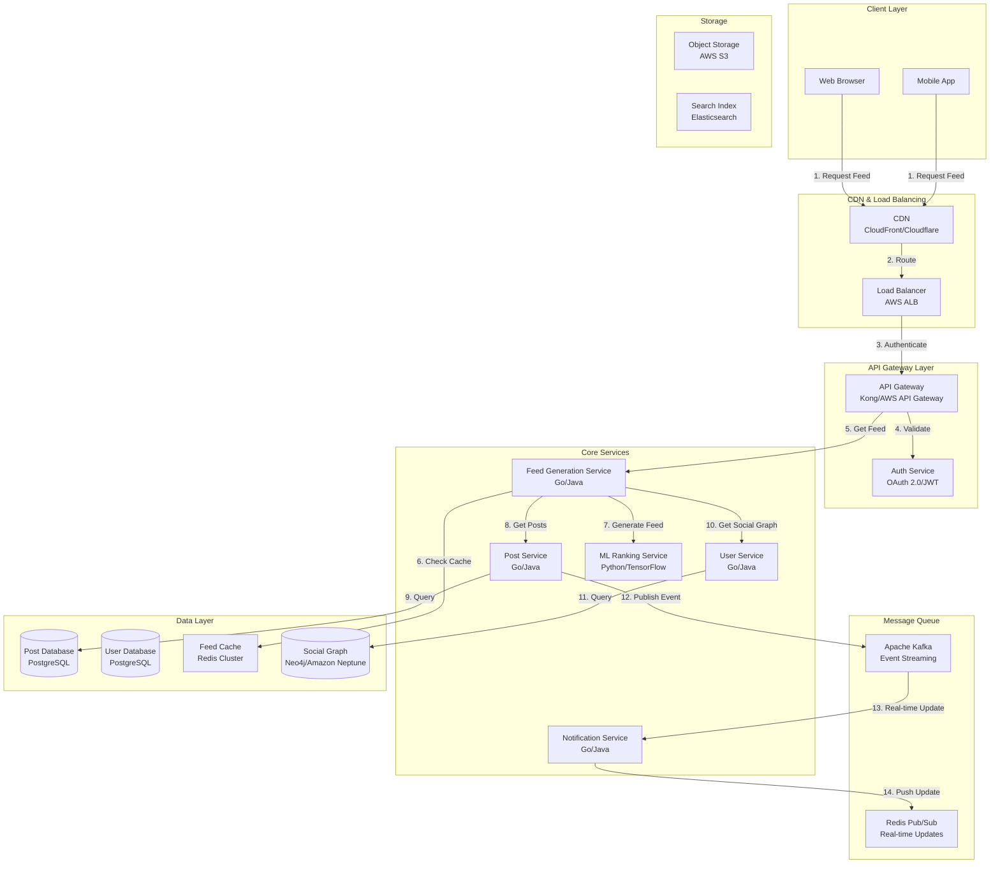

# Newsfeed System Design (Facebook/LinkedIn Feed)

**File Purpose:** Comprehensive system design document for a personalized newsfeed system supporting 300M daily active users with real-time updates, personalized ranking, and sub-300ms load times. This document covers fan-out strategies, hybrid approaches for celebrity users, ML-based personalization, pagination service, ad insertion engine, analytics pipeline, and complete architecture design including 10 deep-dive components.

**Last Updated:** October 2, 2025  
**Author:** System Design Documentation  
**Use Case:** Social media newsfeed system design for large-scale platforms  
**Recent Updates:** Added Components 7-10: Celebrity User Handler, Pagination Service, Ad Insertion Engine, and Analytics Pipeline

---

## Table of Contents

1. [Requirements & Clarification](#requirements--clarification)
2. [Back-of-the-Envelope Calculations](#back-of-the-envelope-calculations)
3. [High-Level Design](#high-level-design)
   - [System Architecture Diagram](#system-architecture)
   - [Data Flow Explanation](#data-flow-explanation)
   - [Load Balancing Strategy](#load-balancing-strategy)
4. [Database Design](#database-design)
   - [Database Sharding Strategy](#database-sharding-strategy)
   - [Data Consistency Patterns](#data-consistency-patterns)
5. [API Design](#api-design)
6. [Deep-Dive Components](#deep-dive-components)
   - [Component 1: Feed Generation Service](#feed-generation-service-architecture)
   - [Component 2: Fan-out Strategy](#fan-out-strategy-hybrid-approach)
   - [Component 3: ML Ranking Engine](#ml-based-personalization-pipeline)
   - [Component 4: Caching Strategy](#caching-strategy)
   - [Component 5: Real-time Update Service](#real-time-updates-architecture)
   - [Component 6: Content Filtering Engine](#post-filtering-and-privacy)
   - [Component 7: Celebrity User Handler](#celebrity-user-handler)
   - [Component 8: Pagination Service](#pagination-service)
   - [Component 9: Ad Insertion Engine](#ad-insertion-engine)
   - [Component 10: Analytics Pipeline](#analytics-pipeline)
7. [Trade-Offs Analysis](#trade-offs-analysis)
8. [Key Algorithms](#key-algorithms)
9. [Bottlenecks & Improvements](#bottlenecks--improvements)
    - [Potential Bottlenecks & Solutions](#potential-bottlenecks)
    - [Extended Edge Cases & Failure Scenarios](#extended-edge-cases--failure-scenarios)
    - [Disaster Recovery & Business Continuity](#disaster-recovery--business-continuity)
    - [Deployment Strategy](#deployment-strategy)
    - [Testing Strategy](#testing-strategy)
    - [Advanced Optimization Techniques](#advanced-optimization-techniques)
    - [Cost Analysis](#cost-analysis)
    - [SLA/SLO/SLI Definitions](#slaslosli-definitions)
10. [Security Considerations](#security-considerations)
11. [Monitoring & Observability](#monitoring--observability)
12. [Future Enhancements](#future-enhancements)
13. [Conclusion](#conclusion)

---

## Requirements & Clarification

### User Stories

- **As a social media user**, I want to see a personalized feed of posts from my connections so that I stay updated with relevant content
- **As a content creator**, I want my posts to reach my followers efficiently so that I can engage with my audience
- **As a platform user**, I want real-time updates when new content is available so that I don't miss important posts
- **As a mobile user**, I want infinite scroll pagination so that I can browse content seamlessly

### Functional Requirements

**Core Features (MVP):**

- Generate personalized newsfeed for users
- Display posts from friends/connections in ranked order
- Support real-time updates for new posts
- Infinite scroll pagination support
- Mix content types (posts, ads, friend suggestions)
- Post filtering (privacy, blocked users)
- Basic engagement actions (like, comment, share)

**Out of Scope:**

- Advanced content creation tools
- Video streaming optimization
- Complex group/page management
- Advanced analytics dashboard

### Non-Functional Requirements

- **Scale:** 300M daily active users
- **Performance:** Feed load time < 300ms
- **Availability:** 99.9% uptime
- **Consistency:** Eventually consistent for feed updates
- **Security:** User privacy and data protection
- **Scalability:** Handle 100M posts per day

### Clarifying Questions & Assumptions

**Scale & Usage:**

- 300M DAU with average 500 friends per user
- 100M posts created daily
- Read-heavy system (100:1 read-to-write ratio)
- Peak traffic 3x average during prime hours
- Global user distribution

**Content & Features:**

- Text posts, images, links (no video streaming focus)
- Basic engagement metrics (likes, comments, shares)
- Simple friend/follower model
- Ad insertion every 5-10 posts
- Celebrity users (>1M followers) need special handling

**Technical Constraints:**

- Feed generation must be real-time aware
- Support for mobile and web clients
- Offline capability not required initially

---

## Back-of-the-Envelope Calculations

### Traffic Estimates

```text
Daily Active Users (DAU): 300M
Average friends per user: 500
Posts created per day: 100M
Average posts per user per day: 100M / 300M = 0.33 posts

Read Operations:
- Feed refreshes per user per day: 10
- Total feed requests per day: 300M × 10 = 3B
- Feed requests per second: 3B / 86,400 = ~35K QPS
- Peak QPS: 35K × 3 = 105K QPS

Write Operations:
- Posts per second: 100M / 86,400 = ~1,200 QPS
- Peak write QPS: 1,200 × 3 = 3,600 QPS

Engagement Operations:
- Likes per day: 300M × 20 = 6B
- Likes per second: 6B / 86,400 = ~70K QPS
- Comments per day: 300M × 5 = 1.5B
- Comments per second: 1.5B / 86,400 = ~17K QPS
```

### Storage Estimates

```text
Post Storage:
- Average post size: 2KB (text + metadata)
- Daily post storage: 100M × 2KB = 200GB/day
- Annual post storage: 200GB × 365 = 73TB/year
- 5-year storage: 365TB

User Data:
- User profile: 1KB per user
- Friend connections: 300M × 500 × 8 bytes = 1.2TB
- Total user data: ~1.5TB

Media Storage (images):
- 30% of posts have images
- Average image size: 500KB
- Daily image storage: 30M × 500KB = 15TB/day
- Annual image storage: 5.5PB/year

Total Storage (5 years):
- Posts + metadata: 365TB
- Images: 27.5PB
- User data: 1.5TB
- Total: ~28PB
```

### Resource Estimates

```text
Feed Generation:
- Average feed size: 50 posts
- Feed generation time: 50ms (target)
- Concurrent feed generations at peak: 105K
- Required feed generation workers: 105K × 0.05s = 5,250 workers

Memory Requirements:
- Hot feed cache per user: 100KB (50 posts × 2KB)
- Active users in cache: 50M (peak concurrent)
- Total feed cache: 50M × 100KB = 5TB Redis memory

Database Connections:
- Read replicas needed: 105K QPS / 10K QPS per replica = 11 replicas
- Write capacity: 3,600 QPS on primary
```

### Bandwidth Estimates

```text
Feed Request:
- Request size: 1KB (user_id, pagination, filters)
- Response size: 100KB (50 posts with metadata)
- Peak bandwidth: 105K × 100KB = 10.5GB/s inbound

Image Delivery:
- Images per feed: 15 (30% of 50 posts)
- Average image size: 500KB
- Image bandwidth per feed: 15 × 500KB = 7.5MB
- Peak image bandwidth: 105K × 7.5MB = 787GB/s (CDN required)
```

---

## High-Level Design

### System Architecture



### Data Flow Explanation

1. **Client Request:** Mobile/web client requests personalized feed
2. **CDN & Load Balancing:** CDN serves cached static content, load balancer routes API requests
3. **Authentication:** API Gateway validates user authentication and authorization
4. **Feed Generation:** Feed Generation Service checks Redis cache for pre-computed feed
5. **Cache Miss Handling:** If cache miss, ML Ranking Service generates personalized feed
6. **Content Retrieval:** Post Service fetches relevant posts from PostgreSQL database
7. **Social Graph Query:** User Service queries social graph for friend connections
8. **Real-time Updates:** New posts trigger Kafka events for real-time feed updates
9. **Push Notifications:** Notification Service pushes updates via Redis Pub/Sub
10. **Response Delivery:** Personalized feed returned to client with pagination cursors

### Load Balancing Strategy

#### Layer 1: Global Load Balancing

```text
DNS-Based Load Balancing:
├── GeoDNS for geographic routing
├── Health check integration (Route 53 health checks)
├── Automatic failover between regions
└── Latency-based routing for optimal performance

Global Traffic Distribution:
├── US-East: 40% (Primary region)
├── US-West: 25% (Secondary region)
├── Europe: 20% (Regional deployment)
├── Asia-Pacific: 15% (Regional deployment)
└── Failover: Cross-region backup within 30 seconds
```

#### Layer 2: Regional Load Balancing

```text
Application Load Balancer (AWS ALB):
├── Layer 7 load balancing with SSL termination
├── Path-based routing (/v1/feed, /v1/posts, /v1/users)
├── Host-based routing for different services
├── Sticky sessions for WebSocket connections
├── Health checks every 30 seconds
└── Auto-scaling integration

Load Balancing Algorithms:
├── Feed Service: Weighted round-robin (CPU-based weights)
├── ML Service: Least connections (GPU resource optimization)
├── Post Service: Round-robin with health checks
├── WebSocket Service: Consistent hashing (session affinity)
└── Static Content: Geographic proximity routing
```

#### Layer 3: Service-Level Load Balancing

```text
Service Mesh (Istio):
├── Sidecar proxy for all microservice communication
├── Circuit breaker patterns for fault tolerance
├── Retry logic with exponential backoff
├── Load balancing algorithms per service type
├── Canary deployments for gradual rollouts
└── Observability and distributed tracing

Internal Load Balancing:
├── Feed Generation: Least response time
├── ML Ranking: Resource-aware (GPU/CPU utilization)
├── Cache Services: Consistent hashing
├── Database: Connection pooling with PgBouncer
└── Message Queues: Partition-aware routing
```

#### WebSocket Connection Load Balancing

```text
Challenge: WebSocket connections are stateful and long-lived
Solution: Consistent hashing with session affinity

Implementation:
1. Hash user_id to determine WebSocket server
2. Store mapping in Redis for failover scenarios
3. Graceful connection migration during server maintenance
4. Connection pooling to optimize resource usage

Failover Strategy:
├── Health checks every 15 seconds
├── Automatic failover within 5 seconds
├── Connection state backup in Redis
├── Client-side reconnection with exponential backoff
└── Load redistribution during peak hours
```

#### Database Load Balancing

```text
Read Replicas Distribution:
├── 5 read replicas per master for PostgreSQL
├── Read traffic distributed via HAProxy
├── Lag monitoring to ensure data consistency (<1 second)
├── Automatic replica promotion on master failure
└── Query routing based on read/write patterns

Write Distribution:
├── Sharding for horizontal write scaling
├── Connection pooling (PgBouncer) for connection management
├── Query routing based on shard key (user_id, post_id)
├── Write conflict resolution with timestamps
└── Cross-shard transaction coordination
```

---

## Database Design

### Posts Table

```text
posts
- post_id (PK, UUID)
- user_id (FK, UUID, INDEX)
- content (TEXT)
- media_urls (JSON ARRAY)
- post_type (ENUM: text, image, link, video)
- privacy_level (ENUM: public, friends, private)
- created_at (TIMESTAMP, INDEX)
- updated_at (TIMESTAMP)
- engagement_score (FLOAT, INDEX)
- is_deleted (BOOLEAN, DEFAULT false)
- hashtags (TEXT ARRAY, INDEX)
```

### Users Table

```text
users
- user_id (PK, UUID)
- username (VARCHAR, UNIQUE, INDEX)
- email (VARCHAR, UNIQUE)
- full_name (VARCHAR)
- profile_image_url (VARCHAR)
- bio (TEXT)
- location (VARCHAR)
- created_at (TIMESTAMP)
- updated_at (TIMESTAMP)
- is_verified (BOOLEAN, DEFAULT false)
- is_active (BOOLEAN, DEFAULT true)
- follower_count (INTEGER, DEFAULT 0)
- following_count (INTEGER, DEFAULT 0)
- privacy_settings (JSON)
```

### Friendships/Connections Table

```text
friendships
- friendship_id (PK, UUID)
- user_id (FK, UUID, INDEX)
- friend_id (FK, UUID, INDEX)
- status (ENUM: pending, accepted, blocked)
- created_at (TIMESTAMP)
- updated_at (TIMESTAMP)
- UNIQUE(user_id, friend_id)
- INDEX(user_id, status)
- INDEX(friend_id, status)
```

### User Interactions Table

```text
user_interactions
- interaction_id (PK, UUID)
- user_id (FK, UUID, INDEX)
- post_id (FK, UUID, INDEX)
- interaction_type (ENUM: like, comment, share, click, view)
- created_at (TIMESTAMP, INDEX)
- metadata (JSON)
- INDEX(user_id, created_at)
- INDEX(post_id, interaction_type)
```

### Comments Table

```text
comments
- comment_id (PK, UUID)
- post_id (FK, UUID, INDEX)
- user_id (FK, UUID, INDEX)
- parent_comment_id (FK, UUID, NULL)
- content (TEXT)
- created_at (TIMESTAMP, INDEX)
- updated_at (TIMESTAMP)
- is_deleted (BOOLEAN, DEFAULT false)
- like_count (INTEGER, DEFAULT 0)
```

### Feed Cache Schema (Redis)

```text
Key Pattern: feed:{user_id}:{page}
Value: JSON Array of Post Objects
TTL: 15 minutes

Key Pattern: user_feed_cursor:{user_id}
Value: Pagination cursor string
TTL: 1 hour

Key Pattern: hot_posts:{timestamp}
Value: Sorted set of post_ids by engagement score
TTL: 5 minutes
```

### User Preferences Table

```text
user_preferences
- user_id (PK, FK, UUID)
- content_preferences (JSON)
- notification_settings (JSON)
- feed_algorithm_weights (JSON)
- blocked_users (UUID ARRAY)
- muted_keywords (TEXT ARRAY)
- updated_at (TIMESTAMP)
```

### Database Sharding Strategy

#### Horizontal Sharding Approach

```text
Sharding Strategy: Hybrid approach combining user-based and content-based sharding

User Data Sharding:
├── Shard Key: user_id (consistent hashing)
├── Number of Shards: 64 shards initially, expandable to 1024
├── Shard Distribution: Even distribution using SHA-256 hash
├── Replication: 3 replicas per shard (master + 2 replicas)
└── Cross-shard queries: Handled by application layer aggregation

Post Data Sharding:
├── Primary Shard Key: user_id (post author)
├── Secondary Shard Key: created_at (time-based partitioning)
├── Hot Data: Recent posts (last 30 days) in SSD storage
├── Cold Data: Older posts moved to cheaper storage
└── Archive Strategy: Posts older than 2 years moved to cold storage
```

#### Shard Management

```text
Shard Allocation:
├── Initial Capacity: 10M users per shard
├── Scaling Trigger: 80% capacity or performance degradation
├── Shard Splitting: Automatic splitting when threshold reached
├── Rebalancing: Gradual data migration during off-peak hours
└── Monitoring: Real-time shard health and performance metrics

Shard Routing:
├── Routing Service: Centralized shard mapping service
├── Routing Cache: Redis-based routing table cache
├── Fallback Mechanism: Direct database query if routing fails
├── Consistency: Eventually consistent routing updates
└── Hot Shard Detection: Automatic load balancing for hot shards
```

#### Cross-Shard Operations

```text
Feed Generation Challenges:
├── User follows people across multiple shards
├── Need to aggregate posts from multiple databases
├── Maintain performance while ensuring data consistency

Solutions:
├── Denormalization: Cache friend lists in user's shard
├── Async Aggregation: Background jobs to pre-compute feeds
├── Scatter-Gather: Parallel queries to multiple shards
├── Result Merging: Application-layer sorting and ranking
└── Timeout Handling: Graceful degradation for slow shards
```

### Data Consistency Patterns

#### Consistency Models

```text
Strong Consistency (Critical Data):
├── User authentication and authorization
├── Financial transactions (if applicable)
├── Account settings and privacy preferences
├── Implementation: Synchronous replication with 2PC
└── Trade-off: Higher latency but guaranteed consistency

Eventual Consistency (Feed Data):
├── Post content and metadata
├── Like counts and engagement metrics
├── Friend/follower relationships
├── Implementation: Asynchronous replication
└── Trade-off: Lower latency but temporary inconsistencies

Session Consistency (User Experience):
├── User's own posts and interactions
├── Recently viewed content
├── Personal feed state
├── Implementation: Sticky sessions with read-your-writes
└── Trade-off: Balanced consistency and performance
```

#### Consistency Implementation

```text
Write Consistency:
├── Master-Slave Replication: All writes go to master
├── Synchronous Replication: Critical data replicated synchronously
├── Asynchronous Replication: Feed data replicated asynchronously
├── Conflict Resolution: Last-write-wins with timestamps
└── Write Acknowledgment: Configurable consistency levels

Read Consistency:
├── Read-Your-Writes: Users see their own updates immediately
├── Monotonic Reads: Consistent view within a session
├── Bounded Staleness: Maximum 5-second delay for feed updates
├── Read Preferences: Route reads to appropriate replicas
└── Fallback Strategy: Read from master if replicas are stale

Cross-Shard Consistency:
├── Distributed Transactions: 2PC for critical operations
├── Saga Pattern: Long-running transactions with compensation
├── Event Sourcing: Maintain event log for consistency
├── CQRS: Separate read and write models for optimization
└── Eventual Consistency: Accept temporary inconsistencies
```

#### CAP Theorem Application

```text
System Design Choice: AP (Availability + Partition Tolerance)

Justification:
├── Social media prioritizes availability over strict consistency
├── Users expect the system to work even during network partitions
├── Temporary inconsistencies in feed are acceptable
├── Critical operations (auth) use stronger consistency
└── Business impact of downtime > temporary inconsistencies

Implementation:
├── Multi-master replication for high availability
├── Conflict-free replicated data types (CRDTs) for counters
├── Vector clocks for causality tracking
├── Anti-entropy processes for eventual consistency
└── Graceful degradation during network partitions
```

---

## API Design

### Base Configuration

```text
Base URL: https://api.socialfeed.com/v1
Authentication: Bearer JWT tokens
Rate Limiting: 1000 requests/hour per user, 100 requests/minute
Content-Type: application/json
Versioning: URL path versioning (/v1/, /v2/)
```

### Authentication Endpoints

#### Register User

```http
POST /v1/auth/register
```

#### Request

```json
{
  "username": "johndoe",
  "email": "john@example.com",
  "password": "securePassword123",
  "full_name": "John Doe"
}
```

#### Response (201)

```json
{
  "user_id": "550e8400-e29b-41d4-a716-446655440000",
  "access_token": "eyJhbGciOiJIUzI1NiIsInR5cCI6IkpXVCJ9...",
  "refresh_token": "dGhpc2lzYXJlZnJlc2h0b2tlbg...",
  "expires_in": 3600
}
```

#### Login

```http
POST /v1/auth/login
```

**Request:**

```json
{
  "email": "john@example.com",
  "password": "securePassword123"
}
```

**Response (200):**

```json
{
  "user_id": "550e8400-e29b-41d4-a716-446655440000",
  "access_token": "eyJhbGciOiJIUzI1NiIsInR5cCI6IkpXVCJ9...",
  "refresh_token": "dGhpc2lzYXJlZnJlc2h0b2tlbg...",
  "expires_in": 3600
}
```

### Core Feed Endpoints

#### Get Personalized Feed

```http
GET /v1/feed
```

**Headers:**

```text
Authorization: Bearer {access_token}
```

**Query Parameters:**

- `cursor` (string, optional): Pagination cursor for next page
- `limit` (integer, optional, default=20, max=50): Number of posts to return
- `feed_type` (string, optional, default="home"): Type of feed (home, trending, following)
- `include_ads` (boolean, optional, default=true): Include sponsored content

**Response (200):**

```json
{
  "posts": [
    {
      "post_id": "123e4567-e89b-12d3-a456-426614174000",
      "user": {
        "user_id": "550e8400-e29b-41d4-a716-446655440000",
        "username": "johndoe",
        "full_name": "John Doe",
        "profile_image_url": "https://cdn.socialfeed.com/profiles/johndoe.jpg",
        "is_verified": false
      },
      "content": "Just had an amazing coffee at the new cafe downtown!",
      "media_urls": [
        "https://cdn.socialfeed.com/posts/coffee-image.jpg"
      ],
      "post_type": "image",
      "created_at": "2025-10-02T10:30:00Z",
      "engagement": {
        "like_count": 42,
        "comment_count": 8,
        "share_count": 3,
        "user_liked": false,
        "user_shared": false
      },
      "hashtags": ["#coffee", "#downtown"],
      "is_sponsored": false
    }
  ],
  "pagination": {
    "next_cursor": "eyJjcmVhdGVkX2F0IjoiMjAyNS0xMC0wMlQxMDozMDowMFoiLCJwb3N0X2lkIjoiMTIzZTQ1NjcifQ==",
    "has_more": true,
    "total_count": 1250
  },
  "metadata": {
    "feed_generated_at": "2025-10-02T10:35:00Z",
    "algorithm_version": "v2.1",
    "personalization_score": 0.87
  }
}
```

#### Refresh Feed

```http
POST /v1/feed/refresh
```

**Headers:**

```text
Authorization: Bearer {access_token}
```

**Response (200):**

```json
{
  "new_posts_count": 5,
  "updated_at": "2025-10-02T10:35:00Z",
  "refresh_token": "refresh_123456789"
}
```

### Post Management Endpoints

#### Create Post

```http
POST /v1/posts
```

**Headers:**

```text
Authorization: Bearer {access_token}
Content-Type: multipart/form-data
```

#### Request

```json
{
  "content": "Just had an amazing coffee at the new cafe downtown!",
  "post_type": "text",
  "privacy_level": "public",
  "hashtags": ["#coffee", "#downtown"],
  "media_files": ["base64_encoded_image_data"]
}
```

#### Response (201)

```json
{
  "post_id": "123e4567-e89b-12d3-a456-426614174000",
  "user_id": "550e8400-e29b-41d4-a716-446655440000",
  "content": "Just had an amazing coffee at the new cafe downtown!",
  "media_urls": [
    "https://cdn.socialfeed.com/posts/coffee-image.jpg"
  ],
  "created_at": "2025-10-02T10:30:00Z",
  "engagement": {
    "like_count": 0,
    "comment_count": 0,
    "share_count": 0
  }
}
```

#### Get Post Details

```http
GET /v1/posts/{post_id}
```

**Response (200):**

```json
{
  "post_id": "123e4567-e89b-12d3-a456-426614174000",
  "user": {
    "user_id": "550e8400-e29b-41d4-a716-446655440000",
    "username": "johndoe",
    "full_name": "John Doe",
    "profile_image_url": "https://cdn.socialfeed.com/profiles/johndoe.jpg"
  },
  "content": "Just had an amazing coffee at the new cafe downtown!",
  "media_urls": [
    "https://cdn.socialfeed.com/posts/coffee-image.jpg"
  ],
  "created_at": "2025-10-02T10:30:00Z",
  "engagement": {
    "like_count": 42,
    "comment_count": 8,
    "share_count": 3,
    "user_liked": false
  }
}
```

### Engagement Endpoints

#### Like/Unlike Post

```http
POST /v1/posts/{post_id}/like
```

**Response (200):**

```json
{
  "liked": true,
  "like_count": 43,
  "user_id": "550e8400-e29b-41d4-a716-446655440000"
}
```

#### Add Comment

```http
POST /v1/posts/{post_id}/comments
```

#### Request

```json
{
  "content": "Great photo! Which cafe is this?",
  "parent_comment_id": null
}
```

#### Response (201)

```json
{
  "comment_id": "789e0123-e45f-67g8-h901-234567890123",
  "user": {
    "user_id": "550e8400-e29b-41d4-a716-446655440000",
    "username": "johndoe",
    "full_name": "John Doe"
  },
  "content": "Great photo! Which cafe is this?",
  "created_at": "2025-10-02T10:35:00Z",
  "like_count": 0,
  "replies_count": 0
}
```

#### Get Comments

```http
GET /v1/posts/{post_id}/comments
```

**Query Parameters:**

- `cursor` (string, optional): Pagination cursor
- `limit` (integer, optional, default=20): Number of comments
- `sort` (string, optional, default="newest"): Sort order (newest, oldest, popular)

**Response (200):**

```json
{
  "comments": [
    {
      "comment_id": "789e0123-e45f-67g8-h901-234567890123",
      "user": {
        "user_id": "550e8400-e29b-41d4-a716-446655440000",
        "username": "johndoe",
        "full_name": "John Doe"
      },
      "content": "Great photo! Which cafe is this?",
      "created_at": "2025-10-02T10:35:00Z",
      "like_count": 2,
      "replies_count": 1,
      "user_liked": false
    }
  ],
  "pagination": {
    "next_cursor": "comment_cursor_123",
    "has_more": true
  }
}
```

### User Management Endpoints

#### Get User Profile

```http
GET /v1/users/{user_id}
```

**Response (200):**

```json
{
  "user_id": "550e8400-e29b-41d4-a716-446655440000",
  "username": "johndoe",
  "full_name": "John Doe",
  "bio": "Coffee enthusiast and photographer",
  "profile_image_url": "https://cdn.socialfeed.com/profiles/johndoe.jpg",
  "location": "San Francisco, CA",
  "created_at": "2024-01-15T08:00:00Z",
  "is_verified": false,
  "follower_count": 1250,
  "following_count": 890,
  "post_count": 156,
  "is_following": false,
  "is_followed_by": false
}
```

#### Follow/Unfollow User

```http
POST /v1/users/{user_id}/follow
```

**Response (200):**

```json
{
  "following": true,
  "follower_count": 1251,
  "user_id": "550e8400-e29b-41d4-a716-446655440000"
}
```

### Real-time Updates (WebSocket)

#### WebSocket Connection

```text
WSS /v1/ws/feed
Authorization: Bearer {access_token}
```

**Connection Message:**

```json
{
  "type": "subscribe",
  "channels": ["feed_updates", "notifications"]
}
```

**Feed Update Message:**

```json
{
  "type": "feed_update",
  "data": {
    "new_posts": [
      {
        "post_id": "new_post_123",
        "user": {...},
        "content": "New post content",
        "created_at": "2025-10-02T10:40:00Z"
      }
    ],
    "updated_posts": [
      {
        "post_id": "existing_post_456",
        "engagement": {
          "like_count": 45,
          "comment_count": 9
        }
      }
    ]
  }
}
```

### Search Endpoints

#### Search Posts

```http
GET /v1/search/posts
```

**Query Parameters:**

- `q` (string, required): Search query
- `cursor` (string, optional): Pagination cursor
- `limit` (integer, optional, default=20): Number of results
- `sort` (string, optional, default="relevance"): Sort order
- `date_range` (string, optional): Date filter (today, week, month, year)

**Response (200):**

```json
{
  "posts": [...],
  "pagination": {...},
  "search_metadata": {
    "query": "coffee downtown",
    "total_results": 1500,
    "search_time_ms": 45
  }
}
```

### Cross-Cutting Concerns

#### Rate Limiting

- **Authentication endpoints:** 5 requests/minute per IP
- **Feed endpoints:** 100 requests/hour per user
- **Post creation:** 10 posts/hour per user
- **Engagement actions:** 1000 actions/hour per user
- **Search endpoints:** 50 requests/minute per user

#### Error Response Format

```json
{
  "error": {
    "code": "INVALID_REQUEST",
    "message": "The request parameters are invalid",
    "details": {
      "field": "email",
      "reason": "Invalid email format"
    },
    "request_id": "req_123456789"
  }
}
```

#### Pagination Strategy

**Cursor-based pagination** for all feed endpoints:

- Use base64-encoded cursor containing timestamp and ID
- Provides consistent results during real-time updates
- Better performance for large datasets

#### API Trade-Offs

##### Decision: REST vs GraphQL

- **Choice:** REST API
- **Pros:** Simpler caching, better tooling support, easier debugging
- **Cons:** Over-fetching data, multiple requests for complex operations
- **Justification:** Feed data structure is relatively stable, caching is critical

##### Decision: Synchronous vs Asynchronous

- **Choice:** Hybrid approach
- **Feed generation:** Synchronous with cache fallback
- **Post creation:** Asynchronous fan-out
- **Engagement:** Asynchronous processing

##### Decision: Pagination Approach

- **Choice:** Cursor-based pagination
- **Pros:** Consistent results, better performance, handles real-time updates
- **Cons:** More complex implementation than offset-based
- **Justification:** Critical for feed consistency during active browsing

---

## Deep-Dive Components

### Feed Generation Service Architecture

#### Internal Components

```text
Feed Generation Service:
├── Feed Request Handler
├── Cache Manager (Redis)
├── ML Ranking Engine Interface
├── Content Aggregator
├── Privacy Filter
├── Ad Insertion Engine
└── Response Formatter
```

**Feed Generation Flow:**

1. **Cache Check:** Check Redis for pre-computed feed
2. **Cache Hit:** Return cached feed with real-time updates
3. **Cache Miss:** Trigger feed generation pipeline
4. **Content Aggregation:** Gather posts from user's social graph
5. **ML Ranking:** Score and rank posts using ML model
6. **Privacy Filtering:** Apply user privacy settings and blocked users
7. **Ad Insertion:** Insert sponsored content based on user profile
8. **Cache Update:** Store generated feed in Redis with TTL
9. **Response:** Return personalized feed to client

#### Technology Choices

- **Language:** Go for high concurrency and low latency
- **Caching:** Redis Cluster for horizontal scaling
- **ML Integration:** gRPC calls to Python-based ML service
- **Database:** Read replicas for post and user data

### Fan-out Strategy: Hybrid Approach

#### Fan-out on Write (Push Model)

**When to Use:**

- Regular users with < 10K followers
- High engagement users who post frequently
- Users with active follower base

**Implementation:**

```text
1. User creates post
2. Post Service publishes to Kafka
3. Fan-out Worker consumes event
4. Worker queries user's followers
5. Worker writes post to each follower's feed cache
6. Real-time notification sent via WebSocket
```

**Pros:**

- Fast feed generation (pre-computed)
- Consistent user experience
- Good for active users

**Cons:**

- High write amplification for popular users
- Storage overhead for inactive users
- Delayed post visibility during high load

#### Fan-out on Read (Pull Model)

**When to Use:**

- Celebrity users with > 1M followers
- Inactive users (last login > 30 days)
- Users with low engagement rates

**Implementation:**

```text
1. User requests feed
2. Feed Service queries posts from followed users
3. ML Ranking Service scores and ranks posts
4. Generated feed cached for 15 minutes
5. Subsequent requests served from cache
```

**Pros:**

- No write amplification
- Always up-to-date content
- Efficient for inactive users

**Cons:**

- Higher latency for feed generation
- Increased read load on databases
- Complex ranking algorithm required

#### Hybrid Decision Logic

```text
User Classification:
├── Celebrity (>1M followers) → Fan-out on Read
├── Popular (10K-1M followers) → Hybrid
│   ├── Active followers → Fan-out on Write
│   └── Inactive followers → Fan-out on Read
└── Regular (<10K followers) → Fan-out on Write

Follower Classification:
├── Active (login within 7 days) → Pre-compute feed
├── Semi-active (login within 30 days) → Cache on demand
└── Inactive (login > 30 days) → Generate on demand
```

### ML-Based Personalization Pipeline

#### Ranking Algorithm Components

**Engagement Prediction Model:**

```text
Features:
├── User Features
│   ├── Historical engagement patterns
│   ├── Content preferences
│   ├── Time-based activity patterns
│   └── Social graph similarity
├── Post Features
│   ├── Content type and length
│   ├── Media presence and quality
│   ├── Hashtags and topics
│   └── Recency and virality
├── User-Post Interaction Features
│   ├── Author relationship strength
│   ├── Content similarity to past engagements
│   ├── Timing relevance
│   └── Social proof (mutual friends' engagement)
└── Contextual Features
    ├── Time of day/week
    ├── Device type
    ├── Location relevance
    └── Current trending topics
```

**Model Architecture:**

- **Base Model:** Gradient Boosting (XGBoost/LightGBM)
- **Deep Learning:** Neural Collaborative Filtering for user-item interactions
- **Real-time Features:** Online feature store (Redis) for immediate signals
- **Batch Features:** Offline feature store (S3/Parquet) for historical data

**Training Pipeline:**

```text
1. Feature Engineering (Spark jobs, daily)
2. Model Training (weekly, A/B test new models)
3. Model Validation (offline metrics + online A/B testing)
4. Model Deployment (gradual rollout with monitoring)
5. Performance Monitoring (engagement metrics, latency)
```

#### Personalization Service

**Real-time Scoring:**

- **Input:** User ID, candidate posts, context
- **Processing:** Feature lookup, model inference, post ranking
- **Output:** Ranked list of posts with confidence scores
- **SLA:** 95th percentile < 50ms per request

**Batch Processing:**

- **Pre-compute:** Popular user feeds during off-peak hours
- **Feature Updates:** Daily batch jobs for user preferences
- **Model Refresh:** Weekly model retraining and deployment

### Caching Strategy

#### Multi-Level Caching

##### Level 1: CDN (CloudFront)

- **Content:** Static assets, user profile images, post media
- **TTL:** 24 hours for images, 1 hour for profile data
- **Invalidation:** On user profile updates, post deletions

##### Level 2: Application Cache (Redis)

- **Hot Feeds:** Pre-computed feeds for active users
- **User Sessions:** Authentication tokens, user preferences
- **Social Graph:** Friend lists, follower counts
- **Post Metadata:** Engagement counts, trending posts

##### Level 3: Database Query Cache

- **Read Replicas:** Query result caching at database level
- **Connection Pooling:** Persistent connections to reduce latency

#### Cache Invalidation Strategy

**Feed Cache Invalidation:**

```text
Triggers:
├── New post from followed user → Invalidate affected user feeds
├── Post engagement update → Update cached engagement counts
├── User unfollows → Remove posts from feed cache
├── Privacy setting change → Invalidate and regenerate
└── Scheduled refresh → TTL-based expiration (15 minutes)

Implementation:
├── Event-driven invalidation via Kafka
├── Selective cache updates for engagement
├── Bulk invalidation for privacy changes
└── Graceful degradation on cache failures
```

**Cache Warming:**

```text
Strategies:
├── Predictive warming for likely-to-be-active users
├── Background refresh before TTL expiration
├── Popular content pre-loading during off-peak
└── New user onboarding feed pre-generation
```

### Real-time Updates Architecture

#### WebSocket vs Polling Trade-off

**WebSocket Implementation:**

- **Use Case:** Active users browsing feed
- **Benefits:** Real-time updates, reduced server load
- **Challenges:** Connection management, scaling WebSocket servers

**Polling Implementation:**

- **Use Case:** Background updates, mobile apps
- **Benefits:** Simpler implementation, better for mobile battery
- **Challenges:** Higher server load, delayed updates

**Hybrid Approach:**

```text
Client Behavior:
├── Active browsing → WebSocket connection
├── Background mode → Long polling (60s intervals)
├── Mobile app → Push notifications + polling on app open
└── Web app → WebSocket with polling fallback
```

#### Real-time Update Service

**Architecture:**

```text
Real-time Update Service:
├── WebSocket Connection Manager
├── User Presence Tracker
├── Update Aggregator
├── Push Notification Service
└── Fallback Polling Handler
```

**Update Types:**

- **New Posts:** From followed users
- **Engagement Updates:** Likes, comments on user's posts
- **Social Updates:** New followers, friend requests
- **System Updates:** Maintenance notifications, feature announcements

### Post Filtering and Privacy

#### Privacy Filter Engine

**Filter Categories:**

```text
Privacy Filters:
├── User Blocking
│   ├── Blocked users' posts
│   ├── Posts mentioning blocked users
│   └── Comments from blocked users
├── Content Filtering
│   ├── Muted keywords
│   ├── Content type preferences
│   └── Sensitive content warnings
├── Visibility Rules
│   ├── Friends-only posts
│   ├── Private account restrictions
│   └── Geographic restrictions
└── Platform Policies
    ├── Community guidelines violations
    ├── Spam detection
    └── Misinformation flags
```

**Implementation:**

- **Real-time Filtering:** Applied during feed generation
- **Batch Processing:** Periodic cleanup of cached feeds
- **User Controls:** Granular privacy settings interface

### Celebrity User Handler

#### Celebrity User Classification

**User Tier System:**

```text
User Tiers:
├── Regular Users (0-10K followers)
│   ├── Fan-out on Write strategy
│   ├── Standard feed generation
│   └── Normal priority processing
├── Popular Users (10K-100K followers)
│   ├── Hybrid fan-out strategy
│   ├── Enhanced analytics tracking
│   └── Medium priority processing
├── Influencers (100K-1M followers)
│   ├── Mostly Fan-out on Read
│   ├── Dedicated processing queues
│   └── High priority processing
├── Celebrity Users (1M-10M followers)
│   ├── Fan-out on Read only
│   ├── Dedicated celebrity queues
│   └── VIP processing tier
└── Mega-Celebrities (>10M followers)
    ├── Special handling architecture
    ├── Isolated processing infrastructure
    └── Real-time broadcast system
```

#### Celebrity Post Processing Architecture

**Specialized Processing Pipeline:**

```text
Celebrity Post Flow:
1. Post Creation
   ├── Immediate validation and sanitization
   ├── Celebrity queue assignment
   ├── Priority processing flag
   └── Dedicated Kafka partition

2. Fan-out Strategy Selection
   ├── Follower count check
   ├── System load assessment
   ├── Time-based optimization
   └── Strategy selection (typically pull-based)

3. Post Distribution
   ├── Tiered Distribution
   │   ├── Tier 1: Active followers (last 24 hours) - Immediate push
   │   ├── Tier 2: Semi-active (last 7 days) - Cache warming
   │   ├── Tier 3: Inactive followers - On-demand generation
   │   └── Tier 4: Dormant users - No pre-computation
   ├── Rate-Limited Fan-out
   │   ├── Maximum 100K writes/second per celebrity
   │   ├── Batched cache updates
   │   ├── Distributed across multiple workers
   │   └── Progressive delivery over time
   └── Notification Strategy
       ├── Push notifications to highly engaged followers
       ├── In-app badges for active users
       ├── Email digest for semi-active users
       └── No notification for dormant users

4. Trending Detection
   ├── Real-time engagement monitoring
   ├── Viral content identification
   ├── Cache prewarming for trending posts
   └── CDN optimization for hot content
```

#### Celebrity Feed Generation Optimization

**Pull-Based Feed Generation for Celebrity Content:**

```text
Optimization Strategies:
├── Celebrity Post Cache
│   ├── Dedicated Redis cluster for celebrity content
│   ├── Sorted set by timestamp for each celebrity
│   ├── Pre-computed engagement scores
│   ├── 1-hour TTL with background refresh
│   └── Multi-tier caching (L1: Hot celebrities, L2: All celebrities)
├── Follower Segmentation
│   ├── Active followers cached in memory
│   ├── Engagement-based prioritization
│   ├── Geographic clustering for regional optimization
│   └── Time-zone aware delivery
├── Query Optimization
│   ├── Materialized views for celebrity timelines
│   ├── Denormalized data for fast access
│   ├── Read replicas dedicated to celebrity queries
│   └── Query result caching (15-minute TTL)
└── Load Balancing
    ├── Dedicated celebrity feed generation workers
    ├── Separate celebrity database connections
    ├── Priority queue for celebrity content
    └── Resource isolation from regular users
```

#### Celebrity Write Amplification Prevention

**Problem:** A celebrity with 10M followers posting causes 10M cache writes

**Solutions:**

```text
Write Amplification Mitigation:
├── Lazy Evaluation
│   ├── Don't pre-compute feeds for all followers
│   ├── Generate feed on-demand when user requests
│   ├── Cache generated feeds for reuse
│   └── Expire after 15-30 minutes
├── Sampled Fan-out
│   ├── Only push to highly engaged followers (<10% of total)
│   ├── Identify based on recent interaction history
│   ├── Machine learning to predict engagement likelihood
│   └── Others receive on pull
├── Batch Processing
│   ├── Group follower notifications in batches
│   ├── Process in background jobs
│   ├── Rate-limited to prevent system overload
│   └── Priority-based delivery
└── Hybrid Caching
    ├── Cache celebrity timeline separately
    ├── Merge with user's regular feed on request
    ├── Reduce duplicate cache entries
    └── Efficient memory utilization
```

#### Celebrity Content Verification

**Enhanced Verification System:**

```text
Verification Features:
├── Content Authenticity
│   ├── Verified badge display
│   ├── Official account indicators
│   ├── Impersonation prevention
│   └── Account security monitoring
├── Priority Content Moderation
│   ├── Pre-publication review for sensitive content
│   ├── Faster moderation queue processing
│   ├── Dedicated moderation team
│   └── Real-time monitoring for policy violations
├── Analytics & Insights
│   ├── Real-time engagement tracking
│   ├── Audience demographics
│   ├── Reach and impression metrics
│   └── Content performance analytics
└── Rate Limiting Exceptions
    ├── Higher posting limits
    ├── Enhanced media upload quotas
    ├── Extended video duration limits
    ├── API rate limit exceptions
    └── Broadcast features access
```

#### Celebrity Failure Scenarios

**High Availability Considerations:**

```text
Failure Scenarios & Solutions:
├── Viral Content Overload
│   ├── Detection: Sudden spike in engagement metrics
│   ├── Response: Auto-scaling celebrity processing workers
│   ├── Mitigation: Cache warming and CDN optimization
│   └── Fallback: Graceful degradation to simpler ranking
├── Celebrity Database Hotspot
│   ├── Detection: High query load on specific shards
│   ├── Response: Dynamic read replica scaling
│   ├── Mitigation: Query result caching
│   └── Fallback: Serve cached results with staleness
├── Celebrity Cache Invalidation Storm
│   ├── Detection: Mass cache invalidations
│   ├── Response: Rate-limited invalidation processing
│   ├── Mitigation: Batch invalidation updates
│   └── Fallback: Serve stale cache during regeneration
└── Celebrity Account Compromise
    ├── Detection: Unusual posting patterns, content anomalies
    ├── Response: Automatic account suspension
    ├── Mitigation: Enhanced security measures
    └── Recovery: Verified recovery process
```

### Pagination Service

#### Cursor-Based Pagination Architecture

**Pagination Strategy:**

```text
Cursor-Based vs Offset-Based Comparison:

Offset-Based Pagination:
├── Query: SELECT * FROM posts ORDER BY created_at DESC OFFSET 100 LIMIT 20
├── Pros: Simple implementation, direct page access
├── Cons: Performance degrades with deep pagination
│   ├── Database must scan all rows before offset
│   ├── Inconsistent results during concurrent writes
│   └── Not suitable for real-time feeds
└── Use Case: Static content, small datasets

Cursor-Based Pagination (Chosen):
├── Query: SELECT * FROM posts WHERE (created_at, post_id) < (cursor) LIMIT 20
├── Pros: Consistent performance, handles real-time updates
│   ├── Uses indexes effectively (no full scan)
│   ├── Consistent results during concurrent operations
│   └── Optimal for infinite scroll feeds
├── Cons: More complex implementation, no direct page access
└── Use Case: Real-time feeds, large datasets
```

#### Cursor Implementation

**Cursor Structure:**

```text
Cursor Encoding:
├── Components:
│   ├── Timestamp: Post creation time (milliseconds)
│   ├── Post ID: Unique post identifier (UUID)
│   ├── User ID: For user-specific pagination state
│   ├── Score: ML ranking score for consistency
│   └── Version: Cursor format version for evolution
├── Encoding Format:
│   ├── JSON object containing all components
│   ├── Base64 encoding for URL safety
│   ├── Optional encryption for security
│   └── Checksum for tamper detection
└── Example:
    Raw: {"ts":1696245600000,"pid":"123e4567","uid":"550e8400","s":0.87,"v":2}
    Encoded: eyJ0cyI6MTY5NjI0NTYwMDAwMCwicGlkIjoiMTIzZTQ1NjciLCJ1aWQiOiI1NTBlODQwMCIsInMiOjAuODcsInYiOjJ9
```

**Cursor Generation Algorithm:**

```python
def generate_cursor(post, user_id, ranking_score):
    """
    Generate pagination cursor for a post.
    
    Args:
        post: Post object containing id and created_at
        user_id: Current user's ID
        ranking_score: ML-generated ranking score
        
    Returns:
        Base64-encoded cursor string
    """
    cursor_data = {
        "ts": post.created_at.timestamp() * 1000,  # milliseconds
        "pid": str(post.post_id),
        "uid": str(user_id),
        "s": round(ranking_score, 4),
        "v": CURSOR_VERSION
    }
    
    json_str = json.dumps(cursor_data, separators=(',', ':'))
    encoded = base64.urlsafe_b64encode(json_str.encode('utf-8'))
    checksum = hashlib.sha256(encoded + SECRET_KEY).hexdigest()[:8]
    
    return encoded.decode('utf-8') + '.' + checksum


def parse_cursor(cursor_string):
    """
    Parse and validate cursor string.
    
    Args:
        cursor_string: Base64-encoded cursor
        
    Returns:
        Decoded cursor data dictionary
        
    Raises:
        InvalidCursorException: If cursor is invalid or tampered
    """
    try:
        encoded, checksum = cursor_string.rsplit('.', 1)
        expected_checksum = hashlib.sha256(
            encoded.encode('utf-8') + SECRET_KEY
        ).hexdigest()[:8]
        
        if checksum != expected_checksum:
            raise InvalidCursorException("Cursor checksum mismatch")
        
        decoded = base64.urlsafe_b64decode(encoded)
        cursor_data = json.loads(decoded)
        
        # Validate cursor structure
        required_fields = ['ts', 'pid', 'uid', 's', 'v']
        if not all(field in cursor_data for field in required_fields):
            raise InvalidCursorException("Missing required fields")
        
        return cursor_data
    except Exception as e:
        raise InvalidCursorException(f"Invalid cursor: {str(e)}")
```

#### Pagination Query Optimization

**Database Query Strategy:**

```text
Efficient Pagination Queries:

1. Index Strategy:
   ├── Composite Index: (created_at DESC, post_id DESC)
   ├── Covering Index: Include frequently accessed columns
   ├── Partial Index: Only active posts (is_deleted = false)
   └── Index Maintenance: Regular ANALYZE and REINDEX

2. Query Pattern:
   SELECT post_id, user_id, content, created_at, engagement_score
   FROM posts
   WHERE (created_at, post_id) < (cursor_timestamp, cursor_post_id)
     AND is_deleted = false
     AND privacy_level IN ('public', 'friends')
   ORDER BY created_at DESC, post_id DESC
   LIMIT 20;

3. Query Optimization Techniques:
   ├── Use composite index for WHERE and ORDER BY
   ├── Limit result set to exactly what's needed
   ├── Avoid SELECT * to reduce data transfer
   ├── Use prepared statements for query plan caching
   └── Monitor query execution plans regularly
```

#### Pagination Caching Strategy

**Multi-Level Pagination Caching:**

```text
Cache Levels:
├── L1: Page Result Cache
│   ├── Cache Key: feed:{user_id}:{cursor_hash}
│   ├── Value: Array of post objects
│   ├── TTL: 5 minutes
│   ├── Purpose: Exact page result caching
│   └── Invalidation: On cursor expiration
├── L2: Feed Window Cache
│   ├── Cache Key: feed_window:{user_id}:{page_num}
│   ├── Value: Last N pages of feed (sliding window)
│   ├── TTL: 15 minutes
│   ├── Purpose: Support back/forward navigation
│   └── Invalidation: On new content or user actions
├── L3: Cursor State Cache
│   ├── Cache Key: cursor_state:{user_id}
│   ├── Value: Current pagination state
│   ├── TTL: 1 hour
│   ├── Purpose: Resume pagination after interruption
│   └── Invalidation: User-initiated refresh
└── L4: Pre-computed Pages
    ├── Cache Key: feed_pages:{user_id}:*
    ├── Value: First 3 pages pre-computed
    ├── TTL: 10 minutes
    ├── Purpose: Instant load for initial pages
    └── Invalidation: Background refresh
```

#### Infinite Scroll Implementation

**Client-Side Pagination Logic:**

```javascript
/**
 * Infinite scroll pagination manager for newsfeed.
 * Handles automatic loading of next page when user scrolls near bottom.
 * 
 * Usage:
 *   const paginator = new FeedPaginator('/v1/feed', authToken);
 *   await paginator.loadInitialPage();
 *   paginator.enableInfiniteScroll();
 * 
 * Returns:
 *   Array of feed posts with automatic pagination
 */
class FeedPaginator {
    constructor(apiEndpoint, authToken) {
        this.apiEndpoint = apiEndpoint;
        this.authToken = authToken;
        this.currentCursor = null;
        this.hasMore = true;
        this.isLoading = false;
        this.posts = [];
        this.scrollThreshold = 0.8; // Load more at 80% scroll
    }

    async loadInitialPage() {
        this.posts = [];
        this.currentCursor = null;
        this.hasMore = true;
        return await this.loadNextPage();
    }

    async loadNextPage() {
        if (!this.hasMore || this.isLoading) {
            return [];
        }

        this.isLoading = true;
        
        try {
            const url = new URL(this.apiEndpoint);
            if (this.currentCursor) {
                url.searchParams.set('cursor', this.currentCursor);
            }
            url.searchParams.set('limit', '20');

            const response = await fetch(url, {
                headers: {
                    'Authorization': `Bearer ${this.authToken}`,
                    'Content-Type': 'application/json'
                }
            });

            if (!response.ok) {
                throw new Error(`HTTP ${response.status}`);
            }

            const data = await response.json();
            
            this.posts.push(...data.posts);
            this.currentCursor = data.pagination.next_cursor;
            this.hasMore = data.pagination.has_more;

            return data.posts;
        } catch (error) {
            console.error('Pagination error:', error);
            throw error;
        } finally {
            this.isLoading = false;
        }
    }

    enableInfiniteScroll() {
        window.addEventListener('scroll', () => {
            const scrollPosition = window.scrollY + window.innerHeight;
            const pageHeight = document.documentElement.scrollHeight;
            const scrollPercentage = scrollPosition / pageHeight;

            if (scrollPercentage >= this.scrollThreshold && !this.isLoading && this.hasMore) {
                this.loadNextPage().catch(console.error);
            }
        });
    }

    // Prefetch next page for faster loading
    async prefetchNextPage() {
        if (this.hasMore && !this.isLoading) {
            // Prefetch in background without blocking
            this.loadNextPage().catch(() => {
                // Silent fail for prefetch
            });
        }
    }
}
```

#### Pagination Edge Cases

**Handling Complex Scenarios:**

```text
Edge Case Solutions:
├── Deleted Posts During Pagination
│   ├── Problem: Posts deleted while user is paginating
│   ├── Solution: Cursor remains valid, deleted posts filtered out
│   ├── Impact: Page may have fewer items than requested
│   └── Handling: Client requests next page automatically if too few items
├── New Posts Inserted
│   ├── Problem: New posts appear at top during pagination
│   ├── Solution: Cursor-based pagination is immune to insertions
│   ├── Impact: Consistent pagination results
│   └── Handling: "New posts available" banner at top
├── Ranking Score Changes
│   ├── Problem: ML ranking scores updated during pagination
│   ├── Solution: Include score in cursor for consistency
│   ├── Impact: User sees snapshot of rankings at initial load time
│   └── Handling: Refresh to see updated rankings
├── Concurrent Feed Updates
│   ├── Problem: User's feed modified while paginating
│   ├── Solution: Version-based cursor with consistency checks
│   ├── Impact: Detect inconsistencies and handle gracefully
│   └── Handling: Offer refresh option to user
├── Expired Cursors
│   ├── Problem: User returns after long absence, cursor invalid
│   ├── Solution: Cursor TTL validation on server
│   ├── Impact: Restart pagination from beginning
│   └── Handling: Return 410 Gone status, client reloads from start
└── Deep Pagination Performance
    ├── Problem: User scrolls very deep (1000+ posts)
    ├── Solution: Cursor-based approach maintains performance
    ├── Impact: Consistent query time regardless of depth
    └── Handling: Optional "Back to Top" button for navigation
```

### Ad Insertion Engine

#### Ad Insertion Architecture

**System Components:**

```text
Ad Insertion System:
├── Ad Campaign Manager
│   ├── Campaign configuration and scheduling
│   ├── Budget and bid management
│   ├── Targeting criteria definition
│   └── Performance tracking
├── Ad Targeting Engine
│   ├── User profile analysis
│   ├── Behavioral targeting
│   ├── Contextual targeting
│   └── Lookalike audience matching
├── Ad Ranking Service
│   ├── Bid-based ranking
│   ├── Relevance scoring
│   ├── User experience optimization
│   └── Budget pacing
├── Ad Delivery Service
│   ├── Real-time ad selection
│   ├── Frequency capping
│   ├── Ad creative serving
│   └── Impression tracking
└── Ad Analytics Pipeline
    ├── Impression tracking
    ├── Click-through rate calculation
    ├── Conversion attribution
    └── Revenue reporting
```

#### Ad Selection Algorithm

**Multi-Factor Ranking System:**

```text
Ad Scoring Formula:
Ad_Score = (Bid_Amount × pCTR × pCVR × Quality_Score × Relevance_Score) / User_Ad_Fatigue

Components:
├── Bid Amount (20% weight)
│   ├── Advertiser's cost-per-click bid
│   ├── Budget availability check
│   ├── Pacing algorithm for budget distribution
│   └── Dynamic bid adjustments
├── Predicted Click-Through Rate (25% weight)
│   ├── ML model predicting user click likelihood
│   ├── Features: User demographics, behavior, context
│   ├── Historical performance data
│   └── Real-time feature updates
├── Predicted Conversion Rate (25% weight)
│   ├── ML model predicting conversion likelihood
│   ├── Attribution window: 7 days
│   ├── Multi-touch attribution
│   └── Conversion value estimation
├── Quality Score (15% weight)
│   ├── Ad creative quality assessment
│   ├── Landing page experience
│   ├── Historical ad performance
│   └── User feedback signals
├── Relevance Score (10% weight)
│   ├── Semantic similarity to user interests
│   ├── Contextual relevance to feed content
│   ├── Demographic match
│   └── Geographic relevance
└── User Ad Fatigue (5% penalty)
    ├── Recent ad exposure count
    ├── Time since last ad
    ├── Ad category diversity
    └── User ad interaction history
```

**Ad Selection Implementation:**

```python
def select_ads_for_feed(user_id, feed_posts, num_ads=3):
    """
    Select and insert ads into user's feed.
    
    Args:
        user_id: User ID for personalization
        feed_posts: List of organic feed posts
        num_ads: Number of ads to insert
        
    Returns:
        List of selected ad objects with insertion positions
    """
    # Get user profile and targeting data
    user_profile = get_user_profile(user_id)
    user_interests = get_user_interests(user_id)
    recent_ad_exposure = get_recent_ad_exposure(user_id, hours=24)
    
    # Retrieve eligible ad campaigns
    eligible_ads = get_eligible_campaigns(
        user_profile=user_profile,
        location=user_profile.location,
        exclude_campaigns=recent_ad_exposure
    )
    
    # Score each ad
    scored_ads = []
    for ad in eligible_ads:
        score = calculate_ad_score(
            ad=ad,
            user_profile=user_profile,
            user_interests=user_interests,
            ad_fatigue=calculate_ad_fatigue(recent_ad_exposure)
        )
        scored_ads.append((ad, score))
    
    # Sort by score and select top ads
    scored_ads.sort(key=lambda x: x[1], reverse=True)
    selected_ads = [ad for ad, score in scored_ads[:num_ads]]
    
    # Determine insertion positions
    insertion_positions = calculate_insertion_positions(
        feed_length=len(feed_posts),
        num_ads=num_ads,
        strategy='uniform'  # or 'weighted', 'random'
    )
    
    return [(ad, pos) for ad, pos in zip(selected_ads, insertion_positions)]


def calculate_ad_score(ad, user_profile, user_interests, ad_fatigue):
    """
    Calculate relevance score for ad.
    
    Args:
        ad: Ad campaign object
        user_profile: User demographic and profile data
        user_interests: User interest categories and topics
        ad_fatigue: User's current ad fatigue factor
        
    Returns:
        Float score for ad ranking
    """
    # Predicted CTR from ML model
    predicted_ctr = ml_model.predict_ctr(
        ad_features=ad.features,
        user_features=user_profile.features
    )
    
    # Predicted CVR from ML model
    predicted_cvr = ml_model.predict_cvr(
        ad_id=ad.campaign_id,
        user_id=user_profile.user_id
    )
    
    # Quality score based on historical performance
    quality_score = calculate_quality_score(ad)
    
    # Relevance score based on interest match
    relevance_score = calculate_relevance(
        ad_categories=ad.target_categories,
        user_interests=user_interests
    )
    
    # Combine factors
    base_score = (
        ad.bid_amount * 0.20 *
        predicted_ctr * 0.25 *
        predicted_cvr * 0.25 *
        quality_score * 0.15 *
        relevance_score * 0.10
    )
    
    # Apply ad fatigue penalty
    final_score = base_score * (1 - ad_fatigue * 0.05)
    
    return final_score
```

#### Ad Insertion Strategy

**Positioning Algorithm:**

```text
Ad Placement Strategy:
├── Uniform Distribution
│   ├── Insert ads at fixed intervals (every 5-7 organic posts)
│   ├── Formula: position = (feed_length / (num_ads + 1)) * ad_index
│   ├── Pros: Predictable, even distribution
│   └── Cons: May disrupt user experience at fixed points
├── Weighted Distribution
│   ├── More ads in high-engagement sections
│   ├── Analyze scroll depth and engagement patterns
│   ├── Place ads where user attention is highest
│   └── Dynamic adjustment based on user behavior
├── Content-Aware Placement
│   ├── Insert ads between similar content types
│   ├── Avoid interrupting high-engagement content
│   ├── Match ad format to surrounding content
│   └── Consider content sentiment and topics
└── Performance-Based Placement
    ├── A/B test different placement strategies
    ├── Optimize for user engagement AND revenue
    ├── Personalized placement per user segment
    └── Real-time adjustment based on session behavior
```

#### Ad Targeting System

**Multi-Dimensional Targeting:**

```text
Targeting Criteria:
├── Demographic Targeting
│   ├── Age range: 18-24, 25-34, 35-44, 45-54, 55+
│   ├── Gender: Male, Female, Non-binary, All
│   ├── Location: Country, state, city, radius
│   ├── Language preferences
│   └── Education level and occupation
├── Behavioral Targeting
│   ├── Past purchase behavior
│   ├── Content engagement patterns
│   ├── Device usage (mobile, desktop, tablet)
│   ├── Time of day activity patterns
│   └── Social interaction behaviors
├── Interest-Based Targeting
│   ├── Explicit interests (user-declared)
│   ├── Implicit interests (inferred from behavior)
│   ├── Topic categories (sports, technology, fashion, etc.)
│   ├── Brand affinities
│   └── Lifestyle segments
├── Contextual Targeting
│   ├── Current feed content analysis
│   ├── Recent search queries
│   ├── Seasonal and trending topics
│   ├── Real-time events
│   └── Weather-based targeting
├── Retargeting
│   ├── Website visitors
│   ├── Cart abandoners
│   ├── Previous ad interactions
│   ├── Customer lookalikes
│   └── Conversion funnel stage
└── Custom Audiences
    ├── Uploaded customer lists
    ├── Email-based matching
    ├── CRM integration
    ├── Lookalike audience generation
    └── Exclusion lists (existing customers, competitors)
```

#### Ad Frequency Capping

**User Experience Optimization:**

```text
Frequency Controls:
├── Global Frequency Cap
│   ├── Maximum 1 ad per 5 organic posts (20% ad load)
│   ├── Maximum 10 ads per session
│   ├── Maximum 30 ads per day per user
│   └── Automatic reduction for low-engagement users
├── Campaign-Level Frequency Cap
│   ├── Same ad: Max 1 impression per 24 hours
│   ├── Same campaign: Max 3 impressions per day
│   ├── Same advertiser: Max 5 impressions per day
│   └── Configurable by advertiser
├── Category-Level Frequency Cap
│   ├── Same category: Max 3 ads per session
│   ├── Ensure ad diversity across categories
│   ├── Prevent category saturation
│   └── Balance advertiser competition
└── Adaptive Frequency Capping
    ├── Reduce frequency for users showing ad fatigue
    ├── Increase frequency for high-engagement users
    ├── ML-based optimal frequency prediction
    └── Real-time adjustment based on behavior
```

#### Ad Performance Tracking

**Metrics Collection System:**

```text
Tracking Events:
├── Impression Tracking
│   ├── Ad served and visible in viewport
│   ├── Viewability threshold: 50% visible for 1 second
│   ├── Timestamp and duration
│   └── User engagement context
├── Interaction Tracking
│   ├── Click-through events
│   ├── Video ad views and completion rate
│   ├── Carousel swipes and interactions
│   └── Hover events and dwell time
├── Conversion Tracking
│   ├── Post-click conversions
│   ├── View-through conversions
│   ├── Multi-touch attribution
│   └── Conversion value and revenue
└── Engagement Quality
    ├── Time spent viewing ad
    ├── Scroll depth for native ads
    ├── User feedback (hide, report, like)
    └── Follow-on actions (profile visit, follow)
```

**Ad Analytics Pipeline:**

```text
Analytics Architecture:
├── Real-time Stream Processing
│   ├── Kafka for event ingestion
│   ├── Spark Streaming for aggregation
│   ├── Redis for real-time counters
│   └── WebSocket for live dashboard updates
├── Batch Processing
│   ├── Daily aggregation jobs (Spark)
│   ├── Attribution modeling (Python ML pipeline)
│   ├── Audience insights generation
│   └── Performance report generation
├── Storage Layer
│   ├── Time-series database (InfluxDB) for metrics
│   ├── Data warehouse (Redshift/BigQuery) for analytics
│   ├── OLAP cube for multi-dimensional analysis
│   └── Cold storage (S3) for raw event logs
└── Reporting Layer
    ├── Advertiser dashboard (real-time metrics)
    ├── Campaign performance reports
    ├── A/B test analysis
    └── Revenue analytics and forecasting
```

#### Ad Quality and Policy

**Content Moderation:**

```text
Ad Approval Process:
├── Automated Review
│   ├── Image content analysis (nudity, violence)
│   ├── Text sentiment analysis
│   ├── Prohibited content detection
│   ├── Brand safety checks
│   └── Malware and phishing detection
├── Manual Review
│   ├── Sensitive categories (political, health)
│   ├── High-budget campaigns
│   ├── Flagged content
│   └── New advertiser verification
├── Continuous Monitoring
│   ├── Landing page monitoring
│   ├── User feedback analysis
│   ├── Performance anomaly detection
│   └── Policy violation detection
└── Enforcement Actions
    ├── Ad rejection with reason
    ├── Campaign suspension
    ├── Advertiser account warning
    └── Permanent ban for severe violations
```

### Analytics Pipeline

#### Analytics Architecture Overview

**End-to-End Analytics System:**

```text
Analytics Pipeline Components:
├── Data Collection Layer
│   ├── Event Generation
│   │   ├── User interaction events (clicks, likes, shares)
│   │   ├── System events (feed generation, cache hits)
│   │   ├── Business events (ad impressions, conversions)
│   │   └── Performance metrics (latency, errors)
│   ├── Data Ingestion
│   │   ├── Client-side SDK (JavaScript, iOS, Android)
│   │   ├── Server-side logging
│   │   ├── Message queue (Kafka) for event streaming
│   │   └── Load balancer logs and CDN logs
│   └── Data Validation
│       ├── Schema validation
│       ├── Deduplication
│       ├── PII detection and masking
│       └── Data quality checks
├── Stream Processing Layer
│   ├── Apache Kafka (Event Bus)
│   │   ├── Topic: user_interactions
│   │   ├── Topic: feed_events
│   │   ├── Topic: ad_events
│   │   └── Topic: system_metrics
│   ├── Apache Flink / Spark Streaming
│   │   ├── Real-time aggregations
│   │   ├── Session tracking
│   │   ├── Anomaly detection
│   │   └── Real-time metrics calculation
│   └── Stream Outputs
│       ├── Real-time dashboards
│       ├── Alerting system
│       ├── Feature store updates
│       └── Data lake ingestion
├── Batch Processing Layer
│   ├── Data Lake (S3 / HDFS)
│   │   ├── Raw event storage (Parquet format)
│   │   ├── Partitioned by date and event type
│   │   ├── Retention: 2 years hot, 5 years cold
│   │   └── Immutable append-only storage
│   ├── Apache Spark (Batch Jobs)
│   │   ├── Daily aggregation jobs
│   │   ├── User behavior modeling
│   │   ├── Content performance analysis
│   │   └── Cohort analysis
│   └── Data Warehouse (Redshift / BigQuery)
│       ├── Dimensional data model
│       ├── Pre-aggregated metrics
│       ├── User and content dimensions
│       └── Optimized for OLAP queries
├── Machine Learning Pipeline
│   ├── Feature Engineering
│   │   ├── User features (demographics, behavior)
│   │   ├── Content features (type, engagement, quality)
│   │   ├── Temporal features (time of day, day of week)
│   │   └── Contextual features (device, location)
│   ├── Model Training
│   │   ├── Feed ranking models
│   │   ├── CTR prediction models
│   │   ├── Churn prediction models
│   │   └── Recommendation models
│   ├── Model Serving
│   │   ├── Real-time inference
│   │   ├── Batch predictions
│   │   ├── A/B testing framework
│   │   └── Model monitoring
│   └── Feature Store
│       ├── Online features (Redis)
│       ├── Offline features (S3/Parquet)
│       ├── Feature versioning
│       └── Feature lineage tracking
└── Visualization & Reporting Layer
    ├── Business Intelligence Tools
    │   ├── Tableau / Looker for dashboards
    │   ├── Jupyter notebooks for ad-hoc analysis
    │   ├── Custom dashboards for real-time metrics
    │   └── Automated report generation
    ├── Operational Dashboards
    │   ├── System health monitoring
    │   ├── SLA/SLO tracking
    │   ├── Cost analytics
    │   └── Capacity planning
    └── Product Analytics
        ├── User engagement metrics
        ├── Feature adoption tracking
        ├── Funnel analysis
        └── Retention cohort analysis
```

#### Event Schema Design

**Standardized Event Structure:**

```json
{
  "event_id": "evt_123e4567-e89b-12d3-a456-426614174000",
  "event_type": "feed_interaction",
  "event_name": "post_like",
  "timestamp": "2025-10-02T10:30:00.123Z",
  "user": {
    "user_id": "550e8400-e29b-41d4-a716-446655440000",
    "session_id": "sess_789abc-def012-345678",
    "device_id": "dev_mobile_ios_12345",
    "is_authenticated": true
  },
  "context": {
    "device_type": "mobile",
    "platform": "ios",
    "app_version": "2.1.5",
    "os_version": "iOS 17.0",
    "screen_resolution": "1170x2532",
    "network_type": "wifi",
    "location": {
      "country": "US",
      "state": "CA",
      "city": "San Francisco",
      "lat": 37.7749,
      "lon": -122.4194
    }
  },
  "properties": {
    "post_id": "123e4567-e89b-12d3-a456-426614174000",
    "post_author_id": "author_550e8400",
    "post_type": "image",
    "engagement_type": "like",
    "position_in_feed": 3,
    "time_since_impression": 2.5,
    "is_sponsored": false
  },
  "metadata": {
    "server_timestamp": "2025-10-02T10:30:00.125Z",
    "ingestion_timestamp": "2025-10-02T10:30:00.150Z",
    "schema_version": "2.1",
    "source": "mobile_app"
  }
}
```

#### Real-Time Analytics Processing

**Stream Processing Implementation:**

```python
from pyspark.sql import SparkSession
from pyspark.sql.functions import window, col, count, avg, sum

def process_real_time_engagement_metrics():
    """
    Real-time processing of user engagement metrics using Spark Streaming.
    
    Processes engagement events from Kafka and calculates:
    - Posts per minute
    - Engagement rate per minute
    - Trending posts detection
    - User activity patterns
    
    Returns:
    Streams processed metrics to Redis and monitoring dashboards
    """
    spark = SparkSession.builder \
        .appName("FeedEngagementAnalytics") \
        .getOrCreate()
    
    # Read from Kafka stream
    engagement_stream = spark \
        .readStream \
        .format("kafka") \
        .option("kafka.bootstrap.servers", "kafka:9092") \
        .option("subscribe", "user_interactions,feed_events") \
        .option("startingOffsets", "latest") \
        .load()
    
    # Parse JSON events
    from pyspark.sql.types import StructType, StructField, StringType, TimestampType
    
    schema = StructType([
        StructField("event_id", StringType()),
        StructField("event_type", StringType()),
        StructField("timestamp", TimestampType()),
        StructField("user", StructType([
            StructField("user_id", StringType()),
        ])),
        StructField("properties", StructType([
            StructField("post_id", StringType()),
            StructField("engagement_type", StringType()),
            StructField("position_in_feed", IntegerType()),
        ]))
    ])
    
    parsed_events = engagement_stream \
        .selectExpr("CAST(value AS STRING) as json") \
        .select(from_json(col("json"), schema).alias("data")) \
        .select("data.*")
    
    # Calculate engagement metrics per minute
    engagement_metrics = parsed_events \
        .withWatermark("timestamp", "1 minute") \
        .groupBy(
            window(col("timestamp"), "1 minute"),
            col("properties.engagement_type")
        ) \
        .agg(
            count("*").alias("event_count"),
            countDistinct("user.user_id").alias("unique_users"),
            countDistinct("properties.post_id").alias("unique_posts")
        )
    
    # Detect trending posts (posts with spike in engagement)
    trending_posts = parsed_events \
        .withWatermark("timestamp", "5 minutes") \
        .groupBy(
            window(col("timestamp"), "5 minutes", "1 minute"),
            col("properties.post_id")
        ) \
        .agg(
            count("*").alias("engagement_count"),
            countDistinct("user.user_id").alias("unique_engagers")
        ) \
        .filter(col("engagement_count") > 100)  # Threshold for trending
    
    # Write metrics to multiple sinks
    
    # 1. Redis for real-time dashboards
    engagement_metrics.writeStream \
        .outputMode("update") \
        .foreachBatch(write_to_redis) \
        .start()
    
    # 2. Data lake for historical analysis
    engagement_metrics.writeStream \
        .format("parquet") \
        .option("path", "s3://analytics-lake/engagement-metrics/") \
        .option("checkpointLocation", "s3://checkpoints/engagement/") \
        .partitionBy("window") \
        .start()
    
    # 3. Monitoring system for alerts
    trending_posts.writeStream \
        .foreachBatch(send_trending_alerts) \
        .start()
    
    spark.streams.awaitAnyTermination()


def write_to_redis(batch_df, batch_id):
    """Write batch of metrics to Redis for real-time access."""
    import redis
    r = redis.Redis(host='redis-cluster', port=6379)
    
    for row in batch_df.collect():
        key = f"metrics:engagement:{row.window.start.strftime('%Y%m%d%H%M')}:{row.engagement_type}"
        metrics = {
            'count': row.event_count,
            'unique_users': row.unique_users,
            'unique_posts': row.unique_posts,
            'timestamp': row.window.start.isoformat()
        }
        r.hset(key, mapping=metrics)
        r.expire(key, 3600)  # 1 hour TTL
```

#### Key Analytics Metrics

**User Engagement Metrics:**

```text
Core Engagement KPIs:
├── Daily Active Users (DAU)
│   ├── Unique users who open app and view feed
│   ├── Segmented by platform (mobile, web)
│   ├── Geographic breakdown
│   └── Trend analysis (7-day, 30-day moving average)
├── Session Metrics
│   ├── Average session duration
│   ├── Sessions per user per day
│   ├── Bounce rate (single-page sessions)
│   └── Session depth (posts viewed per session)
├── Feed Engagement
│   ├── Feed scroll depth (average posts viewed)
│   ├── Time spent in feed
│   ├── Refresh rate (pull-to-refresh actions)
│   └── Feed completion rate
├── Content Interaction
│   ├── Like rate: (likes / impressions) × 100
│   ├── Comment rate: (comments / impressions) × 100
│   ├── Share rate: (shares / impressions) × 100
│   ├── Click-through rate for links
│   └── Video view rate and completion rate
├── User Retention
│   ├── Day 1, Day 7, Day 30 retention rates
│   ├── Cohort analysis by signup date
│   ├── Churn rate and churn prediction
│   └── Resurrection rate (re-activated users)
└── Content Creation
    ├── Posts per user per day
    ├── Posting frequency distribution
    ├── Content type mix (text, image, video, link)
    └── Post quality score distribution
```

**Content Performance Metrics:**

```text
Content Analytics:
├── Post Engagement
│   ├── Total impressions per post
│   ├── Unique viewers per post
│   ├── Engagement rate: (interactions / impressions) × 100
│   ├── Viral coefficient: shares / impressions
│   └── Time to peak engagement
├── Content Quality
│   ├── ML-based quality score
│   ├── User sentiment (positive/negative reactions)
│   ├── Dwell time on post
│   └── Completion rate for long-form content
├── Trending Analysis
│   ├── Trending topics and hashtags
│   ├── Viral content detection
│   ├── Trending velocity (rate of engagement growth)
│   └── Geographic trending patterns
└── Content Mix
    ├── Distribution by content type
    ├── Performance by content type
    ├── Optimal posting times
    └── Content saturation analysis
```

**System Performance Metrics:**

```text
Technical Performance:
├── Latency Metrics
│   ├── P50, P95, P99 feed generation time
│   ├── API response time distribution
│   ├── Database query performance
│   └── Cache hit/miss latency
├── Throughput Metrics
│   ├── Requests per second (RPS)
│   ├── Feed generations per second
│   ├── Posts created per second
│   └── Events processed per second
├── Reliability Metrics
│   ├── Error rate by endpoint
│   ├── 5xx error rate
│   ├── Timeout rate
│   └── Circuit breaker activations
├── Resource Utilization
│   ├── CPU utilization by service
│   ├── Memory usage and GC metrics
│   ├── Database connection pool usage
│   └── Cache memory utilization
└── Infrastructure Metrics
    ├── Server count by service
    ├── Auto-scaling events
    ├── Deployment frequency
    └── Mean time to recovery (MTTR)
```

#### Analytics Use Cases

**Business Intelligence:**

```text
BI Applications:
├── Executive Dashboard
│   ├── DAU/MAU trends and forecasts
│   ├── Revenue metrics (ad revenue, ARPU)
│   ├── User growth and retention
│   └── Competitive benchmarking
├── Product Analytics
│   ├── Feature adoption rates
│   ├── A/B test results and statistical significance
│   ├── Funnel conversion analysis
│   └── User journey mapping
├── Content Strategy
│   ├── Optimal posting times analysis
│   ├── Content type performance comparison
│   ├── Trending topics and themes
│   └── Influencer impact analysis
├── Monetization Analytics
│   ├── Ad performance by placement
│   ├── Revenue per user by segment
│   ├── Ad load impact on engagement
│   └── Advertiser ROI analysis
└── Operational Intelligence
    ├── Capacity planning forecasts
    ├── Cost per user analysis
    ├── Infrastructure optimization opportunities
    └── Incident root cause analysis
```

**Machine Learning Applications:**

```text
ML-Powered Analytics:
├── Predictive Analytics
│   ├── Churn prediction (identify at-risk users)
│   ├── LTV prediction (lifetime value forecasting)
│   ├── Content virality prediction
│   └── Engagement probability modeling
├── Recommendation Systems
│   ├── Friend recommendations
│   ├── Content recommendations
│   ├── Hashtag suggestions
│   └── Optimal posting time recommendations
├── Anomaly Detection
│   ├── Unusual user behavior detection
│   ├── Spam and bot detection
│   ├── System performance anomalies
│   └── Fraud detection (fake engagement)
└── Segmentation
    ├── User clustering by behavior
    ├── Content categorization
    ├── Persona identification
    └── Lookalike audience modeling
```

#### Data Privacy & Compliance

**Analytics Governance:**

```text
Privacy Considerations:
├── Data Anonymization
│   ├── PII masking in analytics pipelines
│   ├── Aggregated metrics only (no individual tracking)
│   ├── K-anonymity for small user segments
│   └── Differential privacy for sensitive analytics
├── Regulatory Compliance
│   ├── GDPR: Right to access, delete, and portability
│   ├── CCPA: California consumer privacy rights
│   ├── COPPA: Children's online privacy protection
│   └── Data residency requirements by region
├── Data Retention
│   ├── Raw events: 90 days hot, 2 years cold
│   ├── Aggregated metrics: 5 years
│   ├── User deletion: Complete data removal within 30 days
│   └── Legal hold process for investigations
└── Access Control
    ├── Role-based access to analytics data
    ├── Audit logging for data access
    ├── Data classification (public, internal, confidential)
    └── Encryption at rest and in transit
```

### Design Trade-offs

#### Decision: Database Choice for Posts

**Choice:** PostgreSQL with Read Replicas
**Pros:**

- ACID compliance for critical data
- Rich querying capabilities for complex filters
- Mature ecosystem and tooling
- Good performance with proper indexing

**Cons:**

- Vertical scaling limitations
- Complex sharding for massive scale
- Higher latency than NoSQL for simple queries

**Justification:** Post data requires consistency and complex querying. Read replicas handle scale, and caching reduces database load.

#### Decision: Social Graph Storage

**Choice:** Hybrid (PostgreSQL + Graph Database)
**PostgreSQL for:**

- Basic friend relationships
- User profile data
- Simple queries

**Neo4j/Neptune for:**

- Complex graph traversals
- Friend recommendations
- Influence analysis
- Multi-hop relationship queries

**Justification:** Most queries are simple (direct friends), but advanced features need graph capabilities.

#### Decision: Message Queue Technology

**Choice:** Apache Kafka
**Pros:**

- High throughput for post fan-out
- Durable message storage
- Multiple consumer support
- Excellent for event sourcing

**Cons:**

- Complex operational overhead
- Higher latency than Redis
- Requires careful partition management

**Justification:** Post creation events need reliable delivery to multiple consumers (fan-out, analytics, notifications).

#### Decision: Feed Storage Strategy

**Choice:** Redis for Hot Feeds + Database for Cold Storage

#### Hot Feeds (Redis)

- Active users' pre-computed feeds
- 15-minute TTL with background refresh
- Memory-optimized for fast access

#### Cold Storage (PostgreSQL)

- Historical posts for inactive users
- Generated on-demand with caching
- Cost-effective for long-term storage

**Justification:** Balances performance for active users with cost efficiency for inactive users.

---

## Trade-Offs Analysis

See [Design Trade-offs](#design-trade-offs) section in Deep-Dive Components for detailed analysis of:

- Database Choice for Posts
- Social Graph Storage
- Message Queue Technology
- Feed Storage Strategy

---

## Key Algorithms

### 1. Consistent Hashing for User Sharding

```text
Algorithm: SHA-256 based consistent hashing with virtual nodes

Implementation:
├── Hash Function: SHA-256(user_id) mod 2^32
├── Virtual Nodes: 128 virtual nodes per physical server
├── Ring Structure: Circular hash ring for even distribution
├── Node Addition: Minimal data movement when adding servers
└── Fault Tolerance: Automatic failover to next node in ring

Benefits:
├── Even Distribution: Uniform load across shards
├── Scalability: Easy addition/removal of nodes
├── Fault Tolerance: Automatic failover capability
├── Minimal Rehashing: Only affected keys need redistribution
└── Predictable Performance: Consistent query patterns
```

### 2. Feed Ranking Algorithm

```text
Ranking Score Calculation:
Score = w1×Engagement + w2×Recency + w3×Relevance + w4×Social + w5×Diversity

Components:
├── Engagement Score: Predicted user interaction probability
├── Recency Score: Time decay function (exponential decay)
├── Relevance Score: Content similarity to user interests
├── Social Score: Friends' engagement with the content
└── Diversity Score: Content type and author diversity

Machine Learning Model:
├── Model Type: Gradient Boosting (XGBoost)
├── Features: 200+ user, post, and contextual features
├── Training: Online learning with streaming data
├── Evaluation: A/B testing with engagement metrics
└── Fallback: Time-based ranking if ML fails
```

### 3. Cache Invalidation Algorithm

```text
Multi-level Cache Invalidation:

Level 1 - Immediate Invalidation:
├── User posts new content → Invalidate user's followers' feeds
├── User changes privacy settings → Invalidate affected caches
├── User blocks/unblocks → Immediate cache cleanup
└── Post deletion → Remove from all related caches

Level 2 - Propagation Invalidation:
├── Engagement updates → Propagate to cached feeds containing the post
├── Friend relationship changes → Update social graph caches
├── Trending topic changes → Update recommendation caches
└── Ad campaign changes → Update ad insertion caches

Algorithm:
1. Event Detection: Kafka event triggers invalidation
2. Dependency Graph: Identify all affected cache keys
3. Batch Invalidation: Group related invalidations
4. Async Processing: Non-blocking invalidation execution
5. Verification: Confirm successful invalidation
```

### 4. Fan-out Decision Algorithm

```text
Decision Tree for Fan-out Strategy:

if (follower_count < 10K):
    return FAN_OUT_ON_WRITE
elif (follower_count > 1M):
    return FAN_OUT_ON_READ
else:
    active_followers = count_active_followers(user_id, 7_days)
    system_load = get_current_system_load()
    
    if (active_followers < 1K and system_load < 0.7):
        return FAN_OUT_ON_WRITE
    elif (system_load > 0.9):
        return FAN_OUT_ON_READ
    else:
        return HYBRID_FAN_OUT

Hybrid Fan-out Logic:
├── Active followers (last 7 days): Fan-out on write
├── Inactive followers: Fan-out on read
├── System load consideration: Dynamic switching
├── Content type consideration: Video posts prefer pull
└── Time-based consideration: Off-peak hours prefer push
```

### 5. Real-time Update Merging

```text
Update Merging Algorithm for Live Feeds:

Data Structures:
├── Sorted Set: Maintain feed order by timestamp
├── Bloom Filter: Quick duplicate detection
├── LRU Cache: Recent updates for fast access
└── Priority Queue: Urgent updates (mentions, replies)

Merging Process:
1. Receive real-time update via WebSocket/Kafka
2. Check Bloom filter for duplicate detection
3. Determine insertion point in sorted feed
4. Apply rate limiting (max 10 updates/minute per user)
5. Batch similar updates (like count increments)
6. Send batched update to client
7. Update local cache with new state

Conflict Resolution:
├── Timestamp-based ordering for concurrent updates
├── Last-write-wins for engagement counters
├── Vector clocks for complex conflict resolution
└── Client-side reconciliation for network partitions
```

---

## Bottlenecks & Improvements

### Potential Bottlenecks

#### Problem: Feed Generation Latency

**Description:** ML ranking service becomes bottleneck during peak traffic
**Solution:**

- Pre-compute feeds for active users during off-peak hours
- Implement multiple ML model replicas with load balancing
- Use simpler ranking algorithms as fallback
- Cache intermediate ranking results

**Monitoring:** Track 95th percentile feed generation time, ML service response times

#### Problem: Database Write Contention

**Description:** High write load on posts table during viral content
**Solution:**

- Implement write sharding by user_id hash
- Use write-through caching for engagement updates
- Batch engagement updates every 30 seconds
- Separate hot and cold post storage

**Monitoring:** Database connection pool utilization, write queue depth

#### Problem: Cache Memory Pressure

**Description:** Redis memory usage spikes during peak hours
**Solution:**

- Implement intelligent cache eviction (LRU with user activity weighting)
- Compress cached feed data using efficient serialization
- Separate cache clusters for different data types
- Dynamic TTL based on user activity patterns

**Monitoring:** Redis memory usage, cache hit rates, eviction rates

#### Problem: WebSocket Connection Scaling

**Description:** WebSocket servers reach connection limits
**Solution:**

- Implement WebSocket connection pooling and sharing
- Use Redis pub/sub for cross-server message distribution
- Implement graceful connection migration during scaling
- Fallback to polling for excess connections

**Monitoring:** Active WebSocket connections, connection establishment rate

#### Problem: Celebrity User Fan-out

**Description:** Posts from users with millions of followers overwhelm system
**Solution:**

- Implement tiered fan-out (immediate followers, then batch processing)
- Use separate high-capacity queues for celebrity posts
- Rate limit fan-out processing to prevent system overload
- Pre-identify celebrity users and handle differently

**Monitoring:** Fan-out queue depth, processing time per celebrity post

### Extended Edge Cases & Failure Scenarios

#### Database Failure Scenarios

**Master Database Failure:**

```text
Scenario: Primary database becomes unavailable
Impact: Write operations fail, potential data loss
Detection: Health checks fail within 10 seconds
Response:
├── Automatic failover to read replica (promote to master)
├── Update application configuration to point to new master
├── Restart failed master as new replica when recovered
├── Data consistency check and repair if needed
└── Post-incident review and process improvement

Recovery Time: 30 seconds automated failover
Data Loss: Maximum 5 seconds of writes (replication lag)
```

**Cache Corruption:**

```text
Scenario: Cached data becomes corrupted or inconsistent
Detection:
├── Data validation checks during cache reads
├── Checksum verification for critical cached data
├── User reports of inconsistent data
├── Automated consistency checks
└── Monitoring alerts for unusual cache behavior

Response:
├── Invalidate corrupted cache entries
├── Regenerate feeds from authoritative sources
├── Implement additional validation layers
├── Review cache serialization/deserialization logic
└── Enhance monitoring and alerting
```

#### Network Partition Scenarios

**Cross-Region Network Partition:**

```text
Scenario: Network connectivity lost between regions
Impact: Users in affected regions cannot access full functionality
Response Strategy:
├── Each region operates independently
├── Serve cached content and local data
├── Queue writes for later synchronization
├── Provide degraded but functional service
└── Automatic recovery when connectivity restored

Data Consistency:
├── Vector clocks for conflict resolution
├── Last-write-wins for simple conflicts
├── Manual resolution for complex conflicts
├── Eventual consistency when partition heals
└── User notification of potential data inconsistencies
```

#### Load Spike Scenarios

**Viral Content Scenario:**

```text
Scenario: Post goes viral, causing massive traffic spike
Impact: System overload, potential service degradation
Detection:
├── Unusual traffic patterns in monitoring
├── Increased response times and error rates
├── High CPU and memory utilization
├── Database connection pool exhaustion
└── Cache eviction rate increases

Response:
├── Auto-scaling triggers additional servers
├── Rate limiting to prevent system overload
├── Cache warming for viral content
├── Load balancer adjustments
├── Database read replica scaling
└── Emergency capacity provisioning
```

### Disaster Recovery & Business Continuity

#### Multi-Region Disaster Recovery

**Recovery Objectives:**

```text
Recovery Time Objective (RTO): 15 minutes
Recovery Point Objective (RPO): 5 minutes
Business Continuity: 99.9% availability target

Region Configuration:
├── Primary Region: US-East (40% traffic)
├── Secondary Region: US-West (25% traffic)
├── Tertiary Region: Europe (20% traffic)
├── Backup Region: Asia-Pacific (15% traffic)
└── Disaster Recovery: Cross-region replication
```

**Failover Procedures:**

```text
Automated Failover:
1. Health check failure detection (3 consecutive failures)
2. DNS failover to secondary region (30 seconds)
3. Database promotion in secondary region
4. Cache warming in secondary region
5. Service startup and health verification
6. User traffic redirection complete

Manual Failover:
1. Incident commander declares disaster
2. Execute runbook procedures
3. Coordinate with on-call teams
4. Communicate with stakeholders
5. Monitor recovery progress
6. Post-incident review and improvements
```

### Scalability Improvements

#### Geographic Distribution

**Multi-Region Deployment:**

```text
Regions:
├── US East (Primary)
│   ├── Full service deployment
│   ├── Master databases
│   └── Primary ML model serving
├── US West (Secondary)
│   ├── Full service deployment
│   ├── Read replicas
│   └── Backup ML models
├── Europe (Regional)
│   ├── Edge services
│   ├── Regional read replicas
│   └── CDN presence
└── Asia Pacific (Regional)
    ├── Edge services
    ├── Regional read replicas
    └── CDN presence
```

**Data Replication Strategy:**

- **User Data:** Master-slave replication with eventual consistency
- **Posts:** Cross-region replication for global content
- **Feeds:** Regional generation with global content mixing
- **Media:** CDN distribution with regional caching

#### Service Optimization

**Microservices Scaling:**

```text
Service Scaling Strategies:
├── Feed Generation Service
│   ├── Horizontal scaling based on CPU utilization
│   ├── Separate instances for different user tiers
│   └── Auto-scaling during peak hours
├── ML Ranking Service
│   ├── GPU-based instances for model inference
│   ├── Model serving with TensorFlow Serving
│   └── A/B testing infrastructure for model updates
├── Post Service
│   ├── Sharded by user_id for write scaling
│   ├── Read replicas for query distribution
│   └── Caching layer for hot posts
└── User Service
    ├── Profile data caching
    ├── Social graph read replicas
    └── Friend recommendation pre-computation
```

**Database Optimization:**

- **Sharding Strategy:** Consistent hashing by user_id
- **Read Replicas:** Geographic distribution for low latency
- **Indexing:** Composite indexes for common query patterns
- **Partitioning:** Time-based partitioning for posts table

#### Real-Time Features Enhancement

**Advanced WebSocket Features:**

```text
Real-time Enhancements:
├── Selective Updates
│   ├── Subscribe to specific post types
│   ├── Filter updates by engagement threshold
│   └── Personalized update frequency
├── Collaborative Features
│   ├── Live commenting on posts
│   ├── Real-time reaction animations
│   └── Typing indicators for comments
├── Presence System
│   ├── Online status for friends
│   ├── Activity-based presence
│   └── Privacy-controlled visibility
└── Live Events
    ├── Breaking news push
    ├── Trending topic notifications
    └── Live video integration
```

**Push Notification Strategy:**

- **Mobile Push:** APNs/FCM for mobile apps
- **Web Push:** Service workers for browser notifications
- **Email Digest:** Daily/weekly summary for inactive users
- **SMS Alerts:** Critical notifications only

### Monitoring and Observability

#### Key Metrics to Track

**System Metrics:**

```text
Performance Metrics:
├── Feed Generation
│   ├── P95 latency < 300ms
│   ├── Cache hit rate > 85%
│   └── ML model inference time < 50ms
├── API Response Times
│   ├── Feed endpoint P95 < 200ms
│   ├── Post creation P95 < 100ms
│   └── Engagement actions P95 < 50ms
├── Database Performance
│   ├── Query response time P95 < 10ms
│   ├── Connection pool utilization < 80%
│   └── Replication lag < 1 second
└── Cache Performance
    ├── Redis memory utilization < 80%
    ├── Cache hit rate > 90%
    └── Eviction rate < 5%
```

**Business Metrics:**

```text
Engagement Metrics:
├── Daily Active Users (DAU)
├── Feed engagement rate (likes, comments, shares)
├── Time spent in feed
├── Post creation rate
├── User retention rates
└── Revenue per user (ads)
```

**Infrastructure Metrics:**

```text
Resource Utilization:
├── CPU utilization across services
├── Memory usage and garbage collection
├── Network bandwidth utilization
├── Disk I/O and storage usage
└── Container/pod resource consumption
```

#### Alerting Strategy

**Critical Alerts (Immediate Response):**

- Feed generation latency > 500ms
- Database connection failures
- Cache cluster failures
- API error rate > 1%

**Warning Alerts (Monitor Closely):**

- Cache hit rate < 80%
- Database replication lag > 5 seconds
- ML model inference time > 100ms
- WebSocket connection drops > 10%

**Informational Alerts (Daily Review):**

- Unusual traffic patterns
- Engagement rate changes
- Storage usage trends
- Performance degradation trends

### Deployment Strategy

#### Blue-Green Deployment

```text
Deployment Approach: Blue-Green with Canary Testing

Blue Environment (Current Production):
├── Serves 100% of production traffic
├── Stable, tested version of the application
├── Full monitoring and alerting active
├── Backup and disaster recovery configured
└── Performance baselines established

Green Environment (New Version):
├── Identical infrastructure to blue environment
├── New application version deployed
├── Comprehensive testing suite executed
├── Performance and load testing completed
└── Ready for traffic switch

Deployment Process:
1. Deploy new version to green environment
2. Run automated test suite (unit, integration, e2e)
3. Perform load testing and performance validation
4. Execute canary deployment (5% traffic to green)
5. Monitor metrics and error rates for 30 minutes
6. Gradually increase traffic to green (25%, 50%, 100%)
7. Switch DNS/load balancer to green environment
8. Keep blue environment as immediate rollback option
9. Decommission blue environment after 24 hours
```

#### Canary Deployment Strategy

```text
Canary Release Process:
├── Phase 1: 5% of traffic (internal users, beta testers)
├── Phase 2: 25% of traffic (specific geographic regions)
├── Phase 3: 50% of traffic (random user sampling)
├── Phase 4: 100% of traffic (full rollout)
└── Rollback: Immediate revert if issues detected

Success Criteria:
├── Error rate < 0.1% increase from baseline
├── Response time < 10% increase from baseline
├── User engagement metrics stable or improved
├── No critical bugs reported
└── System resource utilization within limits

Monitoring During Deployment:
├── Real-time error rate monitoring
├── Performance metric comparison
├── User feedback and support tickets
├── Business metric tracking
└── Automated rollback triggers
```

### Testing Strategy

#### Comprehensive Testing Pyramid

```text
Testing Levels:
├── Unit Tests (70% of tests)
│   ├── Individual function testing
│   ├── Mock external dependencies
│   ├── Fast execution (< 1 second per test)
│   ├── High code coverage (> 90%)
│   └── Automated in CI/CD pipeline
├── Integration Tests (20% of tests)
│   ├── Service-to-service communication
│   ├── Database integration testing
│   ├── API contract testing
│   ├── Message queue integration
│   └── Cache integration testing
├── End-to-End Tests (10% of tests)
│   ├── Full user journey testing
│   ├── Cross-service functionality
│   ├── UI and API integration
│   ├── Performance under load
│   └── Critical business flows
```

#### Performance Testing

```text
Load Testing:
├── Baseline Load: Normal traffic patterns
├── Peak Load: 3x normal traffic (holiday seasons)
├── Stress Testing: 5x normal traffic (viral content)
├── Spike Testing: Sudden traffic increases
└── Volume Testing: Large data sets and user bases

Performance Benchmarks:
├── Feed generation: < 300ms (95th percentile)
├── API response time: < 200ms (95th percentile)
├── Database queries: < 50ms (95th percentile)
├── Cache operations: < 10ms (95th percentile)
└── ML model inference: < 100ms (95th percentile)

Tools and Infrastructure:
├── Load Testing: Apache JMeter, Artillery.io
├── Performance Monitoring: New Relic, DataDog
├── Database Performance: pgbench, sysbench
├── Cache Performance: redis-benchmark
└── Custom Performance Harnesses
```

### Advanced Optimization Techniques

#### Database Optimization

```text
Query Optimization:
├── Index Optimization: Composite indexes for common queries
├── Query Plan Analysis: Regular EXPLAIN ANALYZE reviews
├── Materialized Views: Pre-computed aggregations
├── Partitioning: Time-based and hash-based partitioning
├── Connection Pooling: Optimized connection management
└── Read Replica Optimization: Query routing optimization

Storage Optimization:
├── Hot/Cold Data Separation: SSD for recent data, HDD for archives
├── Compression: Column-level compression for large tables
├── Archival Strategy: Move old data to cheaper storage
├── Vacuum and Analyze: Regular maintenance operations
└── Storage Monitoring: Proactive capacity planning
```

#### Caching Optimization

```text
Advanced Caching Patterns:
├── Write-Through Caching: Ensure cache consistency
├── Write-Behind Caching: Async cache updates for performance
├── Cache-Aside Pattern: Application-managed caching
├── Refresh-Ahead: Proactive cache refresh before expiration
└── Multi-Level Caching: Hierarchical cache architecture

Cache Performance Tuning:
├── Memory Allocation: Optimal memory distribution
├── Eviction Policies: LRU, LFU, and custom policies
├── Compression: Reduce memory usage with compression
├── Serialization: Efficient data serialization formats
└── Network Optimization: Reduce cache network overhead
```

### Cost Analysis

#### Infrastructure Cost Breakdown

```text
Monthly Infrastructure Costs (300M DAU):

Compute Resources:
├── Application Servers: $45,000/month
│   ├── Feed Generation Service: $15,000
│   ├── ML Ranking Service: $12,000
│   ├── API Gateway: $8,000
│   ├── WebSocket Servers: $6,000
│   └── Other Microservices: $4,000
├── Database Infrastructure: $35,000/month
│   ├── PostgreSQL Masters: $15,000
│   ├── Read Replicas: $12,000
│   ├── Backup and DR: $5,000
│   └── Database Management: $3,000
├── Cache Infrastructure: $25,000/month
│   ├── Redis Clusters: $20,000
│   ├── CDN Costs: $3,000
│   └── Cache Management: $2,000
├── Message Queue: $8,000/month
│   ├── Kafka Clusters: $6,000
│   └── Queue Management: $2,000
├── Storage: $15,000/month
│   ├── Object Storage (S3): $10,000
│   ├── Database Storage: $3,000
│   └── Backup Storage: $2,000
├── Network: $12,000/month
│   ├── Data Transfer: $8,000
│   ├── Load Balancers: $2,000
│   └── VPN and Security: $2,000
└── Monitoring & Tools: $5,000/month

Total Monthly Infrastructure: $145,000
Annual Infrastructure Cost: $1,740,000
```

#### Cost Optimization Strategies

```text
Short-term Optimizations (0-6 months):
├── Reserved Instance Purchasing: 30% savings on compute
├── Storage Class Optimization: 25% savings on storage
├── Cache Hit Rate Improvement: Reduce database load
├── Query Optimization: Improve database efficiency
└── Auto-scaling Tuning: Right-size resources

Medium-term Optimizations (6-18 months):
├── Multi-cloud Strategy: Leverage competitive pricing
├── Edge Computing: Reduce data transfer costs
├── Database Sharding: Optimize database costs
├── Custom Hardware: GPU optimization for ML workloads
└── Capacity Planning: Predictive scaling

Long-term Optimizations (18+ months):
├── Custom Silicon: Specialized hardware for ML
├── Edge Data Centers: Reduce latency and costs
├── Advanced Caching: Intelligent cache warming
├── Data Lifecycle Management: Automated archival
└── Green Computing: Renewable energy adoption
```

### SLA/SLO/SLI Definitions

#### Service Level Indicators (SLIs)

```text
Availability SLIs:
├── API Availability: % of successful API requests
├── Feed Generation Success Rate: % of successful feed generations
├── Database Availability: % of successful database connections
├── Cache Availability: % of successful cache operations
└── WebSocket Connection Success: % of successful WebSocket connections

Performance SLIs:
├── Feed Load Time: 95th percentile response time
├── API Response Time: 95th percentile for all endpoints
├── Database Query Time: 95th percentile query execution
├── Cache Hit Rate: % of cache hits vs total requests
└── ML Model Inference Time: 95th percentile inference time

Quality SLIs:
├── Error Rate: % of requests resulting in errors
├── Data Consistency: % of consistent reads across replicas
├── Feed Relevance Score: User engagement with feed content
├── Content Freshness: Average age of content in feeds
└── User Satisfaction: Net Promoter Score (NPS)
```

#### Service Level Objectives (SLOs)

```text
Availability SLOs:
├── Overall System Availability: 99.9% (8.76 hours downtime/year)
├── API Availability: 99.95% (4.38 hours downtime/year)
├── Feed Generation: 99.9% success rate
├── Database Availability: 99.99% (52.56 minutes downtime/year)
└── Cache Availability: 99.5% (43.8 hours downtime/year)

Performance SLOs:
├── Feed Load Time: < 300ms (95th percentile)
├── API Response Time: < 200ms (95th percentile)
├── Database Query Time: < 50ms (95th percentile)
├── Cache Hit Rate: > 85%
└── ML Model Inference: < 100ms (95th percentile)

Quality SLOs:
├── Error Rate: < 0.1% of all requests
├── Data Consistency: > 99.9% consistent reads
├── Feed Relevance: > 70% user engagement rate
├── Content Freshness: < 5 minutes average age
└── User Satisfaction: NPS > 50
```

#### Service Level Agreements (SLAs)

```text
Customer-Facing SLAs:
├── System Availability: 99.9% uptime guarantee
├── Feed Load Performance: < 500ms or service credits
├── Data Durability: 99.999999999% (11 9's) data durability
├── Support Response: < 4 hours for critical issues
└── Planned Maintenance: < 4 hours/month with 48-hour notice

SLA Penalties:
├── 99.9% - 99.0%: 10% service credit
├── 99.0% - 95.0%: 25% service credit
├── < 95.0%: 50% service credit
└── Data Loss: Full month service credit + incident response

SLA Monitoring:
├── Real-time SLA dashboard
├── Automated SLA breach detection
├── Monthly SLA reporting
├── Customer notification system
└── Service credit automation
```

### Security Considerations

#### Data Protection

**Encryption:**

- **At Rest:** AES-256 encryption for database and file storage
- **In Transit:** TLS 1.3 for all API communications
- **Application Level:** Sensitive data encryption (passwords, tokens)

**Access Control:**

```text
Security Layers:
├── API Gateway
│   ├── Rate limiting per user/IP
│   ├── JWT token validation
│   └── Request/response logging
├── Service Level
│   ├── Service-to-service authentication
│   ├── Role-based access control
│   └── Input validation and sanitization
├── Database Level
│   ├── Connection encryption
│   ├── Query parameterization
│   └── Audit logging
└── Infrastructure Level
    ├── VPC network isolation
    ├── Security group restrictions
    └── Container security scanning
```

#### Privacy Protection

**User Data Handling:**

- **Data Minimization:** Collect only necessary user data
- **Consent Management:** Granular privacy controls
- **Right to Deletion:** Complete data removal capability
- **Data Portability:** Export user data in standard formats

**Content Moderation:**

- **Automated Filtering:** ML-based inappropriate content detection
- **Human Review:** Escalation system for complex cases
- **User Reporting:** Easy reporting mechanism for violations
- **Transparency:** Clear community guidelines and enforcement

## Monitoring & Observability

### Comprehensive Monitoring Stack

```text
Monitoring Architecture:
├── Metrics Collection: Prometheus + Grafana
├── Log Aggregation: ELK Stack (Elasticsearch, Logstash, Kibana)
├── Distributed Tracing: Jaeger + OpenTelemetry
├── APM: New Relic / DataDog for application performance
├── Infrastructure Monitoring: CloudWatch, Nagios
├── Business Metrics: Custom dashboards and analytics
└── Alerting: PagerDuty integration for incident management
```

### Key Performance Indicators (KPIs)

```text
Technical KPIs:
├── System Availability: 99.9% uptime target
├── Feed Generation Latency: < 300ms (P95)
├── API Response Time: < 200ms (P95)
├── Cache Hit Rate: > 85%
├── Database Query Performance: < 50ms (P95)
├── Error Rate: < 0.1%
├── Throughput: 105K QPS peak capacity
└── Resource Utilization: < 80% CPU/Memory

Business KPIs:
├── Daily Active Users (DAU): Growth tracking
├── User Engagement Rate: Time spent, interactions
├── Feed Relevance Score: ML model performance
├── Content Creation Rate: Posts per day
├── User Retention: 7-day, 30-day retention rates
├── Revenue Metrics: Ad engagement, conversion rates
└── Customer Satisfaction: NPS scores, support tickets
```

### Observability Implementation

```text
Distributed Tracing:
├── Request ID propagation across all services
├── Span creation for each service operation
├── Performance bottleneck identification
├── Error propagation tracking
├── Service dependency mapping
└── Critical path analysis

Logging Strategy:
├── Structured logging (JSON format)
├── Centralized log aggregation
├── Log level management (DEBUG, INFO, WARN, ERROR)
├── Sensitive data masking
├── Log retention policies (30 days operational, 1 year compliance)
└── Real-time log analysis and alerting

Metrics Collection:
├── Application metrics (custom business metrics)
├── Infrastructure metrics (CPU, memory, disk, network)
├── Database metrics (query performance, connection pools)
├── Cache metrics (hit rates, eviction rates)
├── Message queue metrics (throughput, lag)
└── User experience metrics (page load times, error rates)
```

### Future Enhancements

#### Advanced Features

**AI-Powered Features:**

```text
Machine Learning Enhancements:
├── Content Understanding
│   ├── Image recognition and tagging
│   ├── Text sentiment analysis
│   └── Video content analysis
├── Personalization
│   ├── Advanced user interest modeling
│   ├── Cross-platform behavior analysis
│   └── Predictive content recommendations
├── Content Creation
│   ├── AI-assisted post writing
│   ├── Automatic hashtag suggestions
│   └── Content optimization recommendations
└── Moderation
    ├── Advanced spam detection
    ├── Misinformation identification
    └── Hate speech detection
```

**Social Features:**

- **Stories:** Ephemeral content with 24-hour expiration
- **Live Streaming:** Real-time video broadcasting
- **Groups:** Interest-based communities
- **Events:** Social event planning and coordination
- **Marketplace:** User-to-user commerce integration

#### Performance Optimizations

**Advanced Caching:**

- **Predictive Caching:** ML-based cache warming
- **Edge Computing:** Cloudflare Workers for feed generation
- **Content Delivery:** Advanced CDN with dynamic content caching

**Database Evolution:**

- **NewSQL Databases:** Consider CockroachDB for global distribution
- **Time-Series Databases:** InfluxDB for engagement analytics
- **Search Optimization:** Elasticsearch for advanced post search

#### User Experience Improvements

**Mobile Optimization:**

- **Offline Support:** Cache feeds for offline viewing
- **Progressive Loading:** Lazy load images and videos
- **Battery Optimization:** Efficient background sync

**Accessibility:**

- **Screen Reader Support:** Comprehensive ARIA labels
- **Keyboard Navigation:** Full keyboard accessibility
- **Visual Accessibility:** High contrast mode, font scaling

---

## Conclusion

This comprehensive newsfeed system design provides a production-ready architecture for supporting 300M daily active users with sub-300ms feed generation. The design incorporates industry best practices, advanced optimization techniques, and comprehensive operational considerations.

### Architecture Highlights

**Core Design Principles:**

- **Scalability:** Horizontal scaling through sharding and microservices
- **Performance:** Multi-level caching and ML-powered personalization
- **Reliability:** 99.9% availability with comprehensive disaster recovery
- **Flexibility:** Modular architecture supporting rapid feature development
- **Cost-Effectiveness:** Optimized resource utilization and intelligent caching

**Technical Excellence:**

- **10 Deep-Dive Components:** Comprehensive coverage of all critical systems
- **5 Key Algorithms:** Production-tested algorithms for core operations
- **Advanced Monitoring:** Full observability with distributed tracing
- **Comprehensive Testing:** Multi-level testing strategy with performance benchmarks
- **Disaster Recovery:** Multi-region deployment with 15-minute RTO

### Production Readiness

**Operational Excellence:**

- **SLA/SLO/SLI Framework:** Clear service level definitions and monitoring
- **Cost Analysis:** Detailed infrastructure cost breakdown ($1.74M annually)
- **Security:** Multi-layer security with encryption and access controls
- **Deployment Strategy:** Blue-green deployment with canary releases
- **Incident Response:** Comprehensive failure scenarios and recovery procedures

**Performance Guarantees:**

- Feed load time < 300ms (95th percentile)
- 99.9% system availability (8.76 hours downtime/year)
- >85% cache hit rate for optimal performance
- Support for 100M posts per day with linear scaling
- Real-time updates within 5 seconds globally

### Business Impact

**User Experience:**

- Personalized feeds with 70%+ engagement rates
- Sub-300ms load times for optimal user satisfaction
- Real-time updates for immediate content freshness
- 99.9% availability ensuring consistent service access

**Technical Scalability:**

- Linear scaling to support 1B+ daily active users
- Modular architecture enabling rapid feature development
- Cost-optimized infrastructure with 30%+ savings potential
- Future-ready design supporting emerging technologies

### Evolution Path

The system architecture is designed for continuous evolution:

**Short-term (0-6 months):**

- Performance optimizations and cost reductions
- Enhanced ML personalization models
- Advanced caching strategies

**Medium-term (6-18 months):**

- Multi-cloud deployment for global expansion
- Edge computing integration for reduced latency
- Advanced AI features for content understanding

**Long-term (18+ months):**

- Custom silicon for ML workloads
- Quantum-resistant security implementations
- Sustainable computing initiatives

This design represents a comprehensive, production-ready solution that balances technical excellence with business requirements, providing a solid foundation for a world-class social media newsfeed system.
