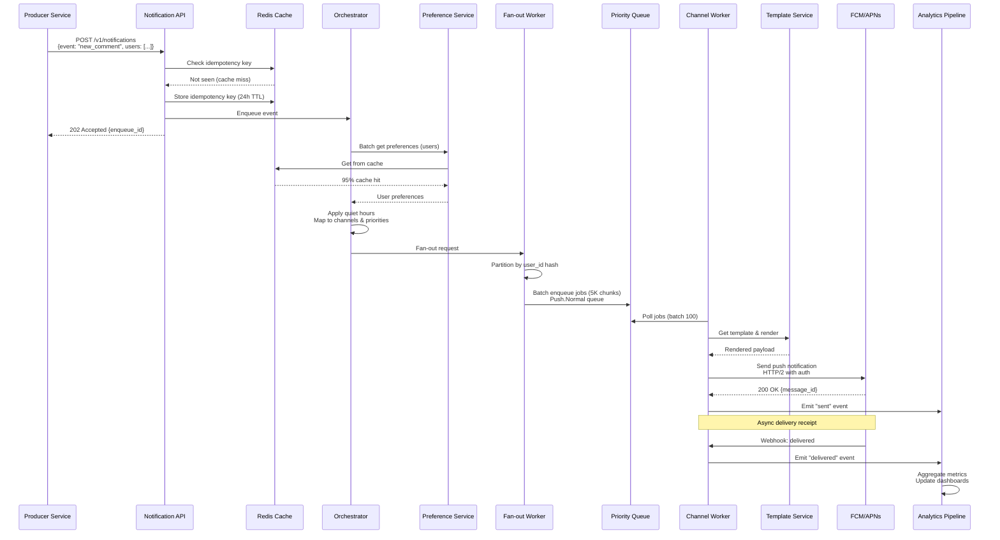
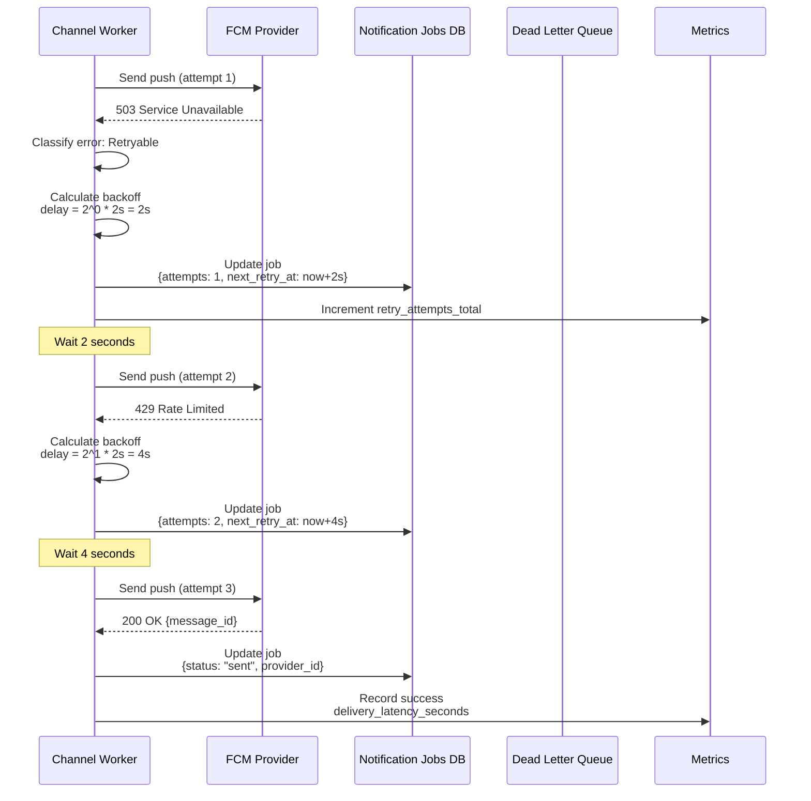
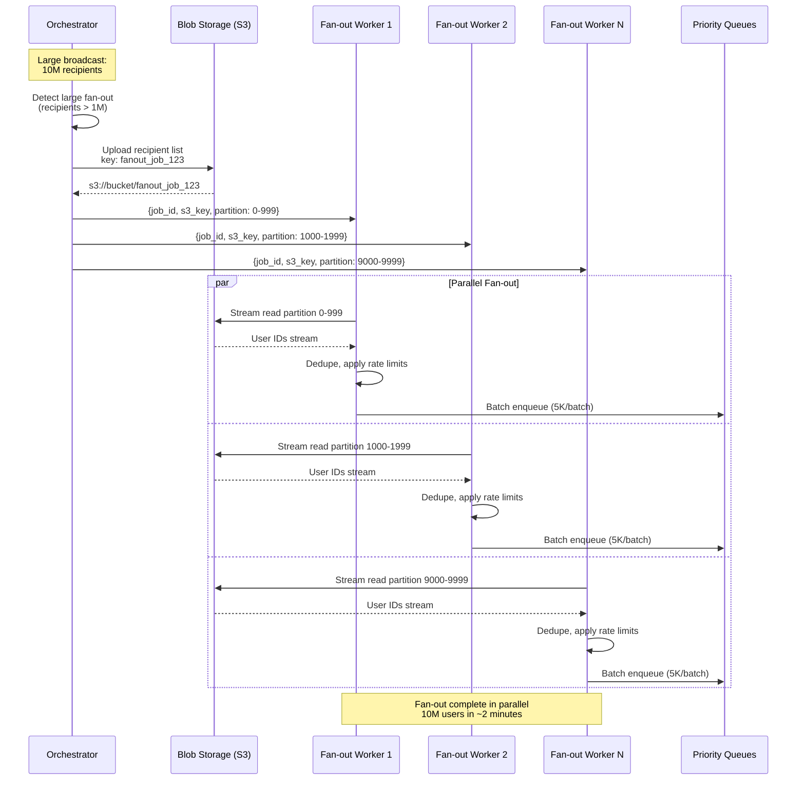
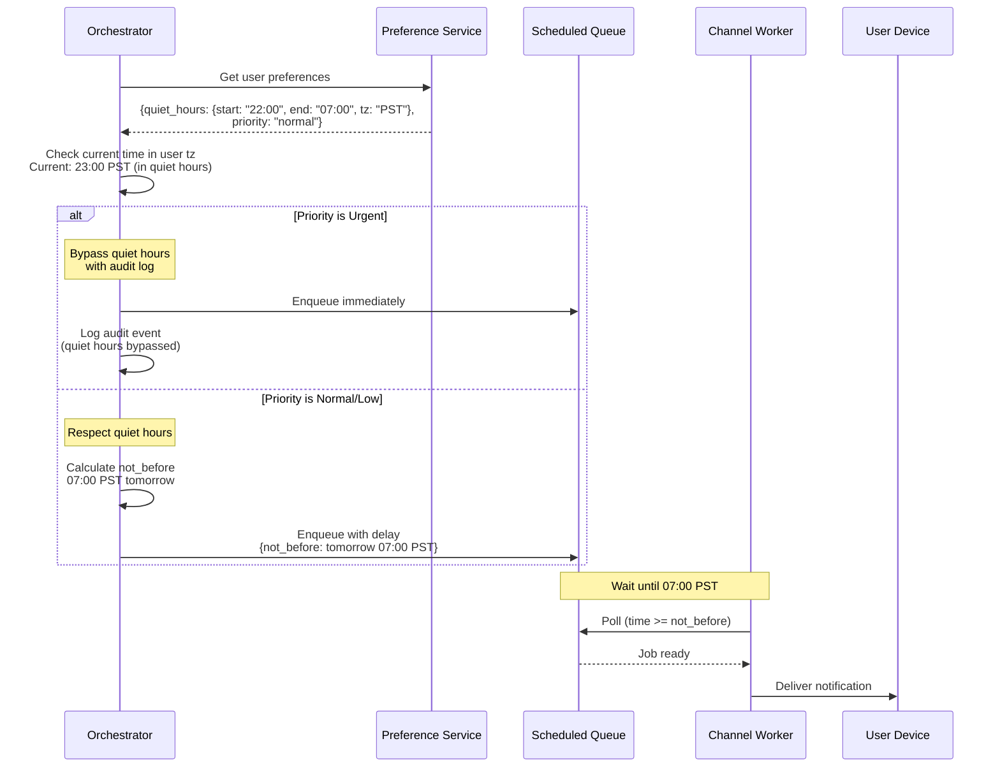

# Notification System Design (Multi-Channel Platform)

**File Purpose:** Comprehensive system design document for a multi-channel notification system supporting 500M users with 10M notifications per minute across Push (FCM/APNs), SMS, Email, and In-app channels. The design covers fan-out service for broadcast notifications, priority-based delivery queues, user preference management (channel selection, quiet hours, frequency capping), rate limiting and throttling strategies, notification batching and aggregation, template management system, delivery tracking and analytics, retry mechanisms with exponential backoff, idempotency to prevent duplicates, A/B testing framework for notification optimization, and achieving 99.99% delivery success rate with <1 second delivery latency.

**Author:** System Design Documentation  
**Created:** October 2, 2025  
**Last Updated:** October 13, 2025  
**Recent Updates:** Enhanced header format with comprehensive multi-channel notification capabilities

---

## TABLE OF CONTENTS

- [REQUIREMENTS & CLARIFICATION](#requirements--clarification)
  - [User Stories](#user-stories)
  - [Functional Requirements (MVP)](#functional-requirements-mvp)
  - [Non-Functional Requirements](#non-functional-requirements)
  - [Clarifying Questions & Assumptions](#clarifying-questions--assumptions)
  
- [BACK-OF-THE-ENVELOPE CALCULATIONS](#back-of-the-envelope-calculations)
  - [Traffic Estimates](#traffic-estimates)
  - [Storage Estimates](#storage-estimates)
  - [Bandwidth & Cost Estimates](#bandwidth--cost-estimates)
  - [Resource Estimates](#resource-estimates)
  
- [HIGH-LEVEL DESIGN](#high-level-design)
  - [Core Components](#core-components)
  - [Architecture Diagram](#architecture-diagram)
  - [Data Flow](#data-flow)
  
- [SEQUENCE DIAGRAMS](#sequence-diagrams)
  - [Notification Flow - Happy Path](#notification-flow---happy-path)
  - [Push Notification with Retry](#push-notification-with-retry)
  - [Fan-out for Large Broadcast](#fan-out-for-large-broadcast)
  - [Quiet Hours Handling](#quiet-hours-handling)
  
- [API DESIGN](#api-design)
  - [Producer API](#producer-api)
  - [Preference API](#preference-api)
  - [Token Management API](#token-management-api)
  - [Webhook Endpoints](#webhook-endpoints)
  - [Query Notification Status](#query-notification-status)
  - [Template Management API](#template-management-api)
  - [Admin/Analytics API](#adminanalytics-api)
  - [Error Responses](#error-responses)
  
- [DATA MODEL & SCHEMA](#data-model--schema)
  - [PostgreSQL Schema](#postgresql-schema-user-data-preferences-templates)
  - [ClickHouse Schema](#clickhouse-schema-analyticstime-series)
  - [Redis Data Structures](#redis-data-structures)
  
- [DEEP DIVE: FCM & APNs INTEGRATION](#deep-dive-fcm--apns-integration)
  - [FCM (Firebase Cloud Messaging)](#fcm-firebase-cloud-messaging---android)
  - [APNs (Apple Push Notification)](#apns-apple-push-notification-service---ios)
  
- [DEEP DIVE: RETRY PARAMETERS & BACKOFF](#deep-dive-retry-parameters--backoff)
  - [Retry Configuration by Channel](#retry-configuration-by-channel)
  - [Exponential Backoff Formula](#exponential-backoff-formula)
  - [Error Classification](#error-classification)
  
- [DEEP DIVE: TEMPLATE EXAMPLES](#deep-dive-template-examples)
  - [Push Notification Template](#push-notification-template)
  - [Email Template](#email-template)
  - [SMS Template](#sms-template)
  
- [DEEP DIVE: BATCHING STRATEGIES](#deep-dive-batching-strategies)
  - [Batching Windows by Priority](#batching-windows-by-priority)
  - [Batching Algorithm](#batching-algorithm)
  - [User-Level Batching](#user-level-batching-digest-notifications)
  
- [SECURITY & COMPLIANCE](#security--compliance)
- [MONITORING & OBSERVABILITY](#monitoring--observability)
  - [Key Metrics](#key-metrics)
  - [Alerting Rules](#alerting-rules)
  - [Dashboards](#dashboards)
  
- [SCALABILITY & PERFORMANCE](#scalability--performance)
  - [Horizontal Scaling](#horizontal-scaling)
  - [Performance Optimizations](#performance-optimizations)
  - [Database Sharding](#database-sharding)
  
- [DETAILED ARCHITECTURE DIAGRAM](#detailed-architecture-diagram)
  
- [TRADE-OFFS & DECISIONS](#trade-offs--decisions)
  - [Decision: Fan-out on Write vs Read](#decision-fan-out-on-write-vs-read)
  - [Decision: Per-Channel Priority Queues](#decision-per-channel-priority-queues)
  - [Decision: Worker-Side Template Rendering](#decision-worker-side-template-rendering)
  - [Decision: At-Least-Once with Idempotency](#decision-at-least-once-with-idempotency)
  - [Decision: Quiet Hours Enforcement](#decision-quiet-hours-enforcement)
  - [Decision: Push vs Pull for In-App](#decision-push-vs-pull-for-in-app-notifications)
  - [Alternatives Comparison](#alternatives-comparison)
  
- [BOTTLENECKS & SOLUTIONS](#bottlenecks--solutions)
- [RELIABILITY & FAULT TOLERANCE](#reliability--fault-tolerance)
  - [Failure Scenarios](#failure-scenarios)
  - [Multi-Region Deployment](#multi-region-deployment)
  
- [FUTURE ENHANCEMENTS](#future-enhancements)
- [SUMMARY](#summary)

---

## REQUIREMENTS & CLARIFICATION

### User Stories

**As a social media user**, I want to receive notifications about comments, likes, and mentions via push notifications so that I stay engaged with my content and community in real-time.

**As a mobile app user**, I want to control which types of notifications I receive on each channel so that I only get relevant updates without being overwhelmed.

**As a user with multiple devices**, I want notifications delivered to all my active devices so that I don't miss important updates regardless of which device I'm using.

**As a user who values sleep**, I want to set quiet hours so that non-urgent notifications are delayed until morning and don't disturb me at night.

**As a privacy-conscious user**, I want to opt out of marketing notifications while still receiving transactional alerts so that I control my notification experience.

**As a product manager**, I want to send urgent security alerts that bypass quiet hours so that users are immediately informed of critical account issues.

**As a marketing team member**, I want to schedule batch notifications for optimal engagement times so that campaigns reach users when they're most likely to interact.

**As a developer**, I want to track notification delivery, open rates, and click-through rates so that I can measure campaign effectiveness and debug delivery issues.

**As a system operator**, I want automatic retries with exponential backoff so that temporary provider outages don't result in lost notifications.

**As a platform engineer**, I want to fan out notifications to millions of users efficiently so that viral content doesn't overwhelm the notification system.

**As a compliance officer**, I want audit logs for all notification opt-ins and opt-outs so that we maintain GDPR/CAN-SPAM compliance.

### Functional Requirements (MVP)

**Core Notification Delivery:**

1. **Multi-Channel Support**: Send notifications via Push (FCM/APNs), SMS, Email, and In-app
2. **Message Publishing**: Accept notification events from producer services via REST/gRPC API
3. **Fan-out Service**: Expand audience segments to individual recipients (support 1M+ recipients per event)
4. **Priority Levels**: Four-tier priority system (urgent, high, normal, low) with separate queues
5. **Template Management**: Store and render templates with variable substitution and localization
6. **Device Token Management**: Register, update, and expire device tokens for push notifications

**User Preferences & Controls:**

- **Preference Management**: Store per-user preferences for channels, categories, and frequency
- **Quiet Hours**: Respect user-defined quiet hours per timezone
- **Opt-in/Opt-out**: Support granular opt-out per channel and per category
- **Rate Limiting**: Apply per-user, per-channel, per-category limits to prevent spam

**Delivery & Tracking:**

- **Reliable Delivery**: Retry failed notifications with exponential backoff
- **Batching**: Aggregate low-priority notifications to reduce costs and noise
- **Delivery Tracking**: Track sent, delivered, opened, clicked events per notification
- **Idempotency**: Deduplicate notifications using idempotency keys
- **Webhook Ingestion**: Receive delivery receipts from FCM, APNs, Email, and SMS providers

**Scale Targets:**

- Support 100M users with 1B notifications/day
- Average: 11,574 notifications/sec; Peak: 115,740 notifications/sec (10× burst)
- Channel mix: Push 60%, In-app 20%, Email 10%, SMS 10%
- Priority mix: Urgent 1%, High 9%, Normal 60%, Low 30%

**Out of Scope for MVP:**

- Rich interactive notifications (buttons, carousels) - Phase 2
- Video/audio attachments in notifications - Future
- Voice calls or SMS verification - Different system
- Custom notification sounds per user - Mobile app responsibility
- Notification scheduling (send at specific future time) - Can use delayed events
- Two-way SMS conversations - Not a notification use case
- Push notification to desktop browsers - Focus on mobile first
- Notification threading/grouping - Phase 2
- A/B testing framework - Phase 2
- ML-based send-time optimization - Phase 3

### Non-Functional Requirements

- Reliability: ≥99% delivery rate for push notifications measured end-to-end.
- Availability: 99.99% for API and enqueue path; channel workers can degrade.
- Latency Targets:
  - Urgent: P95 < 1s end-to-end for push/in-app; SMS/Email best-effort provider-dependent.
  - High/Normal: P95 < 5s; Low: best-effort with batching windows (e.g., 5–30 min).
- Cost efficiency: minimize SMS/Email costs via batching and channel fallback policies.
- Security & Privacy: data minimization, encryption in transit and at rest.
- Observability: per-channel and per-priority metrics, traces, and dashboards.

### Clarifying Questions & Assumptions

- Assume multi-region active-active with regional fan-out; cross-region spillover on failover.
- Assume push providers: FCM for Android, APNs for iOS; SMTP for Email; multiple SMS aggregators.
- Assume in-app notifications stored server-side and synced per session.
- Assume default quiet hours user-local time with overrides; urgent bypasses with audit.
- Assume consent and legal compliance (CAN-SPAM/GDPR/DSAR) with audit trails.
- Assume event producers publish logical events; Notification Orchestrator handles fan-out and personalization.

---

## BACK-OF-THE-ENVELOPE CALCULATIONS

### Traffic Estimates

```text
Daily notifications: 1,000,000,000/day
Average RPS: ~11,574 req/s (1e9 / 86,400)
Peak RPS (10× bursts): ~115,740 req/s
Channel mix (example): Push 60%, In-app 20%, Email 10%, SMS 10%
Priority mix (example): Urgent 1%, High 9%, Normal 60%, Low 30%
```

### Storage Estimates

```text
Event log (enqueue): 1B/day, 200 bytes/event avg → ~200 GB/day (~6 TB/mo)
Notification payload archive (personalized body + metadata):
  - Push/In-app avg 500 B, Email 2 KB, SMS 160 B
  - Weighted avg ≈ ~700 B → ~700 GB/day (~21 TB/mo)
Delivery logs + analytics events (sent, delivered, open, click):
  - 2–3 events per notification avg, 150 B/event → ~300–450 GB/day
Token registry (active devices):
  - Assume 200M tokens (multiple devices per user), 200 B/token → ~40 GB
```

### Bandwidth & Cost Estimates

```text
Outbound provider calls:
  - Push: small JSON payloads via FCM/APNs; ~600 MB–1.2 TB/day
  - Email: SMTP/API with body + assets; depends on template; assume ~200–400 GB/day
  - SMS: API JSON; payload negligible, cost dominant
Provider costs (very rough):
  - Push: mostly free (infra costs dominate)
  - Email: $0.10–$1.00 per 1K emails
  - SMS: $0.005–$0.05 per SMS (region-dependent) → batching/frequency capping critical
```

### Resource Estimates

**Server Requirements:**

```text
API Servers (Notification API):
  - Request rate: 11,574 avg, 115,740 peak req/s
  - Assume 1 server handles 5K req/s
  - Servers needed: 24 (peak capacity with 2× headroom)
  - Instance type: c5.2xlarge (8 vCPU, 16 GB RAM)
  - Total: 24 instances × $0.34/hr × 730 hrs = ~$5,961/month

Fan-out Workers:
  - Process 1B fan-outs/day (average 5K recipients per event = 5M fan-out ops/day)
  - Assume 1 worker handles 500 fan-outs/sec
  - Workers needed: 10 workers (with burst capacity)
  - Instance type: c5.xlarge (4 vCPU, 8 GB RAM)
  - Total: 10 instances × $0.17/hr × 730 hrs = ~$1,241/month

Channel Workers (Push/SMS/Email/In-app):
  - Push: 600M/day ÷ 86400 = 6,944 req/s avg, 69,440 peak
  - Assume 1 worker handles 1K req/s (with provider I/O)
  - Workers needed: 70 workers per channel (across all priorities)
  - Total: 70 instances × 4 channels = 280 instances
  - Instance type: c5.large (2 vCPU, 4 GB RAM)
  - Total: 280 × $0.085/hr × 730 hrs = ~$17,374/month

Preference/Template Services:
  - Cache-heavy, 95%+ hit rate
  - 4 instances per service (HA)
  - Instance type: r5.large (2 vCPU, 16 GB RAM)
  - Total: 8 instances × $0.126/hr × 730 hrs = ~$735/month
```

**Database Requirements:**

```text
PostgreSQL (User Preferences, Templates, Tokens):
  - Storage: ~100 GB (preferences + templates + tokens)
  - IOPS: 10K provisioned
  - Instance: db.r5.xlarge (4 vCPU, 32 GB RAM)
  - Primary + 2 read replicas
  - Total: ~$1,200/month (primary) + ~$800/month (replicas) = ~$2,000/month

ClickHouse / BigQuery (Analytics):
  - Storage: 450 GB/day × 90 days = 40.5 TB
  - Compression: 10× → 4 TB
  - Query cost: ~$5 per TB scanned
  - Storage cost: ~$0.02/GB/month
  - Total: 4,000 GB × $0.02 = ~$80/month + query costs ~$500/month = ~$580/month

Redis Cluster (Caching & Rate Limiting):
  - Preference cache: 50 GB
  - Template cache: 10 GB
  - Rate limiter: 20 GB
  - Idempotency store: 20 GB
  - Total: 100 GB with replication = 200 GB
  - Instance: 6 nodes (3 master + 3 replica) cache.r5.large
  - Total: 6 × $0.126/hr × 730 hrs = ~$552/month
```

**Message Queue (Kafka/RabbitMQ):**

```text
Kafka Cluster:
  - 16 priority queues (4 channels × 4 priorities)
  - Throughput: 115K messages/sec peak
  - Retention: 7 days (for reprocessing)
  - Storage: 1B messages/day × 1 KB avg × 7 days = 7 TB
  - Nodes: 12 brokers (3× replication)
  - Instance type: r5.xlarge (4 vCPU, 32 GB RAM)
  - Total: 12 × $0.252/hr × 730 hrs = ~$2,206/month
```

**Object Storage (S3/GCS):**

```text
Event Logs & Archives:
  - 6 TB/month (event logs) + 21 TB/month (payloads) = 27 TB/month
  - Retention: 90 days
  - Total: 27 TB × 3 months = 81 TB
  - S3 Standard: $0.023/GB = 81,000 GB × $0.023 = ~$1,863/month
  - Lifecycle policy: move to Glacier after 30 days (reduce to ~$600/month)
```

**Total Monthly Infrastructure Cost:**

```text
Compute (API + Workers):           ~$25,300
Databases (PostgreSQL + Redis):    ~$2,500
Analytics (ClickHouse):            ~$580
Message Queue (Kafka):             ~$2,200
Storage (S3):                      ~$600
Load Balancers & Networking:       ~$1,000
Monitoring & Logging:              ~$500
───────────────────────────────────────────
Total Infrastructure:              ~$32,680/month

Provider Costs:
- Push (FCM/APNs): Free (infrastructure only)
- Email (100M/day): 100M × $0.0005 = ~$50,000/month
- SMS (100M/day): 100M × $0.02 (avg) = ~$2,000,000/month
───────────────────────────────────────────
Total with Providers:              ~$2,082,680/month

Cost per notification: $2,082,680 / 1B = ~$0.002 per notification
Cost without SMS/Email: ~$32,680 / 1B = ~$0.00003 per notification (push/in-app only)
```

**Cost Optimization Strategies:**

- Use batching for SMS/Email to reduce count by 30-50%
- Reserved instances: save 30-40% on compute
- Spot instances for non-critical workers: save 60-70%
- Compress and archive logs: save 70% on storage
- Use cheaper email providers (SendGrid bulk): $0.0001/email
- SMS: negotiate bulk rates or use cheaper providers for low-priority

---

## HIGH-LEVEL DESIGN

### Core Components

- Notification API (Producer-facing): Ingests logical events (e.g., "new_comment"). Performs schema validation, idempotency, and lightweight enrichment.
- Preference Service: Stores per-user per-channel/category preferences, quiet hours, locale. Cached aggressively (Redis) with write-through to DB.
- Template Service: Manages templates by channel/locale/variant with variables and conditional blocks. Returns compiled content.
- Orchestrator: Determines recipients, channels, priority, batching windows; emits channel-specific jobs to priority queues.
- Fan-out Service: Expands to millions of recipients efficiently using batched queue writes and partitioned fan-out workers.
- Priority Queues: Separate queues per channel × priority (urgent/high/normal/low) with quotas and scheduling.
- Channel Workers: Push (FCM/APNs), SMS, Email, In-app workers with retry, backoff, and provider failover.
- Token Service: Manages device tokens (registration, expiry, invalidation, dedupe per user/device).
- Rate Limiter & Anti-Spam: Multi-dimensional limits (user, channel, category) and frequency capping with sliding window.
- Event Bus: Internal bus (e.g., Kafka) for events: enqueued, sent, delivered, opened, clicked, failed.
- Analytics Pipeline: Stream processing to aggregate metrics, build funnels, and power dashboards (OLAP/ClickHouse/BigQuery).
- Webhook Ingestion: Handles FCM/APNs feedback, Email/SMS provider webhooks; updates delivery/open/click status.
- Storage: Relational for user prefs/templates; NoSQL/time-series for events; Redis for hot caches; S3/GCS for archives.

### Architecture Diagram

```text
[Producers]
   |
   v
[Notification API] --(read)-> [Preference Cache/DB]
   |--(read)-> [Template Service]
   v
[Orchestrator] --(fan-out)-> [Priority Queues (per channel×priority)]
                         |-> [Rate Limiter]
                         |-> [Batcher]
   v
[Channel Workers]
   |--> Push: [FCM/APNs]
   |--> SMS: [SMS Aggregators]
   |--> Email: [SMTP/Email API]
   |--> In-app: [Notification Store]
   v
[Webhook Ingestion] -> [Event Bus] -> [Analytics/OLAP]
```

### Data Flow

1. Producer posts event to Notification API with event type and audience.
2. Orchestrator loads preferences, applies quiet hours, maps to channels and priority.
3. Fan-out expands recipients using partitioned workers; dedupes and applies per-user limits.
4. Jobs are placed into channel×priority queues; scheduler drains with quotas.
5. Channel workers personalize via Template Service and send to providers with retry/backoff.
6. Webhooks update status; events flow to analytics for delivery/open/click funnels.

---

## SEQUENCE DIAGRAMS

### Notification Flow - Happy Path



### Push Notification with Retry



### Fan-out for Large Broadcast



### Quiet Hours Handling



---

## API DESIGN

### Producer API

```http
POST /v1/notifications
Authorization: Bearer <token>
Content-Type: application/json

{
  "event_type": "new_comment",
  "audience": {"user_ids": ["u1", "u2"], "segment": "followers_of:post123"},
  "context": {"post_id": "post123", "commenter": "u9"},
  "priority": "normal",
  "channels": ["push", "in_app"],
  "idempotency_key": "uuid-1234"
}
```

```http
202 Accepted
{
  "enqueue_id": "enq_abc123",
  "estimated_recipients": 2000000
}
```

### Preference API

```http
GET /v1/users/{user_id}/notification-preferences
```

```http
PUT /v1/users/{user_id}/notification-preferences
Content-Type: application/json

{
  "quiet_hours": {"start": "22:00", "end": "07:00", "tz": "America/Los_Angeles"},
  "channels": {
    "push": {"enabled": true},
    "email": {"enabled": false},
    "sms": {"enabled": false},
    "in_app": {"enabled": true}
  },
  "categories": {
    "marketing": {"enabled": false, "max_per_day": 1},
    "social": {"enabled": true, "max_per_hour": 5}
  }
}
```

### Token Management API

```http
POST /v1/devices/register
Content-Type: application/json

{
  "user_id": "u1",
  "platform": "ios", // or android
  "token": "apns_or_fcm_token",
  "device_id": "d123",
  "app_version": "9.2.1"
}
```

```http
POST /v1/devices/unregister
{
  "user_id": "u1",
  "device_id": "d123"
}
```

### Webhook Endpoints

```http
POST /v1/webhooks/push/receipt  // FCM/APNs delivery receipts
POST /v1/webhooks/email/events  // delivered/opened/clicked/spam/complaint
POST /v1/webhooks/sms/events    // delivered/failed
```

### Query Notification Status

```http
GET /v1/notifications/{enqueue_id}
Authorization: Bearer <token>
```

**Response (200 OK):**

```json
{
  "enqueue_id": "enq_abc123",
  "event_type": "new_comment",
  "status": "processing",
  "total_recipients": 2000000,
  "sent": 1950000,
  "delivered": 1900000,
  "failed": 50000,
  "pending": 50000,
  "created_at": "2025-10-02T10:00:00Z",
  "updated_at": "2025-10-02T10:05:00Z"
}
```

### Template Management API

#### Create Template

```http
POST /v1/templates
Authorization: Bearer <admin_token>
Content-Type: application/json

{
  "template_id": "new_comment_push_v2",
  "channel": "push",
  "locale": "en-US",
  "version": "2.0",
  "title": "{{commenter_name}} commented on your post",
  "body": "{{comment_preview}}",
  "variables": {
    "commenter_name": {"type": "string", "required": true},
    "comment_preview": {"type": "string", "required": true, "max_length": 100},
    "post_id": {"type": "string", "required": true}
  },
  "action": {
    "type": "deep_link",
    "url": "app://post/{{post_id}}"
  }
}
```

**Response (201 Created):**

```json
{
  "template_id": "new_comment_push_v2",
  "version": "2.0",
  "created_at": "2025-10-02T10:00:00Z"
}
```

#### Get Template

```http
GET /v1/templates/{template_id}?version=2.0&locale=en-US
Authorization: Bearer <admin_token>
```

#### Update Template

```http
PUT /v1/templates/{template_id}
Authorization: Bearer <admin_token>
Content-Type: application/json

{
  "version": "2.1",
  "body": "{{commenter_name}} replied: {{comment_preview}}"
}
```

#### List Templates

```http
GET /v1/templates?channel=push&locale=en-US&page=1&limit=50
Authorization: Bearer <admin_token>
```

### Admin/Analytics API

#### Get Delivery Stats

```http
GET /v1/analytics/delivery-stats?start=2025-10-01&end=2025-10-02&channel=push&priority=normal
Authorization: Bearer <admin_token>
```

**Response (200 OK):**

```json
{
  "period": {
    "start": "2025-10-01T00:00:00Z",
    "end": "2025-10-02T00:00:00Z"
  },
  "channel": "push",
  "priority": "normal",
  "stats": {
    "sent": 600000000,
    "delivered": 594000000,
    "failed": 6000000,
    "opened": 180000000,
    "clicked": 60000000,
    "delivery_rate": 0.99,
    "open_rate": 0.303,
    "click_rate": 0.1,
    "avg_delivery_time_seconds": 2.3,
    "p95_delivery_time_seconds": 4.1,
    "p99_delivery_time_seconds": 8.2
  }
}
```

#### Get User Notification History

```http
GET /v1/users/{user_id}/notifications?page=1&limit=20&channel=push&status=delivered
Authorization: Bearer <token>
```

**Response (200 OK):**

```json
{
  "user_id": "u1",
  "notifications": [
    {
      "notification_id": "notif_123",
      "channel": "push",
      "priority": "normal",
      "template_id": "new_comment_push",
      "status": "delivered",
      "sent_at": "2025-10-02T10:00:00Z",
      "delivered_at": "2025-10-02T10:00:02Z",
      "opened_at": "2025-10-02T10:05:00Z",
      "title": "Alice commented on your post",
      "body": "Great photo!"
    }
  ],
  "pagination": {
    "page": 1,
    "limit": 20,
    "total": 150
  }
}
```

### Error Responses

**400 Bad Request:**

```json
{
  "error": {
    "code": "INVALID_REQUEST",
    "message": "Validation failed",
    "details": [
      {
        "field": "priority",
        "error": "must be one of: urgent, high, normal, low"
      }
    ]
  }
}
```

**401 Unauthorized:**

```json
{
  "error": {
    "code": "UNAUTHORIZED",
    "message": "Invalid or expired token"
  }
}
```

**429 Too Many Requests:**

```json
{
  "error": {
    "code": "RATE_LIMIT_EXCEEDED",
    "message": "Rate limit exceeded",
    "retry_after_seconds": 60,
    "limit": 100,
    "window": "1 hour"
  }
}
```

**500 Internal Server Error:**

```json
{
  "error": {
    "code": "INTERNAL_ERROR",
    "message": "An internal error occurred",
    "request_id": "req_abc123"
  }
}
```

---

## DATA MODEL & SCHEMA

### PostgreSQL Schema (User Data, Preferences, Templates)

#### users Table

```sql
CREATE TABLE users (
    user_id UUID PRIMARY KEY,
    created_at TIMESTAMP NOT NULL DEFAULT NOW(),
    updated_at TIMESTAMP NOT NULL DEFAULT NOW()
);

CREATE INDEX idx_users_created_at ON users(created_at);
```

#### device_tokens Table

```sql
CREATE TABLE device_tokens (
    user_id UUID NOT NULL,
    device_id VARCHAR(255) NOT NULL,
    platform VARCHAR(20) NOT NULL CHECK (platform IN ('ios', 'android')),
    token TEXT NOT NULL,
    app_version VARCHAR(50),
    device_model VARCHAR(100),
    os_version VARCHAR(50),
    is_valid BOOLEAN NOT NULL DEFAULT TRUE,
    last_seen_at TIMESTAMP NOT NULL DEFAULT NOW(),
    registered_at TIMESTAMP NOT NULL DEFAULT NOW(),
    expires_at TIMESTAMP,
    created_at TIMESTAMP NOT NULL DEFAULT NOW(),
    updated_at TIMESTAMP NOT NULL DEFAULT NOW(),
    PRIMARY KEY (user_id, device_id),
    FOREIGN KEY (user_id) REFERENCES users(user_id) ON DELETE CASCADE
);

CREATE UNIQUE INDEX idx_device_tokens_token ON device_tokens(token) WHERE is_valid = TRUE;
CREATE INDEX idx_device_tokens_user_valid ON device_tokens(user_id, is_valid);
CREATE INDEX idx_device_tokens_platform ON device_tokens(platform, is_valid);
CREATE INDEX idx_device_tokens_expires ON device_tokens(expires_at) WHERE expires_at IS NOT NULL;
```

**Rationale:** Composite PK on (user_id, device_id) allows multiple devices per user. Unique index on token ensures no duplicates for active tokens. Partial index on expires_at for cleanup jobs.

#### notification_preferences Table

```sql
CREATE TABLE notification_preferences (
    user_id UUID PRIMARY KEY,
    quiet_hours_start TIME,
    quiet_hours_end TIME,
    timezone VARCHAR(50) DEFAULT 'UTC',
    channels JSONB NOT NULL DEFAULT '{}',
    categories JSONB NOT NULL DEFAULT '{}',
    global_enabled BOOLEAN NOT NULL DEFAULT TRUE,
    created_at TIMESTAMP NOT NULL DEFAULT NOW(),
    updated_at TIMESTAMP NOT NULL DEFAULT NOW(),
    FOREIGN KEY (user_id) REFERENCES users(user_id) ON DELETE CASCADE
);

CREATE INDEX idx_prefs_updated ON notification_preferences(updated_at);
CREATE INDEX idx_prefs_quiet_hours ON notification_preferences(quiet_hours_start, quiet_hours_end) 
    WHERE quiet_hours_start IS NOT NULL;
```

**Example JSONB Structure:**

```json
channels: {
  "push": {"enabled": true},
  "email": {"enabled": false},
  "sms": {"enabled": false},
  "in_app": {"enabled": true}
}

categories: {
  "marketing": {"enabled": false, "max_per_day": 0},
  "social": {"enabled": true, "max_per_hour": 5},
  "transactional": {"enabled": true, "max_per_hour": 100}
}
```

#### templates Table

```sql
CREATE TABLE templates (
    template_id VARCHAR(100) NOT NULL,
    version VARCHAR(20) NOT NULL,
    channel VARCHAR(20) NOT NULL CHECK (channel IN ('push', 'email', 'sms', 'in_app')),
    locale VARCHAR(10) NOT NULL DEFAULT 'en-US',
    title TEXT,
    body TEXT NOT NULL,
    subject TEXT,
    variables JSONB NOT NULL DEFAULT '{}',
    action JSONB,
    is_active BOOLEAN NOT NULL DEFAULT TRUE,
    created_at TIMESTAMP NOT NULL DEFAULT NOW(),
    updated_at TIMESTAMP NOT NULL DEFAULT NOW(),
    PRIMARY KEY (template_id, version, locale)
);

CREATE INDEX idx_templates_channel ON templates(channel, is_active);
CREATE INDEX idx_templates_locale ON templates(locale, is_active);
```

**Rationale:** Composite PK allows versioning and localization. Same template can have multiple versions and translations.

#### notifications Table

```sql
CREATE TABLE notifications (
    notification_id UUID PRIMARY KEY,
    enqueue_id VARCHAR(100) UNIQUE NOT NULL,
    event_type VARCHAR(100) NOT NULL,
    priority VARCHAR(20) NOT NULL CHECK (priority IN ('urgent', 'high', 'normal', 'low')),
    channels JSONB NOT NULL,
    audience_type VARCHAR(50) NOT NULL,
    audience_ref TEXT,
    context JSONB,
    template_id VARCHAR(100),
    idempotency_key VARCHAR(255) UNIQUE,
    status VARCHAR(50) NOT NULL DEFAULT 'processing',
    total_recipients INT DEFAULT 0,
    sent_count INT DEFAULT 0,
    delivered_count INT DEFAULT 0,
    failed_count INT DEFAULT 0,
    created_at TIMESTAMP NOT NULL DEFAULT NOW(),
    updated_at TIMESTAMP NOT NULL DEFAULT NOW()
);

CREATE INDEX idx_notifications_enqueue ON notifications(enqueue_id);
CREATE INDEX idx_notifications_idempotency ON notifications(idempotency_key) WHERE idempotency_key IS NOT NULL;
CREATE INDEX idx_notifications_created ON notifications(created_at DESC);
CREATE INDEX idx_notifications_event_type ON notifications(event_type, created_at DESC);
```

#### notification_jobs Table (Sharded by user_id)

```sql
CREATE TABLE notification_jobs (
    job_id UUID PRIMARY KEY,
    notification_id UUID NOT NULL,
    user_id UUID NOT NULL,
    channel VARCHAR(20) NOT NULL,
    priority VARCHAR(20) NOT NULL,
    status VARCHAR(50) NOT NULL DEFAULT 'queued',
    template_id VARCHAR(100),
    rendered_payload JSONB,
    provider VARCHAR(50),
    provider_message_id VARCHAR(255),
    attempts INT NOT NULL DEFAULT 0,
    max_attempts INT NOT NULL DEFAULT 3,
    next_retry_at TIMESTAMP,
    error_code VARCHAR(50),
    error_message TEXT,
    created_at TIMESTAMP NOT NULL DEFAULT NOW(),
    updated_at TIMESTAMP NOT NULL DEFAULT NOW(),
    sent_at TIMESTAMP,
    delivered_at TIMESTAMP,
    FOREIGN KEY (notification_id) REFERENCES notifications(notification_id) ON DELETE CASCADE,
    FOREIGN KEY (user_id) REFERENCES users(user_id) ON DELETE CASCADE
);

CREATE INDEX idx_jobs_notification ON notification_jobs(notification_id, status);
CREATE INDEX idx_jobs_user_channel ON notification_jobs(user_id, channel, status);
CREATE INDEX idx_jobs_status ON notification_jobs(status, created_at DESC);
CREATE INDEX idx_jobs_retry ON notification_jobs(status, next_retry_at) 
    WHERE status = 'pending_retry';
CREATE INDEX idx_jobs_provider ON notification_jobs(provider, provider_message_id) 
    WHERE provider_message_id IS NOT NULL;
```

**Partitioning Strategy:**

```sql
-- Partition by user_id hash for horizontal scaling
CREATE TABLE notification_jobs_p0 PARTITION OF notification_jobs 
    FOR VALUES WITH (MODULUS 10, REMAINDER 0);
    
CREATE TABLE notification_jobs_p1 PARTITION OF notification_jobs 
    FOR VALUES WITH (MODULUS 10, REMAINDER 1);
    
-- ... p2 through p9
```

### ClickHouse Schema (Analytics/Time-Series)

```sql
CREATE TABLE analytics_events (
    event_id UUID,
    job_id UUID,
    notification_id UUID,
    user_id UUID,
    channel String,
    priority String,
    event_type Enum8(
        'enqueued' = 1,
        'sent' = 2,
        'delivered' = 3,
        'opened' = 4,
        'clicked' = 5,
        'bounced' = 6,
        'complained' = 7,
        'failed' = 8
    ),
    provider String,
    error_code String,
    template_id String,
    device_platform String,
    user_agent String,
    ip_address IPv4,
    country_code FixedString(2),
    timestamp DateTime,
    processing_time_ms UInt32
) ENGINE = MergeTree()
PARTITION BY toYYYYMM(timestamp)
ORDER BY (channel, event_type, timestamp)
TTL timestamp + INTERVAL 90 DAY;

-- Materialized view for real-time aggregation
CREATE MATERIALIZED VIEW analytics_hourly_stats
ENGINE = SummingMergeTree()
PARTITION BY toYYYYMM(hour)
ORDER BY (channel, priority, hour)
AS SELECT
    channel,
    priority,
    toStartOfHour(timestamp) AS hour,
    countIf(event_type = 'sent') AS sent_count,
    countIf(event_type = 'delivered') AS delivered_count,
    countIf(event_type = 'opened') AS opened_count,
    countIf(event_type = 'clicked') AS clicked_count,
    countIf(event_type = 'failed') AS failed_count,
    avg(processing_time_ms) AS avg_processing_time_ms
FROM analytics_events
GROUP BY channel, priority, hour;
```

### Redis Data Structures

#### Preference Cache

```text
Key: pref:user:{user_id}
Type: Hash
TTL: 300 seconds (5 minutes)
Value: {
    "quiet_hours_start": "22:00",
    "quiet_hours_end": "07:00",
    "timezone": "America/Los_Angeles",
    "channels": "{\"push\":{\"enabled\":true},...}",
    "categories": "{\"social\":{\"enabled\":true,\"max_per_hour\":5},...}"
}
```

#### Idempotency Store

```text
Key: idempotency:{idempotency_key}
Type: String
TTL: 86400 seconds (24 hours)
Value: {notification_id}
```

#### Rate Limiter (Sliding Window)

```text
Key: ratelimit:{user_id}:{channel}:{category}:{window}
Type: Sorted Set
TTL: window duration + buffer
Members: {timestamp}:{request_id}
Scores: timestamp (unix milliseconds)
```

#### Template Cache

```text
Key: template:{template_id}:{version}:{locale}
Type: String
TTL: None (manual invalidation)
Value: JSON string of template
```

---

### Fan-out Strategy

- Hybrid fan-out: precompute recipient sets for large segments; stream-based expansion for dynamic audiences.
- Use partitioned workers keyed by `user_id` hash to preserve per-user ordering per channel.
- Batch enqueue to queues in chunks (e.g., 5K–20K) to avoid broker hot partitions.
- For extremely large sets (10M+), stage recipient IDs in a blob store and stream them through workers.

### Priority Queues & Scheduling

- Separate queues per `channel × priority` enable differentiated SLAs.
- Weighted fair scheduling across priorities with minimum bandwidth guarantees for urgent/high.
- Per-channel concurrency controls and circuit breakers to protect providers.

### Retry Logic & Backoff

- Exponential backoff with jitter: base 2^n seconds capped (e.g., 5m push/in-app, 30m email, 60m SMS).
- Classify errors: retryable (429/5xx/timeouts), non-retryable (4xx invalid tokens, spam complaints).
- Dead-letter queues (DLQ) after max attempts with reason code and diagnostics.

### Rate Limiting & Frequency Capping

- Sliding window counters per `user × channel × category` with configurable caps.
- Global and per-tenant quotas; spillover to lower priority or defer.
- Quiet hours enforcement: queue with `not_before` timestamps; urgent can bypass with audit.

### Template Management & Personalization

- Versioned templates with locale variants; control flags for A/B testing.
- Mustache/Handlebars-like variables; conditional sections; link tracking parameters.
- Rendering happens in channel workers to leverage latest preferences at send time.

### Token Management (FCM/APNs)

- Handle token rotation and invalidation; dedupe multiple devices per user.
- Feedback processing: remove invalid/expired tokens; backoff on provider throttling.
- For APNs: maintain HTTP/2 connections with connection pooling; for FCM: topic messaging when suitable.

### Analytics & Observability

- Emit events at key points: enqueued, queued, sent, delivered, opened, clicked, failed, suppressed.
- Funnel metrics by channel, priority, template, segment, region.
- Dashboards with percentiles for latency; alerts on delivery dips or provider error spikes.

---

## DEEP DIVE: FCM & APNs INTEGRATION

### FCM (Firebase Cloud Messaging) - Android

**Connection & Protocol:**

```text
- Use HTTP v1 API (not legacy API)
- OAuth 2.0 with service account credentials
- Connection pooling with keep-alive
- Max payload: 4 KB
```

**Push Payload Example:**

```json
{
  "message": {
    "token": "fcm_device_token_here",
    "notification": {
      "title": "New comment on your post",
      "body": "@alice replied: Great work!"
    },
    "data": {
      "post_id": "post123",
      "action": "view_post",
      "category": "social"
    },
    "android": {
      "priority": "high",
      "ttl": "3600s",
      "notification": {
        "channel_id": "social_updates",
        "sound": "default"
      }
    }
  }
}
```

**Error Handling:**

```text
- 200: Success, track message_id
- 400: Invalid payload (non-retryable)
- 401/403: Auth error (rotate credentials)
- 404: Token not registered (mark invalid, remove from registry)
- 429: Rate limited (exponential backoff)
- 500/503: FCM error (retry with backoff)
```

### APNs (Apple Push Notification service) - iOS

**Connection & Protocol:**

```text
- HTTP/2 based, maintain persistent connections
- Certificate-based or token-based auth (prefer token)
- Production: api.push.apple.com:443
- Development: api.sandbox.push.apple.com:443
- Max payload: 4 KB (5 KB for VoIP)
```

**Push Payload Example:**

```json
{
  "aps": {
    "alert": {
      "title": "New comment on your post",
      "body": "@alice replied: Great work!"
    },
    "badge": 1,
    "sound": "default",
    "category": "COMMENT_CATEGORY",
    "thread-id": "post123"
  },
  "post_id": "post123",
  "action": "view_post"
}
```

**Headers:**

```http
apns-topic: com.yourapp.bundle
apns-priority: 10
apns-expiration: 1735689600
apns-collapse-id: post123_comment
```

**Error Handling:**

```text
- 200: Success, track apns-id from response
- 400: BadDeviceToken/InvalidProviderToken (mark invalid)
- 403: InvalidProviderToken (refresh JWT)
- 410: Unregistered (device token no longer valid, remove)
- 429: TooManyRequests (backoff per device or topic)
- 500/503: InternalServerError/ServiceUnavailable (retry)
```

---

## DEEP DIVE: RETRY PARAMETERS & BACKOFF

### Retry Configuration by Channel

| Channel | Max Attempts | Base Delay | Max Delay | Strategy |
|---------|--------------|------------|-----------|----------|
| Push (FCM/APNs) | 3 | 2s | 5min | Exponential with jitter |
| In-app | 5 | 1s | 10min | Exponential with jitter |
| Email | 5 | 30s | 30min | Exponential with jitter |
| SMS | 3 | 60s | 60min | Exponential with jitter |

### Exponential Backoff Formula

```python
def calculate_backoff(attempt: int, base_delay: int, max_delay: int) -> int:
    """
    Calculate retry delay with exponential backoff and jitter.
    
    Args:
        attempt: Current retry attempt (1-indexed)
        base_delay: Base delay in seconds
        max_delay: Maximum delay cap in seconds
    
    Returns:
        Delay in seconds before next retry
    """
    import random
    
    delay = min(base_delay * (2 ** (attempt - 1)), max_delay)
    jitter = random.uniform(0, delay * 0.1)  # 10% jitter
    return delay + jitter
```

### Error Classification

```text
Retryable Errors:
  - Network timeouts
  - 429 Rate Limit Exceeded
  - 500/502/503/504 Server errors
  - Temporary DNS failures

Non-Retryable Errors:
  - 400 Bad Request (invalid payload)
  - 401/403 Authentication/Authorization (after credential refresh attempt)
  - 404 Invalid token/endpoint
  - 410 Token unregistered/expired
  - Spam complaints
```

---

## DEEP DIVE: TEMPLATE EXAMPLES

### Push Notification Template

```json
{
  "template_id": "new_comment_push",
  "channel": "push",
  "locale": "en-US",
  "version": "1.2",
  "title": "{{commenter_name}} commented on your post",
  "body": "{{comment_preview}}",
  "variables": {
    "commenter_name": "string",
    "comment_preview": "string",
    "post_id": "string"
  },
  "action": {
    "type": "deep_link",
    "url": "app://post/{{post_id}}"
  }
}
```

### Email Template

```json
{
  "template_id": "weekly_digest_email",
  "channel": "email",
  "locale": "en-US",
  "version": "2.0",
  "subject": "Your weekly activity digest",
  "from_name": "Social Platform",
  "from_email": "notifications@socialplatform.com",
  "reply_to": "support@socialplatform.com",
  "html_body": "<!DOCTYPE html>...",
  "text_body": "Hi {{user_name}}, here's your weekly digest...",
  "variables": {
    "user_name": "string",
    "post_count": "number",
    "comment_count": "number",
    "like_count": "number"
  },
  "unsubscribe_link": true,
  "track_opens": true,
  "track_clicks": true
}
```

### SMS Template

```json
{
  "template_id": "urgent_security_alert_sms",
  "channel": "sms",
  "locale": "en-US",
  "version": "1.0",
  "body": "Security alert: Login from new device {{device_name}} at {{time}}. If this wasn't you, secure your account: {{short_url}}",
  "variables": {
    "device_name": "string",
    "time": "string",
    "short_url": "string"
  },
  "max_length": 160
}
```

---

## DEEP DIVE: BATCHING STRATEGIES

### Batching Windows by Priority

```text
Urgent: No batching (immediate send)
High: No batching or micro-batching (100ms window)
Normal: 5-minute batching window
Low: 30-minute batching window
```

### Batching Algorithm

```python
def should_send_batch(batch_queue, priority: str) -> bool:
    """
    Determine if a batch should be sent based on priority rules.
    
    Returns True if batch should be sent now.
    """
    if priority == "urgent":
        return len(batch_queue) > 0  # Send immediately
    
    if priority == "high":
        return len(batch_queue) >= 100 or batch_age_ms(batch_queue) >= 100
    
    if priority == "normal":
        return len(batch_queue) >= 1000 or batch_age_ms(batch_queue) >= 300000
    
    if priority == "low":
        return len(batch_queue) >= 5000 or batch_age_ms(batch_queue) >= 1800000
```

### User-Level Batching (Digest Notifications)

```text
For low-priority social updates:
  - Batch multiple events per user into single notification
  - Example: "5 new likes, 3 new comments on your posts"
  - Reduce notification fatigue and SMS costs
  - Send at optimal engagement times
```

---

## SECURITY & COMPLIANCE

- PII minimization; store only required data; encrypt at rest (KMS) and TLS in transit.
- Access controls: service-to-service auth (mTLS/JWT), RBAC for admin tools.
- Consent management and audit logs for opt-in/opt-out; comply with GDPR/CCPA/CAN-SPAM.
- Link tracking with privacy-safe parameters; allow user-level tracking opt-out.

## MONITORING & OBSERVABILITY

### Key Metrics

**Throughput Metrics:**

```text
- notifications_enqueued_total (by event_type, priority)
- notifications_sent_total (by channel, priority, status)
- notifications_delivered_total (by channel)
- notifications_opened_total (by channel)
- notifications_clicked_total (by channel)
- fan_out_duration_seconds (P50, P95, P99)
- delivery_latency_seconds (by channel, priority)
```

**Error Metrics:**

```text
- notifications_failed_total (by channel, error_type)
- retry_attempts_total (by channel)
- dead_letter_queue_size (by channel)
- invalid_tokens_total (by channel)
- rate_limit_exceeded_total (by user, channel)
```

**Queue Metrics:**

```text
- queue_depth (by channel, priority)
- queue_processing_rate (by channel, priority)
- consumer_lag_seconds (by channel, priority)
```

**Provider Metrics:**

```text
- fcm_success_rate, fcm_latency_ms
- apns_success_rate, apns_latency_ms
- email_bounce_rate, email_complaint_rate
- sms_delivery_rate
```

### Alerting Rules

```text
1. notifications_sent_rate < baseline * 0.5 for 5 min → Critical
2. delivery_latency_p95 > SLA threshold for 5 min → Warning
3. queue_depth > 1M for 10 min → Warning
4. channel_error_rate > 5% for 5 min → Critical
5. invalid_token_rate > 20% for 15 min → Warning (data quality issue)
```

### Dashboards

```text
- Notification Overview: throughput, latency, success rates
- Channel Health: per-channel metrics, provider status
- User Engagement: open rates, click rates, conversion funnels
- Cost Dashboard: SMS/Email spending, per-channel costs
- Operational Dashboard: queue depths, retry rates, error breakdowns
```

---

## SCALABILITY & PERFORMANCE

### Horizontal Scaling

```text
- Stateless API servers: scale behind load balancer
- Fan-out workers: partition by user_id hash, scale independently
- Channel workers: scale per-channel based on queue depth
- Preference/Template services: cache-heavy with read replicas
```

### Performance Optimizations

```text
- Preference cache: Redis with 5-minute TTL, 95%+ hit rate
- Template cache: CDN-backed, versioned, immutable
- Batch database writes: buffer notification_jobs inserts
- Connection pooling: reuse HTTP/2 connections to FCM/APNs
- Async I/O: non-blocking for all provider calls
```

### Database Sharding

```text
- Shard notification_jobs by user_id (consistent hashing)
- Shard device_tokens by user_id
- Analytics events: partition by timestamp (time-series DB)
```

---

## DETAILED ARCHITECTURE DIAGRAM

```text
┌─────────────────────────────────────────────────────────────────────┐
│                         NOTIFICATION SYSTEM                         │
└─────────────────────────────────────────────────────────────────────┘

┌──────────────┐
│  Producers   │ (Microservices, Event Streams)
└──────┬───────┘
       │
       v
┌──────────────────────┐
│  Notification API    │ <─── [Idempotency Store (Redis)]
│  (REST/gRPC)         │
└──────┬───────────────┘
       │
       ├──> [Preference Service] <─> [Preference Cache (Redis)] <─> [Preference DB]
       │
       ├──> [Template Service] <─> [Template Cache (CDN/Redis)] <─> [Template DB]
       │
       v
┌──────────────────────┐
│   Orchestrator       │
│   (Fan-out Logic)    │
└──────┬───────────────┘
       │
       ├──> [Rate Limiter (Redis)] (Sliding Window Counters)
       ├──> [Quiet Hours Checker]
       ├──> [Anti-Spam Filter]
       │
       v
┌─────────────────────────────────────────────────────────────────────┐
│                    PRIORITY QUEUES (Kafka/RabbitMQ)                 │
├─────────────────────────────────────────────────────────────────────┤
│  Push.Urgent  │  Push.High  │  Push.Normal  │  Push.Low            │
│  SMS.Urgent   │  SMS.High   │  SMS.Normal   │  SMS.Low             │
│  Email.Urgent │  Email.High │  Email.Normal │  Email.Low           │
│  InApp.Urgent │  InApp.High │  InApp.Normal │  InApp.Low           │
└─────┬───────────────────────────────────────────────────────────────┘
      │
      v
┌─────────────────────────────────────────────────────────────────────┐
│                        CHANNEL WORKERS                              │
├─────────────┬──────────────┬──────────────┬────────────────────────┤
│ Push Worker │  SMS Worker  │ Email Worker │  In-App Worker         │
│  (Scaled)   │   (Scaled)   │   (Scaled)   │   (Scaled)             │
└─────┬───────┴──────┬───────┴──────┬───────┴─────┬──────────────────┘
      │              │              │             │
      v              v              v             v
┌──────────┐  ┌──────────┐  ┌──────────┐  ┌─────────────┐
│   FCM    │  │   SMS    │  │  SMTP/   │  │  In-App     │
│   APNs   │  │ Provider │  │ Email API│  │  Store (DB) │
└─────┬────┘  └────┬─────┘  └────┬─────┘  └──────┬──────┘
      │            │             │               │
      └────────────┴─────────────┴───────────────┘
                   │
                   v
         ┌─────────────────────┐
         │ Webhook Ingestion   │ (Delivery receipts, opens, clicks)
         └──────────┬──────────┘
                    │
                    v
         ┌─────────────────────┐
         │    Event Bus        │ (Kafka)
         │ (sent, delivered,   │
         │  opened, clicked)   │
         └──────────┬──────────┘
                    │
                    ├──> [Analytics Pipeline] ──> [OLAP/ClickHouse/BigQuery]
                    │
                    └──> [Metrics/Monitoring] ──> [Prometheus/Grafana]
```

---

## TRADE-OFFS & DECISIONS

### Decision: Fan-out on Write vs Read

- **Choice:** Fan-out on write for push/SMS/email; hybrid for in-app
- **Reasoning:** Push requires immediate delivery with provider-specific tokens. Fan-out at write time enables per-user channel preferences and token resolution. In-app can defer fan-out to read time for feed-like aggregation.

### Decision: Per-Channel Priority Queues

- **Choice:** Separate queues per `channel × priority`
- **Reasoning:** Isolates failures (email provider down doesn't block push), enables differentiated SLAs, simplifies worker scaling and monitoring.

### Decision: Worker-Side Template Rendering

- **Choice:** Render templates in channel workers, not centrally
- **Reasoning:** Reduces orchestrator hot spot, applies latest user preferences at send time, enables per-channel optimizations (e.g., link shortening for SMS).

### Decision: At-Least-Once with Idempotency

- **Choice:** At-least-once delivery with idempotency keys
- **Reasoning:** Simpler than exactly-once, leverages provider idempotency (FCM/APNs dedupe), client-side dedupe for in-app.

### Decision: Quiet Hours Enforcement

- **Choice:** Queue with `not_before` timestamp; urgent bypasses with audit
- **Reasoning:** Respects user preferences for non-urgent notifications, maintains compliance, allows critical security alerts to bypass with audit trail.

### Decision: Push vs Pull for In-App Notifications

- **Choice:** Hybrid: push event via WebSocket, pull on demand for history
- **Reasoning:** Real-time delivery for active users, persistent storage for offline users, efficient bandwidth usage.

### Alternatives Comparison

| System | Strengths | Weaknesses | Best For |
|--------|-----------|------------|----------|
| **Custom (This Design)** | Full control, optimized fan-out, multi-channel | Build/maintain complexity | High scale, custom requirements |
| **AWS SNS + SQS** | Managed, reliable, easy integration | Less control over fan-out, costs at scale | Quick start, moderate scale |
| **Twilio Notify** | Easy multi-channel API, managed | Limited customization, expensive | Small-medium scale |
| **Firebase Cloud Messaging** | Free, reliable push for mobile | Push-only, limited analytics | Mobile-only use cases |
| **OneSignal** | Full-featured, good analytics | Vendor lock-in, pricing tiers | Fast MVP, standard requirements |

---

## BOTTLENECKS & SOLUTIONS

### Bottleneck 1: Fan-out Hot Spots

**Problem:** Large broadcasts (10M+ users) create fan-out spikes

**Solutions:**

- Partition fan-out by user_id hash across 100+ workers
- Stage recipient lists in blob storage, stream through workers
- Rate-limit fan-out enqueue to avoid overwhelming queues
- Use bloom filters for dedupe at scale

### Bottleneck 2: Preference Service Load

**Problem:** Every notification checks user preferences (100K+ QPS)

**Solutions:**

- Aggressive Redis caching (5-min TTL, 95%+ hit rate)
- Batch preference lookups (100 users per query)
- Read replicas for database
- Push preference updates via invalidation events

### Bottleneck 3: Provider Rate Limits

**Problem:** FCM/APNs/SMS providers have rate limits

**Solutions:**

- Connection pooling and keep-alive
- Backoff on 429 errors
- Multi-provider fallback for SMS/Email
- Pre-warm connections during off-peak

### Bottleneck 4: Database Write Load

**Problem:** Billions of notification_jobs records/day

**Solutions:**

- Batch inserts (1K-5K rows per transaction)
- Shard by user_id (consistent hashing)
- Archive old jobs to cold storage (S3/GCS) after 90 days
- Use time-series DB for analytics events

### Bottleneck 5: Webhook Ingestion Spikes

**Problem:** Provider webhooks arrive in bursts (10K-100K/sec)

**Solutions:**

- Buffer through Kafka/SQS before processing
- Async processing with consumer groups
- Dedupe using message_id before DB updates
- Circuit breakers to protect downstream services

---

## RELIABILITY & FAULT TOLERANCE

### Failure Scenarios

#### Scenario 1: Provider Outage (FCM/APNs down)

- Circuit breaker trips after N consecutive failures
- Queue jobs with extended retry windows
- Alert on-call team
- Graceful degradation: continue other channels

#### Scenario 2: Database Primary Failure

- Read replicas serve preferences (stale data acceptable)
- Queue jobs buffer in Kafka (durable)
- Automatic failover to standby primary
- No notification loss (at-least-once via Kafka)

#### Scenario 3: Queue Overflow

- Backpressure signals to orchestrator
- Drop low-priority notifications with logging
- Scale up workers horizontally
- Alert on queue depth thresholds

#### Scenario 4: Invalid Token Storm

- Batch mark invalid tokens (avoid DB hot spot)
- Async cleanup job runs hourly
- Alert on invalid token rate spikes
- Investigate token registration flow

### Multi-Region Deployment

```text
Region: US-East, US-West, EU-West
- Active-active for API and fan-out
- Regional priority queues
- Cross-region replication for preferences/templates
- GeoDNS routing for API traffic
- Provider selection based on region (APNs regional endpoints)
```

---

## FUTURE ENHANCEMENTS

### Phase 1: Intelligent Delivery

- ML-based send-time optimization within quiet hour boundaries
- Adaptive channel selection based on historical engagement
- Predictive token expiry detection

### Phase 2: Self-Service & Governance

- Multi-tenant throttling policies per app/team
- Self-serve template editor with validation and preview
- A/B testing framework for templates
- Notification approval workflow for marketing campaigns

### Phase 3: Advanced Features

- Rich media support (images, videos in push/email)
- Interactive notifications (buttons, carousels)
- Cross-region routing with latency-aware provider selection
- Real-time personalization engine (ML-based content)

### Phase 4: Cost Optimization

- Tiered storage (hot/warm/cold) for analytics
- Smart channel fallback (email → in-app for cost)
- Bulk SMS pricing negotiation
- Content delivery via CDN for email images

## SUMMARY

This notification system design delivers **1 billion notifications per day** across **100 million users** with **99% delivery rate** for push notifications. The architecture emphasizes:

**Core Capabilities:**

- **Multi-channel support:** Push (FCM/APNs), SMS, Email, In-app with unified API
- **Priority-driven delivery:** 4-tier priority (urgent/high/normal/low) with dedicated queues and SLAs
- **Intelligent fan-out:** Partitioned workers handle millions of recipients efficiently
- **User preferences:** Per-channel, per-category controls with quiet hours enforcement
- **Template management:** Versioned, localized templates with variable substitution
- **Robust delivery:** Exponential backoff with jitter, provider-specific error handling
- **Rate limiting:** Multi-dimensional limits (user/channel/category) with frequency capping
- **Batching:** Priority-based batching windows (immediate to 30 minutes)
- **Analytics:** Full-funnel tracking (sent → delivered → opened → clicked)

**Technical Highlights:**

- Horizontal scalability via stateless services and partitioned workers
- Redis caching (95%+ hit rate) for preferences and templates
- Provider-specific optimizations (HTTP/2 for APNs, connection pooling for FCM)
- Multi-region active-active deployment with regional fail over
- Comprehensive monitoring with per-channel, per-priority metrics
- At-least-once delivery semantics with idempotency guarantees

**Scale Targets:**

- Average: 11.6K notifications/sec
- Peak: 115K notifications/sec (10× burst)
- Latency: P95 < 1s for urgent push, < 5s for normal
- Availability: 99.99% for enqueue path
- Storage: ~21 TB/month for notification payloads, ~6 TB/month for event logs

This design provides a production-ready foundation for notification systems at social media scale, balancing reliability, performance, cost efficiency, and user experience.
