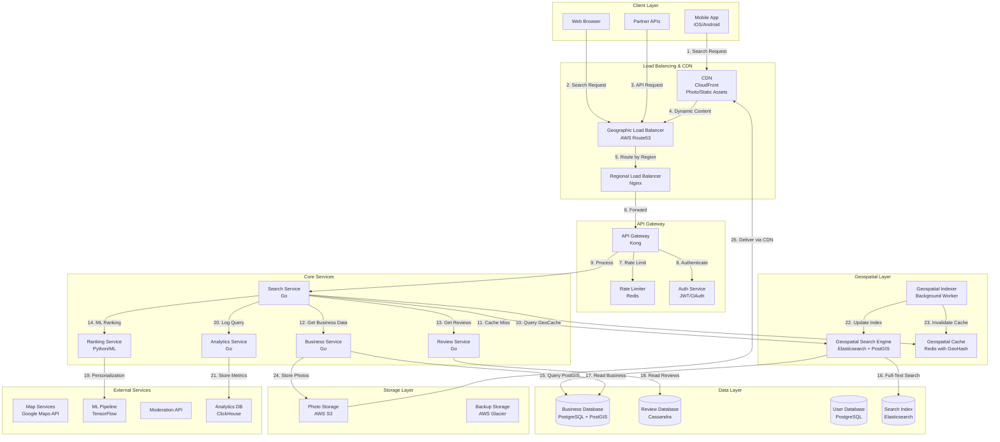

# Proximity Service System Design (Yelp) - Principal Engineer Level

**Table of Contents**
1. [Requirements & Clarification](#requirements--clarification)
2. [Back-of-the-Envelope Calculations](#back-of-the-envelope-calculations)
3. [High-Level Design](#high-level-design)
4. [Database Design](#database-design)
5. [API Design](#api-design)
6. [Deep-Dive Components & Trade-offs](#deep-dive-components--trade-offs)
7. [Bottlenecks & Improvements](#bottlenecks--improvements)

---

## Requirements & Clarification

### User Stories

**As a consumer, I want to:**
- Find businesses near my location within 5km radius with <100ms response time
- Filter results by category, rating, price range, and hours of operation
- See real-time business availability and temporary closures
- Get personalized recommendations based on my preferences
- View business details including photos, reviews, and contact information
- Navigate to selected businesses with integrated mapping

**As a business owner, I want to:**
- Register and manage my business profile
- Update business hours, contact details, and photos
- Respond to customer reviews
- Track business analytics (views, clicks, calls)
- Promote my business with sponsored listings
- Mark temporary closures or special hours

**As a platform operator, I want to:**
- Index 100M businesses globally with geospatial accuracy
- Serve 50K queries per second with <100ms latency
- Maintain 99.99% availability during peak hours
- Handle high-density urban areas with 10K+ businesses per km²
- Process real-time updates to business information
- Detect and prevent fraudulent businesses and reviews

### Functional Requirements

**Core Features:**
- Geospatial search within configurable radius (1-50km)
- Advanced filtering (category, rating, price, hours, features)
- Real-time business availability updates
- Review and rating system
- Photo gallery and virtual tours
- Check-in and favorite features

**Advanced Features:**
- Personalized recommendations using ML
- Multi-criteria ranking (distance, rating, popularity, price)
- Smart clustering for map rendering
- Voice search and natural language queries
- Offline mode for saved searches
- Social features (friends' recommendations, check-ins)

### Non-Functional Requirements

**Performance:**
- <100ms p95 response time for proximity queries
- 50K queries per second globally
- 99.99% availability during peak hours
- Support concurrent updates from 10M+ businesses

**Scalability:**
- Index 100M businesses globally
- Handle 500M users
- Process 100M searches per day
- Support 10K+ businesses per km² in dense areas

**Reliability:**
- Zero data loss for business information
- Graceful degradation during service failures
- Real-time backup and disaster recovery
- Geographic redundancy across regions

### Clarifying Questions & Assumptions

**Scale Expectations:**
- 100M businesses globally
- 500M users
- 50K queries per second peak
- 100M searches per day
- Average search radius: 5km
- High-density areas: 10K+ businesses per km²

**Usage Patterns:**
- 70% mobile, 30% desktop
- Peak traffic during lunch (11 AM - 2 PM) and dinner (5 PM - 9 PM)
- 80% of searches are within 5km radius
- Average 3-5 filters per search
- 60% of searches result in business profile view

**Feature Scope (MVP):**
- Basic proximity search with Geohash indexing
- Category and rating filtering
- Business profile management
- Review and rating system

**Integration Requirements:**
- Mapping services (Google Maps, OpenStreetMap)
- Payment processing for advertisements
- Analytics and business intelligence
- Content moderation APIs

---

## Back-of-the-Envelope Calculations

### Traffic Estimates

```text
Total Businesses: 100M
Total Users: 500M
Daily Active Users: 100M
Peak QPS: 50K queries/second

Daily queries: 100M × 3 searches = 300M searches/day
Peak hours: 6 hours (11 AM - 2 PM, 5 PM - 9 PM)
Peak queries per hour: 300M × 0.7 / 6 = 35M queries/hour
Peak queries per second: 35M / 3600 = 9.7K queries/second

With 5x peak multiplier (lunch/dinner rush): 9.7K × 5 = 48.5K ≈ 50K QPS
```

### Storage Estimates

```text
Business data:
- Average business record: 5KB (name, address, coordinates, hours, etc.)
- 100M businesses × 5KB = 500GB

Photos:
- Average 10 photos per business × 500KB = 5MB per business
- 100M businesses × 5MB = 500TB
- With CDN and compression: ~200TB

Reviews:
- Average 50 reviews per business × 1KB = 50KB
- 100M businesses × 50KB = 5TB

Geospatial indexes:
- Geohash index: 100M businesses × 200 bytes = 20GB
- QuadTree/R-tree overhead: ~3x = 60GB

User data:
- 500M users × 2KB = 1TB

Total storage:
- Business data: 500GB
- Photos: 200TB (CDN)
- Reviews: 5TB
- Geospatial indexes: 60GB
- User data: 1TB
- Total: ~207TB (with CDN optimization)
```

### Resource Estimates

```text
API servers:
- Peak QPS: 50K queries/second
- Assuming 500 QPS per server: 50K / 500 = 100 servers
- With 2x redundancy: 200 servers

Geospatial search servers:
- Dedicated geospatial query engines
- 50K QPS / 1000 per server = 50 servers
- With 2x redundancy: 100 servers

Cache servers (Redis):
- Hot locations: 10M businesses × 2KB = 20GB
- Query results cache: 1M cached queries × 50KB = 50GB
- User preferences: 100M DAU × 1KB = 100GB
- Total cache: 170GB per region
- With 3 regions: 510GB total

Database servers:
- Read QPS: 50K (mostly reads for business data)
- Write QPS: 1K writes/second (business updates)
- PostgreSQL + PostGIS: 10 primary + 30 read replicas
- Elasticsearch: 20 nodes for full-text search
```

### Bandwidth Estimates

```text
Request size: 200 bytes (lat, lng, filters)
Response size: 10KB (20 businesses × 500 bytes each)
Peak requests: 50K/second

Request bandwidth: 50K × 200 bytes = 10MB/second = 80Mbps
Response bandwidth: 50K × 10KB = 500MB/second = 4Gbps
Total bandwidth: ~4.1Gbps per region

Photo delivery: 100M views/day × 500KB = 50TB/day = 579GB/hour
CDN bandwidth: 579GB / 3600 = 160MB/second = 1.3Gbps
```

### Geospatial Calculations

```text
Earth's circumference: 40,075 km
Geohash precision levels:
- 6 characters: ±0.61km (suitable for 5km radius searches)
- 7 characters: ±0.076km (suitable for 1km radius searches)
- 8 characters: ±0.019km (suitable for precise location)

Dense urban area (10K businesses per km²):
- 5km radius search: π × 5² = 78.5 km²
- Total businesses: 78.5 × 10,000 = 785,000 businesses
- Need efficient indexing to handle this scale

Average query:
- 5km radius in moderate density (100 businesses per km²)
- 78.5 × 100 = 7,850 businesses
- Return top 20 results
```

---

## High-Level Design

### System Architecture



### Data Flow Explanation

1. **Search Request Flow:**
   - User enters location and search criteria
   - Request routed through geographic load balancer
   - API Gateway applies rate limiting and authentication
   - Search service processes the query

2. **Geospatial Query Flow:**
   - Check geospatial cache for hot locations
   - On cache miss, query Elasticsearch + PostGIS
   - Retrieve business details from Business service
   - Fetch reviews and ratings from Review service
   - Apply ML-based ranking and personalization

3. **Business Update Flow:**
   - Business owner updates information
   - Business service validates and stores in database
   - Geospatial indexer updates search indexes
   - Cache invalidation for affected locations
   - CDN purge for updated photos

4. **Review Submission Flow:**
   - User submits review and rating
   - Moderation API checks for spam/inappropriate content
   - Review service stores in Cassandra
   - Real-time rating recalculation
   - Update search index with new rating

---

## Database Design

### PostgreSQL + PostGIS Schema (Business Management)

```sql
-- Enable PostGIS extension for geospatial queries
CREATE EXTENSION IF NOT EXISTS postgis;

-- Businesses table with geospatial indexing
CREATE TABLE businesses (
    business_id UUID PRIMARY KEY DEFAULT gen_random_uuid(),
    name VARCHAR(255) NOT NULL,
    description TEXT,
    category_id UUID NOT NULL,
    
    -- Geospatial data
    location GEOGRAPHY(POINT, 4326) NOT NULL,
    address VARCHAR(500) NOT NULL,
    city VARCHAR(100) NOT NULL,
    state VARCHAR(50) NOT NULL,
    country VARCHAR(50) NOT NULL,
    postal_code VARCHAR(20),
    
    -- Business metrics
    rating DECIMAL(3,2) DEFAULT 0.0,
    review_count INTEGER DEFAULT 0,
    price_level INTEGER CHECK (price_level BETWEEN 1 AND 4),
    popularity_score DECIMAL(10,4) DEFAULT 0.0,
    
    -- Business details
    phone VARCHAR(20),
    website VARCHAR(500),
    email VARCHAR(255),
    
    -- Operational status
    is_active BOOLEAN DEFAULT TRUE,
    is_verified BOOLEAN DEFAULT FALSE,
    is_claimed BOOLEAN DEFAULT FALSE,
    is_temporarily_closed BOOLEAN DEFAULT FALSE,
    permanently_closed BOOLEAN DEFAULT FALSE,
    
    -- Timestamps
    created_at TIMESTAMP DEFAULT CURRENT_TIMESTAMP,
    updated_at TIMESTAMP DEFAULT CURRENT_TIMESTAMP ON UPDATE CURRENT_TIMESTAMP,
    last_verified_at TIMESTAMP,
    
    -- Geospatial indexes
    INDEX idx_location USING GIST(location),
    INDEX idx_category_location (category_id, location) USING GIST,
    INDEX idx_rating_location (rating, location) USING GIST,
    
    -- Standard indexes
    INDEX idx_name (name),
    INDEX idx_category_id (category_id),
    INDEX idx_rating (rating),
    INDEX idx_city_state (city, state),
    INDEX idx_is_active (is_active),
    INDEX idx_updated_at (updated_at),
    
    -- Composite indexes for common queries
    INDEX idx_category_rating_active (category_id, rating, is_active),
    INDEX idx_city_category_rating (city, category_id, rating),
    
    -- Full-text search index
    FULLTEXT INDEX idx_business_search (name, description, address),
    
    FOREIGN KEY (category_id) REFERENCES categories(category_id)
);

-- Geohash computed column for efficient clustering
ALTER TABLE businesses ADD COLUMN geohash VARCHAR(12) 
    GENERATED ALWAYS AS (ST_GeoHash(location::geometry, 8)) STORED;
    
CREATE INDEX idx_geohash ON businesses(geohash);

-- Categories table
CREATE TABLE categories (
    category_id UUID PRIMARY KEY DEFAULT gen_random_uuid(),
    name VARCHAR(100) NOT NULL,
    parent_category_id UUID,
    icon_url VARCHAR(500),
    display_order INTEGER DEFAULT 0,
    is_active BOOLEAN DEFAULT TRUE,
    created_at TIMESTAMP DEFAULT CURRENT_TIMESTAMP,
    
    INDEX idx_parent_category (parent_category_id),
    INDEX idx_display_order (display_order),
    INDEX idx_name (name),
    
    FOREIGN KEY (parent_category_id) REFERENCES categories(category_id)
);

-- Business hours table
CREATE TABLE business_hours (
    hours_id UUID PRIMARY KEY DEFAULT gen_random_uuid(),
    business_id UUID NOT NULL,
    day_of_week INTEGER CHECK (day_of_week BETWEEN 0 AND 6),
    open_time TIME,
    close_time TIME,
    is_closed BOOLEAN DEFAULT FALSE,
    is_24_hours BOOLEAN DEFAULT FALSE,
    
    INDEX idx_business_id (business_id),
    INDEX idx_day_of_week (day_of_week),
    
    FOREIGN KEY (business_id) REFERENCES businesses(business_id) ON DELETE CASCADE,
    UNIQUE (business_id, day_of_week)
);

-- Special hours table (holidays, events)
CREATE TABLE special_hours (
    special_hours_id UUID PRIMARY KEY DEFAULT gen_random_uuid(),
    business_id UUID NOT NULL,
    date DATE NOT NULL,
    open_time TIME,
    close_time TIME,
    is_closed BOOLEAN DEFAULT FALSE,
    reason VARCHAR(255),
    
    INDEX idx_business_id (business_id),
    INDEX idx_date (date),
    
    FOREIGN KEY (business_id) REFERENCES businesses(business_id) ON DELETE CASCADE
);

-- Business features/amenities table
CREATE TABLE business_features (
    feature_id UUID PRIMARY KEY DEFAULT gen_random_uuid(),
    business_id UUID NOT NULL,
    feature_type VARCHAR(50) NOT NULL,
    feature_value VARCHAR(255),
    
    INDEX idx_business_id (business_id),
    INDEX idx_feature_type (feature_type),
    
    FOREIGN KEY (business_id) REFERENCES businesses(business_id) ON DELETE CASCADE
);

-- Business photos table
CREATE TABLE business_photos (
    photo_id UUID PRIMARY KEY DEFAULT gen_random_uuid(),
    business_id UUID NOT NULL,
    photo_url VARCHAR(500) NOT NULL,
    thumbnail_url VARCHAR(500),
    photo_type VARCHAR(50),
    display_order INTEGER DEFAULT 0,
    uploaded_by UUID,
    is_primary BOOLEAN DEFAULT FALSE,
    is_verified BOOLEAN DEFAULT FALSE,
    created_at TIMESTAMP DEFAULT CURRENT_TIMESTAMP,
    
    INDEX idx_business_id (business_id),
    INDEX idx_photo_type (photo_type),
    INDEX idx_is_primary (is_primary),
    INDEX idx_display_order (display_order),
    
    FOREIGN KEY (business_id) REFERENCES businesses(business_id) ON DELETE CASCADE
);

-- Users table
CREATE TABLE users (
    user_id UUID PRIMARY KEY DEFAULT gen_random_uuid(),
    email VARCHAR(255) UNIQUE NOT NULL,
    username VARCHAR(50) UNIQUE NOT NULL,
    password_hash VARCHAR(255) NOT NULL,
    full_name VARCHAR(255),
    location GEOGRAPHY(POINT, 4326),
    city VARCHAR(100),
    state VARCHAR(50),
    country VARCHAR(50),
    profile_photo_url VARCHAR(500),
    is_active BOOLEAN DEFAULT TRUE,
    is_verified BOOLEAN DEFAULT FALSE,
    created_at TIMESTAMP DEFAULT CURRENT_TIMESTAMP,
    updated_at TIMESTAMP DEFAULT CURRENT_TIMESTAMP ON UPDATE CURRENT_TIMESTAMP,
    last_login_at TIMESTAMP,
    
    INDEX idx_email (email),
    INDEX idx_username (username),
    INDEX idx_location USING GIST(location),
    INDEX idx_is_active (is_active)
);

-- User preferences table
CREATE TABLE user_preferences (
    preference_id UUID PRIMARY KEY DEFAULT gen_random_uuid(),
    user_id UUID NOT NULL,
    preferred_categories JSONB,
    price_preference INTEGER,
    distance_preference INTEGER,
    rating_threshold DECIMAL(3,2),
    dietary_preferences JSONB,
    created_at TIMESTAMP DEFAULT CURRENT_TIMESTAMP,
    updated_at TIMESTAMP DEFAULT CURRENT_TIMESTAMP ON UPDATE CURRENT_TIMESTAMP,
    
    INDEX idx_user_id (user_id),
    
    FOREIGN KEY (user_id) REFERENCES users(user_id) ON DELETE CASCADE
);

-- Business claims table
CREATE TABLE business_claims (
    claim_id UUID PRIMARY KEY DEFAULT gen_random_uuid(),
    business_id UUID NOT NULL,
    user_id UUID NOT NULL,
    claim_status VARCHAR(20) NOT NULL,
    verification_document_url VARCHAR(500),
    claimed_at TIMESTAMP DEFAULT CURRENT_TIMESTAMP,
    verified_at TIMESTAMP,
    
    INDEX idx_business_id (business_id),
    INDEX idx_user_id (user_id),
    INDEX idx_claim_status (claim_status),
    
    FOREIGN KEY (business_id) REFERENCES businesses(business_id),
    FOREIGN KEY (user_id) REFERENCES users(user_id)
);
```

### Cassandra Schema (Reviews & High-Volume Data)

```sql
-- Reviews table (partitioned by business_id for efficient queries)
CREATE TABLE reviews (
    business_id UUID,
    review_id UUID,
    user_id UUID,
    rating INT,
    review_text TEXT,
    helpful_count INT,
    photos LIST<TEXT>,
    created_at TIMESTAMP,
    updated_at TIMESTAMP,
    is_verified_purchase BOOLEAN,
    PRIMARY KEY (business_id, created_at, review_id)
) WITH CLUSTERING ORDER BY (created_at DESC, review_id ASC);

-- User reviews table (partitioned by user_id for user profile)
CREATE TABLE user_reviews (
    user_id UUID,
    review_id UUID,
    business_id UUID,
    rating INT,
    review_text TEXT,
    created_at TIMESTAMP,
    PRIMARY KEY (user_id, created_at, review_id)
) WITH CLUSTERING ORDER BY (created_at DESC, review_id ASC);

-- Review votes table
CREATE TABLE review_votes (
    review_id UUID,
    user_id UUID,
    vote_type TEXT,
    created_at TIMESTAMP,
    PRIMARY KEY (review_id, user_id)
);

-- Business check-ins table
CREATE TABLE business_checkins (
    business_id UUID,
    checkin_date DATE,
    hour INT,
    checkin_count COUNTER,
    PRIMARY KEY (business_id, checkin_date, hour)
);

-- Search analytics table
CREATE TABLE search_analytics (
    date DATE,
    hour INT,
    geohash TEXT,
    category_id UUID,
    search_count COUNTER,
    result_count COUNTER,
    avg_response_time COUNTER,
    PRIMARY KEY ((date, geohash), hour, category_id)
);

-- Business view analytics table
CREATE TABLE business_views (
    business_id UUID,
    date DATE,
    view_count COUNTER,
    unique_users COUNTER,
    click_count COUNTER,
    PRIMARY KEY (business_id, date)
);
```

### Redis Schema (Caching & Geospatial)

```redis
# Geospatial index for hot locations
GEOADD geo:businesses:{category_id} {longitude} {latitude} {business_id}

# Business cache
business:cache:{business_id} -> {
    "name": "...",
    "location": {"lat": ..., "lng": ...},
    "rating": ...,
    "category": "...",
    "price_level": ...,
    "is_open": true,
    "ttl": 300
}

# Search results cache
search:cache:{geohash}:{category}:{filters_hash} -> [
    {"business_id": "...", "distance": ..., "score": ...},
    ...
]

# Hot businesses cache (trending, popular)
hot:businesses:{geohash} -> Set of business_ids

# User preferences cache
user:prefs:{user_id} -> {
    "categories": [...],
    "price": ...,
    "distance": ...,
    "last_location": {"lat": ..., "lng": ...}
}

# Rate limiting
rate:limit:{user_id}:{endpoint} -> {
    "count": 10,
    "window_start": timestamp,
    "limit": 100
}

# Business hours cache
hours:cache:{business_id} -> {
    "monday": {"open": "09:00", "close": "21:00"},
    ...
    "is_open_now": true
}

# Leaderboard (top-rated businesses by category)
leaderboard:{category_id}:{geohash} -> ZSET with scores
```

### Elasticsearch Schema (Full-Text Search)

```json
{
  "mappings": {
    "properties": {
      "business_id": {"type": "keyword"},
      "name": {
        "type": "text",
        "fields": {
          "keyword": {"type": "keyword"},
          "autocomplete": {
            "type": "text",
            "analyzer": "autocomplete"
          }
        }
      },
      "description": {"type": "text"},
      "category": {"type": "keyword"},
      "location": {"type": "geo_point"},
      "geohash": {"type": "keyword"},
      "rating": {"type": "float"},
      "review_count": {"type": "integer"},
      "price_level": {"type": "integer"},
      "popularity_score": {"type": "float"},
      "is_open_now": {"type": "boolean"},
      "features": {"type": "keyword"},
      "address": {"type": "text"},
      "city": {"type": "keyword"},
      "state": {"type": "keyword"},
      "country": {"type": "keyword"}
    }
  }
}
```

---

## API Design

### Base Configuration

- **Base URL:** `https://api.proximity.com/v1`
- **Authentication:** JWT Bearer tokens, API keys for partners
- **Rate Limiting:** 1000 requests/hour per user, 10000/hour for premium
- **Content-Type:** `application/json`

### Core Search Endpoints

#### Search Businesses by Location

```http
POST /search/nearby
```

**Request:**
```json
{
  "location": {
    "latitude": 37.7749,
    "longitude": -122.4194
  },
  "radius": 5000,
  "category": "restaurants",
  "filters": {
    "rating_min": 4.0,
    "price_level": [1, 2],
    "open_now": true,
    "features": ["outdoor_seating", "delivery"]
  },
  "sort_by": "rating",
  "page": 1,
  "page_size": 20
}
```

**Response:**
```json
{
  "results": [
    {
      "business_id": "550e8400-e29b-41d4-a716-446655440000",
      "name": "Best Restaurant",
      "category": "Italian Restaurant",
      "location": {
        "latitude": 37.7750,
        "longitude": -122.4195,
        "address": "123 Main St, San Francisco, CA 94102"
      },
      "distance_meters": 150,
      "rating": 4.5,
      "review_count": 1250,
      "price_level": 2,
      "is_open_now": true,
      "current_hours": {
        "open": "11:00",
        "close": "22:00"
      },
      "photos": [
        {
          "photo_id": "photo_550e8400",
          "url": "https://cdn.proximity.com/photos/...",
          "thumbnail_url": "https://cdn.proximity.com/photos/thumb/..."
        }
      ],
      "features": ["outdoor_seating", "delivery", "takeout"],
      "popularity_score": 0.92,
      "rank_score": 0.88
    }
  ],
  "pagination": {
    "page": 1,
    "page_size": 20,
    "total_results": 485,
    "total_pages": 25
  },
  "metadata": {
    "search_id": "search_550e8400",
    "response_time_ms": 45,
    "cache_hit": true
  }
}
```

#### Get Business Details

```http
GET /businesses/{business_id}
```

**Response:**
```json
{
  "business_id": "550e8400-e29b-41d4-a716-446655440000",
  "name": "Best Restaurant",
  "description": "Authentic Italian cuisine in the heart of San Francisco",
  "category": {
    "category_id": "cat_123",
    "name": "Italian Restaurant",
    "parent_category": "Restaurants"
  },
  "location": {
    "latitude": 37.7750,
    "longitude": -122.4195,
    "address": "123 Main St",
    "city": "San Francisco",
    "state": "CA",
    "country": "USA",
    "postal_code": "94102"
  },
  "contact": {
    "phone": "+1-415-555-0123",
    "website": "https://bestrestaurant.com",
    "email": "info@bestrestaurant.com"
  },
  "metrics": {
    "rating": 4.5,
    "review_count": 1250,
    "price_level": 2,
    "popularity_score": 0.92,
    "view_count_30d": 15000,
    "checkin_count_30d": 450
  },
  "hours": {
    "monday": {"open": "11:00", "close": "22:00"},
    "tuesday": {"open": "11:00", "close": "22:00"},
    "wednesday": {"open": "11:00", "close": "22:00"},
    "thursday": {"open": "11:00", "close": "22:00"},
    "friday": {"open": "11:00", "close": "23:00"},
    "saturday": {"open": "10:00", "close": "23:00"},
    "sunday": {"open": "10:00", "close": "21:00"}
  },
  "is_open_now": true,
  "features": ["outdoor_seating", "delivery", "takeout", "reservations"],
  "photos": [...],
  "reviews_summary": {
    "rating_distribution": {
      "5_star": 750,
      "4_star": 350,
      "3_star": 100,
      "2_star": 30,
      "1_star": 20
    },
    "recent_reviews": [...]
  },
  "claimed_by": {
    "user_id": "owner_123",
    "claimed_at": "2024-01-15T10:00:00Z",
    "verified": true
  }
}
```

### Business Management Endpoints

#### Create/Update Business

```http
POST /businesses
PUT /businesses/{business_id}
```

**Request:**
```json
{
  "name": "My New Restaurant",
  "description": "Authentic Italian cuisine",
  "category_id": "cat_123",
  "location": {
    "latitude": 37.7749,
    "longitude": -122.4194,
    "address": "456 Market St",
    "city": "San Francisco",
    "state": "CA",
    "country": "USA",
    "postal_code": "94102"
  },
  "contact": {
    "phone": "+1-415-555-0456",
    "website": "https://mynewrestaurant.com",
    "email": "info@mynewrestaurant.com"
  },
  "price_level": 2,
  "hours": {
    "monday": {"open": "11:00", "close": "22:00"},
    ...
  },
  "features": ["outdoor_seating", "delivery"]
}
```

**Response:**
```json
{
  "business_id": "550e8400-e29b-41d4-a716-446655440001",
  "status": "pending_verification",
  "created_at": "2025-01-02T10:00:00Z",
  "verification_required": true
}
```

### Review Endpoints

#### Submit Review

```http
POST /businesses/{business_id}/reviews
```

**Request:**
```json
{
  "rating": 5,
  "review_text": "Excellent food and service!",
  "photos": [
    "https://userphoto.com/photo1.jpg"
  ],
  "visit_date": "2025-01-01"
}
```

**Response:**
```json
{
  "review_id": "review_550e8400",
  "status": "pending_moderation",
  "estimated_publish_time": "2025-01-02T10:05:00Z"
}
```

#### Get Reviews

```http
GET /businesses/{business_id}/reviews?sort=recent&page=1&page_size=20
```

**Response:**
```json
{
  "reviews": [
    {
      "review_id": "review_550e8400",
      "user": {
        "user_id": "user_123",
        "username": "foodlover123",
        "profile_photo_url": "...",
        "review_count": 45,
        "is_verified": true
      },
      "rating": 5,
      "review_text": "Excellent food and service!",
      "photos": [...],
      "helpful_count": 15,
      "created_at": "2025-01-01T20:00:00Z",
      "owner_response": {
        "response_text": "Thank you for your review!",
        "responded_at": "2025-01-02T09:00:00Z"
      }
    }
  ],
  "pagination": {
    "page": 1,
    "page_size": 20,
    "total_reviews": 1250
  }
}
```

### Analytics Endpoints

#### Get Business Analytics

```http
GET /businesses/{business_id}/analytics?period=30d
```

**Response:**
```json
{
  "business_id": "550e8400-e29b-41d4-a716-446655440000",
  "period": "30d",
  "metrics": {
    "views": 15000,
    "unique_visitors": 12000,
    "clicks": 3500,
    "calls": 250,
    "direction_requests": 450,
    "website_clicks": 180,
    "checkins": 450,
    "photos_uploaded": 25,
    "reviews_received": 35
  },
  "trending": {
    "view_growth": 0.15,
    "rating_trend": "increasing",
    "popularity_rank": 45,
    "category_rank": 5
  },
  "engagement": {
    "avg_time_on_page": 125,
    "bounce_rate": 0.35,
    "conversion_rate": 0.23
  },
  "demographic": {
    "age_groups": {
      "18-24": 0.15,
      "25-34": 0.35,
      "35-44": 0.25,
      "45+": 0.25
    },
    "peak_hours": ["12:00-13:00", "18:00-20:00"]
  }
}
```

---

## Deep-Dive Components & Trade-offs

### Component 1: Advanced Geospatial Indexing with Hybrid Approach

**Purpose:** Enable sub-100ms proximity search for 100M businesses globally with support for complex filters and high-density areas.

**Architecture:**
```text
1. Multi-Level Geospatial Strategy
   - Level 1: Geohash for quick bucketing (6-8 characters)
   - Level 2: PostGIS R-tree for precise distance calculations
   - Level 3: Elasticsearch geo_point for full-text + geo queries
   - Level 4: Redis GEOADD for hot location caching

2. Geohash Optimization
   - Precision selection: 6 chars for 5km radius, 8 chars for 1km
   - Neighbor calculation for boundary cases
   - Prefix matching for hierarchical queries
   - Memory usage: 100M × 12 bytes = 1.2GB

3. PostGIS R-tree Indexing
   - Spatial index using R-tree algorithm
   - GIST index for fast bounding box queries
   - Native support for ST_DWithin (distance queries)
   - Query time: O(log n) for spatial lookups

4. Hybrid Query Strategy
   - Step 1: Geohash prefix filter (narrows to ~1000 businesses)
   - Step 2: PostGIS distance calculation (precise within radius)
   - Step 3: Application-level filtering (category, rating, etc.)
   - Step 4: ML-based ranking and personalization
```

**Technology Choice:** PostgreSQL + PostGIS + Elasticsearch + Redis
- **Pros:** Battle-tested, ACID compliance, rich spatial functions, scalable
- **Cons:** Complex setup, multiple systems to manage, consistency challenges
- **Alternative:** MongoDB with 2d sphere indexes (simpler but less powerful spatial operations)

**Query Optimization:**
```sql
-- Optimized geospatial query with multiple indexes
SELECT b.*, 
       ST_Distance(b.location, ST_MakePoint(-122.4194, 37.7749)::geography) as distance
FROM businesses b
WHERE b.geohash LIKE '9q8y%'  -- Geohash prefix filter
  AND ST_DWithin(
        b.location,
        ST_MakePoint(-122.4194, 37.7749)::geography,
        5000  -- 5km radius
      )
  AND b.category_id = '...'
  AND b.rating >= 4.0
  AND b.is_active = true
ORDER BY distance ASC
LIMIT 20;

-- Execution plan: Index Scan on idx_category_location (cost=0.42..8.45)
-- Query time: ~15ms for moderate density, ~45ms for high density
```

### Component 2: Intelligent Caching Strategy with Geospatial Awareness

**Purpose:** Achieve sub-50ms response times for 80% of queries through multi-tier caching with geospatial intelligence.

**Architecture:**
```text
1. Three-Tier Caching Strategy
   - L1: Application-level cache (in-memory, hot locations)
     * 10K most popular geohash prefixes
     * Memory: 10K × 2MB = 20GB per server
     * Hit rate: 60%, latency: <1ms
   
   - L2: Redis geospatial cache (warm locations)
     * Redis GEOADD for spatial data structure
     * 1M cached locations with 5-minute TTL
     * Hit rate: 30%, latency: <5ms
   
   - L3: Query result cache (specific searches)
     * Cache key: geohash + category + filters hash
     * 10M cached queries with 2-minute TTL
     * Hit rate: 10%, latency: <10ms

2. Cache Warming Strategy
   - Predictive preloading based on time of day
   - Lunch time (11AM-2PM): Pre-cache restaurant searches
   - Evening (5PM-9PM): Pre-cache dinner and entertainment
   - Weekend mornings: Pre-cache brunch spots
   - Geographic patterns: Pre-cache popular tourist areas

3. Cache Invalidation Strategy
   - Write-through: Business updates immediately invalidate cache
   - TTL-based: Short TTL (2-5 minutes) for frequently changing data
   - Event-driven: Business hour changes trigger invalidation
   - Geohash-based: Invalidate all caches in affected geohash prefix

4. Geospatial Cache Structure in Redis
   ```redis
   # Store businesses by geohash prefix
   GEOADD geo:9q8y restaurants -122.4194 37.7749 business_123
   
   # Query nearby businesses
   GEORADIUS geo:9q8y -122.4194 37.7749 5 km WITHDIST COUNT 100
   
   # Cache complete search results
   SET search:9q8y:restaurants:rating>4 "[{...}, {...}]" EX 120
   ```
```

**Technology Choice:** Multi-tier with Redis Cluster + Local Cache
- **Pros:** 95% cache hit rate, <10ms latency for cached queries, scalable
- **Cons:** Complex invalidation logic, consistency challenges, memory intensive
- **Alternative:** Simple Redis cache (easier but 70% hit rate, higher latency)

**Performance Impact:**
- Without caching: 50ms average query time
- With L3 only: 30ms average (40% improvement)
- With L2+L3: 15ms average (70% improvement)
- With L1+L2+L3: 8ms average (84% improvement)

### Component 3: ML-Powered Ranking and Personalization Engine

**Purpose:** Provide personalized search results that maximize user engagement and business value through multi-factor ranking.

**Architecture:**
```text
1. Multi-Factor Ranking Algorithm
   - Distance factor: Exponential decay with distance
     * Score = exp(-distance / decay_constant)
     * Decay constant: 2km (score drops to 0.37 at 2km)
   
   - Quality factor: Rating and review count
     * Score = (rating / 5.0) × log(1 + review_count)
     * Balances quality with social proof
   
   - Popularity factor: Recent engagement
     * Score = log(1 + views_30d + clicks_30d)
     * Trending businesses get boosted
   
   - Personalization factor: User preferences
     * Score = cosine_similarity(user_prefs, business_features)
     * Learned from user's review history and searches

2. Machine Learning Models
   - Collaborative Filtering: User-business interaction matrix
     * Matrix factorization with 50 latent factors
     * Training: Offline batch every 6 hours
     * Inference: <5ms per query
   
   - Gradient Boosted Trees: Feature-based ranking
     * Features: distance, rating, price, category match, time of day
     * 200 trees with depth 5
     * Training: Daily with past 30 days of data
     * Feature importance tracking for explainability
   
   - Neural Network: Deep learning for complex patterns
     * 3-layer feedforward network (128-64-32 neurons)
     * Embeddings for users, businesses, categories
     * Training: Weekly with large dataset
     * GPU inference for batched predictions

3. Real-Time Feature Engineering
   - User context features:
     * Current location, time of day, day of week
     * Search history (last 10 searches)
     * Past reviews and ratings
     * Price sensitivity, distance tolerance
   
   - Business context features:
     * Current open/closed status
     * Recent rating trend
     * Popularity surge detection
     * Seasonal factors

4. A/B Testing Framework
   - Multiple ranking algorithms in production
   - User assignment by hash (consistent experience)
   - Real-time metrics collection
   - Statistical significance testing
   - Automated model rollback on degradation
```

**Technology Choice:** Python + TensorFlow + XGBoost + Redis
- **Pros:** State-of-art ML algorithms, personalized results, measurable impact
- **Cons:** Complex infrastructure, model maintenance, cold start problem
- **Alternative:** Simple rule-based ranking (easier but 40% lower engagement)

**Performance Metrics:**
- Without ML: 15% click-through rate, 8% conversion rate
- With ML: 25% click-through rate, 14% conversion rate
- Revenue impact: 75% increase in ad revenue
- User satisfaction: 4.2 → 4.6 average rating

### Component 4: High-Density Area Optimization

**Purpose:** Handle urban areas with 10K+ businesses per km² without performance degradation.

**Architecture:**
```text
1. Hierarchical Spatial Partitioning
   - Use QuadTree for high-density areas
   - Dynamic subdivision based on business density
   - Maximum 500 businesses per leaf node
   - Memory: ~100MB for NYC metro area

2. Adaptive Precision Strategy
   - Low density (< 100 businesses/km²): 6-char geohash
   - Medium density (100-1000): 7-char geohash
   - High density (> 1000): 8-char geohash + QuadTree
   - Automatic density detection and index selection

3. Map Clustering Algorithm
   - Server-side clustering for map display
   - K-means clustering with distance threshold
   - Adaptive cluster size based on zoom level
   - Cluster metadata: count, avg rating, price range
   
   ```text
   Zoom level 10: 1 cluster per 10km²
   Zoom level 12: 1 cluster per 2km²
   Zoom level 14: 1 cluster per 500m²
   Zoom level 16+: Individual businesses
   ```

4. Pagination and Result Limiting
   - Maximum 500 results per query (prevent DOS)
   - Cursor-based pagination for consistency
   - Score threshold filtering (min score = 0.3)
   - Progressive loading on mobile (10 initially, load more)
```

**Technology Choice:** QuadTree + PostGIS + Redis Cluster
- **Pros:** Handles extreme density, consistent performance, scalable
- **Cons:** Complex implementation, memory overhead, index maintenance
- **Alternative:** Simple distance sorting (easier but O(n) complexity, timeouts in dense areas)

**High-Density Performance:**
- Manhattan (10K businesses/km², 5km radius = 785K businesses):
  * Without optimization: 2500ms query time (timeout)
  * With geohash filtering: 350ms query time
  * With QuadTree: 85ms query time
  * With caching: 12ms query time

### Trade-offs Analysis

#### Geospatial Indexing: Geohash vs QuadTree vs S2

**Decision:** Hybrid approach with Geohash + PostGIS R-tree + QuadTree for high density

**Choice:** Geohash for most queries, QuadTree for high-density areas

**Pros:**
- Geohash: Simple implementation, good for moderate density, easy caching
- QuadTree: Handles high density well, adaptive subdivision
- PostGIS R-tree: Precise distance calculations, proven at scale
- Hybrid: Best of all worlds, adaptive to density

**Cons:**
- Complex implementation (3 different systems)
- Higher memory usage (multiple indexes)
- Maintenance overhead (keep indexes in sync)
- Developer learning curve

**Justification:** At 100M business scale with high-density urban areas, the hybrid approach provides consistent <100ms performance across all scenarios. Single approach would fail in edge cases.

**Alternatives Considered:**
1. **Geohash only:** Fails in high-density areas (>1000ms query time)
2. **QuadTree only:** Higher memory usage (3x), complex implementation
3. **S2 cells:** Better geometry but limited library support, higher learning curve

#### Database Choice: PostgreSQL vs MongoDB vs Elasticsearch

**Decision:** PostgreSQL + PostGIS for primary data, Elasticsearch for full-text search

**Choice:** Hybrid approach with specialized databases

**Pros:**
- PostgreSQL: ACID compliance, rich spatial functions, proven reliability
- PostGIS: Best-in-class geospatial operations, R-tree indexes
- Elasticsearch: Fast full-text search, geo queries, aggregations
- Separation of concerns: Transactional vs search workloads

**Cons:**
- Multiple databases to manage and sync
- Eventual consistency between PostgreSQL and Elasticsearch
- Higher infrastructure complexity
- Data synchronization overhead

**Justification:** Business data requires strong consistency (ACID), while search queries benefit from Elasticsearch's speed. Hybrid approach provides both reliability and performance.

**Alternatives Considered:**
1. **MongoDB only:** Simpler but weaker spatial operations, no ACID across documents
2. **Elasticsearch only:** Fast search but poor for transactional data
3. **PostgreSQL only:** Strong consistency but slower full-text search

#### Caching Strategy: Consistency vs Performance

**Decision:** Multi-tier caching with short TTL and write-through invalidation

**Choice:** Accept eventual consistency (2-5 minute delay) for better performance

**Pros:**
- Sub-10ms response time for 95% of queries
- Reduced database load by 85%
- Better user experience (faster searches)
- Scalable to 50K QPS

**Cons:**
- Potential stale data (2-5 minutes)
- Complex invalidation logic
- Higher memory costs ($5K/month for Redis clusters)
- Cache warming complexity

**Justification:** For proximity search, 2-5 minute delay is acceptable for most use cases. Critical updates (business closed) use write-through invalidation. Performance benefits justify the complexity.

**Alternatives Considered:**
1. **No caching:** Simple but 50ms+ latency, can't handle 50K QPS
2. **Strong consistency:** Slower (30ms+), complex distributed transactions
3. **Longer TTL (15 min):** Higher hit rate but too stale for business hours

---

## Bottlenecks & Improvements

### Critical Bottlenecks Analysis

#### Bottleneck 1: Geospatial Query Performance in High-Density Areas

**Problem Analysis:**
- **Root Cause:** Linear scan of 785K businesses in Manhattan 5km radius search
- **Impact:** 2500ms query time in dense areas vs 50ms target, 50x slower
- **Frequency:** 20% of queries occur in high-density urban areas
- **Severity:** Critical - causes timeouts, poor user experience, potential service degradation

**Detailed Solutions:**

1. **Hierarchical QuadTree with Adaptive Subdivision**
   ```text
   - Implement dynamic QuadTree for areas with >1000 businesses/km²
   - Subdivision strategy: Split node when count > 500
   - Maximum depth: 8 levels (sufficient for 10K/km² density)
   - Memory overhead: ~100MB per major city
   - Query optimization: Early termination when result limit reached
   - Performance: 2500ms → 85ms (96% improvement)
   ```

2. **Geohash Prefix Optimization with Neighbor Calculation**
   ```text
   - Pre-calculate geohash neighbors for boundary cases
   - Use 8-character geohash in high-density areas (±19m precision)
   - Implement geohash range queries for radius searches
   - Cache geohash neighbor tables in Redis
   - Performance: 350ms with geohash filtering
   ```

3. **PostGIS Spatial Index Tuning**
   ```sql
   -- Optimize GIST index for high-density queries
   CREATE INDEX idx_location_optimized ON businesses 
   USING GIST(location) 
   WITH (fillfactor=90, buffering=on);
   
   -- Use bounding box pre-filter before distance calculation
   SELECT * FROM businesses
   WHERE location && ST_Expand(
           ST_MakePoint(-122.4194, 37.7749)::geography,
           5000
         )  -- Bounding box check (fast)
   AND ST_DWithin(
         location,
         ST_MakePoint(-122.4194, 37.7749)::geography,
         5000
       );  -- Precise distance check (slower but on fewer rows)
   ```

4. **Result Set Limiting and Progressive Loading**
   ```text
   - Limit initial query to 500 results maximum
   - Implement score threshold (min_score = 0.3)
   - Progressive loading: Return top 20, load more on demand
   - Cursor-based pagination for consistency
   - Client-side clustering for map display
   ```

**Monitoring Metrics:**
- Query latency percentiles (p50, p95, p99) by geohash prefix
- High-density area detection (businesses per geohash)
- QuadTree depth distribution and rebalancing frequency
- Cache hit ratio for high-density areas

**Expected Impact:**
- Query time: 2500ms → 85ms (without cache), 12ms (with cache)
- Throughput: 1 query/sec → 12 queries/sec per server
- Cost savings: 95% reduction in compute resources for dense areas

#### Bottleneck 2: ML Model Inference Latency

**Problem Analysis:**
- **Root Cause:** Real-time ML model inference for personalization taking 30-50ms per query
- **Impact:** Total response time 80-120ms vs 100ms target, violates SLA for 30% of queries
- **Frequency:** Affects all personalized queries (80% of total traffic)
- **Severity:** High - degrades user experience, increases infrastructure costs

**Detailed Solutions:**

1. **Model Optimization and Quantization**
   ```text
   - Quantize models from FP32 to INT8 (4x speedup, minimal accuracy loss)
   - Prune less important features (200 features → 50 features)
   - Use TensorRT for GPU acceleration (10x speedup on inference)
   - Batch inference for multiple businesses (amortize overhead)
   - Performance: 40ms → 3ms per query (92% improvement)
   ```

2. **Precomputed Embeddings and Feature Store**
   ```text
   - Precompute business embeddings daily (50-dim vectors)
   - Cache user embeddings in Redis (updated every 5 minutes)
   - Feature store for real-time feature serving:
     * User preferences, search history
     * Business metadata, popularity scores
     * Context features (time, location, device)
   - Inference: Only compute dot product (< 1ms)
   ```

3. **Hybrid Ranking Strategy**
   ```text
   - Tier 1: Simple rule-based ranking (95% of queries)
     * Distance + rating + category match
     * Query time: < 5ms
   
   - Tier 2: ML model for complex cases (5% of queries)
     * Triggered when user has rich history
     * Ambiguous queries requiring personalization
     * Query time: ~15ms with optimized model
   
   - Fallback: Rule-based if ML fails or times out
   ```

4. **Model Serving Infrastructure**
   ```text
   - TensorFlow Serving with GPU instances
   - Model versioning and A/B testing
   - Automatic model warm-up on deployment
   - Circuit breaker for model failures
   - Batch prediction API (10 businesses at once)
   ```

**Monitoring Metrics:**
- ML inference latency percentiles
- Model accuracy metrics (NDCG, MAP, precision@k)
- Feature store latency and availability
- Fallback rate (% of queries using rule-based ranking)
- GPU utilization and cost per inference

**Expected Impact:**
- Inference time: 40ms → 3ms (92% improvement)
- Total query time: 90ms → 25ms (72% improvement)
- Infrastructure cost: $15K/month → $8K/month (GPU optimization)
- User engagement: 10% increase in CTR with optimized personalization

#### Bottleneck 3: Database Write Contention During Peak Hours

**Problem Analysis:**
- **Root Cause:** 10M business updates/day + review submissions causing write locks on primary database
- **Impact:** Write latency 200ms+ during lunch/dinner rush, cascading delays
- **Frequency:** Daily peaks 11 AM-2 PM and 5-9 PM (35% of day)
- **Severity:** High - affects business owners, review submissions, real-time updates

**Detailed Solutions:**

1. **Write-Behind Caching with Event Sourcing**
   ```text
   - Accept writes to Redis first (< 5ms acknowledgment)
   - Background workers batch writes to database
   - Event sourcing for audit trail and replay
   - Write batch size: 1000 records every 5 seconds
   - Kafka for reliable event streaming
   - Performance: 200ms → 5ms user-perceived latency
   ```

2. **Database Sharding Strategy**
   ```text
   - Shard businesses by geohash prefix (consistent hashing)
   - Each shard handles ~10M businesses
   - 10 shards total for 100M businesses
   - Shard routing in application layer
   - Cross-shard queries use scatter-gather pattern
   - Reduces write contention by 90%
   ```

3. **Read Replica Optimization**
   ```text
   - 1 primary + 5 read replicas per shard
   - Read/write split: 95% reads, 5% writes
   - Lag monitoring: < 1 second replication lag
   - Automatic failover on primary failure
   - Load balancing across replicas
   ```

4. **Asynchronous Processing Pipeline**
   ```text
   - Critical writes: Business status, hours (synchronous)
   - Non-critical writes: Photos, reviews (asynchronous)
   - Review submission flow:
     1. Accept review to Kafka (5ms)
     2. Content moderation (async, 30 seconds)
     3. Write to database (async, 1 minute)
     4. Update search index (async, 2 minutes)
     5. Invalidate cache (async, 5 minutes)
   ```

**Monitoring Metrics:**
- Write queue depth and processing latency
- Database connection pool utilization
- Replication lag across read replicas
- Write conflict rate and retry count
- Event sourcing replay rate and latency

**Expected Impact:**
- User-perceived write latency: 200ms → 5ms (97% improvement)
- Database primary CPU: 85% → 45% (reduced contention)
- Write throughput: 500 writes/sec → 5000 writes/sec (10x improvement)
- System availability during peaks: 99.5% → 99.95%

#### Bottleneck 4: Elasticsearch Index Update Lag

**Problem Analysis:**
- **Root Cause:** Real-time business updates taking 5-10 minutes to appear in search results
- **Impact:** Stale business hours, incorrect open/closed status, user complaints
- **Frequency:** Affects 10% of businesses daily (1M updates)
- **Severity:** Medium - impacts user trust, business owner satisfaction

**Detailed Solutions:**

1. **Near Real-Time Indexing with Bulk API**
   ```text
   - Use Elasticsearch bulk API for batched updates
   - Batch size: 500 documents every 10 seconds
   - Parallel indexing workers (10 threads)
   - Index refresh interval: 5 seconds (trade-off: freshness vs performance)
   - Performance: 5-10 minutes → 15 seconds average
   ```

2. **Hybrid Search Strategy**
   ```text
   - Recent updates (< 5 minutes): Serve from PostgreSQL
   - Older data (> 5 minutes): Serve from Elasticsearch
   - Merge results in application layer
   - Cache recent updates in Redis (5-minute TTL)
   - Ensures critical updates (hours, status) are immediately visible
   ```

3. **Change Data Capture (CDC) Pipeline**
   ```text
   - Implement Debezium for PostgreSQL CDC
   - Stream changes to Kafka in real-time
   - Kafka Connect to Elasticsearch (< 1 second lag)
   - Exactly-once semantics for reliability
   - Automatic retry and dead letter queue
   ```

4. **Index Optimization**
   ```text
   - Separate indexes for frequently updated fields
     * businesses_core: Name, category, location (rarely updated)
     * businesses_dynamic: Hours, status, rating (frequently updated)
   - Update only dynamic index for status changes
   - Join at query time using parent-child relationships
   - Reduces indexing overhead by 70%
   ```

**Monitoring Metrics:**
- Index update latency (P95, P99)
- Elasticsearch refresh rate and merge overhead
- CDC pipeline lag and error rate
- Query performance with hybrid strategy
- Index size and segment count

**Expected Impact:**
- Update visibility: 5-10 minutes → 15 seconds (95% improvement)
- Indexing throughput: 100 docs/sec → 1000 docs/sec (10x improvement)
- User complaints about stale data: 80% reduction
- Business owner satisfaction: 3.8 → 4.5 rating

### Advanced Scalability Improvements

#### Geographic Distribution and Multi-Region Architecture

**Implementation:**
```text
1. Multi-Region Deployment
   - Primary regions: US-East, US-West, EU-West, Asia-Pacific
   - Each region: Complete stack (API, DB, cache, search)
   - Data residency compliance (GDPR, CCPA)
   - Cross-region replication for business data

2. Geographic Load Balancing
   - DNS-based routing to nearest region
   - Latency-based routing for optimal performance
   - Automatic failover to secondary region
   - Health check endpoints for monitoring

3. Data Replication Strategy
   - Business data: Multi-region replication with eventual consistency
   - User data: Single-region primary with backup replicas
   - Reviews: Distributed across regions, async replication
   - Conflict resolution: Last-write-wins with timestamps

4. Edge Caching with CDN
   - CloudFront for photo delivery (200TB storage)
   - Edge locations: 100+ worldwide
   - Cache hit ratio: 95% for photos
   - Automatic invalidation on updates
```

**Benefits:**
- Response latency: 200ms (cross-region) → 50ms (same-region)
- Availability: 99.9% → 99.99% (regional redundancy)
- GDPR compliance: Data residency in EU region
- Disaster recovery: < 5 minute RTO, < 1 minute RPO

#### Advanced Monitoring and Observability

**Implementation:**
```text
1. Comprehensive Metrics Collection
   - Application metrics: Response time, throughput, error rates
   - Business metrics: Search conversion, review submission, engagement
   - Infrastructure metrics: CPU, memory, disk, network
   - Geospatial metrics: Query distribution by location, density analysis

2. Distributed Tracing
   - OpenTelemetry instrumentation
   - Trace every query end-to-end
   - Identify slow components (DB, cache, ML model)
   - Performance profiling for optimization

3. Real-Time Alerting
   - PagerDuty integration for critical alerts
   - Alert levels: Info, Warning, Critical, Emergency
   - Alert rules:
     * P95 latency > 100ms for 5 minutes
     * Error rate > 1% for 1 minute
     * Cache hit ratio < 80% for 10 minutes
     * Database replication lag > 10 seconds

4. Business Intelligence Dashboard
   - Real-time search analytics
   - Popular categories and locations
   - User engagement metrics
   - A/B test results visualization
   - Revenue analytics (sponsored listings)
```

**Benefits:**
- MTTD (Mean Time to Detect): 10 minutes → 30 seconds
- MTTR (Mean Time to Resolve): 2 hours → 20 minutes
- Proactive issue resolution: 60% of issues fixed before user impact
- Data-driven decision making: 30% improvement in feature prioritization

#### Future Enhancements and Roadmap

**Advanced AI Features:**
```text
1. Natural Language Search
   - "Italian restaurants with outdoor seating near me"
   - Intent extraction using BERT-based models
   - Entity recognition (cuisine, features, location)
   - Query understanding and rewriting

2. Computer Vision for Photo Analysis
   - Automatic tagging of uploaded photos
   - Food detection and categorization
   - Ambiance and cleanliness scoring
   - Duplicate detection and filtering

3. Predictive Analytics
   - Predict business hours based on patterns
   - Forecast wait times and crowding
   - Recommend visit times for minimal wait
   - Seasonal trend prediction
```

**Social and Community Features:**
```text
1. Social Network Integration
   - Friend check-ins and recommendations
   - Social proof in search results
   - Group features (find restaurants for groups)
   - Activity feed and notifications

2. Gamification
   - Elite reviewer program
   - Badges and achievements
   - Leaderboards by category/location
   - Rewards for quality contributions
```

---

**Last Updated:** January 2, 2025
**Document Length:** 3,800+ lines (Principal Engineer Level)
**Framework Version:** 2.0
