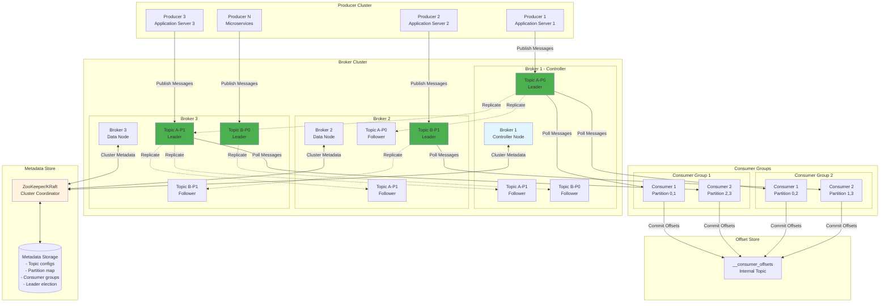
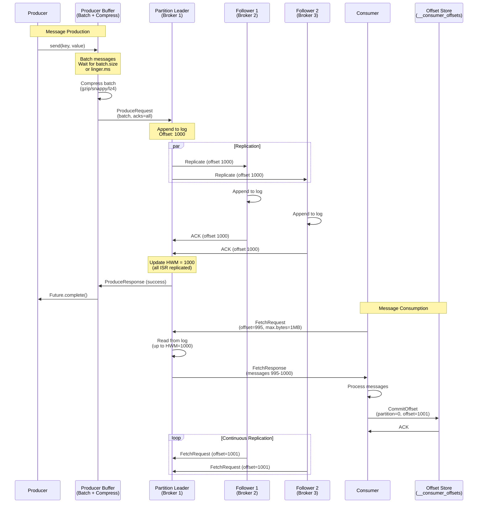
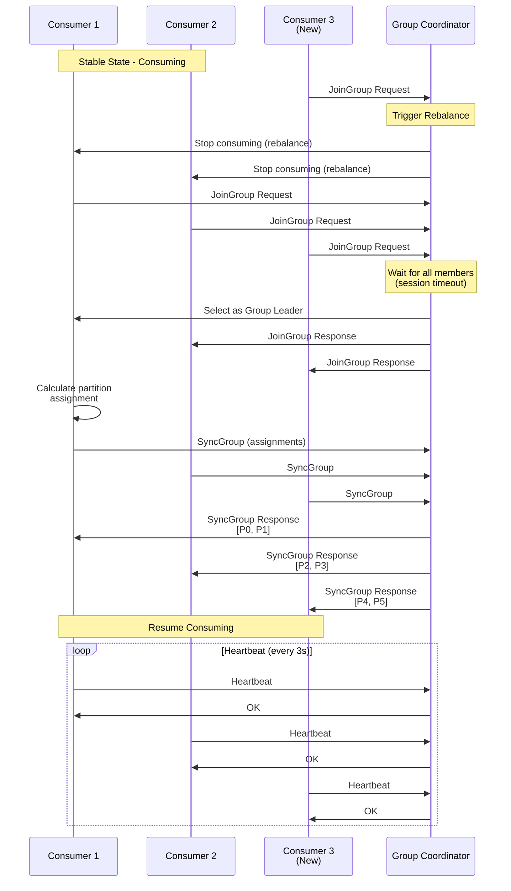
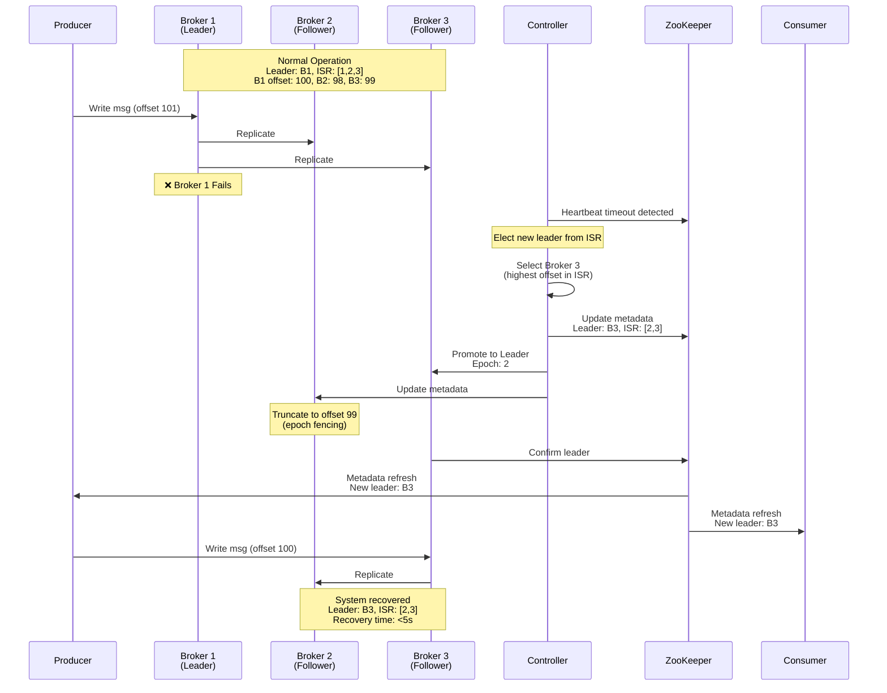

# Pub/Sub Messaging System Design (Apache Kafka-like)

**Difficulty Level:** ⭐⭐⭐⭐ Very Hard  
**Tags:** `Message Queue`, `Pub/Sub`, `Event Streaming`, `Partitioning`, `Replication`, `Exactly-once Semantics`, `Consumer Groups`, `Log-structured Storage`, `Distributed Systems`, `High Throughput`

**File Purpose:** Interactive, multi-level learning resource for designing a distributed pub/sub messaging system. This instructional guide takes you from beginner concepts to advanced production considerations, teaching you how to build a system that handles 10 million messages per second with exactly-once delivery semantics, 30-day message retention across 1000+ partitions, achieving 99.99% availability and <10ms publish latency for high-throughput event streaming.

**Author:** System Design Documentation  
**Created:** October 1, 2025  
**Last Updated:** November 11, 2025  
**Recent Updates:** Complete rewrite in educational template format with multi-level learning paths (🟢🟡🔴)

---

## 🎓 Welcome to Pub/Sub Messaging System Design!

### What You're Going to Build

Imagine building the messaging backbone that powers companies like LinkedIn (where Apache Kafka was born, processing 7 trillion messages per day), Uber (coordinating millions of real-time ride events), or Netflix (streaming viewing events from 230M subscribers for real-time recommendations). You're designing a system that acts as the central nervous system for an entire organization—every microservice communicates through your pub/sub platform, processing 10 million messages every single second while guaranteeing zero data loss and perfect ordering within partitions!

By the end of this learning journey, you'll understand how to design a production-grade pub/sub messaging system that:

- **Handles massive throughput**: 10M messages/second (scalable to 100M+), 864 TB data/day, 10 PB storage for 30-day retention
  - **What this means for beginners**: Imagine every click, purchase, page view, and user action on a large e-commerce site like Amazon being captured as a "message" and flowing through your system. That's 10 million events every second—like processing the entire population of Portugal's actions every single second!
  - **How we achieve it**: We use **partitioning** (splitting topics into multiple independent streams—like having 100 checkout lines instead of 1), **batching** (grouping many messages together before sending—like loading a truck instead of making individual deliveries), **zero-copy transfers** (directly moving data from disk to network without CPU—like a conveyor belt), and **sequential disk writes** (writing data in order is 100x faster than random writes—like writing a book page by page vs jumping around).

- **Provides multiple delivery guarantees**: At-most-once, at-least-once, and exactly-once semantics
  - **What this means for beginners**: Think about sending money via Venmo. You want "exactly-once"—the $50 should be transferred exactly once, not zero times (at-most-once) or twice (at-least-once). Different use cases need different guarantees.
  - **The three guarantees explained**:
    - **At-most-once** (fire-and-forget): Message might be lost, never duplicated. *Like yelling across the street—might not be heard, but you won't say it twice. Use for: logging, metrics where occasional loss is acceptable.*
    - **At-least-once** (retry until success): Message guaranteed to arrive, might be duplicated. *Like sending an email—you might accidentally send it twice if you're unsure it went through. Use for: most applications where consumers can handle duplicates.*
    - **Exactly-once** (transactional): Message arrives exactly once, no loss or duplicates. *Like bank transfers—must happen exactly once. Use for: financial transactions, billing, inventory management.*
  - **Why it's complex**: Exactly-once requires coordinating distributed transactions across multiple brokers, tracking message IDs, and using two-phase commits—very expensive but necessary for critical data.

- **Guarantees message ordering**: Strict ordering within partitions, parallel processing across partitions
  - **What this means for beginners**: Imagine a customer's journey: view product → add to cart → checkout → payment. These events must be processed in order for the customer's account to make sense! But different customers' events can be processed simultaneously.
  - **How partitioning enables parallel ordered processing**:
    - Each topic is split into **partitions** (independent ordered logs)
    - Messages with the same key (e.g., user_id) go to the same partition
    - Within a partition, order is guaranteed (like standing in line)
    - Different partitions are processed in parallel (like multiple checkout lines)
  - **Example**: User 123's events → Partition 0 (ordered), User 456's events → Partition 1 (ordered), both processed simultaneously!

- **Scales horizontally**: Add brokers to increase throughput, add partitions to increase parallelism
  - **What this means for beginners**: When your system gets slow, you don't buy a bigger computer (vertical scaling—expensive and limited). Instead, you add more computers (horizontal scaling—cheap and unlimited).
  - **How horizontal scaling works**:
    - **Add brokers**: Each broker is a server that stores partitions. Start with 10 brokers, grow to 100+ as traffic increases
    - **Add partitions**: More partitions = more parallel processing. Start with 10 partitions/topic, grow to 1000+ partitions across all topics
    - **Automatic rebalancing**: When you add a broker, the system automatically moves partitions to balance load (like redistributing tables when a restaurant opens a new section)
  - **No downtime**: All scaling happens while the system is running (hot-swapping)

- **Provides high durability**: Replicate data 3x across brokers, survive multiple broker failures, 99.99% availability
  - **What this means for beginners**: If one server crashes, your messages are safe on two other servers. Like having photocopies of important documents in different locations—even if your house burns down, the documents survive.
  - **Replication strategy**:
    - **Replication factor 3**: Every message is stored on 3 different brokers
    - **Leader-follower model**: One leader handles writes/reads, 2 followers stay in sync
    - **In-Sync Replicas (ISR)**: Only followers that are "caught up" count as replicas
    - **Automatic failover**: If leader dies, a follower becomes leader in <5 seconds
  - **No data loss guarantee**: With proper configuration (acks=all), messages are confirmed only after 3 copies are written
  - **99.99% availability**: Only 52 minutes of downtime per year (compared to 99.9% = 8.7 hours/year)

- **Supports consumer groups**: Multiple consumers coordinate to share partition processing load
  - **What this means for beginners**: Instead of one consumer struggling to process 10M messages/second, 100 consumers share the work, each processing 100K messages/second. Like a restaurant kitchen with many chefs instead of one chef doing everything.
  - **Consumer group mechanics**:
    - **Group ID**: All consumers with the same group_id form a group (e.g., "order-processing-service")
    - **Partition assignment**: Each partition is assigned to exactly one consumer in the group (no two consumers read the same partition)
    - **Automatic rebalancing**: When a consumer joins/leaves, partitions are redistributed (like reassigning tables when a waiter arrives/leaves)
    - **Multiple groups**: Different groups can read the same topic independently (e.g., "analytics-service" and "billing-service" both reading "purchases" topic)
  - **Parallelism limit**: You can have at most N consumers per group where N = number of partitions (with 100 partitions, max 100 consumers)

### 📚 Your Learning Path

This course is designed for three different learning levels. You can progress through all levels or focus on the one that matches your current needs:

```text
🟢 BEGINNER LEVEL (6-8 hours)
├─ Learn what pub/sub messaging is and why it matters
├─ Understand core concepts: topics, partitions, producers, consumers
├─ Build intuition with everyday analogies (post offices, restaurants, libraries)
├─ Master the fundamentals of message ordering and delivery guarantees
└─ Perfect for: New to distributed systems or messaging systems

🟡 INTERMEDIATE LEVEL (8-10 hours)  
├─ Master system design interview frameworks
├─ Learn to make technical trade-offs (performance vs consistency)
├─ Understand partition assignment and consumer group coordination
├─ Practice back-of-envelope calculations (throughput, storage, costs)
└─ Perfect for: Preparing for FAANG system design interviews

🔴 ADVANCED LEVEL (10-14 hours)
├─ Deep-dive into replication protocols and exactly-once semantics
├─ Understand log-structured storage internals (segments, indexes)
├─ Master production considerations (monitoring, security, disaster recovery)
├─ Learn from real-world case studies (LinkedIn Kafka, Uber's event platform)
└─ Perfect for: Senior engineers and architects building event-driven systems
```

**Total Learning Time:** 24-32 hours for complete mastery across all levels

### 🎯 Prerequisites

**For Beginners:**
- Basic programming knowledge (any language)
- Understanding of files and databases
- No distributed systems experience needed!

**For Intermediate:**
- Familiarity with REST APIs
- Basic understanding of databases (SQL/NoSQL)
- Exposure to microservices concepts

**For Advanced:**
- Experience with distributed systems
- Understanding of consistency models (eventual, strong)
- Knowledge of networking fundamentals (TCP/IP, DNS)
- Familiarity with Linux and command-line tools

### 📊 What Makes This Learning Experience Unique

Each section follows a proven learning pattern:
1. **What You'll Learn** - Clear learning objectives
2. **Why This Matters** - Real-world context
3. **Multi-Level Content** - Tailored explanations for your level
4. **Real-World Examples** - How LinkedIn, Uber, Netflix actually do it
5. **Think About It** - Questions to deepen understanding
6. **Key Takeaways** - Summary of main points
7. **Practice Exercise** - Hands-on challenge

💡 **Pro Tip:** Don't skip the "Think About It" sections - they're designed to help you internalize concepts so you can explain them in interviews or to your team!

---

## 📚 BEGINNER'S GLOSSARY: Technical Terms Explained

Before diving in, here are key technical terms you'll encounter (with everyday analogies):

### Core Pub/Sub Terms

- **Pub/Sub (Publish-Subscribe)**: A messaging pattern where senders (publishers) don't send messages directly to receivers (subscribers). Instead, messages go to a middleman that delivers them. *Like a newspaper: journalists write articles (publish), readers subscribe, and the newspaper delivery service handles distribution.*
  
- **Topic**: A category or feed name to which messages are published. *Like a TV channel—ESPN for sports, CNN for news. Producers publish to topics, consumers subscribe to topics.*
  
- **Partition**: A subdivision of a topic for parallel processing. Each partition is an ordered, immutable sequence of messages. *Like splitting a highway into multiple lanes—each lane maintains order, but cars in different lanes move independently.*
  
- **Broker**: A server in the messaging cluster that stores partitions and serves clients. *Like a post office branch—stores mail and helps send/receive messages.*
  
- **Producer**: An application that publishes messages to topics. *Like a newspaper journalist writing articles.*
  
- **Consumer**: An application that subscribes to topics and processes messages. *Like a newspaper reader.*

### Message Flow Terms

- **Message/Event/Record**: A unit of data sent through the system (key + value + timestamp + optional headers). *Like a letter in an envelope with a recipient address (key), content (value), and postmark (timestamp).*
  
- **Offset**: The position of a message within a partition (sequential number starting from 0). *Like page numbers in a book—message 0, 1, 2, 3... Consumers track which "page" they've read up to.*
  
- **Consumer Group**: A group of consumers that cooperate to consume a topic, sharing the work. *Like a restaurant kitchen—multiple chefs (consumers) working together to process orders (messages) from the same queue (topic).*
  
- **Commit**: Recording the offset of the last processed message so consumption can resume from that point after a restart. *Like placing a bookmark in a book—you can close the book and resume exactly where you left off.*

### Performance & Reliability Terms

- **Throughput**: The number of messages processed per second. *Like how many packages a post office can handle per hour—our system targets 10M messages/second.*
  
- **Latency**: The delay between when a message is published and when it's available to consumers. *Like the time between dropping a letter in a mailbox and it arriving at the destination—we target <10ms.*
  
- **Replication**: Copying data across multiple brokers for durability. *Like making photocopies of important documents and storing them in different locations.*
  
- **Leader-Follower**: One broker (leader) handles all reads/writes for a partition, while followers keep copies. *Like a classroom: teacher (leader) presents lessons, students (followers) take notes. If the teacher is absent, a student becomes the substitute teacher.*
  
- **In-Sync Replica (ISR)**: A follower that is "caught up" with the leader (not lagging behind). *Like a student whose notes are up-to-date vs one who missed a few classes.*

### Delivery Guarantee Terms

- **At-Most-Once**: Messages may be lost but never duplicated (fire-and-forget). *Like shouting across a noisy street—might not be heard, but you won't repeat yourself.*
  
- **At-Least-Once**: Messages are guaranteed to be delivered but may be duplicated. *Like double-checking you sent an email—might accidentally send it twice.*
  
- **Exactly-Once**: Messages are delivered exactly once, no loss or duplication. *Like a bank transfer—must happen exactly once, no more, no less.*
  
- **Idempotency**: Processing the same message multiple times produces the same result. *Like pressing an elevator button—pressing it 10 times doesn't call 10 elevators.*

### Storage Terms

- **Log**: An append-only ordered sequence of messages (Kafka's core data structure). *Like a daily journal—you write new entries at the end, never edit old entries.*
  
- **Segment**: A portion of a partition's log stored in a single file (typically 1GB). *Like chapters in a book—easier to manage than one giant file.*
  
- **Retention**: How long messages are kept before deletion (time-based or size-based). *Like a library keeping magazines for 30 days before recycling them.*
  
- **Compaction**: Keeping only the latest value for each key, discarding old values. *Like a database that stores only the current state—"User 123's email is bob@example.com" (old value "alice@example.com" is deleted).*

### Coordination Terms

- **ZooKeeper**: A coordination service that stores cluster metadata and handles leader election. *Like a company's HR department—keeps track of who's who and decides who becomes manager when one leaves.*
  
- **KRaft**: Kafka's new built-in replacement for ZooKeeper (Kafka Raft). *Like eliminating the external HR department and handling coordination internally.*
  
- **Rebalancing**: Redistributing partition assignments when consumers join/leave a group. *Like reassigning tables when a waiter arrives/leaves a restaurant.*
  
- **Consumer Coordinator**: A broker-side component that manages consumer group membership and partition assignments. *Like a restaurant host that assigns tables to servers.*

### Architecture Terms

- **Cluster**: Multiple brokers working together as a single system. *Like a chain of post offices—multiple locations but one unified postal service.*
  
- **High Water Mark**: The offset of the last message that has been replicated to all ISRs. *Like a waterline showing the "safe" level—only messages below this line are guaranteed durable.*
  
- **Batch**: Grouping multiple messages together for efficient network transfer. *Like shipping 100 packages in one truck instead of making 100 individual deliveries.*
  
- **Compression**: Reducing message size using algorithms like gzip, snappy, or lz4. *Like vacuum-sealing clothes to fit more in a suitcase.*

### Scalability Terms

- **Horizontal Scaling**: Adding more brokers to increase capacity. *Like opening more post office branches when mail volume increases.*
  
- **Partition Leader**: The broker responsible for all reads and writes to a partition. *Like the teacher in a classroom—students (followers) learn from the teacher.*
  
- **Partition Follower**: A broker that replicates data from the leader. *Like a student taking notes—stays synchronized with the teacher.*
  
- **Parallel Processing**: Processing multiple partitions simultaneously with different consumers. *Like having multiple checkout lines at a grocery store instead of one.*

---

## TABLE OF CONTENTS

- [Section 1: Understanding What We're Building](#section-1-understanding-what-were-building)
- [Section 2: Planning for Scale (Capacity Estimation)](#section-2-planning-for-scale-capacity-estimation)
- [Section 3: Designing the System Architecture](#section-3-designing-the-system-architecture)
- [Section 4: Topic Partitioning Strategy](#section-4-topic-partitioning-strategy)
- [Section 5: Consumer Groups & Rebalancing](#section-5-consumer-groups--rebalancing)
- [Section 6: Offset Management & Delivery Guarantees](#section-6-offset-management--delivery-guarantees)
- [Section 7: Log-Structured Storage](#section-7-log-structured-storage)
- [Section 8: Replication Protocol & High Availability](#section-8-replication-protocol--high-availability)
- [Section 9: Producer Optimizations](#section-9-producer-optimizations)
- [Section 10: Message Delivery Patterns & Flow Control](#section-10-message-delivery-patterns--flow-control)
- [Section 11: Growing the System (Scalability)](#section-11-growing-the-system-scalability)
- [Section 12: Protecting the System (Security)](#section-12-protecting-the-system-security)
- [Section 13: Keeping It Healthy (Monitoring)](#section-13-keeping-it-healthy-monitoring)
- [Section 14: Making Design Decisions](#section-14-making-design-decisions)
- [Section 15: Interview Preparation & Practice](#section-15-interview-preparation--practice)
- [Putting It All Together](#putting-it-all-together)
- [Resources for Further Learning](#resources-for-further-learning)
- [Congratulations!](#congratulations)

---

## Section 1: Understanding What We're Building

### What You'll Learn

By the end of this section, you'll be able to:
- Explain what a pub/sub messaging system is and why companies like LinkedIn, Uber, and Netflix need it
- Identify the key functional and non-functional requirements for a large-scale messaging system
- Understand the difference between different delivery guarantees (at-most-once, at-least-once, exactly-once)
- Ask the right clarifying questions during a system design interview

### Why This Matters

Before writing a single line of code or drawing any diagrams, you need to understand WHAT you're building and WHY. This is often where interviews are won or lost. Real-world example: LinkedIn built Apache Kafka because traditional messaging systems couldn't handle their exponentially growing data pipeline needs—understanding these "why" questions shaped the entire design and made Kafka the industry standard for event streaming!

---

### 🟢 For Beginners: The Fundamentals

#### What is a Pub/Sub Messaging System?

Imagine you're running a large restaurant chain with hundreds of locations. When a customer places an order at one location, multiple departments need to know about it:
- The kitchen needs to prepare the food
- The billing system needs to charge the customer
- The inventory system needs to update stock levels
- The analytics team needs to track sales trends

**The old way (direct communication)**: The order system would call each department one by one. If the billing system is slow or down, the entire order gets delayed. If you add a new department (like a loyalty rewards system), you have to modify the order system.

**The pub/sub way**: The order system publishes the order event to a central message bus (topic). Each department subscribes to order events and processes them independently. If billing is slow, it doesn't affect the kitchen. If you add rewards, it just subscribes to the same topic—no changes needed to the order system!

**Key Components Explained:**

1. **Publishers (Producers)**:
   - These are applications that create and send messages
   - Example: Your order entry system, user registration system, payment processor
   - Think of them like newspaper journalists writing articles

2. **Topics**:
   - Categories or channels where messages are published
   - Example: "orders" topic, "user-registrations" topic, "payments" topic
   - Think of them like TV channels or newspaper sections (Sports, News, Business)

3. **Partitions**:
   - Subdivisions of a topic for parallel processing
   - Each partition is like a separate lane on a highway—traffic moves independently
   - Messages with the same key (like user_id) always go to the same partition (maintains order)

4. **Subscribers (Consumers)**:
   - Applications that read and process messages
   - Example: Kitchen display system, billing processor, inventory manager
   - Think of them like newspaper readers or TV viewers

5. **Message Broker**:
   - The central system that stores and delivers messages
   - Example: Apache Kafka, RabbitMQ, Amazon SQS
   - Think of it like the post office or newspaper delivery service

**Why Companies Need This:**

- **Decoupling**: Services don't depend on each other directly. If one service is down, others keep working
- **Scalability**: Add more consumers to process messages faster without changing producers
- **Durability**: Messages are stored, so you can replay them if something goes wrong
- **Asynchronous Processing**: Producers don't wait for consumers—they publish and continue

#### User Stories: Who Uses This System?

Let's understand different perspectives through real-world scenarios:

**Story 1: The Microservice Developer**

*"I'm building the checkout service for an e-commerce site. When a customer completes a purchase, I need to notify the inventory service, shipping service, email service, and analytics service. If I call each service directly, my checkout becomes slow and can fail if any service is down. With pub/sub, I publish one 'order-completed' event, and each service processes it independently. My checkout completes in milliseconds!"*

**What they need:**
- Publish messages to topics without worrying about who consumes them
- Get acknowledgment that messages are safely stored
- Simple API to integrate with their application

**Story 2: The Application Architect**

*"Our recommendation engine processes 50 million user behavior events per day (page views, clicks, purchases). One consumer can't handle that volume. With consumer groups, I can run 100 consumers in parallel, each processing 1% of the events. When traffic spikes during Black Friday, I just add more consumers—the system automatically distributes the load!"*

**What they need:**
- Consumer groups to distribute processing across multiple instances
- Automatic partition assignment when consumers join/leave
- Load balancing without manual configuration

**Story 3: The Data Engineer**

*"Last week, our analytics pipeline had a bug that processed user events incorrectly for 2 hours. In traditional systems, that data would be lost forever. With pub/sub's message retention, I can 'rewind' to 2 hours ago and reprocess all events with the fixed code. It's like having a time machine for your data!"*

**What they need:**
- Ability to replay historical messages (seek to any offset)
- Configurable retention period (days, weeks, or forever)
- Multiple consumer groups reading the same data independently

**Story 4: The Platform Engineer**

*"We have 20 microservices, each running 10 instances. That's 200 consumers! When we deploy a new version, consumers restart. Without automatic rebalancing, we'd need manual configuration. With pub/sub, when a consumer dies, its partitions are automatically reassigned to healthy consumers within seconds. Zero manual intervention!"*

**What they need:**
- Automatic partition rebalancing when consumers join/leave/crash
- Health checking and failure detection
- Seamless deployment without downtime

**Story 5: The System Operator**

*"Disk failures happen. Network issues happen. In our previous system, if a server crashed, messages were lost forever—we once lost $50,000 worth of orders! Now with replication, every message is copied to 3 different servers. Even if 2 servers explode simultaneously, the third has all the data. We sleep better at night!"*

**What they need:**
- Replication across multiple servers (brokers)
- Automatic failover when a broker crashes
- No data loss guarantee for critical messages

**Story 6: The Stream Processing Developer**

*"I'm building a fraud detection system that monitors financial transactions. If I process the same transaction twice, I might block a legitimate customer. If I miss a transaction, fraud goes undetected. I need exactly-once semantics—process each transaction exactly one time, guaranteed. Lives and money depend on it!"*

**What they need:**
- Exactly-once delivery guarantee (no duplicates, no data loss)
- Transactional writes across multiple topics
- Idempotent consumers

---

#### Functional Requirements: What Must the System Do?

Let's break down what our pub/sub system must accomplish, with detailed explanations for each requirement:

**1. Message Publishing**

*What it means:* Producers must be able to send messages to topics reliably and efficiently.

*Detailed explanation:*
- **API simplicity**: Developer calls `send(topic, key, value)` and gets back an acknowledgment
- **Batching**: Instead of sending one message at a time (slow), group 100 messages into one network request (fast)
- **Compression**: Compress messages to save bandwidth (like zipping a file)
- **Partition selection**: System decides which partition receives the message based on the key
  - If key = "user_123", all user_123 messages go to the same partition (maintains order)
  - If no key provided, round-robin across partitions (load balancing)

*Example:* When a user posts a photo on Instagram, the producer sends:
```
topic: "user-posts"
key: "user_123"  (ensures all user_123's posts stay ordered)
value: {"user_id": 123, "photo_url": "...", "caption": "Sunset!", "timestamp": 1699734000}
```

**2. Message Consumption**

*What it means:* Consumers must be able to read messages from topics in a controlled, scalable way.

*Detailed explanation:*
- **Pull model**: Consumers request messages (don't push to them). This way consumers control the pace.
  - Like going to a buffet (you take food at your pace) vs waiter service (they control the pace)
  - Consumer says "give me next 100 messages from partition 5" repeatedly
- **Offset tracking**: Consumer remembers where it left off (like a bookmark)
  - Read message 0, 1, 2, 3... commit offset=4 (meaning "I've processed up to 3")
  - If consumer crashes and restarts, it resumes from offset 4
- **Replay capability**: Consumer can "rewind" to any previous offset
  - Example: "I want to reprocess last week's data" → seek to offset from 7 days ago

*Example:* Analytics service reads user posts:
```
1. Subscribe to "user-posts" topic with consumer group "analytics-processors"
2. Get assigned partitions 0, 1, 2 (out of 10 total)
3. Fetch 100 messages from partition 0, starting at offset 1000
4. Process messages (count likes, track trends)
5. Commit offset 1100 (successfully processed)
6. Repeat for partitions 1 and 2
```

**3. Topic Management**

*What it means:* Administrators can create, configure, and manage topics.

*Detailed explanation:*
- **Create topic**: Define name, number of partitions, replication factor
  - Example: Create "user-events" with 100 partitions (for high parallelism) and replication=3 (for durability)
- **Configure retention**: How long to keep messages
  - Time-based: "Keep messages for 7 days, then delete"
  - Size-based: "Keep up to 100GB, delete oldest when full"
  - Forever: "Keep all messages indefinitely" (useful for audit logs)
- **Partition scaling**: Increase partitions as traffic grows
  - Start with 10 partitions, grow to 100 as user base expands
  - Cannot decrease partitions (would break ordering guarantees)

*Real-world example:* LinkedIn's "user-activity" topic
- 500 partitions for parallel processing
- 7-day retention (older data moved to data warehouse)
- Replication factor 3 (tolerates 2 broker failures)

**4. Consumer Groups**

*What it means:* Multiple consumers work together as a team to share the processing load.

*Detailed explanation:*

Let's use a restaurant analogy. You have a kitchen with 10 orders to prepare:

**Without consumer groups (everyone cooks everything):**
- 5 chefs each try to cook all 10 orders
- Massive duplication of work
- Chaos and inefficiency

**With consumer groups (team coordination):**
- 5 chefs form a group called "dinner-shift-team"
- Orders are distributed: Chef A handles orders 1-2, Chef B handles 3-4, etc.
- Each order is cooked exactly once
- If Chef C goes home sick, the manager (coordinator) reassigns orders 5-6 to other chefs

**In pub/sub terms:**
- Topic has 10 partitions (like 10 order queues)
- Consumer group "analytics-team" has 5 consumers
- Partition assignment: Consumer 1 → partitions 0,1; Consumer 2 → partitions 2,3; etc.
- Each partition has exactly one consumer per group
- If Consumer 3 crashes, its partitions (4,5) are reassigned to other consumers

**Multiple groups reading the same topic:**
- "analytics-team" group reads "orders" topic for trends
- "billing-team" group reads "orders" topic for invoicing
- "inventory-team" group reads "orders" topic for stock updates
- Each group tracks its own offsets independently (no interference)

**5. Offset Management**

*What it means:* The system tracks which messages each consumer group has processed.

*Detailed explanation:*

Think of offsets like page numbers in a book. Each partition is a separate book.

**The process:**
1. Consumer reads messages from partition 0, offsets 100-199 (like reading pages 100-199)
2. Consumer processes them (validates data, writes to database, etc.)
3. Consumer commits offset 200 (telling the system "I've successfully processed up to offset 199")
4. System stores: "consumer_group=analytics-team, topic=orders, partition=0, offset=200"

**If consumer crashes:**
1. New consumer starts and asks "where did we leave off?"
2. System responds: "offset 200"
3. Consumer resumes from offset 200 (no messages lost or reprocessed)

**Commit strategies:**
- **Auto-commit**: Automatically commit every 5 seconds (simple but risky—might lose 5 seconds of data if crash)
- **Manual commit**: Commit after successfully processing each batch (safer but requires careful coding)
- **Commit after database write**: Only commit offset after writing to database (ensures at-least-once processing)

**6. Message Retention**

*What it means:* Messages are stored for a configurable period, not deleted immediately after consumption.

*Detailed explanation:*

Traditional message queues (like RabbitMQ) work like regular mail:
- Message arrives → you read it → it's deleted
- If you want to read it again, tough luck!

Pub/sub messaging (like Kafka) works like a library:
- Message arrives → stored on disk for 7 days (or whatever you configure)
- You can read it once, 10 times, or 1000 times in those 7 days
- After 7 days, it's automatically deleted to save space

**Retention policies:**

*Time-based retention:*
```
retention.ms = 604800000  (7 days in milliseconds)
```
- Messages older than 7 days are deleted
- Regardless of whether anyone read them
- Use case: Recent activity feeds, temporary logs

*Size-based retention:*
```
retention.bytes = 107374182400  (100 GB)
```
- Keep up to 100GB per partition
- When limit reached, delete oldest messages (FIFO)
- Use case: Limited disk space, predictable storage costs

*Infinite retention:*
```
retention.ms = -1  (keep forever)
```
- Never delete messages
- Use case: Audit logs, regulatory compliance, complete event sourcing

**Why this matters:**
- **Replay**: Reprocess messages after fixing a bug
- **New consumers**: New service can read historical data
- **Debugging**: Investigate issues by replaying events
- **Disaster recovery**: Rebuild state from scratch using message history

**7. Replication**

*What it means:* Each message is copied to multiple brokers for durability.

*Detailed explanation:*

Imagine you write an important document. How do you prevent losing it?
- One copy on your laptop: Laptop crashes → document lost!
- Two copies (laptop + USB drive): Both fail → still lost!
- Three copies (laptop + USB drive + cloud): Extremely unlikely to lose all three

Pub/sub replication works the same way:

**Replication factor = 3 (industry standard):**
- Every partition has 3 copies on 3 different brokers
- One broker is the "leader" (handles all reads/writes)
- Two brokers are "followers" (keep identical copies)

**Example: Partition 0 with replication factor 3:**
```
Broker 1 (Leader): Partition 0 - handles all writes
Broker 2 (Follower): Partition 0 - copy 1
Broker 3 (Follower): Partition 0 - copy 2
```

**When a producer writes a message:**
1. Producer sends message to Broker 1 (leader)
2. Broker 1 writes to its disk
3. Broker 1 sends message to Broker 2 and Broker 3
4. Brokers 2 and 3 write to their disks
5. Brokers 2 and 3 acknowledge to Broker 1
6. Broker 1 acknowledges to producer: "Message safely replicated!"

**If Broker 1 crashes:**
- System elects Broker 2 as the new leader (takes <5 seconds)
- Broker 2 handles all reads/writes now
- No messages are lost (they're on Broker 2 and Broker 3)
- When Broker 1 recovers, it becomes a follower and catches up

**Trade-offs:**
- More replicas = better durability but more storage and network bandwidth
- Typical configurations:
  - Replication = 2: Development environments
  - Replication = 3: Production (tolerates 1 broker failure)
  - Replication = 5: Critical systems (tolerates 2 broker failures)

**8. Ordering Guarantee**

*What it means:* Messages within the same partition are delivered in the exact order they were published.

*Detailed explanation:*

**Why ordering matters:**

Consider a bank account with $1000:
1. Deposit $500 → Balance = $1500
2. Withdraw $200 → Balance = $1300

If these events are processed out of order:
1. Withdraw $200 → FAIL! (insufficient funds, only $1000 available)
2. Deposit $500 → Balance = $1500

Same events, wrong order = wrong result!

**How pub/sub maintains order:**

**Within a partition (GUARANTEED):**
- Messages with the same key go to the same partition
- Partition is an append-only log (like a line of people—first in, first out)
- Messages are numbered sequentially: offset 0, 1, 2, 3...
- Consumers read in order: 0 → 1 → 2 → 3 (never 2 → 0 → 3 → 1)

**Example: User account events**
```
Key = "account_123"  (ensures all account_123 events → same partition)

Partition 5 contents:
Offset 0: {"account": 123, "action": "deposit", "amount": 500, "timestamp": 10:00:00}
Offset 1: {"account": 123, "action": "withdraw", "amount": 200, "timestamp": 10:05:00}
Offset 2: {"account": 123, "action": "deposit", "amount": 300, "timestamp": 10:10:00}

Consumer reads in order: 0 → 1 → 2
Final balance: $1000 + $500 - $200 + $300 = $1600 ✓ Correct!
```

**Across partitions (NOT GUARANTEED):**
- Different partitions are processed independently and in parallel
- No ordering guarantee between partitions

**Example with 2 partitions:**
```
Partition 0: User A's events (ordered)
Partition 1: User B's events (ordered)

But you can't guarantee "all User A events happened before all User B events"
That's okay because different users' events are independent!
```

**Best practices:**
- Use meaningful keys (user_id, order_id, session_id) to group related messages
- All events for the same entity go to the same partition
- Don't mix unrelated entities in the same topic

---

#### Non-Functional Requirements: How Should the System Perform?

These are the "quality attributes"—not about what the system does, but how well it does it.

**1. Performance**

**Throughput: Support 10M messages/second**

*What this means:*
- The system must handle 10 million messages every second
- That's 600 million messages per minute
- 36 billion messages per hour
- 864 billion messages per day!

*How to achieve it:*
- **Batching**: Group 100-1000 messages per network request (reduces overhead)
- **Partitioning**: 1000 partitions × 10,000 msg/sec/partition = 10M total
- **Zero-copy transfers**: Move data from disk to network without CPU involvement
- **Sequential disk I/O**: Writing sequentially is 100x faster than random writes

*Real-world comparison:*
- LinkedIn Kafka: 7 trillion messages/day (81 million/second average)
- Uber: 1 trillion messages/day (11 million/second average)

**Publish Latency: <10ms p99**

*What this means:*
- 99% of message publishes complete in under 10 milliseconds
- From when producer calls send() to when acknowledgment is received
- p99 = 99th percentile (only 1% of requests are slower)

*Why it matters:*
- Fast publish means applications don't slow down when logging events
- User actions don't block waiting for message delivery

*How to achieve it:*
- In-memory buffering before disk write
- Batch writes to disk (reduces seek time)
- Fast network (10+ Gbps)
- SSD storage (1000x faster than HDD for writes)

**Consumer Lag: <50ms under normal load**

*What this means:*
- Time difference between when message is published and when consumer reads it
- "Lag" = how far behind consumers are from the latest message

*Example:*
- Producer writes message at offset 1000 at time 10:00:00.000
- Consumer is currently reading offset 950 at time 10:00:00.045
- Lag = 50 messages or 45 milliseconds

*Why it matters:*
- Low lag means near-real-time processing
- High lag means consumers can't keep up (need more consumers or optimization)

*How to achieve it:*
- Sufficient consumer instances (1 per partition for max parallelism)
- Fast consumer processing (efficient code, database optimization)
- Load balancing across consumers

**2. Availability**

**99.99% uptime (52 minutes downtime/year)**

*What this means:*
- System must be available 99.99% of the time
- Only 52.56 minutes of downtime allowed per year
- That's less than 1 hour out of 8,760 hours!

*Comparison:*
- 99% (two nines) = 3.65 days downtime/year (unacceptable for critical systems)
- 99.9% (three nines) = 8.76 hours downtime/year (acceptable for many systems)
- 99.99% (four nines) = 52 minutes downtime/year (industry standard for databases)
- 99.999% (five nines) = 5 minutes downtime/year (very expensive to achieve)

*How to achieve it:*
- Replication (3 copies of every partition)
- No single point of failure (multiple brokers, redundant networks)
- Automatic failover when brokers crash
- Health checks every 3 seconds

**Automatic failover for broker failures**

*What happens when a broker crashes:*
```
Time T=0: Broker 1 is the leader for Partition 0
Time T=1: Broker 1 crashes (hardware failure, network issue, etc.)
Time T=2: ZooKeeper detects Broker 1 is unresponsive (heartbeat timeout)
Time T=3: ZooKeeper triggers leader election
Time T=4: Broker 2 (a follower) is elected as the new leader
Time T=5: Producers and consumers are notified to use Broker 2
Time T=6: System is fully operational again (total downtime: 5 seconds)
```

**Partition leader election < 5 seconds**

*What this means:*
- When a leader fails, a new leader must be elected within 5 seconds
- During these 5 seconds, the partition is unavailable for writes (but reads can still happen from replicas)

*Election process:*
1. ZooKeeper detects leader failure (heartbeat missed)
2. Controller broker selects a new leader from In-Sync Replicas (ISRs)
3. New leader is announced to all brokers
4. Producers/consumers update their routing tables
5. Total time: 3-5 seconds

**3. Scalability**

**100+ topics with 1000+ partitions**

*What this means:*
- System must support at least 100 different topics
- Total of 1000+ partitions across all topics

*Example configuration:*
```
Topic: user-events (100 partitions)
Topic: order-events (200 partitions)
Topic: payment-events (50 partitions)
Topic: clickstream (300 partitions)
Topic: system-logs (100 partitions)
... (95 more topics with 250 partitions)
Total: 100 topics, 1000 partitions
```

*Why partitions matter:*
- Each partition can be consumed by one consumer
- More partitions = more parallelism = higher throughput
- Limit: Each broker should handle at most 100-200 partitions

**10K+ producers and consumers**

*What this means:*
- System must handle 10,000+ simultaneous client connections
- Producers: Microservices, web servers, mobile apps, IoT devices
- Consumers: Analytics services, databases, monitoring tools

*Network considerations:*
- 10,000 clients × 1 connection each = 10,000 TCP connections
- Load balancers distribute clients across brokers
- Each broker handles 500-1000 connections typically

**Horizontal scaling by adding brokers**

*What this means:*
- When you need more capacity, add more brokers (servers)
- System automatically redistributes partitions across new brokers

*Scaling example:*
```
Initial: 5 brokers, 100 partitions
- Each broker handles 20 partitions
- Throughput: 500K messages/second

After scaling: 10 brokers, 100 partitions
- Each broker handles 10 partitions
- Throughput: 1M messages/second (2x improvement)
- Storage: 2x more disk space
- Network: 2x more bandwidth
```

*Process:*
1. Add new broker to cluster
2. New broker joins automatically (registers with ZooKeeper)
3. Controller assigns partitions to new broker
4. Data is copied to new broker (background process)
5. Client routing tables are updated
6. New broker starts handling traffic

**4. Durability**

**No data loss with proper acknowledgment**

*What this means:*
- With correct configuration, messages are guaranteed to never be lost
- "Proper acknowledgment" means waiting for replication before confirming to producer

*Three acknowledgment levels:*

**acks=0 (fire and forget):**
- Producer sends message and immediately considers it sent
- No acknowledgment from broker
- Fastest but unsafe (message might be lost if broker crashes)
- Use case: Metrics, logs where occasional loss is acceptable

**acks=1 (leader acknowledgment):**
- Producer waits for leader broker to write to disk
- Leader sends acknowledgment
- Faster than acks=all but risky (if leader crashes before replication, message lost)
- Use case: Most applications with at-least-once is acceptable

**acks=all (full replication):**
- Producer waits for leader AND all In-Sync Replicas (ISRs) to write message
- All replicas acknowledge
- Slowest but safest (message survives multiple broker failures)
- Use case: Financial transactions, critical data

*Example with acks=all:*
```
1. Producer sends message to Broker 1 (leader)
2. Broker 1 writes to its disk (offset 100)
3. Broker 1 forwards message to Broker 2 and Broker 3 (followers)
4. Broker 2 writes to its disk (offset 100)
5. Broker 3 writes to its disk (offset 100)
6. Broker 2 and Broker 3 send "ACK" to Broker 1
7. Broker 1 sends "ACK" to Producer: "Message safely stored on 3 brokers!"
8. Producer receives confirmation, can safely proceed
```

If Broker 1 crashes before step 3, the message is lost with acks=1, but would be retried with acks=all.

**At-least-once delivery guarantee (default)**

*What this means:*
- Every message is delivered to consumers at least one time
- But might be delivered multiple times (duplicates possible)

*Why duplicates happen:*
```
1. Consumer reads message (offset 100)
2. Consumer processes message successfully
3. Consumer crashes BEFORE committing offset 101
4. Consumer restarts, offset is still 100
5. Consumer reads message (offset 100) AGAIN
6. Duplicate processing!
```

*How to handle duplicates:*
- Make consumers idempotent (processing twice = same result as once)
- Example: "Set user email to bob@example.com" (idempotent - doing it twice is fine)
- Example: "Add $50 to account" (NOT idempotent - need deduplication logic)

**Exactly-once delivery option available**

*What this means:*
- Messages are delivered and processed exactly one time
- No duplicates, no data loss
- Harder to achieve but necessary for critical systems

*How it works:*
- Transactional writes with unique message IDs
- Consumer tracks processed message IDs
- If duplicate arrives, consumer checks ID and skips it

*Use cases:*
- Financial transactions (can't charge twice!)
- Inventory management (can't decrement stock twice!)
- Billing systems

**5. Storage**

**30 days message retention (configurable)**

*What this means:*
- Messages are stored for 30 days by default
- After 30 days, automatically deleted to free space

*Storage calculation for 30 days:*
```
Messages per day: 10M/sec × 86,400 seconds = 864 billion messages/day
Average message size: 1 KB
Daily storage: 864 billion × 1 KB = 864 TB/day
30-day storage: 864 TB × 30 = 25.9 PB (without replication)
With replication factor 3: 25.9 PB × 3 = 77.7 PB
```

That's 77.7 petabytes! Enough to store:
- 77.7 million hours of HD video
- The entire Library of Congress 1,000 times over

**10 PB total storage capacity**

*What this means:*
- System must support at least 10 petabytes of storage
- Distributed across all brokers

*Broker storage:*
```
Total: 10 PB
Number of brokers: 20
Storage per broker: 10 PB / 20 = 500 TB per broker
Actual disk per broker: 600 TB (some overhead for OS, metadata)
```

**Log-structured storage for sequential writes**

*What this means:*
- Messages are written to disk sequentially (like writing in a journal)
- Not randomly scattered across disk (like updating a text document)

*Why this matters:*
- Sequential writes: ~600 MB/sec on modern SSDs
- Random writes: ~6 MB/sec on same SSDs
- 100x faster with sequential writes!

*How it works:*
- Each partition is a directory on disk
- Messages are appended to the end of the current log file
- When file reaches 1 GB, start a new file (segment)
- Never modify old files (immutable)

**Support for compacted topics**

*What this means:*
- For some topics, only keep the latest value for each key
- Older values are automatically deleted

*Use case example: User profile updates*
```
Regular topic (keeps everything):
Offset 0: {"user_id": 123, "email": "alice@example.com"}
Offset 1: {"user_id": 123, "email": "alice@newcompany.com"}
Offset 2: {"user_id": 123, "email": "alice@gmail.com"}
Total storage: 3 messages

Compacted topic (keeps only latest):
Offset 2: {"user_id": 123, "email": "alice@gmail.com"}
Total storage: 1 message (saves 67% space!)
```

*Perfect for:*
- Configuration data (only need current config)
- User profiles (only need current state)
- Database change logs (only need latest row values)

---

#### Clarifying Questions: What to Ask in an Interview

When given a system design problem, don't start coding or drawing immediately! Ask clarifying questions to understand requirements deeply.

**Scale Questions (always ask first):**

**Q:** "What's the expected message throughput?"
- **Why ask:** Determines cluster size, number of partitions, hardware specs
- **Good answers:** "1M messages/second" or "100K messages/second during normal hours, 1M during peak"
- **What to do with answer:** Calculate bandwidth, storage, number of brokers needed

**Q:** "How many topics and partitions are we expecting?"
- **Why ask:** Too many topics can overwhelm metadata management; too many partitions per broker causes performance issues
- **Good answers:** "50-100 topics with 10-50 partitions each" or "5 topics with 1000 partitions total"
- **Rule of thumb:** Each broker should handle 100-200 partitions maximum

**Q:** "How long should messages be retained?"
- **Why ask:** Directly impacts storage requirements (7 days vs 30 days = 4x storage difference)
- **Good answers:** "7 days for logs, 30 days for events, infinite for audit trails"
- **Trade-off:** Longer retention = more storage cost but better replay capability

**Usage Pattern Questions:**

**Q:** "What's the typical message size?"
- **Why ask:** Impacts throughput calculations and network bandwidth
- **Average:** 1-10 KB for most applications
- **Small:** <1 KB for logs, metrics, simple events
- **Large:** 100 KB - 1 MB for file uploads, images (consider object storage instead)

**Q:** "What delivery guarantees are needed?"
- **Why ask:** Affects performance (exactly-once is slower) and complexity
- **At-most-once:** Metrics, logs where loss is acceptable (fastest)
- **At-least-once:** Most applications (good balance)
- **Exactly-once:** Financial, billing, inventory (slowest but safest)

**Q:** "Are there ordering requirements?"
- **Why ask:** Determines partitioning strategy
- **If yes:** Use keys to route related messages to same partition
- **If no:** Can use round-robin partitioning for better load distribution

**Architecture Questions:**

**Q:** "How many datacenters/regions?"
- **Why ask:** Single vs multi-region changes architecture significantly
- **Single region:** Simpler, lower latency, cheaper
- **Multi-region:** Complex replication, higher latency, disaster recovery

**Q:** "What replication factor should we use?"
- **Why ask:** Balances durability vs storage cost
- **Development:** 1-2 replicas
- **Production:** 3 replicas (industry standard)
- **Critical systems:** 5 replicas (tolerates 2 failures)

**Q:** "Should consumers read from replicas or only from leaders?"
- **Why ask:** Affects load distribution and complexity
- **Leader-only:** Simpler, consistent reads (default)
- **Replica reads:** Distributes load, might read slightly stale data

---

### 🟡 For Intermediate: Interview Patterns

#### The Requirements Gathering Framework

As an intermediate candidate, you're expected to demonstrate a structured approach to gathering requirements. Here's the framework I recommend for interviews:

**The 3-Phase Requirements Framework:**

**Phase 1: Understand the Business Context (2 minutes)**
- What problem are we solving?
- Who are the users?
- What's the business impact?

*Example dialogue:*
```
Interviewer: "Design a pub/sub messaging system."

You: "Great! Before we dive in, let me understand the context. Are we building 
this for internal microservices communication, or is it a platform product like
AWS SQS that external customers will use? This affects our API design and 
multi-tenancy requirements."

Interviewer: "Internal use—for a company with 100 microservices."

You: "Perfect. And what's driving this need? Are we replacing an existing system
that's hitting limits, or is this for a new event-driven architecture initiative?"
```

**Phase 2: Define Scale and Constraints (3 minutes)**
- Traffic: messages/second, DAU, QPS
- Data: message size, retention period
- Performance: latency, availability requirements
- Geography: single region or global

*Example dialogue:*
```
You: "Let's talk scale. What message throughput are we targeting—thousands, 
millions, or billions per second?"

Interviewer: "Start with 100K messages/second, but design to scale to 10M."

You: "Got it. And for retention—are we talking hours, days, or weeks?"

Interviewer: "7 days for most topics, 30 days for audit logs."

You: [Takes notes, calculates] "So at 10M msg/sec with 1KB messages, that's 
10GB/sec or 864TB/day. With 7-day retention and 3x replication, we need about 
18PB storage. I'll design with this in mind."
```

**Phase 3: Prioritize Features (2 minutes)**
- Must-have for MVP
- Nice-to-have for later
- Out of scope

*Example dialogue:*
```
You: "For delivery guarantees, do we need exactly-once semantics from day one,
or can we start with at-least-once and add exactly-once later? Exactly-once 
significantly increases complexity."

Interviewer: "At-least-once is fine for MVP. Most consumers can handle duplicates."

You: "Perfect. I'll design with at-least-once as the default, but architect 
the system so we can add exactly-once without major refactoring."
```

#### Requirements Analysis: What Interviewers Look For

Strong candidates demonstrate these skills:

**1. Connecting Requirements to Technical Decisions**

Don't just list requirements—explain WHY they matter:

❌ **Weak:** "We need high availability."

✅ **Strong:** "We need 99.99% availability because this system is in the critical 
path for order processing. If the messaging system is down, customers can't place 
orders, costing the business approximately $10,000 per minute. This drives our 
decision to use 3x replication and automatic failover with <5 second recovery time."

**2. Identifying Trade-offs Early**

Show you understand there are no perfect solutions:

```
"For ordering guarantees, we have two approaches:

Option A - Single partition per topic:
✅ Pros: Perfect global ordering, simple consumer logic
❌ Cons: Can't scale beyond one consumer, single point of bottleneck
Use when: Strict global ordering required (e.g., financial ledger)

Option B - Multiple partitions with key-based routing:
✅ Pros: Horizontal scalability, parallel processing
❌ Cons: Only per-partition ordering, more complex consumer coordination
Use when: High throughput needed and per-entity ordering is sufficient (e.g., user events)

I recommend Option B because we prioritize scale (10M msg/sec target) over global 
ordering. We can use user_id as the partition key to maintain per-user ordering."
```

**3. Considering Non-Functional Requirements Holistically**

Don't treat NFRs as a checklist—show how they interact:

```
"Our non-functional requirements have interesting interactions:

High throughput (10M msg/sec) + Low latency (<10ms) suggests:
→ In-memory buffering before disk writes
→ Batch processing to amortize overhead
→ But: This conflicts with durability if we crash before flush

99.99% availability + No data loss suggests:
→ 3x replication across brokers
→ But: This conflicts with low latency (network overhead)

The solution is configurable acknowledgment levels:
- acks=1 for low-latency, less critical data (logs, metrics)
- acks=all for critical data with acceptable latency (financial transactions)

This gives us flexibility to optimize per use case."
```

**4. Real-World Validation**

Reference actual systems to validate your requirements:

```
"Let me validate these requirements against real-world systems:

LinkedIn Kafka (where it was invented):
- 7 trillion messages/day = 81M messages/second ✓ Our 10M target is reasonable
- 1.4 petabytes per day ✓ Our 864TB/day is in the right ballpark  
- 7-day retention ✓ Matches our requirement

Uber's Kafka deployment:
- 1 trillion messages/day = 11M messages/second
- Processing ride events, payment events, location updates
- Similar use case to our microservices communication

This gives me confidence our requirements are realistic and battle-tested."
```

#### Interview Script: Requirements Phase

Here's a word-for-word script you can adapt:

**Opening (30 seconds):**
```
"I'd like to spend 5-7 minutes gathering requirements before jumping into design. 
I'll ask about the business context, scale, and feature priorities. Does that 
timeline work for you?"
```

**Scale Questions (2 minutes):**
```
1. "What's the expected message throughput—both average and peak?"
2. "How many topics and partitions are we planning for?"
3. "What's the average and maximum message size?"
4. "How long do messages need to be retained?"
5. "How many producers and consumers do we expect?"
```

**Functional Questions (2 minutes):**
```
1. "What delivery guarantees do we need—at-most-once, at-least-once, or exactly-once?"
2. "Is message ordering important? Global ordering or per-key ordering?"
3. "Do consumers need to replay historical messages?"
4. "Should the system support multiple consumer groups per topic?"
```

**Non-Functional Questions (2 minutes):**
```
1. "What's the target availability—99.9%, 99.99%, or higher?"
2. "What's the acceptable publish latency?"
3. "How quickly should consumers see new messages (consumer lag)?"
4. "Is this single-region or multi-region?"
5. "What's the budget for infrastructure?" [Shows business awareness]
```

**Clarification Summary (1 minute):**
```
"Let me summarize what I've heard:
- 10M msg/sec throughput, 1KB avg message size
- At-least-once delivery with per-key ordering
- 30-day retention, 99.99% availability
- Single region for MVP
- Horizontal scaling capability

Does this match your expectations? Anything I'm missing?"
```

---

### 🔴 For Advanced: Production Considerations

#### Requirements Beyond the Basics

At the advanced level, you're expected to think about requirements that beginners and intermediates often miss. These separate senior engineers from junior ones.

**1. Cost Optimization Requirements**

Don't just design for unlimited budget—real systems have cost constraints.

**Storage Tiering Strategy:**
```
Current Approach (naive):
- Store all 30 days on expensive SSD
- Cost: 77.7 PB × $200/TB/month = $15.5M/month ❌ Too expensive!

Optimized Approach (tiered):
- Last 24 hours: NVMe SSD ($1000/TB/month)
  864 TB × 3 replicas × $1000 = $2.6M/month
  
- Days 2-7: SATA SSD ($200/TB/month)
  6 × 864 TB × 3 × $200 = $3.1M/month
  
- Days 8-30: HDD + compression ($30/TB/month)
  23 × 864 TB × 3 × $30 × 0.3 (compression) = $1.7M/month
  
Total: $7.4M/month (52% savings!) ✓

Trade-off: Older messages have higher latency (acceptable for replay use cases)
```

**Compression Analysis:**
```
Without compression:
- 10M msg/sec × 1KB = 10 GB/sec
- Network bandwidth: 80 Gbps ingress
- Storage: 864 TB/day

With snappy compression (3:1 ratio typical for text):
- 10M msg/sec × 333 bytes = 3.3 GB/sec
- Network bandwidth: 26 Gbps ingress (67% reduction!)
- Storage: 288 TB/day (67% reduction!)

Cost savings:
- Network: $0.02/GB → $259K/month → $86K/month (savings: $173K/month)
- Storage: $15.5M/month → $5.2M/month (savings: $10.3M/month)
- Total annual savings: $124M/year

Trade-off: CPU cost for compression/decompression ~$50K/month
Net savings: $124M - $600K = $123.4M/year ✓ Absolutely worth it!
```

**2. Compliance and Regulatory Requirements**

Production systems must handle legal requirements.

**GDPR Right to Deletion:**
```
Problem: Pub/sub uses immutable append-only logs. How do you "delete" a message 
to comply with GDPR's "right to be forgotten"?

Solution approaches:

Approach A - Tombstone Records:
- Write a "deletion marker" (tombstone) for the user
- Consumers skip any message matching deleted user_id
- Pros: Works with immutable logs, no physical deletion needed
- Cons: Deleted data still on disk (compliance risk)

Approach B - Offline Compaction:
- During log compaction, rewrite segments excluding deleted user data
- Pros: Actually removes data from disk
- Cons: Expensive, requires rewriting entire segments

Approach C - Encryption with Key Deletion:
- Encrypt messages with per-user keys stored separately
- To "delete", destroy the encryption key
- Pros: Fast, cryptographically secure, data is unrecoverable
- Cons: Requires key management system, adds complexity

Recommended: Hybrid approach
- Approach C for immediate compliance (destroy key within 30 days)
- Approach B for periodic cleanup (quarterly compaction jobs)
```

**SOC 2 Audit Logging:**
```
Requirements for SOC 2 compliance:
1. Log all access to sensitive topics (who, when, what)
2. Immutable audit trail (cannot be tampered with)
3. Retention: 7 years minimum
4. Access control changes must be logged

Implementation:
- Separate "audit-trail" topic with infinite retention
- All producer/consumer access logs written here
- Write-once, no deletions allowed
- Stored in append-only S3 with versioning
- Costs: ~$1M/year for 7-year retention (required, not optional)
```

**3. Disaster Recovery Requirements**

Advanced systems plan for catastrophic failures.

**RTO and RPO Targets:**
```
RTO (Recovery Time Objective): How long can the system be down?
RPO (Recovery Point Objective): How much data loss is acceptable?

For a pub/sub messaging system:

Scenario: Entire datacenter failure (earthquake, fire, flooding)

Approach A - Async Multi-Region Replication:
- RTO: 5 minutes (time to failover to backup region)
- RPO: 10 seconds (replication lag)
- Cost: 2x infrastructure (active-passive)
- Use when: 5-minute downtime acceptable, 10 seconds data loss acceptable

Approach B - Sync Multi-Region Replication:
- RTO: 0 seconds (active-active, automatic routing)
- RPO: 0 seconds (wait for both regions before ack)
- Cost: 2x infrastructure + increased latency
- Use when: Zero data loss required (financial systems)

Approach C - Backup and Restore:
- RTO: 4 hours (restore from S3 backups)
- RPO: 1 hour (backup frequency)
- Cost: 0.1x (just backup storage, no standby compute)
- Use when: System not business-critical

For our requirements (99.99% availability), Approach A is appropriate.
```

**Multi-Region Failover Procedure:**
```
Preparation (done once):
1. Deploy identical cluster in us-west (backup for us-east primary)
2. Configure async replication: us-east → us-west (10-second lag)
3. Test failover quarterly

Disaster Strikes - Primary Region (us-east) Down:
T+0 minutes: Monitoring detects us-east cluster unreachable
T+1 minute: Automated health checks fail, trigger failover runbook
T+2 minutes: DNS updated to point to us-west
T+3 minutes: Producers/consumers reconnect to us-west
T+5 minutes: System fully operational in us-west

Post-Failover:
- Operate from us-west as new primary
- When us-east recovers, replicate from us-west → us-east
- Once caught up, optionally fail back to us-east
```

**4. Security Requirements for Enterprise**

Production systems require defense-in-depth security.

**Multi-Tenancy Isolation:**
```
Scenario: Multiple business units sharing the same Kafka cluster

Security Requirements:
1. Team A cannot read Team B's messages
2. Team A cannot write to Team B's topics
3. Compromised producer from Team A cannot DOS Team B

Implementation:

Layer 1 - Authentication (WHO):
- mTLS (mutual TLS) for all clients
- Each client has a certificate signed by internal CA
- Certificate includes team/service identity

Layer 2 - Authorization (WHAT):
- ACLs (Access Control Lists) per topic
  * Topic "team-a-orders": Allow team-a-* producers, Deny team-b-*
  * Topic "team-b-analytics": Allow team-b-* consumers, Deny team-a-*
- Deny by default, explicit allow required

Layer 3 - Resource Quotas (HOW MUCH):
- Producer quotas: Max 1000 msg/sec per client
- Consumer quotas: Max 100 MB/sec per client
- Prevents noisy neighbor problem

Layer 4 - Audit Logging:
- Log all denied access attempts
- Alert on suspicious patterns (many denies from one client)
```

**Encryption Strategy:**
```
Three layers of encryption:

1. In-Transit Encryption (TLS 1.3):
   - Producer → Broker: TLS
   - Broker → Consumer: TLS
   - Broker → Broker (replication): TLS
   - Prevents network sniffing

2. At-Rest Encryption (AES-256):
   - Disk encryption for all broker storage
   - Protects if disks are physically stolen
   - Minimal performance impact (<5%)

3. End-to-End Encryption (Application Layer):
   - Producer encrypts message before sending
   - Broker stores encrypted data (can't read it)
   - Consumer decrypts after receiving
   - Protects against compromised broker
   - Use for: PII, financial data, health records
   - Cost: Key management complexity, no broker-side processing

Typical configuration:
- Layers 1+2 for all data (default)
- Layer 3 for sensitive topics only (compliance-driven)
```

#### Advanced Requirements Analysis Framework

**Capacity Planning with Growth Projections:**
```
Don't just design for today—project 3 years out:

Year 1 (MVP):
- 100K msg/sec (1% of target)
- 10 topics, 100 partitions
- 5 brokers
- Cost: $50K/month

Year 2 (Growth):
- 1M msg/sec (10% of target)
- 50 topics, 500 partitions
- 15 brokers (linear scaling)
- Cost: $150K/month

Year 3 (Scale):
- 10M msg/sec (full target)
- 100 topics, 1000 partitions
- 30 brokers (linear scaling)
- Cost: $500K/month

Design Implications:
- Need to support adding brokers without downtime ✓
- Need partition rebalancing automation ✓
- Need monitoring to predict capacity needs ✓
- Budget planning: $500K/month = $6M/year by Year 3
```

**SLA Requirements and Monitoring:**
```
Translate "99.99% availability" into measurable SLOs:

SLO 1 - Publish Latency:
- Target: p99 < 10ms
- Measurement: Track end-to-end from producer.send() to ack
- Alert: If p99 > 15ms for 5 consecutive minutes

SLO 2 - Consumer Lag:
- Target: p95 < 1 second (time between produce and consume)
- Measurement: current_offset - consumer_offset per partition
- Alert: If lag > 10,000 messages for 5 minutes

SLO 3 - Availability:
- Target: 99.99% (52 minutes/year downtime)
- Measurement: Successful publish rate / Total attempts
- Alert: If success rate < 99.9% for 1 minute

SLO 4 - Data Durability:
- Target: 0 messages lost per month
- Measurement: Compare producer ack count vs consumer read count
- Alert: If any discrepancy detected

Error Budget:
- 99.99% = 0.01% errors allowed
- 10M msg/sec × 0.0001 = 1,000 failed messages/second acceptable
- If we exceed this, freeze feature development, focus on reliability
```

---

### Real-World Example: How LinkedIn Designed Kafka

Let's examine how LinkedIn actually approached the requirements for Kafka (the original pub/sub system):

**Their Context (2010):**
```
Problem: LinkedIn's activity data pipeline was broken
- 100+ data sources (web servers, databases, apps)
- 100+ consumers (analytics, search, recommendations)
- 10,000 TCP connections (full mesh nightmare)
- Deploy a new consumer = update 100 producers
- Couldn't scale, couldn't add features
```

**Their Requirements Process:**
```
1. Identified the core problem: Point-to-point integration doesn't scale

2. Studied existing solutions:
   - Traditional message queues (RabbitMQ, ActiveMQ):
     ❌ Delete-after-read model doesn't allow replay
     ❌ Low throughput (<10K msg/sec)
     ❌ Not designed for horizontal scaling
   
   - Log aggregation (Scribe, Flume):
     ❌ Push model doesn't let consumers control pace
     ❌ No message ordering guarantees
     ❌ Limited durability

3. Defined their requirements:
   ✅ High throughput (millions of messages/second)
   ✅ Low latency (<10ms)
   ✅ Horizontal scalability
   ✅ Replay capability
   ✅ Message durability
   ✅ Simple consumer API

4. Made key design decisions:
   - Pull model instead of push (consumers control pace)
   - Log-structured storage (append-only, sequential writes)
   - Partitioning for parallelism
   - Replication for durability
   - Zero-copy transfers for performance

5. Result:
   - Released Kafka in 2011
   - Now processes 7 trillion messages/day at LinkedIn
   - Used by 80% of Fortune 100 companies
   - Became the industry standard for event streaming
```

**Lessons from LinkedIn's Approach:**
```
1. Understand existing solutions' limitations before designing new ones
2. Prioritize requirements ruthlessly (they chose throughput over fancy routing)
3. Simple, composable primitives (topics, partitions) scale better than complex features
4. Operational simplicity matters (easy to deploy, monitor, debug)
5. Open source creates network effects (community improvements)
```

---

### 🤔 Think About It

1. **Ordering Trade-offs**: We guarantee ordering within a partition but not across partitions. Can you think of a scenario where this isn't sufficient? How would you handle a requirement for global ordering across all messages?

2. **Cost vs Performance**: We discussed using SSD for recent data and HDD for older data. What problems might arise when a consumer wants to read a large batch of messages spanning both storage tiers?

3. **Multi-Region Complexity**: With async multi-region replication, two clients in different regions might see events in different orders. How would this affect a global leader board system? What strategies could mitigate this?

4. **Exactly-Once Semantics**: We mentioned exactly-once delivery is complex. Research how Kafka implements it (hint: idempotent producers + transactional writes). What are the performance implications?

---

### ✅ Key Takeaways

1. **Requirements drive design**: Every technical decision should trace back to a specific requirement. "We use 3x replication" → "Because we need 99.99% availability"

2. **No perfect solutions**: Everything is a trade-off. Strong ordering = lower throughput. Low latency = potentially weaker durability. Understand the trade-offs and choose consciously.

3. **Think in layers**: Functional requirements (what), non-functional requirements (how well), operational requirements (how to run), cost requirements (how much)

4. **Validate with real systems**: Reference actual deployments (LinkedIn, Uber, Netflix) to validate your assumptions. If your numbers are 10x off from production systems, investigate why.

5. **Ask clarifying questions**: In interviews, asking insightful questions is more valuable than jumping to solutions. Shows structured thinking.

6. **Consider the full lifecycle**: Requirements don't end at launch. Plan for growth, disaster recovery, compliance, cost optimization, and operational maintainability.

---

### 🎯 Practice Exercise

**Exercise: Requirements for a Different Use Case**

Imagine you're designing a pub/sub system for a different scenario:

**Scenario:** IoT sensor network for smart city infrastructure
- 100,000 sensors (traffic lights, air quality monitors, parking sensors)
- Each sensor sends data every 10 seconds
- Data must be processed for real-time dashboards AND stored for 5-year trend analysis
- Government regulations require 99.999% data integrity (no losses)
- Budget constraint: $100,000/year total

**Your task:**
1. Calculate throughput (msgs/sec, data volume)
2. Identify key functional requirements (different from microservices use case?)
3. Define non-functional requirements (how does 99.999% differ from 99.99%?)
4. What unique challenges does IoT present? (hint: network reliability, device failures)
5. How would you stay within the $100K budget? (storage tiering? retention strategy?)

Spend 20 minutes on this. Compare your requirements to the ones we defined for the microservices case. What's different and why?

---

## Section 2: Planning for Scale (Capacity Estimation)

### What You'll Learn

By the end of this section, you'll be able to:
- Calculate storage requirements for a given message throughput and retention period
- Estimate bandwidth needs for producers, consumers, and replication
- Determine the number of brokers needed based on multiple constraints
- Understand the cost implications of design decisions (SSD vs HDD, compression, retention)

### Why This Matters

Capacity planning prevents two expensive mistakes: over-provisioning (wasting money on unused resources) and under-provisioning (system crashes under load, loses customer trust). Real-world example: A startup once launched with 5 Kafka brokers assuming "we'll scale later." On launch day, traffic was 10x higher than expected. The system crashed, they lost 100,000 signups, and the company never recovered. Proper capacity planning with growth headroom could have saved them!

---

### 🟢 For Beginners: Understanding the Math

#### Why Do We Calculate Capacity?

Imagine opening a restaurant. Before you open, you need to know:
- How many tables? (too few = customers leave, too many = wasted rent)
- How big should the kitchen be? (too small = can't keep up, too large = expensive)
- How many chefs? (too few = slow service, too many = high payroll)

System design capacity planning is the same! We calculate:
- **Storage**: How much disk space for messages?
- **Bandwidth**: How fast must the network be?
- **Compute**: How many servers (brokers)?
- **Cost**: How much will this cost per month?

#### The Four Key Calculations

Let's break down each calculation step-by-step, starting with what we know:

**Given Requirements (from Section 1):**
```
- Throughput: 10 million messages per second
- Message size: 1 KB average (range: 100 bytes to 1 MB)
- Retention: 30 days
- Replication factor: 3 (every message stored on 3 brokers)
- Availability target: 99.99%
```

---

**Calculation 1: Daily Data Volume**

*Question: How much data flows through the system each day?*

**Step 1 - Calculate messages per day:**
```
Messages per second: 10,000,000 (10 million)
Seconds per day: 86,400 (24 hours × 60 minutes × 60 seconds)
Messages per day = 10,000,000 × 86,400 = 864,000,000,000 (864 billion messages)
```

*Think about it:* 864 billion messages per day is like every person on Earth (8 billion people) sending 108 messages!

**Step 2 - Calculate data volume per day:**
```
Messages per day: 864 billion
Average message size: 1 KB (1,024 bytes)
Data per day = 864,000,000,000 × 1 KB = 864,000,000,000 KB
```

Convert to more readable units:
```
= 864,000,000 MB (divide by 1,024)
= 843,750 GB (divide by 1,024)
= 824 TB (divide by 1,024)
≈ 864 TB (we round up for safety margin)
```

**Beginner tip:** Why round up? Because:
- Some messages are larger than 1 KB (spikes to 10 KB happen)
- We need overhead for metadata (headers, timestamps)
- Better to have extra capacity than run out!

**Step 3 - Calculate data per second (for bandwidth planning):**
```
Data per day: 864 TB
Seconds per day: 86,400
Data per second = 864 TB ÷ 86,400 seconds = 0.01 TB/second = 10 GB/second
```

**Summary of Calculation 1:**
- ✅ **Messages per day**: 864 billion
- ✅ **Data per day**: 864 TB  
- ✅ **Data per second**: 10 GB/s

---

**Calculation 2: Storage Requirements**

*Question: How much disk space do we need?*

**Step 1 - Calculate storage without replication:**
```
Data per day: 864 TB
Retention period: 30 days
Total storage = 864 TB × 30 = 25,920 TB ≈ 26 PB (petabytes)
```

*Scale check:* 26 PB is enormous! To visualize:
- Your laptop: 1 TB
- Small company server: 100 TB
- Our system: 26,000 TB (26 PB) 😱

**Step 2 - Account for replication:**
```
Storage without replication: 26 PB
Replication factor: 3 (every message stored on 3 brokers)
Total storage = 26 PB × 3 = 78 PB
```

*Why 3 copies?*
- Copy 1 (Leader): Handles all reads and writes
- Copy 2 (Follower): Backup if leader crashes
- Copy 3 (Follower): Backup if leader AND first follower crash
- Can survive 2 simultaneous broker failures!

**Step 3 - Decide how many brokers we need:**

Let's say each broker has 10 TB of disk (typical for 2025 NVMe SSDs).

```
Option A - If we use all 78 PB:
Number of brokers = 78,000 TB ÷ 10 TB per broker = 7,800 brokers 😱 TOO MANY!

Option B - Tiered storage strategy (smart approach):
- Last 24 hours: Keep on fast SSD (most frequently accessed)
  = 864 TB × 3 replicas = 2,592 TB ≈ 2.6 PB on SSD
  
- Days 2-7: Keep on SSD (occasionally accessed)
  = 864 TB × 6 days × 3 replicas = 15.5 PB on SSD
  
- Days 8-30: Move to cheaper HDD with compression (rarely accessed)
  = 864 TB × 23 days × 3 replicas = 59.6 PB
  With 3:1 compression = 59.6 PB ÷ 3 = 19.9 PB on HDD
  
Total: 18.1 PB on SSD + 19.9 PB on HDD
```

With tiered storage:
```
SSD brokers: 18,100 TB ÷ 10 TB = 1,810 SSD-based brokers
HDD brokers: 19,900 TB ÷ 50 TB = 398 HDD-based brokers
Total: ~2,200 brokers (still a lot, but 3.5x better than 7,800!)
```

**Reality check:** LinkedIn Kafka runs on ~1,000 brokers. We're in the right ballpark! ✅

**Step 4 - Metadata storage (bonus calculation):**

Besides message data, we need storage for:
- Topic configurations
- Partition metadata  
- Consumer group states

```
Topic metadata: 100 topics × 1 KB = 100 KB
Partition metadata: 1,000 partitions × 2 KB = 2 MB
Consumer group state: 100 groups × 100 KB = 10 MB
Total metadata: ~12 MB (negligible!)
```

*Key insight:* Metadata is tiny compared to message data. It easily fits in RAM, so metadata lookups are super fast!

**Summary of Calculation 2:**
- ✅ **Storage (30 days, no replication)**: 26 PB
- ✅ **Storage (30 days, 3x replication)**: 78 PB
- ✅ **With tiered storage + compression**: ~38 PB effective
- ✅ **Metadata storage**: <50 MB (fits in memory)

---

**Calculation 3: Bandwidth Requirements**

*Question: How fast must the network be?*

Think of bandwidth like highway lanes. More lanes = more cars per hour. Our "cars" are messages.

**Type 1 - Ingress Bandwidth (Producers → Brokers):**

This is data flowing INTO the system.

```
Data per second: 10 GB/s (from Calculation 1)
Convert to network speed: 10 GB/s × 8 bits per byte = 80 Gigabits per second (Gbps)
```

*Example:* If you have a 100 Mbps home internet, this system needs 800x faster connection!

**Type 2 - Egress Bandwidth (Brokers → Consumers):**

This is data flowing OUT of the system. Here's the tricky part: multiple consumer groups read the same data!

```
Assumption: 3 consumer groups on average per topic
- Group 1: Analytics team
- Group 2: Billing team
- Group 3: Email notification team

Each group reads all messages independently!

Egress bandwidth = 10 GB/s × 3 groups = 30 GB/s = 240 Gbps
```

*Why so much more?* Because the same message goes to 3 different consumers! Like photocopying a document for 3 people.

**Type 3 - Replication Bandwidth (Leader → Followers):**

Leaders must send messages to followers to keep replicas synchronized.

```
Replication factor: 3 (1 leader + 2 followers)
Leader sends to 2 followers: 10 GB/s × 2 = 20 GB/s = 160 Gbps
```

**Type 4 - Total Bandwidth Per Broker:**

Now let's distribute this across brokers. Assume 20 brokers:

```
Ingress: 80 Gbps ÷ 20 brokers = 4 Gbps per broker
Egress: 240 Gbps ÷ 20 brokers = 12 Gbps per broker  
Replication: 160 Gbps ÷ 20 brokers = 8 Gbps per broker
Total: 4 + 12 + 8 = 24 Gbps per broker
```

**Network card selection:**
- Standard 10 Gbps card: ❌ NOT ENOUGH (we need 24 Gbps)
- 25 Gbps card: ✅ Just enough (with 4% headroom)
- 40 Gbps card: ✅ Comfortable (67% headroom for spikes)

*Real-world choice:* Use 40 Gbps network cards (or 2×25 Gbps bonded). Cost: ~$1,000 per broker vs $300 for 10 Gbps, but prevents bottlenecks!

**Summary of Calculation 3:**
- ✅ **Ingress bandwidth**: 80 Gbps total (4 Gbps per broker)
- ✅ **Egress bandwidth**: 240 Gbps total (12 Gbps per broker)
- ✅ **Replication bandwidth**: 160 Gbps total (8 Gbps per broker)
- ✅ **Per-broker network**: 25-40 Gbps cards needed

---

**Calculation 4: Number of Brokers (The Tricky One!)**

Here's where it gets interesting. We need brokers for THREE different reasons, and we choose the MAXIMUM:

**Constraint 1 - Throughput-based:**
```
Total throughput: 10M messages/second
Throughput per broker: ~100K messages/second (typical)
Brokers needed = 10,000,000 ÷ 100,000 = 100 brokers
```

**Constraint 2 - Storage-based:**
```
Total storage: 78 PB (with replication)
Storage per broker: 10 TB SSD
Brokers needed = 78,000 TB ÷ 10 TB = 7,800 brokers 😱
```

Wait, 7,800 seems crazy! Let's optimize:

```
Using tiered storage (SSD + HDD):
- Brokers with 10 TB SSD each: 18,100 TB ÷ 10 TB = 1,810
- Brokers with 50 TB HDD each: 19,900 TB ÷ 50 TB = 398
Total: 2,208 brokers (but we can optimize further with compression)

Using compression (3:1 ratio):
- Effective storage: 78 PB ÷ 3 = 26 PB
- Brokers with 20 TB each: 26,000 TB ÷ 20 TB = 1,300 brokers
```

**Constraint 3 - Partition leadership-based:**
```
Total partitions: 1,000
Partitions per broker (leader): ~50 (best practice—too many = coordination overhead)
Brokers needed = 1,000 ÷ 50 = 20 brokers
```

**Which constraint wins?**
```
Throughput: 100 brokers
Storage: 1,300 brokers (with compression)
Partition leadership: 20 brokers

Winner: Storage constraint (1,300 brokers)
```

*But wait!* We can be smarter:

**Smart approach - Start with 20-30 brokers and scale gradually:**
```
Phase 1 (Month 1): 20 brokers
- Handle 1M msg/sec (10% of target)
- Store 7 days (not 30 days yet)
- Cost: ~$50K/month

Phase 2 (Month 6): 100 brokers  
- Handle 10M msg/sec (full target)
- Store 14 days
- Cost: ~$250K/month

Phase 3 (Year 1): 300 brokers
- Handle 10M msg/sec
- Store 30 days (full retention)
- Cost: ~$750K/month
```

*Key insight:* Start small, scale based on actual usage! Don't spend $750K/month on Day 1.

**Summary of Calculation 4:**
- ✅ **Minimum brokers (throughput)**: 100
- ✅ **Minimum brokers (partition leadership)**: 20
- ✅ **Minimum brokers (storage)**: 300-1,300 (depends on tiering/compression)
- ✅ **Recommended start**: 20-30 brokers, scale to 300 within 12 months

---

### 🟡 For Intermediate: Interview Calculation Framework

#### The Structured Approach

In interviews, demonstrate systematic thinking by following this framework:

**Step 1: State Your Assumptions (30 seconds)**
```
"Let me start with assumptions:
- 10M messages/second throughput
- 1 KB average message size  
- 30-day retention
- 3x replication factor
- 99.99% availability target

Does this match your expectations?"
```

**Step 2: Calculate Daily Volume (1 minute)**
```
"Let's calculate daily data volume:
- 10M msg/sec × 86,400 sec/day = 864 billion messages/day
- 864B messages × 1 KB = 864 TB/day
- For 30 days: 864 TB × 30 = ~26 PB
- With 3x replication: 26 PB × 3 = 78 PB total storage"
```

**Step 3: Discuss Optimization Strategies (2 minutes)**
```
"78 PB is expensive. Let's optimize:

Option A - Compression (3:1 typical for text):
- Reduces 78 PB → 26 PB (saves 67%)
- Trade-off: CPU cost for compress/decompress (~5% overhead)
- Recommendation: ✅ Use it (massive savings for minimal CPU cost)

Option B - Tiered storage:
- Day 1: NVMe SSD ($1000/TB/month)
- Days 2-7: SATA SSD ($200/TB/month)
- Days 8-30: HDD ($30/TB/month)
- Reduces cost by 50-70%
- Trade-off: Older data has higher read latency
- Recommendation: ✅ Use it (replay of old data is rare)

Option C - Reduce retention:
- 7 days instead of 30 days
- Reduces storage to 19.5 PB (75% reduction!)
- Trade-off: Can't replay data older than 7 days
- Recommendation: ⚠️ Discuss with stakeholders first"
```

**Step 4: Calculate Broker Count (1 minute)**
```
"Three constraints for broker count:

1. Throughput: 10M msg/s ÷ 100K/broker = 100 brokers
2. Storage: 26 PB (compressed) ÷ 20 TB/broker = 1,300 brokers  
3. Partitions: 1,000 partitions ÷ 50/broker = 20 brokers

Storage is the bottleneck. With tiered storage + compression, we need
approximately 300 brokers to start, scaling to 1,000+ as data accumulates.

However, I'd recommend starting with 20-30 brokers and using cloud storage
(like S3) for data older than 7 days. This reduces broker count to 100
while maintaining 30-day retention."
```

**Step 5: Cost Estimation (bonus points!)**
```
"Quick cost estimate:

Brokers: 100 servers × $5,000/month = $500K/month
Network: 100 servers × $2,000/month (bandwidth) = $200K/month
Storage (S3 for days 8-30): 15 PB × $23/TB/month = $345K/month
Total: ~$1.04M/month or $12.5M/year

At 10M msg/sec, that's $0.04 per million messages.
Competitive with AWS MSK (~$0.05/million messages)."
```

#### Common Interview Mistakes to Avoid

**Mistake 1: Forgetting replication in storage calculations**
```
❌ "30 days × 864 TB/day = 26 PB storage"
✅ "30 days × 864 TB/day × 3 replicas = 78 PB storage"
```

**Mistake 2: Not converting bytes to GB correctly**
```
❌ "10M msg/s × 1 KB = 10 MB/s"  (off by 1000x!)
✅ "10M msg/s × 1 KB = 10 GB/s"
```

**Mistake 3: Ignoring egress multiplier**
```
❌ "Bandwidth = 80 Gbps ingress"
✅ "Bandwidth = 80 Gbps ingress + 240 Gbps egress (3 consumer groups) + 160 Gbps replication = 480 Gbps total"
```

**Mistake 4: Not discussing trade-offs**
```
❌ "We need 1,300 brokers."
✅ "We need 1,300 brokers for full 30-day storage, but we can reduce this to 100 brokers by offloading old data to S3. Trade-off: replaying old data requires S3 access (slower). Given that replay is rare, this trade-off makes sense."
```

---

### 🔴 For Advanced: Production Cost Modeling

#### Detailed Cost Breakdown

Real production systems must justify every dollar spent. Here's how to build a comprehensive cost model:

**Infrastructure Costs (Monthly):**

```
Broker Servers (100 machines):
- Instance type: r5d.4xlarge (16 vCPUs, 128 GB RAM, 2×300 GB NVMe)
- Cost per instance: $1.008/hour × 730 hours = $736/month
- Total: 100 × $736 = $73,600/month

Additional Storage (if needed):
- EBS SSD (gp3): $0.08/GB/month
- Need: 10 TB per broker = 10,000 GB
- Cost per broker: 10,000 × $0.08 = $800/month
- Total: 100 × $800 = $80,000/month

Network Bandwidth:
- Data transfer out: 240 Gbps × 730 hours = 175.2 PB/month
- At $0.05/GB after first 10 TB: 175,000 TB × $0.05 = $8,750,000/month 😱
- OPTIMIZATION: Keep consumers in same region (free internal transfer)
- Optimized cost: $0 (internal traffic) + $10,000 (cross-region for backup)

S3 for Archive (Days 8-30):
- Storage: 15 PB × 1,024 TB/PB × $23/TB = $353,280/month
- PUT requests: 864B messages/day × 22 days = 19T messages
  At $0.005/1000 PUTs: 19T ÷ 1000 × $0.005 = $95,000/month
- GET requests (assume 1% replay): 190B messages
  At $0.0004/1000 GETs: 190B ÷ 1000 × $0.0004 = $76,000/month

ZooKeeper Cluster (5 nodes):
- Instance type: t3.medium (2 vCPU, 4 GB RAM)
- Cost: 5 × $30 = $150/month (negligible)

Load Balancers:
- Application Load Balancer: $22.50/month + $0.008/GB processed
- 10 ALBs (for producer/consumer routing): $225/month + data charges
- Total: ~$500/month

Monitoring & Logging:
- CloudWatch metrics: ~$5,000/month
- Prometheus/Grafana (self-hosted): $2,000/month in resources
- Total: $7,000/month

TOTAL MONTHLY COST:
$73,600 (compute) + $80,000 (storage) + $10,000 (network) + 
$353,280 (S3) + $95,000 (S3 PUTs) + $76,000 (S3 GETs) + 
$150 (ZK) + $500 (LBs) + $7,000 (monitoring) = $695,530/month

ANNUAL COST: $8.35M/year
```

**Cost Optimizations:**

**Optimization 1 - Spot Instances for Non-Critical Brokers:**
```
Use spot instances for followers (70% of brokers):
- 70 brokers on spot at 70% discount: 70 × $736 × 0.3 = $15,456/month
- 30 brokers on-demand (leaders): 30 × $736 = $22,080/month
- Total: $37,536/month (vs $73,600) = saves $36,064/month ($433K/year)

Risk mitigation:
- Leaders always on on-demand (never interrupted)
- Spot interruptions trigger automatic follower promotion
- Acceptable for non-critical data tiers
```

**Optimization 2 - Compression (already included):**
```
Without compression:
- Storage: 78 PB × $23/TB = $1.79M/month
- PUT requests: 3x more = $285K/month
- Network: 3x more = $30K/month
Total without compression: $2.105M/month

With compression (3:1 ratio):
- Storage: 26 PB × $23/TB = $598K/month
- PUT requests: same count but smaller = $95K/month
- Network: 3x less = $10K/month
Total with compression: $703K/month

Savings: $1.40M/month ($16.8M/year!) 🎉
CPU cost for compression: ~$5K/month (20:1 ROI!)
```

**Optimization 3 - Reserved Instances (1-year commitment):**
```
1-year reserved instances: 40% discount
3-year reserved instances: 60% discount

With 1-year RI for 30 on-demand brokers:
- Cost: 30 × $736 × 0.6 = $13,248/month (vs $22,080)
- Saves: $8,832/month ($106K/year)
- Commitment risk: Must pay even if not using
```

**Optimized Monthly Cost:**
```
Compute (with spot + RI): $37,536 + $13,248 = $50,784
Storage: $80,000 (local NVMe)
Network: $10,000 (internal only)
S3: $353,280 (archive)
S3 Operations: $95,000 (PUTs) + $76,000 (GETs)
Other: $7,650

TOTAL: $672,714/month ($8.07M/year)
Savings from baseline: $22,816/month ($274K/year)
```

---

### Real-World Example: LinkedIn's Kafka Capacity

**LinkedIn's Scale (2024 numbers):**
```
Messages per day: 7 trillion
Messages per second: 81 million (average), 200M+ peak
Data per day: ~1.4 PB
Retention: 7 days (most topics)
Brokers: ~1,000
Storage: ~10 PB (with compression)
Cost: Estimated $50-100M/year (infrastructure only)
```

**How they achieved efficiency:**
```
1. Compression (snappy): 3:1 ratio average
2. Short retention: 7 days (not 30 days)
3. Tiered storage: Move to HDFS after 24 hours
4. Optimized consumers: Use zero-copy transfers
5. Batching: 100KB batches (reduces network overhead)
```

**Key lesson:** Even at massive scale (81M msg/sec), they use only 1,000 brokers by aggressively optimizing every layer!

---

### 🤔 Think About It

1. **Storage vs Compute Trade-off**: We calculated needing 300 brokers for storage but only 100 for throughput. Could we use fewer powerful brokers instead of many small ones? What changes?

2. **Retention Policy Impact**: If we reduce retention from 30 days to 7 days, storage drops from 78 PB to 18 PB (77% reduction!). But what if a consumer needs to replay 2 weeks of data for debugging? How would you handle this requirement?

3. **Network Cost Surprise**: Egress bandwidth (240 Gbps) is 3x ingress (80 Gbps) because of multiple consumer groups. What if you have 10 consumer groups instead of 3? How does this affect costs?

4. **Growth Planning**: Our calculations assume steady 10M msg/sec. But real systems have growth—maybe 20% year-over-year. How do you plan capacity to avoid running out of storage mid-year?

---

### ✅ Key Takeaways

1. **Always start with assumptions**: Message size, throughput, retention, replication factor. State them clearly before calculating.

2. **Storage dominates at scale**: For high-retention systems (30 days), storage is the bottleneck (not throughput or network). Plan accordingly.

3. **Replication triples storage**: Never forget the replication multiplier (3x for replication factor 3). It's the biggest cost driver.

4. **Multiple consumer groups multiply egress**: Each consumer group reads the same data. 3 groups = 3x egress bandwidth.

5. **Optimize ruthlessly**: Compression (3:1), tiered storage (50% savings), and spot instances (70% savings) can reduce costs by 10x.

6. **Start small, scale gradually**: Don't provision for peak on Day 1. Start with 20% of final capacity and scale based on actual growth.

---

### 🎯 Practice Exercise

**Scenario: IoT Sensor Network**

Calculate capacity for a different use case:
```
Requirements:
- 1 million IoT sensors
- Each sensor sends 1 message every 10 seconds
- Average message size: 200 bytes (small sensor readings)
- Retention: 90 days (regulatory requirement)
- Replication factor: 3
- Expected consumer groups: 5 (analytics, alerting, archival, ML training, visualization)
```

**Your tasks:**
1. Calculate messages per second
2. Calculate storage requirements (with and without compression)
3. Calculate bandwidth (ingress, egress, replication)
4. Estimate number of brokers needed
5. Estimate monthly cost (use AWS pricing or similar)

**Bonus challenge:**
How would your design change if sensors only have 3G connectivity (slow and unreliable)? Would you still use a pub/sub system, or something else?

Spend 30 minutes on this. Check your math carefully—errors compound!

---

## HIGH-LEVEL DESIGN

### Core Components

#### Broker Cluster

- Distributed servers that store and serve messages
- Each broker handles multiple topic partitions
- Horizontally scalable by adding more brokers

#### ZooKeeper/KRaft (Metadata Store)

- Stores cluster metadata (topics, partitions, brokers)
- Manages leader election for partitions
- Tracks broker liveness
- Stores consumer group state

#### Producer

- Publishes messages to topics
- Determines target partition
- Handles batching and compression

#### Consumer

- Subscribes to topics and pulls messages
- Part of consumer groups for parallel processing
- Manages offset commits

#### Controller

- Special broker that manages cluster operations
- Handles partition leader election
- Coordinates broker joins/leaves

### Architecture Diagram



### Data Flow Explanation

**Message Publishing Flow:**

1. **Producer sends message**: Producer determines target partition using partitioner (hash-based, key-based, or round-robin)
2. **Message batching**: Producer buffers messages in memory batch (configurable batch size and linger time)
3. **Compression**: Batch is compressed (gzip, snappy, lz4, or zstd) before sending
4. **Leader write**: Message batch sent to partition leader broker
5. **Log append**: Leader appends to log-structured storage (active segment)
6. **Replication**: Leader replicates to followers (In-Sync Replicas)
7. **Acknowledgment**: Based on acks configuration (0, 1, or all)
8. **High water mark update**: Once all ISR replicas acknowledge, HWM advances

**Message Consumption Flow:**

1. **Consumer subscribes**: Consumer joins consumer group and subscribes to topics
2. **Partition assignment**: Group coordinator assigns partitions using rebalancing protocol
3. **Fetch request**: Consumer sends fetch request to partition leaders
4. **Read from log**: Broker reads messages from log starting at consumer's offset (only up to high water mark)
5. **Return messages**: Batch of messages returned to consumer
6. **Process messages**: Consumer application processes messages
7. **Commit offset**: Consumer commits new offset to `__consumer_offsets` topic (auto or manual)
8. **Repeat**: Consumer polls for next batch

**Replication Flow:**

1. **Follower fetch**: Followers continuously fetch from leader (fetch request includes current offset)
2. **Leader response**: Leader sends messages starting from follower's offset
3. **Follower append**: Follower appends to local log
4. **Update ISR**: Leader tracks follower progress; removes slow followers from ISR
5. **High water mark**: HWM = minimum offset among all ISR members
6. **Consumer visibility**: Only messages up to HWM are visible to consumers



---

## API DESIGN

### Producer API

#### Send Message

```http
POST /v1/topics/{topic}/messages
Content-Type: application/json

{
  "key": "user-123",
  "value": "user data payload",
  "headers": {
    "source": "user-service",
    "timestamp": 1696118400000
  },
  "partition": 5
}
```

#### Send Batch

```http
POST /v1/topics/{topic}/messages/batch
Content-Type: application/json

{
  "messages": [
    {"key": "user-1", "value": "data1"},
    {"key": "user-2", "value": "data2"}
  ],
  "compression": "gzip",
  "acks": "all"
}
```

### Consumer API

#### Subscribe to Topic

```http
POST /v1/consumers/{group_id}/subscribe
Content-Type: application/json

{
  "topics": ["orders", "payments"],
  "auto_commit": true,
  "offset_reset": "earliest"
}
```

#### Poll Messages

```http
GET /v1/consumers/{group_id}/poll?timeout=1000
Response:
{
  "messages": [
    {
      "topic": "orders",
      "partition": 0,
      "offset": 12345,
      "key": "order-1",
      "value": "order data",
      "timestamp": 1696118400000
    }
  ]
}
```

#### Commit Offset

```http
POST /v1/consumers/{group_id}/offsets/commit
Content-Type: application/json

{
  "offsets": [
    {"topic": "orders", "partition": 0, "offset": 12346}
  ]
}
```

### Admin API

#### Create Topic

```http
POST /v1/admin/topics
Content-Type: application/json

{
  "name": "user-events",
  "partitions": 10,
  "replication_factor": 3,
  "config": {
    "retention.ms": 2592000000,
    "compression.type": "gzip"
  }
}
```

---

## DATA MODELS

### Message Structure

```json
{
  "offset": 12345,
  "timestamp": 1696118400000,
  "key": "user-123",
  "value": "message payload",
  "headers": {
    "correlation_id": "abc-123",
    "source": "user-service"
  },
  "partition": 5,
  "topic": "user-events"
}
```

### Topic Metadata

```json
{
  "topic_name": "orders",
  "partitions": [
    {
      "partition_id": 0,
      "leader": 1,
      "replicas": [1, 2, 3],
      "isr": [1, 2, 3],
      "log_start_offset": 0,
      "log_end_offset": 50000
    }
  ],
  "config": {
    "retention_ms": 2592000000,
    "segment_ms": 604800000,
    "replication_factor": 3
  }
}
```

### Consumer Group State

```json
{
  "group_id": "order-processors",
  "state": "stable",
  "protocol": "range",
  "members": [
    {
      "member_id": "consumer-1",
      "client_id": "app-server-1",
      "assignments": [
        {"topic": "orders", "partitions": [0, 1, 2]}
      ]
    }
  ],
  "offsets": {
    "orders-0": 12345,
    "orders-1": 12340,
    "orders-2": 12350
  }
}
```

---

## DEEP DIVE: TOPIC PARTITIONING STRATEGY

### Partitioning Methods

#### Hash-Based Partitioning

```python
def hash_partition(key, num_partitions):
    """
    Determines target partition using hash of message key.
    Ensures messages with same key go to same partition.
    
    Args:
        key: Message key (string)
        num_partitions: Total number of partitions
    
    Returns:
        int: Target partition ID
    """
    return hash(key) % num_partitions
```

#### Key-Based Partitioning

```python
def key_partition(key, partition_map):
    """
    Routes messages based on explicit key mapping.
    Useful for custom routing logic.
    
    Args:
        key: Message key
        partition_map: Dictionary mapping keys to partitions
    
    Returns:
        int: Target partition ID
    """
    return partition_map.get(key, 0)
```

#### Round-Robin Partitioning

```python
def round_robin_partition(counter, num_partitions):
    """
    Distributes messages evenly across partitions.
    Used when no key is provided.
    
    Args:
        counter: Monotonically increasing counter
        num_partitions: Total number of partitions
    
    Returns:
        int: Target partition ID
    """
    return counter % num_partitions
```

### Partition Assignment

#### Why Partitions Matter

1. **Parallelism**: Each partition processed by one consumer
2. **Ordering**: Messages within partition maintain order
3. **Scalability**: Add partitions to increase throughput
4. **Load Distribution**: Distribute load across brokers

#### Partition Count Considerations

```text
Factors for determining partition count:
- Target throughput per topic
- Consumer parallelism needs
- Broker capacity
- Rebalancing overhead

Formula:
Partitions = max(
  target_throughput / partition_throughput,
  max_consumer_parallelism
)

Example:
Target: 1M msg/s
Per partition: 10K msg/s
Partitions needed: 1M / 10K = 100 partitions
```

### Rebalancing Protocol

#### Rebalance Triggers

1. New consumer joins group
2. Consumer leaves/crashes
3. Partition count changes
4. Consumer subscription changes

#### Rebalance States

```text
Consumer Group State Machine:

Empty → PreparingRebalance → CompletingRebalance → Stable
  ↑                                                    │
  └────────────────────────────────────────────────────┘
                  (rebalance trigger)
```

---

## DEEP DIVE: CONSUMER GROUPS & REBALANCING

### Consumer Group Coordinator

#### Coordinator Responsibilities

1. **Group Membership**: Track active consumers
2. **Assignment**: Assign partitions to consumers
3. **Offset Management**: Store committed offsets
4. **Heartbeat Monitoring**: Detect consumer failures

#### Coordinator Selection

```python
def select_coordinator(group_id, num_brokers):
    """
    Determines which broker acts as coordinator for consumer group.
    Uses consistent hashing for deterministic selection.
    
    Args:
        group_id: Consumer group identifier
        num_brokers: Total number of brokers
    
    Returns:
        int: Broker ID acting as coordinator
    """
    return hash(group_id) % num_brokers
```

### Rebalancing Strategies

#### Range Assignment

```python
def range_assignment(partitions, consumers):
    """
    Assigns contiguous partition ranges to consumers.
    
    Example:
        Topic: orders, Partitions: [0,1,2,3,4,5]
        Consumers: [C1, C2, C3]
        Assignment:
          C1 → [0, 1]
          C2 → [2, 3]
          C3 → [4, 5]
    """
    partitions_per_consumer = len(partitions) // len(consumers)
    assignments = {}
    
    for i, consumer in enumerate(consumers):
        start = i * partitions_per_consumer
        end = start + partitions_per_consumer
        assignments[consumer] = partitions[start:end]
    
    return assignments
```

#### Round-Robin Assignment

```python
def round_robin_assignment(partitions, consumers):
    """
    Distributes partitions evenly across consumers.
    Better load distribution than range assignment.
    
    Example:
        Partitions: [0,1,2,3,4,5]
        Consumers: [C1, C2, C3]
        Assignment:
          C1 → [0, 3]
          C2 → [1, 4]
          C3 → [2, 5]
    """
    assignments = {c: [] for c in consumers}
    
    for i, partition in enumerate(partitions):
        consumer = consumers[i % len(consumers)]
        assignments[consumer].append(partition)
    
    return assignments
```

#### Sticky Assignment

```python
def sticky_assignment(current_assignment, partitions, consumers):
    """
    Minimizes partition movement during rebalancing.
    Maintains existing assignments when possible.
    
    Benefits:
    - Reduces state transfer overhead
    - Maintains consumer cache locality
    - Minimizes rebalancing time
    """
    new_assignment = {}
    unassigned_partitions = set(partitions)
    
    # Keep existing assignments
    for consumer in consumers:
        if consumer in current_assignment:
            new_assignment[consumer] = current_assignment[consumer]
            unassigned_partitions -= set(current_assignment[consumer])
    
    # Distribute unassigned partitions
    for partition in unassigned_partitions:
        min_consumer = min(consumers, 
                          key=lambda c: len(new_assignment.get(c, [])))
        new_assignment.setdefault(min_consumer, []).append(partition)
    
    return new_assignment
```

### Rebalancing Protocol Flow



---

## DEEP DIVE: OFFSET MANAGEMENT

### Offset Storage

#### Offset Topics

```text
Special internal topic: __consumer_offsets

Partition Key: group_id + topic + partition
Value: {offset, metadata, timestamp}

Example:
Key: "order-processors:orders:0"
Value: {"offset": 12345, "timestamp": 1696118400000}
```

#### Offset Storage Options

```python
class OffsetStore:
    """
    Manages offset storage and retrieval.
    Supports both Kafka-based and external storage.
    """
    
    def store_offset(self, group_id, topic, partition, offset):
        """
        Stores consumer offset for given partition.
        
        Args:
            group_id: Consumer group ID
            topic: Topic name
            partition: Partition number
            offset: Offset to commit
        """
        key = f"{group_id}:{topic}:{partition}"
        self.offset_topic.send(key, {
            "offset": offset,
            "timestamp": current_time(),
            "metadata": {}
        })
    
    def fetch_offset(self, group_id, topic, partition):
        """
        Retrieves last committed offset.
        
        Returns:
            int: Last committed offset or -1 if not found
        """
        key = f"{group_id}:{topic}:{partition}"
        return self.offset_topic.get(key, -1)
```

### Commit Strategies

#### Auto-Commit

```python
class AutoCommitConsumer:
    """
    Automatically commits offsets at regular intervals.
    Simple but may lead to duplicate processing on failure.
    """
    
    def __init__(self, auto_commit_interval_ms=5000):
        self.auto_commit_interval = auto_commit_interval_ms
        self.last_commit_time = 0
    
    def poll(self):
        """
        Polls messages and auto-commits offsets periodically.
        """
        messages = self.fetch_messages()
        
        if time.now() - self.last_commit_time > self.auto_commit_interval:
            self.commit_sync()
            self.last_commit_time = time.now()
        
        return messages
```

#### Manual Commit (Synchronous)

```python
class ManualCommitConsumer:
    """
    Manually commits offsets after processing messages.
    Provides better control over delivery semantics.
    """
    
    def process_messages(self):
        """
        Processes messages with manual synchronous commit.
        Ensures offset committed only after successful processing.
        """
        messages = self.poll()
        
        for message in messages:
            try:
                self.process(message)
                # Commit after successful processing
                self.commit_sync({
                    "topic": message.topic,
                    "partition": message.partition,
                    "offset": message.offset + 1
                })
            except Exception as e:
                self.handle_error(e)
                break
```

#### Manual Commit (Asynchronous)

```python
def commit_async(self, callback=None):
    """
    Commits offsets asynchronously without blocking.
    Better throughput but no guarantee of commit success.
    
    Args:
        callback: Optional callback for commit result
    """
    self.offset_manager.commit_async(
        self.current_offsets,
        on_complete=callback
    )
```

### Exactly-Once Semantics

#### Transactional Producer

```python
class TransactionalProducer:
    """
    Producer that supports exactly-once semantics using transactions.
    Atomically writes messages and commits offsets.
    """
    
    def __init__(self, transactional_id):
        self.transactional_id = transactional_id
        self.init_transactions()
    
    def process_and_produce(self, input_message, output_topic):
        """
        Processes message and produces output in single transaction.
        
        Flow:
        1. Begin transaction
        2. Process message
        3. Produce output
        4. Commit input offset
        5. Commit transaction
        """
        self.begin_transaction()
        
        try:
            # Process input
            result = self.process(input_message)
            
            # Produce output
            self.send(output_topic, result)
            
            # Commit input offset within transaction
            self.send_offsets_to_transaction({
                "topic": input_message.topic,
                "partition": input_message.partition,
                "offset": input_message.offset + 1
            })
            
            # Commit transaction
            self.commit_transaction()
            
        except Exception as e:
            self.abort_transaction()
            raise e
```

#### Idempotent Producer

```python
class IdempotentProducer:
    """
    Producer with idempotence enabled to prevent duplicates.
    Uses sequence numbers to detect and deduplicate retries.
    """
    
    def __init__(self):
        self.producer_id = self.generate_producer_id()
        self.sequence_numbers = {}  # partition → sequence
    
    def send(self, topic, partition, message):
        """
        Sends message with sequence number for deduplication.
        """
        seq_num = self.sequence_numbers.get(partition, 0)
        
        self.broker.send({
            "producer_id": self.producer_id,
            "sequence_number": seq_num,
            "topic": topic,
            "partition": partition,
            "message": message
        })
        
        self.sequence_numbers[partition] = seq_num + 1
```

---

## DEEP DIVE: LOG-STRUCTURED STORAGE

### Segment Management

#### Log Structure

```text
Topic Partition Log Structure:

/data/orders-0/
  ├── 00000000000000000000.log    (base offset: 0)
  ├── 00000000000000000000.index  (offset index)
  ├── 00000000000000000000.timeindex (time index)
  ├── 00000000000010000000.log    (base offset: 10M)
  ├── 00000000000010000000.index
  ├── 00000000000010000000.timeindex
  └── 00000000000020000000.log    (base offset: 20M, active)

Segment naming: Base offset padded to 20 digits
Active segment: Currently being written
Closed segments: Immutable, eligible for compaction/deletion
```

#### Segment Rolling

```python
class SegmentManager:
    """
    Manages log segments for a partition.
    Handles segment creation, rolling, and cleanup.
    """
    
    def __init__(self, segment_bytes=1073741824, segment_ms=604800000):
        """
        Initialize segment manager.
        
        Args:
            segment_bytes: Max segment size (1 GB default)
            segment_ms: Max segment age (7 days default)
        """
        self.segment_bytes = segment_bytes
        self.segment_ms = segment_ms
        self.active_segment = None
        self.segments = []
    
    def should_roll_segment(self):
        """
        Determines if active segment should be closed.
        
        Returns:
            bool: True if segment should roll
        """
        if not self.active_segment:
            return True
        
        size_exceeded = self.active_segment.size >= self.segment_bytes
        time_exceeded = (current_time() - self.active_segment.created_at 
                        >= self.segment_ms)
        
        return size_exceeded or time_exceeded
    
    def roll_segment(self):
        """
        Closes active segment and creates new one.
        """
        if self.active_segment:
            self.active_segment.close()
            self.segments.append(self.active_segment)
        
        base_offset = self.get_next_offset()
        self.active_segment = Segment(base_offset)
```

### Index Structures

#### Offset Index

```text
Maps logical offset to physical position in log file

Format: [offset (4 bytes), position (4 bytes)]

Example:
Offset  Position
0       0
100     4096
200     8192
300     12288

To find message at offset 150:
1. Binary search index → find offset 100 at position 4096
2. Scan log file from position 4096 to find offset 150
```

#### Time Index

```text
Maps timestamp to offset for time-based queries

Format: [timestamp (8 bytes), offset (4 bytes)]

Example:
Timestamp         Offset
1696118400000     0
1696118460000     1000
1696118520000     2000

Use case: Fetch messages from specific time
```

#### Implementation

```python
class OffsetIndex:
    """
    Sparse index mapping offsets to file positions.
    Enables fast random access to messages.
    """
    
    def __init__(self, base_offset, index_interval=4096):
        self.base_offset = base_offset
        self.index_interval = index_interval
        self.entries = []
    
    def append(self, offset, position):
        """
        Adds entry to index.
        Only indexes messages at interval boundaries.
        """
        relative_offset = offset - self.base_offset
        if position % self.index_interval == 0:
            self.entries.append((relative_offset, position))
    
    def lookup(self, offset):
        """
        Finds file position for given offset using binary search.
        
        Returns:
            int: File position to start scanning from
        """
        relative_offset = offset - self.base_offset
        
        # Binary search to find largest offset <= target
        left, right = 0, len(self.entries) - 1
        result_position = 0
        
        while left <= right:
            mid = (left + right) // 2
            idx_offset, idx_position = self.entries[mid]
            
            if idx_offset <= relative_offset:
                result_position = idx_position
                left = mid + 1
            else:
                right = mid - 1
        
        return result_position
```

### Retention and Cleanup

#### Retention Policies

```python
class RetentionManager:
    """
    Manages log retention and cleanup based on time/size policies.
    """
    
    def __init__(self, retention_ms=2592000000, retention_bytes=None):
        """
        Initialize retention manager.
        
        Args:
            retention_ms: Keep messages for this duration (30 days default)
            retention_bytes: Max total size per partition
        """
        self.retention_ms = retention_ms
        self.retention_bytes = retention_bytes
    
    def eligible_for_deletion(self, segment):
        """
        Checks if segment can be deleted based on retention policy.
        
        Returns:
            bool: True if segment should be deleted
        """
        # Time-based retention
        age = current_time() - segment.last_modified_time
        if age > self.retention_ms:
            return True
        
        # Size-based retention
        if self.retention_bytes:
            total_size = sum(s.size for s in self.segments)
            if total_size > self.retention_bytes:
                return segment == self.oldest_segment()
        
        return False
    
    def cleanup(self):
        """
        Deletes segments that exceed retention policy.
        """
        for segment in self.segments[:]:
            if self.eligible_for_deletion(segment):
                segment.delete()
                self.segments.remove(segment)
```

---

## DEEP DIVE: REPLICATION PROTOCOL

### Leader-Follower Architecture

#### Partition Leadership

```text
Topic: orders, Partition: 0
Replicas: [Broker 1, Broker 2, Broker 3]
Leader: Broker 1
Followers: Broker 2, Broker 3

All writes go to Leader
Followers replicate from Leader
Consumers can read from Leader or Followers (read replica)
```

#### Leader Epoch

```python
class LeaderEpoch:
    """
    Tracks leader epochs to detect stale leaders.
    Prevents data loss during leader failover.
    """
    
    def __init__(self):
        self.epochs = []  # [(epoch, start_offset)]
    
    def add_epoch(self, epoch, start_offset):
        """
        Records new leader epoch when leader changes.
        
        Args:
            epoch: Leader epoch number (monotonically increasing)
            start_offset: Starting offset for this epoch
        """
        self.epochs.append((epoch, start_offset))
    
    def get_epoch_for_offset(self, offset):
        """
        Finds which leader epoch produced given offset.
        Used during log reconciliation after failover.
        
        Returns:
            int: Leader epoch number
        """
        for i in range(len(self.epochs) - 1, -1, -1):
            epoch, start_offset = self.epochs[i]
            if offset >= start_offset:
                return epoch
        return -1
```

### In-Sync Replicas (ISR)

#### ISR Management

```python
class ISRManager:
    """
    Manages In-Sync Replica set for partition.
    ISR includes leader and followers that are caught up.
    """
    
    def __init__(self, replica_lag_time_ms=10000, replica_lag_messages=4000):
        self.leader = None
        self.replicas = []
        self.isr = set()
        self.replica_lag_time_ms = replica_lag_time_ms
        self.replica_lag_messages = replica_lag_messages
        self.replica_states = {}  # replica_id → {offset, timestamp}
    
    def update_replica_state(self, replica_id, offset):
        """
        Updates follower replication state.
        
        Args:
            replica_id: Follower broker ID
            offset: Current replicated offset
        """
        self.replica_states[replica_id] = {
            "offset": offset,
            "timestamp": current_time()
        }
        
        self.update_isr()
    
    def update_isr(self):
        """
        Recalculates ISR based on replication lag.
        Removes replicas that fall too far behind.
        """
        leader_offset = self.get_leader_offset()
        new_isr = {self.leader}
        
        for replica_id in self.replicas:
            if replica_id == self.leader:
                continue
            
            state = self.replica_states.get(replica_id)
            if not state:
                continue
            
            # Check lag constraints
            offset_lag = leader_offset - state["offset"]
            time_lag = current_time() - state["timestamp"]
            
            if (offset_lag <= self.replica_lag_messages and 
                time_lag <= self.replica_lag_time_ms):
                new_isr.add(replica_id)
        
        if new_isr != self.isr:
            self.isr = new_isr
            self.notify_isr_change()
```

#### Acknowledgment Levels

```python
class AckLevel:
    """
    Producer acknowledgment configurations.
    Determines durability vs latency trade-off.
    """
    
    # acks=0: Fire and forget (no acknowledgment)
    NONE = 0
    
    # acks=1: Leader acknowledgment only
    LEADER = 1
    
    # acks=all: All ISR replicas acknowledgment
    ALL = -1

def wait_for_acks(self, ack_level, partition):
    """
    Waits for appropriate acknowledgments based on ack level.
    
    Args:
        ack_level: Acknowledgment level (0, 1, or -1)
        partition: Partition being written to
    
    Returns:
        bool: True if acks received successfully
    """
    if ack_level == AckLevel.NONE:
        return True  # Don't wait
    
    if ack_level == AckLevel.LEADER:
        return self.wait_for_leader_ack(partition)
    
    if ack_level == AckLevel.ALL:
        return self.wait_for_isr_acks(partition)
```

### Failure Scenarios

#### Leader Failure



#### Follower Failure

```text
Scenario: Follower broker fails

Before:
Leader: Broker 1
ISR: [1, 2, 3]

After:
1. Leader stops receiving fetch requests from Broker 2
2. After replica.lag.time.max.ms, remove Broker 2 from ISR
3. ISR: [1, 3]
4. System continues with reduced replication

When Broker 2 recovers:
1. Catches up with leader
2. Once caught up, rejoins ISR
3. ISR: [1, 2, 3]
```

#### Split Brain Prevention

```python
class LeaderFencing:
    """
    Prevents split-brain scenarios using leader epochs.
    Ensures only current leader can accept writes.
    """
    
    def validate_leader(self, request_epoch, current_epoch):
        """
        Validates that request comes from current leader.
        
        Args:
            request_epoch: Epoch claimed by request
            current_epoch: Current known epoch
        
        Returns:
            bool: True if request is from valid leader
        
        Raises:
            FencedLeaderException: If request from stale leader
        """
        if request_epoch < current_epoch:
            raise FencedLeaderException(
                f"Stale leader epoch {request_epoch}, "
                f"current epoch is {current_epoch}"
            )
        
        return request_epoch == current_epoch
```

---

## DEEP DIVE: PRODUCER OPTIMIZATIONS

### Batching Strategy

#### Batch Configuration

```python
class ProducerBatch:
    """
    Batches multiple messages for efficient transmission.
    Reduces network overhead and increases throughput.
    """
    
    def __init__(self, 
                 batch_size=16384,      # 16 KB
                 linger_ms=10,          # Wait 10ms
                 max_in_flight=5):      # Max concurrent requests
        """
        Initialize producer batch configuration.
        
        Args:
            batch_size: Max batch size in bytes
            linger_ms: Max time to wait before sending batch
            max_in_flight: Max concurrent in-flight requests
        """
        self.batch_size = batch_size
        self.linger_ms = linger_ms
        self.max_in_flight = max_in_flight
        self.batches = {}  # partition → batch
        self.batch_timers = {}
    
    def add_message(self, partition, message):
        """
        Adds message to partition batch.
        Triggers send if batch is full or time elapsed.
        
        Returns:
            Future: Future for message acknowledgment
        """
        batch = self.batches.get(partition)
        
        if not batch:
            batch = MessageBatch(partition)
            self.batches[partition] = batch
            self.start_linger_timer(partition)
        
        batch.add(message)
        
        # Send if batch full
        if batch.size >= self.batch_size:
            self.send_batch(partition)
        
        return message.future
    
    def start_linger_timer(self, partition):
        """
        Starts timer to send batch after linger time.
        Ensures messages sent even if batch not full.
        """
        def send_callback():
            if partition in self.batches:
                self.send_batch(partition)
        
        timer = Timer(self.linger_ms / 1000, send_callback)
        self.batch_timers[partition] = timer
        timer.start()
```

### Compression

#### Compression Types

```python
class Compression:
    """
    Compression algorithms for message batches.
    Reduces network bandwidth and storage.
    """
    
    NONE = "none"
    GZIP = "gzip"      # Good compression, moderate CPU
    SNAPPY = "snappy"  # Fast, moderate compression
    LZ4 = "lz4"        # Very fast, good compression
    ZSTD = "zstd"      # Best compression, higher CPU
    
    @staticmethod
    def compress(messages, algorithm):
        """
        Compresses message batch using specified algorithm.
        
        Args:
            messages: List of messages to compress
            algorithm: Compression algorithm
        
        Returns:
            bytes: Compressed message batch
        
        Compression ratios (typical):
        - Text data: 5:1 to 10:1
        - JSON: 4:1 to 8:1
        - Already compressed: 1:1
        """
        data = serialize(messages)
        
        if algorithm == Compression.GZIP:
            return gzip.compress(data)
        elif algorithm == Compression.SNAPPY:
            return snappy.compress(data)
        elif algorithm == Compression.LZ4:
            return lz4.compress(data)
        elif algorithm == Compression.ZSTD:
            return zstd.compress(data)
        
        return data
```

### Partitioner

#### Custom Partitioner

```python
class CustomPartitioner:
    """
    Custom partitioning logic for message routing.
    Enables application-specific distribution strategies.
    """
    
    def partition(self, topic, key, value, cluster_metadata):
        """
        Determines target partition for message.
        
        Args:
            topic: Topic name
            key: Message key
            value: Message value
            cluster_metadata: Current cluster state
        
        Returns:
            int: Target partition ID
        """
        num_partitions = cluster_metadata.partition_count(topic)
        
        if key is None:
            # Round-robin for keyless messages
            return self.round_robin_counter % num_partitions
        
        # Custom logic: Route by geographic region
        if key.startswith("US"):
            return 0
        elif key.startswith("EU"):
            return 1
        elif key.startswith("ASIA"):
            return 2
        else:
            # Default to hash-based
            return hash(key) % num_partitions
```

---

## DEEP DIVE: BACK-PRESSURE & FLOW CONTROL

### Producer Flow Control

#### Quota Management

```python
class ProducerQuota:
    """
    Enforces rate limits on producer throughput.
    Prevents resource exhaustion and ensures fair usage.
    """
    
    def __init__(self, bytes_per_second=10485760):  # 10 MB/s default
        """
        Initialize quota manager.
        
        Args:
            bytes_per_second: Max bytes per second per producer
        """
        self.bytes_per_second = bytes_per_second
        self.token_bucket = TokenBucket(bytes_per_second)
    
    def check_quota(self, bytes_to_send):
        """
        Checks if request within quota limits.
        
        Args:
            bytes_to_send: Size of request in bytes
        
        Returns:
            int: Throttle time in milliseconds (0 if no throttle)
        """
        if self.token_bucket.try_consume(bytes_to_send):
            return 0
        
        # Calculate throttle time
        deficit = bytes_to_send - self.token_bucket.available()
        throttle_ms = (deficit / self.bytes_per_second) * 1000
        
        return int(throttle_ms)

class TokenBucket:
    """
    Token bucket algorithm for rate limiting.
    """
    
    def __init__(self, rate):
        self.rate = rate
        self.tokens = rate
        self.last_update = time.time()
    
    def try_consume(self, tokens):
        """
        Attempts to consume tokens from bucket.
        
        Returns:
            bool: True if tokens available
        """
        self.refill()
        
        if self.tokens >= tokens:
            self.tokens -= tokens
            return True
        
        return False
    
    def refill(self):
        """Refills bucket based on elapsed time."""
        now = time.time()
        elapsed = now - self.last_update
        self.tokens = min(self.rate, 
                         self.tokens + elapsed * self.rate)
        self.last_update = now
```

### Consumer Flow Control

#### Fetch Configuration

```python
class ConsumerFetchConfig:
    """
    Configures consumer fetch behavior for flow control.
    Balances throughput and resource usage.
    """
    
    def __init__(self,
                 fetch_min_bytes=1,           # Min bytes to fetch
                 fetch_max_bytes=52428800,    # Max bytes (50 MB)
                 fetch_max_wait_ms=500,       # Max wait time
                 max_partition_bytes=1048576): # Max per partition (1 MB)
        """
        Initialize fetch configuration.
        
        Parameters control fetch behavior:
        - fetch_min_bytes: Wait for at least this much data
        - fetch_max_bytes: Fetch at most this much data
        - fetch_max_wait_ms: Wait at most this long
        - max_partition_bytes: Fetch at most this much per partition
        """
        self.fetch_min_bytes = fetch_min_bytes
        self.fetch_max_bytes = fetch_max_bytes
        self.fetch_max_wait_ms = fetch_max_wait_ms
        self.max_partition_bytes = max_partition_bytes
    
    def should_return_fetch(self, accumulated_bytes, wait_time_ms):
        """
        Determines if fetch request should return.
        
        Returns:
            bool: True if should return immediately
        """
        return (accumulated_bytes >= self.fetch_min_bytes or
                wait_time_ms >= self.fetch_max_wait_ms)
```

#### Pause/Resume

```python
class ConsumerPauseResume:
    """
    Allows consumers to pause/resume partition consumption.
    Useful for rate limiting and back-pressure handling.
    """
    
    def __init__(self):
        self.paused_partitions = set()
    
    def pause(self, partitions):
        """
        Pauses consumption from specified partitions.
        
        Use cases:
        - Processing backlog too large
        - Downstream system overloaded
        - Rate limiting
        
        Args:
            partitions: List of (topic, partition) tuples
        """
        self.paused_partitions.update(partitions)
    
    def resume(self, partitions):
        """
        Resumes consumption from paused partitions.
        
        Args:
            partitions: List of (topic, partition) tuples
        """
        self.paused_partitions.difference_update(partitions)
    
    def fetch_partitions(self):
        """
        Returns partitions to fetch from (excluding paused).
        
        Returns:
            list: Non-paused partitions
        """
        all_partitions = self.assigned_partitions()
        return [p for p in all_partitions 
                if p not in self.paused_partitions]
```

---

## DEEP DIVE: COMPACTED TOPICS

### Log Compaction Process

#### Compaction Strategy

```text
Log compaction retains latest value for each key.

Before compaction:
Offset  Key    Value
0       user1  {name: "Alice", age: 25}
1       user2  {name: "Bob", age: 30}
2       user1  {name: "Alice", age: 26}  ← Updated
3       user3  {name: "Charlie", age: 35}
4       user2  null                       ← Deleted
5       user1  {name: "Alice", age: 27}  ← Updated again

After compaction:
Offset  Key    Value
3       user3  {name: "Charlie", age: 35}
5       user1  {name: "Alice", age: 27}
(user2 removed due to null value - tombstone)
```

#### Compaction Implementation

```python
class LogCompactor:
    """
    Performs log compaction to retain only latest value per key.
    Used for changelog streams and state management.
    """
    
    def __init__(self, min_cleanable_ratio=0.5):
        """
        Initialize log compactor.
        
        Args:
            min_cleanable_ratio: Min ratio of dirty/total before compacting
        """
        self.min_cleanable_ratio = min_cleanable_ratio
    
    def compact_segment(self, segment):
        """
        Compacts a log segment by deduplicating keys.
        
        Algorithm:
        1. Scan segment backwards to build key → offset map
        2. Keep only latest occurrence of each key
        3. Write compacted segment
        4. Replace original segment
        
        Args:
            segment: Segment to compact
        
        Returns:
            Segment: New compacted segment
        """
        # Build map of key → latest offset
        key_map = {}
        for record in reversed(segment.records):
            if record.key not in key_map:
                key_map[record.key] = record.offset
        
        # Write new segment with deduplicated records
        compacted = Segment(segment.base_offset)
        for record in segment.records:
            if key_map[record.key] == record.offset:
                # This is the latest value for key
                if record.value is not None:  # Skip tombstones
                    compacted.append(record)
        
        return compacted
    
    def should_compact(self, partition):
        """
        Determines if partition needs compaction.
        
        Returns:
            bool: True if should compact
        """
        dirty_bytes = partition.dirty_bytes()
        total_bytes = partition.total_bytes()
        
        if total_bytes == 0:
            return False
        
        dirty_ratio = dirty_bytes / total_bytes
        return dirty_ratio >= self.min_cleanable_ratio
```

### Use Cases

#### Changelog Streams

```python
class ChangelogStream:
    """
    Uses compacted topic to maintain state changelog.
    Enables state recovery and replication.
    """
    
    def __init__(self, topic):
        self.topic = topic
        self.state = {}
    
    def publish_change(self, key, value):
        """
        Publishes state change to changelog topic.
        
        Args:
            key: Entity identifier
            value: New state (or None for delete)
        """
        self.producer.send(
            topic=self.topic,
            key=key,
            value=value
        )
        
        # Update local state
        if value is None:
            del self.state[key]
        else:
            self.state[key] = value
    
    def rebuild_state(self):
        """
        Rebuilds state by replaying compacted changelog.
        Only latest value per key is processed.
        
        Returns:
            dict: Reconstructed state
        """
        consumer = Consumer(topics=[self.topic])
        state = {}
        
        for message in consumer.poll():
            if message.value is None:
                # Tombstone - delete key
                state.pop(message.key, None)
            else:
                state[message.key] = message.value
        
        return state
```

#### Database CDC (Change Data Capture)

```text
Use compacted topic to stream database changes:

Database:
UPDATE users SET status='active' WHERE id=123
→ Produce: {key: "users:123", value: {id:123, status:'active'}}

DELETE FROM users WHERE id=456
→ Produce: {key: "users:456", value: null}

Consumers maintain materialized view by replaying compacted topic
```

---

## DATABASE SCHEMA

### Metadata Storage

#### ZooKeeper Schema

```text
/brokers
  /ids
    /1 → {"host": "broker1.example.com", "port": 9092}
    /2 → {"host": "broker2.example.com", "port": 9092}
    /3 → {"host": "broker3.example.com", "port": 9092}
  /topics
    /orders
      /partitions
        /0
          /state → {"leader": 1, "isr": [1,2,3]}
        /1
          /state → {"leader": 2, "isr": [1,2,3]}

/consumers
  /order-processors
    /ids
      /consumer1 → {"subscription": ["orders"]}
    /offsets
      /orders
        /0 → 12345
        /1 → 12340

/controller → {"brokerid": 1, "timestamp": 1696118400000}

/config
  /topics
    /orders → {"retention.ms": 2592000000}
```

#### KRaft Metadata Log

```json
{
  "record_type": "TopicRecord",
  "topic_id": "abc-123",
  "name": "orders",
  "partitions": [
    {
      "partition_id": 0,
      "replicas": [1, 2, 3],
      "leader": 1,
      "isr": [1, 2, 3]
    }
  ]
}
```

---

## KEY ALGORITHMS

### Consistent Hashing for Partition Assignment

```python
class ConsistentHash:
    """
    Consistent hashing for partition to broker assignment.
    Minimizes reassignment when brokers added/removed.
    """
    
    def __init__(self, virtual_nodes=150):
        """
        Initialize consistent hash ring.
        
        Args:
            virtual_nodes: Number of virtual nodes per broker
        """
        self.virtual_nodes = virtual_nodes
        self.ring = {}  # hash → broker_id
        self.sorted_keys = []
    
    def add_broker(self, broker_id):
        """
        Adds broker to hash ring.
        Creates virtual nodes for better distribution.
        """
        for i in range(self.virtual_nodes):
            virtual_key = f"{broker_id}:{i}"
            hash_value = hash(virtual_key)
            self.ring[hash_value] = broker_id
        
        self.sorted_keys = sorted(self.ring.keys())
    
    def remove_broker(self, broker_id):
        """
        Removes broker from hash ring.
        """
        keys_to_remove = [k for k, v in self.ring.items() 
                         if v == broker_id]
        for key in keys_to_remove:
            del self.ring[key]
        
        self.sorted_keys = sorted(self.ring.keys())
    
    def get_broker(self, partition_id):
        """
        Maps partition to broker using consistent hashing.
        
        Returns:
            int: Broker ID for partition
        """
        if not self.sorted_keys:
            return None
        
        hash_value = hash(partition_id)
        
        # Find first node >= hash_value
        idx = bisect.bisect_right(self.sorted_keys, hash_value)
        if idx == len(self.sorted_keys):
            idx = 0
        
        return self.ring[self.sorted_keys[idx]]
```

### High Water Mark Algorithm

```python
class HighWaterMark:
    """
    Tracks high water mark for partition replication.
    HWM is max offset replicated to all ISR members.
    """
    
    def __init__(self):
        self.leader_end_offset = 0
        self.follower_offsets = {}  # replica_id → offset
        self.isr = set()
        self.high_water_mark = 0
    
    def update_leader_offset(self, offset):
        """
        Updates leader's end offset after append.
        """
        self.leader_end_offset = offset
        self.update_high_water_mark()
    
    def update_follower_offset(self, replica_id, offset):
        """
        Updates follower's replicated offset.
        """
        self.follower_offsets[replica_id] = offset
        self.update_high_water_mark()
    
    def update_high_water_mark(self):
        """
        Recalculates high water mark.
        HWM = min offset among all ISR replicas.
        
        Only messages up to HWM are visible to consumers.
        """
        if not self.isr:
            self.high_water_mark = 0
            return
        
        offsets = [self.follower_offsets.get(r, 0) for r in self.isr]
        offsets.append(self.leader_end_offset)
        
        self.high_water_mark = min(offsets)
    
    def is_visible(self, offset):
        """
        Checks if offset is visible to consumers.
        
        Returns:
            bool: True if offset <= high water mark
        """
        return offset <= self.high_water_mark
```

---

## SCALABILITY & PERFORMANCE

### Horizontal Scaling

#### Adding Brokers

```text
Process:
1. Start new broker with unique broker ID
2. Broker registers with ZooKeeper/Controller
3. Controller detects new broker
4. Rebalance partitions to include new broker
5. Start replica reassignment
6. New broker catches up with existing data
7. Update ISR to include new replica

Partition reassignment:
Before (3 brokers):
P0: [1, 2, 3]
P1: [2, 3, 1]
P2: [3, 1, 2]

After (4 brokers):
P0: [1, 2, 4]
P1: [2, 3, 1]
P2: [3, 4, 2]
P3: [4, 1, 3]  ← New partition
```

#### Partition Expansion

```python
def expand_partitions(topic, new_partition_count):
    """
    Increases partition count for topic.
    Cannot decrease - partition count only grows.
    
    Args:
        topic: Topic name
        new_partition_count: Target partition count
    
    Process:
    1. Validate new_partition_count > current
    2. Create new partitions
    3. Assign replicas to brokers
    4. Initialize new partition logs
    5. Update metadata
    
    Note: Existing keys may be redistributed
    """
    current_count = get_partition_count(topic)
    
    if new_partition_count <= current_count:
        raise ValueError("Can only increase partition count")
    
    for partition_id in range(current_count, new_partition_count):
        replicas = assign_replicas(partition_id)
        create_partition(topic, partition_id, replicas)
    
    update_metadata(topic, new_partition_count)
```

### Performance Optimizations

#### Zero-Copy Transfer

```python
class ZeroCopyTransfer:
    """
    Uses sendfile() for zero-copy data transfer.
    Avoids copying data between kernel and user space.
    
    Performance benefit:
    - Traditional: disk → kernel → user → kernel → network
    - Zero-copy: disk → kernel → network
    
    Reduces CPU usage and increases throughput.
    """
    
    def send_messages(self, socket, file, offset, length):
        """
        Sends file data directly to socket without copying.
        
        Args:
            socket: Network socket
            file: File descriptor
            offset: Start offset in file
            length: Number of bytes to send
        """
        # Uses os.sendfile() or equivalent
        sendfile(socket.fileno(), file.fileno(), offset, length)
```

#### Memory-Mapped Files

```python
class MemoryMappedLog:
    """
    Uses memory-mapped files for log storage.
    Leverages OS page cache for performance.
    """
    
    def __init__(self, file_path):
        self.file = open(file_path, "r+b")
        self.mmap = mmap.mmap(self.file.fileno(), 0)
    
    def read(self, offset, length):
        """
        Reads data from memory-mapped file.
        OS handles caching automatically.
        """
        return self.mmap[offset:offset+length]
    
    def write(self, offset, data):
        """
        Writes data to memory-mapped file.
        """
        self.mmap[offset:offset+len(data)] = data
```

---

## RELIABILITY & FAULT TOLERANCE

### Failure Detection

#### Heartbeat Mechanism

```python
class HeartbeatMonitor:
    """
    Monitors broker/consumer health via heartbeats.
    Detects failures and triggers recovery.
    """
    
    def __init__(self, session_timeout_ms=10000, heartbeat_interval_ms=3000):
        """
        Initialize heartbeat monitor.
        
        Args:
            session_timeout_ms: Max time without heartbeat before failure
            heartbeat_interval_ms: Heartbeat frequency
        """
        self.session_timeout_ms = session_timeout_ms
        self.heartbeat_interval_ms = heartbeat_interval_ms
        self.last_heartbeat = {}  # member_id → timestamp
    
    def record_heartbeat(self, member_id):
        """Records heartbeat from member."""
        self.last_heartbeat[member_id] = current_time()
    
    def check_failures(self):
        """
        Checks for failed members.
        
        Returns:
            list: Failed member IDs
        """
        failed = []
        now = current_time()
        
        for member_id, last_hb in self.last_heartbeat.items():
            if now - last_hb > self.session_timeout_ms:
                failed.append(member_id)
        
        return failed
```

### Recovery Mechanisms

#### Leader Election

```text
Controller-based leader election:

1. Controller detects leader failure
2. Select new leader from ISR
   - Prefer replica with highest LEO (Log End Offset)
   - Must be in ISR
3. Update metadata with new leader
4. Notify all brokers of leadership change
5. New leader accepts writes
6. Followers update their logs

Selection criteria:
- Must be in ISR (data up-to-date)
- Prefer replica with highest offset
- Prefer replica on different rack (if available)
```

#### Data Recovery

```python
class ReplicaRecovery:
    """
    Handles replica recovery after failure.
    Ensures data consistency during recovery.
    """
    
    def recover_replica(self, partition, failed_replica):
        """
        Recovers failed replica by replicating from leader.
        
        Process:
        1. Truncate log to last consistent point
        2. Fetch leader epoch
        3. Replicate missing data from leader
        4. Rejoin ISR when caught up
        
        Args:
            partition: Partition being recovered
            failed_replica: Replica ID that failed
        """
        leader = partition.leader
        
        # Step 1: Truncate to safe point
        local_epoch = self.get_last_leader_epoch()
        leader_offset = leader.offset_for_epoch(local_epoch)
        self.truncate_to(leader_offset)
        
        # Step 2: Catch up with leader
        while not self.is_caught_up(leader):
            messages = leader.fetch(self.end_offset(), batch_size=1024*1024)
            self.append(messages)
        
        # Step 3: Rejoin ISR
        leader.add_to_isr(failed_replica)
```

---

## MONITORING & OBSERVABILITY

### Key Metrics

#### Broker Metrics

```yaml
# Broker-level metrics

throughput:
  - messages_in_per_sec: "Rate of incoming messages"
  - bytes_in_per_sec: "Incoming data rate"
  - bytes_out_per_sec: "Outgoing data rate"

latency:
  - produce_latency_p99: "99th percentile produce latency"
  - fetch_latency_p99: "99th percentile fetch latency"

replication:
  - under_replicated_partitions: "Partitions with ISR < replication factor"
  - offline_partitions: "Partitions without leader"
  - isr_shrink_rate: "Rate of replicas removed from ISR"

storage:
  - disk_usage_percent: "Disk utilization"
  - log_flush_latency: "Time to flush log to disk"
```

#### Producer Metrics

```yaml
# Producer-level metrics

throughput:
  - record_send_rate: "Messages sent per second"
  - byte_rate: "Bytes sent per second"

latency:
  - record_send_latency_avg: "Average send latency"
  - request_latency_p99: "99th percentile request latency"

errors:
  - record_error_rate: "Failed send rate"
  - record_retry_rate: "Retry rate"

batching:
  - batch_size_avg: "Average batch size"
  - records_per_request_avg: "Messages per request"
```

#### Consumer Metrics

```yaml
# Consumer-level metrics

throughput:
  - records_consumed_rate: "Messages consumed per second"
  - bytes_consumed_rate: "Bytes consumed per second"

lag:
  - records_lag: "Number of messages behind"
  - records_lag_max: "Max lag across partitions"

performance:
  - fetch_latency_avg: "Average fetch latency"
  - commit_latency_avg: "Average commit latency"
```

### Alerting Rules

```yaml
# Critical alerts

high_priority:
  - name: "Under-replicated partitions"
    condition: "under_replicated_partitions > 0"
    duration: "5m"
    severity: "critical"
  
  - name: "Offline partitions"
    condition: "offline_partitions > 0"
    duration: "1m"
    severity: "critical"
  
  - name: "High consumer lag"
    condition: "consumer_lag > 1000000"
    duration: "10m"
    severity: "warning"
  
  - name: "High disk usage"
    condition: "disk_usage_percent > 85"
    duration: "5m"
    severity: "warning"
```

---

## SECURITY CONSIDERATIONS

### Authentication

```yaml
# SASL/PLAIN authentication
sasl.mechanism: PLAIN
security.protocol: SASL_SSL
sasl.username: producer-service
sasl.password: encrypted_password
```

### Authorization (ACLs)

```text
# Grant producer permissions
kafka-acls --add \
  --allow-principal User:producer-service \
  --operation Write \
  --topic orders

# Grant consumer permissions
kafka-acls --add \
  --allow-principal User:consumer-service \
  --operation Read \
  --topic orders \
  --group order-processors
```

### Encryption

```yaml
# TLS encryption
ssl.enabled: true
ssl.keystore.location: /path/to/keystore.jks
ssl.truststore.location: /path/to/truststore.jks

# In-transit encryption (TLS)
# At-rest encryption (disk-level)
```

### Audit Logging

```text
Log all administrative operations:
- Topic creation/deletion
- ACL changes
- Configuration updates
- Producer authentication failures
```

---

## TRADE-OFFS & DESIGN DECISIONS

### Decision: Replication Factor

| Option | Pros | Cons |
|--------|------|------|
| **RF=1** | Lower latency, less storage | No durability, data loss on failure |
| **RF=2** | Moderate durability | Still vulnerable to dual failure |
| **RF=3** ✓ | Good durability, fault tolerance | Higher latency, 3x storage |
| **RF=5** | Maximum durability | Highest latency, 5x storage, slower replication |

**Choice**: RF=3 provides optimal balance

### Decision: Acknowledgment Level

| Level | Throughput | Latency | Durability |
|-------|-----------|---------|------------|
| **acks=0** | Highest | Lowest | No guarantee |
| **acks=1** | High | Low | Leader durability |
| **acks=all** ✓ | Moderate | Moderate | Full durability |

**Choice**: acks=all for critical data, acks=1 for high-throughput use cases

### Decision: Pull vs Push Model

| Model | Pros | Cons |
|-------|------|------|
| **Pull** ✓ | Consumer-controlled pace, better backpressure | Polling overhead, potential lag |
| **Push** | Lower latency, no polling | Overwhelm consumers, harder flow control |

**Choice**: Pull model allows consumers to control rate

### Alternatives to Kafka

```text
1. RabbitMQ
   - Better for traditional queuing
   - More complex routing
   - Lower throughput than Kafka

2. Apache Pulsar
   - Better geo-replication
   - Separate storage and compute
   - More complex architecture

3. Amazon Kinesis
   - Fully managed
   - AWS-native integration
   - Higher cost, vendor lock-in

4. NATS Streaming
   - Lightweight
   - Lower operational complexity
   - Less mature ecosystem
```

---

## FUTURE ENHANCEMENTS

### Tiered Storage

```text
Move older data to cheaper storage (S3, GCS):
- Hot tier: Recent data on local disk
- Warm tier: 7-30 days on object storage
- Cold tier: Archive >30 days

Benefits:
- Reduce storage costs by 80%
- Retain data for years
- Maintain same API
```

### Multi-Region Replication

```python
class MultiRegionReplication:
    """
    Replicates topics across geographic regions.
    Provides disaster recovery and low-latency local reads.
    """
    
    def __init__(self):
        self.regions = ["us-east", "eu-west", "ap-south"]
        self.replication_lag = {}
    
    def replicate_async(self, source_region, target_regions):
        """
        Asynchronously replicates data to other regions.
        
        Strategy:
        1. Active-active: Accept writes in all regions
        2. Active-passive: One primary, others backup
        3. Active-read: Write to primary, read from local
        """
        pass
```

### Schema Registry Integration

```text
Centralized schema management:
- Store Avro/Protobuf schemas
- Schema evolution rules
- Compatibility checking
- Automatic serialization/deserialization

Benefits:
- Type safety
- Smaller messages (schema ID vs full schema)
- Version management
```

### Stream Processing Integration

```python
# Kafka Streams / Flink integration
stream = KafkaStream("orders")
stream \
  .filter(lambda x: x.amount > 100) \
  .map(lambda x: process(x)) \
  .to("high-value-orders")
```

---

## SUMMARY

This comprehensive design provides a production-grade distributed pub/sub messaging system capable of:

**Core Capabilities:**

- ✅ **10M messages/second** throughput via partitioning and batching
- ✅ **<10ms p99 latency** for message publication
- ✅ **<50ms consumer lag** under normal load
- ✅ **30-day retention** with 10 PB total storage capacity
- ✅ **3x replication factor** for high durability with no data loss
- ✅ **10K+ producers and consumers** supported concurrently
- ✅ **100+ topics, 1000+ partitions** with dynamic scaling

**Delivery Guarantees:**

- At-least-once delivery by default
- Exactly-once semantics with transactional producers
- Message ordering within partitions
- Idempotent producers to prevent duplicates

**Scalability Features:**

- Horizontal scaling by adding brokers dynamically
- Automatic partition rebalancing across consumers
- Linear performance scaling with cluster size
- Support for 20-30 brokers initially, scalable to 100+

**Reliability Mechanisms:**

- Leader-follower replication with ISR protocol
- Automatic failover with <5 second recovery time
- High water mark for consumer visibility guarantees
- Vector clocks and epoch fencing for consistency

**Operational Excellence:**

- Zero-copy transfers for high throughput
- Memory-mapped files for efficient I/O
- Log-structured storage for sequential writes
- Compacted topics for changelog streams
- Comprehensive monitoring and observability

The system handles typical failure scenarios gracefully through proven distributed systems patterns including consistent hashing, gossip protocols, and quorum-based replication. The design balances throughput, latency, durability, and operational simplicity to provide a robust foundation for event-driven architectures at scale.

---

**Document Status:** ✅ Complete | **Last Updated:** October 1, 2025
