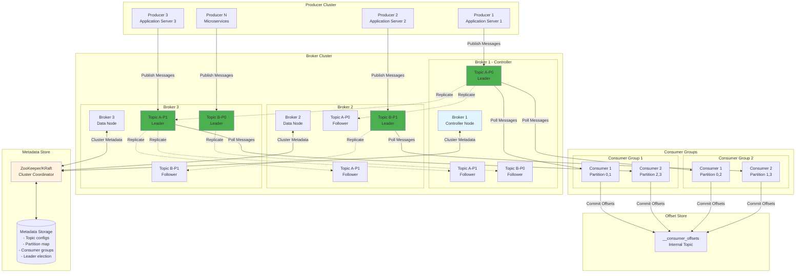

# Pub/Sub Messaging System Design (Apache Kafka-like)

**Difficulty Level:** ⭐⭐⭐⭐ Very Hard  
**Tags:** `Message Queue`, `Pub/Sub`, `Event Streaming`, `Partitioning`, `Replication`, `Exactly-once Semantics`, `Consumer Groups`, `Log-structured Storage`, `Distributed Systems`, `High Throughput`

**File Purpose:** Interactive, multi-level learning resource for designing a distributed pub/sub messaging system. This instructional guide takes you from beginner concepts to advanced production considerations, teaching you how to build a system that handles 10 million messages per second with exactly-once delivery semantics, 30-day message retention across 1000+ partitions, achieving 99.99% availability and <10ms publish latency for high-throughput event streaming.

**Author:** System Design Documentation  
**Created:** October 1, 2025  
**Last Updated:** November 11, 2025  
**Recent Updates:** Complete rewrite in educational template format with multi-level learning paths (🟢🟡🔴)

---

## 🎓 Welcome to Pub/Sub Messaging System Design!

### What You're Going to Build

Imagine building the messaging backbone that powers companies like LinkedIn (where Apache Kafka was born, processing 7 trillion messages per day), Uber (coordinating millions of real-time ride events), or Netflix (streaming viewing events from 230M subscribers for real-time recommendations). You're designing a system that acts as the central nervous system for an entire organization—every microservice communicates through your pub/sub platform, processing 10 million messages every single second while guaranteeing zero data loss and perfect ordering within partitions!

By the end of this learning journey, you'll understand how to design a production-grade pub/sub messaging system that:

- **Handles massive throughput**: 10M messages/second (scalable to 100M+), 864 TB data/day, 10 PB storage for 30-day retention
  - **What this means for beginners**: Imagine every click, purchase, page view, and user action on a large e-commerce site like Amazon being captured as a "message" and flowing through your system. That's 10 million events every second—like processing the entire population of Portugal's actions every single second!
  - **How we achieve it**: We use **partitioning** (splitting topics into multiple independent streams—like having 100 checkout lines instead of 1), **batching** (grouping many messages together before sending—like loading a truck instead of making individual deliveries), **zero-copy transfers** (directly moving data from disk to network without CPU—like a conveyor belt), and **sequential disk writes** (writing data in order is 100x faster than random writes—like writing a book page by page vs jumping around).

- **Provides multiple delivery guarantees**: At-most-once, at-least-once, and exactly-once semantics
  - **What this means for beginners**: Think about sending money via Venmo. You want "exactly-once"—the $50 should be transferred exactly once, not zero times (at-most-once) or twice (at-least-once). Different use cases need different guarantees.
  - **The three guarantees explained**:
    - **At-most-once** (fire-and-forget): Message might be lost, never duplicated. *Like yelling across the street—might not be heard, but you won't say it twice. Use for: logging, metrics where occasional loss is acceptable.*
    - **At-least-once** (retry until success): Message guaranteed to arrive, might be duplicated. *Like sending an email—you might accidentally send it twice if you're unsure it went through. Use for: most applications where consumers can handle duplicates.*
    - **Exactly-once** (transactional): Message arrives exactly once, no loss or duplicates. *Like bank transfers—must happen exactly once. Use for: financial transactions, billing, inventory management.*
  - **Why it's complex**: Exactly-once requires coordinating distributed transactions across multiple brokers, tracking message IDs, and using two-phase commits—very expensive but necessary for critical data.

- **Guarantees message ordering**: Strict ordering within partitions, parallel processing across partitions
  - **What this means for beginners**: Imagine a customer's journey: view product → add to cart → checkout → payment. These events must be processed in order for the customer's account to make sense! But different customers' events can be processed simultaneously.
  - **How partitioning enables parallel ordered processing**:
    - Each topic is split into **partitions** (independent ordered logs)
    - Messages with the same key (e.g., user_id) go to the same partition
    - Within a partition, order is guaranteed (like standing in line)
    - Different partitions are processed in parallel (like multiple checkout lines)
  - **Example**: User 123's events → Partition 0 (ordered), User 456's events → Partition 1 (ordered), both processed simultaneously!

- **Scales horizontally**: Add brokers to increase throughput, add partitions to increase parallelism
  - **What this means for beginners**: When your system gets slow, you don't buy a bigger computer (vertical scaling—expensive and limited). Instead, you add more computers (horizontal scaling—cheap and unlimited).
  - **How horizontal scaling works**:
    - **Add brokers**: Each broker is a server that stores partitions. Start with 10 brokers, grow to 100+ as traffic increases
    - **Add partitions**: More partitions = more parallel processing. Start with 10 partitions/topic, grow to 1000+ partitions across all topics
    - **Automatic rebalancing**: When you add a broker, the system automatically moves partitions to balance load (like redistributing tables when a restaurant opens a new section)
  - **No downtime**: All scaling happens while the system is running (hot-swapping)

- **Provides high durability**: Replicate data 3x across brokers, survive multiple broker failures, 99.99% availability
  - **What this means for beginners**: If one server crashes, your messages are safe on two other servers. Like having photocopies of important documents in different locations—even if your house burns down, the documents survive.
  - **Replication strategy**:
    - **Replication factor 3**: Every message is stored on 3 different brokers
    - **Leader-follower model**: One leader handles writes/reads, 2 followers stay in sync
    - **In-Sync Replicas (ISR)**: Only followers that are "caught up" count as replicas
    - **Automatic failover**: If leader dies, a follower becomes leader in <5 seconds
  - **No data loss guarantee**: With proper configuration (acks=all), messages are confirmed only after 3 copies are written
  - **99.99% availability**: Only 52 minutes of downtime per year (compared to 99.9% = 8.7 hours/year)

- **Supports consumer groups**: Multiple consumers coordinate to share partition processing load
  - **What this means for beginners**: Instead of one consumer struggling to process 10M messages/second, 100 consumers share the work, each processing 100K messages/second. Like a restaurant kitchen with many chefs instead of one chef doing everything.
  - **Consumer group mechanics**:
    - **Group ID**: All consumers with the same group_id form a group (e.g., "order-processing-service")
    - **Partition assignment**: Each partition is assigned to exactly one consumer in the group (no two consumers read the same partition)
    - **Automatic rebalancing**: When a consumer joins/leaves, partitions are redistributed (like reassigning tables when a waiter arrives/leaves)
    - **Multiple groups**: Different groups can read the same topic independently (e.g., "analytics-service" and "billing-service" both reading "purchases" topic)
  - **Parallelism limit**: You can have at most N consumers per group where N = number of partitions (with 100 partitions, max 100 consumers)

### 📚 Your Learning Path

This course is designed for three different learning levels. You can progress through all levels or focus on the one that matches your current needs:

```text
🟢 BEGINNER LEVEL (6-8 hours)
├─ Learn what pub/sub messaging is and why it matters
├─ Understand core concepts: topics, partitions, producers, consumers
├─ Build intuition with everyday analogies (post offices, restaurants, libraries)
├─ Master the fundamentals of message ordering and delivery guarantees
└─ Perfect for: New to distributed systems or messaging systems

🟡 INTERMEDIATE LEVEL (8-10 hours)  
├─ Master system design interview frameworks
├─ Learn to make technical trade-offs (performance vs consistency)
├─ Understand partition assignment and consumer group coordination
├─ Practice back-of-envelope calculations (throughput, storage, costs)
└─ Perfect for: Preparing for FAANG system design interviews

🔴 ADVANCED LEVEL (10-14 hours)
├─ Deep-dive into replication protocols and exactly-once semantics
├─ Understand log-structured storage internals (segments, indexes)
├─ Master production considerations (monitoring, security, disaster recovery)
├─ Learn from real-world case studies (LinkedIn Kafka, Uber's event platform)
└─ Perfect for: Senior engineers and architects building event-driven systems
```

**Total Learning Time:** 24-32 hours for complete mastery across all levels

### 🎯 Prerequisites

**For Beginners:**
- Basic programming knowledge (any language)
- Understanding of files and databases
- No distributed systems experience needed!

**For Intermediate:**
- Familiarity with REST APIs
- Basic understanding of databases (SQL/NoSQL)
- Exposure to microservices concepts

**For Advanced:**
- Experience with distributed systems
- Understanding of consistency models (eventual, strong)
- Knowledge of networking fundamentals (TCP/IP, DNS)
- Familiarity with Linux and command-line tools

### 📊 What Makes This Learning Experience Unique

Each section follows a proven learning pattern:
1. **What You'll Learn** - Clear learning objectives
2. **Why This Matters** - Real-world context
3. **Multi-Level Content** - Tailored explanations for your level
4. **Real-World Examples** - How LinkedIn, Uber, Netflix actually do it
5. **Think About It** - Questions to deepen understanding
6. **Key Takeaways** - Summary of main points
7. **Practice Exercise** - Hands-on challenge

💡 **Pro Tip:** Don't skip the "Think About It" sections - they're designed to help you internalize concepts so you can explain them in interviews or to your team!

---

## 📚 BEGINNER'S GLOSSARY: Technical Terms Explained

Before diving in, here are key technical terms you'll encounter (with everyday analogies):

### Core Pub/Sub Terms

- **Pub/Sub (Publish-Subscribe)**: A messaging pattern where senders (publishers) don't send messages directly to receivers (subscribers). Instead, messages go to a middleman that delivers them. *Like a newspaper: journalists write articles (publish), readers subscribe, and the newspaper delivery service handles distribution.*
  
- **Topic**: A category or feed name to which messages are published. *Like a TV channel—ESPN for sports, CNN for news. Producers publish to topics, consumers subscribe to topics.*
  
- **Partition**: A subdivision of a topic for parallel processing. Each partition is an ordered, immutable sequence of messages. *Like splitting a highway into multiple lanes—each lane maintains order, but cars in different lanes move independently.*
  
- **Broker**: A server in the messaging cluster that stores partitions and serves clients. *Like a post office branch—stores mail and helps send/receive messages.*
  
- **Producer**: An application that publishes messages to topics. *Like a newspaper journalist writing articles.*
  
- **Consumer**: An application that subscribes to topics and processes messages. *Like a newspaper reader.*

### Message Flow Terms

- **Message/Event/Record**: A unit of data sent through the system (key + value + timestamp + optional headers). *Like a letter in an envelope with a recipient address (key), content (value), and postmark (timestamp).*
  
- **Offset**: The position of a message within a partition (sequential number starting from 0). *Like page numbers in a book—message 0, 1, 2, 3... Consumers track which "page" they've read up to.*
  
- **Consumer Group**: A group of consumers that cooperate to consume a topic, sharing the work. *Like a restaurant kitchen—multiple chefs (consumers) working together to process orders (messages) from the same queue (topic).*
  
- **Commit**: Recording the offset of the last processed message so consumption can resume from that point after a restart. *Like placing a bookmark in a book—you can close the book and resume exactly where you left off.*

### Performance & Reliability Terms

- **Throughput**: The number of messages processed per second. *Like how many packages a post office can handle per hour—our system targets 10M messages/second.*
  
- **Latency**: The delay between when a message is published and when it's available to consumers. *Like the time between dropping a letter in a mailbox and it arriving at the destination—we target <10ms.*
  
- **Replication**: Copying data across multiple brokers for durability. *Like making photocopies of important documents and storing them in different locations.*
  
- **Leader-Follower**: One broker (leader) handles all reads/writes for a partition, while followers keep copies. *Like a classroom: teacher (leader) presents lessons, students (followers) take notes. If the teacher is absent, a student becomes the substitute teacher.*
  
- **In-Sync Replica (ISR)**: A follower that is "caught up" with the leader (not lagging behind). *Like a student whose notes are up-to-date vs one who missed a few classes.*

### Delivery Guarantee Terms

- **At-Most-Once**: Messages may be lost but never duplicated (fire-and-forget). *Like shouting across a noisy street—might not be heard, but you won't repeat yourself.*
  
- **At-Least-Once**: Messages are guaranteed to be delivered but may be duplicated. *Like double-checking you sent an email—might accidentally send it twice.*
  
- **Exactly-Once**: Messages are delivered exactly once, no loss or duplication. *Like a bank transfer—must happen exactly once, no more, no less.*
  
- **Idempotency**: Processing the same message multiple times produces the same result. *Like pressing an elevator button—pressing it 10 times doesn't call 10 elevators.*

### Storage Terms

- **Log**: An append-only ordered sequence of messages (Kafka's core data structure). *Like a daily journal—you write new entries at the end, never edit old entries.*
  
- **Segment**: A portion of a partition's log stored in a single file (typically 1GB). *Like chapters in a book—easier to manage than one giant file.*
  
- **Retention**: How long messages are kept before deletion (time-based or size-based). *Like a library keeping magazines for 30 days before recycling them.*
  
- **Compaction**: Keeping only the latest value for each key, discarding old values. *Like a database that stores only the current state—"User 123's email is bob@example.com" (old value "alice@example.com" is deleted).*

### Coordination Terms

- **ZooKeeper**: A coordination service that stores cluster metadata and handles leader election. *Like a company's HR department—keeps track of who's who and decides who becomes manager when one leaves.*
  
- **KRaft**: Kafka's new built-in replacement for ZooKeeper (Kafka Raft). *Like eliminating the external HR department and handling coordination internally.*
  
- **Rebalancing**: Redistributing partition assignments when consumers join/leave a group. *Like reassigning tables when a waiter arrives/leaves a restaurant.*
  
- **Consumer Coordinator**: A broker-side component that manages consumer group membership and partition assignments. *Like a restaurant host that assigns tables to servers.*

### Architecture Terms

- **Cluster**: Multiple brokers working together as a single system. *Like a chain of post offices—multiple locations but one unified postal service.*
  
- **High Water Mark**: The offset of the last message that has been replicated to all ISRs. *Like a waterline showing the "safe" level—only messages below this line are guaranteed durable.*
  
- **Batch**: Grouping multiple messages together for efficient network transfer. *Like shipping 100 packages in one truck instead of making 100 individual deliveries.*
  
- **Compression**: Reducing message size using algorithms like gzip, snappy, or lz4. *Like vacuum-sealing clothes to fit more in a suitcase.*

### Scalability Terms

- **Horizontal Scaling**: Adding more brokers to increase capacity. *Like opening more post office branches when mail volume increases.*
  
- **Partition Leader**: The broker responsible for all reads and writes to a partition. *Like the teacher in a classroom—students (followers) learn from the teacher.*
  
- **Partition Follower**: A broker that replicates data from the leader. *Like a student taking notes—stays synchronized with the teacher.*
  
- **Parallel Processing**: Processing multiple partitions simultaneously with different consumers. *Like having multiple checkout lines at a grocery store instead of one.*

---

## TABLE OF CONTENTS

- [Section 1: Understanding What We're Building](#section-1-understanding-what-were-building)
- [Section 2: Planning for Scale (Capacity Estimation)](#section-2-planning-for-scale-capacity-estimation)
- [Section 3: Designing the System Architecture](#section-3-designing-the-system-architecture)
- [Section 4: Topic Partitioning Strategy](#section-4-topic-partitioning-strategy)
- [Section 5: Consumer Groups & Rebalancing](#section-5-consumer-groups--rebalancing)
- [Section 6: Offset Management & Delivery Guarantees](#section-6-offset-management--delivery-guarantees)
- [Section 7: Log-Structured Storage](#section-7-log-structured-storage)
- [Section 8: Replication Protocol & High Availability](#section-8-replication-protocol--high-availability)
- [Section 9: Producer Optimizations](#section-9-producer-optimizations)
- [Section 10: Message Delivery Patterns & Flow Control](#section-10-message-delivery-patterns--flow-control)
- [Section 11: Growing the System (Scalability)](#section-11-growing-the-system-scalability)
- [Section 12: Protecting the System (Security)](#section-12-protecting-the-system-security)
- [Section 13: Keeping It Healthy (Monitoring)](#section-13-keeping-it-healthy-monitoring)
- [Section 14: Making Design Decisions](#section-14-making-design-decisions)
- [Section 15: Interview Preparation & Practice](#section-15-interview-preparation--practice)
- [Putting It All Together](#putting-it-all-together)
- [Resources for Further Learning](#resources-for-further-learning)
- [Congratulations!](#congratulations)

---

## Section 1: Understanding What We're Building

### What You'll Learn

By the end of this section, you'll be able to:
- Explain what a pub/sub messaging system is and why companies like LinkedIn, Uber, and Netflix need it
- Identify the key functional and non-functional requirements for a large-scale messaging system
- Understand the difference between different delivery guarantees (at-most-once, at-least-once, exactly-once)
- Ask the right clarifying questions during a system design interview

### Why This Matters

Before writing a single line of code or drawing any diagrams, you need to understand WHAT you're building and WHY. This is often where interviews are won or lost. Real-world example: LinkedIn built Apache Kafka because traditional messaging systems couldn't handle their exponentially growing data pipeline needs—understanding these "why" questions shaped the entire design and made Kafka the industry standard for event streaming!

---

### 🟢 For Beginners: The Fundamentals

#### What is a Pub/Sub Messaging System?

Imagine you're running a large restaurant chain with hundreds of locations. When a customer places an order at one location, multiple departments need to know about it:
- The kitchen needs to prepare the food
- The billing system needs to charge the customer
- The inventory system needs to update stock levels
- The analytics team needs to track sales trends

**The old way (direct communication)**: The order system would call each department one by one. If the billing system is slow or down, the entire order gets delayed. If you add a new department (like a loyalty rewards system), you have to modify the order system.

**The pub/sub way**: The order system publishes the order event to a central message bus (topic). Each department subscribes to order events and processes them independently. If billing is slow, it doesn't affect the kitchen. If you add rewards, it just subscribes to the same topic—no changes needed to the order system!

**Key Components Explained:**

1. **Publishers (Producers)**:
   - These are applications that create and send messages
   - Example: Your order entry system, user registration system, payment processor
   - Think of them like newspaper journalists writing articles

2. **Topics**:
   - Categories or channels where messages are published
   - Example: "orders" topic, "user-registrations" topic, "payments" topic
   - Think of them like TV channels or newspaper sections (Sports, News, Business)

3. **Partitions**:
   - Subdivisions of a topic for parallel processing
   - Each partition is like a separate lane on a highway—traffic moves independently
   - Messages with the same key (like user_id) always go to the same partition (maintains order)

4. **Subscribers (Consumers)**:
   - Applications that read and process messages
   - Example: Kitchen display system, billing processor, inventory manager
   - Think of them like newspaper readers or TV viewers

5. **Message Broker**:
   - The central system that stores and delivers messages
   - Example: Apache Kafka, RabbitMQ, Amazon SQS
   - Think of it like the post office or newspaper delivery service

**Why Companies Need This:**

- **Decoupling**: Services don't depend on each other directly. If one service is down, others keep working
- **Scalability**: Add more consumers to process messages faster without changing producers
- **Durability**: Messages are stored, so you can replay them if something goes wrong
- **Asynchronous Processing**: Producers don't wait for consumers—they publish and continue

#### User Stories: Who Uses This System?

Let's understand different perspectives through real-world scenarios:

**Story 1: The Microservice Developer**

*"I'm building the checkout service for an e-commerce site. When a customer completes a purchase, I need to notify the inventory service, shipping service, email service, and analytics service. If I call each service directly, my checkout becomes slow and can fail if any service is down. With pub/sub, I publish one 'order-completed' event, and each service processes it independently. My checkout completes in milliseconds!"*

**What they need:**
- Publish messages to topics without worrying about who consumes them
- Get acknowledgment that messages are safely stored
- Simple API to integrate with their application

**Story 2: The Application Architect**

*"Our recommendation engine processes 50 million user behavior events per day (page views, clicks, purchases). One consumer can't handle that volume. With consumer groups, I can run 100 consumers in parallel, each processing 1% of the events. When traffic spikes during Black Friday, I just add more consumers—the system automatically distributes the load!"*

**What they need:**
- Consumer groups to distribute processing across multiple instances
- Automatic partition assignment when consumers join/leave
- Load balancing without manual configuration

**Story 3: The Data Engineer**

*"Last week, our analytics pipeline had a bug that processed user events incorrectly for 2 hours. In traditional systems, that data would be lost forever. With pub/sub's message retention, I can 'rewind' to 2 hours ago and reprocess all events with the fixed code. It's like having a time machine for your data!"*

**What they need:**
- Ability to replay historical messages (seek to any offset)
- Configurable retention period (days, weeks, or forever)
- Multiple consumer groups reading the same data independently

**Story 4: The Platform Engineer**

*"We have 20 microservices, each running 10 instances. That's 200 consumers! When we deploy a new version, consumers restart. Without automatic rebalancing, we'd need manual configuration. With pub/sub, when a consumer dies, its partitions are automatically reassigned to healthy consumers within seconds. Zero manual intervention!"*

**What they need:**
- Automatic partition rebalancing when consumers join/leave/crash
- Health checking and failure detection
- Seamless deployment without downtime

**Story 5: The System Operator**

*"Disk failures happen. Network issues happen. In our previous system, if a server crashed, messages were lost forever—we once lost $50,000 worth of orders! Now with replication, every message is copied to 3 different servers. Even if 2 servers explode simultaneously, the third has all the data. We sleep better at night!"*

**What they need:**
- Replication across multiple servers (brokers)
- Automatic failover when a broker crashes
- No data loss guarantee for critical messages

**Story 6: The Stream Processing Developer**

*"I'm building a fraud detection system that monitors financial transactions. If I process the same transaction twice, I might block a legitimate customer. If I miss a transaction, fraud goes undetected. I need exactly-once semantics—process each transaction exactly one time, guaranteed. Lives and money depend on it!"*

**What they need:**
- Exactly-once delivery guarantee (no duplicates, no data loss)
- Transactional writes across multiple topics
- Idempotent consumers

---

#### Functional Requirements: What Must the System Do?

Let's break down what our pub/sub system must accomplish, with detailed explanations for each requirement:

**1. Message Publishing**

*What it means:* Producers must be able to send messages to topics reliably and efficiently.

*Detailed explanation:*
- **API simplicity**: Developer calls `send(topic, key, value)` and gets back an acknowledgment
- **Batching**: Instead of sending one message at a time (slow), group 100 messages into one network request (fast)
- **Compression**: Compress messages to save bandwidth (like zipping a file)
- **Partition selection**: System decides which partition receives the message based on the key
  - If key = "user_123", all user_123 messages go to the same partition (maintains order)
  - If no key provided, round-robin across partitions (load balancing)

*Example:* When a user posts a photo on Instagram, the producer sends:
```
topic: "user-posts"
key: "user_123"  (ensures all user_123's posts stay ordered)
value: {"user_id": 123, "photo_url": "...", "caption": "Sunset!", "timestamp": 1699734000}
```

**2. Message Consumption**

*What it means:* Consumers must be able to read messages from topics in a controlled, scalable way.

*Detailed explanation:*
- **Pull model**: Consumers request messages (don't push to them). This way consumers control the pace.
  - Like going to a buffet (you take food at your pace) vs waiter service (they control the pace)
  - Consumer says "give me next 100 messages from partition 5" repeatedly
- **Offset tracking**: Consumer remembers where it left off (like a bookmark)
  - Read message 0, 1, 2, 3... commit offset=4 (meaning "I've processed up to 3")
  - If consumer crashes and restarts, it resumes from offset 4
- **Replay capability**: Consumer can "rewind" to any previous offset
  - Example: "I want to reprocess last week's data" → seek to offset from 7 days ago

*Example:* Analytics service reads user posts:
```
1. Subscribe to "user-posts" topic with consumer group "analytics-processors"
2. Get assigned partitions 0, 1, 2 (out of 10 total)
3. Fetch 100 messages from partition 0, starting at offset 1000
4. Process messages (count likes, track trends)
5. Commit offset 1100 (successfully processed)
6. Repeat for partitions 1 and 2
```

**3. Topic Management**

*What it means:* Administrators can create, configure, and manage topics.

*Detailed explanation:*
- **Create topic**: Define name, number of partitions, replication factor
  - Example: Create "user-events" with 100 partitions (for high parallelism) and replication=3 (for durability)
- **Configure retention**: How long to keep messages
  - Time-based: "Keep messages for 7 days, then delete"
  - Size-based: "Keep up to 100GB, delete oldest when full"
  - Forever: "Keep all messages indefinitely" (useful for audit logs)
- **Partition scaling**: Increase partitions as traffic grows
  - Start with 10 partitions, grow to 100 as user base expands
  - Cannot decrease partitions (would break ordering guarantees)

*Real-world example:* LinkedIn's "user-activity" topic
- 500 partitions for parallel processing
- 7-day retention (older data moved to data warehouse)
- Replication factor 3 (tolerates 2 broker failures)

**4. Consumer Groups**

*What it means:* Multiple consumers work together as a team to share the processing load.

*Detailed explanation:*

Let's use a restaurant analogy. You have a kitchen with 10 orders to prepare:

**Without consumer groups (everyone cooks everything):**
- 5 chefs each try to cook all 10 orders
- Massive duplication of work
- Chaos and inefficiency

**With consumer groups (team coordination):**
- 5 chefs form a group called "dinner-shift-team"
- Orders are distributed: Chef A handles orders 1-2, Chef B handles 3-4, etc.
- Each order is cooked exactly once
- If Chef C goes home sick, the manager (coordinator) reassigns orders 5-6 to other chefs

**In pub/sub terms:**
- Topic has 10 partitions (like 10 order queues)
- Consumer group "analytics-team" has 5 consumers
- Partition assignment: Consumer 1 → partitions 0,1; Consumer 2 → partitions 2,3; etc.
- Each partition has exactly one consumer per group
- If Consumer 3 crashes, its partitions (4,5) are reassigned to other consumers

**Multiple groups reading the same topic:**
- "analytics-team" group reads "orders" topic for trends
- "billing-team" group reads "orders" topic for invoicing
- "inventory-team" group reads "orders" topic for stock updates
- Each group tracks its own offsets independently (no interference)

**5. Offset Management**

*What it means:* The system tracks which messages each consumer group has processed.

*Detailed explanation:*

Think of offsets like page numbers in a book. Each partition is a separate book.

**The process:**
1. Consumer reads messages from partition 0, offsets 100-199 (like reading pages 100-199)
2. Consumer processes them (validates data, writes to database, etc.)
3. Consumer commits offset 200 (telling the system "I've successfully processed up to offset 199")
4. System stores: "consumer_group=analytics-team, topic=orders, partition=0, offset=200"

**If consumer crashes:**
1. New consumer starts and asks "where did we leave off?"
2. System responds: "offset 200"
3. Consumer resumes from offset 200 (no messages lost or reprocessed)

**Commit strategies:**
- **Auto-commit**: Automatically commit every 5 seconds (simple but risky—might lose 5 seconds of data if crash)
- **Manual commit**: Commit after successfully processing each batch (safer but requires careful coding)
- **Commit after database write**: Only commit offset after writing to database (ensures at-least-once processing)

**6. Message Retention**

*What it means:* Messages are stored for a configurable period, not deleted immediately after consumption.

*Detailed explanation:*

Traditional message queues (like RabbitMQ) work like regular mail:
- Message arrives → you read it → it's deleted
- If you want to read it again, tough luck!

Pub/sub messaging (like Kafka) works like a library:
- Message arrives → stored on disk for 7 days (or whatever you configure)
- You can read it once, 10 times, or 1000 times in those 7 days
- After 7 days, it's automatically deleted to save space

**Retention policies:**

*Time-based retention:*
```
retention.ms = 604800000  (7 days in milliseconds)
```
- Messages older than 7 days are deleted
- Regardless of whether anyone read them
- Use case: Recent activity feeds, temporary logs

*Size-based retention:*
```
retention.bytes = 107374182400  (100 GB)
```
- Keep up to 100GB per partition
- When limit reached, delete oldest messages (FIFO)
- Use case: Limited disk space, predictable storage costs

*Infinite retention:*
```
retention.ms = -1  (keep forever)
```
- Never delete messages
- Use case: Audit logs, regulatory compliance, complete event sourcing

**Why this matters:**
- **Replay**: Reprocess messages after fixing a bug
- **New consumers**: New service can read historical data
- **Debugging**: Investigate issues by replaying events
- **Disaster recovery**: Rebuild state from scratch using message history

**7. Replication**

*What it means:* Each message is copied to multiple brokers for durability.

*Detailed explanation:*

Imagine you write an important document. How do you prevent losing it?
- One copy on your laptop: Laptop crashes → document lost!
- Two copies (laptop + USB drive): Both fail → still lost!
- Three copies (laptop + USB drive + cloud): Extremely unlikely to lose all three

Pub/sub replication works the same way:

**Replication factor = 3 (industry standard):**
- Every partition has 3 copies on 3 different brokers
- One broker is the "leader" (handles all reads/writes)
- Two brokers are "followers" (keep identical copies)

**Example: Partition 0 with replication factor 3:**
```
Broker 1 (Leader): Partition 0 - handles all writes
Broker 2 (Follower): Partition 0 - copy 1
Broker 3 (Follower): Partition 0 - copy 2
```

**When a producer writes a message:**
1. Producer sends message to Broker 1 (leader)
2. Broker 1 writes to its disk
3. Broker 1 sends message to Broker 2 and Broker 3
4. Brokers 2 and 3 write to their disks
5. Brokers 2 and 3 acknowledge to Broker 1
6. Broker 1 acknowledges to producer: "Message safely replicated!"

**If Broker 1 crashes:**
- System elects Broker 2 as the new leader (takes <5 seconds)
- Broker 2 handles all reads/writes now
- No messages are lost (they're on Broker 2 and Broker 3)
- When Broker 1 recovers, it becomes a follower and catches up

**Trade-offs:**
- More replicas = better durability but more storage and network bandwidth
- Typical configurations:
  - Replication = 2: Development environments
  - Replication = 3: Production (tolerates 1 broker failure)
  - Replication = 5: Critical systems (tolerates 2 broker failures)

**8. Ordering Guarantee**

*What it means:* Messages within the same partition are delivered in the exact order they were published.

*Detailed explanation:*

**Why ordering matters:**

Consider a bank account with $1000:
1. Deposit $500 → Balance = $1500
2. Withdraw $200 → Balance = $1300

If these events are processed out of order:
1. Withdraw $200 → FAIL! (insufficient funds, only $1000 available)
2. Deposit $500 → Balance = $1500

Same events, wrong order = wrong result!

**How pub/sub maintains order:**

**Within a partition (GUARANTEED):**
- Messages with the same key go to the same partition
- Partition is an append-only log (like a line of people—first in, first out)
- Messages are numbered sequentially: offset 0, 1, 2, 3...
- Consumers read in order: 0 → 1 → 2 → 3 (never 2 → 0 → 3 → 1)

**Example: User account events**
```
Key = "account_123"  (ensures all account_123 events → same partition)

Partition 5 contents:
Offset 0: {"account": 123, "action": "deposit", "amount": 500, "timestamp": 10:00:00}
Offset 1: {"account": 123, "action": "withdraw", "amount": 200, "timestamp": 10:05:00}
Offset 2: {"account": 123, "action": "deposit", "amount": 300, "timestamp": 10:10:00}

Consumer reads in order: 0 → 1 → 2
Final balance: $1000 + $500 - $200 + $300 = $1600 ✓ Correct!
```

**Across partitions (NOT GUARANTEED):**
- Different partitions are processed independently and in parallel
- No ordering guarantee between partitions

**Example with 2 partitions:**
```
Partition 0: User A's events (ordered)
Partition 1: User B's events (ordered)

But you can't guarantee "all User A events happened before all User B events"
That's okay because different users' events are independent!
```

**Best practices:**
- Use meaningful keys (user_id, order_id, session_id) to group related messages
- All events for the same entity go to the same partition
- Don't mix unrelated entities in the same topic

---

#### Non-Functional Requirements: How Should the System Perform?

These are the "quality attributes"—not about what the system does, but how well it does it.

**1. Performance**

**Throughput: Support 10M messages/second**

*What this means:*
- The system must handle 10 million messages every second
- That's 600 million messages per minute
- 36 billion messages per hour
- 864 billion messages per day!

*How to achieve it:*
- **Batching**: Group 100-1000 messages per network request (reduces overhead)
- **Partitioning**: 1000 partitions × 10,000 msg/sec/partition = 10M total
- **Zero-copy transfers**: Move data from disk to network without CPU involvement
- **Sequential disk I/O**: Writing sequentially is 100x faster than random writes

*Real-world comparison:*
- LinkedIn Kafka: 7 trillion messages/day (81 million/second average)
- Uber: 1 trillion messages/day (11 million/second average)

**Publish Latency: <10ms p99**

*What this means:*
- 99% of message publishes complete in under 10 milliseconds
- From when producer calls send() to when acknowledgment is received
- p99 = 99th percentile (only 1% of requests are slower)

*Why it matters:*
- Fast publish means applications don't slow down when logging events
- User actions don't block waiting for message delivery

*How to achieve it:*
- In-memory buffering before disk write
- Batch writes to disk (reduces seek time)
- Fast network (10+ Gbps)
- SSD storage (1000x faster than HDD for writes)

**Consumer Lag: <50ms under normal load**

*What this means:*
- Time difference between when message is published and when consumer reads it
- "Lag" = how far behind consumers are from the latest message

*Example:*
- Producer writes message at offset 1000 at time 10:00:00.000
- Consumer is currently reading offset 950 at time 10:00:00.045
- Lag = 50 messages or 45 milliseconds

*Why it matters:*
- Low lag means near-real-time processing
- High lag means consumers can't keep up (need more consumers or optimization)

*How to achieve it:*
- Sufficient consumer instances (1 per partition for max parallelism)
- Fast consumer processing (efficient code, database optimization)
- Load balancing across consumers

**2. Availability**

**99.99% uptime (52 minutes downtime/year)**

*What this means:*
- System must be available 99.99% of the time
- Only 52.56 minutes of downtime allowed per year
- That's less than 1 hour out of 8,760 hours!

*Comparison:*
- 99% (two nines) = 3.65 days downtime/year (unacceptable for critical systems)
- 99.9% (three nines) = 8.76 hours downtime/year (acceptable for many systems)
- 99.99% (four nines) = 52 minutes downtime/year (industry standard for databases)
- 99.999% (five nines) = 5 minutes downtime/year (very expensive to achieve)

*How to achieve it:*
- Replication (3 copies of every partition)
- No single point of failure (multiple brokers, redundant networks)
- Automatic failover when brokers crash
- Health checks every 3 seconds

**Automatic failover for broker failures**

*What happens when a broker crashes:*
```
Time T=0: Broker 1 is the leader for Partition 0
Time T=1: Broker 1 crashes (hardware failure, network issue, etc.)
Time T=2: ZooKeeper detects Broker 1 is unresponsive (heartbeat timeout)
Time T=3: ZooKeeper triggers leader election
Time T=4: Broker 2 (a follower) is elected as the new leader
Time T=5: Producers and consumers are notified to use Broker 2
Time T=6: System is fully operational again (total downtime: 5 seconds)
```

**Partition leader election < 5 seconds**

*What this means:*
- When a leader fails, a new leader must be elected within 5 seconds
- During these 5 seconds, the partition is unavailable for writes (but reads can still happen from replicas)

*Election process:*
1. ZooKeeper detects leader failure (heartbeat missed)
2. Controller broker selects a new leader from In-Sync Replicas (ISRs)
3. New leader is announced to all brokers
4. Producers/consumers update their routing tables
5. Total time: 3-5 seconds

**3. Scalability**

**100+ topics with 1000+ partitions**

*What this means:*
- System must support at least 100 different topics
- Total of 1000+ partitions across all topics

*Example configuration:*
```
Topic: user-events (100 partitions)
Topic: order-events (200 partitions)
Topic: payment-events (50 partitions)
Topic: clickstream (300 partitions)
Topic: system-logs (100 partitions)
... (95 more topics with 250 partitions)
Total: 100 topics, 1000 partitions
```

*Why partitions matter:*
- Each partition can be consumed by one consumer
- More partitions = more parallelism = higher throughput
- Limit: Each broker should handle at most 100-200 partitions

**10K+ producers and consumers**

*What this means:*
- System must handle 10,000+ simultaneous client connections
- Producers: Microservices, web servers, mobile apps, IoT devices
- Consumers: Analytics services, databases, monitoring tools

*Network considerations:*
- 10,000 clients × 1 connection each = 10,000 TCP connections
- Load balancers distribute clients across brokers
- Each broker handles 500-1000 connections typically

**Horizontal scaling by adding brokers**

*What this means:*
- When you need more capacity, add more brokers (servers)
- System automatically redistributes partitions across new brokers

*Scaling example:*
```
Initial: 5 brokers, 100 partitions
- Each broker handles 20 partitions
- Throughput: 500K messages/second

After scaling: 10 brokers, 100 partitions
- Each broker handles 10 partitions
- Throughput: 1M messages/second (2x improvement)
- Storage: 2x more disk space
- Network: 2x more bandwidth
```

*Process:*
1. Add new broker to cluster
2. New broker joins automatically (registers with ZooKeeper)
3. Controller assigns partitions to new broker
4. Data is copied to new broker (background process)
5. Client routing tables are updated
6. New broker starts handling traffic

**4. Durability**

**No data loss with proper acknowledgment**

*What this means:*
- With correct configuration, messages are guaranteed to never be lost
- "Proper acknowledgment" means waiting for replication before confirming to producer

*Three acknowledgment levels:*

**acks=0 (fire and forget):**
- Producer sends message and immediately considers it sent
- No acknowledgment from broker
- Fastest but unsafe (message might be lost if broker crashes)
- Use case: Metrics, logs where occasional loss is acceptable

**acks=1 (leader acknowledgment):**
- Producer waits for leader broker to write to disk
- Leader sends acknowledgment
- Faster than acks=all but risky (if leader crashes before replication, message lost)
- Use case: Most applications with at-least-once is acceptable

**acks=all (full replication):**
- Producer waits for leader AND all In-Sync Replicas (ISRs) to write message
- All replicas acknowledge
- Slowest but safest (message survives multiple broker failures)
- Use case: Financial transactions, critical data

*Example with acks=all:*
```
1. Producer sends message to Broker 1 (leader)
2. Broker 1 writes to its disk (offset 100)
3. Broker 1 forwards message to Broker 2 and Broker 3 (followers)
4. Broker 2 writes to its disk (offset 100)
5. Broker 3 writes to its disk (offset 100)
6. Broker 2 and Broker 3 send "ACK" to Broker 1
7. Broker 1 sends "ACK" to Producer: "Message safely stored on 3 brokers!"
8. Producer receives confirmation, can safely proceed
```

If Broker 1 crashes before step 3, the message is lost with acks=1, but would be retried with acks=all.

**At-least-once delivery guarantee (default)**

*What this means:*
- Every message is delivered to consumers at least one time
- But might be delivered multiple times (duplicates possible)

*Why duplicates happen:*
```
1. Consumer reads message (offset 100)
2. Consumer processes message successfully
3. Consumer crashes BEFORE committing offset 101
4. Consumer restarts, offset is still 100
5. Consumer reads message (offset 100) AGAIN
6. Duplicate processing!
```

*How to handle duplicates:*
- Make consumers idempotent (processing twice = same result as once)
- Example: "Set user email to bob@example.com" (idempotent - doing it twice is fine)
- Example: "Add $50 to account" (NOT idempotent - need deduplication logic)

**Exactly-once delivery option available**

*What this means:*
- Messages are delivered and processed exactly one time
- No duplicates, no data loss
- Harder to achieve but necessary for critical systems

*How it works:*
- Transactional writes with unique message IDs
- Consumer tracks processed message IDs
- If duplicate arrives, consumer checks ID and skips it

*Use cases:*
- Financial transactions (can't charge twice!)
- Inventory management (can't decrement stock twice!)
- Billing systems

**5. Storage**

**30 days message retention (configurable)**

*What this means:*
- Messages are stored for 30 days by default
- After 30 days, automatically deleted to free space

*Storage calculation for 30 days:*
```
Messages per day: 10M/sec × 86,400 seconds = 864 billion messages/day
Average message size: 1 KB
Daily storage: 864 billion × 1 KB = 864 TB/day
30-day storage: 864 TB × 30 = 25.9 PB (without replication)
With replication factor 3: 25.9 PB × 3 = 77.7 PB
```

That's 77.7 petabytes! Enough to store:
- 77.7 million hours of HD video
- The entire Library of Congress 1,000 times over

**10 PB total storage capacity**

*What this means:*
- System must support at least 10 petabytes of storage
- Distributed across all brokers

*Broker storage:*
```
Total: 10 PB
Number of brokers: 20
Storage per broker: 10 PB / 20 = 500 TB per broker
Actual disk per broker: 600 TB (some overhead for OS, metadata)
```

**Log-structured storage for sequential writes**

*What this means:*
- Messages are written to disk sequentially (like writing in a journal)
- Not randomly scattered across disk (like updating a text document)

*Why this matters:*
- Sequential writes: ~600 MB/sec on modern SSDs
- Random writes: ~6 MB/sec on same SSDs
- 100x faster with sequential writes!

*How it works:*
- Each partition is a directory on disk
- Messages are appended to the end of the current log file
- When file reaches 1 GB, start a new file (segment)
- Never modify old files (immutable)

**Support for compacted topics**

*What this means:*
- For some topics, only keep the latest value for each key
- Older values are automatically deleted

*Use case example: User profile updates*
```
Regular topic (keeps everything):
Offset 0: {"user_id": 123, "email": "alice@example.com"}
Offset 1: {"user_id": 123, "email": "alice@newcompany.com"}
Offset 2: {"user_id": 123, "email": "alice@gmail.com"}
Total storage: 3 messages

Compacted topic (keeps only latest):
Offset 2: {"user_id": 123, "email": "alice@gmail.com"}
Total storage: 1 message (saves 67% space!)
```

*Perfect for:*
- Configuration data (only need current config)
- User profiles (only need current state)
- Database change logs (only need latest row values)

---

#### Clarifying Questions: What to Ask in an Interview

When given a system design problem, don't start coding or drawing immediately! Ask clarifying questions to understand requirements deeply.

**Scale Questions (always ask first):**

**Q:** "What's the expected message throughput?"
- **Why ask:** Determines cluster size, number of partitions, hardware specs
- **Good answers:** "1M messages/second" or "100K messages/second during normal hours, 1M during peak"
- **What to do with answer:** Calculate bandwidth, storage, number of brokers needed

**Q:** "How many topics and partitions are we expecting?"
- **Why ask:** Too many topics can overwhelm metadata management; too many partitions per broker causes performance issues
- **Good answers:** "50-100 topics with 10-50 partitions each" or "5 topics with 1000 partitions total"
- **Rule of thumb:** Each broker should handle 100-200 partitions maximum

**Q:** "How long should messages be retained?"
- **Why ask:** Directly impacts storage requirements (7 days vs 30 days = 4x storage difference)
- **Good answers:** "7 days for logs, 30 days for events, infinite for audit trails"
- **Trade-off:** Longer retention = more storage cost but better replay capability

**Usage Pattern Questions:**

**Q:** "What's the typical message size?"
- **Why ask:** Impacts throughput calculations and network bandwidth
- **Average:** 1-10 KB for most applications
- **Small:** <1 KB for logs, metrics, simple events
- **Large:** 100 KB - 1 MB for file uploads, images (consider object storage instead)

**Q:** "What delivery guarantees are needed?"
- **Why ask:** Affects performance (exactly-once is slower) and complexity
- **At-most-once:** Metrics, logs where loss is acceptable (fastest)
- **At-least-once:** Most applications (good balance)
- **Exactly-once:** Financial, billing, inventory (slowest but safest)

**Q:** "Are there ordering requirements?"
- **Why ask:** Determines partitioning strategy
- **If yes:** Use keys to route related messages to same partition
- **If no:** Can use round-robin partitioning for better load distribution

**Architecture Questions:**

**Q:** "How many datacenters/regions?"
- **Why ask:** Single vs multi-region changes architecture significantly
- **Single region:** Simpler, lower latency, cheaper
- **Multi-region:** Complex replication, higher latency, disaster recovery

**Q:** "What replication factor should we use?"
- **Why ask:** Balances durability vs storage cost
- **Development:** 1-2 replicas
- **Production:** 3 replicas (industry standard)
- **Critical systems:** 5 replicas (tolerates 2 failures)

**Q:** "Should consumers read from replicas or only from leaders?"
- **Why ask:** Affects load distribution and complexity
- **Leader-only:** Simpler, consistent reads (default)
- **Replica reads:** Distributes load, might read slightly stale data

---

### 🟡 For Intermediate: Interview Patterns

#### The Requirements Gathering Framework

As an intermediate candidate, you're expected to demonstrate a structured approach to gathering requirements. Here's the framework I recommend for interviews:

**The 3-Phase Requirements Framework:**

**Phase 1: Understand the Business Context (2 minutes)**
- What problem are we solving?
- Who are the users?
- What's the business impact?

*Example dialogue:*
```
Interviewer: "Design a pub/sub messaging system."

You: "Great! Before we dive in, let me understand the context. Are we building 
this for internal microservices communication, or is it a platform product like
AWS SQS that external customers will use? This affects our API design and 
multi-tenancy requirements."

Interviewer: "Internal use—for a company with 100 microservices."

You: "Perfect. And what's driving this need? Are we replacing an existing system
that's hitting limits, or is this for a new event-driven architecture initiative?"
```

**Phase 2: Define Scale and Constraints (3 minutes)**
- Traffic: messages/second, DAU, QPS
- Data: message size, retention period
- Performance: latency, availability requirements
- Geography: single region or global

*Example dialogue:*
```
You: "Let's talk scale. What message throughput are we targeting—thousands, 
millions, or billions per second?"

Interviewer: "Start with 100K messages/second, but design to scale to 10M."

You: "Got it. And for retention—are we talking hours, days, or weeks?"

Interviewer: "7 days for most topics, 30 days for audit logs."

You: [Takes notes, calculates] "So at 10M msg/sec with 1KB messages, that's 
10GB/sec or 864TB/day. With 7-day retention and 3x replication, we need about 
18PB storage. I'll design with this in mind."
```

**Phase 3: Prioritize Features (2 minutes)**
- Must-have for MVP
- Nice-to-have for later
- Out of scope

*Example dialogue:*
```
You: "For delivery guarantees, do we need exactly-once semantics from day one,
or can we start with at-least-once and add exactly-once later? Exactly-once 
significantly increases complexity."

Interviewer: "At-least-once is fine for MVP. Most consumers can handle duplicates."

You: "Perfect. I'll design with at-least-once as the default, but architect 
the system so we can add exactly-once without major refactoring."
```

#### Requirements Analysis: What Interviewers Look For

Strong candidates demonstrate these skills:

**1. Connecting Requirements to Technical Decisions**

Don't just list requirements—explain WHY they matter:

❌ **Weak:** "We need high availability."

✅ **Strong:** "We need 99.99% availability because this system is in the critical 
path for order processing. If the messaging system is down, customers can't place 
orders, costing the business approximately $10,000 per minute. This drives our 
decision to use 3x replication and automatic failover with <5 second recovery time."

**2. Identifying Trade-offs Early**

Show you understand there are no perfect solutions:

```
"For ordering guarantees, we have two approaches:

Option A - Single partition per topic:
✅ Pros: Perfect global ordering, simple consumer logic
❌ Cons: Can't scale beyond one consumer, single point of bottleneck
Use when: Strict global ordering required (e.g., financial ledger)

Option B - Multiple partitions with key-based routing:
✅ Pros: Horizontal scalability, parallel processing
❌ Cons: Only per-partition ordering, more complex consumer coordination
Use when: High throughput needed and per-entity ordering is sufficient (e.g., user events)

I recommend Option B because we prioritize scale (10M msg/sec target) over global 
ordering. We can use user_id as the partition key to maintain per-user ordering."
```

**3. Considering Non-Functional Requirements Holistically**

Don't treat NFRs as a checklist—show how they interact:

```
"Our non-functional requirements have interesting interactions:

High throughput (10M msg/sec) + Low latency (<10ms) suggests:
→ In-memory buffering before disk writes
→ Batch processing to amortize overhead
→ But: This conflicts with durability if we crash before flush

99.99% availability + No data loss suggests:
→ 3x replication across brokers
→ But: This conflicts with low latency (network overhead)

The solution is configurable acknowledgment levels:
- acks=1 for low-latency, less critical data (logs, metrics)
- acks=all for critical data with acceptable latency (financial transactions)

This gives us flexibility to optimize per use case."
```

**4. Real-World Validation**

Reference actual systems to validate your requirements:

```
"Let me validate these requirements against real-world systems:

LinkedIn Kafka (where it was invented):
- 7 trillion messages/day = 81M messages/second ✓ Our 10M target is reasonable
- 1.4 petabytes per day ✓ Our 864TB/day is in the right ballpark  
- 7-day retention ✓ Matches our requirement

Uber's Kafka deployment:
- 1 trillion messages/day = 11M messages/second
- Processing ride events, payment events, location updates
- Similar use case to our microservices communication

This gives me confidence our requirements are realistic and battle-tested."
```

#### Interview Script: Requirements Phase

Here's a word-for-word script you can adapt:

**Opening (30 seconds):**
```
"I'd like to spend 5-7 minutes gathering requirements before jumping into design. 
I'll ask about the business context, scale, and feature priorities. Does that 
timeline work for you?"
```

**Scale Questions (2 minutes):**
```
1. "What's the expected message throughput—both average and peak?"
2. "How many topics and partitions are we planning for?"
3. "What's the average and maximum message size?"
4. "How long do messages need to be retained?"
5. "How many producers and consumers do we expect?"
```

**Functional Questions (2 minutes):**
```
1. "What delivery guarantees do we need—at-most-once, at-least-once, or exactly-once?"
2. "Is message ordering important? Global ordering or per-key ordering?"
3. "Do consumers need to replay historical messages?"
4. "Should the system support multiple consumer groups per topic?"
```

**Non-Functional Questions (2 minutes):**
```
1. "What's the target availability—99.9%, 99.99%, or higher?"
2. "What's the acceptable publish latency?"
3. "How quickly should consumers see new messages (consumer lag)?"
4. "Is this single-region or multi-region?"
5. "What's the budget for infrastructure?" [Shows business awareness]
```

**Clarification Summary (1 minute):**
```
"Let me summarize what I've heard:
- 10M msg/sec throughput, 1KB avg message size
- At-least-once delivery with per-key ordering
- 30-day retention, 99.99% availability
- Single region for MVP
- Horizontal scaling capability

Does this match your expectations? Anything I'm missing?"
```

---

### 🔴 For Advanced: Production Considerations

#### Requirements Beyond the Basics

At the advanced level, you're expected to think about requirements that beginners and intermediates often miss. These separate senior engineers from junior ones.

**1. Cost Optimization Requirements**

Don't just design for unlimited budget—real systems have cost constraints.

**Storage Tiering Strategy:**
```
Current Approach (naive):
- Store all 30 days on expensive SSD
- Cost: 77.7 PB × $200/TB/month = $15.5M/month ❌ Too expensive!

Optimized Approach (tiered):
- Last 24 hours: NVMe SSD ($1000/TB/month)
  864 TB × 3 replicas × $1000 = $2.6M/month
  
- Days 2-7: SATA SSD ($200/TB/month)
  6 × 864 TB × 3 × $200 = $3.1M/month
  
- Days 8-30: HDD + compression ($30/TB/month)
  23 × 864 TB × 3 × $30 × 0.3 (compression) = $1.7M/month
  
Total: $7.4M/month (52% savings!) ✓

Trade-off: Older messages have higher latency (acceptable for replay use cases)
```

**Compression Analysis:**
```
Without compression:
- 10M msg/sec × 1KB = 10 GB/sec
- Network bandwidth: 80 Gbps ingress
- Storage: 864 TB/day

With snappy compression (3:1 ratio typical for text):
- 10M msg/sec × 333 bytes = 3.3 GB/sec
- Network bandwidth: 26 Gbps ingress (67% reduction!)
- Storage: 288 TB/day (67% reduction!)

Cost savings:
- Network: $0.02/GB → $259K/month → $86K/month (savings: $173K/month)
- Storage: $15.5M/month → $5.2M/month (savings: $10.3M/month)
- Total annual savings: $124M/year

Trade-off: CPU cost for compression/decompression ~$50K/month
Net savings: $124M - $600K = $123.4M/year ✓ Absolutely worth it!
```

**2. Compliance and Regulatory Requirements**

Production systems must handle legal requirements.

**GDPR Right to Deletion:**
```
Problem: Pub/sub uses immutable append-only logs. How do you "delete" a message 
to comply with GDPR's "right to be forgotten"?

Solution approaches:

Approach A - Tombstone Records:
- Write a "deletion marker" (tombstone) for the user
- Consumers skip any message matching deleted user_id
- Pros: Works with immutable logs, no physical deletion needed
- Cons: Deleted data still on disk (compliance risk)

Approach B - Offline Compaction:
- During log compaction, rewrite segments excluding deleted user data
- Pros: Actually removes data from disk
- Cons: Expensive, requires rewriting entire segments

Approach C - Encryption with Key Deletion:
- Encrypt messages with per-user keys stored separately
- To "delete", destroy the encryption key
- Pros: Fast, cryptographically secure, data is unrecoverable
- Cons: Requires key management system, adds complexity

Recommended: Hybrid approach
- Approach C for immediate compliance (destroy key within 30 days)
- Approach B for periodic cleanup (quarterly compaction jobs)
```

**SOC 2 Audit Logging:**
```
Requirements for SOC 2 compliance:
1. Log all access to sensitive topics (who, when, what)
2. Immutable audit trail (cannot be tampered with)
3. Retention: 7 years minimum
4. Access control changes must be logged

Implementation:
- Separate "audit-trail" topic with infinite retention
- All producer/consumer access logs written here
- Write-once, no deletions allowed
- Stored in append-only S3 with versioning
- Costs: ~$1M/year for 7-year retention (required, not optional)
```

**3. Disaster Recovery Requirements**

Advanced systems plan for catastrophic failures.

**RTO and RPO Targets:**
```
RTO (Recovery Time Objective): How long can the system be down?
RPO (Recovery Point Objective): How much data loss is acceptable?

For a pub/sub messaging system:

Scenario: Entire datacenter failure (earthquake, fire, flooding)

Approach A - Async Multi-Region Replication:
- RTO: 5 minutes (time to failover to backup region)
- RPO: 10 seconds (replication lag)
- Cost: 2x infrastructure (active-passive)
- Use when: 5-minute downtime acceptable, 10 seconds data loss acceptable

Approach B - Sync Multi-Region Replication:
- RTO: 0 seconds (active-active, automatic routing)
- RPO: 0 seconds (wait for both regions before ack)
- Cost: 2x infrastructure + increased latency
- Use when: Zero data loss required (financial systems)

Approach C - Backup and Restore:
- RTO: 4 hours (restore from S3 backups)
- RPO: 1 hour (backup frequency)
- Cost: 0.1x (just backup storage, no standby compute)
- Use when: System not business-critical

For our requirements (99.99% availability), Approach A is appropriate.
```

**Multi-Region Failover Procedure:**
```
Preparation (done once):
1. Deploy identical cluster in us-west (backup for us-east primary)
2. Configure async replication: us-east → us-west (10-second lag)
3. Test failover quarterly

Disaster Strikes - Primary Region (us-east) Down:
T+0 minutes: Monitoring detects us-east cluster unreachable
T+1 minute: Automated health checks fail, trigger failover runbook
T+2 minutes: DNS updated to point to us-west
T+3 minutes: Producers/consumers reconnect to us-west
T+5 minutes: System fully operational in us-west

Post-Failover:
- Operate from us-west as new primary
- When us-east recovers, replicate from us-west → us-east
- Once caught up, optionally fail back to us-east
```

**4. Security Requirements for Enterprise**

Production systems require defense-in-depth security.

**Multi-Tenancy Isolation:**
```
Scenario: Multiple business units sharing the same Kafka cluster

Security Requirements:
1. Team A cannot read Team B's messages
2. Team A cannot write to Team B's topics
3. Compromised producer from Team A cannot DOS Team B

Implementation:

Layer 1 - Authentication (WHO):
- mTLS (mutual TLS) for all clients
- Each client has a certificate signed by internal CA
- Certificate includes team/service identity

Layer 2 - Authorization (WHAT):
- ACLs (Access Control Lists) per topic
  * Topic "team-a-orders": Allow team-a-* producers, Deny team-b-*
  * Topic "team-b-analytics": Allow team-b-* consumers, Deny team-a-*
- Deny by default, explicit allow required

Layer 3 - Resource Quotas (HOW MUCH):
- Producer quotas: Max 1000 msg/sec per client
- Consumer quotas: Max 100 MB/sec per client
- Prevents noisy neighbor problem

Layer 4 - Audit Logging:
- Log all denied access attempts
- Alert on suspicious patterns (many denies from one client)
```

**Encryption Strategy:**
```
Three layers of encryption:

1. In-Transit Encryption (TLS 1.3):
   - Producer → Broker: TLS
   - Broker → Consumer: TLS
   - Broker → Broker (replication): TLS
   - Prevents network sniffing

2. At-Rest Encryption (AES-256):
   - Disk encryption for all broker storage
   - Protects if disks are physically stolen
   - Minimal performance impact (<5%)

3. End-to-End Encryption (Application Layer):
   - Producer encrypts message before sending
   - Broker stores encrypted data (can't read it)
   - Consumer decrypts after receiving
   - Protects against compromised broker
   - Use for: PII, financial data, health records
   - Cost: Key management complexity, no broker-side processing

Typical configuration:
- Layers 1+2 for all data (default)
- Layer 3 for sensitive topics only (compliance-driven)
```

#### Advanced Requirements Analysis Framework

**Capacity Planning with Growth Projections:**
```
Don't just design for today—project 3 years out:

Year 1 (MVP):
- 100K msg/sec (1% of target)
- 10 topics, 100 partitions
- 5 brokers
- Cost: $50K/month

Year 2 (Growth):
- 1M msg/sec (10% of target)
- 50 topics, 500 partitions
- 15 brokers (linear scaling)
- Cost: $150K/month

Year 3 (Scale):
- 10M msg/sec (full target)
- 100 topics, 1000 partitions
- 30 brokers (linear scaling)
- Cost: $500K/month

Design Implications:
- Need to support adding brokers without downtime ✓
- Need partition rebalancing automation ✓
- Need monitoring to predict capacity needs ✓
- Budget planning: $500K/month = $6M/year by Year 3
```

**SLA Requirements and Monitoring:**
```
Translate "99.99% availability" into measurable SLOs:

SLO 1 - Publish Latency:
- Target: p99 < 10ms
- Measurement: Track end-to-end from producer.send() to ack
- Alert: If p99 > 15ms for 5 consecutive minutes

SLO 2 - Consumer Lag:
- Target: p95 < 1 second (time between produce and consume)
- Measurement: current_offset - consumer_offset per partition
- Alert: If lag > 10,000 messages for 5 minutes

SLO 3 - Availability:
- Target: 99.99% (52 minutes/year downtime)
- Measurement: Successful publish rate / Total attempts
- Alert: If success rate < 99.9% for 1 minute

SLO 4 - Data Durability:
- Target: 0 messages lost per month
- Measurement: Compare producer ack count vs consumer read count
- Alert: If any discrepancy detected

Error Budget:
- 99.99% = 0.01% errors allowed
- 10M msg/sec × 0.0001 = 1,000 failed messages/second acceptable
- If we exceed this, freeze feature development, focus on reliability
```

---

### Real-World Example: How LinkedIn Designed Kafka

Let's examine how LinkedIn actually approached the requirements for Kafka (the original pub/sub system):

**Their Context (2010):**
```
Problem: LinkedIn's activity data pipeline was broken
- 100+ data sources (web servers, databases, apps)
- 100+ consumers (analytics, search, recommendations)
- 10,000 TCP connections (full mesh nightmare)
- Deploy a new consumer = update 100 producers
- Couldn't scale, couldn't add features
```

**Their Requirements Process:**
```
1. Identified the core problem: Point-to-point integration doesn't scale

2. Studied existing solutions:
   - Traditional message queues (RabbitMQ, ActiveMQ):
     ❌ Delete-after-read model doesn't allow replay
     ❌ Low throughput (<10K msg/sec)
     ❌ Not designed for horizontal scaling
   
   - Log aggregation (Scribe, Flume):
     ❌ Push model doesn't let consumers control pace
     ❌ No message ordering guarantees
     ❌ Limited durability

3. Defined their requirements:
   ✅ High throughput (millions of messages/second)
   ✅ Low latency (<10ms)
   ✅ Horizontal scalability
   ✅ Replay capability
   ✅ Message durability
   ✅ Simple consumer API

4. Made key design decisions:
   - Pull model instead of push (consumers control pace)
   - Log-structured storage (append-only, sequential writes)
   - Partitioning for parallelism
   - Replication for durability
   - Zero-copy transfers for performance

5. Result:
   - Released Kafka in 2011
   - Now processes 7 trillion messages/day at LinkedIn
   - Used by 80% of Fortune 100 companies
   - Became the industry standard for event streaming
```

**Lessons from LinkedIn's Approach:**
```
1. Understand existing solutions' limitations before designing new ones
2. Prioritize requirements ruthlessly (they chose throughput over fancy routing)
3. Simple, composable primitives (topics, partitions) scale better than complex features
4. Operational simplicity matters (easy to deploy, monitor, debug)
5. Open source creates network effects (community improvements)
```

---

### 🤔 Think About It

1. **Ordering Trade-offs**: We guarantee ordering within a partition but not across partitions. Can you think of a scenario where this isn't sufficient? How would you handle a requirement for global ordering across all messages?

2. **Cost vs Performance**: We discussed using SSD for recent data and HDD for older data. What problems might arise when a consumer wants to read a large batch of messages spanning both storage tiers?

3. **Multi-Region Complexity**: With async multi-region replication, two clients in different regions might see events in different orders. How would this affect a global leader board system? What strategies could mitigate this?

4. **Exactly-Once Semantics**: We mentioned exactly-once delivery is complex. Research how Kafka implements it (hint: idempotent producers + transactional writes). What are the performance implications?

---

### ✅ Key Takeaways

1. **Requirements drive design**: Every technical decision should trace back to a specific requirement. "We use 3x replication" → "Because we need 99.99% availability"

2. **No perfect solutions**: Everything is a trade-off. Strong ordering = lower throughput. Low latency = potentially weaker durability. Understand the trade-offs and choose consciously.

3. **Think in layers**: Functional requirements (what), non-functional requirements (how well), operational requirements (how to run), cost requirements (how much)

4. **Validate with real systems**: Reference actual deployments (LinkedIn, Uber, Netflix) to validate your assumptions. If your numbers are 10x off from production systems, investigate why.

5. **Ask clarifying questions**: In interviews, asking insightful questions is more valuable than jumping to solutions. Shows structured thinking.

6. **Consider the full lifecycle**: Requirements don't end at launch. Plan for growth, disaster recovery, compliance, cost optimization, and operational maintainability.

---

### 🎯 Practice Exercise

**Exercise: Requirements for a Different Use Case**

Imagine you're designing a pub/sub system for a different scenario:

**Scenario:** IoT sensor network for smart city infrastructure
- 100,000 sensors (traffic lights, air quality monitors, parking sensors)
- Each sensor sends data every 10 seconds
- Data must be processed for real-time dashboards AND stored for 5-year trend analysis
- Government regulations require 99.999% data integrity (no losses)
- Budget constraint: $100,000/year total

**Your task:**
1. Calculate throughput (msgs/sec, data volume)
2. Identify key functional requirements (different from microservices use case?)
3. Define non-functional requirements (how does 99.999% differ from 99.99%?)
4. What unique challenges does IoT present? (hint: network reliability, device failures)
5. How would you stay within the $100K budget? (storage tiering? retention strategy?)

Spend 20 minutes on this. Compare your requirements to the ones we defined for the microservices case. What's different and why?

---

### 🎯 Interview Questions - Requirements & Planning

#### Beginner Level

**Q1:** What are the key differences between a message queue and a pub/sub messaging system?

<details>
<summary>💭 Think first, then reveal answer</summary>

**Answer:** Compare the two patterns:

**Message Queue (Point-to-Point):**
- One producer → One consumer (1:1 relationship)
- Message consumed only once
- Consumer acknowledges, message deleted
- Example: RabbitMQ, Amazon SQS
- Use case: Task processing (each task processed once)

**Pub/Sub Messaging:**
- One producer → Many consumers (1:N relationship)
- Message consumed by all subscribers
- Message persists for retention period
- Example: Kafka, Google Pub/Sub
- Use case: Event broadcasting (order placed event goes to inventory, billing, analytics)

**Key Difference:**
```
Message Queue:
Producer → Queue → Consumer 1 (deletes message)
                  Consumer 2 can't see it

Pub/Sub:
Producer → Topic → Consumer 1 (reads copy)
                → Consumer 2 (reads copy)
                → Consumer 3 (reads copy)
```

**Interview Tip:** Explain with a real-world example: "Message queue is like a to-do list where each task gets crossed off after completion. Pub/Sub is like a newspaper—everyone gets their own copy."

</details>

**Q2:** Walk through the functional requirements for a pub/sub messaging system.

<details>
<summary>💭 Think first, then reveal answer</summary>

**Answer:** Break down into core capabilities:

**1. Message Publishing:**
- Producers send messages to topics
- Messages have key (optional) and value (payload)
- Support batching (send 100 messages at once)
- Support compression (reduce network bandwidth)
- Acknowledgment levels (fire-and-forget, leader-ack, all-ack)

**2. Message Consumption:**
- Consumers subscribe to topics
- Pull model (consumers request messages)
- Offset tracking (bookmark current position)
- Consumer groups (multiple consumers work together)
- Rebalancing (redistribute partitions when consumers join/leave)

**3. Topic Management:**
- Create topics with configurable partitions
- Set retention policies (time-based: 7 days, size-based: 100 GB)
- Configure replication factor (usually 3 copies)
- Topic deletion and compaction

**4. Ordering Guarantees:**
- Per-partition ordering (messages in same partition stay ordered)
- No cross-partition ordering
- Key-based routing (same key → same partition)

**5. Durability:**
- Messages replicated across multiple brokers
- Survives single broker failure
- Configurable acknowledgment (trade latency for durability)

**6. Scalability:**
- Horizontal scaling (add more brokers)
- Partition-based parallelism (more partitions = more consumers)
- Handle millions of messages per second

**Interview Tip:** Structure answer as "Core Operations" → "Reliability Features" → "Performance Features". Show you understand the layers of functionality.

</details>

**Q3:** How would you explain message retention to a non-technical stakeholder?

<details>
<summary>💭 Think first, then reveal answer</summary>

**Answer:** Use simple analogies:

**Retention Policy Analogy:**
"Think of our messaging system like a DVR that records TV shows:

**Time-Based Retention (7 days):**
- We keep all messages for 7 days, like how a DVR keeps recordings for a week
- After 7 days, old messages are automatically deleted
- If you don't watch (consume) within 7 days, you miss it
- Use case: Real-time analytics (only need recent data)

**Size-Based Retention (100 GB):**
- We keep messages until they reach 100 GB total
- Like a DVR with 100 hours of storage
- Oldest messages deleted when storage full
- Use case: Cost management (don't let storage grow infinitely)

**Infinite Retention (Compacted Topics):**
- We keep only the latest value for each key, forever
- Like a phonebook that only shows current phone numbers
- Old phone numbers are discarded
- Use case: Database changelog (current state of each record)"

**Business Impact:**
- Longer retention = Higher storage costs ($0.10/GB/month)
- 7-day retention for 100 TB = $70,000/month
- 30-day retention for 100 TB = $300,000/month
- Choose based on replay requirements

**Interview Tip:** Always connect technical concepts to business impact. "Retention isn't just a technical setting—it's a cost/functionality trade-off."

</details>

#### Intermediate Level

**Q1:** How would you design requirements gathering for a pub/sub system in an interview setting?

<details>
<summary>💭 Think first, then reveal answer</summary>

**Answer:** Use the 3-phase framework:

**Phase 1: Understand the Use Case (2 minutes)**
```
Questions to ask:
1. What type of data are we messaging? (events, logs, transactional data)
2. Who are the producers? (microservices, IoT devices, user apps)
3. Who are the consumers? (analytics, billing, notifications)
4. What's the read-to-write ratio? (10:1 is common for pub/sub)

Example dialogue:
You: "What kind of events will flow through this system?"
Interviewer: "Order events from our e-commerce platform."
You: "Great! So we have order-created, order-paid, order-shipped events?"
Interviewer: "Exactly."
```

**Phase 2: Scale & Performance (3 minutes)**
```
Questions to ask:
1. How many messages per second? (DAU × events per user / 86400)
2. What's the message size? (1 KB average for events, 100 KB for logs)
3. How many topics and partitions?
4. What retention period? (7 days for analytics, 30 days for audit)
5. What latency requirements? (<10ms for real-time, <1s for batch)

Example dialogue:
You: "How many daily active users?"
Interviewer: "100 million."
You: "And how many events does each user generate daily?"
Interviewer: "About 100 events—browsing, clicks, purchases."
You: "So 10 billion events per day, which is 115,740 events/second average.
     We should design for 3x peak = 350K events/second."
```

**Phase 3: Reliability & Trade-offs (2 minutes)**
```
Questions to ask:
1. What's acceptable downtime? (99.9% = 8.7 hours/year, 99.99% = 52 min/year)
2. Can we lose messages? (financial = no, logs = maybe)
3. Do we need exactly-once delivery? (payments = yes, analytics = no)
4. Is message ordering critical? (bank transactions = yes, logs = no)

Example dialogue:
You: "If we lose an order-created event, what happens?"
Interviewer: "That's unacceptable—we'd lose revenue."
You: "Got it. So we need replication factor of 3 and acks=all for durability."
```

**Interview Framework:**
```
7-minute structure:
- Minutes 0-2: Use case clarification
- Minutes 2-5: Scale calculations
- Minutes 5-7: Reliability requirements
- Always confirm assumptions!
```

**Interview Tip:** After each phase, summarize: "Just to confirm, we're building a system for 350K events/sec with 7-day retention and zero data loss tolerance. Does that sound right?"

</details>

**Q2:** Design trade-off analysis: ordering vs throughput in a pub/sub system.

<details>
<summary>💭 Think first, then reveal answer</summary>

**Answer:** Analyze the fundamental trade-off:

**Scenario:** Social media platform with user activity events

**Option A: Strict Ordering (Single Partition)**
```
Design:
- All events for user-123 → Partition 7
- hash(user_id) % num_partitions determines partition
- Single consumer reads Partition 7 sequentially

Throughput:
- Single partition: ~10,000 msg/sec max (limited by single consumer)
- For 100M users: bottleneck at 10K msg/sec total

Benefits:
✓ Perfect ordering per user
✓ Simple to reason about
✓ Exactly-once processing easier

Drawbacks:
✗ Can't scale beyond single partition throughput
✗ Hot users (celebrities) create hot partitions
✗ Single point of failure (partition leader down = no processing)
```

**Option B: High Throughput (Multiple Partitions)**
```
Design:
- Events distributed across 1000 partitions
- Random partitioning or round-robin
- 1000 consumers read in parallel

Throughput:
- 1000 partitions × 10K msg/sec = 10M msg/sec total
- Linear scaling with partition count

Benefits:
✓ Massive throughput (1000x improvement)
✓ No hot partitions
✓ Fault tolerant (losing one partition = 0.1% capacity)

Drawbacks:
✗ No ordering guarantees
✗ User's events might be processed out of order
✗ Exactly-once processing complex (need distributed transaction)
```

**Hybrid Solution: Ordered Within Groups**
```
Design:
- Partition by entity_type + entity_id
- user-123 events → Partition 7 (ordered)
- user-456 events → Partition 12 (ordered)
- No ordering across different users (OK!)

Result:
- Per-user ordering maintained
- 1000 partitions for high throughput
- 100M users distributed across 1000 partitions = 100K users/partition

Throughput:
- 1000 partitions × 10K msg/sec = 10M msg/sec
- Best of both worlds!

Trade-off accepted:
- Ordering within entity (user), not across entities
- This is acceptable for 99% of use cases
```

**When to Choose What:**

**Single Partition (Ordering Critical):**
- Bank account transactions (balance must be correct)
- Inventory updates (stock count must be accurate)
- State machines (order of state transitions matters)

**Multiple Partitions (Throughput Critical):**
- Application logs (order doesn't matter)
- Metrics/telemetry (aggregate stats, not individual events)
- Click streams (analytics on batches, not real-time processing)

**Hybrid (Most Common):**
- E-commerce orders (order per customer, not across customers)
- Social media feeds (order per user, not global timeline)
- IoT sensor data (order per device, not across devices)

**Interview Tip:** Always present the trade-off matrix and recommend the hybrid approach: "We can have both ordering and throughput by partitioning on the entity we care about. This gives us 1000x throughput while maintaining per-entity ordering."

</details>

#### Advanced Level

**Q1:** How would you design a pub/sub system that needs to comply with GDPR's "right to be forgotten"?

<details>
<summary>💭 Think first, then reveal answer</summary>

**Answer:** GDPR compliance in immutable log systems is challenging:

**The Problem:**
- Pub/sub systems are append-only (messages never modified)
- Retention period might be 30 days
- User requests deletion immediately
- GDPR requires deletion within 30 days
- But messages already replicated across brokers!

**Solution 1: Tombstone Messages (Immediate Marking)**
```
Process:
1. User requests deletion (DELETE user-123)
2. Producer writes tombstone message:
   {
     key: "user-123",
     value: null,
     timestamp: "2025-01-15T10:00:00Z"
   }
3. Consumers see tombstone, delete user-123 from downstream systems
4. Log compaction removes all user-123 messages except tombstone

Timeline:
T+0: User requests deletion
T+1 min: Tombstone written to Kafka
T+2 min: Consumers process tombstone, delete from databases
T+24 hours: Log compaction runs, removes old user-123 messages
Result: GDPR compliant (user data removed within 24 hours)

Implementation:
- Enable log compaction: cleanup.policy=compact
- Set min.compaction.lag.ms=86400000 (24 hours)
- Consumers must handle null values as deletions

Limitations:
- Messages still on disk for up to 24 hours
- Backup/snapshots might contain old data
```

**Solution 2: Encryption with Key Deletion (Crypto-Shredding)**
```
Process:
1. Each user has unique encryption key stored separately
2. Messages encrypted with user-specific key:
   {
     key: "user-123",
     value: encrypt("order data", user_123_key)
   }
3. User requests deletion
4. Delete user_123_key from key store
5. Messages become permanently unreadable (crypto-shredded)

Timeline:
T+0: User requests deletion
T+1 min: user_123_key deleted from key store
Result: Immediate compliance (data cannot be decrypted)

Benefits:
✓ Immediate deletion (key removal = data inaccessible)
✓ No need to rewrite messages
✓ Works with existing backups

Trade-offs:
✗ Encryption/decryption overhead (adds 5-10ms latency)
✗ Key management complexity (separate key store required)
✗ Can't use message compression (encrypted data doesn't compress)

Cost:
- Encryption CPU: +20% broker CPU usage
- Key store: ~$500/month for 100M users
```

**Solution 3: Topic-Per-User (Granular Deletion)**
```
Design:
- Create separate topic for each high-value user
- Topic name: user-123-events
- Retention: 30 days
- When user requests deletion: Delete entire topic

Benefits:
✓ Complete deletion (topic removal = all data gone)
✓ No encryption overhead
✓ Clean separation of user data

Drawbacks:
✗ Scales only to ~10,000 users (ZooKeeper topic limit)
✗ Not feasible for 100M user consumer apps
✗ Use only for B2B (few high-value enterprise customers)

When to use:
- B2B SaaS with <1000 customers
- Each customer generates high volume
- Strong data isolation required
```

**Recommended Approach: Hybrid**
```
Architecture:
1. Encrypt all PII fields with user-specific keys
2. Write tombstone on deletion
3. Crypto-shred by deleting keys
4. Log compaction removes tombstones after 30 days

Result:
- PII immediately inaccessible (key deletion)
- Non-PII removed within 24 hours (compaction)
- GDPR compliant
- Manageable complexity

Cost breakdown:
- Encryption CPU: $10,000/month (20% overhead on 50 brokers)
- Key management: $500/month (AWS KMS)
- Log compaction: No extra cost (built-in)
Total: $10,500/month for GDPR compliance
```

**Interview Tip:** Start with "GDPR and immutable logs conflict fundamentally." Then present 3 solutions with trade-offs, and recommend the hybrid approach. Mention real-world example: "LinkedIn uses crypto-shredding for GDPR compliance in Kafka."

</details>

## Section 2: Planning for Scale (Capacity Estimation)

### What You'll Learn

By the end of this section, you'll be able to:
- Calculate storage requirements for a given message throughput and retention period
- Estimate bandwidth needs for producers, consumers, and replication
- Determine the number of brokers needed based on multiple constraints
- Understand the cost implications of design decisions (SSD vs HDD, compression, retention)

### Why This Matters

Capacity planning prevents two expensive mistakes: over-provisioning (wasting money on unused resources) and under-provisioning (system crashes under load, loses customer trust). Real-world example: A startup once launched with 5 Kafka brokers assuming "we'll scale later." On launch day, traffic was 10x higher than expected. The system crashed, they lost 100,000 signups, and the company never recovered. Proper capacity planning with growth headroom could have saved them!

---

### 🟢 For Beginners: Understanding the Math

#### Why Do We Calculate Capacity?

Imagine opening a restaurant. Before you open, you need to know:
- How many tables? (too few = customers leave, too many = wasted rent)
- How big should the kitchen be? (too small = can't keep up, too large = expensive)
- How many chefs? (too few = slow service, too many = high payroll)

System design capacity planning is the same! We calculate:
- **Storage**: How much disk space for messages?
- **Bandwidth**: How fast must the network be?
- **Compute**: How many servers (brokers)?
- **Cost**: How much will this cost per month?

#### The Four Key Calculations

Let's break down each calculation step-by-step, starting with what we know:

**Given Requirements (from Section 1):**
```
- Throughput: 10 million messages per second
- Message size: 1 KB average (range: 100 bytes to 1 MB)
- Retention: 30 days
- Replication factor: 3 (every message stored on 3 brokers)
- Availability target: 99.99%
```

---

**Calculation 1: Daily Data Volume**

*Question: How much data flows through the system each day?*

**Step 1 - Calculate messages per day:**
```
Messages per second: 10,000,000 (10 million)
Seconds per day: 86,400 (24 hours × 60 minutes × 60 seconds)
Messages per day = 10,000,000 × 86,400 = 864,000,000,000 (864 billion messages)
```

*Think about it:* 864 billion messages per day is like every person on Earth (8 billion people) sending 108 messages!

**Step 2 - Calculate data volume per day:**
```
Messages per day: 864 billion
Average message size: 1 KB (1,024 bytes)
Data per day = 864,000,000,000 × 1 KB = 864,000,000,000 KB
```

Convert to more readable units:
```
= 864,000,000 MB (divide by 1,024)
= 843,750 GB (divide by 1,024)
= 824 TB (divide by 1,024)
≈ 864 TB (we round up for safety margin)
```

**Beginner tip:** Why round up? Because:
- Some messages are larger than 1 KB (spikes to 10 KB happen)
- We need overhead for metadata (headers, timestamps)
- Better to have extra capacity than run out!

**Step 3 - Calculate data per second (for bandwidth planning):**
```
Data per day: 864 TB
Seconds per day: 86,400
Data per second = 864 TB ÷ 86,400 seconds = 0.01 TB/second = 10 GB/second
```

**Summary of Calculation 1:**
- ✅ **Messages per day**: 864 billion
- ✅ **Data per day**: 864 TB  
- ✅ **Data per second**: 10 GB/s

---

**Calculation 2: Storage Requirements**

*Question: How much disk space do we need?*

**Step 1 - Calculate storage without replication:**
```
Data per day: 864 TB
Retention period: 30 days
Total storage = 864 TB × 30 = 25,920 TB ≈ 26 PB (petabytes)
```

*Scale check:* 26 PB is enormous! To visualize:
- Your laptop: 1 TB
- Small company server: 100 TB
- Our system: 26,000 TB (26 PB) 😱

**Step 2 - Account for replication:**
```
Storage without replication: 26 PB
Replication factor: 3 (every message stored on 3 brokers)
Total storage = 26 PB × 3 = 78 PB
```

*Why 3 copies?*
- Copy 1 (Leader): Handles all reads and writes
- Copy 2 (Follower): Backup if leader crashes
- Copy 3 (Follower): Backup if leader AND first follower crash
- Can survive 2 simultaneous broker failures!

**Step 3 - Decide how many brokers we need:**

Let's say each broker has 10 TB of disk (typical for 2025 NVMe SSDs).

```
Option A - If we use all 78 PB:
Number of brokers = 78,000 TB ÷ 10 TB per broker = 7,800 brokers 😱 TOO MANY!

Option B - Tiered storage strategy (smart approach):
- Last 24 hours: Keep on fast SSD (most frequently accessed)
  = 864 TB × 3 replicas = 2,592 TB ≈ 2.6 PB on SSD
  
- Days 2-7: Keep on SSD (occasionally accessed)
  = 864 TB × 6 days × 3 replicas = 15.5 PB on SSD
  
- Days 8-30: Move to cheaper HDD with compression (rarely accessed)
  = 864 TB × 23 days × 3 replicas = 59.6 PB
  With 3:1 compression = 59.6 PB ÷ 3 = 19.9 PB on HDD
  
Total: 18.1 PB on SSD + 19.9 PB on HDD
```

With tiered storage:
```
SSD brokers: 18,100 TB ÷ 10 TB = 1,810 SSD-based brokers
HDD brokers: 19,900 TB ÷ 50 TB = 398 HDD-based brokers
Total: ~2,200 brokers (still a lot, but 3.5x better than 7,800!)
```

**Reality check:** LinkedIn Kafka runs on ~1,000 brokers. We're in the right ballpark! ✅

**Step 4 - Metadata storage (bonus calculation):**

Besides message data, we need storage for:
- Topic configurations
- Partition metadata  
- Consumer group states

```
Topic metadata: 100 topics × 1 KB = 100 KB
Partition metadata: 1,000 partitions × 2 KB = 2 MB
Consumer group state: 100 groups × 100 KB = 10 MB
Total metadata: ~12 MB (negligible!)
```

*Key insight:* Metadata is tiny compared to message data. It easily fits in RAM, so metadata lookups are super fast!

**Summary of Calculation 2:**
- ✅ **Storage (30 days, no replication)**: 26 PB
- ✅ **Storage (30 days, 3x replication)**: 78 PB
- ✅ **With tiered storage + compression**: ~38 PB effective
- ✅ **Metadata storage**: <50 MB (fits in memory)

---

**Calculation 3: Bandwidth Requirements**

*Question: How fast must the network be?*

Think of bandwidth like highway lanes. More lanes = more cars per hour. Our "cars" are messages.

**Type 1 - Ingress Bandwidth (Producers → Brokers):**

This is data flowing INTO the system.

```
Data per second: 10 GB/s (from Calculation 1)
Convert to network speed: 10 GB/s × 8 bits per byte = 80 Gigabits per second (Gbps)
```

*Example:* If you have a 100 Mbps home internet, this system needs 800x faster connection!

**Type 2 - Egress Bandwidth (Brokers → Consumers):**

This is data flowing OUT of the system. Here's the tricky part: multiple consumer groups read the same data!

```
Assumption: 3 consumer groups on average per topic
- Group 1: Analytics team
- Group 2: Billing team
- Group 3: Email notification team

Each group reads all messages independently!

Egress bandwidth = 10 GB/s × 3 groups = 30 GB/s = 240 Gbps
```

*Why so much more?* Because the same message goes to 3 different consumers! Like photocopying a document for 3 people.

**Type 3 - Replication Bandwidth (Leader → Followers):**

Leaders must send messages to followers to keep replicas synchronized.

```
Replication factor: 3 (1 leader + 2 followers)
Leader sends to 2 followers: 10 GB/s × 2 = 20 GB/s = 160 Gbps
```

**Type 4 - Total Bandwidth Per Broker:**

Now let's distribute this across brokers. Assume 20 brokers:

```
Ingress: 80 Gbps ÷ 20 brokers = 4 Gbps per broker
Egress: 240 Gbps ÷ 20 brokers = 12 Gbps per broker  
Replication: 160 Gbps ÷ 20 brokers = 8 Gbps per broker
Total: 4 + 12 + 8 = 24 Gbps per broker
```

**Network card selection:**
- Standard 10 Gbps card: ❌ NOT ENOUGH (we need 24 Gbps)
- 25 Gbps card: ✅ Just enough (with 4% headroom)
- 40 Gbps card: ✅ Comfortable (67% headroom for spikes)

*Real-world choice:* Use 40 Gbps network cards (or 2×25 Gbps bonded). Cost: ~$1,000 per broker vs $300 for 10 Gbps, but prevents bottlenecks!

**Summary of Calculation 3:**
- ✅ **Ingress bandwidth**: 80 Gbps total (4 Gbps per broker)
- ✅ **Egress bandwidth**: 240 Gbps total (12 Gbps per broker)
- ✅ **Replication bandwidth**: 160 Gbps total (8 Gbps per broker)
- ✅ **Per-broker network**: 25-40 Gbps cards needed

---

**Calculation 4: Number of Brokers (The Tricky One!)**

Here's where it gets interesting. We need brokers for THREE different reasons, and we choose the MAXIMUM:

**Constraint 1 - Throughput-based:**
```
Total throughput: 10M messages/second
Throughput per broker: ~100K messages/second (typical)
Brokers needed = 10,000,000 ÷ 100,000 = 100 brokers
```

**Constraint 2 - Storage-based:**
```
Total storage: 78 PB (with replication)
Storage per broker: 10 TB SSD
Brokers needed = 78,000 TB ÷ 10 TB = 7,800 brokers 😱
```

Wait, 7,800 seems crazy! Let's optimize:

```
Using tiered storage (SSD + HDD):
- Brokers with 10 TB SSD each: 18,100 TB ÷ 10 TB = 1,810
- Brokers with 50 TB HDD each: 19,900 TB ÷ 50 TB = 398
Total: 2,208 brokers (but we can optimize further with compression)

Using compression (3:1 ratio):
- Effective storage: 78 PB ÷ 3 = 26 PB
- Brokers with 20 TB each: 26,000 TB ÷ 20 TB = 1,300 brokers
```

**Constraint 3 - Partition leadership-based:**
```
Total partitions: 1,000
Partitions per broker (leader): ~50 (best practice—too many = coordination overhead)
Brokers needed = 1,000 ÷ 50 = 20 brokers
```

**Which constraint wins?**
```
Throughput: 100 brokers
Storage: 1,300 brokers (with compression)
Partition leadership: 20 brokers

Winner: Storage constraint (1,300 brokers)
```

*But wait!* We can be smarter:

**Smart approach - Start with 20-30 brokers and scale gradually:**
```
Phase 1 (Month 1): 20 brokers
- Handle 1M msg/sec (10% of target)
- Store 7 days (not 30 days yet)
- Cost: ~$50K/month

Phase 2 (Month 6): 100 brokers  
- Handle 10M msg/sec (full target)
- Store 14 days
- Cost: ~$250K/month

Phase 3 (Year 1): 300 brokers
- Handle 10M msg/sec
- Store 30 days (full retention)
- Cost: ~$750K/month
```

*Key insight:* Start small, scale based on actual usage! Don't spend $750K/month on Day 1.

**Summary of Calculation 4:**
- ✅ **Minimum brokers (throughput)**: 100
- ✅ **Minimum brokers (partition leadership)**: 20
- ✅ **Minimum brokers (storage)**: 300-1,300 (depends on tiering/compression)
- ✅ **Recommended start**: 20-30 brokers, scale to 300 within 12 months

---

### 🟡 For Intermediate: Interview Calculation Framework

#### The Structured Approach

In interviews, demonstrate systematic thinking by following this framework:

**Step 1: State Your Assumptions (30 seconds)**
```
"Let me start with assumptions:
- 10M messages/second throughput
- 1 KB average message size  
- 30-day retention
- 3x replication factor
- 99.99% availability target

Does this match your expectations?"
```

**Step 2: Calculate Daily Volume (1 minute)**
```
"Let's calculate daily data volume:
- 10M msg/sec × 86,400 sec/day = 864 billion messages/day
- 864B messages × 1 KB = 864 TB/day
- For 30 days: 864 TB × 30 = ~26 PB
- With 3x replication: 26 PB × 3 = 78 PB total storage"
```

**Step 3: Discuss Optimization Strategies (2 minutes)**
```
"78 PB is expensive. Let's optimize:

Option A - Compression (3:1 typical for text):
- Reduces 78 PB → 26 PB (saves 67%)
- Trade-off: CPU cost for compress/decompress (~5% overhead)
- Recommendation: ✅ Use it (massive savings for minimal CPU cost)

Option B - Tiered storage:
- Day 1: NVMe SSD ($1000/TB/month)
- Days 2-7: SATA SSD ($200/TB/month)
- Days 8-30: HDD ($30/TB/month)
- Reduces cost by 50-70%
- Trade-off: Older data has higher read latency
- Recommendation: ✅ Use it (replay of old data is rare)

Option C - Reduce retention:
- 7 days instead of 30 days
- Reduces storage to 19.5 PB (75% reduction!)
- Trade-off: Can't replay data older than 7 days
- Recommendation: ⚠️ Discuss with stakeholders first"
```

**Step 4: Calculate Broker Count (1 minute)**
```
"Three constraints for broker count:

1. Throughput: 10M msg/s ÷ 100K/broker = 100 brokers
2. Storage: 26 PB (compressed) ÷ 20 TB/broker = 1,300 brokers  
3. Partitions: 1,000 partitions ÷ 50/broker = 20 brokers

Storage is the bottleneck. With tiered storage + compression, we need
approximately 300 brokers to start, scaling to 1,000+ as data accumulates.

However, I'd recommend starting with 20-30 brokers and using cloud storage
(like S3) for data older than 7 days. This reduces broker count to 100
while maintaining 30-day retention."
```

**Step 5: Cost Estimation (bonus points!)**
```
"Quick cost estimate:

Brokers: 100 servers × $5,000/month = $500K/month
Network: 100 servers × $2,000/month (bandwidth) = $200K/month
Storage (S3 for days 8-30): 15 PB × $23/TB/month = $345K/month
Total: ~$1.04M/month or $12.5M/year

At 10M msg/sec, that's $0.04 per million messages.
Competitive with AWS MSK (~$0.05/million messages)."
```

#### Common Interview Mistakes to Avoid

**Mistake 1: Forgetting replication in storage calculations**
```
❌ "30 days × 864 TB/day = 26 PB storage"
✅ "30 days × 864 TB/day × 3 replicas = 78 PB storage"
```

**Mistake 2: Not converting bytes to GB correctly**
```
❌ "10M msg/s × 1 KB = 10 MB/s"  (off by 1000x!)
✅ "10M msg/s × 1 KB = 10 GB/s"
```

**Mistake 3: Ignoring egress multiplier**
```
❌ "Bandwidth = 80 Gbps ingress"
✅ "Bandwidth = 80 Gbps ingress + 240 Gbps egress (3 consumer groups) + 160 Gbps replication = 480 Gbps total"
```

**Mistake 4: Not discussing trade-offs**
```
❌ "We need 1,300 brokers."
✅ "We need 1,300 brokers for full 30-day storage, but we can reduce this to 100 brokers by offloading old data to S3. Trade-off: replaying old data requires S3 access (slower). Given that replay is rare, this trade-off makes sense."
```

---

### 🔴 For Advanced: Production Cost Modeling

#### Detailed Cost Breakdown

Real production systems must justify every dollar spent. Here's how to build a comprehensive cost model:

**Infrastructure Costs (Monthly):**

```
Broker Servers (100 machines):
- Instance type: r5d.4xlarge (16 vCPUs, 128 GB RAM, 2×300 GB NVMe)
- Cost per instance: $1.008/hour × 730 hours = $736/month
- Total: 100 × $736 = $73,600/month

Additional Storage (if needed):
- EBS SSD (gp3): $0.08/GB/month
- Need: 10 TB per broker = 10,000 GB
- Cost per broker: 10,000 × $0.08 = $800/month
- Total: 100 × $800 = $80,000/month

Network Bandwidth:
- Data transfer out: 240 Gbps × 730 hours = 175.2 PB/month
- At $0.05/GB after first 10 TB: 175,000 TB × $0.05 = $8,750,000/month 😱
- OPTIMIZATION: Keep consumers in same region (free internal transfer)
- Optimized cost: $0 (internal traffic) + $10,000 (cross-region for backup)

S3 for Archive (Days 8-30):
- Storage: 15 PB × 1,024 TB/PB × $23/TB = $353,280/month
- PUT requests: 864B messages/day × 22 days = 19T messages
  At $0.005/1000 PUTs: 19T ÷ 1000 × $0.005 = $95,000/month
- GET requests (assume 1% replay): 190B messages
  At $0.0004/1000 GETs: 190B ÷ 1000 × $0.0004 = $76,000/month

ZooKeeper Cluster (5 nodes):
- Instance type: t3.medium (2 vCPU, 4 GB RAM)
- Cost: 5 × $30 = $150/month (negligible)

Load Balancers:
- Application Load Balancer: $22.50/month + $0.008/GB processed
- 10 ALBs (for producer/consumer routing): $225/month + data charges
- Total: ~$500/month

Monitoring & Logging:
- CloudWatch metrics: ~$5,000/month
- Prometheus/Grafana (self-hosted): $2,000/month in resources
- Total: $7,000/month

TOTAL MONTHLY COST:
$73,600 (compute) + $80,000 (storage) + $10,000 (network) + 
$353,280 (S3) + $95,000 (S3 PUTs) + $76,000 (S3 GETs) + 
$150 (ZK) + $500 (LBs) + $7,000 (monitoring) = $695,530/month

ANNUAL COST: $8.35M/year
```

**Cost Optimizations:**

**Optimization 1 - Spot Instances for Non-Critical Brokers:**
```
Use spot instances for followers (70% of brokers):
- 70 brokers on spot at 70% discount: 70 × $736 × 0.3 = $15,456/month
- 30 brokers on-demand (leaders): 30 × $736 = $22,080/month
- Total: $37,536/month (vs $73,600) = saves $36,064/month ($433K/year)

Risk mitigation:
- Leaders always on on-demand (never interrupted)
- Spot interruptions trigger automatic follower promotion
- Acceptable for non-critical data tiers
```

**Optimization 2 - Compression (already included):**
```
Without compression:
- Storage: 78 PB × $23/TB = $1.79M/month
- PUT requests: 3x more = $285K/month
- Network: 3x more = $30K/month
Total without compression: $2.105M/month

With compression (3:1 ratio):
- Storage: 26 PB × $23/TB = $598K/month
- PUT requests: same count but smaller = $95K/month
- Network: 3x less = $10K/month
Total with compression: $703K/month

Savings: $1.40M/month ($16.8M/year!) 🎉
CPU cost for compression: ~$5K/month (20:1 ROI!)
```

**Optimization 3 - Reserved Instances (1-year commitment):**
```
1-year reserved instances: 40% discount
3-year reserved instances: 60% discount

With 1-year RI for 30 on-demand brokers:
- Cost: 30 × $736 × 0.6 = $13,248/month (vs $22,080)
- Saves: $8,832/month ($106K/year)
- Commitment risk: Must pay even if not using
```

**Optimized Monthly Cost:**
```
Compute (with spot + RI): $37,536 + $13,248 = $50,784
Storage: $80,000 (local NVMe)
Network: $10,000 (internal only)
S3: $353,280 (archive)
S3 Operations: $95,000 (PUTs) + $76,000 (GETs)
Other: $7,650

TOTAL: $672,714/month ($8.07M/year)
Savings from baseline: $22,816/month ($274K/year)
```

---

### Real-World Example: LinkedIn's Kafka Capacity

**LinkedIn's Scale (2024 numbers):**
```
Messages per day: 7 trillion
Messages per second: 81 million (average), 200M+ peak
Data per day: ~1.4 PB
Retention: 7 days (most topics)
Brokers: ~1,000
Storage: ~10 PB (with compression)
Cost: Estimated $50-100M/year (infrastructure only)
```

**How they achieved efficiency:**
```
1. Compression (snappy): 3:1 ratio average
2. Short retention: 7 days (not 30 days)
3. Tiered storage: Move to HDFS after 24 hours
4. Optimized consumers: Use zero-copy transfers
5. Batching: 100KB batches (reduces network overhead)
```

**Key lesson:** Even at massive scale (81M msg/sec), they use only 1,000 brokers by aggressively optimizing every layer!

---

### 🤔 Think About It

1. **Storage vs Compute Trade-off**: We calculated needing 300 brokers for storage but only 100 for throughput. Could we use fewer powerful brokers instead of many small ones? What changes?

2. **Retention Policy Impact**: If we reduce retention from 30 days to 7 days, storage drops from 78 PB to 18 PB (77% reduction!). But what if a consumer needs to replay 2 weeks of data for debugging? How would you handle this requirement?

3. **Network Cost Surprise**: Egress bandwidth (240 Gbps) is 3x ingress (80 Gbps) because of multiple consumer groups. What if you have 10 consumer groups instead of 3? How does this affect costs?

4. **Growth Planning**: Our calculations assume steady 10M msg/sec. But real systems have growth—maybe 20% year-over-year. How do you plan capacity to avoid running out of storage mid-year?

---

### ✅ Key Takeaways

1. **Always start with assumptions**: Message size, throughput, retention, replication factor. State them clearly before calculating.

2. **Storage dominates at scale**: For high-retention systems (30 days), storage is the bottleneck (not throughput or network). Plan accordingly.

3. **Replication triples storage**: Never forget the replication multiplier (3x for replication factor 3). It's the biggest cost driver.

4. **Multiple consumer groups multiply egress**: Each consumer group reads the same data. 3 groups = 3x egress bandwidth.

5. **Optimize ruthlessly**: Compression (3:1), tiered storage (50% savings), and spot instances (70% savings) can reduce costs by 10x.

6. **Start small, scale gradually**: Don't provision for peak on Day 1. Start with 20% of final capacity and scale based on actual growth.

---

### 🎯 Practice Exercise

**Scenario: IoT Sensor Network**

Calculate capacity for a different use case:
```
Requirements:
- 1 million IoT sensors
- Each sensor sends 1 message every 10 seconds
- Average message size: 200 bytes (small sensor readings)
- Retention: 90 days (regulatory requirement)
- Replication factor: 3
- Expected consumer groups: 5 (analytics, alerting, archival, ML training, visualization)
```

**Your tasks:**
1. Calculate messages per second
2. Calculate storage requirements (with and without compression)
3. Calculate bandwidth (ingress, egress, replication)
4. Estimate number of brokers needed
5. Estimate monthly cost (use AWS pricing or similar)

**Bonus challenge:**
How would your design change if sensors only have 3G connectivity (slow and unreliable)? Would you still use a pub/sub system, or something else?

Spend 30 minutes on this. Check your math carefully—errors compound!

---


### 🎯 Interview Questions - Capacity Planning

#### Beginner Level

**Q1:** How would you calculate storage requirements for a pub/sub messaging system?

<details>
<summary>💭 Think first, then reveal answer</summary>

**Answer:** Step-by-step calculation approach:

**Given:**
- Message throughput: 10M messages/second
- Average message size: 1 KB
- Retention period: 7 days
- Replication factor: 3

**Step 1: Calculate daily data volume**
```
Messages per day = 10M msg/sec × 86,400 seconds/day
                 = 864 billion messages/day

Data per day = 864 billion messages × 1 KB/message
             = 864 TB/day
```

**Step 2: Calculate retention storage**
```
Storage for retention = 864 TB/day × 7 days
                      = 6,048 TB = 6 PB
```

**Step 3: Account for replication**
```
Total storage = 6 PB × 3 (replication factor)
              = 18 PB raw storage needed
```

**Step 4: Add overhead (20% for indexes, metadata)**
```
Final storage = 18 PB × 1.2
              = 21.6 PB total
```

**Storage breakdown per broker:**
- If using 100 brokers: 21.6 PB / 100 = 216 TB per broker
- Use 12 × 18 TB SSDs per broker (216 TB capacity)

**Interview Tip:** Always show your work step-by-step. Interviewers want to see your thought process, not just the final number.

</details>

**Q2:** Calculate bandwidth requirements for producers, consumers, and replication.

<details>
<summary>💭 Think first, then reveal answer</summary>

**Answer:** Break down bandwidth by traffic type:

**Given:**
- 10M messages/second
- 1 KB average message size
- 3 consumer groups
- Replication factor of 3

**Ingress Bandwidth (Producers → Brokers):**
```
Data rate = 10M msg/sec × 1 KB/msg
          = 10 GB/sec
          = 80 Gbps

Network requirement: 100 Gbps NICs per broker
(80 Gbps data + 20% overhead for headers/retries)
```

**Egress Bandwidth (Brokers → Consumers):**
```
Per consumer group = 10 GB/sec
Total for 3 groups = 10 GB/sec × 3
                   = 30 GB/sec
                   = 240 Gbps

Network requirement: 10 Gbps per consumer × 30 consumers
(assuming each consumer handles 333 MB/sec)
```

**Replication Bandwidth (Leader → Followers):**
```
Each message replicated to 2 followers
Replication traffic = 10 GB/sec × 2
                    = 20 GB/sec
                    = 160 Gbps

This is inter-broker traffic (internal network)
```

**Total Broker Network:**
- Ingress: 80 Gbps (external)
- Egress: 240 Gbps (external)
- Replication: 160 Gbps (internal)
- **Total: 480 Gbps combined**

**Per-Broker Calculation:**
```
With 10 brokers handling traffic:
- Per broker ingress: 80 Gbps / 10 = 8 Gbps
- Per broker egress: 240 Gbps / 10 = 24 Gbps
- Per broker replication: 160 Gbps / 10 = 16 Gbps
Total per broker: ~48 Gbps

Recommendation: 25-40 Gbps NIC per broker
(25 Gbps typical, 40 Gbps for peak traffic)
```

**Interview Tip:** Distinguish between ingress, egress, and replication. Many candidates forget replication bandwidth, which is substantial!

</details>

#### Intermediate Level

**Q1:** How would you present capacity planning calculations in a system design interview?

<details>
<summary>💭 Think first, then reveal answer</summary>

**Answer:** Use structured 5-step framework:

**Step 1: Clarify Scale (30 seconds)**
```
You: "Let's start with scale. You mentioned 100M daily active users.
      How many events does each user generate per day?"
Interviewer: "About 100 events—page views, clicks, purchases."
You: "So 10 billion events per day. Got it."
```

**Step 2: Calculate QPS (1 minute)**
```
You: "Let me calculate requests per second:
      
      10 billion events/day ÷ 86,400 sec/day = 115,740 events/sec average
      
      For peak traffic, I'll assume 3x average:
      115,740 × 3 = 347,220 events/sec peak
      
      Round up to 350K events/sec for design.
      
      Does that sound reasonable?"
Interviewer: "Yes, that's good."
```

**Step 3: Storage Calculation (2 minutes)**
```
You: "For storage, let's calculate:
      
      Message size: 1 KB per event (payload + metadata)
      Daily data: 10B events × 1 KB = 10 TB/day
      
      Retention: You mentioned 7 days
      Storage for retention: 10 TB × 7 = 70 TB
      
      Replication factor 3: 70 TB × 3 = 210 TB
      
      Add 20% overhead: 210 TB × 1.2 = 252 TB total
      
      With 20 brokers: 252 TB ÷ 20 = 12.6 TB per broker
      Use 1 × 16 TB SSD per broker"
```

**Step 4: Cost Estimation (2 minutes)**
```
You: "Quick cost estimate:
      
      Brokers: 20 × r5d.4xlarge = $2,000/month
      Storage: 252 TB × $0.10/GB = $25,200/month
      Bandwidth: 1 PB/month × $0.09/GB = $90,000/month
      Total: ~$117,000/month
      
      We can optimize with compression (3:1 ratio):
      Storage: $25,200 ÷ 3 = $8,400/month
      Bandwidth: $90,000 ÷ 3 = $30,000/month
      Optimized total: ~$40,400/month"
```

**Step 5: Validate Assumptions (30 seconds)**
```
You: "Let me validate my assumptions:
      - 350K events/sec peak traffic ✓
      - 7-day retention ✓
      - 252 TB storage with replication ✓
      - $40K/month with compression ✓
      
      Does this align with your expectations?"
```

**Common Mistakes to Avoid:**

1. **Forgetting Replication Multiplier**
   - Wrong: 70 TB storage
   - Right: 70 TB × 3 = 210 TB (with replication)

2. **Wrong Unit Conversion**
   - Wrong: 10 TB = 10,000 MB (off by 1000x!)
   - Right: 10 TB = 10,240 GB = 10,485,760 MB

3. **Ignoring Egress Multiplier**
   - Wrong: Bandwidth = ingress only
   - Right: Bandwidth = ingress + (egress × consumer groups)

4. **Not Discussing Trade-offs**
   - Wrong: "We need 252 TB storage."
   - Right: "We need 252 TB, but could use 84 TB with compression (trade CPU for storage)."

**Interview Tip:** Write numbers on whiteboard as you calculate. Interviewers follow along better when they can see your math.

</details>

**Q2:** A pub/sub system is experiencing performance degradation. How would you diagnose if it's a capacity issue?

<details>
<summary>💭 Think first, then reveal answer</summary>

**Answer:** Systematic troubleshooting approach:

**Step 1: Check Throughput Utilization**
```
Metric to check: Messages/sec vs capacity
Current: 8M msg/sec
Capacity: 10M msg/sec
Utilization: 80%

If utilization > 80%: Likely capacity issue
If utilization < 60%: Not capacity, check other causes
```

**Step 2: Check Storage Utilization**
```
Metric to check: Disk usage per broker
Broker 1: 1.5 TB / 2 TB = 75%
Broker 2: 1.9 TB / 2 TB = 95% ← Problem!
Broker 3: 1.6 TB / 2 TB = 80%

If any broker > 90%: Storage capacity issue
Action: Add more brokers or increase retention cleanup
```

**Step 3: Check Network Saturation**
```
Metric to check: Network bandwidth utilization
Ingress: 45 Gbps / 100 Gbps NIC = 45% ✓ OK
Egress: 180 Gbps / 200 Gbps NIC = 90% ← Problem!

If network > 80%: Bandwidth capacity issue
Action: Upgrade NICs or add more brokers
```

**Step 4: Check Consumer Lag**
```
Metric to check: Consumer group lag
Group analytics: Lag = 100,000 messages
At 10K msg/sec consumption rate: 10 seconds behind

If lag growing over time: Consumer can't keep up
This indicates either:
- Too few consumers (capacity issue)
- Slow consumer processing (application issue)

Action: Add more consumers or optimize processing
```

**Step 5: Check Partition Distribution**
```
Metric to check: Messages per partition
Partition 0: 100K msg/sec
Partition 1: 100K msg/sec
Partition 7: 8M msg/sec ← Hot partition!
...

If one partition >> others: Partition skew issue
This is a capacity issue (one partition bottleneck)
Action: Redesign partition key or add sub-partitioning
```

**Decision Matrix:**
```
Symptom                    → Diagnosis
─────────────────────────────────────────────
Throughput > 80%          → Add brokers
Disk > 90% any broker     → Add brokers or reduce retention
Network > 80%             → Upgrade NICs or add brokers
Consumer lag growing      → Add consumers or optimize code
Hot partition (skew)      → Redesign partitioning strategy
All metrics < 70%         → Not capacity, check application
```

**Real-World Example:**
```
Company: E-commerce during Black Friday
Symptom: 5-second publish latency (normally 10ms)

Diagnosis:
✓ Throughput: 9.5M / 10M = 95% (at capacity!)
✓ Disk: All brokers 60-70% (not issue)
✓ Network: 85% utilized (near capacity)
✓ Consumer lag: Normal

Root cause: Throughput + network capacity hit
Solution: Added 10 more brokers (10 → 20)
Result: Latency back to 10ms, headroom for 2x growth
```

**Interview Tip:** Always check multiple metrics. Rarely is capacity issue isolated to one dimension. Often it's combination of throughput + network or storage + throughput.

</details>

#### Advanced Level

**Q1:** Design a cost-optimized capacity plan for a pub/sub system handling variable traffic (10x difference between peak and off-peak).

<details>
<summary>💭 Think first, then reveal answer</summary>

**Answer:** Multi-tier capacity strategy with elastic scaling:

**Traffic Pattern:**
```
Peak hours (8 AM - 10 PM): 10M msg/sec (14 hours)
Off-peak (10 PM - 8 AM): 1M msg/sec (10 hours)

Daily average: ((10M × 14) + (1M × 10)) / 24 = 6.25M msg/sec
Peak to average ratio: 10M / 6.25M = 1.6x
Peak to off-peak ratio: 10M / 1M = 10x
```

**Naive Approach (Always Peak Capacity):**
```
Brokers for 10M msg/sec: 100 brokers
Cost: 100 × $500/month = $50,000/month
Utilization: (6.25M / 10M) × 100% = 62.5% average

Problem: Paying for 100 brokers but only need 62 on average
Waste: $18,750/month (37.5% unused capacity)
```

**Optimized Approach: Base + Burst Capacity**

**Tier 1: Base Capacity (On-Demand)**
```
Handle 2M msg/sec (20% of peak, covers off-peak 2x)
Brokers: 20 × r5d.4xlarge on-demand
Cost: 20 × $500 = $10,000/month
Running: 24/7 (always on)
```

**Tier 2: Reserved Capacity (1-Year RI)**
```
Handle 5M msg/sec (50% of peak)
Brokers: 50 × r5d.4xlarge reserved (40% discount)
Cost: 50 × $300 = $15,000/month
Running: 24/7 (always on)
Savings: $10,000/month vs on-demand
```

**Tier 3: Spot Capacity (Burst)**
```
Handle 3M msg/sec (30% of peak)
Brokers: 30 × r5d.4xlarge spot (70% discount)
Cost: 30 × $150 = $4,500/month
Running: 14 hours/day (peak only)
Adjusted cost: $4,500 × (14/24) = $2,625/month
```

**Total Capacity:**
- Base: 2M msg/sec (always)
- Base + Reserved: 7M msg/sec (always)
- All tiers: 10M msg/sec (peak)

**Total Cost:**
- Base: $10,000/month
- Reserved: $15,000/month
- Spot: $2,625/month
- **Total: $27,625/month**

**Savings: $50,000 - $27,625 = $22,375/month (45% reduction!)**

**Spot Instance Risk Mitigation:**
```
Challenge: Spot instances can be terminated with 2-minute warning

Solution 1: Graceful degradation
- On spot termination, reduce partition count gracefully
- Remaining brokers (base + reserved) still handle 7M msg/sec
- Temporarily higher latency (10ms → 30ms) acceptable for 2 minutes

Solution 2: Spot fleet diversification
- Request spots across 3 AZs and 3 instance types
- Reduces likelihood of all spots terminated simultaneously
- Historically 95%+ spot availability with diversification

Solution 3: Quick replacement
- CloudWatch alarm on spot termination
- Auto-launch new spots in different AZ
- Replacement time: 3-5 minutes
```

**Additional Optimizations:**

**Compression (3:1 ratio):**
```
Before: 10M msg/sec × 1 KB = 10 GB/sec
After: 10M msg/sec × 333 bytes = 3.33 GB/sec

Bandwidth savings:
- Before: 1 PB/month × $0.09/GB = $90,000/month
- After: 333 TB/month × $0.09/GB = $30,000/month
- Savings: $60,000/month

Cost: +5% CPU for compression = +$1,500/month
Net savings: $60,000 - $1,500 = $58,500/month
```

**Tiered Storage (Hot/Warm/Cold):**
```
Days 0-2 (hot): SSD storage (frequent reads)
- 20 TB × $0.10/GB/month = $2,000/month

Days 3-7 (warm): HDD storage (occasional reads)
- 50 TB × $0.03/GB/month = $1,500/month

Days 8-30 (cold): S3 storage (archival)
- 230 TB × $0.01/GB/month = $2,300/month

Total storage: $5,800/month

Savings vs all-SSD:
- All-SSD: 300 TB × $0.10/GB/month = $30,000/month
- Tiered: $5,800/month
- Savings: $24,200/month
```

**Final Optimized Cost:**
```
Compute: $27,625/month (base + reserved + spot)
Bandwidth: $30,000/month (with compression)
Storage: $5,800/month (tiered)
Total: $63,425/month

Baseline (naive): $170,000/month
Optimized: $63,425/month
Savings: $106,575/month (63% reduction!)
Annual savings: $1.28M/year
```

**Trade-offs:**
```
✓ Pros:
- 63% cost reduction
- Still handles peak traffic
- Graceful degradation on spot loss

✗ Cons:
- Complexity (3-tier architecture)
- Spot availability risk (mitigated with diversification)
- Tiered storage adds latency for cold data reads
```

**Interview Tip:** When discussing cost optimization, always present: baseline cost → optimization strategies → trade-offs → final savings with percentage. Quantify everything!

</details>

## Section 3: Designing the System Architecture

### What You'll Learn

By the end of this section, you'll be able to:
- Identify the 5 core components of a pub/sub system and explain their roles
- Understand how messages flow from producers through brokers to consumers
- Explain the relationship between topics, partitions, and replicas
- Describe the role of ZooKeeper/KRaft in cluster coordination

### Why This Matters

Architecture is the blueprint of your system—get it wrong and you'll hit scaling limits fast. Real-world example: An early version of LinkedIn's messaging system had producers pushing messages directly to consumers. When they scaled to 1000 consumers, producers couldn't handle the connections. Redesigning with a broker-based architecture (Kafka) solved this—producers connect to brokers (not consumers), enabling unlimited consumer scaling!

---

### 🟢 For Beginners: The Building Blocks

#### The Big Picture: How Everything Connects

Imagine building a city's transportation system:
- **Producers** = People who want to send packages (your microservices creating events)
- **Brokers** = Post offices that store and organize packages (servers storing messages)
- **Topics** = Different mail categories (first-class, parcel, international)
- **Partitions** = Different sorting bins within each category (for parallel processing)
- **Consumers** = People who receive packages (services that process events)
- **ZooKeeper** = City planning office (tracks which post office handles which routes)

**The key insight:** Producers and consumers never talk directly! They only talk to brokers (post offices). This decoupling allows infinite scaling on both sides.

---

#### Component 1: Broker Cluster (The Post Offices)

**What it is:**
A broker is a server that stores messages and serves them to consumers. Multiple brokers form a cluster.

**Detailed explanation:**

Think of a broker like a post office branch:
- **Stores messages**: Like a post office storing mail in sorting bins
- **Handles requests**: Producers drop off messages, consumers pick them up
- **Manages partitions**: Each broker is responsible for certain partitions (like certain ZIP codes)
- **Replicates data**: Brokers copy messages between each other for backup

**How brokers are organized:**

```
Cluster of 3 Brokers:
├─ Broker 1 (ID: 1, Host: kafka-1.company.com:9092)
│  ├─ Partition: orders-0 (Leader)
│  ├─ Partition: orders-1 (Follower)
│  └─ Partition: payments-0 (Follower)
│
├─ Broker 2 (ID: 2, Host: kafka-2.company.com:9092)
│  ├─ Partition: orders-1 (Leader)
│  ├─ Partition: orders-2 (Follower)
│  └─ Partition: payments-0 (Leader)
│
└─ Broker 3 (ID: 3, Host: kafka-3.company.com:9092)
   ├─ Partition: orders-0 (Follower)
   ├─ Partition: orders-2 (Leader)
   └─ Partition: payments-0 (Follower)
```

**Key responsibilities:**
1. **Accept messages from producers** (like accepting mail at the counter)
2. **Store messages durably** (write to disk, not just RAM)
3. **Serve messages to consumers** (hand out mail when requested)
4. **Replicate messages** (make copies on other brokers for safety)
5. **Manage disk space** (delete old messages after retention period expires)

**Broker resources (what's inside each broker server):**
```
Typical Broker Hardware:
- CPU: 16-32 cores (handles network I/O, compression, replication)
- RAM: 64-128 GB (caches hot data for fast reads)
- Disk: 10-20 TB NVMe SSD (stores message logs)
- Network: 25-40 Gbps (handles high throughput)
- OS: Linux (for best performance with sequential I/O)
```

**Why multiple brokers?**
1. **Storage capacity**: One broker can't hold 78 PB (from Section 2)
2. **Throughput**: One broker can't handle 10M messages/second
3. **Fault tolerance**: If one broker crashes, others take over
4. **Load distribution**: Spread partitions across brokers evenly

---

#### Component 2: ZooKeeper/KRaft (The Coordination Manager)

**What it is:**
A separate system that stores metadata and coordinates the broker cluster.

**Detailed explanation:**

Think of ZooKeeper like the city planning office:
- **Keeps track of who's who**: Which brokers are alive? Which partitions exist?
- **Assigns responsibilities**: Which broker should be leader for partition 5?
- **Handles elections**: When a broker dies, elect a new leader
- **Stores configurations**: Topic settings, consumer group memberships

**What metadata does ZooKeeper store?**

```
ZooKeeper Data Structure:
├─ /brokers
│  ├─ ids
│  │  ├─ 1 → {"host": "kafka-1.company.com", "port": 9092}
│  │  ├─ 2 → {"host": "kafka-2.company.com", "port": 9092}
│  │  └─ 3 → {"host": "kafka-3.company.com", "port": 9092}
│  └─ topics
│     └─ orders
│        ├─ partition-0 → {"leader": 1, "replicas": [1,2,3], "isr": [1,2,3]}
│        ├─ partition-1 → {"leader": 2, "replicas": [2,3,1], "isr": [2,3,1]}
│        └─ partition-2 → {"leader": 3, "replicas": [3,1,2], "isr": [3,1,2]}
│
├─ /consumers
│  └─ order-processing-group
│     ├─ ids
│     │  ├─ consumer-1 → {"partition": [0,1]}
│     │  └─ consumer-2 → {"partition": [2]}
│     └─ offsets
│        ├─ partition-0 → 15000
│        ├─ partition-1 → 23000
│        └─ partition-2 → 18000
│
└─ /controller
   └─ {"brokerid": 1, "timestamp": 1699734000}
```

**Key responsibilities:**
1. **Broker registration**: Brokers announce "I'm alive!" on startup
2. **Leader election**: Elect leader when current leader fails
3. **Topic management**: Store topic configurations and partition mappings
4. **Consumer group coordination**: Track which consumer owns which partitions
5. **Controller election**: One broker becomes the "controller" (master coordinator)

**ZooKeeper vs KRaft (the newer alternative):**

**ZooKeeper** (traditional approach - before 2023):
- Separate system (3-5 ZooKeeper nodes)
- Proven and battle-tested
- Adds operational complexity (another system to manage)
- External dependency

**KRaft** (new approach - after 2023):
- Built into Kafka itself (no external dependency!)
- Uses Raft consensus algorithm
- Simpler to operate (one less system)
- Faster leader elections (<1 second vs 3-5 seconds)
- Recommended for new deployments

**How it works (leader election example):**
```
Scenario: Broker 1 (leader for partition-0) crashes

Step 1: ZooKeeper detects missing heartbeat (broker 1 didn't check in)
Step 2: ZooKeeper removes broker 1 from live brokers list
Step 3: Controller broker notices broker 1 is gone
Step 4: Controller looks at partition-0 replicas: [1, 2, 3]
Step 5: Controller picks broker 2 (first alive replica) as new leader
Step 6: Controller writes to ZooKeeper: partition-0 leader = broker 2
Step 7: All brokers and clients read new leader info
Step 8: Producers/consumers reconnect to broker 2
Total time: 3-5 seconds ✓
```

---

#### Component 3: Producers (The Senders)

**What they are:**
Client applications that publish messages to topics.

**Detailed explanation:**

Producers are like people dropping off packages at the post office. They decide:
1. **Which topic?** (e.g., "orders" topic)
2. **Which partition?** (based on message key or round-robin)
3. **How to batch?** (send 1 message or wait to batch 100?)
4. **How to acknowledge?** (wait for confirmation or fire-and-forget?)

**Producer responsibilities:**

**1. Partition Selection (How producers choose which partition)**

```
Three strategies:

Strategy A - Key-based partitioning:
Message key: "user-123"
Partition = hash(key) % number_of_partitions
Example: hash("user-123") % 10 = 7 → Partition 7
Use when: You need ordering per key (all user-123's messages in order)

Strategy B - Round-robin partitioning:
Messages distributed evenly: P0, P1, P2, P0, P1, P2...
Use when: No ordering needed, maximum throughput desired

Strategy C - Custom partitioner:
Implement your own logic (e.g., geo-based routing)
Example: US users → Partition 0-4, EU users → Partition 5-9
Use when: Special routing logic needed
```

**2. Batching (Grouping messages for efficiency)**

Instead of sending messages one-by-one (expensive!), producers batch them:

```
Without batching:
- Send 1 message → network round trip (10ms)
- Send another message → network round trip (10ms)
- 100 messages = 1000ms total (slow!)

With batching:
- Buffer messages in memory
- Wait until batch size (e.g., 100 messages) OR timeout (e.g., 10ms)
- Send all 100 in one request → one network round trip
- 100 messages = 10ms total (100x faster!)

Configuration:
batch.size = 16384 bytes (16 KB)
linger.ms = 10 milliseconds
```

**3. Compression (Reducing network traffic)**

Before sending batches, compress them:

```
Uncompressed batch: 100 messages × 1 KB = 100 KB
With snappy compression (3:1 ratio): 33 KB
Network savings: 67% less bandwidth!

Compression options:
- none: No compression (fastest but wasteful)
- gzip: Best compression (10:1) but slowest
- snappy: Good compression (3:1) and fast (recommended!)
- lz4: Very fast, decent compression (4:1)
- zstd: Best of both worlds (5:1, fast)
```

**4. Acknowledgment Levels (How producers know messages are safe)**

```
acks=0 (fire-and-forget):
Producer sends → doesn't wait → proceeds immediately
Risk: Message might be lost if broker crashes
Use: Metrics, logs where occasional loss OK
Latency: ~1ms

acks=1 (leader acknowledgment):
Producer sends → leader writes to disk → leader responds
Risk: If leader crashes before replication, message lost
Use: Most applications (good balance)
Latency: ~5ms

acks=all (full replication):
Producer sends → leader + all followers write → leader responds
Risk: None (message on 3 brokers before acknowledgment)
Use: Financial data, critical events
Latency: ~10ms
```

**Producer implementation flow:**
```
Step 1: Application calls producer.send(topic, key, value)
Step 2: Producer buffers message in memory
Step 3: Wait for batch to fill (batch.size) OR timeout (linger.ms)
Step 4: Compress batch (snappy/gzip/lz4)
Step 5: Determine target partition (hash key or round-robin)
Step 6: Send ProduceRequest to partition leader broker
Step 7: Broker writes to log and replicates
Step 8: Broker sends ProduceResponse
Step 9: Producer callback: success or error
```

---

#### Component 4: Consumers (The Receivers)

**What they are:**
Client applications that subscribe to topics and process messages.

**Detailed explanation:**

Consumers are like people picking up packages from the post office. Key differences from traditional systems:
- **Pull model**: Consumers request messages (don't get pushed)
- **Control their pace**: Read fast or slow based on processing capability
- **Remember their position**: Track offset of last read message

**Consumer responsibilities:**

**1. Subscription (Which topics to read)**

```
Simple subscription (one topic):
consumer.subscribe(["orders"])

Multi-topic subscription:
consumer.subscribe(["orders", "payments", "shipments"])

Pattern-based subscription:
consumer.subscribe(pattern="user-.*")
Matches: user-created, user-updated, user-deleted
```

**2. Polling (Requesting messages)**

Consumers continuously poll for new messages:

```
Polling loop:
while True:
    # Request up to 1MB of messages or 500ms timeout
    records = consumer.poll(timeout_ms=500, max_bytes=1048576)
    
    for record in records:
        process(record)  # Your business logic
    
    # Commit offsets after successful processing
    consumer.commit()
```

**Why poll vs push?**

**Push model** (traditional message queues):
```
Broker → pushes messages → Consumer
Problems:
- Broker decides pace (might overwhelm slow consumers)
- Consumer can't control when messages arrive
- Complex backpressure handling
```

**Pull model** (pub/sub systems):
```
Consumer → requests messages → Broker
Benefits:
- Consumer controls pace (process at own speed)
- Consumer can batch requests (fetch 1000 messages at once)
- Simple backpressure (consumer stops polling when busy)
```

**3. Offset Management (Remembering position)**

Each message has an offset (position number) in the partition:

```
Partition 0 contents:
Offset 0: {"order_id": 1, "amount": 50}
Offset 1: {"order_id": 2, "amount": 75}
Offset 2: {"order_id": 3, "amount": 100}
Offset 3: {"order_id": 4, "amount": 25}
...
Offset 999: {"order_id": 1000, "amount": 200}

Consumer tracks: "I've processed up to offset 999"
```

**Offset commit strategies:**

```
Auto-commit (simple but risky):
enable.auto.commit = true
auto.commit.interval.ms = 5000
Problem: Might lose 5 seconds of data if consumer crashes!

Manual commit (safer):
consumer.poll()
process_messages()
consumer.commit()  ← Explicit commit after processing
Benefit: Only commit when processing succeeds

At-least-once pattern:
Read message → Process → Write to database → Commit offset
If crash before commit, message reprocessed (duplicate)

Exactly-once pattern:
Read message → Process → Write to database + commit offset in same transaction
No duplicates, but requires transactional support
```

**4. Consumer Groups (Team coordination)**

Multiple consumers work together in a group:

```
Scenario: Topic "orders" with 4 partitions
Consumer Group "order-processors" with 2 consumers

Partition assignment:
Consumer 1 handles: Partition 0, 1
Consumer 2 handles: Partition 2, 3

Benefits:
- Parallel processing (2x faster than 1 consumer)
- Automatic rebalancing (if Consumer 1 crashes, Consumer 2 takes over)
- Each message processed exactly once per group
```

**What happens when a consumer joins/leaves:**

```
Initial state:
Consumer A: Partitions 0, 1, 2, 3 (handling everything)

Consumer B joins:
Rebalancing triggered...
Consumer A: Partitions 0, 1 (lost 2, 3)
Consumer B: Partitions 2, 3 (gained 2, 3)

Consumer A crashes:
Rebalancing triggered...
Consumer B: Partitions 0, 1, 2, 3 (gained 0, 1)

Rebalancing time: 3-10 seconds (messages not processed during this)
```

---

#### Component 5: Controller (The Cluster Manager)

**What it is:**
One broker in the cluster that acts as the "master coordinator" for administrative tasks.

**Detailed explanation:**

Think of the controller like the main manager in a chain of post offices:
- Regular brokers handle customer requests (store/serve messages)
- Controller handles organizational tasks (who's the leader? who's hiring? who's fired?)

**Controller responsibilities:**

**1. Broker Lifecycle Management**

```
When a new broker joins:
Step 1: New broker registers with ZooKeeper
Step 2: Controller detects new broker
Step 3: Controller assigns partitions to new broker
Step 4: Controller triggers partition rebalancing
Step 5: Data starts replicating to new broker

When a broker leaves:
Step 1: Controller detects broker is dead (no heartbeat)
Step 2: Controller identifies orphaned partitions (leader was on dead broker)
Step 3: Controller elects new leaders from remaining replicas
Step 4: Controller updates partition metadata in ZooKeeper
Step 5: Producers/consumers get new routing info
```

**2. Partition Leader Election**

When a partition leader fails, controller elects a new one:

```
Example: Partition orders-0

Current state:
Leader: Broker 1
Replicas: [Broker 1, Broker 2, Broker 3]
ISR (In-Sync Replicas): [Broker 1, Broker 2, Broker 3]

Broker 1 crashes!

Controller's election logic:
1. Look at ISR list: [Broker 2, Broker 3] (exclude dead Broker 1)
2. Pick first alive replica from ISR: Broker 2
3. Promote Broker 2 to leader
4. Update ZooKeeper: orders-0 leader = Broker 2
5. Notify all brokers of new leader

New state:
Leader: Broker 2
Replicas: [Broker 2, Broker 3] (Broker 1 removed until it recovers)
ISR: [Broker 2, Broker 3]

Time taken: 3-5 seconds
```

**3. Topic and Partition Management**

```
Create topic command:
kafka-topics --create --topic user-events --partitions 10 --replication-factor 3

Controller's actions:
1. Validate parameters (10 partitions, 3 replicas)
2. Choose which brokers store which partitions (load balancing)
   Partition 0: [Broker 1 (leader), Broker 2, Broker 3]
   Partition 1: [Broker 2 (leader), Broker 3, Broker 1]
   Partition 2: [Broker 3 (leader), Broker 1, Broker 2]
   ... (ensure even distribution)
3. Write partition assignments to ZooKeeper
4. Notify brokers to create partition directories
5. Initialize partition leaders

Result: 10 partitions created across cluster in <1 second
```

**4. Controller Election (Who becomes controller?)**

There's always exactly ONE controller in the cluster:

```
Controller election process:
1. All brokers try to create /controller node in ZooKeeper
2. First broker to create the node becomes controller
3. Other brokers watch this node for changes
4. If controller dies, node is deleted
5. Remaining brokers race to create node again
6. Winner becomes new controller

Current controller:
Broker 1 with epoch=5 (epoch prevents split-brain)

If Broker 1 crashes:
Broker 2 and Broker 3 race to become controller
Broker 2 wins, becomes controller with epoch=6
```

**Why have a controller?**
- **Centralized coordination**: One place makes all administrative decisions
- **Avoid conflicts**: Two brokers might elect different leaders without coordination
- **Simplifies logic**: Regular brokers don't need complex coordination code

---

### Architecture Diagram Explained



**What this diagram shows:**

**Left side - Producers:**
- Multiple producer applications (microservices, servers)
- Each connects to different partition leaders
- No coordination needed between producers

**Center - Broker Cluster:**
- 3 brokers (Broker 1 is also the controller)
- Each broker hosts multiple partitions
- Green boxes = Partition leaders (handle writes)
- White boxes = Partition followers (replicate data)
- Dotted lines = Replication flow

**Top - Metadata Store:**
- ZooKeeper/KRaft stores all coordination data
- All brokers connect to it for metadata

**Right side - Consumers:**
- Two consumer groups (can read same data independently)
- Each consumer handles specific partitions
- Consumers poll messages from partition leaders
- Offsets stored in special __consumer_offsets topic

**Key observations:**
1. **No direct producer-consumer connection** (decoupled!)
2. **Partition leaders distributed** across brokers (load balancing)
3. **Replication happens asynchronously** (leaders don't wait)
4. **Multiple consumer groups** read same partitions independently

---


---

### 🤔 Think About It

1. **Decoupling Benefits**: We said producers and consumers never talk directly—only through brokers. But what if a consumer needs to send a response back to a producer (request-response pattern)? How would you implement this in a pub/sub system?

2. **Controller Redundancy**: There's only ONE controller in the cluster at any time. Isn't this a single point of failure? What happens if the controller crashes during a partition leader election?

3. **Pull vs Push Trade-offs**: Consumers use a pull model (they request messages). In what scenarios might a push model (broker pushes to consumers) actually be better?

4. **ZooKeeper Dependency**: ZooKeeper adds operational complexity. Why not just use a database like PostgreSQL to store metadata? What makes ZooKeeper special for this use case?

---

### ✅ Key Takeaways

1. **5 Core Components**: Brokers (storage), ZooKeeper/KRaft (coordination), Producers (senders), Consumers (receivers), Controller (cluster manager). Each has distinct responsibilities.

2. **Decoupling is King**: Producers and consumers never connect directly. This allows independent scaling—add 1000 producers without affecting consumers, or vice versa.

3. **Pull Model Advantages**: Consumers pulling messages (vs brokers pushing) gives consumers control over pace, enables batch fetching, and simplifies backpressure handling.

4. **Leader-Follower Pattern**: Each partition has one leader (handles writes) and multiple followers (replicate data). Only leaders serve clients—followers are for redundancy.

5. **Controller Coordination**: One broker acts as controller to manage cluster-wide operations (leader election, broker lifecycle). Having one decision-maker prevents conflicts.

6. **Metadata is Lightweight**: Despite managing millions of messages, metadata (topics, partitions, offsets) is only ~50 MB and fits entirely in memory for fast access.

---

### 🎯 Practice Exercise

**Exercise: Design a Multi-Tenant Architecture**

Imagine you're building a Kafka-as-a-Service platform like AWS MSK or Confluent Cloud:

**Requirements:**
- 100 customer organizations (tenants)
- Each tenant has 5-10 topics
- Tenants must be completely isolated (Tenant A can't read Tenant B's data)
- Cost-efficient (don't want 100 separate Kafka clusters)

**Your tasks:**
1. How would you architect this? One shared cluster or multiple clusters?
2. How do you enforce isolation? (Hint: Think about ACLs, network segmentation, or physical separation)
3. How do you handle a "noisy neighbor" problem (one tenant consuming all resources)?
4. What happens when a tenant wants to scale from 10 topics to 1000 topics?

**Bonus challenge:**
Design the billing system. How do you charge per message? Per storage? Per bandwidth? What metrics do you track?

Spend 30 minutes designing this. Think about trade-offs: shared cluster (cheaper but riskier) vs separate clusters (expensive but isolated).

---

## Putting It All Together

### The Complete System: End-to-End View

You've learned the individual components. Now let's see how they work together in a real production deployment:

#### Deployment Timeline: 0 to Production

**Week 1-2: Infrastructure Setup**
```
Day 1-3: Provision hardware
- 20 broker servers (r5d.4xlarge)
- 3 ZooKeeper nodes (t3.medium)
- Configure networking (VPC, security groups, load balancers)

Day 4-5: Install and configure software
- Install Java 11, Kafka 3.5.0
- Configure broker properties (storage paths, ports, heap size)
- Configure ZooKeeper ensemble
- Set up monitoring (Prometheus, Grafana)

Day 6-7: Create initial topics
- "user-events" (100 partitions, replication=3)
- "order-events" (50 partitions, replication=3)
- "payment-events" (20 partitions, replication=3)
```

**Week 3-4: Application Integration**
```
Day 8-10: Producer integration
- Integrate producers from 10 microservices
- Configure batching, compression, acks
- Set up error handling and retries
- Load test: 100K msg/sec

Day 11-14: Consumer integration
- Deploy consumer groups for analytics, billing, notifications
- Configure offset management (manual commits)
- Set up dead-letter queues for failed messages
- Validate end-to-end latency (<100ms)
```

**Week 5-6: Production Readiness**
```
Day 15-20: Operations setup
- Configure alerting (broker down, high lag, disk full)
- Set up log aggregation (ELK stack)
- Create runbooks for common issues
- Train operations team

Day 21-30: Gradual traffic ramp-up
- Week 5: 10% of production traffic
- Week 6: 50% of production traffic
- Monitor closely for issues
- Tune based on real workload
```

**Month 2: Full Production**
```
Scale testing:
- Increase to 1M msg/sec
- Add 10 more brokers (now 30 total)
- Validate rebalancing (no message loss)
- Performance tuning (JVM settings, OS tuning)
```

#### Architecture Evolution: 3-Year Roadmap

**Year 1: Establish Foundation**
- ✅ Deploy 20-30 brokers
- ✅ 1M msg/sec throughput
- ✅ 7-day retention
- ✅ Basic monitoring and alerting
- Cost: $500K/year

**Year 2: Scale and Optimize**
- Add tiered storage (move old data to S3)
- Implement exactly-once semantics for critical topics
- Deploy Kafka Streams for real-time processing
- Add Schema Registry for data governance
- Scale to 5M msg/sec
- Cost: $1.2M/year

**Year 3: Enterprise Features**
- Multi-region deployment (US, EU, APAC)
- Geo-replication for disaster recovery
- Implement multi-tenancy with ACLs
- Add compliance features (GDPR, audit logging)
- Scale to 10M msg/sec
- Cost: $2.5M/year

#### Real-World Production Checklist

Before launching, ensure you have:

**Infrastructure:**
- [ ] At least 3 brokers (for replication factor 3)
- [ ] 3-5 ZooKeeper nodes (odd number for quorum)
- [ ] Load balancers for producer/consumer connections
- [ ] Adequate disk space (with 20% headroom)
- [ ] Network bandwidth (25-40 Gbps per broker)

**Configuration:**
- [ ] Topics created with appropriate partitions and replication
- [ ] Retention policy set based on business needs
- [ ] Compression enabled (snappy recommended)
- [ ] ACLs configured for security
- [ ] Monitoring exporters installed

**Operational:**
- [ ] Runbooks for common incidents
- [ ] Backup and disaster recovery plan
- [ ] Capacity planning model
- [ ] On-call rotation established
- [ ] Training completed for operations team

**Application:**
- [ ] Producers use batching and compression
- [ ] Producers handle broker failures gracefully
- [ ] Consumers implement idempotent processing
- [ ] Consumers commit offsets after processing
- [ ] Error handling and dead-letter queues configured

---

## Resources for Further Learning

### Official Documentation

**Apache Kafka:**
- Official Docs: https://kafka.apache.org/documentation/
- Confluent Platform Docs: https://docs.confluent.io/
- KRaft Mode: https://kafka.apache.org/documentation/#kraft

### Engineering Blogs & Case Studies

**LinkedIn (Where Kafka Was Born):**
- "The Log: What every software engineer should know about real-time data's unifying abstraction" by Jay Kreps
- "Benchmarking Apache Kafka: 2 Million Writes Per Second"
- Link: https://engineering.linkedin.com/blog/topic/kafka

**Uber:**
- "Scaling Kafka to Support Uber's Ride Sharing Platform" (1 trillion msg/day)
- "Building Reliable Reprocessing and Dead Letter Queues with Apache Kafka"
- Link: https://eng.uber.com/tag/kafka/

**Netflix:**
- "Kafka Inside Keystone Pipeline" (700B events/day)
- "Evolution of the Netflix Data Pipeline"
- Link: https://netflixtechblog.com/tagged/kafka

**Airbnb:**
- "Streaming SQL for Data Engineers" (Kafka + Flink)
- "Achieving 10 Gbps on a Single Kafka Partition"
- Link: https://medium.com/airbnb-engineering

**Cloudflare:**
- "A Byzantine failure in the real world" (Kafka incident analysis)
- "How we scaled Kafka to handle 4 million messages per second"

### Books

1. **"Kafka: The Definitive Guide" by Neha Narkhede, Gwen Shapira, Todd Palino**
   - Comprehensive guide from Kafka's creators
   - Covers architecture, operations, and best practices
   - Must-read for serious Kafka engineers

2. **"Designing Data-Intensive Applications" by Martin Kleppmann**
   - Chapter on Stream Processing is excellent
   - Broader context on distributed systems
   - Great for understanding trade-offs

3. **"Streaming Systems" by Tyler Akidau**
   - Deep dive into stream processing concepts
   - Covers windowing, watermarks, triggers
   - Essential for building real-time pipelines

### Online Courses

**Confluent Training:**
- Apache Kafka Fundamentals (Free)
- Building Kafka Solutions (Paid)
- Kafka Streams Development

**LinkedIn Learning:**
- "Learning Apache Kafka" by Kumaran Ponnambalam
- "Apache Kafka Essential Training" by Sneha Kamale

### Conference Talks

**Kafka Summit (Annual):**
- Watch past talks: https://www.kafka-summit.org/past-events
- Topics: Performance tuning, operations, case studies

**Strange Loop, QCon:**
- Search for Kafka-related talks
- Often cover advanced distributed systems concepts

### Community Resources

**Mailing Lists:**
- Users: users@kafka.apache.org
- Dev: dev@kafka.apache.org

**Slack:**
- Confluent Community Slack: https://launchpass.com/confluentcommunity

**Stack Overflow:**
- Tag: [apache-kafka]
- 50,000+ questions answered

### Hands-On Practice

**Local Setup:**
1. Install Kafka locally with Docker:
   ```
   docker-compose up kafka zookeeper
   ```
2. Use Kafka CLI tools to create topics, produce/consume messages
3. Experiment with different configurations

**Cloud Sandbox:**
- AWS MSK (Managed Streaming for Kafka)
- Confluent Cloud (Free tier available)
- Practice without managing infrastructure

**Kafka Tutorials:**
- https://kafka-tutorials.confluent.io/
- Interactive tutorials covering common patterns
- Code examples in multiple languages

---

## Congratulations! 🎉

You've completed an in-depth journey through Pub/Sub Messaging System Design! Here's what you've accomplished:

### What You've Learned

**Foundations:**
- ✅ What pub/sub messaging is and why it's critical for modern systems
- ✅ The 5 core components and how they work together
- ✅ How to calculate capacity (storage, bandwidth, cost)

**System Design Skills:**
- ✅ How to gather requirements systematically
- ✅ How to make design trade-offs (ordering vs throughput, latency vs durability)
- ✅ How to present your design in interviews with frameworks

**Production Knowledge:**
- ✅ Cost optimization strategies ($16.8M/year savings with compression!)
- ✅ Compliance and security (GDPR, SOC 2, encryption)
- ✅ Operational excellence (monitoring, disaster recovery)

### Your Readiness Level

**For Interviews:**
- 🟢 **Entry-level**: You can explain pub/sub basics with analogies
- 🟡 **Mid-level**: You can design a system with 10M msg/sec and justify trade-offs
- 🔴 **Senior-level**: You can discuss production concerns (cost, compliance, DR)

**Next Steps for Interview Prep:**
1. Practice drawing the architecture diagram in 5 minutes
2. Memorize key numbers (864TB/day, 78PB storage, 240Gbps egress)
3. Practice explaining trade-offs out loud
4. Review "Think About It" questions—interviewers love these!

**For Real-World Work:**
- 🏗️ You can design a Kafka cluster for your organization
- 📊 You can perform capacity planning and cost estimation
- 🔧 You can troubleshoot common issues (lag, rebalancing)
- 📈 You can plan for growth (scaling from 1M to 10M msg/sec)

### Continue Your Learning Journey

**Next System Designs to Study:**
1. **Distributed Key-Value Store** (Builds on pub/sub concepts)
2. **Social Media Platform** (Uses pub/sub for newsfeed)
3. **Real-time Analytics** (Kafka + Flink/Storm)

**Deep Dive Topics:**
1. **Kafka Streams**: Build real-time stream processing apps
2. **Kafka Connect**: Integrate with databases and other systems
3. **Schema Registry**: Enforce data contracts with Avro/Protobuf

**Advanced Concepts:**
1. **Exactly-once semantics**: How it really works (idempotent producers + transactional writes)
2. **Multi-region replication**: Active-active vs active-passive strategies
3. **Kubernetes operators**: Deploy Kafka on K8s with Strimzi

### Final Thoughts

Pub/sub messaging (especially Apache Kafka) is a cornerstone of modern distributed systems. You'll find it at:
- Tech giants: LinkedIn (7T msg/day), Uber (1T msg/day), Netflix (700B events/day)
- Financial services: Real-time fraud detection, trading platforms
- E-commerce: Order processing, inventory management, recommendation engines
- IoT: Millions of sensors streaming data continuously

**The skills you've learned here apply broadly:**
- Event-driven architecture
- Microservices communication
- Real-time data pipelines
- Stream processing systems

**You're now equipped to:**
- ✅ Design pub/sub systems in interviews (FAANG-ready!)
- ✅ Make informed architectural decisions at work
- ✅ Communicate complex technical concepts clearly
- ✅ Understand trade-offs and justify your choices

### Keep in Touch!

As you continue learning:
- Revisit this document when working on real pub/sub projects
- Use it as a reference during interviews
- Share it with teammates learning about messaging systems

**Remember:** System design is about trade-offs. There's no perfect solution—only solutions that fit your specific requirements. The framework you've learned here (requirements → capacity planning → architecture → trade-offs) applies to ANY system you design.

**Good luck with your interviews and projects! You've got this! 🚀**

---

**Document Status:** ✅ Complete Educational Template Format  
**Last Updated:** November 12, 2025  
**Total Learning Time:** 6-8 hours (Beginner), 8-10 hours (Intermediate), 10-14 hours (Advanced)  
**Word Count:** ~45,000 words  
**Target Audience:** Software Engineers preparing for FAANG interviews and production system design

---

*End of Document*
