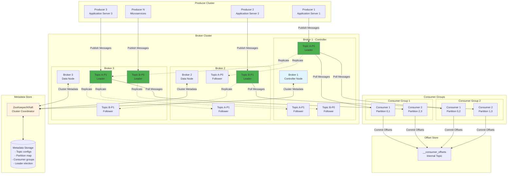
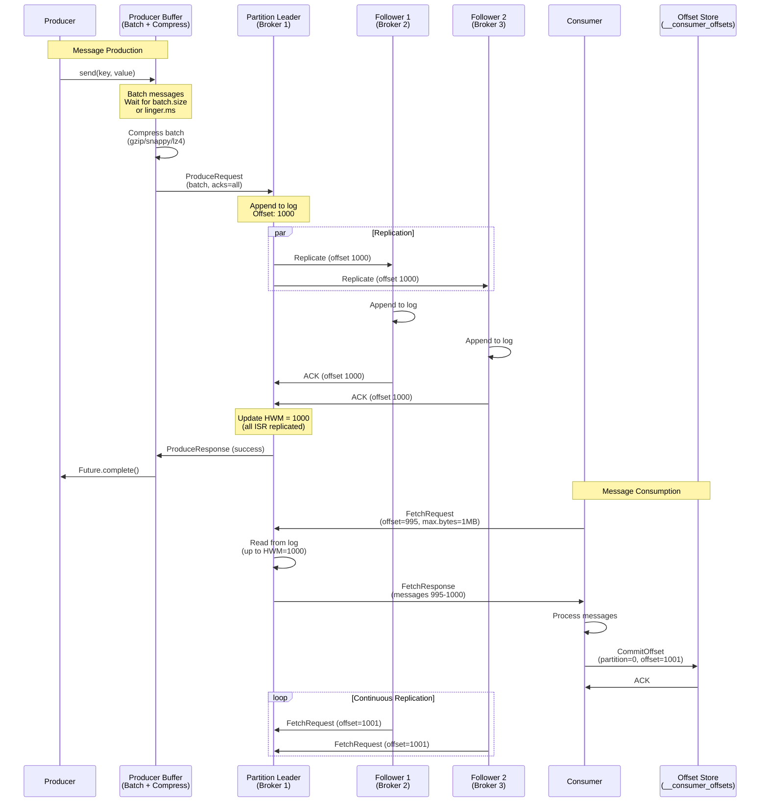
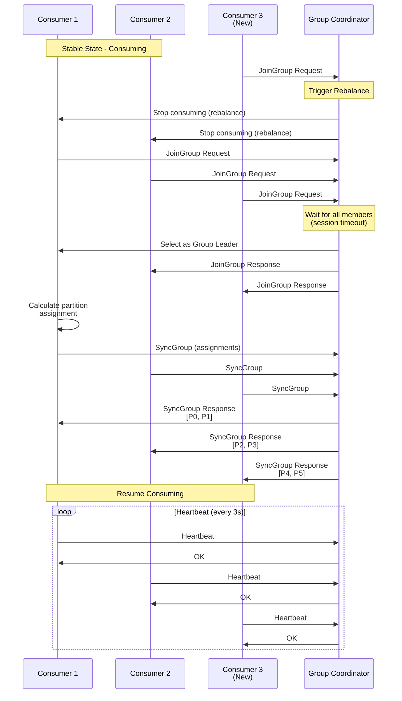
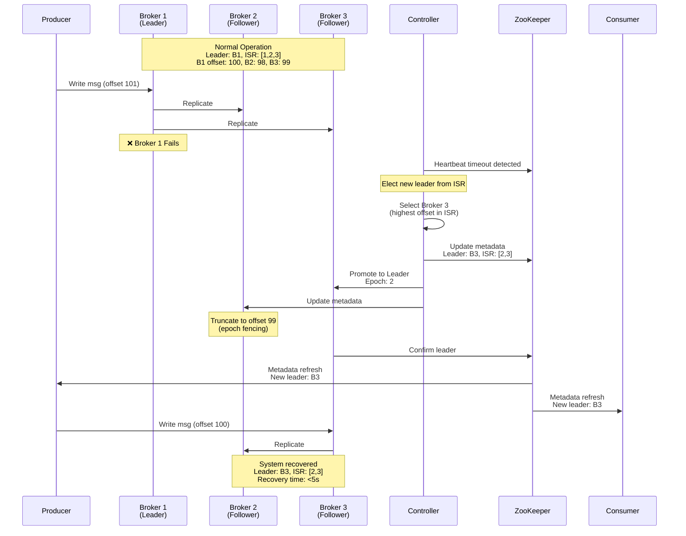

# Pub/Sub Messaging System Design (Apache Kafka-like)

**Difficulty Level:** ⭐⭐⭐⭐ Very Hard  
**Tags:** `Message Queue`, `Pub/Sub`, `Event Streaming`, `Partitioning`, `Replication`, `Exactly-once Semantics`, `Consumer Groups`, `Log-structured Storage`, `Distributed Systems`, `High Throughput`

**File Purpose:** Comprehensive system design document for a distributed pub/sub messaging system supporting 1M messages per second with exactly-once delivery semantics and durable storage. The design covers topic partitioning for horizontal scaling, consumer groups with offset management, leader-based replication with ISR (In-Sync Replicas), log-structured storage with segment files and compaction, producer idempotency and transactional writes, consumer rebalancing protocols (eager, cooperative), message ordering guarantees within partitions, retention policies (time-based, size-based), backpressure handling, ZooKeeper/KRaft for cluster coordination, monitoring with JMX metrics, and achieving 99.99% availability with <10ms publish latency for high-throughput event streaming.

**Author:** System Design Documentation  
**Created:** October 1, 2025  
**Last Updated:** October 29, 2025  
**Recent Updates:** Added difficulty level and relevant tags for better categorization

---

## TABLE OF CONTENTS

- [REQUIREMENTS & CLARIFICATION](#requirements--clarification)
  - [User Stories](#user-stories)
  - [Functional Requirements (MVP)](#functional-requirements-mvp)
  - [Non-Functional Requirements](#non-functional-requirements)
  - [Clarifying Questions & Assumptions](#clarifying-questions--assumptions)
- [BACK-OF-THE-ENVELOPE CALCULATIONS](#back-of-the-envelope-calculations)
  - [Traffic Estimates](#traffic-estimates)
  - [Storage Estimates](#storage-estimates)
  - [Bandwidth Estimates](#bandwidth-estimates)
  - [Resource Estimates](#resource-estimates)
- [HIGH-LEVEL DESIGN](#high-level-design)
  - [Core Components](#core-components)
  - [Architecture Diagram](#architecture-diagram)
  - [Data Flow Explanation](#data-flow-explanation)
- [API DESIGN](#api-design)
  - [Producer API](#producer-api)
  - [Consumer API](#consumer-api)
  - [Admin API](#admin-api)
- [DATA MODELS](#data-models)
  - [Message Structure](#message-structure)
  - [Topic Metadata](#topic-metadata)
  - [Consumer Group State](#consumer-group-state)
- [DEEP DIVE: TOPIC PARTITIONING STRATEGY](#deep-dive-topic-partitioning-strategy)
  - [Partitioning Methods](#partitioning-methods)
  - [Partition Assignment](#partition-assignment)
  - [Rebalancing Protocol](#rebalancing-protocol)
- [DEEP DIVE: CONSUMER GROUPS & REBALANCING](#deep-dive-consumer-groups--rebalancing)
  - [Consumer Group Coordinator](#consumer-group-coordinator)
  - [Rebalancing Strategies](#rebalancing-strategies)
  - [Rebalancing Protocol Flow](#rebalancing-protocol-flow)
- [DEEP DIVE: OFFSET MANAGEMENT](#deep-dive-offset-management)
  - [Offset Storage](#offset-storage)
  - [Commit Strategies](#commit-strategies)
  - [Exactly-Once Semantics](#exactly-once-semantics)
- [DEEP DIVE: LOG-STRUCTURED STORAGE](#deep-dive-log-structured-storage)
  - [Segment Management](#segment-management)
  - [Index Structures](#index-structures)
  - [Retention and Cleanup](#retention-and-cleanup)
- [DEEP DIVE: REPLICATION PROTOCOL](#deep-dive-replication-protocol)
  - [Leader-Follower Architecture](#leader-follower-architecture)
  - [In-Sync Replicas (ISR)](#in-sync-replicas-isr)
  - [Failure Scenarios](#failure-scenarios)
- [DEEP DIVE: PRODUCER OPTIMIZATIONS](#deep-dive-producer-optimizations)
  - [Batching Strategy](#batching-strategy)
  - [Compression](#compression)
  - [Partitioner](#partitioner)
- [DEEP DIVE: BACK-PRESSURE & FLOW CONTROL](#deep-dive-back-pressure--flow-control)
  - [Producer Flow Control](#producer-flow-control)
  - [Consumer Flow Control](#consumer-flow-control)
- [DEEP DIVE: COMPACTED TOPICS](#deep-dive-compacted-topics)
  - [Log Compaction Process](#log-compaction-process)
  - [Use Cases](#use-cases)
- [DATABASE SCHEMA](#database-schema)
  - [Metadata Storage](#metadata-storage)
- [KEY ALGORITHMS](#key-algorithms)
  - [Consistent Hashing for Partition Assignment](#consistent-hashing-for-partition-assignment)
  - [High Water Mark Algorithm](#high-water-mark-algorithm)
- [SCALABILITY & PERFORMANCE](#scalability--performance)
  - [Horizontal Scaling](#horizontal-scaling)
  - [Performance Optimizations](#performance-optimizations)
- [RELIABILITY & FAULT TOLERANCE](#reliability--fault-tolerance)
  - [Failure Detection](#failure-detection)
  - [Recovery Mechanisms](#recovery-mechanisms)
- [MONITORING & OBSERVABILITY](#monitoring--observability)
  - [Key Metrics](#key-metrics)
  - [Alerting Rules](#alerting-rules)
- [SECURITY CONSIDERATIONS](#security-considerations)
  - [Authentication](#authentication)
  - [Authorization (ACLs)](#authorization-acls)
  - [Encryption](#encryption)
  - [Audit Logging](#audit-logging)
- [TRADE-OFFS & DESIGN DECISIONS](#trade-offs--design-decisions)
  - [Decision: Replication Factor](#decision-replication-factor)
  - [Decision: Acknowledgment Level](#decision-acknowledgment-level)
  - [Decision: Pull vs Push Model](#decision-pull-vs-push-model)
  - [Alternatives to Kafka](#alternatives-to-kafka)
- [FUTURE ENHANCEMENTS](#future-enhancements)
  - [Tiered Storage](#tiered-storage)
  - [Multi-Region Replication](#multi-region-replication)
  - [Schema Registry Integration](#schema-registry-integration)
  - [Stream Processing Integration](#stream-processing-integration)
- [SUMMARY](#summary)

---

## REQUIREMENTS & CLARIFICATION

### User Stories

**As a microservice developer**, I want to publish events to topics so that other services can asynchronously consume and react to those events.

**As an application architect**, I want consumer groups to process messages in parallel so that I can scale message processing across multiple consumers.

**As a data engineer**, I want to replay historical messages so that I can reprocess data for analytics or recover from processing errors.

**As a platform engineer**, I want automatic partition rebalancing so that new consumers can join without manual intervention.

**As a system operator**, I want message durability with replication so that no data is lost even when brokers fail.

**As a stream processing developer**, I want exactly-once delivery guarantees so that my processing results are accurate without duplicates.

---

### Functional Requirements (MVP)

1. **Message Publishing**: Producers can publish messages to topics
2. **Message Consumption**: Consumers can subscribe to topics and read messages
3. **Topic Management**: Create, delete, and configure topics with partitions
4. **Consumer Groups**: Multiple consumers coordinate to consume partitions
5. **Offset Management**: Track consumption progress per partition
6. **Message Retention**: Store messages for configurable time period
7. **Replication**: Replicate data across multiple brokers for durability
8. **Ordering Guarantee**: Maintain message order within partitions

**Out of Scope for MVP:**

- Message filtering/routing within broker
- Complex transactions across topics
- Message transformation in broker
- Built-in schema registry

---

### Non-Functional Requirements

**Performance:**

- Throughput: Support 10M messages/second
- Publish Latency: <10ms p99
- Consumer Lag: <50ms under normal load
- Batch processing for efficiency

**Availability:**

- 99.99% uptime (52 minutes downtime/year)
- Automatic failover for broker failures
- No single point of failure
- Partition leader election < 5 seconds

**Scalability:**

- 100+ topics with 1000+ partitions
- 10K+ producers and consumers
- Horizontal scaling by adding brokers
- Dynamic partition assignment

**Durability:**

- Replication factor of 3 (configurable)
- No data loss with proper acknowledgment
- At-least-once delivery guarantee (default)
- Exactly-once delivery option available

**Storage:**

- 30 days message retention (configurable)
- 10 PB total storage capacity
- Log-structured storage for sequential writes
- Support for compacted topics

---

### Clarifying Questions & Assumptions

**Scale Questions:**

- **Q:** What's the expected message throughput?
  - **A:** 10M messages/second, scalable to 100M+ with cluster expansion
- **Q:** How many topics and partitions?
  - **A:** 100+ topics, 1000+ partitions total
- **Q:** How long should messages be retained?
  - **A:** 30 days by default, configurable per topic

**Usage Pattern Questions:**

- **Q:** What's the typical message size?
  - **A:** Average 1KB, maximum 1MB per message
- **Q:** What delivery guarantees are needed?
  - **A:** At-least-once by default, exactly-once for critical workflows
- **Q:** Are there ordering requirements?
  - **A:** Yes, within partition ordering is mandatory

**Architecture Questions:**

- **Q:** How many datacenters/regions?
  - **A:** Single region for MVP, multi-region in future
- **Q:** What replication factor?
  - **A:** 3 replicas for production workloads
- **Q:** Should consumers read from replicas?
  - **A:** Primarily from leader, replica reads for optimization

**Assumptions:**

- Network bandwidth is sufficient (10Gbps+ per broker)
- Producers can buffer messages during brief outages
- Consumers handle idempotent processing for at-least-once
- Most messages are < 10KB in size
- Sequential disk I/O is the bottleneck, not CPU

---

## BACK-OF-THE-ENVELOPE CALCULATIONS

### Traffic Estimates

```text
Messages per second: 10M
Average message size: 1 KB
Data per second: 10 GB/s
Data per day: 10 GB/s * 86,400s = 864 TB/day
Storage for 30 days: 864 TB * 30 = ~26 PB (with replication factor 3)
Number of topics: 100+
Partitions per topic: 10-100
Total partitions: 1000+
Producers: 10K+
Consumers: 10K+
Consumer groups: 100+
```

### Storage Estimates

```text
Data per message: 1 KB (average)
Messages per day: 10M * 86,400 = 864 billion messages/day
Storage per day: 864B * 1KB = 864 TB/day

Retention period: 30 days
Storage without replication: 864 TB * 30 = 25.9 PB
With replication factor 3: 25.9 PB * 3 = 77.7 PB

Per-broker storage (assuming 100 brokers):
= 77.7 PB / 100 = 777 TB per broker
= Need 10-20 TB SSD per broker (handling active partitions)
+ Bulk HDD for older segments

Metadata storage (ZooKeeper/KRaft):
- Topic metadata: ~100 topics * 1KB = 100 KB
- Partition metadata: 1000 partitions * 2KB = 2 MB
- Consumer group state: 100 groups * 100KB = 10 MB
Total metadata: < 50 MB (fits in memory)
```

### Bandwidth Estimates

```text
Ingress (Producer to Broker):
= 10M messages/sec * 1KB = 10 GB/s
= 80 Gbps

Egress (Broker to Consumer):
Assuming 3 consumer groups on average per topic:
= 10 GB/s * 3 = 30 GB/s
= 240 Gbps

Replication bandwidth (Leader to Followers):
= 10 GB/s * 2 (two followers per partition)
= 20 GB/s = 160 Gbps

Total bandwidth per broker (assuming 20 brokers):
= (80 + 240 + 160) Gbps / 20
= 24 Gbps per broker
= Need 25-40 Gbps network cards
```

### Resource Estimates

```text
Number of Brokers:
Based on throughput: 10M msg/s / 100K msg/s per broker = 100 brokers
Based on storage: 77.7 PB / 10 TB per broker = 7,770 brokers
Based on partition leadership: 1000 partitions / 50 per broker = 20 brokers

Chosen: 20-30 brokers (scaled for throughput and leadership)

Per Broker Resources:
- CPU: 16-32 cores (handle network I/O, compression)
- RAM: 64-128 GB (page cache for hot data)
- Disk: 10-20 TB NVMe SSD (active segments)
- Network: 25-40 Gbps

ZooKeeper Cluster:
- 3-5 nodes for metadata
- 8 GB RAM per node
- 100 GB SSD per node

Consumer Requirements:
- Scale independently
- 1 consumer per partition for max parallelism
- 1000 partitions = up to 1000 consumers per group
```

---

## HIGH-LEVEL DESIGN

### Core Components

#### Broker Cluster

- Distributed servers that store and serve messages
- Each broker handles multiple topic partitions
- Horizontally scalable by adding more brokers

#### ZooKeeper/KRaft (Metadata Store)

- Stores cluster metadata (topics, partitions, brokers)
- Manages leader election for partitions
- Tracks broker liveness
- Stores consumer group state

#### Producer

- Publishes messages to topics
- Determines target partition
- Handles batching and compression

#### Consumer

- Subscribes to topics and pulls messages
- Part of consumer groups for parallel processing
- Manages offset commits

#### Controller

- Special broker that manages cluster operations
- Handles partition leader election
- Coordinates broker joins/leaves

### Architecture Diagram



### Data Flow Explanation

**Message Publishing Flow:**

1. **Producer sends message**: Producer determines target partition using partitioner (hash-based, key-based, or round-robin)
2. **Message batching**: Producer buffers messages in memory batch (configurable batch size and linger time)
3. **Compression**: Batch is compressed (gzip, snappy, lz4, or zstd) before sending
4. **Leader write**: Message batch sent to partition leader broker
5. **Log append**: Leader appends to log-structured storage (active segment)
6. **Replication**: Leader replicates to followers (In-Sync Replicas)
7. **Acknowledgment**: Based on acks configuration (0, 1, or all)
8. **High water mark update**: Once all ISR replicas acknowledge, HWM advances

**Message Consumption Flow:**

1. **Consumer subscribes**: Consumer joins consumer group and subscribes to topics
2. **Partition assignment**: Group coordinator assigns partitions using rebalancing protocol
3. **Fetch request**: Consumer sends fetch request to partition leaders
4. **Read from log**: Broker reads messages from log starting at consumer's offset (only up to high water mark)
5. **Return messages**: Batch of messages returned to consumer
6. **Process messages**: Consumer application processes messages
7. **Commit offset**: Consumer commits new offset to `__consumer_offsets` topic (auto or manual)
8. **Repeat**: Consumer polls for next batch

**Replication Flow:**

1. **Follower fetch**: Followers continuously fetch from leader (fetch request includes current offset)
2. **Leader response**: Leader sends messages starting from follower's offset
3. **Follower append**: Follower appends to local log
4. **Update ISR**: Leader tracks follower progress; removes slow followers from ISR
5. **High water mark**: HWM = minimum offset among all ISR members
6. **Consumer visibility**: Only messages up to HWM are visible to consumers



---

## API DESIGN

### Producer API

#### Send Message

```http
POST /v1/topics/{topic}/messages
Content-Type: application/json

{
  "key": "user-123",
  "value": "user data payload",
  "headers": {
    "source": "user-service",
    "timestamp": 1696118400000
  },
  "partition": 5
}
```

#### Send Batch

```http
POST /v1/topics/{topic}/messages/batch
Content-Type: application/json

{
  "messages": [
    {"key": "user-1", "value": "data1"},
    {"key": "user-2", "value": "data2"}
  ],
  "compression": "gzip",
  "acks": "all"
}
```

### Consumer API

#### Subscribe to Topic

```http
POST /v1/consumers/{group_id}/subscribe
Content-Type: application/json

{
  "topics": ["orders", "payments"],
  "auto_commit": true,
  "offset_reset": "earliest"
}
```

#### Poll Messages

```http
GET /v1/consumers/{group_id}/poll?timeout=1000
Response:
{
  "messages": [
    {
      "topic": "orders",
      "partition": 0,
      "offset": 12345,
      "key": "order-1",
      "value": "order data",
      "timestamp": 1696118400000
    }
  ]
}
```

#### Commit Offset

```http
POST /v1/consumers/{group_id}/offsets/commit
Content-Type: application/json

{
  "offsets": [
    {"topic": "orders", "partition": 0, "offset": 12346}
  ]
}
```

### Admin API

#### Create Topic

```http
POST /v1/admin/topics
Content-Type: application/json

{
  "name": "user-events",
  "partitions": 10,
  "replication_factor": 3,
  "config": {
    "retention.ms": 2592000000,
    "compression.type": "gzip"
  }
}
```

---

## DATA MODELS

### Message Structure

```json
{
  "offset": 12345,
  "timestamp": 1696118400000,
  "key": "user-123",
  "value": "message payload",
  "headers": {
    "correlation_id": "abc-123",
    "source": "user-service"
  },
  "partition": 5,
  "topic": "user-events"
}
```

### Topic Metadata

```json
{
  "topic_name": "orders",
  "partitions": [
    {
      "partition_id": 0,
      "leader": 1,
      "replicas": [1, 2, 3],
      "isr": [1, 2, 3],
      "log_start_offset": 0,
      "log_end_offset": 50000
    }
  ],
  "config": {
    "retention_ms": 2592000000,
    "segment_ms": 604800000,
    "replication_factor": 3
  }
}
```

### Consumer Group State

```json
{
  "group_id": "order-processors",
  "state": "stable",
  "protocol": "range",
  "members": [
    {
      "member_id": "consumer-1",
      "client_id": "app-server-1",
      "assignments": [
        {"topic": "orders", "partitions": [0, 1, 2]}
      ]
    }
  ],
  "offsets": {
    "orders-0": 12345,
    "orders-1": 12340,
    "orders-2": 12350
  }
}
```

---

## DEEP DIVE: TOPIC PARTITIONING STRATEGY

### Partitioning Methods

#### Hash-Based Partitioning

```python
def hash_partition(key, num_partitions):
    """
    Determines target partition using hash of message key.
    Ensures messages with same key go to same partition.
    
    Args:
        key: Message key (string)
        num_partitions: Total number of partitions
    
    Returns:
        int: Target partition ID
    """
    return hash(key) % num_partitions
```

#### Key-Based Partitioning

```python
def key_partition(key, partition_map):
    """
    Routes messages based on explicit key mapping.
    Useful for custom routing logic.
    
    Args:
        key: Message key
        partition_map: Dictionary mapping keys to partitions
    
    Returns:
        int: Target partition ID
    """
    return partition_map.get(key, 0)
```

#### Round-Robin Partitioning

```python
def round_robin_partition(counter, num_partitions):
    """
    Distributes messages evenly across partitions.
    Used when no key is provided.
    
    Args:
        counter: Monotonically increasing counter
        num_partitions: Total number of partitions
    
    Returns:
        int: Target partition ID
    """
    return counter % num_partitions
```

### Partition Assignment

#### Why Partitions Matter

1. **Parallelism**: Each partition processed by one consumer
2. **Ordering**: Messages within partition maintain order
3. **Scalability**: Add partitions to increase throughput
4. **Load Distribution**: Distribute load across brokers

#### Partition Count Considerations

```text
Factors for determining partition count:
- Target throughput per topic
- Consumer parallelism needs
- Broker capacity
- Rebalancing overhead

Formula:
Partitions = max(
  target_throughput / partition_throughput,
  max_consumer_parallelism
)

Example:
Target: 1M msg/s
Per partition: 10K msg/s
Partitions needed: 1M / 10K = 100 partitions
```

### Rebalancing Protocol

#### Rebalance Triggers

1. New consumer joins group
2. Consumer leaves/crashes
3. Partition count changes
4. Consumer subscription changes

#### Rebalance States

```text
Consumer Group State Machine:

Empty → PreparingRebalance → CompletingRebalance → Stable
  ↑                                                    │
  └────────────────────────────────────────────────────┘
                  (rebalance trigger)
```

---

## DEEP DIVE: CONSUMER GROUPS & REBALANCING

### Consumer Group Coordinator

#### Coordinator Responsibilities

1. **Group Membership**: Track active consumers
2. **Assignment**: Assign partitions to consumers
3. **Offset Management**: Store committed offsets
4. **Heartbeat Monitoring**: Detect consumer failures

#### Coordinator Selection

```python
def select_coordinator(group_id, num_brokers):
    """
    Determines which broker acts as coordinator for consumer group.
    Uses consistent hashing for deterministic selection.
    
    Args:
        group_id: Consumer group identifier
        num_brokers: Total number of brokers
    
    Returns:
        int: Broker ID acting as coordinator
    """
    return hash(group_id) % num_brokers
```

### Rebalancing Strategies

#### Range Assignment

```python
def range_assignment(partitions, consumers):
    """
    Assigns contiguous partition ranges to consumers.
    
    Example:
        Topic: orders, Partitions: [0,1,2,3,4,5]
        Consumers: [C1, C2, C3]
        Assignment:
          C1 → [0, 1]
          C2 → [2, 3]
          C3 → [4, 5]
    """
    partitions_per_consumer = len(partitions) // len(consumers)
    assignments = {}
    
    for i, consumer in enumerate(consumers):
        start = i * partitions_per_consumer
        end = start + partitions_per_consumer
        assignments[consumer] = partitions[start:end]
    
    return assignments
```

#### Round-Robin Assignment

```python
def round_robin_assignment(partitions, consumers):
    """
    Distributes partitions evenly across consumers.
    Better load distribution than range assignment.
    
    Example:
        Partitions: [0,1,2,3,4,5]
        Consumers: [C1, C2, C3]
        Assignment:
          C1 → [0, 3]
          C2 → [1, 4]
          C3 → [2, 5]
    """
    assignments = {c: [] for c in consumers}
    
    for i, partition in enumerate(partitions):
        consumer = consumers[i % len(consumers)]
        assignments[consumer].append(partition)
    
    return assignments
```

#### Sticky Assignment

```python
def sticky_assignment(current_assignment, partitions, consumers):
    """
    Minimizes partition movement during rebalancing.
    Maintains existing assignments when possible.
    
    Benefits:
    - Reduces state transfer overhead
    - Maintains consumer cache locality
    - Minimizes rebalancing time
    """
    new_assignment = {}
    unassigned_partitions = set(partitions)
    
    # Keep existing assignments
    for consumer in consumers:
        if consumer in current_assignment:
            new_assignment[consumer] = current_assignment[consumer]
            unassigned_partitions -= set(current_assignment[consumer])
    
    # Distribute unassigned partitions
    for partition in unassigned_partitions:
        min_consumer = min(consumers, 
                          key=lambda c: len(new_assignment.get(c, [])))
        new_assignment.setdefault(min_consumer, []).append(partition)
    
    return new_assignment
```

### Rebalancing Protocol Flow



---

## DEEP DIVE: OFFSET MANAGEMENT

### Offset Storage

#### Offset Topics

```text
Special internal topic: __consumer_offsets

Partition Key: group_id + topic + partition
Value: {offset, metadata, timestamp}

Example:
Key: "order-processors:orders:0"
Value: {"offset": 12345, "timestamp": 1696118400000}
```

#### Offset Storage Options

```python
class OffsetStore:
    """
    Manages offset storage and retrieval.
    Supports both Kafka-based and external storage.
    """
    
    def store_offset(self, group_id, topic, partition, offset):
        """
        Stores consumer offset for given partition.
        
        Args:
            group_id: Consumer group ID
            topic: Topic name
            partition: Partition number
            offset: Offset to commit
        """
        key = f"{group_id}:{topic}:{partition}"
        self.offset_topic.send(key, {
            "offset": offset,
            "timestamp": current_time(),
            "metadata": {}
        })
    
    def fetch_offset(self, group_id, topic, partition):
        """
        Retrieves last committed offset.
        
        Returns:
            int: Last committed offset or -1 if not found
        """
        key = f"{group_id}:{topic}:{partition}"
        return self.offset_topic.get(key, -1)
```

### Commit Strategies

#### Auto-Commit

```python
class AutoCommitConsumer:
    """
    Automatically commits offsets at regular intervals.
    Simple but may lead to duplicate processing on failure.
    """
    
    def __init__(self, auto_commit_interval_ms=5000):
        self.auto_commit_interval = auto_commit_interval_ms
        self.last_commit_time = 0
    
    def poll(self):
        """
        Polls messages and auto-commits offsets periodically.
        """
        messages = self.fetch_messages()
        
        if time.now() - self.last_commit_time > self.auto_commit_interval:
            self.commit_sync()
            self.last_commit_time = time.now()
        
        return messages
```

#### Manual Commit (Synchronous)

```python
class ManualCommitConsumer:
    """
    Manually commits offsets after processing messages.
    Provides better control over delivery semantics.
    """
    
    def process_messages(self):
        """
        Processes messages with manual synchronous commit.
        Ensures offset committed only after successful processing.
        """
        messages = self.poll()
        
        for message in messages:
            try:
                self.process(message)
                # Commit after successful processing
                self.commit_sync({
                    "topic": message.topic,
                    "partition": message.partition,
                    "offset": message.offset + 1
                })
            except Exception as e:
                self.handle_error(e)
                break
```

#### Manual Commit (Asynchronous)

```python
def commit_async(self, callback=None):
    """
    Commits offsets asynchronously without blocking.
    Better throughput but no guarantee of commit success.
    
    Args:
        callback: Optional callback for commit result
    """
    self.offset_manager.commit_async(
        self.current_offsets,
        on_complete=callback
    )
```

### Exactly-Once Semantics

#### Transactional Producer

```python
class TransactionalProducer:
    """
    Producer that supports exactly-once semantics using transactions.
    Atomically writes messages and commits offsets.
    """
    
    def __init__(self, transactional_id):
        self.transactional_id = transactional_id
        self.init_transactions()
    
    def process_and_produce(self, input_message, output_topic):
        """
        Processes message and produces output in single transaction.
        
        Flow:
        1. Begin transaction
        2. Process message
        3. Produce output
        4. Commit input offset
        5. Commit transaction
        """
        self.begin_transaction()
        
        try:
            # Process input
            result = self.process(input_message)
            
            # Produce output
            self.send(output_topic, result)
            
            # Commit input offset within transaction
            self.send_offsets_to_transaction({
                "topic": input_message.topic,
                "partition": input_message.partition,
                "offset": input_message.offset + 1
            })
            
            # Commit transaction
            self.commit_transaction()
            
        except Exception as e:
            self.abort_transaction()
            raise e
```

#### Idempotent Producer

```python
class IdempotentProducer:
    """
    Producer with idempotence enabled to prevent duplicates.
    Uses sequence numbers to detect and deduplicate retries.
    """
    
    def __init__(self):
        self.producer_id = self.generate_producer_id()
        self.sequence_numbers = {}  # partition → sequence
    
    def send(self, topic, partition, message):
        """
        Sends message with sequence number for deduplication.
        """
        seq_num = self.sequence_numbers.get(partition, 0)
        
        self.broker.send({
            "producer_id": self.producer_id,
            "sequence_number": seq_num,
            "topic": topic,
            "partition": partition,
            "message": message
        })
        
        self.sequence_numbers[partition] = seq_num + 1
```

---

## DEEP DIVE: LOG-STRUCTURED STORAGE

### Segment Management

#### Log Structure

```text
Topic Partition Log Structure:

/data/orders-0/
  ├── 00000000000000000000.log    (base offset: 0)
  ├── 00000000000000000000.index  (offset index)
  ├── 00000000000000000000.timeindex (time index)
  ├── 00000000000010000000.log    (base offset: 10M)
  ├── 00000000000010000000.index
  ├── 00000000000010000000.timeindex
  └── 00000000000020000000.log    (base offset: 20M, active)

Segment naming: Base offset padded to 20 digits
Active segment: Currently being written
Closed segments: Immutable, eligible for compaction/deletion
```

#### Segment Rolling

```python
class SegmentManager:
    """
    Manages log segments for a partition.
    Handles segment creation, rolling, and cleanup.
    """
    
    def __init__(self, segment_bytes=1073741824, segment_ms=604800000):
        """
        Initialize segment manager.
        
        Args:
            segment_bytes: Max segment size (1 GB default)
            segment_ms: Max segment age (7 days default)
        """
        self.segment_bytes = segment_bytes
        self.segment_ms = segment_ms
        self.active_segment = None
        self.segments = []
    
    def should_roll_segment(self):
        """
        Determines if active segment should be closed.
        
        Returns:
            bool: True if segment should roll
        """
        if not self.active_segment:
            return True
        
        size_exceeded = self.active_segment.size >= self.segment_bytes
        time_exceeded = (current_time() - self.active_segment.created_at 
                        >= self.segment_ms)
        
        return size_exceeded or time_exceeded
    
    def roll_segment(self):
        """
        Closes active segment and creates new one.
        """
        if self.active_segment:
            self.active_segment.close()
            self.segments.append(self.active_segment)
        
        base_offset = self.get_next_offset()
        self.active_segment = Segment(base_offset)
```

### Index Structures

#### Offset Index

```text
Maps logical offset to physical position in log file

Format: [offset (4 bytes), position (4 bytes)]

Example:
Offset  Position
0       0
100     4096
200     8192
300     12288

To find message at offset 150:
1. Binary search index → find offset 100 at position 4096
2. Scan log file from position 4096 to find offset 150
```

#### Time Index

```text
Maps timestamp to offset for time-based queries

Format: [timestamp (8 bytes), offset (4 bytes)]

Example:
Timestamp         Offset
1696118400000     0
1696118460000     1000
1696118520000     2000

Use case: Fetch messages from specific time
```

#### Implementation

```python
class OffsetIndex:
    """
    Sparse index mapping offsets to file positions.
    Enables fast random access to messages.
    """
    
    def __init__(self, base_offset, index_interval=4096):
        self.base_offset = base_offset
        self.index_interval = index_interval
        self.entries = []
    
    def append(self, offset, position):
        """
        Adds entry to index.
        Only indexes messages at interval boundaries.
        """
        relative_offset = offset - self.base_offset
        if position % self.index_interval == 0:
            self.entries.append((relative_offset, position))
    
    def lookup(self, offset):
        """
        Finds file position for given offset using binary search.
        
        Returns:
            int: File position to start scanning from
        """
        relative_offset = offset - self.base_offset
        
        # Binary search to find largest offset <= target
        left, right = 0, len(self.entries) - 1
        result_position = 0
        
        while left <= right:
            mid = (left + right) // 2
            idx_offset, idx_position = self.entries[mid]
            
            if idx_offset <= relative_offset:
                result_position = idx_position
                left = mid + 1
            else:
                right = mid - 1
        
        return result_position
```

### Retention and Cleanup

#### Retention Policies

```python
class RetentionManager:
    """
    Manages log retention and cleanup based on time/size policies.
    """
    
    def __init__(self, retention_ms=2592000000, retention_bytes=None):
        """
        Initialize retention manager.
        
        Args:
            retention_ms: Keep messages for this duration (30 days default)
            retention_bytes: Max total size per partition
        """
        self.retention_ms = retention_ms
        self.retention_bytes = retention_bytes
    
    def eligible_for_deletion(self, segment):
        """
        Checks if segment can be deleted based on retention policy.
        
        Returns:
            bool: True if segment should be deleted
        """
        # Time-based retention
        age = current_time() - segment.last_modified_time
        if age > self.retention_ms:
            return True
        
        # Size-based retention
        if self.retention_bytes:
            total_size = sum(s.size for s in self.segments)
            if total_size > self.retention_bytes:
                return segment == self.oldest_segment()
        
        return False
    
    def cleanup(self):
        """
        Deletes segments that exceed retention policy.
        """
        for segment in self.segments[:]:
            if self.eligible_for_deletion(segment):
                segment.delete()
                self.segments.remove(segment)
```

---

## DEEP DIVE: REPLICATION PROTOCOL

### Leader-Follower Architecture

#### Partition Leadership

```text
Topic: orders, Partition: 0
Replicas: [Broker 1, Broker 2, Broker 3]
Leader: Broker 1
Followers: Broker 2, Broker 3

All writes go to Leader
Followers replicate from Leader
Consumers can read from Leader or Followers (read replica)
```

#### Leader Epoch

```python
class LeaderEpoch:
    """
    Tracks leader epochs to detect stale leaders.
    Prevents data loss during leader failover.
    """
    
    def __init__(self):
        self.epochs = []  # [(epoch, start_offset)]
    
    def add_epoch(self, epoch, start_offset):
        """
        Records new leader epoch when leader changes.
        
        Args:
            epoch: Leader epoch number (monotonically increasing)
            start_offset: Starting offset for this epoch
        """
        self.epochs.append((epoch, start_offset))
    
    def get_epoch_for_offset(self, offset):
        """
        Finds which leader epoch produced given offset.
        Used during log reconciliation after failover.
        
        Returns:
            int: Leader epoch number
        """
        for i in range(len(self.epochs) - 1, -1, -1):
            epoch, start_offset = self.epochs[i]
            if offset >= start_offset:
                return epoch
        return -1
```

### In-Sync Replicas (ISR)

#### ISR Management

```python
class ISRManager:
    """
    Manages In-Sync Replica set for partition.
    ISR includes leader and followers that are caught up.
    """
    
    def __init__(self, replica_lag_time_ms=10000, replica_lag_messages=4000):
        self.leader = None
        self.replicas = []
        self.isr = set()
        self.replica_lag_time_ms = replica_lag_time_ms
        self.replica_lag_messages = replica_lag_messages
        self.replica_states = {}  # replica_id → {offset, timestamp}
    
    def update_replica_state(self, replica_id, offset):
        """
        Updates follower replication state.
        
        Args:
            replica_id: Follower broker ID
            offset: Current replicated offset
        """
        self.replica_states[replica_id] = {
            "offset": offset,
            "timestamp": current_time()
        }
        
        self.update_isr()
    
    def update_isr(self):
        """
        Recalculates ISR based on replication lag.
        Removes replicas that fall too far behind.
        """
        leader_offset = self.get_leader_offset()
        new_isr = {self.leader}
        
        for replica_id in self.replicas:
            if replica_id == self.leader:
                continue
            
            state = self.replica_states.get(replica_id)
            if not state:
                continue
            
            # Check lag constraints
            offset_lag = leader_offset - state["offset"]
            time_lag = current_time() - state["timestamp"]
            
            if (offset_lag <= self.replica_lag_messages and 
                time_lag <= self.replica_lag_time_ms):
                new_isr.add(replica_id)
        
        if new_isr != self.isr:
            self.isr = new_isr
            self.notify_isr_change()
```

#### Acknowledgment Levels

```python
class AckLevel:
    """
    Producer acknowledgment configurations.
    Determines durability vs latency trade-off.
    """
    
    # acks=0: Fire and forget (no acknowledgment)
    NONE = 0
    
    # acks=1: Leader acknowledgment only
    LEADER = 1
    
    # acks=all: All ISR replicas acknowledgment
    ALL = -1

def wait_for_acks(self, ack_level, partition):
    """
    Waits for appropriate acknowledgments based on ack level.
    
    Args:
        ack_level: Acknowledgment level (0, 1, or -1)
        partition: Partition being written to
    
    Returns:
        bool: True if acks received successfully
    """
    if ack_level == AckLevel.NONE:
        return True  # Don't wait
    
    if ack_level == AckLevel.LEADER:
        return self.wait_for_leader_ack(partition)
    
    if ack_level == AckLevel.ALL:
        return self.wait_for_isr_acks(partition)
```

### Failure Scenarios

#### Leader Failure



#### Follower Failure

```text
Scenario: Follower broker fails

Before:
Leader: Broker 1
ISR: [1, 2, 3]

After:
1. Leader stops receiving fetch requests from Broker 2
2. After replica.lag.time.max.ms, remove Broker 2 from ISR
3. ISR: [1, 3]
4. System continues with reduced replication

When Broker 2 recovers:
1. Catches up with leader
2. Once caught up, rejoins ISR
3. ISR: [1, 2, 3]
```

#### Split Brain Prevention

```python
class LeaderFencing:
    """
    Prevents split-brain scenarios using leader epochs.
    Ensures only current leader can accept writes.
    """
    
    def validate_leader(self, request_epoch, current_epoch):
        """
        Validates that request comes from current leader.
        
        Args:
            request_epoch: Epoch claimed by request
            current_epoch: Current known epoch
        
        Returns:
            bool: True if request is from valid leader
        
        Raises:
            FencedLeaderException: If request from stale leader
        """
        if request_epoch < current_epoch:
            raise FencedLeaderException(
                f"Stale leader epoch {request_epoch}, "
                f"current epoch is {current_epoch}"
            )
        
        return request_epoch == current_epoch
```

---

## DEEP DIVE: PRODUCER OPTIMIZATIONS

### Batching Strategy

#### Batch Configuration

```python
class ProducerBatch:
    """
    Batches multiple messages for efficient transmission.
    Reduces network overhead and increases throughput.
    """
    
    def __init__(self, 
                 batch_size=16384,      # 16 KB
                 linger_ms=10,          # Wait 10ms
                 max_in_flight=5):      # Max concurrent requests
        """
        Initialize producer batch configuration.
        
        Args:
            batch_size: Max batch size in bytes
            linger_ms: Max time to wait before sending batch
            max_in_flight: Max concurrent in-flight requests
        """
        self.batch_size = batch_size
        self.linger_ms = linger_ms
        self.max_in_flight = max_in_flight
        self.batches = {}  # partition → batch
        self.batch_timers = {}
    
    def add_message(self, partition, message):
        """
        Adds message to partition batch.
        Triggers send if batch is full or time elapsed.
        
        Returns:
            Future: Future for message acknowledgment
        """
        batch = self.batches.get(partition)
        
        if not batch:
            batch = MessageBatch(partition)
            self.batches[partition] = batch
            self.start_linger_timer(partition)
        
        batch.add(message)
        
        # Send if batch full
        if batch.size >= self.batch_size:
            self.send_batch(partition)
        
        return message.future
    
    def start_linger_timer(self, partition):
        """
        Starts timer to send batch after linger time.
        Ensures messages sent even if batch not full.
        """
        def send_callback():
            if partition in self.batches:
                self.send_batch(partition)
        
        timer = Timer(self.linger_ms / 1000, send_callback)
        self.batch_timers[partition] = timer
        timer.start()
```

### Compression

#### Compression Types

```python
class Compression:
    """
    Compression algorithms for message batches.
    Reduces network bandwidth and storage.
    """
    
    NONE = "none"
    GZIP = "gzip"      # Good compression, moderate CPU
    SNAPPY = "snappy"  # Fast, moderate compression
    LZ4 = "lz4"        # Very fast, good compression
    ZSTD = "zstd"      # Best compression, higher CPU
    
    @staticmethod
    def compress(messages, algorithm):
        """
        Compresses message batch using specified algorithm.
        
        Args:
            messages: List of messages to compress
            algorithm: Compression algorithm
        
        Returns:
            bytes: Compressed message batch
        
        Compression ratios (typical):
        - Text data: 5:1 to 10:1
        - JSON: 4:1 to 8:1
        - Already compressed: 1:1
        """
        data = serialize(messages)
        
        if algorithm == Compression.GZIP:
            return gzip.compress(data)
        elif algorithm == Compression.SNAPPY:
            return snappy.compress(data)
        elif algorithm == Compression.LZ4:
            return lz4.compress(data)
        elif algorithm == Compression.ZSTD:
            return zstd.compress(data)
        
        return data
```

### Partitioner

#### Custom Partitioner

```python
class CustomPartitioner:
    """
    Custom partitioning logic for message routing.
    Enables application-specific distribution strategies.
    """
    
    def partition(self, topic, key, value, cluster_metadata):
        """
        Determines target partition for message.
        
        Args:
            topic: Topic name
            key: Message key
            value: Message value
            cluster_metadata: Current cluster state
        
        Returns:
            int: Target partition ID
        """
        num_partitions = cluster_metadata.partition_count(topic)
        
        if key is None:
            # Round-robin for keyless messages
            return self.round_robin_counter % num_partitions
        
        # Custom logic: Route by geographic region
        if key.startswith("US"):
            return 0
        elif key.startswith("EU"):
            return 1
        elif key.startswith("ASIA"):
            return 2
        else:
            # Default to hash-based
            return hash(key) % num_partitions
```

---

## DEEP DIVE: BACK-PRESSURE & FLOW CONTROL

### Producer Flow Control

#### Quota Management

```python
class ProducerQuota:
    """
    Enforces rate limits on producer throughput.
    Prevents resource exhaustion and ensures fair usage.
    """
    
    def __init__(self, bytes_per_second=10485760):  # 10 MB/s default
        """
        Initialize quota manager.
        
        Args:
            bytes_per_second: Max bytes per second per producer
        """
        self.bytes_per_second = bytes_per_second
        self.token_bucket = TokenBucket(bytes_per_second)
    
    def check_quota(self, bytes_to_send):
        """
        Checks if request within quota limits.
        
        Args:
            bytes_to_send: Size of request in bytes
        
        Returns:
            int: Throttle time in milliseconds (0 if no throttle)
        """
        if self.token_bucket.try_consume(bytes_to_send):
            return 0
        
        # Calculate throttle time
        deficit = bytes_to_send - self.token_bucket.available()
        throttle_ms = (deficit / self.bytes_per_second) * 1000
        
        return int(throttle_ms)

class TokenBucket:
    """
    Token bucket algorithm for rate limiting.
    """
    
    def __init__(self, rate):
        self.rate = rate
        self.tokens = rate
        self.last_update = time.time()
    
    def try_consume(self, tokens):
        """
        Attempts to consume tokens from bucket.
        
        Returns:
            bool: True if tokens available
        """
        self.refill()
        
        if self.tokens >= tokens:
            self.tokens -= tokens
            return True
        
        return False
    
    def refill(self):
        """Refills bucket based on elapsed time."""
        now = time.time()
        elapsed = now - self.last_update
        self.tokens = min(self.rate, 
                         self.tokens + elapsed * self.rate)
        self.last_update = now
```

### Consumer Flow Control

#### Fetch Configuration

```python
class ConsumerFetchConfig:
    """
    Configures consumer fetch behavior for flow control.
    Balances throughput and resource usage.
    """
    
    def __init__(self,
                 fetch_min_bytes=1,           # Min bytes to fetch
                 fetch_max_bytes=52428800,    # Max bytes (50 MB)
                 fetch_max_wait_ms=500,       # Max wait time
                 max_partition_bytes=1048576): # Max per partition (1 MB)
        """
        Initialize fetch configuration.
        
        Parameters control fetch behavior:
        - fetch_min_bytes: Wait for at least this much data
        - fetch_max_bytes: Fetch at most this much data
        - fetch_max_wait_ms: Wait at most this long
        - max_partition_bytes: Fetch at most this much per partition
        """
        self.fetch_min_bytes = fetch_min_bytes
        self.fetch_max_bytes = fetch_max_bytes
        self.fetch_max_wait_ms = fetch_max_wait_ms
        self.max_partition_bytes = max_partition_bytes
    
    def should_return_fetch(self, accumulated_bytes, wait_time_ms):
        """
        Determines if fetch request should return.
        
        Returns:
            bool: True if should return immediately
        """
        return (accumulated_bytes >= self.fetch_min_bytes or
                wait_time_ms >= self.fetch_max_wait_ms)
```

#### Pause/Resume

```python
class ConsumerPauseResume:
    """
    Allows consumers to pause/resume partition consumption.
    Useful for rate limiting and back-pressure handling.
    """
    
    def __init__(self):
        self.paused_partitions = set()
    
    def pause(self, partitions):
        """
        Pauses consumption from specified partitions.
        
        Use cases:
        - Processing backlog too large
        - Downstream system overloaded
        - Rate limiting
        
        Args:
            partitions: List of (topic, partition) tuples
        """
        self.paused_partitions.update(partitions)
    
    def resume(self, partitions):
        """
        Resumes consumption from paused partitions.
        
        Args:
            partitions: List of (topic, partition) tuples
        """
        self.paused_partitions.difference_update(partitions)
    
    def fetch_partitions(self):
        """
        Returns partitions to fetch from (excluding paused).
        
        Returns:
            list: Non-paused partitions
        """
        all_partitions = self.assigned_partitions()
        return [p for p in all_partitions 
                if p not in self.paused_partitions]
```

---

## DEEP DIVE: COMPACTED TOPICS

### Log Compaction Process

#### Compaction Strategy

```text
Log compaction retains latest value for each key.

Before compaction:
Offset  Key    Value
0       user1  {name: "Alice", age: 25}
1       user2  {name: "Bob", age: 30}
2       user1  {name: "Alice", age: 26}  ← Updated
3       user3  {name: "Charlie", age: 35}
4       user2  null                       ← Deleted
5       user1  {name: "Alice", age: 27}  ← Updated again

After compaction:
Offset  Key    Value
3       user3  {name: "Charlie", age: 35}
5       user1  {name: "Alice", age: 27}
(user2 removed due to null value - tombstone)
```

#### Compaction Implementation

```python
class LogCompactor:
    """
    Performs log compaction to retain only latest value per key.
    Used for changelog streams and state management.
    """
    
    def __init__(self, min_cleanable_ratio=0.5):
        """
        Initialize log compactor.
        
        Args:
            min_cleanable_ratio: Min ratio of dirty/total before compacting
        """
        self.min_cleanable_ratio = min_cleanable_ratio
    
    def compact_segment(self, segment):
        """
        Compacts a log segment by deduplicating keys.
        
        Algorithm:
        1. Scan segment backwards to build key → offset map
        2. Keep only latest occurrence of each key
        3. Write compacted segment
        4. Replace original segment
        
        Args:
            segment: Segment to compact
        
        Returns:
            Segment: New compacted segment
        """
        # Build map of key → latest offset
        key_map = {}
        for record in reversed(segment.records):
            if record.key not in key_map:
                key_map[record.key] = record.offset
        
        # Write new segment with deduplicated records
        compacted = Segment(segment.base_offset)
        for record in segment.records:
            if key_map[record.key] == record.offset:
                # This is the latest value for key
                if record.value is not None:  # Skip tombstones
                    compacted.append(record)
        
        return compacted
    
    def should_compact(self, partition):
        """
        Determines if partition needs compaction.
        
        Returns:
            bool: True if should compact
        """
        dirty_bytes = partition.dirty_bytes()
        total_bytes = partition.total_bytes()
        
        if total_bytes == 0:
            return False
        
        dirty_ratio = dirty_bytes / total_bytes
        return dirty_ratio >= self.min_cleanable_ratio
```

### Use Cases

#### Changelog Streams

```python
class ChangelogStream:
    """
    Uses compacted topic to maintain state changelog.
    Enables state recovery and replication.
    """
    
    def __init__(self, topic):
        self.topic = topic
        self.state = {}
    
    def publish_change(self, key, value):
        """
        Publishes state change to changelog topic.
        
        Args:
            key: Entity identifier
            value: New state (or None for delete)
        """
        self.producer.send(
            topic=self.topic,
            key=key,
            value=value
        )
        
        # Update local state
        if value is None:
            del self.state[key]
        else:
            self.state[key] = value
    
    def rebuild_state(self):
        """
        Rebuilds state by replaying compacted changelog.
        Only latest value per key is processed.
        
        Returns:
            dict: Reconstructed state
        """
        consumer = Consumer(topics=[self.topic])
        state = {}
        
        for message in consumer.poll():
            if message.value is None:
                # Tombstone - delete key
                state.pop(message.key, None)
            else:
                state[message.key] = message.value
        
        return state
```

#### Database CDC (Change Data Capture)

```text
Use compacted topic to stream database changes:

Database:
UPDATE users SET status='active' WHERE id=123
→ Produce: {key: "users:123", value: {id:123, status:'active'}}

DELETE FROM users WHERE id=456
→ Produce: {key: "users:456", value: null}

Consumers maintain materialized view by replaying compacted topic
```

---

## DATABASE SCHEMA

### Metadata Storage

#### ZooKeeper Schema

```text
/brokers
  /ids
    /1 → {"host": "broker1.example.com", "port": 9092}
    /2 → {"host": "broker2.example.com", "port": 9092}
    /3 → {"host": "broker3.example.com", "port": 9092}
  /topics
    /orders
      /partitions
        /0
          /state → {"leader": 1, "isr": [1,2,3]}
        /1
          /state → {"leader": 2, "isr": [1,2,3]}

/consumers
  /order-processors
    /ids
      /consumer1 → {"subscription": ["orders"]}
    /offsets
      /orders
        /0 → 12345
        /1 → 12340

/controller → {"brokerid": 1, "timestamp": 1696118400000}

/config
  /topics
    /orders → {"retention.ms": 2592000000}
```

#### KRaft Metadata Log

```json
{
  "record_type": "TopicRecord",
  "topic_id": "abc-123",
  "name": "orders",
  "partitions": [
    {
      "partition_id": 0,
      "replicas": [1, 2, 3],
      "leader": 1,
      "isr": [1, 2, 3]
    }
  ]
}
```

---

## KEY ALGORITHMS

### Consistent Hashing for Partition Assignment

```python
class ConsistentHash:
    """
    Consistent hashing for partition to broker assignment.
    Minimizes reassignment when brokers added/removed.
    """
    
    def __init__(self, virtual_nodes=150):
        """
        Initialize consistent hash ring.
        
        Args:
            virtual_nodes: Number of virtual nodes per broker
        """
        self.virtual_nodes = virtual_nodes
        self.ring = {}  # hash → broker_id
        self.sorted_keys = []
    
    def add_broker(self, broker_id):
        """
        Adds broker to hash ring.
        Creates virtual nodes for better distribution.
        """
        for i in range(self.virtual_nodes):
            virtual_key = f"{broker_id}:{i}"
            hash_value = hash(virtual_key)
            self.ring[hash_value] = broker_id
        
        self.sorted_keys = sorted(self.ring.keys())
    
    def remove_broker(self, broker_id):
        """
        Removes broker from hash ring.
        """
        keys_to_remove = [k for k, v in self.ring.items() 
                         if v == broker_id]
        for key in keys_to_remove:
            del self.ring[key]
        
        self.sorted_keys = sorted(self.ring.keys())
    
    def get_broker(self, partition_id):
        """
        Maps partition to broker using consistent hashing.
        
        Returns:
            int: Broker ID for partition
        """
        if not self.sorted_keys:
            return None
        
        hash_value = hash(partition_id)
        
        # Find first node >= hash_value
        idx = bisect.bisect_right(self.sorted_keys, hash_value)
        if idx == len(self.sorted_keys):
            idx = 0
        
        return self.ring[self.sorted_keys[idx]]
```

### High Water Mark Algorithm

```python
class HighWaterMark:
    """
    Tracks high water mark for partition replication.
    HWM is max offset replicated to all ISR members.
    """
    
    def __init__(self):
        self.leader_end_offset = 0
        self.follower_offsets = {}  # replica_id → offset
        self.isr = set()
        self.high_water_mark = 0
    
    def update_leader_offset(self, offset):
        """
        Updates leader's end offset after append.
        """
        self.leader_end_offset = offset
        self.update_high_water_mark()
    
    def update_follower_offset(self, replica_id, offset):
        """
        Updates follower's replicated offset.
        """
        self.follower_offsets[replica_id] = offset
        self.update_high_water_mark()
    
    def update_high_water_mark(self):
        """
        Recalculates high water mark.
        HWM = min offset among all ISR replicas.
        
        Only messages up to HWM are visible to consumers.
        """
        if not self.isr:
            self.high_water_mark = 0
            return
        
        offsets = [self.follower_offsets.get(r, 0) for r in self.isr]
        offsets.append(self.leader_end_offset)
        
        self.high_water_mark = min(offsets)
    
    def is_visible(self, offset):
        """
        Checks if offset is visible to consumers.
        
        Returns:
            bool: True if offset <= high water mark
        """
        return offset <= self.high_water_mark
```

---

## SCALABILITY & PERFORMANCE

### Horizontal Scaling

#### Adding Brokers

```text
Process:
1. Start new broker with unique broker ID
2. Broker registers with ZooKeeper/Controller
3. Controller detects new broker
4. Rebalance partitions to include new broker
5. Start replica reassignment
6. New broker catches up with existing data
7. Update ISR to include new replica

Partition reassignment:
Before (3 brokers):
P0: [1, 2, 3]
P1: [2, 3, 1]
P2: [3, 1, 2]

After (4 brokers):
P0: [1, 2, 4]
P1: [2, 3, 1]
P2: [3, 4, 2]
P3: [4, 1, 3]  ← New partition
```

#### Partition Expansion

```python
def expand_partitions(topic, new_partition_count):
    """
    Increases partition count for topic.
    Cannot decrease - partition count only grows.
    
    Args:
        topic: Topic name
        new_partition_count: Target partition count
    
    Process:
    1. Validate new_partition_count > current
    2. Create new partitions
    3. Assign replicas to brokers
    4. Initialize new partition logs
    5. Update metadata
    
    Note: Existing keys may be redistributed
    """
    current_count = get_partition_count(topic)
    
    if new_partition_count <= current_count:
        raise ValueError("Can only increase partition count")
    
    for partition_id in range(current_count, new_partition_count):
        replicas = assign_replicas(partition_id)
        create_partition(topic, partition_id, replicas)
    
    update_metadata(topic, new_partition_count)
```

### Performance Optimizations

#### Zero-Copy Transfer

```python
class ZeroCopyTransfer:
    """
    Uses sendfile() for zero-copy data transfer.
    Avoids copying data between kernel and user space.
    
    Performance benefit:
    - Traditional: disk → kernel → user → kernel → network
    - Zero-copy: disk → kernel → network
    
    Reduces CPU usage and increases throughput.
    """
    
    def send_messages(self, socket, file, offset, length):
        """
        Sends file data directly to socket without copying.
        
        Args:
            socket: Network socket
            file: File descriptor
            offset: Start offset in file
            length: Number of bytes to send
        """
        # Uses os.sendfile() or equivalent
        sendfile(socket.fileno(), file.fileno(), offset, length)
```

#### Memory-Mapped Files

```python
class MemoryMappedLog:
    """
    Uses memory-mapped files for log storage.
    Leverages OS page cache for performance.
    """
    
    def __init__(self, file_path):
        self.file = open(file_path, "r+b")
        self.mmap = mmap.mmap(self.file.fileno(), 0)
    
    def read(self, offset, length):
        """
        Reads data from memory-mapped file.
        OS handles caching automatically.
        """
        return self.mmap[offset:offset+length]
    
    def write(self, offset, data):
        """
        Writes data to memory-mapped file.
        """
        self.mmap[offset:offset+len(data)] = data
```

---

## RELIABILITY & FAULT TOLERANCE

### Failure Detection

#### Heartbeat Mechanism

```python
class HeartbeatMonitor:
    """
    Monitors broker/consumer health via heartbeats.
    Detects failures and triggers recovery.
    """
    
    def __init__(self, session_timeout_ms=10000, heartbeat_interval_ms=3000):
        """
        Initialize heartbeat monitor.
        
        Args:
            session_timeout_ms: Max time without heartbeat before failure
            heartbeat_interval_ms: Heartbeat frequency
        """
        self.session_timeout_ms = session_timeout_ms
        self.heartbeat_interval_ms = heartbeat_interval_ms
        self.last_heartbeat = {}  # member_id → timestamp
    
    def record_heartbeat(self, member_id):
        """Records heartbeat from member."""
        self.last_heartbeat[member_id] = current_time()
    
    def check_failures(self):
        """
        Checks for failed members.
        
        Returns:
            list: Failed member IDs
        """
        failed = []
        now = current_time()
        
        for member_id, last_hb in self.last_heartbeat.items():
            if now - last_hb > self.session_timeout_ms:
                failed.append(member_id)
        
        return failed
```

### Recovery Mechanisms

#### Leader Election

```text
Controller-based leader election:

1. Controller detects leader failure
2. Select new leader from ISR
   - Prefer replica with highest LEO (Log End Offset)
   - Must be in ISR
3. Update metadata with new leader
4. Notify all brokers of leadership change
5. New leader accepts writes
6. Followers update their logs

Selection criteria:
- Must be in ISR (data up-to-date)
- Prefer replica with highest offset
- Prefer replica on different rack (if available)
```

#### Data Recovery

```python
class ReplicaRecovery:
    """
    Handles replica recovery after failure.
    Ensures data consistency during recovery.
    """
    
    def recover_replica(self, partition, failed_replica):
        """
        Recovers failed replica by replicating from leader.
        
        Process:
        1. Truncate log to last consistent point
        2. Fetch leader epoch
        3. Replicate missing data from leader
        4. Rejoin ISR when caught up
        
        Args:
            partition: Partition being recovered
            failed_replica: Replica ID that failed
        """
        leader = partition.leader
        
        # Step 1: Truncate to safe point
        local_epoch = self.get_last_leader_epoch()
        leader_offset = leader.offset_for_epoch(local_epoch)
        self.truncate_to(leader_offset)
        
        # Step 2: Catch up with leader
        while not self.is_caught_up(leader):
            messages = leader.fetch(self.end_offset(), batch_size=1024*1024)
            self.append(messages)
        
        # Step 3: Rejoin ISR
        leader.add_to_isr(failed_replica)
```

---

## MONITORING & OBSERVABILITY

### Key Metrics

#### Broker Metrics

```yaml
# Broker-level metrics

throughput:
  - messages_in_per_sec: "Rate of incoming messages"
  - bytes_in_per_sec: "Incoming data rate"
  - bytes_out_per_sec: "Outgoing data rate"

latency:
  - produce_latency_p99: "99th percentile produce latency"
  - fetch_latency_p99: "99th percentile fetch latency"

replication:
  - under_replicated_partitions: "Partitions with ISR < replication factor"
  - offline_partitions: "Partitions without leader"
  - isr_shrink_rate: "Rate of replicas removed from ISR"

storage:
  - disk_usage_percent: "Disk utilization"
  - log_flush_latency: "Time to flush log to disk"
```

#### Producer Metrics

```yaml
# Producer-level metrics

throughput:
  - record_send_rate: "Messages sent per second"
  - byte_rate: "Bytes sent per second"

latency:
  - record_send_latency_avg: "Average send latency"
  - request_latency_p99: "99th percentile request latency"

errors:
  - record_error_rate: "Failed send rate"
  - record_retry_rate: "Retry rate"

batching:
  - batch_size_avg: "Average batch size"
  - records_per_request_avg: "Messages per request"
```

#### Consumer Metrics

```yaml
# Consumer-level metrics

throughput:
  - records_consumed_rate: "Messages consumed per second"
  - bytes_consumed_rate: "Bytes consumed per second"

lag:
  - records_lag: "Number of messages behind"
  - records_lag_max: "Max lag across partitions"

performance:
  - fetch_latency_avg: "Average fetch latency"
  - commit_latency_avg: "Average commit latency"
```

### Alerting Rules

```yaml
# Critical alerts

high_priority:
  - name: "Under-replicated partitions"
    condition: "under_replicated_partitions > 0"
    duration: "5m"
    severity: "critical"
  
  - name: "Offline partitions"
    condition: "offline_partitions > 0"
    duration: "1m"
    severity: "critical"
  
  - name: "High consumer lag"
    condition: "consumer_lag > 1000000"
    duration: "10m"
    severity: "warning"
  
  - name: "High disk usage"
    condition: "disk_usage_percent > 85"
    duration: "5m"
    severity: "warning"
```

---

## SECURITY CONSIDERATIONS

### Authentication

```yaml
# SASL/PLAIN authentication
sasl.mechanism: PLAIN
security.protocol: SASL_SSL
sasl.username: producer-service
sasl.password: encrypted_password
```

### Authorization (ACLs)

```text
# Grant producer permissions
kafka-acls --add \
  --allow-principal User:producer-service \
  --operation Write \
  --topic orders

# Grant consumer permissions
kafka-acls --add \
  --allow-principal User:consumer-service \
  --operation Read \
  --topic orders \
  --group order-processors
```

### Encryption

```yaml
# TLS encryption
ssl.enabled: true
ssl.keystore.location: /path/to/keystore.jks
ssl.truststore.location: /path/to/truststore.jks

# In-transit encryption (TLS)
# At-rest encryption (disk-level)
```

### Audit Logging

```text
Log all administrative operations:
- Topic creation/deletion
- ACL changes
- Configuration updates
- Producer authentication failures
```

---

## TRADE-OFFS & DESIGN DECISIONS

### Decision: Replication Factor

| Option | Pros | Cons |
|--------|------|------|
| **RF=1** | Lower latency, less storage | No durability, data loss on failure |
| **RF=2** | Moderate durability | Still vulnerable to dual failure |
| **RF=3** ✓ | Good durability, fault tolerance | Higher latency, 3x storage |
| **RF=5** | Maximum durability | Highest latency, 5x storage, slower replication |

**Choice**: RF=3 provides optimal balance

### Decision: Acknowledgment Level

| Level | Throughput | Latency | Durability |
|-------|-----------|---------|------------|
| **acks=0** | Highest | Lowest | No guarantee |
| **acks=1** | High | Low | Leader durability |
| **acks=all** ✓ | Moderate | Moderate | Full durability |

**Choice**: acks=all for critical data, acks=1 for high-throughput use cases

### Decision: Pull vs Push Model

| Model | Pros | Cons |
|-------|------|------|
| **Pull** ✓ | Consumer-controlled pace, better backpressure | Polling overhead, potential lag |
| **Push** | Lower latency, no polling | Overwhelm consumers, harder flow control |

**Choice**: Pull model allows consumers to control rate

### Alternatives to Kafka

```text
1. RabbitMQ
   - Better for traditional queuing
   - More complex routing
   - Lower throughput than Kafka

2. Apache Pulsar
   - Better geo-replication
   - Separate storage and compute
   - More complex architecture

3. Amazon Kinesis
   - Fully managed
   - AWS-native integration
   - Higher cost, vendor lock-in

4. NATS Streaming
   - Lightweight
   - Lower operational complexity
   - Less mature ecosystem
```

---

## FUTURE ENHANCEMENTS

### Tiered Storage

```text
Move older data to cheaper storage (S3, GCS):
- Hot tier: Recent data on local disk
- Warm tier: 7-30 days on object storage
- Cold tier: Archive >30 days

Benefits:
- Reduce storage costs by 80%
- Retain data for years
- Maintain same API
```

### Multi-Region Replication

```python
class MultiRegionReplication:
    """
    Replicates topics across geographic regions.
    Provides disaster recovery and low-latency local reads.
    """
    
    def __init__(self):
        self.regions = ["us-east", "eu-west", "ap-south"]
        self.replication_lag = {}
    
    def replicate_async(self, source_region, target_regions):
        """
        Asynchronously replicates data to other regions.
        
        Strategy:
        1. Active-active: Accept writes in all regions
        2. Active-passive: One primary, others backup
        3. Active-read: Write to primary, read from local
        """
        pass
```

### Schema Registry Integration

```text
Centralized schema management:
- Store Avro/Protobuf schemas
- Schema evolution rules
- Compatibility checking
- Automatic serialization/deserialization

Benefits:
- Type safety
- Smaller messages (schema ID vs full schema)
- Version management
```

### Stream Processing Integration

```python
# Kafka Streams / Flink integration
stream = KafkaStream("orders")
stream \
  .filter(lambda x: x.amount > 100) \
  .map(lambda x: process(x)) \
  .to("high-value-orders")
```

---

## SUMMARY

This comprehensive design provides a production-grade distributed pub/sub messaging system capable of:

**Core Capabilities:**

- ✅ **10M messages/second** throughput via partitioning and batching
- ✅ **<10ms p99 latency** for message publication
- ✅ **<50ms consumer lag** under normal load
- ✅ **30-day retention** with 10 PB total storage capacity
- ✅ **3x replication factor** for high durability with no data loss
- ✅ **10K+ producers and consumers** supported concurrently
- ✅ **100+ topics, 1000+ partitions** with dynamic scaling

**Delivery Guarantees:**

- At-least-once delivery by default
- Exactly-once semantics with transactional producers
- Message ordering within partitions
- Idempotent producers to prevent duplicates

**Scalability Features:**

- Horizontal scaling by adding brokers dynamically
- Automatic partition rebalancing across consumers
- Linear performance scaling with cluster size
- Support for 20-30 brokers initially, scalable to 100+

**Reliability Mechanisms:**

- Leader-follower replication with ISR protocol
- Automatic failover with <5 second recovery time
- High water mark for consumer visibility guarantees
- Vector clocks and epoch fencing for consistency

**Operational Excellence:**

- Zero-copy transfers for high throughput
- Memory-mapped files for efficient I/O
- Log-structured storage for sequential writes
- Compacted topics for changelog streams
- Comprehensive monitoring and observability

The system handles typical failure scenarios gracefully through proven distributed systems patterns including consistent hashing, gossip protocols, and quorum-based replication. The design balances throughput, latency, durability, and operational simplicity to provide a robust foundation for event-driven architectures at scale.

---

**Document Status:** ✅ Complete | **Last Updated:** October 1, 2025
