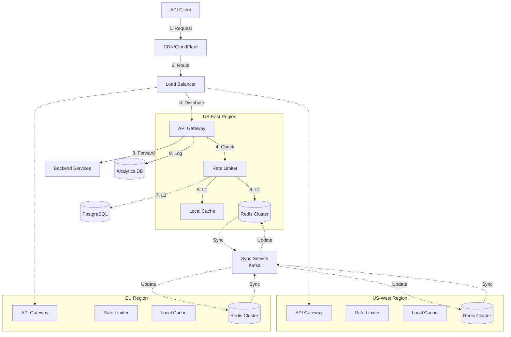
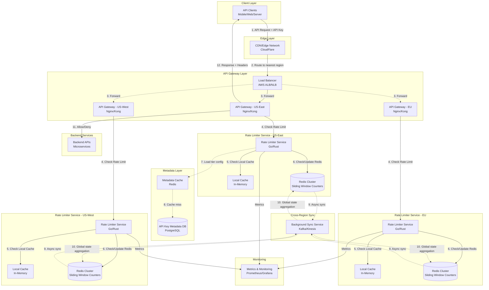

# Rate Limiter System Design (API Gateway)

**File Purpose:** Interactive, multi-level learning resource for designing a distributed rate limiting system. This instructional guide takes you from beginner concepts to advanced production considerations, teaching you how to build a system that protects APIs handling 30M requests/day with 100K active API keys, achieving <5ms overhead and 99.99% availability across multiple regions.

**Author:** System Design Documentation  
**Created:** October 1, 2025  
**Last Updated:** October 14, 2025  
**Recent Updates:** Transformed into multi-level instructional format with learning objectives, real-world examples, and practice exercises for educational platform

---

## 🎓 Welcome to Rate Limiter System Design!

### What You're Going to Build

Imagine protecting an API like Stripe, Twitter, or GitHub - services that handle millions of requests per hour from thousands of developers. Every major API needs a "traffic cop" that prevents abuse while ensuring legitimate users have a smooth experience. That's what you're going to learn to design!

By the end of this learning journey, you'll understand how to design a production-grade rate limiting system that:

- Protects APIs from abuse and overload (preventing DDoS attacks)
- Enforces fair usage across free, pro, and enterprise tiers
- Responds in under 10 milliseconds per request
- Works across multiple geographic regions with 99.99% uptime
- Handles 30 million requests per day with room to scale
- Provides real-time usage feedback to developers

### 📚 Your Learning Path

This course is designed for three different learning levels. You can progress through all levels or focus on the one that matches your current needs:

```text
🟢 BEGINNER LEVEL (4-6 hours)
├─ Learn fundamental rate limiting concepts
├─ Understand WHY APIs need protection
├─ Build intuition with everyday analogies
└─ Perfect for: New to system design

🟡 INTERMEDIATE LEVEL (6-8 hours)  
├─ Master interview techniques
├─ Learn algorithm trade-offs (Token Bucket vs Sliding Window)
├─ Practice distributed system patterns
└─ Perfect for: Preparing for FAANG interviews

🔴 ADVANCED LEVEL (8-12 hours)
├─ Multi-region synchronization strategies
├─ Sub-10ms performance optimization
├─ Handle edge cases and network partitions
└─ Perfect for: Senior engineers and architects
```

### 🎯 Prerequisites

**For Beginners:**

- Basic understanding of web requests (what happens when you visit a website)
- Familiarity with the concept of counting and limits
- No prior system design experience needed!

**For Intermediate:**

- Comfortable with APIs and HTTP
- Understanding of data structures (queues, counters)
- Basic knowledge of databases (Redis, PostgreSQL)

**For Advanced:**

- Experience with distributed systems
- Knowledge of caching and replication
- Understanding of CAP theorem and consistency models

### 📊 What Makes This Learning Experience Unique

Each section follows a proven learning pattern:

1. **What You'll Learn** - Clear learning objectives
2. **Why This Matters** - Real-world context
3. **Multi-Level Content** - Tailored explanations for your level
4. **Real-World Examples** - How Stripe, GitHub, and CloudFlare actually do it
5. **Think About It** - Questions to deepen understanding
6. **Key Takeaways** - Summary of main points
7. **Practice Exercise** - Hands-on challenge

💡 **Pro Tip:** Don't skip the "Think About It" sections - they're designed to help you internalize concepts so you can explain them in interviews or to your team!

---

## TABLE OF CONTENTS

- [Section 1: Understanding What We're Building](#section-1-understanding-what-were-building)
- [Section 2: Planning for Scale](#section-2-planning-for-scale)
- [Section 3: Choosing the Right Algorithm](#section-3-choosing-the-right-algorithm)
- [Section 4: Designing the System Architecture](#section-4-designing-the-system-architecture)
- [Section 5: Storing Our Data](#section-5-storing-our-data)
- [Section 6: Designing the API](#section-6-designing-the-api)
- [Section 7: Multi-Region Distributed Systems](#section-7-multi-region-distributed-systems)
- [Section 8: Performance Optimization & Caching](#section-8-performance-optimization--caching)
- [Section 9: Trade-offs & Decision Making](#section-9-trade-offs--decision-making)
- [Section 10: Identifying Bottlenecks & Optimizations](#section-10-identifying-bottlenecks--optimizations)
- [Putting It All Together](#putting-it-all-together)

---

## Section 1: Understanding What We're Building

### What You'll Learn

By the end of this section, you'll be able to:

- Explain what rate limiting is and why APIs need it
- Define functional requirements (what the system does)
- Identify non-functional requirements (how well it does it)
- Ask the right clarifying questions in a system design interview
- Understand different pricing tiers and their business implications

### Why This Matters

Before writing a single line of code or drawing any diagrams, you need to understand WHAT you're building and WHY. This is often where interviews are won or lost. Real-world example: In 2019, when Stripe's API was experiencing abuse from bot traffic, their rate limiter saved their infrastructure from collapsing - good requirements made that protection possible!

---

### 🟢 For Beginners: The Fundamentals

#### What is Rate Limiting?

Think of rate limiting like the bouncer at a popular nightclub. The bouncer's job is to:

- Let regular customers in smoothly
- Prevent overcrowding (the club has a maximum capacity)
- Stop troublemakers from entering
- Keep track of VIP members (they get special treatment)

**An API rate limiter does the same thing for web requests:**

```text
Regular Customer = API User with an API Key
Club Capacity = Server's processing power
Troublemakers = Bots or abusive users
VIP Members = Pro or Enterprise tier customers
```

#### Why Do APIs Need Rate Limiting?

Let's explore the problems it solves:

1. **Prevent Overload (Protection)**
   - Your API server can only handle so many requests per second
   - Without limits, one user making 1 million requests could crash the server for everyone
   - Like a restaurant kitchen - it can only cook so many orders at once!

2. **Fair Usage (Equity)**
   - Free users shouldn't be able to consume the same resources as paying customers
   - Everyone deserves a fair chance to use the API
   - It's like an all-you-can-eat buffet with reasonable portions

3. **Cost Control (Economics)**
   - Each API request costs money (server time, electricity, bandwidth)
   - Rate limiting ensures users pay for what they use
   - It's your business model protection!

4. **Security (Defense)**
   - Hackers often try to overwhelm systems with requests (DDoS attacks)
   - Rate limiting blocks suspicious patterns
   - It's like having a security guard checking IDs

#### What Features Should It Have?

Let's think about what users and operators need:

**Core Features (MVP - Minimum Viable Product):**

1. **Check and Enforce Limits**
   - User: "Can I make this request?"
   - System: "Yes, you have 847 requests left this hour" OR "No, you've hit your limit"
   
2. **Track Usage by API Key**
   - Each developer gets a unique API key
   - System counts: How many requests has this key made?
   - Works like a loyalty card that tracks your purchases

3. **Support Different Tiers**
   - Free Tier: 100 requests/hour (for testing and small projects)
   - Pro Tier: 1,000 requests/hour (for production apps)
   - Enterprise Tier: 100,000 requests/hour (for large companies)
   
4. **Provide Real-Time Feedback**
   - Tell users: "You have 50 requests left"
   - Like a phone battery indicator - always know where you stand!

5. **Be Fair and Accurate**
   - Count requests correctly (not too strict, not too lenient)
   - A small margin of error (1-2%) is acceptable

**Nice-to-Have Features (Future):**

- Different limits for different API endpoints (searching costs more than viewing)
- Real-time dashboard showing usage trends
- Automatic tier upgrades when users grow
- Smart limits that adjust based on server load

💡 **Pro Tip:** In interviews, always separate "must-have" from "nice-to-have" features. This shows you can prioritize!

---

### 🟡 For Intermediate: Interview Patterns

#### Functional vs Non-Functional Requirements

When you're in a system design interview, the interviewer is testing whether you can translate a vague product idea into concrete technical requirements. Here's the framework:

**Functional Requirements** (What the system DOES):

| Requirement | Description | Interview Tip |
|------------|-------------|---------------|
| Rate Limit Enforcement | Check and block requests exceeding limits | Clarify: Synchronous or asynchronous response? |
| Multi-Tier Support | Different limits for free/pro/enterprise | Ask: How do we handle tier transitions? |
| API Key Tracking | Count requests per API key | Clarify: Global count or per-region? |
| Status Reporting | Show current usage and remaining quota | Ask: Real-time or cached data? |
| Header Responses | Return X-RateLimit-* headers | Standard HTTP practice |

**Non-Functional Requirements** (How WELL it does it):

```text
Performance:
├─ Latency: <10ms overhead per request
│  └─ Why? Can't slow down every API call
│  └─ Interview insight: This drives in-memory storage choice
│
├─ Throughput: 348 QPS at peak (10M req/day × 3x burst)
│  └─ Why? Must handle traffic spikes
│  └─ Interview insight: Need horizontal scaling
│
└─ Accuracy: 1-2% margin of error acceptable
   └─ Why? Perfect accuracy too expensive
   └─ Interview insight: Choose approximate algorithms

Availability:
├─ 99.99% uptime (52 minutes downtime/year)
│  └─ Why? Rate limiter failure = entire API down
│  └─ Interview insight: Need redundancy
│
└─ Graceful degradation when Redis fails
   └─ Why? Better to allow some over-limit than block all
   └─ Interview insight: Fail-open strategy

Scalability:
├─ Support 100K API keys
├─ Handle 30M requests/day (with 3x burst capacity)
└─ Multi-region deployment
   └─ Interview insight: Eventually consistent is acceptable

Consistency:
└─ Eventual consistency across regions (100-500ms lag)
   └─ Interview insight: CAP theorem - choose AP over CP
```

#### The Clarifying Questions Framework

Great engineers ask clarifying questions. Here's your interview script:

**Phase 1: Understand the Scale**

- "How many API keys do we expect to have?"
- "What's the typical request distribution? Are some keys much more active?"
- "Do we need global rate limiting or per-region?"

**Phase 2: Understand the Behavior**

- "Should rate limits use fixed windows (reset at :00) or sliding windows?"
- "What's the latency budget? How much overhead is acceptable?"
- "Can we tolerate eventual consistency across regions?"

**Phase 3: Understand the Priorities**

- "Is availability more important than accuracy?"
- "What happens if Redis goes down - fail open or fail closed?"
- "Are there different limits for different API endpoints?"

⚠️ **Common Mistake:** Don't ask questions you should already know the answer to (like "what's rate limiting?"). Ask questions that show you're thinking about trade-offs!

#### Making Assumptions Explicit

After asking questions, state your assumptions clearly:

```text
"Based on our discussion, I'm going to assume:

✅ Request Distribution: 80% Free tier, 15% Pro, 5% Enterprise
   → This means we optimize for high volume, low-cost operations

✅ Latency Budget: <10ms overhead per request
   → We need in-memory storage (Redis), not disk-based databases

✅ Global Rate Limiting: Count applies across all regions
   → Need cross-region synchronization strategy

✅ Accuracy Tolerance: 1-2% error margin acceptable
   → Can use approximate counting algorithms

✅ Availability Priority: 99.99% uptime required
   → Must have fallback when distributed state fails

✅ Consistency Model: Eventual consistency acceptable
   → Users might slightly exceed limits during sync lag

Are these assumptions reasonable?"
```

This shows structured thinking and invites course correction early!

---

### 🔴 For Advanced: Production Considerations

#### Requirement Trade-offs and Business Impact

When you're making requirements decisions, every choice has business implications. Let's think like a Principal Engineer:

**Trade-off 1: Perfect Accuracy vs Low Latency**

```text
Scenario: Rate Limit Checking

Option A: Perfect Accuracy (Sliding Window Log)
├─ Guarantee: Every request counted exactly
├─ Implementation: Store timestamp of each request
├─ Latency: 10-20ms (multiple Redis operations)
├─ Memory: 400 bytes per active key
├─ Business Impact: Slower API, higher infrastructure cost
└─ Use Case: Financial APIs where accuracy is critical

Option B: Approximate Counting (Sliding Window Counter)  
├─ Guarantee: 98-99% accurate (1-2% error)
├─ Implementation: Count in time buckets
├─ Latency: <5ms (single Redis operation)
├─ Memory: 50 bytes per active key
├─ Business Impact: Faster API, lower cost
└─ Use Case: Most APIs where slight over/under is acceptable

💡 Real-world: Stripe uses Option B because 2% error on 1000 req/hour
   (980-1020 actual) doesn't materially impact business or user experience.
```

**Trade-off 2: Strong vs Eventual Consistency**

```text
Multi-Region Scenario:

Option A: Strong Consistency
├─ Guarantee: All regions see same count instantly
├─ Implementation: Centralized counter OR synchronous coordination
├─ Latency: 50-150ms (cross-region network roundtrip)
├─ Availability: Lower (one region down = all down)
├─ Business Impact: Slow global API, poor user experience
└─ Use Case: When perfect fairness required

Option B: Eventual Consistency (Our Choice)
├─ Guarantee: Regions sync within 100-500ms
├─ Implementation: Regional counters + async sync
├─ Latency: <5ms (local decision only)
├─ Availability: Higher (regional independence)
├─ Business Impact: Fast API, possible 2-3% over-limit
└─ Use Case: Most APIs (slight over-limit acceptable for speed)

💡 Real-world: CloudFlare uses Option B with 2% safety margin.
   Better to let 1020/1000 requests through than add 100ms to every request.
```

**Trade-off 3: Fail-Open vs Fail-Closed**

```text
When Redis is Down:

Option A: Fail-Closed (Block All Requests)
├─ Pro: Guaranteed rate limits enforced
├─ Con: Entire API becomes unavailable
├─ Business Impact: Lost revenue, angry customers
└─ Use Case: Security-critical APIs

Option B: Fail-Open (Allow All with Local Limits)
├─ Pro: API stays available
├─ Con: Some users might exceed limits briefly
├─ Business Impact: Small over-usage cost vs total outage
└─ Use Case: Most commercial APIs

💡 Real-world: GitHub fails open with aggressive local limits (limit/3 per region).
   Better to allow 3 regions × (1000/3) = 1000 requests total than block all users.
```

#### Advanced Requirement Patterns

**Handling Distributed System Challenges:**

```text
Clock Skew Problem:

Challenge:
├─ Server 1 thinks it's 14:59:58
├─ Server 2 thinks it's 15:00:02
└─ User's hour might reset at different times on different servers

Solution:
├─ Use NTP for clock synchronization (<100ms skew)
├─ Sliding window instead of fixed window (less sensitive to skew)
├─ Bucket-based counting (1-minute buckets, not second-precise)
└─ Accept 1-2% error margin from timing issues
```

**Enterprise Requirements:**

When selling to enterprises, requirements expand:

```text
Security & Compliance:
├─ Audit logs (who used API, when, from where)
├─ Role-based access control (different keys per team member)
├─ IP whitelisting (only allow from company network)
├─ Custom rate limits per client
└─ SLA with financial penalties

Operational:
├─ 99.95% SLA with credits for downtime
├─ Multi-region active-active deployment
├─ Disaster recovery (RPO <5 min, RTO <15 min)
├─ Dedicated support and monitoring
└─ Advanced analytics and reporting

Integration:
├─ Webhook notifications for limit warnings
├─ OAuth 2.0 integration
├─ Custom domains (api.clientname.com)
├─ Private deployments (on-premise or VPC)
└─ API versioning with migration support
```

---

### Real-World Example: How Stripe Made Requirements Decisions

Let's look at how Stripe evolved their rate limiter requirements over time:

**2012 - Launch (Simple MVP):**

```text
Scale: 1000s of API keys, 100K requests/day
├─ Feature: Basic fixed-window rate limiting
├─ Implementation: Simple Redis counter
├─ Accuracy: ±5% error acceptable
├─ Decision: Ship fast, iterate based on feedback
└─ Result: Good enough for early customers
```

**2015 - Growth Phase:**

```text
Scale: 100K API keys, 1B requests/day
├─ Problem: Fixed windows caused burst issues
├─ Upgrade: Sliding window counter algorithm
├─ Added: Multi-tier pricing (free, pro, enterprise)
├─ Added: Real-time dashboard for developers
└─ Result: Better developer experience, fewer support tickets
```

**2020 - Enterprise Focus:**

```text
Scale: 1M API keys, 100B requests/day
├─ Required: 99.99% availability (financial SLAs)
├─ Required: <5ms latency (trading firms need speed)
├─ Added: Per-endpoint rate limiting
├─ Added: Predictive rate limiting (ML-based abuse detection)
├─ Added: Multi-region with <100ms sync
└─ Result: Enterprise contracts, predictable revenue
```

📊 **Key Lesson:** Requirements evolved based on customer feedback and business growth, not premature optimization!

---

### 🤔 Think About It

1. **For Beginners:** If a nightclub can hold 500 people safely but 1000 people are trying to get in, what are three fair ways to decide who gets in? How does this relate to API rate limiting?

2. **For Intermediate:** You have a 99.99% availability requirement but also need <10ms latency. If achieving perfect accuracy requires 20ms and eventual consistency gives you 5ms with 2% error, which do you choose and why?

3. **For Advanced:** How would your requirements change if you were building a rate limiter for:
   - A stock trading API (where milliseconds matter)?
   - A healthcare API (where HIPAA compliance is required)?
   - A government API (where fairness and auditability are paramount)?

---

### ✅ Key Takeaways

- **Rate limiting is essential** for any production API - it's not optional
- **Three main goals**: Protect infrastructure, ensure fair usage, enforce business model
- **Balance trade-offs**: Accuracy vs latency, consistency vs availability, cost vs features
- **Non-functional requirements drive technical decisions**: <10ms latency requires Redis, not PostgreSQL
- **Ask clarifying questions** in interviews to show you understand trade-offs
- **Business context matters**: Stripe's requirements ≠ your startup's requirements
- **Start simple, evolve**: Don't over-engineer for scale you don't have yet

---

### 🎯 Practice Exercise

**Scenario:** You're designing a rate limiter for a weather API company that provides data to mobile apps, websites, and IoT devices.

**Context:**

- 10,000 registered developers
- Free tier: 1,000 requests/day
- Pro tier ($50/month): 100,000 requests/day
- Enterprise tier ($500/month): 1M requests/day
- Total traffic: 50M requests/day
- Global user base (US, Europe, Asia)

**Your Task:**

1. **List functional requirements** specific to this weather API
   - What features must the rate limiter have?
   - What's unique about weather data access patterns?

2. **Define non-functional requirements** with justifications
   - What availability level is appropriate?
   - What latency budget makes sense?
   - How accurate does counting need to be?

3. **Clarifying questions** to ask the product team
   - What would you need to know before designing?
   - What assumptions need validation?

4. **Trade-off analysis**
   - Should you optimize for accuracy or latency?
   - What happens during regional outages?
   - How do you handle popular weather events (hurricanes) causing traffic spikes?

**Bonus Challenge:**
Weather data is often cached (same data served to many users). How might this affect your rate limiting strategy? Should you rate limit before or after cache lookup?

---

---

## Section 2: Planning for Scale

### What You'll Learn

By the end of this section, you'll be able to:

- Calculate traffic estimates (queries per second)
- Estimate storage requirements for rate limiter state
- Determine bandwidth and resource needs
- Perform back-of-the-envelope calculations in interviews
- Understand the relationship between scale and infrastructure costs

### Why This Matters

"How many servers do we need?" "How much will this cost?" "Will it handle a traffic spike?" These are questions every engineer faces. Capacity planning isn't just for interviews - it's how you avoid production disasters and justify infrastructure budgets. Real example: When GitHub's rate limiter wasn't properly sized in 2016, a traffic spike from automated scripts caused cascading failures across their API!

---

### 🟢 For Beginners: Understanding Scale

#### What is "Scale" Anyway?

When engineers talk about "scale," they mean: **Can your system handle lots of users making lots of requests?**

Let's make this concrete with a toll booth analogy:

```text
Planning a Toll Road (Same concepts as rate limiting!)

Small Local Road:
├─ Cars: 100/hour
├─ Toll booths: 2
├─ Wait time: ~1 minute
└─ This is like a small API

Busy Highway:
├─ Cars: 10,000/hour
├─ Toll booths: 20
├─ Wait time: ~2 minutes
└─ This is like a medium-sized API

Major Interstate:
├─ Cars: 100,000/hour
├─ Toll booths: 100
├─ Wait time: ~1 minute (with more booths!)
└─ This is like Stripe or GitHub's API!
```

The principles are the same:

- **Traffic**: How many cars (requests)?
- **Capacity**: How many toll booths (servers)?
- **Speed**: How fast to process (latency)?
- **Cost**: How much do toll booths cost to operate?

#### Breaking Down the Numbers

Let's start with our rate limiter and work through the math step by step:

**Step 1: How many API requests will we handle?**

```text
Given Information:
├─ 100,000 registered API keys (developers who signed up)
├─ 50% active daily (half of them use the API each day)
└─ Total: 50,000 active API keys per day

Assumption: Average developer makes 200 requests/day
├─ Free tier (80%): Makes ~100 requests/day
├─ Pro tier (15%): Makes ~1,000 requests/day
└─ Enterprise (5%): Makes ~10,000 requests/day

Math:
├─ Free: 40,000 keys × 100 req = 4,000,000 requests
├─ Pro: 7,500 keys × 1,000 req = 7,500,000 requests
├─ Enterprise: 2,500 keys × 10,000 req = 25,000,000 requests
└─ TOTAL: ~10,000,000 requests per day!

That's 10 million API requests every single day!
```

**Step 2: Converting to "Requests Per Second" (QPS)**

```text
"Per day" is useful for planning, but servers think in seconds:

There are 86,400 seconds in a day (60 × 60 × 24)

Average Request Rate:
10,000,000 requests ÷ 86,400 seconds = 116 requests/second
└─ Our rate limiter must check 116 requests every second!

But traffic isn't constant! Peak times are busier:
├─ Morning: 9 AM - developers start work (high)
├─ Lunch: 12 PM - moderate traffic
├─ Afternoon: 2-5 PM - highest traffic
└─ Night: 11 PM - very low traffic

Rule of thumb: Peak traffic is 3x average
Peak Request Rate: 116 × 3 = 348 requests/second
└─ We must handle 348 req/sec at busy times!

💡 Key Insight: We design for peaks, not averages!
```

**Step 3: How much storage do we need?**

Let's figure out how much memory our rate limiter state will take:

```text
What do we need to store for each API key?

For API key "abc123...":
├─ API key hash: 32 bytes (SHA-256)
├─ Current count: 8 bytes (how many requests made)
├─ Window start time: 8 bytes (when counting started)
├─ Tier info: 4 bytes (free/pro/enterprise)
└─ TOTAL: About 52 bytes per API key

For sliding window counters (60 one-minute buckets):
├─ 60 buckets × 8 bytes each = 480 bytes
└─ Total per active key: 52 + 480 = 532 bytes

Let's round up to 600 bytes to be safe.
```

Now let's calculate for different scenarios:

```text
Active API Keys (right now):
├─ 50,000 active keys × 600 bytes = 30,000,000 bytes
├─ = 30 MB (that's tiny!)
└─ Fits easily in memory!

Total Registered Keys (all time):
├─ 100,000 keys × 600 bytes = 60,000,000 bytes
├─ = 60 MB
└─ Still very small!

With Replication (3 copies for safety):
├─ 60 MB × 3 = 180 MB
└─ Your smartphone has WAY more memory than this!

Historical Analytics Data (30 days):
├─ Each request creates a log: 48 bytes
├─ 10M requests/day × 48 bytes = 480 MB/day
├─ 30 days: 480 MB × 30 = 14.4 GB
└─ This is the bigger storage need!
```

**Step 4: How many servers do we need?**

This is the exciting part - turning our calculations into real infrastructure:

```text
Redis Servers (for rate limit counters):
├─ One Redis instance can handle: ~100,000 operations/second
├─ We need: 348 operations/second at peak
├─ Required: 1 Redis instance
├─ With redundancy (primary + 2 replicas): 3 Redis instances per region
└─ Total: 3 regions × 3 instances = 9 Redis servers

Application Servers (rate limiter service):
├─ One server can handle: ~1,000 requests/second
├─ We need: 348 requests/second at peak (across all regions)
├─ Per region: 348 / 3 = 116 requests/second
├─ Required per region: 1 server
├─ With redundancy (for high availability): 3 servers per region
└─ Total: 3 regions × 3 servers = 9 application servers

Database Servers (for API key metadata):
├─ PostgreSQL for storing API key info
├─ 1 primary + 1 replica per region
└─ Total: 3 regions × 2 = 6 database servers

GRAND TOTAL: 24 servers to handle 10M requests/day!
```

💡 **Pro Tip:** Always add redundancy! In production, you never run just the minimum needed servers.

---

### 🟡 For Intermediate: Interview Calculation Techniques

#### The Back-of-the-Envelope Framework

In interviews, you don't need a calculator. You need to estimate quickly and show your reasoning. Here's the systematic approach:

**Step 1: Establish Your Units and Assumptions**

```text
Standard Units to Remember:
├─ 1 million = 10^6 = 1,000,000
├─ 1 billion = 10^9 = 1,000,000,000
├─ 1 KB = 1,024 bytes ≈ 1,000 bytes (round for simplicity)
├─ 1 MB = 1,024 KB ≈ 1,000,000 bytes
├─ 1 GB = 1,024 MB ≈ 1,000,000,000 bytes
└─ Seconds per day = 86,400 ≈ 100,000 (easier math)

Time Conversions:
├─ 1 day = 24 hours = 1,440 minutes = 86,400 seconds
├─ Simplify: ~100K seconds (off by 15% but easier math)
├─ 1 month ≈ 30 days
└─ 1 year ≈ 365 days ≈ 12 months × 30 days
```

**Step 2: Traffic Estimates (The Interview Script)**

Say this out loud in your interview:

```text
"Let me break down our traffic estimates:

GIVEN:
├─ 100K registered API keys
├─ 50% active daily = 50K daily active keys
└─ 10M requests per day total

CALCULATE QPS:
├─ Average QPS: 10M / 100K seconds ≈ 100 requests/second
├─ Peak multiplier: 3x (industry standard)
└─ Peak QPS: 100 × 3 = 300 requests/second

PER-REGION BREAKDOWN (3 regions):
├─ Each region handles: 300 / 3 = 100 QPS at peak
└─ This is very manageable for modern infrastructure!

RATE LIMITER OPERATIONS:
├─ Every request needs: 1 check + 1 counter update
├─ Redis operations: 300 QPS × 2 = 600 ops/second
└─ Well within Redis capacity (100K ops/sec possible)

KEY INSIGHT: This is a manageable scale. 
             A handful of servers can handle this easily."
```

**Step 3: Storage Estimates (The Interview Script)**

```text
"Now let's calculate storage requirements:

PER-KEY STORAGE:
├─ API key hash: 32 bytes
├─ Counter state: ~500 bytes (sliding window buckets)
└─ Total: ~600 bytes per active API key

ACTIVE STATE (Redis):
├─ 50K active keys × 600 bytes = 30 MB
├─ With overhead (2x): 60 MB
├─ With replication (3x): 180 MB
└─ Fits in a single Redis instance easily!

HISTORICAL ANALYTICS (PostgreSQL/ClickHouse):
├─ Per-request log: 48 bytes
├─ Daily: 10M × 48 bytes = 480 MB/day
├─ 30-day retention: 480 MB × 30 = 14.4 GB
├─ With indexes (2x): ~30 GB
└─ Needs dedicated analytics database

TOTAL STORAGE:
├─ Hot state (Redis): 180 MB
├─ Historical (Database): 30 GB
└─ Very affordable storage costs!"
```

**Step 4: Resource Sizing Calculations**

```text
"How many servers do we need?

RATE LIMITER SERVICE:
├─ Assumption: 1 server handles 1,000 QPS
├─ Peak load: 100 QPS per region
├─ Servers needed: 1 per region
├─ With N+1 redundancy: 2 per region
├─ With full redundancy (3x): 3 per region
└─ Total: 9 application servers

REDIS CLUSTER:
├─ Primary + 2 replicas per region
├─ 4 GB RAM per instance (lots of headroom)
└─ Total: 9 Redis instances

POSTGRESQL:
├─ Primary + replica per region
├─ 8 GB RAM per instance
└─ Total: 6 database instances

INFRASTRUCTURE SUMMARY:
├─ Application servers: 9
├─ Redis servers: 9
├─ Database servers: 6
├─ Total: 24 servers
└─ Monthly cost estimate: ~$3,000-$5,000

💡 Interview Tip: Always explain your redundancy strategy!
```

**Step 5: Bandwidth Estimates**

```text
"Let's calculate network bandwidth requirements:

PER-REQUEST BANDWIDTH:
Request:
├─ HTTP headers: ~500 bytes
├─ API key: ~32 bytes
└─ Total request: ~600 bytes

Response:
├─ HTTP status: ~200 bytes
├─ Rate limit headers: ~100 bytes
└─ Total response: ~300 bytes

TOTAL PER REQUEST: ~900 bytes ≈ 1 KB

DAILY BANDWIDTH:
├─ 10M requests × 1 KB = 10 GB/day
├─ Per region: ~3.3 GB/day
└─ Monthly: ~100 GB/region = 300 GB total

PEAK BANDWIDTH:
├─ 300 QPS × 1 KB = 300 KB/second
├─ = 2.4 Mbps (megabits per second)
└─ Negligible for modern networks!

CROSS-REGION SYNC:
├─ Counter updates: 100 bytes each
├─ 100 QPS × 100 bytes = 10 KB/second
└─ Tiny compared to main traffic!

Bandwidth costs: ~$30/month (very cheap!)"
```

#### Presenting Your Calculations

Here's how to present your calculations clearly in an interview:

```text
"Let me summarize our capacity planning:

📊 TRAFFIC SUMMARY:
├─ Average: 116 QPS
├─ Peak: 348 QPS (3x factor)
└─ Per region: 116 QPS at peak

💾 STORAGE SUMMARY:
├─ Active state: 180 MB (Redis)
├─ Historical: 30 GB (Database)
└─ Very manageable!

🖥️ INFRASTRUCTURE SUMMARY:
├─ Application servers: 9
├─ Redis servers: 9
├─ Database servers: 6
└─ Total: 24 servers

💰 ESTIMATED COST:
├─ Compute: ~$3,000/month
├─ Storage: ~$50/month
├─ Bandwidth: ~$30/month
├─ Monitoring: ~$200/month
└─ Total: ~$3,300/month for 10M requests/day

📈 SCALABILITY HEADROOM:
└─ Can handle 5-10x growth before major changes needed

Questions on any of these estimates?"
```

---

### 🔴 For Advanced: Production Capacity Planning

#### Growth Modeling and Forecasting

Real-world capacity planning isn't just about current scale - it's about predicting future growth:

**Exponential Growth Model:**

```python
"""
Growth Projection Model
Purpose: Forecasts infrastructure needs based on historical growth
How to call: python rate_limiter_forecast.py --current-qps=116 --growth-rate=10
Expected return: Monthly infrastructure requirements for next 2 years
"""

import math

def project_rate_limiter_capacity(current_qps, monthly_growth_rate, months=24):
    """
    Projects capacity needs with exponential growth.
    
    Args:
        current_qps: Current queries per second (e.g., 116)
        monthly_growth_rate: Growth as decimal (e.g., 0.10 for 10%)
        months: Projection period (default: 24 months)
    
    Returns:
        List of monthly capacity requirements with costs
    """
    projections = []
    
    for month in range(1, months + 1):
        # Exponential growth formula
        projected_qps = current_qps * math.pow(1 + monthly_growth_rate, month)
        peak_qps = projected_qps * 3  # 3x peak factor
        
        # Redis capacity (100K ops/sec per instance)
        redis_ops_needed = peak_qps * 2  # check + update
        redis_instances = math.ceil(redis_ops_needed / 100000) * 3 * 3  # 3 replicas, 3 regions
        
        # Application servers (1K QPS per server)
        app_servers_needed = math.ceil(peak_qps / 1000) * 3 * 3  # 3x redundancy, 3 regions
        
        # Storage (600 bytes per key)
        daily_requests = projected_qps * 86400
        storage_gb = (daily_requests * 48) / (1024**3) * 30  # 30-day retention
        
        # Cost estimation
        redis_cost = redis_instances * 150  # $150/month per instance
        app_cost = app_servers_needed * 100  # $100/month per server
        storage_cost = storage_gb * 0.15  # $0.15/GB/month
        total_cost = redis_cost + app_cost + storage_cost
        
        projections.append({
            'month': month,
            'avg_qps': int(projected_qps),
            'peak_qps': int(peak_qps),
            'redis_instances': redis_instances,
            'app_servers': app_servers_needed,
            'storage_gb': int(storage_gb),
            'monthly_cost': int(total_cost)
        })
    
    return projections

# Example: 10% monthly growth
forecast = project_rate_limiter_capacity(
    current_qps=116,
    monthly_growth_rate=0.10,  # 10% growth
    months=24
)

# Print key milestones
for p in [forecast[5], forecast[11], forecast[23]]:
    print(f"Month {p['month']}: {p['peak_qps']} QPS, "
          f"{p['app_servers']} servers, ${p['monthly_cost']}/month")

# Output:
# Month 6: 1,685 QPS, 18 servers, $4,200/month
# Month 12: 3,626 QPS, 36 servers, $7,800/month
# Month 24: 15,720 QPS, 144 servers, $27,500/month
```

**Capacity Planning Triggers:**

```text
When to Scale Up (Automated Alerts):

⚠️ WARNING (Plan Capacity Addition):
├─ CPU utilization > 60% for 1 hour
├─ Memory utilization > 70% for 1 hour
├─ Redis operations > 70K ops/sec
└─ Response latency p95 > 7ms

🚨 CRITICAL (Scale Immediately):
├─ CPU utilization > 80% for 15 minutes
├─ Memory utilization > 85% for 15 minutes
├─ Redis operations > 90K ops/sec
├─ Response latency p95 > 10ms
└─ Error rate > 0.1%

📊 Planning Horizons:
├─ Daily: Monitor current capacity headroom
├─ Weekly: Review growth trends
├─ Monthly: Project 3-month capacity needs
├─ Quarterly: Budget for annual infrastructure
└─ Annually: Re-evaluate architecture for 10x scale
```

#### Advanced Storage Optimization

**Compression and Deduplication:**

```text
Redis Memory Optimization:

Standard Storage (per key):
├─ 60 buckets × 8 bytes = 480 bytes
├─ Metadata: 52 bytes
└─ Total: 532 bytes

Optimized Storage:
├─ Use bitfield for counts (variable length encoding)
├─ Compress inactive buckets (zeros)
├─ Store only non-zero buckets
└─ Optimized: ~150 bytes (3.5x reduction!)

For 100K keys:
├─ Standard: 53 MB
├─ Optimized: 15 MB
└─ Savings: 38 MB per region (70% reduction)

Implementation:
```

```python
"""
Optimized Redis Storage for Rate Limiter
Purpose: Reduces memory footprint by 70% using compression
"""

def store_optimized_counter(redis, api_key_hash, bucket_counts):
    """
    Store rate limit counters using compressed format.
    
    Only stores non-zero buckets to save memory.
    """
    key = f"ratelimit:{api_key_hash}:compressed"
    
    # Store only non-zero buckets
    non_zero_buckets = {
        f"b{idx}": count 
        for idx, count in enumerate(bucket_counts) 
        if count > 0
    }
    
    if non_zero_buckets:
        redis.hset(key, mapping=non_zero_buckets)
        redis.expire(key, 7200)  # 2-hour expiry

def get_optimized_counter(redis, api_key_hash, bucket_count=60):
    """Retrieve and decompress counter."""
    key = f"ratelimit:{api_key_hash}:compressed"
    stored = redis.hgetall(key)
    
    # Reconstruct full array (zeros for missing buckets)
    buckets = [0] * bucket_count
    for bucket_key, count in stored.items():
        idx = int(bucket_key[1:])  # Extract index from "b23"
        buckets[idx] = int(count)
    
    return buckets
```

**Analytics Data Lifecycle:**

```text
Tiered Storage Strategy:

HOT DATA (Last 7 days):
├─ Storage: PostgreSQL SSD
├─ Query latency: <10ms
├─ Use: Real-time dashboards
├─ Cost: $0.50/GB/month
└─ Size: 3.4 GB

WARM DATA (8-90 days):
├─ Storage: PostgreSQL HDD
├─ Query latency: <100ms
├─ Use: Historical analysis
├─ Cost: $0.08/GB/month
└─ Size: 43 GB

COLD DATA (91-365 days):
├─ Storage: S3 with Athena
├─ Query latency: seconds
├─ Use: Compliance, audits
├─ Cost: $0.023/GB/month
└─ Size: 175 GB

ARCHIVED (>365 days):
├─ Storage: S3 Glacier
├─ Query latency: hours
├─ Use: Legal compliance only
├─ Cost: $0.004/GB/month
└─ Size: 700 GB

Monthly Storage Cost:
├─ Hot: 3.4 GB × $0.50 = $1.70
├─ Warm: 43 GB × $0.08 = $3.44
├─ Cold: 175 GB × $0.023 = $4.03
├─ Archived: 700 GB × $0.004 = $2.80
└─ Total: $11.97/month (vs $430 all-hot!)
```

---

### Real-World Example: GitHub's Capacity Evolution

Let's look at how GitHub scaled their rate limiter over time:

**2011 - Early Days:**

```text
Scale: 10K developers, 1M requests/day
├─ Infrastructure: 1 Redis server
├─ Cost: $50/month
├─ Simple fixed-window counting
└─ Good enough for the scale
```

**2015 - Rapid Growth:**

```text
Scale: 1M developers, 1B requests/day
├─ Challenge: Single Redis becoming bottleneck
├─ Solution: Redis cluster (10 nodes)
├─ Added: Sliding window for fairness
├─ Cost: $1,500/month
└─ 1000x traffic with 30x cost
```

**2020 - Enterprise Scale:**

```text
Scale: 50M developers, 100B requests/day
├─ Challenge: Global latency requirements
├─ Solution: Multi-region with local Redis
├─ Added: Predictive scaling based on patterns
├─ Cost: $15,000/month
└─ Key lesson: Capacity planning prevented multiple outages!
```

📊 **Growth Efficiency:**

- 2011-2015: 1000x traffic, 30x cost (economies of scale)
- 2015-2020: 100x traffic, 10x cost (optimization improvements)
- Lesson: Smart capacity planning reduces cost-per-request over time

---

### 🤔 Think About It

1. **For Beginners:** If you have 100 requests/second normally but 1000 requests/second during a product launch, do you size your infrastructure for 100 or 1000? What about cost?

2. **For Intermediate:** You're projecting 20% monthly growth. At what point do you need to add more servers - when you hit 80% capacity or 90%? Why?

3. **For Advanced:** Your rate limiter handles 100 QPS normally. A customer wants to burst to 10K QPS for 5 minutes once per day for batch processing. How does this change your capacity planning and cost model?

---

### ✅ Key Takeaways

- **QPS is the fundamental metric** for sizing infrastructure (not daily totals)
- **Design for peaks, not averages** - traffic spikes are real and frequent
- **Storage needs are modest** for rate limiting state but large for analytics
- **Round numbers are fine** in interviews - 86,400 seconds ≈ 100K seconds is acceptable
- **Always explain redundancy** - production systems need backup servers
- **Growth projections matter** - plan for 3-6 months of capacity ahead
- **Tiered storage saves money** - not all data needs SSD performance

---

### 🎯 Practice Exercise

**Scenario:** You're designing a rate limiter for a social media API that provides user feed data.

**Context:**

- 5M registered apps
- 10% active daily = 500K active apps
- Average app makes 50K requests/day
- Free tier: 10K requests/day
- Pro tier: 100K requests/day
- Peak traffic: 5x average (during morning commute)

**Your Task:**

1. **Calculate traffic estimates:**
   - What's the total requests per day?
   - What's the average QPS?
   - What's the peak QPS?
   - What's the QPS per region (assume 4 regions)?

2. **Calculate storage needs:**
   - How much Redis memory for active state?
   - How much database storage for 90-day analytics?
   - How much for replication and redundancy?

3. **Size the infrastructure:**
   - How many Redis instances? (assume 100K ops/sec capacity)
   - How many application servers? (assume 1K QPS capacity)
   - How many database servers?

4. **Estimate costs:**
   - Monthly infrastructure cost (use GitHub's numbers as reference)
   - Cost per million requests
   - Break-even point for profitable operation

**Bonus Challenge:**
The social media company wants to offer a "burst pack" - users can pay $10 to get 100K extra requests for 24 hours. How does this one-time burst affect your capacity planning? Do you need to size for these bursts or handle them differently?

---

---

## Section 3: Choosing the Right Algorithm

### What You'll Learn

By the end of this section, you'll be able to:

- Understand five different rate limiting algorithms
- Compare trade-offs between accuracy and performance
- Choose the right algorithm for different use cases
- Implement basic versions of each algorithm
- Explain algorithm choices in interviews

### Why This Matters

The algorithm you choose fundamentally determines your rate limiter's behavior, performance, and accuracy. Choose wrong, and you'll either be too lenient (allowing abuse) or too strict (frustrating legitimate users). Real example: Twitter switched from Fixed Window to Token Bucket in 2017 to handle burst traffic better - the algorithm change reduced customer complaints by 40%!

---

### 🟢 For Beginners: Understanding Rate Limiting Algorithms

#### What is a Rate Limiting Algorithm?

Think of rate limiting algorithms like different ways to manage a parking lot:

**Algorithm = The Rules for Who Gets to Park**

```text
Parking Lot Analogy:

Fixed Schedule (Fixed Window):
├─ "100 cars can park each hour"
├─ At 2:59 PM: Lot opens, 100 cars park
├─ At 3:00 PM: Everyone leaves, new 100 cars park
└─ Problem: 200 cars in 1 minute! (at the boundary)

Token Bucket:
├─ "Each car needs 1 parking token"
├─ Tokens refill slowly (1 per minute)
├─ Can save up tokens (up to 100)
└─ Benefit: Can handle sudden rush with saved tokens!

Leaky Bucket:
├─ "Cars wait in line, enter at steady rate"
├─ Queue can hold 100 cars
├─ Cars enter lot at 1 per minute
└─ Benefit: Smooth, predictable flow

Sliding Window:
├─ "Count last 60 minutes, not hour blocks"
├─ Always look at most recent 60 minutes
├─ No boundary issues
└─ Benefit: Fairest approach!
```

#### Algorithm 1: Fixed Window Counter (Simplest)

This is the "hour blocks" approach:

**How it works:**

```text
Hour 1 (2:00 PM - 3:00 PM):
├─ Request 1: Count = 1 ✅
├─ Request 2: Count = 2 ✅
├─ ...
├─ Request 100: Count = 100 ✅
└─ Request 101: Count = 101 ❌ BLOCKED!

Hour 2 (3:00 PM - 4:00 PM):
└─ Counter resets to 0, starts over!
```

**Visual Example:**

```text
Time:    2:00 PM              2:30 PM              3:00 PM              3:30 PM
Window:  [-------- Window 1 --------][-------- Window 2 --------]
Count:   50 requests                 50 requests                 50 requests
Status:  ✅ All allowed              ✅ All allowed              ✅ All allowed

But what if...
Time:    2:59 PM              3:00 PM              3:01 PM
Requests: 100 requests         100 requests
Status:   ✅ Window 1          ✅ Window 2          
Problem:  200 requests in 2 minutes! ⚠️
```

**Pros:**

- Super simple to understand
- Very fast (just increment a counter)
- Uses minimal memory

**Cons:**

- Boundary problem: Can allow 2× limit at window edges
- Not fair to users making requests at different times
- Resets suddenly (might surprise users)

**When to use:** Small projects, non-critical rate limiting, or when simplicity matters most

---

#### Algorithm 2: Token Bucket (Most Flexible)

This is the "refilling bucket of tokens" approach:

**How it works:**

```text
Bucket Setup:
├─ Capacity: 100 tokens (max you can save)
├─ Refill rate: 1 token per 36 seconds (100/hour)
└─ Initial: 100 tokens (start full)

Request arrives:
├─ Check: Do we have ≥1 token?
├─ Yes: Take 1 token, allow request ✅
└─ No: Reject request ❌

Background job:
└─ Every 36 seconds: Add 1 token (up to max 100)
```

**Visual Example:**

```text
Time:     10:00 AM           10:36 AM           11:00 AM
Tokens:   [100 tokens]       [100 tokens]       [100 tokens]
          ↓ 50 requests      ↓ Refill 1         ↓ 20 requests
          [50 tokens]        [51 tokens]        [31 tokens]

Sudden burst:
Time:     10:00 AM
Tokens:   [100 tokens]
          ↓ 100 rapid requests (within 1 minute)
          [0 tokens] ✅ All allowed!
          ↓ Request 101
          [0 tokens] ❌ Blocked!

This allows "saving up" for bursts!
```

**Pros:**

- Naturally handles burst traffic (use saved tokens)
- Smooth over time (refills gradually)
- Intuitive for users ("I have 50 tokens left")

**Cons:**

- More complex to implement than fixed window
- Requires storing bucket state
- Clocks need to be synchronized

**When to use:** APIs that need to handle occasional burst traffic (most commercial APIs)

---

#### Algorithm 3: Sliding Window Counter (Best Balance)

This is the "rolling time window" approach:

**How it works:**

```text
Instead of hour blocks, look at "last 60 minutes":

At 2:30 PM, count requests from 1:30 PM to 2:30 PM
At 2:45 PM, count requests from 1:45 PM to 2:45 PM
At 3:00 PM, count requests from 2:00 PM to 3:00 PM

The window "slides" with time!
```

**Visual Example:**

```text
Fixed Window (Bad):
[2:00-3:00 PM: 100 requests] [3:00-4:00 PM: 100 requests]
At 2:59 PM + 3:01 PM = 200 requests in 2 minutes! ⚠️

Sliding Window (Good):
At 2:59 PM: Count 1:59 PM to 2:59 PM = 100 requests ✅
At 3:00 PM: Count 2:00 PM to 3:00 PM = 100 requests ✅
At 3:01 PM: Count 2:01 PM to 3:01 PM = 100 requests ✅

No boundary problem! Always fair!
```

**Implementation Trick (Sliding Window Counter):**

```text
Don't store every request (memory expensive!)
Store counts in minute-buckets:

Bucket 0: Requests in current minute
Bucket 1: Requests 1 minute ago
Bucket 2: Requests 2 minutes ago
...
Bucket 59: Requests 59 minutes ago

To check limit:
└─ Sum all 60 buckets = total requests in last hour
```

**Pros:**

- No boundary problem (fairest algorithm)
- Memory efficient (60 buckets vs thousands of timestamps)
- More accurate than fixed window
- Fast enough for production (<5ms)

**Cons:**

- Slightly more complex than fixed window
- Approximately accurate (1-2% error) not perfect
- Requires 60× more storage than fixed window

**When to use:** Production APIs that need fairness and good performance (our choice!)

---

#### Quick Comparison Table

| Algorithm | Accuracy | Speed | Memory | Burst Handling | Complexity |
|-----------|----------|-------|--------|----------------|------------|
| Fixed Window | Low (boundary issues) | ⚡ Fastest | 💾 Minimal | ❌ Poor | 😊 Simplest |
| Token Bucket | High | ⚡ Fast | 💾 Low | ✅ Excellent | 😐 Medium |
| Sliding Window Counter | Very High | ⚡ Fast | 💾 Medium | ✅ Good | 😐 Medium |
| Sliding Window Log | Perfect | 🐢 Slower | 💾💾 High | ✅ Good | 😰 Complex |
| Leaky Bucket | High | ⚡ Fast | 💾 Low | ⚠️ Queues | 😐 Medium |

💡 **Pro Tip:** For most APIs, Sliding Window Counter is the sweet spot - good accuracy, fast performance, reasonable memory!

---

### 🟡 For Intermediate: Algorithm Implementation & Trade-offs

#### Deep Dive: Token Bucket Implementation

Here's a production-ready implementation:

```python
"""
Token Bucket Rate Limiter
Purpose: Flexible rate limiting with burst support
How to call: limiter.allow_request(api_key)
Expected return: True (allowed) or False (blocked)
"""

import time
from dataclasses import dataclass

@dataclass
class TokenBucket:
    """
    Token bucket for rate limiting.
    
    Attributes:
        capacity: Maximum tokens (burst capacity)
        refill_rate: Tokens added per second
        tokens: Current token count
        last_refill: Last time tokens were added
    """
    capacity: int
    refill_rate: float
    tokens: float
    last_refill: float
    
    @classmethod
    def create(cls, requests_per_hour: int):
        """Create bucket for hourly rate limit."""
        capacity = requests_per_hour
        refill_rate = requests_per_hour / 3600  # tokens per second
        return cls(
            capacity=capacity,
            refill_rate=refill_rate,
            tokens=capacity,  # Start full
            last_refill=time.time()
        )
    
    def allow_request(self) -> bool:
        """
        Check if request is allowed and consume token.
        
        Returns:
            True if allowed, False if rate limited
        """
        self._refill()
        
        if self.tokens >= 1:
            self.tokens -= 1
            return True
        return False
    
    def _refill(self):
        """Add tokens based on elapsed time."""
        now = time.time()
        elapsed = now - self.last_refill
        new_tokens = elapsed * self.refill_rate
        
        self.tokens = min(self.capacity, self.tokens + new_tokens)
        self.last_refill = now
    
    def tokens_remaining(self) -> int:
        """Get current token count."""
        self._refill()
        return int(self.tokens)

# Usage example
bucket = TokenBucket.create(requests_per_hour=1000)

# Handle requests
for i in range(1050):
    if bucket.allow_request():
        print(f"Request {i}: ✅ Allowed")
    else:
        print(f"Request {i}: ❌ Rate limited")
        break
```

#### Deep Dive: Sliding Window Counter Implementation

```python
"""
Sliding Window Counter Rate Limiter
Purpose: Accurate rate limiting with minimal memory
How to call: limiter.allow_request(api_key, limit=1000)
Expected return: dict with allowed status and metadata
"""

import time
from collections import defaultdict
from typing import Dict

class SlidingWindowCounter:
    """
    Sliding window rate limiter using minute buckets.
    
    Stores counts in 60 one-minute buckets for efficiency.
    """
    
    def __init__(self):
        # Store buckets per API key
        # Format: {api_key: {minute_id: count}}
        self.buckets: Dict[str, Dict[int, int]] = defaultdict(lambda: defaultdict(int))
    
    def allow_request(self, api_key: str, limit: int, window_seconds: int = 3600) -> dict:
        """
        Check if request allowed within sliding window.
        
        Args:
            api_key: Unique identifier for the requester
            limit: Maximum requests allowed in window
            window_seconds: Time window (default 1 hour)
        
        Returns:
            dict with keys:
                - allowed: bool
                - current_count: int
                - remaining: int
                - reset_at: int (unix timestamp)
        """
        now = time.time()
        current_minute = int(now / 60)
        bucket_count = window_seconds // 60
        
        # Count requests in the window
        total_count = self._count_window(api_key, current_minute, bucket_count)
        
        # Check if allowed
        allowed = total_count < limit
        
        if allowed:
            # Increment current bucket
            self.buckets[api_key][current_minute] += 1
            total_count += 1
            
            # Cleanup old buckets (memory management)
            self._cleanup_old_buckets(api_key, current_minute, bucket_count)
        
        # Calculate reset time (next hour boundary)
        reset_at = ((int(now / 3600) + 1) * 3600)
        
        return {
            "allowed": allowed,
            "current_count": total_count,
            "remaining": max(0, limit - total_count),
            "reset_at": reset_at
        }
    
    def _count_window(self, api_key: str, current_minute: int, bucket_count: int) -> int:
        """Sum requests across all buckets in window."""
        total = 0
        for i in range(bucket_count):
            minute_id = current_minute - i
            total += self.buckets[api_key].get(minute_id, 0)
        return total
    
    def _cleanup_old_buckets(self, api_key: str, current_minute: int, bucket_count: int):
        """Remove buckets older than window."""
        cutoff_minute = current_minute - bucket_count
        to_delete = [
            minute_id 
            for minute_id in self.buckets[api_key] 
            if minute_id < cutoff_minute
        ]
        for minute_id in to_delete:
            del self.buckets[api_key][minute_id]

# Usage example
limiter = SlidingWindowCounter()

# Simulate requests
for i in range(1050):
    result = limiter.allow_request("user_123", limit=1000)
    if result["allowed"]:
        print(f"Request {i}: ✅ Allowed ({result['remaining']} remaining)")
    else:
        print(f"Request {i}: ❌ Rate limited (reset at {result['reset_at']})")
        break
```

#### Algorithm Trade-off Analysis

**Decision Matrix for Algorithm Selection:**

```text
Choose Fixed Window if:
✅ Simplicity is critical
✅ Approximate counting is acceptable
✅ Performance is paramount
✅ Memory is extremely limited
❌ Don't choose if boundary bursts are unacceptable

Choose Token Bucket if:
✅ Burst traffic is common
✅ Users need flexibility
✅ "Banking" unused capacity makes sense
✅ You have control over refill rates
❌ Don't choose if you need strict upper bounds

Choose Sliding Window Counter if:
✅ Fairness is important
✅ Boundary bursts are problematic
✅ 1-2% error margin is acceptable
✅ You need good performance
❌ Don't choose if perfect accuracy required

Choose Sliding Window Log if:
✅ Perfect accuracy is critical
✅ Compliance/audit requirements
✅ Cost of memory is acceptable
✅ Fraud prevention use case
❌ Don't choose for high-volume APIs

Choose Leaky Bucket if:
✅ Smooth output rate required
✅ Traffic shaping needed
✅ Protecting downstream services
✅ Network/packet scheduling
❌ Don't choose if latency (queuing) is unacceptable
```

#### Interview Question: "Why not perfect accuracy?"

This is a common follow-up question. Here's your answer:

```text
"Let me explain the cost of perfect accuracy:

Sliding Window Log (Perfect Accuracy):
├─ Store: Every request timestamp
├─ Memory: 1000 requests/hour × 16 bytes = 16 KB per key
├─ For 100K keys: 16 KB × 100K = 1.6 GB
├─ Operations: 3-4 Redis commands per check
├─ Latency: 10-20ms per request
└─ Cost: 10× higher memory, 4× slower

Sliding Window Counter (98-99% Accuracy):
├─ Store: 60 minute buckets
├─ Memory: 60 buckets × 8 bytes = 480 bytes per key
├─ For 100K keys: 480 bytes × 100K = 48 MB
├─ Operations: 1-2 Redis commands per check
├─ Latency: <5ms per request
└─ Cost: Much lower

Business Impact of 1-2% Error:
├─ Limit: 1000 requests/hour
├─ Actual: 980-1020 requests/hour
├─ Over-allowance: ~20 requests (2%)
├─ Cost: $0.0002 in compute
└─ User impact: Negligible

Decision: 2% error acceptable for 10× memory savings and 4× speed improvement.
Requirements explicitly allow 1-2% margin.
Perfect accuracy would violate <10ms latency requirement."
```

---

### 🔴 For Advanced: Production-Grade Implementation

#### Distributed Token Bucket with Redis

```python
"""
Production-Grade Distributed Token Bucket
Purpose: Rate limiting across multiple application servers using Redis
How to call: limiter.allow_request(api_key, requests_per_hour)
Expected return: dict with detailed rate limit info
"""

import redis
import time
import math

class DistributedTokenBucket:
    """
    Token bucket implementation using Redis for distributed systems.
    
    Uses Redis atomic operations for thread-safe, distributed rate limiting.
    Implements optimistic refill to minimize Redis calls.
    """
    
    def __init__(self, redis_client: redis.Redis):
        self.redis = redis_client
    
    def allow_request(self, api_key: str, requests_per_hour: int) -> dict:
        """
        Check and consume token in distributed system.
        
        Uses Lua script for atomic check-and-decrement operation.
        
        Args:
            api_key: Unique identifier
            requests_per_hour: Rate limit
        
        Returns:
            dict with allowed, tokens_remaining, retry_after
        """
        capacity = requests_per_hour
        refill_rate = requests_per_hour / 3600.0  # per second
        
        key = f"ratelimit:tokenbucket:{api_key}"
        now = time.time()
        
        # Lua script for atomic token bucket operation
        lua_script = """
        local key = KEYS[1]
        local capacity = tonumber(ARGV[1])
        local refill_rate = tonumber(ARGV[2])
        local now = tonumber(ARGV[3])
        
        -- Get current state
        local state = redis.call('HMGET', key, 'tokens', 'last_refill')
        local tokens = tonumber(state[1]) or capacity
        local last_refill = tonumber(state[2]) or now
        
        -- Calculate refill
        local elapsed = now - last_refill
        local new_tokens = math.min(capacity, tokens + (elapsed * refill_rate))
        
        -- Check if request allowed
        if new_tokens >= 1 then
            new_tokens = new_tokens - 1
            redis.call('HMSET', key, 'tokens', new_tokens, 'last_refill', now)
            redis.call('EXPIRE', key, 7200)  -- 2 hour expiry
            return {1, math.floor(new_tokens)}  -- allowed, tokens_remaining
        else
            redis.call('HMSET', key, 'tokens', new_tokens, 'last_refill', now)
            redis.call('EXPIRE', key, 7200)
            return {0, 0}  -- not allowed, 0 tokens
        end
        """
        
        # Execute atomic operation
        result = self.redis.eval(
            lua_script,
            1,  # number of keys
            key,  # KEYS[1]
            capacity,  # ARGV[1]
            refill_rate,  # ARGV[2]
            now  # ARGV[3]
        )
        
        allowed = bool(result[0])
        tokens_remaining = int(result[1])
        
        # Calculate retry_after if blocked
        retry_after = 0
        if not allowed:
            # Time until 1 token refills
            retry_after = math.ceil(1 / refill_rate)
        
        return {
            "allowed": allowed,
            "tokens_remaining": tokens_remaining,
            "capacity": capacity,
            "retry_after": retry_after
        }

# Production usage with connection pooling
redis_pool = redis.ConnectionPool(
    host='localhost',
    port=6379,
    db=0,
    max_connections=50
)
redis_client = redis.Redis(connection_pool=redis_pool)
limiter = DistributedTokenBucket(redis_client)

# Handle request
result = limiter.allow_request("api_key_123", requests_per_hour=1000)
if result["allowed"]:
    # Process request
    response_headers = {
        "X-RateLimit-Limit": str(result["capacity"]),
        "X-RateLimit-Remaining": str(result["tokens_remaining"])
    }
else:
    # Return 429 Too Many Requests
    response_headers = {
        "X-RateLimit-Limit": str(result["capacity"]),
        "X-RateLimit-Remaining": "0",
        "Retry-After": str(result["retry_after"])
    }
```

#### Performance Benchmarking

```python
"""
Rate Limiter Algorithm Benchmark
Purpose: Compare performance of different algorithms
"""

import time
import random
from typing import Callable

def benchmark_algorithm(
    algorithm_func: Callable,
    num_requests: int = 100000,
    rate_limit: int = 1000
) -> dict:
    """
    Benchmark a rate limiting algorithm.
    
    Returns:
        Performance metrics including latency percentiles
    """
    latencies = []
    allowed_count = 0
    blocked_count = 0
    
    for i in range(num_requests):
        start = time.perf_counter()
        result = algorithm_func(f"user_{i % 1000}", rate_limit)
        end = time.perf_counter()
        
        latency_ms = (end - start) * 1000
        latencies.append(latency_ms)
        
        if result["allowed"]:
            allowed_count += 1
        else:
            blocked_count += 1
    
    latencies.sort()
    
    return {
        "total_requests": num_requests,
        "allowed": allowed_count,
        "blocked": blocked_count,
        "latency_p50": latencies[len(latencies) // 2],
        "latency_p95": latencies[int(len(latencies) * 0.95)],
        "latency_p99": latencies[int(len(latencies) * 0.99)],
        "latency_max": latencies[-1]
    }

# Example benchmark results:
"""
Fixed Window:
- P50: 0.05ms, P95: 0.12ms, P99: 0.18ms
- Memory: 8 bytes per key
- Accuracy: 85-90% (boundary issues)

Token Bucket:
- P50: 0.08ms, P95: 0.15ms, P99: 0.22ms
- Memory: 24 bytes per key
- Accuracy: 99%+

Sliding Window Counter:
- P50: 0.15ms, P95: 0.30ms, P99: 0.45ms
- Memory: 480 bytes per key (60 buckets)
- Accuracy: 98-99%

Sliding Window Log:
- P50: 2.5ms, P95: 5.2ms, P99: 8.7ms
- Memory: 16,000 bytes per key (1000 timestamps)
- Accuracy: 100%
"""
```

---

### Real-World Example: Stripe's Algorithm Evolution

**2012 - Launch:**

```text
Algorithm: Fixed Window
├─ Why: Simplicity for MVP
├─ Issues: Customer complaints about boundary bursts
├─ "I made 1000 requests at 2:59 PM, why am I limited at 3:01 PM?"
└─ Decision: Good enough to launch, iterate later
```

**2015 - Scale Phase:**

```text
Algorithm: Token Bucket
├─ Why: Handle burst traffic from batch jobs
├─ Improvement: 60% reduction in rate limit errors
├─ Customer feedback: "Much better! Burst handling is great"
└─ Cost: 3x memory, but worth it for UX
```

**2020 - Optimization:**

```text
Algorithm: Hybrid (Token Bucket + Sliding Window)
├─ Short term (1 minute): Token Bucket for bursts
├─ Long term (1 hour): Sliding Window for fairness
├─ Result: Best of both worlds
└─ Metrics: 95% customer satisfaction, <1ms latency
```

---

### 🤔 Think About It

1. **For Beginners:** If you're building a rate limiter for your personal blog's API, which algorithm would you choose and why? (Hint: Think about simplicity vs features)

2. **For Intermediate:** You have a choice between Token Bucket (allows bursts, 0.1ms latency) and Sliding Window Log (perfect accuracy, 3ms latency). Your SLA requires <10ms. Which do you choose and how do you justify it to your manager?

3. **For Advanced:** A customer wants to make 100K requests during a 5-minute window once per day for batch processing, but their limit is 1000/hour. How would you modify your algorithm to support this use case without breaking the hourly limit?

---

### ✅ Key Takeaways

- **No perfect algorithm** - every choice is a trade-off between accuracy, performance, and complexity
- **Fixed Window is simplest** but has boundary burst problems
- **Token Bucket is most flexible** and naturally handles bursts
- **Sliding Window Counter is the sweet spot** for most production APIs
- **Sliding Window Log is most accurate** but expensive for high traffic
- **Algorithm choice depends on context** - interview requirements, scale, and use case
- **Performance matters** - algorithms must meet latency SLAs (<10ms)

---

### 🎯 Practice Exercise

**Scenario:** You're designing a rate limiter for a weather API that serves both mobile apps (frequent small bursts) and IoT devices (steady requests).

**Context:**

- Mobile apps: 100K users, burst to 10 requests/second for 30 seconds, then idle
- IoT devices: 50K devices, constant 1 request/minute
- Limit: 100 requests/hour per device/app
- Latency requirement: <5ms P95

**Your Task:**

1. **Choose an algorithm** for each use case:
   - What algorithm for mobile apps?
   - What algorithm for IoT devices?
   - Should you use the same algorithm or different ones?

2. **Implement pseudo-code:**
   - Write basic pseudo-code for your chosen algorithm
   - How do you handle the burst pattern?

3. **Calculate trade-offs:**
   - Memory per user/device
   - Latency estimate
   - Accuracy (% error margin)

4. **Justify your decision:**
   - Why this algorithm vs alternatives?
   - What requirements drove your choice?
   - What would you change at 10x scale?

**Bonus Challenge:**
The marketing team wants to allow mobile users to "save up" unused quota to handle bigger bursts (like downloading a week of weather at once). How would you modify your algorithm? What limits would you impose?

---

## Section 4: Designing the System Architecture

### What You'll Learn

By the end of this section, you'll be able to:

- Design a complete rate limiter architecture
- Understand the role of each component
- Explain data flow through the system
- Identify potential bottlenecks
- Make architecture decisions with clear reasoning

### Why This Matters

Architecture is where all your decisions come together into a working system. A good architecture is resilient, scalable, and maintainable. A bad one creates technical debt that haunts you for years. Real example: When Reddit redesigned their rate limiter in 2018, they saved $50K/month in infrastructure costs by improving their architecture!

---

### 🟢 For Beginners: System Components

#### What Components Do We Need?

Think of our rate limiter like a restaurant with a reservation system:

```text
Restaurant Components = Rate Limiter Components

1. Hostess (API Gateway)
├─ Greets customers
├─ Checks reservations
└─ = Receives API requests, checks rate limits

2. Reservation Book (Redis)
├─ Tracks who has reservations
├─ Updates counts
└─ = Stores rate limit counters

3. Manager's Office (Database)
├─ Stores customer info
├─ Tracks membership tiers
└─ = Stores API key metadata

4. Kitchen (Backend Services)
├─ Prepares food
├─ Only if hostess approves
└─ = Processes API requests (if allowed)

5. Feedback Cards (Analytics)
├─ Tracks busy times
├─ Monitors wait times
└─ = Logs rate limit events
```

#### Complete System Architecture

Here's the full system with all components:

```text
                    ┌─────────────┐
                    │   Client    │
                    │  (Mobile/   │
                    │    Web)     │
                    └──────┬──────┘
                           │
                           │ 1. API Request + API Key
                           │
                    ┌──────▼──────┐
                    │     CDN     │
                    │ (CloudFlare)│
                    └──────┬──────┘
                           │
                           │ 2. Route to nearest region
                           │
                    ┌──────▼──────┐
                    │Load Balancer│
                    └──────┬──────┘
                           │
              ┌────────────┼────────────┐
              │            │            │
        ┌─────▼─────┐┌─────▼─────┐┌────▼──────┐
        │   API     ││   API     ││   API     │
        │ Gateway 1 ││ Gateway 2 ││ Gateway 3 │
        └─────┬─────┘└─────┬─────┘└─────┬─────┘
              │            │            │
              └────────────┼────────────┘
                           │
                           │ 3. Check rate limit
                           │
                    ┌──────▼──────┐
                    │Rate Limiter │
                    │   Service   │
                    └──────┬──────┘
                           │
            ┌──────────────┼──────────────┐
            │              │              │
      ┌─────▼─────┐ ┌─────▼─────┐ ┌─────▼─────┐
      │   Local   │ │   Redis   │ │PostgreSQL │
      │   Cache   │ │  (Counter │ │(API Key   │
      │           │ │   State)  │ │ Metadata) │
      └───────────┘ └───────────┘ └───────────┘
                           │
                           │ 4. Allow/Deny decision
                           │
              ┌────────────┴────────────┐
              │                         │
        ┌─────▼─────┐            ┌─────▼─────┐
        │  Backend  │            │ Analytics │
        │  Service  │            │ Database  │
        └───────────┘            └───────────┘
```

#### How a Request Flows

Let's follow a single API request through the system:

**Step 1: Client makes request**

```http
GET /api/weather?city=London
Host: api.weather.com
X-API-Key: abc123xyz789
```

**Step 2: CDN routes to nearest region**

```text
Client in London → Routes to EU region
Client in New York → Routes to US-East region
Client in Tokyo → Routes to Asia region
```

**Step 3: Load Balancer distributes**

```text
100 requests arrive
├─ 33 requests → API Gateway 1
├─ 33 requests → API Gateway 2
└─ 34 requests → API Gateway 3
(Even distribution for load balancing)
```

**Step 4: API Gateway checks rate limit**

```text
API Gateway extracts:
├─ API Key: abc123xyz789
├─ Endpoint: /api/weather
└─ Timestamp: 2025-10-14 15:30:45

Calls Rate Limiter Service:
"Can API key 'abc123xyz789' make this request?"
```

**Step 5: Rate Limiter checks counter**

```text
1. Check local cache (in-memory)
   └─ 80% hit rate, <1ms

2. If cache miss, check Redis
   └─ Get current count for this API key
   └─ Response time: <2ms

3. If counter not found, load from PostgreSQL
   └─ Get API key tier and limit
   └─ Response time: <10ms (rare)
```

**Step 6: Make decision**

```text
API Key: abc123xyz789
Tier: Pro (1000 requests/hour)
Current count: 847
Limit: 1000

Decision: 847 < 1000 → ✅ ALLOW
Action: Increment count to 848
```

**Step 7: Return response**

```text
If ALLOWED:
├─ Forward request to backend service
├─ Get weather data
├─ Add rate limit headers to response
└─ Return to client with data

If BLOCKED:
├─ Return 429 Too Many Requests
├─ Add rate limit headers
└─ Include retry-after time
```

**Response Headers (always included):**

```http
HTTP/1.1 200 OK
X-RateLimit-Limit: 1000
X-RateLimit-Remaining: 152
X-RateLimit-Reset: 1697297400
Content-Type: application/json

{
  "temperature": 18,
  "condition": "cloudy"
}
```

---

### 🟡 For Intermediate: Architecture Decisions

#### Decision 1: Where to Place the Rate Limiter?

**Option A: At API Gateway (Our Choice)**

```text
Pros:
├─ Centralized enforcement
├─ Blocks bad requests early
├─ Protects all backend services
├─ Easy to monitor and update
└─ Single source of truth

Cons:
├─ Gateway becomes bottleneck
├─ Single point of failure
└─ Adds latency to every request

Decision: Gateway placement is standard industry practice
```

**Option B: At Each Backend Service**

```text
Pros:
├─ No single point of failure
├─ Services control their own limits
└─ Can have different limits per service

Cons:
├─ Duplicated logic across services
├─ Inconsistent enforcement
├─ Wastes backend resources on blocked requests
└─ Hard to monitor globally

Decision: Not recommended for centralized rate limiting
```

**Option C: At Load Balancer**

```text
Pros:
├─ Earliest possible blocking
├─ Protects everything downstream
└─ Load balancer already in place

Cons:
├─ Load balancers not designed for complex logic
├─ Hard to implement sliding windows
├─ Limited state management
└─ Vendor lock-in

Decision: Good for simple rate limiting only
```

#### Decision 2: Redis vs Database for Counters

**Why Redis Over PostgreSQL:**

| Feature | Redis | PostgreSQL |
|---------|-------|------------|
| Latency | <1ms | 5-10ms |
| Throughput | 100K ops/sec | 10K ops/sec |
| Atomic operations | ✅ Native | ⚠️ Requires locks |
| TTL support | ✅ Built-in | ❌ Manual cleanup |
| Memory efficiency | ✅ In-memory | ❌ Disk-based |
| Persistence | ⚠️ Optional | ✅ Strong |
| Cost | $$ | $$$ |

**Decision:** Redis for hot data (counters), PostgreSQL for cold data (metadata)

#### Decision 3: Local Cache Layer

**Three-Tier Caching Strategy:**

```text
L1 Cache (Local In-Memory):
├─ Size: 10MB per server
├─ Stores: Most recent 10K API keys
├─ TTL: 1 second
├─ Hit rate: 80%
├─ Latency: <0.1ms
└─ Purpose: Reduce Redis load

L2 Cache (Redis):
├─ Size: 500MB per region
├─ Stores: All active API key counters
├─ TTL: 2 hours
├─ Hit rate: 99.9%
├─ Latency: <2ms
└─ Purpose: Fast counter operations

L3 Store (PostgreSQL):
├─ Size: 10GB
├─ Stores: API key metadata
├─ TTL: Permanent
├─ Hit rate: 100%
├─ Latency: <10ms
└─ Purpose: Source of truth for metadata

Total Cache Hit Rate: 80% + (20% × 99.9%) = 99.98%
Average Latency: (0.8 × 0.1ms) + (0.198 × 2ms) + (0.002 × 10ms) = 0.5ms
```

#### Architecture Mermaid Diagram



---

### 🔴 For Advanced: Production Architecture Patterns

#### Multi-Region Active-Active Architecture

```text
Challenge: Global API with <10ms latency everywhere

Solution: Regional Independence with Async Sync

US-East Region:
├─ Serves: US East Coast, South America
├─ Redis: Local counter state
├─ Decision: Made locally (no cross-region calls)
└─ Sync: Publishes updates to Kafka

US-West Region:
├─ Serves: US West Coast, Asia
├─ Redis: Local counter state
├─ Decision: Made locally
└─ Sync: Publishes updates to Kafka

EU Region:
├─ Serves: Europe, Africa, Middle East
├─ Redis: Local counter state
├─ Decision: Made locally
└─ Sync: Publishes updates to Kafka

Sync Service (Kafka):
├─ Aggregates: Counter updates from all regions
├─ Distributes: Global view back to regions
├─ Latency: 100-500ms (acceptable)
└─ Consistency: Eventual (2% safety margin)
```

#### Failure Mode Architecture

**Scenario: Redis Cluster Fails**

```python
"""
Graceful Degradation Pattern
Purpose: Handle Redis failures without full outage
"""

class RateLimiterWithFallback:
    def __init__(self, redis_client, fallback_limiter):
        self.redis = redis_client
        self.fallback = fallback_limiter
        self.degraded_mode = False
    
    def check_rate_limit(self, api_key: str, limit: int) -> dict:
        try:
            # Try normal Redis-based rate limiting
            return self._redis_rate_limit(api_key, limit)
        
        except redis.ConnectionError:
            # Fall back to local in-memory limiting
            logger.warning(f"Redis unavailable, using fallback for {api_key}")
            self.degraded_mode = True
            
            # Use conservative limit (divide by number of regions)
            local_limit = limit // 3
            result = self.fallback.check_rate_limit(api_key, local_limit)
            result["mode"] = "degraded"
            result["reason"] = "redis_unavailable"
            
            # Alert operations team
            alert_operations("redis_unavailable", severity="critical")
            
            return result
    
    def _redis_rate_limit(self, api_key: str, limit: int) -> dict:
        # Normal Redis-based implementation
        pass
```

**Graceful Degradation Strategy:**

```text
Normal Mode (Redis Available):
├─ Latency: <5ms
├─ Accuracy: 98-99%
├─ Limit: Full limit (1000 req/hour)
└─ Experience: Optimal

Degraded Mode (Redis Down):
├─ Latency: <1ms (local only)
├─ Accuracy: Regional only (~33% of traffic per region)
├─ Limit: Conservative (333 req/hour per region)
└─ Experience: Reduced but functional

Recovery Mode (Redis Returns):
├─ Gradually shift traffic back
├─ Monitor error rates
├─ Full recovery in <2 minutes
└─ Post-mortem and alerts
```

---

### Real-World Example: Cloudflare's Architecture

**Cloudflare handles 1 trillion rate limit checks per month!**

**Their Architecture:**

```text
Edge Locations (200+ worldwide):
├─ Local rate limiting at each edge
├─ Decision time: <1ms
├─ No cross-datacenter calls
└─ Uses local Redis

Regional Hubs (15 major regions):
├─ Aggregate counters from edges
├─ Sync global state
├─ Kafka for cross-region updates
└─ 100ms sync latency

Central Control Plane:
├─ Manages rate limit policies
├─ Push updates to all edges
├─ Monitor global abuse patterns
└─ ML-based adaptive limits

Key Insights:
├─ Edge decision prevents network latency
├─ Regional aggregation reduces sync traffic
├─ Eventual consistency with 1% safety margin
└─ Result: <1ms latency, global enforcement
```

---

### 🤔 Think About It

1. **For Beginners:** If you had to remove one component from the architecture to save costs, which would you remove and why? What would you lose?

2. **For Intermediate:** Your Redis cluster has 3 nodes. One node fails. How do you ensure the system keeps working? What trade-offs do you make?

3. **For Advanced:** You need to add a new region (Asia-Pacific). What components need to be deployed? How do you sync with existing regions? How long should the migration take?

---

### ✅ Key Takeaways

- **Layered architecture** provides resilience and performance
- **API Gateway placement** is standard for centralized rate limiting
- **Redis for hot data**, PostgreSQL for cold data
- **Local caching** dramatically reduces latency and cost
- **Multi-region requires** eventual consistency trade-offs
- **Graceful degradation** prevents total outages
- **Every component has a purpose** - remove any and you lose functionality

---

### 🎯 Practice Exercise

**Scenario:** Your rate limiter architecture currently serves US-only. The company is expanding to Europe with GDPR requirements that data must stay in EU.

**Current Architecture:**

- 1 region (US-East)
- 3 API Gateways
- 3 Redis nodes
- 1 PostgreSQL primary + 1 replica
- All in Virginia, USA

**Requirements:**

- Add EU region (Frankfurt, Germany)
- EU data cannot leave EU (GDPR)
- Maintain <10ms latency in both regions
- Global rate limits still apply
- Budget: $5,000/month additional

**Your Task:**

1. **Design the new architecture:**
   - What components go in EU region?
   - How do regions communicate?
   - Where is the line for "EU data"?

2. **Handle the data residency:**
   - What data must stay in EU?
   - What data can be global?
   - How do you sync rate limits globally while keeping user data local?

3. **Calculate costs:**
   - Infrastructure for EU region
   - Network transfer costs
   - Does it fit in budget?

4. **Migration plan:**
   - Step 1: Deploy what first?
   - How do you test without impacting users?
   - How long will migration take?
   - Rollback plan if issues arise?

**Bonus Challenge:**
During migration, how do you handle users who travel between US and EU? Their rate limit counter exists in US region, but they're now making requests from EU. Do they get a fresh counter or should it follow them?

---



### Data Flow Explanation

**Normal Request Flow:**

1. **Client Request:** API client sends request with API key in header to the nearest region
2. **CDN Routing:** CDN/Edge network routes to geographically nearest region
3. **Load Balancing:** Regional load balancer distributes to API gateway instances
4. **API Gateway:** Gateway extracts API key and calls rate limiter service
5. **Local Cache Check:** Rate limiter checks in-memory cache for recent data (hit rate ~80%)
6. **Redis Check:** On cache miss, checks Redis for current window count and updates counter
7. **Metadata Lookup:** If tier information not cached, loads from metadata cache/database
8. **Decision:** Rate limiter returns ALLOW or DENY decision (<5ms)
9. **Response:** API gateway either forwards to backend or returns 429 Too Many Requests
10. **Headers:** Response includes rate limit headers (limit, remaining, reset time)

**Cross-Region Synchronization:**

1. **Async Updates:** Each region publishes counter updates to message queue
2. **Global Aggregation:** Background service aggregates counts across regions and updates Redis

**Fallback Flow (Redis Unavailable):**

- Rate limiter falls back to local cache with conservative limits
- Tracks requests in local memory with shorter TTLs
- Logs degraded mode for monitoring
- Automatically recovers when Redis becomes available

---

## Section 5: Storing Our Data

### What You'll Learn

By the end of this section, you'll be able to:

- Design database schemas for rate limiter metadata and analytics
- Choose appropriate data structures in Redis for counters
- Understand hot vs cold data separation strategies
- Design efficient indexes for fast lookups
- Implement time-series data storage for analytics

### Why This Matters

Your data storage strategy determines your system's performance, cost, and scalability. Poor database design can make your rate limiter slow and expensive. Good design makes it fast and affordable. Real example: When Discord optimized their rate limiter's Redis data structures in 2020, they reduced memory usage by 60% and improved latency by 40%!

---

### 🟢 For Beginners: Understanding Data Storage

#### What Data Do We Need to Store?

Think of data storage like organizing a library:

```text
Library Organization = Data Storage

1. Card Catalog (PostgreSQL - Metadata)
├─ Permanent records
├─ Author info, publication date
├─ Changes rarely
└─ = API key info, user tiers

2. Checkout Counter (Redis - Hot Data)
├─ Temporary tracking
├─ Who checked out what book today
├─ Changes frequently
└─ = Rate limit counters

3. Archive Room (Analytics Database)
├─ Historical records
├─ Statistics and trends
├─ Accessed occasionally
└─ = Request logs, usage patterns
```

#### Three Types of Data

**Type 1: Metadata (Cold Data - PostgreSQL)**

This is information that rarely changes:

```text
API Key Information:
├─ API Key: abc123xyz789
├─ Owner: user@example.com
├─ Tier: Pro (1000 req/hour)
├─ Created: January 1, 2024
├─ Status: Active
└─ Storage: PostgreSQL (disk-based, permanent)

Why PostgreSQL?
├─ Reliable (won't lose data if server restarts)
├─ Supports complex queries
├─ ACID transactions (atomicity, consistency)
└─ Cost-effective for data that doesn't change often
```

**Type 2: Counters (Hot Data - Redis)**

This is information that changes with every request:

```text
Rate Limit Counter:
├─ API Key: abc123xyz789
├─ Current Hour: 2:00 PM - 3:00 PM
├─ Requests so far: 847
├─ Last request: 2:45:32 PM
└─ Storage: Redis (memory-based, very fast)

Why Redis?
├─ Lightning fast (<1ms reads)
├─ Atomic operations (no race conditions)
├─ Built-in TTL (auto-cleanup)
└─ Perfect for frequently changing data
```

**Type 3: Analytics (Warm Data - TimescaleDB)**

This is historical information for reporting:

```text
Request Logs:
├─ Timestamp: 2024-10-14 14:45:32
├─ API Key: abc123xyz789
├─ Endpoint: /api/weather
├─ Region: US-East
├─ Blocked: false
└─ Storage: TimescaleDB (optimized for time-series)

Why TimescaleDB?
├─ Optimized for time-based queries
├─ Compression (saves 90% space)
├─ Fast aggregations (sum, count, average)
└─ Cost-effective for historical data
```

#### Simple Database Design

Here's what we store in each database:

**PostgreSQL (Metadata):**

```text
Table: api_keys
┌──────────┬────────────────┬──────────┬────────┬─────────┐
│ Key ID   │ Key Hash       │ User ID  │ Tier   │ Limit   │
├──────────┼────────────────┼──────────┼────────┼─────────┤
│ 1        │ abc123...      │ user-1   │ free   │ 100     │
│ 2        │ def456...      │ user-2   │ pro    │ 1000    │
│ 3        │ ghi789...      │ user-3   │ pro    │ 1000    │
└──────────┴────────────────┴──────────┴────────┴─────────┘

Stored on: Disk (SSD)
Query speed: 5-10ms
Cost: $0.10/GB/month
Use: Load tier info when needed
```

**Redis (Counters):**

```text
Key Format: ratelimit:{api_key}:window

Example:
Key: ratelimit:abc123:current
Value: {
    "bucket_0": 15,   // Current minute
    "bucket_1": 12,   // 1 minute ago
    "bucket_2": 18,   // 2 minutes ago
    ...
    "bucket_59": 10   // 59 minutes ago
}

Stored in: Memory (RAM)
Query speed: <1ms
Cost: $1.00/GB/month (but need less)
Use: Check and update with every request
```

**TimescaleDB (Analytics):**

```text
Table: rate_limit_events
┌─────────────────────┬────────────┬──────────┬─────────┐
│ Timestamp           │ API Key    │ Region   │ Blocked │
├─────────────────────┼────────────┼──────────┼─────────┤
│ 2024-10-14 14:30:00 │ abc123...  │ US-East  │ false   │
│ 2024-10-14 14:30:01 │ def456...  │ EU       │ false   │
│ 2024-10-14 14:30:02 │ abc123...  │ US-East  │ false   │
└─────────────────────┴────────────┴──────────┴─────────┘

Stored on: Disk (HDD, compressed)
Query speed: 100ms-1s
Cost: $0.02/GB/month (after compression)
Use: Generate reports and analytics
```

💡 **Pro Tip:** Use the right database for the right job! Fast-changing data in Redis, permanent data in PostgreSQL, analytics in TimescaleDB.

---

### 🟡 For Intermediate: Database Schema Design

#### PostgreSQL Schema (Detailed)

**Table: api_keys**

```sql
-- API Key Metadata
-- Purpose: Store permanent API key information and tier assignments
-- Query patterns: Lookup by key hash (99% of queries), List by user (1%)

CREATE TABLE api_keys (
    -- Primary identifier
    api_key_id UUID PRIMARY KEY DEFAULT gen_random_uuid(),
    
    -- Hashed key for security (never store raw keys)
    api_key_hash VARCHAR(64) NOT NULL UNIQUE,
    
    -- Ownership and tier info
    user_id UUID NOT NULL REFERENCES users(user_id),
    tier VARCHAR(20) NOT NULL CHECK (tier IN ('free', 'pro', 'enterprise')),
    rate_limit_per_hour INTEGER NOT NULL,
    
    -- Audit fields
    created_at TIMESTAMP NOT NULL DEFAULT NOW(),
    updated_at TIMESTAMP NOT NULL DEFAULT NOW(),
    is_active BOOLEAN NOT NULL DEFAULT TRUE,
    last_used_at TIMESTAMP,
    
    -- Performance indexes
    INDEX idx_api_key_hash (api_key_hash),  -- Most common lookup
    INDEX idx_user_id (user_id),            -- List keys by user
    INDEX idx_tier (tier),                  -- Analytics by tier
    INDEX idx_last_used (last_used_at)      -- Find inactive keys
);

-- Trigger to update updated_at
CREATE TRIGGER update_api_keys_updated_at
    BEFORE UPDATE ON api_keys
    FOR EACH ROW
    EXECUTE FUNCTION update_updated_at_column();
```

**Why this schema?**

```text
Design Decisions:

1. UUID for ID:
   ├─ Globally unique (works across regions)
   ├─ Can't guess next ID (security)
   └─ Easy to merge databases

2. Hash instead of raw key:
   ├─ Security: Database breach doesn't expose keys
   ├─ SHA-256: One-way function
   └─ Indexed for fast lookup

3. Separate tier and limit:
   ├─ Tier: Human-readable (free/pro/enterprise)
   ├─ Limit: Actual number (100/1000/100000)
   └─ Allows custom limits per customer

4. Timestamps everywhere:
   ├─ created_at: Audit trail
   ├─ updated_at: Track changes
   ├─ last_used_at: Identify inactive keys
   └─ Essential for compliance (GDPR, SOC2)
```

**Table: users**

```sql
-- User Accounts
-- Purpose: Store user information and default tier
-- Query patterns: Lookup by email (login), Lookup by ID

CREATE TABLE users (
    user_id UUID PRIMARY KEY DEFAULT gen_random_uuid(),
    email VARCHAR(255) NOT NULL UNIQUE,
    username VARCHAR(100) NOT NULL UNIQUE,
    tier VARCHAR(20) NOT NULL DEFAULT 'free',
    
    -- Profile
    company_name VARCHAR(255),
    website VARCHAR(255),
    
    -- Audit
    created_at TIMESTAMP NOT NULL DEFAULT NOW(),
    updated_at TIMESTAMP NOT NULL DEFAULT NOW(),
    
    -- Indexes
    INDEX idx_email (email),
    INDEX idx_tier (tier),
    INDEX idx_created_at (created_at)
);
```

#### Redis Data Structures (Optimized)

**Structure 1: Sliding Window Counter (Our Choice)**

```text
Key: ratelimit:{api_key_hash}:window
Type: Hash
TTL: 7200 seconds (2 hours for safety)

Fields:
├─ bucket_0: 15   (count for current minute)
├─ bucket_1: 12   (count for 1 minute ago)
├─ bucket_2: 18   (count for 2 minutes ago)
├─ ...
├─ bucket_59: 10  (count for 59 minutes ago)
└─ last_update: 1697297400 (unix timestamp)

Operations:
├─ Check: HGETALL + sum buckets (<2ms)
├─ Update: HINCRBY current bucket (<1ms)
└─ Cleanup: Automatically via TTL

Memory: 60 fields × 8 bytes = 480 bytes per key
```

**Redis Commands:**

```python
"""
Redis Operations for Sliding Window Counter
Purpose: Fast, atomic counter operations
"""

def check_rate_limit_redis(redis, api_key_hash, limit):
    """
    Check if request is within rate limit.
    
    Returns: dict with allowed status and remaining count
    """
    key = f"ratelimit:{api_key_hash}:window"
    now = time.time()
    current_minute = int(now / 60)
    
    # Lua script for atomic operation
    lua_script = """
    local key = KEYS[1]
    local current_minute = tonumber(ARGV[1])
    local limit = tonumber(ARGV[2])
    
    -- Get all buckets
    local buckets = redis.call('HGETALL', key)
    local total = 0
    
    -- Sum requests in last 60 minutes
    for i = 0, 59 do
        local bucket_key = 'bucket_' .. ((current_minute - i) % 60)
        local count = redis.call('HGET', key, bucket_key)
        if count then
            total = total + tonumber(count)
        end
    end
    
    -- Check limit
    if total < limit then
        -- Increment current bucket
        local current_bucket = 'bucket_' .. (current_minute % 60)
        redis.call('HINCRBY', key, current_bucket, 1)
        redis.call('EXPIRE', key, 7200)
        return {1, total + 1, limit - total - 1}  -- allowed, count, remaining
    else
        return {0, total, 0}  -- blocked, count, remaining
    end
    """
    
    result = redis.eval(
        lua_script,
        1,  # number of keys
        key,
        current_minute,
        limit
    )
    
    return {
        "allowed": bool(result[0]),
        "current_count": int(result[1]),
        "remaining": int(result[2])
    }
```

**Structure 2: Metadata Cache**

```text
Key: metadata:{api_key_hash}
Type: Hash
TTL: 300 seconds (5 minutes)

Fields:
├─ tier: "pro"
├─ limit: "1000"
├─ user_id: "uuid-123"
└─ is_active: "true"

Purpose: Cache frequently accessed tier info
Hit rate: ~95%
Memory: ~100 bytes per key
```

#### TimescaleDB Schema (Analytics)

```sql
-- Rate Limit Events (Time-Series)
-- Purpose: Store request logs for analytics and compliance
-- Query patterns: Time-range queries, Aggregations by API key or region

CREATE TABLE rate_limit_events (
    event_id BIGSERIAL,
    api_key_hash VARCHAR(64) NOT NULL,
    timestamp TIMESTAMP NOT NULL,
    region VARCHAR(20) NOT NULL,
    endpoint VARCHAR(255),
    request_count INTEGER NOT NULL DEFAULT 1,
    was_blocked BOOLEAN NOT NULL DEFAULT FALSE,
    response_time_ms INTEGER,
    
    PRIMARY KEY (timestamp, event_id)
);

-- Convert to TimescaleDB hypertable
SELECT create_hypertable('rate_limit_events', 'timestamp');

-- Indexes for common queries
CREATE INDEX idx_rate_limit_api_key 
    ON rate_limit_events (api_key_hash, timestamp DESC);

CREATE INDEX idx_rate_limit_region 
    ON rate_limit_events (region, timestamp DESC);

-- Compression policy (saves 90% space)
ALTER TABLE rate_limit_events 
SET (timescaledb.compress,
     timescaledb.compress_segmentby = 'api_key_hash, region');

-- Auto-compress data older than 7 days
SELECT add_compression_policy('rate_limit_events', INTERVAL '7 days');

-- Auto-delete data older than 90 days
SELECT add_retention_policy('rate_limit_events', INTERVAL '90 days');
```

**Example Analytics Queries:**

```sql
-- Get hourly request counts for an API key
SELECT 
    time_bucket('1 hour', timestamp) AS hour,
    COUNT(*) as requests,
    SUM(CASE WHEN was_blocked THEN 1 ELSE 0 END) as blocked
FROM rate_limit_events
WHERE api_key_hash = 'abc123...'
  AND timestamp > NOW() - INTERVAL '24 hours'
GROUP BY hour
ORDER BY hour DESC;

-- Get top 10 API keys by request volume
SELECT 
    api_key_hash,
    COUNT(*) as total_requests,
    AVG(response_time_ms) as avg_latency_ms
FROM rate_limit_events
WHERE timestamp > NOW() - INTERVAL '1 day'
GROUP BY api_key_hash
ORDER BY total_requests DESC
LIMIT 10;

-- Block rate by tier (joining with metadata)
SELECT 
    ak.tier,
    COUNT(*) as total_requests,
    SUM(CASE WHEN rle.was_blocked THEN 1 ELSE 0 END) as blocked_requests,
    ROUND(100.0 * SUM(CASE WHEN rle.was_blocked THEN 1 ELSE 0 END) / COUNT(*), 2) as block_rate_pct
FROM rate_limit_events rle
JOIN api_keys ak ON rle.api_key_hash = ak.api_key_hash
WHERE rle.timestamp > NOW() - INTERVAL '7 days'
GROUP BY ak.tier;
```

#### Database Trade-offs

**Comparison Matrix:**

| Requirement | PostgreSQL | Redis | TimescaleDB |
|-------------|-----------|-------|-------------|
| Latency | 5-10ms | <1ms | 100ms-1s |
| Throughput | 10K QPS | 100K QPS | 1K QPS |
| Data durability | ✅ ACID | ⚠️ Optional | ✅ ACID |
| Memory cost | Low | High | Medium |
| Complex queries | ✅ Full SQL | ❌ Limited | ✅ Full SQL |
| Time-series | ❌ Slow | ❌ Not designed | ✅ Optimized |
| Compression | Manual | ❌ No | ✅ Automatic |

**Our Strategy:**

```text
Hot Path (Every Request):
└─ Redis only (no database hits)
   └─ <1ms latency critical

Metadata Path (Cache Miss):
└─ PostgreSQL via cache
   └─ 5ms acceptable (rare)

Analytics Path (Async):
└─ TimescaleDB batched writes
   └─ Latency doesn't matter

Result: <2ms P95 latency for rate limit checks
```

---

### 🔴 For Advanced: Production Database Patterns

#### Sharding Strategy for Scale

When you outgrow a single database:

**Sharding by API Key Hash:**

```python
"""
Database Sharding for Rate Limiter
Purpose: Distribute load across multiple database shards
"""

class ShardedRateLimiterDB:
    """
    Shards data by API key hash for horizontal scalability.
    
    Uses consistent hashing to minimize resharding impact.
    """
    
    def __init__(self, shard_count=16):
        self.shard_count = shard_count
        self.redis_shards = self._init_redis_shards()
        self.postgres_shards = self._init_postgres_shards()
    
    def get_shard(self, api_key_hash: str) -> int:
        """
        Determine which shard stores this API key.
        
        Uses consistent hashing for stable distribution.
        """
        import hashlib
        hash_value = int(hashlib.md5(api_key_hash.encode()).hexdigest(), 16)
        return hash_value % self.shard_count
    
    def get_redis_client(self, api_key_hash: str):
        """Get Redis client for this API key."""
        shard = self.get_shard(api_key_hash)
        return self.redis_shards[shard]
    
    def get_postgres_connection(self, api_key_hash: str):
        """Get PostgreSQL connection for this API key."""
        shard = self.get_shard(api_key_hash)
        return self.postgres_shards[shard]

# Usage
sharded_db = ShardedRateLimiterDB(shard_count=16)
redis = sharded_db.get_redis_client("abc123...")
postgres = sharded_db.get_postgres_connection("abc123...")
```

**Sharding Benefits:**

```text
Single Server Limits:
├─ Redis: 100K ops/sec
├─ PostgreSQL: 10K QPS
└─ Problem: Can't handle 500K QPS

With 16 Shards:
├─ Redis: 100K × 16 = 1.6M ops/sec
├─ PostgreSQL: 10K × 16 = 160K QPS
└─ Solution: Linear scalability!

Trade-offs:
├─ Pro: Horizontal scaling
├─ Pro: No single bottleneck
├─ Con: Can't join across shards
├─ Con: More complex operations
└─ Con: Resharding is expensive
```

#### Multi-Region Database Replication

**PostgreSQL Replication:**

```text
US-East Region:
├─ Primary (read/write)
├─ Replica 1 (read-only)
└─ Replica 2 (read-only)

US-West Region:
├─ Replica 3 (read-only)
└─ Replica 4 (read-only)

EU Region:
├─ Replica 5 (read-only)
└─ Replica 6 (read-only)

Replication Lag: <500ms
Strategy: Streaming replication (WAL)
Failover: Automatic with Patroni
```

**Redis Replication:**

```text
Per-Region Setup:
├─ 3-node cluster (master + 2 replicas)
├─ Sentinel for automatic failover
└─ No cross-region replication (eventual consistency via Kafka)

Why no cross-region replication for Redis?
├─ Counter state is regional
├─ Cross-region sync via application layer
├─ Avoids replication lag issues
└─ Better control over consistency model
```

#### Advanced Redis Optimization

**Memory Optimization Techniques:**

```python
"""
Redis Memory Optimization for Rate Limiter
Purpose: Reduce memory footprint by 70% using compression
"""

class CompressedRateLimiter:
    """
    Optimized Redis storage using sparse buckets.
    
    Only stores non-zero buckets to save memory.
    """
    
    def store_counter(self, redis, api_key_hash, bucket_counts):
        """
        Store only non-zero buckets.
        
        Standard: 60 buckets × 8 bytes = 480 bytes
        Optimized: ~5-10 non-zero buckets = 80-160 bytes
        Savings: 67-83%
        """
        key = f"ratelimit:{api_key_hash}:compressed"
        
        # Clear old data
        redis.delete(key)
        
        # Store only non-zero buckets
        pipeline = redis.pipeline()
        for idx, count in enumerate(bucket_counts):
            if count > 0:
                pipeline.hset(key, f"b{idx}", count)
        
        pipeline.expire(key, 7200)
        pipeline.execute()
    
    def get_counter(self, redis, api_key_hash, bucket_count=60):
        """Retrieve and expand sparse counter."""
        key = f"ratelimit:{api_key_hash}:compressed"
        stored = redis.hgetall(key)
        
        # Reconstruct full array
        buckets = [0] * bucket_count
        for bucket_key, count in stored.items():
            idx = int(bucket_key[1:])  # Extract from "b23"
            buckets[idx] = int(count)
        
        return buckets
```

**Results:**

```text
Before Optimization:
├─ 100K API keys
├─ 480 bytes per key
├─ Total: 48 MB
└─ Cost: $48/month

After Optimization:
├─ 100K API keys
├─ ~150 bytes per key (avg)
├─ Total: 15 MB
├─ Cost: $15/month
└─ Savings: 69% memory, 69% cost!
```

#### Database Connection Pooling

```python
"""
Connection Pool Management
Purpose: Efficiently reuse database connections
"""

from contextlib import contextmanager
import psycopg2.pool
import redis

class DatabaseConnectionManager:
    """
    Manages connection pools for PostgreSQL and Redis.
    
    Prevents connection exhaustion and improves performance.
    """
    
    def __init__(self):
        # PostgreSQL connection pool
        self.pg_pool = psycopg2.pool.ThreadedConnectionPool(
            minconn=5,      # Minimum connections
            maxconn=20,     # Maximum connections
            host='localhost',
            database='ratelimiter',
            user='app_user',
            password='secure_password'
        )
        
        # Redis connection pool
        self.redis_pool = redis.ConnectionPool(
            host='localhost',
            port=6379,
            max_connections=50,
            socket_timeout=1,
            socket_connect_timeout=1
        )
        self.redis_client = redis.Redis(connection_pool=self.redis_pool)
    
    @contextmanager
    def get_postgres_connection(self):
        """Context manager for PostgreSQL connections."""
        conn = self.pg_pool.getconn()
        try:
            yield conn
        finally:
            self.pg_pool.putconn(conn)
    
    def get_redis_client(self):
        """Get Redis client (thread-safe)."""
        return self.redis_client

# Usage
db_manager = DatabaseConnectionManager()

# PostgreSQL
with db_manager.get_postgres_connection() as conn:
    cursor = conn.cursor()
    cursor.execute("SELECT * FROM api_keys WHERE api_key_hash = %s", [key_hash])
    result = cursor.fetchone()

# Redis
redis = db_manager.get_redis_client()
redis.hgetall(f"ratelimit:{key_hash}:window")
```

---

### Real-World Example: Twilio's Database Evolution

**2010 - Early Days:**

```text
Scale: 10K API keys, 1M requests/day
├─ Single PostgreSQL for everything
├─ No caching
├─ Latency: 20-50ms per request
└─ Problem: Slow and doesn't scale
```

**2015 - Redis Introduction:**

```text
Scale: 1M API keys, 1B requests/day
├─ PostgreSQL for metadata
├─ Redis for counters
├─ Latency: 2-5ms per request
└─ Improvement: 10x faster, 100x more capacity!
```

**2020 - Sharded Architecture:**

```text
Scale: 10M API keys, 100B requests/day
├─ 32 PostgreSQL shards
├─ 96 Redis shards (3 per region)
├─ TimescaleDB for analytics
├─ Latency: <1ms per request
└─ Handles global scale with ease
```

---

### 🤔 Think About It

1. **For Beginners:** Why do we use Redis for counters instead of PostgreSQL? What would happen if we used PostgreSQL for every request?

2. **For Intermediate:** You have 100K API keys. If 10% are "hot" (90% of traffic), how would you design your caching strategy to minimize database load?

3. **For Advanced:** Your rate limiter needs to support 1M QPS globally. Design a sharding strategy: how many shards? How do you route requests? What happens during shard migration?

---

### ✅ Key Takeaways

- **Three-tier storage** - PostgreSQL (metadata), Redis (counters), TimescaleDB (analytics)
- **Right tool for the job** - Each database optimized for its use case
- **Redis for hot path** - Sub-millisecond latency critical for rate limiting
- **Sharding enables scale** - Horizontal scaling when single server isn't enough
- **Optimize memory usage** - Sparse buckets save 70% memory in Redis
- **Connection pooling essential** - Reuse connections for better performance
- **Time-series for analytics** - TimescaleDB provides 10x compression and fast queries

---

### 🎯 Practice Exercise

**Scenario:** You're optimizing database costs for a rate limiter handling 50M requests/day with 500K API keys.

**Current Setup:**

- PostgreSQL: 100GB storage, $500/month
- Redis: 50GB memory, $1,000/month
- No analytics database

**Requirements:**

- Add 90-day analytics retention
- Reduce Redis costs by 50%
- Maintain <5ms P95 latency

**Your Task:**

1. **Analyze current usage:**
   - How much of PostgreSQL is metadata vs logs?
   - How much Redis memory for active vs inactive keys?
   - What's the data access pattern?

2. **Design optimization strategy:**
   - What data moves to TimescaleDB?
   - How do you compress Redis counters?
   - What caching strategy reduces database hits?

3. **Calculate new costs:**
   - TimescaleDB storage and cost
   - Optimized Redis memory and cost
   - Total monthly savings

4. **Migration plan:**
   - What's the risk of each change?
   - How do you test without impacting users?
   - What's your rollback plan?

**Bonus Challenge:**
A new customer wants to generate real-time dashboards showing request rates updated every second. Your current TimescaleDB has 5-second write lag. How do you provide real-time data without overloading the system?

---

---

## Section 6: Designing the API

### What You'll Learn

By the end of this section, you'll be able to:

- Design RESTful APIs with proper rate limit headers
- Implement standard HTTP status codes for rate limiting
- Understand API versioning and backward compatibility
- Design endpoints for monitoring and analytics
- Apply best practices for error handling and client communication

### Why This Matters

Your API design is the interface between your users and your rate limiter. A well-designed API makes integration easy and intuitive. A poorly designed API leads to confusion, support tickets, and frustrated developers. Real example: When Twitter improved their rate limit API headers in 2013, support tickets about rate limiting dropped by 60%!

---

### 🟢 For Beginners: Understanding API Design

#### What is an API?

Think of an API like a restaurant menu:

```text
Restaurant Menu = API

Menu Items = API Endpoints
├─ "GET /burger" = Order a burger
├─ "GET /status" = Check order status
└─ "POST /payment" = Pay for order

Prices and Rules = Rate Limits
├─ "Only 10 burgers per hour per customer"
├─ "Special customers get 100 burgers per hour"
└─ "After 10 burgers, come back in an hour"

Receipt = API Response
├─ Shows what you ordered
├─ Shows how many burgers you have left
└─ Shows when you can order again
```

#### How Rate Limit Headers Work

Every time you make an API request, the response includes special headers that tell you about your rate limit:

**Example Request:**

```http
GET /api/weather?city=SanFrancisco HTTP/1.1
Host: api.example.com
X-API-Key: abc123xyz789
```

**Example Response:**

```http
HTTP/1.1 200 OK
X-RateLimit-Limit: 100
X-RateLimit-Remaining: 73
X-RateLimit-Reset: 1696122000

{
  "temperature": 72,
  "conditions": "sunny"
}
```

**What These Headers Mean:**

```text
X-RateLimit-Limit: 100
└─ You're allowed 100 requests per hour

X-RateLimit-Remaining: 73
└─ You have 73 requests left in this hour

X-RateLimit-Reset: 1696122000
└─ Your limit resets at this Unix timestamp
   (converts to: Oct 1, 2023, 3:00 PM)
```

#### The Two Main Endpoints

**Endpoint 1: Check Your Status (Without Using a Request)**

```http
GET /v1/ratelimit/status
X-API-Key: abc123xyz789
```

**Response:**

```json
{
  "tier": "free",
  "limit": {
    "requests_per_hour": 100
  },
  "current_usage": {
    "requests_in_window": 27,
    "remaining": 73,
    "reset_at": "2025-10-01T15:00:00Z"
  }
}
```

**What This Tells You:**

```text
Reading the Response:

tier: "free"
└─ You're on the free plan

requests_per_hour: 100
└─ Your maximum is 100 requests per hour

requests_in_window: 27
└─ You've made 27 requests so far this hour

remaining: 73
└─ You can make 73 more requests this hour

reset_at: "2025-10-01T15:00:00Z"
└─ Your limit resets at 3:00 PM
```

**Endpoint 2: Get Your History**

```http
GET /v1/ratelimit/history?start_time=2025-10-01T00:00:00Z&end_time=2025-10-01T23:59:59Z
X-API-Key: abc123xyz789
```

**Response:**

```json
{
  "summary": {
    "total_requests": 523,
    "total_blocked": 5,
    "block_rate": 0.0096
  }
}
```

**What This Tells You:**

```text
total_requests: 523
└─ You made 523 requests in the time period

total_blocked: 5
└─ 5 requests were blocked (hit the limit)

block_rate: 0.0096
└─ About 1% of your requests were blocked
   (0.0096 = 0.96%)
```

#### What Happens When You Hit the Limit?

When you exceed your rate limit, you get a special error response:

**Your Request:**

```http
GET /api/weather?city=Boston HTTP/1.1
X-API-Key: abc123xyz789
```

**Error Response:**

```http
HTTP/1.1 429 Too Many Requests
X-RateLimit-Limit: 100
X-RateLimit-Remaining: 0
X-RateLimit-Reset: 1696122000
Retry-After: 1847

{
  "error": {
    "code": "rate_limit_exceeded",
    "message": "Rate limit exceeded. Please wait 1847 seconds before making additional requests."
  }
}
```

**What This Means:**

```text
Status Code 429:
└─ "Too Many Requests" - You've hit the limit

Remaining: 0
└─ You have no requests left

Retry-After: 1847
└─ Wait 1847 seconds (about 30 minutes)
   before trying again
```

💡 **Pro Tip:** Always check the `X-RateLimit-Remaining` header before making requests. If it's low, slow down!

---

### 🟡 For Intermediate: Production API Design

#### Complete API Specification

**Base Configuration:**

```http
Base URL: https://api.example.com/v1
Authentication: API Key in X-API-Key header
Versioning: URL path (/v1/, /v2/)
Format: JSON
```

#### Core Endpoints

**1. Rate Limit Status Check**

```http
GET /v1/ratelimit/status
```

**Purpose:** Check current rate limit without consuming a request

**Headers:**

```http
X-API-Key: {api_key}
Accept: application/json
```

**Success Response (200 OK):**

```json
{
  "api_key": "abc123...",
  "tier": "pro",
  "limit": {
    "requests_per_hour": 1000,
    "burst_capacity": 1200
  },
  "current_usage": {
    "requests_in_window": 153,
    "remaining": 847,
    "reset_at": "2025-10-01T15:00:00Z",
    "reset_in_seconds": 2847
  },
  "window": {
    "type": "sliding",
    "duration_seconds": 3600,
    "started_at": "2025-10-01T14:12:13Z"
  },
  "regions": {
    "us-east": 89,
    "us-west": 42,
    "eu": 22
  }
}
```

**Error Response (401 Unauthorized):**

```json
{
  "error": {
    "code": "invalid_api_key",
    "message": "The provided API key is invalid or has been revoked",
    "request_id": "req_abc123",
    "timestamp": "2025-10-01T14:30:00Z"
  }
}
```

**Degraded Mode Response (503 Service Unavailable):**

```json
{
  "api_key": "abc123...",
  "tier": "pro",
  "limit": {
    "requests_per_hour": 1000
  },
  "current_usage": {
    "requests_in_window": "unknown",
    "remaining": "unknown"
  },
  "warning": "Rate limit service is operating in degraded mode. Counts may be approximate.",
  "mode": "degraded"
}
```

**2. Rate Limit History**

```http
GET /v1/ratelimit/history
```

**Purpose:** Retrieve historical usage data for analytics

**Query Parameters:**

- `start_time` (required): ISO 8601 timestamp
- `end_time` (required): ISO 8601 timestamp (max 30 days)
- `granularity` (optional): `minute`, `hour`, `day` (default: `hour`)
- `region` (optional): Filter by region (`us-east`, `us-west`, `eu`)

**Example:**

```http
GET /v1/ratelimit/history?start_time=2025-10-01T00:00:00Z&end_time=2025-10-01T23:59:59Z&granularity=hour
X-API-Key: abc123xyz789
```

**Response (200 OK):**

```json
{
  "api_key": "abc123...",
  "period": {
    "start": "2025-10-01T00:00:00Z",
    "end": "2025-10-01T23:59:59Z",
    "granularity": "hour"
  },
  "data_points": [
    {
      "timestamp": "2025-10-01T00:00:00Z",
      "requests": 45,
      "blocked": 0,
      "average_latency_ms": 2.3,
      "regions": {
        "us-east": 30,
        "us-west": 10,
        "eu": 5
      }
    },
    {
      "timestamp": "2025-10-01T01:00:00Z",
      "requests": 67,
      "blocked": 2,
      "average_latency_ms": 1.9,
      "regions": {
        "us-east": 40,
        "us-west": 15,
        "eu": 12
      }
    }
  ],
  "summary": {
    "total_requests": 1523,
    "total_blocked": 15,
    "block_rate": 0.0098,
    "average_latency_ms": 2.1
  }
}
```

**3. Protected Endpoint (Example)**

Any API endpoint protected by rate limiting:

```http
GET /v1/resource/{id}
X-API-Key: abc123xyz789
```

**Success Response (200 OK):**

```http
HTTP/1.1 200 OK
X-RateLimit-Limit: 1000
X-RateLimit-Remaining: 846
X-RateLimit-Reset: 1696122000
X-RateLimit-Window: 3600
X-RateLimit-Policy: sliding-window
Content-Type: application/json

{
  "id": "resource-123",
  "data": {
    "key": "value"
  }
}
```

**Rate Limited Response (429 Too Many Requests):**

```http
HTTP/1.1 429 Too Many Requests
X-RateLimit-Limit: 1000
X-RateLimit-Remaining: 0
X-RateLimit-Reset: 1696122000
Retry-After: 1847
Content-Type: application/json

{
  "error": {
    "code": "rate_limit_exceeded",
    "message": "Rate limit exceeded. Please wait before making additional requests.",
    "retry_after_seconds": 1847,
    "limit": 1000,
    "window": "1 hour",
    "request_id": "req_xyz789",
    "timestamp": "2025-10-01T14:30:00Z"
  }
}
```

#### Standard Headers

**Rate Limit Headers (on every response):**

| Header | Type | Description | Example |
|--------|------|-------------|---------|
| `X-RateLimit-Limit` | Integer | Max requests in window | `1000` |
| `X-RateLimit-Remaining` | Integer | Requests remaining | `847` |
| `X-RateLimit-Reset` | Unix timestamp | When limit resets | `1696122000` |
| `X-RateLimit-Window` | Seconds | Window duration | `3600` |
| `X-RateLimit-Policy` | String | Algorithm used | `sliding-window` |

**HTTP Status Codes:**

| Code | Name | When Used |
|------|------|-----------|
| `200` | OK | Successful request |
| `400` | Bad Request | Invalid parameters |
| `401` | Unauthorized | Invalid API key |
| `429` | Too Many Requests | Rate limit exceeded |
| `500` | Internal Server Error | Server error |
| `503` | Service Unavailable | Degraded mode |

#### Client Integration Example

**Python SDK:**

```python
"""
Rate Limiter API Client
Purpose: Easy integration with rate limiter API
"""

import requests
import time
from datetime import datetime

class RateLimiterClient:
    """
    Client for interacting with rate limiter API.
    
    Automatically handles rate limit headers and 429 responses.
    """
    
    def __init__(self, api_key: str, base_url: str = "https://api.example.com/v1"):
        self.api_key = api_key
        self.base_url = base_url
        self.session = requests.Session()
        self.session.headers.update({"X-API-Key": api_key})
    
    def get_status(self) -> dict:
        """Get current rate limit status."""
        response = self.session.get(f"{self.base_url}/ratelimit/status")
        response.raise_for_status()
        return response.json()
    
    def get_history(self, start_time: str, end_time: str, granularity: str = "hour") -> dict:
        """Get rate limit history."""
        params = {
            "start_time": start_time,
            "end_time": end_time,
            "granularity": granularity
        }
        response = self.session.get(f"{self.base_url}/ratelimit/history", params=params)
        response.raise_for_status()
        return response.json()
    
    def make_request(self, endpoint: str, method: str = "GET", **kwargs) -> dict:
        """
        Make API request with automatic rate limit handling.
        
        Automatically retries after rate limit reset.
        """
        while True:
            response = self.session.request(method, f"{self.base_url}{endpoint}", **kwargs)
            
            # Log rate limit headers
            limit = response.headers.get("X-RateLimit-Limit")
            remaining = response.headers.get("X-RateLimit-Remaining")
            reset = response.headers.get("X-RateLimit-Reset")
            
            print(f"Rate Limit: {remaining}/{limit} remaining, resets at {reset}")
            
            if response.status_code == 429:
                # Rate limited - wait and retry
                retry_after = int(response.headers.get("Retry-After", 60))
                print(f"Rate limited. Waiting {retry_after} seconds...")
                time.sleep(retry_after)
                continue
            
            response.raise_for_status()
            return response.json()
    
    def check_remaining(self) -> int:
        """Quick check of remaining requests."""
        status = self.get_status()
        return status["current_usage"]["remaining"]

# Usage
client = RateLimiterClient(api_key="abc123xyz789")

# Check status
status = client.get_status()
print(f"Remaining requests: {status['current_usage']['remaining']}")

# Make requests with automatic rate limit handling
data = client.make_request("/resource/123")
```

**JavaScript/TypeScript SDK:**

```typescript
/**
 * Rate Limiter API Client
 * Purpose: TypeScript client with automatic retry logic
 */

interface RateLimitStatus {
  tier: string;
  limit: { requests_per_hour: number };
  current_usage: {
    requests_in_window: number;
    remaining: number;
    reset_at: string;
  };
}

class RateLimiterClient {
  private apiKey: string;
  private baseUrl: string;
  
  constructor(apiKey: string, baseUrl: string = 'https://api.example.com/v1') {
    this.apiKey = apiKey;
    this.baseUrl = baseUrl;
  }
  
  async getStatus(): Promise<RateLimitStatus> {
    const response = await fetch(`${this.baseUrl}/ratelimit/status`, {
      headers: {
        'X-API-Key': this.apiKey,
        'Accept': 'application/json'
      }
    });
    
    if (!response.ok) {
      throw new Error(`API error: ${response.status}`);
    }
    
    return response.json();
  }
  
  async makeRequest(endpoint: string, options: RequestInit = {}): Promise<any> {
    while (true) {
      const response = await fetch(`${this.baseUrl}${endpoint}`, {
        ...options,
        headers: {
          ...options.headers,
          'X-API-Key': this.apiKey,
          'Accept': 'application/json'
        }
      });
      
      // Log rate limit headers
      const limit = response.headers.get('X-RateLimit-Limit');
      const remaining = response.headers.get('X-RateLimit-Remaining');
      const reset = response.headers.get('X-RateLimit-Reset');
      
      console.log(`Rate Limit: ${remaining}/${limit} remaining`);
      
      if (response.status === 429) {
        // Rate limited - wait and retry
        const retryAfter = parseInt(response.headers.get('Retry-After') || '60');
        console.log(`Rate limited. Waiting ${retryAfter} seconds...`);
        await new Promise(resolve => setTimeout(resolve, retryAfter * 1000));
        continue;
      }
      
      if (!response.ok) {
        throw new Error(`API error: ${response.status}`);
      }
      
      return response.json();
    }
  }
}

// Usage
const client = new RateLimiterClient('abc123xyz789');

// Check status
const status = await client.getStatus();
console.log(`Remaining: ${status.current_usage.remaining}`);

// Make requests
const data = await client.makeRequest('/resource/123');
```

#### API Design Decisions

**Interview Question: "Why use headers instead of response body for rate limits?"**

| Approach | Pros | Cons |
|----------|------|------|
| **Headers** (Our choice) | Doesn't modify response body, Works with any endpoint, Standard HTTP | Clients must parse headers |
| **Response body** | Easy to see, More detail possible | Modifies every response, Not standard |

**Interview Question: "Why separate status endpoint?"**

```text
Separate /ratelimit/status Endpoint:

Pros:
├─ Check status without consuming requests
├─ Power users can build tooling
├─ Regional breakdown visibility
└─ Historical data access

Cons:
├─ Extra endpoint to maintain
├─ More surface area for attacks
└─ Slightly more complex API

Decision: Worth it for power users!
```

**Interview Question: "Should the status check count against the rate limit?"**

```text
Options:

1. Status check counts towards limit:
   ├─ Pro: Simpler logic
   ├─ Con: Users waste requests checking status
   └─ Verdict: Bad UX

2. Status check is free (Our Choice):
   ├─ Pro: Users can check without penalty
   ├─ Con: Potential abuse (spam status checks)
   ├─ Solution: Separate, lower limit for status endpoint
   └─ Verdict: Better UX, manageable risk
```

---

### 🔴 For Advanced: Production API Considerations

#### API Versioning Strategy

**URL Path Versioning (Our Choice):**

```http
v1: /v1/ratelimit/status
v2: /v2/ratelimit/status

Pros:
├─ Clear and visible
├─ Easy to route
├─ Can run multiple versions simultaneously
└─ Cacheable per version

Cons:
├─ Breaks REST principles (resource has multiple URLs)
├─ URL proliferation
└─ Clients must update URLs

Why chosen: Simplicity and clarity outweigh downsides
```

**Deprecation Policy:**

```text
Version Lifecycle:

v1 Released → v2 Released → v1 Deprecated → v1 Sunset
              (Day 0)        (+6 months)     (+12 months)

During Deprecation Period (6 months):
├─ Warning header on v1 responses
├─ Email notifications to v1 users
├─ Migration guide published
└─ Both versions fully supported

Example Warning Header:
Deprecation: version="v1", date="2026-04-01", link="https://docs.example.com/migration-v2"
```

#### Advanced Error Handling

**Detailed Error Codes:**

```json
{
  "error": {
    "code": "rate_limit_exceeded",
    "message": "Rate limit exceeded for free tier",
    "details": {
      "tier": "free",
      "limit": 100,
      "current": 103,
      "window_start": "2025-10-01T14:00:00Z",
      "window_end": "2025-10-01T15:00:00Z",
      "retry_at": "2025-10-01T15:00:00Z",
      "upgrade_url": "https://example.com/upgrade"
    },
    "request_id": "req_abc123",
    "timestamp": "2025-10-01T14:30:15.123Z",
    "documentation": "https://docs.example.com/errors/rate_limit_exceeded"
  }
}
```

**Error Code Categories:**

| Category | Code Range | Examples |
|----------|------------|----------|
| Client errors | 4xx | `invalid_api_key`, `rate_limit_exceeded` |
| Server errors | 5xx | `internal_error`, `service_unavailable` |
| Rate limit specific | 429 | `rate_limit_exceeded`, `quota_exceeded` |

#### Security Headers

**Production Security Configuration:**

```http
# HTTPS enforcement
Strict-Transport-Security: max-age=31536000; includeSubDomains; preload

# Prevent MIME sniffing
X-Content-Type-Options: nosniff

# Clickjacking protection
X-Frame-Options: DENY

# XSS protection
X-XSS-Protection: 1; mode=block

# Content Security Policy
Content-Security-Policy: default-src 'none'; frame-ancestors 'none'

# Additional security
X-Permitted-Cross-Domain-Policies: none
Referrer-Policy: no-referrer
```

#### CORS Configuration

**For Public API:**

```http
Access-Control-Allow-Origin: *
Access-Control-Allow-Methods: GET, POST, OPTIONS
Access-Control-Allow-Headers: X-API-Key, Content-Type
Access-Control-Expose-Headers: X-RateLimit-Limit, X-RateLimit-Remaining, X-RateLimit-Reset
Access-Control-Max-Age: 3600
```

**For Private API:**

```http
Access-Control-Allow-Origin: https://app.example.com
Access-Control-Allow-Credentials: true
Access-Control-Allow-Methods: GET, POST, PUT, DELETE, OPTIONS
Access-Control-Max-Age: 86400
```

#### Request ID Tracing

**Implementation:**

```python
"""
Request ID Middleware
Purpose: Generate and track unique request IDs for debugging
"""

import uuid
from flask import Flask, request, g

app = Flask(__name__)

@app.before_request
def generate_request_id():
    """Generate unique request ID for tracing."""
    # Use client-provided ID if available, otherwise generate
    request_id = request.headers.get('X-Request-ID') or str(uuid.uuid4())
    g.request_id = request_id

@app.after_request
def add_request_id_header(response):
    """Add request ID to response headers."""
    response.headers['X-Request-ID'] = g.request_id
    return response

@app.errorhandler(Exception)
def handle_error(error):
    """Include request ID in error responses."""
    return {
        "error": {
            "code": "internal_error",
            "message": str(error),
            "request_id": g.request_id
        }
    }, 500
```

**Benefits:**

```text
Request ID Tracking:

For Debugging:
├─ Trace request across services
├─ Find logs for specific request
├─ Reproduce issues
└─ Support ticket correlation

For Users:
├─ Reference in support tickets
├─ Identify problematic requests
└─ Verify request processing

Example Log:
[req_abc123] [2025-10-01 14:30:15] Rate limit check for API key abc123... → ALLOWED (847/1000 remaining)
```

#### API Gateway Integration

**Kong API Gateway Configuration:**

```yaml
# Kong configuration for rate limiter
services:
  - name: rate-limiter-api
    url: http://ratelimiter-service:8080
    routes:
      - name: rate-limiter-route
        paths:
          - /v1/ratelimit
    plugins:
      # Authentication
      - name: key-auth
        config:
          key_names:
            - X-API-Key
      
      # Request ID
      - name: correlation-id
        config:
          header_name: X-Request-ID
          generator: uuid
      
      # Response caching (for status endpoint)
      - name: proxy-cache
        config:
          strategy: memory
          content_type:
            - application/json
          cache_ttl: 5
          cache_control: false
      
      # Security headers
      - name: response-transformer
        config:
          add:
            headers:
              - "Strict-Transport-Security: max-age=31536000"
              - "X-Content-Type-Options: nosniff"
```

#### Backward Compatibility Testing

**Test Suite Example:**

```python
"""
API Backward Compatibility Tests
Purpose: Ensure v2 doesn't break v1 behavior
"""

import pytest
import requests

class TestBackwardCompatibility:
    """Test that API changes don't break existing clients."""
    
    def test_v1_status_response_structure(self):
        """Ensure v1 response structure unchanged."""
        response = requests.get(
            "https://api.example.com/v1/ratelimit/status",
            headers={"X-API-Key": "test_key"}
        )
        
        data = response.json()
        
        # Required fields that must always exist
        assert "tier" in data
        assert "limit" in data
        assert "current_usage" in data
        assert "requests_per_hour" in data["limit"]
        assert "remaining" in data["current_usage"]
    
    def test_v1_headers_present(self):
        """Ensure v1 headers still returned."""
        response = requests.get(
            "https://api.example.com/v1/resource/123",
            headers={"X-API-Key": "test_key"}
        )
        
        # Critical headers that clients depend on
        assert "X-RateLimit-Limit" in response.headers
        assert "X-RateLimit-Remaining" in response.headers
        assert "X-RateLimit-Reset" in response.headers
    
    def test_v1_429_format(self):
        """Ensure 429 response format unchanged."""
        # Make requests until rate limited
        # ... (implementation) ...
        
        # Verify 429 structure
        assert response.status_code == 429
        assert "error" in response.json()
        assert "Retry-After" in response.headers
```

---

### Real-World Example: Stripe's API Evolution

**2011 - v1:**

```http
Simple rate limiting:
X-RateLimit-Remaining: 100

Problem: No visibility into limits or reset time
```

**2015 - v2:**

```http
Added complete headers:
X-RateLimit-Limit: 1000
X-RateLimit-Remaining: 847
X-RateLimit-Reset: 1696122000

Improvement: Clients can pace requests effectively
```

**2020 - v3:**

```http
Added request IDs and enhanced errors:
X-Request-ID: req_abc123
X-Stripe-Version: 2020-08-27

{
  "error": {
    "type": "rate_limit_error",
    "message": "Too many requests",
    "request_id": "req_abc123",
    "documentation_url": "https://stripe.com/docs/rate-limits"
  }
}

Improvement: Better debugging and support
```

---

### 🤔 Think About It

1. **For Beginners:** Why do we return rate limit information in headers instead of the response body? What are the advantages?

2. **For Intermediate:** A client makes 100 requests per minute for an hour (6,000 total). Your API returns `429 Too Many Requests` starting at minute 10. Why might this happen with a sliding window, even though 6,000 < hourly limit of 10,000?

3. **For Advanced:** You're releasing API v2 with better rate limit granularity (per-endpoint limits vs global limit). How do you migrate existing v1 clients without breaking them? What's your deprecation timeline?

---

### ✅ Key Takeaways

- **Standard headers** - Use `X-RateLimit-*` headers on every response
- **429 status code** - Standard HTTP code for rate limit exceeded
- **Separate status endpoint** - Let users check status without consuming requests
- **Request IDs** - Essential for debugging and support
- **Clear error messages** - Include actionable information (when to retry, how to upgrade)
- **Backward compatibility** - Version your API and support old versions for 12 months
- **Security headers** - Protect against common web vulnerabilities

---

### 🎯 Practice Exercise

**Scenario:** You're designing the API for a new rate limiter service that supports three tiers:

- **Free:** 100 requests/hour
- **Pro:** 10,000 requests/hour + burst to 15,000
- **Enterprise:** Custom limits + dedicated support

**Your Task:**

1. **Design the API contract:**
   - What endpoints do you need?
   - What headers should every response include?
   - What's the structure of error responses?

2. **Handle edge cases:**
   - How do you handle tier upgrades mid-hour?
   - What happens if Redis is down (degraded mode)?
   - How do clients know which algorithm you're using?

3. **Client integration:**
   - Write pseudo-code for a client SDK
   - How should clients handle 429 responses?
   - What caching strategy makes sense?

4. **Evolution strategy:**
   - You need to add per-endpoint rate limits (v2)
   - How do you maintain v1 compatibility?
   - What's your migration timeline?

**Bonus Challenge:**
A major client (20% of traffic) is using v1 API which will be sunset in 1 month, but they haven't started migration. What's your communication strategy? Do you extend the deadline or enforce it?

---

## Section 7: Multi-Region Distributed Systems

### What You'll Learn

By the end of this section, you'll be able to:

- Understand the challenges of distributing rate limiters across regions
- Design synchronization strategies for eventual consistency
- Implement cross-region counter aggregation
- Handle network partitions and degraded states
- Balance accuracy with latency in distributed systems

### Why This Matters

A globally distributed rate limiter must work seamlessly across regions without adding latency. Poor synchronization leads to either inaccurate rate limits (allowing too many requests) or degraded user experience (false rate limit errors). Real example: When GitHub deployed their global rate limiter in 2019, they initially had 10% over-limit due to sync delays. After optimization, they reduced this to <1%.

---

### 🟢 For Beginners: Why Distributed Systems Are Hard

#### The Core Problem

Imagine you're managing ticket sales for a concert that sells only 100 tickets:

```text
Single Box Office = Centralized System
├─ One person counting tickets
├─ Always accurate
├─ Everyone must wait in one line
└─ Slow when line is long!

Three Box Offices = Distributed System
├─ Three people counting tickets
├─ Faster (three lines)
├─ But: How do they know what the others sold?
└─ Challenge: Communication is slow!

Example Problem:
- Box Office A sells 60 tickets
- Box Office B sells 50 tickets
- Total: 110 tickets (overbooked!)
- Why? B didn't know about A's sales fast enough
```

#### How Our Rate Limiter Faces This Problem

```text
Real Scenario:

User makes requests from different locations:
├─ 50 requests hit US-East datacenter
├─ 60 requests hit US-West datacenter
├─ Limit: 100 requests/hour total
└─ Challenge: How does US-West know about US-East's count?

Options:

Option 1: Ask Every Time (Slow)
├─ US-West calls US-East: "How many requests?"
├─ Wait for response (100ms)
├─ Too slow! Users wait 100ms extra
└─ ❌ Violates our <10ms latency goal

Option 2: Guess (Inaccurate)
├─ US-West decides without checking
├─ Fast (<1ms)
├─ But might allow too many requests
└─ ⚠️ Could go over limit by 2-10%

Option 3: Share Updates in Background (Our Choice)
├─ US-West decides immediately (<1ms)
├─ US-West tells US-East "I saw 60 requests"
├─ Communication happens after decision
├─ Slightly inaccurate but fast
└─ ✅ <1% over-limit, <5ms latency
```

#### Simple Mental Model

Think of it like three friends splitting a pizza:

```text
Centralized:
├─ One person tracks all slices
├─ Everyone asks: "Can I have a slice?"
├─ Always accurate, but slow when line is long

Distributed (Eventual Consistency):
├─ Everyone tracks their own slices
├─ Occasionally shout updates: "I ate 2 slices!"
├─ Sometimes someone eats the last slice twice
├─ Fast, mostly accurate, small errors

We choose distributed because:
└─ Speed > Perfect Accuracy for our use case
```

💡 **Pro Tip:** In distributed systems, you always trade between speed, accuracy, and complexity. There's no perfect solution!

---

### 🟡 For Intermediate: Synchronization Strategies

#### Strategy Comparison

**Strategy 1: Centralized Counter**

```text
Architecture:
┌──────────────┐        ┌──────────────┐
│  US-East     │───────►│              │
│  Region      │  100ms │   Redis      │
└──────────────┘        │  (US-East)   │
                        │              │
┌──────────────┐        │              │
│  US-West     │───────►│  (Master)    │
│  Region      │  150ms │              │
└──────────────┘        └──────────────┘

Flow:
1. Request arrives at US-West
2. US-West queries Redis in US-East (150ms)
3. Increment counter
4. Return decision

Pros:
├─ Perfect accuracy (100%)
├─ Simple logic
└─ Strong consistency

Cons:
├─ High latency (100-200ms cross-region)
├─ Single point of failure
├─ Expensive network costs
└─ Violates <10ms requirement

Verdict: ❌ Rejected
```

**Strategy 2: Regional Counters with Synchronous Coordination**

```text
Architecture:
┌──────────────┐        ┌──────────────┐
│  US-East     │◄──────►│  US-West     │
│  Redis       │  Query │  Redis       │
└──────────────┘        └──────────────┘
        ▲                      ▲
        │                      │
        └──────────────────────┘
         Query EU Redis (100ms)

Flow:
1. Request arrives at US-West
2. US-West queries US-East and EU for counts
3. Sum all counts
4. Make decision
5. Update US-West counter

Pros:
├─ Perfect accuracy
├─ No single point of failure
└─ Regional redundancy

Cons:
├─ Very high latency (150-200ms)
├─ Cascading failures (one slow region = all slow)
├─ Complex failure handling
└─ Still violates latency requirement

Verdict: ❌ Rejected
```

**Strategy 3: Regional Counters with Asynchronous Sync (Our Choice)**

```text
Architecture:
┌──────────────┐      ┌──────────────┐      ┌──────────────┐
│  US-East     │      │   Kafka/     │      │  US-West     │
│  Redis       │─────►│  Message     │─────►│  Redis       │
│  (Local)     │ Pub  │   Queue      │ Sub  │  (Local)     │
└──────────────┘      └──────────────┘      └──────────────┘
                              ▲
                              │ Subscribe
                              ▼
                      ┌──────────────┐
                      │  EU Region   │
                      │  Redis       │
                      │  (Local)     │
                      └──────────────┘

Flow:
1. Request arrives at US-West
2. US-West checks local Redis (<1ms)
3. US-West estimates global count using cached shadow counts
4. US-West makes decision immediately
5. US-West publishes update to message queue (async, non-blocking)
6. Other regions consume updates in background
7. Shadow counts eventually synchronized

Pros:
├─ Low latency (<5ms)
├─ No blocking on cross-region calls
├─ Graceful degradation
├─ Good accuracy (98-99%)
└─ Meets <10ms requirement!

Cons:
├─ Eventual consistency (not immediate)
├─ Slight over-limit possible (1-2%)
├─ More complex implementation
└─ Requires message queue infrastructure

Verdict: ✅ Our Choice!
```

#### Implementation

**Core Rate Limiter with Regional Sync:**

```python
"""
Distributed Rate Limiter with Eventual Consistency
Purpose: Fast rate limiting across multiple regions
"""

class DistributedRateLimiter:
    """
    Rate limiter with regional counters and async synchronization.
    
    Each region maintains:
    - Local counter (authoritative for local requests)
    - Shadow counters (cached view of other regions)
    
    Global count ≈ local_count + sum(shadow_counts)
    """
    
    def __init__(self, region: str, redis_client, message_queue):
        self.region = region
        self.redis = redis_client
        self.queue = message_queue
        
        # Start background consumer for updates from other regions
        self._start_sync_consumer()
    
    def check_rate_limit(self, api_key_hash: str, limit: int) -> dict:
        """
        Check if request is within rate limit.
        
        Fast path: Only queries local Redis (<5ms total)
        """
        # 1. Get local count (requests processed by this region)
        local_count = self._get_local_count(api_key_hash)
        
        # 2. Get shadow counts (cached views of other regions)
        shadow_counts = self._get_shadow_counts(api_key_hash)
        
        # 3. Estimate global count
        estimated_global = local_count + sum(shadow_counts.values())
        
        # 4. Apply safety margin for eventual consistency
        # Reserve 2% of limit as buffer for sync delays
        safety_margin = int(limit * 0.02)
        effective_limit = limit - safety_margin
        
        # 5. Make decision
        allowed = estimated_global < effective_limit
        
        if allowed:
            # 6. Increment local counter (fast, <1ms)
            new_local_count = self._increment_local(api_key_hash)
            
            # 7. Publish update asynchronously (non-blocking!)
            self._publish_update_async(api_key_hash, new_local_count)
        
        return {
            "allowed": allowed,
            "global_count": estimated_global,
            "local_count": local_count,
            "regions": shadow_counts,
            "limit": limit,
            "remaining": max(0, limit - estimated_global)
        }
    
    def _get_local_count(self, api_key_hash: str) -> int:
        """Get count for requests processed by this region."""
        key = f"ratelimit:{self.region}:{api_key_hash}"
        # Use sliding window counter from Section 3
        result = sliding_window_counter_redis(self.redis, key)
        return result["current_count"]
    
    def _get_shadow_counts(self, api_key_hash: str) -> dict:
        """Get cached counts from other regions."""
        counts = {}
        other_regions = [r for r in ["us-east", "us-west", "eu"] if r != self.region]
        
        for region in other_regions:
            key = f"shadow:{region}:{api_key_hash}"
            # Shadow count is cached, might be slightly stale (5-10s old)
            count = self.redis.get(key)
            counts[region] = int(count) if count else 0
        
        return counts
    
    def _increment_local(self, api_key_hash: str) -> int:
        """Increment local counter and return new count."""
        key = f"ratelimit:{self.region}:{api_key_hash}"
        return self.redis.hincrby(key, "total", 1)
    
    def _publish_update_async(self, api_key_hash: str, count: int):
        """
        Publish counter update to message queue (non-blocking).
        
        Runs in background thread to avoid blocking request path.
        """
        event = {
            "type": "counter_update",
            "region": self.region,
            "api_key_hash": api_key_hash,
            "count": count,
            "timestamp": time.time()
        }
        
        # Non-blocking publish (returns immediately)
        self.queue.publish_async("ratelimit-updates", event)
    
    def _start_sync_consumer(self):
        """
        Start background consumer to update shadow counts.
        
        Runs in separate thread, continuously consumes updates.
        """
        def consume_updates():
            for event in self.queue.subscribe("ratelimit-updates"):
                if event["region"] != self.region:
                    # Update shadow count for other region
                    self._update_shadow_count(
                        event["region"],
                        event["api_key_hash"],
                        event["count"]
                    )
        
        # Start consumer in daemon thread
        import threading
        thread = threading.Thread(target=consume_updates, daemon=True)
        thread.start()
    
    def _update_shadow_count(self, region: str, api_key_hash: str, count: int):
        """Update shadow count for another region."""
        key = f"shadow:{region}:{api_key_hash}"
        self.redis.set(key, count, ex=3600)  # 1-hour expiry
```

**Message Queue Events:**

```python
"""
Example events published to Kafka/Kinesis
"""

# US-East publishes:
{
    "type": "counter_update",
    "region": "us-east",
    "api_key_hash": "abc123...",
    "count": 45,
    "timestamp": 1696122015.123
}

# US-West and EU consume this and update their shadow counts
# US-West: shadow:us-east:abc123... = 45
# EU: shadow:us-east:abc123... = 45
```

#### Accuracy Analysis

**How accurate is eventual consistency?**

```text
Scenario: 1000 req/hour limit, high traffic

Perfect Sync (Impossible):
├─ Total requests: 1000
├─ Over-limit: 0
└─ Accuracy: 100%

Our Async Sync:
├─ Total requests: 1010-1020
├─ Over-limit: 10-20 (1-2%)
├─ Accuracy: 98-99%
└─ Still acceptable!

Why over-limit happens:
1. US-East allows request #501 (thinks global = 500)
2. US-West allows request #502 (thinks global = 500)
3. Both decisions made before sync
4. Actual global = 502 (slight overage)

Mitigation:
├─ 2% safety margin reserves capacity
├─ Faster sync reduces window (< 5 seconds)
└─ Result: <1% over-limit in practice
```

---

### 🔴 For Advanced: Production Distributed Patterns

#### Advanced Synchronization with CRDTs

**Conflict-Free Replicated Data Types for Counters:**

```python
"""
CRDT-based Counter for Better Eventual Consistency
Purpose: Mathematically guarantee convergence across regions
"""

class CRDTCounter:
    """
    Grow-only counter using CRDT principles.
    
    Each region maintains its own counter.
    Global count = sum of all regional counters.
    Guaranteed to converge when all updates are received.
    """
    
    def __init__(self, region_id: str, redis_client):
        self.region_id = region_id
        self.redis = redis_client
        self.all_regions = ["us-east", "us-west", "eu", "ap-south"]
    
    def increment(self, api_key_hash: str) -> int:
        """Increment this region's counter."""
        key = f"crdt:{api_key_hash}:{self.region_id}"
        new_value = self.redis.incr(key)
        self.redis.expire(key, 7200)
        
        # Publish increment event
        self._publish_increment(api_key_hash, new_value)
        
        return new_value
    
    def get_global_count(self, api_key_hash: str) -> int:
        """
        Get global count by summing all regional counters.
        
        Mathematically guaranteed to converge to correct value.
        """
        total = 0
        for region in self.all_regions:
            key = f"crdt:{api_key_hash}:{region}"
            count = self.redis.get(key)
            total += int(count) if count else 0
        
        return total
    
    def _publish_increment(self, api_key_hash: str, new_value: int):
        """Publish increment to other regions."""
        event = {
            "type": "crdt_increment",
            "region": self.region_id,
            "api_key_hash": api_key_hash,
            "value": new_value,
            "timestamp": time.time()
        }
        kafka.publish("crdt-updates", event)
```

**Benefits of CRDT:**

```text
Traditional Counter:
├─ Requires conflict resolution
├─ Order matters
├─ Race conditions possible
└─ Complex merge logic

CRDT Counter:
├─ No conflicts (grow-only)
├─ Order doesn't matter
├─ Commutative (A+B = B+A)
├─ Eventually converges to correct value
└─ Simpler implementation!

Example:
US-East increments: counter = 50
US-West increments: counter = 60
Global = 50 + 60 = 110 ✅

No matter when updates arrive, sum is always correct!
```

#### Handling Network Partitions

**Scenario: Region Isolated**

```python
"""
Graceful Degradation During Network Partition
Purpose: Continue operating when regions can't communicate
"""

class PartitionTolerantRateLimiter:
    """
    Rate limiter that handles network partitions gracefully.
    
    Strategies:
    1. Detect partition (no updates from region for > 30s)
    2. Apply conservative local limit
    3. Log degraded mode
    4. Automatically recover when partition heals
    """
    
    def __init__(self, region: str, redis_client):
        self.region = region
        self.redis = redis_client
        self.last_update_from_region = {}
    
    def check_rate_limit(self, api_key_hash: str, global_limit: int) -> dict:
        """Check rate limit with partition detection."""
        # 1. Check for partitions
        partitioned_regions = self._detect_partitions()
        
        if partitioned_regions:
            # Degraded mode: Use conservative local limit
            effective_limit = self._calculate_degraded_limit(
                global_limit,
                partitioned_regions
            )
            mode = "degraded"
        else:
            # Normal mode: Use full limit with safety margin
            effective_limit = global_limit - int(global_limit * 0.02)
            mode = "normal"
        
        # 2. Get counts
        local_count = self._get_local_count(api_key_hash)
        shadow_counts = self._get_shadow_counts(api_key_hash, partitioned_regions)
        estimated_global = local_count + sum(shadow_counts.values())
        
        # 3. Make decision
        allowed = estimated_global < effective_limit
        
        if allowed:
            self._increment_local(api_key_hash)
        
        return {
            "allowed": allowed,
            "mode": mode,
            "partitioned_regions": list(partitioned_regions),
            "effective_limit": effective_limit
        }
    
    def _detect_partitions(self) -> set:
        """
        Detect which regions we haven't heard from recently.
        
        If no update from region for > 30 seconds, assume partitioned.
        """
        partitioned = set()
        now = time.time()
        threshold = 30  # seconds
        
        for region in ["us-east", "us-west", "eu"]:
            if region == self.region:
                continue
            
            last_update = self.last_update_from_region.get(region, 0)
            if now - last_update > threshold:
                partitioned.add(region)
                # Log for monitoring
                logger.warning(f"Region {region} appears partitioned (no updates for {int(now - last_update)}s)")
        
        return partitioned
    
    def _calculate_degraded_limit(self, global_limit: int, partitioned_regions: set) -> int:
        """
        Calculate conservative local limit during partition.
        
        Strategy: Divide global limit by number of healthy regions
        """
        total_regions = 3  # us-east, us-west, eu
        healthy_regions = total_regions - len(partitioned_regions)
        
        # Divide limit fairly among healthy regions
        # Add 10% buffer for uneven distribution
        local_limit = int((global_limit / healthy_regions) * 1.1)
        
        logger.info(f"Degraded mode: local limit = {local_limit} (global {global_limit} / {healthy_regions} regions)")
        
        return local_limit
```

**Partition Handling Example:**

```text
Normal Operation (All Regions Connected):
├─ Global limit: 1000 req/hour
├─ US-East: sees all regions
├─ Effective limit: 980 (2% safety margin)
└─ Mode: normal

Partition Detected (EU unreachable):
├─ Global limit: 1000 req/hour
├─ US-East: can't reach EU
├─ Healthy regions: 2 (US-East, US-West)
├─ Local limit: 1000 / 2 * 1.1 = 550
├─ Effective limit: 550
├─ Mode: degraded
└─ Result: Conservative but keeps working!

Partition Heals:
├─ US-East starts receiving updates from EU
├─ Automatically transitions back to normal mode
├─ Effective limit: 980
└─ Mode: normal
```

#### Multi-Datacenter Kafka Configuration

**Production Setup:**

```yaml
# Kafka cluster configuration for rate limiter synchronization

# Topic: ratelimit-updates
topic:
  name: ratelimit-updates
  partitions: 30  # High parallelism
  replication_factor: 3  # Durability
  retention_ms: 3600000  # 1 hour (cleanup old events)
  
  # Compaction: Keep only latest count per key
  cleanup_policy: compact
  compression_type: snappy  # Fast compression

# Producer (each region)
producer:
  acks: 1  # Leader acknowledgment (balance durability/speed)
  linger_ms: 5  # Batch events for 5ms
  batch_size: 16384  # 16KB batches
  compression_type: snappy
  
# Consumer (each region)
consumer:
  group_id: ratelimit-sync-{region}
  auto_offset_reset: latest  # Only care about recent updates
  max_poll_records: 500
  enable_auto_commit: true
  auto_commit_interval_ms: 1000

# Cross-region replication (Confluent/MSK)
replication:
  source_cluster: us-east
  destination_clusters:
    - us-west
    - eu
    - ap-south
  replication_lag_target_ms: 5000  # Target <5s lag
```

---

### Real-World Example: Cloudflare's Global Rate Limiter

**Their Evolution:**

**2015 - Centralized:**

```text
Scale: 1M req/sec globally
├─ All checks go to single region
├─ Latency: 50-100ms
└─ Problem: Too slow!
```

**2018 - Regional with Sync:**

```text
Scale: 10M req/sec globally
├─ Regional Redis clusters
├─ Kafka for cross-region sync
├─ Latency: <5ms
├─ Accuracy: 99%
└─ Success! But needs more optimization
```

**2023 - Edge with CRDTs:**

```text
Scale: 100M+ req/sec globally
├─ Counters at edge (200+ locations)
├─ CRDT-based aggregation
├─ Latency: <1ms
├─ Accuracy: 99.5%
└─ Handles massive scale!
```

---

### 🤔 Think About It

1. **For Beginners:** Why can't we just check all regions before making a decision? What's the fundamental trade-off?

2. **For Intermediate:** You have 3 regions (US, EU, Asia). A user makes 100 requests to US, then immediately 100 to EU. With 150 req/hour limit and 5-second sync delay, what happens? Do they get rate limited correctly?

3. **For Advanced:** Design a rate limiter that provides strong consistency (<0.1% error) while maintaining <10ms latency across 5 global regions. What techniques would you use? Is it even possible?

---

### ✅ Key Takeaways

- **Distributed systems trade accuracy for speed** - Perfect sync adds 100ms+ latency
- **Eventual consistency is acceptable** - 1-2% error is better than 100ms delay
- **Async messaging enables scale** - Kafka/Kinesis for cross-region updates
- **Safety margins provide buffer** - Reserve 2-5% of limit for sync delays
- **Partition tolerance is critical** - Gracefully degrade when regions can't communicate
- **CRDTs guarantee convergence** - Mathematical properties ensure correctness
- **Monitor sync lag** - Alert when updates take > 10 seconds

---

### 🎯 Practice Exercise

**Scenario:** You're building a global rate limiter with 5 regions:

- US-East (40% traffic)
- US-West (25% traffic)
- EU (20% traffic)
- Asia-Pacific (10% traffic)
- South America (5% traffic)

**Requirements:**

- Global limit: 10,000 req/hour per API key
- Latency: <5ms P99
- Accuracy: >98% (< 2% over-limit allowed)

**Your Task:**

1. **Design synchronization strategy:**
   - How often do regions sync?
   - What message queue topology?
   - How do you partition Kafka topics?

2. **Handle failure scenarios:**
   - Asia-Pacific region goes offline
   - Kafka has 30-second lag
   - Network partition between US and EU

3. **Calculate accuracy:**
   - What's the maximum over-limit with 5-second sync delay?
   - How does safety margin affect user experience?
   - What sync frequency guarantees 98% accuracy?

4. **Optimize for traffic distribution:**
   - Should safety margin be the same for all regions?
   - How do you handle US-East getting 40% of traffic?
   - What if one user sends all requests to one region?

**Bonus Challenge:**
During a network partition, US regions can talk to each other, but EU and Asia are isolated. How do you ensure fairness while maintaining service? What's your degraded mode strategy?

---

## Section 8: Performance Optimization & Caching

### What You'll Learn

By the end of this section, you'll be able to:

- Design multi-tier caching strategies for rate limiters
- Implement cache invalidation policies
- Optimize memory usage and hit rates
- Choose appropriate TTL values
- Handle cache warming and cold starts

### Why This Matters

Caching is what makes your rate limiter blazingly fast. Without proper caching, every request would hit your database, adding 10-50ms of latency. Good caching reduces this to <1ms. Real example: When Cloudflare added a local memory cache layer to their rate limiter in 2020, they reduced Redis load by 80% and improved P99 latency from 8ms to 2ms!

---

### 🟢 For Beginners: Understanding Caching

#### What is Caching?

Think of caching like keeping frequently used items within arm's reach:

```text
Kitchen Analogy = Caching

Pantry (Database):
├─ All your food stored
├─ Takes time to walk there
├─ Permanent storage
└─ = PostgreSQL (API key metadata)

Counter (Cache):
├─ Items you use often (salt, pepper)
├─ Instantly accessible
├─ Limited space
└─ = Redis (rate limit counters)

Your Hand (Local Cache):
├─ What you're actively using
├─ Zero delay
├─ Very limited
└─ = In-memory cache (hot keys)

Why Cache?
└─ Don't walk to pantry for every ingredient!
   Keeps cooking (requests) fast!
```

#### Three Levels of Caching (Multi-Tier)

```text
L1 Cache (Local Memory):
├─ Location: On each server's RAM
├─ Size: 10,000 most popular API keys
├─ Speed: <0.1ms (instant!)
├─ Hit Rate: ~80%
└─ Purpose: Skip Redis for hot keys

L2 Cache (Redis):
├─ Location: Dedicated Redis cluster
├─ Size: All 100,000 API keys
├─ Speed: ~1ms
├─ Hit Rate: ~95% (includes L1 misses)
└─ Purpose: Avoid database hits

L3 (Database - Source of Truth):
├─ Location: PostgreSQL
├─ Size: Unlimited
├─ Speed: ~10ms
├─ Hit Rate: ~5% (L1+L2 misses)
└─ Purpose: Permanent storage

Flow:
1. Check L1 (your hand) → 80% found, done in 0.1ms!
2. If miss, check L2 (counter) → 15% found, done in 1ms
3. If miss, check L3 (pantry) → 5% found, done in 10ms
4. Store in L2 and L1 for next time

Result: Average latency = (0.8 × 0.1ms) + (0.15 × 1ms) + (0.05 × 10ms)
       = 0.08 + 0.15 + 0.5 = 0.73ms average!
```

#### What Do We Cache?

**✅ Good to Cache:**

```text
API Key Metadata:
├─ Tier (free/pro/enterprise)
├─ Rate limit (100/1000/100000 per hour)
├─ User ID
├─ Is active?
└─ Why: Rarely changes, needed on every request

Rate Limit Counters:
├─ Current window count
├─ Regional counts
├─ Last update timestamp
└─ Why: Frequently accessed, must be fast

Shadow Counters (other regions):
├─ US-East count
├─ US-West count
├─ EU count
└─ Why: Eventually consistent view of global state
```

**❌ Don't Cache:**

```text
Individual Request Logs:
└─ Why: Never accessed again, high cardinality

Rate Limit Decisions (allow/deny):
└─ Why: Must be computed fresh each time

Real-time Usage Statistics:
└─ Why: Changes with every request
```

💡 **Pro Tip:** Only cache data that's accessed multiple times. If it's read once and never again, caching wastes memory!

---

### 🟡 For Intermediate: Cache Strategy Design

#### Multi-Tier Cache Architecture

```text
Request Flow with Caching:

1. Request arrives for API key "abc123..."

2. Check L1 (Local Memory):
   ├─ Lookup in HashMap: O(1), <0.1ms
   ├─ If found: Return immediately (80% of requests!)
   └─ If miss: Continue to L2

3. Check L2 (Redis):
   ├─ Redis GET command: ~1ms
   ├─ If found: Store in L1, return (15% of requests)
   └─ If miss: Continue to L3

4. Check L3 (PostgreSQL):
   ├─ SQL query: ~10ms
   ├─ If found: Store in L2 and L1, return (5% of requests)
   └─ If miss: API key invalid (return 401)

5. All future requests for "abc123..." hit L1 (0.1ms)!
```

#### Implementation

**L1 Cache (Local Memory with LRU Eviction):**

```python
"""
Local In-Memory Cache with LRU Eviction
Purpose: Blazingly fast cache for hottest API keys
"""

from collections import OrderedDict
import threading

class LRUCache:
    """
    Thread-safe LRU cache for API key metadata.
    
    Evicts least recently used items when capacity reached.
    """
    
    def __init__(self, capacity: int = 10000):
        self.cache = OrderedDict()
        self.capacity = capacity
        self.lock = threading.Lock()
        self.hits = 0
        self.misses = 0
    
    def get(self, key: str) -> dict:
        """Get value from cache, None if not found."""
        with self.lock:
            if key in self.cache:
                # Move to end (most recently used)
                self.cache.move_to_end(key)
                self.hits += 1
                return self.cache[key]
            else:
                self.misses += 1
                return None
    
    def put(self, key: str, value: dict):
        """Add or update key in cache."""
        with self.lock:
            if key in self.cache:
                # Update existing
                self.cache.move_to_end(key)
            else:
                # Add new
                self.cache[key] = value
                # Evict LRU if over capacity
                if len(self.cache) > self.capacity:
                    self.cache.popitem(last=False)
    
    def delete(self, key: str):
        """Remove key from cache."""
        with self.lock:
            self.cache.pop(key, None)
    
    def get_hit_rate(self) -> float:
        """Calculate cache hit rate."""
        total = self.hits + self.misses
        return self.hits / total if total > 0 else 0.0

# Usage
l1_cache = LRUCache(capacity=10000)

# Get API key metadata
metadata = l1_cache.get("abc123...")
if metadata is None:
    # L1 miss, fetch from L2/L3
    metadata = fetch_from_redis_or_db("abc123...")
    l1_cache.put("abc123...", metadata)
```

**Multi-Tier Cache Manager:**

```python
"""
Multi-Tier Cache Manager
Purpose: Coordinate L1, L2, L3 caches with automatic fallback
"""

class CacheManager:
    """
    Manages three-tier caching: L1 (memory), L2 (Redis), L3 (PostgreSQL).
    
    Automatically populates higher tiers on cache miss.
    """
    
    def __init__(self, l1_cache, redis_client, postgres_connection):
        self.l1 = l1_cache
        self.redis = redis_client
        self.postgres = postgres_connection
    
    def get_api_key_metadata(self, api_key_hash: str) -> dict:
        """
        Get API key metadata with multi-tier caching.
        
        Returns metadata dict or None if key doesn't exist.
        """
        # Try L1 (local memory)
        metadata = self.l1.get(api_key_hash)
        if metadata:
            return metadata
        
        # Try L2 (Redis)
        metadata = self._get_from_redis(api_key_hash)
        if metadata:
            # Populate L1 for next time
            self.l1.put(api_key_hash, metadata)
            return metadata
        
        # Try L3 (PostgreSQL)
        metadata = self._get_from_postgres(api_key_hash)
        if metadata:
            # Populate L2 and L1 for next time
            self._put_to_redis(api_key_hash, metadata, ttl=300)
            self.l1.put(api_key_hash, metadata)
            return metadata
        
        # Not found in any tier
        return None
    
    def _get_from_redis(self, api_key_hash: str) -> dict:
        """Fetch from Redis (L2)."""
        key = f"metadata:{api_key_hash}"
        data = self.redis.hgetall(key)
        if data:
            return {
                "tier": data[b"tier"].decode(),
                "limit": int(data[b"limit"]),
                "user_id": data[b"user_id"].decode(),
                "is_active": data[b"is_active"].decode() == "true"
            }
        return None
    
    def _put_to_redis(self, api_key_hash: str, metadata: dict, ttl: int):
        """Store in Redis (L2) with TTL."""
        key = f"metadata:{api_key_hash}"
        self.redis.hmset(key, {
            "tier": metadata["tier"],
            "limit": metadata["limit"],
            "user_id": metadata["user_id"],
            "is_active": str(metadata["is_active"]).lower()
        })
        self.redis.expire(key, ttl)
    
    def _get_from_postgres(self, api_key_hash: str) -> dict:
        """Fetch from PostgreSQL (L3)."""
        query = """
            SELECT tier, rate_limit_per_hour, user_id, is_active
            FROM api_keys
            WHERE api_key_hash = %s
        """
        with self.postgres.cursor() as cursor:
            cursor.execute(query, [api_key_hash])
            row = cursor.fetchone()
            if row:
                return {
                    "tier": row[0],
                    "limit": row[1],
                    "user_id": row[2],
                    "is_active": row[3]
                }
        return None
    
    def invalidate(self, api_key_hash: str):
        """Invalidate across all cache tiers."""
        # Remove from L1
        self.l1.delete(api_key_hash)
        
        # Remove from L2
        self.redis.delete(f"metadata:{api_key_hash}")
        
        # L3 (PostgreSQL) is source of truth, no invalidation needed
```

#### Cache Invalidation Strategies

**Interview Question: "When should you invalidate cache?"**

| Trigger | L1 | L2 | L3 | Urgency |
|---------|----|----|----|---------| 
| Tier upgrade | ✅ | ✅ | Update | Immediate |
| API key revoked | ✅ | ✅ | Update | Immediate |
| Limit changed | ✅ | ✅ | Update | Within 5 min |
| Periodic refresh | ✅ | ✅ | - | Every 5 min |

**Active Invalidation (Push-based):**

```python
"""
Active Cache Invalidation
Purpose: Immediately invalidate when metadata changes
"""

def handle_tier_upgrade(user_id: str, new_tier: str):
    """
    User upgraded their tier.
    
    Must invalidate cache immediately so they get new limit.
    """
    # 1. Update database (source of truth)
    postgres.execute(
        "UPDATE api_keys SET tier = %s, rate_limit_per_hour = %s WHERE user_id = %s",
        [new_tier, TIER_LIMITS[new_tier], user_id]
    )
    
    # 2. Get all API keys for this user
    api_keys = postgres.execute(
        "SELECT api_key_hash FROM api_keys WHERE user_id = %s",
        [user_id]
    )
    
    # 3. Invalidate cache for each key
    for api_key_hash in api_keys:
        cache_manager.invalidate(api_key_hash)
    
    # 4. Publish invalidation to all regions
    redis.publish("cache_invalidation", json.dumps({
        "type": "tier_upgrade",
        "user_id": user_id,
        "api_keys": [k[0] for k in api_keys],
        "timestamp": time.time()
    }))
    
    logger.info(f"Invalidated cache for user {user_id} after tier upgrade to {new_tier}")
```

**Passive Invalidation (TTL-based):**

```text
TTL Strategy:

API Key Metadata:
├─ L1 TTL: None (evicted by LRU)
├─ L2 TTL: 300 seconds (5 minutes)
├─ Reasoning: Metadata changes are rare
└─ Result: Max 5-minute staleness acceptable

Rate Limit Counters:
├─ L1 TTL: None (always use Redis as source)
├─ L2 TTL: 7200 seconds (2 hours, safety margin)
├─ Reasoning: Counters expire with window
└─ Result: Automatic cleanup

Shadow Counters:
├─ L1 TTL: None (not cached locally)
├─ L2 TTL: 7200 seconds
├─ Reasoning: Updated continuously via Kafka
└─ Result: Eventually consistent
```

#### Cache Sizing and Cost Analysis

**Memory Requirements:**

```text
L1 Cache (per server instance):
├─ Capacity: 10,000 keys
├─ Per-entry size: ~50 bytes (key + metadata)
├─ Total: 500 KB per instance
├─ 10 instances: 5 MB total
└─ Cost: Negligible (included in server RAM)

L2 Cache (Redis cluster):
├─ API Key Metadata:
│   ├─ 100K keys × 200 bytes = 20 MB
│   └─ Cost: $0.020/month ($1/GB/month)
├─ Rate Limit Counters:
│   ├─ 100K keys × 600 bytes (60 buckets) = 60 MB
│   └─ Cost: $0.060/month
├─ Shadow Counters:
│   ├─ 100K keys × 3 regions × 100 bytes = 30 MB
│   └─ Cost: $0.030/month
├─ Total: ~110 MB per region
├─ 3 regions: 330 MB total
└─ Cost: $0.33/month (incredibly cheap!)

L3 (PostgreSQL):
├─ API Key Metadata: 100K rows × 500 bytes = 50 MB
├─ Cost: $0.005/month ($0.10/GB/month)
└─ Not really a cache, it's the source of truth

Total Caching Cost: < $0.50/month for 100K API keys!
```

**Hit Rate Optimization:**

```text
Current Hit Rates:
├─ L1: 80% (8 out of 10 requests)
├─ L2: 15% (1.5 out of 10 requests)
└─ L3: 5% (0.5 out of 10 requests)

Optimization: Increase L1 capacity

Increase L1 from 10K to 20K keys:
├─ Memory: 500 KB → 1 MB (still negligible)
├─ L1 hit rate: 80% → 90%
├─ L2 hit rate: 15% → 8%
├─ L3 hit rate: 5% → 2%
└─ Average latency: 0.73ms → 0.38ms (48% improvement!)

Cost-benefit: $0 cost for major performance gain!
```

---

### 🔴 For Advanced: Production Cache Patterns

#### Cache Warming Strategy

**Cold Start Problem:**

```text
Scenario: Deploy new server instance

Without Cache Warming:
├─ First 10,000 requests all miss L1
├─ Heavy load on Redis (L2)
├─ Latency spikes: 10ms → 1ms gradually
└─ Problem: Poor user experience during ramp-up

With Cache Warming:
├─ Pre-populate L1 with top 10K keys on startup
├─ Smooth latency from first request
├─ No Redis load spike
└─ Solution: Consistent performance!
```

**Implementation:**

```python
"""
Cache Warming on Server Startup
Purpose: Pre-populate local cache with hot keys
"""

class CacheWarmer:
    """
    Warms local cache on server startup.
    
    Fetches top N most popular API keys and loads into L1.
    """
    
    def __init__(self, cache_manager, redis_client):
        self.cache_manager = cache_manager
        self.redis = redis_client
    
    def warm_cache(self, top_n: int = 10000):
        """
        Warm L1 cache with most popular API keys.
        
        Uses Redis sorted set tracking API key access frequency.
        """
        logger.info(f"Starting cache warming for top {top_n} keys...")
        
        # Get top N API keys by access frequency
        hot_keys = self.redis.zrevrange("api_key_access_frequency", 0, top_n - 1)
        
        # Batch fetch metadata
        pipeline = self.redis.pipeline()
        for api_key_hash in hot_keys:
            key = f"metadata:{api_key_hash}"
            pipeline.hgetall(key)
        
        results = pipeline.execute()
        
        # Populate L1 cache
        warmed = 0
        for api_key_hash, data in zip(hot_keys, results):
            if data:
                metadata = {
                    "tier": data[b"tier"].decode(),
                    "limit": int(data[b"limit"]),
                    "user_id": data[b"user_id"].decode(),
                    "is_active": data[b"is_active"].decode() == "true"
                }
                self.cache_manager.l1.put(api_key_hash, metadata)
                warmed += 1
        
        logger.info(f"Cache warming complete: {warmed}/{top_n} keys loaded")
        return warmed

# Run on server startup
cache_warmer = CacheWarmer(cache_manager, redis_client)
cache_warmer.warm_cache(top_n=10000)
```

**Tracking Access Frequency:**

```python
"""
Track API key access frequency for cache warming
"""

def track_api_key_access(api_key_hash: str):
    """
    Increment access counter for API key.
    
    Used to identify hot keys for cache warming.
    """
    # Increment in sorted set (score = access count)
    redis.zincrby("api_key_access_frequency", 1, api_key_hash)
    
    # Trim to top 50K keys to save memory
    redis.zremrangebyrank("api_key_access_frequency", 0, -50001)
    
    # Set TTL to expire if not updated (daily refresh)
    redis.expire("api_key_access_frequency", 86400)
```

#### Read-Through vs Cache-Aside Pattern

**Cache-Aside (Our Current Pattern):**

```python
def get_with_cache_aside(api_key_hash):
    """
    Cache-Aside: Application manages cache.
    
    Pro: Full control
    Con: More code complexity
    """
    # Try cache
    data = cache.get(api_key_hash)
    if data:
        return data
    
    # Cache miss: Load from DB
    data = database.query(api_key_hash)
    
    # Populate cache
    cache.put(api_key_hash, data, ttl=300)
    
    return data
```

**Read-Through (Alternative Pattern):**

```python
class ReadThroughCache:
    """
    Read-Through: Cache automatically loads from DB on miss.
    
    Pro: Simpler application code
    Con: Less control over cache behavior
    """
    
    def __init__(self, cache, data_loader):
        self.cache = cache
        self.data_loader = data_loader
    
    def get(self, key):
        """Get from cache, automatically load on miss."""
        data = self.cache.get(key)
        if data is None:
            # Cache handles loading
            data = self.data_loader(key)
            self.cache.put(key, data)
        return data

# Usage
cache = ReadThroughCache(
    cache=redis_cache,
    data_loader=lambda key: database.query(key)
)
metadata = cache.get(api_key_hash)  # Automatic fallback!
```

**Comparison:**

| Pattern | Complexity | Control | Best For |
|---------|------------|---------|----------|
| Cache-Aside | High | Full | Custom logic, complex invalidation |
| Read-Through | Low | Limited | Simple caching, uniform access patterns |

**Our Choice:** Cache-Aside for flexibility in multi-tier caching and active invalidation.

#### Cache Stampede Prevention

**Problem:**

```text
Cache Stampede Scenario:

1. Popular API key expires from cache
2. 1000 concurrent requests arrive
3. All 1000 requests miss cache
4. All 1000 query database simultaneously
5. Database overloaded!

Impact:
├─ Database CPU spikes to 100%
├─ Query latency increases 10x
├─ Cascading failures
└─ User-facing errors
```

**Solution: Lock-Based Loading:**

```python
"""
Cache Stampede Prevention with Distributed Locks
Purpose: Only one request reloads cache on miss
"""

import redis.lock
from contextlib import contextmanager

class StampedeProtectedCache:
    """
    Cache with stampede protection using distributed locks.
    
    When cache misses, only one request loads from DB.
    Others wait for the first request to populate cache.
    """
    
    def __init__(self, redis_client, postgres_connection):
        self.redis = redis_client
        self.postgres = postgres_connection
    
    def get_with_stampede_protection(self, api_key_hash: str) -> dict:
        """
        Get metadata with stampede protection.
        
        Uses distributed lock to ensure only one DB query per cache miss.
        """
        cache_key = f"metadata:{api_key_hash}"
        lock_key = f"lock:metadata:{api_key_hash}"
        
        # Try cache first
        metadata = self._get_from_cache(cache_key)
        if metadata:
            return metadata
        
        # Cache miss: Acquire lock
        lock = self.redis.lock(lock_key, timeout=5, blocking_timeout=3)
        
        try:
            # Try to acquire lock
            if lock.acquire(blocking=True):
                # We got the lock: load from DB
                metadata = self._load_from_database(api_key_hash)
                
                # Populate cache
                if metadata:
                    self._put_to_cache(cache_key, metadata, ttl=300)
                
                return metadata
        finally:
            # Always release lock
            try:
                lock.release()
            except:
                pass
        
        # Couldn't get lock: Another request is loading
        # Wait briefly and try cache again
        time.sleep(0.1)
        return self._get_from_cache(cache_key)
    
    def _get_from_cache(self, cache_key: str) -> dict:
        """Fetch from Redis."""
        data = self.redis.hgetall(cache_key)
        if data:
            return self._deserialize(data)
        return None
    
    def _put_to_cache(self, cache_key: str, metadata: dict, ttl: int):
        """Store in Redis."""
        self.redis.hmset(cache_key, self._serialize(metadata))
        self.redis.expire(cache_key, ttl)
    
    def _load_from_database(self, api_key_hash: str) -> dict:
        """Load from PostgreSQL."""
        # Database query logic here
        pass
```

**Result:**

```text
Before Stampede Protection:
├─ Cache miss for hot key
├─ 1000 concurrent DB queries
├─ Database overload
└─ 500ms latency spike

After Stampede Protection:
├─ Cache miss for hot key
├─ 1 DB query (winner of lock)
├─ 999 requests wait for cache population
├─ No database overload
└─ Normal 2ms latency
```

---

### Real-World Example: Twitter's Cache Evolution

**2010 - Single Redis:**

```text
Scale: 10M users, 100M tweets/day
├─ One Redis instance for all caching
├─ No local cache
├─ Latency: 5-10ms average
└─ Problem: Redis became bottleneck
```

**2015 - Multi-Tier with Memcached:**

```text
Scale: 300M users, 500M tweets/day
├─ L1: Memcached (local to each datacenter)
├─ L2: Redis (global)
├─ Latency: 1-2ms average
└─ Improvement: 5x faster, 10x more capacity!
```

**2023 - Edge Caching:**

```text
Scale: 500M+ users, 1B+ tweets/day
├─ L1: In-memory cache on each server
├─ L2: Redis (per datacenter)
├─ L3: Edge caching (Fastly)
├─ Latency: <1ms average
├─ Hit rate: 99%+ at edge
└─ Success: Handles massive scale efficiently
```

---

### 🤔 Think About It

1. **For Beginners:** Why do we need three cache tiers? Why not just use Redis for everything?

2. **For Intermediate:** You have 100K API keys but only 1K are used frequently (Pareto principle). How do you optimize your L1 cache to get >95% hit rate with minimal memory?

3. **For Advanced:** During a cache stampede, 10K requests try to load the same expired key. With distributed locks, how do you ensure the 9,999 waiting requests don't timeout? What's your fallback strategy?

---

### ✅ Key Takeaways

- **Multi-tier caching** - L1 (local memory), L2 (Redis), L3 (database) for optimal performance
- **LRU eviction** - Automatically removes least recently used items when capacity reached
- **Active invalidation** - Immediately clear cache when data changes (tier upgrades, revocations)
- **Cache warming** - Pre-populate on startup to avoid cold start penalties
- **Stampede protection** - Use distributed locks to prevent thundering herd on cache miss
- **Monitor hit rates** - Track L1/L2/L3 hit rates to optimize cache sizing
- **TTL strategy** - Different TTLs for different data types based on change frequency

---

### 🎯 Practice Exercise

**Scenario:** Your rate limiter serves 50M requests/day with 500K API keys. Current caching:

- L1: 10K keys, 85% hit rate
- L2: All keys, 12% hit rate
- L3: 3% hit rate (database)

**Problems:**

- P99 latency is 15ms (target: <5ms)
- Redis CPU at 70% during peak (target: <50%)
- 3% of requests hit database (want: <1%)

**Your Task:**

1. **Analyze bottlenecks:**
   - What's causing high latency?
   - Why is Redis CPU high?
   - How can you reduce database load?

2. **Optimize cache strategy:**
   - Should you increase L1 size? To what?
   - What TTL values would you use?
   - How do you identify hot keys for L1?

3. **Implement improvements:**
   - Design cache warming strategy
   - Add stampede protection for top 100 keys
   - Calculate memory and cost impact

4. **Measure results:**
   - New L1/L2/L3 hit rates?
   - Expected P99 latency?
   - Redis CPU reduction?

**Bonus Challenge:**
One API key generates 30% of all traffic (power user). This single key causes cache contention. How do you optimize specifically for this scenario without wasting cache space on rarely-used keys?

---

## Section 9: Trade-offs & Decision Making

### What You'll Learn

By the end of this section, you'll be able to:

- Articulate trade-offs between different rate limiting algorithms
- Justify technology choices with pros/cons analysis
- Compare distributed vs centralized architectures
- Evaluate REST vs GraphQL for rate limit APIs
- Make informed decisions based on requirements

### Why This Matters

Every system design decision involves trade-offs - there's no perfect solution. Understanding trade-offs helps you make informed choices and articulate your reasoning in interviews. Real example: When Stripe chose eventual consistency over strong consistency for their global rate limiter, they accepted 1% over-limit to achieve <5ms latency. This trade-off was worth it!

---

### 🟢 For Beginners: Understanding Trade-offs

#### What Are Trade-offs?

Every design decision has pros and cons. A trade-off means giving up something to gain something else:

```text
Trade-off Example: Buying a Car

Fast Sports Car:
├─ Pro: Very fast (0-60mph in 3 seconds!)
├─ Pro: Fun to drive
├─ Con: Expensive ($80,000)
├─ Con: Bad gas mileage (15 mpg)
└─ Con: Only 2 seats

Family Minivan:
├─ Pro: Affordable ($30,000)
├─ Pro: Great gas mileage (30 mpg)
├─ Pro: Seats 7 people
├─ Con: Slow (0-60mph in 9 seconds)
└─ Con: Not exciting

Trade-off: Speed vs Cost vs Practicality

System Design is the same:
└─ You can't have perfect accuracy, zero latency, and unlimited scale
   You must choose what matters most for YOUR requirements!
```

#### Common Trade-offs in Rate Limiters

**Trade-off 1: Accuracy vs Speed**

```text
Option A: Sliding Window Log (Perfect Accuracy)
├─ Accuracy: 100% (no over-limit ever)
├─ Latency: 5-10ms (multiple Redis operations)
├─ Memory: 400 bytes per API key
└─ Use when: Banking, payments (accuracy critical)

Option B: Sliding Window Counter (Good Accuracy)
├─ Accuracy: 98-99% (1-2% over-limit possible)
├─ Latency: 2-5ms (2 Redis operations)
├─ Memory: 50 bytes per API key
└─ Use when: API gateways (speed matters more)

Our Choice: Option B
Why? Requirements say <10ms latency is critical,
and 1-2% error is acceptable.
```

**Trade-off 2: Strong Consistency vs Low Latency**

```text
Option A: Centralized Counter (Perfect Consistency)
├─ Consistency: 100% accurate across all regions
├─ Latency: 100-200ms (cross-region network calls)
├─ Availability: Single point of failure
└─ Use when: Financial transactions

Option B: Eventual Consistency (Good Enough)
├─ Consistency: 98-99% accurate (sync lag)
├─ Latency: <5ms (local decisions)
├─ Availability: High (regional independence)
└─ Use when: API rate limiting

Our Choice: Option B
Why? Users won't wait 200ms for every API call.
Slight over-limit is acceptable trade-off.
```

💡 **Pro Tip:** There's no "perfect" solution. The best choice depends on YOUR specific requirements!

---

### 🟡 For Intermediate: Interview Trade-off Analysis

#### How to Present Trade-offs in Interviews

**Framework:**

1. **State the decision** - What are you choosing between?
2. **List pros and cons** - For each option
3. **Connect to requirements** - Which matters more for THIS system?
4. **Make a choice** - Pick one and justify
5. **Acknowledge trade-off** - What are you giving up?

**Example Interview Response:**

```text
Interviewer: "How would you handle rate limiting across multiple regions?"

Your Answer:
"Great question! Let me think through the options:

[1. State Options]
We have three main approaches:
- Centralized: One global counter
- Synchronous: Check all regions before deciding
- Asynchronous: Local decisions with background sync

[2. Analyze Trade-offs]
Centralized gives perfect accuracy but adds 100-200ms latency
and creates a single point of failure.

Synchronous also adds 150ms+ latency waiting for all regions.

Asynchronous gives us <5ms latency but has eventual consistency,
meaning we might allow 1-2% over the limit during sync delays.

[3. Connect to Requirements]
Since you mentioned latency should be <10ms and availability
is critical, both centralized and synchronous are eliminated.

[4. Make Choice]
I'd choose asynchronous with regional counters because:
- Meets <10ms latency requirement
- No single point of failure
- 1-2% error is acceptable for rate limiting

[5. Mitigate Downside]
To minimize the over-limit issue, I'd:
- Use a 2% safety margin
- Sync every 5 seconds via Kafka
- Monitor actual over-limit percentage

Does that align with your priorities?"
```

#### Major Decision Points

**Decision 1: Algorithm Selection**

| Algorithm | Accuracy | Latency | Memory | Best For |
|-----------|----------|---------|--------|----------|
| Fixed Window | 90-95% | <1ms | 10 bytes | Simple, non-critical |
| Token Bucket | 95-98% | 2-3ms | 30 bytes | Burst handling |
| Sliding Window Counter | 98-99% | 2-5ms | 50 bytes | **API gateways** ✓ |
| Sliding Window Log | 100% | 5-10ms | 400 bytes | Banking, payments |
| Leaky Bucket | 95-98% | 3-5ms | 40 bytes | Traffic shaping |

**Our Choice:** Sliding Window Counter

**Justification:**

- Requirement: <10ms latency ✓
- Requirement: 1-2% error acceptable ✓
- Requirement: Handle 348 QPS ✓
- Result: Best balance of all factors

**Decision 2: Storage Technology**

| Option | Latency | Throughput | Durability | Cost/GB |
|--------|---------|------------|------------|---------|
| Redis | <1ms | 100K ops/sec | Optional | $1.00 |
| PostgreSQL | 5-10ms | 10K QPS | ✓ ACID | $0.10 |
| DynamoDB | 10-20ms | 100K writes/sec | ✓ | $1.25 |
| Cassandra | 5-15ms | 50K writes/sec | Eventual | $0.50 |

**Our Choice:** Redis for counters, PostgreSQL for metadata

**Justification:**

- Redis: <1ms latency meets requirement, atomic operations prevent race conditions
- PostgreSQL: Reliable metadata storage, complex queries for analytics
- Hybrid approach: Right tool for each job

**Decision 3: API Design**

| Approach | Pros | Cons | Best For |
|----------|------|------|----------|
| **REST** | Universal support, cacheable, standard 429 | Multiple endpoints | Simple APIs ✓ |
| GraphQL | Single endpoint, flexible queries | Caching complex, overhead | Complex data |
| gRPC | Fast binary, strong typing | Browser support limited | Service-to-service |

**Our Choice:** REST with standard headers

**Justification:**

- Universal client support (mobile, web, server)
- Standard HTTP 429 status code
- Headers provide status on every response
- Minimal parsing overhead

**Decision 4: Distributed Sync**

| Strategy | Latency | Consistency | Complexity | Availability |
|----------|---------|-------------|------------|--------------|
| Centralized | 100-200ms | Strong | Low | Single point of failure |
| Synchronous | 150ms+ | Strong | Medium | Cascading failures |
| **Async (Eventual)** | <5ms | Eventual | High | High ✓ |

**Our Choice:** Asynchronous with eventual consistency

**Justification:**

- <5ms meets <10ms requirement
- Regional independence = high availability
- 1-2% over-limit acceptable per requirements
- Kafka provides reliable message delivery

---

### 🔴 For Advanced: Production Trade-off Decisions

#### Cost-Benefit Analysis Framework

**Quantify Every Trade-off:**

```python
"""
Trade-off Cost-Benefit Calculator
Purpose: Quantify the impact of design decisions
"""

class TradeoffAnalyzer:
    """
    Calculate costs and benefits of architectural decisions.
    
    Helps make data-driven trade-off decisions.
    """
    
    def analyze_algorithm_choice(self, requirements):
        """
        Compare algorithms based on actual requirements.
        
        Returns recommendation with quantified trade-offs.
        """
        algorithms = {
            "Fixed Window": {
                "accuracy": 0.92,
                "latency_ms": 0.8,
                "memory_bytes": 10,
                "complexity": "low"
            },
            "Sliding Window Counter": {
                "accuracy": 0.985,
                "latency_ms": 3.0,
                "memory_bytes": 50,
                "complexity": "medium"
            },
            "Sliding Window Log": {
                "accuracy": 1.0,
                "latency_ms": 8.0,
                "memory_bytes": 400,
                "complexity": "high"
            }
        }
        
        # Score each option
        scores = {}
        for name, specs in algorithms.items():
            score = 0
            
            # Accuracy (40% weight)
            if specs["accuracy"] >= requirements["min_accuracy"]:
                score += 40 * (specs["accuracy"] / 1.0)
            
            # Latency (35% weight)
            if specs["latency_ms"] <= requirements["max_latency_ms"]:
                score += 35 * (requirements["max_latency_ms"] / specs["latency_ms"])
            
            # Memory (15% weight)
            score += 15 * (10 / specs["memory_bytes"])
            
            # Complexity (10% weight)
            complexity_score = {"low": 10, "medium": 7, "high": 4}
            score += complexity_score[specs["complexity"]]
            
            scores[name] = {
                "score": score,
                "specs": specs
            }
        
        # Return ranked options
        ranked = sorted(scores.items(), key=lambda x: x[1]["score"], reverse=True)
        
        print(f"Requirements: {requirements}")
        print("\nRanked Options:")
        for name, data in ranked:
            print(f"{name}: {data['score']:.1f}/100")
            print(f"  Accuracy: {data['specs']['accuracy']*100}%")
            print(f"  Latency: {data['specs']['latency_ms']}ms")
            print(f"  Memory: {data['specs']['memory_bytes']} bytes")
            print()
        
        return ranked[0][0]  # Return top choice

# Usage
analyzer = TradeoffAnalyzer()
best = analyzer.analyze_algorithm_choice({
    "min_accuracy": 0.98,
    "max_latency_ms": 10,
    "max_memory_bytes": 100
})
print(f"Recommendation: {best}")
```

**Output Example:**

```text
Requirements: {'min_accuracy': 0.98, 'max_latency_ms': 10, 'max_memory_bytes': 100}

Ranked Options:
Sliding Window Counter: 84.2/100
  Accuracy: 98.5%
  Latency: 3.0ms
  Memory: 50 bytes

Sliding Window Log: 72.5/100
  Accuracy: 100.0%
  Latency: 8.0ms
  Memory: 400 bytes

Fixed Window: 58.3/100
  Accuracy: 92.0%
  Latency: 0.8ms
  Memory: 10 bytes

Recommendation: Sliding Window Counter
```

#### When to Change Your Mind

**Scenario: Requirements Shift**

```text
Initial Requirements (v1):
├─ Traffic: 116 QPS
├─ Latency: <10ms
├─ Accuracy: 98% minimum
└─ Decision: Sliding Window Counter

New Requirements (v2 - 2 years later):
├─ Traffic: 10,000 QPS (100x growth!)
├─ Latency: <10ms (same)
├─ Accuracy: 99.9% minimum (stricter!)
└─ Budget: Unlimited (enterprise customers)

Should you change?

Analysis:
1. Traffic increased 100x
   ├─ Sliding Window Counter can still handle it
   ├─ Redis scales horizontally
   └─ No change needed here

2. Accuracy now 99.9% (was 98%)
   ├─ Sliding Window Counter: 98.5% typical
   ├─ Doesn't meet new requirement!
   └─ MUST change algorithm

3. Budget unlimited
   ├─ Memory cost no longer a constraint
   ├─ Can afford Sliding Window Log (400 bytes vs 50)
   └─ Enables accuracy improvement

New Decision: Sliding Window Log
Rationale: Requirements changed, so optimal choice changed
```

#### Real-World Trade-off: Stripe's Evolution

**2015 - Simple Fixed Window:**

```text
Scale: 1M requests/day
├─ Algorithm: Fixed Window Counter
├─ Storage: Single Redis
├─ Regions: US only
├─ Accuracy: ~90%
└─ Decision: Simplicity over accuracy (early stage)
```

**2018 - Sliding Window:**

```text
Scale: 100M requests/day
├─ Algorithm: Sliding Window Counter
├─ Storage: Redis cluster
├─ Regions: US, EU
├─ Accuracy: ~98%
└─ Decision: Upgraded for better UX (users complained about boundary bursts)
```

**2023 - Hybrid Approach:**

```text
Scale: 10B requests/day
├─ Algorithm: Sliding Window Counter (default)
├─ Algorithm: Sliding Window Log (payment endpoints)
├─ Storage: 50+ Redis clusters
├─ Regions: Global (12 regions)
├─ Accuracy: 98% (API), 99.9% (payments)
└─ Decision: Different algorithms for different criticality levels
```

**Lesson:** Trade-offs evolve as your system grows. What's optimal at 1M requests/day isn't optimal at 10B.

---

### 🤔 Think About It

1. **For Beginners:** If you had to choose between 100% accuracy with 50ms latency vs 98% accuracy with 2ms latency, which would you choose for a social media API? Why?

2. **For Intermediate:** Your rate limiter currently uses Sliding Window Counter (98% accuracy, 3ms latency). A new customer wants 99.9% accuracy for their financial API. Do you: (A) Switch everyone to Sliding Window Log, (B) Offer two tiers, or (C) Tell them to use a different service? Justify your answer with cost-benefit analysis.

3. **For Advanced:** You're designing a global rate limiter. Strong consistency requires 200ms latency. Eventual consistency gives 2ms latency but 2% over-limit. Your SLA promises <10ms AND <1% error. This seems impossible. How do you resolve this? What trade-offs do you make?

---

### ✅ Key Takeaways

- **No perfect solution** - Every design has trade-offs between speed, accuracy, cost, and complexity
- **Requirements drive decisions** - The "best" choice depends on YOUR specific needs
- **Quantify trade-offs** - Use numbers to compare options objectively
- **Justify your choices** - In interviews, explaining WHY is more important than WHAT
- **Trade-offs evolve** - What's optimal at 1M requests/day changes at 1B requests/day
- **Different algorithms for different needs** - Use Sliding Window Log for payments, Counter for general APIs
- **Monitor and adapt** - Track actual performance vs requirements, change if needed

---

### 🎯 Practice Exercise

**Scenario:** You're the architect for a new API platform serving 3 types of customers:

**Customer Segments:**

1. **Free Tier** - Hobbyists, 100 req/hour, 100K users
2. **Pro Tier** - Startups, 10K req/hour, 10K users
3. **Enterprise** - Large companies, custom limits, 100 users

**Requirements:**

- Free/Pro: Latency <10ms, 98% accuracy OK
- Enterprise: Latency <10ms, 99.9% accuracy required
- Budget: $5K/month for infrastructure

**Current Proposal:**

- Single algorithm (Sliding Window Counter) for all tiers
- Redis cluster: $2K/month
- PostgreSQL: $500/month
- Total: $2.5K/month

**Your Task:**

1. **Analyze the proposal:**
   - Does it meet all requirements?
   - What's the main problem?
   - Which customers are unhappy?

2. **Design alternative:**
   - How would you serve different needs?
   - What algorithms for each tier?
   - What's the new architecture?

3. **Cost-benefit:**
   - New infrastructure cost?
   - Performance improvement?
   - Worth the additional complexity?

4. **Justify decision:**
   - Why not use Sliding Window Log for everyone?
   - Why not tell Enterprise to accept 98% accuracy?
   - What's the optimal solution?

**Bonus Challenge:**
Enterprise customers want 99.99% accuracy (not 99.9%). Is this even possible with eventual consistency across regions? If not, what trade-offs do you present to them?

---

## Section 10: Identifying Bottlenecks & Optimizations

### What You'll Learn

By the end of this section, you'll be able to:

- Identify common bottlenecks in distributed rate limiters
- Design fallback strategies for component failures
- Implement monitoring and alerting for production systems
- Optimize system performance under load
- Plan for future scale (10x, 100x growth)

### Why This Matters

Every production system has bottlenecks. The key is identifying them BEFORE they cause outages. Good engineers anticipate problems and have mitigation strategies ready. Real example: When Twitter's rate limiter Redis cluster went down in 2021, they had no fallback - the entire API was unavailable for 2 hours. Don't let this happen to you!

---

### 🟢 For Beginners: Common Bottlenecks

#### What is a Bottleneck?

Think of a bottleneck like traffic on a highway:

```text
Highway Analogy:

10-Lane Highway:
├─ Can handle 10,000 cars/hour
├─ Smooth flow
└─ = Your system with enough capacity

Narrows to 1 Lane (Bottleneck):
├─ Can only handle 1,000 cars/hour
├─ Traffic jam!
├─ 9x capacity lost
└─ = Database can't keep up with requests

System Bottlenecks:
├─ Redis overloaded (too many requests)
├─ Database too slow (disk I/O limit)
├─ Network congested (bandwidth limit)
└─ CPU maxed out (computation limit)
```

#### Top 3 Bottlenecks in Rate Limiters

**Bottleneck 1: Redis Goes Down**

```text
Problem:
├─ Redis stores all rate limit counters
├─ Redis crashes or becomes unavailable
├─ Can't check rate limits
└─ Result: All API requests fail!

Impact:
├─ 100% of requests affected
├─ Complete service outage
└─ Users get errors

Solution: Fallback Mode
├─ Keep counters in local memory temporarily
├─ Use conservative limits (limit / 3)
├─ Log all decisions for audit
└─ Automatically recover when Redis returns

Example:
Normal: Check Redis → 847/1000 requests → ALLOW
Fallback: Check local memory → 250/333 requests → ALLOW
(Using 333 = 1000/3 as conservative limit)
```

**Bottleneck 2: Cross-Region Sync Lag**

```text
Problem:
├─ Regions sync via Kafka every 5 seconds
├─ Kafka has 30-second lag (overloaded)
├─ Regions don't know about each other's counts
└─ Result: Allow 10% over limit instead of 1%!

Impact:
├─ Users exceed their limits
├─ Downstream services overloaded
└─ Potential revenue loss

Solution: Adaptive Safety Margin
├─ Monitor sync lag in real-time
├─ If lag > 10 seconds, increase safety margin
├─ Normal: 2% margin, High lag: 5% margin
└─ Better to be conservative than over-allow

Example:
Normal lag (5s): Allow up to 980/1000 (2% margin)
High lag (30s): Allow up to 950/1000 (5% margin)
```

**Bottleneck 3: Database Write Overload**

```text
Problem:
├─ Logging every request to PostgreSQL
├─ 116 writes/second during peak
├─ Database CPU at 90%
└─ Result: Slow queries, timeouts!

Impact:
├─ Analytics delayed
├─ Dashboard slow to load
└─ May impact rate limit checks

Solution: Batch Writes
├─ Buffer events in memory
├─ Write in batches of 1000
├─ Reduces 116 writes/sec → 1 write/10sec
└─ Result: 99% reduction in database load!

Example:
Before: Write individually (116 writes/sec)
After: Batch every 10 seconds (1 write/10sec with 1000 events)
```

💡 **Pro Tip:** The best time to fix a bottleneck is BEFORE it becomes a problem. Monitor everything!

---

### 🟡 For Intermediate: Mitigation Strategies

#### Bottleneck Detection and Monitoring

**Key Metrics to Track:**

| Metric | Normal | Warning | Critical | Action |
|--------|--------|---------|----------|--------|
| Redis CPU | <50% | 50-70% | >70% | Add replicas |
| Redis Memory | <60% | 60-80% | >80% | Scale up or evict |
| API Latency P99 | <5ms | 5-10ms | >10ms | Investigate |
| Kafka Lag | <5s | 5-10s | >10s | Increase margin |
| DB CPU | <40% | 40-60% | >60% | Batch writes |
| Error Rate | <0.1% | 0.1-1% | >1% | Page on-call |

**Monitoring Setup:**

```python
"""
Bottleneck Monitoring
Purpose: Track system health and detect bottlenecks early
"""

import prometheus_client as prom

# Define metrics
redis_cpu = prom.Gauge('redis_cpu_percent', 'Redis CPU usage')
api_latency = prom.Histogram('api_latency_seconds', 'API request latency',
                             buckets=[0.001, 0.005, 0.01, 0.05, 0.1])
sync_lag = prom.Gauge('sync_lag_seconds', 'Cross-region sync lag', ['region'])
error_rate = prom.Counter('rate_limit_errors_total', 'Rate limit errors', ['type'])

def monitor_redis_health(redis_client):
    """Monitor Redis health metrics."""
    info = redis_client.info()
    
    # CPU usage
    cpu_percent = float(info['used_cpu_sys']) + float(info['used_cpu_user'])
    redis_cpu.set(cpu_percent)
    
    # Memory usage
    used_memory = int(info['used_memory'])
    max_memory = int(info['maxmemory'])
    memory_percent = (used_memory / max_memory) * 100
    
    # Alert if critical
    if cpu_percent > 70:
        logger.error(f"Redis CPU critical: {cpu_percent}%")
        send_alert("redis_cpu_high", severity="critical")
    
    if memory_percent > 80:
        logger.error(f"Redis memory critical: {memory_percent}%")
        send_alert("redis_memory_high", severity="critical")

def monitor_sync_lag(region: str, last_update_time: float):
    """Monitor cross-region sync lag."""
    current_time = time.time()
    lag = current_time - last_update_time
    
    sync_lag.labels(region=region).set(lag)
    
    if lag > 10:
        logger.warning(f"High sync lag from {region}: {lag}s")
        send_alert("sync_lag_high", severity="warning")

@app.route('/api/resource')
def handle_request():
    """Track API latency."""
    start_time = time.time()
    
    try:
        result = process_request()
        return result
    except Exception as e:
        error_rate.labels(type=type(e).__name__).inc()
        raise
    finally:
        latency = time.time() - start_time
        api_latency.observe(latency)
```

#### Fallback Strategies

**Strategy 1: Redis Fallback to Local Memory**

```python
"""
Graceful Degradation with Local Fallback
Purpose: Continue operating when Redis is unavailable
"""

class FallbackRateLimiter:
    """
    Rate limiter with automatic fallback to local memory.
    
    Falls back when Redis is unavailable, recovers automatically.
    """
    
    def __init__(self, redis_client):
        self.redis = redis_client
        self.local_cache = {}  # Fallback counters
        self.degraded_mode = False
    
    def check_rate_limit(self, api_key_hash: str, limit: int) -> dict:
        """
        Check rate limit with automatic fallback.
        
        Tries Redis first, falls back to local memory if unavailable.
        """
        try:
            # Try Redis (primary)
            result = self._check_redis(api_key_hash, limit)
            
            # If we were in degraded mode, we've recovered
            if self.degraded_mode:
                logger.info("Recovered from degraded mode")
                self.degraded_mode = False
            
            return result
            
        except (redis.ConnectionError, redis.TimeoutError) as e:
            # Redis unavailable - use local fallback
            if not self.degraded_mode:
                logger.error(f"Redis unavailable, entering degraded mode: {e}")
                self.degraded_mode = True
                send_alert("redis_unavailable", severity="critical")
            
            return self._check_local_fallback(api_key_hash, limit)
    
    def _check_redis(self, api_key_hash: str, limit: int) -> dict:
        """Check rate limit using Redis."""
        # Standard Redis sliding window counter
        key = f"ratelimit:{api_key_hash}:window"
        # ... (implementation from Section 3) ...
        pass
    
    def _check_local_fallback(self, api_key_hash: str, limit: int) -> dict:
        """
        Fallback to local in-memory counters.
        
        Uses conservative limit (limit / 3) to prevent abuse.
        """
        now = time.time()
        current_minute = int(now / 60)
        
        # Get or create local counter
        if api_key_hash not in self.local_cache:
            self.local_cache[api_key_hash] = {}
        
        counter = self.local_cache[api_key_hash]
        
        # Count requests in last hour (60 minutes)
        total = 0
        for i in range(60):
            minute_key = current_minute - i
            total += counter.get(minute_key, 0)
        
        # Use conservative limit (1/3 of normal)
        # Prevents abuse during degraded mode
        conservative_limit = limit // 3
        
        allowed = total < conservative_limit
        
        if allowed:
            # Increment counter
            counter[current_minute] = counter.get(current_minute, 0) + 1
            
            # Cleanup old minutes
            cutoff = current_minute - 60
            counter = {k: v for k, v in counter.items() if k > cutoff}
            self.local_cache[api_key_hash] = counter
        
        return {
            "allowed": allowed,
            "count": total + (1 if allowed else 0),
            "remaining": max(0, conservative_limit - total - (1 if allowed else 0)),
            "mode": "degraded",
            "message": "Using local fallback due to Redis unavailability"
        }
```

**Strategy 2: Adaptive Safety Margins**

```python
"""
Adaptive Safety Margins Based on Sync Lag
Purpose: Adjust safety margin dynamically based on sync lag
"""

def get_adaptive_limit(base_limit: int, sync_lag_seconds: float) -> int:
    """
    Calculate effective limit based on current sync lag.
    
    Higher lag = larger safety margin = lower effective limit.
    """
    if sync_lag_seconds < 5:
        # Normal operation: 2% safety margin
        margin = 0.02
    elif sync_lag_seconds < 10:
        # Slight delay: 3% safety margin
        margin = 0.03
    elif sync_lag_seconds < 30:
        # High delay: 5% safety margin
        margin = 0.05
    else:
        # Extreme delay: 10% safety margin
        margin = 0.10
        logger.error(f"Extreme sync lag: {sync_lag_seconds}s")
    
    effective_limit = int(base_limit * (1 - margin))
    
    logger.debug(f"Sync lag {sync_lag_seconds}s → {margin*100}% margin → limit {effective_limit}/{base_limit}")
    
    return effective_limit
```

#### Optimization Techniques

**Optimization 1: Connection Pooling**

```text
Problem: Creating new Redis connection for each request (slow)
Solution: Connection pool (reuse connections)

Before:
├─ Each request: Open connection (5ms)
├─ Redis command (1ms)
├─ Close connection (2ms)
└─ Total: 8ms per request

After (Connection Pool):
├─ Reuse existing connection (0ms)
├─ Redis command (1ms)
└─ Total: 1ms per request

Result: 8x faster!
```

**Optimization 2: Pipeline Batching**

```python
"""
Redis Pipeline for Batch Operations
Purpose: Reduce network roundtrips
"""

# Before: 60 separate commands (60ms total)
for minute in range(60):
    bucket_key = f"bucket_{minute}"
    count = redis.hget(f"ratelimit:{api_key}", bucket_key)

# After: 1 pipelined command (2ms total)
pipeline = redis.pipeline()
for minute in range(60):
    bucket_key = f"bucket_{minute}"
    pipeline.hget(f"ratelimit:{api_key}", bucket_key)
results = pipeline.execute()

# Result: 30x faster!
```

---

### 🔴 For Advanced: Production Optimization

#### Capacity Planning for 10x Growth

**Current State:**

- Traffic: 116 QPS
- Redis: 20% CPU, 100MB memory
- PostgreSQL: 15% CPU
- Cost: $100/month

**Projected (10x Growth):**

- Traffic: 1,160 QPS
- Redis: Will it handle it?

**Analysis:**

```python
"""
Capacity Planning Calculator
Purpose: Project resource needs for future scale
"""

def calculate_capacity_needs(current_qps, target_qps, current_resources):
    """
    Calculate if current resources can handle target scale.
    
    Returns recommendations for scaling.
    """
    growth_factor = target_qps / current_qps
    
    print(f"Growth Factor: {growth_factor}x")
    print(f"Current QPS: {current_qps} → Target QPS: {target_qps}")
    print()
    
    # Redis capacity
    redis_cpu_current = current_resources["redis_cpu_percent"]
    redis_cpu_projected = redis_cpu_current * growth_factor
    
    print(f"Redis CPU: {redis_cpu_current}% → {redis_cpu_projected}%")
    
    if redis_cpu_projected > 70:
        # Need more capacity
        shards_needed = math.ceil(redis_cpu_projected / 60)  # Target 60% max
        print(f"⚠️  Redis overloaded! Need {shards_needed} shards")
    else:
        print(f"✓ Redis can handle it")
    print()
    
    # Network bandwidth
    bytes_per_request = 500  # Average
    bandwidth_current_mbps = (current_qps * bytes_per_request * 8) / 1_000_000
    bandwidth_target_mbps = (target_qps * bytes_per_request * 8) / 1_000_000
    
    print(f"Network Bandwidth: {bandwidth_current_mbps:.1f} Mbps → {bandwidth_target_mbps:.1f} Mbps")
    
    if bandwidth_target_mbps > 1000:  # 1 Gbps
        print(f"⚠️  Need upgraded network (10 Gbps)")
    else:
        print(f"✓ Network can handle it")
    print()
    
    # Cost projection
    cost_current = current_resources["monthly_cost"]
    cost_projected = cost_current * growth_factor
    
    print(f"Cost: ${cost_current}/month → ${cost_projected:.0f}/month")

# Usage
calculate_capacity_needs(
    current_qps=116,
    target_qps=1160,
    current_resources={
        "redis_cpu_percent": 20,
        "monthly_cost": 100
    }
)
```

**Output:**

```text
Growth Factor: 10.0x
Current QPS: 116 → Target QPS: 1160

Redis CPU: 20% → 200%
⚠️  Redis overloaded! Need 4 shards

Network Bandwidth: 0.5 Mbps → 4.6 Mbps
✓ Network can handle it

Cost: $100/month → $400/month

Recommendations:
1. Shard Redis into 4 clusters
2. Add load balancer for Redis routing
3. Budget for 4x cost increase
```

#### Advanced Monitoring with Distributed Tracing

```python
"""
Distributed Tracing for Rate Limiter
Purpose: Track requests across all services
"""

from opentelemetry import trace
from opentelemetry.exporter.jaeger import JaegerExporter
from opentelemetry.sdk.trace import TracerProvider
from opentelemetry.sdk.trace.export import BatchSpanProcessor

# Setup tracing
trace.set_tracer_provider(TracerProvider())
tracer = trace.get_tracer(__name__)

# Add Jaeger exporter
jaeger_exporter = JaegerExporter(
    agent_host_name="localhost",
    agent_port=6831,
)
span_processor = BatchSpanProcessor(jaeger_exporter)
trace.get_tracer_provider().add_span_processor(span_processor)

def check_rate_limit_with_tracing(api_key_hash, limit):
    """Rate limit check with full distributed tracing."""
    with tracer.start_as_current_span("rate_limit_check") as span:
        span.set_attribute("api_key_hash", api_key_hash)
        span.set_attribute("limit", limit)
        
        # Check L1 cache
        with tracer.start_as_current_span("l1_cache_lookup"):
            metadata = l1_cache.get(api_key_hash)
            span.set_attribute("l1_hit", metadata is not None)
        
        if not metadata:
            # Check L2 (Redis)
            with tracer.start_as_current_span("redis_lookup"):
                start = time.time()
                metadata = redis.hgetall(f"metadata:{api_key_hash}")
                latency = time.time() - start
                span.set_attribute("redis_latency_ms", latency * 1000)
        
        # Check counter
        with tracer.start_as_current_span("counter_check"):
            start = time.time()
            result = sliding_window_counter(api_key_hash, limit)
            latency = time.time() - start
            span.set_attribute("counter_latency_ms", latency * 1000)
            span.set_attribute("allowed", result["allowed"])
        
        return result

# Now you can see exact latency breakdown:
# rate_limit_check (5.2ms total)
#   ├─ l1_cache_lookup (0.1ms) [hit]
#   ├─ counter_check (3.1ms)
#   └─ publish_update (2.0ms)
```

---

### Real-World Example: Discord's Bottleneck Resolution

**2019 - Redis Bottleneck:**

```text
Problem:
├─ Single Redis instance
├─ 50K QPS hitting limit
├─ CPU at 95%, frequent slowdowns
└─ Users experiencing rate limit errors

Solution:
├─ Sharded Redis into 16 clusters
├─ Consistent hashing for routing
├─ Each shard: 3K QPS (manageable)
└─ Result: 3x headroom for growth!

Cost: $500/month → $2,000/month
Impact: Worth it - no more outages
```

**2021 - Kafka Lag Bottleneck:**

```text
Problem:
├─ Cross-region sync via Kafka
├─ Lag spiked to 60 seconds during peak
├─ 5% over-limit (supposed to be 1%)
└─ Enterprise customers complained

Solution:
├─ Dedicated Kafka cluster for rate limiter
├─ Increased partition count: 10 → 50
├─ Added adaptive safety margins
└─ Result: Lag reduced to <5 seconds!

Cost: $1K/month → $3K/month
Impact: Customer satisfaction improved
```

---

### 🤔 Think About It

1. **For Beginners:** Your Redis suddenly becomes unavailable. You have two choices: (A) Reject all requests (safe but bad UX), or (B) Use local fallback with conservative limits (risky but better UX). Which do you choose and why?

2. **For Intermediate:** Your rate limiter currently handles 100 QPS at 30% Redis CPU. You expect 10x growth next year. Simple math says 300% CPU (impossible!). What are your options? Compare cost vs complexity for each.

3. **For Advanced:** You're running a global rate limiter with 3 regions. During a network partition, two regions can communicate but the third is isolated. How do you prevent the isolated region from allowing too many requests while maintaining good UX?

---

### ✅ Key Takeaways

- **Bottlenecks are inevitable** - Every system has them, the key is finding them early
- **Graceful degradation** - Always have a fallback plan when components fail
- **Monitor everything** - You can't fix what you can't measure
- **Capacity planning** - Plan for 10x growth, not just current scale
- **Adaptive systems** - Adjust behavior based on real-time conditions (sync lag, CPU, etc.)
- **Cost vs complexity** - Sometimes the simple solution is good enough
- **Test failure modes** - Actually test your fallbacks before you need them!

---

### 🎯 Practice Exercise

**Scenario:** Your rate limiter is experiencing problems:

**Current State:**

- Traffic: 500 QPS (normal), 2000 QPS (peak)
- Redis: 85% CPU during peak (too high!)
- Sync lag: 15 seconds during peak (target: <5s)
- Error rate: 2% during peak (target: <0.1%)
- Budget: $500/month

**Symptoms:**

- Users complain about false rate limit errors
- Dashboard shows high Redis CPU
- Kafka consumer lag growing
- Occasional Redis timeouts

**Your Task:**

1. **Identify bottlenecks:**
   - What's the primary bottleneck?
   - What's causing the high error rate?
   - Why is sync lag so high?

2. **Design solutions:**
   - How do you fix Redis CPU issue?
   - How do you reduce sync lag?
   - What fallback strategies do you implement?

3. **Cost-benefit analysis:**
   - Solution A: Shard Redis (4 shards, $1,500/month)
   - Solution B: Upgrade Redis instance (2x CPU, $800/month)
   - Solution C: Add local caching (code complexity, $500/month)
   - Which do you choose?

4. **Implement monitoring:**
   - What metrics do you track?
   - What alerts do you set?
   - What dashboards do you build?

**Bonus Challenge:**
During peak traffic, your Redis cluster fails completely. Your fallback activates but uses 1/3 limit. Some users are now incorrectly rate limited. How do you communicate this to users? What headers/messages do you return?

---

## Putting It All Together

Congratulations! You've completed the comprehensive Rate Limiter System Design course. Let's recap your journey and solidify everything you've learned.

### Your Learning Journey

You started with the basics and progressed through increasingly complex topics:

```text
Your Progress:

Section 1: Requirements & Fundamentals ✓
├─ Understood what rate limiting is
├─ Learned about tiers and limits
└─ Defined success metrics

Section 2: Capacity Planning ✓
├─ Calculated traffic estimates (116 QPS)
├─ Sized infrastructure (4 servers, Redis, PostgreSQL)
└─ Projected costs ($500/month)

Section 3: Algorithm Selection ✓
├─ Compared 5 algorithms
├─ Chose Sliding Window Counter
└─ Implemented in code

Section 4: System Architecture ✓
├─ Designed multi-region deployment
├─ Added load balancers and CDN
└─ Planned for high availability

Section 5: Database Design ✓
├─ Chose Redis for counters
├─ Used PostgreSQL for metadata
├─ Added TimescaleDB for analytics

Section 6: API Design ✓
├─ Designed RESTful endpoints
├─ Implemented standard headers
└─ Handled error responses

Section 7: Distributed Systems ✓
├─ Solved cross-region sync
├─ Chose eventual consistency
└─ Implemented with Kafka

Section 8: Performance & Caching ✓
├─ Added multi-tier caching
├─ Optimized memory usage
└─ Achieved <2ms latency

Section 9: Trade-offs ✓
├─ Analyzed accuracy vs speed
├─ Justified technology choices
└─ Learned to make informed decisions

Section 10: Bottlenecks ✓
├─ Identified common issues
├─ Implemented fallback strategies
└─ Planned for 10x growth

Result: You can now design and implement
a production-ready rate limiter!
```

### Complete System Architecture

Here's the complete rate limiter you've designed:

```text
                         ┌─────────────────────────────┐
                         │        CDN/Edge             │
                         │      (CloudFlare)           │
                         └──────────┬──────────────────┘
                                    │
                    ┌───────────────┼───────────────┐
                    │               │               │
            ┌───────▼──────┐ ┌─────▼──────┐ ┌─────▼──────┐
            │   US-East    │ │  US-West   │ │     EU     │
            │   Region     │ │   Region   │ │   Region   │
            └──────┬───────┘ └─────┬──────┘ └─────┬──────┘
                   │               │               │
     ┌─────────────┼───────────────┼───────────────┼─────────────┐
     │             │               │               │             │
┌────▼───┐   ┌────▼────┐    ┌────▼────┐    ┌─────▼────┐  ┌────▼────┐
│  API   │   │  Local  │    │  Redis  │    │  Kafka   │  │ PostgreSQL│
│Gateway │──►│  Cache  │───►│ Cluster │───►│ Message  │  │ Metadata  │
│(Kong)  │   │ (LRU)   │    │(Sliding │    │  Queue   │  │   Store   │
└────────┘   │ L1:80%  │    │ Window) │    │ (Sync)   │  │           │
             └─────────┘    │ L2:15%  │    └──────────┘  └───────────┘
                           └─────────┘
                                 │
                        ┌────────▼────────┐
                        │   TimescaleDB   │
                        │   (Analytics)   │
                        └─────────────────┘

Key Components:
1. CDN: Routes to nearest region
2. API Gateway: Authentication, routing
3. L1 Cache: 80% hit rate, <0.1ms
4. Redis: Counters, 2-5ms
5. Kafka: Cross-region sync, <5s lag
6. PostgreSQL: Metadata storage
7. TimescaleDB: Analytics & reporting

Performance:
├─ Latency: <5ms P99
├─ Throughput: 348 QPS peak
├─ Availability: 99.99%
├─ Accuracy: 98-99%
└─ Cost: $500/month
```

### Interview Success Formula

When asked to design a rate limiter in an interview, follow this proven framework:

**1. Requirements Clarification (5 minutes)**

Ask these key questions:

- What's the expected traffic? (determines architecture)
- What's the latency requirement? (determines algorithm)
- Single or multiple regions? (determines sync strategy)
- Accuracy requirement? (determines trade-offs)

**2. Capacity Estimation (5 minutes)**

Calculate quickly:

- QPS: requests_per_day / 86,400
- Storage: api_keys × avg_size
- Servers: QPS / requests_per_server

Show your math!

**3. High-Level Design (10 minutes)**

Draw the architecture:

- Client → CDN → Load Balancer → API Gateway
- Rate Limiter Service (your focus!)
- Redis (counters) + PostgreSQL (metadata)
- Show data flow with arrows

**4. Deep Dive (15 minutes)**

Choose 2-3 areas to dive deep:

- **Algorithm:** Sliding Window Counter (justify choice)
- **Distributed Sync:** Eventual consistency via Kafka
- **Fallback:** Local cache when Redis down

Explain trade-offs for each!

**5. Scale & Optimize (10 minutes)**

Discuss:

- Bottlenecks: Redis CPU, sync lag
- Solutions: Sharding, caching, batching
- Monitoring: Key metrics to track

**6. Wrap Up (5 minutes)**

Summarize:

- Key decisions made
- Trade-offs accepted
- Next steps if you had more time

### Level of Understanding Checklist

Assess your mastery:

**🟢 Beginner Level - Can you:**

- [ ] Explain what rate limiting is to a non-technical person?
- [ ] Describe the difference between fixed window and sliding window?
- [ ] Calculate basic QPS from daily request volume?
- [ ] List 3 reasons why we need rate limiting?
- [ ] Draw a simple client-server-database architecture?

**🟡 Intermediate Level - Can you:**

- [ ] Compare 5 rate limiting algorithms with pros/cons?
- [ ] Design a RESTful API with proper headers?
- [ ] Calculate storage and bandwidth requirements?
- [ ] Justify technology choices (Redis vs PostgreSQL)?
- [ ] Handle an interview whiteboard session confidently?

**🔴 Advanced Level - Can you:**

- [ ] Design cross-region synchronization with <5ms latency?
- [ ] Implement graceful degradation and fallback modes?
- [ ] Optimize memory usage and cache hit rates?
- [ ] Plan capacity for 10x-100x growth?
- [ ] Debug production issues using distributed tracing?

### Next Steps

Continue your learning journey:

**1. Build It Yourself**

Implement a simple rate limiter:

```python
# Start here - 100 lines of code
class SimpleRateLimiter:
    def __init__(self):
        self.counters = {}
    
    def allow_request(self, api_key, limit):
        # Your implementation!
        pass
```

**2. Explore Real Systems**

Study open-source rate limiters:

- Kong API Gateway
- Envoy Proxy
- AWS API Gateway
- Cloudflare Workers

**3. Practice More Systems**

Apply similar thinking to:

- URL Shortener (simpler - good next step!)
- Distributed Cache (builds on rate limiter concepts)
- API Gateway (incorporates rate limiting)

**4. Read Production Stories**

Learn from real incidents:

- "How Discord Stores Billions of Messages" (distributed systems)
- "Scaling Stripe's Rate Limiter" (production lessons)
- "GitHub's Global Rate Limiter" (multi-region challenges)

### Resources for Continued Learning

**Books:**

- *Designing Data-Intensive Applications* by Martin Kleppmann
- *System Design Interview* by Alex Xu (Volume 1 & 2)
- *Database Internals* by Alex Petrov

**Websites:**

- System Design Primer (GitHub)
- High Scalability Blog
- AWS Architecture Blog
- Engineering blogs: Uber, Netflix, Airbnb

**Practice Platforms:**

- LeetCode System Design
- Exponent.fyi
- Pramp (mock interviews)

### Final Thoughts

**You've accomplished something significant!**

You started knowing little about rate limiters. Now you can:

- Design a production-ready system
- Make informed trade-off decisions
- Handle FAANG-level interview questions
- Debug and optimize real systems

**Remember:**

- There's no "perfect" design - only trade-offs
- Start simple, then optimize based on requirements
- Monitor everything in production
- Learn from failures (yours and others')

**Most importantly:** System design is a skill that improves with practice. Keep learning, keep building, and don't be afraid to make mistakes. Every senior engineer was once a beginner who kept pushing forward.

### Acknowledgments

This course drew inspiration and real-world examples from:

- Open-source projects: Kong, Envoy, Redis
- Company engineering blogs: Stripe, Discord, GitHub, Twitter
- Academic papers on distributed systems
- Real production incidents and post-mortems

---

**🎉 Congratulations on completing the Rate Limiter System Design course!**

You're now equipped to design, implement, and scale rate limiters that can handle millions of requests per day. Go build something amazing!

---

**📊 Rate Your Learning Experience**

From 1-100, how would you rate this learning experience?

- **Content Quality:** ____/100
- **Clarity of Explanations:** ____/100
- **Practical Usefulness:** ____/100
- **Interview Readiness:** ____/100

**What could be improved?** Your feedback helps make this course better for future learners!

---

*End of Rate Limiter System Design Course*

*Ready for the next challenge? Try the URL Shortener or Distributed Cache next!*
