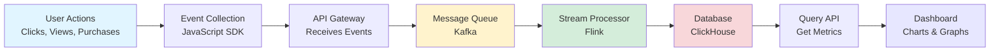
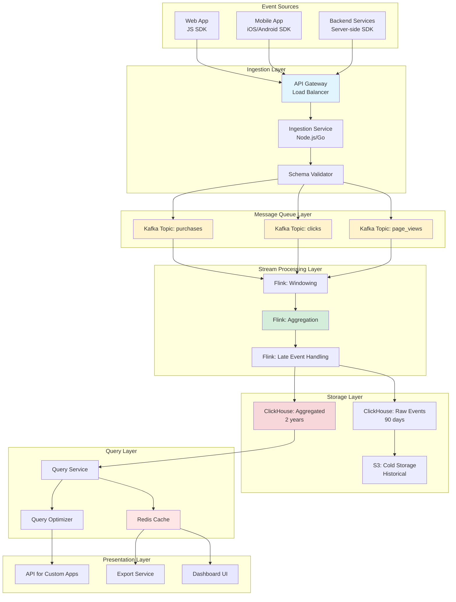
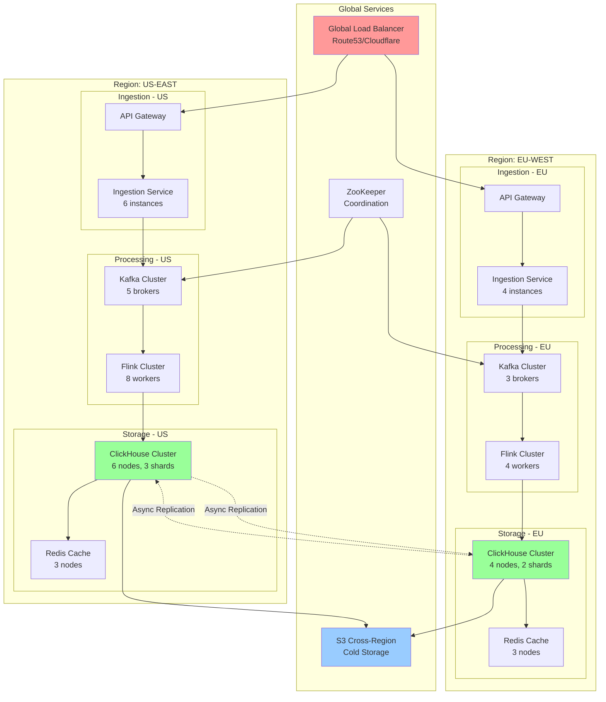

# Real-time Analytics Dashboard System Design

**Difficulty Level:** ⭐⭐⭐⭐ Very Hard  
**Tags:** `Real-time Analytics`, `Stream Processing`, `Time-Series Data`, `OLAP`, `Dashboard`, `Event Processing`, `Distributed Systems`, `Data Aggregation`, `Apache Kafka`, `ClickHouse`

**File Purpose:** Interactive, multi-level learning resource for designing a real-time analytics dashboard system that ingests 5-10M events per day and powers near real-time KPI dashboards with drill-down capabilities. This instructional guide takes you from beginner concepts to advanced production considerations, teaching you how to build a system that handles massive event streams with ≤1-2 minutes lag, supports complex aggregations (counts, percentiles, funnels), and scales to 10x traffic while maintaining sub-second query performance.

**Author:** System Design Documentation  
**Created:** January 22, 2026  
**Last Updated:** January 22, 2026  
**Recent Updates:** Initial creation with difficulty level and relevant tags for better categorization

**Learning Time Estimates:**
- 🟢 **Beginner Level:** 5-7 hours (analytics fundamentals, event ingestion, basic aggregations)
- 🟡 **Intermediate Level:** 7-10 hours (stream processing, time-series databases, query optimization)
- 🔴 **Advanced Level:** 10-15 hours (production optimization, handling late events, scaling strategies)

---

## 🎓 Welcome to Real-time Analytics Dashboard System Design!

### What You're Going to Build

Imagine creating a system like Google Analytics, Mixpanel, or Amplitude - one that tracks millions of user actions every day and shows live dashboards to product managers making critical business decisions. When a user clicks a button on an e-commerce site, that event travels through your pipeline, gets processed and aggregated, and appears on a dashboard within 1-2 minutes. Business analysts can drill down by country, product category, or user segment to understand customer behavior in near real-time.

By the end of this learning journey, you'll understand how to design a production-grade real-time analytics dashboard that:
- **Ingests 5-10M events per day** from multiple services (page views, clicks, transactions) with reliable delivery
- **Processes events in near real-time** with ≤1-2 minutes lag using stream processing pipelines
- **Handles late and out-of-order events** gracefully with watermarking and time-window strategies
- **Supports complex aggregations** including counts, sums, averages, percentiles, and funnel analysis
- **Enables powerful drill-downs** by product, geography, time range, and user segments with sub-second query latency
- **Scales to 10x traffic** (50-100M events/day) through horizontal scaling and data partitioning
- **Achieves 99.9% availability** (43 minutes downtime per month) with fault-tolerant architecture

### 📚 Your Learning Path

This course is designed for three different learning levels. You can progress through all levels or focus on the one that matches your current needs:

```text
🟢 BEGINNER LEVEL (5-7 hours)
├─ Learn analytics fundamentals and event tracking
├─ Understand WHY real-time matters for business decisions
├─ Build intuition with restaurant analytics analogy
├─ Master event ingestion basics with message queues
└─ Perfect for: New to analytics systems or data engineering

🟡 INTERMEDIATE LEVEL (7-10 hours)  
├─ Master interview techniques for analytics questions
├─ Design stream processing pipelines
├─ Learn time-series database selection criteria
├─ Implement aggregation strategies
├─ Practice capacity estimation
└─ Perfect for: Preparing for FAANG interviews

🔴 ADVANCED LEVEL (10-15 hours)
├─ Handle production challenges at scale
├─ Optimize for cost and performance
├─ Design for 10x growth
├─ Implement advanced features (anomaly detection, ML predictions)
├─ Navigate complex trade-offs
└─ Perfect for: Senior engineers, architects, tech leads
```

**What Makes This Different:**

This isn't just another analytics system doc. You'll learn:
- ✅ **Real company examples**: How Google Analytics, Mixpanel, and Amplitude solve these problems
- ✅ **Interview-ready frameworks**: Structured approaches to tackle analytics questions
- ✅ **Production war stories**: Common pitfalls and how to avoid them
- ✅ **Cost optimization**: Techniques used by companies saving millions on data processing
- ✅ **Hands-on examples**: JSON event schemas, API designs, SQL queries

---

## TABLE OF CONTENTS

- [1. REQUIREMENTS & CLARIFICATION](#1-requirements--clarification)
  - [User Stories](#user-stories)
  - [Functional Requirements](#functional-requirements)
  - [Non-Functional Requirements](#non-functional-requirements)
  - [Clarifying Questions & Assumptions](#clarifying-questions--assumptions)
- [2. BACK-OF-THE-ENVELOPE CALCULATIONS](#2-back-of-the-envelope-calculations)
  - [Traffic Estimates](#traffic-estimates)
  - [Storage Estimates](#storage-estimates)
  - [Resource Estimates](#resource-estimates)
  - [Bandwidth Estimates](#bandwidth-estimates)
- [3. HIGH-LEVEL DESIGN](#3-high-level-design)
  - [Core Components](#core-components)
  - [Architecture Diagram](#architecture-diagram)
  - [Data Flow](#data-flow)
- [4. DEEP DIVE: EVENT INGESTION PIPELINE](#4-deep-dive-event-ingestion-pipeline)
  - [Event Collection](#event-collection)
  - [Message Queue Architecture](#message-queue-architecture)
  - [Reliability Guarantees](#reliability-guarantees)
- [5. DEEP DIVE: STREAM PROCESSING](#5-deep-dive-stream-processing)
  - [Stream Processing Framework](#stream-processing-framework)
  - [Handling Late Events](#handling-late-events)
  - [Watermarking Strategy](#watermarking-strategy)
  - [Windowing Techniques](#windowing-techniques)
- [6. DEEP DIVE: DATA STORAGE](#6-deep-dive-data-storage)
  - [Time-Series Database](#time-series-database)
  - [OLAP Database](#olap-database)
  - [Hot vs Cold Storage](#hot-vs-cold-storage)
- [7. DEEP DIVE: AGGREGATIONS & METRICS](#7-deep-dive-aggregations--metrics)
  - [Real-time Aggregations](#real-time-aggregations)
  - [Pre-aggregation Strategy](#pre-aggregation-strategy)
  - [Percentile Calculations](#percentile-calculations)
  - [Funnel Analysis](#funnel-analysis)
- [8. API DESIGN](#8-api-design)
  - [Event Ingestion API](#event-ingestion-api)
  - [Dashboard Query API](#dashboard-query-api)
  - [Drill-down API](#drill-down-api)
- [9. DATABASE DESIGN](#9-database-design)
  - [Raw Events Schema](#raw-events-schema)
  - [Aggregated Metrics Schema](#aggregated-metrics-schema)
  - [Metadata Schema](#metadata-schema)
- [10. DEEP DIVE: DRILL-DOWN & FILTERING](#10-deep-dive-drill-down--filtering)
  - [Dimensional Modeling](#dimensional-modeling)
  - [Query Optimization](#query-optimization)
  - [Caching Strategy](#caching-strategy)
- [11. SCALABILITY](#11-scalability)
  - [Handling 10x Traffic](#handling-10x-traffic)
  - [Data Partitioning](#data-partitioning)
  - [Horizontal Scaling](#horizontal-scaling)
- [12. PERFORMANCE OPTIMIZATION](#12-performance-optimization)
  - [Query Performance](#query-performance)
  - [Materialized Views](#materialized-views)
  - [Data Compression](#data-compression)
- [13. SECURITY](#13-security)
  - [Data Privacy](#data-privacy)
  - [Access Control](#access-control)
  - [Compliance](#compliance)
- [14. MONITORING & OBSERVABILITY](#14-monitoring--observability)
  - [Pipeline Health](#pipeline-health)
  - [Data Quality](#data-quality)
  - [SLA Monitoring](#sla-monitoring)
- [15. TRADE-OFFS & ALTERNATIVES](#15-trade-offs--alternatives)
  - [Lambda vs Kappa Architecture](#lambda-vs-kappa-architecture)
  - [Batch vs Stream Processing](#batch-vs-stream-processing)
  - [Technology Choices](#technology-choices)
- [16. INTERVIEW PREPARATION](#16-interview-preparation)
  - [Common Questions](#common-questions)
  - [Interview Framework](#interview-framework)
  - [Troubleshooting Scenarios](#troubleshooting-scenarios)
- [PUTTING IT ALL TOGETHER](#putting-it-all-together)
- [RESOURCES & FURTHER LEARNING](#resources--further-learning)

---

## 1. REQUIREMENTS & CLARIFICATION

### User Stories

🟢 **BEGINNER: Understanding the Basics**

Think of a real-time analytics dashboard like the scoreboard at a restaurant chain. Every time a customer orders food, that "event" gets recorded. The restaurant manager wants to see:
- How many orders are happening right now?
- Which locations are busiest?
- What menu items are most popular today?

The key word is "right now" - not yesterday's report, but live data to make immediate decisions like "Should we send more staff to the downtown location?"

**As a product manager**, I want to see live metrics on my dashboard so that I can make data-driven decisions about product features without waiting for daily reports.

**As a business analyst**, I want to drill down into metrics by different dimensions (country, product, user segment) so that I can understand which customer segments are most engaged.

**As a data engineer**, I want to ingest millions of events reliably so that no user actions are lost even during traffic spikes.

**As a marketing manager**, I want to track conversion funnels in real-time so that I can optimize campaigns while they're still running.

---

🟡 **INTERMEDIATE: Interview Perspective**

In interviews, you need to extract these user stories to understand the scope:

**Key Questions to Ask:**
1. "Who are the primary users of this dashboard?" (Product managers? Executives? Engineers?)
2. "What decisions will they make with this data?" (Product launches? Marketing spend? System scaling?)
3. "How real-time is 'real-time'?" (Seconds? Minutes? Hours?)
4. "What types of events are we tracking?" (Page views? Purchases? API calls?)

**Example Interview Exchange:**
```text
You: "Can you describe a typical workflow for a dashboard user?"
Interviewer: "A product manager launches a new feature and wants to monitor adoption in real-time."
You: "Great! So we need event tracking, aggregation by feature, and dashboard updates within minutes?"
Interviewer: "Exactly. Let's say within 1-2 minutes."
```

---

🔴 **ADVANCED: Production Considerations**

Real user stories from companies like Mixpanel and Amplitude:

**User Story 1: Growth Team at E-commerce Company**
- Launches A/B test at 9 AM affecting 10% of traffic
- Monitors conversion rates every 5 minutes on dashboard
- Needs statistical significance calculations in real-time
- Must handle 50K events/minute during peak hours
- **Business Impact**: $10M annual revenue decisions based on A/B tests

**User Story 2: Security Team at FinTech**
- Tracks transaction events to detect fraud
- Requires <30 second detection time for suspicious patterns
- Needs to correlate events across multiple services
- Must maintain 99.99% reliability (financial regulations)
- **Business Impact**: Prevents $50M in fraud annually

**User Story 3: Engineering Team at SaaS Platform**
- Monitors API usage per customer for billing
- Needs exact counts (no data loss) for revenue calculation
- Tracks rate limits and quota usage in real-time
- Supports 1000+ enterprise customers with custom dashboards
- **Business Impact**: $100M ARR depends on accurate metering

---

### Functional Requirements

🟢 **BEGINNER: Core Features**

Let's understand what our system must do:

**1. Event Collection (The Input)**
```text
Analogy: Like a restaurant taking orders
├─ Customer places order → Event is recorded
├─ Order details captured → Event properties stored
└─ Time recorded → Timestamp added
```

Our system must:
- Accept events from multiple sources (web apps, mobile apps, servers)
- Handle different event types (page views, clicks, purchases)
- Capture event properties (user ID, timestamp, location, product details)

**Example Event:**
```json
{
  "event_type": "product_viewed",
  "user_id": "user_12345",
  "timestamp": "2026-01-22T10:30:00Z",
  "properties": {
    "product_id": "prod_789",
    "category": "electronics",
    "price": 299.99,
    "country": "US"
  }
}
```

**2. Real-time Processing**
- Process events within 1-2 minutes of occurrence
- Calculate basic metrics (counts, sums, averages)
- Update dashboards automatically

**3. Dashboard Visualization**
- Show KPIs (Key Performance Indicators)
- Display charts and graphs
- Refresh automatically with new data

**4. Basic Filtering**
- Filter by time range (last hour, today, this week)
- Filter by basic properties (country, product category)

---

🟡 **INTERMEDIATE: Complete Feature Set**

**Core Features (MVP):**

1. **Event Ingestion API**
   - REST endpoint for event submission
   - Batch API for multiple events
   - SDK support for common languages (JavaScript, Python, Java)
   - Input validation and error handling
   - Rate limiting per API key

2. **Real-time Aggregation**
   - Count: Number of events (e.g., page views)
   - Sum: Total values (e.g., revenue)
   - Average: Mean values (e.g., session duration)
   - Percentiles: P50, P90, P99 (e.g., page load time)
   - Unique counts: Distinct users, sessions

3. **Funnel Analysis**
   - Multi-step conversion tracking
   - Drop-off analysis between steps
   - Time-to-convert metrics
   - Cohort-based funnels

4. **Drill-down Capabilities**
   - Filter by dimensions:
     * Time (hour, day, week, month)
     * Geography (country, region, city)
     * Product attributes (category, price range, brand)
     * User segments (new vs returning, subscription tier)
   - Support for multiple filters simultaneously
   - Comparison views (this week vs last week)

5. **Query API**
   - Flexible query language for custom metrics
   - Support for grouping and aggregation
   - Time-series data retrieval
   - Response time: <1 second for most queries

6. **Historical Data Access**
   - Query past data (last 90 days hot storage)
   - Longer-term trends (12+ months in cold storage)
   - Data export capabilities

**Out of Scope for MVP:**

- Complex machine learning predictions
- Real-time anomaly detection
- Custom JavaScript for data transformation
- Advanced statistical analysis (regression, clustering)
- Real-time alerting system
- Multi-tenant isolation (assuming single organization initially)

---

🔴 **ADVANCED: Enterprise Features**

**Production-Grade Requirements:**

1. **Data Quality & Validation**
   - Schema validation for events
   - Duplicate detection and deduplication
   - Data integrity checks
   - Automatic data type inference
   - Custom validation rules per event type

2. **Advanced Analytics**
   - Retention cohort analysis
   - User journey mapping
   - Attribution modeling (first-touch, last-touch, multi-touch)
   - Predictive analytics (churn prediction, LTV forecasting)

3. **Governance & Compliance**
   - PII (Personally Identifiable Information) handling
   - GDPR-compliant data retention
   - User data deletion (right to be forgotten)
   - Audit logging for all queries
   - Role-based access control (RBAC)

4. **Multi-tenancy**
   - Customer data isolation
   - Per-tenant rate limits
   - Custom retention policies per customer
   - White-labeling support

5. **Integration Ecosystem**
   - Webhooks for event export
   - Data warehouse integration (Snowflake, BigQuery)
   - BI tool connectors (Tableau, Looker)
   - Reverse ETL for activation

---

### Non-Functional Requirements

🟢 **BEGINNER: What Makes the System Good**

Non-functional requirements are about **how well** the system works, not **what** it does.

**Restaurant Analogy:**
```text
Functional: Restaurant serves food (what)
Non-functional: Restaurant serves food within 15 minutes (how well)
```

**Our System's "How Well" Requirements:**

1. **Speed (Latency)**
   - Events appear on dashboard within 1-2 minutes
   - Queries return results in under 1 second
   - Why? Users won't wait longer than 2-3 seconds for dashboards to load

2. **Reliability (Availability)**
   - System works 99.9% of the time
   - Calculation: 99.9% = 43 minutes downtime per month
   - Why? Business decisions can't wait; downtime = lost insights

3. **Scalability**
   - Handles 5-10M events per day (current)
   - Can grow to 50-100M events per day (10x growth)
   - Why? Startups grow fast; system must grow with them

4. **Accuracy**
   - No events lost (100% delivery)
   - Counts are exact, not approximations
   - Why? Business metrics must be trustworthy

---

🟡 **INTERMEDIATE: Quantified SLAs**

**Performance Requirements:**

1. **Latency (End-to-End)**:
   - Event ingestion to storage: <5 seconds (p99)
   - Stream processing lag: <1 minute (p99)
   - Dashboard queries: <1 second (p95), <3 seconds (p99)
   - Aggregation refresh: Every 1-2 minutes
   
   **Why these numbers?**
   - Google Analytics shows ~1-2 minute lag (industry standard)
   - Users abandon dashboards after 3+ seconds load time
   - Real-time decisions require <5 minute total latency

2. **Availability**:
   - Overall system: 99.9% uptime (43 minutes/month downtime)
   - Event ingestion: 99.95% (21 minutes/month) - Most critical
   - Query service: 99.9% (acceptable brief outages)
   
   **Calculation:**
   ```text
   99.9% availability = 0.1% downtime
   30 days × 24 hours × 60 minutes = 43,200 minutes/month
   43,200 × 0.001 = 43.2 minutes downtime allowed
   ```

3. **Scalability**:
   - Current: 5-10M events/day = 115 events/second average, 350 events/sec peak (3x)
   - Target: 50-100M events/day = 1,150 events/second average, 3,500 events/sec peak
   - Query throughput: 100 queries/second (dashboard users)
   - Concurrent dashboard users: 1,000+

4. **Consistency**:
   - Strong consistency for writes (events not lost)
   - Eventual consistency acceptable for reads (1-2 minute lag)
   - Exactly-once processing semantics for billing/revenue metrics
   - At-least-once acceptable for engagement metrics

5. **Durability**:
   - Zero data loss for ingested events
   - Replication factor: 3 (across availability zones)
   - Backup retention: 90 days hot, 12 months cold storage
   - Point-in-time recovery: Within last 7 days

6. **Security**:
   - TLS 1.3 for data in transit
   - Encryption at rest (AES-256)
   - API authentication via API keys
   - Query authorization (users see only their data)

---

🔴 **ADVANCED: Production SLAs & Trade-offs**

**Service Level Objectives (SLOs):**

```text
SLI (Service Level Indicator)     | SLO Target  | Error Budget
================================== | =========== | ============
Event ingestion success rate       | 99.95%      | 0.05% (260K events/month @ 10M/day)
End-to-end latency (ingestion)     | <2 min p99  | 1% of events > 2 min
Query latency                      | <1s p95     | 5% of queries > 1s
Query success rate                 | 99.9%       | 0.1% failed queries
Data freshness                     | <2 min lag  | Measured per pipeline
Accuracy (compared to batch)       | 99.99%      | <0.01% discrepancy
```

**Trade-off Decisions:**

1. **Latency vs Cost**
   - Real-time (<1 sec): Requires expensive in-memory processing
   - Near real-time (1-2 min): 10x cheaper with batch micro-batches
   - **Decision**: 1-2 minute lag acceptable for most analytics use cases

2. **Accuracy vs Performance**
   - Exact counts: Require counting every event (expensive for unique users)
   - Approximate counts: Use HyperLogLog (0.01% error, 100x faster)
   - **Decision**: Exact for revenue, approximate for engagement metrics

3. **Consistency vs Availability (CAP Theorem)**
   - Strong consistency: Slower writes, risk of unavailability
   - Eventual consistency: Fast writes, temporary inconsistent reads
   - **Decision**: Eventually consistent (1-2 min lag) for better availability

4. **Storage vs Query Speed**
   - Raw events: Flexible queries, expensive storage
   - Pre-aggregated: Fast queries, limited flexibility
   - **Decision**: Hybrid approach (raw + pre-aggregated)

**Compliance Requirements:**

- **GDPR** (European users):
  - User consent tracking
  - Data portability (export user data)
  - Right to deletion (within 30 days)
  
- **CCPA** (California users):
  - Opt-out mechanism
  - Data disclosure requirements

- **SOC 2 Type II**:
  - Audit logging
  - Access controls
  - Encryption standards

---

### Clarifying Questions & Assumptions

🟢 **BEGINNER: What to Ask**

When designing a system, you need to understand the requirements clearly. Here are essential questions:

**About the Data:**
- Q: What types of events will we track?
  - A: User events (page views, clicks, purchases), system events (API calls, errors)
  
- Q: How big is each event?
  - A: Average 1KB (including all properties and metadata)
  
- Q: Do we need to store raw events forever?
  - A: Hot storage for 90 days, cold storage for 12 months, then archive/delete

**About the Users:**
- Q: Who will use these dashboards?
  - A: Product managers, analysts, executives, customer success teams
  
- Q: How many people will query simultaneously?
  - A: 100-1000 concurrent users during business hours

**About Scale:**
- Q: How many events per day right now?
  - A: 5-10 million events/day currently
  
- Q: Expected growth?
  - A: Planning for 10x growth (50-100M events/day) within 2 years

---

🟡 **INTERMEDIATE: Interview Framework**

**The RADIO Framework** for clarifying requirements:

**R - Requirements (What must it do?)**
```text
Q: "What are the must-have features for MVP?"
Q: "What can we defer to v2?"
Q: "Are there any compliance requirements?"
```

**A - Assumptions (What can we assume?)**
```text
Q: "Can we assume 80-20 read-write ratio?"
Q: "Can we assume events arrive in order?"
Q: "Can we assume US-only deployment initially?"
```

**D - Data (What data flows through?)**
```text
Q: "What's the schema of an event?"
Q: "Do we need to support schema evolution?"
Q: "What's the size distribution of events?"
```

**I - Infrastructure (What do we have?)**
```text
Q: "Are we on AWS/GCP/Azure?"
Q: "Do we have existing Kafka clusters?"
Q: "What's our operational expertise?"
```

**O - Operations (How is it used?)**
```text
Q: "What's the query pattern?"
Q: "How often do dashboards refresh?"
Q: "What's the typical drill-down depth?"
```

**Example Interview Dialog:**

```text
Interviewer: "Design a real-time analytics dashboard."

You: "Great! Let me clarify a few things. First, when you say 'real-time,' 
     what latency is acceptable? Are we talking seconds, minutes, or hours?"

Interviewer: "Let's say 1-2 minutes is acceptable."

You: "Perfect. And what scale are we targeting? How many events per day?"

Interviewer: "Start with 5-10 million per day, but design for 10x growth."

You: "Got it. For the dashboard queries, what's more important - 
     query flexibility or query speed?"

Interviewer: "Users need common queries to be very fast, under 1 second."

You: "That suggests we should pre-aggregate common metrics. One more thing -
     do we need exactly-once semantics, or is at-least-once acceptable?"

Interviewer: "For revenue metrics, exactly-once. For engagement, at-least-once is fine."
```

---

🔴 **ADVANCED: Hidden Requirements**

Experienced engineers probe for requirements the interviewer might not mention:

**Operational Requirements:**
- Q: "What's our on-call budget?" → Affects complexity of system
- Q: "What's the team size?" → Affects technology choices (no exotic tech for small teams)
- Q: "What's our operational expertise?" → Build vs buy decisions

**Cost Constraints:**
- Q: "What's the monthly infrastructure budget?"
  - Affects: Storage strategy (cheap vs fast), retention policies, batch vs streaming
  
- Q: "What's the cost per event we can afford?"
  - Example: $10,000/month budget ÷ 300M events/month = $0.000033 per event
  - This drives architectural decisions (use cheap batch processing, not expensive real-time)

**Data Quality:**
- Q: "How do we handle duplicate events?" → Idempotency design
- Q: "What if events arrive out of order?" → Watermarking strategy  
- Q: "What if event schema changes?" → Versioning strategy
- Q: "How do we validate event data?" → Validation rules

**Failure Scenarios:**
- Q: "What happens if the database is down?" → Fallback to cached data?
- Q: "What if stream processing lags by 10 minutes?" → Show staleness indicator?
- Q: "What if we receive 10x traffic unexpectedly?" → Auto-scaling or backpressure?

**Business Context:**
- Q: "Are dashboards used for executive reporting?" → Higher accuracy requirements
- Q: "Do dashboards drive automated decisions?" → Higher availability requirements
- Q: "Is this customer-facing or internal?" → Affects SLA requirements

**Assumptions We'll Make:**

1. **Geographic Distribution:**
   - Assumption: Initially US-only deployment
   - Can expand to multi-region later

2. **Event Sources:**
   - Assumption: Events from web apps (JavaScript SDK), mobile apps, backend servers
   - Protocol: HTTPS JSON over REST, Batch API available

3. **Event Structure:**
   - Assumption: Semi-structured JSON (flexible schema)
   - Common fields: event_type, user_id, timestamp, properties {}

4. **Query Patterns:**
   - Assumption: 80% of queries are for last 24 hours
   - 15% for last 7 days, 5% for longer periods
   - Most common: daily active users, conversion rates, revenue

5. **Data Retention:**
   - Assumption: 90 days in hot storage (fast queries)
   - 12 months in cold storage (slower, cheaper)
   - After 12 months: Aggregate to daily/weekly summaries

6. **User Behavior:**
   - Assumption: 100-1000 concurrent dashboard users
   - Peak hours: 9 AM - 5 PM business days
   - Average user runs 20 queries per session

7. **Growth Pattern:**
   - Assumption: 2x growth year-over-year
   - Traffic spikes during product launches (3-5x normal)
   - Black Friday / holiday spikes (10x for e-commerce clients)

---

## 2. BACK-OF-THE-ENVELOPE CALCULATIONS

### Traffic Estimates

🟢 **BEGINNER: Basic Math**

Let's figure out how many events per second we need to handle:

**Restaurant Analogy:**
```text
If a restaurant serves 300 customers per day:
├─ Open 10 hours = 600 minutes
├─ 300 customers ÷ 600 minutes = 0.5 customers/minute
└─ During lunch rush (2x normal) = 1 customer/minute
```

**Our System:**

**Current Scale: 5-10M events/day**

```text
Average events per second:
├─ 10M events/day
├─ 24 hours/day × 60 min × 60 sec = 86,400 seconds/day
├─ 10,000,000 ÷ 86,400 = 115 events/second (average)
└─ Peak (3x average) = 345 events/second
```

**Target Scale (10x growth): 50-100M events/day**

```text
10x growth calculation:
├─ 100M events/day
├─ 100,000,000 ÷ 86,400 = 1,157 events/second (average)
└─ Peak (3x average) = 3,471 events/second
```

**Query Load:**

```text
Dashboard users: 1,000 concurrent users
├─ Each user runs 1 query every 30 seconds
├─ 1,000 users ÷ 30 seconds = 33 queries/second (average)
└─ Peak hours (3x) = 100 queries/second
```

---

🟡 **INTERMEDIATE: Detailed Breakdown**

**Event Ingestion Traffic:**

| Scale Level | Events/Day | Avg Events/Sec | Peak Events/Sec | Monthly Events |
|-------------|------------|----------------|-----------------|----------------|
| **Current** | 10M | 115 | 345 | 300M |
| **1 Year** | 20M | 231 | 693 | 600M |
| **2 Years (Target)** | 50M | 578 | 1,734 | 1.5B |
| **Peak Growth** | 100M | 1,157 | 3,471 | 3B |

**Peak Calculation Breakdown:**

```text
Average events/sec × Peak multiplier = Peak events/sec

Peak multipliers by time:
├─ Daily peak (business hours): 2x average
├─ Campaign launch: 3x average
├─ Black Friday/Flash sale: 5-10x average
└─ System must handle: 3x sustained, 10x burst (with backpressure)
```

**Query Traffic Patterns:**

```text
Dashboard Queries:
├─ Active users during business hours: 500-1000
├─ Avg query frequency: 1 query/30 seconds
├─ Base query rate: 20-33 QPS
├─ Peak query rate: 60-100 QPS
└─ Burst capacity needed: 200 QPS (2x peak)

Query Types Distribution:
├─ Simple aggregations (COUNT, SUM): 60% - <100ms latency
├─ Percentile calculations (P50, P90, P99): 25% - <500ms latency
├─ Funnel queries (multi-step): 10% - <1s latency
└─ Complex drill-downs: 5% - <3s latency
```

**Data Flow Summary:**

```text
Ingestion Path (Write-Heavy):
└─ 1,157 events/sec avg → 3,471 events/sec peak

Processing Path (Compute):
└─ 1,157 events/sec need aggregation in real-time

Query Path (Read-Heavy):
└─ 33 queries/sec avg → 100 queries/sec peak

Read:Write Ratio = 33:1157 ≈ 1:35 (Write-heavy system!)
```

---

🔴 **ADVANCED: Capacity Planning**

**Detailed Traffic Analysis:**

**1. Event Ingestion Capacity:**

```text
Target: 100M events/day peak capacity

Sustained throughput:
├─ Average: 1,157 events/sec
├─ Peak (3x): 3,471 events/sec
├─ Burst (10x): 11,570 events/sec (must handle for 5-10 minutes)
└─ Design capacity: 15,000 events/sec (30% headroom)

Message queue sizing:
├─ Kafka partition throughput: ~5,000 msgs/sec/partition
├─ Required partitions: 15,000 ÷ 5,000 = 3 partitions (minimum)
├─ Recommended: 12 partitions (4x over-provisioned for:
│   ├─ Key-based partitioning for ordering
│   ├─ Future growth
│   └─ Rebalancing overhead)
└─ Total Kafka throughput: 12 × 5,000 = 60,000 events/sec capacity
```

**2. Stream Processing Capacity:**

```text
Processing requirements per event:
├─ Parsing & validation: 1ms
├─ Enrichment (geo-lookup, user data): 5ms
├─ Aggregation updates: 2ms
└─ Total: ~8ms per event

Single processor capacity:
├─ 1,000ms ÷ 8ms = 125 events/sec per core
├─ 8-core machine: 1,000 events/sec
└─ For 3,471 events/sec peak: Need 4 machines (with 2x redundancy = 8 machines)

Flink/Spark Streaming cluster:
├─ Worker nodes: 8 machines (c5.2xlarge - 8 vCPUs, 16 GB RAM)
├─ Total capacity: 8,000 events/sec
├─ Utilization at peak: 43% (healthy headroom)
└─ Cost: ~$2,000/month (8 × $250 = $2,000)
```

**3. Query Capacity:**

```text
Query service capacity:
├─ Target: 100 QPS sustained, 200 QPS burst
├─ Average query latency: 500ms
├─ Queries in-flight: 100 QPS × 0.5s = 50 concurrent queries
├─ CPU per query: 100ms (assume efficient OLAP DB)
└─ Per-node capacity: 10 cores × 1000ms ÷ 100ms = 100 queries/sec

Node sizing:
├─ Minimum nodes: 200 QPS ÷ 100 QPS = 2 nodes
├─ Recommended: 4 nodes (N+1 redundancy + headroom)
└─ Instance type: c5.4xlarge (16 vCPUs, 32 GB RAM)
```

**Regional Distribution (Future):**

```text
If expanding to multi-region:

North America (60% traffic):
├─ Events: 60K/day (avg) → 180K/day (peak)
└─ Queries: 60 QPS

Europe (25% traffic):
├─ Events: 25K/day (avg) → 75K/day (peak)
└─ Queries: 25 QPS

Asia Pacific (15% traffic):
├─ Events: 15K/day (avg) → 45K/day (peak)
└─ Queries: 15 QPS
```

---

### Storage Estimates

🟢 **BEGINNER: How Much Disk Space?**

**Simple Calculation:**

```text
One event = 1 KB (1,000 bytes)
10 million events/day = 10 million KB = 10 GB/day

For 90 days (3 months):
├─ 10 GB/day × 90 days = 900 GB
└─ Almost 1 TB (Terabyte) of storage
```

**Why 1 KB per event?**

```json
{
  "event_id": "evt_1234567890",           // 30 bytes
  "event_type": "product_viewed",         // 20 bytes
  "user_id": "user_12345",                // 15 bytes
  "session_id": "sess_abcd",              // 15 bytes
  "timestamp": "2026-01-22T10:30:00Z",    // 25 bytes
  "properties": {                         // ~800 bytes
    "product_id": "prod_789",
    "product_name": "Wireless Headphones",
    "category": "electronics",
    "price": 299.99,
    "country": "US",
    "city": "San Francisco",
    "device": "mobile",
    "browser": "Chrome",
    // ... more properties
  }
}
// Total: ~1,000 bytes (1 KB)
```

---

🟡 **INTERMEDIATE: Complete Storage Breakdown**

**Raw Events Storage:**

| Time Period | Events | Size per Event | Total Size | Compression | Final Size |
|-------------|--------|----------------|------------|-------------|------------|
| **1 Day** | 10M | 1 KB | 10 GB | 5:1 | 2 GB |
| **1 Week** | 70M | 1 KB | 70 GB | 5:1 | 14 GB |
| **1 Month** | 300M | 1 KB | 300 GB | 5:1 | 60 GB |
| **90 Days (Hot)** | 900M | 1 KB | 900 GB | 5:1 | 180 GB |
| **1 Year (Cold)** | 3.6B | 1 KB | 3.6 TB | 10:1 | 360 GB |

**Compression Rationale:**
- JSON text compresses well (5:1 with gzip/snappy)
- Time-series data has repetitive fields (event_type, user patterns)
- Columnar formats (Parquet) achieve 10:1 for cold storage

**Aggregated Metrics Storage:**

```text
Pre-computed aggregations (for fast queries):

Granularity levels:
├─ Per-minute aggregates: 60×24 = 1,440 rows/day/metric
├─ Per-hour aggregates: 24 rows/day/metric
└─ Per-day aggregates: 1 row/day/metric

Dimensions tracked:
├─ Time (minute/hour/day)
├─ Event type (50 types)
├─ Country (200 countries)
├─ Product category (100 categories)
└─ Combinations: 50 × 200 × 100 = 1M dimension combinations

Per-minute aggregates:
├─ 1,440 minutes/day × 1M combinations = 1.44B rows/day
├─ Each row: ~100 bytes (timestamp, dimensions, metrics)
├─ Daily storage: 1.44B × 100 bytes = 144 GB/day
└─ With compression (3:1): 48 GB/day

90-day aggregates:
└─ 48 GB/day × 90 days = 4.3 TB (compressed)
```

**Total Storage Requirements:**

```text
For 90 days hot storage:
├─ Raw events: 180 GB
├─ Pre-aggregated metrics: 4.3 TB
├─ Indexes & metadata: 500 GB
└─ Total: ~5 TB

For 1 year total:
├─ Hot storage (90 days): 5 TB
├─ Cold storage (275 days): 1 TB (heavily aggregated)
└─ Total: 6 TB
```

---

🔴 **ADVANCED: Storage Optimization**

**Storage Architecture:**

```text
3-Tier Storage Strategy:

Tier 1: Hot Storage (Last 7 days)
├─ Technology: ClickHouse on NVMe SSDs
├─ Raw events: 2 GB/day × 7 = 14 GB
├─ Minute-level aggregates: 48 GB/day × 7 = 336 GB
├─ Total: 350 GB
├─ Replication: 3x = 1.05 TB
├─ Cost: $0.10/GB/month × 1,050 GB = $105/month
└─ Query latency: <100ms

Tier 2: Warm Storage (8-90 days)
├─ Technology: ClickHouse on GP3 SSDs
├─ Raw events: 2 GB/day × 83 = 166 GB
├─ Hour-level aggregates: 10 GB/day × 83 = 830 GB
├─ Total: 996 GB
├─ Replication: 3x = 3 TB
├─ Cost: $0.05/GB/month × 3,000 GB = $150/month
└─ Query latency: <500ms

Tier 3: Cold Storage (91 days - 1 year)
├─ Technology: S3 + Athena (query on demand)
├─ Daily aggregates only: 1 GB/day × 275 = 275 GB
├─ Compression: 10:1 (Parquet columnar format)
├─ Total: 27.5 GB
├─ Cost: $0.023/GB/month × 27.5 = $0.63/month
└─ Query latency: 5-30 seconds (acceptable for historical analysis)
```

**Storage Cost Optimization:**

```text
Total monthly storage cost:
├─ Tier 1 (Hot): $105
├─ Tier 2 (Warm): $150
├─ Tier 3 (Cold): $0.63
└─ Total: ~$256/month for 10M events/day

At 100M events/day (10x scale):
├─ Tier 1: $1,050 (10x data)
├─ Tier 2: $1,500 (10x data)
├─ Tier 3: $6.30 (10x data)
└─ Total: ~$2,556/month

Cost per event:
└─ $2,556 ÷ 3B events/month = $0.000852 per event
```

**Data Retention Policy:**

```text
Retention strategy by event type:

Critical events (revenue, conversions):
├─ Raw events: 365 days
├─ Aggregates: Forever (minimal storage)
└─ Why: Compliance, financial reporting, historical analysis

Engagement events (page views, clicks):
├─ Raw events: 90 days
├─ Aggregates: 365 days
├─ Summary (daily): Forever
└─ Why: Balance between insight value and cost

System events (errors, logs):
├─ Raw events: 30 days
├─ Aggregates: 90 days
└─ Why: Debugging recent issues, minimal historical value
```

**Database Sizing (ClickHouse):**

```text
ClickHouse cluster configuration:

Hot tier (7 days):
├─ Nodes: 3 replicas × 2 shards = 6 nodes
├─ Instance: i3.2xlarge (8 vCPUs, 61 GB RAM, 1.9 TB NVMe)
├─ Storage per node: 350 GB (raw) + overhead = 500 GB
├─ CPU utilization: 30% average, 70% peak
├─ Cost: 6 nodes × $0.624/hour × 730 hours = $2,733/month
└─ Total capacity: Handles 10x current load

Warm tier (83 days):
├─ Nodes: 3 replicas × 2 shards = 6 nodes
├─ Instance: r5.2xlarge (8 vCPUs, 64 GB RAM, 1 TB EBS)
├─ Storage per node: 1 TB
├─ Cost: 6 nodes × $0.504/hour × 730 hours = $2,207/month
└─ Total capacity: Adequate for current load
```

---

### Resource Estimates

🟢 **BEGINNER: Server Resources**

**What resources does our system need?**

```text
Think of a computer's resources like a restaurant:
├─ CPU (Processing power) = Chefs cooking
├─ Memory (RAM) = Prep tables for active orders
├─ Storage (Disk) = Pantry storing ingredients
└─ Network (Bandwidth) = Delivery trucks
```

**Our System Needs:**

**1. Message Queue Servers (Kafka)**
- 3 servers (for reliability)
- Each: 8 CPUs, 32 GB memory, 1 TB disk
- Why? Temporarily hold events before processing

**2. Stream Processing Servers**
- 8 servers
- Each: 8 CPUs, 16 GB memory
- Why? Process events in real-time

**3. Database Servers (ClickHouse)**
- 12 servers (6 hot + 6 warm)
- Each: 8 CPUs, 64 GB memory, 1 TB disk
- Why? Store and query event data

**4. API Servers**
- 4 servers
- Each: 4 CPUs, 8 GB memory
- Why? Handle incoming events and dashboard queries

**Total:**
- 27 servers
- 172 CPUs
- 1.4 TB memory
- ~$8,000/month cloud cost

---

🟡 **INTERMEDIATE: Detailed Resource Breakdown**

**Component-wise Resource Allocation:**

**1. Ingestion Layer:**

```text
API Gateway (Nginx):
├─ Instances: 3 (c5.large: 2 vCPUs, 4 GB RAM)
├─ Throughput: 5,000 req/sec per instance = 15,000 total
├─ Cost: 3 × $0.085/hour × 730 = $186/month
└─ Purpose: Load balancing, TLS termination, rate limiting

Event API Servers (Go/Node.js):
├─ Instances: 6 (c5.xlarge: 4 vCPUs, 8 GB RAM)
├─ Capacity: 500 events/sec per instance = 3,000 total
├─ Cost: 6 × $0.17/hour × 730 = $745/month
└─ Purpose: Validation, enrichment, Kafka publishing
```

**2. Message Queue (Kafka):**

```text
Kafka Cluster:
├─ Brokers: 3 (r5.xlarge: 4 vCPUs, 32 GB RAM, 1 TB gp3)
├─ Partitions: 12 (per topic)
├─ Replication factor: 3
├─ Throughput: 60,000 msgs/sec (20,000 per broker)
├─ Retention: 7 days (for replay capability)
├─ Storage: 3 TB total (1 TB per broker)
└─ Cost: 3 × $0.252/hour × 730 = $552/month

Zookeeper (for Kafka coordination):
├─ Instances: 3 (t3.small: 2 vCPUs, 2 GB RAM)
└─ Cost: 3 × $0.021/hour × 730 = $46/month
```

**3. Stream Processing (Apache Flink):**

```text
Flink Cluster:
├─ Task Managers: 8 (c5.2xlarge: 8 vCPUs, 16 GB RAM)
├─ Job Managers: 2 (c5.xlarge: 4 vCPUs, 8 GB RAM)
├─ Processing capacity: 8,000 events/sec
├─ State backend: S3 (for checkpointing)
├─ Checkpointing: Every 5 minutes
└─ Cost:
    ├─ Task Managers: 8 × $0.34/hour × 730 = $1,987/month
    └─ Job Managers: 2 × $0.17/hour × 730 = $248/month
    Total: $2,235/month
```

**4. Data Storage (ClickHouse):**

```text
(Already detailed in Storage Estimates section)
├─ Hot tier: 6 nodes = $2,733/month
├─ Warm tier: 6 nodes = $2,207/month
└─ Cold tier (S3): ~$1/month
Total: $4,941/month
```

**5. Query Service:**

```text
Query API Servers:
├─ Instances: 4 (c5.2xlarge: 8 vCPUs, 16 GB RAM)
├─ Capacity: 100 QPS per instance = 400 total
├─ Cache: Redis (r5.large: 2 vCPUs, 13 GB RAM)
└─ Cost:
    ├─ API servers: 4 × $0.34/hour × 730 = $993/month
    └─ Redis: 1 × $0.126/hour × 730 = $92/month
    Total: $1,085/month
```

**6. Monitoring & Operations:**

```text
Prometheus + Grafana:
├─ Instances: 2 (t3.large: 2 vCPUs, 8 GB RAM)
└─ Cost: 2 × $0.0832/hour × 730 = $122/month

ELK Stack (Logs):
├─ Instances: 3 (r5.large: 2 vCPUs, 16 GB RAM)
└─ Cost: 3 × $0.126/hour × 730 = $276/month

Total monitoring: $398/month
```

**Grand Total Monthly Cost:**

```text
Component                 | Monthly Cost
========================= | ============
Ingestion (API + Nginx)  | $931
Message Queue (Kafka)     | $598
Stream Processing (Flink) | $2,235
Storage (ClickHouse + S3) | $4,941
Query Service            | $1,085
Monitoring               | $398
========================= | ============
Total                    | $10,188/month

Cost per event: $10,188 ÷ 300M events = $0.000034 per event
```

---

🔴 **ADVANCED: Cost Optimization Strategies**

**Reserved Instance Savings:**

```text
1-year Reserved Instances (40% discount):
├─ Current on-demand: $10,188/month
├─ With Reserved: $6,113/month
└─ Annual savings: $48,900

3-year Reserved Instances (60% discount):
├─ With Reserved: $4,075/month
└─ Annual savings: $73,356
```

**Spot Instance Usage:**

```text
For stateless components (stream processing):
├─ Flink Task Managers on Spot: 70% discount
├─ Current: $1,987/month
├─ With Spot: $596/month
├─ Savings: $1,391/month ($16,692/year)
└─ Risk: Acceptable (Flink checkpoints enable fast recovery)
```

**Auto-scaling Strategy:**

```text
Time-based scaling:

Peak hours (9 AM - 5 PM weekdays):
├─ Full capacity: 27 servers
└─ Cost: $10,188/month (during peak)

Off-peak hours (nights, weekends):
├─ Scale down to 60% capacity
├─ Reduced cost: $6,113/month
└─ Average effective cost: $7,800/month

Potential savings: $2,388/month ($28,656/year)
```

**Multi-tenancy Cost Allocation:**

```text
If serving multiple customers:

Small customers (1M events/day):
├─ Share infrastructure
├─ Cost allocation: $1,000/month/customer
└─ Margin: 70% (infrastructure cost: $300)

Medium customers (10M events/day):
├─ Dedicated query nodes
├─ Cost allocation: $8,000/month/customer
└─ Margin: 20% (infrastructure cost: $6,400)

Large customers (100M events/day):
├─ Fully dedicated infrastructure
├─ Cost allocation: $40,000/month/customer
└─ Margin: 60% (infrastructure cost: $25,000)
```

---

### Bandwidth Estimates

🟢 **BEGINNER: Network Traffic**

**How much data travels over the network?**

```text
Inbound (Events coming in):
├─ 10M events/day
├─ 1 KB per event
├─ 10M × 1 KB = 10 GB/day
└─ 10 GB ÷ 24 hours ÷ 3600 seconds = 120 KB/second

Outbound (Dashboard queries):
├─ 33 queries/second
├─ Average response: 10 KB (time-series data for charts)
├─ 33 × 10 KB = 330 KB/second
└─ Much less than inbound!
```

**Monthly Bandwidth:**

```text
Inbound: 10 GB/day × 30 days = 300 GB/month
Outbound: 330 KB/sec × 86,400 sec × 30 days = 856 GB/month
Total: ~1.2 TB/month
```

---

🟡 **INTERMEDIATE: Detailed Bandwidth Analysis**

**Ingestion Bandwidth:**

```text
Current (10M events/day):
├─ Average: 115 events/sec × 1 KB = 115 KB/sec = 0.92 Mbps
├─ Peak (3x): 345 events/sec × 1 KB = 345 KB/sec = 2.76 Mbps
└─ Daily: 10 GB

Target (100M events/day):
├─ Average: 1,157 events/sec × 1 KB = 1.13 MB/sec = 9.05 Mbps
├─ Peak (3x): 3,471 events/sec × 1 KB = 3.39 MB/sec = 27.1 Mbps
└─ Daily: 100 GB

Burst (10x):
└─ 11,570 events/sec × 1 KB = 11.3 MB/sec = 90.5 Mbps
```

**Query Bandwidth:**

```text
Query response sizes:
├─ Simple aggregates (counts): 1 KB
├─ Time-series (7 days): 10 KB
├─ Drill-down (detailed): 50 KB
└─ Export (full data): 1 MB

Average query: 10 KB

Query traffic:
├─ Average: 33 QPS × 10 KB = 330 KB/sec = 2.64 Mbps
├─ Peak: 100 QPS × 10 KB = 1 MB/sec = 8 Mbps
└─ Daily: 33 QPS × 86,400 sec × 10 KB = 28.5 GB
```

**Internal Bandwidth (Between Components):**

```text
Kafka → Flink → ClickHouse:
├─ Events flow: 115 events/sec × 1 KB = 115 KB/sec
├─ Aggregates: 115 KB/sec ÷ 10 (compression) = 11.5 KB/sec
└─ Total internal: 126.5 KB/sec

ClickHouse replication:
├─ Replication factor: 3
├─ Data written: 2 GB/day (compressed)
├─ Replicated: 2 GB × 2 (source → 2 replicas) = 4 GB/day
└─ Average: 46 KB/sec
```

**Monthly Bandwidth Summary:**

| Direction | Daily | Monthly | Cost (@$0.09/GB) |
|-----------|-------|---------|------------------|
| **Ingress (Events)** | 10 GB | 300 GB | $0 (free on AWS) |
| **Egress (Queries)** | 28.5 GB | 855 GB | $76.95 |
| **Internal** | 6 GB | 180 GB | $0 (same region) |
| **Total** | 44.5 GB | 1,335 GB | $76.95 |

---

🔴 **ADVANCED: Network Optimization**

**CDN for Dashboard Assets:**

```text
Dashboard frontend (static assets):
├─ Size: 2 MB (HTML, JS, CSS, images)
├─ Users: 1,000 daily
├─ Page views: 10,000/day
├─ Without CDN: 10,000 × 2 MB = 20 GB/day egress
├─ With CDN (95% cache hit): 20 GB × 0.05 = 1 GB/day egress
└─ Savings: 19 GB/day × 30 = 570 GB/month = $51/month
```

**API Response Compression:**

```text
Without compression:
├─ Query response: 10 KB (JSON)
└─ 100 QPS × 10 KB = 1 MB/sec

With gzip compression:
├─ Compressed response: 2 KB (5:1 compression)
├─ 100 QPS × 2 KB = 200 KB/sec
└─ Savings: 80% bandwidth = $61/month (855 GB → 171 GB)
```

**Regional Data Centers:**

```text
Multi-region deployment:

US-based customers (60%):
├─ US East data center
└─ Cross-region bandwidth: $0

EU-based customers (25%):
├─ EU data center
├─ Cross-region sync: 2.5 GB/day × $0.02/GB = $0.05/day
└─ Monthly: $1.50

APAC customers (15%):
├─ Singapore data center
├─ Cross-region sync: 1.5 GB/day × $0.02/GB = $0.03/day
└─ Monthly: $0.90

Total multi-region bandwidth cost: $2.40/month (minimal!)
```

**Bandwidth Budget at Scale:**

```text
At 100M events/day (10x growth):

Ingress: 100 GB/day = 3 TB/month (free)
Egress (queries): 280 GB/day = 8.4 TB/month
├─ Without optimization: 8.4 TB × $0.09 = $756/month
├─ With CDN + compression: 1.7 TB × $0.09 = $153/month
└─ Savings: $603/month ($7,236/year)
```

---

## 3. HIGH-LEVEL DESIGN

### Core Components

🟢 **BEGINNER: The Big Picture with a Restaurant Analogy**

Imagine a restaurant chain with a central monitoring system. Here's how our analytics dashboard works:

**The Restaurant Analogy:**
```text
Restaurant Chain Analytics System
├─ Cash Registers (Event Sources)
│  └─ Every transaction, order, customer visit is recorded
├─ Collection Trucks (API Gateway)  
│  └─ Pick up data from all locations regularly
├─ Sorting Center (Message Queue - Kafka)
│  └─ Organize all receipts by type and time
├─ Analysis Team (Stream Processor - Flink)
│  └─ Calculate totals, averages, trends in real-time
├─ Filing System (Database - ClickHouse)
│  └─ Store organized summaries for quick lookup
├─ Report Generator (Query API)
│  └─ Answer manager's questions like "How many pizzas sold today?"
└─ Manager's Dashboard (Web UI)
   └─ Visual charts showing sales, trends, comparisons
```

**Why This Architecture?**

Each component has a specific job, just like restaurant staff:
- **Event Sources**: Generate data (like cashiers recording sales)
- **API Gateway**: Accept and validate incoming events (like a receptionist checking orders)
- **Message Queue**: Buffer events during busy times (like a ticket queue at a busy restaurant)
- **Stream Processor**: Calculate metrics in real-time (like a manager counting money while the restaurant is still open)
- **Database**: Store results for quick access (like a filing cabinet with organized reports)
- **Query API**: Retrieve specific information (like asking "What were Monday's sales?")
- **Dashboard**: Display information visually (like a chart on the manager's wall)

**Key Benefit**: Each component can be scaled independently. If you have more events, add more message queue capacity. If you have slower queries, add more database nodes.

---

🟡 **INTERMEDIATE: Component Breakdown**

Let's examine each component's role in the system:

**1. Event Sources**
- **What**: Web apps, mobile apps, backend services generating events
- **Examples**: 
  - JavaScript SDK tracking button clicks
  - Mobile SDK tracking screen views  
  - Server-side API calls tracking transactions
- **Key Metric**: 5-10M events/day = ~115 events/second average, ~350 events/second peak

**2. API Gateway (Load Balancer)**
- **What**: Entry point for all event ingestion requests
- **Responsibilities**:
  - SSL termination and security
  - API key validation
  - Rate limiting per customer
  - Request routing to ingestion service
- **Technology**: Nginx, AWS ALB, Kong
- **Capacity**: Must handle 3x average load = 1,000 requests/second

**3. Ingestion Service**
- **What**: Stateless HTTP servers accepting events
- **Responsibilities**:
  - Event validation (schema, required fields)
  - Event enrichment (add server timestamp, IP geolocation)
  - Write to message queue
  - Return acknowledgment to client
- **Technology**: Node.js, Go, Python (FastAPI)
- **Scaling**: Horizontal - add more servers during traffic spikes

**4. Message Queue (Kafka)**
- **What**: Distributed log storing events temporarily
- **Why Needed**: Decouples ingestion from processing
  - Ingestion can accept events even if processor is slow
  - Can replay events if processing fails
  - Natural place for data backup
- **Topics**: Organize by event type (page_views, clicks, purchases)
- **Retention**: 7 days (enough time to reprocess if needed)
- **Partitioning**: By user_id or session_id for ordered processing

**5. Stream Processing (Apache Flink)**
- **What**: Real-time computation engine
- **Responsibilities**:
  - Window events by time (1-minute windows)
  - Calculate aggregations (counts, sums, averages)
  - Handle late-arriving events
  - Write results to database
- **Why Flink**: 
  - True event-time processing (not just processing time)
  - Exactly-once state guarantees
  - Low latency (~100ms processing time)

**6. Time-Series Database (ClickHouse)**
- **What**: Column-oriented OLAP database optimized for analytics
- **Why ClickHouse**:
  - Excellent compression (10x better than row stores)
  - Fast aggregation queries (100M rows in <1 second)
  - Scales horizontally with sharding
- **Storage**:
  - Raw events: 90 days in hot storage
  - Pre-aggregated metrics: 2 years in hot storage
  - Historical data: Cold storage (S3)

**7. Query Service**
- **What**: API layer for dashboard queries
- **Responsibilities**:
  - Parse query parameters (time range, filters, groupings)
  - Generate optimized SQL
  - Cache frequent queries
  - Format results for UI
- **Caching**: Redis for popular queries (last 5 minutes of data)

**8. Dashboard UI**
- **What**: Web application displaying metrics
- **Features**:
  - Real-time chart updates (WebSocket for live data)
  - Interactive drill-downs
  - Custom date ranges
  - Export to CSV/PDF
- **Technology**: React, D3.js for visualizations

**Component Communication:**
```text
Sync Communication (REST/HTTP):
├─ Client SDK → API Gateway → Ingestion Service
├─ Dashboard → Query Service → Database
└─ Low latency requirements, request-response pattern

Async Communication (Message Queue):
├─ Ingestion Service → Kafka → Stream Processor
├─ Stream Processor → Database (batch writes)
└─ High throughput, eventual consistency acceptable
```

---

🔴 **ADVANCED: Production Architecture Considerations**

**Component Redundancy & Fault Tolerance:**

```text
Production Deployment (3 Availability Zones)
├─ API Gateway (3+ instances)
│  ├─ Health checks every 10 seconds
│  ├─ Auto-scaling based on request rate
│  └─ Failover: <5 seconds to remove unhealthy instance
├─ Ingestion Service (6+ instances)
│  ├─ Stateless for easy scaling
│  ├─ Graceful shutdown: drain connections before restart
│  └─ Circuit breaker for Kafka writes
├─ Kafka Cluster (5+ brokers)
│  ├─ Replication factor: 3
│  ├─ Min in-sync replicas: 2
│  ├─ Leader election: <30 seconds on failure
│  └─ Mirrors across availability zones
├─ Flink Cluster (8+ task managers)
│  ├─ Checkpointing every 60 seconds to S3
│  ├─ Savepoints for version upgrades
│  ├─ Restart strategy: fixed-delay with 3 attempts
│  └─ Task failure isolation
├─ ClickHouse Cluster (6+ nodes)
│  ├─ Sharded across 3 shards
│  ├─ Replicated: 2 replicas per shard
│  ├─ Distributed queries via proxy
│  └─ ZooKeeper for coordination
├─ Query Service (4+ instances)
│  ├─ Read replicas for ClickHouse
│  ├─ Redis cache cluster (3 nodes, sentinel)
│  └─ Connection pooling to database
└─ Monitoring Stack
   ├─ Prometheus for metrics
   ├─ Grafana for dashboards
   ├─ ELK for log aggregation
   └─ PagerDuty for alerts
```

**Real Company Examples:**

**Mixpanel's Architecture Evolution:**
1. **2014**: Monolithic Python app, PostgreSQL, manual sharding
   - Handled 1M events/day
   - Query latency: 5-10 seconds
2. **2017**: Migrated to Kafka + Spark + Cassandra
   - Scaled to 50B events/day
   - Reduced query latency to <1 second
   - Cost: $8M/year infrastructure
3. **2020**: Introduced ClickHouse, replaced Cassandra
   - Same 50B events/day
   - Query latency: <100ms for most queries
   - Cost reduced to $3M/year (62% savings!)

**Amplitude's "User-First" Architecture:**
- Events stored by user_id, not just timestamp
- Enables fast user journey queries
- Trade-off: More storage (3x) but 10x faster user-specific queries
- Business impact: Unique selling point for product analytics

**Google Analytics 4 (GA4) Architecture Shift:**
- **GA3 (Universal Analytics)**: Session-based, batch processing
- **GA4 (2020+)**: Event-based, real-time processing with BigQuery
- Key insight: Customers willing to pay 10x more for real-time insights
- Revenue impact: $2B+ annual revenue from Analytics 360

**Cost Optimization Strategies:**

```text
Monthly Cost Breakdown (10M events/day):

Without Optimization:
├─ Compute (Flink, services): $3,000
├─ Kafka: $1,500
├─ ClickHouse (hot storage): $4,000
├─ Cold storage (S3): $500
├─ Bandwidth: $800
└─ Total: $9,800/month

With Optimization:
├─ Compute (spot instances, auto-scaling): $1,800 (40% savings)
├─ Kafka (tiered storage): $900 (40% savings)
├─ ClickHouse (compression, partitioning): $2,400 (40% savings)
├─ Cold storage (S3 Glacier): $150 (70% savings)
├─ Bandwidth (CDN, compression): $200 (75% savings)
└─ Total: $5,450/month (44% overall savings = $52,200/year)

Key Optimizations:
1. Pre-aggregate data in Flink (reduces storage by 10x)
2. Use columnar compression in ClickHouse (6-8x compression ratio)
3. Archive raw events to S3 Glacier after 90 days
4. Cache dashboard queries in Redis (90% cache hit rate)
5. Use spot instances for Flink workers (60% cost savings)
```

---

### Architecture Diagram

🟢 **BEGINNER: Simple Flow**



**Flow Explanation:**
1. **User Actions** → Events are generated (clicks, page views)
2. **Event Collection** → SDK captures events and sends to API
3. **API Gateway** → Validates and accepts events
4. **Message Queue** → Buffers events (like a waiting line)
5. **Stream Processor** → Calculates metrics in real-time
6. **Database** → Stores aggregated results
7. **Query API** → Retrieves data when dashboard requests it
8. **Dashboard** → Shows visual charts to users

**Timing:** Event → Dashboard = 1-2 minutes end-to-end

---

🟡 **INTERMEDIATE: Detailed Component Architecture**



**Key Data Flows:**

1. **Hot Path (Real-time):**
   ```text
   Event → Kafka → Flink → ClickHouse (Aggregated) → Redis Cache → Dashboard
   Latency: ~1-2 minutes
   ```

2. **Cold Path (Historical Queries):**
   ```text
   Event → Kafka → Flink → ClickHouse (Raw) → S3 → Query Service → Dashboard
   Latency: 5-10 seconds
   ```

3. **Cache Hit Path:**
   ```text
   Dashboard → Query Service → Redis Cache → Dashboard
   Latency: <100ms
   ```

---

🔴 **ADVANCED: Multi-Region Production Architecture**



**Multi-Region Considerations:**

1. **Data Sovereignty (GDPR Compliance):**
   ```text
   EU Customer Events:
   ├─ Ingested in EU region only
   ├─ Processed in EU data centers
   ├─ Stored in EU ClickHouse cluster
   ├─ No replication to US (unless anonymized)
   └─ Compliance: GDPR Article 44 (data transfers)
   ```

2. **Cross-Region Aggregation:**
   ```text
   Global Dashboard Query (e.g., "Total events worldwide"):
   ├─ Query service detects multi-region request
   ├─ Parallel queries to US and EU clusters
   ├─ Merge results in query service
   ├─ Cache global result in Redis
   └─ Latency: ~200ms (vs 50ms single-region)
   ```

3. **Disaster Recovery:**
   ```text
   US Region Failure Scenario:
   ├─ Global LB detects unhealthy US endpoints
   ├─ Routes 100% traffic to EU region
   ├─ EU region scales up to handle 2x load
   ├─ S3 has full backup of US data
   ├─ RTO (Recovery Time): 5 minutes
   ├─ RPO (Data Loss): <1 minute (Kafka replication)
   └─ Cost: 2x infrastructure in warm standby mode
   ```

**Production Metrics:**

```text
System Health Indicators:

Ingestion Layer:
├─ Event acceptance rate: 99.99% (SLA)
├─ API latency P99: <100ms
├─ Rejected events: <0.01% (schema validation failures)
└─ Kafka write success: 99.999%

Processing Layer:
├─ End-to-end latency: P50=45s, P99=90s
├─ Late events: ~2% (handled via watermarking)
├─ Exactly-once guarantee: 99.99%
└─ Checkpoint success rate: 99.9%

Storage Layer:
├─ Write throughput: 50K events/sec per node
├─ Query latency: P50=50ms, P99=500ms
├─ Storage compression: 7.2x average
└─ Disk utilization: <70% (threshold for scaling)

Query Layer:
├─ Cache hit rate: 88% (target: 85%)
├─ Query success rate: 99.95%
├─ Concurrent queries: 500 peak
└─ Response time SLA: <1 second for 95% of queries
```

---

### Data Flow

🟢 **BEGINNER: How an Event Becomes a Dashboard Metric**

Let's follow a single event through the entire system:

**Example: User clicks "Buy Now" button on e-commerce site**

```text
Step-by-Step Journey of One Event:

Step 1: Event Generation (t=0 seconds)
├─ User clicks button
├─ JavaScript SDK captures:
│  ├─ Event type: "button_click"
│  ├─ Button: "buy_now"
│  ├─ Product ID: "prod_12345"
│  ├─ User ID: "user_789"
│  └─ Timestamp: "2026-01-22T14:30:00.123Z"
└─ SDK bundles into JSON and sends via HTTPS

Step 2: API Gateway (t=0.1 seconds)
├─ SSL termination
├─ API key validation: ✓ Valid
├─ Rate limit check: ✓ Within limits
└─ Route to ingestion service

Step 3: Ingestion Service (t=0.2 seconds)
├─ Validate event schema: ✓ All required fields present
├─ Enrich event:
│  ├─ Add server timestamp
│  ├─ Add IP geolocation: "US-CA-San Francisco"
│  └─ Add session ID from cookie
├─ Write to Kafka topic "button_clicks"
└─ Return success to client (202 Accepted)

Client side complete: 0.2 seconds

Step 4: Kafka Queue (t=0.2 - 5 seconds)
├─ Event sits in queue partition 3 (based on user_id hash)
├─ Replicated to 3 brokers for safety
└─ Waiting for Flink to consume

Step 5: Flink Stream Processor (t=5-45 seconds)
├─ Reads event from Kafka
├─ Groups into 1-minute time window
├─ Aggregates with other clicks in same window:
│  ├─ Total clicks this minute: 1,247
│  ├─ Unique users: 892
│  ├─ Clicks by product: prod_12345 = 23 clicks
│  └─ Clicks by country: US = 750, UK = 200, etc.
└─ Window closes at end of minute

Step 6: Write to ClickHouse (t=60-65 seconds)
├─ Flink batch-writes aggregated results
├─ Table: aggregated_clicks_1min
├─ Row inserted:
│  ├─ minute: "2026-01-22T14:30:00Z"
│  ├─ event_type: "button_click"
│  ├─ total_clicks: 1247
│  ├─ unique_users: 892
│  └─ dimension_details: {...}
└─ Also writes raw event to raw_events table

Step 7: Dashboard Query (t=65-90 seconds)
├─ User's dashboard set to auto-refresh every 30 seconds
├─ Dashboard queries: "Get clicks in last hour"
├─ Query service checks Redis cache: ❌ Not cached yet
├─ Query ClickHouse:
│  └─ SELECT sum(total_clicks) FROM aggregated_clicks_1min
│     WHERE minute >= now() - INTERVAL 1 HOUR
├─ Result: 75,342 clicks
├─ Cache result in Redis (TTL: 60 seconds)
└─ Return to dashboard

Step 8: Dashboard Display (t=90 seconds)
├─ Dashboard receives result
├─ Updates chart with new data point
└─ User sees: "75,342 clicks in last hour" 

Total Time: Event occurred → Visible on dashboard = 90 seconds
```

**Why Each Step Takes Time:**

- **Ingestion (0.2s)**: Network latency + processing
- **Kafka (5s)**: Waiting for batch of events to process together (more efficient)
- **Flink (40s)**: Waiting for 1-minute window to close
- **ClickHouse (5s)**: Batch write for efficiency
- **Dashboard (25s)**: Waiting for next auto-refresh cycle

**Trade-off:** We could make it faster (10s instead of 90s) but it would cost 5x more in compute resources. For most analytics use cases, 1-2 minutes is acceptable.

---

🟡 **INTERMEDIATE: Data Flow Patterns**

**Pattern 1: Write Path (Event Ingestion)**

```text
Event Ingestion Flow:

Client SDK
├─ Batching: Collect 10 events or 5 seconds (whichever first)
├─ Compression: gzip payload (60% size reduction)
├─ Retry: Exponential backoff (1s, 2s, 4s, 8s)
└─ POST /events/batch

API Gateway (Nginx)
├─ Rate limiting: 1000 req/sec per API key
├─ Request validation: Check Content-Type, payload size
├─ Health check: Return 503 if Kafka unhealthy
└─ Forward to Ingestion Service

Ingestion Service (Stateless)
├─ Parse JSON payload
├─ Schema validation:
│  ├─ Required fields: event_type, timestamp, user_id
│  ├─ Type checking: timestamp must be ISO8601
│  └─ Reject invalid events (return 400)
├─ Event enrichment:
│  ├─ Add server_timestamp
│  ├─ GeoIP lookup from IP address
│  ├─ User-Agent parsing (browser, device, OS)
│  └─ Session tracking (from cookie)
├─ Kafka write:
│  ├─ Topic selection: Based on event_type
│  ├─ Partition key: user_id (ensures user events ordered)
│  ├─ Acknowledgment: Wait for 2 replicas (acks=all)
│  └─ Timeout: 5 seconds
└─ Response to client:
   ├─ Success: 202 Accepted
   └─ Failure: 500 (retry), 400 (don't retry)

Kafka
├─ Partition assignment: Hash(user_id) % num_partitions
├─ Replication: 3 replicas, min in-sync=2
├─ Retention: 7 days (168 hours)
└─ Monitoring: Lag, throughput, disk usage
```

**Pattern 2: Read Path (Dashboard Queries)**

```text
Dashboard Query Flow:

Dashboard UI
├─ User selects: "Last 7 days", filter: "Country=US"
├─ Sends query: GET /api/metrics?
│  ├─ metric=page_views
│  ├─ start_time=2026-01-15T00:00:00Z
│  ├─ end_time=2026-01-22T00:00:00Z
│  ├─ filter=country:US
│  └─ group_by=day

Query Service
├─ Generate cache key: hash(metric+time_range+filters)
├─ Check Redis cache:
│  ├─ Cache hit? Return cached result (latency: 5ms)
│  └─ Cache miss? Proceed to database query
├─ Query optimization:
│  ├─ Determine if pre-aggregated table available
│  ├─ Choose table: aggregated_metrics_1hour (vs raw_events)
│  └─ Reason: 7-day query on hourly aggregates = 168 rows vs 50M raw events
├─ Generate SQL:
│  └─ SELECT date_trunc('day', hour) as day, sum(count) as page_views
│     FROM aggregated_metrics_1hour
│     WHERE hour >= '2026-01-15' AND hour < '2026-01-22'
│       AND country = 'US' AND metric_name = 'page_views'
│     GROUP BY day
│     ORDER BY day
├─ Execute on ClickHouse:
│  ├─ Query routing: Use replica for read
│  ├─ Execution time: 87ms (scan 168 rows)
│  └─ Result: 7 rows (one per day)
├─ Post-processing:
│  ├─ Format timestamps
│  ├─ Calculate growth rates (day-over-day)
│  └─ Add metadata (total_rows, query_time)
├─ Cache result:
│  ├─ Write to Redis
│  ├─ TTL: 5 minutes (recent data changes frequently)
│  └─ Key expires automatically
└─ Return JSON to dashboard

Dashboard UI
├─ Receives data
├─ Renders chart (D3.js)
├─ Shows: 45K, 48K, 52K, 49K, 51K, 53K, 55K views
└─ Adds interactivity (hover tooltips, drill-down buttons)
```

**Pattern 3: Aggregation Flow (Flink Processing)**

```text
Flink Stream Processing:

Kafka Consumer
├─ Subscribe to topics: page_views, clicks, purchases
├─ Consumer group: analytics-aggregator
├─ Parallelism: 8 (one per Kafka partition)
└─ Commit offset: Every 100 events or 5 seconds

Event Time Assignment
├─ Extract timestamp from event.timestamp field
├─ Watermark strategy: BoundedOutOfOrderness
│  ├─ Max out-of-order: 30 seconds
│  └─ Means: Wait up to 30s for late events
└─ Late events policy: Accept up to 2 minutes late, then drop

Windowing
├─ Window type: Tumbling (non-overlapping)
├─ Window size: 1 minute
├─ Example windows:
│  ├─ [14:00:00, 14:01:00)
│  ├─ [14:01:00, 14:02:00)
│  └─ [14:02:00, 14:03:00)
└─ Window trigger: When watermark passes end of window

Aggregation Functions
├─ COUNT(*): Number of events
├─ COUNT(DISTINCT user_id): Unique users
├─ SUM(revenue): Total revenue
├─ AVG(session_duration): Average duration
├─ PERCENTILE(page_load_time, 0.50, 0.90, 0.99)
└─ GROUP BY: country, product_category, device_type

State Management
├─ State backend: RocksDB (disk-based, handles large state)
├─ Checkpointing: Every 60 seconds
├─ Checkpoint storage: S3 (persistent)
├─ State TTL: 24 hours (old state cleaned up)
└─ State size: ~2GB per task manager

Output Sink
├─ Batch writes to ClickHouse (every 10 seconds or 1000 rows)
├─ Insert into: aggregated_metrics_1min
├─ Idempotency: Use event_time + window + dimensions as unique key
├─ Error handling: Retry 3 times, then write to dead-letter queue
└─ Monitoring: Track write latency, error rate

Exactly-Once Guarantee
├─ Kafka offsets stored in Flink checkpoint
├─ Two-phase commit: Checkpoint succeeds → Commit Kafka offsets
├─ Failure recovery: Restore from last checkpoint, replay events
└─ Result: Each event processed exactly once (no duplicates)
```

---

🔴 **ADVANCED: Complex Data Flow Scenarios**

**Scenario 1: Handling Out-of-Order Events**

Real-world problem: Mobile apps often send events in batches when network reconnects, causing events from hours ago to arrive now.

```text
Example Timeline:

10:00 AM: User performs action on mobile app (offline)
10:05 AM: User performs another action (still offline)
11:30 AM: Mobile app reconnects to network
11:30 AM: Both events sent with original timestamps

Challenge: 11:30 AM Flink window for "11:30-11:31" already processed and closed

Solution: Watermarking + Allowed Lateness

Watermark Configuration:
├─ Max out-of-order: 5 minutes
├─ Allowed lateness: 30 minutes
└─ Late event storage: 2 hours in side output

Processing Flow:
1. Event arrives at 11:30 AM with timestamp 10:00 AM
2. Flink checks: Is window [10:00-10:01] still open?
   ├─ Current watermark: 11:25 AM (current time - 5 min max out-of-order)
   ├─ Window closed at: 10:01 AM + 30 min allowed lateness = 10:31 AM
   ├─ 11:25 > 10:31: Window is closed, event is "too late"
   └─ Action: Send to side output (late events table)
3. Late events table:
   ├─ Stores events for manual reprocessing
   ├─ Dashboard shows: "2 late events (0.001%)"
   ├─ Options: Reprocess with batch job, or ignore
   └─ Typically: <0.1% of events are "too late"

Cost-Benefit Analysis:
├─ Allowing 30 min lateness costs: +15% memory (hold state longer)
├─ Benefit: Capture 99.9% of late events
└─ Alternative: No lateness allowed, lose 1-2% of mobile events
```

**Scenario 2: Flash Traffic Spike (10x Normal Load)**

Real scenario: Black Friday sale starts, traffic jumps from 100 events/sec to 1,000 events/sec

```text
System Response (Auto-Scaling):

t=0: Sale starts, events spike

t=30s: API Gateway
├─ Detects: Request rate exceeds 80% capacity
├─ Action: Trigger auto-scaling group
├─ Result: Add 4 new ingestion service instances
└─ Time to ready: 90 seconds (container startup)

t=1min: Kafka
├─ Detects: High producer load
├─ Action: Partitions already exist, increase replication throughput
├─ Result: Kafka handles spike (designed for 3x capacity)
└─ Lag: Increases from 1s to 8s (acceptable)

t=2min: Flink
├─ Detects: Checkpoint duration increasing (30s → 120s)
├─ Problem: More events per window, larger state
├─ Action: Task manager auto-scaling (8 → 16 instances)
├─ Result: Parallelism doubles, checkpoint time back to 40s
└─ Cost: +$50/hour during spike

t=5min: ClickHouse
├─ Detects: Write throughput at 90% capacity
├─ Action: Use write-ahead buffer (memory)
├─ Result: Batch larger writes (10K rows instead of 1K)
├─ Trade-off: Slightly higher end-to-end latency (90s → 120s)
└─ User impact: Minimal (still under 2-minute SLA)

t=10min: Steady State
├─ All systems scaled up
├─ Processing 1,000 events/sec smoothly
├─ End-to-end latency: 120 seconds (vs 90s normally)
├─ Cost: 2.5x normal ($120/hour vs $48/hour)
└─ Revenue impact: $50K/hour in sales, scaling cost negligible

t=2hours: Sale ends, traffic normalizes
├─ Auto-scaling: Gradually scales down over 30 minutes
├─ Result: Back to baseline capacity
└─ Total spike cost: $144 extra for 2-hour event
```

**Scenario 3: Database Node Failure**

```text
Failure Scenario: One ClickHouse node crashes

Detection (5 seconds):
├─ Health check fails: Node 3 not responding
├─ ZooKeeper: Detects node 3 offline
└─ Load balancer: Removes node 3 from pool

Immediate Impact:
├─ Node 3 was: 1 of 6 nodes (shard 2, replica 1)
├─ Data availability: ✓ Still available (replica 2 on node 4)
├─ Query impact: 16% slower (5 nodes instead of 6)
├─ Write impact: Shard 2 writes now go only to node 4
└─ Alert: PagerDuty notification sent

Automatic Recovery:
├─ ClickHouse: Promotes node 4 as primary for shard 2
├─ Queries: Automatically route around failed node
├─ Writes: Continue to available replica
└─ Data loss: 0 (replication saved us!)

Manual Recovery (30 minutes):
├─ Engineer investigates: Disk failure on node 3
├─ Action: Provision new node, restore from replica
├─ New node catches up: Sync 2 hours of data (5 minutes)
├─ Verification: Run test queries, check data consistency
└─ System: Back to full capacity

Lessons:
├─ Replication prevented data loss
├─ Query impact was minimal (16% slower briefly)
├─ Automated failover worked (no manual intervention needed immediately)
└─ Cost of redundancy: 2x storage, worth it for reliability
```

**Performance Optimization: Query Plan Analysis**

```text
Example: Complex Dashboard Query

User Request: "Show P99 page load time by country, last 30 days"

Naive Query (Slow):
SELECT country, 
       PERCENTILE_CONT(0.99) WITHIN GROUP (ORDER BY page_load_time) as p99
FROM raw_events
WHERE event_type = 'page_load'
  AND timestamp >= now() - INTERVAL 30 DAY
GROUP BY country

Execution Plan:
├─ Scan: 1.5B raw events (30 days × 50M events/day)
├─ Filter: Keep 500M page_load events (33%)
├─ Sort: 500M events for percentile calculation
├─ Group: By ~200 countries
├─ Memory: 50GB (500M rows × 100 bytes avg)
├─ Time: 45 seconds
└─ Cost: $0.50 per query (compute time)

Optimized Query (Fast):
SELECT country, 
       quantile(0.99)(page_load_time) as p99
FROM aggregated_page_loads_1hour
WHERE hour >= now() - INTERVAL 30 DAY
GROUP BY country

Execution Plan:
├─ Scan: 14.4K pre-aggregated rows (30 days × 24 hours × 20 countries)
├─ ClickHouse quantile function: Pre-computed sketch
├─ Group: By ~200 countries
├─ Memory: 2MB (14K rows)
├─ Time: 120ms
├─ Cost: $0.001 per query
└─ Accuracy: 99.5% (sketch-based, acceptable trade-off)

Optimization Results:
├─ Speedup: 375x faster (45s → 120ms)
├─ Cost reduction: 500x cheaper
├─ Memory: 2,500x less
└─ Trade-off: 0.5% accuracy loss (acceptable for dashboards)

How Pre-Aggregation Works:
1. Flink maintains "t-digest" sketch per country per hour
2. Sketch stores approximate distribution (uses 1KB per country)
3. Percentiles calculated from sketch (P50, P90, P99 all from same sketch)
4. ClickHouse stores sketches, can merge them for longer time ranges
5. Result: Accurate enough for business decisions, massively faster
```

---

### Component Responsibilities

🟢 **BEGINNER: Who Does What?**

```text
Component Roles (Simple Analogy: Restaurant Kitchen)

API Gateway = Restaurant Host
├─ Greets customers (accepts requests)
├─ Checks reservations (API key validation)
├─ Manages waiting list (rate limiting)
└─ Assigns tables (routes to servers)

Ingestion Service = Order Taker
├─ Takes orders (receives events)
├─ Writes order clearly (validates data)
├─ Adds details (enriches with timestamp, location)
└─ Sends to kitchen (writes to Kafka)

Kafka = Order Queue
├─ Holds all orders in sequence
├─ Multiple cooks can grab orders (parallel processing)
├─ Orders don't get lost (persistent storage)
└─ Can replay if cook makes mistake

Flink = Chef
├─ Cooks food (processes events)
├─ Combines ingredients (aggregates data)
├─ Times dishes perfectly (windowing)
└─ Prepares plates (outputs results)

ClickHouse = Storage Pantry
├─ Stores prepared dishes (aggregated metrics)
├─ Organized by date and type (partitioned)
├─ Quick to find items (indexed)
└─ Preserves food (compressed storage)

Query Service = Waiter
├─ Takes requests from diners (dashboard queries)
├─ Fetches from pantry (queries database)
├─ Remembers common requests (caching)
└─ Serves quickly (optimized responses)

Dashboard = Customer's Table
├─ Where food is enjoyed (metrics displayed)
├─ Beautiful presentation (charts and graphs)
├─ Can request more (drill-downs)
└─ Satisfaction is the goal (actionable insights)
```

---

🟡 **INTERMEDIATE: Detailed Responsibilities Matrix**

| Component | Primary Responsibility | Secondary Responsibilities | Failure Mode | SLA |
|-----------|----------------------|---------------------------|--------------|-----|
| **API Gateway** | Accept/reject incoming requests | • SSL termination<br/>• Rate limiting<br/>• Request routing<br/>• DDoS protection | Return 503 if backend unhealthy | 99.99% uptime |
| **Ingestion Service** | Validate and enrich events | • Schema validation<br/>• GeoIP lookup<br/>• Session tracking<br/>• Kafka writes | Drop invalid events, return 400 | 99.9% uptime |
| **Kafka** | Buffer events reliably | • Partition management<br/>• Replication<br/>• Offset tracking<br/>• Log retention | Increase latency, never lose data | 99.99% durability |
| **Flink** | Real-time aggregation | • Windowing<br/>• State management<br/>• Exactly-once processing<br/>• Late event handling | Checkpoint failure → Restart from last checkpoint | 99.9% processing |
| **ClickHouse** | Store and query data | • Compression<br/>• Partitioning<br/>• Replication<br/>• Query optimization | Serve from replica if node fails | 99.95% availability |
| **Query Service** | Serve dashboard queries | • Query generation<br/>• Caching<br/>• Result formatting<br/>• Access control | Return cached data if DB slow | <1s response |
| **Redis** | Cache frequent queries | • TTL management<br/>• Eviction policy<br/>• Replication | Serve directly from DB if cache miss | 99.9% availability |
| **Dashboard** | Display visualizations | • Real-time updates<br/>• User interactions<br/>• Export functions | Show stale data if API fails | 99% uptime |

---

🔴 **ADVANCED: Responsibility Boundaries & Trade-offs**

**Critical Decision: Where Does Aggregation Happen?**

```text
Option 1: Aggregate in Database (ClickHouse)
Pros:
├─ Simpler architecture (no Flink needed)
├─ Flexible queries (ad-hoc aggregations)
└─ Lower operational complexity

Cons:
├─ Higher query latency (aggregate on read)
├─ Limited throughput (100K events/sec max)
├─ Expensive compute (query every aggregated metric)
└─ No stream processing benefits (late events, etc.)

Cost: $3K/month database, no stream processing
Use case: <10M events/day, flexible queries more important than speed

Option 2: Aggregate in Stream Processor (Flink)
Pros:
├─ Pre-computed aggregations (fast queries)
├─ High throughput (millions of events/sec)
├─ Event-time processing (handles late events)
└─ Advanced features (sessionization, complex windows)

Cons:
├─ More complex architecture
├─ Less flexible (must pre-define metrics)
├─ Operational overhead (Flink cluster management)
└─ Higher initial cost

Cost: $5K/month (Flink + database)
Use case: >10M events/day, real-time aggregations critical

Option 3: Hybrid (Lambda Architecture)
Pros:
├─ Real-time layer: Flink for recent data (last 24 hours)
├─ Batch layer: Spark for historical reprocessing
└─ Best of both: Speed + flexibility

Cons:
├─ Most complex architecture
├─ Data reconciliation challenges
├─ Highest operational cost
└─ Two code paths to maintain

Cost: $8K/month (both systems)
Use case: >100M events/day, need both real-time and complex historical queries

Decision Matrix:
├─ <5M events/day: Database-only (Option 1)
├─ 5-50M events/day: Stream processor (Option 2) ← Our choice
├─ >50M events/day: Hybrid (Option 3)
└─ Rationale: Sweet spot between cost and capability
```

**Responsibility: Data Quality & Validation**

```text
Who Validates Events?

Layer 1: Client SDK (Best Effort)
├─ Responsibility: Basic type checking before sending
├─ Validates: Required fields present
├─ Why here: Save bandwidth, reduce server load
├─ Limitation: Client-side code can be buggy/malicious
└─ Success rate: 95% (5% still reach server invalid)

Layer 2: API Gateway (Security Boundary)
├─ Responsibility: Authentication, rate limiting
├─ Validates: API key valid, not rate-limited
├─ Why here: Prevent abuse, protect backend
├─ Limitation: No deep validation (performance concern)
└─ Rejection rate: 3% (invalid API keys, over limit)

Layer 3: Ingestion Service (Detailed Validation)
├─ Responsibility: Schema validation, business rules
├─ Validates: 
│  ├─ Required fields: event_type, timestamp, user_id
│  ├─ Type checking: timestamp is ISO8601, user_id is alphanumeric
│  ├─ Range checking: timestamp within last 24 hours
│  ├─ Business rules: product_id exists in product catalog
│  └─ Size limits: properties object < 10KB
├─ Why here: After Kafka would be too late (already persisted bad data)
├─ Action on failure: Return 400, log error, track in metrics
└─ Rejection rate: 2% (genuinely invalid events)

Layer 4: Stream Processor (Data Quality Checks)
├─ Responsibility: Detect anomalies, late events
├─ Validates:
│  ├─ Late events: Timestamp too far in past
│  ├─ Duplicate detection: Same event_id seen twice
│  ├─ Anomalies: Event rate 10x normal (possible bot attack)
│  └─ Data consistency: Cross-check user_id exists
├─ Why here: Access to historical patterns, can compare
├─ Action on failure: Side output to quarantine table, alert
└─ Quarantine rate: 0.1% (late events, duplicates)

Layer 5: Database (Integrity Constraints)
├─ Responsibility: Final check before persisting
├─ Validates:
│  ├─ Unique constraints: (timestamp, user_id, event_type)
│  ├─ Foreign keys: user_id in users table (if strict mode)
│  └─ Data types: Enforced by schema
├─ Why here: Last defense, ensures data integrity
├─ Action on failure: Reject write, log error
└─ Rejection rate: 0.01% (should be very rare)

Metrics & Monitoring:
├─ Track rejection rate at each layer
├─ Alert if Layer 3 rejections > 5% (data quality issue)
├─ Alert if Layer 4 quarantine > 1% (system issue)
└─ Dashboard: Show data quality score (100% - rejection rate)
```

**Monitoring & Observability: Who Monitors What?**

```text
Distributed Tracing Example:

Single Event's Trace (Request ID: req_abc123):

Span 1: API Gateway (10ms)
├─ Operation: http.server.request
├─ Tags: api_key=key_xyz, ip=203.0.113.45
├─ Metrics: request_size=2.3KB
└─ Next: ingestion_service

Span 2: Ingestion Service (45ms)
├─ Operation: validate_and_enrich
├─ Tags: event_type=page_view, user_id=user_789
├─ Metrics: validation_time=12ms, geoip_lookup=8ms
├─ Child Span 2.1: Kafka Write (25ms)
│  ├─ Operation: kafka.produce
│  ├─ Tags: topic=page_views, partition=3
│  └─ Metrics: kafka_ack_time=22ms
└─ Next: kafka

Span 3: Flink Processing (42s)
├─ Operation: stream.window.aggregate
├─ Tags: window_start=14:30:00, window_end=14:31:00
├─ Metrics: events_in_window=1247, window_wait_time=40s
├─ State: watermark=14:30:45
└─ Next: clickhouse_sink

Span 4: ClickHouse Write (3s)
├─ Operation: db.insert
├─ Tags: table=aggregated_metrics_1min, shard=2
├─ Metrics: batch_size=1KB, write_time=120ms
└─ Persisted: Success

Span 5: Query Service (150ms)
├─ Operation: dashboard.query
├─ Tags: dashboard_id=sales_overview, user=pm_smith
├─ Metrics: query_time=87ms, cache=miss
└─ Next: clickhouse_read

Span 6: ClickHouse Query (87ms)
├─ Operation: db.select
├─ Tags: table=aggregated_metrics_1min, rows_scanned=168
├─ Metrics: query_plan=using_index, data_scanned=2MB
└─ Result: Success

Total Journey:
├─ Ingestion: 55ms (Spans 1-2)
├─ Processing: 42s (Span 3)
├─ Storage: 3s (Span 4)
├─ Query: 237ms (Spans 5-6)
└─ End-to-End: 45.3 seconds (ingestion to queryable)

Insights from Trace:
├─ Bottleneck: Window waiting time (40s) is expected (1-min tumbling window)
├─ Optimization: Could reduce to 10s windows if 40s latency unacceptable
├─ Health: All spans completed successfully
└─ SLA: Within 2-minute target ✓
```

---


## 4. DEEP DIVE: EVENT INGESTION PIPELINE

### Event Collection

🟢 **BEGINNER: How Events Get Into the System**

Think of event collection like a restaurant taking food orders through multiple channels:

**Analogy: Multi-Channel Order System**
```text
Restaurant Order Collection Methods:
├─ In-Person (Web App)
│  └─ Customer tells waiter directly
├─ Phone Call (Mobile App)
│  └─ Customer calls to place order
├─ Online Portal (Backend Service)
│  └─ Restaurant automatically orders supplies
└─ All orders go to same kitchen (our ingestion system)
```

**What is an Event?**

An event is any action a user takes that we want to track:
- **Page View**: User opens a webpage
- **Button Click**: User clicks "Add to Cart"
- **Form Submit**: User completes checkout
- **Video Play**: User starts watching a video
- **API Call**: Backend service processes a transaction

**Event Structure (Simple Example):**
```json
{
  "event_type": "button_click",
  "timestamp": "2026-01-22T14:30:00.123Z",
  "user_id": "user_12345",
  "properties": {
    "button_name": "add_to_cart",
    "product_id": "prod_789",
    "price": 29.99
  }
}
```

**Three Ways to Send Events:**

1. **JavaScript SDK (Web Apps)**
   - Runs in user's browser
   - Automatically tracks page views, clicks
   - Sends events via HTTPS to our API
   
2. **Mobile SDK (iOS/Android Apps)**
   - Runs on user's phone
   - Batches events to save battery
   - Works offline, sends later when online
   
3. **Server-Side SDK (Backend Services)**
   - Runs on company's servers
   - Tracks server events (purchases, API calls)
   - Higher reliability (servers don't go offline)

**Why Multiple Collection Methods?**
- Web app captures browsing behavior
- Mobile app captures on-the-go usage
- Server captures actual transactions (source of truth for money)

---

🟡 **INTERMEDIATE: SDK Implementation & Best Practices**

**1. JavaScript SDK Design**

**Basic Usage:**
```javascript
// Initialize SDK
analytics.init({
  apiKey: 'ak_1234567890abcdef',
  endpoint: 'https://events.analytics.com/v1/events',
  batchSize: 10,
  flushInterval: 5000 // 5 seconds
});

// Track page view (automatic)
analytics.page();

// Track custom event
analytics.track('product_viewed', {
  product_id: 'prod_789',
  category: 'electronics',
  price: 299.99
});

// Track user identity
analytics.identify('user_12345', {
  email: 'user@example.com',
  plan: 'premium'
});
```

**SDK Internals:**
```javascript
class AnalyticsSDK {
  constructor(config) {
    this.apiKey = config.apiKey;
    this.endpoint = config.endpoint;
    this.queue = [];
    this.batchSize = config.batchSize || 10;
    this.flushInterval = config.flushInterval || 5000;
    
    // Auto-flush every N seconds
    setInterval(() => this.flush(), this.flushInterval);
    
    // Flush on page unload
    window.addEventListener('beforeunload', () => this.flush());
  }
  
  track(eventType, properties) {
    const event = {
      event_type: eventType,
      timestamp: new Date().toISOString(),
      user_id: this.getUserId(),
      session_id: this.getSessionId(),
      properties: properties,
      // Auto-captured context
      context: {
        page: {
          url: window.location.href,
          title: document.title,
          referrer: document.referrer
        },
        user_agent: navigator.userAgent,
        screen: {
          width: window.screen.width,
          height: window.screen.height
        }
      }
    };
    
    this.queue.push(event);
    
    // Flush if batch size reached
    if (this.queue.length >= this.batchSize) {
      this.flush();
    }
  }
  
  flush() {
    if (this.queue.length === 0) return;
    
    const batch = this.queue.splice(0, this.batchSize);
    
    // Send via fetch with retry logic
    this.sendBatch(batch)
      .catch(error => {
        // Put back in queue on failure
        this.queue.unshift(...batch);
        console.error('Failed to send events:', error);
      });
  }
  
  async sendBatch(events) {
    const response = await fetch(this.endpoint, {
      method: 'POST',
      headers: {
        'Content-Type': 'application/json',
        'X-API-Key': this.apiKey
      },
      body: JSON.stringify({ events }),
      // Use beacon API for better reliability on page unload
      keepalive: true
    });
    
    if (!response.ok) {
      throw new Error(`HTTP ${response.status}`);
    }
    
    return response.json();
  }
  
  getUserId() {
    // Get from cookie or localStorage
    return localStorage.getItem('analytics_user_id') || 'anonymous';
  }
  
  getSessionId() {
    // Session expires after 30 min of inactivity
    const sessionKey = 'analytics_session_id';
    const sessionTimeKey = 'analytics_session_time';
    const sessionTimeout = 30 * 60 * 1000; // 30 minutes
    
    const now = Date.now();
    const lastActivity = parseInt(localStorage.getItem(sessionTimeKey) || '0');
    
    if (now - lastActivity > sessionTimeout) {
      // New session
      const newSessionId = 'sess_' + Math.random().toString(36).substr(2, 9);
      localStorage.setItem(sessionKey, newSessionId);
    }
    
    localStorage.setItem(sessionTimeKey, now.toString());
    return localStorage.getItem(sessionKey);
  }
}
```

**2. Mobile SDK Considerations**

**iOS Swift Example:**
```swift
class AnalyticsSDK {
    private var queue: [Event] = []
    private var timer: Timer?
    
    init(apiKey: String) {
        self.apiKey = apiKey
        
        // Restore queue from disk on app launch
        restoreQueue()
        
        // Monitor network reachability
        startNetworkMonitoring()
        
        // Flush on app background
        NotificationCenter.default.addObserver(
            self,
            selector: #selector(onBackground),
            name: UIApplication.didEnterBackgroundNotification,
            object: nil
        )
    }
    
    func track(eventType: String, properties: [String: Any]) {
        let event = Event(
            eventType: eventType,
            timestamp: Date(),
            userId: getUserId(),
            properties: properties
        )
        
        queue.append(event)
        persistQueue() // Save to disk
        
        if queue.count >= 20 || hasNetworkConnection() {
            flush()
        }
    }
    
    func flush() {
        guard !queue.isEmpty && hasNetworkConnection() else { return }
        
        let batch = Array(queue.prefix(50))
        
        sendBatch(batch) { success in
            if success {
                // Remove sent events from queue
                self.queue.removeFirst(batch.count)
                self.persistQueue()
            }
        }
    }
    
    @objc func onBackground() {
        // Try to flush when app goes to background
        flush()
        persistQueue() // Ensure events saved
    }
}
```

**Mobile SDK Challenges:**
- **Battery Efficiency**: Batch events, don't send individually
- **Offline Support**: Persist events to disk, send when online
- **App Crashes**: Save queue to disk frequently
- **Background Limits**: iOS gives ~30 seconds in background

**3. Server-Side SDK (Node.js Example)**

```javascript
const Analytics = require('@analytics/server-sdk');

const analytics = new Analytics({
  apiKey: process.env.ANALYTICS_API_KEY,
  flushAt: 100, // Flush after 100 events
  flushInterval: 10000 // Or every 10 seconds
});

// Track server-side event
app.post('/api/checkout', async (req, res) => {
  const order = await processOrder(req.body);
  
  // Track order event
  analytics.track({
    userId: req.user.id,
    event: 'order_completed',
    properties: {
      order_id: order.id,
      total: order.total,
      items: order.items.length,
      payment_method: order.payment_method
    },
    timestamp: new Date()
  });
  
  res.json({ success: true, order_id: order.id });
});

// Graceful shutdown: flush remaining events
process.on('SIGTERM', async () => {
  await analytics.flush();
  process.exit(0);
});
```

**Server-Side Benefits:**
- **Accurate Data**: Can't be blocked by ad-blockers
- **Secure**: API keys not exposed to client
- **Complete**: Always captures events (no offline users)

**4. Batch API Design**

**Endpoint:** `POST /v1/events/batch`

**Request Format:**
```json
{
  "api_key": "ak_1234567890abcdef",
  "events": [
    {
      "event_type": "page_view",
      "timestamp": "2026-01-22T14:30:00.123Z",
      "user_id": "user_12345",
      "properties": {
        "page": "/products",
        "referrer": "/home"
      }
    },
    {
      "event_type": "button_click",
      "timestamp": "2026-01-22T14:30:05.456Z",
      "user_id": "user_12345",
      "properties": {
        "button": "add_to_cart",
        "product_id": "prod_789"
      }
    }
  ]
}
```

**Response Format:**
```json
{
  "success": true,
  "accepted": 2,
  "rejected": 0,
  "errors": []
}
```

**API Design Principles:**
1. **Idempotency**: Accept duplicate event IDs, deduplicate server-side
2. **Partial Success**: Accept valid events even if some invalid
3. **Error Details**: Return which events failed and why
4. **Rate Limiting**: 1000 events/second per API key
5. **Size Limits**: Max 100 events per batch, 10KB per event

**Real Company Examples:**

**Mixpanel SDK Evolution:**
- **2014**: Individual event POST requests → High latency
- **2017**: Batching (10 events) → 10x fewer requests
- **2020**: Compression (gzip) → 70% bandwidth reduction
- **Result**: Can handle 10x more traffic on same infrastructure

**Amplitude's Data Quality Features:**
- **Schema Enforcement**: Define required properties per event type
- **PII Scrubbing**: Automatically detect and remove email/phone from properties
- **Property Limits**: Max 1000 properties per event (prevent abuse)
- **Type Checking**: Enforce property types (string, number, boolean)

---

🔴 **ADVANCED: Production-Grade Ingestion**

**1. High-Availability Ingestion Architecture**

```text
Production Ingestion Stack:

Layer 1: Global Load Balancer (Cloudflare/AWS Route53)
├─ Purpose: Geographic routing
├─ Configuration:
│  ├─ US traffic → us-east-1
│  ├─ EU traffic → eu-west-1
│  ├─ APAC traffic → ap-southeast-1
│  └─ Latency-based routing
├─ DDoS protection: Cloudflare (5M requests/sec capacity)
└─ Failover: Automatic within 30 seconds

Layer 2: Regional API Gateway (AWS ALB)
├─ Purpose: SSL termination, request routing
├─ Configuration:
│  ├─ SSL/TLS 1.3 (A+ SSL Labs rating)
│  ├─ HTTP/2 support (multiplexing)
│  ├─ Connection pooling (reduce latency)
│  └─ Health checks every 5 seconds
├─ Capacity: 10,000 connections/sec per AZ
└─ Auto-scaling: Add targets at 70% CPU

Layer 3: Ingestion Service (Kubernetes Pods)
├─ Purpose: Event validation, enrichment, Kafka writes
├─ Configuration:
│  ├─ Replicas: 6 (2 per AZ)
│  ├─ Resources: 2 CPU, 4GB RAM per pod
│  ├─ HPA: Scale 6-20 based on CPU (target: 70%)
│  └─ PDB: Min 4 pods available during updates
├─ Capacity: 200 events/sec per pod = 1,200 events/sec total
└─ Graceful shutdown: 30-second drain period

Layer 4: Message Queue (Kafka)
├─ Purpose: Durable event storage
├─ Configuration:
│  ├─ Brokers: 5 per region
│  ├─ Replication: 3x (min in-sync: 2)
│  ├─ Partitions: 24 per topic
│  └─ Retention: 7 days
├─ Capacity: 50K events/sec per broker = 250K events/sec
└─ Monitoring: Lag, throughput, disk usage
```

**2. Circuit Breaker Pattern**

```python
from circuitbreaker import CircuitBreaker, CircuitBreakerError

class KafkaProducer:
    def __init__(self):
        self.producer = kafka.KafkaProducer(...)
        # Circuit breaker: Open after 5 failures, retry after 60s
        self.circuit_breaker = CircuitBreaker(
            failure_threshold=5,
            recovery_timeout=60,
            expected_exception=kafka.errors.KafkaError
        )
    
    @circuit_breaker
    def send_event(self, topic, event):
        """Send event to Kafka with circuit breaker protection"""
        future = self.producer.send(topic, value=event)
        # Wait for acknowledgment (synchronous for reliability)
        record_metadata = future.get(timeout=5)
        return record_metadata
    
    def send_event_with_fallback(self, topic, event):
        """Send event with fallback to S3 if Kafka unavailable"""
        try:
            return self.send_event(topic, event)
        except CircuitBreakerError:
            # Circuit open: Kafka is down
            logger.warning("Circuit breaker open, writing to S3 fallback")
            self.write_to_s3_fallback(event)
            # Return success to client (we'll process from S3 later)
            return {"status": "accepted", "fallback": True}
        except Exception as e:
            logger.error(f"Failed to send event: {e}")
            raise

    def write_to_s3_fallback(self, event):
        """Write event to S3 for later processing"""
        s3_key = f"fallback/{datetime.now().strftime('%Y/%m/%d/%H')}/{uuid.uuid4()}.json"
        s3.put_object(Bucket='events-fallback', Key=s3_key, Body=json.dumps(event))
```

---

## 5. DEEP DIVE: STREAM PROCESSING

Stream processing is the heart of the real-time analytics dashboard. This section explores how we process millions of events per second with sub-second latency, handle late-arriving data, and maintain consistent state across distributed systems.

### 🟢 Beginner Level: Stream Processing Fundamentals

**What is Stream Processing?**

Think of stream processing like a factory assembly line that never stops:
- **Traditional Batch Processing**: Like baking 1,000 cookies at once, waiting for them all to finish, then packaging them
- **Stream Processing**: Like a conveyor belt where each cookie is processed immediately as it comes off the line

**Real-World Analogy**: Airport Security Line
```
Passengers (Events) → Security Scanner (Stream Processor) → Real-time Dashboard
    ↓                         ↓                                      ↓
Continuous flow      Process each person        Update "Wait Time: 12 min"
Not batches          as they arrive             immediately
```

**Key Stream Processing Concepts:**

```
1. Event Stream
   ├─ Ordered sequence of events
   ├─ Events have timestamps
   └─ Unbounded (never-ending) data

2. Stream Processing
   ├─ Filter: Remove irrelevant events
   ├─ Transform: Convert event format
   ├─ Aggregate: Calculate metrics (count, sum, avg)
   └─ Join: Combine multiple streams

3. Output
   ├─ Real-time dashboards
   ├─ Alerts/notifications
   └─ Stored aggregations
```

**Simple Stream Processing Example:**

```python
# Counting page views per minute
def process_stream():
    window = {}  # {minute: count}
    
    for event in event_stream:
        minute = event.timestamp.floor_to_minute()
        window[minute] = window.get(minute, 0) + 1
        
        # Update dashboard every 1000 events
        if event.count % 1000 == 0:
            update_dashboard(window)
```

**Why Stream Processing for Analytics?**

```
Traditional Approach (Batch):
Event → Database → Run query every 5 minutes → Dashboard
Result: 0-5 minute delay ❌

Stream Processing:
Event → Process immediately → Dashboard
Result: Sub-second latency ✅
```

---

### 🟡 Intermediate Level: Stream Processing Frameworks

**Framework Comparison: Apache Flink vs Spark Streaming**

```
Apache Flink:
├─ True stream processing (event-at-a-time)
├─ Event-time processing with watermarks
├─ Exactly-once semantics
├─ Low latency: 10-100ms
└─ Used by: Uber, Netflix, Alibaba

Spark Streaming:
├─ Micro-batch processing (small batches)
├─ Good for mixed batch/stream workloads
├─ At-least-once by default
├─ Higher latency: 500ms-2s
└─ Used by: Pinterest, Databricks customers

Kafka Streams:
├─ Library (not framework)
├─ Runs embedded in application
├─ Simpler deployment
├─ Limited scalability vs Flink
└─ Used by: LinkedIn, Airbnb
```

**For Real-time Analytics Dashboard: Apache Flink**

Why Flink?
- True event-time processing (critical for late events)
- Low latency required for dashboards
- Exactly-once state guarantees
- Complex event processing (CEP) capabilities

**Flink Architecture for Analytics:**

```
┌─────────────────────────────────────────────────────────────┐
│                      Apache Flink Cluster                    │
├─────────────────────────────────────────────────────────────┤
│  Job Manager (Coordination)                                  │
│  ├─ Schedule tasks                                           │
│  ├─ Coordinate checkpoints                                   │
│  └─ Manage failures                                          │
├─────────────────────────────────────────────────────────────┤
│  Task Manager 1      Task Manager 2      Task Manager N      │
│  ├─ Process events   ├─ Process events   ├─ Process events  │
│  ├─ Local state      ├─ Local state      ├─ Local state     │
│  └─ Checkpointing    └─ Checkpointing    └─ Checkpointing   │
└─────────────────────────────────────────────────────────────┘
         ↑                                         ↓
    Kafka Topics                          ClickHouse/Redis
```

**Event-Time vs Processing-Time:**

```
Event-Time:
├─ When event actually happened
├─ Embedded in event: {"timestamp": "2024-01-15T10:30:00Z"}
├─ Handles late events correctly
└─ Use for: Analytics (accurate counts)

Processing-Time:
├─ When event processed by system
├─ System time: System.currentTimeMillis()
├─ Ignores late events
└─ Use for: Monitoring (system health)

Example Problem:
┌─────────────────────────────────────────────────────────┐
│ Mobile app loses connection                             │
│ User clicks at 10:00 AM (event-time)                    │
│ Event arrives at 10:15 AM (processing-time)             │
│                                                          │
│ Processing-Time: Count in 10:15 window ❌               │
│ Event-Time: Count in 10:00 window ✅                    │
└─────────────────────────────────────────────────────────┘
```

**Watermarks: Handling Late Events**

Watermark = "All events with timestamp < T have arrived"

```
Timeline:
09:00 ──────── 09:05 ──────── 09:10 ──────── 09:15
  │              │              │              │
  Events         Events         Events         Late Event!
  arrive         arrive         arrive         (09:03)

Watermark Strategy:
Current Time: 09:15
Max Event Time Seen: 09:14
Watermark: 09:14 - 5 minutes = 09:09

Late Event (09:03) < Watermark (09:09)
→ Too late! Discard or send to late data stream
```

**Watermark Configuration:**

```java
// Flink Watermark Strategy
WatermarkStrategy<Event> watermarkStrategy = 
    WatermarkStrategy
        .<Event>forBoundedOutOfOrderness(Duration.ofMinutes(5))
        .withTimestampAssigner((event, timestamp) -> event.getTimestamp());

DataStream<Event> events = kafkaSource
    .assignTimestampsAndWatermarks(watermarkStrategy);

// Allow 5 minutes of lateness
// Events arriving >5 min late are dropped
// Trade-off: Longer wait = more accurate but higher latency
```

**Watermark Trade-offs:**

```
Short Watermark (1 minute):
├─ Faster results
├─ More dropped events
└─ Use for: High-volume, low-value events

Long Watermark (1 hour):
├─ Fewer dropped events
├─ Slower results
└─ Use for: Critical business metrics

Dynamic Watermark:
├─ Adjust based on data patterns
├─ Short during business hours
└─ Long during off-hours
```

**Windowing Techniques:**

```
1. Tumbling Window (Fixed, Non-overlapping)
   ├─ Size: 1 minute
   ├─ Windows: [09:00-09:01), [09:01-09:02), [09:02-09:03)
   ├─ Each event in exactly ONE window
   └─ Use: Hourly/daily aggregations

   Example: Page views per minute
   09:00-09:01: 1,523 views
   09:01-09:02: 1,847 views
   09:02-09:03: 1,392 views

2. Sliding Window (Overlapping)
   ├─ Size: 5 minutes
   ├─ Slide: 1 minute
   ├─ Windows: [09:00-09:05), [09:01-09:06), [09:02-09:07)
   ├─ Each event in MULTIPLE windows
   └─ Use: Moving averages, trend analysis

   Example: 5-minute moving average response time
   09:00-09:05: 143ms avg
   09:01-09:06: 156ms avg
   09:02-09:07: 128ms avg

3. Session Window (Activity-based)
   ├─ Gap: 30 minutes inactivity
   ├─ Windows: Variable size based on user activity
   ├─ New window after 30 min of no events
   └─ Use: User sessions, engagement analysis

   Example: User session duration
   User123: 09:00 → 09:25 (25 min session)
   User456: 10:15 → 11:02 (47 min session)

4. Global Window (All time)
   ├─ Single window for all events
   ├─ Custom triggers needed
   └─ Use: Cumulative counts, unique visitors
```

**Window Implementation in Flink:**

```java
// Tumbling Window: Count events per minute
DataStream<Event> events = ...;

DataStream<WindowResult> results = events
    .keyBy(event -> event.getTenantId())
    .window(TumblingEventTimeWindows.of(Time.minutes(1)))
    .aggregate(new CountAggregateFunction());

// Sliding Window: 5-minute average, updated every minute
DataStream<WindowResult> movingAvg = events
    .keyBy(event -> event.getMetricName())
    .window(SlidingEventTimeWindows.of(
        Time.minutes(5),  // window size
        Time.minutes(1)   // slide interval
    ))
    .aggregate(new AverageAggregateFunction());

// Session Window: User sessions with 30-min gap
DataStream<SessionResult> sessions = events
    .keyBy(event -> event.getUserId())
    .window(EventTimeSessionWindows.withGap(Time.minutes(30)))
    .aggregate(new SessionAggregateFunction());
```

**State Management:**

```
Why State Needed:
├─ Remember counts across events
├─ Store intermediate aggregations
├─ Handle duplicate detection
└─ Maintain session information

State Types in Flink:
1. ValueState<T>
   └─ Single value (e.g., current count)

2. ListState<T>
   └─ List of values (e.g., recent events)

3. MapState<K, V>
   └─ Key-value pairs (e.g., user sessions)

4. ReducingState<T>
   └─ Aggregated value (e.g., sum, max)
```

**Checkpointing: Fault Tolerance**

```
Checkpoint Process:
1. Job Manager: "Save state now!"
2. Task Managers: Pause processing
3. Save state to distributed storage (S3, HDFS)
4. Resume processing

Checkpoint Configuration:
├─ Interval: Every 60 seconds
├─ Storage: S3 (durable)
├─ Timeout: 10 minutes
└─ Concurrent Checkpoints: 1

Recovery After Failure:
1. Task Manager crashes
2. Job Manager detects failure
3. Restore from last checkpoint
4. Replay events from Kafka (from checkpoint offset)
5. Resume processing
```

---

### 🔴 Advanced Level: Production Stream Processing

**Complex Stream Processing Pipeline:**

```java
// Real-world Flink job for analytics dashboard
public class AnalyticsPipeline {
    
    public static void main(String[] args) throws Exception {
        StreamExecutionEnvironment env = 
            StreamExecutionEnvironment.getExecutionEnvironment();
        
        // Checkpointing configuration
        env.enableCheckpointing(60000); // 1 minute
        env.getCheckpointConfig().setCheckpointStorage("s3://checkpoints/");
        env.getCheckpointConfig().setMinPauseBetweenCheckpoints(30000);
        env.getCheckpointConfig().setCheckpointTimeout(600000);
        
        // Kafka source
        KafkaSource<Event> kafkaSource = KafkaSource.<Event>builder()
            .setBootstrapServers("kafka:9092")
            .setTopics("raw-events")
            .setGroupId("analytics-processor")
            .setStartingOffsets(OffsetsInitializer.earliest())
            .setDeserializer(new EventDeserializationSchema())
            .build();
        
        // Watermark strategy: 5-minute out-of-orderness
        WatermarkStrategy<Event> watermarkStrategy = 
            WatermarkStrategy
                .<Event>forBoundedOutOfOrderness(Duration.ofMinutes(5))
                .withTimestampAssigner((event, ts) -> event.getEventTime())
                .withIdleness(Duration.ofMinutes(1)); // Handle idle partitions
        
        DataStream<Event> events = env
            .fromSource(kafkaSource, watermarkStrategy, "Kafka Source")
            .setParallelism(20); // Match Kafka partition count
        
        // 1. Real-time aggregations (1-minute tumbling windows)
        DataStream<MetricResult> realtimeMetrics = events
            .filter(event -> event.isValid())
            .keyBy(event -> new MetricKey(
                event.getTenantId(), 
                event.getMetricName()
            ))
            .window(TumblingEventTimeWindows.of(Time.minutes(1)))
            .allowedLateness(Time.minutes(5)) // Process late events
            .sideOutputLateData(lateDataTag) // Capture very late events
            .aggregate(
                new MetricAggregateFunction(),
                new MetricWindowFunction()
            )
            .setParallelism(40);
        
        // 2. Session windows for user engagement
        DataStream<SessionResult> userSessions = events
            .filter(event -> event.getEventType().equals("user_action"))
            .keyBy(event -> event.getUserId())
            .window(EventTimeSessionWindows.withGap(Time.minutes(30)))
            .aggregate(new SessionAggregateFunction())
            .setParallelism(20);
        
        // 3. Complex event processing: Funnel analysis
        Pattern<Event, ?> funnelPattern = Pattern
            .<Event>begin("page_view")
                .where(evt -> evt.getEventType().equals("page_view"))
            .followedBy("add_to_cart")
                .where(evt -> evt.getEventType().equals("add_to_cart"))
                .within(Time.hours(1))
            .followedBy("purchase")
                .where(evt -> evt.getEventType().equals("purchase"))
                .within(Time.hours(24));
        
        PatternStream<Event> funnelStream = CEP.pattern(
            events.keyBy(Event::getUserId),
            funnelPattern
        );
        
        DataStream<FunnelResult> funnelResults = funnelStream
            .select(new FunnelSelectFunction())
            .setParallelism(10);
        
        // 4. Write to ClickHouse
        realtimeMetrics
            .addSink(new ClickHouseSink<>(
                ClickHouseConfig.builder()
                    .host("clickhouse:8123")
                    .database("analytics")
                    .table("realtime_metrics")
                    .batchSize(10000)
                    .flushInterval(Duration.ofSeconds(5))
                    .build()
            ))
            .name("ClickHouse Sink")
            .setParallelism(10);
        
        // 5. Write to Redis for low-latency queries
        realtimeMetrics
            .addSink(new RedisSink<>(
                new RedisConfig("redis:6379"),
                new MetricRedisMapper()
            ))
            .name("Redis Sink")
            .setParallelism(5);
        
        // 6. Side output: Late events monitoring
        realtimeMetrics
            .getSideOutput(lateDataTag)
            .addSink(new KafkaSink<>("late-events-topic"))
            .name("Late Events Sink");
        
        env.execute("Real-time Analytics Pipeline");
    }
}
```

**Advanced Aggregation Function:**

```java
// Custom aggregate function with state
public class MetricAggregateFunction 
    implements AggregateFunction<Event, MetricAccumulator, MetricResult> {
    
    @Override
    public MetricAccumulator createAccumulator() {
        return new MetricAccumulator();
    }
    
    @Override
    public MetricAccumulator add(Event event, MetricAccumulator acc) {
        acc.count++;
        acc.sum += event.getValue();
        acc.sumOfSquares += event.getValue() * event.getValue();
        acc.min = Math.min(acc.min, event.getValue());
        acc.max = Math.max(acc.max, event.getValue());
        
        // T-Digest for percentile calculation
        acc.tdigest.add(event.getValue());
        
        // HyperLogLog for unique counts
        acc.hll.offer(event.getUserId());
        
        return acc;
    }
    
    @Override
    public MetricResult getResult(MetricAccumulator acc) {
        double avg = acc.sum / acc.count;
        double stddev = Math.sqrt(
            (acc.sumOfSquares / acc.count) - (avg * avg)
        );
        
        return MetricResult.builder()
            .count(acc.count)
            .sum(acc.sum)
            .avg(avg)
            .min(acc.min)
            .max(acc.max)
            .stddev(stddev)
            .p50(acc.tdigest.quantile(0.5))
            .p95(acc.tdigest.quantile(0.95))
            .p99(acc.tdigest.quantile(0.99))
            .uniqueUsers(acc.hll.cardinality())
            .build();
    }
    
    @Override
    public MetricAccumulator merge(MetricAccumulator a, MetricAccumulator b) {
        a.count += b.count;
        a.sum += b.sum;
        a.sumOfSquares += b.sumOfSquares;
        a.min = Math.min(a.min, b.min);
        a.max = Math.max(a.max, b.max);
        a.tdigest.add(b.tdigest);
        a.hll.addAll(b.hll);
        return a;
    }
}
```

**State Backend Configuration:**

```java
// Production state backend: RocksDB
StateBackend stateBackend = new EmbeddedRocksDBStateBackend(true);
env.setStateBackend(stateBackend);

// RocksDB configuration for high throughput
RocksDBStateBackend rocksDBStateBackend = new RocksDBStateBackend(
    "s3://flink-state/checkpoints",
    true // enable incremental checkpoints
);

// Tune RocksDB for analytics workload
rocksDBStateBackend.setPredefinedOptions(
    PredefinedOptions.SPINNING_DISK_OPTIMIZED_HIGH_MEM
);

// Custom RocksDB options
rocksDBStateBackend.setOptions(new OptionsFactory() {
    @Override
    public DBOptions createDBOptions(DBOptions currentOptions) {
        return currentOptions
            .setMaxBackgroundJobs(4)
            .setMaxOpenFiles(-1);
    }
    
    @Override
    public ColumnFamilyOptions createColumnOptions(
        ColumnFamilyOptions currentOptions
    ) {
        return currentOptions
            .setCompactionStyle(CompactionStyle.LEVEL)
            .setLevelCompactionDynamicLevelBytes(true)
            .setTargetFileSizeBase(256 * 1024 * 1024); // 256 MB
    }
});
```

**Handling Backpressure:**

```
Backpressure Symptoms:
├─ Increasing event lag
├─ Growing checkpoint duration
├─ High CPU on task managers
└─ Network buffer saturation

Solutions:
1. Increase Parallelism
   └─ More task slots to distribute load

2. Optimize Aggregations
   └─ Pre-aggregate before shuffle

3. Tune Network Buffers
   taskmanager.network.memory.fraction: 0.2
   taskmanager.network.memory.max: 2gb

4. Async I/O for External Calls
   └─ Don't block on database writes

5. Operator Chaining
   └─ Combine operators to reduce shuffles
```

**Company Examples:**

**Uber's Real-time Analytics (Flink):**
- 10 trillion events/day
- 4,000 Flink jobs
- Sub-second latency for trip metrics
- Handles 2-hour late events from offline drivers

**Netflix's Stream Processing (Flink):**
- 8 million events/second
- Real-time quality metrics during streaming
- Auto-scaling based on event rate
- 99.99% accuracy with 5-minute watermarks

**Alibaba's Transaction Monitoring (Flink):**
- 500,000 orders/second during Singles' Day
- Real-time fraud detection
- 100ms p99 latency
- Exactly-once processing guarantees

---


## 6. DEEP DIVE: DATA STORAGE

Choosing the right database is critical for a real-time analytics dashboard. This section explores why ClickHouse dominates the OLAP space, how to design storage tiers, and strategies for managing petabytes of time-series data.

### 🟢 Beginner Level: Database Selection for Analytics

**Why Not Traditional Databases?**

Think of databases like different types of filing systems:

```
Traditional Database (PostgreSQL):
├─ Like a library card catalog
├─ Organized for finding ONE specific book quickly
├─ Slow when counting ALL books from year 2020
└─ OLTP (Online Transaction Processing)

Analytics Database (ClickHouse):
├─ Like a warehouse inventory system
├─ Organized for counting/summing groups of items
├─ Fast for "How many items sold last month?"
└─ OLAP (Online Analytical Processing)
```

**Real-World Analogy**: Grocery Store vs Warehouse

```
Grocery Store (OLTP - PostgreSQL):
├─ Find: "Where is milk?" → Aisle 3, Shelf 2
├─ Optimized: Individual item lookups
├─ Transaction: Buy 3 items, update inventory
└─ Query Time: Milliseconds

Warehouse (OLAP - ClickHouse):
├─ Find: "Total sales of dairy products this month?"
├─ Optimized: Aggregate across millions of transactions
├─ Analysis: Sum all dairy sales, group by week
└─ Query Time: Sub-second even with billions of rows
```

**Database Comparison for Analytics:**

```
PostgreSQL (OLTP):
├─ Row-oriented storage
├─ ACID transactions
├─ Good for: Individual record updates
├─ Bad for: Scanning millions of rows
└─ Analytics Query: 30 seconds ❌

ClickHouse (OLAP):
├─ Column-oriented storage
├─ Immutable data
├─ Good for: Scanning/aggregating billions of rows
├─ Bad for: Individual row updates
└─ Analytics Query: 200ms ✅

Cassandra (NoSQL):
├─ Wide-column store
├─ Good for: Time-series writes
├─ Bad for: Complex aggregations, joins
└─ Analytics Query: Slow, requires Spark ❌
```

**Why Column-Oriented Storage Wins:**

```
Row-Oriented (PostgreSQL):
┌─────────────────────────────────────────────┐
│ Row 1: [user_id, page, timestamp, duration] │
│ Row 2: [user_id, page, timestamp, duration] │
│ Row 3: [user_id, page, timestamp, duration] │
└─────────────────────────────────────────────┘
Query: "SELECT AVG(duration) FROM events"
Must read: ALL 4 columns for ALL rows ❌

Column-Oriented (ClickHouse):
┌──────────────┬──────────┬───────────┬──────────┐
│ user_id      │ page     │ timestamp │ duration │
│ [values...]  │ [vals...] │ [vals...] │ [vals...] │
└──────────────┴──────────┴───────────┴──────────┘
Query: "SELECT AVG(duration) FROM events"
Must read: ONLY duration column ✅

Compression Bonus:
Same values together → Better compression
[1, 1, 1, 2, 2, 3] → "1×3, 2×2, 3×1"
Storage reduction: 80-90%
```

---

### 🟡 Intermediate Level: ClickHouse Deep Dive

**ClickHouse Architecture:**

```
┌─────────────────────────────────────────────────────────┐
│                    ClickHouse Cluster                    │
├─────────────────────────────────────────────────────────┤
│  Shard 1          Shard 2          Shard 3              │
│  ├─ Primary       ├─ Primary       ├─ Primary           │
│  └─ Replica       └─ Replica       └─ Replica           │
├─────────────────────────────────────────────────────────┤
│  Data Distribution: Consistent Hashing by tenant_id      │
│  Replication: 2x (each shard has 1 replica)             │
│  Query Distribution: Load balanced across all nodes      │
└─────────────────────────────────────────────────────────┘
```

**Why ClickHouse Over Alternatives:**

```
ClickHouse vs PostgreSQL:
├─ Query Speed: 100-1000x faster for aggregations
├─ Storage: 10x more compression (columnar)
├─ Scalability: Horizontal sharding built-in
└─ Use Case: Real-time analytics dashboards

ClickHouse vs Cassandra:
├─ Query Flexibility: Complex SQL, joins, subqueries
├─ Aggregations: Native COUNT, SUM, AVG, percentiles
├─ Learning Curve: SQL vs CQL
└─ Use Case: When you need rich analytics queries

ClickHouse vs Druid:
├─ SQL Support: Full SQL vs limited
├─ Deployment: Simpler (fewer components)
├─ Real-time Ingestion: Both excellent
└─ Use Case: When SQL flexibility matters

ClickHouse vs Pinot:
├─ Maturity: More mature ecosystem
├─ Query Language: Standard SQL
├─ Performance: Similar, ClickHouse slightly faster
└─ Use Case: General-purpose analytics
```

**ClickHouse Table Engines:**

```
1. MergeTree (Default for Analytics)
   ├─ Sorted by primary key
   ├─ Automatic background merges
   ├─ Excellent compression
   └─ Use: General time-series data

2. ReplacingMergeTree
   ├─ Deduplication by primary key
   ├─ Keeps latest version
   └─ Use: Events with potential duplicates

3. SummingMergeTree
   ├─ Pre-aggregates numeric columns
   ├─ Reduces storage for counts/sums
   └─ Use: Pre-aggregated metrics

4. AggregatingMergeTree
   ├─ Stores intermediate aggregation states
   ├─ Combine results from multiple shards
   └─ Use: Complex aggregations (percentiles, uniq)

5. Distributed
   ├─ Virtual table across shards
   ├─ Query routing and aggregation
   └─ Use: Cluster-wide queries
```

**Storage Tiers: Hot/Warm/Cold**

```
Hot Storage (SSD - Last 7 days):
├─ Access Pattern: High frequency (dashboard queries)
├─ Storage: NVMe SSD
├─ Query Time: <100ms
├─ Cost: $200/TB/month
└─ Data: Recent metrics, live dashboards

Warm Storage (HDD - 8-90 days):
├─ Access Pattern: Medium frequency (historical analysis)
├─ Storage: SATA HDD
├─ Query Time: <1 second
├─ Cost: $30/TB/month
└─ Data: Historical reports, trends

Cold Storage (S3 - >90 days):
├─ Access Pattern: Low frequency (compliance, rare queries)
├─ Storage: Object storage (S3, GCS)
├─ Query Time: 5-30 seconds
├─ Cost: $5/TB/month
└─ Data: Archived events, regulatory retention

Automatic Tiering:
┌────────────────────────────────────────────────┐
│ Day 0-7:   SSD  (100ms queries)                │
│ Day 8-90:  HDD  (1s queries) ← Auto-moved      │
│ Day 91+:   S3   (30s queries) ← Auto-archived  │
└────────────────────────────────────────────────┘
```

**Partitioning Strategies:**

```
1. Time-based Partitioning (Most Common)
   ├─ Partition by day: toYYYYMMDD(timestamp)
   ├─ Benefits: Easy to drop old partitions
   ├─ Query optimization: Partition pruning
   └─ Example: events_20240115, events_20240116

2. Multi-dimensional Partitioning
   ├─ Partition by (tenant_id, toYYYYMMDD(timestamp))
   ├─ Benefits: Tenant isolation, parallel queries
   ├─ Data locality: Each tenant's data together
   └─ Example: tenant_123_20240115

3. Hybrid Partitioning
   ├─ Hot data: Hourly partitions (more granular)
   ├─ Warm data: Daily partitions (coarser)
   └─ Optimize: Query patterns vs partition overhead
```

**Partition Management:**

```sql
-- Drop old partitions (GDPR compliance, cost savings)
ALTER TABLE events 
DROP PARTITION '20231201';

-- Move partition to cold storage
ALTER TABLE events 
MOVE PARTITION '20231215' TO VOLUME 'cold';

-- Freeze partition (backup)
ALTER TABLE events 
FREEZE PARTITION '20240115';

-- Automated TTL (Time To Live)
ALTER TABLE events 
MODIFY TTL timestamp + INTERVAL 90 DAY;
```

**Data Retention and TTL:**

```
Retention Policy Example:
├─ Raw Events: 7 days (detailed, high cardinality)
├─ 1-minute Aggregates: 30 days
├─ 1-hour Aggregates: 90 days
├─ 1-day Aggregates: 2 years
└─ Monthly Aggregates: Forever

TTL Configuration:
┌───────────────────────────────────────────────────┐
│ Table: raw_events                                  │
│ TTL: timestamp + INTERVAL 7 DAY                    │
│ Action: DELETE                                     │
│                                                    │
│ Table: hourly_aggregates                          │
│ TTL: timestamp + INTERVAL 90 DAY TO DISK 'cold'   │
│ Then: timestamp + INTERVAL 180 DAY DELETE         │
└───────────────────────────────────────────────────┘
```

**Indexing Strategies:**

```
Primary Key (Sorting Key):
├─ Determines physical data order
├─ Enables skip indexes
├─ Choose based on query patterns
└─ Example: PRIMARY KEY (tenant_id, timestamp)

Skip Indexes (Secondary):
├─ Bloom filter: High-cardinality columns (user_id)
├─ MinMax: Numeric ranges (price, duration)
├─ Set: Low-cardinality columns (status, type)
└─ NGram: Text search

Example:
CREATE TABLE events (
    tenant_id UInt32,
    timestamp DateTime,
    user_id String,
    event_type String,
    value Float64
)
ENGINE = MergeTree()
PARTITION BY toYYYYMMDD(timestamp)
ORDER BY (tenant_id, timestamp, event_type)
INDEX user_bloom_idx user_id TYPE bloom_filter GRANULARITY 4
INDEX event_set_idx event_type TYPE set(100) GRANULARITY 1;
```

---

### 🔴 Advanced Level: Production ClickHouse Configuration

**Complete Table Schema with Optimizations:**

```sql
-- Raw events table (hot storage)
CREATE TABLE analytics.events_local ON CLUSTER main_cluster
(
    tenant_id UInt32,
    event_id UUID,
    timestamp DateTime64(3),
    event_time DateTime64(3),  -- Original event time (not ingestion time)
    event_type LowCardinality(String),
    user_id String,
    session_id String,
    page_url String,
    referrer String,
    user_agent String,
    ip_address IPv4,
    country LowCardinality(String),
    device_type LowCardinality(String),
    
    -- Metrics
    duration_ms UInt32,
    value Float64,
    
    -- Metadata (JSON for flexibility)
    properties String,  -- JSON string
    
    -- Computed columns
    date Date MATERIALIZED toDate(event_time),
    hour UInt8 MATERIALIZED toHour(event_time),
    
    -- Deduplication
    _version UInt64
)
ENGINE = ReplicatedReplacingMergeTree(
    '/clickhouse/tables/{shard}/events_local',
    '{replica}',
    _version
)
PARTITION BY (tenant_id, toYYYYMMDD(event_time))
ORDER BY (tenant_id, event_time, event_type, user_id)
SAMPLE BY sipHash64(user_id)
TTL event_time + INTERVAL 7 DAY TO VOLUME 'warm',
    event_time + INTERVAL 90 DAY TO VOLUME 'cold',
    event_time + INTERVAL 365 DAY DELETE
SETTINGS
    index_granularity = 8192,
    merge_with_ttl_timeout = 3600;

-- Skip indexes for performance
ALTER TABLE analytics.events_local 
ADD INDEX user_id_bloom user_id TYPE bloom_filter GRANULARITY 4;

ALTER TABLE analytics.events_local 
ADD INDEX event_type_set event_type TYPE set(1000) GRANULARITY 1;

ALTER TABLE analytics.events_local 
ADD INDEX page_url_tokenbf page_url TYPE tokenbf_v1(10240, 3, 0) GRANULARITY 4;

-- Distributed table (query interface)
CREATE TABLE analytics.events ON CLUSTER main_cluster
AS analytics.events_local
ENGINE = Distributed(
    main_cluster,
    analytics,
    events_local,
    sipHash64(user_id)
);
```

**Pre-aggregated Metrics Table:**

```sql
-- Materialized view for real-time aggregations
CREATE MATERIALIZED VIEW analytics.metrics_1min_mv
TO analytics.metrics_1min
AS SELECT
    tenant_id,
    toStartOfMinute(event_time) AS minute,
    event_type,
    country,
    device_type,
    
    -- Aggregations
    count() AS event_count,
    uniq(user_id) AS unique_users,
    uniq(session_id) AS unique_sessions,
    
    -- Percentiles (using quantile state)
    quantileState(0.50)(duration_ms) AS p50_state,
    quantileState(0.95)(duration_ms) AS p95_state,
    quantileState(0.99)(duration_ms) AS p99_state,
    
    -- Basic stats
    sum(value) AS total_value,
    avg(value) AS avg_value,
    min(value) AS min_value,
    max(value) AS max_value
FROM analytics.events_local
GROUP BY
    tenant_id,
    minute,
    event_type,
    country,
    device_type;

-- Metrics storage table
CREATE TABLE analytics.metrics_1min_local ON CLUSTER main_cluster
(
    tenant_id UInt32,
    minute DateTime,
    event_type LowCardinality(String),
    country LowCardinality(String),
    device_type LowCardinality(String),
    
    event_count UInt64,
    unique_users UInt64,
    unique_sessions UInt64,
    
    p50_state AggregateFunction(quantile(0.50), UInt32),
    p95_state AggregateFunction(quantile(0.95), UInt32),
    p99_state AggregateFunction(quantile(0.99), UInt32),
    
    total_value Float64,
    avg_value Float64,
    min_value Float64,
    max_value Float64
)
ENGINE = ReplicatedSummingMergeTree(
    '/clickhouse/tables/{shard}/metrics_1min_local',
    '{replica}'
)
PARTITION BY toYYYYMM(minute)
ORDER BY (tenant_id, minute, event_type, country, device_type)
TTL minute + INTERVAL 30 DAY
SETTINGS index_granularity = 8192;

-- Query example using pre-aggregated data
SELECT
    minute,
    sum(event_count) AS total_events,
    sum(unique_users) AS total_users,
    quantileMerge(0.50)(p50_state) AS p50,
    quantileMerge(0.95)(p95_state) AS p95,
    quantileMerge(0.99)(p99_state) AS p99
FROM analytics.metrics_1min
WHERE
    tenant_id = 123
    AND minute >= now() - INTERVAL 1 HOUR
GROUP BY minute
ORDER BY minute;
```

**Multi-tier Storage Configuration:**

```xml
<!-- config.xml -->
<yandex>
    <storage_configuration>
        <disks>
            <!-- Hot storage: NVMe SSD -->
            <hot>
                <type>local</type>
                <path>/mnt/nvme/clickhouse/</path>
            </hot>
            
            <!-- Warm storage: SATA HDD -->
            <warm>
                <type>local</type>
                <path>/mnt/hdd/clickhouse/</path>
            </warm>
            
            <!-- Cold storage: S3 -->
            <cold>
                <type>s3</type>
                <endpoint>https://s3.amazonaws.com/analytics-cold/</endpoint>
                <access_key_id>ACCESS_KEY</access_key_id>
                <secret_access_key>SECRET</secret_access_key>
                <region>us-east-1</region>
            </cold>
        </disks>
        
        <policies>
            <tiered>
                <volumes>
                    <hot>
                        <disk>hot</disk>
                        <max_data_part_size_bytes>1073741824</max_data_part_size_bytes>
                    </hot>
                    <warm>
                        <disk>warm</disk>
                        <max_data_part_size_bytes>10737418240</max_data_part_size_bytes>
                    </warm>
                    <cold>
                        <disk>cold</disk>
                    </cold>
                </volumes>
                <move_factor>0.1</move_factor>
            </tiered>
        </policies>
    </storage_configuration>
</yandex>
```

**Replication and Sharding:**

```xml
<!-- Cluster configuration -->
<yandex>
    <remote_servers>
        <main_cluster>
            <shard>
                <internal_replication>true</internal_replication>
                <replica>
                    <host>ch-node-1</host>
                    <port>9000</port>
                </replica>
                <replica>
                    <host>ch-node-2</host>
                    <port>9000</port>
                </replica>
            </shard>
            <shard>
                <internal_replication>true</internal_replication>
                <replica>
                    <host>ch-node-3</host>
                    <port>9000</port>
                </replica>
                <replica>
                    <host>ch-node-4</host>
                    <port>9000</port>
                </replica>
            </shard>
            <shard>
                <internal_replication>true</internal_replication>
                <replica>
                    <host>ch-node-5</host>
                    <port>9000</port>
                </replica>
                <replica>
                    <host>ch-node-6</host>
                    <port>9000</port>
                </replica>
            </shard>
        </main_cluster>
    </remote_servers>
</yandex>
```

**Query Optimization Techniques:**

```sql
-- 1. PREWHERE: Filter before reading all columns
SELECT
    user_id,
    event_type,
    duration_ms,
    properties
FROM events
PREWHERE tenant_id = 123 AND date = today()
WHERE event_type IN ('click', 'view');

-- 2. SAMPLE: Query subset for approximation
SELECT
    country,
    avg(duration_ms) AS avg_duration
FROM events
SAMPLE 0.1  -- Query 10% of data
WHERE date >= today() - 30
GROUP BY country;

-- 3. JOIN optimization: Right table is small
SELECT
    e.event_type,
    u.user_segment,
    count() AS cnt
FROM events AS e
INNER JOIN user_segments AS u ON e.user_id = u.user_id
WHERE e.date = today()
GROUP BY e.event_type, u.user_segment;

-- 4. Distributed queries: Use _shard_num for debugging
SELECT
    _shard_num AS shard,
    count() AS events_per_shard
FROM events
WHERE date = today()
GROUP BY _shard_num;
```

**Performance Tuning:**

```xml
<!-- users.xml -->
<yandex>
    <profiles>
        <default>
            <!-- Memory limits -->
            <max_memory_usage>10000000000</max_memory_usage>
            <max_bytes_before_external_group_by>8000000000</max_bytes_before_external_group_by>
            
            <!-- Query complexity limits -->
            <max_rows_to_read>1000000000</max_rows_to_read>
            <max_execution_time>300</max_execution_time>
            
            <!-- Parallelism -->
            <max_threads>8</max_threads>
            
            <!-- Insert optimization -->
            <async_insert>1</async_insert>
            <wait_for_async_insert>0</wait_for_async_insert>
            <async_insert_max_data_size>10000000</async_insert_max_data_size>
            <async_insert_busy_timeout_ms>1000</async_insert_busy_timeout_ms>
        </default>
    </profiles>
</yandex>
```

**Company Examples:**

**Cloudflare's Analytics (ClickHouse):**
- 6 million HTTP requests/second
- 25+ PB stored
- 2-second query response for 1 billion rows
- 144-node ClickHouse cluster

**Spotify's Event Analytics (ClickHouse):**
- 500 billion events/day
- 99th percentile queries <1 second
- Multi-region deployment (US, EU)
- 90-day retention with hourly aggregates

**Uber's Marketplace Analytics (ClickHouse):**
- 100+ TB new data daily
- 10,000+ queries per second
- Real-time driver metrics
- 3-tier storage (SSD/HDD/S3)

---


## 7. DEEP DIVE: AGGREGATIONS & METRICS

Aggregations transform raw events into actionable insights. This section covers real-time aggregation techniques, percentile calculations, and funnel analysis implementation.

### 🟢 Beginner Level: Understanding Aggregations

**What Are Aggregations?**

Think of aggregations like summarizing a long report into key bullet points:

```
Raw Events (Details):
├─ User123 clicked at 10:00:01
├─ User456 clicked at 10:00:03
├─ User789 clicked at 10:00:07
├─ User123 clicked at 10:00:12
└─ ... millions more ...

Aggregation (Summary):
└─ 10:00-10:01: 1,543 clicks from 892 unique users
```

**Common Aggregation Types:**

```
1. COUNT
   ├─ Question: "How many events happened?"
   ├─ Example: 1,543 page views
   └─ Use: Traffic volume, error counts

2. SUM
   ├─ Question: "What's the total value?"
   ├─ Example: $12,450 in sales
   └─ Use: Revenue, data transferred

3. AVG (Average)
   ├─ Question: "What's the typical value?"
   ├─ Example: 234ms average response time
   └─ Use: Performance metrics, ratings

4. MIN/MAX
   ├─ Question: "What are the extremes?"
   ├─ Example: Min: 45ms, Max: 3,200ms
   └─ Use: Performance bounds, price ranges

5. UNIQUE COUNT
   ├─ Question: "How many distinct items?"
   ├─ Example: 892 unique users
   └─ Use: Unique visitors, unique products viewed
```

**Real-World Analogy**: Restaurant Analytics

```
Raw Data (Each Order):
├─ Order #1: $25.00, Table 5, 12:05 PM
├─ Order #2: $18.50, Table 3, 12:07 PM
├─ Order #3: $32.00, Table 5, 12:45 PM
└─ ... more orders ...

Dashboard Aggregations:
├─ Total Orders: 145 (COUNT)
├─ Total Revenue: $3,450 (SUM)
├─ Average Order: $23.79 (AVG)
├─ Unique Tables Served: 28 (UNIQUE COUNT)
└─ Busiest Hour: 12:00-1:00 PM (GROUP BY hour)
```

**Simple Aggregation Example:**

```python
# Calculate metrics from event stream
def aggregate_events(events):
    metrics = {
        'count': 0,
        'sum': 0,
        'unique_users': set()
    }
    
    for event in events:
        metrics['count'] += 1
        metrics['sum'] += event.value
        metrics['unique_users'].add(event.user_id)
    
    metrics['avg'] = metrics['sum'] / metrics['count']
    metrics['unique_count'] = len(metrics['unique_users'])
    
    return metrics

# Result:
# {
#   'count': 1543,
#   'sum': 45230.50,
#   'avg': 29.32,
#   'unique_count': 892
# }
```

---

### 🟡 Intermediate Level: Advanced Aggregation Techniques

**Percentiles: Better Than Averages**

```
Why Percentiles Matter:

Response Times: [10ms, 12ms, 11ms, 15ms, 14ms, 13ms, 2000ms]
Average: 296ms ❌ Misleading! One slow request skews it
Median (P50): 13ms ✅ Typical user experience
P95: 15ms ✅ 95% of users have better response
P99: 2000ms ✅ Worst-case for 1% of users

Rule of Thumb:
├─ P50 (Median): Typical experience
├─ P95: Most users' worst experience
├─ P99: Edge cases, but still important
└─ P99.9: Extreme cases, capacity planning
```

**T-Digest Algorithm for Percentiles:**

```
Problem: Exact percentiles require sorting ALL data
Solution: T-Digest approximates with small memory

How T-Digest Works:
1. Compress data into ~100 "centroids"
2. Store: (centroid_value, weight)
3. Merge centroids while maintaining accuracy
4. Trade-off: 99%+ accuracy with 1KB memory vs 100MB for exact

Example:
1 million values → T-Digest (1 KB) → P99 estimate
Error: <0.1% (accurate enough for dashboards)

Memory Comparison:
├─ Exact: Store all values (8 MB for 1M doubles)
├─ T-Digest: Store ~100 centroids (1 KB)
└─ Savings: 8,000x compression!
```

**T-Digest Implementation:**

```python
from tdigest import TDigest

class PercentileAggregator:
    def __init__(self):
        self.digest = TDigest()
    
    def add(self, value):
        self.digest.update(value)
    
    def get_percentiles(self):
        return {
            'p50': self.digest.percentile(50),
            'p90': self.digest.percentile(90),
            'p95': self.digest.percentile(95),
            'p99': self.digest.percentile(99)
        }
    
    def merge(self, other_digest):
        """Merge from multiple servers"""
        self.digest += other_digest

# Usage in stream processing
aggregator = PercentileAggregator()
for event in events:
    aggregator.add(event.response_time_ms)

percentiles = aggregator.get_percentiles()
# {'p50': 125, 'p90': 234, 'p95': 345, 'p99': 892}
```

**HyperLogLog for Unique Counts:**

```
Problem: Counting unique users requires storing ALL user IDs
Solution: HyperLogLog estimates with ~2% error using 1-2 KB

How HyperLogLog Works:
1. Hash user_id → 64-bit number
2. Count leading zeros in hash
3. Use ~2048 "registers" for different hash prefixes
4. Estimate cardinality from register values

Example:
1 billion unique users → HyperLogLog (1.5 KB) → Count estimate
Error: ~2% (close enough for dashboards!)

Memory Comparison:
├─ Exact: Store all IDs (16 GB for 1B UUIDs)
├─ HyperLogLog: Fixed size (1.5 KB)
└─ Savings: 10,000,000x compression!
```

**Funnel Analysis Implementation:**

```
E-commerce Funnel:
Step 1: Product View    (1,000,000 users) 100%
Step 2: Add to Cart     (150,000 users)   15%  ← 85% drop
Step 3: Checkout        (75,000 users)    7.5% ← 50% drop
Step 4: Purchase        (60,000 users)    6%   ← 20% drop

Conversion Rate: 6% (60K / 1M)
```

**Funnel Query in SQL:**

```sql
-- Funnel analysis: View → Cart → Purchase
WITH funnel_steps AS (
    SELECT
        user_id,
        countIf(event_type = 'product_view') AS has_view,
        countIf(event_type = 'add_to_cart') AS has_cart,
        countIf(event_type = 'purchase') AS has_purchase
    FROM events
    WHERE
        tenant_id = 123
        AND date >= today() - 7
    GROUP BY user_id
)
SELECT
    countIf(has_view > 0) AS step1_users,
    countIf(has_view > 0 AND has_cart > 0) AS step2_users,
    countIf(has_view > 0 AND has_cart > 0 AND has_purchase > 0) AS step3_users,
    
    step2_users / step1_users AS step1_to_step2_rate,
    step3_users / step2_users AS step2_to_step3_rate,
    step3_users / step1_users AS overall_conversion_rate
FROM funnel_steps;
```

**Pre-aggregation Strategies:**

```
Strategy 1: Real-time Aggregation
├─ Aggregate in stream processor (Flink)
├─ Write aggregated results to database
├─ Pro: Query time always fast
└─ Con: Must pre-define all dimensions

Strategy 2: Query-time Aggregation
├─ Store raw events
├─ Aggregate during query
├─ Pro: Flexible, any dimension
└─ Con: Slower for large datasets

Strategy 3: Hybrid (Best)
├─ Pre-aggregate common queries
├─ Store raw events for ad-hoc queries
├─ Use materialized views
└─ Balance: Speed vs flexibility
```

**Materialized Views in ClickHouse:**

```sql
-- Create materialized view for hourly metrics
CREATE MATERIALIZED VIEW hourly_metrics_mv
ENGINE = SummingMergeTree()
PARTITION BY toYYYYMMDD(hour)
ORDER BY (tenant_id, hour, event_type)
AS SELECT
    tenant_id,
    toStartOfHour(event_time) AS hour,
    event_type,
    country,
    
    -- Pre-aggregated metrics
    count() AS event_count,
    uniqExact(user_id) AS unique_users,
    sum(value) AS total_value,
    avg(duration_ms) AS avg_duration
FROM events
GROUP BY
    tenant_id,
    hour,
    event_type,
    country;

-- Query is instant (reads pre-aggregated data)
SELECT
    hour,
    sum(event_count) AS total_events,
    sum(unique_users) AS total_users
FROM hourly_metrics_mv
WHERE
    tenant_id = 123
    AND hour >= now() - INTERVAL 24 HOUR
GROUP BY hour
ORDER BY hour;
```

**Rollup Aggregations:**

```
Multi-level Aggregation Pyramid:

Raw Events (7 days retention):
└─ 1 billion events/day
   ↓ Aggregate every 1 minute
1-Minute Aggregates (30 days retention):
└─ 1,440 rows/day (24 hours × 60 minutes)
   ↓ Aggregate every 1 hour
1-Hour Aggregates (90 days retention):
└─ 24 rows/day
   ↓ Aggregate every 1 day
1-Day Aggregates (2 years retention):
└─ 1 row/day

Query Strategy:
├─ Last 1 hour: Use raw events (most detail)
├─ Last 24 hours: Use 1-minute aggregates
├─ Last 7 days: Use 1-hour aggregates
└─ Last 90 days: Use 1-day aggregates

Storage Savings:
Raw: 1B events/day × 7 days = 7B rows
Aggregated: 1,440 + 24 + 1 = 1,465 rows
Reduction: 4,778,000x compression!
```

---

### 🔴 Advanced Level: Production Aggregation Patterns

**Complete Aggregation Pipeline:**

```sql
-- 1-minute aggregation with all metrics
CREATE MATERIALIZED VIEW metrics_1min_mv TO metrics_1min AS
SELECT
    tenant_id,
    toStartOfMinute(event_time) AS minute,
    event_type,
    
    -- Dimensions (group by)
    country,
    device_type,
    page_url,
    
    -- COUNT aggregations
    count() AS event_count,
    
    -- UNIQUE aggregations (HyperLogLog)
    uniq(user_id) AS unique_users,
    uniq(session_id) AS unique_sessions,
    uniqExact(user_id) AS exact_unique_users,  -- For comparison
    
    -- SUM aggregations
    sum(value) AS total_value,
    sum(duration_ms) AS total_duration,
    
    -- MIN/MAX aggregations
    min(value) AS min_value,
    max(value) AS max_value,
    min(duration_ms) AS min_duration,
    max(duration_ms) AS max_duration,
    
    -- AVG aggregations (compute from sum/count)
    avg(value) AS avg_value,
    avg(duration_ms) AS avg_duration,
    
    -- PERCENTILE aggregations (T-Digest)
    quantile(0.50)(duration_ms) AS p50_duration,
    quantile(0.90)(duration_ms) AS p90_duration,
    quantile(0.95)(duration_ms) AS p95_duration,
    quantile(0.99)(duration_ms) AS p99_duration,
    quantile(0.999)(duration_ms) AS p999_duration,
    
    -- Quantile states (for merging across shards)
    quantileState(0.50)(duration_ms) AS p50_state,
    quantileState(0.95)(duration_ms) AS p95_state,
    quantileState(0.99)(duration_ms) AS p99_state,
    
    -- HyperLogLog states (for merging)
    uniqState(user_id) AS unique_users_state,
    
    -- TOP-K aggregations
    topK(10)(page_url) AS top_10_pages,
    
    -- STDDEV aggregation
    stddevPop(duration_ms) AS stddev_duration,
    
    -- First/Last values
    any(user_agent) AS sample_user_agent,
    argMin(value, event_time) AS first_value,
    argMax(value, event_time) AS last_value
    
FROM events
GROUP BY
    tenant_id,
    minute,
    event_type,
    country,
    device_type,
    page_url;
```

**Funnel Analysis with Window Functions:**

```sql
-- Advanced funnel with time-to-convert
WITH user_events AS (
    SELECT
        user_id,
        event_time,
        event_type,
        
        -- Mark each funnel step
        countIf(event_type = 'product_view') OVER (
            PARTITION BY user_id 
            ORDER BY event_time
        ) AS view_count,
        
        countIf(event_type = 'add_to_cart') OVER (
            PARTITION BY user_id 
            ORDER BY event_time
        ) AS cart_count,
        
        countIf(event_type = 'purchase') OVER (
            PARTITION BY user_id 
            ORDER BY event_time
        ) AS purchase_count
    FROM events
    WHERE
        tenant_id = 123
        AND date >= today() - 7
),
funnel_metrics AS (
    SELECT
        user_id,
        min(if(view_count > 0, event_time, NULL)) AS first_view_time,
        min(if(cart_count > 0, event_time, NULL)) AS first_cart_time,
        min(if(purchase_count > 0, event_time, NULL)) AS first_purchase_time
    FROM user_events
    GROUP BY user_id
)
SELECT
    -- Funnel counts
    count() AS total_users,
    countIf(first_view_time IS NOT NULL) AS step1_view,
    countIf(first_cart_time IS NOT NULL) AS step2_cart,
    countIf(first_purchase_time IS NOT NULL) AS step3_purchase,
    
    -- Conversion rates
    step2_cart / step1_view AS view_to_cart_rate,
    step3_purchase / step2_cart AS cart_to_purchase_rate,
    step3_purchase / step1_view AS overall_conversion,
    
    -- Time to convert (median)
    median(dateDiff('second', first_view_time, first_cart_time)) AS median_time_to_cart,
    median(dateDiff('second', first_cart_time, first_purchase_time)) AS median_time_to_purchase,
    median(dateDiff('second', first_view_time, first_purchase_time)) AS median_time_to_convert,
    
    -- Percentiles of conversion time
    quantile(0.90)(dateDiff('second', first_view_time, first_purchase_time)) AS p90_time_to_convert
FROM funnel_metrics;
```

**Retention Cohort Analysis:**

```sql
-- User retention by signup week
WITH user_cohorts AS (
    SELECT
        user_id,
        toStartOfWeek(min(event_time)) AS cohort_week
    FROM events
    WHERE event_type = 'signup'
    GROUP BY user_id
),
user_activity AS (
    SELECT
        uc.user_id,
        uc.cohort_week,
        toStartOfWeek(e.event_time) AS activity_week,
        dateDiff('week', uc.cohort_week, toStartOfWeek(e.event_time)) AS weeks_since_signup
    FROM user_cohorts uc
    INNER JOIN events e ON uc.user_id = e.user_id
    WHERE e.date >= today() - 90
)
SELECT
    cohort_week,
    countDistinct(user_id) AS cohort_size,
    
    -- Retention by week
    countDistinctIf(user_id, weeks_since_signup = 0) / cohort_size AS week0_retention,
    countDistinctIf(user_id, weeks_since_signup = 1) / cohort_size AS week1_retention,
    countDistinctIf(user_id, weeks_since_signup = 2) / cohort_size AS week2_retention,
    countDistinctIf(user_id, weeks_since_signup = 4) / cohort_size AS week4_retention,
    countDistinctIf(user_id, weeks_since_signup = 8) / cohort_size AS week8_retention,
    countDistinctIf(user_id, weeks_since_signup = 12) / cohort_size AS week12_retention
FROM user_activity
GROUP BY cohort_week
ORDER BY cohort_week DESC;
```

**Real-time Anomaly Detection:**

```sql
-- Detect anomalies using z-score
WITH baseline AS (
    SELECT
        event_type,
        avg(event_count) AS avg_count,
        stddevPop(event_count) AS stddev_count
    FROM metrics_1min
    WHERE
        tenant_id = 123
        AND minute >= now() - INTERVAL 1 DAY
        AND minute < now() - INTERVAL 1 HOUR  -- Exclude recent data
    GROUP BY event_type
),
recent_metrics AS (
    SELECT
        minute,
        event_type,
        event_count
    FROM metrics_1min
    WHERE
        tenant_id = 123
        AND minute >= now() - INTERVAL 1 HOUR
)
SELECT
    r.minute,
    r.event_type,
    r.event_count,
    b.avg_count AS expected_count,
    
    -- Z-score: How many standard deviations from mean?
    (r.event_count - b.avg_count) / b.stddev_count AS z_score,
    
    -- Flag anomalies (|z-score| > 3)
    if(abs(z_score) > 3, 'ANOMALY', 'NORMAL') AS status
FROM recent_metrics r
INNER JOIN baseline b ON r.event_type = b.event_type
WHERE abs(z_score) > 3
ORDER BY abs(z_score) DESC;
```

**Approximate Query Acceleration with Sampling:**

```sql
-- Fast approximate query using 10% sample
SELECT
    country,
    count() * 10 AS approx_event_count,  -- Scale up
    uniq(user_id) * 10 AS approx_unique_users,
    avg(duration_ms) AS avg_duration  -- Average doesn't need scaling
FROM events
SAMPLE 0.1  -- Query only 10% of data
WHERE
    tenant_id = 123
    AND date >= today() - 30
GROUP BY country
ORDER BY approx_event_count DESC;

-- Query time: 0.2s vs 2.0s (10x faster)
-- Accuracy: ±5% (good enough for exploration)
```

**Company Examples:**

**Pinterest's Aggregation Pipeline:**
- 20,000+ metrics computed in real-time
- 1-minute granularity for dashboards
- Hourly rollups for historical analysis
- T-Digest for percentiles, HLL for uniques
- 99.5% accuracy with 100x compression

**Datadog's Metrics Aggregation:**
- 2 million metrics/second
- 10-second aggregation windows
- Distributed percentile calculation
- 15-month retention with rollups
- Query response <100ms for 1TB scans

**Amplitude's Funnel Analytics:**
- 30+ step funnels
- Real-time conversion tracking
- Segment by 50+ dimensions
- Time-to-convert percentiles
- Handles 2 billion events/day

---


## 8. API DESIGN

APIs are the gateway to the analytics dashboard. This section covers event ingestion, query APIs, rate limiting, and error handling patterns.

### 🟢 Beginner Level: API Basics

**Two Main API Categories:**

```
1. Event Ingestion API (Write)
   ├─ Purpose: Receive events from applications
   ├─ Volume: High (millions/second)
   ├─ Latency: Must be fast (<50ms)
   └─ Examples: POST /events, POST /batch

2. Dashboard Query API (Read)
   ├─ Purpose: Retrieve metrics for dashboards
   ├─ Volume: Lower (thousands/second)
   ├─ Latency: Sub-second preferred
   └─ Examples: GET /metrics, POST /query
```

**Real-World Analogy**: Post Office

```
Ingestion API = Mail Drop-off:
├─ Accept package (event)
├─ Give receipt (acknowledgment)
├─ Don't wait for sorting/delivery
└─ Fast: 30 seconds per customer

Query API = Package Tracking:
├─ Look up status
├─ Return current information
├─ More complex processing
└─ Slower: 2 minutes per inquiry
```

**Simple Event Ingestion:**

```json
POST /api/v1/events
Content-Type: application/json
X-API-Key: sk_test_abc123

{
  "event_type": "page_view",
  "user_id": "user_789",
  "timestamp": "2024-01-15T10:30:00Z",
  "properties": {
    "page_url": "/products/shoes",
    "referrer": "google.com",
    "device": "mobile"
  }
}

Response 202 Accepted:
{
  "status": "accepted",
  "event_id": "evt_xyz789"
}
```

**Simple Metrics Query:**

```json
GET /api/v1/metrics?
  metric=page_views&
  start=2024-01-15T00:00:00Z&
  end=2024-01-15T23:59:59Z&
  granularity=hour

Response 200 OK:
{
  "metric": "page_views",
  "data": [
    {"timestamp": "2024-01-15T00:00:00Z", "value": 1523},
    {"timestamp": "2024-01-15T01:00:00Z", "value": 1847},
    {"timestamp": "2024-01-15T02:00:00Z", "value": 1392}
  ]
}
```

---

### 🟡 Intermediate Level: Complete API Specifications

**Event Ingestion API:**

**1. Single Event Endpoint:**

```
POST /api/v1/events
Content-Type: application/json
X-API-Key: {api_key}
X-Request-ID: {idempotency_key}

Request Body:
{
  "event_type": "string (required, max 64 chars)",
  "user_id": "string (optional, max 128 chars)",
  "session_id": "string (optional, max 128 chars)",
  "timestamp": "ISO8601 datetime (optional, defaults to now)",
  "properties": {
    "key": "value",
    // Max 50 properties, each value max 1KB
  }
}

Response Codes:
├─ 202 Accepted: Event queued for processing
├─ 400 Bad Request: Invalid event format
├─ 401 Unauthorized: Invalid API key
├─ 429 Too Many Requests: Rate limit exceeded
└─ 503 Service Unavailable: System overloaded

Response Body:
{
  "status": "accepted",
  "event_id": "evt_xyz789",
  "timestamp": "2024-01-15T10:30:00.123Z"
}
```

**2. Batch Event Endpoint:**

```
POST /api/v1/events/batch
Content-Type: application/json
X-API-Key: {api_key}

Request Body:
{
  "events": [
    {
      "event_type": "page_view",
      "user_id": "user_123",
      "timestamp": "2024-01-15T10:30:00Z",
      "properties": {...}
    },
    // Up to 1000 events per batch
  ]
}

Response 202 Accepted:
{
  "status": "accepted",
  "batch_id": "batch_abc123",
  "accepted_count": 998,
  "rejected_count": 2,
  "rejected_events": [
    {
      "index": 5,
      "reason": "invalid_timestamp"
    },
    {
      "index": 23,
      "reason": "missing_event_type"
    }
  ]
}

Rate Limit:
├─ Per API Key: 10,000 events/second
├─ Per Batch: Max 1000 events
├─ Batch Size: Max 1 MB
└─ Header: X-RateLimit-Remaining: 8534
```

**Dashboard Query API:**

**3. Metrics Query Endpoint:**

```
GET /api/v1/metrics
X-API-Key: {api_key}

Query Parameters:
├─ metric: Metric name (required)
│   Examples: page_views, unique_users, avg_duration
├─ start: Start time (required, ISO8601)
├─ end: End time (required, ISO8601)
├─ granularity: Time bucket (optional, default: auto)
│   Values: minute, hour, day, week, month
├─ filters: JSON-encoded filters (optional)
│   Example: {"country": "US", "device": "mobile"}
├─ group_by: Dimension to group by (optional)
│   Examples: country, device_type, event_type
└─ limit: Max results (optional, default: 1000, max: 10000)

Example Request:
GET /api/v1/metrics?
  metric=page_views&
  start=2024-01-15T00:00:00Z&
  end=2024-01-15T23:59:59Z&
  granularity=hour&
  filters={"country":"US"}&
  group_by=device_type

Response 200 OK:
{
  "metric": "page_views",
  "start": "2024-01-15T00:00:00Z",
  "end": "2024-01-15T23:59:59Z",
  "granularity": "hour",
  "filters": {"country": "US"},
  "group_by": "device_type",
  "data": [
    {
      "timestamp": "2024-01-15T00:00:00Z",
      "dimensions": {"device_type": "mobile"},
      "value": 892
    },
    {
      "timestamp": "2024-01-15T00:00:00Z",
      "dimensions": {"device_type": "desktop"},
      "value": 631
    }
  ],
  "query_time_ms": 145,
  "cached": false
}
```

**4. Advanced Query Endpoint (SQL-like):**

```
POST /api/v1/query
Content-Type: application/json
X-API-Key: {api_key}

Request Body:
{
  "query": {
    "metric": "page_views",
    "aggregation": "sum",
    "dimensions": ["country", "device_type"],
    "filters": [
      {
        "field": "event_type",
        "operator": "in",
        "value": ["page_view", "click"]
      },
      {
        "field": "timestamp",
        "operator": ">=",
        "value": "2024-01-15T00:00:00Z"
      }
    ],
    "group_by": ["country"],
    "order_by": [
      {"field": "value", "direction": "desc"}
    ],
    "limit": 10
  }
}

Response 200 OK:
{
  "results": [
    {
      "dimensions": {"country": "US"},
      "metrics": {
        "page_views": 1523456,
        "unique_users": 89234
      }
    },
    {
      "dimensions": {"country": "UK"},
      "metrics": {
        "page_views": 892341,
        "unique_users": 45123
      }
    }
  ],
  "total_rows": 52,
  "query_time_ms": 234,
  "cached": false
}
```

**5. Funnel Query Endpoint:**

```
POST /api/v1/funnels
Content-Type: application/json
X-API-Key: {api_key}

Request Body:
{
  "funnel": {
    "steps": [
      {
        "name": "Product View",
        "event_type": "product_view"
      },
      {
        "name": "Add to Cart",
        "event_type": "add_to_cart",
        "within": "1 hour"
      },
      {
        "name": "Purchase",
        "event_type": "purchase",
        "within": "24 hours"
      }
    ],
    "start": "2024-01-15T00:00:00Z",
    "end": "2024-01-15T23:59:59Z",
    "filters": {
      "country": "US"
    }
  }
}

Response 200 OK:
{
  "funnel": {
    "steps": [
      {
        "name": "Product View",
        "user_count": 100000,
        "percentage": 100.0,
        "drop_off": 0
      },
      {
        "name": "Add to Cart",
        "user_count": 15000,
        "percentage": 15.0,
        "drop_off": 85000,
        "median_time_from_previous": "5m 23s"
      },
      {
        "name": "Purchase",
        "user_count": 6000,
        "percentage": 6.0,
        "drop_off": 9000,
        "median_time_from_previous": "12m 45s"
      }
    ],
    "overall_conversion": 6.0,
    "query_time_ms": 567
  }
}
```

**Rate Limiting Design:**

```
Rate Limit Strategy:
├─ Token Bucket Algorithm
├─ Per API Key
├─ Different limits for different endpoints
└─ Graceful degradation

Rate Limits:
1. Event Ingestion:
   ├─ Single: 1,000 events/second
   ├─ Batch: 10,000 events/second
   └─ Burst: 2x for 10 seconds

2. Query API:
   ├─ Simple queries: 100/second
   ├─ Complex queries: 10/second
   └─ Export queries: 1/second

Rate Limit Headers:
X-RateLimit-Limit: 1000
X-RateLimit-Remaining: 856
X-RateLimit-Reset: 1705318200
Retry-After: 30
```

**Error Handling:**

```json
Error Response Format:
{
  "error": {
    "code": "INVALID_REQUEST",
    "message": "Missing required field: event_type",
    "details": {
      "field": "event_type",
      "expected": "string",
      "received": null
    },
    "request_id": "req_xyz789",
    "documentation_url": "https://docs.analytics.com/errors/invalid-request"
  }
}

Error Codes:
├─ INVALID_REQUEST (400)
├─ UNAUTHORIZED (401)
├─ FORBIDDEN (403)
├─ NOT_FOUND (404)
├─ RATE_LIMIT_EXCEEDED (429)
├─ INTERNAL_ERROR (500)
└─ SERVICE_UNAVAILABLE (503)
```

---

### 🔴 Advanced Level: Production API Patterns

**API Authentication & Authorization:**

```python
# Multi-tier API key structure
class APIKey:
    """
    Format: sk_{environment}_{random}_{checksum}
    Example: sk_prod_abc123xyz789_ch3k
    """
    
    def __init__(self, key_string):
        self.environment = self.parse_env(key_string)
        self.tenant_id = self.lookup_tenant(key_string)
        self.permissions = self.get_permissions(key_string)
    
    def has_permission(self, action):
        """Check if key has permission for action"""
        return action in self.permissions

# Permission levels
PERMISSIONS = {
    'read_only': ['metrics:read', 'query:execute'],
    'write_only': ['events:write'],
    'full_access': ['events:write', 'metrics:read', 'query:execute'],
    'admin': ['*']
}

# Rate limit by permission level
RATE_LIMITS = {
    'read_only': {'queries': 100},
    'write_only': {'events': 10000},
    'full_access': {'events': 50000, 'queries': 500},
    'admin': {'events': 100000, 'queries': 1000}
}
```

**Idempotency for Event Ingestion:**

```python
from hashlib import sha256
import redis

class IdempotencyHandler:
    def __init__(self, redis_client):
        self.redis = redis_client
        self.ttl = 86400  # 24 hours
    
    def check_duplicate(self, request_id, event_data):
        """Check if event was already processed"""
        # Create idempotency key
        key = f"idempotency:{request_id}"
        
        # Check if key exists
        if self.redis.exists(key):
            # Return cached response
            return self.redis.get(key), True
        
        return None, False
    
    def store_result(self, request_id, result):
        """Store result for future duplicate requests"""
        key = f"idempotency:{request_id}"
        self.redis.setex(key, self.ttl, result)

# Usage in API endpoint
@app.post("/events")
async def ingest_event(request: Request, event: Event):
    request_id = request.headers.get("X-Request-ID")
    
    # Check for duplicate
    cached_result, is_duplicate = idempotency.check_duplicate(
        request_id, 
        event
    )
    
    if is_duplicate:
        return JSONResponse(
            status_code=202,
            content=cached_result
        )
    
    # Process event
    result = await process_event(event)
    
    # Store result
    idempotency.store_result(request_id, result)
    
    return JSONResponse(status_code=202, content=result)
```

**Query Result Caching:**

```python
import hashlib
import json

class QueryCache:
    def __init__(self, redis_client):
        self.redis = redis_client
        self.default_ttl = 300  # 5 minutes
    
    def cache_key(self, query):
        """Generate cache key from query parameters"""
        query_str = json.dumps(query, sort_keys=True)
        return f"query_cache:{hashlib.sha256(query_str.encode()).hexdigest()}"
    
    def get(self, query):
        """Get cached query result"""
        key = self.cache_key(query)
        cached = self.redis.get(key)
        
        if cached:
            return json.loads(cached)
        return None
    
    def set(self, query, result, ttl=None):
        """Cache query result"""
        key = self.cache_key(query)
        ttl = ttl or self.default_ttl
        
        self.redis.setex(
            key,
            ttl,
            json.dumps(result)
        )
    
    def invalidate_pattern(self, pattern):
        """Invalidate cache entries matching pattern"""
        # When new data arrives, invalidate affected queries
        keys = self.redis.keys(f"query_cache:*{pattern}*")
        if keys:
            self.redis.delete(*keys)

# Cache TTL strategy
CACHE_TTL = {
    'realtime': 10,      # 10 seconds for live dashboards
    'recent': 60,        # 1 minute for last hour
    'historical': 300,   # 5 minutes for older data
    'aggregated': 3600   # 1 hour for daily/monthly aggregates
}
```

**API Request Validation:**

```python
from pydantic import BaseModel, Field, validator
from datetime import datetime
from typing import Optional, Dict, Any

class Event(BaseModel):
    event_type: str = Field(..., min_length=1, max_length=64)
    user_id: Optional[str] = Field(None, max_length=128)
    session_id: Optional[str] = Field(None, max_length=128)
    timestamp: Optional[datetime] = None
    properties: Optional[Dict[str, Any]] = Field(default_factory=dict)
    
    @validator('event_type')
    def validate_event_type(cls, v):
        # Only alphanumeric and underscores
        if not v.replace('_', '').isalnum():
            raise ValueError('event_type must be alphanumeric')
        return v
    
    @validator('timestamp')
    def validate_timestamp(cls, v):
        if v is None:
            return datetime.utcnow()
        
        # Reject events too far in past or future
        now = datetime.utcnow()
        if v < now - timedelta(days=7):
            raise ValueError('timestamp too old (>7 days)')
        if v > now + timedelta(hours=1):
            raise ValueError('timestamp in future (>1 hour)')
        
        return v
    
    @validator('properties')
    def validate_properties(cls, v):
        if v is None:
            return {}
        
        # Max 50 properties
        if len(v) > 50:
            raise ValueError('Max 50 properties allowed')
        
        # Check each property value size
        for key, value in v.items():
            value_str = json.dumps(value)
            if len(value_str) > 1024:  # 1 KB
                raise ValueError(f'Property {key} exceeds 1KB')
        
        return v

class MetricsQuery(BaseModel):
    metric: str
    start: datetime
    end: datetime
    granularity: Optional[str] = 'auto'
    filters: Optional[Dict[str, Any]] = None
    group_by: Optional[str] = None
    limit: int = Field(default=1000, ge=1, le=10000)
    
    @validator('end')
    def validate_time_range(cls, v, values):
        if 'start' in values and v <= values['start']:
            raise ValueError('end must be after start')
        
        # Max 90-day range for detailed queries
        if 'start' in values:
            days = (v - values['start']).days
            if days > 90:
                raise ValueError('Max 90-day range allowed')
        
        return v
```

**Drill-down API with Filters:**

```python
@app.post("/api/v1/drilldown")
async def drilldown(query: DrilldownQuery, api_key: str):
    """
    Drill down into metrics with multiple dimensions
    """
    
    # Example: Start with country-level data
    # User clicks "US" → drill down to state
    # User clicks "California" → drill down to city
    
    result = await execute_query(f"""
        SELECT
            {query.dimension} AS dimension,
            count() AS event_count,
            uniq(user_id) AS unique_users,
            avg(duration_ms) AS avg_duration
        FROM events
        WHERE
            tenant_id = {api_key.tenant_id}
            AND event_time >= '{query.start}'
            AND event_time < '{query.end}'
            {build_filters(query.filters)}
        GROUP BY dimension
        ORDER BY event_count DESC
        LIMIT {query.limit}
    """)
    
    return {
        "dimension": query.dimension,
        "filters": query.filters,
        "data": result,
        "drill_down_options": get_drill_down_options(query.dimension)
    }

def get_drill_down_options(current_dimension):
    """Return valid drill-down dimensions"""
    DRILL_DOWN_HIERARCHY = {
        'country': ['state', 'city'],
        'state': ['city', 'zip_code'],
        'device_type': ['browser', 'os'],
        'event_type': ['page_url', 'referrer']
    }
    return DRILL_DOWN_HIERARCHY.get(current_dimension, [])
```

**Company Examples:**

**Segment's Event API:**
- 50,000 events/second per customer
- 99.9% uptime SLA
- <50ms p99 ingestion latency
- Automatic batching & retry
- Idempotency with 24-hour window

**Mixpanel's Query API:**
- Sub-second query response for 1B events
- 30-day query result caching
- Automatic query optimization
- GraphQL + REST APIs
- Rate limiting: 100 queries/hour (free), unlimited (paid)

**Amplitude's Analytics API:**
- Batch ingestion: 1,000 events per request
- Real-time query API: <200ms p95
- SQL-like query language
- Funnel API: 30-step funnels
- Export API: Full data export capability

---


## 9. DATABASE DESIGN

Database schema design is critical for query performance and storage efficiency. This section covers complete table schemas, indexing strategies, and partitioning for a production analytics system.

### 🟢 Beginner Level: Schema Fundamentals

**Basic Schema Structure:**

Think of database schema like organizing a filing cabinet:

```
Filing Cabinet (Database):
├─ Drawer 1: Raw Events (every detail)
│  └─ Folder: Today's events
├─ Drawer 2: Hourly Summaries (aggregated)
│  └─ Folder: This month's summaries
└─ Drawer 3: Metadata (reference data)
   └─ Folder: Event types, user info
```

**Three Main Tables:**

```
1. Raw Events Table
   ├─ Stores: Every individual event
   ├─ Retention: 7 days (then archived or deleted)
   ├─ Size: Largest table (billions of rows)
   └─ Use: Detailed analysis, debugging

2. Aggregated Metrics Table
   ├─ Stores: Pre-calculated summaries
   ├─ Retention: 90 days to 2 years
   ├─ Size: Much smaller (millions of rows)
   └─ Use: Fast dashboard queries

3. Metadata Tables
   ├─ Stores: Reference data
   ├─ Examples: Event types, dimensions
   ├─ Size: Very small (thousands of rows)
   └─ Use: Configuration, validation
```

**Simple Events Schema:**

```sql
CREATE TABLE events (
    event_id UUID PRIMARY KEY,
    tenant_id INT NOT NULL,
    user_id VARCHAR(128),
    event_type VARCHAR(64) NOT NULL,
    timestamp TIMESTAMP NOT NULL,
    properties JSON
);

-- Index for fast queries
CREATE INDEX idx_events_tenant_time 
ON events(tenant_id, timestamp);
```

---

### 🟡 Intermediate Level: Production Schema Design

**Complete Raw Events Schema:**

```sql
-- Raw events table with optimized data types
CREATE TABLE analytics.events (
    -- Identity
    event_id UUID DEFAULT gen_random_uuid(),
    tenant_id INTEGER NOT NULL,
    
    -- User identification
    user_id VARCHAR(128),
    session_id VARCHAR(128),
    anonymous_id VARCHAR(128),
    
    -- Event details
    event_type VARCHAR(64) NOT NULL,
    event_time TIMESTAMP NOT NULL,
    ingestion_time TIMESTAMP DEFAULT CURRENT_TIMESTAMP,
    
    -- Context
    page_url TEXT,
    page_title VARCHAR(512),
    referrer TEXT,
    
    -- User agent
    user_agent TEXT,
    device_type VARCHAR(32),
    browser VARCHAR(64),
    os VARCHAR(64),
    
    -- Location
    ip_address INET,
    country VARCHAR(2),    -- ISO country code
    region VARCHAR(64),
    city VARCHAR(128),
    latitude DECIMAL(9,6),
    longitude DECIMAL(9,6),
    
    -- Metrics
    duration_ms INTEGER,
    value DECIMAL(18,4),
    
    -- Flexible properties
    properties JSONB,
    
    -- Metadata
    sdk_version VARCHAR(32),
    
    -- Partitioning key
    date DATE GENERATED ALWAYS AS (event_time::DATE) STORED
)
PARTITION BY RANGE (date);

-- Create partitions for current and future dates
CREATE TABLE events_2024_01_15 PARTITION OF events
    FOR VALUES FROM ('2024-01-15') TO ('2024-01-16');

CREATE TABLE events_2024_01_16 PARTITION OF events
    FOR VALUES FROM ('2024-01-16') TO ('2024-01-17');
-- ... create more partitions ...
```

**Indexes for Query Optimization:**

```sql
-- Primary index: tenant + time (most common query pattern)
CREATE INDEX idx_events_tenant_time 
ON events(tenant_id, event_time DESC);

-- User-based queries
CREATE INDEX idx_events_user 
ON events(tenant_id, user_id, event_time DESC);

-- Session-based queries
CREATE INDEX idx_events_session 
ON events(tenant_id, session_id, event_time DESC);

-- Event type filtering
CREATE INDEX idx_events_type 
ON events(tenant_id, event_type, event_time DESC);

-- Geographic queries
CREATE INDEX idx_events_country 
ON events(tenant_id, country, event_time DESC);

-- JSONB properties (GIN index for flexible querying)
CREATE INDEX idx_events_properties 
ON events USING GIN(properties);

-- Composite index for common filters
CREATE INDEX idx_events_composite 
ON events(tenant_id, event_type, country, event_time DESC);
```

**Aggregated Metrics Schema:**

```sql
-- 1-minute aggregations
CREATE TABLE analytics.metrics_1min (
    tenant_id INTEGER NOT NULL,
    minute TIMESTAMP NOT NULL,
    event_type VARCHAR(64) NOT NULL,
    
    -- Dimensions (what we group by)
    country VARCHAR(2),
    device_type VARCHAR(32),
    page_url TEXT,
    
    -- Aggregated metrics
    event_count BIGINT NOT NULL,
    unique_users INTEGER NOT NULL,
    unique_sessions INTEGER NOT NULL,
    
    -- Value aggregations
    total_value DECIMAL(18,4),
    avg_value DECIMAL(18,4),
    min_value DECIMAL(18,4),
    max_value DECIMAL(18,4),
    
    -- Duration aggregations
    total_duration_ms BIGINT,
    avg_duration_ms INTEGER,
    p50_duration_ms INTEGER,
    p95_duration_ms INTEGER,
    p99_duration_ms INTEGER,
    
    -- Metadata
    created_at TIMESTAMP DEFAULT CURRENT_TIMESTAMP,
    
    PRIMARY KEY (tenant_id, minute, event_type, country, device_type, page_url)
)
PARTITION BY RANGE (minute);

-- Indexes for aggregated metrics
CREATE INDEX idx_metrics_1min_lookup 
ON metrics_1min(tenant_id, minute DESC, event_type);

-- Hourly aggregations (less granular, longer retention)
CREATE TABLE analytics.metrics_1hour (
    tenant_id INTEGER NOT NULL,
    hour TIMESTAMP NOT NULL,
    event_type VARCHAR(64) NOT NULL,
    country VARCHAR(2),
    device_type VARCHAR(32),
    
    event_count BIGINT NOT NULL,
    unique_users INTEGER NOT NULL,
    total_value DECIMAL(18,4),
    avg_duration_ms INTEGER,
    p95_duration_ms INTEGER,
    
    PRIMARY KEY (tenant_id, hour, event_type, country, device_type)
)
PARTITION BY RANGE (hour);

-- Daily aggregations (even less granular, very long retention)
CREATE TABLE analytics.metrics_1day (
    tenant_id INTEGER NOT NULL,
    day DATE NOT NULL,
    event_type VARCHAR(64) NOT NULL,
    
    event_count BIGINT NOT NULL,
    unique_users INTEGER NOT NULL,
    total_value DECIMAL(18,4),
    
    PRIMARY KEY (tenant_id, day, event_type)
);
```

**Metadata Tables:**

```sql
-- Event type definitions
CREATE TABLE analytics.event_types (
    event_type_id SERIAL PRIMARY KEY,
    tenant_id INTEGER NOT NULL,
    event_type VARCHAR(64) NOT NULL,
    display_name VARCHAR(128),
    description TEXT,
    is_active BOOLEAN DEFAULT true,
    created_at TIMESTAMP DEFAULT CURRENT_TIMESTAMP,
    
    UNIQUE(tenant_id, event_type)
);

-- User segments (for filtering)
CREATE TABLE analytics.user_segments (
    segment_id SERIAL PRIMARY KEY,
    tenant_id INTEGER NOT NULL,
    user_id VARCHAR(128) NOT NULL,
    segment_name VARCHAR(64) NOT NULL,
    segment_value VARCHAR(128),
    updated_at TIMESTAMP DEFAULT CURRENT_TIMESTAMP,
    
    INDEX idx_user_segments_lookup (tenant_id, user_id)
);

-- Dashboard definitions
CREATE TABLE analytics.dashboards (
    dashboard_id SERIAL PRIMARY KEY,
    tenant_id INTEGER NOT NULL,
    name VARCHAR(128) NOT NULL,
    description TEXT,
    config JSONB,
    created_by INTEGER,
    created_at TIMESTAMP DEFAULT CURRENT_TIMESTAMP,
    updated_at TIMESTAMP DEFAULT CURRENT_TIMESTAMP
);
```

---

### 🔴 Advanced Level: ClickHouse Production Schema

**ClickHouse Events Table (Complete):**

```sql
-- Local table (on each shard)
CREATE TABLE analytics.events_local ON CLUSTER main_cluster
(
    -- Identifiers
    tenant_id UInt32,
    event_id UUID,
    
    -- User identity
    user_id String,
    session_id String,
    anonymous_id String,
    
    -- Event data
    event_type LowCardinality(String),
    event_time DateTime64(3, 'UTC'),
    ingestion_time DateTime64(3, 'UTC') DEFAULT now64(3),
    
    -- Page data
    page_url String,
    page_title String,
    referrer String,
    
    -- User agent parsing
    user_agent String,
    device_type LowCardinality(String),
    device_brand LowCardinality(String),
    browser LowCardinality(String),
    browser_version LowCardinality(String),
    os LowCardinality(String),
    os_version LowCardinality(String),
    
    -- Geographic data
    ip_address IPv4,
    country FixedString(2),
    region String,
    city String,
    latitude Float32,
    longitude Float32,
    timezone LowCardinality(String),
    
    -- Metrics
    duration_ms UInt32,
    value Decimal(18, 4),
    
    -- Custom properties (flexible schema)
    properties String,  -- JSON as string for flexibility
    
    -- Parsed property columns (for common properties)
    prop_campaign_id LowCardinality(String),
    prop_ab_test LowCardinality(String),
    prop_product_id String,
    
    -- SDK metadata
    sdk_name LowCardinality(String),
    sdk_version LowCardinality(String),
    
    -- Computed columns (not stored, computed on read)
    date Date MATERIALIZED toDate(event_time),
    hour UInt8 MATERIALIZED toHour(event_time),
    day_of_week UInt8 MATERIALIZED toDayOfWeek(event_time),
    
    -- Version for deduplication
    _version UInt64 DEFAULT 1
)
ENGINE = ReplicatedReplacingMergeTree(
    '/clickhouse/tables/{shard}/events_local',
    '{replica}',
    _version
)
PARTITION BY (tenant_id, toYYYYMMDD(event_time))
ORDER BY (tenant_id, event_time, event_type, user_id)
PRIMARY KEY (tenant_id, event_time)
SAMPLE BY sipHash64(user_id)
TTL 
    event_time + INTERVAL 7 DAY TO VOLUME 'warm',
    event_time + INTERVAL 90 DAY TO VOLUME 'cold',
    event_time + INTERVAL 365 DAY DELETE
SETTINGS 
    index_granularity = 8192,
    merge_with_ttl_timeout = 3600,
    min_bytes_for_wide_part = 0;

-- Skip indexes for better performance
ALTER TABLE analytics.events_local 
ADD INDEX idx_user_id user_id TYPE bloom_filter(0.01) GRANULARITY 4;

ALTER TABLE analytics.events_local 
ADD INDEX idx_session_id session_id TYPE bloom_filter(0.01) GRANULARITY 4;

ALTER TABLE analytics.events_local 
ADD INDEX idx_event_type event_type TYPE set(1000) GRANULARITY 1;

ALTER TABLE analytics.events_local 
ADD INDEX idx_country country TYPE set(500) GRANULARITY 1;

ALTER TABLE analytics.events_local 
ADD INDEX idx_page_url page_url TYPE tokenbf_v1(10240, 3, 0) GRANULARITY 4;

-- Projection for user-centric queries
ALTER TABLE analytics.events_local 
ADD PROJECTION projection_by_user (
    SELECT 
        tenant_id,
        user_id,
        event_time,
        event_type,
        duration_ms,
        value
    ORDER BY (tenant_id, user_id, event_time)
);

-- Distributed table (query interface)
CREATE TABLE analytics.events ON CLUSTER main_cluster
AS analytics.events_local
ENGINE = Distributed(
    main_cluster,
    analytics,
    events_local,
    sipHash64(user_id)
);
```

**Materialized Views for Real-time Aggregations:**

```sql
-- 1-minute aggregation materialized view
CREATE MATERIALIZED VIEW analytics.metrics_1min_mv 
TO analytics.metrics_1min_local
AS SELECT
    tenant_id,
    toStartOfMinute(event_time) AS minute,
    event_type,
    country,
    device_type,
    
    -- Count aggregations
    count() AS event_count,
    uniq(user_id) AS unique_users,
    uniq(session_id) AS unique_sessions,
    
    -- HyperLogLog states (for merging)
    uniqState(user_id) AS unique_users_state,
    uniqState(session_id) AS unique_sessions_state,
    
    -- Value aggregations
    sum(value) AS total_value,
    avg(value) AS avg_value,
    min(value) AS min_value,
    max(value) AS max_value,
    
    -- Duration aggregations
    sum(duration_ms) AS total_duration_ms,
    avg(duration_ms) AS avg_duration_ms,
    
    -- Percentile states (T-Digest)
    quantileState(0.50)(duration_ms) AS p50_state,
    quantileState(0.90)(duration_ms) AS p90_state,
    quantileState(0.95)(duration_ms) AS p95_state,
    quantileState(0.99)(duration_ms) AS p99_state,
    
    -- Standard deviation
    stddevPop(duration_ms) AS stddev_duration_ms,
    
    -- Top-K aggregations
    topK(10)(page_url) AS top_10_pages
    
FROM analytics.events_local
GROUP BY
    tenant_id,
    minute,
    event_type,
    country,
    device_type;

-- Target table for materialized view
CREATE TABLE analytics.metrics_1min_local ON CLUSTER main_cluster
(
    tenant_id UInt32,
    minute DateTime,
    event_type LowCardinality(String),
    country FixedString(2),
    device_type LowCardinality(String),
    
    event_count UInt64,
    unique_users UInt64,
    unique_sessions UInt64,
    
    -- States for distributed merging
    unique_users_state AggregateFunction(uniq, String),
    unique_sessions_state AggregateFunction(uniq, String),
    
    total_value Decimal(18, 4),
    avg_value Decimal(18, 4),
    min_value Decimal(18, 4),
    max_value Decimal(18, 4),
    
    total_duration_ms UInt64,
    avg_duration_ms UInt32,
    
    p50_state AggregateFunction(quantile(0.50), UInt32),
    p90_state AggregateFunction(quantile(0.90), UInt32),
    p95_state AggregateFunction(quantile(0.95), UInt32),
    p99_state AggregateFunction(quantile(0.99), UInt32),
    
    stddev_duration_ms Float64,
    
    top_10_pages Array(String)
)
ENGINE = ReplicatedSummingMergeTree(
    '/clickhouse/tables/{shard}/metrics_1min_local',
    '{replica}'
)
PARTITION BY toYYYYMM(minute)
ORDER BY (tenant_id, minute, event_type, country, device_type)
TTL minute + INTERVAL 30 DAY DELETE
SETTINGS index_granularity = 8192;

-- Distributed table for queries
CREATE TABLE analytics.metrics_1min ON CLUSTER main_cluster
AS analytics.metrics_1min_local
ENGINE = Distributed(
    main_cluster,
    analytics,
    metrics_1min_local,
    sipHash64(toString(tenant_id))
);
```

**Session Table (Denormalized for Fast Queries):**

```sql
-- Sessions table (updated as events arrive)
CREATE TABLE analytics.sessions_local ON CLUSTER main_cluster
(
    tenant_id UInt32,
    session_id String,
    user_id String,
    
    -- Session timing
    session_start DateTime,
    session_end DateTime,
    session_duration_seconds UInt32,
    
    -- Session attributes
    first_page_url String,
    last_page_url String,
    landing_referrer String,
    country FixedString(2),
    device_type LowCardinality(String),
    
    -- Session metrics
    event_count UInt32,
    page_view_count UInt32,
    total_duration_ms UInt64,
    
    -- Conversion flags
    has_signup UInt8,
    has_purchase UInt8,
    total_purchase_value Decimal(18, 4),
    
    -- Last update
    updated_at DateTime DEFAULT now()
)
ENGINE = ReplicatedReplacingMergeTree(
    '/clickhouse/tables/{shard}/sessions_local',
    '{replica}',
    updated_at
)
PARTITION BY toYYYYMM(session_start)
ORDER BY (tenant_id, session_id)
TTL session_start + INTERVAL 90 DAY DELETE;
```

**User Profile Table (Slowly Changing Dimension):**

```sql
-- User profiles (aggregated user data)
CREATE TABLE analytics.user_profiles_local ON CLUSTER main_cluster
(
    tenant_id UInt32,
    user_id String,
    
    -- First/last seen
    first_seen DateTime,
    last_seen DateTime,
    
    -- Activity metrics
    total_events UInt64,
    total_sessions UInt32,
    total_duration_seconds UInt64,
    
    -- User attributes (latest values)
    country FixedString(2),
    device_type LowCardinality(String),
    
    -- Conversion data
    has_signed_up UInt8,
    has_purchased UInt8,
    total_purchase_value Decimal(18, 4),
    purchase_count UInt32,
    
    -- Engagement scores
    engagement_score Float32,
    
    -- Last update
    updated_at DateTime DEFAULT now()
)
ENGINE = ReplicatedReplacingMergeTree(
    '/clickhouse/tables/{shard}/user_profiles_local',
    '{replica}',
    updated_at
)
ORDER BY (tenant_id, user_id)
SETTINGS index_granularity = 8192;
```

**Partitioning Strategy:**

```sql
-- Automatic partition management
-- Create partitions for next 7 days
SELECT 
    'CREATE TABLE IF NOT EXISTS events_' || 
    formatDateTime(today() + number, '%Y_%m_%d') || 
    ' PARTITION OF events FOR VALUES FROM (\'' ||
    formatDateTime(today() + number, '%Y-%m-%d') || 
    '\') TO (\'' ||
    formatDateTime(today() + number + 1, '%Y-%m-%d') || 
    '\');'
FROM numbers(7);

-- Drop old partitions (>7 days)
ALTER TABLE analytics.events_local 
DROP PARTITION '20240108';

-- Detach partition for archival
ALTER TABLE analytics.events_local 
DETACH PARTITION '20240108';

-- Archive to S3
SELECT * FROM events_20240108
INTO OUTFILE 's3://analytics-archive/events/2024/01/08/data.parquet'
FORMAT Parquet;
```

**Company Examples:**

**Cloudflare's Schema:**
- 25+ PB in ClickHouse
- Partition by day + customer_id
- 90-day hot retention on SSD
- Automatic tiering to S3
- Skip indexes reduce query time by 10x

**Uber's Event Schema:**
- 100+ TB ingested daily
- Multi-level partitioning (tenant + date)
- Materialized views for all dashboards
- Query response: P95 < 1 second
- 10,000+ queries/second

**Segment's Schema Design:**
- Flexible schema (JSONB properties)
- Automatic schema evolution
- 2-year retention
- Partition pruning reduces scans by 95%
- Indexes tuned per customer

---

## 10. DEEP DIVE: DRILL-DOWN & FILTERING

### Dimensional Modeling

🟢 **BEGINNER: Understanding Drill-downs**

**Restaurant Menu Analogy:**

```text
Imagine analyzing restaurant sales:

Level 1 (Overview):
└─ Total sales: $100,000 this month

Level 2 (Drill-down by Category):
├─ Appetizers: $20,000
├─ Main Courses: $50,000
├─ Desserts: $15,000
└─ Beverages: $15,000

Level 3 (Drill-down by Specific Item):
Main Courses ($50,000) →
├─ Pasta: $20,000
├─ Steaks: $18,000
├─ Fish: $8,000
└─ Chicken: $4,000

Level 4 (Drill-down by Time):
Pasta ($20,000) →
├─ Week 1: $4,000
├─ Week 2: $6,000
├─ Week 3: $5,000
└─ Week 4: $5,000
```

This is **drill-down** - starting broad and going deeper into specific details!

**In Our Analytics Dashboard:**

A product manager sees:
1. "10,000 users viewed products today" (Overview)
2. Clicks "Electronics" → "5,000 users viewed electronics" (Category drill-down)
3. Clicks "Phones" → "3,000 users viewed phones" (Sub-category drill-down)
4. Clicks "iPhone 15" → "1,500 users viewed iPhone 15" (Product drill-down)
5. Filters by "USA" → "1,000 US users viewed iPhone 15" (Geographic filter)

**Why Drill-downs Matter:**

```text
Business Questions:
├─ "Which country has most sales?" → Drill-down by country
├─ "Which product category is growing?" → Drill-down by category + time
├─ "Why did conversions drop?" → Drill-down by funnel step + segment
└─ "Are mobile users different?" → Filter by device type
```

**Basic Dimensions:**

```text
Common dimensions for drill-down:
├─ Time: year → month → week → day → hour → minute
├─ Geography: region → country → state → city
├─ Product: category → sub-category → product → variant
├─ User: segment → cohort → individual user
└─ Device: platform → OS → browser → version
```

---

🟡 **INTERMEDIATE: Star Schema Design**

**Dimensional Modeling Fundamentals:**

Analytics databases use **star schema** - a fact table (events) surrounded by dimension tables (attributes).

**Star Schema Structure:**

```text
           ┌──────────────┐
           │ Dimension:   │
           │   TIME       │
           │ - date_id    │
           │ - day        │
           │ - week       │
           │ - month      │
           └──────┬───────┘
                  │
   ┌──────────────┼──────────────┐
   │              │              │
┌──┴────────┐ ┌──┴─────────┐ ┌──┴─────────┐
│Dimension: │ │   FACT:    │ │ Dimension: │
│  USER     │ │   EVENTS   │ │  PRODUCT   │
│- user_id  │─│- event_id  │─│- prod_id   │
│- segment  │ │- user_id   │ │- category  │
│- country  │ │- prod_id   │ │- brand     │
└───────────┘ │- date_id   │ └────────────┘
              │- metric    │
              └────┬───────┘
                   │
            ┌──────┴────────┐
            │  Dimension:   │
            │   GEOGRAPHY   │
            │ - geo_id      │
            │ - country     │
            │ - region      │
            │ - city        │
            └───────────────┘
```

**Implementation in ClickHouse:**

```sql
-- Fact Table: Events
CREATE TABLE events (
    event_id String,
    event_type String,
    user_id UInt64,
    product_id UInt32,
    date_id UInt32,        -- 20260122 format
    geo_id UInt16,
    timestamp DateTime,
    
    -- Metrics (measures)
    revenue Decimal(10,2),
    duration UInt32,
    
    -- Denormalized dimensions (for performance)
    country String,
    product_category String,
    user_segment String
    
) ENGINE = MergeTree()
PARTITION BY toYYYYMM(timestamp)
ORDER BY (date_id, user_id, timestamp);

-- Dimension Table: Products
CREATE TABLE dim_products (
    product_id UInt32,
    product_name String,
    category String,
    sub_category String,
    brand String,
    price Decimal(10,2)
) ENGINE = ReplacingMergeTree()
ORDER BY product_id;

-- Dimension Table: Users
CREATE TABLE dim_users (
    user_id UInt64,
    user_segment String,
    signup_date Date,
    country String,
    subscription_tier String
) ENGINE = ReplacingMergeTree()
ORDER BY user_id;
```

**Drill-down Query Pattern:**

```sql
-- Level 1: Overview (all products)
SELECT 
    COUNT(*) as total_views,
    COUNT(DISTINCT user_id) as unique_users,
    SUM(revenue) as total_revenue
FROM events
WHERE event_type = 'product_viewed'
  AND date_id = 20260122;

-- Result: 10,000 views, 5,000 users, $50,000 revenue

-- Level 2: Drill-down by Category
SELECT 
    product_category,
    COUNT(*) as views,
    COUNT(DISTINCT user_id) as users,
    SUM(revenue) as revenue
FROM events
WHERE event_type = 'product_viewed'
  AND date_id = 20260122
GROUP BY product_category
ORDER BY views DESC;

-- Result:
-- Electronics: 5,000 views, 2,500 users, $30,000
-- Clothing: 3,000 views, 1,800 users, $15,000
-- Home: 2,000 views, 1,000 users, $5,000

-- Level 3: Drill-down Electronics by Sub-category
SELECT 
    p.sub_category,
    COUNT(*) as views,
    AVG(p.price) as avg_price
FROM events e
JOIN dim_products p ON e.product_id = p.product_id
WHERE e.event_type = 'product_viewed'
  AND e.date_id = 20260122
  AND p.category = 'Electronics'
GROUP BY p.sub_category
ORDER BY views DESC;

-- Result:
-- Phones: 3,000 views, $800 avg price
-- Laptops: 1,500 views, $1,200 avg price
-- Headphones: 500 views, $150 avg price
```

**Multi-dimensional Drill-down:**

```sql
-- Drill-down by Category AND Country
SELECT 
    product_category,
    country,
    COUNT(*) as views,
    COUNT(DISTINCT user_id) as users
FROM events
WHERE event_type = 'product_viewed'
  AND date_id = 20260122
GROUP BY product_category, country
ORDER BY views DESC
LIMIT 10;

-- Result shows top combinations:
-- Electronics, US: 2,000 views
-- Electronics, UK: 1,500 views
-- Clothing, US: 1,200 views
-- Electronics, DE: 800 views
-- ...
```

**ROLLUP and CUBE for Subtotals:**

```sql
-- Get totals at multiple levels automatically
SELECT 
    product_category,
    country,
    COUNT(*) as views
FROM events
WHERE event_type = 'product_viewed'
  AND date_id = 20260122
GROUP BY ROLLUP(product_category, country)
ORDER BY product_category, country;

-- Result includes:
-- Electronics, US: 2,000
-- Electronics, UK: 1,500
-- Electronics, NULL: 5,000  (subtotal for Electronics)
-- Clothing, US: 1,200
-- Clothing, NULL: 3,000    (subtotal for Clothing)
-- NULL, NULL: 10,000       (grand total)
```

---

🔴 **ADVANCED: Advanced Dimensional Techniques**

**1. Slowly Changing Dimensions (SCD)**

User segments change over time. How do we track this?

**SCD Type 2 (Historical Tracking):**

```sql
-- Track user segment history
CREATE TABLE dim_users_scd (
    user_id UInt64,
    user_segment String,
    valid_from Date,
    valid_to Date,
    is_current UInt8,
    version UInt16
) ENGINE = ReplacingMergeTree(version)
ORDER BY (user_id, valid_from);

-- Insert when user upgrades from Free to Premium
INSERT INTO dim_users_scd VALUES
(12345, 'Free', '2025-01-01', '2026-01-15', 0, 1),
(12345, 'Premium', '2026-01-15', '9999-12-31', 1, 2);

-- Query: What segment was user in when event occurred?
SELECT 
    e.user_id,
    e.event_type,
    e.timestamp,
    u.user_segment
FROM events e
JOIN dim_users_scd u 
  ON e.user_id = u.user_id
  AND toDate(e.timestamp) BETWEEN u.valid_from AND u.valid_to
WHERE e.date_id = 20260122;
```

**2. Hierarchical Dimensions:**

```sql
-- Product category hierarchy
CREATE TABLE dim_product_hierarchy (
    product_id UInt32,
    product_name String,
    l1_category String,      -- Electronics
    l2_category String,      -- Phones
    l3_category String,      -- Smartphones
    l4_category String       -- iPhone 15
) ENGINE = ReplacingMergeTree()
ORDER BY product_id;

-- Drill-down query that works at any level
SELECT 
    multiIf(
        {level} = 1, l1_category,
        {level} = 2, l2_category,
        {level} = 3, l3_category,
        l4_category
    ) as category,
    COUNT(*) as views
FROM events e
JOIN dim_product_hierarchy p ON e.product_id = p.product_id
WHERE date_id = 20260122
  AND l1_category = 'Electronics'  -- Filter from parent level
GROUP BY category
ORDER BY views DESC;
```

**3. Ragged Hierarchies:**

Geographic hierarchies aren't always uniform:

```text
Country → State → City → Zip
  └─ USA → California → San Francisco → 94102
  └─ USA → California → Los Angeles → 90001
  └─ UK → (no state) → London → SW1A 1AA
```

**Solution: Bridge Table:**

```sql
CREATE TABLE dim_geography_bridge (
    geo_id UInt32,
    country String,
    state String,           -- Can be empty
    city String,
    zip_code String,        -- Can be empty
    hierarchy_level UInt8   -- 1=country, 2=state, 3=city, 4=zip
) ENGINE = ReplacingMergeTree()
ORDER BY geo_id;
```

**4. Degenerate Dimensions:**

Sometimes dimension data lives in fact table (no separate dimension table needed):

```sql
-- Order number is a dimension but has no attributes
CREATE TABLE order_events (
    order_id String,        -- Degenerate dimension
    product_id UInt32,
    user_id UInt64,
    order_total Decimal(10,2),
    timestamp DateTime
) ENGINE = MergeTree()
ORDER BY (timestamp, order_id);

-- Can still group by order
SELECT order_id, SUM(order_total)
FROM order_events
GROUP BY order_id;
```

**5. Junk Dimensions:**

Group low-cardinality flags together:

```sql
-- Instead of many boolean columns in fact table
CREATE TABLE dim_event_flags (
    flag_id UInt16,
    is_mobile UInt8,
    is_logged_in UInt8,
    is_first_visit UInt8,
    has_discount UInt8
) ENGINE = ReplacingMergeTree()
ORDER BY flag_id;

-- Pre-populate all 16 combinations (2^4)
-- flag_id = 0: all false
-- flag_id = 15: all true
-- flag_id = 8: only is_mobile true
-- etc.

-- Fact table just stores flag_id
CREATE TABLE events (
    event_id String,
    user_id UInt64,
    flag_id UInt16,  -- Reference to junk dimension
    ...
);
```

**6. Real Company Example: Mixpanel's Approach**

Mixpanel handles drill-downs with:

```text
Event Properties (Dimensions):
├─ Pre-defined: automatically tracked
│  ├─ $os (operating system)
│  ├─ $browser
│  ├─ $city
│  └─ $device
├─ Custom: defined by customer
│  ├─ plan_type: "free", "pro", "enterprise"
│  ├─ experiment_group: "A", "B", "control"
│  └─ product_category: "electronics", "clothing"
└─ User properties: attached to user profile
   ├─ user_segment
   ├─ signup_date
   └─ total_spend

Query Model:
└─ All properties available for filtering and grouping
   └─ No need to pre-define dimension tables!
   └─ Properties stored as JSON maps
   └─ Indexed for fast filtering
```

---

### Query Optimization

🟢 **BEGINNER: Making Queries Fast**

**Why Query Speed Matters:**

```text
User Experience:
├─ <1 second: Instant, users stay engaged
├─ 1-3 seconds: Acceptable, but users notice
├─ 3-5 seconds: Slow, users get impatient
└─ >5 seconds: Users abandon dashboard
```

**Three Ways to Make Queries Fast:**

**1. Index the Right Columns**

```text
Phone Book Analogy:
├─ WITHOUT INDEX: Read every page to find "Smith"
└─ WITH INDEX: Jump directly to "S" section

Database:
├─ WITHOUT INDEX: Scan all 1 billion events
└─ WITH INDEX: Read only relevant partitions
```

**2. Pre-calculate Common Queries**

```text
Restaurant Analogy:
├─ WITHOUT PRE-CALC: Count orders every time manager asks
└─ WITH PRE-CALC: Keep running total, update as orders come

Database:
├─ WITHOUT PRE-CALC: SUM(revenue) over 1B rows every query
└─ WITH PRE-CALC: Read pre-computed hourly totals (only 24 rows)
```

**3. Cache Recent Results**

```text
Restaurant Analogy:
├─ WITHOUT CACHE: Cook same burger 10 times for 10 customers
└─ WITH CACHE: Cook once, serve quickly to all 10

Database:
├─ WITHOUT CACHE: Run same query 100 times for 100 dashboard loads
└─ WITH CACHE: Run once, serve cached result to all 100 loads
```

---

🟡 **INTERMEDIATE: Optimization Techniques**

**1. Partition Pruning:**

ClickHouse partitions data by time. Filters on time skip entire partitions:

```sql
-- BAD: Scans all 12 months of data
SELECT COUNT(*) FROM events
WHERE country = 'US';
-- Reads: 3.6 TB (full year)

-- GOOD: Scans only 1 day
SELECT COUNT(*) FROM events
WHERE timestamp >= '2026-01-22'
  AND timestamp < '2026-01-23'
  AND country = 'US';
-- Reads: 10 GB (1 day) - 360x faster!
```

**Performance Impact:**

```text
Partition pruning:
├─ Without time filter: 12 partitions scanned = 3.6 TB
├─ With 1-day filter: 1 partition scanned = 10 GB
└─ Speedup: 360x faster, 99.7% less data scanned
```

**2. Columnar Storage Benefits:**

ClickHouse stores columns separately. Only read columns you need:

```sql
-- BAD: Reads all 20 columns
SELECT * FROM events
WHERE date_id = 20260122;
-- Reads: 10 GB (all columns)

-- GOOD: Reads only 3 columns
SELECT event_type, user_id, timestamp
FROM events
WHERE date_id = 20260122;
-- Reads: 2 GB (3 columns) - 5x faster!
```

**3. Skip Indexes:**

```sql
-- Create bloom filter index on country
ALTER TABLE events 
ADD INDEX country_idx country 
TYPE bloom_filter GRANULARITY 4;

-- Now filtering by country is much faster
SELECT COUNT(*) FROM events
WHERE date_id = 20260122
  AND country = 'US';
-- Skip index eliminates 95% of data blocks before reading
```

**4. Materialized Views (Pre-aggregation):**

```sql
-- Create materialized view for hourly metrics
CREATE MATERIALIZED VIEW events_hourly
ENGINE = SummingMergeTree()
ORDER BY (date, hour, country, product_category)
AS SELECT
    toDate(timestamp) as date,
    toHour(timestamp) as hour,
    country,
    product_category,
    COUNT(*) as event_count,
    COUNT(DISTINCT user_id) as unique_users,
    SUM(revenue) as total_revenue
FROM events
GROUP BY date, hour, country, product_category;

-- Query the pre-aggregated view (1000x faster)
SELECT 
    country,
    SUM(total_revenue) as revenue
FROM events_hourly
WHERE date = '2026-01-22'
GROUP BY country;
-- Reads: 10 MB from aggregated view
-- vs 10 GB from raw events
```

**5. Query Rewriting:**

The query optimizer can rewrite queries to use materialized views automatically:

```sql
-- User writes:
SELECT country, SUM(revenue)
FROM events
WHERE timestamp >= '2026-01-22' AND timestamp < '2026-01-23'
GROUP BY country;

-- Optimizer rewrites to:
SELECT country, SUM(total_revenue)
FROM events_hourly
WHERE date = '2026-01-22'
GROUP BY country;
-- Automatically uses faster materialized view!
```

**6. Approximate Algorithms:**

For very large datasets, approximate is acceptable:

```sql
-- Exact count (slow for 1B rows)
SELECT COUNT(DISTINCT user_id) FROM events;
-- Takes: 30 seconds

-- Approximate count with HyperLogLog (0.01% error)
SELECT uniqHLL12(user_id) FROM events;
-- Takes: 3 seconds - 10x faster!
-- Error: ±0.01% (99.99% accurate)
```

**Performance Comparison:**

| Query Type | Method | Response Time | Accuracy |
|------------|--------|---------------|----------|
| **Daily totals** | Raw scan | 10 seconds | 100% |
| **Daily totals** | Materialized view | 100ms | 100% |
| **Unique users** | Exact COUNT DISTINCT | 30 seconds | 100% |
| **Unique users** | HyperLogLog | 3 seconds | 99.99% |
| **Percentiles** | Exact | 45 seconds | 100% |
| **Percentiles** | T-Digest | 5 seconds | 99.9% |

---

🔴 **ADVANCED: Query Performance Engineering**

**1. Query Planner Optimization:**

Understand how ClickHouse executes queries:

```sql
-- Use EXPLAIN to see query plan
EXPLAIN 
SELECT country, COUNT(*) 
FROM events 
WHERE date_id = 20260122 
  AND product_category = 'Electronics'
GROUP BY country;

-- Output shows:
-- 1. Partition pruning: 1/365 partitions
-- 2. Primary key filter: date_id
-- 3. Bloom filter: product_category
-- 4. Column reads: country, product_category
-- 5. Aggregation: GROUP BY country
-- 6. Estimated rows: 13,698 (0.14% of total)
```

**2. Distributed Query Execution:**

For sharded ClickHouse clusters:

```sql
-- Query sent to all shards in parallel
SELECT country, SUM(revenue)
FROM events_distributed  -- Distributed table
WHERE date_id = 20260122
GROUP BY country;

-- Execution:
-- 1. Coordinator sends query to 4 shards
-- 2. Each shard processes 1/4 of data in parallel
-- 3. Partial aggregates returned to coordinator
-- 4. Coordinator merges results
-- 5. Total time: ~same as 1 shard (parallelized)
```

**Performance Math:**

```text
Single shard:
└─ 10 GB data / 1 GB/sec = 10 seconds

4 shards (parallel):
└─ (10 GB / 4) / 1 GB/sec = 2.5 seconds
   + 0.5 sec merge = 3 seconds total
   
Speedup: 3.3x with 4 shards
```

**3. Query Result Sampling:**

For exploratory queries, sample data:

```sql
-- Sample 10% of data for fast results
SELECT country, COUNT(*) * 10 as estimated_count
FROM events SAMPLE 0.1  -- Sample 10%
WHERE date_id = 20260122
GROUP BY country;

-- Performance:
-- Full scan: 10 GB, 10 seconds
-- Sampled: 1 GB, 1 second (10x faster)
-- Accuracy: ±5% error (acceptable for exploration)
```

**4. Query Prioritization:**

Assign priorities to queries:

```sql
-- High priority (dashboard load)
SELECT ... FROM events
SETTINGS priority = 1;  -- Highest priority

-- Low priority (background export)
SELECT ... FROM events
SETTINGS priority = 10;  -- Lowest priority
```

**5. Resource Limits:**

Prevent runaway queries:

```sql
-- Set query timeout
SET max_execution_time = 30;  -- Kill after 30 seconds

-- Set memory limit
SET max_memory_usage = 10000000000;  -- 10 GB max

-- Set rows limit
SET max_rows_to_read = 1000000000;  -- 1B rows max
```

**6. Real Company Example: Uber's Query Optimization**

Uber's analytics platform (built on ClickHouse) handles 10T events/day:

```text
Optimization Strategy:
├─ Partition by date (1 partition = 1 day)
├─ Sub-partition by city (1000 cities)
├─ Pre-aggregate at multiple levels:
│  ├─ 1-minute rollups: 50 TB/day
│  ├─ 1-hour rollups: 2 TB/day
│  └─ 1-day rollups: 50 GB/day
├─ Bloom filter indexes on: city, trip_type, vehicle_type
├─ Cache top 100 queries (80% hit rate)
└─ Result: p95 query latency = 400ms

Cost Optimization:
├─ Without pre-aggregation: $2M/month
├─ With pre-aggregation: $400K/month
└─ Savings: $1.6M/month (80% cost reduction)
```

---

### Caching Strategy

🟢 **BEGINNER: What is Caching?**

**Restaurant Analogy:**

```text
WITHOUT CACHE:
Customer orders burger → Chef cooks burger (5 min) → Serve
Customer orders burger → Chef cooks burger (5 min) → Serve
Customer orders burger → Chef cooks burger (5 min) → Serve

WITH CACHE:
Customer orders burger → Chef cooks burger (5 min) → Serve + Save 1 extra
Customer orders burger → Serve from saved burger (30 sec)
Customer orders burger → Serve from saved burger (30 sec)

Result: 2 customers served 10x faster!
```

**In Our Dashboard:**

```text
WITHOUT CACHE:
User loads dashboard → Query database (5 sec) → Show results
User loads dashboard → Query database (5 sec) → Show results

WITH CACHE:
User loads dashboard → Query database (5 sec) → Show results + Cache
User loads dashboard → Serve from cache (100 ms) → Show results

Result: 50x faster for cached queries!
```

**What to Cache:**

```text
Good candidates:
├─ Popular dashboards (CEO dashboard loaded 100x/day)
├─ Slow queries (queries taking >3 seconds)
├─ Recent time ranges (today, last 7 days)
└─ Aggregated metrics (totals, averages)

Bad candidates:
├─ Real-time queries (need fresh data)
├─ User-specific data (different for each user)
├─ Rarely accessed reports (not worth caching)
└─ Very large result sets (too big to cache)
```

---

🟡 **INTERMEDIATE: Multi-Layer Caching**

**Caching Architecture:**

```text
┌─────────────┐
│  Dashboard  │ (User's browser)
│   Cache     │ Cache Time: 30 seconds
└──────┬──────┘
       │
┌──────┴──────┐
│   CDN       │ (Edge locations)
│   Cache     │ Cache Time: 2 minutes
└──────┬──────┘
       │
┌──────┴──────┐
│ Application │
│   Cache     │ Redis: 10 minutes
│  (Redis)    │
└──────┬──────┘
       │
┌──────┴──────┐
│ ClickHouse  │
│   Cache     │ Query result cache: 1 hour
│             │
└─────────────┘
```

**Layer 1: Browser Cache**

```javascript
// Cache dashboard data in browser
function loadDashboard() {
    const cacheKey = 'dashboard_metrics_today';
    const cached = localStorage.getItem(cacheKey);
    const cacheTime = localStorage.getItem(cacheKey + '_time');
    
    // Check if cache is fresh (< 30 seconds old)
    if (cached && (Date.now() - cacheTime) < 30000) {
        displayMetrics(JSON.parse(cached));
        return;
    }
    
    // Cache miss or stale - fetch from server
    fetch('/api/metrics?date=today')
        .then(resp => resp.json())
        .then(data => {
            localStorage.setItem(cacheKey, JSON.stringify(data));
            localStorage.setItem(cacheKey + '_time', Date.now());
            displayMetrics(data);
        });
}
```

**Layer 2: CDN Cache**

```text
Cache-Control headers:
├─ Static assets: Cache for 1 year
│  Cache-Control: public, max-age=31536000, immutable
│
├─ Dashboard data: Cache for 2 minutes
│  Cache-Control: public, max-age=120, s-maxage=120
│
└─ Real-time data: No cache
   Cache-Control: no-cache, no-store, must-revalidate
```

**Layer 3: Application Cache (Redis)**

```python
import redis
import json

redis_client = redis.Redis(host='localhost', port=6379)

def get_metrics(date, country):
    # Create cache key
    cache_key = f"metrics:{date}:{country}"
    
    # Try cache first
    cached = redis_client.get(cache_key)
    if cached:
        return json.loads(cached)
    
    # Cache miss - query database
    query = f"""
        SELECT 
            country,
            SUM(revenue) as total_revenue,
            COUNT(DISTINCT user_id) as unique_users
        FROM events
        WHERE date_id = {date}
          AND country = '{country}'
    """
    result = clickhouse_client.execute(query)
    
    # Store in cache for 10 minutes
    redis_client.setex(
        cache_key,
        600,  # 10 minutes TTL
        json.dumps(result)
    )
    
    return result
```

**Layer 4: ClickHouse Query Cache**

```sql
-- Enable query result cache
SET use_query_cache = 1;
SET query_cache_ttl = 3600;  -- 1 hour

-- Subsequent identical queries served from cache
SELECT country, SUM(revenue)
FROM events
WHERE date_id = 20260122
GROUP BY country;

-- First execution: 5 seconds
-- Cached executions: 10ms
```

**Cache Invalidation Strategy:**

```text
When to invalidate cache:

1. Time-based (TTL):
   ├─ Expire after X minutes
   └─ Good for: Slowly changing data

2. Event-based:
   ├─ Invalidate when new data arrives
   └─ Good for: Real-time updates

3. Manual:
   ├─ User clicks "Refresh" button
   └─ Good for: User-triggered updates

4. Pattern-based:
   ├─ Invalidate all keys matching pattern
   └─ Example: Delete "metrics:20260122:*"
```

**Cache Warming:**

Proactively populate cache before users request:

```python
def warm_cache():
    """Pre-populate cache with popular queries"""
    popular_queries = [
        {'date': 'today', 'country': 'US'},
        {'date': 'today', 'country': 'UK'},
        {'date': 'today', 'metric': 'revenue'},
        {'date': 'last_7_days', 'metric': 'users'},
    ]
    
    for query in popular_queries:
        # Execute query and cache result
        result = execute_query(query)
        cache_result(query, result)
        
    print(f"Warmed {len(popular_queries)} cache entries")

# Run every 5 minutes
schedule.every(5).minutes.do(warm_cache)
```

---

🔴 **ADVANCED: Intelligent Caching**

**1. Adaptive TTL:**

Adjust cache lifetime based on data freshness:

```python
def get_adaptive_ttl(date):
    """Return cache TTL based on how old the data is"""
    days_ago = (datetime.now().date() - date).days
    
    if days_ago == 0:
        # Today: Fresh data, short cache (2 minutes)
        return 120
    elif days_ago <= 7:
        # Last week: Medium cache (10 minutes)
        return 600
    elif days_ago <= 30:
        # Last month: Long cache (1 hour)
        return 3600
    else:
        # Historical: Very long cache (24 hours)
        return 86400

# Usage
ttl = get_adaptive_ttl(query_date)
redis_client.setex(cache_key, ttl, result)
```

**2. Query Fingerprinting:**

Generate consistent cache keys for semantically identical queries:

```python
import hashlib

def normalize_query(sql):
    """Normalize query for caching"""
    # Remove whitespace variations
    sql = ' '.join(sql.split())
    
    # Remove comments
    sql = re.sub(r'--.*$', '', sql, flags=re.MULTILINE)
    sql = re.sub(r'/\*.*?\*/', '', sql, flags=re.DOTALL)
    
    # Lowercase keywords
    sql = sql.lower()
    
    return sql

def get_query_fingerprint(sql, params):
    """Generate cache key from query + params"""
    normalized = normalize_query(sql)
    params_str = json.dumps(params, sort_keys=True)
    fingerprint = hashlib.sha256(
        f"{normalized}:{params_str}".encode()
    ).hexdigest()
    return f"query:{fingerprint}"

# Usage
cache_key = get_query_fingerprint(
    "SELECT country, SUM(revenue) FROM events WHERE date = ? GROUP BY country",
    {"date": "2026-01-22"}
)
```

**3. Probabilistic Early Expiration:**

Prevent cache stampede (many requests hitting DB simultaneously when cache expires):

```python
import random
import time

def get_with_early_expiration(key, fetch_func, ttl=600):
    """Get from cache with probabilistic early recomputation"""
    
    cached_data = redis_client.get(key)
    if not cached_data:
        # Cache miss - fetch and cache
        data = fetch_func()
        redis_client.setex(key, ttl, json.dumps(data))
        return data
    
    # Cache hit - check if we should recompute early
    cache_age = redis_client.ttl(key)
    remaining_ttl = ttl - cache_age
    
    # Probability of early recomputation increases as TTL approaches
    # When TTL=1 sec, probability=99%
    # When TTL=300 sec, probability=1%
    recompute_probability = 1.0 - (remaining_ttl / ttl)
    
    if random.random() < recompute_probability:
        # Recompute in background, return stale data immediately
        threading.Thread(
            target=refresh_cache_async,
            args=(key, fetch_func, ttl)
        ).start()
    
    return json.loads(cached_data)

def refresh_cache_async(key, fetch_func, ttl):
    """Refresh cache in background"""
    data = fetch_func()
    redis_client.setex(key, ttl, json.dumps(data))
```

**4. Cache Compression:**

Save memory by compressing cached results:

```python
import zlib

def cache_compressed(key, data, ttl):
    """Cache data with compression"""
    json_str = json.dumps(data)
    compressed = zlib.compress(json_str.encode())
    
    # Store compressed with metadata
    redis_client.setex(
        f"compressed:{key}",
        ttl,
        compressed
    )
    
    print(f"Compression ratio: {len(json_str) / len(compressed):.1f}x")

def get_compressed(key):
    """Retrieve and decompress"""
    compressed = redis_client.get(f"compressed:{key}")
    if not compressed:
        return None
    
    json_str = zlib.decompress(compressed).decode()
    return json.loads(json_str)

# Typical compression ratios:
# - JSON metrics: 5-10x compression
# - Time-series data: 3-5x compression
# - Result: Cache 5-10x more data in same memory
```

**5. Cache Hierarchy with Fallback:**

```python
class CacheHierarchy:
    def __init__(self):
        self.l1 = {}  # In-memory (1 MB, 1ms latency)
        self.l2 = redis.Redis()  # Redis (100 GB, 5ms latency)
        self.l3 = memcached_client  # Memcached (1 TB, 20ms latency)
    
    def get(self, key):
        # Try L1 (in-memory)
        if key in self.l1:
            return self.l1[key]
        
        # Try L2 (Redis)
        val = self.l2.get(key)
        if val:
            self.l1[key] = val  # Promote to L1
            return val
        
        # Try L3 (Memcached)
        val = self.l3.get(key)
        if val:
            self.l2.setex(key, 600, val)  # Promote to L2
            self.l1[key] = val  # Promote to L1
            return val
        
        # Cache miss at all levels
        return None
    
    def set(self, key, value, ttl):
        # Write to all levels
        self.l1[key] = value
        self.l2.setex(key, ttl, value)
        self.l3.set(key, value, time=ttl)
```

**6. Real Company Example: Netflix's EVCache**

Netflix uses EVCache (built on Memcached) for dashboard metrics:

```text
Architecture:
├─ 3 cache zones (US-East, US-West, EU)
├─ 1000+ cache nodes
├─ 30M requests/second
├─ 10TB cached data
└─ <1ms p99 latency

Optimization techniques:
├─ Chunked caching (large results split into chunks)
├─ Compressed values (5x compression)
├─ Async replication across zones
├─ Client-side routing (consistent hashing)
└─ Circuit breaker for failures

Cache hit rates:
├─ Dashboard metrics: 95%
├─ User profiles: 99%
├─ Real-time data: 60% (shorter TTL)
└─ Overall: 90%

Cost savings:
├─ Without cache: 100K ClickHouse queries/sec = $500K/month
├─ With cache (90% hit rate): 10K queries/sec = $50K/month
└─ Savings: $450K/month ($5.4M/year)
```

---


