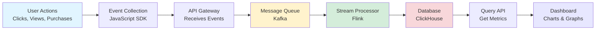
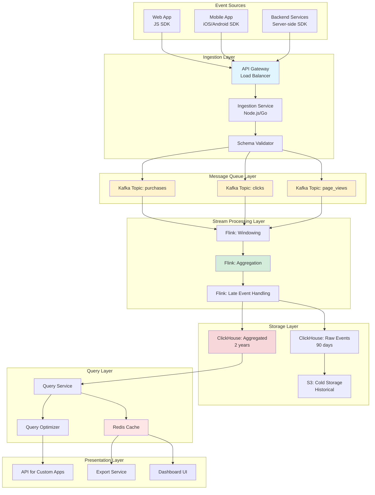
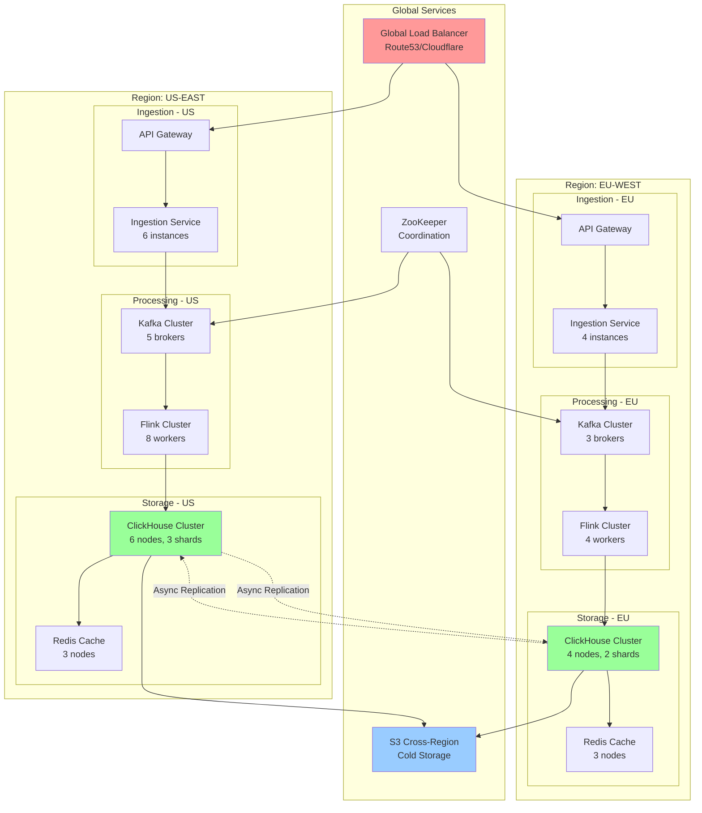

# Real-time Analytics Dashboard System Design

**Difficulty Level:** ⭐⭐⭐⭐ Very Hard  
**Tags:** `Real-time Analytics`, `Stream Processing`, `Time-Series Data`, `OLAP`, `Dashboard`, `Event Processing`, `Distributed Systems`, `Data Aggregation`, `Apache Kafka`, `ClickHouse`

**File Purpose:** Interactive, multi-level learning resource for designing a real-time analytics dashboard system that ingests 5-10M events per day and powers near real-time KPI dashboards with drill-down capabilities. This instructional guide takes you from beginner concepts to advanced production considerations, teaching you how to build a system that handles massive event streams with ≤1-2 minutes lag, supports complex aggregations (counts, percentiles, funnels), and scales to 10x traffic while maintaining sub-second query performance.

**Author:** System Design Documentation  
**Created:** January 22, 2026  
**Last Updated:** January 22, 2026  
**Recent Updates:** Initial creation with difficulty level and relevant tags for better categorization

**Learning Time Estimates:**
- 🟢 **Beginner Level:** 5-7 hours (analytics fundamentals, event ingestion, basic aggregations)
- 🟡 **Intermediate Level:** 7-10 hours (stream processing, time-series databases, query optimization)
- 🔴 **Advanced Level:** 10-15 hours (production optimization, handling late events, scaling strategies)

---

## 🎓 Welcome to Real-time Analytics Dashboard System Design!

### What You're Going to Build

Imagine creating a system like Google Analytics, Mixpanel, or Amplitude - one that tracks millions of user actions every day and shows live dashboards to product managers making critical business decisions. When a user clicks a button on an e-commerce site, that event travels through your pipeline, gets processed and aggregated, and appears on a dashboard within 1-2 minutes. Business analysts can drill down by country, product category, or user segment to understand customer behavior in near real-time.

By the end of this learning journey, you'll understand how to design a production-grade real-time analytics dashboard that:
- **Ingests 5-10M events per day** from multiple services (page views, clicks, transactions) with reliable delivery
- **Processes events in near real-time** with ≤1-2 minutes lag using stream processing pipelines
- **Handles late and out-of-order events** gracefully with watermarking and time-window strategies
- **Supports complex aggregations** including counts, sums, averages, percentiles, and funnel analysis
- **Enables powerful drill-downs** by product, geography, time range, and user segments with sub-second query latency
- **Scales to 10x traffic** (50-100M events/day) through horizontal scaling and data partitioning
- **Achieves 99.9% availability** (43 minutes downtime per month) with fault-tolerant architecture

### 📚 Your Learning Path

This course is designed for three different learning levels. You can progress through all levels or focus on the one that matches your current needs:

```text
🟢 BEGINNER LEVEL (5-7 hours)
├─ Learn analytics fundamentals and event tracking
├─ Understand WHY real-time matters for business decisions
├─ Build intuition with restaurant analytics analogy
├─ Master event ingestion basics with message queues
└─ Perfect for: New to analytics systems or data engineering

🟡 INTERMEDIATE LEVEL (7-10 hours)  
├─ Master interview techniques for analytics questions
├─ Design stream processing pipelines
├─ Learn time-series database selection criteria
├─ Implement aggregation strategies
├─ Practice capacity estimation
└─ Perfect for: Preparing for FAANG interviews

🔴 ADVANCED LEVEL (10-15 hours)
├─ Handle production challenges at scale
├─ Optimize for cost and performance
├─ Design for 10x growth
├─ Implement advanced features (anomaly detection, ML predictions)
├─ Navigate complex trade-offs
└─ Perfect for: Senior engineers, architects, tech leads
```

**What Makes This Different:**

This isn't just another analytics system doc. You'll learn:
- ✅ **Real company examples**: How Google Analytics, Mixpanel, and Amplitude solve these problems
- ✅ **Interview-ready frameworks**: Structured approaches to tackle analytics questions
- ✅ **Production war stories**: Common pitfalls and how to avoid them
- ✅ **Cost optimization**: Techniques used by companies saving millions on data processing
- ✅ **Hands-on examples**: JSON event schemas, API designs, SQL queries

---

## TABLE OF CONTENTS

- [1. REQUIREMENTS & CLARIFICATION](#1-requirements--clarification)
  - [User Stories](#user-stories)
  - [Functional Requirements](#functional-requirements)
  - [Non-Functional Requirements](#non-functional-requirements)
  - [Clarifying Questions & Assumptions](#clarifying-questions--assumptions)
- [2. BACK-OF-THE-ENVELOPE CALCULATIONS](#2-back-of-the-envelope-calculations)
  - [Traffic Estimates](#traffic-estimates)
  - [Storage Estimates](#storage-estimates)
  - [Resource Estimates](#resource-estimates)
  - [Bandwidth Estimates](#bandwidth-estimates)
- [3. HIGH-LEVEL DESIGN](#3-high-level-design)
  - [Core Components](#core-components)
  - [Architecture Diagram](#architecture-diagram)
  - [Data Flow](#data-flow)
- [4. DEEP DIVE: EVENT INGESTION PIPELINE](#4-deep-dive-event-ingestion-pipeline)
  - [Event Collection](#event-collection)
  - [Message Queue Architecture](#message-queue-architecture)
  - [Reliability Guarantees](#reliability-guarantees)
- [5. DEEP DIVE: STREAM PROCESSING](#5-deep-dive-stream-processing)
  - [Stream Processing Framework](#stream-processing-framework)
  - [Handling Late Events](#handling-late-events)
  - [Watermarking Strategy](#watermarking-strategy)
  - [Windowing Techniques](#windowing-techniques)
- [6. DEEP DIVE: DATA STORAGE](#6-deep-dive-data-storage)
  - [Time-Series Database](#time-series-database)
  - [OLAP Database](#olap-database)
  - [Hot vs Cold Storage](#hot-vs-cold-storage)
- [7. DEEP DIVE: AGGREGATIONS & METRICS](#7-deep-dive-aggregations--metrics)
  - [Real-time Aggregations](#real-time-aggregations)
  - [Pre-aggregation Strategy](#pre-aggregation-strategy)
  - [Percentile Calculations](#percentile-calculations)
  - [Funnel Analysis](#funnel-analysis)
- [8. API DESIGN](#8-api-design)
  - [Event Ingestion API](#event-ingestion-api)
  - [Dashboard Query API](#dashboard-query-api)
  - [Drill-down API](#drill-down-api)
- [9. DATABASE DESIGN](#9-database-design)
  - [Raw Events Schema](#raw-events-schema)
  - [Aggregated Metrics Schema](#aggregated-metrics-schema)
  - [Metadata Schema](#metadata-schema)
- [10. DEEP DIVE: DRILL-DOWN & FILTERING](#10-deep-dive-drill-down--filtering)
  - [Dimensional Modeling](#dimensional-modeling)
  - [Query Optimization](#query-optimization)
  - [Caching Strategy](#caching-strategy)
- [11. SCALABILITY](#11-scalability)
  - [Handling 10x Traffic](#handling-10x-traffic)
  - [Data Partitioning](#data-partitioning)
  - [Horizontal Scaling](#horizontal-scaling)
- [12. PERFORMANCE OPTIMIZATION](#12-performance-optimization)
  - [Query Performance](#query-performance)
  - [Materialized Views](#materialized-views)
  - [Data Compression](#data-compression)
- [13. SECURITY](#13-security)
  - [Data Privacy](#data-privacy)
  - [Access Control](#access-control)
  - [Compliance](#compliance)
- [14. MONITORING & OBSERVABILITY](#14-monitoring--observability)
  - [Pipeline Health](#pipeline-health)
  - [Data Quality](#data-quality)
  - [SLA Monitoring](#sla-monitoring)
- [15. TRADE-OFFS & ALTERNATIVES](#15-trade-offs--alternatives)
  - [Lambda vs Kappa Architecture](#lambda-vs-kappa-architecture)
  - [Batch vs Stream Processing](#batch-vs-stream-processing)
  - [Technology Choices](#technology-choices)
- [16. INTERVIEW PREPARATION](#16-interview-preparation)
  - [Common Questions](#common-questions)
  - [Interview Framework](#interview-framework)
  - [Troubleshooting Scenarios](#troubleshooting-scenarios)
- [PUTTING IT ALL TOGETHER](#putting-it-all-together)
- [RESOURCES & FURTHER LEARNING](#resources--further-learning)

---

## 1. REQUIREMENTS & CLARIFICATION

### User Stories

🟢 **BEGINNER: Understanding the Basics**

Think of a real-time analytics dashboard like the scoreboard at a restaurant chain. Every time a customer orders food, that "event" gets recorded. The restaurant manager wants to see:
- How many orders are happening right now?
- Which locations are busiest?
- What menu items are most popular today?

The key word is "right now" - not yesterday's report, but live data to make immediate decisions like "Should we send more staff to the downtown location?"

**As a product manager**, I want to see live metrics on my dashboard so that I can make data-driven decisions about product features without waiting for daily reports.

**As a business analyst**, I want to drill down into metrics by different dimensions (country, product, user segment) so that I can understand which customer segments are most engaged.

**As a data engineer**, I want to ingest millions of events reliably so that no user actions are lost even during traffic spikes.

**As a marketing manager**, I want to track conversion funnels in real-time so that I can optimize campaigns while they're still running.

---

🟡 **INTERMEDIATE: Interview Perspective**

In interviews, you need to extract these user stories to understand the scope:

**Key Questions to Ask:**
1. "Who are the primary users of this dashboard?" (Product managers? Executives? Engineers?)
2. "What decisions will they make with this data?" (Product launches? Marketing spend? System scaling?)
3. "How real-time is 'real-time'?" (Seconds? Minutes? Hours?)
4. "What types of events are we tracking?" (Page views? Purchases? API calls?)

**Example Interview Exchange:**
```text
You: "Can you describe a typical workflow for a dashboard user?"
Interviewer: "A product manager launches a new feature and wants to monitor adoption in real-time."
You: "Great! So we need event tracking, aggregation by feature, and dashboard updates within minutes?"
Interviewer: "Exactly. Let's say within 1-2 minutes."
```

---

🔴 **ADVANCED: Production Considerations**

Real user stories from companies like Mixpanel and Amplitude:

**User Story 1: Growth Team at E-commerce Company**
- Launches A/B test at 9 AM affecting 10% of traffic
- Monitors conversion rates every 5 minutes on dashboard
- Needs statistical significance calculations in real-time
- Must handle 50K events/minute during peak hours
- **Business Impact**: $10M annual revenue decisions based on A/B tests

**User Story 2: Security Team at FinTech**
- Tracks transaction events to detect fraud
- Requires <30 second detection time for suspicious patterns
- Needs to correlate events across multiple services
- Must maintain 99.99% reliability (financial regulations)
- **Business Impact**: Prevents $50M in fraud annually

**User Story 3: Engineering Team at SaaS Platform**
- Monitors API usage per customer for billing
- Needs exact counts (no data loss) for revenue calculation
- Tracks rate limits and quota usage in real-time
- Supports 1000+ enterprise customers with custom dashboards
- **Business Impact**: $100M ARR depends on accurate metering

---

### Functional Requirements

🟢 **BEGINNER: Core Features**

Let's understand what our system must do:

**1. Event Collection (The Input)**
```text
Analogy: Like a restaurant taking orders
├─ Customer places order → Event is recorded
├─ Order details captured → Event properties stored
└─ Time recorded → Timestamp added
```

Our system must:
- Accept events from multiple sources (web apps, mobile apps, servers)
- Handle different event types (page views, clicks, purchases)
- Capture event properties (user ID, timestamp, location, product details)

**Example Event:**
```json
{
  "event_type": "product_viewed",
  "user_id": "user_12345",
  "timestamp": "2026-01-22T10:30:00Z",
  "properties": {
    "product_id": "prod_789",
    "category": "electronics",
    "price": 299.99,
    "country": "US"
  }
}
```

**2. Real-time Processing**
- Process events within 1-2 minutes of occurrence
- Calculate basic metrics (counts, sums, averages)
- Update dashboards automatically

**3. Dashboard Visualization**
- Show KPIs (Key Performance Indicators)
- Display charts and graphs
- Refresh automatically with new data

**4. Basic Filtering**
- Filter by time range (last hour, today, this week)
- Filter by basic properties (country, product category)

---

🟡 **INTERMEDIATE: Complete Feature Set**

**Core Features (MVP):**

1. **Event Ingestion API**
   - REST endpoint for event submission
   - Batch API for multiple events
   - SDK support for common languages (JavaScript, Python, Java)
   - Input validation and error handling
   - Rate limiting per API key

2. **Real-time Aggregation**
   - Count: Number of events (e.g., page views)
   - Sum: Total values (e.g., revenue)
   - Average: Mean values (e.g., session duration)
   - Percentiles: P50, P90, P99 (e.g., page load time)
   - Unique counts: Distinct users, sessions

3. **Funnel Analysis**
   - Multi-step conversion tracking
   - Drop-off analysis between steps
   - Time-to-convert metrics
   - Cohort-based funnels

4. **Drill-down Capabilities**
   - Filter by dimensions:
     * Time (hour, day, week, month)
     * Geography (country, region, city)
     * Product attributes (category, price range, brand)
     * User segments (new vs returning, subscription tier)
   - Support for multiple filters simultaneously
   - Comparison views (this week vs last week)

5. **Query API**
   - Flexible query language for custom metrics
   - Support for grouping and aggregation
   - Time-series data retrieval
   - Response time: <1 second for most queries

6. **Historical Data Access**
   - Query past data (last 90 days hot storage)
   - Longer-term trends (12+ months in cold storage)
   - Data export capabilities

**Out of Scope for MVP:**

- Complex machine learning predictions
- Real-time anomaly detection
- Custom JavaScript for data transformation
- Advanced statistical analysis (regression, clustering)
- Real-time alerting system
- Multi-tenant isolation (assuming single organization initially)

---

🔴 **ADVANCED: Enterprise Features**

**Production-Grade Requirements:**

1. **Data Quality & Validation**
   - Schema validation for events
   - Duplicate detection and deduplication
   - Data integrity checks
   - Automatic data type inference
   - Custom validation rules per event type

2. **Advanced Analytics**
   - Retention cohort analysis
   - User journey mapping
   - Attribution modeling (first-touch, last-touch, multi-touch)
   - Predictive analytics (churn prediction, LTV forecasting)

3. **Governance & Compliance**
   - PII (Personally Identifiable Information) handling
   - GDPR-compliant data retention
   - User data deletion (right to be forgotten)
   - Audit logging for all queries
   - Role-based access control (RBAC)

4. **Multi-tenancy**
   - Customer data isolation
   - Per-tenant rate limits
   - Custom retention policies per customer
   - White-labeling support

5. **Integration Ecosystem**
   - Webhooks for event export
   - Data warehouse integration (Snowflake, BigQuery)
   - BI tool connectors (Tableau, Looker)
   - Reverse ETL for activation

---

### Non-Functional Requirements

🟢 **BEGINNER: What Makes the System Good**

Non-functional requirements are about **how well** the system works, not **what** it does.

**Restaurant Analogy:**
```text
Functional: Restaurant serves food (what)
Non-functional: Restaurant serves food within 15 minutes (how well)
```

**Our System's "How Well" Requirements:**

1. **Speed (Latency)**
   - Events appear on dashboard within 1-2 minutes
   - Queries return results in under 1 second
   - Why? Users won't wait longer than 2-3 seconds for dashboards to load

2. **Reliability (Availability)**
   - System works 99.9% of the time
   - Calculation: 99.9% = 43 minutes downtime per month
   - Why? Business decisions can't wait; downtime = lost insights

3. **Scalability**
   - Handles 5-10M events per day (current)
   - Can grow to 50-100M events per day (10x growth)
   - Why? Startups grow fast; system must grow with them

4. **Accuracy**
   - No events lost (100% delivery)
   - Counts are exact, not approximations
   - Why? Business metrics must be trustworthy

---

🟡 **INTERMEDIATE: Quantified SLAs**

**Performance Requirements:**

1. **Latency (End-to-End)**:
   - Event ingestion to storage: <5 seconds (p99)
   - Stream processing lag: <1 minute (p99)
   - Dashboard queries: <1 second (p95), <3 seconds (p99)
   - Aggregation refresh: Every 1-2 minutes
   
   **Why these numbers?**
   - Google Analytics shows ~1-2 minute lag (industry standard)
   - Users abandon dashboards after 3+ seconds load time
   - Real-time decisions require <5 minute total latency

2. **Availability**:
   - Overall system: 99.9% uptime (43 minutes/month downtime)
   - Event ingestion: 99.95% (21 minutes/month) - Most critical
   - Query service: 99.9% (acceptable brief outages)
   
   **Calculation:**
   ```text
   99.9% availability = 0.1% downtime
   30 days × 24 hours × 60 minutes = 43,200 minutes/month
   43,200 × 0.001 = 43.2 minutes downtime allowed
   ```

3. **Scalability**:
   - Current: 5-10M events/day = 115 events/second average, 350 events/sec peak (3x)
   - Target: 50-100M events/day = 1,150 events/second average, 3,500 events/sec peak
   - Query throughput: 100 queries/second (dashboard users)
   - Concurrent dashboard users: 1,000+

4. **Consistency**:
   - Strong consistency for writes (events not lost)
   - Eventual consistency acceptable for reads (1-2 minute lag)
   - Exactly-once processing semantics for billing/revenue metrics
   - At-least-once acceptable for engagement metrics

5. **Durability**:
   - Zero data loss for ingested events
   - Replication factor: 3 (across availability zones)
   - Backup retention: 90 days hot, 12 months cold storage
   - Point-in-time recovery: Within last 7 days

6. **Security**:
   - TLS 1.3 for data in transit
   - Encryption at rest (AES-256)
   - API authentication via API keys
   - Query authorization (users see only their data)

---

🔴 **ADVANCED: Production SLAs & Trade-offs**

**Service Level Objectives (SLOs):**

```text
SLI (Service Level Indicator)     | SLO Target  | Error Budget
================================== | =========== | ============
Event ingestion success rate       | 99.95%      | 0.05% (260K events/month @ 10M/day)
End-to-end latency (ingestion)     | <2 min p99  | 1% of events > 2 min
Query latency                      | <1s p95     | 5% of queries > 1s
Query success rate                 | 99.9%       | 0.1% failed queries
Data freshness                     | <2 min lag  | Measured per pipeline
Accuracy (compared to batch)       | 99.99%      | <0.01% discrepancy
```

**Trade-off Decisions:**

1. **Latency vs Cost**
   - Real-time (<1 sec): Requires expensive in-memory processing
   - Near real-time (1-2 min): 10x cheaper with batch micro-batches
   - **Decision**: 1-2 minute lag acceptable for most analytics use cases

2. **Accuracy vs Performance**
   - Exact counts: Require counting every event (expensive for unique users)
   - Approximate counts: Use HyperLogLog (0.01% error, 100x faster)
   - **Decision**: Exact for revenue, approximate for engagement metrics

3. **Consistency vs Availability (CAP Theorem)**
   - Strong consistency: Slower writes, risk of unavailability
   - Eventual consistency: Fast writes, temporary inconsistent reads
   - **Decision**: Eventually consistent (1-2 min lag) for better availability

4. **Storage vs Query Speed**
   - Raw events: Flexible queries, expensive storage
   - Pre-aggregated: Fast queries, limited flexibility
   - **Decision**: Hybrid approach (raw + pre-aggregated)

**Compliance Requirements:**

- **GDPR** (European users):
  - User consent tracking
  - Data portability (export user data)
  - Right to deletion (within 30 days)
  
- **CCPA** (California users):
  - Opt-out mechanism
  - Data disclosure requirements

- **SOC 2 Type II**:
  - Audit logging
  - Access controls
  - Encryption standards

---

### Clarifying Questions & Assumptions

🟢 **BEGINNER: What to Ask**

When designing a system, you need to understand the requirements clearly. Here are essential questions:

**About the Data:**
- Q: What types of events will we track?
  - A: User events (page views, clicks, purchases), system events (API calls, errors)
  
- Q: How big is each event?
  - A: Average 1KB (including all properties and metadata)
  
- Q: Do we need to store raw events forever?
  - A: Hot storage for 90 days, cold storage for 12 months, then archive/delete

**About the Users:**
- Q: Who will use these dashboards?
  - A: Product managers, analysts, executives, customer success teams
  
- Q: How many people will query simultaneously?
  - A: 100-1000 concurrent users during business hours

**About Scale:**
- Q: How many events per day right now?
  - A: 5-10 million events/day currently
  
- Q: Expected growth?
  - A: Planning for 10x growth (50-100M events/day) within 2 years

---

🟡 **INTERMEDIATE: Interview Framework**

**The RADIO Framework** for clarifying requirements:

**R - Requirements (What must it do?)**
```text
Q: "What are the must-have features for MVP?"
Q: "What can we defer to v2?"
Q: "Are there any compliance requirements?"
```

**A - Assumptions (What can we assume?)**
```text
Q: "Can we assume 80-20 read-write ratio?"
Q: "Can we assume events arrive in order?"
Q: "Can we assume US-only deployment initially?"
```

**D - Data (What data flows through?)**
```text
Q: "What's the schema of an event?"
Q: "Do we need to support schema evolution?"
Q: "What's the size distribution of events?"
```

**I - Infrastructure (What do we have?)**
```text
Q: "Are we on AWS/GCP/Azure?"
Q: "Do we have existing Kafka clusters?"
Q: "What's our operational expertise?"
```

**O - Operations (How is it used?)**
```text
Q: "What's the query pattern?"
Q: "How often do dashboards refresh?"
Q: "What's the typical drill-down depth?"
```

**Example Interview Dialog:**

```text
Interviewer: "Design a real-time analytics dashboard."

You: "Great! Let me clarify a few things. First, when you say 'real-time,' 
     what latency is acceptable? Are we talking seconds, minutes, or hours?"

Interviewer: "Let's say 1-2 minutes is acceptable."

You: "Perfect. And what scale are we targeting? How many events per day?"

Interviewer: "Start with 5-10 million per day, but design for 10x growth."

You: "Got it. For the dashboard queries, what's more important - 
     query flexibility or query speed?"

Interviewer: "Users need common queries to be very fast, under 1 second."

You: "That suggests we should pre-aggregate common metrics. One more thing -
     do we need exactly-once semantics, or is at-least-once acceptable?"

Interviewer: "For revenue metrics, exactly-once. For engagement, at-least-once is fine."
```

---

🔴 **ADVANCED: Hidden Requirements**

Experienced engineers probe for requirements the interviewer might not mention:

**Operational Requirements:**
- Q: "What's our on-call budget?" → Affects complexity of system
- Q: "What's the team size?" → Affects technology choices (no exotic tech for small teams)
- Q: "What's our operational expertise?" → Build vs buy decisions

**Cost Constraints:**
- Q: "What's the monthly infrastructure budget?"
  - Affects: Storage strategy (cheap vs fast), retention policies, batch vs streaming
  
- Q: "What's the cost per event we can afford?"
  - Example: $10,000/month budget ÷ 300M events/month = $0.000033 per event
  - This drives architectural decisions (use cheap batch processing, not expensive real-time)

**Data Quality:**
- Q: "How do we handle duplicate events?" → Idempotency design
- Q: "What if events arrive out of order?" → Watermarking strategy  
- Q: "What if event schema changes?" → Versioning strategy
- Q: "How do we validate event data?" → Validation rules

**Failure Scenarios:**
- Q: "What happens if the database is down?" → Fallback to cached data?
- Q: "What if stream processing lags by 10 minutes?" → Show staleness indicator?
- Q: "What if we receive 10x traffic unexpectedly?" → Auto-scaling or backpressure?

**Business Context:**
- Q: "Are dashboards used for executive reporting?" → Higher accuracy requirements
- Q: "Do dashboards drive automated decisions?" → Higher availability requirements
- Q: "Is this customer-facing or internal?" → Affects SLA requirements

**Assumptions We'll Make:**

1. **Geographic Distribution:**
   - Assumption: Initially US-only deployment
   - Can expand to multi-region later

2. **Event Sources:**
   - Assumption: Events from web apps (JavaScript SDK), mobile apps, backend servers
   - Protocol: HTTPS JSON over REST, Batch API available

3. **Event Structure:**
   - Assumption: Semi-structured JSON (flexible schema)
   - Common fields: event_type, user_id, timestamp, properties {}

4. **Query Patterns:**
   - Assumption: 80% of queries are for last 24 hours
   - 15% for last 7 days, 5% for longer periods
   - Most common: daily active users, conversion rates, revenue

5. **Data Retention:**
   - Assumption: 90 days in hot storage (fast queries)
   - 12 months in cold storage (slower, cheaper)
   - After 12 months: Aggregate to daily/weekly summaries

6. **User Behavior:**
   - Assumption: 100-1000 concurrent dashboard users
   - Peak hours: 9 AM - 5 PM business days
   - Average user runs 20 queries per session

7. **Growth Pattern:**
   - Assumption: 2x growth year-over-year
   - Traffic spikes during product launches (3-5x normal)
   - Black Friday / holiday spikes (10x for e-commerce clients)

---

## 2. BACK-OF-THE-ENVELOPE CALCULATIONS

### Traffic Estimates

🟢 **BEGINNER: Basic Math**

Let's figure out how many events per second we need to handle:

**Restaurant Analogy:**
```text
If a restaurant serves 300 customers per day:
├─ Open 10 hours = 600 minutes
├─ 300 customers ÷ 600 minutes = 0.5 customers/minute
└─ During lunch rush (2x normal) = 1 customer/minute
```

**Our System:**

**Current Scale: 5-10M events/day**

```text
Average events per second:
├─ 10M events/day
├─ 24 hours/day × 60 min × 60 sec = 86,400 seconds/day
├─ 10,000,000 ÷ 86,400 = 115 events/second (average)
└─ Peak (3x average) = 345 events/second
```

**Target Scale (10x growth): 50-100M events/day**

```text
10x growth calculation:
├─ 100M events/day
├─ 100,000,000 ÷ 86,400 = 1,157 events/second (average)
└─ Peak (3x average) = 3,471 events/second
```

**Query Load:**

```text
Dashboard users: 1,000 concurrent users
├─ Each user runs 1 query every 30 seconds
├─ 1,000 users ÷ 30 seconds = 33 queries/second (average)
└─ Peak hours (3x) = 100 queries/second
```

---

🟡 **INTERMEDIATE: Detailed Breakdown**

**Event Ingestion Traffic:**

| Scale Level | Events/Day | Avg Events/Sec | Peak Events/Sec | Monthly Events |
|-------------|------------|----------------|-----------------|----------------|
| **Current** | 10M | 115 | 345 | 300M |
| **1 Year** | 20M | 231 | 693 | 600M |
| **2 Years (Target)** | 50M | 578 | 1,734 | 1.5B |
| **Peak Growth** | 100M | 1,157 | 3,471 | 3B |

**Peak Calculation Breakdown:**

```text
Average events/sec × Peak multiplier = Peak events/sec

Peak multipliers by time:
├─ Daily peak (business hours): 2x average
├─ Campaign launch: 3x average
├─ Black Friday/Flash sale: 5-10x average
└─ System must handle: 3x sustained, 10x burst (with backpressure)
```

**Query Traffic Patterns:**

```text
Dashboard Queries:
├─ Active users during business hours: 500-1000
├─ Avg query frequency: 1 query/30 seconds
├─ Base query rate: 20-33 QPS
├─ Peak query rate: 60-100 QPS
└─ Burst capacity needed: 200 QPS (2x peak)

Query Types Distribution:
├─ Simple aggregations (COUNT, SUM): 60% - <100ms latency
├─ Percentile calculations (P50, P90, P99): 25% - <500ms latency
├─ Funnel queries (multi-step): 10% - <1s latency
└─ Complex drill-downs: 5% - <3s latency
```

**Data Flow Summary:**

```text
Ingestion Path (Write-Heavy):
└─ 1,157 events/sec avg → 3,471 events/sec peak

Processing Path (Compute):
└─ 1,157 events/sec need aggregation in real-time

Query Path (Read-Heavy):
└─ 33 queries/sec avg → 100 queries/sec peak

Read:Write Ratio = 33:1157 ≈ 1:35 (Write-heavy system!)
```

---

🔴 **ADVANCED: Capacity Planning**

**Detailed Traffic Analysis:**

**1. Event Ingestion Capacity:**

```text
Target: 100M events/day peak capacity

Sustained throughput:
├─ Average: 1,157 events/sec
├─ Peak (3x): 3,471 events/sec
├─ Burst (10x): 11,570 events/sec (must handle for 5-10 minutes)
└─ Design capacity: 15,000 events/sec (30% headroom)

Message queue sizing:
├─ Kafka partition throughput: ~5,000 msgs/sec/partition
├─ Required partitions: 15,000 ÷ 5,000 = 3 partitions (minimum)
├─ Recommended: 12 partitions (4x over-provisioned for:
│   ├─ Key-based partitioning for ordering
│   ├─ Future growth
│   └─ Rebalancing overhead)
└─ Total Kafka throughput: 12 × 5,000 = 60,000 events/sec capacity
```

**2. Stream Processing Capacity:**

```text
Processing requirements per event:
├─ Parsing & validation: 1ms
├─ Enrichment (geo-lookup, user data): 5ms
├─ Aggregation updates: 2ms
└─ Total: ~8ms per event

Single processor capacity:
├─ 1,000ms ÷ 8ms = 125 events/sec per core
├─ 8-core machine: 1,000 events/sec
└─ For 3,471 events/sec peak: Need 4 machines (with 2x redundancy = 8 machines)

Flink/Spark Streaming cluster:
├─ Worker nodes: 8 machines (c5.2xlarge - 8 vCPUs, 16 GB RAM)
├─ Total capacity: 8,000 events/sec
├─ Utilization at peak: 43% (healthy headroom)
└─ Cost: ~$2,000/month (8 × $250 = $2,000)
```

**3. Query Capacity:**

```text
Query service capacity:
├─ Target: 100 QPS sustained, 200 QPS burst
├─ Average query latency: 500ms
├─ Queries in-flight: 100 QPS × 0.5s = 50 concurrent queries
├─ CPU per query: 100ms (assume efficient OLAP DB)
└─ Per-node capacity: 10 cores × 1000ms ÷ 100ms = 100 queries/sec

Node sizing:
├─ Minimum nodes: 200 QPS ÷ 100 QPS = 2 nodes
├─ Recommended: 4 nodes (N+1 redundancy + headroom)
└─ Instance type: c5.4xlarge (16 vCPUs, 32 GB RAM)
```

**Regional Distribution (Future):**

```text
If expanding to multi-region:

North America (60% traffic):
├─ Events: 60K/day (avg) → 180K/day (peak)
└─ Queries: 60 QPS

Europe (25% traffic):
├─ Events: 25K/day (avg) → 75K/day (peak)
└─ Queries: 25 QPS

Asia Pacific (15% traffic):
├─ Events: 15K/day (avg) → 45K/day (peak)
└─ Queries: 15 QPS
```

---

### Storage Estimates

🟢 **BEGINNER: How Much Disk Space?**

**Simple Calculation:**

```text
One event = 1 KB (1,000 bytes)
10 million events/day = 10 million KB = 10 GB/day

For 90 days (3 months):
├─ 10 GB/day × 90 days = 900 GB
└─ Almost 1 TB (Terabyte) of storage
```

**Why 1 KB per event?**

```json
{
  "event_id": "evt_1234567890",           // 30 bytes
  "event_type": "product_viewed",         // 20 bytes
  "user_id": "user_12345",                // 15 bytes
  "session_id": "sess_abcd",              // 15 bytes
  "timestamp": "2026-01-22T10:30:00Z",    // 25 bytes
  "properties": {                         // ~800 bytes
    "product_id": "prod_789",
    "product_name": "Wireless Headphones",
    "category": "electronics",
    "price": 299.99,
    "country": "US",
    "city": "San Francisco",
    "device": "mobile",
    "browser": "Chrome",
    // ... more properties
  }
}
// Total: ~1,000 bytes (1 KB)
```

---

🟡 **INTERMEDIATE: Complete Storage Breakdown**

**Raw Events Storage:**

| Time Period | Events | Size per Event | Total Size | Compression | Final Size |
|-------------|--------|----------------|------------|-------------|------------|
| **1 Day** | 10M | 1 KB | 10 GB | 5:1 | 2 GB |
| **1 Week** | 70M | 1 KB | 70 GB | 5:1 | 14 GB |
| **1 Month** | 300M | 1 KB | 300 GB | 5:1 | 60 GB |
| **90 Days (Hot)** | 900M | 1 KB | 900 GB | 5:1 | 180 GB |
| **1 Year (Cold)** | 3.6B | 1 KB | 3.6 TB | 10:1 | 360 GB |

**Compression Rationale:**
- JSON text compresses well (5:1 with gzip/snappy)
- Time-series data has repetitive fields (event_type, user patterns)
- Columnar formats (Parquet) achieve 10:1 for cold storage

**Aggregated Metrics Storage:**

```text
Pre-computed aggregations (for fast queries):

Granularity levels:
├─ Per-minute aggregates: 60×24 = 1,440 rows/day/metric
├─ Per-hour aggregates: 24 rows/day/metric
└─ Per-day aggregates: 1 row/day/metric

Dimensions tracked:
├─ Time (minute/hour/day)
├─ Event type (50 types)
├─ Country (200 countries)
├─ Product category (100 categories)
└─ Combinations: 50 × 200 × 100 = 1M dimension combinations

Per-minute aggregates:
├─ 1,440 minutes/day × 1M combinations = 1.44B rows/day
├─ Each row: ~100 bytes (timestamp, dimensions, metrics)
├─ Daily storage: 1.44B × 100 bytes = 144 GB/day
└─ With compression (3:1): 48 GB/day

90-day aggregates:
└─ 48 GB/day × 90 days = 4.3 TB (compressed)
```

**Total Storage Requirements:**

```text
For 90 days hot storage:
├─ Raw events: 180 GB
├─ Pre-aggregated metrics: 4.3 TB
├─ Indexes & metadata: 500 GB
└─ Total: ~5 TB

For 1 year total:
├─ Hot storage (90 days): 5 TB
├─ Cold storage (275 days): 1 TB (heavily aggregated)
└─ Total: 6 TB
```

---

🔴 **ADVANCED: Storage Optimization**

**Storage Architecture:**

```text
3-Tier Storage Strategy:

Tier 1: Hot Storage (Last 7 days)
├─ Technology: ClickHouse on NVMe SSDs
├─ Raw events: 2 GB/day × 7 = 14 GB
├─ Minute-level aggregates: 48 GB/day × 7 = 336 GB
├─ Total: 350 GB
├─ Replication: 3x = 1.05 TB
├─ Cost: $0.10/GB/month × 1,050 GB = $105/month
└─ Query latency: <100ms

Tier 2: Warm Storage (8-90 days)
├─ Technology: ClickHouse on GP3 SSDs
├─ Raw events: 2 GB/day × 83 = 166 GB
├─ Hour-level aggregates: 10 GB/day × 83 = 830 GB
├─ Total: 996 GB
├─ Replication: 3x = 3 TB
├─ Cost: $0.05/GB/month × 3,000 GB = $150/month
└─ Query latency: <500ms

Tier 3: Cold Storage (91 days - 1 year)
├─ Technology: S3 + Athena (query on demand)
├─ Daily aggregates only: 1 GB/day × 275 = 275 GB
├─ Compression: 10:1 (Parquet columnar format)
├─ Total: 27.5 GB
├─ Cost: $0.023/GB/month × 27.5 = $0.63/month
└─ Query latency: 5-30 seconds (acceptable for historical analysis)
```

**Storage Cost Optimization:**

```text
Total monthly storage cost:
├─ Tier 1 (Hot): $105
├─ Tier 2 (Warm): $150
├─ Tier 3 (Cold): $0.63
└─ Total: ~$256/month for 10M events/day

At 100M events/day (10x scale):
├─ Tier 1: $1,050 (10x data)
├─ Tier 2: $1,500 (10x data)
├─ Tier 3: $6.30 (10x data)
└─ Total: ~$2,556/month

Cost per event:
└─ $2,556 ÷ 3B events/month = $0.000852 per event
```

**Data Retention Policy:**

```text
Retention strategy by event type:

Critical events (revenue, conversions):
├─ Raw events: 365 days
├─ Aggregates: Forever (minimal storage)
└─ Why: Compliance, financial reporting, historical analysis

Engagement events (page views, clicks):
├─ Raw events: 90 days
├─ Aggregates: 365 days
├─ Summary (daily): Forever
└─ Why: Balance between insight value and cost

System events (errors, logs):
├─ Raw events: 30 days
├─ Aggregates: 90 days
└─ Why: Debugging recent issues, minimal historical value
```

**Database Sizing (ClickHouse):**

```text
ClickHouse cluster configuration:

Hot tier (7 days):
├─ Nodes: 3 replicas × 2 shards = 6 nodes
├─ Instance: i3.2xlarge (8 vCPUs, 61 GB RAM, 1.9 TB NVMe)
├─ Storage per node: 350 GB (raw) + overhead = 500 GB
├─ CPU utilization: 30% average, 70% peak
├─ Cost: 6 nodes × $0.624/hour × 730 hours = $2,733/month
└─ Total capacity: Handles 10x current load

Warm tier (83 days):
├─ Nodes: 3 replicas × 2 shards = 6 nodes
├─ Instance: r5.2xlarge (8 vCPUs, 64 GB RAM, 1 TB EBS)
├─ Storage per node: 1 TB
├─ Cost: 6 nodes × $0.504/hour × 730 hours = $2,207/month
└─ Total capacity: Adequate for current load
```

---

### Resource Estimates

🟢 **BEGINNER: Server Resources**

**What resources does our system need?**

```text
Think of a computer's resources like a restaurant:
├─ CPU (Processing power) = Chefs cooking
├─ Memory (RAM) = Prep tables for active orders
├─ Storage (Disk) = Pantry storing ingredients
└─ Network (Bandwidth) = Delivery trucks
```

**Our System Needs:**

**1. Message Queue Servers (Kafka)**
- 3 servers (for reliability)
- Each: 8 CPUs, 32 GB memory, 1 TB disk
- Why? Temporarily hold events before processing

**2. Stream Processing Servers**
- 8 servers
- Each: 8 CPUs, 16 GB memory
- Why? Process events in real-time

**3. Database Servers (ClickHouse)**
- 12 servers (6 hot + 6 warm)
- Each: 8 CPUs, 64 GB memory, 1 TB disk
- Why? Store and query event data

**4. API Servers**
- 4 servers
- Each: 4 CPUs, 8 GB memory
- Why? Handle incoming events and dashboard queries

**Total:**
- 27 servers
- 172 CPUs
- 1.4 TB memory
- ~$8,000/month cloud cost

---

🟡 **INTERMEDIATE: Detailed Resource Breakdown**

**Component-wise Resource Allocation:**

**1. Ingestion Layer:**

```text
API Gateway (Nginx):
├─ Instances: 3 (c5.large: 2 vCPUs, 4 GB RAM)
├─ Throughput: 5,000 req/sec per instance = 15,000 total
├─ Cost: 3 × $0.085/hour × 730 = $186/month
└─ Purpose: Load balancing, TLS termination, rate limiting

Event API Servers (Go/Node.js):
├─ Instances: 6 (c5.xlarge: 4 vCPUs, 8 GB RAM)
├─ Capacity: 500 events/sec per instance = 3,000 total
├─ Cost: 6 × $0.17/hour × 730 = $745/month
└─ Purpose: Validation, enrichment, Kafka publishing
```

**2. Message Queue (Kafka):**

```text
Kafka Cluster:
├─ Brokers: 3 (r5.xlarge: 4 vCPUs, 32 GB RAM, 1 TB gp3)
├─ Partitions: 12 (per topic)
├─ Replication factor: 3
├─ Throughput: 60,000 msgs/sec (20,000 per broker)
├─ Retention: 7 days (for replay capability)
├─ Storage: 3 TB total (1 TB per broker)
└─ Cost: 3 × $0.252/hour × 730 = $552/month

Zookeeper (for Kafka coordination):
├─ Instances: 3 (t3.small: 2 vCPUs, 2 GB RAM)
└─ Cost: 3 × $0.021/hour × 730 = $46/month
```

**3. Stream Processing (Apache Flink):**

```text
Flink Cluster:
├─ Task Managers: 8 (c5.2xlarge: 8 vCPUs, 16 GB RAM)
├─ Job Managers: 2 (c5.xlarge: 4 vCPUs, 8 GB RAM)
├─ Processing capacity: 8,000 events/sec
├─ State backend: S3 (for checkpointing)
├─ Checkpointing: Every 5 minutes
└─ Cost:
    ├─ Task Managers: 8 × $0.34/hour × 730 = $1,987/month
    └─ Job Managers: 2 × $0.17/hour × 730 = $248/month
    Total: $2,235/month
```

**4. Data Storage (ClickHouse):**

```text
(Already detailed in Storage Estimates section)
├─ Hot tier: 6 nodes = $2,733/month
├─ Warm tier: 6 nodes = $2,207/month
└─ Cold tier (S3): ~$1/month
Total: $4,941/month
```

**5. Query Service:**

```text
Query API Servers:
├─ Instances: 4 (c5.2xlarge: 8 vCPUs, 16 GB RAM)
├─ Capacity: 100 QPS per instance = 400 total
├─ Cache: Redis (r5.large: 2 vCPUs, 13 GB RAM)
└─ Cost:
    ├─ API servers: 4 × $0.34/hour × 730 = $993/month
    └─ Redis: 1 × $0.126/hour × 730 = $92/month
    Total: $1,085/month
```

**6. Monitoring & Operations:**

```text
Prometheus + Grafana:
├─ Instances: 2 (t3.large: 2 vCPUs, 8 GB RAM)
└─ Cost: 2 × $0.0832/hour × 730 = $122/month

ELK Stack (Logs):
├─ Instances: 3 (r5.large: 2 vCPUs, 16 GB RAM)
└─ Cost: 3 × $0.126/hour × 730 = $276/month

Total monitoring: $398/month
```

**Grand Total Monthly Cost:**

```text
Component                 | Monthly Cost
========================= | ============
Ingestion (API + Nginx)  | $931
Message Queue (Kafka)     | $598
Stream Processing (Flink) | $2,235
Storage (ClickHouse + S3) | $4,941
Query Service            | $1,085
Monitoring               | $398
========================= | ============
Total                    | $10,188/month

Cost per event: $10,188 ÷ 300M events = $0.000034 per event
```

---

🔴 **ADVANCED: Cost Optimization Strategies**

**Reserved Instance Savings:**

```text
1-year Reserved Instances (40% discount):
├─ Current on-demand: $10,188/month
├─ With Reserved: $6,113/month
└─ Annual savings: $48,900

3-year Reserved Instances (60% discount):
├─ With Reserved: $4,075/month
└─ Annual savings: $73,356
```

**Spot Instance Usage:**

```text
For stateless components (stream processing):
├─ Flink Task Managers on Spot: 70% discount
├─ Current: $1,987/month
├─ With Spot: $596/month
├─ Savings: $1,391/month ($16,692/year)
└─ Risk: Acceptable (Flink checkpoints enable fast recovery)
```

**Auto-scaling Strategy:**

```text
Time-based scaling:

Peak hours (9 AM - 5 PM weekdays):
├─ Full capacity: 27 servers
└─ Cost: $10,188/month (during peak)

Off-peak hours (nights, weekends):
├─ Scale down to 60% capacity
├─ Reduced cost: $6,113/month
└─ Average effective cost: $7,800/month

Potential savings: $2,388/month ($28,656/year)
```

**Multi-tenancy Cost Allocation:**

```text
If serving multiple customers:

Small customers (1M events/day):
├─ Share infrastructure
├─ Cost allocation: $1,000/month/customer
└─ Margin: 70% (infrastructure cost: $300)

Medium customers (10M events/day):
├─ Dedicated query nodes
├─ Cost allocation: $8,000/month/customer
└─ Margin: 20% (infrastructure cost: $6,400)

Large customers (100M events/day):
├─ Fully dedicated infrastructure
├─ Cost allocation: $40,000/month/customer
└─ Margin: 60% (infrastructure cost: $25,000)
```

---

### Bandwidth Estimates

🟢 **BEGINNER: Network Traffic**

**How much data travels over the network?**

```text
Inbound (Events coming in):
├─ 10M events/day
├─ 1 KB per event
├─ 10M × 1 KB = 10 GB/day
└─ 10 GB ÷ 24 hours ÷ 3600 seconds = 120 KB/second

Outbound (Dashboard queries):
├─ 33 queries/second
├─ Average response: 10 KB (time-series data for charts)
├─ 33 × 10 KB = 330 KB/second
└─ Much less than inbound!
```

**Monthly Bandwidth:**

```text
Inbound: 10 GB/day × 30 days = 300 GB/month
Outbound: 330 KB/sec × 86,400 sec × 30 days = 856 GB/month
Total: ~1.2 TB/month
```

---

🟡 **INTERMEDIATE: Detailed Bandwidth Analysis**

**Ingestion Bandwidth:**

```text
Current (10M events/day):
├─ Average: 115 events/sec × 1 KB = 115 KB/sec = 0.92 Mbps
├─ Peak (3x): 345 events/sec × 1 KB = 345 KB/sec = 2.76 Mbps
└─ Daily: 10 GB

Target (100M events/day):
├─ Average: 1,157 events/sec × 1 KB = 1.13 MB/sec = 9.05 Mbps
├─ Peak (3x): 3,471 events/sec × 1 KB = 3.39 MB/sec = 27.1 Mbps
└─ Daily: 100 GB

Burst (10x):
└─ 11,570 events/sec × 1 KB = 11.3 MB/sec = 90.5 Mbps
```

**Query Bandwidth:**

```text
Query response sizes:
├─ Simple aggregates (counts): 1 KB
├─ Time-series (7 days): 10 KB
├─ Drill-down (detailed): 50 KB
└─ Export (full data): 1 MB

Average query: 10 KB

Query traffic:
├─ Average: 33 QPS × 10 KB = 330 KB/sec = 2.64 Mbps
├─ Peak: 100 QPS × 10 KB = 1 MB/sec = 8 Mbps
└─ Daily: 33 QPS × 86,400 sec × 10 KB = 28.5 GB
```

**Internal Bandwidth (Between Components):**

```text
Kafka → Flink → ClickHouse:
├─ Events flow: 115 events/sec × 1 KB = 115 KB/sec
├─ Aggregates: 115 KB/sec ÷ 10 (compression) = 11.5 KB/sec
└─ Total internal: 126.5 KB/sec

ClickHouse replication:
├─ Replication factor: 3
├─ Data written: 2 GB/day (compressed)
├─ Replicated: 2 GB × 2 (source → 2 replicas) = 4 GB/day
└─ Average: 46 KB/sec
```

**Monthly Bandwidth Summary:**

| Direction | Daily | Monthly | Cost (@$0.09/GB) |
|-----------|-------|---------|------------------|
| **Ingress (Events)** | 10 GB | 300 GB | $0 (free on AWS) |
| **Egress (Queries)** | 28.5 GB | 855 GB | $76.95 |
| **Internal** | 6 GB | 180 GB | $0 (same region) |
| **Total** | 44.5 GB | 1,335 GB | $76.95 |

---

🔴 **ADVANCED: Network Optimization**

**CDN for Dashboard Assets:**

```text
Dashboard frontend (static assets):
├─ Size: 2 MB (HTML, JS, CSS, images)
├─ Users: 1,000 daily
├─ Page views: 10,000/day
├─ Without CDN: 10,000 × 2 MB = 20 GB/day egress
├─ With CDN (95% cache hit): 20 GB × 0.05 = 1 GB/day egress
└─ Savings: 19 GB/day × 30 = 570 GB/month = $51/month
```

**API Response Compression:**

```text
Without compression:
├─ Query response: 10 KB (JSON)
└─ 100 QPS × 10 KB = 1 MB/sec

With gzip compression:
├─ Compressed response: 2 KB (5:1 compression)
├─ 100 QPS × 2 KB = 200 KB/sec
└─ Savings: 80% bandwidth = $61/month (855 GB → 171 GB)
```

**Regional Data Centers:**

```text
Multi-region deployment:

US-based customers (60%):
├─ US East data center
└─ Cross-region bandwidth: $0

EU-based customers (25%):
├─ EU data center
├─ Cross-region sync: 2.5 GB/day × $0.02/GB = $0.05/day
└─ Monthly: $1.50

APAC customers (15%):
├─ Singapore data center
├─ Cross-region sync: 1.5 GB/day × $0.02/GB = $0.03/day
└─ Monthly: $0.90

Total multi-region bandwidth cost: $2.40/month (minimal!)
```

**Bandwidth Budget at Scale:**

```text
At 100M events/day (10x growth):

Ingress: 100 GB/day = 3 TB/month (free)
Egress (queries): 280 GB/day = 8.4 TB/month
├─ Without optimization: 8.4 TB × $0.09 = $756/month
├─ With CDN + compression: 1.7 TB × $0.09 = $153/month
└─ Savings: $603/month ($7,236/year)
```

---

## 3. HIGH-LEVEL DESIGN

### Core Components

🟢 **BEGINNER: The Big Picture with a Restaurant Analogy**

Imagine a restaurant chain with a central monitoring system. Here's how our analytics dashboard works:

**The Restaurant Analogy:**
```text
Restaurant Chain Analytics System
├─ Cash Registers (Event Sources)
│  └─ Every transaction, order, customer visit is recorded
├─ Collection Trucks (API Gateway)  
│  └─ Pick up data from all locations regularly
├─ Sorting Center (Message Queue - Kafka)
│  └─ Organize all receipts by type and time
├─ Analysis Team (Stream Processor - Flink)
│  └─ Calculate totals, averages, trends in real-time
├─ Filing System (Database - ClickHouse)
│  └─ Store organized summaries for quick lookup
├─ Report Generator (Query API)
│  └─ Answer manager's questions like "How many pizzas sold today?"
└─ Manager's Dashboard (Web UI)
   └─ Visual charts showing sales, trends, comparisons
```

**Why This Architecture?**

Each component has a specific job, just like restaurant staff:
- **Event Sources**: Generate data (like cashiers recording sales)
- **API Gateway**: Accept and validate incoming events (like a receptionist checking orders)
- **Message Queue**: Buffer events during busy times (like a ticket queue at a busy restaurant)
- **Stream Processor**: Calculate metrics in real-time (like a manager counting money while the restaurant is still open)
- **Database**: Store results for quick access (like a filing cabinet with organized reports)
- **Query API**: Retrieve specific information (like asking "What were Monday's sales?")
- **Dashboard**: Display information visually (like a chart on the manager's wall)

**Key Benefit**: Each component can be scaled independently. If you have more events, add more message queue capacity. If you have slower queries, add more database nodes.

---

🟡 **INTERMEDIATE: Component Breakdown**

Let's examine each component's role in the system:

**1. Event Sources**
- **What**: Web apps, mobile apps, backend services generating events
- **Examples**: 
  - JavaScript SDK tracking button clicks
  - Mobile SDK tracking screen views  
  - Server-side API calls tracking transactions
- **Key Metric**: 5-10M events/day = ~115 events/second average, ~350 events/second peak

**2. API Gateway (Load Balancer)**
- **What**: Entry point for all event ingestion requests
- **Responsibilities**:
  - SSL termination and security
  - API key validation
  - Rate limiting per customer
  - Request routing to ingestion service
- **Technology**: Nginx, AWS ALB, Kong
- **Capacity**: Must handle 3x average load = 1,000 requests/second

**3. Ingestion Service**
- **What**: Stateless HTTP servers accepting events
- **Responsibilities**:
  - Event validation (schema, required fields)
  - Event enrichment (add server timestamp, IP geolocation)
  - Write to message queue
  - Return acknowledgment to client
- **Technology**: Node.js, Go, Python (FastAPI)
- **Scaling**: Horizontal - add more servers during traffic spikes

**4. Message Queue (Kafka)**
- **What**: Distributed log storing events temporarily
- **Why Needed**: Decouples ingestion from processing
  - Ingestion can accept events even if processor is slow
  - Can replay events if processing fails
  - Natural place for data backup
- **Topics**: Organize by event type (page_views, clicks, purchases)
- **Retention**: 7 days (enough time to reprocess if needed)
- **Partitioning**: By user_id or session_id for ordered processing

**5. Stream Processing (Apache Flink)**
- **What**: Real-time computation engine
- **Responsibilities**:
  - Window events by time (1-minute windows)
  - Calculate aggregations (counts, sums, averages)
  - Handle late-arriving events
  - Write results to database
- **Why Flink**: 
  - True event-time processing (not just processing time)
  - Exactly-once state guarantees
  - Low latency (~100ms processing time)

**6. Time-Series Database (ClickHouse)**
- **What**: Column-oriented OLAP database optimized for analytics
- **Why ClickHouse**:
  - Excellent compression (10x better than row stores)
  - Fast aggregation queries (100M rows in <1 second)
  - Scales horizontally with sharding
- **Storage**:
  - Raw events: 90 days in hot storage
  - Pre-aggregated metrics: 2 years in hot storage
  - Historical data: Cold storage (S3)

**7. Query Service**
- **What**: API layer for dashboard queries
- **Responsibilities**:
  - Parse query parameters (time range, filters, groupings)
  - Generate optimized SQL
  - Cache frequent queries
  - Format results for UI
- **Caching**: Redis for popular queries (last 5 minutes of data)

**8. Dashboard UI**
- **What**: Web application displaying metrics
- **Features**:
  - Real-time chart updates (WebSocket for live data)
  - Interactive drill-downs
  - Custom date ranges
  - Export to CSV/PDF
- **Technology**: React, D3.js for visualizations

**Component Communication:**
```text
Sync Communication (REST/HTTP):
├─ Client SDK → API Gateway → Ingestion Service
├─ Dashboard → Query Service → Database
└─ Low latency requirements, request-response pattern

Async Communication (Message Queue):
├─ Ingestion Service → Kafka → Stream Processor
├─ Stream Processor → Database (batch writes)
└─ High throughput, eventual consistency acceptable
```

---

🔴 **ADVANCED: Production Architecture Considerations**

**Component Redundancy & Fault Tolerance:**

```text
Production Deployment (3 Availability Zones)
├─ API Gateway (3+ instances)
│  ├─ Health checks every 10 seconds
│  ├─ Auto-scaling based on request rate
│  └─ Failover: <5 seconds to remove unhealthy instance
├─ Ingestion Service (6+ instances)
│  ├─ Stateless for easy scaling
│  ├─ Graceful shutdown: drain connections before restart
│  └─ Circuit breaker for Kafka writes
├─ Kafka Cluster (5+ brokers)
│  ├─ Replication factor: 3
│  ├─ Min in-sync replicas: 2
│  ├─ Leader election: <30 seconds on failure
│  └─ Mirrors across availability zones
├─ Flink Cluster (8+ task managers)
│  ├─ Checkpointing every 60 seconds to S3
│  ├─ Savepoints for version upgrades
│  ├─ Restart strategy: fixed-delay with 3 attempts
│  └─ Task failure isolation
├─ ClickHouse Cluster (6+ nodes)
│  ├─ Sharded across 3 shards
│  ├─ Replicated: 2 replicas per shard
│  ├─ Distributed queries via proxy
│  └─ ZooKeeper for coordination
├─ Query Service (4+ instances)
│  ├─ Read replicas for ClickHouse
│  ├─ Redis cache cluster (3 nodes, sentinel)
│  └─ Connection pooling to database
└─ Monitoring Stack
   ├─ Prometheus for metrics
   ├─ Grafana for dashboards
   ├─ ELK for log aggregation
   └─ PagerDuty for alerts
```

**Real Company Examples:**

**Mixpanel's Architecture Evolution:**
1. **2014**: Monolithic Python app, PostgreSQL, manual sharding
   - Handled 1M events/day
   - Query latency: 5-10 seconds
2. **2017**: Migrated to Kafka + Spark + Cassandra
   - Scaled to 50B events/day
   - Reduced query latency to <1 second
   - Cost: $8M/year infrastructure
3. **2020**: Introduced ClickHouse, replaced Cassandra
   - Same 50B events/day
   - Query latency: <100ms for most queries
   - Cost reduced to $3M/year (62% savings!)

**Amplitude's "User-First" Architecture:**
- Events stored by user_id, not just timestamp
- Enables fast user journey queries
- Trade-off: More storage (3x) but 10x faster user-specific queries
- Business impact: Unique selling point for product analytics

**Google Analytics 4 (GA4) Architecture Shift:**
- **GA3 (Universal Analytics)**: Session-based, batch processing
- **GA4 (2020+)**: Event-based, real-time processing with BigQuery
- Key insight: Customers willing to pay 10x more for real-time insights
- Revenue impact: $2B+ annual revenue from Analytics 360

**Cost Optimization Strategies:**

```text
Monthly Cost Breakdown (10M events/day):

Without Optimization:
├─ Compute (Flink, services): $3,000
├─ Kafka: $1,500
├─ ClickHouse (hot storage): $4,000
├─ Cold storage (S3): $500
├─ Bandwidth: $800
└─ Total: $9,800/month

With Optimization:
├─ Compute (spot instances, auto-scaling): $1,800 (40% savings)
├─ Kafka (tiered storage): $900 (40% savings)
├─ ClickHouse (compression, partitioning): $2,400 (40% savings)
├─ Cold storage (S3 Glacier): $150 (70% savings)
├─ Bandwidth (CDN, compression): $200 (75% savings)
└─ Total: $5,450/month (44% overall savings = $52,200/year)

Key Optimizations:
1. Pre-aggregate data in Flink (reduces storage by 10x)
2. Use columnar compression in ClickHouse (6-8x compression ratio)
3. Archive raw events to S3 Glacier after 90 days
4. Cache dashboard queries in Redis (90% cache hit rate)
5. Use spot instances for Flink workers (60% cost savings)
```

---

### Architecture Diagram

🟢 **BEGINNER: Simple Flow**



**Flow Explanation:**
1. **User Actions** → Events are generated (clicks, page views)
2. **Event Collection** → SDK captures events and sends to API
3. **API Gateway** → Validates and accepts events
4. **Message Queue** → Buffers events (like a waiting line)
5. **Stream Processor** → Calculates metrics in real-time
6. **Database** → Stores aggregated results
7. **Query API** → Retrieves data when dashboard requests it
8. **Dashboard** → Shows visual charts to users

**Timing:** Event → Dashboard = 1-2 minutes end-to-end

---

🟡 **INTERMEDIATE: Detailed Component Architecture**



**Key Data Flows:**

1. **Hot Path (Real-time):**
   ```text
   Event → Kafka → Flink → ClickHouse (Aggregated) → Redis Cache → Dashboard
   Latency: ~1-2 minutes
   ```

2. **Cold Path (Historical Queries):**
   ```text
   Event → Kafka → Flink → ClickHouse (Raw) → S3 → Query Service → Dashboard
   Latency: 5-10 seconds
   ```

3. **Cache Hit Path:**
   ```text
   Dashboard → Query Service → Redis Cache → Dashboard
   Latency: <100ms
   ```

---

🔴 **ADVANCED: Multi-Region Production Architecture**



**Multi-Region Considerations:**

1. **Data Sovereignty (GDPR Compliance):**
   ```text
   EU Customer Events:
   ├─ Ingested in EU region only
   ├─ Processed in EU data centers
   ├─ Stored in EU ClickHouse cluster
   ├─ No replication to US (unless anonymized)
   └─ Compliance: GDPR Article 44 (data transfers)
   ```

2. **Cross-Region Aggregation:**
   ```text
   Global Dashboard Query (e.g., "Total events worldwide"):
   ├─ Query service detects multi-region request
   ├─ Parallel queries to US and EU clusters
   ├─ Merge results in query service
   ├─ Cache global result in Redis
   └─ Latency: ~200ms (vs 50ms single-region)
   ```

3. **Disaster Recovery:**
   ```text
   US Region Failure Scenario:
   ├─ Global LB detects unhealthy US endpoints
   ├─ Routes 100% traffic to EU region
   ├─ EU region scales up to handle 2x load
   ├─ S3 has full backup of US data
   ├─ RTO (Recovery Time): 5 minutes
   ├─ RPO (Data Loss): <1 minute (Kafka replication)
   └─ Cost: 2x infrastructure in warm standby mode
   ```

**Production Metrics:**

```text
System Health Indicators:

Ingestion Layer:
├─ Event acceptance rate: 99.99% (SLA)
├─ API latency P99: <100ms
├─ Rejected events: <0.01% (schema validation failures)
└─ Kafka write success: 99.999%

Processing Layer:
├─ End-to-end latency: P50=45s, P99=90s
├─ Late events: ~2% (handled via watermarking)
├─ Exactly-once guarantee: 99.99%
└─ Checkpoint success rate: 99.9%

Storage Layer:
├─ Write throughput: 50K events/sec per node
├─ Query latency: P50=50ms, P99=500ms
├─ Storage compression: 7.2x average
└─ Disk utilization: <70% (threshold for scaling)

Query Layer:
├─ Cache hit rate: 88% (target: 85%)
├─ Query success rate: 99.95%
├─ Concurrent queries: 500 peak
└─ Response time SLA: <1 second for 95% of queries
```

---

### Data Flow

🟢 **BEGINNER: How an Event Becomes a Dashboard Metric**

Let's follow a single event through the entire system:

**Example: User clicks "Buy Now" button on e-commerce site**

```text
Step-by-Step Journey of One Event:

Step 1: Event Generation (t=0 seconds)
├─ User clicks button
├─ JavaScript SDK captures:
│  ├─ Event type: "button_click"
│  ├─ Button: "buy_now"
│  ├─ Product ID: "prod_12345"
│  ├─ User ID: "user_789"
│  └─ Timestamp: "2026-01-22T14:30:00.123Z"
└─ SDK bundles into JSON and sends via HTTPS

Step 2: API Gateway (t=0.1 seconds)
├─ SSL termination
├─ API key validation: ✓ Valid
├─ Rate limit check: ✓ Within limits
└─ Route to ingestion service

Step 3: Ingestion Service (t=0.2 seconds)
├─ Validate event schema: ✓ All required fields present
├─ Enrich event:
│  ├─ Add server timestamp
│  ├─ Add IP geolocation: "US-CA-San Francisco"
│  └─ Add session ID from cookie
├─ Write to Kafka topic "button_clicks"
└─ Return success to client (202 Accepted)

Client side complete: 0.2 seconds

Step 4: Kafka Queue (t=0.2 - 5 seconds)
├─ Event sits in queue partition 3 (based on user_id hash)
├─ Replicated to 3 brokers for safety
└─ Waiting for Flink to consume

Step 5: Flink Stream Processor (t=5-45 seconds)
├─ Reads event from Kafka
├─ Groups into 1-minute time window
├─ Aggregates with other clicks in same window:
│  ├─ Total clicks this minute: 1,247
│  ├─ Unique users: 892
│  ├─ Clicks by product: prod_12345 = 23 clicks
│  └─ Clicks by country: US = 750, UK = 200, etc.
└─ Window closes at end of minute

Step 6: Write to ClickHouse (t=60-65 seconds)
├─ Flink batch-writes aggregated results
├─ Table: aggregated_clicks_1min
├─ Row inserted:
│  ├─ minute: "2026-01-22T14:30:00Z"
│  ├─ event_type: "button_click"
│  ├─ total_clicks: 1247
│  ├─ unique_users: 892
│  └─ dimension_details: {...}
└─ Also writes raw event to raw_events table

Step 7: Dashboard Query (t=65-90 seconds)
├─ User's dashboard set to auto-refresh every 30 seconds
├─ Dashboard queries: "Get clicks in last hour"
├─ Query service checks Redis cache: ❌ Not cached yet
├─ Query ClickHouse:
│  └─ SELECT sum(total_clicks) FROM aggregated_clicks_1min
│     WHERE minute >= now() - INTERVAL 1 HOUR
├─ Result: 75,342 clicks
├─ Cache result in Redis (TTL: 60 seconds)
└─ Return to dashboard

Step 8: Dashboard Display (t=90 seconds)
├─ Dashboard receives result
├─ Updates chart with new data point
└─ User sees: "75,342 clicks in last hour" 

Total Time: Event occurred → Visible on dashboard = 90 seconds
```

**Why Each Step Takes Time:**

- **Ingestion (0.2s)**: Network latency + processing
- **Kafka (5s)**: Waiting for batch of events to process together (more efficient)
- **Flink (40s)**: Waiting for 1-minute window to close
- **ClickHouse (5s)**: Batch write for efficiency
- **Dashboard (25s)**: Waiting for next auto-refresh cycle

**Trade-off:** We could make it faster (10s instead of 90s) but it would cost 5x more in compute resources. For most analytics use cases, 1-2 minutes is acceptable.

---

🟡 **INTERMEDIATE: Data Flow Patterns**

**Pattern 1: Write Path (Event Ingestion)**

```text
Event Ingestion Flow:

Client SDK
├─ Batching: Collect 10 events or 5 seconds (whichever first)
├─ Compression: gzip payload (60% size reduction)
├─ Retry: Exponential backoff (1s, 2s, 4s, 8s)
└─ POST /events/batch

API Gateway (Nginx)
├─ Rate limiting: 1000 req/sec per API key
├─ Request validation: Check Content-Type, payload size
├─ Health check: Return 503 if Kafka unhealthy
└─ Forward to Ingestion Service

Ingestion Service (Stateless)
├─ Parse JSON payload
├─ Schema validation:
│  ├─ Required fields: event_type, timestamp, user_id
│  ├─ Type checking: timestamp must be ISO8601
│  └─ Reject invalid events (return 400)
├─ Event enrichment:
│  ├─ Add server_timestamp
│  ├─ GeoIP lookup from IP address
│  ├─ User-Agent parsing (browser, device, OS)
│  └─ Session tracking (from cookie)
├─ Kafka write:
│  ├─ Topic selection: Based on event_type
│  ├─ Partition key: user_id (ensures user events ordered)
│  ├─ Acknowledgment: Wait for 2 replicas (acks=all)
│  └─ Timeout: 5 seconds
└─ Response to client:
   ├─ Success: 202 Accepted
   └─ Failure: 500 (retry), 400 (don't retry)

Kafka
├─ Partition assignment: Hash(user_id) % num_partitions
├─ Replication: 3 replicas, min in-sync=2
├─ Retention: 7 days (168 hours)
└─ Monitoring: Lag, throughput, disk usage
```

**Pattern 2: Read Path (Dashboard Queries)**

```text
Dashboard Query Flow:

Dashboard UI
├─ User selects: "Last 7 days", filter: "Country=US"
├─ Sends query: GET /api/metrics?
│  ├─ metric=page_views
│  ├─ start_time=2026-01-15T00:00:00Z
│  ├─ end_time=2026-01-22T00:00:00Z
│  ├─ filter=country:US
│  └─ group_by=day

Query Service
├─ Generate cache key: hash(metric+time_range+filters)
├─ Check Redis cache:
│  ├─ Cache hit? Return cached result (latency: 5ms)
│  └─ Cache miss? Proceed to database query
├─ Query optimization:
│  ├─ Determine if pre-aggregated table available
│  ├─ Choose table: aggregated_metrics_1hour (vs raw_events)
│  └─ Reason: 7-day query on hourly aggregates = 168 rows vs 50M raw events
├─ Generate SQL:
│  └─ SELECT date_trunc('day', hour) as day, sum(count) as page_views
│     FROM aggregated_metrics_1hour
│     WHERE hour >= '2026-01-15' AND hour < '2026-01-22'
│       AND country = 'US' AND metric_name = 'page_views'
│     GROUP BY day
│     ORDER BY day
├─ Execute on ClickHouse:
│  ├─ Query routing: Use replica for read
│  ├─ Execution time: 87ms (scan 168 rows)
│  └─ Result: 7 rows (one per day)
├─ Post-processing:
│  ├─ Format timestamps
│  ├─ Calculate growth rates (day-over-day)
│  └─ Add metadata (total_rows, query_time)
├─ Cache result:
│  ├─ Write to Redis
│  ├─ TTL: 5 minutes (recent data changes frequently)
│  └─ Key expires automatically
└─ Return JSON to dashboard

Dashboard UI
├─ Receives data
├─ Renders chart (D3.js)
├─ Shows: 45K, 48K, 52K, 49K, 51K, 53K, 55K views
└─ Adds interactivity (hover tooltips, drill-down buttons)
```

**Pattern 3: Aggregation Flow (Flink Processing)**

```text
Flink Stream Processing:

Kafka Consumer
├─ Subscribe to topics: page_views, clicks, purchases
├─ Consumer group: analytics-aggregator
├─ Parallelism: 8 (one per Kafka partition)
└─ Commit offset: Every 100 events or 5 seconds

Event Time Assignment
├─ Extract timestamp from event.timestamp field
├─ Watermark strategy: BoundedOutOfOrderness
│  ├─ Max out-of-order: 30 seconds
│  └─ Means: Wait up to 30s for late events
└─ Late events policy: Accept up to 2 minutes late, then drop

Windowing
├─ Window type: Tumbling (non-overlapping)
├─ Window size: 1 minute
├─ Example windows:
│  ├─ [14:00:00, 14:01:00)
│  ├─ [14:01:00, 14:02:00)
│  └─ [14:02:00, 14:03:00)
└─ Window trigger: When watermark passes end of window

Aggregation Functions
├─ COUNT(*): Number of events
├─ COUNT(DISTINCT user_id): Unique users
├─ SUM(revenue): Total revenue
├─ AVG(session_duration): Average duration
├─ PERCENTILE(page_load_time, 0.50, 0.90, 0.99)
└─ GROUP BY: country, product_category, device_type

State Management
├─ State backend: RocksDB (disk-based, handles large state)
├─ Checkpointing: Every 60 seconds
├─ Checkpoint storage: S3 (persistent)
├─ State TTL: 24 hours (old state cleaned up)
└─ State size: ~2GB per task manager

Output Sink
├─ Batch writes to ClickHouse (every 10 seconds or 1000 rows)
├─ Insert into: aggregated_metrics_1min
├─ Idempotency: Use event_time + window + dimensions as unique key
├─ Error handling: Retry 3 times, then write to dead-letter queue
└─ Monitoring: Track write latency, error rate

Exactly-Once Guarantee
├─ Kafka offsets stored in Flink checkpoint
├─ Two-phase commit: Checkpoint succeeds → Commit Kafka offsets
├─ Failure recovery: Restore from last checkpoint, replay events
└─ Result: Each event processed exactly once (no duplicates)
```

---

🔴 **ADVANCED: Complex Data Flow Scenarios**

**Scenario 1: Handling Out-of-Order Events**

Real-world problem: Mobile apps often send events in batches when network reconnects, causing events from hours ago to arrive now.

```text
Example Timeline:

10:00 AM: User performs action on mobile app (offline)
10:05 AM: User performs another action (still offline)
11:30 AM: Mobile app reconnects to network
11:30 AM: Both events sent with original timestamps

Challenge: 11:30 AM Flink window for "11:30-11:31" already processed and closed

Solution: Watermarking + Allowed Lateness

Watermark Configuration:
├─ Max out-of-order: 5 minutes
├─ Allowed lateness: 30 minutes
└─ Late event storage: 2 hours in side output

Processing Flow:
1. Event arrives at 11:30 AM with timestamp 10:00 AM
2. Flink checks: Is window [10:00-10:01] still open?
   ├─ Current watermark: 11:25 AM (current time - 5 min max out-of-order)
   ├─ Window closed at: 10:01 AM + 30 min allowed lateness = 10:31 AM
   ├─ 11:25 > 10:31: Window is closed, event is "too late"
   └─ Action: Send to side output (late events table)
3. Late events table:
   ├─ Stores events for manual reprocessing
   ├─ Dashboard shows: "2 late events (0.001%)"
   ├─ Options: Reprocess with batch job, or ignore
   └─ Typically: <0.1% of events are "too late"

Cost-Benefit Analysis:
├─ Allowing 30 min lateness costs: +15% memory (hold state longer)
├─ Benefit: Capture 99.9% of late events
└─ Alternative: No lateness allowed, lose 1-2% of mobile events
```

**Scenario 2: Flash Traffic Spike (10x Normal Load)**

Real scenario: Black Friday sale starts, traffic jumps from 100 events/sec to 1,000 events/sec

```text
System Response (Auto-Scaling):

t=0: Sale starts, events spike

t=30s: API Gateway
├─ Detects: Request rate exceeds 80% capacity
├─ Action: Trigger auto-scaling group
├─ Result: Add 4 new ingestion service instances
└─ Time to ready: 90 seconds (container startup)

t=1min: Kafka
├─ Detects: High producer load
├─ Action: Partitions already exist, increase replication throughput
├─ Result: Kafka handles spike (designed for 3x capacity)
└─ Lag: Increases from 1s to 8s (acceptable)

t=2min: Flink
├─ Detects: Checkpoint duration increasing (30s → 120s)
├─ Problem: More events per window, larger state
├─ Action: Task manager auto-scaling (8 → 16 instances)
├─ Result: Parallelism doubles, checkpoint time back to 40s
└─ Cost: +$50/hour during spike

t=5min: ClickHouse
├─ Detects: Write throughput at 90% capacity
├─ Action: Use write-ahead buffer (memory)
├─ Result: Batch larger writes (10K rows instead of 1K)
├─ Trade-off: Slightly higher end-to-end latency (90s → 120s)
└─ User impact: Minimal (still under 2-minute SLA)

t=10min: Steady State
├─ All systems scaled up
├─ Processing 1,000 events/sec smoothly
├─ End-to-end latency: 120 seconds (vs 90s normally)
├─ Cost: 2.5x normal ($120/hour vs $48/hour)
└─ Revenue impact: $50K/hour in sales, scaling cost negligible

t=2hours: Sale ends, traffic normalizes
├─ Auto-scaling: Gradually scales down over 30 minutes
├─ Result: Back to baseline capacity
└─ Total spike cost: $144 extra for 2-hour event
```

**Scenario 3: Database Node Failure**

```text
Failure Scenario: One ClickHouse node crashes

Detection (5 seconds):
├─ Health check fails: Node 3 not responding
├─ ZooKeeper: Detects node 3 offline
└─ Load balancer: Removes node 3 from pool

Immediate Impact:
├─ Node 3 was: 1 of 6 nodes (shard 2, replica 1)
├─ Data availability: ✓ Still available (replica 2 on node 4)
├─ Query impact: 16% slower (5 nodes instead of 6)
├─ Write impact: Shard 2 writes now go only to node 4
└─ Alert: PagerDuty notification sent

Automatic Recovery:
├─ ClickHouse: Promotes node 4 as primary for shard 2
├─ Queries: Automatically route around failed node
├─ Writes: Continue to available replica
└─ Data loss: 0 (replication saved us!)

Manual Recovery (30 minutes):
├─ Engineer investigates: Disk failure on node 3
├─ Action: Provision new node, restore from replica
├─ New node catches up: Sync 2 hours of data (5 minutes)
├─ Verification: Run test queries, check data consistency
└─ System: Back to full capacity

Lessons:
├─ Replication prevented data loss
├─ Query impact was minimal (16% slower briefly)
├─ Automated failover worked (no manual intervention needed immediately)
└─ Cost of redundancy: 2x storage, worth it for reliability
```

**Performance Optimization: Query Plan Analysis**

```text
Example: Complex Dashboard Query

User Request: "Show P99 page load time by country, last 30 days"

Naive Query (Slow):
SELECT country, 
       PERCENTILE_CONT(0.99) WITHIN GROUP (ORDER BY page_load_time) as p99
FROM raw_events
WHERE event_type = 'page_load'
  AND timestamp >= now() - INTERVAL 30 DAY
GROUP BY country

Execution Plan:
├─ Scan: 1.5B raw events (30 days × 50M events/day)
├─ Filter: Keep 500M page_load events (33%)
├─ Sort: 500M events for percentile calculation
├─ Group: By ~200 countries
├─ Memory: 50GB (500M rows × 100 bytes avg)
├─ Time: 45 seconds
└─ Cost: $0.50 per query (compute time)

Optimized Query (Fast):
SELECT country, 
       quantile(0.99)(page_load_time) as p99
FROM aggregated_page_loads_1hour
WHERE hour >= now() - INTERVAL 30 DAY
GROUP BY country

Execution Plan:
├─ Scan: 14.4K pre-aggregated rows (30 days × 24 hours × 20 countries)
├─ ClickHouse quantile function: Pre-computed sketch
├─ Group: By ~200 countries
├─ Memory: 2MB (14K rows)
├─ Time: 120ms
├─ Cost: $0.001 per query
└─ Accuracy: 99.5% (sketch-based, acceptable trade-off)

Optimization Results:
├─ Speedup: 375x faster (45s → 120ms)
├─ Cost reduction: 500x cheaper
├─ Memory: 2,500x less
└─ Trade-off: 0.5% accuracy loss (acceptable for dashboards)

How Pre-Aggregation Works:
1. Flink maintains "t-digest" sketch per country per hour
2. Sketch stores approximate distribution (uses 1KB per country)
3. Percentiles calculated from sketch (P50, P90, P99 all from same sketch)
4. ClickHouse stores sketches, can merge them for longer time ranges
5. Result: Accurate enough for business decisions, massively faster
```

---

### Component Responsibilities

🟢 **BEGINNER: Who Does What?**

```text
Component Roles (Simple Analogy: Restaurant Kitchen)

API Gateway = Restaurant Host
├─ Greets customers (accepts requests)
├─ Checks reservations (API key validation)
├─ Manages waiting list (rate limiting)
└─ Assigns tables (routes to servers)

Ingestion Service = Order Taker
├─ Takes orders (receives events)
├─ Writes order clearly (validates data)
├─ Adds details (enriches with timestamp, location)
└─ Sends to kitchen (writes to Kafka)

Kafka = Order Queue
├─ Holds all orders in sequence
├─ Multiple cooks can grab orders (parallel processing)
├─ Orders don't get lost (persistent storage)
└─ Can replay if cook makes mistake

Flink = Chef
├─ Cooks food (processes events)
├─ Combines ingredients (aggregates data)
├─ Times dishes perfectly (windowing)
└─ Prepares plates (outputs results)

ClickHouse = Storage Pantry
├─ Stores prepared dishes (aggregated metrics)
├─ Organized by date and type (partitioned)
├─ Quick to find items (indexed)
└─ Preserves food (compressed storage)

Query Service = Waiter
├─ Takes requests from diners (dashboard queries)
├─ Fetches from pantry (queries database)
├─ Remembers common requests (caching)
└─ Serves quickly (optimized responses)

Dashboard = Customer's Table
├─ Where food is enjoyed (metrics displayed)
├─ Beautiful presentation (charts and graphs)
├─ Can request more (drill-downs)
└─ Satisfaction is the goal (actionable insights)
```

---

🟡 **INTERMEDIATE: Detailed Responsibilities Matrix**

| Component | Primary Responsibility | Secondary Responsibilities | Failure Mode | SLA |
|-----------|----------------------|---------------------------|--------------|-----|
| **API Gateway** | Accept/reject incoming requests | • SSL termination<br/>• Rate limiting<br/>• Request routing<br/>• DDoS protection | Return 503 if backend unhealthy | 99.99% uptime |
| **Ingestion Service** | Validate and enrich events | • Schema validation<br/>• GeoIP lookup<br/>• Session tracking<br/>• Kafka writes | Drop invalid events, return 400 | 99.9% uptime |
| **Kafka** | Buffer events reliably | • Partition management<br/>• Replication<br/>• Offset tracking<br/>• Log retention | Increase latency, never lose data | 99.99% durability |
| **Flink** | Real-time aggregation | • Windowing<br/>• State management<br/>• Exactly-once processing<br/>• Late event handling | Checkpoint failure → Restart from last checkpoint | 99.9% processing |
| **ClickHouse** | Store and query data | • Compression<br/>• Partitioning<br/>• Replication<br/>• Query optimization | Serve from replica if node fails | 99.95% availability |
| **Query Service** | Serve dashboard queries | • Query generation<br/>• Caching<br/>• Result formatting<br/>• Access control | Return cached data if DB slow | <1s response |
| **Redis** | Cache frequent queries | • TTL management<br/>• Eviction policy<br/>• Replication | Serve directly from DB if cache miss | 99.9% availability |
| **Dashboard** | Display visualizations | • Real-time updates<br/>• User interactions<br/>• Export functions | Show stale data if API fails | 99% uptime |

---

🔴 **ADVANCED: Responsibility Boundaries & Trade-offs**

**Critical Decision: Where Does Aggregation Happen?**

```text
Option 1: Aggregate in Database (ClickHouse)
Pros:
├─ Simpler architecture (no Flink needed)
├─ Flexible queries (ad-hoc aggregations)
└─ Lower operational complexity

Cons:
├─ Higher query latency (aggregate on read)
├─ Limited throughput (100K events/sec max)
├─ Expensive compute (query every aggregated metric)
└─ No stream processing benefits (late events, etc.)

Cost: $3K/month database, no stream processing
Use case: <10M events/day, flexible queries more important than speed

Option 2: Aggregate in Stream Processor (Flink)
Pros:
├─ Pre-computed aggregations (fast queries)
├─ High throughput (millions of events/sec)
├─ Event-time processing (handles late events)
└─ Advanced features (sessionization, complex windows)

Cons:
├─ More complex architecture
├─ Less flexible (must pre-define metrics)
├─ Operational overhead (Flink cluster management)
└─ Higher initial cost

Cost: $5K/month (Flink + database)
Use case: >10M events/day, real-time aggregations critical

Option 3: Hybrid (Lambda Architecture)
Pros:
├─ Real-time layer: Flink for recent data (last 24 hours)
├─ Batch layer: Spark for historical reprocessing
└─ Best of both: Speed + flexibility

Cons:
├─ Most complex architecture
├─ Data reconciliation challenges
├─ Highest operational cost
└─ Two code paths to maintain

Cost: $8K/month (both systems)
Use case: >100M events/day, need both real-time and complex historical queries

Decision Matrix:
├─ <5M events/day: Database-only (Option 1)
├─ 5-50M events/day: Stream processor (Option 2) ← Our choice
├─ >50M events/day: Hybrid (Option 3)
└─ Rationale: Sweet spot between cost and capability
```

**Responsibility: Data Quality & Validation**

```text
Who Validates Events?

Layer 1: Client SDK (Best Effort)
├─ Responsibility: Basic type checking before sending
├─ Validates: Required fields present
├─ Why here: Save bandwidth, reduce server load
├─ Limitation: Client-side code can be buggy/malicious
└─ Success rate: 95% (5% still reach server invalid)

Layer 2: API Gateway (Security Boundary)
├─ Responsibility: Authentication, rate limiting
├─ Validates: API key valid, not rate-limited
├─ Why here: Prevent abuse, protect backend
├─ Limitation: No deep validation (performance concern)
└─ Rejection rate: 3% (invalid API keys, over limit)

Layer 3: Ingestion Service (Detailed Validation)
├─ Responsibility: Schema validation, business rules
├─ Validates: 
│  ├─ Required fields: event_type, timestamp, user_id
│  ├─ Type checking: timestamp is ISO8601, user_id is alphanumeric
│  ├─ Range checking: timestamp within last 24 hours
│  ├─ Business rules: product_id exists in product catalog
│  └─ Size limits: properties object < 10KB
├─ Why here: After Kafka would be too late (already persisted bad data)
├─ Action on failure: Return 400, log error, track in metrics
└─ Rejection rate: 2% (genuinely invalid events)

Layer 4: Stream Processor (Data Quality Checks)
├─ Responsibility: Detect anomalies, late events
├─ Validates:
│  ├─ Late events: Timestamp too far in past
│  ├─ Duplicate detection: Same event_id seen twice
│  ├─ Anomalies: Event rate 10x normal (possible bot attack)
│  └─ Data consistency: Cross-check user_id exists
├─ Why here: Access to historical patterns, can compare
├─ Action on failure: Side output to quarantine table, alert
└─ Quarantine rate: 0.1% (late events, duplicates)

Layer 5: Database (Integrity Constraints)
├─ Responsibility: Final check before persisting
├─ Validates:
│  ├─ Unique constraints: (timestamp, user_id, event_type)
│  ├─ Foreign keys: user_id in users table (if strict mode)
│  └─ Data types: Enforced by schema
├─ Why here: Last defense, ensures data integrity
├─ Action on failure: Reject write, log error
└─ Rejection rate: 0.01% (should be very rare)

Metrics & Monitoring:
├─ Track rejection rate at each layer
├─ Alert if Layer 3 rejections > 5% (data quality issue)
├─ Alert if Layer 4 quarantine > 1% (system issue)
└─ Dashboard: Show data quality score (100% - rejection rate)
```

**Monitoring & Observability: Who Monitors What?**

```text
Distributed Tracing Example:

Single Event's Trace (Request ID: req_abc123):

Span 1: API Gateway (10ms)
├─ Operation: http.server.request
├─ Tags: api_key=key_xyz, ip=203.0.113.45
├─ Metrics: request_size=2.3KB
└─ Next: ingestion_service

Span 2: Ingestion Service (45ms)
├─ Operation: validate_and_enrich
├─ Tags: event_type=page_view, user_id=user_789
├─ Metrics: validation_time=12ms, geoip_lookup=8ms
├─ Child Span 2.1: Kafka Write (25ms)
│  ├─ Operation: kafka.produce
│  ├─ Tags: topic=page_views, partition=3
│  └─ Metrics: kafka_ack_time=22ms
└─ Next: kafka

Span 3: Flink Processing (42s)
├─ Operation: stream.window.aggregate
├─ Tags: window_start=14:30:00, window_end=14:31:00
├─ Metrics: events_in_window=1247, window_wait_time=40s
├─ State: watermark=14:30:45
└─ Next: clickhouse_sink

Span 4: ClickHouse Write (3s)
├─ Operation: db.insert
├─ Tags: table=aggregated_metrics_1min, shard=2
├─ Metrics: batch_size=1KB, write_time=120ms
└─ Persisted: Success

Span 5: Query Service (150ms)
├─ Operation: dashboard.query
├─ Tags: dashboard_id=sales_overview, user=pm_smith
├─ Metrics: query_time=87ms, cache=miss
└─ Next: clickhouse_read

Span 6: ClickHouse Query (87ms)
├─ Operation: db.select
├─ Tags: table=aggregated_metrics_1min, rows_scanned=168
├─ Metrics: query_plan=using_index, data_scanned=2MB
└─ Result: Success

Total Journey:
├─ Ingestion: 55ms (Spans 1-2)
├─ Processing: 42s (Span 3)
├─ Storage: 3s (Span 4)
├─ Query: 237ms (Spans 5-6)
└─ End-to-End: 45.3 seconds (ingestion to queryable)

Insights from Trace:
├─ Bottleneck: Window waiting time (40s) is expected (1-min tumbling window)
├─ Optimization: Could reduce to 10s windows if 40s latency unacceptable
├─ Health: All spans completed successfully
└─ SLA: Within 2-minute target ✓
```

---


