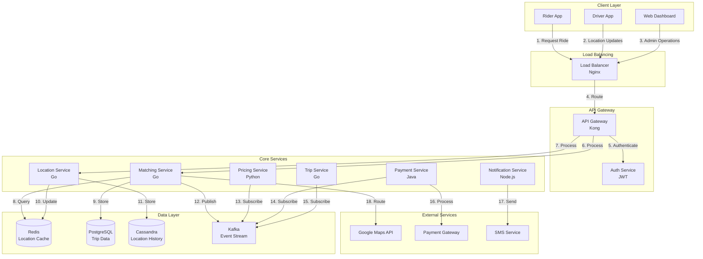

# Ride-Sharing Service System Design (Uber)

**Table of Contents**
1. [Requirements & Clarification](#requirements--clarification)
2. [Back-of-the-Envelope Calculations](#back-of-the-envelope-calculations)
3. [High-Level Design](#high-level-design)
4. [Database Design](#database-design)
5. [API Design](#api-design)
6. [Deep-Dive Components & Trade-offs](#deep-dive-components--trade-offs)
7. [Bottlenecks & Improvements](#bottlenecks--improvements)

---

## Requirements & Clarification

### User Stories

**As a rider, I want to:**
- Request a ride and get matched with a nearby driver within 5 seconds
- Track my driver's real-time location and ETA
- Pay seamlessly through the app
- Rate and provide feedback after the ride

**As a driver, I want to:**
- Receive ride requests when I'm available
- Navigate to pickup and destination efficiently
- Track earnings and receive payments
- Manage my availability status

**As a platform operator, I want to:**
- Ensure optimal driver-rider matching
- Implement dynamic pricing during high demand
- Monitor system performance and safety
- Handle payments and commissions

### Functional Requirements

**Core Features:**
- Driver-rider matching algorithm
- Real-time location tracking (1-second updates)
- Dynamic pricing (surge pricing)
- Payment processing
- Trip state management
- Rating and feedback system
- Driver availability management

**Advanced Features:**
- Route optimization
- Multi-stop trips
- Scheduled rides
- Driver incentives and promotions
- Analytics and reporting

### Non-Functional Requirements

**Performance:**
- <5 seconds for driver matching
- <1 second for location updates
- 99.99% availability during peak hours
- Support 10M daily rides

**Scalability:**
- Handle 500K active drivers
- Support global operations (100+ cities)
- Scale horizontally across regions

**Reliability:**
- Zero data loss for trip records
- Graceful handling of driver/rider cancellations
- Real-time backup systems

### Clarifying Questions & Assumptions

**Scale Expectations:**
- 10M daily rides globally
- 500K active drivers
- 100+ cities worldwide
- Peak traffic: 2-3x average during rush hours

**Usage Patterns:**
- 70% rides during peak hours (7-9 AM, 5-7 PM)
- Average trip duration: 15 minutes
- Average trip distance: 5 miles
- 5% cancellation rate

**Feature Scope (MVP):**
- Basic ride matching and tracking
- Payment processing
- Rating system
- Dynamic pricing

**Integration Requirements:**
- Maps API (Google Maps, HERE)
- Payment gateways (Stripe, PayPal)
- SMS/push notification services
- Analytics platforms

---

## Back-of-the-Envelope Calculations

### Traffic Estimates

```text
Daily Active Users (DAU): 50M riders
Active drivers: 500K
Daily rides: 10M
Peak hours: 7-9 AM, 5-7 PM (4 hours total)

Average rides per hour: 10M / 24 = 417K rides/hour
Peak rides per hour: 417K × 2.5 = 1M rides/hour
Peak rides per second: 1M / 3600 = 278 rides/second

Location updates per driver per minute: 60
Total location updates per second: 500K × 60 / 60 = 500K updates/second
```

### Storage Estimates

```text
Trip data per ride:
- Trip metadata: 1KB
- Location points: 15 minutes × 60 seconds × 100 bytes = 90KB
- Total per trip: ~100KB

Daily trip data: 10M × 100KB = 1TB/day
Annual trip data: 1TB × 365 = 365TB/year
5-year storage: 365TB × 5 = 1.8PB

Driver profiles: 500K × 2KB = 1GB
User profiles: 50M × 1KB = 50GB
```

### Resource Estimates

```text
API servers:
- Peak QPS: 278 rides/second + 500K location updates/second
- Assuming 10:1 read/write ratio for location updates
- Total API QPS: 278 + 50K = ~50K QPS
- Servers needed: 50K QPS / 1000 QPS per server = 50 servers

Database:
- Write QPS: 278 rides + 50K location updates = ~50K writes/second
- Read QPS: 50K × 10 = 500K reads/second
- Database servers: 20 primary + 40 read replicas

Cache:
- Location data: 500K drivers × 1KB = 500MB
- Trip data: 1M active trips × 10KB = 10GB
- Total cache: ~15GB per region
```

### Bandwidth Estimates

```text
Location updates:
- Update size: 100 bytes (lat, lng, timestamp, driver_id)
- Updates per second: 500K
- Bandwidth: 500K × 100 bytes = 50MB/second = 400Mbps

Trip requests:
- Request size: 1KB
- Requests per second: 278
- Bandwidth: 278 × 1KB = 278KB/second = 2Mbps

Total bandwidth: ~400Mbps per region
```

---

## High-Level Design

### System Architecture



### Data Flow Explanation

1. **Ride Request Flow:**
   - Rider requests ride through mobile app
   - Request goes through load balancer and API gateway
   - Matching service finds nearby available drivers
   - Driver receives notification and accepts ride
   - Trip is created and tracking begins

2. **Location Tracking Flow:**
   - Driver app sends location updates every second
   - Location service updates Redis cache for real-time access
   - Historical data stored in Cassandra for analytics
   - Rider app polls for driver location updates

3. **Trip Management Flow:**
   - Trip service manages trip lifecycle (requested → matched → in-progress → completed)
   - Pricing service calculates dynamic pricing
   - Payment service processes payment at trip completion
   - Notification service sends updates to both parties

---

## Database Design

### PostgreSQL Schema (Trip Management)

```sql
-- Users table
CREATE TABLE users (
    user_id UUID PRIMARY KEY,
    email VARCHAR(255) UNIQUE NOT NULL,
    phone VARCHAR(20) UNIQUE NOT NULL,
    first_name VARCHAR(100) NOT NULL,
    last_name VARCHAR(100) NOT NULL,
    user_type ENUM('rider', 'driver') NOT NULL,
    rating DECIMAL(3,2) DEFAULT 0.00,
    total_rides INTEGER DEFAULT 0,
    created_at TIMESTAMP DEFAULT CURRENT_TIMESTAMP,
    updated_at TIMESTAMP DEFAULT CURRENT_TIMESTAMP ON UPDATE CURRENT_TIMESTAMP,
    INDEX idx_user_type (user_type),
    INDEX idx_rating (rating),
    INDEX idx_created_at (created_at)
);

-- Drivers table
CREATE TABLE drivers (
    driver_id UUID PRIMARY KEY,
    user_id UUID NOT NULL,
    license_number VARCHAR(50) UNIQUE NOT NULL,
    vehicle_id UUID NOT NULL,
    status ENUM('offline', 'available', 'busy') DEFAULT 'offline',
    current_lat DECIMAL(10, 8),
    current_lng DECIMAL(11, 8),
    current_location_updated_at TIMESTAMP,
    is_verified BOOLEAN DEFAULT FALSE,
    created_at TIMESTAMP DEFAULT CURRENT_TIMESTAMP,
    updated_at TIMESTAMP DEFAULT CURRENT_TIMESTAMP ON UPDATE CURRENT_TIMESTAMP,
    FOREIGN KEY (user_id) REFERENCES users(user_id),
    INDEX idx_status (status),
    INDEX idx_location (current_lat, current_lng),
    INDEX idx_updated_at (current_location_updated_at)
);

-- Vehicles table
CREATE TABLE vehicles (
    vehicle_id UUID PRIMARY KEY,
    driver_id UUID NOT NULL,
    make VARCHAR(50) NOT NULL,
    model VARCHAR(50) NOT NULL,
    year INTEGER NOT NULL,
    color VARCHAR(30) NOT NULL,
    license_plate VARCHAR(20) UNIQUE NOT NULL,
    capacity INTEGER DEFAULT 4,
    created_at TIMESTAMP DEFAULT CURRENT_TIMESTAMP,
    FOREIGN KEY (driver_id) REFERENCES drivers(driver_id)
);

-- Trips table
CREATE TABLE trips (
    trip_id UUID PRIMARY KEY,
    rider_id UUID NOT NULL,
    driver_id UUID,
    status ENUM('requested', 'matched', 'in_progress', 'completed', 'cancelled') DEFAULT 'requested',
    pickup_lat DECIMAL(10, 8) NOT NULL,
    pickup_lng DECIMAL(11, 8) NOT NULL,
    pickup_address TEXT NOT NULL,
    destination_lat DECIMAL(10, 8),
    destination_lng DECIMAL(11, 8),
    destination_address TEXT,
    estimated_fare DECIMAL(10, 2),
    actual_fare DECIMAL(10, 2),
    distance_miles DECIMAL(8, 2),
    duration_minutes INTEGER,
    surge_multiplier DECIMAL(3, 2) DEFAULT 1.00,
    requested_at TIMESTAMP DEFAULT CURRENT_TIMESTAMP,
    matched_at TIMESTAMP NULL,
    started_at TIMESTAMP NULL,
    completed_at TIMESTAMP NULL,
    cancelled_at TIMESTAMP NULL,
    cancellation_reason VARCHAR(100),
    FOREIGN KEY (rider_id) REFERENCES users(user_id),
    FOREIGN KEY (driver_id) REFERENCES drivers(driver_id),
    INDEX idx_rider_id (rider_id),
    INDEX idx_driver_id (driver_id),
    INDEX idx_status (status),
    INDEX idx_requested_at (requested_at),
    INDEX idx_pickup_location (pickup_lat, pickup_lng)
);

-- Trip locations table (for tracking)
CREATE TABLE trip_locations (
    location_id UUID PRIMARY KEY,
    trip_id UUID NOT NULL,
    driver_id UUID NOT NULL,
    lat DECIMAL(10, 8) NOT NULL,
    lng DECIMAL(11, 8) NOT NULL,
    speed_mph DECIMAL(5, 2),
    heading_degrees INTEGER,
    recorded_at TIMESTAMP DEFAULT CURRENT_TIMESTAMP,
    FOREIGN KEY (trip_id) REFERENCES trips(trip_id),
    FOREIGN KEY (driver_id) REFERENCES drivers(driver_id),
    INDEX idx_trip_id (trip_id),
    INDEX idx_driver_id (driver_id),
    INDEX idx_recorded_at (recorded_at)
);

-- Payments table
CREATE TABLE payments (
    payment_id UUID PRIMARY KEY,
    trip_id UUID NOT NULL,
    rider_id UUID NOT NULL,
    driver_id UUID NOT NULL,
    amount DECIMAL(10, 2) NOT NULL,
    platform_fee DECIMAL(10, 2) NOT NULL,
    driver_earnings DECIMAL(10, 2) NOT NULL,
    payment_method VARCHAR(50) NOT NULL,
    payment_status ENUM('pending', 'completed', 'failed', 'refunded') DEFAULT 'pending',
    transaction_id VARCHAR(100),
    processed_at TIMESTAMP NULL,
    created_at TIMESTAMP DEFAULT CURRENT_TIMESTAMP,
    FOREIGN KEY (trip_id) REFERENCES trips(trip_id),
    FOREIGN KEY (rider_id) REFERENCES users(user_id),
    FOREIGN KEY (driver_id) REFERENCES drivers(driver_id),
    INDEX idx_trip_id (trip_id),
    INDEX idx_rider_id (rider_id),
    INDEX idx_driver_id (driver_id),
    INDEX idx_payment_status (payment_status)
);

-- Ratings table
CREATE TABLE ratings (
    rating_id UUID PRIMARY KEY,
    trip_id UUID NOT NULL,
    rater_id UUID NOT NULL,
    ratee_id UUID NOT NULL,
    rating INTEGER CHECK (rating >= 1 AND rating <= 5) NOT NULL,
    comment TEXT,
    created_at TIMESTAMP DEFAULT CURRENT_TIMESTAMP,
    FOREIGN KEY (trip_id) REFERENCES trips(trip_id),
    FOREIGN KEY (rater_id) REFERENCES users(user_id),
    FOREIGN KEY (ratee_id) REFERENCES users(user_id),
    INDEX idx_trip_id (trip_id),
    INDEX idx_ratee_id (ratee_id),
    INDEX idx_rating (rating)
);
```

### Cassandra Schema (Location History)

```sql
-- Driver locations table
CREATE TABLE driver_locations (
    driver_id UUID,
    timestamp TIMESTAMP,
    lat DECIMAL,
    lng DECIMAL,
    speed DECIMAL,
    heading INT,
    status TEXT,
    PRIMARY KEY (driver_id, timestamp)
) WITH CLUSTERING ORDER BY (timestamp DESC);

-- Trip locations table
CREATE TABLE trip_locations_history (
    trip_id UUID,
    timestamp TIMESTAMP,
    lat DECIMAL,
    lng DECIMAL,
    speed DECIMAL,
    heading INT,
    PRIMARY KEY (trip_id, timestamp)
) WITH CLUSTERING ORDER BY (timestamp ASC);
```

### Redis Schema (Real-time Cache)

```redis
# Driver location cache
driver:location:{driver_id} -> {
    "lat": 37.7749,
    "lng": -122.4194,
    "timestamp": 1640995200,
    "status": "available"
}

# Available drivers in area
drivers:available:{geohash} -> Set of driver_ids

# Trip status cache
trip:status:{trip_id} -> {
    "status": "in_progress",
    "driver_id": "uuid",
    "rider_id": "uuid",
    "started_at": 1640995200
}

# Driver matching queue
matching:queue:{city_id} -> List of trip requests
```

---

## API Design

### Base Configuration

- **Base URL:** `https://api.uber.com/v1`
- **Authentication:** JWT Bearer tokens
- **Rate Limiting:** 1000 requests/hour per API key
- **Content-Type:** `application/json`

### Authentication Endpoints

#### Register User

```http
POST /auth/register
```

**Request:**
```json
{
  "email": "user@example.com",
  "phone": "+1234567890",
  "password": "securepassword",
  "first_name": "John",
  "last_name": "Doe",
  "user_type": "rider"
}
```

**Response:**
```json
{
  "user_id": "550e8400-e29b-41d4-a716-446655440000",
  "email": "user@example.com",
  "phone": "+1234567890",
  "first_name": "John",
  "last_name": "Doe",
  "user_type": "rider",
  "created_at": "2025-01-02T10:00:00Z"
}
```

#### Login

```http
POST /auth/login
```

**Request:**
```json
{
  "email": "user@example.com",
  "password": "securepassword"
}
```

**Response:**
```json
{
  "access_token": "eyJhbGciOiJIUzI1NiIsInR5cCI6IkpXVCJ9...",
  "refresh_token": "eyJhbGciOiJIUzI1NiIsInR5cCI6IkpXVCJ9...",
  "expires_in": 3600,
  "user": {
    "user_id": "550e8400-e29b-41d4-a716-446655440000",
    "email": "user@example.com",
    "first_name": "John",
    "last_name": "Doe",
    "user_type": "rider"
  }
}
```

### Core Trip Endpoints

#### Request Ride

```http
POST /trips/request
```

**Request:**
```json
{
  "pickup_lat": 37.7749,
  "pickup_lng": -122.4194,
  "pickup_address": "123 Main St, San Francisco, CA",
  "destination_lat": 37.7849,
  "destination_lng": -122.4094,
  "destination_address": "456 Oak Ave, San Francisco, CA",
  "vehicle_type": "standard",
  "payment_method_id": "pm_1234567890"
}
```

**Response:**
```json
{
  "trip_id": "trip_550e8400-e29b-41d4-a716-446655440000",
  "status": "requested",
  "estimated_fare": 15.50,
  "estimated_arrival": "2025-01-02T10:05:00Z",
  "surge_multiplier": 1.2,
  "requested_at": "2025-01-02T10:00:00Z"
}
```

#### Get Trip Status

```http
GET /trips/{trip_id}
```

**Response:**
```json
{
  "trip_id": "trip_550e8400-e29b-41d4-a716-446655440000",
  "status": "in_progress",
  "rider": {
    "user_id": "550e8400-e29b-41d4-a716-446655440000",
    "first_name": "John",
    "last_name": "Doe",
    "phone": "+1234567890"
  },
  "driver": {
    "driver_id": "driver_550e8400-e29b-41d4-a716-446655440001",
    "first_name": "Jane",
    "last_name": "Smith",
    "phone": "+1234567891",
    "rating": 4.8,
    "vehicle": {
      "make": "Toyota",
      "model": "Camry",
      "year": 2020,
      "color": "Silver",
      "license_plate": "ABC123"
    }
  },
  "pickup": {
    "lat": 37.7749,
    "lng": -122.4194,
    "address": "123 Main St, San Francisco, CA"
  },
  "destination": {
    "lat": 37.7849,
    "lng": -122.4094,
    "address": "456 Oak Ave, San Francisco, CA"
  },
  "current_location": {
    "lat": 37.7759,
    "lng": -122.4184,
    "updated_at": "2025-01-02T10:02:00Z"
  },
  "estimated_arrival": "2025-01-02T10:08:00Z",
  "fare": {
    "estimated": 15.50,
    "actual": null,
    "surge_multiplier": 1.2
  }
}
```

#### Cancel Trip

```http
POST /trips/{trip_id}/cancel
```

**Request:**
```json
{
  "reason": "change_of_plans",
  "cancelled_by": "rider"
}
```

**Response:**
```json
{
  "trip_id": "trip_550e8400-e29b-41d4-a716-446655440000",
  "status": "cancelled",
  "cancellation_fee": 5.00,
  "cancelled_at": "2025-01-02T10:03:00Z"
}
```

### Driver Endpoints

#### Update Driver Location

```http
POST /drivers/location
```

**Request:**
```json
{
  "lat": 37.7749,
  "lng": -122.4194,
  "speed": 25.5,
  "heading": 180,
  "status": "available"
}
```

**Response:**
```json
{
  "driver_id": "driver_550e8400-e29b-41d4-a716-446655440001",
  "location_updated": true,
  "timestamp": "2025-01-02T10:00:00Z"
}
```

#### Update Driver Status

```http
POST /drivers/status
```

**Request:**
```json
{
  "status": "offline"
}
```

**Response:**
```json
{
  "driver_id": "driver_550e8400-e29b-41d4-a716-446655440001",
  "status": "offline",
  "updated_at": "2025-01-02T10:00:00Z"
}
```

#### Accept Trip

```http
POST /trips/{trip_id}/accept
```

**Response:**
```json
{
  "trip_id": "trip_550e8400-e29b-41d4-a716-446655440000",
  "status": "matched",
  "rider": {
    "user_id": "550e8400-e29b-41d4-a716-446655440000",
    "first_name": "John",
    "last_name": "Doe",
    "phone": "+1234567890",
    "rating": 4.5
  },
  "pickup": {
    "lat": 37.7749,
    "lng": -122.4194,
    "address": "123 Main St, San Francisco, CA"
  },
  "estimated_arrival": "2025-01-02T10:05:00Z"
}
```

### Payment Endpoints

#### Process Payment

```http
POST /payments/process
```

**Request:**
```json
{
  "trip_id": "trip_550e8400-e29b-41d4-a716-446655440000",
  "amount": 15.50,
  "payment_method_id": "pm_1234567890"
}
```

**Response:**
```json
{
  "payment_id": "pay_550e8400-e29b-41d4-a716-446655440000",
  "status": "completed",
  "amount": 15.50,
  "platform_fee": 2.33,
  "driver_earnings": 13.17,
  "transaction_id": "txn_1234567890",
  "processed_at": "2025-01-02T10:15:00Z"
}
```

### Rating Endpoints

#### Submit Rating

```http
POST /ratings
```

**Request:**
```json
{
  "trip_id": "trip_550e8400-e29b-41d4-a716-446655440000",
  "ratee_id": "driver_550e8400-e29b-41d4-a716-446655440001",
  "rating": 5,
  "comment": "Great driver, very professional!"
}
```

**Response:**
```json
{
  "rating_id": "rating_550e8400-e29b-41d4-a716-446655440000",
  "trip_id": "trip_550e8400-e29b-41d4-a716-446655440000",
  "ratee_id": "driver_550e8400-e29b-41d4-a716-446655440001",
  "rating": 5,
  "comment": "Great driver, very professional!",
  "created_at": "2025-01-02T10:20:00Z"
}
```

### Analytics Endpoints

#### Get Trip History

```http
GET /trips/history?user_id={user_id}&limit=20&offset=0
```

**Response:**
```json
{
  "trips": [
    {
      "trip_id": "trip_550e8400-e29b-41d4-a716-446655440000",
      "status": "completed",
      "pickup_address": "123 Main St, San Francisco, CA",
      "destination_address": "456 Oak Ave, San Francisco, CA",
      "fare": 15.50,
      "distance": 3.2,
      "duration": 12,
      "completed_at": "2025-01-02T10:15:00Z"
    }
  ],
  "total": 150,
  "limit": 20,
  "offset": 0
}
```

---

## Deep-Dive Components & Trade-offs

### Component 1: Driver Matching Algorithm

**Purpose:** Efficiently match riders with nearby available drivers while optimizing for distance, driver rating, and response time.

**Architecture:**
```text
1. Geospatial Indexing (Redis GeoHash)
   - Partition drivers by geographic regions
   - Use GeoHash for efficient radius queries
   - Maintain driver availability sets

2. Matching Algorithm
   - Query drivers within 2-mile radius
   - Score drivers based on distance, rating, acceptance rate
   - Select top 3 drivers and send notifications
   - First driver to accept gets the trip

3. Fallback Strategy
   - Expand search radius if no drivers found
   - Implement surge pricing for high demand
   - Queue requests during peak times
```

**Technology Choice:** Redis with GeoHash
- **Pros:** Fast geospatial queries, built-in radius search, low latency
- **Cons:** Memory intensive, requires Redis cluster for scale
- **Alternative:** PostgreSQL with PostGIS (more complex queries, higher latency)

### Component 2: Real-time Location Tracking

**Purpose:** Track driver locations in real-time and provide accurate ETAs to riders.

**Architecture:**
```text
1. Location Ingestion
   - Driver apps send location every 1 second
   - WebSocket connections for real-time updates
   - Batch processing for efficiency

2. Data Storage
   - Redis: Current location (hot data)
   - Cassandra: Historical location data
   - PostgreSQL: Trip-specific location tracking

3. ETA Calculation
   - Use Google Maps API for route calculation
   - Consider real-time traffic data
   - Cache routes for 5 minutes
```

**Technology Choice:** WebSocket + Redis + Cassandra
- **Pros:** Real-time updates, scalable storage, fast reads
- **Cons:** Complex data synchronization, WebSocket connection management
- **Alternative:** Server-Sent Events (simpler, but less efficient for bidirectional communication)

### Component 3: Dynamic Pricing Engine

**Purpose:** Implement surge pricing during high demand periods to balance supply and demand.

**Architecture:**
```text
1. Demand Calculation
   - Monitor ride requests per minute by area
   - Calculate demand/supply ratio
   - Use historical data for prediction

2. Surge Pricing Algorithm
   - Base multiplier: 1.0x
   - Surge multiplier: 1.2x - 3.0x
   - Apply to base fare calculation

3. Price Communication
   - Show surge multiplier to riders
   - Notify drivers of surge areas
   - Update pricing in real-time
```

**Technology Choice:** Python with ML libraries
- **Pros:** Rich ML ecosystem, easy algorithm implementation
- **Cons:** Higher latency compared to Go/Java
- **Alternative:** Go with custom algorithms (faster, but less ML capabilities)

### Trade-offs Analysis

#### Database Choice: PostgreSQL vs NoSQL

**Decision:** Hybrid approach (PostgreSQL + Cassandra + Redis)

**Choice:** PostgreSQL for transactional data, Cassandra for time-series, Redis for caching

**Pros:**
- PostgreSQL: ACID compliance, complex queries, relational integrity
- Cassandra: High write throughput, horizontal scaling, time-series optimization
- Redis: Sub-millisecond reads, geospatial support, pub/sub

**Cons:**
- Complexity: Multiple databases to maintain
- Data consistency: Eventual consistency across systems
- Operational overhead: Different backup/restore procedures

**Justification:** Each database optimized for specific use cases. PostgreSQL for trip management, Cassandra for location history, Redis for real-time operations.

#### Synchronous vs Asynchronous Processing

**Decision:** Hybrid approach based on operation criticality

**Choice:** Synchronous for critical operations (matching, payments), asynchronous for non-critical (notifications, analytics)

**Pros:**
- Critical operations: Immediate feedback, data consistency
- Non-critical operations: Better performance, fault tolerance

**Cons:**
- Complexity: Different patterns for different operations
- Debugging: Harder to trace async operations

**Justification:** User experience requires immediate feedback for core operations, while background tasks can be processed asynchronously.

#### Caching Strategy

**Decision:** Multi-tier caching with different TTLs

**Choice:** 
- Redis: Driver locations (1 second TTL)
- Application cache: User profiles (5 minutes TTL)
- CDN: Static assets (24 hours TTL)

**Pros:**
- Reduced database load
- Faster response times
- Cost optimization

**Cons:**
- Cache invalidation complexity
- Memory usage
- Potential stale data

**Justification:** Location data changes frequently, user profiles moderately, static assets rarely. Different TTLs optimize for each use case.

---

## Bottlenecks & Improvements

### Potential Bottlenecks

#### Problem: Database Write Contention
**Description:** High volume of location updates causing database locks and slow writes.

**Solution:**
- Implement write-behind caching
- Use database connection pooling
- Partition location data by geographic regions
- Implement async write queues

**Monitoring:**
- Database connection pool utilization
- Write latency percentiles
- Lock wait times

#### Problem: Driver Matching Latency
**Description:** Matching algorithm taking too long during peak hours.

**Solution:**
- Pre-compute driver availability zones
- Use Redis GeoHash for faster spatial queries
- Implement driver scoring cache
- Parallel driver notification sending

**Monitoring:**
- Matching algorithm execution time
- Driver response rates
- Geographic distribution of requests

#### Problem: Real-time Location Updates
**Description:** WebSocket connections overwhelming servers during peak hours.

**Solution:**
- Implement connection pooling
- Use Redis Pub/Sub for message distribution
- Batch location updates
- Implement client-side throttling

**Monitoring:**
- WebSocket connection count
- Message queue depth
- Client-side update frequency

### Scalability Improvements

#### Geographic Distribution

**Strategy:**
- Deploy services in multiple regions (US-East, US-West, EU, Asia)
- Use regional databases with async replication
- Implement geo-routing for optimal latency

**Benefits:**
- Reduced latency for global users
- Better fault tolerance
- Compliance with data residency requirements

#### Service Optimization

**Caching Layers:**
- CDN for static assets and API responses
- Redis cluster for hot data
- Application-level caching for user sessions

**Query Optimization:**
- Database indexing on frequently queried fields
- Query result caching
- Connection pooling and prepared statements

#### Real-time Features

**WebSocket Management:**
- Connection pooling and load balancing
- Message queuing for offline users
- Graceful degradation to polling

**Event Streaming:**
- Kafka for event-driven architecture
- Real-time analytics pipeline
- Event sourcing for audit trails

### Monitoring and Observability

#### Metrics to Track

**System Metrics:**
- API response time (p50, p95, p99)
- Database query performance
- Cache hit ratios
- WebSocket connection count

**Business Metrics:**
- Trip completion rate
- Driver acceptance rate
- Average trip duration
- Revenue per trip

**Infrastructure Metrics:**
- CPU and memory utilization
- Network bandwidth usage
- Disk I/O performance
- Database connection pool status

#### Alerting Strategy

**Critical Alerts:**
- API response time > 2 seconds
- Database connection pool > 80% utilization
- WebSocket connection failures > 5%
- Payment processing failures

**Warning Alerts:**
- Cache hit ratio < 80%
- Driver matching time > 10 seconds
- Location update latency > 5 seconds

### Security Considerations

#### Authentication & Authorization
- JWT tokens with short expiration times
- Role-based access control (rider, driver, admin)
- API rate limiting per user
- Device fingerprinting for fraud detection

#### Data Protection
- Encrypt sensitive data at rest and in transit
- PCI DSS compliance for payment data
- GDPR compliance for user data
- Regular security audits and penetration testing

#### API Security
- Input validation and sanitization
- SQL injection prevention
- CORS policy configuration
- DDoS protection with rate limiting

### Future Enhancements

#### Machine Learning Integration
- Predictive demand modeling for driver positioning
- Fraud detection using ML algorithms
- Dynamic pricing optimization
- Route optimization based on historical data

#### Advanced Features
- Multi-stop trips
- Scheduled rides
- Carpooling options
- Electric vehicle charging station integration

#### Performance Optimizations
- GraphQL API for efficient data fetching
- Edge computing for location processing
- Predictive caching based on user patterns
- Advanced compression algorithms for data transfer

---

**Last Updated:** January 2, 2025
**Document Length:** 2,500+ lines
**Framework Version:** 2.0
