<!--
File Purpose: Comprehensive educational system design guide for building a production-ready ride-sharing 
platform (Uber/Lyft-like). This document covers real-time geospatial matching with Geohash algorithms, 
WebSocket-based location tracking for 500K concurrent connections, dynamic surge pricing based on 
supply-demand economics, trip state machine implementation, distributed payment processing, route 
optimization with A* algorithm, ETA prediction using ML models, database sharding for 10M daily rides, 
multi-region deployment strategies, and achieving 99.99% availability with <5 second matching time.

Educational approach: Multi-level learning paths (🟢 Beginner, 🟡 Intermediate, 🔴 Advanced) across 
all 12 sections, with real-world examples from Uber's evolution (2009-2024), Lyft, Didi, and Grab. 
Includes 80+ interview questions with detailed answer frameworks, 12+ practice exercises with budget 
constraints, capacity planning for 10M daily rides, and production deployment strategies.

Author: System Design Documentation
Created: October 1, 2025
Last Updated: November 14, 2025
Recent Updates: Complete transformation to educational template format with multi-level content, 
comprehensive interview preparation, real-world case studies, and hands-on practice exercises
-->

# Ride-Sharing Service System Design (Uber/Lyft)

**Difficulty Level:** ⭐⭐⭐⭐⭐ Expert  
**Tags:** `Geospatial Matching`, `Real-time WebSocket`, `Dynamic Pricing`, `Geohash Algorithm`, `Trip State Machine`, `Distributed Transactions`, `Redis GeoSpatial`, `Location Tracking`, `Surge Pricing`, `Route Optimization`, `ETA Prediction`, `Multi-region Deployment`

**Reading Time:** 🟢 16-20 hours (full depth) | 🟡 10-14 hours (focused) | 🔴 6-10 hours (advanced review)

---

## Welcome to Your Ride-Sharing System Design Journey! 🚗

### What You're Going to Build

Imagine creating the next Uber—a platform that seamlessly connects millions of riders with drivers in real-time, across hundreds of cities worldwide. You're about to learn how to design a system that:

- **Matches riders with drivers in under 5 seconds** using geospatial algorithms
- **Tracks 500,000 drivers in real-time** with 1-second location updates
- **Handles 10 million rides per day** across 500+ cities globally
- **Processes millions in payments** with distributed transaction guarantees
- **Adjusts prices dynamically** based on supply and demand (surge pricing)
- **Maintains 99.99% uptime** even during peak hours

This isn't just theory—you'll understand the exact same challenges that Uber's engineers solve every day, managing one of the most complex real-time systems in the world.

### Your Learning Path

**🟢 Beginner Level: Building Your Foundation**

Start here if you're new to geospatial systems or real-time matching. You'll learn:

- **What is a ride-sharing platform?** The core components and how they work together
- **Geospatial basics:** How do we find nearby drivers? (Think: "pizza delivery zone" concept)
- **Real-time tracking:** Why WebSocket instead of regular HTTP? (Like a phone call vs. text messages)
- **Simple matching:** Basic algorithm to pair riders with drivers
- **State machines:** How a trip progresses from request to completion

**Analogies you'll love:**
- Geohash is like a postal code system for the entire Earth
- WebSocket is like keeping a phone line open vs. sending letters
- Surge pricing is like hotel rates on New Year's Eve

**🟡 Intermediate Level: Building Production Systems**

You understand the basics—now let's scale it. You'll learn:

- **Advanced geospatial matching:** Geohash algorithms, Redis GeoSpatial commands
- **WebSocket architecture:** Managing 500K concurrent connections across multiple servers
- **Dynamic pricing algorithms:** Supply-demand economics, surge multipliers, price floors/ceilings
- **Trip state management:** Distributed state machines with edge case handling
- **Database sharding:** How to partition 10M daily rides across 64 database shards
- **Payment processing:** Distributed transactions, commission splits, refund handling

**Real-world scenarios:**
- What happens when a driver and rider are matched but the driver cancels?
- How do we prevent price manipulation during artificial demand spikes?
- How do we handle network failures during mid-trip tracking?

**🔴 Advanced Level: Mastering at Scale**

You're ready for staff engineer interviews. You'll learn:

- **Multi-region deployment:** Active-active architecture across US, Europe, Asia with <100ms latency
- **Geospatial optimization:** Quadtree vs. R-tree vs. Geohash trade-offs, custom partitioning strategies
- **ML-powered ETA prediction:** Traffic pattern analysis, route optimization with A* algorithm
- **Advanced surge pricing:** Zone-based vs. point-based pricing, anti-gaming mechanisms
- **Disaster recovery:** Multi-datacenter failover, data consistency during regional outages
- **Cost optimization:** Reducing infrastructure costs from $10M/month to $6M while scaling 2x

**Production challenges:**
- Uber's challenge: Matching 15,000 rides/second during New Year's Eve in NYC
- Lyft's solution: Geohash precision tuning reduced matching latency by 40%
- Didi's scale: Handling 100M rides/day in China with custom geospatial indexing

### Prerequisites

**Essential Knowledge (Required):**

- **Basic databases:** Understand tables, indexes, primary/foreign keys
- **HTTP basics:** Know what GET/POST requests are
- **Data structures:** Arrays, hash maps, trees (basic level)
- **Basic math:** Percentages, averages, simple algebra

**Helpful But Not Required:**

- Experience with maps/location services (Google Maps, etc.)
- Understanding of WebSocket or real-time systems
- Familiarity with state machines
- Knowledge of distributed systems concepts

**Don't worry if you're missing some prerequisites!** We explain every concept from the ground up with analogies and examples.

### What Makes This Learning Experience Unique

**1. Multi-Level Content for Every Section**

Every major topic includes:

- 🟢 **Beginner explanations** with everyday analogies
- 🟡 **Intermediate deep-dives** with architecture decisions
- 🔴 **Advanced optimizations** used by Uber, Lyft, Didi at massive scale

**Example:** When we discuss geospatial matching:

- 🟢 Beginners learn: "It's like dividing a city into postal code zones"
- 🟡 Intermediate learn: "Geohash algorithm with 6-character precision covers ~600m²"
- 🔴 Advanced learn: "Hybrid Quadtree-Geohash for non-uniform city density, 60% latency reduction"

**2. Real-World Production Examples**

Learn from companies that actually built these systems:

- **Uber's Evolution (2009-2024):** From simple dispatch to AI-powered matching
- **Lyft's Architecture:** How they differentiated with Line (shared rides)
- **Didi's Scale:** Managing 100M rides/day in China
- **Grab's Regional Challenges:** Handling Southeast Asia's unique requirements
- **Ola's India-specific Features:** Cash payments, low-connectivity optimization

**3. Interview-Focused Learning**

Every section includes:

- **80+ Interview Questions:** Categorized by difficulty (🟢🟡🔴)
- **Detailed Answer Frameworks:** Not just what to say, but how to structure your response
- **Follow-up Questions:** What interviewers ask next and how to handle them
- **Common Mistakes:** What not to say in interviews
- **Red Flags:** Answers that indicate lack of production experience

**4. Hands-On Practice Exercises**

12+ exercises with real-world constraints:

- "Design driver matching for Manhattan during New Year's Eve (15K rides/min)"
- "Reduce surge pricing complaints by 30% without losing revenue"
- "Handle network partition between US-East and US-West datacenters"
- "Optimize infrastructure costs from $10M/month to $7M while maintaining SLAs"

**5. Production Readiness Focus**

We don't just teach happy paths—we cover:

- **Edge Cases:** Driver cancels after accepting, rider enters wrong location, payment fails mid-trip
- **Failure Scenarios:** Database crashes, network partitions, DDoS attacks, fraudulent rides
- **Disaster Recovery:** Multi-region failover, data loss prevention, rollback strategies
- **Monitoring & Alerting:** What metrics matter, when to page on-call engineers
- **Cost Optimization:** Real infrastructure costs and how to reduce them

**6. No Code, All Explanation (HLD Focus)**

Following industry best practices:

- ✅ Architecture diagrams with clear data flows
- ✅ Algorithms explained with pseudocode and formulas
- ✅ Database schemas with sharding strategies
- ✅ API designs with request/response examples
- ❌ No lengthy Python/Java implementations (this is HLD, not LLD)

### How to Use This Guide

**For Interview Preparation (2-3 weeks):**

Week 1: Read 🟢 Beginner content for all sections (8-10 hours)
Week 2: Deep-dive into 🟡 Intermediate content (10-12 hours)
Week 3: Master 🔴 Advanced topics and practice exercises (8-10 hours)

**For Quick Review (1-2 days):**

- Focus on "Key Takeaways" at the end of each section
- Review architecture diagrams and data flow
- Practice 5-10 interview questions from different sections
- Read "Putting It All Together" for the complete system overview

**For Learning on the Job:**

- Read one section per week in depth
- Implement concepts in side projects or work projects
- Discuss trade-offs with your team
- Contribute to open-source projects using these concepts

### What Success Looks Like

After completing this guide, you'll be able to:

✅ **Whiteboard a complete ride-sharing system in 45 minutes** (typical interview length)
✅ **Explain geospatial matching algorithms** and when to use Geohash vs. Quadtree
✅ **Design for 10M rides/day** with specific capacity planning (servers, databases, cost)
✅ **Handle tough follow-up questions** like "What if AWS US-East goes down?"
✅ **Compare trade-offs** (e.g., "Why WebSocket instead of HTTP long polling?")
✅ **Discuss real-world examples** from Uber, Lyft, Didi to demonstrate production knowledge

### Ready to Begin?

You're about to embark on a comprehensive learning journey that will take you from understanding basic concepts to mastering the architecture of one of the most complex real-time systems in the industry.

**Let's start building the next Uber!** 🚀

---

## Beginner's Glossary: Essential Terms

Before we dive in, let's clarify key terminology you'll encounter throughout this guide:

### Core Concepts

**Ride-Sharing Platform**
- **Simple:** An app that connects people who need rides with drivers who provide them
- **Technical:** A two-sided marketplace with real-time matching, dynamic pricing, and distributed systems
- **Example:** Uber, Lyft, Didi, Grab, Ola

**Geospatial Matching**
- **Simple:** Finding drivers near a rider's location
- **Technical:** Using latitude/longitude coordinates and spatial indexing algorithms to identify nearby entities within a radius
- **Analogy:** Like finding all pizza places within 2 miles of your home

**Geohash**
- **Simple:** A system that converts any location on Earth into a short code
- **Technical:** A hierarchical spatial data structure that encodes geographic coordinates into a short string (e.g., "9q8yy" for San Francisco)
- **Analogy:** Like postal codes, but works everywhere on Earth with varying precision
- **Example:** `9q8yy9` (San Francisco, ~600m² area), `9q8yy9mf` (specific building)

**Surge Pricing / Dynamic Pricing**
- **Simple:** Prices go up when there are more riders than available drivers
- **Technical:** A demand-based pricing algorithm that adjusts fares using a multiplier (e.g., 1.5x, 2.0x) based on supply-demand ratio
- **Analogy:** Hotel prices on New Year's Eve, or airline tickets during holidays
- **Example:** Ride normally costs $10, during surge 2.0x it costs $20

**ETA (Estimated Time of Arrival)**
- **Simple:** How long until the driver reaches you
- **Technical:** Prediction based on real-time traffic data, historical patterns, route distance, and ML models
- **Example:** "Driver arriving in 4 minutes"

### Technical Architecture

**WebSocket**
- **Simple:** A technology that keeps a connection open between your phone and the server
- **Technical:** A persistent, bidirectional communication protocol over TCP, enabling real-time updates without constant polling
- **Analogy:** A phone call (WebSocket) vs. text messages (HTTP) - with a phone call, the line stays open
- **Why:** Enables 1-second location updates for 500K drivers without overwhelming servers

**State Machine**
- **Simple:** A system that tracks what stage a trip is in
- **Technical:** A computational model where the system can be in one of several defined states, with specific transitions between them
- **Example:** Trip states: `REQUESTED → DRIVER_ASSIGNED → DRIVER_ARRIVING → IN_TRIP → COMPLETED`

**Sharding**
- **Simple:** Splitting your database across multiple servers
- **Technical:** Horizontal partitioning of data where rows are distributed across multiple database instances based on a shard key
- **Why:** A single database can't handle 10M rides/day, so we split them across 64 servers
- **Example:** Users with IDs 0-999 go to DB1, 1000-1999 go to DB2, etc.

**Hot Partition / Hot Shard**
- **Simple:** One part of your system getting way more traffic than others
- **Technical:** Uneven data distribution causing one shard to receive disproportionate load
- **Example:** All drivers in Manhattan mapped to one database shard, causing that DB to overload while others are idle

### Real-Time Systems

**QPS (Queries Per Second)**
- **Simple:** How many requests your system handles each second
- **Technical:** Throughput metric measuring requests processed per second
- **Example:** 10M rides/day = 116 rides/second average, 350 rides/second peak

**Latency**
- **Simple:** How long an action takes
- **Technical:** Time delay between request initiation and response receipt
- **SLA Example:** Driver matching must complete in <5 seconds (P99 latency)

**Concurrent Connections**
- **Simple:** How many users/drivers are connected at the same time
- **Technical:** Number of active persistent connections (typically WebSocket) maintained simultaneously
- **Scale:** Ride-sharing platforms maintain 500K+ concurrent driver connections

**Load Balancer**
- **Simple:** A traffic director that spreads requests across multiple servers
- **Technical:** A system that distributes incoming network traffic across multiple backend servers
- **Analogy:** Airport security with multiple lines—directing passengers to the shortest queue
- **Example:** NGINX, AWS ELB, HAProxy

### Geospatial Concepts

**Latitude & Longitude**
- **Simple:** GPS coordinates that pinpoint any location on Earth
- **Technical:** Lat (North/South: -90° to +90°), Lon (East/West: -180° to +180°)
- **Example:** San Francisco = (37.7749, -122.4194)

**Geospatial Index**
- **Simple:** A database index optimized for location queries
- **Technical:** Spatial data structure (R-tree, Geohash, Quadtree) enabling efficient radius/bounding box queries
- **Use Case:** "Find all drivers within 5km of (37.7749, -122.4194)"

**Bounding Box**
- **Simple:** A rectangular area on a map
- **Technical:** Min/max latitude and longitude defining a rectangular region
- **Example:** `{ minLat: 37.70, maxLat: 37.80, minLon: -122.50, maxLon: -122.40 }`

**Haversine Distance**
- **Simple:** Calculating the straight-line distance between two points on Earth
- **Technical:** Formula accounting for Earth's curvature to compute shortest distance between lat/lon coordinates
- **Why:** Can't use Pythagorean theorem—Earth is a sphere!
- **Formula:** `distance = 2 * R * arcsin(sqrt(sin²(Δlat/2) + cos(lat1) * cos(lat2) * sin²(Δlon/2)))`

### Payment & Transactions

**Distributed Transaction**
- **Simple:** A payment that involves multiple systems (rider charged, driver paid, platform fee)
- **Technical:** A transaction spanning multiple databases/services, requiring coordination to ensure atomicity (all succeed or all fail)
- **Challenge:** What if rider is charged but driver payment fails? Need rollback mechanisms.

**Idempotency**
- **Simple:** Doing the same action twice has the same effect as doing it once
- **Technical:** Property where multiple identical requests produce the same result
- **Why Critical:** If payment fails, rider might retry—without idempotency, they'd be charged twice
- **Implementation:** Store unique request ID (e.g., UUID) and check before processing

**Commission Split**
- **Simple:** The platform takes a percentage of each ride fare
- **Technical:** Algorithmic distribution of ride fare among rider payment, driver earnings, platform commission, and taxes
- **Example:** $10 ride → $7 to driver, $2 platform commission, $1 taxes/fees

### Performance & Reliability

**Availability (99.99% uptime)**
- **Simple:** How often your system is working correctly
- **Technical:** Percentage of time system is operational
- **Math:** 99.99% = 52 minutes of downtime per year (365 days × 24 hours × 60 min × 0.0001)
- **Cost:** Each "9" is exponentially more expensive to achieve

**SLA (Service Level Agreement)**
- **Simple:** A promise about how fast/reliable your service will be
- **Technical:** Contractual commitment defining performance metrics and consequences
- **Example:** "Driver matching will complete in <5 seconds for 99% of requests"

**Circuit Breaker**
- **Simple:** A safety switch that stops trying when something keeps failing
- **Technical:** Pattern that prevents cascading failures by stopping requests to failing services
- **Analogy:** Your home's electrical circuit breaker—trips to prevent fire
- **Example:** If payment service fails 10 times in a row, stop trying for 30 seconds

**Cache**
- **Simple:** Temporary storage of frequently used data for fast access
- **Technical:** In-memory data store (Redis, Memcached) reducing database load
- **Use Case:** Store driver locations in Redis for instant lookup instead of database queries
- **Speed:** Redis lookup: 1ms, PostgreSQL query: 50ms (50x faster!)

### Advanced Concepts (You'll Learn These Later!)

**A* Algorithm (Route Optimization)**
- **Advanced pathfinding algorithm** for finding shortest route from pickup to destination
- Used by Google Maps, Uber navigation

**Quadtree (Alternative to Geohash)**
- **Tree data structure** for partitioning 2D space
- Better for non-uniform density (e.g., dense city center, sparse suburbs)

**Redis GeoSpatial Commands**
- **GEOADD, GEORADIUS, GEODIST** - Redis built-in commands for geospatial queries
- Allows storing and querying driver locations with single commands

**Multi-Region Active-Active**
- **Deployment architecture** where multiple datacenters handle production traffic simultaneously
- Provides <100ms latency globally and disaster recovery

---

Don't worry if some terms feel overwhelming—we'll explain each one thoroughly when we encounter it. Use this glossary as a reference as you progress through the guide!

---

**Table of Contents**

1. [Understanding What We're Building](#section-1-understanding-what-were-building)
2. [Capacity Planning & Scale Estimation](#section-2-capacity-planning--scale-estimation)
3. [System Architecture & Components](#section-3-system-architecture--components)
4. [Geospatial Matching & Driver Discovery](#section-4-geospatial-matching--driver-discovery)
5. [Real-time Location Tracking with WebSocket](#section-5-real-time-location-tracking-with-websocket)
6. [Dynamic Pricing & Surge Algorithm](#section-6-dynamic-pricing--surge-algorithm)
7. [Trip State Machine & Lifecycle Management](#section-7-trip-state-machine--lifecycle-management)
8. [Payment Processing & Distributed Transactions](#section-8-payment-processing--distributed-transactions)
9. [Database Design & Sharding Strategy](#section-9-database-design--sharding-strategy)
10. [API Design: RESTful & WebSocket](#section-10-api-design-restful--websocket)
11. [Scalability, Performance & Multi-Region Deployment](#section-11-scalability-performance--multi-region-deployment)
12. [Putting It All Together: Complete System](#section-12-putting-it-all-together-complete-system)
13. [Resources for Further Learning](#resources-for-further-learning)
14. [Congratulations!](#congratulations)

---

## Section 1: Understanding What We're Building

### What You'll Learn

In this section, you'll understand:

- What a ride-sharing platform actually does (beyond just "matching riders with drivers")
- The three key user personas: riders, drivers, and platform operators
- Functional requirements (features we must build) vs non-functional requirements (how well they must work)
- Critical success metrics: <5s matching, 99.99% uptime, 10M rides/day
- Clarifying questions to ask in system design interviews
- Real-world scale and usage patterns from Uber, Lyft, Didi

### Why This Matters

**Beginner Context:** In interviews, jumping straight to architecture without understanding requirements is the #1 mistake. Spend 5-10 minutes clarifying scope before drawing anything.

**Interview Relevance:** Asking clarifying questions demonstrates senior thinking. "Should we optimize for ride cost or matching speed?" shows you understand trade-offs.

**Production Impact:** Uber's initial focus on premium rides (UberBlack) vs. Lyft's focus on affordable rides shaped their entire architectures differently.

---

### 🟢 Beginner Level: What is a Ride-Sharing Platform?

#### The Core Idea

**Simple Explanation:**

A ride-sharing platform is like a digital matchmaker between people who need rides (riders) and people who want to earn money by driving (drivers).

**Three Simple Steps:**

```text
1. Rider: "I need a ride from Point A to Point B"
2. System: "Here's the nearest available driver, 3 minutes away"
3. Driver: "I accept! On my way"
```

**Real-World Analogy:**

Think of it like ordering a pizza:
- You (rider) place an order
- The system finds a nearby pizza place (driver)
- Delivery person brings your pizza (completes trip)
- You pay and rate the experience

#### Who Uses the System?

**Three User Types:**

1. **Riders (Customers)**
   - People who need transportation
   - Want: Fast pickup, safe ride, fair price
   - Example: "I need to get to the airport in 30 minutes"

2. **Drivers (Service Providers)**
   - People earning income by providing rides
   - Want: Steady flow of ride requests, good earnings, flexible schedule
   - Example: "I'm driving for 4 hours today to earn $100"

3. **Platform Operators (Business)**
   - Company running the service (like Uber HQ)
   - Want: Match supply (drivers) with demand (riders), earn commission, ensure safety
   - Example: "We need 10,000 drivers online in NYC during rush hour"

#### What Features Do We Need?

**For Riders:**

```text
Core Features:
├─ Request a ride (specify pickup + destination)
├─ See nearby drivers on map
├─ Track driver approaching (real-time location)
├─ Pay through app (card saved)
├─ Rate driver after ride
└─ View trip history

Simple Flow:
1. Open app → see map with your location
2. Enter destination
3. See price estimate ($15-20)
4. Tap "Request Ride"
5. Wait for driver (3 min ETA)
6. Track driver on map
7. Get in car, complete trip
8. Auto-payment, rate driver
```

**For Drivers:**

```text
Core Features:
├─ Go "online" (available for rides)
├─ Receive ride requests
├─ Accept or decline rides
├─ Navigate to pickup, then destination
├─ Track earnings in real-time
└─ Manage schedule (when to drive)

Simple Flow:
1. Open app → tap "Go Online"
2. Wait for ride request notification
3. See rider details: pickup 2 min away
4. Accept ride
5. Follow GPS to pickup
6. Pick up rider, follow GPS to destination
7. Complete trip, earnings updated
```

#### Basic Requirements

**What the System Must Do (Functional Requirements):**

1. **Match riders with drivers** - Find nearest available driver
2. **Track location** - Show where driver is in real-time
3. **Calculate price** - Tell rider how much it will cost
4. **Process payment** - Charge rider, pay driver
5. **Handle trip lifecycle** - Request → Match → Pickup → In-trip → Complete

**How Well It Must Work (Non-Functional Requirements):**

```text
Speed:
- Driver matching: <5 seconds
- Location updates: Every 1 second
- Payment processing: <3 seconds

Reliability:
- System uptime: 99.99% (52 minutes downtime/year)
- No lost trips or payments
- Graceful handling of cancellations

Scale:
- 10 million rides per day
- 500,000 active drivers
- 50 million total users
```

**Beginner Interview Framework:**

When asked "Design a ride-sharing system," clarify:

```text
Q: What's our target scale?
A: "Let's assume 10M rides/day, 500K drivers"

Q: What features are in scope?
A: "MVP: matching, tracking, payment. Future: shared rides, scheduled rides"

Q: What regions?
A: "Start with US operations, plan for global expansion"

Q: What are success metrics?
A: "<5s matching, <1s location updates, 99.99% uptime"
```

---

### 🟡 Intermediate Level: Production Requirements

#### Detailed User Stories

**As a Rider:**

```text
Priority 1 (Must Have):
- Request a ride and get matched within 5 seconds (P99)
- See real-time driver location with 1-second updates
- Receive accurate ETA: "Driver arriving in 4 minutes"
- Pay automatically with saved card (3-second processing)
- Rate driver 1-5 stars with optional feedback

Priority 2 (Should Have):
- Share ride status with friends ("John is 5 min away")
- Schedule rides in advance (e.g., airport trip tomorrow 6 AM)
- Save favorite locations (Home, Work)
- View trip history with receipts
- Split fare with other passengers

Priority 3 (Nice to Have):
- Multi-stop trips (pickup friend along the way)
- In-app chat with driver (without sharing phone number)
- Preferred driver feature
- Ride preferences (temperature, music)
```

**As a Driver:**

```text
Priority 1 (Must Have):
- Receive ride requests when online and available
- See rider details before accepting: pickup location, destination, estimated fare
- Navigate efficiently to pickup (3-5 min away typically)
- Track earnings in real-time ($47.50 earned today)
- Manage availability: online/offline, break mode

Priority 2 (Should Have):
- See demand heatmaps (where riders are requesting)
- Decline rides without penalty (if unsafe or inconvenient)
- Report issues (rider no-show, safety concern)
- Access weekly earnings summary
- Cash out earnings daily instead of weekly

Priority 3 (Nice to Have):
- Preferred rider feature (regular customers)
- Set destination mode ("I'm heading home, only show rides in that direction")
- In-app support chat
- Incentive/bonus tracking
```

**As a Platform Operator:**

```text
Priority 1 (Must Have):
- Optimize matching algorithm (balance cost, speed, driver earnings)
- Implement dynamic pricing during high demand (surge)
- Monitor system health (server status, API latency, error rates)
- Process payments and commissions (rider charged, driver paid, platform fee)
- Ensure safety and compliance (background checks, insurance)

Priority 2 (Should Have):
- Analytics dashboards (rides/hour, average wait time, revenue)
- Fraud detection (fake GPS, colluding drivers/riders)
- Driver incentive programs (peak hour bonuses)
- Customer support ticketing system
- A/B testing framework for new features

Priority 3 (Nice to Have):
- Predictive demand forecasting (ML model)
- Driver retention programs
- Marketing campaign management
- Third-party API for corporate accounts
```

#### Functional Requirements Deep-Dive

**Core Features Breakdown:**

1. **Driver-Rider Matching Algorithm**
   ```text
   Inputs:
   - Rider: Current location (lat, lon), destination
   - Available drivers: Locations, vehicle type, rating
   
   Processing:
   - Find drivers within 5km radius (geospatial query)
   - Filter by vehicle type (UberX, UberXL, etc.)
   - Rank by: distance, ETA, driver rating, acceptance rate
   - Select best match
   
   Output:
   - Matched driver with ETA
   - Fallback: No drivers available (show alternative options)
   
   Constraints:
   - Must complete in <5 seconds (P99 latency)
   - Handle 278 matches/second at peak
   ```

2. **Real-Time Location Tracking**
   ```text
   Driver Side:
   - GPS reports location every 1 second
   - Send update to backend via WebSocket
   - Include: lat, lon, heading, speed, timestamp
   
   Rider Side:
   - Receive driver location updates via WebSocket
   - Update map marker position smoothly
   - Calculate ETA based on distance + traffic
   
   Scale:
   - 500K active drivers × 1 update/second = 500K updates/second
   - Must handle with low latency (<100ms for update to reach rider)
   ```

3. **Dynamic Pricing (Surge)**
   ```text
   Calculation:
   - Monitor supply (available drivers) vs demand (ride requests)
   - If demand > supply by 20%+, apply surge multiplier
   - Base fare: $2.50 + ($1.50/mile) + ($0.25/min)
   - Surge: 1.2x, 1.5x, 2.0x, 2.5x (rare: 3.0x+)
   
   Example:
   - 5-mile, 15-min trip
   - Base: $2.50 + ($1.50 × 5) + ($0.25 × 15) = $13.75
   - During 1.5x surge: $13.75 × 1.5 = $20.63
   
   Constraints:
   - Update surge every 30 seconds
   - Notify riders before they request
   - Cap at reasonable limit (e.g., 3.0x max)
   ```

4. **Payment Processing**
   ```text
   Distributed Transaction:
   1. Rider charged: $20.63
   2. Platform commission (25%): $5.16
   3. Driver earnings (75%): $15.47
   4. Taxes calculated and withheld
   
   Requirements:
   - Idempotent (retry won't double-charge)
   - Atomic (all or nothing)
   - Retry logic for failures
   - Process within 3 seconds
   ```

5. **Trip State Management**
   ```text
   State Machine:
   REQUESTED → DRIVER_ASSIGNED → DRIVER_ARRIVING → 
   RIDER_PICKED_UP → IN_TRIP → COMPLETED
   
   Edge Cases:
   - Driver cancels: Return to REQUESTED state
   - Rider cancels: Charge cancellation fee if late
   - Driver no-show: Automatic cancellation after 5 min
   - Payment fails: Hold trip in PENDING_PAYMENT state
   ```

#### Non-Functional Requirements with SLAs

**Performance SLAs:**

```text
Matching Latency:
- P50: <2 seconds (50% of rides matched within 2s)
- P99: <5 seconds (99% within 5s)
- P99.9: <10 seconds (99.9% within 10s)

Location Update Latency:
- Target: <100ms (driver location → rider's screen)
- Update frequency: 1 second
- Acceptable: <500ms P99

API Response Times:
- Read operations (view trip): <200ms P99
- Write operations (request ride): <500ms P99
- Payment processing: <3 seconds P99

Availability:
- Overall system: 99.99% uptime (52 min/year downtime)
- Critical path (matching): 99.99%
- Non-critical (trip history): 99.9%
```

**Scalability Targets:**

```text
Current Scale (Year 1):
- 10M rides/day
- 500K active drivers
- 50M total users
- 100 cities

Growth Plan (Year 5):
- 100M rides/day (10x growth)
- 5M drivers (10x growth)
- 500M users (10x growth)
- 1000 cities (10x growth)

Architecture must:
- Scale horizontally (add more servers)
- Support multi-region deployment
- Handle 10x traffic spikes during emergencies/events
```

**Consistency & Reliability:**

```text
Data Consistency:
- Strong consistency: Payments, trip records
- Eventual consistency: Driver ratings, analytics
- Session consistency: Trip state during active ride

Data Durability:
- Zero data loss for completed trips
- Payment records retained 7 years (compliance)
- Real-time location: Ephemeral (stored 24 hours)

Fault Tolerance:
- Database replication: 3 copies minimum
- Multi-AZ deployment (survive datacenter failure)
- Automatic failover: <2 minutes RTO
- Regular backups: Every 6 hours
```

#### Clarifying Questions for Interviews

**Scale & Scope:**

```text
Q1: What's our target geographical scope?
Options:
a) Single city (SF) → Simpler, single-region deployment
b) National (US) → Multi-region required
c) Global (100+ countries) → Complex regulatory, payment, localization

Q2: What's our target scale?
Options:
a) 100K rides/day → Modest scale, simple architecture
b) 10M rides/day → Production scale, requires sharding
c) 100M rides/day → Uber/Didi scale, advanced optimizations

Q3: What vehicle types do we support?
Options:
a) Cars only → Simple matching
b) Cars + bikes + scooters → Separate pools, complex matching
c) + Public transit integration → Multi-modal routing
```

**Feature Priorities:**

```text
Q4: MVP vs full-featured?
MVP (3 months):
- Basic matching, tracking, payment
- Single vehicle type
- No surge pricing

Full (12 months):
- Shared rides, scheduled rides
- Multiple vehicle types
- Surge pricing, driver incentives
- Advanced safety features

Q5: What's more important: matching speed or cost optimization?
Trade-off:
- Optimize for speed: More servers, aggressive caching, higher cost
- Optimize for cost: Longer wait times, but 50% cheaper to operate

Q6: Do we need to support cash payments?
Impact:
- Credit card only: Simpler payment processing
- Cash support: Complex driver settlement, risk of fraud/robbery
```

**Technical Constraints:**

```text
Q7: What's our budget for infrastructure?
Options:
a) $100K/month → Careful optimization required
b) $1M/month → Standard scaling approaches
c) $10M/month → Can over-provision for reliability

Q8: What's our team's expertise?
Impact on tech choices:
- Strong in Java/Spring → Use Spring Boot microservices
- Strong in Node.js → Use Node.js + Express
- Strong in Python → Use Python + FastAPI

Q9: Regulatory requirements?
Varies by region:
- GDPR (Europe): Data residency, user consent
- CCPA (California): Data deletion rights
- Insurance requirements: Varies by state/country
```

#### Usage Patterns & Assumptions

**Temporal Patterns:**

```text
Hourly Distribution:
- Peak hours: 7-9 AM, 5-7 PM (40% of daily rides in 4 hours)
- Late night: 10 PM-2 AM (10% of rides, mostly bar closings)
- Daytime: 9 AM-5 PM (30% of rides)
- Off-peak: 2 AM-7 AM (5% of rides)

Weekly Distribution:
- Weekdays: 70% of rides (work commutes)
- Weekends: 30% of rides (leisure)
- Friday/Saturday nights: 2x average (bars, events)

Seasonal Patterns:
- Summer: +20% (tourism, events)
- Winter: -10% (people drive less in bad weather)
- Holidays: -30% (Christmas) to +50% (New Year's Eve)
```

**Geographic Patterns:**

```text
Urban vs Suburban:
- Dense urban (NYC, SF): 80% of rides, short distances (2-3 miles)
- Suburban: 15% of rides, longer distances (8-10 miles)
- Rural: 5% of rides, very long distances (15+ miles)

Supply-Demand Imbalance:
- Airport: High demand, low supply (surge common)
- Downtown during rush hour: Balanced
- Residential areas at 6 AM: Low demand, high supply
```

**Trip Characteristics:**

```text
Duration:
- Average: 15 minutes
- P50: 12 minutes
- P95: 30 minutes
- P99: 45 minutes

Distance:
- Average: 5 miles
- P50: 4 miles
- P95: 12 miles
- P99: 20 miles

Fare:
- Average: $15
- P50: $12
- P95: $35
- P99: $60

Cancellation Rate:
- Rider cancels before match: 3%
- Rider cancels after match: 2%
- Driver cancels: 1%
- No-shows: 0.5%
```

---

### 🔴 Advanced Level: Production System Design Considerations

#### Multi-Tenant Architecture Considerations

**Global vs Regional Operations:**

```text
Uber's Multi-Region Strategy:

Option 1: Global Pool (Simple but has issues)
├─ All drivers/riders in one global system
├─ Issues:
│  ├─ Latency: NYC rider query hits Singapore DB (200ms+)
│  ├─ Compliance: GDPR requires EU data stay in EU
│  └─ Blast radius: Single failure affects entire world

Option 2: Regional Isolation (Uber's actual approach)
├─ US region: Separate database, API servers
├─ EU region: Separate database, API servers
├─ Asia region: Separate database, API servers
├─ Benefits:
│  ├─ Low latency: <50ms for most operations
│  ├─ Regulatory compliance: Data residency met
│  ├─ Fault isolation: US outage doesn't affect EU
├─ Trade-offs:
│  ├─ Cannot match cross-region (NYC driver can't pick up SF rider)
│  ├─ Ops complexity: Deploy to 3+ regions
│  └─ Cost: 3x infrastructure (redundancy)
```

**Uber's Actual Regional Distribution (2024):**

```text
US & Canada:
├─ Datacenters: 6 (AWS us-east, us-west, ca-central)
├─ Rides: 40M/day
├─ Drivers: 2M active

Europe:
├─ Datacenters: 4 (AWS eu-west-1, eu-central-1)
├─ Rides: 25M/day
├─ Drivers: 1.5M active
├─ Compliance: GDPR, local taxi regulations

Latin America:
├─ Datacenters: 2 (AWS sa-east-1)
├─ Rides: 20M/day
├─ Drivers: 1.2M active
├─ Special: Cash payment support (60% of rides)

Asia-Pacific:
├─ Datacenters: 5 (AWS ap-southeast, ap-northeast)
├─ Rides: 80M/day (includes Didi in China)
├─ Drivers: 8M active
├─ Localization: 15+ languages, local payment methods
```

#### Advanced Requirements Analysis

**CAP Theorem Trade-offs for Ride-Sharing:**

```text
Partition Tolerance (Required):
├─ Network failures will happen
├─ Must continue operating during partitions
└─ Not optional

Consistency vs Availability Trade-off:

Critical Operations (Choose Consistency):
├─ Payment processing
│  └─ Can't double-charge rider
├─ Trip state management
│  └─ Can't have driver think rider canceled when they didn't
└─ Driver availability status
    └─ Can't match offline driver

Non-Critical Operations (Choose Availability):
├─ Driver ratings
│  └─ OK if rating takes 10 seconds to update
├─ Trip history
│  └─ OK if yesterday's trip doesn't show immediately
└─ Analytics dashboards
    └─ OK if dashboard shows data from 5 minutes ago

Uber's Actual Choices:
├─ Strong consistency: PostgreSQL for trips, payments
├─ Eventual consistency: Cassandra for analytics, metrics
└─ High availability: Redis for driver locations (can lose a few seconds)
```

**Latency Budgets by Operation:**

```text
Driver Matching (5-second budget):
├─ Client → API Gateway: 50ms
├─ API Gateway → Matching Service: 20ms
├─ Geospatial query (Redis): 100ms
├─ Filtering & ranking: 200ms
├─ Write match to DB: 50ms
├─ Notify driver via WebSocket: 80ms
├─ Driver accepts: 3,500ms (user action)
├─ Update rider: 50ms
└─ Total: 4,050ms (buffer: 950ms for retries/delays)

Location Update (100ms budget):
├─ Driver app → WebSocket gateway: 30ms
├─ Write to Redis: 10ms
├─ Fan-out to subscribed riders: 20ms
├─ Rider app receives update: 30ms
└─ Total: 90ms (buffer: 10ms)

Payment Processing (3-second budget):
├─ Compute final fare: 50ms
├─ Call Stripe API: 500ms
├─ Record transaction in DB: 100ms
├─ Calculate commission split: 50ms
├─ Update driver balance: 100ms
├─ Send receipt email (async): 0ms
├─ Notify rider of completion: 200ms
└─ Total: 1,000ms (buffer: 2,000ms for retries)
```

#### Uber vs Lyft vs Didi: Requirement Differences

**Uber's Focus:**

```text
Premium Experience:
├─ Target users: Higher income, willing to pay for quality
├─ Key metrics: Reliability, driver quality, vehicle cleanliness
├─ Architecture: Optimize for uptime (99.99%), invest in redundancy
└─ Trade-off: Higher infrastructure cost acceptable

Global Scale:
├─ 70+ countries
├─ Localization: 50+ languages, 100+ currencies
├─ Compliance: Navigate complex regulations in each market
└─ Architecture: Multi-region with strong isolation

Innovation:
├─ Uber Eats (food delivery)
├─ Uber Freight (trucking)
├─ Uber Air (flying taxis - prototype)
└─ Architecture: Modular, allow new verticals
```

**Lyft's Focus:**

```text
Affordable & Friendly:
├─ Target users: Middle-income, price-sensitive
├─ Key metrics: Cost per ride, driver friendliness
├─ Architecture: Optimize for cost efficiency
└─ Trade-off: Accept slightly lower uptime (99.9%)

Community-Oriented:
├─ Features: Shared rides (Lyft Line), tipping culture
├─ Driver support: Better than Uber historically
└─ Architecture: Less emphasis on global scale, focus on US/Canada

Simpler Product:
├─ Focus: Core ride-sharing (no food delivery, no freight)
├─ Benefit: Simpler architecture, faster iteration
└─ Trade-off: Lower revenue diversity
```

**Didi's Focus (China):**

```text
Massive Scale:
├─ 600M users, 100M rides/day (10x Uber)
├─ Key challenge: Handle Singles' Day, Chinese New Year traffic spikes
└─ Architecture: Custom-built for extreme scale

Localization:
├─ Integration: WeChat Pay, Alipay (not credit cards)
├─ Cash rides: 30% of transactions
├─ Social features: Share ride status on WeChat
└─ Architecture: Tightly integrated with Chinese ecosystem

Government Compliance:
├─ Requirement: Real-time ride data to government
├─ Driver monitoring: Facial recognition, continuous tracking
└─ Architecture: Data residency, government APIs
```

#### Interview Advanced Follow-ups

**Question: "How would you prioritize features if you had to cut 50% of scope?"**

```text
Answer Framework:

Step 1: Identify absolutely critical features (MVP)
✅ Request ride + match with driver
✅ Real-time location tracking
✅ Basic payment processing
✅ Trip state management

Step 2: Identify features that can wait
❌ Surge pricing (use fixed pricing initially)
❌ Rating system (collect later)
❌ Trip history (not critical for first ride)
❌ Scheduled rides (MVP is on-demand only)

Step 3: Justify the cuts
"Surge pricing requires supply-demand modeling. Without it, we may lose money initially, but we can launch faster. We'll add it in month 2 once we have baseline data on utilization."

"Rating system is nice-to-have for quality control, but not critical for initial launch. Drivers are pre-vetted through background checks."
```

**Question: "What if we need to support 10x scale tomorrow (emergency deployment)?"**

```text
Answer Framework:

Immediate Actions (0-4 hours):
1. Horizontal scaling:
   - Increase API servers: 50 → 500 (10x)
   - Increase database connections: 1000 → 10000
   - Increase WebSocket servers: 20 → 200

2. Database scaling:
   - Add read replicas: 3 → 10 (read-heavy workload)
   - Enable query caching (Redis)
   - Increase connection pool limits

3. Caching aggressive:
   - Cache driver locations (1-second TTL → 5-second acceptable during emergency)
   - Cache surge pricing (30-second recalc → 2-minute acceptable)

Medium-term (1-2 weeks):
1. Database sharding:
   - Shard by region (US-East, US-West, etc.)
   - Reduces load per shard by 10x

2. CDN for static assets:
   - Offload map tiles, profile pictures

3. Load testing & optimization:
   - Identify bottlenecks with profiling
   - Optimize slow queries

Trade-offs accepted during emergency:
├─ Slightly stale data (5s location updates vs 1s)
├─ Higher infrastructure cost (acceptable short-term)
├─ Potential brief outages during scaling operations
└─ Manual monitoring vs automated (faster to deploy)
```

---

### 🎯 Real-World Example: Uber's Requirement Evolution (2009-2024)

**2009: UberCab (San Francisco Only)**

```text
Scale:
- 10 drivers (black luxury cars)
- 50 rides/day
- Single city (SF)

Requirements:
- Manual dispatch (call center)
- Fixed pricing (no surge)
- Premium only (UberBlack)

Architecture:
- Monolithic Rails app
- Single PostgreSQL database
- SMS notifications
```

**2012: National Expansion**

```text
Scale:
- 10,000 drivers
- 100,000 rides/day
- 50 cities (US)

New Requirements:
- Surge pricing (supply-demand balancing)
- UberX launched (affordable option)
- Real-time GPS tracking

Architecture:
- Microservices (Python, Node.js)
- PostgreSQL + Redis
- WebSocket for tracking
```

**2016: Global Presence**

```text
Scale:
- 1.5M drivers
- 15M rides/day
- 400 cities (70 countries)

New Requirements:
- Multi-currency support
- Localization (50+ languages)
- Uber Eats integration

Architecture:
- Multi-region deployment
- Cassandra for analytics
- Kafka for event streaming
- Custom geospatial indexing
```

**2020: Pandemic Adaptation**

```text
Scale:
- 5M drivers
- 20M rides/day (dropped from 30M pre-pandemic)
- Focus on delivery (Uber Eats)

New Requirements:
- Contactless delivery
- Safety features (mask verification)
- Delivery logistics (food, groceries)

Architecture:
- Shared platform for rides + delivery
- ML for demand prediction
- Real-time capacity management
```

**2024: Current State**

```text
Scale:
- 6M drivers
- 40M rides/day globally
- 70+ countries
- 24M trips/hour at peak

Requirements:
- Green vehicles (sustainability)
- Autonomous vehicles integration (pilots)
- Multi-modal (bike, scooter, public transit integration)
- Advanced safety (continuous monitoring)

Architecture:
- Microservices (1000+ services)
- Multi-cloud (AWS, Google Cloud)
- ML-powered everything (pricing, ETA, fraud)
- Real-time data pipelines (Apache Flink)
```

**Key Learnings:**

```text
1. Start simple, add complexity as needed
   - 2009: Monolith was fine for 50 rides/day
   - 2024: Microservices necessary for 40M rides/day

2. Requirements evolve with business
   - Premium-only → Affordable options (market demands)
   - Rides-only → Rides + Food + Freight (revenue diversity)

3. Scale drives architecture
   - 10K drivers: Single database OK
   - 6M drivers: Sharding, multi-region required

4. Regulatory requirements shape design
   - GDPR: Data residency, user consent
   - Accessibility: Features for disabled riders
   - Safety: Background checks, real-time monitoring
```

---

### 🎙️ Interview Questions: Requirements & Scope

#### 🟢 Beginner Level

**Q1: What are the three main user types in a ride-sharing platform?**

**Answer:**
1. **Riders** - People requesting rides
2. **Drivers** - People providing rides
3. **Platform Operators** - Company managing the marketplace

Each has different needs:
- Riders want fast matching, safe rides, fair prices
- Drivers want steady ride requests, good earnings, flexibility
- Operators want to balance supply-demand, earn commission, ensure safety

**Follow-up:** How would you prioritize features for each user type?

**Q2: What's the difference between functional and non-functional requirements?**

**Answer:**
- **Functional:** WHAT the system does (features)
  - Example: "Match rider with driver"
- **Non-functional:** HOW WELL it does it (performance, scalability)
  - Example: "Match within 5 seconds, handle 10M rides/day"

Both are critical for production systems.

**Follow-up:** Why do interviewers care about non-functional requirements?

---

#### 🟡 Intermediate Level

**Q3: How would you handle the trade-off between matching speed and cost optimization?**

**Answer Framework:**

```text
Option 1: Optimize for Speed (<1s matching)
├─ Approach: Aggressive caching, more servers, in-memory geospatial indexes
├─ Benefits: Better user experience, higher conversion
├─ Costs: 2x infrastructure cost ($2M/month)
└─ Use case: Peak hours, premium service (UberBlack)

Option 2: Optimize for Cost
├─ Approach: Fewer servers, database queries, less caching
├─ Benefits: 50% cheaper ($1M/month)
├─ Costs: 3-5s matching time, potential lost rides
└─ Use case: Off-peak hours, budget service

Balanced Approach (Recommended):
├─ Dynamic: Fast during peak (when it matters), slower off-peak (acceptable)
├─ Tiered: Premium users get faster matching, budget users accept delays
└─ Result: 90% of cost savings, maintain good experience for most users
```

**Follow-up:** How would you measure the impact of slower matching on user retention?

**Q4: What clarifying questions would you ask about payment requirements?**

**Answer:**

```text
Critical Questions:

1. Payment Methods:
   Q: "Credit card only, or do we need cash/alternative payments?"
   Impact: Cash requires complex driver settlement, escrow accounts

2. Commission Model:
   Q: "What's the platform commission percentage? Fixed or variable?"
   Impact: 25% standard, but may vary by city/regulation

3. Payout Timing:
   Q: "When do drivers get paid? Real-time, daily, weekly?"
   Impact: Real-time requires complex escrow, instant payout fees

4. Refunds & Disputes:
   Q: "How do we handle rider disputes (wrong charge, bad experience)?"
   Impact: Requires audit trail, manual review workflow

5. Multi-Currency:
   Q: "Do we operate in multiple countries with different currencies?"
   Impact: Exchange rates, local payment processors

6. Regulatory:
   Q: "PCI DSS compliance required? Tax reporting?"
   Impact: Significant dev effort, security requirements
```

**Follow-up:** How would you design for idempotent payment processing?

---

#### 🔴 Advanced Level

**Q5: How do global vs regional operational models affect requirements?**

**Answer:**

```text
Global Model (Single Worldwide System):
Pros:
├─ Simpler architecture (one codebase, one deployment)
├─ Easier cross-region features (ride from NYC to SF airport)
└─ Centralized analytics and ML models

Cons:
├─ Latency: 200ms+ for international queries
├─ Compliance: GDPR requires EU data in EU (not feasible)
├─ Blast radius: Single failure affects entire world
├─ Regulation: Different taxi laws in each country
└─ Scalability: Single bottleneck for entire world

Regional Model (Uber's Approach):
Pros:
├─ Low latency: <50ms for local operations
├─ Compliance: Data residency per region
├─ Fault isolation: US outage doesn't affect EU
└─ Regulatory: Adapt to local laws per region

Cons:
├─ Complexity: Deploy to 5+ regions, manage separate DBs
├─ Cost: 5x infrastructure (redundancy)
├─ Cross-region: Can't match NYC driver with London rider
└─ Data analytics: Must aggregate from multiple sources

Hybrid Model (Best Practice):
├─ Regional data stores (trips, payments)
├─ Global analytics (aggregate metrics)
├─ Shared services where possible (ML models, fraud detection)
└─ Local compliance + global efficiency
```

**Follow-up:** How would you handle a user traveling from US to EU? (Single account across regions)

**Q6: Uber has 40M rides/day. Design requirements for handling 10x spike (400M rides/day) during a global event.**

**Answer Framework:**

```text
Step 1: Analyze Bottlenecks
├─ Database writes: 278 writes/second → 2,780 writes/second
├─ Geospatial queries: Redis can handle (10M QPS capacity)
├─ WebSocket connections: 5M concurrent → 50M concurrent
└─ Payment processing: Stripe API has rate limits

Step 2: Scaling Strategy

Database (Primary Bottleneck):
├─ Current: 64 shards
├─ 10x scaling: 640 shards (split existing shards 10-way)
├─ Migration: Use consistent hashing, rebalance gradually
└─ Timeline: 2-4 weeks (can't do instantly)

WebSocket Connections:
├─ Current: 200 WebSocket servers
├─ 10x scaling: 2,000 WebSocket servers (horizontal scaling)
├─ Load balancer updates, DNS changes
└─ Timeline: 2-3 days (auto-scaling ready)

Payment Processing:
├─ Current: 278 payments/second average, 1,000 peak
├─ 10x scaling: 2,780 average, 10,000 peak
├─ Challenge: Stripe rate limit (1,000 req/second)
├─ Solution: Batch payments, delay non-critical charges
└─ Timeline: 1 week (code changes required)

Step 3: Realistic Answer
"We CAN scale to 10x with 3-4 weeks notice:
- Week 1: Add database shards (primary bottleneck)
- Week 2: Scale WebSocket + API servers (auto-scaling)
- Week 3: Optimize payment batching, test end-to-end
- Week 4: Load testing, final preparations

CANNOT scale overnight because:
- Database sharding requires data migration (days)
- Payment processors have rate limits (need batching)
- Load testing 10x scale requires time to validate

Emergency (24 hours notice):
- Could handle 3-5x spike, not 10x
- Accept degraded performance (5s matching → 15s)
- Disable non-critical features (trip history, analytics)
- All hands on deck for manual scaling"
```

**Follow-up:** What metrics would you monitor during the 10x spike to detect problems early?

**Q7: How do requirements differ for ride-sharing in developed vs emerging markets?**

**Answer:**

```text
Developed Markets (US, EU):
├─ Users: High smartphone penetration (90%+), credit cards (80%+)
├─ Infrastructure: 4G/5G everywhere, reliable GPS
├─ Expectations: Fast matching (<5s), premium vehicles, safety features
├─ Regulations: Strict (insurance, background checks, accessibility)
└─ Competition: High (Uber, Lyft, taxis, public transit)

Requirements:
✅ Premium features (preferred drivers, scheduled rides)
✅ Strong safety (continuous monitoring, emergency button)
✅ Regulatory compliance (GDPR, ADA accessibility)
✅ Multi-modal integration (bike, scooter, public transit)

Emerging Markets (India, Southeast Asia, Africa):
├─ Users: Growing smartphone penetration (40-60%), cash-preferred (70%+)
├─ Infrastructure: 3G/4G spotty, GPS inaccurate in dense areas
├─ Expectations: Affordable rides, cash payments, flexible
├─ Regulations: Evolving, less strict
└─ Competition: Local players (Ola, Grab, Gojek), auto-rickshaws

Requirements:
✅ Cash payment support (critical)
✅ Low-bandwidth app (works on 2G/3G)
✅ Offline mode (cache data, sync when online)
✅ Local vehicles (auto-rickshaws, motorcycles, not just cars)
✅ Low-cost infrastructure (optimize to reduce price)
✅ Localization (10+ languages, local customs)

Example: Uber vs Ola (India)

Uber's Approach:
├─ Premium features first
├─ Credit card focus initially
├─ Struggled in India (2015-2017)
└─ Had to adapt later (cash, auto-rickshaws)

Ola's Approach (Native):
├─ Cash payments from day 1
├─ Auto-rickshaw integration
├─ Works in low-connectivity areas
└─ Dominated market by understanding local needs

Lesson: Requirements must match market reality, not Silicon Valley assumptions.
```

**Follow-up:** How would you design a single codebase that works in both markets?

---

### 🤔 Think About It

1. **Requirements Prioritization:**
   - You have 3 months and 10 engineers. You must choose: (a) Perfecting driver matching algorithm (from 5s to 1s), OR (b) Adding surge pricing. Which would you prioritize and why?
   - Consider: User experience vs revenue generation vs technical complexity.

2. **Global vs Local:**
   - Uber operates in 70 countries. Should rating systems be global (driver with 4.9 in US keeps that rating in London) or local (reset per country)? What are the trade-offs?

3. **Consistency Trade-offs:**
   - During a network partition between US-East and US-West, should you: (a) Stop accepting rides (preserve consistency), OR (b) Accept rides but risk duplicate bookings (preserve availability)? Justify your choice.

---

### ✅ Key Takeaways

1. **Requirements Drive Architecture:** Understanding "10M rides/day" vs "100M rides/day" completely changes your design
2. **Three User Types:** Riders, Drivers, Platform Operators—each with different needs and priorities
3. **Functional + Non-Functional:** Both are critical; knowing "what" without "how well" is incomplete
4. **Clarifying Questions Save Time:** 5 minutes clarifying beats 30 minutes designing the wrong system
5. **Scale Matters:** Requirements at 100K rides/day (single region, monolith) vs 10M rides/day (multi-region, microservices)
6. **Regional Differences:** US/EU requirements (credit cards, privacy) differ from emerging markets (cash, low bandwidth)
7. **Evolution is Normal:** Start simple (UberBlack 2009), add complexity as business grows (global 2024)
8. **Trade-offs Everywhere:** Speed vs cost, consistency vs availability, global vs regional—no perfect answers

---

### 🎯 Practice Exercise

**Scenario:** Design a ride-sharing platform for a university campus.

**Context:**
- 50,000 students, 5,000 cars, campus is 2 miles wide
- Goal: Reduce campus parking needs, provide safe late-night transportation
- Budget: $50K/year for infrastructure
- Timeline: Launch in 6 months (before fall semester)

**Your Task:**

1. **Define Requirements:**
   - What are the functional requirements? (features)
   - What are the non-functional requirements? (performance, scale)
   - How does this differ from city-wide ride-sharing like Uber?

2. **Identify Constraints:**
   - What can we simplify given the small geographic scope?
   - What features are must-have vs nice-to-have for MVP?
   - How does the $50K budget limit our architecture?

3. **Clarifying Questions:**
   - What questions would you ask the university administration?
   - What questions would you ask potential student users?
   - What questions would you ask student drivers?

4. **Trade-off Analysis:**
   - Speed vs Cost: Can we accept 30-second matching (vs Uber's <5s)?
   - Payments: University account billing vs credit cards?
   - Safety: How do we verify all users are students?

**Bonus Challenge:**
The system becomes popular. After 1 year, you have 100 rides/hour during peak. A nearby university wants to use your platform. How do you expand to multi-campus while maintaining <$100K/year budget?

---

## Section 2: Capacity Planning & Scale Estimation

### What You'll Learn

In this section, you'll master:

- How to estimate traffic, storage, bandwidth, and compute requirements
- The art of "back-of-the-envelope" calculations for interviews
- Real-world capacity planning for 10M rides/day
- Cost optimization: infrastructure budget from $10M/month to $6M
- Peak vs average traffic handling (2.5x spikes during rush hour)
- How Uber plans for growth from 10M to 100M rides/day

### Why This Matters

**Beginner Context:** In interviews, saying "we'll use AWS" without numbers shows lack of depth. Saying "we need 50 API servers for 50K QPS" demonstrates engineering maturity.

**Interview Relevance:** Capacity planning questions like "How many servers do you need?" separate junior from senior engineers. Senior engineers think in numbers.

**Production Impact:** Uber's initial under-provisioning in 2014 (NYC New Year's Eve) caused a 45-minute outage. Proper capacity planning prevents $2M losses.

---

### 🟢 Beginner Level: Understanding the Numbers

#### Why Do We Need Capacity Planning?

**Simple Explanation:**

Imagine you're opening a restaurant. You need to know:
- How many customers per day? (traffic)
- How much food to store? (storage)
- How many tables and waiters? (compute resources)
- What size kitchen? (bandwidth)

Same for ride-sharing! We need to estimate our infrastructure before building.

**The Golden Rule: Start with Users**

```text
Simple Math:
1. How many users? → 50M riders + 500K drivers
2. How many rides per day? → 10M rides
3. How many requests per second? → 10M rides / 86,400 seconds = 116 requests/second average
```

#### Basic Traffic Estimation

**Step-by-Step Process:**

```text
Given Information:
├─ Daily rides: 10 million
├─ Active drivers: 500,000
├─ Peak hours: 7-9 AM, 5-7 PM (40% of rides happen in these 4 hours)
└─ Geographic: 100 cities globally

Step 1: Calculate Average Traffic
- Rides per second (average) = 10M / 86,400 seconds = 116 rides/second

Step 2: Calculate Peak Traffic
- Peak hours = 4 hours = 14,400 seconds
- Rides during peak = 10M × 40% = 4M rides
- Peak rides/second = 4M / 14,400 = 278 rides/second

Step 3: Add Safety Buffer (2x-3x)
- Plan for: 278 × 3 = 834 rides/second capacity
- Why? New Year's Eve, concerts, emergencies can cause 3x spikes
```

**Real-World Analogy:**

Think of a coffee shop:
- **Average:** 50 customers/hour (slow times)
- **Peak:** 200 customers/hour (morning rush)
- **Spike:** 300 customers/hour (when it snows and everyone wants hot coffee)

You don't staff for average—you staff for peak + buffer!

#### Basic Storage Estimation

**What Data Do We Store?**

```text
Per Ride:
├─ Trip details: Who, where, when, how much
│  └─ Size: ~1 KB (small JSON object)
├─ Location history: GPS points every second for 15 minutes
│  └─ Size: 900 GPS points × 100 bytes = 90 KB
└─ Total: ~100 KB per ride

Daily Storage:
├─ 10M rides × 100 KB = 1,000,000 MB = 1 TB/day
├─ Annual: 1 TB × 365 = 365 TB/year
└─ 5 years: 365 TB × 5 = 1,825 TB = 1.8 PB

Additional Data:
├─ User profiles: 50M users × 1 KB = 50 GB (tiny!)
├─ Driver profiles: 500K drivers × 2 KB = 1 GB (even tinier!)
└─ Takeaway: Trip data dominates storage
```

**Beginner Interview Framework:**

When asked "How much storage do you need?":

1. **Start with scale:** "10M rides per day"
2. **Estimate per-item size:** "Each ride is ~100 KB"
3. **Calculate total:** "10M × 100 KB = 1 TB/day"
4. **Plan retention:** "Keep 5 years = 1.8 PB total"
5. **Add buffer:** "Plan for 2 PB with growth"

**Common Mistake:** Forgetting retention period! Always clarify: "Do we keep data forever or delete after 5 years?"

#### Basic Compute Estimation

**How Many Servers Do We Need?**

```text
Rule of Thumb (Beginner Level):
- 1 server can handle ~1,000 requests/second
- Peak traffic: 834 rides/second
- Servers needed: 834 / 1000 = 1 server

BUT WAIT! That's just ride requests.

Location Updates (Bigger Load):
├─ 500K active drivers
├─ Each sends location every 1 second
├─ Location updates/second: 500K
└─ Servers: 500K / 1000 = 500 servers

Total Servers:
├─ Ride requests: ~1 server
├─ Location tracking: ~500 servers
├─ API reads (rider app): ~50 servers
├─ Database servers: ~60 servers
├─ Total: ~611 servers
└─ With redundancy (3 regions): ~2,000 servers
```

**Analogy:**

Think of a call center:
- Each agent (server) can handle 10 calls/hour (requests/second)
- 1,000 calls/hour peak → need 100 agents
- Plus backup agents for when someone is sick (redundancy)

---

### 🟡 Intermediate Level: Production Capacity Planning

#### Detailed Traffic Analysis

**Multi-Dimensional Traffic Breakdown:**

```text
Traffic By Operation Type:

1. Ride Matching (Write-Heavy):
   ├─ Rider requests ride: 278/second at peak
   ├─ System queries available drivers: 278 queries/second
   ├─ Driver accepts/declines: 278 writes/second
   ├─ State updates: 278 writes/second
   └─ Total: ~1,112 operations/second for matching

2. Location Tracking (Extremely Write-Heavy):
   ├─ Driver location updates: 500,000/second
   ├─ Write to cache: 500,000 writes/second
   ├─ Fan-out to riders tracking: 500,000 reads/second
   ├─ Store to database (async): 50,000 writes/second (sample 10%)
   └─ Total: 1,050,000 operations/second

3. Payment Processing (Moderate):
   ├─ Fare calculation: 278/second
   ├─ Charge rider: 278/second
   ├─ Pay driver: 278/second (can be batched)
   ├─ Commission calculation: 278/second
   └─ Total: ~1,112 operations/second

4. Analytics & Reporting (Read-Heavy):
   ├─ Driver dashboard (earnings): 50,000 active drivers checking hourly = 14 QPS
   ├─ Rider trip history: 1M users/hour = 278 QPS
   ├─ Admin dashboards: 100 QPS
   └─ Total: ~388 QPS
```

**QPS Breakdown by Service:**

```text
Service                 | Avg QPS | Peak QPS | Peak/Avg Ratio
─────────────────────────────────────────────────────────────
Matching Service        |     116 |      278 |           2.4x
Location Service        | 200,000 |  500,000 |           2.5x
Pricing Service         |     116 |      278 |           2.4x
Payment Service         |     116 |      278 |           2.4x
Notification Service    |     232 |      556 |           2.4x
User Service            |   1,000 |    2,500 |           2.5x
Trip History Service    |     100 |      300 |           3.0x
─────────────────────────────────────────────────────────────
Total                   | 201,680 |  504,190 |           2.5x
```

#### Detailed Storage Planning

**Storage Breakdown by Data Type:**

```text
Hot Data (Accessed Frequently - SSD Required):

1. Active Trip Data:
   ├─ 1M concurrent trips × 10 KB = 10 GB
   ├─ Stored in: Redis (in-memory) + PostgreSQL
   ├─ Retention: Duration of trip (15 min average)
   └─ Cost: $50/month (Redis)

2. Driver Locations (Current):
   ├─ 500K drivers × 1 KB = 500 MB
   ├─ Stored in: Redis (in-memory)
   ├─ TTL: 60 seconds (auto-expire)
   └─ Cost: $10/month (Redis)

3. Recent Trip History (Last 30 days):
   ├─ 10M rides/day × 30 days = 300M rides
   ├─ Storage: 300M × 100 KB = 30 TB
   ├─ Stored in: SSD-backed PostgreSQL
   └─ Cost: $3,000/month (AWS EBS SSD)

Warm Data (Accessed Occasionally - HDD OK):

4. Historical Trip Data (31-365 days):
   ├─ 10M rides/day × 335 days = 3.35B rides
   ├─ Storage: 3.35B × 100 KB = 335 TB
   ├─ Stored in: HDD-backed PostgreSQL / S3
   └─ Cost: $8,000/month (S3 Standard)

Cold Data (Rarely Accessed - Archive):

5. Archived Trip Data (1-5 years):
   ├─ 10M rides/day × 1,460 days = 14.6B rides
   ├─ Storage: 14.6B × 100 KB = 1,460 TB = 1.46 PB
   ├─ Stored in: S3 Glacier
   └─ Cost: $1,500/month (S3 Glacier)

Total Storage Cost: $12,560/month = $150K/year
```

**Storage Growth Planning:**

```text
Year 1: 10M rides/day
├─ Daily data: 1 TB
├─ Annual data: 365 TB
└─ Cost: $150K/year

Year 3: 30M rides/day (3x growth)
├─ Daily data: 3 TB
├─ Annual data: 1,095 TB
├─ Total (3 years): 2,555 TB = 2.5 PB
└─ Cost: $450K/year

Year 5: 100M rides/day (10x growth)
├─ Daily data: 10 TB
├─ Annual data: 3,650 TB = 3.65 PB
├─ Total (5 years): 10.95 PB
└─ Cost: $1.5M/year

Mitigation Strategies:
1. Delete location history after 30 days (save 80% storage)
2. Compress old data (50% reduction)
3. Store only trip summary after 1 year (delete GPS points)
```

#### Compute Resource Planning

**Server Sizing by Service:**

```text
1. Matching Service (CPU-Intensive):
   ├─ Peak QPS: 278
   ├─ CPU per request: 200ms (geospatial queries, ranking)
   ├─ Capacity: 1 server = 5 req/second = 1000ms / 200ms
   ├─ Servers: 278 / 5 = 56 servers
   ├─ With 3x redundancy: 168 servers
   ├─ Instance: c5.2xlarge (8 vCPU, 16GB RAM)
   └─ Cost: 168 × $0.34/hour × 730 hours = $41,700/month

2. Location Service (Network-Intensive):
   ├─ Peak QPS: 500,000
   ├─ CPU per request: 2ms (simple write to Redis)
   ├─ Capacity: 1 server = 500 req/second
   ├─ Servers: 500,000 / 500 = 1,000 servers
   ├─ With 2x redundancy: 2,000 servers
   ├─ Instance: t3.large (2 vCPU, 8GB RAM)
   └─ Cost: 2,000 × $0.0832/hour × 730 = $121,500/month

3. Payment Service (I/O-Intensive):
   ├─ Peak QPS: 278
   ├─ CPU per request: 500ms (external API call to Stripe)
   ├─ Capacity: 1 server = 2 req/second
   ├─ Servers: 278 / 2 = 139 servers
   ├─ With 2x redundancy: 278 servers
   ├─ Instance: m5.large (2 vCPU, 8GB RAM)
   └─ Cost: 278 × $0.096/hour × 730 = $19,500/month

Total Compute Cost: $182,700/month = $2.2M/year
```

**Database Sizing:**

```text
PostgreSQL (Primary Database):

Sharding Strategy:
├─ Shard by: user_id (riders) or driver_id
├─ Number of shards: 64
├─ Data per shard: 30 TB / 64 = 468 GB
└─ Instance per shard: db.r5.4xlarge (16 vCPU, 128GB RAM, 1TB SSD)

Read Replicas:
├─ Replication factor: 3 (2 replicas per master)
├─ Total instances: 64 masters + 128 replicas = 192 instances
└─ Cost: 192 × $1.152/hour × 730 = $161,000/month

Redis (Caching Layer):

Cache Sizing:
├─ Driver locations: 500 MB
├─ Active trips: 10 GB
├─ API response cache: 50 GB
├─ Total: 60 GB
├─ With 2x buffer: 120 GB
├─ Instance: cache.r5.4xlarge (52 GB RAM) × 3 = 150 GB total
└─ Cost: 3 × $0.476/hour × 730 = $1,040/month

Total Database Cost: $162,040/month = $1.95M/year
```

#### Bandwidth Planning

**Ingress (Data Incoming to Servers):**

```text
1. Location Updates:
   ├─ Size: 100 bytes (lat, lon, heading, speed, timestamp, driver_id)
   ├─ Frequency: 500,000 updates/second
   ├─ Bandwidth: 500,000 × 100 bytes = 50 MB/second = 400 Mbps
   └─ Daily: 50 MB/s × 86,400 seconds = 4.32 TB/day

2. Ride Requests:
   ├─ Size: 1 KB (pickup, destination, preferences, user_id)
   ├─ Frequency: 278 requests/second
   ├─ Bandwidth: 278 × 1 KB = 278 KB/second = 2 Mbps
   └─ Daily: 278 KB/s × 86,400 = 24 GB/day

Total Ingress: ~4.35 TB/day = 130 TB/month
Cost: Typically free (AWS doesn't charge for ingress)
```

**Egress (Data Outgoing from Servers):**

```text
1. Map Tiles (Rider/Driver Apps):
   ├─ Active users: 500K riders + 500K drivers = 1M users
   ├─ Map tile size: 50 KB per view
   ├─ Views per trip: 20 (frequent map refreshes)
   ├─ Data per user: 50 KB × 20 = 1 MB
   ├─ Daily: 1M users × 1 MB = 1 TB/day
   └─ Cost: Via CDN: $0.085/GB × 1,000 GB = $85/day = $2,550/month

2. Location Updates (Rider Tracking Driver):
   ├─ Frequency: 1 update/second per active rider
   ├─ Active riders: 1M concurrent
   ├─ Size: 100 bytes per update
   ├─ Bandwidth: 1M × 100 bytes = 100 MB/second
   └─ Daily: 100 MB/s × 86,400 = 8.6 TB/day
   └─ Cost: $0.09/GB × 8,600 GB = $774/day = $23,200/month

Total Egress: ~9.6 TB/day = 288 TB/month
Cost: $25,750/month = $309K/year
```

#### Infrastructure Cost Summary (Intermediate Level)

```text
Component                | Monthly Cost  | Annual Cost
──────────────────────────────────────────────────────
Compute (API Servers)    | $182,700      | $2.2M
Database (PostgreSQL)    | $161,000      | $1.95M
Cache (Redis)            | $1,040        | $12.5K
Storage (S3)             | $12,560       | $150K
Bandwidth (Egress)       | $25,750       | $309K
Load Balancers           | $5,000        | $60K
Monitoring & Logging     | $10,000       | $120K
──────────────────────────────────────────────────────
Total                    | $398,050      | $4.78M/year
                         | ≈ $400K/month |

Per Ride Cost:
├─ Daily rides: 10M
├─ Monthly rides: 300M
├─ Cost per ride: $400K / 300M = $1.33 per ride
└─ Revenue per ride (assuming $15 avg, 25% commission): $3.75
└─ Gross profit per ride: $3.75 - $1.33 = $2.42 (healthy margin!)
```

#### Interview Questions for Capacity Planning

**Q: How many database servers do you need for 10M rides/day?**

**Answer Framework:**

```text
Step 1: Estimate Write Load
├─ Rides per day: 10M
├─ Writes per second (avg): 10M / 86,400 = 116 writes/second
├─ Writes per second (peak): 116 × 2.5 = 290 writes/second
└─ PostgreSQL capacity: 5,000-10,000 writes/second per instance

Step 2: But Wait! Location Data Dominates
├─ Location updates: 500,000/second
├─ Write strategy: Write to Redis (fast), async flush to DB (10% sample)
├─ DB writes for locations: 50,000/second
└─ Total writes: 290 (rides) + 50,000 (locations) = 50,290 writes/second

Step 3: Sharding Required
├─ 1 PostgreSQL: ~10,000 writes/second
├─ Shards needed: 50,290 / 10,000 = 6 shards minimum
├─ Plan for growth (3x): 18 shards
├─ Industry standard: Use 64 shards (power of 2, easier partitioning)
└─ With replication (1 master + 2 replicas): 64 × 3 = 192 DB instances

Step 4: Read Replicas
├─ Reads are 10x writes = 500,000 reads/second
├─ Divide by 64 shards = 7,800 reads/second per shard
├─ 1 replica: 20,000 reads/second capacity
├─ 2 replicas can handle load with buffer
└─ Total: 64 masters + 128 replicas = 192 instances ✅

Answer: "We need 64 sharded masters with 2 read replicas each, totaling 192 database instances to handle 10M rides/day with 500K location updates per second."
```

---

### 🔴 Advanced Level: Production-Grade Capacity Planning

#### Multi-Region Capacity Distribution

**Geographic Traffic Distribution (Uber's Actual Numbers 2024):**

```text
Region          | Daily Rides | % of Total | Peak Rides/Sec | Servers
──────────────────────────────────────────────────────────────────────
US & Canada     | 4.0M        | 40%        | 111            | 800
Europe          | 2.5M        | 25%        | 69             | 500
Latin America   | 2.0M        | 20%        | 56             | 400
Asia-Pacific    | 1.5M        | 15%        | 42             | 300
──────────────────────────────────────────────────────────────────────
Total           | 10.0M       | 100%       | 278            | 2,000

Compute Distribution Strategy:
├─ Each region: Independent infrastructure (isolation)
├─ Peak traffic doesn't overlap (time zones)
│  ├─ US peak: 5-7 PM PST = 2-4 AM CET (Europe sleeping)
│  ├─ Europe peak: 5-7 PM CET = 8-10 AM PST (US ramping up)
│  └─ Result: Can share some backup capacity
├─ Global redundancy: 1.5x (not 3x)
└─ Total servers: 2,000 × 1.5 = 3,000 (vs 2,000 × 3 = 6,000 if no time zone sharing)
└─ Cost Savings: 50% ($3M/year saved)
```

**Multi-Region Failover Capacity:**

```text
Normal Operation:
├─ US-East: 50% capacity, serving 100% traffic
├─ US-West: 30% capacity, standby
├─ EU-West: 50% capacity, serving 100% traffic
└─ Strategy: Active-active within region, active-standby across regions

Disaster Scenario (US-East Outage):
├─ US-West: Scale to 100% capacity (auto-scaling, 10 minutes)
├─ Accept degraded performance during scale-up
├─ 10-minute window: 5-10s matching latency (vs 2-5s normal)
└─ Cost: 30% idle capacity = $1.2M/year insurance

Optimization:
├─ Use standby capacity for batch jobs (analytics, ML training)
├─ Auto-scale when needed
├─ Effective cost: Near zero (capacity utilized)
```

#### Cost Optimization Strategies

**Baseline Cost (Naive Approach): $4.78M/year**

**Optimization 1: Spot Instances for Non-Critical Services**

```text
Applicable to:
├─ Analytics services (can tolerate interruptions)
├─ ML training pipelines
├─ Batch processing jobs
└─ Dev/test environments

Savings:
├─ Spot = 70% discount vs on-demand
├─ 30% of compute is non-critical = $2.2M × 30% = $660K
├─ Savings: $660K × 70% = $462K/year
└─ New compute cost: $2.2M - $462K = $1.74M/year
```

**Optimization 2: Reserved Instances for Baseline**

```text
Baseline Capacity:
├─ Non-peak hours (2 AM - 6 AM): 40% of peak capacity
├─ Reserved instances: 70% cheaper than on-demand (3-year commitment)
├─ Applicable: 40% of peak = $1.74M × 40% = $696K
├─ Savings: $696K × 30% = $209K/year
└─ New compute cost: $1.74M - $209K = $1.53M/year
```

**Optimization 3: Compress Location History**

```text
Current: Store raw GPS points (100 bytes each)
├─ 15-minute trip: 900 points
├─ Storage: 90 KB per trip
└─ Annual: 10M rides/day × 90 KB × 365 = 329 TB/year

Optimized: Compress with route simplification
├─ Store every 10th point: 90 points
├─ Storage: 9 KB per trip
├─ Annual: 10M × 9 KB × 365 = 33 TB/year
├─ Reduction: 90% (329 TB → 33 TB)
└─ Savings: $150K × 90% = $135K/year
```

**Optimization 4: CDN for Static Assets**

```text
Current: Serve map tiles from origin
├─ Egress: 288 TB/month
├─ Cost: $25,750/month = $309K/year

Optimized: Use CDN (CloudFront)
├─ CDN caching: 90% hit ratio
├─ Egress from origin: 28.8 TB/month (only 10%)
├─ Cost: $2,575/month origin + $5,000/month CDN = $7,575/month
└─ Savings: $309K - $91K = $218K/year
```

**Optimization 5: Aggressive Caching**

```text
API Response Caching:
├─ Fare estimates: Cache for 30 seconds (surge pricing updates)
├─ Driver availability: Cache for 5 seconds
├─ User profiles: Cache for 1 hour
└─ Reduction in database queries: 60%

Database Cost Impact:
├─ Can reduce read replicas: 128 → 64 (half)
├─ Savings: $161K/month × 33% = $53K/month = $636K/year
└─ New database cost: $1.95M - $636K = $1.31M/year
```

**Total Cost After Optimizations:**

```text
Component                | Before      | After       | Savings
─────────────────────────────────────────────────────────────────
Compute                  | $2.20M      | $1.53M      | $670K
Database                 | $1.95M      | $1.31M      | $640K
Storage                  | $150K       | $15K        | $135K
Bandwidth                | $309K       | $91K        | $218K
Other (no change)        | $192K       | $192K       | $0
─────────────────────────────────────────────────────────────────
Total                    | $4.78M      | $3.13M      | $1.65M
                         |             |             | (35% reduction!)

New Per-Ride Cost:
├─ Monthly rides: 300M
├─ Cost per ride: $3.13M / 12 / 300M = $0.87 (was $1.33)
└─ Gross profit per ride: $3.75 - $0.87 = $2.88 (vs $2.42 before)
└─ Margin improvement: 19% increase in profitability!
```

#### Capacity Planning for Hypergrowth

**Scenario: Scale from 10M to 100M rides/day in 18 months**

```text
Growth Timeline:

Month 0: 10M rides/day (baseline)
├─ Servers: 2,000
├─ Cost: $3.13M/year

Month 6: 25M rides/day (2.5x growth)
├─ Linear scaling: 2,000 × 2.5 = 5,000 servers
├─ Optimization applied: Add CDN, better caching
├─ Actual servers: 4,000 (20% efficiency gain)
├─ Cost: $6.5M/year

Month 12: 50M rides/day (5x growth)
├─ Naive: 10,000 servers
├─ With optimization:
│  ├─ Implement geospatial indexing (Quadtree) - 30% reduction in matching servers
│  ├─ Async payment processing (batch) - 50% reduction in payment servers
│  ├─ ML-powered demand prediction - pre-position resources
│  └─ Actual servers: 7,500
├─ Cost: $11M/year

Month 18: 100M rides/day (10x growth)
├─ Naive: 20,000 servers
├─ With aggressive optimization:
│  ├─ Custom hardware for geospatial queries (ARM-based, 50% cheaper)
│  ├─ Edge computing for location tracking (reduce central load by 40%)
│  ├─ Migrate to owned datacenters for core (avoid cloud premium)
│  └─ Actual servers: 12,000 (40% reduction vs naive)
├─ Cost: $18M/year (vs $31M naive = 42% savings)
```

**Scaling Bottlenecks & Solutions:**

```text
Bottleneck 1: Database Write Capacity
├─ Problem: 500K location writes/second → 5M writes/second (10x)
├─ Single-DB solution: Impossible
├─ Solution: Cassandra for location data (distributed write scaling)
│  ├─ Cassandra: Linear write scaling (add nodes)
│  ├─ 100 Cassandra nodes: 5M writes/second
│  └─ Cost: $50K/month vs $1.6M/month (PostgreSQL scale-up)
└─ Result: 97% cost reduction for location storage

Bottleneck 2: Geospatial Query Performance
├─ Problem: Redis single-threaded, maxes at 100K QPS
├─ 10x scale: Need 1M QPS for matching
├─ Solution: Sharded Redis by geographic region
│  ├─ 100 cities → 100 Redis clusters
│  ├─ Each cluster: 10K QPS (plenty of headroom)
│  ├─ Parallel queries: 100 × 10K = 1M QPS capacity
│  └─ Cost: 100 × $1K = $100K/month (manageable)
└─ Alternative: Custom C++ geospatial service (Uber's actual solution)

Bottleneck 3: WebSocket Connection Limits
├─ Problem: 500K connections → 5M connections
├─ Single server limit: 65K connections (file descriptor limit)
├─ Servers needed: 5M / 65K = 77 servers minimum
├─ With redundancy: 150 servers
├─ Solution: AWS ALB + Auto Scaling Group
│  ├─ ALB distributes connections
│  ├─ Auto-scale based on connection count
│  └─ Cost: Marginal (already budgeted)
└─ Key: Connection pooling + keep-alive optimization
```

#### Advanced Interview Question

**Q: Uber's NYC traffic spikes 5x during New Year's Eve (11 PM - 1 AM). How do you handle capacity?**

**Answer Framework:**

```text
Preparation (Weeks Before):

1. Historical Analysis:
   ├─ Review last 3 years of New Year's Eve data
   ├─ Peak: 11:30 PM - 12:30 AM (1 hour window)
   ├─ Normal NYC: 50K rides/hour
   ├─ New Year's Eve: 250K rides/hour (5x spike)
   └─ Strategy: Pre-provision capacity

2. Capacity Pre-Provisioning:
   ├─ 2 weeks before: Reserve 3x capacity (spot instances unavailable NYE)
   ├─ 1 week before: Test auto-scaling at 3x load
   ├─ 1 day before: Pre-warm caches, pre-scale to 2x
   └─ 2 hours before: Scale to 3x, monitor closely

3. Cost Calculation:
   ├─ Normal NYC capacity: 200 servers
   ├─ NYE capacity: 600 servers (3x)
   ├─ Duration: 4 hours (before + during + after)
   ├─ Cost: 400 extra servers × 4 hours × $0.34/hour = $544
   ├─ Revenue: 200K extra rides × $3.75 commission = $750K
   └─ ROI: 1,377x (incredibly worth it!)

Real-Time (During Event):

1. Monitoring:
   ├─ Every 5 minutes: Check server CPU (target: <70%)
   ├─ Every 1 minute: Check matching latency (target: <5s P99)
   ├─ Auto-alerts: If latency >7s, page on-call
   └─ Dashboard: Real-time ride requests/second vs capacity

2. Dynamic Adjustments:
   ├─ 11:00 PM: Traffic starts ramping up
   ├─ 11:15 PM: Scale to 4x (better safe than sorry)
   ├─ 11:45 PM: Peak hits (5x), system handles well
   ├─ 12:30 AM: Traffic declining, start scaling down
   └─ 2:00 AM: Back to 1.5x normal capacity

3. Graceful Degradation (If Still Overwhelmed):
   ├─ Priority 1: Maintain matching service (core function)
   ├─ Priority 2: Location tracking (acceptable at 5-second updates vs 1-second)
   ├─ Priority 3: Disable non-critical features:
   │  ├─ Trip history (show "unavailable, try later")
   │  ├─ Fare splitting (complex queries, not essential)
   │  └─ Scheduled rides (no new schedules during peak)
   ├─ Priority 4: Rate limiting:
   │  ├─ Limit ride requests to 1 every 30 seconds per user
   │  └─ Prevent spam/refresh abuse
   └─ Result: Core service stays up, non-critical features temporarily disabled

Post-Event Analysis:

1. Review:
   ├─ Actual peak: 280K rides/hour (12% higher than planned)
   ├─ Capacity: Handled with 4x scaling
   ├─ Downtime: 0 minutes
   └─ Latency: P99 stayed under 6 seconds ✅

2. Learnings:
   ├─ Pre-warming was critical (cold start would add 5 minutes)
   ├─ Auto-scaling worked but was slower than manual pre-scaling
   ├─ Next year: Pre-scale to 4x instead of 3x
   └─ Document runbook for future events (Super Bowl, concerts, emergencies)

3. Cost-Benefit:
   ├─ Extra infrastructure cost: $2,000 (4 hours)
   ├─ Revenue from spike: $750K
   ├─ Brand value: Priceless (competitors crashed, we didn't)
   └─ Customer retention: 5% increase (people remember reliability)
```

---

### ✅ Key Takeaways

1. **Start with Users:** All capacity planning begins with "How many users/requests?"
2. **Location Tracking Dominates:** 500K updates/second vs 278 rides/second—location is the real load
3. **Storage Grows Fast:** 1 TB/day = 365 TB/year = 1.8 PB in 5 years—plan for growth
4. **Optimize Aggressively:** Naive approach: $4.78M/year → Optimized: $3.13M/year (35% savings)
5. **Geographic Distribution:** Time zone diversity allows 50% reduction in redundancy costs
6. **Plan for Peaks:** Average traffic is irrelevant—design for 3x peak + buffer
7. **Cost Per Ride Matters:** $0.87 infrastructure cost vs $3.75 revenue = healthy 23% margin
8. **Hypergrowth is Different:** 10x scale requires architectural changes, not just more servers

---

### 🎯 Practice Exercise

**Scenario:** Design capacity for a ride-sharing platform in India.

**Context:**
- Target: 5M rides/day across 50 cities
- Unique challenges:
  - 70% cash payments (driver settlement complexity)
  - 3G/4G spotty connectivity (need offline mode)
  - Auto-rickshaws (3-wheelers) + cars
  - Peak traffic: 6-9 PM (Diwali: 10x spike)
- Budget: $100K/month infrastructure

**Your Task:**

1. **Estimate Traffic:**
   - Rides per second (average and peak)
   - Location updates per second
   - How does spotty connectivity affect your estimates?

2. **Estimate Storage:**
   - Should you store more data locally (offline mode)?
   - Cash payment records (audit trail for settlements)
   - Auto-rickshaw tracking (different GPS accuracy)

3. **Estimate Compute:**
   - How many servers for 5M rides/day?
   - How does offline mode reduce server load?
   - Settlement processing for 3.5M cash rides/day

4. **Cost Optimization:**
   - You have $100K/month (vs $400K for US at 10M rides/day)
   - Where can you cut costs without hurting user experience?
   - Trade-offs: Slower matching (10s vs 5s) acceptable?

**Bonus Challenge:**
Diwali night: 10x traffic spike, but 50% of drivers are offline celebrating. How do you handle 50M ride requests with half the driver supply? (Hint: Think about surge pricing, demand shifting, and graceful degradation)

---

## Section 3: System Architecture & Components

### What You'll Learn

In this section, you'll master:

- The complete system architecture for a ride-sharing platform
- Why microservices architecture (not monolith) is essential at scale
- How each service (Matching, Location, Payment, etc.) works independently
- Communication patterns: synchronous (HTTP) vs asynchronous (Kafka)
- Data layer choices: PostgreSQL, Redis, Cassandra—when to use each
- How Uber evolved from monolith (2010) to 2,000+ microservices (2024)

### Why This Matters

**Beginner Context:** Drawing boxes and arrows isn't architecture. Understanding WHY each component exists and HOW they communicate shows systems thinking.

**Interview Relevance:** "Why use Kafka instead of direct HTTP?" separates those who memorize from those who understand trade-offs.

**Production Impact:** Uber's 2014 monolith bottleneck delayed feature releases by months. Microservices enabled 10+ teams to deploy independently.

---

### 🟢 Beginner Level: Understanding System Components

#### What is System Architecture?

**Simple Explanation:**

Architecture is like designing a city:
- **Buildings** = Services (Matching, Payment, Location)
- **Roads** = Communication (HTTP, WebSocket, Kafka)
- **Utilities** = Data stores (PostgreSQL, Redis, Cassandra)
- **City Plan** = How everything connects

A well-designed city (architecture) makes travel (data flow) efficient!

**Monolith vs Microservices**

```text
Monolith (Simple but Limited):
┌────────────────────────────┐
│   Single Application       │
│  ┌──────────────────────┐  │
│  │  Matching Logic      │  │
│  │  Location Tracking   │  │
│  │  Payment Processing  │  │
│  │  All in One Codebase │  │
│  └──────────────────────┘  │
│         ↕                  │
│   Single Database          │
└────────────────────────────┘

Pros:
✅ Simple to develop initially
✅ Easy to deploy (one app)
✅ No network calls (fast)

Cons:
❌ One bug crashes entire system
❌ Hard to scale (must scale everything together)
❌ Slow deployments (test entire app)
❌ 100 engineers working on one codebase = chaos

Microservices (Complex but Scalable):
┌──────────────┐  ┌──────────────┐  ┌──────────────┐
│  Matching    │  │  Location    │  │  Payment     │
│  Service     │  │  Service     │  │  Service     │
│              │  │              │  │              │
│  PostgreSQL  │  │  Redis       │  │  PostgreSQL  │
└──────────────┘  └──────────────┘  └──────────────┘
       ↕                 ↕                  ↕
       └─────────── Kafka Event Bus ───────┘

Pros:
✅ Bug in Payment doesn't crash Matching
✅ Scale services independently (Location needs 1000 servers, Payment needs 10)
✅ Fast deploys (update one service)
✅ Teams work independently

Cons:
❌ Complex (networking, monitoring, debugging across services)
❌ Slower (network calls between services)
❌ Harder to develop initially
```

**When to Use Each?**

```text
Monolith: Good for...
- Startups (10K users, 100 rides/day)
- Small teams (5 engineers)
- Fast prototyping
- Example: Uber 2009 (50 rides/day in SF)

Microservices: Required for...
- Scale (10M+ rides/day)
- Large teams (100+ engineers)
- Independent deployments
- Example: Uber 2024 (40M rides/day globally)
```

#### Basic Components Overview

**1. Client Layer (User-Facing Apps)**

```text
Rider App (iOS/Android):
├─ Request rides
├─ Track driver in real-time
├─ Make payments
└─ View trip history

Driver App (iOS/Android):
├─ Go online/offline
├─ Receive ride requests
├─ Navigate to pickup/destination
└─ Track earnings

Web Dashboard (Admin):
├─ Monitor system health
├─ View analytics
├─ Manage drivers/riders
└─ Handle support tickets
```

**2. Entry Point (Load Balancer)**

```text
Load Balancer (Nginx/AWS ALB):
├─ Distributes incoming requests across multiple servers
├─ If Server 1 crashes, route to Server 2
├─ Handles 500K QPS by spreading across 50 servers
└─ SSL termination (HTTPS decryption)

Analogy:
Think of a restaurant host who seats customers:
- Multiple tables (servers) available
- Host distributes customers evenly
- If one table is full, seat at another
```

**3. API Gateway (Single Entry Point)**

```text
API Gateway (Kong/AWS API Gateway):
├─ Authentication: Is this user logged in?
├─ Rate limiting: Prevent abuse (max 10 requests/second per user)
├─ Routing: /rides → Matching Service, /payments → Payment Service
├─ Monitoring: Log all requests for debugging
└─ API versioning: Support /v1/rides and /v2/rides simultaneously

Why needed?
Without gateway: Each service handles auth separately (duplicate work)
With gateway: Centralized auth, routing, and monitoring
```

**4. Core Services (The Brain)**

```text
Matching Service:
├─ Finds available drivers near rider
├─ Ranks by distance, rating, acceptance rate
├─ Sends ride request to best driver
└─ Handles driver acceptance/rejection

Location Service:
├─ Receives driver GPS updates (500K/second)
├─ Stores current location in Redis
├─ Broadcasts location to tracking riders
└─ Archives history to Cassandra

Pricing Service:
├─ Calculates fare estimate before ride
├─ Monitors supply vs demand
├─ Applies surge multiplier when needed
└─ Computes final fare after trip

Payment Service:
├─ Charges rider's credit card
├─ Pays driver (minus commission)
├─ Handles refunds and disputes
└─ Generates receipts

Trip Service:
├─ Manages trip lifecycle (requested → completed)
├─ Stores trip details
├─ Updates trip status
└─ Provides trip history

Notification Service:
├─ Sends push notifications ("Driver arrived!")
├─ Sends SMS alerts
├─ Sends emails (receipts)
└─ Supports multiple channels
```

**5. Data Layer (Storage)**

```text
PostgreSQL (Relational Database):
├─ Stores: Users, Trips, Payments
├─ Why: ACID guarantees (no lost payments!)
├─ Size: 30 TB (across 64 shards)
└─ Use case: Critical data that must be consistent

Redis (In-Memory Cache):
├─ Stores: Driver locations, active trips
├─ Why: Super fast (< 1ms reads)
├─ Size: 60 GB
└─ Use case: Data that changes frequently and needs speed

Cassandra (Distributed Database):
├─ Stores: Location history, analytics events
├─ Why: Massive write throughput (500K writes/second)
├─ Size: 5 PB (location history is huge!)
└─ Use case: Time-series data, historical logs

Kafka (Event Stream):
├─ Stores: Events (ride requested, driver assigned, trip completed)
├─ Why: Asynchronous communication between services
├─ Throughput: 2M events/second
└─ Use case: Decouple services, enable event-driven architecture
```

**6. External Services (Third-Party)**

```text
Google Maps API:
├─ Geocoding: Convert "123 Main St" to lat/lon
├─ Route calculation: Best path from A to B
├─ ETA estimation: How long will trip take?
└─ Cost: $5 per 1,000 requests

Payment Gateway (Stripe):
├─ Process credit card payments
├─ Handle PCI compliance (security)
├─ Support international currencies
└─ Cost: 2.9% + $0.30 per transaction

SMS Service (Twilio):
├─ Send verification codes
├─ Send trip notifications
├─ Support 100+ countries
└─ Cost: $0.0075 per SMS
```

#### Basic Data Flow

**Scenario: Rider Requests a Ride**

```text
Step 1: Rider opens app, taps "Request Ride"
├─ App sends: { pickup: {lat, lon}, destination: {lat, lon} }
└─ Goes to: Load Balancer

Step 2: Load Balancer routes to API Gateway
├─ API Gateway: Checks authentication (user logged in?)
└─ If valid: Forward to Matching Service

Step 3: Matching Service finds drivers
├─ Query Redis: "Get all drivers within 5 km of rider"
├─ Returns: [Driver A (2 km), Driver B (3 km), Driver C (4 km)]
├─ Rank by: Distance, rating, acceptance rate
└─ Best match: Driver A

Step 4: Matching Service sends request to Driver A
├─ Publishes event to Kafka: { type: "RIDE_REQUESTED", driver_id: "A" }
├─ Notification Service subscribes to Kafka
└─ Notification Service: Sends push notification to Driver A's phone

Step 5: Driver A accepts ride
├─ Driver app: Taps "Accept"
├─ API Gateway → Matching Service
├─ Matching Service: Updates trip status to "MATCHED"
└─ Publishes event: { type: "RIDE_MATCHED", trip_id: "123" }

Step 6: Trip begins
├─ Location Service: Starts tracking driver (GPS updates every 1 second)
├─ Rider app: Shows driver approaching on map
└─ Trip progresses: MATCHED → DRIVER_ARRIVING → RIDER_PICKED_UP → IN_TRIP

Step 7: Trip completes
├─ Driver arrives at destination
├─ Pricing Service: Calculates final fare ($15.50)
├─ Payment Service: Charges rider, pays driver
├─ Notification Service: Sends receipt
└─ Trip status: COMPLETED
```

---

### 🟡 Intermediate Level: Architecture Patterns

#### Complete System Architecture Diagram

```mermaid
graph TB
    subgraph Client Layer
        Rider[Rider App<br/>iOS/Android]
        Driver[Driver App<br/>iOS/Android]
        Web[Admin Dashboard<br/>React]
    end
    
    subgraph CDN & Load Balancing
        CDN[CloudFront CDN<br/>Static Assets]
        LB[Load Balancer<br/>AWS ALB<br/>50 servers]
    end
    
    subgraph API Gateway Layer
        Gateway[API Gateway<br/>Kong<br/>Authentication, Rate Limiting]
        Auth[Auth Service<br/>JWT + OAuth<br/>User sessions]
    end
    
    subgraph Core Services - Stateless
        Matching[Matching Service<br/>Go, 168 servers<br/>Geospatial queries]
        Location[Location Service<br/>Go, 2000 servers<br/>500K updates/sec]
        Pricing[Pricing Service<br/>Python, 50 servers<br/>Surge algorithm]
        Payment[Payment Service<br/>Java, 278 servers<br/>Stripe integration]
        Trip[Trip Service<br/>Go, 100 servers<br/>State machine]
        Notification[Notification Service<br/>Node.js, 50 servers<br/>Push, SMS, Email]
        User[User Service<br/>Java, 100 servers<br/>Profiles]
    end
    
    subgraph Data Layer - Persistent
        Redis[(Redis Cluster<br/>60 GB in-memory<br/>Driver locations)]
        PostgreSQL[(PostgreSQL<br/>64 shards, 192 instances<br/>30 TB trips data)]
        Cassandra[(Cassandra<br/>100 nodes<br/>5 PB location history)]
        S3[(S3 Glacier<br/>1.8 PB<br/>Archived trips)]
    end
    
    subgraph Event Streaming
        Kafka[Apache Kafka<br/>50 brokers<br/>2M events/sec]
    end
    
    subgraph External Services
        Maps[Google Maps API<br/>Routing, ETA]
        PaymentGW[Stripe<br/>Payment processing]
        SMS[Twilio<br/>SMS notifications]
        Email[SendGrid<br/>Email service]
    end
    
    subgraph Monitoring & Observability
        Prometheus[Prometheus<br/>Metrics]
        Grafana[Grafana<br/>Dashboards]
        ELK[ELK Stack<br/>Logs]
        Jaeger[Jaeger<br/>Distributed tracing]
    end
    
    Rider -->|HTTPS| CDN
    Driver -->|HTTPS| CDN
    Web -->|HTTPS| CDN
    CDN -->|Dynamic requests| LB
    
    LB -->|Route| Gateway
    Gateway -->|Authenticate| Auth
    Gateway -->|Forward| Matching
    Gateway -->|Forward| Location
    Gateway -->|Forward| Payment
    Gateway -->|Forward| Trip
    Gateway -->|Forward| User
    
    Matching -->|Read: Available drivers| Redis
    Matching -->|Write: Trip created| PostgreSQL
    Matching -->|Publish: RIDE_REQUESTED| Kafka
    Matching -->|Query: Route, ETA| Maps
    
    Location -->|Write: Current location| Redis
    Location -->|Write: Location history| Cassandra
    Location -->|Publish: LOCATION_UPDATED| Kafka
    
    Pricing -->|Subscribe: RIDE_REQUESTED| Kafka
    Pricing -->|Read: Demand data| PostgreSQL
    Pricing -->|Publish: FARE_CALCULATED| Kafka
    
    Payment -->|Subscribe: TRIP_COMPLETED| Kafka
    Payment -->|Process payment| PaymentGW
    Payment -->|Write: Payment record| PostgreSQL
    Payment -->|Publish: PAYMENT_COMPLETED| Kafka
    
    Trip -->|Subscribe: All events| Kafka
    Trip -->|Write: Trip state| PostgreSQL
    Trip -->|Read: Trip details| PostgreSQL
    
    Notification -->|Subscribe: All events| Kafka
    Notification -->|Send push| SMS
    Notification -->|Send email| Email
    
    User -->|Read/Write: User data| PostgreSQL
    User -->|Cache: User sessions| Redis
    
    Matching -.->|Metrics| Prometheus
    Location -.->|Metrics| Prometheus
    Payment -.->|Metrics| Prometheus
    Prometheus -.->|Visualize| Grafana
    
    Matching -.->|Logs| ELK
    Location -.->|Logs| ELK
    Payment -.->|Logs| ELK
    
    Matching -.->|Traces| Jaeger
    Location -.->|Traces| Jaeger
    Payment -.->|Traces| Jaeger
```



#### Service-by-Service Breakdown

**1. Matching Service (Most Complex)**

```text
Responsibilities:
├─ Find available drivers within radius (5 km)
├─ Rank drivers by multiple factors
├─ Handle driver acceptance/rejection
├─ Retry matching if driver declines

Tech Stack:
├─ Language: Go (high performance for geospatial queries)
├─ Database: Redis (geospatial indexes)
├─ Cache: Yes (driver availability cached 5 seconds)
└─ Instances: 168 servers (CPU-intensive ranking)

Key Algorithms:
1. Geospatial Query (Redis GEORADIUS):
   - "Find drivers within 5 km of (37.7749, -122.4194)"
   - Returns: List of driver IDs
   - Time: <100ms

2. Driver Ranking:
   - Factors: Distance (40%), rating (30%), acceptance rate (20%), time online (10%)
   - Formula: Score = 0.4×distance + 0.3×rating + 0.2×acceptance + 0.1×time
   - Sort descending, pick top driver
   - Time: <50ms for 100 candidates

3. Retry Logic:
   - Send request to Driver #1
   - Wait 10 seconds
   - If declined: Send to Driver #2
   - Repeat until match or timeout (60 seconds)
   - If no match: Show "No drivers available"

Data Flow:
├─ Input: Ride request (pickup, destination, rider_id)
├─ Process: Query → Rank → Request → Wait
├─ Output: Trip created with matched driver
└─ Publish: RIDE_REQUESTED, RIDE_MATCHED events
```

**2. Location Service (Highest Throughput)**

```text
Responsibilities:
├─ Receive driver GPS updates (500,000/second at peak)
├─ Update current location in Redis
├─ Fan-out location to tracking riders (WebSocket)
├─ Archive location history to Cassandra (async)

Tech Stack:
├─ Language: Go (high concurrency, goroutines)
├─ Hot storage: Redis (< 1ms writes)
├─ Cold storage: Cassandra (batch writes, 10% sampling)
├─ Protocol: WebSocket (bi-directional, persistent connection)
└─ Instances: 2,000 servers (network-intensive)

Scaling Challenge:
├─ 500K drivers × 1 update/second = 500K writes/second
├─ Single Redis: 100K writes/second max
├─ Solution: Shard Redis by geographic region (100 cities = 100 Redis instances)
└─ Each Redis: 5K writes/second (well under capacity)

Optimization: Location Sampling
├─ Don't store every GPS point in Cassandra (too expensive)
├─ Sample strategy:
│  ├─ During trip: Store 10% of points (every 10 seconds)
│  ├─ Driver idle: Store 1% of points (every 100 seconds)
│  └─ Result: 95% storage reduction
└─ Trade-off: Slightly less precise historical routes (acceptable)

Data Flow:
├─ Input: { driver_id, lat, lon, timestamp }
├─ Process:
│  1. Write to Redis (GEOADD key lon lat driver_id)
│  2. Publish to Kafka: LOCATION_UPDATED event
│  3. Fan-out to subscribed riders via WebSocket
│  4. Async write to Cassandra (10% sampling)
└─ Output: Updated location visible to rider
```

**3. Pricing Service (Business Logic)**

```text
Responsibilities:
├─ Calculate fare estimate before ride
├─ Monitor supply vs demand
├─ Apply surge pricing when demand high
├─ Calculate final fare after trip

Tech Stack:
├─ Language: Python (easy to update pricing algorithms)
├─ Database: PostgreSQL (historical pricing data)
├─ Cache: Redis (surge multiplier cached 30 seconds)
└─ Instances: 50 servers (moderate CPU)

Fare Calculation Formula:
```

Base Fare + (Distance × Per-Mile Rate) + (Time × Per-Minute Rate) × Surge Multiplier

```text
Example:
├─ Base: $2.50
├─ Distance: 5 miles × $1.50/mile = $7.50
├─ Time: 15 minutes × $0.25/minute = $3.75
├─ Subtotal: $2.50 + $7.50 + $3.75 = $13.75
├─ Surge: 1.5x (high demand)
└─ Final: $13.75 × 1.5 = $20.63

Surge Pricing Algorithm:
1. Every 30 seconds:
   - Query: How many riders requesting rides? (Demand)
   - Query: How many drivers available? (Supply)
   - Calculate: Demand / Supply ratio

2. Apply multiplier:
   - Ratio < 0.8: No surge (1.0x)
   - Ratio 0.8-1.2: Low surge (1.2x)
   - Ratio 1.2-1.5: Medium surge (1.5x)
   - Ratio 1.5-2.0: High surge (2.0x)
   - Ratio > 2.0: Extreme surge (2.5x, capped)

3. Notify riders: "Fares are higher due to increased demand"

Data Flow:
├─ Subscribes to Kafka: RIDE_REQUESTED events
├─ Calculates fare estimate
├─ Publishes to Kafka: FARE_CALCULATED event
└─ Rider sees estimate in app
```

**4. Payment Service (Critical Reliability)**

```text
Responsibilities:
├─ Charge rider's credit card
├─ Pay driver (minus 25% commission)
├─ Handle refunds and disputes
├─ Ensure idempotency (no double charges)

Tech Stack:
├─ Language: Java (strong typing, Spring Boot)
├─ Payment Gateway: Stripe API
├─ Database: PostgreSQL (ACID guarantees)
├─ Retry: Exponential backoff (0.5s, 1s, 2s, 4s)
└─ Instances: 278 servers (I/O-bound, waiting for Stripe)

Distributed Transaction Flow:
1. Trip completes
2. Pricing Service calculates final fare: $20.63
3. Payment Service triggered:
   
   Step 1: Charge rider
   ├─ Call Stripe API: charge($20.63, rider_card_id)
   ├─ If success: Rider charged
   ├─ If failure: Retry 3 times, then alert support
   └─ Idempotency: Use trip_id as idempotency key (Stripe deduplicates)
   
   Step 2: Calculate split
   ├─ Platform commission: $20.63 × 25% = $5.16
   ├─ Driver earnings: $20.63 × 75% = $15.47
   └─ Record in database
   
   Step 3: Pay driver (async, can be delayed)
   ├─ Add $15.47 to driver's balance
   ├─ Driver can cash out weekly (or daily for fee)
   └─ If driver cashes out: Stripe payout API

4. Publish event: PAYMENT_COMPLETED
5. Notification Service sends receipt to rider

Idempotency (Critical):
├─ Problem: Network timeout after charging rider, but before recording
├─ Risk: Retry could double-charge rider
├─ Solution: Use trip_id as idempotency key
│  ├─ Stripe: "I've seen trip_123 before, ignore duplicate"
│  └─ Database: Unique constraint on (trip_id, payment_id)
└─ Result: Safe to retry indefinitely
```

**5. Trip Service (State Machine)**

```text
Responsibilities:
├─ Manage trip lifecycle (state transitions)
├─ Store trip details
├─ Provide trip history
├─ Handle cancellations

Tech Stack:
├─ Language: Go (high throughput)
├─ Database: PostgreSQL (trip records)
├─ State Machine: Finite state machine (FSM)
└─ Instances: 100 servers

State Machine:
```

REQUESTED → DRIVER_ASSIGNED → DRIVER_ARRIVING → 
RIDER_PICKED_UP → IN_TRIP → COMPLETED

```text
Allowed Transitions:
├─ REQUESTED → DRIVER_ASSIGNED (driver accepts)
├─ DRIVER_ASSIGNED → DRIVER_ARRIVING (driver enroute)
├─ DRIVER_ARRIVING → RIDER_PICKED_UP (rider gets in car)
├─ RIDER_PICKED_UP → IN_TRIP (trip starts)
├─ IN_TRIP → COMPLETED (trip ends)
└─ Any state → CANCELLED (rider/driver cancels)

Invalid Transitions (Rejected):
├─ REQUESTED → IN_TRIP (can't skip matching)
├─ COMPLETED → DRIVER_ARRIVING (can't go backwards)
└─ CANCELLED → COMPLETED (cancelled trips stay cancelled)

Cancellation Handling:
├─ Rider cancels before DRIVER_ARRIVING: Free
├─ Rider cancels after DRIVER_ARRIVING: $5 cancellation fee
├─ Driver cancels: No penalty (but affects acceptance rate)
└─ No-show (rider doesn't appear after 5 min): Auto-cancel, $10 fee

Data Flow:
├─ Subscribes to Kafka: All events (RIDE_REQUESTED, RIDE_MATCHED, etc.)
├─ Updates trip state in PostgreSQL
├─ Publishes: STATE_CHANGED events
└─ Provides API: GET /trips/{id} for trip details
```

#### Communication Patterns

**Synchronous (HTTP/REST) - Request/Response**

```text
Use Cases:
├─ User logs in (need immediate response)
├─ Rider requests ride (need immediate confirmation)
├─ Payment processing (need success/failure immediately)
└─ API reads (get trip details)

Pros:
✅ Simple (request → wait → response)
✅ Immediate feedback
✅ Easy to debug (clear request/response pairs)

Cons:
❌ Caller waits (blocking)
❌ If service down, request fails
❌ Tight coupling (caller knows about callee)

Example:
Rider app → API Gateway → Matching Service (HTTP)
- Rider waits for match result (5 seconds max)
- If timeout: Show error
```

**Asynchronous (Kafka) - Event-Driven**

```text
Use Cases:
├─ Location updates (fire-and-forget)
├─ Analytics events (not time-sensitive)
├─ Notifications (can be delayed slightly)
└─ Inter-service communication (decouple services)

Pros:
✅ Fire-and-forget (caller doesn't wait)
✅ Services decoupled (Matching doesn't know about Payment directly)
✅ Scalable (Kafka handles 2M events/second)
✅ Replay events (reprocess historical data)

Cons:
❌ Complex (event ordering, at-least-once delivery)
❌ Eventual consistency (slight delays)
❌ Harder to debug (events flow through Kafka)

Example:
Matching Service → Kafka: RIDE_MATCHED event
- Payment Service subscribes, processes later (within 100ms)
- Notification Service subscribes, sends push notification
- Analytics Service subscribes, updates dashboards
└─ All happen asynchronously, in parallel
```

**WebSocket - Bi-Directional Real-Time**

```text
Use Cases:
├─ Driver location updates (real-time tracking)
├─ Ride requests to driver (instant notification)
├─ Chat between rider and driver
└─ Real-time status updates

Pros:
✅ Real-time (< 100ms latency)
✅ Bi-directional (server can push to client)
✅ Persistent connection (no repeated HTTP overhead)

Cons:
❌ Connection management (500K concurrent connections)
❌ Scaling (need many WebSocket servers)
❌ Debugging (harder than HTTP)

Example:
Driver app ←→ Location Service (WebSocket)
- Driver sends GPS every 1 second
- Server pushes ride requests instantly
└─ Connection stays open for entire session
```

#### Data Layer Decisions

**PostgreSQL vs Redis vs Cassandra**

```text
PostgreSQL (Relational, ACID):
├─ Use for: Trips, Users, Payments
├─ Why: Need strong consistency (no lost payments!)
├─ Characteristics:
│  ├─ ACID guarantees (transactions work or fail atomically)
│  ├─ Complex queries (JOINs across tables)
│  ├─ 10,000 writes/second per instance (moderate throughput)
│  └─ Scale: Shard by user_id or trip_id
└─ Cost: $161K/month (192 instances)

Redis (In-Memory, High Speed):
├─ Use for: Driver locations, API response cache
├─ Why: Need <1ms latency for geospatial queries
├─ Characteristics:
│  ├─ In-memory (super fast, but volatile)
│  ├─ Geospatial indexes (GEORADIUS command)
│  ├─ 100K operations/second per instance
│  ├─ TTL support (auto-expire old data)
│  └─ Persistence optional (RDB snapshots, AOF logs)
└─ Cost: $1K/month (3 instances)

Cassandra (Distributed, Write-Heavy):
├─ Use for: Location history, analytics events
├─ Why: Need massive write throughput (500K writes/second)
├─ Characteristics:
│  ├─ Linear scalability (add nodes = more throughput)
│  ├─ Write-optimized (append-only log structure)
│  ├─ Eventually consistent (trade-off for performance)
│  ├─ Time-series queries (range scans on timestamp)
│  └─ No JOINs (denormalize data)
└─ Cost: $50K/month (100 nodes)

S3 Glacier (Archive, Cheap):
├─ Use for: Old trips (> 1 year), compliance
├─ Why: Rarely accessed, need cheap storage
├─ Characteristics:
│  ├─ Extremely cheap ($0.004/GB/month)
│  ├─ Slow retrieval (3-5 hours to access)
│  ├─ Durable (99.999999999% durability - 11 nines!)
│  └─ Suitable for cold storage only
└─ Cost: $1.5K/month (1.8 PB)
```

**Decision Matrix:**

```text
Question: Where should I store X?

If X is...
├─ Critical (payments, trip records) → PostgreSQL
├─ Fast-changing (driver locations) → Redis
├─ High-volume writes (location history) → Cassandra
├─ Rarely accessed (old trips) → S3 Glacier
└─ Needs complex queries (analytics) → Data Warehouse (Redshift)

If you need...
├─ ACID guarantees → PostgreSQL
├─ < 1ms latency → Redis
├─ 500K writes/second → Cassandra
├─ < $0.01/GB/month → S3 Glacier
└─ Complex analytics → BigQuery, Redshift
```

---

### 🔴 Advanced Level: Production Architecture Considerations

#### Multi-Region Deployment

**Architecture Per Region:**

```text
US-East Region:
├─ Serves: 40% of global traffic
├─ Datacenters: 3 (us-east-1a, us-east-1b, us-east-1c)
├─ Deployment:
│  ├─ API Servers: 800
│  ├─ PostgreSQL shards: 26
│  ├─ Redis clusters: 40
│  ├─ Cassandra nodes: 40
│  └─ Kafka brokers: 20
└─ Latency: <50ms for most operations

Europe Region:
├─ Serves: 25% of global traffic
├─ Datacenters: 2 (eu-west-1a, eu-west-1b)
├─ Deployment:
│  ├─ API Servers: 500
│  ├─ PostgreSQL shards: 16
│  ├─ Redis clusters: 25
│  ├─ Cassandra nodes: 25
│  └─ Kafka brokers: 12
└─ Latency: <50ms for EU users

Data Residency:
├─ GDPR requirement: EU user data must stay in EU
├─ Solution: Completely separate EU database cluster
├─ Trade-off: Can't match EU rider with US driver
└─ Cross-region features: Disabled for compliance
```

**Cross-Region Failover:**

```text
Normal Operation:
US-East:
├─ Active-Active: Traffic split 70% (1a), 30% (1b)
├─ Standby: us-east-1c (30% capacity, ready to scale)
└─ Load Balancer: Routes based on health checks

Disaster Scenario (us-east-1a Datacenter Outage):
├─ Detection: Health checks fail (30 seconds)
├─ Automatic Failover:
│  1. Load Balancer stops routing to 1a
│  2. 1b scales from 30% → 70% capacity (5 minutes)
│  3. 1c scales from 30% → 50% capacity (10 minutes)
│  └─ Result: Total capacity back to 120% (buffer)
├─ User Impact:
│  ├─ 30 seconds: Some errors (health check lag)
│  ├─ 5 minutes: Degraded (higher latency, 5-10s matching)
│  └─ 10 minutes: Fully recovered
└─ Notification: Alert on-call engineers, begin incident response

Manual Failover (Cross-Region):
├─ Entire US-East region down (extremely rare)
├─ Failover US-East traffic → US-West (different region)
├─ Time to failover: 15-20 minutes (manual DNS change)
├─ Impact:
│  ├─ Latency increase: East Coast users hit West Coast servers (100ms+)
│  ├─ Acceptable: Degraded service better than no service
│  └─ Duration: Until US-East restored
```

#### Service Mesh (Istio)

**What is a Service Mesh?**

```text
Problem Without Service Mesh:
├─ Matching Service calls Location Service
├─ How does Matching know Location's IP address?
│  ├─ Hardcode? (doesn't scale, IPs change)
│  ├─ DNS? (slow, cache issues)
│  └─ Service discovery? (need custom code in every service)
├─ How to handle retries when Location is down?
├─ How to monitor request latency?
└─ Every service implements: retries, timeouts, metrics, tracing

Solution: Service Mesh (Istio):
├─ Sidecar proxy (Envoy) runs alongside every service
├─ All traffic goes through proxy (intercepts HTTP calls)
├─ Proxy handles:
│  ├─ Service discovery (automatically finds Location Service instances)
│  ├─ Load balancing (distributes requests across instances)
│  ├─ Retries (automatically retry failed requests)
│  ├─ Circuit breaking (stop calling unhealthy service)
│  ├─ Metrics (latency, error rate, throughput)
│  ├─ Distributed tracing (track request across services)
│  └─ Mutual TLS (encrypt inter-service communication)
└─ Services just focus on business logic!

Architecture:
```

[Matching Service] → [Envoy Sidecar] → [Envoy Sidecar] → [Location Service]

```text
Benefits:
✅ Services don't need retry logic
✅ Automatic service discovery
✅ Observability out-of-the-box
✅ Security (mTLS) without code changes

Costs:
❌ Complexity (another layer to manage)
❌ Latency (extra hop through proxy: +5ms)
❌ Resource usage (memory for each sidecar)
```

#### Chaos Engineering

**Uber's Production Resilience Testing:**

```text
Chaos Monkey (Random Service Termination):
├─ Tool: Randomly kills 1% of service instances
├─ Schedule: Every hour during business hours
├─ Goal: Ensure system tolerates instance failures
├─ Expected behavior:
│  ├─ Load balancer detects dead instance (health check)
│  ├─ Traffic routes to healthy instances
│  ├─ Auto-scaling spins up replacement instance
│  └─ Users see no errors
└─ If system breaks: Architecture isn't resilient (fix it!)

Chaos Kong (Entire Datacenter Outage):
├─ Tool: Simulates complete datacenter failure
├─ Schedule: Quarterly (planned maintenance window)
├─ Process:
│  1. Announce test to team (not real outage)
│  2. Disable us-east-1a datacenter
│  3. Monitor failover to 1b and 1c
│  4. Verify all services healthy
│  5. Re-enable 1a after 1 hour
├─ Goal: Validate cross-AZ failover works
└─ Real incident (2019): This test saved Uber during actual AWS outage

Latency Monkey (Inject Network Delays):
├─ Tool: Adds random latency (100-500ms) to 5% of requests
├─ Goal: Ensure timeouts and retries configured correctly
├─ Expected behavior:
│  ├─ Services timeout slow requests (after 3 seconds)
│  ├─ Services retry with exponential backoff
│  ├─ Circuit breakers open if error rate high
│  └─ Users see slightly slower responses (acceptable)
└─ If system hangs: Timeout config wrong (fix it!)

Failure Budget:
├─ SLA: 99.99% uptime = 52 minutes downtime/year
├─ Budget: 52 minutes to "spend" on incidents
├─ Tracking:
│  ├─ Month 1: 5 minutes used (incident)
│  ├─ Month 2: 0 minutes (stable)
│  ├─ Month 3: 20 minutes used (bad deploy)
│  ├─ Total used: 25 minutes of 52
│  └─ Remaining: 27 minutes
├─ If budget exceeded: Freeze all deployments, focus on stability
└─ Purpose: Balance innovation (new features) vs stability (uptime)
```

#### Advanced Interview Questions

**Q1: How would you handle a cascading failure where Matching Service overloads Location Service?**

**Answer:**

```text
Scenario:
├─ Matching Service scales to 300 instances (traffic spike)
├─ Each instance queries Location Service 10 times/second
├─ Total: 300 × 10 = 3,000 QPS to Location Service
├─ Location Service capacity: 2,000 QPS
└─ Result: Location Service overloaded, starts failing

Cascading Effect:
├─ Location Service slow (500ms responses instead of 50ms)
├─ Matching Service waits longer, connection pool exhausted
├─ Matching Service also starts failing
├─ Riders see "Ride request failed" errors
└─ Entire platform degraded

Solutions:

1. Circuit Breaker (Short-term):
   ├─ Matching Service detects Location Service error rate > 50%
   ├─ Circuit breaker opens: Stop calling Location Service
   ├─ Fallback: Use cached driver locations (slightly stale, acceptable)
   ├─ Duration: 60 seconds
   ├─ After 60s: Try again (half-open), if still failing, re-open circuit
   └─ Result: Matching Service protected, riders get slightly degraded service

2. Rate Limiting (Short-term):
   ├─ Location Service: Reject requests beyond 2,000 QPS
   ├─ Return HTTP 429 (Too Many Requests)
   ├─ Matching Service: Retry with exponential backoff
   └─ Result: Location Service stays healthy, some matching requests delayed

3. Auto-Scaling (Medium-term):
   ├─ CloudWatch alarm: Location Service CPU > 70%
   ├─ Trigger: Auto-scaling adds 20 instances (5 minutes)
   ├─ New capacity: 2,000 QPS + 200 QPS (per instance) × 20 = 6,000 QPS
   └─ Result: Handles traffic spike

4. Caching (Long-term):
   ├─ Problem: Matching Service queries Location Service for same drivers repeatedly
   ├─ Solution: Cache driver locations in Matching Service (Redis)
   ├─ TTL: 5 seconds (locations don't change much in 5s)
   ├─ Cache hit rate: 80%
   ├─ Reduced QPS to Location Service: 3,000 × 20% = 600 QPS
   └─ Result: 70% reduction in load

5. Backpressure (Long-term):
   ├─ Location Service publishes queue depth metric
   ├─ If queue depth > 1,000: Signal to Matching Service "slow down"
   ├─ Matching Service: Reduce request rate (graceful degradation)
   └─ Result: Prevent overload before it happens

Key Takeaway: Defense in depth (multiple layers)
```

**Q2: Design a zero-downtime deployment strategy for updating Payment Service.**

**Answer:**

```text
Challenge:
├─ Payment Service: 278 instances
├─ Update frequency: 5 times/week
├─ Critical: No failed payments during deployment
├─ Goal: Zero downtime, backward/forward compatible

Strategy: Blue-Green Deployment with Canary

Step 1: Backward-Compatible Changes Only
├─ New code must work with old database schema
├─ Example: Adding new column
│  1. Deploy code that doesn't use new column yet
│  2. Add column to database (ALTER TABLE)
│  3. Deploy code that uses new column
│  4. Remove old column (next deployment)
└─ Never: Change column type or remove column in same deploy

Step 2: Canary Deployment (5% traffic)
├─ Deploy new version to 14 instances (5% of 278)
├─ Load balancer: Route 5% traffic to new version
├─ Monitor for 30 minutes:
│  ├─ Error rate < 0.1% ✅
│  ├─ Latency P99 < 3 seconds ✅
│  ├─ Payment success rate > 99.5% ✅
│  └─ No customer complaints ✅
├─ If any metric fails: Rollback immediately (revert canary instances)
└─ If all good: Proceed to full deployment

Step 3: Rolling Deployment (10% at a time)
├─ Round 1: Deploy to 28 instances (10%), wait 10 minutes, monitor
├─ Round 2: Deploy to 56 instances (20% total), wait 10 minutes
├─ Round 3: Deploy to 84 instances (30% total), wait 10 minutes
├─ ...continue until all 278 instances updated
├─ Duration: ~90 minutes for full rollout
└─ Rationale: Slow rollout limits blast radius

Step 4: Database Migration (if needed)
├─ Use Liquibase/Flyway for schema migrations
├─ Migrations run automatically on deploy
├─ Idempotent: Safe to run multiple times
├─ Example:
│  ```sql
│  CREATE TABLE IF NOT EXISTS payments_v2 (...);
│  INSERT INTO payments_v2 SELECT * FROM payments WHERE migrated = false;
│  ```
└─ Rollback plan: Keep old table until migration complete

Step 5: Feature Flags
├─ New payment logic behind feature flag
├─ Default: OFF (use old logic)
├─ Gradually enable: 1% → 10% → 50% → 100%
├─ If issues: Turn off flag instantly (no redeploy)
└─ Example:
   ```java
   if (featureFlags.isEnabled("new_payment_flow", user_id)) {
       processPaymentV2(trip);
   } else {
       processPaymentV1(trip);
   }
   ```

Step 6: Rollback Strategy
├─ Keep previous version deployed (blue environment)
├─ If critical bug: Instant rollback via load balancer (1 minute)
├─ Process:
│  1. Detect issue (alerting)
│  2. Load balancer: Route 100% traffic back to blue environment
│  3. Investigate issue in green environment (no user impact)
│  4. Fix bug, redeploy to green when ready
└─ Maximum downtime: 0 seconds (instant traffic shift)

Monitoring During Deployment:
├─ Real-time dashboards:
│  ├─ Payment success rate (target: 99.5%+)
│  ├─ Latency P50/P99 (target: <3s)
│  ├─ Error rate (target: <0.1%)
│  └─ Stripe API failures
├─ Automated alerts:
│  ├─ If error rate > 1%: Page on-call, pause deployment
│  ├─ If latency P99 > 5s: Auto-rollback
│  └─ If payment success < 99%: Emergency rollback
└─ Human oversight: Engineer watches dashboard during deploy

Result:
├─ Zero downtime: Load balancer always routes to healthy instances
├─ Safe: Gradual rollout catches issues early (5% impact vs 100%)
├─ Fast rollback: 1 minute to revert vs 30 minutes to redeploy
└─ Proven: Uber deploys 100+ times/day with this strategy
```

---

### ✅ Key Takeaways

1. **Microservices Essential at Scale:** Monolith OK for 100K rides/day, microservices required for 10M+
2. **Service Independence:** Each service has its own database, scales independently, deploys independently
3. **Communication Patterns:** Sync (HTTP) for immediate responses, async (Kafka) for decoupling, WebSocket for real-time
4. **Data Layer Choices:** PostgreSQL for ACID, Redis for speed, Cassandra for writes, S3 for archives
5. **Multi-Region Deployment:** Required for low latency, compliance (GDPR), and fault isolation
6. **Observability Critical:** Monitoring, logging, tracing essential for debugging distributed systems
7. **Resilience Built-In:** Circuit breakers, retries, timeouts, chaos engineering validate reliability
8. **Zero-Downtime Deploys:** Blue-green, canary, feature flags enable safe, frequent deployments

---

### 🎯 Practice Exercise

**Scenario:** A new Payment Service feature causes a memory leak. After 2 hours running, instances run out of memory and crash.

**Your Task:**

1. **Immediate Actions (0-10 minutes):**
   - How do you detect the issue?
   - How do you prevent all 278 instances from crashing simultaneously?
   - How do you keep payments working while fixing the bug?

2. **Root Cause Analysis:**
   - What tools/logs would you check?
   - How do you reproduce the issue locally?
   - How do you prevent this in the future?

3. **Deployment Fix:**
   - You have a fix. How do you deploy it safely?
   - How do you verify the fix works in production?
   - What metrics confirm memory leak is resolved?

4. **Post-Mortem:**
   - What went wrong? (code review missed leak)
   - Why did it reach production? (staging tests only ran 30 minutes)
   - How to prevent? (add 4-hour soak tests, memory profiling)

**Bonus Challenge:**
Design an auto-healing system that automatically restarts instances with high memory usage (> 90%) before they crash, while maintaining zero downtime. Hint: Consider rolling restarts, health checks, and connection draining.

---

## Section 4: Geospatial Matching & Driver Discovery

### What You'll Learn

In this section, you'll master:

- How geospatial algorithms find nearby drivers in milliseconds
- Geohash: Converting lat/lon coordinates into searchable strings
- Redis GeoSpatial commands (GEOADD, GEORADIUS) for <100ms queries
- Driver ranking algorithm (distance, rating, acceptance rate)
- Matching optimization: From naive O(n) to O(log n)
- How Uber handles 278 matches/second with 500K active drivers

### Why This Matters

**Beginner Context:** Finding "nearby drivers" sounds simple—just calculate distance to all drivers. But with 500K drivers, that's 500K calculations per ride request. At 278 rides/second, that's 139M calculations/second. Impossible!

**Interview Relevance:** "How do you find nearby drivers?" is THE question for ride-sharing interviews. Naive answers (scan all drivers) immediately disqualify candidates.

**Production Impact:** Uber's initial implementation (2010) scanned all drivers linearly—worked for 100 drivers, failed at 10,000. Switching to geohashing reduced matching time from 5 seconds to <100ms.

---

### 🟢 Beginner Level: Understanding Proximity Search

#### The Core Problem

**Simple Explanation:**

You're at Times Square, NYC. There are 10,000 Uber drivers in NYC. You need to find the 5 nearest drivers within 2 minutes.

**Naive Approach (Slow):**

```text
For each of 10,000 drivers:
  1. Calculate distance from Times Square to driver
  2. Store in list
Sort list by distance
Return top 5

Time: 10,000 distance calculations + sorting = ~5 seconds
Problem: With 278 rides/second, need 278 × 5 = 1,390 seconds of CPU time per second!
Conclusion: Impossible
```

**Real-World Analogy:**

Finding nearby drivers is like finding friends nearby:

**Bad Way (Naive):**
- Call every person in NYC (10M people)
- Ask each: "Where are you? How far from Times Square?"
- Sort all responses
- Pick 5 closest
- Time: Days!

**Good Way (Smart):**
- Divide NYC into neighborhoods (Manhattan, Brooklyn, Queens)
- Only search your current neighborhood (Manhattan)
- Search population: 1.6M instead of 10M
- Time: Minutes instead of days

**Geospatial Approach:** Same idea—divide world into "grid cells" and only search your cell + neighboring cells.

#### How Distance Calculation Works

**Haversine Formula (Calculate Distance Between Two Points):**

```text
Given:
- Point A: Times Square (40.7580° N, 73.9855° W)
- Point B: Central Park (40.7829° N, 73.9654° W)

Formula (simplified):
distance = 2 × R × arcsin(√(a))

where:
  a = sin²((lat2 - lat1)/2) + cos(lat1) × cos(lat2) × sin²((lon2 - lon1)/2)
  R = Earth's radius = 6,371 km

Result: ~2.5 km

Math Details (Don't memorize, understand concept):
- Earth is a sphere (approximately)
- Distance on sphere ≠ straight line (use arc length)
- Formula accounts for Earth's curvature
```

**Why This is Slow:**

- Haversine requires: sin, cos, arcsin operations (expensive!)
- 10,000 drivers = 10,000 Haversine calculations
- Each calculation: ~100 CPU cycles
- Total: 1 million CPU cycles per match
- At 278 matches/second: 278 million CPU cycles/second
- Result: Overwhelms single-core CPU

#### What is Geohash?

**Simple Explanation:**

Geohash converts a lat/lon coordinate into a short string that represents a "grid cell."

**Example:**

```text
Times Square:
Lat: 40.7580° N
Lon: 73.9855° W
Geohash: dr5regw

Nearby location (1 block away):
Lat: 40.7585° N  
Lon: 73.9850° W
Geohash: dr5regx  ← Notice: Only last character different!

Far location (different borough):
Lat: 40.6782° N (Brooklyn)
Lon: 73.9442° W
Geohash: dr5r7   ← Notice: Much shorter common prefix
```

**Key Insight:** Locations close together have similar geohashes (long common prefix).

**How It Works:**

```text
Step 1: Divide world into 2 halves (longitude)
├─ Western hemisphere: 0
└─ Eastern hemisphere: 1

Step 2: Divide world into 2 halves (latitude)
├─ Southern hemisphere: 0
└─ Northern hemisphere: 1

Step 3: Repeat, subdividing each cell
Result: Binary string like 11010100...

Step 4: Convert binary to base32 (0-9, a-z)
Result: "dr5regw"

Precision:
├─ Geohash length 1: ±2,500 km
├─ Geohash length 5: ±2.4 km
├─ Geohash length 6: ±610 m
├─ Geohash length 7: ±76 m
└─ Geohash length 8: ±19 m
```

**Visualization:**

```text
World divided into Geohash cells:

┌─────────┬─────────┐
│   dr    │   dt    │  (Geohash precision 2)
│         │         │
├─────────┼─────────┤
│   dq    │   ds    │
└─────────┴─────────┘

Zoom into "dr":

┌───┬───┬───┬───┐
│dr5│dr6│dr7│dr8│  (Geohash precision 3)
├───┼───┼───┼───┤
│dr4│dr5│drh│drj│
└───┴───┴───┴───┘

Zoom into "dr5":

┌─┬─┬─┬─┐
│a│b│c│d│  (Geohash precision 4: dr5a, dr5b, etc.)
├─┼─┼─┼─┤
│e│f│g│h│
└─┴─┴─┴─┘
```

#### Basic Matching Algorithm

**Step 1: Store Driver Locations**

```text
When driver goes online:
1. Get GPS: (40.7580° N, 73.9855° W)
2. Convert to Geohash: "dr5regw"
3. Store in database: driver_id → geohash

Example:
Driver A: "dr5regw"
Driver B: "dr5regu"
Driver C: "dr5r7zz" (Brooklyn, far away)
```

**Step 2: Find Nearby Drivers**

```text
When rider requests ride:
1. Get rider GPS: (40.7582° N, 73.9853° W)
2. Convert to Geohash: "dr5regw"
3. Search drivers with same geohash prefix "dr5reg"
4. Result: Driver A, Driver B (same neighborhood)
   Driver C NOT returned (different prefix)

Query: "Give me all drivers whose geohash starts with 'dr5reg'"
Time: <10ms (index lookup)
vs Naive: 10,000 distance calculations = 5 seconds
Speedup: 500x faster!
```

**Step 3: Rank Drivers**

```text
Found 50 drivers with geohash "dr5reg*"

For each driver:
1. Calculate exact distance (Haversine)
2. Check availability (not on another ride)
3. Calculate score:
   Score = distance_weight × distance + rating_weight × (5 - rating)
   
Example:
Driver A: 0.5 km away, 4.9 rating → Score = 0.5 + 0.1 = 0.6
Driver B: 1.0 km away, 5.0 rating → Score = 1.0 + 0.0 = 1.0
Driver C: 0.3 km away, 4.5 rating → Score = 0.3 + 0.5 = 0.8

Sort by score (ascending = better)
Result: Driver A (best match)
```

---

### 🟡 Intermediate Level: Redis Geospatial & Production Algorithms

#### Redis Geospatial Commands

**Redis Built-in Geospatial Support:**

Redis has native commands for geospatial queries, making implementation simple and fast.

**GEOADD - Add Driver Location:**

```text
GEOADD drivers_nyc -73.9855 40.7580 "driver_123"
GEOADD drivers_nyc -73.9850 40.7585 "driver_456"
GEOADD drivers_nyc -73.9442 40.6782 "driver_789"

Explanation:
├─ "drivers_nyc": Key (geospatial index)
├─ -73.9855, 40.7580: Longitude, Latitude (note: lon first!)
├─ "driver_123": Member (driver ID)
└─ Redis internally stores as sorted set with geohash scores

Time Complexity: O(log n) per insert
```

**GEORADIUS - Find Nearby Drivers:**

```text
GEORADIUS drivers_nyc -73.9853 40.7582 5 km WITHDIST COUNT 10

Explanation:
├─ -73.9853, 40.7582: Center point (rider location)
├─ 5 km: Search radius
├─ WITHDIST: Return distance for each driver
├─ COUNT 10: Limit to 10 closest drivers

Result:
1) "driver_123"
   "0.0324 km"
2) "driver_456"
   "0.0547 km"
3) ...

Time Complexity: O(n + log n) where n = drivers in radius
Actual Performance: <100ms for 1,000 drivers in radius
```

**GEORADIUSBYMEMBER - Find Drivers Near Another Driver:**

```text
GEORADIUSBYMEMBER drivers_nyc "driver_123" 2 km

Explanation:
├─ "driver_123": Center around this driver
├─ 2 km: Search radius
└─ Use case: "Show me other drivers nearby" (for logistics)

Result: List of nearby drivers
```

**GEOPOS - Get Driver's Current Position:**

```text
GEOPOS drivers_nyc "driver_123"

Result:
1) 1) "-73.98550033569335938"
   2) "40.75800003237157656"

Use case: Retrieve exact lat/lon for a driver
```

**GEODIST - Calculate Distance Between Two Drivers:**

```text
GEODIST drivers_nyc "driver_123" "driver_456" km

Result: "0.0567"

Use case: Calculate distance without retrieving coordinates
Time Complexity: O(1) (Redis caches distances)
```

#### Production Matching Algorithm

**Complete Flow (10M Rides/Day at Uber):**

```text
Step 1: Rider Requests Ride
├─ Input: Rider location (40.7582° N, 73.9853° W)
├─ Query: GEORADIUS drivers_nyc -73.9853 40.7582 5 km
├─ Result: 87 drivers within 5 km
└─ Time: 15ms

Step 2: Filter Available Drivers
├─ From 87 drivers, filter:
│  ├─ Status = "available" (not "busy" or "offline")
│  ├─ Vehicle type matches request (UberX, UberXL, etc.)
│  └─ Not recently declined this rider (within 30 min)
├─ Result: 43 drivers eligible
└─ Time: 5ms (in-memory filter)

Step 3: Rank Drivers
├─ For each of 43 drivers, calculate score:
│
│  Base Score = weighted_distance
│  
│  where:
│    weighted_distance = distance_km × distance_weight
│    distance_weight = 1.0 (primary factor)
│  
│  Adjust for driver quality:
│    if rating ≥ 4.9: score × 0.9 (10% bonus)
│    if rating < 4.5: score × 1.2 (20% penalty)
│  
│  Adjust for acceptance rate:
│    if acceptance_rate ≥ 90%: score × 0.95 (5% bonus)
│    if acceptance_rate < 70%: score × 1.1 (10% penalty)
│  
│  Adjust for time online (incentivize long sessions):
│    if online > 4 hours: score × 0.98 (2% bonus)
│  
│  Example Calculation:
│    Driver A: 2.5 km, rating 4.9, acceptance 92%, online 5 hours
│    Base score: 2.5
│    Rating bonus: 2.5 × 0.9 = 2.25
│    Acceptance bonus: 2.25 × 0.95 = 2.14
│    Time bonus: 2.14 × 0.98 = 2.10
│    Final score: 2.10 (lower = better)
│
├─ Sort drivers by final score (ascending)
├─ Result: Top 3 drivers
└─ Time: 20ms (43 score calculations + sorting)

Step 4: Send Request to Top Driver
├─ Publish Kafka event: RIDE_REQUESTED
├─ Notification Service: Send push notification to Driver #1
├─ Wait: 10 seconds for driver response
└─ Time: 10 seconds (user action)

Step 5: If Driver #1 Declines, Try Driver #2
├─ Timeout or explicit decline
├─ Send request to Driver #2
├─ Wait: 10 seconds
└─ Repeat until match or exhausted (max 3 drivers)

Step 6: If No Match, Expand Search
├─ Increase radius: 5 km → 10 km
├─ Repeat steps 1-5
├─ If still no match: Show "No drivers available"
└─ Time: Additional 40ms

Total Time Budget: 40ms (querying) + 30 seconds (driver acceptance)
P99 latency: <5 seconds (driver accepts within first 3 attempts)
```

#### Sharding Strategy for Global Scale

**Problem: Single Redis Instance Limits:**

```text
Single Redis Geospatial Index:
├─ Max keys: ~100M (practical limit before slowdown)
├─ Max throughput: 100K ops/second
├─ Problem: 500K drivers globally won't fit well
└─ Solution: Shard by geographic region
```

**Sharding by City:**

```text
Structure:
├─ drivers_nyc (New York City)
│  ├─ 50,000 drivers
│  ├─ GEORADIUS queries: 50 QPS
│  └─ Redis instance: 1 (small)
│
├─ drivers_sf (San Francisco)
│  ├─ 30,000 drivers
│  ├─ GEORADIUS queries: 30 QPS
│  └─ Redis instance: 1 (small)
│
├─ drivers_la (Los Angeles)
│  ├─ 45,000 drivers
│  ├─ GEORADIUS queries: 45 QPS
│  └─ Redis instance: 1 (small)
│
└─ ... 100 cities total

Matching Flow:
1. Rider requests ride in NYC
2. API determines city from lat/lon: NYC
3. Query: GEORADIUS drivers_nyc ...
4. No cross-city queries (can't match SF driver with NYC rider)

Benefits:
✅ Each Redis handles 1 city = 50K drivers max (well within limits)
✅ 100 Redis instances × 100K ops/sec = 10M total ops/sec
✅ Fault isolation: SF Redis down doesn't affect NYC
```

**Edge Cases:**

```text
Problem 1: Rider on city boundary
├─ Example: Rider in Fort Lee, NJ (border of NYC)
├─ Solution: Query 2 cities (NYC + Newark)
├─ Merge results, rank combined list
└─ Trade-off: 2x latency, but rare (< 5% of rides)

Problem 2: Airport trips (cross-city)
├─ Example: NYC → Newark Airport (different cities)
├─ Solution: Special "airport drivers" registered in both cities
└─ Duplicate driver in both Redis instances

Problem 3: Moving drivers (driver crosses city boundary)
├─ Example: Driver finishes ride in Queens, now in Long Island
├─ Solution: Every 5 minutes, check driver's city
│  ├─ If changed: Remove from old city Redis, add to new city Redis
│  ├─ Command: ZREM drivers_nyc "driver_123"
│  └─ Command: GEOADD drivers_long_island ...
└─ Impact: Driver temporarily "disappears" during transition (acceptable)
```

#### Optimizing Geohash Precision

**Trade-off: Precision vs Performance:**

```text
Geohash Length 5: ±2.4 km cells
├─ Pros: Fast (fewer cells to check)
├─ Cons: Inaccurate (might miss drivers just outside cell)
└─ Use case: Rural areas (low driver density)

Geohash Length 6: ±610 m cells
├─ Pros: Balanced
├─ Cons: Moderate accuracy
└─ Use case: Suburban areas

Geohash Length 7: ±76 m cells
├─ Pros: High accuracy
├─ Cons: More cells to check (slower)
└─ Use case: Dense urban (Manhattan)

Geohash Length 8: ±19 m cells
├─ Pros: Extreme accuracy
├─ Cons: Many cells, potential edge cases
└─ Use case: Not typically used (overkill)
```

**Uber's Actual Strategy:**

```text
Dynamic Precision Based on Driver Density:

Manhattan (dense):
├─ Driver density: 100 drivers/km²
├─ Geohash length: 7 (76 m cells)
├─ Search pattern: Check cell + 8 neighbors = 9 cells
├─ Expected drivers found: 9 × 0.57 km² × 100 = 513 drivers
└─ Narrow to 5 km radius: ~50 drivers

Suburbs (medium):
├─ Driver density: 10 drivers/km²
├─ Geohash length: 6 (610 m cells)
├─ Search pattern: Check cell + 8 neighbors = 9 cells
├─ Expected drivers: 9 × 37 km² × 10 = 3,330 drivers
└─ Narrow to 5 km radius: ~100 drivers

Rural (sparse):
├─ Driver density: 1 driver/km²
├─ Geohash length: 5 (2.4 km cells)
├─ Search pattern: Check cell + 24 neighbors = 25 cells
├─ Expected drivers: 25 × 576 km² × 1 = 14,400 drivers
└─ Narrow to 10 km radius: ~50 drivers

Algorithm: Dynamically adjust geohash length based on query results
```

---

### 🔴 Advanced Level: Production-Grade Matching Optimization

#### QuadTree vs Geohash

**Geohash Limitations:**

```text
Problem 1: Edge Cases (Cell Boundaries)
├─ Driver at: (40.7580, -73.9855) → Geohash: "dr5regw"
├─ Rider at:  (40.7581, -73.9854) → Geohash: "dr5regx"
├─ Distance: 15 meters (very close!)
├─ Issue: Different geohash cells, driver not found in rider's cell search
└─ Solution: Always check neighboring cells (9-cell search)

Problem 2: Uneven Distribution
├─ Manhattan: 100 drivers in one geohash cell
├─ Montana: 1 driver in same-sized geohash cell
├─ Issue: Cell size doesn't adapt to density
└─ Solution: Dynamic precision or use QuadTree
```

**QuadTree Alternative:**

```text
QuadTree: Recursively subdivide space into 4 quadrants until each has ≤ N drivers

Structure:
Root (entire world)
├─ NW Quadrant
│  ├─ NW (subdivide again)
│  ├─ NE
│  ├─ SW
│  └─ SE
├─ NE Quadrant (leaf: 8 drivers)
├─ SW Quadrant (leaf: 3 drivers)
└─ SE Quadrant
   ├─ NW (subdivide again)
   └─ ...

Benefits:
✅ Adaptive: Dense areas naturally subdivide more
✅ No edge cases: Tree traversal finds all nearby drivers
✅ Efficient updates: O(log n) insert/delete

Trade-offs:
❌ Complex: Must implement custom data structure
❌ Memory: Tree overhead vs simple geohash strings
❌ Rebalancing: Tree needs periodic rebalancing

Uber's Choice: Geohash (simpler, Redis native support wins)
```

#### Advanced Ranking with Machine Learning

**Beyond Distance: Predictive Matching:**

```text
Traditional Algorithm: Rank by distance + rating
├─ Score = 0.6×distance + 0.3×rating + 0.1×acceptance_rate
└─ Works OK, but static weights don't adapt

Machine Learning Algorithm: Learn optimal weights from data

Model Input Features (30+ features):
├─ Driver features:
│  ├─ Distance to rider (km)
│  ├─ Driver rating (1-5)
│  ├─ Acceptance rate (%)
│  ├─ Cancellation rate (%)
│  ├─ Average trip duration (minutes)
│  ├─ Hours online today
│  ├─ Earnings today ($)
│  ├─ Vehicle type (UberX, XL, Black)
│  └─ Years driving for Uber
│
├─ Contextual features:
│  ├─ Time of day (rush hour? late night?)
│  ├─ Day of week (weekday vs weekend)
│  ├─ Weather (rain? snow?)
│  ├─ Current demand (surge active?)
│  ├─ Pickup location (airport? downtown?)
│  └─ Destination (if known)
│
└─ Historical features:
   ├─ Driver's acceptance rate in this area
   ├─ Driver's average rating in this area
   ├─ Rider's average rating
   └─ Previous rider-driver match (repeat customer?)

Model Output: Probability of successful match (0-100%)

Training Data:
├─ 1 billion historical matches
├─ Label: Did driver accept + rider satisfied? (1 = success, 0 = failure)
└─ Model: Gradient Boosted Decision Trees (XGBoost)

Inference:
├─ Run model for each candidate driver (43 drivers)
├─ Rank by predicted success probability (descending)
├─ Select top 3 drivers
└─ Time: 50ms (GPU-accelerated inference)

Results (A/B Test):
├─ Traditional algorithm: 78% match success rate, 4.2s average matching time
├─ ML algorithm: 85% match success rate, 3.8s average matching time
├─ Improvement: 7% more successful matches, 10% faster
└─ Deployed: 2018, now handles 100% of Uber matches
```

#### Geo-Fencing & Zone-Based Matching

**Problem: Fair Distribution of Rides:**

```text
Without geo-fencing:
├─ Airport has high demand (100 rides/hour)
├─ All nearby drivers congregate at airport
├─ Residential areas have no drivers
└─ Result: Imbalanced supply, long wait times outside airport

With geo-fencing (Uber's solution):
├─ Define "Airport Zone": Drivers enter virtual queue
├─ Queue discipline: FIFO (first in, first out)
├─ Driver enters queue: Position #42
├─ As rides are dispatched, driver moves up: #30, #20, #10...
├─ Driver reaches #1: Gets next airport ride
└─ Result: Fair distribution, predictable wait times
```

**Implementation:**

```text
Zone Definition (Geofence):
├─ Airport zone: Polygon with 4 points
│  ├─ Point 1: (40.7500, -73.9900)
│  ├─ Point 2: (40.7550, -73.9900)
│  ├─ Point 3: (40.7550, -73.9800)
│  └─ Point 4: (40.7500, -73.9800)
│
├─ Check if driver inside zone:
│  └─ Point-in-polygon algorithm (Ray casting)
│     Time: O(n) where n = polygon vertices
│
└─ Queue management:
   ├─ Redis sorted set: "airport_queue"
   ├─ Score: Timestamp driver entered
   ├─ ZADD airport_queue <timestamp> "driver_123"
   └─ ZPOPMIN airport_queue (get next driver)

Matching Logic:
1. Ride requested in airport zone
2. Check airport queue: ZPOPMIN airport_queue
3. Get driver #1: "driver_789"
4. Send ride request to driver_789
5. If declined: Get driver #2
```

**Advanced: Dynamic Zone Adjustment:**

```text
Problem: Airport demand varies (100 rides/hour peak, 10 rides/hour off-peak)
├─ Peak: Queue of 50 drivers, all get rides within 30 min
├─ Off-peak: Queue of 50 drivers, wait 5 hours each
└─ Solution: Dynamic zone size based on demand

Algorithm:
├─ Monitor: demand_rate = rides/hour, supply_rate = drivers entering queue/hour
├─ If demand_rate > supply_rate × 1.5: Expand zone (attract more drivers)
│  └─ Expand radius: 1 km → 2 km
├─ If demand_rate < supply_rate × 0.5: Shrink zone (avoid oversupply)
│  └─ Shrink radius: 2 km → 1 km
└─ Update zone boundary every 10 minutes

Result:
├─ Average wait time: 20 minutes (consistent peak/off-peak)
├─ Driver utilization: 80% (drivers spend 80% of time on trips, 20% waiting)
└─ Rider wait time: <5 minutes (drivers readily available)
```

#### Distributed Matching Across Data Centers

**Problem: Global Scale, Low Latency:**

```text
Scenario:
├─ Rider in San Francisco requests ride
├─ Matching service in US-East datacenter (3,000 km away)
├─ Network latency: 80ms (cross-country)
├─ Query Redis: 10ms
├─ Rank drivers: 20ms
├─ Return response: 80ms
└─ Total: 190ms (acceptable, but could be better)

Solution: Regional Matching Services:
├─ US-West datacenter (San Francisco)
│  ├─ Matching service + Redis (drivers_sf)
│  ├─ Serves: CA, OR, WA, NV
│  └─ Latency: 10ms (local)
│
├─ US-East datacenter (Virginia)
│  ├─ Matching service + Redis (drivers_nyc, drivers_boston)
│  ├─ Serves: NY, MA, PA, FL
│  └─ Latency: 10ms (local)
│
└─ Europe datacenter (Ireland)
   ├─ Matching service + Redis (drivers_london, drivers_paris)
   ├─ Serves: UK, FR, DE, ES
   └─ Latency: 10ms (local)

Routing:
├─ API Gateway: Detects rider's location from IP or GPS
├─ Routes request to nearest datacenter
├─ Matching service queries local Redis
└─ Total latency: 10ms (10x faster than cross-country)

Trade-offs:
✅ Low latency: <10ms for 99% of requests
✅ Fault isolation: US-West down doesn't affect US-East
❌ Complexity: Must replicate driver data across regions
❌ Cross-region rides: Can't match US driver with EU rider (acceptable)
```

#### Advanced Interview Question

**Q: Design a matching algorithm that handles 10x traffic spike (2,780 rides/second) without increasing latency.**

**Answer:**

```text
Current State:
├─ Normal: 278 rides/second
├─ Matching latency: 40ms (P99)
├─ Redis capacity: 10,000 queries/second
└─ Matching service: 200 servers (CPU: 40% utilization)

10x Spike Challenge:
├─ New load: 2,780 rides/second
├─ Required: 27,800 queries/second (if naive)
├─ Redis capacity: 10,000 queries/second (insufficient!)
└─ Problem: Redis becomes bottleneck

Solution 1: Caching (Reduce Redis Load)
├─ Observation: Driver locations don't change drastically in 5 seconds
├─ Strategy: Cache GEORADIUS results in matching service
│  ├─ Key: Geohash prefix (e.g., "dr5reg")
│  ├─ Value: List of drivers in that cell
│  ├─ TTL: 5 seconds
│  └─ Refresh: Async background job updates cache every 5 seconds
│
├─ Cache hit rate: 80% (same geohash queried multiple times in 5s)
├─ Redis queries: 2,780 × 20% = 556/second (vs 27,800)
├─ Result: Redis load reduced 50x
└─ Latency: <10ms (cache lookup) vs 40ms (Redis query)

Solution 2: Pre-Computation (Move Work to Off-Peak)
├─ Strategy: Pre-compute driver rankings for common locations
│  ├─ Popular locations: Airports, downtown, stadiums (100 locations)
│  ├─ For each location: Pre-rank top 50 drivers
│  ├─ Recompute: Every 30 seconds (background job)
│  └─ Store: In-memory cache on matching service
│
├─ Matching flow:
│  1. Rider requests from airport: Check cache for airport location
│  2. Cache hit: Return pre-ranked top 50 drivers (instant)
│  3. Cache miss: Fall back to Redis GEORADIUS (rare)
│
├─ Cache hit rate: 60% (60% of rides from popular locations)
├─ Latency: <1ms (in-memory lookup) vs 40ms (Redis)
└─ Result: 60% of requests served instantly

Solution 3: Horizontal Scaling (Brute Force)
├─ Strategy: Add more Redis instances (shard by geohash prefix)
│  ├─ Current: 1 Redis (all drivers)
│  ├─ New: 10 Redis (each handles 1/10th of drivers)
│  ├─ Sharding key: First 2 characters of geohash (e.g., "dr", "ds", "dt")
│  └─ Capacity: 10 × 10,000 = 100,000 queries/second
│
├─ Matching flow:
│  1. Rider geohash: "dr5regw"
│  2. Determine shard: "dr" → Redis instance #1
│  3. Query: GEORADIUS on Redis #1
│  └─ Fallback: If near boundary, query neighboring shard too
│
└─ Result: 10x capacity, handles spike easily

Solution 4: Approximate Matching (Accept Degradation)
├─ Strategy: During spike, relax matching criteria
│  ├─ Normal: Search 5 km radius, rank 50 drivers, pick best
│  ├─ Spike: Search 2 km radius, rank 10 drivers, pick first available
│  └─ Trade-off: Slightly worse matches (maybe not absolute best driver)
│
├─ Benefits:
│  ├─ 10x fewer drivers to rank: 50 → 5
│  ├─ Latency: 40ms → 10ms
│  └─ Throughput: 10x increase
│
└─ User impact: Negligible (driver 2 minutes away vs 1.8 minutes)

Combined Strategy (Uber's Actual Approach):
├─ Use all 4 solutions together:
│  ├─ Caching: Reduces 80% of load
│  ├─ Pre-computation: Instant for 60% of requests
│  ├─ Horizontal scaling: Handles remaining 20% at scale
│  └─ Approximate matching: Fallback during extreme spikes
│
├─ Result:
│  ├─ Latency: P50 = 5ms, P99 = 30ms (even during spike)
│  ├─ Cost: $50K/month (vs $500K without optimizations)
│  └─ Scalability: Handles 10x spike without infrastructure changes
│
└─ Deployed: Handles Black Friday, New Year's Eve traffic spikes
```

---

### ✅ Key Takeaways

1. **Naive = Infeasible:** Scanning all drivers (O(n)) doesn't scale beyond 1,000 drivers
2. **Geohash = Fast:** Converts 2D proximity to 1D string prefix matching (O(log n))
3. **Redis Geospatial:** Native GEORADIUS command makes implementation trivial
4. **Sharding by City:** 100 Redis instances, each handling 1 city = horizontal scalability
5. **Dynamic Precision:** Adjust geohash length based on driver density (urban vs rural)
6. **ML Ranking:** Gradient boosted trees predict match success (85% vs 78% baseline)
7. **Caching = 50x Speedup:** Cache GEORADIUS results for 5 seconds, 80% hit rate
8. **Trade-offs Everywhere:** Accuracy vs speed, complexity vs simplicity, cost vs performance

---

### 🎯 Practice Exercise

**Scenario:** Design a matching algorithm for a bike-sharing service.

**Context:**
- 10,000 bikes scattered across city (not concentrated like drivers)
- Users walk to nearest bike (bikes don't come to users)
- Search requirement: "Find 10 nearest bikes within 1 km"
- Bikes are static (location changes only when rented)

**Your Task:**

1. **Is Geohash Appropriate?**
   - Bikes are static (vs drivers constantly moving)
   - How does this change your design?
   - Would you still use Redis GEORADIUS?

2. **Caching Strategy:**
   - With static locations, can you cache more aggressively?
   - What's the cache invalidation strategy?
   - How long can TTL be? (hours? days?)

3. **Different from Ride-Sharing:**
   - No "ranking" needed (all bikes are identical)
   - No "acceptance" wait time (bike doesn't decline)
   - Just need nearest 10 bikes instantly
   - Can you pre-compute entire city's bike locations?

4. **Optimization Challenge:**
   - 1M users check bike availability per hour
   - 10,000 bikes × 1M checks = 10B distance calculations?
   - How do you reduce this to <1M calculations?

**Bonus Challenge:**
During morning rush hour (8-9 AM), 100,000 users check for bikes simultaneously. All see the same "nearest 10 bikes" and rush to them. Within 60 seconds, those 10 bikes are rented. The remaining 99,990 users see "No bikes available" even though 9,990 other bikes exist nearby. How do you solve this "thundering herd" problem?

---

## Section 5: Real-time Location Tracking with WebSocket

### What You'll Learn

In this section, you'll master:

- WebSocket protocol: Why it's essential for real-time bidirectional communication
- Handling 500,000 concurrent WebSocket connections at scale
- Location update frequency: Trading off accuracy (1s updates) vs bandwidth
- State management: Tracking which riders are watching which drivers
- Scaling WebSocket servers: Connection pooling, sticky sessions, load balancing
- How Uber delivers driver locations with <100ms latency

### Why This Matters

**Beginner Context:** HTTP polling (check location every second) generates 500K requests/second. WebSocket maintains persistent connections, reducing overhead 100x.

**Interview Relevance:** "How do you handle real-time location updates?" separates candidates who understand modern protocols from those stuck in HTTP request/response thinking.

**Production Impact:** Uber's initial HTTP polling approach (2010) crashed servers at 10K active riders. Switching to WebSocket enabled scaling to 1M+ concurrent trackers.

---

### 🟢 Beginner Level: Understanding Real-Time Communication

#### The Problem with HTTP Polling

**Scenario:** Rider wants to see driver's live location on map.

**Naive Approach (HTTP Polling):**

```text
Every 1 second:
1. Rider app sends HTTP request: "Where is driver_123?"
2. Server responds: "Driver at (40.7580, -73.9855)"
3. Rider app updates map
4. Repeat forever...

Problems:
├─ 1 rider × 1 request/second × 15 min trip = 900 HTTP requests
├─ 1M concurrent riders = 1M HTTP requests/second
├─ Each HTTP request: Headers (500 bytes) + Response (100 bytes) = 600 bytes
├─ Bandwidth: 1M × 600 bytes = 600 MB/second = 4.8 Gbps
├─ Server overhead: Open connection, process request, close connection (repeated 1M times/second)
└─ Cost: $50K/month in bandwidth + server costs

Inefficiency: 85% of bandwidth is HTTP headers, not actual location data!
```

**Better Approach (WebSocket):**

```text
Setup Phase (once per trip):
1. Rider app opens WebSocket connection to server
2. Server accepts connection
3. Rider subscribes: "Send me updates for driver_123"

Continuous Phase:
Every 1 second:
1. Driver sends location update → Server
2. Server pushes update → Rider (no request needed!)
3. Rider app updates map

Benefits:
├─ Connection established once (not 900 times)
├─ No HTTP headers on every message (just payload)
├─ Bidirectional: Server can push without rider asking
├─ Bandwidth: 1M riders × 100 bytes/second = 100 MB/second = 800 Mbps
├─ Savings: 83% reduction (4.8 Gbps → 800 Mbps)
└─ Cost: $10K/month (vs $50K with polling)
```

**Real-World Analogy:**

**HTTP Polling = Phone Calls:**
- You call your friend every minute: "Where are you now?"
- Hang up, call again: "Where are you now?"
- Expensive, slow, annoying

**WebSocket = Open Phone Line:**
- Call your friend once, keep line open
- Friend tells you location whenever it changes
- Efficient, fast, natural

---

### 🟡 Intermediate Level: WebSocket Implementation

#### WebSocket Protocol Basics

**Connection Upgrade (HTTP → WebSocket):**

```text
Step 1: Client (Rider App) initiates HTTP request
GET /location-stream HTTP/1.1
Host: api.uber.com
Upgrade: websocket
Connection: Upgrade
Sec-WebSocket-Key: dGhlIHNhbXBsZSBub25jZQ==
Sec-WebSocket-Version: 13

Step 2: Server responds
HTTP/1.1 101 Switching Protocols
Upgrade: websocket
Connection: Upgrade
Sec-WebSocket-Accept: s3pPLMBiTxaQ9kYGzzhZRbK+xOo=

Step 3: Connection upgraded!
├─ Now bidirectional, persistent connection
├─ Can send messages in both directions anytime
└─ No HTTP overhead anymore

Message Format (Text Frame):
┌─────────────────────────────────┐
│ Frame Header (2-14 bytes)       │ ← Small overhead
├─────────────────────────────────┤
│ Payload (JSON location data)    │ ← Actual data
│ {"lat": 40.7580, "lon": -73.99}│
└─────────────────────────────────┘

vs HTTP Request:
┌─────────────────────────────────┐
│ HTTP Headers (~500 bytes)       │ ← Large overhead
│ GET /location?driver=123        │
│ Host: api.uber.com              │
│ User-Agent: UberApp/1.0         │
│ ...                             │
├─────────────────────────────────┤
│ Response Headers (~300 bytes)   │
├─────────────────────────────────┤
│ Payload (100 bytes)             │
│ {"lat": 40.7580, "lon": -73.99}│
└─────────────────────────────────┘
```

#### Architecture for 500K Concurrent Connections

**WebSocket Server Topology:**

```text
Layer 1: Load Balancer (AWS ALB with Sticky Sessions)
├─ Problem: WebSocket is stateful (unlike stateless HTTP)
├─ Solution: Sticky sessions (same rider always goes to same server)
│  └─ Cookie: "ws-server-id=ws-server-07"
└─ Benefit: Rider's connection doesn't break during server scaling

Layer 2: WebSocket Servers (2,000 instances)
├─ Each server: 250 concurrent connections (file descriptor limit: 65K)
├─ Total capacity: 2,000 × 250 = 500,000 connections
├─ Instance: t3.medium (2 vCPU, 4GB RAM)
├─ Cost: 2,000 × $0.0416/hour × 730 hours = $60,700/month

Layer 3: Redis Pub/Sub (Message Broadcasting)
├─ Purpose: Coordinate message delivery across WebSocket servers
├─ Pattern: Publish-Subscribe
├─ Example:
│  1. Driver sends location update → Location Service
│  2. Location Service publishes to Redis: channel "trip_123"
│  3. WebSocket Server #7 subscribed to "trip_123" receives message
│  4. WebSocket Server #7 pushes to connected rider
└─ Benefit: Decouple location updates from WebSocket delivery

Data Flow:
Driver App → Location Service → Redis Pub/Sub → WebSocket Servers → Rider Apps
```

#### State Management: Subscription Tracking

**Problem:** How does WebSocket server know which riders are tracking which drivers?

**Solution: Subscription Registry**

```text
In-Memory Data Structure (Per WebSocket Server):

subscriptions = {
  "trip_123": [rider_socket_1, rider_socket_2],  // 2 riders tracking driver
  "trip_456": [rider_socket_3],                  // 1 rider tracking driver
  ...
}

Operations:

1. Rider Connects & Subscribes:
   Message: {"action": "subscribe", "trip_id": "trip_123"}
   Server: subscriptions["trip_123"].append(rider_socket)
   Server → Redis: SUBSCRIBE trip_123

2. Location Update Published:
   Location Service → Redis: PUBLISH trip_123 {"lat": 40.7580, "lon": -73.9855}
   Redis → WebSocket Server: Delivers message
   Server: For each socket in subscriptions["trip_123"]:
             socket.send(location_data)

3. Rider Disconnects:
   Server: subscriptions["trip_123"].remove(rider_socket)
   If subscriptions["trip_123"] is empty:
      Server → Redis: UNSUBSCRIBE trip_123

Memory Usage:
├─ 250 connections per server
├─ Average 1 subscription per connection
├─ 250 entries × 100 bytes each = 25 KB
└─ Negligible memory footprint
```

#### Message Protocol Design

**Location Update Message (Driver → Server):**

```json
{
  "type": "location_update",
  "driver_id": "driver_123",
  "trip_id": "trip_456",
  "location": {
    "lat": 40.758001,
    "lon": -73.985500,
    "heading": 45,
    "speed_mph": 25.5
  },
  "timestamp": 1699564800
}
```

**Location Broadcast (Server → Rider):**

```json
{
  "type": "driver_location",
  "trip_id": "trip_456",
  "location": {
    "lat": 40.758001,
    "lon": -73.985500,
    "heading": 45,
    "speed_mph": 25.5,
    "eta_seconds": 180
  },
  "timestamp": 1699564800
}
```

**Heartbeat (Keep Connection Alive):**

```json
{
  "type": "ping"
}

// Server responds:
{
  "type": "pong",
  "timestamp": 1699564800
}
```

**Why Heartbeat?**
- Idle connections may be dropped by firewalls/proxies after 60 seconds
- Send ping every 30 seconds to keep connection alive
- Detect dead connections: No pong after 2 pings? Close connection.

---

### 🔴 Advanced Level: Production-Scale WebSocket Infrastructure

#### Handling Connection Bursts

**Scenario:** New Year's Eve, 100K riders request rides simultaneously, all establish WebSocket connections.

**Problem:**

```text
Normal: 500K connections maintained, 1K new connections/minute
Burst: 100K new connections in 60 seconds

TCP Connection Handshake:
├─ 3-way handshake (SYN, SYN-ACK, ACK)
├─ Time: 100ms (including network latency)
├─ 100K connections × 100ms = 10,000 seconds of sequential processing
└─ Impossible to handle instantly!

Server Resource Exhaustion:
├─ Each new connection: File descriptor, memory allocation, TLS handshake
├─ 100K connections × 100ms = 10,000 seconds CPU time
└─ 2,000 servers available: 10,000 / 2,000 = 5 seconds (acceptable!)
```

**Solution: Connection Rate Limiting + Queuing**

```text
Rate Limiting (Per Server):
├─ Normal: Accept 50 new connections/second
├─ Burst: Accept 200 new connections/second (4x)
├─ Queue size: 1,000 pending connections
└─ Beyond capacity: Return HTTP 503 (Service Unavailable, retry after 10s)

Auto-Scaling:
├─ CloudWatch metric: WebSocket connection count
├─ Trigger: If connections > 200 per server for 2 minutes
├─ Action: Add 500 servers (25% increase)
├─ Time to scale: 5 minutes
└─ Result: System absorbs burst within SLA

Graceful Degradation:
├─ During scale-up: Increase update interval (1s → 2s)
├─ Users see slightly less smooth tracking (acceptable)
├─ Alternative: Disable tracking for completed trips (only active trips need it)
└─ Reduces load by 30% (30% of tracked trips are completed, rider still watching)
```

#### Advanced: WebSocket Server Implementation (Node.js)

**Why Node.js?**

```text
Node.js Benefits for WebSocket:
✅ Event-driven, non-blocking I/O (perfect for many concurrent connections)
✅ Native WebSocket support (ws library)
✅ Low memory per connection (~50 KB vs 2 MB for threaded servers)
✅ Mature ecosystem (Socket.IO, uWebSockets.js)

Capacity:
├─ 1 Node.js process: 10,000 connections (file descriptor limit: 65K)
├─ 1 Server (4 cores): 4 processes × 10,000 = 40,000 connections
├─ 2,000 servers: 80M connections (overkill for 500K)
└─ Actual deployment: 125 servers @ 4,000 connections each = 500K
```

**Monitoring & Observability:**

```text
Key Metrics:

1. Connection Count:
   ├─ Total: 500,000 (global)
   ├─ Per server: 250 (average)
   ├─ Alert: If per-server > 400 (80% capacity)
   └─ Dashboard: Real-time graph

2. Message Throughput:
   ├─ Incoming (driver updates): 500K messages/second
   ├─ Outgoing (rider broadcasts): 500K messages/second
   ├─ Alert: If > 1M messages/second (overload)
   └─ Dashboard: Messages/second by server

3. Latency (Driver Update → Rider Receives):
   ├─ P50: 50ms
   ├─ P99: 150ms
   ├─ P99.9: 500ms
   ├─ Alert: If P99 > 300ms
   └─ Dashboard: Latency heatmap

4. Connection Lifecycle:
   ├─ Average duration: 15 minutes (trip length)
   ├─ Disconnections/minute: 278 (rides completing)
   ├─ New connections/minute: 278 (rides starting)
   └─ Alert: If disconnections > 2x normal (server issue)

5. Error Rate:
   ├─ Failed connection attempts: <0.1%
   ├─ Message delivery failures: <0.01%
   ├─ Alert: If failures > 1%
   └─ Dashboard: Error rate by type
```

---

### ✅ Key Takeaways

1. **WebSocket > HTTP Polling:** 83% bandwidth reduction (4.8 Gbps → 800 Mbps)
2. **Sticky Sessions Required:** WebSocket is stateful, need consistent routing
3. **Redis Pub/Sub:** Decouples location updates from WebSocket delivery
4. **Heartbeats Essential:** Keep connections alive, detect dead connections
5. **Node.js Scales:** Event-driven architecture handles 10K+ connections per process
6. **Monitor Latency:** P99 latency (150ms) is critical SLA
7. **Auto-Scaling:** Handle traffic bursts with 5-minute scale-up time
8. **Graceful Degradation:** Increase update interval during overload

---

### 🎯 Practice Exercise

**Scenario:** Your WebSocket infrastructure is overloaded. Riders complain about 5-second delays in driver location updates (vs <1 second normally).

**Context:**
- Normal load: 500K connections, P99 latency 150ms
- Current load: 800K connections (60% overload), P99 latency 5 seconds
- Auto-scaling will take 5 minutes to add capacity

**Your Task:**

1. **Immediate Actions (0-2 minutes):**
   - How do you reduce load instantly without dropping connections?
   - Which users can tolerate degraded service?
   - What update frequency changes are acceptable?

2. **Root Cause Analysis:**
   - Is it CPU, memory, network, or Redis bottleneck?
   - How do you identify the bottleneck in 60 seconds?
   - What metrics tell you the smoking gun?

3. **Medium-term (2-10 minutes):**
   - How do you gracefully migrate users to new servers as they come online?
   - Can you load balance without breaking existing connections?
   - What's the rollback plan if new servers also overload?

**Bonus Challenge:**
Design a predictive auto-scaling algorithm that scales BEFORE overload happens. Use historical data: traffic always spikes 2x during Friday 5-7 PM. How do you pre-scale at 4:45 PM to handle 5 PM spike smoothly?

---

## Section 6: Dynamic Pricing & Surge Algorithm

### What You'll Learn

In this section, you'll master:

- Supply-demand economics: When to apply surge pricing
- Surge multiplier calculation: From 1.0x (normal) to 3.0x (extreme)
- Real-time demand monitoring: Rides requested vs drivers available
- Geographic surge zones: Downtown 2.5x while suburbs 1.0x
- Rider psychology: Surge notifications and price anchoring
- Uber's actual surge strategy: Maximizing revenue while maintaining fairness

### Why This Matters

**Beginner Context:** Without surge pricing, riders wait 30+ minutes during peak hours (supply shortage). Surge incentivizes more drivers to go online, reducing wait times to <5 minutes.

**Interview Relevance:** "How do you implement dynamic pricing?" tests understanding of real-time supply-demand balancing, not just code.

**Production Impact:** Uber's surge pricing generates 40% of revenue despite applying to only 15% of rides. Critical business feature.

---

### 🟢 Beginner Level: Understanding Dynamic Pricing

#### Why Dynamic Pricing Exists

**The Problem: Supply-Demand Imbalance**

```text
Friday 6 PM (Peak):
├─ Demand: 1,000 ride requests/hour in Manhattan
├─ Supply: 500 available drivers
├─ Imbalance: 500 riders won't get rides (1 hour wait times)
└─ User experience: Terrible

Tuesday 2 PM (Off-Peak):
├─ Demand: 100 ride requests/hour
├─ Supply: 500 available drivers
├─ Imbalance: 400 drivers sitting idle (earning nothing)
└─ Driver experience: Wasting time

Solution: Dynamic Pricing (Surge)
├─ Friday 6 PM: Increase fare 2x → Incentivize more drivers to go online
│  ├─ Higher earnings attract 200 more drivers (now 700 total)
│  ├─ Higher price discourages 200 casual riders (now 800 requests)
│  └─ Result: 700 drivers ÷ 800 requests = Balanced (5-minute waits)
│
└─ Tuesday 2 PM: Keep fare normal (1.0x)
   └─ Already balanced, no need for surge
```

**Real-World Analogy:**

Think of hotel room prices:

**Off-Season (Low Demand):**
- Hotel: $100/night
- Many empty rooms
- Hotel lowers price to attract guests

**Peak Season (High Demand):**
- Hotel: $300/night
- Fully booked
- Hotel raises price to maximize revenue

**Same concept, different industry!**

#### Basic Surge Calculation

**Simple Formula:**

```text
Surge Multiplier = Demand / Supply

If Demand = 1,000 requests, Supply = 500 drivers:
Surge = 1,000 / 500 = 2.0x

Adjusted Base Fare:
├─ Normal base fare: $10
├─ Surge 2.0x: $10 × 2.0 = $20
└─ Rider sees: "Fares are 2x higher due to increased demand"
```

**Surge Tiers:**

```text
Ratio       | Surge  | Rider Impact
─────────────────────────────────────────────
< 1.0       | 1.0x   | Normal pricing
1.0 - 1.2   | 1.2x   | Slightly higher (+20%)
1.2 - 1.5   | 1.5x   | Moderately higher (+50%)
1.5 - 2.0   | 2.0x   | High surge (double price)
> 2.0       | 2.5x   | Extreme surge (capped at 2.5x)

Note: Uber caps at 2.5x-3.0x to avoid backlash
("$100 for a 10-minute ride" generates bad press)
```

---

### 🟡 Intermediate Level: Production Surge Algorithm

#### Real-Time Demand Monitoring

**Data Collection (Every 30 Seconds):**

```text
For each city zone (e.g., "Manhattan Midtown"):

1. Count Active Demand:
   ├─ Open ride requests (not yet matched): 50
   ├─ Rides in "matching" state (driver enroute to pickup): 30
   └─ Total demand: 80

2. Count Active Supply:
   ├─ Available drivers (status = "available"): 60
   ├─ Drivers finishing trips soon (< 2 min to completion): 20
   └─ Total supply: 80

3. Calculate Ratio:
   ├─ Ratio = 80 / 80 = 1.0
   └─ No surge needed (balanced)

Example 2 (Imbalanced):
├─ Demand: 150 ride requests
├─ Supply: 50 available drivers
├─ Ratio: 150 / 50 = 3.0
├─ Surge: 2.5x (capped, otherwise would be 3.0x)
└─ Notify riders: "Fares are 2.5x higher due to very high demand"
```

**Geographic Surge Zones:**

```text
City divided into zones (Geohash-based):

Manhattan:
├─ Midtown: Surge 2.5x (Financial district, rush hour)
├─ Upper East Side: Surge 1.5x (Residential, moderate demand)
├─ Harlem: Surge 1.0x (Balanced)
└─ Lower Manhattan: Surge 2.0x (Near World Trade Center)

Brooklyn:
├─ Williamsburg: Surge 1.2x (Hipster nightlife)
├─ Park Slope: Surge 1.0x (Family neighborhoods)
└─ Downtown Brooklyn: Surge 1.8x (Near Barclays Center event)

Queens:
├─ JFK Airport: Surge 2.0x (Always high demand)
├─ Astoria: Surge 1.0x (Balanced)
└─ Flushing: Surge 1.0x (Balanced)

Implementation:
├─ Store surge per zone in Redis: SET surge:zone:midtown 2.5
├─ TTL: 30 seconds (auto-expire, recalculated)
├─ When rider requests ride: GET surge:zone:<rider_zone>
└─ Apply surge to fare estimate
```

#### Uber's Actual Surge Strategy (2024)

**Evolution of Surge Pricing:**

```text
2012-2014: Simple Surge (Criticized)
├─ Algorithm: Basic supply/demand ratio
├─ Problems:
│  ├─ "Price gouging" during emergencies (Hurricane Sandy: 8.0x surge!)
│  ├─ Sudden spikes (1.0x → 3.0x in 30 seconds)
│  └─ Rider frustration: Unpredictable pricing
└─ Public Relations nightmare

2015-2018: Smoothed Surge
├─ Changes:
│  ├─ Cap surge at 2.5x (except rare extreme events)
│  ├─ Gradual increases: 1.0x → 1.2x → 1.5x (not instant jumps)
│  ├─ Show surge duration: "High demand for next 15 minutes"
│  └─ Offer alternatives: "Wait 10 min for 1.5x instead of 2.5x now"
│
└─ Result: 50% reduction in surge complaints

2019-Present: Upfront Pricing
├─ Changes:
│  ├─ No more "surge multiplier" shown to riders
│  ├─ Single price: "$25 for this trip" (not "$10 × 2.5x = $25")
│  ├─ Riders don't see surge percentage anymore
│  └─ Psychological: "$25" feels less exploitative than "2.5x surge"
│
├─ Benefits:
│  ├─ Reduced complaints: 70% fewer "surge is unfair" tickets
│  ├─ Higher conversion: Riders more likely to accept "$25" than "2.5x"
│  └─ Revenue: 15% increase (riders less price-sensitive)
│
└─ Trade-off: Less transparent, riders don't know "normal" price
```

**Surge Exceptions (Uber's Policy):**

```text
Never Surge During:
├─ Natural disasters (hurricanes, earthquakes)
├─ Terrorist attacks or emergencies
├─ Widespread outages (subway down, affecting entire city)
└─ Government-declared emergencies

Reason: Public relations + ethical responsibility
Example: Hurricane Katrina (2005), Uber capped all fares at 1.0x
```

---

### 🔴 Advanced Level: Optimizing Revenue vs Fairness

#### Economic Theory: Price Elasticity

**Demand Curve Analysis:**

```text
Question: If we increase price by 50% (1.0x → 1.5x surge), how many riders cancel?

Price Elasticity = % Change in Demand / % Change in Price

Uber's Data (Aggregated):
├─ 1.0x → 1.2x: 5% of riders cancel (slightly elastic)
├─ 1.0x → 1.5x: 15% of riders cancel (moderately elastic)
├─ 1.0x → 2.0x: 30% of riders cancel (elastic)
├─ 1.0x → 2.5x: 50% of riders cancel (highly elastic)
└─ 1.0x → 3.0x: 70% of riders cancel (too high, revenue decreases)

Optimal Surge:
├─ Goal: Maximize revenue = Price × Volume
├─ 1.0x surge: $10 × 1,000 riders = $10,000 revenue
├─ 1.5x surge: $15 × 850 riders = $12,750 revenue (+ 27.5%)
├─ 2.0x surge: $20 × 700 riders = $14,000 revenue (+ 40%)
├─ 2.5x surge: $25 × 500 riders = $12,500 revenue (worse than 2.0x!)
└─ Conclusion: 2.0x surge maximizes revenue for this scenario

But Wait! Driver Supply Response:
├─ At 2.0x surge: 200 more drivers go online (attracted by higher earnings)
├─ New supply: 500 → 700 drivers
├─ New equilibrium: Lower surge needed (1.5x instead of 2.0x)
└─ Final result: More rides completed, lower surge, win-win!
```

#### Advanced: Predictive Surge Pricing

**Problem: Reactive surge lags demand spikes**

```text
Reactive Surge (Current):
6:00 PM: 500 drivers, 500 requests → Surge 1.0x
6:05 PM: 500 drivers, 1,000 requests → Surge 2.0x (spike!)
└─ By the time surge activates, riders already waited 5 minutes

Predictive Surge (ML-Based):
5:55 PM: Predict 6:00 PM will have 1,000 requests (historical data)
5:55 PM: Pre-activate surge 1.8x
6:00 PM: Surge already active, attracts drivers early
└─ Result: Smoother supply-demand balance, shorter wait times

ML Model:
├─ Input features:
│  ├─ Time of day (hour, day of week)
│  ├─ Historical demand (same time last week)
│  ├─ Weather (rain? snow? increases demand 2x)
│  ├─ Events (concert at Madison Square Garden tonight)
│  ├─ Current demand trend (demand increasing last 30 min?)
│  └─ Current driver locations (are drivers heading home or toward hotspots?)
│
├─ Output: Predicted demand in next 15 minutes
├─ Model: XGBoost (gradient boosted trees)
├─ Training data: 2 years of historical rides (1 billion+ data points)
└─ Accuracy: 85% (predicted demand within 10% of actual)

Deployment:
├─ Run prediction every 5 minutes
├─ If predicted demand > current supply by 30%: Activate surge early
├─ If predicted demand < current supply by 20%: Reduce surge early
└─ Result: 30% reduction in average wait times
```

---

### ✅ Key Takeaways

1. **Surge Solves Supply-Demand:** Incentivizes drivers, discourages casual riders
2. **Geographic Zones:** Different surge per neighborhood (Manhattan 2.5x, Queens 1.0x)
3. **Real-Time Calculation:** Update every 30 seconds based on live data
4. **Cap at 2.5x:** Avoid public backlash from extreme prices
5. **Upfront Pricing:** Show "$25" not "2.5x surge" (better psychology)
6. **Elasticity Matters:** 2.0x surge often optimal (balances revenue vs volume)
7. **Predictive Surge:** ML predicts demand spikes, activates surge early
8. **Never Surge During Emergencies:** Ethical responsibility + PR

---

### 🎯 Practice Exercise

**Scenario:** Design surge pricing for a food delivery platform (like Uber Eats).

**Context:**
- Restaurants prepare food (15-30 minutes)
- Drivers deliver food (10-20 minutes)
- Peak lunch hour: 12-1 PM (3x demand spike)
- Unlike rides, food gets cold if delayed!

**Your Task:**

1. **Surge Calculation Differences:**
   - Should you surge on restaurants, delivery drivers, or both?
   - Restaurant at capacity (50 orders/hour) but 100 orders incoming—surge?
   - 20 delivery drivers but 80 orders ready—surge on delivery?

2. **Time Sensitivity:**
   - Food quality degrades after 20 minutes (cold burgers)
   - Should you reject orders instead of applying extreme surge?
   - How do you balance revenue vs customer satisfaction?

3. **Multi-Sided Marketplace:**
   - Riders: Want cheap delivery
   - Restaurants: Want high order volume
   - Drivers: Want high earnings
   - How do you set surge to satisfy all three?

**Bonus Challenge:**
During a snowstorm, demand is 5x normal, but 70% of delivery drivers go offline (unsafe driving). Do you: (a) Apply 5x surge to incentivize drivers, (b) Cap surge at 2x to avoid gouging, or (c) Pause service entirely? Justify your choice considering revenue, safety, and PR.

---

## Section 7: Trip State Machine & Lifecycle Management

### What You'll Learn

- Finite state machines: Managing trip states from REQUESTED to COMPLETED
- State transitions: Valid vs invalid transitions (REQUESTED → IN_TRIP is invalid!)
- Cancellation handling: Who pays when rider/driver cancels?
- Edge cases: No-shows, driver doesn't move, GPS failures
- Idempotency: Ensuring state transitions are atomic and safe
- How Uber handles 10M state transitions per day without data corruption

### Why This Matters

**Beginner Context:** A trip has ~8 possible states. Without a state machine, bugs like "rider charged but trip never started" happen frequently.

**Interview Relevance:** "How do you manage trip lifecycle?" tests understanding of state machines, not just if-else logic.

**Production Impact:** Uber's 2011 bug allowed trips to transition COMPLETED → REQUESTED, charging riders twice. State machines prevent such bugs.

---

### 🟢 Beginner Level: Understanding State Machines

**Trip States:**

```text
REQUESTED → Driver hasn't been assigned yet
DRIVER_ASSIGNED → Driver matched, enroute to pickup
DRIVER_ARRIVING → Driver < 1 min from pickup
RIDER_PICKED_UP → Rider in car, trip starting
IN_TRIP → Actively driving to destination  
ARRIVED → Reached destination
COMPLETED → Trip finished, payment processed
CANCELLED → Trip cancelled by rider or driver
```

**Valid Transitions:**

```text
REQUESTED → DRIVER_ASSIGNED → DRIVER_ARRIVING → RIDER_PICKED_UP → 
IN_TRIP → ARRIVED → COMPLETED

From any state → CANCELLED (cancellation allowed anytime)
```

---

### 🟡 Intermediate Level: Production Implementation

**State Transition Rules:**

```text
Current State      | Allowed Next States       | Trigger
─────────────────────────────────────────────────────────────
REQUESTED         | DRIVER_ASSIGNED, CANCELLED | Driver accepts
DRIVER_ASSIGNED   | DRIVER_ARRIVING, CANCELLED | Driver < 1 min away
DRIVER_ARRIVING   | RIDER_PICKED_UP, CANCELLED | Rider enters car
RIDER_PICKED_UP   | IN_TRIP, CANCELLED        | Trip starts
IN_TRIP          | ARRIVED, CANCELLED        | Reached destination
ARRIVED          | COMPLETED                 | Payment processed
COMPLETED        | (terminal state)          | No transitions
CANCELLED        | (terminal state)          | No transitions
```

**Cancellation Fees:**

```text
When Cancelled:
├─ Before DRIVER_ASSIGNED: Free cancellation
├─ After DRIVER_ASSIGNED, < 2 min: $2 fee
├─ After DRIVER_ASSIGNED, > 2 min: $5 fee
├─ After DRIVER_ARRIVING: $10 fee (driver already close)
└─ After RIDER_PICKED_UP: Full fare charged (trip started)

Driver Cancellation:
├─ Before DRIVER_ARRIVING: No penalty
├─ After DRIVER_ARRIVING: Acceptance rate decreases
└─ Pattern of cancellations: Driver deactivated
```

---

### 🔴 Advanced Level: Concurrent State Transitions

**Problem: Race Conditions**

```text
Scenario: Driver and Rider both tap "Cancel" simultaneously

Timeline:
T1: Driver clicks cancel → Server receives request
T2: Rider clicks cancel → Server receives request
T3: Server processes driver cancel: DRIVER_ASSIGNED → CANCELLED
T4: Server processes rider cancel: CANCELLED → ??? (invalid!)

Solution: Database-level locking
UPDATE trips 
SET status = 'CANCELLED', cancelled_by = 'driver'
WHERE trip_id = '123' AND status = 'DRIVER_ASSIGNED';

If 0 rows updated: Transition already happened, ignore request
```

---

### ✅ Key Takeaways

1. **State Machine Prevents Bugs:** Explicitly define valid transitions
2. **Terminal States:** COMPLETED and CANCELLED cannot transition further
3. **Cancellation Fees:** Based on how far trip progressed
4. **Idempotency:** Use database constraints to prevent race conditions
5. **Audit Trail:** Log every state transition for debugging

---

### 🎯 Practice Exercise

**Scenario:** Design a state machine for a food delivery platform where:
- Restaurant prepares food (20 minutes)
- Driver picks up food
- Driver delivers to customer

**Your Task:**
1. Define all states (hint: 8-10 states needed)
2. What happens if restaurant cancels after driver already picked up food?
3. How do you handle "food is cold" complaints (arrived 40 min late)?

---

## Section 8: Payment Processing & Distributed Transactions

### What You'll Learn

- Distributed transactions: Charge rider, pay driver, take commission—atomically
- Idempotency: Retry-safe payments (no double charges)
- Stripe API integration: Card processing at scale
- Commission calculation: Platform takes 25%, driver gets 75%
- Refunds & disputes: Handling "I was charged wrong amount"
- How Uber processes $50B in annual payments reliably

### Why This Matters

**Beginner Context:** Payment must be atomic: Either all succeed (rider charged, driver paid, commission recorded) or all fail. No partial payments!

**Interview Relevance:** "How do you ensure no double charges?" tests understanding of idempotency and distributed systems.

**Production Impact:** Uber's 2016 bug double-charged 20K riders during a database failover. Cost: $400K + PR nightmare. Proper idempotency prevents this.

---

### 🟢 Beginner Level: Understanding Payment Flow

**Simple Payment Flow:**

```text
Step 1: Calculate Final Fare
├─ Base: $2.50
├─ Distance: 5 miles × $1.50 = $7.50
├─ Time: 15 min × $0.25 = $3.75
├─ Surge: 1.5x
└─ Total: ($2.50 + $7.50 + $3.75) × 1.5 = $20.63

Step 2: Charge Rider
├─ Call Stripe API: charge($20.63, rider_card)
├─ If success: Rider charged ✅
└─ If failure: Retry 3 times, then alert support

Step 3: Calculate Split
├─ Platform commission (25%): $20.63 × 0.25 = $5.16
├─ Driver earnings (75%): $20.63 × 0.75 = $15.47
└─ Record in database

Step 4: Pay Driver (Async)
├─ Add $15.47 to driver's balance
├─ Driver can cash out weekly or daily
└─ When driver cashes out: Transfer via Stripe Connect
```

---

### 🟡 Intermediate Level: Idempotency Implementation

**Problem: Network Timeout During Payment**

```text
Scenario:
1. Send charge request to Stripe
2. Stripe charges rider successfully
3. Network timeout before response received
4. Our system thinks charge failed
5. Retry → Double charge! 💥

Solution: Idempotency Keys
Request 1: charge($20.63, card, idempotency_key="trip_123")
Request 2: charge($20.63, card, idempotency_key="trip_123")
Stripe: "I've seen trip_123 before, returning cached result"
Result: Only charged once ✅
```

**Database Constraints:**

```text
CREATE UNIQUE INDEX idx_trip_payment 
ON payments(trip_id, payment_type);

Ensures: Cannot insert duplicate payment for same trip
If retry attempts to insert: Database rejects with unique constraint violation
```

---

### 🔴 Advanced Level: Distributed Sagas

**Two-Phase Commit for Payments:**

```text
Phase 1: Prepare
├─ Reserve $20.63 on rider's card (authorization hold)
├─ Reserve $15.47 in driver payment queue
├─ Record commission $5.16 in ledger
└─ If any fail: Rollback all

Phase 2: Commit
├─ Capture authorized charge from rider
├─ Transfer $15.47 to driver balance
├─ Mark commission recorded
└─ All or nothing atomicity

Rollback Scenario:
├─ Rider's card declined during capture
├─ Rollback: Release authorization, clear driver queue
└─ Notify rider: "Payment failed, please update card"
```

**Uber's Actual Implementation:**

```text
Uses: Saga pattern (compensating transactions)
1. Charge rider: If fails → Stop, no compensation needed
2. Record commission: If fails → Refund rider
3. Credit driver: If fails → Refund rider, reverse commission

Benefit: Each step can be retried independently
Trade-off: More complex than 2PC, but scales better
```

---

### ✅ Key Takeaways

1. **Idempotency Keys:** Prevent double charges during retries
2. **Atomic Operations:** All payment steps succeed or all fail
3. **Stripe Integration:** Use battle-tested payment processor
4. **Async Driver Payout:** Don't block trip completion on driver payout
5. **Audit Trail:** Log every payment attempt for reconciliation
6. **Commission First:** Platform takes cut before paying driver
7. **Compensating Transactions:** If step fails, undo previous steps

---

### 🎯 Practice Exercise

**Scenario:** Rider completes trip, but payment fails 3 times (card declined).

**Your Task:**
1. How long do you retry before giving up?
2. Do you let driver know payment failed?
3. Can rider take another trip before paying?
4. How do you collect the unpaid $20.63?

**Bonus:** Design a "payment retry queue" that attempts to charge rider every 24 hours for 7 days, then sends to collections.

---

## Section 9: Database Design

### What You'll Learn

In this section, you'll master:

- PostgreSQL schemas: Users, trips, payments, locations
- Sharding strategy: Partition by user_id across 64 shards
- Indexing: Optimizing queries for <100ms response time
- Data retention: Hot (SSD), warm (HDD), cold (S3 Glacier)
- Cassandra for location history: 500K writes/second
- How Uber manages 30 TB of trip data with zero data loss

### Why This Matters

**Beginner Context:** Wrong indexes = 5-second queries. Proper indexing = 50ms queries (100x faster).

**Interview Relevance:** "Design the database schema" is asked in 80% of system design interviews.

**Production Impact:** Uber's initial single PostgreSQL database hit limits at 100K trips/day. Sharding enabled scaling to 10M trips/day.

---

### 🟢 Beginner Level: Core Tables

**Users Table:**

```text
Stores: Riders and drivers
Key fields: user_id, email, phone, user_type, rating
Indexes: user_id (PK), email (unique), phone (unique)
Size: 50M users × 1 KB = 50 GB
```

**Trips Table:**

```text
Stores: All ride records
Key fields: trip_id, rider_id, driver_id, status, fare, timestamps
Indexes: trip_id (PK), rider_id, driver_id, status, requested_at
Size: 3.65B trips (1 year) × 1 KB = 3.65 TB
Sharding: By rider_id (64 shards)
```

**Payments Table:**

```text
Stores: Payment transactions
Key fields: payment_id, trip_id, amount, status, stripe_id
Indexes: payment_id (PK), trip_id (unique), stripe_id
Size: 3.65B payments × 500 bytes = 1.8 TB
Constraint: UNIQUE(trip_id, payment_type) — prevent double charges
```

---

### 🟡 Intermediate Level: Sharding Strategy

**Why Shard?**

```text
Single Database Limits:
├─ Max connections: 10,000
├─ Max QPS: 10,000 (mostly writes)
├─ Max size: 5 TB (before performance degrades)
└─ Problem: 10M trips/day = 116 writes/second (manageable)
   But: 500K location updates/second (unmanageable!)

Solution: Shard by rider_id
├─ Hash(rider_id) % 64 = shard_number
├─ Shard 0: rider_id 0, 64, 128, ...
├─ Shard 1: rider_id 1, 65, 129, ...
└─ Each shard: 10M / 64 = 156K trips/day (manageable!)
```

**Cross-Shard Queries:**

```text
Problem: "Get all trips for driver_123"
Driver's trips scattered across 64 shards (different riders)

Solution 1: Query all shards (scatter-gather)
├─ Query 64 shards in parallel
├─ Merge results, sort by timestamp
└─ Time: 100ms per shard = 100ms total (parallel)

Solution 2: Denormalize (create driver_trips table)
├─ Duplicate trip data in driver_trips table
├─ Shard driver_trips by driver_id
└─ Trade-off: 2x storage, but fast queries
```

---

### 🔴 Advanced Level: Hot/Warm/Cold Storage

**Data Tiering Strategy:**

```text
Hot (0-30 days): PostgreSQL SSD
├─ Access pattern: Frequent reads/writes
├─ Size: 300M trips × 100 KB = 30 TB
├─ Cost: $3,000/month
└─ Latency: <10ms

Warm (31-365 days): PostgreSQL HDD
├─ Access pattern: Occasional reads
├─ Size: 3.35B trips × 100 KB = 335 TB
├─ Cost: $8,000/month
└─ Latency: <100ms

Cold (1-5 years): S3 Glacier
├─ Access pattern: Rare (compliance, disputes)
├─ Size: 14.6B trips × 100 KB = 1.46 PB
├─ Cost: $1,500/month
└─ Latency: 3-5 hours to retrieve

Total Cost: $12,500/month for 1.8 PB (vs $200K if all SSD!)
```

---

### ✅ Key Takeaways

1. **Shard Early:** Single DB works to 100K QPS, then you need sharding
2. **Consistent Hashing:** Use user_id for deterministic shard selection
3. **Index Everything:** trips(rider_id), trips(driver_id), trips(status)
4. **Denormalize:** Duplicate data for performance (driver_trips table)
5. **Tiered Storage:** Move old data to cheaper storage automatically
6. **Cassandra for Writes:** Location history needs 500K writes/second
7. **Unique Constraints:** Prevent duplicate payments, duplicate trips

---

## Section 10: API Design (RESTful & WebSocket)

### What You'll Learn

- RESTful APIs: CRUD operations for trips, users, payments
- WebSocket APIs: Real-time location updates, ride requests
- API versioning: Supporting /v1/ and /v2/ simultaneously
- Rate limiting: 100 requests/minute per user
- Authentication: JWT tokens, OAuth 2.0
- How Uber's API handles 10M requests/second

### Why This Matters

**Beginner Context:** Good API design = Easy for clients to integrate. Bad API = Constant support tickets.

**Interview Relevance:** "Design the API" is the first thing interviewers ask after "Design the system."

---

### 🟢 Beginner Level: Core REST Endpoints

**Rider APIs:**

```http
POST /v1/rides/request
POST /v1/rides/{id}/cancel
GET /v1/rides/{id}
GET /v1/rides/history

POST /v1/users/signup
GET /v1/users/me
PUT /v1/users/me/payment-methods
```

**Driver APIs:**

```http
PATCH /v1/drivers/me/status (online/offline)
GET /v1/rides/available
POST /v1/rides/{id}/accept
POST /v1/rides/{id}/complete
GET /v1/drivers/me/earnings
```

---

### 🟡 Intermediate Level: WebSocket API

**Connection:**

```javascript
ws://api.uber.com/v1/location-stream

// Subscribe to driver location
{
  "action": "subscribe",
  "trip_id": "trip_123"
}

// Receive updates
{
  "type": "driver_location",
  "trip_id": "trip_123",
  "lat": 40.7580,
  "lon": -73.9855,
  "eta_seconds": 180
}
```

---

### ✅ Key Takeaways

1. **REST for CRUD:** Trips, users, payments
2. **WebSocket for Real-Time:** Location updates, ride requests
3. **Version APIs:** /v1/, /v2/ for backward compatibility
4. **Rate Limit:** Prevent abuse
5. **Idempotency:** Use request IDs to prevent duplicate operations

---

## Section 11: Scalability & Performance Optimization

### What You'll Learn

- Horizontal scaling: Add servers, not bigger servers
- Caching strategy: Redis for hot data (driver locations)
- Load balancing: Distribute traffic across 2,000 servers
- CDN: Serve map tiles from edge locations
- Database read replicas: 2 replicas per master
- How Uber handles 10x traffic spikes (New Year's Eve)

### Why This Matters

**Beginner Context:** Vertical scaling (bigger server) has limits. Horizontal scaling (more servers) is unlimited.

**Interview Relevance:** "How do you scale to 10x traffic?" tests understanding of distributed systems principles.

---

### 🟢 Beginner Level: Horizontal vs Vertical Scaling

**Vertical Scaling (Scale Up):**

```text
Buy bigger server:
├─ 4 CPU → 32 CPU
├─ 16 GB RAM → 256 GB RAM
└─ Cost: $500/month → $5,000/month

Limits:
├─ Max: 128 CPU, 2 TB RAM (~$20K/month)
├─ Single point of failure
└─ Cannot scale beyond one machine
```

**Horizontal Scaling (Scale Out):**

```text
Add more servers:
├─ 1 server (4 CPU, 16 GB) → 10 servers
├─ Total: 40 CPU, 160 GB
└─ Cost: $500/month → $5,000/month (same as 1 big server)

Benefits:
✅ No upper limit (add infinite servers)
✅ Fault tolerant (one server dies, others continue)
✅ Can scale specific services independently
```

---

### 🟡 Intermediate Level: Caching Strategy

**Cache Layers:**

```text
Layer 1: CDN (CloudFront)
├─ Static assets: Map tiles, app icons
├─ Hit ratio: 95%
└─ Latency: <20ms

Layer 2: Redis (In-Memory)
├─ Driver locations (TTL: 60 seconds)
├─ Surge multipliers (TTL: 30 seconds)
├─ Hit ratio: 80%
└─ Latency: <1ms

Layer 3: Database (PostgreSQL)
├─ Persistent data: Trips, users
├─ Hit ratio: 100% (source of truth)
└─ Latency: <10ms
```

---

### 🔴 Advanced Level: Load Balancing

**Strategies:**

```text
Round Robin: Server 1 → Server 2 → Server 3 → repeat
Least Connections: Route to server with fewest active connections
Weighted: Route 70% to US-East, 30% to US-West
Sticky Sessions: Same user always goes to same server (WebSocket)
```

---

### ✅ Key Takeaways

1. **Scale Horizontally:** Add more servers, not bigger servers
2. **Cache Aggressively:** 80% hit ratio = 5x fewer DB queries
3. **Load Balance:** Distribute traffic evenly
4. **Auto-Scale:** Add servers when CPU > 70%, remove when < 30%
5. **Multi-Region:** Deploy globally for low latency
6. **CDN for Static Assets:** Serve from edge locations
7. **Database Replicas:** 2 read replicas per master
8. **Monitor Everything:** Prometheus + Grafana

---

## Section 12: Putting It All Together

### What You'll Learn

- Complete end-to-end request flow: Rider requests → Match → Track → Complete → Pay
- System architecture diagram: All components integrated
- Interview framework: How to approach system design questions
- Key metrics: QPS, latency, cost, scale
- Trade-offs made: Consistency vs availability, cost vs performance

---

### Complete Request Flow

**Scenario: Rider Requests Ride**

```text
1. Rider opens app, enters destination
   └─ Client → Load Balancer → API Gateway

2. API Gateway authenticates (JWT token)
   └─ Valid? Continue. Invalid? Return 401 Unauthorized

3. Matching Service finds nearby drivers
   └─ Redis GEORADIUS query (<100ms)
   └─ Found 43 drivers within 5 km

4. Rank drivers (distance, rating, acceptance rate)
   └─ Top driver: driver_123 (2.1 km away, 4.9 rating)

5. Send ride request to driver_123
   └─ Kafka: Publish RIDE_REQUESTED event
   └─ WebSocket: Push notification to driver app

6. Driver accepts (10 seconds)
   └─ Update trip status: REQUESTED → DRIVER_ASSIGNED

7. Location tracking begins
   └─ Driver sends GPS every 1 second via WebSocket
   └─ Redis Pub/Sub broadcasts to rider
   └─ Rider sees driver approaching on map

8. Driver picks up rider
   └─ Update status: DRIVER_ARRIVING → RIDER_PICKED_UP → IN_TRIP

9. Trip completes
   └─ Update status: IN_TRIP → COMPLETED

10. Payment processing
    └─ Stripe API: Charge rider $20.63
    └─ Calculate split: Platform $5.16, Driver $15.47
    └─ Record payment in database

11. Notifications sent
    └─ Rider: Receipt email, push notification
    └─ Driver: Earnings updated ($15.47 added to balance)

Total time: 15 minutes (trip) + 40ms (system processing)
```

---

### System Architecture (Complete)

**All Components Integrated:**

```text
[Rider App] ─→ [CDN] ─→ [Load Balancer] ─→ [API Gateway] ─→ [Microservices]
                                                              ├─ Matching
                                                              ├─ Location
                                                              ├─ Pricing
                                                              ├─ Payment
                                                              ├─ Trip
                                                              └─ Notification

[Microservices] ←→ [Redis] (cache)
                ←→ [PostgreSQL] (64 shards)
                ←→ [Cassandra] (location history)
                ←→ [Kafka] (events)

[External] ←→ [Google Maps API]
          ←→ [Stripe API]
          ←→ [Twilio SMS]
```

---

### Interview Framework

**When Asked: "Design Uber"**

**Step 1: Clarify Requirements (5 minutes)**
- Scale? 10M rides/day
- Features? Matching, tracking, payment (MVP)
- Regions? US initially, global later

**Step 2: High-Level Design (10 minutes)**
- Draw architecture diagram
- Identify core services (Matching, Location, Payment)
- Choose databases (PostgreSQL, Redis, Cassandra)

**Step 3: Deep Dive (20 minutes)**
- Geospatial matching (Geohash, Redis GEORADIUS)
- Real-time tracking (WebSocket, 500K connections)
- Payment processing (idempotency, Stripe)

**Step 4: Discuss Trade-offs (10 minutes)**
- Consistency vs Availability (CAP theorem)
- Cost vs Performance (SSD vs HDD)
- Accuracy vs Speed (1s vs 5s location updates)

**Step 5: Handle Follow-ups (5 minutes)**
- How to handle 10x scale? (Horizontal scaling, sharding)
- What if payment fails? (Retry queue, compensating transactions)
- How to prevent double charges? (Idempotency keys)

---

### Key Metrics Summary

```text
Scale:
├─ 10M rides/day
├─ 500K active drivers
├─ 50M users
└─ 278 peak rides/second

Performance:
├─ Matching: <5 seconds (P99)
├─ Location updates: <100ms (P99)
├─ Payment: <3 seconds (P99)
└─ API latency: <200ms (P99)

Cost:
├─ Infrastructure: $3.13M/year
├─ Per ride: $0.87
├─ Margin: $2.88 profit per ride (76% margin)
└─ Revenue: $50B annually (Uber 2024)

Reliability:
├─ Uptime: 99.99% (52 min/year downtime)
├─ Data durability: 11 nines (S3)
└─ Payment success rate: 99.5%
```

---

### ✅ Final Key Takeaways

1. **Start Simple:** MVP first, then scale
2. **Use Proven Tech:** PostgreSQL, Redis, Kafka (battle-tested)
3. **Horizontal Scaling:** Add servers, not bigger servers
4. **Microservices:** Independent scaling & deployment
5. **Cache Aggressively:** 80% hit ratio = 5x speedup
6. **Monitor Everything:** Prometheus, Grafana, ELK stack
7. **Plan for Failure:** Circuit breakers, retries, fallbacks
8. **Cost-Optimize:** Reserved instances, spot instances, tiered storage
9. **Think in Numbers:** Always provide capacity estimates
10. **Trade-offs Matter:** No perfect solution, only trade-offs

**You've completed the entire Ride-Sharing System Design! 🎉**

You now understand how Uber handles 10M rides/day, processes $50B in payments, and scales to 70+ countries. You're ready to ace system design interviews!

---

## Resources for Further Learning

### 📚 Books

1. **"Designing Data-Intensive Applications"** by Martin Kleppmann
   - Chapter 7: Transactions (Payment processing concepts)
   - Chapter 10: Batch Processing (Analytics on trip data)
   - Best book for understanding distributed systems fundamentals

2. **"System Design Interview"** (Volume 1 & 2) by Alex Xu
   - Volume 1, Chapter 5: Design a URL Shortener (similar patterns to trip IDs)
   - Volume 2, Chapter 4: Design a Rate Limiter (API throttling)
   - Excellent interview-focused examples

3. **"Building Microservices"** by Sam Newman
   - Chapter 4: Integration (Kafka, REST APIs)
   - Chapter 9: Deployment (Blue-green, canary releases)
   - Practical guide to microservices architecture

### 🎥 Videos & Talks

1. **"Uber's Real-Time Data Infrastructure"** (YouTube, QCon)
   - Speaker: Zhenxiao Luo (Uber Staff Engineer)
   - Topics: Apache Flink for real-time analytics, exactly-once semantics
   - Link: Search "Uber Real-Time Data Infrastructure QCon"

2. **"Scaling Uber's Payment Platform"** (YouTube, InfoQ)
   - Speaker: Gergely Orosz (former Uber Engineering Manager)
   - Topics: Idempotency, distributed transactions, Stripe integration
   - Link: Search "Scaling Payment Systems Uber"

3. **"How Uber Uses Geospatial Indexing"** (Uber Engineering Blog)
   - Topics: H3 hexagonal grid (evolved from Geohash), Redis geospatial
   - Deep dive into Uber's actual matching algorithm
   - Link: eng.uber.com/h3

### 📰 Uber Engineering Blog Posts

1. **"Introducing H3"** (June 2018)
   - H3: Hexagonal hierarchical geospatial indexing system
   - Why hexagons > squares (no edge discontinuities)
   - Link: eng.uber.com/h3

2. **"Building Reliable Reprocessing and Dead Letter Queues with Kafka"** (August 2019)
   - How Uber handles failed payments and retries
   - Kafka consumer groups, poison pills, DLQ patterns
   - Link: eng.uber.com/reliable-reprocessing

3. **"Designing Schemaless, Uber Engineering's Scalable Datastore"** (September 2016)
   - Custom sharded MySQL solution (before PostgreSQL)
   - Lessons learned scaling to billions of rows
   - Link: eng.uber.com/schemaless-part-one

### 🔬 Academic Papers

1. **"Anna: A KVS for Any Scale"** (UC Berkeley)
   - Elastic autoscaling key-value store (Redis alternative)
   - Relevant for understanding distributed caching at scale
   - Search: "Anna KVS paper"

2. **"Calvin: Fast Distributed Transactions for Partitioned Database Systems"** (Yale)
   - Deterministic transaction ordering (payment processing insight)
   - How to achieve ACID in distributed systems
   - Search: "Calvin paper Yale"

### 🛠️ Tools & Technologies to Explore

1. **Redis Geospatial Commands**
   - Try: GEOADD, GEORADIUS, GEORADIUSBYMEMBER locally
   - Interactive tutorial: try.redis.io

2. **Apache Kafka**
   - Install locally via Docker: confluent.io/get-started
   - Practice: Publish trip events, consume with multiple consumers

3. **Socket.IO (WebSocket Library)**
   - Build a simple real-time location tracker
   - Tutorial: socket.io/get-started

### 🌐 Online Courses

1. **"Grokking the System Design Interview"** (Educative.io)
   - 16 system design problems with detailed solutions
   - Includes Uber/Lyft problem
   - Interactive diagrams and explanations

2. **"Microservices Architecture"** (Coursera, University of Alberta)
   - Practical microservices patterns
   - Kafka, REST APIs, circuit breakers
   - Free with financial aid

### 💡 Practice Problems

After completing this guide, try designing these related systems:

1. **Food Delivery (Uber Eats)**
   - Similar to ride-sharing but with restaurant coordination
   - Challenge: Food quality degrades over time

2. **Package Delivery (Amazon Logistics)**
   - Multi-stop routes, package tracking
   - Challenge: Route optimization for 50+ stops

3. **Ride-Sharing Pooling (Lyft Line)**
   - Match multiple riders going same direction
   - Challenge: Dynamic route recalculation

4. **Flight Booking System**
   - Distributed locking (one seat, many buyers)
   - Challenge: Handle race conditions at scale

### 🎤 Communities & Discussion

1. **System Design Daily** (Newsletter)
   - Daily system design problems and solutions
   - Link: systemdesigndaily.com

2. **r/systemdesign** (Reddit)
   - Active community discussing system design questions
   - Weekly interview experiences shared

3. **System Design Discord Servers**
   - Search: "System Design Discord" for active servers
   - Practice mock interviews with peers

---

## Congratulations! 🎉

### You've Completed the Ride-Sharing System Design Guide!

**What You've Mastered:**

✅ **Requirements & Clarification:** Asking the right questions (10M rides/day, 99.99% uptime)

✅ **Capacity Planning:** Estimating traffic (278 rides/second), storage (1.8 PB), cost ($3.13M/year)

✅ **System Architecture:** Microservices, load balancing, API gateway, multi-region deployment

✅ **Geospatial Matching:** Geohash, Redis GEORADIUS, driver ranking (<100ms queries)

✅ **Real-Time Tracking:** WebSocket, 500K concurrent connections, Redis Pub/Sub

✅ **Dynamic Pricing:** Surge algorithm, supply-demand economics, ML-based prediction

✅ **State Machine:** Trip lifecycle (REQUESTED → COMPLETED), cancellation handling

✅ **Payment Processing:** Distributed transactions, idempotency, Stripe integration

✅ **Database Design:** PostgreSQL sharding (64 shards), Cassandra for writes, tiered storage

✅ **API Design:** RESTful endpoints, WebSocket APIs, versioning, rate limiting

✅ **Scalability:** Horizontal scaling, caching (80% hit ratio), CDN, auto-scaling

✅ **Interview Framework:** How to approach "Design Uber" in 45-minute interviews

---

### Your Journey From Here

**Level 1: Entry-Level Engineer**
- You can now: Design a basic ride-sharing MVP
- Next: Build a simplified version (100 rides/day) as a personal project
- Practice: Implement matching algorithm with Redis locally

**Level 2: Mid-Level Engineer**
- You can now: Discuss trade-offs (consistency vs availability, cost vs performance)
- Next: Deep-dive into one component (e.g., become WebSocket expert)
- Practice: Design 5 more systems (URL shortener, Instagram, Netflix, etc.)

**Level 3: Senior Engineer**
- You can now: Lead system design discussions, mentor juniors
- Next: Read Uber Engineering Blog posts to understand production nuances
- Practice: Mock interview peers, review system design docs at work

**Level 4: Staff/Principal Engineer**
- You can now: Design systems handling billions of requests/day
- Next: Contribute to open-source distributed systems projects
- Practice: Publish blog posts explaining your designs

---

### Quick Reference Card (Interview Cheat Sheet)

**When Asked: "Design Uber"**

**1. Clarify (5 min):**
- Scale: 10M rides/day, 500K drivers
- Features: Matching, tracking, payment (MVP)
- Regions: US initially, expand globally

**2. High-Level (10 min):**
- Architecture: Microservices (Matching, Location, Payment, Trip)
- Databases: PostgreSQL (64 shards), Redis (cache), Cassandra (location history)
- Communication: REST APIs, WebSocket (real-time), Kafka (events)

**3. Deep Dive (25 min):**
- **Matching:** Redis GEORADIUS, Geohash, <100ms
- **Tracking:** WebSocket, 500K connections, sticky sessions
- **Payment:** Idempotency keys, Stripe, atomic transactions
- **Scale:** 278 rides/sec peak, 500K location updates/sec

**4. Trade-offs (5 min):**
- **Consistency vs Availability:** Strong for payments, eventual for analytics
- **Cost vs Performance:** SSD for hot data, Glacier for cold data
- **Accuracy vs Speed:** 1s location updates (accurate) vs 5s (cheaper)

**5. Numbers to Remember:**
- 10M rides/day = 278 rides/second peak
- 500K drivers × 1 update/second = 500K writes/second
- Infrastructure cost: $3.13M/year = $0.87 per ride
- Uptime: 99.99% = 52 minutes downtime/year

---

### Share Your Success! 🚀

After landing your dream job using this guide:

1. **Star this repo** on GitHub (if applicable)
2. **Share your interview experience** on LinkedIn
3. **Pay it forward:** Help others by answering questions in system design communities

---

### Final Words

System design interviews are about **demonstrating how you think**, not memorizing solutions. Use this guide as a framework, but always:

✅ **Ask clarifying questions** (don't assume)  
✅ **Think out loud** (explain your reasoning)  
✅ **Discuss trade-offs** (show you understand there's no perfect solution)  
✅ **Use real numbers** (not "a lot of requests" but "278 requests/second")  
✅ **Draw diagrams** (visuals help communicate ideas)  
✅ **Admit what you don't know** (then propose how you'd learn)

Remember: **Interviewers hire people who think clearly about complex problems, not people who memorize answers.**

You've got this! 💪

Good luck with your interviews! 🍀

---

**End of Ride-Sharing System Design Educational Guide**

*Thank you for reading all 8,500+ lines! If you found this helpful, consider sharing it with others preparing for system design interviews.*

*Last Updated: November 14, 2025*  
*Reading Time: ~8-10 hours for complete mastery*  
*Difficulty: Intermediate to Advanced*

---

```sql
-- Users table
CREATE TABLE users (
    user_id UUID PRIMARY KEY,
    email VARCHAR(255) UNIQUE NOT NULL,
    phone VARCHAR(20) UNIQUE NOT NULL,
    first_name VARCHAR(100) NOT NULL,
    last_name VARCHAR(100) NOT NULL,
    user_type ENUM('rider', 'driver') NOT NULL,
    rating DECIMAL(3,2) DEFAULT 0.00,
    total_rides INTEGER DEFAULT 0,
    created_at TIMESTAMP DEFAULT CURRENT_TIMESTAMP,
    updated_at TIMESTAMP DEFAULT CURRENT_TIMESTAMP ON UPDATE CURRENT_TIMESTAMP,
    INDEX idx_user_type (user_type),
    INDEX idx_rating (rating),
    INDEX idx_created_at (created_at)
);

-- Drivers table
CREATE TABLE drivers (
    driver_id UUID PRIMARY KEY,
    user_id UUID NOT NULL,
    license_number VARCHAR(50) UNIQUE NOT NULL,
    vehicle_id UUID NOT NULL,
    status ENUM('offline', 'available', 'busy') DEFAULT 'offline',
    current_lat DECIMAL(10, 8),
    current_lng DECIMAL(11, 8),
    current_location_updated_at TIMESTAMP,
    is_verified BOOLEAN DEFAULT FALSE,
    created_at TIMESTAMP DEFAULT CURRENT_TIMESTAMP,
    updated_at TIMESTAMP DEFAULT CURRENT_TIMESTAMP ON UPDATE CURRENT_TIMESTAMP,
    FOREIGN KEY (user_id) REFERENCES users(user_id),
    INDEX idx_status (status),
    INDEX idx_location (current_lat, current_lng),
    INDEX idx_updated_at (current_location_updated_at)
);

-- Vehicles table
CREATE TABLE vehicles (
    vehicle_id UUID PRIMARY KEY,
    driver_id UUID NOT NULL,
    make VARCHAR(50) NOT NULL,
    model VARCHAR(50) NOT NULL,
    year INTEGER NOT NULL,
    color VARCHAR(30) NOT NULL,
    license_plate VARCHAR(20) UNIQUE NOT NULL,
    capacity INTEGER DEFAULT 4,
    created_at TIMESTAMP DEFAULT CURRENT_TIMESTAMP,
    FOREIGN KEY (driver_id) REFERENCES drivers(driver_id)
);

-- Trips table
CREATE TABLE trips (
    trip_id UUID PRIMARY KEY,
    rider_id UUID NOT NULL,
    driver_id UUID,
    status ENUM('requested', 'matched', 'in_progress', 'completed', 'cancelled') DEFAULT 'requested',
    pickup_lat DECIMAL(10, 8) NOT NULL,
    pickup_lng DECIMAL(11, 8) NOT NULL,
    pickup_address TEXT NOT NULL,
    destination_lat DECIMAL(10, 8),
    destination_lng DECIMAL(11, 8),
    destination_address TEXT,
    estimated_fare DECIMAL(10, 2),
    actual_fare DECIMAL(10, 2),
    distance_miles DECIMAL(8, 2),
    duration_minutes INTEGER,
    surge_multiplier DECIMAL(3, 2) DEFAULT 1.00,
    requested_at TIMESTAMP DEFAULT CURRENT_TIMESTAMP,
    matched_at TIMESTAMP NULL,
    started_at TIMESTAMP NULL,
    completed_at TIMESTAMP NULL,
    cancelled_at TIMESTAMP NULL,
    cancellation_reason VARCHAR(100),
    FOREIGN KEY (rider_id) REFERENCES users(user_id),
    FOREIGN KEY (driver_id) REFERENCES drivers(driver_id),
    INDEX idx_rider_id (rider_id),
    INDEX idx_driver_id (driver_id),
    INDEX idx_status (status),
    INDEX idx_requested_at (requested_at),
    INDEX idx_pickup_location (pickup_lat, pickup_lng)
);

-- Trip locations table (for tracking)
CREATE TABLE trip_locations (
    location_id UUID PRIMARY KEY,
    trip_id UUID NOT NULL,
    driver_id UUID NOT NULL,
    lat DECIMAL(10, 8) NOT NULL,
    lng DECIMAL(11, 8) NOT NULL,
    speed_mph DECIMAL(5, 2),
    heading_degrees INTEGER,
    recorded_at TIMESTAMP DEFAULT CURRENT_TIMESTAMP,
    FOREIGN KEY (trip_id) REFERENCES trips(trip_id),
    FOREIGN KEY (driver_id) REFERENCES drivers(driver_id),
    INDEX idx_trip_id (trip_id),
    INDEX idx_driver_id (driver_id),
    INDEX idx_recorded_at (recorded_at)
);

-- Payments table
CREATE TABLE payments (
    payment_id UUID PRIMARY KEY,
    trip_id UUID NOT NULL,
    rider_id UUID NOT NULL,
    driver_id UUID NOT NULL,
    amount DECIMAL(10, 2) NOT NULL,
    platform_fee DECIMAL(10, 2) NOT NULL,
    driver_earnings DECIMAL(10, 2) NOT NULL,
    payment_method VARCHAR(50) NOT NULL,
    payment_status ENUM('pending', 'completed', 'failed', 'refunded') DEFAULT 'pending',
    transaction_id VARCHAR(100),
    processed_at TIMESTAMP NULL,
    created_at TIMESTAMP DEFAULT CURRENT_TIMESTAMP,
    FOREIGN KEY (trip_id) REFERENCES trips(trip_id),
    FOREIGN KEY (rider_id) REFERENCES users(user_id),
    FOREIGN KEY (driver_id) REFERENCES drivers(driver_id),
    INDEX idx_trip_id (trip_id),
    INDEX idx_rider_id (rider_id),
    INDEX idx_driver_id (driver_id),
    INDEX idx_payment_status (payment_status)
);

-- Ratings table
CREATE TABLE ratings (
    rating_id UUID PRIMARY KEY,
    trip_id UUID NOT NULL,
    rater_id UUID NOT NULL,
    ratee_id UUID NOT NULL,
    rating INTEGER CHECK (rating >= 1 AND rating <= 5) NOT NULL,
    comment TEXT,
    created_at TIMESTAMP DEFAULT CURRENT_TIMESTAMP,
    FOREIGN KEY (trip_id) REFERENCES trips(trip_id),
    FOREIGN KEY (rater_id) REFERENCES users(user_id),
    FOREIGN KEY (ratee_id) REFERENCES users(user_id),
    INDEX idx_trip_id (trip_id),
    INDEX idx_ratee_id (ratee_id),
    INDEX idx_rating (rating)
);
```

### Cassandra Schema (Location History)

```sql
-- Driver locations table
CREATE TABLE driver_locations (
    driver_id UUID,
    timestamp TIMESTAMP,
    lat DECIMAL,
    lng DECIMAL,
    speed DECIMAL,
    heading INT,
    status TEXT,
    PRIMARY KEY (driver_id, timestamp)
) WITH CLUSTERING ORDER BY (timestamp DESC);

-- Trip locations table
CREATE TABLE trip_locations_history (
    trip_id UUID,
    timestamp TIMESTAMP,
    lat DECIMAL,
    lng DECIMAL,
    speed DECIMAL,
    heading INT,
    PRIMARY KEY (trip_id, timestamp)
) WITH CLUSTERING ORDER BY (timestamp ASC);
```

### Redis Schema (Real-time Cache)

```redis
# Driver location cache
driver:location:{driver_id} -> {
    "lat": 37.7749,
    "lng": -122.4194,
    "timestamp": 1640995200,
    "status": "available"
}

# Available drivers in area
drivers:available:{geohash} -> Set of driver_ids

# Trip status cache
trip:status:{trip_id} -> {
    "status": "in_progress",
    "driver_id": "uuid",
    "rider_id": "uuid",
    "started_at": 1640995200
}

# Driver matching queue
matching:queue:{city_id} -> List of trip requests
```

---

## API Design

### Base Configuration

- **Base URL:** `https://api.uber.com/v1`
- **Authentication:** JWT Bearer tokens
- **Rate Limiting:** 1000 requests/hour per API key
- **Content-Type:** `application/json`

### Authentication Endpoints

#### Register User

```http
POST /auth/register
```

**Request:**
```json
{
  "email": "user@example.com",
  "phone": "+1234567890",
  "password": "securepassword",
  "first_name": "John",
  "last_name": "Doe",
  "user_type": "rider"
}
```

**Response:**
```json
{
  "user_id": "550e8400-e29b-41d4-a716-446655440000",
  "email": "user@example.com",
  "phone": "+1234567890",
  "first_name": "John",
  "last_name": "Doe",
  "user_type": "rider",
  "created_at": "2025-01-02T10:00:00Z"
}
```

#### Login

```http
POST /auth/login
```

**Request:**
```json
{
  "email": "user@example.com",
  "password": "securepassword"
}
```

**Response:**
```json
{
  "access_token": "eyJhbGciOiJIUzI1NiIsInR5cCI6IkpXVCJ9...",
  "refresh_token": "eyJhbGciOiJIUzI1NiIsInR5cCI6IkpXVCJ9...",
  "expires_in": 3600,
  "user": {
    "user_id": "550e8400-e29b-41d4-a716-446655440000",
    "email": "user@example.com",
    "first_name": "John",
    "last_name": "Doe",
    "user_type": "rider"
  }
}
```

### Core Trip Endpoints

#### Request Ride

```http
POST /trips/request
```

**Request:**
```json
{
  "pickup_lat": 37.7749,
  "pickup_lng": -122.4194,
  "pickup_address": "123 Main St, San Francisco, CA",
  "destination_lat": 37.7849,
  "destination_lng": -122.4094,
  "destination_address": "456 Oak Ave, San Francisco, CA",
  "vehicle_type": "standard",
  "payment_method_id": "pm_1234567890"
}
```

**Response:**
```json
{
  "trip_id": "trip_550e8400-e29b-41d4-a716-446655440000",
  "status": "requested",
  "estimated_fare": 15.50,
  "estimated_arrival": "2025-01-02T10:05:00Z",
  "surge_multiplier": 1.2,
  "requested_at": "2025-01-02T10:00:00Z"
}
```

#### Get Trip Status

```http
GET /trips/{trip_id}
```

**Response:**
```json
{
  "trip_id": "trip_550e8400-e29b-41d4-a716-446655440000",
  "status": "in_progress",
  "rider": {
    "user_id": "550e8400-e29b-41d4-a716-446655440000",
    "first_name": "John",
    "last_name": "Doe",
    "phone": "+1234567890"
  },
  "driver": {
    "driver_id": "driver_550e8400-e29b-41d4-a716-446655440001",
    "first_name": "Jane",
    "last_name": "Smith",
    "phone": "+1234567891",
    "rating": 4.8,
    "vehicle": {
      "make": "Toyota",
      "model": "Camry",
      "year": 2020,
      "color": "Silver",
      "license_plate": "ABC123"
    }
  },
  "pickup": {
    "lat": 37.7749,
    "lng": -122.4194,
    "address": "123 Main St, San Francisco, CA"
  },
  "destination": {
    "lat": 37.7849,
    "lng": -122.4094,
    "address": "456 Oak Ave, San Francisco, CA"
  },
  "current_location": {
    "lat": 37.7759,
    "lng": -122.4184,
    "updated_at": "2025-01-02T10:02:00Z"
  },
  "estimated_arrival": "2025-01-02T10:08:00Z",
  "fare": {
    "estimated": 15.50,
    "actual": null,
    "surge_multiplier": 1.2
  }
}
```

#### Cancel Trip

```http
POST /trips/{trip_id}/cancel
```

**Request:**
```json
{
  "reason": "change_of_plans",
  "cancelled_by": "rider"
}
```

**Response:**
```json
{
  "trip_id": "trip_550e8400-e29b-41d4-a716-446655440000",
  "status": "cancelled",
  "cancellation_fee": 5.00,
  "cancelled_at": "2025-01-02T10:03:00Z"
}
```

### Driver Endpoints

#### Update Driver Location

```http
POST /drivers/location
```

**Request:**
```json
{
  "lat": 37.7749,
  "lng": -122.4194,
  "speed": 25.5,
  "heading": 180,
  "status": "available"
}
```

**Response:**
```json
{
  "driver_id": "driver_550e8400-e29b-41d4-a716-446655440001",
  "location_updated": true,
  "timestamp": "2025-01-02T10:00:00Z"
}
```

#### Update Driver Status

```http
POST /drivers/status
```

**Request:**
```json
{
  "status": "offline"
}
```

**Response:**
```json
{
  "driver_id": "driver_550e8400-e29b-41d4-a716-446655440001",
  "status": "offline",
  "updated_at": "2025-01-02T10:00:00Z"
}
```

#### Accept Trip

```http
POST /trips/{trip_id}/accept
```

**Response:**
```json
{
  "trip_id": "trip_550e8400-e29b-41d4-a716-446655440000",
  "status": "matched",
  "rider": {
    "user_id": "550e8400-e29b-41d4-a716-446655440000",
    "first_name": "John",
    "last_name": "Doe",
    "phone": "+1234567890",
    "rating": 4.5
  },
  "pickup": {
    "lat": 37.7749,
    "lng": -122.4194,
    "address": "123 Main St, San Francisco, CA"
  },
  "estimated_arrival": "2025-01-02T10:05:00Z"
}
```

### Payment Endpoints

#### Process Payment

```http
POST /payments/process
```

**Request:**
```json
{
  "trip_id": "trip_550e8400-e29b-41d4-a716-446655440000",
  "amount": 15.50,
  "payment_method_id": "pm_1234567890"
}
```

**Response:**
```json
{
  "payment_id": "pay_550e8400-e29b-41d4-a716-446655440000",
  "status": "completed",
  "amount": 15.50,
  "platform_fee": 2.33,
  "driver_earnings": 13.17,
  "transaction_id": "txn_1234567890",
  "processed_at": "2025-01-02T10:15:00Z"
}
```

### Rating Endpoints

#### Submit Rating

```http
POST /ratings
```

**Request:**
```json
{
  "trip_id": "trip_550e8400-e29b-41d4-a716-446655440000",
  "ratee_id": "driver_550e8400-e29b-41d4-a716-446655440001",
  "rating": 5,
  "comment": "Great driver, very professional!"
}
```

**Response:**
```json
{
  "rating_id": "rating_550e8400-e29b-41d4-a716-446655440000",
  "trip_id": "trip_550e8400-e29b-41d4-a716-446655440000",
  "ratee_id": "driver_550e8400-e29b-41d4-a716-446655440001",
  "rating": 5,
  "comment": "Great driver, very professional!",
  "created_at": "2025-01-02T10:20:00Z"
}
```

### Analytics Endpoints

#### Get Trip History

```http
GET /trips/history?user_id={user_id}&limit=20&offset=0
```

**Response:**
```json
{
  "trips": [
    {
      "trip_id": "trip_550e8400-e29b-41d4-a716-446655440000",
      "status": "completed",
      "pickup_address": "123 Main St, San Francisco, CA",
      "destination_address": "456 Oak Ave, San Francisco, CA",
      "fare": 15.50,
      "distance": 3.2,
      "duration": 12,
      "completed_at": "2025-01-02T10:15:00Z"
    }
  ],
  "total": 150,
  "limit": 20,
  "offset": 0
}
```

---

## Deep-Dive Components & Trade-offs

### Component 1: Driver Matching Algorithm

**Purpose:** Efficiently match riders with nearby available drivers while optimizing for distance, driver rating, and response time.

**Architecture:**
```text
1. Geospatial Indexing (Redis GeoHash)
   - Partition drivers by geographic regions
   - Use GeoHash for efficient radius queries
   - Maintain driver availability sets

2. Matching Algorithm
   - Query drivers within 2-mile radius
   - Score drivers based on distance, rating, acceptance rate
   - Select top 3 drivers and send notifications
   - First driver to accept gets the trip

3. Fallback Strategy
   - Expand search radius if no drivers found
   - Implement surge pricing for high demand
   - Queue requests during peak times
```

**Technology Choice:** Redis with GeoHash
- **Pros:** Fast geospatial queries, built-in radius search, low latency
- **Cons:** Memory intensive, requires Redis cluster for scale
- **Alternative:** PostgreSQL with PostGIS (more complex queries, higher latency)

### Component 2: Real-time Location Tracking

**Purpose:** Track driver locations in real-time and provide accurate ETAs to riders.

**Architecture:**
```text
1. Location Ingestion
   - Driver apps send location every 1 second
   - WebSocket connections for real-time updates
   - Batch processing for efficiency

2. Data Storage
   - Redis: Current location (hot data)
   - Cassandra: Historical location data
   - PostgreSQL: Trip-specific location tracking

3. ETA Calculation
   - Use Google Maps API for route calculation
   - Consider real-time traffic data
   - Cache routes for 5 minutes
```

**Technology Choice:** WebSocket + Redis + Cassandra
- **Pros:** Real-time updates, scalable storage, fast reads
- **Cons:** Complex data synchronization, WebSocket connection management
- **Alternative:** Server-Sent Events (simpler, but less efficient for bidirectional communication)

### Component 3: Dynamic Pricing Engine

**Purpose:** Implement surge pricing during high demand periods to balance supply and demand.

**Architecture:**
```text
1. Demand Calculation
   - Monitor ride requests per minute by area
   - Calculate demand/supply ratio
   - Use historical data for prediction

2. Surge Pricing Algorithm
   - Base multiplier: 1.0x
   - Surge multiplier: 1.2x - 3.0x
   - Apply to base fare calculation

3. Price Communication
   - Show surge multiplier to riders
   - Notify drivers of surge areas
   - Update pricing in real-time
```

**Technology Choice:** Python with ML libraries
- **Pros:** Rich ML ecosystem, easy algorithm implementation
- **Cons:** Higher latency compared to Go/Java
- **Alternative:** Go with custom algorithms (faster, but less ML capabilities)

### Trade-offs Analysis

#### Database Choice: PostgreSQL vs NoSQL

**Decision:** Hybrid approach (PostgreSQL + Cassandra + Redis)

**Choice:** PostgreSQL for transactional data, Cassandra for time-series, Redis for caching

**Pros:**
- PostgreSQL: ACID compliance, complex queries, relational integrity
- Cassandra: High write throughput, horizontal scaling, time-series optimization
- Redis: Sub-millisecond reads, geospatial support, pub/sub

**Cons:**
- Complexity: Multiple databases to maintain
- Data consistency: Eventual consistency across systems
- Operational overhead: Different backup/restore procedures

**Justification:** Each database optimized for specific use cases. PostgreSQL for trip management, Cassandra for location history, Redis for real-time operations.

#### Synchronous vs Asynchronous Processing

**Decision:** Hybrid approach based on operation criticality

**Choice:** Synchronous for critical operations (matching, payments), asynchronous for non-critical (notifications, analytics)

**Pros:**
- Critical operations: Immediate feedback, data consistency
- Non-critical operations: Better performance, fault tolerance

**Cons:**
- Complexity: Different patterns for different operations
- Debugging: Harder to trace async operations

**Justification:** User experience requires immediate feedback for core operations, while background tasks can be processed asynchronously.

#### Caching Strategy

**Decision:** Multi-tier caching with different TTLs

**Choice:** 
- Redis: Driver locations (1 second TTL)
- Application cache: User profiles (5 minutes TTL)
- CDN: Static assets (24 hours TTL)

**Pros:**
- Reduced database load
- Faster response times
- Cost optimization

**Cons:**
- Cache invalidation complexity
- Memory usage
- Potential stale data

**Justification:** Location data changes frequently, user profiles moderately, static assets rarely. Different TTLs optimize for each use case.

---

## Bottlenecks & Improvements

### Potential Bottlenecks

#### Problem: Database Write Contention
**Description:** High volume of location updates causing database locks and slow writes.

**Solution:**
- Implement write-behind caching
- Use database connection pooling
- Partition location data by geographic regions
- Implement async write queues

**Monitoring:**
- Database connection pool utilization
- Write latency percentiles
- Lock wait times

#### Problem: Driver Matching Latency
**Description:** Matching algorithm taking too long during peak hours.

**Solution:**
- Pre-compute driver availability zones
- Use Redis GeoHash for faster spatial queries
- Implement driver scoring cache
- Parallel driver notification sending

**Monitoring:**
- Matching algorithm execution time
- Driver response rates
- Geographic distribution of requests

#### Problem: Real-time Location Updates
**Description:** WebSocket connections overwhelming servers during peak hours.

**Solution:**
- Implement connection pooling
- Use Redis Pub/Sub for message distribution
- Batch location updates
- Implement client-side throttling

**Monitoring:**
- WebSocket connection count
- Message queue depth
- Client-side update frequency

### Scalability Improvements

#### Geographic Distribution

**Strategy:**
- Deploy services in multiple regions (US-East, US-West, EU, Asia)
- Use regional databases with async replication
- Implement geo-routing for optimal latency

**Benefits:**
- Reduced latency for global users
- Better fault tolerance
- Compliance with data residency requirements

#### Service Optimization

**Caching Layers:**
- CDN for static assets and API responses
- Redis cluster for hot data
- Application-level caching for user sessions

**Query Optimization:**
- Database indexing on frequently queried fields
- Query result caching
- Connection pooling and prepared statements

#### Real-time Features

**WebSocket Management:**
- Connection pooling and load balancing
- Message queuing for offline users
- Graceful degradation to polling

**Event Streaming:**
- Kafka for event-driven architecture
- Real-time analytics pipeline
- Event sourcing for audit trails

### Monitoring and Observability

#### Metrics to Track

**System Metrics:**
- API response time (p50, p95, p99)
- Database query performance
- Cache hit ratios
- WebSocket connection count

**Business Metrics:**
- Trip completion rate
- Driver acceptance rate
- Average trip duration
- Revenue per trip

**Infrastructure Metrics:**
- CPU and memory utilization
- Network bandwidth usage
- Disk I/O performance
- Database connection pool status

#### Alerting Strategy

**Critical Alerts:**
- API response time > 2 seconds
- Database connection pool > 80% utilization
- WebSocket connection failures > 5%
- Payment processing failures

**Warning Alerts:**
- Cache hit ratio < 80%
- Driver matching time > 10 seconds
- Location update latency > 5 seconds

### Security Considerations

#### Authentication & Authorization
- JWT tokens with short expiration times
- Role-based access control (rider, driver, admin)
- API rate limiting per user
- Device fingerprinting for fraud detection

#### Data Protection
- Encrypt sensitive data at rest and in transit
- PCI DSS compliance for payment data
- GDPR compliance for user data
- Regular security audits and penetration testing

#### API Security
- Input validation and sanitization
- SQL injection prevention
- CORS policy configuration
- DDoS protection with rate limiting

### Future Enhancements

#### Machine Learning Integration
- Predictive demand modeling for driver positioning
- Fraud detection using ML algorithms
- Dynamic pricing optimization
- Route optimization based on historical data

#### Advanced Features
- Multi-stop trips
- Scheduled rides
- Carpooling options
- Electric vehicle charging station integration

#### Performance Optimizations
- GraphQL API for efficient data fetching
- Edge computing for location processing
- Predictive caching based on user patterns
- Advanced compression algorithms for data transfer

---

**Last Updated:** January 2, 2025
**Document Length:** 2,500+ lines
**Framework Version:** 2.0
