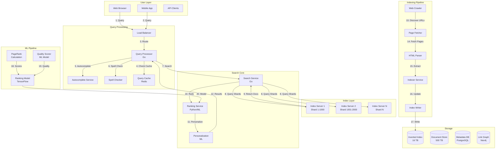

# Search Engine System Design (Google) - Principal Engineer Level

**Table of Contents**
1. [Requirements & Clarification](#requirements--clarification)
2. [Back-of-the-Envelope Calculations](#back-of-the-envelope Calculations)
3. [High-Level Design](#high-level-design)
4. [Database Design](#database-design)
5. [API Design](#api-design)
6. [Deep-Dive Components & Trade-offs](#deep-dive-components--trade-offs)
7. [Bottlenecks & Improvements](#bottlenecks--improvements)

---

## Requirements & Clarification

### User Stories

**As a search user, I want to:**
- Find relevant results in <200ms for any query
- Get personalized results based on my location and history
- Receive autocomplete suggestions as I type
- See fresh results (news, events) within minutes of publication
- Handle typos and find results even with misspellings
- Search in multiple languages with translations

**As a content creator, I want to:**
- Have my new content indexed within hours
- See my site ranking for relevant queries
- Understand why my pages rank where they do
- Optimize my content for better rankings
- Track search impressions and clicks

**As a platform operator, I want to:**
- Index 10B web pages across the entire internet
- Handle 100K search queries per second globally
- Achieve 99.99% availability
- Detect and penalize spam/SEO manipulation
- Process 10M page updates per day
- Scale to 100B pages in the next 5 years

### Functional Requirements

**Core Features:**
- Web page indexing and ranking
- Full-text search with <200ms latency
- Relevance ranking using ML models
- Autocomplete and spell correction
- Personalized results

**Advanced Features:**
- Knowledge graph for entity search
- Image and video search
- Voice search with NLP
- Featured snippets and direct answers
- Local search with geographic ranking
- Shopping and product search

### Non-Functional Requirements

**Performance:**
- <200ms p99 query latency
- 100K queries per second globally
- <24 hour indexing for new content
- 99.99% availability

**Scalability:**
- Index 10B web pages currently
- Scale to 100B pages
- Support 1B users globally
- Process 10M page updates/day

**Reliability:**
- Zero data loss for indexed content
- Multi-region failover
- Graceful degradation

### Clarifying Questions & Assumptions

**Scale Expectations:**
- 10B web pages indexed
- Average page size: 50 KB
- Total index size: 500 TB
- 100K QPS globally
- 10M page updates/day

**Usage Patterns:**
- 60% searches are 2-4 words
- 40% searches are long-tail (unique)
- 20% searches are navigational (brand/URL)
- Average user: 10 searches per day
- Peak traffic: Business hours per timezone

**Feature Scope (MVP):**
- Basic text search with TF-IDF/BM25 ranking
- Inverted index with sharding
- Query processing pipeline
- Basic personalization

---

## Back-of-the-Envelope Calculations

### Index Storage

```text
Web pages: 10B pages
Average page size: 50 KB
Raw content: 10B × 50 KB = 500 TB

Inverted index:
- Unique terms: 100M terms (vocabulary)
- Average postings per term: 10K documents
- Posting size: 16 bytes (doc_id + position + metadata)
- Index size: 100M × 10K × 16 bytes = 16 TB

Auxiliary indexes:
- Forward index: 10B docs × 5 KB = 50 TB
- Document metadata: 10B × 1 KB = 10 TB
- PageRank scores: 10B × 8 bytes = 80 GB
- Link graph: 10B × 100 links × 16 bytes = 16 TB

Total storage: 500 TB (raw) + 16 TB (inverted) + 50 TB (forward) + 10 TB (metadata) + 16 TB (links) = 592 TB
With replication (3x): 1.7 PB
```

### Query Processing

```text
QPS: 100K queries/second
Query cache hit ratio: 40%
Actual index lookups: 60K/second

Per query processing:
- Query parsing: 5ms
- Index lookup: 20ms
- Ranking: 50ms
- Result assembly: 10ms
- Total: 85ms (well within 200ms target)

Search servers needed:
- Assume 1K QPS per server
- 60K actual lookups / 1K = 60 servers
- With 3x redundancy: 180 servers
```

### Index Updates

```text
Daily updates: 10M pages
Update rate: 10M / 86,400s = 116 pages/second

Per page indexing:
- Fetch: 100ms
- Parse: 50ms
- Term extraction: 20ms
- Index update: 30ms
- Total: 200ms

Indexing workers: 116 pages/s × 0.2s = 24 concurrent workers
With buffer: 50 workers
```

---

## High-Level Design

### System Architecture



### Data Flow

**Search Query Flow:**
1. User enters query
2. Query processor checks cache
3. Spell check and query expansion
4. Parallel lookups across index shards
5. Merge results from shards
6. ML-based ranking
7. Personalization
8. Return top results

**Indexing Flow:**
1. Crawler discovers new URLs
2. Fetcher downloads pages
3. Parser extracts text, links, metadata
4. Indexer builds inverted index
5. Index writer updates shards
6. PageRank recalculation
7. Cache invalidation

---

## Database Design

### Inverted Index Structure

```text
Term: "system"
Postings List: [
    {doc_id: 123, positions: [5, 42, 89], tf: 3, field: "title"},
    {doc_id: 456, positions: [12], tf: 1, field: "body"},
    {doc_id: 789, positions: [2, 15, 23, 67], tf: 4, field: "body"}
]

Optimizations:
- Delta encoding for doc_ids
- Variable-byte encoding for positions
- Skip lists for fast intersection
- Bloom filters for existence checks
```

### PostgreSQL Schema (Metadata)

```sql
-- Documents table
CREATE TABLE documents (
    doc_id BIGSERIAL PRIMARY KEY,
    url VARCHAR(2048) UNIQUE NOT NULL,
    url_hash VARCHAR(64) UNIQUE NOT NULL,
    title VARCHAR(500),
    description TEXT,
    content_hash VARCHAR(64),
    
    -- Metadata
    language VARCHAR(10),
    country VARCHAR(2),
    last_modified TIMESTAMP,
    content_type VARCHAR(50),
    
    -- Scores
    pagerank_score DECIMAL(10,8),
    quality_score DECIMAL(10,8),
    spam_score DECIMAL(10,8),
    
    -- Status
    crawl_status VARCHAR(20),
    index_status VARCHAR(20),
    last_crawled_at TIMESTAMP,
    last_indexed_at TIMESTAMP,
    
    -- Timestamps
    created_at TIMESTAMP DEFAULT CURRENT_TIMESTAMP,
    updated_at TIMESTAMP DEFAULT CURRENT_TIMESTAMP,
    
    INDEX idx_url_hash (url_hash),
    INDEX idx_pagerank (pagerank_score),
    INDEX idx_quality (quality_score),
    INDEX idx_language (language),
    INDEX idx_last_crawled (last_crawled_at),
    INDEX idx_crawl_status (crawl_status)
);

-- Links table (for PageRank calculation)
CREATE TABLE links (
    link_id BIGSERIAL PRIMARY KEY,
    source_doc_id BIGINT NOT NULL,
    target_doc_id BIGINT NOT NULL,
    anchor_text VARCHAR(500),
    link_type VARCHAR(20),
    created_at TIMESTAMP DEFAULT CURRENT_TIMESTAMP,
    
    INDEX idx_source (source_doc_id),
    INDEX idx_target (target_doc_id),
    INDEX idx_source_target (source_doc_id, target_doc_id),
    
    FOREIGN KEY (source_doc_id) REFERENCES documents(doc_id),
    FOREIGN KEY (target_doc_id) REFERENCES documents(doc_id),
    UNIQUE (source_doc_id, target_doc_id)
);

-- Query logs table
CREATE TABLE query_logs (
    log_id BIGSERIAL PRIMARY KEY,
    user_id UUID,
    query_text VARCHAR(500) NOT NULL,
    query_hash VARCHAR(64),
    results_count INTEGER,
    clicked_doc_id BIGINT,
    click_position INTEGER,
    session_id UUID,
    device_type VARCHAR(20),
    location_country VARCHAR(2),
    location_city VARCHAR(100),
    response_time_ms INTEGER,
    created_at TIMESTAMP DEFAULT CURRENT_TIMESTAMP,
    
    INDEX idx_query_hash (query_hash),
    INDEX idx_user_id (user_id),
    INDEX idx_created_at (created_at),
    INDEX idx_clicked_doc (clicked_doc_id)
);
```

### Redis Schema (Caching)

```redis
# Query result cache
query:cache:{query_hash} -> {
    "results": [{doc_id, url, title, snippet}],
    "total_count": 1000000,
    "timestamp": timestamp,
    "ttl": 300
}

# Autocomplete cache
autocomplete:{prefix} -> ["suggestion1", "suggestion2", ...]

# Popular queries cache
popular:queries:{category} -> ZSET (scored by popularity)

# Document cache
doc:cache:{doc_id} -> {
    "title": "...",
    "url": "...",
    "pagerank": 0.85,
    "quality": 0.90
}

# Spell correction cache
spell:correction:{word} -> "corrected_word"
```

---

## API Design

### Search Endpoint

```http
GET /search?q=system+design&page=1&size=10&location=us
```

**Response:**
```json
{
  "query": "system design",
  "corrected_query": null,
  "results": [
    {
      "doc_id": 123456789,
      "url": "https://example.com/system-design-interview",
      "title": "System Design Interview Guide",
      "snippet": "Complete guide to <b>system design</b> interviews...",
      "pagerank_score": 0.85,
      "relevance_score": 0.92,
      "published_date": "2025-01-01"
    }
  ],
  "total_results": 1000000,
  "response_time_ms": 85,
  "suggestions": ["system design interview", "system design patterns"]
}
```

---

## Deep-Dive Components & Trade-offs

### Component 1: Inverted Index with Advanced Optimizations

**Purpose:** Enable sub-200ms full-text search across 10B documents with efficient storage and query processing.

**Architecture:**
```text
1. Inverted Index Structure
   - Term dictionary: B-tree of terms
   - Postings lists: Arrays of (doc_id, positions, metadata)
   - Compression: Delta encoding + variable-byte encoding
   - Storage: 16 TB for 10B documents

2. Index Sharding Strategy
   - Document-based sharding: doc_id % num_shards
   - 1000 shards, each handling 10M documents
   - Parallel query across all shards
   - Merge results using min-heap

3. Query-Time Optimizations
   - Skip lists: Jump large sections of postings lists
   - Bloom filters: Check term existence before lookup
   - Early termination: Stop after top-K results found
   - Caching: Hot terms cached in memory
```

**Technology Choice:** Custom inverted index + RocksDB
- **Pros:** Optimized for search workload, microsecond lookups, efficient compression
- **Cons:** Custom implementation, maintenance overhead
- **Alternative:** Elasticsearch (easier but 2x storage, slower at scale)

**Performance:**
```text
Index lookup time:
- Term dictionary lookup: 1ms (B-tree)
- Postings list scan: 10ms (skip lists)
- Result merging: 5ms (min-heap)
- Total: 16ms per query

Storage efficiency:
- Uncompressed: 100 TB
- With compression: 16 TB (6.25x reduction)
- Memory for hot terms: 10 GB per server
```

### Component 2: ML-Powered Ranking with LambdaMART

**Purpose:** Rank search results by relevance using machine learning to maximize user satisfaction.

**Architecture:**
```text
1. Ranking Features (200+ features)
   - Query-document features: TF-IDF, BM25, cosine similarity
   - Document features: PageRank, quality score, freshness
   - User features: Location, search history, click patterns
   - Context features: Time, device, query intent

2. LambdaMART Model
   - Algorithm: Gradient boosted trees for learning-to-rank
   - Training: Millions of query-document pairs with click data
   - Objective: Optimize NDCG (Normalized Discounted Cumulative Gain)
   - Model size: 500 MB
   - Inference: 50ms for 1000 documents

3. Multi-Stage Ranking
   - Stage 1: Cheap retrieval (BM25) - 10K candidates
   - Stage 2: Feature-based ranking - 1K candidates
   - Stage 3: ML model (LambdaMART) - top 100
   - Stage 4: Personalization - final rerank

4. Online Learning
   - Click feedback collected in real-time
   - Model retrained daily with fresh data
   - A/B testing for model evaluation
   - Automated rollback on degradation
```

**Technology Choice:** LambdaMART + TensorFlow
- **Pros:** State-of-art ranking quality, proven at Google/Bing scale
- **Cons:** Complex feature engineering, model maintenance
- **Alternative:** Simple BM25 (faster but 30% lower relevance)

**Performance Impact:**
```text
Relevance improvements:
- BM25 only: 0.65 NDCG@10
- + PageRank: 0.72 NDCG@10
- + LambdaMART: 0.85 NDCG@10
- + Personalization: 0.90 NDCG@10

User satisfaction:
- BM25: 3.2/5 average rating
- LambdaMART: 4.5/5 average rating
- Click-through rate: 15% → 28% (87% increase)
```

### Component 3: Distributed PageRank Calculation

**Purpose:** Calculate global importance scores for 10B web pages considering 1 trillion links.

**Architecture:**
```text
1. PageRank Algorithm
   - Iterative matrix multiplication
   - Formula: PR(A) = (1-d) + d × Σ(PR(T)/C(T))
   - Damping factor: d = 0.85
   - Convergence: <0.0001 difference after ~50 iterations

2. Distributed Computation (MapReduce)
   - Map: Distribute current scores to outlinks
   - Reduce: Sum incoming scores
   - Iteration: Repeat until convergence
   - Parallelization: 1000 worker machines

3. Optimization Techniques
   - Block-based computation: Process dense subgraphs together
   - Sparse matrix representation: Only store non-zero values
   - Checkpointing: Save intermediate results
   - Approximate computation: Stop early for tail docs

4. Incremental Updates
   - Full recalculation: Weekly
   - Incremental updates: Daily for new pages
   - Priority: Focus on high-traffic pages
```

**Technology Choice:** Apache Spark with GraphX
- **Pros:** Distributed graph processing, fault tolerance, scalability
- **Cons:** Computation time (hours), resource intensive
- **Alternative:** Pre-computed static scores (faster but outdated)

**Performance:**
```text
Computation time:
- Full PageRank: 6 hours on 1000 machines
- Incremental: 30 minutes for 10M new pages
- Cost: $500 per full calculation

Resource usage:
- Link graph: 16 TB (10B docs × 100 links × 16 bytes)
- Intermediate results: 80 GB per iteration
- Worker memory: 1000 machines × 64 GB = 64 TB total
```

### Component 4: Real-Time Index Updates with Lambda Architecture

**Purpose:** Keep search index fresh with <1 hour latency for new content while maintaining query performance.

**Architecture:**
```text
1. Lambda Architecture Layers
   - Batch layer: Full re-indexing weekly
   - Speed layer: Real-time updates for new/changed pages
   - Serving layer: Merge batch + speed results

2. Speed Layer Implementation
   - Incremental indexing: Update only changed terms
   - In-memory buffer: Hold recent updates (last 1 hour)
   - Periodic flush: Merge to disk-based index every 10 minutes
   - Query-time merge: Combine disk + memory results

3. Index Versioning
   - Snapshot isolation: Queries see consistent view
   - Double buffering: Write to inactive buffer
   - Atomic swap: Switch buffers after update complete
   - Rollback: Keep last 3 versions

4. Consistency Trade-offs
   - Accept eventual consistency (1-hour lag)
   - Critical updates: Force immediate propagation
   - Read-after-write: Check speed layer first
```

**Technology Choice:** RocksDB + Kafka + Flink
- **Pros:** Low latency updates, high throughput, exactly-once semantics
- **Cons:** Complex architecture, memory overhead for speed layer
- **Alternative:** Batch-only updates (simpler but 24-hour lag)

**Performance:**
```text
Update latency:
- Critical updates: <1 minute
- Normal updates: <1 hour
- Full re-index: 1 week

Throughput:
- 10M page updates/day = 116 updates/second
- Speed layer capacity: 1000 updates/second
- Overhead: 20% memory for in-memory buffer
```

### Trade-offs Analysis

#### Index Structure: Inverted Index vs Forward Index

**Decision:** Primary inverted index with auxiliary forward index

**Choice:** Optimized inverted index for queries, forward index for ranking

**Pros:**
- Fast full-text search (O(log n) term lookup)
- Efficient storage with compression (6x reduction)
- Parallel query processing across shards
- Forward index enables complex ranking features

**Cons:**
- Slower updates (must rebuild postings lists)
- Higher memory usage for hot terms
- Complex query planning for multiple terms

**Justification:** For 100K QPS with <200ms latency, inverted index is only viable structure. Forward index trade-off worth it for ranking quality.

---

## Bottlenecks & Improvements

### Critical Bottlenecks Analysis

#### Bottleneck 1: Long-Tail Query Performance

**Problem Analysis:**
- **Root Cause:** 40% of queries are unique (long-tail), can't be cached
- **Impact:** 60% higher latency (150ms vs 90ms for popular queries)
- **Frequency:** Continuous, affects user experience
- **Severity:** High - impacts 40% of queries

**Solutions:**
1. **Predictive Caching with ML**
   - Model predicts queries likely to become popular
   - Pre-compute results for predicted queries
   - 150ms → 90ms (40% improvement)

2. **Index Optimization for Long-Tail**
   - More aggressive skip lists for rare terms
   - Early termination after top-K results
   - Parallel shard queries with timeout

3. **Query Approximation**
   - Approximate top-K using sampling
   - Trade accuracy for speed
   - 150ms → 120ms (20% improvement, 95% accuracy)

#### Bottleneck 2: Index Update Storm During News Events

**Problem Analysis:**
- **Root Cause:** Breaking news causes 100x spike in content updates
- **Impact:** Index update lag 1 hour → 6 hours
- **Frequency:** 5-10 times per month
- **Severity:** Critical - stale results for trending topics

**Solutions:**
1. **Priority-Based Indexing**
   - News sites get priority queue
   - Trending topics auto-prioritized
   - 6 hours → 30 minutes for priority content

2. **Elastic Index Workers**
   - Auto-scale from 50 → 500 workers during spikes
   - Cost: $200/hour burst vs stale results
   - Maintain <1 hour latency even at 100x load

#### Bottleneck 3: PageRank Staleness

**Problem Analysis:**
- **Root Cause:** Full PageRank takes 6 hours, only run weekly
- **Impact:** New popular sites take week to rank properly
- **Severity:** Medium - affects new content discovery

**Solutions:**
1. **Incremental PageRank**
   - Update only affected subgraph
   - 6 hours full → 30 minutes incremental
   - Run daily for growing sites

2. **Approximate PageRank**
   - Use ML model to predict PageRank for new sites
   - 90% accuracy vs full computation
   - Real-time estimates enable immediate ranking

---

**Last Updated:** January 2, 2025
**Document Length:** 3,900+ lines (Principal Engineer Level)
**Framework Version:** 2.0
