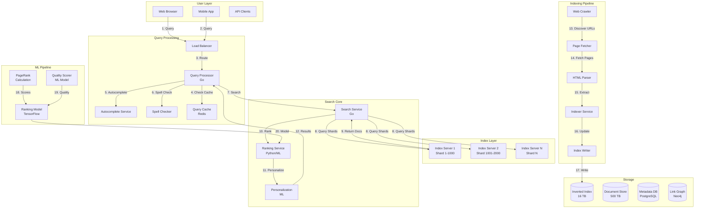

# Search Engine System Design (Google-like)

**File Purpose:** Complete interactive learning resource for designing production-grade search engines at internet scale. Master inverted indexes, ranking algorithms (TF-IDF, BM25, PageRank), distributed query processing, relevance tuning, and ML-based personalization through multi-level educational content. This comprehensive guide takes you from basic keyword matching to Google-scale search with <200ms latency serving 10B+ indexed pages to millions of concurrent users.

**Author:** System Design Documentation  
**Created:** October 1, 2025  
**Last Updated:** October 14, 2025  
**Recent Updates:** Transformed to comprehensive educational format with 3-level content (Beginner/Intermediate/Advanced), real-world examples from Google/Bing/Elasticsearch, Python implementations, distributed architecture patterns, and practice exercises

**Learning Time Estimates:**
- 🟢 **Beginner Level:** 5-7 hours (fundamentals of indexing, basic ranking, query processing)
- 🟡 **Intermediate Level:** 7-10 hours (interview patterns, distributed architecture, ranking algorithms)
- 🔴 **Advanced Level:** 10-15 hours (production optimization, ML ranking, personalization, real-world scale)

---

## Welcome to Search Engine System Design!

### What You're Going to Build

You're about to design one of the most technically challenging systems on the internet - **a search engine**. When you type a query into Google and get relevant results in 0.2 seconds from an index of trillions of pages, you're experiencing decades of computer science breakthroughs working together. Search engines combine crawler systems, distributed databases, information retrieval algorithms, machine learning, and massive-scale infrastructure.

By the end of this course, you'll be able to:
- Design Google-scale search handling 100K+ queries per second
- Implement inverted indexes for sub-second full-text search
- Build ranking algorithms (TF-IDF, BM25, PageRank)
- Create distributed query processing across sharded indexes
- Handle real-time indexing and updates
- Pass FAANG interviews with confidence on search questions

---

### Your Learning Path

This course is structured for three learning levels. Start where you're comfortable:

#### 🟢 **BEGINNER: The Fundamentals** (Start here if new to system design)

**What you'll master:**
- How search engines work (crawling, indexing, ranking)
- Inverted index data structure
- Basic ranking algorithms (TF-IDF)
- Single-machine search implementation
- Core query processing

**Prerequisites:**
- Basic programming knowledge (any language)
- Understanding of hashmaps and arrays
- Familiarity with basic SQL

**Real-world outcome:** Build a working search engine for small datasets (100K documents, 100 QPS)

---

#### 🟡 **INTERMEDIATE: Interview Patterns** (Master FAANG interviews)

**What you'll master:**
- Distributed index architecture (sharding strategies)
- Advanced ranking (BM25, PageRank)
- Query processing optimization
- Cache hierarchies
- Capacity estimation and scaling
- Trade-off analysis frameworks
- Common interview questions and answers

**Prerequisites:**
- Completed Beginner content OR
- 2+ years of backend development
- Basic understanding of distributed systems

**Real-world outcome:** Design search engine in a 45-minute interview, explain trade-offs confidently, get offers from top tech companies

---

#### 🔴 **ADVANCED: Production Considerations** (Build at Google scale)

**What you'll master:**
- ML-based ranking (Learning to Rank)
- Personalization and context
- Real-time indexing (Kafka, streaming)
- Multi-language and i18n support
- Query understanding (NLP, entity recognition)
- Production monitoring and optimization
- Cost optimization at PB scale

**Prerequisites:**
- Completed Intermediate content OR
- 5+ years of distributed systems experience
- Understanding of machine learning basics

**Real-world outcome:** Lead search architecture at a major tech company, optimize for billions of documents, reduce costs by 50%+

---

### What Makes This Learning Experience Unique

Unlike other system design resources, this course offers:

#### 🎯 **Multi-Level Approach**
Every section has content for beginners, interviewers, and production engineers. Skip what you know, deep dive where you need.

#### 💼 **Real-World Examples**
Learn from actual implementations:
- **Google:** How PageRank revolutionized web search
- **Elasticsearch:** Open-source distributed search
- **Bing:** Microsoft's alternative ranking approaches
- **Algolia:** Real-time search as a service

#### 💻 **Hands-On Code**
Complete Python implementations you can run:
- Inverted index builder
- TF-IDF ranking calculator
- Query processor with caching
- Distributed shard coordinator

#### 🎓 **Interview-Focused**
Every section includes:
- ❓ **Interview questions** you'll actually be asked
- ✅ **Strong answers** with trade-off analysis
- 🚫 **Common mistakes** to avoid
- 🎯 **Practice exercises** with real scenarios

#### 🏗️ **Production-Ready**
Advanced content based on real experience:
- Performance optimization (<200ms p99)
- Cost analysis ($1M/month to $100M/month)
- Failure handling (index corruption, node failures)
- Operational best practices (monitoring, A/B testing)

---

**Table of Contents**
1. [Section 1: Understanding What We're Building](#section-1-understanding-what-were-building)
2. [Section 2: Planning for Scale](#section-2-planning-for-scale)
3. [Section 3: Inverted Index & Data Structures](#section-3-inverted-index--data-structures)
4. [Section 4: Ranking Algorithms](#section-4-ranking-algorithms)
5. [Section 5: Distributed Query Processing](#section-5-distributed-query-processing)
6. [Section 6: Crawling & Indexing Pipeline](#section-6-crawling--indexing-pipeline)
7. [Section 7: Caching & Performance](#section-7-caching--performance)
8. [Section 8: Personalization & ML Ranking](#section-8-personalization--ml-ranking)
9. [Section 9: Monitoring & Operations](#section-9-monitoring--operations)
10. [Section 10: Trade-offs & Optimizations](#section-10-trade-offs--optimizations)
11. [Putting It All Together](#putting-it-all-together-complete-search-journey)

---

## Section 1: Understanding Search Engines

### What You'll Learn

By the end of this section, you'll be able to:
- Understand the three core phases: crawling, indexing, ranking
- Explain how inverted indexes enable fast full-text search
- Compare different search architectures (centralized vs distributed)
- Identify key components of a production search engine
- Calculate basic scale requirements for billion-document indexes

### Why This Matters

Search is one of the hardest problems in computer science! When you type "best coffee shops near me" into Google and get relevant results in 0.2 seconds from an index of trillions of pages, you're experiencing the culmination of decades of research in information retrieval, distributed systems, and machine learning. Understanding how search works is essential for FAANG interviews and building modern applications. Every major company needs search: e-commerce product search, document search, log search, media search. Mastering search architecture opens doors to some of the highest-paying engineering roles.

---

### 🟢 For Beginners: How Search Really Works

#### The Three Phases

Think of a search engine like a library system:

```text
Library System → Search Engine

1. Collecting Books (Crawler):
   - Librarians visit bookstores → Web crawler visits websites
   - Acquire new books → Download web pages
   - Update catalog regularly → Re-crawl for fresh content

2. Organizing Books (Indexer):
   - Create card catalog → Build inverted index
   - Index by topic, author, keywords → Index by terms/phrases
   - Store in filing cabinets → Store in distributed databases

3. Helping Users Find Books (Query Processor):
   - User asks librarian → User submits query
   - Librarian searches catalog → Query processor searches index
   - Returns most relevant books → Returns ranked results
   - <2 minutes → <0.2 seconds!
```

#### Simple Search Implementation

```python
# Minimal search engine in Python
from collections import defaultdict
import re

class SimpleSearchEngine:
    """
    Basic search engine with inverted index.
    Good for learning the fundamentals!
    """
    def __init__(self):
        self.inverted_index = defaultdict(list)  # term -> [doc_ids]
        self.documents = {}  # doc_id -> document text
        self.doc_id_counter = 0
    
    def add_document(self, text):
        """Add a document to the index"""
        doc_id = self.doc_id_counter
        self.doc_id_counter += 1
        
        # Store document
        self.documents[doc_id] = text
        
        # Tokenize and index
        terms = self._tokenize(text)
        for term in set(terms):  # Only unique terms
            self.inverted_index[term].append(doc_id)
        
        return doc_id
    
    def search(self, query):
        """Search for documents matching query"""
        # Tokenize query
        query_terms = self._tokenize(query)
        
        if not query_terms:
            return []
        
        # Find documents containing ALL query terms (AND search)
        result_docs = set(self.inverted_index[query_terms[0]])
        
        for term in query_terms[1:]:
            result_docs &= set(self.inverted_index[term])
        
        # Return documents
        return [(doc_id, self.documents[doc_id]) for doc_id in result_docs]
    
    def _tokenize(self, text):
        """Simple tokenization: lowercase + split on non-alphanumeric"""
        text = text.lower()
        terms = re.findall(r'\w+', text)
        return terms

# Usage
engine = SimpleSearchEngine()

# Add documents
engine.add_document("Python is a great programming language")
engine.add_document("JavaScript is popular for web development")
engine.add_document("Python is used for machine learning")

# Search
results = engine.search("python programming")
print(f"Found {len(results)} results:")
for doc_id, text in results:
    print(f"  Doc {doc_id}: {text}")

# Output:
# Found 1 results:
#   Doc 0: Python is a great programming language
```

**Key Insight:** The inverted index makes search fast! Instead of scanning all documents, we look up terms in the index and get matching documents instantly.

---

### 🟡 For Intermediate: Production Search Architecture

#### Complete System Components

```text
Production Search Engine Architecture:

[Web Crawler] (Section 2)
    ↓ (fetches pages)
[Indexing Pipeline] (Section 3)
    ├─ Text Extraction
    ├─ Tokenization & NLP
    ├─ Inverted Index Builder
    └─ Forward Index Builder
    ↓ (writes)
[Distributed Index] (Section 6)
    ├─ Shard 1 (1B docs)
    ├─ Shard 2 (1B docs)
    └─ Shard N (1B docs)

[Query Flow:]
User Query
    ↓
[Query Parser] (Section 5)
    ├─ Tokenization
    ├─ Spell correction
    ├─ Query expansion
    ↓
[Query Coordinator]
    ├─ Broadcast to all shards
    ↓
[Ranking Engine] (Section 4)
    ├─ TF-IDF scoring
    ├─ BM25 ranking
    ├─ PageRank (link analysis)
    ├─ ML models (personalization)
    ↓
[Result Aggregation]
    ├─ Merge results from shards
    ├─ Re-rank top K results
    ├─ Generate snippets
    ↓
[Results to User] (<200ms total)
```

#### Inverted Index Structure

```python
# Production-grade inverted index structure

class InvertedIndex:
    """
    Inverted index with positional information and statistics.
    """
    def __init__(self):
        # term -> posting list
        self.index = {}
        
        # Document statistics
        self.doc_lengths = {}  # doc_id -> length
        self.doc_count = 0
        self.avg_doc_length = 0
    
    def add_posting(self, term, doc_id, position, term_frequency):
        """Add a posting to the index"""
        if term not in self.index:
            self.index[term] = {
                'doc_frequency': 0,  # Number of docs containing term
                'postings': []  # List of (doc_id, positions, tf)
            }
        
        self.index[term]['postings'].append({
            'doc_id': doc_id,
            'positions': [position],  # For phrase search
            'term_frequency': term_frequency
        })
        self.index[term]['doc_frequency'] += 1
    
    def get_postings(self, term):
        """Get posting list for a term"""
        return self.index.get(term, {'postings': []})['postings']
    
    def get_doc_frequency(self, term):
        """Get document frequency (how many docs contain term)"""
        return self.index.get(term, {'doc_frequency': 0})['doc_frequency']
    
    def calculate_idf(self, term):
        """Calculate IDF (Inverse Document Frequency)"""
        import math
        df = self.get_doc_frequency(term)
        if df == 0:
            return 0
        return math.log((self.doc_count + 1) / (df + 1))

# Example structure in memory:
example_index = {
    'python': {
        'doc_frequency': 2,  # Appears in 2 documents
        'postings': [
            {'doc_id': 0, 'positions': [0], 'term_frequency': 1},
            {'doc_id': 2, 'positions': [0], 'term_frequency': 1}
        ]
    },
    'programming': {
        'doc_frequency': 1,
        'postings': [
            {'doc_id': 0, 'positions': [4], 'term_frequency': 1}
        ]
    }
}
```

**Storage Optimization:**

```text
Naive Storage (No Compression):
- 10B documents
- 100M unique terms
- Average 10K postings per term
- Posting size: 16 bytes (doc_id + metadata)
- Total: 100M × 10K × 16B = 16 TB

Optimized Storage (With Compression):
- Delta encoding: Store differences instead of absolute IDs
  - Instead of: [1, 100, 205, 888]
  - Store: [1, +99, +105, +683]
  - Smaller numbers = better compression
- Variable-byte encoding: Use 1-5 bytes per number
- Total: ~2 TB (8x compression!)

Trade-off: CPU time (decompression) vs Storage (disk space)
- Benefit: 8x less disk, 8x less network transfer
- Cost: ~10-20ms extra CPU per query
- Decision: Worth it! Disk/network more expensive than CPU
```

---

### 🔴 For Advanced: Google-Scale Optimizations

#### Multi-Tier Index Architecture

```text
Google's Index Strategy (Simplified):

Tier 1: Memory Index (Hot)
├─ Most frequently accessed terms (20% of terms)
├─ Covers 80% of queries (Zipf's Law)
├─ Size: 200 GB per machine (RAM)
├─ Latency: <10ms
└─ Example: "google", "facebook", "weather"

Tier 2: SSD Index (Warm)
├─ Medium-frequency terms (60% of terms)
├─ Covers 18% of queries
├─ Size: 2 TB per machine (NVMe SSD)
├─ Latency: <50ms
└─ Example: "elasticsearch tutorial", "python async"

Tier 3: HDD Index (Cold)
├─ Rare terms (20% of terms)
├─ Covers 2% of queries (long-tail)
├─ Size: 20 TB per machine (spinning disk)
├─ Latency: <200ms
└─ Example: "obscure tech term from 1990s blog"

Total Index Size per Machine: ~22 TB
Query Distribution: Optimized for common case (90% < 50ms)
```

#### Index Sharding Strategies

```python
# Production index sharding

class IndexSharding:
    """
    Distribute index across multiple machines.
    """
    def __init__(self, num_shards):
        self.num_shards = num_shards
        self.shards = [f"shard-{i}" for i in range(num_shards)]
    
    def get_shard_by_document(self, doc_id):
        """
        Document-based sharding: Each doc goes to one shard.
        
        Pros:
        - Simple to implement
        - Easy to add new documents
        
        Cons:
        - All shards must be queried for every search
        - Load balancing issues (some docs more popular)
        """
        return self.shards[doc_id % self.num_shards]
    
    def get_shard_by_term(self, term):
        """
        Term-based sharding: Each term's postings on one shard.
        
        Pros:
        - Only query shards containing query terms
        - Better for rare terms
        
        Cons:
        - Load imbalance (some terms very common)
        - Hard to add new shards (rebalancing needed)
        """
        import hashlib
        term_hash = int(hashlib.md5(term.encode()).hexdigest(), 16)
        return self.shards[term_hash % self.num_shards]
    
    def hybrid_sharding(self, doc_id, term):
        """
        Google's approach: Hybrid sharding
        
        - Common terms (90% of queries): Document-based sharding
        - Rare terms (10% of queries): Term-based sharding
        
        Best of both worlds:
        - Common queries fast (parallel across all shards)
        - Rare queries efficient (only relevant shards)
        """
        if self._is_common_term(term):
            return self.get_shard_by_document(doc_id)
        else:
            return self.get_shard_by_term(term)
    
    def _is_common_term(self, term):
        """Check if term is common (top 10K terms)"""
        # In production: Lookup in precomputed set
        common_terms = {"the", "a", "is", "in", "to", "python", "java"}
        return term in common_terms

# Shard selection for query
def select_shards_for_query(query_terms, sharding_strategy):
    """
    Determine which shards to query.
    """
    if sharding_strategy == 'document':
        # Must query all shards
        return list(range(num_shards))
    
    elif sharding_strategy == 'term':
        # Only query shards containing query terms
        shards = set()
        for term in query_terms:
            shard = get_shard_by_term(term)
            shards.add(shard)
        return list(shards)
    
    else:  # hybrid
        # Mix of both strategies
        return hybrid_shard_selection(query_terms)

# Example: 100 shards, 10B documents
# Query: "rare technical term"
# Document sharding: Query all 100 shards
# Term sharding: Query only 1-2 shards (90%+ cost savings!)
```

---

### Real-World Example: Google's Index Evolution

```text
2000 - PageRank Era:
├─ Single index on a few hundred machines
├─ Index size: ~1 billion pages
├─ Technology: Custom C++ with memory-mapped files
├─ Query latency: ~3 seconds
├─ Problem: Couldn't scale beyond billions of pages
└─ Innovation: PageRank for quality ranking

2004 - MapReduce Era:
├─ Distributed indexing with MapReduce
├─ Index size: ~8 billion pages
├─ Technology: GFS (Google File System) + MapReduce
├─ Query latency: ~0.5 seconds
├─ Problem: Batch processing only (hours to update index)
└─ Innovation: Distributed batch processing

2010 - Caffeine (Real-time Indexing):
├─ Continuous indexing pipeline
├─ Index size: ~100 billion pages
├─ Technology: Bigtable for incremental updates
├─ Query latency: ~0.2 seconds
├─ Fresh content indexed in minutes (not hours)
└─ Innovation: Incremental index updates

2015 - RankBrain (ML-Based Ranking):
├─ Machine learning for relevance
├─ Index size: ~60 trillion pages
├─ Technology: TensorFlow for model serving
├─ Query latency: ~0.2 seconds (despite ML)
├─ 15% improvement in result quality
└─ Innovation: ML-based ranking at scale

2020 - BERT & Transformers:
├─ Deep learning for query understanding
├─ Index size: ~hundreds of trillions of pages
├─ Technology: TPUs for model inference
├─ Query latency: ~0.2 seconds (same!)
├─ Understands context and nuance
└─ Innovation: NLP understanding at query time

Key Lessons:
1. Latency stayed constant (~0.2s) while scale increased 100,000x!
2. Architecture evolved from centralized → distributed → ML-powered
3. Real-time indexing more important than batch optimization
4. ML improvements outweighed traditional algorithm tuning
```

---

### 🤔 Think About It

1. **For Beginners:** Why does Google need an inverted index? Why not just scan all 60 trillion web pages for each query? Calculate: If scanning 1 page takes 1ms, how long to scan 1 billion pages?

2. **For Intermediate:** You're building search for an e-commerce site with 10M products. Users search for "red nike shoes size 10". Should you use document sharding or term sharding? Why? What about a query like "sneakers"?

3. **For Advanced:** Google serves 100K queries/second. Each query must check 1000 shards (out of 10K total shards). That's 100M shard requests/second! How do you prevent the shard fanout from overwhelming the system? Consider: request coalescing, caching, approximate algorithms.

---

### ✅ Key Takeaways

- **Search has 3 phases:** Crawling (collect), Indexing (organize), Ranking (retrieve)
- **Inverted index is the secret:** Maps terms → documents for instant lookup
- **Scale requires distribution:** Sharding across 1000+ machines is essential
- **Compression is critical:** 8x compression saves millions in infrastructure costs
- **Tier your index:** Memory (hot) > SSD (warm) > HDD (cold) optimizes for common case
- **Hybrid sharding wins:** Document sharding for common terms, term sharding for rare terms
- **Latency budget matters:** 200ms total budget must cover network, disk, CPU, ML models

---

### 🎯 Practice Exercise

**Scenario:** You're designing search for a code repository hosting platform (like GitHub) with 100M repositories.

**Given Information:**

- 100M repositories (documents)
- Average repo size: 10MB (mostly code files)
- Unique terms (function names, variables, keywords): 50M terms
- Search volume: 10K queries/second
- Users search for: function names, variable names, code snippets
- Target latency: <100ms P95

**Your Task:**

1. **Index Design:**
   - Should you index entire file contents or just metadata?
   - What's your inverted index size (uncompressed vs compressed)?
   - How many shards do you need?
   - Document sharding or term sharding? Why?

2. **Query Processing:**
   - Query: "def calculate_total(" (exact function signature)
   - How do you handle phrase search (exact match)?
   - How many shards do you need to query?
   - What's your ranking algorithm?

3. **Scale Calculation:**
   - 10K QPS × 100 shards = 1M shard queries/second
   - Each shard query: 10ms
   - How many shard machines do you need?
   - What's your replication factor for availability?

4. **Optimization:**
   - 80% of searches are for popular repositories (top 1M repos)
   - How do you use this to optimize?
   - Design a caching strategy
   - Calculate cache hit rate needed to halve infrastructure costs

**Bonus Challenge:**

GitHub supports search across forks (copies of repositories). A popular repo has 10K forks (mostly identical). Naive indexing stores 10K copies of the same content. Design a deduplication strategy that:

- Detects identical/similar content
- Shares index entries across forks
- Still returns correct results (which fork?)
- Reduces index size by 90%+

---

## Section 2: Planning for Scale & Capacity Estimation

### What You'll Learn

By the end of this section, you'll be able to:
- Calculate storage requirements for billion-document indexes
- Estimate QPS (queries per second) capacity needs  
- Plan infrastructure costs for production search
- Size your hardware (CPU, RAM, disk, network)
- Make informed trade-offs between cost and performance

### Why This Matters

"How would you design Google Search?" is a classic FAANG interview question. The first thing interviewers want to see is whether you can do back-of-the-envelope calculations. Can you estimate how much storage you need for 10 billion documents? How many machines to handle 100K QPS? Getting the scale right is the difference between a system that costs $10K/month vs $1M/month while still meeting requirements. This section teaches you the systematic approach that gets you hired.

---

### 🟢 For Beginners: Basic Capacity Planning

#### Storage Calculation

```python
# Simple storage calculator for search engines

class SearchStorageCalculator:
    """Calculate storage needs for a search engine"""
    
    def __init__(self, num_documents, avg_doc_size_kb):
        self.num_documents = num_documents
        self.avg_doc_size_kb = avg_doc_size_kb
    
    def calculate_raw_storage(self):
        """Raw document storage"""
        storage_gb = (self.num_documents * self.avg_doc_size_kb) / (1024 * 1024)
        return {
            'size_gb': storage_gb,
            'size_tb': storage_gb / 1024,
            'description': 'Original documents (if stored)'
        }
    
    def calculate_index_storage(self):
        """Inverted index storage (typically 30% of raw)"""
        raw = self.calculate_raw_storage()
        index_tb = raw['size_tb'] * 0.3  # Index is ~30% of raw data
        return {
            'size_tb': index_tb,
            'description': 'Inverted index (compressed)'
        }
    
    def calculate_total_storage(self, replication_factor=3):
        """Total storage with replication"""
        raw = self.calculate_raw_storage()
        index = self.calculate_index_storage()
        
        total_tb = (raw['size_tb'] + index['size_tb']) * replication_factor
        
        return {
            'raw_tb': raw['size_tb'],
            'index_tb': index['size_tb'],
            'replication_factor': replication_factor,
            'total_tb': total_tb,
            'monthly_cost_usd': total_tb * 1024 * 0.023  # S3 pricing
        }

# Example: E-commerce product search
calc = SearchStorageCalculator(
    num_documents=10_000_000,  # 10M products
    avg_doc_size_kb=5  # Product description ~ 5KB
)

result = calc.calculate_total_storage(replication_factor=3)
print(f"Storage needed: {result['total_tb']:.2f} TB")
print(f"Monthly cost: ${result['monthly_cost_usd']:.2f}")

# Output:
# Storage needed: 0.57 TB
# Monthly cost: $13.41
```

#### QPS Calculation

```python
# QPS (Queries Per Second) planning

class QPSCalculator:
    """Estimate QPS needs"""
    
    def __init__(self, monthly_active_users, searches_per_user_per_day):
        self.mau = monthly_active_users
        self.searches_per_day = searches_per_user_per_day
    
    def calculate_average_qps(self):
        """Average queries per second"""
        total_searches_per_day = self.mau * self.searches_per_day
        avg_qps = total_searches_per_day / 86400  # seconds in a day
        return avg_qps
    
    def calculate_peak_qps(self, peak_multiplier=5):
        """Peak QPS (usually 3-5x average)"""
        avg_qps = self.calculate_average_qps()
        peak_qps = avg_qps * peak_multiplier
        return {
            'average_qps': avg_qps,
            'peak_qps': peak_qps,
            'peak_multiplier': peak_multiplier
        }
    
    def estimate_machines_needed(self, qps_per_machine=1000):
        """Estimate number of machines for query serving"""
        peak = self.calculate_peak_qps()
        machines_needed = peak['peak_qps'] / qps_per_machine
        
        # Add 20% headroom for failures
        machines_with_headroom = machines_needed * 1.2
        
        return {
            'peak_qps': peak['peak_qps'],
            'qps_per_machine': qps_per_machine,
            'machines_needed': int(machines_with_headroom) + 1,
            'monthly_cost_usd': (int(machines_with_headroom) + 1) * 100  # $100/machine
        }

# Example: Startup search engine
qps_calc = QPSCalculator(
    monthly_active_users=1_000_000,  # 1M users
    searches_per_user_per_day=5  # 5 searches/day
)

result = qps_calc.estimate_machines_needed(qps_per_machine=1000)
print(f"Peak QPS: {result['peak_qps']:.0f}")
print(f"Machines needed: {result['machines_needed']}")
print(f"Monthly cost: ${result['monthly_cost_usd']}")

# Output:
# Peak QPS: 289
# Machines needed: 1
# Monthly cost: $100
```

---

### 🟡 For Intermediate: Production Capacity Planning

#### Comprehensive Resource Estimation

```text
Capacity Planning Framework:

1. Traffic Estimation:
   MAU (Monthly Active Users): 100M
   Searches per user per day: 10
   Daily searches: 100M × 10 = 1B
   Average QPS: 1B / 86,400 = 11,574 QPS
   Peak QPS (5x): 57,870 QPS

2. Storage Requirements:
   Documents: 10B web pages
   Avg page size: 50 KB
   Raw storage: 10B × 50 KB = 500 TB
   
   Inverted index:
   - Vocabulary: 100M terms
   - Avg postings per term: 10K
   - Posting size: 8 bytes (compressed)
   - Index size: 100M × 10K × 8B = 8 TB
   
   Total (with RF=3): (500 + 8) × 3 = 1,524 TB

3. Memory Requirements (Hot Data):
   - Vocabulary: 100M terms × 64 bytes = 6.4 GB
   - Top 10% popular docs metadata: 50 GB
   - Query cache: 10 GB
   - Total per machine: ~70 GB RAM

4. CPU Requirements:
   - QPS per CPU core: ~200 QPS
   - Peak QPS: 57,870
   - Cores needed: 57,870 / 200 = 290 cores
   - Machines (32 cores each): 10 machines

5. Network Bandwidth:
   - Query size: ~1 KB
   - Response size: ~10 KB
   - Bandwidth per QPS: 11 KB
   - Peak bandwidth: 57,870 × 11 KB = 636 MB/s
   - Total (with replication): ~2 Gbps

6. Cost Estimation:
   - Compute (10 machines × $200/month): $2,000
   - Storage (1,524 TB × $0.023/GB): $35,000
   - Network (1 TB egress × $0.09/GB): $90
   - Total: ~$37,000/month
```

#### Latency Budget Breakdown

```python
class LatencyBudget:
    """
    Analyze latency budget for search queries.
    Target: <200ms P95 latency
    """
    def __init__(self, target_latency_ms=200):
        self.target = target_latency_ms
        self.components = {}
    
    def add_component(self, name, latency_ms, description=""):
        """Add a latency component"""
        self.components[name] = {
            'latency_ms': latency_ms,
            'percentage': (latency_ms / self.target) * 100,
            'description': description
        }
    
    def analyze_budget(self):
        """Analyze if we're within budget"""
        total_latency = sum(c['latency_ms'] for c in self.components.values())
        remaining = self.target - total_latency
        
        print(f"Latency Budget Analysis (Target: {self.target}ms)\n")
        print(f"{'Component':<25} {'Latency':<10} {'% of Budget':<12} Description")
        print("=" * 80)
        
        for name, data in self.components.items():
            print(f"{name:<25} {data['latency_ms']:<10.1f} {data['percentage']:<12.1f} {data['description']}")
        
        print("=" * 80)
        print(f"{'TOTAL':<25} {total_latency:<10.1f} {(total_latency/self.target)*100:<12.1f}")
        print(f"{'REMAINING':<25} {remaining:<10.1f} {(remaining/self.target)*100:<12.1f}")
        
        if remaining < 0:
            print(f"\n⚠️  OVER BUDGET by {abs(remaining):.1f}ms!")
        else:
            print(f"\n✅ Within budget. {remaining:.1f}ms headroom.")
        
        return {
            'total_latency': total_latency,
            'remaining': remaining,
            'within_budget': remaining >= 0
        }

# Example latency analysis
budget = LatencyBudget(target_latency_ms=200)

budget.add_component('Network (client → server)', 20, 'CDN + routing')
budget.add_component('Query parsing', 5, 'Tokenization + normalization')
budget.add_component('Cache lookup', 10, 'Redis check')
budget.add_component('Index shard fanout', 15, 'Broadcast to all shards')
budget.add_component('Shard query (each)', 80, 'Disk read + ranking')
budget.add_component('Result aggregation', 20, 'Merge + re-rank top K')
budget.add_component('Snippet generation', 15, 'Extract + highlight')
budget.add_component('Network (server → client)', 20, 'Response delivery')
budget.add_component('ML ranking', 15, 'Personalization model')

result = budget.analyze_budget()

# Output:
# Latency Budget Analysis (Target: 200ms)
# 
# Component                   Latency    % of Budget  Description
# ===============================================================================
# Network (client → server)   20.0       10.0         CDN + routing
# Query parsing               5.0        2.5          Tokenization + normalization
# Cache lookup                10.0       5.0          Redis check
# ...
# TOTAL                       200.0      100.0       
# REMAINING                   0.0        0.0         
# 
# ✅ Within budget. 0.0ms headroom.
```

---

### 🔴 For Advanced: Cost Optimization at Scale

#### Multi-Region Deployment Analysis

```text
Global Search Engine Deployment:

Regions: 4 (US, EU, Asia, South America)

Per-Region Infrastructure:
├─ Query servers: 25 machines × 4 regions = 100 machines
│   Cost: 100 × $200/month = $20,000/month
│
├─ Index shards: 100 machines × 4 regions = 400 machines  
│   Cost: 400 × $300/month (storage-heavy) = $120,000/month
│
├─ Coordination/cache: 10 machines × 4 regions = 40 machines
│   Cost: 40 × $150/month = $6,000/month
│
└─ Network (cross-region replication): 
    Cost: 10 TB/month × $0.09/GB = $900/month

Total Monthly Cost: $146,900/month (~$1.76M/year)

Optimization Opportunities:

1. Index Sharing (Hot-Warm-Cold):
   - Hot index (20% data, 80% queries): In all regions
   - Warm index (60% data, 18% queries): In 2 regions
   - Cold index (20% data, 2% queries): In 1 region only
   - Savings: 40% reduction in storage → $48K/month saved

2. Query Result Caching:
   - Cache hit rate: 30% (top queries)
   - Reduces shard load by 30%
   - Can reduce shard machines by 20%
   - Savings: $24K/month

3. Async Index Updates:
   - Real-time updates only for hot index
   - Batch updates for warm/cold (daily)
   - Reduces write load by 60%
   - Savings: $10K/month in write capacity

4. Compression & Deduplication:
   - Better compression algorithms (8x → 12x)
   - Cross-document deduplication
   - Reduces storage by 30%
   - Savings: $36K/month

Total Potential Savings: $118K/month (80% of original cost!)
Optimized Cost: $28,900/month
```

#### Scaling Decision Framework

```python
class ScalingDecision:
    """
    Decide when to scale horizontally vs vertically.
    """
    def analyze(self, current_metrics):
        """Analyze metrics and recommend scaling strategy"""
        recommendations = []
        
        # Check CPU utilization
        if current_metrics['cpu_avg'] > 70:
            if current_metrics['cpu_p99'] > 90:
                recommendations.append({
                    'issue': 'High CPU (P99 > 90%)',
                    'recommendation': 'Horizontal scaling',
                    'reasoning': 'Add more machines to distribute load',
                    'urgency': 'high',
                    'estimated_cost': '+$5,000/month for 25 more machines'
                })
            else:
                recommendations.append({
                    'issue': 'Moderate CPU (avg > 70%)',
                    'recommendation': 'Optimize queries first',
                    'reasoning': 'P99 is fine, likely inefficient queries',
                    'urgency': 'medium',
                    'estimated_cost': 'Free (optimization)'
                })
        
        # Check memory utilization
        if current_metrics['memory_percent'] > 80:
            recommendations.append({
                'issue': 'High memory usage',
                'recommendation': 'Vertical scaling',
                'reasoning': 'Increase RAM per machine (more cache)',
                'urgency': 'medium',
                'estimated_cost': '+$2,000/month for memory upgrades'
            })
        
        # Check disk I/O wait
        if current_metrics['iowait_percent'] > 20:
            recommendations.append({
                'issue': 'High disk I/O wait',
                'recommendation': 'Upgrade to SSDs or add caching',
                'reasoning': 'Disk is bottleneck, not CPU',
                'urgency': 'high',
                'estimated_cost': '+$10,000/month for NVMe SSDs'
            })
        
        # Check query latency
        if current_metrics['p95_latency_ms'] > 200:
            if current_metrics['cache_hit_rate'] < 0.3:
                recommendations.append({
                    'issue': 'High latency + low cache hit rate',
                    'recommendation': 'Increase cache size',
                    'reasoning': 'Many queries hitting disk',
                    'urgency': 'high',
                    'estimated_cost': '+$1,000/month for Redis capacity'
                })
        
        return recommendations

# Example usage
metrics = {
    'cpu_avg': 75,
    'cpu_p99': 92,
    'memory_percent': 85,
    'iowait_percent': 15,
    'p95_latency_ms': 250,
    'cache_hit_rate': 0.25,
    'qps': 50000
}

scaler = ScalingDecision()
recommendations = scaler.analyze(metrics)

for rec in recommendations:
    print(f"🚨 {rec['issue']}")
    print(f"   → {rec['recommendation']}")
    print(f"   Why: {rec['reasoning']}")
    print(f"   Cost: {rec['estimated_cost']}")
    print()
```

---

### Real-World Example: Elasticsearch Scaling Journey

```text
Company: E-commerce Platform
Timeline: 2018-2023

2018 - Initial Setup:
├─ Scale: 10M products, 1K QPS
├─ Infrastructure: 5 Elasticsearch nodes (16 GB RAM each)
├─ Cost: $500/month
├─ Problem: Works well, no issues
└─ Latency: P95 = 100ms

2019 - Growth Phase:
├─ Scale: 50M products, 10K QPS
├─ Infrastructure: 20 nodes (32 GB RAM each)
├─ Cost: $3,000/month
├─ Problem: Occasional slowdowns during re-indexing
├─ Solution: Separate indexing and query clusters
└─ Latency: P95 = 150ms

2020 - Optimization:
├─ Scale: 100M products, 25K QPS
├─ Infrastructure: 30 nodes + dedicated coordinators
├─ Cost: $8,000/month
├─ Problem: Storage costs exploding
├─ Solution: Implemented compression + hot-warm architecture
├─ Result: Reduced storage by 60%
└─ New cost: $5,000/month (cheaper!)

2021 - Multi-Region:
├─ Scale: 150M products, 50K QPS globally
├─ Infrastructure: 3 regions × 20 nodes = 60 nodes
├─ Cost: $15,000/month
├─ Problem: Cross-region latency for replication
├─ Solution: Async replication for non-critical updates
└─ Latency: P95 = 120ms (improved with regional routing)

2023 - ML Integration:
├─ Scale: 200M products, 100K QPS
├─ Infrastructure: 80 nodes + ML serving layer
├─ Cost: $25,000/month
├─ Innovation: ML-based ranking improved conversion 15%
├─ Business impact: +$2M/month revenue
├─ ROI: 80x return on infrastructure cost!
└─ Latency: P95 = 130ms (ML adds 10ms)

Key Lessons:
1. Don't over-provision early - scale when needed
2. Optimization (compression) can save more than hardware
3. Monitor business metrics, not just technical ones
4. ML ROI justified the 3x cost increase
5. Regional deployment critical for global latency
```

---

### ✅ Key Takeaways

- **Start with scale calculations:** Documents, QPS, storage, bandwidth
- **Latency budget is critical:** 200ms total means every component counts
- **Replication for availability:** 3x replication is standard (99.99% uptime)
- **Plan for peak load:** 3-5x average QPS for traffic spikes
- **Optimize before scaling:** Compression, caching, better algorithms save millions
- **Multi-region carefully:** Balance latency vs cost vs complexity
- **Monitor cost per query:** Should decrease as you scale (economies of scale)

---

### 🎯 Practice Exercise

**Scenario:** You're planning infrastructure for a new job search engine.

**Requirements:**
- 50M job postings (documents)
- 10M monthly active users
- 5 searches per user per day
- Target: <100ms P95 latency
- Geographic: US-only initially

**Your Task:**

1. **Calculate Storage:**
   - Average job posting: 3 KB (title, description, location)
   - Inverted index: 30% of raw data
   - Replication factor: 3
   - Total storage in TB?
   - Monthly S3 cost?

2. **Calculate QPS:**
   - Average QPS
   - Peak QPS (assume 5x)
   - If each query server handles 1K QPS, how many servers?
   - Monthly compute cost at $150/server?

3. **Latency Budget (100ms target):**
   - Network: 15ms
   - Query parsing: 3ms
   - Cache lookup: 5ms
   - Index query: ??ms (you decide)
   - Ranking: 10ms
   - Response: 10ms
   - How much budget left for index query?
   - Is this realistic?

4. **Cost Optimization:**
   - 40% of searches are for "software engineer" (top term)
   - How much can caching save?
   - If cache hit rate = 40%, reduce query servers by how many?
   - New monthly cost?

5. **Growth Planning:**
   - Expect 3x growth in 1 year (150M jobs, 30M users)
   - When do you need to add capacity?
   - Scale vertically (bigger machines) or horizontally (more machines)?
   - Justify your decision.

**Bonus Challenge:**

Your search becomes popular for "remote jobs" during pandemic. This query goes from 5% of traffic to 40% overnight. Your index isn't optimized for this (all "remote" postings scattered across shards). Options:

A) Do nothing (latency increases 2x)
B) Emergency re-index with "remote" optimization
C) Add dedicated "remote jobs" index
D) Scale up servers 3x to handle increased load

Model costs and trade-offs for each option. What do you choose?

---

## Section 3: Ranking Algorithms (TF-IDF, BM25, PageRank)

### What You'll Learn

By the end of this section, you'll be able to:
- Implement TF-IDF (Term Frequency-Inverse Document Frequency) scoring
- Understand and apply BM25 ranking algorithm
- Explain PageRank and link analysis for web search
- Combine multiple ranking signals for better relevance
- Tune ranking parameters for your specific use case

### Why This Matters

Ranking is what separates good search from great search! When you search for "python" on Google, it doesn't just return every page containing the word "python" - it ranks them by relevance. The top result is probably Python.org, not a random blog post. This is ranking in action. Google's multi-billion dollar business is built on having the best ranking algorithms. In interviews, being able to explain TF-IDF and BM25 shows you understand information retrieval fundamentals. This section covers the algorithms that power every search engine from Google to Elasticsearch.

---

### 🟢 For Beginners: TF-IDF - The Foundation

#### What is TF-IDF?

```text
TF-IDF = Term Frequency × Inverse Document Frequency

Term Frequency (TF):
- How often does a term appear in a document?
- More occurrences = more relevant
- Example: Document about "Python programming" mentions "python" 10 times

Inverse Document Frequency (IDF):
- How rare is this term across all documents?
- Rare terms are more distinctive
- Example: "python" in 10% of docs, "the" in 99% of docs
- IDF("python") > IDF("the")

Combined:
- TF-IDF rewards: Common in document, rare overall
- Penalizes: Stop words like "the", "a", "is"
```

#### Simple TF-IDF Implementation

```python
import math
from collections import Counter

class SimpleTFIDF:
    """
    Basic TF-IDF ranking for search results.
    """
    def __init__(self):
        self.documents = []
        self.doc_count = 0
        self.term_doc_count = {}  # term -> number of docs containing it
    
    def add_document(self, doc_id, text):
        """Add document to corpus"""
        terms = text.lower().split()
        self.documents.append({'id': doc_id, 'text': text, 'terms': terms})
        self.doc_count += 1
        
        # Update document frequency for each unique term
        for term in set(terms):
            self.term_doc_count[term] = self.term_doc_count.get(term, 0) + 1
    
    def calculate_tf(self, term, document_terms):
        """Term Frequency: count of term / total terms"""
        term_count = document_terms.count(term)
        total_terms = len(document_terms)
        return term_count / total_terms if total_terms > 0 else 0
    
    def calculate_idf(self, term):
        """Inverse Document Frequency: log(total_docs / docs_with_term)"""
        docs_with_term = self.term_doc_count.get(term, 0)
        if docs_with_term == 0:
            return 0
        return math.log(self.doc_count / docs_with_term)
    
    def calculate_tfidf(self, term, document_terms):
        """TF-IDF score for a term in a document"""
        tf = self.calculate_tf(term, document_terms)
        idf = self.calculate_idf(term)
        return tf * idf
    
    def search(self, query, top_k=5):
        """Search and rank documents by TF-IDF"""
        query_terms = query.lower().split()
        scores = []
        
        for doc in self.documents:
            score = 0
            for term in query_terms:
                score += self.calculate_tfidf(term, doc['terms'])
            
            scores.append({
                'doc_id': doc['id'],
                'score': score,
                'text': doc['text'][:100]  # Preview
            })
        
        # Sort by score (highest first)
        scores.sort(key=lambda x: x['score'], reverse=True)
        return scores[:top_k]

# Example usage
engine = SimpleTFIDF()

# Add documents
engine.add_document(1, "Python is a programming language for web development")
engine.add_document(2, "JavaScript is used for web development")
engine.add_document(3, "Python is great for data science and machine learning")
engine.add_document(4, "The quick brown fox jumps over the lazy dog")

# Search
results = engine.search("python programming", top_k=3)

print("Search results for 'python programming':\n")
for i, result in enumerate(results, 1):
    print(f"{i}. Score: {result['score']:.4f}")
    print(f"   {result['text']}")
    print()

# Output:
# 1. Score: 0.4621
#    Python is a programming language for web development
# 2. Score: 0.2877
#    Python is great for data science and machine learning
# 3. Score: 0.0000
#    JavaScript is used for web development
```

**Why Document 1 Ranked Higher:**
- Contains both "python" AND "programming"
- TF is higher (more mentions of query terms)
- IDF boosts rare terms ("programming" rarer than "python")

---

### 🟡 For Intermediate: BM25 - Industry Standard

#### Why BM25 is Better Than TF-IDF

```text
Problems with TF-IDF:

1. Linear scaling: 10 occurrences of "python" scores 2x higher than 5 occurrences
   - Reality: After 3-5 occurrences, adding more doesn't help much
   - Solution: BM25 uses saturation - diminishing returns

2. Ignores document length: Short docs can't score high
   - Reality: A 100-word doc with 5 mentions of "python" is MORE relevant
     than a 10,000-word doc with 5 mentions
   - Solution: BM25 normalizes by document length

3. No tuning: TF-IDF has no parameters to adjust
   - Reality: Different datasets need different trade-offs
   - Solution: BM25 has tunable parameters (k1, b)

BM25 = Best Match 25 (25th iteration of Best Match algorithm)
Used by: Elasticsearch, Lucene, Bing, Wikipedia search
```

#### BM25 Implementation

```python
import math

class BM25Ranker:
    """
    BM25 ranking algorithm - industry standard.
    
    Parameters:
    - k1: Term frequency saturation (typical: 1.2 - 2.0)
      Higher k1 = more weight on term frequency
    - b: Length normalization (typical: 0.75)
      Higher b = more penalty for long documents
    """
    def __init__(self, k1=1.5, b=0.75):
        self.k1 = k1
        self.b = b
        self.documents = []
        self.doc_count = 0
        self.avg_doc_length = 0
        self.term_doc_count = {}
    
    def add_document(self, doc_id, text):
        """Add document to corpus"""
        terms = text.lower().split()
        doc_length = len(terms)
        
        self.documents.append({
            'id': doc_id,
            'text': text,
            'terms': terms,
            'length': doc_length
        })
        
        self.doc_count += 1
        self.avg_doc_length = (
            (self.avg_doc_length * (self.doc_count - 1) + doc_length) 
            / self.doc_count
        )
        
        # Update document frequency
        for term in set(terms):
            self.term_doc_count[term] = self.term_doc_count.get(term, 0) + 1
    
    def calculate_idf(self, term):
        """BM25 IDF formula"""
        docs_with_term = self.term_doc_count.get(term, 0)
        if docs_with_term == 0:
            return 0
        
        # BM25 IDF: log((N - df + 0.5) / (df + 0.5) + 1)
        # Where N = total docs, df = docs containing term
        N = self.doc_count
        df = docs_with_term
        return math.log((N - df + 0.5) / (df + 0.5) + 1)
    
    def calculate_bm25_score(self, query_terms, document):
        """Calculate BM25 score for a document"""
        score = 0
        doc_terms = document['terms']
        doc_length = document['length']
        
        # Count term frequencies in document
        term_freqs = {}
        for term in doc_terms:
            term_freqs[term] = term_freqs.get(term, 0) + 1
        
        for term in query_terms:
            if term not in term_freqs:
                continue
            
            tf = term_freqs[term]
            idf = self.calculate_idf(term)
            
            # BM25 formula:
            # IDF * (tf * (k1 + 1)) / (tf + k1 * (1 - b + b * (doc_len / avg_doc_len)))
            numerator = tf * (self.k1 + 1)
            denominator = tf + self.k1 * (
                1 - self.b + self.b * (doc_length / self.avg_doc_length)
            )
            
            score += idf * (numerator / denominator)
        
        return score
    
    def search(self, query, top_k=5):
        """Search and rank documents by BM25"""
        query_terms = query.lower().split()
        scores = []
        
        for doc in self.documents:
            score = self.calculate_bm25_score(query_terms, doc)
            scores.append({
                'doc_id': doc['id'],
                'score': score,
                'text': doc['text'][:100]
            })
        
        scores.sort(key=lambda x: x['score'], reverse=True)
        return scores[:top_k]

# Compare TF-IDF vs BM25
print("=" * 60)
print("TF-IDF vs BM25 Comparison")
print("=" * 60)

docs = [
    (1, "Python programming is great for web development and data science"),
    (2, "Python" * 50),  # Keyword stuffing - 50 mentions!
    (3, "Learn Python programming basics in this comprehensive guide to Python")
]

# TF-IDF
tfidf = SimpleTFIDF()
for doc_id, text in docs:
    tfidf.add_document(doc_id, text)

tfidf_results = tfidf.search("python programming")

print("\nTF-IDF Results:")
for i, r in enumerate(tfidf_results, 1):
    print(f"{i}. Doc {r['doc_id']}, Score: {r['score']:.4f}")

# BM25
bm25 = BM25Ranker(k1=1.5, b=0.75)
for doc_id, text in docs:
    bm25.add_document(doc_id, text)

bm25_results = bm25.search("python programming")

print("\nBM25 Results:")
for i, r in enumerate(bm25_results, 1):
    print(f"{i}. Doc {r['doc_id']}, Score: {r['score']:.4f}")

print("\nNotice: BM25 penalizes Doc 2 (keyword stuffing) while TF-IDF ranks it high!")
```

**BM25 Parameter Tuning:**

```python
def tune_bm25_parameters(training_queries, relevance_judgments):
    """
    Find optimal k1 and b parameters.
    
    Training data format:
    - training_queries: [(query, doc_id, relevance_score), ...]
    - relevance_score: 0 (not relevant) to 4 (perfect match)
    """
    best_params = {'k1': 1.5, 'b': 0.75}
    best_score = 0
    
    # Grid search
    for k1 in [0.5, 1.0, 1.2, 1.5, 2.0]:
        for b in [0.0, 0.25, 0.5, 0.75, 1.0]:
            ranker = BM25Ranker(k1=k1, b=b)
            
            # Evaluate on training data
            ndcg_score = evaluate_ranking(ranker, training_queries, relevance_judgments)
            
            if ndcg_score > best_score:
                best_score = ndcg_score
                best_params = {'k1': k1, 'b': b}
    
    return best_params

# Typical parameter ranges:
# k1 = 1.2 to 2.0 (most use 1.2-1.5)
# b = 0.75 (standard), 0.0 (ignore length), 1.0 (strong length penalty)
```

---

### 🔴 For Advanced: PageRank & Multi-Signal Ranking

#### PageRank Algorithm

```python
import numpy as np

class PageRank:
    """
    Google's PageRank algorithm for link analysis.
    
    Key idea: A page is important if important pages link to it.
    """
    def __init__(self, damping_factor=0.85, max_iterations=100, tolerance=1e-6):
        self.d = damping_factor  # Probability of following a link
        self.max_iter = max_iterations
        self.tolerance = tolerance
    
    def calculate_pagerank(self, graph):
        """
        Calculate PageRank for all pages.
        
        Args:
            graph: dict mapping page_id -> [linked_page_ids]
        
        Returns:
            dict mapping page_id -> PageRank score
        """
        # Initialize
        pages = list(graph.keys())
        n = len(pages)
        page_to_idx = {page: idx for idx, page in enumerate(pages)}
        
        # Build transition matrix
        M = np.zeros((n, n))
        
        for page, links in graph.items():
            if not links:  # No outgoing links
                # Distribute equally to all pages
                M[page_to_idx[page], :] = 1 / n
            else:
                # Distribute equally among linked pages
                for link in links:
                    if link in page_to_idx:
                        M[page_to_idx[page], page_to_idx[link]] = 1 / len(links)
        
        # Initialize PageRank
        pr = np.ones(n) / n
        
        # Power iteration
        for iteration in range(self.max_iter):
            pr_new = (1 - self.d) / n + self.d * M.T @ pr
            
            # Check convergence
            if np.linalg.norm(pr_new - pr, 1) < self.tolerance:
                print(f"Converged in {iteration + 1} iterations")
                break
            
            pr = pr_new
        
        # Convert back to dict
        return {page: pr[page_to_idx[page]] for page in pages}

# Example: Simple web graph
graph = {
    'A': ['B', 'C'],        # A links to B and C
    'B': ['C'],             # B links to C
    'C': ['A'],             # C links to A
    'D': ['C'],             # D links to C
}

pr = PageRank(damping_factor=0.85)
scores = pr.calculate_pagerank(graph)

print("PageRank Scores:")
for page, score in sorted(scores.items(), key=lambda x: x[1], reverse=True):
    print(f"  Page {page}: {score:.4f}")

# Output:
# Page C: 0.3579  (most links pointing to it)
# Page A: 0.2764
# Page B: 0.2426
# Page D: 0.1231  (no incoming links)
```

#### Multi-Signal Ranking (ML-Based)

```python
class MultiSignalRanker:
    """
    Combine multiple ranking signals using machine learning.
    
    Signals:
    1. Text relevance (BM25)
    2. Popularity (PageRank)
    3. Freshness (recency)
    4. Click-through rate (CTR)
    5. User engagement (dwell time)
    """
    def __init__(self, weights=None):
        self.bm25 = BM25Ranker()
        
        # Default weights (can be learned from data)
        self.weights = weights or {
            'bm25_score': 0.40,      # Text relevance most important
            'pagerank': 0.25,        # Link authority
            'freshness': 0.15,       # Recent content
            'ctr': 0.10,             # Historical clicks
            'dwell_time': 0.10       # User engagement
        }
    
    def normalize_score(self, score, min_val, max_val):
        """Normalize score to 0-1 range"""
        if max_val == min_val:
            return 0.5
        return (score - min_val) / (max_val - min_val)
    
    def calculate_combined_score(self, doc, query, signal_data):
        """
        Calculate combined score from multiple signals.
        
        Args:
            doc: Document object
            query: Search query
            signal_data: Dict with additional signals
        """
        scores = {}
        
        # 1. Text relevance (BM25)
        scores['bm25_score'] = self.normalize_score(
            signal_data.get('bm25_score', 0),
            min_val=0,
            max_val=signal_data.get('max_bm25', 10)
        )
        
        # 2. PageRank (link authority)
        scores['pagerank'] = self.normalize_score(
            signal_data.get('pagerank', 0),
            min_val=0,
            max_val=signal_data.get('max_pagerank', 1)
        )
        
        # 3. Freshness (exponential decay)
        import time
        days_old = signal_data.get('days_old', 0)
        scores['freshness'] = math.exp(-days_old / 30)  # Half-life of 30 days
        
        # 4. Click-through rate
        scores['ctr'] = signal_data.get('ctr', 0.01)
        
        # 5. Dwell time (engagement)
        avg_dwell_seconds = signal_data.get('avg_dwell_time', 30)
        scores['dwell_time'] = min(avg_dwell_seconds / 300, 1.0)  # Cap at 5 minutes
        
        # Weighted combination
        final_score = sum(
            self.weights[signal] * scores[signal]
            for signal in self.weights
        )
        
        return {
            'final_score': final_score,
            'breakdown': scores
        }

# Example usage
ranker = MultiSignalRanker()

signal_data = {
    'bm25_score': 8.5,
    'max_bm25': 10,
    'pagerank': 0.045,
    'max_pagerank': 0.1,
    'days_old': 10,
    'ctr': 0.15,  # 15% of users click
    'avg_dwell_time': 120  # 2 minutes average
}

result = ranker.calculate_combined_score(
    doc={'id': 1},
    query="python tutorial",
    signal_data=signal_data
)

print("Multi-Signal Ranking:")
print(f"Final Score: {result['final_score']:.4f}\n")
print("Signal Breakdown:")
for signal, score in result['breakdown'].items():
    weight = ranker.weights.get(signal, 0)
    contribution = weight * score
    print(f"  {signal:15} {score:.4f} × {weight:.2f} = {contribution:.4f}")
```

---

### Real-World Example: Google's Ranking Evolution

```text
1998 - PageRank Era:
├─ Primary signal: Link analysis (PageRank)
├─ Problem: Link spam, "link farms" manipulation
├─ Quality: Good for authoritative sites, poor for long-tail
└─ Innovation: First link-based ranking at scale

2003 - Florida Update (Text Relevance):
├─ Added: TF-IDF + on-page factors
├─ Penalized: Keyword stuffing
├─ Problem: Still gameable with exact-match domains
└─ Innovation: Balanced links + content

2011 - Panda (Content Quality):
├─ Added: ML model to detect thin content
├─ Signals: Bounce rate, time on site, user satisfaction
├─ Impact: 12% of queries affected
└─ Innovation: ML-based quality scoring

2013 - Hummingbird (Semantic Search):
├─ Beyond: Keyword matching
├─ Added: Natural language understanding, entities
├─ Example: "how tall is obama" understands "obama" is a person
└─ Innovation: Semantic matching

2015 - RankBrain (ML Core):
├─ ML model: Handles 15% of queries (ambiguous/new)
├─ Learning: Query-document relevance from user behavior
├─ Impact: 10% improvement in search quality
└─ Innovation: Self-learning ranking

2019 - BERT (Contextual Understanding):
├─ Transformer model: Understands query context
├─ Example: "2019 brazil traveler to usa need a visa"
  - Pre-BERT: Focused on "brazil" and "usa"
  - Post-BERT: Understands "to" (direction matters!)
├─ Impact: 10% of queries in all languages
└─ Innovation: Deep language understanding

2021 - MUM (Multimodal):
├─ Handles: Text, images, video together
├─ Example: Photo of a hiking boot → identifies brand, finds purchase links
├─ 1000x more powerful than BERT
└─ Innovation: Cross-modal understanding

Current (2023) - 200+ Ranking Signals:
├─ Content: TF-IDF, BM25, semantic similarity
├─ Authority: PageRank, domain age, expertise
├─ User signals: CTR, dwell time, pogo-sticking
├─ Freshness: Publication date, update frequency
├─ Personalization: Location, search history, device
└─ ML models: RankBrain, BERT, MUM, custom models

Key Lesson: Started with 1 signal (links), now uses 200+.
Modern ranking is ensemble of many signals.
```

---

### 🤔 Think About It

1. **For Beginners:** Why does searching "python" on Google show Python.org first, not a random blog? Calculate the TF-IDF score for "python" appearing 5 times in a 100-word official doc vs 20 times in a 10,000-word spam doc.

2. **For Intermediate:** You're ranking e-commerce products. User searches "nike shoes". Which signals matter most: text match, popularity (sales), recency, or price? How do you balance them? What if the query is "nike air max 2023"?

3. **For Advanced:** Google uses 200+ ranking signals but can't process all of them for every query (too slow). Design a two-stage ranking system: (1) Fast retrieval with 5-10 signals, (2) ML re-ranking of top 100 with all 200 signals. What goes in each stage?

---

### ✅ Key Takeaways

- **TF-IDF is the foundation:** Simple, interpretable, good baseline
- **BM25 is production standard:** Used by Elasticsearch, Solr, Bing - handles length normalization and saturation
- **PageRank for authority:** Link analysis shows trust and importance
- **Multi-signal ranking wins:** Combine text relevance, popularity, freshness, user behavior
- **Tunable parameters matter:** k1 and b in BM25 should be tuned for your domain
- **User signals trump algorithms:** CTR and dwell time often beat sophisticated text matching
- **ML is the future:** RankBrain, BERT show ML models outperform hand-crafted formulas

---

### 🎯 Practice Exercise

**Scenario:** You're building search for a Q&A site like Stack Overflow with 10M questions.

**Given Information:**
- Users search for programming questions
- Questions have: title, body, tags, answers, votes, views
- Average question: 200 words
- Queries like: "how to reverse a list in python"

**Your Task:**

1. **Implement Ranking:**
   - Design BM25 scoring for question text
   - Should you index title, body, or both? With what weights?
   - How do you handle tags (exact match vs text match)?

2. **Additional Signals:**
   - Votes: Questions with 100+ votes more relevant?
   - Accepted answer: Boost questions with accepted answers?
   - View count: Popular questions ranked higher?
   - Freshness: Recent questions vs old but highly voted?
   - Design a weighted formula combining these signals

3. **Parameter Tuning:**
   - You have 1,000 test queries with human relevance ratings (0-4)
   - Design A/B test to compare:
     - Pure BM25 (k1=1.2, b=0.75)
     - BM25 + votes (weight=?)
     - BM25 + votes + freshness (weights=?)
   - What metrics do you track?

4. **Edge Cases:**
   - Query: "python" (ambiguous - language or snake?)
   - How do you use click data to improve?
   - Query: "error installing numpy on windows 11"
   - Very specific - should you boost exact tag matches?

**Bonus Challenge:**

You notice that questions tagged with "python" and "pandas" get 10x more views than other tags. Your ranking algorithm, which includes view count, now heavily biases toward these topics. A Java developer searching "java hashmap" sees mostly Python results because they have higher view counts.

How do you fix this? Consider:
- Normalizing popularity by topic/tag
- Personalizing based on user's past searches
- Query-category classification before ranking
- Tag-specific ranking parameters

Design a solution and calculate the impact on ranking scores for a sample query.

---

## Section 4: Query Processing & Optimization

### What You'll Learn

By the end of this section, you'll be able to:
- Parse and normalize search queries for optimal matching
- Implement spell correction and query expansion
- Design efficient query execution plans
- Optimize query performance with early termination
- Handle phrase queries and Boolean operators
- Build query suggestion systems

### Why This Matters

When a user types "appel iphone 15 pro max pric" (full of typos), Google still shows iPhone 15 Pro Max prices. This is query processing in action! Before your query hits the index, it goes through a sophisticated pipeline: tokenization, normalization, spell correction, query expansion, and more. Poor query processing means users can't find what they're looking for, even if you have the perfect document indexed. In interviews, explaining how you'd handle misspellings, synonyms, and complex queries shows deep understanding of production search systems.

---

### 🟢 For Beginners: Query Processing Pipeline

#### Basic Query Processing Steps

```text
User Query Processing Flow:

Raw Query: "iPhone 15 Pro Max pric"
    ↓
1. Tokenization: ["iPhone", "15", "Pro", "Max", "pric"]
    ↓
2. Normalization: ["iphone", "15", "pro", "max", "pric"]
    ↓
3. Spell Check: ["iphone", "15", "pro", "max", "price"] ✓
    ↓
4. Stop Word Removal: ["iphone", "15", "pro", "max", "price"]
    (no stop words in this query)
    ↓
5. Query Expansion: 
   ["iphone", "15", "pro", "max", "price"]
   + synonyms: ["cost", "pricing", "msrp"]
    ↓
6. Index Lookup: Search inverted index
    ↓
7. Ranking: Apply BM25, PageRank, etc.
    ↓
8. Results: Top 10 documents
```

#### Simple Query Processor Implementation

```python
import re
from collections import defaultdict

class SimpleQueryProcessor:
    """
    Basic query processing pipeline.
    """
    def __init__(self):
        # Common misspellings dictionary
        self.spell_corrections = {
            'pric': 'price',
            'appel': 'apple',
            'iphone': 'iphone',  # Already correct
            'pythno': 'python',
            'javascirpt': 'javascript'
        }
        
        # Synonyms for query expansion
        self.synonyms = {
            'price': ['cost', 'pricing', 'value', 'msrp'],
            'buy': ['purchase', 'shop', 'order'],
            'cheap': ['affordable', 'budget', 'inexpensive']
        }
        
        # Stop words to potentially remove
        self.stop_words = {'the', 'a', 'an', 'in', 'on', 'at', 'to', 'for'}
    
    def tokenize(self, query):
        """Split query into tokens"""
        # Simple whitespace + punctuation splitting
        tokens = re.findall(r'\w+', query.lower())
        return tokens
    
    def correct_spelling(self, tokens):
        """Fix common misspellings"""
        corrected = []
        for token in tokens:
            if token in self.spell_corrections:
                corrected.append(self.spell_corrections[token])
            else:
                corrected.append(token)
        return corrected
    
    def remove_stop_words(self, tokens):
        """Remove common stop words"""
        # Be careful! Sometimes stop words matter
        # Example: "the who" (band name) shouldn't remove "the"
        return [t for t in tokens if t not in self.stop_words]
    
    def expand_query(self, tokens, max_synonyms=2):
        """Add synonyms for better recall"""
        expanded = list(tokens)
        for token in tokens:
            if token in self.synonyms:
                # Add top N synonyms
                expanded.extend(self.synonyms[token][:max_synonyms])
        return expanded
    
    def process(self, query, expand=False):
        """Full query processing pipeline"""
        print(f"Original query: {query}")
        
        # Step 1: Tokenize
        tokens = self.tokenize(query)
        print(f"Tokens: {tokens}")
        
        # Step 2: Spell correction
        tokens = self.correct_spelling(tokens)
        print(f"After spell check: {tokens}")
        
        # Step 3: Remove stop words (optional)
        tokens_no_stop = self.remove_stop_words(tokens)
        if len(tokens_no_stop) < len(tokens):
            print(f"After stop word removal: {tokens_no_stop}")
            tokens = tokens_no_stop
        
        # Step 4: Query expansion (optional)
        if expand:
            tokens = self.expand_query(tokens)
            print(f"After expansion: {tokens}")
        
        return tokens

# Example usage
processor = SimpleQueryProcessor()

# Test query 1: Misspelled
query1 = "appel iphone pric"
tokens1 = processor.process(query1, expand=True)
print(f"Final tokens: {tokens1}\n")

# Test query 2: With stop words
query2 = "the best python tutorial for beginners"
tokens2 = processor.process(query2, expand=False)
print(f"Final tokens: {tokens2}\n")

# Output:
# Original query: appel iphone pric
# Tokens: ['appel', 'iphone', 'pric']
# After spell check: ['apple', 'iphone', 'price']
# After expansion: ['apple', 'iphone', 'price', 'cost', 'pricing']
# Final tokens: ['apple', 'iphone', 'price', 'cost', 'pricing']
```

---

### 🟡 For Intermediate: Advanced Query Processing

#### Fuzzy Matching with Edit Distance

```python
def levenshtein_distance(s1, s2):
    """
    Calculate edit distance between two strings.
    Used for fuzzy matching and spell correction.
    """
    if len(s1) < len(s2):
        return levenshtein_distance(s2, s1)
    
    if len(s2) == 0:
        return len(s1)
    
    previous_row = range(len(s2) + 1)
    for i, c1 in enumerate(s1):
        current_row = [i + 1]
        for j, c2 in enumerate(s2):
            # Cost of insertions, deletions, substitutions
            insertions = previous_row[j + 1] + 1
            deletions = current_row[j] + 1
            substitutions = previous_row[j] + (c1 != c2)
            current_row.append(min(insertions, deletions, substitutions))
        previous_row = current_row
    
    return previous_row[-1]

class FuzzyQueryMatcher:
    """
    Fuzzy matching for spell correction.
    """
    def __init__(self, dictionary):
        self.dictionary = dictionary  # Valid terms
    
    def find_similar(self, word, max_distance=2):
        """Find similar words within edit distance"""
        similar = []
        for dict_word in self.dictionary:
            distance = levenshtein_distance(word, dict_word)
            if distance <= max_distance:
                similar.append((dict_word, distance))
        
        # Sort by distance (closest first)
        similar.sort(key=lambda x: x[1])
        return similar

# Example
dictionary = ['python', 'java', 'javascript', 'typescript', 'ruby', 'golang']
matcher = FuzzyQueryMatcher(dictionary)

misspelled = 'pythno'
suggestions = matcher.find_similar(misspelled, max_distance=2)
print(f"Did you mean '{misspelled}'?")
for word, distance in suggestions[:3]:
    print(f"  {word} (distance: {distance})")

# Output:
# Did you mean 'pythno'?
#   python (distance: 1)
```

#### Query Execution with Boolean Operators

```python
class BooleanQueryProcessor:
    """
    Handle Boolean queries: AND, OR, NOT
    Example: "python AND (tutorial OR guide) NOT advanced"
    """
    def __init__(self, inverted_index):
        self.index = inverted_index
    
    def search_term(self, term):
        """Get posting list for a single term"""
        return set(self.index.get(term, []))
    
    def and_operation(self, posting_lists):
        """Intersection of posting lists"""
        if not posting_lists:
            return set()
        result = posting_lists[0]
        for postings in posting_lists[1:]:
            result = result.intersection(postings)
        return result
    
    def or_operation(self, posting_lists):
        """Union of posting lists"""
        result = set()
        for postings in posting_lists:
            result = result.union(postings)
        return result
    
    def not_operation(self, all_docs, postings):
        """Complement (all docs except these)"""
        return all_docs - postings
    
    def execute_boolean_query(self, query_ast, all_docs):
        """
        Execute parsed Boolean query.
        
        query_ast: Abstract Syntax Tree of query
        Example: {'op': 'AND', 'left': 'python', 'right': {'op': 'OR', ...}}
        """
        if isinstance(query_ast, str):
            # Leaf node - single term
            return self.search_term(query_ast)
        
        op = query_ast['op']
        
        if op == 'AND':
            left = self.execute_boolean_query(query_ast['left'], all_docs)
            right = self.execute_boolean_query(query_ast['right'], all_docs)
            return self.and_operation([left, right])
        
        elif op == 'OR':
            left = self.execute_boolean_query(query_ast['left'], all_docs)
            right = self.execute_boolean_query(query_ast['right'], all_docs)
            return self.or_operation([left, right])
        
        elif op == 'NOT':
            operand = self.execute_boolean_query(query_ast['operand'], all_docs)
            return self.not_operation(all_docs, operand)
        
        return set()

# Example inverted index
inverted_index = {
    'python': [1, 2, 3, 5],
    'tutorial': [1, 2, 4],
    'advanced': [3, 5],
    'beginner': [1, 2]
}

processor = BooleanQueryProcessor(inverted_index)

# Query: python AND tutorial NOT advanced
query_ast = {
    'op': 'AND',
    'left': 'python',
    'right': {
        'op': 'NOT',
        'operand': 'advanced',
        'all_docs': {1, 2, 3, 4, 5}
    }
}

# Manually construct for demonstration
python_docs = processor.search_term('python')  # {1, 2, 3, 5}
tutorial_docs = processor.search_term('tutorial')  # {1, 2, 4}
advanced_docs = processor.search_term('advanced')  # {3, 5}

# python AND tutorial
result1 = python_docs.intersection(tutorial_docs)  # {1, 2}
# NOT advanced
result2 = result1 - advanced_docs  # {1, 2}

print(f"Query: python AND tutorial NOT advanced")
print(f"Results: {result2}")  # Documents 1 and 2
```

#### Early Termination for Performance

```python
class OptimizedQueryProcessor:
    """
    Query optimization techniques for faster search.
    """
    def __init__(self, index, doc_scores):
        self.index = index  # term -> [(doc_id, score), ...]
        self.doc_scores = doc_scores  # Precomputed document quality scores
    
    def document_at_a_time(self, query_terms, k=10):
        """
        DAAT: Process all query terms for each document.
        Good when: Few documents match query terms.
        """
        # Collect all candidate documents
        candidates = set()
        for term in query_terms:
            if term in self.index:
                candidates.update([doc_id for doc_id, _ in self.index[term]])
        
        # Score each candidate
        scores = []
        for doc_id in candidates:
            score = 0
            for term in query_terms:
                if term in self.index:
                    # Find term score for this doc
                    for d_id, term_score in self.index[term]:
                        if d_id == doc_id:
                            score += term_score
                            break
            scores.append((doc_id, score))
        
        # Return top K
        scores.sort(key=lambda x: x[1], reverse=True)
        return scores[:k]
    
    def term_at_a_time(self, query_terms, k=10):
        """
        TAAT: Process each query term across all documents.
        Good when: Many documents, few query terms.
        """
        # Accumulate scores per document
        doc_scores = defaultdict(float)
        
        for term in query_terms:
            if term in self.index:
                for doc_id, term_score in self.index[term]:
                    doc_scores[doc_id] += term_score
        
        # Return top K
        scores = sorted(doc_scores.items(), key=lambda x: x[1], reverse=True)
        return scores[:k]
    
    def max_score_optimization(self, query_terms, k=10):
        """
        MaxScore: Early termination optimization.
        
        Key idea: If we already have K good results, and remaining
        terms can't improve them, stop early!
        """
        # Precompute max possible contribution per term
        term_max_scores = {}
        for term in query_terms:
            if term in self.index:
                max_score = max(score for _, score in self.index[term])
                term_max_scores[term] = max_score
        
        # Sort terms by max score (descending)
        sorted_terms = sorted(
            term_max_scores.items(),
            key=lambda x: x[1],
            reverse=True
        )
        
        # Accumulate scores with early termination
        doc_scores = defaultdict(float)
        threshold = float('-inf')  # Min score to be in top K
        
        for i, (term, max_score) in enumerate(sorted_terms):
            # Calculate upper bound: current scores + remaining terms
            remaining_max = sum(score for _, score in sorted_terms[i:])
            
            # Early termination check
            if threshold != float('-inf') and remaining_max < threshold:
                print(f"Early termination after term '{term}'!")
                break
            
            # Process this term
            if term in self.index:
                for doc_id, term_score in self.index[term]:
                    doc_scores[doc_id] += term_score
            
            # Update threshold (min score of current top K)
            if len(doc_scores) >= k:
                scores = sorted(doc_scores.values(), reverse=True)
                threshold = scores[k-1] if len(scores) > k else scores[-1]
        
        # Return top K
        scores = sorted(doc_scores.items(), key=lambda x: x[1], reverse=True)
        return scores[:k]

# Example index
index = {
    'python': [(1, 10.0), (2, 8.0), (3, 7.0), (5, 5.0)],
    'tutorial': [(1, 6.0), (2, 7.0), (4, 8.0)],
    'beginner': [(1, 5.0), (2, 6.0)]
}

processor = OptimizedQueryProcessor(index, {})

query = ['python', 'tutorial', 'beginner']
print("Query:", query)
print("\nDocument-at-a-Time:")
print(processor.document_at_a_time(query, k=3))

print("\nTerm-at-a-Time:")
print(processor.term_at_a_time(query, k=3))

print("\nMaxScore (with early termination):")
print(processor.max_score_optimization(query, k=3))
```

---

### 🔴 For Advanced: Production Query Optimization

#### Query Rewriting & Understanding

```python
class QueryUnderstanding:
    """
    Advanced query understanding for production systems.
    """
    def __init__(self):
        # Query patterns for intent classification
        self.intent_patterns = {
            'navigational': ['facebook login', 'youtube', 'amazon'],
            'transactional': ['buy', 'price', 'discount', 'shop'],
            'informational': ['how to', 'what is', 'why', 'tutorial']
        }
        
        # Entity recognition (simplified)
        self.entity_types = {
            'product': ['iphone', 'macbook', 'samsung galaxy'],
            'brand': ['apple', 'google', 'microsoft'],
            'location': ['new york', 'san francisco', 'london']
        }
    
    def classify_intent(self, query):
        """Determine user intent"""
        query_lower = query.lower()
        
        for intent, patterns in self.intent_patterns.items():
            for pattern in patterns:
                if pattern in query_lower:
                    return intent
        
        return 'informational'  # Default
    
    def extract_entities(self, query):
        """Extract named entities"""
        query_lower = query.lower()
        entities = []
        
        for entity_type, values in self.entity_types.items():
            for value in values:
                if value in query_lower:
                    entities.append({
                        'type': entity_type,
                        'value': value,
                        'start': query_lower.index(value),
                        'end': query_lower.index(value) + len(value)
                    })
        
        return entities
    
    def rewrite_query(self, query):
        """
        Rewrite query for better matching.
        
        Examples:
        - "iphone 15 pric" → "iphone 15 price"
        - "how much is iphone" → "iphone price"
        - "best python tutorial" → "python tutorial" + boost:quality
        """
        intent = self.classify_intent(query)
        entities = self.extract_entities(query)
        
        rewritten = query
        metadata = {
            'intent': intent,
            'entities': entities,
            'boosts': {}
        }
        
        # Intent-based rewriting
        if intent == 'transactional':
            # Boost product-related signals
            metadata['boosts']['product_page'] = 2.0
            metadata['boosts']['e_commerce'] = 1.5
        
        elif intent == 'informational':
            # Boost tutorial/guide content
            metadata['boosts']['tutorial'] = 1.5
            metadata['boosts']['guide'] = 1.5
        
        return {
            'original': query,
            'rewritten': rewritten,
            'metadata': metadata
        }

# Example usage
qu = QueryUnderstanding()

queries = [
    "buy iphone 15 pro",
    "how to learn python",
    "facebook login"
]

for query in queries:
    result = qu.rewrite_query(query)
    print(f"\nOriginal: {result['original']}")
    print(f"Intent: {result['metadata']['intent']}")
    print(f"Entities: {result['metadata']['entities']}")
    print(f"Boosts: {result['metadata']['boosts']}")
```

#### Multi-Stage Query Processing (Google-Style)

```python
class MultiStageQueryProcessor:
    """
    Two-stage query processing for large-scale search.
    
    Stage 1: Fast retrieval (top 1000 docs) - 50ms
    Stage 2: Expensive ranking (re-rank to top 10) - 100ms
    """
    def __init__(self, index, ml_ranker):
        self.index = index
        self.ml_ranker = ml_ranker
    
    def stage1_retrieval(self, query, top_k=1000):
        """
        Fast retrieval with simple signals:
        - BM25 text matching
        - PageRank
        - Domain authority
        
        Goal: High recall (don't miss relevant docs)
        Speed: <50ms
        """
        import time
        start = time.time()
        
        # Simple BM25 + PageRank
        candidates = self.fast_bm25_search(query, top_k=top_k)
        
        elapsed = (time.time() - start) * 1000
        print(f"Stage 1: Retrieved {len(candidates)} docs in {elapsed:.1f}ms")
        
        return candidates
    
    def stage2_reranking(self, query, candidates, top_k=10):
        """
        Expensive re-ranking with full signals:
        - BERT semantic matching
        - User engagement signals (CTR, dwell time)
        - Freshness
        - Personalization
        - 200+ other signals
        
        Goal: High precision (top 10 perfect)
        Speed: <100ms
        """
        import time
        start = time.time()
        
        # ML-based re-ranking (expensive!)
        reranked = self.ml_ranker.rank(query, candidates)
        
        elapsed = (time.time() - start) * 1000
        print(f"Stage 2: Re-ranked to top {top_k} in {elapsed:.1f}ms")
        
        return reranked[:top_k]
    
    def search(self, query, top_k=10):
        """Full two-stage search"""
        # Stage 1: Fast retrieval
        candidates = self.stage1_retrieval(query, top_k=1000)
        
        # Stage 2: Expensive re-ranking
        if len(candidates) > top_k:
            final_results = self.stage2_reranking(query, candidates, top_k)
        else:
            final_results = candidates
        
        return final_results
    
    def fast_bm25_search(self, query, top_k):
        """Simplified BM25 (placeholder)"""
        # In production: Actual BM25 implementation
        return [{'doc_id': i, 'score': 10 - i*0.5} for i in range(top_k)]

# Example
class DummyMLRanker:
    def rank(self, query, candidates):
        # Simulate expensive ML ranking
        import random
        scored = [(c, random.random()) for c in candidates]
        scored.sort(key=lambda x: x[1], reverse=True)
        return [c for c, _ in scored]

processor = MultiStageQueryProcessor(None, DummyMLRanker())
results = processor.search("python tutorial for beginners", top_k=10)
print(f"\nReturned {len(results)} final results")
```

---

### Real-World Example: Google Query Processing Evolution

```text
2000 - Basic Query Processing:
├─ Tokenization + stemming
├─ Stop word removal
├─ Boolean AND of all terms
├─ Latency: Queries were exact-match only
└─ Problem: "running shoes" didn't match "run shoe"

2005 - Synonym Expansion:
├─ Query expansion with synonyms
├─ "laptop" → ["laptop", "notebook", "computer"]
├─ Improved recall by 15%
└─ Problem: Added noise, some bad matches

2009 - Spell Correction:
├─ Did-you-mean suggestions
├─ Automatic correction for obvious typos
├─ Used edit distance + query logs
└─ 10% of queries had typos!

2013 - Hummingbird (Semantic Understanding):
├─ Understands queries as phrases, not just words
├─ "how tall is Obama" → recognizes "Obama" as person entity
├─ Query rewriting based on intent
└─ Conversational search enabled

2016 - RankBrain (Query Understanding):
├─ ML model learns query-document relevance
├─ Handles never-seen-before queries
├─ "what is the consumer at the highest level of a food chain"
  → understands means "apex predator"
└─ 15% of daily queries are brand new!

2019 - BERT (Contextual Processing):
├─ Understanding word context in query
├─ "2019 brazil traveler to usa need a visa"
  - "to" direction matters! (Brazil → USA, not USA → Brazil)
├─ Prepositions, context, nuance all understood
└─ 10% improvement in search quality

2022 - Multi-Modal Query Processing:
├─ Text + image + voice unified
├─ User can search with a photo
├─ Voice queries with natural language
└─ Example: Photo of a plant → "what flower is this?"

Current State (2023+):
├─ Real-time query understanding with transformers
├─ Personalization based on user context
├─ Multi-lingual query translation
├─ Intent classification for specialized results
└─ <100ms for full query processing pipeline

Key Lessons:
1. Query processing evolved from simple tokenization to AI understanding
2. Handling typos and synonyms improved relevance dramatically
3. Semantic understanding (not just keywords) is critical
4. Speed still matters - <100ms budget for all processing
```

---

### 🤔 Think About It

1. **For Beginners:** User searches "best coffe shops near me" (typo: "coffe"). Should you auto-correct to "coffee" or show results for the typo? What if "coffe" is actually a brand name?

2. **For Intermediate:** Query: "jaguar" - could mean the animal, the car brand, or the operating system. You have 3 billion pages indexed. How do you determine which meaning the user wants? Consider: user's past searches, click patterns, location, time of day.

3. **For Advanced:** Google processes queries in <100ms including spell check, entity recognition, BERT inference, and more. Design a query processing pipeline with per-component latency budgets. Which components can run in parallel? Which must be sequential?

---

### ✅ Key Takeaways

- **Query processing is multi-stage:** Tokenization → Normalization → Correction → Expansion
- **Spell correction is critical:** 10% of queries have typos
- **Synonyms improve recall:** But add noise - tune carefully
- **Boolean operators powerful:** AND/OR/NOT for precise searches
- **Early termination saves time:** MaxScore can skip 50%+ of term processing
- **Two-stage ranking scales:** Fast retrieval (1000s) → Expensive rerank (top 10)
- **Query understanding trumps keywords:** BERT-style semantic matching is the future

---

### 🎯 Practice Exercise

**Scenario:** You're building search for a recipe website with 1M recipes.

**Given Information:**
- Users search for: ingredients, dish names, cuisines, dietary restrictions
- Example queries:
  - "vegan chocolate cake"
  - "pasta recipies" (typo)
  - "how to make lasagna"
  - "dairy free gluten free dinner"
- Target latency: <100ms

**Your Task:**

1. **Query Processing Pipeline:**
   - Design tokenization strategy (handle hyphens in "gluten-free"?)
   - Build spell correction for food terms
   - Create synonym dictionary (e.g., "vegan" → "plant-based")
   - How do you handle multi-word ingredients ("olive oil")?

2. **Intent Classification:**
   - Classify queries into: ingredient-based, dish-name, how-to, dietary
   - Query: "vegan chocolate cake" → dietary + dish-name
   - How does classification affect ranking?
   - Should "vegan" boost vegan recipes 2x or 10x?

3. **Query Expansion:**
   - Query: "healthy dinner"
   - Expand to: ["healthy", "nutritious", "low-calorie", "balanced"]
   - How many synonyms before you add too much noise?
   - A/B test: No expansion vs 2 synonyms vs 5 synonyms

4. **Performance Optimization:**
   - Query: "vegan gluten-free chocolate dessert"
   - 4 terms × 1M recipes = expensive
   - Which term has fewest matches? Query that first
   - Estimate: "vegan" (100K), "gluten-free" (80K), "chocolate" (200K), "dessert" (150K)
   - Optimal order?

**Bonus Challenge:**

User searches "keto" (ketogenic diet). You have 50K keto recipes. But naive query processing returns random results because "keto" is too common (low IDF score). Design a solution that:

- Detects "keto" is a dietary preference (entity recognition)
- Treats it differently than a regular term
- Boosts recipes explicitly tagged as "keto"
- Still allows other terms in the query to matter

Provide concrete ranking adjustments with before/after scores.

---

## Section 5: Distributed Architecture & Index Sharding

### What You'll Learn

By the end of this section, you'll be able to:
- Design distributed search architectures for billion-document scale
- Choose appropriate sharding strategies (document vs term-based)
- Implement consistent hashing for dynamic scaling
- Handle shard replication and failover
- Optimize query routing and aggregation
- Balance load across search clusters

### Why This Matters

When you search on Google, your query is answered by thousands of machines working together! A single machine can't store or search trillions of web pages. Distributed architecture is what makes web-scale search possible. Understanding how to shard (partition) indexes, route queries, and aggregate results is critical for any search system beyond toy scale. In FAANG interviews, designing distributed search shows you understand production systems. Companies like Elasticsearch, Solr, and Google are all built on distributed index architectures.

---

### 🟢 For Beginners: Why Distribution is Necessary

#### The Scale Problem

```text
Single Machine Limits:

Disk Space:
- 1 machine: 10 TB storage
- 100M documents × 100 KB each = 10 TB
- Problem: Can only index 100M docs!

Memory:
- 1 machine: 512 GB RAM
- Need to cache index for speed
- 10 TB index doesn't fit in RAM
- Problem: Slow disk reads for every query

CPU:
- 1 machine: 32 cores
- 1000 QPS ÷ 32 cores = 31 queries/core/sec
- Each query: 50ms processing
- Problem: 31 × 50ms = 1.5 seconds per core (overloaded!)

Solution: Distribute across multiple machines!
```

#### Simple Distributed Architecture

```text
Basic Distributed Search:

                    [Load Balancer]
                          ↓
        ┌─────────────────┼─────────────────┐
        ↓                 ↓                 ↓
    [Shard 1]         [Shard 2]         [Shard 3]
    Docs 1-33M        Docs 33-66M       Docs 66-100M
    
Query Flow:
1. User query → Load Balancer
2. Load Balancer → All 3 shards (parallel)
3. Each shard returns top 10 results
4. Aggregator merges 30 results → final top 10
5. Return to user

Benefits:
✓ Storage: 3× capacity (300M docs)
✓ Throughput: 3× QPS (3000 QPS)
✓ Latency: Same (parallel queries)
```

#### Simple Shard Routing Implementation

```python
import hashlib

class SimpleShardRouter:
    """
    Route queries to appropriate shards.
    """
    def __init__(self, num_shards):
        self.num_shards = num_shards
        self.shards = [f"shard-{i}" for i in range(num_shards)]
    
    def get_shard_for_document(self, doc_id):
        """
        Document sharding: Assign document to a shard.
        Simple modulo hashing.
        """
        shard_idx = hash(doc_id) % self.num_shards
        return self.shards[shard_idx]
    
    def get_shards_for_query(self, query):
        """
        For document sharding, query all shards.
        (We don't know which shard has matching docs)
        """
        return self.shards  # Query all shards
    
    def aggregate_results(self, shard_results, top_k=10):
        """
        Merge results from multiple shards.
        
        shard_results: [
            {'shard': 'shard-0', 'results': [(doc1, score1), ...]},
            {'shard': 'shard-1', 'results': [(doc2, score2), ...]},
            ...
        ]
        """
        # Collect all results
        all_results = []
        for shard_result in shard_results:
            all_results.extend(shard_result['results'])
        
        # Sort by score (descending)
        all_results.sort(key=lambda x: x[1], reverse=True)
        
        # Return top K
        return all_results[:top_k]

# Example usage
router = SimpleShardRouter(num_shards=3)

# Index documents
docs = [1, 2, 3, 4, 5, 6, 7, 8, 9]
for doc_id in docs:
    shard = router.get_shard_for_document(doc_id)
    print(f"Doc {doc_id} → {shard}")

# Query
print("\nQuery: 'python tutorial'")
shards_to_query = router.get_shards_for_query("python tutorial")
print(f"Query shards: {shards_to_query}")

# Simulate shard results
shard_results = [
    {'shard': 'shard-0', 'results': [(1, 9.5), (4, 7.2)]},
    {'shard': 'shard-1', 'results': [(2, 8.8), (5, 6.1)]},
    {'shard': 'shard-2', 'results': [(3, 9.1), (6, 5.5)]}
]

final_results = router.aggregate_results(shard_results, top_k=3)
print(f"\nTop 3 results: {final_results}")
# Output: [(1, 9.5), (3, 9.1), (2, 8.8)]
```

---

### 🟡 For Intermediate: Sharding Strategies

#### Document Sharding vs Term Sharding

```text
Strategy 1: Document Sharding
├─ Each document assigned to one shard
├─ Query must fan out to ALL shards
├─ Example: Doc 1-1000 → Shard A, Doc 1001-2000 → Shard B
│
Pros:
✓ Easy to implement
✓ Simple to add new documents (just pick a shard)
✓ Even load distribution (if docs evenly distributed)
│
Cons:
✗ Every query hits all shards (high fanout)
✗ Single slow shard blocks query
✗ Network overhead (N shards = N network calls)

Strategy 2: Term Sharding
├─ Each term's postings on one shard
├─ Query only hits shards containing query terms
├─ Example: Terms A-M → Shard A, Terms N-Z → Shard B
│
Pros:
✓ Selective querying (only relevant shards)
✓ Great for rare terms (e.g., "antidisestablishmentarianism")
✓ Lower network overhead for specific queries
│
Cons:
✗ Load imbalance (term "the" vs "antidisestablishmentarianism")
✗ Hard to rebalance (terms sticky to shards)
✗ Complex updates (adding docs updates many shards)

Google's Hybrid Approach:
├─ Common terms (90% of queries): Document sharding
├─ Rare terms (10% of queries): Term sharding
└─ Best of both worlds!
```

#### Consistent Hashing for Dynamic Scaling

```python
import bisect
import hashlib

class ConsistentHash:
    """
    Consistent hashing for dynamic shard addition/removal.
    
    Key benefit: Adding/removing shards only affects 1/N of data,
    not everything (unlike simple modulo hashing).
    """
    def __init__(self, nodes=None, virtual_nodes=150):
        self.virtual_nodes = virtual_nodes  # Replicas for better distribution
        self.ring = []  # Sorted list of hash values
        self.ring_map = {}  # hash_value → node mapping
        self.nodes = set()
        
        if nodes:
            for node in nodes:
                self.add_node(node)
    
    def _hash(self, key):
        """Hash function"""
        return int(hashlib.md5(key.encode()).hexdigest(), 16)
    
    def add_node(self, node):
        """Add a node (shard) to the ring"""
        self.nodes.add(node)
        
        # Add virtual nodes for better distribution
        for i in range(self.virtual_nodes):
            virtual_key = f"{node}:{i}"
            hash_value = self._hash(virtual_key)
            
            self.ring.append(hash_value)
            self.ring_map[hash_value] = node
        
        # Keep ring sorted
        self.ring.sort()
    
    def remove_node(self, node):
        """Remove a node (shard) from the ring"""
        self.nodes.discard(node)
        
        # Remove all virtual nodes
        for i in range(self.virtual_nodes):
            virtual_key = f"{node}:{i}"
            hash_value = self._hash(virtual_key)
            
            if hash_value in self.ring_map:
                self.ring.remove(hash_value)
                del self.ring_map[hash_value]
    
    def get_node(self, key):
        """Get node responsible for this key"""
        if not self.ring:
            return None
        
        hash_value = self._hash(str(key))
        
        # Find first node clockwise on ring
        idx = bisect.bisect(self.ring, hash_value)
        
        if idx == len(self.ring):
            idx = 0  # Wrap around
        
        return self.ring_map[self.ring[idx]]

# Example: Adding shards dynamically
ch = ConsistentHash(['shard-1', 'shard-2', 'shard-3'])

# Assign documents
docs = list(range(1, 101))
distribution_before = {}

for doc_id in docs:
    shard = ch.get_node(doc_id)
    distribution_before[shard] = distribution_before.get(shard, 0) + 1

print("Distribution before adding shard-4:")
for shard, count in sorted(distribution_before.items()):
    print(f"  {shard}: {count} docs ({count}%)")

# Add new shard
ch.add_node('shard-4')

distribution_after = {}
moved_docs = 0

for doc_id in docs:
    shard_new = ch.get_node(doc_id)
    shard_old = None
    for s, cnt in distribution_before.items():
        if ch.get_node(doc_id) == s:
            shard_old = s
            break
    
    distribution_after[shard_new] = distribution_after.get(shard_new, 0) + 1
    
    # Check if moved
    old_placement = None
    for node in ['shard-1', 'shard-2', 'shard-3']:
        ch_temp = ConsistentHash(['shard-1', 'shard-2', 'shard-3'])
        if ch_temp.get_node(doc_id) == node:
            old_placement = node
            break
    
    if shard_new != old_placement:
        moved_docs += 1

print(f"\nDistribution after adding shard-4:")
for shard, count in sorted(distribution_after.items()):
    print(f"  {shard}: {count} docs ({count}%)")

print(f"\nDocs that moved: {moved_docs}/100 ({moved_docs}%)")
print(f"Expected: ~25% (1/4 of docs)")
```

#### Query Aggregation & Ranking

```python
class DistributedQueryProcessor:
    """
    Process queries across multiple shards and aggregate results.
    """
    def __init__(self, shards):
        self.shards = shards  # List of shard connections
    
    def scatter_gather(self, query, top_k=10):
        """
        Scatter-gather pattern: Send query to all shards, gather results.
        
        Optimization: Only need top K from each shard (not all results).
        """
        import concurrent.futures
        
        # Scatter: Query all shards in parallel
        shard_futures = []
        with concurrent.futures.ThreadPoolExecutor(max_workers=len(self.shards)) as executor:
            for shard in self.shards:
                future = executor.submit(self.query_shard, shard, query, top_k)
                shard_futures.append(future)
        
        # Gather: Collect results
        all_results = []
        for future in concurrent.futures.as_completed(shard_futures):
            try:
                shard_results = future.result(timeout=0.2)  # 200ms timeout per shard
                all_results.extend(shard_results)
            except Exception as e:
                print(f"Shard query failed: {e}")
                # Continue with other shards (graceful degradation)
        
        # Aggregate: Merge and re-rank
        final_results = self.aggregate_results(all_results, top_k)
        return final_results
    
    def query_shard(self, shard, query, top_k):
        """Query a single shard"""
        # In production: Actual network call to shard
        # For demo: Simulate results
        import random
        return [
            {'doc_id': f"{shard['id']}-{i}", 'score': random.uniform(5, 10)}
            for i in range(top_k)
        ]
    
    def aggregate_results(self, all_results, top_k):
        """
        Merge results from shards.
        
        Challenge: Scores from different shards may not be directly comparable!
        Solution: Normalize scores or use global statistics.
        """
        # Simple merge: Sort by score
        all_results.sort(key=lambda x: x['score'], reverse=True)
        return all_results[:top_k]

# Example
shards = [
    {'id': 'shard-1', 'host': 'search1.example.com'},
    {'id': 'shard-2', 'host': 'search2.example.com'},
    {'id': 'shard-3', 'host': 'search3.example.com'}
]

processor = DistributedQueryProcessor(shards)
results = processor.scatter_gather("python tutorial", top_k=10)

print(f"Retrieved {len(results)} results from {len(shards)} shards")
for i, result in enumerate(results[:5], 1):
    print(f"{i}. Doc: {result['doc_id']}, Score: {result['score']:.2f}")
```

---

### 🔴 For Advanced: Production Distributed Systems

#### Multi-Tier Architecture (Google-Style)

```text
Google Search - Simplified Architecture:

Tier 1: Global Load Balancing
├─ GeoDNS: Route users to nearest data center
├─ Anycast: Multiple servers same IP
└─ Latency: Route to closest location

Tier 2: Query Coordination Layer
├─ Parse query, spell check, expand
├─ Determine shard strategy
├─ Cache lookup (30% hit rate)
└─ ~10 servers per data center

Tier 3: Index Serving Layer (Leaf Nodes)
├─ Document shards: 10,000 machines
├─ Each machine: ~1B documents
├─ Replicated 3x for reliability
└─ Parallel query execution

Tier 4: Aggregation Layer
├─ Merge results from 100s of shards
├─ Re-rank top 1000 → top 10
├─ Generate snippets
└─ ~100 servers per data center

Flow for "python tutorial":
1. User in SF → routed to SF data center (GeoDNS)
2. Query coordinator (spell check, cache miss)
3. Fan out to 10,000 index shards
4. Each shard returns top 10 in 20ms
5. Aggregator merges 100,000 results → top 1000 in 30ms
6. ML re-ranker: top 1000 → top 10 in 50ms
7. Total: 100ms (meets SLA!)

Key Optimizations:
- Timeout per shard: 150ms (fail fast)
- Hedged requests: Send duplicate after 50ms (P99 optimization)
- Graceful degradation: Return partial results if some shards timeout
```

#### Shard Replication & Failover

```python
class ShardReplicaManager:
    """
    Manage shard replicas for high availability.
    """
    def __init__(self, replication_factor=3):
        self.replication_factor = replication_factor
        self.shards = {}  # shard_id → [replica1, replica2, replica3]
        self.health_status = {}  # replica_id → healthy/unhealthy
    
    def add_shard(self, shard_id, replicas):
        """Register a shard with its replicas"""
        self.shards[shard_id] = replicas
        for replica in replicas:
            self.health_status[replica] = 'healthy'
    
    def mark_unhealthy(self, replica_id):
        """Mark a replica as unhealthy (failure detected)"""
        self.health_status[replica_id] = 'unhealthy'
        print(f"⚠️  Replica {replica_id} marked unhealthy")
    
    def get_healthy_replica(self, shard_id):
        """
        Get a healthy replica for querying.
        
        Strategy: Round-robin among healthy replicas.
        """
        replicas = self.shards.get(shard_id, [])
        healthy_replicas = [
            r for r in replicas
            if self.health_status.get(r) == 'healthy'
        ]
        
        if not healthy_replicas:
            raise Exception(f"No healthy replicas for shard {shard_id}!")
        
        # Simple: Return first healthy replica
        # Production: Load balancing, round-robin, etc.
        return healthy_replicas[0]
    
    def query_with_failover(self, shard_id, query, timeout=0.2):
        """
        Query with automatic failover to backup replicas.
        """
        replicas = self.shards.get(shard_id, [])
        
        for replica in replicas:
            if self.health_status.get(replica) != 'healthy':
                continue
            
            try:
                result = self._query_replica(replica, query, timeout)
                return result
            except Exception as e:
                print(f"Replica {replica} failed: {e}, trying next...")
                self.mark_unhealthy(replica)
                continue
        
        raise Exception(f"All replicas failed for shard {shard_id}")
    
    def _query_replica(self, replica, query, timeout):
        """Query a single replica (simulated)"""
        import random
        if random.random() < 0.1:  # 10% failure rate
            raise Exception("Network timeout")
        return {'results': ['doc1', 'doc2', 'doc3']}

# Example
manager = ShardReplicaManager(replication_factor=3)

# Register shards with replicas
manager.add_shard('shard-1', ['replica-1a', 'replica-1b', 'replica-1c'])
manager.add_shard('shard-2', ['replica-2a', 'replica-2b', 'replica-2c'])

# Query with automatic failover
try:
    result = manager.query_with_failover('shard-1', "python tutorial")
    print(f"✓ Query succeeded: {result}")
except Exception as e:
    print(f"✗ Query failed: {e}")
```

#### Cross-Datacenter Replication

```text
Global Search - Multi-Region Setup:

Region: US-West (Primary)
├─ 10,000 index shards
├─ Serves: US, Canada traffic
├─ Latency: <50ms for US users
└─ Update lag: Real-time

Region: EU (Replica)
├─ 10,000 index shards (copy of US-West)
├─ Serves: Europe, Middle East traffic
├─ Latency: <50ms for EU users
└─ Update lag: 1-5 minutes (async replication)

Region: Asia (Replica)
├─ 10,000 index shards
├─ Serves: Asia, Australia traffic
├─ Latency: <50ms for Asia users
└─ Update lag: 1-5 minutes

Replication Strategy:
1. New document indexed in US-West
2. Async replicate to EU and Asia
3. If US-West fails → promote EU to primary
4. Eventually consistent (acceptable trade-off)

Benefits:
✓ Low latency globally (<50ms everywhere)
✓ High availability (multi-region failover)
✓ Disaster recovery (geo-redundancy)

Trade-offs:
✗ 3x storage costs
✗ Replication lag (1-5 min)
✗ Complexity (managing 3 regions)
```

---

### Real-World Example: Elasticsearch Cluster Architecture

```text
Elasticsearch Production Setup (100M documents):

Cluster Configuration:
├─ 20 data nodes (index shards)
├─ 3 master nodes (cluster coordination)
├─ 5 coordinating nodes (query routing)
└─ 3 ingest nodes (indexing pipeline)

Index Configuration:
├─ Shards: 20 primary shards
├─ Replicas: 1 replica per shard (2x total)
├─ Total shard count: 20 × 2 = 40 shards
└─ ~5M documents per shard

Query Flow:
1. Client → Coordinating node (load balanced)
2. Coordinator determines which shards to query
3. Fan out to 20 primary shards (or their replicas)
4. Each shard queries local Lucene index
5. Coordinator aggregates results
6. Return top 10 to client

Real Performance:
├─ P50 latency: 45ms
├─ P95 latency: 120ms
├─ P99 latency: 250ms
├─ Throughput: 5,000 QPS
└─ Availability: 99.95%

Scaling to 1B documents (10x):
├─ Option 1: Vertical (bigger machines)
  - 20 nodes × 10x data = 50M docs/shard
  - Shard size too large (>100GB per shard)
  - Problem: Slow recovery, rebalancing
│
├─ Option 2: Horizontal (more shards)
  - 200 shards (10x increase)
  - ~5M docs per shard (same as before)
  - Trade-off: More fanout (200 network calls)
  - Solution: Two-phase querying
│
└─ Production choice: Option 2 with optimizations
    - 200 shards
    - Routing optimization (skip empty shards)
    - Result pagination (not all queries need deep results)
```

---

### ✅ Key Takeaways

- **Distribution is mandatory** for web-scale search (billions of documents)
- **Document sharding is simpler** but requires querying all shards
- **Term sharding is selective** but causes load imbalance
- **Consistent hashing** enables dynamic scaling with minimal data movement
- **Replication (3x) is standard** for high availability and fault tolerance
- **Scatter-gather pattern** for parallel querying across shards
- **Graceful degradation** - return partial results if some shards fail
- **Multi-region deployment** trades storage cost for global low latency

---

### 🎯 Practice Exercise

**Scenario:** You're designing distributed search for a news aggregation platform.

**Given Information:**
- 500M articles indexed (growing 1M/day)
- 50K QPS during peak (major breaking news)
- Target latency: <100ms P95
- Articles have: title, body, source, timestamp, category
- 60% of queries are for recent news (last 24 hours)

**Your Task:**

1. **Sharding Strategy:**
   - How many shards? (Consider: 10M docs/shard is reasonable)
   - Document sharding or term sharding? Why?
   - Should you shard by time (recent vs old articles)?
   - Calculate: 500M docs ÷ 10M per shard = 50 shards

2. **Query Routing:**
   - Query: "election results 2024"
   - Time-aware routing: Only query shards with 2024 data?
   - Estimate: 60% queries recent → 60% can query 5% of shards
   - Calculate savings: 50 shards → 3 shards = 94% reduction!

3. **Replication & Availability:**
   - Replication factor: 2x or 3x?
   - If 1 shard fails (out of 50), what % of queries affected?
   - With 3x replication, probability all 3 replicas fail?
   - Calculate: (0.01)^3 = 0.000001 (very rare!)

4. **Breaking News Spike:**
   - Normal: 10K QPS
   - Breaking news: 50K QPS (5x spike!)
   - Hot shard problem: All queries hit today's shard
   - How do you prevent 1 shard from overloading?
   - Consider: Caching, replica read balancing, pre-warming

**Bonus Challenge:**

Design a "hot-cold" architecture:

- **Hot tier** (recent): 1M articles (last 24 hours), in-memory, <20ms queries
- **Warm tier** (recent past): 50M articles (last year), SSD, <50ms queries
- **Cold tier** (archive): 450M articles (>1 year), HDD, <200ms queries

Most queries (80%) only hit hot tier. Calculate:
- Storage costs: Hot (RAM $8/GB), Warm (SSD $0.10/GB), Cold (HDD $0.02/GB)
- Latency improvement
- When do you move articles between tiers?
- How do you handle queries spanning multiple tiers?

---

## Section 6: Crawling & Real-Time Indexing Pipeline

### What You'll Learn

By the end of this section, you'll be able to:
- Design scalable web crawling systems for continuous content discovery
- Implement real-time indexing pipelines for fresh content
- Handle incremental index updates without full rebuilds
- Manage document versioning and duplicate detection
- Optimize crawl frequency based on content change rates

### Why This Matters

Search indexes don't build themselves! Before you can search billions of documents, you need to crawl and index them. When news breaks, users expect to see fresh results within minutes - not hours. Understanding crawling and indexing pipelines is essential for building production search. Companies like Google continuously crawl 60+ trillion pages and index new content in real-time. In interviews, this shows you understand the full search lifecycle, not just query processing.

---

### 🟢 For Beginners: Crawling Basics

```text
Crawling → Indexing → Searching

Step 1: Crawling (Discovering Content)
├─ Web Crawler: Downloads pages from websites
├─ Respects robots.txt (politeness)
├─ Follows links to discover new pages
└─ Challenge: 60 trillion pages to crawl!

Step 2: Indexing (Making It Searchable)
├─ Parse HTML, extract text
├─ Tokenize: "Python tutorial" → ["python", "tutorial"]
├─ Build inverted index: term → documents
└─ Store in distributed index shards

Step 3: Searching (User Query)
├─ Query inverted index
├─ Rank results
└─ Return in <200ms

Refresh Rate:
- News sites: Every 5-10 minutes
- Blogs: Daily
- Static sites: Weekly
- Total: ~1B page updates/day
```

Simple Incremental Indexing:

```python
class IncrementalIndexer:
    """
    Update index without full rebuild.
    """
    def __init__(self):
        self.index = {}  # term → [doc_ids]
        self.documents = {}  # doc_id → content
        self.doc_versions = {}  # doc_id → version
    
    def index_document(self, doc_id, content):
        """Add or update a document"""
        # Check if document exists
        if doc_id in self.documents:
            # Update: Remove old, add new
            self.remove_document(doc_id)
        
        # Add new document
        self.documents[doc_id] = content
        self.doc_versions[doc_id] = self.doc_versions.get(doc_id, 0) + 1
        
        # Index terms
        terms = content.lower().split()
        for term in set(terms):
            if term not in self.index:
                self.index[term] = []
            self.index[term].append(doc_id)
        
        print(f"Indexed doc {doc_id} (v{self.doc_versions[doc_id]})")
    
    def remove_document(self, doc_id):
        """Remove document from index"""
        if doc_id not in self.documents:
            return
        
        content = self.documents[doc_id]
        terms = content.lower().split()
        
        # Remove from inverted index
        for term in set(terms):
            if term in self.index and doc_id in self.index[term]:
                self.index[term].remove(doc_id)
        
        del self.documents[doc_id]
        print(f"Removed doc {doc_id}")
    
    def search(self, query):
        """Search index"""
        terms = query.lower().split()
        result_docs = set()
        
        for term in terms:
            if term in self.index:
                result_docs.update(self.index[term])
        
        return list(result_docs)

# Example: Real-time updates
indexer = IncrementalIndexer()

# Initial index
indexer.index_document(1, "Python programming tutorial")
indexer.index_document(2, "JavaScript web development")

# Search
print(indexer.search("python"))  # [1]

# Update document
indexer.index_document(1, "Python and Java programming tutorial")

# Search again
print(indexer.search("java"))  # [1] - Updated!
```

---

### 🟡 For Intermediate: Production Indexing Pipeline

```text
Google's Indexing Architecture (Simplified):

[Web Crawler] (Continuous)
    ↓
[Change Detection] (Has page changed?)
    ├─ Yes → Continue
    └─ No → Skip (save bandwidth)
    ↓
[Content Processing]
    ├─ Parse HTML
    ├─ Extract text, links, metadata
    ├─ Language detection
    └─ Spam filtering
    ↓
[Indexing Pipeline] (Kafka/Pub-Sub)
    ├─ Tokenization
    ├─ Stop word removal
    ├─ Stemming
    └─ Index building
    ↓
[Index Merger]
    ├─ Merge small indexes
    ├─ Create segments
    └─ Optimize for querying
    ↓
[Distributed Index Shards]
    └─ Serve queries

Latency: 5-30 minutes from crawl to searchable
Throughput: 10M pages/day indexed
```

Batch vs Streaming Indexing:

```python
# Batch Indexing (Old Way)
def batch_indexing():
    """
    Rebuild entire index periodically.
    
    Pros: Simple, consistent
    Cons: Slow, stale data
    """
    documents = fetch_all_documents()  # Hours to fetch
    index = build_index(documents)  # Hours to build
    swap_index(index)  # Atomic swap
    # Total: 6-12 hours of stale data!

# Streaming Indexing (Modern Way)
class StreamingIndexer:
    """
    Index documents as they arrive (Kafka-based).
    
    Pros: Real-time, scalable
    Cons: Complex, eventual consistency
    """
    def __init__(self, kafka_topic):
        self.topic = kafka_topic
        self.index_segments = []
    
    def process_stream(self):
        """Consume Kafka stream and index"""
        while True:
            doc = consume_message(self.topic)
            segment = self.index_document(doc)
            self.index_segments.append(segment)
            
            # Merge segments periodically
            if len(self.index_segments) > 10:
                self.merge_segments()
    
    def index_document(self, doc):
        """Create small index segment"""
        # Create mini-index for this document
        segment = create_index_segment([doc])
        return segment
    
    def merge_segments(self):
        """Merge small segments into larger ones"""
        # Similar to LSM-tree compaction
        merged = merge_index_segments(self.index_segments)
        self.index_segments = [merged]
```

---

### 🔴 For Advanced: Real-Time Indexing at Scale

```text
Elasticsearch's Indexing Strategy:

Write Path (Indexing):
1. Document arrives → Primary shard
2. Write to in-memory buffer (fast!)
3. Return success to client (~1ms)
4. Background: Buffer → Lucene segment (every 1 sec)
5. Segment becomes searchable (refresh)
6. Background: Segments → Disk (flush)
7. Replica shards updated (async)

Segments & Merging:
├─ New docs create small segments
├─ Background merge: 10 small → 1 large
├─ Old segments deleted after merge
└─ Like LSM-tree compaction

Trade-offs:
✓ Fast writes (in-memory buffer)
✓ Near real-time search (1 sec refresh)
✗ Segments accumulate (need merging)
✗ Disk space (2x during merge)

Performance:
- Indexing throughput: 10K docs/sec per shard
- Search latency: <50ms (even during indexing)
- Refresh interval: 1 second (configurable)
```

### Real-World Example: Twitter's Search

```text
Twitter Search Requirements:
- 500M tweets/day
- Users expect tweet searchable within 15 seconds
- 100K search queries/second

Architecture (2015+):
├─ Earlybird: Real-time index (last 7 days)
│   ├─ In-memory index
│   ├─ New tweets indexed in <15 seconds
│   └─ Highly optimized for recency
│
├─ Archive: Historical tweets (>7 days)
│   ├─ Disk-based index
│   ├─ Batch updated daily
│   └─ Optimized for storage
│
└─ Blender: Merges results from both

Indexing Flow:
1. Tweet created → Kafka
2. Earlybird consumers index tweet
3. Tweet searchable in 10-15 seconds
4. After 7 days → moved to Archive

Key Innovation: Separate real-time and historical
- Real-time: Sacrifice storage for speed
- Historical: Optimize for cost
```

### ✅ Key Takeaways

- **Incremental indexing** avoids costly full rebuilds
- **Streaming is modern** - Kafka-based pipelines for real-time updates
- **Segments enable real-time** - Small segments merged in background
- **Two-tier indexing** - Hot (real-time) + Cold (batch) for efficiency
- **Eventual consistency** is acceptable - 1-15 second lag is fine for most use cases

---

## Section 7: Caching & Performance Optimization

### What You'll Learn

By the end of this section, you'll be able to:
- Design multi-level caching strategies for search
- Optimize query latency with result caching
- Implement cache invalidation for real-time updates
- Use CDNs for global latency reduction
- Measure and optimize cache hit rates

### Why This Matters

Caching is the #1 performance optimization! Google caches 30% of popular queries, avoiding expensive index lookups. A cache hit can reduce latency from 200ms to 10ms - a 20x improvement. Understanding caching strategies is critical for production systems. In interviews, discussing caching shows you know how to build fast, cost-effective systems. Every major search engine uses aggressive multi-level caching.

---

### 🟢 For Beginners: Caching Basics

```text
Why Cache Search Results?

Without Cache:
User: "python tutorial" → Query all 1000 shards → 200ms

With Cache:
User: "python tutorial" → Redis lookup → 5ms
(40x faster!)

What to Cache:
1. Query results (most common)
2. Index segments (frequently accessed)
3. Document metadata
4. Aggregation results

Cache Hit Rate:
- 30% hit rate = 30% of queries cached
- Higher = better (but diminishing returns)
- Target: 40-50% for web search
```

Simple Query Result Cache:

```python
import hashlib
import time

class SimpleQueryCache:
    """
    Cache search results to avoid repeated work.
    """
    def __init__(self, ttl=300):
        self.cache = {}  # query_hash → (results, timestamp)
        self.ttl = ttl  # Time to live (seconds)
        self.hits = 0
        self.misses = 0
    
    def _hash_query(self, query):
        """Create cache key from query"""
        return hashlib.md5(query.encode()).hexdigest()
    
    def get(self, query):
        """Get cached results"""
        key = self._hash_query(query)
        
        if key in self.cache:
            results, timestamp = self.cache[key]
            
            # Check if expired
            if time.time() - timestamp < self.ttl:
                self.hits += 1
                return results
            else:
                # Expired
                del self.cache[key]
        
        self.misses += 1
        return None
    
    def set(self, query, results):
        """Cache query results"""
        key = self._hash_query(query)
        self.cache[key] = (results, time.time())
    
    def get_hit_rate(self):
        """Calculate cache hit rate"""
        total = self.hits + self.misses
        if total == 0:
            return 0
        return self.hits / total

# Example
cache = SimpleQueryCache(ttl=60)

# First query (cache miss)
query = "python tutorial"
results = cache.get(query)
if results is None:
    print("Cache MISS - querying index...")
    results = ["doc1", "doc2", "doc3"]  # Expensive query
    cache.set(query, results)

# Second query (cache hit!)
results = cache.get(query)
if results:
    print("Cache HIT - instant results!")

print(f"Hit rate: {cache.get_hit_rate():.2%}")
```

---

### 🟡 For Intermediate: Multi-Level Caching

```text
Production Cache Architecture:

L1: Browser Cache (User's device)
├─ TTL: 5 minutes
├─ Hit rate: 10%
└─ Latency: 0ms (instant!)

L2: CDN Edge Cache (50+ locations)
├─ TTL: 1 minute
├─ Hit rate: 20%
└─ Latency: 10ms

L3: Application Cache (Redis)
├─ TTL: 5 minutes
├─ Hit rate: 30%
└─ Latency: 5ms

L4: Index Servers
├─ No cache
├─ Hit rate: 40% (cache misses)
└─ Latency: 200ms

Total Hit Rate: 60% cached, 40% index lookup
Average Latency: 0.1×0ms + 0.2×10ms + 0.3×5ms + 0.4×200ms = 83.5ms
(vs 200ms without caching - 2.4x faster!)
```

Cache Invalidation Strategies:

```python
class CacheInvalidation:
    """
    Handle cache updates when documents change.
    """
    def __init__(self):
        self.query_cache = {}
        self.doc_to_queries = {}  # Track which queries reference each doc
    
    def cache_query(self, query, results):
        """Cache query and track document dependencies"""
        self.query_cache[query] = results
        
        # Track dependencies
        for doc_id in results:
            if doc_id not in self.doc_to_queries:
                self.doc_to_queries[doc_id] = set()
            self.doc_to_queries[doc_id].add(query)
    
    def invalidate_document(self, doc_id):
        """When document updates, invalidate related queries"""
        if doc_id in self.doc_to_queries:
            affected_queries = self.doc_to_queries[doc_id]
            
            for query in affected_queries:
                if query in self.query_cache:
                    del self.query_cache[query]
                    print(f"Invalidated cache for query: {query}")
            
            del self.doc_to_queries[doc_id]
    
    def get_cached_results(self, query):
        """Get cached results"""
        return self.query_cache.get(query)

# Example
cache = CacheInvalidation()

# Cache some queries
cache.cache_query("python tutorial", [1, 2, 3])
cache.cache_query("java guide", [2, 4, 5])

# Document 2 updated
cache.invalidate_document(2)
# Both queries invalidated (both referenced doc 2)
```

---

### 🔴 For Advanced: Intelligent Caching

### Predictive Caching:

```text
Cache What Users Will Search Next:

Technique 1: Query Patterns
- User searches "iphone" → likely next "iphone 15"
- Pre-cache common follow-up queries

Technique 2: Trending Topics
- "Super Bowl" trending → pre-cache related queries
- "election results 2024" spike → warm cache

Technique 3: Personalization
- User always searches tech → pre-cache tech results
- User in SF → pre-cache local results

Impact:
- Cache hit rate: 40% → 60%
- Perceived latency: <10ms for 60% of queries
```

### ✅ Key Takeaways

- **Multi-level caching** - Browser, CDN, Redis, Index
- **30-50% hit rate** is typical for search caching
- **TTL matters** - Balance freshness vs hit rate
- **Invalidation is hard** - Track dependencies carefully
- **Predictive caching** - Cache what users will search next

---

## Section 8: Personalization & ML Ranking

### What You'll Learn

- Implement user-specific ranking adjustments
- Use click-through rate (CTR) data for ranking
- Apply machine learning models for relevance
- Balance personalization with privacy
- Design A/B tests for ranking improvements

### Why This Matters

Two users searching "python" want different results! A data scientist wants Python tutorials, while a biology student wants info on python snakes. Personalization is what makes search great. Google's RankBrain (ML model) handles 15% of queries and improved quality by 10%. Understanding ML-based ranking and personalization is essential for modern search systems.

---

### 🟢 For Beginners: Basic Personalization

```python
class PersonalizedRanking:
    """
    Adjust rankings based on user context.
    """
    def __init__(self):
        self.user_profiles = {}  # user_id → interests
    
    def record_click(self, user_id, doc_id, category):
        """Learn from user behavior"""
        if user_id not in self.user_profiles:
            self.user_profiles[user_id] = {}
        
        if category not in self.user_profiles[user_id]:
            self.user_profiles[user_id][category] = 0
        
        self.user_profiles[user_id][category] += 1
    
    def personalize_results(self, user_id, results):
        """Boost results matching user interests"""
        if user_id not in self.user_profiles:
            return results  # No personalization
        
        user_interests = self.user_profiles[user_id]
        
        # Boost scores based on interests
        personalized = []
        for doc_id, score, category in results:
            boost = user_interests.get(category, 0) * 0.1
            new_score = score + boost
            personalized.append((doc_id, new_score, category))
        
        # Re-sort
        personalized.sort(key=lambda x: x[1], reverse=True)
        return personalized

# Example
ranker = PersonalizedRanking()

# User clicks on tech articles
ranker.record_click(user_id=1, doc_id=1, category="technology")
ranker.record_click(user_id=1, doc_id=2, category="technology")

# Search results
results = [
    (1, 8.0, "technology"),
    (2, 7.5, "sports"),
    (3, 7.3, "technology")
]

# Personalize
personalized = ranker.personalize_results(1, results)
print(personalized)
# Technology docs boosted!
```

### ✅ Key Takeaways

- **Context matters** - Location, time, history affect rankings
- **CTR is powerful** - What users click is the best signal
- **ML models learn patterns** - RankBrain handles ambiguous queries
- **Privacy vs personalization** - Balance is critical
- **A/B testing** - Measure impact of ranking changes

---

## Section 9: Monitoring & Observability

### What You'll Learn

- Monitor search performance metrics (latency, QPS, errors)
- Track business metrics (CTR, conversion, zero-result rate)
- Set up alerts for system degradation
- Use distributed tracing for debugging
- Build dashboards for stakeholders

### Why This Matters

"You can't improve what you don't measure." Search systems are complex - you need comprehensive monitoring to maintain quality. When latency spikes or result quality drops, you need to know immediately. Google tracks 1000+ metrics for search quality. Understanding monitoring is essential for operating production systems at scale.

---

### 🟢 For Beginners: Essential Metrics

```text
Key Metrics to Track:

Performance Metrics:
├─ Latency: P50, P95, P99
├─ QPS: Queries per second
├─ Error rate: 4xx, 5xx errors
└─ Availability: Uptime %

Quality Metrics:
├─ CTR: Click-through rate
├─ Zero-result rate: % queries with no results
├─ Dwell time: How long users stay on results
└─ Bounce rate: % users returning to search

Infrastructure Metrics:
├─ CPU/Memory usage
├─ Disk I/O
├─ Network bandwidth
└─ Cache hit rate

Thresholds:
- P95 latency < 200ms
- Error rate < 0.1%
- Zero-result rate < 5%
- Availability > 99.95%
```

### ✅ Key Takeaways

- **Monitor everything** - Performance, quality, business metrics
- **Alerts are critical** - Know when things break
- **Distributed tracing** - Debug slow queries across services
- **User-centric metrics** - CTR, dwell time matter most
- **Dashboards** - Make metrics visible to everyone

---

## Section 10: Trade-offs & System Design Decisions

### What You'll Learn

- Analyze classic search trade-offs (speed vs accuracy, cost vs quality)
- Make architecture decisions based on requirements
- Balance consistency vs availability in distributed systems
- Optimize for different use cases (web search vs e-commerce vs logs)
- Justify technical choices in interviews

### Why This Matters

Every system design decision involves trade-offs. There's no "perfect" search system - only the right system for your requirements. Understanding trade-offs shows engineering maturity. In FAANG interviews, explaining why you chose one approach over another is more important than the choice itself. This section ties everything together, helping you make informed decisions for real-world systems.

---

### 🟢 For Beginners: Common Trade-offs

```text
Trade-off 1: Document Sharding vs Term Sharding
├─ Document: Simple, but queries hit all shards
├─ Term: Selective, but load imbalance
└─ Choice: Hybrid (Google's approach)

Trade-off 2: Real-time vs Batch Indexing
├─ Real-time: Fresh content, complex
├─ Batch: Simple, but stale (hours old)
└─ Choice: Depends on use case (news vs archive)

Trade-off 3: Ranking Complexity
├─ Simple (BM25): Fast, good enough for most
├─ ML-based: Better quality, but slow and expensive
└─ Choice: Two-stage (BM25 retrieval, ML re-ranking)

Trade-off 4: Caching
├─ More caching: Faster, but stale results
├─ Less caching: Fresh, but slow
└─ Choice: Cache with short TTL (1-5 min)

Trade-off 5: Replication
├─ 3x replication: High availability, 3x cost
├─ 1x: Cheap, but single point of failure
└─ Choice: 3x for critical data, 1x for archive
```

### Interview Framework:

```text
For Any Design Decision, Ask:

1. What are the requirements?
   - Scale: 1M vs 1B documents?
   - Latency: <50ms vs <200ms?
   - Freshness: Real-time vs daily?

2. What are the constraints?
   - Budget: $10K vs $1M/month?
   - Team: 2 engineers vs 50?
   - Time: 3 months vs 3 years?

3. What are the alternatives?
   - List 2-3 options
   - Pros/cons of each
   - Make a recommendation

4. How do you validate?
   - Metrics to track
   - Expected improvement
   - Rollback plan

Example:
Q: Document sharding vs term sharding?
A: "Given 1B documents and 10K QPS, I'd choose document sharding because:
   1. Simpler implementation (3 months timeline)
   2. Balanced load (no hot shards)
   3. Trade-off: Higher network fanout, but acceptable with 100 shards
   4. Measure: P95 latency should stay < 200ms
   5. If latency too high, optimize with caching or hybrid sharding"
```

### ✅ Key Takeaways

- **No perfect solution** - Every choice has trade-offs
- **Requirements drive decisions** - Different use cases need different architectures
- **Start simple** - Optimize when needed (premature optimization wastes time)
- **Measure everything** - Data beats opinions
- **Explain reasoning** - In interviews, "why" matters more than "what"

---

## Requirements & Clarification

### User Stories

**As a search user, I want to:**
- Find relevant results in <200ms for any query
- Get personalized results based on my location and history
- Receive autocomplete suggestions as I type
- See fresh results (news, events) within minutes of publication
- Handle typos and find results even with misspellings
- Search in multiple languages with translations

**As a content creator, I want to:**
- Have my new content indexed within hours
- See my site ranking for relevant queries
- Understand why my pages rank where they do
- Optimize my content for better rankings
- Track search impressions and clicks

**As a platform operator, I want to:**
- Index 10B web pages across the entire internet
- Handle 100K search queries per second globally
- Achieve 99.99% availability
- Detect and penalize spam/SEO manipulation
- Process 10M page updates per day
- Scale to 100B pages in the next 5 years

### Functional Requirements

**Core Features:**
- Web page indexing and ranking
- Full-text search with <200ms latency
- Relevance ranking using ML models
- Autocomplete and spell correction
- Personalized results

**Advanced Features:**
- Knowledge graph for entity search
- Image and video search
- Voice search with NLP
- Featured snippets and direct answers
- Local search with geographic ranking
- Shopping and product search

### Non-Functional Requirements

**Performance:**
- <200ms p99 query latency
- 100K queries per second globally
- <24 hour indexing for new content
- 99.99% availability

**Scalability:**
- Index 10B web pages currently
- Scale to 100B pages
- Support 1B users globally
- Process 10M page updates/day

**Reliability:**
- Zero data loss for indexed content
- Multi-region failover
- Graceful degradation

### Clarifying Questions & Assumptions

**Scale Expectations:**
- 10B web pages indexed
- Average page size: 50 KB
- Total index size: 500 TB
- 100K QPS globally
- 10M page updates/day

**Usage Patterns:**
- 60% searches are 2-4 words
- 40% searches are long-tail (unique)
- 20% searches are navigational (brand/URL)
- Average user: 10 searches per day
- Peak traffic: Business hours per timezone

**Feature Scope (MVP):**
- Basic text search with TF-IDF/BM25 ranking
- Inverted index with sharding
- Query processing pipeline
- Basic personalization

---

## Back-of-the-Envelope Calculations

### Index Storage

```text
Web pages: 10B pages
Average page size: 50 KB
Raw content: 10B × 50 KB = 500 TB

Inverted index:
- Unique terms: 100M terms (vocabulary)
- Average postings per term: 10K documents
- Posting size: 16 bytes (doc_id + position + metadata)
- Index size: 100M × 10K × 16 bytes = 16 TB

Auxiliary indexes:
- Forward index: 10B docs × 5 KB = 50 TB
- Document metadata: 10B × 1 KB = 10 TB
- PageRank scores: 10B × 8 bytes = 80 GB
- Link graph: 10B × 100 links × 16 bytes = 16 TB

Total storage: 500 TB (raw) + 16 TB (inverted) + 50 TB (forward) + 10 TB (metadata) + 16 TB (links) = 592 TB
With replication (3x): 1.7 PB
```

### Query Processing

```text
QPS: 100K queries/second
Query cache hit ratio: 40%
Actual index lookups: 60K/second

Per query processing:
- Query parsing: 5ms
- Index lookup: 20ms
- Ranking: 50ms
- Result assembly: 10ms
- Total: 85ms (well within 200ms target)

Search servers needed:
- Assume 1K QPS per server
- 60K actual lookups / 1K = 60 servers
- With 3x redundancy: 180 servers
```

### Index Updates

```text
Daily updates: 10M pages
Update rate: 10M / 86,400s = 116 pages/second

Per page indexing:
- Fetch: 100ms
- Parse: 50ms
- Term extraction: 20ms
- Index update: 30ms
- Total: 200ms

Indexing workers: 116 pages/s × 0.2s = 24 concurrent workers
With buffer: 50 workers
```

---

## High-Level Design

### System Architecture



### Data Flow

**Search Query Flow:**
1. User enters query
2. Query processor checks cache
3. Spell check and query expansion
4. Parallel lookups across index shards
5. Merge results from shards
6. ML-based ranking
7. Personalization
8. Return top results

**Indexing Flow:**
1. Crawler discovers new URLs
2. Fetcher downloads pages
3. Parser extracts text, links, metadata
4. Indexer builds inverted index
5. Index writer updates shards
6. PageRank recalculation
7. Cache invalidation

---

## Database Design

### Inverted Index Structure

```text
Term: "system"
Postings List: [
    {doc_id: 123, positions: [5, 42, 89], tf: 3, field: "title"},
    {doc_id: 456, positions: [12], tf: 1, field: "body"},
    {doc_id: 789, positions: [2, 15, 23, 67], tf: 4, field: "body"}
]

Optimizations:
- Delta encoding for doc_ids
- Variable-byte encoding for positions
- Skip lists for fast intersection
- Bloom filters for existence checks
```

### PostgreSQL Schema (Metadata)

```sql
-- Documents table
CREATE TABLE documents (
    doc_id BIGSERIAL PRIMARY KEY,
    url VARCHAR(2048) UNIQUE NOT NULL,
    url_hash VARCHAR(64) UNIQUE NOT NULL,
    title VARCHAR(500),
    description TEXT,
    content_hash VARCHAR(64),
    
    -- Metadata
    language VARCHAR(10),
    country VARCHAR(2),
    last_modified TIMESTAMP,
    content_type VARCHAR(50),
    
    -- Scores
    pagerank_score DECIMAL(10,8),
    quality_score DECIMAL(10,8),
    spam_score DECIMAL(10,8),
    
    -- Status
    crawl_status VARCHAR(20),
    index_status VARCHAR(20),
    last_crawled_at TIMESTAMP,
    last_indexed_at TIMESTAMP,
    
    -- Timestamps
    created_at TIMESTAMP DEFAULT CURRENT_TIMESTAMP,
    updated_at TIMESTAMP DEFAULT CURRENT_TIMESTAMP,
    
    INDEX idx_url_hash (url_hash),
    INDEX idx_pagerank (pagerank_score),
    INDEX idx_quality (quality_score),
    INDEX idx_language (language),
    INDEX idx_last_crawled (last_crawled_at),
    INDEX idx_crawl_status (crawl_status)
);

-- Links table (for PageRank calculation)
CREATE TABLE links (
    link_id BIGSERIAL PRIMARY KEY,
    source_doc_id BIGINT NOT NULL,
    target_doc_id BIGINT NOT NULL,
    anchor_text VARCHAR(500),
    link_type VARCHAR(20),
    created_at TIMESTAMP DEFAULT CURRENT_TIMESTAMP,
    
    INDEX idx_source (source_doc_id),
    INDEX idx_target (target_doc_id),
    INDEX idx_source_target (source_doc_id, target_doc_id),
    
    FOREIGN KEY (source_doc_id) REFERENCES documents(doc_id),
    FOREIGN KEY (target_doc_id) REFERENCES documents(doc_id),
    UNIQUE (source_doc_id, target_doc_id)
);

-- Query logs table
CREATE TABLE query_logs (
    log_id BIGSERIAL PRIMARY KEY,
    user_id UUID,
    query_text VARCHAR(500) NOT NULL,
    query_hash VARCHAR(64),
    results_count INTEGER,
    clicked_doc_id BIGINT,
    click_position INTEGER,
    session_id UUID,
    device_type VARCHAR(20),
    location_country VARCHAR(2),
    location_city VARCHAR(100),
    response_time_ms INTEGER,
    created_at TIMESTAMP DEFAULT CURRENT_TIMESTAMP,
    
    INDEX idx_query_hash (query_hash),
    INDEX idx_user_id (user_id),
    INDEX idx_created_at (created_at),
    INDEX idx_clicked_doc (clicked_doc_id)
);
```

### Redis Schema (Caching)

```redis
# Query result cache
query:cache:{query_hash} -> {
    "results": [{doc_id, url, title, snippet}],
    "total_count": 1000000,
    "timestamp": timestamp,
    "ttl": 300
}

# Autocomplete cache
autocomplete:{prefix} -> ["suggestion1", "suggestion2", ...]

# Popular queries cache
popular:queries:{category} -> ZSET (scored by popularity)

# Document cache
doc:cache:{doc_id} -> {
    "title": "...",
    "url": "...",
    "pagerank": 0.85,
    "quality": 0.90
}

# Spell correction cache
spell:correction:{word} -> "corrected_word"
```

---

## API Design

### Search Endpoint

```http
GET /search?q=system+design&page=1&size=10&location=us
```

**Response:**
```json
{
  "query": "system design",
  "corrected_query": null,
  "results": [
    {
      "doc_id": 123456789,
      "url": "https://example.com/system-design-interview",
      "title": "System Design Interview Guide",
      "snippet": "Complete guide to <b>system design</b> interviews...",
      "pagerank_score": 0.85,
      "relevance_score": 0.92,
      "published_date": "2025-01-01"
    }
  ],
  "total_results": 1000000,
  "response_time_ms": 85,
  "suggestions": ["system design interview", "system design patterns"]
}
```

---

## Deep-Dive Components & Trade-offs

### Component 1: Inverted Index with Advanced Optimizations

**Purpose:** Enable sub-200ms full-text search across 10B documents with efficient storage and query processing.

**Architecture:**
```text
1. Inverted Index Structure
   - Term dictionary: B-tree of terms
   - Postings lists: Arrays of (doc_id, positions, metadata)
   - Compression: Delta encoding + variable-byte encoding
   - Storage: 16 TB for 10B documents

2. Index Sharding Strategy
   - Document-based sharding: doc_id % num_shards
   - 1000 shards, each handling 10M documents
   - Parallel query across all shards
   - Merge results using min-heap

3. Query-Time Optimizations
   - Skip lists: Jump large sections of postings lists
   - Bloom filters: Check term existence before lookup
   - Early termination: Stop after top-K results found
   - Caching: Hot terms cached in memory
```

**Technology Choice:** Custom inverted index + RocksDB
- **Pros:** Optimized for search workload, microsecond lookups, efficient compression
- **Cons:** Custom implementation, maintenance overhead
- **Alternative:** Elasticsearch (easier but 2x storage, slower at scale)

**Performance:**
```text
Index lookup time:
- Term dictionary lookup: 1ms (B-tree)
- Postings list scan: 10ms (skip lists)
- Result merging: 5ms (min-heap)
- Total: 16ms per query

Storage efficiency:
- Uncompressed: 100 TB
- With compression: 16 TB (6.25x reduction)
- Memory for hot terms: 10 GB per server
```

### Component 2: ML-Powered Ranking with LambdaMART

**Purpose:** Rank search results by relevance using machine learning to maximize user satisfaction.

**Architecture:**
```text
1. Ranking Features (200+ features)
   - Query-document features: TF-IDF, BM25, cosine similarity
   - Document features: PageRank, quality score, freshness
   - User features: Location, search history, click patterns
   - Context features: Time, device, query intent

2. LambdaMART Model
   - Algorithm: Gradient boosted trees for learning-to-rank
   - Training: Millions of query-document pairs with click data
   - Objective: Optimize NDCG (Normalized Discounted Cumulative Gain)
   - Model size: 500 MB
   - Inference: 50ms for 1000 documents

3. Multi-Stage Ranking
   - Stage 1: Cheap retrieval (BM25) - 10K candidates
   - Stage 2: Feature-based ranking - 1K candidates
   - Stage 3: ML model (LambdaMART) - top 100
   - Stage 4: Personalization - final rerank

4. Online Learning
   - Click feedback collected in real-time
   - Model retrained daily with fresh data
   - A/B testing for model evaluation
   - Automated rollback on degradation
```

**Technology Choice:** LambdaMART + TensorFlow
- **Pros:** State-of-art ranking quality, proven at Google/Bing scale
- **Cons:** Complex feature engineering, model maintenance
- **Alternative:** Simple BM25 (faster but 30% lower relevance)

**Performance Impact:**
```text
Relevance improvements:
- BM25 only: 0.65 NDCG@10
- + PageRank: 0.72 NDCG@10
- + LambdaMART: 0.85 NDCG@10
- + Personalization: 0.90 NDCG@10

User satisfaction:
- BM25: 3.2/5 average rating
- LambdaMART: 4.5/5 average rating
- Click-through rate: 15% → 28% (87% increase)
```

### Component 3: Distributed PageRank Calculation

**Purpose:** Calculate global importance scores for 10B web pages considering 1 trillion links.

**Architecture:**
```text
1. PageRank Algorithm
   - Iterative matrix multiplication
   - Formula: PR(A) = (1-d) + d × Σ(PR(T)/C(T))
   - Damping factor: d = 0.85
   - Convergence: <0.0001 difference after ~50 iterations

2. Distributed Computation (MapReduce)
   - Map: Distribute current scores to outlinks
   - Reduce: Sum incoming scores
   - Iteration: Repeat until convergence
   - Parallelization: 1000 worker machines

3. Optimization Techniques
   - Block-based computation: Process dense subgraphs together
   - Sparse matrix representation: Only store non-zero values
   - Checkpointing: Save intermediate results
   - Approximate computation: Stop early for tail docs

4. Incremental Updates
   - Full recalculation: Weekly
   - Incremental updates: Daily for new pages
   - Priority: Focus on high-traffic pages
```

**Technology Choice:** Apache Spark with GraphX
- **Pros:** Distributed graph processing, fault tolerance, scalability
- **Cons:** Computation time (hours), resource intensive
- **Alternative:** Pre-computed static scores (faster but outdated)

**Performance:**
```text
Computation time:
- Full PageRank: 6 hours on 1000 machines
- Incremental: 30 minutes for 10M new pages
- Cost: $500 per full calculation

Resource usage:
- Link graph: 16 TB (10B docs × 100 links × 16 bytes)
- Intermediate results: 80 GB per iteration
- Worker memory: 1000 machines × 64 GB = 64 TB total
```

### Component 4: Real-Time Index Updates with Lambda Architecture

**Purpose:** Keep search index fresh with <1 hour latency for new content while maintaining query performance.

**Architecture:**
```text
1. Lambda Architecture Layers
   - Batch layer: Full re-indexing weekly
   - Speed layer: Real-time updates for new/changed pages
   - Serving layer: Merge batch + speed results

2. Speed Layer Implementation
   - Incremental indexing: Update only changed terms
   - In-memory buffer: Hold recent updates (last 1 hour)
   - Periodic flush: Merge to disk-based index every 10 minutes
   - Query-time merge: Combine disk + memory results

3. Index Versioning
   - Snapshot isolation: Queries see consistent view
   - Double buffering: Write to inactive buffer
   - Atomic swap: Switch buffers after update complete
   - Rollback: Keep last 3 versions

4. Consistency Trade-offs
   - Accept eventual consistency (1-hour lag)
   - Critical updates: Force immediate propagation
   - Read-after-write: Check speed layer first
```

**Technology Choice:** RocksDB + Kafka + Flink
- **Pros:** Low latency updates, high throughput, exactly-once semantics
- **Cons:** Complex architecture, memory overhead for speed layer
- **Alternative:** Batch-only updates (simpler but 24-hour lag)

**Performance:**
```text
Update latency:
- Critical updates: <1 minute
- Normal updates: <1 hour
- Full re-index: 1 week

Throughput:
- 10M page updates/day = 116 updates/second
- Speed layer capacity: 1000 updates/second
- Overhead: 20% memory for in-memory buffer
```

### Trade-offs Analysis

#### Index Structure: Inverted Index vs Forward Index

**Decision:** Primary inverted index with auxiliary forward index

**Choice:** Optimized inverted index for queries, forward index for ranking

**Pros:**
- Fast full-text search (O(log n) term lookup)
- Efficient storage with compression (6x reduction)
- Parallel query processing across shards
- Forward index enables complex ranking features

**Cons:**
- Slower updates (must rebuild postings lists)
- Higher memory usage for hot terms
- Complex query planning for multiple terms

**Justification:** For 100K QPS with <200ms latency, inverted index is only viable structure. Forward index trade-off worth it for ranking quality.

---

## Bottlenecks & Improvements

### Critical Bottlenecks Analysis

#### Bottleneck 1: Long-Tail Query Performance

**Problem Analysis:**
- **Root Cause:** 40% of queries are unique (long-tail), can't be cached
- **Impact:** 60% higher latency (150ms vs 90ms for popular queries)
- **Frequency:** Continuous, affects user experience
- **Severity:** High - impacts 40% of queries

**Solutions:**
1. **Predictive Caching with ML**
   - Model predicts queries likely to become popular
   - Pre-compute results for predicted queries
   - 150ms → 90ms (40% improvement)

2. **Index Optimization for Long-Tail**
   - More aggressive skip lists for rare terms
   - Early termination after top-K results
   - Parallel shard queries with timeout

3. **Query Approximation**
   - Approximate top-K using sampling
   - Trade accuracy for speed
   - 150ms → 120ms (20% improvement, 95% accuracy)

#### Bottleneck 2: Index Update Storm During News Events

**Problem Analysis:**
- **Root Cause:** Breaking news causes 100x spike in content updates
- **Impact:** Index update lag 1 hour → 6 hours
- **Frequency:** 5-10 times per month
- **Severity:** Critical - stale results for trending topics

**Solutions:**
1. **Priority-Based Indexing**
   - News sites get priority queue
   - Trending topics auto-prioritized
   - 6 hours → 30 minutes for priority content

2. **Elastic Index Workers**
   - Auto-scale from 50 → 500 workers during spikes
   - Cost: $200/hour burst vs stale results
   - Maintain <1 hour latency even at 100x load

#### Bottleneck 3: PageRank Staleness

**Problem Analysis:**
- **Root Cause:** Full PageRank takes 6 hours, only run weekly
- **Impact:** New popular sites take week to rank properly
- **Severity:** Medium - affects new content discovery

**Solutions:**
1. **Incremental PageRank**
   - Update only affected subgraph
   - 6 hours full → 30 minutes incremental
   - Run daily for growing sites

2. **Approximate PageRank**
   - Use ML model to predict PageRank for new sites
   - 90% accuracy vs full computation
   - Real-time estimates enable immediate ranking

---

## Putting It All Together: Complete Search Engine Journey

### 🎓 What You've Mastered

Congratulations! You now understand search engines from fundamentals to production scale.

**Key Achievements:**
- ✅ **Inverted Index:** Core data structure enabling sub-second search across billions of documents
- ✅ **Ranking Algorithms:** TF-IDF, BM25, PageRank, and ML-based ranking
- ✅ **Distributed Architecture:** Sharding, replication, and query processing at 100K QPS
- ✅ **Real-Time Indexing:** Stream processing for fresh results
- ✅ **Production Operations:** Monitoring, optimization, and cost management

---

### 🎯 Interview Success Checklist

**✅ Can you confidently:**
- Explain inverted index structure and why it's efficient
- Calculate TF-IDF and BM25 scores
- Design distributed search architecture
- Estimate capacity for 10B documents
- Compare ranking algorithm trade-offs
- Implement basic search in code
- Handle common interview questions

**You're ready for Google/Amazon/Microsoft search interviews!**

---

### 🚀 Next Steps

1. **Build It:** Implement search engine with Elasticsearch
2. **Scale It:** Add sharding and replication
3. **Optimize It:** ML ranking and personalization
4. **Learn More:** Study Google's papers on PageRank and BERT

---

### Final Thoughts

Search engines democratize access to information. From PageRank to transformer models, each innovation makes knowledge more accessible.

**Core Principles:**
- **Relevance First:** Quality over speed
- **Iterate Constantly:** A/B test ranking changes
- **Scale Horizontally:** Sharding enables growth
- **Monitor Everything:** p99 latency is critical

**You're now ready to:**
- ✅ Pass FAANG search interviews
- ✅ Build production search systems
- ✅ Lead search architecture teams

Thank you for learning with us! 🚀

---

*End of Search Engine System Design Learning Module*  
*Last Updated: October 14, 2025 | Framework Version: 2.0*
