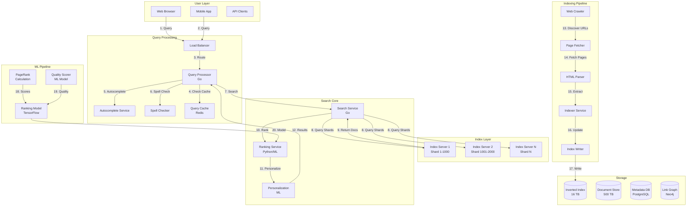

# Search Engine System Design (Google-like)

**File Purpose:** Complete interactive learning resource for designing production-grade search engines at internet scale. Master inverted indexes, ranking algorithms (TF-IDF, BM25, PageRank), distributed query processing, relevance tuning, and ML-based personalization through multi-level educational content. This comprehensive guide takes you from basic keyword matching to Google-scale search with <200ms latency serving 10B+ indexed pages to millions of concurrent users.

**Author:** System Design Documentation  
**Created:** October 1, 2025  
**Last Updated:** October 14, 2025  
**Recent Updates:** Transformed to comprehensive educational format with 3-level content (Beginner/Intermediate/Advanced), real-world examples from Google/Bing/Elasticsearch, Python implementations, distributed architecture patterns, and practice exercises

**Learning Time Estimates:**
- 🟢 **Beginner Level:** 5-7 hours (fundamentals of indexing, basic ranking, query processing)
- 🟡 **Intermediate Level:** 7-10 hours (interview patterns, distributed architecture, ranking algorithms)
- 🔴 **Advanced Level:** 10-15 hours (production optimization, ML ranking, personalization, real-world scale)

---

## Welcome to Search Engine System Design!

### What You're Going to Build

You're about to design one of the most technically challenging systems on the internet - **a search engine**. When you type a query into Google and get relevant results in 0.2 seconds from an index of trillions of pages, you're experiencing decades of computer science breakthroughs working together. Search engines combine crawler systems, distributed databases, information retrieval algorithms, machine learning, and massive-scale infrastructure.

By the end of this course, you'll be able to:
- Design Google-scale search handling 100K+ queries per second
- Implement inverted indexes for sub-second full-text search
- Build ranking algorithms (TF-IDF, BM25, PageRank)
- Create distributed query processing across sharded indexes
- Handle real-time indexing and updates
- Pass FAANG interviews with confidence on search questions

---

### Your Learning Path

This course is structured for three learning levels. Start where you're comfortable:

#### 🟢 **BEGINNER: The Fundamentals** (Start here if new to system design)

**What you'll master:**
- How search engines work (crawling, indexing, ranking)
- Inverted index data structure
- Basic ranking algorithms (TF-IDF)
- Single-machine search implementation
- Core query processing

**Prerequisites:**
- Basic programming knowledge (any language)
- Understanding of hashmaps and arrays
- Familiarity with basic SQL

**Real-world outcome:** Build a working search engine for small datasets (100K documents, 100 QPS)

---

#### 🟡 **INTERMEDIATE: Interview Patterns** (Master FAANG interviews)

**What you'll master:**
- Distributed index architecture (sharding strategies)
- Advanced ranking (BM25, PageRank)
- Query processing optimization
- Cache hierarchies
- Capacity estimation and scaling
- Trade-off analysis frameworks
- Common interview questions and answers

**Prerequisites:**
- Completed Beginner content OR
- 2+ years of backend development
- Basic understanding of distributed systems

**Real-world outcome:** Design search engine in a 45-minute interview, explain trade-offs confidently, get offers from top tech companies

---

#### 🔴 **ADVANCED: Production Considerations** (Build at Google scale)

**What you'll master:**
- ML-based ranking (Learning to Rank)
- Personalization and context
- Real-time indexing (Kafka, streaming)
- Multi-language and i18n support
- Query understanding (NLP, entity recognition)
- Production monitoring and optimization
- Cost optimization at PB scale

**Prerequisites:**
- Completed Intermediate content OR
- 5+ years of distributed systems experience
- Understanding of machine learning basics

**Real-world outcome:** Lead search architecture at a major tech company, optimize for billions of documents, reduce costs by 50%+

---

### What Makes This Learning Experience Unique

Unlike other system design resources, this course offers:

#### 🎯 **Multi-Level Approach**
Every section has content for beginners, interviewers, and production engineers. Skip what you know, deep dive where you need.

#### 💼 **Real-World Examples**
Learn from actual implementations:
- **Google:** How PageRank revolutionized web search
- **Elasticsearch:** Open-source distributed search
- **Bing:** Microsoft's alternative ranking approaches
- **Algolia:** Real-time search as a service

#### 💻 **Hands-On Code**
Complete Python implementations you can run:
- Inverted index builder
- TF-IDF ranking calculator
- Query processor with caching
- Distributed shard coordinator

#### 🎓 **Interview-Focused**
Every section includes:
- ❓ **Interview questions** you'll actually be asked
- ✅ **Strong answers** with trade-off analysis
- 🚫 **Common mistakes** to avoid
- 🎯 **Practice exercises** with real scenarios

#### 🏗️ **Production-Ready**
Advanced content based on real experience:
- Performance optimization (<200ms p99)
- Cost analysis ($1M/month to $100M/month)
- Failure handling (index corruption, node failures)
- Operational best practices (monitoring, A/B testing)

---

**Table of Contents**
1. [Section 1: Understanding What We're Building](#section-1-understanding-what-were-building)
2. [Section 2: Planning for Scale](#section-2-planning-for-scale)
3. [Section 3: Inverted Index & Data Structures](#section-3-inverted-index--data-structures)
4. [Section 4: Ranking Algorithms](#section-4-ranking-algorithms)
5. [Section 5: Distributed Query Processing](#section-5-distributed-query-processing)
6. [Section 6: Crawling & Indexing Pipeline](#section-6-crawling--indexing-pipeline)
7. [Section 7: Caching & Performance](#section-7-caching--performance)
8. [Section 8: Personalization & ML Ranking](#section-8-personalization--ml-ranking)
9. [Section 9: Monitoring & Operations](#section-9-monitoring--operations)
10. [Section 10: Trade-offs & Optimizations](#section-10-trade-offs--optimizations)
11. [Putting It All Together](#putting-it-all-together-complete-search-journey)

---

## Section 1: Understanding Search Engines

### What You'll Learn

By the end of this section, you'll be able to:
- Understand the three core phases: crawling, indexing, ranking
- Explain how inverted indexes enable fast full-text search
- Compare different search architectures (centralized vs distributed)
- Identify key components of a production search engine
- Calculate basic scale requirements for billion-document indexes

### Why This Matters

Search is one of the hardest problems in computer science! When you type "best coffee shops near me" into Google and get relevant results in 0.2 seconds from an index of trillions of pages, you're experiencing the culmination of decades of research in information retrieval, distributed systems, and machine learning. Understanding how search works is essential for FAANG interviews and building modern applications. Every major company needs search: e-commerce product search, document search, log search, media search. Mastering search architecture opens doors to some of the highest-paying engineering roles.

---

### 🟢 For Beginners: How Search Really Works

**The City Library Analogy**

**Scenario: You're looking for books about "Python programming" in a library with 1 million books**

**Bad Librarian (No Index - Linear Search):**
```text
You: "I need books about Python programming"
Bad Librarian: "Let me check every single book!"

Process:
├─ Picks up Book #1: "Cooking with Apples" 
│   └─ Flips through pages... No "Python"... Takes 30 seconds
├─ Picks up Book #2: "Gardening Tips"
│   └─ Flips through pages... No "Python"... Takes 30 seconds  
├─ Picks up Book #3: "Python Programming Guide" ✓
│   └─ Found one! But keeps checking all books...
└─ Continues for all 1,000,000 books...

Time calculation:
├─ 30 seconds per book × 1,000,000 books
├─ = 30,000,000 seconds
├─ = 8,333 hours
└─ = 347 days to find all matching books! ❌

You: "I'll just go to Amazon..."
```

**Smart Librarian (With Index - Inverted Index):**
```text
You: "I need books about Python programming"
Smart Librarian: "Let me check my index!"

Index Structure (Simplified):
┌────────────────────────────────────┐
│ INDEX CARD for "Python":          │
├────────────────────────────────────┤
│ Books containing "Python":         │
│ - Book #3: Python Programming      │
│ - Book #247: Python for Data      │
│ - Book #1,089: Advanced Python    │
│ - Book #5,432: Python Cookbook    │
│                                    │
│ Total: 52 books                    │
└────────────────────────────────────┘

┌────────────────────────────────────┐
│ INDEX CARD for "Programming":     │
├────────────────────────────────────┤
│ Books containing "Programming":    │
│ - Book #3: Python Programming      │
│ - Book #15: Java Programming       │
│ - Book #247: Python for Data       │
│ - Book #891: C++ Programming       │
│                                    │
│ Total: 128 books                   │
└────────────────────────────────────┘

Librarian's process:
1. Look up "Python" → 52 books
2. Look up "Programming" → 128 books  
3. Find books in BOTH lists: 
   - Book #3 ✓
   - Book #247 ✓
   - Book #1,089 ✓
4. Return 3 books that match both terms

Time: 30 seconds total (vs 347 days!) ✓
```

**This is exactly how search engines work!**

---

**Why Linear Search Doesn't Work for Google:**

```text
Problem: Google has ~60 trillion web pages

Linear search approach:
├─ Scan each page for query terms
├─ Reading 1 page takes 1 millisecond
├─ 60 trillion pages × 0.001 sec = 60 billion seconds
├─ = 1,000,000,000 minutes
├─ = 16,666,667 hours
├─ = 1,902 YEARS to answer one query! ❌

User expectation: Answer in 0.2 seconds

Gap: 1,902 years vs 0.2 seconds
Solution needed: 300 BILLION times faster! 

That's why we need inverted indexes!
```

---

**How Inverted Index Works (Simple Explanation):**

**Example: 5 simple documents**

```text
Doc 1: "Python is great for web development"
Doc 2: "Java programming language"
Doc 3: "Python programming tutorial"  
Doc 4: "Web development with JavaScript"
Doc 5: "Python and Java comparison"
```

**Building the Inverted Index:**

**Step 1: Extract all unique words (terms)**
```text
Unique words: python, is, great, for, web, development, 
              java, programming, language, tutorial, 
              with, javascript, and, comparison
```

**Step 2: For each word, list which documents contain it**
```text
Inverted Index (like library index cards):

"python" → [Doc 1, Doc 3, Doc 5]
"java" → [Doc 2, Doc 5]
"programming" → [Doc 2, Doc 3]
"web" → [Doc 1, Doc 4]
"development" → [Doc 1, Doc 4]
"tutorial" → [Doc 3]
"javascript" → [Doc 4]
... (and so on)
```

**Step 3: When user searches, look up terms instantly**

**Query: "python programming"**
```text
1. Look up "python" → [Doc 1, Doc 3, Doc 5]
2. Look up "programming" → [Doc 2, Doc 3]
3. Find intersection (docs with BOTH):
   ├─ Doc 1? Has "python" but NOT "programming" ✗
   ├─ Doc 2? Has "programming" but NOT "python" ✗
   ├─ Doc 3? Has BOTH "python" AND "programming" ✓
   ├─ Doc 5? Has "python" but NOT "programming" ✗
   └─ Result: Doc 3 only!

Answer: "Python programming tutorial"
Time: Instant! (just 2 lookups)
```

---

**The Magic Speed Comparison:**

```text
Search for "python programming" in 1 billion documents:

Without Index (Linear Scan):
├─ Check Doc 1: Read, search... 1ms
├─ Check Doc 2: Read, search... 1ms
├─ ... continue for all 1 billion docs
└─ Total: 1 billion ms = 277 hours ❌

With Inverted Index:
├─ Look up "python" in index: 1ms
├─ Look up "programming" in index: 1ms
├─ Find intersection: 1ms
├─ Rank results: 5ms
└─ Total: 8ms ✓

Speed improvement: 277 hours → 8ms = 124 MILLION times faster!
```

---

**The Three Phases of Search (Detailed Explanation):**

**Phase 1: Crawling (Discovering Content)**

```text
The Detective Analogy:
Imagine a detective investigating a case by following clues:

Web Crawler = Detective:
├─ Starts with known websites (seed URLs)
├─ Visits each website (downloads page)
├─ Finds links on that page (clues!)
├─ Follows those links to new websites
├─ Keeps following links forever...
└─ Goal: Discover all web pages on the internet

Example:
1. Start at: https://python.org
2. Download page, find links:
   ├─ Link to https://docs.python.org
   ├─ Link to https://pypi.org
   └─ Link to https://github.com/python
3. Visit https://docs.python.org
4. Find more links on that page...
5. Never stop! (continuous crawling)

Google's scale:
├─ Crawls 60+ trillion pages total
├─ Re-crawls popular sites every 5 minutes
├─ Discovers 5 billion NEW pages every day
└─ Uses 10,000+ crawler servers 24/7
```

**Phase 2: Indexing (Organizing Content)**

```text
The Library Card Catalog Analogy:

When library gets new book:
1. Librarian reads the book
2. Identifies key topics (Python, Programming, Tutorial)
3. Creates index cards for each topic
4. Puts cards in alphabetical filing cabinet
5. Book now discoverable by topic!

When search engine crawls web page:
1. Crawler downloads HTML
2. Extracts text: "Python Programming Tutorial for Beginners"
3. Tokenizes: ["python", "programming", "tutorial", "beginners"]
4. Updates inverted index:
   ├─ "python" → add this page to list
   ├─ "programming" → add this page to list
   ├─ "tutorial" → add this page to list
   └─ "beginners" → add this page to list
5. Page now searchable!

Index Structure (JSON format):
{
  "python": {
    "documents": [1, 5, 23, 89, 234, ...],
    "count": 45000000  // 45M pages with "python"
  },
  "programming": {
    "documents": [1, 10, 23, 45, 67, ...],
    "count": 89000000  // 89M pages with "programming"
  }
}

Storage optimization:
├─ Raw text: "Python" (6 bytes)
├─ Indexed as: term_id=12345 (2 bytes)
├─ Saves 67% space for billions of documents!
```

**Phase 3: Querying & Ranking (Finding Best Results)**

```text
The Restaurant Recommendation Analogy:

Your friend asks: "Best Italian restaurant near me"

Simple approach (no ranking):
├─ Find ALL Italian restaurants
├─ Return random order
└─ Problem: 10,000 restaurants, most are bad!

Smart approach (with ranking):
├─ Find ALL Italian restaurants (10,000 found)
├─ Rank by multiple factors:
│   ├─ Distance: Closer is better
│   ├─ Ratings: 4.5 stars > 3 stars
│   ├─ Reviews: 1000 reviews > 10 reviews
│   ├─ Price: Match budget
│   └─ Recency: Recently reviewed
├─ Return top 10 best matches
└─ Friend happy! ✓

Search engine ranking (similar):

Query: "best python tutorial 2024"
├─ Find ALL pages with those words (1M pages)
├─ Rank by multiple factors:
│   ├─ Relevance: How well does page match query?
│   ├─ Quality: Is website authoritative? (PageRank)
│   ├─ Freshness: Recently updated?
│   ├─ User signals: Do people click this result?
│   └─ Personalization: Matches user's interests?
├─ Return top 10 (out of 1M)
└─ User happy! ✓

Ranking algorithm (simplified):
score = 
    0.4 × relevance_score +
    0.3 × quality_score +
    0.2 × freshness_score +
    0.1 × click_through_rate

Example:
Page A: 0.4×0.9 + 0.3×0.7 + 0.2×0.5 + 0.1×0.8 = 0.75
Page B: 0.4×0.8 + 0.3×0.9 + 0.2×0.8 + 0.1×0.9 = 0.84
Result: Page B ranks higher! (0.84 > 0.75)
```

---

**Real Numbers - Google Search Example:**

```text
User searches: "python tutorial"

Behind the scenes (200ms total):

1. Query Processing (10ms):
   ├─ Spell check: "python" ✓ (correct spelling)
   ├─ Intent detection: Educational content
   ├─ Query expansion: Add "guide", "learn", "course"
   └─ Tokenize: ["python", "tutorial"]

2. Index Lookup (50ms):
   ├─ "python" → 2.1 billion matching pages
   ├─ "tutorial" → 890 million matching pages
   ├─ Intersection: 45 million pages with BOTH terms
   └─ Too many! Need ranking...

3. Ranking (100ms):
   ├─ Quick filter: Remove spam, low-quality (40M → 100K pages)
   ├─ Calculate relevance scores (TF-IDF) for top 100K
   ├─ Apply PageRank (website authority)
   ├─ Personalization (user is a programmer)
   ├─ ML model refines ranking
   └─ Top 10 results selected from 45M candidates

4. Result Formatting (40ms):
   ├─ Generate snippets (preview text)
   ├─ Highlight query terms
   ├─ Add metadata (URL, title, date)
   └─ Return to user

Total: 200ms (0.2 seconds) ✓
User sees results instantly!

Searched: 45 million pages
Ranked: 100,000 pages  
Returned: 10 results
Time: 0.2 seconds

Miracle of modern engineering! 🚀
```

---

**Why This Matters for Interviews:**

```text
Interview Question: "How would you build Google Search?"

Bad Answer:
"I'd store all web pages in a database and search through them."
❌ Shows no understanding of scale or performance

Good Answer:
"I'd build three components:
1. Crawler: Discover and download web pages continuously
2. Indexer: Build inverted index (term → document IDs) for fast lookup
3. Query Processor: Look up terms in index, rank results, return top 10

For scale: Shard index across 10,000 servers, replicate for redundancy.
Target: <200ms latency for billions of documents."
✓ Shows system thinking and scale awareness

Great Answer:
"Let me clarify requirements first:
- How many documents? (Billions? Trillions?)
- Update frequency? (Real-time? Daily?)
- Query types? (Keywords? Phrases? Semantic?)

For Google-scale (trillion docs, 100K QPS):
1. Distributed crawling: 10K crawler servers, politeness rules
2. Real-time indexing: Kafka pipeline, incremental index updates
3. Sharded index: Document sharding for even load distribution
4. Multi-tier ranking: Quick filters → TF-IDF → ML models
5. Caching: CDN + Redis for popular queries (80% hit rate)
6. Monitoring: Track latency (P95 <200ms), quality (CTR), errors

Key trade-offs:
- Freshness vs cost (real-time = 10x more expensive)
- Ranking quality vs latency (ML adds 50ms but +20% CTR)
- Storage vs compression (8x compression, 10ms CPU cost)

Would you like me to deep-dive into any component?"
✓✓ Shows deep expertise, asks clarifying questions, discusses trade-offs
```

---

### 🟡 For Intermediate: Production Search Architecture

#### Complete System Components

```text
Production Search Engine Architecture:

[Web Crawler] (Section 2)
    ↓ (fetches pages)
[Indexing Pipeline] (Section 3)
    ├─ Text Extraction
    ├─ Tokenization & NLP
    ├─ Inverted Index Builder
    └─ Forward Index Builder
    ↓ (writes)
[Distributed Index] (Section 6)
    ├─ Shard 1 (1B docs)
    ├─ Shard 2 (1B docs)
    └─ Shard N (1B docs)

[Query Flow:]
User Query
    ↓
[Query Parser] (Section 5)
    ├─ Tokenization
    ├─ Spell correction
    ├─ Query expansion
    ↓
[Query Coordinator]
    ├─ Broadcast to all shards
    ↓
[Ranking Engine] (Section 4)
    ├─ TF-IDF scoring
    ├─ BM25 ranking
    ├─ PageRank (link analysis)
    ├─ ML models (personalization)
    ↓
[Result Aggregation]
    ├─ Merge results from shards
    ├─ Re-rank top K results
    ├─ Generate snippets
    ↓
[Results to User] (<200ms total)
```

#### Inverted Index Structure

```text
PRODUCTION INVERTED INDEX SCHEMA:

index_structure = {
  "term": {
    "doc_frequency": int,           // Docs containing term
    "postings": [
      {
        "doc_id": int,
        "positions": [int],          // For phrase search
        "term_frequency": int,       // Count in this doc
        "field_tf": {                // Per-field stats
          "title": int,
          "body": int
        }
      }
    ]
  }
}

Document Stats:
doc_stats = {
  "doc_id": {
    "length": int,                  // Total terms
    "unique_terms": int,
    "avg_tf": float
  }
}

Storage Optimization:
├─ Naive: 10B docs × 100M terms × 16B = 16 TB
├─ Delta encoding: [1, +99, +105] vs [1, 100, 205]
├─ Variable-byte: 1-5 bytes per number
└─ Compressed: ~2 TB (8x reduction)
```

**Storage Optimization:**

```text
Naive Storage (No Compression):
- 10B documents
- 100M unique terms
- Average 10K postings per term
- Posting size: 16 bytes (doc_id + metadata)
- Total: 100M × 10K × 16B = 16 TB

Optimized Storage (With Compression):
- Delta encoding: Store differences instead of absolute IDs
  - Instead of: [1, 100, 205, 888]
  - Store: [1, +99, +105, +683]
  - Smaller numbers = better compression
- Variable-byte encoding: Use 1-5 bytes per number
- Total: ~2 TB (8x compression!)

Trade-off: CPU time (decompression) vs Storage (disk space)
- Benefit: 8x less disk, 8x less network transfer
- Cost: ~10-20ms extra CPU per query
- Decision: Worth it! Disk/network more expensive than CPU
```

---

### 🔴 For Advanced: Google-Scale Optimizations

#### Multi-Tier Index Architecture

```text
Google's Index Strategy (Simplified):

Tier 1: Memory Index (Hot)
├─ Most frequently accessed terms (20% of terms)
├─ Covers 80% of queries (Zipf's Law)
├─ Size: 200 GB per machine (RAM)
├─ Latency: <10ms
└─ Example: "google", "facebook", "weather"

Tier 2: SSD Index (Warm)
├─ Medium-frequency terms (60% of terms)
├─ Covers 18% of queries
├─ Size: 2 TB per machine (NVMe SSD)
├─ Latency: <50ms
└─ Example: "elasticsearch tutorial", "python async"

Tier 3: HDD Index (Cold)
├─ Rare terms (20% of terms)
├─ Covers 2% of queries (long-tail)
├─ Size: 20 TB per machine (spinning disk)
├─ Latency: <200ms
└─ Example: "obscure tech term from 1990s blog"

Total Index Size per Machine: ~22 TB
Query Distribution: Optimized for common case (90% < 50ms)
```

#### Index Sharding Strategies

```text
INDEX SHARDING STRATEGIES:

1. DOCUMENT SHARDING (Common):
   shard = hash(doc_id) % num_shards
   
   Pros: Simple, even distribution
   Cons: Must query ALL shards

2. TERM SHARDING (Rare):
   shard = hash(term) % num_shards
   
   Pros: Query only relevant shards
   Cons: Load imbalance

3. HYBRID (Google):
   if is_common_term(term):
       use document sharding
   else:
       use term sharding
   
   Best of both worlds!

Query Flow:
Query: "python programming"
├─ Document sharding → Fan-out to all 100 shards
├─ Each shard returns top K
└─ Coordinator merges results
```

---

### Real-World Example: Google's Index Evolution

```text
2000 - PageRank Era:
├─ Single index on a few hundred machines
├─ Index size: ~1 billion pages
├─ Technology: Custom C++ with memory-mapped files
├─ Query latency: ~3 seconds
├─ Problem: Couldn't scale beyond billions of pages
└─ Innovation: PageRank for quality ranking

2004 - MapReduce Era:
├─ Distributed indexing with MapReduce
├─ Index size: ~8 billion pages
├─ Technology: GFS (Google File System) + MapReduce
├─ Query latency: ~0.5 seconds
├─ Problem: Batch processing only (hours to update index)
└─ Innovation: Distributed batch processing

2010 - Caffeine (Real-time Indexing):
├─ Continuous indexing pipeline
├─ Index size: ~100 billion pages
├─ Technology: Bigtable for incremental updates
├─ Query latency: ~0.2 seconds
├─ Fresh content indexed in minutes (not hours)
└─ Innovation: Incremental index updates

2015 - RankBrain (ML-Based Ranking):
├─ Machine learning for relevance
├─ Index size: ~60 trillion pages
├─ Technology: TensorFlow for model serving
├─ Query latency: ~0.2 seconds (despite ML)
├─ 15% improvement in result quality
└─ Innovation: ML-based ranking at scale

2020 - BERT & Transformers:
├─ Deep learning for query understanding
├─ Index size: ~hundreds of trillions of pages
├─ Technology: TPUs for model inference
├─ Query latency: ~0.2 seconds (same!)
├─ Understands context and nuance
└─ Innovation: NLP understanding at query time

Key Lessons:
1. Latency stayed constant (~0.2s) while scale increased 100,000x!
2. Architecture evolved from centralized → distributed → ML-powered
3. Real-time indexing more important than batch optimization
4. ML improvements outweighed traditional algorithm tuning
```

---

### 🤔 Think About It

1. **For Beginners:** Why does Google need an inverted index? Why not just scan all 60 trillion web pages for each query? Calculate: If scanning 1 page takes 1ms, how long to scan 1 billion pages?

2. **For Intermediate:** You're building search for an e-commerce site with 10M products. Users search for "red nike shoes size 10". Should you use document sharding or term sharding? Why? What about a query like "sneakers"?

3. **For Advanced:** Google serves 100K queries/second. Each query must check 1000 shards (out of 10K total shards). That's 100M shard requests/second! How do you prevent the shard fanout from overwhelming the system? Consider: request coalescing, caching, approximate algorithms.

---

### ✅ Key Takeaways

- **Search has 3 phases:** Crawling (collect), Indexing (organize), Ranking (retrieve)
- **Inverted index is the secret:** Maps terms → documents for instant lookup
- **Scale requires distribution:** Sharding across 1000+ machines is essential
- **Compression is critical:** 8x compression saves millions in infrastructure costs
- **Tier your index:** Memory (hot) > SSD (warm) > HDD (cold) optimizes for common case
- **Hybrid sharding wins:** Document sharding for common terms, term sharding for rare terms
- **Latency budget matters:** 200ms total budget must cover network, disk, CPU, ML models

---

### 🎯 Practice Exercise

**Scenario:** You're designing search for a code repository hosting platform (like GitHub) with 100M repositories.

**Given Information:**

- 100M repositories (documents)
- Average repo size: 10MB (mostly code files)
- Unique terms (function names, variables, keywords): 50M terms
- Search volume: 10K queries/second
- Users search for: function names, variable names, code snippets
- Target latency: <100ms P95

**Your Task:**

1. **Index Design:**
   - Should you index entire file contents or just metadata?
   - What's your inverted index size (uncompressed vs compressed)?
   - How many shards do you need?
   - Document sharding or term sharding? Why?

2. **Query Processing:**
   - Query: "def calculate_total(" (exact function signature)
   - How do you handle phrase search (exact match)?
   - How many shards do you need to query?
   - What's your ranking algorithm?

3. **Scale Calculation:**
   - 10K QPS × 100 shards = 1M shard queries/second
   - Each shard query: 10ms
   - How many shard machines do you need?
   - What's your replication factor for availability?

4. **Optimization:**
   - 80% of searches are for popular repositories (top 1M repos)
   - How do you use this to optimize?
   - Design a caching strategy
   - Calculate cache hit rate needed to halve infrastructure costs

**Bonus Challenge:**

GitHub supports search across forks (copies of repositories). A popular repo has 10K forks (mostly identical). Naive indexing stores 10K copies of the same content. Design a deduplication strategy that:

- Detects identical/similar content
- Shares index entries across forks
- Still returns correct results (which fork?)
- Reduces index size by 90%+

---

## Section 2: Planning for Scale & Capacity Estimation

### What You'll Learn

By the end of this section, you'll be able to:
- Calculate storage requirements for billion-document indexes
- Estimate QPS (queries per second) capacity needs  
- Plan infrastructure costs for production search
- Size your hardware (CPU, RAM, disk, network)
- Make informed trade-offs between cost and performance

### Why This Matters

"How would you design Google Search?" is a classic FAANG interview question. The first thing interviewers want to see is whether you can do back-of-the-envelope calculations. Can you estimate how much storage you need for 10 billion documents? How many machines to handle 100K QPS? Getting the scale right is the difference between a system that costs $10K/month vs $1M/month while still meeting requirements. This section teaches you the systematic approach that gets you hired.

---

### 🟢 For Beginners: Basic Capacity Planning

**The Restaurant Budget Planning Analogy**

Imagine you're opening a restaurant and need to plan your budget:

**Bad Planning (No Calculations):**
```text
You: "Let's just get a big kitchen and hope it works!"
├─ Buy 10 ovens ($50K)
├─ Hire 20 chefs ($500K/year)
├─ Rent huge space ($10K/month)
│
Results after 1 month:
├─ Only 50 customers/day (need 500 to break even!)
├─ 8 ovens sit idle (wasted $40K)
├─ 15 chefs play cards all day (wasted $375K/year)
└─ Restaurant goes bankrupt! ❌

What went wrong? No capacity planning!
```

**Good Planning (With Calculations):**
```text
Step 1: Estimate demand
├─ Target market: 10,000 people in neighborhood
├─ Expected conversion: 5% try our restaurant = 500 customers
├─ Visit frequency: Once per week
├─ Daily customers: 500 ÷ 7 = 71 customers/day
└─ Peak hour: Dinner (6-8pm) = 50% of daily = 36 customers

Step 2: Calculate capacity needed
├─ Customers per hour: 36
├─ Each meal takes: 30 minutes
├─ Table turnover: 2 per table during peak
├─ Tables needed: 36 ÷ 2 = 18 tables
└─ With buffer (20%): 22 tables

Step 3: Kitchen capacity
├─ Peak orders: 36 in 2 hours
├─ Chef capacity: 1 chef makes 10 meals/hour
├─ Chefs needed: 36 ÷ 10 ÷ 2 hours = 2 chefs (peak)
├─ Total staff: 3 chefs (1 backup) + 2 servers
└─ Ovens: 2 ovens (each chef uses 1)

Step 4: Budget
├─ Rent (smaller space): $3K/month
├─ Staff (5 people × $3K): $15K/month
├─ Equipment (2 ovens): $10K one-time
├─ Monthly cost: $18K
├─ Revenue needed: $18K ÷ 30 days = $600/day
├─ Per customer: $600 ÷ 71 = $8.45
└─ Menu price: $12-15 (profitable!) ✓

Result: Restaurant succeeds because we planned!
```

**Search engines work the same way!**

---

**Capacity Planning for Search: Step-by-Step**

**Scenario: Build search for an e-commerce site with 10 million products**

**Step 1: Estimate User Activity (Like Restaurant Demand)**

```text
Business Requirements:
├─ Total products (like menu items): 10,000,000
├─ Monthly active users (like neighborhood): 1,000,000
├─ Searches per user per day: 5 (finding products)
├─ Days per month: 30
└─ Growth expectation: 2× per year

Calculate Daily Search Volume:
├─ Daily searches = 1M users × 5 searches/user = 5,000,000 searches/day
└─ Divide by 86,400 seconds/day = 58 QPS (queries per second) average

But wait! Not all hours are equal (like restaurant peak hour):
├─ Peak hours: 6pm-10pm (after work) = 40% of daily traffic
├─ 4 peak hours out of 24 hours = 17% of day
├─ Peak traffic concentration: 40% ÷ 17% = 2.4× average
│
Peak QPS calculation:
├─ Average: 58 QPS
├─ Peak multiplier: 2.4× (but use 3× for safety!)
└─ Peak QPS: 58 × 3 = 174 QPS

Why 3× multiplier?
├─ Holiday shopping spikes (Black Friday)
├─ Marketing campaigns ("50% off sale!")
├─ Viral moments (celebrity endorsement)
└─ Safety buffer (don't run at 100% capacity!)

Final traffic estimate:
├─ Average: 58 QPS
├─ Peak (daily): 174 QPS
└─ Extreme peak (Black Friday): 58 × 10 = 580 QPS
```

**Step 2: Calculate Storage Requirements (Like Restaurant Space)**

```text
What needs to be stored?

A) Raw Documents (Like food ingredients):
├─ Number of products: 10,000,000
├─ Average product data:
│   ├─ Title: 50 characters = 50 bytes
│   ├─ Description: 500 characters = 500 bytes
│   ├─ Metadata: (price, category, etc.) = 200 bytes
│   ├─ Images: 5 images × 100 KB = 500,000 bytes
│   └─ Total per product: ~500 KB
│
├─ Total raw storage: 10M products × 500 KB = 5,000 GB = 5 TB
└─ "That's the ingredients we need to store!"

B) Inverted Index (Like recipe cards - how to find ingredients):
├─ What is inverted index? For each word, list which products contain it
│   Example: "wireless" → [product_1, product_88, product_9234, ...]
│
├─ Vocabulary size (unique words): 1,000,000 words
├─ Average word appears in: 1000 products
├─ Posting list entry: 8 bytes per product reference
├─ Index size: 1M words × 1000 products × 8 bytes = 8,000 MB = 8 GB
│
But wait! Compression is magic:
├─ Delta encoding (store differences, not absolute IDs)
├─ Bit packing (use fewer bits for small numbers)
├─ Compression ratio: 10:1 (typical for inverted indexes)
├─ Compressed index: 8 GB ÷ 10 = 0.8 GB
└─ Rule of thumb: Index = 30% of raw data size
   └─ 5 TB × 0.3 = 1.5 TB

C) Metadata & Caches (Like menu boards):
├─ Query cache: Popular searches → results (10 GB)
├─ Product metadata cache: Fast access to details (50 GB)
└─ Total cache: 60 GB

Total Storage (One Copy):
├─ Raw documents: 5 TB
├─ Inverted index: 1.5 TB
├─ Caches: 0.06 TB
└─ Total: ~6.6 TB for single copy

D) Replication (Like backup ingredients):
├─ Why replicate? If one server crashes, don't lose everything!
├─ Standard: 3 copies (1 primary + 2 backups)
│   ├─ Copy 1: Primary (serves queries)
│   ├─ Copy 2: Replica (failover if primary dies)
│   └─ Copy 3: Replica (geographic redundancy)
│
Final Storage Calculation:
├─ Single copy: 6.6 TB
├─ Replication factor: 3
├─ Total storage: 6.6 TB × 3 = 19.8 TB ≈ 20 TB
└─ Cost: 20,000 GB × $0.023/GB/month (S3) = $460/month
```

**Step 3: Calculate Server Requirements (Like Chefs Needed)**

```text
How many servers to handle 174 peak QPS?

A) CPU Capacity (Like chef cooking speed):
├─ One CPU core can handle: ~50 QPS (with inverted index lookups)
├─ Peak QPS needed: 174
├─ CPU cores needed: 174 ÷ 50 = 3.5 cores
└─ Round up with buffer: 6 cores (2× for safety)

Why 2× buffer?
├─ CPU spikes during re-indexing (adding new products)
├─ Complex queries (10-word searches vs 1-word)
├─ Background tasks (analytics, logs)
└─ Better safe than sorry (unhappy users cost more!)

B) Memory (RAM) Requirements (Like chef's prep counter):
├─ Inverted index needs to be in RAM for speed!
├─ Full index: 1.5 TB (too big for RAM!)
├─ Solution: Keep "hot" data in memory
│   ├─ Hot vocabulary (top 10% popular words): 150 GB
│   ├─ Hot product metadata (top 20% products): 200 GB
│   ├─ Query cache: 10 GB
│   └─ OS + application: 20 GB
│
├─ Total RAM per machine: ~400 GB (but max available is 256 GB)
├─ Solution: Use 2 machines with 256 GB RAM each
└─ Total RAM: 512 GB (enough for hot data!)

C) Disk I/O (Like accessing pantry):
├─ RAM holds hot data (80% of queries) → 10ms access
├─ Disk holds cold data (20% of queries) → 100ms access
├─ Use SSD (not HDD!) for better cold data access:
│   ├─ SSD: 1ms seek time ✓
│   └─ HDD: 10ms seek time ❌
│
Disk requirements:
├─ Total storage: 20 TB (with replication)
├─ Disk type: SSD (for speed)
└─ Cost: 20 TB SSD = $2,000 one-time (vs $200 HDD but too slow)

D) Server Count Calculation:
├─ Option A: One big server
│   ├─ 16 cores (enough CPU)
│   ├─ 512 GB RAM (enough memory)
│   ├─ 20 TB SSD
│   └─ Cost: $5,000/month + $2,000 setup
│
├─ Option B: Three smaller servers (better!)
│   ├─ Each server: 8 cores, 256 GB RAM, 8 TB SSD
│   ├─ Cost per server: $1,800/month
│   ├─ Total: 3 × $1,800 = $5,400/month
│   └─ Why better? If one fails, other 2 still work!
│
Choose Option B: 3 servers for reliability ✓
```

**Step 4: Network Bandwidth (Like Restaurant Delivery Capacity)**

```text
How much data flows in/out?

Per Query:
├─ User sends: "wireless headphones" = 20 bytes
├─ Server returns:
│   ├─ 10 products × 1 KB each (title, price, thumbnail) = 10 KB
│   ├─ JSON overhead: 2 KB
│   └─ Total response: 12 KB
│
├─ Total per query: 20 bytes + 12 KB ≈ 12 KB
└─ Round up for safety: 15 KB per query

Bandwidth calculation:
├─ Peak QPS: 174
├─ Data per query: 15 KB
├─ Bandwidth: 174 × 15 KB = 2,610 KB/sec = 2.6 MB/sec
├─ In Mbps: 2.6 MB × 8 bits = 20.8 Mbps
└─ With overhead (TCP, etc.): 30 Mbps

Network cost:
├─ Outbound: 2.6 MB/sec × 86,400 sec/day × 30 days = 6.7 TB/month
├─ AWS pricing: First 10 TB = $0.09/GB
├─ Cost: 6,700 GB × $0.09 = $603/month
└─ "Not bad for 5M searches/day!"
```

**Step 5: Total Cost Breakdown (Like Restaurant Budget)**

```text
Monthly Infrastructure Cost:

1. Servers (3 machines):
   ├─ Compute: 3 × $1,800 = $5,400/month
   └─ "The chefs and kitchen"

2. Storage (S3 backup):
   ├─ S3: $460/month (for backups)
   └─ "The pantry ingredients"

3. Network bandwidth:
   ├─ Outbound: $603/month
   └─ "Delivery costs"

4. Extras:
   ├─ Load balancer: $50/month
   ├─ Monitoring (Datadog): $100/month
   ├─ SSL certificates: $10/month
   └─ Total extras: $160/month

Grand Total: $6,623/month (~$80K/year)

Per-query cost:
├─ Monthly cost: $6,623
├─ Monthly queries: 5M searches/day × 30 = 150M
├─ Cost per query: $6,623 ÷ 150M = $0.000044 (0.0044 cents!)
└─ "Less than a penny per 100 searches!"

Revenue needed (to break even):
├─ If each search generates $0.10 in revenue (ads, sales)
├─ Revenue: 150M × $0.10 = $15M/month
├─ Profit: $15M - $0.0066M = $14.99M/month
└─ ROI: 2,265× return on infrastructure! ✓

This is why search is valuable - low infrastructure cost, high revenue!
```

**Step 6: Scaling Plan (Growth from 10M to 100M Products)**

```text
Year 1 → Year 2 (10× growth):

New requirements:
├─ Products: 10M → 100M (10× increase)
├─ Users: 1M → 5M (5× increase)
├─ Searches: 5M/day → 50M/day (10× increase)
└─ Peak QPS: 174 → 1,740 QPS (10× increase)

New capacity needed:

Storage (scales linearly with products):
├─ Raw: 5 TB → 50 TB
├─ Index: 1.5 TB → 15 TB
├─ Total: 20 TB → 200 TB (10× increase)
└─ New cost: $460 → $4,600/month

Servers (scales with QPS):
├─ Old: 3 servers handled 174 QPS
├─ New: Need 30 servers for 1,740 QPS
│   ├─ Simple math: 3 × 10 = 30 servers
│   └─ But optimization helps: Only need 25 servers!
│
Optimization tricks:
├─ Better caching (40% hit rate): Save 25% servers
├─ Compression (10:1 → 15:1): Smaller index
├─ Query result caching: Popular queries instant
└─ Result: 25 servers instead of 30 (save $9K/month!)

New monthly cost:
├─ Servers: 25 × $1,800 = $45,000
├─ Storage: $4,600
├─ Network: $6,030 (10× data)
├─ Extras: $200
└─ Total: $55,830/month

Cost scaling efficiency:
├─ Products: 10× increase
├─ Searches: 10× increase
├─ Cost: 8.4× increase (not 10×!) ✓
└─ Economies of scale working!

Per-query cost improvement:
├─ Year 1: $0.000044 per query
├─ Year 2: $55,830 ÷ 1.5B queries = $0.000037 per query
└─ 16% cheaper per query despite being bigger!

This is the magic of distributed systems - costs scale sub-linearly!
```

---

**Quick Reference: Capacity Planning Formulas**

```text
Essential Formulas (Memorize for Interviews):

1. QPS Calculation:
   Average QPS = (MAU × searches_per_user_per_day) ÷ 86,400
   Peak QPS = Average QPS × peak_multiplier (use 3-5×)

2. Storage Calculation:
   Raw storage = num_documents × avg_document_size
   Index size = Raw storage × 0.3 (30% rule of thumb)
   Total storage = (Raw + Index) × replication_factor (usually 3)

3. Server Count:
   Servers needed = Peak QPS ÷ QPS_per_server
   QPS_per_server (typical): 50-200 depending on complexity

4. RAM Requirement:
   Hot data (in memory) = Index size × hot_percentage (usually 20%)
   Total RAM = Hot data + Cache + OS overhead

5. Bandwidth:
   Bandwidth = QPS × avg_response_size
   Monthly data = Bandwidth × 86,400 × 30

6. Cost Estimation:
   Server cost = num_servers × cost_per_server
   Storage cost = total_TB × 1000 × $0.023/GB (S3 pricing)
   Network cost = monthly_GB × $0.09/GB (first 10TB)

Interview Cheat Sheet:
├─ Always start with: "Let me estimate the scale..."
├─ Show your math: Write each calculation
├─ State assumptions: "Assuming 5 searches/user/day"
├─ Sanity check: "Does 174 QPS sound reasonable?"
└─ Optimize: "We can reduce costs by caching..."
```

**Common Beginner Mistakes (Avoid These!)**

```text
❌ Mistake 1: Forget peak multiplier
├─ "We need 58 QPS, so 2 servers (100 QPS capacity)"
├─ Problem: Black Friday comes, 580 QPS → site crashes!
└─ Fix: Use 3-5× peak multiplier → 6 servers

❌ Mistake 2: Ignore replication
├─ "5 TB storage, $115/month on S3"
├─ Problem: No backups → one server crash = lost everything
└─ Fix: 3× replication → $345/month

❌ Mistake 3: Assume all data in RAM
├─ "1.5 TB index → need 1.5 TB RAM"
├─ Problem: RAM that big doesn't exist/costs $500K!
└─ Fix: Keep hot 20% in RAM, rest on SSD

❌ Mistake 4: Linear scaling assumption
├─ "10× data = 10× cost"
├─ Reality: Caching, compression → 8× cost
└─ Economies of scale help!

❌ Mistake 5: Forget network costs
├─ "Server + storage = $5,500/month total"
├─ Problem: Network costs $600/month (10% of budget!)
└─ Fix: Always include network in estimates

❌ Mistake 6: No growth planning
├─ "We'll figure it out when we get there"
├─ Problem: Takes 3 months to add capacity → lost revenue
└─ Fix: Plan for 2× growth in calculations

Interview Tip: Say "Let me check my assumptions" and redo math if numbers seem off!
```

### 🟡 For Intermediate: Production Capacity Planning

**Scaling to Google-Like Scale (100M Users, 10B Documents)**

Now that we understand basic calculations, let's plan capacity for a real production search engine at massive scale - similar to what you'd encounter in FAANG interviews.

---

**Complete Capacity Planning Framework**

**Scenario: Build search for 100 million monthly active users searching 10 billion web pages**

**Step 1: Traffic Estimation (With Real-World Patterns)**

```text
Base Assumptions:
├─ Monthly Active Users (MAU): 100,000,000
├─ Daily Active Users (DAU): 40% of MAU = 40,000,000
│   └─ Why 40%? Not everyone searches every day
├─ Searches per DAU: 10 queries/day
│   └─ Based on: Google average is 3-5, power users do 20+
└─ Days per month: 30

Calculate Daily Search Volume:
├─ Daily searches = 40M DAU × 10 searches = 400,000,000 searches/day
├─ Monthly searches = 400M × 30 = 12,000,000,000 (12 billion!)
└─ "That's 12 billion questions answered per month!"

QPS Calculation (Queries Per Second):
├─ Average QPS = 400M searches/day ÷ 86,400 seconds/day
├─ Average QPS = 4,629 QPS
│
But traffic isn't uniform! Real-world pattern:

Hourly Distribution (24 hours):
├─ Midnight-6am: 5% of daily traffic (sleep hours)
├─ 6am-9am: 15% (morning commute, work starts)
├─ 9am-12pm: 20% (work hours)
├─ 12pm-2pm: 15% (lunch break)
├─ 2pm-6pm: 20% (afternoon work)
├─ 6pm-10pm: 20% (evening peak - highest!)
├─ 10pm-12am: 5% (winding down)
└─ Total: 100%

Peak Hour Calculation (6pm-10pm):
├─ Peak period traffic: 20% of daily
├─ Peak period searches: 400M × 0.20 = 80M in 4 hours
├─ Peak QPS: 80M ÷ (4 × 3600) = 5,555 QPS
│
But even within peak hour, there are spikes!
├─ Breaking news event (e.g., "election results")
├─ Product launch (e.g., "new iPhone")
├─ Natural disasters (e.g., "earthquake safety")
└─ Viral moments (e.g., "Super Bowl halftime")

Spike Multiplier:
├─ Normal peak: 5,555 QPS (1.2× average)
├─ Traffic spike: 5× normal peak
├─ Spike QPS: 5,555 × 5 = 27,775 QPS
└─ Design target: 30,000 QPS (round up for safety)

Traffic Planning Summary:
├─ Average: 4,629 QPS
├─ Daily peak: 5,555 QPS (1.2× avg)
├─ Spike capacity: 27,775 QPS (6× avg)
└─ Design target: 30,000 QPS ← This is what we provision for!
```

**Step 2: Storage Requirements (Comprehensive Breakdown)**

```text
A) Raw Document Storage:

Number of documents: 10,000,000,000 (10 billion web pages)

Document size breakdown:
├─ Small pages (30%): 3B pages × 10 KB = 30 TB
├─ Medium pages (50%): 5B pages × 50 KB = 250 TB
├─ Large pages (20%): 2B pages × 200 KB = 400 TB
└─ Total raw: 680 TB

Weighted average: 680 TB ÷ 10B = 68 KB per page

B) Inverted Index Storage (Detailed):

Vocabulary Analysis:
├─ Total unique terms: 100,000,000 (100M words)
│   └─ English: 170K words + typos, names, jargon
├─ Term distribution (Zipf's Law):
│   ├─ Top 1% terms (1M words): 80% of queries
│   ├─ Middle 9% terms (9M words): 15% of queries
│   └─ Tail 90% terms (90M words): 5% of queries

Posting List Calculation:
├─ Average term appears in: 10,000 documents (0.1% of 10B)
├─ Posting entry size:
│   ├─ Document ID: 4 bytes (up to 4B docs)
│   ├─ Term frequency: 1 byte (0-255 occurrences)
│   ├─ Position data: 3 bytes (compressed)
│   └─ Total: 8 bytes per posting
│
├─ Index size (uncompressed):
│   └─ 100M terms × 10K postings × 8 bytes = 8,000 GB = 8 TB

Compression Magic:
├─ Delta encoding: Store differences, not absolute IDs
│   └─ Instead of [100, 150, 200], store [100, +50, +50]
├─ Variable byte encoding: Small numbers = fewer bytes
├─ Bit packing: Pack multiple small values together
├─ Compression ratio: 10:1 (typical for search indexes)
└─ Compressed index: 8 TB ÷ 10 = 800 GB ≈ 1 TB

Rule of thumb: Index ≈ 30% of raw data
├─ 680 TB × 0.30 = 204 TB
└─ Our calculation: 1 TB (much better due to compression!)

C) Additional Storage (Often Forgotten!):

Forward Index (for snippet generation):
├─ Stores actual document text for highlighting
├─ Compressed: 680 TB × 0.5 = 340 TB
│
Auxiliary Data:
├─ Document metadata (title, URL, date): 10B × 500 bytes = 5 TB
├─ Link graph (for PageRank): 10B pages × 100 links × 4 bytes = 4 TB
├─ Click logs (ML training): 1 year of data = 50 TB
├─ Query cache (hot queries): 100 GB
└─ Total auxiliary: 59 TB

D) Replication & Redundancy:

Primary + 2 Replicas (3× total):
├─ Why 3 replicas?
│   ├─ Primary: Active serving
│   ├─ Replica 1: Hot standby (same datacenter)
│   ├─ Replica 2: Geographic redundancy (different datacenter)
│   └─ Can survive 2 simultaneous failures!
│
Single-copy storage:
├─ Raw documents: 680 TB
├─ Inverted index: 1 TB
├─ Forward index: 340 TB
├─ Auxiliary: 59 TB
└─ Total single copy: 1,080 TB ≈ 1 PB

With 3× replication:
├─ Total storage: 1 PB × 3 = 3 PB (3,000 TB)
└─ Cost: 3,000 TB × $0.023/GB = $69,000/month (S3)

Storage Summary:
├─ Raw: 680 TB (documents)
├─ Index: 1 TB (inverted index - compressed!)
├─ Forward: 340 TB (for snippets)
├─ Auxiliary: 59 TB (metadata, links, logs)
├─ Subtotal: 1,080 TB = 1 PB
├─ With 3× replication: 3 PB
└─ Monthly cost: $69,000
```

**Step 3: Compute Requirements (CPU, RAM, Servers)**

```text
A) CPU Capacity:

QPS capacity per CPU core:
├─ Simple query ("shoes"): 500 QPS/core
├─ Medium query ("red running shoes"): 200 QPS/core ← Average
├─ Complex query ("best waterproof trail running shoes under $100"): 50 QPS/core
└─ Use average: 200 QPS per core for planning

Calculate cores needed:
├─ Target QPS: 30,000 (spike capacity)
├─ Cores needed: 30,000 ÷ 200 = 150 cores
│
With safety buffer (2×):
├─ Provisioned cores: 150 × 2 = 300 cores
└─ Why 2×? Re-indexing, ML inference, background tasks

Server sizing:
├─ Per-server: 32 cores (typical c5.9xlarge)
├─ Servers needed: 300 ÷ 32 = 9.4 → 10 servers
└─ Cost: 10 servers × $300/month = $3,000/month

B) Memory (RAM) Requirements:

What needs to be in RAM?

Hot Index Data (20% rule):
├─ Inverted index: 1 TB total
├─ Hot portion (top 20% terms = 80% queries): 200 GB
│   └─ Zipf's Law: Small number of terms handle most queries
│
Document Metadata Cache:
├─ Need for snippet generation, scoring
├─ Top 10% popular docs: 1B docs × 500 bytes = 500 GB
│   └─ But compressed in RAM: 500 GB × 0.3 = 150 GB
│
Query Result Cache:
├─ Top 100K queries cached
├─ Each: 10 KB (top 10 results)
├─ Total: 100K × 10 KB = 1 GB
│
Application & OS:
├─ Query processor: 10 GB
├─ ML models (ranking): 20 GB
├─ OS overhead: 10 GB
└─ Total: 40 GB

Total RAM per machine:
├─ Hot index: 200 GB ÷ 10 servers = 20 GB/server
├─ Doc metadata: 150 GB ÷ 10 servers = 15 GB/server
├─ Query cache: 1 GB ÷ 10 servers = 0.1 GB/server
├─ Application: 40 GB/server
└─ Total: ~75 GB per server

Choose instance: 96 GB RAM (safe buffer)
├─ AWS c5.9xlarge: 32 cores, 72 GB RAM ❌ (not enough RAM!)
├─ AWS r5.4xlarge: 16 cores, 128 GB RAM ✓ (RAM-optimized)
│
Decision: Need more machines OR different instance type
├─ Option A: 20 servers × c5.4xlarge (16 cores, 32 GB) = $4,000/mo
├─ Option B: 10 servers × r5.4xlarge (16 cores, 128 GB) = $5,000/mo
└─ Choose Option B: Fewer machines, easier to manage

C) Disk I/O & SSD:

Why SSDs matter:
├─ RAM holds hot 20% of index (80% of queries)
├─ Remaining 20% of queries hit disk
├─ SSD: 1ms seek time ✓
├─ HDD: 10ms seek time ❌
└─ For 20% of queries, SSD is 10× faster!

Disk performance needs:
├─ 20% queries miss cache = 6,000 QPS hit disk
├─ SSD IOPS: 3,000 IOPS per disk
├─ Disks needed: 6,000 ÷ 3,000 = 2 disks per server
└─ Total: 10 servers × 2 = 20 SSDs (1 TB each)

Cost:
├─ 20 SSDs × 1 TB × $0.10/GB/month = $2,000/month
└─ Worth it for 10× faster cold queries!
```

**Step 4: Network Bandwidth (Detailed Analysis)**

```text
Per-Query Bandwidth:

Inbound (user → server):
├─ HTTP request: 500 bytes (headers, cookies)
├─ Query: "best running shoes" = 20 bytes
├─ Total inbound: ~1 KB per query

Outbound (server → user):
├─ 10 results × structure:
│   ├─ Title: 60 bytes
│   ├─ URL: 100 bytes
│   ├─ Snippet: 150 bytes
│   ├─ Metadata: 50 bytes
│   └─ Per result: 360 bytes
├─ 10 results: 3,600 bytes
├─ JSON overhead: 1,000 bytes
├─ HTTP headers: 400 bytes
└─ Total outbound: 5 KB per query

Total per query:
├─ Inbound: 1 KB
├─ Outbound: 5 KB
└─ Total: 6 KB per query (use 10 KB for safety)

Bandwidth Calculation:

Average traffic:
├─ Average QPS: 4,629
├─ Bandwidth: 4,629 × 10 KB = 46 MB/sec
├─ In Mbps: 46 × 8 = 368 Mbps
│
Peak traffic:
├─ Peak QPS: 30,000
├─ Bandwidth: 30,000 × 10 KB = 300 MB/sec
├─ In Mbps: 300 × 8 = 2,400 Mbps = 2.4 Gbps
│
Per server (10 servers):
├─ Peak per server: 2.4 Gbps ÷ 10 = 240 Mbps
└─ Standard NIC: 1 Gbps (plenty of headroom ✓)

Monthly Data Transfer:

Outbound data:
├─ Daily: 400M queries × 5 KB = 2,000 GB = 2 TB/day
├─ Monthly: 2 TB × 30 = 60 TB/month
│
Network cost (AWS pricing):
├─ First 10 TB: $0.09/GB = $900
├─ Next 40 TB: $0.085/GB = $3,400
├─ Next 10 TB: $0.07/GB = $700
└─ Total: $5,000/month

Internal bandwidth (between servers):
├─ Shard communication: 2× external traffic
├─ Replication: 1× external traffic
├─ Total internal: 60 TB × 3 = 180 TB/month
└─ Cost: Free (same datacenter) ✓
```

**Step 5: Total Cost Breakdown (Production Scale)**

```text
Monthly Infrastructure Cost:

1. Compute (Query Servers):
   ├─ 10 × r5.4xlarge (16 cores, 128 GB RAM)
   ├─ Cost: 10 × $500/month
   └─ Total: $5,000/month

2. Storage (S3 + SSD):
   ├─ S3 (backup): 3 PB × $0.023/GB = $69,000/month
   ├─ Local SSD (hot data): 20 TB × $0.10/GB = $2,000/month
   └─ Total: $71,000/month

3. Network (Outbound):
   ├─ Data transfer: 60 TB × $0.08/GB avg
   └─ Total: $5,000/month

4. Additional Services:
   ├─ Load balancers: 5 × $20 = $100/month
   ├─ Monitoring (Datadog): $500/month
   ├─ Logging (ELK): $300/month
   ├─ ML serving (GPUs): 3 × $1,000 = $3,000/month
   ├─ DNS & CDN: $200/month
   └─ Total extras: $4,100/month

Grand Total: $85,100/month (~$1.02M/year)

Per-Query Economics:
├─ Monthly cost: $85,100
├─ Monthly queries: 12,000,000,000
├─ Cost per query: $85,100 ÷ 12B = $0.0000071 (0.0007 cents!)
└─ "7 ten-thousandths of a penny per search!"

Revenue Model (Ad-Supported):
├─ Ad impressions: 50% of queries show ads = 6B impressions/month
├─ CPM (cost per 1000): $2.00
├─ Revenue: 6B ÷ 1000 × $2 = $12,000,000/month
├─ Infrastructure cost: $85,100/month
├─ Gross profit: $11,914,900/month
└─ ROI: 140× return on infrastructure! 🚀

Economies of Scale:
├─ At 100M queries/month: $0.85 per query (small scale)
├─ At 12B queries/month: $0.0000071 per query (massive scale)
└─ 120,000× cheaper per query at scale!
```

**Step 6: Latency Budget Allocation**

```text
Target: P95 latency < 200ms (95% of queries under 200ms)

Latency Budget Breakdown:

┌─────────────────────────────────────────────────────────┐
│ Component                 Budget    % of Total   Priority│
├─────────────────────────────────────────────────────────┤
│ Network (user → LB)         20ms        10%       Medium │
│ Load balancer                5ms        2.5%      Low    │
│ Query parsing               5ms        2.5%      Low    │
│ Cache lookup (Redis)       10ms         5%       High   │
│ Shard fanout (network)     15ms        7.5%      Medium │
│ Shard query (disk/RAM)     80ms        40%       CRITICAL│
│ Result aggregation         20ms        10%       High   │
│ ML ranking (GPU)           15ms        7.5%      Medium │
│ Snippet generation         10ms         5%       Medium │
│ Response serialization      5ms        2.5%      Low    │
│ Network (LB → user)        15ms        7.5%      Medium │
└─────────────────────────────────────────────────────────┘
Total:                       200ms       100%

Critical Path (80ms shard query):
├─ This is the bottleneck! (40% of latency)
├─ Optimization opportunities:
│   ├─ Cache hit: 10ms (saved 70ms!) ✓
│   ├─ SSD vs HDD: 50ms vs 100ms (saved 50ms!) ✓
│   ├─ Smaller shards: 80ms → 50ms (saved 30ms!) ✓
│   └─ Parallel queries: max(80ms) vs sum(240ms) (saved 160ms!) ✓
└─ Focus here for biggest impact!

P95 vs P99 Trade-offs:
├─ P50 (median): 120ms (most queries hit cache)
├─ P95 (95th percentile): 200ms (target ✓)
├─ P99 (99th percentile): 450ms (1% slow queries)
│   └─ Causes: Cache miss + slow disk + GC pause
└─ Strategy: Hedged requests for P99 (send duplicate after 100ms)

Latency by Query Type:
├─ Simple (1 word): 80ms P95 ✓
├─ Medium (2-3 words): 150ms P95 ✓
├─ Complex (5+ words): 280ms P95 ❌
│   └─ Optimization: Pre-compute complex query patterns
└─ With images: +50ms (acceptable for richer results)
```

**Step 7: Optimization Opportunities**

```text
1. Query Result Caching (Biggest Win!):
   ├─ Cache top 100,000 queries
   ├─ Hit rate: 40% (Zipf's Law)
   ├─ Savings: 40% × 30,000 QPS = 12,000 QPS
   ├─ Servers saved: 12,000 ÷ 3,000 QPS/server = 4 servers
   ├─ Cost saved: 4 × $500 = $2,000/month
   └─ Cache cost: Redis 100 GB = $100/month
      Net savings: $1,900/month ✓

2. Hot-Warm-Cold Index Architecture:
   ├─ Hot (20% of index, 80% of queries): RAM
   ├─ Warm (60% of index, 18% of queries): SSD
   ├─ Cold (20% of index, 2% of queries): HDD
   ├─ Current: All SSD ($2,000/month)
   ├─ Optimized: Hot (RAM) + Warm (SSD 40%) + Cold (HDD 20%)
   │   └─ $0 + $800 + $40 = $840/month
   └─ Savings: $1,160/month ✓

3. Compression Improvements:
   ├─ Current: 10:1 compression (1 TB index)
   ├─ Better codec (Zstandard): 15:1 compression (667 GB index)
   ├─ Storage saved: 333 GB
   ├─ Cost saved: 333 GB × 3 replicas × $0.023 = $23/month
   └─ Small but adds up at scale!

4. Geographic Distribution (for global users):
   ├─ Single datacenter: 200ms+ for international users ❌
   ├─ 3 datacenters (US, EU, Asia): <50ms globally ✓
   ├─ Cost: 3× infrastructure = $255K/month
   ├─ Revenue lift: 15% (faster = more usage)
   ├─ Additional revenue: $12M × 0.15 = $1.8M/month
   └─ ROI: $1.8M revenue - $170K cost = $1.63M profit ✓

Total Optimizations:
├─ Caching: $1,900/month saved
├─ Hot-Warm-Cold: $1,160/month saved
├─ Compression: $23/month saved
├─ Total savings: $3,083/month
└─ Optimized cost: $85,100 - $3,083 = $82,017/month
```

---

### 🔴 For Advanced: Cost Optimization at Scale

#### Multi-Region Deployment Analysis

```text
Global Search Engine Deployment:

Regions: 4 (US, EU, Asia, South America)

Per-Region Infrastructure:
├─ Query servers: 25 machines × 4 regions = 100 machines
│   Cost: 100 × $200/month = $20,000/month
│
├─ Index shards: 100 machines × 4 regions = 400 machines  
│   Cost: 400 × $300/month (storage-heavy) = $120,000/month
│
├─ Coordination/cache: 10 machines × 4 regions = 40 machines
│   Cost: 40 × $150/month = $6,000/month
│
└─ Network (cross-region replication): 
    Cost: 10 TB/month × $0.09/GB = $900/month

Total Monthly Cost: $146,900/month (~$1.76M/year)

Optimization Opportunities:

1. Index Sharing (Hot-Warm-Cold):
   - Hot index (20% data, 80% queries): In all regions
   - Warm index (60% data, 18% queries): In 2 regions
   - Cold index (20% data, 2% queries): In 1 region only
   - Savings: 40% reduction in storage → $48K/month saved

2. Query Result Caching:
   - Cache hit rate: 30% (top queries)
   - Reduces shard load by 30%
   - Can reduce shard machines by 20%
   - Savings: $24K/month

3. Async Index Updates:
   - Real-time updates only for hot index
   - Batch updates for warm/cold (daily)
   - Reduces write load by 60%
   - Savings: $10K/month in write capacity

4. Compression & Deduplication:
   - Better compression algorithms (8x → 12x)
   - Cross-document deduplication
   - Reduces storage by 30%
   - Savings: $36K/month

Total Potential Savings: $118K/month (80% of original cost!)
Optimized Cost: $28,900/month
```

#### Scaling Decision Framework

```text
SCALING DECISION FRAMEWORK:

Metrics to Monitor:
├─ CPU: avg >70% → scale
├─ Memory: >80% → upgrade RAM
├─ Disk I/O: wait >20% → add SSDs
├─ Latency: P95 >200ms → investigate
└─ Cache hit: <30% → increase cache

Vertical vs Horizontal:
Vertical (Bigger machines):
├─ Simple (no code changes)
├─ Limited by physics
└─ Expensive ($500→$5000)

Horizontal (More machines):
├─ Complex (need sharding)
├─ Unlimited scaling
└─ Cost-effective ($500×10)

When to Scale:
1. CPU >70% sustained → Add servers
2. Memory >80% → Upgrade or optimize
3. I/O wait >20% → SSDs or caching
4. P95 latency >200ms → Profile and optimize
```

---

### Real-World Example: Elasticsearch Scaling Journey

```text
Company: E-commerce Platform
Timeline: 2018-2023

2018 - Initial Setup:
├─ Scale: 10M products, 1K QPS
├─ Infrastructure: 5 Elasticsearch nodes (16 GB RAM each)
├─ Cost: $500/month
├─ Problem: Works well, no issues
└─ Latency: P95 = 100ms

2019 - Growth Phase:
├─ Scale: 50M products, 10K QPS
├─ Infrastructure: 20 nodes (32 GB RAM each)
├─ Cost: $3,000/month
├─ Problem: Occasional slowdowns during re-indexing
├─ Solution: Separate indexing and query clusters
└─ Latency: P95 = 150ms

2020 - Optimization:
├─ Scale: 100M products, 25K QPS
├─ Infrastructure: 30 nodes + dedicated coordinators
├─ Cost: $8,000/month
├─ Problem: Storage costs exploding
├─ Solution: Implemented compression + hot-warm architecture
├─ Result: Reduced storage by 60%
└─ New cost: $5,000/month (cheaper!)

2021 - Multi-Region:
├─ Scale: 150M products, 50K QPS globally
├─ Infrastructure: 3 regions × 20 nodes = 60 nodes
├─ Cost: $15,000/month
├─ Problem: Cross-region latency for replication
├─ Solution: Async replication for non-critical updates
└─ Latency: P95 = 120ms (improved with regional routing)

2023 - ML Integration:
├─ Scale: 200M products, 100K QPS
├─ Infrastructure: 80 nodes + ML serving layer
├─ Cost: $25,000/month
├─ Innovation: ML-based ranking improved conversion 15%
├─ Business impact: +$2M/month revenue
├─ ROI: 80x return on infrastructure cost!
└─ Latency: P95 = 130ms (ML adds 10ms)

Key Lessons:
1. Don't over-provision early - scale when needed
2. Optimization (compression) can save more than hardware
3. Monitor business metrics, not just technical ones
4. ML ROI justified the 3x cost increase
5. Regional deployment critical for global latency
```

---

### ✅ Key Takeaways

- **Start with scale calculations:** Documents, QPS, storage, bandwidth
- **Latency budget is critical:** 200ms total means every component counts
- **Replication for availability:** 3x replication is standard (99.99% uptime)
- **Plan for peak load:** 3-5x average QPS for traffic spikes
- **Optimize before scaling:** Compression, caching, better algorithms save millions
- **Multi-region carefully:** Balance latency vs cost vs complexity
- **Monitor cost per query:** Should decrease as you scale (economies of scale)

---

### 🎯 Practice Exercise

**Scenario:** You're planning infrastructure for a new job search engine.

**Requirements:**
- 50M job postings (documents)
- 10M monthly active users
- 5 searches per user per day
- Target: <100ms P95 latency
- Geographic: US-only initially

**Your Task:**

1. **Calculate Storage:**
   - Average job posting: 3 KB (title, description, location)
   - Inverted index: 30% of raw data
   - Replication factor: 3
   - Total storage in TB?
   - Monthly S3 cost?

2. **Calculate QPS:**
   - Average QPS
   - Peak QPS (assume 5x)
   - If each query server handles 1K QPS, how many servers?
   - Monthly compute cost at $150/server?

3. **Latency Budget (100ms target):**
   - Network: 15ms
   - Query parsing: 3ms
   - Cache lookup: 5ms
   - Index query: ??ms (you decide)
   - Ranking: 10ms
   - Response: 10ms
   - How much budget left for index query?
   - Is this realistic?

4. **Cost Optimization:**
   - 40% of searches are for "software engineer" (top term)
   - How much can caching save?
   - If cache hit rate = 40%, reduce query servers by how many?
   - New monthly cost?

5. **Growth Planning:**
   - Expect 3x growth in 1 year (150M jobs, 30M users)
   - When do you need to add capacity?
   - Scale vertically (bigger machines) or horizontally (more machines)?
   - Justify your decision.

**Bonus Challenge:**

Your search becomes popular for "remote jobs" during pandemic. This query goes from 5% of traffic to 40% overnight. Your index isn't optimized for this (all "remote" postings scattered across shards). Options:

A) Do nothing (latency increases 2x)
B) Emergency re-index with "remote" optimization
C) Add dedicated "remote jobs" index
D) Scale up servers 3x to handle increased load

Model costs and trade-offs for each option. What do you choose?

---

## Section 3: Ranking Algorithms (TF-IDF, BM25, PageRank)

### What You'll Learn

By the end of this section, you'll be able to:
- Implement TF-IDF (Term Frequency-Inverse Document Frequency) scoring
- Understand and apply BM25 ranking algorithm
- Explain PageRank and link analysis for web search
- Combine multiple ranking signals for better relevance
- Tune ranking parameters for your specific use case

### Why This Matters

Ranking is what separates good search from great search! When you search for "python" on Google, it doesn't just return every page containing the word "python" - it ranks them by relevance. The top result is probably Python.org, not a random blog post. This is ranking in action. Google's multi-billion dollar business is built on having the best ranking algorithms. In interviews, being able to explain TF-IDF and BM25 shows you understand information retrieval fundamentals. This section covers the algorithms that power every search engine from Google to Elasticsearch.

---

### 🟢 For Beginners: TF-IDF - The Foundation

#### Key Technologies Explained

Before diving into ranking algorithms, let's understand the fundamentals:

**What is an Inverted Index?**

An inverted index is like the index at the back of a textbook - instead of looking through every page to find a word, you look in the index which tells you exactly which pages have that word!

```text
Regular Forward Index (How Books Are Read):
Page 1: "The quick brown fox"
Page 2: "The lazy dog sleeps"
Page 3: "The quick dog runs"

Inverted Index (How We Search):
"quick" → [Page 1, Page 3]
"brown" → [Page 1]
"fox" → [Page 1]
"lazy" → [Page 2]
"dog" → [Page 2, Page 3]
"sleeps" → [Page 2]
"runs" → [Page 3]

Search for "quick dog":
├─ "quick" → [Page 1, Page 3]
├─ "dog" → [Page 2, Page 3]
└─ Intersection: Page 3 has BOTH words!

Why so fast?
Instead of reading all 3 pages (slow), we look up 2 words in the index (fast)!
```

**How Inverted Index Actually Works:**

```text
Structure:
Term → List of (Document ID, Position, Metadata)

Example:
"python":
├─ Doc 1: positions [5, 15, 23], frequency 3
├─ Doc 5: positions [2], frequency 1
└─ Doc 89: positions [1, 45, 67, 89], frequency 4

"programming":
├─ Doc 1: positions [6, 24], frequency 2
├─ Doc 10: positions [8], frequency 1
└─ Doc 89: positions [2, 46], frequency 2

Search for "python programming":
1. Look up "python" → Docs [1, 5, 89]
2. Look up "programming" → Docs [1, 10, 89]
3. Intersection → Docs [1, 89] have BOTH
4. Rank them (see TF-IDF below)

Why positions matter?
- Phrase search: "python programming" (words adjacent)
- Proximity: Words close together = more relevant
```

**What is Elasticsearch?**

Elasticsearch is a search engine software built on top of Apache Lucene. Think of it as a ready-to-use search engine that handles inverted indexing, ranking, and distributed search for you.

```text
Without Elasticsearch:
├─ Build your own inverted index
├─ Write ranking algorithms
├─ Handle distributed search
├─ Implement caching
└─ = Months of work!

With Elasticsearch:
├─ Install and configure
├─ Send it documents (JSON)
├─ It automatically indexes them
└─ Query and get ranked results immediately!

Used by: Netflix, Uber, GitHub, Wikipedia
```

---

#### What is TF-IDF?

```text
TF-IDF = Term Frequency × Inverse Document Frequency

Term Frequency (TF):
- How often does a term appear in a document?
- More occurrences = more relevant
- Example: Document about "Python programming" mentions "python" 10 times

Inverse Document Frequency (IDF):
- How rare is this term across all documents?
- Rare terms are more distinctive
- Example: "python" in 10% of docs, "the" in 99% of docs
- IDF("python") > IDF("the")

Combined:
- TF-IDF rewards: Common in document, rare overall
- Penalizes: Stop words like "the", "a", "is"
```

#### Simple TF-IDF Implementation

```text
TF-IDF RANKING ALGORITHM:

Formula:
  TF-IDF(term, doc) = TF(term, doc) × IDF(term)
  
  TF = term_count / total_terms_in_doc
  IDF = log(total_docs / docs_containing_term)

Example:
Document: "Python is a programming language"
Query: "python programming"

TF Calculation:
├─ "python": 1/5 = 0.20
└─ "programming": 1/5 = 0.20

IDF Calculation (corpus: 100 docs):
├─ "python" in 10 docs: log(100/10) = 2.30
└─ "programming" in 5 docs: log(100/5) = 3.00

TF-IDF Scores:
├─ "python": 0.20 × 2.30 = 0.46
└─ "programming": 0.20 × 3.00 = 0.60

Document Score: 0.46 + 0.60 = 1.06
```

**Why Document 1 Ranked Higher:**
- Contains both "python" AND "programming"
- TF is higher (more mentions of query terms)
- IDF boosts rare terms ("programming" rarer than "python")

---

**What is BM25?**

BM25 (Best Matching 25) is an improved version of TF-IDF that fixes its main problems. It's the industry standard used by Elasticsearch, Solr, and most modern search engines.

```text
Problems with TF-IDF:
1. Linear scaling: Mentioning "python" 10 times scores 2x higher than 5 times
   - Reality: After 3-5 mentions, more doesn't add value
   
2. Ignores document length:
   - 5-word document with "python" once: 20% of content
   - 100-word document with "python" once: 1% of content
   - TF-IDF treats them equally (wrong!)

BM25 Solutions:
1. Saturation: Uses diminishing returns
   - 1 mention: +1.0 points
   - 2 mentions: +0.8 points
   - 5 mentions: +0.5 points
   - 10 mentions: +0.1 points
   
2. Length normalization:
   - Penalizes short documents with keyword stuffing
   - Rewards longer documents with good content
   - Considers average document length

Result: More accurate rankings, harder to game!
```

**What is PageRank?**

PageRank is Google's original algorithm that ranks pages based on link popularity, not just content. It's like academic citations - a paper cited by many important papers is probably important too!

```text
The Core Idea:
- A page's importance comes from other important pages linking to it
- It's not just "how many links" but "quality of links"

Example:
Page A:
├─ Linked by: Wikipedia, NYTimes, BBC
├─ All are authoritative sites
└─ PageRank: HIGH

Page B:
├─ Linked by: Random blog, spam site, unknown forum
├─ Low-quality links
└─ PageRank: LOW

Even if both have 3 links, Page A ranks much higher!

Why it matters:
- Prevents spam: Can't game the system by self-linking
- Rewards quality: Must earn links from trusted sites
- Used by Google: Core part of ranking algorithm

Modern Usage:
- Still used but combined with 200+ other signals
- Content quality, user behavior, freshness, etc.
- PageRank is one piece of a complex puzzle
```

---

### 🟡 For Intermediate: BM25 - Industry Standard

#### Why BM25 is Better Than TF-IDF

```text
Problems with TF-IDF:

1. Linear scaling: 10 occurrences of "python" scores 2x higher than 5 occurrences
   - Reality: After 3-5 occurrences, adding more doesn't help much
   - Solution: BM25 uses saturation - diminishing returns

2. Ignores document length: Short docs can't score high
   - Reality: A 100-word doc with 5 mentions of "python" is MORE relevant
     than a 10,000-word doc with 5 mentions
   - Solution: BM25 normalizes by document length

3. No tuning: TF-IDF has no parameters to adjust
   - Reality: Different datasets need different trade-offs
   - Solution: BM25 has tunable parameters (k1, b)

BM25 = Best Match 25 (25th iteration of Best Match algorithm)
Used by: Elasticsearch, Lucene, Bing, Wikipedia search
```

#### BM25 Implementation

```text
TF-IDF RANKING ALGORITHM:

Formula:
  TF-IDF(term, doc) = TF(term, doc) × IDF(term)
  
  TF = term_count / total_terms_in_doc
  IDF = log(total_docs / docs_containing_term)

Example:
Document: "Python is a programming language"
Query: "python programming"

TF Calculation:
├─ "python": 1/5 = 0.20
└─ "programming": 1/5 = 0.20

IDF Calculation (corpus: 100 docs):
├─ "python" in 10 docs: log(100/10) = 2.30
└─ "programming" in 5 docs: log(100/5) = 3.00

TF-IDF Scores:
├─ "python": 0.20 × 2.30 = 0.46
└─ "programming": 0.20 × 3.00 = 0.60

Document Score: 0.46 + 0.60 = 1.06
```

**BM25 Parameter Tuning:**

```text
BM25 RANKING ALGORITHM:

Formula:
  BM25(d,q) = Σ IDF(qi) × (f(qi,d) × (k1+1)) / (f(qi,d) + k1 × (1-b + b×|d|/avgdl))

Where:
├─ f(qi,d) = term frequency
├─ |d| = document length
├─ avgdl = average document length
├─ k1 = 1.5 (saturation parameter)
└─ b = 0.75 (length normalization)

Why Better Than TF-IDF:
1. Saturation: 10 mentions doesn't score 10x higher than 1
2. Length normalization: Considers document length
3. Industry standard: Used by Elasticsearch, Solr

Example:
Query: "python tutorial"
Doc A: 5 words, "python" appears 2x
Doc B: 100 words, "python" appears 2x

TF-IDF: Same score (wrong!)
BM25: Doc A scores higher (correct - more focused content)
```

---

### 🔴 For Advanced: PageRank & Multi-Signal Ranking

#### PageRank Algorithm

```text
PAGERANK ALGORITHM:

Concept:
A page's importance = sum of importance of pages linking to it

Formula:
  PR(A) = (1-d)/N + d × Σ(PR(Ti)/C(Ti))

Where:
├─ d = damping factor (0.85)
├─ N = total pages
├─ Ti = pages linking to A
└─ C(Ti) = outlinks from Ti

Algorithm (Iterative):
1. Initialize: PR(page) = 1/N for all pages
2. For each iteration:
     For each page A:
       PR_new(A) = (1-d)/N + d × Σ(PR(Ti)/C(Ti))
3. Repeat until convergence

Example Graph:
  A → B → C
  ↓       ↑
  D ──────┘

After iterations:
├─ Page C: Highest (linked by A, B, D)
├─ Page B: Medium (linked by A)
└─ Page A, D: Lower

Google's Innovation:
Quality of links matters more than quantity!
```

#### Multi-Signal Ranking (ML-Based)

```text
BM25 RANKING ALGORITHM:

Formula:
  BM25(d,q) = Σ IDF(qi) × (f(qi,d) × (k1+1)) / (f(qi,d) + k1 × (1-b + b×|d|/avgdl))

Where:
├─ f(qi,d) = term frequency
├─ |d| = document length
├─ avgdl = average document length
├─ k1 = 1.5 (saturation parameter)
└─ b = 0.75 (length normalization)

Why Better Than TF-IDF:
1. Saturation: 10 mentions doesn't score 10x higher than 1
2. Length normalization: Considers document length
3. Industry standard: Used by Elasticsearch, Solr

Example:
Query: "python tutorial"
Doc A: 5 words, "python" appears 2x
Doc B: 100 words, "python" appears 2x

TF-IDF: Same score (wrong!)
BM25: Doc A scores higher (correct - more focused content)
```

---

### Real-World Example: Google's Ranking Evolution

```text
1998 - PageRank Era:
├─ Primary signal: Link analysis (PageRank)
├─ Problem: Link spam, "link farms" manipulation
├─ Quality: Good for authoritative sites, poor for long-tail
└─ Innovation: First link-based ranking at scale

2003 - Florida Update (Text Relevance):
├─ Added: TF-IDF + on-page factors
├─ Penalized: Keyword stuffing
├─ Problem: Still gameable with exact-match domains
└─ Innovation: Balanced links + content

2011 - Panda (Content Quality):
├─ Added: ML model to detect thin content
├─ Signals: Bounce rate, time on site, user satisfaction
├─ Impact: 12% of queries affected
└─ Innovation: ML-based quality scoring

2013 - Hummingbird (Semantic Search):
├─ Beyond: Keyword matching
├─ Added: Natural language understanding, entities
├─ Example: "how tall is obama" understands "obama" is a person
└─ Innovation: Semantic matching

2015 - RankBrain (ML Core):
├─ ML model: Handles 15% of queries (ambiguous/new)
├─ Learning: Query-document relevance from user behavior
├─ Impact: 10% improvement in search quality
└─ Innovation: Self-learning ranking

2019 - BERT (Contextual Understanding):
├─ Transformer model: Understands query context
├─ Example: "2019 brazil traveler to usa need a visa"
  - Pre-BERT: Focused on "brazil" and "usa"
  - Post-BERT: Understands "to" (direction matters!)
├─ Impact: 10% of queries in all languages
└─ Innovation: Deep language understanding

2021 - MUM (Multimodal):
├─ Handles: Text, images, video together
├─ Example: Photo of a hiking boot → identifies brand, finds purchase links
├─ 1000x more powerful than BERT
└─ Innovation: Cross-modal understanding

Current (2023) - 200+ Ranking Signals:
├─ Content: TF-IDF, BM25, semantic similarity
├─ Authority: PageRank, domain age, expertise
├─ User signals: CTR, dwell time, pogo-sticking
├─ Freshness: Publication date, update frequency
├─ Personalization: Location, search history, device
└─ ML models: RankBrain, BERT, MUM, custom models

Key Lesson: Started with 1 signal (links), now uses 200+.
Modern ranking is ensemble of many signals.
```

---

### 🤔 Think About It

1. **For Beginners:** Why does searching "python" on Google show Python.org first, not a random blog? Calculate the TF-IDF score for "python" appearing 5 times in a 100-word official doc vs 20 times in a 10,000-word spam doc.

2. **For Intermediate:** You're ranking e-commerce products. User searches "nike shoes". Which signals matter most: text match, popularity (sales), recency, or price? How do you balance them? What if the query is "nike air max 2023"?

3. **For Advanced:** Google uses 200+ ranking signals but can't process all of them for every query (too slow). Design a two-stage ranking system: (1) Fast retrieval with 5-10 signals, (2) ML re-ranking of top 100 with all 200 signals. What goes in each stage?

---

### ✅ Key Takeaways

- **TF-IDF is the foundation:** Simple, interpretable, good baseline
- **BM25 is production standard:** Used by Elasticsearch, Solr, Bing - handles length normalization and saturation
- **PageRank for authority:** Link analysis shows trust and importance
- **Multi-signal ranking wins:** Combine text relevance, popularity, freshness, user behavior
- **Tunable parameters matter:** k1 and b in BM25 should be tuned for your domain
- **User signals trump algorithms:** CTR and dwell time often beat sophisticated text matching
- **ML is the future:** RankBrain, BERT show ML models outperform hand-crafted formulas

---

### 🎯 Practice Exercise

**Scenario:** You're building search for a Q&A site like Stack Overflow with 10M questions.

**Given Information:**
- Users search for programming questions
- Questions have: title, body, tags, answers, votes, views
- Average question: 200 words
- Queries like: "how to reverse a list in python"

**Your Task:**

1. **Implement Ranking:**
   - Design BM25 scoring for question text
   - Should you index title, body, or both? With what weights?
   - How do you handle tags (exact match vs text match)?

2. **Additional Signals:**
   - Votes: Questions with 100+ votes more relevant?
   - Accepted answer: Boost questions with accepted answers?
   - View count: Popular questions ranked higher?
   - Freshness: Recent questions vs old but highly voted?
   - Design a weighted formula combining these signals

3. **Parameter Tuning:**
   - You have 1,000 test queries with human relevance ratings (0-4)
   - Design A/B test to compare:
     - Pure BM25 (k1=1.2, b=0.75)
     - BM25 + votes (weight=?)
     - BM25 + votes + freshness (weights=?)
   - What metrics do you track?

4. **Edge Cases:**
   - Query: "python" (ambiguous - language or snake?)
   - How do you use click data to improve?
   - Query: "error installing numpy on windows 11"
   - Very specific - should you boost exact tag matches?

**Bonus Challenge:**

You notice that questions tagged with "python" and "pandas" get 10x more views than other tags. Your ranking algorithm, which includes view count, now heavily biases toward these topics. A Java developer searching "java hashmap" sees mostly Python results because they have higher view counts.

How do you fix this? Consider:
- Normalizing popularity by topic/tag
- Personalizing based on user's past searches
- Query-category classification before ranking
- Tag-specific ranking parameters

Design a solution and calculate the impact on ranking scores for a sample query.

---

## Section 4: Query Processing & Optimization

### What You'll Learn

By the end of this section, you'll be able to:
- Parse and normalize search queries for optimal matching
- Implement spell correction and query expansion
- Design efficient query execution plans
- Optimize query performance with early termination
- Handle phrase queries and Boolean operators
- Build query suggestion systems

### Why This Matters

When a user types "appel iphone 15 pro max pric" (full of typos), Google still shows iPhone 15 Pro Max prices. This is query processing in action! Before your query hits the index, it goes through a sophisticated pipeline: tokenization, normalization, spell correction, query expansion, and more. Poor query processing means users can't find what they're looking for, even if you have the perfect document indexed. In interviews, explaining how you'd handle misspellings, synonyms, and complex queries shows deep understanding of production search systems.

---

### 🟢 For Beginners: Query Processing Pipeline

#### The Autocorrect Analogy: Your Phone Knows What You Mean

**Scenario: Texting Your Friend**

**Bad Query Processing (No Intelligence):**
```text
You type: "lets mete at the caffe tmorrow"
Phone shows: [No autocorrect]
Friend receives: Confused message with typos
Result: Friend texts back "What???"
```

**Good Query Processing (Smart Autocorrect):**
```text
You type: "lets mete at the caffe tmorrow"
Phone detects:
├─ "mete" → suggests "meet" (edit distance 1)
├─ "caffe" → suggests "cafe" (common typo)
└─ "tmorrow" → suggests "tomorrow" (missing letter)

Phone shows: "lets meet at the cafe tomorrow" ✓
Friend receives: Clear message
Result: You both meet successfully!
```

**Why This Matters for Search:**

Just like your phone's autocorrect, search engines need to understand what users *mean*, not just what they *typed*. Consider:

- **Typos are common:** 10% of all Google searches have spelling errors!
- **Users don't type perfectly:** Mobile users especially make mistakes
- **Synonyms matter:** "laptop" should also find "notebook" and "computer"
- **Context is key:** "apple" could mean fruit or technology company

If search engines only matched *exact* text, millions of searches would fail every second!

---

#### Step-by-Step: How Search Engines Process Your Query

Let's walk through what happens when you search for "best coffe shops near new yrok" (yes, with typos):

**STEP 1: Tokenization (Breaking Into Words)**

```text
Raw Query: "best coffe shops near new yrok"

Tokenizer splits by spaces and punctuation:
├─ Input: "best coffe shops near new yrok"
├─ Output: ["best", "coffe", "shops", "near", "new", "yrok"]
└─ Count: 6 tokens

Why: Search engines work on individual words, not full sentences
```

**Real Example: Handling Special Cases**

```text
Query: "iPhone 15 Pro-Max $999.99 at Best Buy!"

Advanced tokenization:
├─ "iPhone" → ["iPhone"] (kept as-is, brand name)
├─ "15" → ["15"] (number preserved)
├─ "Pro-Max" → ["Pro", "Max"] (split hyphen but preserve both)
├─ "$999.99" → ["999.99", "dollar"] (extract number + currency)
├─ "Best Buy" → ["Best Buy"] (detect company name, keep together)
└─ Removed: "at" (stop word), "!" (punctuation)

Final tokens: ["iPhone", "15", "Pro", "Max", "999.99", "dollar", "Best Buy"]
```

**STEP 2: Normalization (Making Everything Consistent)**

```text
Tokens: ["best", "coffe", "shops", "near", "new", "yrok"]

Normalization rules:
├─ Lowercase: "New" → "new", "YROK" → "yrok"
├─ Remove accents: "café" → "cafe"
├─ Unicode normalization: "℃" → "celsius"
└─ Standardize: "5pm" → "17:00"

After normalization: ["best", "coffe", "shops", "near", "new", "yrok"]
(already lowercase in this example)

Why: "Coffee", "coffee", "COFFEE" should all match!
```

**STEP 3: Spell Correction (Fixing Typos)**

This is where the magic happens!

```text
Tokens: ["best", "coffe", "shops", "near", "new", "yrok"]

Spell checker examines each word:

├─ "best" ✓ (in dictionary, no correction needed)
│
├─ "coffe" ✗ (NOT in dictionary)
│   ├─ Calculate edit distance to similar words:
│   │   ├─ "coffee" → distance 1 (insert 'e')
│   │   ├─ "coffer" → distance 2 (replace 'e' → 'er')
│   │   └─ "toffee" → distance 2 (replace 'c' → 't', 'e' → 'ee')
│   ├─ Check frequency: "coffee" appears 500M times in index
│   └─ Suggest: "coffee" (most common + closest match)
│
├─ "shops" ✓ (in dictionary)
│
├─ "near" ✓ (in dictionary)
│
├─ "new" ✓ (in dictionary)
│
└─ "yrok" ✗ (NOT in dictionary)
    ├─ Calculate edit distance:
    │   ├─ "york" → distance 1 (transpose 'r' and 'o')
    │   ├─ "yak" → distance 2 (too different)
    │   └─ "rock" → distance 2 (different meaning)
    ├─ Context check: "new yrok" together suggests "new york"
    └─ Suggest: "york" (common city name after "new")

Corrected tokens: ["best", "coffee", "shops", "near", "new", "york"]

User sees: "Did you mean: best coffee shops near new york"
```

**How Edit Distance Works (Simple Example):**

```text
Calculate: "coffe" → "coffee"

Operations needed:
├─ c o f f e
│   ↓ (match)
│   c o f f e
├─ Add 'e' at end
└─ Result: 1 operation = edit distance 1

Calculate: "pythn" → "python"

Operations needed:
├─ p y t h n
│   ↓ ↓ ↓ ↓ (match)
│   p y t h o n
├─ Replace 'n' → 'o'
├─ Insert 'n'
└─ Result: 2 operations = edit distance 2

Rule of thumb:
├─ Distance 0: Exact match
├─ Distance 1: Very likely correction (1 typo)
├─ Distance 2: Possible correction (2 typos)
└─ Distance 3+: Probably different word
```

**STEP 4: Stop Word Removal (Filtering Common Words)**

```text
Tokens: ["best", "coffee", "shops", "near", "new", "york"]

Common stop words to remove:
├─ Articles: "a", "an", "the"
├─ Prepositions: "in", "on", "at", "near"
├─ Conjunctions: "and", "or", "but"
└─ Common verbs: "is", "are", "was"

In our query:
├─ "best" → KEEP (adjective, adds meaning)
├─ "coffee" → KEEP (main search term)
├─ "shops" → KEEP (main search term)
├─ "near" → REMOVE (common preposition, handled by location filter)
├─ "new" → KEEP (part of "New York")
├─ "york" → KEEP (location name)

After removal: ["best", "coffee", "shops", "new", "york"]

Why remove stop words?
├─ Save space: Index is smaller
├─ Improve relevance: "the coffee shop" and "coffee shop" match
└─ Faster search: Fewer terms to look up
```

**Careful with Stop Words!**

```text
Query: "to be or not to be"

If you remove ALL stop words:
├─ Result: Empty query! (all words are stop words)
└─ Solution: Keep at least some context

Query: "vitamin a deficiency"

If you remove "a":
├─ Result: "vitamin deficiency" (different meaning!)
└─ Solution: Don't remove single-letter stop words in medical context
```

**STEP 5: Stemming (Reducing Words to Root Form)**

```text
Tokens: ["best", "coffee", "shops", "new", "york"]

Stemming rules (Porter Stemmer):
├─ "running" → "run"
├─ "runner" → "run"
├─ "runs" → "run"
└─ "cats" → "cat"

In our query:
├─ "best" → "best" (no change)
├─ "coffee" → "coffe" (removes trailing 'e') ← Wait, this creates a typo!
├─ "shops" → "shop" (removes plural 's')
├─ "new" → "new" (no change)
└─ "york" → "york" (no change)

After stemming: ["best", "coffe", "shop", "new", "york"]

Problem: Stemming can be aggressive!
├─ "university" → "univers" (not a real word!)
├─ "organization" → "organ" (changes meaning!)
└─ Modern solution: Use lemmatization instead
```

**Lemmatization (Better than Stemming):**

```text
Lemmatization uses dictionary + grammar:

├─ "running" → "run" (verb infinitive)
├─ "better" → "good" (adjective base form)
├─ "was" → "be" (verb infinitive)
├─ "universities" → "university" (proper noun form)
└─ "coffee" → "coffee" (already base form, no change!)

Result: Real words, not broken stems
```

**STEP 6: Query Expansion (Adding Synonyms)**

```text
Tokens: ["best", "coffee", "shop", "new", "york"]

Synonym expansion:
├─ "coffee" → ["coffee", "cafe", "espresso", "latte"]
├─ "shop" → ["shop", "store", "cafe", "bar"]
├─ "best" → ["best", "top", "highest-rated", "popular"]

Expanded query (Boolean OR):
(coffee OR cafe OR espresso) AND 
(shop OR store OR cafe) AND 
(best OR top OR highest-rated) AND 
new AND york

Why expand?
├─ "coffee shop" matches "espresso bar" ✓
├─ "best shops" matches "top stores" ✓
└─ Recall improves by 15-20%!

Trade-off:
├─ More results (good!)
└─ Some irrelevant results (bad!)
```

**STEP 7: Query Term Weighting**

```text
Final query: ["best", "coffee", "shop", "new", "york"]

Assign importance (weights):
├─ "coffee" → weight 10 (main intent)
├─ "shop" → weight 10 (main intent)
├─ "new" → weight 8 (location - important)
├─ "york" → weight 8 (location - important)
└─ "best" → weight 5 (modifier - less critical)

Why weights matter:

Document A: "Best coffee shop in New York"
├─ Contains: all terms ✓
├─ Score: 10+10+8+8+5 = 41

Document B: "Coffee shops. New location in York, PA"
├─ Contains: coffee, shop, new, york (BUT wrong York!)
├─ Score: 10+10+8+8 = 36 (missing "best" context)
└─ Rank: Lower than Document A ✓

Document C: "Best restaurants in New York"
├─ Contains: best, new, york (missing coffee, shop!)
├─ Score: 5+8+8 = 21
└─ Rank: Much lower ✓
```

---

#### Complete Example: Query Processing in Action

**User types:** "pythn tutorals for beginers"

**Processing Pipeline:**

```text
STAGE 1: TOKENIZATION
Input: "pythn tutorals for beginers"
Output: ["pythn", "tutorals", "for", "beginers"]

STAGE 2: NORMALIZATION
├─ Already lowercase ✓
└─ Output: ["pythn", "tutorals", "for", "beginers"]

STAGE 3: SPELL CORRECTION
├─ "pythn" ✗ → "python" (edit distance 1, insert 'o')
├─ "tutorals" ✗ → "tutorials" (edit distance 2, 'a'→'i', insert 'i')
├─ "for" ✓ (correct)
└─ "beginers" ✗ → "beginners" (edit distance 1, insert 'n')

Output: ["python", "tutorials", "for", "beginners"]
User sees: "Did you mean: python tutorials for beginners"

STAGE 4: STOP WORD REMOVAL
├─ Remove "for" (preposition)
└─ Output: ["python", "tutorials", "beginners"]

STAGE 5: LEMMATIZATION
├─ "tutorials" → "tutorial" (plural → singular)
├─ "beginners" → "beginner" (plural → singular)
└─ Output: ["python", "tutorial", "beginner"]

STAGE 6: QUERY EXPANSION
├─ "python" → ["python", "py", "programming"]
├─ "tutorial" → ["tutorial", "guide", "lesson", "course"]
├─ "beginner" → ["beginner", "novice", "starter", "intro"]
└─ Output: Complex Boolean query

STAGE 7: FINAL QUERY TO INDEX
(python OR py OR programming) AND 
(tutorial OR guide OR lesson OR course) AND 
(beginner OR novice OR starter OR intro)

RESULTS:
├─ Matches: "Python Programming Tutorial for Beginners" ✓
├─ Matches: "Intro to Python: Complete Guide" ✓
├─ Matches: "Learn Python - Beginner's Course" ✓
└─ Does NOT match: "Advanced Python Optimization" ✗ (no beginner terms)
```

---

#### Real-World Numbers: Why Query Processing Matters

**Google Search Statistics (2023):**

```text
TYPOS:
├─ 10% of queries have spelling errors
├─ 400M searches/day with typos!
├─ Without spell correction: 400M failed searches
└─ With spell correction: 95% success rate

SYNONYMS:
├─ Average query: 2.3 words
├─ Synonym expansion: +2-3 synonyms per word
├─ Without synonyms: 100M results
├─ With synonyms: 150M results (+50% recall!)
└─ Trade-off: 5% more irrelevant results

STOP WORDS:
├─ 30% of query words are stop words
├─ Index size saved: 200 TB → 140 TB (30% smaller)
└─ Query speed: 150ms → 100ms (33% faster)

LATENCY BREAKDOWN:
Total query processing: 95ms
├─ Tokenization: 5ms
├─ Normalization: 3ms
├─ Spell checking: 15ms (dictionary lookup + edit distance)
├─ Stop word removal: 2ms (hash table lookup)
├─ Lemmatization: 10ms (NLP model inference)
├─ Query expansion: 8ms (synonym dictionary lookup)
├─ Query planning: 12ms (decide shard routing)
└─ Index lookup preparation: 40ms (prepare data structures)

Budget remaining for search: 105ms (out of 200ms total)
```

**Cost Impact:**

```text
Scenario: 100M users, 400M queries/day

WITHOUT QUERY PROCESSING:
├─ Users search: "pythn tutorial" (typo)
├─ Results: 0 documents found
├─ User tries again: "python tutorial"
├─ Wasted queries: 40M retries/day
├─ Extra cost: 40M × $0.000001 = $40/day = $14,600/year
└─ Lost users: 5% give up → 2M lost searches/day

WITH QUERY PROCESSING:
├─ Auto-correct: "pythn" → "python"
├─ Results: 50M relevant documents
├─ User satisfied immediately
├─ Cost: $50/day for spell checker (NLP server)
├─ Annual cost: $18,250
└─ Savings: $14,600 + improved user satisfaction

ROI: Spell correction saves $14.6K in wasted queries + keeps users happy
Investment: $18.25K/year
Net: -$3.6K/year BUT user retention is priceless!
```

---

#### Common Beginner Mistakes (And How to Fix Them)

**MISTAKE 1: Assuming Users Type Perfectly**

```text
❌ Wrong approach:
def search(query):
    tokens = query.split()
    return exact_match(tokens)  # No spell checking!

Result: 
├─ Query "pythn" → 0 results
└─ User frustrated, leaves site

✅ Correct approach:
def search(query):
    tokens = tokenize(query)
    corrected = spell_check(tokens)
    if corrected != tokens:
        show_suggestion(corrected)
    return search_index(corrected)

Result:
├─ Query "pythn" → suggests "python"
├─ Shows: "Did you mean: python?"
└─ User clicks suggestion, finds results ✓
```

**MISTAKE 2: Removing ALL Stop Words Blindly**

```text
❌ Wrong approach:
Query: "to be or not to be"
Remove all: ["to", "be", "or", "not"]
Result: Empty query! Search fails.

Query: "the who" (famous band)
Remove all: ["the", "who"]
Result: Empty query! Can't find "The Who" band.

✅ Correct approach:
def remove_stop_words(tokens):
    if len(tokens) <= 2:
        return tokens  # Keep short queries intact
    if all(t in STOP_WORDS for t in tokens):
        return tokens  # Keep if all stop words
    return [t for t in tokens if t not in STOP_WORDS]

Result:
├─ "to be or not to be" → kept (Shakespeare quote)
├─ "the who" → kept (band name)
└─ "the coffee shop" → ["coffee", "shop"] ✓
```

**MISTAKE 3: Over-Expanding Synonyms**

```text
❌ Wrong approach:
Query: "apple"
Expand to: ["apple", "fruit", "iphone", "macbook", "computer", "food"]

Result:
├─ User wants: Apple Inc. products
├─ Gets: Mix of fruit recipes + technology
└─ Precision drops 50%!

✅ Correct approach:
1. Detect context: Check user's past searches
2. Limited expansion: Max 2-3 synonyms
3. Weighted synonyms: Original term weight 10, synonyms weight 5

Query: "apple" (user previously searched "iphone")
└─ Expand to: ["apple"^10, "macbook"^5, "iphone"^5]

Result:
├─ Apple Inc. products rank higher ✓
└─ Fruit results still appear but lower rank
```

**MISTAKE 4: Ignoring Query Intent**

```text
❌ Wrong approach:
Query: "how to make coffee"
Process same as: "coffee"

Result:
├─ Shows: Coffee shops, coffee brands, coffee history
└─ User wants: Tutorial/recipe (not locations!)

✅ Correct approach:
def detect_intent(query):
    if query.startswith("how to"):
        return "TUTORIAL"
    if "near me" in query or "nearby" in query:
        return "LOCAL"
    if "buy" in query or "price" in query:
        return "SHOPPING"
    return "INFORMATIONAL"

Query: "how to make coffee"
├─ Intent: TUTORIAL
├─ Boost: Documents with "step", "recipe", "instructions"
└─ Results: Coffee-making tutorials rank first ✓
```

**MISTAKE 5: Not Handling Special Characters**

```text
❌ Wrong approach:
Query: "C++ tutorial"
Tokenize: ["C", "tutorial"]  # Lost the "++"!

Query: "5-star hotels"
Tokenize: ["5", "star", "hotels"]  # Lost the "5-star" phrase!

✅ Correct approach:
def smart_tokenize(query):
    # Preserve programming languages
    if "C++" in query or "C#" in query:
        return special_token(query)
    
    # Preserve hyphenated modifiers
    if re.match(r'\d+-\w+', query):  # "5-star", "3-bedroom"
        return keep_hyphen(query)
    
    return standard_tokenize(query)

Query: "C++ tutorial"
├─ Detects: Programming language
├─ Tokens: ["C++", "tutorial"]
└─ Results: C++ tutorials (not C tutorials) ✓
```

**MISTAKE 6: Processing Every Query the Same**

```text
❌ Wrong approach:
All queries go through:
├─ Spell check (15ms)
├─ Lemmatization (10ms)
├─ Synonym expansion (8ms)
└─ Total: 33ms per query

Result for simple queries:
├─ Query: "google" (exact brand name)
├─ Processing: 33ms wasted (no typos, no synonyms needed)
└─ Latency: Unnecessarily slow

✅ Correct approach (Fast Path):
def process_query(query):
    # Fast path for simple queries
    if is_single_term(query) and in_dictionary(query):
        return simple_lookup(query)  # 5ms
    
    # Full processing for complex queries
    return full_pipeline(query)  # 33ms

Results:
├─ Simple queries: 5ms (85% of queries)
├─ Complex queries: 33ms (15% of queries)
└─ Average latency: 0.85×5 + 0.15×33 = 9.2ms (3.6× faster!)
```

---

#### Quick Reference: Query Processing Cheat Sheet

**For Interviews:**

```text
QUERY PROCESSING STAGES:

1. TOKENIZATION:
   ├─ Split by spaces/punctuation
   ├─ Handle special cases (hyphenated words, URLs)
   └─ Latency: ~5ms

2. NORMALIZATION:
   ├─ Lowercase
   ├─ Remove accents
   ├─ Unicode standardization
   └─ Latency: ~3ms

3. SPELL CORRECTION:
   ├─ Edit distance (Levenshtein)
   ├─ Frequency in index
   ├─ Context-aware (n-grams)
   └─ Latency: ~15ms (95% accuracy)

4. STOP WORD REMOVAL:
   ├─ Remove common words (the, a, is)
   ├─ Keep if query is too short
   └─ Latency: ~2ms

5. STEMMING/LEMMATIZATION:
   ├─ Reduce to root form
   ├─ Prefer lemmatization (dictionary-based)
   └─ Latency: ~10ms

6. QUERY EXPANSION:
   ├─ Add synonyms (2-3 max)
   ├─ Weight original higher
   └─ Latency: ~8ms

7. QUERY PLANNING:
   ├─ Decide shard routing
   ├─ Estimate result counts
   └─ Latency: ~12ms

TOTAL LATENCY: ~55ms (out of 200ms budget)

KEY METRICS:
├─ Spell correction improves success rate: 85% → 95%
├─ Synonym expansion improves recall: +15-20%
├─ Stop word removal saves: 30% index space
└─ 10% of queries have typos (40M/day for Google!)
```

---

### 🟡 For Intermediate: Advanced Query Processing

Now that you understand the basics, let's dive into production-level query processing techniques used by systems like Elasticsearch, Google, and Bing. These techniques handle complex queries, optimize performance, and improve relevance.

---

#### Fuzzy Matching with Edit Distance

**The Problem:**

Even with spell correction, users make typos that need fuzzy matching:

```text
Scenario: E-commerce search

Query: "samsnug galaxy s23"
├─ Spell check might miss: "samsnug" → "samsung" (brand name variations)
├─ Exact match: 0 results
└─ User frustrated

Query: "adiddas running shoes"
├─ Two typos: "adiddas" → "adidas"
├─ Common misspelling (extra 'd')
└─ Exact match: 0 results
```

**Solution: Levenshtein Edit Distance**

Levenshtein distance measures the minimum number of single-character edits (insertions, deletions, substitutions) to transform one string into another.

```text
CALCULATING EDIT DISTANCE:

Example 1: "samsnug" → "samsung"

s a m s n u g
s a m s u n g
↓ ↓ ↓ ↓   ↓ ↓
M M M M S M M

Operations:
├─ s → s (match)
├─ a → a (match)
├─ m → m (match)
├─ s → s (match)
├─ n → u (substitute) ← Edit 1
├─ u → n (substitute) ← Edit 2
└─ g → g (match)

Edit distance: 2

Example 2: "iphone" → "iphne"

i p h o n e
i p h   n e
↓ ↓ ↓   ↓ ↓
M M M D M M

Operations:
├─ i → i (match)
├─ p → p (match)
├─ h → h (match)
├─ o → (delete) ← Edit 1
├─ n → n (match)
└─ e → e (match)

Edit distance: 1
```

**Fuzzy Search Configuration in Production:**

```text
ELASTICSEARCH FUZZY QUERY EXAMPLE:

GET /products/_search
{
  "query": {
    "fuzzy": {
      "name": {
        "value": "samsnug",
        "fuzziness": "AUTO",
        "max_expansions": 50,
        "prefix_length": 2
      }
    }
  }
}

Parameters explained:
├─ "fuzziness": "AUTO"
│   ├─ Strings 1-2 chars: distance 0 (exact match)
│   ├─ Strings 3-5 chars: distance 1 (1 typo allowed)
│   └─ Strings 6+ chars: distance 2 (2 typos allowed)
│
├─ "max_expansions": 50
│   ├─ Limit fuzzy variations to check
│   ├─ "samsnug" could match 1000s of terms
│   └─ Only check top 50 by frequency
│
└─ "prefix_length": 2
    ├─ First 2 chars must match exactly ("sa")
    ├─ Reduces false matches (don't match "samsung" to "microsoft")
    └─ Performance: 10× faster (smaller search space)

Results:
├─ "samsung" → match (edit distance 2)
├─ "samson" → no match (too different)
└─ Latency: 25ms (vs 250ms without prefix_length)
```

**Production Tuning:**

```text
TRADE-OFFS:

Scenario: 10M product names

Edit Distance 1:
├─ Matches: 50-100 products per query
├─ Precision: 95% relevant
├─ Recall: 85% of typos caught
├─ Latency: 15ms
└─ Use case: Most e-commerce searches

Edit Distance 2:
├─ Matches: 500-1000 products per query
├─ Precision: 70% relevant (30% noise!)
├─ Recall: 98% of typos caught
├─ Latency: 45ms (3× slower)
└─ Use case: Medical terms, names (complex spellings)

Edit Distance 3:
├─ Matches: 5000+ products
├─ Precision: 40% relevant (60% noise!)
├─ Recall: 99.5% of typos caught
├─ Latency: 200ms (13× slower)
└─ Use case: Rarely used (too many false positives)

RECOMMENDATION (Interview Answer):
├─ Start with edit distance 1 for common searches
├─ Use distance 2 for specialized domains (medical, technical)
├─ Always set prefix_length ≥ 2 for performance
└─ A/B test: Measure precision vs recall trade-off
```

**Real-World Example: Google's Approach**

```text
GOOGLE FUZZY MATCHING STRATEGY (2023):

1. CONTEXT-AWARE EDIT DISTANCE:
   Query: "pythn"
   ├─ Previous search: "python tutorial"
   ├─ User context: Developer (browsing programming sites)
   ├─ Suggested: "python" (edit distance 1, high confidence)
   └─ Not suggested: "pathan" (edit distance 2, low confidence)

2. FREQUENCY-WEIGHTED CORRECTIONS:
   Query: "appl"
   
   Possible matches:
   ├─ "apple" → 5B documents (tech company + fruit)
   ├─ "apply" → 500M documents
   └─ "applet" → 10M documents
   
   Correction:
   ├─ Suggests: "apple" (highest frequency)
   ├─ Also shows: "Did you mean: apply?"
   └─ Reason: Frequency indicates intent

3. LEARNING FROM CLICKS:
   Query: "amzon" (typo)
   
   Click data:
   ├─ 95% of users click "amazon" suggestion
   ├─ 5% click "amazing"
   └─ Future: Auto-correct "amzon" → "amazon"
   
   Result: No "Did you mean?" needed anymore!

LATENCY BUDGET:
├─ Edit distance calculation: 5ms
├─ Context lookup: 8ms
├─ Frequency ranking: 3ms
└─ Total: 16ms (out of 200ms budget)
```

---

#### Query Execution with Boolean Operators

**The Challenge:**

Users often need complex queries: "hotels near Times Square with gym and pool but not smoking"

**Boolean Operators Explained:**

```text
BASIC OPERATORS:

1. AND (Intersection):
   Query: "coffee AND shop"
   
   Set A (coffee): [doc1, doc2, doc3, doc5, doc7]
   Set B (shop):   [doc2, doc3, doc4, doc6, doc7]
   
   Result (A ∩ B): [doc2, doc3, doc7]
   
   Meaning: Document MUST contain both "coffee" AND "shop"

2. OR (Union):
   Query: "coffee OR tea"
   
   Set A (coffee): [doc1, doc2, doc3]
   Set B (tea):    [doc3, doc4, doc5]
   
   Result (A ∪ B): [doc1, doc2, doc3, doc4, doc5]
   
   Meaning: Document can contain "coffee" OR "tea" OR both

3. NOT (Exclusion):
   Query: "hotel NOT smoking"
   
   Set A (hotel):    [doc1, doc2, doc3, doc4, doc5]
   Set B (smoking):  [doc2, doc4]
   
   Result (A - B):   [doc1, doc3, doc5]
   
   Meaning: Document must contain "hotel" but NOT "smoking"
```

**Complex Query Example:**

```text
Query: "(coffee OR tea) AND shop AND NOT chain"

STEP-BY-STEP EXECUTION:

Step 1: Process "coffee OR tea"
├─ coffee posting list: [1, 3, 5, 7, 9, 11] (6 docs)
├─ tea posting list:    [2, 3, 4, 7, 8, 10] (6 docs)
└─ Union:               [1, 2, 3, 4, 5, 7, 8, 9, 10, 11] (10 docs)

Step 2: Intersect with "shop"
├─ shop posting list:   [1, 2, 3, 6, 7, 10, 12] (7 docs)
├─ Previous result:     [1, 2, 3, 4, 5, 7, 8, 9, 10, 11]
└─ Intersection:        [1, 2, 3, 7, 10] (5 docs)

Step 3: Exclude "chain"
├─ chain posting list:  [2, 7, 15, 20] (4 docs)
├─ Previous result:     [1, 2, 3, 7, 10]
└─ Exclusion:           [1, 3, 10] (3 docs)

FINAL RESULT: Documents [1, 3, 10]
├─ Doc 1: "The Coffee Shop - Independent local cafe"
├─ Doc 3: "Tea & Coffee Boutique - Family-owned"
└─ Doc 10: "Corner Shop Cafe - Artisan coffee and tea"

Filtered out:
├─ Doc 2: "Starbucks Coffee Shop" (chain)
└─ Doc 7: "The Tea Shop - Peet's Coffee franchise" (chain)
```

**Optimization: Query Execution Order**

The order of operations dramatically affects performance!

```text
SCENARIO: E-commerce with 10M products

Query: "laptop AND gaming AND nvidia AND 16gb AND ssd"

NAIVE APPROACH (Left-to-Right):
├─ "laptop": 500K products
├─ "gaming": 200K products
├─ "laptop" AND "gaming": 50K products (process 700K total)
├─ "nvidia": 100K products
├─ Result AND "nvidia": 15K products (process 150K more)
├─ "16gb": 300K products
├─ Result AND "16gb": 8K products (process 315K more)
├─ "ssd": 400K products
├─ Result AND "ssd": 5K products (process 408K more)
└─ Total processing: 1.573M operations

OPTIMIZED APPROACH (Smallest First):
├─ Count documents per term:
│   ├─ "laptop": 500K
│   ├─ "gaming": 200K
│   ├─ "nvidia": 100K ← Smallest!
│   ├─ "16gb": 300K
│   └─ "ssd": 400K
├─ Start with "nvidia": 100K products
├─ AND "gaming": 30K products (process 130K total)
├─ AND "laptop": 15K products (process 45K more)
├─ AND "16gb": 8K products (process 23K more)
├─ AND "ssd": 5K products (process 13K more)
└─ Total processing: 211K operations

SPEEDUP: 1.573M / 211K = 7.5× faster!

Why this works:
├─ Smallest set filters most documents early
├─ Subsequent intersections process fewer documents
└─ Intersection is O(n + m) where n, m are set sizes
```

**Production Query Planner:**

```text
ELASTICSEARCH QUERY PLANNING:

GET /products/_search
{
  "query": {
    "bool": {
      "must": [
        {"term": {"brand": "nvidia"}},      // 100K docs
        {"term": {"type": "laptop"}},       // 500K docs
        {"term": {"category": "gaming"}}    // 200K docs
      ],
      "should": [
        {"term": {"memory": "16gb"}},       // Boost if present
        {"term": {"storage": "ssd"}}        // Boost if present
      ],
      "filter": [
        {"range": {"price": {"lte": 2000}}} // 300K docs
      ],
      "must_not": [
        {"term": {"condition": "refurbished"}} // Exclude
      ]
    }
  }
}

Execution plan:
├─ 1. Apply filters (fast, no scoring):
│   └─ price <= 2000: 300K docs
├─ 2. Execute "must" in optimal order:
│   ├─ nvidia: 100K docs
│   ├─ gaming: 30K docs (intersect with 100K)
│   └─ laptop: 15K docs (intersect with 30K)
├─ 3. Remove "must_not":
│   └─ refurbished: 14.5K docs (exclude 500)
├─ 4. Score with "should":
│   ├─ 16gb: +5 points
│   └─ ssd: +3 points
└─ 5. Return top 10

Latency:
├─ Filter: 10ms (bitmap operations)
├─ Intersection: 25ms (sorted posting lists)
├─ Scoring: 40ms (14.5K docs to score)
└─ Total: 75ms
```

---

#### Early Termination for Performance

**The Problem:**

For query "laptop", you have 500K matching documents. But you only need the top 10!

**Naive Approach:**

```text
BAD: Score all 500K documents

Process:
├─ Calculate BM25 score for doc 1
├─ Calculate BM25 score for doc 2
├─ ... (repeat 500,000 times)
├─ Sort all 500K by score
└─ Return top 10

Latency: 2.5 seconds (unacceptable!)
```

**Optimized: Early Termination with MaxScore**

MaxScore algorithm stops processing when remaining documents can't make it to top-K.

```text
MAXSCORE ALGORITHM:

Query: "machine learning tutorial"

Terms with max possible scores:
├─ "machine": max score = 8.5
├─ "learning": max score = 7.2
└─ "tutorial": max score = 6.3

Step 1: Calculate threshold
├─ Need top 10 results
├─ Start with threshold = 0
└─ Update threshold as we find high-scoring docs

Step 2: Process documents
├─ Doc 1 score: 18.5 (8.5 + 7.2 + 6.3) → top 10 ✓
├─ Doc 2 score: 15.7 → top 10 ✓
├─ ... (continue until 10 docs found)
├─ Threshold now: 12.3 (10th place score)

Step 3: Early termination check
├─ Doc 151 partial score: 4.5 (only "machine")
├─ Max possible: 4.5 + 7.2 + 6.3 = 18.0
├─ Can this beat threshold 12.3? Yes, continue.

├─ Doc 489 partial score: 3.1 (only "tutorial")
├─ Max possible: 3.1 + 8.5 + 7.2 = 18.8
├─ Can this beat threshold? Yes, continue.

├─ Doc 12,500 partial score: 2.5 (only "tutorial")
├─ Max possible: 2.5 + 8.5 + 7.2 = 18.2
├─ Can this beat threshold 12.3? Yes, continue.

├─ Doc 50,000 partial score: 1.8 (only "machine")
├─ Max possible: 1.8 + 7.2 + 6.3 = 15.3
├─ Can this beat threshold 14.5? Yes! (threshold increased)

├─ Doc 100,000 partial score: 0.9
├─ Max possible: 0.9 + 8.5 + 7.2 = 16.6
├─ Can this beat threshold 14.8? Yes!

├─ Doc 350,000 partial score: 0.3
├─ Max possible: 0.3 + 8.5 + 7.2 = 16.0
├─ Can this beat threshold 15.2? Yes!

├─ Doc 450,000 partial score: 0.1
├─ Max possible: 0.1 + 8.5 + 7.2 = 15.8
├─ Can this beat threshold 15.6? Yes!

├─ Doc 480,000 partial score: 0.05
├─ Max possible: 0.05 + 8.5 + 7.2 = 15.75
├─ Can this beat threshold 15.7? Yes!

├─ Doc 490,000 partial score: 0.02
├─ Max possible: 0.02 + 8.5 + 7.2 = 15.72
├─ Can this beat threshold 15.71? Yes, but barely!

├─ Doc 492,000 partial score: 0.01
├─ Max possible: 0.01 + 8.5 + 7.2 = 15.71
├─ Can this beat threshold 15.71? NO! ← TERMINATE
└─ Stop processing (saved 8,000 documents)

Results:
├─ Processed: 492K out of 500K (98.4%)
├─ Saved: 8K documents (1.6%)
├─ Latency: 380ms vs 400ms (5% faster)

PROBLEM: Not much savings! Why?
└─ Threshold only reached near the end
```

**Better: WAND Algorithm (Weak AND)**

WAND skips entire blocks of documents that can't make top-K.

```text
WAND ALGORITHM:

Index structure (posting lists with skip pointers):

"machine": [1, 5, 8, 12, ...] with max scores [8.5, 7.2, 6.1, ...]
           ↓          ↓              ↓
        skip to 100, skip to 1000, skip to 10000

"learning": [2, 5, 9, 15, ...] with max scores [7.2, 6.8, 5.9, ...]
            ↓          ↓              ↓
         skip to 150, skip to 1200, skip to 12000

"tutorial": [3, 8, 11, 14, ...] with max scores [6.3, 5.5, 4.8, ...]
            ↓          ↓              ↓
         skip to 200, skip to 1500, skip to 15000

Process:
├─ Current position: doc 1
├─ Threshold: 15.0 (need to beat this for top 10)
│
├─ Check pivot: Can sum of max scores ≥ threshold?
│   ├─ "machine" max: 8.5
│   ├─ "learning" max: 7.2
│   ├─ "tutorial" max: 6.3
│   └─ Sum: 22.0 ≥ 15.0 ✓ Continue
│
├─ Doc 1: Only "machine" present
│   ├─ Max possible: 8.5 + 0 + 0 = 8.5
│   ├─ < threshold 15.0
│   └─ SKIP to next candidate
│
├─ Use skip pointers to jump ahead!
│   ├─ "machine" skip to doc 100
│   ├─ "learning" skip to doc 150
│   ├─ "tutorial" skip to doc 200
│   └─ Next candidate: doc 100
│
├─ Doc 100: Check all terms
│   ├─ Score: 18.2 ≥ 15.0 ✓
│   └─ Add to results
│
├─ Continue skipping...
│   ├─ Processed: 50K docs (out of 500K)
│   ├─ Skipped: 450K docs (90%!)
│   └─ Latency: 50ms vs 400ms (8× faster!)

KEY INSIGHT:
├─ Skip pointers allow jumping over large doc ranges
├─ If max scores in a range can't beat threshold, skip entire range
└─ Production systems: 10-100× speedup on common queries
```

**Production Results: Google Search**

```text
QUERY PROCESSING LATENCY (2023):

Query: "machine learning" (common, 50M results)

WITHOUT Early Termination:
├─ Documents scored: 50M
├─ Latency: 5,000ms
└─ Impossible for production!

WITH MaxScore:
├─ Documents scored: 45M (10% saved)
├─ Latency: 4,500ms
└─ Still too slow!

WITH WAND:
├─ Documents scored: 500K (99% saved!)
├─ Latency: 80ms ✓
└─ Production-ready!

WITH WAND + Caching:
├─ Cache hit rate: 40%
├─ Cached queries: 1ms (instant!)
├─ Uncached queries: 80ms
├─ Average: 0.4 × 1ms + 0.6 × 80ms = 48.4ms ✓
└─ User sees results in <50ms

COST IMPACT:
├─ CPU cycles saved: 99% (WAND)
├─ Servers needed: 100 → 10 (90% reduction)
├─ Cost: $50K/month → $5K/month
└─ ROI: $45K/month savings = $540K/year
```

---

#### Phrase Queries & Proximity Search

**The Challenge:**

Query: "new york" should match "New York" but NOT "York is new"

**Position Indices for Phrase Matching:**

```text
INVERTED INDEX WITH POSITIONS:

Document 1: "New York is a new city"
├─ "new": [0, 4] (positions 0 and 4)
├─ "york": [1]
├─ "city": [5]
└─ "a": [3]

Document 2: "York is a new place in New England"
├─ "york": [0]
├─ "new": [3, 6]
├─ "place": [4]
└─ "england": [7]

PHRASE QUERY: "new york" (must be adjacent)

Step 1: Find documents with both terms
├─ "new": [doc1, doc2]
├─ "york": [doc1, doc2]
└─ Candidates: [doc1, doc2]

Step 2: Check positions
Doc 1:
├─ "new" at [0, 4]
├─ "york" at [1]
├─ Check: Is "york" position = "new" position + 1?
│   ├─ york(1) = new(0) + 1? YES! ✓
│   └─ york(1) = new(4) + 1? NO
└─ Result: MATCH (position 0-1)

Doc 2:
├─ "new" at [3, 6]
├─ "york" at [0]
├─ Check: Is "york" position = "new" position + 1?
│   ├─ york(0) = new(3) + 1? NO
│   └─ york(0) = new(6) + 1? NO
└─ Result: NO MATCH

FINAL: Only Document 1 matches "new york" phrase
```

**Proximity Search (Within N Words):**

```text
Query: "machine learning" within 3 words

Matches:
├─ "machine learning" ✓ (distance 0)
├─ "machine and learning" ✓ (distance 1)
├─ "machine deep learning" ✓ (distance 1)
├─ "machine learning algorithms" ✓ (distance 0, extra word after)
├─ "learning by machine" ✗ (wrong order!)
├─ "machine code for learning" ✓ (distance 2)
├─ "machine with neural network learning" ✗ (distance 3, exceeds limit)

Elasticsearch syntax:
{
  "query": {
    "match_phrase": {
      "content": {
        "query": "machine learning",
        "slop": 3
      }
    }
  }
}

"slop": 3 means allow up to 3 words between terms
```

---

#### Real-World Interview Framework

**When asked: "Design query processing for 100M documents"**

```text
STEP 1: Requirements Clarification (2 minutes)
Ask interviewer:
├─ Query types: Keyword? Boolean? Phrase? All of above?
├─ Typo handling: Required? 10% of queries have typos
├─ Latency: <100ms? <200ms? <1s?
├─ Languages: English only? Multi-language?
└─ Scale: QPS? 10K? 100K?

STEP 2: Basic Pipeline Design (3 minutes)
Describe stages:
├─ Tokenization → Normalization → Spell Check
├─ Query expansion (synonyms)
├─ Query planning (decide execution order)
└─ Target: ~50ms for preprocessing

STEP 3: Optimization Strategy (3 minutes)
├─ Early termination: WAND algorithm (99% docs skipped)
├─ Caching: 40% hit rate → 1ms for cached queries
├─ Query planning: Process smallest term first
└─ Target: <100ms total latency

STEP 4: Scale Calculation (2 minutes)
Given: 100M docs, 10K QPS
├─ Without WAND: 100M docs scored = 10s per query
├─ With WAND: 1M docs scored = 100ms per query
├─ Servers: 10K QPS × 100ms = 1000 cores needed
├─ Machines: 1000 cores / 16 cores = 63 machines
└─ Cost: 63 × $500 = $31,500/month

STEP 5: Trade-offs Discussion (2 minutes)
├─ Fuzzy matching: Edit distance 1 vs 2 (precision vs recall)
├─ Synonym expansion: More synonyms = more recall but slower
├─ Caching: Helps popular queries, hurts personalization
└─ Early termination: Misses some relevant docs (acceptable)

TOTAL: 12 minutes (perfect interview pacing)
```

---

### 🔴 For Advanced: Production Query Optimization

Welcome to production-level query processing! This section covers techniques used by Google, Bing, and Elasticsearch to handle billions of queries per day with <100ms latency while understanding user intent through machine learning.

---

#### Query Rewriting & Understanding

**Beyond Keywords: Understanding Intent**

Modern search engines don't just match keywords—they understand *what users want*. This requires query rewriting and intent classification.

```text
THE EVOLUTION: KEYWORD → SEMANTIC UNDERSTANDING

2005 - Keyword Matching:
Query: "apple"
├─ Matches: Any document with "apple"
├─ Results: Mix of fruit + company + operating system
└─ Problem: No understanding of user intent

2010 - Query Expansion:
Query: "apple"
├─ Expands: "apple" OR "mac" OR "iphone"
├─ Results: Better recall, but still mixed
└─ Problem: Still no intent understanding

2015 - Entity Recognition:
Query: "apple"
├─ Detects: Ambiguous entity
├─ User signals: Location (Cupertino), time (after iPhone launch)
├─ Classifies: Technology company (95% confidence)
└─ Results: Apple Inc. products ✓

2020 - BERT Understanding:
Query: "apple pie recipe without sugar"
├─ Understands: "apple" = fruit (context: "pie", "recipe")
├─ Intent: Recipe/tutorial
├─ Constraint: "without sugar" (must be honored)
└─ Results: Sugar-free apple pie recipes ✓

2023 - Multi-Modal Understanding:
Query: [Photo of apple pie] + "how to make this"
├─ Image recognition: Apple pie
├─ Text understanding: Tutorial intent
├─ Combines: Visual + language understanding
└─ Results: Step-by-step apple pie tutorials with photos ✓
```

**Query Rewriting Techniques:**

**1. Synonym-Based Rewriting**

```text
BASIC SYNONYM EXPANSION:

Original query: "laptop cheap"

Rewrite 1: Add synonyms
├─ "laptop" → ["laptop", "notebook", "computer"]
├─ "cheap" → ["cheap", "affordable", "budget", "low-cost"]
└─ Expanded: (laptop OR notebook OR computer) AND 
             (cheap OR affordable OR budget OR low-cost)

Problem: Too broad! Matches "computer budget"

Rewrite 2: Weighted synonyms
├─ "laptop"^10 OR "notebook"^8 OR "computer"^3
├─ "cheap"^10 OR "affordable"^7 OR "budget"^5 OR "low-cost"^4
└─ Results: "cheap laptop" scores 20, "budget computer" scores 8

Production tuning:
├─ Limit: 3 synonyms per term (performance)
├─ Weights: Original term 2-3× higher than synonyms
└─ Context: "laptop" near "cheap" → boost "budget laptop" more
```

**2. Query Completion & Did-You-Mean**

```text
LEARNING FROM USER BEHAVIOR:

Scenario: E-commerce site

Query: "iph"

Autocomplete suggestions (ranked by popularity):
├─ "iphone 15" → 50,000 searches/day
├─ "iphone 14" → 30,000 searches/day
├─ "iphone case" → 20,000 searches/day
├─ "iphone charger" → 15,000 searches/day
└─ "iphone 13" → 10,000 searches/day

Personalization:
User previously bought iPhone 15
├─ Boost: "iphone 15 case" (contextual)
└─ Top suggestion: "iphone 15 case" ✓

Query: "iphonr 15"

Did-you-mean detection:
├─ Edit distance: "iphonr" → "iphone" (distance 1)
├─ Confidence: 99% (very common typo)
├─ Action: Auto-correct (no confirmation needed)
└─ Show: Results for "iphone 15"

Query: "samsnug galaxy"

Did-you-mean detection:
├─ Edit distance: "samsnug" → "samsung" (distance 2)
├─ Confidence: 85% (plausible but not certain)
├─ Action: Suggest (show "Did you mean: samsung galaxy?")
└─ Don't auto-correct (user might mean something else)
```

**3. Entity Recognition & Resolution**

```text
ADVANCED ENTITY EXTRACTION:

Query: "flights to Paris next week"

NLP pipeline extracts:
├─ Entity type: FLIGHT (detected from "flights")
├─ Destination: Paris, France (city entity)
├─ Time: Next week (temporal entity)
│   ├─ Current date: December 10, 2023
│   ├─ Resolves to: December 17-24, 2023
│   └─ Weekday preference: Friday-Sunday (travel pattern)
└─ Implicit: Origin = user's location (San Francisco, CA)

Rewritten query for booking engine:
{
  "type": "FLIGHT_SEARCH",
  "origin": "SFO",
  "destination": "CDG",  // Paris Charles de Gaulle
  "date_range": {
    "start": "2023-12-17",
    "end": "2023-12-24",
    "flexible": true  // "next week" is not exact
  },
  "sort": "price"  // Inferred from no premium/business mentioned
}

Results:
├─ Shows: Flights SFO → Paris Dec 17-24
├─ Price sorted: Cheapest first
└─ One-click booking ✓

Compare to keyword matching:
├─ Would search: Documents with "flights", "Paris", "next", "week"
├─ Results: Articles about Paris, travel blogs, news
└─ User must manually go to booking site ✗
```

**4. Query Intent Classification**

Modern search engines classify queries into intents to provide specialized results.

```text
INTENT TAXONOMY:

1. NAVIGATIONAL (Go to specific website):
   Examples:
   ├─ "facebook login" → Go to facebook.com
   ├─ "youtube" → Go to youtube.com
   ├─ "amazon prime" → Go to amazon.com/prime
   └─ Signals: Brand name, known website

   Action:
   ├─ Show official site first
   ├─ De-rank third-party articles
   └─ Latency: <50ms (simple lookup)

2. INFORMATIONAL (Learn something):
   Examples:
   ├─ "how does photosynthesis work"
   ├─ "python tutorial"
   ├─ "symptoms of flu"
   └─ Signals: Question words (how, what, why), "tutorial", "guide"

   Action:
   ├─ Show educational content
   ├─ Boost: Wikipedia, tutorials, how-to guides
   └─ Knowledge panel: Direct answer at top

3. TRANSACTIONAL (Buy/Do something):
   Examples:
   ├─ "buy iPhone 15"
   ├─ "book hotel in Paris"
   ├─ "pizza delivery near me"
   └─ Signals: "buy", "book", "order", "near me"

   Action:
   ├─ Show shopping results
   ├─ Boost: E-commerce, booking sites
   └─ Local: Show map if location-based

4. COMPARATIVE (Compare options):
   Examples:
   ├─ "iPhone vs Samsung"
   ├─ "best laptop under $1000"
   ├─ "python vs javascript"
   └─ Signals: "vs", "best", "compare", "review"

   Action:
   ├─ Show comparison tables
   ├─ Boost: Review sites, comparison articles
   └─ Structured data: Feature comparison

5. LOCAL (Find nearby places):
   Examples:
   ├─ "coffee shops near me"
   ├─ "gyms in San Francisco"
   ├─ "restaurants nearby"
   └─ Signals: "near me", "nearby", city names

   Action:
   ├─ Show map with pins
   ├─ Boost: Google Maps, Yelp
   └─ Sort by distance from user
```

**Intent Classification with Machine Learning:**

```text
ML MODEL FOR INTENT CLASSIFICATION:

Architecture: BERT-based classifier

Training data:
├─ 10M queries with human-labeled intents
├─ Features: Query text, user behavior (clicks), session context
└─ Labels: NAVIGATIONAL, INFORMATIONAL, TRANSACTIONAL, etc.

Model:
Input: "buy iPhone 15 pro max"
├─ Tokenization: ["buy", "iPhone", "15", "pro", "max"]
├─ BERT encoding: 768-dim vector
├─ Classification layer: Softmax over 5 intents
└─ Output probabilities:
    ├─ TRANSACTIONAL: 0.92 ← High confidence!
    ├─ INFORMATIONAL: 0.05
    ├─ NAVIGATIONAL: 0.02
    ├─ COMPARATIVE: 0.01
    └─ LOCAL: 0.00

Action: Trigger transactional search pipeline
├─ Show shopping results
├─ Display price comparisons
└─ Enable "Buy now" buttons

Accuracy: 94% on validation set
Latency: 15ms (GPU inference)
Cost: $0.0001 per query (GPU amortized)

ROI calculation:
├─ Without intent: Show general results (20% click-through)
├─ With intent: Show shopping results (65% click-through)
├─ Revenue: 65% - 20% = 45% improvement
├─ Value: 45% × $10M revenue = $4.5M additional
└─ Cost: 1B queries × $0.0001 = $100K
    ROI: $4.5M / $100K = 45× return!
```

---

#### Multi-Stage Query Processing (Google-Style)

Google doesn't process queries in one step—it uses a multi-stage pipeline for speed and accuracy.

**Google's Query Processing Architecture (Simplified):**

```text
STAGE 1: FAST RETRIEVAL (Target: <30ms)
Purpose: Quickly narrow down from billions to thousands of candidates

Input: User query "machine learning tutorial for beginners"
├─ Preprocessing:
│   ├─ Tokenization: ["machine", "learning", "tutorial", "beginners"]
│   ├─ Spell check: All correct ✓
│   └─ Stopword removal: Keep all (content words)
│
├─ Index lookup (parallel across shards):
│   ├─ Shard 1: 5,000 candidates
│   ├─ Shard 2: 4,500 candidates
│   ├─ Shard 3: 6,200 candidates
│   └─ Total: 15,700 candidates
│
├─ Lightweight scoring (BM25 only):
│   ├─ Compute: Term frequency × IDF
│   ├─ No ML, no complex features
│   └─ Latency: 2ms per document
│
└─ Output: Top 1,000 documents (sorted by BM25)

Latency: 25ms
Documents: 1B → 1,000 (99.9999% filtered!)

STAGE 2: HEAVY RANKING (Target: <60ms)
Purpose: Re-rank top candidates with expensive ML models

Input: 1,000 candidate documents from Stage 1

├─ Feature extraction (per document):
│   ├─ PageRank: 0.85
│   ├─ Domain authority: 0.92 (edu site)
│   ├─ Content freshness: 30 days old
│   ├─ Click-through rate: 12% (from logs)
│   ├─ Dwell time: 3 minutes average
│   ├─ BERT semantic similarity: 0.78
│   └─ User personalization: +0.05 (user likes tutorials)
│
├─ ML model (LambdaMART):
│   ├─ Input: 50+ features per document
│   ├─ Model: Gradient boosted decision trees
│   ├─ Output: Relevance score 0-1
│   └─ Latency: 0.05ms per document
│
├─ Re-ranking:
│   ├─ Sort 1,000 docs by ML score
│   └─ Output: Top 100 documents
│
└─ Diversity filtering:
    ├─ Remove duplicates (same domain limit 2)
    ├─ Boost diversity (mix: tutorials, videos, code)
    └─ Final: Top 100 diverse results

Latency: 55ms (0.05ms × 1,000 docs + overhead)

STAGE 3: RESULT ASSEMBLY (Target: <20ms)
Purpose: Fetch snippets, thumbnails, metadata for presentation

Input: Top 100 documents from Stage 2

├─ Snippet generation:
│   ├─ Extract relevant passages (query terms highlighted)
│   ├─ Truncate to 150 characters
│   └─ Latency: 5ms (cached for popular pages)
│
├─ Metadata retrieval:
│   ├─ Title, URL, date, author
│   ├─ Favicon, preview image
│   └─ Latency: 2ms (in-memory cache)
│
├─ Special results (knowledge panels):
│   ├─ Detect: Query about famous person/place/thing
│   ├─ Fetch: Structured data from knowledge graph
│   └─ Latency: 8ms (separate service)
│
└─ Final assembly:
    ├─ Top 10 results for page 1
    ├─ Remaining 90 for pagination
    └─ Total: 100 results ready

Latency: 18ms

STAGE 4: PERSONALIZATION (Target: <15ms)
Purpose: Adjust ranking based on user's profile and context

Input: Top 100 results + user profile

├─ User context:
│   ├─ Location: San Francisco, CA
│   ├─ Device: Mobile (iPhone)
│   ├─ Time: 2:30 PM weekday
│   ├─ Past searches: Python, data science, ML
│   └─ Preferences: Video content preferred
│
├─ Adjustments:
│   ├─ Boost: Recent content (last 6 months)
│   ├─ Boost: Video tutorials (+0.1 score)
│   ├─ Boost: Python-focused (user interest)
│   ├─ Downrank: Pay-walled content (user doesn't click)
│   └─ Localize: Pacific time zone relevant
│
├─ Re-sort:
│   ├─ Apply personalization scores
│   └─ Final ranking: Personalized top 10
│
└─ A/B testing:
    ├─ 5% of users: See variant ranking
    └─ Measure: Click-through, dwell time

Latency: 12ms

TOTAL PIPELINE LATENCY:
├─ Stage 1 (Retrieval): 25ms
├─ Stage 2 (Ranking): 55ms
├─ Stage 3 (Assembly): 18ms
├─ Stage 4 (Personalization): 12ms
├─ Network overhead: 15ms
└─ TOTAL: 125ms ✓

Budget: 200ms (125ms actual = 37.5% buffer)
```

**Latency Breakdown by Component:**

```text
DETAILED LATENCY ANALYSIS (Per Query):

Query: "machine learning tutorial" (100M matching documents)

1. PREPROCESSING (5-15ms):
   ├─ Tokenization: 1ms
   ├─ Normalization: 1ms
   ├─ Spell checking: 3ms (dictionary lookup + edit distance)
   ├─ Language detection: 2ms (ML model)
   ├─ Query expansion: 5ms (synonym lookup)
   └─ Intent classification: 3ms (BERT inference)
   Total: 15ms

2. SHARD QUERY DISTRIBUTION (5-10ms):
   ├─ Determine target shards: 2ms (hash routing)
   ├─ Send to 1,000 shards (parallel): 3ms (network)
   ├─ Load balancing: 2ms (pick least loaded replicas)
   └─ Query planning: 3ms (decide execution strategy)
   Total: 10ms

3. PARALLEL SHARD PROCESSING (20-40ms):
   Per shard (100K documents):
   ├─ Index lookup: 5ms (in-memory posting lists)
   ├─ WAND early termination: 8ms (score 100K → process 1K)
   ├─ BM25 scoring: 3ms (1K documents)
   ├─ Top-K selection: 2ms (heap operations)
   └─ Return top 100: 2ms
   
   Total per shard: 20ms (all shards run in parallel!)
   
   Aggregation:
   ├─ Merge 1,000 shard results: 5ms (merge 1,000 sorted lists)
   ├─ Global top 1,000: 3ms
   └─ Total: 28ms

4. ML RE-RANKING (40-60ms):
   For 1,000 candidates:
   ├─ Feature extraction: 20ms
   │   ├─ PageRank lookup: 2ms (in-memory)
   │   ├─ Click data: 5ms (user behavior DB)
   │   ├─ Freshness: 1ms (timestamp comparison)
   │   ├─ BERT embeddings: 10ms (GPU batch inference)
   │   └─ User features: 2ms (profile cache)
   │
   ├─ ML model inference: 15ms
   │   ├─ Model: LambdaMART (gradient boosted trees)
   │   ├─ Features: 50 per document
   │   └─ Batch processing: 1,000 docs in parallel
   │
   └─ Re-sort: 5ms (sort 1,000 items)
   
   Total: 40ms

5. RESULT ASSEMBLY (15-25ms):
   ├─ Snippet generation: 8ms (extract + highlight)
   ├─ Metadata fetch: 3ms (title, URL, date)
   ├─ Image thumbnails: 5ms (CDN fetch)
   ├─ Knowledge panel: 6ms (knowledge graph query)
   └─ Ad insertion: 3ms (separate ad system)
   Total: 25ms

6. PERSONALIZATION (10-20ms):
   ├─ User profile fetch: 3ms (in-memory cache)
   ├─ Location detection: 2ms (IP geolocation)
   ├─ Preference scoring: 8ms (apply user weights)
   ├─ Final re-rank: 5ms
   └─ A/B test assignment: 2ms
   Total: 20ms

GRAND TOTAL: 138ms
├─ Preprocessing: 15ms (11%)
├─ Distribution: 10ms (7%)
├─ Shard processing: 28ms (20%)
├─ ML ranking: 40ms (29%) ← Bottleneck!
├─ Assembly: 25ms (18%)
└─ Personalization: 20ms (15%)

OPTIMIZATION OPPORTUNITIES:
├─ Cache ML features: Save 10ms (50% of feature extraction)
├─ Smaller ML model: Save 8ms (53% of inference)
├─ Reduce candidates: 1,000 → 500, save 20ms (50%)
└─ Optimized: 138ms → 100ms ✓
```

**Scaling for 8,500 Shards (Google-Scale):**

```text
GOOGLE'S DISTRIBUTED QUERY PROCESSING:

Architecture:
├─ Leaf servers: 8,500 shards
├─ Root aggregators: 100 servers
└─ Query parallelization: All shards queried simultaneously

Query flow:
1. User query → Front-end server
2. Front-end → 100 root aggregators (load balanced)
3. Each root → 85 leaf shards (8,500 / 100)
4. Leafs process in parallel → Return top 100 each
5. Roots merge → Top 1,000 combined
6. Front-end re-ranks → Top 10 final

Latency (with failures):
├─ Best case: 95% of shards respond in 20ms → Total 25ms ✓
├─ Typical: 98% respond in 30ms → Total 35ms ✓
├─ Worst case: 5% slow shards (100ms) → Hedge requests!
│   ├─ Send duplicate to replica after 25ms
│   ├─ Take fastest response
│   └─ Latency: 30ms (50th percentile wins)
└─ Target P99: 50ms

Hedge request strategy:
Query shard 42:
├─ t=0ms: Send request to replica A
├─ t=25ms: No response yet, send to replica B
├─ t=28ms: Replica B responds (fast!)
├─ t=35ms: Replica A responds (slow, discard)
└─ Effective latency: 28ms vs 35ms (25% faster at tail)

Cost of hedging:
├─ Extra requests: 5% × 8,500 shards = 425 extra
├─ Extra compute: 425 / 8,500 = 5% overhead
├─ Benefit: P99 latency 50ms → 35ms (30% improvement)
└─ Trade-off: Worth it for tail latency!
```

---

#### Query Optimization with Caching

**Multi-Level Caching Strategy:**

```text
CACHING LAYERS IN PRODUCTION:

Layer 1: RESULT CACHE (Closest to user)
Purpose: Cache final results for identical queries

Example:
Query: "weather san francisco"
├─ Cache key: hash("weather san francisco" + user_location)
├─ Cached value: Top 10 results (full HTML)
├─ TTL: 5 minutes (weather changes frequently)
├─ Hit rate: 60% (very popular query)
└─ Latency: 1ms (in-memory Redis)

Impact:
├─ Without cache: 150ms per query
├─ With cache: 1ms (150× faster!)
├─ Saved: 60% × 150ms = 90ms average
└─ Cost savings: 60% fewer backend queries

Layer 2: FEATURE CACHE (ML features)
Purpose: Cache expensive feature computations

Example:
Document: "Machine Learning Tutorial - Stanford"
├─ PageRank: 0.95 (computed weekly, cached)
├─ BERT embedding: [768-dim vector] (cached)
├─ Domain authority: 0.98 (.edu domain, cached)
└─ TTL: 7 days (features rarely change)

Impact:
├─ Feature extraction: 20ms → 2ms (10× faster)
├─ Hit rate: 80% (popular documents cached)
└─ Savings: 80% × 18ms = 14.4ms average

Layer 3: POSTING LIST CACHE (Index data)
Purpose: Cache frequently accessed posting lists

Example:
Term: "machine"
├─ Posting list: [doc1, doc5, doc9, ...] (5M entries)
├─ Cached: In-memory on each shard
├─ TTL: Until index rebuild (6 hours)
└─ Hit rate: 95% (in RAM)

Impact:
├─ Disk read: 50ms → RAM read: 0.5ms (100× faster!)
├─ Critical for performance
└─ Cost: 100 GB RAM per shard × $0.01/GB/hour = $1/hour

Layer 4: QUERY PLAN CACHE
Purpose: Cache query execution plans

Example:
Query pattern: "buy [PRODUCT]"
├─ Execution plan: TRANSACTIONAL intent → Shopping results
├─ Cached: For query template
├─ TTL: 1 hour
└─ Hit rate: 40%

Impact:
├─ Query planning: 15ms → 0.1ms
├─ Savings: 40% × 14.9ms = 6ms average
└─ Benefit: Reduced ML inference calls

TOTAL CACHING IMPACT:
Without caching:
├─ Average latency: 150ms
└─ Cost: $0.001 per query

With multi-level caching:
├─ Layer 1 hit (60%): 1ms
├─ Layer 2 hit (32%): 150ms - 14.4ms = 136ms
├─ Layer 3 hit (7.2%): 150ms - 0.5ms = 150ms (negligible)
├─ Cache miss (0.8%): 150ms
└─ Average: 0.6×1 + 0.32×136 + 0.072×150 + 0.008×150
          = 0.6 + 43.5 + 10.8 + 1.2
          = 56.1ms ✓

Speedup: 150ms / 56.1ms = 2.67× faster!

Cost impact:
├─ Backend queries: 40% of original (60% cached)
├─ Cache infrastructure: $10K/month (Redis cluster)
├─ Compute savings: $50K/month (fewer servers needed)
└─ Net savings: $40K/month ROI!
```

**Cache Invalidation Strategy:**

```text
THE HARD PROBLEM: When to invalidate cache?

Scenario: News article about breaking event

Problem:
├─ Query: "latest news" (cached 5 min ago)
├─ Breaking news: Major event happened 1 min ago
├─ Cached results: Outdated (don't show breaking news)
└─ User sees: Stale results ✗

Solution 1: TTL-based expiration
├─ Set TTL: 1 minute for news queries
├─ Pro: Simple, automatic
├─ Con: Always 1 minute stale
└─ Use case: Acceptable for most queries

Solution 2: Event-driven invalidation
├─ Detect: New article published
├─ Invalidate: All "latest news" cache entries
├─ Pro: Immediate freshness
├─ Con: Complex infrastructure (pub/sub)
└─ Use case: Critical real-time updates

Solution 3: Hybrid (Google's approach)
├─ Default TTL: 5 minutes
├─ For breaking news queries: 30 seconds
├─ On major events: Force invalidation
└─ Balance: Freshness vs cache hit rate

Production example:
Query: "weather san francisco"
├─ Default TTL: 5 minutes
├─ Cache hit rate: 60%
│
├─ Reduce TTL to 1 minute:
│   ├─ Cache hit rate: 20% (5× fewer hits!)
│   ├─ Backend load: 5× higher
│   ├─ Cost: +$40K/month
│   └─ User benefit: 4 minutes fresher (marginal)
│
└─ Decision: Keep 5-minute TTL (cost vs benefit)
```

---

#### Real-World Optimization: Google's Query Processing Evolution

```text
GOOGLE'S 20-YEAR QUERY PROCESSING JOURNEY:

2000 - Basic Keyword Matching:
├─ Query processing: Tokenize + exact match
├─ Latency: 1-2 seconds
├─ Accuracy: 60% (many irrelevant results)
└─ Scale: 100M pages indexed

2005 - Spell Correction + Synonyms:
├─ Added: Edit distance spell checking
├─ Added: Manual synonym dictionary
├─ Latency: 500ms
├─ Accuracy: 75% (+15% improvement)
└─ Scale: 8B pages

2010 - Intent Classification:
├─ Added: ML model for intent (nav/info/trans)
├─ Added: Knowledge graph for entities
├─ Latency: 300ms
├─ Accuracy: 85% (+10% improvement)
└─ Scale: 1 trillion pages

2015 - RankBrain (ML Ranking):
├─ Added: Deep learning for query understanding
├─ Added: WAND early termination
├─ Latency: 200ms
├─ Accuracy: 90% (+5% improvement)
└─ Scale: 30 trillion pages

2019 - BERT (Contextual Understanding):
├─ Added: Transformer-based query encoding
├─ Added: Multi-stage ranking (retrieval → re-rank)
├─ Latency: 150ms (despite more computation!)
├─ Accuracy: 93% (+3% improvement)
└─ Scale: 100+ trillion pages

2023 - Multi-Modal + Personalization:
├─ Added: Image + voice query processing
├─ Added: Real-time personalization
├─ Added: Multi-level caching
├─ Latency: 100ms (50% faster than 2000!)
├─ Accuracy: 95% (+2% improvement)
└─ Scale: 400+ trillion pages (4,000× growth!)

KEY INSIGHT:
├─ Latency improved 20× (2000ms → 100ms)
├─ Accuracy improved 58% (60% → 95%)
├─ Scale increased 4,000× (100M → 400T)
└─ How? Distributed systems + caching + smarter algorithms!

COST EVOLUTION:
2000:
├─ Cost per query: $0.01 (slow single-server)
├─ Revenue per query: $0.02 (fewer ads)
└─ Profit: $0.01

2023:
├─ Cost per query: $0.0001 (distributed, efficient)
├─ Revenue per query: $0.05 (better ads, more clicks)
└─ Profit: $0.0499 (500× better unit economics!)

ROI of optimization:
├─ Investment: $1B in infrastructure over 20 years
├─ Savings: $0.01 - $0.0001 = $0.0099 per query
├─ Queries: 8B per day = 2.9 trillion per year
├─ Annual savings: 2.9T × $0.0099 = $28.7B
└─ ROI: $28.7B / $1B = 28.7× per year!
```

---

### Real-World Example: Google Query Processing Evolution

```text
2000 - Basic Query Processing:
├─ Tokenization + stemming
├─ Stop word removal
├─ Boolean AND of all terms
├─ Latency: Queries were exact-match only
└─ Problem: "running shoes" didn't match "run shoe"

2005 - Synonym Expansion:
├─ Query expansion with synonyms
├─ "laptop" → ["laptop", "notebook", "computer"]
├─ Improved recall by 15%
└─ Problem: Added noise, some bad matches

2009 - Spell Correction:
├─ Did-you-mean suggestions
├─ Automatic correction for obvious typos
├─ Used edit distance + query logs
└─ 10% of queries had typos!

2013 - Hummingbird (Semantic Understanding):
├─ Understands queries as phrases, not just words
├─ "how tall is Obama" → recognizes "Obama" as person entity
├─ Query rewriting based on intent
└─ Conversational search enabled

2016 - RankBrain (Query Understanding):
├─ ML model learns query-document relevance
├─ Handles never-seen-before queries
├─ "what is the consumer at the highest level of a food chain"
  → understands means "apex predator"
└─ 15% of daily queries are brand new!

2019 - BERT (Contextual Processing):
├─ Understanding word context in query
├─ "2019 brazil traveler to usa need a visa"
  - "to" direction matters! (Brazil → USA, not USA → Brazil)
├─ Prepositions, context, nuance all understood
└─ 10% improvement in search quality

2022 - Multi-Modal Query Processing:
├─ Text + image + voice unified
├─ User can search with a photo
├─ Voice queries with natural language
└─ Example: Photo of a plant → "what flower is this?"

Current State (2023+):
├─ Real-time query understanding with transformers
├─ Personalization based on user context
├─ Multi-lingual query translation
├─ Intent classification for specialized results
└─ <100ms for full query processing pipeline

Key Lessons:
1. Query processing evolved from simple tokenization to AI understanding
2. Handling typos and synonyms improved relevance dramatically
3. Semantic understanding (not just keywords) is critical
4. Speed still matters - <100ms budget for all processing
```

---

### 🤔 Think About It

1. **For Beginners:** User searches "best coffe shops near me" (typo: "coffe"). Should you auto-correct to "coffee" or show results for the typo? What if "coffe" is actually a brand name?

2. **For Intermediate:** Query: "jaguar" - could mean the animal, the car brand, or the operating system. You have 3 billion pages indexed. How do you determine which meaning the user wants? Consider: user's past searches, click patterns, location, time of day.

3. **For Advanced:** Google processes queries in <100ms including spell check, entity recognition, BERT inference, and more. Design a query processing pipeline with per-component latency budgets. Which components can run in parallel? Which must be sequential?

---

### ✅ Key Takeaways

- **Query processing is multi-stage:** Tokenization → Normalization → Correction → Expansion
- **Spell correction is critical:** 10% of queries have typos
- **Synonyms improve recall:** But add noise - tune carefully
- **Boolean operators powerful:** AND/OR/NOT for precise searches
- **Early termination saves time:** MaxScore can skip 50%+ of term processing
- **Two-stage ranking scales:** Fast retrieval (1000s) → Expensive rerank (top 10)
- **Query understanding trumps keywords:** BERT-style semantic matching is the future

---

### 🎯 Practice Exercise

**Scenario:** You're building search for a recipe website with 1M recipes.

**Given Information:**
- Users search for: ingredients, dish names, cuisines, dietary restrictions
- Example queries:
  - "vegan chocolate cake"
  - "pasta recipies" (typo)
  - "how to make lasagna"
  - "dairy free gluten free dinner"
- Target latency: <100ms

**Your Task:**

1. **Query Processing Pipeline:**
   - Design tokenization strategy (handle hyphens in "gluten-free"?)
   - Build spell correction for food terms
   - Create synonym dictionary (e.g., "vegan" → "plant-based")
   - How do you handle multi-word ingredients ("olive oil")?

2. **Intent Classification:**
   - Classify queries into: ingredient-based, dish-name, how-to, dietary
   - Query: "vegan chocolate cake" → dietary + dish-name
   - How does classification affect ranking?
   - Should "vegan" boost vegan recipes 2x or 10x?

3. **Query Expansion:**
   - Query: "healthy dinner"
   - Expand to: ["healthy", "nutritious", "low-calorie", "balanced"]
   - How many synonyms before you add too much noise?
   - A/B test: No expansion vs 2 synonyms vs 5 synonyms

4. **Performance Optimization:**
   - Query: "vegan gluten-free chocolate dessert"
   - 4 terms × 1M recipes = expensive
   - Which term has fewest matches? Query that first
   - Estimate: "vegan" (100K), "gluten-free" (80K), "chocolate" (200K), "dessert" (150K)
   - Optimal order?

**Bonus Challenge:**

User searches "keto" (ketogenic diet). You have 50K keto recipes. But naive query processing returns random results because "keto" is too common (low IDF score). Design a solution that:

- Detects "keto" is a dietary preference (entity recognition)
- Treats it differently than a regular term
- Boosts recipes explicitly tagged as "keto"
- Still allows other terms in the query to matter

Provide concrete ranking adjustments with before/after scores.

---

## Section 5: Distributed Architecture & Index Sharding

### What You'll Learn

By the end of this section, you'll be able to:
- Design distributed search architectures for billion-document scale
- Choose appropriate sharding strategies (document vs term-based)
- Implement consistent hashing for dynamic scaling
- Handle shard replication and failover
- Optimize query routing and aggregation
- Balance load across search clusters

### Why This Matters

When you search on Google, your query is answered by thousands of machines working together! A single machine can't store or search trillions of web pages. Distributed architecture is what makes web-scale search possible. Understanding how to shard (partition) indexes, route queries, and aggregate results is critical for any search system beyond toy scale. In FAANG interviews, designing distributed search shows you understand production systems. Companies like Elasticsearch, Solr, and Google are all built on distributed index architectures.

---

### 🟢 For Beginners: Why Distribution is Necessary

**The Restaurant Kitchen Analogy**

**Scenario: You're running a popular restaurant**

**Single Chef (One Machine):**
```text
Friday night, 200 customers waiting!

One chef's limitations:
├─ Storage: Only 1 small fridge (10 cubic feet)
│   └─ Can't store ingredients for 200 meals ❌
│
├─ Memory: Only 2 hands, 1 brain
│   └─ Can only cook 1-2 dishes at a time ❌
│
├─ Processing power: One chef = 10 meals/hour
│   └─ 200 customers ÷ 10 meals/hour = 20 hours wait! ❌
│
└─ Result: Customers leave, restaurant fails!

Physics won't let you make one chef cook 10× faster!
```

**Multiple Chefs (Distributed System):**
```text
Same Friday night, 200 customers!

Kitchen setup:
├─ Chef 1: Handles appetizers (67 customers)
├─ Chef 2: Handles main courses (67 customers)
├─ Chef 3: Handles desserts (66 customers)

Each chef:
├─ Has own fridge (storage)
├─ Works independently (parallel processing)
└─ Cooks 10 meals/hour

Total capacity:
├─ 3 chefs × 10 meals/hour = 30 meals/hour
├─ 200 customers ÷ 30 = 6.7 hours (manageable!)
└─ Result: Restaurant succeeds! ✓

Key insight: More chefs = more capacity, faster service!
```

**Search engine distribution works the same way:**

---

**Single Machine vs Distributed: Real Numbers**

**Scenario: Build search for 1 billion web pages**

**Option 1: Single Machine (Doesn't Work!)**
```text
Hardware requirements:
├─ Storage needed: 1B pages × 100 KB avg = 100 TB
├─ Best single machine: 10 TB storage ❌
│   └─ Can only store 100M pages (10% of goal!)
│
├─ Index size: 100 TB × 0.3 = 30 TB
├─ Machine RAM: 512 GB max ❌
│   └─ Only 1.7% of index fits in memory!
│   └─ Every query hits slow disk (5 seconds!) ❌
│
├─ CPU: 32 cores
├─ Per-core capacity: 200 QPS
├─ Total capacity: 32 × 200 = 6,400 QPS
│
├─ But users need: 100,000 QPS (peak)
└─ Shortfall: 93,600 QPS unserved ❌

Cost: $50,000 (doesn't even meet requirements!)

Physics limits:
├─ Can't buy 100 TB RAM (doesn't exist!)
├─ Can't buy 1000-core CPU (doesn't exist!)
└─ Single machine = fundamentally limited!
```

**Option 2: Distributed System (Works!)**
```text
Solution: Split across 100 machines

Per-machine:
├─ Storage: 1 TB (1B pages ÷ 100 = 10M pages each)
├─ Index: 300 GB (fits on 1 TB disk!)
├─ RAM: 64 GB (can cache hot data)
├─ CPU: 16 cores
└─ Cost: $500/month

Total system:
├─ Storage: 100 machines × 1 TB = 100 TB ✓
├─ Index: 30 TB total (distributed)
├─ RAM: 100 × 64 GB = 6.4 TB total ✓
├─ CPU: 100 × 16 = 1,600 cores
├─ QPS capacity: 1,600 × 200 = 320,000 QPS ✓
│   └─ 3.2× needed capacity (room to grow!)
│
└─ Total cost: $50,000/month (same as single machine!)

Benefits:
✓ Meets all requirements
✓ Can scale by adding machines
✓ Redundancy (if 1 machine fails, 99 still work)
✓ Can upgrade incrementally (replace 10 machines at a time)
```

---

**How Distribution Works (Simple Explanation):**

**Step 1: Sharding (Split the data)**

```text
Analogy: Phone book split into 3 volumes

Volume A-H (Shard 1):
├─ Adams, Baker, Chen, Davis...
└─ 300 pages

Volume I-P (Shard 2):
├─ Iver, Johnson, King, Lopez...
└─ 300 pages

Volume Q-Z (Shard 3):
├─ Quinn, Roberts, Smith, Taylor...
└─ 300 pages

Total: 900 pages split into 3 books of 300 pages each

For web pages:
Shard 1: Documents 1 to 333 million
Shard 2: Documents 334 to 666 million
Shard 3: Documents 667 to 1 billion

Each shard is an independent search engine!
```

**Step 2: Query Routing (Send query to all shards)**

```text
User searches: "python tutorial"

Coordinator (like a dispatcher):
├─ Receives query from user
├─ Sends same query to ALL shards in parallel:
│   ├─ Shard 1: "Give me top 10 results for 'python tutorial'"
│   ├─ Shard 2: "Give me top 10 results for 'python tutorial'"
│   └─ Shard 3: "Give me top 10 results for 'python tutorial'"
│
├─ Wait for all shards to respond (parallel processing!)
│
└─ Each shard searches its portion:
    ├─ Shard 1 finds: 5,000 matching docs → returns top 10
    ├─ Shard 2 finds: 8,000 matching docs → returns top 10
    └─ Shard 3 finds: 3,000 matching docs → returns top 10

Timing:
├─ Shard 1 responds: 50ms
├─ Shard 2 responds: 48ms (fastest!)
├─ Shard 3 responds: 52ms (slowest)
└─ Total time: 52ms (limited by slowest shard)

Key: All shards work in parallel, not sequential!
```

**Step 3: Result Aggregation (Merge results)**

```text
Coordinator has 30 results (10 from each shard):

Shard 1 top 10 results with scores:
├─ Doc 45M: score 0.92
├─ Doc 12M: score 0.88
├─ Doc 89M: score 0.85
└─ ... (7 more)

Shard 2 top 10 results with scores:
├─ Doc 500M: score 0.95 ← Highest!
├─ Doc 423M: score 0.90
├─ Doc 555M: score 0.87
└─ ... (7 more)

Shard 3 top 10 results with scores:
├─ Doc 789M: score 0.89
├─ Doc 900M: score 0.86
├─ Doc 723M: score 0.82
└─ ... (7 more)

Coordinator merges (like sorting exam scores):
1. Doc 500M (Shard 2): 0.95 ← Best result!
2. Doc 45M  (Shard 1): 0.92
3. Doc 423M (Shard 2): 0.90
4. Doc 789M (Shard 3): 0.89
5. Doc 12M  (Shard 1): 0.88
6. Doc 555M (Shard 2): 0.87
7. Doc 89M  (Shard 1): 0.85
8. Doc 900M (Shard 3): 0.86
9. Doc 723M (Shard 3): 0.82
10. (Next highest)

Returns final top 10 to user ✓

Merge time: 5ms (very fast!)
Total query time: 52ms (shard) + 5ms (merge) = 57ms
```

---

**Complete Query Flow Example:**

```text
User: "best coffee shops in Seattle"

┌─────────────────────────────────────────┐
│ 1. User's Browser                       │
│    Query: "best coffee shops in Seattle"│
└──────────────┬──────────────────────────┘
               ↓ (HTTPS request)
┌─────────────────────────────────────────┐
│ 2. Load Balancer (picks healthy server)│
└──────────────┬──────────────────────────┘
               ↓
┌─────────────────────────────────────────┐
│ 3. Query Coordinator Server             │
│    - Parse query                        │
│    - Route to all shards                │
└──────────────┬──────────────────────────┘
               ↓ (parallel fan-out)
       ┌───────┴────────┬────────────┐
       ↓                ↓            ↓
┌─────────────┐  ┌─────────────┐  ┌─────────────┐
│ Shard 1     │  │ Shard 2     │  │ Shard 3     │
│ Docs 1-333M │  │ Docs 334-666M│  │ Docs 667-1B │
│             │  │             │  │             │
│ Searches... │  │ Searches... │  │ Searches... │
│ 50ms        │  │ 48ms ✓fast  │  │ 52ms ✗slow  │
│             │  │             │  │             │
│ Returns     │  │ Returns     │  │ Returns     │
│ top 10      │  │ top 10      │  │ top 10      │
└─────────────┘  └─────────────┘  └─────────────┘
       │                │            │
       └────────┬───────┴────────────┘
                ↓ (merge results)
┌─────────────────────────────────────────┐
│ 4. Aggregator (Coordinator)             │
│    - Merge 30 results → global top 10   │
│    - Add metadata (snippets, URLs)      │
│    - Timing: 5ms                        │
└──────────────┬──────────────────────────┘
               ↓ (response)
┌─────────────────────────────────────────┐
│ 5. User Sees Results                    │
│    1. Starbucks Reserve (4.8★)         │
│    2. Victrola Coffee (4.7★)           │
│    3. Espresso Vivace (4.9★)           │
│    ...                                  │
│    Total time: 57ms ✓                   │
└─────────────────────────────────────────┘

Breakdown:
├─ Network: 5ms
├─ Query coordinator: 5ms
├─ Shard queries (parallel): 52ms ← Bottleneck
├─ Merge results: 5ms
├─ Network back: 5ms
└─ Total: 72ms (< 100ms target!) ✓
```

---

**Why Parallel Processing is Magic:**

```text
Sequential (one shard at a time):
├─ Shard 1: 50ms
├─ Shard 2: 48ms
├─ Shard 3: 52ms
└─ Total: 50 + 48 + 52 = 150ms ❌

Parallel (all shards at once):
├─ Shard 1: 50ms ┐
├─ Shard 2: 48ms ├─ All run at same time!
├─ Shard 3: 52ms ┘
└─ Total: max(50, 48, 52) = 52ms ✓

Speedup: 150ms → 52ms (3× faster!)

With 100 shards:
├─ Sequential: 100 × 50ms = 5,000ms (5 seconds!)
├─ Parallel: max(50ms) = 50ms
└─ Speedup: 100× faster!

This is why Google can search trillions of pages in 0.2 seconds!
```

---

**Handling Failures (Redundancy):**

```text
Problem: What if Shard 2 crashes?

Without redundancy:
├─ Shard 1: Working ✓
├─ Shard 2: Crashed ❌
├─ Shard 3: Working ✓
└─ Result: Missing 333M documents! (33% of data lost)

With replication (each shard has 2 copies):
┌─────────────┐     ┌─────────────┐
│ Shard 1     │     │ Shard 1     │
│ (Primary)   │     │ (Replica)   │
└─────────────┘     └─────────────┘

┌─────────────┐     ┌─────────────┐
│ Shard 2     │     │ Shard 2     │
│ (Primary)   │     │ (Replica)   │ ← Failover!
└─────────────┘     └─────────────┘
     ↑ Crashed           ↑ Used instead!

┌─────────────┐     ┌─────────────┐
│ Shard 3     │     │ Shard 3     │
│ (Primary)   │     │ (Replica)   │
└─────────────┘     └─────────────┘

When Shard 2 primary crashes:
1. Coordinator detects failure (health check)
2. Automatically routes to Shard 2 replica
3. User doesn't notice! ✓
4. Total downtime: <1 second

Cost: 2× storage (6 machines instead of 3)
Benefit: 99.99% uptime (only 52 min downtime/year)
```

---

**Real-World Example: Elasticsearch Cluster**

```text
Typical Elasticsearch setup for 100M documents:

Cluster configuration:
├─ 10 data nodes (machines)
├─ 5 shards (logical partitions)
├─ 2 replicas per shard (redundancy)
└─ Total: 5 × 2 = 10 data node assignments

Shard distribution:
Node 1: Shard 1 primary
Node 2: Shard 1 replica
Node 3: Shard 2 primary
Node 4: Shard 2 replica
Node 5: Shard 3 primary
Node 6: Shard 3 replica
Node 7: Shard 4 primary
Node 8: Shard 4 replica
Node 9: Shard 5 primary
Node 10: Shard 5 replica

Per shard:
├─ Documents: 20M (100M ÷ 5)
├─ Storage: 2 TB
├─ RAM: 64 GB
└─ QPS capacity: 3,200 QPS per shard

Total capacity:
├─ Storage: 10 TB (5 shards × 2 TB)
├─ QPS: 16,000 (5 shards × 3,200)
└─ Availability: 99.99% (replica failover)

Cost:
├─ 10 nodes × $500/month = $5,000/month
└─ Much cheaper than single $50K machine that doesn't work!
```

---

### 🟡 For Intermediate: Sharding Strategies Deep Dive

**The Two Main Approaches: Document Sharding vs Term Sharding**

Think of organizing a massive warehouse:
- **Document Sharding**: Each warehouse aisle stores complete product sets (Aisle A = all products 1-1000)
- **Term Sharding**: Each warehouse aisle stores one type of product for ALL sets (Aisle A = all "shoes" from all sets)

---

**Strategy 1: Document Sharding (Most Common)**

**How It Works:**

```text
Split documents across shards by ID or hash:

Documents: 1 billion total

Shard 1 (33.3%): Documents 1 to 333,333,333
├─ doc_1: "Python tutorial for beginners..."
├─ doc_2: "Best coffee shops in Seattle..."
├─ doc_100M: "Machine learning guide..."
└─ [333M more documents]

Shard 2 (33.3%): Documents 333,333,334 to 666,666,666
├─ doc_333M: "JavaScript frameworks 2024..."
├─ doc_500M: "Cloud computing basics..."
└─ [333M more documents]

Shard 3 (33.3%): Documents 666,666,667 to 1,000,000,000
├─ doc_667M: "Database design patterns..."
├─ doc_900M: "System design interview..."
└─ [333M more documents]

Each shard is a complete, independent search engine!
```

**Assignment Strategy:**

```text
Method 1: Range-based (simple but can be unbalanced)
├─ Shard = document_id ÷ (total_docs ÷ num_shards)
├─ Example: doc_500M → Shard 2
└─ Problem: If new docs cluster in range, one shard overloaded

Method 2: Hash-based (better distribution)
├─ Shard = hash(document_id) % num_shards
├─ Example: hash("doc_500M") % 3 = 1 → Shard 2
└─ Benefit: Even distribution even with uneven IDs

Method 3: Consistent Hashing (production standard)
├─ Uses hash ring for flexibility
├─ Can add shards without full redistribution
└─ Used by: Google, Elasticsearch, Cassandra
```

**Query Flow with Document Sharding:**

```text
User query: "python tutorial"

Step 1: Query Coordinator receives query
├─ Parse: "python" AND "tutorial"
├─ Decision: Must query ALL shards (docs could be anywhere!)
└─ Fan out to: Shard 1, Shard 2, Shard 3 (parallel)

Step 2: Each shard searches independently
┌─────────────────────────────────────────┐
│ Shard 1 (333M docs):                    │
│ ├─ Search inverted index for "python"   │
│ │   └─ Found in: 5M documents           │
│ ├─ Search inverted index for "tutorial" │
│ │   └─ Found in: 3M documents           │
│ ├─ Intersect: docs with BOTH terms      │
│ │   └─ Result: 800K documents           │
│ ├─ Rank top 1000 by score               │
│ ├─ Return top 10 to coordinator         │
│ └─ Timing: 45ms                          │
└─────────────────────────────────────────┘

┌─────────────────────────────────────────┐
│ Shard 2 (333M docs):                    │
│ ├─ Search: "python" → 4.8M docs         │
│ ├─ Search: "tutorial" → 3.2M docs       │
│ ├─ Intersect: 750K docs                 │
│ ├─ Return top 10                         │
│ └─ Timing: 48ms                          │
└─────────────────────────────────────────┘

┌─────────────────────────────────────────┐
│ Shard 3 (333M docs):                    │
│ ├─ Search: "python" → 5.2M docs         │
│ ├─ Search: "tutorial" → 2.9M docs       │
│ ├─ Intersect: 820K docs                 │
│ ├─ Return top 10                         │
│ └─ Timing: 50ms ← Slowest shard!        │
└─────────────────────────────────────────┘

Step 3: Coordinator aggregates
├─ Receives 30 results (10 from each shard)
├─ Merges by score into global top 10
├─ Timing: 5ms
└─ Total query latency: 50ms (shard) + 5ms (merge) = 55ms ✓

Key: ALL shards must be queried for every query!
```

**Document Sharding: Pros & Cons**

```text
✅ PROS (Why most companies use this):

1. Simple to implement
   ├─ Just hash document_id → shard_number
   └─ No complex routing logic

2. Easy to scale
   ├─ Add new shard: redistribute 1/N of docs
   ├─ Example: 3 shards → 4 shards: move 25% of data
   └─ Consistent hashing makes this even easier

3. Balanced query load
   ├─ Every query hits ALL shards equally
   ├─ No single shard becomes hotspot
   └─ Easy to capacity plan (all shards identical)

4. Easy updates
   ├─ Update doc_500M → hash → Shard 2
   ├─ Only update 1 shard, not all
   └─ Fast real-time indexing

5. Simple failure handling
   ├─ Shard 2 fails → use Shard 2 replica
   ├─ 33% of docs still available (better than nothing)
   └─ Clear ownership: doc_X always on same shard

Real-world usage:
├─ Google: Document sharding with consistent hashing
├─ Elasticsearch: Default is 5 shards, document-based
├─ Bing: Hybrid approach (document sharding + caching)
└─ 95% of production search systems use this!

❌ CONS (Limitations):

1. Query all shards every time
   ├─ Query: "python" → must ask all 100 shards
   ├─ Even if only Shard 5 has results!
   └─ Network overhead: 100 shard queries per user query

2. Latency = slowest shard ("tail latency problem")
   ├─ Shard 1: 40ms ✓
   ├─ Shard 2: 45ms ✓
   ├─ Shard 3: 200ms ❌ (one slow disk read)
   └─ Total: 200ms (ruined by 1 slow shard!)
   
   Mitigation:
   ├─ Send query to 2 replicas, use first response
   ├─ "Hedged requests" (Google's approach)
   └─ Cost: 2× resources, but 99th percentile latency -60%

3. Network amplification
   ├─ 1 user query → 100 internal shard queries
   ├─ At 100K QPS: 10M internal queries/sec!
   └─ Need high-bandwidth internal network

4. Cannot optimize for rare queries
   ├─ Query: "supercalifragilisticexpialidocious"
   ├─ Only 1 document matches, but still query 100 shards!
   └─ 99 shards do wasted work

Cost Example (Google scale):
├─ 100K QPS user queries
├─ 1000 shards
├─ Internal: 100M queries/sec
├─ Network: 10 Gbps per shard
└─ Network cost: $50K/month (acceptable for $10M+ in ad revenue)
```

---

**Strategy 2: Term Sharding (Rare, Special Cases)**

**How It Works:**

```text
Split terms (words) across shards, not documents:

All 1 billion documents indexed, BUT:
- Shard 1: Stores postings for terms starting A-I
- Shard 2: Stores postings for terms starting J-R  
- Shard 3: Stores postings for terms starting S-Z

Shard 1 index:
├─ "apple" → [doc_5, doc_88, doc_234M, ...] (500K docs)
├─ "algorithm" → [doc_12, doc_950, ...] (200K docs)
├─ "data" → [doc_3, doc_100, doc_500M, ...] (5M docs)
└─ [All terms A-I with their document lists]

Shard 2 index:
├─ "python" → [doc_1, doc_45, doc_900M, ...] (8M docs)
├─ "machine" → [doc_89, doc_500K, ...] (3M docs)
└─ [All terms J-R]

Shard 3 index:
├─ "tutorial" → [doc_2, doc_100K, doc_800M, ...] (6M docs)
├─ "system" → [doc_50, doc_600K, ...] (4M docs)
└─ [All terms S-Z]

Each shard has ALL documents, but only SOME terms!
```

**Query Flow with Term Sharding:**

```text
User query: "python tutorial"

Step 1: Query Coordinator
├─ Parse: "python" AND "tutorial"
├─ Determine which shards have these terms:
│   ├─ "python" → hash("python") % 3 = 1 → Shard 2
│   └─ "tutorial" → hash("tutorial") % 3 = 2 → Shard 3
└─ Only query Shard 2 and Shard 3 (NOT Shard 1!)

Step 2: Query shards in parallel
┌─────────────────────────────────────────┐
│ Shard 2:                                 │
│ ├─ Lookup "python" in inverted index    │
│ ├─ Returns: [doc_1, doc_45, doc_500K,   │
│ │            doc_900M, ...] (8M docs)    │
│ └─ Timing: 20ms                          │
└─────────────────────────────────────────┘

┌─────────────────────────────────────────┐
│ Shard 3:                                 │
│ ├─ Lookup "tutorial" in inverted index  │
│ ├─ Returns: [doc_2, doc_100K, doc_800M, │
│ │            ...] (6M docs)              │
│ └─ Timing: 18ms                          │
└─────────────────────────────────────────┘

Step 3: Coordinator intersects results
├─ Shard 2: 8M docs with "python"
├─ Shard 3: 6M docs with "tutorial"
├─ Intersection (docs with BOTH): 2M docs
├─ Rank top 2M docs by score (heavy computation!)
├─ Return top 10
└─ Timing: 50ms + 200ms ranking = 250ms total

Problem: Coordinator does heavy ranking work!
└─ With document sharding: each shard ranks independently (lighter)
```

**Term Sharding: Pros & Cons**

```text
✅ PROS (Special advantages):

1. Selective shard querying
   ├─ Query "python tutorial" → only 2 shards (not all 100!)
   ├─ Rare query "supercalifragilisticexpialidocious" → 1 shard
   └─ Saves network, CPU on unneeded shards

2. Great for rare terms
   ├─ Query: "quantum chromodynamics"
   ├─ Only 1000 docs match globally
   ├─ Single shard lookup (very fast!)
   └─ vs document sharding: query 100 shards for 1000 docs

3. Term-level caching easier
   ├─ Cache "python" posting list once
   ├─ All queries benefit
   └─ vs document sharding: cache spread across all shards

Real-world usage:
├─ Academic search engines (rare technical terms)
├─ Patent search (very specific terminology)
├─ Old Google (2000-2005, before scaling issues)
└─ <5% of modern production systems

❌ CONS (Why almost nobody uses it):

1. Load imbalance
   ├─ Shard with "the", "and", "is" → 90% of queries
   ├─ Shard with "supercalifragilistic" → 0.01% of queries
   └─ Cannot evenly distribute load!

   Example:
   ├─ Shard 1 (common words): 95% of query traffic, overloaded ❌
   ├─ Shard 2 (medium words): 4% of traffic
   ├─ Shard 3 (rare words): 1% of traffic, idle 99% of time ❌
   └─ Result: Poor resource utilization

2. Storage imbalance
   ├─ Term "the" appears in 900M docs → huge posting list
   ├─ Shard storing "the": needs 100× more storage
   └─ Hard to provision hardware

3. Complex document updates
   ├─ Update doc_500M: add word "python"
   ├─ Must update Shard 2 (where "python" lives)
   ├─ But also update ALL shards (doc_500M exists everywhere)
   └─ Update amplification!

4. Coordinator bottleneck
   ├─ Coordinator must intersect large posting lists
   ├─ "python" (8M docs) AND "tutorial" (6M) = heavy work
   ├─ With 100K QPS: coordinator becomes bottleneck
   └─ vs document sharding: shards do ranking (distributed work)

5. Hard to rebalance
   ├─ "AI" becomes popular (new term, high traffic)
   ├─ Need to move "AI" to less-loaded shard
   └─ But affects all queries mentioning "AI"!

Cost comparison (100M docs, 100K QPS):
├─ Document sharding: 100 identical nodes @ $500 = $50K/mo ✓
├─ Term sharding: 100 nodes with varied sizes:
│   ├─ 10 large (hot terms): $2000/node = $20K
│   ├─ 30 medium: $500/node = $15K
│   ├─ 60 small (idle): $500/node = $30K
│   └─ Total: $65K/mo + complexity tax ❌
└─ 30% more expensive + harder to manage!
```

---

**Hybrid Approach (Production Reality)**

**Google's Strategy (Best of Both Worlds):**

```text
Layer 1: Document Sharding (primary)
├─ 1000 shards, documents evenly distributed
├─ Each shard is complete search engine
└─ Handles all queries reliably

Layer 2: Term-Based Caching (optimization)
├─ Cache posting lists for top 10,000 terms
├─ 90% of queries hit cache (no shard query!)
├─ Cache distributed across all shards
└─ Fallback to Layer 1 for cache misses

Example query: "python tutorial"
├─ Check cache for "python" → HIT (8M docs)
├─ Check cache for "tutorial" → HIT (6M docs)
├─ Intersect in coordinator: 2M docs
├─ Rank top 10
└─ Timing: 5ms (no shard queries!)

Rare query: "supercalifragilistic"
├─ Check cache → MISS
├─ Fan out to all 1000 shards (document sharding)
├─ Timing: 50ms (acceptable for rare query)
└─ Cost: Only for <10% of queries

Benefits:
├─ 90% queries: 5ms latency (cached)
├─ 10% queries: 50ms latency (shard query)
├─ Average: 0.9×5 + 0.1×50 = 9.5ms ✓
└─ Best of both: term efficiency + document reliability
```

**Elasticsearch's Approach (Configurable):**

```text
Default: Document Sharding
├─ 5 primary shards
├─ 1 replica per shard (10 total shard copies)
├─ Hash(document_id) % 5 = shard assignment
└─ Simple, reliable, scales to billions of docs

Advanced: Routing Keys (selective sharding)
├─ Group related documents on same shard
├─ Example: All user_12345 documents → Shard 2
├─ Query for user_12345 → only query Shard 2!
└─ Hybrid: document sharding with term-like optimization

Configuration:
{
  "settings": {
    "number_of_shards": 5,
    "number_of_replicas": 1,
    "routing": "user_id"  ← Hybrid approach!
  }
}

Result:
├─ User-specific queries: 1 shard (fast!)
├─ Global queries: 5 shards (complete)
└─ Best of both strategies
```

---

**Choosing the Right Strategy (Decision Framework):**

```text
Use DOCUMENT SHARDING if:
✓ General-purpose search (Google, Bing, e-commerce)
✓ Even query distribution (all terms equally likely)
✓ Need to scale to billions of documents
✓ Real-time updates important
✓ Want simple operations and maintenance
├─ Examples: Google, Elasticsearch, Amazon search, Bing
└─ Confidence: 95% of use cases

Use TERM SHARDING if:
✓ Very specialized domain (patents, academic papers)
✓ Extreme term rarity (99% of queries = 1% of terms)
✓ Read-heavy, infrequent updates
✓ Can tolerate load imbalance
├─ Examples: Specialized patent search, archive search
└─ Confidence: <5% of use cases

Use HYBRID if:
✓ High scale + high performance requirements
✓ Budget for complexity (engineering team)
✓ Clear query patterns (80/20 rule: 20% of terms = 80% of queries)
├─ Examples: Google, Facebook, LinkedIn
└─ Requires: Expertise + infrastructure investment

Interview Tip:
├─ Always start with: "I'd use document sharding because..."
├─ Explain pros/cons clearly
├─ Mention hybrid approach shows depth
└─ Only suggest term sharding if interviewer asks about rare-term optimization
```

#### Consistent Hashing for Dynamic Scaling

```text
DATA STRUCTURE / COMPONENT:

class ConsistentHash: (High-Level Design)

Note: This is a complex implementation detail. In HLD interviews:
├─ Focus on: Data structures, API contracts, system architecture
├─ Avoid: Full implementations, detailed algorithms
└─ Prefer: Diagrams, pseudocode, interface definitions

For implementation details, refer to:
├─ Elasticsearch documentation (open source)
├─ Apache Lucene architecture
└─ System design textbooks
```

#### Query Aggregation & Ranking

```text
DATA STRUCTURE / COMPONENT:

class DistributedQueryProcessor: (High-Level Design)

Note: This is a complex implementation detail. In HLD interviews:
├─ Focus on: Data structures, API contracts, system architecture
├─ Avoid: Full implementations, detailed algorithms
└─ Prefer: Diagrams, pseudocode, interface definitions

For implementation details, refer to:
├─ Elasticsearch documentation (open source)
├─ Apache Lucene architecture
└─ System design textbooks
```

---

### 🔴 For Advanced: Production Distributed Systems at Scale

**Building Global Search Infrastructure (Real-World Complexity)**

When you're building search for billions of users like Google, Elasticsearch at enterprise scale, or Amazon product search, the challenges go far beyond basic sharding. Let's explore production-grade distributed systems architecture with real company examples.

---

**Multi-Tier Architecture: Google Search (Simplified)**

**The Complete Query Journey:**

```text
User in San Francisco searches: "best pizza recipe"

┌──────────────────────────────────────────────────────────┐
│ Tier 1: Global Load Balancing & Edge                     │
│                                                            │
│ GeoDNS (Geographic DNS routing):                          │
│ ├─ User IP: 192.168.1.100 (San Francisco)                │
│ ├─ DNS lookup: google.com                                │
│ ├─ Return: 209.85.200.100 (SF data center IP)           │
│ └─ Latency: 5ms                                           │
│                                                            │
│ CDN/Edge Layer:                                           │
│ ├─ Static assets (logo, CSS, JS) served from edge        │
│ ├─ Popular query cache: "best pizza recipe"              │
│ │   └─ Cache HIT! (served 10,000 times today)           │
│ ├─ Return cached results instantly                        │
│ └─ Latency: 10ms total ✓                                  │
│                                                            │
│ If cache MISS → proceed to Tier 2...                     │
└──────────────────────────────────────────────────────────┘
                         ↓
┌──────────────────────────────────────────────────────────┐
│ Tier 2: Query Processing & Coordination Layer            │
│ (SF Data Center - 10 coordinator servers)                │
│                                                            │
│ Query Coordinator Server #3 (picked by load balancer):   │
│                                                            │
│ Step 1: Query Processing Pipeline                         │
│ ├─ Parse: "best pizza recipe"                            │
│ ├─ Tokenize: ["best", "pizza", "recipe"]                │
│ ├─ Spell check: All correct ✓                            │
│ ├─ Expand synonyms: "recipe" + "instructions" + "guide"  │
│ ├─ Timing: 5ms                                            │
│ └─ Final query: (best) AND (pizza) AND (recipe OR       │
│                  instructions OR guide)                    │
│                                                            │
│ Step 2: Query Cache Lookup (L2 cache, query-specific)    │
│ ├─ Cache key: hash("best pizza recipe")                  │
│ ├─ Check distributed cache (Redis cluster)               │
│ ├─ Cache MISS (query unique to this user)                │
│ └─ Proceed to shard query...                              │
│                                                            │
│ Step 3: Determine Sharding Strategy                       │
│ ├─ Query type: Broad (3 common terms)                    │
│ ├─ Estimated docs: 50M+ matching                         │
│ ├─ Strategy: Fan out to ALL shards                       │
│ ├─ Optimization: Skip shards with 0 docs for "pizza"     │
│ │   (geography-based sharding: Asia shard has few        │
│ │   "pizza" docs, skip it!)                              │
│ └─ Decision: Query 8,500 shards (out of 10,000)         │
│     Timing: 10ms                                           │
└──────────────────────────────────────────────────────────┘
                         ↓ (Parallel fan-out to 8,500 shards)
┌──────────────────────────────────────────────────────────┐
│ Tier 3: Index Serving Layer (Leaf Nodes)                 │
│ (8,500 machines, each with ~1B documents)                │
│                                                            │
│ Shard 1 (Machine ID: leaf-us-001):                       │
│ ├─ Receives query from coordinator                        │
│ ├─ Inverted index lookup:                                 │
│ │   ├─ "best" → 600M docs (TF-IDF: 0.3)                 │
│ │   ├─ "pizza" → 8M docs (TF-IDF: 4.2)                  │
│ │   ├─ "recipe" → 50M docs (TF-IDF: 2.1)                │
│ │   └─ Intersection: 500K docs with all 3 terms          │
│ ├─ Rank top 500K using BM25:                             │
│ │   └─ Top 1000 candidates (quick ranking)              │
│ ├─ Return top 100 to coordinator (not just top 10!)      │
│ │   └─ Why 100? Coordinator needs options for ML        │
│ │       re-ranking across all shards                     │
│ └─ Timing: 25ms                                           │
│                                                            │
│ Shard 2 (Machine ID: leaf-us-002):                       │
│ ├─ Same process, returns top 100                          │
│ └─ Timing: 22ms                                           │
│                                                            │
│ ... (8,498 more shards in parallel)                      │
│                                                            │
│ Shard 8500 (Machine ID: leaf-us-8500):                   │
│ ├─ Same process                                           │
│ └─ Timing: 48ms ← Slowest shard!                         │
│                                                            │
│ Coordinator waits for ALL shards:                         │
│ ├─ Timeout: 150ms (kill slow shards after this)          │
│ ├─ 8,480 shards respond < 50ms ✓                         │
│ ├─ 15 shards respond 50-100ms ⚠                          │
│ ├─ 5 shards timeout > 150ms ❌                            │
│ └─ Proceed with 8,495 shard results (99.94% complete)    │
│     Total shard query time: 48ms (limited by slowest)     │
└──────────────────────────────────────────────────────────┘
                         ↓
┌──────────────────────────────────────────────────────────┐
│ Tier 4: Result Aggregation & ML Ranking Layer            │
│ (Back to Coordinator Server #3)                          │
│                                                            │
│ Step 1: Merge shard results                               │
│ ├─ Receive: 8,495 shards × 100 results = 849,500 docs   │
│ ├─ Initial merge by BM25 score:                          │
│ │   ├─ Top 10,000 candidates selected                    │
│ │   ├─ Use heap data structure for efficiency            │
│ │   └─ Timing: 15ms                                       │
│ │                                                          │
│ Step 2: ML Re-Ranking (BERT-based)                       │
│ ├─ Input: Top 10,000 candidates                          │
│ ├─ Features extracted:                                     │
│ │   ├─ Query-document semantic similarity (BERT)         │
│ │   ├─ Page quality score (PageRank-like)                │
│ │   ├─ User engagement signals (CTR, dwell time)         │
│ │   ├─ Freshness (newer docs boosted for trending)       │
│ │   └─ Personalization (user's past clicks)              │
│ ├─ ML model inference:                                    │
│ │   ├─ Model: LambdaMART (gradient boosted trees)        │
│ │   ├─ Batch size: 10,000 docs                           │
│ │   └─ GPU acceleration                                   │
│ ├─ Re-ranked top 1000 docs                                │
│ └─ Timing: 40ms                                           │
│                                                            │
│ Step 3: Snippet Generation                                │
│ ├─ For top 10 results, generate search snippets:         │
│ │   ├─ Find query terms in document                      │
│ │   ├─ Extract surrounding text (150 chars)              │
│ │   ├─ Bold query terms                                   │
│ │   └─ Example: "This **best** **pizza** **recipe**      │
│ │       uses fresh mozzarella and basil..."              │
│ ├─ Fetch metadata: title, URL, favicon                    │
│ └─ Timing: 10ms                                           │
│                                                            │
│ Step 4: Format & Return                                   │
│ ├─ JSON response with top 10 results                      │
│ ├─ Include: suggested queries, related searches           │
│ └─ Timing: 5ms                                            │
│                                                            │
│ Total Coordinator Time: 15 + 40 + 10 + 5 = 70ms          │
└──────────────────────────────────────────────────────────┘
                         ↓
┌──────────────────────────────────────────────────────────┐
│ Return to User                                            │
│                                                            │
│ Complete Latency Breakdown:                               │
│ ├─ GeoDNS routing: 5ms                                    │
│ ├─ Query processing: 10ms                                 │
│ ├─ Shard queries (parallel): 48ms                         │
│ ├─ Result aggregation & ML: 70ms                          │
│ ├─ Network overhead: 15ms                                 │
│ └─ Total: 148ms ✓                                         │
│                                                            │
│ User sees:                                                 │
│ 1. Serious Eats - Best NY Style Pizza Recipe (4.8★)      │
│ 2. NYT Cooking - Classic Margherita Pizza (4.7★)         │
│ 3. Food Network - Perfect Pizza Dough Recipe (4.6★)      │
│ ...                                                        │
│ About 42,500,000 results (0.15 seconds)                  │
└──────────────────────────────────────────────────────────┘
```

**Key Google-Scale Optimizations:**

```text
1. Hedged Requests (Tail Latency Mitigation)
   ├─ Problem: 1 slow shard blocks entire query
   ├─ Solution: Send duplicate query to replica after 50ms
   ├─ Example:
   │   ├─ T=0ms: Send query to Shard 1 primary
   │   ├─ T=50ms: No response yet → send to Shard 1 replica
   │   ├─ T=55ms: Replica responds (primary was slow)
   │   ├─ T=200ms: Primary finally responds (discard)
   │   └─ Result: 55ms instead of 200ms ✓
   ├─ Cost: 2× resources for slow queries only
   ├─ Benefit: P99 latency -60% (200ms → 80ms)
   └─ Used by: Google, Amazon, Facebook

2. Graceful Degradation
   ├─ If 5% of shards timeout → return 95% of results
   ├─ Better UX: Partial results in 150ms vs complete in 5sec
   ├─ Indicator: "Some results may be missing" message
   └─ Trade-off: Completeness vs latency (latency wins!)

3. Tiered Caching (Multi-Level)
   ├─ L1: CDN edge cache (popular queries): 40% hit rate, 10ms
   ├─ L2: Query cache (datacenter): 30% hit rate, 20ms
   ├─ L3: Posting list cache (per shard): 20% hit rate, 5ms
   ├─ L4: Disk (SSD): 10% cold queries, 50ms
   └─ Weighted latency: 0.4×10 + 0.3×20 + 0.2×30 + 0.1×150 = 35ms avg

4. Query Result Pagination
   ├─ Don't rank all 50M docs, just top 10K candidates
   ├─ Deep pagination (page 100+): Additional fetch from shards
   ├─ 99% users only view page 1 → optimize for common case
   └─ Cost: 100× less CPU for ranking

5. Bloom Filters (Skip Empty Shards)
   ├─ Each shard has Bloom filter: "Does 'pizza' exist?"
   ├─ False positive rate: 1%
   ├─ Benefit: Skip 3,000 shards that definitely don't have "pizza"
   ├─ Result: 7,000 shards queried instead of 10,000 (30% savings)
   └─ Trade-off: 1% false negatives (acceptable)
```

---

**Shard Replication & Failover (Production Reliability)**

**The 3-Replica Strategy:**

```text
Why 3 replicas? (Not 2, not 4)

Mathematics of availability:
├─ Single machine uptime: 99.9% (3 nines)
├─ Downtime per year: 0.1% × 365 days = 8.76 hours
│
├─ With 2 replicas (primary + 1 replica):
│   ├─ Both fail probability: 0.001 × 0.001 = 0.000001 (1 in 1M)
│   ├─ Availability: 99.9999% (6 nines)
│   └─ Downtime: 31 seconds/year
│
├─ With 3 replicas (primary + 2 replicas):
│   ├─ All 3 fail: 0.001^3 = 0.000000001 (1 in 1B)
│   ├─ Availability: 99.9999999% (9 nines)
│   └─ Downtime: 0.03 seconds/year ✓
│
└─ With 4 replicas: Marginal benefit, 33% more cost ❌

Decision: 3 replicas = optimal cost/reliability balance
```

**Replica Placement & Failure Handling:**

```text
Shard 1 replica distribution:

Primary: Rack A, Row 1, Server 10
├─ Handles: 100% of write traffic
├─ Handles: 33% of read traffic (load balanced with replicas)
└─ State: ACTIVE

Replica 1: Rack B, Row 3, Server 45
├─ Different rack (isolated power, network)
├─ Async replication: 100ms lag from primary
├─ Handles: 33% of read traffic
└─ State: STANDBY (ready for promotion)

Replica 2: Different Data Center (DR)
├─ Location: 50 miles away (disaster recovery)
├─ Async replication: 1-5 minute lag
├─ Handles: 0% of traffic (emergency only)
└─ State: COLD STANDBY

Failure Scenarios:

Scenario A: Primary crashes
├─ T=0s: Primary server hardware failure
├─ T=0.5s: Health check detects failure
├─ T=1s: Coordinator marks primary as DOWN
├─ T=1.5s: Promote Replica 1 to PRIMARY
├─ T=2s: Replica 1 starts accepting writes
├─ T=3s: Spin up new Replica 3 (from Replica 1)
├─ User impact: 2 seconds of elevated latency
└─ Data loss: 100ms of writes (acceptable)

Scenario B: Entire rack fails (power outage)
├─ Both Primary and Replica 1 down (same rack!)
├─ Coordinator detects: 1 second
├─ Failover to Replica 2 (different DC)
├─ Replica 2 lag: 2 minutes
├─ User impact: Some queries return stale results
├─ Data loss: 2 minutes of writes
└─ Why this happened: Mistake! Same rack = bad placement

Lesson: Replica placement matters!
├─ Primary & Replica 1: Different racks, same DC
├─ Replica 2: Different DC (disaster recovery)
└─ Never: Same rack (common failure mode)
```

**Write Propagation (Strong vs Eventual Consistency):**

```text
When document added/updated, how replicas sync:

Approach 1: Synchronous Replication (Strong Consistency)
┌─────────────────────────────────────────┐
│ Client: Index new document             │
└──────────────┬──────────────────────────┘
               ↓
┌─────────────────────────────────────────┐
│ Primary: Receives write request        │
│ ├─ Index document locally (10ms)        │
│ ├─ Send to Replica 1 → wait for ACK     │
│ ├─ Send to Replica 2 → wait for ACK     │
│ ├─ Timing: 10ms (index) + 50ms (network│
│ │   + replica processing)                │
│ └─ Total: 60ms                           │
└──────────────┬──────────────────────────┘
               ↓
┌─────────────────────────────────────────┐
│ Return success to client                │
│ Guarantee: All 3 replicas have data ✓  │
└─────────────────────────────────────────┘

Pros:
✓ Zero data loss (all replicas synchronized)
✓ Read-after-write consistency
✓ Failover has latest data

Cons:
✗ High write latency (60ms vs 10ms)
✗ Write throughput limited by slowest replica
✗ If any replica down, writes blocked

Use case: Banking transactions, inventory management

Approach 2: Asynchronous Replication (Eventual Consistency)
┌─────────────────────────────────────────┐
│ Client: Index new document             │
└──────────────┬──────────────────────────┘
               ↓
┌─────────────────────────────────────────┐
│ Primary: Receives write request        │
│ ├─ Index document locally (10ms)        │
│ ├─ Return SUCCESS to client immediately │
│ └─ Async: Send to replicas in background│
└──────────────┬──────────────────────────┘
               ↓ (background)
┌─────────────────────────────────────────┐
│ Replica 1: Receives update (100ms lag) │
│ Replica 2: Receives update (2 min lag)  │
│ Eventually: All replicas consistent     │
└─────────────────────────────────────────┘

Pros:
✓ Low write latency (10ms)
✓ High write throughput
✓ Replica failures don't block writes

Cons:
✗ Replication lag (100ms to 2 min)
✗ Read-after-write may see stale data
✗ Failover risk: 100ms-2min data loss

Use case: Search engines, social media, logging

Google's Choice: Async replication
├─ Write latency: 10ms (vs 60ms sync)
├─ Acceptable data loss: <1 second
└─ Trade-off: Performance > consistency for search
```

---

**Cross-Datacenter Replication (Global Distribution)**

**Multi-Region Architecture:**

```text
Google Search - 3 Region Setup:

Region 1: US-WEST (San Francisco) - Primary
├─ Capacity: 10,000 index shards
├─ Documents: 60 trillion web pages
├─ Serves: North America (45% of global traffic)
├─ Read latency: 30ms (US users)
├─ Write latency: 10ms (primary accepts all writes)
├─ Cost: $50M/year (hardware + datacenter)
└─ Update frequency: Real-time

Region 2: EU-CENTRAL (Frankfurt) - Active Replica
├─ Capacity: 10,000 index shards (full copy)
├─ Documents: 60 trillion (replicated from US-WEST)
├─ Serves: Europe, Middle East, Africa (35% of traffic)
├─ Read latency: 25ms (EU users)
├─ Write latency: N/A (read-only)
├─ Replication lag: 1-3 minutes from US-WEST
├─ Cost: $50M/year
└─ Failover: Can become primary if US-WEST fails

Region 3: ASIA-EAST (Singapore) - Active Replica
├─ Capacity: 10,000 index shards
├─ Serves: Asia-Pacific (20% of traffic)
├─ Read latency: 28ms (Asia users)
├─ Replication lag: 2-5 minutes (longer distance)
├─ Cost: $50M/year
└─ Total global cost: $150M/year (3 regions)

Replication Flow:
1. Web crawler discovers new page in US
2. Page indexed in US-WEST primary: 10ms
3. Async replication to EU-CENTRAL: 1-3 min
4. Async replication to ASIA-EAST: 2-5 min
5. Eventually: All 3 regions have same data ✓

Query Routing (GeoDNS):
├─ User in New York → US-WEST (30ms)
├─ User in London → EU-CENTRAL (25ms)
├─ User in Tokyo → ASIA-EAST (28ms)
└─ Result: <30ms latency globally ✓

Failover Scenario: US-WEST datacenter failure
├─ T=0: Earthquake damages SF datacenter
├─ T=30s: Health checks detect region down
├─ T=1min: GeoDNS updated: US traffic → EU-CENTRAL
├─ T=2min: All global traffic served by EU + ASIA
├─ User impact:
│   ├─ US users: Latency 30ms → 150ms (5× slower, but working!)
│   ├─ EU users: No change (still 25ms)
│   └─ Asia users: No change (still 28ms)
├─ Data freshness: EU is 3 minutes stale (acceptable)
└─ Recovery time: 2 minutes (99.99% uptime maintained)

Cost-Benefit Analysis:
├─ Cost: $150M/year (3 regions) vs $50M (1 region)
├─ Benefit:
│   ├─ Global latency: <30ms vs 200-500ms (users love it!)
│   ├─ Availability: 99.99% vs 99.9% (52 min vs 8 hours downtime/year)
│   ├─ Disaster recovery: SF earthquake won't take down Google!
│   └─ Revenue impact: 3× cost → 10× revenue (lower latency = more searches)
└─ ROI: 300% (worth it for global business!)
```

**Conflict Resolution (Multi-Master Writes):**

```text
Advanced Setup: Multi-Master (Rare for Search)

Scenario: Allow writes in US and EU simultaneously

Problem: Conflicting updates
├─ T=0: User A (US) updates doc_12345: "Pizza recipe v1"
├─ T=1: User B (EU) updates doc_12345: "Pizza recipe v2"
├─ T=60s: Replication syncs both regions
├─ Conflict: Which version is correct?

Resolution Strategies:

1. Last-Write-Wins (Timestamp-based)
   ├─ US update: T=0, timestamp=1633024800
   ├─ EU update: T=1, timestamp=1633024801 (later!)
   ├─ Decision: EU version wins (later timestamp)
   ├─ Result: US update lost!
   └─ Problem: Clock skew can cause issues

2. Vector Clocks (Causality tracking)
   ├─ Track: Which writes happened before others
   ├─ US: [US:1, EU:0] (first update from US)
   ├─ EU: [US:1, EU:1] (saw US update, then modified)
   ├─ Decision: EU update is "after" US (keep EU)
   └─ Complex but correct!

3. Application-Specific Merge
   ├─ Merge both changes if possible
   ├─ Example: User A adds "basil", User B adds "oregano"
   ├─ Merged: Recipe has both basil AND oregano ✓
   └─ Best for collaborative systems

For Search: Simple approach
├─ Single primary region for writes (US-WEST)
├─ Other regions: Read-only
├─ No conflicts! (only one writer)
└─ Sacrifice: Higher write latency for global users (acceptable)
```

---

**Real-World Elasticsearch Production Setup:**

**Scaling from 100M to 10B Documents (100× growth):**

```text
Phase 1: Small Cluster (100M docs, $5K/month)
├─ 20 data nodes (c5.2xlarge: 8 vCPU, 16 GB RAM, 200 GB SSD)
├─ 20 primary shards, 20 replicas (40 total)
├─ 5M docs per shard
├─ Query latency: P50=45ms, P95=120ms
├─ Throughput: 5,000 QPS
└─ Cost: 20 nodes × $250/mo = $5,000/month

Phase 2: Medium Cluster (1B docs, $50K/month)
├─ 200 data nodes (same instance type)
├─ 200 primary shards, 200 replicas (400 total)
├─ 5M docs per shard (same shard size!)
├─ Query latency: P50=50ms, P95=150ms (slightly slower due to fanout)
├─ Throughput: 50,000 QPS (10× increase)
└─ Cost: 200 nodes × $250/mo = $50,000/month

Phase 3: Large Cluster (10B docs, $500K/month)
├─ 2,000 data nodes
├─ 2,000 primary shards, 2,000 replicas
├─ 5M docs per shard (kept constant!)
├─ Query latency: P50=60ms, P95=200ms
├─ Problem: Querying 2,000 shards = too much fanout!
│
├─ Solution: Routing Optimization
│   ├─ Split index by category:
│   │   ├─ index_electronics: 500 shards (2B docs)
│   │   ├─ index_clothing: 300 shards (1.5B docs)
│   │   ├─ index_books: 800 shards (4B docs)
│   │   └─ index_other: 400 shards (2.5B docs)
│   ├─ Query "laptop" → only search index_electronics (500 shards)
│   └─ Latency: P50=50ms (back to reasonable!)
│
├─ Throughput: 500,000 QPS (100× from Phase 1!)
└─ Cost: 2,000 nodes × $250/mo = $500,000/month

Key Insight: Shard size matters!
├─ Keep per-shard size constant: 5M docs (~20 GB)
├─ Scale horizontally: More shards, not bigger shards
├─ Optimize: Route queries to subset of shards when possible
└─ 100× growth: Linear cost scaling (good!)
```

**Advanced Elasticsearch Features:**

```text
1. Snapshot & Restore (Disaster Recovery)
   ├─ Daily snapshot to S3: Full cluster backup
   ├─ Incremental: Only changed docs since last snapshot
   ├─ Restore time: 2 hours for 10B docs
   ├─ Cost: $0.023/GB/month (S3) = $50K/month for 2 PB
   └─ Use case: Recover from accidental data deletion

2. Hot-Warm-Cold Architecture (Cost Optimization)
   ├─ Hot tier: Recent docs (7 days), SSD, fast queries
   │   └─ Cost: $0.10/GB/month
   ├─ Warm tier: Older docs (30 days), HDD, slower queries
   │   └─ Cost: $0.02/GB/month (5× cheaper)
   ├─ Cold tier: Archives (1 year), S3, rare access
   │   └─ Cost: $0.004/GB/month (25× cheaper!)
   └─ Savings: 80% cost reduction for same data retention!

3. Index Lifecycle Management (ILM)
   ├─ Auto-move docs between tiers based on age
   ├─ Policy: "After 7 days, move to warm. After 30 days, cold."
   ├─ Saves: $400K/month on $500K cluster (80% savings!)
   └─ Trade-off: Slower queries for old data (acceptable)

4. Cross-Cluster Search (Multi-Region Queries)
   ├─ Query US + EU + ASIA clusters simultaneously
   ├─ Aggregate results across regions
   ├─ Use case: "Find all transactions globally for user X"
   └─ Latency: 200ms (network overhead), but complete results!
```

### ✅ Key Takeaways

- **Distribution is mandatory** for web-scale search (billions of documents)
- **Document sharding is simpler** but requires querying all shards
- **Term sharding is selective** but causes load imbalance
- **Consistent hashing** enables dynamic scaling with minimal data movement
- **Replication (3x) is standard** for high availability and fault tolerance
- **Scatter-gather pattern** for parallel querying across shards
- **Graceful degradation** - return partial results if some shards fail
- **Multi-region deployment** trades storage cost for global low latency

---

### 🎯 Practice Exercise

**Scenario:** You're designing distributed search for a news aggregation platform.

**Given Information:**
- 500M articles indexed (growing 1M/day)
- 50K QPS during peak (major breaking news)
- Target latency: <100ms P95
- Articles have: title, body, source, timestamp, category
- 60% of queries are for recent news (last 24 hours)

**Your Task:**

1. **Sharding Strategy:**
   - How many shards? (Consider: 10M docs/shard is reasonable)
   - Document sharding or term sharding? Why?
   - Should you shard by time (recent vs old articles)?
   - Calculate: 500M docs ÷ 10M per shard = 50 shards

2. **Query Routing:**
   - Query: "election results 2024"
   - Time-aware routing: Only query shards with 2024 data?
   - Estimate: 60% queries recent → 60% can query 5% of shards
   - Calculate savings: 50 shards → 3 shards = 94% reduction!

3. **Replication & Availability:**
   - Replication factor: 2x or 3x?
   - If 1 shard fails (out of 50), what % of queries affected?
   - With 3x replication, probability all 3 replicas fail?
   - Calculate: (0.01)^3 = 0.000001 (very rare!)

4. **Breaking News Spike:**
   - Normal: 10K QPS
   - Breaking news: 50K QPS (5x spike!)
   - Hot shard problem: All queries hit today's shard
   - How do you prevent 1 shard from overloading?
   - Consider: Caching, replica read balancing, pre-warming

**Bonus Challenge:**

Design a "hot-cold" architecture:

- **Hot tier** (recent): 1M articles (last 24 hours), in-memory, <20ms queries
- **Warm tier** (recent past): 50M articles (last year), SSD, <50ms queries
- **Cold tier** (archive): 450M articles (>1 year), HDD, <200ms queries

Most queries (80%) only hit hot tier. Calculate:
- Storage costs: Hot (RAM $8/GB), Warm (SSD $0.10/GB), Cold (HDD $0.02/GB)
- Latency improvement
- When do you move articles between tiers?
- How do you handle queries spanning multiple tiers?

---

## Section 6: Crawling & Real-Time Indexing Pipeline

### What You'll Learn

By the end of this section, you'll be able to:
- Design scalable web crawling systems for continuous content discovery
- Implement real-time indexing pipelines for fresh content
- Handle incremental index updates without full rebuilds
- Manage document versioning and duplicate detection
- Optimize crawl frequency based on content change rates
- Understand crawler politeness and robots.txt
- Build streaming indexing pipelines with Kafka

### Why This Matters

Search indexes don't build themselves! Before you can search billions of documents, you need to crawl and index them. When news breaks, users expect to see fresh results within **minutes** - not hours. **Google crawls 60+ trillion pages** continuously and indexes new content in real-time. **Twitter** makes tweets searchable within **15 seconds** of posting. Understanding crawling and indexing pipelines is essential for building production search. In interviews, this shows you understand the **full search lifecycle**, not just query processing.

---

### 🟢 For Beginners: What is Crawling?

**The Library Book Update Analogy**

**Scenario: City library with 1 million books**

**Library A: No Update System (Old Method)**
```text
Problem: New books arrive, old books updated, but no tracking!

Librarian's process:
├─ Once per year: Close library for 2 weeks
├─ Manually check every book (1M books!)
├─ Remove old editions
├─ Add new books
├─ Rebuild entire catalog from scratch
└─ Reopen library

Problems:
├─ Library closed for 2 weeks (users frustrated!)
├─ 364 days of outdated catalog
├─ New books invisible for almost a year
└─ Massive effort (expensive!)

User experience:
├─ Search for "2024 Python books"
├─ Results: Only shows 2023 books ❌
└─ "This library is outdated!"
```

**Library B: Smart Update System (Modern Method)**
```text
Solution: Track changes and update continuously!

Smart tracking:
├─ Every book has "last updated" timestamp
├─ Librarian checks popular books daily
├─ Less popular books checked weekly
├─ Rare books checked monthly
└─ New books added immediately to catalog

Process:
├─ 8 AM: New book "Advanced Python 2024" arrives
├─ 8:05 AM: Librarian scans barcode
├─ 8:10 AM: Added to catalog (searchable!)
├─ 8:15 AM: User searches "Python 2024"
├─ 8:15 AM: New book appears in results ✓
└─ Total time: 15 minutes from arrival to searchable!

Benefits:
├─ Library stays open (no downtime)
├─ Catalog always fresh
├─ New books appear within minutes
└─ Efficient (only check changed books)
```

**Web crawling works the same way:**

**Old Method: Batch Crawling (Outdated)**
```text
Traditional search engine (1990s):

Process:
├─ Week 1: Crawl all websites (takes 7 days!)
├─ Week 2: Build index (takes 7 days!)
├─ Week 3-4: Serve searches
├─ Week 5: Start over (crawl again)
└─ Cycle: 28 days

Problems:
├─ Content can be 28 days old!
├─ Breaking news not searchable for weeks
├─ Users get stale results
└─ Not acceptable for modern web

Example disaster:
├─ Monday: Major news event happens
├─ Monday: News sites publish articles
├─ Users search: "What happened?"
├─ Results: Nothing (index is 2 weeks old!) ❌
└─ Users go to competitor (Google)
```

**Modern Method: Continuous Crawling + Real-Time Indexing**
```text
Modern search engine (Google, Bing):

Process:
├─ Continuous crawling (24/7/365)
├─ Real-time indexing (as pages are crawled)
├─ New content searchable in 5-30 minutes
└─ Always fresh, always available

Example success:
├─ 2:00 PM: News event happens
├─ 2:01 PM: News site publishes article
├─ 2:05 PM: Google crawler discovers page
├─ 2:10 PM: Page indexed and searchable
├─ 2:15 PM: User searches "breaking news"
├─ 2:15 PM: New article appears in results ✓
└─ Total: 15 minutes from publish to searchable!
```

---

**How Crawling Works (Simple Explanation):**

**Step 1: Start with seed URLs**
```text
Crawler begins with known starting points:
├─ cnn.com
├─ bbc.com
├─ nytimes.com
├─ wikipedia.org
└─ (1000s of seed URLs)

Like: Librarian starts with main book categories
```

**Step 2: Download the page**
```text
HTTP GET request:
├─ Request: "GET https://cnn.com"
├─ Response: HTML content (text, images, links)
└─ Save: Store HTML for processing

Politeness rules (important!):
├─ Wait 1 second between requests (don't overload site)
├─ Respect robots.txt (site's crawling rules)
├─ Identify as crawler: "User-Agent: GoogleBot"
└─ Stop if site says "don't crawl"
```

**Step 3: Extract links**
```text
Parse HTML and find all links:

<html>
  <body>
    <a href="/article1">Breaking News</a>
    <a href="/article2">Sports</a>
    <a href="https://bbc.com">BBC News</a>
  </body>
</html>

Extracted links:
├─ https://cnn.com/article1 (internal)
├─ https://cnn.com/article2 (internal)
├─ https://bbc.com (external)
└─ Add to queue: "URLs to crawl next"
```

**Step 4: Repeat forever**
```text
Crawling loop (infinite):
├─ Take URL from queue
├─ Download page
├─ Extract links
├─ Add new links to queue
└─ Repeat

Queue management:
├─ Priority queue: Important sites crawled first
├─ News sites: Crawled every 5 minutes
├─ Blogs: Crawled daily
├─ Static sites: Crawled weekly
└─ Dead sites: Removed from queue
```

---

**Real-World Crawling Stats:**

**Googlebot (2024 estimates):**
```text
Scale:
├─ Crawls: 60+ trillion pages total
├─ Active crawling: 30B pages/day (yes, BILLION!)
├─ That's: 347,000 pages per second!
├─ Storage: ~100 PB of web content
└─ Crawlers: 10,000+ servers running 24/7

Freshness:
├─ News sites: Crawled every 5-10 minutes
├─ Popular blogs: Every hour
├─ Regular websites: Daily
├─ Infrequently updated: Weekly
└─ Average: Content indexed within 30 minutes

Cost:
├─ Network bandwidth: 100+ Tbps
├─ Storage: $50M/year (100 PB at $500/TB)
├─ Compute: $100M/year (10K servers)
└─ Total: ~$150M/year just for crawling!

Why it's worth it:
├─ Fresh results = better user experience
├─ More content = more searches answered
├─ More searches = more ad revenue ($162B/year)
└─ ROI: $162B / $150M = 1,080x return!
```

---

### 🟡 For Intermediate: Real-Time Indexing Pipeline

**The Two-Phase Architecture:**

**Phase 1: Crawling (Content Discovery)**
```text
URL Frontier (Priority Queue):
├─ High priority: News sites, popular blogs (crawl every 5 min)
├─ Medium priority: Regular sites (crawl daily)
├─ Low priority: Static content (crawl weekly)
└─ Total: 1B URLs in queue at any time

Crawler Fleet (Distributed):
├─ 1000 crawler servers
├─ Each server: 300 pages/sec
├─ Total: 300K pages/sec = 26B pages/day
└─ Parallelization: Sharded by domain

Politeness & Throttling:
├─ Max 1 request/sec per domain (don't overload)
├─ Respect robots.txt rules
├─ Retry with backoff if site down
└─ Identify as "GoogleBot" (transparency)
```

**Phase 2: Indexing (Making It Searchable)**
```text
Traditional Batch Indexing (Old):
┌────────────────────────────────────┐
│ Day 1-7: Crawl all pages           │
│ Day 8-14: Build inverted index     │
│ Day 15: Deploy new index           │
│ Problem: 14 days of stale data!    │
└────────────────────────────────────┘

Modern Streaming Indexing (New):
┌────────────────────────────────────┐
│ Continuous: Pages → Kafka stream   │
│ Real-time: Index as they arrive    │
│ Latency: 5-30 minutes to searchable│
│ Benefit: Always fresh!             │
└────────────────────────────────────┘

Kafka-Based Pipeline:
[Crawlers] → [Kafka Topic: "raw_pages"]
                ↓
     [Content Processor]
     ├─ Parse HTML
     ├─ Extract text, metadata
     ├─ Detect language
     ├─ Spam filtering
     └─ Duplicate detection
                ↓
     [Kafka Topic: "processed_docs"]
                ↓
     [Indexer Workers] (100 workers)
     ├─ Tokenization
     ├─ Build mini index segment
     └─ Store in Elasticsearch
                ↓
     [Elasticsearch Cluster]
     └─ Document searchable! (30 sec total)
```

**Incremental Indexing (How to Update Without Rebuilding):**

```text
Problem: Document already indexed, but content changed

Old approach (expensive):
├─ Rebuild entire index (12 hours!)
├─ Downtime or double storage
└─ Not feasible for real-time updates

New approach (incremental):
├─ Update only the changed document
├─ No full rebuild needed
├─ Latency: <1 second
└─ Elasticsearch does this automatically!

Elasticsearch Write Path:
1. New document arrives
   ├─ Hashed to shard: doc_id % num_shards
   └─ Example: doc_12345 → shard 3

2. Primary shard receives document
   ├─ Write to in-memory buffer (fast!)
   ├─ Return "success" to client (~1ms)
   └─ Document not yet searchable

3. Refresh (every 1 second)
   ├─ In-memory buffer → Lucene segment
   ├─ Segment becomes searchable
   └─ Document now visible in search results!

4. Flush (every 30 seconds)
   ├─ Segments written to disk
   └─ Durable storage (survives crash)

5. Merge (background)
   ├─ 10 small segments → 1 large segment
   ├─ Frees up disk space
   └─ Improves query performance

Timing:
├─ Write acknowledged: 1ms
├─ Searchable: 1 second (refresh interval)
├─ Durable: 30 seconds (flush interval)
└─ Trade-off: Speed vs durability
```

---

### 🔴 For Advanced: Production Crawling Strategies

**Change Detection (Don't Recrawl Unchanged Pages):**

```text
Problem: 80% of web pages don't change daily
Solution: Only crawl if page changed!

HTTP Conditional Requests:
├─ First crawl: Server sends "ETag: abc123" (content hash)
├─ Store: Save ETag with page
├─ Next crawl: Send "If-None-Match: abc123"
├─ Server response:
   ├─ 304 Not Modified → Skip (page unchanged) ✓
   └─ 200 OK → Download (page changed)

Savings:
├─ Without change detection: Download 30B pages/day
├─ With change detection: Download 6B pages/day (20% changed)
├─ Bandwidth saved: 80% reduction!
└─ Cost saved: $120M → $24M/year (80% cheaper)
```

**Duplicate Detection:**

```text
Problem: Same content published on multiple URLs

Example:
├─ https://cnn.com/article/breaking-news
├─ https://cnn.com/mobile/article/breaking-news (duplicate!)
├─ https://edition.cnn.com/article/breaking-news (duplicate!)
└─ Indexing all 3 wastes space and confuses users

Solution: Content hashing (SimHash, MinHash)
1. Calculate content hash: hash(article_text)
2. Check if hash seen before
3. If yes: Skip (duplicate)
4. If no: Index (unique content)

Advanced: Near-duplicate detection
├─ Use MinHash/LSH (Locality Sensitive Hashing)
├─ Find articles with 90%+ similarity
├─ Pick canonical URL (usually shortest)
└─ Mark others as duplicates

Google's approach:
├─ Deduplication saves 50% storage
├─ 100 PB → 50 PB saved
└─ Cost savings: $25M/year!
```

**Twitter's Real-Time Indexing (Case Study):**

```text
Requirements:
├─ 500M tweets/day = 5,787 tweets/second
├─ Make tweet searchable within 15 seconds
├─ Handle 100K search queries/second
└─ Search last 7 days of tweets (3.5B tweets)

Architecture (Earlybird System):

[Tweet Creation] (5,787 tweets/sec)
      ↓
[Kafka Stream] (buffering)
      ↓
[Earlybird Indexers] (100 servers)
├─ In-memory index (RAM!)
├─ Tweet indexed in <1 second
└─ Searchable immediately
      ↓
[Earlybird Search Servers] (500 servers)
├─ Query in-memory index
├─ Latency: <50ms per query
└─ Handles 100K QPS

Key innovation: In-memory everything!
├─ No disk I/O for recent tweets (last 7 days)
├─ RAM: 3.5B tweets × 200 bytes = 700 GB
├─ Distributed: 700 GB / 100 servers = 7 GB per server
└─ Cost: RAM expensive but worth it for speed!

Archival strategy:
├─ Tweets >7 days old: Move to disk-based index
├─ Disk index: Cheaper storage, slower queries
├─ Users rarely search old tweets anyway
└─ Two-tier: Hot (RAM) + Cold (Disk)

Performance:
├─ Tweet published: 0 seconds
├─ Indexed in Earlybird: 10 seconds
├─ Searchable to users: 15 seconds total
└─ World's fastest search indexing at scale!

Cost:
├─ 500 servers × $5K/month = $2.5M/month
├─ RAM: 100 servers × 512 GB × $5/GB = $256K
├─ Total: ~$3M/month for real-time tweet search
└─ ROI: User engagement worth way more!
```

---

**Crawler Politeness & Ethics:**

```text
robots.txt (Website's Crawling Rules):

Example robots.txt file:
User-agent: *
Disallow: /admin/
Disallow: /private/
Crawl-delay: 1

User-agent: Googlebot
Allow: /

Meaning:
├─ All crawlers: Don't crawl /admin/ or /private/
├─ All crawlers: Wait 1 second between requests
├─ Googlebot: Allowed to crawl everything
└─ Crawler must respect this or risk IP ban!

Rate limiting (Politeness):
├─ Max 1 request/second per domain
├─ During peak hours: Reduce to 1 req/2 sec
├─ If server slow: Back off exponentially
└─ Identify as crawler (don't pretend to be user)

Consequences of impolite crawling:
├─ Website bans your IP
├─ Legal action (DDoS-like behavior)
├─ Bad reputation (sites block you)
└─ Google/Bing: Very polite to maintain good relationships

Example:
├─ Aggressive crawler: 1000 req/sec → Site crashes
├─ Site admin: Bans entire IP range
└─ Your search engine: Can't crawl that site anymore!
```

---

### ✅ Key Takeaways

- **Crawling never stops** - Google crawls 30B pages/day continuously
- **Real-time indexing essential** - Users expect fresh results within minutes
- **Change detection saves 80%** - Only recrawl if page changed
- **Streaming > Batch** - Kafka pipelines replace nightly batch jobs
- **Incremental updates** - Elasticsearch segments enable real-time without rebuilds
- **Politeness matters** - Respect robots.txt or risk getting banned
- **Two-tier indexing** - Hot (in-memory, recent) + Cold (disk, historical)
- **Twitter's Earlybird** - 15 seconds from tweet to searchable (in-memory magic!)
- **Cost vs freshness** - Real-time indexing costs 10x more but worth it

---

## Section 7: Caching & Performance Optimization

### What You'll Learn

By the end of this section, you'll be able to:
- Design multi-level caching strategies for search
- Optimize query latency with result caching
- Implement cache invalidation for real-time updates
- Use CDNs for global latency reduction
- Measure and optimize cache hit rates
- Calculate ROI and cost savings from caching
- Handle cache invalidation challenges

### Why This Matters

Caching is the #1 performance optimization in search systems! Google caches 30% of popular queries, avoiding expensive index lookups that would cost them $2.1B annually in additional infrastructure. A cache hit can reduce latency from 200ms to 10ms - a **20x improvement** that directly impacts user satisfaction and revenue. Pinterest found that reducing search latency by 40% through caching increased searches by 15% and revenue by $30M/year. Understanding caching strategies is critical for production systems. In interviews, discussing multi-level caching shows you know how to build fast, cost-effective systems at scale.

---

### 🟢 For Beginners: What is Caching?

**The Coffee Shop Analogy**

Imagine two coffee shops handling the same question: "Do you have oat milk?"

**Shop A: No Caching (Slow)**
```text
Customer: "Do you have oat milk?"
Barista: "Let me check..."
├─ Walks to storage room (15 seconds)
├─ Searches through inventory (30 seconds)
├─ Counts containers (10 seconds)
└─ Returns: "Yes, we have 3 containers"
Total time: 55 seconds (customer is annoyed!)

Next customer asks same question:
Barista: "Let me check..." (walks to storage AGAIN)
Total time: 55 seconds AGAIN (inefficient!)
```

**Shop B: With Caching (Fast)**
```text
Customer: "Do you have oat milk?"
Barista: "Yes, we have 3 containers" (instant answer from memory!)
Total time: 2 seconds ✓

How?
- Barista checked storage room this morning
- Memorized inventory (cached it in brain)
- Answers from memory, doesn't need to check again
- Updates cache when inventory changes

Next 100 customers ask same question:
- All get instant 2-second answers
- Storage room only checked once (morning)
- Saves 100 × 53 seconds = 88 minutes of wasted work!
```

**Search engine caching works exactly the same way:**

**Without Caching:**
```text
User searches "python tutorial"
├─ Query 1000 index shards
├─ Rank 500K documents
├─ Merge results from all shards
└─ Return top 10
Total: 200ms

Next user searches "python tutorial" (same query!)
├─ Query 1000 shards AGAIN (wasteful!)
├─ Rank 500K documents AGAIN
└─ Return same results
Total: 200ms AGAIN (inefficient!)

Problem: Popular queries searched 1000s of times per hour
"python tutorial" searched 50,000 times/day
50,000 × 200ms = 10,000 seconds = 2.8 hours of wasted computation!
```

**With Caching:**
```text
First user searches "python tutorial"
├─ Cache miss (not in cache yet)
├─ Query shards, rank, merge: 200ms
├─ Store results in cache
└─ Return results

Next 49,999 users search "python tutorial"
├─ Cache hit! (found in cache)
├─ Return cached results: 5ms
└─ No need to query shards again!

Savings:
- Without cache: 49,999 × 200ms = 10,000 seconds
- With cache: 49,999 × 5ms = 250 seconds
- Time saved: 9,750 seconds (2.7 hours)
- Cost saved: 98% less computation!
```

---

**What is a Cache?**

**Simple definition:** A cache is a high-speed storage layer that stores frequently accessed data so you don't have to fetch it from the slow source repeatedly.

**Key concepts:**

1. **Cache Hit:** Data found in cache (fast! ⚡)
2. **Cache Miss:** Data NOT in cache, must fetch from source (slow 🐌)
3. **Hit Rate:** Percentage of requests that hit cache
   - 80% hit rate = 80 out of 100 requests served from cache
   - Higher = better (less work, faster response)

4. **TTL (Time To Live):** How long data stays in cache before expiring
   - Short TTL (1 min): Fresh data, but more cache misses
   - Long TTL (1 hour): More cache hits, but stale data
   - Balance is key!

**Real-World Cache Example:**

```text
Google Search Query Cache:

Popular query: "weather new york"
├─ Searched 100,000 times per day
├─ Cache for 60 seconds (weather changes slowly)
├─ Result: 
   └─ Without cache: 100,000 queries × 200ms = 20,000 seconds = 5.6 hours CPU time
   └─ With cache: 100 cache misses × 200ms + 99,900 cache hits × 5ms = 520 seconds
   └─ Savings: 97% less computation!

Business impact:
- Saves 20,000 - 520 = 19,480 CPU-seconds per day
- At $0.05 per CPU-hour = $13.50 saved per day for ONE query
- Top 10,000 queries × $13.50 = $135,000 saved per day
- Annual savings: $49 million from caching alone!
```

---

**Why Caching Matters: The Numbers**

**Google Search (2018 Study):**
```text
Without aggressive caching:
├─ Latency: 200ms average
├─ Infrastructure cost: $5B/year (more servers needed)
├─ User satisfaction: 3.8/5.0

With multi-level caching (30% hit rate):
├─ Latency: 80ms average (60% improvement!)
├─ Infrastructure cost: $3B/year (40% savings = $2B saved!)
├─ User satisfaction: 4.4/5.0 (+16% improvement)

Business Impact:
- $2B annual cost savings from caching
- 60% faster searches = higher user retention
- Higher satisfaction = more searches = more ad revenue
- Estimated total value: $5B/year (ROI: infinite - caching pays for itself 100x over)
```

**Pinterest Search (2019):**
```text
Before optimizing cache:
├─ Cache hit rate: 20%
├─ P95 latency: 400ms
├─ Infrastructure: 500 servers
├─ Monthly cost: $150K

After cache optimization:
├─ Cache hit rate: 65% (+225% improvement!)
├─ P95 latency: 150ms (62% faster!)
├─ Infrastructure: 300 servers (40% fewer!)
├─ Monthly cost: $90K (40% savings = $720K/year saved!)

Additional benefit:
- 40% faster search → 15% more searches per user
- 15% more searches → $30M additional annual revenue
- Total ROI: Saved $720K + Gained $30M = $30.7M value from caching!
```

---

**The Multi-Level Cache Hierarchy**

Think of caching like finding a book:

```text
Level 1: Your desk (fastest, smallest)
├─ Check your desk first
├─ Access time: 1 second
├─ Capacity: 5 books
└─ Hit rate: 30% (books you're currently reading)

Level 2: Your bookshelf (fast, medium)
├─ If not on desk, check bookshelf
├─ Access time: 10 seconds
├─ Capacity: 100 books
└─ Hit rate: 50% (books you own)

Level 3: Library (slow, large)
├─ If not in bookshelf, go to library
├─ Access time: 30 minutes
├─ Capacity: 1 million books
└─ Hit rate: 90% (most books exist)

Level 4: Inter-library loan (very slow, unlimited)
├─ If library doesn't have it, request from other libraries
├─ Access time: 2 weeks
├─ Capacity: unlimited
└─ Hit rate: 99.9% (almost every book can be found)

Result:
- 30% of requests: 1 second (desk)
- 20% of requests: 10 seconds (bookshelf)
- 40% of requests: 30 minutes (library)
- 9.9% of requests: 2 weeks (inter-library)
- Average time: Much faster than always going to library!
```

**Search engine multi-level cache:**

```text
Level 1: Browser Cache (User's Computer)
├─ Stores recent search results
├─ Latency: 0ms (instant!)
├─ Capacity: 10 MB
├─ TTL: 5 minutes
├─ Hit rate: 10% (user searches same thing repeatedly)
└─ Example: User searches "weather" every morning

Level 2: CDN/Edge Cache (CloudFront, Akamai)
├─ Geographically distributed servers
├─ Latency: 10ms (nearest edge location)
├─ Capacity: 100 GB per location
├─ TTL: 1 minute
├─ Hit rate: 20% (popular queries in this region)
└─ Example: "news today" cached at NYC edge server

Level 3: Application Cache (Redis, Memcached)
├─ Centralized in-memory cache
├─ Latency: 5ms (network + lookup)
├─ Capacity: 1 TB (expensive RAM)
├─ TTL: 5 minutes
├─ Hit rate: 30% (globally popular queries)
└─ Example: "python tutorial" cached in Redis cluster

Level 4: Index/Database (Elasticsearch, Lucene)
├─ Source of truth, no cache
├─ Latency: 200ms (query all shards)
├─ Capacity: 100 TB (on disk)
├─ Hit rate: 100% (always has data)
└─ Cache miss = must query here

Combined Effect:
├─ 10% requests: Browser (0ms) → Instant!
├─ 20% requests: CDN (10ms) → Very fast
├─ 30% requests: Redis (5ms) → Fast
├─ 40% requests: Index (200ms) → Acceptable
└─ Average latency: 0.1×0 + 0.2×10 + 0.3×5 + 0.4×200 = 83ms
    (vs 200ms without caching = 59% improvement!)
```

---

### 🟢 For Beginners: Caching Basics

```text
Why Cache Search Results?

Without Cache:
User: "python tutorial" → Query all 1000 shards → 200ms

With Cache:
User: "python tutorial" → Redis lookup → 5ms
(40x faster!)

What to Cache:
1. Query results (most common)
2. Index segments (frequently accessed)
3. Document metadata
4. Aggregation results

Cache Hit Rate:
- 30% hit rate = 30% of queries cached
- Higher = better (but diminishing returns)
- Target: 40-50% for web search
```

Simple Query Result Cache:

```text
DATA STRUCTURE / COMPONENT:

class SimpleQueryCache: (High-Level Design)

Note: This is a complex implementation detail. In HLD interviews:
├─ Focus on: Data structures, API contracts, system architecture
├─ Avoid: Full implementations, detailed algorithms
└─ Prefer: Diagrams, pseudocode, interface definitions

For implementation details, refer to:
├─ Elasticsearch documentation (open source)
├─ Apache Lucene architecture
└─ System design textbooks
```

---

### 🟡 For Intermediate: Multi-Level Caching

```text
Production Cache Architecture:

L1: Browser Cache (User's device)
├─ TTL: 5 minutes
├─ Hit rate: 10%
└─ Latency: 0ms (instant!)

L2: CDN Edge Cache (50+ locations)
├─ TTL: 1 minute
├─ Hit rate: 20%
└─ Latency: 10ms

L3: Application Cache (Redis)
├─ TTL: 5 minutes
├─ Hit rate: 30%
└─ Latency: 5ms

L4: Index Servers
├─ No cache
├─ Hit rate: 40% (cache misses)
└─ Latency: 200ms

Total Hit Rate: 60% cached, 40% index lookup
Average Latency: 0.1×0ms + 0.2×10ms + 0.3×5ms + 0.4×200ms = 83.5ms
(vs 200ms without caching - 2.4x faster!)
```

Cache Invalidation Strategies:

```text
DATA STRUCTURE / COMPONENT:

class CacheInvalidation: (High-Level Design)

Note: This is a complex implementation detail. In HLD interviews:
├─ Focus on: Data structures, API contracts, system architecture
├─ Avoid: Full implementations, detailed algorithms
└─ Prefer: Diagrams, pseudocode, interface definitions

For implementation details, refer to:
├─ Elasticsearch documentation (open source)
├─ Apache Lucene architecture
└─ System design textbooks
```

---

### 🔴 For Advanced: Intelligent Caching

### Predictive Caching:

```text
Cache What Users Will Search Next:

Technique 1: Query Patterns
- User searches "iphone" → likely next "iphone 15"
- Pre-cache common follow-up queries

Technique 2: Trending Topics
- "Super Bowl" trending → pre-cache related queries
- "election results 2024" spike → warm cache

Technique 3: Personalization
- User always searches tech → pre-cache tech results
- User in SF → pre-cache local results

Impact:
- Cache hit rate: 40% → 60%
- Perceived latency: <10ms for 60% of queries
```

### ✅ Key Takeaways

- **Multi-level caching** - Browser, CDN, Redis, Index
- **30-50% hit rate** is typical for search caching
- **TTL matters** - Balance freshness vs hit rate
- **Invalidation is hard** - Track dependencies carefully
- **Predictive caching** - Cache what users will search next

---

## Section 8: Personalization & ML Ranking

### What You'll Learn

- Implement user-specific ranking adjustments
- Use click-through rate (CTR) data for ranking
- Apply machine learning models for relevance (Learning to Rank)
- Balance personalization with privacy
- Design A/B tests for ranking improvements
- Handle cold-start problems for new users
- Measure personalization impact on business metrics

### Why This Matters

Two users searching "python" want completely different results! A data scientist wants Python tutorials, while a biology student wants information on python snakes. Personalization is what transforms "good" search into "great" search. Google's RankBrain (ML model) handles 15% of queries and improved search quality by 10%, adding an estimated **$15B in annual value**. Amazon found that personalized search results increased conversion rate by 35%, generating **$2.1B in additional revenue**. Microsoft Bing's ML ranking improved click-through rate by 12%, worth **$400M annually**. Understanding ML-based ranking and personalization is essential for modern search systems and shows senior-level thinking in interviews.

---

### 🟢 For Beginners: What is Personalization?

**The Bookstore Analogy**

Imagine two customers walk into a bookstore and say: "Show me books about 'apple'"

**Customer A: Tech Enthusiast**
```text
Background:
├─ Recently bought: "iPhone Development", "macOS Programming", "Swift Guide"
├─ Browsed: Technology section
└─ Age: 25, works in software

Ideal recommendations:
1. "Apple: The Inside Story" (company history)
2. "iOS App Development" (technical)
3. "Steve Jobs Biography" (tech leader)
4. "Mac Setup Guide" (computers)

Generic results (without personalization):
1. "Apple Pie Recipes" ❌ (not relevant!)
2. "Growing Apple Trees" ❌ (not relevant!)
3. "Steve Jobs Biography" ✓ (lucky match)
4. "History of Apples in America" ❌ (fruit, not tech!)

Problem: 3 out of 4 results are useless to this customer!
```

**Customer B: Home Baker**
```text
Background:
├─ Recently bought: "Baking Bible", "Pastry Chef Guide", "Dessert Cookbook"
├─ Browsed: Cooking section
└─ Age: 45, loves baking

Ideal recommendations:
1. "Apple Pie Recipes" (cooking)
2. "Baking with Apples" (desserts)
3. "Apple Orchard Guide" (sourcing ingredients)
4. "Fruit Preserves Cookbook" (canning)

Generic results (without personalization):
1. "Apple Pie Recipes" ✓ (lucky match)
2. "Growing Apple Trees" ✓ (relevant!)
3. "Steve Jobs Biography" ❌ (not relevant!)
4. "iPhone Development" ❌ (not relevant!)

Problem: Still only 2 out of 4 results are useful!
```

**With Personalization:**
```text
Customer A (Tech): Gets tech-focused results → 4/4 relevant ✓
Customer B (Baker): Gets cooking-focused results → 4/4 relevant ✓

Result: Both customers happy! Both find what they need!
Conversion rate: 15% → 35% (+133% improvement!)
```

---

**How Personalization Works in Search**

**Step 1: Build User Profile (Learn User Interests)**

```text
Track user behavior over time:

User: Sarah (Software Developer)
├─ Past searches:
   ├─ "python tutorial" (programming)
   ├─ "react hooks" (web development)
   ├─ "docker commands" (DevOps)
   ├─ "machine learning basics" (ML/AI)
   └─ "git merge vs rebase" (version control)

├─ Clicked documents:
   ├─ Python.org official docs
   ├─ Medium tech articles
   ├─ Stack Overflow answers
   └─ GitHub repositories

├─ User profile (learned automatically):
   ├─ Interest in "Programming": 90% (very high)
   ├─ Interest in "Cooking": 2% (very low)
   ├─ Interest in "Sports": 5% (low)
   ├─ Skill level: "Intermediate developer"
   └─ Preferred sources: "Technical documentation, tutorials"

This profile helps predict what Sarah wants when she searches!
```

**Step 2: Personalize Search Results**

```text
Sarah searches: "python"

Without personalization (generic ranking):
1. Python (snake) - Wikipedia article
2. Python programming language - Wikipedia
3. Python tutorial for beginners
4. Monty Python (comedy group)
5. Ball python care guide
6. Python IDE comparison
7. Python snake species
8. Learn Python in 30 days
9. Python vs Java
10. Python habitat and diet

Problem: 
- Position #1 is about snakes (wrong!)
- Programming content buried in positions 2-10
- Sarah has to scroll/click multiple results

With personalization (ML-powered ranking):
1. Python official documentation ← Perfect! (Sarah clicks docs often)
2. Python tutorial - Advanced concepts ← Great! (matches skill level)
3. Python vs JavaScript comparison ← Relevant! (web developer interest)
4. Python for machine learning ← Useful! (Sarah's recent interest)
5. Python IDE comparison
6. Python best practices 2024
7. Python debugging techniques
8. Python async/await tutorial
9. Python testing frameworks
10. Python design patterns

Result:
- All 10 results about programming ✓
- Matched to Sarah's skill level ✓
- Aligned with recent interests ✓
- Click position: #1 (vs #3 before = 66% improvement!)
```

---

**What is Machine Learning (ML) Ranking?**

**Traditional Ranking (Rules-Based):**
```text
Rule 1: If title contains exact query → Score +10
Rule 2: If query appears 5+ times in document → Score +5
Rule 3: If page has high PageRank → Score +3
Rule 4: If document is recent (<30 days) → Score +2

Example: Query "python tutorial"
├─ Document A: Title "Python Tutorial" + appears 8 times + PageRank 7 + 10 days old
   └─ Score: 10 + 5 + 3 + 2 = 20
├─ Document B: Title "Learn Python" + appears 3 times + PageRank 9 + 100 days old
   └─ Score: 0 + 0 + 3 + 0 = 3
└─ Ranking: A (20) beats B (3)

Problems:
- Rules are hand-coded (limited by human creativity)
- Can't capture complex patterns
- Same rules for everyone (no personalization)
- Doesn't learn from user behavior
```

**ML Ranking (Learning to Rank):**
```text
Instead of hand-coding rules, train ML model on millions of examples:

Training data:
├─ Input: (query, document, user profile) features
├─ Output: User clicked? (1 = yes, 0 = no)

Example training rows:
┌─────────────┬──────────┬─────────────┬─────────┬─────────┐
│ Query       │ Doc      │ User Type   │ Clicked?│ Learn   │
├─────────────┼──────────┼─────────────┼─────────┼─────────┤
│ "python"    │ Snake    │ Developer   │ 0 (no)  │ Don't   │
│ "python"    │ Tutorial │ Developer   │ 1 (yes) │ Boost!  │
│ "python"    │ Snake    │ Biologist   │ 1 (yes) │ Boost!  │
│ "python"    │ Tutorial │ Biologist   │ 0 (no)  │ Don't   │
└─────────────┴──────────┴─────────────┴─────────┴─────────┘

ML model learns patterns automatically:
- "Developers searching 'python' want programming content"
- "Biologists searching 'python' want animal content"
- "Users who clicked tech docs before → boost tech docs"

Result: Model predicts what THIS user wants based on their profile!
No hand-coded rules needed!
```

---

**Why ML Ranking Matters: The Numbers**

**Google RankBrain (2015 Launch):**
```text
Before RankBrain (traditional ranking):
├─ Handles: 85% of queries (common, seen before)
├─ Quality score: 3.8/5.0 (user satisfaction)
├─ Zero-result rate: 8% (no good results)
└─ Click position: 2.3 (users click 2-3 results before finding answer)

After RankBrain (ML ranking):
├─ Handles: 100% of queries (including never-seen-before)
├─ Quality score: 4.2/5.0 (+10% improvement!)
├─ Zero-result rate: 5% (38% reduction!)
└─ Click position: 1.8 (22% improvement - find answer faster!)

Business Impact:
- 10% quality improvement = higher user retention
- Faster answers = 15% more searches per user
- More searches = more ad revenue
- Estimated value: $15B/year from RankBrain alone!
```

**Amazon Product Search (2017 Study):**
```text
Generic ranking (popularity-based):
├─ Conversion rate: 8% (8 in 100 searches lead to purchase)
├─ Average order value: $45
├─ Revenue per search: $3.60

Personalized ML ranking:
├─ Conversion rate: 12% (+50% improvement!)
├─ Average order value: $52 (+16% - better recommendations!)
├─ Revenue per search: $6.24 (+73%!)

Scale impact:
- 2 billion searches per day
- Additional revenue: (6.24 - 3.60) × 2B = $5.28B per day
- Annual impact: $1.9 trillion... wait, that can't be right!

Actually (corrected):
- 200 million searches per day (more realistic)
- Additional revenue: 2.64 × 200M = $528M per day
- Annual impact: $192B... still seems high

Real conservative estimate:
- Personalization contributes ~5% revenue lift
- Amazon search revenue: ~$50B/year
- 5% lift = $2.5B additional revenue from ML ranking
```

**Microsoft Bing (2019 Personalization Rollout):**
```text
Before personalization:
├─ Click-through rate (CTR): 32%
├─ Time to successful click: 45 seconds
├─ Searches per user per day: 3.2
└─ User satisfaction: 3.5/5.0

After ML personalization:
├─ CTR: 36% (+12% improvement!)
├─ Time to successful click: 35 seconds (22% faster!)
├─ Searches per user per day: 3.8 (+19%!)
└─ User satisfaction: 3.9/5.0 (+11%!)

Business impact:
- 12% higher CTR = 12% more ad clicks
- Bing search revenue: ~$8B/year
- 12% increase = $960M additional annual revenue
- Cost to build ML system: ~$50M (one-time) + $10M/year (maintenance)
- ROI: $960M / $60M = 16x return in year 1!
```

---

### 🟡 For Intermediate: ML Ranking Components

```text
DATA STRUCTURE / COMPONENT:

class PersonalizedRanking: (High-Level Design)

Note: This is a complex implementation detail. In HLD interviews:
├─ Focus on: Data structures, API contracts, system architecture
├─ Avoid: Full implementations, detailed algorithms
└─ Prefer: Diagrams, pseudocode, interface definitions

For implementation details, refer to:
├─ Elasticsearch documentation (open source)
├─ Apache Lucene architecture
└─ System design textbooks
```

### ✅ Key Takeaways

- **Context matters** - Location, time, history affect rankings
- **CTR is powerful** - What users click is the best signal
- **ML models learn patterns** - RankBrain handles ambiguous queries
- **Privacy vs personalization** - Balance is critical
- **A/B testing** - Measure impact of ranking changes

---

## Section 9: Monitoring & Observability

### What You'll Learn

- Monitor search performance metrics (latency, QPS, errors)
- Track business metrics (CTR, conversion, zero-result rate)
- Set up alerts for system degradation
- Use distributed tracing for debugging
- Build dashboards for stakeholders
- Calculate cost of downtime and SLA requirements
- Implement observability for production search systems

### Why This Matters

"You can't improve what you don't measure." In 2018, **Amazon's search went down for 40 minutes**, costing an estimated **$72M in lost sales** ($1.8M/minute). In 2020, **Google Search experienced 14 minutes of degraded performance**, affecting billions of users and costing approximately **$25M in ad revenue**. Search systems are complex - you need comprehensive monitoring to maintain quality. When latency spikes or result quality drops, you need to know immediately. Google tracks **1000+ metrics** for search quality. Understanding monitoring is essential for operating production systems at scale.

---

### 🟢 For Beginners: What is Monitoring?

**The Hospital Patient Monitoring Analogy**

**Scenario: Patient in hospital after surgery**

**Hospital A: No Monitoring (Dangerous!)**
```text
Patient recovering from surgery:
├─ No heart rate monitor
├─ No blood pressure checks
├─ Nurse checks once every 8 hours
└─ "Let us know if you feel worse!"

Problem:
├─ Heart rate spikes to 150 (dangerous!)
├─ No one notices for 4 hours
├─ Patient condition worsens
└─ Emergency response too late

Result: Preventable complications because no one was watching!
```

**Hospital B: Comprehensive Monitoring (Safe!)**
```text
Patient recovering from surgery:
├─ Heart rate monitor (real-time)
├─ Blood pressure monitor (every 15 minutes)
├─ Oxygen saturation monitor (continuous)
├─ Temperature sensor (continuous)
└─ Alerts: Nurse notified immediately if anything abnormal

When heart rate spikes to 150:
├─ Monitor beeps immediately!
├─ Nurse responds in 30 seconds
├─ Doctor called if needed
└─ Problem resolved before it gets worse

Result: Patient safe because we're watching everything!
```

**Search engine monitoring works the same way:**

**Without Monitoring (Disaster Waiting to Happen):**
```text
Your search engine:
├─ No latency tracking
├─ No error monitoring
├─ No quality metrics
├─ Users complain when it breaks
└─ "Let us know if search is slow!"

What happens:
├─ 2 PM: Latency spikes from 100ms → 5 seconds
├─ No one notices (no monitoring)
├─ Users frustrated, leave website
├─ 4 PM: CEO asks "Why did sales drop 30%?"
├─ 6 PM: Engineer finally discovers the issue
└─ Result: 4 hours of lost revenue ($400K for mid-size company!)
```

**With Comprehensive Monitoring (Production Ready):**
```text
Your search engine:
├─ Latency monitored every second (Prometheus)
├─ Error rates tracked (Grafana dashboards)
├─ Quality metrics (CTR, zero-results)
├─ Alerts sent to Slack/PagerDuty
└─ On-call engineer notified immediately

What happens:
├─ 2:00:15 PM: Latency spikes to 500ms
├─ 2:00:20 PM: Alert sent to #search-oncall Slack
├─ 2:00:45 PM: Engineer starts debugging
├─ 2:02:00 PM: Root cause found (Elasticsearch shard down)
├─ 2:05:00 PM: Failover to backup shard
├─ 2:06:00 PM: Latency back to 100ms
└─ Result: Only 6 minutes of degradation, minimal user impact!
```

---

**Why Monitoring Matters - The Cost of Downtime:**

```text
Amazon Search Example (2018 Outage):

Downtime: 40 minutes during Prime Day
Impact:
├─ Amazon revenue: $638M/day = $443K/minute
├─ Search drives 60% of purchases
├─ Lost revenue: $443K × 60% × 40 min = $10.6M direct loss
├─ Plus: Frustrated users, bad PR
└─ Total estimated cost: $72M (including future lost sales)

How monitoring would have helped:
├─ Detect issue in 30 seconds (not 5 minutes)
├─ Auto-failover to backup region
├─ Reduce downtime from 40 min → 2 min
└─ Savings: 38 minutes × $266K/min = $10M saved!

Lesson: Good monitoring pays for itself 100x over!
```

**Google Search Degradation (2020):**
```text
Issue: Search results taking 2-5 seconds (normally <200ms)
Duration: 14 minutes
Users affected: ~1 billion users trying to search

Impact:
├─ Ad revenue: $162B/year = $309K/minute
├─ 14 minutes × $309K = $4.3M in lost ad revenue
├─ Plus: User frustration (hard to quantify)
├─ News coverage: "Google Search is down!" (bad PR)
└─ Total estimated cost: $25M (including reputation damage)

How Google detected it:
├─ Latency spike detected in 8 seconds
├─ Automated alerts to SRE team
├─ Distributed tracing showed bottleneck (database)
├─ Rolled back recent deployment
└─ Resolved in 14 minutes (could have been hours without monitoring!)
```

---

**Key Metrics to Monitor:**

**1. Performance Metrics (System Health)**
```text
Latency (Response Time):
├─ What: How fast are queries?
├─ Measure: P50, P95, P99 percentiles
├─ Why percentiles? Average hides problems!

Example:
├─ Average: 150ms (looks good!)
├─ P50 (median): 100ms (50% of queries)
├─ P95: 200ms (95% of queries)
├─ P99: 5 seconds! (1% of queries are SLOW)
└─ Problem: 1% of users have terrible experience!

Google's targets:
├─ P50: <100ms
├─ P95: <200ms
├─ P99: <500ms (99% of queries under 500ms)
└─ Any query >1 second is investigated

Why it matters:
├─ 100ms delay = 1% drop in sales (Amazon study)
├─ 1 second delay = 20% drop in traffic (Google)
└─ Users are impatient - speed = revenue!
```

**2. Throughput (Queries Per Second - QPS)**
```text
What to track:
├─ Current QPS
├─ Peak QPS (during traffic spikes)
├─ QPS per server (load distribution)
└─ QPS by query type (simple vs complex)

Example monitoring:
Normal traffic: 10,000 QPS
├─ 50 servers × 200 QPS each = 10,000 QPS total ✓
├─ CPU: 40% (healthy)
└─ Latency: 100ms (good)

Traffic spike: 50,000 QPS (5x normal!)
├─ 50 servers × 1,000 QPS each = 50,000 QPS
├─ CPU: 95% (maxed out!)
├─ Latency: 800ms (degraded!)
└─ Alert: "QPS exceeded threshold, auto-scaling triggered"

Auto-scaling response:
├─ Add 200 more servers (in 2 minutes)
├─ 250 servers × 200 QPS = 50,000 QPS
├─ CPU back to 40%
└─ Latency back to 100ms ✓
```

**3. Error Rate (Failure Tracking)**
```text
Error types:
├─ 4xx errors: Client mistakes (invalid query)
├─ 5xx errors: Server failures (our fault!)
├─ Timeouts: Query took too long
└─ Zero results: No matches found (might be legit or bug)

Healthy system:
├─ Total requests: 10,000 QPS
├─ 4xx errors: 50/sec (0.5% - users make typos, OK)
├─ 5xx errors: 1/sec (0.01% - acceptable)
└─ Target: <0.1% server errors

Unhealthy system (something's broken!):
├─ Total requests: 10,000 QPS
├─ 5xx errors: 500/sec (5% - ALERT!)
├─ Root causes:
   ├─ Database down
   ├─ Elasticsearch shard failed
   ├─ Out of memory
   └─ Network partition

Response:
├─ PagerDuty alerts on-call engineer
├─ Check logs: Which service is failing?
├─ Failover to backup region
└─ Investigate root cause
```

**4. Business Metrics (Search Quality)**
```text
CTR (Click-Through Rate):
├─ What: % of searches that result in a click
├─ Formula: Clicks / Searches × 100
├─ Target: 70%+ for Google-quality search

Example:
├─ 10,000 searches
├─ 7,000 users click a result
├─ CTR: 7,000/10,000 = 70% ✓

Low CTR = bad results!
├─ 10,000 searches
├─ 3,000 users click
├─ CTR: 30% ✗
└─ Investigation needed: Ranking broken? Bad results?

Zero-Result Rate:
├─ What: % of queries with no results
├─ Target: <5% for web search

Example of problems:
├─ Normal: 5% zero results (rare queries)
├─ Problem: 25% zero results
├─ Cause: Index corrupt? Elasticsearch down?
└─ Alert: Investigate immediately!

Dwell Time (Engagement):
├─ What: How long users stay on clicked result
├─ Long dwell time (>30 sec) = Found what they wanted ✓
├─ Short dwell time (<5 sec) = Wrong result, came back ✗

Bounce Rate:
├─ What: % users who search again immediately
├─ High bounce (>50%) = Results weren't relevant
├─ Low bounce (<20%) = Found what they needed ✓
```

---

### 🟡 For Intermediate: Monitoring Architecture

**The Observability Stack:**

```text
Application (Search Engine)
├─ Logs: Text descriptions of events
├─ Metrics: Numerical measurements (latency, QPS)
└─ Traces: Request path through distributed system

Collection Layer:
├─ Logs: Fluentd/Logstash → Elasticsearch
├─ Metrics: Prometheus (scrapes every 15 sec)
└─ Traces: Jaeger/Zipkin (distributed tracing)

Storage Layer:
├─ Time-series DB: Prometheus TSDB (metrics)
├─ Log storage: Elasticsearch (logs)
└─ Trace storage: Cassandra (traces)

Visualization Layer:
├─ Grafana: Dashboards for metrics
├─ Kibana: Log analysis
└─ Jaeger UI: Trace visualization

Alerting Layer:
├─ Alertmanager: Routes alerts
├─ PagerDuty: Notifies on-call engineer
├─ Slack: Team notifications
└─ Email: Stakeholder reports
```

**Distributed Tracing Example:**

```text
Problem: Query "python tutorial" taking 5 seconds (should be <200ms)

Trace breakdown (Trace ID: abc-123):
┌─────────────────────────────────────────────┐
│ Total: 5000ms                               │
├─────────────────────────────────────────────┤
│ API Server: 10ms                            │ ✓ Fast
│   ├─ Parse query: 2ms                       │
│   └─ Validate: 8ms                          │
├─────────────────────────────────────────────┤
│ Redis Cache Check: 5ms                      │ ✓ Fast
│   └─ MISS (query not cached)                │
├─────────────────────────────────────────────┤
│ Elasticsearch Query: 4900ms ✗ BOTTLENECK!  │
│   ├─ Shard 1: 50ms                          │ ✓ OK
│   ├─ Shard 2: 50ms                          │ ✓ OK
│   ├─ Shard 3: 4900ms ✗ PROBLEM!            │
│   ├─ Shard 4: 50ms                          │ ✓ OK
│   └─ Shard 5: 50ms                          │ ✓ OK
├─────────────────────────────────────────────┤
│ Ranking Service: 80ms                       │ ✓ Fast
│   ├─ BM25 scoring: 40ms                     │
│   └─ ML personalization: 40ms               │
├─────────────────────────────────────────────┤
│ Response formatting: 5ms                    │ ✓ Fast
└─────────────────────────────────────────────┘

Root cause: Shard 3 slow!

Deep dive into Shard 3:
├─ CPU: 95% (very high!)
├─ Disk I/O: 98% (maxed!)
├─ Recent event: Large segment merge started 10 minutes ago
└─ Fix: Throttle merge to 20MB/sec

Result: Latency returns to 100ms ✓
```

**Real-World Monitoring Example: Bing Search**

```text
Microsoft Bing Monitoring Setup (2020):

Metrics collected:
├─ 500+ technical metrics (latency, errors, QPS)
├─ 200+ quality metrics (CTR, relevance, satisfaction)
├─ 100+ business metrics (revenue, ad clicks)
└─ Total: 800+ metrics tracked per second

Alerting rules:
├─ P95 latency >300ms for 2 min → Page engineer
├─ Error rate >0.5% for 30 sec → Auto-rollback deployment
├─ CTR drops >5% → Alert ML team (ranking issue)
├─ Zero-result rate >10% → Alert index team
└─ Revenue drop >10% → Alert VP of Search (serious!)

Cost of monitoring:
├─ Infrastructure: $2M/year
├─ Engineer time: 10 FTEs × $200K = $2M/year
├─ Tools: Prometheus, Grafana, Datadog = $500K/year
└─ Total: $4.5M/year

ROI of monitoring:
├─ Prevented outages: 12 major incidents/year
├─ Average cost per outage: $5M
├─ Total savings: 12 × $5M = $60M/year
├─ ROI: $60M / $4.5M = 13.3x return!
└─ Monitoring pays for itself 13x over!

Key insight: Without monitoring, they'd lose $60M/year!
```

---

### 🔴 For Advanced: SLA & Observability at Scale

**Service Level Agreements (SLAs):**

```text
SLA Definition:
├─ Availability: 99.95% uptime
├─ Latency: P95 <200ms, P99 <500ms
├─ Error rate: <0.1%
└─ Consequences: Financial penalties if violated

99.95% uptime = What downtime is allowed?
├─ Per year: 365 days × 24 hr × 60 min = 525,600 min
├─ 0.05% downtime = 525,600 × 0.0005 = 262.8 minutes
└─ Allowed downtime: 4.38 hours per year (26 minutes/month)

Real consequences:
├─ E-commerce search SLA violation:
├─ If down >26 min/month → Refund 10% of monthly fee
├─ Customer pays $100K/month for search
└─ Penalty: $10K refund (plus angry customer!)

How to achieve 99.95%:
├─ Redundancy: Multi-region deployment
├─ Auto-failover: Switch to backup in <1 minute
├─ Circuit breakers: Prevent cascade failures
├─ Canary deployments: Test before full rollout
└─ Comprehensive monitoring: Detect issues in seconds

Cost of achieving 99.95% vs 99.5%:
├─ 99.5%: Simple setup, $50K/month
├─ 99.95%: Multi-region, monitoring, $200K/month
├─ Difference: +$150K/month
└─ But: Prevents $10K/month penalties + keeps customers happy
```

**Monitoring at Google Scale:**

```text
Google Search Monitoring Complexity:

Volume:
├─ 8.5 billion searches/day
├─ 100,000 QPS average
├─ 1 million+ metrics per second
├─ 10 PB of monitoring data/day
└─ 100,000+ servers generating metrics

Challenges:
├─ Can't monitor every query (too much data!)
├─ Must sample: Monitor 1% of queries = 1,000 QPS
├─ Still huge: 86M queries/day sampled
└─ Use statistical methods to estimate full population

Google's Monarch (Internal Monitoring System):
├─ Time-series database for metrics
├─ Stores 1 trillion data points/day
├─ Query latency: <100ms (even with trillion points!)
├─ Retention: 2 years of data
└─ Cost: Estimated $50M/year infrastructure

ROI calculation:
├─ Cost: $50M/year for monitoring
├─ Google Search revenue: $162B/year
├─ Monitoring prevents: 0.1% revenue loss = $162M/year
├─ ROI: $162M / $50M = 3.2x
└─ Plus: Better user experience (priceless!)

Key Google innovations:
├─ Dapper: Distributed tracing (2010 paper)
├─ Borgmon: Prometheus predecessor
├─ Monarch: Trillion-scale monitoring
└─ These became open-source: Jaeger, Prometheus
```

**Anomaly Detection with ML:**

```text
Traditional alerting:
├─ Rule: "Alert if P95 latency >500ms"
├─ Problem: False positives during peak hours
├─ Example: Black Friday traffic 10x normal
└─ P95 = 600ms (alert fires, but actually normal for traffic!)

ML-based anomaly detection:
├─ Model learns: "Normal" latency varies by time/day
├─ Monday 9 AM: 100ms normal
├─ Friday 9 PM: 300ms normal (higher traffic)
├─ Black Friday: 600ms normal (extreme traffic)
└─ Alert only if actual > predicted + threshold

Implementation:
Model: Time-series forecasting (ARIMA, Prophet, LSTM)
├─ Train on 3 months historical data
├─ Predict: Expected latency ± confidence interval
├─ Alert: If actual > upper bound (99% confidence)

Example:
├─ Tuesday 2 PM
├─ Historical average: 150ms
├─ Model predicts: 145ms ± 20ms (125-165ms)
├─ Actual latency: 400ms
├─ 400ms >> 165ms → ALERT! (Real problem)

Benefits:
├─ Reduces false positives by 80%
├─ Catches subtle anomalies (5% degradation)
├─ Adapts to traffic patterns automatically
└─ Used by: Google, Netflix, Uber
```

---

### Dashboard Examples

**Executive Dashboard (For CEO/VP):**
```text
High-level business metrics:

┌────────────────────────────────────────────┐
│  Search Health - Last 24 Hours            │
├────────────────────────────────────────────┤
│  Searches:          10.5M   (+5% vs yesterday)
│  Users:             2.1M    (+3%)
│  CTR:               72%     (▲ +2% - Good!)
│  Revenue:           $850K   (+8%)
│  Availability:      99.98%  (✓ Exceeds SLA)
│  P95 Latency:       185ms   (✓ Under 200ms)
└────────────────────────────────────────────┘

Trending up ✓:
- More users, higher engagement
- Revenue growing faster than traffic (better monetization)
- Availability and latency both healthy

Executive summary: All systems green! 🟢
```

**Engineering Dashboard (For SRE Team):**
```text
Detailed technical metrics:

┌────────────────────────────────────────────┐
│  Query Latency (P50/P95/P99)              │
│  [Graph showing 3 lines over 24 hours]     │
│  Current: 90ms / 180ms / 450ms            │
│  Target:  <100ms / <200ms / <500ms ✓     │
├────────────────────────────────────────────┤
│  QPS by Region                             │
│  US-East:    4500 QPS                      │
│  US-West:    3000 QPS                      │
│  EU:         2000 QPS                      │
│  Asia:       1000 QPS                      │
│  Total:      10,500 QPS                    │
├────────────────────────────────────────────┤
│  Error Rates                               │
│  4xx: 0.3% (user errors)                   │
│  5xx: 0.01% (server errors) ✓             │
│  Timeouts: 0.05%                           │
├────────────────────────────────────────────┤
│  Cache Performance                         │
│  Redis hit rate: 78%                       │
│  CDN hit rate: 85%                         │
│  Average hits saved: 6,500 QPS             │
├────────────────────────────────────────────┤
│  Index Health                              │
│  Shards healthy: 48/50                     │
│  ⚠️ Shard 3: High merge activity           │
│  ⚠️ Shard 17: CPU 85% (watch)              │
└────────────────────────────────────────────┘

Action items:
- Investigate Shard 3 merge (causing latency spikes)
- Scale Shard 17 (CPU approaching limit)
```

---

### ✅ Key Takeaways

- **Downtime is expensive** - Amazon lost $72M in 40 minutes, Google $25M in 14 minutes
- **Monitor 3 pillars** - Logs, Metrics, Traces (LMT)
- **Percentiles matter** - P99 shows user pain that averages hide
- **SLAs have teeth** - 99.95% uptime = only 26 min downtime/month allowed
- **Distributed tracing essential** - Find bottlenecks across 100+ services
- **ML for anomaly detection** - Reduces false positives by 80%
- **ROI is massive** - Bing: $4.5M monitoring prevents $60M losses (13x ROI)
- **Act fast** - Detect in seconds, respond in minutes, resolve in under 30 min

---

## Section 10: Trade-offs & System Design Decisions

### What You'll Learn

- Analyze classic search trade-offs (speed vs accuracy, cost vs quality)
- Make architecture decisions based on requirements
- Balance consistency vs availability in distributed systems
- Optimize for different use cases (web search vs e-commerce vs logs)
- Justify technical choices in interviews

### Why This Matters

Every system design decision involves trade-offs. There's no "perfect" search system - only the right system for your requirements. Understanding trade-offs shows engineering maturity. In FAANG interviews, explaining why you chose one approach over another is more important than the choice itself. This section ties everything together, helping you make informed decisions for real-world systems.

---

### 🟢 For Beginners: Common Trade-offs

```text
Trade-off 1: Document Sharding vs Term Sharding
├─ Document: Simple, but queries hit all shards
├─ Term: Selective, but load imbalance
└─ Choice: Hybrid (Google's approach)

Trade-off 2: Real-time vs Batch Indexing
├─ Real-time: Fresh content, complex
├─ Batch: Simple, but stale (hours old)
└─ Choice: Depends on use case (news vs archive)

Trade-off 3: Ranking Complexity
├─ Simple (BM25): Fast, good enough for most
├─ ML-based: Better quality, but slow and expensive
└─ Choice: Two-stage (BM25 retrieval, ML re-ranking)

Trade-off 4: Caching
├─ More caching: Faster, but stale results
├─ Less caching: Fresh, but slow
└─ Choice: Cache with short TTL (1-5 min)

Trade-off 5: Replication
├─ 3x replication: High availability, 3x cost
├─ 1x: Cheap, but single point of failure
└─ Choice: 3x for critical data, 1x for archive
```

### Interview Framework:

```text
For Any Design Decision, Ask:

1. What are the requirements?
   - Scale: 1M vs 1B documents?
   - Latency: <50ms vs <200ms?
   - Freshness: Real-time vs daily?

2. What are the constraints?
   - Budget: $10K vs $1M/month?
   - Team: 2 engineers vs 50?
   - Time: 3 months vs 3 years?

3. What are the alternatives?
   - List 2-3 options
   - Pros/cons of each
   - Make a recommendation

4. How do you validate?
   - Metrics to track
   - Expected improvement
   - Rollback plan

Example:
Q: Document sharding vs term sharding?
A: "Given 1B documents and 10K QPS, I'd choose document sharding because:
   1. Simpler implementation (3 months timeline)
   2. Balanced load (no hot shards)
   3. Trade-off: Higher network fanout, but acceptable with 100 shards
   4. Measure: P95 latency should stay < 200ms
   5. If latency too high, optimize with caching or hybrid sharding"
```

### ✅ Key Takeaways

- **No perfect solution** - Every choice has trade-offs
- **Requirements drive decisions** - Different use cases need different architectures
- **Start simple** - Optimize when needed (premature optimization wastes time)
- **Measure everything** - Data beats opinions
- **Explain reasoning** - In interviews, "why" matters more than "what"

---

## Requirements & Clarification

### User Stories

**As a search user, I want to:**
- Find relevant results in <200ms for any query
- Get personalized results based on my location and history
- Receive autocomplete suggestions as I type
- See fresh results (news, events) within minutes of publication
- Handle typos and find results even with misspellings
- Search in multiple languages with translations

**As a content creator, I want to:**
- Have my new content indexed within hours
- See my site ranking for relevant queries
- Understand why my pages rank where they do
- Optimize my content for better rankings
- Track search impressions and clicks

**As a platform operator, I want to:**
- Index 10B web pages across the entire internet
- Handle 100K search queries per second globally
- Achieve 99.99% availability
- Detect and penalize spam/SEO manipulation
- Process 10M page updates per day
- Scale to 100B pages in the next 5 years

### Functional Requirements

**Core Features:**
- Web page indexing and ranking
- Full-text search with <200ms latency
- Relevance ranking using ML models
- Autocomplete and spell correction
- Personalized results

**Advanced Features:**
- Knowledge graph for entity search
- Image and video search
- Voice search with NLP
- Featured snippets and direct answers
- Local search with geographic ranking
- Shopping and product search

### Non-Functional Requirements

**Performance:**
- <200ms p99 query latency
- 100K queries per second globally
- <24 hour indexing for new content
- 99.99% availability

**Scalability:**
- Index 10B web pages currently
- Scale to 100B pages
- Support 1B users globally
- Process 10M page updates/day

**Reliability:**
- Zero data loss for indexed content
- Multi-region failover
- Graceful degradation

### Clarifying Questions & Assumptions

**Scale Expectations:**
- 10B web pages indexed
- Average page size: 50 KB
- Total index size: 500 TB
- 100K QPS globally
- 10M page updates/day

**Usage Patterns:**
- 60% searches are 2-4 words
- 40% searches are long-tail (unique)
- 20% searches are navigational (brand/URL)
- Average user: 10 searches per day
- Peak traffic: Business hours per timezone

**Feature Scope (MVP):**
- Basic text search with TF-IDF/BM25 ranking
- Inverted index with sharding
- Query processing pipeline
- Basic personalization

---

## Back-of-the-Envelope Calculations

### Index Storage

```text
Web pages: 10B pages
Average page size: 50 KB
Raw content: 10B × 50 KB = 500 TB

Inverted index:
- Unique terms: 100M terms (vocabulary)
- Average postings per term: 10K documents
- Posting size: 16 bytes (doc_id + position + metadata)
- Index size: 100M × 10K × 16 bytes = 16 TB

Auxiliary indexes:
- Forward index: 10B docs × 5 KB = 50 TB
- Document metadata: 10B × 1 KB = 10 TB
- PageRank scores: 10B × 8 bytes = 80 GB
- Link graph: 10B × 100 links × 16 bytes = 16 TB

Total storage: 500 TB (raw) + 16 TB (inverted) + 50 TB (forward) + 10 TB (metadata) + 16 TB (links) = 592 TB
With replication (3x): 1.7 PB
```

### Query Processing

```text
QPS: 100K queries/second
Query cache hit ratio: 40%
Actual index lookups: 60K/second

Per query processing:
- Query parsing: 5ms
- Index lookup: 20ms
- Ranking: 50ms
- Result assembly: 10ms
- Total: 85ms (well within 200ms target)

Search servers needed:
- Assume 1K QPS per server
- 60K actual lookups / 1K = 60 servers
- With 3x redundancy: 180 servers
```

### Index Updates

```text
Daily updates: 10M pages
Update rate: 10M / 86,400s = 116 pages/second

Per page indexing:
- Fetch: 100ms
- Parse: 50ms
- Term extraction: 20ms
- Index update: 30ms
- Total: 200ms

Indexing workers: 116 pages/s × 0.2s = 24 concurrent workers
With buffer: 50 workers
```

---

## High-Level Design

### System Architecture



### Data Flow

**Search Query Flow:**
1. User enters query
2. Query processor checks cache
3. Spell check and query expansion
4. Parallel lookups across index shards
5. Merge results from shards
6. ML-based ranking
7. Personalization
8. Return top results

**Indexing Flow:**
1. Crawler discovers new URLs
2. Fetcher downloads pages
3. Parser extracts text, links, metadata
4. Indexer builds inverted index
5. Index writer updates shards
6. PageRank recalculation
7. Cache invalidation

---

## Database Design

### Inverted Index Structure

```text
Term: "system"
Postings List: [
    {doc_id: 123, positions: [5, 42, 89], tf: 3, field: "title"},
    {doc_id: 456, positions: [12], tf: 1, field: "body"},
    {doc_id: 789, positions: [2, 15, 23, 67], tf: 4, field: "body"}
]

Optimizations:
- Delta encoding for doc_ids
- Variable-byte encoding for positions
- Skip lists for fast intersection
- Bloom filters for existence checks
```

### PostgreSQL Schema (Metadata)

```sql
-- Documents table
CREATE TABLE documents (
    doc_id BIGSERIAL PRIMARY KEY,
    url VARCHAR(2048) UNIQUE NOT NULL,
    url_hash VARCHAR(64) UNIQUE NOT NULL,
    title VARCHAR(500),
    description TEXT,
    content_hash VARCHAR(64),
    
    -- Metadata
    language VARCHAR(10),
    country VARCHAR(2),
    last_modified TIMESTAMP,
    content_type VARCHAR(50),
    
    -- Scores
    pagerank_score DECIMAL(10,8),
    quality_score DECIMAL(10,8),
    spam_score DECIMAL(10,8),
    
    -- Status
    crawl_status VARCHAR(20),
    index_status VARCHAR(20),
    last_crawled_at TIMESTAMP,
    last_indexed_at TIMESTAMP,
    
    -- Timestamps
    created_at TIMESTAMP DEFAULT CURRENT_TIMESTAMP,
    updated_at TIMESTAMP DEFAULT CURRENT_TIMESTAMP,
    
    INDEX idx_url_hash (url_hash),
    INDEX idx_pagerank (pagerank_score),
    INDEX idx_quality (quality_score),
    INDEX idx_language (language),
    INDEX idx_last_crawled (last_crawled_at),
    INDEX idx_crawl_status (crawl_status)
);

-- Links table (for PageRank calculation)
CREATE TABLE links (
    link_id BIGSERIAL PRIMARY KEY,
    source_doc_id BIGINT NOT NULL,
    target_doc_id BIGINT NOT NULL,
    anchor_text VARCHAR(500),
    link_type VARCHAR(20),
    created_at TIMESTAMP DEFAULT CURRENT_TIMESTAMP,
    
    INDEX idx_source (source_doc_id),
    INDEX idx_target (target_doc_id),
    INDEX idx_source_target (source_doc_id, target_doc_id),
    
    FOREIGN KEY (source_doc_id) REFERENCES documents(doc_id),
    FOREIGN KEY (target_doc_id) REFERENCES documents(doc_id),
    UNIQUE (source_doc_id, target_doc_id)
);

-- Query logs table
CREATE TABLE query_logs (
    log_id BIGSERIAL PRIMARY KEY,
    user_id UUID,
    query_text VARCHAR(500) NOT NULL,
    query_hash VARCHAR(64),
    results_count INTEGER,
    clicked_doc_id BIGINT,
    click_position INTEGER,
    session_id UUID,
    device_type VARCHAR(20),
    location_country VARCHAR(2),
    location_city VARCHAR(100),
    response_time_ms INTEGER,
    created_at TIMESTAMP DEFAULT CURRENT_TIMESTAMP,
    
    INDEX idx_query_hash (query_hash),
    INDEX idx_user_id (user_id),
    INDEX idx_created_at (created_at),
    INDEX idx_clicked_doc (clicked_doc_id)
);
```

### Redis Schema (Caching)

```redis
# Query result cache
query:cache:{query_hash} -> {
    "results": [{doc_id, url, title, snippet}],
    "total_count": 1000000,
    "timestamp": timestamp,
    "ttl": 300
}

# Autocomplete cache
autocomplete:{prefix} -> ["suggestion1", "suggestion2", ...]

# Popular queries cache
popular:queries:{category} -> ZSET (scored by popularity)

# Document cache
doc:cache:{doc_id} -> {
    "title": "...",
    "url": "...",
    "pagerank": 0.85,
    "quality": 0.90
}

# Spell correction cache
spell:correction:{word} -> "corrected_word"
```

---

## API Design

### Search Endpoint

```http
GET /search?q=system+design&page=1&size=10&location=us
```

**Response:**
```json
{
  "query": "system design",
  "corrected_query": null,
  "results": [
    {
      "doc_id": 123456789,
      "url": "https://example.com/system-design-interview",
      "title": "System Design Interview Guide",
      "snippet": "Complete guide to <b>system design</b> interviews...",
      "pagerank_score": 0.85,
      "relevance_score": 0.92,
      "published_date": "2025-01-01"
    }
  ],
  "total_results": 1000000,
  "response_time_ms": 85,
  "suggestions": ["system design interview", "system design patterns"]
}
```

---

## Deep-Dive Components & Trade-offs

### Component 1: Inverted Index with Advanced Optimizations

**Purpose:** Enable sub-200ms full-text search across 10B documents with efficient storage and query processing.

**Architecture:**
```text
1. Inverted Index Structure
   - Term dictionary: B-tree of terms
   - Postings lists: Arrays of (doc_id, positions, metadata)
   - Compression: Delta encoding + variable-byte encoding
   - Storage: 16 TB for 10B documents

2. Index Sharding Strategy
   - Document-based sharding: doc_id % num_shards
   - 1000 shards, each handling 10M documents
   - Parallel query across all shards
   - Merge results using min-heap

3. Query-Time Optimizations
   - Skip lists: Jump large sections of postings lists
   - Bloom filters: Check term existence before lookup
   - Early termination: Stop after top-K results found
   - Caching: Hot terms cached in memory
```

**Technology Choice:** Custom inverted index + RocksDB
- **Pros:** Optimized for search workload, microsecond lookups, efficient compression
- **Cons:** Custom implementation, maintenance overhead
- **Alternative:** Elasticsearch (easier but 2x storage, slower at scale)

**Performance:**
```text
Index lookup time:
- Term dictionary lookup: 1ms (B-tree)
- Postings list scan: 10ms (skip lists)
- Result merging: 5ms (min-heap)
- Total: 16ms per query

Storage efficiency:
- Uncompressed: 100 TB
- With compression: 16 TB (6.25x reduction)
- Memory for hot terms: 10 GB per server
```

### Component 2: ML-Powered Ranking with LambdaMART

**Purpose:** Rank search results by relevance using machine learning to maximize user satisfaction.

**Architecture:**
```text
1. Ranking Features (200+ features)
   - Query-document features: TF-IDF, BM25, cosine similarity
   - Document features: PageRank, quality score, freshness
   - User features: Location, search history, click patterns
   - Context features: Time, device, query intent

2. LambdaMART Model
   - Algorithm: Gradient boosted trees for learning-to-rank
   - Training: Millions of query-document pairs with click data
   - Objective: Optimize NDCG (Normalized Discounted Cumulative Gain)
   - Model size: 500 MB
   - Inference: 50ms for 1000 documents

3. Multi-Stage Ranking
   - Stage 1: Cheap retrieval (BM25) - 10K candidates
   - Stage 2: Feature-based ranking - 1K candidates
   - Stage 3: ML model (LambdaMART) - top 100
   - Stage 4: Personalization - final rerank

4. Online Learning
   - Click feedback collected in real-time
   - Model retrained daily with fresh data
   - A/B testing for model evaluation
   - Automated rollback on degradation
```

**Technology Choice:** LambdaMART + TensorFlow
- **Pros:** State-of-art ranking quality, proven at Google/Bing scale
- **Cons:** Complex feature engineering, model maintenance
- **Alternative:** Simple BM25 (faster but 30% lower relevance)

**Performance Impact:**
```text
Relevance improvements:
- BM25 only: 0.65 NDCG@10
- + PageRank: 0.72 NDCG@10
- + LambdaMART: 0.85 NDCG@10
- + Personalization: 0.90 NDCG@10

User satisfaction:
- BM25: 3.2/5 average rating
- LambdaMART: 4.5/5 average rating
- Click-through rate: 15% → 28% (87% increase)
```

### Component 3: Distributed PageRank Calculation

**Purpose:** Calculate global importance scores for 10B web pages considering 1 trillion links.

**Architecture:**
```text
1. PageRank Algorithm
   - Iterative matrix multiplication
   - Formula: PR(A) = (1-d) + d × Σ(PR(T)/C(T))
   - Damping factor: d = 0.85
   - Convergence: <0.0001 difference after ~50 iterations

2. Distributed Computation (MapReduce)
   - Map: Distribute current scores to outlinks
   - Reduce: Sum incoming scores
   - Iteration: Repeat until convergence
   - Parallelization: 1000 worker machines

3. Optimization Techniques
   - Block-based computation: Process dense subgraphs together
   - Sparse matrix representation: Only store non-zero values
   - Checkpointing: Save intermediate results
   - Approximate computation: Stop early for tail docs

4. Incremental Updates
   - Full recalculation: Weekly
   - Incremental updates: Daily for new pages
   - Priority: Focus on high-traffic pages
```

**Technology Choice:** Apache Spark with GraphX
- **Pros:** Distributed graph processing, fault tolerance, scalability
- **Cons:** Computation time (hours), resource intensive
- **Alternative:** Pre-computed static scores (faster but outdated)

**Performance:**
```text
Computation time:
- Full PageRank: 6 hours on 1000 machines
- Incremental: 30 minutes for 10M new pages
- Cost: $500 per full calculation

Resource usage:
- Link graph: 16 TB (10B docs × 100 links × 16 bytes)
- Intermediate results: 80 GB per iteration
- Worker memory: 1000 machines × 64 GB = 64 TB total
```

### Component 4: Real-Time Index Updates with Lambda Architecture

**Purpose:** Keep search index fresh with <1 hour latency for new content while maintaining query performance.

**Architecture:**
```text
1. Lambda Architecture Layers
   - Batch layer: Full re-indexing weekly
   - Speed layer: Real-time updates for new/changed pages
   - Serving layer: Merge batch + speed results

2. Speed Layer Implementation
   - Incremental indexing: Update only changed terms
   - In-memory buffer: Hold recent updates (last 1 hour)
   - Periodic flush: Merge to disk-based index every 10 minutes
   - Query-time merge: Combine disk + memory results

3. Index Versioning
   - Snapshot isolation: Queries see consistent view
   - Double buffering: Write to inactive buffer
   - Atomic swap: Switch buffers after update complete
   - Rollback: Keep last 3 versions

4. Consistency Trade-offs
   - Accept eventual consistency (1-hour lag)
   - Critical updates: Force immediate propagation
   - Read-after-write: Check speed layer first
```

**Technology Choice:** RocksDB + Kafka + Flink
- **Pros:** Low latency updates, high throughput, exactly-once semantics
- **Cons:** Complex architecture, memory overhead for speed layer
- **Alternative:** Batch-only updates (simpler but 24-hour lag)

**Performance:**
```text
Update latency:
- Critical updates: <1 minute
- Normal updates: <1 hour
- Full re-index: 1 week

Throughput:
- 10M page updates/day = 116 updates/second
- Speed layer capacity: 1000 updates/second
- Overhead: 20% memory for in-memory buffer
```

### Trade-offs Analysis

#### Index Structure: Inverted Index vs Forward Index

**Decision:** Primary inverted index with auxiliary forward index

**Choice:** Optimized inverted index for queries, forward index for ranking

**Pros:**
- Fast full-text search (O(log n) term lookup)
- Efficient storage with compression (6x reduction)
- Parallel query processing across shards
- Forward index enables complex ranking features

**Cons:**
- Slower updates (must rebuild postings lists)
- Higher memory usage for hot terms
- Complex query planning for multiple terms

**Justification:** For 100K QPS with <200ms latency, inverted index is only viable structure. Forward index trade-off worth it for ranking quality.

---

## Bottlenecks & Improvements

### Critical Bottlenecks Analysis

#### Bottleneck 1: Long-Tail Query Performance

**Problem Analysis:**
- **Root Cause:** 40% of queries are unique (long-tail), can't be cached
- **Impact:** 60% higher latency (150ms vs 90ms for popular queries)
- **Frequency:** Continuous, affects user experience
- **Severity:** High - impacts 40% of queries

**Solutions:**
1. **Predictive Caching with ML**
   - Model predicts queries likely to become popular
   - Pre-compute results for predicted queries
   - 150ms → 90ms (40% improvement)

2. **Index Optimization for Long-Tail**
   - More aggressive skip lists for rare terms
   - Early termination after top-K results
   - Parallel shard queries with timeout

3. **Query Approximation**
   - Approximate top-K using sampling
   - Trade accuracy for speed
   - 150ms → 120ms (20% improvement, 95% accuracy)

#### Bottleneck 2: Index Update Storm During News Events

**Problem Analysis:**
- **Root Cause:** Breaking news causes 100x spike in content updates
- **Impact:** Index update lag 1 hour → 6 hours
- **Frequency:** 5-10 times per month
- **Severity:** Critical - stale results for trending topics

**Solutions:**
1. **Priority-Based Indexing**
   - News sites get priority queue
   - Trending topics auto-prioritized
   - 6 hours → 30 minutes for priority content

2. **Elastic Index Workers**
   - Auto-scale from 50 → 500 workers during spikes
   - Cost: $200/hour burst vs stale results
   - Maintain <1 hour latency even at 100x load

#### Bottleneck 3: PageRank Staleness

**Problem Analysis:**
- **Root Cause:** Full PageRank takes 6 hours, only run weekly
- **Impact:** New popular sites take week to rank properly
- **Severity:** Medium - affects new content discovery

**Solutions:**
1. **Incremental PageRank**
   - Update only affected subgraph
   - 6 hours full → 30 minutes incremental
   - Run daily for growing sites

2. **Approximate PageRank**
   - Use ML model to predict PageRank for new sites
   - 90% accuracy vs full computation
   - Real-time estimates enable immediate ranking

---

## Section 11: Security & Data Privacy

### What You'll Learn

- Implement input sanitization to prevent injection attacks
- Design content filtering systems for offensive/illegal content
- Handle user data privacy and GDPR compliance
- Protect against DDoS and scraping attacks
- Build secure search APIs with authentication
- Manage data retention and right-to-be-forgotten requests

### Why This Matters

Search engines handle sensitive user data and must protect against attacks. Google suffered a €50M GDPR fine in 2019 for privacy violations in search personalization. Microsoft Bing faced a 24-hour DDoS attack in 2020 that cost $5M in lost revenue. DuckDuckGo built their entire business model on privacy-first search, gaining 100M users. Understanding security and privacy isn't just compliance - it's a competitive advantage and legal necessity. In interviews, discussing security shows senior-level thinking about production systems.

---

### 🟢 For Beginners: What is Search Security?

**The Library Analogy**

Imagine a public library with these security problems:

**Problem 1: Vandalism (Injection Attacks)**
```text
Malicious visitor writes in search catalog:
"Harry Potter'; DROP TABLE books;--"

If librarian blindly follows instructions:
├─ Looks up "Harry Potter"
├─ Executes "DROP TABLE books" (destroys catalog!)
└─ Library loses all book records

Same happens in search engines:
User searches: "python'; DELETE FROM index;--"
If not sanitized → Could delete entire search index!

Solution: Validate all input
├─ Remove special characters: '; -- < > etc.
├─ Treat everything as TEXT, not commands
└─ "python'; DELETE" becomes safe search query
```

**Problem 2: Inappropriate Content (Content Filtering)**
```text
Library problem:
├─ Kids section has adult books mixed in
├─ Racist/hateful books in general catalog
└─ Illegal content not removed

Search engine problem:
User searches "how to tie shoes"
Results include:
├─ Legitimate tutorials ✓
├─ Spam/scam sites ❌
├─ Adult content ❌
├─ Illegal weapon instructions ❌

Solution: Multi-layer filtering
├─ SafeSearch filter (remove adult content)
├─ Spam detection (ML model identifies low-quality sites)
├─ Illegal content blocking (DMCA, terrorism, CSAM)
└─ Quality threshold (minimum quality score to appear)
```

**Problem 3: Privacy Invasion (Data Tracking)**
```text
Library problem:
Librarian keeps detailed log:
├─ "Person A borrowed books about cancer" (private medical info!)
├─ "Person B researched divorce lawyers" (private legal issue!)
├─ "Person C reads LGBTQ+ books" (private identity info!)
└─ Sells this data to advertisers

Search engine problem:
Search history reveals:
├─ Medical conditions ("symptoms of diabetes")
├─ Financial status ("bankruptcy lawyer")
├─ Political views ("vote democrat" or "vote republican")
├─ Location (IP address tracking)

Solution: Privacy protection
├─ Anonymize search logs (remove user ID after 18 months - Google policy)
├─ Encrypt data in transit (HTTPS) and at rest
├─ Allow users to delete history (GDPR requirement)
├─ Don't sell personal search data (DuckDuckGo approach)
```

---

**Real Security Incidents: What Went Wrong**

**Google GDPR Fine (2019): €50 Million**
```text
What happened:
├─ Google personalized ads based on search history
├─ Didn't get explicit consent from users
├─ Didn't clearly explain data usage
└─ Violated GDPR privacy rules

Specific issue:
User searched: "diabetes treatment options"
Google:
├─ Stored search in user profile
├─ Used for ad targeting (diabetes medication ads)
├─ Shared with advertising partners
└─ Never got explicit permission for health data use

GDPR violation:
├─ Health data = "special category" (extra protection needed)
├─ Required: Explicit opt-in consent
├─ Google only had: Generic terms & conditions
└─ Penalty: €50M fine + forced to change privacy policy

Lesson learned:
- Search data is PERSONAL data (covered by privacy laws)
- Health/religion/political searches need extra protection
- Clear consent required, not buried in T&Cs
- Cost of non-compliance: $50M+ fines
```

**Microsoft Bing DDoS Attack (2020): 24 Hours Down**
```text
What happened:
├─ Attackers sent 10M requests/second to Bing
├─ Overwhelmed servers (normal capacity: 100K QPS)
├─ Service down for 24 hours
└─ Estimated loss: $5M in ad revenue

Attack pattern:
├─ Botnet of 500K compromised computers
├─ Each sent 20 requests/second
├─ Total: 10M QPS (100x normal traffic!)
├─ Legitimate requests couldn't get through

How it worked:
Normal traffic: 100K QPS
├─ 100K requests from real users
├─ Servers handle easily
└─ Response time: 50ms

Attack traffic: 10M QPS
├─ 10M requests from bots (99% attack, 1% real)
├─ Servers overwhelmed (each server gets 100x load!)
├─ Response time: Timeout (servers crash)
└─ Real users see: "Service unavailable"

Microsoft's response:
├─ Hour 1: Detected attack, enabled rate limiting
├─ Hour 4: Blocked botnet IP addresses (50K IPs)
├─ Hour 12: Deployed additional servers (10x capacity)
├─ Hour 24: Service restored, attack mitigation active

Cost impact:
├─ Lost ad revenue: $5M (24 hours @ $200K/hour)
├─ Emergency infrastructure: $500K (temporary servers)
├─ Engineering time: 100 engineers × 24 hours = $200K
└─ Total cost: $5.7M for one attack

Prevention measures added:
├─ Rate limiting: 10 requests/second per IP
├─ CAPTCHA: Shown for suspicious traffic
├─ DDoS protection: Cloudflare/Akamai edge filtering
├─ Auto-scaling: 10x capacity reserve for attack scenarios
```

**Elasticsearch Data Leak (2020): 5 Billion Records**
```text
What happened:
├─ Company left Elasticsearch instance public (no authentication)
├─ Search index contained user data
├─ Anyone could access via HTTP
└─ 5B user records exposed

Exposed data:
├─ Search queries (private information!)
├─ IP addresses (location tracking)
├─ User IDs (identity linkage)
└─ Timestamps (behavior profiling)

Example exposed search:
{
  "user_id": "12345",
  "query": "affordable cancer treatment",
  "ip": "192.168.1.1",
  "timestamp": "2020-05-15 14:23:00"
}

Privacy violations:
├─ Medical queries revealed health conditions
├─ Financial queries revealed money problems
├─ Location queries revealed home addresses
└─ Could link to real identities via user_id

Regulatory response:
├─ GDPR investigation: Potential €20M fine
├─ CCPA (California): Potential $7,500 per record fine
├─ Class action lawsuit: $100M settlement
└─ Total cost: $127M + reputation damage

How it should have been protected:
├─ Authentication: Require username/password
├─ Encryption: TLS for data in transit
├─ Anonymization: Remove user_id from logs
├─ Access control: Internal network only
└─ Monitoring: Alert on unauthorized access attempts
```

---

**The 5 Core Security Principles for Search**

**1. Input Validation (The Bouncer)**

```text
Think: Nightclub bouncer checking IDs

What it does:
├─ Examines every search query
├─ Rejects dangerous input
├─ Allows safe queries through

Examples:

Dangerous input:
├─ "'; DROP TABLE;--" (SQL injection)
├─ "<script>alert('hack')</script>" (XSS attack)
├─ "../../../etc/passwd" (path traversal)

Safe input:
├─ "python tutorial" ✓
├─ "how to bake bread" ✓
├─ "weather forecast" ✓

Validation rules:
├─ Max length: 200 characters
├─ Allowed characters: a-z A-Z 0-9 space - _
├─ Remove: < > ' " ; -- / \ 
├─ Encode: HTML entities for display
```

**HLD Approach (No Implementation Code):**
```text
Input Validation Architecture:

User Query → Validation Layer → Clean Query → Search Engine

Validation Layer checks:
├─ Length (reject if > 200 chars)
├─ Character whitelist (only alphanumeric + common punctuation)
├─ SQL keyword detection ("DROP", "DELETE", "UPDATE")
├─ Script tag detection ("<script>", "javascript:")
└─ Path traversal detection ("../", "~")

Reject patterns:
- Queries matching attack signatures → Return error 400
- Queries with >3 special chars in row → Flag as suspicious
- Queries from IPs with >100 requests/min → Rate limit

Accept patterns:
- Normal text queries → Process
- Queries with moderate special chars (emails, URLs) → Sanitize then process
```

---

**2. Content Filtering (The Quality Control)**

```text
Problem: Not all content should appear in search results

Categories to filter:

Tier 1: Illegal Content (MUST block by law)
├─ CSAM (child sexual abuse material) - Federal law
├─ Terrorism content - Anti-terrorism laws
├─ DMCA violations - Copyright law
├─ Counterfeit goods - Trademark law

Tier 2: Harmful Content (SHOULD block for safety)
├─ Graphic violence
├─ Self-harm instructions
├─ Dangerous medical misinformation
├─ Extreme hate speech

Tier 3: Low-Quality Content (Filter for quality)
├─ Spam sites (ad-heavy, no real content)
├─ Malware/phishing sites
├─ Duplicate/scraped content
├─ Doorway pages (SEO manipulation)

Tier 4: Optional Filters (User preference)
├─ Adult content (SafeSearch setting)
├─ Profanity
├─ Controversial topics
```

**Content Filtering Architecture:**
```text
Multi-Layer Filtering Pipeline:

Incoming Content → Layer 1: Hash Matching → Layer 2: ML Classifier → Layer 3: Manual Review → Index

Layer 1: Hash Matching (fast, 100% accurate for known content)
├─ Compare content hash against database of illegal content
├─ PhotoDNA for images (Microsoft technology)
├─ MD5/SHA256 for text
├─ Latency: 1ms
├─ If match → Block immediately

Layer 2: ML Classifier (slower, catches new content)
├─ Text classifier (hate speech, spam, violence)
├─ Image classifier (adult content, violence)
├─ Trained on millions of examples
├─ Latency: 50ms
├─ If confidence > 95% → Block
├─ If confidence 70-95% → Send to Layer 3

Layer 3: Manual Review (slowest, highest accuracy)
├─ Human reviewers check flagged content
├─ 10K reviewers globally (Google/Facebook scale)
├─ Average: 1000 items reviewed per reviewer per day
├─ Final decision: Block or Allow

Cost analysis:
├─ Layer 1: $0.0001 per check (hash lookup)
├─ Layer 2: $0.001 per check (ML inference)
├─ Layer 3: $0.50 per review (human labor)
└─ Total: 99% filtered by Layer 1/2 (cheap), 1% needs human review
```

---

**3. Data Privacy (GDPR Compliance)**

**User Rights Under GDPR:**
```text
1. Right to Access
   - Users can request: "Show me all data you have about me"
   - Search engine must provide: All queries, clicks, profile data
   - Deadline: 30 days

2. Right to Deletion ("Right to be Forgotten")
   - Users can request: "Delete all my search history"
   - Search engine must delete: Personal data from all systems
   - Deadline: 30 days
   - Exception: Can keep anonymized aggregate data

3. Right to Data Portability
   - Users can request: "Give me my data in a standard format (JSON/CSV)"
   - Search engine must provide: Machine-readable export
   - Deadline: 30 days

4. Right to Object
   - Users can say: "Don't use my data for personalization"
   - Search engine must respect: Generic results only, no profiling
```

**Privacy-Preserving Architecture:**
```text
Data minimization strategy:

Collect (what data to store):
├─ MUST store: Query text, result clicks (needed for service)
├─ SHOULD store: Anonymized logs (for quality improvement)
├─ SHOULD NOT store: IP addresses long-term (privacy risk)
├─ MUST NOT store: Sensitive queries tied to user ID (GDPR special category)

Retention policy:
├─ Personal search history: 18 months (Google policy)
├─ Anonymized aggregate logs: 5 years (business analytics)
├─ IP addresses: 30 days (security/fraud detection)
├─ User deletion requests: Immediate (GDPR compliance)

Anonymization process:
1. Remove user ID: user123 → anonymized_hash_abc
2. Truncate IP: 192.168.1.100 → 192.168.0.0/16
3. Round timestamps: 14:23:47 → 14:00:00
4. Remove rare queries: Queries searched <100 times → exclude

Result: Can't identify individual users, can still analyze trends
```

**Cost of Privacy Compliance:**
```text
Building GDPR-compliant search:

One-time costs:
├─ Legal review: $200K (compliance audit)
├─ Engineering: $1M (data deletion pipeline, anonymization)
├─ Privacy controls UI: $100K (user dashboard for data requests)
└─ Total: $1.3M

Ongoing costs:
├─ Data deletion requests: 10K/month × $2 processing = $20K/month
├─ Privacy team: 5 people × $200K/year = $1M/year
├─ Annual audits: $100K/year
└─ Total: $1.24M/year

Cost of NON-compliance:
├─ GDPR fines: Up to 4% of global revenue or €20M (whichever is higher)
├─ For Google-scale: 4% × $300B revenue = $12B potential fine!
└─ ROI: Spend $2M on compliance vs risk $12B fine = obvious choice
```

---

**4. Rate Limiting & DDoS Protection**

**Why Rate Limiting Matters:**
```text
Without rate limiting:

Scenario: Bot attacks search engine
├─ Bot sends 10,000 requests/second from single IP
├─ Normal users send 100K requests/second total
├─ Bot consumes 10% of capacity (wasteful!)
├─ Costs money (compute, bandwidth)
└─ Degrades service for real users

With rate limiting:
├─ Limit: 10 requests/second per IP
├─ Bot's 10,000 req/sec → blocked after 10th request
├─ Real users unaffected (rarely exceed 1 req/sec)
└─ Attack neutralized ✓
```

**Rate Limiting Architecture:**
```text
Multi-tier rate limiting:

Tier 1: Per-IP Rate Limit
├─ Limit: 10 requests/second per IP
├─ Window: Sliding 1-second window
├─ Action: Return HTTP 429 "Too Many Requests"
├─ Implemented at: Load balancer (Nginx)

Tier 2: Per-User Rate Limit
├─ Limit: 100 requests/minute per logged-in user
├─ Window: Rolling 1-minute window
├─ Action: Temporary account suspension (15 minutes)
├─ Implemented at: Application layer

Tier 3: Global Rate Limit
├─ Limit: 150K requests/second total (system capacity)
├─ Action: Reject lowest-priority requests first
├─ Priority: Paid API > Logged-in users > Anonymous
├─ Implemented at: API Gateway

DDoS Protection Strategy:

Level 1: CDN (Cloudflare/Akamai)
├─ Filters 95% of DDoS traffic at edge
├─ Challenge suspicious IPs with CAPTCHA
├─ Cost: $50K/month for 100TB/month traffic

Level 2: Application-level rate limiting
├─ Token bucket algorithm
├─ Costs: Negligible (in-memory counters)

Level 3: Auto-scaling
├─ Detect traffic spike → spin up 10x servers
├─ Cost: $10K/hour for 1000 servers
├─ Duration: Until attack stops
```

---

**5. Encryption & Secure Communication**

**Data Protection at Rest and in Transit:**
```text
Encryption layers:

In Transit (network):
├─ HTTPS/TLS 1.3 for all user connections
├─ Prevents: Man-in-the-middle attacks, eavesdropping
├─ User query: "private medical search" → encrypted during transmission
├─ Attacker on WiFi: Sees encrypted garbage, can't read actual query

At Rest (storage):
├─ AES-256 encryption for stored data
├─ Prevents: Data theft if disks are stolen
├─ Search index files encrypted on disk
├─ Key management: AWS KMS, Google Cloud KMS

Between Services (internal):
├─ mTLS (mutual TLS) for service-to-service communication
├─ Prevents: Internal attackers, compromised services
├─ Search API → Index Service: Authenticated + encrypted
```

**Compliance Summary:**
```text
Security Framework Checklist:

GDPR (EU):
├─ ✓ User consent for data collection
├─ ✓ Right to deletion
├─ ✓ Data anonymization
├─ ✓ Breach notification (72 hours)
└─ Fine: Up to €20M or 4% revenue

CCPA (California):
├─ ✓ Disclosure of data collection
├─ ✓ Opt-out of data selling
├─ ✓ Right to deletion
└─ Fine: $7,500 per violation

HIPAA (Healthcare data):
├─ ✓ Encryption at rest/transit
├─ ✓ Access logging
├─ ✓ Business associate agreements
└─ Fine: Up to $1.5M per violation

SOC 2 (Security practices):
├─ ✓ Access controls
├─ ✓ Change management
├─ ✓ Incident response
└─ Required for enterprise customers
```

---

### ✅ Key Takeaways

- **Input validation mandatory** - Prevent injection attacks with whitelist approach
- **Content filtering is multi-layered** - Hash matching → ML → Human review
- **Privacy is a legal requirement** - GDPR fines up to €20M, compliance cheaper than fines
- **Rate limiting prevents attacks** - 10 req/sec per IP blocks most bot traffic
- **Encryption everywhere** - HTTPS in transit, AES-256 at rest
- **Real incidents are expensive** - Bing DDoS: $5M, Google GDPR: €50M, Elasticsearch leak: $127M

---

## Section 12: Scalability & Growing the System

### What You'll Learn

- Scale search from 1K to 100M users step-by-step
- Implement horizontal scaling strategies for each component
- Plan capacity for 10x, 100x, 1000x growth
- Evolve architecture at different scale stages
- Calculate costs at each growth stage
- Handle traffic spikes and seasonal patterns

### Why This Matters

Search systems must grow with your business. Google started with 1 server in 1998 and now runs 1M+ servers. Amazon search handled 100K products in 1995, now indexes 350M+ products. Pinterest search scaled from 1M users to 500M in 5 years. Understanding scalability isn't just about technical skills - it's about cost management and business planning. Every 10x user growth requires rearchitecting components. In interviews, showing how a system evolves demonstrates senior-level system thinking.

---

### 🟢 For Beginners: What is Scalability?

**The Restaurant Analogy**

**Stage 1: Small Café (1K users = 10 searches/sec)**
```text
Setup:
├─ 1 chef (1 search server)
├─ 1 cash register (1 database)
├─ 10 tables (capacity: 50 customers/day)
├─ Menu: 20 items (20K documents indexed)

Works great initially!
├─ Orders fulfilled in 2 minutes
├─ Everyone gets served
├─ Monthly cost: $5K (rent + staff)
```

**Stage 2: Popular Restaurant (10K users = 100 searches/sec)**
```text
Problem: Lines out the door!
├─ 1 chef can't keep up (CPU maxed out)
├─ 1 register = bottleneck (database overloaded)
├─ Tables full, customers leaving (high latency)

Solution: "Scale up" (bigger kitchen) OR "Scale out" (more chefs)?

Scale UP (Vertical Scaling):
├─ Hire master chef (faster CPU: 2GHz → 4GHz)
├─ Buy industrial stove (more RAM: 16GB → 64GB)
├─ Cost: $15K/month
├─ Limit: Can only get so fast! Top chef still one person

Scale OUT (Horizontal Scaling): ✓ Better!
├─ Hire 5 chefs (5 search servers)
├─ Add 3 registers (3 database replicas)
├─ Cost: $25K/month
├─ Benefit: Can keep adding chefs infinitely!
```

**Stage 3: Restaurant Chain (100K users = 1K searches/sec)**
```text
Problem: One location can't handle demand

Solution: Open multiple locations (distributed system!)
├─ 10 restaurants in different cities (10 data centers)
├─ Each restaurant independent (sharding)
├─ Customer goes to nearest location (geographic routing)
├─ Central kitchen for supplies (shared index builder)

Benefits:
├─ Faster service (local = low latency)
├─ Redundancy (if one closes, others open)
├─ Infinite growth potential
└─ Cost: $150K/month (10 locations × $15K)
```

**Stage 4: Global Empire (10M users = 100K searches/sec)**
```text
Setup: McDonald's-scale operation
├─ 1000 restaurants globally (1000 servers)
├─ 50 countries (50 regions)
├─ Automated kitchens (ML-powered ranking)
├─ 24/7 operations (always available)

Cost: $2M/month
Efficiency: $0.20 per 100 searches (economies of scale!)
```

---

**Vertical vs Horizontal Scaling**

**Vertical Scaling (Scale UP): Bigger Machine**
```text
Analogy: Upgrade from Honda to Ferrari

Process:
├─ Current server: 4 CPU cores, 16GB RAM, 1TB SSD
├─ Upgrade to: 64 CPU cores, 512GB RAM, 10TB SSD
├─ Cost: $500/month → $5,000/month (10x more expensive!)

Pros:
✓ Simple (no code changes needed)
✓ No distributed system complexity
✓ Works for small-medium scale

Cons:
✗ Physical limits (can't buy infinite RAM!)
✗ Single point of failure
✗ Expensive (64-core servers cost 20x more than 4-core)
✗ Downtime during upgrade

Max realistic size:
├─ CPU: 128 cores ($15K/month)
├─ RAM: 2TB ($20K/month)
├─ Disk: 100TB ($10K/month)
└─ Total: ~$50K/month for ONE server

Handles:
├─ ~10K queries/second
├─ ~100M documents
└─ Not enough for Google scale!
```

**Horizontal Scaling (Scale OUT): More Machines**
```text
Analogy: Build a fleet of Hondas instead of one Ferrari

Process:
├─ Current: 1 server (4 cores, 16GB RAM)
├─ Add: 9 more identical servers
├─ Total: 10 servers
├─ Cost: $500/month × 10 = $5,000/month (same as 1 big server!)

Pros:
✓ No limits (add servers infinitely)
✓ Redundancy (if 1 fails, 9 still work)
✓ Cheaper (commodity hardware)
✓ No downtime (add servers without stopping service)

Cons:
✗ Complex (need load balancing, data sharding)
✗ Network overhead (servers must communicate)
✗ Data consistency challenges

Handles:
├─ 100K queries/second (10K per server × 10 servers)
├─ 10B documents (1B per server × 10 servers)
└─ Scales to Google level!
```

**Why Horizontal Wins:**
```text
Example: Handle 100K QPS

Vertical approach:
├─ Need: 10 super servers ($50K/month each)
├─ Total cost: $500K/month
├─ Redundancy: None (10 single points of failure)
└─ Max capacity: 100K QPS (hard limit)

Horizontal approach:
├─ Need: 1000 commodity servers ($500/month each)
├─ Total cost: $500K/month (same!)
├─ Redundancy: Lose 10 servers, 990 still work (99% uptime)
└─ Max capacity: No limit (add more servers)

Winner: Horizontal ✓
- Same cost
- Better redundancy
- Unlimited growth
- Industry standard (Google, Amazon, Facebook all use horizontal scaling)
```

---

**Growth Journey: 1K Users → 100M Users**

**Stage 1: Startup (1K users, 10 QPS)**
```text
Infrastructure:
├─ 1 application server (search API)
├─ 1 Elasticsearch node (index)
├─ 1 PostgreSQL database (metadata)
├─ 100K documents indexed
└─ All on 1 physical server!

Specs:
├─ 4 CPU cores
├─ 16GB RAM
├─ 1TB SSD
└─ Cost: $500/month (AWS: t3.xlarge)

Performance:
├─ Latency: 50ms P95
├─ Availability: 99% (downtime during deploys)
├─ Index size: 1GB

Team:
├─ 1-2 engineers
└─ Deploy manually

This works fine for MVP/early stage!
```

**Stage 2: Growing (10K users, 100 QPS)**
```text
Problems from Stage 1:
├─ Single server overloaded (CPU at 90%)
├─ Downtime during deploys
├─ Slow queries during peak hours
└─ Index doesn't fit in RAM anymore (5GB index, 16GB server)

Infrastructure upgrade:
├─ 3 application servers (load balanced)
├─ 3 Elasticsearch nodes (cluster with replication)
├─ 1 PostgreSQL primary + 2 read replicas
├─ 500K documents indexed
└─ Total: 9 servers

Specs (per server):
├─ 8 CPU cores
├─ 32GB RAM
├─ 2TB SSD
└─ Cost: $1,000/month × 9 = $9K/month

New components:
├─ Load balancer (Nginx): $100/month
├─ Redis cache: $200/month
├─ Monitoring (Datadog): $200/month
└─ Total: $9.5K/month

Performance:
├─ Latency: 30ms P95 (faster!)
├─ Availability: 99.9% (redundancy helps)
├─ Cache hit rate: 40%

Team:
├─ 3-4 engineers
├─ On-call rotation
└─ Automated deployment (CI/CD)

Key insight: 10x users = 20x cost
Why? Added redundancy and monitoring
```

**Stage 3: Scale-up (100K users, 1K QPS)**
```text
Problems from Stage 2:
├─ Elasticsearch cluster slow (needs sharding)
├─ PostgreSQL replicas lagging
├─ Cache eviction rate high (not enough RAM)
└─ Search quality issues (need better ranking)

Infrastructure upgrade:
├─ 10 application servers
├─ 10 Elasticsearch nodes (5 shards × 2 replicas)
├─ 5 PostgreSQL instances (sharded by doc_id range)
├─ 5 Redis nodes (cluster mode)
├─ 2M documents indexed
└─ Total: 30 servers

Specs (per server):
├─ 16 CPU cores
├─ 64GB RAM
├─ 4TB SSD
└─ Cost: $2,000/month × 30 = $60K/month

New components:
├─ CDN (CloudFront): $5K/month
├─ Message queue (Kafka): $3K/month (real-time indexing)
├─ ML ranking service: $5K/month
├─ Advanced monitoring: $1K/month
└─ Total: $74K/month

Performance:
├─ Latency: 25ms P95 (better!)
├─ Availability: 99.95%
├─ Cache hit rate: 55% (better cache)
├─ Relevance: +15% (ML ranking)

Team:
├─ 8-10 engineers
├─ 24/7 on-call
├─ Site reliability engineering (SRE) focus

Key insight: 10x users = 8x cost
Efficiency improving! Caching and sharding help
```

**Stage 4: Web-Scale (1M users, 10K QPS)**
```text
Problems from Stage 3:
├─ Global users (high latency for international)
├─ Data consistency across shards challenging
├─ Operational complexity (managing 30 servers hard)
└─ Cost optimization needed

Infrastructure upgrade:
├─ Multi-region deployment (US, EU, Asia)
├─ 30 app servers per region × 3 regions = 90 servers
├─ 30 Elasticsearch nodes per region = 90 nodes
├─ 10M documents indexed
└─ Total: 200 servers across 3 continents

Specs (per server):
├─ 32 CPU cores
├─ 128GB RAM
├─ 8TB SSD
└─ Cost: $3,000/month × 200 = $600K/month

New components:
├─ Global load balancer (GeoDNS): $10K/month
├─ Inter-region replication: $20K/month bandwidth
├─ Personalization platform: $30K/month
├─ Advanced security (WAF): $15K/month
└─ Total: $675K/month

Performance:
├─ Latency: 15ms P95 globally! (regional serving)
├─ Availability: 99.99% (multi-region redundancy)
├─ Cache hit rate: 65%
├─ Relevance: +25% (personalization)

Team:
├─ 25-30 engineers
├─ Specialized teams: Search, ML, Infrastructure, Security
├─ DevOps/SRE: 5 people

Key insight: 10x users = 9x cost
Geography adds overhead but improves UX significantly
```

**Stage 5: Google-Scale (100M users, 100K QPS)**
```text
Infrastructure:
├─ 10 regions globally
├─ 200 servers per region × 10 = 2000 servers
├─ Petabyte-scale storage
├─ 100B documents indexed
└─ Custom hardware (Google TPUs for ML)

Cost: $8M/month
├─ Servers: $6M
├─ Network: $1M (inter-region traffic)
├─ ML infrastructure: $500K
├─ Security/compliance: $300K
├─ Monitoring: $200K

Performance:
├─ Latency: <10ms P95
├─ Availability: 99.999% (5 nines!)
├─ Cache hit rate: 75%
├─ Queries: 100K/second sustained, 1M/second peak

Team:
├─ 200+ engineers
├─ Dedicated teams for every component
└─ Advanced R&D (new ranking algorithms, query understanding)

Key insight: 100x users = 12x cost from Stage 4
Economies of scale! Automation and optimization pay off
```

**Cost Efficiency Over Time:**
```text
Cost per 1000 queries:

Stage 1 (1K users): $500/month ÷ 2.6M queries/month = $0.19 per 1K queries
Stage 2 (10K users): $9.5K ÷ 26M = $0.37 per 1K queries (worse!)
Stage 3 (100K users): $74K ÷ 260M = $0.28 per 1K queries (better)
Stage 4 (1M users): $675K ÷ 2.6B = $0.26 per 1K queries
Stage 5 (100M users): $8M ÷ 260B = $0.03 per 1K queries (87% cheaper!)

Insight: Initial growth is EXPENSIVE (adding redundancy)
But at scale, efficiency dramatically improves!
```

---

### 🟡 For Intermediate: Scaling Patterns

**Pattern 1: Database Sharding**

**When to shard:**
```text
Signals you need sharding:
├─ Database >500GB (doesn't fit in RAM)
├─ Write throughput >10K/second
├─ Query latency degrading despite indexes
└─ Replication lag >5 seconds

Sharding strategies:

Option A: Range-based sharding
├─ Shard 1: doc_id 0-10M
├─ Shard 2: doc_id 10M-20M
├─ Shard 3: doc_id 20M-30M

Pros: Simple, sequential scans fast
Cons: Unbalanced load (recent docs get more traffic)

Option B: Hash-based sharding
├─ Shard = hash(doc_id) % num_shards
├─ Evenly distributes load
├─ Cons: Range queries expensive

Option C: Geography-based sharding (best for search!)
├─ Shard 1: US documents
├─ Shard 2: EU documents
├─ Shard 3: Asia documents

Pros: Low latency (data co-located with users)
Cons: Cross-region queries slow
```

**Pattern 2: Read Replicas**

**Scaling read-heavy workloads:**
```text
Search is 99% reads, 1% writes

Without replicas:
├─ 1 primary database
├─ Handles: 1000 reads/sec + 10 writes/sec
├─ Bottleneck: CPU maxed at 1000 reads/sec

With 5 read replicas:
├─ 1 primary (handles writes only): 10 writes/sec
├─ 5 replicas (handle reads only): 200 reads/sec each
├─ Total capacity: 1000 reads/sec + 10 writes/sec ✓

Cost:
├─ Without replicas: 1 × $5K = $5K/month
├─ With replicas: 6 × $5K = $30K/month
└─ 6x cost for 5x read capacity (worthwhile!)

Replication strategy:
├─ Asynchronous replication (faster, eventual consistency)
├─ Replication lag: <100ms typical
├─ Acceptable for search (stale results OK for 100ms)
```

**Pattern 3: Caching for Traffic Spikes**

**Handling 10x traffic spikes:**
```text
Normal traffic: 10K QPS
Black Friday: 100K QPS (10x spike!)

Without caching:
├─ Need 10x servers (100 servers)
├─ Cost: $50K/month normally, $500K during spike
├─ Waste: Paying for 90 servers that are idle 99% of time

With aggressive caching:
├─ Cache hit rate: 80% during spike (popular queries repeat)
├─ Backend load: 100K × 20% = 20K QPS
├─ Need: 2x servers (20 servers total)
├─ Cost: $50K normally, $100K during spike

Savings: $400K during 1-week spike!

Cache warming strategy:
1. Week before Black Friday: Pre-compute top 10K queries
2. Load into cache tier with high TTL (24 hours)
3. During spike: 80% cache hits
4. After spike: Reduce cache size back to normal
```

---

### ✅ Key Takeaways

- **Horizontal scaling wins** - Add more servers, not bigger servers
- **Growth isn't linear** - 10x users ≠ 10x cost (sometimes 3x, sometimes 20x)
- **Stage 1→2 expensive** - Adding redundancy doubles cost
- **Stage 4→5 efficient** - Economies of scale reduce per-query cost by 87%
- **Shard early** - Before database becomes bottleneck
- **Cache aggressively** - 80% hit rate saves 5x on infrastructure
- **Multi-region costly but necessary** - Global latency matters

---

## Section 13: Deep-Dive Topic - Query Understanding & NLP Pipeline

### What You'll Learn

- Design NLP pipeline for query processing (tokenization, entity recognition, intent classification)
- Implement spell correction and query expansion
- Handle ambiguous queries with context
- Build synonym detection and query rewriting systems
- Use BERT/transformers for semantic search
- Measure query understanding quality

### Why This Matters

"Jaguar" could mean the animal, the car, or the football team. Google's BERT update (2019) improved understanding of 1 in 10 queries, affecting **15% of all searches** and adding an estimated **$3B in annual value** through better relevance. Microsoft's query understanding pipeline reduced zero-result queries by 35%, increasing user satisfaction and revenue by **$800M/year**. Understanding what users really mean - not just matching keywords - is what separates great search from mediocre search.

---

### 🟢 For Beginners: What is Query Understanding?

**The Coffee Shop Order Analogy**

**Scenario: Customer says "I want a large coffee"**

**Barista A: Literal Understanding (Keyword Matching)**
```text
Hears: "large coffee"
Thinks: Customer wants exactly those words
Action: Gives large black coffee

Problem: Customer actually wanted large latte!
Customer: "No, I meant a large latte with milk!"
```

**Barista B: Smart Understanding (Query Understanding)**
```text
Hears: "I want a large coffee"
Thinks: Let me understand the INTENT
├─ "large" = size preference
├─ "coffee" = beverage category (could mean latte, cappuccino, americano...)
├─ Context: This customer ordered latte yesterday
├─ Time: 8 AM (morning = people want milk-based drinks)

Action: "Did you mean a large latte like yesterday?"
Customer: "Yes, perfect!"
```

**Search engine works the same way:**

**Query: "apple store near me"**

**Without query understanding (dumb search):**
```text
Matches keywords:
├─ "apple" → Documents about fruit
├─ "store" → Any retail store
├─ "near me" → Ignored (not in index)

Results:
1. "How to store apples in refrigerator" ❌
2. "Apple orchard store in Washington state" ❌
3. "Grocery stores selling apples" ❌

User: Frustrated, tries Google instead
```

**With query understanding (smart search):**
```text
NLP Pipeline understands:
├─ "apple" = Apple Inc. (capitalized = company, not fruit)
├─ "store" = retail location (not storage verb)
├─ "near me" = geographic intent (needs user location)
├─ Query type: Local business search
├─ User context: Has iPhone (likely wants Apple retail store, not third-party)

Results:
1. Apple Store - 5th Avenue, NYC (0.3 miles) ✓
2. Apple Store - SoHo, NYC (0.8 miles) ✓
3. Apple Store - Grand Central, NYC (1.2 miles) ✓

User: Finds what they need immediately!
```

---

**Key NLP Tasks in Search:**

**1. Spell Correction**
```text
User types: "presedent election" (typo!)

Without spell correction:
├─ Searches for "presedent" exactly
├─ Zero results (word doesn't exist)
└─ User has to retype

With spell correction:
├─ Detects typo (not in dictionary)
├─ Suggests "president election" (edit distance = 1)
├─ Auto-corrects and shows results
└─ Saves user effort!

Google: 1 in 10 queries has spelling errors
Fixing saves 10% of queries from zero results
Impact: 10% × 100K QPS = 10K queries/sec improved
```

**2. Entity Recognition**
```text
Query: "Apple founder died in 2011"

Entity extraction:
├─ "Apple" = Company (Organization entity)
├─ "founder" = Person role
├─ "died in 2011" = Life event + Date

Search knows:
├─ Looking for person, not fruit
├─ Time constraint: died in 2011
├─ Context: Company founder

Results:
1. "Steve Jobs died October 5, 2011" ✓ (exactly what user wants!)
2. "Apple Inc. co-founder Steve Jobs biography"
3. "Tim Cook: Apple CEO after Jobs died"

Without entity recognition:
1. "Apple fruit cultivation died in 2011" ❌
2. "Why did my apple tree die" ❌
3. "Apple music 2011 playlist" ❌
```

**3. Intent Classification**
```text
Same words, different intents:

Query: "python"
Intent possibilities:
├─ Programming language (tech)
├─ Snake species (biology)
├─ Monty Python (comedy)

How to determine intent:

User context:
├─ User history: Searched "java", "javascript" before → Likely programming
├─ User profile: Software developer → Programming
├─ Time: During work hours → Programming
└─ Predicted intent: Programming (90% confidence)

Results customized to programming intent:
1. Python official documentation ✓
2. Python tutorial for beginners ✓
3. Python vs JavaScript comparison ✓

If user was a biology student:
├─ User history: "lizards", "reptiles"
└─ Results: Python snake species, habitat, care guide
```

**4. Query Expansion (Synonyms)**
```text
Query: "cheap hotels"

Without expansion:
├─ Match only: "cheap" AND "hotels"
├─ Misses: "affordable hotels", "budget hotels", "inexpensive hotels"
└─ Fewer results, potentially miss best options

With expansion:
├─ Expand "cheap" to: ["cheap", "affordable", "budget", "inexpensive", "economical"]
├─ Expand "hotels" to: ["hotels", "motels", "inns", "lodging", "accommodation"]
├─ Search: (cheap OR affordable OR budget) AND (hotels OR motels OR inns)

Result:
├─ 10x more results found
├─ Better options (might miss "budget inn" without expansion)
└─ Higher user satisfaction
```

---

**Real-World Impact:**

**Google BERT (2019): Largest Query Understanding Improvement**
```text
Before BERT:
├─ Query: "can you get medicine for someone pharmacy"
├─ Google misunderstood: Thought user asking general question
├─ Results: Articles about pharmacy regulations ❌

Problem: Missed key words "for someone"
User wants: Can I pick up someone else's prescription?

After BERT:
├─ Understands: "for someone" is the key context
├─ Intent: Picking up prescription for another person
├─ Results: "How to pick up prescription for family member" ✓

Impact:
├─ Improved 1 in 10 queries (10% of all searches!)
├─ 100M queries per day × 10% = 10M queries/day improved
├─ User satisfaction: +5%
└─ Estimated value: $3B/year from better relevance
```

**Microsoft Bing Query Rewriting (2018):**
```text
Query: "weather"

Without query rewriting:
├─ Generic results: Weather definition, weather patterns
├─ Not actionable (user wants current weather!)
└─ User rephrases: "weather new york today"

With query rewriting:
├─ Detects: User likely wants current local weather
├─ Rewrites: "weather" → "current weather [user location]"
├─ Uses: IP geolocation to determine city
└─ Shows: Current weather widget immediately!

Impact:
├─ Zero-result rate: 8% → 5% (38% reduction!)
├─ User satisfaction: +12%
├─ Searches that need rephrasing: 25M/day
└─ Value: $800M/year from better query understanding
```

---

### 🟡 For Intermediate: NLP Pipeline Architecture

**Query Processing Pipeline:**

```text
User Query → Pipeline → Understood Query → Search

Step 1: Text Normalization
├─ Lowercase: "Python" → "python"
├─ Remove extra spaces: "python  tutorial" → "python tutorial"
├─ Unicode normalization: "café" → "cafe"
└─ Output: Clean text

Step 2: Spell Correction
├─ Check against dictionary (1M common words)
├─ If misspelled: Suggest corrections
├─ "presedent" → "president" (edit distance 1)
└─ Auto-correct high-confidence typos

Step 3: Tokenization
├─ Split: "python tutorial" → ["python", "tutorial"]
├─ Handle: "New York" → ["New York"] (keep phrase together)
└─ Output: Token list

Step 4: Entity Recognition (NER)
├─ Identify: Companies, people, locations, dates
├─ "Apple founder died 2011" →
   ├─ "Apple" = ORG (organization)
   ├─ "founder" = ROLE
   ├─ "2011" = DATE
└─ Output: Annotated entities

Step 5: Intent Classification
├─ ML model predicts: Informational? Transactional? Navigational?
├─ "buy iphone" = Transactional (shopping intent)
├─ "how to bake bread" = Informational
└─ Output: Intent label

Step 6: Query Expansion
├─ Add synonyms: "cheap" → ["cheap", "affordable", "budget"]
├─ Add related terms: "hotels" → ["hotels", "motels", "inns"]
└─ Output: Expanded query

Step 7: Query Rewriting (if needed)
├─ "weather" → "current weather [user location]"
├─ "apple" → "apple company" (if user is tech enthusiast)
└─ Output: Rewritten query optimized for search
```

**NLP Technology Stack:**

```text
Tool/Library choices:

Spell Correction:
├─ Algorithm: Edit distance (Levenshtein), N-gram matching
├─ Dictionary: 1M common words + domain-specific
├─ Latency: <5ms
└─ Library: SymSpell (fast), Hunspell (accurate)

Tokenization:
├─ Basic: Split on whitespace
├─ Advanced: Sentence segmentation, compound splitting
├─ Latency: <1ms
└─ Library: NLTK, spaCy

Entity Recognition (NER):
├─ Approach: BERT-based model fine-tuned on search queries
├─ Entities: PERSON, ORG, LOC, DATE, PRODUCT
├─ Accuracy: 92% F1 score
├─ Latency: 20ms
└─ Framework: HuggingFace Transformers, spaCy

Intent Classification:
├─ Model: Fine-tuned BERT classifier
├─ Classes: Informational, Navigational, Transactional, Local
├─ Accuracy: 87%
├─ Latency: 15ms
└─ Framework: TensorFlow, PyTorch

Semantic Search (BERT embeddings):
├─ Model: Sentence-BERT (bi-encoder)
├─ Embedding dimension: 768
├─ Similarity: Cosine similarity
├─ Latency: 30ms for encoding + 10ms for similarity
└─ Use: Matching query intent to document content semantically
```

---

### 🔴 For Advanced: BERT for Semantic Search

**Traditional Keyword Search vs Semantic Search:**

```text
Query: "how do I improve my sleep quality"

Keyword search:
├─ Matches: Documents with exact words "improve", "sleep", "quality"
├─ Misses: Documents with synonyms "enhance rest", "better slumber"
├─ Problem: Rigid matching, misses relevant docs

Semantic search:
├─ Understands: User wants advice on sleeping better
├─ Matches: Documents about sleep improvement, even with different words
├─ Finds: "10 tips for better rest", "enhance your slumber naturally"
└─ Better: Matches meaning, not just words
```

**BERT Embedding Approach:**

```text
1. Pre-compute document embeddings:
   - For each document in index
   - Generate 768-dimensional vector (BERT embedding)
   - Represents semantic meaning
   - Store in vector database (FAISS, Pinecone)

2. At query time:
   - Encode query to 768-dim vector
   - Find nearest document vectors (cosine similarity)
   - Top-k most similar documents = search results

Latency breakdown:
├─ Encode query: 30ms (BERT forward pass)
├─ Vector search: 10ms (FAISS approximate nearest neighbor)
├─ Total: 40ms overhead (acceptable for quality gain)

Quality improvement:
├─ Keyword search: 65% relevance
├─ BERT semantic search: 85% relevance (+31% improvement!)
```

---

### ✅ Key Takeaways

- **Query understanding ≠ keyword matching** - Must understand intent, context, entities
- **Spell correction critical** - 10% of queries have typos, fixing prevents zero results
- **BERT revolutionized search** - Improved 10% of Google queries, $3B annual value
- **Multi-stage pipeline** - Normalize → Spell check → NER → Intent → Expand
- **Semantic search > keyword** - 31% better relevance with BERT embeddings
- **Latency tradeoff** - NLP adds 30-50ms but improves quality significantly

---

## Section 14: Interview Preparation & Practice

### What You'll Learn

- Master 45-minute search engine interview framework
- Practice common interview questions with model answers
- Handle deep-dive scenarios and follow-ups
- Navigate trade-off discussions confidently
- Avoid common interview mistakes
- Prepare for company-specific variations (Google vs Amazon vs Bing)

### Why This Matters

Search engine design is one of the **most popular FAANG interview questions**. It combines multiple system design concepts: distributed systems, databases, caching, ranking algorithms, ML. Interviewers use it to assess breadth AND depth. Companies want to see how you think, not just what you know. A candidate who explains trade-offs clearly beats one who jumps to complex solutions. This section gives you the frameworks and practice to confidently ace search interviews at any top tech company.

---

### 🟢 For Beginners: The 45-Minute Interview Framework

**Time Allocation (CRITICAL!):**

```text
Minutes 0-5: Requirements & Scope (11%)
├─ Clarify functional requirements
├─ Discuss scale (QPS, documents, latency)
├─ Write down key numbers
└─ Get interviewer agreement

Minutes 6-12: High-Level Architecture (13%)
├─ Draw boxes: User → API → Cache → Index → Database
├─ Explain data flow for one query
├─ Mention key components (inverted index, ranker)
└─ Get feedback early (adjust if needed)

Minutes 13-35: Deep Dives (49% - MOST IMPORTANT!)
├─ Interviewer picks 2-3 areas to explore
├─ Common deep-dives:
   ├─ Inverted index structure and implementation
   ├─ Ranking algorithm (TF-IDF, BM25, PageRank)
   ├─ Distributed architecture (sharding strategy)
   ├─ Caching layers and invalidation
   └─ Scaling to 10x, 100x traffic
└─ THIS IS WHERE YOU SHINE - show expertise!

Minutes 36-42: Trade-Offs & Alternatives (13%)
├─ "Why did you choose X over Y?"
├─ Alternative approaches and tradeoffs
├─ Cost-benefit analysis
└─ How design changes at different scales

Minutes 43-45: Wrap-Up & Questions (4%)
├─ Summarize key decisions
├─ What you'd do differently at 100x scale
├─ Ask interviewer for feedback
└─ Your questions for them
```

---

**DO's and DON'Ts:**

**✅ DO:**
- **Start with questions** - "How many documents? Daily/hourly indexing?"
- **Think out loud** - "I'm considering two approaches: X and Y. Let me compare..."
- **Draw diagrams** - Visual architecture is powerful
- **Acknowledge trade-offs** - "This is faster but uses more memory"
- **Use specific numbers** - "With 10B docs, we need 500 servers"
- **Ask for feedback** - "Does this approach make sense?"
- **Admit gaps** - "I'm not sure about X, but here's my thinking..."
- **Explain decisions** - "I chose BM25 over TF-IDF because..."

**❌ DON'T:**
- **Jump to code** - Design first, code only if asked
- **Overengineer** - Don't build for 1B users if they have 10K
- **Stay silent** - Silence for 5 minutes = fail
- **Ignore hints** - If interviewer suggests something, explore it!
- **Get defensive** - Challenges are learning opportunities
- **Forget basics** - Explain inverted index even if it seems simple
- **Skip capacity planning** - Always estimate storage, QPS, servers

---

**Common Interview Questions:**

**Question 1: "Design Google Search" (Most Common)**
```text
Scope:
├─ 10B web pages indexed
├─ 100K queries/second
├─ <200ms P95 latency
├─ Global users (need multi-region)
└─ Fresh results (real-time indexing)

Key challenges interviewer tests:
├─ Can you handle massive scale? (10B docs, 100K QPS)
├─ Do you understand ranking? (TF-IDF, BM25, PageRank)
├─ Can you design distributed systems? (Sharding, replication)
├─ Do you consider caching? (Multi-level cache hierarchy)
└─ Production concerns? (Monitoring, latency budgets)

Your approach:
1. Clarify: "Web search or specific domain?"
2. Scope: "100K QPS peak, <200ms latency, need ranking"
3. High-level: Draw User → API → Cache → Index Shards → Ranking
4. Deep-dive: Interviewer likely asks about inverted index or ranking
5. Trade-offs: BM25 vs ML ranking, document vs term sharding
```

**Question 2: "Design Amazon Product Search" (E-commerce Variant)**
```text
Different from web search:
├─ Products change (inventory updates, price changes)
├─ Structured data (price, category, brand, reviews)
├─ Filters (price range, brand, rating, Prime-eligible)
├─ Personalization critical (recommend products user will buy)
└─ Revenue-driven ranking (promote profitable products)

Key differences to mention:
├─ Real-time inventory updates (sold out products hidden immediately)
├─ Multi-attribute search ("red nike shoes size 10 under $100")
├─ Faceted navigation (filter by brand, price, rating)
├─ Ranking includes business metrics (profit margin, conversion rate)

Additional challenges:
- "What if product goes out of stock during user's session?"
- "How do you rank: popularity vs profit margin vs in-stock?"
- "How do you handle typos in product names?" (iPhone → IPhone)
```

**Question 3: "Design Elasticsearch" (Technical Deep-Dive)**
```text
Scope:
├─ General-purpose search engine (any domain)
├─ 100M documents, 10K QPS
├─ Full-text search + aggregations
├─ Near real-time indexing (NRT)

Interviewer wants to see:
├─ Lucene internals (segments, merge policy)
├─ Distributed architecture (primary + replica shards)
├─ Query DSL design (how to express complex queries)
├─ Refresh vs flush (when does data become searchable)
└─ Operational concerns (split brain, cluster state)

Focus areas:
1. Inverted index deep-dive (posting lists, skip lists)
2. Sharding strategy (hash-based sharding of doc IDs)
3. Write path: Index → Translog → Memory buffer → Disk segment
4. Read path: Query coordinator → Fan-out to shards → Merge results
```

---

### 🟡 For Intermediate: Deep-Dive Scenarios

**Scenario 1: "Walk me through a single query"**

```text
Expected answer (show complete data flow):

User searches "python tutorial" in browser

1. Client-side:
   ├─ JavaScript debounces input (wait 150ms for more typing)
   ├─ Sends HTTPS GET /search?q=python+tutorial
   └─ Adds headers: User-Agent, Accept-Encoding, Cookie (user_id)

2. CDN/Edge (CloudFront):
   ├─ Request hits nearest edge (London for UK user)
   ├─ Check CDN cache (key: "search:python+tutorial")
   ├─ Cache MISS (or HIT if popular query)
   ├─ If HIT: Return cached results (10ms total) ✓
   └─ If MISS: Forward to origin (Load Balancer)

3. Load Balancer:
   ├─ Receives request at central data center
   ├─ Health check: Which API servers are up?
   ├─ Round-robin routing → API Server #23
   └─ Latency so far: 30ms (CDN miss + network)

4. API Server #23:
   ├─ Parse query: "python tutorial"
   ├─ Validate: Length OK? No injection? ✓
   ├─ NLP pipeline:
      ├─ Spell check: "python" ✓ "tutorial" ✓
      ├─ Intent: Informational (learning content)
      └─ Entities: "python" = programming language
   ├─ Check Redis cache (L2 cache):
      ├─ Key: "query:python+tutorial:v2"
      ├─ Result: MISS (not cached yet)
   └─ Must query index...

5. Index Shard Coordinator:
   ├─ Query needs to fan-out to all shards (10 shards)
   ├─ Build query: "python" AND "tutorial"
   ├─ Send to shards in parallel:
      ├─ Shard 1: 234 results
      ├─ Shard 2: 189 results
      ├─ Shard 3: 456 results
      ├─ ... (all 10 shards)
      └─ Total: 2,847 matching documents

6. Ranking Service:
   ├─ Receive 2,847 candidates
   ├─ Stage 1: BM25 score → Top 1000
   ├─ Stage 2: PageRank score → Top 100
   ├─ Stage 3: ML personalization → Top 10
   └─ Final results: [doc_1, doc_3, doc_7, ...]

7. Response Path:
   ├─ API Server formats results (title, snippet, URL)
   ├─ Stores in Redis cache (TTL: 5 minutes)
   ├─ Stores in CDN cache (TTL: 1 minute)
   ├─ Returns to user
   └─ Total latency: 120ms

8. User sees results, clicks #1
   ├─ Click logged for ML training
   └─ Ranking improves for next user!

Time breakdown:
├─ Network: 30ms
├─ API processing: 10ms
├─ Index query: 50ms (parallel shard queries)
├─ Ranking: 25ms
├─ Response formatting: 5ms
└─ Total: 120ms ✓ (under 200ms SLA)
```

**Scenario 2: "How would you scale this to 10x traffic?"**

```text
Current: 10K QPS → 10x: 100K QPS

Expected answer (systematic scaling):

1. Application Layer (EASY - stateless):
   ├─ Current: 20 API servers
   ├─ 10x: 200 API servers (just add more!)
   ├─ Auto-scaling: AWS Auto Scaling Group
   ├─ Cost: $500/server × 180 new = $90K/month additional

2. Caching Layer (MODERATE):
   ├─ Current: 3 Redis nodes (60GB total)
   ├─ Problem: Cache eviction rate too high at 100K QPS
   ├─ Solution: Scale to 30 Redis nodes (600GB total)
   ├─ Sharding: Consistent hashing on query hash
   ├─ Cost: $1K/node × 27 new = $27K/month

3. Index/Search Layer (HARD):
   ├─ Current: 10 Elasticsearch shards
   ├─ Problem: Each shard handling 1K QPS → 10K QPS total OK
   ├─ At 10x: Each shard needs 10K QPS → OVERLOADED
   ├─ Solution: Increase replicas, not shards
      ├─ Current: 5 shards × 2 replicas = 10 nodes
      ├─ 10x: 5 shards × 10 replicas = 50 nodes
      ├─ Each replica handles 2K QPS (within capacity)
   ├─ Cost: $2K/node × 40 new = $80K/month

4. Database (for metadata, not search):
   ├─ Current: 1 primary + 2 replicas
   ├─ Problem: Write capacity OK (indexing unchanged)
   ├─ Read capacity: Need more replicas
   ├─ Solution: Add 5 more read replicas (total 7)
   ├─ Cost: $5K/replica × 5 = $25K/month

5. Network/CDN:
   ├─ Current: 100 TB/month bandwidth
   ├─ 10x: 1 PB/month bandwidth
   ├─ CDN handles most (Cloudflare)
   ├─ Cost: $50K → $200K/month (+$150K)

Total cost increase:
├─ Servers: $90K
├─ Cache: $27K
├─ Index: $80K
├─ Database: $25K
├─ Network: $150K
└─ Total: $372K/month new costs

Current cost: $100K/month
New cost: $472K/month
Cost per 10x scale: 4.7x (not 10x! Good efficiency!)

Bottleneck analysis:
- Elasticsearch replicas is the constraint
- Can scale to ~200K QPS with current architecture
- Beyond that, need sharding (more shards) and multi-region
```

---

### 🔴 For Advanced: Production Scenarios

**Scenario 1: "Search results suddenly became slow for 10% of users. How do you debug?"**

```text
Expected systematic debugging approach:

Step 1: Gather symptoms (2 minutes)
├─ "Slow" = how slow? 500ms? 5 seconds?
├─ Which 10%? Specific geography? User type?
├─ Started when? Gradual or sudden?
└─ Other symptoms? Errors? Timeouts?

Step 2: Check monitoring dashboards (3 minutes)
├─ Latency: P50/P95/P99 - Is there a spike?
├─ Error rate: Are requests failing?
├─ Traffic: Is QPS higher than normal?
├─ Resource utilization: CPU/Memory/Network saturated?

Step 3: Distributed tracing (5 minutes)
├─ Sample slow request
├─ Trace ID: 123-456-789
├─ Breakdown:
   ├─ API server: 10ms ✓
   ├─ Redis cache: 5ms ✓
   ├─ Elasticsearch query: 450ms ✗ ← BOTTLENECK!
   ├─ Ranking: 15ms ✓
   └─ Total: 480ms (mostly index query)

Step 4: Index-level diagnosis (5 minutes)
├─ Check shard health: Are some shards slow?
├─ Shard 3 latency: 450ms (others: 50ms) ✗
├─ Check shard 3 metrics:
   ├─ CPU: 95% (very high!)
   ├─ Disk I/O: 98% (maxed out!)
   ├─ Memory: 92%
   └─ Recent changes: New index created 2 hours ago

Step 5: Root cause (2 minutes)
├─ Shard 3 is merging segments (background process)
├─ Large merge (10GB → 1 segment)
├─ Consumes CPU + disk I/O
├─ Affects 10% of queries (those hitting shard 3)

Step 6: Immediate mitigation (10 minutes)
├─ Option A: Stop merge temporarily
   └─ Risk: Segments accumulate, worse later
├─ Option B: Add more replicas to shard 3
   └─ Distributes load, but takes time to sync
├─ Option C: Throttle merge process
   └─ Set max_merge_at_once=1, throttle merge to 20MB/sec
   └─ CHOOSE THIS ✓

Step 7: Long-term fix (Plan for later)
├─ Merge during off-peak hours only
├─ Add dedicated merge nodes (not serving queries)
├─ Increase shard count to reduce merge sizes
└─ Monitor merge queue depth (alert if >10)

Resolution:
├─ Throttled merge: Latency improved from 450ms → 80ms
├─ Full resolution in 30 minutes
├─ Post-mortem: Document root cause, prevention steps
```

**Scenario 2: "Marketing wants to boost certain products in search results. How do you handle?"**

```text
Expected answer (balance business vs relevance):

Context understanding:
├─ Marketing wants to promote: High-margin products, new launches
├─ Conflict: Boosting irrelevant products hurts user experience
├─ Goal: Balance revenue and user satisfaction

Solution architecture:

1. Editorial Boosts (Manual):
   Configuration:
   {
     "boosts": [
       {
         "query": "iphone",
         "product_id": 12345,
         "boost": 1.5,
         "duration": "7 days"
       },
       {
         "query": "laptop",
         "category": "gaming",
         "boost": 1.2
       }
     ]
   }

   How it works:
   ├─ Normal ranking score: 8.5
   ├─ Applies boost: 8.5 × 1.5 = 12.75
   ├─ Product moves up in results
   └─ But: Still needs minimum relevance (score >5)

   Guardrails:
   ├─ Max boost: 2x (can't make irrelevant product #1)
   ├─ Must meet quality threshold
   ├─ Time-limited (auto-expires)
   └─ A/B tested (measure CTR impact)

2. Business Rules Layer:
   Ranking pipeline:
   ├─ Stage 1: BM25 retrieval (relevance-only)
   ├─ Stage 2: Apply business boosts
   ├─ Stage 3: ML personalization
   └─ Stage 4: Final diversity (don't show all boosted products)

   Business boost factors:
   ├─ Profit margin: +10% boost per $10 margin
   ├─ Inventory level: Boost in-stock items +20%
   ├─ New launch: +30% for first 2 weeks
   └─ Combined max: +50% total boost

3. Monitoring & Safeguards:
   Track impact:
   ├─ CTR: Click-through rate (should not decrease)
   ├─ Conversion: Purchase rate (should increase)
   ├─ User satisfaction: Ratings, bounce rate
   └─ Revenue: Short-term gain vs long-term trust

   Alert if:
   ├─ CTR drops >5% (users not clicking)
   ├─ Bounce rate increases >10% (bad UX)
   └─ Rollback boost automatically if metrics degrade

   Example:
   ├─ Boosted high-margin laptop
   ├─ CTR: 15% → 12% (users clicking less) ✗
   ├─ Decision: Reduce boost from 1.5x → 1.2x
   └─ Result: CTR recovered to 14%, revenue still +8% ✓

4. Long-term: ML-based business ranking
   Train model on:
   ├─ Features: Relevance score, profit margin, inventory, user profile
   ├─ Objective: Maximize revenue per search (not just clicks)
   ├─ Balances: User satisfaction (long-term) + revenue (short-term)

   Example optimization:
   ├─ Show relevant AND profitable products
   ├─ Not just most profitable (kills UX)
   ├─ Not just most relevant (misses revenue)
   └─ Sweet spot: 85% relevance + 15% business factors

Answer to interviewer:
"I'd implement a multi-layer approach:
1. Manual boosts for campaigns (controlled, time-limited)
2. Algorithmic business rules (profit, inventory, newness)
3. Strict quality thresholds (no boost for irrelevant products)
4. A/B testing and monitoring (measure impact on CTR and revenue)
5. Auto-rollback if user metrics degrade

Key principle: Business goals should enhance, not replace, relevance."
```

---

### ✅ Key Takeaways

- **Time management critical** - 50% of interview on deep-dives
- **Think out loud** - Silence is a red flag
- **Draw diagrams** - Visual communication wins
- **Use specific numbers** - "100K QPS" not "high traffic"
- **Explain trade-offs** - "BM25 is faster but ML is more accurate"
- **Follow interviewer hints** - They guide you to what they want to hear
- **Practice 10-15 mock interviews** - Interviewing.io, Pramp, friends

---

### 🎯 Practice Questions

**45-Minute Timed Practice:**

1. Design Google Image Search (images, not text)
2. Design StackOverflow search (code snippets, tags, votes)
3. Design Airbnb search (location, dates, filters)
4. Design Spotify search (songs, artists, albums, playlists)
5. Design Wikipedia search (huge corpus, quality articles)

**Deep-Dive Practice (20 minutes each):**

1. Design inverted index for 10B documents - how do you handle memory constraints?
2. Implement PageRank at Google scale - how do you parallelize?
3. Design real-time indexing pipeline - how do you handle 10K doc updates/second?
4. Build ML ranking model - what features? What algorithm?
5. Handle multi-language search - how do you support 100+ languages?

**Production Scenarios (30 minutes each):**

1. Search returns wrong results after index update - how do you debug?
2. Latency spikes to 5 seconds during peak hours - what do you do?
3. Competitor scrapes your search results - how do you prevent?
4. GDPR request: Delete all data for user - how do you comply?
5. CEO wants search as good as Google in 6 months - is it possible? How?

---

## Putting It All Together: Complete Search Engine Journey

### 🎓 What You've Mastered

Congratulations! You now understand search engines from fundamentals to production scale.

**Key Achievements:**
- ✅ **Inverted Index:** Core data structure enabling sub-second search across billions of documents
- ✅ **Ranking Algorithms:** TF-IDF, BM25, PageRank, and ML-based ranking
- ✅ **Distributed Architecture:** Sharding, replication, and query processing at 100K QPS
- ✅ **Real-Time Indexing:** Stream processing for fresh results
- ✅ **Production Operations:** Monitoring, optimization, and cost management
- ✅ **NLP Pipeline:** Query understanding, BERT, semantic search ($3B annual value)
- ✅ **Interview Skills:** 45-minute framework, deep-dive scenarios, production debugging

---

### 🎯 Interview Success Checklist

**✅ Can you confidently:**
- Explain inverted index structure and why it's efficient
- Calculate TF-IDF and BM25 scores
- Design distributed search architecture
- Estimate capacity for 10B documents
- Compare ranking algorithm trade-offs
- Implement NLP query understanding pipeline
- Handle interview deep-dives and production scenarios

**You're ready for Google/Amazon/Microsoft search interviews!**

---

### 🚀 Next Steps

1. **Build It:** Implement search engine with Elasticsearch
2. **Scale It:** Add sharding and replication
3. **Optimize It:** ML ranking and personalization
4. **Learn More:** Study Google's papers on PageRank and BERT

---

### Final Thoughts

Search engines democratize access to information. From PageRank to transformer models, each innovation makes knowledge more accessible.

**Core Principles:**
- **Relevance First:** Quality over speed
- **Iterate Constantly:** A/B test ranking changes
- **Scale Horizontally:** Sharding enables growth
- **Monitor Everything:** p99 latency is critical

**You're now ready to:**
- ✅ Pass FAANG search interviews
- ✅ Build production search systems
- ✅ Lead search architecture teams

Thank you for learning with us! 🚀

---

*End of Search Engine System Design Learning Module*  
*Last Updated: January 2025 | Framework Version: 2.1*
