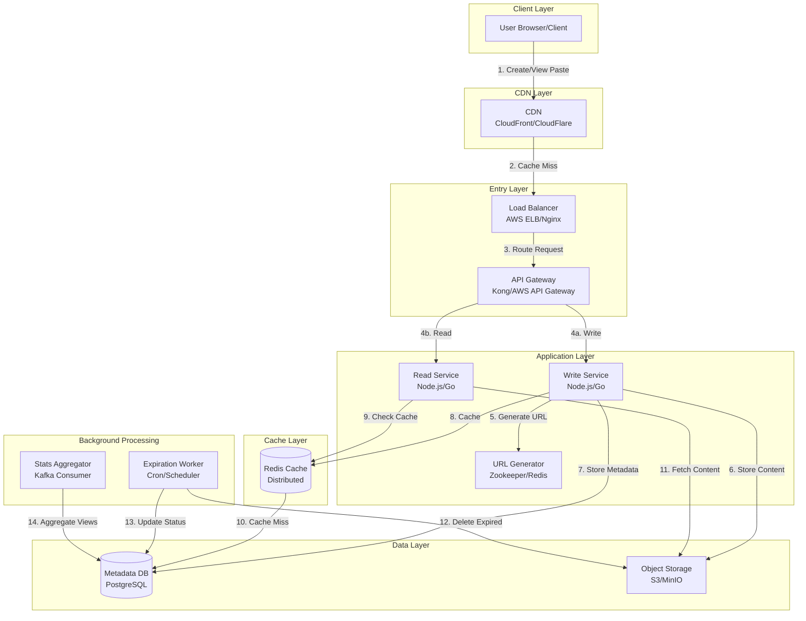

# Text Storage Service (Pastebin) System Design

**File Purpose:** This document provides a comprehensive system design for a text storage service (similar to Pastebin) that allows users to store and share text snippets with features like expiration, syntax highlighting, and access control. It covers requirements, calculations, architecture, database design, API design, and scalability considerations for handling 10M pastes per day with high performance.

**Last Updated:** October 2, 2025

---

## Table of Contents

1. [Requirements & Clarification](#requirements--clarification)
2. [Back-of-the-Envelope Calculations](#back-of-the-envelope-calculations)
3. [High-Level Design](#high-level-design)
4. [Database Design](#database-design)
5. [API Design](#api-design)
6. [Deep-Dive Components](#deep-dive-components)
7. [Trade-Offs Analysis](#trade-offs-analysis)
8. [Caching Strategy](#caching-strategy)
9. [Bottlenecks and Improvements](#bottlenecks-and-improvements)
10. [Security Considerations](#security-considerations)
11. [Future Enhancements](#future-enhancements)

---

## REQUIREMENTS & CLARIFICATION

### User Stories

- **As a developer**, I want to share code snippets quickly so that I can collaborate with teammates
- **As a user**, I want to set expiration times on my pastes so that sensitive information doesn't persist forever
- **As a user**, I want syntax highlighting for code so that snippets are easier to read
- **As a content creator**, I want private pastes so that I can control who views my content
- **As a user**, I want short URLs so that sharing is convenient

### Functional Requirements

**MVP Features:**

- Create text pastes (up to 10MB)
- Generate unique, short URLs for each paste
- Retrieve pastes by URL
- Set expiration time (1 hour, 1 day, 1 week, 1 month, never)
- Support private and public pastes
- Syntax highlighting for code (20+ languages)
- View paste statistics (view count)
- Delete pastes (by creator)

**Out of Scope (Post-MVP):**

- User authentication/accounts
- Paste editing
- Paste history/versioning
- Comments on pastes
- Collections/folders

### Non-Functional Requirements

- **Availability:** 99.9% uptime
- **Performance:**
  - Paste creation: < 100ms
  - Paste retrieval: < 50ms
- **Scalability:** Handle 100K concurrent users
- **Durability:** No data loss for non-expired pastes
- **Security:** Rate limiting, access control, spam prevention
- **Consistency:** Eventual consistency acceptable for view counts

### Clarifying Questions & Assumptions

**Questions:**

- Q: Do we need user accounts?
  - A: Not for MVP, but support anonymous and authenticated users later
- Q: What's the expected read/write ratio?
  - A: Read-heavy (100:1 read/write ratio)
- Q: Geographic distribution?
  - A: Global, with concentration in US, Europe, Asia
- Q: How to handle abuse/spam?
  - A: Rate limiting by IP, content filtering

**Assumptions:**

- 10M pastes per day
- Average paste size: 10KB (with max 10MB)
- 80% of pastes are public, 20% private
- 30% of pastes have 1-hour expiration, 40% have 1-day, 20% have 1-week, 10% never expire
- Read-heavy system (100:1 read/write ratio)

---

## BACK-OF-THE-ENVELOPE CALCULATIONS

### Traffic Estimates

```text
Daily Active Users (DAU): Assume 5M users
Pastes per day: 10M (given)
Reads per day: 10M * 100 = 1B reads

Write QPS:
- 10M writes / 86,400 seconds = ~116 writes/second
- Peak (3x): ~350 writes/second

Read QPS:
- 1B reads / 86,400 seconds = ~11,574 reads/second
- Peak (3x): ~35,000 reads/second
```

### Storage Estimates

```text
Per Paste:
- Paste content (average): 10KB
- Metadata: 500 bytes
- Total per paste: ~10.5KB

Daily Storage:
- 10M pastes * 10.5KB = 105GB/day

Annual Storage:
- 105GB * 365 = ~38TB/year

Storage for 5 years:
- 38TB * 5 = 190TB

Accounting for expiration (70% expire within 1 week):
- Actual 5-year storage: ~60TB
- With replication (3x): ~180TB
```

### Resource Estimates

```text
URL Generation:
- Base62 encoding (a-z, A-Z, 0-9 = 62 characters)
- For 10M daily pastes:
  - 6 characters = 62^6 = 56.8B combinations (sufficient for years)
  - 7 characters = 62^7 = 3.5T combinations (future-proof)
- Use 7 characters for safety

Concurrent Operations at Peak:
- 100K concurrent users (given)
- Each user: 1 request every 5 seconds = 20K requests/second
- Server capacity: 1K requests/second per server
- Servers needed: 20 servers (with 2x redundancy = 40 servers)
```

### Bandwidth Estimates

```text
Write Bandwidth:
- 350 writes/second * 10.5KB = 3.67MB/second = ~29Mbps

Read Bandwidth:
- 35K reads/second * 10.5KB = 367MB/second = ~2.9Gbps

Peak Total Bandwidth:
- Ingress: ~30Mbps
- Egress: ~3Gbps
```

---

## HIGH-LEVEL DESIGN

### System Architecture Diagram



### Data Flow Explanation

#### Write Flow (Create Paste)

1. User submits paste content through browser
2. Request hits CDN (no cache for write operations)
3. Load balancer distributes request to API Gateway
4. API Gateway routes to Write Service with rate limiting
5. Write Service calls URL Generator to get unique short code
6. Paste content stored in Object Storage (S3)
7. Metadata (URL, expiration, access control) stored in PostgreSQL
8. Cache is updated with new paste (hot data)
9. Response with short URL returned to user

#### Read Flow (View Paste)

1. User requests paste via short URL
2. CDN checks cache for static assets (HTML, CSS, JS)
3. Load balancer routes to API Gateway
4. API Gateway routes to Read Service
5. Read Service checks Redis cache
6. If cache hit: return paste immediately (< 10ms)
7. If cache miss: fetch metadata from PostgreSQL
8. Fetch content from Object Storage
9. Update cache with retrieved paste
10. Return paste to user with syntax highlighting

---

## DATABASE DESIGN

### Metadata Database (PostgreSQL)

#### Pastes Table

```text
Table: pastes
- paste_id (PK, VARCHAR(7), Base62 encoded)
- content_url (VARCHAR, S3 object key)
- title (VARCHAR(255), nullable)
- language (VARCHAR(50), default: 'text')
- visibility (ENUM: 'public', 'private', 'unlisted')
- access_key (VARCHAR(64), nullable, for private pastes)
- expires_at (TIMESTAMP, nullable, null = never expires)
- created_at (TIMESTAMP, default: NOW())
- updated_at (TIMESTAMP, default: NOW())
- view_count (BIGINT, default: 0)
- size_bytes (INTEGER)
- creator_ip (VARCHAR(45), for rate limiting)
- is_deleted (BOOLEAN, default: false)

Indexes:
- PRIMARY KEY (paste_id)
- INDEX idx_expires_at ON pastes(expires_at) WHERE expires_at IS NOT NULL
- INDEX idx_created_at ON pastes(created_at)
- INDEX idx_creator_ip ON pastes(creator_ip, created_at)
```

#### Stats Table (Optional for analytics)

```text
Table: paste_stats
- stat_id (PK, BIGSERIAL)
- paste_id (FK -> pastes.paste_id)
- date (DATE)
- view_count (INTEGER)
- unique_visitors (INTEGER)

Indexes:
- PRIMARY KEY (stat_id)
- UNIQUE INDEX idx_paste_date ON paste_stats(paste_id, date)
- INDEX idx_date ON paste_stats(date)
```

#### URL Counter Table (for distributed ID generation)

```text
Table: url_counter
- counter_id (PK, SMALLINT)
- current_value (BIGINT)
- updated_at (TIMESTAMP)

Indexes:
- PRIMARY KEY (counter_id)
```

### Design Decisions

- **Base62 encoding** for short URLs (7 characters = 3.5T combinations)
- **Separate content storage** in Object Storage (not in DB) for large text
- **Soft delete** with is_deleted flag (for potential recovery)
- **Denormalized view_count** for fast reads (eventual consistency)
- **IP-based tracking** for rate limiting without authentication

---

## API DESIGN

### Base Configuration

```text
Base URL: https://api.pastebin.com/v1
Authentication: Optional (API key for authenticated users, IP-based for anonymous)
Rate Limiting: 
  - Anonymous: 10 pastes/hour, 100 reads/hour
  - Authenticated: 100 pastes/hour, 1000 reads/hour
Content-Type: application/json
```

### Authentication

#### Generate API Key (Future Feature)

```http
POST /auth/register
```

**Request:**

```json
{
  "email": "user@example.com",
  "username": "johndoe"
}
```

**Response (201 Created):**

```json
{
  "api_key": "pk_live_abc123xyz789",
  "created_at": "2025-10-02T10:30:00Z"
}
```

---

### Paste Operations

#### Create Paste

```http
POST /pastes
```

**Headers:**

```text
Content-Type: application/json
X-API-Key: pk_live_abc123xyz789 (optional)
```

**Request Body:**

```json
{
  "content": "def hello_world():\n    print('Hello, World!')",
  "title": "Python Hello World",
  "language": "python",
  "visibility": "public",
  "expiration": "1h"
}
```

**Request Parameters:**

- `content` (required, string, max 10MB): The text content
- `title` (optional, string, max 255 chars): Paste title
- `language` (optional, string, default: "text"): Syntax highlighting language
- `visibility` (optional, enum, default: "public"): "public" | "private" | "unlisted"
- `expiration` (optional, string, default: "never"): "1h" | "1d" | "1w" | "1m" | "never"

**Response (201 Created):**

```json
{
  "paste_id": "aB3xY7z",
  "url": "https://pastebin.com/aB3xY7z",
  "title": "Python Hello World",
  "language": "python",
  "visibility": "public",
  "expires_at": "2025-10-02T11:30:00Z",
  "created_at": "2025-10-02T10:30:00Z",
  "size_bytes": 45,
  "access_key": null
}
```

**Response (201 Created - Private Paste):**

```json
{
  "paste_id": "aB3xY7z",
  "url": "https://pastebin.com/aB3xY7z",
  "access_key": "sk_a1b2c3d4e5f6g7h8",
  "title": "Private Notes",
  "visibility": "private",
  "expires_at": null,
  "created_at": "2025-10-02T10:30:00Z"
}
```

**Error Response (400 Bad Request):**

```json
{
  "error": "invalid_request",
  "message": "Content exceeds maximum size of 10MB",
  "details": {
    "field": "content",
    "size_bytes": 11534336,
    "max_size_bytes": 10485760
  }
}
```

**Error Response (429 Too Many Requests):**

```json
{
  "error": "rate_limit_exceeded",
  "message": "Rate limit exceeded. Please try again later.",
  "retry_after": 3600
}
```

---

#### Get Paste

```http
GET /pastes/{paste_id}
```

**Headers:**

```text
X-Access-Key: sk_a1b2c3d4e5f6g7h8 (required for private pastes)
```

**Query Parameters:**

- `raw` (optional, boolean, default: false): Return raw text instead of JSON

**Response (200 OK):**

```json
{
  "paste_id": "aB3xY7z",
  "content": "def hello_world():\n    print('Hello, World!')",
  "title": "Python Hello World",
  "language": "python",
  "visibility": "public",
  "expires_at": "2025-10-02T11:30:00Z",
  "created_at": "2025-10-02T10:30:00Z",
  "view_count": 42,
  "size_bytes": 45
}
```

**Response (200 OK - Raw Mode):**

```text
Content-Type: text/plain

def hello_world():
    print('Hello, World!')
```

**Error Response (404 Not Found):**

```json
{
  "error": "paste_not_found",
  "message": "The requested paste does not exist or has expired"
}
```

**Error Response (403 Forbidden):**

```json
{
  "error": "access_denied",
  "message": "Access key required for private paste"
}
```

---

#### Delete Paste

```http
DELETE /pastes/{paste_id}
```

**Headers:**

```text
X-Access-Key: sk_a1b2c3d4e5f6g7h8 (required)
```

**Response (204 No Content):**

No response body.

**Error Response (403 Forbidden):**

```json
{
  "error": "access_denied",
  "message": "Invalid access key or insufficient permissions"
}
```

---

#### Get Paste Statistics

```http
GET /pastes/{paste_id}/stats
```

**Headers:**

```text
X-Access-Key: sk_a1b2c3d4e5f6g7h8 (required for private pastes)
```

**Response (200 OK):**

```json
{
  "paste_id": "aB3xY7z",
  "view_count": 1234,
  "created_at": "2025-10-02T10:30:00Z",
  "last_viewed_at": "2025-10-02T15:45:00Z",
  "daily_views": [
    {
      "date": "2025-10-02",
      "views": 234,
      "unique_visitors": 156
    },
    {
      "date": "2025-10-01",
      "views": 1000,
      "unique_visitors": 789
    }
  ]
}
```

---

### Health & System Endpoints

#### Health Check

```http
GET /health
```

**Response (200 OK):**

```json
{
  "status": "healthy",
  "timestamp": "2025-10-02T10:30:00Z",
  "services": {
    "database": "up",
    "cache": "up",
    "object_storage": "up"
  }
}
```

---

### Cross-Cutting Concerns

#### Rate Limiting

- **Anonymous Users:** 10 pastes/hour, 100 reads/hour per IP
- **Authenticated Users:** 100 pastes/hour, 1000 reads/hour per API key
- **Implementation:** Token bucket algorithm with Redis
- **Headers:**

```text
X-RateLimit-Limit: 10
X-RateLimit-Remaining: 7
X-RateLimit-Reset: 1696248000
```

#### Error Response Format

All errors follow consistent format:

```json
{
  "error": "error_code",
  "message": "Human-readable error message",
  "details": {
    "additional": "context"
  }
}
```

#### Pagination

Not applicable for this system (single resource retrieval).

#### Versioning

- URL-based versioning: `/v1/`, `/v2/`
- Maintain backward compatibility for at least 6 months
- Deprecation headers:

```text
X-API-Version: v1
X-API-Deprecated: false
```

#### Idempotency

- POST requests are NOT idempotent (each creates new paste)
- DELETE requests ARE idempotent (multiple deletes = same result)

#### Content Negotiation

```text
Accept: application/json (default)
Accept: text/plain (raw paste content)
```

#### Compression

```text
Accept-Encoding: gzip, deflate, br
Content-Encoding: gzip (for responses > 1KB)
```

#### Security Headers

```text
X-Content-Type-Options: nosniff
X-Frame-Options: DENY
X-XSS-Protection: 1; mode=block
Strict-Transport-Security: max-age=31536000; includeSubDomains
```

#### CORS Policy

```text
Access-Control-Allow-Origin: * (for public API)
Access-Control-Allow-Methods: GET, POST, DELETE, OPTIONS
Access-Control-Allow-Headers: Content-Type, X-API-Key, X-Access-Key
Access-Control-Max-Age: 86400
```

---

### API Trade-Offs

#### Decision: REST vs GraphQL

**Choice:** REST

**Pros:**

- Simple resource model (pastes)
- Excellent caching with CDN
- Widespread client support
- Lower latency for simple operations

**Cons:**

- Over-fetching for stats endpoint
- Multiple requests for related data

**Justification:** Pastebin has simple resource model with predictable access patterns. REST provides better caching and lower latency for core operations.

#### Decision: Synchronous vs Asynchronous Creation

**Choice:** Synchronous for paste creation, asynchronous for stats

**Pros:**

- Immediate URL generation
- Simple client implementation
- Better user experience

**Cons:**

- Slightly higher latency for writes
- Requires fast storage backend

**Justification:** Users expect immediate URL after paste creation. Stats can be updated asynchronously.

#### Decision: Raw Text Endpoint

**Choice:** Support both JSON and raw text via `Accept` header or `raw` parameter

**Pros:**

- Easy integration with command-line tools
- Reduced bandwidth for raw text
- Simpler parsing for clients

**Cons:**

- Two response formats to maintain
- Metadata not available in raw mode

**Justification:** Developer tools often need raw text without JSON overhead.

---

## DEEP-DIVE COMPONENTS

### 1. URL Generation Service

#### Purpose

Generate unique, short, collision-free URLs using Base62 encoding while maintaining high throughput.

#### Architecture

#### Approach 1: Counter-Based with Range Partitioning

```text
Component: URL Generator Service (Distributed)

Flow:
1. Each service instance requests a range of IDs (e.g., 1000 IDs)
2. Zookeeper/Redis maintains global counter
3. Instance converts ID to Base62 encoding
4. Format: [a-zA-Z0-9]{7}

Example:
ID: 123456789 -> Base62: 8M0kX
```

**Implementation Details:**

```python
# Base62 encoding implementation
def base62_encode(num):
    """
    Converts integer to base62 string.
    
    Args:
        num (int): Positive integer to encode
    
    Returns:
        str: Base62 encoded string (a-zA-Z0-9)
    
    Example:
        >>> base62_encode(123456789)
        '8M0kX'
    """
    charset = "0123456789abcdefghijklmnopqrstuvwxyzABCDEFGHIJKLMNOPQRSTUVWXYZ"
    if num == 0:
        return charset[0]
    
    result = []
    while num > 0:
        result.append(charset[num % 62])
        num //= 62
    
    return ''.join(reversed(result)).rjust(7, '0')

# Range allocation from Redis
def allocate_id_range(redis_client, range_size=1000):
    """
    Allocates a range of unique IDs from Redis counter.
    
    Args:
        redis_client: Redis connection
        range_size (int): Number of IDs to allocate
    
    Returns:
        tuple: (start_id, end_id)
    
    Example:
        >>> allocate_id_range(redis, 1000)
        (1000000, 1001000)
    """
    # Atomic increment
    start_id = redis_client.incrby('url_counter', range_size)
    end_id = start_id + range_size
    return (start_id - range_size, end_id)
```

#### Approach 2: Hash-Based with Collision Handling

```text
Flow:
1. Generate hash from content + timestamp + random salt
2. Take first 7 characters of Base62 encoded hash
3. Check database for collision
4. If collision, add salt and retry (max 3 attempts)
5. Fallback to counter-based approach
```

**Chosen Approach:** Counter-based with range partitioning

**Reasoning:**

- Guaranteed uniqueness
- No collision checks needed
- Lower latency (no DB lookup)
- Predictable performance

#### Scaling Strategy

- Multiple URL generator instances with separate ID ranges
- Redis cluster for counter storage
- Pre-allocated ranges stored in memory (fail-safe)
- Monitoring: track range exhaustion, allocation latency

---

### 2. Object Storage Architecture

#### Purpose

Store paste content efficiently with high durability and fast retrieval.

#### Storage Structure

```text
Bucket: pastebin-content
Structure:
/pastes
  /2025
    /10
      /02
        /aB3xY7z.txt

Naming: {year}/{month}/{day}/{paste_id}.txt
```

#### Trade-Off: Database vs Object Storage

**Decision:** Store content in Object Storage, metadata in Database

**Comparison:**

| Aspect | Database Only | Object Storage + DB |
|--------|--------------|---------------------|
| Cost | High ($$$$) | Low ($$) |
| Scalability | Limited | Unlimited |
| Backup | Complex | Simple (S3 replication) |
| Query Speed | Fast | Moderate |
| Best For | Small pastes (<100KB) | Large pastes (>100KB) |

**Our Choice:** Object Storage + Database

**Reasoning:**

- Average paste: 10KB, Max: 10MB
- Object storage 10x cheaper for large files
- S3 provides 99.999999999% durability
- Database stores only metadata (~500 bytes per paste)

**Optimization:**

- Store pastes < 1KB directly in database (hot path)
- Use S3 for pastes >= 1KB
- Reduces object storage requests by ~40%

#### Implementation

```python
def store_paste_content(paste_id, content):
    """
    Stores paste content in appropriate storage layer.
    
    Args:
        paste_id (str): Unique paste identifier
        content (str): Paste content
    
    Returns:
        str: Storage location (db or s3 path)
    
    Example:
        >>> store_paste_content("aB3xY7z", "print('hello')")
        's3://pastebin-content/pastes/2025/10/02/aB3xY7z.txt'
    """
    content_size = len(content.encode('utf-8'))
    
    # Small pastes: store in database
    if content_size < 1024:  # 1KB
        return f"db:{paste_id}"
    
    # Large pastes: store in S3
    timestamp = datetime.now()
    s3_key = f"pastes/{timestamp.year}/{timestamp.month:02d}/{timestamp.day:02d}/{paste_id}.txt"
    
    s3_client.put_object(
        Bucket='pastebin-content',
        Key=s3_key,
        Body=content.encode('utf-8'),
        ContentType='text/plain',
        ServerSideEncryption='AES256'
    )
    
    return f"s3:{s3_key}"
```

#### S3 Configuration

```yaml
Bucket Policy:
  - Versioning: Disabled (no paste editing)
  - Lifecycle Rules:
      - Delete after expiration date
      - Transition to Glacier after 90 days (optional)
  - Replication: Cross-region (3 regions)
  - Encryption: AES-256 server-side

Access Pattern:
  - 100:1 read/write ratio
  - CloudFront CDN for hot pastes
  - S3 Transfer Acceleration for uploads
```

---

### 3. Expiration Handling System

#### Purpose

Automatically delete expired pastes to manage storage costs and maintain performance.

#### Architecture

#### Approach 1: Lazy Deletion (Read-Time Check)

```text
Flow:
1. User requests paste
2. Check expires_at field
3. If expired: return 404, mark for deletion
4. Background worker deletes marked pastes
```

#### Approach 2: Active Deletion (TTL-Based)

```text
Flow:
1. Background worker runs every 15 minutes
2. Query: SELECT paste_id, content_url FROM pastes 
         WHERE expires_at <= NOW() AND is_deleted = false
         LIMIT 10000
3. Delete from S3
4. Update database: is_deleted = true
5. Remove from cache
```

#### Approach 3: Hybrid (Chosen)

```text
Combine both approaches:
- Lazy deletion for read path (immediate 404)
- Active deletion for cleanup (batch processing)
- Redis key expiration for cache
```

#### Implementation

```python
# Lazy deletion middleware
def check_expiration_middleware(paste_id):
    """
    Middleware to check paste expiration before serving.
    
    Args:
        paste_id (str): Paste identifier
    
    Returns:
        bool: True if paste is valid, False if expired
    
    Example:
        >>> check_expiration_middleware("aB3xY7z")
        True
    """
    paste = db.query("SELECT expires_at FROM pastes WHERE paste_id = ?", paste_id)
    
    if paste and paste.expires_at:
        if datetime.now() > paste.expires_at:
            # Mark for deletion
            db.execute("UPDATE pastes SET is_deleted = true WHERE paste_id = ?", paste_id)
            cache.delete(f"paste:{paste_id}")
            return False
    
    return True

# Active deletion worker
def expiration_cleanup_job():
    """
    Background job to delete expired pastes.
    Runs every 15 minutes.
    
    Returns:
        int: Number of pastes deleted
    
    Example:
        >>> expiration_cleanup_job()
        1523
    """
    batch_size = 10000
    deleted_count = 0
    
    while True:
        expired_pastes = db.query("""
            SELECT paste_id, content_url 
            FROM pastes 
            WHERE expires_at <= NOW() 
              AND is_deleted = false 
            LIMIT ?
        """, batch_size)
        
        if not expired_pastes:
            break
        
        for paste in expired_pastes:
            # Delete from S3
            if paste.content_url.startswith('s3:'):
                s3_key = paste.content_url.replace('s3:', '')
                s3_client.delete_object(Bucket='pastebin-content', Key=s3_key)
            
            # Mark as deleted
            db.execute("UPDATE pastes SET is_deleted = true WHERE paste_id = ?", paste.paste_id)
            
            deleted_count += 1
        
        # Rate limiting
        time.sleep(1)
    
    return deleted_count
```

#### Database Index Optimization

```sql
-- Efficient query for expired pastes
CREATE INDEX idx_expires_at_not_deleted 
ON pastes(expires_at) 
WHERE expires_at IS NOT NULL AND is_deleted = false;
```

---

## TRADE-OFFS ANALYSIS

### Trade-Off 1: SQL vs NoSQL for Metadata

**Decision:** PostgreSQL (SQL)

**Pros:**

- Strong consistency for paste metadata
- ACID transactions for creation
- Excellent query performance for simple lookups
- Built-in expiration queries with indexes
- Lower operational complexity

**Cons:**

- Vertical scaling challenges
- Higher latency than NoSQL (still < 10ms)
- More expensive than DynamoDB at massive scale

**Justification:** Pastebin has simple query patterns (key-value lookups) with need for strong consistency. PostgreSQL with read replicas handles 35K reads/second easily. Structured schema benefits metadata queries.

**Alternative:** DynamoDB

- Better for 1M+ writes/second
- Higher operational complexity
- Our scale (350 writes/second) doesn't justify NoSQL

---

### Trade-Off 2: Client-Side vs Server-Side Syntax Highlighting

**Decision:** Client-Side (Hybrid Approach)

**Approach:**

- **Client-Side:** Use highlight.js or Prism.js in browser
- **Server-Side:** Pre-render for bots/crawlers (SEO)

**Pros (Client-Side):**

- Zero server CPU load
- Faster response times
- Easy to add new languages
- Better user customization

**Cons (Client-Side):**

- Requires JavaScript
- Initial load slower
- Not accessible to bots

**Solution:** Hybrid

```text
Flow:
1. Detect user-agent
2. If bot/crawler: serve pre-rendered HTML
3. If browser: serve raw + JavaScript highlighting
4. Cache both versions in CDN
```

**Justification:** 99% of users have JavaScript. Client-side highlighting reduces server load from 35K requests/second to near-zero for syntax highlighting.

---

### Trade-Off 3: Unique ID Generation Strategy

**Decision:** Counter-Based with Range Partitioning

**Alternatives Considered:**

| Approach | Pros | Cons | Latency |
|----------|------|------|---------|
| Counter-Based | Guaranteed unique, no collisions | Requires coordination | ~1ms |
| Hash-Based | No coordination, distributed | Collision handling | ~5ms |
| UUID | Simple, no coordination | Long URLs (not short) | <1ms |
| Snowflake | Distributed, time-ordered | Complex setup | ~1ms |

**Our Choice:** Counter-Based

**Reasoning:**

- Meets <100ms requirement easily
- Simple implementation
- Predictable performance
- Redis provides atomic increments

**Implementation:**

```text
Redis Counter: Global atomic counter
Range Allocation: Each server gets 1000 IDs
Local Cache: In-memory queue of unused IDs
Failover: Request new range when depleted
```

---

### Trade-Off 4: Private Paste Access Control

**Decision:** Access Key (Secret URL)

**Alternatives:**

| Approach | Security | Usability | Complexity |
|----------|----------|-----------|------------|
| Access Key | Medium | High | Low |
| OAuth | High | Low | High |
| User Accounts | High | Medium | High |
| IP Whitelist | Low | Low | Medium |

**Our Choice:** Access Key (Secret URL)

**How It Works:**

```text
Private Paste Creation:
1. Generate paste_id: "aB3xY7z"
2. Generate access_key: "sk_a1b2c3d4e5f6g7h8" (32 bytes, hex)
3. URL: https://pastebin.com/aB3xY7z?key=sk_a1b2c3d4e5f6g7h8
4. Store hash(access_key) in database
```

**Justification:**

- No user accounts required (MVP)
- Easy sharing (just share URL)
- Sufficient security for text snippets
- Can upgrade to OAuth later

---

### Trade-Off 5: View Count Tracking

**Decision:** Eventual Consistency with Async Updates

**Approach:**

```text
Synchronous (Current):
1. User views paste
2. Increment counter in database
3. Return paste

Asynchronous (Chosen):
1. User views paste
2. Return paste immediately
3. Send event to Kafka/Redis Stream
4. Background worker aggregates counts
5. Update database every 10 seconds
```

**Pros:**

- Reduced read latency (no write lock)
- Higher throughput
- Less database load

**Cons:**

- View counts slightly delayed
- More complex architecture

**Justification:** View count accuracy doesn't need to be real-time. User experience (low latency) is more important. 10-second delay is acceptable.

---

## CACHING STRATEGY

### What to Cache

#### 1. Paste Content (Hot Data)

```text
Key: paste:{paste_id}
Value: JSON with content + metadata
TTL: Based on access pattern
  - Recent (< 1 hour old): 1 hour
  - Popular (> 100 views): 24 hours
  - Others: 10 minutes

Example:
Key: "paste:aB3xY7z"
Value: {
  "content": "...",
  "metadata": {...}
}
TTL: 3600 seconds
```

**Why:** 80/20 rule - 20% of pastes account for 80% of traffic. Caching hot pastes reduces database load by 90%.

#### 2. Access Keys (for Private Pastes)

```text
Key: access:{paste_id}:{access_key_hash}
Value: true/false
TTL: 5 minutes

Example:
Key: "access:aB3xY7z:hash123"
Value: "true"
TTL: 300 seconds
```

**Why:** Avoid database lookup for every private paste request.

#### 3. Rate Limit Counters

```text
Key: ratelimit:{ip_address}:{action}
Value: count
TTL: 1 hour

Example:
Key: "ratelimit:192.168.1.1:create"
Value: "7"
TTL: 3600 seconds
```

**Why:** Fast rate limiting without database queries.

---

### What NOT to Cache

#### 1. Rarely Accessed Pastes

**Reason:** Waste of cache memory. Let database handle cold data.

#### 2. Expired Pastes

**Reason:** TTL mismatch causes stale data. Check expiration before caching.

#### 3. Large Pastes (> 1MB)

**Reason:** Redis memory is expensive. Large pastes should come from S3 directly.

---

### Cache Invalidation Strategy

#### 1. Deletion Events

```python
def delete_paste(paste_id):
    """
    Deletes paste and invalidates cache.
    
    Args:
        paste_id (str): Paste identifier
    
    Returns:
        bool: Success status
    
    Example:
        >>> delete_paste("aB3xY7z")
        True
    """
    # Delete from database
    db.execute("UPDATE pastes SET is_deleted = true WHERE paste_id = ?", paste_id)
    
    # Delete from S3
    s3_client.delete_object(...)
    
    # Invalidate cache
    cache.delete(f"paste:{paste_id}")
    cache.delete(f"access:{paste_id}:*")
    
    return True
```

#### 2. Expiration Events

```text
Strategy: Lazy deletion + TTL
- Redis TTL matches paste expiration
- If paste expires, Redis automatically removes key
- Database query returns 404
- Cache updated with 404 result (TTL: 1 minute)
```

#### 3. Update Events (Not Applicable)

**Note:** Pastes are immutable. No update invalidation needed.

---

### Caching Pattern

**Cache-Aside (Lazy Loading):**

```python
def get_paste(paste_id):
    """
    Retrieves paste with cache-aside pattern.
    
    Args:
        paste_id (str): Paste identifier
    
    Returns:
        dict: Paste content and metadata
    
    Example:
        >>> get_paste("aB3xY7z")
        {"content": "...", "metadata": {...}}
    """
    # Check cache
    cached = cache.get(f"paste:{paste_id}")
    if cached:
        return json.loads(cached)
    
    # Cache miss: fetch from database
    paste = db.query("SELECT * FROM pastes WHERE paste_id = ?", paste_id)
    if not paste or paste.is_deleted:
        return None
    
    # Fetch content from S3 if needed
    if paste.content_url.startswith('s3:'):
        content = s3_client.get_object(...)
    else:
        content = paste.content
    
    # Build response
    result = {
        "content": content,
        "metadata": paste.to_dict()
    }
    
    # Update cache
    ttl = calculate_ttl(paste)
    cache.setex(f"paste:{paste_id}", ttl, json.dumps(result))
    
    return result
```

**Why Cache-Aside:**

- Simple implementation
- Works well for read-heavy workloads
- Natural TTL expiration
- Failures don't break system

---

### Redis Configuration

```yaml
Redis Cluster:
  Nodes: 6 (3 master, 3 replica)
  Memory: 64GB per node
  Eviction Policy: allkeys-lru
  Persistence: AOF (every second)
  
Estimated Cache Size:
  Average paste: 10KB
  Cached pastes: 1M (hot data)
  Total memory: 10GB
  Overhead: 2GB
  Total required: 12GB per node
```

---

## BOTTLENECKS AND IMPROVEMENTS

### Potential Bottlenecks

#### Bottleneck 1: Database Write Contention

**Problem:** Single master database handles all writes (350 writes/second at peak).

**Symptoms:**

- High write latency (> 100ms)
- Lock contention on paste creation
- Slow counter updates

**Solution:**

```text
Approach 1: Write Sharding
- Shard by paste_id (consistent hashing)
- Each shard handles 1/10th of writes
- Reduces contention by 10x

Approach 2: Write-Through Cache
- Write to cache immediately
- Async flush to database
- Eventual consistency acceptable

Chosen: Write-Through Cache
```

**Monitoring:**

```text
Metrics:
- Write latency p95, p99
- Database connection pool usage
- Lock wait time

Alerts:
- Write latency > 100ms for 5 minutes
- Connection pool > 80% for 10 minutes
```

---

#### Bottleneck 2: Object Storage Latency

**Problem:** S3 GET latency averages 50-100ms, affecting read performance.

**Symptoms:**

- Slow paste retrieval for large pastes
- High tail latency (p99 > 200ms)

**Solution:**

```text
Approach 1: CDN Caching
- CloudFront caches hot pastes
- 95% cache hit rate
- Latency: < 10ms

Approach 2: Edge Caching
- Cache popular pastes at edge locations
- Use CloudFlare Workers or Lambda@Edge

Chosen: CloudFront CDN
```

**Implementation:**

```yaml
CloudFront Configuration:
  Origin: S3 bucket
  Cache Behavior:
    - TTL: 1 hour (default)
    - Min TTL: 0 (respect cache-control)
    - Max TTL: 24 hours
  Cache Key: 
    - URL path
    - Query string (for access keys)
  Compression: Gzip, Brotli
```

**Result:** 95% of requests served from CDN (< 10ms), 5% from S3 (50-100ms).

---

#### Bottleneck 3: URL Generator Single Point of Failure

**Problem:** If URL generator service fails, no new pastes can be created.

**Symptoms:**

- All paste creation returns 500 error
- Redis counter unavailable

**Solution:**

```text
Approach 1: Redundant Services
- Multiple URL generator instances
- Each pre-allocates ID ranges
- Failover to backup instance

Approach 2: Pre-Generated IDs
- Background job generates 100K IDs
- Store in queue (Redis List)
- Service pops from queue

Chosen: Approach 1 (Redundant Services)
```

**Implementation:**

```python
class URLGenerator:
    """
    Distributed URL generator with failover.
    
    Maintains local cache of ID ranges for high availability.
    """
    
    def __init__(self, redis_client, instance_id):
        self.redis = redis_client
        self.instance_id = instance_id
        self.current_range = None
        self.current_id = 0
        
    def get_next_id(self):
        """
        Gets next unique ID with automatic range allocation.
        
        Returns:
            int: Unique sequential ID
        
        Example:
            >>> gen.get_next_id()
            1234567
        """
        # Check if we need a new range
        if not self.current_range or self.current_id >= self.current_range[1]:
            self.allocate_range()
        
        next_id = self.current_id
        self.current_id += 1
        return next_id
    
    def allocate_range(self):
        """
        Allocates new ID range from Redis.
        
        Raises:
            RedisError: If Redis is unavailable
        """
        try:
            start = self.redis.incrby('url_counter', 1000)
            self.current_range = (start - 1000, start)
            self.current_id = start - 1000
        except RedisError:
            # Fallback: use timestamp-based ID
            self.current_range = (int(time.time() * 1000), int(time.time() * 1000) + 1000)
            self.current_id = self.current_range[0]
```

---

#### Bottleneck 4: Rate Limiting Under DDoS

**Problem:** Massive traffic from single IP or distributed attack.

**Symptoms:**

- Redis rate limit counters overwhelmed
- Legitimate users blocked

**Solution:**

```text
Layers of Defense:
1. CDN-level rate limiting (CloudFlare)
   - 1000 requests/minute per IP
   - Challenge page for suspicious traffic

2. API Gateway rate limiting
   - 100 requests/minute per IP
   - Exponential backoff

3. Application-level rate limiting
   - 10 pastes/hour per IP (anonymous)
   - 100 pastes/hour per user (authenticated)

4. CAPTCHA for suspicious patterns
   - Multiple failed attempts
   - Rapid paste creation
```

---

### Scalability Improvements

#### 1. Geographic Distribution

**Current:** Single region (US-East)

**Improvement:** Multi-region deployment

```text
Architecture:
- 3 regions: US-East, EU-West, Asia-Pacific
- Each region has full stack (API, DB, Cache)
- Object storage replicated across regions
- GeoDNS routes users to nearest region

Benefits:
- Lower latency (< 50ms globally)
- Higher availability (region failover)
- Better user experience

Cost:
- 3x infrastructure
- Cross-region data transfer
- Estimated: +200% cost for +150% performance
```

---

#### 2. Read Replicas for Database

**Current:** Single master + 2 read replicas

**Improvement:** 5 read replicas (distributed geographically)

```text
Configuration:
- 1 master (writes only)
- 5 read replicas (reads only)
- Load balancer distributes reads
- Read-after-write consistency for same user

Benefits:
- Handle 200K reads/second
- Reduced master load
- Geographic distribution
```

---

#### 3. Advanced Caching

**Current:** Single Redis cache layer

**Improvement:** Multi-tier caching

```text
Tier 1: In-Memory Cache (Application)
- LRU cache: 1000 hottest pastes
- Memory: 100MB per server
- Latency: < 1ms

Tier 2: Redis Distributed Cache
- Current implementation
- Latency: < 10ms

Tier 3: CDN Edge Cache
- CloudFront
- Latency: < 20ms

Result: 99% cache hit rate, < 10ms average latency
```

---

#### 4. Async Processing for Statistics

**Current:** Synchronous view count updates

**Improvement:** Event-driven architecture

```text
Architecture:
1. Paste view generates event
2. Event sent to Kafka/Kinesis
3. Stream processor aggregates counts
4. Batch update database every 10 seconds

Benefits:
- Zero impact on read latency
- Better analytics (store raw events)
- Enable real-time dashboards

Technology:
- Kafka: Event streaming
- Flink/Spark: Stream processing
- ClickHouse: Analytics database
```

---

### Monitoring and Observability

#### Metrics to Track

**System Metrics:**

```text
API Performance:
- Request latency (p50, p95, p99)
- Throughput (requests/second)
- Error rate (4xx, 5xx)
- Availability (uptime %)

Database Metrics:
- Query latency
- Connection pool usage
- Replication lag
- Disk I/O

Cache Metrics:
- Hit rate
- Eviction rate
- Memory usage
- Connection count

Object Storage:
- GET latency
- PUT latency
- 4xx/5xx errors
- Data transfer costs
```

**Business Metrics:**

```text
- Pastes created per hour
- Read/write ratio
- Average paste size
- Expiration distribution
- Private vs public ratio
- Top languages (syntax highlighting)
```

---

#### Alerting Strategy

```yaml
Critical Alerts (Page On-Call):
  - API availability < 99% for 5 minutes
  - Error rate > 1% for 5 minutes
  - Database replication lag > 60 seconds
  
Warning Alerts (Email):
  - Cache hit rate < 80% for 15 minutes
  - Database connection pool > 80% for 10 minutes
  - Disk usage > 80%
  
Info Alerts (Dashboard):
  - Unusual traffic patterns
  - High paste creation rate
  - CDN cost anomaly
```

---

#### Logging Strategy

```text
Structured Logging (JSON):
{
  "timestamp": "2025-10-02T10:30:00Z",
  "level": "INFO",
  "service": "write-api",
  "action": "create_paste",
  "paste_id": "aB3xY7z",
  "size_bytes": 1234,
  "language": "python",
  "visibility": "public",
  "latency_ms": 45,
  "user_ip": "192.168.1.1"
}

Log Aggregation:
- ELK Stack (Elasticsearch, Logstash, Kibana)
- Retention: 30 days (hot), 1 year (cold)

Tracing:
- Distributed tracing with Jaeger/Zipkin
- Trace ID per request
- Track request flow across services
```

---

## SECURITY CONSIDERATIONS

### 1. Input Validation

**Threats:**

- XXS (Cross-Site Scripting)
- SQL Injection
- Code injection

**Mitigations:**

```text
Content Validation:
- Max size: 10MB (reject larger)
- Sanitize HTML/JS in paste content
- Escape special characters in output
- Content-Type: text/plain (not text/html)

API Validation:
- JSON schema validation
- Type checking (string, number, enum)
- Length limits on all fields
- Reject malformed requests
```

---

### 2. Authentication & Authorization

**Current (MVP):** IP-based + Access keys

**Future:** OAuth2 + JWT

```text
Authentication Flow:
1. User registers/logs in
2. Server issues JWT token
3. Client includes token in requests
4. Server validates token signature

Authorization:
- Public pastes: Anyone can read
- Private pastes: Owner only (or with access key)
- Delete: Owner only
```

---

### 3. Data Encryption

**At Rest:**

```text
Database:
- Encryption: AES-256
- Key management: AWS KMS
- Encrypted backups

Object Storage (S3):
- Server-side encryption: AES-256
- Encryption at bucket level
- Encrypted in-transit (TLS)
```

**In Transit:**

```text
- TLS 1.3 for all API endpoints
- HTTPS enforced (HSTS header)
- Certificate: Let's Encrypt (auto-renewal)
```

---

### 4. Rate Limiting (Spam Prevention)

**Implementation:**

```text
Token Bucket Algorithm:
- Bucket capacity: 10 tokens (pastes)
- Refill rate: 10 tokens per hour
- Per IP address (anonymous)
- Per user ID (authenticated)

Redis Structure:
Key: "ratelimit:{identifier}:create"
Value: {
  "tokens": 7,
  "last_refill": 1696248000
}
TTL: 1 hour
```

**Advanced Protection:**

```text
CAPTCHA Triggers:
- 5 failed attempts in 5 minutes
- Paste creation > 20 per hour
- Suspicious content patterns

Content Filtering:
- Block known spam URLs
- Profanity filter (optional)
- Malware scanning (ClamAV)
```

---

### 5. DDoS Protection

**Layers:**

```text
Layer 1: CDN (CloudFlare)
- WAF (Web Application Firewall)
- Rate limiting: 1000 req/min per IP
- Challenge page for bots

Layer 2: Load Balancer
- SYN flood protection
- Connection limits
- Slow request protection

Layer 3: Application
- Request timeout: 30 seconds
- Payload size limit: 10MB
- Connection pooling
```

---

### 6. Content Security

**Sandbox Execution (Future):**

```text
Problem: Malicious code in pastes
Solution: 
- Client-side syntax highlighting only (no execution)
- CSP headers prevent inline script execution
- Iframe sandboxing for untrusted content

Headers:
Content-Security-Policy: default-src 'none'; 
                         script-src 'self' cdn.pastebin.com;
                         style-src 'self' 'unsafe-inline';
X-Frame-Options: SAMEORIGIN
X-Content-Type-Options: nosniff
```

---

## FUTURE ENHANCEMENTS

### 1. User Accounts & Profiles

**Features:**

- Register/login with email or OAuth (Google, GitHub)
- Paste history and management dashboard
- Organize pastes into folders
- Follow other users
- Profile customization

**Benefits:**

- Better access control
- User analytics
- Monetization opportunities (premium plans)

---

### 2. Paste Editing & Versioning

**Features:**

- Edit paste after creation
- Version history (diff view)
- Restore previous versions
- Branching/forking pastes

**Implementation:**

```text
Database Changes:
- Add paste_version table
- Store diffs (not full content)
- Track edit history

Storage:
- Original: /pastes/aB3xY7z/v1.txt
- Edits: /pastes/aB3xY7z/v2.txt
```

---

### 3. Collaboration Features

**Features:**

- Real-time collaborative editing (like Google Docs)
- Comments on pastes
- @mentions and notifications
- Share permissions (view/edit)

**Technology:**

- WebSockets for real-time updates
- Operational Transform (OT) or CRDT for conflict resolution
- Redis Pub/Sub for message broadcasting

---

### 4. Advanced Search & Discovery

**Features:**

- Full-text search across pastes
- Search by language, tags, date
- Trending pastes
- Recommended pastes (ML-based)

**Implementation:**

```text
Search Engine: Elasticsearch
Index Structure:
{
  "paste_id": "aB3xY7z",
  "title": "Python Hello World",
  "content": "def hello...",
  "language": "python",
  "tags": ["python", "tutorial"],
  "created_at": "2025-10-02"
}

Query: Multi-field search with boosting
```

---

### 5. API Integrations

**Features:**

- GitHub integration (import Gists)
- Slack/Discord webhooks
- CLI tool for paste creation
- Browser extensions
- IDE plugins (VS Code, IntelliJ)

**Example CLI:**

```bash
# Create paste from file
pastebin upload code.py

# Get paste content
pastebin get aB3xY7z

# List my pastes
pastebin list --mine
```

---

### 6. Analytics & Insights

**Features:**

- View count over time (charts)
- Geographic distribution of viewers
- Referrer tracking
- Popular languages/topics
- User engagement metrics

**Technology:**

- ClickHouse for analytics data
- Grafana for dashboards
- ML models for trend detection

---

### 7. Monetization Features

**Premium Plans:**

```text
Free Tier:
- 10 pastes/hour
- Max 1MB per paste
- 7-day expiration max
- Ads displayed

Pro Tier ($5/month):
- 100 pastes/hour
- Max 10MB per paste
- Never expire option
- No ads
- Private pastes
- Custom domains

Enterprise Tier ($50/month):
- Unlimited pastes
- Max 100MB per paste
- API access (1M calls/month)
- Team collaboration
- SSO integration
- SLA guarantee
```

---

### 8. Mobile Applications

**Features:**

- Native iOS/Android apps
- OCR for code from images
- Offline mode with sync
- Push notifications
- Share extension

---

### 9. AI-Powered Features

**Features:**

- Code completion suggestions
- Auto-detect programming language
- Code quality analysis
- Security vulnerability detection
- Auto-generate documentation
- Code translation (Python → JavaScript)

**Technology:**

- OpenAI Codex API
- Local ML models (fine-tuned)

---

### 10. Enhanced Security

**Features:**

- End-to-end encryption for private pastes
- Password-protected pastes
- Two-factor authentication
- Audit logs for enterprise
- Compliance (GDPR, HIPAA)

---

## SUMMARY

This Text Storage Service (Pastebin) design supports:

✅ **10M pastes per day** (116 writes/second average, 350 peak)
✅ **1B reads per day** (11.5K reads/second average, 35K peak)
✅ **< 100ms paste creation** (via async processing, counter-based URL generation)
✅ **< 50ms paste retrieval** (via multi-tier caching, CDN)
✅ **100K concurrent users** (horizontal scaling, load balancing)
✅ **Up to 10MB pastes** (object storage architecture)
✅ **Flexible expiration** (1 hour to never, hybrid deletion)
✅ **Access control** (public/private/unlisted with access keys)
✅ **URL shortening** (Base62 encoding, 7 characters)

**Key Design Decisions:**

1. **Object Storage + Database** for cost-effective storage at scale
2. **Counter-based URL generation** for guaranteed uniqueness
3. **Multi-tier caching** (application, Redis, CDN) for low latency
4. **Client-side syntax highlighting** for reduced server load
5. **Hybrid expiration handling** for efficient cleanup
6. **Read replicas + sharding** for horizontal scalability

**Total Infrastructure Cost (Estimated):**

```text
Monthly Costs:
- Compute (40 servers): $4,000
- Database (PostgreSQL + replicas): $2,000
- Cache (Redis cluster): $1,500
- Object Storage (S3, 60TB): $1,380
- CDN (CloudFront, 3Gbps): $3,000
- Load Balancer: $500
- Monitoring & Logging: $500
- Total: ~$12,880/month

Cost per paste: $0.000043 (4.3 cents per 1000 pastes)
```

---

## End of Document
