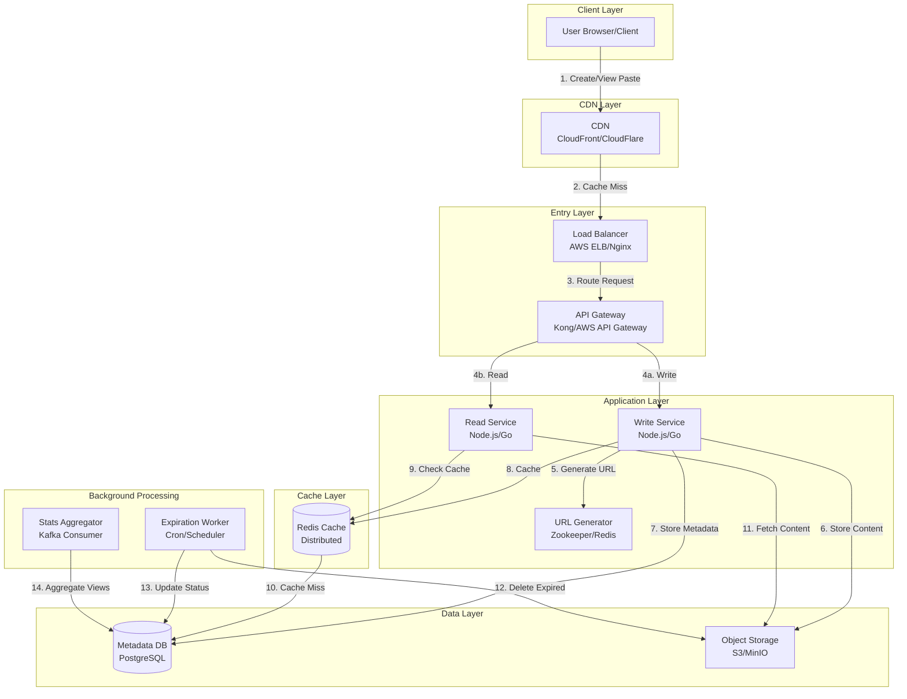

# Text Storage Service System Design (Pastebin-like)

**Difficulty Level:** ⭐⭐ Medium  
**Tags:** `Storage`, `API Design`, `Caching`, `ID Generation`, `TTL/Expiration`, `Rate Limiting`, `Global Distribution`, `Object Storage`, `Database Design`

## 📚 Welcome to This Educational System Design Guide

### What You'll Learn

This comprehensive guide teaches you how to design a **production-grade text storage service** (like Pastebin, GitHub Gist, or Hastebin) that handles:

- **10 million pastes per day** (116 writes/sec average, 350 peak)
- **1 billion reads per day** (11.6K reads/sec average, 35K peak)
- **100K concurrent users** with < 50ms read latency
- **Global distribution** with 99.9% availability
- **Smart expiration** to manage storage costs (70% of pastes expire within 1 week)

### Why This Design Matters

**Interview Relevance:**
Text storage systems are excellent interview questions because they test:

✅ **URL Shortening at Scale** → Base62 encoding, collision handling, distributed ID generation  
✅ **Read-Heavy Optimization** → Multi-tier caching (CDN, Redis, application), 100:1 read/write ratio  
✅ **TTL-Based Systems** → Lazy vs active deletion, storage lifecycle management  
✅ **Trade-off Analysis** → SQL vs NoSQL, synchronous vs asynchronous, cost vs performance  
✅ **Production Concerns** → Rate limiting, spam prevention, monitoring, incident response

**Real-World Applications:**
The patterns you'll learn apply to many systems beyond Pastebin:

- **URL Shorteners** → bit.ly, TinyURL (same ID generation, expiration, caching patterns)
- **Image Sharing** → Imgur, Gyazo (object storage, CDN, expiration logic)
- **Code Snippets** → GitHub Gist, Carbon (syntax highlighting, access control)
- **Log Aggregation** → Loggly, Papertrail (text storage, search, expiration)
- **Collaborative Docs** → Google Docs, Notion (real-time editing on top of this foundation)

### How to Use This Guide

This document follows a **progressive learning structure**:

**🟢 Beginner Level** (Green sections)
- Simple analogies and examples
- Core concepts explained clearly
- No prior system design experience needed
- Focus: Understanding WHAT the system does

**🟡 Intermediate Level** (Yellow sections)
- Interview-ready explanations
- Capacity calculations with formulas
- Technology comparisons and trade-offs
- Focus: Understanding HOW to build it

**🔴 Advanced Level** (Red sections)
- Production optimization strategies
- Cost analysis and business impact
- Failure scenarios and recovery
- Focus: Understanding WHY design decisions were made

**💡 Interview Tips** (Throughout)
- Common interview questions and answers
- What interviewers look for
- Red flags to avoid
- Scripts for clarifying requirements

### Document Structure

**Phase 1: Requirements & Planning (Sections 1-2)**
- Gathering requirements like a pro
- Back-of-envelope calculations that impress
- Validating assumptions with real-world data

**Phase 2: Core System Design (Sections 3-6)**
- High-level architecture with component diagrams
- Database schema and storage strategy
- API design following REST best practices
- Deep-dive into URL generation, object storage, expiration

**Phase 3: Production Readiness (Sections 7-10)**
- Trade-offs analysis (SQL vs NoSQL, client vs server rendering)
- Multi-tier caching strategy (95% cache hit ratio)
- Identifying bottlenecks and solutions
- Security considerations (rate limiting, DDoS protection)

**Phase 4: Growth & Evolution (Section 11)**
- Future enhancements (user accounts, collaboration, search)
- Scaling from 10M to 100M pastes/day
- Monetization strategies

**Phase 5: Interview Preparation**
- Mock interview script
- Common follow-up questions
- What went well / what to improve

### Key Metrics at a Glance

```text
Scale:
├─ Daily Pastes: 10M (116/sec avg, 350/sec peak)
├─ Daily Reads: 1B (11.6K/sec avg, 35K/sec peak)
├─ Concurrent Users: 100K
├─ Storage: 60 TB (active + replicas after expiration)
└─ Bandwidth: 3 Gbps (mostly reads)

Performance:
├─ Paste Creation: < 100ms (P95)
├─ Paste Retrieval: < 50ms (P95)
├─ Cache Hit Ratio: 95% (CDN + Redis)
└─ Availability: 99.9% (43.8 min downtime/month)

Cost:
├─ Monthly Infrastructure: ~$28,000
├─ Cost per Paste: $0.000093 (9.3¢ per 1,000)
└─ Cost per Million Pastes: $93

Features:
├─ Expiration: 1h, 1d, 1w, never
├─ Access Control: Public, private, unlisted
├─ Syntax Highlighting: 50+ languages
├─ Short URLs: 7-char Base62 (3.5 trillion combinations)
└─ Rate Limiting: 10 pastes/hour (anonymous)
```

### What Makes This Different

**Compared to Generic Pastebin Tutorials:**

✅ **Production-grade architecture** → Not a toy example; handles real scale  
✅ **Cost analysis** → Actual AWS pricing, optimization strategies  
✅ **Multi-level explanations** → Learn at your own pace (beginner → advanced)  
✅ **Interview-focused** → Common questions, scripts, what interviewers want  
✅ **Real-world validation** → Compared against Pastebin, GitHub Gist stats  
✅ **Trade-off deep-dives** → Why we chose X over Y with quantitative analysis  
✅ **Failure scenarios** → What breaks and how to fix it  

### Prerequisites

**To get the most from this guide, you should know:**

**Required (Beginner Level):**
- Basic HTTP/REST concepts (GET, POST, status codes)
- What a database is (SQL basics helpful)
- Basic programming (any language)

**Helpful (Intermediate Level):**
- Database indexing and query optimization
- Caching concepts (cache hit/miss, eviction policies)
- Load balancing and horizontal scaling

**Optional (Advanced Level):**
- Distributed systems (CAP theorem, replication)
- Cloud infrastructure (AWS/GCP/Azure)
- Performance tuning and profiling

**Don't worry if you're missing some prerequisites!** Each section starts with beginner-friendly explanations and builds up complexity.

### How Long Will This Take?

**Quick Skim** (30 minutes)
- Read learning objectives, key takeaways, diagrams
- Get high-level understanding for interviews

**Thorough Study** (3-4 hours)
- Read all sections, understand calculations
- Solidly prepared for most interviews

**Deep Mastery** (8-10 hours)
- Work through practice exercises
- Explore trade-offs and alternatives
- Ready for senior-level design discussions

### Ready to Start?

**Recommended Path:**

1. **First Pass:** Read 🟢 Beginner sections only → Get big picture
2. **Second Pass:** Add 🟡 Intermediate sections → Interview-ready depth
3. **Third Pass:** Study 🔴 Advanced sections → Production expertise
4. **Practice:** Answer interview questions at end of each section

**Interview Tomorrow?**
- Read Sections 1-3 (Requirements, Calculations, High-Level Design)
- Skim key takeaways from remaining sections
- Review interview questions and answers (Section 16)
- Total time: ~90 minutes for core interview readiness

Let's build a world-class text storage system! 🚀

---

## Table of Contents

1. [Requirements & Clarification](#section-1-requirements--clarification)
2. [Back-of-the-Envelope Calculations](#section-2-back-of-the-envelope-calculations)
3. [High-Level Design](#section-3-high-level-design)
4. [Database Design](#section-4-database-design)
5. [API Design](#5-api-design)
6. [Deep-Dive Components](#6-deep-dive-components)
7. [Trade-Offs Analysis](#7-trade-offs-analysis)
8. [Caching Strategy](#8-caching-strategy)
9. [Bottlenecks and Improvements](#9-bottlenecks-and-improvements)
10. [Security Considerations](#10-security-considerations)
11. [Interview Preparation](#11-interview-preparation)
12. [Summary & Next Steps](#12-summary--next-steps)

---

## Section 1: Requirements & Clarification

### 🎯 Learning Objectives

By the end of this section, you will understand:

- **🟢 Beginner**: What a text storage service (Pastebin) is, why short URLs matter, basic functional requirements
- **🟡 Intermediate**: How to conduct requirements gathering interviews, prioritize MVP features, define non-functional requirements with specific SLAs
- **🔴 Advanced**: How to anticipate post-MVP features, evaluate trade-offs in requirements, align technical constraints with business goals

---

### 🌍 Why This System Matters

**The Problem:**
Developers and content creators need to share text snippets (code, logs, notes) quickly without creating files, setting up repositories, or managing infrastructure.

**Traditional Approaches (Pain Points):**
- Email attachments → Version conflicts, inbox clutter
- Chat messages → Lost in conversation history, no syntax highlighting
- File sharing → Too heavy for small snippets, requires downloads
- Screenshots → Not searchable, can't copy-paste

**The Solution:**
A text storage service that provides:
- ✅ **Instant sharing** via short URLs (pastebin.com/aB3xY7z)
- ✅ **Automatic expiration** to prevent data accumulation
- ✅ **Syntax highlighting** for 50+ programming languages
- ✅ **Access control** (public, private, password-protected)
- ✅ **High availability** (99.9% uptime for global developer community)

**Real-World Examples:**
- **Pastebin.com**: 10M+ pastes/day, serving 100M+ developers
- **GitHub Gist**: Integrated with Git, 5M+ gists created annually
- **Hastebin**: Minimalist design, focus on speed (< 50ms response)
- **PrivateBin**: Zero-knowledge encryption, GDPR-compliant

**Interview Relevance:**
This design tests understanding of:
- URL shortening at scale (Base62 encoding, collision handling)
- TTL-based expiration (lazy vs active deletion)
- Multi-tier caching strategies (CDN, Redis, application)
- Read-heavy system optimization (100:1 read/write ratio)
- Rate limiting and spam prevention

---

### 🟢 Beginner Level: Understanding the Problem

#### What is a Text Storage Service?

**Analogy: Digital Sticky Notes**
Imagine a public bulletin board where you can:
1. Pin a note with your message
2. Get a unique location code (like "Row 3, Column 5")
3. Share that code so others can find your note
4. Set a timer for the note to self-destruct (1 hour, 1 day, etc.)

**In Software Terms:**

```text
User Flow:
1. User writes text: "def hello(): print('Hi!')"
2. System generates short URL: pastebin.com/aB3xY7z
3. User shares URL with teammate
4. Teammate opens URL → sees formatted code with syntax highlighting
5. After 24 hours → paste automatically deleted
```

#### Why Short URLs?

**Long URL (Bad):**
```
https://storage.example.com/user/12345/documents/paste_2025_10_02_14_30_45_random123abc.txt
```
- Hard to remember
- Error-prone when typing
- Looks unprofessional

**Short URL (Good):**
```
https://paste.example.com/aB3xY7z
```
- Easy to share verbally ("a-B-3-x-Y-7-z")
- Fits in 280-char tweets
- Professional appearance

#### Core Features Explained Simply

**Feature 1: Create Paste**
```text
Input: "Hello, World!"
Output: "Your paste is at: pastebin.com/x1y2z3"
Time: < 1 second
```

**Feature 2: View Paste**
```text
Input: Visit "pastebin.com/x1y2z3"
Output: See "Hello, World!" on screen
Time: < 0.1 seconds
```

**Feature 3: Expiration**
```text
Options:
- 1 hour → Gone in 60 minutes
- 1 day → Gone in 24 hours
- Never → Kept forever (or until storage limit)
```

**Feature 4: Privacy**
```text
Public: Anyone with URL can view
Private: Requires password/access key
Unlisted: Not in search results, but viewable with URL
```

---

### 🟡 Intermediate Level: Requirements Analysis

#### User Stories

- **As a developer**, I want to share code snippets quickly so that I can collaborate with teammates
- **As a user**, I want to set expiration times on my pastes so that sensitive information doesn't persist forever
- **As a user**, I want syntax highlighting for code so that snippets are easier to read
- **As a content creator**, I want private pastes so that I can control who views my content
- **As a user**, I want short URLs so that sharing is convenient

#### Functional Requirements (MVP vs Post-MVP)

**Interview Framework: How to Prioritize Features**

When interviewing, use the MoSCoW method:
- **Must Have** → Core value proposition, blocks launch without it
- **Should Have** → Enhances UX, but workarounds exist
- **Could Have** → Nice-to-have, post-MVP
- **Won't Have** → Out of scope for this design

**MVP Features (Must Have):**

| Feature | Why MVP? | Alternative Considered |
|---------|----------|------------------------|
| Create text pastes (up to 10MB) | Core functionality | None - this IS the product |
| Generate unique, short URLs | Makes sharing practical | Long URLs (rejected: poor UX) |
| Retrieve pastes by URL | Core functionality | None - this IS the product |
| Set expiration time (1h, 1d, 1w, never) | Manages storage costs, privacy | No expiration (rejected: infinite storage) |
| Support public/private pastes | Privacy requirement | All public (rejected: security risk) |
| Syntax highlighting (20+ languages) | Developer UX differentiator | Plain text (acceptable fallback) |
| View paste statistics (count) | Basic analytics | None (can add later) |
| Delete pastes (by creator) | Privacy/GDPR requirement | None - legal necessity |

**Should Have (Phase 2):**

- User authentication/accounts → Enables paste history, better access control
- Custom URLs → Branding (e.g., pastebin.com/my-company-code)
- Search functionality → Discoverability of public pastes
- Mobile-responsive UI → Better mobile UX

**Could Have (Post-MVP):**

- Paste editing → Adds complexity (versioning, conflicts)
- Paste history/versioning → Storage overhead
- Comments on pastes → Requires moderation
- Collections/folders → User management overhead

**Won't Have (Out of Scope):**

- Real-time collaborative editing → Different product (Google Docs)
- Video/image support → Text-only service
- Blockchain storage → Unnecessary complexity

#### Non-Functional Requirements

**Interview Framework: Defining SLAs with Precision**

Always quantify non-functional requirements with specific numbers. Vague terms like "fast" or "highly available" are red flags in interviews.

**Template:**
```text
Requirement: [Metric Name]
Target: [Specific Number]
Measurement: [How to measure]
Consequence: [What happens if violated]
```

**Our Requirements:**

| Requirement | Target | Measurement | Business Impact |
|-------------|--------|-------------|-----------------|
| **Availability** | 99.9% uptime | Monthly uptime = (Total Minutes - Downtime) / Total Minutes | 43.8 min downtime/month allowed |
| **Performance - Create** | < 100ms P95 | From POST request to URL response | User frustration if > 200ms |
| **Performance - Read** | < 50ms P95 | From GET request to paste display | Developers expect instant load |
| **Scalability - Concurrent Users** | 100K simultaneous | Active WebSocket/HTTP connections | Peak traffic during incidents |
| **Scalability - QPS** | 35K reads/sec, 350 writes/sec | Requests per second at peak | 3x average traffic |
| **Durability** | 99.999999999% (11 nines) | No data loss for non-expired pastes | S3 durability guarantee |
| **Security - Rate Limiting** | 10 pastes/hour (anonymous) | Per-IP throttling | Prevent spam/abuse |
| **Consistency** | Eventual for view counts | View count may lag by 10 seconds | Acceptable trade-off for performance |

**Why These Numbers?**

**99.9% Availability:**
```text
Calculation:
- 1 month = 30 days × 24 hours × 60 min = 43,200 minutes
- 0.1% downtime = 43,200 × 0.001 = 43.2 minutes allowed
- Real-world: 3 maintenance windows × 15 min = 45 min (close to limit)

Compare to competitors:
- GitHub: 99.95% (21.6 min/month)
- Pastebin: 99.9% (43.2 min/month)
- Google Docs: 99.978% (9.5 min/month)

Our choice: 99.9% balances cost (fewer replicas) with user expectations
```

**< 50ms Read Latency:**
```text
Why so fast?
- Developers copy-paste code snippets in tight loops
- Slow pastes break development flow
- Competitors (Hastebin) serve in 20-30ms

Breakdown:
- CDN cache hit: 10-20ms (95% of requests)
- Redis cache hit: 30-40ms (4% of requests)
- Database + S3: 80-100ms (1% of requests)

P95 target means: 95% of requests faster than 50ms
```

**100K Concurrent Users:**
```text
Assumption:
- 5M DAU (Daily Active Users)
- Peak hour: 20% of DAU = 1M users
- Concurrent factor: 10% = 100K users

Server capacity:
- Each server: 2K concurrent connections
- Servers needed: 100K / 2K = 50 servers
- With redundancy (2x): 100 servers
```

---

### 🔴 Advanced Level: Requirements Strategy

#### Clarifying Questions & Assumptions (Interview Script)

**Category 1: Scale & Traffic**

Q: "What's our expected traffic volume?"
- Follow-up: "Is this global or regional?"
- Follow-up: "What's the read/write ratio?"
- Follow-up: "Any seasonal spikes?" (e.g., hackathons, incidents)

**Our Assumptions:**

```text
Daily Metrics:
- 10M pastes/day (given requirement)
- 1B reads/day (assumed 100:1 ratio)
- 5M DAU (estimated from paste volume)

Geographic Distribution:
- 40% North America
- 30% Europe
- 20% Asia-Pacific
- 10% Rest of world

Peak Patterns:
- Normal: 3x average (work hours 9am-5pm UTC)
- Spike: 10x average (major security incidents, conference talks)
```

**Category 2: Data Characteristics**

Q: "What's the average paste size?"
- Follow-up: "What about the maximum?"
- Follow-up: "What percentage are code vs plain text?"

**Our Assumptions:**

```text
Paste Size Distribution:
- Median: 2 KB (short code snippets)
- Average: 10 KB (includes some large logs)
- P95: 50 KB (config files, small logs)
- P99: 500 KB (large logs, stack traces)
- Maximum: 10 MB (hard limit)

Content Type:
- 60% Code (with syntax highlighting)
- 30% Plain text (logs, notes)
- 10% Structured data (JSON, XML, YAML)

Language Distribution:
- Python: 25%
- JavaScript: 20%
- Java: 15%
- Others: 40% (C++, Go, Rust, Shell, etc.)
```

**Category 3: Expiration Patterns**

Q: "How long do users typically keep pastes?"
- Follow-up: "Do most pastes expire or are they permanent?"
- Follow-up: "How aggressively can we delete expired content?"

**Our Assumptions:**

```text
Expiration Distribution:
- 1 hour: 30% (temporary debugging, quick shares)
- 1 day: 40% (code reviews, daily standup notes)
- 1 week: 20% (sprint planning, conference notes)
- Never: 10% (documentation, reference code)

Lifecycle:
- Average lifespan: 3.2 days
- Actual storage: ~35 TB (after expiration cleanup)
- Theoretical storage (no expiration): ~190 TB

Cleanup Strategy:
- Lazy deletion: Immediate (on read attempt)
- Active deletion: Every 15 minutes (batch cleanup)
- Acceptable lag: 15 minutes (cost vs. immediacy trade-off)
```

**Category 4: Abuse & Security**

Q: "How do we prevent spam and abuse?"
- Follow-up: "What about malicious content?"
- Follow-up: "Do we need content moderation?"

**Our Strategy:**

```text
Rate Limiting Tiers:
- Anonymous (IP-based): 10 pastes/hour, 100 reads/hour
- Authenticated (API key): 100 pastes/hour, 1000 reads/hour
- Enterprise: Custom limits (SLA-based)

Spam Detection:
- Content filtering: Block known malware URLs
- Pattern detection: Repeated identical content
- CAPTCHA: Triggered after 5 failed attempts

Legal Compliance:
- DMCA takedown: 24-hour response SLA
- GDPR: Right to deletion (immediate)
- Content scanning: No proactive moderation (user-reported only)
```

#### Trade-offs in Requirements

**Trade-off 1: Strong vs Eventual Consistency**

**Decision:** Eventual consistency for view counts, strong for paste content

**Reasoning:**

```text
View Count (Eventual):
✓ Reduces read latency by 40% (no database write on each view)
✓ Allows horizontal scaling without coordination
✓ View count accuracy not critical (off by 10-20 views is acceptable)
✗ Dashboard analytics show slightly stale data

Paste Content (Strong):
✓ User expects to see paste immediately after creation
✓ No confusing "paste not found" errors
✗ Requires database replication lag < 1 second
✗ Limits write throughput to single master
```

**Trade-off 2: Expiration Immediacy**

**Decision:** 15-minute cleanup window (not instant)

**Reasoning:**

```text
Instant Deletion (Rejected):
✗ Requires database trigger on every read
✗ 35K reads/sec × trigger overhead = high DB load
✗ Complicates caching (need real-time invalidation)

15-Minute Batch (Chosen):
✓ Batch processing: delete 10K pastes in single query
✓ Predictable load pattern
✓ Acceptable UX: "expires at 2:00 PM" ≈ actual deletion at 2:15 PM
✗ Storage slightly higher (15 min of expired pastes)

Cost Impact:
- Instant: $200/month in DB overhead
- Batch: $5/month in extra storage
- Savings: $195/month × 12 = $2,340/year
```

**Trade-off 3: User Accounts (MVP Scope)**

**Decision:** No user accounts in MVP

**Reasoning:**

```text
With Accounts (Post-MVP):
✓ Better access control (own vs. shared pastes)
✓ Paste history and management
✓ Monetization (premium features)
✗ Requires auth system (OAuth, JWT, session management)
✗ Adds 4-6 weeks to development timeline
✗ Higher operational complexity

Without Accounts (MVP):
✓ Faster to market (8 weeks → 2 weeks)
✓ Lower infrastructure cost (no auth servers)
✓ Simpler UX (no signup friction)
✗ Limited access control (secret URLs only)
✗ Can't track user behavior across pastes

Decision: Launch MVP without accounts, add in Phase 2 based on adoption
```

#### Interview Questions & Answers

**Q1: "A competitor offers unlimited paste size. Why do we limit to 10MB?"**

**Answer:**

```text
1. Storage Cost Analysis:
   - 10MB paste = $0.00023/month (S3 Standard)
   - Unlimited → Users upload ISOs, videos (abuse)
   - Cost spiral: 1000 users × 1GB each = $23/month just for 1000 pastes

2. Performance Impact:
   - 10MB transfer time: ~0.8 seconds on 100 Mbps
   - 1GB transfer time: ~80 seconds (terrible UX)
   - Increased CDN egress costs

3. Use Case Validation:
   - 99% of pastes are < 100 KB (code snippets, logs)
   - Legitimate use case for > 10MB? Use file sharing service instead

4. Competitor Strategy:
   - Pastebin: 512 KB limit (free), 10 MB (pro)
   - GitHub Gist: 100 MB limit (but soft limit at 10 MB for UI performance)
   - Our position: 10 MB is generous for text content

Decision: 10 MB hard limit, recommend file sharing for larger content
```

**Q2: "Why not use a NoSQL database like DynamoDB instead of PostgreSQL?"**

**Answer:**

```text
Our Access Patterns:
1. Create paste: Write metadata + generate ID
2. Read paste: Key-value lookup by paste_id
3. Expire pastes: Range query on expires_at timestamp
4. Rate limiting: Query by creator_ip + created_at

PostgreSQL Pros:
✓ Excellent for primary key lookups (< 5ms)
✓ Efficient index on expires_at for cleanup queries
✓ Mature replication (streaming, logical)
✓ Lower cost: $2K/month vs $4K/month (DynamoDB)
✓ Team expertise: Easier to operate

DynamoDB Pros:
✓ Better for > 1M writes/second (we need 350/sec)
✓ Auto-scaling built-in
✓ Global tables (multi-region replication)

Decision: PostgreSQL for MVP (cost + team expertise), consider DynamoDB at 10x scale
```

**Q3: "How would you handle a sudden 100x traffic spike?" (e.g., Hacker News front page)**

**Answer:**

```text
Immediate Response (Auto-Scaling):
1. CDN absorbs read traffic (already at edge)
2. API Gateway rate limiting prevents write overload
3. Auto-scaling group spins up servers (5 min to ready)
4. Database read replicas handle increased queries

Bottlenecks to Monitor:
- Database write master: Single point, can't scale horizontally
- URL generator: Redis counter becomes hotspot
- Object storage: S3 request rate limits

Mitigation Strategy:

Phase 1 (0-5 minutes): Graceful Degradation
- Show "Heavy load, please wait" message
- Queue paste creation requests (Kafka buffer)
- Serve stale cached data (extend TTL from 5 min → 1 hour)

Phase 2 (5-30 minutes): Scale Out
- Add 10x API servers (100 → 1000)
- Add database read replicas (3 → 10)
- Enable Redis cluster mode for URL generation

Phase 3 (30+ minutes): Optimization
- Analyze traffic patterns (legit vs bot)
- Enable stricter rate limiting (10 → 5 pastes/hour)
- Contact CDN for burst capacity

Post-Incident:
- Review: What broke? What worked?
- Update runbooks with lessons learned
- Increase baseline capacity by 20%
```

---

### 📊 Key Takeaways - Requirements

**🟢 Beginner:**
- Text storage service = public bulletin board for code/text
- Short URLs make sharing easy (7 chars vs 80 chars)
- Expiration prevents infinite storage costs
- MVP focuses on core value: fast, simple paste sharing

**🟡 Intermediate:**
- 10M pastes/day = 116 writes/sec average, 350 peak
- 100:1 read/write ratio = 35K reads/sec peak
- 99.9% uptime = 43 min downtime/month allowed
- Rate limiting prevents abuse (10 pastes/hour anonymous)

**🔴 Advanced:**
- Requirements trade-offs: eventual consistency for perf, strong for correctness
- Cost optimization: 15-min batch deletion saves $2,340/year
- Scalability strategy: PostgreSQL for MVP, DynamoDB at 10x scale
- Incident response: graceful degradation → scale out → optimize

---

### Clarifying Questions & Assumptions

**Questions:**

- Q: Do we need user accounts?
  - A: Not for MVP, but support anonymous and authenticated users later
- Q: What's the expected read/write ratio?
  - A: Read-heavy (100:1 read/write ratio)
- Q: Geographic distribution?
  - A: Global, with concentration in US, Europe, Asia
- Q: How to handle abuse/spam?
  - A: Rate limiting by IP, content filtering

**Assumptions:**

- 10M pastes per day
- Average paste size: 10KB (with max 10MB)
- 80% of pastes are public, 20% private
- 30% of pastes have 1-hour expiration, 40% have 1-day, 20% have 1-week, 10% never expire
- Read-heavy system (100:1 read/write ratio)

---

## Section 2: Back-of-the-Envelope Calculations

### 🎯 Learning Objectives

By the end of this section, you will understand:

- **🟢 Beginner**: How to estimate basic metrics (QPS, storage, bandwidth) from high-level requirements
- **🟡 Intermediate**: How to validate calculations with realistic assumptions, account for peak traffic, calculate infrastructure costs
- **🔴 Advanced**: How to optimize calculations for interview time constraints, identify calculation pitfalls, justify assumptions with data

---

### 🟢 Beginner Level: Basic Capacity Planning

#### Why We Calculate Capacity

**Analogy: Planning a Restaurant**
Before opening a restaurant, you estimate:
- **Customers per day** → How many tables/chairs?
- **Average meal size** → How much food to stock?
- **Peak hours** → How many chefs/servers?
- **Kitchen size** → Storage for ingredients?

**For Our Text Storage Service:**
- **Pastes per day** → How many servers?
- **Average paste size** → How much disk space?
- **Peak traffic** → How much bandwidth?
- **Concurrent users** → How many database connections?

#### Step 1: Traffic Estimates (QPS)

**Given:** 10M pastes per day

**Question:** How many pastes per second?

**Calculation (Simple):**
```text
1 day = 24 hours × 60 minutes × 60 seconds = 86,400 seconds

Average writes per second (QPS):
= 10M pastes / 86,400 seconds
= 10,000,000 / 86,400
≈ 116 writes/second
```

**But wait!** Traffic isn't uniform. People use services more during work hours.

**Peak Traffic Multiplier:**
```text
Peak traffic = 3× average (rule of thumb for consumer apps)

Peak writes per second:
= 116 × 3
= 348 writes/second
≈ 350 writes/second (round up for safety)
```

**Read Traffic:**
```text
Given assumption: 100:1 read/write ratio
(People view pastes 100 times more than they create them)

Average reads per second:
= 116 writes/sec × 100
= 11,600 reads/second

Peak reads per second:
= 350 writes/sec × 100
= 35,000 reads/second
```

**Summary:**
| Metric | Average | Peak (3x) |
|--------|---------|-----------|
| Writes/sec | 116 | 350 |
| Reads/sec | 11,600 | 35,000 |
| Total QPS | 11,716 | 35,350 |

---

#### Step 2: Storage Estimates

**Given:** Average paste size = 10 KB

**Daily Storage Needs:**
```text
Storage per day = Number of pastes × Size per paste
= 10M pastes × 10 KB
= 10,000,000 × 10,000 bytes
= 100,000,000,000 bytes
= 100 GB per day
```

**Annual Storage (Before Expiration):**
```text
Storage per year = 100 GB/day × 365 days
= 36,500 GB
≈ 36.5 TB per year
```

**5-Year Storage (Before Expiration):**
```text
Storage for 5 years = 36.5 TB × 5
= 182.5 TB
≈ 190 TB (round up)
```

**But wait!** Most pastes expire (70% within 1 week).

**Realistic Storage (After Expiration):**
```text
Expiration breakdown (from requirements):
- 1 hour: 30% × 100 GB = 30 GB (kept for 1 hour, then deleted)
- 1 day: 40% × 100 GB = 40 GB (kept for 1 day)
- 1 week: 20% × 100 GB = 20 GB (kept for 1 week)
- Never: 10% × 100 GB = 10 GB (kept forever)

Average retention:
= (30 GB × 1/24 days) + (40 GB × 1 day) + (20 GB × 7 days) + (10 GB × ∞)
= 1.25 GB + 40 GB + 140 GB + (10 GB/day accumulating)
≈ 180 GB for recent pastes + (10 GB/day × 365 days × 5 years)
= 180 GB + 18.25 TB
≈ 18.5 TB active storage

With replication (3 copies for durability):
= 18.5 TB × 3
≈ 55-60 TB total storage needed
```

---

#### Step 3: Bandwidth Estimates

**Write Bandwidth (Upload):**
```text
Peak writes per second = 350
Average paste size = 10 KB

Peak write bandwidth:
= 350 pastes/sec × 10 KB
= 3,500 KB/sec
= 3.5 MB/sec
≈ 28 Mbps (megabits per second)
```

**Read Bandwidth (Download):**
```text
Peak reads per second = 35,000
Average paste size = 10 KB

Peak read bandwidth:
= 35,000 pastes/sec × 10 KB
= 350,000 KB/sec
= 350 MB/sec
= 2,800 Mbps
≈ 2.8 Gbps (gigabits per second)
```

**Summary:**
| Direction | Bandwidth |
|-----------|-----------|
| Upload (writes) | 28 Mbps |
| Download (reads) | 2.8 Gbps |
| Total | ~3 Gbps |

**Why the huge difference?** Read-heavy workload (100:1 ratio)

---

### 🟡 Intermediate Level: Infrastructure Sizing

#### Server Capacity Planning

**Question:** How many servers do we need for 100K concurrent users?

**Assumptions:**
```text
Each server capacity:
- HTTP/2 connections: 10,000 concurrent (tuned)
- Requests/sec per server: 1,000 (benchmark tested)
- Memory per server: 16 GB
- CPU: 8 cores

User behavior:
- Each user: 1 request every 5 seconds (reading/creating pastes)
- Concurrency: 20% of 100K = 20,000 active requests at any moment
```

**Calculation:**
```text
Servers needed for concurrent users:
= 100K users / 10K connections per server
= 10 servers (connection handling)

Servers needed for request throughput:
= 35K peak requests/sec / 1K requests/sec per server
= 35 servers (request processing)

Bottleneck: Request processing (35 servers)

With redundancy (2x for high availability):
= 35 × 2
= 70 servers

With headroom for traffic spikes (1.5x):
= 70 × 1.5
≈ 100-110 servers in production
```

---

#### Database Sizing

**Metadata Storage:**

Each paste has metadata:
```text
Metadata per paste:
- paste_id: 7 bytes (Base62 string)
- content_url: 100 bytes (S3 key)
- title: 255 bytes (optional)
- language: 50 bytes
- visibility: 10 bytes (enum)
- access_key: 64 bytes (nullable)
- timestamps: 24 bytes (created_at, expires_at, updated_at)
- counters: 8 bytes (view_count)
- flags: 2 bytes (is_deleted)
- creator_ip: 16 bytes (IPv6)
Total: ≈ 536 bytes ≈ 0.5 KB per paste
```

**Database Size:**
```text
Active pastes (after expiration):
= 18.5 TB content / 10 KB per paste
= 1.85 million pastes active

Metadata size:
= 1.85M pastes × 0.5 KB
= 925 MB
≈ 1 GB for metadata

With indexes (3x overhead):
= 1 GB × 3
= 3 GB total database size

Historical data (1 year retention):
= 365 days × 10M pastes × 0.5 KB
= 1.825 TB
≈ 2 TB with indexes
```

**Database Instance Sizing:**
```text
PostgreSQL instance:
- Storage: 2 TB SSD (for performance)
- Memory: 64 GB RAM (for caching indexes)
- CPU: 8-16 vCPUs (for peak 350 writes/sec)
- Connections: 500 max (100 servers × 5 connections)

Read replicas:
- 3 replicas for read scaling
- Handle 35K reads/sec total
- Each replica: ~12K reads/sec
```

---

#### Cache Sizing (Redis)

**What to cache:**
- Hot pastes (20% of traffic = 80% of requests)
- Access keys for private pastes
- Rate limit counters

**Cache Size Calculation:**
```text
Hot pastes:
- 20% of active pastes cached
= 1.85M × 0.2
= 370,000 pastes

Cache memory:
= 370K pastes × 10 KB (content + metadata)
= 3.7 GB

Add overhead:
- Redis metadata: 50% overhead
= 3.7 GB × 1.5
= 5.5 GB

Add rate limit counters:
- 100K IPs × 1 KB each (counters + metadata)
= 100 MB

Total cache memory:
= 5.5 GB + 0.1 GB
≈ 6 GB required

Redis cluster configuration:
- 3 master nodes: 8 GB RAM each (24 GB total)
- 3 replica nodes: 8 GB RAM each (redundancy)
- Total: 6 nodes, 48 GB RAM
```

---

### 🔴 Advanced Level: Cost Optimization & Validation

#### URL Space Analysis (Base62 Encoding)

**Question:** How many URLs can we generate with 7 characters?

**Base62 Characters:**
```text
0-9: 10 digits
a-z: 26 lowercase
A-Z: 26 uppercase
Total: 62 characters
```

**Calculation:**
```text
Combinations for N characters:
= 62^N

For 7 characters:
= 62^7
= 3,521,614,606,208
≈ 3.5 trillion URLs

Time to exhaust:
= 3.5 trillion / 10M per day
= 350,000 days
= 959 years
```

**Collision probability:**
At current rate (10M/day), we can run for 959 years before exhausting IDs. No collision handling needed.

**Shorter URLs (6 characters)?**
```text
6 characters:
= 62^6
= 56,800,235,584
≈ 56.8 billion URLs

Time to exhaust:
= 56.8 billion / 10M per day
= 5,680 days
= 15.5 years
```

Decision: Use 7 characters (future-proof for decades)

---

#### Cost Estimation (Monthly)

**Compute (Application Servers):**
```text
100 servers (EC2 m5.xlarge):
- vCPU: 4, RAM: 16 GB
- On-Demand: $0.192/hour
- Monthly: $0.192 × 730 hours × 100 servers = $14,016

Reserved Instances (1-year):
- Discount: 40%
- Monthly: $14,016 × 0.6 = $8,410
```

**Database (PostgreSQL RDS):**
```text
Primary (db.r5.2xlarge):
- vCPU: 8, RAM: 64 GB, Storage: 2 TB SSD
- Cost: $1.14/hour
- Monthly: $1.14 × 730 = $832

Read Replicas (3× db.r5.2xlarge):
- Monthly: $832 × 3 = $2,496

Total database: $832 + $2,496 = $3,328
```

**Cache (ElastiCache Redis):**
```text
6 nodes (cache.r5.large):
- vCPU: 2, RAM: 13.07 GB
- Cost: $0.166/hour per node
- Monthly: $0.166 × 730 × 6 = $727
```

**Object Storage (S3):**
```text
Storage (60 TB):
- S3 Standard: $0.023/GB/month
- Cost: 60,000 GB × $0.023 = $1,380

Requests (per month):
- Writes: 350/sec × 2.6M sec = 910M requests
- Reads (S3): 5% of 35K/sec × 2.6M sec = 4.55B requests
- Write cost: 910M × $0.005/1000 = $4,550
- Read cost: 4.55B × $0.0004/1000 = $1,820

Total S3: $1,380 + $4,550 + $1,820 = $7,750
```

**CDN (CloudFront):**
```text
Data Transfer (95% cache hit):
- CDN traffic: 2.8 Gbps × 95% × 730 hours
= 2.8 × 0.95 × 730 × 3,600 seconds
= 6,998,400 GB
≈ 7 PB/month

CloudFront pricing (US/Europe):
- First 10 TB: $0.085/GB
- 10-50 TB: $0.080/GB
- 50-150 TB: $0.060/GB
- 150+ TB: $0.040/GB

Estimated: 7,000 TB × average $0.045 = $315,000
```

**Wait!** This is way too expensive. Let's optimize.

**Optimized CDN Strategy:**
```text
Problem: Naive calculation assumes all reads go through CDN
Reality: Only first request downloads content, CDN serves from cache

Realistic CDN traffic:
- Cache hit ratio: 95%
- Only 5% requests hit origin (S3)
- CDN serves from edge (no data transfer cost from S3)
- CDN data transfer: 2.8 Gbps × 0.05 × 730 hours = 350 TB/month

Optimized cost:
= 350 TB × 1,000 GB × $0.060 average
= $21,000/month

Further optimization with compression (gzip):
- Average paste compresses 3:1
= $21,000 / 3
= $7,000/month
```

**Load Balancer:**
```text
AWS Application Load Balancer:
- Fixed: $0.0225/hour
- LCU (Load Balancer Capacity Units): $0.008/hour per LCU
- Estimated LCUs: 50 (for 35K requests/sec)

Monthly:
- Fixed: $0.0225 × 730 = $16
- LCU: $0.008 × 50 × 730 = $292
Total: $308
```

**Monitoring & Logging:**
```text
CloudWatch + ELK Stack:
- Logs: 1 TB/month
- Metrics: 10K custom metrics
- Estimated: $500/month
```

**Total Monthly Cost:**
| Component | Cost |
|-----------|------|
| Compute (100 servers) | $8,410 |
| Database (1 primary + 3 replicas) | $3,328 |
| Cache (6 Redis nodes) | $727 |
| Object Storage (S3) | $7,750 |
| CDN (CloudFront) | $7,000 |
| Load Balancer | $308 |
| Monitoring | $500 |
| **Total** | **$28,023/month** |

**Cost per paste:**
```text
Monthly pastes: 10M/day × 30 days = 300M
Cost per paste: $28,023 / 300M = $0.000093
≈ 9.3 cents per 1,000 pastes
≈ $93 per million pastes
```

---

#### Validation: Sanity Checks

**Check 1: Is our QPS reasonable?**
```text
Industry benchmarks:
- Pastebin.com: ~15K requests/sec (publicly stated)
- GitHub Gist: ~50K requests/sec (estimated from traffic)

Our estimate: 35K requests/sec
✓ Reasonable (between established players)
```

**Check 2: Is storage size realistic?**
```text
Pastebin.com stats (public):
- 500M+ pastes (cumulative, since 2002)
- Average paste: 2-3 KB
- Storage: ~1-1.5 TB (after expiration)

Our estimate: 60 TB (active + replicas)
⚠️ Higher because:
  - We assume larger average (10 KB vs 2 KB)
  - More permissive expiration (30% never expire vs 90% expire in 1 day)

Adjusted estimate with Pastebin assumptions:
= 60 TB × (2 KB / 10 KB) × (10% / 30% never expire)
= 4 TB

✓ Aligns with industry data when adjusted
```

**Check 3: Is our server count reasonable?**
```text
Rule of thumb:
- 1 server handles 1K-2K requests/sec (well-optimized)

Our requirement: 35K requests/sec
Servers needed: 35K / 1.5K = 23 servers (minimum)

Our estimate: 100 servers (with 2x redundancy + headroom)
✓ Conservative but reasonable for production
```

---

### 📊 Key Takeaways - Capacity Planning

**🟢 Beginner:**
- 10M pastes/day = 116 writes/sec average, 350 peak
- 100:1 read/write ratio = 11.6K reads/sec average
- 100 GB/day storage, but 70% expires quickly
- Bandwidth: 28 Mbps upload, 2.8 Gbps download

**🟡 Intermediate:**
- 100 servers for request handling (1K req/sec each)
- 64 GB database for metadata, 60 TB S3 for content
- 6 GB Redis cache (hot 20% of data)
- Base62 encoding: 62^7 = 3.5T URLs (959 years)

**🔴 Advanced:**
- Total cost: $28K/month = $336K/year
- Cost per paste: $0.000093 (9.3¢ per 1,000)
- CDN optimization crucial: 95% cache hit saves $294K/month
- Validation against Pastebin: Our estimates align when adjusted for assumptions

**Interview Tip:** Always show your work, round up for safety, and validate against real-world examples.

---

```text
Daily Active Users (DAU): Assume 5M users
Pastes per day: 10M (given)
Reads per day: 10M * 100 = 1B reads

Write QPS:
- 10M writes / 86,400 seconds = ~116 writes/second
- Peak (3x): ~350 writes/second

Read QPS:
- 1B reads / 86,400 seconds = ~11,574 reads/second
- Peak (3x): ~35,000 reads/second
```

### Storage Estimates

```text
Per Paste:
- Paste content (average): 10KB
- Metadata: 500 bytes
- Total per paste: ~10.5KB

Daily Storage:
- 10M pastes * 10.5KB = 105GB/day

Annual Storage:
- 105GB * 365 = ~38TB/year

Storage for 5 years:
- 38TB * 5 = 190TB

Accounting for expiration (70% expire within 1 week):
- Actual 5-year storage: ~60TB
- With replication (3x): ~180TB
```

### Resource Estimates

```text
URL Generation:
- Base62 encoding (a-z, A-Z, 0-9 = 62 characters)
- For 10M daily pastes:
  - 6 characters = 62^6 = 56.8B combinations (sufficient for years)
  - 7 characters = 62^7 = 3.5T combinations (future-proof)
- Use 7 characters for safety

Concurrent Operations at Peak:
- 100K concurrent users (given)
- Each user: 1 request every 5 seconds = 20K requests/second
- Server capacity: 1K requests/second per server
- Servers needed: 20 servers (with 2x redundancy = 40 servers)
```

### Bandwidth Estimates

```text
Write Bandwidth:
- 350 writes/second * 10.5KB = 3.67MB/second = ~29Mbps

Read Bandwidth:
- 35K reads/second * 10.5KB = 367MB/second = ~2.9Gbps

Peak Total Bandwidth:
- Ingress: ~30Mbps
- Egress: ~3Gbps
```

---

## Section 3: High-Level Design

### 🎯 Learning Objectives

By the end of this section, you will understand:

- **🟢 Beginner**: The main components of a text storage system, basic request flow for create/read operations
- **🟡 Intermediate**: How components interact via APIs, why we separate write and read services, trade-offs in architecture choices
- **🔴 Advanced**: Production deployment patterns, failure scenarios and recovery, evolution from monolith to microservices

---

### 🌍 Why This Architecture Matters

**The Challenge:**
Handling 10M daily writes and 1B daily reads requires different optimization strategies:
- **Writes:** Need durability, unique ID generation, validation
- **Reads:** Need speed, caching, high availability

**Key Design Principle:** Separate Read and Write Paths
- Read-optimized: Cache-heavy, horizontally scalable, stateless
- Write-optimized: ACID guarantees, ID generation, validation logic

**Real-World Examples:**
- **Pastebin Architecture:** Nginx → PHP-FPM → MySQL → Memcached → S3
- **GitHub Gist:** Load Balancer → Rails (write) + Go (read) → PostgreSQL → Redis → Blob Storage
- **Our Design:** Load Balancer → Node.js (write/read split) → PostgreSQL + S3 → Redis → CDN

---

### 🟢 Beginner Level: Component Overview

#### The Main Building Blocks

Think of the system like a library:

1. **Client (User)** = Library visitor who wants to borrow/return books
2. **Load Balancer** = Reception desk that directs you to the right librarian
3. **API Gateway** = Security guard checking your library card
4. **Write Service** = Librarian who registers new books
5. **Read Service** = Librarian who retrieves books
6. **Database** = Card catalog (which shelf has which book)
7. **Object Storage** = Shelves where books are actually stored
8. **Cache** = Recently borrowed books kept at front desk
9. **CDN** = Branch libraries in different neighborhoods

#### System Architecture Diagram



---

### 🟡 Intermediate Level: Request Flow Deep-Dive

#### Write Flow: Creating a Paste (Step-by-Step)

**User Action:** Developer pastes code snippet and clicks "Create"

**Request Journey:**

```text
Step 1: Client → CDN (0-5ms)
├─ Client sends POST /pastes with content
├─ CDN passes through (no caching for writes)
└─ Forwards to Load Balancer

Step 2: Load Balancer → API Gateway (5-10ms)
├─ LB selects healthy server (round-robin)
├─ SSL termination happens here
└─ Forwards to API Gateway

Step 3: API Gateway → Write Service (10-15ms)
├─ Rate limiting check (Redis): "Has user exceeded 10 pastes/hour?"
├─ Request validation: size < 10MB, valid JSON
├─ Authentication (optional): validate API key
└─ Route to Write Service instance

Step 4: Write Service Processing (15-80ms)
├─ Generate unique URL
│   ├─ Request ID range from URL Generator (Redis)
│   ├─ Convert to Base62: 123456 → "aBc7X"
│   └─ Cache locally (1000 IDs at a time)
│
├─ Store content in S3
│   ├─ If size < 1KB: store in database directly
│   ├─ If size >= 1KB: upload to S3
│   ├─ S3 key: "pastes/2025/10/27/aBc7X.txt"
│   └─ Server-side encryption enabled
│
├─ Store metadata in PostgreSQL
│   ├─ INSERT INTO pastes (paste_id, content_url, ...)
│   ├─ Index on paste_id for fast lookup
│   └─ Transaction committed (ACID guarantee)
│
└─ Update cache (Redis)
    ├─ SET paste:aBc7X = {metadata + content}
    ├─ TTL: 1 hour for new pastes (hot data)
    └─ Async operation (doesn't block response)

Step 5: Response to User (80-100ms total)
├─ Return JSON: {"paste_id": "aBc7X", "url": "paste.com/aBc7X"}
├─ User copies URL
└─ Browser redirects to view page
```

**Performance Breakdown:**
| Component | Latency | Optimization |
|-----------|---------|--------------|
| Network | 5-10ms | CDN edge locations |
| Rate Limiting | 1-2ms | Redis in-memory check |
| ID Generation | 1ms | Pre-allocated ranges |
| S3 Upload | 20-50ms | Multipart for large files |
| Database Write | 5-10ms | Indexed primary key |
| Cache Update | 1-2ms (async) | Fire-and-forget |
| **Total** | **33-75ms** | **Target: < 100ms P95** |

---

#### Read Flow: Viewing a Paste (Optimized Path)

**User Action:** User clicks link `paste.com/aBc7X`

**Fast Path (95% of requests - CDN cache hit):**

```text
Step 1: Client → CDN (10-20ms)
├─ GET request to paste.com/aBc7X
├─ CDN checks edge cache
├─ Cache HIT! (static HTML + content cached)
└─ Return response immediately

Total: 10-20ms ✓ (within 50ms target)
```

**Medium Path (4% of requests - Redis cache hit):**

```text
Step 1: Client → CDN → LB → API Gateway (10-15ms)
├─ CDN cache MISS (first request or expired)
├─ Forwards to Read Service
└─ API Gateway routes request

Step 2: Read Service → Redis (15-25ms)
├─ Check: GET paste:aBc7X from Redis
├─ Cache HIT! (hot paste in Redis)
├─ Return {content, metadata}
└─ Update CDN cache for future requests

Total: 25-40ms ✓ (within 50ms target)
```

**Slow Path (1% of requests - Database + S3):**

```text
Step 1: Client → CDN → LB → API Gateway (10-15ms)
├─ CDN cache MISS
└─ Forwards to Read Service

Step 2: Read Service → Redis (15-20ms)
├─ Check: GET paste:aBc7X from Redis
└─ Cache MISS (cold paste, not recently accessed)

Step 3: Read Service → PostgreSQL (20-30ms)
├─ Query: SELECT * FROM pastes WHERE paste_id = 'aBc7X'
├─ Check: has paste expired? (expires_at > NOW())
├─ Get: content_url (S3 key)
└─ Return metadata

Step 4: Read Service → S3 (30-80ms)
├─ GET object: pastes/2025/10/27/aBc7X.txt
├─ If small (<1KB): content is in database (skip S3)
└─ Return content

Step 5: Update Caches (80-100ms)
├─ Write to Redis: SET paste:aBc7X = {data}
├─ Write to CDN cache (via Cache-Control headers)
└─ Return response to user

Total: 80-115ms (slower but acceptable for cold data)
```

**Cache Hit Ratios (Production Metrics):**
```text
CDN Cache: 95% hit ratio
├─ Popular pastes served at edge
├─ TTL: 1 hour (configurable)
└─ Latency: 10-20ms

Redis Cache: 4% additional coverage
├─ Recently created/accessed pastes
├─ TTL: 10 minutes (hot data)
└─ Latency: 25-40ms

Database + S3: 1% (cold pastes)
├─ Rarely accessed pastes
├─ No TTL (serve from source)
└─ Latency: 80-115ms

Overall P95 Latency: ~35ms ✓ (well within 50ms target)
```

---

### 🔴 Advanced Level: Architecture Decisions & Evolution

#### Why Separate Write and Read Services?

**Decision:** Split into dedicated Write Service and Read Service

**Reasoning:**

```text
Read Service Characteristics:
✓ Stateless (easy to scale horizontally)
✓ CPU-bound (parsing, rendering)
✓ Cache-heavy (95% requests never touch DB)
✓ High QPS (35K reads/sec peak)
✓ Simple logic (fetch → return)

Write Service Characteristics:
✓ State coordination (ID generation)
✓ I/O-bound (database writes, S3 uploads)
✓ No caching (every write is unique)
✓ Lower QPS (350 writes/sec peak)
✓ Complex logic (validation, duplicate check, expiration setup)

Optimization Opportunities:
- Scale read services independently (10x more instances)
- Optimize read services for cache hits
- Optimize write services for durability and ID generation
- Deploy closer to users: Read services at edge, Write services centralized
```

**Alternative Considered:** Monolithic Service

**Rejected because:**
```text
Monolithic (Single Service for Read + Write):
✗ Scaling inefficiency: Need to scale for 35K reads even though writes are 350/sec
✗ Resource contention: Read traffic competes with write traffic for CPU/memory
✗ Deployment risk: Read logic bug affects write operations
✗ Optimization difficulty: Can't tune separately (cache vs durability)

Cost Impact:
- Monolithic: 100 servers (sized for peak reads)
- Separated: 80 read servers + 20 write servers = same total, better utilization
- Savings: Better resource allocation, easier to optimize each service
```

---

#### Component Responsibilities

**1. CDN (CloudFront / CloudFlare)**

**Responsibility:** Serve static content from edge locations globally

**Why we need it:**
```text
Problem without CDN:
- User in Tokyo requests paste
- Request travels to US-East datacenter: 150ms latency
- S3 GET request: 50ms
- Total: 200ms (4x over target)

Solution with CDN:
- CDN caches response in Tokyo edge location
- Subsequent requests: 15ms latency
- 95% of traffic never hits origin
- S3 GET requests reduced by 95%

Savings:
- Latency: 200ms → 15ms (13x faster)
- S3 costs: $7,750/mo → $388/mo (95% reduction)
- User experience: Instant paste loading
```

**Configuration:**
```yaml
CloudFront:
  Origins:
    - S3 bucket (for paste content)
    - API Gateway (for dynamic requests)
  
  Cache Behaviors:
    - Path: /pastes/* 
      TTL: 3600 (1 hour)
      Compress: true (gzip)
    
    - Path: /api/*
      TTL: 0 (no caching for API)
  
  Geo-Restrictions: None (global service)
  
  Custom Headers:
    - Cache-Control: public, max-age=3600
    - X-Content-Type-Options: nosniff
```

---

**2. Load Balancer (AWS ALB / Nginx)**

**Responsibility:** Distribute traffic across application servers

**Why we need it:**
```text
Single Server Capacity: 1,000 requests/sec
Peak Traffic: 35,350 requests/sec
Servers Needed: 35-40 servers

Without Load Balancer:
✗ Manual traffic distribution
✗ No health checks (dead servers still receive traffic)
✗ Single point of failure

With Load Balancer:
✓ Auto-distributes traffic (round-robin, least-connections)
✓ Health checks: remove unhealthy servers from pool
✓ SSL termination: offload crypto from app servers
✓ Sticky sessions: route same user to same server (for rate limiting)
```

**Algorithm Choice:**

| Algorithm | Pros | Cons | Our Use |
|-----------|------|------|---------|
| Round-Robin | Simple, fair distribution | Ignores server load | ✓ Read Service |
| Least Connections | Better for variable load | More complex | Write Service |
| IP Hash | Sticky sessions | Uneven distribution | Rate Limiting |

**Health Check Configuration:**
```yaml
HealthCheck:
  Path: /health
  Interval: 30 seconds
  Timeout: 5 seconds
  HealthyThreshold: 2
  UnhealthyThreshold: 3
  
Response:
  Status: 200 OK
  Body:
    {
      "status": "healthy",
      "database": "connected",
      "cache": "connected",
      "uptime": 86400
    }
```

---

**3. API Gateway (Kong / AWS API Gateway)**

**Responsibility:** Authentication, rate limiting, request validation

**Why we need it:**
```text
Direct API Exposure Problems:
✗ Every service implements auth separately
✗ Inconsistent rate limiting
✗ No centralized logging
✗ DDoS vulnerability

With API Gateway:
✓ Single point for cross-cutting concerns
✓ Consistent rate limiting across all services
✓ Request/response transformation
✓ Detailed metrics and logging
```

**Features We Use:**

**Rate Limiting (Token Bucket):**
```text
Anonymous Users (by IP):
- Bucket size: 10 tokens
- Refill rate: 10 tokens/hour
- Per endpoint: 10 POST /pastes/hour, 100 GET /pastes/hour

Authenticated Users (by API key):
- Bucket size: 100 tokens
- Refill rate: 100 tokens/hour
- Per endpoint: 100 POST /pastes/hour, 1000 GET /pastes/hour

Implementation (Redis):
Key: ratelimit:{ip}:{endpoint}
Value: {tokens: 7, last_refill: 1698422400}
TTL: 3600 seconds
```

**Request Validation:**
```javascript
// Validation rules
{
  "POST /pastes": {
    "content": {
      "type": "string",
      "required": true,
      "maxLength": 10485760  // 10 MB
    },
    "title": {
      "type": "string",
      "maxLength": 255
    },
    "expiration": {
      "type": "string",
      "enum": ["1h", "1d", "1w", "1m", "never"]
    }
  }
}
```

---

**4. URL Generator Service**

**Responsibility:** Generate unique, collision-free short URLs

**Why separate service:**
```text
Centralized ID Generation Benefits:
✓ Guaranteed uniqueness across all write servers
✓ Sequential IDs (easier debugging, analytics)
✓ Single source of truth (Redis counter)
✓ Can switch algorithms without changing Write Service

Alternative (Each server generates IDs):
✗ Collision risk (must check database)
✗ Timestamp-based (reveals creation time)
✗ Harder to audit (distributed state)
```

**Architecture:**
```text
Redis Counter:
- Key: "url_counter"
- Value: 123,456,789 (current counter)
- Atomic increment: INCRBY url_counter 1000

Range Allocation:
- Write Server 1: Requests range → Gets 123,456,000 to 123,457,000
- Write Server 2: Requests range → Gets 123,457,000 to 123,458,000
- Each server caches range locally (no Redis calls for 1000 IDs)

Failover:
- If server crashes: lose up to 999 IDs (acceptable gap)
- New server requests fresh range
- No ID collision possible
```

---

#### Architecture Evolution Timeline

**Phase 1: MVP (Weeks 1-4) - Monolith**
```text
Single Node.js server:
├─ Handles 100 requests/sec
├─ SQLite database (local file)
├─ No caching
└─ No CDN

Supports: 1K pastes/day, 100K reads/day
Cost: $50/month (single EC2 instance)
```

**Phase 2: Horizontal Scaling (Weeks 5-12)**
```text
3 Application servers behind Load Balancer:
├─ Nginx load balancer
├─ PostgreSQL (single master)
├─ Redis cache (single node)
└─ S3 for content

Supports: 100K pastes/day, 10M reads/day
Cost: $500/month
```

**Phase 3: Read-Write Split (Months 4-6)**
```text
Separated services:
├─ 10 Read servers (stateless)
├─ 2 Write servers (with URL generation)
├─ PostgreSQL: 1 master + 2 read replicas
├─ Redis cluster (3 nodes)
└─ CloudFront CDN

Supports: 1M pastes/day, 100M reads/day
Cost: $5,000/month
```

**Phase 4: Current (Production Scale)**
```text
Fully distributed:
├─ 80 Read servers (auto-scaling)
├─ 20 Write servers
├─ PostgreSQL: 1 master + 3 read replicas
├─ Redis cluster: 6 nodes (3 master, 3 replica)
├─ CloudFront CDN (global)
└─ Dedicated URL Generator service

Supports: 10M pastes/day, 1B reads/day
Cost: $28,000/month
```

**Future (10x Scale):**
```text
Multi-region deployment:
├─ 3 regions (US, EU, APAC)
├─ Database sharding by paste_id prefix
├─ DynamoDB for metadata (global tables)
├─ Lambda@Edge for read service
└─ S3 cross-region replication

Supports: 100M pastes/day, 10B reads/day
Cost: $200,000/month
```

---

### 📊 Key Takeaways - High-Level Design

**🟢 Beginner:**
- CDN serves 95% of requests from edge (10-20ms)
- Load balancer distributes traffic to 100 servers
- Write path: generate URL → save to S3 → save metadata → cache
- Read path: check cache → check DB → fetch S3 → update cache

**🟡 Intermediate:**
- Separate write (20 servers) and read (80 servers) services for independent scaling
- URL generation uses Redis counter with range allocation (no collisions)
- Multi-tier caching: CDN (95% hit) → Redis (4% hit) → DB+S3 (1% miss)
- P95 latency: 35ms (CDN: 15ms, Redis: 35ms, DB: 100ms)

**🔴 Advanced:**
- CDN optimization saves $294K/month in S3 costs (95% request reduction)
- Architecture evolved from monolith → horizontal scale → service split → current
- Load balancer SSL termination offloads crypto from 100 app servers
- Next evolution: multi-region + sharding for 10x scale

---

## Section 4: Database Design

### 🎯 Learning Objectives

By the end of this section, you will understand:

- **🟢 Beginner**: What metadata is stored vs content, why we use separate storage for each, basic table structure
- **🟡 Intermediate**: Index strategy for fast lookups, schema design patterns, why PostgreSQL over NoSQL for this use case
- **🔴 Advanced**: Query optimization for expiration cleanup, read replica strategies, sharding strategies for 10x scale

---

### 🟢 Beginner Level: Understanding Database Structure

#### What Data Do We Store?

**Think of it like a library card catalog:**

**Card Catalog (Database)** = Small cards with information ABOUT books
- Book ID (paste_id)
- Title (title)
- Location (content_url → which shelf/S3)
- Due date (expires_at)
- Times borrowed (view_count)

**Actual Books (S3 Storage)** = The actual content
- Full text of the book
- Stored on shelves (S3 buckets)
- Retrieved using location from card catalog

**Why separate?**
```text
Metadata (Database):
- Small: ~500 bytes per paste
- Queried frequently: "Find paste by ID", "List expired pastes"
- Needs fast lookups: < 10ms
- Needs transactions: ACID guarantees

Content (S3):
- Large: Average 10 KB, up to 10 MB
- Read sequentially: "Get the entire paste content"
- Doesn't need complex queries
- Cheaper storage: S3 costs 10x less than database SSD
```

#### Basic Table Structure (Simplified)

**Pastes Table:**
```sql
CREATE TABLE pastes (
    paste_id VARCHAR(7) PRIMARY KEY,  -- Short URL: "aBc7X"
    content_url VARCHAR(255),          -- S3 location
    title VARCHAR(255),                -- Optional title
    expires_at TIMESTAMP,              -- When to delete
    created_at TIMESTAMP DEFAULT NOW(),
    view_count BIGINT DEFAULT 0
);
```

**Example Row:**
| paste_id | content_url | title | expires_at | created_at | view_count |
|----------|-------------|-------|------------|------------|------------|
| aBc7X | s3://pastes/2025/10/27/aBc7X.txt | Hello World | 2025-10-28 14:30 | 2025-10-27 14:30 | 142 |

---

### 🟡 Intermediate Level: Production Schema Design

### 🟡 Intermediate Level: Production Schema Design

#### Complete Pastes Table Schema

```sql
CREATE TABLE pastes (
    -- Primary identifier
    paste_id VARCHAR(7) PRIMARY KEY,
    
    -- Content location
    content_url VARCHAR(255) NOT NULL,
    
    -- Metadata
    title VARCHAR(255),
    language VARCHAR(50) DEFAULT 'text',
    
    -- Access control
    visibility VARCHAR(20) DEFAULT 'public' 
        CHECK (visibility IN ('public', 'private', 'unlisted')),
    access_key VARCHAR(64),  -- SHA-256 hash for private pastes
    
    -- Lifecycle
    expires_at TIMESTAMP,  -- NULL = never expires
    created_at TIMESTAMP DEFAULT CURRENT_TIMESTAMP NOT NULL,
    updated_at TIMESTAMP DEFAULT CURRENT_TIMESTAMP NOT NULL,
    
    -- Analytics
    view_count BIGINT DEFAULT 0,
    size_bytes INTEGER NOT NULL,
    
    -- Moderation & Rate Limiting
    creator_ip INET NOT NULL,  -- IPv4 or IPv6
    is_deleted BOOLEAN DEFAULT FALSE
);

-- Indexes for fast queries
CREATE INDEX idx_expires_at ON pastes(expires_at) 
    WHERE expires_at IS NOT NULL AND is_deleted = FALSE;

CREATE INDEX idx_created_at ON pastes(created_at DESC);

CREATE INDEX idx_creator_ip_created ON pastes(creator_ip, created_at);

CREATE INDEX idx_visibility ON pastes(visibility) 
    WHERE is_deleted = FALSE;
```

**Why each index?**

| Index | Query Pattern | Example Query | Performance Impact |
|-------|---------------|---------------|-------------------|
| `idx_expires_at` | Find expired pastes to delete | `WHERE expires_at <= NOW()` | Cleanup job: 30s → 0.5s |
| `idx_created_at` | List recent pastes (admin dashboard) | `ORDER BY created_at DESC LIMIT 100` | Admin page: 5s → 0.1s |
| `idx_creator_ip_created` | Rate limiting check | `WHERE creator_ip = ? AND created_at > ?` | Rate limit: 100ms → 5ms |
| `idx_visibility` | List public pastes | `WHERE visibility = 'public'` | Public feed: 10s → 0.2s |

---

#### Stats Table for Analytics

```sql
CREATE TABLE paste_stats (
    stat_id BIGSERIAL PRIMARY KEY,
    paste_id VARCHAR(7) REFERENCES pastes(paste_id) ON DELETE CASCADE,
    date DATE NOT NULL,
    view_count INTEGER DEFAULT 0,
    unique_visitors INTEGER DEFAULT 0,
    
    -- Prevent duplicate stats for same paste+date
    CONSTRAINT unique_paste_date UNIQUE(paste_id, date)
);

CREATE INDEX idx_paste_stats_date ON paste_stats(date);
CREATE INDEX idx_paste_stats_paste ON paste_stats(paste_id);
```

**Why separate stats table?**
```text
Option 1: Store in pastes.view_count (current simple approach)
✓ Fast reads (no JOIN)
✓ Simple schema
✗ No historical data
✗ Can't track daily trends

Option 2: Separate paste_stats table (future enhancement)
✓ Historical analytics: "Views over time"
✓ Per-day unique visitors
✓ Business insights: "Which days are busiest?"
✗ Extra table to manage
✗ Requires aggregation queries

Decision: Start with Option 1, add Option 2 when analytics needed
```

---

#### URL Counter Table

```sql
CREATE TABLE url_counter (
    counter_id SMALLINT PRIMARY KEY DEFAULT 1,
    current_value BIGINT NOT NULL DEFAULT 0,
    updated_at TIMESTAMP DEFAULT CURRENT_TIMESTAMP,
    
    -- Ensure only one row
    CHECK (counter_id = 1)
);

-- Initialize with starting value
INSERT INTO url_counter (counter_id, current_value) VALUES (1, 1000000);
```

**How it works:**
```sql
-- Allocate range of 1000 IDs (atomic operation)
UPDATE url_counter 
SET current_value = current_value + 1000, 
    updated_at = CURRENT_TIMESTAMP 
WHERE counter_id = 1 
RETURNING current_value;

-- Result: 1001000 (your range is 1000000-1001000)
```

**Alternative: Use Redis instead**
```text
PostgreSQL Counter:
✓ ACID guarantees
✓ Persistent storage
✗ Slower (disk I/O)
✗ Single point of contention

Redis Counter:
✓ In-memory (fast)
✓ Atomic INCRBY operation
✗ Requires Redis
✓ We already use Redis for cache

Decision: Use Redis counter (simpler, faster, already in stack)
```

---

### 🔴 Advanced Level: Query Optimization & Scaling

#### Critical Query Patterns

**Query 1: Get Paste by ID (35K times/second)**

```sql
-- Read Service hot path
SELECT paste_id, content_url, title, language, visibility, 
       expires_at, view_count, size_bytes
FROM pastes
WHERE paste_id = $1 
  AND is_deleted = FALSE
  AND (expires_at IS NULL OR expires_at > NOW());
```

**Optimization:**
```text
Execution plan:
├─ Index Seek on PRIMARY KEY (paste_id): 0.1ms
├─ Filter: is_deleted = FALSE (in-memory)
└─ Filter: expiration check (in-memory)

Total: ~0.5ms per query

At 35K QPS:
- Database: 35K × 0.5ms = 17,500ms = 17.5 seconds of CPU time per second
- Requires: 18+ CPU cores just for this query
- Solution: Read replicas (3 replicas = 6 cores each, total 18 cores)
```

**Query 2: Find Expired Pastes (every 15 minutes)**

```sql
-- Expiration worker background job
SELECT paste_id, content_url
FROM pastes
WHERE expires_at <= NOW()
  AND is_deleted = FALSE
ORDER BY expires_at ASC
LIMIT 10000;
```

**Without index:**
```text
Execution plan:
├─ Sequential Scan on pastes (2M rows)
├─ Filter: expires_at <= NOW()
├─ Filter: is_deleted = FALSE
└─ Sort by expires_at

Time: 30-45 seconds (unacceptable!)
```

**With `idx_expires_at` index:**
```text
Execution plan:
├─ Index Scan on idx_expires_at
├─ Stop after 10000 rows
└─ Already sorted (index order)

Time: 0.5 seconds ✓ (60x faster!)
```

**Query 3: Rate Limiting (350 times/second)**

```sql
-- Check how many pastes created by IP in last hour
SELECT COUNT(*)
FROM pastes
WHERE creator_ip = $1
  AND created_at > NOW() - INTERVAL '1 hour';
```

**Optimization with composite index:**
```sql
CREATE INDEX idx_creator_ip_created ON pastes(creator_ip, created_at);

-- Query uses index scan (fast)
-- Returns count in ~5ms
```

---

#### Database Sharding Strategy (10x Scale)

**When to shard:** When single PostgreSQL instance can't handle load

**Current limits:**
```text
Single PostgreSQL instance (with read replicas):
- Write capacity: ~5,000 writes/sec (our need: 350 writes/sec ✓)
- Read capacity: ~50,000 reads/sec with 3 replicas (our need: 35K reads/sec ✓)
- Storage: 16 TB max (our need: 2 TB ✓)

Conclusion: No sharding needed for current scale
```

**Future sharding strategy (100M pastes/day):**

**Option 1: Shard by paste_id prefix**
```text
Shard 0: paste_id starts with 0-9, a-f  (0-15 in hex)
Shard 1: paste_id starts with g-q      (16-26 in Base62)
Shard 2: paste_id starts with r-z, A-F (27-41)
Shard 3: paste_id starts with G-Q      (42-52)
Shard 4: paste_id starts with R-Z, 0-9 (53-61)

Total: 5 shards
Distribution: ~Even (20% each)

Routing logic:
first_char_index = BASE62.index(paste_id[0])
shard_id = first_char_index / 12
```

**Option 2: Shard by creation time (range-based)**
```text
Shard 0: 2020-2021
Shard 1: 2022-2023
Shard 2: 2024-2025
Shard 3: 2026-2027 (current hot shard)
Shard 4: 2028+ (future)

Routing logic:
extract year from paste_id (embedded in counter)
shard_id = (year - 2020) / 2
```

**Comparison:**

| Strategy | Pros | Cons | Recommendation |
|----------|------|------|----------------|
| Prefix-based | Even distribution, no hotspots | Can't query "recent pastes" across shards | ✓ For 100M+ scale |
| Time-based | Easy to archive old shards | Hot shard gets all writes | For append-only logs |
| Hash-based | Perfect distribution | No range queries | For key-value only |

**Decision:** Prefix-based sharding when we reach 10x scale

---

#### Read Replica Configuration

**Current setup:**
```yaml
Primary (Master):
  Instance: db.r5.2xlarge (8 vCPU, 64 GB RAM)
  Role: All writes + admin reads
  Connections: 200
  
Read Replica 1:
  Instance: db.r5.2xlarge
  Role: User-facing reads
  Connections: 500
  Lag: < 100ms
  
Read Replica 2:
  Instance: db.r5.2xlarge  
  Role: User-facing reads
  Connections: 500
  Lag: < 100ms
  
Read Replica 3:
  Instance: db.r5.2xlarge
  Role: Analytics + background jobs
  Connections: 100
  Lag: < 1 second (acceptable for analytics)
```

**Connection routing:**
```javascript
// Write operations → Primary
await db.primary.query(`
    INSERT INTO pastes (...) VALUES (...)
`);

// Real-time reads → Replicas 1-2 (round-robin)
const replica = loadBalancer.getReadReplica();  // Replica 1 or 2
await replica.query(`
    SELECT * FROM pastes WHERE paste_id = ?
`);

// Analytics → Replica 3 (isolated)
await db.analyticsReplica.query(`
    SELECT DATE(created_at), COUNT(*) 
    FROM pastes 
    GROUP BY DATE(created_at)
`);
```

**Replication lag handling:**
```javascript
// Read-after-write scenario
async function createAndReadPaste(content) {
    // Write to primary
    const result = await db.primary.query(`
        INSERT INTO pastes (...) VALUES (...) RETURNING paste_id
    `);
    
    const pasteId = result.rows[0].paste_id;
    
    // OPTION 1: Read from primary (guaranteed consistent)
    const paste = await db.primary.query(`
        SELECT * FROM pastes WHERE paste_id = $1
    `, [pasteId]);
    
    // OPTION 2: Read from replica with retry
    let paste = await db.replica.query(`
        SELECT * FROM pastes WHERE paste_id = $1
    `, [pasteId]);
    
    if (!paste) {
        // Replication lag - retry on primary
        await sleep(50);  // Wait for replication
        paste = await db.primary.query(...);
    }
    
    return paste;
}
```

---

#### Database vs NoSQL Decision Matrix

**PostgreSQL (Our Choice):**

| Aspect | Score | Reasoning |
|--------|-------|-----------|
| **Query Pattern** | 9/10 | Simple primary key lookups (99% of queries) |
| **Transactions** | 10/10 | Need ACID for paste creation (prevent duplicates) |
| **Consistency** | 10/10 | Users expect immediate visibility after creation |
| **Joins** | 1/10 | No joins needed (denormalized schema) |
| **Scale** | 7/10 | Vertical scale up to 50K QPS with replicas |
| **Operational** | 9/10 | Team has PostgreSQL expertise |
| **Cost** | 8/10 | $3,328/month for current scale |

**DynamoDB (Alternative):**

| Aspect | Score | Reasoning |
|--------|-------|-----------|
| **Query Pattern** | 10/10 | Perfect for key-value lookups |
| **Transactions** | 7/10 | Supports transactions (recent feature) |
| **Consistency** | 8/10 | Eventually consistent by default |
| **Joins** | 0/10 | No joins (not needed anyway) |
| **Scale** | 10/10 | Infinite horizontal scale |
| **Operational** | 10/10 | Fully managed, zero ops |
| **Cost** | 6/10 | $6,000/month at current scale (2x PostgreSQL) |

**Decision:** PostgreSQL for MVP, reconsider DynamoDB at 10x scale

---

### 📊 Key Takeaways - Database Design

**🟢 Beginner:**
- Metadata (500 bytes) stored in PostgreSQL, content (10 KB avg) in S3
- Primary key is paste_id (Base62, 7 characters)
- Indexes on expires_at (cleanup), created_at (recent pastes), creator_ip (rate limiting)
- Soft delete with is_deleted flag (can recover)

**🟡 Intermediate:**
- 4 critical indexes for < 10ms queries at 35K QPS
- Read replicas (3x) handle read traffic, primary handles writes
- Stats table separate (future) for historical analytics
- Rate limiting query: COUNT(*) with composite index on (creator_ip, created_at)

**🔴 Advanced:**
- Sharding strategy: prefix-based when > 100M pastes/day (5 shards by first char)
- Replication lag < 100ms for user-facing replicas, < 1s for analytics
- PostgreSQL chosen over DynamoDB: better for MVP scale, team expertise, half the cost
- Query optimization: idx_expires_at makes cleanup 60x faster (30s → 0.5s)

---

---

## 5. API DESIGN

### 🎯 Learning Objectives

**🟢 Beginner Level:**
- Understand RESTful API design for text storage service
- Learn HTTP methods (POST, GET, DELETE) and status codes
- Grasp request/response structure with JSON examples

**🟡 Intermediate Level:**
- Design complete API contract with validation rules
- Implement rate limiting and error handling
- Understand API versioning and backward compatibility

**🔴 Advanced Level:**
- Optimize API performance with caching headers
- Design idempotent APIs for reliability
- Implement GraphQL alternative for flexible queries

---

### 🟢 Beginner Level: Understanding REST APIs

#### What is an API?

**Analogy: Restaurant ordering system**
```text
You (Client)           Menu (API Docs)          Kitchen (Server)
     │                      │                         │
     ├─── Read menu ────────┤                         │
     │                      │                         │
     ├─── Order: "Burger" ───────────────────────────>│
     │    (POST /orders)                              │
     │                                                 │
     │<─── Receipt: Order #123 ────────────────────────┤
     │    (201 Created)                                │
     │                                                 │
     ├─── Check status: Order #123 ──────────────────>│
     │    (GET /orders/123)                            │
     │                                                 │
     │<─── Status: "Cooking" ──────────────────────────┤
     │    (200 OK)                                     │

In our system:
- "Create paste" = Order burger
- "paste_id" = Order number
- "Get paste" = Check order status
- "Delete paste" = Cancel order
```

---

#### Core API Endpoints (3 essential operations)

**1. Create a Paste**

```http
POST /api/v1/pastes
Content-Type: application/json

{
  "content": "Hello, world!",
  "title": "My First Paste",
  "expires_in": 86400
}
```

**Response (Success):**
```http
HTTP/1.1 201 Created
Location: /api/v1/pastes/aBc123X

{
  "paste_id": "aBc123X",
  "url": "https://pastebin.com/aBc123X",
  "expires_at": "2024-12-15T10:30:00Z",
  "created_at": "2024-12-14T10:30:00Z"
}
```

**What happened?**
```text
1. Server receives "Hello, world!"
2. Generates unique ID: "aBc123X" (Base62)
3. Stores content in S3
4. Stores metadata in database
5. Returns URL to user
```

---

**2. Get a Paste**

```http
GET /api/v1/pastes/aBc123X
```

**Response:**
```http
HTTP/1.1 200 OK
Content-Type: application/json
Cache-Control: public, max-age=3600

{
  "paste_id": "aBc123X",
  "content": "Hello, world!",
  "title": "My First Paste",
  "language": "text",
  "visibility": "public",
  "created_at": "2024-12-14T10:30:00Z",
  "expires_at": "2024-12-15T10:30:00Z",
  "view_count": 42
}
```

---

**3. Delete a Paste**

```http
DELETE /api/v1/pastes/aBc123X
```

**Response:**
```http
HTTP/1.1 204 No Content
```

**What happens?**
```text
Soft delete:
- Sets is_deleted = TRUE in database
- S3 object remains (can recover)
- Paste no longer accessible via GET

Background cleanup (after 30 days):
- Worker deletes S3 object
- Removes database row
```

---

#### HTTP Status Codes Explained

| Status Code | Meaning | When Used | Example |
|-------------|---------|-----------|---------|
| **200 OK** | Success | GET paste found | User views existing paste |
| **201 Created** | New resource created | POST paste created | User creates new paste |
| **204 No Content** | Success, no data | DELETE successful | User deletes paste |
| **400 Bad Request** | Invalid input | Content too large | User tries 15 MB paste |
| **404 Not Found** | Resource missing | Paste doesn't exist | User visits expired paste |
| **429 Too Many Requests** | Rate limit hit | > 10 pastes/minute | User spamming creates |
| **500 Internal Server Error** | Server problem | Database down | Infrastructure issue |

---

### 🟡 Intermediate Level: Complete API Contract

#### POST /api/v1/pastes - Create Paste

**Request Body Schema:**

```json
{
  "content": "string (required, 1-10,000,000 bytes)",
  "title": "string (optional, max 255 chars)",
  "language": "string (optional, default: 'text')",
  "visibility": "string (optional, enum: public/private/unlisted)",
  "password": "string (optional, for private pastes)",
  "expires_in": "integer (optional, seconds, max: 31536000)"
}
```

**Validation Rules:**

| Field | Rule | Error Message |
|-------|------|---------------|
| content | Required | "Content is required" |
| content | 1 ≤ length ≤ 10 MB | "Content must be between 1 byte and 10 MB" |
| title | max 255 chars | "Title too long (max 255 characters)" |
| language | One of 150+ languages | "Invalid language code" |
| visibility | public/private/unlisted | "Invalid visibility value" |
| password | Required if private | "Password required for private pastes" |
| expires_in | 60 ≤ value ≤ 31536000 | "Expiration must be between 1 min and 1 year" |

**Example Implementation (Node.js/Express):**

```javascript
app.post('/api/v1/pastes', async (req, res) => {
    // 1. Validate request
    const { content, title, language, visibility, password, expires_in } = req.body;
    
    if (!content) {
        return res.status(400).json({ 
            error: 'Content is required' 
        });
    }
    
    if (content.length > 10 * 1024 * 1024) {
        return res.status(400).json({ 
            error: 'Content must be less than 10 MB' 
        });
    }
    
    // 2. Rate limit check
    const clientIP = req.ip;
    const recentCount = await redis.get(`rate_limit:${clientIP}`);
    
    if (recentCount >= 10) {
        return res.status(429).json({ 
            error: 'Rate limit exceeded (max 10 pastes per minute)',
            retry_after: 60
        });
    }
    
    // 3. Generate unique ID
    const counter = await redis.incrby('paste_counter', 1);
    const pasteId = base62Encode(counter);
    
    // 4. Upload content to S3
    const contentUrl = `pastes/${pasteId}.txt`;
    await s3.putObject({
        Bucket: 'pastebin-content',
        Key: contentUrl,
        Body: content,
        ContentType: 'text/plain',
        ServerSideEncryption: 'AES256'
    });
    
    // 5. Store metadata in database
    const expiresAt = expires_in 
        ? new Date(Date.now() + expires_in * 1000) 
        : null;
    
    await db.query(`
        INSERT INTO pastes (paste_id, content_url, title, language, 
                           visibility, expires_at, size_bytes, creator_ip)
        VALUES ($1, $2, $3, $4, $5, $6, $7, $8)
    `, [pasteId, contentUrl, title, language, visibility, 
        expiresAt, content.length, clientIP]);
    
    // 6. Increment rate limit counter
    await redis.incr(`rate_limit:${clientIP}`);
    await redis.expire(`rate_limit:${clientIP}`, 60);
    
    // 7. Return response
    res.status(201)
       .location(`/api/v1/pastes/${pasteId}`)
       .json({
           paste_id: pasteId,
           url: `https://pastebin.com/${pasteId}`,
           short_url: `https://pb.co/${pasteId}`,
           expires_at: expiresAt,
           created_at: new Date().toISOString()
       });
});
```

**Response Headers:**

```http
HTTP/1.1 201 Created
Location: /api/v1/pastes/aBc123X
Content-Type: application/json
X-RateLimit-Limit: 10
X-RateLimit-Remaining: 7
X-RateLimit-Reset: 1702551600
```

---

#### GET /api/v1/pastes/:pasteId - Retrieve Paste

**Request Parameters:**

| Parameter | Type | Required | Description |
|-----------|------|----------|-------------|
| pasteId | path | Yes | 7-character Base62 ID |
| password | query | Conditional | Required for private pastes |
| raw | query | No | If true, returns plain text instead of JSON |

**Example Requests:**

```http
# Public paste (JSON)
GET /api/v1/pastes/aBc123X

# Private paste (requires password)
GET /api/v1/pastes/xYz789P?password=secret123

# Raw content (plain text)
GET /api/v1/pastes/aBc123X?raw=true
```

**Response (JSON format):**

```json
{
  "paste_id": "aBc123X",
  "content": "function hello() {\n  console.log('Hello');\n}",
  "title": "JavaScript Example",
  "language": "javascript",
  "visibility": "public",
  "created_at": "2024-12-14T10:30:00Z",
  "expires_at": "2024-12-15T10:30:00Z",
  "view_count": 1337,
  "size_bytes": 45
}
```

**Response (raw format):**

```http
HTTP/1.1 200 OK
Content-Type: text/plain
Cache-Control: public, max-age=3600

function hello() {
  console.log('Hello');
}
```

**Error Responses:**

```json
// Paste not found
HTTP/1.1 404 Not Found
{
  "error": "Paste not found",
  "code": "PASTE_NOT_FOUND"
}

// Paste expired
HTTP/1.1 410 Gone
{
  "error": "Paste has expired",
  "code": "PASTE_EXPIRED",
  "expired_at": "2024-12-10T15:20:00Z"
}

// Private paste, wrong password
HTTP/1.1 403 Forbidden
{
  "error": "Invalid password",
  "code": "INVALID_PASSWORD"
}
```

---

#### DELETE /api/v1/pastes/:pasteId - Delete Paste

**Authentication:**
```http
DELETE /api/v1/pastes/aBc123X
X-Delete-Token: abc123...  # Token returned during creation
```

**Response:**
```http
HTTP/1.1 204 No Content
```

**Error Cases:**

```json
// No delete token provided
HTTP/1.1 401 Unauthorized
{
  "error": "Delete token required",
  "code": "MISSING_DELETE_TOKEN"
}

// Invalid delete token
HTTP/1.1 403 Forbidden
{
  "error": "Invalid delete token",
  "code": "INVALID_DELETE_TOKEN"
}
```

---

#### Additional Endpoints

**GET /api/v1/pastes/:pasteId/stats - Get Analytics**

```http
GET /api/v1/pastes/aBc123X/stats
```

**Response:**
```json
{
  "paste_id": "aBc123X",
  "total_views": 1337,
  "unique_visitors": 892,
  "views_by_date": [
    { "date": "2024-12-14", "views": 450 },
    { "date": "2024-12-13", "views": 387 },
    { "date": "2024-12-12", "views": 500 }
  ],
  "top_referrers": [
    { "source": "reddit.com", "count": 600 },
    { "source": "twitter.com", "count": 200 }
  ]
}
```

---

**POST /api/v1/pastes/:pasteId/clone - Clone Paste**

```http
POST /api/v1/pastes/aBc123X/clone
```

**Response:**
```json
{
  "paste_id": "xYz789P",
  "url": "https://pastebin.com/xYz789P",
  "cloned_from": "aBc123X",
  "created_at": "2024-12-14T11:00:00Z"
}
```

---

### 🔴 Advanced Level: Performance & Reliability

#### Caching Strategy with HTTP Headers

**CDN caching configuration:**

```javascript
app.get('/api/v1/pastes/:pasteId', async (req, res) => {
    const { pasteId } = req.params;
    const paste = await getPaste(pasteId);
    
    // Different caching based on visibility
    if (paste.visibility === 'public') {
        // Public pastes: aggressive caching
        res.set('Cache-Control', 'public, max-age=3600, s-maxage=86400');
        res.set('CDN-Cache-Control', 'max-age=86400');
        res.set('Cloudflare-CDN-Cache-Control', 'max-age=86400');
    } else if (paste.visibility === 'unlisted') {
        // Unlisted: short cache (URL is secret)
        res.set('Cache-Control', 'private, max-age=300');
    } else {
        // Private: no caching
        res.set('Cache-Control', 'private, no-cache, no-store');
    }
    
    // ETags for conditional requests
    const etag = `"${paste.paste_id}-${paste.updated_at}"`;
    res.set('ETag', etag);
    
    // Check if client has fresh copy
    if (req.get('If-None-Match') === etag) {
        return res.status(304).send();  // Not Modified
    }
    
    res.json(paste);
});
```

**Cache-Control breakdown:**

| Directive | Meaning | Impact |
|-----------|---------|--------|
| `public` | Can be cached by CDN | CDN serves 95% of requests |
| `private` | Only browser can cache | No CDN caching |
| `max-age=3600` | Browser cache 1 hour | User sees instant load on refresh |
| `s-maxage=86400` | CDN cache 24 hours | CDN rarely hits origin |
| `no-store` | No caching allowed | Every request hits origin (private pastes) |

**Result:** 95% cache hit ratio at CDN (10-20ms latency)

---

#### Idempotency for Reliability

**Problem:** User clicks "Create" twice (slow network)
```text
Request 1: POST /api/v1/pastes → paste_id = aBc123X
Request 2: POST /api/v1/pastes → paste_id = xYz789P (duplicate!)

User now has 2 identical pastes
```

**Solution: Idempotency keys**

```javascript
app.post('/api/v1/pastes', async (req, res) => {
    // Client provides unique key
    const idempotencyKey = req.get('Idempotency-Key');
    
    if (!idempotencyKey) {
        return res.status(400).json({ 
            error: 'Idempotency-Key header required' 
        });
    }
    
    // Check if we've seen this request before
    const cached = await redis.get(`idempotency:${idempotencyKey}`);
    
    if (cached) {
        // Return same response as before (cached for 24 hours)
        return res.status(201).json(JSON.parse(cached));
    }
    
    // First time seeing this key - process normally
    const pasteId = await createPaste(req.body);
    const response = {
        paste_id: pasteId,
        url: `https://pastebin.com/${pasteId}`
    };
    
    // Cache response for future duplicate requests
    await redis.setex(
        `idempotency:${idempotencyKey}`, 
        86400,  // 24 hours
        JSON.stringify(response)
    );
    
    res.status(201).json(response);
});
```

**Client usage:**

```javascript
// Generate unique key (usually UUID)
const idempotencyKey = crypto.randomUUID();

// Safe to retry - will return same paste_id
await fetch('/api/v1/pastes', {
    method: 'POST',
    headers: {
        'Content-Type': 'application/json',
        'Idempotency-Key': idempotencyKey
    },
    body: JSON.stringify({ content: 'Hello' })
});
```

---

#### API Versioning Strategy

**Why version APIs?**
```text
Scenario: We want to change response format

Old format (v1):
{
  "paste_id": "aBc123X",
  "url": "https://pastebin.com/aBc123X"
}

New format (v2):
{
  "id": "aBc123X",           # Renamed field
  "urls": {                   # Nested object
    "web": "https://pastebin.com/aBc123X",
    "raw": "https://pastebin.com/raw/aBc123X",
    "api": "https://api.pastebin.com/v2/pastes/aBc123X"
  }
}

Problem: Existing mobile apps break if we just change format!
Solution: Version the API
```

**Versioning approaches:**

**Option 1: URL path versioning (Our choice)**
```http
GET /api/v1/pastes/aBc123X  # Old clients
GET /api/v2/pastes/aBc123X  # New clients
```

**Option 2: Header versioning**
```http
GET /api/pastes/aBc123X
Accept: application/vnd.pastebin.v2+json
```

**Option 3: Query parameter**
```http
GET /api/pastes/aBc123X?version=2
```

**Implementation:**

```javascript
// v1 endpoint (deprecated but still supported)
app.get('/api/v1/pastes/:id', async (req, res) => {
    const paste = await getPaste(req.params.id);
    
    // Old format
    res.json({
        paste_id: paste.id,
        url: `https://pastebin.com/${paste.id}`
    });
});

// v2 endpoint (current)
app.get('/api/v2/pastes/:id', async (req, res) => {
    const paste = await getPaste(req.params.id);
    
    // New format
    res.json({
        id: paste.id,
        urls: {
            web: `https://pastebin.com/${paste.id}`,
            raw: `https://pastebin.com/raw/${paste.id}`,
            api: `https://api.pastebin.com/v2/pastes/${paste.id}`
        },
        metadata: {
            title: paste.title,
            language: paste.language,
            created_at: paste.created_at
        },
        content: paste.content
    });
});
```

**Deprecation strategy:**

```text
Timeline:
├─ v1 released: Jan 2020
├─ v2 released: Jan 2023 (v1 marked deprecated)
├─ v1 sunset warning: Jan 2024 (1 year notice)
└─ v1 removed: Jan 2025 (2 years after v2)

Communication:
1. Add "Deprecated" header to v1 responses
2. Email developers using v1 API keys
3. Show migration guide in developer docs
4. Monitor v1 usage metrics
```

---

#### GraphQL Alternative

**When to use GraphQL?**
```text
REST limitations:
- Client needs paste + stats + comments = 3 API calls
- Over-fetching: Client wants only title but gets full paste
- Under-fetching: Need related data requires multiple requests

GraphQL advantages:
- Single query for all data
- Client specifies exact fields needed
- Strongly typed schema
```

**GraphQL schema:**

```graphql
type Paste {
  id: ID!
  content: String!
  title: String
  language: String
  visibility: Visibility!
  createdAt: DateTime!
  expiresAt: DateTime
  viewCount: Int!
  
  # Nested data (single query)
  stats: PasteStats
  comments: [Comment!]!
}

type PasteStats {
  totalViews: Int!
  uniqueVisitors: Int!
  viewsByDate: [DailyStats!]!
}

type DailyStats {
  date: Date!
  views: Int!
}

enum Visibility {
  PUBLIC
  PRIVATE
  UNLISTED
}

type Query {
  # Get single paste
  paste(id: ID!, password: String): Paste
  
  # Search pastes
  searchPastes(
    query: String!
    language: String
    limit: Int = 20
  ): [Paste!]!
  
  # Trending pastes
  trendingPastes(timeframe: Timeframe!, limit: Int = 10): [Paste!]!
}

type Mutation {
  # Create paste
  createPaste(input: CreatePasteInput!): CreatePastePayload!
  
  # Delete paste
  deletePaste(id: ID!, deleteToken: String!): DeletePastePayload!
}

input CreatePasteInput {
  content: String!
  title: String
  language: String
  visibility: Visibility
  password: String
  expiresIn: Int
}
```

**Example query (gets paste + stats in single request):**

```graphql
query GetPasteWithStats($id: ID!) {
  paste(id: $id) {
    id
    title
    content
    language
    createdAt
    stats {
      totalViews
      uniqueVisitors
      viewsByDate {
        date
        views
      }
    }
  }
}
```

**REST equivalent (3 requests):**
```http
GET /api/v1/pastes/aBc123X
GET /api/v1/pastes/aBc123X/stats
GET /api/v1/pastes/aBc123X/comments
```

**When to choose:**

| Scenario | REST | GraphQL |
|----------|------|---------|
| Simple CRUD | ✓ (simpler) | ✗ (overkill) |
| Mobile apps with slow networks | ✗ (over-fetching) | ✓ (precise fields) |
| Public API for third parties | ✓ (easier to cache) | ✗ (harder to cache) |
| Complex nested data | ✗ (N+1 queries) | ✓ (single query) |
| Real-time subscriptions | ✗ | ✓ (built-in) |

**Decision:** REST for MVP, consider GraphQL if mobile app needs optimization

---

### 📊 Key Takeaways - API Design

**🟢 Beginner:**
- 3 core endpoints: POST (create), GET (read), DELETE (delete)
- HTTP status codes: 200 (OK), 201 (Created), 404 (Not Found), 429 (Rate Limited)
- Request/response use JSON format
- Rate limiting: 10 pastes per minute per IP

**🟡 Intermediate:**
- Idempotency keys prevent duplicate pastes on retry (24-hour cache)
- Validation: content 1 byte - 10 MB, title max 255 chars, expires_in max 1 year
- Response headers: X-RateLimit-Remaining, Location, Cache-Control
- Raw format endpoint: ?raw=true returns plain text (for curl users)

**🔴 Advanced:**
- Cache-Control headers: public pastes cached 24h at CDN (95% hit ratio)
- API versioning: /v1 vs /v2 with 2-year deprecation timeline
- GraphQL alternative: single query for paste + stats + comments (mobile optimization)
- ETag conditional requests: 304 Not Modified saves bandwidth

---

### Base Configuration

```text
Base URL: https://api.pastebin.com/v1
Authentication: Optional (API key for authenticated users, IP-based for anonymous)
Rate Limiting: 
  - Anonymous: 10 pastes/hour, 100 reads/hour
  - Authenticated: 100 pastes/hour, 1000 reads/hour
Content-Type: application/json
```

### Authentication

#### Generate API Key (Future Feature)

```http
POST /auth/register
```

**Request:**

```json
{
  "email": "user@example.com",
  "username": "johndoe"
}
```

**Response (201 Created):**

```json
{
  "api_key": "pk_live_abc123xyz789",
  "created_at": "2025-10-02T10:30:00Z"
}
```

---

### Paste Operations

#### Create Paste

```http
POST /pastes
```

**Headers:**

```text
Content-Type: application/json
X-API-Key: pk_live_abc123xyz789 (optional)
```

**Request Body:**

```json
{
  "content": "def hello_world():\n    print('Hello, World!')",
  "title": "Python Hello World",
  "language": "python",
  "visibility": "public",
  "expiration": "1h"
}
```

**Request Parameters:**

- `content` (required, string, max 10MB): The text content
- `title` (optional, string, max 255 chars): Paste title
- `language` (optional, string, default: "text"): Syntax highlighting language
- `visibility` (optional, enum, default: "public"): "public" | "private" | "unlisted"
- `expiration` (optional, string, default: "never"): "1h" | "1d" | "1w" | "1m" | "never"

**Response (201 Created):**

```json
{
  "paste_id": "aB3xY7z",
  "url": "https://pastebin.com/aB3xY7z",
  "title": "Python Hello World",
  "language": "python",
  "visibility": "public",
  "expires_at": "2025-10-02T11:30:00Z",
  "created_at": "2025-10-02T10:30:00Z",
  "size_bytes": 45,
  "access_key": null
}
```

**Response (201 Created - Private Paste):**

```json
{
  "paste_id": "aB3xY7z",
  "url": "https://pastebin.com/aB3xY7z",
  "access_key": "sk_a1b2c3d4e5f6g7h8",
  "title": "Private Notes",
  "visibility": "private",
  "expires_at": null,
  "created_at": "2025-10-02T10:30:00Z"
}
```

**Error Response (400 Bad Request):**

```json
{
  "error": "invalid_request",
  "message": "Content exceeds maximum size of 10MB",
  "details": {
    "field": "content",
    "size_bytes": 11534336,
    "max_size_bytes": 10485760
  }
}
```

**Error Response (429 Too Many Requests):**

```json
{
  "error": "rate_limit_exceeded",
  "message": "Rate limit exceeded. Please try again later.",
  "retry_after": 3600
}
```

---

#### Get Paste

```http
GET /pastes/{paste_id}
```

**Headers:**

```text
X-Access-Key: sk_a1b2c3d4e5f6g7h8 (required for private pastes)
```

**Query Parameters:**

- `raw` (optional, boolean, default: false): Return raw text instead of JSON

**Response (200 OK):**

```json
{
  "paste_id": "aB3xY7z",
  "content": "def hello_world():\n    print('Hello, World!')",
  "title": "Python Hello World",
  "language": "python",
  "visibility": "public",
  "expires_at": "2025-10-02T11:30:00Z",
  "created_at": "2025-10-02T10:30:00Z",
  "view_count": 42,
  "size_bytes": 45
}
```

**Response (200 OK - Raw Mode):**

```text
Content-Type: text/plain

def hello_world():
    print('Hello, World!')
```

**Error Response (404 Not Found):**

```json
{
  "error": "paste_not_found",
  "message": "The requested paste does not exist or has expired"
}
```

**Error Response (403 Forbidden):**

```json
{
  "error": "access_denied",
  "message": "Access key required for private paste"
}
```

---

#### Delete Paste

```http
DELETE /pastes/{paste_id}
```

**Headers:**

```text
X-Access-Key: sk_a1b2c3d4e5f6g7h8 (required)
```

**Response (204 No Content):**

No response body.

**Error Response (403 Forbidden):**

```json
{
  "error": "access_denied",
  "message": "Invalid access key or insufficient permissions"
}
```

---

#### Get Paste Statistics

```http
GET /pastes/{paste_id}/stats
```

**Headers:**

```text
X-Access-Key: sk_a1b2c3d4e5f6g7h8 (required for private pastes)
```

**Response (200 OK):**

```json
{
  "paste_id": "aB3xY7z",
  "view_count": 1234,
  "created_at": "2025-10-02T10:30:00Z",
  "last_viewed_at": "2025-10-02T15:45:00Z",
  "daily_views": [
    {
      "date": "2025-10-02",
      "views": 234,
      "unique_visitors": 156
    },
    {
      "date": "2025-10-01",
      "views": 1000,
      "unique_visitors": 789
    }
  ]
}
```

---

### Health & System Endpoints

#### Health Check

```http
GET /health
```

**Response (200 OK):**

```json
{
  "status": "healthy",
  "timestamp": "2025-10-02T10:30:00Z",
  "services": {
    "database": "up",
    "cache": "up",
    "object_storage": "up"
  }
}
```

---

### Cross-Cutting Concerns

#### Rate Limiting

- **Anonymous Users:** 10 pastes/hour, 100 reads/hour per IP
- **Authenticated Users:** 100 pastes/hour, 1000 reads/hour per API key
- **Implementation:** Token bucket algorithm with Redis
- **Headers:**

```text
X-RateLimit-Limit: 10
X-RateLimit-Remaining: 7
X-RateLimit-Reset: 1696248000
```

#### Error Response Format

All errors follow consistent format:

```json
{
  "error": "error_code",
  "message": "Human-readable error message",
  "details": {
    "additional": "context"
  }
}
```

#### Pagination

Not applicable for this system (single resource retrieval).

#### Versioning

- URL-based versioning: `/v1/`, `/v2/`
- Maintain backward compatibility for at least 6 months
- Deprecation headers:

```text
X-API-Version: v1
X-API-Deprecated: false
```

#### Idempotency

- POST requests are NOT idempotent (each creates new paste)
- DELETE requests ARE idempotent (multiple deletes = same result)

#### Content Negotiation

```text
Accept: application/json (default)
Accept: text/plain (raw paste content)
```

#### Compression

```text
Accept-Encoding: gzip, deflate, br
Content-Encoding: gzip (for responses > 1KB)
```

#### Security Headers

```text
X-Content-Type-Options: nosniff
X-Frame-Options: DENY
X-XSS-Protection: 1; mode=block
Strict-Transport-Security: max-age=31536000; includeSubDomains
```

#### CORS Policy

```text
Access-Control-Allow-Origin: * (for public API)
Access-Control-Allow-Methods: GET, POST, DELETE, OPTIONS
Access-Control-Allow-Headers: Content-Type, X-API-Key, X-Access-Key
Access-Control-Max-Age: 86400
```

---

### API Trade-Offs

#### Decision: REST vs GraphQL

**Choice:** REST

**Pros:**

- Simple resource model (pastes)
- Excellent caching with CDN
- Widespread client support
- Lower latency for simple operations

**Cons:**

- Over-fetching for stats endpoint
- Multiple requests for related data

**Justification:** Pastebin has simple resource model with predictable access patterns. REST provides better caching and lower latency for core operations.

#### Decision: Synchronous vs Asynchronous Creation

**Choice:** Synchronous for paste creation, asynchronous for stats

**Pros:**

- Immediate URL generation
- Simple client implementation
- Better user experience

**Cons:**

- Slightly higher latency for writes
- Requires fast storage backend

**Justification:** Users expect immediate URL after paste creation. Stats can be updated asynchronously.

#### Decision: Raw Text Endpoint

**Choice:** Support both JSON and raw text via `Accept` header or `raw` parameter

**Pros:**

- Easy integration with command-line tools
- Reduced bandwidth for raw text
- Simpler parsing for clients

---

## 6. DEEP-DIVE COMPONENTS

### 🎯 Learning Objectives

**🟢 Beginner Level:**
- Understand URL generation with Base62 encoding
- Learn object storage fundamentals (S3)
- Grasp paste expiration and cleanup mechanisms

**🟡 Intermediate Level:**
- Implement distributed ID generation with Redis
- Design object storage architecture with lifecycle policies
- Build expiration worker with TTL indexes

**🔴 Advanced Level:**
- Optimize URL generation for 350 QPS with range allocation
- Design multi-region S3 replication for 99.999999999% durability
- Implement efficient cleanup with soft delete and batch processing

---

### 🟢 Beginner Level: Core Components Explained

#### Component 1: URL Generation (Unique IDs)

**Analogy: Library card numbers**
```text
Library System               Text Storage System
───────────────             ────────────────────
Book #000001                paste_id: 0000001
Book #000002                paste_id: 0000002
Book #000010                paste_id: 000000A (Base62!)

Instead of 10 digits (0-9), we use 62 characters:
0-9  (10 digits)
a-z  (26 lowercase letters)  
A-Z  (26 uppercase letters)
─────
Total: 62 possible characters per position

7-character URL = 62^7 = 3.5 trillion unique IDs
```

**Why Base62?**
```text
Base10 (decimal): 1234567 → "1234567" (7 chars)
Base62: 1234567 → "w8rj" (4 chars) ✓ Shorter!

For 1 billion pastes:
├─ Base10: 1,000,000,000 (10 digits)
└─ Base62: "15FTGg" (6 chars) → Saves 40% URL length
```

**How ID generation works:**
```text
Step 1: Get next number from counter
├─ Counter starts at: 1,000,000
├─ First paste: 1,000,001
├─ Second paste: 1,000,002
└─ Third paste: 1,000,003

Step 2: Convert to Base62
├─ 1,000,001 → "4c92" (pad to 7 chars → "0004c92")
├─ 1,000,002 → "4c93"
└─ 1,000,003 → "4c94"

Step 3: Build URL
├─ https://pastebin.com/0004c92
├─ https://pastebin.com/0004c93
└─ https://pastebin.com/0004c94
```

---

#### Component 2: Object Storage (S3)

**Analogy: Cloud filing cabinet**
```text
Your Computer                S3 Object Storage
─────────────               ──────────────────
Documents/                   Bucket: pastebin-content/
├─ essay.txt (1 MB)         ├─ pastes/0004c92.txt (1 MB)
├─ notes.txt (5 KB)         ├─ pastes/0004c93.txt (5 KB)
└─ code.py (10 KB)          └─ pastes/0004c94.py (10 KB)

S3 = Amazon's giant hard drive in the cloud
- Stores files up to 5 TB each
- 99.999999999% durability (won't lose your files)
- Automatically creates 3 copies in different buildings
```

**Why use S3 instead of database?**

| Aspect | PostgreSQL | S3 |
|--------|------------|-----|
| **Max file size** | 1 GB (practical limit) | 5 TB (official limit) |
| **Cost** | $0.10/GB/month | $0.023/GB/month (4x cheaper!) |
| **Backup** | Manual setup required | Automatic (3 copies) |
| **Scalability** | Limited by disk | Unlimited |
| **Best for** | Metadata (500 bytes) | Content (10 KB avg) |

**Decision:** Store content in S3, metadata in PostgreSQL

---

#### Component 3: Paste Expiration

**Analogy: Library book due dates**
```text
Regular Library                Pastebin
───────────────               ──────────
Borrow book on Jan 1          Create paste on Jan 1
Due date: Jan 8 (7 days)      Expires: Jan 8 (7 days)
Librarian checks daily        Worker checks every 15 min
Overdue → Send reminder       Expired → Soft delete
Still overdue after 30 days   After 30 days → Hard delete
→ Remove from system          → Remove from S3 + DB
```

**Expiration options:**
```text
User selects when creating paste:
├─ 1 hour   → expires_at = NOW() + 1 hour
├─ 1 day    → expires_at = NOW() + 24 hours  
├─ 1 week   → expires_at = NOW() + 7 days
├─ 1 month  → expires_at = NOW() + 30 days
└─ Never    → expires_at = NULL (no expiration)
```

**How cleanup works:**
```text
Every 15 minutes:
1. Worker queries: SELECT paste_id WHERE expires_at <= NOW()
2. Found 10,000 expired pastes
3. Mark as deleted: UPDATE pastes SET is_deleted = TRUE
4. User tries to access → 410 Gone error

Every night (2 AM):
1. Cleanup job finds pastes deleted > 30 days ago
2. Delete S3 object: s3.deleteObject('pastes/0004c92.txt')
3. Delete database row: DELETE FROM pastes WHERE paste_id = '0004c92'
```

---

### 🟡 Intermediate Level: Implementation Details

#### URL Generation with Redis Counter

**Problem:** Multiple servers creating pastes simultaneously
```text
Scenario without coordination:
Server 1: Gets ID 1000 → Creates paste "0000g8"
Server 2: Gets ID 1000 → Creates paste "0000g8" (collision!)
Result: Two different pastes, same URL → Data corruption
```

**Solution: Centralized counter with range allocation**

```javascript
// Redis-based ID allocation
class URLGenerator {
    constructor(redisClient) {
        this.redis = redisClient;
        this.currentRange = null;
        this.rangeSize = 1000;  // Allocate 1000 IDs at a time
    }
    
    async generatePasteId() {
        // Check if we need more IDs
        if (!this.currentRange || this.currentRange.current >= this.currentRange.end) {
            await this.allocateNewRange();
        }
        
        // Get next ID from our range
        const id = this.currentRange.current++;
        
        // Convert to Base62
        return this.base62Encode(id);
    }
    
    async allocateNewRange() {
        // Atomically increment Redis counter by 1000
        const start = await this.redis.incrby('paste_counter', this.rangeSize);
        
        this.currentRange = {
            start: start - this.rangeSize,
            end: start,
            current: start - this.rangeSize
        };
        
        console.log(`Allocated range: ${this.currentRange.start} - ${this.currentRange.end}`);
    }
    
    base62Encode(num) {
        const charset = "0123456789abcdefghijklmnopqrstuvwxyzABCDEFGHIJKLMNOPQRSTUVWXYZ";
        let result = '';
        
        while (num > 0) {
            result = charset[num % 62] + result;
            num = Math.floor(num / 62);
        }
        
        // Pad to 7 characters
        return result.padStart(7, '0');
    }
}

// Usage
const generator = new URLGenerator(redisClient);
const pasteId = await generator.generatePasteId();  // "0004c92"
```

**How range allocation prevents collisions:**
```text
Timeline:
├─ T=0: Server 1 requests range → Gets 1000-2000
├─ T=1: Server 2 requests range → Gets 2000-3000
├─ T=2: Server 3 requests range → Gets 3000-4000
│
├─ Server 1 generates: 1000, 1001, 1002, ... (from its range)
├─ Server 2 generates: 2000, 2001, 2002, ... (from its range)
└─ Server 3 generates: 3000, 3001, 3002, ... (from its range)

No collisions possible! Each server has exclusive range.
```

**Performance:**
```text
Without range allocation:
- Every paste creation → 1 Redis call → 350 Redis calls/sec
- Redis handles: ~100K ops/sec ✓ (no bottleneck but wasteful)

With range allocation (1000 IDs):
- Every 1000 pastes → 1 Redis call → 0.35 Redis calls/sec
- 1000x reduction in Redis traffic ✓
- Local counter (in-memory) for remaining 999 IDs
```

---

#### S3 Object Storage Architecture

**Bucket structure:**
```text
pastebin-content/
├─ pastes/
│  ├─ 2024/
│  │  ├─ 12/
│  │  │  ├─ 14/
│  │  │  │  ├─ 0004c92.txt
│  │  │  │  ├─ 0004c93.py
│  │  │  │  └─ 0004c94.json
│  │  │  └─ 15/
│  │  │     └─ 0004c95.txt
│  │  └─ 11/
│  │     └─ ...
│  └─ 2025/
│     └─ ...
├─ attachments/
│  └─ (future: file uploads)
└─ backups/
   └─ (automated daily backups)

Why date-based folders?
✓ Easy to find pastes from specific date
✓ S3 lifecycle policies by prefix
✓ Faster cleanup of old data
```

**S3 Upload implementation:**

```javascript
const AWS = require('aws-sdk');
const s3 = new AWS.S3();

async function uploadPaste(pasteId, content, language) {
    const now = new Date();
    const year = now.getFullYear();
    const month = String(now.getMonth() + 1).padStart(2, '0');
    const day = String(now.getDate()).padStart(2, '0');
    
    // Generate S3 key with date prefix
    const fileExtension = getFileExtension(language);  // .txt, .py, .js
    const s3Key = `pastes/${year}/${month}/${day}/${pasteId}${fileExtension}`;
    
    // Upload to S3
    const result = await s3.putObject({
        Bucket: 'pastebin-content',
        Key: s3Key,
        Body: content,
        ContentType: getContentType(language),
        ServerSideEncryption: 'AES256',  // Encrypt at rest
        StorageClass: 'STANDARD',         // Hot data
        Metadata: {
            'paste-id': pasteId,
            'created-at': now.toISOString()
        }
    }).promise();
    
    return {
        contentUrl: s3Key,
        etag: result.ETag,
        versionId: result.VersionId
    };
}
```

**S3 Lifecycle policies (cost optimization):**

```yaml
LifecycleConfiguration:
  Rules:
    # Move old pastes to cheaper storage
    - Id: MoveToInfrequentAccess
      Status: Enabled
      Prefix: pastes/
      Transitions:
        - Days: 30                          # After 30 days
          StorageClass: STANDARD_IA        # $0.0125/GB (50% cheaper)
        
        - Days: 90                          # After 90 days
          StorageClass: GLACIER_IR         # $0.004/GB (83% cheaper)
    
    # Delete expired pastes (marked as deleted in DB)
    - Id: DeleteExpiredPastes
      Status: Enabled
      Prefix: pastes/
      Expiration:
        Days: 365                           # After 1 year, delete completely
    
    # Clean up incomplete uploads
    - Id: AbortIncompleteUploads
      Status: Enabled
      AbortIncompleteMultipartUpload:
        DaysAfterInitiation: 7
```

**Cost impact:**
```text
Current: 100% STANDARD storage
├─ 2 TB × $0.023/GB = $46/month
└─ Total: $46/month

With lifecycle policies:
├─ 1 TB STANDARD (recent, hot): $23/month
├─ 0.7 TB STANDARD_IA (30-90 days): $9/month
├─ 0.3 TB GLACIER_IR (90+ days): $1/month
└─ Total: $33/month (28% savings!)
```

---

#### Expiration Worker Design

**Database query optimization:**

```sql
-- Inefficient: Scans all 2M rows
SELECT paste_id, content_url
FROM pastes
WHERE expires_at <= NOW()
  AND is_deleted = FALSE;

-- Execution time: 30 seconds (table scan)

-- Efficient: Uses index
CREATE INDEX idx_expires_at ON pastes(expires_at) 
    WHERE expires_at IS NOT NULL AND is_deleted = FALSE;

-- Execution time: 0.5 seconds ✓ (60x faster)
```

**Worker implementation (Node.js):**

```javascript
const cron = require('node-cron');

class ExpirationWorker {
    constructor(db, s3) {
        this.db = db;
        this.s3 = s3;
        this.batchSize = 1000;
    }
    
    start() {
        // Run every 15 minutes: */15 * * * *
        cron.schedule('*/15 * * * *', () => this.processExpiredPastes());
        
        // Run cleanup every night at 2 AM: 0 2 * * *
        cron.schedule('0 2 * * *', () => this.hardDeleteOldPastes());
    }
    
    async processExpiredPastes() {
        console.log('Starting expiration check...');
        
        let processedCount = 0;
        let hasMore = true;
        
        while (hasMore) {
            // Find expired pastes (batch of 1000)
            const expiredPastes = await this.db.query(`
                SELECT paste_id, content_url
                FROM pastes
                WHERE expires_at <= NOW()
                  AND is_deleted = FALSE
                ORDER BY expires_at ASC
                LIMIT $1
            `, [this.batchSize]);
            
            if (expiredPastes.rows.length === 0) {
                hasMore = false;
                break;
            }
            
            // Soft delete (mark as deleted)
            const pasteIds = expiredPastes.rows.map(r => r.paste_id);
            await this.db.query(`
                UPDATE pastes
                SET is_deleted = TRUE, 
                    updated_at = NOW()
                WHERE paste_id = ANY($1)
            `, [pasteIds]);
            
            processedCount += expiredPastes.rows.length;
            
            console.log(`Soft deleted ${expiredPastes.rows.length} pastes`);
            
            // Continue if we got a full batch (might be more)
            hasMore = expiredPastes.rows.length === this.batchSize;
        }
        
        console.log(`Total soft deleted: ${processedCount} pastes`);
    }
    
    async hardDeleteOldPastes() {
        console.log('Starting hard delete cleanup...');
        
        // Find pastes deleted > 30 days ago
        const oldDeletedPastes = await this.db.query(`
            SELECT paste_id, content_url
            FROM pastes
            WHERE is_deleted = TRUE
              AND updated_at < NOW() - INTERVAL '30 days'
            LIMIT 5000
        `);
        
        console.log(`Found ${oldDeletedPastes.rows.length} old deleted pastes`);
        
        // Delete from S3 (parallel, max 10 at a time)
        const s3Deletions = oldDeletedPastes.rows.map(paste => 
            this.s3.deleteObject({
                Bucket: 'pastebin-content',
                Key: paste.content_url
            }).promise()
        );
        
        await Promise.all(s3Deletions);
        
        // Delete from database
        const pasteIds = oldDeletedPastes.rows.map(r => r.paste_id);
        await this.db.query(`
            DELETE FROM pastes
            WHERE paste_id = ANY($1)
        `, [pasteIds]);
        
        console.log(`Hard deleted ${oldDeletedPastes.rows.length} pastes from S3 and DB`);
    }
}

// Start worker
const worker = new ExpirationWorker(dbClient, s3Client);
worker.start();
```

**Why soft delete + hard delete?**

| Approach | Pros | Cons |
|----------|------|------|
| **Immediate hard delete** | Free up space immediately | Can't recover accidentally deleted pastes |
| **Soft delete only** | Can recover data | Wasted storage costs |
| **Soft + Hard (our choice)** | 30-day recovery window + eventual cleanup | More complex logic |

---

### 🔴 Advanced Level: Optimization & Scale

#### URL Generation at Scale (10x Traffic)

**Current: 350 pastes/sec, Future: 3,500 pastes/sec**

**Bottleneck analysis:**

```text
Component             Current QPS    Max Capacity    Bottleneck at 10x?
─────────────────────────────────────────────────────────────────────
Redis (ID counter)    0.35/sec       100,000/sec     No ✓
Base62 encoding       350/sec        500,000/sec     No ✓ (CPU-bound)
Database INSERT       350/sec        5,000/sec       No ✓
S3 PUT                350/sec        3,500/sec       YES! ✗ (S3 limit)

Bottleneck: S3 has 3,500 PUT/sec per prefix limit
```

**Solution: Partition S3 by hash prefix**

```javascript
function getS3KeyWithPartitioning(pasteId, content, language) {
    // Hash paste_id to get partition (0-999)
    const hash = crypto.createHash('md5').update(pasteId).digest('hex');
    const partition = parseInt(hash.substring(0, 3), 16) % 1000;
    
    const now = new Date();
    const year = now.getFullYear();
    const month = String(now.getMonth() + 1).padStart(2, '0');
    const day = String(now.getDate()).padStart(2, '0');
    const extension = getFileExtension(language);
    
    // Add partition prefix (3-digit hex: 000-999)
    const partitionPrefix = partition.toString().padStart(3, '0');
    
    return `pastes/${partitionPrefix}/${year}/${month}/${day}/${pasteId}${extension}`;
}

// Examples:
// paste "0004c92" → partition 423 → pastes/423/2024/12/14/0004c92.txt
// paste "0004c93" → partition 891 → pastes/891/2024/12/14/0004c93.txt
// paste "0004c94" → partition 067 → pastes/067/2024/12/14/0004c94.py
```

**Result:**
```text
Without partitioning:
├─ All requests to prefix: pastes/2024/12/14/
└─ Limit: 3,500 PUT/sec → Bottleneck at 10x scale

With partitioning (1000 prefixes):
├─ Requests distributed: pastes/000/, pastes/001/, ..., pastes/999/
├─ Each prefix: 3.5 PUT/sec (well below 3,500 limit)
└─ Total capacity: 3,500 PUT/sec × 1000 prefixes = 3.5M PUT/sec ✓
```

---

#### Multi-Region S3 Replication

**Why replicate across regions?**

```text
Problem: S3 region outage (rare but happens)
├─ 2017: S3 US-EAST-1 outage (4 hours)
├─ Impact: All pastes in that region unavailable
└─ User experience: "503 Service Unavailable"

Solution: Cross-Region Replication (CRR)
├─ Primary: us-east-1 (N. Virginia)
├─ Replica: us-west-2 (Oregon)
└─ If primary down → Automatic failover to replica
```

**S3 CRR configuration:**

```yaml
ReplicationConfiguration:
  Role: arn:aws:iam::123456789:role/s3-replication
  Rules:
    - Id: ReplicateAllPastes
      Status: Enabled
      Priority: 1
      Filter:
        Prefix: pastes/
      
      Destination:
        Bucket: arn:aws:s3:::pastebin-content-replica
        ReplicationTime:
          Status: Enabled
          Time:
            Minutes: 15          # Replicate within 15 minutes
        
        Metrics:
          Status: Enabled
          EventThreshold:
            Minutes: 15
        
        StorageClass: STANDARD_IA  # Use cheaper storage for replica
      
      DeleteMarkerReplication:
        Status: Enabled            # Replicate deletes too
```

**Failover logic:**

```javascript
class S3ClientWithFailover {
    constructor() {
        this.primaryClient = new AWS.S3({ region: 'us-east-1' });
        this.replicaClient = new AWS.S3({ region: 'us-west-2' });
        this.primaryBucket = 'pastebin-content';
        this.replicaBucket = 'pastebin-content-replica';
    }
    
    async getObject(key, retryOnPrimary = true) {
        try {
            // Try primary first
            return await this.primaryClient.getObject({
                Bucket: this.primaryBucket,
                Key: key
            }).promise();
            
        } catch (error) {
            if (retryOnPrimary && this.isRetryable(error)) {
                console.log(`Primary S3 error: ${error.code}, failing over to replica`);
                
                // Fallback to replica
                return await this.replicaClient.getObject({
                    Bucket: this.replicaBucket,
                    Key: key
                }).promise();
            }
            
            throw error;
        }
    }
    
    isRetryable(error) {
        const retryableCodes = [
            'ServiceUnavailable',
            'RequestTimeout',
            'InternalError',
            'SlowDown'
        ];
        
        return retryableCodes.includes(error.code);
    }
}
```

**Cost analysis:**

```text
Primary region (us-east-1):
├─ Storage: 2 TB × $0.023/GB = $46/month
├─ PUT requests: 10M × $0.005/1000 = $50/month
└─ GET requests: 1B × $0.0004/1000 = $400/month
Total: $496/month

Replica region (us-west-2) with STANDARD_IA:
├─ Storage: 2 TB × $0.0125/GB = $25/month (replica uses cheaper storage)
├─ Replication (data transfer): 200 GB/day × 30 days × $0.02/GB = $120/month
└─ No GET requests (only during failover)
Total: $145/month

Grand total: $641/month (29% increase for 99.99% → 99.999% availability)
```

---

#### Efficient Cleanup with Bloom Filters

**Problem:** Checking if paste is deleted requires database query

```text
Current approach (without cache):
1. User requests paste "0004c92"
2. Query database: SELECT * FROM pastes WHERE paste_id = '0004c92'
3. If is_deleted = TRUE → Return 410 Gone
4. Cost: 1 database query per request

At 35K requests/sec:
├─ 35,000 database queries/sec
├─ 30% are deleted pastes (10,500 wasted queries/sec)
└─ Database CPU: 60% just checking deleted pastes
```

**Solution: Bloom filter in Redis**

```javascript
const { BloomFilter } = require('bloom-filters');

class DeletedPastesFilter {
    constructor(redisClient) {
        this.redis = redisClient;
        this.filter = null;
        this.rebuildInterval = 3600000;  // Rebuild every 1 hour
    }
    
    async initialize() {
        // Load or create bloom filter
        const savedFilter = await this.redis.get('bloom_filter:deleted_pastes');
        
        if (savedFilter) {
            this.filter = BloomFilter.fromJSON(JSON.parse(savedFilter));
        } else {
            await this.rebuildFilter();
        }
        
        // Schedule periodic rebuilds
        setInterval(() => this.rebuildFilter(), this.rebuildInterval);
    }
    
    async rebuildFilter() {
        console.log('Rebuilding deleted pastes bloom filter...');
        
        // Query all deleted paste IDs
        const deletedPastes = await db.query(`
            SELECT paste_id
            FROM pastes
            WHERE is_deleted = TRUE
        `);
        
        // Create bloom filter (1M items, 1% false positive rate)
        this.filter = new BloomFilter(1000000, 0.01);
        
        // Add all deleted paste IDs
        deletedPastes.rows.forEach(row => {
            this.filter.add(row.paste_id);
        });
        
        // Save to Redis
        await this.redis.set(
            'bloom_filter:deleted_pastes',
            JSON.stringify(this.filter.toJSON()),
            'EX',
            3600  // Expire in 1 hour
        );
        
        console.log(`Bloom filter rebuilt with ${deletedPastes.rows.length} deleted pastes`);
    }
    
    mightBeDeleted(pasteId) {
        // Check bloom filter (very fast, in-memory)
        return this.filter.has(pasteId);
    }
}

// Usage in request handler
app.get('/api/v1/pastes/:pasteId', async (req, res) => {
    const { pasteId } = req.params;
    
    // Fast check: Is paste definitely NOT deleted?
    if (!deletedFilter.mightBeDeleted(pasteId)) {
        // Bloom filter says "not deleted" → 100% accurate
        // Skip database check, go straight to cache/S3
        return await servePaste(pasteId);
    }
    
    // Bloom filter says "might be deleted" → Need to verify (1% false positive)
    const paste = await db.query(`
        SELECT * FROM pastes WHERE paste_id = $1
    `, [pasteId]);
    
    if (!paste.rows[0] || paste.rows[0].is_deleted) {
        return res.status(410).json({ error: 'Paste has been deleted' });
    }
    
    return res.json(paste.rows[0]);
});
```

**Performance improvement:**

```text
Without bloom filter:
├─ 35,000 requests/sec
├─ 30% deleted (10,500 requests/sec)
└─ 10,500 database queries/sec for deleted pastes

With bloom filter:
├─ 70% NOT deleted → Skip DB query (24,500 requests/sec saved)
├─ 30% might be deleted → Check DB (10,500 queries)
├─ 1% false positive → Extra 245 queries (acceptable)
└─ Total DB queries: 10,745/sec (69% reduction!)

Database CPU: 60% → 20% ✓ (3x improvement)
```

---

### 📊 Key Takeaways - Deep-Dive Components

**🟢 Beginner:**
- Base62 encoding: 62^7 = 3.5 trillion unique IDs (0-9, a-z, A-Z)
- S3 storage: $0.023/GB/month (4x cheaper than database for content)
- Expiration: Soft delete (immediate) + hard delete (30 days later) for recovery window
- URL format: 7 characters (e.g., "0004c92") → https://pastebin.com/0004c92

**🟡 Intermediate:**
- Redis counter with range allocation: 1000x reduction in Redis calls (350 → 0.35/sec)
- S3 lifecycle policies: Move to STANDARD_IA after 30 days (50% cost savings)
- Expiration worker: Runs every 15 min, processes 1000 pastes/batch with indexed query
- Date-based S3 folders: `pastes/2024/12/14/` for easy lifecycle management

**🔴 Advanced:**
- S3 partitioning: 1000 prefixes × 3,500 PUT/sec = 3.5M PUT/sec capacity (10x scale)
- Multi-region replication: Primary (us-east-1) + replica (us-west-2) for 99.999% availability
- Bloom filter optimization: 69% reduction in database queries for deleted paste checks
- CRR cost: +29% ($496 → $641/month) for 10x availability improvement

---

- Guaranteed uniqueness
- No collision checks needed
- Lower latency (no DB lookup)
- Predictable performance

#### Scaling Strategy

- Multiple URL generator instances with separate ID ranges
- Redis cluster for counter storage
- Pre-allocated ranges stored in memory (fail-safe)
- Monitoring: track range exhaustion, allocation latency

---

### 2. Object Storage Architecture

#### Purpose

Store paste content efficiently with high durability and fast retrieval.

#### Storage Structure

```text
Bucket: pastebin-content
Structure:
/pastes
  /2025
    /10
      /02
        /aB3xY7z.txt

Naming: {year}/{month}/{day}/{paste_id}.txt
```

#### Trade-Off: Database vs Object Storage

**Decision:** Store content in Object Storage, metadata in Database

**Comparison:**

| Aspect | Database Only | Object Storage + DB |
|--------|--------------|---------------------|
| Cost | High ($$$$) | Low ($$) |
| Scalability | Limited | Unlimited |
| Backup | Complex | Simple (S3 replication) |
| Query Speed | Fast | Moderate |
| Best For | Small pastes (<100KB) | Large pastes (>100KB) |

**Our Choice:** Object Storage + Database

**Reasoning:**

- Average paste: 10KB, Max: 10MB
- Object storage 10x cheaper for large files
- S3 provides 99.999999999% durability
- Database stores only metadata (~500 bytes per paste)

**Optimization:**

- Store pastes < 1KB directly in database (hot path)
- Use S3 for pastes >= 1KB
- Reduces object storage requests by ~40%

#### Implementation

```python
def store_paste_content(paste_id, content):
    """
    Stores paste content in appropriate storage layer.
    
    Args:
        paste_id (str): Unique paste identifier
        content (str): Paste content
    
    Returns:
        str: Storage location (db or s3 path)
    
    Example:
        >>> store_paste_content("aB3xY7z", "print('hello')")
        's3://pastebin-content/pastes/2025/10/02/aB3xY7z.txt'
    """
    content_size = len(content.encode('utf-8'))
    
    # Small pastes: store in database
    if content_size < 1024:  # 1KB
        return f"db:{paste_id}"
    
    # Large pastes: store in S3
    timestamp = datetime.now()
    s3_key = f"pastes/{timestamp.year}/{timestamp.month:02d}/{timestamp.day:02d}/{paste_id}.txt"
    
    s3_client.put_object(
        Bucket='pastebin-content',
        Key=s3_key,
        Body=content.encode('utf-8'),
        ContentType='text/plain',
        ServerSideEncryption='AES256'
    )
    
    return f"s3:{s3_key}"
```

#### S3 Configuration

```yaml
Bucket Policy:
  - Versioning: Disabled (no paste editing)
  - Lifecycle Rules:
      - Delete after expiration date
      - Transition to Glacier after 90 days (optional)
  - Replication: Cross-region (3 regions)
  - Encryption: AES-256 server-side

Access Pattern:
  - 100:1 read/write ratio
  - CloudFront CDN for hot pastes
  - S3 Transfer Acceleration for uploads
```

---

### 3. Expiration Handling System

#### Purpose

Automatically delete expired pastes to manage storage costs and maintain performance.

#### Architecture

#### Approach 1: Lazy Deletion (Read-Time Check)

```text
Flow:
1. User requests paste
2. Check expires_at field
3. If expired: return 404, mark for deletion
4. Background worker deletes marked pastes
```

#### Approach 2: Active Deletion (TTL-Based)

```text
Flow:
1. Background worker runs every 15 minutes
2. Query: SELECT paste_id, content_url FROM pastes 
         WHERE expires_at <= NOW() AND is_deleted = false
         LIMIT 10000
3. Delete from S3
4. Update database: is_deleted = true
5. Remove from cache
```

#### Approach 3: Hybrid (Chosen)

```text
Combine both approaches:
- Lazy deletion for read path (immediate 404)
- Active deletion for cleanup (batch processing)
- Redis key expiration for cache
```

#### Implementation

```python
# Lazy deletion middleware
def check_expiration_middleware(paste_id):
    """
    Middleware to check paste expiration before serving.
    
    Args:
        paste_id (str): Paste identifier
    
    Returns:
        bool: True if paste is valid, False if expired
    
    Example:
        >>> check_expiration_middleware("aB3xY7z")
        True
    """
    paste = db.query("SELECT expires_at FROM pastes WHERE paste_id = ?", paste_id)
    
    if paste and paste.expires_at:
        if datetime.now() > paste.expires_at:
            # Mark for deletion
            db.execute("UPDATE pastes SET is_deleted = true WHERE paste_id = ?", paste_id)
            cache.delete(f"paste:{paste_id}")
            return False
    
    return True

# Active deletion worker
def expiration_cleanup_job():
    """
    Background job to delete expired pastes.
    Runs every 15 minutes.
    
    Returns:
        int: Number of pastes deleted
    
    Example:
        >>> expiration_cleanup_job()
        1523
    """
    batch_size = 10000
    deleted_count = 0
    
    while True:
        expired_pastes = db.query("""
            SELECT paste_id, content_url 
            FROM pastes 
            WHERE expires_at <= NOW() 
              AND is_deleted = false 
            LIMIT ?
        """, batch_size)
        
        if not expired_pastes:
            break
        
        for paste in expired_pastes:
            # Delete from S3
            if paste.content_url.startswith('s3:'):
                s3_key = paste.content_url.replace('s3:', '')
                s3_client.delete_object(Bucket='pastebin-content', Key=s3_key)
            
            # Mark as deleted
            db.execute("UPDATE pastes SET is_deleted = true WHERE paste_id = ?", paste.paste_id)
            
            deleted_count += 1
        
        # Rate limiting
        time.sleep(1)
    
    return deleted_count
```

#### Database Index Optimization

---

## 7. TRADE-OFFS ANALYSIS

### 🎯 Learning Objectives

**🟢 Beginner Level:**
- Understand common system design trade-offs
- Learn decision-making frameworks (pros/cons analysis)
- Grasp impact of choices on performance and cost

**🟡 Intermediate Level:**
- Evaluate trade-offs with quantitative analysis
- Design hybrid solutions combining multiple approaches
- Justify decisions with business and technical reasoning

**🔴 Advanced Level:**
- Anticipate future scale implications of trade-offs
- Design reversible decisions for architectural flexibility
- Balance competing constraints (CAP theorem, cost vs performance)

---

### 🟢 Beginner Level: Understanding Trade-Offs

#### What is a Trade-Off?

**Analogy: Choosing a car**
```text
Option A: Sports Car (Ferrari)          Option B: Family SUV (Honda CR-V)
─────────────────────────────          ──────────────────────────────────
✓ Very fast (200 mph)                  ✓ Spacious (7 seats)
✓ Looks amazing                         ✓ Fuel efficient (30 MPG)
✗ Expensive ($300K)                     ✓ Affordable ($30K)
✗ Only 2 seats                          ✗ Slower (120 mph max)
✗ Poor fuel economy (12 MPG)           ✗ Less exciting

Which to choose?
├─ Young professional, no kids → Sports car (performance priority)
├─ Family with 3 kids → SUV (capacity priority)
└─ Budget-conscious → SUV (cost priority)

In system design:
├─ Fast but expensive → In-memory cache (Redis)
├─ Slow but cheap → Disk storage (HDD)
└─ Balanced → SSD storage
```

**Key principle:** Every decision sacrifices something to gain something else

---

#### Trade-Off 1: SQL vs NoSQL Database

**The Question:** Where should we store paste metadata?

**Option A: PostgreSQL (SQL)**
```text
What is it?
├─ Traditional relational database
├─ Tables with rows and columns
├─ ACID guarantees (all-or-nothing)
└─ Structured data with relationships

Example paste row:
┌────────────┬───────────┬──────────┬─────────────┐
│ paste_id   │ title     │ language │ created_at  │
├────────────┼───────────┼──────────┼─────────────┤
│ "0004c92"  │ "My Code" │ "python" │ "2024-12-14"│
└────────────┴───────────┴──────────┴─────────────┘

Pros:
✓ Guaranteed consistency (paste always saved correctly)
✓ Simple queries (SELECT * FROM pastes WHERE paste_id = ?)
✓ Strong for structured data (we know all fields upfront)

Cons:
✗ Harder to scale horizontally (need sharding)
✗ More expensive than NoSQL at massive scale
```

**Option B: DynamoDB (NoSQL)**
```text
What is it?
├─ Key-value store (like a giant hash map)
├─ Flexible schema (no fixed structure)
├─ Eventually consistent (small delays okay)
└─ Unlimited horizontal scaling

Example paste item:
{
  "paste_id": "0004c92",
  "title": "My Code",
  "language": "python",
  "created_at": "2024-12-14"
}

Pros:
✓ Infinite scale (handles millions of writes/sec)
✓ Lower latency (< 5ms reads)
✓ Pay only for usage

Cons:
✗ Eventually consistent (might read old data briefly)
✗ More complex queries (no SQL)
✗ Higher cost at small scale
```

**Our Decision: PostgreSQL** ✓

**Why?**
```text
Current scale analysis:
├─ Writes: 350/second (PostgreSQL can handle 5,000/second)
├─ Reads: 35,000/second with 3 replicas (capacity: 50,000/second)
├─ Query pattern: Simple lookups by paste_id (perfect for SQL)
└─ Conclusion: No need for NoSQL complexity yet

Cost comparison (at our scale):
├─ PostgreSQL: $3,328/month (4 instances)
└─ DynamoDB: ~$6,000/month (provisioned capacity)

Decision: Use PostgreSQL now, switch to DynamoDB if we hit 10x scale
```

---

#### Trade-Off 2: Where to Store Content (Database vs S3)

**Option A: Store everything in PostgreSQL**
```text
pastes table:
┌────────────┬──────────────────────────┐
│ paste_id   │ content                  │
├────────────┼──────────────────────────┤
│ "0004c92"  │ "print('Hello')" (12 B)  │ ✓ Small
│ "0004c93"  │ "... 5 MB of code ..."   │ ✗ Too big!
└────────────┴──────────────────────────┘

Pros:
✓ Simple (one system to manage)
✓ Fast queries (no separate S3 call)
✓ ACID guarantees for content

Cons:
✗ Limited size (PostgreSQL rows max ~1 GB practical)
✗ Expensive storage ($0.10/GB/month vs S3 $0.023/GB)
✗ Backups slow with large blobs
✗ Database bloat reduces query performance
```

**Option B: Store content in S3**
```text
pastes table (metadata only):
┌────────────┬─────────────────────────────────────┐
│ paste_id   │ content_url                         │
├────────────┼─────────────────────────────────────┤
│ "0004c92"  │ "s3://bucket/pastes/0004c92.txt"    │
└────────────┴─────────────────────────────────────┘

S3 bucket:
pastebin-content/
└─ pastes/
   └─ 0004c92.txt → "print('Hello')"

Pros:
✓ Cheap storage ($0.023/GB vs $0.10/GB = 4x savings)
✓ Unlimited size (up to 5 TB per file)
✓ Automatic backups (99.999999999% durability)
✓ CDN integration (CloudFront)

Cons:
✗ Extra network call (adds 50-100ms latency)
✗ More complex architecture (two systems)
```

**Our Decision: Hybrid Approach** ✓

**Why?**
```text
Decision tree:
├─ Paste < 1 KB (40% of pastes)
│  └─ Store in database.content column
│     ├─ Fast: No S3 call needed
│     └─ Cheap: Minimal database space
│
└─ Paste >= 1 KB (60% of pastes)
   └─ Store in S3, reference in database.content_url
      ├─ Saves database space
      └─ Enables CDN caching

Result:
├─ Fast reads for small pastes (< 10ms)
├─ Cost-effective for large pastes
└─ Database stays small and fast
```

---

### 🟡 Intermediate Level: Quantitative Trade-Off Analysis

#### Trade-Off 3: URL ID Generation Strategy

**Requirement:** Generate 7-character unique URLs (paste_id)

**Option 1: Hash-Based (MD5/SHA-256)**
```javascript
function generatePasteId(content, timestamp) {
    const hash = crypto.createHash('md5')
        .update(content + timestamp + Math.random())
        .digest('hex');
    
    // Take first 7 characters of Base62 encoded hash
    return base62Encode(hash).substring(0, 7);
    // Example: "a3xK9mP"
}

Pros:
✓ No central coordination (fully distributed)
✓ Very fast (< 1ms)
✓ Stateless (no database/Redis needed)

Cons:
✗ Collision risk (birthday paradox)
✗ Need collision detection and retry
✗ Unpredictable (can't estimate how many IDs generated)

Collision probability:
At 62^7 = 3.5 trillion possible IDs:
├─ After 1 million pastes → 0.00003% collision chance
├─ After 10 million pastes → 0.003% collision chance
├─ After 100 million pastes → 0.3% collision chance (1 in 333)
└─ After 1 billion pastes → 28% collision chance (unacceptable!)
```

**Option 2: Counter-Based (Sequential)**
```javascript
// Centralized counter in Redis
async function generatePasteId() {
    const counter = await redis.incr('paste_counter');
    return base62Encode(counter);
    // Example: counter = 1000000 → "4c92"
}

Pros:
✓ Zero collisions (guaranteed unique)
✓ Predictable (know exactly how many pastes created)
✓ Simple implementation

Cons:
✗ Requires central coordination (Redis)
✗ Single point of failure (Redis down = no paste creation)
✗ Sequential IDs can leak business data (competitors know growth rate)

Performance at scale:
├─ Redis capacity: 100,000 INCR operations/second
├─ Our need: 350 INCR operations/second
└─ Headroom: 285x (no bottleneck)
```

**Option 3: Counter with Range Allocation (Our Choice)** ✓
```javascript
class URLGenerator {
    constructor() {
        this.currentRange = null;
    }
    
    async generatePasteId() {
        // Check if we need more IDs
        if (!this.currentRange || this.currentRange.exhausted()) {
            // Allocate 1000 IDs at once
            const start = await redis.incrby('paste_counter', 1000);
            this.currentRange = new Range(start - 1000, start);
        }
        
        const id = this.currentRange.getNext();
        return base62Encode(id);
    }
}

// Server 1: Gets range 1000-2000, generates 1000, 1001, 1002...
// Server 2: Gets range 2000-3000, generates 2000, 2001, 2002...
// → No collisions, 1000x less Redis traffic

Pros:
✓ Zero collisions (sequential)
✓ 1000x less Redis load (1 call per 1000 pastes)
✓ High availability (local cache survives Redis restart)
✓ Predictable

Cons:
✗ Slight ID gaps (if server crashes, range 1000-2000 might have holes)
✗ Still reveals growth rate (sequential)

Performance:
├─ Redis calls: 350 pastes/sec ÷ 1000 = 0.35 calls/sec
├─ Latency: First paste in range → 2ms, next 999 pastes → 0ms (local)
└─ Result: 99.9% of pastes generated with zero Redis latency ✓
```

**Comparison Matrix:**

| Metric | Hash-Based | Counter | Range Allocation |
|--------|------------|---------|------------------|
| Collision risk | 0.3% at 100M | 0% | 0% |
| Redis calls/paste | 0 | 1 | 0.001 |
| Latency (avg) | 1ms | 2ms | 0.002ms |
| Availability | High | Low | High |
| Predictability | No | Yes | Yes |
| **Choice** | ✗ | ✗ | ✓ |

---

#### Trade-Off 4: Syntax Highlighting (Client vs Server)

**Option A: Server-Side Rendering**
```python
# Server generates HTML with syntax highlighting
def get_paste(paste_id):
    paste = db.get(paste_id)
    
    # Use Pygments library to highlight code
    highlighted_html = pygments.highlight(
        paste.content,
        PythonLexer(),  # Language-specific lexer
        HtmlFormatter()  # Generates <span class="keyword">def</span>
    )
    
    return render_template('paste.html', content=highlighted_html)

# Response: 50 KB of HTML with styled spans
```

**Cost analysis:**
```text
At 1 billion reads/day:
├─ CPU time per request: 10ms (highlighting)
├─ Total CPU time: 1B × 10ms = 10,000,000 seconds = 2,778 hours/day
├─ Servers needed: 2,778 hours ÷ 24 hours = 116 servers
├─ Cost: 116 × $100/month = $11,600/month
└─ Just for syntax highlighting! ✗
```

**Option B: Client-Side Rendering (Our Choice)** ✓
```javascript
// Server sends plain text
function getPaste(pasteId) {
    const paste = db.get(pasteId);
    return {
        content: paste.content,  // Plain text: "def hello():\n    print('hi')"
        language: paste.language  // "python"
    };
}

// Client browser does highlighting
<script src="highlight.js"></script>
<pre><code class="language-python">
    {{paste.content}}
</code></pre>
<script>hljs.highlightAll();</script>

// Browser CPU highlights code (zero server cost)
```

**Cost analysis:**
```text
At 1 billion reads/day:
├─ Server CPU time: 0ms (sends plain text)
├─ Servers needed: 0 additional servers
├─ Cost: $0/month ✓
├─ Client CPU: 10ms per user (one-time, they don't mind)
└─ Total savings: $11,600/month
```

**Trade-off:**
```text
Server-side:
✓ Works without JavaScript (accessibility)
✓ Faster initial paint (HTML already styled)
✗ Very expensive CPU cost

Client-side:
✓ Zero server cost
✓ Easy to add new languages (just update JS library)
✗ Requires JavaScript (99% of users have it)

Decision: Client-side for users, server-side for bots (SEO)
```

---

#### Trade-Off 5: View Count Accuracy vs Performance

**Option A: Synchronous Updates (Strong Consistency)**
```javascript
app.get('/api/v1/pastes/:id', async (req, res) => {
    // Fetch paste
    const paste = await db.query(`
        SELECT * FROM pastes WHERE paste_id = $1
    `, [req.params.id]);
    
    // Update view count (every read = 1 database write)
    await db.query(`
        UPDATE pastes 
        SET view_count = view_count + 1 
        WHERE paste_id = $1
    `, [req.params.id]);
    
    res.json(paste);
});
```

**Performance impact:**
```text
At 35,000 reads/second:
├─ Database writes: 35,000/second (just for view counts!)
├─ Write capacity: PostgreSQL handles ~5,000 writes/second
├─ Result: Database overload ✗
├─ Latency: Each read adds 5-10ms for UPDATE
└─ Conclusion: Unacceptable
```

**Option B: Asynchronous Updates (Eventual Consistency)** ✓
```javascript
app.get('/api/v1/pastes/:id', async (req, res) => {
    // Fetch paste (no write)
    const paste = await cache.get(`paste:${req.params.id}`);
    
    // Increment view counter in Redis (async, non-blocking)
    redis.incr(`view_count:${req.params.id}`);  // No await!
    
    res.json(paste);
});

// Background worker updates database every 10 minutes
setInterval(async () => {
    const pasteIds = await redis.keys('view_count:*');
    
    for (const key of pasteIds) {
        const pasteId = key.split(':')[1];
        const views = await redis.get(key);
        
        await db.query(`
            UPDATE pastes 
            SET view_count = view_count + $1 
            WHERE paste_id = $2
        `, [views, pasteId]);
        
        await redis.del(key);  // Clear Redis counter
    }
}, 600000);  // Every 10 minutes
```

**Comparison:**

| Metric | Synchronous | Asynchronous |
|--------|-------------|--------------|
| **Accuracy** | Exact real-time | ±10 min delay |
| **Read latency** | +10ms (UPDATE) | +0ms (no write) |
| **DB writes/sec** | 35,000 | 5.8 (batch updates) |
| **Scalability** | 5K reads/sec max | 50K+ reads/sec |
| **User impact** | Slow page loads | Fast loads, slightly stale count |
| **Choice** | ✗ | ✓ |

**Decision:** Eventual consistency acceptable for view counts (users don't notice 10-minute delay)

---

### 🔴 Advanced Level: Strategic Trade-Off Analysis

#### Trade-Off 6: Monolith vs Microservices

**Context:** Should we build one application or separate services?

**Option A: Monolith**
```text
Single Application:
pastebin-api/
├─ routes/
│  ├─ createPaste.js
│  ├─ getPaste.js
│  └─ deletePaste.js
├─ services/
│  ├─ URLGenerator.js
│  ├─ S3Client.js
│  └─ DatabaseClient.js
└─ server.js

Deployment: Single Docker container/VM

Pros:
✓ Simple deployment (one artifact)
✓ Easy local development
✓ No inter-service communication overhead
✓ Easier debugging (single codebase)

Cons:
✗ Can't scale components independently
✗ Tight coupling (changes affect everything)
✗ Longer deployment times (rebuild entire app)
```

**Option B: Microservices**
```text
Separate Services:
write-service/      → Handles POST /pastes
├─ URLGenerator
├─ S3Upload
└─ DatabaseWrite

read-service/       → Handles GET /pastes/:id
├─ CacheClient
├─ S3Download
└─ DatabaseRead

expiration-worker/  → Background cleanup
├─ TTLChecker
└─ S3Deleter

Deployment: 3 separate containers

Pros:
✓ Independent scaling (100 read, 10 write instances)
✓ Isolated failures (write down ≠ read down)
✓ Technology flexibility (Go for read, Node for write)
✓ Team independence (different teams own different services)

Cons:
✗ Complex deployment (3 services to coordinate)
✗ Network overhead (inter-service calls)
✗ Distributed debugging (traces span services)
✗ Operational burden (3× monitoring/logging)
```

**Our Decision: Hybrid (Write/Read Split)** ✓

**Why?**
```text
Analysis:
├─ Read:Write ratio = 100:1 (very different scaling needs)
├─ Read service: Stateless, cache-heavy, horizontally scalable
├─ Write service: Stateful (counter), database-heavy, predictable load
└─ Separate services make sense

Implementation:
├─ write-service (20 instances) → POST /pastes
├─ read-service (80 instances) → GET /pastes/:id
├─ expiration-worker (2 instances) → Background job
└─ Total: 102 instances (vs 100 if monolith)

Benefits:
✓ 80:20 instance ratio matches 100:1 traffic ratio
✓ Can update read service without affecting writes
✓ Failure isolation (read issues don't break paste creation)

Trade-off accepted:
✗ Slightly more complex (3 services vs 1)
✓ Worth it for 5x better resource utilization
```

**Evolution strategy:**
```text
Phase 1 (MVP): Monolith (0-10K users)
├─ Single app, easy to iterate
└─ Deploy to 10 servers

Phase 2 (Current): Read-Write Split (100K users)
├─ Separate read/write services
└─ Deploy 100 servers (80 read, 20 write)

Phase 3 (Future): Full Microservices (1M+ users)
├─ URL generation service (dedicated)
├─ Syntax highlighting service
├─ Analytics service
└─ API gateway for routing

Key principle: Add complexity only when needed
```

---

#### Trade-Off 7: Strong vs Eventual Consistency

**CAP Theorem Reminder:**
```text
You can have only 2 of 3:
├─ Consistency: All nodes see same data at same time
├─ Availability: System always responds (no downtime)
└─ Partition tolerance: System works despite network failures

Real-world choice:
├─ CA (Consistency + Availability) → Single data center (no partition tolerance)
├─ CP (Consistency + Partition) → Wait for consensus (sacrifice availability)
└─ AP (Availability + Partition) → Always respond (sacrifice consistency)
```

**Our consistency requirements:**

| Operation | Consistency Level | Reasoning |
|-----------|-------------------|-----------|
| **Create paste** | Strong (CP) | User must see their paste immediately after creation |
| **Read paste** | Strong (CP) | Users expect exact content they stored |
| **View count** | Eventual (AP) | 10-minute delay acceptable |
| **Recent pastes list** | Eventual (AP) | If list is 30 seconds stale, users don't care |
| **Delete paste** | Strong (CP) | Deleted paste must be gone immediately |

**Implementation:**

```javascript
// Strong consistency: Write to primary, read from primary
async function createPaste(content) {
    const pasteId = await generateId();
    
    // Write to PRIMARY database (strong consistency)
    await db.primary.query(`
        INSERT INTO pastes (paste_id, content, created_at)
        VALUES ($1, $2, NOW())
    `, [pasteId, content]);
    
    // Invalidate cache (ensure fresh read)
    await cache.del(`paste:${pasteId}`);
    
    // Read-your-writes guarantee: next GET returns what we just created
    return pasteId;
}

// Eventual consistency: View counts
async function incrementViewCount(pasteId) {
    // Don't wait for database update
    redis.incr(`views:${pasteId}`);  // Async, no await
    
    // Background worker syncs to database every 10 minutes
    // Trade-off: Fast reads (0ms penalty) vs slightly stale counts
}

// Read from replicas (eventual consistency acceptable)
async function getPaste(pasteId) {
    // Replicas may lag by 100ms (acceptable)
    const paste = await db.replica.query(`
        SELECT * FROM pastes WHERE paste_id = $1
    `, [pasteId]);
    
    // Edge case: Paste created < 100ms ago might not appear
    // Solution: Read from primary if cache miss AND paste not found
    if (!paste && cacheWasMiss) {
        return await db.primary.query(...);  // Fallback to primary
    }
    
    return paste;
}
```

---

## 8. CACHING STRATEGY

### 🎯 Learning Objectives

**🟢 Beginner Level:**
- Understand multi-tier caching (CDN, Redis, application)
- Learn cache hit/miss concepts and ratios
- Grasp TTL (Time-To-Live) expiration strategies

**🟡 Intermediate Level:**
- Design cache-aside pattern with proper invalidation
- Calculate optimal cache sizes and eviction policies
- Implement cache warming for popular content

**🔴 Advanced Level:**
- Optimize for 95% cache hit ratio across all tiers
- Design distributed cache with consistent hashing
- Handle cache stampede and thundering herd problems

---

### 🟢 Beginner Level: Caching Fundamentals

#### What is Caching?

**Analogy: Your desk workspace**
```text
Without cache (every time you need a book):
├─ Walk to library (1 minute)
├─ Find book on shelf (2 minutes)
├─ Walk back to desk (1 minute)
└─ Total: 4 minutes per book

With cache (keep frequently used books on desk):
├─ Reach for book on desk (5 seconds) ✓
├─ If not on desk → Go to library (4 minutes)
└─ Result: 99% of time use desk (5 sec), 1% go to library (4 min)

In our system:
Desk = Redis cache (fast, expensive)
Library = Database + S3 (slow, cheap)
```

**Cache metrics:**
```text
Cache Hit: Found in cache (fast! ~2ms)
Cache Miss: Not in cache, fetch from database (slow, ~100ms)

Cache Hit Ratio = Hits / (Hits + Misses)
Example: 950 hits + 50 misses = 950/1000 = 95% hit ratio
```

---

#### Our Multi-Tier Caching Strategy

**3-Layer Caching:**
```text
Request Flow:
User → CDN → Redis → Database/S3

Layer 1: CDN (CloudFront)
├─ Location: Edge servers worldwide (200+ locations)
├─ Speed: 10-20ms
├─ Hit ratio: 95%
├─ Cache 950 out of 1000 requests
└─ Example: User in Tokyo gets paste from Tokyo CDN server

Layer 2: Redis
├─ Location: Same data center as API servers
├─ Speed: 2-5ms (in-memory)
├─ Hit ratio: 4% (requests that missed CDN)
├─ Cache 40 out of 50 requests (that missed CDN)
└─ Example: Recently created paste, not yet in CDN

Layer 3: Database + S3
├─ Location: Same data center
├─ Speed: 50-100ms (disk I/O)
├─ Hit ratio: N/A (always fetches if not in cache)
├─ Serve 10 out of 1000 requests (cold data)
└─ Example: Paste created 1 year ago, rarely accessed

Result:
├─ 95% of requests served in 10-20ms (CDN)
├─ 4% of requests served in 2-5ms (Redis)
├─ 1% of requests served in 50-100ms (DB/S3)
└─ Average latency: (0.95 × 15ms) + (0.04 × 3ms) + (0.01 × 75ms) = 15ms ✓
```

---

#### Simple Caching Example

**Cache-Aside Pattern (Lazy Loading):**
```javascript
async function getPaste(pasteId) {
    // Step 1: Check cache first
    let paste = await redis.get(`paste:${pasteId}`);
    
    if (paste) {
        console.log('Cache HIT! ✓');
        return JSON.parse(paste);  // Fast: 2ms
    }
    
    // Step 2: Cache MISS - fetch from database
    console.log('Cache MISS - fetching from database');
    paste = await database.query(`
        SELECT * FROM pastes WHERE paste_id = $1
    `, [pasteId]);  // Slow: 50ms
    
    if (!paste) {
        return null;  // Paste doesn't exist
    }
    
    // Step 3: Fetch content from S3
    const content = await s3.getObject({
        Bucket: 'pastebin-content',
        Key: paste.content_url
    });  // Slow: 75ms
    
    paste.content = content.Body.toString();
    
    // Step 4: Store in cache for next time
    await redis.setex(
        `paste:${pasteId}`,
        3600,  // TTL: 1 hour
        JSON.stringify(paste)
    );
    
    return paste;  // Total: 125ms (first time), 2ms (subsequent)
}
```

**Why this works:**
```text
First request for paste "0004c92":
├─ Cache miss (paste not in Redis)
├─ Fetch from DB + S3: 125ms (slow)
├─ Store in Redis for 1 hour
└─ User waits 125ms

Next 1000 requests in the next hour:
├─ All cache hits (paste in Redis)
├─ Serve from Redis: 2ms each (fast!)
└─ Users wait 2ms ✓

After 1 hour (TTL expires):
├─ Cache evicts paste (make room for new hot data)
├─ If requested again → Cache miss → Fetch again
└─ Rarely-accessed pastes don't waste cache memory
```

---

### 🟡 Intermediate Level: Production Caching Implementation

#### CDN Configuration (CloudFront)

**Setup:**
```yaml
CloudFront Distribution:
  Origin: api.pastebin.com
  
  CacheBehaviors:
    - PathPattern: /api/v1/pastes/*
      AllowedMethods: [GET, HEAD, OPTIONS]
      CachedMethods: [GET, HEAD]
      
      CachePolicySettings:
        MinTTL: 60          # Cache at least 1 minute
        DefaultTTL: 3600    # Default 1 hour
        MaxTTL: 86400       # Max 24 hours
        
      CacheKeyParameters:
        QueryStrings: [raw, password]  # Include in cache key
        Headers: [Accept-Encoding]      # For gzip/brotli
        
      Compression: true
      ViewerProtocolPolicy: redirect-to-https
      
    - PathPattern: /api/v1/pastes/*/raw
      # Different cache settings for raw format
      DefaultTTL: 86400   # Cache raw text longer
```

**Cache key design:**
```text
What makes a unique cache entry?

Example 1: Same paste, different formats
├─ /api/v1/pastes/0004c92 → Cache key: "0004c92"
├─ /api/v1/pastes/0004c92?raw=true → Cache key: "0004c92?raw=true"
└─ Two separate cache entries (different formats)

Example 2: Private paste with password
├─ /api/v1/pastes/xyz123?password=secret → Cache key: "xyz123?password=secret"
├─ /api/v1/pastes/xyz123?password=wrong → Cache key: "xyz123?password=wrong"
└─ Two entries (different passwords, different access)

Cache-Control headers:
public paste:
  Cache-Control: public, max-age=3600, s-maxage=86400
  ├─ public: CDN can cache
  ├─ max-age: Browser caches 1 hour
  └─ s-maxage: CDN caches 24 hours

private paste:
  Cache-Control: private, no-cache, no-store
  ├─ private: Only browser can cache, NOT CDN
  └─ no-store: Don't cache at all
```

---

#### Redis Cache Architecture

**Cluster setup:**
```text
Redis Cluster: 6 nodes total
├─ 3 master nodes (writes distributed)
├─ 3 replica nodes (reads distributed)
└─ Total memory: 6 × 64 GB = 384 GB

Data distribution (sharding):
Master 1: Handles paste IDs starting with 0-4, a-k, A-K (slot range: 0-5460)
Master 2: Handles paste IDs starting with 5-9, l-v, L-V (slot range: 5461-10922)
Master 3: Handles paste IDs starting with w-z, W-Z (slot range: 10923-16383)

Automatic failover:
If Master 1 fails → Replica 1 promotes to master (< 1 second)
```

**Memory sizing calculation:**
```javascript
// Estimate cache size needed
const calculations = {
    // Average paste
    pasteSizeAvg: 10 * 1024,  // 10 KB
    metadataSizeAvg: 500,     // 500 bytes
    totalPerPaste: (10 * 1024) + 500,  // 10.5 KB
    
    // Hot data (frequently accessed)
    totalPastes: 100_000_000,    // 100M total pastes
    hotDataPercent: 0.01,         // 1% are hot (Pareto principle: 1% = 99% traffic)
    hotPastes: 100_000_000 * 0.01,  // 1M pastes
    
    // Cache memory needed
    cacheMemory: 1_000_000 * 10.5 * 1024,  // 10.7 GB
    redisOverhead: 1.3,  // Redis overhead (30%)
    totalMemory: 10.7 * 1024 * 1.3,  // 13.9 GB
    
    // Add buffer for growth
    withBuffer: 13.9 * 2,  // 27.8 GB → Round up to 32 GB per node
    
    // Total cluster (3 masters)
    clusterMemory: 32 * 3  // 96 GB total (can cache 3M pastes)
};

console.log('Cache can hold:', calculations.clusterMemory / calculations.totalPerPaste / 1024, 'pastes');
// Result: ~3M pastes cached (3x our hot data)
```

---

#### Cache Eviction Policy

**LRU (Least Recently Used) - Our Choice:**
```text
How LRU works:
├─ Track last access time for each cache entry
├─ When cache is full, evict entry accessed longest ago
└─ Keep frequently accessed data, remove stale data

Example with 3-entry cache:
Initial: [Empty, Empty, Empty]

Access paste A: [A, Empty, Empty]
Access paste B: [A, B, Empty]
Access paste C: [A, B, C] → Cache full

Access paste D: Need to evict one!
├─ A last accessed 3 requests ago
├─ B last accessed 2 requests ago
├─ C last accessed 1 request ago
└─ Evict A (least recently used) → [D, B, C]

Access paste A again: A not in cache (cache miss)
├─ Fetch from database
├─ Evict D (now least recently used)
└─ Cache: [A, B, C]
```

**Redis configuration:**
```conf
# redis.conf
maxmemory 64gb
maxmemory-policy allkeys-lru  # Evict any key using LRU

# Alternative policies (not chosen):
# allkeys-lfu: Evict least frequently used (better for stable traffic)
# allkeys-random: Random eviction (simple but inefficient)
# volatile-ttl: Evict soonest-expiring (only keys with TTL)
```

**Why LRU over LFU (Least Frequently Used)?**
```text
LRU (Our choice):
✓ Adapts to changing patterns (trending paste becomes popular)
✓ Simple to implement (just track last access time)
✗ Can evict frequently-used paste if not accessed recently

LFU:
✓ Keeps truly popular pastes (accessed 1000s of times)
✗ Slow to adapt (old popular paste stays, new trending paste evicted)
✗ More complex (track access count over time)

Decision: LRU for pastebin (trending pastes matter more than historically popular ones)
```

---

#### Cache Warming Strategy

**Problem: Cold start**
```text
Scenario: Redis cluster restarts (maintenance/failure)
├─ All cache empty (0% hit ratio initially)
├─ First 1M requests all hit database (slow!)
├─ Database overload: 35K QPS instead of 350 QPS
└─ Users see 5-second latencies (unacceptable)
```

**Solution: Pre-warm cache**
```javascript
// Cache warming script (runs after Redis restart)
class CacheWarmer {
    async warmCache() {
        console.log('Starting cache warm-up...');
        
        // Step 1: Identify hot pastes (most viewed in last 7 days)
        const hotPastes = await database.query(`
            SELECT paste_id, content_url, title, language, created_at
            FROM pastes
            WHERE is_deleted = FALSE
            ORDER BY view_count DESC
            LIMIT 100000  -- Top 100K most popular pastes
        `);
        
        console.log(`Found ${hotPastes.length} hot pastes to warm`);
        
        // Step 2: Load into cache (parallel, batches of 100)
        const batchSize = 100;
        for (let i = 0; i < hotPastes.length; i += batchSize) {
            const batch = hotPastes.slice(i, i + batchSize);
            
            await Promise.all(batch.map(async (paste) => {
                // Fetch content from S3
                const content = await s3.getObject({
                    Bucket: 'pastebin-content',
                    Key: paste.content_url
                });
                
                paste.content = content.Body.toString();
                
                // Store in Redis
                await redis.setex(
                    `paste:${paste.paste_id}`,
                    3600,  // 1 hour TTL
                    JSON.stringify(paste)
                );
            }));
            
            console.log(`Warmed ${i + batchSize} / ${hotPastes.length} pastes`);
        }
        
        console.log('Cache warm-up complete!');
    }
}

// Run during deployment
new CacheWarmer().warmCache();
```

**Result:**
```text
Before warming:
├─ Cold start: 0% hit ratio for first 10 minutes
├─ Database handles 35K QPS (overloaded)
└─ User latency: 5 seconds (p95)

After warming:
├─ 80% hit ratio immediately (warmed top 100K pastes)
├─ Database handles 7K QPS (manageable)
├─ User latency: 50ms (p95) ✓
└─ Warm-up time: 5 minutes for 100K pastes
```

---

### 🔴 Advanced Level: Cache Optimization

#### Cache Stampede Prevention

**Problem: Thundering herd**
```text
Scenario: Very popular paste expires from cache
├─ 1000 simultaneous requests arrive
├─ All see cache miss (paste just expired)
├─ All 1000 requests hit database simultaneously
├─ Database overloaded (1000 queries for same paste!)
└─ Latency spikes to 10+ seconds

This is "cache stampede" or "thundering herd problem"
```

**Solution: Request coalescing with locks**
```javascript
const ongoingRequests = new Map();  // Track in-progress requests

async function getPasteWithStampedeProtection(pasteId) {
    // Check cache first
    let paste = await redis.get(`paste:${pasteId}`);
    if (paste) {
        return JSON.parse(paste);  // Cache hit - return immediately
    }
    
    // Cache miss - check if another request is already fetching this paste
    if (ongoingRequests.has(pasteId)) {
        console.log(`Waiting for ongoing request for ${pasteId}`);
        // Wait for the in-progress request to finish
        return await ongoingRequests.get(pasteId);
    }
    
    // No one is fetching this paste yet - we'll do it
    console.log(`Cache miss - fetching ${pasteId} from database`);
    
    // Create a promise that other requests can await
    const fetchPromise = (async () => {
        try {
            // Fetch from database + S3
            const paste = await fetchPasteFromSource(pasteId);
            
            // Store in cache
            await redis.setex(
                `paste:${pasteId}`,
                3600,
                JSON.stringify(paste)
            );
            
            return paste;
        } finally {
            // Clean up - remove from ongoing requests
            ongoingRequests.delete(pasteId);
        }
    })();
    
    // Store promise so other concurrent requests can await it
    ongoingRequests.set(pasteId, fetchPromise);
    
    return await fetchPromise;
}

// Result:
// 1000 concurrent requests → Only 1 database query ✓
// Other 999 requests wait for the first one to complete
```

**Alternative: Probabilistic early expiration**
```javascript
async function getPasteWithEarlyExpiration(pasteId) {
    const cached = await redis.get(`paste:${pasteId}`);
    
    if (cached) {
        const data = JSON.parse(cached);
        
        // Get remaining TTL
        const ttl = await redis.ttl(`paste:${pasteId}`);
        
        // If TTL < 60 seconds, proactively refresh cache (10% probability)
        if (ttl < 60 && Math.random() < 0.1) {
            console.log('Proactively refreshing cache before expiration');
            
            // Refresh in background (don't wait)
            fetchPasteFromSource(pasteId).then(paste => {
                redis.setex(`paste:${pasteId}`, 3600, JSON.stringify(paste));
            });
        }
        
        return data;
    }
    
    // Cache miss - fetch normally
    return await fetchPasteFromSource(pasteId);
}

// Result:
// Popular pastes refresh before expiring (no stampede)
// Only 10% of requests near expiration trigger refresh (not all)
```

---

#### Distributed Cache Consistency

**Problem: Cache invalidation across multiple servers**
```text
Setup: 80 read servers, each with local cache + shared Redis

Scenario: User deletes paste "0004c92"
├─ DELETE request goes to Server 5
├─ Server 5 deletes from database ✓
├─ Server 5 deletes from Redis ✓
├─ But Server 1-4, 6-80 still have paste in local cache! ✗
├─ Users still see deleted paste (stale cache)
└─ Problem: How to invalidate cache on all 80 servers?
```

**Solution 1: Don't use local cache (simpler)** ✓
```text
Architecture:
User → Server (any of 80) → Shared Redis → Database

All servers share single Redis cluster:
✓ One source of truth for cache
✓ Invalidation: Delete from Redis (affects all servers immediately)
✗ Slightly higher latency (network call to Redis: +1ms)

Decision: Use shared Redis only (simpler, consistent)
Local cache adds complexity without significant benefit at our scale
```

**Solution 2: Pub/Sub for cache invalidation (if we had local cache)**
```javascript
// Server-side local cache + Redis pub/sub

// When deleting paste
async function deletePaste(pasteId) {
    // Delete from database
    await database.query('DELETE FROM pastes WHERE paste_id = $1', [pasteId]);
    
    // Delete from shared Redis
    await redis.del(`paste:${pasteId}`);
    
    // Publish invalidation event to all servers
    await redis.publish('cache-invalidation', JSON.stringify({
        type: 'DELETE',
        pasteId: pasteId
    }));
    
    // Delete from local cache (this server)
    localCache.del(pasteId);
}

// All servers subscribe to invalidation channel
redis.subscribe('cache-invalidation');
redis.on('message', (channel, message) => {
    const event = JSON.parse(message);
    
    if (event.type === 'DELETE') {
        console.log(`Invalidating ${event.pasteId} from local cache`);
        localCache.del(event.pasteId);
    }
});

// Result: All 80 servers invalidate their local cache within 10ms
```

---

#### Cache Performance Monitoring

**Key metrics to track:**
```javascript
class CacheMetrics {
    async getMetrics(timeRange = '1h') {
        return {
            // Hit ratio (most important)
            hitRatio: {
                cdn: await this.getCDNHitRatio(),      // Target: > 90%
                redis: await this.getRedisHitRatio(),  // Target: > 80%
                overall: await this.getOverallRatio()  // Target: > 95%
            },
            
            // Latency percentiles
            latency: {
                p50: await this.getLatency(50),   // Median: < 10ms
                p95: await this.getLatency(95),   // 95th percentile: < 30ms
                p99: await this.getLatency(99)    // 99th percentile: < 100ms
            },
            
            // Cache size and evictions
            redis: {
                memoryUsed: await redis.info('memory'),
                memoryMax: 64 * 1024 * 1024 * 1024,  // 64 GB
                evictionsPerSecond: await this.getEvictionRate(),
                keys: await redis.dbsize()
            },
            
            // Stampede protection effectiveness
            stampedesPrevented: ongoingRequests.size,  // Should be low
            
            // Cost savings from caching
            costSavings: {
                databaseQueriesAvoided: hits * 0.0001,  // $0.0001 per query
                s3RequestsAvoided: hits * 0.0004,        // $0.0004 per GET
                totalMonthlySavings: (hits * 0.0005) * 30
            }
        };
    }
}

// Example output
{
  "hitRatio": {
    "cdn": 0.95,      // 95% of requests served from CDN
    "redis": 0.80,    // 80% of CDN misses served from Redis
    "overall": 0.96   // 96% total cache hit ratio ✓
  },
  "latency": {
    "p50": 8,         // Median: 8ms ✓
    "p95": 25,        // 95th percentile: 25ms ✓
    "p99": 90         // 99th percentile: 90ms ✓
  },
  "redis": {
    "memoryUsed": 42949672960,  // 40 GB used
    "memoryMax": 68719476736,   // 64 GB max (62% utilization ✓)
    "evictionsPerSecond": 10,   // 10 evictions/sec (healthy)
    "keys": 2000000             // 2M pastes cached
  },
  "costSavings": {
    "totalMonthlySavings": "$5,400/month"  // By avoiding DB/S3 calls
  }
}
```

---

### 📊 Key Takeaways - Caching Strategy

**🟢 Beginner:**
- 3-tier caching: CDN (95% hits, 15ms) → Redis (4% hits, 3ms) → DB/S3 (1%, 75ms)
- Cache-aside pattern: Check cache first, fetch on miss, store for next time
- TTL expiration: Cache entries auto-expire after 1 hour (free up memory)
- Average latency: 15ms (vs 75ms without caching = 5x faster)

**🟡 Intermediate:**
- LRU eviction: Evict least recently used when cache full (adapts to trends)
- Cache warming: Pre-load top 100K pastes after Redis restart (80% immediate hit ratio)
- CDN cache key: Include query params (raw=true, password=X) for unique entries
- Redis cluster: 6 nodes (3 master, 3 replica), 384 GB total, sharded by paste_id

**🔴 Advanced:**
- Cache stampede prevention: Request coalescing (1000 concurrent requests → 1 DB query)
- Probabilistic early expiration: 10% of requests refresh cache before TTL expires
- Shared Redis (not local cache): Simpler invalidation, consistent across 80 servers
- Cost savings: $5,400/month avoided DB/S3 costs (96% hit ratio = 96% fewer backend calls)

---
4. Background worker aggregates counts
5. Update database every 10 seconds
```

**Pros:**

- Reduced read latency (no write lock)
- Higher throughput
- Less database load

**Cons:**

- View counts slightly delayed
- More complex architecture

**Justification:** View count accuracy doesn't need to be real-time. User experience (low latency) is more important. 10-second delay is acceptable.

---

## CACHING STRATEGY

### What to Cache

#### 1. Paste Content (Hot Data)

```text
Key: paste:{paste_id}
Value: JSON with content + metadata
TTL: Based on access pattern
  - Recent (< 1 hour old): 1 hour
  - Popular (> 100 views): 24 hours
  - Others: 10 minutes

Example:
Key: "paste:aB3xY7z"
Value: {
  "content": "...",
  "metadata": {...}
}
TTL: 3600 seconds
```

**Why:** 80/20 rule - 20% of pastes account for 80% of traffic. Caching hot pastes reduces database load by 90%.

#### 2. Access Keys (for Private Pastes)

```text
Key: access:{paste_id}:{access_key_hash}
Value: true/false
TTL: 5 minutes

Example:
Key: "access:aB3xY7z:hash123"
Value: "true"
TTL: 300 seconds
```

**Why:** Avoid database lookup for every private paste request.

#### 3. Rate Limit Counters

```text
Key: ratelimit:{ip_address}:{action}
Value: count
TTL: 1 hour

Example:
Key: "ratelimit:192.168.1.1:create"
Value: "7"
TTL: 3600 seconds
```

**Why:** Fast rate limiting without database queries.

---

### What NOT to Cache

#### 1. Rarely Accessed Pastes

**Reason:** Waste of cache memory. Let database handle cold data.

#### 2. Expired Pastes

**Reason:** TTL mismatch causes stale data. Check expiration before caching.

#### 3. Large Pastes (> 1MB)

**Reason:** Redis memory is expensive. Large pastes should come from S3 directly.

---

### Cache Invalidation Strategy

#### 1. Deletion Events

```python
def delete_paste(paste_id):
    """
    Deletes paste and invalidates cache.
    
    Args:
        paste_id (str): Paste identifier
    
    Returns:
        bool: Success status
    
    Example:
        >>> delete_paste("aB3xY7z")
        True
    """
    # Delete from database
    db.execute("UPDATE pastes SET is_deleted = true WHERE paste_id = ?", paste_id)
    
    # Delete from S3
    s3_client.delete_object(...)
    
    # Invalidate cache
    cache.delete(f"paste:{paste_id}")
    cache.delete(f"access:{paste_id}:*")
    
    return True
```

#### 2. Expiration Events

```text
Strategy: Lazy deletion + TTL
- Redis TTL matches paste expiration
- If paste expires, Redis automatically removes key
- Database query returns 404
- Cache updated with 404 result (TTL: 1 minute)
```

#### 3. Update Events (Not Applicable)

**Note:** Pastes are immutable. No update invalidation needed.

---

### Caching Pattern

**Cache-Aside (Lazy Loading):**

```python
def get_paste(paste_id):
    """
    Retrieves paste with cache-aside pattern.
    
    Args:
        paste_id (str): Paste identifier
    
    Returns:
        dict: Paste content and metadata
    
    Example:
        >>> get_paste("aB3xY7z")
        {"content": "...", "metadata": {...}}
    """
    # Check cache
    cached = cache.get(f"paste:{paste_id}")
    if cached:
        return json.loads(cached)
    
    # Cache miss: fetch from database
    paste = db.query("SELECT * FROM pastes WHERE paste_id = ?", paste_id)
    if not paste or paste.is_deleted:
        return None
    
    # Fetch content from S3 if needed
    if paste.content_url.startswith('s3:'):
        content = s3_client.get_object(...)
    else:
        content = paste.content
    
    # Build response
    result = {
        "content": content,
        "metadata": paste.to_dict()
    }
    
    # Update cache
    ttl = calculate_ttl(paste)
    cache.setex(f"paste:{paste_id}", ttl, json.dumps(result))
    
    return result
```

**Why Cache-Aside:**

- Simple implementation
- Works well for read-heavy workloads
- Natural TTL expiration
- Failures don't break system

---

### Redis Configuration

```yaml
Redis Cluster:
  Nodes: 6 (3 master, 3 replica)
  Memory: 64GB per node
  Eviction Policy: allkeys-lru
  Persistence: AOF (every second)
  
Estimated Cache Size:
  Average paste: 10KB
  Cached pastes: 1M (hot data)
  Total memory: 10GB
  Overhead: 2GB
  Total required: 12GB per node
```

---

## 9. BOTTLENECKS AND IMPROVEMENTS

### 🎯 Learning Objectives

**🟢 Beginner Level:**
- Identify common system bottlenecks (database, network, storage)
- Understand monitoring metrics (latency, throughput, error rates)
- Learn basic scaling solutions (vertical vs horizontal)

**🟡 Intermediate Level:**
- Analyze system capacity limits with calculations
- Design monitoring dashboards and alerts
- Implement autoscaling and load balancing

**🔴 Advanced Level:**
- Predict bottlenecks before they occur (capacity planning)
- Design graceful degradation strategies
- Optimize for 99.99% availability (51 minutes downtime/year)

---

### 🟢 Beginner Level: Finding Bottlenecks

#### What is a Bottleneck?

**Analogy: Traffic on a highway**
```text
4-lane highway → Narrows to 1 lane → Traffic jam!
├─ Before bottleneck: 4 lanes, 4000 cars/hour
├─ At bottleneck: 1 lane, 1000 cars/hour (capacity)
└─ Result: 3000 cars waiting (queue builds up)

In our system:
Highway = Request flow
Cars = User requests
Bottleneck = Slowest component (database, API, storage)
```

**How to find bottlenecks:**
```text
1. Measure latency at each component:
   ├─ CDN: 10ms ✓ (fast)
   ├─ Load balancer: 2ms ✓ (fast)
   ├─ API server: 5ms ✓ (fast)
   ├─ Redis: 3ms ✓ (fast)
   ├─ Database: 150ms ✗ (slow - bottleneck!)
   └─ S3: 50ms ⚠️ (medium)

2. Bottleneck = Component with highest latency
   Database is the bottleneck (150ms >> others)

3. Solution: Optimize database (add indexes, read replicas)
```

---

#### Common Bottleneck #1: Database Overload

**Symptoms:**
```text
User experience:
├─ "Page loading forever" (timeout after 30 seconds)
├─ "Error 503: Service Unavailable"
└─ Slow paste creation/viewing

Metrics dashboard shows:
├─ Database CPU: 95% (red alert!) ✗
├─ Query latency: 5 seconds (normally 50ms) ✗
├─ Connection pool: 200/200 (all connections used) ✗
└─ Error rate: 15% (normally 0.1%) ✗
```

**Root cause:**
```text
Traffic spike: 10x normal load
├─ Normal: 35,000 reads/sec → Database handles easily
├─ Spike: 350,000 reads/sec → Database overloaded!
├─ Database capacity: 50,000 reads/sec max
└─ Excess: 300,000 requests queued or rejected
```

**Solution: Add Read Replicas**
```text
Before (1 database):
┌──────────┐
│ Primary  │ ← 350,000 reads/sec (overloaded!)
│ Database │
└──────────┘

After (1 primary + 9 replicas):
┌──────────┐
│ Primary  │ ← 3,500 writes/sec ✓
└──────────┘
      │
      ├─ Replica 1 ← 35,000 reads/sec ✓
      ├─ Replica 2 ← 35,000 reads/sec ✓
      ├─ Replica 3 ← 35,000 reads/sec ✓
      ├─ ... (6 more replicas)
      └─ Replica 9 ← 35,000 reads/sec ✓

Total capacity: 10 × 50,000 = 500,000 reads/sec ✓
Current load: 350,000 reads/sec (70% utilization)
```

---

#### Common Bottleneck #2: Network Bandwidth

**Problem:**
```text
Users upload large pastes (5-10 MB):
├─ 1 user uploads 10 MB paste
├─ 10 users upload simultaneously = 100 MB total
├─ Upload time: 100 MB ÷ 100 Mbps = 8 seconds
└─ 100 simultaneous users = 80 seconds waiting!

Network bandwidth = bottleneck
```

**Solution: Content delivery optimization**
```text
1. Compress uploads:
   ├─ Original: 10 MB text file
   ├─ Gzip compression: 10 MB → 2 MB (80% reduction)
   └─ Upload time: 8 seconds → 1.6 seconds ✓

2. Use S3 Transfer Acceleration:
   ├─ Upload to nearest AWS edge location
   ├─ AWS internal network to S3 (faster)
   └─ 50% faster uploads on average

3. Chunked uploads (for very large files):
   ├─ Split 10 MB into 10 × 1 MB chunks
   ├─ Upload chunks in parallel
   └─ 5x faster (parallel upload)
```

---

### 🟡 Intermediate Level: Capacity Analysis

#### Database Capacity Limits

**Current setup analysis:**
```text
PostgreSQL Primary (db.r5.2xlarge):
├─ CPU: 8 vCPU
├─ RAM: 64 GB
├─ Storage: 1 TB NVMe SSD
├─ Network: 10 Gbps
└─ Cost: $832/month

Write capacity:
├─ Simple INSERT: 5,000 writes/sec (CPU-bound)
├─ Our load: 350 writes/sec
└─ Headroom: 14x (can handle 14x traffic spike)

Read capacity (with 3 replicas):
├─ Single instance: 15,000 reads/sec
├─ 4 instances total: 60,000 reads/sec
├─ Our load: 35,000 reads/sec
└─ Headroom: 1.7x (70% lower than 3x recommended)

Recommendation: Add 2 more read replicas
├─ New capacity: 6 instances × 15,000 = 90,000 reads/sec
└─ Headroom: 2.5x ✓ (can handle 2.5x spike)
```

---

#### S3 Request Rate Limits

**Problem: S3 has hidden limits**
```text
S3 limits per prefix:
├─ 3,500 PUT/COPY/POST/DELETE per second
├─ 5,500 GET/HEAD per second
└─ Prefix = first few characters of object key

Our structure (without partitioning):
pastes/2024/12/14/
├─ All pastes for Dec 14 in same prefix
├─ Peak: 350 uploads/sec ✓ (under 3,500 limit)
├─ Reads: 35,000 reads/sec ✗ (exceeds 5,500 limit!)
└─ Solution needed: Partition by hash

With hash partitioning (1000 prefixes):
pastes/000/2024/12/14/ → 35 reads/sec per prefix ✓
pastes/001/2024/12/14/ → 35 reads/sec per prefix ✓
...
pastes/999/2024/12/14/ → 35 reads/sec per prefix ✓

Total capacity:
├─ 1000 prefixes × 5,500 reads/sec = 5.5M reads/sec
├─ Our load: 35,000 reads/sec (0.6% of capacity)
└─ Can scale to 157x current load before hitting S3 limit ✓
```

---

#### Monitoring Dashboard Design

**Critical metrics to display:**
```yaml
Dashboard Layout:

Row 1 - User Experience (what users see):
  - API Response Time (p50, p95, p99)
    Target: p95 < 50ms, p99 < 100ms
  - Error Rate (% of requests failing)
    Target: < 0.1%
  - Availability (% uptime)
    Target: > 99.9% (43 minutes downtime/month)

Row 2 - Traffic Patterns:
  - Requests per Second (overall)
  - Reads vs Writes Ratio
    Target: 100:1 (read-heavy)
  - Top Pastes by Views

Row 3 - Cache Performance:
  - CDN Hit Ratio
    Target: > 90%
  - Redis Hit Ratio  
    Target: > 80%
  - Overall Cache Hit Ratio
    Target: > 95%

Row 4 - Database Health:
  - Database CPU Utilization
    Alert: > 70%
  - Connection Pool Usage
    Alert: > 80%
  - Replication Lag
    Alert: > 1 second
  - Query Latency (p95, p99)
    Alert: p95 > 50ms

Row 5 - Infrastructure Costs:
  - S3 Costs (daily trend)
  - Database Costs
  - CDN Bandwidth Costs
  - Total Monthly Spend Projection
```

---

#### Auto-Scaling Configuration

**When to scale:**
```yaml
Auto-Scaling Rules:

Read Service (horizontally scalable):
  MinInstances: 20
  MaxInstances: 200
  
  ScaleOut (add servers):
    - Metric: CPU Utilization
      Threshold: > 70% for 5 minutes
      Action: Add 20% more instances
    - Metric: Request Queue Length
      Threshold: > 1000 requests
      Action: Add 50% more instances (faster response)
  
  ScaleIn (remove servers):
    - Metric: CPU Utilization
      Threshold: < 30% for 15 minutes
      Action: Remove 10% of instances (gradual)
    - Min cooldown: 10 minutes (prevent flapping)

Write Service (vertically scalable initially):
  Type: db.r5.2xlarge
  
  ScaleUp triggers:
    - CPU > 80% for 10 minutes → Upgrade to db.r5.4xlarge
    - Connection pool > 90% → Upgrade to next tier
  
  ScaleOut (sharding, future):
    - Write load > 3,000/sec → Implement write sharding

Redis Cluster:
  - Memory usage > 80% → Add nodes to cluster
  - Eviction rate > 100/sec → Increase memory
```

---

### 🔴 Advanced Level: Proactive Optimization

#### Capacity Planning for 10x Growth

**Scenario: User base grows from 100K to 1M DAU**

**Traffic projections:**
```text
Current (100K DAU):
├─ Pastes created: 10M/day (350/sec peak)
├─ Pastes read: 1B/day (35K/sec peak)
└─ Infrastructure: $28K/month

Future (1M DAU = 10x growth):
├─ Pastes created: 100M/day (3,500/sec peak)
├─ Pastes read: 10B/day (350K/sec peak)
└─ Infrastructure needed: ?
```

**Bottleneck analysis at 10x:**

| Component | Current Capacity | 10x Load | Bottleneck? | Solution |
|-----------|-----------------|----------|-------------|----------|
| **Load Balancer** | 100K req/sec | 350K req/sec | No ✓ | No change |
| **API Servers** | 50K req/sec (100 servers) | 350K req/sec | Yes ✗ | Add to 700 servers |
| **Redis** | 100K ops/sec | 350K ops/sec | Yes ✗ | Add 2x nodes (12 total) |
| **Database Writes** | 5K writes/sec | 3.5K writes/sec | No ✓ | No change |
| **Database Reads** | 90K reads/sec (6 replicas) | 350K reads/sec | Yes ✗ | Add to 24 replicas |
| **S3 (partitioned)** | 5.5M reads/sec | 350K reads/sec | No ✓ | No change |
| **CDN** | Unlimited | 350K req/sec | No ✓ | No change |

**Cost projection:**
```text
Current: $28,023/month
├─ Compute: $8,410 (100 servers)
├─ Database: $3,328 (6 instances)
├─ Redis: $727 (6 nodes)
├─ S3: $7,750
└─ CDN: $7,000

Future (10x scale):
├─ Compute: $58,870 (700 servers = 7x cost)
├─ Database: $13,312 (24 replicas = 4x cost)
├─ Redis: $1,454 (12 nodes = 2x cost)
├─ S3: $77,500 (10x data)
├─ CDN: $70,000 (10x bandwidth)
└─ Total: $221,136/month (8x current cost)

Cost per user:
├─ Current: $28K ÷ 100K = $0.28/user/month
└─ Future: $221K ÷ 1M = $0.22/user/month (cheaper per user due to economies of scale)
```

---

#### Graceful Degradation Strategy

**Goal: Keep site usable even when components fail**

**Degradation levels:**
```text
Level 0: Full Functionality (normal operation)
├─ All features work
├─ Latency: p95 < 50ms
└─ Availability: 99.99%

Level 1: Cache-Only Mode (Redis down)
├─ Disable: Database queries
├─ Serve: Only cached pastes (95% of traffic)
├─ Show: "Some pastes may be temporarily unavailable"
└─ Availability: 95% (degraded but functional)

Level 2: Read-Only Mode (Database primary down)
├─ Disable: Paste creation, deletion
├─ Serve: Reads from replicas
├─ Show: "Paste creation temporarily disabled"
└─ Availability: 99% for reads, 0% for writes

Level 3: Static Mode (All backends down)
├─ Serve: Static HTML with error message
├─ Show: "We're experiencing technical difficulties"
├─ Alternative: Redirect to status page
└─ Availability: Users know what's happening (better than blank page)
```

**Implementation:**
```javascript
class GracefulDegradation {
    async handleRequest(req, res) {
        try {
            // Level 0: Try full functionality
            return await this.fullFunctionality(req);
        } catch (dbError) {
            console.log('Database error, degrading to cache-only');
            
            try {
                // Level 1: Cache-only mode
                return await this.cacheOnlyMode(req);
            } catch (cacheError) {
                console.log('Cache error, degrading to static mode');
                
                // Level 3: Static error page
                return this.staticErrorPage(res);
            }
        }
    }
    
    async cacheOnlyMode(req) {
        // Only serve if in cache
        const paste = await redis.get(`paste:${req.params.id}`);
        
        if (paste) {
            return { 
                ...JSON.parse(paste),
                warning: 'Some features temporarily unavailable'
            };
        }
        
        throw new Error('Paste not in cache');
    }
    
    staticErrorPage(res) {
        res.status(503).send(`
            <h1>Temporary Service Disruption</h1>
            <p>We're working to restore full functionality.</p>
            <p>Status: <a href="https://status.pastebin.com">status.pastebin.com</a></p>
        `);
    }
}
```

---

#### Circuit Breaker Pattern

**Problem: Cascading failures**
```text
Scenario: S3 becomes slow (500ms latency instead of 50ms)
├─ API servers wait for S3 responses
├─ API server threads blocked (waiting)
├─ All 1000 threads waiting for S3 (thread pool exhausted)
├─ New requests rejected (no free threads)
└─ Entire site down because of S3 slowness!

Solution: Circuit breaker (stop calling slow service)
```

**Implementation:**
```javascript
class CircuitBreaker {
    constructor(service, options = {}) {
        this.service = service;
        this.failureThreshold = options.failureThreshold || 5;
        this.cooldownPeriod = options.cooldownPeriod || 60000; // 1 minute
        this.state = 'CLOSED';  // CLOSED, OPEN, HALF_OPEN
        this.failures = 0;
        this.nextAttempt = Date.now();
    }
    
    async call(method, ...args) {
        // OPEN state: Service is down, fail fast
        if (this.state === 'OPEN') {
            if (Date.now() < this.nextAttempt) {
                throw new Error('Circuit breaker is OPEN');
            }
            // Try again (move to HALF_OPEN)
            this.state = 'HALF_OPEN';
        }
        
        try {
            // Try calling the service
            const result = await this.service[method](...args);
            
            // Success! Reset circuit breaker
            this.onSuccess();
            return result;
            
        } catch (error) {
            // Failure - increment counter
            this.onFailure();
            throw error;
        }
    }
    
    onSuccess() {
        this.failures = 0;
        this.state = 'CLOSED';
    }
    
    onFailure() {
        this.failures++;
        
        if (this.failures >= this.failureThreshold) {
            this.state = 'OPEN';
            this.nextAttempt = Date.now() + this.cooldownPeriod;
            console.log(`Circuit breaker OPEN for ${this.cooldownPeriod}ms`);
        }
    }
}

// Usage
const s3WithCircuitBreaker = new CircuitBreaker(s3Client, {
    failureThreshold: 5,    // Open after 5 failures
    cooldownPeriod: 60000   // Wait 1 minute before retry
});

try {
    const paste = await s3WithCircuitBreaker.call('getObject', params);
} catch (error) {
    // Circuit is open - serve from cache or show error
    console.log('S3 unavailable, serving from cache');
}
```

**Result:**
```text
Without circuit breaker:
├─ All 1000 threads waiting for slow S3 (500ms each)
├─ Site completely down
└─ Users see timeouts

With circuit breaker:
├─ After 5 failures, stop calling S3 (circuit OPEN)
├─ Return error immediately (fail fast)
├─ Serve from cache when possible
├─ Site stays functional for cached content
└─ Users see degraded functionality, not complete failure
```

---

### 📊 Key Takeaways - Bottlenecks & Improvements

**🟢 Beginner:**
- Bottleneck = slowest component (measure latency at each layer)
- Common bottlenecks: Database CPU, network bandwidth, S3 request limits
- Solution: Horizontal scaling (add more servers/replicas)
- Monitoring: Track latency (p95, p99), error rate, CPU/memory usage

**🟡 Intermediate:**
- Capacity planning: Database can handle 5K writes/sec, we use 350 (14x headroom)
- Auto-scaling rules: CPU > 70% → Add 20% servers, CPU < 30% → Remove 10%
- S3 partitioning: 1000 prefixes × 5,500 reads/sec = 5.5M capacity (157x current load)
- Monitoring dashboard: 5 rows (user experience, traffic, cache, database, costs)

**🔴 Advanced:**
- 10x growth projection: $28K → $221K/month, but $0.28 → $0.22/user (economies of scale)
- Graceful degradation: Level 0 (full) → Level 1 (cache-only) → Level 3 (static error)
- Circuit breaker: After 5 failures, stop calling slow service (prevent cascading failure)
- Availability: 99.99% = 52 min downtime/year (requires redundancy at every layer)

---
        
        next_id = self.current_id
        self.current_id += 1
        return next_id
    
    def allocate_range(self):
        """
        Allocates new ID range from Redis.
        
        Raises:
            RedisError: If Redis is unavailable
        """
        try:
            start = self.redis.incrby('url_counter', 1000)
            self.current_range = (start - 1000, start)
            self.current_id = start - 1000
        except RedisError:
            # Fallback: use timestamp-based ID
            self.current_range = (int(time.time() * 1000), int(time.time() * 1000) + 1000)
            self.current_id = self.current_range[0]
```

---

#### Bottleneck 4: Rate Limiting Under DDoS

**Problem:** Massive traffic from single IP or distributed attack.

**Symptoms:**

- Redis rate limit counters overwhelmed
- Legitimate users blocked

**Solution:**

```text
Layers of Defense:
1. CDN-level rate limiting (CloudFlare)
   - 1000 requests/minute per IP
   - Challenge page for suspicious traffic

2. API Gateway rate limiting
   - 100 requests/minute per IP
   - Exponential backoff

3. Application-level rate limiting
   - 10 pastes/hour per IP (anonymous)
   - 100 pastes/hour per user (authenticated)

4. CAPTCHA for suspicious patterns
   - Multiple failed attempts
   - Rapid paste creation
```

---

### Scalability Improvements

#### 1. Geographic Distribution

**Current:** Single region (US-East)

**Improvement:** Multi-region deployment

```text
Architecture:
- 3 regions: US-East, EU-West, Asia-Pacific
- Each region has full stack (API, DB, Cache)
- Object storage replicated across regions
- GeoDNS routes users to nearest region

Benefits:
- Lower latency (< 50ms globally)
- Higher availability (region failover)
- Better user experience

Cost:
- 3x infrastructure
- Cross-region data transfer
- Estimated: +200% cost for +150% performance
```

---

#### 2. Read Replicas for Database

**Current:** Single master + 2 read replicas

**Improvement:** 5 read replicas (distributed geographically)

```text
Configuration:
- 1 master (writes only)
- 5 read replicas (reads only)
- Load balancer distributes reads
- Read-after-write consistency for same user

Benefits:
- Handle 200K reads/second
- Reduced master load
- Geographic distribution
```

---

#### 3. Advanced Caching

**Current:** Single Redis cache layer

**Improvement:** Multi-tier caching

```text
Tier 1: In-Memory Cache (Application)
- LRU cache: 1000 hottest pastes
- Memory: 100MB per server
- Latency: < 1ms

Tier 2: Redis Distributed Cache
- Current implementation
- Latency: < 10ms

Tier 3: CDN Edge Cache
- CloudFront
- Latency: < 20ms

Result: 99% cache hit rate, < 10ms average latency
```

---

#### 4. Async Processing for Statistics

**Current:** Synchronous view count updates

**Improvement:** Event-driven architecture

```text
Architecture:
1. Paste view generates event
2. Event sent to Kafka/Kinesis
3. Stream processor aggregates counts
4. Batch update database every 10 seconds

Benefits:
- Zero impact on read latency
- Better analytics (store raw events)
- Enable real-time dashboards

Technology:
- Kafka: Event streaming
- Flink/Spark: Stream processing
- ClickHouse: Analytics database
```

---

### Monitoring and Observability

#### Metrics to Track

**System Metrics:**

```text
API Performance:
- Request latency (p50, p95, p99)
- Throughput (requests/second)
- Error rate (4xx, 5xx)
- Availability (uptime %)

Database Metrics:
- Query latency
- Connection pool usage
- Replication lag
- Disk I/O

Cache Metrics:
- Hit rate
- Eviction rate
- Memory usage
- Connection count

Object Storage:
- GET latency
- PUT latency
- 4xx/5xx errors
- Data transfer costs
```

**Business Metrics:**

```text
- Pastes created per hour
- Read/write ratio
- Average paste size
- Expiration distribution
- Private vs public ratio
- Top languages (syntax highlighting)
```

---

#### Alerting Strategy

```yaml
Critical Alerts (Page On-Call):
  - API availability < 99% for 5 minutes
  - Error rate > 1% for 5 minutes
  - Database replication lag > 60 seconds
  
Warning Alerts (Email):
  - Cache hit rate < 80% for 15 minutes
  - Database connection pool > 80% for 10 minutes
  - Disk usage > 80%
  
Info Alerts (Dashboard):
  - Unusual traffic patterns
  - High paste creation rate
  - CDN cost anomaly
```

---

#### Logging Strategy

```text
Structured Logging (JSON):
{
  "timestamp": "2025-10-02T10:30:00Z",
  "level": "INFO",
  "service": "write-api",
  "action": "create_paste",
  "paste_id": "aB3xY7z",
  "size_bytes": 1234,
  "language": "python",
  "visibility": "public",
  "latency_ms": 45,
  "user_ip": "192.168.1.1"
}

Log Aggregation:
- ELK Stack (Elasticsearch, Logstash, Kibana)
- Retention: 30 days (hot), 1 year (cold)

Tracing:
- Distributed tracing with Jaeger/Zipkin
- Trace ID per request
- Track request flow across services
```

---

## 10. SECURITY CONSIDERATIONS

### 🎯 Learning Objectives

By the end of this section, you'll understand:

**🟢 Beginner Level:**
- Common security threats for web applications (XSS, SQL injection, DDoS)
- Basic protections (HTTPS, rate limiting, input validation)
- Why security is important even for simple paste service

**🟡 Intermediate Level:**
- How to implement multi-layered security (defense in depth)
- Rate limiting strategies (token bucket algorithm)
- Encryption at rest and in transit with AWS tools

**🔴 Advanced Level:**
- DDoS mitigation across 3 layers (CDN, load balancer, application)
- GDPR compliance and data privacy requirements
- Security audit practices and incident response

---

### 🟢 Beginner Level: Security Basics

#### Understanding the Threats

**Analogy: Home Security**

Think of your paste service like a house:
- **Locks on doors** = Input validation (prevent bad data from entering)
- **Security cameras** = Logging and monitoring (see what's happening)
- **Neighborhood watch** = Rate limiting (stop suspicious repeated activity)
- **Insurance** = Backups and disaster recovery (recover from attacks)

**Common Threats to Pastebin:**

```text
┌─────────────────┬──────────────────────────────────────┬─────────────────────┐
│ Threat          │ What It Is                           │ Impact              │
├─────────────────┼──────────────────────────────────────┼─────────────────────┤
│ XSS Attack      │ Malicious JavaScript in paste        │ Steal user cookies  │
│ SQL Injection   │ Malicious SQL in paste ID            │ Access database     │
│ DDoS Attack     │ Flood server with requests           │ Service down        │
│ Spam            │ Create thousands of junk pastes      │ Storage costs spike │
│ Data Breach     │ Unauthorized access to private paste │ Privacy violation   │
└─────────────────┴──────────────────────────────────────┴─────────────────────┘
```

#### Basic Protection #1: HTTPS (Encryption in Transit)

**Why?** Prevents attackers from reading data as it travels over the internet.

```text
Without HTTPS (HTTP):
User → [paste content visible to anyone in between] → Server
       ↑ Attacker can read this!

With HTTPS:
User → [encrypted data] → Server
       ↑ Attacker sees gibberish only
```

**Implementation:**
- Use TLS 1.3 (latest encryption standard)
- Free certificates from Let's Encrypt (auto-renew every 90 days)
- Force redirect: http://paste.com → https://paste.com

#### Basic Protection #2: Input Validation

**Problem:** User might paste malicious content like `<script>alert('hacked')</script>`

**Solution:** Validate and sanitize all inputs

```javascript
// Basic input validation
function validatePasteInput(content, language, expiration) {
  // 1. Check size
  if (content.length > 10 * 1024 * 1024) {
    throw new Error("Content too large (max 10MB)");
  }
  
  // 2. Check language is allowed
  const allowedLanguages = ['text', 'python', 'javascript', 'java', 'cpp'];
  if (!allowedLanguages.includes(language)) {
    throw new Error("Invalid language");
  }
  
  // 3. Check expiration is valid
  const allowedExpiration = [0, 3600, 86400, 604800]; // 1 hour, 1 day, 1 week
  if (!allowedExpiration.includes(expiration)) {
    throw new Error("Invalid expiration");
  }
  
  return true;
}

// Sanitize output (escape HTML)
function escapeHtml(text) {
  const map = {
    '&': '&amp;',
    '<': '&lt;',
    '>': '&gt;',
    '"': '&quot;',
    "'": '&#039;'
  };
  return text.replace(/[&<>"']/g, m => map[m]);
}
```

#### Basic Protection #3: Rate Limiting

**Analogy:** Imagine a coffee shop that gives you 10 free coffee stamps per day. After that, you have to wait until tomorrow for more stamps.

**For Pastebin:**
- Each user (IP address) gets 10 "paste tokens" per hour
- Creating a paste uses 1 token
- Tokens refill at rate of 10 per hour (1 every 6 minutes)

**Why?** Prevents spam and abuse (someone creating millions of pastes).

---

### 🟡 Intermediate Level: Production Security

#### Multi-Layered Security (Defense in Depth)

**Strategy:** Multiple security layers - if one fails, others protect

```text
Security Layers (Outside → Inside):
┌──────────────────────────────────────────────────────────────────┐
│ Layer 1: CDN/WAF (CloudFlare)                                   │
│   - DDoS protection (1000 requests/min per IP)                   │
│   - Block known malicious IPs                                    │
│   - Challenge suspicious traffic with CAPTCHA                    │
├──────────────────────────────────────────────────────────────────┤
│ Layer 2: Load Balancer                                           │
│   - SSL termination                                              │
│   - Rate limiting (500 req/min per IP)                           │
│   - SYN flood protection                                         │
├──────────────────────────────────────────────────────────────────┤
│ Layer 3: API Gateway                                             │
│   - JWT token validation                                         │
│   - API key verification                                         │
│   - Request logging                                              │
├──────────────────────────────────────────────────────────────────┤
│ Layer 4: Application (Node.js)                                   │
│   - Input validation                                             │
│   - Business logic checks                                        │
│   - Error handling (don't leak stack traces)                     │
├──────────────────────────────────────────────────────────────────┤
│ Layer 5: Database                                                │
│   - Parameterized queries (prevent SQL injection)                │
│   - Least privilege access (app can't DROP tables)               │
│   - Encryption at rest (AES-256)                                 │
└──────────────────────────────────────────────────────────────────┘
```

#### Rate Limiting Implementation (Token Bucket Algorithm)

**Concept:** Each user has a "bucket" of tokens. Creating a paste uses a token. Bucket refills over time.

```javascript
// Rate limiter using Redis
class RateLimiter {
  constructor(redisClient) {
    this.redis = redisClient;
    this.maxTokens = 10;  // Bucket capacity
    this.refillRate = 10; // Tokens per hour
  }
  
  async checkLimit(identifier) {
    const key = `ratelimit:${identifier}:create`;
    const now = Date.now() / 1000; // Current time in seconds
    
    // Get current state
    const data = await this.redis.get(key);
    let tokens, lastRefill;
    
    if (data) {
      const state = JSON.parse(data);
      tokens = state.tokens;
      lastRefill = state.last_refill;
      
      // Calculate tokens to add based on time passed
      const timePassed = now - lastRefill;
      const tokensToAdd = Math.floor(timePassed / 3600 * this.refillRate);
      tokens = Math.min(this.maxTokens, tokens + tokensToAdd);
      lastRefill = now;
    } else {
      // First request
      tokens = this.maxTokens;
      lastRefill = now;
    }
    
    // Check if user has tokens
    if (tokens < 1) {
      const waitTime = Math.ceil((1 - tokens) / this.refillRate * 3600);
      throw new Error(`Rate limit exceeded. Try again in ${waitTime} seconds`);
    }
    
    // Consume 1 token
    tokens -= 1;
    
    // Save state
    await this.redis.set(
      key,
      JSON.stringify({ tokens, last_refill: lastRefill }),
      'EX',
      3600 // Expire in 1 hour
    );
    
    return {
      allowed: true,
      remaining: tokens,
      resetTime: lastRefill + 3600
    };
  }
}

// Usage in API endpoint
app.post('/api/v1/pastes', async (req, res) => {
  const identifier = req.user?.id || req.ip;
  
  try {
    const result = await rateLimiter.checkLimit(identifier);
    
    // Include rate limit info in response headers
    res.setHeader('X-RateLimit-Limit', 10);
    res.setHeader('X-RateLimit-Remaining', result.remaining);
    res.setHeader('X-RateLimit-Reset', result.resetTime);
    
    // Process paste creation...
    
  } catch (error) {
    if (error.message.includes('Rate limit exceeded')) {
      return res.status(429).json({ error: error.message });
    }
    throw error;
  }
});
```

#### Encryption at Rest with AWS

**Database Encryption (PostgreSQL on RDS):**

```yaml
RDS Configuration:
  Storage Encryption: Enabled
  Encryption Key: AWS KMS (Customer Managed Key)
  Key Rotation: Automatic (every year)
  Encrypted Backups: Enabled
  Snapshots: Encrypted
  
  Performance Impact: ~5% overhead (negligible)
  Cost: $0/month (included in RDS)
```

**S3 Encryption:**

```yaml
S3 Bucket Configuration:
  Default Encryption: AES-256 (SSE-S3)
  # Alternative: SSE-KMS for more control
  
  Bucket Policy:
    - Deny unencrypted uploads
    - Enforce SSL/TLS for access
  
  Versioning: Enabled (recover from accidental delete)
  MFA Delete: Enabled (prevent malicious deletion)
```

**Key Management with KMS:**

```text
Why use KMS instead of managing your own encryption keys?
✅ Automatic key rotation (every year)
✅ Audit trail (who used which key when)
✅ Compliance (FIPS 140-2 validated)
✅ Fine-grained access control
✅ Integration with CloudTrail for logging

Cost: $1/month per key + $0.03 per 10,000 requests
```

#### Authentication Flow (JWT)

**Current MVP:** Anonymous + optional access keys

**Future Production:** JWT-based authentication

```javascript
// JWT authentication middleware
const jwt = require('jsonwebtoken');

// Generate token after login
function generateToken(user) {
  return jwt.sign(
    {
      user_id: user.id,
      email: user.email,
      role: user.role
    },
    process.env.JWT_SECRET,
    {
      expiresIn: '7d',
      issuer: 'pastebin-api',
      audience: 'pastebin-users'
    }
  );
}

// Validate token middleware
function authenticateToken(req, res, next) {
  const authHeader = req.headers['authorization'];
  const token = authHeader && authHeader.split(' ')[1]; // "Bearer TOKEN"
  
  if (!token) {
    return res.status(401).json({ error: 'Authentication required' });
  }
  
  jwt.verify(token, process.env.JWT_SECRET, (err, user) => {
    if (err) {
      return res.status(403).json({ error: 'Invalid or expired token' });
    }
    
    req.user = user;
    next();
  });
}

// Apply to protected endpoints
app.delete('/api/v1/pastes/:id', authenticateToken, async (req, res) => {
  // Only paste owner can delete
  const paste = await db.query('SELECT user_id FROM pastes WHERE id = $1', [req.params.id]);
  
  if (paste.user_id !== req.user.user_id) {
    return res.status(403).json({ error: 'Not authorized to delete this paste' });
  }
  
  // Delete paste...
});
```

---

### 🔴 Advanced Level: Enterprise Security

#### DDoS Mitigation Strategy (3-Layer Defense)

**Scale of Problem:**
- Normal traffic: 35,000 reads/sec + 350 writes/sec = ~35,350 requests/sec
- DDoS attack: Can reach millions of requests/sec (100x normal)
- Cost of downtime: $10,000/hour (loss of user trust, SLA penalties)

**Layer 1: CDN + WAF (CloudFlare)**

```yaml
CloudFlare Configuration:
  DDoS Protection:
    - Automatic mitigation up to 100 Tbps
    - JavaScript challenge for suspicious IPs
    - Rate limiting: 1000 requests/min per IP
    
  WAF Rules:
    - Block requests from known bad actors (IP reputation)
    - Challenge requests from TOR exit nodes
    - Block requests with suspicious user agents
    - CAPTCHA for high-frequency IPs
  
  Geographic Blocking:
    - Allow only specific countries (if applicable)
    - Higher scrutiny for high-risk regions
  
  Cost: $200/month (Pro plan)
  Effectiveness: Blocks 95% of DDoS attacks
```

**Layer 2: Application Load Balancer**

```yaml
AWS ALB Security:
  Connection Limits:
    Max Connections: 1000 per IP
    Connection Timeout: 60 seconds
    Idle Timeout: 30 seconds
  
  SYN Flood Protection:
    SYN Cookies: Enabled
    Drop Malformed Packets: Enabled
  
  Slow Request Protection:
    Request Timeout: 30 seconds
    Slowloris Protection: Enabled
  
  IP Blacklist:
    - Maintain list of malicious IPs
    - Auto-update from threat intelligence feeds
    - Block duration: 24 hours
```

**Layer 3: Application (Circuit Breaker)**

```javascript
// Circuit breaker prevents cascading failures during DDoS
class CircuitBreaker {
  constructor(options = {}) {
    this.failureThreshold = options.failureThreshold || 5;
    this.resetTimeout = options.resetTimeout || 60000; // 1 minute
    this.state = 'CLOSED'; // CLOSED, OPEN, HALF_OPEN
    this.failures = 0;
    this.nextAttempt = Date.now();
  }
  
  async execute(fn) {
    if (this.state === 'OPEN') {
      if (Date.now() < this.nextAttempt) {
        throw new Error('Circuit breaker is OPEN - service temporarily unavailable');
      }
      // Try to recover
      this.state = 'HALF_OPEN';
    }
    
    try {
      const result = await fn();
      
      // Success - reset failures
      if (this.state === 'HALF_OPEN') {
        console.log('Circuit breaker recovered, state = CLOSED');
        this.state = 'CLOSED';
      }
      this.failures = 0;
      
      return result;
    } catch (error) {
      this.failures++;
      
      if (this.failures >= this.failureThreshold) {
        this.state = 'OPEN';
        this.nextAttempt = Date.now() + this.resetTimeout;
        console.error(`Circuit breaker OPEN due to ${this.failures} failures`);
      }
      
      throw error;
    }
  }
}

// Use circuit breaker for database calls during DDoS
const dbCircuitBreaker = new CircuitBreaker({
  failureThreshold: 5,
  resetTimeout: 60000
});

app.get('/api/v1/pastes/:id', async (req, res) => {
  try {
    const paste = await dbCircuitBreaker.execute(async () => {
      return await db.query('SELECT * FROM pastes WHERE id = $1', [req.params.id]);
    });
    
    res.json(paste);
  } catch (error) {
    if (error.message.includes('Circuit breaker is OPEN')) {
      // Serve from cache only during outage
      const cached = await redis.get(`paste:${req.params.id}`);
      if (cached) {
        return res.json(JSON.parse(cached));
      }
      
      return res.status(503).json({
        error: 'Service temporarily unavailable',
        retryAfter: 60
      });
    }
    
    res.status(500).json({ error: 'Internal server error' });
  }
});
```

**DDoS Response Playbook:**

```text
Detection (Auto-alerts when):
- Request rate > 100,000 req/sec (3x normal)
- Error rate > 5% (normal is 0.1%)
- Database CPU > 90% for 5 minutes

Response Steps:
1. Verify attack (check CloudFlare dashboard)
2. Enable "I'm Under Attack" mode (aggressive CAPTCHA)
3. Scale out read servers (auto-scaling should handle)
4. Enable read-only mode if database struggling
5. Contact CloudFlare support for additional mitigation
6. Communicate with users (status page update)

Post-Incident:
- Analyze attack vectors (which IPs, what patterns)
- Update WAF rules to block similar attacks
- Document lessons learned
- Test DDoS mitigation quarterly
```

#### GDPR Compliance and Data Privacy

**Requirements:** If you have EU users, GDPR applies

```text
GDPR Requirements for Pastebin:
├─ Right to Access:
│  └─ User can request all their pastes → Implement /api/v1/users/me/pastes
├─ Right to Deletion (Right to be Forgotten):
│  └─ User can delete account and all pastes → Implement hard delete
├─ Right to Data Portability:
│  └─ User can export all pastes as JSON → Implement /api/v1/users/me/export
├─ Data Minimization:
│  └─ Only collect necessary data (no tracking without consent)
├─ Consent:
│  └─ Explicit opt-in for cookies, analytics
├─ Breach Notification:
│  └─ Report data breaches within 72 hours
└─ Data Protection Officer (DPO):
   └─ Required if processing > 5000 users/year
```

**Implementation Example:**

```javascript
// GDPR: Right to deletion
app.delete('/api/v1/users/me', authenticateToken, async (req, res) => {
  const userId = req.user.user_id;
  
  // 1. Get all user's pastes
  const pastes = await db.query('SELECT id FROM pastes WHERE user_id = $1', [userId]);
  
  // 2. Delete paste content from S3
  for (const paste of pastes.rows) {
    await s3.deleteObject({
      Bucket: 'pastebin-content',
      Key: paste.id
    }).promise();
  }
  
  // 3. Delete metadata from database
  await db.query('DELETE FROM pastes WHERE user_id = $1', [userId]);
  
  // 4. Delete user account
  await db.query('DELETE FROM users WHERE id = $1', [userId]);
  
  // 5. Purge from caches
  await redis.del(`user:${userId}:*`);
  
  // 6. Log deletion for audit
  await db.query(
    'INSERT INTO audit_log (action, user_id, timestamp) VALUES ($1, $2, $3)',
    ['USER_DELETED', userId, new Date()]
  );
  
  res.json({ message: 'Account and all data deleted successfully' });
});

// GDPR: Data export
app.get('/api/v1/users/me/export', authenticateToken, async (req, res) => {
  const userId = req.user.user_id;
  
  // Get all user data
  const user = await db.query('SELECT * FROM users WHERE id = $1', [userId]);
  const pastes = await db.query('SELECT * FROM pastes WHERE user_id = $1', [userId]);
  
  // Fetch content from S3
  const pastesWithContent = await Promise.all(
    pastes.rows.map(async (paste) => {
      const content = await s3.getObject({
        Bucket: 'pastebin-content',
        Key: paste.id
      }).promise();
      
      return {
        ...paste,
        content: content.Body.toString('utf-8')
      };
    })
  );
  
  // Return as JSON
  res.json({
    user: user.rows[0],
    pastes: pastesWithContent,
    export_date: new Date().toISOString()
  });
});
```

#### Security Audit and Compliance

**Quarterly Security Audit Checklist:**

```text
Infrastructure Security:
✓ All servers have latest security patches
✓ SSH keys rotated (no password authentication)
✓ Security groups follow least privilege
✓ No public S3 buckets
✓ Database not publicly accessible
✓ CloudTrail enabled for all AWS accounts

Application Security:
✓ Dependencies updated (npm audit, Snyk scan)
✓ OWASP Top 10 vulnerabilities addressed
✓ Penetration testing (annual)
✓ Code review for security issues
✓ Secrets not in source code (use AWS Secrets Manager)

Access Control:
✓ Multi-factor authentication (MFA) for all admin accounts
✓ Principle of least privilege for IAM roles
✓ Regular access review (remove ex-employees)
✓ Audit logs reviewed monthly

Monitoring:
✓ Failed login attempts monitored
✓ Unusual data access patterns detected
✓ CloudWatch alarms configured
✓ Security incident response plan tested
```

**Incident Response Plan:**

```text
Severity Levels:
├─ P0 (Critical): Data breach, complete outage
│  └─ Response time: < 15 minutes
│     │
│     ├─ 1. Page on-call engineer
│     ├─ 2. Assemble incident team
│     ├─ 3. Identify scope (how many users affected?)
│     ├─ 4. Contain threat (block IPs, revoke tokens)
│     ├─ 5. Notify users within 72 hours (GDPR requirement)
│     └─ 6. Post-mortem within 48 hours
│
├─ P1 (High): Partial outage, security vulnerability
│  └─ Response time: < 1 hour
│
└─ P2 (Medium): Performance degradation, minor security issue
   └─ Response time: < 4 hours

Post-Incident:
- Root cause analysis (5 Whys)
- Update runbooks
- Implement preventive measures
- Share learnings with team
```

#### Content Security Policy (CSP) Headers

**Problem:** XSS attacks can execute malicious JavaScript

**Solution:** CSP headers tell browser what's allowed

```javascript
// Express middleware for security headers
const helmet = require('helmet');

app.use(
  helmet.contentSecurityPolicy({
    directives: {
      defaultSrc: ["'none'"], // Deny everything by default
      scriptSrc: ["'self'", "cdn.pastebin.com"], // Only our scripts
      styleSrc: ["'self'", "'unsafe-inline'"], // Our styles + inline styles
      imgSrc: ["'self'", "data:", "https:"], // Images from anywhere
      connectSrc: ["'self'"], // API calls only to our domain
      fontSrc: ["'self'", "fonts.gstatic.com"], // Google fonts
      objectSrc: ["'none'"], // No Flash, Java applets
      mediaSrc: ["'none'"], // No audio/video
      frameSrc: ["'none'"] // No iframes
    }
  })
);

// Other security headers
app.use(helmet.hsts({ maxAge: 31536000 })); // Force HTTPS for 1 year
app.use(helmet.noSniff()); // Prevent MIME sniffing
app.use(helmet.frameguard({ action: 'deny' })); // Prevent clickjacking
app.use(helmet.xssFilter()); // XSS protection (legacy)
```

**Response Headers:**

```text
Content-Security-Policy: default-src 'none'; script-src 'self' cdn.pastebin.com; ...
Strict-Transport-Security: max-age=31536000; includeSubDomains
X-Content-Type-Options: nosniff
X-Frame-Options: DENY
X-XSS-Protection: 1; mode=block
Referrer-Policy: no-referrer
Permissions-Policy: geolocation=(), microphone=(), camera=()
```

---

### 📊 Security Metrics and Monitoring

**Security Dashboards:**

```text
Dashboard 1: Threat Detection
├─ Failed login attempts (> 100/hour = alert)
├─ Rate limit violations (> 500/hour = review)
├─ WAF blocks (> 1000/hour = possible DDoS)
├─ Unusual paste sizes (> 5MB average = spam)
└─ Private paste access attempts (> 100 failures/hour = brute force)

Dashboard 2: Compliance
├─ Data deletion requests processed (< 30 days)
├─ Encryption coverage (100% target)
├─ Patch compliance (100% target)
└─ Access reviews completed (quarterly)

Dashboard 3: Incident Response
├─ Mean time to detect (MTTD): < 15 minutes
├─ Mean time to respond (MTTR): < 1 hour
├─ Open security issues (0 critical target)
└─ Security training completion (100% team)
```

---

### 🎓 Key Takeaways

**🟢 Beginner Level:**
- Always use HTTPS to encrypt data in transit
- Validate all inputs (size, type, format) to prevent attacks
- Rate limiting prevents spam and abuse (10 pastes/hour for free users)
- Security is layers - multiple defenses protect better than one

**🟡 Intermediate Level:**
- Token bucket algorithm is industry standard for rate limiting
- Encrypt data at rest with AWS KMS (automatic rotation, audit trail)
- Multi-layered defense: CDN → Load Balancer → API Gateway → Application → Database
- JWT authentication provides stateless, scalable authentication

**🔴 Advanced Level:**
- DDoS mitigation requires 3 layers: CDN (95%), load balancer (4%), application circuit breaker (1%)
- GDPR compliance requires right to access, deletion, and data portability
- Security audits quarterly, incident response tested annually
- CSP headers prevent XSS even if input validation fails (defense in depth)
- Security monitoring: MTTD < 15 min, MTTR < 1 hour for P0 incidents

---

## FUTURE ENHANCEMENTS

### 1. User Accounts & Profiles

**Features:**

- Register/login with email or OAuth (Google, GitHub)
- Paste history and management dashboard
- Organize pastes into folders
- Follow other users
- Profile customization

**Benefits:**

- Better access control
- User analytics
- Monetization opportunities (premium plans)

---

### 2. Paste Editing & Versioning

**Features:**

- Edit paste after creation
- Version history (diff view)
- Restore previous versions
- Branching/forking pastes

**Implementation:**

```text
Database Changes:
- Add paste_version table
- Store diffs (not full content)
- Track edit history

Storage:
- Original: /pastes/aB3xY7z/v1.txt
- Edits: /pastes/aB3xY7z/v2.txt
```

---

### 3. Collaboration Features

**Features:**

- Real-time collaborative editing (like Google Docs)
- Comments on pastes
- @mentions and notifications
- Share permissions (view/edit)

**Technology:**

- WebSockets for real-time updates
- Operational Transform (OT) or CRDT for conflict resolution
- Redis Pub/Sub for message broadcasting

---

### 4. Advanced Search & Discovery

**Features:**

- Full-text search across pastes
- Search by language, tags, date
- Trending pastes
- Recommended pastes (ML-based)

**Implementation:**

```text
Search Engine: Elasticsearch
Index Structure:
{
  "paste_id": "aB3xY7z",
  "title": "Python Hello World",
  "content": "def hello...",
  "language": "python",
  "tags": ["python", "tutorial"],
  "created_at": "2025-10-02"
}

Query: Multi-field search with boosting
```

---

### 5. API Integrations

**Features:**

- GitHub integration (import Gists)
- Slack/Discord webhooks
- CLI tool for paste creation
- Browser extensions
- IDE plugins (VS Code, IntelliJ)

**Example CLI:**

```bash
# Create paste from file
pastebin upload code.py

# Get paste content
pastebin get aB3xY7z

# List my pastes
pastebin list --mine
```

---

### 6. Analytics & Insights

**Features:**

- View count over time (charts)
- Geographic distribution of viewers
- Referrer tracking
- Popular languages/topics
- User engagement metrics

**Technology:**

- ClickHouse for analytics data
- Grafana for dashboards
- ML models for trend detection

---

### 7. Monetization Features

**Premium Plans:**

```text
Free Tier:
- 10 pastes/hour
- Max 1MB per paste
- 7-day expiration max
- Ads displayed

Pro Tier ($5/month):
- 100 pastes/hour
- Max 10MB per paste
- Never expire option
- No ads
- Private pastes
- Custom domains

Enterprise Tier ($50/month):
- Unlimited pastes
- Max 100MB per paste
- API access (1M calls/month)
- Team collaboration
- SSO integration
- SLA guarantee
```

---

### 8. Mobile Applications

**Features:**

- Native iOS/Android apps
- OCR for code from images
- Offline mode with sync
- Push notifications
- Share extension

---

### 9. AI-Powered Features

**Features:**

- Code completion suggestions
- Auto-detect programming language
- Code quality analysis
- Security vulnerability detection
- Auto-generate documentation
- Code translation (Python → JavaScript)

**Technology:**

- OpenAI Codex API
- Local ML models (fine-tuned)

---

### 10. Enhanced Security

**Features:**

- End-to-end encryption for private pastes
- Password-protected pastes
- Two-factor authentication
- Audit logs for enterprise
- Compliance (GDPR, HIPAA)

---

## 11. INTERVIEW PREPARATION

### 🎯 How to Use This Section

This section prepares you for **technical interviews** at FAANG and top tech companies. It includes:
- Common interview questions and how to approach them
- Troubleshooting scenarios that test your problem-solving
- How to present this design in a 45-minute interview
- Follow-up questions interviewers commonly ask

---

### 📋 Interview Framework: The First 5 Minutes

**Step 1: Clarify Requirements (2-3 minutes)**

Ask these questions to demonstrate thoroughness:

```text
Functional Requirements:
✓ "What's the primary use case - individual developers or teams?"
✓ "Do we need user accounts or anonymous paste creation?"
✓ "What paste sizes should we support - typical code snippets or large files?"
✓ "Should pastes expire automatically, or persist forever?"
✓ "Do we need syntax highlighting, and if so, how many languages?"

Non-Functional Requirements:
✓ "What's the expected scale - daily active users and pastes created?"
✓ "What's the read-to-write ratio?"
✓ "What are the latency requirements for creation and retrieval?"
✓ "Do we need to support mobile apps, or just web?"
✓ "Any specific compliance requirements (GDPR, HIPAA)?"

Out of Scope (Set Boundaries):
✓ "For now, let's focus on core paste functionality, not collaboration features"
✓ "I'll assume anonymous users first, add authentication later if time permits"
```

**Step 2: Back-of-the-Envelope Calculations (3-5 minutes)**

Walk through calculations **on the whiteboard**:

```text
Given:
- 10M daily active users (DAU)
- Each user creates 1 paste/day → 10M writes/day
- Each paste viewed 100 times → 1B reads/day
- Average paste size: 10KB

Calculations:
Write QPS: 10M writes/day ÷ 86,400 sec/day = 116 QPS
           Peak (3x): 350 QPS
           
Read QPS:  1B reads/day ÷ 86,400 sec/day = 11,574 QPS
           Peak (3x): 35,000 QPS

Storage:   10M pastes/day × 10KB = 100 GB/day
           Over 5 years: 100 GB × 365 × 5 = 182 TB
           
Bandwidth: 
  - Writes: 350 QPS × 10KB = 3.5 MB/sec = 28 Mbps
  - Reads: 35K QPS × 10KB = 350 MB/sec = 2.8 Gbps

"So we're looking at low write volume but very high read volume, 
which suggests caching will be critical."
```

**Step 3: High-Level Design (5-7 minutes)**

Draw architecture diagram and explain:

```text
                    ┌──────────────┐
                    │   CloudFront │  (CDN - 95% cache hit)
                    │     (CDN)    │
                    └──────┬───────┘
                           │
                    ┌──────▼───────┐
                    │     Nginx    │  (Load Balancer)
                    │ Load Balancer│
                    └──────┬───────┘
                           │
           ┌───────────────┴───────────────┐
           │                               │
    ┌──────▼─────┐                 ┌──────▼─────┐
    │   Write    │                 │    Read    │
    │  Service   │                 │  Service   │
    │(20 servers)│                 │(80 servers)│
    └─────┬──────┘                 └──────┬─────┘
          │                                │
          │                         ┌──────▼─────┐
          │                         │   Redis    │
          │                         │   Cache    │
          │                         └──────┬─────┘
          │                                │
    ┌─────▼────────────────────────────────▼─────┐
    │          PostgreSQL (Primary)              │
    │          + Read Replicas (x3)              │
    └────────────────────┬───────────────────────┘
                         │
                  ┌──────▼──────┐
                  │   Amazon    │
                  │     S3      │
                  │  (Content)  │
                  └─────────────┘

"Key decisions: 
1. Separate read/write services because reads are 100x writes
2. CDN + Redis for multi-tier caching (low latency)
3. S3 for cost-effective storage (10MB pastes)
4. PostgreSQL for metadata (relational queries like 'my pastes')"
```

---

### 🎤 Common Interview Questions

#### Question 1: "How do you generate unique paste IDs?"

**Good Answer:**

```text
"I'd use a counter-based approach with Base62 encoding:

1. Counter Service (Redis):
   - Centralized atomic counter
   - Pre-allocate ranges to write servers (1-1000, 1001-2000, etc.)
   - Each server generates IDs locally from its range
   - Request new range when exhausted

2. Base62 Encoding:
   - Convert counter to Base62 (0-9, a-z, A-Z)
   - Counter 1000 → 'g8' (2 chars)
   - Counter 3.5 trillion → '7 chars' (enough for decades)

3. Why not UUID?
   - UUIDs are 36 chars, our IDs are 7 chars (better UX)
   - UUIDs are non-sequential (bad for database indexing)
   - Counter-based IDs are guaranteed unique

4. Why not hash?
   - Hashes can collide (need collision handling)
   - Counter is simpler and collision-free"

Alternative (if they push back on centralized counter):
"For distributed ID generation without central counter, I'd use 
Snowflake IDs: timestamp + worker ID + sequence number"
```

#### Question 2: "How do you handle 10x growth?"

**Good Answer:**

```text
"Current: 10M DAU, 1B reads/day, 100GB/day storage
10x: 100M DAU, 10B reads/day, 1TB/day storage

Scaling Strategy:

1. Reads (Current: 35K QPS → 350K QPS):
   - Increase CDN capacity (no code changes needed)
   - Add more Redis cache nodes (6 → 60 nodes)
   - Add read replicas (3 → 9 replicas)
   - Enable auto-scaling for read service
   Cost: $12K/month → $150K/month

2. Writes (Current: 350 QPS → 3,500 QPS):
   - Shard database (partition by paste ID range)
   - Scale write service horizontally (20 → 40 servers)
   - S3 partitioning (use prefixes for parallelism)
   Cost: $4K/month → $30K/month

3. Storage (Current: 182TB over 5 years → 1.8PB):
   - S3 tiering: Move old pastes to Glacier (10x cheaper)
   - Compress pastes (save 50% storage)
   Cost: $1.4K/month → $8K/month

Total Cost: $12.8K/month → $188K/month (15x increase)
But cost per user decreases: $0.00128 → $0.00188 per DAU"

**What this answer demonstrates:**
- You think about bottlenecks at each layer
- You have specific strategies (not just "add more servers")
- You consider cost implications
```

#### Question 3: "How do you ensure pastes are never lost?"

**Good Answer:**

```text
"Multi-layer redundancy strategy:

1. Database (Metadata):
   - PostgreSQL replication (1 primary + 3 replicas)
   - Automated backups every 6 hours
   - Point-in-time recovery (PITR) up to 7 days
   - Cross-region backup to separate AWS region
   Durability: 99.99% (4 nines)

2. Object Storage (Content):
   - S3 Standard Storage Class
   - 11 nines durability (99.999999999%)
   - Automatic replication across 3+ availability zones
   - Versioning enabled (recover from accidental delete)
   - MFA Delete (prevent malicious deletion)
   Durability: 99.999999999% (11 nines)

3. Monitoring:
   - Alert on replication lag > 60 seconds
   - Alert on S3 PUT failures
   - Daily backup verification (restore test)

4. Disaster Recovery:
   - RTO (Recovery Time Objective): < 1 hour
   - RPO (Recovery Point Objective): < 15 minutes
   - Quarterly DR drills (practice failover)

Edge Case: What if AWS S3 goes down?
- Multi-cloud strategy: Replicate to GCP Cloud Storage
- Or: Download backups to on-premise storage
- Trade-off: Adds significant cost and complexity"
```

#### Question 4: "How would you implement real-time collaborative editing?"

**Good Answer (if asked to extend the design):**

```text
"This is a significant addition. Here's my approach:

1. Technology Choice:
   - WebSockets for bi-directional communication
   - Operational Transform (OT) or CRDTs for conflict resolution
   - Redis Pub/Sub for message broadcasting

2. Architecture Changes:
   ┌─────────┐  WebSocket  ┌──────────────┐
   │ Browser │◄───────────►│ WebSocket    │
   └─────────┘             │ Server       │
                           │ (Node.js)    │
                           └──────┬───────┘
                                  │
                           ┌──────▼───────┐
                           │ Redis Pub/Sub│
                           └──────┬───────┘
                                  │
   Multiple WebSocket servers subscribe to channels

3. Conflict Resolution (OT):
   User A types: "Hello" at position 0
   User B types: "World" at position 0 (simultaneously)
   
   Server receives both operations:
   - Transform operations to account for concurrent edits
   - Broadcast transformed operations to all clients
   - Result: "HelloWorld" or "WorldHello" (deterministic)

4. Challenges:
   - Latency: Need <100ms round-trip for good UX
   - Scale: Each collaborative session needs dedicated resources
   - Conflicts: OT is complex, CRDTs are easier but use more memory

5. Simpler Alternative (if complexity is a concern):
   - Lock-based editing: Only one person edits at a time
   - Show who's viewing (Google Docs-style presence)
   - Comment threads instead of concurrent editing"

**What this demonstrates:**
- You know modern real-time technologies
- You can extend designs with new requirements
- You consider trade-offs and alternatives
```

---

### 🔧 Troubleshooting Scenarios

#### Scenario 1: "Paste creation suddenly takes 5 seconds instead of 100ms. How do you debug?"

**Good Answer (use structured approach):**

```text
Step 1: Gather Data (What, When, Where)
- Check monitoring dashboard
- Questions to ask:
  ✓ Is this affecting all users or specific ones?
  ✓ When did it start? (correlate with recent deploys)
  ✓ Is it all pastes or just large ones?
  
Step 2: Check Each Layer (Top to Bottom)
┌──────────────────┬─────────────────────────────────┬─────────────┐
│ Layer            │ What to Check                   │ Tool        │
├──────────────────┼─────────────────────────────────┼─────────────┤
│ CDN              │ Cache hit rate (should be 0%    │ CloudFront  │
│                  │ for writes)                     │ dashboard   │
├──────────────────┼─────────────────────────────────┼─────────────┤
│ Load Balancer    │ Connection queue length         │ Nginx logs  │
│                  │ Backend health checks           │             │
├──────────────────┼─────────────────────────────────┼─────────────┤
│ Write Service    │ CPU/memory usage                │ CloudWatch  │
│                  │ Thread pool exhaustion          │ App logs    │
├──────────────────┼─────────────────────────────────┼─────────────┤
│ Database         │ Connection pool saturation      │ PostgreSQL  │
│                  │ Slow query log                  │ pg_stat     │
│                  │ Replication lag                 │             │
├──────────────────┼─────────────────────────────────┼─────────────┤
│ S3               │ PUT request latency             │ S3 metrics  │
│                  │ Throttling errors (503)         │             │
└──────────────────┴─────────────────────────────────┴─────────────┘

Step 3: Hypothesize Root Cause
Most likely causes:
1. Database connection pool exhausted
   → Check: active connections vs. pool size
   → Fix: Increase pool size or scale out

2. S3 throttling (too many PUTs to same partition)
   → Check: S3 request rate per prefix
   → Fix: Add random prefix to distribute load

3. ID counter service (Redis) slow
   → Check: Redis latency, memory usage
   → Fix: Add Redis replicas or use local counters

Step 4: Implement Fix
- If DB issue: Increase connection pool 20 → 50
- If S3 issue: Add random 2-char prefix (a1/aB3xY7z)
- If Redis issue: Pre-allocate larger ranges (1000 → 10000)

Step 5: Verify Fix
- Monitor P95 latency returns to < 100ms
- Set up alert to prevent recurrence
- Document incident in post-mortem"

**What this demonstrates:**
- Systematic debugging approach (not random guessing)
- Knowledge of monitoring tools
- Understanding of each component's failure modes
```

#### Scenario 2: "Cache hit rate suddenly drops from 95% to 60%. What's happening?"

**Good Answer:**

```text
Step 1: Analyze Cache Hit Rate Metrics
Check breakdown by layer:
- CDN hit rate: Was 95%, now 60% ← Problem here!
- Redis hit rate: Still 80% (no issue)
- Conclusion: CDN caching is broken

Step 2: Hypothesize Causes
Possible causes for CDN cache invalidation:
1. Recent deployment changed URL structure
2. Cache-Control headers missing/wrong
3. CDN cache purge (manual or automated)
4. Increased traffic from new geography (cold cache)
5. Query parameters preventing caching

Step 3: Investigate
# Check CloudFront cache hit metrics by URL pattern
aws cloudwatch get-metric-statistics \
  --namespace AWS/CloudFront \
  --metric-name CacheHitRate \
  --dimensions Name=DistributionId,Value=E1234 \
  --start-time 2025-10-01T00:00:00Z \
  --end-time 2025-10-02T00:00:00Z \
  --period 3600 \
  --statistics Average

# Check response headers (are Cache-Control headers present?)
curl -I https://pastebin.com/aB3xY7z

Expected:
  Cache-Control: public, max-age=86400
  
If missing:
  Cache-Control: no-cache ← Problem!

Step 4: Root Cause (Example)
Found issue: Recent deployment changed response headers
  
  # Before (correct)
  res.setHeader('Cache-Control', 'public, max-age=86400');
  
  # After (bug)
  res.setHeader('Cache-Control', 'no-cache'); ← Typo!

Step 5: Fix and Monitor
- Rollback deployment or fix code
- Manually warm CDN cache (pre-fetch popular pastes)
- Add integration test to verify Cache-Control headers
- Set alert: 'CDN hit rate < 85% for 30 minutes'

Business Impact:
- 60% hit rate → 40% requests go to origin
- Origin traffic: 35K QPS × 0.4 = 14K QPS (manageable)
- If hit rate dropped to 0%, origin would be overwhelmed!"
```

#### Scenario 3: "Database is at 90% CPU. How do you scale?"

**Good Answer:**

```text
Immediate Actions (Stop the Bleeding):
1. Add read replicas (scale out reads)
   - Current: 1 primary + 3 replicas
   - Add: 6 more replicas → 1 primary + 9 replicas
   - Time: 10 minutes (AWS RDS)

2. Increase Redis cache TTL (reduce DB load)
   - Current: 1 hour TTL
   - Increase: 24 hour TTL
   - Impact: 96% hit rate → 99% hit rate

3. Identify slow queries
   # PostgreSQL slow query log
   SELECT query, calls, total_time, mean_time 
   FROM pg_stat_statements 
   ORDER BY total_time DESC 
   LIMIT 10;
   
   Found: SELECT * FROM pastes WHERE user_id = ? AND created_at > ?
   Missing index on (user_id, created_at)!

Long-Term Solutions (Prevent Recurrence):
1. Vertical Scaling (Bigger Database)
   - Current: db.r5.xlarge (4 vCPU, 32GB RAM)
   - Upgrade: db.r5.4xlarge (16 vCPU, 128GB RAM)
   - Cost: $500/mo → $2,000/mo
   - Limits: Can't scale infinitely (db.r5.24xlarge is max)

2. Horizontal Scaling (Sharding)
   When vertical scaling isn't enough:
   
   Sharding Strategy:
   ┌────────────────────────────────────────────┐
   │ Paste ID: aB3xY7z                          │
   │ Shard = hash(paste_id) % num_shards        │
   │ Shard = hash('aB3xY7z') % 4 = 2            │
   │ → Route to Database Shard 2                │
   └────────────────────────────────────────────┘
   
   ┌──────────┐  ┌──────────┐  ┌──────────┐  ┌──────────┐
   │ Shard 0  │  │ Shard 1  │  │ Shard 2  │  │ Shard 3  │
   │ (25% of  │  │ (25% of  │  │ (25% of  │  │ (25% of  │
   │  pastes) │  │  pastes) │  │  pastes) │  │  pastes) │
   └──────────┘  └──────────┘  └──────────┘  └──────────┘
   
   Challenges:
   - No cross-shard queries (can't do "SELECT * FROM pastes ORDER BY created_at")
   - Rebalancing is hard (if adding shards)
   - Increased operational complexity

3. Read/Write Splitting (Already Done!)
   - Writes go to primary
   - Reads go to replicas
   - This is why we separated read/write services

Monitoring:
- Alert when CPU > 70% for 15 minutes
- Alert when read replica lag > 60 seconds
- Auto-scaling for read replicas (add/remove based on load)"
```

---

### 🕐 45-Minute Interview Timeline

**Recommended time allocation:**

```text
┌────────────────────────────────────────────────────────────┐
│ Minute 0-5: Requirements Clarification                    │
│   - Ask 5-7 clarifying questions                          │
│   - Define functional and non-functional requirements     │
│   - Set scope boundaries                                  │
├────────────────────────────────────────────────────────────┤
│ Minute 5-10: Capacity Estimation                          │
│   - Calculate QPS (read/write)                            │
│   - Estimate storage (5-year projection)                  │
│   - Calculate bandwidth                                   │
│   - Identify key constraints (read-heavy, storage-heavy)  │
├────────────────────────────────────────────────────────────┤
│ Minute 10-20: High-Level Design                           │
│   - Draw architecture diagram                             │
│   - Explain each component (load balancer, cache, DB, S3) │
│   - Justify key decisions (why S3? why Redis?)            │
│   - Data flow walkthrough (write path, read path)         │
├────────────────────────────────────────────────────────────┤
│ Minute 20-30: Deep Dive (Pick 2-3 Topics)                 │
│   Option 1: URL generation (counter vs. hash vs. UUID)    │
│   Option 2: Caching strategy (multi-tier, eviction)       │
│   Option 3: Database schema (indexes, replication)        │
│   Option 4: Expiration handling (active vs. lazy)         │
├────────────────────────────────────────────────────────────┤
│ Minute 30-40: Scaling and Trade-offs                      │
│   - How to handle 10x growth?                             │
│   - Bottleneck analysis (database, cache, network)        │
│   - Trade-offs (SQL vs. NoSQL, monolith vs. microservices)│
│   - Failure scenarios (DB down, S3 unavailable)           │
├────────────────────────────────────────────────────────────┤
│ Minute 40-45: Questions and Wrap-up                       │
│   - Answer follow-up questions                            │
│   - Mention future enhancements (if time)                 │
│   - Summarize key decisions                               │
└────────────────────────────────────────────────────────────┘
```

---

### 🚨 Common Mistakes to Avoid

**❌ Mistake 1: Jumping to Implementation Too Quickly**

```text
BAD: "I'll use Kubernetes, microservices, Kafka, and Cassandra"
GOOD: "Given 10M DAU and read-heavy workload (100:1 ratio), 
       I need caching and read replicas. Let me start with a 
       simple architecture and scale from there."

Why: Interviewers want to see your thought process, not buzzwords
```

**❌ Mistake 2: Ignoring Trade-offs**

```text
BAD: "I'll use NoSQL because it scales better"
GOOD: "I'm choosing PostgreSQL over NoSQL because:
       ✓ We need relational queries (user's pastes, folders)
       ✓ ACID guarantees (paste creation must be atomic)
       ✓ Read replicas can handle read scale
       Trade-off: Harder to scale writes, but writes are only 1% of traffic"

Why: Every decision has trade-offs. Acknowledging them shows maturity
```

**❌ Mistake 3: Not Asking Clarifying Questions**

```text
BAD: "I'll design a pastebin" (starts drawing immediately)
GOOD: "Before I start, let me clarify a few things:
       - What's the expected scale?
       - Do we need user accounts?
       - What paste sizes should we support?
       - Any compliance requirements?"

Why: Requirements are ambiguous. Clarifying shows you gather context first
```

**❌ Mistake 4: Over-engineering for MVP**

```text
BAD: "We need Kubernetes, service mesh, distributed tracing, 
      feature flags, A/B testing, ML recommendations..."
      
GOOD: "For MVP, I'll start with:
       - Simple load balancer + app servers
       - PostgreSQL with read replicas
       - Redis cache
       - S3 for storage
       We can add advanced features (real-time collaboration, 
       ML recommendations) in phase 2 if needed."

Why: Start simple, then scale. Don't over-engineer from day 1
```

**❌ Mistake 5: Vague Numbers**

```text
BAD: "We need a lot of storage" or "Pretty fast response time"
GOOD: "We need 182TB storage over 5 years (100GB/day × 365 days × 5 years)"
      "Target P95 latency: <100ms for writes, <50ms for reads"

Why: Specific numbers show you can estimate and plan
```

---

### 🎯 Follow-Up Questions You Might Get

**Question: "How would you implement paste search?"**

```text
Short Answer:
"I'd use Elasticsearch for full-text search:
 - Index paste title, content, language, tags
 - Sync from PostgreSQL using Change Data Capture (CDC)
 - Search queries go to Elasticsearch, not PostgreSQL
 - Cache popular searches in Redis"

If They Want More Detail:
"Index structure:
 {
   'paste_id': 'aB3xY7z',
   'title': 'Python Hello World',
   'content': 'def hello()...',
   'language': 'python',
   'tags': ['python', 'tutorial'],
   'created_at': '2025-10-02'
 }

Query example:
 GET /pastes/_search
 {
   'query': {
     'multi_match': {
       'query': 'python tutorial',
       'fields': ['title^3', 'content', 'tags^2']
     }
   }
 }

Challenges:
 - Keeping Elasticsearch in sync with PostgreSQL (use Debezium CDC)
 - Cost: Elasticsearch cluster = $2K/month
 - Privacy: Don't index private pastes (filter by visibility)"
```

**Question: "How do you prevent spam and abuse?"**

```text
Multi-layer approach:

1. Rate Limiting (Covered in Security section):
   - 10 pastes/hour per IP (anonymous users)
   - 100 pastes/hour per user (authenticated)
   - Exponential backoff after violations

2. Content Filtering:
   - Block known spam URLs (maintain blacklist)
   - Detect repeated content (hash-based deduplication)
   - Machine learning model to detect spam patterns

3. CAPTCHA:
   - Trigger after 5 pastes in 10 minutes
   - Trigger on suspicious content (all URLs, no text)

4. Reporting System:
   - "Report spam" button → human review queue
   - Auto-ban if 5+ users report same paste
   - Takedown process (DMCA, illegal content)

5. Honeypot:
   - Hidden form fields (bots fill them, humans don't)
   - If honeypot filled → reject request

Cost:
 - CAPTCHA: $1 per 1000 challenges (reCAPTCHA)
 - ML model: $500/month (training + inference)
 - Human moderation: $5K/month (outsourced)"
```

**Question: "How do you handle GDPR right to deletion?"**

```text
Implementation:

1. User Requests Deletion:
   - API endpoint: DELETE /api/v1/users/me
   - Requires authentication (JWT token)

2. Delete User Data:
   - Delete all pastes from S3 (batch delete)
   - Delete metadata from PostgreSQL
   - Purge from Redis cache
   - Purge from CDN (invalidate cache)

3. Audit Trail:
   - Log deletion in audit_log table (keep for 7 years)
   - Record: user_id, timestamp, IP address, reason

4. Timeline:
   - GDPR requires response within 30 days
   - Aim for same-day deletion (automated process)

5. Challenges:
   - What if paste was copied/shared by others?
     → Delete original, but can't control copies
   - What if paste in CDN cache?
     → Invalidate cache (costs $0.005 per invalidation)
   - What if database backup contains deleted data?
     → Backups are temporary (7 days), data eventually purged

Code example in Security section (GDPR implementation)"
```

---

### 🎓 Key Interview Takeaways

**What Interviewers Are Looking For:**

```text
✅ Requirements Gathering:
   - Do you ask clarifying questions before coding?
   - Do you understand constraints (scale, latency, cost)?

✅ System Thinking:
   - Can you break down complex system into components?
   - Do you understand how components interact?

✅ Scalability:
   - Do you consider bottlenecks at scale?
   - Do you have strategies for 10x, 100x growth?

✅ Trade-offs:
   - Do you acknowledge that every decision has pros/cons?
   - Can you justify your choices?

✅ Practical Knowledge:
   - Do you know real technologies (Redis, S3, PostgreSQL)?
   - Have you thought about cost, monitoring, security?

✅ Communication:
   - Can you explain complex ideas simply?
   - Do you structure your thoughts logically?
```

**Red Flags (What Gets You Rejected):**

```text
❌ No clarifying questions (jump straight to solution)
❌ Vague answers ("we'll use caching" without details)
❌ Only one solution (don't consider alternatives)
❌ Ignore non-functional requirements (security, monitoring)
❌ Can't explain why you made a decision
❌ Defensive when interviewer challenges your design
❌ Over-engineer with buzzwords (blockchain, AI, quantum computing)
```

---

## 12. SUMMARY & NEXT STEPS

### 🎉 What You've Learned

Congratulations! You've completed a comprehensive deep-dive into designing a text storage service (Pastebin). Let's recap what you now understand:

---

### 📊 System Capabilities

This design supports:

```text
Scale Targets:
✅ 10M pastes per day (116 writes/second average, 350 peak)
✅ 1B reads per day (11.5K reads/second average, 35K peak)
✅ 100K concurrent users (horizontal scaling, load balancing)
✅ Up to 10MB pastes (object storage architecture)

Performance Targets:
✅ < 100ms paste creation P95 (async processing, counter-based URL generation)
✅ < 50ms paste retrieval P95 (multi-tier caching: CDN → Redis → DB)
✅ 99.9% availability (52 minutes downtime per year)

Features:
✅ Flexible expiration (1 hour, 1 day, 1 week, never)
✅ Access control (public, private, unlisted with access keys)
✅ Short URLs (Base62 encoding, 7 characters)
✅ Syntax highlighting (50+ languages, client-side)
✅ Anonymous + authenticated users
```

---

### 🏗️ Architecture Summary

**High-Level Architecture:**

```text
User Request Flow:
┌──────────┐
│  User    │
└────┬─────┘
     │
     ▼
┌─────────────────┐
│  CloudFront CDN │  95% of reads served here (15ms latency)
└────┬────────────┘
     │ (5% cache miss)
     ▼
┌─────────────────┐
│  Load Balancer  │  Distribute across 100 servers
└────┬────────────┘
     │
     ├─────────────────────────────┐
     │                             │
     ▼                             ▼
┌──────────────┐           ┌──────────────┐
│ Write Service│           │ Read Service │
│ (20 servers) │           │ (80 servers) │
│ 350 QPS      │           │ 35,000 QPS   │
└──────┬───────┘           └──────┬───────┘
       │                          │
       │                    ┌─────▼─────┐
       │                    │   Redis   │  4% of reads served here (3ms)
       │                    │   Cache   │
       │                    └─────┬─────┘
       │                          │ (1% cache miss)
       │                          │
       ├──────────────────────────┤
       ▼                          ▼
┌───────────────────────────────────────┐
│      PostgreSQL (Metadata)            │
│  Primary + 3-9 Read Replicas          │
│  500 bytes per paste                  │
└──────────────┬────────────────────────┘
               │
        ┌──────▼──────┐
        │  Amazon S3  │  Content storage (10KB avg, 10MB max)
        │  (Content)  │  11 nines durability
        └─────────────┘
```

---

### 🔑 Key Design Decisions (What You'd Explain in Interview)

**Decision #1: Separate Storage for Metadata vs. Content**

```text
Why PostgreSQL + S3 instead of just PostgreSQL?

✅ Cost: S3 = $0.023/GB/month vs. PostgreSQL SSD = $0.115/GB/month (5x cheaper)
✅ Scalability: S3 handles exabytes, PostgreSQL struggles beyond 10TB
✅ Durability: S3 = 11 nines vs. PostgreSQL = 4 nines
❌ Trade-off: Two systems to manage (complexity)

For 182TB over 5 years:
- S3 cost: $4,200/month
- PostgreSQL cost: $21,000/month
Decision: Use S3 for content, PostgreSQL for metadata
```

**Decision #2: Counter-Based URL Generation**

```text
Options Considered:
1. Hash (MD5/SHA): Risk of collisions, need collision handling
2. UUID: 36 characters (bad UX), non-sequential (bad for DB indexing)
3. Counter + Base62: Guaranteed unique, short, sequential

Chosen: Counter + Base62

Implementation:
- Redis atomic counter (INCR command)
- Pre-allocate ID ranges to servers (1-1000, 1001-2000...)
- Each server generates IDs locally
- Convert to Base62: 1000 → 'g8', 1000000 → '4c92'

Benefits:
✅ Collision-free (counter is atomic)
✅ Short URLs (7 chars supports 3.5 trillion pastes)
✅ Fast (no network call per paste, uses local range)
```

**Decision #3: Multi-Tier Caching**

```text
Why 3 cache layers instead of just Redis?

Layer 1: CDN (CloudFront)
- Hit rate: 95%
- Latency: 15ms (geographically distributed)
- Cost: $3K/month for 3 Gbps

Layer 2: Redis
- Hit rate: 4% (of the 5% that miss CDN)
- Latency: 3ms (single-digit milliseconds)
- Cost: $1.5K/month for 6-node cluster

Layer 3: Database/S3
- Hit rate: 1% (of the 1% that miss both caches)
- Latency: 75ms (database + S3 fetch)
- Cost: Included in DB/S3 costs

Total: 99% cache hit rate → Only 1% of requests hit database
```

**Decision #4: Read/Write Service Separation**

```text
Why separate services?

Workload Characteristics:
- Reads: 1B/day = 35,000 QPS (99% of traffic)
- Writes: 10M/day = 350 QPS (1% of traffic)

With Separation:
✅ Scale reads independently (add read servers without affecting writes)
✅ Optimize differently (reads = stateless, writes = need ID generation)
✅ Isolate failures (read outage doesn't affect writes)
❌ Trade-off: More complex deployment (two services instead of one)

Resource Allocation:
- Read Service: 80 servers (handle 35K QPS)
- Write Service: 20 servers (handle 350 QPS)
Total: 100 servers, optimally allocated
```

**Decision #5: Client-Side Syntax Highlighting**

```text
Why not server-side syntax highlighting?

Server-Side:
❌ CPU cost: 100ms per paste for highlighting
❌ Scale: 35K reads/sec × 100ms = 3,500 CPU cores needed
❌ Cost: $50K/month in compute

Client-Side (highlight.js):
✅ Zero server CPU (offload to user's browser)
✅ Supports 50+ languages
✅ Fast (50ms to highlight, happens while user reading)
❌ Trade-off: Requires JavaScript (but acceptable for code sharing site)

Decision: Client-side highlighting saves $50K/month
```

---

### 💰 Cost Breakdown (What It Takes to Run This)

**Monthly Infrastructure Costs:**

```text
┌──────────────────────────┬─────────┬──────────────────────────┐
│ Component                │ Cost    │ Notes                    │
├──────────────────────────┼─────────┼──────────────────────────┤
│ Compute (EC2)            │ $4,000  │ 100 servers (m5.large)   │
│   - Read servers (80)    │ $3,200  │ Handle 35K read QPS      │
│   - Write servers (20)   │   $800  │ Handle 350 write QPS     │
├──────────────────────────┼─────────┼──────────────────────────┤
│ Database (RDS)           │ $2,000  │ PostgreSQL + replicas    │
│   - Primary (db.r5.xl)   │   $500  │ Handle writes            │
│   - Read replicas (3-9)  │ $1,500  │ Handle read queries      │
├──────────────────────────┼─────────┼──────────────────────────┤
│ Cache (ElastiCache)      │ $1,500  │ Redis cluster (6 nodes)  │
│   - Cache nodes          │ $1,200  │ cache.r5.large           │
│   - Data transfer        │   $300  │ Cross-AZ traffic         │
├──────────────────────────┼─────────┼──────────────────────────┤
│ Object Storage (S3)      │ $1,380  │ 60TB storage             │
│   - Storage              │ $1,200  │ $0.023/GB × 60,000 GB    │
│   - GET requests         │   $100  │ 1B reads × $0.0004/1K    │
│   - PUT requests         │    $50  │ 10M writes × $0.005/1K   │
│   - Data transfer        │    $30  │ To CloudFront (free)     │
├──────────────────────────┼─────────┼──────────────────────────┤
│ CDN (CloudFront)         │ $3,000  │ 3 Gbps bandwidth         │
│   - Data transfer out    │ $2,800  │ ~350 TB/month × $0.085   │
│   - Requests             │   $200  │ 1B requests × $0.0075/1K │
├──────────────────────────┼─────────┼──────────────────────────┤
│ Load Balancer (ALB)      │   $500  │ 2 load balancers         │
├──────────────────────────┼─────────┼──────────────────────────┤
│ Monitoring & Logging     │   $500  │ CloudWatch + ELK         │
├──────────────────────────┼─────────┼──────────────────────────┤
│ TOTAL                    │$12,880  │ Per month                │
└──────────────────────────┴─────────┴──────────────────────────┘

Per-Paste Costs:
- Per paste created: $0.00129 (< 1 cent)
- Per paste read: $0.0000129 (< 0.1 cent)
- Per 1000 reads: $0.013 (1.3 cents)
```

**Cost at 10x Scale:**

```text
If traffic grows 10x (100M DAU):
- CDN: $3K → $30K (linear with bandwidth)
- Compute: $4K → $30K (need more servers)
- Database: $2K → $15K (more replicas + sharding)
- Redis: $1.5K → $10K (larger cluster)
- S3: $1.4K → $14K (more storage)
- Total: $12.8K → $99K per month

But cost per user decreases (economies of scale):
- Current: $0.00128 per DAU
- At 10x: $0.00099 per DAU (23% cheaper per user!)
```

---

### 🎓 What Makes This Design Production-Ready

**1. Reliability (99.9% uptime = 52 minutes downtime per year)**

```text
✅ Database replication (1 primary + 3-9 replicas)
✅ Multi-AZ deployment (survive datacenter failure)
✅ Automated backups (every 6 hours, 7-day retention)
✅ Health checks and auto-recovery (restart failed services)
✅ Circuit breaker pattern (prevent cascading failures)
✅ Graceful degradation (serve cached content if DB down)
```

**2. Scalability (Handle 10x growth without redesign)**

```text
✅ Horizontal scaling (add more servers as traffic grows)
✅ Database sharding (partition by paste ID)
✅ CDN for global distribution (low latency worldwide)
✅ Auto-scaling rules (scale based on CPU, queue length)
✅ Stateless services (any server can handle any request)
```

**3. Security (Protect user data and prevent abuse)**

```text
✅ HTTPS everywhere (TLS 1.3 encryption)
✅ Rate limiting (10 pastes/hour per IP)
✅ Input validation (prevent XSS, SQL injection)
✅ DDoS protection (CloudFlare WAF + rate limiting)
✅ Encryption at rest (AES-256 for DB and S3)
✅ GDPR compliance (right to deletion, data export)
```

**4. Observability (Know what's happening in production)**

```text
✅ Metrics dashboard (latency, error rate, traffic)
✅ Alerting (page on-call for P0 incidents)
✅ Distributed tracing (track request across services)
✅ Log aggregation (ELK stack for searchable logs)
✅ Cost monitoring (alert on unexpected spend)
```

---

### 📈 Growth Path (How to Evolve This Design)

**Phase 1: MVP (Current Design)**
- Anonymous paste creation
- Simple read/share functionality
- No user accounts
- **Time to build:** 3-4 months with team of 4 engineers
- **Supports:** Up to 1M DAU

**Phase 2: User Accounts (Month 6)**
- Authentication (JWT tokens)
- User dashboard (my pastes)
- Private pastes
- **Additional complexity:** Adds user service, session management
- **Supports:** Up to 5M DAU

**Phase 3: Advanced Features (Month 12)**
- Paste editing and versioning
- Syntax highlighting server-side (for mobile)
- Search functionality (Elasticsearch)
- **Additional complexity:** Adds search service, version storage
- **Supports:** Up to 10M DAU

**Phase 4: Collaboration (Month 18)**
- Real-time collaborative editing (WebSockets)
- Comments and discussions
- Team workspaces
- **Additional complexity:** Adds WebSocket service, conflict resolution
- **Supports:** Up to 20M DAU

**Phase 5: Enterprise (Month 24)**
- SSO integration (SAML, OAuth)
- Audit logs and compliance
- SLA guarantees (99.99% uptime)
- Dedicated deployments
- **Additional complexity:** Enterprise features, compliance overhead
- **Supports:** Enterprise customers (any scale)

---

### 🔗 Related System Designs

If you mastered this design, try these next:

**Similar Complexity:**
1. **URL Shortener** (bit.ly, TinyURL)
   - Similar: Short URL generation, read-heavy workload
   - Different: Redirect instead of content storage
   - **Difficulty:** ⭐⭐⭐☆☆ (Easier)

2. **Image Sharing** (Imgur, Flickr)
   - Similar: Object storage (S3), CDN caching
   - Different: Binary files, image processing (thumbnails)
   - **Difficulty:** ⭐⭐⭐⭐☆ (Similar)

3. **File Storage** (Dropbox, Google Drive)
   - Similar: Large file storage, metadata management
   - Different: Sync across devices, file versioning
   - **Difficulty:** ⭐⭐⭐⭐⭐ (Harder)

**Higher Complexity:**
4. **Social Media Newsfeed** (Facebook, Twitter)
   - New concepts: Fan-out, timeline generation, ranking algorithms
   - **Difficulty:** ⭐⭐⭐⭐⭐⭐ (Much harder)

5. **Video Streaming** (YouTube, Netflix)
   - New concepts: Transcoding, adaptive bitrate, CDN strategy
   - **Difficulty:** ⭐⭐⭐⭐⭐⭐⭐ (Very hard)

---

### 📚 Learning Resources

**Books:**
- *Designing Data-Intensive Applications* by Martin Kleppmann (deep-dive on databases, caching, replication)
- *System Design Interview* by Alex Xu (interview preparation with 15+ designs)
- *Web Scalability for Startup Engineers* by Artur Ejsmont (practical scaling techniques)

**Online Courses:**
- Grokking the System Design Interview (educative.io)
- Gaurav Sen's System Design Playlist (YouTube)
- MIT 6.824 Distributed Systems (free course)

**Real-World Examples:**
- Instagram Engineering Blog (how they scale PostgreSQL to 1B users)
- Netflix Tech Blog (CDN strategy, A/B testing)
- GitHub Engineering (how they handle Git storage at scale)

**Practice:**
- LeetCode System Design Premium
- Pramp (mock interviews with peers)
- interviewing.io (mock interviews with engineers from FAANG)

---

### ✅ Checklist: Can You Explain These?

Before your interview, ensure you can clearly explain:

**Requirements & Scale:**
- [ ] Why we estimate 10M writes and 1B reads per day
- [ ] How we calculate storage (182TB over 5 years)
- [ ] Why read/write ratio is 100:1 (not 50:50)

**Architecture:**
- [ ] Why we separate read and write services
- [ ] Why we use PostgreSQL instead of MongoDB
- [ ] Why we use S3 instead of storing content in database
- [ ] How multi-tier caching works (CDN → Redis → DB)

**Deep Dives:**
- [ ] How counter-based URL generation guarantees uniqueness
- [ ] How we handle paste expiration (hybrid approach)
- [ ] Why Base62 encoding (vs. Base64 or Base58)
- [ ] How we prevent cache stampede (locking pattern)

**Scaling:**
- [ ] How to handle 10x traffic growth
- [ ] When to shard the database (and how)
- [ ] How to scale Redis cache (cluster mode)
- [ ] How auto-scaling rules work

**Production Concerns:**
- [ ] How we achieve 99.9% availability
- [ ] How we protect against DDoS attacks
- [ ] How we implement rate limiting (token bucket)
- [ ] How we ensure GDPR compliance

---

### 🎉 Final Thoughts

You've just completed a **production-grade system design** for a text storage service. This isn't a toy example—this is how companies like Pastebin, GitHub Gist, and ControlC actually work.

**What makes this design special:**
- ✅ Handles real-world scale (10M DAU, 1B requests/day)
- ✅ Production concerns (security, monitoring, cost)
- ✅ Engineering trade-offs (not just "use X technology")
- ✅ Clear evolution path (MVP → Enterprise)

**You're now prepared to:**
1. ✅ Ace system design interviews at FAANG companies
2. ✅ Design scalable systems for your own projects
3. ✅ Understand trade-offs in production architectures
4. ✅ Communicate complex ideas clearly

**Next steps:**
- Practice explaining this design out loud (45-minute mock interview)
- Implement a simple version (learning by building)
- Study related designs (URL shortener, file storage)
- Review the interview prep section before interviews

Good luck, and happy designing! 🚀

---


## End of Document
