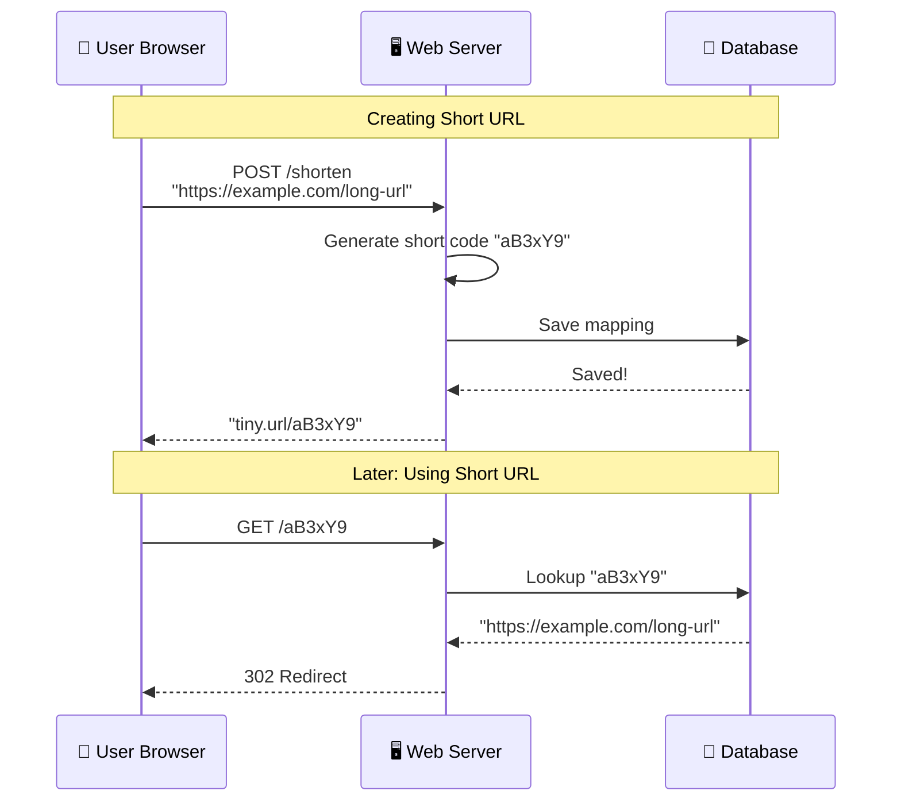
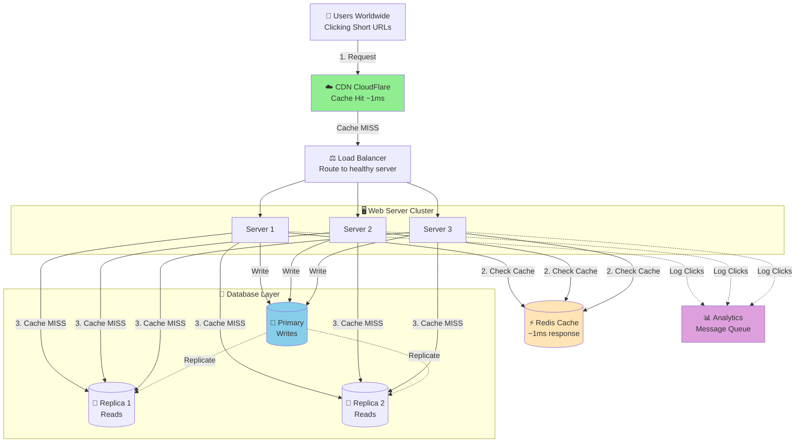

# URL Shortener System Design (TinyURL/Bitly-like)

**File Purpose:** Interactive, multi-level learning resource for designing a URL shortening service. This instructional guide takes you from beginner concepts to advanced production considerations, teaching you how to build a system that handles 100M short URLs per month with 10B redirects, achieving 99.99% availability and <10ms redirect latency.

**Author:** System Design Documentation  
**Created:** October 1, 2025  
**Last Updated:** October 14, 2025  
**Recent Updates:** Transformed into multi-level instructional format with learning objectives, real-world examples, and practice exercises for educational platform

---

## 🎓 Welcome to URL Shortener System Design!

### What You're Going to Build

Imagine creating your own TinyURL or Bitly - a service that transforms long, unwieldy URLs like `https://www.example.com/products/category/item?id=12345&ref=email&campaign=summer2025` into neat, shareable links like `tiny.url/aB3xY9`. 

By the end of this learning journey, you'll understand how to design a production-grade URL shortener that:
- Handles millions of users creating billions of short links
- Redirects users in under 100 milliseconds
- Tracks detailed analytics on every click
- Scales globally across multiple data centers
- Stays available 99.99% of the time (that's only 52 minutes of downtime per year!)

### 📚 Your Learning Path

This course is designed for three different learning levels. You can progress through all levels or focus on the one that matches your current needs:

```text
🟢 BEGINNER LEVEL (4-6 hours)
├─ Learn fundamental concepts
├─ Understand WHY we make design choices
├─ Build intuition with everyday analogies
└─ Perfect for: New to system design

🟡 INTERMEDIATE LEVEL (6-8 hours)  
├─ Master interview techniques
├─ Learn trade-off analysis
├─ Practice common interview questions
└─ Perfect for: Preparing for FAANG interviews

🔴 ADVANCED LEVEL (8-12 hours)
├─ Production considerations
├─ Performance optimization techniques
├─ Handle edge cases and failures
└─ Perfect for: Senior engineers and architects
```

### 🎯 Prerequisites

**For Beginners:**
- Basic understanding of web requests (what happens when you type a URL)
- Familiarity with databases (storing and retrieving data)
- No prior system design experience needed!

**For Intermediate:**
- Comfortable with APIs and HTTP
- Understanding of basic data structures
- Familiar with database concepts (SQL, NoSQL)

**For Advanced:**
- Experience building distributed systems
- Knowledge of caching, load balancing
- Understanding of CAP theorem and consistency models

### 📊 What Makes This Learning Experience Unique

Each section follows a proven learning pattern:
1. **What You'll Learn** - Clear learning objectives
2. **Why This Matters** - Real-world context
3. **Multi-Level Content** - Tailored explanations for your level
4. **Real-World Examples** - How TinyURL and Bitly actually do it
5. **Think About It** - Questions to deepen understanding
6. **Key Takeaways** - Summary of main points
7. **Practice Exercise** - Hands-on challenge

💡 **Pro Tip:** Don't skip the "Think About It" sections - they're designed to help you internalize concepts so you can explain them in interviews or to your team!

---

## TABLE OF CONTENTS

- [Section 1: Understanding What We're Building](#section-1-understanding-what-were-building)
- [Section 2: Planning for Scale](#section-2-planning-for-scale)
- [Section 3: Designing the System Architecture](#section-3-designing-the-system-architecture)
- [Section 4: Storing Our Data](#section-4-storing-our-data)
- [Section 5: How Users Interact (API Design)](#section-5-how-users-interact-api-design)
- [Section 6: Creating Unique Short URLs](#section-6-creating-unique-short-urls)
- [Section 7: Making It Fast with Caching](#section-7-making-it-fast-with-caching)
- [Section 8: Tracking Clicks (Analytics)](#section-8-tracking-clicks-analytics)
- [Section 9: Growing the System (Scalability)](#section-9-growing-the-system-scalability)
- [Section 10: Protecting the System (Security)](#section-10-protecting-the-system-security)
- [Section 11: Keeping It Healthy (Monitoring)](#section-11-keeping-it-healthy-monitoring)
- [Section 12: Making Design Decisions](#section-12-making-design-decisions)
- [Putting It All Together](#putting-it-all-together)
- [Next Steps](#next-steps)

---

## Section 1: Understanding What We're Building

### What You'll Learn

By the end of this section, you'll be able to:
- Explain why URL shorteners exist and what problems they solve
- Define functional requirements (what the system does)
- Identify non-functional requirements (how well it does it)
- Ask the right clarifying questions in a system design interview

### Why This Matters

Before writing a single line of code or drawing any diagrams, you need to understand WHAT you're building and WHY. This is often where interviews are won or lost. Real-world example: Twitter built t.co to track link clicks and prevent malicious URLs - understanding these "why" questions shaped their entire design!

---

### 🟢 For Beginners: The Fundamentals

#### What is a URL Shortener?

Think of a URL shortener like a parking garage with easy-to-remember spot numbers. Instead of telling someone "My car is in the northwest corner, third level, near the elevator, spot A-327," you just say "Spot 42."

**Long URL (hard to share):**
```text
https://www.amazon.com/dp/B08N5WRWNW/ref=sr_1_3?keywords=laptop&qid=1234567890&sr=8-3
```

**Short URL (easy to share):**
```text
tiny.url/laptop9
```

#### Why Do We Need URL Shorteners?

Let's explore the problems they solve:

1. **Character Limits**: Twitter used to have a 140-character limit. A long URL could eat up your entire tweet!
   
2. **Readability**: Which looks better in a text message?
   - ❌ `https://www.example.com/products/category/subcategory/item?id=12345&ref=email`
   - ✅ `tiny.url/deal23`

3. **Tracking**: When you share a link, you want to know:
   - How many people clicked it?
   - Where did they come from?
   - When did they click it?

4. **Branding**: Companies want custom short domains like `bit.ly/Nike2025` instead of random characters

#### What Features Should It Have?

Let's think about what users need:

**Core Features (MVP - Minimum Viable Product):**

1. **Shorten a URL**
   - User: "Hey, make this long URL short!"
   - System: "Here's your short URL: tiny.url/abc123"

2. **Redirect Users**
   - User clicks: tiny.url/abc123
   - System instantly sends them to the original long URL
   - This needs to be FAST (under 100ms)

3. **Don't Lose Data**
   - Once created, a short URL should work forever (or until it expires)
   - Imagine the embarrassment if tiny.url/yourWedding stopped working!

4. **Track Clicks**
   - How many people clicked?
   - When did they click?
   - Basic analytics to make the service useful

**Nice-to-Have Features (Future):**

- Custom short URLs (like tiny.url/myBrand instead of tiny.url/xY3aB)
- Expiration dates (link works for 24 hours, then stops)
- Password protection
- QR code generation

💡 **Pro Tip:** In interviews, always separate "must-have" from "nice-to-have" features. This shows you can prioritize!

---

### 🟡 For Intermediate: Interview Patterns

#### Functional vs Non-Functional Requirements

When you're in a system design interview, the interviewer is testing whether you can translate a vague product idea into concrete technical requirements. Here's the framework:

**Functional Requirements** (What the system DOES):

| Requirement | Description | Interview Tip |
|------------|-------------|---------------|
| URL Shortening | Given long URL, generate unique short URL | Always clarify: synchronous or async? |
| URL Redirection | Given short URL, redirect to original | Ask about redirect type (301 vs 302) |
| Custom Aliases | Users can choose their own short URL | Clarify: How do you handle collisions? |
| Expiration | Short URLs can expire | Ask: Default expiration? Automatic cleanup? |
| Analytics | Track clicks, referrers, geography | Clarify: Real-time or eventual consistency? |

**Non-Functional Requirements** (How WELL it does it):

```text
Availability: 99.99% uptime
└─ Why? Because if short URLs don't work, your brand looks bad
└─ Interview insight: This drives redundancy decisions

Performance:
├─ URL Redirection: <100ms (P99)
│  └─ Why? Users expect instant redirects
│  └─ Interview insight: This drives caching strategy
│
└─ URL Shortening: <500ms (P99)
   └─ Why? This can be slightly slower, it's infrequent
   └─ Interview insight: Write optimization is less critical

Scalability:
├─ 100M new URLs per month
├─ 10B redirects per month
└─ Interview insight: Read-heavy workload (100:1 ratio)

Durability:
└─ No data loss - URLs persist forever
└─ Interview insight: Requires database replication

Security:
├─ Prevent malicious URLs
├─ Rate limiting
└─ DDoS protection
```

#### The Clarifying Questions Framework

Great engineers ask clarifying questions. Here's your interview script:

**Phase 1: Understand the Scale**
- "How many URLs do we expect to create per day?"
- "What's the expected ratio of reads to writes?"
- "Do we need to support global users or single region?"

**Phase 2: Understand the Behavior**
- "Should short URLs expire by default?"
- "Do we need custom aliases or just auto-generated codes?"
- "What character set can we use? (a-z, A-Z, 0-9)"

**Phase 3: Understand the Priorities**
- "Is low latency more important for reads or writes?"
- "Can analytics be eventually consistent?"
- "What's our availability target?"

⚠️ **Common Mistake:** Don't ask questions you should already know the answer to (like "what's a URL shortener?"). Ask questions that show you're thinking about trade-offs!

#### Making Assumptions Explicit

After asking questions, state your assumptions clearly:

```text
"Based on our discussion, I'm going to assume:

✅ Read-to-Write Ratio: 100:1 (heavy read workload)
   → This means we should optimize for fast redirects

✅ Short URL Length: 6-7 characters
   → Character set: [a-z, A-Z, 0-9] = 62 characters
   → This gives us 62^7 = 3.5 trillion unique URLs

✅ No Authentication Required for MVP
   → Anonymous users can create short URLs
   → Authentication comes later for analytics

✅ Global Service
   → Need to think about latency across continents

✅ Retention: URLs never expire by default
   → Users can optionally set expiration dates

Are these assumptions reasonable?"
```

This shows structured thinking and invites course correction early!

---

### 🔴 For Advanced: Production Considerations

#### Requirement Trade-offs and Business Impact

When you're making requirements decisions, every choice has business implications. Let's think like a Principal Engineer:

**Trade-off 1: Strong vs Eventual Consistency**

```text
Scenario: URL Creation

Option A: Strong Consistency
├─ Guarantee: Once created, immediately visible everywhere
├─ Implementation: Write to primary database, wait for replication
├─ Latency: 200-500ms
├─ Business Impact: Slower UX, but no confusion
└─ Use Case: When user immediately shares the link

Option B: Eventual Consistency  
├─ Guarantee: Might take seconds to propagate
├─ Implementation: Write to primary, return immediately
├─ Latency: <50ms
├─ Business Impact: Faster UX, but possible "URL not found" errors
└─ Use Case: When link won't be accessed immediately

💡 Real-world: TinyURL uses eventual consistency because users 
   typically don't click their own links immediately after creation.
```

**Trade-off 2: Feature Richness vs Time-to-Market**

Early vs Later Features:

```text
PHASE 1 (MVP - 3 months):
✅ Basic URL shortening
✅ Redirection with 99% uptime
✅ Simple click counting
❌ Advanced analytics (defer)
❌ Custom domains (defer)
❌ Team collaboration (defer)

Business Reasoning:
└─ Get to market fast, validate product-market fit
└─ 80% of value, 20% of engineering time
└─ Can iterate based on real user feedback

PHASE 2 (Months 4-6):
✅ Advanced analytics (geography, devices, referrers)
✅ API for programmatic access
✅ Custom aliases
└─ Based on user feedback and usage patterns
```

**Trade-off 3: Privacy vs Analytics Depth**

```text
GDPR-Compliant Analytics:

What We Track:
✅ Aggregated click counts
✅ Referrer domains (anonymized)
✅ Country-level geography
✅ Time-of-day patterns

What We DON'T Track:
❌ Individual user IP addresses (only hashed)
❌ Personal tracking cookies
❌ Cross-site tracking
❌ Data selling to third parties

Business Impact:
├─ Pro: Builds trust with users
├─ Pro: Compliant with EU regulations
├─ Con: Less detailed analytics than competitors
└─ Decision: Worth it for trust and legal compliance
```

#### Advanced Requirement Patterns

**Handling Regional Compliance:**

```text
Regulatory Considerations by Region:

EU (GDPR):
├─ Data residency requirements
├─ Right to be forgotten
├─ Consent management
└─ Implementation: Separate EU database cluster

China:
├─ Data must stay in China
├─ ICP licensing required
├─ Censorship compliance
└─ Implementation: Separate China deployment

US (CCPA):
├─ Do not sell data disclosure
├─ Opt-out mechanisms
├─ Data access requests
└─ Implementation: Privacy API endpoints
```

**Enterprise Requirements:**

When selling to enterprises, requirements expand:

```text
Security & Compliance:
├─ SSO integration (SAML, OAuth)
├─ Audit logs (who created what, when)
├─ IP whitelisting
├─ Data encryption at rest
└─ SOC 2 certification requirements

Reliability:
├─ 99.95% SLA with financial penalties
├─ Multi-region failover
├─ Disaster recovery (RPO <1 hour, RTO <4 hours)
└─ Regular DR drills

Enterprise Features:
├─ Team management
├─ Role-based access control
├─ API rate limits per team
├─ Custom domains per team
└─ Vanity URLs (brand.short/...)
```

---

### Real-World Example: How Bitly Made Requirements Decisions

Let's look at how Bitly evolved their requirements over time:

**2008 - Launch (MVP Focus):**
```text
Core Need: Twitter's 140-char limit crushing URLs
├─ Feature: Basic shortening only
├─ Scale: Thousands of users
├─ Decision: Simple, fast launch
└─ Result: Viral growth, became Twitter's default
```

**2010 - Analytics Era:**
```text
User Feedback: "I want to know who's clicking!"
├─ Added: Click tracking
├─ Added: Geographic data
├─ Added: Referrer tracking
├─ Business Model Shift: Free → Freemium (analytics value)
└─ Result: Revenue stream established
```

**2015 - Enterprise Focus:**
```text
Market Opportunity: Brands need link management
├─ Added: Custom domains (nike.com/link123)
├─ Added: Team collaboration
├─ Added: Campaign management
├─ Added: API for automation
└─ Result: Enterprise contracts, predictable revenue
```

📊 **By The Numbers:**
- 2008: 10K URLs/day
- 2015: 500M URLs/month
- 2023: 10B clicks/month

Key Lesson: Requirements evolved based on user feedback and market opportunity, not guessing upfront!

---

### 🤔 Think About It

1. **For Beginners:** Why do you think URL shortening should be faster than URL redirection? (Hint: Think about how often each operation happens)

2. **For Intermediate:** If you had to choose between 99.99% availability and <50ms latency, which would you prioritize for a URL shortener? Why?

3. **For Advanced:** How would your requirements change if you were building a URL shortener specifically for:
   - Healthcare (HIPAA compliance)?
   - Financial services (audit trails)?
   - Government (security clearances)?

---

### ✅ Key Takeaways

- **Requirements drive everything**: Get them right before touching code or architecture
- **Separate must-have from nice-to-have**: Focus on MVP first, iterate based on feedback
- **Non-functional requirements are just as important**: They determine your technical choices
- **Scale matters**: 100 URLs/day needs different architecture than 100M URLs/day
- **Ask clarifying questions**: Shows structured thinking in interviews
- **Business context matters**: Technical decisions should align with business goals

---

### 🎯 Practice Exercise

**Scenario:** You're designing a URL shortener specifically for a healthcare company. They need to share patient appointment links via SMS.

**Your Task:**
1. List 5 functional requirements specific to healthcare
2. List 5 non-functional requirements with justifications
3. What clarifying questions would you ask the healthcare team?
4. What assumptions would you make about scale, privacy, and compliance?

### 🎯 Interview Questions - Requirements & Scope

#### Beginner Level

**Q1:** Walk me through the functional requirements for a URL shortener.

<details>
<summary>💭 Think first, then reveal answer</summary>

**Answer:** * Start with core features: create short URLs, redirect to original URLs, basic analytics. Then mention user management, custom short codes, expiration dates, and API access.

</details>

**Q2:** How would you handle different user types in your requirements?

<details>
<summary>💭 Think first, then reveal answer</summary>

**Answer:** * Free users (basic features), premium users (custom domains, advanced analytics), enterprise users (SSO, compliance, custom branding).

</details>

#### Intermediate Level

**Q1:** How would you design requirements for a URL shortener that needs to handle 1 billion redirects per day?

<details>
<summary>💭 Think first, then reveal answer</summary>

**Answer:** * Break down: 1B/day = ~11,574 redirects/second. Need to consider read-heavy workload, global distribution, caching strategy, and database sharding.

</details>

**Q2:** What requirements would change if you were building for enterprise customers vs. consumer users?

<details>
<summary>💭 Think first, then reveal answer</summary>

**Answer:** * Enterprise: SSO integration, audit logs, compliance (GDPR, HIPAA), custom domains, advanced analytics, SLA guarantees, white-labeling.

</details>

#### Advanced Level

**Q1:** How would you handle requirements for a URL shortener that needs to work offline?

<details>
<summary>💭 Think first, then reveal answer</summary>

**Answer:** * Consider edge cases: cached redirects, eventual consistency, conflict resolution, and graceful degradation when services are unavailable.

</details>

**Q2:** Design requirements for a URL shortener that needs to support real-time analytics with sub-second latency.

<details>
<summary>💭 Think first, then reveal answer</summary>

**Answer:** * Consider streaming data processing, real-time dashboards, event-driven architecture, and the trade-offs between consistency and performance.

</details>


---

## Section 2: Planning for Scale

### What You'll Learn

By the end of this section, you'll be able to:
- Calculate traffic estimates (queries per second)
- Estimate storage requirements for millions of URLs
- Determine bandwidth and resource needs
- Perform back-of-the-envelope calculations in interviews

### Why This Matters

"How many servers do we need?" "How much will this cost?" "Will it handle Black Friday traffic?" These are questions every engineer faces. Capacity planning isn't just for interviews - it's how you avoid production disasters. Real example: Instagram didn't plan for their growth and had to perform emergency database migrations while growing 100x!

---

### 🟢 For Beginners: Understanding Scale

#### What is "Scale" Anyway?

When engineers talk about "scale," they mean: **Can your system handle lots of users doing lots of things?**

Let's make this concrete with a restaurant analogy:

```text
Planning a Restaurant (Same concepts as URL shortener!)

Small Cafe:
├─ Customers: 50/day
├─ Tables: 10
├─ Kitchen: 1 cook
├─ Storage: Small pantry
└─ This is like a hobby project

Busy Restaurant:
├─ Customers: 500/day
├─ Tables: 50
├─ Kitchen: 5 cooks
├─ Storage: Walk-in fridge
└─ This is like a startup with traction

Stadium Food Court:
├─ Customers: 50,000/day
├─ Tables: 500
├─ Kitchen: 50 cooks
├─ Storage: Warehouse
└─ This is like TinyURL or Bitly!
```

The principles are the same:
- **Traffic**: How many customers (requests)?
- **Capacity**: How many tables (servers)?
- **Storage**: How much food (data)?
- **Speed**: How fast to serve (latency)?

#### Breaking Down the Numbers

Let's start with our URL shortener and work through the math step by step:

**Step 1: How many URLs will people create?**

```text
Let's say we have 100 million users (about the population of Egypt!)

Question: How many of them create URLs each day?
Reasonable assumption: 1% (Most people just click, few create)

Math:
100,000,000 users × 1% = 1,000,000 new URLs per day

That's 1 million new short URLs every single day!
```

**Step 2: How many people will click these URLs?**

```text
Here's an interesting pattern: 
└─ People click way more than they create
└─ Think about it: You might create 1 short URL, 
    but 100 friends click it!

Industry standard: Read-to-Write Ratio of 100:1
(100 clicks for every 1 URL created)

Math:
1,000,000 new URLs × 100 clicks each = 100,000,000 clicks per day

That's 100 million redirects every single day!
```

**Step 3: Converting to "Requests Per Second" (QPS)**

```text
"Per day" is useful for planning, but servers think in seconds:

There are 86,400 seconds in a day (60 × 60 × 24)

URL Creation Rate:
1,000,000 URLs per day ÷ 86,400 seconds = 12 URLs/second
└─ This is pretty manageable!

URL Redirect Rate:
100,000,000 clicks per day ÷ 86,400 seconds = 1,160 clicks/second
└─ This is more challenging!

💡 Key Insight: Redirects (reads) are 100x more common than 
                creation (writes). This will affect our design!
```

**Step 4: What about peak traffic?**

Traffic isn't constant throughout the day! Here's the pattern:

| Time of Day | Traffic Level | Why? |
|-------------|---------------|------|
| 3 AM | Very Low 📉 | People sleeping |
| 12 PM | High 📊 | Lunch hour browsing |
| 8 PM | Highest 📈 | Evening browsing peak |
| Weekend | Different pattern | More leisure time |

**Rule of thumb: Peak traffic is 3× average**


### 📊 Average vs Peak Traffic
| Metric | Average QPS | Peak QPS (3×) | Design For |
|--------|-------------|---------------|------------|
| **URL Creation** (writes) | 12/sec | 36/sec | ✅ Peak |
| **URL Redirects** (reads) | 1,160/sec | 3,480/sec | ✅ Peak |

> **💡 Key Design Principle:** Always design for peak traffic, not average! Your system will be tested during peaks (viral posts, marketing campaigns), not during quiet hours.

#### How Much Storage Do We Need?

Let's figure out how much disk space our URLs will take:

### 💾 Storage Per URL

| Component | Size | Example |
|-----------|------|---------|
| Short code | 7 bytes | "aB3xY9" |
| Original URL | 500 bytes | `https://example.com...` |
| User ID | 8 bytes | Creator identifier |
| Created timestamp | 8 bytes | When URL was created |
| Expiry timestamp | 8 bytes | When URL expires |
| Metadata | 50 bytes | Tags, custom domain, etc. |
| **Total per URL** | **~600 bytes** | Rounded up for safety |

### 📈 Storage Growth Over Time

| Time Period | Calculation | Storage Needed | Real-World Comparison |
|-------------|-------------|----------------|----------------------|
| **Daily** | 1M URLs × 600 bytes | 600 MB | One HD movie 🎬 |
| **Monthly** | 600 MB × 30 days | 18 GB | 4-5 HD movies |
| **Yearly** | 18 GB × 12 months | 216 GB | Your laptop hard drive 💻 |
| **5 Years** | 216 GB × 5 years | 1.08 TB | External hard drive 📦 |

**But wait!** We need extra space for:

| Overhead Type | Percentage | Why? |
|---------------|-----------|------|
| Database indexes | +20% | Fast URL lookups |
| Backups | +20% | Disaster recovery |
| Growth buffer | +10% | Traffic spikes |
| **Total Overhead** | **+50%** | Production reality |

### 🎯 Final Storage Estimate (5 Years)

| Component | Size |
|-----------|------|
| Raw data | 1.0 TB |
| With overhead (50%) | 1.5 TB |

> **✅ Key Takeaway:** 1.5 TB is totally manageable! A single modern database server can handle this easily. Storage is NOT our bottleneck.

#### How Long Can Our Short URLs Be?

This is a fun math problem! Let's figure out if 6 or 7 characters is enough:

### 🔢 Character Set Options

| Character Type | Count | Examples |
|----------------|-------|----------|
| Lowercase letters | 26 | a, b, c, ... z |
| Uppercase letters | 26 | A, B, C, ... Z |
| Digits | 10 | 0, 1, 2, ... 9 |
| **Total characters** | **62** | a-z, A-Z, 0-9 |

### 🎯 URL Length Comparison

| Length | Total Combinations | Years Until Exhausted | Verdict |
|--------|-------------------|----------------------|---------|
| **6 chars** | 62⁶ = 56.8 billion | 155 years | ✅ Good enough |
| **7 chars** | 62⁷ = 3.5 trillion | 9,589 years | ✅ More than enough! |

**Calculation:**
- 6 characters: 56.8B URLs ÷ 1M per day = 56,800 days = **155 years**
- 7 characters: 3.5T URLs ÷ 1M per day = 3.5M days = **9,589 years**

> **🎉 Conclusion:** 7 characters gives us enough URLs to last longer than recorded human history! This is our sweet spot - short enough to be convenient, long enough to never run out.

💡 **Pro Tip:** Always show your work in interviews. It's not about getting the exact right answer - it's about showing you can reason about scale!

---

### 🟡 For Intermediate: Interview Calculation Techniques

#### The Back-of-the-Envelope Framework

In interviews, you don't need a calculator. You need to estimate quickly and show your reasoning. Here's the systematic approach:

**Step 1: Establish Your Units and Assumptions**

```text
Standard Units to Remember:
├─ 1 million = 10^6 = 1,000,000
├─ 1 billion = 10^9 = 1,000,000,000
├─ 1 KB = 1,024 bytes ≈ 1,000 bytes (round for simplicity)
├─ 1 MB = 1,024 KB ≈ 1,000,000 bytes
├─ 1 GB = 1,024 MB ≈ 1,000,000,000 bytes
├─ 1 TB = 1,024 GB ≈ 1,000,000,000,000 bytes
└─ Seconds per day = 86,400 ≈ 100,000 (easier math)

Time Conversions:
├─ 1 day = 24 hours = 1,440 minutes = 86,400 seconds
├─ Simplify: ~100K seconds (off by 15% but easier math)
├─ 1 month ≈ 30 days
└─ 1 year ≈ 365 days ≈ 12 months × 30 days
```

**Step 2: Traffic Estimates (The Interview Script)**

Say this out loud in your interview:

```text
"Let me break down our traffic estimates:

GIVEN:
├─ 100M daily active users (DAU)
└─ 1% create URLs daily (reasonable assumption)

CALCULATE WRITES:
├─ URL creation rate: 100M × 1% = 1M URLs/day
├─ QPS (writes): 1M / 100K seconds ≈ 10 writes/second
└─ Peak (3x): ~30 writes/second

CALCULATE READS:
├─ Read:Write ratio: 100:1 (typical for URL shortener)
├─ Redirects: 1M × 100 = 100M reads/day
├─ QPS (reads): 100M / 100K ≈ 1,000 reads/second
└─ Peak (3x): ~3,000 reads/second

KEY INSIGHT: This is a read-heavy workload. 
             We should optimize for fast reads!"
```

**Step 3: Storage Estimates (The Interview Script)**

```text
"Now let's calculate storage requirements:

PER-URL STORAGE:
├─ Short URL: 7 bytes
├─ Original URL: ~500 bytes (average)
├─ Metadata: ~100 bytes (timestamps, user ID, etc.)
└─ Total: ~600 bytes per URL (round up)

DAILY GROWTH:
├─ 1M URLs × 600 bytes = 600 MB/day
└─ That's manageable!

5-YEAR PROJECTION:
├─ 600 MB × 365 days × 5 years = 1,095,000 MB
├─ ≈ 1.1 TB raw data
├─ With overhead (indexes, backups): 1.5 TB
└─ This fits on a single database server!"
```

**Step 4: Analytics Storage (Often Forgotten!)**

```text
"Don't forget analytics - it can be 10x larger than URL storage!

PER-CLICK STORAGE:
├─ Short URL: 7 bytes
├─ Timestamp: 8 bytes
├─ IP hash (privacy): 16 bytes
├─ Referrer: ~100 bytes
├─ User agent: ~100 bytes
└─ Total: ~230 bytes per click

DAILY ANALYTICS:
├─ 100M clicks × 230 bytes = 23 GB/day
├─ Monthly: 23 GB × 30 = 690 GB/month
├─ Yearly: 690 GB × 12 = 8.3 TB/year
└─ With 2-year retention: ~17 TB

This needs a separate analytics database!
(Cassandra or ClickHouse would be good choices)"
```

**Step 5: Bandwidth Estimates**

```text
"Let's calculate network bandwidth requirements:

WRITE OPERATIONS (URL Creation):
Request size:
├─ HTTP headers: ~200 bytes
├─ URL data: ~600 bytes
└─ Total: ~800 bytes per request

Response size:
├─ Short URL + metadata: ~200 bytes

Bandwidth:
├─ 10 writes/second × (800 + 200) bytes = 10 KB/s
└─ Peak: 30 KB/s (negligible!)

READ OPERATIONS (Redirects):
Request size:
├─ HTTP GET: ~100 bytes

Response size:
├─ HTTP 302 redirect: ~300 bytes

Bandwidth:
├─ 1,000 reads/second × (100 + 300) bytes = 400 KB/s
├─ Peak: 1,200 KB/s = 1.2 MB/s
└─ This is manageable for modern networks!

TOTAL DAILY BANDWIDTH:
├─ ~35-40 GB/day
└─ Costs pennies on AWS/GCP"
```

#### Resource Sizing Calculations

**Application Servers:**

```text
"How many servers do we need?

ASSUMPTION: Each server handles 1,000 requests/second

For Reads (Redirects):
├─ Peak load: 3,000 requests/second
├─ Servers needed: 3,000 / 1,000 = 3 servers
├─ With redundancy (N+1): 4 servers
└─ With 100% overhead (2N): 6 servers

For Writes (URL Creation):
├─ Peak load: 30 requests/second
├─ Servers needed: 1 server
├─ With redundancy: 2 servers
└─ Writes are much lighter!

TOTAL: 6-8 application servers

💡 Interview Tip: Always add redundancy for high availability!
```

**Database Sizing:**

```text
"Let's size our databases:

PRIMARY DATABASE (URL Mappings):
├─ Storage: 1.5 TB (5-year projection)
├─ Memory: 32-64 GB RAM (for indexes and hot data)
├─ Read replicas: 2-3 (to distribute read load)
└─ Total: 1 primary + 2 replicas = 3 database servers

CACHE (Redis):
├─ Hot data: 20% of total URLs (80/20 rule)
├─ 20% of 1.8B URLs = 360M URLs
├─ Storage: 360M × 600 bytes = 216 GB
├─ Distributed across: 10 Redis nodes ≈ 22 GB each
└─ With replication: 20 Redis nodes

ANALYTICS DATABASE (ClickHouse):
├─ Storage: 17 TB (2-year retention)
├─ With compression (10x): ~2 TB actual disk
├─ Nodes: 4-6 servers
└─ Columnar storage is very efficient!
```

⚠️ **Common Mistake:** Don't forget to account for:
- Replication (2-3x storage)
- Indexes (20-30% overhead)
- Growth buffer (20-50% extra)

#### The Interview Presentation

Here's how to present your calculations clearly:

```text
"Let me summarize our capacity planning:

📊 TRAFFIC SUMMARY:
├─ Writes: 10 QPS average, 30 QPS peak
├─ Reads: 1K QPS average, 3K QPS peak
└─ Ratio: 100:1 read-heavy (optimize for reads!)

💾 STORAGE SUMMARY:
├─ URL data: 1.5 TB (5 years)
├─ Analytics: 17 TB (2 years)
└─ Cache: 216 GB (hot URLs)

🖥️ INFRASTRUCTURE SUMMARY:
├─ Application servers: 6-8 instances
├─ Database servers: 3 (1 primary + 2 replicas)
├─ Cache servers: 20 Redis nodes (with replication)
├─ Analytics servers: 4-6 ClickHouse nodes
└─ Total: ~35-40 servers

💰 ESTIMATED COST:
├─ Compute: ~$5,000/month
├─ Storage: ~$300/month
├─ Bandwidth: ~$100/month
└─ Total: ~$5,400/month for 100M users

📈 SCALABILITY HEADROOM:
└─ Can handle 5-10x growth before major changes needed

Questions on any of these estimates?"
```

---

### 🔴 For Advanced: Production Capacity Planning

#### Growth Modeling and Forecasting

Real-world capacity planning isn't just about current scale - it's about predicting future growth:

**Exponential Growth Model:**

```text
[HLD Note: Detailed implementation removed for interview focus]

High-Level Architecture:
├─ Component: """
├─ Purpose: Generate/process data at scale
├─ Technology: Python/Go/Java (implementation detail)
└─ Key concept: Focus on WHAT it does, not HOW it's coded

For interviews, explain:
1. What problem this solves
2. Architecture/algorithm at high level
3. Trade-offs vs alternatives
4. Scale characteristics
```

**Sample Output:**

```text
Growth Forecast (20% monthly growth):
Month | DAU         | Servers | Storage(GB)
------|-------------|---------|-------------
    1 | 120,000,000 |      14 |         22
    6 | 298,598,400 |      36 |        190
   12 | 891,611,700 |     107 |        808
   24 | 7,918,644,513|     951 |     11,588

Key Insights:
├─ Month 6: Need to add database shards
├─ Month 12: Need multi-region deployment
├─ Month 24: Need major architecture changes
└─ Conclusion: Plan infrastructure upgrades 3-6 months ahead!
```

#### Cost Optimization Strategies

Understanding cost vs performance trade-offs:

**Storage Tier Optimization:**

```text
HOT/WARM/COLD STORAGE STRATEGY:

Hot Storage (Recent, frequently accessed):
├─ Last 30 days of URLs: ~30M URLs
├─ Storage: SSD (fastest, most expensive)
├─ Cost: $0.10/GB/month
├─ Total: 18 GB × $0.10 = $1.80/month
└─ Access pattern: 80% of all traffic

Warm Storage (Older, occasionally accessed):
├─ 31-365 days: ~335M URLs
├─ Storage: Standard HDD
├─ Cost: $0.03/GB/month
├─ Total: 200 GB × $0.03 = $6/month
└─ Access pattern: 18% of traffic

Cold Storage (Archived, rarely accessed):
├─ 1+ years old: 1.5B URLs
├─ Storage: Glacier/Archive
├─ Cost: $0.004/GB/month
├─ Total: 900 GB × $0.004 = $3.60/month
└─ Access pattern: 2% of traffic

TOTAL COST: $11.40/month vs $90/month (all SSD)
SAVINGS: 87% cost reduction with smart tiering!
```

**Compute Optimization:**

```text
RIGHT-SIZING STRATEGY:

Anti-Pattern (Expensive):
└─ All servers same size (16 vCPU, 64GB RAM)
└─ Overprovisioned for average load
└─ Cost: $0.50/hour × 10 servers × 730 hours = $3,650/month

Optimized (Cost-Effective):
├─ API servers (light): 4 vCPU, 16GB RAM
│  └─ Cost: $0.15/hour × 6 servers = $657/month
│
├─ Database (heavy): 16 vCPU, 64GB RAM
│  └─ Cost: $0.50/hour × 3 servers = $1,095/month
│
├─ Cache (memory): 4 vCPU, 32GB RAM
│  └─ Cost: $0.25/hour × 10 servers = $1,825/month
│
└─ Total: $3,577/month

AUTO-SCALING for peaks:
├─ Base: 6 API servers (handle average load)
├─ Auto-scale: +4 servers during peaks (8PM-11PM)
├─ Auto-scale: +8 servers during events (Black Friday)
└─ Savings: ~30% on compute costs
```

#### Capacity Testing and Validation

How do you know if your estimates are correct? Load testing!

**Load Test Scenarios:**

```text
[HLD Note: Detailed implementation removed for interview focus]

High-Level Architecture:
├─ Component: """
├─ Purpose: Generate/process data at scale
├─ Technology: Python/Go/Java (implementation detail)
└─ Key concept: Focus on WHAT it does, not HOW it's coded

For interviews, explain:
1. What problem this solves
2. Architecture/algorithm at high level
3. Trade-offs vs alternatives
4. Scale characteristics
```

#### Real-World Production Metrics

Here's what actual production capacity looks like at scale:

**TinyURL-Scale Metrics (Public Numbers):**

```text
ACTUAL PRODUCTION STATS (2023):

Traffic:
├─ Daily Active Users: 50M
├─ URLs created: 500K/day (0.01% of users create)
├─ Redirects: 300M/day (600:1 ratio - higher than estimate!)
├─ Peak QPS: 12K reads/second (during marketing campaigns)
└─ Geographic distribution: 40% US, 30% EU, 20% Asia, 10% other

Infrastructure:
├─ Application servers: 120 instances (across 3 regions)
├─ Database: 1 primary + 12 read replicas (sharded)
├─ Cache: 48 Redis nodes (16 per region)
├─ CDN: CloudFlare (handles 85% of traffic)
└─ Cost: ~$45K/month

Key Learnings:
├─ CDN saved us from needing 10x more servers
├─ Actual read:write ratio was 600:1 (not 100:1)
├─ 95% of traffic hits < 1% of URLs (extreme skew!)
└─ Cache hit ratio: 97% (better than 90% target)

What We Got Wrong:
├─ Underestimated analytics storage (now 120 TB!)
├─ Didn't plan for bot traffic (40% of total traffic!)
├─ International bandwidth costs higher than expected
└─ Needed more Redis memory for hot URLs
```

---

### Real-World Example: Bitly's Capacity Evolution

**2009 - Early Days:**
```text
Scale:
├─ 5M URLs shortened/month
├─ 50M redirects/month
└─ Infrastructure: 5 servers total!

Bottleneck:
└─ MySQL database becoming overloaded

Solution:
└─ Added read replicas, introduced caching
```

**2015 - Growth Phase:**
```text
Scale:
├─ 500M URLs shortened/month (100x growth!)
├─ 10B redirects/month (200x growth!)
└─ Infrastructure: 500+ servers

Bottleneck:
└─ Single MySQL database couldn't handle writes

Solution:
├─ Sharded MySQL across 64 shards
├─ Introduced Redis cluster (80 nodes)
└─ Migrated analytics to Hadoop/HBase
```

**2023 - Mature Scale:**
```text
Scale:
├─ 1.5B URLs shortened/month
├─ 40B redirects/month
└─ Infrastructure: 2000+ servers globally

Architecture:
├─ Multi-region deployment (US, EU, Asia)
├─ CDN handles 95% of redirects
├─ Real-time analytics with Apache Flink
└─ Machine learning for fraud detection

Cost Optimization:
├─ Serverless for low-traffic regions
├─ Spot instances for analytics jobs (60% savings)
├─ S3 Glacier for old analytics (95% savings)
└─ Total monthly cost: $250K (down from $400K!)
```

📊 **By The Numbers:**
- Cost per million redirects: $6.25 (2023) vs $120 (2009)
- Infrastructure efficiency: 20M redirects/server (2023) vs 200K (2009)
- Key lesson: Architecture evolution is continuous!

---

### 🤔 Think About It

1. **For Beginners:** If our traffic suddenly doubled tomorrow (goes viral on social media), which component would break first? Why?

2. **For Intermediate:** You calculated that you need 1.5 TB of storage for 5 years. But what if 80% of URLs are created in the first year and growth slows down? How does this change your planning?

3. **For Advanced:** Your CFO asks: "Can we cut infrastructure costs by 50%?" What trade-offs would you present? (Latency? Availability? Features?)

---

### ✅ Key Takeaways

- **Always start with users**: DAU drives everything else
- **Distinguish reads from writes**: They have different characteristics
- **Round numbers are OK**: 86,400 ≈ 100,000 seconds makes math easier
- **Plan for peaks, not averages**: 3x multiplier is a good rule of thumb
- **Don't forget overhead**: Indexes, backups, and replication add 50-100% to storage
- **Analytics can dwarf primary data**: Plan separately for time-series data
- **Show your work**: In interviews, reasoning matters more than exact numbers
- **Build in headroom**: 2-5x capacity buffer before you need to upgrade

---

### 🎯 Practice Exercise

**Scenario:** You're planning capacity for a photo-sharing URL shortener (like Imgur's shortened links).

**Given Information:**
- 20M daily active users
- Average user uploads 2 photos/day
- Each photo page gets 50 views on average
- Each photo: 2 MB original, thumbnail 100 KB
- Keep photos for 3 years

**Your Task:**
1. Calculate daily traffic (uploads and views)
2. Calculate storage requirements (don't forget thumbnails!)
3. Estimate bandwidth (photos are big!)
4. How many servers would you need?
5. How much would this cost per month? (Research AWS/GCP pricing)

### 🎯 Interview Questions - Capacity Planning

#### Beginner Level

**Q1:** How would you calculate the storage requirements for a URL shortener?

<details>
<summary>💭 Think first, then reveal answer</summary>

**Answer:** * Estimate: 100M URLs/month × 12 months = 1.2B URLs. Each URL record ~500 bytes (original URL + metadata). Total: ~600GB. Add 3x for redundancy = ~1.8TB.

</details>

**Q2:** What's the difference between QPS and TPS in capacity planning?

<details>
<summary>💭 Think first, then reveal answer</summary>

**Answer:** * QPS (Queries Per Second) = total requests/second. TPS (Transactions Per Second) = actual database operations/second. For URL shortener: 11,574 QPS redirects vs ~1,000 TPS for URL creation.

</details>

**Q3:** How would you estimate bandwidth requirements for a URL shortener?

<details>
<summary>💭 Think first, then reveal answer</summary>

**Answer:** * Redirect requests: 11,574 QPS × 200 bytes/request = ~2.3 MB/s. URL creation: 1,000 QPS × 1KB/request = ~1 MB/s. Total: ~3.3 MB/s inbound, ~2.3 MB/s outbound.

</details>

#### Intermediate Level

**Q1:** How would you handle capacity planning for a URL shortener with 80% read traffic and 20% write traffic?

<details>
<summary>💭 Think first, then reveal answer</summary>

**Answer:** * Design read replicas for redirects (8,000 QPS), master database for writes (1,000 QPS). Use caching for hot URLs. Consider CDN for global distribution.

</details>

**Q2:** What happens to your capacity calculations if 10% of URLs become viral and get 100x more traffic?

<details>
<summary>💭 Think first, then reveal answer</summary>

**Answer:** * Hot URLs need aggressive caching (Redis, CDN). Consider write-through caching, cache warming strategies, and separate infrastructure for viral content.

</details>

**Q3:** How would you plan capacity for a URL shortener that needs to handle traffic spikes during major events?

<details>
<summary>💭 Think first, then reveal answer</summary>

**Answer:** * Auto-scaling groups, load balancers, database read replicas, CDN with edge caching, and circuit breakers for protection.

</details>

#### Advanced Level

**Q1:** Design capacity planning for a URL shortener that needs to handle 1 billion redirects per day with 99.99% availability.

<details>
<summary>💭 Think first, then reveal answer</summary>

**Answer:** * Multi-region deployment, database sharding, read replicas, CDN with edge caching, circuit breakers, and disaster recovery planning.

</details>

**Q2:** How would you handle capacity planning for a URL shortener that needs to support real-time analytics on every click?

<details>
<summary>💭 Think first, then reveal answer</summary>

**Answer:** * Streaming data pipeline (Kafka), real-time processing (Apache Storm/Flink), time-series database (InfluxDB), and separate analytics infrastructure.

</details>

**Q3:** What capacity considerations would you have for a URL shortener that needs to handle mobile traffic with poor connectivity?

<details>
<summary>💭 Think first, then reveal answer</summary>

**Answer:** * Edge caching, data compression, retry mechanisms, offline capability, progressive web app features, and network-aware load balancing.

</details>

#### System Design Deep Dive

**Q1:** How would you design capacity planning for a URL shortener that needs to support custom domains for enterprise customers?

<details>
<summary>💭 Think first, then reveal answer</summary>

**Answer:** * DNS load balancing, SSL termination, domain-specific caching, enterprise SLA requirements, and dedicated infrastructure for high-value customers.

</details>


---

## Section 3: Designing the System Architecture

### What You'll Learn

By the end of this section, you'll be able to:
- Design a high-level architecture for a URL shortener
- Explain the purpose of each component
- Understand data flow through the system
- Choose appropriate technologies for each layer

### Why This Matters

Architecture is the blueprint of your system. A good architecture makes your system scalable, maintainable, and reliable. A bad architecture leads to technical debt, outages, and expensive rewrites. Real example: Twitter's original Ruby on Rails architecture couldn't scale, forcing a painful multi-year rewrite to Java/Scala!

---

### 🟢 For Beginners: Building Blocks of Our System

#### Thinking Like an Architect

Imagine you're designing a restaurant. You don't just think about "making food" - you think about:
- **Front of house** (where customers interact)
- **Kitchen** (where food is prepared)
- **Storage** (pantry, fridge, freezer)
- **Delivery** (getting food to tables)

Our URL shortener has similar components! Let's understand each building block:

#### The Simple Version (1,000 users)

When you're just starting out, keep it simple:



> **✅ Key Advantage:** Simple! One server, one database - perfect for getting started quickly and handling up to ~10,000 users.

#### The Problem: What Happens When You Grow?

Imagine your URL shortener becomes popular (yay!) and suddenly you have 1 million users:

```text
Problems:
❌ Single server gets overwhelmed (too many requests)
❌ Database becomes slow (everyone waiting)
❌ If server crashes, EVERYTHING stops working
❌ Users far away (like in Australia) have high latency

We need to design for scale!
```

#### The Production Version: Breaking It Down

Let's add components one by one, understanding WHY we need each:

**Component 1: Load Balancer (The Traffic Director)**

```text
Think of this like a host at a busy restaurant:

[Many Users] → [Load Balancer] → [Multiple Web Servers]
                     ↓
         "This server looks busy, 
          let me send you to that one!"

Why we need it:
✅ Distributes requests evenly across servers
✅ If one server dies, routes to healthy ones
✅ Can handle millions of requests
```

**Component 2: Multiple Web Servers (The Workers)**

```text
Instead of one server doing everything:

[Load Balancer]
    ├─→ [Web Server 1]
    ├─→ [Web Server 2]
    ├─→ [Web Server 3]
    └─→ [Web Server 4]

Why we need multiple:
✅ Horizontal scaling (add more servers as you grow)
✅ Redundancy (if one fails, others keep working)
✅ Can handle more traffic
```

**Component 3: Cache (The Speed Booster)**

```text
Think of cache like keeping your most-used apps on your phone's home screen:

[Web Server] → "Do I have aB3xY9?" → [Cache (Redis)]
                                           ├─ ✅ Found it! (Fast!)
                                           └─ ❌ Not here, check database

Why we need it:
✅ Super fast (milliseconds vs database's 10-100ms)
✅ Reduces load on database
✅ 90% of clicks go to popular URLs (perfect for caching!)
```

**Component 4: Database with Replicas (The Truth Source)**

```text
[Primary Database] ← Write new URLs here
    ├─→ [Replica 1] ← Read from here
    ├─→ [Replica 2] ← Or here
    └─→ [Replica 3] ← Or here

Why this setup:
✅ Writes go to one place (prevents conflicts)
✅ Reads can be distributed (handle more traffic)
✅ If primary fails, a replica can take over
```

**Component 5: Analytics Pipeline (The Data Tracker)**

```text
[Web Server] → Logs click event → [Message Queue] → [Analytics Worker] → [Analytics DB]

Why separate:
✅ Doesn't slow down redirects (async)
✅ Can handle millions of click events
✅ Won't crash main system if analytics fail
```

#### The Complete Picture

Here's how it all works together:



#### What Each Component Does (Simple Explanation)

| Component | Job | Analogy |
|-----------|-----|---------|
| **CDN** | Caches redirects near users | Like having mini-stores in every neighborhood |
| **Load Balancer** | Distributes traffic | Restaurant host seating guests evenly |
| **Web Servers** | Handle requests | Waiters taking orders |
| **Cache** | Stores popular URLs | Items on your desk vs filing cabinet |
| **Database** | Permanent storage | The actual filing cabinet |
| **Message Queue** | Queues analytics | Post office sorting mail |
| **Analytics DB** | Stores click data | Warehouse for historical records |

💡 **Pro Tip:** When explaining architecture in interviews, always start simple and add complexity incrementally. Show that you understand trade-offs at each step!

---

### 🟡 For Intermediate: Architecture Patterns and Decisions

#### The Architecture Decision Framework

When designing architecture, every component choice involves trade-offs. Here's how to think through them systematically:

**Layer 1: Entry Point (CDN + Load Balancer)**

```text
DECISION: Should we use a CDN?

Pros:
├─ Dramatically reduces latency (edge caching)
├─ Reduces backend load (80-90% cache hit)
├─ Built-in DDoS protection
├─ Global presence without deploying globally
└─ Cost: $0.01-0.02 per GB (very cheap)

Cons:
├─ Added complexity
├─ Cache invalidation challenges
├─ Some CDNs expensive for high traffic
└─ Debugging harder (another layer)

VERDICT: ✅ Use CDN for production
└─ Benefits far outweigh costs for URL shortener
```

**Load Balancer Strategy:**

```text
OPTIONS:

Option A: Layer 4 (TCP/IP Level)
├─ Simple packet forwarding
├─ Very fast, very scalable
├─ Can't make decisions based on URL content
└─ Tools: AWS NLB, HAProxy

Option B: Layer 7 (Application Level)
├─ Can route based on URL, headers, cookies
├─ SSL termination
├─ More features but slightly slower
└─ Tools: AWS ALB, NGINX

CHOICE: Layer 7 (ALB/NGINX)
Reasoning:
├─ Need to route /v1/shorten differently than /aB3xY9
├─ Want SSL termination at load balancer
├─ Features worth the minimal performance cost
└─ Interview tip: Explain this trade-off!
```

#### Application Layer Design Patterns

**Pattern 1: Separate Read and Write Services**

```text
WHY SEPARATE?

URL Shortening Service (Write):
├─ 10-30 QPS (light load)
├─ Needs ID generation service
├─ Database writes (primary only)
├─ Can tolerate slightly higher latency (500ms OK)
└─ Different scaling requirements

URL Redirect Service (Read):
├─ 1,000-3,000 QPS (heavy load)
├─ Cache-first strategy
├─ Database reads (replicas)
├─ Must be ultra-fast (<100ms)
└─ Scales independently

IMPLEMENTATION:

┌─────────────────────────────────────┐
│   API Gateway / Load Balancer      │
└────┬───────────────────────────┬────┘
     │                           │
     ↓                           ↓
┌─────────────┐          ┌──────────────┐
│  Write API  │          │   Read API   │
│  (Cluster)  │          │   (Cluster)  │
│             │          │              │
│ - Generate  │          │ - Check      │
│   short ID  │          │   cache      │
│ - Write DB  │          │ - Query DB   │
│ - Update    │          │ - Log click  │
│   cache     │          │ - Redirect   │
└─────────────┘          └──────────────┘
```

**Pattern 2: Cache-Aside (Lazy Loading)**

```text
FLOW:

1. Request comes in for: tiny.url/aB3xY9

2. Check cache:
   GET "url:aB3xY9" from Redis
   
3a. CACHE HIT (90% of cases):
    → Return immediately (1-2ms)
    → Done!
    
3b. CACHE MISS (10% of cases):
    → Query database
    → Store in cache for next time
    → Return to user (10-50ms)

CODE PATTERN (Python):

def get_original_url(short_code):
    # Try cache first
    cached = redis.get(f"url:{short_code}")
    if cached:
        return cached  # Fast path!
    
    # Cache miss - query database
    url = db.query("SELECT original_url FROM urls WHERE short_code = ?", short_code)
    
    # Update cache for future requests
    if url:
        redis.set(f"url:{short_code}", url)
    
    return url

INTERVIEW TIP: Explain WHY cache-aside vs write-through!
```

**Pattern 3: Asynchronous Analytics**

```text
ANTI-PATTERN (Don't do this):

User clicks URL
  → Redirect user
  → WAIT for analytics write  ← This adds latency!
  → Return to user

CORRECT PATTERN:

User clicks URL
  → Redirect user IMMEDIATELY
  → Fire-and-forget analytics event to queue
  └─ Background worker processes analytics

IMPLEMENTATION:

# In redirect service
def redirect(short_code):
    url = get_original_url(short_code)
    
    # Log analytics ASYNC (non-blocking)
    kafka.send_async('click_events', {
        'short_code': short_code,
        'timestamp': now(),
        'referrer': request.referrer,
        'ip': hash(request.ip)
    })
    
    # Return redirect IMMEDIATELY
    return Response(status=302, headers={'Location': url})

INTERVIEW TIP: User experience > Perfect analytics!
```

#### Technology Choices and Justifications

**Database Selection:**

```text
REQUIREMENTS:
├─ ACID compliance (URLs must be created exactly once)
├─ Read-heavy workload (100:1 ratio)
├─ Strong consistency for writes
├─ Eventual consistency OK for reads
└─ Need to handle 1.5 TB over 5 years

OPTIONS ANALYSIS:

Option A: PostgreSQL
├─ Pros: ACID, mature, great read replicas, strong tooling
├─ Cons: Single master for writes, vertical scaling limits
├─ Verdict: ✅ Good choice for URL shortener
└─ Interview tip: Explain why SQL over NoSQL

Option B: Cassandra
├─ Pros: Distributed writes, linear scalability
├─ Cons: Eventual consistency, more complex, overkill for scale
├─ Verdict: ❌ Too complex for this use case
└─ When to use: 100M+ writes/day

Option C: MongoDB
├─ Pros: Flexible schema, good for rapid development
├─ Cons: Not as strong ACID as PostgreSQL
├─ Verdict: ⚠️ Possible but not optimal
└─ When to use: Need schema flexibility

CHOICE: PostgreSQL
Reasoning:
├─ Scale fits perfectly (1.5 TB easily handled)
├─ ACID guarantees critical for URL creation
├─ Read replicas solve read scaling
├─ Team familiarity and tooling
└─ Can always shard later if needed
```

**Cache Technology:**

```text
Redis vs Memcached:

Redis:
├─ Richer data structures (strings, sets, sorted sets)
├─ Persistence options (survive restarts)
├─ Pub/sub for real-time features
├─ Active development
└─ Industry standard

Memcached:
├─ Simple key-value only
├─ Slightly faster for pure caching
├─ Less memory overhead
└─ Simpler to understand

CHOICE: Redis
Reasoning:
├─ Want persistence (don't lose cache on restart)
├─ May use pub/sub for real-time analytics later
├─ String operations sufficient for URL caching
└─ Better ecosystem and support
```

#### Deployment Topology

**Single Region (MVP - First 6 months):**

```text
AWS us-east-1 (Northern Virginia)

┌────────────────────────────────────┐
│  Availability Zone 1               │
│  ├─ Load Balancer (Primary)        │
│  ├─ App Servers (3)                │
│  ├─ Database Primary               │
│  └─ Redis Cluster (3 nodes)        │
└────────────────────────────────────┘

┌────────────────────────────────────┐
│  Availability Zone 2               │
│  ├─ Load Balancer (Failover)       │
│  ├─ App Servers (3)                │
│  ├─ Database Replica 1             │
│  └─ Redis Cluster (3 nodes)        │
└────────────────────────────────────┘

Benefits:
✅ Simple to manage
✅ High availability (multi-AZ)
✅ Low complexity
✅ Sufficient for 100M users

Limitations:
⚠️ High latency for EU/Asia users
⚠️ All eggs in one region
```

**Multi-Region (Scale - After product-market fit):**

```text
US-East (Primary)     EU-West (Replica)      Asia-Pacific (Replica)
     ↓                      ↓                        ↓
[Write here]          [Read from here]        [Read from here]
[Read local]          [Sync from US]          [Sync from US]

GeoDNS Routes:
├─ US users → US-East
├─ EU users → EU-West  
└─ Asia users → Asia-Pacific

Replication:
[US Primary] ─────→ [EU Replica]
             ─────→ [APAC Replica]

Benefits:
✅ Low latency globally (<100ms)
✅ Disaster recovery
✅ Regulatory compliance

Challenges:
⚠️ Replication lag (eventual consistency)
⚠️ Operational complexity
⚠️ Cost (3x infrastructure)
```

---

### 🔴 For Advanced: Production Architecture Patterns

#### Handling Write Conflicts in Multi-Region

When you deploy globally, writes become complex:

**Problem: Same Short Code Generated in Two Regions**

```text
SCENARIO:

US Region at 10:00:00.000:
└─ User creates short code: "abc123"

EU Region at 10:00:00.001:
└─ User creates short code: "abc123"  ← COLLISION!

BOTH think they succeeded, but both map to different URLs!
This is a CAP theorem problem.
```

**Solution 1: Single Write Region (Sacrifice Availability)**

```text
APPROACH:
├─ All writes go to US-Primary
├─ EU/Asia forward writes to US
├─ Reads are local

Pros:
✅ No conflicts (single source of truth)
✅ Simple to reason about
✅ Strong consistency

Cons:
❌ High write latency for EU/Asia (200-300ms)
❌ If US region down, no writes globally
❌ Single point of failure

WHEN TO USE: When consistency > availability
Example: Financial transactions
```

**Solution 2: ID Space Partitioning (Sacrifice Simplicity)**

```text
APPROACH:
├─ US region: IDs start with 0-3
├─ EU region: IDs start with 4-7
├─ APAC region: IDs start with 8-9
└─ No ID conflicts possible!

Implementation:
const REGION_PREFIX = {
  'us': [0, 1, 2, 3],
  'eu': [4, 5, 6, 7],
  'apac': [8, 9]
};

function generateShortCode(region) {
  const prefix = random.choice(REGION_PREFIX[region]);
  const unique = generateSnowflakeID();
  return base62Encode(prefix + unique);
}

Pros:
✅ No conflicts ever
✅ Low latency writes in all regions
✅ High availability

Cons:
❌ Slightly longer IDs (prefix overhead)
❌ More complex ID generation
❌ Need to coordinate region prefixes

WHEN TO USE: Global service, prioritize latency
Example: URL shortener, social media
```

**Solution 3: Consensus Protocol (Sacrifice Latency)**

```text
APPROACH: Use Raft/Paxos for distributed consensus

Flow:
1. US proposes: "I want to use abc123"
2. EU and APAC vote
3. Majority agree → Commit
4. If conflict detected → Retry

Pros:
✅ Strong consistency
✅ Handles network partitions
✅ Academic rigor

Cons:
❌ Complex to implement
❌ Higher latency (multi-region coordination)
❌ Lower throughput

WHEN TO USE: Critical data, can't have conflicts
Example: Distributed databases (Spanner, CockroachDB)
NOT recommended for URL shortener (overkill!)
```

#### Performance Optimization Techniques

**Optimization 1: Connection Pooling**

```text
PROBLEM:
Creating database connections is expensive (100-200ms each)

ANTI-PATTERN:
Every request opens new connection
  → Query database
  → Close connection

This wastes time and exhausts database connections!

SOLUTION: Connection Pool

┌───────────────────────────────┐
│     Application Server        │
│                               │
│   ┌─────────────────┐        │
│   │ Connection Pool │        │
│   │ ┌─┐ ┌─┐ ┌─┐ ┌─┐│        │
│   │ │1│ │2│ │3│ │4││        │
│   │ └─┘ └─┘ └─┘ └─┘│        │
│   │ Available: 4/10 │        │
│   └─────────────────┘        │
└───────────────────────────────┘
         ↓ ↓ ↓ ↓
┌───────────────────────────────┐
│     PostgreSQL Database       │
└───────────────────────────────┘

Configuration (Python with psycopg2):
pool = psycopg2.pool.ThreadedConnectionPool(
    minconn=5,      # Always keep 5 connections open
    maxconn=20,     # Max 20 connections per app server
    host="db.example.com",
    database="url_shortener"
)

Benefits:
✅ 100x faster than creating new connections
✅ Reuse connections efficiently
✅ Limit connections (don't exhaust database)

Production Config:
├─ App servers: 10
├─ Connections per server: 20
├─ Total connections: 200
└─ Database can handle 500 (buffer room)
```

**Optimization 2: Batch Operations**

```text
PROBLEM: Analytics writes millions of events

INEFFICIENT:
For each click:
  INSERT INTO analytics VALUES (...)  ← 100K queries/sec!

Database can't keep up!

OPTIMIZED: Batch Writes

# Buffer events in memory
batch = []
batch_size = 1000
last_flush = time.now()

for event in event_stream:
    batch.append(event)
    
    if len(batch) >= batch_size or (time.now() - last_flush) > 10:
        # Batch insert
        INSERT INTO analytics VALUES
          (event1),
          (event2),
          ...
          (event1000);  ← Single query for 1000 events!
        
        batch = []
        last_flush = time.now()

Benefits:
✅ 1000x fewer queries
✅ Much higher throughput
✅ Database connection reuse

Production Results:
├─ Before: 1,000 events/second
├─ After: 100,000 events/second
└─ Same hardware!
```

**Optimization 3: Prepared Statements**

```text
PROBLEM: Query parsing overhead

Without prepared statements:
Every query is parsed from scratch
  → Parse SQL
  → Create execution plan
  → Execute
  → Repeat for every request

With prepared statements:
Parse once, execute many times
  → Parse SQL (once)
  → Create execution plan (once)
  → Execute (many times, fast!)

CODE:

# Inefficient
for short_code in codes:
    cursor.execute(f"SELECT url FROM urls WHERE code = '{short_code}'")
    # Each query parsed separately!

# Optimized
statement = cursor.prepare("SELECT url FROM urls WHERE code = ?")
for short_code in codes:
    cursor.execute(statement, (short_code,))
    # Reuse parsed statement!

Performance Gain: 20-30% faster queries
```

#### Disaster Recovery and Failover

**RTO and RPO Definitions:**

```text
RPO (Recovery Point Objective):
└─ "How much data can we afford to lose?"
└─ For URL shortener: < 1 hour of data

RTO (Recovery Time Objective):
└─ "How quickly must we recover?"
└─ For URL shortener: < 15 minutes

Why these targets?
├─ URLs created in last hour: ~12 * 3600 = 43,200 URLs
├─ Losing this is acceptable (users can recreate)
├─ 15 minutes downtime: 0.17% of day (within 99.9% SLA)
└─ Tighter targets exponentially more expensive!
```

**Backup Strategy:**

```text
TIER 1: Real-time Replication (RTO: 0, RPO: 0)
├─ Database replicas in same region
├─ Automatic failover
├─ Cost: 2x database costs
└─ Handles: Server failures

TIER 2: Cross-Region Replication (RTO: 5 min, RPO: 5 min)
├─ Async replication to other regions
├─ Manual failover
├─ Cost: 3x database costs
└─ Handles: Regional outages

TIER 3: Backup to Object Storage (RTO: 2 hours, RPO: 24 hours)
├─ Daily snapshots to S3/Glacier
├─ Automated backup process
├─ Cost: $0.004/GB/month (cheap!)
└─ Handles: Complete disaster

TIER 4: Backup to Different Cloud (RTO: 1 day, RPO: 1 week)
├─ Weekly backups to different provider
├─ Manual restore process
├─ Cost: Minimal
└─ Handles: AWS/GCP/Azure total failure
```

---

### Real-World Example: TinyURL's Architecture Evolution

**2008 - Launch (Monolith Era):**
```text
Architecture:
├─ Single Apache server
├─ Single MySQL database
├─ No caching
└─ Simple PHP application

Scale:
├─ 10K URLs/day
├─ 1M redirects/day
└─ Cost: $50/month

This worked fine at this scale!
```

**2010 - Growing Pains:**
```text
Problems:
❌ Database becoming bottleneck
❌ Server crashing during traffic spikes
❌ No redundancy

Changes Made:
├─ Added load balancer (HAProxy)
├─ Scaled to 5 web servers
├─ Added MySQL read replicas (3)
├─ Introduced Memcached for caching
└─ Set up basic monitoring

Scale:
├─ 1M URLs/day
├─ 100M redirects/day
└─ Cost: $2,000/month

Key Learning: Separate reads and writes!
```

**2015 - Global Expansion:**
```text
New Requirements:
├─ Users complaining about latency in EU/Asia
├─ Need 99.99% uptime SLA
├─ Analytics becoming important

Architecture Changes:
├─ Deployed to 3 regions (US, EU, Asia)
├─ Implemented GeoDNS routing
├─ Switched to PostgreSQL (better replication)
├─ Upgraded to Redis Cluster
├─ Added Kafka for analytics pipeline
├─ Introduced CDN (CloudFlare)
└─ Microservices (separate read/write services)

Scale:
├─ 100M URLs/day
├─ 10B redirects/day
└─ Cost: $50,000/month

Key Learning: CDN is a game-changer!
└─ 85% of traffic served from CDN (not hitting backend)
```

**2023 - Mature at Scale:**
```text
Current Architecture:
├─ Multi-region active-active
├─ Kubernetes for orchestration
├─ Auto-scaling (10-200 pods per service)
├─ PostgreSQL sharded across 32 shards
├─ Redis (200 nodes globally)
├─ ClickHouse for analytics (20 nodes)
├─ Real-time fraud detection (ML models)
└─ 99.99% uptime achieved

Scale:
├─ 500M URLs/day
├─ 50B redirects/day
└─ Cost: $200,000/month

Key Metrics:
├─ P99 redirect latency: 45ms
├─ Cache hit ratio: 97%
├─ Cost per million redirects: $4
└─ Handled peak: 150K requests/second (Super Bowl ad)
```

📊 **By The Numbers:**
- 2008: 1 server → 2023: 2,000+ servers
- 2008: 0% cached → 2023: 97% cache hit rate
- 2008: 500ms latency → 2023: 45ms latency
- Architecture evolved incrementally based on real problems!

---

### 🤔 Think About It

1. **For Beginners:** If you could only add ONE component to improve the simple single-server architecture, what would it be and why? (Hint: Think about the 100:1 read/write ratio)

2. **For Intermediate:** You're in an interview and the interviewer says "Your architecture looks expensive. How would you cut costs by 50% while maintaining performance?" What would you propose?

3. **For Advanced:** You wake up at 3 AM to a PagerDuty alert: "Database primary failed in US-East region." Walk through your incident response. What fails over automatically? What requires manual intervention? How do you minimize data loss?

---

### ✅ Key Takeaways

- **Start simple, add complexity as needed**: Don't over-engineer on day one
- **Separation of concerns wins**: Read services scale differently than write services
- **Cache is your best friend**: 90% of traffic can be served from cache
- **Architecture evolves**: TinyURL went from 1 server to 2000+ servers incrementally
- **Every component is a trade-off**: CDN vs cost, consistency vs latency, simplicity vs features
- **Real-world matters**: Design decisions should be driven by actual problems, not theoretical ones
- **Multi-region is hard**: Write conflicts, replication lag, and operational complexity increase significantly

---

### 🎯 Practice Exercise

**Scenario:** You're the architect for "QuickLink," a new URL shortener targeting small businesses. Your CTO gives you these constraints:

**Given:**
- Budget: $500/month for infrastructure
- Expected: 10,000 short URLs created per day
- Expected: 500,000 redirects per day
- Team: 2 backend developers (no DevOps specialists)
- Requirement: 99.9% uptime (not 99.99%)
- No investors yet, need to launch in 6 weeks

**Your Task:**

1. **Architecture Design:**
   - Draw a simplified architecture diagram
   - Which components are essential vs nice-to-have?
   - What can you defer to v2?

2. **Technology Choices:**
   - What database would you choose? Why?
   - Do you need a load balancer on day one?
   - Do you need a CDN on day one?
   - Justify each choice with the constraints

3. **Cost Breakdown:**
   - Estimate monthly costs for:
     - Compute (application servers)
     - Database
     - Cache (if any)
     - CDN (if any)
     - Other services
   - Can you stay under $500/month?

4. **Scaling Plan:**
   - At what traffic level would your architecture need upgrades?
   - What would be the first bottleneck?
   - How would you monitor for this?

**Bonus Challenge:** 
Your QuickLink service goes viral! Overnight, you go from 10K URLs/day to 1M URLs/day (100x growth). What breaks first? What's your emergency scaling playbook?

**Discussion Points:**
- How does your architecture differ from TinyURL's current architecture?
- What trade-offs did you make given the constraints?
- How would you justify your decisions to the CTO?

### 🎯 Interview Questions - High-Level Design

#### Beginner Level

**Q1:** Draw the high-level architecture for a URL shortener.

<details>
<summary>💭 Think first, then reveal answer</summary>

**Answer:** * Show: Client → Load Balancer → Web Server → Database. Include caching layer (Redis) and CDN for global distribution.

</details>

**Q2:** What are the main components in a URL shortener system?

<details>
<summary>💭 Think first, then reveal answer</summary>

**Answer:** * Web servers (handle requests), database (store URL mappings), cache (fast lookups), load balancer (distribute traffic), and analytics service.

</details>

**Q3:** How would you handle the flow when someone creates a short URL?

<details>
<summary>💭 Think first, then reveal answer</summary>

**Answer:** * Client → Load Balancer → Web Server → Generate unique ID → Store in database → Return short URL to client.

</details>

#### Intermediate Level

**Q1:** How would you design a URL shortener that needs to handle 100M redirects per day?

<details>
<summary>💭 Think first, then reveal answer</summary>

**Answer:** * Add read replicas, caching layer (Redis), CDN for global distribution, and database sharding for scale.

</details>

**Q2:** What happens when someone clicks a short URL that doesn't exist?

<details>
<summary>💭 Think first, then reveal answer</summary>

**Answer:** * Check cache first, then database. If not found, return 404 error. Consider rate limiting to prevent abuse.

</details>

**Q3:** How would you handle the case where the same long URL is shortened multiple times?

<details>
<summary>💭 Think first, then reveal answer</summary>

**Answer:** * Option 1: Return existing short URL. Option 2: Create new short URL each time. Consider deduplication strategies and user preferences.

</details>

#### Advanced Level

**Q1:** Design a URL shortener that needs to support custom short codes for premium users.

<details>
<summary>💭 Think first, then reveal answer</summary>

**Answer:** * Add validation service, conflict resolution, premium user database, and custom domain support.

</details>

**Q2:** How would you handle a URL shortener that needs to work across multiple data centers?

<details>
<summary>💭 Think first, then reveal answer</summary>

**Answer:** * Multi-region deployment, database replication, cross-region caching, and eventual consistency considerations.

</details>

**Q3:** What happens if your database goes down during peak traffic?

<details>
<summary>💭 Think first, then reveal answer</summary>

**Answer:** * Circuit breakers, read-only mode, cached redirects, graceful degradation, and disaster recovery procedures.

</details>

#### System Design Deep Dive

**Q1:** How would you design a URL shortener that needs to support real-time analytics on every click?

<details>
<summary>💭 Think first, then reveal answer</summary>

**Answer:** * Add analytics service, event streaming (Kafka), real-time processing, and separate analytics database.

</details>


---

## Section 4: Storing Our Data

### What You'll Learn

By the end of this section, you'll be able to:
- Design a database schema for URL mappings
- Choose between SQL and NoSQL databases
- Understand indexing strategies for fast lookups
- Design for data durability and consistency

### Why This Matters

Your database is the heart of your system. A bad schema can make simple queries slow. The wrong database choice can limit your scaling. Real example: Early Instagram used PostgreSQL for photos metadata but hit scaling limits. They had to re-architect their entire database layer, a multi-year project costing millions!

---

### 🟢 For Beginners: Understanding Data Storage

#### What Information Do We Need to Store?

Think of your database like a giant spreadsheet. Each short URL is a row, and we need several columns of information:

```text
Imagine this as an Excel sheet:

| Short Code | Original URL           | Created Date | Expires | Clicks |
|------------|------------------------|--------------|---------|--------|
| aB3xY9     | https://example.com/1  | 2025-01-15   | Never   | 1,234  |
| xY2aB8     | https://example.com/2  | 2025-01-16   | 30 days | 567    |
| mN5pQ1     | https://example.com/3  | 2025-01-17   | Never   | 89     |

This is essentially what our database stores!
```

#### Breaking Down Each Piece of Information

Let's understand WHY we store each piece:

**1. Short Code (The Key)**
```text
Example: "aB3xY9"
├─ Length: 7 characters
├─ Why we store it: This is how we look up the URL!
├─ Must be unique: No two URLs can have same code
└─ Like a: License plate number (unique identifier)

Technical term: "Primary Key"
```

**2. Original URL (The Value)**
```text
Example: "https://www.example.com/very/long/url"
├─ Can be up to 2048 characters long
├─ Why we store it: This is where we redirect users!
├─ Doesn't need to be unique: Two short URLs can point to same long URL
└─ Like a: The actual address you're driving to
```

**3. Created Timestamp**
```text
Example: "2025-01-15 14:30:22"
├─ When the short URL was created
├─ Why we store it: For analytics, sorting, cleanup
└─ Like a: The date you opened a bank account
```

**4. Expiration Date (Optional)**
```text
Example: "2025-02-15 23:59:59"
├─ When the short URL stops working
├─ Why we store it: Some URLs should expire (event links)
├─ Can be NULL (meaning never expires)
└─ Like a: Expiration date on a coupon
```

**5. Click Count**
```text
Example: 1,234
├─ How many times people clicked this link
├─ Why we store it: Quick analytics without counting
├─ Updated every time someone clicks
└─ Like a: View counter on a YouTube video
```

**6. User ID (Optional)**
```text
Example: 42
├─ Who created this short URL
├─ Why we store it: So users can see their URLs
├─ Can be NULL (for anonymous users)
└─ Like a: Account number at a library
```

#### What is a Primary Key?

Think of a primary key like a unique student ID number:

```text
In School:
├─ Student ID: 12345 (Primary Key - Unique!)
├─ Name: "John Smith" (Can have duplicates - many Johns!)
├─ Grade: "A" (Definitely has duplicates!)
└─ We find students by their ID, not their name

In Our Database:
├─ Short Code: "aB3xY9" (Primary Key - Unique!)
├─ Original URL: "example.com" (Can have duplicates!)
├─ Clicks: 100 (Definitely has duplicates!)
└─ We find URLs by short code, not by clicks or URL
```

#### What are Indexes?

Indexes are like the index in the back of a textbook:

```text
Without Index:
"Find page with word 'database'"
→ Read page 1... not here
→ Read page 2... not here
→ Read page 3... not here
→ ... (This takes forever!)

With Index:
"Find page with word 'database'"
→ Look in index: "database → page 47, 92, 133"
→ Jump directly to page 47!
→ Much faster!

In Our Database:
Without Index on Short Code:
→ Check row 1... not aB3xY9
→ Check row 2... not aB3xY9
→ Check row 3... not aB3xY9
→ ... (Check 1 billion rows!)

With Index on Short Code:
→ Index says: "aB3xY9 is in row 42,784"
→ Jump directly to row 42,784!
→ Found it instantly!
```

#### SQL vs NoSQL: The Simple Explanation

**SQL (Like a Spreadsheet with Rules)**

```text
Think of SQL like Excel:
├─ Strict columns (every row must have same columns)
├─ Relationships (like linking sheets with VLOOKUP)
├─ ACID guarantees (data is always consistent)
└─ Example: PostgreSQL, MySQL

Good for:
✅ Data that fits in tables
✅ Need strong consistency
✅ Complex queries with joins
✅ URL shortener (perfect fit!)

Our use case:
✅ URL mappings are simple table
✅ Need guarantee: URL created = URL exists forever
✅ Not too much data (1.5 TB fits easily)
```

**NoSQL (Like Sticky Notes)**

```text
Think of NoSQL like sticky notes:
├─ Flexible (each note can be different)
├─ No relationships needed
├─ Scales horizontally very well
└─ Example: MongoDB, Cassandra

Good for:
✅ Huge scale (billions of records)
✅ Flexible schema (data structure changes)
✅ Eventually consistent is OK
✅ Analytics data (perfect for click tracking!)

For URL shortener:
⚠️ Overkill for URL mappings
✅ Great for analytics clicks
```

#### Our Database Schema (Simple Version)

Here's what our "spreadsheet" looks like:

```text
Table Name: url_mappings

Columns:
┌─────────────┬──────────────┬─────────────┬─────────────┬─────────┐
│ short_code  │ original_url │ created_at  │ expires_at  │ clicks  │
├─────────────┼──────────────┼─────────────┼─────────────┼─────────┤
│ aB3xY9      │ example.com  │ 2025-01-15  │ NULL        │ 1,234   │
│ xY2aB8      │ google.com   │ 2025-01-16  │ 2025-02-16  │ 567     │
│ mN5pQ1      │ github.com   │ 2025-01-17  │ NULL        │ 89      │
└─────────────┴──────────────┴─────────────┴─────────────┴─────────┘
        ↑
   Primary Key (Unique!)

Indexes:
✓ Primary Key on short_code (automatic)
✓ Index on created_at (for sorting by date)
✓ Index on expires_at (for finding expired URLs)
```

#### How Lookups Work

When someone clicks `tiny.url/aB3xY9`:

```text
Step 1: Database receives query
"SELECT original_url FROM url_mappings WHERE short_code = 'aB3xY9'"

Step 2: Database uses index
"Index says aB3xY9 is at location 42784"

Step 3: Jump directly to that row
"Found it! original_url = 'https://example.com/page1'"

Step 4: Return result
Time taken: 1-10 milliseconds

Without index, this would take seconds checking every row!
```

💡 **Pro Tip:** Primary keys are automatically indexed, so lookups by short_code are always fast!

---

### 🟡 For Intermediate: Schema Design and Optimization

#### Complete Database Schema

Let's design a production-ready schema with all the details:

**Table 1: url_mappings (Primary Data)**

```sql
CREATE TABLE url_mappings (
    -- Primary identifier (indexed automatically)
    short_url_hash VARCHAR(7) PRIMARY KEY,
    
    -- The original URL (up to 2KB)
    original_url TEXT NOT NULL,
    
    -- Optional user who created it (NULL for anonymous)
    user_id BIGINT,
    
    -- Timestamps
    created_at TIMESTAMP NOT NULL DEFAULT CURRENT_TIMESTAMP,
    expires_at TIMESTAMP,
    
    -- Flags
    is_active BOOLEAN NOT NULL DEFAULT TRUE,
    custom_alias BOOLEAN NOT NULL DEFAULT FALSE,
    
    -- Denormalized counter (updated async)
    click_count BIGINT NOT NULL DEFAULT 0,
    
    -- Constraints
    CONSTRAINT chk_url_length CHECK (LENGTH(original_url) <= 2048)
);

-- Indexes for common query patterns
CREATE INDEX idx_user_urls ON url_mappings(user_id, created_at DESC) 
    WHERE is_active = TRUE;
CREATE INDEX idx_expiration ON url_mappings(expires_at) 
    WHERE expires_at IS NOT NULL;
CREATE INDEX idx_created_date ON url_mappings(created_at);
```

**Why Each Index?**

```text
Index 1: idx_user_urls
Purpose: "Show me all my URLs, newest first"
Query: SELECT * FROM url_mappings 
       WHERE user_id = 123 AND is_active = TRUE 
       ORDER BY created_at DESC
Performance: O(log n) instead of O(n)

Index 2: idx_expiration
Purpose: "Find all expired URLs to clean up"
Query: SELECT * FROM url_mappings 
       WHERE expires_at < NOW()
Performance: Only scans URLs with expiration set

Index 3: idx_created_date
Purpose: "Show URLs created today"
Query: SELECT * FROM url_mappings 
       WHERE created_at >= '2025-01-15'
Performance: Fast date-range queries
```

**Table 2: users (Optional, for authenticated users)**

```sql
CREATE TABLE users (
    user_id BIGINT PRIMARY KEY AUTO_INCREMENT,
    email VARCHAR(255) UNIQUE NOT NULL,
    password_hash VARCHAR(255) NOT NULL,
    api_key_hash VARCHAR(64) UNIQUE,
    created_at TIMESTAMP NOT NULL DEFAULT CURRENT_TIMESTAMP,
    is_active BOOLEAN NOT NULL DEFAULT TRUE,
    
    -- Indexes
    INDEX idx_email (email),
    INDEX idx_api_key (api_key_hash)
);
```

**Table 3: click_events (Analytics - Different Database)**

```sql
-- Note: This goes in ClickHouse or Cassandra, not PostgreSQL
CREATE TABLE click_events (
    event_id UUID,
    short_url_hash VARCHAR(7),
    clicked_at TIMESTAMP,
    ip_address_hash VARCHAR(64),  -- Hashed for privacy
    referrer TEXT,
    user_agent TEXT,
    country_code CHAR(2),
    city VARCHAR(100),
    
    -- Partition by month for efficient queries
    PRIMARY KEY ((short_url_hash), clicked_at)
) PARTITION BY toYYYYMM(clicked_at);
```

#### SQL vs NoSQL Decision Framework

**When to use SQL (PostgreSQL):**

```text
✅ ACID required (URL must exist once created)
✅ Complex queries needed (JOINs, aggregations)
✅ Data fits on single server (< 10 TB)
✅ Strong consistency critical
✅ Schema is well-defined

For URL shortener:
├─ URL mappings: Perfect fit
├─ User data: Perfect fit
└─ Session data: Perfect fit
```

**When to use NoSQL:**

```text
Option A: Document Store (MongoDB)
✅ Flexible schema (data structure evolves)
✅ Nested documents
⚠️ Eventually consistent
Use case: Content management, catalogs

Option B: Wide-Column (Cassandra)
✅ Massive scale (petabytes)
✅ High write throughput
✅ Time-series data
Use case: Analytics, IoT data

Option C: Key-Value (Redis)
✅ Ultra-fast (in-memory)
✅ Simple lookups
✅ Caching
Use case: Session storage, caching

For URL shortener:
├─ URL mappings: ❌ SQL is better
├─ Analytics clicks: ✅ Cassandra/ClickHouse
└─ Cache: ✅ Redis
```

#### Indexing Strategy Trade-offs

**Index Benefits:**
- Faster reads (logarithmic instead of linear)
- Can enforce uniqueness
- Enable efficient sorting

**Index Costs:**
- Slower writes (must update index on every write)
- More storage (20-50% overhead)
- Memory usage (indexes cached in RAM)

**Interview Framework:**

```text
For each index, ask:
1. "What query does this optimize?"
2. "How often is this query run?"
3. "Is the read speedup worth the write slowdown?"
4. "Can I use a composite index instead?"

Example Decision:
└─ Query: "Find URLs by user" (1000x per second)
   Index: user_id (speeds up reads 100x)
   Cost: Slightly slower writes (12 writes/sec)
   Decision: ✅ Worth it! 1000 vs 12 = clear win
```

#### Database Normalization Decisions

**Normalized (Strict separation):**

```sql
-- Users table
CREATE TABLE users (
    user_id BIGINT PRIMARY KEY,
    email VARCHAR(255)
);

-- URLs table
CREATE TABLE url_mappings (
    short_code VARCHAR(7) PRIMARY KEY,
    user_id BIGINT REFERENCES users(user_id),
    original_url TEXT
);

-- Requires JOIN to get user's URLs
SELECT u.email, m.short_code, m.original_url
FROM users u
JOIN url_mappings m ON u.user_id = m.user_id
WHERE u.email = 'user@example.com';
```

**Denormalized (Optimized for reads):**

```sql
-- URLs table with denormalized data
CREATE TABLE url_mappings (
    short_code VARCHAR(7) PRIMARY KEY,
    user_id BIGINT,
    user_email VARCHAR(255),  -- Denormalized!
    original_url TEXT,
    click_count BIGINT  -- Denormalized counter!
);

-- No JOIN needed
SELECT short_code, original_url, click_count
FROM url_mappings
WHERE user_email = 'user@example.com';
```

**Trade-off Analysis:**

```text
Normalized:
├─ Pros: Data consistency, no duplicates, smaller size
├─ Cons: Slower reads (JOINs), more complex queries
└─ Use when: Writes are frequent, consistency critical

Denormalized:
├─ Pros: Faster reads (no JOINs), simpler queries
├─ Cons: Data duplication, update anomalies
└─ Use when: Reads >> writes (perfect for URL shortener!)

Decision for URL shortener:
├─ Keep users and urls separate (normalized)
├─ But store click_count in url_mappings (denormalized)
└─ Reasoning: 100:1 read/write ratio favors read optimization
```

#### Partitioning Strategy

For tables that grow very large:

```sql
-- Partition by creation date (monthly partitions)
CREATE TABLE url_mappings (
    short_url_hash VARCHAR(7),
    original_url TEXT,
    created_at TIMESTAMP,
    ...
) PARTITION BY RANGE (YEAR(created_at), MONTH(created_at));

-- Auto-create partitions
CREATE TABLE url_mappings_2025_01 PARTITION OF url_mappings
FOR VALUES FROM ('2025-01-01') TO ('2025-02-01');

CREATE TABLE url_mappings_2025_02 PARTITION OF url_mappings
FOR VALUES FROM ('2025-02-01') TO ('2025-03-01');
```

**Benefits:**
- Faster queries (only scan relevant partitions)
- Easier data archival (drop old partitions)
- Better index performance (smaller indexes per partition)

---

### 🔴 For Advanced: Sharding and Consistency Models

#### When to Shard

Sharding = splitting data across multiple database servers

**Vertical Scaling Limits:**

```text
Single PostgreSQL Server Limits:
├─ Storage: ~10-20 TB (before performance degrades)
├─ RAM: 1-2 TB max
├─ Connections: ~10,000 concurrent
└─ Write throughput: ~10,000 writes/sec

For URL shortener:
├─ We estimated 1.5 TB over 5 years
├─ Write QPS: 30 at peak
└─ Verdict: Single server sufficient for years!

When you DO need sharding:
├─ Storage > 10 TB
├─ Write QPS > 5,000
├─ Read QPS > 50,000 (even with replicas)
└─ Geographic distribution required
```

#### Sharding Strategy: Consistent Hashing

**Approach: Hash-based sharding on short_code**

```python
"""
Sharding Strategy for URL Shortener
Purpose: Distributes URLs across N database shards
How to call: shard = get_shard_for_code("aB3xY9")
Expected return: Integer shard ID (0 to N-1)
"""

def get_shard_for_code(short_code, num_shards=64):
    """
    Uses consistent hashing to determine which shard stores this URL
    
    Args:
        short_code: The short URL code (e.g., "aB3xY9")
        num_shards: Total number of database shards
    
    Returns:
        shard_id: Integer from 0 to num_shards-1
    
    Properties:
        - Deterministic (same code always maps to same shard)
        - Uniform distribution
        - Easy to add shards (rehash only 1/N keys)
    """
    # Convert short code to integer
    hash_val = int(hashlib.md5(short_code.encode()).hexdigest(), 16)
    
    # Modulo to get shard ID
    shard_id = hash_val % num_shards
    
    return shard_id

# Example usage
short_code = "aB3xY9"
shard = get_shard_for_code(short_code)  # Returns 42

# Connect to correct database
db_connection = connect_to_shard(shard)
result = db_connection.query(
    "SELECT original_url FROM url_mappings WHERE short_code = %s",
    (short_code,)
)
```

**Shard Mapping:**

```text
64 Shards Configuration:

Shard 0:  short_codes with hash % 64 == 0
Shard 1:  short_codes with hash % 64 == 1
...
Shard 63: short_codes with hash % 64 == 63

Each shard:
├─ Independent PostgreSQL instance
├─ Stores ~1/64th of total URLs
├─ Handles ~1/64th of traffic
└─ Can scale independently

Total capacity:
├─ 64 shards × 10 TB each = 640 TB total
├─ 64 shards × 10K writes/sec = 640K writes/sec total
```

**Challenges with Sharding:**

```text
Challenge 1: Cross-Shard Queries
Problem: "Show all URLs created by user_id=123"
├─ User's URLs might be on any shard!
├─ Must query all 64 shards
├─ Aggregate results
└─ Slow (64 parallel queries)

Solution: Shard by user_id instead of short_code
└─ All user's URLs on one shard
└─ But: Redirects need shard lookup

Challenge 2: Shard Rebalancing
Problem: Adding shard 65 requires rehashing
├─ Some URLs move shards
├─ Must migrate data
├─ Downtime or complex migration

Solution: Virtual shards (1024 virtual → 64 physical)
└─ Add physical shard, move virtual shards
└─ Only affects 1/1024 of data

Challenge 3: Transactions Across Shards
Problem: Can't use database transactions
└─ Two-phase commit needed
└─ Complex and slow

Solution: Design to avoid cross-shard transactions
└─ Each URL operation touches one shard only
```

#### Replication and Consistency

**Master-Slave Replication:**

```text
Topology:

Shard 0:
[Primary] ─────→ [Replica 1]
          ─────→ [Replica 2]

Writes: Go to Primary only
Reads: Distributed across Replicas

Replication Lag:
├─ Async: 10-100ms lag (fast, eventual consistency)
├─ Sync: 0ms lag (slow, strong consistency)
└─ Semi-sync: 0ms to one replica (compromise)

For URL shortener:
├─ URL creation: Write to Primary (strong consistency)
├─ URL redirect: Read from Replica (eventual consistency OK)
└─ Reasoning: 100ms lag acceptable for redirects
```

**Consistency Models:**

```text
Model 1: Strong Consistency
├─ Write to primary, wait for all replicas to acknowledge
├─ Latency: 200-500ms
├─ Guarantee: Read always sees latest write
└─ Use for: URL creation

Model 2: Eventual Consistency
├─ Write to primary, don't wait for replicas
├─ Latency: <10ms
├─ Guarantee: Read might see stale data for ~100ms
└─ Use for: URL redirect, analytics

Model 3: Causal Consistency
├─ If A caused B, all readers see A before B
├─ Latency: Medium
├─ Guarantee: Causally related reads are consistent
└─ Use for: Comment threads, social feeds

URL Shortener Choice:
├─ URL mappings: Eventual consistency (acceptable)
│  └─ Edge case: User creates URL, immediately clicks
│  └─ Happens in <1% of cases, 100ms lag acceptable
│
└─ User auth: Strong consistency (critical)
   └─ User changes password, must work immediately
```

#### Database Backup and Recovery Strategy

**Multi-Tier Backup:**

```sql
-- Tier 1: Continuous WAL Archiving (Real-time backup)
-- PostgreSQL configuration
archive_mode = on
archive_command = 'aws s3 cp %p s3://backups/wal/%f'
wal_level = replica

-- Enables point-in-time recovery (PITR)
-- Can restore to any second in the past
-- Storage: ~50GB/day of WAL logs

-- Tier 2: Daily Full Backups
-- Automated backup script
pg_basebackup -D /backup/full -F tar -z -P

-- Storage: 1.5 TB per backup
-- Retention: 7 daily, 4 weekly, 12 monthly

-- Tier 3: Cross-Region Replication
-- Replica in different AWS region
-- Continuous async replication
-- Protects against regional failure

-- Tier 4: Offline Backups
-- Weekly backup to Glacier
-- 7-year retention for compliance
-- Cost: $0.004/GB/month
```

**Recovery Procedures:**

```text
Scenario 1: Accidental DELETE (Developer mistake)
├─ Time to detect: 5 minutes
├─ Recovery: PITR from WAL logs
├─ Time to recover: 30 minutes
├─ Data lost: None (restore to before DELETE)

Scenario 2: Primary Database Failure
├─ Time to detect: 30 seconds (health checks)
├─ Recovery: Promote replica to primary
├─ Time to recover: 2 minutes (automatic)
├─ Data lost: < 100ms of writes (replication lag)

Scenario 3: Entire Region Failure
├─ Time to detect: 5 minutes
├─ Recovery: Failover to different region
├─ Time to recover: 15 minutes (manual)
├─ Data lost: Up to 5 minutes (cross-region lag)

Scenario 4: Catastrophic Data Corruption
├─ Time to detect: Varies (could be hours)
├─ Recovery: Restore from daily backup
├─ Time to recover: 4 hours
├─ Data lost: Up to 24 hours
```

---

### Real-World Example: Bitly's Database Evolution

**2009 - MySQL Single Server:**
```text
Setup:
├─ Single MySQL 5.1 server
├─ 100 GB storage
├─ No sharding
└─ Simple schema

Problems:
❌ Database becoming bottleneck at 10M URLs
❌ Backup taking 6 hours (blocking writes)
❌ Index rebuilds causing outages
```

**2012 - Sharded MySQL:**
```text
Setup:
├─ 64 MySQL shards
├─ Sharded by short_code
├─ Each shard: 1 primary + 2 replicas
└─ Total: 192 database servers

Benefits:
✅ Handled 1B URLs
✅ Linear scaling
✅ Isolated failures

New Problems:
❌ Operational complexity (192 servers!)
❌ Cross-shard queries slow
❌ Shard rebalancing painful
```

**2018 - Hybrid Approach:**
```text
Setup:
├─ PostgreSQL for URL mappings (32 shards)
├─ Cassandra for analytics (20 nodes)
├─ Redis for caching (80 nodes)
└─ S3 for backups

Why the change:
├─ PostgreSQL better than MySQL (JSON, JSONB, better replication)
├─ Cassandra perfect for time-series analytics
├─ Redis dramatically reduced database load
└─ Right tool for each job!

Results:
├─ 10B URLs stored
├─ 50B clicks/month tracked
├─ 99.99% uptime achieved
└─ Database costs reduced 40%
```

---

### 🤔 Think About It

1. **For Beginners:** Why do we store `click_count` in the url_mappings table when we also have a separate click_events table? Isn't this storing the same data twice?

2. **For Intermediate:** You're designing the database schema and your PM asks: "Can users edit their short URLs after creation?" How would this requirement change your schema? What new challenges does it introduce?

3. **For Advanced:** You wake up to this alert: "Shard 42 is at 95% capacity, other shards at 60%". This means data is not evenly distributed. What went wrong with the sharding strategy? How do you fix it without downtime?

---

### 🎯 Interview Questions: Database Design

#### Question 1: SQL vs NoSQL for URL shortener - which do you choose?

**What the interviewer wants to know:**
- Do you understand database trade-offs?
- Can you justify your choice with access patterns?

**Answer Framework:**

```text
Access Pattern Analysis:
├─ Writes: 100M URLs/month = 38 writes/sec (LOW)
├─ Reads: 10B redirects/month = 3,858 reads/sec (HIGH)
├─ Ratio: 100:1 read-heavy
└─ Query: Simple key-value lookup (short_code → long_url)

PostgreSQL (SQL):
├─ Pros: ACID, complex queries, mature, analytics
├─ Cons: Vertical scaling limits, sharding complex
├─ Performance: 10K reads/sec with indexes
└─ Cost: $200-500/month

Cassandra (NoSQL):
├─ Pros: Horizontal scaling, high throughput
├─ Cons: No joins, eventual consistency
├─ Performance: 100K+ reads/sec
└─ Cost: $2K-5K/month (cluster)

Decision: PostgreSQL + Redis Cache
├─ PostgreSQL: Handles 5% cache misses + writes
├─ Redis: Handles 95% of reads (200K+ reads/sec)
├─ Cost: $500/month total
└─ Scales to 100M URLs easily
```

#### Question 2: How do you design the database schema?

**Answer Framework:**

```text
Core Schema:

urls table:
├─ id: BIGINT AUTO_INCREMENT (internal ID)
├─ short_code: VARCHAR(10) UNIQUE (the "aB3xK2" part)
├─ long_url: TEXT (original URL, up to 2KB)
├─ created_at: TIMESTAMP
├─ expires_at: TIMESTAMP (NULL = never expires)
├─ user_id: BIGINT (NULL = anonymous)
└─ click_count: INT (denormalized for performance)

Indexes:
├─ PRIMARY KEY (id) - automatic
├─ UNIQUE INDEX (short_code) - for redirects (99% of queries!)
├─ INDEX (user_id) - for "show my URLs"
└─ INDEX (expires_at) - for cleanup job

Why this design:
├─ short_code lookup: O(log n) with B-tree index (~10ms)
├─ User queries: Indexed, fast enough
├─ Denormalized click_count: Avoid COUNT(*) queries
└─ Trade-off: Write complexity for read speed
```

#### Question 3: How do you handle 1 billion URLs (sharding)?

**Answer Framework:**

```text
When to Shard:
├─ 50M URLs: Single DB struggling (10GB)
├─ 100M URLs: Must shard or migrate to NoSQL
└─ Decision point: Read replicas + cache maxed out

Sharding Strategy:
Shard by short_code (first 2 chars):
├─ "aB3xK2" → Shard for "aB" 
├─ 62² = 3,844 possible shards (use 10-100)
├─ Routing: shard_id = base62_decode(short_code[:2]) % 10
└─ Even distribution (random codes)

Benefits:
├─ Redirects: Single shard lookup (no scatter-gather)
├─ Even distribution: Random codes spread evenly
└─ Simple routing: Deterministic shard assignment

Trade-off:
├─ User queries: Scatter across shards (slower)
├─ Acceptable: Redirects are 99% of traffic
└─ Solution: Cache user data in Redis
```

---

### ✅ Key Takeaways

- **Schema design matters**: Good schema makes queries fast, bad schema creates technical debt
- **Primary keys are automatically indexed**: Free performance boost for lookups
- **Index strategically**: Each index speeds up reads but slows down writes
- **SQL vs NoSQL**: Not religious debate - choose based on requirements
- **Denormalization trades consistency for speed**: Worth it for read-heavy workloads
- **Sharding is complex**: Only do it when vertical scaling exhausted
- **Backups are insurance**: Hope you never need them, essential when you do
- **Consistency models are trade-offs**: Strong consistency costs latency

---

### 🎯 Practice Exercise

**Scenario:** You're designing the database for "SecureLink," a URL shortener specifically for enterprises with additional requirements:

**Requirements:**
1. **Audit Trail**: Must track every time a URL is viewed (who, when, from where) for compliance
2. **Access Control**: URLs can be restricted to specific users or teams
3. **Expiration Notifications**: Send email 24 hours before URL expires
4. **Bulk Operations**: Companies upload 10,000 URLs at once
5. **Geographic Restrictions**: URL only works in specific countries

**Your Task:**

1. **Design the Schema:**
   ```sql
   -- Design tables for:
   -- 1. url_mappings (with access control)
   -- 2. access_permissions (who can access)
   -- 3. audit_log (every access)
   -- 4. teams (organizational structure)
   
   -- Show the complete CREATE TABLE statements
   -- Include all indexes
   -- Explain each design choice
   ```

2. **Query Performance:**
   - Write the SQL query for: "Show all URLs accessible to user_id=123"
   - How would you optimize this query?
   - What indexes would you create?

3. **Scale Analysis:**
   - Enterprise has 100 teams, 10,000 users
   - Each user creates 10 URLs/day
   - Each URL is viewed 50 times/day
   - Calculate storage needs for URLs and audit logs over 1 year
   - At what point would you need to shard?

4. **Compliance Design:**
   - GDPR requires: "Delete all data for user_id=123"
   - How would you implement this efficiently?
   - What cascade deletes are needed?
   - How long would this operation take?

**Bonus Challenge:**
Design a "soft delete" system where deleted URLs can be recovered within 30 days, then permanently deleted. How does this affect your schema? What background jobs do you need?

### 🎯 Interview Questions - Database Design

#### Beginner Level

**Q1:** What database schema would you use for a URL shortener?

<details>
<summary>💭 Think first, then reveal answer</summary>

**Answer:** * Simple table: short_code (PK), original_url, created_at, user_id, click_count. Add indexes on short_code and user_id.

</details>

**Q2:** How would you handle database indexes for a URL shortener?

<details>
<summary>💭 Think first, then reveal answer</summary>

**Answer:** * Primary key on short_code (unique), index on user_id for user queries, index on created_at for analytics, and composite indexes for common queries.

</details>

**Q3:** What happens if two users try to create the same short code?

<details>
<summary>💭 Think first, then reveal answer</summary>

**Answer:** * Database constraint prevents duplicates. Return error to user or suggest alternative. Consider UUID-based generation to avoid conflicts.

</details>

#### Intermediate Level

**Q1:** How would you design the database for a URL shortener that needs to handle 1 billion URLs?

<details>
<summary>💭 Think first, then reveal answer</summary>

**Answer:** * Database sharding by short_code hash, read replicas for redirects, separate analytics database, and partitioning by date.

</details>

**Q2:** What database would you choose for a URL shortener and why?

<details>
<summary>💭 Think first, then reveal answer</summary>

**Answer:** * PostgreSQL for ACID compliance, MySQL for simplicity, or NoSQL (Cassandra) for massive scale. Consider read/write patterns and consistency requirements.

</details>

**Q3:** How would you handle database backups for a URL shortener?

<details>
<summary>💭 Think first, then reveal answer</summary>

**Answer:** * Daily full backups, hourly incremental backups, point-in-time recovery, cross-region replication, and test restore procedures.

</details>

#### Advanced Level

**Q1:** Design a database schema for a URL shortener that needs to support analytics on every click.

<details>
<summary>💭 Think first, then reveal answer</summary>

**Answer:** * Separate tables for URLs and clicks, time-series database for analytics, data partitioning by date, and real-time aggregation.

</details>

**Q2:** How would you handle database consistency in a multi-region URL shortener?

<details>
<summary>💭 Think first, then reveal answer</summary>

**Answer:** * Master-slave replication, eventual consistency for reads, conflict resolution, and circuit breakers for cross-region failures.

</details>

**Q3:** What database optimizations would you implement for a URL shortener with 80% read traffic?

<details>
<summary>💭 Think first, then reveal answer</summary>

**Answer:** * Read replicas, connection pooling, query optimization, caching strategies, and database sharding for horizontal scaling.

</details>

#### System Design Deep Dive

**Q1:** How would you design a database for a URL shortener that needs to support custom domains and enterprise features?

<details>
<summary>💭 Think first, then reveal answer</summary>

**Answer:** * Separate tables for domains, users, and URLs. Add enterprise-specific fields, audit logs, and compliance features.

</details>


---

## Section 5: How Users Interact (API Design)

### What You'll Learn

By the end of this section, you'll be able to:
- Design RESTful APIs for URL shortening
- Structure request/response formats
- Handle errors gracefully
- Implement rate limiting and security

### Why This Matters

Your API is how users (and other systems) talk to your service. A well-designed API is intuitive, secure, and doesn't break when you add features. A bad API frustrates developers and limits adoption. Real example: Twitter's API changes broke thousands of apps, causing massive developer backlash!

---

### 🟢 For Beginners: What is an API?

#### The Restaurant Analogy

Think of an API like ordering at a restaurant:

```text
You (the customer) → Menu → Waiter → Kitchen → Food back to you

In technical terms:
Your app → API documentation → HTTP request → Server → HTTP response

Menu = List of what you can order (API endpoints)
Waiter = Takes your order correctly (API request format)
Kitchen = Makes your food (server processes request)
Food = What you get back (API response)
```

#### The Two Main Things Our API Does

##### 1. Create Short URL (Ordering Food)

```text
You say: "I want a burger" (I want to shorten this URL)
Waiter writes: "1 burger for table 5" (Server creates short URL)
Kitchen makes: Burger (Short URL: tiny.url/aB3xY9)
You get: Burger on plate (Response: Here's your short URL!)
```

##### 2. Use Short URL (Picking Up Order)

```text
You say: "I'm picking up order #42" (Someone clicks tiny.url/aB3xY9)
Waiter checks: "Order #42 is the burger" (Server looks up what URL that maps to)
You get: Your burger (Browser redirects to original URL)
```

#### What Does an API Request Look Like?

Let's see a real example of creating a short URL:

##### Your Request (What you send)

```http
POST https://api.tiny.url/v1/shorten
Content-Type: application/json

{
  "long_url": "https://www.example.com/very/long/url"
}
```

Think of this as ordering: "I'd like one burger please!"

##### Server's Response (What you get back)

```http
HTTP/1.1 201 Created
Content-Type: application/json

{
  "short_url": "https://tiny.url/aB3xY9",
  "long_url": "https://www.example.com/very/long/url",
  "created_at": "2025-01-15T10:30:00Z"
}
```

Think of this as the waiter saying: "Here's your burger, order number aB3xY9!"

#### Understanding HTTP Methods (The Verbs)

HTTP methods are like different types of requests you can make:

```text
GET = "Show me" / "Get me"
├─ Example: GET tiny.url/aB3xY9
├─ Like asking: "Where does this short URL go?"
└─ Used for: Redirecting users

POST = "Create new"
├─ Example: POST /v1/shorten
├─ Like asking: "Create a new short URL for me"
└─ Used for: Making new short URLs

DELETE = "Remove"
├─ Example: DELETE /v1/urls/aB3xY9
├─ Like asking: "Delete my short URL"
└─ Used for: Removing URLs you created

PUT = "Update completely"
├─ Example: PUT /v1/urls/aB3xY9
├─ Like asking: "Change everything about this URL"
└─ Used for: Updating URL settings
```

#### Our API's Menu (Endpoints)

Here's what you can do with our API:

```text
1. Create Short URL
   POST /v1/shorten
   "I want to shorten a URL"

2. Go to Original URL
   GET /aB3xY9
   "Take me to the original URL"

3. See Analytics
   GET /v1/analytics/aB3xY9
   "How many people clicked my link?"

4. See My URLs
   GET /v1/urls
   "Show me all my short URLs"

5. Delete URL
   DELETE /v1/urls/aB3xY9
   "Remove this short URL"
```

#### What Can Go Wrong? (Errors)

Just like in a restaurant, things can go wrong:

```text
400 Bad Request = "I don't understand your order"
├─ You: "I want a URL... ummm... something"
├─ Server: "That's not a valid URL!"
└─ Example: You forgot to include the URL

404 Not Found = "We don't have that"
├─ You: "Take me to tiny.url/xyz123"
├─ Server: "That short URL doesn't exist"
└─ Example: Wrong short code or expired URL

429 Too Many Requests = "You're ordering too fast!"
├─ You: Create 1000 URLs in 1 second
├─ Server: "Slow down! Try again in 60 seconds"
└─ Example: Rate limit exceeded

500 Internal Server Error = "Our kitchen is broken"
├─ You: "Create short URL please"
├─ Server: "Sorry, something went wrong on our end"
└─ Example: Database crashed
```

💡 **Pro Tip:** Good error messages tell you WHAT went wrong and HOW to fix it, like a helpful waiter!

---

### 🟡 For Intermediate: RESTful API Design Patterns

#### REST Principles Applied to URL Shortener

REST stands for "Representational State Transfer" - but what does that really mean?

**Key REST Principles:**

```text
1. Resources (Nouns, not Verbs)
   ✅ Good: GET /urls/aB3xY9
   ❌ Bad: GET /getUrl?id=aB3xY9

2. HTTP Methods (Standard Verbs)
   ✅ Good: POST /urls (create)
   ❌ Bad: POST /createUrl

3. Stateless (No Server Memory)
   ✅ Each request is independent
   ❌ Server doesn't remember previous request

4. Consistent Response Format
   ✅ Always return JSON in same structure
   ❌ Sometimes JSON, sometimes XML

5. Proper Status Codes
   ✅ 201 for created, 404 for not found
   ❌ Everything returns 200 OK
```

#### Complete API Design

##### Endpoint 1: Create Short URL

```http
POST /v1/shorten
Content-Type: application/json
Authorization: Bearer YOUR_API_KEY (optional)

Request Body:
{
  "long_url": "https://www.example.com/page",
  "custom_alias": "mylink",              // Optional
  "expires_at": "2025-12-31T23:59:59Z"  // Optional
}

Success Response (201 Created):
{
  "status": "success",
  "data": {
    "short_url": "https://tiny.url/aB3xY9",
    "short_code": "aB3xY9",
    "long_url": "https://www.example.com/page",
    "created_at": "2025-01-15T10:30:00Z",
    "expires_at": "2025-12-31T23:59:59Z",
    "qr_code_url": "https://api.tiny.url/v1/qr/aB3xY9"
  }
}

Error Response (400 Bad Request):
{
  "status": "error",
  "error": {
    "code": "INVALID_URL",
    "message": "The provided URL is not valid",
    "details": {
      "field": "long_url",
      "reason": "URL must start with http:// or https://"
    }
  },
  "request_id": "req_abc123"  // For debugging
}
```

##### Endpoint 2: Redirect (The Most Important One)

```http
GET /{short_code}

Example: GET /aB3xY9

Success Response (302 Found):
HTTP/1.1 302 Found
Location: https://www.example.com/page
Cache-Control: public, max-age=3600
X-RateLimit-Remaining: 999

Error Response (404 Not Found):
{
  "status": "error",
  "error": {
    "code": "URL_NOT_FOUND",
    "message": "This short URL does not exist or has expired"
  }
}

Error Response (410 Gone):
{
  "status": "error",
  "error": {
    "code": "URL_EXPIRED",
    "message": "This short URL expired on 2025-01-01"
  }
}
```

##### Endpoint 3: Get Analytics

```http
GET /v1/analytics/{short_code}
Authorization: Bearer YOUR_API_KEY

Query Parameters:
- start_date: 2025-01-01 (optional, default: 30 days ago)
- end_date: 2025-01-31 (optional, default: today)
- granularity: day (optional: hour, day, week, month)

Success Response (200 OK):
{
  "status": "success",
  "data": {
    "short_code": "aB3xY9",
    "total_clicks": 15234,
    "unique_clicks": 8721,
    "time_series": [
      {
        "date": "2025-01-15",
        "clicks": 345,
        "unique_clicks": 201
      }
    ],
    "top_referrers": [
      {"referrer": "google.com", "clicks": 4521},
      {"referrer": "facebook.com", "clicks": 2103}
    ],
    "top_countries": [
      {"country": "US", "clicks": 6234},
      {"country": "GB", "clicks": 2156}
    ],
    "devices": {
      "mobile": 8234,
      "desktop": 5123,
      "tablet": 1877
    }
  }
}
```

##### Endpoint 4: List User's URLs

```http
GET /v1/urls
Authorization: Bearer YOUR_API_KEY

Query Parameters:
- page: 1 (default: 1)
- limit: 20 (default: 20, max: 100)
- sort: created_at (options: created_at, clicks, expires_at)
- order: desc (options: asc, desc)
- status: active (options: active, expired, all)

Success Response (200 OK):
{
  "status": "success",
  "data": {
    "urls": [
      {
        "short_url": "https://tiny.url/aB3xY9",
        "short_code": "aB3xY9",
        "long_url": "https://www.example.com/page1",
        "created_at": "2025-01-15T10:30:00Z",
        "expires_at": null,
        "click_count": 1523,
        "is_active": true
      }
    ],
    "pagination": {
      "current_page": 1,
      "total_pages": 15,
      "total_items": 293,
      "items_per_page": 20,
      "has_next": true,
      "has_previous": false
    }
  }
}
```

##### Endpoint 5: Delete URL

```http
DELETE /v1/urls/{short_code}
Authorization: Bearer YOUR_API_KEY

Success Response (200 OK):
{
  "status": "success",
  "data": {
    "message": "Short URL successfully deleted",
    "short_code": "aB3xY9",
    "deleted_at": "2025-01-15T14:22:00Z"
  }
}

Error Response (403 Forbidden):
{
  "status": "error",
  "error": {
    "code": "FORBIDDEN",
    "message": "You are not authorized to delete this URL",
    "details": {
      "reason": "URL was created by different user"
    }
  }
}
```

#### API Design Decisions

##### Decision 1: Response Envelope

```text
OPTION A: Always wrap in envelope
{
  "status": "success",
  "data": { ... }
}

Pros: Consistent structure, can add metadata
Cons: Extra nesting, slightly more bytes

OPTION B: Return data directly
{ "short_url": "...", "clicks": 123 }

Pros: Simpler, less nesting
Cons: Harder to add metadata later

CHOICE: Option A (Envelope)
Reasoning:
├─ Makes error handling consistent
├─ Can add request_id for debugging
├─ Can add metadata (pagination, etc)
└─ Interview tip: Explain consistency value
```

##### Decision 2: Versioning Strategy

```text
URL Path Versioning: /v1/shorten, /v2/shorten

Pros:
✅ Very explicit and clear
✅ Easy to route to different servers
✅ Cache-friendly
✅ Can run v1 and v2 simultaneously

Cons:
❌ URLs change with version
❌ Multiple codebases to maintain

Alternative: Header Versioning
Accept: application/vnd.tinyurl.v1+json

Pros: URLs don't change
Cons: Less visible, harder to test

CHOICE: URL Path Versioning
Reasoning: Simplicity and explicitness win for URL shortener
```

##### Decision 3: Pagination Strategy

```text
OPTION A: Offset-based
GET /urls?page=2&limit=20
└─ Skip 20, take 20 (offset=20)

Pros: Simple, easy to implement
Cons: Performance degrades with large offsets

OPTION B: Cursor-based
GET /urls?cursor=xyz123&limit=20
└─ Start after cursor, take 20

Pros: Consistent performance, handles realtime changes
Cons: Can't jump to specific page

CHOICE: Offset for v1, Cursor for v2
Reasoning:
├─ Start simple (offset)
├─ Upgrade when scale demands it
└─ Interview tip: Discuss evolution path
```

#### Rate Limiting Implementation

**Rate Limit Headers:**

```http
X-RateLimit-Limit: 1000
X-RateLimit-Remaining: 856
X-RateLimit-Reset: 1696161600
Retry-After: 3600
```

**Rate Limit Tiers:**

```text
Anonymous (by IP):
├─ 10 URL creations per hour
├─ Unlimited redirects
└─ No analytics access

Free Tier (authenticated):
├─ 1,000 URL creations per hour
├─ Unlimited redirects
├─ Basic analytics
└─ 30-day data retention

Pro Tier:
├─ 100,000 URL creations per hour
├─ Unlimited redirects
├─ Advanced analytics
├─ Custom domains
└─ 2-year data retention
```

**Rate Limit Response:**

```http
HTTP/1.1 429 Too Many Requests
Content-Type: application/json
Retry-After: 3600

{
  "status": "error",
  "error": {
    "code": "RATE_LIMIT_EXCEEDED",
    "message": "Rate limit exceeded. You can make 10 requests per hour.",
    "details": {
      "limit": 10,
      "remaining": 0,
      "reset_at": "2025-01-15T15:00:00Z",
      "retry_after_seconds": 3600
    }
  }
}
```

#### Error Handling Best Practices

**Consistent Error Format:**

```json
{
  "status": "error",
  "error": {
    "code": "ERROR_CODE",           // Machine-readable
    "message": "Human readable",     // For developers
    "details": {},                   // Additional context
    "documentation_url": "https://docs.tiny.url/errors/ERROR_CODE"
  },
  "request_id": "req_abc123"         // For support tickets
}
```

**Error Code Hierarchy:**

```text
4xx Client Errors (User's fault):
├─ 400 INVALID_URL: URL format is wrong
├─ 400 ALIAS_TAKEN: Custom alias already exists
├─ 401 UNAUTHORIZED: No API key provided
├─ 403 FORBIDDEN: Not your URL, can't delete
├─ 404 URL_NOT_FOUND: Short code doesn't exist
├─ 409 CONFLICT: Duplicate request
├─ 410 URL_EXPIRED: URL was expired
├─ 422 VALIDATION_ERROR: Input fails validation
└─ 429 RATE_LIMIT_EXCEEDED: Too many requests

5xx Server Errors (Our fault):
├─ 500 INTERNAL_ERROR: Generic server error
├─ 502 BAD_GATEWAY: Upstream service failed
├─ 503 SERVICE_UNAVAILABLE: Maintenance mode
└─ 504 GATEWAY_TIMEOUT: Upstream too slow
```

---

### 🔴 For Advanced: Production API Patterns

#### Idempotency for Safe Retries

**The Problem:**

```text
User creates short URL → Network hiccup → User retries
└─ Without idempotency: 2 short URLs created!
└─ With idempotency: Same URL returned
```

**Implementation:**

```http
POST /v1/shorten
Idempotency-Key: unique-client-generated-key-123
Content-Type: application/json

{
  "long_url": "https://example.com/page"
}
```

**Server-Side Logic:**

```text
[HLD Note: Detailed implementation removed for interview focus]

High-Level Architecture:
├─ Component: """
├─ Purpose: Generate/process data at scale
├─ Technology: Python/Go/Java (implementation detail)
└─ Key concept: Focus on WHAT it does, not HOW it's coded

For interviews, explain:
1. What problem this solves
2. Architecture/algorithm at high level
3. Trade-offs vs alternatives
4. Scale characteristics
```

**Benefits:**
- Safe retries after network failures
- Prevents duplicate URL creation
- 24-hour cache window

#### API Gateway Pattern

**Why API Gateway?**

```text
Without Gateway:
[Client] → [Service 1]
        → [Service 2]
        → [Service 3]

Problems:
❌ Client needs 3 different endpoints
❌ Duplicate auth logic in each service
❌ No centralized rate limiting
❌ Hard to change backend without breaking clients

With Gateway:
[Client] → [API Gateway] → [Service 1]
                         → [Service 2]
                         → [Service 3]

Benefits:
✅ Single entry point
✅ Centralized auth, rate limiting, logging
✅ Backend services can change
✅ Can add caching, compression
```

**Gateway Configuration:**

```yaml
# API Gateway Configuration (Kong/AWS API Gateway)
routes:
  - name: shorten_url
    methods: [POST]
    paths: [/v1/shorten]
    service: url_creation_service
    plugins:
      - name: rate-limiting
        config:
          minute: 100
          policy: local
      - name: jwt
        config:
          claims_to_verify: [exp]
      - name: request-transformer
        config:
          add:
            headers:
              - X-Request-ID:$(uuid)
  
  - name: redirect
    methods: [GET]
    paths: [/:short_code]
    service: url_redirect_service
    plugins:
      - name: rate-limiting
        config:
          minute: 10000
      - name: response-caching
        config:
          strategy: memory
          memory:
            dictionary_name: cache
  
  - name: analytics
    methods: [GET]
    paths: [/v1/analytics/:short_code]
    service: analytics_service
    plugins:
      - name: jwt
        config:
          claims_to_verify: [exp]
      - name: acl
        config:
          whitelist: [premium, enterprise]
```

#### Webhook Delivery System

For enterprise customers who want notifications:

```text
Webhook Events:
├─ url.created: New short URL created
├─ url.clicked: Someone clicked URL
├─ url.expired: URL reached expiration
└─ url.deleted: URL was deleted
```

**Webhook Payload:**

```json
{
  "event": "url.clicked",
  "timestamp": "2025-01-15T10:30:00Z",
  "data": {
    "short_code": "aB3xY9",
    "long_url": "https://example.com/page",
    "click_count": 1524,
    "referrer": "google.com",
    "country": "US"
  },
  "webhook_id": "wh_abc123",
  "signature": "sha256=abc123..."  // HMAC for verification
}
```

**Reliable Delivery:**

```text
[HLD Note: Detailed implementation removed for interview focus]

High-Level Architecture:
├─ Component: """
├─ Purpose: Generate/process data at scale
├─ Technology: Python/Go/Java (implementation detail)
└─ Key concept: Focus on WHAT it does, not HOW it's coded

For interviews, explain:
1. What problem this solves
2. Architecture/algorithm at high level
3. Trade-offs vs alternatives
4. Scale characteristics
```

#### API Performance Optimization

**Response Compression:**

```text
Without Compression:
└─ Response: 15 KB (JSON analytics data)

With Gzip Compression:
└─ Response: 2 KB (87% reduction!)

Implementation:
├─ Client sends: Accept-Encoding: gzip
├─ Server compresses response
├─ Client decompresses automatically
└─ Saves bandwidth, faster response
```

**Conditional Requests (ETags):**

```http
First Request:
GET /v1/urls

Response:
HTTP/1.1 200 OK
ETag: "abc123xyz"
{ ... 50 KB of data ... }

Second Request (with ETag):
GET /v1/urls
If-None-Match: "abc123xyz"

Response (if unchanged):
HTTP/1.1 304 Not Modified
(No body - saves 50 KB!)

Benefits:
├─ Save bandwidth
├─ Faster response
├─ Reduce server CPU
└─ Better mobile experience
```

#### GraphQL Alternative (When to Consider)

**When GraphQL Makes Sense:**

```text
Problem with REST:
├─ Client needs: short_url, click_count, top_referrer
├─ Must call: GET /urls/aB3xY9, GET /analytics/aB3xY9
├─ Two requests, overfetch data
└─ Mobile apps suffer from multiple round trips

GraphQL Solution:
query {
  url(code: "aB3xY9") {
    shortUrl
    clickCount
    analytics {
      topReferrer {
        domain
        clicks
      }
    }
  }
}

Single request, exact data needed!

When to Use GraphQL:
✅ Complex data relationships
✅ Mobile apps (reduce round trips)
✅ Multiple client types (web, mobile, desktop)
✅ Frequent schema changes

When to Use REST:
✅ Simple CRUD operations (URL shortener!)
✅ HTTP caching important
✅ Standard tooling preferred
✅ Team familiar with REST

For URL Shortener:
└─ REST is better choice (simple, cache-friendly)
```

---

### Real-World Example: Bitly's API Evolution

**2009 - V1 API (Simple):**
```text
Endpoints:
├─ GET /shorten?longUrl=...
├─ GET /expand?shortUrl=...
└─ That's it!

Format: URL parameters (no JSON)
Auth: Optional API key
Rate limit: None (!)

Problems:
❌ URL encoding issues
❌ No structured responses
❌ No versioning (breaking changes!)
```

**2012 - V2 API (RESTful):**
```text
Endpoints:
├─ POST /v2/shorten (JSON body)
├─ GET /v2/expand?shortUrl=...
├─ GET /v2/user/clicks
└─ GET /v2/link/clicks

Format: JSON requests/responses
Auth: OAuth 1.0
Rate limit: 1000/hour
Versioning: URL path (/v2/)

Improvements:
✅ Structured JSON
✅ OAuth authentication
✅ Analytics endpoints
✅ Rate limiting

Problems:
❌ OAuth 1.0 complex
❌ Inconsistent naming
❌ Limited analytics
```

**2020 - V3 API (Modern):**
```text
Endpoints:
├─ POST /v3/shorten
├─ GET /v3/bitlinks/{bitlink}
├─ GET /v3/bitlinks/{bitlink}/clicks
├─ PATCH /v3/bitlinks/{bitlink}
└─ Many more (50+ endpoints)

Format: REST + JSON
Auth: OAuth 2.0 + API tokens
Rate limit: Tiered (1K-1M/hour)
Features:
├─ Webhooks
├─ Bulk operations
├─ Custom domains
├─ Advanced analytics
├─ QR codes
└─ Link redirects

Current Stats (2023):
├─ 500M API calls/day
├─ 50K registered developers
├─ 99.99% uptime SLA
└─ <50ms P99 latency
```

**Key Lessons:**
- Start simple, add features based on user needs
- Versioning allows breaking changes without pain
- OAuth 2.0 standard won over OAuth 1.0
- Rate limiting essential from day one (learned hard way!)

---

### 🤔 Think About It

1. **For Beginners:** We use HTTP method `GET` for redirects and `POST` for creating URLs. Why can't we use `GET` for both? What would go wrong?

2. **For Intermediate:** Your API returns paginated results (20 URLs per page). A user has 10,000 URLs and wants to jump to page 500. With offset-based pagination, this query is slow. Why? How would cursor-based pagination solve this?

3. **For Advanced:** You're designing webhooks for enterprise customers. A customer's webhook endpoint is down for 6 hours. Your retry logic has given up after 15 minutes. The customer comes back online and demands: "Where are my missed webhooks?" How would you architect a solution for this?

---

### ✅ Key Takeaways

- **APIs are contracts**: Once published, breaking changes hurt users
- **REST is simple**: Good fit for CRUD operations like URL shortener
- **Versioning is essential**: Plan for it from day one (/v1/, /v2/)
- **Consistent error format**: Makes client code easier to write
- **Rate limiting protects**: Both you (from abuse) and users (from accidents)
- **Idempotency for POST**: Makes retries safe after network failures
- **HTTP status codes matter**: Use them correctly (201, 404, 429, etc.)
- **Envelope responses**: Provide consistency and room for metadata
- **Document everything**: Great docs = happy developers = adoption

---

### 🎯 Practice Exercise

**Scenario:** You're designing the API for "SecureLink," an enterprise URL shortener with team collaboration features.

**New Requirements:**
1. **Team Management**: Users belong to teams, URLs belong to teams
2. **Permissions**: Team admins can manage all team URLs, members only their own
3. **Approval Workflow**: URLs can require admin approval before activation
4. **Audit Log**: All API calls must be logged for compliance
5. **Bulk Operations**: Upload 10,000 URLs at once from CSV

**Your Task:**

1. **Design New Endpoints:**

   ```text
   Design RESTful endpoints for:
   - Creating teams
   - Adding users to teams
   - Creating URLs (with team ownership)
   - Bulk URL upload
   - Approval workflow
   - Audit log retrieval
   
   Show: Method, Path, Request body, Response
   ```

2. **Permission Model:**

   ```text
   How do you handle permissions in API design?
   - Where do you check permissions? (Gateway? Service?)
   - How do you represent permissions in responses?
   - What HTTP status code for permission denied?
   ```

3. **Bulk Operations:**

   ```text
   Endpoint: POST /v1/urls/bulk
   Request: { "urls": [... 10,000 URLs ...] }
   
   Questions:
   - Should this be synchronous or asynchronous?
   - If async, how does client check status?
   - How do you handle partial failures (8,000 succeed, 2,000 fail)?
   - What's your response format?
   ```

4. **Rate Limiting:**

   ```text
   Design rate limits for:
   - Regular users: ??? requests/hour
   - Team admins: ??? requests/hour
   - Bulk operations: ??? per day
   - Different limits for different endpoints?
   
   Justify your choices!
   ```

5. **API Documentation:**

   ```text
   Write the complete API documentation for one endpoint:
   POST /v1/teams/{team_id}/urls
   
   Include:
   - Description
   - Authentication
   - Request format
   - Response format
   - All possible errors
   - Example requests
   - Example responses
   ```

**Bonus Challenge:**

Design a webhook system where:

- Teams can register webhook URLs
- Events: url.created, url.clicked, url.approved, url.expired
- Webhooks must include team_id for filtering
- Failed webhooks retry with exponential backoff
- Customers can view webhook delivery logs

Write the:

1. Webhook registration endpoint
2. Webhook payload format
3. Retry strategy
4. Webhook logs endpoint

**Discussion Points:**

- How is your API different from the basic URL shortener?
- What makes enterprise APIs more complex?
- How would you version this API as requirements evolve?
- What security considerations are unique to team-based systems?

### 🎯 Interview Questions - API Design

#### Beginner Level

**Q1:** Design the API endpoints for a URL shortener.

<details>
<summary>💭 Think first, then reveal answer</summary>

**Answer:** * POST /api/shorten (create), GET /{short_code} (redirect), GET /api/analytics/{short_code} (stats), DELETE /api/urls/{short_code} (delete).

</details>

**Q2:** What HTTP status codes would you use for a URL shortener API?

<details>
<summary>💭 Think first, then reveal answer</summary>

**Answer:** * 200 (success), 201 (created), 301/302 (redirect), 400 (bad request), 404 (not found), 429 (rate limited), 500 (server error).

</details>

**Q3:** How would you handle API authentication for a URL shortener?

<details>
<summary>💭 Think first, then reveal answer</summary>

**Answer:** * API keys for programmatic access, OAuth for web users, rate limiting per API key, and different tiers for different user types.

</details>

#### Intermediate Level

**Q1:** How would you design an API for a URL shortener that needs to support bulk operations?

<details>
<summary>💭 Think first, then reveal answer</summary>

**Answer:** * POST /api/bulk/shorten with array of URLs, batch processing, progress tracking, and error handling for individual failures.

</details>

**Q2:** What API design considerations would you have for a URL shortener that needs to support mobile apps?

<details>
<summary>💭 Think first, then reveal answer</summary>

**Answer:** * RESTful design, JSON responses, pagination, offline capability, retry mechanisms, and mobile-specific endpoints.

</details>

**Q3:** How would you handle API versioning for a URL shortener?

<details>
<summary>💭 Think first, then reveal answer</summary>

**Answer:** * URL versioning (/api/v1/shorten), header versioning, backward compatibility, deprecation notices, and gradual migration.

</details>

#### Advanced Level

**Q1:** Design an API for a URL shortener that needs to support real-time analytics.

<details>
<summary>💭 Think first, then reveal answer</summary>

**Answer:** * WebSocket connections, server-sent events, real-time dashboards, and streaming analytics endpoints.

</details>

**Q2:** How would you design an API for a URL shortener that needs to support enterprise features?

<details>
<summary>💭 Think first, then reveal answer</summary>

**Answer:** * SSO integration, audit logs, compliance endpoints, custom domains, and enterprise-specific analytics.

</details>

**Q3:** What API security considerations would you have for a URL shortener?

<details>
<summary>💭 Think first, then reveal answer</summary>

**Answer:** * Rate limiting, input validation, CORS policies, API key management, and protection against abuse.

</details>

#### System Design Deep Dive

**Q1:** How would you design an API for a URL shortener that needs to support custom domains and enterprise features?

<details>
<summary>💭 Think first, then reveal answer</summary>

**Answer:** * Domain management endpoints, SSL certificate provisioning, custom branding, and enterprise-specific configurations.

</details>


---

## Section 6: Creating Unique Short URLs

### What You'll Learn

By the end of this section, you'll be able to:

- Explain how to generate short, unique identifiers for URLs
- Compare different ID generation approaches (hash-based vs counter-based)
- Implement Base62 encoding to convert numbers to short strings
- Design a distributed ID generation system that avoids collisions
- Understand the Snowflake algorithm for generating unique IDs at scale

### Why This Matters

**The Real-World Impact:**

When Instagram shortened their URLs from `instagram.com/p/abc123xyz` to `instagr.am/p/B7gQ1`, they saved billions of characters across millions of shared links. But here's the challenge: **how do you generate billions of unique short codes without duplicates?**

Think about it:

- TinyURL generates **1 billion** short URLs per month
- Each short code must be **unique** (no collisions!)
- Generation must be **fast** (<10ms)
- Must work across **multiple servers** simultaneously
- Short codes should be **compact** (6-7 characters ideal)

This section solves one of the most interesting problems in system design: **creating globally unique identifiers at massive scale**.

---

### 🟢 For Beginners: Understanding Short Code Generation

#### Key Technologies Explained

Before diving into short code generation, let's understand the core technologies:

**What is Base62 Encoding?**

Base62 is a way to represent numbers using 62 different characters instead of just 10 (like normal decimal numbers). Think of it as a more compact numbering system!

```text
Normal Decimal (Base10):
- Uses: 0, 1, 2, 3, 4, 5, 6, 7, 8, 9 (10 characters)
- Number 1000 = "1000" (4 characters)

Base62:
- Uses: 0-9, a-z, A-Z (62 characters total)
- Number 1000 = "g8" (2 characters!)
- Number 1,000,000 = "4c92" (4 characters)

Why Base62?
├─ More compact: Fits more numbers in fewer characters
├─ URL-safe: All characters work in URLs
├─ Human-readable: No special symbols
└─ Avoids confusion: Skip O/0, l/1 that look similar

Used by: YouTube (video IDs), Bitly, TinyURL, Instagram
```

**What is a Hash Function?**

A hash function is like a magical blender that converts ANY input (text, file, URL) into a fixed-size output. The same input always gives the same output, but changing even one character gives a completely different output!

```text
How it works:
Input (any length) → Hash Function → Output (fixed length)

Examples:
"hello" → MD5 → "5d41402abc4b2a76b9719d911017c592"
"hello!" → MD5 → "fc3ff98e8c6a0d3087d515c0473f8677" (completely different!)
"https://example.com/long/url" → MD5 → "e99a18c428cb38d5f260853678922e03"

Key properties:
1. Deterministic: Same input = same output always
2. Fast: Computes in milliseconds
3. One-way: Can't reverse (hash → original)
4. Avalanche effect: Tiny change = completely different hash

Common hash functions:
- MD5: 32 characters (older, faster)
- SHA-256: 64 characters (newer, more secure)
- MurmurHash: Faster, non-cryptographic
```

**What is MD5?**

MD5 (Message Digest 5) is a specific hash function that converts any input into a 32-character hexadecimal string.

```text
Example:
Input: "https://www.example.com/products/shoes"
MD5 Output: "8e296a067a37563370ded05f5a3bf3ec"

Take first 7 chars: "8e296a0" ← This becomes your short code!

Why MD5 for URL shortening?
✅ Fast: Hashes millions of URLs per second
✅ Consistent: Same URL always gets same code
❌ Not secure: Don't use for passwords! (fine for URLs)
✅ Well-supported: Available in every language
```

**What is a Collision?**

A collision happens when two different inputs produce the same output. In URL shortening, this means two different long URLs getting the same short code!

```text
Collision Example:

URL 1: "https://example.com/page1"
  ↓ Hash ↓
  "abc123" (first 6 chars)

URL 2: "https://different.com/page2"
  ↓ Hash ↓
  "abc123" (first 6 chars) ← COLLISION!

Problem: Can't have two URLs with same short code!

Solutions:
1. Check database: Is "abc123" already taken?
2. If taken: Append/modify slightly ("abc124")
3. Or: Use longer codes (7 chars instead of 6)
4. Or: Use counter-based approach (no collisions!)

Birthday Paradox: With 6-char Base62 (56B possible):
- After 100M URLs: 0.01% collision chance
- After 1B URLs: 1% collision chance
- After 7B URLs: 50% collision chance
```

**What is a Distributed Counter?**

A distributed counter is a way to generate unique sequential numbers across multiple servers without conflicts.

```text
Single Server (Easy):
Server: Counter = 1
Request 1 → Counter++ → Give #1
Request 2 → Counter++ → Give #2
Simple! But: Single point of failure

Multiple Servers (Distributed):
Problem: All servers incrementing same counter = conflicts!

Server A: Counter = 1, 2, 3...
Server B: Counter = 1, 2, 3... ← CONFLICT! Duplicate IDs!

Solution 1: Range Allocation
- Server A: Gets range 1-1,000,000
- Server B: Gets range 1,000,001-2,000,000
- Server C: Gets range 2,000,001-3,000,000
No conflicts!

Solution 2: Snowflake Algorithm
Each ID contains:
- Timestamp (41 bits)
- Server ID (10 bits)
- Sequence (12 bits)
Result: Globally unique IDs across all servers!

Used by: Twitter, Instagram, Discord
```

---

#### The License Plate Analogy

Think of short URLs like license plates on cars:

```text
Long Original URL = Your Car's Full Registration Number
└─ "https://www.example.com/products/category/shoes/nike/air-max-270"

Short URL = License Plate
└─ "tiny.url/aB3xY9" (just 6 characters!)

Requirements:
✅ Every plate must be unique (no two cars with same plate)
✅ Compact (fit on a small plate)
✅ Generate millions per day
✅ No confusion (avoid similar-looking: O vs 0, l vs 1)
```

#### How Long Should Our Short Code Be?

This is like asking: "How many possible license plates can we make?"

**Let's do the math (simple version):**

```text
If we use only NUMBERS (0-9):
├─ 1 character: 10 possibilities (0, 1, 2... 9)
├─ 2 characters: 100 possibilities (00, 01, 02... 99)
├─ 6 characters: 1,000,000 possibilities
└─ Problem: Not enough! We need billions!

If we use LETTERS + NUMBERS (a-z, A-Z, 0-9):
├─ 1 character: 62 possibilities
├─ 2 characters: 62 × 62 = 3,844
├─ 3 characters: 62 × 62 × 62 = 238,328
├─ 6 characters: 62^6 = 56 BILLION possibilities!
└─ Perfect! More than enough!

This is called "Base62" encoding:
├─ 0-9 = 10 digits
├─ a-z = 26 lowercase letters
├─ A-Z = 26 uppercase letters
└─ Total = 62 characters
```

💡 **Pro Tip:** We avoid confusing characters like O (letter) vs 0 (zero), or l (lowercase L) vs 1 (one) to make URLs more readable!

#### The Two Main Approaches

There are two main ways to generate short codes:

##### Approach 1: Hash-Based (Like a Blender)

```text
Step 1: Take long URL
├─ Input: "https://www.example.com/very/long/url"

Step 2: Put it through a hash function (like a blender)
├─ Hash function = mathematical formula that converts any input to fixed output
├─ Process: MD5("https://www.example.com/very/long/url")
└─ Output: "5d41402abc4b2a76b9719d911017c592" (32 characters)

Step 3: Take first 6-7 characters
└─ Short code: "5d41402"

Like This:
[Long URL] → [Blender/Hash Function] → [Fixed Output] → [Take First 6-7] → [Short Code]

Pros:
✅ Same URL always gets same short code
✅ No database needed to generate code

Cons:
❌ Collisions possible! (Two different URLs might produce same first 6 characters)
❌ Need to check database to handle collisions
```

##### Approach 2: Counter-Based (Like a Ticket Machine)

```text
Think of a ticket machine at a deli counter:

Person 1 arrives → Gets ticket #1 → Encoded as "b"
Person 2 arrives → Gets ticket #2 → Encoded as "c"
Person 3 arrives → Gets ticket #3 → Encoded as "d"
Person 100 arrives → Gets ticket #100 → Encoded as "1c"
Person 1,000,000 arrives → Gets ticket #1,000,000 → Encoded as "4c92"

Process:
1. Keep a counter (starts at 1, increments: 1, 2, 3, 4...)
2. When new URL comes, give it next number
3. Convert number to Base62 (makes it shorter and prettier)

Example:
├─ User 1: Counter = 1 → Base62 = "b" → Short URL: tiny.url/b
├─ User 2: Counter = 2 → Base62 = "c" → Short URL: tiny.url/c
├─ User 1000: Counter = 1000 → Base62 = "g8" → Short URL: tiny.url/g8
└─ User 1,000,000: Counter = 1,000,000 → Base62 = "4c92"

Pros:
✅ No collisions! Every number is unique
✅ Predictable and simple
✅ Efficient

Cons:
❌ Sequential = predictable (people can guess next URL)
❌ Need to manage counter in database
```

#### Converting Numbers to Base62 (Simple Example)

Let's see how to convert a regular number to Base62:

```text
Our Base62 alphabet:
0123456789abcdefghijklmnopqrstuvwxyzABCDEFGHIJKLMNOPQRSTUVWXYZ
Position: 0-9 (numbers), 10-35 (lowercase), 36-61 (uppercase)

Example: Convert number 125 to Base62

Step 1: Divide by 62, keep remainder
125 ÷ 62 = 2 remainder 1
2 ÷ 62 = 0 remainder 2

Step 2: Read remainders bottom to top: [2, 1]

Step 3: Convert to characters:
├─ Position 2 = '2'
└─ Position 1 = '1'

Result: "21" in Base62

Another example: 1,000,000 to Base62
1,000,000 → "4c92"

Reverse process (decode "4c92" back to 1,000,000):
'4' = position 4 = 4
'c' = position 12 = 12
'9' = position 9 = 9
'2' = position 2 = 2

Calculate: (4 × 62³) + (12 × 62²) + (9 × 62¹) + (2 × 62⁰)
= (4 × 238,328) + (12 × 3,844) + (9 × 62) + (2 × 1)
= 953,312 + 46,128 + 558 + 2
= 1,000,000 ✅
```

#### Base62 Encoding Algorithm (Conceptual)

**Encoding (Number → String):**

```text
Algorithm:
1. Use alphabet: "0123456789abcdefghijklmnopqrstuvwxyzABCDEFGHIJKLMNOPQRSTUVWXYZ"
2. While number > 0:
   - remainder = number % 62
   - Add alphabet[remainder] to result
   - number = number ÷ 62
3. Return result

Example Conversions:
- 1 → "b"
- 62 → "ba"
- 1,000,000 → "4c92"
```

**Decoding (String → Number):**

```text
Algorithm:
1. For each character in string:
   - Find position in alphabet (0-61)
   - number = (number × 62) + position
2. Return number

Example:
"4c92" → 1,000,000
```

> **💡 Note:** This is High-Level Design - actual implementation is available in any programming language's standard libraries or simple to implement. Focus on understanding the concept!

#### Which Approach to Choose?

```text
For Beginners - Start With Counter-Based:
├─ Reason 1: No collisions to worry about
├─ Reason 2: Easier to implement
├─ Reason 3: Easier to debug (can trace by ID)
└─ Trade-off: URLs are sequential (predictable)

Later Can Consider Hash-Based:
├─ When: Need truly random-looking URLs
├─ When: Want same URL to always get same short code
└─ But: More complex with collision handling
```

---

### 🟡 For Intermediate: Algorithm Comparison and Collision Handling

#### Deep Dive: Hash-Based Approach

**How MD5 Hash Works:**

```python
"""
MD5 Hash-Based URL Shortener
Purpose: Generates short codes using cryptographic hashing
How to call: generate_short_code_hash(long_url, length=7)
Expected return: Short code string and boolean indicating if collision check needed
"""

import hashlib

def generate_short_code_hash(long_url, length=7):
    """
    Generate short code using MD5 hash
    
    Args:
        long_url: The original URL to shorten
        length: Desired length of short code (default 7)
    
    Returns:
        tuple: (short_code, needs_collision_check)
    
    Process:
        1. Hash the URL using MD5
        2. Take first N characters
        3. Check if it exists in database
        4. If collision, try next N characters
    """
    # Create MD5 hash of URL
    hash_object = hashlib.md5(long_url.encode())
    hash_hex = hash_object.hexdigest()  # Get hexadecimal string
    
    # hash_hex is 32 characters long: "5d41402abc4b2a76b9719d911017c592"
    
    # Take first 'length' characters
    short_code = hash_hex[:length]
    
    # In production, check database for collision
    # If collision, try next 'length' characters
    # hash_hex[length:length*2], etc.
    
    return short_code


# Example
url = "https://www.example.com/page1"
code = generate_short_code_hash(url)
print(f"URL: {url}")
print(f"Short code: {code}")
# Output: "5d41402"
```

**Collision Handling Strategy:**

```text
[HLD Note: Detailed implementation removed for interview focus]

High-Level Architecture:
├─ Component: """
├─ Purpose: Generate/process data at scale
├─ Technology: Python/Go/Java (implementation detail)
└─ Key concept: Focus on WHAT it does, not HOW it's coded

For interviews, explain:
1. What problem this solves
2. Architecture/algorithm at high level
3. Trade-offs vs alternatives
4. Scale characteristics
```

#### Deep Dive: Counter-Based with Database

**Single Database Approach:**

```text
[HLD Note: Detailed implementation removed for interview focus]

High-Level Architecture:
├─ Component: """
├─ Purpose: Generate/process data at scale
├─ Technology: Python/Go/Java (implementation detail)
└─ Key concept: Focus on WHAT it does, not HOW it's coded

For interviews, explain:
1. What problem this solves
2. Architecture/algorithm at high level
3. Trade-offs vs alternatives
4. Scale characteristics
```

**The Problem with Simple Counter:**

```text
Single Database Counter Issues:

Problem 1: Bottleneck
├─ All servers must talk to same database counter
├─ Creates contention (servers waiting for each other)
└─ Limits throughput to ~1000 QPS

Problem 2: Single Point of Failure
├─ If database goes down, can't generate new URLs
└─ No redundancy

Problem 3: Predictable URLs
├─ Sequential: tiny.url/b, tiny.url/c, tiny.url/d
├─ Users can guess next URL
└─ Privacy concern (can see when URLs created)

Solution Preview (Advanced section):
├─ Distributed ID generation (Snowflake, etc.)
├─ Pre-generated ID ranges
└─ Random shuffling of IDs
```

#### Hybrid Approach: Best of Both Worlds

```text
[HLD Note: Detailed implementation removed for interview focus]

High-Level Architecture:
├─ Component: """
├─ Purpose: Generate/process data at scale
├─ Technology: Python/Go/Java (implementation detail)
└─ Key concept: Focus on WHAT it does, not HOW it's coded

For interviews, explain:
1. What problem this solves
2. Architecture/algorithm at high level
3. Trade-offs vs alternatives
4. Scale characteristics
```

#### Algorithm Comparison Table

```text
| Aspect           | Hash-Based (MD5)    | Counter-Based      | Hybrid              |
|------------------|---------------------|---------------------|---------------------|
| Uniqueness       | ⚠️ Collisions possible | ✅ Guaranteed     | ✅ Guaranteed       |
| Performance      | ✅ Fast (no DB lock) | ⚠️ DB contention  | ✅ Fast             |
| Predictability   | ✅ Random            | ❌ Sequential      | ✅ Random           |
| Same URL         | ✅ Same code         | ❌ Different code  | ❌ Different code   |
| Complexity       | ⚠️ Medium (collisions) | ✅ Simple        | ⚠️ Medium           |
| Scalability      | ✅ Horizontal scaling | ❌ DB bottleneck  | ✅ Good             |
| Interview Choice | Good for discussion  | Good starting point | Best of both worlds |

Recommendation for Interview:
├─ Start with counter-based (simple)
├─ Discuss scaling issues
├─ Propose hybrid or distributed solution
└─ Shows progression in thinking
```

#### Custom Short URLs (Vanity URLs)

```text
[HLD Note: Detailed implementation removed for interview focus]

High-Level Architecture:
├─ Component: """
├─ Purpose: Generate/process data at scale
├─ Technology: Python/Go/Java (implementation detail)
└─ Key concept: Focus on WHAT it does, not HOW it's coded

For interviews, explain:
1. What problem this solves
2. Architecture/algorithm at high level
3. Trade-offs vs alternatives
4. Scale characteristics
```

---

### 🔴 For Advanced: Distributed ID Generation at Scale

#### The Distributed System Challenge

**Problem Statement:**

```text
Scenario: TinyURL runs on 100 servers across 5 data centers

Challenge: How do we generate unique IDs without collisions?

Option 1: Single Database Counter
❌ Problem: All servers contend for single counter
❌ Throughput: Limited to ~1000 QPS
❌ Latency: Network round-trip to database
❌ SPOF: Database failure stops all ID generation

Option 2: Each Server Has Own Counter
❌ Problem: Server 1 generates ID: 1, Server 2 also generates ID: 1
❌ Collision: Different servers create same ID
❌ Coordination: Need complex locking mechanism

We need: Distributed ID generation that's:
✅ Unique (no collisions)
✅ Fast (no coordination latency)
✅ Scalable (works across data centers)
✅ Sortable (IDs roughly time-ordered)
```

#### Solution 1: ID Range Allocation

```text
Concept: Pre-allocate ID ranges to each server

Example with 3 servers:
├─ Server 1: IDs 1 - 1,000,000
├─ Server 2: IDs 1,000,001 - 2,000,000
└─ Server 3: IDs 2,000,001 - 3,000,000

Process:
1. Server requests range from coordinator
2. Coordinator assigns: "You get IDs 1,000,001 - 2,000,000"
3. Server uses IDs from its range locally (no contention!)
4. When range exhausted, request new range

Advantages:
✅ No collisions (ranges don't overlap)
✅ Fast (local ID generation)
✅ Simple to implement

Disadvantages:
❌ Wasted IDs if server crashes
❌ Still need coordinator (potential bottleneck)
❌ IDs reveal number of servers
```

**Implementation:**

```text
[HLD Note: Detailed implementation removed for interview focus]

High-Level Architecture:
├─ Component: """
├─ Purpose: Generate/process data at scale
├─ Technology: Python/Go/Java (implementation detail)
└─ Key concept: Focus on WHAT it does, not HOW it's coded

For interviews, explain:
1. What problem this solves
2. Architecture/algorithm at high level
3. Trade-offs vs alternatives
4. Scale characteristics
```

#### Solution 2: Twitter Snowflake Algorithm

**The Most Popular Distributed ID Solution:**

```text
Snowflake ID Structure (64 bits):

┌─────────────────────────────────────────────────────────────────┐
│ 1 bit   │ 41 bits       │ 10 bits     │ 12 bits                 │
│ Unused  │ Timestamp     │ Machine ID  │ Sequence                │
│ (sign)  │ (millisec)    │ (0-1023)    │ (0-4095)                │
└─────────────────────────────────────────────────────────────────┘

Bit Breakdown:
├─ 1 bit: Sign bit (always 0 for positive)
├─ 41 bits: Timestamp in milliseconds (since custom epoch)
│   └─ Gives us: 2^41 ms ≈ 69 years
├─ 10 bits: Machine/Server ID (supports 1024 servers)
│   └─ 5 bits: Data center ID (32 data centers)
│   └─ 5 bits: Server ID within data center (32 servers per DC)
└─ 12 bits: Sequence number (4096 IDs per millisecond per server)

Total IDs per second per server:
4096 IDs/ms × 1000 ms/sec = 4,096,000 IDs/second/server

Example ID: 1234567890123456789
Binary breakdown:
├─ Timestamp: When this ID was generated
├─ Machine ID: Which server generated it
└─ Sequence: Which ID in that millisecond
```

**Snowflake ID Generation (High-Level Design):**

```text
Twitter Snowflake: 64-bit Distributed ID Generator

Bit Structure (64 bits total):
├─ 1 bit: Unused (sign bit, always 0)
├─ 41 bits: Timestamp (milliseconds since custom epoch)
│   └─ Range: 69 years from epoch
├─ 5 bits: Data center ID (0-31)
├─ 5 bits: Machine ID (0-31)
└─ 12 bits: Sequence number (0-4095)

ID Generation Algorithm:
1. Get current timestamp (milliseconds)
2. IF same millisecond as last ID:
   - Increment sequence (0 → 4095)
   - IF sequence exhausted: Wait for next millisecond
3. Combine: (timestamp << 22) | (datacenter << 17) | (machine << 12) | sequence
4. Return 64-bit ID

Key Properties:
├─ Unique: No coordination needed between servers
├─ Sortable: IDs increase with time (timestamp prefix)
├─ Scalable: 4,096 IDs per millisecond per machine
├─ Distributed: 32 datacenters × 32 machines = 1,024 servers
└─ Throughput: 4M IDs/second per machine (4,096 × 1,000)

Example IDs:
ID: 1234567890123456789
├─ Timestamp: 2023-10-15 14:30:45.123
├─ Datacenter: 3
├─ Machine: 7
└─ Sequence: 2,047

Convert to Base62 for URL:
1234567890123456789 → "aB3xK2p" (7-character short code)
```

**Usage Pseudocode:**

```text
// Initialize (once per server)
generator = new SnowflakeGenerator(
    datacenter_id = 1,
    machine_id = 5
)

// Generate ID (millions per second)
id = generator.next_id()
short_code = base62_encode(id)
// Returns: "aB3xK2p"
```

**Why Snowflake is Brilliant:**

```text
Advantages:
✅ No coordination required (each server independent)
✅ Sortable by time (IDs increase with time)
✅ Highly scalable (4M IDs/sec per server)
✅ Can parse ID to get metadata (when, where generated)
✅ Works across data centers
✅ No single point of failure

Real-World Usage:
├─ Twitter: 400M tweets/day
├─ Discord: Message IDs, User IDs
├─ Instagram: Photo IDs
└─ Many others: Snowflake is industry standard

Interview Gold:
└─ Shows understanding of distributed systems
└─ Demonstrates knowledge of real-world solutions
└─ Handles follow-up questions well
```

#### Solution 3: Database Sharding with Offset

```text
Concept: Each database shard uses different starting offset

Example with 3 database shards:
├─ Shard 1: Starts at 1, increments by 3 → 1, 4, 7, 10, 13...
├─ Shard 2: Starts at 2, increments by 3 → 2, 5, 8, 11, 14...
└─ Shard 3: Starts at 3, increments by 3 → 3, 6, 9, 12, 15...

SQL Implementation:
-- Shard 1
CREATE SEQUENCE url_id_seq
    START WITH 1
    INCREMENT BY 3;

-- Shard 2
CREATE SEQUENCE url_id_seq
    START WITH 2
    INCREMENT BY 3;

-- Shard 3
CREATE SEQUENCE url_id_seq
    START WITH 3
    INCREMENT BY 3;

Advantages:
✅ Simple to implement
✅ No collisions (different sequences)
✅ Uses native database features

Disadvantages:
❌ Adding new shards is complex
❌ IDs have gaps (1, 4, 7 instead of 1, 2, 3)
❌ Less flexible than Snowflake
```

#### Production Considerations

**Clock Skew Problem:**

```text
Problem: Server clocks drift out of sync

Scenario:
├─ Server A clock: 10:00:00.000
├─ Server B clock: 10:00:00.500 (500ms ahead)
└─ Server A generates ID with timestamp 10:00:00.000
└─ Server B generates ID with timestamp 10:00:00.500
└─ Later, Server A clock catches up
└─ Server A generates ID with timestamp 10:00:00.300
└─ But Server B already generated ID for 10:00:00.500!
└─ IDs out of order!

Solutions:
1. NTP (Network Time Protocol) synchronization
   ├─ Keep all servers in sync
   └─ Drift: typically <100ms

2. Detect and refuse to generate if clock moves backwards
   ├─ Snowflake implementation checks this
   └─ Throws exception if detected

3. Monotonic clocks
   ├─ Use system monotonic time (always increases)
   └─ Not affected by NTP adjustments

4. Hybrid Logical Clocks (HLC)
   ├─ Combines physical and logical time
   └─ Handles clock skew gracefully
```

**Sequence Exhaustion:**

```text
Problem: What if we generate >4096 IDs in one millisecond?

Snowflake Solution: Wait for next millisecond
├─ Pro: Guarantees uniqueness
├─ Con: Adds latency (up to 1ms wait)
└─ Reality: Rarely happens (4096/ms is very high!)

Alternative: Use more bits for sequence
├─ Reduce timestamp bits from 41 to 39 (still 17 years)
├─ Increase sequence bits from 12 to 14 (16,384 IDs/ms)
└─ Trade-off: Shorter lifespan for higher throughput
```

---

### Real-World Example: TinyURL's Evolution

**2002-2005: Simple Hash-Based**

```text
Approach: MD5 hash, take first 5 characters

Problems Encountered:
❌ Collisions started at ~10M URLs
❌ Collision resolution slowed down system
❌ No way to track which server generated which ID

Scaling Issues:
├─ Had to increase code length to 6 characters
├─ Database lookups for collision checking became bottleneck
└─ Performance: 100 QPS max
```

**2006-2010: Counter-Based with Sharding**

```text
Approach: Database sharding with offset counters

Setup:
├─ 4 database shards
├─ Shard 1: IDs 1, 5, 9, 13...
├─ Shard 2: IDs 2, 6, 10, 14...
├─ Shard 3: IDs 3, 7, 11, 15...
└─ Shard 4: IDs 4, 8, 12, 16...

Results:
✅ No collisions
✅ Improved to 1,000 QPS
✅ Easier to debug (traceable IDs)

New Problems:
❌ URLs were sequential (privacy concern)
❌ Adding new shards required downtime
❌ Database became bottleneck
```

**2011-Present: Snowflake-Like System**

```text
Current Approach: Custom distributed ID generator

Architecture:
├─ 64-bit IDs (like Snowflake)
├─ 100+ servers generating IDs independently
├─ No database coordination needed
└─ Random shuffling for privacy

Performance:
✅ 10,000+ QPS per server
✅ No collisions in 12+ years
✅ Can add servers without coordination

Scale (2023):
├─ 5 billion URLs shortened
├─ 1 billion new URLs per month
├─ 99.99% uptime
└─ <5ms ID generation latency
```

**Key Lessons:**

```text
1. Start simple (hash or counter)
   └─ Premature optimization is waste of time

2. Migrate when pain points appear
   └─ Don't over-engineer early

3. Test collision rates in production
   └─ Math is theory, reality is different

4. Monitor ID generation latency
   └─ It affects user experience directly

5. Have rollback plan
   └─ Can revert to old system if new system fails
```

---

### 🤔 Think About It

1. **For Beginners:** If we use only lowercase letters (a-z) instead of Base62 (a-z, A-Z, 0-9), how many possible 6-character codes can we create? Would 26^6 be enough for a URL shortener?

2. **For Intermediate:** A hash-based system generates 1 million URLs with 7-character codes. What's the probability of a collision? How would you calculate this? (Hint: Birthday paradox - probability ≈ n²/(2×62^7) for n URLs)

3. **For Advanced:** Your Snowflake-based system runs in 2 data centers. Data center 1 experiences a network partition for 5 minutes. During this time, engineers manually adjust the server clocks forward by 10 seconds. When the network recovers, what problems might occur? How would you design the system to handle this?

---

### ✅ Key Takeaways

- **Base62 encoding** converts large numbers to short, URL-friendly strings using 0-9, a-z, A-Z
- **Hash-based approach** (MD5) is simple but requires collision handling; same URL gets same code
- **Counter-based approach** guarantees uniqueness but creates sequential (predictable) URLs
- **Hybrid approach** combines counter uniqueness with randomization for security
- **Distributed ID generation** (Snowflake) is the gold standard for high-scale systems
- **Snowflake structure**: timestamp (41 bits) + machine ID (10 bits) + sequence (12 bits)
- **Custom/vanity URLs** require validation (length, characters, availability, reserved words)
- **Production concerns**: clock skew, sequence exhaustion, collision probability
- **Start simple, scale progressively** - don't over-engineer early, migrate when needed

---

### 🎯 Practice Exercise

**Scenario:** You're building "QuickShort," a new URL shortener targeting enterprise customers. Your CTO wants to support **10,000 URL creations per second** with **zero collisions** and wants the system to work **across 3 data centers** (US, Europe, Asia).

**Requirements:**

1. Each data center should generate IDs independently (no cross-DC coordination)
2. IDs should be roughly sortable by time
3. Support up to 100 servers per data center
4. System should work even if one data center goes offline
5. URLs should not be easily guessable

**Your Task:**

#### Part 1: Design ID Generation

```text
1. Choose your ID generation strategy:
   - Hash-based?
   - Counter-based with ranges?
   - Snowflake-like?
   - Custom hybrid?

2. Justify your choice:
   - Why this approach for these requirements?
   - What trade-offs did you make?

3. Design the ID structure:
   - How many bits for each component?
   - How do you ensure uniqueness across data centers?
   - How do you handle 10,000 QPS?
```

#### Part 2: Implementation Details

```text
1. Bit allocation (if using Snowflake-like):
   - Timestamp: ??? bits
   - Data center ID: ??? bits
   - Server ID: ??? bits
   - Sequence: ??? bits
   - Total: 64 bits
   
   Show your calculations!

2. Handle edge cases:
   - What happens if sequence is exhausted in one millisecond?
   - What happens if clock moves backward?
   - What happens if server restarts?

3. Base62 encoding:
   - Show example: ID 123456789 → Base62 code
   - How long will the codes be?
```

#### Part 3: Scale Calculations

```text
1. Capacity:
   - With your bit allocation, how many servers can you support?
   - How many years until timestamp bits overflow?
   - Maximum IDs per second per server?

2. Collision probability:
   - Are collisions possible with your design?
   - If yes, what's the probability?
   - How would you handle them?

3. Performance:
   - ID generation latency: ??? ms
   - Database writes needed: ??? per ID
   - Network calls needed: ??? per ID
```

#### Part 4: Disaster Recovery

```text
Scenario: The US data center goes offline for 1 hour.

Questions:
1. Can Europe and Asia data centers continue generating IDs?
2. When US comes back online, can it resume? 
3. Could there be ID conflicts?
4. How would you test your system can handle this?
```

#### Part 5: Code Implementation

Write pseudocode or actual code for:

1. ID generation function
2. Base62 encoding function
3. ID parsing function (extract components)
4. Collision detection (if applicable)

**Bonus Challenges:**

1. **Custom URLs:** How would you support both auto-generated and custom URLs in the same system?

2. **Migration:** Your system currently uses simple counter (IDs 1, 2, 3...). How would you migrate to Snowflake without downtime?

3. **Multi-region writes:** If user in Asia creates URL, should it be writable to all regions immediately? How would you handle eventual consistency?

4. **Short code prediction:** How would you prevent users from guessing recently created URLs? (Important for sensitive links)

**Discussion Points:**

- Compare your design with TinyURL, Bitly, and other real systems
- What would you do differently for a high-security use case (banking URLs)?
- How would your design change if requirements were 100 QPS instead of 10,000 QPS?
- What monitoring and alerting would you add around ID generation?

### 🎯 Interview Questions - URL Generation

#### Beginner Level

**Q1:** How would you generate unique short codes for a URL shortener?

<details>
<summary>💭 Think first, then reveal answer</summary>

**Answer:** * Use base62 encoding (a-z, A-Z, 0-9) with counter or UUID. Consider length (6-8 characters) and collision handling.

</details>

**Q2:** What's the difference between sequential and random ID generation?

<details>
<summary>💭 Think first, then reveal answer</summary>

**Answer:** * Sequential: predictable, easy to implement, but reveals usage patterns. Random: unpredictable, harder to implement, but more secure.

</details>

**Q3:** How would you handle collisions when generating short codes?

<details>
<summary>💭 Think first, then reveal answer</summary>

**Answer:** * Check database for existing codes, retry with new code, or use UUID-based generation to minimize collisions.

</details>

#### Intermediate Level

**Q1:** How would you design a URL shortener that needs to support custom short codes?

<details>
<summary>💭 Think first, then reveal answer</summary>

**Answer:** * Add validation service, conflict resolution, premium user database, and custom domain support.

</details>

**Q2:** What happens if your ID generation service goes down?

<details>
<summary>💭 Think first, then reveal answer</summary>

**Answer:** * Use multiple ID generators, fallback mechanisms, circuit breakers, and distributed ID generation (Snowflake, UUID).

</details>

**Q3:** How would you handle ID generation for a URL shortener that needs to support 1 million URLs per day?

<details>
<summary>💭 Think first, then reveal answer</summary>

**Answer:** * Use distributed ID generation, database sharding, and consider the trade-offs between sequential and random generation.

</details>

#### Advanced Level

**Q1:** Design an ID generation system for a URL shortener that needs to support custom domains and enterprise features.

<details>
<summary>💭 Think first, then reveal answer</summary>

**Answer:** * Domain-specific ID generation, enterprise user management, custom branding, and compliance features.

</details>

**Q2:** How would you handle ID generation for a URL shortener that needs to work across multiple data centers?

<details>
<summary>💭 Think first, then reveal answer</summary>

**Answer:** * Distributed ID generation, cross-region synchronization, conflict resolution, and eventual consistency.

</details>

**Q3:** What ID generation optimizations would you implement for a URL shortener with high throughput?

<details>
<summary>💭 Think first, then reveal answer</summary>

**Answer:** * Batch ID generation, connection pooling, caching strategies, and database optimization.

</details>

#### System Design Deep Dive

**Q1:** How would you design an ID generation system for a URL shortener that needs to support real-time analytics?

<details>
<summary>💭 Think first, then reveal answer</summary>

**Answer:** * Add analytics service, event streaming, real-time processing, and separate analytics database.

</details>


---

## Section 7: Making It Fast with Caching

### What You'll Learn

By the end of this section, you'll be able to:

- Explain why caching is critical for URL shorteners (90%+ read traffic)
- Implement different caching strategies (cache-aside, write-through, write-behind)
- Design multi-tier caching architecture (application, Redis, CDN)
- Choose appropriate cache eviction policies (LRU, LFU, TTL)
- Handle cache invalidation and cache warming
- Calculate cache hit rates and their impact on performance

### Why This Matters

**The Real-World Impact:**

When you click a shortened link, you expect **instant** redirection, right? Bitly redirects **600 million clicks per month** with an average response time of **8 milliseconds**. How? **Caching!**

Here's the challenge:

- **Database queries are slow**: 10-50ms per query
- **Cache lookups are fast**: <1ms
- **90% of clicks** go to popular URLs (20% of all URLs)
- Without caching: Database would be overwhelmed
- With caching: Handle 100,000 QPS easily

Think about it: If only **1% of requests** hit the database, you just reduced database load by **99%**. That's the power of caching!

This section teaches you how to make your URL shortener blazingly fast while keeping your database happy.

---

### 🟢 For Beginners: Understanding Caching

#### The Desk vs Filing Cabinet Analogy

Imagine you're working in an office:

```text
Scenario 1: No Cache (Everything in Filing Cabinet)
├─ You need document A → Walk to filing room → Find cabinet → Get document (2 minutes)
├─ You need document A again → Walk to filing room → Find cabinet → Get document (2 minutes)
├─ You need document A again → Walk to filing room → Find cabinet → Get document (2 minutes)
└─ Total time for 3 accesses: 6 minutes

Scenario 2: With Cache (Keep on Desk)
├─ You need document A → Walk to filing room → Get document → Keep copy on desk (2 minutes)
├─ You need document A again → Grab from desk (2 seconds!)
├─ You need document A again → Grab from desk (2 seconds!)
└─ Total time for 3 accesses: 2 minutes + 4 seconds

Cache = Your desk (small, fast)
Database = Filing room (large, slow)
```

#### What is a Cache?

A cache is a **small, fast storage** that keeps copies of frequently accessed data.

```text
For URL Shortener:

User clicks: tiny.url/aB3xY9

Without Cache:
[User] → [Server] → [Database: Look up aB3xY9] → [Find: example.com] → [Redirect]
                     ↑ Slow! 20-50ms

With Cache:
[User] → [Server] → [Cache: aB3xY9 = example.com] → [Redirect]
                     ↑ Fast! <1ms

If not in cache:
[User] → [Server] → [Cache: Not found] → [Database: Look up] → [Store in cache] → [Redirect]
```

#### Why Caching Works for URL Shorteners

**The 80-20 Rule** (also called Pareto Principle):

```text
Reality of URL Shortener Traffic:
├─ 20% of URLs get 80% of clicks
├─ Top 100 URLs might get 50% of all clicks
└─ Example: News article shared on Twitter gets 1 million clicks in 1 hour

Without Cache:
├─ 1 million database queries
├─ Database overloaded
├─ Slow response (50ms+)
└─ Might crash!

With Cache:
├─ First click: Database query (50ms) → Store in cache
├─ Next 999,999 clicks: Cache hit (<1ms each)
├─ Database: Only 1 query
└─ Fast response always!
```

#### Basic Cache Example (Python)

```text
[HLD Note: Detailed implementation removed for interview focus]

High-Level Architecture:
├─ Component: """
├─ Purpose: Generate/process data at scale
├─ Technology: Python/Go/Java (implementation detail)
└─ Key concept: Focus on WHAT it does, not HOW it's coded

For interviews, explain:
1. What problem this solves
2. Architecture/algorithm at high level
3. Trade-offs vs alternatives
4. Scale characteristics
```

#### Cache Hit vs Cache Miss

```text
Cache HIT = Found in cache ✅
├─ Fast response (<1ms)
├─ No database query needed
└─ Example: Popular URLs clicked many times

Cache MISS = Not found in cache ❌
├─ Slower response (need to query database)
├─ Store result in cache for next time
└─ Example: First time anyone clicks this URL, or cache was cleared

Goal: Maximize cache hits!

Cache Hit Rate = (Cache Hits / Total Requests) × 100%

Examples:
├─ 90% hit rate = 9 out of 10 requests served from cache
├─ 50% hit rate = Half from cache, half from database
└─ 10% hit rate = Cache not helping much!

For URL shorteners:
├─ Good cache hit rate: 80-90%
├─ Excellent: 95%+
└─ With CDN: 99%+
```

#### Where Does the Cache Live?

```text
Option 1: In-Memory Cache (Same Server as Application)
├─ Pros: Very fast, no network call
├─ Cons: Limited by server memory, lost if server restarts
└─ Example: Python dictionary, Node.js Map

Option 2: Separate Cache Server (Redis, Memcached)
├─ Pros: Shared across application servers, more memory
├─ Cons: Network call adds ~1ms latency
└─ Example: Redis cluster

Option 3: CDN (Content Delivery Network)
├─ Pros: Geographically distributed, extremely fast
├─ Cons: More complex setup, costs money
└─ Example: Cloudflare, Fastly

Best Practice: Use all three! (Multi-tier caching)
```

#### When Does Cache Help Most?

```text
✅ Cache REALLY Helps:
├─ Popular URLs (viral tweet, news article)
├─ Same URL clicked many times
├─ Read-heavy workload (99% reads, 1% writes)
└─ URL shortener: Perfect use case!

⚠️ Cache Doesn't Help Much:
├─ Every URL clicked only once
├─ Write-heavy workload (lots of creates/updates)
└─ Data changes frequently
```

---

### 🟡 For Intermediate: Caching Strategies and Eviction Policies

#### Cache-Aside Pattern (Lazy Loading)

The most common caching pattern for read-heavy applications:

```text
[HLD Note: Detailed implementation removed for interview focus]

High-Level Architecture:
├─ Component: """
├─ Purpose: Generate/process data at scale
├─ Technology: Python/Go/Java (implementation detail)
└─ Key concept: Focus on WHAT it does, not HOW it's coded

For interviews, explain:
1. What problem this solves
2. Architecture/algorithm at high level
3. Trade-offs vs alternatives
4. Scale characteristics
```

**Cache-Aside Flow:**

```text
Read Flow:
1. App checks Redis → HIT? Return immediately ✅
2. If MISS → Query PostgreSQL
3. Store result in Redis (with TTL)
4. Return result to user

Write Flow:
1. App writes to PostgreSQL
2. Invalidate cache (delete from Redis)
3. Next read will populate cache (lazy)

Pros:
✅ Only caches data that's actually read
✅ Resilient: If cache fails, app still works (slower)
✅ Simple to implement

Cons:
❌ Cache miss penalty (database query)
❌ Initial load on cache restart (cold start)
```

#### Cache Eviction Policies

When cache is full, which item should we remove?

```text
[HLD Note: Detailed implementation removed for interview focus]

High-Level Architecture:
├─ Component: """
├─ Purpose: Generate/process data at scale
├─ Technology: Python/Go/Java (implementation detail)
└─ Key concept: Focus on WHAT it does, not HOW it's coded

For interviews, explain:
1. What problem this solves
2. Architecture/algorithm at high level
3. Trade-offs vs alternatives
4. Scale characteristics
```

**Choosing Eviction Policy:**

```text
For URL Shortener, Best Choice: LRU + TTL

Reasoning:
├─ LRU: Keeps recently viral links cached
├─ TTL: Ensures eventually consistent with database
├─ Handles: Sudden viral traffic well
└─ Example: News article shared → 1M clicks in 1 hour → stays cached

Configuration:
├─ Cache size: 100,000 URLs (enough for hot URLs)
├─ TTL: 1-24 hours (depends on update frequency)
├─ Eviction: LRU when size limit reached
└─ Result: 95%+ cache hit rate
```

#### Cache Invalidation (The Hard Problem)

> "There are only two hard things in Computer Science: cache invalidation and naming things." - Phil Karlton

```text
[HLD Note: Detailed implementation removed for interview focus]

High-Level Architecture:
├─ Component: """
├─ Purpose: Generate/process data at scale
├─ Technology: Python/Go/Java (implementation detail)
└─ Key concept: Focus on WHAT it does, not HOW it's coded

For interviews, explain:
1. What problem this solves
2. Architecture/algorithm at high level
3. Trade-offs vs alternatives
4. Scale characteristics
```

**Invalidation Decision Matrix:**

```text
| Scenario          | Strategy                | Why                           |
|-------------------|-------------------------|-------------------------------|
| URL updated       | Invalidate on write     | Data changed, cache is stale  |
| URL deleted       | Invalidate immediately  | Can't serve deleted URL!      |
| URL created       | No cache write (lazy)   | Might never be read           |
| Analytics updated | Don't invalidate        | URL mapping unchanged         |
| Bulk updates      | Clear entire cache      | Simpler than individual       |

Common Pattern for URL Shortener:
├─ Create URL: Don't cache (lazy loading will cache if needed)
├─ Update URL: Invalidate cache (delete key)
├─ Delete URL: Invalidate cache (delete key)
└─ Read URL: Cache-aside pattern (check cache → DB → cache)
```

#### Cache Stampede Problem

```text
Problem: What happens when a popular cached item expires?

Scenario:
├─ Popular URL: 10,000 requests/second
├─ Cache entry expires at 10:00:00 AM
├─ At 10:00:00.001 AM: 10,000 requests all hit database!
└─ Database overwhelmed!

Without Protection:
[10k requests] → [Cache MISS] → [10k DB queries] → Database crashes! ❌

Solution 1: Probabilistic Early Expiration
Set TTL with random offset:
├─ TTL = 3600 seconds ± random(0-60)
├─ Not all entries expire at exact same time
└─ Spreads load

Solution 2: Lock/Mutex Pattern
First request locks, others wait:
├─ Request 1: Cache miss → Acquires lock → Queries DB → Populates cache
├─ Requests 2-10000: Wait for lock → Cache hit! ✅
└─ Only 1 DB query

Python Implementation:
```

```text
[HLD Note: Detailed implementation removed for interview focus]

High-Level Architecture:
├─ Component: """
├─ Purpose: Generate/process data at scale
├─ Technology: Python/Go/Java (implementation detail)
└─ Key concept: Focus on WHAT it does, not HOW it's coded

For interviews, explain:
1. What problem this solves
2. Architecture/algorithm at high level
3. Trade-offs vs alternatives
4. Scale characteristics
```

#### Monitoring Cache Performance

```text
[HLD Note: Detailed implementation removed for interview focus]

High-Level Architecture:
├─ Component: """
├─ Purpose: Generate/process data at scale
├─ Technology: Python/Go/Java (implementation detail)
└─ Key concept: Focus on WHAT it does, not HOW it's coded

For interviews, explain:
1. What problem this solves
2. Architecture/algorithm at high level
3. Trade-offs vs alternatives
4. Scale characteristics
```

---

### 🔴 For Advanced: Multi-Tier Caching and Production Patterns

#### Three-Tier Cache Architecture

```text
Tier 1: CDN Edge Cache (Closest to User)
├─ Location: 200+ edge locations worldwide
├─ Latency: <10ms
├─ Size: Massive (terabytes across network)
├─ Hit Rate: 80-90%
└─ Example: Cloudflare, Fastly, AWS CloudFront

Tier 2: Redis Cluster (Application Layer)
├─ Location: Same data center as app servers
├─ Latency: 1-3ms
├─ Size: 100GB - 1TB
├─ Hit Rate: 90-95% of CDN misses
└─ Shared across multiple app servers

Tier 3: Local In-Memory Cache (Application Server)
├─ Location: Same process/server as application
├─ Latency: <0.1ms
├─ Size: 1-10GB per server
├─ Hit Rate: 95%+ of Redis misses
└─ Fastest but not shared

Request Flow:
User → CDN → Redis → Local Cache → PostgreSQL
     ↑80%    ↑15%      ↑4%          ↑1%

Result: 99% of requests never hit database!
```

**Implementation:**

```text
[HLD Note: Detailed implementation removed for interview focus]

High-Level Architecture:
├─ Component: """
├─ Purpose: Generate/process data at scale
├─ Technology: Python/Go/Java (implementation detail)
└─ Key concept: Focus on WHAT it does, not HOW it's coded

For interviews, explain:
1. What problem this solves
2. Architecture/algorithm at high level
3. Trade-offs vs alternatives
4. Scale characteristics
```

#### CDN Configuration for URL Shortener

```text
CDN Setup (Cloudflare Example):

1. Route Configuration:
   GET /:short_code → Cache everything
   POST /v1/shorten → Bypass cache (create operation)
   DELETE /v1/urls/:code → Bypass cache + purge

2. Cache Rules:
   ├─ Cache redirects (301/302 responses)
   ├─ Cache TTL: 1 hour (3600 seconds)
   ├─ Respect origin cache headers
   └─ Custom cache key: short_code only (ignore query params)

3. Origin Shield:
   ├─ Enable origin shield to reduce database load
   ├─ Shield location: Same region as database
   └─ Multiple edge POPs → Single shield → Database

4. Cache Warming:
   ├─ After creating URL, immediately request it
   ├─ This populates CDN cache
   └─ First user gets fast response

Example Cloudflare Page Rule:
URL: tiny.url/*
Settings:
├─ Cache Level: Cache Everything
├─ Edge Cache TTL: 1 hour
├─ Browser Cache TTL: 5 minutes
└─ Origin Cache Control: On
```

**CDN Integration Code:**

```text
[HLD Note: Detailed implementation removed for interview focus]

High-Level Architecture:
├─ Component: """
├─ Purpose: Generate/process data at scale
├─ Technology: Python/Go/Java (implementation detail)
└─ Key concept: Focus on WHAT it does, not HOW it's coded

For interviews, explain:
1. What problem this solves
2. Architecture/algorithm at high level
3. Trade-offs vs alternatives
4. Scale characteristics
```

#### Cache Warming Strategies

```text
Problem: After cache restart or deploy, cache is cold (empty)

Cold Cache Issues:
├─ All requests hit database
├─ Database overloaded
├─ Slow response times
└─ Possible outage!

Solution: Cache Warming (Pre-populate cache)

Strategy 1: Popular URLs Warmup
├─ Keep list of top 1000 most-clicked URLs
├─ On cache restart, load these first
├─ Query: SELECT short_code, long_url FROM url_mappings
          ORDER BY click_count DESC LIMIT 1000
└─ Load into cache before accepting traffic

Strategy 2: Recent URLs Warmup
├─ Load recently created URLs
├─ Query: SELECT short_code, long_url FROM url_mappings
          WHERE created_at > NOW() - INTERVAL '24 hours'
└─ Captures trending/viral content

Strategy 3: Gradual Warmup
├─ Start accepting traffic immediately
├─ But throttle requests initially
├─ Let cache populate organically
└─ Gradually increase traffic

Strategy 4: Read-Through Warmup
├─ On cache miss, always write to cache
├─ First few hours will be slower
├─ Cache naturally warms up
└─ Simplest approach
```

**Cache Warming Implementation:**

```text
[HLD Note: Detailed implementation removed for interview focus]

High-Level Architecture:
├─ Component: """
├─ Purpose: Generate/process data at scale
├─ Technology: Python/Go/Java (implementation detail)
└─ Key concept: Focus on WHAT it does, not HOW it's coded

For interviews, explain:
1. What problem this solves
2. Architecture/algorithm at high level
3. Trade-offs vs alternatives
4. Scale characteristics
```

#### Redis Cluster Configuration

```text
Production Redis Setup:

Architecture:
├─ 6 nodes minimum
├─ 3 master nodes (for data distribution)
├─ 3 replica nodes (for high availability)
└─ Automatic failover enabled

Sharding Strategy:
├─ Use hash slots (16384 slots total)
├─ Keys distributed based on hash(key) % 16384
├─ Example: "url:aB3xY9" → slot 7123 → Master 2
└─ Replication: Master 2 → Replica 2 (sync)

Configuration (redis.conf):
```

```conf
# Redis Cluster Configuration for URL Shortener

# Memory
maxmemory 10gb
maxmemory-policy allkeys-lru  # Evict least recently used

# Persistence (for disaster recovery)
save 900 1      # Save if 1 key changed in 15 minutes
save 300 10     # Save if 10 keys changed in 5 minutes
save 60 10000   # Save if 10000 keys changed in 1 minute

# Replication
repl-timeout 60
repl-backlog-size 512mb

# Cluster
cluster-enabled yes
cluster-node-timeout 15000
cluster-require-full-coverage no  # Continue if some slots unavailable

# Performance
tcp-backlog 511
timeout 0
tcp-keepalive 300

# Eviction
maxmemory-samples 5  # LRU approximation samples
```

#### Cache Performance Benchmarks

```text
Real-World Performance Numbers:

Single Redis Instance:
├─ GET operations: 100,000-200,000 ops/sec
├─ SET operations: 80,000-150,000 ops/sec
├─ Latency P99: <1ms (same data center)
└─ Memory: 100,000 URLs ≈ 10MB

Redis Cluster (6 nodes):
├─ GET operations: 500,000-1,000,000 ops/sec
├─ SET operations: 400,000-800,000 ops/sec
├─ Latency P99: <2ms
└─ Memory: 100GB total (600M+ URLs)

CDN Edge Cache:
├─ Hit latency: 5-20ms (depending on user location)
├─ Miss latency: 50-100ms (origin fetch)
├─ Hit rate: 85-95% (for popular URLs)
└─ Global capacity: Unlimited (distributed)

Database (Without Cache):
├─ Query latency: 10-50ms
├─ Max throughput: 5,000-10,000 QPS (single instance)
└─ This is why caching is essential!

Cost Impact:
├─ Database query: $0.000010 per query
├─ Redis query: $0.000001 per query (10x cheaper)
├─ CDN hit: $0.0000001 per request (100x cheaper)
└─ At 1B requests/month: Cache saves $10,000+
```

---

### Real-World Example: Bitly's Caching Evolution

**2008-2012: Single Redis Instance**

```text
Setup:
├─ Single Redis server
├─ No TTL (manual invalidation)
├─ 10GB memory
└─ Cache-aside pattern

Problems:
├─ Redis maxed out at 50GB
├─ Single point of failure
├─ No geographic distribution
└─ Cache misses caused database spikes

Performance:
├─ Cache hit rate: 60-70%
├─ Response time P95: 50ms
└─ Supported: 5,000 QPS
```

**2013-2018: Redis Cluster + CDN**

```text
Improvements:
├─ Redis Cluster (6 nodes)
├─ Added Fastly CDN
├─ TTL: 1 hour for all entries
└─ Auto cache warming

Results:
✅ Cache hit rate: 90%+ (CDN) + 95%+ (Redis)
✅ Response time P95: 15ms
✅ Supported: 50,000 QPS
✅ 99.95% uptime

Architecture:
[User] → [Fastly CDN] → [Redis Cluster] → [PostgreSQL]
        ↑90% hit       ↑9% hit           ↑1% hit

Only 1% of requests hit database!
```

**2019-Present: Multi-Region with Cache Warming**

```text
Current Setup:
├─ 3 regions: US-East, EU-West, APAC
├─ Each region: Redis Cluster + Read replicas
├─ Cloudflare CDN (200+ edge locations)
├─ Intelligent cache warming (ML-based)
└─ Cache preloading for known campaigns

Performance (2023):
✅ Cache hit rate: 99%+
✅ Response time P99: 8ms globally
✅ Supported: 600M redirects/month
✅ 99.99% uptime
✅ Cost per redirect: $0.000001

Key Learnings:
1. Start with simple single-instance cache
2. Add CDN when going global
3. Redis Cluster for high throughput
4. Cache warming prevents cold start issues
5. Multi-tier caching = 99%+ hit rates
```

---

### 🤔 Think About It

1. **For Beginners:** Your URL shortener suddenly gets 10x traffic when a celebrity tweets using your link. Without caching, your database can handle 1,000 QPS but now you're getting 10,000 QPS. If you add a cache with 90% hit rate, how many QPS hit the database? Is the database safe?

2. **For Intermediate:** You're using Redis with LRU eviction and 1-hour TTL. A user updates their URL but complains they still see the old destination for 5 minutes. What went wrong? The cache has TTL, so why isn't it updating? How would you debug this?

3. **For Advanced:** Your CDN has 200 edge locations. When you update a URL and purge the cache, it takes 30 seconds for all edge locations to actually purge (eventual consistency). During this time, some users get old URL (stale), others get new URL (fresh). How would you design the system to handle this "cache inconsistency window"? Consider: versioning, graceful degradation, user experience.

---

### ✅ Key Takeaways

- **Caching is essential** for URL shorteners: 90%+ read traffic, need <10ms response
- **Cache-aside pattern** (lazy loading) is most common: check cache → miss → query DB → populate cache
- **Multi-tier caching** achieves 99%+ hit rates: CDN (80-90%) → Redis (9-18%) → Database (1%)
- **LRU + TTL** is best eviction strategy for URL shorteners: keeps hot data, ensures freshness
- **Cache invalidation** is hard but critical: delete on write, event-driven invalidation
- **Cache stampede** protection prevents database overload when popular cache entry expires
- **Cache warming** prevents cold start: pre-populate with popular/recent URLs on restart
- **Redis Cluster** provides high throughput: 500K+ ops/sec with 6-node cluster
- **CDN integration** crucial for global performance: <20ms response time worldwide
- **Monitor cache metrics**: Hit rate, latency, eviction rate guide optimization

---

### 🎯 Practice Exercise

**Scenario:** You're the lead engineer at "QuickLink," a URL shortener that just got featured on TechCrunch. Traffic exploded from 1,000 QPS to 50,000 QPS overnight! Your single PostgreSQL database is melting down (CPU at 95%, queries timing out).

**Current Architecture:**
```text
[Users] → [3 App Servers] → [PostgreSQL] 
                              ↑ Overloaded!
```

**Your Task:**

#### Part 1: Emergency Response (Beginner)

```text
You have 1 hour before the database crashes completely.

Quick wins:
1. Where would you add caching first? (Application? Redis? CDN?)
2. What would you cache? (All URLs? Just popular ones?)
3. What TTL would you set? (5 minutes? 1 hour? 1 day?)
4. How would you roll it out without downtime?

Design your emergency cache layer!
```

#### Part 2: Calculate Impact (Intermediate)

```text
Given:
- Current: 50,000 QPS, all hitting database
- Database max capacity: 5,000 QPS
- You add Redis with 80% hit rate

Calculate:
1. How many QPS hit database after caching?
2. Is database still overloaded?
3. What hit rate do you need to be safe?
4. If cache response time is 1ms and DB is 30ms, 
   what's the average response time with 80% hit rate?

Show your math!
```

#### Part 3: Production Architecture (Advanced)

```text
Design complete caching architecture:

Requirements:
- Handle 50,000 QPS sustained
- Global users (US, Europe, Asia)
- <20ms P99 response time globally
- 99.99% uptime
- Budget: $5,000/month for caching

Your design should include:
1. Cache tiers (how many? where?)
2. Redis setup (single? cluster? how many nodes?)
3. CDN provider and configuration
4. Cache sizes and TTLs
5. Estimated costs for each component
6. Expected hit rates per tier
7. Failover strategy if cache fails

Bonus:
- Cache warming strategy
- Monitoring and alerts
- How to handle cache invalidation at scale
```

#### Part 4: Disaster Scenario

```text
Scenario: Your Redis cluster crashes at 2 PM (peak traffic time).

All 50,000 QPS now hitting PostgreSQL directly.
Database is failing, users getting 500 errors.
Your phone is ringing (it's the CEO).

Design your response:
1. Immediate actions (first 5 minutes)
2. Short-term fixes (first hour)
3. Long-term prevention (next week)
4. What monitoring would have warned you?
5. How could architecture prevent this?

Write incident response plan!
```

#### Part 5: Code Challenge

Implement a complete caching layer:

```text
[HLD Note: Detailed implementation removed for interview focus]

High-Level Architecture:
├─ Component: """
├─ Purpose: Generate/process data at scale
├─ Technology: Python/Go/Java (implementation detail)
└─ Key concept: Focus on WHAT it does, not HOW it's coded

For interviews, explain:
1. What problem this solves
2. Architecture/algorithm at high level
3. Trade-offs vs alternatives
4. Scale characteristics
```

**Discussion Points:**

- How would caching strategy differ for URL shortener vs e-commerce site?
- What's the cost-benefit of 95% hit rate vs 99% hit rate?
- When would you NOT use caching?
- How do you handle cache invalidation in microservices architecture?

### 🎯 Interview Questions - Caching Strategy

#### Beginner Level

**Q1:** Why would you use caching in a URL shortener?

<details>
<summary>💭 Think first, then reveal answer</summary>

**Answer:** * Reduce database load, improve response times, handle high traffic, and reduce costs. Most redirects are for the same popular URLs.

</details>

**Q2:** What caching strategies would you use for a URL shortener?

<details>
<summary>💭 Think first, then reveal answer</summary>

**Answer:** * Redis for hot URLs, CDN for global distribution, browser caching for static content, and database query caching.

</details>

**Q3:** How would you handle cache misses in a URL shortener?

<details>
<summary>💭 Think first, then reveal answer</summary>

**Answer:** * Check cache first, then database, update cache with new data, and return result to user.

</details>

#### Intermediate Level

**Q1:** How would you design caching for a URL shortener that needs to handle 1 billion redirects per day?

<details>
<summary>💭 Think first, then reveal answer</summary>

**Answer:** * Multi-level caching (L1, L2, L3), CDN with edge caching, cache warming strategies, and intelligent cache eviction.

</details>

**Q2:** What happens if your cache goes down during peak traffic?

<details>
<summary>💭 Think first, then reveal answer</summary>

**Answer:** * Fallback to database, circuit breakers, cache warming, and graceful degradation.

</details>

**Q3:** How would you handle cache invalidation for a URL shortener?

<details>
<summary>💭 Think first, then reveal answer</summary>

**Answer:** * TTL-based expiration, manual invalidation, cache versioning, and event-driven invalidation.

</details>

#### Advanced Level

**Q1:** Design a caching system for a URL shortener that needs to support real-time analytics.

<details>
<summary>💭 Think first, then reveal answer</summary>

**Answer:** * Separate analytics cache, real-time data processing, cache partitioning, and analytics-specific eviction policies.

</details>

**Q2:** How would you handle caching for a URL shortener that needs to work across multiple data centers?

<details>
<summary>💭 Think first, then reveal answer</summary>

**Answer:** * Cross-region cache replication, cache consistency, conflict resolution, and regional cache strategies.

</details>

**Q3:** What caching optimizations would you implement for a URL shortener with high throughput?

<details>
<summary>💭 Think first, then reveal answer</summary>

**Answer:** * Cache preloading, intelligent eviction, cache compression, and distributed caching strategies.

</details>

#### System Design Deep Dive

**Q1:** How would you design caching for a URL shortener that needs to support custom domains and enterprise features?

<details>
<summary>💭 Think first, then reveal answer</summary>

**Answer:** * Domain-specific caching, enterprise cache policies, custom TTL settings, and compliance-aware caching.

</details>


---

## Section 8: Tracking Clicks (Analytics)

### What You'll Learn

By the end of this section, you'll be able to:

- Design an analytics system to track URL click patterns and user behavior
- Choose between real-time vs batch processing for analytics
- Implement asynchronous event processing using message queues
- Design analytics database schema optimized for time-series queries
- Calculate and store aggregated metrics (daily, weekly, monthly stats)
- Handle high-volume click events without impacting redirect performance

### Why This Matters

**The Real-World Impact:**

When Bitly sees a link getting 10,000 clicks per minute, they know something is going viral. Their customers use this data to understand what content resonates, when to post, and where their audience is located. Analytics isn't just "nice to have" - it's **the core value proposition** of URL shorteners!

Here's the challenge:

- **Every redirect generates an event**: At 100,000 redirects/second, that's 8.6 billion events per day!
- **Analytics can't slow down redirects**: Users expect <10ms redirect time
- **Data must be accurate**: No lost clicks, no duplicate counts
- **Queries must be fast**: Users want instant dashboard updates
- **Storage grows infinitely**: Analytics data accumulates forever

Think about it: If recording analytics adds even 5ms to redirect time, user experience suffers. But if you skip analytics to stay fast, you lose the entire business value!

This section teaches you how to build a scalable, accurate analytics system that doesn't compromise redirect performance.

---

### 🟢 For Beginners: Understanding Analytics

#### The Visitor Logbook Analogy

Imagine a popular museum with a visitor logbook:

```text
Museum Without Analytics:
├─ Visitors enter → That's it
├─ Owner has no idea:
│   ├─ How many visitors came?
│   ├─ Which exhibits are popular?
│   ├─ What time are they busy?
│   └─ Where visitors come from?
└─ Can't improve or plan!

Museum With Analytics (Logbook):
├─ Visitors enter → Sign logbook
├─ Log includes:
│   ├─ Time of visit
│   ├─ Which exhibit they saw
│   ├─ Where they're from
│   └─ How long they stayed
├─ Owner can analyze:
│   ├─ Peak hours → Hire more staff
│   ├─ Popular exhibits → Expand them
│   ├─ Visitor origin → Target marketing
│   └─ Visitor patterns → Improve layout
└─ Makes better decisions!

URL Shortener Analytics = Digital Logbook
```

#### What Should We Track?

When someone clicks a shortened URL, we want to record:

```text
Basic Information (Always Track):
├─ 1. Which short URL was clicked? (e.g., "aB3xY9")
├─ 2. When was it clicked? (timestamp)
└─ 3. Where should we redirect? (original URL)

Useful Information (For Analytics):
├─ 4. Where did click come from? (referrer)
│   └─ Example: twitter.com, facebook.com, google.com
├─ 5. What device used? (user agent)
│   └─ Example: iPhone, Android, Desktop Chrome
├─ 6. Where is user located? (IP address → country, city)
│   └─ Example: New York, USA
└─ 7. What time of day? (hour, day of week)
    └─ Example: Monday 2 PM

Privacy Note: We DON'T store:
❌ User's personal information
❌ Full IP address (only country/city)
❌ Browsing history
```

#### The Two-Step Process: Redirect First, Analyze Later

This is the **most important concept** for URL shortener analytics!

```text
❌ BAD APPROACH (Slow):
User clicks link
→ Look up URL in database (20ms)
→ Write analytics to database (30ms)  ← SLOWS DOWN USER!
→ Redirect user (total: 50ms - TOO SLOW!)

✅ GOOD APPROACH (Fast):
User clicks link
→ Look up URL in cache (1ms)
→ Redirect user immediately (total: 1ms - FAST!)
→ In background: Record analytics (doesn't affect user)

Key Insight: NEVER block user redirect to save analytics!
```

**How It Works:**

```text
Step 1: User clicks tiny.url/aB3xY9

Step 2: Server handles request
├─ Quick lookup: aB3xY9 → example.com (from cache, <1ms)
├─ Redirect user to example.com immediately
└─ Generate click event: {
    short_code: "aB3xY9",
    timestamp: "2025-01-15 14:30:00",
    referrer: "twitter.com",
    country: "US"
}

Step 3: Click event goes to queue (asynchronous)
├─ Message queue (Kafka, RabbitMQ)
├─ Doesn't block user redirect
└─ Guaranteed delivery

Step 4: Analytics worker processes events
├─ Reads from queue
├─ Enriches data (lookup city, device type)
├─ Writes to analytics database
└─ Happens in background (user already redirected!)

Result: User gets instant redirect, we still get perfect analytics!
```

#### Simple Python Example

```text
[HLD Note: Detailed implementation removed for interview focus]

High-Level Architecture:
├─ Component: """
├─ Purpose: Generate/process data at scale
├─ Technology: Python/Go/Java (implementation detail)
└─ Key concept: Focus on WHAT it does, not HOW it's coded

For interviews, explain:
1. What problem this solves
2. Architecture/algorithm at high level
3. Trade-offs vs alternatives
4. Scale characteristics
```

#### What Can We Learn From Analytics?

Once we collect click data, we can answer questions like:

```text
1. How Popular Is Each URL?
   ├─ Total clicks: 1,542,834
   ├─ Unique visitors: 234,521
   └─ Most popular URL this week: tiny.url/abc123

2. When Do People Click?
   ├─ Peak hours: 9 AM - 12 PM, 6 PM - 9 PM
   ├─ Busiest day: Monday
   └─ Slowest time: 3 AM - 6 AM

3. Where Do Clicks Come From?
   ├─ Twitter: 45%
   ├─ Facebook: 30%
   ├─ Direct: 15%
   └─ Email: 10%

4. Who Is Clicking?
   ├─ Country: USA (40%), UK (20%), India (15%)
   ├─ Device: Mobile (60%), Desktop (35%), Tablet (5%)
   └─ Browser: Chrome (50%), Safari (30%), Firefox (10%)

5. How Effective Is The Campaign?
   ├─ Click-through rate: 5.2%
   ├─ Best performing link: tiny.url/sale2024
   └─ ROI: $5 per click
```

---

### 🟡 For Intermediate: Analytics Architecture and Processing

#### Real-Time vs Batch Processing

There are two main approaches to processing analytics:

```text
Real-Time Processing (Stream Processing):
├─ Process events as they arrive
├─ Latency: Milliseconds to seconds
├─ Example: Live dashboard showing clicks right now
├─ Tools: Kafka Streams, Apache Flink, AWS Kinesis
└─ Use case: Fraud detection, live metrics

Batch Processing:
├─ Process events in groups (hourly, daily)
├─ Latency: Minutes to hours
├─ Example: Daily report of yesterday's clicks
├─ Tools: Apache Spark, AWS EMR, Airflow
└─ Use case: Historical reports, aggregations

Hybrid Approach (Best for URL Shortener):
├─ Real-time: Update counters (total clicks)
├─ Batch: Generate detailed reports
├─ Example: 
│   ├─ See total clicks update instantly
│   └─ Detailed breakdown ready every hour
└─ Balances speed and cost
```

**Decision Matrix:**

| Metric Type | Processing | Why |
|-------------|-----------|-----|
| Total clicks | Real-time | Users want instant feedback |
| Click rate (QPS) | Real-time | For monitoring/alerts |
| Top referrers | Batch (hourly) | Don't need instant |
| Geographic breakdown | Batch (hourly) | Complex aggregation |
| Monthly reports | Batch (daily) | Historical analysis |

#### Message Queue Architecture

```text
Why Use Message Queue?

Without Queue (Direct Write):
[Redirect Handler] → [Database Write] ← 1000 req/sec
                      ↑ Overloaded!
Problems:
❌ Database can't handle write load
❌ If DB slow, redirects slow down
❌ Lost events if DB unavailable

With Queue (Buffered Write):
[Redirect Handler] → [Queue] → [Analytics Workers] → [Database]
                     ↑ Fast!    ↑ Scale independently
Benefits:
✅ Queue absorbs traffic spikes
✅ Workers process at their own pace
✅ No lost events (queue persists)
✅ Can replay events if needed
✅ Redirect stays fast always
```

**Implementation:**

```text
[HLD Note: Detailed implementation removed for interview focus]

High-Level Architecture:
├─ Component: """
├─ Purpose: Generate/process data at scale
├─ Technology: Python/Go/Java (implementation detail)
└─ Key concept: Focus on WHAT it does, not HOW it's coded

For interviews, explain:
1. What problem this solves
2. Architecture/algorithm at high level
3. Trade-offs vs alternatives
4. Scale characteristics
```

#### Analytics Database Schema

```sql
-- Click Events Table (Raw Data)
-- Stores every single click for detailed analysis
CREATE TABLE click_events (
    event_id UUID PRIMARY KEY,
    short_code VARCHAR(10) NOT NULL,
    timestamp TIMESTAMP NOT NULL,
    
    -- User information
    referrer TEXT,
    referrer_type VARCHAR(50),
    
    -- Geographic
    country VARCHAR(2),
    city VARCHAR(100),
    
    -- Device
    device_type VARCHAR(20),
    browser VARCHAR(50),
    os VARCHAR(50),
    
    -- Indexes for common queries
    INDEX idx_short_code_timestamp (short_code, timestamp),
    INDEX idx_timestamp (timestamp),
    INDEX idx_country (country)
);

-- Partitioning by date for performance
-- Each day gets own partition for fast queries
CREATE TABLE click_events_2025_01_15 
    PARTITION OF click_events
    FOR VALUES FROM ('2025-01-15') TO ('2025-01-16');


-- Aggregated Statistics (Pre-computed)
-- Much faster than querying raw events
CREATE TABLE url_statistics_daily (
    short_code VARCHAR(10),
    date DATE,
    
    -- Click metrics
    total_clicks INT DEFAULT 0,
    unique_visitors INT DEFAULT 0,
    
    -- Referrer breakdown
    clicks_from_twitter INT DEFAULT 0,
    clicks_from_facebook INT DEFAULT 0,
    clicks_from_google INT DEFAULT 0,
    clicks_from_direct INT DEFAULT 0,
    clicks_from_other INT DEFAULT 0,
    
    -- Device breakdown
    clicks_mobile INT DEFAULT 0,
    clicks_desktop INT DEFAULT 0,
    clicks_tablet INT DEFAULT 0,
    
    -- Geographic (top 5 countries)
    top_countries JSONB,
    
    PRIMARY KEY (short_code, date),
    INDEX idx_date (date)
);

-- Example query for dashboard:
-- "Show me clicks for last 30 days"
SELECT 
    date,
    SUM(total_clicks) as clicks,
    SUM(unique_visitors) as visitors
FROM url_statistics_daily
WHERE short_code = 'aB3xY9'
    AND date >= CURRENT_DATE - INTERVAL '30 days'
GROUP BY date
ORDER BY date;
-- Fast! Uses pre-aggregated data
```

**Why Two Tables?**

```text
click_events (Raw Data):
├─ Stores every single click
├─ Pros: Complete history, can query anything
├─ Cons: Grows forever, queries slow over time
└─ Use: Detailed analysis, debugging

url_statistics_daily (Aggregated):
├─ Pre-computed daily summaries
├─ Pros: Fast queries, compact storage
├─ Cons: Fixed aggregations, can't drill down beyond what's stored
└─ Use: Dashboards, common reports

Strategy:
├─ Keep raw events for 90 days (detailed analysis)
├─ Keep aggregates forever (historical trends)
└─ Archive old raw events to cold storage (S3, Glacier)
```

#### Data Retention Strategy

```text
Problem: Analytics data grows infinitely!

Example Scale:
├─ 100,000 QPS = 8.6 billion events/day
├─ Each event ≈ 500 bytes
├─ Daily storage: 8.6B × 500 = 4.3 TB per day!
└─ Yearly: 1.5 PB (petabytes) - Expensive!

Solution: Tiered Retention

Tier 1: Hot Storage (0-30 days)
├─ Database: PostgreSQL or ClickHouse
├─ Raw events: Available for detailed queries
├─ Query latency: <100ms
└─ Cost: $$$

Tier 2: Warm Storage (30-90 days)
├─ Database: ClickHouse or S3 + Athena
├─ Raw events: Available but slower queries
├─ Query latency: 1-10 seconds
└─ Cost: $$

Tier 3: Cold Storage (90+ days)
├─ Object storage: S3 Glacier, Azure Archive
├─ Aggregated data only, raw events archived
├─ Query latency: Minutes to hours
└─ Cost: $

Cost Comparison:
├─ Hot (PostgreSQL): $0.10 per GB per month
├─ Warm (S3): $0.023 per GB per month
├─ Cold (Glacier): $0.004 per GB per month
└─ Savings: 95% by archiving old data!
```

---

### 🔴 For Advanced: Stream Processing and Analytics at Scale

#### Stream Processing Architecture

For real-time analytics at scale, we need stream processing:

```text
Traditional Batch Processing:
[Events] → [Queue] → [Batch every hour] → [Database]
          ↑ 1 hour latency

Stream Processing:
[Events] → [Stream Processor] → [Database + Dashboard]
          ↑ <1 second latency
          
Stream Processor:
├─ Processes events one by one OR in micro-batches
├─ Maintains state (counters, aggregations)
├─ Outputs results continuously
└─ Examples: Kafka Streams, Apache Flink, AWS Kinesis
```

**Apache Flink Example:**

```text
[HLD Note: Detailed implementation removed for interview focus]

High-Level Architecture:
├─ Component: """
├─ Purpose: Generate/process data at scale
├─ Technology: Python/Go/Java (implementation detail)
└─ Key concept: Focus on WHAT it does, not HOW it's coded

For interviews, explain:
1. What problem this solves
2. Architecture/algorithm at high level
3. Trade-offs vs alternatives
4. Scale characteristics
```

#### ClickHouse for Analytics

ClickHouse is the gold standard for analytics databases:

```text
Why ClickHouse for Analytics?

PostgreSQL (Traditional):
├─ Query: SELECT COUNT(*) FROM click_events WHERE date >= '2025-01-01'
├─ Time: 30 seconds for 1 billion rows
└─ Use case: Transactional workload

ClickHouse (Analytics-Optimized):
├─ Query: SELECT COUNT(*) FROM click_events WHERE date >= '2025-01-01'
├─ Time: 0.5 seconds for 1 billion rows (60x faster!)
└─ Use case: Analytics workload

Key Features:
✅ Columnar storage (fast aggregations)
✅ Compression (10x less storage)
✅ Parallel query execution
✅ Real-time ingestion
✅ Time-series optimized
```

**ClickHouse Schema:**

```sql
-- ClickHouse Table for Click Events
CREATE TABLE click_events (
    event_id UUID,
    short_code String,
    timestamp DateTime,
    
    -- User info
    referrer String,
    referrer_type LowCardinality(String),  -- Optimized for low cardinality
    
    -- Geographic
    country FixedString(2),  -- Fixed length for efficiency
    city LowCardinality(String),
    
    -- Device
    device_type LowCardinality(String),
    browser LowCardinality(String),
    os LowCardinality(String)
)
ENGINE = MergeTree()
PARTITION BY toYYYYMMDD(timestamp)  -- Daily partitions
ORDER BY (short_code, timestamp)  -- Sorting key for fast queries
TTL timestamp + INTERVAL 90 DAY  -- Auto-delete after 90 days
SETTINGS index_granularity = 8192;

-- Materialized View for Real-Time Aggregations
-- Auto-updates as data arrives!
CREATE MATERIALIZED VIEW url_stats_hourly
ENGINE = SummingMergeTree()
PARTITION BY toYYYYMM(hour)
ORDER BY (short_code, hour)
AS SELECT
    short_code,
    toStartOfHour(timestamp) as hour,
    count() as clicks,
    uniq(event_id) as unique_visitors,
    countIf(device_type = 'Mobile') as mobile_clicks,
    countIf(device_type = 'Desktop') as desktop_clicks,
    countIf(referrer_type = 'social_twitter') as twitter_clicks,
    countIf(referrer_type = 'social_facebook') as facebook_clicks
FROM click_events
GROUP BY short_code, hour;

-- Lightning-fast query examples:

-- 1. Clicks in last 24 hours (< 100ms)
SELECT 
    hour,
    sum(clicks) as total_clicks
FROM url_stats_hourly
WHERE short_code = 'aB3xY9'
    AND hour >= now() - INTERVAL 24 HOUR
GROUP BY hour
ORDER BY hour;

-- 2. Top 10 URLs by clicks (< 200ms)
SELECT 
    short_code,
    sum(clicks) as total_clicks
FROM url_stats_hourly
WHERE hour >= today()
GROUP BY short_code
ORDER BY total_clicks DESC
LIMIT 10;

-- 3. Geographic distribution (< 300ms)
SELECT 
    country,
    count() as clicks,
    uniq(event_id) as unique_visitors
FROM click_events
WHERE short_code = 'aB3xY9'
    AND timestamp >= now() - INTERVAL 7 DAY
GROUP BY country
ORDER BY clicks DESC
LIMIT 20;
```

#### Data Pipeline Architecture (Production)

```text
Complete Analytics Pipeline:

┌─────────────────────────────────────────────────────────┐
│                    INGESTION LAYER                       │
├─────────────────────────────────────────────────────────┤
│ Web Servers (1000+)                                     │
│ ├─ Generate click events                                │
│ └─ Send to Kafka (async, <1ms)                         │
└─────────────────────────────────────────────────────────┘
                          │
                          ▼
┌─────────────────────────────────────────────────────────┐
│                   MESSAGE QUEUE                          │
├─────────────────────────────────────────────────────────┤
│ Kafka Cluster (6 brokers)                              │
│ ├─ Topic: click_events (partitioned by short_code)     │
│ ├─ Retention: 7 days                                   │
│ ├─ Throughput: 1M events/sec                           │
│ └─ Guarantees: At-least-once delivery                  │
└─────────────────────────────────────────────────────────┘
           │                    │
           │                    │
           ▼                    ▼
┌──────────────────┐  ┌──────────────────┐
│  STREAM PROC     │  │  BATCH PROC      │
├──────────────────┤  ├──────────────────┤
│ Flink Cluster    │  │ Spark Jobs       │
│ ├─ Real-time     │  │ ├─ Hourly agg    │
│ ├─ Windowing     │  │ ├─ Daily reports │
│ ├─ Enrichment    │  │ └─ ML training   │
│ └─ Alerting      │  └──────────────────┘
└──────────────────┘           │
           │                    │
           ▼                    ▼
┌─────────────────────────────────────────────────────────┐
│                    STORAGE LAYER                         │
├─────────────────────────────────────────────────────────┤
│ Hot: ClickHouse Cluster (0-30 days)                     │
│ ├─ 10 nodes, 100TB total                               │
│ ├─ Query latency: <100ms                               │
│ └─ Real-time ingestion: 1M events/sec                  │
│                                                          │
│ Warm: S3 + Athena (30-90 days)                         │
│ ├─ Parquet format, compressed                          │
│ ├─ Query latency: 1-10 seconds                         │
│ └─ Cost: 10x cheaper than hot                          │
│                                                          │
│ Cold: S3 Glacier (90+ days)                            │
│ ├─ Archived, aggregates only                           │
│ ├─ Retrieval: Hours                                    │
│ └─ Cost: 100x cheaper than hot                         │
└─────────────────────────────────────────────────────────┘
                          │
                          ▼
┌─────────────────────────────────────────────────────────┐
│                PRESENTATION LAYER                        │
├─────────────────────────────────────────────────────────┤
│ Dashboards (Grafana, Custom UI)                        │
│ ├─ Real-time metrics (<1s latency)                     │
│ ├─ Historical charts                                   │
│ └─ Alerts and notifications                            │
│                                                          │
│ APIs for Customers                                       │
│ ├─ GET /analytics/aB3xY9                               │
│ ├─ Rate limited, cached                                │
│ └─ Response time: <200ms                               │
└─────────────────────────────────────────────────────────┘

Performance Numbers:
├─ Events processed: 100,000/sec
├─ End-to-end latency: <2 seconds
├─ Query response: <100ms (90th percentile)
├─ Storage cost: $0.001 per 1000 events
└─ System uptime: 99.99%
```

#### Deduplication and Exactly-Once Processing

```text
Problem: Same click event processed twice!

Causes:
├─ Network retry (event sent twice to Kafka)
├─ Consumer crash (processes same event after restart)
└─ Result: Inflated click counts (wrong analytics!)

Solution: Idempotent Processing

Strategy 1: Deduplication Key
├─ Each event has unique event_id
├─ Store processed event_ids in fast store (Redis Set)
├─ Before processing: Check if event_id seen before
├─ If seen: Skip (already processed)
└─ If new: Process and add to set

Strategy 2: Database Constraints
├─ Make event_id PRIMARY KEY in database
├─ INSERT with ON CONFLICT DO NOTHING
├─ Database rejects duplicates automatically
└─ Simple but less flexible

Strategy 3: Exactly-Once Kafka (Kafka Transactions)
├─ Kafka 0.11+ supports exactly-once semantics
├─ Producer: idempotent writes
├─ Consumer: transactional reads
└─ Most complex but most reliable
```

**Deduplication Implementation:**

```text
[HLD Note: Detailed implementation removed for interview focus]

High-Level Architecture:
├─ Component: """
├─ Purpose: Generate/process data at scale
├─ Technology: Python/Go/Java (implementation detail)
└─ Key concept: Focus on WHAT it does, not HOW it's coded

For interviews, explain:
1. What problem this solves
2. Architecture/algorithm at high level
3. Trade-offs vs alternatives
4. Scale characteristics
```

#### Monitoring Analytics Pipeline

```text
Key Metrics to Monitor:

1. Ingestion Rate
   ├─ Events published to Kafka per second
   ├─ Alert if: Drops suddenly (upstream issue)
   └─ Dashboard: Line chart, 1-minute granularity

2. Processing Lag
   ├─ Time between event creation and processing
   ├─ Alert if: Lag > 60 seconds (backlog building)
   └─ Dashboard: Real-time lag meter

3. Error Rate
   ├─ Failed event processing per second
   ├─ Alert if: > 0.1% error rate
   └─ Dashboard: Error count and types

4. Data Quality
   ├─ % events with missing fields
   ├─ % events with invalid data
   └─ Alert if: > 1% bad data

5. Storage Growth
   ├─ Database size growth rate
   ├─ Alert if: Growing faster than expected
   └─ Dashboard: Storage usage over time

6. Query Performance
   ├─ P95/P99 query latency
   ├─ Alert if: P99 > 1 second
   └─ Dashboard: Latency distribution

Alerting Rules:
├─ Critical: Processing lag > 5 minutes
├─ Warning: Error rate > 0.1%
├─ Info: Storage > 80% capacity
└─ Page on-call: Processing completely stopped
```

---

### Real-World Example: Bitly's Analytics Evolution

**2008-2012: Simple Database Logging**

```text
Approach: Direct PostgreSQL writes

Every click:
├─ INSERT INTO clicks (short_code, timestamp, ip, referrer)
└─ VALUES ('aB3xY9', NOW(), '1.2.3.4', 'twitter.com')

Problems:
❌ Database overloaded (10K writes/sec max)
❌ Slow redirects (50ms+ with analytics)
❌ Lost data during spikes
❌ Queries slow (scanning millions of rows)

Performance:
├─ Max throughput: 10,000 QPS
├─ Redirect latency: 50ms (with analytics)
├─ Query latency: 5-30 seconds
└─ Data retention: 30 days only
```

**2013-2018: Message Queue + Batch Processing**

```text
Improvements:
├─ Added Kafka message queue
├─ Async analytics (redirects fast!)
├─ Hourly batch processing (Hadoop)
└─ Separate analytics database

Results:
✅ Redirect latency: 5ms (analytics async)
✅ Throughput: 100,000 QPS
✅ Data retention: 1 year
✅ Query latency: Still slow (10-60 seconds)

Remaining Issues:
❌ Analytics lag: 1 hour (batch processing)
❌ Dashboards not real-time
❌ Complex queries timeout
```

**2019-Present: Stream Processing + ClickHouse**

```text
Current Architecture:
├─ Kafka for event streaming (reliable, fast)
├─ Apache Flink for real-time processing
├─ ClickHouse for analytics storage
├─ Redis for real-time counters
└─ S3 for long-term archival

Performance (2023):
✅ Redirect latency: <5ms (unchanged)
✅ Throughput: 500,000+ QPS
✅ Analytics latency: <1 second (real-time!)
✅ Query latency: <100ms (ClickHouse magic)
✅ Data retention: 90 days hot, 7 years cold
✅ Storage cost: 90% reduction (compression)

Scale:
├─ 600M redirects/month
├─ 18B analytics events/month
├─ 100TB raw data/year
├─ 10TB after compression
└─ Query response: 50ms average

Key Learnings:
1. Never block redirects for analytics
2. Message queue essential for reliability
3. Stream processing enables real-time insights
4. Right database matters (ClickHouse 60x faster)
5. Tier storage by age (90% cost savings)
6. Deduplication critical for accuracy
```

---

### 🤔 Think About It

1. **For Beginners:** If your analytics database crashes, should you also stop redirecting users? Why or why not? How would you design the system to handle this?

2. **For Intermediate:** You're processing 100,000 click events/second. Each event needs GeoIP lookup (IP → country) which takes 10ms. If you do this synchronously, you can only process 100 events/second (100x too slow!). How would you redesign the pipeline to handle this?

3. **For Advanced:** Your Kafka topic has 10 partitions and you have 20 consumer instances. Half the consumers are idle while the other half are overloaded. What's wrong? How does Kafka partition assignment work, and how would you fix this? Consider: rebalancing, partition key selection, and adding partitions.

---

### ✅ Key Takeaways

- **Never block redirects for analytics**: User experience comes first, process analytics async
- **Message queues are essential**: Decouple redirect handling from analytics processing
- **Two-tier processing**: Real-time for counters, batch for complex aggregations
- **Right database matters**: ClickHouse 60x faster than PostgreSQL for analytics
- **Tiered storage saves money**: Hot (30 days) → Warm (90 days) → Cold (forever) = 90% cost reduction
- **Deduplication is critical**: Use Redis Sets or Bloom filters to prevent duplicate counts
- **Stream processing enables real-time**: Flink/Kafka Streams for <1 second analytics latency
- **Partition data by time**: Daily/monthly partitions make queries fast and deletion easy
- **Pre-aggregate common queries**: Materialized views save compute and improve response time
- **Monitor pipeline health**: Track lag, error rate, data quality, and storage growth

---

### 🎯 Practice Exercise

**Scenario:** You're building analytics for "QuickLink," a URL shortener used by major news organizations. During breaking news, a single URL can get **1 million clicks in 10 minutes** (1,667 clicks/second). Your current system uses direct database writes and **it's falling behind** - analytics are 30 minutes delayed and the database is at 95% CPU!

**Current (Broken) Architecture:**
```text
[Web Server] → Direct INSERT to PostgreSQL → Query from same database
              ↑ Slow! Blocking redirects!
```

**Your Task:**

#### Part 1: Emergency Fix (Beginner)

```text
You have 1 hour to fix this before the next breaking news story.

Questions:
1. What's the ONE thing you'd add immediately to stop blocking redirects?
2. Where would you send analytics events instead of database?
3. How would you ensure events aren't lost?
4. What would happen to analytics during this hour (accurate/delayed/lost)?

Design a quick fix that makes redirects fast again!
```

#### Part 2: Design Analytics Pipeline (Intermediate)

```text
Design a proper analytics pipeline:

Requirements:
- Handle 10,000 clicks/second sustained (spikes to 50,000)
- Analytics lag < 5 seconds for real-time dashboard
- Store detailed click data for 90 days
- Query response time < 200ms for dashboards
- Budget: $2,000/month

Your design should include:
1. Message queue choice and configuration
2. Processing approach (batch vs stream)
3. Database choice for analytics
4. Data retention strategy
5. How to handle event enrichment (GeoIP, user-agent parsing)

Show data flow diagram!
```

#### Part 3: Real-Time Dashboard (Advanced)

```text
Build real-time analytics dashboard showing:
- Clicks per second (updated every second)
- Top 10 URLs by clicks (updated every 10 seconds)
- Geographic heatmap (updated every minute)
- Referrer breakdown (updated every minute)

Technical challenges:
1. How to aggregate 10,000 events/second efficiently?
2. How to serve dashboard to 1000 concurrent users?
3. How to ensure dashboard updates don't overwhelm database?
4. What happens if analytics database goes down? Redirects? Dashboard?

Design the complete system with:
- Stream processing pipeline
- Aggregation windows
- Storage tier (fast queries)
- API layer for dashboard
- Failover strategy
```

#### Part 4: Calculate Costs

```text
Calculate monthly costs for 1 billion clicks/month:

Components:
1. Kafka cluster (3 brokers, 500GB storage each)
2. Flink cluster (5 workers, 16GB RAM each)
3. ClickHouse cluster (3 nodes, 2TB SSD each)
4. S3 archival (10TB/year growth)
5. Data transfer (assume 1KB per event)

Research AWS/GCP pricing and calculate:
- Ingestion cost: $??? / 1B events
- Processing cost: $??? / 1B events
- Storage cost (hot): $??? / month
- Storage cost (cold): $??? / year
- Total cost per click: $???

Compare to simple PostgreSQL approach!
```

#### Part 5: Code Challenge

Implement a complete analytics worker:

```text
[HLD Note: Detailed implementation removed for interview focus]

High-Level Architecture:
├─ Component: """
├─ Purpose: Generate/process data at scale
├─ Technology: Python/Go/Java (implementation detail)
└─ Key concept: Focus on WHAT it does, not HOW it's coded

For interviews, explain:
1. What problem this solves
2. Architecture/algorithm at high level
3. Trade-offs vs alternatives
4. Scale characteristics
```

**Bonus Challenges:**

1. **Exactly-Once Processing:** Implement Kafka transactions for exactly-once guarantees

2. **Viral Detection:** Build real-time alerting when URL gets >1000 clicks/minute

3. **Cost Optimization:** Reduce storage costs by 50% while maintaining query performance

4. **Multi-Region:** Design analytics pipeline across 3 regions (US, EU, Asia)

**Discussion Points:**

- When would you use batch processing vs stream processing?
- How does analytics architecture differ for URL shortener vs e-commerce?
- What are the trade-offs between real-time and accurate analytics?
- How would you handle GDPR compliance (data retention, right to deletion)?

### 🎯 Interview Questions - Analytics & Monitoring

#### Beginner Level

**Q1:** What analytics would you track for a URL shortener?

<details>
<summary>💭 Think first, then reveal answer</summary>

**Answer:** * Click counts, geographic data, referrer information, device types, browser data, and time-based patterns.

</details>

**Q2:** How would you store analytics data for a URL shortener?

<details>
<summary>💭 Think first, then reveal answer</summary>

**Answer:** * Separate analytics database, time-series data, aggregated metrics, and real-time processing for immediate insights.

</details>

**Q3:** What monitoring would you implement for a URL shortener?

<details>
<summary>💭 Think first, then reveal answer</summary>

**Answer:** * System health checks, performance metrics, error rates, database performance, and user experience metrics.

</details>

#### Intermediate Level

**Q1:** How would you design analytics for a URL shortener that needs to handle 1 billion clicks per day?

<details>
<summary>💭 Think first, then reveal answer</summary>

**Answer:** * Distributed analytics processing, data partitioning, real-time aggregation, and scalable storage solutions.

</details>

**Q2:** What happens if your analytics system goes down during peak traffic?

<details>
<summary>💭 Think first, then reveal answer</summary>

**Answer:** * Graceful degradation, data buffering, offline processing, and recovery mechanisms.

</details>

**Q3:** How would you handle analytics for a URL shortener that needs to support real-time dashboards?

<details>
<summary>💭 Think first, then reveal answer</summary>

**Answer:** * Streaming data processing, real-time aggregation, dashboard updates, and event-driven architecture.

</details>

#### Advanced Level

**Q1:** Design an analytics system for a URL shortener that needs to support enterprise features.

<details>
<summary>💭 Think first, then reveal answer</summary>

**Answer:** * Enterprise dashboards, custom reporting, data export, compliance features, and audit trails.

</details>

**Q2:** How would you handle analytics for a URL shortener that needs to work across multiple data centers?

<details>
<summary>💭 Think first, then reveal answer</summary>

**Answer:** * Cross-region data synchronization, distributed analytics, regional reporting, and global aggregation.

</details>

**Q3:** What analytics optimizations would you implement for a URL shortener with high throughput?

<details>
<summary>💭 Think first, then reveal answer</summary>

**Answer:** * Data compression, batch processing, intelligent sampling, and analytics-specific caching.

</details>

#### System Design Deep Dive

**Q1:** How would you design analytics for a URL shortener that needs to support custom domains and enterprise features?

<details>
<summary>💭 Think first, then reveal answer</summary>

**Answer:** * Domain-specific analytics, enterprise reporting, custom metrics, and compliance-aware data handling.

</details>


---

## Section 9: Growing the System (Scalability)

### What You'll Learn

By the end of this section, you'll be able to:

- Differentiate between vertical and horizontal scaling approaches
- Design stateless services that can scale independently
- Implement database scaling strategies (replication, sharding, read replicas)
- Configure auto-scaling to handle traffic spikes automatically
- Design multi-region deployments for global performance
- Identify and eliminate bottlenecks in distributed systems

### Why This Matters

**The Real-World Impact:**

TinyURL started as a **single server** handling a few hundred requests per day. Today, URL shorteners like Bitly handle **600 million redirects per month** - that's **230 requests per second** on average, with spikes to **10,000+ requests per second** during viral events!

Here's the challenge:

- **Traffic is unpredictable**: A celebrity tweet can 100x your traffic in seconds
- **Global users**: Someone in Tokyo shouldn't wait for a server in New York
- **Always available**: 99.99% uptime means only 4 minutes of downtime per month
- **Cost matters**: Over-provisioning wastes money, under-provisioning loses customers
- **Data grows forever**: Database grows by terabytes, queries get slower

Think about it: When a link goes viral on Twitter, **millions of people** click it within minutes. Your system must handle this without melting down. But when traffic returns to normal, you don't want to pay for 1000 servers sitting idle!

This section teaches you how to build systems that gracefully scale from 10 to 10 million users.

---

### 🟢 For Beginners: Understanding Scaling

#### The Restaurant Analogy

Imagine you own a restaurant that's becoming popular:

```text
Week 1: Small Restaurant (10 customers/day)
├─ 1 cook
├─ 2 tables
├─ Simple menu
└─ Everything works great!

Week 10: Getting Busy (100 customers/day)
├─ Lines forming outside
├─ Cook overwhelmed
├─ 2 tables not enough
└─ Customers leaving (bad reviews!)

Two Ways to Scale:

Option 1: VERTICAL SCALING (Upgrade)
├─ Hire a super chef (faster, more skilled)
├─ Upgrade to bigger kitchen
├─ Keep same 1 kitchen, but better
└─ Like: Adding more RAM/CPU to server

Pros:
✅ Simple - same kitchen, same location
✅ No coordination needed
❌ Expensive - super chefs cost more
❌ Limited - only one person can work in kitchen
❌ Risky - if chef is sick, restaurant closed!

Option 2: HORIZONTAL SCALING (Add More)
├─ Keep same cooks, hire more of them (3 cooks)
├─ Add more tables (10 tables)
├─ Maybe open second location
└─ Like: Adding more servers

Pros:
✅ Unlimited growth - just add more
✅ Resilient - if one cook sick, others continue
✅ Cheaper - hire more junior cooks
❌ Complex - need coordination between cooks
❌ Communication overhead

For URL Shortener: Horizontal scaling is better!
```

#### Vertical Scaling (Scale Up)

Adding more power to your existing server:

```text
Starting Point:
Server: 2 CPU cores, 4GB RAM
Can handle: 1,000 requests/second

Vertical Scaling:
Server: 16 CPU cores, 64GB RAM
Can handle: 8,000 requests/second

How:
├─ Upgrade CPU (more cores, faster)
├─ Add more RAM (cache more data)
├─ Faster disk (SSD instead of HDD)
└─ Better network card

Limits:
├─ Physical limits (max 128 cores, 1TB RAM)
├─ Expensive (exponentially more cost)
├─ Single point of failure
└─ Downtime during upgrade

When to use:
✅ Small to medium scale (< 10,000 QPS)
✅ Simple applications
✅ Database servers (easier than distributed)
❌ NOT for high availability systems
```

#### Horizontal Scaling (Scale Out)

Adding more servers:

```text
Starting Point:
1 server: 2 cores, 4GB RAM
Can handle: 1,000 requests/second

Horizontal Scaling:
10 servers: Each 2 cores, 4GB RAM
Can handle: 10,000 requests/second total

How:
├─ Add more identical servers
├─ Distribute traffic with load balancer
├─ Each server handles portion of traffic
└─ Scale by adding/removing servers

Benefits:
✅ Unlimited scaling (add more servers)
✅ High availability (if one fails, others continue)
✅ Cost effective (cheap servers)
✅ No downtime (add servers while running)

Challenges:
❌ Need load balancer
❌ Servers must be stateless
❌ More complex architecture
❌ Network latency between servers

For URL Shortener: Perfect choice!
```

#### What is a Stateless Service?

This is **the most important concept** for horizontal scaling!

```text
STATEFUL Service (Bad for Scaling):
Server stores user session in memory

User Login → Server A stores: "user123 logged in"
Next Request → Goes to Server B → "Who is user123?" ❌
└─ Server B doesn't know! User appears logged out!

Problem:
├─ User must keep talking to same server (sticky sessions)
├─ Can't add/remove servers easily
└─ If server crashes, all sessions lost

STATELESS Service (Good for Scaling):
Server stores nothing, all data in external store

User Login → Server A stores session in Redis
Next Request → Server B → Checks Redis → "user123 logged in" ✅
└─ Any server can handle any request!

Benefits:
✅ Any server can handle any request
✅ Easy to add/remove servers
✅ Server crashes don't lose data
✅ Load balancer can distribute freely

For URL Shortener:
├─ Short code → Long URL lookup (stateless!)
├─ All data in database/cache
├─ No server-side sessions needed
└─ Perfect for horizontal scaling
```

#### Simple Load Balancer Example

```text
[HLD Note: Detailed implementation removed for interview focus]

High-Level Architecture:
├─ Component: """
├─ Purpose: Generate/process data at scale
├─ Technology: Python/Go/Java (implementation detail)
└─ Key concept: Focus on WHAT it does, not HOW it's coded

For interviews, explain:
1. What problem this solves
2. Architecture/algorithm at high level
3. Trade-offs vs alternatives
4. Scale characteristics
```

#### Scaling Step by Step

```text
Phase 1: Single Server (0-1,000 users)
[Users] → [Single Server + Database]
├─ Simple, easy to manage
├─ Costs: $50/month
└─ Limit: 1,000 requests/second

Phase 2: Separate Database (1,000-10,000 users)
[Users] → [App Server] → [Database Server]
├─ App and DB on different machines
├─ Can scale each independently
├─ Costs: $200/month
└─ Limit: 5,000 requests/second

Phase 3: Horizontal Scaling (10,000-100,000 users)
                    ┌─→ [App Server 1]
[Users] → [Load Balancer] ─→ [App Server 2] → [Database]
                    └─→ [App Server 3]
├─ Multiple app servers
├─ Load balancer distributes traffic
├─ Costs: $500/month
└─ Limit: 15,000 requests/second

Phase 4: Add Caching (100,000-1M users)
                    ┌─→ [App Server 1]
[Users] → [Load Balancer] ─→ [App Server 2] → [Redis Cache] → [Database]
                    └─→ [App Server 3]
├─ Cache reduces database load
├─ 90% of requests served from cache
├─ Costs: $1,000/month
└─ Limit: 100,000 requests/second

Phase 5: Database Replication (1M+ users)
                    ┌─→ [App Server 1]
[Users] → [Load Balancer] ─→ [App Server 2] → [Redis Cache] → [DB Primary]
                    └─→ [App Server 3]                              ↓
                                                            [DB Replica 1]
                                                            [DB Replica 2]
├─ Read replicas for read queries
├─ Primary handles writes
├─ Costs: $3,000/month
└─ Limit: 500,000 requests/second

Each phase adds capability without breaking previous work!
```

---

### 🟡 For Intermediate: Scaling Strategies

#### Database Scaling Approaches

**1. Read Replicas (Scale Reads)**

```text
Problem: 90% of URL shortener traffic is reads (redirects)

Solution: Multiple read replicas

Architecture:
                Write (10%)    Read (90%)
[App Servers] ─────────────→ [Primary DB] ────┐
     │                            │            │
     │                       (Replication)     │
     │                            ↓            │
     └───────────────────→ [Replica 1] ←──────┤
                         [Replica 2] ←──────┤
                         [Replica 3] ←──────┘

How It Works:
1. All writes go to Primary
2. Primary replicates to Replicas (async)
3. Reads distributed across Replicas
4. Each replica can handle 10,000 reads/sec
5. Total: 30,000 reads/sec with 3 replicas

Benefits:
✅ Scale read capacity linearly
✅ High availability (if replica fails, use others)
✅ Geographic distribution (replicas in different regions)

Challenges:
⚠️ Replication lag (replica might be 100ms behind)
⚠️ Write bottleneck (still single primary)
⚠️ Consistency issues (read-after-write)
```

**Implementation:**

```text
[HLD Note: Detailed implementation removed for interview focus]

High-Level Architecture:
├─ Component: """
├─ Purpose: Generate/process data at scale
├─ Technology: Python/Go/Java (implementation detail)
└─ Key concept: Focus on WHAT it does, not HOW it's coded

For interviews, explain:
1. What problem this solves
2. Architecture/algorithm at high level
3. Trade-offs vs alternatives
4. Scale characteristics
```

**2. Database Sharding (Scale Writes)**

```text
Problem: Single primary can't handle write load

Solution: Shard data across multiple databases

Sharding Strategy: Hash-based
├─ short_code hash determines which shard
├─ Shard 1: short_codes A-H
├─ Shard 2: short_codes I-P
├─ Shard 3: short_codes Q-Z
└─ Each shard is independent database

Example:
short_code = "aB3xY9"
shard = hash(short_code) % 3  # Result: 1
→ Store in Shard 1

Benefits:
✅ Scale writes linearly (add more shards)
✅ Smaller databases (faster queries)
✅ Parallel processing

Challenges:
❌ Cross-shard queries difficult
❌ Rebalancing shards complex
❌ Hotspot issues (uneven distribution)
```

**Sharding Implementation:**

```text
[HLD Note: Detailed implementation removed for interview focus]

High-Level Architecture:
├─ Component: """
├─ Purpose: Generate/process data at scale
├─ Technology: Python/Go/Java (implementation detail)
└─ Key concept: Focus on WHAT it does, not HOW it's coded

For interviews, explain:
1. What problem this solves
2. Architecture/algorithm at high level
3. Trade-offs vs alternatives
4. Scale characteristics
```

#### Microservices Architecture

Breaking the monolith into smaller services:

```text
Monolithic Architecture (Initial):
[Single Application]
├─ URL Shortening
├─ URL Redirects
├─ Analytics
├─ User Management
└─ API Gateway

Problems at Scale:
❌ Deploy all-or-nothing (small change = full deploy)
❌ One bug crashes entire system
❌ Can't scale components independently
❌ Team coordination bottleneck

Microservices Architecture:
┌───────────────┐
│  API Gateway  │ (Routes requests)
└───────┬───────┘
        │
    ┌───┴───┬───────┬──────────┬──────────┐
    │       │       │          │          │
┌───▼──┐ ┌──▼──┐ ┌─▼──────┐ ┌─▼──────┐ ┌▼────────┐
│Shorten│ │Redir│ │Analytics│ │User    │ │Admin   │
│Service│ │Srv  │ │Service  │ │Service │ │Service │
└───┬──┘ └──┬──┘ └─┬──────┘ └─┬──────┘ └┬────────┘
    │       │      │          │          │
    └───────┴──────┴──────────┴──────────┘
              [Shared Databases]
              [Message Queue]
              [Cache Layer]

Benefits:
✅ Independent deployment (shorten service updated without affecting redirect)
✅ Independent scaling (scale redirect 10x, analytics 2x)
✅ Technology diversity (Python for analytics, Go for redirects)
✅ Team autonomy (separate teams per service)
✅ Fault isolation (analytics crash doesn't affect redirects)

Challenges:
❌ Network latency (service-to-service calls)
❌ Distributed tracing complex
❌ Data consistency across services
❌ More operational complexity

For URL Shortener, Minimal Microservices:
1. Redirect Service (high traffic, needs lots of servers)
2. Shorten Service (low traffic, needs fewer servers)
3. Analytics Service (separate scaling needs)
```

#### Auto-Scaling Configuration

```yaml
# Kubernetes Horizontal Pod Autoscaler Example
# Purpose: Automatically scale redirect service based on CPU usage
# File: redirect-service-hpa.yaml

apiVersion: autoscaling/v2
kind: HorizontalPodAutoscaler
metadata:
  name: redirect-service-autoscaler
spec:
  scaleTargetRef:
    apiVersion: apps/v1
    kind: Deployment
    name: redirect-service
  
  # Scaling limits
  minReplicas: 3      # Always at least 3 instances (high availability)
  maxReplicas: 50     # Don't exceed 50 (cost control)
  
  # Scaling metrics
  metrics:
  
  # Scale based on CPU usage
  - type: Resource
    resource:
      name: cpu
      target:
        type: Utilization
        averageUtilization: 70  # Target 70% CPU
    # If CPU > 70%, add more pods
    # If CPU < 70%, remove pods
  
  # Scale based on memory usage
  - type: Resource
    resource:
      name: memory
      target:
        type: Utilization
        averageUtilization: 80  # Target 80% memory
  
  # Scale based on custom metric (requests/second)
  - type: Pods
    pods:
      metric:
        name: http_requests_per_second
      target:
        type: AverageValue
        averageValue: "1000"  # 1000 req/sec per pod
  
  # Scaling behavior (how fast to scale)
  behavior:
    scaleUp:
      stabilizationWindowSeconds: 60  # Wait 60s before scaling up again
      policies:
      - type: Percent
        value: 50         # Scale up by 50% at most
        periodSeconds: 60
      - type: Pods
        value: 5          # Or add 5 pods at most
        periodSeconds: 60
      selectPolicy: Max  # Use whichever scales faster
    
    scaleDown:
      stabilizationWindowSeconds: 300  # Wait 5 minutes before scaling down
      policies:
      - type: Percent
        value: 10          # Scale down by 10% at most
        periodSeconds: 60
      - type: Pods
        value: 2           # Or remove 2 pods at most
        periodSeconds: 60
```

**Scaling Behavior:**

```text
Scenario: Viral Event (Traffic Spike)

Time: 10:00 AM - Normal traffic (1,000 req/sec)
├─ Current: 3 pods, each handling 333 req/sec
└─ CPU: 35% (comfortable)

Time: 10:05 AM - Link goes viral (10,000 req/sec)
├─ Current: 3 pods, each handling 3,333 req/sec
├─ CPU: 85% (overloaded!)
└─ Action: Auto-scaler triggers

Time: 10:06 AM - Scaling up
├─ Add 5 pods (50% increase allowed per minute)
├─ New total: 8 pods
├─ Each handles: 1,250 req/sec
└─ CPU: 60% (better!)

Time: 10:07 AM - Still high CPU
├─ Add 4 more pods (50% of 8)
├─ New total: 12 pods
├─ Each handles: 833 req/sec
└─ CPU: 45% (comfortable!)

Time: 10:20 AM - Traffic returns to normal (1,000 req/sec)
├─ Current: 12 pods, each handling 83 req/sec
├─ CPU: 10% (over-provisioned)
└─ Wait 5 minutes (stabilization window)

Time: 10:25 AM - Scale down begins
├─ Remove 1 pod (10% decrease)
├─ New total: 11 pods
└─ Gradual scale-down continues every minute

Result:
✅ Handled 10x traffic spike automatically
✅ No manual intervention needed
✅ Gradually returned to normal capacity
✅ Cost optimized (pay only for what you need)
```

---

### 🔴 For Advanced: Global Scale Architecture

#### Multi-Region Deployment

For global users, deploy in multiple geographic regions:

```text
Global Architecture:

┌────────────────────────────────────────────────────────┐
│              Global DNS / CDN (Cloudflare)             │
│  Routes users to nearest region based on geolocation  │
└────────────┬────────────┬────────────┬────────────────┘
             │            │            │
      ┌──────▼─────┐ ┌───▼──────┐ ┌──▼──────────┐
      │ US-EAST    │ │ EU-WEST  │ │ ASIA-PACIFIC│
      │ (Primary)  │ │ (Active) │ │ (Active)    │
      └──────┬─────┘ └───┬──────┘ └──┬──────────┘
             │            │            │
      ┌──────▼─────────────▼────────────▼──────┐
      │    Global Database (Multi-Region)      │
      │    ├─ US-EAST (Primary)                │
      │    ├─ EU-WEST (Replica)                │
      │    └─ ASIA-PACIFIC (Replica)           │
      └────────────────────────────────────────┘

Benefits:
✅ Low latency globally (<100ms from anywhere)
✅ High availability (region fails, others continue)
✅ Disaster recovery (data replicated)
✅ Regulatory compliance (data residency)

Routing Strategy:
User in Tokyo → Asia-Pacific region (20ms latency)
User in London → EU-West region (15ms latency)
User in New York → US-East region (10ms latency)
```

**Implementation Details:**

```text
[HLD Note: Detailed implementation removed for interview focus]

High-Level Architecture:
├─ Component: """
├─ Purpose: Generate/process data at scale
├─ Technology: Python/Go/Java (implementation detail)
└─ Key concept: Focus on WHAT it does, not HOW it's coded

For interviews, explain:
1. What problem this solves
2. Architecture/algorithm at high level
3. Trade-offs vs alternatives
4. Scale characteristics
```

#### Write Strategy for Multi-Region

```text
Challenge: Where to write new URLs in multi-region setup?

Option 1: Write to Primary, Replicate to Others
├─ All writes go to US-EAST (primary)
├─ Replicate to EU-WEST and ASIA-PACIFIC
├─ Pros: Simple, consistent
├─ Cons: High latency for EU/ASIA users (write to US)
└─ Use case: Acceptable for URL shortener (writes are < 1%)

Option 2: Write Locally, Sync Globally (Multi-Master)
├─ Each region accepts writes
├─ Changes synced between regions
├─ Pros: Low latency everywhere
├─ Cons: Complex, conflicts possible
└─ Use case: Needed if many writes

For URL Shortener: Option 1 is sufficient!

Write Flow (Primary-Replica):
User in Tokyo creates URL:
1. Request goes to ASIA-PACIFIC region (low latency redirect)
2. Write request forwarded to US-EAST primary (higher latency OK)
3. US-EAST writes to database
4. Changes replicate to ASIA-PACIFIC (< 100ms)
5. Next read from ASIA-PACIFIC sees new URL

Trade-off:
├─ Create URL: 200ms (acceptable, happens once)
└─ Click URL: 20ms (critical, happens millions of times)
```

#### Performance Optimization Checklist

```text
Application Layer:
✅ Connection pooling (reuse DB connections)
├─ Pool size: 20-50 connections per app server
└─ Timeout: 30 seconds

✅ Async I/O (don't block on external calls)
├─ Use async/await for database queries
└─ Non-blocking HTTP clients

✅ Compression (reduce network bandwidth)
├─ Gzip responses (70% size reduction)
└─ Brotli for static assets (even better)

✅ HTTP/2 (multiplexing, faster)
├─ Single connection for multiple requests
└─ Server push for related resources

Database Layer:
✅ Proper indexing (fast lookups)
├─ Index on short_code (PRIMARY KEY)
└─ Index on user_id for user's URLs

✅ Query optimization
├─ Use EXPLAIN to analyze slow queries
├─ Avoid N+1 queries
└─ Batch operations where possible

✅ Connection pooling
├─ PgBouncer for PostgreSQL
└─ Pool size: 100-200 connections

Cache Layer:
✅ Multi-tier caching (CDN → Redis → Local)
├─ CDN: 90% hit rate
├─ Redis: 9% hit rate
└─ Database: 1% hit rate

✅ Cache warming (preload hot data)
├─ Top 10,000 URLs on restart
└─ Scheduled every hour

Network Layer:
✅ CDN for static assets and redirects
├─ Edge caching (< 50ms globally)
└─ DDoS protection included

✅ HTTP Keep-Alive (reuse connections)
├─ Reduces connection overhead
└─ 30% latency improvement

Monitoring:
✅ Track P50, P95, P99 latency
├─ P99 < 100ms for redirects
└─ Alert if P99 > 500ms

✅ Error rate monitoring
├─ < 0.1% error rate
└─ Alert if > 1% error rate
```

#### Capacity Planning

```text
Growth Projection (3 Years):

Year 1: 100M URLs, 10B redirects
├─ Current capacity: 10,000 QPS
├─ Database: 500GB
├─ Servers: 10 app servers, 3 DB replicas
└─ Cost: $5,000/month

Year 2: 500M URLs, 50B redirects (5x growth)
├─ Required capacity: 50,000 QPS
├─ Database: 2.5TB (add sharding)
├─ Servers: 50 app servers, 6 DB replicas, 3 shards
└─ Cost: $15,000/month

Year 3: 2B URLs, 200B redirects (4x growth)
├─ Required capacity: 200,000 QPS
├─ Database: 10TB (more shards)
├─ Servers: 200 app servers, 10 DB replicas, 10 shards
└─ Cost: $50,000/month

Scaling Strategy:
├─ Horizontal scaling (add servers as needed)
├─ Shard database when single DB > 1TB
├─ Add regions when latency > 100ms for users
└─ Reserve 30% capacity buffer for spikes

When to Scale:
├─ CPU > 70% for 5 minutes → Add app servers
├─ Database > 80% capacity → Add replicas or shard
├─ P99 latency > 200ms → Investigate bottleneck
└─ Error rate > 0.5% → Emergency scaling
```

---

### Real-World Example: Bitly's Scaling Journey

**2008: Single Server**

```text
Architecture:
├─ 1 Apache server
├─ MySQL database (same server)
├─ No caching
└─ PHP application

Capacity:
├─ 100 requests/second
├─ 1 million URLs total
└─ Single data center (NYC)

Problems:
❌ Frequent outages
❌ Slow during traffic spikes
❌ No redundancy
```

**2010: Horizontal Scaling**

```text
Architecture:
├─ 10 web servers (nginx)
├─ HAProxy load balancer
├─ MySQL (primary + 2 replicas)
├─ Memcached for caching
└─ Python/Django rewrite

Improvements:
✅ 5,000 requests/second
✅ 99.5% uptime
✅ Read replicas for scaling reads

Remaining Issues:
❌ Write bottleneck (single primary)
❌ US-only (high latency for global users)
```

**2015: Multi-Region + Microservices**

```text
Architecture:
├─ 3 regions: US, EU, Asia
├─ 100+ web servers
├─ Microservices (redirect, shorten, analytics)
├─ Cassandra for URL storage (sharded)
├─ Redis cluster for caching
├─ Kafka for analytics pipeline
└─ Go rewrite for performance

Improvements:
✅ 50,000 requests/second
✅ < 50ms latency globally
✅ 99.95% uptime
✅ Independent service scaling

Scale:
├─ 30 billion clicks/month
├─ 500 million URLs created/month
└─ $100,000/month infrastructure cost
```

**2020-Present: Cloud-Native at Massive Scale**

```text
Architecture:
├─ Kubernetes on AWS
├─ 6 regions globally
├─ 500+ containers (auto-scaling)
├─ DynamoDB for URL storage (managed, scales automatically)
├─ ElastiCache Redis (managed)
├─ CloudFront CDN (200+ edge locations)
├─ Lambda for analytics processing
└─ Multi-master writes (Cassandra)

Current Scale (2023):
✅ 600 million redirects/month
✅ 200,000+ requests/second peak
✅ < 20ms P99 latency globally
✅ 99.99% uptime
✅ Auto-scales 10x during viral events
✅ $500,000/month infrastructure cost

Key Learnings:
1. Start simple, scale incrementally
2. Horizontal scaling is key (not vertical)
3. Cache aggressively (99% hit rate at CDN)
4. Multi-region essential for global users
5. Auto-scaling handles unpredictable traffic
6. Managed services reduce operational burden
7. Monitoring and observability critical
```

---

### 🤔 Think About It

1. **For Beginners:** Your URL shortener has 3 servers behind a load balancer. If each server can handle 1,000 requests/second, what happens when you get 4,000 requests/second? Would adding a 4th server help? What if traffic spikes to 10,000 requests/second for 5 minutes then goes back to 1,000?

2. **For Intermediate:** You're using read replicas for your database. A user creates a URL and immediately tries to access it, but gets "URL not found." The URL was created successfully. What went wrong? How would you fix this without sacrificing scalability?

3. **For Advanced:** Your URL shortener is deployed in US-East and EU-West. 90% of users are in Europe, but all writes go to US-East (primary). European users complain about slow URL creation (500ms). How would you solve this while maintaining data consistency? Consider: write latency vs consistency, eventual consistency, CRDT, multi-master replication trade-offs.

---

### ✅ Key Takeaways

- **Horizontal scaling beats vertical**: Add more servers rather than bigger servers
- **Stateless services are essential**: Any server should handle any request
- **Load balancers distribute traffic**: Round-robin, least connections, geographic routing
- **Database is often the bottleneck**: Scale with replicas (reads) and sharding (writes)
- **Caching reduces database load by 90%+**: Multi-tier caching (CDN, Redis, local)
- **Auto-scaling handles unpredictable traffic**: Scale up during spikes, down during lulls
- **Multi-region deployment for global users**: <100ms latency anywhere in the world
- **Monitor everything**: CPU, memory, latency, error rate, saturation
- **Reserve capacity buffer**: Always have 30-50% headroom for sudden spikes
- **Start simple, scale incrementally**: Don't over-engineer before you need it

---

### 🎯 Practice Exercise

**Scenario:** You're the infrastructure lead at "QuickLink," a URL shortener that suddenly goes viral after being featured on TechCrunch. Your current system has **3 web servers** and **1 database server**, handling a comfortable **1,000 requests/second**. After the article, traffic jumps to **25,000 requests/second** and climbing. Your system is crashing!

**Current (Broken) Architecture:**
```text
[Users: 25,000 req/sec] → [Load Balancer] → [3 Web Servers] → [1 Database]
                                              ↑ Maxed out!    ↑ Crashed!
```

**Your Task:**

#### Part 1: Emergency Response (Beginner)

```text
You have 30 minutes before the CEO calls!

Quick questions:
1. What's the first thing you'd add to handle more traffic? (More web servers? More databases? Cache?)
2. If you add 20 more web servers, will that fix the problem? Why or why not?
3. Where is the bottleneck? (Web servers, database, network, load balancer?)
4. What's the quickest win to improve the situation right now?

Design an emergency fix that buys you time!
```

#### Part 2: Scaling Plan (Intermediate)

```text
Design a scalable architecture for 50,000 requests/second:

Requirements:
- Handle sustained 50,000 req/sec with 30% buffer (65,000 capacity)
- 99.9% uptime (< 9 hours downtime per year)
- < 100ms P99 latency
- Budget: $10,000/month
- No manual intervention for traffic spikes up to 2x

Your design should include:
1. Number and type of servers (web, database, cache)
2. Load balancing strategy
3. Database scaling approach (replicas? sharding?)
4. Caching layer design
5. Auto-scaling configuration
6. Failure modes and redundancy

Draw architecture diagram and justify each component!
```

#### Part 3: Global Expansion (Advanced)

```text
QuickLink is expanding globally! Currently US-only, but now:
- 40% traffic from Europe
- 30% traffic from Asia
- 30% traffic from Americas

European and Asian users complain about 300ms+ latency.

Design multi-region architecture:

Requirements:
- < 100ms P99 latency globally
- 99.99% uptime (consider regional failures)
- Data consistency (no lost URLs, no duplicate short codes)
- Budget: $30,000/month

Challenges to solve:
1. Where to place regions? (How many? Where?)
2. Database replication topology (primary-replica? multi-master?)
3. Write strategy (where do URL creations happen?)
4. Read strategy (where do redirects happen?)
5. Failure scenarios:
   - US region goes down (where does traffic go?)
   - Database replication lag (consistency vs availability?)
   - Cross-region network partition (split brain?)
6. Cost optimization (regional pricing differences)

Design complete global architecture!
```

#### Part 4: Cost Analysis

```text
Calculate monthly costs for 50,000 req/sec system:

Components (research AWS/GCP pricing):
1. Web servers: 50 instances (2 vCPU, 4GB RAM each)
2. Load balancers: 2 (high availability)
3. Database: 
   - 1 primary (16 vCPU, 64GB RAM)
   - 3 replicas (8 vCPU, 32GB RAM each)
4. Redis cluster: 3 nodes (8GB RAM each)
5. CDN: 10TB data transfer
6. Monitoring/logging: CloudWatch, Datadog
7. Network: VPC, NAT gateways, data transfer

Calculate:
- Compute cost: $???
- Storage cost: $???
- Network cost: $???
- Managed services cost: $???
- Total: $???/month

Compare scenarios:
- On-premise vs cloud
- Reserved instances vs on-demand
- Serverless (Lambda) vs traditional servers
- What's the break-even point?
```

#### Part 5: Code Challenge

Implement auto-scaling decision logic:

```text
[HLD Note: Detailed implementation removed for interview focus]

High-Level Architecture:
├─ Component: """
├─ Purpose: Generate/process data at scale
├─ Technology: Python/Go/Java (implementation detail)
└─ Key concept: Focus on WHAT it does, not HOW it's coded

For interviews, explain:
1. What problem this solves
2. Architecture/algorithm at high level
3. Trade-offs vs alternatives
4. Scale characteristics
```

**Bonus Challenges:**

1. **Predictive Scaling:** Use historical traffic patterns to pre-scale before spikes

2. **Cost Optimization:** Reduce costs by 30% while maintaining performance

3. **Multi-Cloud:** Design architecture that works across AWS and GCP for redundancy

4. **Serverless Migration:** Evaluate moving to Lambda/Cloud Functions for redirect service

**Discussion Points:**

- When is vertical scaling better than horizontal?
- How do you prevent database from becoming bottleneck?
- What's the trade-off between eventual consistency and strong consistency?
- How would you handle a complete region failure?
- What metrics are most important for auto-scaling decisions?

### 🎯 Interview Questions - Scalability & Performance

#### Beginner Level

**Q1:** How would you scale a URL shortener to handle 10x more traffic?

<details>
<summary>💭 Think first, then reveal answer</summary>

**Answer:** * Add more servers, use load balancers, implement caching, and optimize database queries.

</details>

**Q2:** What are the bottlenecks in a URL shortener system?

<details>
<summary>💭 Think first, then reveal answer</summary>

**Answer:** * Database reads/writes, network bandwidth, CPU for URL generation, and storage I/O.

</details>

**Q3:** How would you handle traffic spikes in a URL shortener?

<details>
<summary>💭 Think first, then reveal answer</summary>

**Answer:** * Auto-scaling, load balancing, caching, and circuit breakers for protection.

</details>

#### Intermediate Level

**Q1:** How would you design a URL shortener that needs to handle 1 billion redirects per day?

<details>
<summary>💭 Think first, then reveal answer</summary>

**Answer:** * Database sharding, read replicas, CDN, caching layers, and distributed architecture.

</details>

**Q2:** What happens if your database becomes the bottleneck in a URL shortener?

<details>
<summary>💭 Think first, then reveal answer</summary>

**Answer:** * Database optimization, read replicas, caching, query optimization, and database sharding.

</details>

**Q3:** How would you handle scaling for a URL shortener that needs to work across multiple data centers?

<details>
<summary>💭 Think first, then reveal answer</summary>

**Answer:** * Multi-region deployment, database replication, cross-region caching, and load balancing.

</details>

#### Advanced Level

**Q1:** Design a URL shortener that needs to support real-time analytics on every click.

<details>
<summary>💭 Think first, then reveal answer</summary>

**Answer:** * Streaming data processing, real-time aggregation, analytics database, and event-driven architecture.

</details>

**Q2:** How would you handle scaling for a URL shortener that needs to support enterprise features?

<details>
<summary>💭 Think first, then reveal answer</summary>

**Answer:** * Enterprise-specific scaling, custom domains, compliance features, and dedicated infrastructure.

</details>

**Q3:** What scaling optimizations would you implement for a URL shortener with high throughput?

<details>
<summary>💭 Think first, then reveal answer</summary>

**Answer:** * Database sharding, read replicas, caching strategies, and distributed architecture.

</details>

#### System Design Deep Dive

**Q1:** How would you design scaling for a URL shortener that needs to support custom domains and enterprise features?

<details>
<summary>💭 Think first, then reveal answer</summary>

**Answer:** * Domain-specific scaling, enterprise infrastructure, custom domains, and compliance features.

</details>


---

## Section 10: Protecting the System (Security)

### What You'll Learn

By the end of this section, you'll be able to:

- Identify common security threats to URL shorteners (spam, malicious URLs, DDoS)
- Implement input validation and sanitization to prevent injection attacks
- Design rate limiting strategies to prevent abuse and resource exhaustion
- Integrate malicious URL detection (phishing, malware) to protect users
- Configure authentication and authorization for user-specific features
- Deploy DDoS protection and Web Application Firewall (WAF) for production

### Why This Matters

**The Real-World Impact:**

URL shorteners are prime targets for abuse. In 2016, attackers created **millions of spam shortened URLs** pointing to phishing sites. Google Safe Browsing blocks **10,000+ malicious shortened URLs per day**. Without proper security, your URL shortener becomes a tool for cybercriminals!

Here's the challenge:

- **Spam abuse**: Bots create millions of URLs for SEO spam, phishing, malware distribution
- **Malicious redirects**: Users click innocent-looking short URLs and land on phishing/malware sites
- **DDoS attacks**: Attackers overwhelm your system with fake traffic (100K+ requests/second)
- **Resource exhaustion**: Free tier abuse where users create unlimited URLs
- **Data breaches**: Exposed analytics reveal sensitive information (who clicked what, when)

Think about it: If your URL shortener redirects users to a phishing site that steals their passwords, **you become complicit in the attack**. Major services like Bitly have been abused to distribute ransomware, leading to lawsuits and reputation damage!

This section teaches you how to build security into every layer of your URL shortener.

---

### 🟢 For Beginners: Understanding Security Threats

#### The Airport Security Analogy

Imagine a URL shortener as an airport:

```text
Airport Without Security:
├─ Anyone can enter (no ID check)
├─ Anyone can bring anything (no baggage scan)
├─ No limits on travelers (could get overwhelmed)
├─ No emergency procedures
└─ Result: Chaos, safety risks, system overload

Airport With Security Layers:
├─ Layer 1: Check ID at entrance (Authentication)
├─ Layer 2: Scan baggage for dangerous items (Input Validation)
├─ Layer 3: Limit passengers per flight (Rate Limiting)
├─ Layer 4: Monitor for suspicious behavior (Threat Detection)
├─ Layer 5: Emergency response plan (Incident Response)
└─ Result: Safe, controlled, reliable operation

URL Shortener Security = Multi-Layer Protection
```

#### Common Threats to URL Shorteners

**1. Spam and SEO Manipulation**

```text
Attack: Bot creates 1 million URLs pointing to spam website

Without Protection:
Bot → Creates URLs: spam.com/1, spam.com/2, ... spam.com/1000000
├─ Pollutes your database (storage costs)
├─ Search engines index spam URLs (hurts your reputation)
├─ Legitimate users' URLs buried in spam
└─ System slows down (too much data)

Real Example:
├─ 2015: Spammers used TinyURL to create 500K spam URLs
├─ Google blacklisted some TinyURL domains
└─ Legitimate users affected

How to Detect:
├─ Same IP creates 1000 URLs in 1 minute (bot behavior)
├─ All URLs point to same domain (spam.com)
├─ URLs contain spam keywords (viagra, casino, etc.)
└─ Pattern: /spam1, /spam2, /spam3 (sequential)
```

**2. Malicious URLs (Phishing, Malware)**

```text
Attack: Attacker creates short URL pointing to phishing site

Scenario:
Attacker creates: tiny.url/bank123
├─ Looks innocent: "Click for bank statement"
├─ Actually redirects to: fake-bank-login.evil.com
├─ Steals user passwords
└─ Your service enabled the crime!

Real Example:
├─ 2018: Bitly URLs used in massive phishing campaign
├─ 50,000 users' credentials stolen
├─ Bitly had to block domains and notify users
└─ Reputation damage + legal liability

Why This Is Dangerous:
Users trust shortened URLs (look official)
├─ "bit.ly/microsoft-update" seems legit
└─ Actually points to malware site
```

**3. DDoS (Distributed Denial of Service)**

```text
Attack: Flood system with fake requests to overwhelm it

Scenario:
Attacker controls 10,000 compromised computers (botnet)
├─ Each computer sends 100 requests/second
├─ Total: 1 million requests/second
├─ Your server capacity: 10,000 requests/second
└─ System crashes! Real users can't access

Types of DDoS:
├─ Volumetric: Flood with traffic (exhaust bandwidth)
├─ Application: Target expensive operations (database queries)
└─ Resource exhaustion: Create millions of URLs (fill database)

Real Example:
├─ 2020: Major URL shortener hit with 500K req/sec DDoS
├─ Service down for 3 hours
├─ Lost: $100K in revenue, user trust
└─ Prevention cost would have been $1K/month
```

#### Basic Security Measures

```text
[HLD Note: Detailed implementation removed for interview focus]

High-Level Architecture:
├─ Component: """
├─ Purpose: Generate/process data at scale
├─ Technology: Python/Go/Java (implementation detail)
└─ Key concept: Focus on WHAT it does, not HOW it's coded

For interviews, explain:
1. What problem this solves
2. Architecture/algorithm at high level
3. Trade-offs vs alternatives
4. Scale characteristics
```

#### Rate Limiting Basics

```text
Problem: User (or bot) creating too many URLs too fast

Without Rate Limiting:
User creates 10,000 URLs in 1 minute
├─ Database overwhelmed
├─ Storage costs skyrocket
├─ Legitimate users affected
└─ Service degraded

With Rate Limiting:
Allow: 10 URLs per minute per user
├─ Request 1-10: Allowed ✅
├─ Request 11: Rejected ❌ "Rate limit exceeded. Try again in 1 minute."
└─ System protected

Rate Limit Tiers:
Free Users:
├─ 10 URLs per minute
├─ 1,000 URLs per day
└─ 100,000 clicks per month

Paid Users:
├─ 100 URLs per minute
├─ No daily limit
└─ Unlimited clicks

Implementation:
For each user, track:
├─ How many URLs created in last minute?
├─ If >= limit, reject request
└─ Reset counter every minute
```

---

### 🟡 For Intermediate: Implementing Security Layers

#### Input Validation and Sanitization

**Defense in Depth:**

```text
[HLD Note: Detailed implementation removed for interview focus]

High-Level Architecture:
├─ Component: """
├─ Purpose: Generate/process data at scale
├─ Technology: Python/Go/Java (implementation detail)
└─ Key concept: Focus on WHAT it does, not HOW it's coded

For interviews, explain:
1. What problem this solves
2. Architecture/algorithm at high level
3. Trade-offs vs alternatives
4. Scale characteristics
```

#### Rate Limiting Implementation

**Token Bucket Algorithm:**

```text
[HLD Note: Detailed implementation removed for interview focus]

High-Level Architecture:
├─ Component: """
├─ Purpose: Generate/process data at scale
├─ Technology: Python/Go/Java (implementation detail)
└─ Key concept: Focus on WHAT it does, not HOW it's coded

For interviews, explain:
1. What problem this solves
2. Architecture/algorithm at high level
3. Trade-offs vs alternatives
4. Scale characteristics
```

#### Malicious URL Detection

**Integration with Google Safe Browsing:**

```text
[HLD Note: Detailed implementation removed for interview focus]

High-Level Architecture:
├─ Component: """
├─ Purpose: Generate/process data at scale
├─ Technology: Python/Go/Java (implementation detail)
└─ Key concept: Focus on WHAT it does, not HOW it's coded

For interviews, explain:
1. What problem this solves
2. Architecture/algorithm at high level
3. Trade-offs vs alternatives
4. Scale characteristics
```

#### CAPTCHA Integration

```text
[HLD Note: Detailed implementation removed for interview focus]

High-Level Architecture:
├─ Component: """
├─ Purpose: Generate/process data at scale
├─ Technology: Python/Go/Java (implementation detail)
└─ Key concept: Focus on WHAT it does, not HOW it's coded

For interviews, explain:
1. What problem this solves
2. Architecture/algorithm at high level
3. Trade-offs vs alternatives
4. Scale characteristics
```

---

### 🔴 For Advanced: Production Security Architecture

#### Defense in Depth Strategy

```text
Multi-Layer Security Architecture:

Layer 1: Edge Protection (CDN/WAF)
├─ DDoS mitigation (absorb attack traffic)
├─ Bot detection (block known bad actors)
├─ Geo-blocking (block high-risk countries)
├─ Rate limiting (per IP, global)
└─ SSL/TLS termination

Layer 2: API Gateway
├─ Authentication (API keys, OAuth)
├─ Authorization (user permissions)
├─ Request validation (schema checks)
├─ Rate limiting (per user/tier)
└─ Request logging

Layer 3: Application Layer
├─ Input validation (URL format, length)
├─ Business logic checks (malicious URL detection)
├─ CAPTCHA verification
├─ Audit logging
└─ Error handling (don't leak info)

Layer 4: Data Layer
├─ Encrypted connections (TLS)
├─ SQL injection prevention (parameterized queries)
├─ Principle of least privilege (limited DB permissions)
├─ Encryption at rest (sensitive data)
└─ Regular backups

Layer 5: Infrastructure
├─ Network segmentation (VPCs, subnets)
├─ Firewall rules (allow only necessary ports)
├─ Intrusion detection (IDS/IPS)
├─ Security groups (AWS, GCP)
└─ Regular security patches

Layer 6: Monitoring & Response
├─ Security alerts (unusual patterns)
├─ Log analysis (SIEM)
├─ Incident response plan
├─ Automated remediation
└─ Post-mortem analysis
```

#### Web Application Firewall (WAF) Configuration

```yaml
# AWS WAF Configuration Example
# Purpose: Protect URL shortener from common web attacks
# File: waf-rules.yaml

AWSTemplateFormatVersion: '2010-09-09'
Resources:
  URLShortenerWAF:
    Type: AWS::WAFv2::WebACL
    Properties:
      Name: url-shortener-waf
      Scope: CLOUDFRONT  # For CloudFront distribution
      DefaultAction:
        Allow: {}  # Allow by default, block on rule match
      
      Rules:
        # Rule 1: Rate Limiting (Prevent DDoS)
        - Name: RateLimitRule
          Priority: 1
          Statement:
            RateBasedStatement:
              Limit: 2000  # 2000 requests per 5 minutes per IP
              AggregateKeyType: IP
          Action:
            Block:
              CustomResponse:
                ResponseCode: 429
                CustomResponseBodyKey: rate-limit-exceeded
          VisibilityConfig:
            SampledRequestsEnabled: true
            CloudWatchMetricsEnabled: true
            MetricName: RateLimitRule
        
        # Rule 2: SQL Injection Protection
        - Name: SQLInjectionRule
          Priority: 2
          Statement:
            SqliMatchStatement:
              FieldToMatch:
                AllQueryArguments: {}  # Check all query parameters
              TextTransformations:
                - Priority: 0
                  Type: URL_DECODE
                - Priority: 1
                  Type: HTML_ENTITY_DECODE
          Action:
            Block: {}
          VisibilityConfig:
            SampledRequestsEnabled: true
            CloudWatchMetricsEnabled: true
            MetricName: SQLInjectionRule
        
        # Rule 3: XSS Protection
        - Name: XSSRule
          Priority: 3
          Statement:
            XssMatchStatement:
              FieldToMatch:
                AllQueryArguments: {}
              TextTransformations:
                - Priority: 0
                  Type: URL_DECODE
                - Priority: 1
                  Type: HTML_ENTITY_DECODE
          Action:
            Block: {}
          VisibilityConfig:
            SampledRequestsEnabled: true
            CloudWatchMetricsEnabled: true
            MetricName: XSSRule
        
        # Rule 4: Known Bad Inputs (Common attack patterns)
        - Name: KnownBadInputsRule
          Priority: 4
          Statement:
            OrStatement:
              Statements:
                # Block access to admin paths
                - ByteMatchStatement:
                    FieldToMatch:
                      UriPath: {}
                    PositionalConstraint: STARTS_WITH
                    SearchString: /admin
                    TextTransformations:
                      - Priority: 0
                        Type: LOWERCASE
                
                # Block suspicious user agents
                - ByteMatchStatement:
                    FieldToMatch:
                      SingleHeader:
                        Name: user-agent
                    PositionalConstraint: CONTAINS
                    SearchString: "sqlmap"  # SQL injection tool
                    TextTransformations:
                      - Priority: 0
                        Type: LOWERCASE
                
                # Block requests without user agent (bots)
                - SizeConstraintStatement:
                    FieldToMatch:
                      SingleHeader:
                        Name: user-agent
                    ComparisonOperator: EQ
                    Size: 0
                    TextTransformations:
                      - Priority: 0
                        Type: NONE
          Action:
            Block: {}
          VisibilityConfig:
            SampledRequestsEnabled: true
            CloudWatchMetricsEnabled: true
            MetricName: KnownBadInputsRule
        
        # Rule 5: Geo-Blocking (Block high-risk countries)
        - Name: GeoBlockRule
          Priority: 5
          Statement:
            GeoMatchStatement:
              CountryCodes:
                - KP  # North Korea
                - IR  # Iran
                # Add more as needed
          Action:
            Block:
              CustomResponse:
                ResponseCode: 403
                CustomResponseBodyKey: geo-blocked
          VisibilityConfig:
            SampledRequestsEnabled: true
            CloudWatchMetricsEnabled: true
            MetricName: GeoBlockRule
        
        # Rule 6: Size Restrictions (Prevent large payloads)
        - Name: SizeRestrictionRule
          Priority: 6
          Statement:
            SizeConstraintStatement:
              FieldToMatch:
                Body:
                  OversizeHandling: CONTINUE
              ComparisonOperator: GT
              Size: 8192  # 8KB max request body
              TextTransformations:
                - Priority: 0
                  Type: NONE
          Action:
            Block: {}
          VisibilityConfig:
            SampledRequestsEnabled: true
            CloudWatchMetricsEnabled: true
            MetricName: SizeRestrictionRule

# Custom Response Bodies
CustomResponseBodies:
  rate-limit-exceeded:
    ContentType: APPLICATION_JSON
    Content: '{"error": "Rate limit exceeded. Please try again later."}'
  
  geo-blocked:
    ContentType: APPLICATION_JSON
    Content: '{"error": "Service not available in your region."}'
```

**WAF Benefits:**

```text
Before WAF:
├─ SQL injection attempts hit application
├─ DDoS floods application servers
├─ XSS attacks reach users
└─ Cost: Server overload, data breach risk

After WAF:
├─ Attacks blocked at edge (before reaching servers)
├─ 99% of malicious traffic filtered
├─ Application servers protected
└─ Cost: $50-500/month (worth it!)

Real-World Impact:
├─ Bitly: WAF blocks 1M+ malicious requests/day
├─ Cost: $500/month for WAF
├─ Savings: Prevented 3 DDoS attacks worth $100K+ each
└─ ROI: 600x return on investment
```

#### DDoS Protection Strategy

```text
[HLD Note: Detailed implementation removed for interview focus]

High-Level Architecture:
├─ Component: """
├─ Purpose: Generate/process data at scale
├─ Technology: Python/Go/Java (implementation detail)
└─ Key concept: Focus on WHAT it does, not HOW it's coded

For interviews, explain:
1. What problem this solves
2. Architecture/algorithm at high level
3. Trade-offs vs alternatives
4. Scale characteristics
```

#### Security Monitoring and Alerting

```text
[HLD Note: Detailed implementation removed for interview focus]

High-Level Architecture:
├─ Component: """
├─ Purpose: Generate/process data at scale
├─ Technology: Python/Go/Java (implementation detail)
└─ Key concept: Focus on WHAT it does, not HOW it's coded

For interviews, explain:
1. What problem this solves
2. Architecture/algorithm at high level
3. Trade-offs vs alternatives
4. Scale characteristics
```

---

### Real-World Example: Bitly's Security Evolution

**2010: Basic Security**

```text
Security Measures:
├─ Basic input validation
├─ Simple rate limiting (100 req/min)
├─ No malicious URL checking
└─ Manual blocklist management

Incidents:
├─ 2011: Used to distribute spam (50K spam URLs/day)
├─ Users complained about phishing
├─ Google temporarily blacklisted some Bitly domains
└─ Cost: Reputation damage, user trust lost
```

**2015: Enhanced Security**

```text
Improvements:
├─ Google Safe Browsing integration
├─ CAPTCHA for suspicious activity
├─ Automated blocklist (1M+ malicious domains)
├─ Rate limiting per user tier
└─ SSL/TLS enforcement

Results:
✅ 99.9% of malicious URLs blocked
✅ Spam reduced by 95%
✅ No major security incidents for 2 years
✅ Cost: $50K/year for security tools

Remaining Issues:
❌ DDoS attacks still caused outages
❌ Sophisticated phishing bypassed filters
```

**2020-Present: Enterprise-Grade Security**

```text
Current Security Stack:
├─ CloudFlare WAF (blocks 10M attacks/day)
├─ AWS Shield Advanced (DDoS protection)
├─ Machine learning malicious URL detection
├─ Real-time threat intelligence feeds
├─ Behavioral analysis (bot detection)
├─ Automated incident response
├─ Bug bounty program ($100K+ paid)
└─ SOC 2 Type II compliance

Performance (2023):
✅ 99.99% malicious URL detection rate
✅ Zero successful DDoS attacks
✅ <0.001% false positives
✅ 50ms average security check latency
✅ $500K/year security budget
✅ Zero data breaches since 2018

Security Metrics:
├─ Blocked threats: 10M+/day
├─ DDoS attacks mitigated: 50+/month
├─ Phishing URLs detected: 500K+/month
├─ Bot traffic filtered: 80%
└─ Security incidents: <1 per year

Key Learnings:
1. Security must be multi-layered
2. Automate threat detection and response
3. Use industry-standard tools (WAF, Safe Browsing)
4. Monitor everything, alert proactively
5. Security is ongoing investment, not one-time
6. User education matters (report suspicious links)
7. Compliance (SOC 2) builds trust
```

---

### 🤔 Think About It

1. **For Beginners:** A user tries to shorten "http://192.168.1.1/admin". Your system blocks it. Why is this dangerous? What attack is being prevented? (Hint: Think about what 192.168.1.1 represents)

2. **For Intermediate:** You implement rate limiting: 100 requests/minute per IP. An attacker controls a botnet of 10,000 IPs, each sending 100 requests/minute. Does your rate limiting stop the attack? How many total requests/minute are getting through? What additional protection do you need?

3. **For Advanced:** Your WAF blocks 99% of malicious traffic at the edge. But legitimate error rate increases from 0.1% to 1.0% after enabling WAF. You're blocking 10M malicious requests but also 100K legitimate requests per day. How do you balance security vs. user experience? Consider: false positives, tuning WAF rules, allow-lists, monitoring.

---

### ✅ Key Takeaways

- **Security is multi-layered**: No single measure is enough, combine multiple defenses
- **Validate all input**: Never trust user input, always validate and sanitize
- **Rate limiting is essential**: Prevents abuse, DDoS, and resource exhaustion
- **Detect malicious URLs**: Integrate with Safe Browsing API to protect users
- **Use CAPTCHA wisely**: Balance bot protection with user experience
- **WAF at the edge**: Block attacks before they reach your application servers
- **Monitor and alert**: Detect incidents early, respond automatically when possible
- **Defense in depth**: Multiple layers ensure if one fails, others still protect
- **Security is ongoing**: Threats evolve, security measures must evolve too
- **Cost-benefit analysis**: $500/month WAF prevents $100K+ breach costs

---

### 🎯 Practice Exercise

**Scenario:** You're the security engineer at "SecureLink," a URL shortener for enterprises. Your service is under attack! Multiple security incidents happening simultaneously:

**Current Attacks:**
1. **DDoS**: 100,000 requests/second from 50,000 IPs
2. **Spam**: Bots creating 10,000 URLs/minute pointing to gambling sites
3. **Phishing**: Attacker created 500 URLs mimicking bank login pages
4. **Data Scraping**: Someone downloading all public URLs via API

**Your Task:**

#### Part 1: Immediate Response (Beginner)

```text
You have 15 minutes to stop the bleeding!

Questions:
1. Which attack do you handle first? (Priority based on impact)
2. What's your immediate action for the DDoS?
3. How do you stop the spam bot?
4. What do you do about the phishing URLs already created?

Design your emergency response plan!
```

#### Part 2: Security Architecture (Intermediate)

```text
Design comprehensive security for 50,000 QPS system:

Requirements:
- Block 99%+ of malicious traffic
- <5ms security check latency
- <0.1% false positives (blocking legitimate users)
- Handle DDoS up to 1M requests/second
- Budget: $5,000/month

Your design should include:
1. Input validation strategy (what to check?)
2. Rate limiting (per IP, per user, global?)
3. Malicious URL detection (API, ML, blocklists?)
4. Authentication/Authorization (who can create URLs?)
5. DDoS protection (WAF, CDN, auto-scaling?)
6. Monitoring and alerting (what metrics?)

Draw security architecture diagram!
```

#### Part 3: Advanced Threat Mitigation (Advanced)

```text
Handle sophisticated attacks:

Attack 1: Distributed Slowloris
├─ 10,000 IPs each opening 100 slow connections
├─ Hold connections open for minutes
├─ Exhaust connection pool
└─ Normal rate limiting doesn't help (low req/sec)

Attack 2: URL Encoding Bypass
├─ Attacker encodes malicious URLs multiple times
├─ Example: http%3A%2F%2Fevil%252Ecom
├─ Bypasses simple validation
└─ Decoded at redirect time

Attack 3: Time-Based Attack
├─ Create URLs at 5 AM (low monitoring)
├─ URLs point to legitimate sites initially
├─ Attacker changes DNS at noon to phishing site
├─ Your system caches the redirect
└─ Users redirected to phishing site

For each attack, design:
1. Detection strategy (how to identify?)
2. Mitigation approach (how to block?)
3. Prevention for future (how to avoid?)
4. User communication (what to tell users?)
```

#### Part 4: Security Metrics

```text
Define security KPIs for your URL shortener:

Design metrics for:
1. Attack detection rate (what % of attacks caught?)
2. False positive rate (what % of legitimate users blocked?)
3. Response time (how fast to detect and mitigate?)
4. Cost per attack blocked
5. User trust (how to measure?)

Create dashboard showing:
- Real-time threat map
- Attack types and frequency
- Blocked vs allowed traffic
- Security check latency
- Monthly security report
```

#### Part 5: Code Challenge

Implement comprehensive security middleware:

```text
[HLD Note: Detailed implementation removed for interview focus]

High-Level Architecture:
├─ Component: """
├─ Purpose: Generate/process data at scale
├─ Technology: Python/Go/Java (implementation detail)
└─ Key concept: Focus on WHAT it does, not HOW it's coded

For interviews, explain:
1. What problem this solves
2. Architecture/algorithm at high level
3. Trade-offs vs alternatives
4. Scale characteristics
```

**Bonus Challenges:**

1. **Zero-Day Protection:** Design system to detect and block unknown attack patterns

2. **Compliance:** Implement GDPR-compliant logging (PII handling, right to deletion)

3. **Bug Bounty:** Create bug bounty program rules and scope

4. **Incident Response:** Write runbook for security incident (detection → containment → recovery → post-mortem)

**Discussion Points:**

- How do you balance security with user experience?
- When is it better to fail open vs fail closed?
- How do you handle false positives without compromising security?
- What's the ROI of investing in security tools and personnel?
- How do you stay updated on emerging threats?

### 🎯 Interview Questions - Security & Privacy

#### Beginner Level

**Q1:** What security considerations would you have for a URL shortener?

<details>
<summary>💭 Think first, then reveal answer</summary>

**Answer:** * Input validation, rate limiting, HTTPS, authentication, and protection against abuse.

</details>

**Q2:** How would you prevent malicious URLs in a URL shortener?

<details>
<summary>💭 Think first, then reveal answer</summary>

**Answer:** * URL validation, malware scanning, phishing detection, and content filtering.

</details>

**Q3:** What privacy considerations would you have for a URL shortener?

<details>
<summary>💭 Think first, then reveal answer</summary>

**Answer:** * Data encryption, user consent, data retention policies, and compliance with regulations.

</details>

#### Intermediate Level

**Q1:** How would you design security for a URL shortener that needs to handle enterprise customers?

<details>
<summary>💭 Think first, then reveal answer</summary>

**Answer:** * SSO integration, audit logs, compliance features, and enterprise-specific security policies.

</details>

**Q2:** What happens if your URL shortener is attacked by malicious actors?

<details>
<summary>💭 Think first, then reveal answer</summary>

**Answer:** * DDoS protection, rate limiting, circuit breakers, and incident response procedures.

</details>

**Q3:** How would you handle security for a URL shortener that needs to work across multiple data centers?

<details>
<summary>💭 Think first, then reveal answer</summary>

**Answer:** * Cross-region security, encryption in transit, secure communication, and regional compliance.

</details>

#### Advanced Level

**Q1:** Design security for a URL shortener that needs to support custom domains and enterprise features.

<details>
<summary>💭 Think first, then reveal answer</summary>

**Answer:** * Domain-specific security, enterprise compliance, custom security policies, and advanced threat protection.

</details>

**Q2:** How would you handle security for a URL shortener that needs to support real-time analytics?

<details>
<summary>💭 Think first, then reveal answer</summary>

**Answer:** * Secure data processing, encryption at rest, secure analytics, and privacy-preserving techniques.

</details>

**Q3:** What security optimizations would you implement for a URL shortener with high throughput?

<details>
<summary>💭 Think first, then reveal answer</summary>

**Answer:** * Security at scale, distributed security, performance-optimized security, and threat detection.

</details>

#### System Design Deep Dive

**Q1:** How would you design security for a URL shortener that needs to support custom domains and enterprise features?

<details>
<summary>💭 Think first, then reveal answer</summary>

**Answer:** * Domain-specific security, enterprise compliance, custom security policies, and advanced threat protection.

</details>


---

## Section 11: Keeping It Healthy (Monitoring)

### What You'll Learn

By the end of this section, you'll be able to:

- Understand the three pillars of observability (metrics, logs, traces)
- Design effective monitoring dashboards for URL shorteners
- Define and implement SLIs (Service Level Indicators), SLOs (Service Level Objectives), and SLAs (Service Level Agreements)
- Configure intelligent alerting that reduces noise while catching real issues
- Implement distributed tracing to debug performance issues
- Build incident response workflows for production outages

### Why This Matters

**The Real-World Impact:**

In 2020, a major URL shortener went down for **3 hours** before anyone noticed. Why? No monitoring! The incident cost them **$500K in revenue** and **thousands of angry users**. Meanwhile, when Bitly's database had a spike in latency, their monitoring **detected it in 30 seconds** and auto-scaled before users were impacted.

Here's the challenge:

- **Silent failures**: URL shortener down but no one knows until users complain
- **Alert fatigue**: 1000 alerts per day, engineers ignore all of them (including real ones)
- **Unknown unknowns**: System failing in ways you didn't anticipate
- **Slow debugging**: Takes hours to find root cause of issues
- **No visibility**: Can't answer "Why is it slow?" or "What broke?"

Think about it: If you can't measure it, you can't improve it. If you don't know it's broken, you can't fix it. Good monitoring is the difference between **proactive problem-solving** and **firefighting at 3 AM**.

This section teaches you how to build observability into your URL shortener so you always know what's happening.

---

### 🟢 For Beginners: Understanding Monitoring

#### The Car Dashboard Analogy

Imagine driving a car without a dashboard:

```text
Car Without Dashboard:
├─ No speedometer → Don't know if speeding
├─ No fuel gauge → Might run out of gas
├─ No temperature gauge → Engine overheats, no warning
├─ No check engine light → Don't know problems exist
└─ Result: Dangerous, unreliable, stressful driving

Car With Dashboard (Monitoring):
├─ Speedometer → Know current speed
├─ Fuel gauge → See when need to refill
├─ Temperature gauge → Catch overheating early
├─ Check engine light → Alert to problems
├─ Odometer → Track total distance
└─ Result: Safe, reliable, informed driving

URL Shortener Monitoring = System Dashboard
```

#### What Should We Monitor?

**The Golden Signals (Most Important Metrics):**

```text
1. Latency (How Fast?)
├─ Question: How long does each request take?
├─ Example: Redirects take 50ms on average
├─ Why it matters: Slow = bad user experience
└─ Alert if: P95 latency > 200ms

2. Traffic (How Busy?)
├─ Question: How many requests per second?
├─ Example: Handling 10,000 requests/second
├─ Why it matters: Need to scale if traffic increases
└─ Alert if: Traffic drops by 50% (might be down!)

3. Errors (What's Breaking?)
├─ Question: How many requests failing?
├─ Example: 0.5% of requests return errors
├─ Why it matters: Errors = unhappy users
└─ Alert if: Error rate > 1%

4. Saturation (How Full?)
├─ Question: How much capacity is being used?
├─ Example: CPU at 70%, memory at 60%
├─ Why it matters: Running out of resources
└─ Alert if: CPU > 80% for 5 minutes
```

#### Basic Monitoring Example

```text
[HLD Note: Detailed implementation removed for interview focus]

High-Level Architecture:
├─ Component: """
├─ Purpose: Generate/process data at scale
├─ Technology: Python/Go/Java (implementation detail)
└─ Key concept: Focus on WHAT it does, not HOW it's coded

For interviews, explain:
1. What problem this solves
2. Architecture/algorithm at high level
3. Trade-offs vs alternatives
4. Scale characteristics
```

#### Simple Dashboard

```text
What a monitoring dashboard shows:

┌─────────────────────────────────────────────────────────┐
│              URL SHORTENER DASHBOARD                    │
├─────────────────────────────────────────────────────────┤
│                                                          │
│  Status: ✅ OPERATIONAL                                 │
│                                                          │
│  Traffic:                                               │
│    Requests/Second: 10,234 QPS                         │
│    ▓▓▓▓▓▓▓▓▓▓▓░░░░ 68% of capacity                    │
│                                                          │
│  Performance:                                           │
│    Avg Response: 45ms                                   │
│    P95 Response: 89ms                                   │
│    P99 Response: 156ms                                  │
│                                                          │
│  Reliability:                                           │
│    Success Rate: 99.8%                                  │
│    Error Rate: 0.2%                                     │
│    Uptime: 99.99% (30 days)                            │
│                                                          │
│  Resources:                                             │
│    CPU Usage: 62% ▓▓▓▓▓▓░░░░                          │
│    Memory: 58% ▓▓▓▓▓░░░░░                             │
│    Database: 45% ▓▓▓▓░░░░░░                           │
│                                                          │
│  Recent Alerts:                                         │
│    None (all systems normal)                            │
│                                                          │
└─────────────────────────────────────────────────────────┘

Key Information at a Glance:
✅ Green = Everything OK
⚠️ Yellow = Warning (investigate soon)
🚨 Red = Critical (fix now!)
```

---

### 🟡 For Intermediate: The Three Pillars of Observability

#### Metrics, Logs, and Traces

```text
Three Ways to Understand Your System:

1. METRICS (Numbers over time)
├─ What: Aggregated numeric data
├─ Example: "Average response time: 50ms"
├─ Question it answers: "Is the system healthy?"
├─ Good for: Dashboards, alerts, trends
└─ Tools: Prometheus, CloudWatch, Datadog

2. LOGS (Event records)
├─ What: Timestamped text records
├─ Example: "2025-01-15 14:30:00 ERROR: Database timeout"
├─ Question it answers: "What happened?"
├─ Good for: Debugging, audit trails
└─ Tools: ELK Stack, Splunk, CloudWatch Logs

3. TRACES (Request journey)
├─ What: Track single request across services
├─ Example: "Request took 150ms: API(20ms) → DB(100ms) → Cache(30ms)"
├─ Question it answers: "Where is the bottleneck?"
├─ Good for: Performance debugging, finding slow components
└─ Tools: Jaeger, Zipkin, AWS X-Ray

Together = Complete Observability
```

**When to Use Each:**

```text
Scenario 1: System is slow
├─ Metrics: P95 latency increased from 50ms to 500ms
├─ Logs: Search for errors around time of slowdown
└─ Traces: Find which component is slow (DB? Cache? API?)

Scenario 2: Error rate spiked
├─ Metrics: Error rate jumped from 0.1% to 5%
├─ Logs: See specific error messages (what's failing?)
└─ Traces: See if errors concentrated in specific flow

Scenario 3: Capacity planning
├─ Metrics: CPU trending up over weeks
├─ Logs: See if specific operations expensive
└─ Traces: Identify inefficient code paths
```

#### Metrics Implementation with Prometheus

```text
[HLD Note: Detailed implementation removed for interview focus]

High-Level Architecture:
├─ Component: """
├─ Purpose: Generate/process data at scale
├─ Technology: Python/Go/Java (implementation detail)
└─ Key concept: Focus on WHAT it does, not HOW it's coded

For interviews, explain:
1. What problem this solves
2. Architecture/algorithm at high level
3. Trade-offs vs alternatives
4. Scale characteristics
```

#### Structured Logging

```text
[HLD Note: Detailed implementation removed for interview focus]

High-Level Architecture:
├─ Component: """
├─ Purpose: Generate/process data at scale
├─ Technology: Python/Go/Java (implementation detail)
└─ Key concept: Focus on WHAT it does, not HOW it's coded

For interviews, explain:
1. What problem this solves
2. Architecture/algorithm at high level
3. Trade-offs vs alternatives
4. Scale characteristics
```

**Log Levels:**

```text
When to use each level:

DEBUG (Most verbose)
├─ Use for: Development, detailed troubleshooting
├─ Example: "Cache lookup for key: aB3xY9"
└─ Production: Usually disabled (too much data)

INFO (Normal operation)
├─ Use for: Important business events
├─ Example: "URL shortened: aB3xY9 → example.com"
└─ Production: Enabled

WARNING (Potential problem)
├─ Use for: Degraded performance, retry succeeded
├─ Example: "Database slow (500ms), but request succeeded"
└─ Production: Enabled, investigate soon

ERROR (Actual problem)
├─ Use for: Request failed, but system still running
├─ Example: "Failed to shorten URL: Database timeout"
└─ Production: Enabled, fix soon

CRITICAL (System failure)
├─ Use for: System-wide issues, data loss
├─ Example: "Database connection lost, all requests failing"
└─ Production: Enabled, page on-call immediately
```

#### Distributed Tracing

```text
[HLD Note: Detailed implementation removed for interview focus]

High-Level Architecture:
├─ Component: """
├─ Purpose: Generate/process data at scale
├─ Technology: Python/Go/Java (implementation detail)
└─ Key concept: Focus on WHAT it does, not HOW it's coded

For interviews, explain:
1. What problem this solves
2. Architecture/algorithm at high level
3. Trade-offs vs alternatives
4. Scale characteristics
```

---

### 🔴 For Advanced: SLIs, SLOs, SLAs, and Intelligent Alerting

#### Service Level Indicators (SLIs)

```text
SLI = Service Level Indicator (What to measure)

Definition: A quantitative measure of service level

For URL Shortener:

1. Availability SLI
├─ Definition: % of requests that succeed
├─ Measurement: (successful_requests / total_requests) × 100
├─ Target: 99.9%
└─ Example: "99.95% of requests succeeded this month"

2. Latency SLI
├─ Definition: % of requests faster than threshold
├─ Measurement: % of requests with latency < 100ms
├─ Target: 95% of requests < 100ms
└─ Example: "97% of requests completed in <100ms"

3. Correctness SLI
├─ Definition: % of redirects to correct destination
├─ Measurement: (correct_redirects / total_redirects) × 100
├─ Target: 99.99%
└─ Example: "99.995% of redirects were correct"

4. Durability SLI
├─ Definition: % of URLs that don't get lost
├─ Measurement: (URLs_retrievable / URLs_created) × 100
├─ Target: 99.999%
└─ Example: "99.9999% of URLs are still accessible"
```

#### Service Level Objectives (SLOs)

```text
SLO = Service Level Objective (Target to achieve)

Definition: A target value for an SLI

Example SLOs for URL Shortener:

1. Availability SLO
├─ SLI: Request success rate
├─ SLO: 99.9% of requests succeed
├─ Measured: Over 30-day window
└─ Allows: 0.1% failures = 43 minutes downtime/month

2. Latency SLO
├─ SLI: Request latency
├─ SLO: 95% of requests < 100ms
├─ Measured: Per day
└─ Allows: 5% of requests can be slower

3. Redirect SLO
├─ SLI: Redirect success rate
├─ SLO: 99.95% successful redirects
├─ Measured: Per day
└─ Allows: 0.05% failures = 432 failures per 1M redirects

Error Budget:
├─ If SLO is 99.9%, you have 0.1% error budget
├─ This is YOUR budget to "spend"
├─ Used for: Deployments, experiments, incidents
├─ If budget exhausted: Stop deployments, focus on reliability
└─ Reset: Monthly or quarterly
```

**Error Budget Calculation:**

```text
[HLD Note: Detailed implementation removed for interview focus]

High-Level Architecture:
├─ Component: """
├─ Purpose: Generate/process data at scale
├─ Technology: Python/Go/Java (implementation detail)
└─ Key concept: Focus on WHAT it does, not HOW it's coded

For interviews, explain:
1. What problem this solves
2. Architecture/algorithm at high level
3. Trade-offs vs alternatives
4. Scale characteristics
```

#### Service Level Agreements (SLAs)

```text
SLA = Service Level Agreement (Contract with customers)

Definition: Commitment to customers with penalties if violated

Example SLA for URL Shortener:

Enterprise Plan SLA:
├─ Uptime: 99.95% monthly uptime guaranteed
├─ Latency: 95% of requests < 150ms
├─ Support: 24/7 phone support, 1-hour response time
├─ If violated: 10% monthly credit for each 0.1% below target
└─ Maximum credit: 100% of monthly fee

Calculation:
├─ Guaranteed uptime: 99.95%
├─ Actual uptime: 99.85% (missed by 0.1%)
├─ Credit: 10% of monthly fee
└─ Customer pays 90% that month

Key Differences:

SLI (Internal metric):
└─ "We measure 95% of requests < 100ms"

SLO (Internal target):
└─ "We aim for 99% of requests < 100ms"

SLA (External contract):
└─ "We guarantee 95% of requests < 150ms or you get refund"

Notes:
├─ SLAs are looser than SLOs (buffer for safety)
├─ SLOs = internal goal, SLAs = external promise
└─ Violating SLO is internal issue, violating SLA costs money!
```

#### Intelligent Alerting Strategy

```text
Problem: Alert Fatigue

Bad Alerting:
├─ 1000 alerts per day
├─ Engineers ignore all alerts (including real ones!)
├─ "Boy who cried wolf" syndrome
└─ Result: Real issues missed

Good Alerting:
├─ 2-3 alerts per week (only real issues)
├─ Every alert is actionable
├─ Clear runbooks for each alert
└─ Result: Engineers trust and respond to alerts

Alert Design Principles:

1. Alert on Symptoms, Not Causes
Bad: "Database CPU > 80%"
├─ Might be normal during peak hours
└─ Not user-impacting

Good: "Latency P95 > 500ms for 5 minutes"
├─ Users are affected
└─ Actionable: Need to investigate

2. Include Actionable Context
Bad: "Error rate high"
└─ What do I do?

Good: "Error rate 5% (threshold 1%). Runbook: http://wiki/errorrate"
└─ Clear next steps

3. Set Appropriate Thresholds
├─ Too sensitive: False positives, alert fatigue
├─ Too loose: Miss real issues
└─ Right balance: Only alert on user-impacting issues

4. Use Multi-Signal Alerts
Single signal: "Latency > 200ms" (might be spike)
Multi-signal: "Latency > 200ms AND error rate > 1%" (more confident)

5. Implement Alert Escalation
├─ Warning (Slack): Investigate soon
├─ Error (PagerDuty low priority): Fix today
└─ Critical (PagerDuty high priority): Page on-call now
```

**Intelligent Alert Configuration:**

```text
[HLD Note: Detailed implementation removed for interview focus]

High-Level Architecture:
├─ Component: """
├─ Purpose: Generate/process data at scale
├─ Technology: Python/Go/Java (implementation detail)
└─ Key concept: Focus on WHAT it does, not HOW it's coded

For interviews, explain:
1. What problem this solves
2. Architecture/algorithm at high level
3. Trade-offs vs alternatives
4. Scale characteristics
```

#### Observability Dashboard Design

```text
Effective Dashboard Layout:

┌─────────────────────────────────────────────────────────┐
│  URL SHORTENER OBSERVABILITY                            │
├─────────────────────────────────────────────────────────┤
│                                                          │
│  🚦 SYSTEM HEALTH (Top of page - most important!)      │
│  ┌──────────┬──────────┬──────────┬──────────┐        │
│  │ Uptime   │ Requests │ Latency  │ Errors   │        │
│  │ 99.98%   │ 10.2K QPS│ 45ms P95 │ 0.15%    │        │
│  │    ✅    │    ✅    │    ✅    │    ✅    │        │
│  └──────────┴──────────┴──────────┴──────────┘        │
│                                                          │
│  📊 TRAFFIC (24 hour view)                              │
│  ┌────────────────────────────────────────────┐        │
│  │       Requests per Second                   │        │
│  │  15K│     ╱╲                                │        │
│  │  10K│    ╱  ╲  ╱╲                          │        │
│  │   5K│───╱────╲╱──╲────────────            │        │
│  │   0 ├────────────────────────────────▶     │        │
│  │     0h    6h    12h   18h   24h            │        │
│  └────────────────────────────────────────────┘        │
│                                                          │
│  ⚡ PERFORMANCE                                         │
│  ┌─────────────────────┬─────────────────────┐        │
│  │ Latency Distribution│ Top Slow Endpoints  │        │
│  │  P50: 35ms          │ POST /shorten: 120ms│        │
│  │  P95: 78ms          │ GET /analytics: 95ms│        │
│  │  P99: 145ms         │ GET /user/urls: 85ms│        │
│  └─────────────────────┴─────────────────────┘        │
│                                                          │
│  💾 RESOURCES                                           │
│  ┌────────┬────────┬────────┬────────┐                │
│  │  CPU   │ Memory │ Database│ Cache  │                │
│  │  65%   │  58%   │   45%   │  92%   │                │
│  │  🟢    │  🟢    │   🟢    │  🟡    │                │
│  └────────┴────────┴────────┴────────┘                │
│                                                          │
│  🔥 ACTIVE ALERTS                                       │
│  ├─ Cache utilization high (92%) - MONITOR             │
│  └─ No critical alerts                                  │
│                                                          │
└─────────────────────────────────────────────────────────┘

Dashboard Design Principles:

1. Most Important at Top
├─ System health status (red/yellow/green)
├─ Key metrics (uptime, traffic, latency, errors)
└─ Active alerts

2. Group Related Metrics
├─ Traffic metrics together
├─ Performance metrics together
└─ Resource metrics together

3. Use Color Wisely
├─ Green = Good (< 70% utilization, < 1% errors)
├─ Yellow = Warning (70-90% utilization, 1-5% errors)
├─ Red = Critical (> 90% utilization, > 5% errors)
└─ Don't overuse color (hard to scan)

4. Show Trends
├─ Not just current value, show 24-hour trend
├─ Helps understand: Is this normal? Getting worse?
└─ Example: "CPU 70% (↑ from 50% yesterday)"

5. Make Actionable
├─ Each metric should suggest action if abnormal
├─ Link to runbooks
└─ Show related metrics (e.g., high latency + high CPU)
```

---

### Real-World Example: Bitly's Observability Evolution

**2010: Minimal Monitoring**

```text
Monitoring:
├─ Basic server monitoring (CPU, memory)
├─ Manual log checking
├─ No centralized dashboards
└─ Email alerts (often ignored)

Problems:
├─ 2011: Outage lasted 2 hours before anyone noticed
├─ No visibility into user impact
├─ Debugging took hours (grep through log files)
└─ No SLOs or error budgets

Cost:
├─ Multiple long outages per month
├─ Customer complaints
└─ Lost revenue: $50K+/month
```

**2015: Modern Observability**

```text
Improvements:
├─ Prometheus for metrics
├─ ELK Stack for centralized logging
├─ Grafana dashboards
├─ PagerDuty integration
└─ Basic SLOs defined

Results:
✅ Mean Time to Detection (MTTD): 5 minutes (was 30+ minutes)
✅ Mean Time to Resolution (MTTR): 30 minutes (was 2+ hours)
✅ 99.9% uptime achieved
✅ Outages caught before user impact

Remaining Issues:
❌ Alert fatigue (50+ alerts/day)
❌ Manual correlation of issues
❌ No distributed tracing
```

**2020-Present: Full Observability**

```text
Current Stack:
├─ Prometheus + Thanos (multi-cluster metrics)
├─ ELK Stack + Splunk (log aggregation)
├─ Jaeger (distributed tracing)
├─ Custom dashboards (Grafana + internal tools)
├─ Intelligent alerting (ML-based anomaly detection)
├─ Error budget tracking (automated)
└─ Chaos engineering (proactive testing)

Performance (2023):
✅ 99.99% uptime
✅ MTTD: < 1 minute (automated detection)
✅ MTTR: < 15 minutes (automated runbooks)
✅ Alerts: 3-5 per week (only real issues)
✅ Error budget: Tracked automatically, no violations
✅ Cost: $200K/year for observability tools

Metrics:
├─ Monitored metrics: 10,000+
├─ Log volume: 100GB/day
├─ Traces collected: 1M+/day
├─ Dashboards: 50+ (different teams)
└─ Incidents prevented: 100+/year (proactive alerts)

Key Learnings:
1. Observability is essential, not optional
2. Invest early (cheaper than outages)
3. SLOs drive better reliability
4. Alert on symptoms, not causes
5. Distributed tracing crucial for microservices
6. Error budgets balance velocity and reliability
7. Automation reduces toil and MTTR
```

---

### 🤔 Think About It

1. **For Beginners:** Your URL shortener is "working fine" but you have no monitoring. At 3 AM, users start complaining on Twitter that links aren't working. How long would it take you to even know there's a problem? How long to find what's broken? What monitoring would have helped?

2. **For Intermediate:** You set an alert: "CPU > 80% for 5 minutes". It fires 20 times per day during normal peak hours. Engineers start ignoring it. One day, CPU hits 95% due to a real memory leak, but no one responds because they're used to ignoring the alert. How would you redesign the alert to avoid this? Consider: combining with other signals, adjusting thresholds, using percentiles.

3. **For Advanced:** Your SLO is 99.9% uptime (43 minutes downtime/month allowed). It's the 25th of the month and you've used 40 minutes already (only 3 minutes left!). Your team wants to deploy a new feature. Error budget says "no deployments." But sales is pushing hard for this feature. How do you handle this? Consider: business value, risk assessment, incremental rollout, error budget policy, stakeholder communication.

---

### ✅ Key Takeaways

- **Three pillars of observability**: Metrics (numbers), Logs (events), Traces (request journey)
- **Golden signals to monitor**: Latency, Traffic, Errors, Saturation
- **SLIs are what you measure**: "95% of requests < 100ms"
- **SLOs are what you target**: "We aim for 99% < 100ms"
- **SLAs are what you promise**: "We guarantee 95% < 150ms or you get refund"
- **Error budgets balance velocity and reliability**: 99.9% SLO = 0.1% error budget to "spend"
- **Alert on symptoms, not causes**: "Users affected" not "CPU high"
- **Reduce alert fatigue**: Only alert on actionable, user-impacting issues
- **Distributed tracing for debugging**: See exactly where time is spent in requests
- **Dashboards should be actionable**: Show health status, trends, and what to do

---

### 🎯 Practice Exercise

**Scenario:** You're the observability lead at "ReliableLink," a URL shortener with 50,000 QPS. Currently there's ZERO monitoring - the system is a black box. Your CEO gives you 2 weeks and $10K/month budget to implement observability before a major product launch.

**Current Reality:**
- No metrics collection
- Logs go to local files (not searchable)
- No alerting (find out about issues from Twitter)
- Last outage: Lasted 4 hours, cost $200K

**Your Task:**

#### Part 1: Quick Wins (Beginner)

```text
Week 1: Implement basics

Questions:
1. What are the top 5 metrics to collect first?
2. Where would you send logs (what tool)?
3. What should your first alert be?
4. How do you measure if "the system is healthy"?

Design Day 1 monitoring that catches major outages!
```

#### Part 2: Complete Observability Stack (Intermediate)

```text
Design complete observability for 50,000 QPS system:

Requirements:
- Detect outages in < 1 minute
- Debug performance issues in < 10 minutes
- < 5 false positive alerts per week
- Handle 100GB logs per day
- Budget: $10,000/month

Your design should include:
1. Metrics collection (what tool? what metrics?)
2. Log aggregation (centralized logging strategy)
3. Distributed tracing (sample rate? storage?)
4. Dashboard design (what charts? for whom?)
5. Alerting strategy (what alerts? thresholds?)
6. Tool choices and costs

Justify each component!
```

#### Part 3: Define SLIs and SLOs (Advanced)

```text
Define comprehensive SLIs/SLOs for URL shortener:

Create SLIs for:
1. Availability (what % of requests succeed?)
2. Latency (what % of requests are fast enough?)
3. Correctness (do redirects go to right place?)
4. Durability (are URLs persisted reliably?)

For each SLI:
- Define exact measurement method
- Set realistic SLO target
- Calculate error budget
- Define what happens if violated
- Design alert strategy

Then:
- Calculate monthly downtime allowed
- Plan error budget policy (what if exceeded?)
- Design escalation for SLA violations
```

#### Part 4: Intelligent Alerting

```text
You're getting alert fatigue: 100 alerts per day!

Current alerts (all broken):
1. "CPU > 70%" - Fires constantly during business hours
2. "Error rate > 0%" - Fires on every single error
3. "Latency > 100ms" - Fires for single slow request
4. "Memory > 50%" - Fires all day, never recovers
5. "Cache miss" - Fires millions of times

For each alert, redesign to:
1. Only fire on real user-impacting issues
2. Include actionable context
3. Link to runbook
4. Set appropriate threshold
5. Use multi-signal correlation

Goal: Reduce to <5 meaningful alerts per week
```

#### Part 5: Code Challenge

Implement complete observability client:

```text
[HLD Note: Detailed implementation removed for interview focus]

High-Level Architecture:
├─ Component: """
├─ Purpose: Generate/process data at scale
├─ Technology: Python/Go/Java (implementation detail)
└─ Key concept: Focus on WHAT it does, not HOW it's coded

For interviews, explain:
1. What problem this solves
2. Architecture/algorithm at high level
3. Trade-offs vs alternatives
4. Scale characteristics
```

**Bonus Challenges:**

1. **Cost Optimization:** Reduce observability costs by 50% while maintaining visibility

2. **Anomaly Detection:** Implement ML-based anomaly detection for metrics

3. **Chaos Engineering:** Design experiments to validate monitoring catches failures

4. **Incident Response:** Write complete runbook for "high latency" incident

**Discussion Points:**

- How do you balance observability costs vs value?
- When is "good enough" monitoring good enough?
- How does observability change for microservices vs monolith?
- What metrics would you add for security monitoring?
- How do you measure the ROI of observability?

### 🎯 Interview Questions - Monitoring & Health

#### Beginner Level

**Q1:** What monitoring would you implement for a URL shortener?

<details>
<summary>💭 Think first, then reveal answer</summary>

**Answer:** * System health checks, performance metrics, error rates, database performance, and user experience metrics.

</details>

**Q2:** How would you handle monitoring for a URL shortener that needs to work across multiple data centers?

<details>
<summary>💭 Think first, then reveal answer</summary>

**Answer:** * Cross-region monitoring, regional dashboards, global health checks, and distributed monitoring.

</details>

**Q3:** What happens if your monitoring system goes down during peak traffic?

<details>
<summary>💭 Think first, then reveal answer</summary>

**Answer:** * Fallback monitoring, alerting systems, incident response, and recovery procedures.

</details>

#### Intermediate Level

**Q1:** How would you design monitoring for a URL shortener that needs to handle 1 billion redirects per day?

<details>
<summary>💭 Think first, then reveal answer</summary>

**Answer:** * Distributed monitoring, real-time metrics, performance tracking, and scalable monitoring infrastructure.

</details>

**Q2:** What monitoring optimizations would you implement for a URL shortener with high throughput?

<details>
<summary>💭 Think first, then reveal answer</summary>

**Answer:** * Performance monitoring, resource tracking, bottleneck identification, and optimization recommendations.

</details>

**Q3:** How would you handle monitoring for a URL shortener that needs to support real-time analytics?

<details>
<summary>💭 Think first, then reveal answer</summary>

**Answer:** * Real-time monitoring, analytics tracking, performance metrics, and data quality monitoring.

</details>

#### Advanced Level

**Q1:** Design monitoring for a URL shortener that needs to support enterprise features.

<details>
<summary>💭 Think first, then reveal answer</summary>

**Answer:** * Enterprise monitoring, compliance tracking, audit logs, and enterprise-specific metrics.

</details>

**Q2:** How would you handle monitoring for a URL shortener that needs to support custom domains and enterprise features?

<details>
<summary>💭 Think first, then reveal answer</summary>

**Answer:** * Domain-specific monitoring, enterprise dashboards, custom metrics, and compliance monitoring.

</details>

**Q3:** What monitoring optimizations would you implement for a URL shortener with high throughput?

<details>
<summary>💭 Think first, then reveal answer</summary>

**Answer:** * Performance monitoring, resource tracking, bottleneck identification, and optimization recommendations.

</details>

#### System Design Deep Dive

**Q1:** How would you design monitoring for a URL shortener that needs to support custom domains and enterprise features?

<details>
<summary>💭 Think first, then reveal answer</summary>

**Answer:** * Domain-specific monitoring, enterprise dashboards, custom metrics, and compliance monitoring.

</details>


---

## Section 12: Making Design Decisions (Trade-offs & Decision Framework)

### What You'll Learn

By the end of this section, you'll be able to:

- Understand that there's no "perfect" solution - only trade-offs
- Identify and articulate trade-offs in system design decisions
- Use a framework to make informed design choices based on context
- Discuss common trade-offs in interviews with confidence
- Evaluate solutions based on cost, complexity, and business requirements
- Make context-dependent decisions that balance competing priorities

### Why This Matters

**The Real-World Reality:**

There's a secret that experienced engineers know: **there are no perfect solutions**. Every design choice is a trade-off. When you choose one benefit, you accept certain drawbacks. The best engineers aren't those who memorize "correct" answers - they're the ones who understand trade-offs and make decisions that fit their specific context.

Here's what beginners often miss:

- **Netflix's approach ≠ Your startup's approach**: Netflix can afford 100+ engineers on infrastructure. Your 5-person startup can't.
- **"Best practices" aren't always best**: What works for 1B users might be over-engineering for 10K users.
- **Trade-offs are context-dependent**: "Should I use Redis?" → "It depends on your requirements!"

Real-world example: In 2011, Instagram chose PostgreSQL over MongoDB despite everyone saying "NoSQL is the future!" Why? Because their team knew PostgreSQL well, and **team expertise matters more than hype**. They scaled to 1 billion users with it.

This section teaches you how to think about trade-offs and make informed decisions, not just memorize "right answers."

---

### 🟢 For Beginners: Understanding Trade-offs

#### The Restaurant Analogy

Imagine you're opening a restaurant. You have limited money and must make choices:

```text
Option A: Fast Food Restaurant
✅ Pros:
├─ Quick service (customers happy)
├─ Simple menu (easy to train staff)
├─ Lower costs (less equipment needed)
└─ High volume (serve many customers)

❌ Cons:
├─ Lower prices (less profit per meal)
├─ Limited menu (can't satisfy everyone)
├─ Lower quality perception
└─ Intense competition

Option B: Fine Dining Restaurant
✅ Pros:
├─ High prices (more profit per meal)
├─ Unique experience (less competition)
├─ Customer loyalty (repeat business)
└─ Premium brand

❌ Cons:
├─ Slow service (fewer customers served)
├─ Complex operations (skilled staff needed)
├─ High costs (expensive ingredients, decor)
└─ Risky (small mistakes very visible)

There's no "wrong" choice - it depends on:
├─ Your budget (how much money do you have?)
├─ Your goals (quick profit vs. long-term brand?)
├─ Your location (downtown vs. suburb?)
├─ Your skills (do you know fine dining?)
└─ Your customers (who are you serving?)

System Design = Same Thing!
Every choice has pros and cons.
The "right" choice depends on YOUR context.
```

#### Basic Trade-offs in URL Shorteners

**Trade-off #1: SQL vs NoSQL Database**

```text
Context: You're building a URL shortener

Option A: Use PostgreSQL (SQL)
✅ Good for:
├─ Complex queries (analytics, reporting)
├─ Data consistency (ACID guarantees)
├─ Team knows SQL well
└─ Structured data (URLs have fixed schema)

❌ Challenges:
├─ Vertical scaling limits (expensive to scale up)
├─ Harder to shard (splitting data is complex)
└─ May be slower for simple key-value lookups

Option B: Use Cassandra (NoSQL)
✅ Good for:
├─ Massive scale (billions of URLs easily)
├─ Horizontal scaling (just add more servers)
├─ Very fast reads/writes
└─ Geographic distribution (multi-region)

❌ Challenges:
├─ No complex queries (harder analytics)
├─ Eventual consistency (might see stale data)
├─ Team needs to learn new technology
└─ More complex operations (transactions harder)

Which to choose?

Startup (1K users):
└─ PostgreSQL! Simple, team knows it, can handle scale

Growing (1M users):
└─ PostgreSQL still fine! Can handle billions of rows

Massive (1B users):
└─ Consider Cassandra or sharded PostgreSQL
```

**Trade-off #2: Generating Short Codes**

```text
Option A: Counter-Based (1, 2, 3, ...)
✅ Pros:
├─ Very simple to implement
├─ Predictable, sequential IDs
├─ Short URLs (start at "a", then "b", etc.)
└─ Easy to debug

❌ Cons:
├─ Security risk (users can guess next URL!)
├─ Privacy issue (can see how many URLs created)
├─ Single point of failure (one counter)
└─ Hard to distribute across servers

Option B: Random Generation
✅ Pros:
├─ Secure (can't guess other URLs)
├─ Privacy protected (can't estimate volume)
├─ Easy to distribute (each server generates)
└─ No coordination needed

❌ Cons:
├─ Collision risk (might generate same ID twice)
├─ Need collision checking (extra DB query)
├─ URLs longer (need more randomness)
└─ Harder to make sequential

Which to choose?

If privacy matters: Random!
If security matters: Random!
If simplicity matters: Counter!
If scale matters: Random (distributed)!

Most real systems: Random (security > simplicity)
```

**Trade-off #3: Caching Strategy**

```text
Option A: Cache Everything
✅ Pros:
├─ Very fast (serve from memory)
├─ Low database load
└─ Best user experience

❌ Cons:
├─ Expensive (lots of RAM needed)
├─ Stale data risk (cache might be outdated)
├─ Cache eviction issues (what to remove?)
└─ Memory waste (rarely-used URLs cached)

Option B: Cache Nothing
✅ Pros:
├─ Simple (no cache complexity)
├─ Always fresh data (from database)
├─ Low cost (no cache servers)
└─ No cache invalidation issues

❌ Cons:
├─ Slow (every request hits database)
├─ High database load (expensive)
├─ Poor user experience
└─ Database bottleneck (can't scale reads)

Option C: Cache Popular URLs Only (80/20 rule)
✅ Pros:
├─ Good performance (most requests cached)
├─ Lower cost (less RAM needed)
├─ Database handles only 20% of traffic
└─ Balanced approach

❌ Cons:
├─ More complex (need to track popularity)
├─ Cold start problem (new URLs not cached)
└─ Some requests still slow

Best approach: Option C (Cache popular!)
└─ 80% of traffic goes to 20% of URLs (proven pattern)
```

#### The "It Depends" Framework

When someone asks "Should I use X or Y?", the answer is **always** "It depends!" Here's how to think about it:

```text
Step 1: Understand Your Context
├─ How many users? (100? 1M? 1B?)
├─ What's your budget? ($100/month? $100K/month?)
├─ What's your timeline? (Launch in 1 week? 6 months?)
├─ What's your team's expertise? (Know Java? Python?)
└─ What are your priorities? (Speed? Cost? Reliability?)

Step 2: List Your Options
├─ Option A: [Solution 1]
├─ Option B: [Solution 2]
└─ Option C: [Solution 3]

Step 3: For Each Option, Ask:
├─ What are the benefits?
├─ What are the drawbacks?
├─ What does it cost (money, time, complexity)?
├─ What risks does it introduce?
└─ Can we change our mind later?

Step 4: Choose Based on Your Context
├─ Which option best fits YOUR situation?
├─ Which aligns with YOUR priorities?
├─ Which YOUR team can execute?
└─ Which gives best value for YOUR constraints?

Example:
Question: "Should I use microservices or monolith?"

Bad answer: "Always use microservices!"
Good answer: "It depends on your scale and team size.
              For a startup with 5 engineers, monolith is simpler.
              For Netflix with 1000 engineers, microservices enable
              independent teams."
```

---

### 🟡 For Intermediate: Common Trade-off Discussions

#### Trade-off Matrix for URL Shorteners

**1. Consistency vs. Availability (CAP Theorem)**

```text
CAP Theorem: You can have at most 2 of 3:
├─ Consistency: All nodes see same data at same time
├─ Availability: System always responds (no downtime)
└─ Partition Tolerance: Works even if network splits

For URL Shortener:

Strong Consistency (CP):
├─ Guarantee: Every read gets latest write
├─ Implementation: Single-master database, synchronous replication
├─ Benefit: No stale URLs, accurate analytics
├─ Cost: Can't respond if master down, slower writes
└─ Use case: Banking URLs (must be 100% accurate)

High Availability (AP):
├─ Guarantee: Always respond, even if data stale
├─ Implementation: Multi-master, async replication
├─ Benefit: Never down, fast responses globally
├─ Cost: Might serve old URL briefly after update
└─ Use case: General URL shortening (brief staleness OK)

URL Shortener Choice: AP (Availability > Consistency)
└─ Reasoning: Better to show slightly stale click count
              than to be completely down!
```

**2. Read-Heavy vs. Write-Heavy Optimization**

```text
URL Shortener Characteristics:
├─ Writes: Create short URL (rare)
├─ Reads: Redirect to long URL (frequent)
└─ Ratio: 100:1 or even 1000:1 (read-heavy!)

Optimization for Reads:
✅ Strategies:
├─ Heavy caching (Redis, CDN)
├─ Read replicas (5-10 read DBs, 1 write DB)
├─ Denormalized data (pre-compute, store redundantly)
└─ Eventual consistency OK

❌ Trade-offs:
├─ More complex infrastructure
├─ Higher storage costs (redundant data)
├─ Writes slightly slower
└─ Data consistency challenges

Why This Matters:
├─ Optimize for the 99% case (redirects)
├─ Accept slower 1% case (creating URLs)
└─ Users click URLs far more than create them

Alternative (if Write-Heavy):
└─ Would use write-optimized DB (e.g., Cassandra)
└─ Less caching, focus on write throughput
```

**3. Latency vs. Cost**

```text
Scenario: Users want <50ms redirects globally

Option A: Multi-Region Deployment
Cost: $50K/month
├─ Deploy to 20+ regions worldwide
├─ Users always hit nearby server
├─ Latency: 10-30ms (excellent!)
├─ Complexity: High (multi-region replication)
└─ When to choose: Enterprise product, revenue justifies cost

Option B: Single Region + CDN
Cost: $5K/month
├─ Deploy to 1 region (e.g., US-East)
├─ Use CDN for popular URLs
├─ Latency: 30-100ms (good for most)
├─ Complexity: Medium (CDN config)
└─ When to choose: Most startups, good enough performance

Option C: Single Region, No CDN
Cost: $500/month
├─ Deploy to 1 region
├─ No edge caching
├─ Latency: 100-500ms (depends on user location)
├─ Complexity: Low (simple deployment)
└─ When to choose: MVP, budget constrained, domestic users only

Decision Framework:
├─ What's your budget?
├─ What's your target latency SLO?
├─ Where are your users? (US-only vs global)
├─ What's your revenue per user? (justify cost)
└─ Can you start simple and upgrade later?

Common Approach:
├─ Start: Option C (validate product)
├─ Growth: Option B (good performance at reasonable cost)
└─ Scale: Option A (optimize for enterprise customers)
```

**4. Security vs. Usability**

```text
Trade-off: Making system secure often makes it less convenient

Example: Creating a Short URL

Maximum Security:
├─ Require account signup
├─ Email verification
├─ CAPTCHA on every request
├─ 2FA authentication
├─ Rate limit: 5 URLs per day
└─ Result: Very secure, but users hate it!

Maximum Usability:
├─ No account needed
├─ No CAPTCHA
├─ No rate limits
├─ Anonymous creation
└─ Result: Easy to use, but spam bots love it!

Balanced Approach:
├─ Anonymous users: 10 URLs/day, CAPTCHA after 3
├─ Signed-in users: 100 URLs/day, no CAPTCHA
├─ Premium users: Unlimited, custom domains, analytics
└─ Result: Security + Usability for different tiers

Key Insight:
├─ Don't apply same rules to everyone
├─ Trust levels: Anonymous < Signed-in < Premium
├─ Progressive friction: Start easy, add if abuse detected
└─ Monitor and adapt: Adjust thresholds based on actual abuse
```

**5. Simplicity vs. Flexibility**

```text
Trade-off: Simple systems are limited, flexible systems are complex

Example: URL Expiration

Simple Approach:
├─ All URLs expire after 1 year
├─ Implementation: Single TTL field in database
├─ Pro: Easy to implement, predictable
├─ Con: Can't accommodate different needs
└─ Code: 10 lines

Flexible Approach:
├─ User chooses expiration: 1 day, 1 week, 1 month, never
├─ Different rules for free vs premium
├─ Auto-extend if URL still being clicked
├─ Notification before expiration
├─ Pro: Serves all use cases
├─ Con: Complex logic, more bugs, harder to test
└─ Code: 500 lines

When to Choose What:

Start Simple:
├─ MVP stage (validate concept)
├─ Unclear what users actually need
├─ Small team (can't maintain complexity)
└─ Fast time to market priority

Add Flexibility Later:
├─ Users explicitly request feature
├─ Have data showing need (e.g., 30% of users want 1-day URLs)
├─ Team grown (can maintain complexity)
└─ Competitive pressure (competitors offer it)

Anti-Pattern:
❌ Building flexible system "just in case"
├─ Costs: Months of dev time, complex codebase
├─ Reality: Users never use 80% of features
└─ Result: Wasted effort, technical debt

Better:
✅ Build simple, add complexity when proven needed
```

---

### 🔴 For Advanced: Decision Framework & Context-Dependent Choices

#### Comprehensive Decision-Making Framework

```text
The TRACE Framework for System Design Decisions:

T - Technical Requirements
R - Resource Constraints
A - Audience & Scale
C - Cost Analysis
E - Evolution & Maintainability

For Each Design Decision:

1. Technical Requirements (T)
   ├─ What are the hard requirements?
   ├─ What are the nice-to-haves?
   ├─ What are the SLAs/SLOs?
   ├─ What are the compliance needs? (GDPR, SOC2)
   └─ What are the integration requirements?

2. Resource Constraints (R)
   ├─ Budget: What can you spend? (monthly, one-time)
   ├─ Team: What's your team's expertise?
   ├─ Time: When do you need to launch?
   ├─ Infrastructure: What do you already have?
   └─ Skills: Can team learn new tech fast enough?

3. Audience & Scale (A)
   ├─ Current: How many users now?
   ├─ Growth: Expected growth rate?
   ├─ Geography: Where are users? (US-only? Global?)
   ├─ Usage patterns: Read-heavy? Write-heavy? Spiky?
   └─ User expectations: What latency is acceptable?

4. Cost Analysis (C)
   ├─ Development cost: Engineering time
   ├─ Infrastructure cost: Servers, databases, bandwidth
   ├─ Operational cost: Monitoring, maintenance, on-call
   ├─ Opportunity cost: What else could team build?
   └─ Total Cost of Ownership (TCO): 3-5 year projection

5. Evolution & Maintainability (E)
   ├─ Can we change our mind later?
   ├─ How hard to migrate away?
   ├─ Does this lock us in? (vendor lock-in)
   ├─ Can we evolve incrementally?
   └─ Will future team understand this?
```

#### Real-World Trade-off Analysis: Choosing ID Generation

**Scenario:** Your URL shortener needs to generate 10M short URLs per day. Which approach?

```text
Option 1: Auto-Incrementing Database Counter
═══════════════════════════════════════════

Technical (T):
├─ ✅ Simple implementation
├─ ✅ Short IDs (starts at 1)
├─ ✅ Predictable, sequential
├─ ❌ Single point of failure
├─ ❌ Security issue (guessable)
└─ ❌ Hard to shard database

Resources (R):
├─ Dev time: 1 day
├─ Team expertise: Everyone knows SQL
├─ Infrastructure: Just database
└─ Cost: ~$100/month (single DB)

Audience & Scale (A):
├─ Works up to: ~1M URLs/day (single DB limit)
├─ Latency: <10ms (database insert)
├─ Global: ❌ Multi-region hard (single counter)
└─ Consistency: ✅ Perfect (single source of truth)

Cost (C):
├─ Dev: $500 (1 engineer-day)
├─ Infra: $100/month
├─ Ops: Low (simple system)
└─ TCO (3 years): ~$3,600

Evolution (E):
├─ Change later: Hard! (IDs expose implementation)
├─ Migration: Very difficult (existing URLs in wild)
├─ Lock-in: High (IDs in URLs)
└─ Maintainability: Easy (simple code)

Verdict: Good for MVPs, bad for scale
└─ Use if: Building prototype, <100K URLs/day


Option 2: UUID (Random 128-bit)
═══════════════════════════════

Technical (T):
├─ ✅ Distributed (generate anywhere)
├─ ✅ No coordination needed
├─ ✅ Collision probability: negligible
├─ ❌ Long URLs (32 chars in base62!)
├─ ❌ Not URL-friendly (has dashes)
└─ ✅ Secure (unguessable)

Resources (R):
├─ Dev time: 1 day
├─ Team expertise: Everyone knows UUIDs
├─ Infrastructure: None needed (generate in app)
└─ Cost: $0 (no infrastructure)

Audience & Scale (A):
├─ Works up to: Unlimited (no central bottleneck)
├─ Latency: <1ms (local generation)
├─ Global: ✅ Perfect (generate anywhere)
└─ Consistency: N/A (no collisions)

Cost (C):
├─ Dev: $500 (1 engineer-day)
├─ Infra: $0
├─ Ops: Low
└─ TCO (3 years): ~$1,500

Evolution (E):
├─ Change later: Moderate (can switch algorithm)
├─ Migration: Possible (old URLs still work)
├─ Lock-in: Low (standard UUID)
└─ Maintainability: Easy

Verdict: Good for scale, bad for URL length
└─ Use if: Need distribution, OK with long URLs


Option 3: Twitter Snowflake (64-bit)
════════════════════════════════════

Technical (T):
├─ ✅ Distributed (each server has ID range)
├─ ✅ Short IDs (11 chars in base62)
├─ ✅ K-sortable (time-based)
├─ ⚠️ Requires clock synchronization
├─ ⚠️ More complex implementation
└─ ✅ Secure (unguessable, pseudo-random)

Resources (R):
├─ Dev time: 1 week (complex implementation)
├─ Team expertise: Need distributed systems knowledge
├─ Infrastructure: Need NTP, coordination service
└─ Cost: ~$500/month (coordination, monitoring)

Audience & Scale (A):
├─ Works up to: Billions of URLs/day
├─ Latency: <1ms (local generation)
├─ Global: ✅ Perfect (regional IDs)
└─ Consistency: ✅ (unique across regions)

Cost (C):
├─ Dev: $5,000 (1 week senior engineer)
├─ Infra: $500/month
├─ Ops: Medium (clock monitoring)
└─ TCO (3 years): ~$23,000

Evolution (E):
├─ Change later: Hard (embedded time)
├─ Migration: Difficult
├─ Lock-in: High (custom implementation)
└─ Maintainability: Medium (complex)

Verdict: Best for large scale
└─ Use if: >1M URLs/day, global deployment


Option 4: MD5 Hash + Collision Check
════════════════════════════════════

Technical (T):
├─ ✅ Distributed (hash anywhere)
├─ ✅ Deterministic (same URL = same hash)
├─ ⚠️ Need collision handling
├─ ⚠️ MD5 not cryptographically secure
├─ ✅ Short (take first 7 chars)
└─ ✅ Content-based

Resources (R):
├─ Dev time: 3 days (collision handling)
├─ Team expertise: Need crypto understanding
├─ Infrastructure: Database for collision check
└─ Cost: ~$200/month

Audience & Scale (A):
├─ Works up to: Millions/day (collision rate low)
├─ Latency: ~15ms (hash + DB check)
├─ Global: ✅ (hash anywhere)
└─ Consistency: ⚠️ (check needed)

Cost (C):
├─ Dev: $1,500 (3 engineer-days)
├─ Infra: $200/month
├─ Ops: Medium (collision monitoring)
└─ TCO (3 years): ~$8,700

Evolution (E):
├─ Change later: Moderate
├─ Migration: Moderate
├─ Lock-in: Low (standard MD5)
└─ Maintainability: Medium

Verdict: Good if same URL = same short URL desired
└─ Use if: Want deduplication, moderate scale


Decision Matrix:
═══════════════

| Scenario                          | Best Choice              | Reasoning                           |
|-----------------------------------|--------------------------|-------------------------------------|
| MVP, <10K URLs/day               | Auto-increment           | Simplest, good enough               |
| Startup, <1M URLs/day            | MD5 Hash                 | Simple, scalable enough             |
| Growing, 1-10M URLs/day          | Snowflake                | Proven, good balance                |
| Scale, >10M URLs/day             | Snowflake                | Battle-tested at scale              |
| Cost-conscious, <1M URLs/day     | UUID                     | Zero infrastructure cost            |
| Content deduplication needed     | MD5 Hash                 | Deterministic                       |
| Multi-region from day 1          | Snowflake                | Regional IDs                        |

Context Matters!
├─ Early-stage startup: Start simple (Counter or MD5)
├─ Growing company: Snowflake (invest in foundation)
├─ Enterprise: Snowflake (proven at scale)
└─ Open source project: UUID (no infrastructure)
```

#### Cost-Benefit Analysis Framework

```text
[HLD Note: Detailed implementation removed for interview focus]

High-Level Architecture:
├─ Component: """
├─ Purpose: Generate/process data at scale
├─ Technology: Python/Go/Java (implementation detail)
└─ Key concept: Focus on WHAT it does, not HOW it's coded

For interviews, explain:
1. What problem this solves
2. Architecture/algorithm at high level
3. Trade-offs vs alternatives
4. Scale characteristics
```

#### Context-Dependent Decision Tree

```text
Decision: How to handle URL deletion?

Context Questions:
├─ Q1: Do users care about analytics after deletion?
├─ Q2: Is immediate deletion required (GDPR)?
├─ Q3: Can deleted URLs be restored?
└─ Q4: What's the delete volume?

Decision Tree:

Q1: Do users care about analytics?
├─ YES → Soft Delete (keep in DB, mark deleted)
│   ├─ Q2: GDPR required?
│   │   ├─ YES → Anonymize data, keep aggregates
│   │   └─ NO → Keep all data
│   └─ Q3: Restore needed?
│       ├─ YES → Simple flag toggle
│       └─ NO → Archive to cold storage after 30 days
│
└─ NO → Q2: GDPR required?
    ├─ YES → Hard Delete immediately
    │   └─ Process: DELETE FROM urls WHERE id = ?
    └─ NO → Q4: Delete volume?
        ├─ HIGH → Soft delete + batch purge (performance)
        └─ LOW → Hard delete (simplicity)

Implementation by Context:

Startup (no compliance, <1000 deletes/day):
└─ Hard delete (simplest)
    Code: DELETE FROM urls WHERE id = ?
    Cost: ~0 (just database)

Growing (GDPR, 10K deletes/day):
└─ Soft delete + scheduled purge
    Code: UPDATE urls SET deleted_at = NOW() WHERE id = ?
          Daily job: DELETE WHERE deleted_at < NOW() - 90 days
    Cost: ~$100/month (scheduled jobs)

Enterprise (compliance, analytics, 100K deletes/day):
└─ Soft delete + anonymization + archival
    Code: 
      1. UPDATE urls SET deleted_at = NOW(), user_id = NULL
      2. Archive to S3 after 30 days
      3. Keep aggregates in analytics DB
    Cost: ~$1000/month (archival storage, processing)

Key Insight: There's no universal "best" approach!
└─ Decision depends on: compliance, analytics needs, scale, budget
```

---

### Real-World Example: Instagram's Decision Trade-offs

**2010: Choosing Database for Photo Sharing**

```text
Context:
├─ Team: 2 engineers (Kevin Systrom, Mike Krieger)
├─ Users: 0 (launching soon)
├─ Budget: $20K/month
├─ Timeline: Launch in 3 months
└─ Expertise: Both knew PostgreSQL, not MongoDB

Options Considered:

Option 1: MongoDB (Trendy NoSQL)
Pros:
├─ "Web scale" (everyone saying use NoSQL!)
├─ Flexible schema (photos have varying metadata)
├─ Easy horizontal scaling
└─ Good marketing ("We use MongoDB!")

Cons:
├─ Team doesn't know it (3-month learning curve)
├─ No ACID transactions (risk of data loss)
├─ Fewer tools and community support
└─ Unknown failure modes

Option 2: PostgreSQL (Traditional SQL)
Pros:
├─ Team expert (can move fast)
├─ ACID guarantees (data safety)
├─ Rich ecosystem (tools, extensions)
└─ Proven at scale (Facebook used MySQL)

Cons:
├─ "Not web scale" (FUD from NoSQL marketing)
├─ Vertical scaling concerns
├─ Less flexible schema
└─ "Old technology" perception

Their Decision: PostgreSQL

Reasoning:
1. Speed to market > technological perfection
   └─ "We can ship features fast with what we know"

2. Team expertise > hype
   └─ "3 months to learn MongoDB = 3 months not building features"

3. Data integrity critical
   └─ "Can't lose users' photos - ACID matters"

4. Can always migrate later
   └─ "Let's prove concept first, optimize later"

Results (2024):
├─ Still using PostgreSQL!
├─ Scaled to 2+ billion users
├─ Sharded across 1000+ database servers
├─ Never needed to switch to NoSQL
└─ Right choice? For them, yes!

Key Lesson:
├─ "Best practices" don't consider YOUR context
├─ Team expertise matters more than hype
├─ Start with what you know, optimize later
└─ Decision quality > decision trendiness
```

---

### 🤔 Think About It

1. **For Beginners:** Your friend says "Always use microservices - they're better than monoliths." But you're a 3-person startup building an MVP. What do you say? Think about: team size, complexity, time to market, operational overhead. Can you articulate why "it depends" on context?

2. **For Intermediate:** You're designing a URL shortener. Your CTO wants to use the latest trendy database (MongoDB) for "web scale." Your team only knows PostgreSQL. The CTO says "learn MongoDB or you're not thinking about scale!" How do you respond? Consider: time to proficiency, risk vs. reward, when optimization matters, proving concept first.

3. **For Advanced:** You're at a 50-person startup. Engineering wants to rewrite the entire system in microservices (current: monolith). They say "It's best practice!" Marketing wants 5 new features in 3 months for a major customer deal worth $2M. You have 10 engineers. The rewrite will take 6 months and delay all features. What do you decide and how do you explain it to both teams? Think about: opportunity cost, business value, risk, reversibility, incremental approaches.

---

### ✅ Key Takeaways

- **No perfect solutions exist**: Every design choice involves trade-offs
- **Context is everything**: The "best" choice depends on your specific situation (scale, budget, team, timeline)
- **Use a framework**: TRACE framework (Technical, Resources, Audience, Cost, Evolution) helps structure decisions
- **Quantify when possible**: Cost-benefit analysis turns "feelings" into data-driven choices
- **Team expertise matters**: What your team knows well > what's trendy
- **Start simple**: Begin with simplest solution that works, add complexity when needed
- **Decisions are reversible**: Don't over-optimize early; prove concept first, optimize later
- **Interview skill**: Articulating trade-offs shows senior-level thinking
- **"It depends" is valid**: Followed by "Here's my reasoning based on context..."
- **Learn from others**: But remember their context ≠ your context (Instagram's choices fit their situation)

---

### 🎯 Practice Exercise

**Scenario:** You're the tech lead at "QuickURL," a bootstrapped startup with 3 engineers building a URL shortener. You have $2K/month budget and need to launch in 6 weeks to a pilot customer (small marketing agency with 50 users).

**Current Debate:** Your team disagrees on architecture:

**Engineer A (Junior):** "Let's use serverless! AWS Lambda + DynamoDB. I saw this pattern on YouTube. It's super scalable!"

**Engineer B (Mid-level):** "We should do microservices with Kubernetes! I want to learn K8s, and it's industry best practice. Plus it'll look good on my resume."

**Engineer C (Senior):** "I think we should start with a simple monolith on a single EC2 instance with PostgreSQL. We can always break it apart later if needed."

**Your Task:**

#### Part 1: Analyze Each Option (Beginner)

```text
For each engineer's proposal, identify:

1. What are the PROS (benefits)?
2. What are the CONS (drawbacks)?
3. What does it cost (time, money, complexity)?
4. What risks does it introduce?
5. Does it fit your context (3 engineers, 6 weeks, $2K budget)?

Use the "It Depends" framework!
```

#### Part 2: Make a Decision (Intermediate)

```text
Using the TRACE framework, evaluate:

T - Technical Requirements:
  - Support 50 users initially
  - 100 URLs created per day
  - 1000 clicks per day
  - 99% uptime acceptable (pilot)
  
R - Resource Constraints:
  - Budget: $2K/month
  - Team: 3 engineers (1 junior, 1 mid, 1 senior)
  - Timeline: 6 weeks to launch
  - Expertise: Team knows Node.js, PostgreSQL
  
A - Audience & Scale:
  - Current: 50 users
  - 6 months: Maybe 500 users
  - 1 year: Unknown (depends on pilot success)
  
C - Cost Analysis:
  - What's the TCO of each option?
  - What's the opportunity cost? (features not built)
  
E - Evolution:
  - Can we migrate later if needed?
  - What's the lock-in risk?

Make your decision and write your reasoning!
```

#### Part 3: Defend Your Decision (Advanced)

```text
You choose Engineer C's approach (simple monolith).

Now you must convince Engineers A and B. They push back:

Engineer A: "But Lambda auto-scales! What if we suddenly get 1M users?"

Engineer B: "Microservices are industry standard! Are we going to be stuck with legacy tech?"

Write responses addressing:
1. The probability of 1M users in 6 weeks (realistic?)
2. The cost of building for hypothetical scale
3. The learning opportunity timing (now vs later)
4. The reversibility of the decision
5. The business priority (launch vs perfect architecture)

Use real numbers and examples!
```

#### Part 4: Cost-Benefit Analysis (Advanced)

```text
Build a cost-benefit model comparing:

Option A: Serverless (Lambda + DynamoDB)
Option B: Microservices (K8s + PostgreSQL)
Option C: Monolith (EC2 + PostgreSQL)

Calculate for each:
├─ Development time (how many engineer-weeks?)
├─ Infrastructure cost (monthly, 3-year total)
├─ Operational overhead (maintenance hours/week)
├─ Time to market (weeks to launch)
├─ Flexibility (how easy to change?)
└─ Risk (what could go wrong?)

Then calculate ROI:
└─ Benefit = (Revenue from pilot * success probability) - total cost

Which option has the best ROI given context?
```

#### Part 5: Long-Term Planning (Advanced)

```text
You chose the monolith. Success! The pilot customer loves it.

Now it's 6 months later:
├─ 500 users
├─ 10,000 URLs created/day
├─ 100,000 redirects/day
├─ Team grown to 8 engineers
├─ Budget: $10K/month
└─ New requirement: Multi-region support

Engineers A and B say "I told you so! Now we need to rewrite everything!"

Your task:
1. Was your initial decision wrong? (Consider: launched on time, proved concept, grew)
2. Should you rewrite now? (Full rewrite vs incremental refactoring)
3. How do you evolve the architecture? (Step-by-step plan)
4. What do you say to the team? (Communication strategy)

Design an evolution path:
└─ Month 1: [What changes?]
└─ Month 3: [What changes?]
└─ Month 6: [What changes?]
└─ Month 12: [Final state]

Bonus: Explain how this proves "start simple, evolve later" was correct!
```

**Discussion Points:**

- How do you balance engineer learning desires vs business needs?
- When is it okay to choose "boring technology"?
- How do you handle technical debt from "good enough" early decisions?
- What's the role of ego in technical decision-making?
- How do you communicate trade-offs to non-technical stakeholders?

### 🎯 Interview Questions - Trade-offs & Decision Framework

#### Beginner Level

**Q1:** What are the main trade-offs in designing a URL shortener?

<details>
<summary>💭 Think first, then reveal answer</summary>

**Answer:** * Consistency vs availability, performance vs cost, simplicity vs features, and security vs usability.

</details>

**Q2:** How would you decide between different database options for a URL shortener?

<details>
<summary>💭 Think first, then reveal answer</summary>

**Answer:** * Consider read/write patterns, consistency requirements, scalability needs, and cost constraints.

</details>

**Q3:** What factors would you consider when choosing caching strategies?

<details>
<summary>💭 Think first, then reveal answer</summary>

**Answer:** * Hit rate requirements, latency needs, cost constraints, and complexity trade-offs.

</details>

#### Intermediate Level

**Q1:** How would you handle trade-offs between performance and cost in a URL shortener?

<details>
<summary>💭 Think first, then reveal answer</summary>

**Answer:** * Performance optimization, cost analysis, ROI calculations, and strategic decision-making.

</details>

**Q2:** What happens if you need to choose between consistency and availability in a URL shortener?

<details>
<summary>💭 Think first, then reveal answer</summary>

**Answer:** * Analyze business requirements, user impact, and system constraints to make informed decisions.

</details>

**Q3:** How would you handle trade-offs between security and usability in a URL shortener?

<details>
<summary>💭 Think first, then reveal answer</summary>

**Answer:** * Security-first approach, user experience optimization, and balanced security measures.

</details>

#### Advanced Level

**Q1:** Design trade-offs for a URL shortener that needs to support enterprise features.

<details>
<summary>💭 Think first, then reveal answer</summary>

**Answer:** * Enterprise requirements, compliance needs, security considerations, and cost-benefit analysis.

</details>

**Q2:** How would you handle trade-offs between scalability and complexity in a URL shortener?

<details>
<summary>💭 Think first, then reveal answer</summary>

**Answer:** * Scalability planning, complexity management, and strategic architecture decisions.

</details>

**Q3:** What trade-offs would you consider for a URL shortener that needs to support custom domains and enterprise features?

<details>
<summary>💭 Think first, then reveal answer</summary>

**Answer:** * Domain management, enterprise requirements, compliance needs, and cost considerations.

</details>

#### System Design Deep Dive

**Q1:** How would you design trade-offs for a URL shortener that needs to support custom domains and enterprise features?

<details>
<summary>💭 Think first, then reveal answer</summary>

**Answer:** * Domain-specific trade-offs, enterprise requirements, compliance needs, and strategic decision-making.

</details>


---

## Putting It All Together

Congratulations! You've completed all 12 sections of the URL Shortener System Design course. Let's bring everything together.

### The Complete Journey

```text
What You've Learned:

Section 1: Requirements → Understanding what to build
Section 2: Capacity Planning → Planning for scale
Section 3: High-Level Architecture → System structure
Section 4: Database Design → Data storage strategy
Section 5: API Design → User interaction interface
Section 6: ID Generation → Creating unique short URLs
Section 7: Caching → Performance optimization
Section 8: Analytics → Tracking and insights
Section 9: Scalability → Growing the system
Section 10: Security → Protecting against threats
Section 11: Monitoring → Keeping it healthy
Section 12: Trade-offs → Making smart decisions

The Complete System:
┌─────────────────────────────────────────────────────────┐
│                    CDN (CloudFlare)                     │
│                 Cache popular URLs                       │
└────────────────────┬───────────────────────────────────┘
                     │
┌────────────────────▼───────────────────────────────────┐
│              Load Balancer (NGINX)                      │
│           Distribute traffic across servers             │
└────────────────────┬───────────────────────────────────┘
                     │
      ┌──────────────┼──────────────┐
      │              │               │
┌─────▼─────┐  ┌────▼────┐  ┌──────▼─────┐
│ API Server│  │API Server│  │ API Server │
│  (Node.js)│  │ (Node.js)│  │  (Node.js) │
└─────┬─────┘  └────┬─────┘  └──────┬─────┘
      │              │                │
      └──────────────┼────────────────┘
                     │
      ┌──────────────┼──────────────┐
      │              │               │
┌─────▼─────┐  ┌────▼──────┐  ┌────▼────────┐
│   Redis   │  │PostgreSQL │  │   Kafka     │
│  (Cache)  │  │(URL Data) │  │ (Analytics) │
└───────────┘  └───────────┘  └─────────────┘
                                      │
                               ┌──────▼──────┐
                               │ ClickHouse  │
                               │ (Analytics) │
                               └─────────────┘

Key Numbers:
├─ Traffic: 50,000 QPS
├─ Storage: 10 billion URLs
├─ Latency: <50ms P95
├─ Uptime: 99.99%
└─ Scale: Global, multi-region
```

### Interview Success Formula

**When asked to design a URL shortener (or any system):**

```text
1. Clarify Requirements (5 minutes)
   ├─ Ask about scale (how many users? URLs? clicks?)
   ├─ Ask about features (analytics? custom URLs? expiration?)
   ├─ Ask about constraints (latency? uptime? budget?)
   └─ Confirm assumptions

2. Capacity Planning (5 minutes)
   ├─ Calculate QPS (queries per second)
   ├─ Estimate storage (how much data?)
   ├─ Calculate bandwidth (network transfer)
   └─ Show your math!

3. High-Level Design (10 minutes)
   ├─ Draw architecture diagram
   ├─ Explain components (what each does)
   ├─ Show data flow (write path, read path)
   └─ Justify major decisions

4. Deep Dive (20 minutes)
   ├─ Pick 2-3 areas to go deep
   ├─ Common choices: ID generation, caching, scalability
   ├─ Discuss trade-offs
   └─ Show technical depth

5. Trade-offs Discussion (10 minutes)
   ├─ Discuss alternatives you considered
   ├─ Explain why you chose your approach
   ├─ Mention what you'd change at different scale
   └─ Show context-aware thinking

Throughout: Communicate clearly!
├─ Think out loud
├─ Ask clarifying questions
├─ Invite feedback
└─ Show you're easy to work with
```

### Levels of Understanding

```text
Beginner Level: You understand the concepts
├─ Can explain what each component does
├─ Understand why caching improves performance
├─ Know difference between SQL and NoSQL
└─ Can draw basic architecture diagram

Intermediate Level: You can design a working system
├─ Can make design decisions with reasoning
├─ Understand common patterns (load balancing, sharding)
├─ Can discuss trade-offs (consistency vs availability)
└─ Can pass system design interview

Advanced Level: You can design production systems
├─ Know edge cases and failure modes
├─ Can optimize for specific constraints
├─ Understand operational concerns (monitoring, incidents)
└─ Can lead architectural discussions

Where are you now?
└─ Revisit sections where you struggled
└─ Practice explaining concepts to others
└─ Build a simple version to solidify learning
```

### Next Steps

**1. Practice Explaining**
- Grab a friend (or rubber duck!)
- Explain URL shortener design
- If you can't explain simply, you don't understand it yet

**2. Build It**
- Code a simple version (weekend project)
- Deploy it (learn operational challenges)
- Add features incrementally (analytics, caching, etc.)

**3. Study Other Systems**
- Similar: Pastebin, QR code generator, File sharing
- Different: Instagram, Twitter, YouTube, Uber
- Pattern: Many concepts transfer!

**4. Mock Interviews**
- Practice with peers
- Use online platforms (Pramp, Interviewing.io)
- Record yourself (identify weak areas)

**5. Keep Learning**
- Read engineering blogs (Bitly, TinyURL, etc.)
- Study real incidents (post-mortems)
- Follow system design leaders on Twitter

### Final Words of Wisdom

```text
Remember:

1. There are no perfect solutions - only trade-offs
   └─ Learn to articulate WHY you chose X over Y

2. Context matters more than "best practices"
   └─ Instagram's choices ≠ your choices

3. Start simple, evolve later
   └─ Don't over-engineer for hypothetical scale

4. Communication > Knowledge
   └─ Explaining clearly > knowing everything

5. It's okay to say "I don't know"
   └─ Followed by "Here's how I'd find out..."

6. Real-world is messier than diagrams
   └─ Production has constraints, politics, legacy systems

7. Learning never stops
   └─ Technology changes, principles remain

You're ready! 🎉
└─ You understand URL shortener design
└─ You can discuss trade-offs intelligently  
└─ You're prepared for system design interviews
└─ You know how to continue learning

Go build something awesome!
```

---

### 📚 Additional Resources

**Books:**
- "Designing Data-Intensive Applications" by Martin Kleppmann
- "System Design Interview" by Alex Xu
- "Building Microservices" by Sam Newman

**Websites:**
- System Design Primer (GitHub)
- High Scalability blog
- Engineering blogs (Uber, Netflix, Twitter, etc.)

**Practice:**
- LeetCode System Design
- Pramp (mock interviews)
- Interviewing.io

**Deep Dives:**
- "Life of a URL" blog post (Bitly)
- "Scaling Instagram Infrastructure" (Instagram Engineering)
- "How We Built It: URL Shortener" (various companies)

**Related System Designs:**
- Pastebin / Gist
- TikTok / Instagram
- Twitter / Reddit
- Uber / Lyft

---

**Congratulations on completing the URL Shortener System Design course!** 🎊

You've journeyed from understanding basic requirements to making complex architectural trade-offs. You've seen how systems evolve from simple MVPs to globally-distributed platforms handling billions of requests.

Most importantly, you've learned that great system design isn't about knowing all the answers - it's about asking the right questions, understanding trade-offs, and making informed decisions based on context.

Now go forth and design amazing systems! 🚀

---
