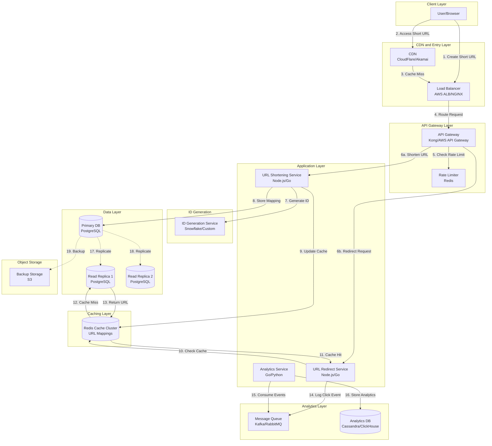
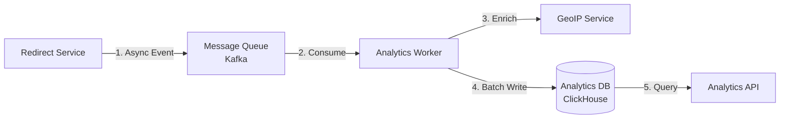

# URL SHORTENER (TINYURL) SYSTEM DESIGN

## Complete System Design Interview Solution

## Table of Contents

- [URL SHORTENER (TINYURL) SYSTEM DESIGN](#url-shortener-tinyurl-system-design)
  - [Complete System Design Interview Solution](#complete-system-design-interview-solution)
  - [PART 1: REQUIREMENTS AND CLARIFICATION](#part-1-requirements-and-clarification)
    - [User Stories](#user-stories)
    - [Functional Requirements (MVP)](#functional-requirements-mvp)
    - [Non-Functional Requirements](#non-functional-requirements)
    - [Clarifying Questions and Assumptions](#clarifying-questions-and-assumptions)
  - [PART 2: CAPACITY PLANNING AND CALCULATIONS](#part-2-capacity-planning-and-calculations)
    - [Traffic Estimates](#traffic-estimates)
    - [Storage Estimates](#storage-estimates)
    - [Analytics Storage Estimates](#analytics-storage-estimates)
    - [Bandwidth Estimates](#bandwidth-estimates)
    - [URL Space Calculation](#url-space-calculation)
    - [Resource Estimates](#resource-estimates)
  - [PART 3: HIGH-LEVEL DESIGN](#part-3-high-level-design)
    - [System Architecture Overview](#system-architecture-overview)
    - [Data Flow Explanation](#data-flow-explanation)
  - [PART 4: DATABASE DESIGN](#part-4-database-design)
    - [URL Mappings Table (Primary Data Store)](#url-mappings-table-primary-data-store)
    - [Users Table (Optional - for authenticated users)](#users-table-optional-for-authenticated-users)
    - [Analytics Events Table (Time-Series Data)](#analytics-events-table-time-series-data)
    - [Database Technology Choices](#database-technology-choices)
      - [Primary Database: PostgreSQL](#primary-database-postgresql)
      - [Analytics Database: Cassandra or ClickHouse](#analytics-database-cassandra-or-clickhouse)
  - [PART 5: API DESIGN](#part-5-api-design)
    - [Base Configuration](#base-configuration)
    - [Core API Endpoints](#core-api-endpoints)
      - [1. Create Short URL](#1-create-short-url)
      - [2. Redirect Short URL](#2-redirect-short-url)
      - [3. Get URL Analytics](#3-get-url-analytics)
      - [4. Get User URLs](#4-get-user-urls)
      - [5. Delete Short URL](#5-delete-short-url)
      - [6. Health Check](#6-health-check)
    - [Cross-Cutting API Concerns](#cross-cutting-api-concerns)
      - [Rate Limiting](#rate-limiting)
      - [Error Response Standard](#error-response-standard)
      - [Security Headers](#security-headers)
      - [Idempotency](#idempotency)
      - [Content Negotiation](#content-negotiation)
      - [CORS Policy](#cors-policy)
    - [API Trade-Offs](#api-trade-offs)
      - [Decision: REST vs GraphQL](#decision-rest-vs-graphql)
      - [Decision: Synchronous Redirection](#decision-synchronous-redirection)
      - [Decision: Offset-based Pagination](#decision-offset-based-pagination)
      - [Decision: API Versioning in URL Path](#decision-api-versioning-in-url-path)
  - [PART 6: DEEP-DIVE INTO CRITICAL COMPONENTS](#part-6-deep-dive-into-critical-components)
    - [Component 1: ID Generation Service](#component-1-id-generation-service)
      - [Approach: Base62 Encoding with Distributed ID Generation](#approach-base62-encoding-with-distributed-id-generation)
      - [Alternative Approach: MD5 Hash with Collision Detection](#alternative-approach-md5-hash-with-collision-detection)
      - [Technology Choice: Snowflake-based approach](#technology-choice-snowflake-based-approach)
    - [Component 2: Caching Layer](#component-2-caching-layer)
      - [Architecture: Multi-Tier Caching](#architecture-multi-tier-caching)
      - [Redis Architecture](#redis-architecture)
      - [Caching Strategy: Cache-Aside (Lazy Loading)](#caching-strategy-cache-aside-lazy-loading)
    - [Component 3: Analytics Pipeline](#component-3-analytics-pipeline)
      - [Architecture: Asynchronous Event-Driven Pipeline](#architecture-asynchronous-event-driven-pipeline)
    - [Trade-Offs Analysis](#trade-offs-analysis)
      - [Decision 1: ID Generation Strategy](#decision-1-id-generation-strategy)
      - [Decision 2: Database Technology](#decision-2-database-technology)
      - [Decision 3: Caching Strategy](#decision-3-caching-strategy)
      - [Decision 4: Analytics Pipeline](#decision-4-analytics-pipeline)
      - [Decision 5: API Design Pattern](#decision-5-api-design-pattern)
  - [PART 7: BOTTLENECKS AND IMPROVEMENTS](#part-7-bottlenecks-and-improvements)
    - [Potential Bottlenecks](#potential-bottlenecks)
      - [Bottleneck 1: Database Write Contention](#bottleneck-1-database-write-contention)
      - [Bottleneck 2: Cache Memory Limitations](#bottleneck-2-cache-memory-limitations)
      - [Bottleneck 3: Analytics Database Write Throughput](#bottleneck-3-analytics-database-write-throughput)
      - [Bottleneck 4: ID Generation Service Availability](#bottleneck-4-id-generation-service-availability)
      - [Bottleneck 5: Geographic Latency](#bottleneck-5-geographic-latency)
    - [Scalability Improvements](#scalability-improvements)
      - [1. Geographic Distribution](#1-geographic-distribution)
      - [2. Service Optimization](#2-service-optimization)
      - [3. Real-Time Features](#3-real-time-features)
    - [Monitoring and Observability](#monitoring-and-observability)
      - [Metrics to Track](#metrics-to-track)
      - [Alerting Strategy](#alerting-strategy)
    - [Security Considerations](#security-considerations)
      - [1. Input Validation](#1-input-validation)
      - [2. Rate Limiting](#2-rate-limiting)
      - [3. Authentication & Authorization](#3-authentication-authorization)
      - [4. Data Encryption](#4-data-encryption)
      - [5. Abuse Prevention](#5-abuse-prevention)
    - [Future Enhancements](#future-enhancements)
      - [1. Advanced Analytics](#1-advanced-analytics)
      - [2. Custom Domains](#2-custom-domains)
      - [3. QR Code Generation](#3-qr-code-generation)
      - [4. Link Retargeting](#4-link-retargeting)
      - [5. Link Preview API](#5-link-preview-api)
      - [6. Bulk Operations](#6-bulk-operations)
  - [CONCLUSION](#conclusion)

---

**File Purpose:** This document provides a comprehensive system design for a URL shortening service (like TinyURL). It covers requirements gathering, capacity planning, high-level architecture, database design, API specifications, deep-dive into critical components, trade-off analysis, and scalability considerations. This serves as a complete reference for system design interviews and real-world implementation.

**Last Updated:** October 1, 2025

---

## PART 1: REQUIREMENTS AND CLARIFICATION

### User Stories

**As a user**, I want to:

- Convert a long URL into a short URL so that I can easily share it
- Click on a short URL and be redirected to the original long URL so that I can access the content quickly
- Customize my short URL (if available) so that it's memorable and branded
- View analytics on my shortened URLs so that I can track engagement

**As a system administrator**, I want to:

- Ensure the service is highly available so that users can access short URLs 24/7
- Prevent abuse and spam so that the platform remains trustworthy
- Scale the system efficiently so that we can handle growing traffic

---

### Functional Requirements (MVP)

1. **URL Shortening:** Given a long URL, generate a unique short URL
2. **URL Redirection:** Given a short URL, redirect to the original long URL
3. **Expiration:** Short URLs can have optional expiration dates
4. **Custom Aliases:** Users can optionally provide custom short URLs (if available)
5. **Analytics:** Track basic metrics (click count, timestamps)

**Out of Scope for MVP:**

- User authentication and authorization
- Advanced analytics (geographic data, device types)
- URL editing after creation
- Bulk URL shortening
- QR code generation

---

### Non-Functional Requirements

1. **Availability:** 99.99% uptime (critical for redirection service)
2. **Performance:**
   - URL redirection: < 100ms latency (P99)
   - URL shortening: < 500ms latency (P99)
3. **Scalability:** Support 100M new URLs per month, 10B redirects per month
4. **Durability:** No data loss - once created, short URLs must persist
5. **Security:** Prevent malicious URLs, rate limiting, DDoS protection
6. **Consistency:** Eventual consistency acceptable for analytics; strong consistency required for URL creation

---

### Clarifying Questions and Assumptions

**Questions:**

1. What is the expected ratio of reads (redirects) to writes (URL creation)?
2. How long should short URLs be retained?
3. Should we support custom domains (e.g., brand.short/abc)?
4. What character set is allowed for short URLs?
5. Do we need real-time analytics or is eventual consistency acceptable?

**Assumptions:**

1. **Read-to-Write Ratio:** 100:1 (heavy read workload)
2. **Retention:** URLs never expire by default unless user specifies
3. **Short URL Length:** 6-7 characters
4. **Character Set:** [a-z, A-Z, 0-9] = 62 characters
5. **DAU:** 100 million daily active users
6. **Geographic Distribution:** Global service
7. **No Authentication Required:** For MVP, URL shortening is anonymous

---

## PART 2: CAPACITY PLANNING AND CALCULATIONS

### Traffic Estimates

```text
Daily Active Users (DAU): 100M
Assumption: 1% of users create new short URLs daily
URL Creation Rate: 100M * 1% = 1M URLs/day

Read-to-Write Ratio: 100:1
Redirects per day: 1M * 100 = 100M redirects/day

Seconds per day: 86,400

Write QPS: 1,000,000 / 86,400 ≈ 12 writes/second
Read QPS: 100,000,000 / 86,400 ≈ 1,160 reads/second

Peak Traffic (3x average):
- Write QPS: 36 writes/second
- Read QPS: 3,480 reads/second
```

---

### Storage Estimates

```text
URL Storage per Entry:
- Short URL hash: 7 bytes
- Original URL: 500 bytes (average)
- User ID (optional): 8 bytes
- Created timestamp: 8 bytes
- Expiration timestamp: 8 bytes
- Metadata: 50 bytes
Total per URL: ~580 bytes ≈ 600 bytes

Daily Storage: 1M URLs * 600 bytes = 600 MB/day
Monthly Storage: 600 MB * 30 = 18 GB/month
Annual Storage: 18 GB * 12 = 216 GB/year
5-Year Storage: 216 GB * 5 = 1.08 TB

With 50% overhead (indexes, replication): ~1.6 TB for 5 years
```

---

### Analytics Storage Estimates

```text
Click Event Storage:
- Short URL hash: 7 bytes
- Timestamp: 8 bytes
- IP address (hashed): 16 bytes
- Referrer: 100 bytes
- User agent: 100 bytes
Total per click: ~230 bytes

Daily Clicks: 100M
Daily Analytics Storage: 100M * 230 bytes = 23 GB/day
Monthly Analytics Storage: 23 GB * 30 = 690 GB/month
Annual Analytics Storage: 690 GB * 12 = 8.3 TB/year

With data retention of 2 years: ~16.6 TB
```

---

### Bandwidth Estimates

```text
Write Operations:
- Request size: ~600 bytes (URL + metadata)
- Response size: ~200 bytes (short URL + metadata)
- Total per write: 800 bytes
- Bandwidth for writes: 12 writes/s * 800 bytes = 9.6 KB/s

Read Operations:
- Request size: ~100 bytes (short URL)
- Response size: ~300 bytes (redirect + headers)
- Total per read: 400 bytes
- Bandwidth for reads: 1,160 reads/s * 400 bytes = 464 KB/s

Peak Bandwidth:
- Write: 28.8 KB/s (negligible)
- Read: 1.4 MB/s (manageable)

Total Daily Bandwidth: ~40 GB/day
```

---

### URL Space Calculation

```text
Character Set: [a-z, A-Z, 0-9] = 62 characters
Short URL Length: 6 characters

Total Combinations: 62^6 = 56.8 billion unique URLs
With 7 characters: 62^7 = 3.5 trillion unique URLs

Daily Creation Rate: 1M URLs/day
Time to Exhaust 6-char Space: 56.8B / 1M = 56,800 days ≈ 155 years
Time to Exhaust 7-char Space: 3.5T / 1M ≈ 9,589 years

Conclusion: 7 characters provide ample space
```

---

### Resource Estimates

```text
Application Servers:
- Each server handles: 1,000 requests/second
- Read servers needed: 1,160 / 1,000 = 2 servers (4 with redundancy)
- Write servers needed: 12 / 1,000 = 1 server (2 with redundancy)
- Total: 6 application servers minimum

Database Sizing:
- Primary DB: 1.6 TB (5-year projection)
- Replicas: 2x for read scaling
- Cache memory: 20% of hot data = ~320 GB (distributed)

Cache Hit Ratio:
- 80/20 rule: 80% of traffic to 20% of URLs
- Hot URLs in cache: 20% of 1.8B URLs = 360M URLs
- Memory per URL in cache: ~600 bytes
- Total cache memory: 360M * 600 bytes = 216 GB
- Distributed across cache cluster: 216 GB / 10 nodes = ~22 GB per node
```

---

## PART 3: HIGH-LEVEL DESIGN

### System Architecture Overview

The URL shortener system consists of multiple layers designed for high availability and scalability. The architecture separates read-heavy redirection traffic from write traffic, uses caching extensively, and employs a distributed ID generation service for creating unique short URLs.



---

### Data Flow Explanation

**URL Shortening Flow (Write Path):**

1. **User Request:** User submits a long URL through the web interface or API
2. **Load Balancer:** Routes the request to an available API Gateway instance
3. **API Gateway:** Authenticates request (if needed) and checks rate limits via Redis
4. **Rate Limiting:** Validates that the user/IP hasn't exceeded rate limits
5. **Write Service:** URL Shortening Service receives the request
6. **ID Generation:** Service calls ID Generation Service to get a unique ID
7. **Database Write:** Stores the URL mapping in Primary PostgreSQL database
8. **Cache Update:** Proactively updates Redis cache with the new mapping
9. **Response:** Returns the short URL to the user

**URL Redirection Flow (Read Path):**

1. **User Click:** User clicks on a short URL
2. **CDN Check:** CDN checks if the redirect is cached (for extremely popular URLs)
3. **Cache Miss:** If not in CDN, request goes to Load Balancer
4. **API Gateway:** Routes to URL Redirect Service
5. **Cache Lookup:** Redirect Service checks Redis cache first
6. **Cache Hit:** If found in cache, immediately returns 302 redirect
7. **Cache Miss:** If not in cache, queries Read Replica
8. **Database Lookup:** Read Replica returns the original URL
9. **Cache Update:** Updates Redis with the mapping for future requests
10. **Async Analytics:** Logs click event to Kafka/RabbitMQ for async processing
11. **Redirect:** Returns 302 Found with Location header to user's browser

**Analytics Flow:**

1. **Event Logging:** Click events are published to message queue
2. **Analytics Service:** Consumes events from queue
3. **Data Processing:** Processes and aggregates click data
4. **Storage:** Stores in Analytics DB (Cassandra/ClickHouse) optimized for time-series queries

---

## PART 4: DATABASE DESIGN

### URL Mappings Table (Primary Data Store)

**Table: `url_mappings`**

```text
Columns:
- short_url_hash (PK, VARCHAR(7), UNIQUE, INDEXED)
  Primary key, the unique short identifier
  
- original_url (TEXT, NOT NULL)
  The original long URL to redirect to
  
- user_id (BIGINT, NULLABLE, INDEXED)
  Reference to user who created it (null for anonymous)
  
- created_at (TIMESTAMP, NOT NULL, DEFAULT CURRENT_TIMESTAMP)
  When the short URL was created
  
- expires_at (TIMESTAMP, NULLABLE, INDEXED)
  Optional expiration date
  
- custom_alias (BOOLEAN, DEFAULT FALSE)
  Whether this was a custom alias or auto-generated
  
- is_active (BOOLEAN, DEFAULT TRUE, INDEXED)
  Soft delete flag
  
- click_count (BIGINT, DEFAULT 0)
  Denormalized counter for quick access (updated async)
  
Indexes:
- PRIMARY KEY (short_url_hash)
- INDEX idx_user_id (user_id)
- INDEX idx_expires_at (expires_at) WHERE expires_at IS NOT NULL
- INDEX idx_created_at (created_at)
- INDEX idx_active (is_active)
```

**Partitioning Strategy:**

- Partition by creation date (monthly partitions)
- Allows efficient data archival and query optimization

---

### Users Table (Optional - for authenticated users)

**Table: `users`**

```text
Columns:
- user_id (PK, BIGINT, AUTO_INCREMENT)
  Unique user identifier
  
- email (VARCHAR(255), UNIQUE, INDEXED)
  User email address
  
- username (VARCHAR(50), UNIQUE, NULLABLE)
  Optional username
  
- api_key_hash (VARCHAR(64), UNIQUE, NULLABLE)
  Hashed API key for programmatic access
  
- created_at (TIMESTAMP, NOT NULL, DEFAULT CURRENT_TIMESTAMP)
  Account creation timestamp
  
- is_active (BOOLEAN, DEFAULT TRUE)
  Account status
  
Indexes:
- PRIMARY KEY (user_id)
- UNIQUE INDEX idx_email (email)
- UNIQUE INDEX idx_api_key (api_key_hash)
```

---

### Analytics Events Table (Time-Series Data)

**Table: `click_events`** (Cassandra/ClickHouse)

```text
Columns:
- event_id (UUID, PK)
  Unique event identifier
  
- short_url_hash (VARCHAR(7), INDEXED)
  Reference to the short URL
  
- clicked_at (TIMESTAMP, NOT NULL, PARTITION KEY)
  When the click occurred (used for time-based partitioning)
  
- ip_address_hash (VARCHAR(64))
  Hashed IP for privacy
  
- referrer (TEXT, NULLABLE)
  HTTP referrer header
  
- user_agent (TEXT)
  Browser/device information
  
- country_code (CHAR(2), NULLABLE)
  ISO country code from IP geolocation
  
- city (VARCHAR(100), NULLABLE)
  City from IP geolocation
  
Partitioning:
- Partition by clicked_at (daily partitions)
- Clustering by short_url_hash for efficient querying
```

---

### Database Technology Choices

#### Primary Database: PostgreSQL

- ACID compliance ensures data integrity
- Excellent support for indexes and queries
- Proven scalability with read replicas
- Strong consistency for URL creation

#### Analytics Database: Cassandra or ClickHouse

- Optimized for time-series data
- High write throughput for click events
- Efficient aggregation queries
- Horizontal scalability

**Replication Strategy:**

- Master-Slave replication (1 primary, 2+ read replicas)
- Writes go to primary
- Reads distributed across replicas
- Replication lag acceptable (eventual consistency for reads)

---

## PART 5: API DESIGN

### Base Configuration

**Base URL:** `https://api.tiny.url/v1`

**Authentication:**

- Anonymous access allowed for basic shortening
- API Key authentication for advanced features: `Authorization: Bearer {api_key}`
- Rate limiting based on IP address (anonymous) or API key (authenticated)

**Versioning:**

- URL path versioning: `/v1/`, `/v2/`
- Maintains backward compatibility

**Response Format:**

- Content-Type: `application/json`
- Character encoding: UTF-8

---

### Core API Endpoints

#### 1. Create Short URL

**Endpoint:**

```http
POST /v1/shorten
```

**Description:** Creates a new short URL from a long URL

**Request Headers:**

```http
Content-Type: application/json
Authorization: Bearer {api_key} (optional)
```

**Request Body:**

```json
{
  "long_url": "https://www.example.com/very/long/url/path?param1=value1&param2=value2",
  "custom_alias": "mylink",
  "expires_at": "2025-12-31T23:59:59Z"
}
```

**Request Parameters:**

- `long_url` (string, required): The original URL to shorten (max 2048 chars)
- `custom_alias` (string, optional): Custom short URL identifier (3-15 alphanumeric chars)
- `expires_at` (ISO 8601 timestamp, optional): Expiration date/time

**Success Response (201 Created):**

```json
{
  "status": "success",
  "data": {
    "short_url": "https://tiny.url/aB3xY9",
    "short_code": "aB3xY9",
    "long_url": "https://www.example.com/very/long/url/path?param1=value1&param2=value2",
    "created_at": "2025-10-01T10:30:00Z",
    "expires_at": "2025-12-31T23:59:59Z"
  }
}
```

**Error Responses:**

*400 Bad Request - Invalid URL:*

```json
{
  "status": "error",
  "error": {
    "code": "INVALID_URL",
    "message": "The provided URL is not valid"
  }
}
```

*409 Conflict - Custom alias taken:*

```json
{
  "status": "error",
  "error": {
    "code": "ALIAS_TAKEN",
    "message": "The custom alias 'mylink' is already in use"
  }
}
```

*429 Too Many Requests:*

```json
{
  "status": "error",
  "error": {
    "code": "RATE_LIMIT_EXCEEDED",
    "message": "Rate limit exceeded. Try again in 60 seconds"
  },
  "retry_after": 60
}
```

**Rate Limiting:**

- Anonymous users: 10 requests per hour per IP
- Authenticated users: 1000 requests per hour per API key

---

#### 2. Redirect Short URL

**Endpoint:**

```http
GET /{short_code}
```

**Description:** Redirects to the original long URL

**Request Example:**

```http
GET /aB3xY9
Host: tiny.url
```

**Success Response (302 Found):**

```http
HTTP/1.1 302 Found
Location: https://www.example.com/very/long/url/path?param1=value1&param2=value2
Cache-Control: public, max-age=3600
```

**Error Responses:**

*404 Not Found - Short URL doesn't exist:*

```json
{
  "status": "error",
  "error": {
    "code": "URL_NOT_FOUND",
    "message": "The short URL does not exist or has expired"
  }
}
```

*410 Gone - URL expired:*

```json
{
  "status": "error",
  "error": {
    "code": "URL_EXPIRED",
    "message": "This short URL has expired"
  }
}
```

**Caching:**

- CDN caching: 1 hour for popular URLs
- Redis caching: Indefinite until evicted
- Client caching: As per Cache-Control header

---

#### 3. Get URL Analytics

**Endpoint:**

```http
GET /v1/analytics/{short_code}
```

**Description:** Retrieves analytics data for a short URL

**Request Headers:**

```http
Authorization: Bearer {api_key} (required)
```

**Query Parameters:**

- `start_date` (ISO 8601 date, optional): Start of date range (default: 30 days ago)
- `end_date` (ISO 8601 date, optional): End of date range (default: today)
- `granularity` (string, optional): `hour`, `day`, `week`, `month` (default: `day`)

**Request Example:**

```http
GET /v1/analytics/aB3xY9?start_date=2025-09-01&end_date=2025-10-01&granularity=day
Authorization: Bearer abc123xyz
```

**Success Response (200 OK):**

```json
{
  "status": "success",
  "data": {
    "short_code": "aB3xY9",
    "long_url": "https://www.example.com/very/long/url/path",
    "created_at": "2025-08-15T10:30:00Z",
    "total_clicks": 15234,
    "unique_clicks": 8721,
    "time_series": [
      {
        "date": "2025-09-01",
        "clicks": 345,
        "unique_clicks": 201
      },
      {
        "date": "2025-09-02",
        "clicks": 412,
        "unique_clicks": 238
      }
    ],
    "top_referrers": [
      {
        "referrer": "google.com",
        "clicks": 4521
      },
      {
        "referrer": "facebook.com",
        "clicks": 2103
      }
    ],
    "top_countries": [
      {
        "country": "US",
        "clicks": 6234
      },
      {
        "country": "GB",
        "clicks": 2156
      }
    ]
  }
}
```

**Error Responses:**

*403 Forbidden - Not authorized:*

```json
{
  "status": "error",
  "error": {
    "code": "FORBIDDEN",
    "message": "You are not authorized to view analytics for this URL"
  }
}
```

*404 Not Found:*

```json
{
  "status": "error",
  "error": {
    "code": "URL_NOT_FOUND",
    "message": "The short URL does not exist"
  }
}
```

---

#### 4. Get User URLs

**Endpoint:**

```http
GET /v1/urls
```

**Description:** Lists all URLs created by the authenticated user

**Request Headers:**

```http
Authorization: Bearer {api_key} (required)
```

**Query Parameters:**

- `page` (integer, optional): Page number (default: 1)
- `limit` (integer, optional): Results per page, max 100 (default: 20)
- `sort` (string, optional): `created_at`, `clicks`, `expires_at` (default: `created_at`)
- `order` (string, optional): `asc`, `desc` (default: `desc`)
- `status` (string, optional): `active`, `expired`, `all` (default: `active`)

**Request Example:**

```http
GET /v1/urls?page=1&limit=20&sort=clicks&order=desc&status=active
Authorization: Bearer abc123xyz
```

**Success Response (200 OK):**

```json
{
  "status": "success",
  "data": {
    "urls": [
      {
        "short_url": "https://tiny.url/aB3xY9",
        "short_code": "aB3xY9",
        "long_url": "https://www.example.com/page1",
        "created_at": "2025-09-15T10:30:00Z",
        "expires_at": null,
        "click_count": 1523,
        "is_active": true
      },
      {
        "short_url": "https://tiny.url/xY2aB8",
        "short_code": "xY2aB8",
        "long_url": "https://www.example.com/page2",
        "created_at": "2025-09-14T15:22:00Z",
        "expires_at": "2025-12-31T23:59:59Z",
        "click_count": 847,
        "is_active": true
      }
    ],
    "pagination": {
      "current_page": 1,
      "total_pages": 15,
      "total_items": 293,
      "items_per_page": 20,
      "has_next": true,
      "has_previous": false
    }
  }
}
```

**Pagination Strategy:**

- Offset-based pagination for simplicity
- Future enhancement: Cursor-based pagination for better performance

---

#### 5. Delete Short URL

**Endpoint:**

```http
DELETE /v1/urls/{short_code}
```

**Description:** Soft deletes a short URL (makes it inactive)

**Request Headers:**

```http
Authorization: Bearer {api_key} (required)
```

**Request Example:**

```http
DELETE /v1/urls/aB3xY9
Authorization: Bearer abc123xyz
```

**Success Response (200 OK):**

```json
{
  "status": "success",
  "data": {
    "message": "Short URL successfully deleted",
    "short_code": "aB3xY9"
  }
}
```

**Error Responses:**

*403 Forbidden:*

```json
{
  "status": "error",
  "error": {
    "code": "FORBIDDEN",
    "message": "You are not authorized to delete this URL"
  }
}
```

*404 Not Found:*

```json
{
  "status": "error",
  "error": {
    "code": "URL_NOT_FOUND",
    "message": "The short URL does not exist"
  }
}
```

---

#### 6. Health Check

**Endpoint:**

```http
GET /v1/health
```

**Description:** Health check endpoint for monitoring

**Success Response (200 OK):**

```json
{
  "status": "healthy",
  "timestamp": "2025-10-01T10:30:00Z",
  "services": {
    "database": "up",
    "cache": "up",
    "queue": "up"
  }
}
```

**Degraded Response (503 Service Unavailable):**

```json
{
  "status": "degraded",
  "timestamp": "2025-10-01T10:30:00Z",
  "services": {
    "database": "up",
    "cache": "down",
    "queue": "up"
  }
}
```

---

### Cross-Cutting API Concerns

#### Rate Limiting

**Strategy:** Token bucket algorithm implemented in Redis

**Limits by User Type:**

- Anonymous (by IP): 10 URL shortening requests/hour, unlimited redirects
- Authenticated Free Tier: 1,000 URL shortening requests/hour
- Authenticated Pro Tier: 100,000 URL shortening requests/hour

**Rate Limit Headers:**

```http
X-RateLimit-Limit: 1000
X-RateLimit-Remaining: 856
X-RateLimit-Reset: 1696161600
```

---

#### Error Response Standard

**Format:**

```json
{
  "status": "error",
  "error": {
    "code": "ERROR_CODE",
    "message": "Human-readable error message",
    "details": {}
  },
  "request_id": "req_abc123xyz"
}
```

**Common Error Codes:**

- `INVALID_URL`: Malformed or invalid URL
- `ALIAS_TAKEN`: Custom alias already exists
- `URL_NOT_FOUND`: Short URL doesn't exist
- `URL_EXPIRED`: Short URL has expired
- `RATE_LIMIT_EXCEEDED`: Too many requests
- `FORBIDDEN`: Authorization failure
- `INTERNAL_ERROR`: Server error

---

#### Security Headers

**All API Responses Include:**

```http
Strict-Transport-Security: max-age=31536000; includeSubDomains
X-Content-Type-Options: nosniff
X-Frame-Options: DENY
X-XSS-Protection: 1; mode=block
Content-Security-Policy: default-src 'self'
```

---

#### Idempotency

**Idempotent Operations:**

- GET requests are naturally idempotent
- DELETE requests are idempotent (deleting already deleted URL returns success)

**Non-Idempotent Operations:**

- POST /v1/shorten creates new URL each time (by design)
- Optional: Use `Idempotency-Key` header for duplicate prevention

**Idempotency Key Example:**

```http
POST /v1/shorten
Idempotency-Key: unique-client-generated-key-123
```

---

#### Content Negotiation

**Supported Response Formats:**

- JSON (default): `Accept: application/json`
- For redirect endpoint: Returns HTTP 302 by default

---

#### CORS Policy

**Configuration:**

```http
Access-Control-Allow-Origin: * (for GET redirects)
Access-Control-Allow-Origin: https://app.tiny.url (for API endpoints)
Access-Control-Allow-Methods: GET, POST, DELETE, OPTIONS
Access-Control-Allow-Headers: Authorization, Content-Type
Access-Control-Max-Age: 86400
```

---

### API Trade-Offs

#### Decision: REST vs GraphQL

- **Choice:** REST API
- **Pros:** Simpler, better HTTP caching, widely understood, perfect for CRUD operations
- **Cons:** Multiple endpoints, potential over-fetching
- **Justification:** URL shortener has simple, well-defined resources; REST is ideal for this use case

#### Decision: Synchronous Redirection

- **Choice:** Synchronous redirect with async analytics
- **Pros:** Lowest latency for user, immediate redirect
- **Cons:** Analytics processing can't block redirect
- **Justification:** User experience is paramount; analytics can be eventually consistent

#### Decision: Offset-based Pagination

- **Choice:** Offset-based for v1, cursor-based for future
- **Pros:** Simple to implement, easy to understand
- **Cons:** Performance degrades with large offsets
- **Justification:** Sufficient for MVP; can upgrade to cursor-based for scale

#### Decision: API Versioning in URL Path

- **Choice:** `/v1/`, `/v2/` in URL path
- **Pros:** Explicit, easy to route, clear for clients
- **Cons:** Multiple versions to maintain
- **Justification:** Common practice, allows breaking changes without disrupting existing clients

---

## PART 6: DEEP-DIVE INTO CRITICAL COMPONENTS

### Component 1: ID Generation Service

**Purpose:** Generate unique, short, URL-safe identifiers for every long URL without collisions.

#### Approach: Base62 Encoding with Distributed ID Generation

**Architecture:**

The ID Generation Service uses a distributed approach similar to Twitter's Snowflake to generate unique 64-bit IDs, which are then encoded in Base62.

**ID Structure (64 bits):**

```text
[1 bit unused][41 bits timestamp][10 bits machine ID][12 bits sequence]

- Timestamp (41 bits): Milliseconds since custom epoch (2025-01-01)
  Provides ~69 years of timestamps
  
- Machine ID (10 bits): Unique server ID (supports 1024 machines)
  
- Sequence (12 bits): Per-machine sequence number (4096 IDs per ms per machine)
```

**ID Generation Process:**

```python
"""
ID Generation Service
Purpose: Generates unique 64-bit IDs using Snowflake algorithm and encodes them to Base62

How to call:
  generator = IDGenerator(machine_id=1)
  short_code = generator.generate_id()

Expected return: 
  7-character Base62 encoded string (e.g., "aB3xY9Z")
"""

class IDGenerator:
    def __init__(self, machine_id):
        self.machine_id = machine_id  # 10 bits
        self.sequence = 0
        self.last_timestamp = -1
        self.epoch = 1735689600000  # 2025-01-01 00:00:00 UTC in ms
        
    def generate_id(self):
        timestamp = self._current_millis()
        
        # Handle clock moving backwards
        if timestamp < self.last_timestamp:
            raise Exception("Clock moved backwards")
        
        # Same millisecond - increment sequence
        if timestamp == self.last_timestamp:
            self.sequence = (self.sequence + 1) & 4095  # 12 bits
            if self.sequence == 0:
                # Sequence overflow - wait for next millisecond
                timestamp = self._wait_next_millis(self.last_timestamp)
        else:
            self.sequence = 0
        
        self.last_timestamp = timestamp
        
        # Generate 64-bit ID
        id_value = ((timestamp - self.epoch) << 22) | \
                   (self.machine_id << 12) | \
                   self.sequence
        
        # Encode to Base62
        return self._encode_base62(id_value)
    
    def _encode_base62(self, num):
        """
        Encodes integer to Base62 string
        Character set: 0-9, a-z, A-Z (62 characters)
        
        Expected return: 7-character string
        """
        chars = "0123456789abcdefghijklmnopqrstuvwxyzABCDEFGHIJKLMNOPQRSTUVWXYZ"
        if num == 0:
            return chars[0]
        
        result = []
        while num > 0:
            result.append(chars[num % 62])
            num //= 62
        
        # Pad to 7 characters for consistent length
        result.extend(['0'] * (7 - len(result)))
        return ''.join(reversed(result))
    
    def _current_millis(self):
        return int(time.time() * 1000)
    
    def _wait_next_millis(self, last_timestamp):
        timestamp = self._current_millis()
        while timestamp <= last_timestamp:
            timestamp = self._current_millis()
        return timestamp
```

#### Alternative Approach: MD5 Hash with Collision Detection

For comparison, here's an alternative using hashing:

```python
"""
Hash-Based ID Generator (Alternative)
Purpose: Generates short codes using MD5 hash of URL + timestamp

How to call:
  generator = HashIDGenerator()
  short_code = generator.generate_from_url("https://example.com")

Expected return:
  7-character Base62 string, retries on collision
"""

import hashlib
import random

class HashIDGenerator:
    def __init__(self, db_connection):
        self.db = db_connection
    
    def generate_from_url(self, long_url, max_retries=5):
        """
        Generates short code from URL hash
        Handles collisions by appending random salt and rehashing
        """
        for attempt in range(max_retries):
            # Create hash input
            hash_input = f"{long_url}{int(time.time())}{random.randint(0, 1000000)}"
            
            # Generate MD5 hash
            hash_object = hashlib.md5(hash_input.encode())
            hash_hex = hash_object.hexdigest()
            
            # Take first 43 bits of hash (7 Base62 chars)
            hash_int = int(hash_hex[:11], 16)
            short_code = self._encode_base62(hash_int)[:7]
            
            # Check for collision in database
            if not self._exists_in_db(short_code):
                return short_code
        
        raise Exception("Failed to generate unique ID after retries")
    
    def _exists_in_db(self, short_code):
        # Query database to check if short_code exists
        query = "SELECT 1 FROM url_mappings WHERE short_url_hash = %s"
        return self.db.execute(query, (short_code,)).fetchone() is not None
```

**Comparison:**

| Aspect | Snowflake Approach | Hash Approach |
|--------|-------------------|---------------|
| **Collision Risk** | None (guaranteed unique) | Possible (requires DB check) |
| **Performance** | Very fast (no DB call) | Slower (DB collision check) |
| **Scalability** | Excellent (no coordination) | Limited (DB bottleneck) |
| **Predictability** | Sequential (can be mitigated) | Random |
| **Chosen Approach** | ✅ Recommended | Alternative |

#### Technology Choice: Snowflake-based approach

- No collisions by design
- No database dependency for generation
- Horizontally scalable (up to 1024 machines)
- 4M IDs per second per machine

---

### Component 2: Caching Layer

**Purpose:** Minimize database load and reduce latency for URL redirection by caching URL mappings.

#### Architecture: Multi-Tier Caching

##### Tier 1: CDN (CloudFlare/Akamai)

- Caches HTTP 302 redirects for extremely popular URLs
- Geographic distribution reduces latency
- Cache-Control: public, max-age=3600 (1 hour)

##### Tier 2: Application-Level Cache (Redis Cluster)

- In-memory key-value store
- Stores URL mappings: `short_code -> long_url`
- Cluster mode for high availability and scalability

#### Redis Architecture

```text
Redis Cluster Configuration:
- 6 nodes (3 masters, 3 replicas)
- Hash slot partitioning (16,384 slots)
- Automatic failover
- Memory: 64GB per node = 384GB total cluster capacity
```

#### Caching Strategy: Cache-Aside (Lazy Loading)

```python
"""
Cache Manager Service
Purpose: Manages URL mapping cache with Redis, implements cache-aside pattern

How to call:
  cache_manager = CacheManager(redis_client, db_connection)
  long_url = cache_manager.get_url("aB3xY9")

Expected return:
  Original long URL string or None if not found
"""

class CacheManager:
    def __init__(self, redis_client, db_connection):
        self.redis = redis_client
        self.db = db_connection
        self.ttl = None  # No expiration for URL mappings
        
    def get_url(self, short_code):
        """
        Retrieves long URL for a short code
        Implements cache-aside pattern: check cache first, then DB
        
        Returns: long_url string or None
        """
        # Try cache first
        cache_key = f"url:{short_code}"
        cached_url = self.redis.get(cache_key)
        
        if cached_url:
            # Cache hit - return immediately
            self._record_metric("cache_hit")
            return cached_url.decode('utf-8')
        
        # Cache miss - query database
        self._record_metric("cache_miss")
        long_url = self._fetch_from_db(short_code)
        
        if long_url:
            # Update cache for future requests
            self.redis.set(cache_key, long_url)
            return long_url
        
        return None
    
    def set_url(self, short_code, long_url):
        """
        Stores URL mapping in cache (called after creating short URL)
        Proactive caching for write operations
        """
        cache_key = f"url:{short_code}"
        self.redis.set(cache_key, long_url)
    
    def invalidate_url(self, short_code):
        """
        Removes URL from cache (called when URL is deleted)
        """
        cache_key = f"url:{short_code}"
        self.redis.delete(cache_key)
    
    def _fetch_from_db(self, short_code):
        """
        Fetches URL from database read replica
        """
        query = """
            SELECT original_url 
            FROM url_mappings 
            WHERE short_url_hash = %s 
              AND is_active = TRUE
              AND (expires_at IS NULL OR expires_at > NOW())
        """
        result = self.db.execute(query, (short_code,)).fetchone()
        return result[0] if result else None
```

**Cache Invalidation Strategy:**

1. **URL Creation:** Proactively cache new URLs
2. **URL Deletion:** Immediately invalidate cache entry
3. **URL Expiration:** Lazy evaluation (check expiry on cache miss)
4. **No TTL:** URL mappings don't expire from cache unless explicitly invalidated
5. **Memory Management:** LRU eviction when memory limit reached

**Cache Warming Strategy:**

```python
"""
Cache Warming Service
Purpose: Preloads popular URLs into cache during off-peak hours

How to call:
  warmer = CacheWarmer(redis_client, db_connection)
  warmer.warm_top_urls(limit=10000)

Expected return:
  Number of URLs successfully warmed
"""

class CacheWarmer:
    def warm_top_urls(self, limit=10000):
        """
        Loads most frequently accessed URLs into cache
        Runs as scheduled job (e.g., daily at 3 AM)
        """
        query = """
            SELECT short_url_hash, original_url
            FROM url_mappings
            WHERE is_active = TRUE
            ORDER BY click_count DESC
            LIMIT %s
        """
        popular_urls = self.db.execute(query, (limit,)).fetchall()
        
        # Batch load into cache
        pipeline = self.redis.pipeline()
        for short_code, long_url in popular_urls:
            pipeline.set(f"url:{short_code}", long_url)
        pipeline.execute()
        
        return len(popular_urls)
```

**Monitoring:**

- Track cache hit ratio (target: >90%)
- Monitor cache memory usage
- Alert on unusual miss rates

---

### Component 3: Analytics Pipeline

**Purpose:** Collect, process, and store click analytics without impacting redirect performance.

#### Architecture: Asynchronous Event-Driven Pipeline



**Components:**

**1. Event Producer (in Redirect Service):**

```python
"""
Analytics Event Producer
Purpose: Publishes click events to message queue without blocking redirects

How to call:
  producer = AnalyticsProducer(kafka_client)
  producer.log_click_event(short_code, request_metadata)

Expected return:
  None (fire-and-forget, non-blocking)
"""

class AnalyticsProducer:
    def __init__(self, kafka_client):
        self.kafka = kafka_client
        self.topic = "click_events"
    
    def log_click_event(self, short_code, request):
        """
        Asynchronously logs a click event
        Non-blocking: returns immediately after sending to queue
        """
        event = {
            "event_id": str(uuid.uuid4()),
            "short_code": short_code,
            "timestamp": datetime.utcnow().isoformat(),
            "ip_address": self._hash_ip(request.ip),
            "referrer": request.headers.get("Referer", ""),
            "user_agent": request.headers.get("User-Agent", "")
        }
        
        # Non-blocking send
        self.kafka.send(self.topic, value=event)
    
    def _hash_ip(self, ip_address):
        """
        Hashes IP address for privacy compliance (GDPR)
        """
        return hashlib.sha256(ip_address.encode()).hexdigest()
```

**2. Event Consumer (Analytics Worker):**

```python
"""
Analytics Event Consumer
Purpose: Consumes click events from queue, enriches data, and batch writes to analytics DB

How to call:
  consumer = AnalyticsConsumer(kafka_client, clickhouse_client, geoip_service)
  consumer.start()  # Runs indefinitely

Expected return:
  Does not return (long-running service)
"""

class AnalyticsConsumer:
    def __init__(self, kafka_client, clickhouse_client, geoip_service):
        self.kafka = kafka_client
        self.clickhouse = clickhouse_client
        self.geoip = geoip_service
        self.batch_size = 1000
        self.batch_timeout = 10  # seconds
        
    def start(self):
        """
        Starts consuming events from Kafka
        Processes in batches for efficient writes
        """
        consumer = self.kafka.subscribe("click_events")
        batch = []
        last_flush = time.time()
        
        for message in consumer:
            event = message.value
            
            # Enrich event with geo data
            enriched_event = self._enrich_event(event)
            batch.append(enriched_event)
            
            # Flush batch if size or time threshold reached
            if len(batch) >= self.batch_size or \
               (time.time() - last_flush) > self.batch_timeout:
                self._flush_batch(batch)
                batch = []
                last_flush = time.time()
    
    def _enrich_event(self, event):
        """
        Adds geographic information from IP address
        """
        ip_hash = event["ip_address"]
        # Note: Store original IP temporarily for geo lookup, then discard
        geo_data = self.geoip.lookup(ip_hash)
        
        event["country_code"] = geo_data.get("country", "")
        event["city"] = geo_data.get("city", "")
        return event
    
    def _flush_batch(self, batch):
        """
        Batch inserts events into ClickHouse for efficiency
        """
        if not batch:
            return
        
        query = """
            INSERT INTO click_events 
            (event_id, short_code, clicked_at, ip_address_hash, 
             referrer, user_agent, country_code, city)
            VALUES
        """
        self.clickhouse.execute_batch(query, batch)
```

**3. Analytics Database (ClickHouse):**

**Why ClickHouse?**

- Columnar storage optimized for analytics
- Excellent compression (10x-100x)
- Fast aggregation queries
- Handles billions of rows efficiently

**Table Structure:**

```sql
CREATE TABLE click_events (
    event_id UUID,
    short_code String,
    clicked_at DateTime,
    ip_address_hash String,
    referrer String,
    user_agent String,
    country_code String,
    city String
) ENGINE = MergeTree()
PARTITION BY toYYYYMM(clicked_at)
ORDER BY (short_code, clicked_at)
```

**Aggregation Queries:**

```sql
-- Total clicks by short code
SELECT 
    short_code,
    count() as total_clicks,
    uniq(ip_address_hash) as unique_clicks
FROM click_events
WHERE short_code = 'aB3xY9'
  AND clicked_at >= now() - INTERVAL 30 DAY
GROUP BY short_code

-- Top referrers
SELECT 
    referrer,
    count() as clicks
FROM click_events
WHERE short_code = 'aB3xY9'
  AND clicked_at >= now() - INTERVAL 30 DAY
GROUP BY referrer
ORDER BY clicks DESC
LIMIT 10

-- Geographic distribution
SELECT 
    country_code,
    count() as clicks
FROM click_events
WHERE short_code = 'aB3xY9'
  AND clicked_at >= now() - INTERVAL 30 DAY
GROUP BY country_code
ORDER BY clicks DESC
```

**Performance Characteristics:**

- Insert throughput: 100K events/second per node
- Query latency: Sub-second for aggregations on billions of rows
- Storage efficiency: 10x compression ratio

---

### Trade-Offs Analysis

#### Decision 1: ID Generation Strategy

**Decision:** Snowflake-based distributed ID generation
**Alternative:** Hash-based with collision detection

**Pros:**

- Guaranteed uniqueness without database checks
- Extremely fast (no I/O)
- Horizontally scalable
- High throughput (millions/second)

**Cons:**

- IDs are sequential (predictable)
- Requires coordination of machine IDs
- Clock synchronization important

**Justification:** For a URL shortener, performance and scalability are critical. Snowflake approach eliminates database bottleneck during ID generation and scales to handle millions of requests per second.

**Mitigation for Predictability:** Use Base62 encoding to make IDs appear random

---

#### Decision 2: Database Technology

**Decision:** PostgreSQL for URL mappings, ClickHouse for analytics
**Alternatives:**

- All-in-one: Use only PostgreSQL
- NoSQL: Use Cassandra for both

**Pros:**

- PostgreSQL: ACID guarantees, proven reliability, strong consistency
- ClickHouse: Optimized for analytics, excellent compression, fast aggregations
- Separation of concerns: Different workloads optimized separately

**Cons:**

- Operational complexity (two database systems)
- Need to manage two different technologies
- Additional infrastructure cost

**Justification:** URL creation requires strong consistency and ACID properties, while analytics requires high write throughput and fast aggregations. Specialized databases excel at their specific workloads.

---

#### Decision 3: Caching Strategy

**Decision:** Cache-aside (lazy loading) with no TTL
**Alternative:** Write-through caching with TTL

**Pros:**

- Only cache what's actually accessed (efficient memory usage)
- Simple to implement and reason about
- Cache always has latest data after write

**Cons:**

- Cache miss on first access
- Extra database query on miss

**Justification:** For URL shortener, read patterns are heavily skewed (80/20 rule). Cache-aside ensures only popular URLs consume cache memory. No TTL needed because URL mappings are immutable.

---

#### Decision 4: Analytics Pipeline

**Decision:** Asynchronous event-driven with message queue
**Alternative:** Synchronous logging to database

**Pros:**

- Zero impact on redirect latency
- Decouples analytics from core service
- Can handle traffic spikes (queue buffers)
- Easy to scale analytics processing independently

**Cons:**

- Analytics data is eventually consistent
- Additional infrastructure (Kafka)
- More complex architecture

**Justification:** User experience (redirect speed) is paramount. Analytics can tolerate seconds of delay. Async pipeline ensures 99.9% of traffic isn't impacted by analytics processing.

---

#### Decision 5: API Design Pattern

**Decision:** RESTful API with URL versioning
**Alternative:** GraphQL

**Pros:**

- Simple, well-understood pattern
- Excellent HTTP caching support
- Easy to implement and test
- Matches CRUD nature of URL resources

**Cons:**

- Multiple endpoints to maintain
- Potential for over-fetching data
- Less flexible than GraphQL

**Justification:** URL shortener has simple, well-defined resources. REST is perfect for this use case. GraphQL would add unnecessary complexity without significant benefits.

---

## PART 7: BOTTLENECKS AND IMPROVEMENTS

### Potential Bottlenecks

#### Bottleneck 1: Database Write Contention

**Problem:**
As URL creation rate increases (e.g., viral traffic), primary database can become a write bottleneck. PostgreSQL's single-master architecture limits write throughput.

**Solution:**

1. **Database Sharding:** Partition data across multiple database shards
   - Shard key: First 2 characters of short_code
   - Distributes writes across multiple masters

2. **Write Optimization:**
   - Batch insert operations where possible
   - Use connection pooling (e.g., PgBouncer)
   - Optimize indexes (only essential indexes on write path)

3. **Alternative Database:** Consider Cassandra for write-heavy workloads
   - Distributed write capability
   - Linear scalability
   - Trade-off: Eventual consistency

**Monitoring:**

- Track database write latency (P95, P99)
- Monitor connection pool utilization
- Alert when write QPS approaches 80% of capacity

---

#### Bottleneck 2: Cache Memory Limitations

**Problem:**
As URL database grows to billions of entries, caching all URLs becomes impossible. Cache memory fills up, evicting potentially popular URLs.

**Solution:**

1. **Intelligent Eviction:** Use LRU (Least Recently Used) with popularity scoring
   - Track access frequency
   - Evict URLs with low access frequency first

2. **Cache Sizing:**
   - Calculate: 20% of total URLs (Pareto principle)
   - For 1B URLs: 200M cached = 120GB distributed memory

3. **Multi-Tier Caching:**
   - L1: Local in-process cache (most popular 1%)
   - L2: Redis cluster (popular 20%)
   - L3: Database (remaining 79%)

4. **Bloom Filters:**
   - Quickly check if URL exists before cache/DB query
   - Reduces unnecessary lookups

**Monitoring:**

- Track cache hit ratio (target >90%)
- Monitor memory utilization per Redis node
- Alert on sudden drops in hit ratio

---

#### Bottleneck 3: Analytics Database Write Throughput

**Problem:**
During peak traffic (e.g., 100K redirects/second), analytics database can't keep up with write throughput, causing message queue backlog.

**Solution:**

1. **Batch Writes:** Aggregate events in larger batches (1000-5000 events)
   - Reduces write operations
   - Improves ClickHouse efficiency

2. **Horizontal Scaling:** Add more ClickHouse nodes
   - Distribute partitions across nodes
   - Parallel insert capability

3. **Sampling:** For extremely high traffic URLs, sample analytics (e.g., 10% sampling)
   - Still provides accurate insights
   - Reduces write volume by 90%

4. **Async Buffering:** Increase Kafka retention and partitions
   - Buffer up to 24 hours of events
   - Prevents data loss during processing delays

**Monitoring:**

- Track Kafka consumer lag
- Monitor ClickHouse insert throughput
- Alert on queue backlog growth

---

#### Bottleneck 4: ID Generation Service Availability

**Problem:**
If ID Generation Service becomes unavailable, new URL creation stops completely. Single point of failure.

**Solution:**

1. **Service Redundancy:** Deploy multiple ID generation service instances
   - Each instance has unique machine ID
   - Load balanced across instances

2. **Pre-Generated ID Pool:**
   - Generate IDs in advance and store in Redis
   - Application servers pull from pool
   - Background worker replenishes pool

3. **Fallback Mechanism:**
   - If primary service fails, use hash-based generation temporarily
   - Accept small collision risk during outage

**Monitoring:**

- Health checks on all ID generation instances
- Monitor ID pool levels in Redis
- Alert on service degradation

---

#### Bottleneck 5: Geographic Latency

**Problem:**
Users far from primary data center experience high latency for both URL creation and redirection (200-500ms cross-continent latency).

**Solution:**

1. **Geographic Distribution:**
   - Deploy in multiple regions (US East, US West, Europe, Asia)
   - Route traffic to nearest region via GeoDNS

2. **Database Replication:**
   - Multi-region database replicas
   - Read from local replica
   - Writes can tolerate latency (async replication acceptable)

3. **CDN for Redirects:**
   - Cache popular redirects at edge locations
   - 10ms latency instead of 200ms

4. **Split Brain Protection:**
   - Use consensus protocol (Raft) for cross-region coordination
   - Prevent duplicate short codes across regions

**Monitoring:**

- Track latency by geographic region
- Monitor cross-region replication lag
- Alert on regional service degradation

---

### Scalability Improvements

#### 1. Geographic Distribution

**Implementation Strategy:**

```text
Region Deployment:
- US-East (Primary): Virginia
- US-West: Oregon  
- EU: Ireland
- APAC: Singapore

Data Strategy:
- URL Mappings: Replicated to all regions (eventually consistent)
- Analytics: Partitioned by region, aggregated centrally
- User Data: Partitioned by user's home region

Traffic Routing:
- GeoDNS routes to nearest region
- Fallback to next-nearest on failure
- Health checks every 30 seconds
```

**Benefits:**

- Latency reduced to <100ms globally
- Improved availability (regional failures isolated)
- Better compliance (data sovereignty)

---

#### 2. Service Optimization

**Query Optimization:**

```sql
-- Add composite index for common query pattern
CREATE INDEX idx_user_active_urls 
ON url_mappings(user_id, is_active, created_at DESC)
WHERE is_active = TRUE;

-- Partition table by creation date
CREATE TABLE url_mappings_2025_10 PARTITION OF url_mappings
FOR VALUES FROM ('2025-10-01') TO ('2025-11-01');
```

**Connection Pooling:**

- Use PgBouncer for database connection pooling
- Pool size: 100 connections per application server
- Reduces connection overhead

**Code-Level Optimization:**

- Use async/await for non-blocking I/O
- Implement circuit breakers for external services
- Batch database queries where possible

---

#### 3. Real-Time Features

**WebSocket for Live Analytics:**

For users viewing analytics dashboard, provide real-time updates:

```python
"""
WebSocket Analytics Handler
Purpose: Streams real-time click events to connected clients viewing analytics

How to call:
  handler = WebSocketHandler(websocket_connection)
  await handler.stream_analytics(short_code)

Expected return:
  Continuously streams JSON events until connection closes
"""

class WebSocketHandler:
    async def stream_analytics(self, short_code):
        """
        Streams real-time click events for a short URL
        """
        # Subscribe to Redis pub/sub for this short code
        pubsub = self.redis.pubsub()
        pubsub.subscribe(f"clicks:{short_code}")
        
        try:
            async for message in pubsub.listen():
                if message['type'] == 'message':
                    # Send event to WebSocket client
                    await self.websocket.send_json({
                        "type": "click_event",
                        "data": message['data']
                    })
        except WebSocketDisconnect:
            pubsub.unsubscribe()
```

**Benefits:**

- Live dashboard updates without polling
- Reduced server load (no repeated GET requests)
- Better user experience

---

### Monitoring and Observability

#### Metrics to Track

**System Metrics:**

```text
Latency Metrics:
- URL creation latency (P50, P95, P99)
- Redirect latency (P50, P95, P99)
- Database query latency
- Cache lookup latency

Throughput Metrics:
- URL creation QPS
- Redirect QPS
- Cache operations/second
- Database queries/second

Error Metrics:
- HTTP 5xx error rate
- HTTP 4xx error rate
- Database connection errors
- Cache connection errors
```

**Business Metrics:**

```text
- Total URLs created (daily, monthly)
- Total redirects (daily, monthly)
- Active URLs
- Expired URLs
- Top domains using service
- Average clicks per URL
```

**Infrastructure Metrics:**

```text
- CPU utilization (by service)
- Memory utilization (by service)
- Disk I/O
- Network bandwidth
- Database connection pool usage
```

---

#### Alerting Strategy

**Critical Alerts (Page immediately):**

```text
- Service availability < 99.9%
- Redirect latency P99 > 500ms
- Error rate > 1%
- Database primary unavailable
- Cache cluster unavailable
```

**Warning Alerts (Notify, don't page):**

```text
- Cache hit ratio < 85%
- Database connection pool > 80% utilized
- Kafka consumer lag > 10 minutes
- Disk space > 80%
```

**Monitoring Tools:**

- Metrics: Prometheus + Grafana
- Logging: ELK Stack (Elasticsearch, Logstash, Kibana)
- Tracing: Jaeger for distributed tracing
- Alerting: PagerDuty for on-call

---

### Security Considerations

#### 1. Input Validation

**URL Validation:**

```python
"""
URL Validator
Purpose: Validates and sanitizes URLs to prevent malicious input

How to call:
  validator = URLValidator()
  is_valid = validator.validate(user_provided_url)

Expected return:
  Boolean indicating if URL is valid and safe
"""

class URLValidator:
    def __init__(self):
        # Blocked domains (malware, phishing)
        self.blocklist = self._load_blocklist()
        
    def validate(self, url):
        """
        Validates URL for safety and correctness
        """
        # Check URL format
        if not self._is_valid_format(url):
            return False
        
        # Check against blocklist
        domain = self._extract_domain(url)
        if domain in self.blocklist:
            return False
        
        # Check URL length
        if len(url) > 2048:
            return False
        
        # Check for suspicious patterns
        if self._has_suspicious_patterns(url):
            return False
        
        return True
    
    def _has_suspicious_patterns(self, url):
        """
        Detects potentially malicious URL patterns
        """
        suspicious = [
            'javascript:',
            'data:',
            'file://',
            '<script',
            'onclick='
        ]
        return any(pattern in url.lower() for pattern in suspicious)
```

---

#### 2. Rate Limiting

**DDoS Protection:**

- Implement rate limiting at multiple layers:
  - CDN level: 1000 requests/second per IP
  - API Gateway: User-specific limits
  - Application: Per-endpoint limits

**Rate Limiting Implementation:**

```python
"""
Rate Limiter
Purpose: Implements token bucket algorithm for rate limiting

How to call:
  limiter = RateLimiter(redis_client)
  is_allowed = limiter.check_limit(user_id, limit=1000, window=3600)

Expected return:
  Boolean indicating if request should be allowed
"""

class RateLimiter:
    def check_limit(self, identifier, limit, window):
        """
        Token bucket algorithm using Redis
        
        identifier: User ID or IP address
        limit: Maximum requests in window
        window: Time window in seconds
        """
        key = f"ratelimit:{identifier}"
        current = self.redis.incr(key)
        
        if current == 1:
            # First request in window - set expiration
            self.redis.expire(key, window)
        
        return current <= limit
```

---

#### 3. Authentication & Authorization

**API Key Management:**

- Generate secure API keys (256-bit random)
- Hash keys before storage (bcrypt)
- Implement key rotation
- Track key usage for abuse detection

**OAuth Integration (Future):**

- Support OAuth 2.0 for third-party apps
- Scoped permissions (read-only, write, admin)

---

#### 4. Data Encryption

**Encryption at Rest:**

- Database: Enable transparent data encryption (TDE)
- Backups: Encrypt with AES-256
- Key management: AWS KMS or HashiCorp Vault

**Encryption in Transit:**

- TLS 1.3 for all API endpoints
- Certificate pinning for mobile apps
- HTTPS mandatory (no HTTP access)

---

#### 5. Abuse Prevention

**Spam Detection:**

```python
"""
Spam Detector
Purpose: Detects and prevents spam URL creation patterns

How to call:
  detector = SpamDetector(redis_client)
  is_spam = detector.check(user_id, long_url)

Expected return:
  Boolean indicating if request appears to be spam
"""

class SpamDetector:
    def check(self, user_id, long_url):
        """
        Detects spam patterns:
        - Too many URLs to same domain
        - Too many URLs in short time
        - Known spam domains
        """
        # Check creation rate
        key = f"spam:rate:{user_id}"
        recent_count = self.redis.incr(key)
        if recent_count == 1:
            self.redis.expire(key, 300)  # 5 minutes
        
        if recent_count > 50:  # 50 URLs in 5 minutes
            return True
        
        # Check domain diversity
        domain = self._extract_domain(long_url)
        domain_key = f"spam:domain:{user_id}"
        self.redis.sadd(domain_key, domain)
        unique_domains = self.redis.scard(domain_key)
        
        if recent_count > 20 and unique_domains < 3:
            # Many URLs, few domains = suspicious
            return True
        
        return False
```

**Malicious URL Detection:**

- Integration with Google Safe Browsing API
- Check URLs against known malware/phishing databases
- Flag suspicious URLs for manual review

---

### Future Enhancements

#### 1. Advanced Analytics

**Machine Learning Features:**

- Predict URL popularity based on domain, time, referrer
- Anomaly detection for unusual traffic patterns
- Fraud detection for click fraud

**Enhanced Metrics:**

- Device type breakdown (mobile, tablet, desktop)
- Browser statistics
- Time-of-day analysis
- Geographic heat maps

---

#### 2. Custom Domains

**Feature:** Allow users to use their own domains

- Example: `short.mybrand.com/abc123`

**Implementation:**

- DNS CNAME verification
- SSL certificate management (Let's Encrypt)
- Domain-specific analytics
- Multi-tenancy support

---

#### 3. QR Code Generation

**Feature:** Auto-generate QR codes for short URLs

**Implementation:**

```python
"""
QR Code Generator
Purpose: Generates QR codes for short URLs on-demand

How to call:
  generator = QRCodeGenerator()
  qr_image = generator.generate(short_url)

Expected return:
  PNG image bytes of QR code
"""

import qrcode

class QRCodeGenerator:
    def generate(self, short_url, size=300):
        """
        Generates QR code image for URL
        """
        qr = qrcode.QRCode(version=1, box_size=10, border=4)
        qr.add_data(short_url)
        qr.make(fit=True)
        
        img = qr.make_image(fill_color="black", back_color="white")
        return self._to_bytes(img)
```

**Storage:**

- Generate on-demand (don't store)
- Cache generated QR codes in CDN
- Support different sizes and formats

---

#### 4. Link Retargeting

**Feature:** Redirect to different URLs based on user attributes

**Use Cases:**

- A/B testing (50% to URL A, 50% to URL B)
- Geographic targeting (US users → US site, EU users → EU site)
- Device targeting (Mobile users → app store, Desktop → website)

**Implementation:**

- Store multiple target URLs per short code
- Decision logic based on request metadata
- Track conversion rates per variant

---

#### 5. Link Preview API

**Feature:** Generate link previews with Open Graph data

**Implementation:**

- Scrape OG tags from target URL
- Cache preview data
- Provide API endpoint for preview info

**Example Response:**

```json
{
  "short_url": "https://tiny.url/aB3xY9",
  "preview": {
    "title": "Amazing Article Title",
    "description": "This article covers...",
    "image": "https://example.com/image.jpg",
    "domain": "example.com"
  }
}
```

---

#### 6. Bulk Operations

**Feature:** Create or manage multiple URLs at once

**API Endpoint:**

```http
POST /v1/bulk/shorten
```

**Request:**

```json
{
  "urls": [
    {"long_url": "https://example.com/page1"},
    {"long_url": "https://example.com/page2"},
    {"long_url": "https://example.com/page3"}
  ]
}
```

**Response:**

```json
{
  "status": "success",
  "data": {
    "created": 3,
    "failed": 0,
    "results": [
      {"long_url": "...", "short_url": "..."},
      {"long_url": "...", "short_url": "..."}
    ]
  }
}
```

**Use Cases:**

- Marketing campaigns with many links
- Content migration
- Batch import from spreadsheets

---

## CONCLUSION

This URL shortener system design demonstrates a scalable, highly available architecture capable of handling billions of redirects per month. Key design principles include:

1. **Separation of Concerns:** Read and write paths optimized independently
2. **Caching First:** Multi-tier caching minimizes database load
3. **Async Where Possible:** Analytics processing doesn't impact user experience
4. **Horizontal Scalability:** Every component can scale independently
5. **Observability:** Comprehensive monitoring and alerting
6. **Security:** Multiple layers of protection against abuse

The system can serve as a foundation for a production-grade URL shortening service, with clear paths for future enhancements and geographic expansion.

---

**Document Metadata:**

- **Version:** 1.0
- **Created:** October 1, 2025
- **Last Updated:** October 1, 2025
- **Author:** System Design Framework
- **Status:** Complete

---
