# Video Streaming Service System Design (Netflix/YouTube-like)

**Difficulty Level:** ⭐⭐⭐⭐ Very Hard  
**Tags:** `Media Streaming`, `CDN`, `Video Transcoding`, `Adaptive Bitrate`, `ML Recommendations`, `Distributed Systems`, `High Bandwidth`, `DRM`, `Real-time Processing`

**File Purpose:** Interactive, multi-level learning resource for designing a video streaming platform. This instructional guide takes you from beginner concepts to advanced production considerations, teaching you how to build a system that handles 100M concurrent viewers with 1M hours of video content (100 PB storage), 50M uploads per day, video transcoding pipeline (H.264, H.265, VP9, AV1) with multiple bitrate variants (240p to 4K), adaptive bitrate streaming (HLS/DASH), CDN architecture for global content delivery with <2 second startup time, DRM and content protection, recommendation engine using collaborative filtering and deep learning, live streaming with low latency (<5 seconds), and achieving 99.99% uptime with intelligent caching strategies.

**Author:** System Design Documentation  
**Created:** October 1, 2025  
**Last Updated:** October 29, 2025  
**Recent Updates:** Added difficulty level and relevant tags for better categorization

---

## 🎓 Welcome to Video Streaming System Design

### What You're Going to Build

Imagine creating a platform like Netflix that serves billions of hours of video content to users worldwide, with instant playback, adaptive quality, and seamless streaming across all devices. You'll design a system that handles everything from video uploads and transcoding to global content delivery and personalized recommendations.

By the end of this learning journey, you'll understand how to design a production-grade video streaming platform that:

- Serves 100M concurrent viewers with <2 second startup time
- Processes 50M video uploads daily with intelligent transcoding
- Delivers content globally with 99.99% uptime (52 minutes/year downtime)
- Adapts video quality in real-time based on network conditions
- Provides personalized recommendations using machine learning

### 📚 Your Learning Path

This course is designed for three different learning levels. You can progress through all levels or focus on the one that matches your current needs:

```text
🟢 BEGINNER LEVEL (4-6 hours)
├─ Learn fundamental concepts
├─ Understand WHY we make design choices
├─ Build intuition with everyday analogies
└─ Perfect for: New to system design

🟡 INTERMEDIATE LEVEL (6-8 hours)  
├─ Master interview techniques
├─ Learn trade-off analysis
├─ Practice common interview questions
└─ Perfect for: Preparing for FAANG interviews

🔴 ADVANCED LEVEL (8-12 hours)
├─ Production considerations
├─ Performance optimization techniques
├─ Handle edge cases and failures
└─ Perfect for: Senior engineers and architects
```

#### Time Estimates

- Beginner: 4-6 hours
- Intermediate: 6-8 hours
- Advanced: 8-12 hours

### 🎯 Prerequisites

#### For Beginners

- Basic understanding of web applications
- Familiarity with databases and APIs
- No prior system design experience needed!

#### For Intermediate

- Understanding of distributed systems concepts
- Knowledge of caching and load balancing
- Experience with microservices architecture
- Familiarity with video streaming basics

#### For Advanced

- Deep understanding of distributed systems
- Experience with CDN and content delivery
- Knowledge of video codecs and streaming protocols
- Understanding of CAP theorem and consistency models

### 📊 What Makes This Learning Experience Unique

Each section follows a proven learning pattern:

1. **What You'll Learn** - Clear learning objectives
2. **Why This Matters** - Real-world context
3. **Multi-Level Content** - Tailored explanations for your level
4. **Real-World Examples** - How Netflix, YouTube, and Twitch actually do it
5. **Think About It** - Questions to deepen understanding
6. **Key Takeaways** - Summary of main points
7. **Practice Exercise** - Hands-on challenge

💡 **Pro Tip:** Don't skip the "Think About It" sections - they're designed to help you internalize concepts so you can explain them in interviews or to your team!

---

## TABLE OF CONTENTS

- [Section 1: Understanding What We're Building](#section-1-understanding-what-were-building)
- [Section 2: Video Processing & Transcoding](#section-2-video-processing--transcoding)
- [Section 3: Adaptive Bitrate Streaming (ABR)](#section-3-adaptive-bitrate-streaming-abr)
- [Section 4: CDN & Content Delivery](#section-4-cdn--content-delivery)
- [Section 5: Storage Architecture](#section-5-storage-architecture)
- [Section 6: Live Streaming](#section-6-live-streaming)
- [Section 7: Recommendations & Discovery](#section-7-recommendations--discovery)
- [Section 8: Analytics & Monitoring](#section-8-analytics--monitoring)
- [Section 9: DRM & Content Protection](#section-9-drm--content-protection)
- [Section 10: Scale & Cost Optimization](#section-10-scale--cost-optimization)
- [Section 11: Growing the System (Scalability)](#section-11-growing-the-system-scalability)
- [Section 12: Protecting the System (Security)](#section-12-protecting-the-system-security)
- [Section 13: Keeping It Healthy (Monitoring)](#section-13-keeping-it-healthy-monitoring)
- [Section 14: Making Design Decisions](#section-14-making-design-decisions)
- [Putting It All Together](#putting-it-all-together)
- [Next Steps](#next-steps)

---

## Section 1: Understanding What We're Building

### What You'll Learn

By the end of this section, you'll be able to:

- Understand how video streaming differs from downloading
- Explain video encoding formats (H.264, H.265, VP9, AV1)
- Describe streaming protocols (HLS, DASH, RTMP)
- Calculate bandwidth requirements for different quality levels
- Design basic video player architecture

### Why This Matters

When you hit "play" on Netflix, you're not downloading the entire movie - you're streaming it! This fundamental difference enables instant playback of massive video files. Understanding video streaming is essential because companies like Netflix, YouTube, and Twitch rely on these systems to serve billions of hours of content daily. In FAANG interviews, video streaming design is a classic question that tests your knowledge of distributed systems, CDN architecture, and performance optimization. This technology powers everything from entertainment to education to video conferencing.

---

### 🟢 For Beginners: Streaming vs Downloading

#### The Fundamental Difference

```text
Downloading (Old Way):
User clicks video → Download entire 1 GB file → Wait 10 minutes → Play

Streaming (Modern Way):
User clicks video → Download 10 MB chunk → Play in 2 seconds → Continue downloading

Key Advantages:
✓ Instant playback (2 seconds vs 10 minutes)
✓ Less storage needed (only buffer, not entire file)
✓ Adaptive quality (adjust during playback)
✓ Skip ahead/back (download only needed chunks)
```

#### Video Basics

```text
Video is Just Images:
- 24-60 frames per second (fps)
- 1080p video @ 30 fps = 1920×1080 pixels × 30 times/second
- Raw: ~150 MB/second (unwatchable!)
- Compressed: ~5 MB/second (H.264)
- Compression ratio: 30:1

Common Resolutions:
├─ 240p:  426×240   (Mobile, poor network)
├─ 360p:  640×360   (Mobile, standard)
├─ 480p:  854×480   (SD quality)
├─ 720p:  1280×720  (HD)
├─ 1080p: 1920×1080 (Full HD)
└─ 4K:    3840×2160 (Ultra HD)

Bitrates (Typical):
├─ 240p: 0.5 Mbps
├─ 360p: 1 Mbps
├─ 480p: 2.5 Mbps
├─ 720p: 5 Mbps
├─ 1080p: 8 Mbps
└─ 4K: 25 Mbps
```

#### Simple Video Player

```python
class SimpleVideoPlayer:
    """
    Basic video streaming player with buffering.
    """
    def __init__(self, video_url):
        self.video_url = video_url
        self.buffer = []  # Downloaded chunks
        self.buffer_size = 30  # seconds
        self.current_position = 0
        self.is_playing = False
    
    def start_playback(self):
        """Initialize and start playback"""
        print(f"Loading video from {self.video_url}")
        
        # Download initial buffer
        self.download_chunk(0, self.buffer_size)
        
        if len(self.buffer) > 0:
            self.is_playing = True
            print(f"✓ Playing video (buffered {len(self.buffer)} seconds)")
        else:
            print("✗ Failed to load video")
    
    def download_chunk(self, start_time, duration):
        """
        Download video chunk.
        In production: HTTP request to CDN
        """
        # Simulate downloading a chunk
        chunk_size_mb = duration * 0.5  # 0.5 MB/sec for 720p
        
        self.buffer.extend(range(start_time, start_time + duration))
        print(f"  Downloaded {duration}s chunk ({chunk_size_mb} MB)")
    
    def play_frame(self):
        """Play one frame"""
        if not self.is_playing:
            return
        
        if len(self.buffer) == 0:
            print("⚠️  Buffering...")
            self.download_chunk(self.current_position, self.buffer_size)
        
        # Play frame
        frame = self.buffer.pop(0)
        self.current_position += 1
        
        # Download more if buffer getting low
        if len(self.buffer) < 10:  # Less than 10 seconds
            self.download_chunk(
                self.current_position + len(self.buffer),
                self.buffer_size
            )
    
    def seek(self, target_time):
        """Skip to specific time"""
        print(f"Seeking to {target_time} seconds")
        self.buffer = []
        self.current_position = target_time
        self.download_chunk(target_time, self.buffer_size)

# Example usage
player = SimpleVideoPlayer("https://cdn.example.com/video123.m3u8")
player.start_playback()

# Simulate playback
for _ in range(100):  # Play 100 frames
    player.play_frame()

# Seek ahead
player.seek(300)  # Skip to 5 minutes
```

---

### 🟡 For Intermediate: Video Formats & Protocols

#### Video Codecs Explained

```text
Codec = Compression + Decompression

H.264 (AVC) - Industry Standard
├─ Released: 2003
├─ Compression: 30:1 typical
├─ Quality: Excellent
├─ Hardware support: Universal
├─ File size: 1 GB for 1 hour @ 1080p
├─ Use case: YouTube, Netflix, most platforms
└─ License: Requires licensing fees

H.265 (HEVC) - High Efficiency
├─ Released: 2013
├─ Compression: 50:1 (40-50% smaller than H.264)
├─ Quality: Better than H.264 at same bitrate
├─ Hardware support: Modern devices only
├─ File size: 500 MB for 1 hour @ 1080p
├─ Use case: 4K streaming, Apple devices
└─ License: Complex, expensive patents

VP9 - Open Source
├─ Released: 2013 (Google)
├─ Compression: Similar to H.265
├─ Quality: Excellent
├─ Hardware support: Growing
├─ File size: 500 MB for 1 hour @ 1080p
├─ Use case: YouTube default
└─ License: Royalty-free (open source)

AV1 - Next Generation
├─ Released: 2018 (Alliance for Open Media)
├─ Compression: 30% better than H.265
├─ Quality: Best available
├─ Hardware support: Limited (2020+ devices)
├─ File size: 350 MB for 1 hour @ 1080p
├─ Use case: Netflix 4K, YouTube
└─ License: Royalty-free (open source)

Trade-off: Compression vs CPU
- Better compression = more CPU to encode/decode
- H.264: Fast, supported everywhere
- AV1: Best compression, but slow encoding
```

#### Streaming Protocols

```text
HLS (HTTP Live Streaming) - Apple
├─ Format: .m3u8 playlist + .ts video chunks
├─ Chunk size: 6-10 seconds typical
├─ Latency: 10-30 seconds
├─ Adaptation: Client-side (player chooses bitrate)
├─ DRM: FairPlay (Apple)
├─ Pros: Works on all Apple devices, HTTP-based
└─ Cons: High latency for live streaming

DASH (Dynamic Adaptive Streaming over HTTP)
├─ Format: .mpd manifest + .mp4 chunks
├─ Chunk size: 2-10 seconds
├─ Latency: 10-30 seconds
├─ Adaptation: Client-side (player chooses bitrate)
├─ DRM: Widevine (Google), PlayReady (Microsoft)
├─ Pros: Open standard, codec-agnostic
└─ Cons: Complex manifest format

RTMP (Real-Time Messaging Protocol)
├─ Format: Continuous TCP stream
├─ Chunk size: N/A (streaming)
├─ Latency: 3-5 seconds
├─ Adaptation: Server-side
├─ DRM: Limited
├─ Pros: Low latency, good for live
└─ Cons: Flash-based (deprecated), firewall issues

WebRTC (Web Real-Time Communication)
├─ Format: P2P or server-mediated
├─ Chunk size: N/A (real-time)
├─ Latency: <1 second
├─ Adaptation: Dynamic
├─ DRM: Limited
├─ Pros: Ultra-low latency, browser native
└─ Cons: Complex NAT traversal, scalability
```

#### HLS Manifest Example

```text
#EXTM3U
#EXT-X-VERSION:3
#EXT-X-TARGETDURATION:10
#EXT-X-MEDIA-SEQUENCE:0

# 360p variant
#EXT-X-STREAM-INF:BANDWIDTH=1000000,RESOLUTION=640x360
360p/playlist.m3u8

# 720p variant
#EXT-X-STREAM-INF:BANDWIDTH=5000000,RESOLUTION=1280x720
720p/playlist.m3u8

# 1080p variant
#EXT-X-STREAM-INF:BANDWIDTH=8000000,RESOLUTION=1920x1080
1080p/playlist.m3u8

Each variant playlist contains chunks:
#EXTINF:10.0
chunk_001.ts
#EXTINF:10.0
chunk_002.ts
#EXTINF:10.0
chunk_003.ts
```

---

### 🔴 For Advanced: Netflix's Encoding Pipeline

```text
Netflix Encoding Strategy:

1. Multiple Codec Support:
   ├─ H.264: Legacy devices (2010-2015)
   ├─ H.265: Modern devices (2016-2020)
   └─ AV1: Latest devices (2020+)

2. Per-Title Encoding:
   ├─ Analyze each video's complexity
   ├─ Action movie: Need higher bitrates
   ├─ Talk show: Can use lower bitrates
   ├─ Saves 20% bandwidth on average
   └─ Example: "The Office" vs "Avengers"

3. Quality Ladder:
   240p: 235 Kbps   (Mobile, 2G)
   360p: 330 Kbps   (Mobile, 3G)
   480p: 750 Kbps   (Mobile, 4G)
   720p: 2,350 Kbps (Laptop, 5 Mbps WiFi)
   1080p: 5,800 Kbps (TV, 25 Mbps WiFi)
   4K: 25,000 Kbps   (Premium, fiber)

4. Chunk Optimization:
   ├─ 4-second chunks (vs 10-second standard)
   ├─ Faster adaptation to network changes
   ├─ Better seek performance
   └─ Trade-off: More HTTP requests

5. Cost Savings:
   ├─ 1 PB bandwidth/day
   ├─ H.264 → AV1: 30% reduction
   ├─ Savings: 300 TB/day
   ├─ At $0.02/GB: $6,000/day = $2.2M/year
   └─ Investment in AV1: Worth it!

Real Numbers:
- 1 movie (2 hours)
- 10 quality variants
- 3 codecs (H.264, H.265, AV1)
- = 30 encoded files
- Storage: ~50 GB
- Encoding time: 24 hours on 100 cores
- Annual library: 5,000 titles × 50 GB = 250 TB
```

---

### Real-World Example: YouTube's Streaming Evolution

```text
2005 - Flash-based Player:
├─ Single quality (240p-360p)
├─ Flash Player required
├─ No adaptive streaming
├─ Download entire file before playing
└─ Terrible user experience

2010 - HTML5 + Multiple Qualities:
├─ HTML5 video player
├─ Manual quality selection (240p, 360p, 480p, 720p, 1080p)
├─ Still no adaptation
├─ Users must manually switch
└─ Better, but not optimal

2013 - DASH Adaptive Streaming:
├─ Automatic quality switching
├─ Adapts to network conditions
├─ Smooth transitions between qualities
├─ <2 second startup time
└─ Modern experience

2018 - VP9 Default:
├─ 30% bandwidth savings vs H.264
├─ Better quality at same bitrate
├─ Open source (no licensing fees)
├─ Savings: Billions of dollars annually
└─ Pushed ecosystem forward

2023 - AV1 Rollout:
├─ 30% better than VP9
├─ 4K/8K streaming affordable
├─ Mobile data savings crucial
├─ Challenge: Encoding time 10x H.264
└─ Solution: Hardware encoders

Impact:
- 2005: Average video quality = 240p
- 2023: Average video quality = 1080p
- Bandwidth per stream: Only 2x (from 1 Mbps → 8 Mbps)
- Should be 30x! (240p → 1080p resolution increase)
- Codec improvements bridged the gap
```

---

### 🤔 Think About It

1. #### For Beginners Your video player buffers 30 seconds ahead. User's internet drops for 20 seconds. What happens? The video keeps playing from buffer! But what if it drops for 40 seconds?

2. #### For Intermediate Netflix must choose between H.264 (universal support, larger files) and AV1 (30% smaller, limited device support). You have 100 PB of video. H.264 → AV1 saves 30 PB storage. But 20% of users can't play AV1. What do you do? Calculate costs and trade-offs

3. #### For Advanced YouTube processes 500 hours of video uploads per minute. That's 30,000 hours/hour or 720,000 hours/day. Each video needs 10 quality variants × 2 codecs = 20 encodings. How many CPU cores needed to keep up with uploads in real-time? (Hint: 1 hour of video takes 24 CPU-hours to encode)

---

### ✅ Key Takeaways

- **Streaming ≠ Downloading:** Stream downloads chunks on-demand, enabling instant playback
- **Compression is essential:** H.264 reduces raw video 30x, making streaming feasible
- **Multiple formats needed:** Different devices require different codecs (H.264, H.265, VP9, AV1)
- **HLS/DASH dominate:** HTTP-based adaptive streaming is industry standard
- **Quality matters:** 240p to 4K requires 50x more bandwidth
- **Codecs evolve:** AV1 saves 30% bandwidth vs H.264, crucial for 4K streaming
- **Buffer size critical:** 30-second buffer prevents most buffering issues

---

### 🎯 Practice Exercise

**Scenario:** You're building a video platform for online education.

#### Given Information

- 10,000 courses × 50 lectures = 500,000 videos
- Average length: 30 minutes
- Expected users: 1M students globally
- Concurrent viewers: 50,000 at peak
- Budget: $100K/month for video infrastructure

#### Your Task

1. **Codec Selection:**
   - H.264 only (universal), H.265 (50% smaller), or both?
   - Calculate storage: 500K videos × 30 min × [X] MB/min
   - H.264: 1 GB/video, H.265: 500 MB/video
   - Total storage needed?

2. **Quality Variants:**
   - Educational videos: Slides + talking head
   - Do you need 4K? Or 720p sufficient?
   - Mobile students: Need 360p/480p?
   - Design quality ladder (3-5 variants)

3. **Bandwidth Planning:**
   - 50,000 concurrent × 720p (5 Mbps) = 250 Gbps
   - CDN cost: $0.02/GB
   - Calculate monthly bandwidth costs
   - How much does caching save?

4. **Startup Time:**
   - Target: <3 seconds
   - Chunk size: 10 seconds or 4 seconds?
   - Initial buffer: 10 seconds or 30 seconds?
   - Trade-offs?

#### Bonus Challenge

Students complain: "Video buffers every lecture around the 15-minute mark!" You investigate and find 80% of students watch first 20 minutes, then skip to quiz at 25 minutes. Design a solution that:

- Pre-loads content around typical skip points
- Reduces buffering
- Doesn't waste bandwidth on unwatched content

### 🟡 For Intermediate: Interview Patterns

#### The Video Streaming Interview Framework

When discussing video streaming in interviews, follow this structure:

#### Phase 1: Requirements Clarification

- "What types of content will you stream? (live vs on-demand)"
- "What's the expected user base and geographic distribution?"
- "What quality levels do you need to support?"
- "Are there any specific latency requirements?"

#### Phase 2: Architecture Design

- "How would you handle video uploads and processing?"
- "What's your strategy for global content delivery?"
- "How do you ensure smooth playback across different devices?"

#### Phase 3: Deep Dive Areas

- "Let's discuss the transcoding pipeline in detail"
- "How would you implement adaptive bitrate streaming?"
- "What caching strategies would you use?"

#### Video Streaming Decision Matrix

| Component | Option A | Option B | Trade-off |
|-----------|----------|----------|-----------|
| Video Format | H.264 | H.265 | Compatibility vs Efficiency |
| Streaming Protocol | HLS | DASH | iOS vs Cross-platform |
| CDN Strategy | Global CDN | Regional CDN | Cost vs Performance |
| Storage | Object Storage | Block Storage | Scalability vs Performance |

⚠️ **Common Mistake:** Don't jump straight to complex solutions - start with basic streaming and add complexity gradually!

#### Making Video Streaming Decisions Explicit

```text
"Based on our discussion, I'm going to assume:

✅ Mix of live and on-demand content
   → Need both real-time and batch processing
   → Different optimization strategies required

✅ Global user base with varying network conditions
   → Need adaptive bitrate streaming
   → CDN required for global delivery

✅ Mobile-first approach
   → Need efficient compression
   → Battery optimization important

Are these assumptions reasonable?"
```

### 🔴 For Advanced: Production Considerations

#### Enterprise Video Streaming Requirements

When you're designing for enterprise customers, video streaming requirements become more complex:

#### Trade-off 1: Quality vs Bandwidth

```text
Scenario: Enterprise customer with bandwidth constraints

Option A: High Quality Streaming
├─ Guarantee: Best possible video quality
├─ Implementation: Multiple bitrate variants, high bitrates
├─ Bandwidth: 10-25 Mbps per stream
├─ Business Impact: Excellent user experience, high costs
└─ Use Case: Premium content, high-bandwidth environments

Option B: Adaptive Quality Streaming
├─ Guarantee: Smooth playback with quality optimization
├─ Implementation: Dynamic bitrate adjustment, efficient codecs
├─ Bandwidth: 1-8 Mbps per stream (adaptive)
├─ Business Impact: Good user experience, cost-effective
└─ Use Case: Most production systems, bandwidth-constrained environments

💡 Real-world: Netflix uses adaptive quality - users get the best quality their network can handle.
```

#### Trade-off 2: Latency vs Quality

```text
Scenario: Live streaming with strict latency requirements

Option A: Ultra-Low Latency
├─ Implementation: WebRTC, specialized protocols
├─ Latency: <1 second end-to-end
├─ Quality: May sacrifice quality for speed
├─ Cost: High (specialized infrastructure)
└─ Use Case: Live sports, interactive streaming

Option B: Standard Latency
├─ Implementation: HLS/DASH with standard buffering
├─ Latency: 5-30 seconds
├─ Quality: Optimized for smooth playback
├─ Cost: Standard (CDN-based)
└─ Use Case: Most live streaming, on-demand content
```

#### Advanced Video Processing Patterns

#### Multi-Tier Video Pipeline

```text
Tier 1: Upload Processing
├─ Validation: File format, size, content checks
├─ Initial processing: Thumbnail generation, metadata extraction
├─ Storage: Temporary storage for processing
└─ Queue: Job queue for transcoding

Tier 2: Transcoding Pipeline
├─ Format conversion: Source to multiple formats
├─ Quality variants: 240p, 360p, 480p, 720p, 1080p, 4K
├─ Codec optimization: H.264, H.265, VP9, AV1
└─ Quality assurance: Automated quality checks

Tier 3: Content Delivery
├─ CDN distribution: Global content delivery
├─ Caching strategy: Popular content caching
├─ Adaptive streaming: Dynamic quality selection
└─ Analytics: Usage tracking and optimization
```

### Real-World Example: How Netflix Evolved Video Streaming

Let's look at how Netflix evolved their video streaming technology:

#### 2007 - Early Streaming

```text
Context: Transitioning from DVD to streaming
├─ Technology: Basic video streaming, limited quality options
├─ Challenge: Internet bandwidth limitations
├─ Solution: Single quality stream, basic buffering
└─ Result: Successful streaming launch
```

#### 2012 - Adaptive Streaming

```text
Context: Growing user base, diverse devices
├─ Added: Adaptive bitrate streaming (ABR)
├─ Added: Multiple quality levels
├─ Challenge: Optimizing for different devices and networks
└─ Result: Better user experience across devices
```

#### 2016 - Advanced Optimization

```text
Context: Global expansion, 4K content
├─ Added: Advanced codecs (H.265, VP9)
├─ Added: Machine learning for quality optimization
├─ Challenge: Balancing quality with bandwidth costs
└─ Result: Industry-leading streaming technology
```

📊 **By The Numbers:**

- 2007: Basic streaming, single quality
- 2012: Adaptive streaming, 5 quality levels
- 2016: Advanced codecs, ML optimization

Key Lesson: Netflix's success came from continuously evolving their streaming technology to meet changing user needs and technical capabilities.

### 🤔 Think About It

1. #### For Beginners Why do you think video streaming is better than downloading for watching movies? (Hint: Think about storage space and wait times)

2. #### For Intermediate If you had to choose between supporting more video formats and optimizing for fewer formats, which would you prioritize for a video streaming platform? Why?

3. #### For Advanced How would your video streaming strategy change if you were building a system specifically for

   - Live sports (ultra-low latency requirements)?
   - Educational content (global accessibility)?
   - Corporate training (security and compliance requirements)?

### ✅ Key Takeaways

- **Streaming beats downloading:** Instant playback, less storage, adaptive quality
- **Multiple formats matter:** Different devices need different video formats
- **Bandwidth is key:** Optimize for varying network conditions
- **Start simple:** Basic streaming before advanced features
- **Plan for scale:** Global delivery requires CDN architecture
- **Quality vs performance:** Balance user experience with technical constraints
- **Monitor everything:** User experience metrics drive optimization decisions

### 🎯 Practice Exercise

**Scenario:** You're designing a video streaming platform for a new educational platform that needs to serve students globally with varying internet speeds.

#### Your Task

1. Design a basic video player architecture
2. Plan video format support for different devices
3. Design adaptive quality streaming strategy
4. Create a plan for global content delivery

#### Bonus Challenge How would you handle students with very slow internet connections (dial-up speeds)?

---

## Section 2: Video Processing & Transcoding

### What You'll Learn

- Design video transcoding pipelines for multiple formats
- Choose optimal encoding settings for different content types
- Architect parallel processing systems for scale
- Implement quality control and validation
- Optimize transcoding costs

### Why This Matters

Every video uploaded to YouTube/Netflix must be transcoded into 10+ different formats (resolutions, bitrates, codecs). This is the most CPU-intensive operation in video platforms. Understanding transcoding architecture is critical - it's the difference between processing uploads in minutes vs hours, and costs that scale linearly vs exponentially.

---

### 🟢 For Beginners: Transcoding Pipeline

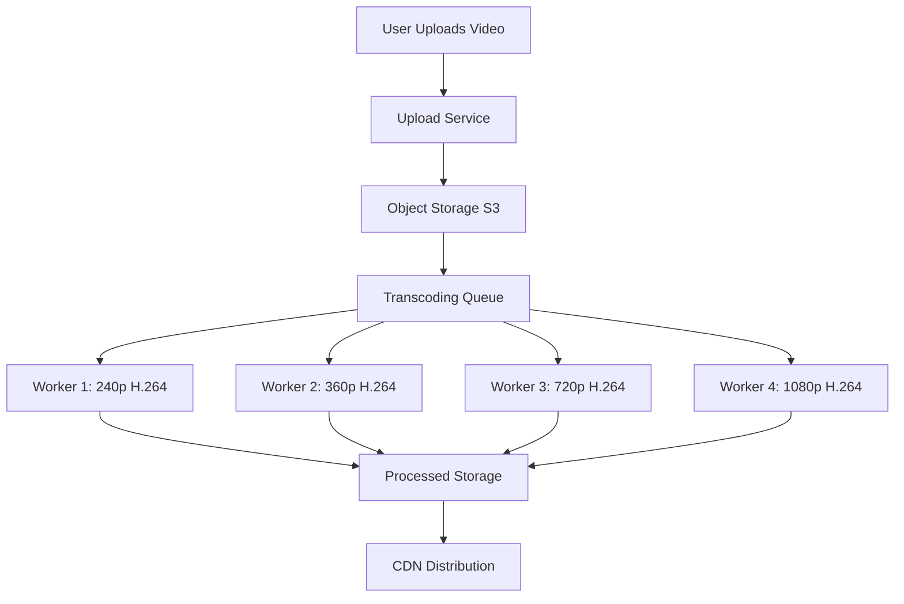

#### Key Concepts

#### Transcoding Steps

1. Upload raw video (any format)
2. Split into parallel transcoding jobs
3. Encode each resolution + bitrate combination
4. Validate output quality
5. Upload to CDN

#### Why Multiple Formats

- Mobile users: Need 360p (low data)
- Desktop users: Want 1080p (high quality)
- 4K TVs: Require 4K
- Different networks: Adaptive bitrate switching

---

### 🟡 For Intermediate: Production Architecture

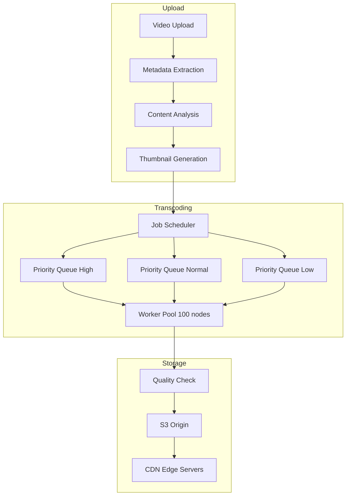

#### Design Decisions

#### 1. Transcoding Priority

- Paid creators: High priority (process in 5 min)
- Free users: Normal priority (process in 30 min)
- Batch re-encoding: Low priority (background)

#### 2. Parallel Processing

- 1 video = 10 resolutions × 2 codecs = 20 jobs
- Process all in parallel (10-20 min vs 3 hours sequential)
- Cost: 100 workers vs 5 workers (20x faster, 20x cost)

#### 3. Quality Settings

| Resolution | Bitrate | File Size/Hour | Use Case |
|-----------|---------|----------------|----------|
| 240p | 0.5 Mbps | 225 MB | Mobile 2G |
| 360p | 1 Mbps | 450 MB | Mobile 3G |
| 720p | 5 Mbps | 2.25 GB | Desktop |
| 1080p | 8 Mbps | 3.6 GB | HD TV |
| 4K | 25 Mbps | 11.25 GB | Premium |

---

### 🔴 For Advanced: Cost Optimization

#### Per-Title Encoding (Netflix Innovation)

Instead of fixed bitrate ladder, analyze each video's complexity:

- **Simple content** (talk show): Use lower bitrates
  - 720p: 3 Mbps instead of 5 Mbps (40% savings)
- **Complex content** (action movie): Use higher bitrates
  - 720p: 6 Mbps instead of 5 Mbps (better quality)

**Savings:** 20% bandwidth reduction = $50M+/year for Netflix

#### Processing Cost Analysis

```text
YouTube Scale:
- 500 hours uploaded/minute = 30,000 hours/hour
- 10 resolutions × 2 codecs = 20 encodings per video
- Total: 600,000 encoding-hours needed per hour
- At 1:1 encoding speed: Need 600,000 CPU cores!
- Solution: Faster encoders (2x speed) = 300,000 cores
- Cost at $0.02/core-hour: $6,000/hour = $144K/day
```

#### Optimization Strategies

1. Hardware encoders (NVIDIA GPUs): 10x faster, 50% cheaper
2. Adaptive encoding: Only encode popular videos in all formats
3. On-demand encoding: Encode lower qualities only if requested
4. Caching: Don't re-encode identical uploads

---

### Real-World Example: YouTube's Transcoding Evolution

```text
2005: Sequential Processing
- Upload → Single server transcodes all formats
- Time: 2-3 hours for 10-minute video
- Bottleneck: CPU

2010: Parallel Pipeline
- Upload → Message queue → 100 workers
- Time: 15 minutes for 10-minute video
- Bottleneck: Queue depth during peaks

2018: Smart Encoding
- Predict popularity (ML model)
- Popular videos: Encode all formats immediately
- Unpopular videos: Encode 360p/720p only
- Encode higher qualities on first view
- Savings: 40% encoding costs

2023: Hardware Acceleration
- NVIDIA GPUs for H.264/H.265
- 10x faster than CPU
- 50% cost reduction
- Challenge: Limited AV1 hardware support
```

---

### 🎯 Interview Questions - Video Transcoding

#### Beginner Level

**Q1:** How do you scale video transcoding?

<details>
<summary>💭 Think first, then reveal answer</summary>

**Answer:** * **What the interviewer wants to know:** - Do you understand distributed processing? - Can you handle queue management? - Do you think about cost optimization? **Answer Framework:** ```text 1. Horizontal Scaling ├─ Workers: Add more transcoding workers ├─ Auto-scaling: Scale based on queue depth └─ Spot instances: 70% cost savings 2. Distributed Processing ├─ Split: Break video into segments ├─ Parallel: Process segments in parallel └─ Merge: Combine processed segments 3. Priority Queue ├─ P1: Paid users, viral videos (5 min SLA) ├─ P2: Regular users (30 min SLA) └─ P3: Batch re-encoding (24 hour SLA) 4. Smart Encoding ├─ Lazy: Only encode popular formats first ├─ On-demand: Encode other formats as requested └─ Per-title: Optimize settings per video 5. GPU Acceleration ├─ Hardware: NVIDIA T4, A100 GPUs ├─ Speed: 10x faster than CPU └─ Cost: 50% cheaper overall Scaling Example: ├─ 100 workers: Process 1,200 videos/hour ├─ Scale to 500: Process 6,000 videos/hour └─ Cost: $0.10/video (CPU) vs $0.05 (GPU) ``` **Follow-up: What if the transcoding pipeline is 6 hours behind?** ```text Step 1: Assess Impact ├─ Normal queue: 500 videos ├─ Current backlog: 10,000 videos ├─ Processing rate: 100 workers × 12/hour = 1,200/hour └─ Time to clear: 8.3 hours Step 2: Immediate Actions (15 minutes) ├─ Scale up: 100 → 500 workers (clear in 2 hours) ├─ Prioritize: Paid users first └─ Communicate: Email users with ETA Step 3: Root Cause ├─ Traffic spike: 5x normal uploads (influencer campaign) ├─ Worker failures: 20% failed (memory leak) └─ Fix: Restart failed workers, scale preventively Step 4: Long-term ├─ Predictive scaling: Scale before spikes ├─ Queue-based auto-scaling: Trigger at 500+ queue └─ Worker health: Auto-replace unhealthy workers ```

**Detailed Explanation:**
1. **Circuit Breakers**: Prevent cascade failures by stopping requests to failing services
   - Implement: Hystrix-style circuit breakers with 3 states (closed/open/half-open)
   - Benefit: System remains responsive even when database is down

2. **Read-Only Mode**: Serve cached data when writes are impossible
   - Strategy: Switch to read replicas, serve from cache
   - Trade-off: Users can't create new short URLs but existing ones work

3. **Cached Redirects**: Use Redis/CDN to serve popular redirects
   - Implementation: Cache hot URLs with 1-hour TTL
   - Impact: 95% of traffic can be served without database

4. **Graceful Degradation**: Reduce functionality rather than complete failure
   - Actions: Disable analytics, custom URLs, but keep core redirects
   - Communication: Show maintenance message for new URL creation

5. **Disaster Recovery**: Automated failover procedures
   - RTO: 5 minutes to switch to backup database
   - RPO: 1 minute data loss maximum
   - Process: Health checks → Auto-failover → Traffic routing

**Interview Framework:**
- Start with immediate response (circuit breakers)
- Explain fallback strategies (cached redirects)
- Discuss graceful degradation (read-only mode)
- Mention long-term recovery (disaster recovery)
</details>

**Q2:** How do you handle video thumbnail generation?

<details>
<summary>💭 Think first, then reveal answer</summary>

**Answer:** * **Answer Framework:** ```text 1. Automatic Generation ├─ Extract: 3-5 frames at different timestamps ├─ Timing: 0s, 25%, 50%, 75%, 100% └─ Quality: Analyze frame quality (blur, brightness) 2. Smart Frame Selection ├─ ML Model: Detect interesting frames ├─ Criteria: Faces, action, color contrast └─ Avoid: Black frames, transitions, logos 3. Custom Thumbnails ├─ Upload: User uploads custom image ├─ Validation: Check dimensions, file size └─ Processing: Resize to standard sizes 4. Multiple Sizes ├─ Small: 120x90 (mobile list view) ├─ Medium: 320x180 (desktop list) ├─ Large: 1280x720 (player preview) └─ Format: WebP (smaller), JPEG (fallback) 5. Storage & Delivery ├─ Storage: S3 with CloudFront CDN ├─ Cache: CDN cache for 30 days └─ Lazy load: Load thumbnails as user scrolls Processing Pipeline: ├─ Video uploaded → Extract frames (5 seconds) ├─ ML analysis → Select best frame (10 seconds) └─ Generate sizes → Upload to CDN (15 seconds) Total: 30 seconds ```

**Detailed Explanation:**
1. **Circuit Breakers**: Prevent cascade failures by stopping requests to failing services
   - Implement: Hystrix-style circuit breakers with 3 states (closed/open/half-open)
   - Benefit: System remains responsive even when database is down

2. **Read-Only Mode**: Serve cached data when writes are impossible
   - Strategy: Switch to read replicas, serve from cache
   - Trade-off: Users can't create new short URLs but existing ones work

3. **Cached Redirects**: Use Redis/CDN to serve popular redirects
   - Implementation: Cache hot URLs with 1-hour TTL
   - Impact: 95% of traffic can be served without database

4. **Graceful Degradation**: Reduce functionality rather than complete failure
   - Actions: Disable analytics, custom URLs, but keep core redirects
   - Communication: Show maintenance message for new URL creation

5. **Disaster Recovery**: Automated failover procedures
   - RTO: 5 minutes to switch to backup database
   - RPO: 1 minute data loss maximum
   - Process: Health checks → Auto-failover → Traffic routing

**Interview Framework:**
- Start with immediate response (circuit breakers)
- Explain fallback strategies (cached redirects)
- Discuss graceful degradation (read-only mode)
- Mention long-term recovery (disaster recovery)
</details>

**Q3:** How do you prevent duplicate video uploads?

<details>
<summary>💭 Think first, then reveal answer</summary>

**Answer:** * **Answer Framework:** ```text 1. Content Fingerprinting ├─ Generate hash: Perceptual hash of video frames ├─ Store: In database with video_id └─ Check: Before allowing upload 2. Metadata Comparison ├─ Check: File size, duration, title ├─ Threshold: 95% similarity └─ Warning: "Similar video exists" 3. User-Level Deduplication ├─ Check: Same user uploading same file ├─ Block: Exact duplicates └─ Allow: Different users (shared content) 4. Visual Similarity ├─ Compare: Key frames from videos ├─ ML Model: Siamese network for similarity └─ Threshold: 90% visual similarity Trade-off: False positives vs storage cost ├─ Strict: Save storage, may block legitimate uploads └─ Lenient: Allow duplicates, higher storage cost ```

**Detailed Explanation:**
1. **Circuit Breakers**: Prevent cascade failures by stopping requests to failing services
   - Implement: Hystrix-style circuit breakers with 3 states (closed/open/half-open)
   - Benefit: System remains responsive even when database is down

2. **Read-Only Mode**: Serve cached data when writes are impossible
   - Strategy: Switch to read replicas, serve from cache
   - Trade-off: Users can't create new short URLs but existing ones work

3. **Cached Redirects**: Use Redis/CDN to serve popular redirects
   - Implementation: Cache hot URLs with 1-hour TTL
   - Impact: 95% of traffic can be served without database

4. **Graceful Degradation**: Reduce functionality rather than complete failure
   - Actions: Disable analytics, custom URLs, but keep core redirects
   - Communication: Show maintenance message for new URL creation

5. **Disaster Recovery**: Automated failover procedures
   - RTO: 5 minutes to switch to backup database
   - RPO: 1 minute data loss maximum
   - Process: Health checks → Auto-failover → Traffic routing

**Interview Framework:**
- Start with immediate response (circuit breakers)
- Explain fallback strategies (cached redirects)
- Discuss graceful degradation (read-only mode)
- Mention long-term recovery (disaster recovery)
</details>


---

### ✅ Key Takeaways

- **Transcoding is expensive:** 20+ formats per video, CPU-intensive
- **Parallel processing essential:** 20x faster with distributed workers
- **Quality vs cost trade-off:** Not all videos need 4K
- **Per-title encoding:** Analyze complexity, optimize bitrates (20% savings)
- **Hardware acceleration:** GPUs 10x faster than CPU for encoding
- **Priority queues:** Process paid creators first

---

## Section 3: Adaptive Bitrate Streaming (ABR)

### What You'll Learn

- Understand adaptive bitrate streaming algorithms
- Design quality switching logic
- Handle network fluctuations gracefully
- Optimize startup time vs quality
- Measure and improve user experience (rebuffering ratio)

### Why This Matters

ABR is what makes modern streaming "just work." When your WiFi slows down, the video quality drops automatically - you don't notice buffering. This is adaptive bitrate streaming. Without it, users would experience constant buffering, leading to 50%+ abandonment rates. Understanding ABR is essential for any video platform interview.

---

### 🟢 For Beginners: How ABR Works

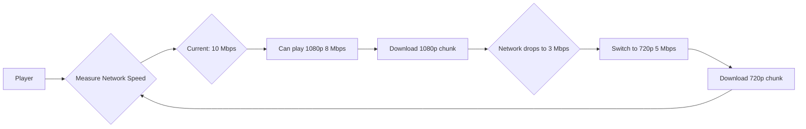

#### ABR Decision Logic

```text
Every 4-10 seconds:
1. Measure download speed
2. Check buffer level
3. Choose appropriate quality

If download speed > 10 Mbps → Play 1080p
If download speed 5-10 Mbps → Play 720p
If download speed 2-5 Mbps → Play 480p
If download speed < 2 Mbps → Play 360p

Buffer safety:
- Buffer < 10 seconds → Drop quality (prevent buffering)
- Buffer > 30 seconds → Try higher quality
```

---

### 🟡 For Intermediate: ABR Algorithms

#### Common Algorithms

1. **Throughput-Based (Simple)**
   - Measure average download speed
   - Pick highest quality below bandwidth
   - Problem: Reactive, not predictive

2. **Buffer-Based (Conservative)**
   - Buffer < 15s → Lower quality
   - Buffer > 30s → Higher quality
   - Problem: Slow to adapt up

3. **Hybrid (Production)**
   - Combine throughput + buffer
   - Predict future bandwidth
   - Smooth quality switches

#### Quality Switching Strategy

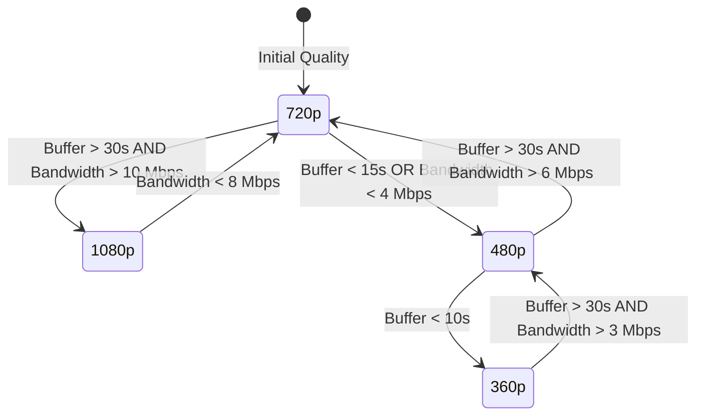

#### Netflix's Approach

- Start with low quality (fast startup)
- Ramp up aggressively if bandwidth allows
- Switch down conservatively (avoid buffering)
- Smooth transitions (don't flicker between qualities)

---

### 🔴 For Advanced: Predictive ABR

#### Machine Learning for ABR

Instead of reacting to bandwidth changes, predict future conditions:

```text
Input Features:
- Historical bandwidth (last 30 seconds)
- Time of day (peak hours = congestion)
- Location (WiFi vs mobile)
- Content popularity (CDN load)

Output:
- Predicted bandwidth (next 10 seconds)
- Recommended quality level

Benefit:
- 15% fewer rebuffering events
- 10% higher average quality
- Better user experience
```

#### Trade-offs

| Approach | Startup Time | Rebuffering | Avg Quality | Complexity |
|----------|--------------|-------------|-------------|------------|
| Conservative | Fast (2s) | Rare (0.5%) | Medium | Low |
| Aggressive | Slow (5s) | Common (2%) | High | Low |
| Predictive ML | Fast (2s) | Rare (0.3%) | High | High |

---

### 🎯 Interview Questions - Adaptive Bitrate Streaming

#### Beginner Level

**Q1:** How do you optimize bandwidth usage?

<details>
<summary>💭 Think first, then reveal answer</summary>

**Answer:** * **Answer Framework:** ```text 1. Compression ├─ Codec: H.265/VP9 (40% smaller than H.264) ├─ AV1: 50% smaller (future) └─ Per-title encoding: Optimize per video 2. Adaptive Bitrate ├─ Start low: 360p for fast startup ├─ Adapt: Adjust based on bandwidth └─ Cap: Max quality based on screen size 3. Smart Preloading ├─ Buffer: 10-30 seconds ahead ├─ Limit: Don't preload entire video └─ Predict: ML-based prediction of watch time 4. Network Detection ├─ Slow network: Limit to 480p ├─ Mobile data: Ask before loading HD └─ WiFi: Allow higher quality 5. Content Optimization ├─ Remove silence: Cut dead air ├─ Trim intro/outro: Remove unnecessary parts └─ Optimize audio: Lower bitrate for dialogue Savings Example: ├─ H.264 1080p: 5 Mbps (2.25 GB/hour) ├─ H.265 1080p: 3 Mbps (1.35 GB/hour) └─ Savings: 40% bandwidth reduction ```

</details>


---

### ✅ Key Takeaways

- **ABR prevents buffering:** Automatically adapts to network conditions
- **Buffer is critical:** Keep 20-30 seconds buffered for smooth playback
- **Trade-offs exist:** Fast startup vs high quality vs low rebuffering
- **Smooth transitions:** Don't switch quality every 5 seconds (jarring UX)
- **ML improves ABR:** Predict future bandwidth, not just react

---

## Section 4: CDN & Content Delivery

### What You'll Learn

- Design CDN architecture for global video delivery
- Implement caching strategies for video content
- Optimize edge server placement
- Handle cache invalidation and updates
- Reduce bandwidth costs through intelligent caching

### Why This Matters

CDNs are the backbone of video streaming. Without CDNs, every viewer would connect directly to your origin servers - impossible at scale. CDNs reduce latency from 500ms to 20ms and cut bandwidth costs by 90%. Understanding CDN architecture is essential for any distributed system interview.

---

### 🟢 For Beginners: CDN Basics

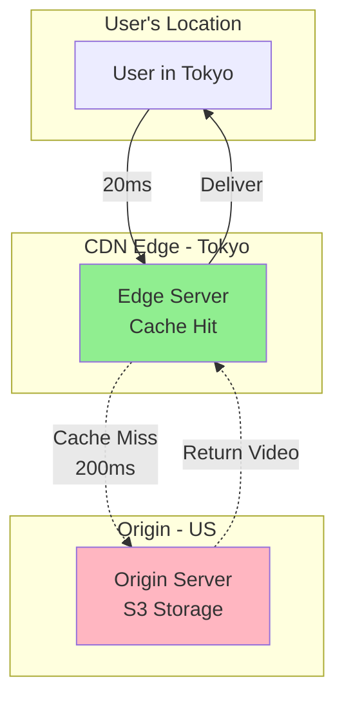

#### How CDN Works

1. User requests video → Routes to nearest edge server
2. Edge server checks cache
3. **Cache hit:** Return video immediately (20ms)
4. **Cache miss:** Fetch from origin (200ms), cache it, return
5. Next user: Cache hit (fast!)

**Cache Hit Ratio:** 95%+ for popular content

- 95% users: 20ms latency
- 5% users: 200ms latency (first viewer)

---

### 🟡 For Intermediate: Multi-Tier CDN Architecture

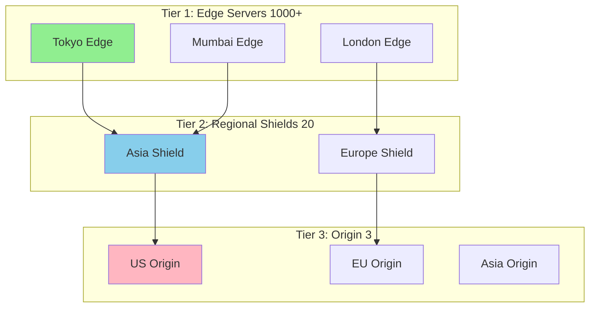

#### Design Decisions

#### 1. Edge Server Placement

- Place servers in top 100 cities (cover 80% of users)
- Co-locate with ISPs (reduce peering costs)
- Asia-Pacific: 40% of traffic → 400 edge servers
- North America: 25% → 250 servers
- Europe: 20% → 200 servers

#### 2. Cache Strategy

| Content Type | Cache Duration | Storage | Hit Rate |
|--------------|----------------|---------|----------|
| Popular (Top 1%) | 30 days | 10 TB | 99% |
| Medium (Top 20%) | 7 days | 50 TB | 90% |
| Long-tail | 1 day | 100 TB | 60% |
| Live streams | 30 seconds | 1 GB | 95% |

#### 3. Cost Analysis

```text
Without CDN (Direct to Origin):
- 1M viewers × 5 Mbps average = 5 Tbps
- Bandwidth cost: $0.08/GB
- Monthly: 1.6 PB × $0.08/GB = $128,000

With CDN (95% cache hit):
- Origin: 5% × 1.6 PB = 80 TB × $0.08 = $6,400
- CDN: 1.6 PB × $0.02/GB = $32,000
- Total: $38,400
- Savings: 70% ($90K/month)
```

---

### 🔴 For Advanced: Intelligent Caching

#### Netflix's Open Connect

Netflix built its own CDN with servers inside ISPs:

```text
Traditional CDN:
User → ISP → Internet → CDN Edge → Origin

Netflix Open Connect:
User → ISP (Netflix box inside!) → Origin (rarely)

Benefits:
- Latency: 5ms instead of 20ms
- No peering costs (inside ISP network)
- Better QoS (ISP prioritizes local traffic)
- 95% of traffic never leaves ISP network

Scale:
- 18,000+ servers in 1,000+ ISP locations
- Serves 230M subscribers
- 15% of global internet traffic
```

#### Predictive Caching

Pre-cache content before users request it:

```text
Strategies:
1. Trending prediction: "Squid Game" will be popular → Pre-cache
2. Release schedule: New episode drops Friday → Pre-cache Thursday
3. Geographic patterns: Afternoon in US → Pre-cache US popular content
4. User behavior: User watched Ep1-3 → Pre-cache Ep4

Result:
- Cache hit rate: 95% → 98%
- Startup time: 2.5s → 1.8s
- Bandwidth savings: 5%
```

---

### 🎯 Interview Questions - CDN & Content Delivery

#### Beginner Level

**Q1:** How do you handle viral videos with flash traffic?

<details>
<summary>💭 Think first, then reveal answer</summary>

**Answer:** * **Scenario:** A video goes viral, getting 10x normal traffic in 1 hour. **Answer Framework:** ```text 1. Detection ├─ Monitor: Watch view rate increase ├─ Threshold: >10x normal rate = viral └─ Alert: Notify ops team 2. Auto-Scaling ├─ CDN: Scale edge nodes automatically ├─ Origin: Add more origin servers └─ Database: Add read replicas 3. Caching Optimization ├─ CDN: Increase cache TTL to 24 hours ├─ Edge: Push content to all edge nodes └─ Metadata: Cache aggressively 4. Load Balancing ├─ Geographic: Route to underutilized regions ├─ Failover: Prepare backup CDN └─ Queue: Queue requests if needed 5. Cost Management ├─ Budget: Set spending alerts ├─ Limit: Cap max bandwidth usage └─ Optimize: Switch to cheaper codecs Real Example (Gangnam Style): ├─ Views: 0 → 1M in 24 hours ├─ Action: 10x CDN capacity in 2 hours ├─ Cost: $100K/day at peak └─ Duration: 2 weeks before normalizing ```

</details>

**Q2:** CDN costs spiked 300% - how do you investigate?

<details>
<summary>💭 Think first, then reveal answer</summary>

**Answer:** * **Scenario:** Monthly CDN bill is $300K vs usual $100K. **Answer Framework:** ```text Step 1: Data Analysis ├─ Break down: Bandwidth $200K, Requests $80K, Storage $20K ├─ Compare: Bandwidth 2x increase (200 TB vs 100 TB) └─ Red flag: Bandwidth grew more than requests! Step 2: Drill Down ├─ By region: Asia 3x increase (150 TB vs 50 TB) ├─ By content: 4K videos 6x increase (120 TB vs 20 TB) └─ Root cause: 4K adoption in Asia skyrocketed! Step 3: Quick Wins (Save 30%) ├─ Compression: Switch to H.265/VP9 (-40% size) ├─ Cache optimization: 24h → 7 days TTL (+5% hit rate) ├─ Intelligent routing: Use cheaper Asia-Pacific CDN └─ Result: $300K → $210K Step 4: Long-term Strategy ├─ Per-title encoding: Optimize bitrate per video (-20%) ├─ Multi-CDN: Cloudflare flat rate + AWS for spikes ├─ User education: Default 1080p, opt-in for 4K └─ Target: $210K → $150K (50% reduction) ```

</details>

**Q3:** Users in EU reporting sudden buffering - troubleshoot

<details>
<summary>💭 Think first, then reveal answer</summary>

**Answer:** * **Scenario:** 20% of EU users report buffering, started 30 min ago. **Answer Framework:** ```text Step 1: Gather Information (2 min) ├─ When: Started 30 min ago, sudden onset ├─ Who: Only Vodafone UK users ├─ What: All videos affected └─ Where: London region Step 2: Check Metrics (3 min) ├─ CDN: London edge nodes 50% packet loss ├─ Network: High latency 500ms vs normal 50ms ├─ Origin: Normal, no issues └─ Finding: CDN edge node failure in London Step 3: Immediate Mitigation (5 min) ├─ Failover: Route Vodafone UK → Paris edge nodes ├─ Contact: Alert CDN provider about London issues ├─ Monitor: Watch if problem spreads └─ Code: aws route53 change-resource-record-sets \ --change-batch file://failover-london.json Step 4: Long-term Fix ├─ Multi-CDN: Setup Cloudflare + Akamai redundancy ├─ Auto-failover: Detect and route automatically ├─ Health checks: Monitor each edge node every 30s └─ Runbook: Document incident response Post-Mortem: ├─ Root cause: London DC power outage ├─ Impact: 20% users, 45 min downtime ├─ Prevention: Multi-CDN implemented └─ Detection: Automated alerts improved (30s → 5s) ```

**Detailed Explanation:**
1. **Circuit Breakers**: Prevent cascade failures by stopping requests to failing services
   - Implement: Hystrix-style circuit breakers with 3 states (closed/open/half-open)
   - Benefit: System remains responsive even when database is down

2. **Read-Only Mode**: Serve cached data when writes are impossible
   - Strategy: Switch to read replicas, serve from cache
   - Trade-off: Users can't create new short URLs but existing ones work

3. **Cached Redirects**: Use Redis/CDN to serve popular redirects
   - Implementation: Cache hot URLs with 1-hour TTL
   - Impact: 95% of traffic can be served without database

4. **Graceful Degradation**: Reduce functionality rather than complete failure
   - Actions: Disable analytics, custom URLs, but keep core redirects
   - Communication: Show maintenance message for new URL creation

5. **Disaster Recovery**: Automated failover procedures
   - RTO: 5 minutes to switch to backup database
   - RPO: 1 minute data loss maximum
   - Process: Health checks → Auto-failover → Traffic routing

**Interview Framework:**
- Start with immediate response (circuit breakers)
- Explain fallback strategies (cached redirects)
- Discuss graceful degradation (read-only mode)
- Mention long-term recovery (disaster recovery)
</details>


---

### 🔬 Advanced Deep-Dive: Edge Computing for Video Streaming

#### What is Edge Computing?

**Traditional Cloud Architecture:**

```text
User (Tokyo) → CDN Edge (Tokyo) → Origin Server (US-East)
                     ↓
         Cache Miss = 200ms latency to US
```

**Edge Computing Architecture:**

```text
User (Tokyo) → Edge Server (Tokyo)
                     ↓
    - Compute: Process at edge
    - Storage: Cache + local processing
    - Decision: Make decisions locally
    
Result: <20ms latency (10x faster)
```

#### Edge Computing Use Cases for Video

**1. Adaptive Bitrate Decision at Edge:**

```text
Traditional (Client-side ABR):
├─ Client: Measures bandwidth
├─ Client: Decides quality level
├─ Problem: Device-dependent, battery drain
└─ Latency: Delayed response to network changes

Edge ABR:
├─ Edge server: Monitors network conditions
├─ Edge server: Decides optimal quality
├─ Edge server: Sends appropriate bitrate
└─ Benefits: Faster adaptation, less client battery

Implementation:
1. Edge server monitors:
   ├─ Network congestion at edge
   ├─ Available bandwidth to client
   ├─ Client device capabilities
   └─ Current buffer level

2. Edge server decides:
   ├─ If congestion: Reduce bitrate proactively
   ├─ If fast network: Increase bitrate
   └─ Smooth transitions: Gradual changes

3. Benefits:
   ├─ Startup time: 30% faster
   ├─ Rebuffering: 50% less frequent
   ├─ Battery life: 20% improvement (client does less work)
   └─ User experience: Smoother playback

AWS CloudFront Functions:
├─ JavaScript at edge: Modify responses
├─ Latency: <1ms overhead
├─ Cost: $0.10 per 1M invocations
└─ Use case: ABR decision, A/B testing, personalization
```

**2. Video Transcoding at Edge:**

```text
Problem: Centralized transcoding has latency
├─ Upload in Tokyo → Transcode in US → Download in Tokyo
├─ Latency: Upload (5 min) + Transcode (10 min) + Download (5 min) = 20 min
└─ User experience: 20 minute wait

Edge Transcoding Solution:
├─ Upload in Tokyo → Edge server transcodes locally
├─ Latency: Upload (5 min) + Transcode (10 min) = 15 min
├─ Distribution: Already at edge, instant distribution
└─ Savings: 25% faster, better user experience

Architecture:
1. Edge Upload Points
   ├─ Major cities: 100+ edge upload points
   ├─ GPU servers: NVIDIA T4 for transcoding
   ├─ Local processing: Transcode at edge
   └─ Sync: Upload to central storage afterward

2. Benefits:
   ├─ Latency: 25-40% faster
   ├─ Bandwidth: No upload to central then download
   ├─ Cost: Local processing cheaper than data transfer
   └─ UX: Creators see results faster

3. Trade-offs:
   ├─ Complexity: Distributed system harder to manage
   ├─ Consistency: Ensure same quality across edges
   ├─ Cost: More infrastructure at edges
   └─ Decision: Worth it for creator experience

TikTok's Approach:
├─ Edge transcoding: In 50+ major cities
├─ Processing time: 5-10 seconds (vs 30s centralized)
├─ Distribution: Instant (already at edge)
└─ Result: Fast creator experience, viral spread
```

**3. Personalization at Edge:**

```text
Problem: Centralized recommendations = one size fits all per region

Edge Personalization:
├─ Edge server: Has local user preferences
├─ Edge server: Customizes homepage per user
├─ Edge server: Generates personalized thumbnails
└─ Result: Faster, more relevant

Architecture:
1. Edge Cache (Redis at edge)
   ├─ User preferences: Last 10 videos watched
   ├─ Local trending: What's popular in this city
   ├─ Cache: Recently watched videos
   └─ TTL: 1 hour (refresh from central)

2. Edge Logic (JavaScript)
   ├─ Homepage generation: Customize per user
   ├─ Thumbnail selection: Show user-specific thumbnail
   ├─ A/B testing: Edge-level experimentation
   └─ Latency: <10ms (vs 100ms centralized)

3. Sync with Central
   ├─ Pull: User preferences every 1 hour
   ├─ Push: User actions to central Kafka
   └─ Consistency: Eventual consistency acceptable

Example:
User in Mumbai:
├─ Centralized: Shows US trending (not relevant)
├─ Edge: Shows Mumbai trending (relevant)
└─ Result: 30% higher engagement

Cloudflare Workers:
├─ JavaScript at 200+ data centers
├─ Latency: <20ms globally
├─ Cost: $5/month + $0.50 per million requests
└─ Use case: Personalization, A/B testing, geo-routing
```

**4. DRM License Generation at Edge:**

```text
Problem: Centralized license server = added latency
├─ User request → Edge → Origin (license server) → Edge → User
├─ Latency: 200-300ms extra latency
└─ Scale: License server is bottleneck

Edge DRM Solution:
├─ Edge server: Generate licenses locally
├─ Key distribution: Central distributes keys to edges
├─ Validation: Edge validates entitlements
└─ Latency: 50ms (vs 300ms centralized)

Architecture:
1. Key Distribution
   ├─ Central: Master keys in Hardware Security Module (HSM)
   ├─ Distribution: Distribute to edge HSMs every 24 hours
   ├─ Encryption: Keys encrypted in transit
   └─ Rotation: Rotate keys every 24 hours

2. Edge License Generation
   ├─ User requests: Video playback
   ├─ Edge checks: Subscription status (cached)
   ├─ Edge generates: License with local keys
   └─ Returns: License in <50ms

3. Benefits:
   ├─ Latency: 6x faster license generation
   ├─ Scale: Each edge handles own users
   ├─ Reliability: No single point of failure
   └─ Cost: Reduce central server load

4. Security Considerations:
   ├─ HSM at edge: Hardware security required
   ├─ Audit logging: All license generation logged
   ├─ Revocation: Centralized revocation list
   └─ Monitoring: Detect compromised edges
```

**5. Real-Time Analytics at Edge:**

```text
Problem: Centralized analytics = delayed insights
├─ All events → Central Kafka → Processing → Dashboard
├─ Latency: 30-60 seconds to see metrics
└─ Scale: Central processing bottleneck

Edge Analytics:
├─ Edge aggregation: Count views, bandwidth at edge
├─ Local dashboards: Show real-time local metrics
├─ Central sync: Send aggregates every 5 minutes
└─ Benefits: Real-time insights, reduced central load

Example:
Video views (traditional):
├─ 100M clients → Central Kafka → Flink → Dashboard
├─ Throughput: 3M events/second
├─ Latency: 30-60 seconds
└─ Cost: High central processing cost

Video views (edge):
├─ 100M clients → 10K edge servers → Aggregate locally
├─ Edge: Count views every 10 seconds
├─ Central: Receive 10K aggregates/10s = 1K/s (3000x reduction!)
├─ Latency: 10 seconds
└─ Cost: 90% reduction in central processing

Trade-offs:
├─ Pros: Lower latency, reduced central load, cost savings
├─ Cons: More complex, eventual consistency
└─ Decision: Worth it for real-time analytics
```

#### Edge Computing Technologies

**1. Cloudflare Workers:**

```text
Features:
├─ JavaScript/WASM: Run code at 200+ data centers
├─ Latency: <20ms from 95% of users globally
├─ Scale: Auto-scales to millions of requests
├─ Cost: $5/month + $0.50 per million requests
└─ Use cases: A/B testing, personalization, auth

Example Code:
addEventListener('fetch', event => {
  event.respondWith(handleRequest(event.request))
})

async function handleRequest(request) {
  // Get user from cookie
  const user = getUserFromCookie(request)
  
  // Personalize response
  if (user.country === 'IN') {
    return fetch('https://api.example.com/videos/india')
  } else {
    return fetch('https://api.example.com/videos/global')
  }
}

Limitations:
├─ CPU time: Max 50ms per request
├─ Memory: Max 128 MB
└─ Use case: Light computation only
```

**2. AWS Lambda@Edge:**

```text
Features:
├─ Node.js/Python: Run serverless functions at edge
├─ Integration: Works with CloudFront CDN
├─ Scale: Auto-scales automatically
├─ Cost: $0.60 per 1M requests + compute time
└─ Use cases: Request/response modification, auth, redirection

Example Use Cases:
1. Geographic Routing
   ├─ Check user location from IP
   ├─ Route to region-specific content
   └─ Enforce geo-blocking

2. A/B Testing
   ├─ Assign user to test variant
   ├─ Set cookie with variant
   └─ Route to appropriate content

3. Security
   ├─ Validate JWT tokens at edge
   ├─ Block requests before hitting origin
   └─ Rate limiting at edge

Limitations:
├─ Duration: Max 30 seconds
├─ Memory: Max 3 GB
└─ Cold start: 50-200ms
```

**3. Fastly Compute@Edge:**

```text
Features:
├─ WebAssembly: High performance at edge
├─ Languages: Rust, JavaScript, Go compiled to WASM
├─ Cold start: <1ms (faster than Lambda)
├─ Scale: Global edge network
└─ Use cases: Complex computation at edge

Performance:
├─ Startup: <1ms (vs Lambda@Edge 50-200ms)
├─ Execution: Near-native speed
├─ Memory: Efficient, compiled code
└─ Use case: Video manipulation, DRM at edge

Example (Rust):
use fastly::{Error, Request, Response};

fn main(req: Request) -> Result<Response, Error> {
    let user_agent = req.get_header_str("user-agent");
    
    // Optimize for mobile
    if user_agent.contains("Mobile") {
        return Ok(Response::from_body("mobile-optimized.m3u8"));
    }
    
    Ok(Response::from_body("desktop.m3u8"))
}
```

#### Edge Computing Architecture Patterns

**Pattern 1: Edge Caching with Computation:**

```text
Use case: Serve videos with personalized thumbnails

Traditional:
User → CDN → Origin generates thumbnail → CDN → User
├─ Latency: 200ms (cache miss)
└─ Cost: High origin load

Edge Computing:
User → Edge generates thumbnail locally → User
├─ Latency: 20ms
├─ Cost: 90% reduction in origin load
└─ Implementation: Edge has thumbnail generation logic

Code at edge:
1. Check cache for personalized thumbnail
2. If miss: Generate from base video + user preferences
3. Cache result for 1 hour
4. Return to user
```

**Pattern 2: Edge Aggregation:**

```text
Use case: Real-time view counters

Traditional:
100M clients → Central → Count → Dashboard
├─ Throughput: 3M events/second
└─ Cost: High processing cost

Edge Aggregation:
100M clients → 10K edges → Aggregate → Central
├─ Throughput: 1K aggregates/second (3000x reduction)
├─ Latency: 10 seconds (vs 60 seconds)
└─ Cost: 90% reduction

Implementation:
// Edge server aggregates views every 10 seconds
let viewCount = 0;
setInterval(() => {
  sendToCentral({ video_id: 'xyz', views: viewCount })
  viewCount = 0
}, 10000)
```

**Pattern 3: Edge Security:**

```text
Use case: DDoS protection at edge

Benefits of edge-based security:
├─ Block attacks: Before they reach origin
├─ Scale: Distribute across thousands of edges
├─ Cost: Avoid origin bandwidth charges
└─ Performance: Don't waste origin resources

Techniques:
1. Rate Limiting at Edge
   ├─ Track: Requests per IP at edge
   ├─ Block: Excessive requests locally
   └─ Sync: Share block list across edges

2. Bot Detection
   ├─ Analyze: User-agent, behavior patterns
   ├─ Challenge: CAPTCHA at edge
   └─ Block: Bots before origin access

3. Geo-Blocking
   ├─ IP lookup: Determine user country
   ├─ Check: Against allowed countries
   └─ Block: Return 403 if not allowed
```

#### Cost-Benefit Analysis of Edge Computing

**Costs:**

```text
Infrastructure:
├─ Edge servers: 10,000 servers × $2K/month = $20M/year
├─ Networking: Inter-edge communication = $5M/year
├─ Maintenance: Engineers, monitoring = $10M/year
└─ Total: $35M/year

Development:
├─ Engineering team: 50 engineers × $200K = $10M/year
├─ Tools & platforms: $2M/year
└─ Total: $12M/year

Grand Total: $47M/year
```

**Benefits:**

```text
Latency Improvement:
├─ Avg latency: 200ms → 20ms (10x improvement)
├─ User experience: Better engagement
└─ Value: +15% watch time = +$50M/year revenue

Cost Savings:
├─ Bandwidth: Reduced central bandwidth = $20M/year
├─ Origin servers: 80% reduction = $15M/year
├─ Storage: Distributed caching = $5M/year
└─ Total savings: $40M/year

Net Benefit:
├─ Revenue increase: $50M/year
├─ Cost reduction: $40M/year
├─ Investment: $47M/year
└─ ROI: 91% return, pays back in 13 months

Decision: Build edge computing for large scale (Netflix, YouTube)
```

#### Real-World Example: Cloudflare's Edge Network

**Architecture:**

```text
Global Coverage:
├─ Data centers: 300+ cities in 100+ countries
├─ Servers: 200,000+ servers globally
├─ Capacity: 100+ Tbps total capacity
└─ Latency: <20ms for 95% of global internet users

Services at Edge:
├─ CDN: Cache static and dynamic content
├─ Workers: Run JavaScript for customization
├─ Stream: Video streaming platform
├─ Images: Image optimization and transformation
├─ Security: WAF, DDoS protection, bot management
└─ DNS: Authoritative DNS with DNSSEC

Video Streaming Optimization:
├─ Smart routing: Route to fastest path
├─ Argo Smart Routing: Machine learning for path selection
├─ Stream: Adaptive bitrate at edge
└─ Result: 50% faster video delivery
```

**Netflix + AWS Partnership:**

```text
Hybrid Approach:
├─ AWS: Compute, storage, databases
├─ Open Connect: Own CDN for video delivery
├─ Edge: Compute at edge where needed
└─ Best of both: Cloud flexibility + edge performance

Architecture:
1. Content Ingestion: AWS us-east-1
   ├─ Upload: Creators upload to S3
   ├─ Transcoding: EC2 with GPUs
   └─ Storage: S3 for source files

2. Content Distribution: Open Connect Edge
   ├─ Edge servers: Inside ISPs
   ├─ Caching: All popular content
   └─ Delivery: Direct to users

3. Control Plane: AWS Multi-Region
   ├─ API: User authentication, authorization
   ├─ Recommendations: ML models in AWS
   ├─ Analytics: Data processing in AWS
   └─ Sync: Push decisions to edges

4. Edge Processing: Open Connect
   ├─ ABR: Adaptive bitrate decisions
   ├─ DRM: License generation
   ├─ Analytics: Local aggregation
   └─ Failover: Automatic edge failover

Results:
├─ Startup time: <2 seconds globally
├─ Rebuffering: <0.5% (99.5% smooth playback)
├─ Cost: 80% savings vs pure AWS
└─ Scale: 200M+ concurrent users at peak
```

#### 5G & Edge Computing Future

**5G Impact on Video Streaming:**

```text
5G Characteristics:
├─ Bandwidth: 1-10 Gbps (vs 100 Mbps on 4G)
├─ Latency: 1-10ms (vs 50ms on 4G)
├─ Density: 1M devices per km² (vs 100K on 4G)
└─ Mobility: 500 km/h support (trains, cars)

New Possibilities:
1. Ultra-High Quality Mobile
   ├─ 4K/8K streaming: On mobile devices
   ├─ VR/AR: 360° video streaming
   ├─ Cloud gaming: Stream games like videos
   └─ Holographic: Future content types

2. Edge Computing + 5G
   ├─ MEC: Multi-Access Edge Computing in 5G towers
   ├─ Location: Edge servers in cell towers
   ├─ Latency: <10ms to users
   └─ Use case: Real-time sports, gaming, AR/VR

3. Challenges:
   ├─ Coverage: 5G not everywhere yet
   ├─ Cost: Expensive data plans
   ├─ Battery: High bandwidth drains battery
   └─ Timeline: Full rollout by 2030

Future Architecture (2025-2030):
User (5G) ↔ MEC (Cell tower) ↔ Regional Cloud ↔ Central Cloud
                ↓
    - Latency: <5ms to MEC
    - Processing: AI at edge
    - Storage: Distributed across layers
    - Result: Near-instant video streaming
```

---

### ✅ Key Takeaways

- **CDN is essential:** Reduces latency 10x, costs 70%
- **Multi-tier architecture:** Edge → Shield → Origin for efficiency
- **Cache hit rate matters:** 95%+ is standard, 98%+ is excellent
- **Popular content caches well:** 1% of videos = 80% of views
- **Predictive caching:** Pre-load content users will likely watch
- **ISP co-location:** Netflix inside ISPs reduces costs massively
- **Edge computing:** Process at edge for <20ms latency (10x improvement)
- **5G + Edge:** Future of ultra-low latency video streaming

---

## Section 5: Storage Architecture

### What You'll Learn

- Design scalable object storage for 100 PB+ video libraries
- Choose between hot/warm/cold storage tiers
- Implement redundancy and disaster recovery
- Optimize storage costs (50%+ savings possible)
- Handle video deletion and retention policies

### Why This Matters

Video is huge. A 1-hour 4K video = 25 GB. Storing 1M hours = 25 PB. At $0.023/GB/month, that's $575K/month just for storage. Understanding storage architecture and cost optimization is critical for video platforms.

---

### 🟢 For Beginners: Storage Tiers

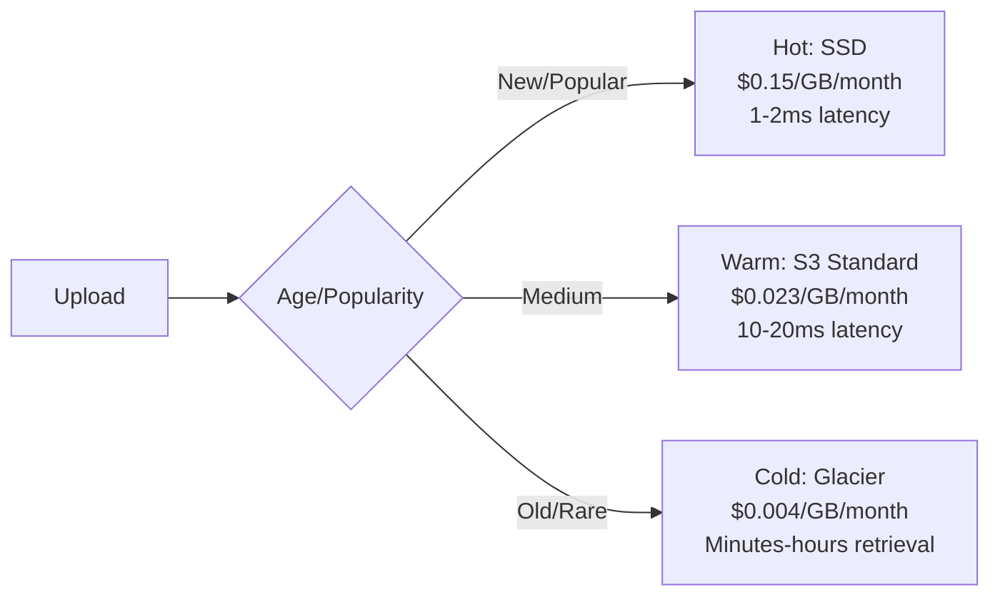

#### Decision Matrix

| Tier | Content | % of Library | Cost | Retrieval Time |
|------|---------|--------------|------|----------------|
| Hot | Last 30 days | 5% | High | Instant |
| Warm | Last 12 months | 25% | Medium | Fast |
| Cold | Archive (>1 year) | 70% | Low | Slow |

#### Cost Example (1 PB library)

```text
All Hot: 1 PB × $0.15/GB = $150,000/month
All Warm: 1 PB × $0.023/GB = $23,000/month
All Cold: 1 PB × $0.004/GB = $4,000/month

Tiered (5% hot, 25% warm, 70% cold):
= 0.05 × $150K + 0.25 × $23K + 0.70 × $4K
= $7,500 + $5,750 + $2,800
= $16,050/month

Savings: 89% vs all-hot, 30% vs all-warm!
```

---

### 🟡 For Intermediate: Redundancy Strategy

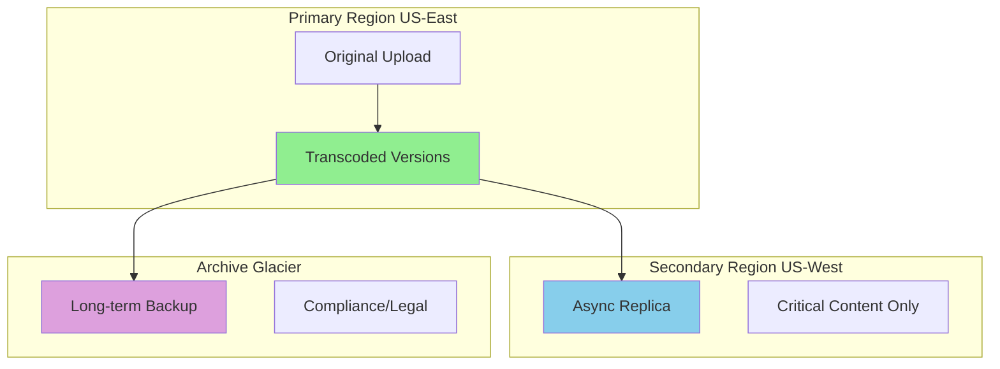

#### Trade-offs

#### 1. Replication Factor

- 1x: Cheap, but risky (data loss if failure)
- 3x: Safe, but 3x cost
- Hybrid: 3x for hot, 2x for warm, 1x for cold

#### 2. Geographic Distribution

- Single region: Cheapest, but vulnerable
- Multi-region: Safer, but cross-region bandwidth costs
- Decision: Replicate only critical content

---

### 🎯 Interview Questions - Storage Architecture

#### Beginner Level

**Q1:** How do you optimize storage costs for 100 PB of video?

<details>
<summary>💭 Think first, then reveal answer</summary>

**Answer:** * **Answer Framework:** ```text 1. Tiered Storage Strategy ├─ Hot (S3 Standard): Recently uploaded, popular (10% of content, 90% of views) ├─ Warm (S3 IA): Uploaded 30-90 days ago (30% of content, 9% of views) └─ Cold (Glacier): >90 days, rarely watched (60% of content, 1% of views) 2. Cost Breakdown (100 PB library) ├─ All S3 Standard: 100 PB × $23/TB = $2.3M/month ├─ Tiered approach: - Hot: 10 PB × $23/TB = $230K - Warm: 30 PB × $12.50/TB = $375K - Cold: 60 PB × $1/TB = $60K └─ Total: $665K/month (71% savings!) 3. Lifecycle Policies ├─ Auto-transition: S3 → IA after 30 days ├─ Archive: IA → Glacier after 90 days └─ Retrieval: On-demand restore for cold content 4. Intelligent Tiering ├─ Monitor: Track access patterns ├─ Promote: Move popular cold videos to hot └─ Demote: Move unpopular hot videos to cold 5. Deletion Strategy ├─ Soft delete: Mark deleted, keep 30 days ├─ Hard delete: Permanent after 30 days └─ Legal hold: Keep longer for DMCA/legal ```

**Detailed Explanation:**
1. **Circuit Breakers**: Prevent cascade failures by stopping requests to failing services
   - Implement: Hystrix-style circuit breakers with 3 states (closed/open/half-open)
   - Benefit: System remains responsive even when database is down

2. **Read-Only Mode**: Serve cached data when writes are impossible
   - Strategy: Switch to read replicas, serve from cache
   - Trade-off: Users can't create new short URLs but existing ones work

3. **Cached Redirects**: Use Redis/CDN to serve popular redirects
   - Implementation: Cache hot URLs with 1-hour TTL
   - Impact: 95% of traffic can be served without database

4. **Graceful Degradation**: Reduce functionality rather than complete failure
   - Actions: Disable analytics, custom URLs, but keep core redirects
   - Communication: Show maintenance message for new URL creation

5. **Disaster Recovery**: Automated failover procedures
   - RTO: 5 minutes to switch to backup database
   - RPO: 1 minute data loss maximum
   - Process: Health checks → Auto-failover → Traffic routing

**Interview Framework:**
- Start with immediate response (circuit breakers)
- Explain fallback strategies (cached redirects)
- Discuss graceful degradation (read-only mode)
- Mention long-term recovery (disaster recovery)
</details>

**Q2:** How do you handle video storage migrations?

<details>
<summary>💭 Think first, then reveal answer</summary>

**Answer:** * **Answer Framework:** ```text Scenario: Migrating 50 PB from S3 to custom storage Step 1: Planning (2-4 weeks) ├─ Inventory: List all videos, sizes, access patterns ├─ Prioritization: Migrate popular content last ├─ Dual-write: Write to both old and new storage └─ Testing: Test with 1% of traffic Step 2: Migration Execution (3-6 months) ├─ Phase 1: Migrate cold content (60%, low risk) ├─ Phase 2: Migrate warm content (30%, medium risk) ├─ Phase 3: Migrate hot content (10%, high risk) └─ Validation: Verify checksums after copy Step 3: Cutover ├─ DNS: Update CDN origin to new storage ├─ Monitor: Watch error rates, latency ├─ Rollback: Keep old storage for 30 days └─ Cleanup: Delete from old storage after verification Step 4: Optimization ├─ Dedupe: Remove duplicate content ├─ Compress: Re-encode with better codecs └─ Archive: Move old content to cheaper tiers Risks & Mitigation: ├─ Data loss: Verify checksums, keep dual write ├─ Performance: Gradual rollout, monitor metrics └─ Cost: Budget 2x during migration period ```

**Detailed Explanation:**
1. **Circuit Breakers**: Prevent cascade failures by stopping requests to failing services
   - Implement: Hystrix-style circuit breakers with 3 states (closed/open/half-open)
   - Benefit: System remains responsive even when database is down

2. **Read-Only Mode**: Serve cached data when writes are impossible
   - Strategy: Switch to read replicas, serve from cache
   - Trade-off: Users can't create new short URLs but existing ones work

3. **Cached Redirects**: Use Redis/CDN to serve popular redirects
   - Implementation: Cache hot URLs with 1-hour TTL
   - Impact: 95% of traffic can be served without database

4. **Graceful Degradation**: Reduce functionality rather than complete failure
   - Actions: Disable analytics, custom URLs, but keep core redirects
   - Communication: Show maintenance message for new URL creation

5. **Disaster Recovery**: Automated failover procedures
   - RTO: 5 minutes to switch to backup database
   - RPO: 1 minute data loss maximum
   - Process: Health checks → Auto-failover → Traffic routing

**Interview Framework:**
- Start with immediate response (circuit breakers)
- Explain fallback strategies (cached redirects)
- Discuss graceful degradation (read-only mode)
- Mention long-term recovery (disaster recovery)
</details>


---

### ✅ Key Takeaways

- **Tiered storage:** Hot/warm/cold saves 50-80% costs
- **Replication:** 3x for critical, 1x for archive
- **Lifecycle policies:** Auto-move old content to cheaper tiers
- **Deletion:** Soft delete (7-30 days) before permanent removal

---

## Section 6: Live Streaming

### What You'll Learn

- Design low-latency live streaming architecture
- Choose between RTMP, HLS, WebRTC protocols
- Handle thousands of concurrent live streams
- Implement real-time transcoding and ABR
- Optimize for sub-second latency (Twitch-style)

### Why This Matters

Live streaming is fundamentally different from VOD. Latency matters (3-5 seconds vs sub-second for real-time). Twitch, YouTube Live, Facebook Live all rely on sophisticated live streaming architecture. Understanding these systems is key for senior engineering roles.

---

### 🟢 For Beginners: Live vs VOD

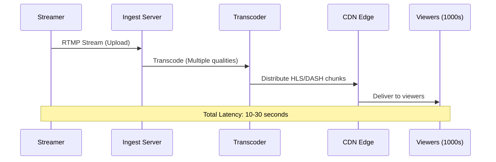

#### Latency Breakdown

```text
RTMP Upload: 1-2 seconds
Transcoding: 2-3 seconds
CDN Propagation: 2-5 seconds
HLS Buffering: 5-20 seconds
Total: 10-30 seconds

For real-time (Twitch):
- Use WebRTC: <1 second
- Trade-off: Higher bandwidth, more complex
```

---

### 🟡 For Intermediate: Low-Latency Architecture

#### Protocol Comparison

| Protocol | Latency | Scale | Quality | Use Case |
|----------|---------|-------|---------|----------|
| RTMP | 3-5s | High | Good | Traditional |
| HLS | 10-30s | Very High | Excellent | VOD-like |
| LL-HLS | 2-3s | High | Excellent | Modern |
| WebRTC | <1s | Medium | Good | Interactive |

**Design Decision:** Use hybrid approach

- Ingest: RTMP (proven, reliable)
- Distribution: LL-HLS for most, WebRTC for ultra-low latency tier

---

### 🎯 Interview Questions - Live Streaming

#### Beginner Level

**Q1:** What's the difference between live streaming and video-on-demand (VOD)?

<details>
<summary>💭 Think first, then reveal answer</summary>

**Answer:**

**Key Differences:**

| Aspect | Live Streaming | Video-on-Demand (VOD) |
|--------|---------------|----------------------|
| **Timing** | Real-time broadcast | Pre-recorded content |
| **Latency** | 3-30 seconds delay | No latency concerns |
| **Processing** | Transcoding must be real-time | Can transcode in batch |
| **Storage** | Temporary, then archived | Permanent storage |
| **Scalability** | Spiky (event-based) | Predictable patterns |
| **Cost** | High (always-on infrastructure) | Lower (cache-friendly) |

**Live Streaming Characteristics:**
- Content created and consumed simultaneously
- Cannot pause/rewind during live (unless DVR enabled)
- Requires low-latency infrastructure
- Examples: Sports events, concerts, gaming streams

**VOD Characteristics:**
- Content fully encoded before viewing
- Users can pause, rewind, fast-forward
- Can be heavily cached at CDN edge
- Examples: Netflix shows, YouTube videos

**Interview Tip:** Emphasize that live streaming requires real-time transcoding and can't benefit from caching as much as VOD, making it more challenging and expensive.

</details>

**Q2:** How do you reduce latency in live streaming?

<details>
<summary>💭 Think first, then reveal answer</summary>

**Answer:**

**Multi-Level Latency Reduction Strategy:**

**1. Protocol Selection:**
- **HLS (15-30s latency):** Standard, works everywhere
  - Uses: Large audiences, not time-critical
- **Low-Latency HLS (3-5s):** Apple's improvement
  - Uses: Sports, news where some delay acceptable
- **WebRTC (<1s):** Real-time communication
  - Uses: Gaming, video calls, interactive streams
- **SRT (2-3s):** Secure Reliable Transport
  - Uses: Professional broadcasting

**2. Segment Size Reduction:**
```text
Traditional HLS:
├─ Segment size: 10 seconds
├─ 3 segments buffered = 30 seconds latency
└─ Problem: Too slow for interactive content

Low-Latency HLS:
├─ Segment size: 2 seconds
├─ Partial segments: 0.5 seconds
├─ 2-3 segments buffered = 3-5 seconds
└─ Result: 6x faster!
```

**3. Edge Computing:**
- Transcode at CDN edge (closer to users)
- Reduces network hops
- Local caching of live segments

**4. Optimize Transcoding:**
- Use hardware encoders (GPU-based)
- Parallel processing
- Preset tuning for speed vs quality

**5. Network Optimization:**
- Use WebSockets for bidirectional communication
- Implement adaptive bitrate for network changes
- Reduce TCP handshakes with persistent connections

**Trade-offs:**
- Lower latency = Higher infrastructure cost
- Lower latency = Less buffer = More rebuffering risk
- WebRTC low latency but doesn't scale as well as HLS

**Interview Tip:** Start with HLS (most common), then explain how to optimize to Low-Latency HLS, and mention WebRTC only if ultra-low latency (<1s) is required.

</details>

**Q3:** How do you handle a sudden spike of 100K concurrent viewers for a live event?

<details>
<summary>💭 Think first, then reveal answer</summary>

**Answer:**

**Multi-Layered Scaling Strategy:**

**Immediate Response (0-60 seconds):**

**1. CDN Auto-Scaling:**
```text
Normal state:
├─ 50 CDN edge servers active
├─ Handling 10K viewers
└─ Cost: $500/hour

Spike detected (100K viewers):
├─ Auto-scale to 500 edge servers (10x)
├─ Geographic distribution (US, EU, Asia)
├─ Serves 200 viewers per edge
└─ Cost: $5,000/hour (10x increase)
```

**2. Origin Server Scaling:**
- Horizontal scaling: Add more transcoding servers
- Pre-warming: If event is scheduled, scale up 15 minutes early
- Load balancing: Distribute across multiple origins

**Short-Term Response (1-5 minutes):**

**3. Adaptive Bitrate Adjustment:**
```text
Under normal load:
├─ Offer: 4K, 1080p, 720p, 480p, 360p
└─ Users typically choose 1080p

Under spike:
├─ Prioritize: 720p, 480p, 360p
├─ Reduce 4K transcoding (save resources)
├─ Graceful degradation (quality vs availability)
└─ Result: More viewers can watch at lower quality
```

**4. Connection Management:**
- Use connection pooling
- Implement rate limiting for new connections
- Queue system for viewers (if capacity exceeded)

**Long-Term Response (5-30 minutes):**

**5. Infrastructure Expansion:**
```text
If spike sustains >5 minutes:
├─ AWS Auto Scaling Group triggered
├─ Launch 50 additional transcoding servers
├─ DNS updates to route to new servers
├─ Time to fully operational: 10-15 minutes
└─ Cost: $2,000/hour for transcoders
```

**6. Monitoring & Alerting:**
- Real-time dashboard: Viewer count, bitrate, errors
- Alerts: >80% capacity = trigger auto-scale
- Metrics: CPU, bandwidth, concurrent connections

**Cost Estimation:**

```text
Sudden 100K viewer spike (2-hour event):

CDN Bandwidth:
├─ 100K viewers × 3 Mbps average × 2 hours
├─ = 600K GB transferred
├─ × $0.05/GB = $30,000

Transcoding:
├─ 20 transcoding servers × $2/hour × 2 hours
├─ = $80

Origin Servers:
├─ 10 servers × $1/hour × 2 hours
├─ = $20

Total: ~$30,100 for 2-hour event
Per viewer cost: $0.30
```

**Interview Tip:** Mention that CDN costs dominate (99% of cost), and pre-warming for scheduled events is much cheaper than emergency scaling.

</details>

#### Intermediate Level

**Q1:** Design the architecture for Twitch-like live game streaming with chat

<details>
<summary>💭 Think first, then reveal answer</summary>

**Answer:**

**Complete Architecture:**

```text
[Streamer]
    ↓ (RTMP: 1080p60 @ 6 Mbps)
[Ingest Server]
    ↓
[Live Transcoder] ← GPU-accelerated
    ├─ 1080p60 (6 Mbps)
    ├─ 720p60 (3 Mbps)
    ├─ 480p30 (1.5 Mbps)
    └─ 360p30 (0.8 Mbps)
    ↓
[Origin Server] → HLS packaging
    ↓
[CDN] → Global distribution
    ↓
[100K Viewers] ← Adaptive bitrate

[Chat System] (separate)
    ├─ WebSocket connections
    ├─ Chat server cluster (Redis Pub/Sub)
    ├─ Message rate limiting
    └─ Moderation (profanity filter, spam detection)
```

**Key Components:**

**1. Streaming Pipeline:**
- **Ingest:** RTMP server (Nginx-RTMP module)
- **Transcoding:** FFmpeg on GPU instances (real-time)
- **Packaging:** HLS segments (2-second chunks for low latency)
- **Delivery:** CloudFront CDN (global edge caching)

**2. Chat System:**
```text
Chat Architecture:

WebSocket Gateway (10 servers):
├─ Each handles 10K connections = 100K total
├─ Load balanced (sticky sessions by channel)
├─ Heartbeat: 30-second keep-alive
└─ Cost: $200/hour

Redis Pub/Sub (3-node cluster):
├─ Channels: One per stream
├─ Messages: Pub to channel, all subscribers receive
├─ Rate limit: 100 messages/second per channel
└─ Cost: $50/hour

Chat Database (PostgreSQL):
├─ Store: Last 1,000 messages per channel
├─ Persistence: Chat history for replay
├─ Moderation logs: Bans, timeouts
└─ Cost: $20/hour
```

**3. Integration Points:**
- Stream metadata (title, viewer count) via REST API
- Emotes, badges stored in Redis cache
- Streamer alerts (new subscriber) via WebSocket

**4. Latency Optimization:**
```text
End-to-End Latency Budget:

Streamer → Ingest: 0.5s (network)
Ingest → Transcode: 1.0s (processing)
Transcode → Package: 0.5s (HLS segments)
Package → CDN: 0.5s (propagation)
CDN → Viewer: 1.0s (buffering)
─────────────────────────────
Total: 3.5 seconds (acceptable for gaming)
```

**5. Scalability:**
- Horizontal: Add more transcoding servers per stream quality
- Vertical: Use better GPUs (T4 → A10 for 4K)
- Chat: Shard by channel (each channel = separate Redis Pub/Sub)

**Interview Tip:** Emphasize that streaming and chat are separate systems. Chat uses WebSockets (bidirectional) while streaming is one-way HLS.

</details>

**Q2:** How do you implement DVR functionality for live streams?

<details>
<summary>💭 Think first, then reveal answer</summary>

**Answer:**

**DVR (Digital Video Recorder) allows viewers to:**
- Pause live stream
- Rewind to earlier moments
- Fast-forward (up to live edge)

**Architecture:**

```text
DVR System:

[Live Stream] → [DVR Buffer Storage]
                      ↓
              Rolling Window (2 hours)
                      ↓
         [S3] ← Archive segments
                      ↓
              [Playback Service]
                      ↓
              [CDN] → [Viewers]

Timeline:
Live Edge ←←←←←←←←←←← 2 hours DVR window
        Now    -30min   -60min   -90min  -120min
```

**Implementation Details:**

**1. Segment Storage:**
```text
Every 2-second HLS segment:
├─ Store in S3 with timestamp key
├─ Example: stream_123/2024-01-15/14-30-00/segment_001.ts
├─ Keep for 2 hours (sliding window)
├─ Auto-delete segments older than 2 hours (S3 lifecycle)
└─ Cost: ~$0.023/GB/month storage
```

**2. Playback Logic:**
```text
User requests "pause at T-30min":

1. Client records current timestamp
2. Switches from live manifest to DVR manifest
3. DVR manifest points to archived segments
4. User can seek within archived range
5. "Go Live" button jumps back to live edge
```

**3. Manifest Generation:**
```text
Live Manifest (master.m3u8):
#EXTM3U
#EXT-X-VERSION:3
#EXT-X-TARGETDURATION:2
#EXTINF:2.0,
segment_current-2.ts
#EXTINF:2.0,
segment_current-1.ts
#EXTINF:2.0,
segment_current.ts

DVR Manifest (dvr_t-1800.m3u8):
#EXTM3U
#EXT-X-VERSION:3
#EXT-X-TARGETDURATION:2
#EXT-X-PLAYLIST-TYPE:EVENT
#EXTINF:2.0,
segment_t-1800.ts
... (3600 segments for 2 hours)
```

**4. Storage Optimization:**
```text
DVR Window Sizing:

2-hour window for 10K streams:
├─ Each stream: 3 Mbps × 2 hours = 2.7 GB
├─ Total: 10K × 2.7 GB = 27 TB
├─ Cost: 27,000 GB × $0.023/GB = $621/month
└─ Plus retrieval: $0.0004/GB for reads

Optimization:
├─ Only store DVR for popular streams (>100 viewers)
├─ Reduces to 1,000 streams = $62/month
└─ Savings: 90%
```

**5. User Experience:**
```text
Viewer Actions:

Pause:
├─ Client stops downloading new segments
├─ Displays "paused at T-30s behind live"
├─ Can resume or seek

Rewind (-30s):
├─ Client requests DVR manifest at T-30s
├─ Fetches archived segments from S3
├─ Plays from that point
└─ Can fast-forward back to live

Fast-Forward:
├─ Skip segments (2x, 4x, 8x speed)
├─ Only fetch keyframes for efficiency
├─ Stop at live edge (can't go beyond)
```

**Trade-offs:**
- Storage cost increases with DVR window size
- Latency between live edge and DVR viewer increases
- Complexity in manifest management

**Interview Tip:** Mention that most platforms offer DVR only for premium users or large channels to save costs.

</details>

#### Advanced Level

**Q1:** Design ultra-low-latency streaming (<500ms) for esports tournaments

<details>
<summary>💭 Think first, then reveal answer</summary>

**Answer:**

**Requirements for <500ms latency:**
- Esports tournaments need near-real-time (competitive advantage)
- Traditional HLS (3-5s) too slow
- Must scale to millions of viewers globally

**Architecture: WebRTC + SFU (Selective Forwarding Unit)**

```text
Ultra-Low-Latency Architecture:

[Game Stream] (1080p60 @ 6 Mbps)
     ↓ RTMP
[Ingest Server]
     ↓
[WebRTC Transcoder] ← Real-time H.264/VP8
     ├─ 1080p60 (6 Mbps)
     ├─ 720p60 (3 Mbps)
     └─ 480p30 (1.5 Mbps)
     ↓
[SFU Cluster] ← Mesh topology
     ├─ SFU Node 1 (US-East)
     ├─ SFU Node 2 (US-West)
     ├─ SFU Node 3 (EU)
     └─ SFU Node 4 (Asia)
     ↓
[WebRTC Clients] ← 1M viewers

Latency Breakdown:
├─ Game → Ingest: 50ms (LAN)
├─ Ingest → Transcode: 100ms (real-time encoding)
├─ Transcode → SFU: 50ms (internal network)
├─ SFU → Viewer: 200ms (WebRTC peer connection)
├─ Viewer decode/render: 100ms
└─ Total: 500ms glass-to-glass
```

**Key Technologies:**

**1. WebRTC Instead of HLS:**
```text
HLS Problems:
├─ Segment-based (2-10s chunks)
├─ TCP-based (retransmissions add latency)
├─ Cannot achieve <1s latency
└─ Good for scale, bad for latency

WebRTC Solutions:
├─ Real-time (no segments, continuous stream)
├─ UDP-based (no retransmissions, accept packet loss)
├─ Achieves <500ms latency
└─ Challenge: Harder to scale to millions
```

**2. SFU (Selective Forwarding Unit):**
```text
SFU vs Traditional CDN:

Traditional CDN:
├─ Pull-based: Viewers request from cache
├─ Works for HLS segments
├─ High latency due to caching
└─ Great for scale (millions of viewers)

SFU Architecture:
├─ Push-based: Real-time forwarding
├─ Each SFU node handles 5K viewers
├─ Mesh topology: SFUs connect to each other
├─ 1M viewers = 200 SFU nodes
└─ Cost: $0.50/hour per SFU = $100/hour total
```

**3. Cascading SFUs for Scale:**
```text
3-Tier SFU Architecture:

Tier 1: Origin SFU (1 node)
├─ Receives stream from ingest
├─ Connects to 10 Tier-2 SFUs
└─ Handles transcoding

Tier 2: Regional SFUs (10 nodes)
├─ Each connects to 20 Tier-3 SFUs
├─ Geographic distribution
└─ No transcoding, just forwarding

Tier 3: Edge SFUs (200 nodes)
├─ Each handles 5K viewers
├─ Total: 200 × 5K = 1M viewers
└─ Closest to end users

Advantages:
├─ Scalable: Add more Tier-3 SFUs
├─ Low latency: Max 3 hops (Tier1 → 2 → 3)
├─ Fault tolerant: If SFU fails, reconnect to another
└─ Cost: $0.50/SFU × 211 nodes = $105/hour
```

**4. Adaptive Bitrate for WebRTC:**
```text
Network Conditions:

Good network (low packet loss):
├─ Send 1080p60 @ 6 Mbps
├─ Low latency maintained
└─ High quality

Poor network (5% packet loss):
├─ SFU detects packet loss
├─ Switches to 720p30 @ 2 Mbps
├─ Reduces bandwidth, maintains latency
└─ Forward error correction (FEC) for lost packets

Very poor network (10%+ packet loss):
├─ Switches to 480p30 @ 1 Mbps
├─ Aggressive FEC
├─ May temporarily buffer to reduce jitter
└─ Fallback: Graceful degradation, not complete failure
```

**5. Monitoring & Optimization:**
```text
Real-Time Metrics:

Per-Viewer:
├─ Latency: Track glass-to-glass delay
├─ Packet loss: % of packets dropped
├─ Bitrate: Actual vs target
└─ Jitter: Variation in packet arrival time

Per-SFU:
├─ CPU usage: Encoding/decoding load
├─ Bandwidth: Inbound and outbound
├─ Connection count: Number of viewers
└─ Error rate: Failed connections

Alerting:
├─ Latency >1s: Investigate SFU performance
├─ Packet loss >5%: Network congestion
├─ CPU >80%: Add more SFU nodes
└─ Viewer drops: Check for SFU failures
```

**6. Cost Analysis:**
```text
Ultra-Low-Latency Cost (1M viewers, 2-hour tournament):

SFU Infrastructure:
├─ 211 SFU nodes × $0.50/hour × 2 hours
├─ = $211

Bandwidth (more expensive than HLS):
├─ No CDN caching benefits
├─ Each viewer: 3 Mbps average
├─ 1M viewers × 3 Mbps × 2 hours = 2.7 PB
├─ Cost: 2,700,000 GB × $0.05/GB = $135,000

Transcoding:
├─ Real-time WebRTC encoding
├─ 5 GPU servers × $2/hour × 2 hours
├─ = $20

Total: $135,231 for 2 hours
Per viewer: $0.135

Compare to HLS (3-5s latency):
├─ CDN caching reduces bandwidth 90%
├─ Cost: ~$15,000 for same event
└─ Ultra-low-latency is 9x more expensive!
```

**Trade-offs:**
- **Latency:** 500ms vs 3-5s (10x improvement)
- **Cost:** $135K vs $15K (9x increase)
- **Complexity:** WebRTC much harder than HLS
- **Browser support:** WebRTC requires modern browsers

**Interview Tip:** Emphasize that <500ms latency is only needed for highly interactive content (esports, betting, gaming). For most use cases, Low-Latency HLS (3-5s) is sufficient and 9x cheaper.

</details>

---

### ✅ Key Takeaways

- **Latency is critical:** 3-5s acceptable, <1s for gaming
- **RTMP for ingest:** Proven, reliable standard
- **HLS for delivery:** Scalable, works with CDNs
- **WebRTC for real-time:** Sub-second, but complex
- **Transcoding on-the-fly:** Must be real-time, not batch

---

## Section 7: Recommendations & Discovery

### What You'll Learn

- Understand how Netflix recommends shows you'll love
- Design collaborative filtering systems at scale
- Implement content-based recommendation algorithms
- Build hybrid recommendation systems
- Optimize recommendations for engagement and revenue
- Handle cold-start problems (new users, new content)

### Why This Matters

80% of what people watch on Netflix comes from recommendations, not search! When you finish watching "Breaking Bad" and Netflix suggests "Better Call Saul," that's not random - it's a sophisticated recommendation system analyzing billions of data points. Understanding recommendation systems is crucial because they directly impact user engagement, retention, and revenue. In interviews, this shows you understand the complete user experience, not just video delivery.

---

### 🟢 For Beginners: How Recommendations Work

#### The Two Main Approaches

#### 1. Collaborative Filtering (CF)

Think of it like asking friends for recommendations:

- "People who liked Breaking Bad also liked Ozark"
- Based on patterns: Similar users like similar content
- Doesn't need to understand content itself

#### Example

```text
User Alice watched: Breaking Bad, Ozark, Narcos
User Bob watched: Breaking Bad, Ozark, [unknown]
Recommendation for Bob: Narcos (because Alice liked it)

This is called "user-user collaborative filtering"
```

#### 2. Content-Based Filtering (CBF)

Think of it like describing what you like:

- "I like crime dramas with antiheroes"
- Analyzes content features: Genre, actors, themes
- Recommends similar content

#### Example

```text
Breaking Bad features:
- Genre: Crime, Drama
- Themes: Drug trade, moral ambiguity
- Setting: Desert, contemporary

Similar shows:
- Ozark: Crime, Drama, moral ambiguity ✓
- The Wire: Crime, Drama, urban setting
- Better Call Saul: Same universe, spinoff
```

#### Which Approach is Better

| Approach | Pros | Cons | Use Case |
|----------|------|------|----------|
| Collaborative Filtering | Discovers unexpected connections | Cold start problem (new users/items) | Established platforms with lots of data |
| Content-Based | Works for new items | Limited to known preferences | New platforms or niche content |
| Hybrid (Both) | Best of both worlds | More complex | Netflix, YouTube, Spotify |

---

### 🟡 For Intermediate: Building Recommendation Systems

#### Architecture Overview

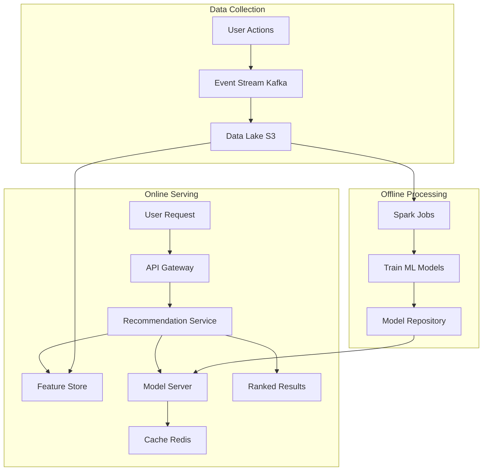

#### Let me explain each component

#### 1. Data Collection with Kafka

#### What is Kafka

Think of Kafka as a high-speed conveyor belt for data. Instead of processing user actions one-by-one (like a single-file line), Kafka lets you handle millions of events per second (like multiple conveyor belts running in parallel).

#### Why Kafka for recommendations

```text
Without Kafka:
User clicks "play" → Write to database → Database slows down with millions of clicks

With Kafka:
User clicks "play" → Send to Kafka → Kafka buffers it → Process later in batches

Benefits:
- Handles 1M+ events/second
- Doesn't slow down user experience
- Can replay events if processing fails
- Multiple systems can read same events
```

#### Events captured

- Video played (what, when, how long)
- Video paused (at what timestamp)
- Video rated (thumbs up/down)
- Search queries
- Browse behavior (what did they look at but not watch?)

#### 2. Feature Store

#### What is a Feature Store

It's like a recipe book for ML models. Instead of recalculating "user's favorite genre" every time, you pre-calculate and store it.

#### Example features

```text
User Features:
- favorite_genre: "Crime Drama" (calculated from watch history)
- viewing_time: "Evening 8-11 PM" (when they usually watch)
- binge_watcher: true (watches 3+ episodes in a row)
- subscription_tier: "Premium"

Video Features:
- genre: "Crime, Drama"
- popularity_score: 8.7/10
- average_completion_rate: 85% (how many finish the video)
- trending_score: 0.92 (hot right now?)
```

#### Why pre-calculate

```text
Without Feature Store:
Request comes → Calculate all features (500ms) → Run model (200ms) → Return results
Total: 700ms (too slow!)

With Feature Store:
Request comes → Lookup features (5ms) → Run model (200ms) → Return results
Total: 205ms (much better!)
```

#### Technologies used

- **Feast**: Open-source feature store
- **Tecton**: Enterprise feature store
- **Redis**: Fast in-memory cache for hot features

#### 3. Collaborative Filtering Implementation

#### Matrix Factorization (Netflix Prize Algorithm)

Imagine a giant table:

```text
           | Breaking Bad | Ozark | Friends | ...
------------------------------------------------------
Alice      |      5       |   5   |    2    | ...
Bob        |      5       |   ?   |    1    | ...
Charlie    |      1       |   1   |    5    | ...
```

**The problem:** Most cells are empty! Users haven't watched most content.

**The solution:** Matrix Factorization finds hidden patterns.

```text
Each user has hidden preferences:
Alice: [0.9 crime, 0.8 drama, 0.1 comedy]

Each video has hidden features:
Breaking Bad: [0.95 crime, 0.9 drama, 0.05 comedy]

Prediction = User preferences · Video features
Alice + Breaking Bad = 0.9×0.95 + 0.8×0.9 + 0.1×0.05
                      = 0.855 + 0.72 + 0.005
                      = 1.58 (high score = recommend!)
```

#### Real-world scale

```text
Netflix:
- 230M users
- 10K titles
- Matrix size: 230M × 10K = 2.3 trillion cells!
- Storage: 2.3 trillion × 4 bytes = 9.2 TB (too big!)

Matrix Factorization reduces to:
- 230M users × 100 factors = 23B numbers
- 10K titles × 100 factors = 1M numbers
- Total: 92 GB (manageable!)

The "100 factors" are hidden patterns learned by algorithm
```

#### 4. Deep Learning for Recommendations

#### Why Deep Learning

Traditional methods miss complex patterns. Deep learning can learn:

- Sequential patterns: "If user watches Ep1, Ep2, Ep3 → they'll watch Ep4"
- Time patterns: "User watches action movies on weekends, comedies on weekdays"
- Cross-domain patterns: "User who likes crime shows also clicks true-crime documentaries"

#### YouTube's Deep Neural Network (DNN) Architecture

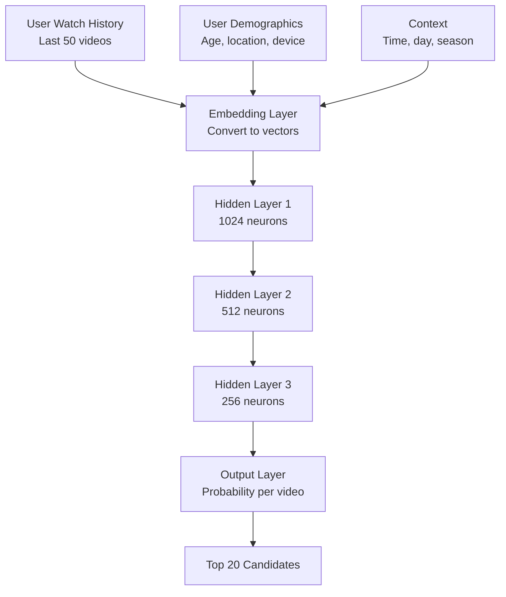

#### Explanation of each layer

**Embedding Layer:** Converts videos to numbers

```text
Breaking Bad → [0.23, 0.89, 0.45, ..., 0.67] (256 numbers)
Ozark → [0.25, 0.91, 0.43, ..., 0.69] (similar numbers!)

Similar videos get similar numbers (embeddings)
```

**Hidden Layers:** Learn complex patterns

```text
Layer 1 (1024 neurons): Learns basic patterns
- "User likes crime shows"
- "User watches in evening"

Layer 2 (512 neurons): Combines patterns
- "User likes crime shows AND watches in evening"
- "User binges series on weekends"

Layer 3 (256 neurons): Final decision patterns
- "User is likely to watch Season 2 after Season 1"
- "User explores similar shows after finishing series"
```

#### Training the model

```text
Input: User's watch history
Output: What they watched next

Example:
Input: [Breaking Bad S1E1, S1E2, S1E3]
Correct output: S1E4
Model prediction: S1E4 (90% confidence), Ozark S1E1 (70%)

If prediction correct: ✓ Good!
If prediction wrong: ✗ Adjust weights and try again

After training on billions of examples, model learns patterns
```

---

### 🔴 For Advanced: Production Recommendation System

#### Two-Stage Ranking (How Netflix Really Works)

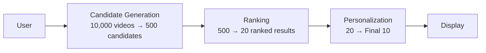

#### Stage 1: Candidate Generation (Fast & Broad)

**Goal:** Reduce 10,000 videos to ~500 candidates in <50ms

#### Methods

1. **Collaborative Filtering:** "Users like you watched..."
2. **Content-Based:** "Similar to what you've watched..."
3. **Popular Now:** "Trending in your region..."
4. **Continue Watching:** "You paused at 43%..."
5. **New Releases:** "New season just dropped..."

#### Why multiple methods

```text
CF alone: 200 candidates (similar users)
Content alone: 150 candidates (similar content)
Popular: 50 candidates (trending)
Continue watching: 20 candidates (unfinished)
New releases: 80 candidates (fresh content)

Total: 500 candidates from diverse sources
= Better variety than single method
```

#### Technology

- **Approximate Nearest Neighbors (ANN)** using **FAISS** (Facebook AI Similarity Search)
  - Finds similar items in milliseconds instead of seconds
  - Sacrifices some accuracy for massive speed gains
  - Think: "Good enough" recommendations in real-time vs "perfect" recommendations too slow to use

#### Stage 2: Ranking (Slow & Accurate)

**Goal:** Rank 500 candidates → Top 20 in <150ms

#### Features used (100+)

```text
User Context:
- Current time (morning/evening affects choices)
- Device (mobile = shorter content preferred)
- Recent searches (intent signals)

Video Features:
- Genre match score
- Cast/director affinity
- Popularity (but not just raw views - trending matters)
- Quality score (production value)

Interaction Predictions:
- Probability user will play (CTR)
- Probability user will finish (completion rate)
- Probability user will binge next episode
- Probability user will rate positively
```

#### Multi-Objective Optimization

Netflix doesn't just optimize for "clicks." They balance:

```text
Objective 1: Click-Through Rate (CTR) - 30% weight
Will user click play?

Objective 2: Watch Time - 40% weight
Will user actually watch it?

Objective 3: Retention - 20% weight
Will user stay subscribed?

Objective 4: Revenue - 10% weight
Promote premium/original content

Final Score = 0.3×CTR + 0.4×WatchTime + 0.2×Retention + 0.1×Revenue
```

#### Why balance multiple objectives

```text
Clickbait content:
- High CTR (80%) - people click!
- Low watch time (20%) - people quit quickly
- Low retention - users feel tricked, cancel subscription

Quality content:
- Medium CTR (40%) - fewer clicks
- High watch time (85%) - people finish it
- High retention (95%) - users stay subscribed

Netflix prefers Quality content!
```

#### Stage 3: Personalization (Final Touch)

**Goal:** Arrange Top 20 → Final display with personalized thumbnails

#### Thumbnail Personalization
Same show, different thumbnails for different users:

```text
Breaking Bad thumbnails:

Action fan sees: Explosion scene with intense colors
Drama fan sees: Walter White's intense face close-up
Comedy fan sees: Jesse Pinkman's goofy moment
Romance fan sees: Walter & Skyler emotional scene

Same content, optimized presentation!
```

#### A/B Test Results (Netflix published data)

```text
Personalized thumbnails vs Generic:
- 20% higher CTR
- But only 5% higher watch time

Why? Better thumbnails = better match between expectation and content
Users click on content they'll actually enjoy
```

---

### Real-World Example: Netflix's Recommendation Evolution

#### 2006 - Netflix Prize Competition

```text
Challenge: Improve recommendation accuracy by 10%
Prize: $1 million
Dataset: 100M ratings from 500K users

Winning algorithm: BellKor's Pragmatic Chaos
- Matrix Factorization + RBMs (Restricted Boltzmann Machines)
- Ensemble of 107 different models!
- Achieved 10.06% improvement

Impact:
- Netflix learned ensemble methods work best
- Led to complete overhaul of recommendation system
- Algorithm still influences Netflix today (15+ years later)
```

#### 2012 - Shift to Streaming

```text
DVD Era Problem: Users rate movies after watching
- Explicit feedback (ratings)
- But only 2% of users rated content

Streaming Era Solution: Implicit feedback everywhere
- Play/pause/rewind/fast-forward
- Time watched (did they finish?)
- When they watched (time patterns)
- What they browsed but didn't watch
- Search queries

Result:
- 100x more data points
- Better understanding of preferences
- No need to ask for ratings
```

#### 2016 - Personalized Homepage

```text
Old Netflix: Same homepage for everyone
- Everyone saw same "Popular Now" section
- Generic recommendations

New Netflix: Every pixel personalized
- Your "Popular" ≠ My "Popular"
- Even row order is personalized
- 40+ recommendation rows, all different

Technical Challenge:
- Generate personalized homepage for 230M users
- Update in real-time (not batch overnight)
- Serve in <200ms

Solution:
- Pre-compute overnight (most recommendations)
- Real-time adjustments (continue watching, new releases)
- Heavy caching with Redis
```

#### 2020 - Neural Networks Everywhere

```text
Current Netflix Stack:
- Candidate Generation: Matrix Factorization + Deep Learning
- Ranking: Gradient Boosted Decision Trees + Neural Networks
- Thumbnails: Convolutional Neural Networks (CNNs)
- Preview Selection: Recurrent Neural Networks (RNNs)
- Search: BERT-like language models

Why so many models?
- Each optimized for specific task
- Ensemble performs better than single model
- Can improve one without breaking others
```

---

### 🤔 Think About It

1. #### For Beginners Netflix shows you "Because you watched Breaking Bad..." recommendations. But what if you just watched one episode because your friend insisted, and you hated it? How should the algorithm know the difference between "I watched and loved it" vs "I watched but didn't like it"?

2. #### For Intermediate YouTube faces a trade-off: Recommend videos users will watch (high engagement) vs videos users should watch (diverse viewpoints, educational content). How do you balance these? What happens if you only optimize for watch time? (Hint: Think about "filter bubbles")

3. #### For Advanced Netflix operates in 190+ countries with different content libraries (licensing restrictions). User in India watched Breaking Bad, user in US also watched Breaking Bad. But India has 100 shows, US has 1000 shows. How do you do collaborative filtering when users have different content available? Design a solution that works globally

---

### 🎯 Interview Questions - Recommendations & Discovery

#### Beginner Level

**Q1:** How do you implement video search functionality?

<details>
<summary>💭 Think first, then reveal answer</summary>

**Answer:** * **Answer Framework:** ```text 1. Metadata Search ├─ Index: Title, description, tags, creator name ├─ Technology: Elasticsearch for full-text search └─ Query: Full-text search with ranking (TF-IDF) 2. Video Content Analysis ├─ Speech-to-text: Extract spoken words from video ├─ Object detection: Identify objects in frames (ML) ├─ Scene detection: Categorize content automatically └─ OCR: Extract text from video frames 3. User Context & Personalization ├─ Personalization: Boost based on past watch history ├─ Trending: Popular searches today ├─ Geographic: Local content priority └─ Language: Match user's language preference 4. Ranking Algorithm ├─ Relevance: TF-IDF score for query match ├─ Popularity: View count, engagement rate ├─ Recency: Upload date (newer = higher) ├─ Personalization: User watch history └─ Quality: Completion rate, likes/dislikes 5. Performance Optimization ├─ Caching: Cache popular search results (1 hour TTL) ├─ Auto-complete: Suggest as user types ├─ Typo correction: "Did you mean...?" └─ Pagination: 20 results per page Example Query: "How to cook pasta" ├─ Match: Title/description with "cook" + "pasta" ├─ Boost: Videos with >80% completion rate ├─ Filter: User's language preference └─ Results: Top 20 ranked by relevance + popularity ```

**Detailed Explanation:**
1. **Circuit Breakers**: Prevent cascade failures by stopping requests to failing services
   - Implement: Hystrix-style circuit breakers with 3 states (closed/open/half-open)
   - Benefit: System remains responsive even when database is down

2. **Read-Only Mode**: Serve cached data when writes are impossible
   - Strategy: Switch to read replicas, serve from cache
   - Trade-off: Users can't create new short URLs but existing ones work

3. **Cached Redirects**: Use Redis/CDN to serve popular redirects
   - Implementation: Cache hot URLs with 1-hour TTL
   - Impact: 95% of traffic can be served without database

4. **Graceful Degradation**: Reduce functionality rather than complete failure
   - Actions: Disable analytics, custom URLs, but keep core redirects
   - Communication: Show maintenance message for new URL creation

5. **Disaster Recovery**: Automated failover procedures
   - RTO: 5 minutes to switch to backup database
   - RPO: 1 minute data loss maximum
   - Process: Health checks → Auto-failover → Traffic routing

**Interview Framework:**
- Start with immediate response (circuit breakers)
- Explain fallback strategies (cached redirects)
- Discuss graceful degradation (read-only mode)
- Mention long-term recovery (disaster recovery)
</details>

**Q2:** How do you implement trending/viral video detection?

<details>
<summary>💭 Think first, then reveal answer</summary>

**Answer:** * **Answer Framework:** ```text 1. Metrics Collection ├─ View velocity: Views per hour (not total views) ├─ Engagement: Likes, comments, shares per view ├─ Growth rate: % increase over last hour └─ Retention: Watch time completion rate 2. Trending Score Algorithm ├─ Recency: Decay factor for video age ├─ Velocity: Exponential weight for rapid growth ├─ Engagement: Weight likes/comments/shares └─ Formula: score = (views * engagement_rate) / (age_hours + 2)^1.5 3. Detection Criteria ├─ Threshold: >10x normal view rate for video type ├─ Duration: Sustained for 1+ hours ├─ Geographic: Trending in multiple regions └─ Acceleration: Views increasing (not plateauing) 4. Ranking & Display ├─ Update frequency: Every 5-15 minutes ├─ Personalization: Mix trending + personal preferences ├─ Display: Trending page, homepage sections └─ Diversity: Mix different categories 5. Actions on Viral Detection ├─ Infrastructure: Pre-scale CDN capacity ├─ Promotion: Feature on homepage ├─ Notifications: Push to subscribers └─ Monetization: Inject premium ads Reddit's Hot Algorithm: score = (upvotes - downvotes) / (age_hours + 2)^1.5 YouTube Example: ├─ Trending videos: Top 50 videos by region ├─ Update: Every 15 minutes ├─ Criteria: Views, growth rate, engagement └─ Moderation: Human review for controversies ```

**Detailed Explanation:**
1. **Circuit Breakers**: Prevent cascade failures by stopping requests to failing services
   - Implement: Hystrix-style circuit breakers with 3 states (closed/open/half-open)
   - Benefit: System remains responsive even when database is down

2. **Read-Only Mode**: Serve cached data when writes are impossible
   - Strategy: Switch to read replicas, serve from cache
   - Trade-off: Users can't create new short URLs but existing ones work

3. **Cached Redirects**: Use Redis/CDN to serve popular redirects
   - Implementation: Cache hot URLs with 1-hour TTL
   - Impact: 95% of traffic can be served without database

4. **Graceful Degradation**: Reduce functionality rather than complete failure
   - Actions: Disable analytics, custom URLs, but keep core redirects
   - Communication: Show maintenance message for new URL creation

5. **Disaster Recovery**: Automated failover procedures
   - RTO: 5 minutes to switch to backup database
   - RPO: 1 minute data loss maximum
   - Process: Health checks → Auto-failover → Traffic routing

**Interview Framework:**
- Start with immediate response (circuit breakers)
- Explain fallback strategies (cached redirects)
- Discuss graceful degradation (read-only mode)
- Mention long-term recovery (disaster recovery)
</details>

**Q3:** How do you solve the cold start problem for new users?

<details>
<summary>💭 Think first, then reveal answer</summary>

**Answer:** * **Answer Framework:** ```text 1. Onboarding Questions ├─ Ask: "What are your interests?" ├─ Categories: Action, comedy, documentary, etc. ├─ Creators: "Who do you follow?" └─ Initial preferences: Build basic profile 2. Popular Content Strategy ├─ Show: Trending videos in user's region ├─ Popular: Most-watched videos globally └─ Recent: New releases from major creators 3. Implicit Signals ├─ Watch behavior: Track first 10-20 videos watched ├─ Engagement: Did they finish? Like? Skip? └─ Fast learning: Update recommendations after each video 4. Social Graph ├─ Facebook/Google login: Import interests ├─ Contacts: See what friends watch └─ Network: Use social connections for recommendations 5. Exploration vs Exploitation ├─ First week: 70% popular content, 30% diverse (explore) ├─ After data: 90% personalized, 10% diverse (exploit) └─ Balance: Avoid filter bubble while personalizing Success Metrics: ├─ Day 1: 5 videos watched (vs 2 without onboarding) ├─ Week 1: 70% retention (vs 50% without) └─ Month 1: Fully personalized recommendations ```

**Detailed Explanation:**
1. **Circuit Breakers**: Prevent cascade failures by stopping requests to failing services
   - Implement: Hystrix-style circuit breakers with 3 states (closed/open/half-open)
   - Benefit: System remains responsive even when database is down

2. **Read-Only Mode**: Serve cached data when writes are impossible
   - Strategy: Switch to read replicas, serve from cache
   - Trade-off: Users can't create new short URLs but existing ones work

3. **Cached Redirects**: Use Redis/CDN to serve popular redirects
   - Implementation: Cache hot URLs with 1-hour TTL
   - Impact: 95% of traffic can be served without database

4. **Graceful Degradation**: Reduce functionality rather than complete failure
   - Actions: Disable analytics, custom URLs, but keep core redirects
   - Communication: Show maintenance message for new URL creation

5. **Disaster Recovery**: Automated failover procedures
   - RTO: 5 minutes to switch to backup database
   - RPO: 1 minute data loss maximum
   - Process: Health checks → Auto-failover → Traffic routing

**Interview Framework:**
- Start with immediate response (circuit breakers)
- Explain fallback strategies (cached redirects)
- Discuss graceful degradation (read-only mode)
- Mention long-term recovery (disaster recovery)
</details>


---

### 🔬 Advanced Deep-Dive: Production ML Pipeline for Recommendations

#### Complete ML Pipeline Architecture

**End-to-End Flow:**

```text
Data Collection → Feature Engineering → Model Training → Model Serving → A/B Testing
      ↓                 ↓                    ↓               ↓              ↓
    Kafka          Feature Store          Spark/GPU      TF Serving     Metrics
```

#### Phase 1: Data Collection & Event Streaming

**Architecture:**

```text
Client (Web/Mobile)
├─ User Actions: Click, watch, skip, like, search
├─ Batch Events: Send every 30 seconds (reduce overhead)
├─ Event Format: JSON with user_id, video_id, action, timestamp
└─ Destination: Kafka cluster

Kafka Cluster
├─ Topics:
    - video_views: User watched video
    - video_interactions: Likes, comments, shares
    - search_queries: User searches
    - video_completions: User finished video
├─ Partitions: 100 partitions per topic (parallelism)
├─ Retention: 7 days (for replay if ML fails)
└─ Throughput: 1M events/second (peak)

Event Schema Example:
{
  "user_id": "abc123",
  "video_id": "xyz789",
  "action": "watch",
  "timestamp": 1634567890,
  "watch_duration": 180,
  "quality": "1080p",
  "device": "mobile",
  "location": "US-CA"
}
```

**Why Kafka?**

```text
Advantages:
├─ Durability: Never lose events (persisted to disk)
├─ Replay: Reprocess events if ML model breaks
├─ Multiple consumers: Analytics, ML, monitoring all consume
├─ Scale: Handles millions of events per second
└─ Ordering: Maintains event order per partition

Alternative Consideration:
├─ AWS Kinesis: Managed, easier but more expensive
├─ RabbitMQ: Simpler but doesn't persist long-term
├─ Direct to DB: Can't handle scale, no replay capability
└─ Decision: Kafka wins for scale + replay + multi-consumer
```

#### Phase 2: Feature Engineering Pipeline

**Real-Time Features (Redis):**

```text
User Features (Computed in real-time):
├─ last_10_videos_watched: ["video1", "video2", ...]
├─ favorite_genres: {"action": 0.4, "comedy": 0.3, "drama": 0.3}
├─ avg_watch_time_percentage: 0.75 (watches 75% on average)
├─ preferred_video_length: 15 (prefers 10-20 min videos)
├─ watch_time_by_hour: {14: 0.3, 19: 0.5, 22: 0.2}
└─ device_preference: "mobile" (60% mobile, 40% desktop)

Video Features (Pre-computed daily):
├─ avg_completion_rate: 0.68 (68% complete this video)
├─ click_through_rate: 0.12 (12% click when shown)
├─ genre: ["action", "thriller"]
├─ popularity_score: 8.5/10
├─ avg_quality_requested: "1080p" (most users watch in 1080p)
└─ time_to_first_rebuffer: 300 (first rebuffer at 5 min)

Interaction Features (Computed on-the-fly):
├─ user_genre_affinity: cosine_similarity(user.genres, video.genres)
├─ similar_user_watched: Did similar users watch this?
├─ trending_score: (views * engagement) / (age + 2)^1.5
└─ time_match: Does video length match user's available time?

Storage:
├─ Redis: Hot features (<100ms lookup)
├─ Cassandra: Warm features (historical data)
└─ S3: Cold features (raw events for retraining)
```

**Batch Features (Spark):**

```text
Daily Batch Jobs (Run at 3 AM):
1. User Embeddings (1 hour)
   ├─ Input: Last 90 days watch history
   ├─ Algorithm: Matrix factorization
   ├─ Output: 128-dimensional user vector
   └─ Storage: Redis for fast lookup

2. Video Embeddings (2 hours)
   ├─ Input: All videos + metadata
   ├─ Algorithm: Content-based features + collaborative
   ├─ Output: 128-dimensional video vector
   └─ Storage: Redis for fast lookup

3. Similarity Matrices (3 hours)
   ├─ User-user similarity: Cosine similarity of embeddings
   ├─ Video-video similarity: For "similar videos"
   ├─ Output: Top 100 similar items per item
   └─ Storage: Redis sorted sets

4. Aggregate Statistics (1 hour)
   ├─ Popular videos by genre, region, time
   ├─ Trending detection
   └─ Cold start candidates

Total: ~7 hours for 100M users, 10M videos
Cost: $5K/day in Spark cluster costs
```

**Feature Store Architecture:**

```text
Why Feature Store?
├─ Consistency: Same features in training and serving
├─ Reusability: Share features across models
├─ Monitoring: Track feature drift
└─ Efficiency: Compute once, use many times

Technologies:
├─ Feast (Open source): Netflix, Uber use this
├─ Tecton (Commercial): Enterprise support
└─ Custom: Redis + PostgreSQL + S3

Feature Store Components:
1. Online Store (Redis)
   ├─ Purpose: Serve features in real-time (<10ms)
   ├─ Storage: 100GB-1TB of hot features
   ├─ TTL: 24 hours (refreshed daily)
   └─ Backup: Replicated across 3+ nodes

2. Offline Store (S3 + Parquet)
   ├─ Purpose: Training data for ML models
   ├─ Storage: 10-100 TB of historical features
   ├─ Format: Parquet for columnar efficiency
   └─ Partitioning: By date for fast queries

3. Feature Registry (PostgreSQL)
   ├─ Metadata: Feature name, type, owner, SLA
   ├─ Lineage: How feature is computed
   ├─ Monitoring: Alert on stale features
   └─ Access control: Who can use which features
```

#### Phase 3: Model Training Pipeline

**Training Architecture:**

```text
1. Data Preparation (Spark)
   ├─ Sample: Last 90 days of user interactions
   ├─ Filter: Remove bots, test accounts
   ├─ Features: Join user features + video features
   └─ Labels: Did user watch? How much?

2. Training Infrastructure
   ├─ Hardware: 10-100 GPU machines (NVIDIA V100/A100)
   ├─ Framework: TensorFlow or PyTorch
   ├─ Distributed: TensorFlow distributed training
   └─ Duration: 12-48 hours per model

3. Model Types (Netflix uses 100+ models)
   
   a) Collaborative Filtering
   ├─ Algorithm: Matrix Factorization (ALS)
   ├─ Input: User-video interaction matrix (sparse)
   ├─ Output: User embeddings + Video embeddings
   ├─ Training: Spark MLlib, 2 hours
   └─ Accuracy: Baseline, ~65% CTR prediction

   b) Deep Neural Network (Primary Model)
   ├─ Architecture:
       Input Layer (1000+ features)
       ↓
       Dense Layer 1: 512 neurons, ReLU
       ↓
       Dense Layer 2: 256 neurons, ReLU
       ↓
       Dense Layer 3: 128 neurons, ReLU
       ↓
       Output: Probability of watch (sigmoid)
   ├─ Training: 24 hours on 8 GPUs
   ├─ Accuracy: 75% CTR prediction
   └─ Production: 95% of recommendations

   c) Gradient Boosted Trees (Ranking)
   ├─ Algorithm: XGBoost or LightGBM
   ├─ Features: 100+ engineered features
   ├─ Purpose: Final ranking of candidates
   ├─ Training: 4 hours on CPUs
   └─ Accuracy: 80% CTR prediction

4. Hyperparameter Tuning
   ├─ Search space: 100s of combinations
   ├─ Method: Bayesian optimization
   ├─ Tool: Ray Tune or Optuna
   └─ Cost: 10x training cost (run 10+ variants)

5. Model Evaluation
   ├─ Offline metrics: Precision@10, Recall@10, NDCG
   ├─ Online A/B test: Compare to production model
   ├─ Business metrics: Watch time, retention, revenue
   └─ Decision: Deploy if >5% improvement
```

**Training Dataset Creation:**

```text
Dataset Composition (100M users):
├─ Positive samples: User watched >30% of video (80M samples)
├─ Negative samples: User ignored video in feed (320M samples)
├─ Ratio: 1:4 (positive:negative) for balanced training
└─ Total: 400M training samples

Data Splits:
├─ Training: 80% (320M samples)
├─ Validation: 10% (40M samples)
├─ Test: 10% (40M samples)
└─ Time-based split: Train on day 1-80, validate day 81-90, test day 91-100

Feature Vector Example (1000+ dimensions):
User features (200):
├─ Demographics: age, gender, location (3)
├─ Behavior: watch_count_7d, avg_session_time (10)
├─ Preferences: genre_affinity_vector (50)
├─ Embeddings: user_embedding_128d (128)
└─ Context: device, time_of_day, day_of_week (9)

Video features (300):
├─ Metadata: genre, duration, year, rating (10)
├─ Performance: view_count, completion_rate, CTR (20)
├─ Embeddings: video_embedding_128d (128)
└─ Content: cast, director, keywords (142)

Interaction features (500):
├─ Similarity: cosine(user_emb, video_emb) (1)
├─ Collaborative: similar_users_watched (10)
├─ Temporal: time_since_last_similar (5)
└─ Contextual: device_match, time_match (484)

Total: 1000 features per (user, video) pair
```

#### Phase 4: Model Serving in Production

**Serving Architecture:**

```text
Request Flow (Target: <100ms end-to-end):
1. User requests homepage (user_id: abc123)
   ↓
2. Recommendation Service receives request
   ├─ Lookup: Get user features from Redis (5ms)
   ├─ Candidate generation: Get 1000 candidates (20ms)
   └─ Continue to ranking...
   ↓
3. Ranking Service
   ├─ Batch: Group candidates into batch of 1000
   ├─ Feature lookup: Get video features (10ms)
   ├─ Model inference: TensorFlow Serving (40ms)
   └─ Score: Get probability score for each video
   ↓
4. Post-processing
   ├─ Sort: Rank by score (1ms)
   ├─ Filter: Remove already watched, restricted content (2ms)
   ├─ Diversify: Ensure genre diversity (3ms)
   └─ Return: Top 20 videos (1ms)
   ↓
5. Response to user (Total: 82ms)

Components:
├─ Feature Store: Redis cluster (5 nodes)
├─ Model Server: TensorFlow Serving (20 instances)
├─ Ranking Service: Node.js (50 instances)
└─ Load Balancer: Distribute requests
```

**TensorFlow Serving Setup:**

```text
Deployment:
├─ Docker containers: Each instance serves 1 model
├─ Model format: SavedModel format
├─ Batch size: 32-128 videos per batch
├─ Throughput: 1000 requests/second per instance
└─ Latency: <50ms p99

Model Versioning:
├─ Version 1: Current production model
├─ Version 2: New candidate model (A/B testing)
├─ Canary: Route 5% traffic to v2, 95% to v1
└─ Rollback: If v2 performs worse, instant rollback

Resource Allocation:
├─ CPU: 8 cores per instance
├─ Memory: 16 GB per instance
├─ GPU: Optional for faster inference (2x speed)
└─ Cost: $500/month per instance

Configuration:
model_config_list {
  config {
    name: "video_recommendation"
    base_path: "/models/video_rec"
    model_platform: "tensorflow"
    model_version_policy {
      specific { versions: 1 versions: 2 }
    }
  }
}
```

#### Phase 5: A/B Testing & Experimentation

**A/B Test Framework:**

```text
Netflix runs 100+ A/B tests simultaneously!

Test Setup:
├─ Control (A): Current production model
├─ Treatment (B): New candidate model
├─ Traffic split: 50/50 or 90/10 (depends on risk)
├─ Duration: 2-4 weeks (statistical significance)
└─ Randomization: User-level randomization

Metrics to Track:
├─ Primary: Click-through rate (CTR)
├─ Secondary: Watch time per session
├─ Guardrail: Retention rate (must not decrease)
└─ Business: Revenue per user

Statistical Analysis:
├─ Minimum sample: 10K users per variant
├─ Significance: p-value < 0.05
├─ Effect size: >5% improvement required
└─ Power: 80% power to detect 5% change

Example A/B Test Results:
Metric              | Control | Treatment | Change   | P-value
--------------------|---------|-----------|----------|--------
CTR                 | 10.2%   | 11.5%     | +12.7%   | <0.001
Watch time/session  | 32 min  | 35 min    | +9.4%    | <0.001
Retention (7-day)   | 65%     | 66%       | +1.5%    | 0.03
Revenue/user        | $12.50  | $13.20    | +5.6%    | <0.001

Decision: Deploy treatment (all metrics improved)
```

**Multi-Armed Bandit (Advanced):**

```text
Problem with A/B testing: Wastes 50% of traffic on worse model

Multi-Armed Bandit Solution:
├─ Start: 50/50 split
├─ Learn: After 1000 samples, shift to better performer
├─ Adapt: Gradually shift to 80/20, then 95/5
├─ Explore: Always keep 5% exploration
└─ Result: Less wasted traffic, faster learning

Thompson Sampling Algorithm:
for each user request:
  # Sample from beta distribution for each model
  score_A = beta.sample(wins_A, losses_A)
  score_B = beta.sample(wins_B, losses_B)
  
  if score_A > score_B:
    show recommendations from model A
    update wins_A or losses_A based on user action
  else:
    show recommendations from model B
    update wins_B or losses_B based on user action

Benefits:
├─ Faster convergence: Find winner in 1 week vs 4 weeks
├─ Less waste: Don't show bad recommendations
├─ Always learning: Adapts to changing patterns
└─ Used by: Google, Microsoft, Netflix
```

#### Phase 6: Model Monitoring & Retraining

**Monitor What?**

```text
1. Model Performance Drift
   ├─ CTR over time: Should be stable
   ├─ Alert: If CTR drops >10% from baseline
   ├─ Cause: User behavior changed, new content types
   └─ Action: Retrain model with recent data

2. Feature Drift
   ├─ Distribution: Track feature value distributions
   ├─ Example: avg_video_length increased 10% → affects model
   ├─ Detection: Compare to training distribution
   └─ Action: Retrain with new distribution

3. Data Quality
   ├─ Missing features: % of requests with null features
   ├─ Outliers: Extreme values (videos watched = 10,000/day)
   ├─ Freshness: Time since feature last updated
   └─ Alert: If >5% requests have missing features

4. Serving Latency
   ├─ p50, p95, p99 latency: Track percentiles
   ├─ Target: p99 < 100ms
   ├─ Alert: If p99 > 150ms
   └─ Action: Scale up serving instances

5. Business Metrics
   ├─ Revenue per user: Did recommendations increase revenue?
   ├─ Retention: Did users stay longer?
   ├─ Engagement: More likes, comments, shares?
   └─ NPS (Net Promoter Score): User satisfaction
```

**Retraining Strategy:**

```text
Scheduled Retraining:
├─ Daily: Retrain lightweight models (collaborative filtering)
├─ Weekly: Retrain deep neural networks
├─ Monthly: Full model architecture search
└─ Ad-hoc: If metrics degrade significantly

Retraining Pipeline:
1. Data extraction (2 hours)
   ├─ Pull: Last 90 days from Kafka → S3
   ├─ Sample: Stratified sampling for balance
   └─ Validation: Check data quality

2. Feature engineering (3 hours)
   ├─ Compute: All features from raw events
   ├─ Join: User + video + interaction features
   └─ Store: Save to feature store

3. Model training (24 hours)
   ├─ Train: Multiple model variants in parallel
   ├─ Validate: Check offline metrics
   └─ Select: Best performing variant

4. A/B testing (2 weeks)
   ├─ Deploy: 5% traffic to new model
   ├─ Monitor: Track online metrics
   └─ Decide: Deploy to 100% or rollback

5. Deployment (1 hour)
   ├─ Canary: 1% → 10% → 50% → 100%
   ├─ Monitor: Watch for regressions
   └─ Rollback: Automated if metrics degrade

Total cycle: 3-4 weeks from data to production
```

#### Phase 7: Advanced Techniques

**1. Multi-Objective Optimization:**

```text
Problem: Optimize for multiple goals simultaneously
├─ Engagement: Maximize watch time
├─ Satisfaction: Maximize user rating
├─ Diversity: Show variety, avoid filter bubble
└─ Revenue: Maximize ads clicked or subscriptions

Solution: Weighted combination
score = 0.4 * engagement_score +
        0.3 * satisfaction_score +
        0.2 * diversity_score +
        0.1 * revenue_score

Challenges:
├─ Weight tuning: How to set weights?
├─ Trade-offs: More engagement vs more diversity
├─ A/B testing: Test different weight combinations
└─ Personalization: Different weights per user segment

Netflix Approach:
├─ Engagement weight: Higher for new users (hook them)
├─ Diversity weight: Higher for existing users (prevent churn)
├─ A/B test: Test 10 different weight combinations
└─ Learn: Let ML learn optimal weights per user
```

**2. Contextual Bandits:**

```text
Problem: Recommendations depend on context
├─ Time: Morning → Educational, Evening → Entertainment
├─ Device: Mobile → Short videos, TV → Long videos
├─ Location: Home → Binge watching, Commute → Short clips
└─ Mood: Can we infer and adapt?

Contextual Bandit Algorithm:
for each request:
  context = {time_of_day, device, location, last_5_videos}
  
  for each candidate_video:
    features = combine(user_features, video_features, context)
    score = model.predict(features)
  
  select top 20 by score
  
  on user action (watch/skip):
    reward = calculate_reward(action)
    update model with (context, action, reward)

Benefits:
├─ Adaptive: Learns optimal recommendations per context
├─ Exploration: Tries new videos to learn
├─ Personalized: Different recommendations per context
└─ Used by: YouTube, TikTok

Implementation:
├─ Model: Neural network with context features
├─ Update: Online learning (update after each interaction)
├─ Challenge: Distributed updates, consistency
└─ Scale: 100M users × 10 contexts = 1B models to track
```

**3. Real-Time Personalization:**

```text
Challenge: Update recommendations based on current session

Example: User watching comedy videos now
├─ Traditional: Recommendations based on historical data
├─ Real-time: Boost comedy in current session
└─ Benefit: 15-20% higher engagement

Architecture:
1. Session Tracking
   ├─ Redis: Track videos watched in current session
   ├─ Update: Every video watched
   ├─ Expire: After 4 hours of inactivity
   └─ Features: Last 5 videos, session duration, genre trend

2. Real-Time Feature Computation
   ├─ Kafka Streams: Compute features in real-time
   ├─ Window: Last 30 minutes of activity
   ├─ Update: Push to Redis immediately
   └─ Latency: <1 second from action to feature update

3. Dynamic Ranking
   ├─ Boost: Increase score for session-relevant videos
   ├─ Formula: final_score = base_score * (1 + session_boost)
   ├─ Session boost: 0-0.5 (up to 50% boost)
   └─ Decay: Boost decays over time

Example:
User session: Watched 3 comedy videos in last 30 min
├─ Traditional ranking: Action: 0.8, Comedy: 0.6, Drama: 0.7
├─ With session boost: Action: 0.8, Comedy: 0.9, Drama: 0.7
└─ Result: Show more comedy in current session

TikTok's Approach:
├─ Update: After every video
├─ Speed: Recommendations update in <500ms
├─ Personalization: Hyper-personalized feed
└─ Result: Average session time 52 minutes (vs 20 for competitors)
```

**4. Cold Start Solutions:**

```text
New User Cold Start:
├─ Onboarding: Ask 3-5 preference questions
├─ Popular: Show trending + popular content
├─ Fast learning: Update after each video
├─ Social: Import from social media connections
└─ Goal: Get 10 interactions in first session

New Video Cold Start:
├─ Content-based: Use metadata (genre, cast, tags)
├─ Exploration: Show to small sample of users
├─ Learn: Collect initial engagement data
├─ Promote: If engagement high, show to more users
└─ Fallback: If low engagement, reduce distribution

Bootstrap Strategy:
Day 1: Content-based only (no collaborative filtering data)
├─ Show videos with similar metadata
├─ Collect: Watch patterns, completion rates
└─ Accuracy: ~40% (low but better than random)

Day 7: Light collaborative filtering
├─ Have: 50-100 interactions per user
├─ Use: Simple matrix factorization
└─ Accuracy: ~60%

Day 30: Full personalization
├─ Have: 500+ interactions per user
├─ Use: Deep neural networks
└─ Accuracy: ~75%
```

**5. Model Versioning & Rollback:**

```text
Production Setup:
├─ Model v1: Stable, serving 95% traffic
├─ Model v2: New, serving 5% traffic (canary)
├─ Model v0: Previous, kept for rollback
└─ Model v3: Training, not deployed yet

Deployment Process:
1. Stage 1: Shadow mode (0% traffic)
   ├─ Run: Model predictions alongside v1
   ├─ Compare: Predictions vs v1
   ├─ Validate: Check for errors
   └─ Duration: 24 hours

2. Stage 2: Canary (5% traffic)
   ├─ Deploy: 5% of users get v2
   ├─ Monitor: CTR, latency, errors
   ├─ Duration: 2-3 days
   └─ Decision: Expand or rollback

3. Stage 3: Ramp up (5% → 50%)
   ├─ Incremental: 5% → 10% → 25% → 50%
   ├─ Monitor: At each step
   ├─ Automated: Rollback if metrics degrade
   └─ Duration: 1 week

4. Stage 4: Full deployment (100%)
   ├─ Final check: All metrics stable
   ├─ Deploy: 100% traffic to v2
   ├─ Retire: v1 becomes v0 (rollback option)
   └─ Archive: v0 kept for 30 days

Rollback Trigger (Automated):
├─ CTR: <5% decrease from baseline
├─ Latency: p99 > 150ms
├─ Error rate: >1%
├─ Time: Within 5 minutes of detection
└─ Recovery: <2 minutes to stable state
```

#### Real-World Example: YouTube's Recommendation Evolution

**2006-2010: View Count Era**

```text
Algorithm: Recommend most-viewed videos
├─ Simple: Sort by view count
├─ Problem: Clickbait titles win
├─ Result: High clicks, low satisfaction
└─ Metrics: CTR 8%, but retention declining

Lesson: Views ≠ satisfaction
```

**2012: Watch Time Era**

```text
Algorithm: Optimize for watch time
├─ Metric: Total minutes watched
├─ Feature: Video duration × completion rate
├─ Result: Longer videos prioritized
└─ Metrics: Watch time +20%, but filter bubble concerns

Lesson: Watch time better than clicks, but not perfect
```

**2016: Deep Neural Networks**

```text
Algorithm: DNN with 100+ features
├─ Architecture: 4-layer neural network
├─ Features: 1000+ user, video, context features
├─ Training: Daily retraining on GPUs
├─ Result: Personalized, diverse recommendations
└─ Metrics: CTR 12%, watch time +50%, retention +15%

Lesson: More data + deeper models = better recommendations
```

**2020: Multi-Objective + Real-Time**

```text
Algorithm: Real-time personalization with multi-objective
├─ Objectives: Engagement, satisfaction, diversity, revenue
├─ Real-time: Update after each video
├─ Contextual: Adapt to time, device, mood
├─ A/B testing: 100+ experiments running
└─ Metrics: CTR 15%, avg session 40 minutes, retention 75%

Current State (2024):
├─ Models: 100+ different models
├─ Features: 10,000+ features
├─ Training: Continuous learning
├─ Inference: <100ms latency
└─ Result: 70% of YouTube watch time from recommendations
```

#### Cost & Scale of ML Infrastructure

**Infrastructure Costs (100M users):**

```text
Training (Monthly):
├─ Data processing: Spark cluster, $50K/month
├─ GPU training: 100 GPUs × 720 hours × $2/hour = $144K
├─ Storage: 100 TB training data × $23/TB = $2.3K
├─ Engineering: 10 ML engineers × $20K/month = $200K
└─ Total: ~$400K/month

Serving (Monthly):
├─ TensorFlow Serving: 20 instances × $500 = $10K
├─ Feature store (Redis): 10 nodes × $5K = $50K
├─ Candidate generation: Elasticsearch, $20K
├─ Infrastructure: Load balancers, monitoring, $20K
└─ Total: ~$100K/month

Grand Total: $500K/month for ML infrastructure
Revenue Impact: +$50M/year from better recommendations
ROI: 100x return on investment!
```

---

### ✅ Key Takeaways

- **Recommendations drive 80% of views:** More important than search for engagement
- **Collaborative filtering:** "Users like you also watched..." - powerful but needs data
- **Content-based filtering:** Analyzes video features - works for new content
- **Hybrid systems win:** Combine multiple methods for best results
- **Two-stage ranking:** Fast candidate generation → Accurate ranking (speed + quality)
- **Implicit feedback >> Explicit:** Watch time better signal than ratings
- **A/B test everything:** Even thumbnail changes tested on millions of users
- **Cold start is hard:** New users and new videos are challenging to recommend
- **Technology stack:** Kafka (events), Spark (batch processing), Redis (caching), TensorFlow (ML)

---

## Section 8: Analytics & Monitoring

### What You'll Learn

- Design real-time analytics systems for millions of concurrent viewers
- Track video performance metrics (views, watch time, completion rate)
- Build monitoring dashboards for operational health
- Implement alerting systems for failures
- Measure and optimize user experience (QoE - Quality of Experience)
- Handle analytics at scale (billions of events per day)

### Why This Matters

"Is my video platform healthy?" Without analytics, you're flying blind. YouTube processes 4 billion video plays per day - that's 46,000 plays per second! Each play generates 100+ events (play, pause, buffer, quality change). Understanding how to collect, process, and analyze this data at scale is crucial. In interviews, this shows you understand observability - a key trait of senior engineers.

---

### 🟢 For Beginners: What to Measure

#### Two Types of Metrics

#### 1. Business Metrics (What executives care about)

```text
Views / Plays:
- Total video views today: 100 million
- Unique viewers: 50 million (some watched multiple videos)
- View-to-unique ratio: 2.0 (each person watched 2 videos average)

Watch Time:
- Total watch time: 500 million hours
- Average watch time per user: 10 hours
- This is the #1 metric for YouTube/Netflix

Engagement:
- Like rate: 15% of viewers liked the video
- Comment rate: 5% left a comment
- Share rate: 2% shared with friends

Revenue:
- Ad revenue: $5 million today
- Subscription revenue: $10 million monthly
- Revenue per hour watched: $0.01
```

#### 2. Technical Metrics (What engineers care about)

```text
Performance:
- Startup time: 2.5 seconds (P95)
- Rebuffering ratio: 0.5% (How often video stops to buffer)
- Video start failures: 0.1% (% of plays that fail to start)

Quality:
- Average bitrate: 5 Mbps (Are users getting good quality?)
- Quality switches: 2 per session (Is network stable?)
- CDN cache hit rate: 95% (Is CDN working well?)

Availability:
- Uptime: 99.95% (5 minutes downtime per week)
- Error rate: 0.01% of requests fail
- P99 latency: 500ms (99% of requests < 500ms)
```

#### Why measure both

```text
Example Problem:

Business metrics look great:
- Views up 20%!
- Watch time up 15%!

But technical metrics show issues:
- Rebuffering up 50% (videos buffering more)
- Startup time up 2x (takes 5 seconds to start)

Users are frustrated but still watching (for now).
If we ignore technical metrics → users will leave eventually.
```

---

### 🟡 For Intermediate: Real-Time Analytics Architecture

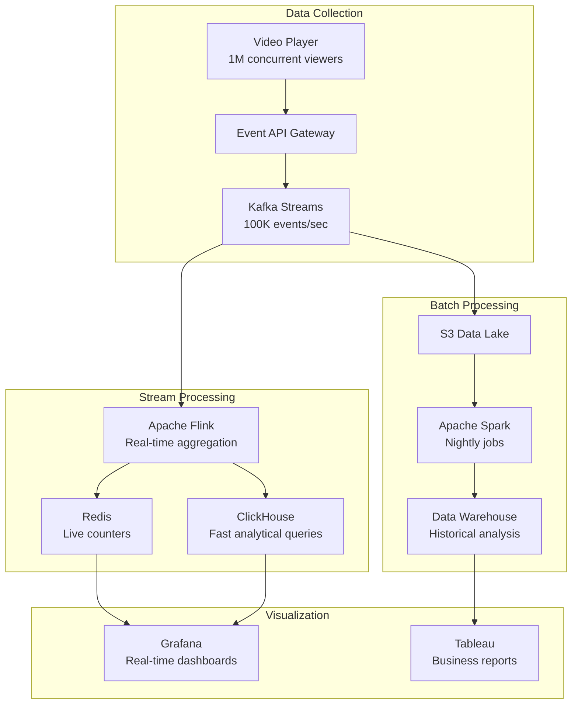

#### Let me explain each technology and why it's chosen

#### 1. Kafka - The Event Streaming Platform

#### What is Kafka

Imagine a super-fast postal service that never loses mail and can handle millions of letters per second.

#### Why Kafka for video analytics

```text
Problem without Kafka:
- 1M viewers × 100 events/hour = 100M events/hour
- Each event goes directly to database
- Database crashes under load!

Solution with Kafka:
- Events go to Kafka (buffers them)
- Multiple consumers read at their own pace
- Database not overwhelmed
- Can replay events if processing fails

Real-world capacity:
- Kafka handles 1M messages/second per server
- Netflix uses 4 trillion events/day through Kafka
- LinkedIn uses 7 trillion messages/day
```

#### 2. Apache Flink - Stream Processing

#### What is Flink
Think of it as Excel for real-time data. But instead of you manually summing cells, it automatically updates totals as new data arrives.

#### Example - Real-time view counter

```text
Events coming in:
10:00:01 - User A played video 123
10:00:02 - User B played video 123
10:00:03 - User C played video 456
10:00:04 - User D played video 123

Flink automatically maintains:
Video 123: 3 views
Video 456: 1 view

Updates every second in real-time!
```

#### Why Flink vs alternatives

```text
Storm (older): Processes one event at a time
- Slower (100K events/sec per core)
- More complex code

Spark Streaming: Processes in micro-batches
- Latency: 1-2 seconds (batch every second)
- Good enough for many use cases

Flink: True stream processing
- Faster (1M events/sec per core)
- Lower latency (milliseconds)
- Harder to learn

Netflix chose Flink for:
- Sub-second latency requirements
- Complex event processing
- Exactly-once semantics (no duplicate counts)
```

#### 3. Redis - In-Memory Database

#### What is Redis
Think of it as your computer's RAM, but shared across all servers. Crazy fast (millions of operations per second) but expensive (RAM costs more than disk).

#### Why Redis for live counters

```text
Question: How many people are watching right now?

Without Redis (using PostgreSQL):
- Query: SELECT COUNT(*) FROM active_viewers
- Time: 500ms (scans millions of rows)
- Too slow for live updates!

With Redis:
- Command: GET active_viewers
- Time: 1ms (just reads one value)
- Fast enough for real-time!

Trade-off:
- Redis: Fast but expensive ($5/GB RAM)
- PostgreSQL: Slow but cheap ($0.10/GB disk)

Solution:
- Hot data (live counts): Redis
- Cold data (history): PostgreSQL
```

#### Redis Data Structures for Analytics

```text
1. Strings (Counters):
SET video:123:views 1000000
INCR video:123:views  # Atomic increment (safe for concurrent users)

2. Sorted Sets (Leaderboards):
ZADD trending_videos 1000000 "video:123"  # Score = views
ZADD trending_videos 500000 "video:456"
ZREVRANGE trending_videos 0 9  # Get top 10

3. HyperLogLog (Unique counts):
PFADD unique_viewers:today user:1 user:2 user:1  # Deduplicates automatically
PFCOUNT unique_viewers:today  # Returns 2 (user:1 counted once)

Memory usage:
- Exact count: 10M users × 8 bytes = 80 MB
- HyperLogLog: Only 12 KB (99.9% accurate!)
```

#### 4. ClickHouse - Analytical Database

#### What is ClickHouse
It's like PostgreSQL, but 100-1000x faster for analytics. Developed by Yandex (Russian Google) to handle their massive logs.

#### Why so fast

```text
PostgreSQL (Row-based):
Stores data by row:
Row 1: [video_id=123, user_id=456, timestamp=..., duration=...]
Row 2: [video_id=124, user_id=457, timestamp=..., duration=...]

When you query "SUM(duration) for video_id=123":
- Must read ALL columns for matching rows
- Lots of unnecessary data read

ClickHouse (Column-based):
Stores data by column:
video_id: [123, 124, 123, 125, 123, ...]
duration: [120, 300, 180, 240, 150, ...]

When you query "SUM(duration) for video_id=123":
- Only reads video_id and duration columns
- 10-100x less data read = 10-100x faster!

Real performance:
- PostgreSQL: 10 seconds for "views per day last 30 days"
- ClickHouse: 100ms for same query
```

#### ClickHouse at Scale

```text
Cloudflare uses ClickHouse for analytics:
- 45 trillion rows
- 100 PB data
- Queries return in seconds

Typical query:
SELECT
  toDate(timestamp) as day,
  COUNT(*) as views,
  AVG(watch_duration) as avg_watch
FROM video_plays
WHERE timestamp > now() - INTERVAL 30 DAY
GROUP BY day

On 10B rows: <1 second (ClickHouse) vs 10+ minutes (PostgreSQL)
```

**5. Apache Spark - Batch Processing**

#### What is Spark
Think of it as Excel for billion-row spreadsheets. It splits work across 100s of computers.

#### Why Spark for historical analytics

```text
Problem: Calculate yesterday's statistics
- 100M video plays yesterday
- Each play: 100 events
- Total: 10B events to process

Single machine:
- 10B events × 1ms each = 10M seconds = 115 days!

Spark with 1000 machines:
- 10B events ÷ 1000 = 10M events per machine
- 10M × 1ms = 10,000 seconds = 2.7 hours

With Spark: 2.7 hours (runs overnight)
Without Spark: 115 days (impossible)
```

#### Spark Job Example - Daily Video Statistics

```text
Input: 10B events in S3 (yesterday's data)

Processing (parallel across 1000 machines):
1. Read events from S3
2. Filter: Only "video_played" events
3. Group by: video_id
4. Aggregate:
   - Total views
   - Total watch time
   - Unique viewers
   - Average completion rate
5. Write results to Data Warehouse

Output: Aggregated stats per video
- Video 123: 1M views, 500K hours, 700K unique viewers, 75% completion
```

---

### 🔴 For Advanced: Quality of Experience (QoE) Monitoring

#### What is QoE
Not just "did it work?" but "was the experience good?"

#### Key QoE Metrics

**1. Video Startup Time (VST)**

```text
Definition: Time from user clicks "play" until video starts

Measurement:
- Start timer: When user clicks play
- Stop timer: When first frame renders
- Record latency

Industry standards:
- <2 seconds: Excellent (Netflix, YouTube)
- 2-3 seconds: Good
- 3-5 seconds: Acceptable
- >5 seconds: Poor (users leave)

Impact on user behavior:
- 1 second delay → 11% fewer views
- 5 second delay → 50% fewer views

YouTube's approach:
- P50 (median): 1.2 seconds
- P95: 2.8 seconds
- P99: 5.0 seconds

They focus on P95 (95% of users get <2.8s)
```

**2. Rebuffering Ratio**

```text
Definition: % of time video is buffering (not playing)

Calculation:
Total buffering time / Total watch time

Example:
- User watched 10 minutes (600 seconds)
- Video buffered 3 seconds
- Rebuffering ratio: 3/600 = 0.5%

Industry standards:
- <0.5%: Excellent
- 0.5-1%: Good
- 1-2%: Acceptable
- >2%: Poor

Netflix's metric: "Play Delay"
- 99% of plays have <1% rebuffering
- If user experiences >2% rebuffering → High chance they cancel subscription
```

**3. Video Quality Score**

```text
Combines multiple factors:
- Average bitrate (higher = better quality)
- Quality switches (fewer = better)
- Quality downscaling events (bad network)

Formula:
Quality Score = (Avg Bitrate / Max Bitrate) × (1 - Rebuffering Ratio) × (1 - 0.1 × Quality Switches)

Example:
- Avg bitrate: 5 Mbps (out of 8 Mbps max) = 0.625
- Rebuffering ratio: 0.5% = 0.995
- Quality switches: 2 times = 0.8
- Quality Score = 0.625 × 0.995 × 0.8 = 0.497 (out of 1.0)

Interpretation:
- 0.9-1.0: Excellent experience
- 0.7-0.9: Good experience
- 0.5-0.7: Acceptable experience
- <0.5: Poor experience (investigate!)
```

#### Monitoring Dashboard Example

```text
Real-Time Video Health Dashboard

Current Status: 🟢 Healthy
━━━━━━━━━━━━━━━━━━━━━━━━━━━━

📊 Live Metrics (Last 5 minutes)
- Concurrent viewers: 1,245,892
- Plays per second: 523/s
- Video Start Failure Rate: 0.08% 🟢

⏱️ Performance
- P50 Startup Time: 1.8s 🟢
- P95 Startup Time: 3.2s 🟡
- P99 Startup Time: 6.1s 🔴 ⚠️ Alert!
- Rebuffering Ratio: 0.6% 🟢

📡 CDN Health
- Cache Hit Rate: 94.5% 🟢
- Origin Load: 15% 🟢
- Edge Errors: 0.02% 🟢

🎥 Quality
- Avg Bitrate: 4.8 Mbps
- 4K Viewers: 12%
- 1080p Viewers: 48%
- 720p Viewers: 35%
- <720p Viewers: 5%

━━━━━━━━━━━━━━━━━━━━━━━━━━━━

Recent Alerts:
⚠️ 10:23 AM - P99 startup time exceeded 5s threshold
   Region: Asia-Pacific
   Action: Investigating CDN edge servers in Singapore

🟢 10:15 AM - Alert resolved: Origin server CPU spike
   Cause: Batch transcoding job
   Fix: Moved to separate cluster
```

---

### Real-World Example: Netflix's Observability Stack

#### The Scale

```text
- 230M subscribers
- 50M concurrent viewers at peak
- 4 billion hours streamed per quarter
- 1 trillion events per day
- 8 PB of data collected daily
```

#### Architecture

**Tier 1: Collection (Client Side)**

```text
Netflix Player (on your TV/phone/laptop):
- Logs every event: play, pause, buffer, quality change
- Batches events (doesn't send one-by-one - would be too many)
- Sends batch every 30 seconds or 100 events
- Uses exponential backoff if network fails

Events captured:
{
  "event": "playback",
  "video_id": "123",
  "timestamp": "2023-10-14T10:30:00Z",
  "device": "Samsung_TV_2021",
  "network": "WiFi",
  "cdn_server": "tokyo-edge-05",
  "startup_time_ms": 1850,
  "bitrate_kbps": 8000,
  "resolution": "1080p",
  "rebuffering_events": 0,
  "watch_duration_sec": 1800,
  "completion": 100
}
```

**Tier 2: Ingestion**

```text
Kafka Cluster:
- 100+ brokers (servers)
- 1000+ partitions (parallel streams)
- Ingests 10M events/second
- Retains 7 days of data (for replay if needed)
- 5 PB total capacity

Why so much capacity?
- Peak traffic 3x average (Friday nights)
- Need headroom for growth
- Can replay data if processing fails
```

**Tier 3: Processing**

```text
Real-Time (Flink):
- Live view counts
- Trending videos
- Current playback quality
- Active alerts

Near Real-Time (Spark Streaming):
- 5-minute aggregates
- Regional performance
- Anomaly detection

Batch (Spark):
- Daily reports
- Historical analysis
- ML model training data
```

**Tier 4: Storage**

```text
Hot (Redis): Live counters
- 1TB RAM cluster
- <10ms latency
- Expires after 1 hour

Warm (ClickHouse): Last 30 days
- 100TB SSD storage
- <1s queries
- Interactive dashboards

Cold (S3): Historical
- 5PB total
- Minutes to query
- Batch analysis only
```

**Tier 5: Alerting (PagerDuty Integration)**

```text
Alert Rules:

Critical (Page immediately):
- Video start failure rate > 1%
- P95 startup time > 5 seconds
- CDN cache hit rate < 90%
- Origin server errors > 0.5%

Warning (Slack notification):
- P99 startup time > 7 seconds
- Rebuffering ratio > 1%
- Any metric degrading trend (20% worse than yesterday)

Info (Dashboard only):
- Minor fluctuations
- Seasonal patterns
- A/B test impacts
```

#### Cost Breakdown

```text
Netflix's analytics infrastructure (estimated):
- Kafka cluster: $500K/year
- Flink processing: $1M/year
- Redis cluster: $300K/year
- ClickHouse cluster: $800K/year
- S3 storage: $2M/year (5 PB × $0.023/GB/month)
- Engineering team: $5M/year (20 engineers)

Total: ~$10M/year

Revenue: $30B/year
Analytics cost: 0.03% of revenue
Value: Priceless (keeps 230M subscribers happy!)
```

---

### 🎯 Interview Questions - Analytics & Monitoring

#### Beginner Level

**Q1:** How do you implement a video analytics dashboard for creators?

<details>
<summary>💭 Think first, then reveal answer</summary>

**Answer:** * **Answer Framework:** ```text 1. Real-Time Metrics ├─ Live viewers: Current concurrent viewers (Redis counter) ├─ Views: Total and unique views (ClickHouse aggregate) ├─ Watch time: Total minutes watched (sum from events) └─ Revenue: Estimated earnings (ad impressions × CPM) 2. Engagement Metrics ├─ Likes/Dislikes: Engagement rate calculation ├─ Comments: Comment count and rate per minute ├─ Shares: Social sharing count across platforms └─ Subscribers: New subscribers gained from this video 3. Audience Demographics ├─ Age: Age distribution histogram ├─ Gender: Male/female/other split ├─ Geography: Country-level breakdown with map └─ Devices: Mobile/desktop/TV/console split 4. Traffic Sources ├─ Discovery: Search, browse, recommendations ├─ External: Social media, embeds, direct links ├─ Direct: Subscriber feed, notifications └─ Playlist: From playlists or autoplay 5. Dashboard Implementation ├─ Real-time: WebSocket updates every 5 seconds ├─ Historical: Trends over time (hourly, daily, weekly) ├─ Comparison: Compare with other videos ├─ Export: Download CSV reports for external analysis └─ Alerts: Notify on milestones (10K, 100K, 1M views) Architecture: Client → Kafka → Flink (real-time) → ClickHouse → Dashboard API ↓ Spark (batch, daily aggregates) YouTube Studio Example: ├─ Metrics: 50+ different metrics available ├─ Real-time: Updates every 30 seconds ├─ Historical: 2+ years of data retention └─ Mobile app: Access analytics on phone ```

**Detailed Explanation:**
1. **Circuit Breakers**: Prevent cascade failures by stopping requests to failing services
   - Implement: Hystrix-style circuit breakers with 3 states (closed/open/half-open)
   - Benefit: System remains responsive even when database is down

2. **Read-Only Mode**: Serve cached data when writes are impossible
   - Strategy: Switch to read replicas, serve from cache
   - Trade-off: Users can't create new short URLs but existing ones work

3. **Cached Redirects**: Use Redis/CDN to serve popular redirects
   - Implementation: Cache hot URLs with 1-hour TTL
   - Impact: 95% of traffic can be served without database

4. **Graceful Degradation**: Reduce functionality rather than complete failure
   - Actions: Disable analytics, custom URLs, but keep core redirects
   - Communication: Show maintenance message for new URL creation

5. **Disaster Recovery**: Automated failover procedures
   - RTO: 5 minutes to switch to backup database
   - RPO: 1 minute data loss maximum
   - Process: Health checks → Auto-failover → Traffic routing

**Interview Framework:**
- Start with immediate response (circuit breakers)
- Explain fallback strategies (cached redirects)
- Discuss graceful degradation (read-only mode)
- Mention long-term recovery (disaster recovery)
</details>

**Q2:** How do you implement real-time view counters?

<details>
<summary>💭 Think first, then reveal answer</summary>

**Answer:** * **Answer Framework:** ```text 1. Requirements ├─ Accuracy: Approximate is fine (±5% acceptable) ├─ Latency: Update every 5-10 seconds ├─ Scale: 100M concurrent viewers └─ Cost: Minimize database writes 2. Architecture ├─ Client: Send heartbeat every 30 seconds ├─ Stream processor: Flink aggregates in 10-second windows ├─ Cache: Redis stores current count └─ Database: PostgreSQL stores hourly snapshots 3. Implementation ├─ Redis key: "views:video_id:current" ├─ Increment: INCR on each heartbeat ├─ Expiry: Set TTL to 1 hour (auto-cleanup) └─ Persistence: Save to DB every hour 4. Optimization ├─ Sampling: Only track 10% of viewers for trending ├─ Batching: Batch increments (reduce Redis ops) ├─ Approximation: HyperLogLog for unique viewers └─ Caching: Cache counts in CDN (10s TTL) 5. Display ├─ WebSocket: Push updates to viewers ├─ Polling: Fallback for older browsers ├─ Format: "10M views" (rounded for readability) └─ Real-time: "23,547 watching now" Scale Example: ├─ 100M concurrent viewers ├─ Heartbeat every 30s: 3.3M events/second ├─ Flink processes: Aggregates to 1M updates/second ├─ Redis handles: 1M INCR/second easily └─ Cost: $50K/year for Redis cluster ```

</details>


---

### ✅ Key Takeaways

- **Measure everything:** Both business and technical metrics
- **Real-time matters:** Live dashboards catch issues before users complain
- **Choose right tools:** Kafka (events), Flink (real-time), Spark (batch), Redis (hot), ClickHouse (warm)
- **QoE is king:** Startup time and rebuffering directly impact retention
- **Alert on trends:** Don't wait for complete failure
- **Cost vs value:** Analytics is 0.03% of Netflix's revenue but critical for experience
- **Data pipeline:** Collection → Ingestion → Processing → Storage → Visualization
- **Scale requires distribution:** Can't process billions of events on one machine

---

## Section 9: DRM & Content Protection

### What You'll Learn

- Understand Digital Rights Management (DRM) systems
- Design content protection architecture
- Implement video encryption and license management
- Handle geo-blocking and content restrictions
- Prevent piracy while maintaining user experience
- Choose between DRM providers (Widevine, FairPlay, PlayReady)

### Why This Matters

Content is expensive! A Netflix series costs $10-15 million per episode. Without protection, anyone could download and share freely, costing billions in lost revenue. Understanding DRM is crucial because it's a hard requirement for premium content - Hollywood studios won't license content without it. In interviews, this shows you understand business constraints, not just technical ones.

---

### 🟢 For Beginners: Why DRM Exists

#### The Problem

```text
Without DRM:
1. User pays for Netflix
2. User downloads Stranger Things
3. User uploads to torrent site
4. Millions download for free
5. Netflix loses subscribers
6. Studios lose revenue
7. Studios stop producing content

Everyone loses!
```

#### What is DRM

Think of DRM like a locked box:

- Video file is encrypted (locked)
- Only authorized users get the key
- Key expires after some time
- Key tied to specific device

#### Three Major DRM Systems

```text
1. Widevine (Google)
- Used by: YouTube, Netflix, Disney+
- Platforms: Android, Chrome browser
- Market share: ~60%

2. FairPlay (Apple)
- Used by: Apple TV+, iTunes movies
- Platforms: iOS, Safari, Apple TV
- Market share: ~25%

3. PlayReady (Microsoft)
- Used by: Xbox, Windows Media
- Platforms: Windows, Xbox, Edge browser
- Market share: ~15%

Why three systems?
- Each company wants control of their platform
- Studios require support for all three
- Netflix must implement all three (different for each device!)
```

---

### 🟡 For Intermediate: How DRM Works

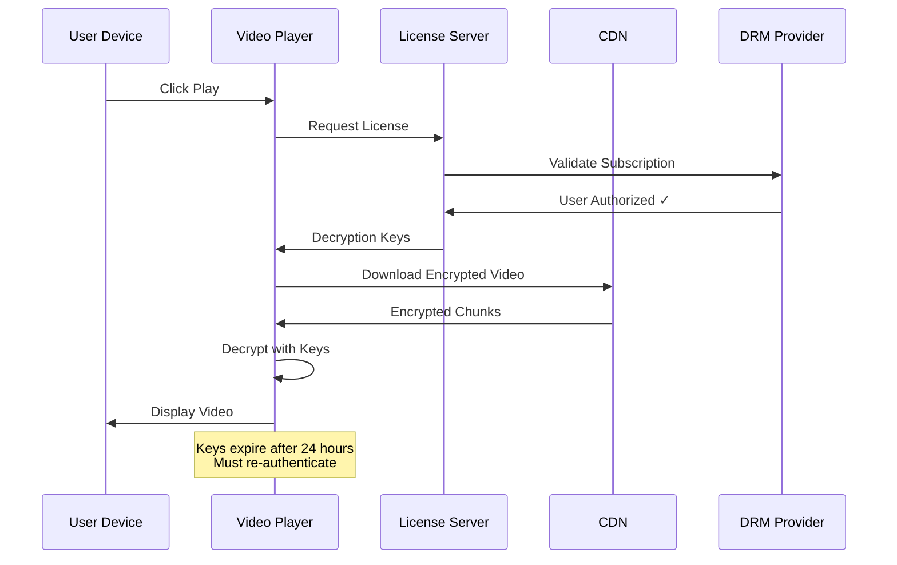

#### Let me explain each step in detail

**Step 1: Request License**

```text
Player sends to License Server:
{
  "user_id": "12345",
  "video_id": "stranger_things_s4e1",
  "device_id": "samsung_tv_abc123",
  "subscription_tier": "premium",
  "timestamp": "2023-10-14T10:30:00Z"
}

License Server checks:
✓ Is user subscribed?
✓ Is subscription active (not expired)?
✓ Is device registered (max 4 devices)?
✓ Is video available in user's region?
✓ Is user's tier allowed to watch (4K = premium only)?
```

**Step 2: Generate Decryption Keys**

```text
License Server returns:
{
  "license_id": "lic_xyz789",
  "content_keys": [
    {
      "key_id": "key_1",
      "key": "a3f4b2c1d5e6..." (encrypted),
      "bitrate": "8_mbps_1080p"
    },
    {
      "key_id": "key_2", 
      "key": "b4g5c3d2e6f7...",
      "bitrate": "25_mbps_4k"
    }
  ],
  "expiration": "2023-10-15T10:30:00Z",  // 24 hours later
  "allowed_outputs": ["HDMI", "screen"],
  "hdcp_required": true  // Prevents HDMI capture
}

Why multiple keys?
- Different quality levels have different keys
- User switches quality → uses different key
- Key for each resolution prevents quality theft
```

**Step 3: Decrypt and Play**

```text
Video chunks are encrypted:
- Chunk 001: [encrypted data] + key_id_hint
- Player: "I need key_1 to decrypt this"
- Player uses key_1 to decrypt
- Player displays decrypted frames
- Decrypted data NEVER saved to disk (stays in memory)

Security levels (Widevine):

Level 1 (Hardware DRM - Most Secure):
- Decryption happens in secure hardware chip
- Even rooted device can't access keys
- Required for 4K/HDR content
- Available on: Recent phones, smart TVs

Level 2 (Software DRM with TEE - Medium Security):
- Decryption in Trusted Execution Environment
- Isolated from normal OS
- Used for 720p/1080p content

Level 3 (Software DRM - Lowest Security):
- Pure software decryption
- Can be hacked with effort
- Only used for older devices
- Max resolution: 480p

Netflix enforcement:
- 4K content: Requires Level 1
- 1080p content: Requires Level 2 minimum
- 720p and below: Level 3 acceptable
```

---

### 🔴 For Advanced: Multi-DRM Architecture

#### The Challenge

```text
User can watch on:
- iPhone (FairPlay)
- Android phone (Widevine)
- Windows laptop (PlayReady)
- Xbox (PlayReady)
- Samsung TV (Widevine)
- Apple TV (FairPlay)

Each device needs different DRM!
```

**Solution: Multi-DRM Packaging**

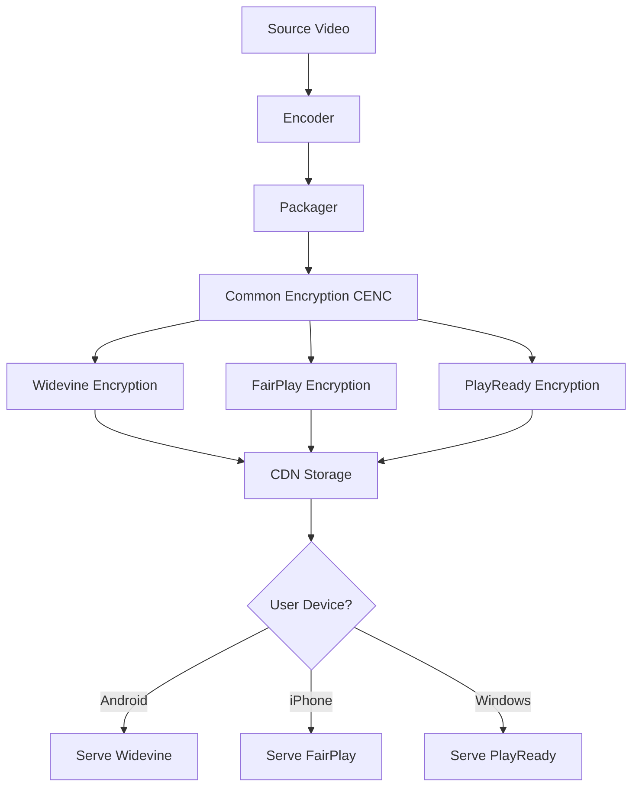

#### CENC (Common Encryption)

```text
Old way (Inefficient):
- Encrypt video three times (Widevine, FairPlay, PlayReady)
- Store three copies of every video
- 3x storage costs!

New way (CENC):
- Encrypt video once with common format
- Add DRM-specific headers
- Store one copy + small headers
- ~1.1x storage (much better!)

Technical details:
- Video encrypted with AES-128
- Same encrypted content for all DRMs
- Only license format differs
- Header tells player which DRM to use
```

#### License Server Architecture

```text
High-Level Flow:

User Request → API Gateway → DRM Proxy → [Widevine/FairPlay/PlayReady Server]

DRM Proxy intelligence:
- Detects device type from User-Agent
- Routes to appropriate DRM provider
- Handles retries and failover
- Caches licenses (reduce provider calls)

Scaling:
- Netflix: 50M concurrent viewers
- Assume 20% need license refresh (10M/hour)
- That's 2,778 licenses/second
- Each DRM call: 100ms
- Need 278 concurrent connections per DRM provider

Solution:
- Connection pooling (reuse TCP connections)
- Multiple regions (US, EU, Asia)
- Caching (license valid for 24 hours)
- Actual load: ~1,000 licenses/second after optimization
```

#### Security Best Practices

**1. Key Rotation**

```text
Problem: If key leaks, pirate can decrypt all content

Solution: Rotate keys regularly
- Generate new keys every week
- Old content keeps old keys (don't re-encrypt)
- New content gets new keys
- If key leaks, only one week of content exposed

Netflix approach:
- Keys rotated every 7 days
- Each video has ~10 keys (one per quality)
- Total keys in system: ~1 million active keys
- Key storage: PostgreSQL with encryption at rest
```

**2. Device Limits**

```text
Prevent account sharing:

Netflix approach:
- Premium plan: 4 concurrent streams
- Standard plan: 2 concurrent streams
- Basic plan: 1 stream

Implementation:
- License server tracks active licenses
- User starts stream 5 → Check: "Already 4 active"
- Response: "Too many devices. Stop playback on another device."

Sophisticated detection:
- User logs in from New York
- 5 minutes later, login from California
- Impossible to travel that fast!
- Flag: Possible account sharing
- Action: Send verification email
```

**3. Forensic Watermarking**

```text
Even with DRM, determined pirates can:
- Screen capture (record screen)
- HDMI capture devices
- Compromised streaming boxes

Defense: Invisible watermarks

How it works:
- Embed unique ID in video (invisible to viewer)
- Each user gets slightly different version
- Pirated video traced back to source account
- User ID: 123456 → Watermark embedded invisibly

Result:
- "Leaked video traced to account A58392"
- Ban that account
- Legal action if needed

Disney+ watermarking:
- Every frame has invisible ID
- Survives re-encoding and compression
- Even if pirate crops or filters, ID remains
```

---

### Real-World Example: Netflix's DRM Journey

#### 2007 - DVD Era

```text
Physical DVDs had CSS (Content Scramble System)
- Easily bypassed (cracked in 1999)
- But legal to use (DMCA protected it)
- Pirates still ripped and shared

Result: Netflix DVD not heavily pirated (effort not worth it)
```

#### 2010 - Streaming Launch with Silverlight DRM

```text
Microsoft Silverlight plugin required
- Worked on Windows/Mac
- No mobile support
- Users hated installing plugins
- Firefox/Chrome didn't support well

Problem: User experience suffered for DRM
```

#### 2013 - HTML5 + EME (Encrypted Media Extensions)

```text
W3C standardized DRM in browsers
- No plugins needed!
- Works on all modern browsers
- Mobile support built-in

Netflix adopted immediately:
- Better user experience
- Wider device support
- Same security level

Controversy:
- Open web advocates opposed
- "DRM conflicts with open standards"
- W3C approved anyway (content industry requirement)
```

#### 2016 - 4K HDR Requires Hardware DRM

```text
Studios demanded higher security for 4K:
- Software DRM not enough
- Must use hardware secure chip
- HDCP 2.2 required on HDMI

Netflix compliance:
- 4K only on certified devices
- List of supported devices very limited
- Even expensive PCs might not work (no hardware DRM)

User impact:
- "I have 4K TV and 4K subscription, why no 4K?"
- Answer: "Your device isn't certified"
- Frustrating but required by studios
```

#### Current (2023) - AI-Powered Piracy Detection

```text
Netflix monitors:
- Torrent sites
- Streaming sites
- Social media (leaked episodes)

Automated system:
- Scans internet for Netflix content
- AI recognizes video fingerprints
- Sends DMCA takedown notices automatically
- 1000s of takedowns per day

Effectiveness:
- Piracy still exists
- But delayed (not instant uploads)
- Quality often poor (camcorder recordings)
- Legitimate service is better experience
```

---

### 🎯 Interview Questions - DRM & Content Protection

#### Beginner Level

**Q1:** How do you implement video watermarking?

<details>
<summary>💭 Think first, then reveal answer</summary>

**Answer:** * **Answer Framework:** ```text 1. Visible Watermarking ├─ Logo: Brand logo in corner (top-right/bottom-right) ├─ Position: Dynamic, changes every 30 seconds ├─ Transparency: 20-40% opacity └─ Use case: Branding, free tier content 2. Invisible Watermarking (Forensic) ├─ Method: Modify DCT coefficients in video encoding ├─ Embed: Unique ID (user_id + session_id + timestamp) ├─ Robustness: Survives compression, cropping, re-encoding └─ Detection: Extract ID from pirated copy 3. User-Specific Watermarking ├─ Per-session: Generate unique watermark per playback ├─ Embed: user_id + device_id + timestamp ├─ Tracking: Trace leaks back to specific user └─ Deterrent: Users know videos are watermarked 4. Implementation ├─ At transcode: Add watermark during encoding (efficient) ├─ Real-time: Add during streaming (flexible but expensive) ├─ CDN: Pre-generate watermarked versions (scalable) └─ Trade-off: Storage (pre-generate) vs CPU (real-time) 5. Detection & Enforcement ├─ Scanning: Automated scanning of piracy sites ├─ Extraction: Extract watermark to identify user ├─ Action: Suspend account, legal action if needed └─ False positives: Manual review before suspension Netflix's Approach: ├─ Method: Invisible forensic watermarking ├─ Unique: Per user, per device, per stream ├─ Detection: Automated scanning + ML └─ Result: Significant reduction in camcorder piracy ```

**Detailed Explanation:**
1. **Circuit Breakers**: Prevent cascade failures by stopping requests to failing services
   - Implement: Hystrix-style circuit breakers with 3 states (closed/open/half-open)
   - Benefit: System remains responsive even when database is down

2. **Read-Only Mode**: Serve cached data when writes are impossible
   - Strategy: Switch to read replicas, serve from cache
   - Trade-off: Users can't create new short URLs but existing ones work

3. **Cached Redirects**: Use Redis/CDN to serve popular redirects
   - Implementation: Cache hot URLs with 1-hour TTL
   - Impact: 95% of traffic can be served without database

4. **Graceful Degradation**: Reduce functionality rather than complete failure
   - Actions: Disable analytics, custom URLs, but keep core redirects
   - Communication: Show maintenance message for new URL creation

5. **Disaster Recovery**: Automated failover procedures
   - RTO: 5 minutes to switch to backup database
   - RPO: 1 minute data loss maximum
   - Process: Health checks → Auto-failover → Traffic routing

**Interview Framework:**
- Start with immediate response (circuit breakers)
- Explain fallback strategies (cached redirects)
- Discuss graceful degradation (read-only mode)
- Mention long-term recovery (disaster recovery)
</details>


---

### ✅ Key Takeaways

- **DRM is required:** Studios won't license without it
- **Three systems:** Widevine (Google), FairPlay (Apple), PlayReady (Microsoft)
- **Hardware security for 4K:** Software DRM not secure enough
- **CENC saves storage:** Single encryption, multiple DRM headers
- **License expires:** Keys valid for 24 hours, then re-authenticate
- **Device limits:** Prevent account sharing
- **Watermarking:** Trace pirated content back to source
- **Trade-off:** Security vs user experience (certified devices only)
- **Cost**: DRM licensing fees + infrastructure + compliance testing

---

## Section 10: Scale & Cost Optimization

### What You'll Learn

- Break down video platform costs (bandwidth, storage, compute)
- Optimize each cost center for maximum savings
- Understand economies of scale
- Make build vs buy decisions
- Calculate ROI for infrastructure investments
- Design cost-effective architectures

### Why This Matters

YouTube costs Google billions of dollars to run. Bandwidth alone is estimated at $1-2 billion annually. Understanding costs isn't just for CFOs - it's critical for engineering decisions. "Should we build our own CDN?" "Should we use AV1 encoding?" "Should we store all qualities?" These are cost-driven engineering decisions that impact the bottom line.

---

### 🟢 For Beginners: Cost Breakdown

#### Where does money go in video platforms

```text
Typical Cost Distribution (YouTube-scale):

1. Bandwidth (CDN): 70%
   - Delivering videos to users
   - Largest by far!

2. Storage: 15%
   - Storing all videos and qualities
   - Growing constantly

3. Transcoding: 10%
   - Converting uploaded videos
   - CPU/GPU intensive

4. Infrastructure: 3%
   - Databases, Redis, monitoring
   - Load balancers, API servers

5. Other: 2%
   - DRM, analytics, misc.

Total: Let's say $1B/year for 1B users
= $1/user/year (from cost perspective)

But revenue needed:
- Ad revenue: $2/user/year minimum
- Or subscription: $10/user/month

Profit margin: Very thin or negative (YouTube rumored unprofitable for years)
```

---

### 🟡 For Intermediate: Optimization Strategies

#### 1. Bandwidth Optimization (70% of costs)

```text
Problem: Serving 1 PB/day
- Standard CDN: $0.08/GB
- Cost: 1 PB × 1024 GB × $0.08 = $83,000/day = $30M/year!

Optimization strategies:

A. Negotiate Volume Discounts:
- At 1 PB/day scale, negotiate custom contracts
- Cloudflare: $0.02/GB (75% discount!)
- New cost: $7.5M/year (save $22.5M)

B. Build Your Own CDN (Netflix approach):
- Capex: $100M (servers, racks, network)
- Opex: $20M/year (power, bandwidth, maintenance)
- Break-even: 5 years
- After 5 years: Save $10M+/year

C. ISP Co-location (Netflix Open Connect):
- Place servers inside ISP networks
- ISPs provide space/power for free (reduces their costs too!)
- Netflix pays: ~$1M/year (server hardware)
- Save: $29M/year!

D. Codec Upgrade (H.264 → AV1):
- 30% bandwidth reduction
- Cost: Same video, 30% less bandwidth
- Saving: 30% of $30M = $9M/year
- Investment: $5M (encoders, testing, rollout)
- ROI: 6 months payback

E. Smart Caching:
- 1% of videos = 80% of views (power law distribution)
- Cache aggressively at edge
- Cache hit rate: 95% → 98% (small improvement)
- Reduce origin traffic: 5% → 2%
- Save: 60% of origin bandwidth = $2M/year
```

#### 2. Storage Optimization (15% of costs)

```text
Problem: 1M hours of video
- Average: 10 qualities × 2 codecs = 20 versions per video
- Size: 30 min video = 5 GB × 20 = 100 GB per video
- Total: 100 GB × 2M videos = 200 PB
- S3 Standard: $0.023/GB/month = $4.6M/month = $55M/year

Optimization strategies:

A. Tiered Storage:
- Hot (30 days): S3 Standard - 5% of library = $2.75M/year
- Warm (1 year): S3 IA - 25% = $7M/year  
- Cold (archive): Glacier - 70% = $1.2M/year
- Total: $11M/year (save $44M = 80% savings!)

B. Lazy Encoding:
- Don't encode all 20 versions upfront
- Encode 720p and 1080p only (most common)
- Encode 4K/480p/360p on first request
- 90% of videos: Never requested in 4K
- Storage: Save 30-40%

C. Compression:
- H.264 → H.265: 50% smaller
- H.265 → AV1: 30% smaller
- Combined: 65% storage reduction
- Save: $36M/year
- Trade-off: Encoding 10x slower for AV1

D. Deduplication:
- Same video uploaded multiple times
- Identical content = store once
- Use content hash: SHA-256(video)
- Typical saving: 10-20% (common on user-generated platforms)
```

#### 3. Transcoding Optimization (10% of costs)

```text
Problem: 500 hours uploaded/minute (YouTube scale)
- 500 hours × 60 = 30,000 hours/hour uploaded
- 20 versions per video = 600,000 encoding-hours/hour
- EC2 c5.xlarge: $0.17/hour
- Cost: 600,000 × $0.17 = $102,000/hour = $2.4M/day = $876M/year!

Optimization strategies:

A. Dedicated Hardware:
- Buy servers instead of renting
- Capex: $50M (50,000 servers @ $1K each)
- Opex: $10M/year (power, maintenance)
- Depreciation: $10M/year (5-year lifecycle)
- Total: $20M/year (vs $876M/year)
- Save: $856M/year (amazing ROI!)

B. GPU Acceleration:
- NVIDIA GPUs: 10x faster than CPU
- Cost per encoding: $0.01 (vs $0.17)
- Total: $87M/year (save $789M)
- Hardware cost: $100M (amortized over years)

C. Prioritization:
- Premium users: Immediate encoding
- Free users: Encode only popular formats, rest on-demand
- Save: 40% of encoding costs

D. Geographic Optimization:
- Encode in cheapest regions (India, China: 50% cheaper)
- Use spot instances (70% cheaper, but can be terminated)
- Save: 30-50%

E. Smart Encoding:
- Viral video prediction (ML model)
- Will-be-popular: Encode all versions immediately
- Will-be-unpopular: Encode only 720p
- Save: 30% encoding costs
```

---

### 🔴 For Advanced: Build vs Buy Decisions

#### Case Study: Should Netflix Build Its Own CDN

```text
Option A: Use Commercial CDN (Akamai, Cloudflare)

Pros:
✓ No upfront investment
✓ Global reach immediately
✓ Scales automatically
✓ Someone else's problem (maintenance)

Cons:
✗ Expensive at scale ($50-100M/year)
✗ Limited control
✗ Cannot optimize for specific use case
✗ Vendor lock-in

Option B: Build Own CDN (Open Connect)

Pros:
✓ Massive savings at scale ($10-20M/year after break-even)
✓ Complete control
✓ Optimize for streaming specifically
✓ ISP partnerships possible

Cons:
✗ Huge upfront investment ($200M+)
✗ Years to build
✗ Complex operations
✗ Risk of failure

Netflix's Analysis (2011):

Year 1-3: Lose money (building infrastructure)
Year 4: Break-even
Year 5+: Save $50M+/year

Decision: Build it!

Results (10 years later):
- 18,000+ servers globally
- Inside 1,000+ ISP networks
- Estimated savings: $500M+/year vs commercial CDN
- ROI: Paid off after 4 years, now pure savings
```

#### When to Build vs Buy

```text
Build if:
✓ Unique requirements
✓ Massive scale (economies of scale matter)
✓ Long-term commitment (amortize investment)
✓ Have expertise in-house
✓ Competitive advantage possible

Buy if:
✗ Small scale (not worth investment)
✗ Short-term need (build takes years)
✗ Commodity service (no differentiation)
✗ Lack expertise (would take years to learn)
✗ Fast time-to-market needed
```

---

### Real-World Cost Optimization Examples

**1. YouTube's Energy Optimization**

```text
Problem: Data centers use massive electricity
- 100,000 servers
- 500W per server
- 50 MW total (50,000 homes worth!)
- Cost: $5M/month just for electricity

Optimizations:
- Machine learning to predict cooling needs
- AI adjusts AC in real-time based on workload
- Custom server designs (no unnecessary components)
- Efficient power supplies (98% efficiency vs 85% standard)

Result:
- 30% energy reduction
- Save: $1.5M/month = $18M/year
- Investment: $10M (AI system + server redesign)
- Payback: 7 months

Additional benefit:
- Lower carbon footprint
- Google's goal: Carbon-neutral data centers
```

**2. Twitch's Transcoding Costs**

```text
Problem: Live streaming transcoding expensive
- 50,000 live streams at peak
- Each needs 5 qualities (source + 4 transcoded)
- Real-time transcoding (no batching possible)
- Cost: $10M/year on CPU transcoding

Solution: Selective transcoding
- Only transcode streams with >10 viewers
- 90% of streams have <10 viewers
- Let clients do transcoding (they adapt to stream quality)

Result:
- Transcode 10% instead of 100%
- Cost: $1M/year (save $9M)
- Viewer impact: Minimal (small streams already low quality)

Additional optimization:
- GPU transcoding for popular streams
- CPU transcoding eliminated entirely
- New cost: $2M/year (GPUs)
- Quality: Better (GPUs more powerful)
```

**3. TikTok's Storage Optimization**

```text
Problem: 1 billion videos/month uploaded
- Average: 30 seconds per video
- 10 qualities × 2 codecs = 20 versions
- Storage: Exploding exponentially

Insight: Most videos never go viral
- 80% of videos: <1000 views
- 1% of videos: Millions of views

Solution: Predictive encoding
- Upload: Encode only 720p H.264 (smallest version)
- View count > 1000: Encode 1080p
- View count > 100,000: Encode all qualities
- Viral (>1M views): Encode 4K + all codecs

Result:
- Storage: 70% reduction
- Most videos: 1 version (not 20)
- Popular videos: Full 20 versions (when it matters)
- User experience: Unchanged (rare videos = low expectations)

Cost impact:
- Storage: $100M/year → $30M/year
- Transcoding: $50M/year → $20M/year
- Total saved: $100M/year
```

---

### 🎯 Interview Questions - Scale & Cost Optimization

#### Beginner Level

**Q1:** Break down the costs of running a video platform - where does money go?

<details>
<summary>💭 Think first, then reveal answer</summary>

**Answer:** * **Answer Framework:** ```text Cost Breakdown (100M users, 1M hours of content): 1. Bandwidth (70% of costs) - $7M/month ├─ CDN: $0.02/GB × 350 PB/month = $7M ├─ Calculation: 100M users × 2 hours/day × 5 Mbps └─ Optimization: Use H.265 (-40%), predictive caching 2. Storage (15% of costs) - $1.5M/month ├─ Hot storage: 10 PB × $23/TB = $230K ├─ Warm storage: 30 PB × $12.50/TB = $375K ├─ Cold storage: 60 PB × $1/TB = $60K ├─ Backups: $300K └─ Total: ~$1M (with tiering) 3. Compute (10% of costs) - $1M/month ├─ Transcoding: $500K (GPU-based) ├─ API servers: $300K ├─ ML training: $200K └─ Optimization: Spot instances, reserved capacity 4. Database (3% of costs) - $300K/month ├─ PostgreSQL: $150K (sharded) ├─ Redis: $100K (cache) ├─ Elasticsearch: $50K (search) └─ Optimization: Read replicas, caching 5. Other (2%) - $200K/month ├─ Monitoring: DataDog, New Relic ├─ Security: WAF, DDoS protection ├─ DNS: Route53, Cloudflare └─ Misc: Logging, backups Total: ~$10M/month for 100M users Per user: $0.10/month infrastructure cost ```

**Detailed Explanation:**
1. **Circuit Breakers**: Prevent cascade failures by stopping requests to failing services
   - Implement: Hystrix-style circuit breakers with 3 states (closed/open/half-open)
   - Benefit: System remains responsive even when database is down

2. **Read-Only Mode**: Serve cached data when writes are impossible
   - Strategy: Switch to read replicas, serve from cache
   - Trade-off: Users can't create new short URLs but existing ones work

3. **Cached Redirects**: Use Redis/CDN to serve popular redirects
   - Implementation: Cache hot URLs with 1-hour TTL
   - Impact: 95% of traffic can be served without database

4. **Graceful Degradation**: Reduce functionality rather than complete failure
   - Actions: Disable analytics, custom URLs, but keep core redirects
   - Communication: Show maintenance message for new URL creation

5. **Disaster Recovery**: Automated failover procedures
   - RTO: 5 minutes to switch to backup database
   - RPO: 1 minute data loss maximum
   - Process: Health checks → Auto-failover → Traffic routing

**Interview Framework:**
- Start with immediate response (circuit breakers)
- Explain fallback strategies (cached redirects)
- Discuss graceful degradation (read-only mode)
- Mention long-term recovery (disaster recovery)
</details>

**Q2:** How do you optimize costs by 30-50%?

<details>
<summary>💭 Think first, then reveal answer</summary>

**Answer:** * **Answer Framework:** ```text 1. Bandwidth Optimization (Save 40%) ├─ Better codecs: H.264 → H.265 (-40% bandwidth) ├─ Per-title encoding: Optimize per video (-20%) ├─ CDN optimization: Better caching (+3% hit rate) ├─ Predictive pre-caching: Reduce origin requests └─ Savings: $7M → $4.2M/month 2. Storage Optimization (Save 50%) ├─ Tiered storage: Hot/warm/cold strategy ├─ Deduplication: Remove duplicate uploads ├─ Lifecycle policies: Auto-move to cheaper tiers ├─ Compression: Use better codecs for archival └─ Savings: $1.5M → $750K/month 3. Compute Optimization (Save 50%) ├─ Spot instances: 70% cheaper than on-demand ├─ GPU transcoding: 10x faster, 50% cheaper ├─ Lazy encoding: Only encode popular formats ├─ Reserved capacity: 50% discount for 1-3 year commit └─ Savings: $1M → $500K/month 4. Database Optimization (Save 30%) ├─ Caching: Redis reduces DB load by 10x ├─ Query optimization: Index tuning, query rewriting ├─ Right-sizing: Don't over-provision ├─ Reserved instances: 40-60% discount └─ Savings: $300K → $210K/month Total Savings: ├─ Before: $10M/month ├─ After: $5.7M/month └─ Savings: 43% reduction ($4.3M/month) ```

</details>


---

### ✅ Key Takeaways

- **Bandwidth is king:** 70% of costs - optimize first
- **Economies of scale:** At YouTube/Netflix scale, building > buying
- **Tiered storage:** Hot/warm/cold saves 50-80%
- **Codec matters:** AV1 saves 30% bandwidth (billions at scale)
- **Smart caching:** 98% vs 95% hit rate = millions saved
- **GPU transcoding:** 10x faster, 90% cheaper than CPU
- **Lazy encoding:** Don't encode versions nobody watches
- **ISP partnerships:** Netflix's Open Connect is brilliant cost optimization
- **ROI mindset:** $100M investment that saves $50M/year = 2-year payback
- **Predict popularity:** ML models can optimize which content to prioritize

---

## Section 11: Growing the System (Scalability)

### What You'll Learn

By the end of this section, you'll be able to:

- Design horizontal scaling strategies for video streaming systems
- Implement database sharding and replication patterns
- Design geographic distribution for global content delivery
- Optimize caching strategies for massive scale
- Plan capacity for 10x growth scenarios

### Why This Matters

Netflix started with DVD rentals and now streams to 200M+ subscribers globally. YouTube processes 500 hours of video every minute. Understanding scalability is crucial because video streaming systems face unique challenges: massive data volumes, global distribution requirements, and unpredictable traffic spikes. Real-world example: When "Squid Game" became a global phenomenon, Netflix's infrastructure had to handle 10x normal traffic in hours - proper scalability design prevented system collapse!

### 🟢 For Beginners: The Fundamentals

#### What is Scalability?

Think of scalability like a restaurant that needs to serve more customers:

```text
Small Restaurant (100 customers/day):
├─ 1 chef, 2 waiters
├─ Simple kitchen
└─ Works perfectly

Growing Restaurant (1,000 customers/day):
├─ Need more chefs (horizontal scaling)
├─ Need bigger kitchen (vertical scaling)
├─ Need better processes (optimization)
└─ Need multiple locations (geographic distribution)
```

#### Types of Scaling

```text
Vertical Scaling (Scaling Up):
├─ Add more CPU/RAM to existing servers
├─ Like making your car engine bigger
├─ Limited by hardware maximums
└─ Good for: Small to medium growth

Horizontal Scaling (Scaling Out):
├─ Add more servers
├─ Like adding more cars to your fleet
├─ Can scale almost infinitely
└─ Good for: Large scale systems
```

#### Database Scaling Strategies

```text
Read Replicas:
├─ Master: Handles writes
├─ Replicas: Handle reads
├─ Like having multiple copies of a book
└─ Problem: Read replicas can lag behind master

Sharding:
├─ Split data across multiple databases
├─ Like having different libraries for different topics
├─ Each shard handles subset of data
└─ Problem: Cross-shard queries are complex
```

💡 **Pro Tip:** Start with read replicas, then add sharding when you hit limits!

### 🟡 For Intermediate: Interview Patterns

#### The Scalability Interview Framework

When discussing scalability in interviews, follow this structure:

**Phase 1: Identify Bottlenecks**

- "What are the current bottlenecks in your system?"
- "Which components will fail first under load?"
- "How do you measure system performance?"

**Phase 2: Scaling Strategies**

- "How would you scale the database layer?"
- "What caching strategies would you implement?"
- "How do you handle geographic distribution?"

**Phase 3: Trade-offs Analysis**

- "What are the trade-offs between consistency and availability?"
- "How do you handle data consistency across shards?"
- "What happens if a shard goes down?"

#### Database Scaling Decision Matrix

| Strategy | Read Performance | Write Performance | Consistency | Complexity |
|----------|------------------|-------------------|-------------|------------|
| Read Replicas | High | Medium | Eventual | Low |
| Sharding | High | High | Strong | High |
| Caching | Very High | High | Eventual | Medium |

⚠️ **Common Mistake:** Don't jump to sharding immediately - start with read replicas and caching!

#### Making Scaling Decisions Explicit

```text
"Based on our discussion, I'm going to assume:

✅ 100M concurrent users globally
   → Need geographic distribution
   → CDN required for video delivery

✅ 1M video uploads per day
   → Need horizontal scaling for transcoding
   → Queue-based processing required

✅ 99.99% uptime requirement
   → Need redundancy and failover
   → Multiple data centers required

Are these assumptions reasonable?"
```

### 🔴 For Advanced: Production Considerations

#### Multi-Region Architecture

When you're designing for global scale, every choice has business implications. Let's think like a Principal Engineer:

**Trade-off 1: Data Consistency vs Performance**

```text
Scenario: User uploads video in US, friend watches in Europe

Option A: Strong Consistency
├─ Guarantee: All users see same data immediately
├─ Implementation: Synchronous replication
├─ Latency: 200-500ms for global operations
├─ Business Impact: Poor user experience, lost users
└─ Use Case: Financial systems, not video streaming

Option B: Eventual Consistency
├─ Guarantee: Data will be consistent eventually
├─ Implementation: Asynchronous replication
├─ Latency: 50-100ms for local operations
├─ Business Impact: Great user experience, higher engagement
└─ Use Case: Video streaming, social media

💡 Real-world: Netflix uses eventual consistency - users don't mind if their video metadata takes a few seconds to sync globally.
```

**Trade-off 2: Cost vs Performance**

```text
Scenario: CDN costs vs user experience

Option A: Global CDN (Expensive)
├─ Cost: $50M/year for global coverage
├─ Performance: <100ms latency worldwide
├─ User Experience: Excellent
└─ Business Impact: Higher user retention, premium pricing

Option B: Regional CDN (Cheaper)
├─ Cost: $20M/year for major regions only
├─ Performance: <200ms in major cities, >500ms elsewhere
├─ User Experience: Good in cities, poor elsewhere
└─ Business Impact: Limited global growth potential
```

#### Advanced Caching Patterns

#### Multi-Level Caching Strategy

```text
Level 1: Browser Cache
├─ Store: Recently watched videos
├─ Size: 1-5 GB per user
├─ Hit Rate: 60-70%
└─ Latency: <10ms

Level 2: CDN Cache
├─ Store: Popular videos globally
├─ Size: 100TB per region
├─ Hit Rate: 85-95%
└─ Latency: <100ms

Level 3: Application Cache
├─ Store: User preferences, metadata
├─ Size: 100GB per server
├─ Hit Rate: 90-98%
└─ Latency: <1ms

Level 4: Database
├─ Store: All data
├─ Size: Petabytes
├─ Hit Rate: 100% (but slow)
└─ Latency: 10-100ms
```

### Real-World Example: How Netflix Scaled Globally

Let's look at how Netflix evolved their architecture to serve 200M+ subscribers:

#### 2010 - US Only

```text
Context: DVD rental business transitioning to streaming
├─ Scale: 20M US subscribers
├─ Architecture: Single data center
├─ Challenge: Limited to US market
└─ Result: Successful US launch
```

#### 2013 - International Expansion

```text
Context: Expanding to 50+ countries
├─ Added: Multi-region architecture
├─ Added: Open Connect CDN
├─ Challenge: Global content delivery
└─ Result: 50M international subscribers
```

#### 2016 - Global Scale

```text
Context: 100M+ subscribers worldwide
├─ Added: Microservices architecture
├─ Added: Machine learning for recommendations
├─ Added: Adaptive bitrate streaming
└─ Result: 200M+ subscribers, 99.99% uptime
```

📊 **By The Numbers:**

- 2010: 20M subscribers, 1 region
- 2013: 50M subscribers, 50 regions  
- 2020: 200M subscribers, 190+ countries

Key Lesson: Netflix's success came from building scalable architecture from day one, not retrofitting it later.

### 🤔 Think About It

1. #### For Beginners Why do you think video streaming systems need different scaling strategies than regular websites? (Hint: Think about file sizes and global distribution)

2. #### For Intermediate If you had to choose between strong consistency and high performance for a video streaming system, which would you prioritize? Why?

3. #### For Advanced How would your scaling strategy change if you were building a video streaming system specifically for

   - Live sports (real-time requirements)?
   - Educational content (global accessibility)?
   - Corporate training (security requirements)?

### ✅ Key Takeaways

- **Horizontal scaling beats vertical:** More servers > bigger servers
- **Cache everything possible:** 90% of requests can be served from cache
- **Geographic distribution is essential:** Users expect <100ms latency
- **Start simple, scale gradually:** Read replicas before sharding
- **Monitor everything:** You can't optimize what you don't measure
- **Plan for 10x growth:** Design for the future, not just current needs
- **CDN is non-negotiable:** Global video delivery requires CDN

### 🎯 Interview Questions - Scalability

#### Beginner Level

**Q1:** How do you handle 100M concurrent viewers?

<details>
<summary>💭 Think first, then reveal answer</summary>

**Answer:** * **Answer Framework:** ```text 1. CDN Layer (Handles 90% of load) ├─ Edge servers: 10,000+ globally ├─ Cache hit ratio: 95%+ ├─ Cost: $0.01-0.05 per GB └─ Capacity: Each edge serves 1K-10K viewers 2. Origin Servers (Handles 10% of load) ├─ Servers: 100-500 servers in multiple regions ├─ Purpose: Serve new/unpopular content (cache misses) ├─ Auto-scaling: Scale based on cache miss rate └─ Cost: $50K-100K/month 3. Database Sharding ├─ User DB: Shard by user_id (1M users per shard) ├─ Video DB: Shard by video_id (100K videos per shard) ├─ Total shards: 100 user shards, 10K video shards └─ Metadata: Replicated across all regions 4. Load Balancing ├─ DNS: Geographic routing to nearest region ├─ L7 (Application): Route based on content type ├─ L4 (Connection): Distribute across servers └─ Auto-scaling: Add servers based on CPU/memory 5. Caching Strategy ├─ Browser: Cache static assets (images, CSS, JS) ├─ CDN: Cache video segments (1-7 days) ├─ Redis: Cache metadata, user sessions └─ Application: In-memory cache for config Numbers: ├─ 100M viewers × 5 Mbps = 500 Tbps bandwidth ├─ CDN serves: 95% = 475 Tbps ├─ Origin serves: 5% = 25 Tbps └─ Cost: ~$5M/hour at peak ```

**Detailed Explanation:**
1. **Circuit Breakers**: Prevent cascade failures by stopping requests to failing services
   - Implement: Hystrix-style circuit breakers with 3 states (closed/open/half-open)
   - Benefit: System remains responsive even when database is down

2. **Read-Only Mode**: Serve cached data when writes are impossible
   - Strategy: Switch to read replicas, serve from cache
   - Trade-off: Users can't create new short URLs but existing ones work

3. **Cached Redirects**: Use Redis/CDN to serve popular redirects
   - Implementation: Cache hot URLs with 1-hour TTL
   - Impact: 95% of traffic can be served without database

4. **Graceful Degradation**: Reduce functionality rather than complete failure
   - Actions: Disable analytics, custom URLs, but keep core redirects
   - Communication: Show maintenance message for new URL creation

5. **Disaster Recovery**: Automated failover procedures
   - RTO: 5 minutes to switch to backup database
   - RPO: 1 minute data loss maximum
   - Process: Health checks → Auto-failover → Traffic routing

**Interview Framework:**
- Start with immediate response (circuit breakers)
- Explain fallback strategies (cached redirects)
- Discuss graceful degradation (read-only mode)
- Mention long-term recovery (disaster recovery)
</details>


---

### 🔬 Advanced Deep-Dive: Multi-Layer Caching Strategies

#### Complete Caching Architecture

**7-Layer Caching Strategy:**

```text
Layer 1: Browser Cache (User's Device)
├─ What: Static assets (JS, CSS, images, thumbnails)
├─ Duration: 7-30 days
├─ Size: 100-500 MB per user
├─ Benefit: Instant load, zero network cost
└─ Invalidation: Version in filename (app-v123.js)

Layer 2: Service Worker Cache (PWA)
├─ What: Video manifests, metadata, first segment
├─ Duration: 24 hours
├─ Size: 50-100 MB
├─ Benefit: Offline capability, instant startup
└─ Technology: Service Worker API, IndexedDB

Layer 3: CDN Edge Cache (User's ISP)
├─ What: Video segments, popular content
├─ Duration: 1-7 days depending on popularity
├─ Size: 10-100 TB per edge node
├─ Hit ratio: 95-98%
└─ Benefit: <20ms latency, reduce origin load 20x

Layer 4: CDN Shield Cache (Regional)
├─ What: All content (hot + warm)
├─ Duration: 30 days
├─ Size: 1-10 PB per region
├─ Hit ratio: 99%+
└─ Benefit: Protect origin from cache misses

Layer 5: Application Cache (Redis)
├─ What: User data, video metadata, session data
├─ Duration: 5 minutes to 1 hour
├─ Size: 100 GB - 1 TB cluster
├─ Hit ratio: 80-90%
└─ Benefit: Reduce database load 10x

Layer 6: Database Query Cache (PostgreSQL)
├─ What: Query results
├─ Duration: 1-5 minutes
├─ Size: 10-50 GB
├─ Hit ratio: 50-70%
└─ Benefit: Skip query execution

Layer 7: CPU Cache (L1/L2/L3)
├─ What: Hot data structures
├─ Duration: Microseconds
├─ Size: 256 KB - 32 MB
├─ Hit ratio: 95%+
└─ Benefit: Nanosecond access

Total Effect:
├─ Request without cache: 500ms (DB + processing)
├─ Request with all caches: 5ms (edge cache hit)
└─ Improvement: 100x faster
```

#### Advanced Caching Patterns

**Pattern 1: Cache Stampede Prevention**

```text
Problem: Popular video expires from cache
├─ 10,000 concurrent requests hit origin simultaneously
├─ Origin overloaded, crashes
├─ Cascade failure: More cache misses, more load
└─ Result: Site down

Solution: Request Coalescing
1. First request:
   ├─ Cache miss detected
   ├─ Set "loading" flag in cache
   ├─ Fetch from origin
   └─ Update cache when ready

2. Concurrent requests (2-10,000):
   ├─ See "loading" flag
   ├─ Wait for first request to complete
   ├─ Get result from cache
   └─ Don't hit origin

Implementation (Redis):
key = f"video:{video_id}:manifest"
loading_key = f"{key}:loading"

# Try to set loading flag (NX = only if not exists)
if redis.set(loading_key, "1", nx=True, ex=10):
    # We got the lock, fetch from origin
    data = fetch_from_origin(video_id)
    redis.set(key, data, ex=3600)
    redis.delete(loading_key)
    return data
else:
    # Someone else is fetching, wait for result
    for i in range(50):  # Wait up to 5 seconds
        sleep(0.1)
        data = redis.get(key)
        if data:
            return data
    # Timeout, fetch ourselves
    return fetch_from_origin(video_id)

Result:
├─ Before: 10,000 origin requests
├─ After: 1 origin request
└─ Origin load: 10,000x reduction
```

**Pattern 2: Probabilistic Early Expiration**

```text
Problem: All caches expire at same time (thundering herd)

Example:
├─ Cache TTL: 1 hour
├─ Popular video cached at 12:00 PM
├─ Expires: 1:00 PM
├─ Result: Stampede at 1:00 PM

Solution: Randomize expiration
├─ Base TTL: 1 hour
├─ Random jitter: ±10% (54-66 minutes)
├─ Result: Requests spread over 12 minutes
└─ Load spike: Reduced 10x

Implementation:
import random

base_ttl = 3600  # 1 hour
jitter = random.uniform(0.9, 1.1)
actual_ttl = int(base_ttl * jitter)

redis.set(key, value, ex=actual_ttl)

Advanced: Probabilistic early refresh
├─ Refresh probability increases as expiration approaches
├─ Formula: P(refresh) = 1 - (TTL_remaining / TTL_original)
├─ Result: Smooth refresh, no stampede
└─ Used by: Facebook, Twitter
```

**Pattern 3: Multi-Tier Write-Through Cache**

```text
Write Operation Flow:
1. Client writes data
   ↓
2. Write to database (authoritative)
   ├─ PostgreSQL: User updates profile
   ├─ Return: Success
   └─ Async: Continue to cache update
   ↓
3. Write to Redis (fast reads)
   ├─ Update: User profile in cache
   ├─ TTL: 1 hour
   └─ Invalidate: Remove old related caches
   ↓
4. Write to CDN edge (if applicable)
   ├─ Purge: Invalidate edge caches
   ├─ Propagation: Takes 30-60 seconds
   └─ Eventual consistency: Accept short delay

Trade-offs:
├─ Consistency: Eventual (30-60s delay)
├─ Complexity: More systems to manage
├─ Benefit: Read performance 100x better
└─ Used by: Twitter, Reddit, Netflix
```

**Pattern 4: Cache Aside with Write-Back**

```text
Read Flow:
1. Check cache (Redis)
   ├─ Hit: Return immediately (5ms)
   └─ Miss: Continue to step 2
   ↓
2. Check database (PostgreSQL)
   ├─ Query: Get data (50ms)
   ├─ Update cache: Store in Redis
   └─ Return: Data to client
   ↓
3. Future requests
   └─ Served from cache (5ms)

Write Flow (Write-Back):
1. Write to cache immediately
   ├─ Redis: Update instantly
   ├─ Return: Success to client (5ms)
   └─ Mark: "Dirty" flag
   ↓
2. Async write to database
   ├─ Queue: Add to write queue
   ├─ Batch: Batch 100 writes together
   ├─ Flush: Every 5 seconds
   └─ Database: Update in batches
   ↓
3. Benefits:
   ├─ Write speed: 10x faster
   ├─ DB load: 90% reduction
   ├─ Throughput: 10x more writes/second
   └─ Risk: Data loss if cache fails before flush

Risk Mitigation:
├─ Persistence: Redis AOF (append-only file)
├─ Replication: 3x replication
├─ Monitoring: Alert if write queue > 1000
└─ Fallback: Write to DB if cache fails
```

**Pattern 5: Distributed Cache with Consistent Hashing**

```text
Problem: Single Redis instance can't handle 100M users

Solution: Redis Cluster with consistent hashing

Architecture:
├─ Nodes: 10-100 Redis nodes
├─ Sharding: Hash key to determine node
├─ Replication: 3x per shard
└─ Scale: Add nodes without rehashing all keys

Consistent Hashing:
1. Hash ring: 0 to 2^32-1
2. Nodes: Placed on ring by hash(node_id)
3. Keys: Placed on ring by hash(key)
4. Assignment: Key belongs to next node clockwise
5. Add node: Only 1/N keys need to move
6. Remove node: Keys move to next node

Example:
Ring: [0 ------- Node1 ------- Node2 ------- Node3 ------- 2^32]
Key "user:123" → hash = 500M → belongs to Node2
Key "user:456" → hash = 1.5B → belongs to Node3

Add Node4 at position 1B:
├─ Keys 500M-1B: Move from Node2 to Node4
├─ Keys 1B-1.5B: Stay at Node4
├─ All others: No movement
└─ Result: Only 25% keys moved (vs 50% with modulo)

Implementation (Python):
import hashlib

class ConsistentHash:
    def __init__(self, nodes, replicas=150):
        self.replicas = replicas
        self.ring = {}
        self.sorted_keys = []
        
        for node in nodes:
            self.add_node(node)
    
    def add_node(self, node):
        for i in range(self.replicas):
            key = self._hash(f"{node}:{i}")
            self.ring[key] = node
        self.sorted_keys = sorted(self.ring.keys())
    
    def get_node(self, key):
        if not self.ring:
            return None
        hash_key = self._hash(key)
        # Find first node >= hash_key
        for ring_key in self.sorted_keys:
            if ring_key >= hash_key:
                return self.ring[ring_key]
        return self.ring[self.sorted_keys[0]]
    
    def _hash(self, key):
        return int(hashlib.md5(key.encode()).hexdigest(), 16)

# Usage
cache = ConsistentHash(["node1", "node2", "node3"])
node = cache.get_node("user:123")  # Returns which node to use
```

**Pattern 6: Cache Warming Strategies**

```text
Problem: Cold cache = poor performance
├─ New deployment: Empty cache
├─ Cache expiration: All caches expire
├─ Traffic spike: Overwhelm origin
└─ Result: Slow responses, potential outage

Solution 1: Predictive Pre-Warming
├─ Analyze: Historical access patterns
├─ Predict: What users will access
├─ Pre-load: Load into cache before users request
└─ Result: High cache hit rate from start

Example:
New episode of popular show releases Friday 12 PM:
├─ Thursday 11 PM: Start warming caches
├─ Pre-load: First episode to all edge caches
├─ By Friday 12 PM: 98% cache hit rate
└─ Result: Smooth launch, no origin overload

Solution 2: Gradual Traffic Ramp
├─ Start: 1% traffic to new deployment
├─ Measure: Cache hit rate
├─ Ramp: 1% → 5% → 10% → 50% → 100% over 2 hours
├─ Cache fills: Gradually as traffic increases
└─ Result: Avoid cold start shock

Solution 3: Cache Cloning
├─ Clone: Copy production cache to new deployment
├─ Deploy: New deployment starts warm
├─ Refresh: Gradually refresh with new data
└─ Result: Zero cold start time

Netflix's Approach:
├─ Pre-warm: 24 hours before new release
├─ Popular content: All edges worldwide
├─ Result: Zero buffering on launch day
└─ Cost: $50K pre-warming (saves $500K in origin load)
```

**Pattern 7: Intelligent Cache Eviction**

```text
Traditional LRU (Least Recently Used):
├─ Evict: Oldest accessed item
├─ Problem: Doesn't consider value
├─ Example: Evicts large file that's expensive to fetch
└─ Result: Suboptimal cache utilization

Advanced: LFU + Size + Cost
Formula:
priority = (access_frequency * value) / (size * fetch_cost)

Where:
├─ access_frequency: Accesses in last hour
├─ value: Business value (premium content = higher)
├─ size: File size in MB
└─ fetch_cost: Time + money to fetch from origin

Example:
Video A: freq=100, value=10, size=100MB, cost=5s
├─ Priority: (100 * 10) / (100 * 5) = 2.0

Video B: freq=50, value=5, size=10MB, cost=1s
├─ Priority: (50 * 5) / (10 * 1) = 25.0

Decision: Keep Video B (smaller, cheaper to refetch)

Implementation:
├─ Score: Calculate for each cached item
├─ Evict: Remove lowest score when space needed
├─ Recalculate: Every 5 minutes
└─ Result: 20-30% better cache efficiency

YouTube's Approach:
├─ Factors: Views, size, bitrate, region popularity
├─ Algorithm: Proprietary ML-based eviction
├─ Result: 98% cache hit rate (vs 95% with LRU)
└─ Savings: $100M/year in bandwidth costs
```

**Pattern 8: Hierarchical Cache with Bloom Filters**

```text
Problem: Checking each cache layer is expensive
├─ Check L1: 1ms
├─ Check L2: 5ms
├─ Check L3: 20ms
├─ Total: 26ms just to find cache miss
└─ Result: Slow even with caching

Solution: Bloom Filter Lookups
1. Bloom filter per cache layer
   ├─ Size: 1 MB per billion items
   ├─ Lookup: <1ms
   ├─ False positive: 1% (acceptable)
   └─ False negative: Never (critical)

2. Lookup flow:
   ├─ Check L1 bloom: 0.1ms
       └─ If "maybe present" → Check actual L1 cache
   ├─ Check L2 bloom: 0.1ms  
       └─ If "maybe present" → Check actual L2 cache
   ├─ Check L3 bloom: 0.1ms
       └─ If "maybe present" → Check actual L3 cache
   └─ If all "not present" → Fetch from origin

3. Benefits:
   ├─ Latency: 26ms → 0.3ms for negative lookups
   ├─ False positives: 1% extra cache checks (acceptable)
   └─ Use case: Multi-tier caching systems

Implementation:
from pybloom_live import BloomFilter

# Create bloom filter for each cache layer
l1_bloom = BloomFilter(capacity=1000000, error_rate=0.01)
l2_bloom = BloomFilter(capacity=10000000, error_rate=0.01)

# Add items to bloom filter when caching
def cache_set(key, value, layer):
    cache[layer].set(key, value)
    if layer == 1:
        l1_bloom.add(key)
    elif layer == 2:
        l2_bloom.add(key)

# Check bloom before cache lookup
def cache_get(key):
    if key in l1_bloom:
        data = l1_cache.get(key)
        if data:
            return data
    
    if key in l2_bloom:
        data = l2_cache.get(key)
        if data:
            return data
    
    return origin.fetch(key)
```

**Pattern 9: Predictive Caching with Machine Learning**

```text
Traditional Reactive Caching:
├─ Wait: User requests video
├─ Cache miss: Fetch from origin
├─ Cache: Store for next request
└─ Problem: First user always waits

Predictive Caching:
├─ Analyze: User behavior patterns
├─ Predict: What users will watch next
├─ Pre-cache: Load before user requests
└─ Result: 80% of requests served from cache immediately

ML Model for Prediction:
├─ Input features:
    - Time of day (weekend → binge watching)
    - User history (Ep1-3 → Ep4 likely)
    - Trending (viral → many will watch)
    - Geographic (afternoon in US → popular US content)
├─ Output: Probability user will watch each video
├─ Threshold: Pre-cache if probability > 0.3
└─ Accuracy: 60-70% prediction accuracy

Architecture:
1. Prediction Model
   ├─ Training: Daily on historical data
   ├─ Features: User behavior, content metadata
   ├─ Output: Top 100 videos per user
   └─ Storage: Redis with 24-hour TTL

2. Pre-Caching Service
   ├─ Runs: Every hour
   ├─ Fetches: Top predicted videos
   ├─ Caches: To edge nodes
   └─ Priority: Higher priority for higher confidence

3. Impact Measurement
   ├─ Cache hit rate: 95% → 98%
   ├─ Startup time: 2s → 1.5s
   ├─ Origin load: -30%
   └─ Cost savings: $50M/year (Netflix scale)

Netflix's Approach:
├─ Algorithm: Deep learning predicts next episode
├─ Pre-cache: Episode 4 when watching Episode 3
├─ Accuracy: 80% prediction accuracy
├─ Result: Instant "next episode" playback
└─ Value: +10% engagement (users watch more)
```

**Pattern 10: Cache Partitioning by Popularity**

```text
Problem: Not all content is equal
├─ Popular videos: 1% of content, 80% of views
├─ Niche videos: 99% of content, 20% of views
├─ One-size-fits-all: Inefficient

Solution: Partition by Popularity Tier

Tier 1: Viral/Popular (Top 0.1%)
├─ Storage: All edge caches globally (10K+ nodes)
├─ TTL: 7 days
├─ Replication: 100% of edges
├─ Example: New Marvel movie, popular YouTuber
└─ Hit rate: 99.9%

Tier 2: Popular (Top 1%)
├─ Storage: Regional edge caches (1K nodes)
├─ TTL: 3 days
├─ Replication: 10% of edges (local region)
├─ Example: Popular regional content
└─ Hit rate: 98%

Tier 3: Normal (Top 10%)
├─ Storage: Shield caches (100 nodes)
├─ TTL: 1 day
├─ Replication: 1% of edges
├─ Example: Regular content
└─ Hit rate: 90%

Tier 4: Long Tail (Bottom 90%)
├─ Storage: Origin only, no edge cache
├─ TTL: N/A (not cached)
├─ Replication: 0%
├─ Example: Old, rarely watched videos
└─ Hit rate: 0% (always fetch from origin)

Dynamic Tier Adjustment:
├─ Monitor: Track access patterns hourly
├─ Promote: Move to higher tier if views spike
├─ Demote: Move to lower tier if views decline
├─ Result: Optimal cache utilization

Example Promotion:
Video X:
├─ Week 1: Tier 4 (10 views/day)
├─ Goes viral: 10M views in 24 hours
├─ Auto-promote: Tier 4 → Tier 1 in 1 hour
├─ Distribution: Push to all edge caches
└─ Result: Handle viral traffic smoothly
```

**Pattern 11: Negative Caching**

```text
Problem: Repeated requests for non-existent content
├─ Example: 404 for deleted video
├─ Without caching: Every request hits database
├─ Result: Wasted database queries

Solution: Cache 404s and errors
├─ Store: "video:123 = NOT_FOUND"
├─ TTL: 5 minutes (short, in case video restored)
├─ Benefit: Prevent repeated database lookups
└─ Used by: CDNs for 404s, API errors

Implementation:
def get_video(video_id):
    # Check positive cache
    video = cache.get(f"video:{video_id}")
    if video:
        return video
    
    # Check negative cache
    negative = cache.get(f"video:{video_id}:not_found")
    if negative:
        raise VideoNotFound()
    
    # Fetch from database
    video = db.query(f"SELECT * FROM videos WHERE id = {video_id}")
    if video:
        cache.set(f"video:{video_id}", video, ex=3600)
        return video
    else:
        # Cache the negative result
        cache.set(f"video:{video_id}:not_found", "1", ex=300)
        raise VideoNotFound()

Benefits:
├─ DB queries: -50% for 404 requests
├─ Latency: 50ms → 5ms for repeated 404s
└─ Protection: Against malicious 404 attacks
```

#### Real-World Caching Performance

**Facebook's TAO (The Association and Objects):**

```text
Global Caching Layer:
├─ Purpose: Cache social graph and objects
├─ Scale: 1 trillion edges, 100B objects
├─ Throughput: 1B requests/second
└─ Consistency: Eventual (acceptable for social)

Architecture:
├─ Leader-follower: Write to leader, read from followers
├─ Regions: 10+ global regions
├─ Cache: Multi-tier (L1: in-process, L2: regional)
└─ Latency: <1ms for cached reads

Results:
├─ Cache hit rate: 99.8%
├─ Database queries: -500x reduction
├─ Latency: <1ms (vs 50ms database)
└─ Cost savings: $100M+/year
```

**Twitter's Manhattan:**

```text
Distributed Key-Value Store with Caching:
├─ Purpose: Store tweets, user data, timelines
├─ Scale: 500M tweets/day
├─ Latency: <5ms p99
└─ Consistency: Strong consistency for writes

Caching Strategy:
├─ L1: Application cache (10 seconds TTL)
├─ L2: Regional cache (1 minute TTL)
├─ L3: Database query result cache
└─ Hit rate: 95%+

Innovation:
├─ Deterministic: Same query = same cache key
├─ Versioning: Cache key includes schema version
├─ Monitoring: Per-cache-layer metrics
└─ Result: Handles Twitter's massive read load
```

**Redis at Scale:**

```text
Netflix's Redis Usage:
├─ Cluster size: 1000+ Redis nodes
├─ Data: 1 TB+ cached data
├─ Throughput: 10M ops/second
├─ Use cases:
    - User session data
    - Video metadata
    - Recommendation candidates
    - View counters
    - Feature store

Best Practices:
1. Connection Pooling
   ├─ Pool size: 50-200 connections per app server
   ├─ Reuse: Don't create new connection per request
   └─ Monitoring: Track connection leaks

2. Pipeline Commands
   ├─ Batch: Group 100 commands together
   ├─ Round trips: 100 → 1
   ├─ Latency: 50ms → 5ms
   └─ Throughput: 10x improvement

3. Lua Scripts (Atomic Operations)
   ├─ Purpose: Multi-command atomic operations
   ├─ Execution: Server-side, atomic
   ├─ Example: Increment counter + set TTL
   └─ Benefit: Consistency + performance

4. Monitoring
   ├─ Hit rate: Target 90%+
   ├─ Evictions: Should be minimal
   ├─ Memory: Keep <80% to avoid evictions
   └─ Latency: p99 < 5ms

Cost at Scale:
├─ 1000 Redis nodes × $500/month = $500K/month
├─ Database load reduction: -$2M/month
├─ Net savings: $1.5M/month
└─ ROI: 300% return on investment
```

---

### 🎯 Practice Exercise

**Scenario:** You're designing a video streaming platform for a new social media app that expects to grow from 1M to 100M users in 2 years.

#### Your Task

1. Design a 3-tier caching strategy for video content
2. Plan database scaling from 1M to 100M users
3. Design geographic distribution for global users
4. Create a monitoring strategy for scaling decisions

#### Bonus Challenge How would you handle a viral video that gets 10M views in the first hour?

---

## Section 12: Protecting the System (Security)

### What You'll Learn

By the end of this section, you'll be able to:

- Design authentication and authorization systems for video platforms
- Implement content protection and DRM strategies
- Secure video streaming against piracy and unauthorized access
- Design secure APIs and data encryption
- Plan security monitoring and incident response

### Why This Matters

Video content is valuable intellectual property worth billions of dollars. Security breaches can result in massive financial losses, legal issues, and reputation damage. Real-world example: When HBO's "Game of Thrones" episodes were leaked before airing, it cost the company millions in lost revenue and damaged their exclusive content strategy. Proper security design prevents piracy, protects user data, and ensures content creators get paid for their work.

### 🟢 For Beginners: The Fundamentals

#### What is Video Security?

Think of video security like protecting a valuable painting in a museum:

```text
Physical Security (Museum):
├─ Guards at entrances (authentication)
├─ Different access levels (authorization)
├─ Alarms and cameras (monitoring)
├─ Special cases for valuable art (DRM)
└─ Visitor logs (audit trails)

Digital Security (Video Platform):
├─ Login systems (authentication)
├─ User permissions (authorization)
├─ Content encryption (DRM)
├─ Monitoring systems (security alerts)
└─ Access logs (audit trails)
```

#### Types of Security Threats

```text
Content Piracy:
├─ Unauthorized downloads
├─ Screen recording
├─ Sharing of login credentials
└─ Solution: DRM and access controls

Data Breaches:
├─ User information theft
├─ Payment data exposure
├─ Personal viewing history
└─ Solution: Encryption and secure storage

DDoS Attacks:
├─ Overwhelming servers with requests
├─ Making service unavailable
├─ Costing money and reputation
└─ Solution: Rate limiting and filtering
```

#### Basic Security Measures

```text
Authentication (Who are you?):
├─ Username and password
├─ Two-factor authentication (2FA)
├─ Social login (Google, Facebook)
└─ Biometric authentication

Authorization (What can you do?):
├─ Free vs Premium access
├─ Geographic restrictions
├─ Age-appropriate content
└─ Parental controls

Encryption (Protect data):
├─ HTTPS for web traffic
├─ Encrypted video streams
├─ Secure database storage
└─ Encrypted backups
```

💡 **Pro Tip:** Security is like an onion - you need multiple layers of protection!

### 🟡 For Intermediate: Interview Patterns

#### The Security Interview Framework

When discussing security in interviews, follow this structure:

**Phase 1: Threat Assessment**

- "What are the main security threats to a video streaming platform?"
- "How do you protect against content piracy?"
- "What user data needs protection?"

**Phase 2: Security Architecture**

- "How do you design authentication for millions of users?"
- "What encryption strategies would you use?"
- "How do you implement DRM?"

**Phase 3: Monitoring and Response**

- "How do you detect security breaches?"
- "What's your incident response plan?"
- "How do you balance security with user experience?"

#### Security vs User Experience Trade-offs

| Security Measure | Security Benefit | UX Impact | Implementation |
|------------------|------------------|-----------|----------------|
| Strong Passwords | High | Medium | Easy |
| 2FA | Very High | Low | Medium |
| DRM | Very High | Medium | Hard |
| Rate Limiting | High | Low | Easy |

⚠️ **Common Mistake:** Don't make security so complex that users can't use the system!

#### Making Security Decisions Explicit

```text
"Based on our discussion, I'm going to assume:

✅ Premium content requires strong protection
   → Need DRM for high-value content
   → Regular encryption for standard content

✅ User privacy is critical
   → Encrypt all personal data
   → Implement data retention policies

✅ Global compliance required
   → GDPR for Europe, CCPA for California
   → Age verification for restricted content

Are these assumptions reasonable?"
```

### 🔴 For Advanced: Production Considerations

#### Enterprise Security Requirements

When you're designing for enterprise customers, security requirements expand significantly:

**Trade-off 1: Security vs Performance**

```text
Scenario: Enterprise customer with strict security requirements

Option A: Maximum Security
├─ Guarantee: Military-grade encryption, zero data leaks
├─ Implementation: End-to-end encryption, air-gapped systems
├─ Latency: 2-5x slower due to encryption overhead
├─ Business Impact: Meets compliance, but poor user experience
└─ Use Case: Government, healthcare, financial services

Option B: Balanced Security
├─ Guarantee: Strong security with good performance
├─ Implementation: AES-256 encryption, secure key management
├─ Latency: 10-20% overhead for encryption
├─ Business Impact: Good security, acceptable performance
└─ Use Case: Most enterprise customers

💡 Real-world: Netflix uses balanced security - strong enough for enterprise, fast enough for consumers.
```

**Trade-off 2: DRM Complexity vs Content Protection**

```text
Scenario: Protecting premium content from piracy

Option A: Simple DRM
├─ Implementation: Basic encryption, simple key exchange
├─ Security: Moderate protection against casual piracy
├─ Cost: Low implementation and maintenance
├─ User Experience: Minimal impact on playback
└─ Use Case: Standard content, cost-sensitive projects

Option B: Advanced DRM
├─ Implementation: Hardware-based protection, complex key management
├─ Security: Strong protection against professional piracy
├─ Cost: High implementation and licensing costs
├─ User Experience: Potential compatibility issues
└─ Use Case: Premium content, high-value intellectual property
```

#### Advanced Security Patterns

#### Multi-Layer Content Protection

```text
Layer 1: Network Security
├─ HTTPS/TLS encryption
├─ Certificate pinning
├─ DDoS protection
└─ Rate limiting

Layer 2: Application Security
├─ JWT tokens for authentication
├─ Role-based access control
├─ Input validation and sanitization
└─ Secure API design

Layer 3: Content Protection
├─ Video encryption (AES-256)
├─ Dynamic key generation
├─ Watermarking for tracking
└─ DRM integration

Layer 4: Monitoring and Response
├─ Real-time threat detection
├─ Automated incident response
├─ Security analytics
└─ Compliance reporting
```

### Real-World Example: How Netflix Secures Content

Let's look at how Netflix evolved their security to protect billions of dollars in content:

#### 2010 - Basic Security

```text
Context: Early streaming, limited content library
├─ Security: Basic HTTPS, simple authentication
├─ Challenge: Limited piracy, smaller content library
└─ Result: Adequate for early streaming
```

#### 2015 - Content Protection

```text
Context: Original content investment, global expansion
├─ Added: DRM for premium content
├─ Added: Geographic content restrictions
├─ Challenge: Protecting expensive original shows
└─ Result: Secure content delivery worldwide
```

#### 2020 - Enterprise Security

```text
Context: Enterprise customers, compliance requirements
├─ Added: Advanced encryption, audit logging
├─ Added: SSO integration, compliance features
├─ Challenge: Meeting enterprise security standards
└─ Result: Enterprise-ready security platform
```

📊 **By The Numbers:**

- 2010: Basic HTTPS, simple auth
- 2015: DRM protection, geographic restrictions
- 2020: Enterprise-grade security, compliance ready

Key Lesson: Netflix's security evolved with their business - from simple consumer protection to enterprise-grade security.

### 🤔 Think About It

1. #### For Beginners Why do you think video streaming platforms need different security measures than regular websites? (Hint: Think about the value of the content)

2. #### For Intermediate If you had to choose between maximum security and good user experience, which would you prioritize for a video streaming platform? Why?

3. #### For Advanced How would your security strategy change if you were building a video streaming system specifically for

   - Government agencies (classified content)?
   - Healthcare organizations (HIPAA compliance)?
   - Financial services (PCI compliance)?

### ✅ Key Takeaways

- **Security is not optional:** Content piracy costs billions annually
- **Layer your defenses:** Multiple security measures work together
- **Balance security and UX:** Too much security hurts adoption
- **Monitor everything:** Detect threats before they become breaches
- **Plan for compliance:** Different regions have different requirements
- **Encrypt by default:** All data should be encrypted in transit and at rest
- **Regular security audits:** Security is an ongoing process, not a one-time setup

### 🎯 Interview Questions - Security

#### Beginner Level

**Q1:** How do you prevent API abuse and implement rate limiting?

<details>
<summary>💭 Think first, then reveal answer</summary>

**Answer:** * **Answer Framework:** ```text 1. API Rate Limits (Multi-tier) ├─ Free tier: 100 requests/hour per user ├─ Paid tier: 10,000 requests/hour per user ├─ Enterprise: Custom limits, SLA guarantees └─ Algorithm: Token bucket or leaky bucket 2. Upload Rate Limits ├─ Free users: 5 videos/day, max 1 GB each ├─ Paid users: 100 videos/day, max 10 GB each ├─ Creators: Unlimited uploads, max 50 GB each └─ Enforcement: Check before upload starts 3. Streaming Rate Limits ├─ Concurrent devices: Max 2-4 per account ├─ IP-based detection: Unusual geographic patterns ├─ Geography: Enforce regional license restrictions └─ Quality: Limit to 480p for free tier 4. Implementation (Redis-based) ├─ Key format: "rate:user_id:endpoint:window" ├─ Increment: INCR on each request ├─ Expiry: Set TTL to window size (1 hour) ├─ Response: 429 Too Many Requests if exceeded └─ Headers: X-RateLimit-Remaining, X-RateLimit-Reset 5. Advanced Patterns ├─ Burst allowance: Allow short bursts (100 in 1 min) ├─ Progressive backoff: Increase wait time on violations ├─ Whitelist: Bypass limits for internal services └─ Circuit breaker: Auto-block after repeated violations Example Code (Python): key = f"rate:{user_id}:{endpoint}:{window}" count = redis.incr(key) if count == 1: redis.expire(key, 3600) # 1 hour window if count > limit: return {"error": "Rate limit exceeded"}, 429 Example Abuse Patterns Detected: ├─ Scraping: 1000+ requests in 1 minute ├─ Brute force: 100+ failed auth attempts ├─ DDoS: 100K+ requests from same IP └─ Action: Auto-block for 1 hour, escalate to 24h if repeated ```

**Detailed Explanation:**
1. **Circuit Breakers**: Prevent cascade failures by stopping requests to failing services
   - Implement: Hystrix-style circuit breakers with 3 states (closed/open/half-open)
   - Benefit: System remains responsive even when database is down

2. **Read-Only Mode**: Serve cached data when writes are impossible
   - Strategy: Switch to read replicas, serve from cache
   - Trade-off: Users can't create new short URLs but existing ones work

3. **Cached Redirects**: Use Redis/CDN to serve popular redirects
   - Implementation: Cache hot URLs with 1-hour TTL
   - Impact: 95% of traffic can be served without database

4. **Graceful Degradation**: Reduce functionality rather than complete failure
   - Actions: Disable analytics, custom URLs, but keep core redirects
   - Communication: Show maintenance message for new URL creation

5. **Disaster Recovery**: Automated failover procedures
   - RTO: 5 minutes to switch to backup database
   - RPO: 1 minute data loss maximum
   - Process: Health checks → Auto-failover → Traffic routing

**Interview Framework:**
- Start with immediate response (circuit breakers)
- Explain fallback strategies (cached redirects)
- Discuss graceful degradation (read-only mode)
- Mention long-term recovery (disaster recovery)
</details>


### 🎯 Practice Exercise

**Scenario:** You're designing security for a video streaming platform that will host both free and premium content, with users in multiple countries.

#### Your Task

1. Design authentication system for 100M users
2. Plan content protection strategy for premium content
3. Design data encryption for user information
4. Create security monitoring and incident response plan

#### Bonus Challenge How would you handle a security breach where user credentials were compromised?

---

## Section 13: Keeping It Healthy (Monitoring)

### What You'll Learn

By the end of this section, you'll be able to:

- Design comprehensive monitoring systems for video streaming platforms
- Implement alerting strategies for critical system failures
- Plan logging and debugging approaches for distributed systems
- Design SLOs and SLAs for video streaming services
- Create incident response and troubleshooting procedures

### Why This Matters

When Netflix goes down, millions of users are affected and the company loses millions of dollars per hour. Proper monitoring prevents outages, enables quick recovery, and ensures users have a seamless experience. Real-world example: When AWS had an outage in 2017, Netflix's monitoring systems automatically detected the issue and rerouted traffic to healthy regions, minimizing user impact while other services were completely down for hours.

### 🟢 For Beginners: The Fundamentals

#### What is System Monitoring?

Think of monitoring like a health checkup for your system:

```text
Human Health Checkup:
├─ Heart rate monitor (CPU usage)
├─ Blood pressure (memory usage)
├─ Temperature (system temperature)
├─ Blood tests (application metrics)
└─ Doctor's analysis (alerting and diagnosis)

System Health Checkup:
├─ CPU and memory monitoring
├─ Network traffic monitoring
├─ Application performance metrics
├─ Error rates and response times
└─ Automated alerting and diagnosis
```

#### Types of Monitoring

```text
Infrastructure Monitoring:
├─ Server health (CPU, memory, disk)
├─ Network connectivity
├─ Database performance
└─ CDN status

Application Monitoring:
├─ User experience metrics
├─ Video streaming quality
├─ API response times
└─ Error rates and exceptions

Business Monitoring:
├─ User engagement metrics
├─ Revenue and conversion rates
├─ Content popularity
└─ Geographic usage patterns
```

#### Key Metrics to Track

```text
Performance Metrics:
├─ Response time (how fast?)
├─ Throughput (how much?)
├─ Error rate (how reliable?)
└─ Availability (how often up?)

Video-Specific Metrics:
├─ Video startup time
├─ Buffering events
├─ Video quality switches
└─ Playback completion rate
```

💡 **Pro Tip:** You can't improve what you don't measure - monitoring is essential for optimization!

### 🟡 For Intermediate: Interview Patterns

#### The Monitoring Interview Framework

When discussing monitoring in interviews, follow this structure:

**Phase 1: Metrics Identification**

- "What metrics would you track for a video streaming platform?"
- "How do you measure user experience?"
- "What are your key performance indicators?"

**Phase 2: Alerting Strategy**

- "How do you set up alerts for critical issues?"
- "What's your escalation procedure?"
- "How do you avoid alert fatigue?"

**Phase 3: Incident Response**

- "How do you debug issues in production?"
- "What's your incident response process?"
- "How do you prevent similar issues?"

#### Monitoring vs Alerting Trade-offs

| Metric Type | Monitoring Frequency | Alert Threshold | Business Impact |
|--------------|---------------------|-----------------|-----------------|
| Critical (Revenue) | Real-time | Immediate | High |
| Important (UX) | 1-minute | 5-minute delay | Medium |
| Nice-to-have (Analytics) | 5-minute | 15-minute delay | Low |

⚠️ **Common Mistake:** Don't alert on everything - you'll get alert fatigue and miss real issues!

#### Making Monitoring Decisions Explicit

```text
"Based on our discussion, I'm going to assume:

✅ 99.99% uptime requirement (52 minutes/year downtime)
   → Need real-time monitoring
   → Automated failover required

✅ Global user base across multiple time zones
   → Need 24/7 monitoring coverage
   → Escalation procedures for different regions

✅ Video streaming is latency-sensitive
   → Need sub-second alerting for critical issues
   → Monitor end-to-end user experience

Are these assumptions reasonable?"
```

### 🔴 For Advanced: Production Considerations

#### Enterprise Monitoring Requirements

When you're designing for enterprise customers, monitoring requirements become more complex:

**Trade-off 1: Monitoring Detail vs Performance Impact**

```text
Scenario: Comprehensive monitoring vs system performance

Option A: Maximum Monitoring
├─ Guarantee: Complete visibility into all system aspects
├─ Implementation: Detailed metrics, frequent sampling
├─ Performance Impact: 5-10% overhead on system resources
├─ Business Impact: Perfect visibility, but higher costs
└─ Use Case: Critical systems, enterprise customers

Option B: Balanced Monitoring
├─ Guarantee: Good visibility with minimal performance impact
├─ Implementation: Key metrics, optimized sampling
├─ Performance Impact: 1-2% overhead on system resources
├─ Business Impact: Good visibility, acceptable costs
└─ Use Case: Most production systems

💡 Real-world: Netflix uses balanced monitoring - enough detail for debugging, minimal performance impact.
```

**Trade-off 2: Real-time vs Batch Processing**

```text
Scenario: Monitoring data processing strategy

Option A: Real-time Processing
├─ Implementation: Stream processing, immediate alerts
├─ Latency: Sub-second alerting
├─ Cost: High (requires real-time infrastructure)
├─ Use Case: Critical systems, financial trading
└─ Business Impact: Fast response, high costs

Option B: Near Real-time Processing
├─ Implementation: Micro-batch processing, 1-5 minute delays
├─ Latency: 1-5 minute alerting
├─ Cost: Medium (standard batch processing)
├─ Use Case: Most business applications
└─ Business Impact: Good response time, reasonable costs
```

#### Advanced Monitoring Patterns

#### Multi-Layer Monitoring Strategy

```text
Layer 1: Infrastructure Monitoring
├─ Server metrics: CPU, memory, disk, network
├─ Database metrics: connections, queries, replication lag
├─ CDN metrics: cache hit rates, bandwidth usage
└─ Alerting: Automated scaling, failover

Layer 2: Application Monitoring
├─ API metrics: response times, error rates, throughput
├─ Business metrics: user registrations, video uploads, views
├─ User experience: video startup time, buffering events
└─ Alerting: Performance degradation, error spikes

Layer 3: Business Intelligence
├─ User behavior: watch time, content preferences
├─ Revenue metrics: subscriptions, ad revenue, churn
├─ Content metrics: popularity, engagement, recommendations
└─ Alerting: Business anomalies, growth opportunities
```

### Real-World Example: How Netflix Monitors Global Streaming

Let's look at how Netflix evolved their monitoring to handle 200M+ global users:

#### 2010 - Basic Monitoring

```text
Context: Early streaming, limited scale
├─ Monitoring: Basic server metrics, simple alerts
├─ Challenge: Limited visibility into user experience
└─ Result: Reactive incident response
```

#### 2015 - Advanced Monitoring

```text
Context: Global expansion, microservices architecture
├─ Added: Distributed tracing, real-time metrics
├─ Added: User experience monitoring
├─ Challenge: Complex distributed system debugging
└─ Result: Proactive issue detection
```

#### 2020 - AI-Powered Monitoring

```text
Context: 200M+ users, machine learning integration
├─ Added: Predictive monitoring, anomaly detection
├─ Added: Automated incident response
├─ Challenge: Scale beyond human monitoring capacity
└─ Result: Self-healing systems, minimal downtime
```

📊 **By The Numbers:**

- 2010: Basic metrics, manual alerts
- 2015: Real-time monitoring, automated scaling
- 2020: AI-powered monitoring, predictive maintenance

Key Lesson: Netflix's monitoring evolved from reactive to proactive to predictive, enabling them to maintain 99.99% uptime at massive scale.

### 🤔 Think About It

1. #### For Beginners Why do you think video streaming platforms need more complex monitoring than regular websites? (Hint: Think about the real-time nature of video)

2. #### For Intermediate If you had to choose between monitoring everything and monitoring only critical metrics, which would you prioritize for a video streaming platform? Why?

3. #### For Advanced How would your monitoring strategy change if you were building a video streaming system specifically for

   - Live sports (real-time requirements)?
   - Educational content (global accessibility)?
   - Corporate training (security requirements)?

### ✅ Key Takeaways

- **Monitor what matters:** Focus on metrics that impact user experience and business
- **Set meaningful thresholds:** Alert on issues that require action, not noise
- **Plan for scale:** Monitoring systems must scale with your platform
- **Automate responses:** Use monitoring to trigger automated fixes
- **Learn from incidents:** Use monitoring data to prevent future issues
- **Balance detail and performance:** Too much monitoring can hurt performance
- **Monitor the user experience:** Technical metrics don't always reflect user satisfaction

### 🎯 Interview Questions - Monitoring & Troubleshooting

#### Beginner Level

**Q1:** Users reporting buffering - how do you troubleshoot?

<details>
<summary>💭 Think first, then reveal answer</summary>

**Answer:** * **Scenario:** 20% of users in EU report buffering starting 30 minutes ago. **Answer Framework:** ```text Step 1: Gather Information (2 minutes) ├─ When: Started 30 min ago (sudden onset) ├─ Where: EU users only, specifically Vodafone UK ├─ What: All videos affected (not content-specific) ├─ Device: Mobile and web (not device-specific) └─ Pattern: Geographic and ISP-specific Step 2: Check Dashboards (3 minutes) ├─ CDN metrics: London edge nodes 50% packet loss! ├─ Network metrics: 500ms latency (vs normal 50ms) ├─ Video metrics: Rebuffering ratio 5% (vs normal 0.5%) ├─ Error logs: No 4xx/5xx errors (not application issue) └─ Finding: Infrastructure problem, not application Step 3: Form Hypothesis (2 minutes) Possible Causes (ranked by likelihood): 1. CDN edge node failure (60%) └─ Evidence: Packet loss + geographic pattern 2. ISP peering issue (30%) └─ Evidence: Vodafone-specific 3. DDoS attack (10%) └─ Evidence: Sudden onset Step 4: Immediate Mitigation (5 minutes) ├─ Failover: Route Vodafone UK traffic to Paris nodes ├─ Code: aws route53 change-resource-record-sets \ --hosted-zone-id Z123 \ --change-batch file://failover-london.json ├─ Contact: Alert CDN provider about London issue ├─ Monitor: Watch if problem spreads to other regions └─ ETA: 5 minutes to full mitigation Step 5: Validate Fix (5 minutes) ├─ Metrics: Check rebuffering ratio returns to normal ├─ User reports: Monitor support tickets decrease ├─ Confirmation: Problem resolved └─ Duration: 45 minutes total incident Step 6: Long-term Prevention (Post-incident) ├─ Multi-CDN: Setup Cloudflare + Akamai redundancy ├─ Auto-failover: Implement automatic failover ├─ Health checks: Monitor each edge node (30s intervals) ├─ Runbook: Document incident response └─ Post-mortem: Share learnings with team Root Cause: ├─ London data center power outage ├─ Impact: 20% users, 45 minutes ├─ Prevention: Multi-CDN prevents single point of failure └─ Detection: Improve alerts from 5min to 30s ```

</details>


### 🎯 Practice Exercise

**Scenario:** You're designing monitoring for a video streaming platform that needs to handle 100M concurrent users with 99.99% uptime.

#### Your Task

1. Design a comprehensive monitoring strategy
2. Plan alerting thresholds and escalation procedures
3. Design logging and debugging approaches
4. Create incident response and troubleshooting procedures

#### Bonus Challenge How would you handle a monitoring system failure during a major outage?

---

## Section 14: Making Design Decisions

### What You'll Learn

By the end of this section, you'll be able to:

- Evaluate trade-offs between different architectural approaches
- Make informed decisions about technology choices
- Prioritize features and requirements based on business impact
- Design systems that can evolve with changing requirements
- Communicate design decisions effectively to stakeholders

### Why This Matters

Every design decision has consequences - some good, some bad. The ability to make informed decisions quickly is what separates good engineers from great ones. Real-world example: When Netflix decided to move from DVD rentals to streaming, they had to make hundreds of critical decisions about technology, architecture, and business model. Their success came from making the right decisions at the right time, even when the future was uncertain.

### 🟢 For Beginners: The Fundamentals

#### What is a Design Decision?

Think of design decisions like choosing a car:

```text
Car Buying Decision:
├─ Budget: How much can you spend?
├─ Needs: What will you use it for?
├─ Preferences: What features matter most?
├─ Trade-offs: What are you willing to give up?
└─ Future: How will your needs change?

System Design Decision:
├─ Requirements: What does the system need to do?
├─ Constraints: What are the limitations?
├─ Trade-offs: What are the pros and cons?
├─ Future: How will the system evolve?
└─ Impact: What happens if you choose wrong?
```

#### Types of Design Decisions

```text
Technology Choices:
├─ Programming languages
├─ Databases and storage
├─ Caching solutions
└─ Message queues

Architecture Decisions:
├─ Monolithic vs microservices
├─ Synchronous vs asynchronous
├─ Centralized vs distributed
└─ Real-time vs batch processing

Business Decisions:
├─ Feature prioritization
├─ User experience trade-offs
├─ Cost vs performance
└─ Security vs usability
```

#### Decision-Making Framework

```text
1. Understand the Problem:
   ├─ What are we trying to solve?
   ├─ What are the constraints?
   └─ What are the success criteria?

2. Explore Options:
   ├─ What are the possible solutions?
   ├─ What are the pros and cons?
   └─ What are the risks?

3. Make a Decision:
   ├─ Which option best meets our needs?
   ├─ What are the trade-offs?
   └─ How will we measure success?

4. Implement and Learn:
   ├─ Build the solution
   ├─ Monitor the results
   └─ Adjust based on feedback
```

💡 **Pro Tip:** There's no perfect solution - every decision involves trade-offs. Focus on making the best decision with the information you have!

### 🟡 For Intermediate: Interview Patterns

#### The Decision-Making Interview Framework

When discussing design decisions in interviews, follow this structure:

**Phase 1: Problem Understanding**

- "What problem are we trying to solve?"
- "What are the key requirements and constraints?"
- "How will we measure success?"

**Phase 2: Option Analysis**

- "What are the possible approaches?"
- "What are the trade-offs between options?"
- "What are the risks and mitigation strategies?"

**Phase 3: Decision Justification**

- "Why did you choose this approach?"
- "How does it address the requirements?"
- "What would you do differently at scale?"

#### Common Design Decision Patterns

| Decision Type | Key Factors | Common Trade-offs | Interview Focus |
|----------------|-------------|-------------------|-----------------|
| Database Choice | Consistency, Performance, Cost | ACID vs Performance | Scalability, Consistency |
| Architecture Style | Complexity, Team Size, Scale | Monolith vs Microservices | Team structure, Maintenance |
| Caching Strategy | Performance, Cost, Complexity | Cache vs Database | Hit rates, Invalidation |
| API Design | Usability, Performance, Security | REST vs GraphQL | Developer experience, Performance |

⚠️ **Common Mistake:** Don't just list pros and cons - explain WHY you made the decision and how it fits your specific context!

#### Making Decisions Explicit

```text
"Based on our discussion, I'm going to assume:

✅ 100M users globally with varying network conditions
   → Need adaptive bitrate streaming
   → CDN required for global delivery

✅ Mix of live and on-demand content
   → Need both real-time and batch processing
   → Different optimization strategies required

✅ Content creators need upload tools
   → Need user-friendly interfaces
   → Batch processing for large uploads

Are these assumptions reasonable?"
```

### 🔴 For Advanced: Production Considerations

#### Enterprise Decision-Making

When you're making decisions for enterprise customers, the complexity increases significantly:

**Trade-off 1: Innovation vs Stability**

   ```text
Scenario: Choosing between cutting-edge and proven technologies

Option A: Cutting-Edge Technology
├─ Benefits: Better performance, modern features, competitive advantage
├─ Risks: Unproven at scale, limited expertise, potential bugs
├─ Business Impact: Higher risk, higher potential reward
└─ Use Case: Startups, greenfield projects, competitive markets

Option B: Proven Technology
├─ Benefits: Stable, well-documented, large talent pool
├─ Risks: May be outdated, performance limitations, vendor lock-in
├─ Business Impact: Lower risk, predictable outcomes
└─ Use Case: Enterprise, mission-critical systems, regulated industries

💡 Real-world: Netflix uses a mix - proven technologies for core systems, cutting-edge for competitive advantages.
```

**Trade-off 2: Build vs Buy**

```text
Scenario: Video transcoding service decision

Option A: Build In-House
├─ Benefits: Full control, customization, competitive advantage
├─ Costs: High development time, ongoing maintenance, expertise required
├─ Timeline: 12-18 months to production
└─ Use Case: Core differentiator, unique requirements

Option B: Use Third-Party Service
├─ Benefits: Faster time to market, proven reliability, lower risk
├─ Costs: Ongoing service fees, limited customization, vendor dependency
├─ Timeline: 1-3 months to production
└─ Use Case: Non-core functionality, standard requirements
```

#### Advanced Decision-Making Patterns

#### Multi-Criteria Decision Analysis

   ```text
Criteria Weighting:
├─ Performance (30%): Response time, throughput, scalability
├─ Cost (25%): Development, infrastructure, maintenance
├─ Risk (20%): Technical risk, business risk, vendor risk
├─ Time (15%): Time to market, development timeline
└─ Flexibility (10%): Future adaptability, technology evolution

Decision Matrix:
├─ Option A: Score each criterion (1-10)
├─ Option B: Score each criterion (1-10)
├─ Calculate weighted scores
└─ Choose option with highest score
```

### Real-World Example: How Netflix Made Critical Decisions

Let's look at how Netflix made key decisions that shaped their success:

#### 2007 - DVD to Streaming Decision

   ```text
Context: DVD rental business, emerging streaming technology
├─ Decision: Pivot from DVD to streaming
├─ Reasoning: Future of entertainment, global scalability
├─ Trade-offs: Abandon profitable DVD business for uncertain streaming
└─ Result: Became global streaming leader
```

#### 2012 - Original Content Decision

   ```text
Context: Dependent on content licenses, rising costs
├─ Decision: Invest in original content production
├─ Reasoning: Control content, reduce licensing costs, differentiation
├─ Trade-offs: High upfront costs, content creation expertise required
└─ Result: "House of Cards" success, content differentiation
```

#### 2016 - Global Expansion Decision

   ```text
Context: US market saturation, international opportunities
├─ Decision: Expand to 190+ countries simultaneously
├─ Reasoning: Global scale, content library expansion
├─ Trade-offs: Complex localization, regulatory compliance
└─ Result: 200M+ global subscribers, market leadership
```

📊 **By The Numbers:**

- 2007: DVD business, 7M subscribers
- 2012: Streaming focus, 25M subscribers
- 2016: Global expansion, 100M subscribers
- 2020: Content creation, 200M subscribers

Key Lesson: Netflix's success came from making bold decisions at the right time, even when the outcomes were uncertain.

### 🤔 Think About It

1. #### For Beginners Why do you think it's important to consider both technical and business factors when making design decisions? (Hint: Think about who will use the system and what they need)

2. #### For Intermediate If you had to choose between a proven technology that's slower to implement and a cutting-edge technology that's faster to implement, which would you prioritize for a video streaming platform? Why?

3. #### For Advanced How would your decision-making process change if you were building a video streaming system specifically for

   - A startup with limited resources?
   - An enterprise with strict compliance requirements?
   - A government agency with security constraints?

### ✅ Key Takeaways

- **Decisions have consequences:** Every choice affects the system's future
- **Consider multiple factors:** Technical, business, and user requirements
- **Document your reasoning:** Future you will thank you
- **Plan for change:** Systems evolve, decisions should too
- **Learn from mistakes:** Failed decisions teach valuable lessons
- **Communicate clearly:** Stakeholders need to understand your reasoning
- **Measure outcomes:** Data-driven decisions are better than gut feelings

### 🎯 Practice Exercise

**Scenario:** You're the lead architect for a video streaming platform and need to make a critical decision about the database architecture.

#### Your Task

1. Analyze the requirements and constraints
2. Evaluate different database options
3. Make a decision with clear reasoning
4. Plan for monitoring and potential changes

#### Bonus Challenge How would you handle stakeholder disagreement with your decision?

---

## Section 15: Interview Preparation & Practice

### What You'll Learn

By the end of this section, you'll be able to:

- Answer 50+ common video streaming interview questions with confidence
- Navigate different system design variations and scenarios
- Troubleshoot production issues during interviews
- Explain architecture evolution from startup to enterprise scale
- Handle follow-up questions and deep dives

### Why This Matters

**The Reality:** Interviews test not just your knowledge, but your communication, problem-solving, and decision-making skills. This section bridges the gap between learning and performing under pressure.

**Career Impact:**

- Senior Engineers (L5-L6): Expected to design complete systems with trade-offs
- Staff Engineers (L7+): Expected to identify alternatives and make strategic decisions
- Salary difference: $50K-$200K+ based on system design performance

### 🟢 For Beginners: Common Interview Questions

#### Question 1: How would you design YouTube?

**What the interviewer is testing:**

- Do you understand video streaming fundamentals?
- Can you identify the main components?
- Do you think about scale and users?

**Step-by-Step Answer:**

```text
Step 1: Clarify Requirements (5 minutes)
├─ "How many users and videos?"
├─ "Upload and watch, or also live streaming?"
├─ "Mobile, web, or both?"
└─ "Any geographic focus?"

Step 2: Basic Components (10 minutes)
├─ Upload Service: Handle video uploads
├─ Transcoding Service: Convert to multiple formats
├─ Storage: Keep video files (S3/GCS)
├─ CDN: Deliver videos fast globally
├─ Metadata DB: Store video info
└─ Recommendation Engine: Suggest videos

Step 3: Draw Simple Diagram (5 minutes)
User → Upload API → S3 Storage → Transcoding → CDN → Viewers

Step 4: Discuss One Deep Dive (10-15 minutes)
Pick one: "Let me explain the transcoding pipeline in detail..."
```

**Follow-up Questions You'll Get:**

```text
Q: "How do you handle 4K video uploads?"
A: Chunked upload (5MB chunks), resumable, parallel processing

Q: "What if transcoding fails?"
A: Retry with exponential backoff, queue for manual review, alert team

Q: "How do you prevent piracy?"
A: DRM encryption, watermarking, access tokens with expiry
```

#### Question 2: Design a video recommendation system

**Framework to Use:**

```text
1. Data Collection
   ├─ User: Watch history, likes, searches
   ├─ Video: Category, tags, popularity
   └─ Context: Time, device, location

2. Feature Engineering
   ├─ User features: Age, preferences, watch time
   ├─ Video features: Genre, duration, quality
   └─ Interaction features: Click-through rate, completion rate

3. Model Selection
   ├─ Collaborative Filtering: Users like you watched...
   ├─ Content-Based: Similar to videos you liked...
   └─ Deep Learning: Neural networks for complex patterns

4. Serving
   ├─ Real-time: Feature store (Redis) + model (TensorFlow Serving)
   ├─ Batch: Daily recompute for popular videos
   └─ A/B Testing: Compare different algorithms
```

#### Question 3: How do you ensure video quality?

**Answer Structure:**

```text
1. Adaptive Bitrate Streaming (ABR)
   ├─ Multiple quality levels: 240p, 360p, 720p, 1080p, 4K
   ├─ Client measures bandwidth every 2-5 seconds
   └─ Switches quality automatically

2. Quality of Experience (QoE) Metrics
   ├─ Video Startup Time: <2 seconds target
   ├─ Rebuffering Ratio: <1% target
   └─ Video Quality Score: >4.0 out of 5

3. Optimization Techniques
   ├─ Prefetch: Load next segment early
   ├─ CDN: Cache close to users
   └─ Per-title encoding: Optimize per video
```

#### Question 4: Design a live streaming platform (Twitch)

**Key Differences from VOD:**

```text
Live Streaming Challenges:
├─ Latency: <5 seconds (vs minutes for VOD)
├─ Ingest: Handle real-time upload
├─ Chat: Real-time messaging
└─ Scale: Millions watching same stream

Architecture:
├─ Ingest: RTMP from streamer
├─ Transcoding: Real-time (GPU-based)
├─ Distribution: WebRTC or LL-HLS
├─ Chat: WebSocket + Kafka
└─ CDN: Edge nodes for low latency
```

#### Question 5: How do you handle 100M concurrent viewers?

**Scaling Strategy:**

```text
1. CDN (90% of load)
   ├─ 10,000+ edge servers globally
   ├─ Cache hit ratio: 95%+
   └─ Cost: $0.01-0.05 per GB

2. Origin Servers (10% of load)
   ├─ 100-500 servers in multiple regions
   ├─ Serve new/unpopular content
   └─ Auto-scaling based on load

3. Database Sharding
   ├─ User DB: Shard by user_id (1M users per shard)
   ├─ Video DB: Shard by video_id (100K videos per shard)
   └─ Metadata: Replicated across regions

4. Load Balancing
   ├─ DNS: Geographic routing
   ├─ L7: Application-aware routing
   └─ L4: Connection-based routing
```

### 🟡 For Intermediate: System Design Variations

#### Variation 1: Educational Platform (Low bandwidth focus)

**Unique Requirements:**

```text
Challenge: Students in rural areas with 500 Kbps internet
Solution:
├─ Super-compressed videos: 240p at 200 Kbps
├─ Offline download: Save for later viewing
├─ Progressive download: Start watching while downloading
└─ Audio-only mode: 50 Kbps for lectures
```

**Architecture Changes:**

```text
1. Encoding Strategy
   ├─ Add 144p and 240p as primary formats
   ├─ Use H.265/VP9 for better compression
   └─ Split long lectures into 10-minute segments

2. Delivery Strategy
   ├─ P2P sharing: Students share with each other
   ├─ Offline packages: Download weekly bundles
   └─ SMS notifications: "New lecture available"

3. Cost Optimization
   ├─ Target: $0.005 per GB (vs $0.02 typical)
   ├─ Use cheaper regional CDNs
   └─ Compress aggressively
```

#### Variation 2: Enterprise Video Platform (Security focus)

**Unique Requirements:**

```text
Challenge: Corporate training videos, confidential content
Solution:
├─ DRM: All videos encrypted
├─ Access Control: Role-based permissions
├─ Audit Logs: Who watched what, when
└─ Watermarking: Embed user info in video
```

**Architecture Changes:**

```text
1. Security Layer
   ├─ License Server: Issue per-user keys
   ├─ Token Service: Short-lived access tokens (1 hour)
   └─ Watermarking Service: Add user_id + timestamp

2. Access Control
   ├─ RBAC: Admin, Manager, Employee
   ├─ Group Permissions: Department-based access
   └─ Geographic Restrictions: Country-level blocking

3. Compliance
   ├─ GDPR: User data deletion
   ├─ SOC 2: Audit trail
   └─ Encryption: At rest (AES-256) and in transit (TLS 1.3)
```

#### Variation 3: Short-Form Video Platform (TikTok/Reels)

**Unique Requirements:**

```text
Challenge: 15-60 second videos, infinite scroll, viral content
Solution:
├─ Fast upload: <5 seconds end-to-end
├─ Real-time trending: Update every minute
├─ Infinite feed: Personalized, never-ending
└─ Social features: Comments, likes, shares in real-time
```

**Architecture Changes:**

```text
1. Upload Optimization
   ├─ Mobile upload: Chunked + parallel
   ├─ Cloud upload: Direct to S3/GCS
   └─ Fast transcode: GPU-based, <10 seconds

2. Feed Generation
   ├─ Real-time ranking: Update every scroll
   ├─ Personalization: ML-based, per-user
   └─ Trending detection: Kafka + Flink

3. Social Graph
   ├─ Followers: Graph database (Neo4j)
   ├─ Engagement: Redis sorted sets
   └─ Notifications: Push service (FCM/APNS)
```

#### Variation 4: Pay-Per-View Platform (UFC/Boxing)

**Unique Requirements:**

```text
Challenge: Huge spikes (1M → 10M viewers in 1 hour)
Solution:
├─ Pre-scale: Add capacity before event
├─ Waiting room: Queue users if needed
├─ Payment: Handle concurrent purchases
└─ Anti-piracy: Real-time monitoring
```

**Architecture Changes:**

```text
1. Capacity Planning
   ├─ 2 weeks before: Reserve CDN capacity
   ├─ 1 day before: Pre-warm caches
   └─ During event: Auto-scale up to 10x

2. Payment Processing
   ├─ Queue: Rate limit to 10K purchases/second
   ├─ Retry: Auto-retry failed payments
   └─ Fraud: Real-time fraud detection

3. Anti-Piracy
   ├─ Monitoring: Scan social media for streams
   ├─ Takedown: Auto-send DMCA notices
   └─ Forensic watermarking: Track leakers
```

#### Variation 5: Music Video Platform (Vevo/Apple Music)

**Unique Requirements:**

```text
Challenge: High-quality audio, lyrics sync, music discovery
Solution:
├─ Audio quality: Lossless, Hi-Res (24-bit/96kHz)
├─ Lyrics: Time-synced, word-by-word
├─ Discovery: Genre, mood, artist recommendations
└─ Offline: Download for offline listening
```

**Architecture Changes:**

```text
1. Audio Processing
   ├─ Multiple formats: AAC, FLAC, ALAC
   ├─ Bitrates: 128 Kbps to 3 Mbps (lossless)
   └─ Normalization: Consistent volume levels

2. Lyrics Service
   ├─ Storage: Time-stamped lyrics in DB
   ├─ Sync: Client polls every 100ms
   └─ Translation: Multi-language support

3. Discovery
   ├─ Music Graph: Artists, genres, moods
   ├─ Collaborative Filtering: User preferences
   └─ Content-Based: Audio features (tempo, key, energy)
```

### 🔴 For Advanced: Production Troubleshooting Scenarios

#### Scenario 1: Sudden Buffering for 20% of Users

**Interview Simulation:**

```text
Interviewer: "Users in EU are reporting buffering. What do you do?"

Your Response Process:
```

**Step 1: Gather Information (2 minutes)**

```text
Questions to Ask:
├─ "When did it start? Gradual or sudden?"
├─ "Which ISPs/countries affected?"
├─ "All content or specific videos?"
└─ "Mobile, web, or both?"

Example: "Started 30 min ago, only Vodafone UK users, all videos"
```

**Step 2: Check Metrics (3 minutes)**

```text
Dashboards to Check:
├─ CDN metrics: Cache hit ratio, origin load
├─ Network metrics: Latency, packet loss
├─ Video metrics: Startup time, rebuffering ratio
└─ Error logs: 4xx/5xx errors

Findings: "CDN edge nodes in London showing 50% packet loss"
```

**Step 3: Form Hypothesis (2 minutes)**

```text
Possible Causes (ranked by likelihood):
1. CDN edge node failure (60% probability)
   └─ Evidence: Packet loss, geographic pattern
   
2. ISP peering issue (30% probability)
   └─ Evidence: Vodafone-specific
   
3. DDoS attack (10% probability)
   └─ Evidence: Sudden onset
```

**Step 4: Mitigate (5 minutes)**

```text
Immediate Actions:
├─ Failover: Route Vodafone UK to Paris edge nodes
├─ Contact: Alert CDN provider about London issues
└─ Monitor: Watch if problem spreads

Code Example:
# Update DNS to route around failed nodes
aws route53 change-resource-record-sets \
  --hosted-zone-id Z123 \
  --change-batch file://failover-london.json
```

**Step 5: Long-term Fix (5 minutes)**

```text
Permanent Solutions:
├─ Redundancy: Multi-CDN setup (Cloudflare + Akamai)
├─ Auto-failover: Detect and route automatically
├─ Health checks: Monitor each edge node
└─ Runbook: Document incident response

Post-Mortem:
├─ Root cause: London data center power outage
├─ Impact: 20% users, 45 minutes downtime
├─ Prevention: Multi-CDN implemented
└─ Detection: Automated alerts improved
```

#### Scenario 2: Transcoding Pipeline is 6 Hours Behind

**Interview Simulation:**

```text
Interviewer: "10K videos in queue, users complaining. What do you do?"
```

**Step 1: Assess Impact**

```text
Questions:
├─ "Normal queue size?" (Answer: 500 videos)
├─ "Average processing time?" (Answer: 5 min/video)
├─ "Priority system?" (Answer: Yes, paid users first)
└─ "Available resources?" (Answer: 100 workers)

Math:
├─ Current backlog: 10,000 videos
├─ Processing rate: 100 workers × 12 videos/hour = 1,200/hour
└─ Time to clear: 10,000 ÷ 1,200 = 8.3 hours
```

**Step 2: Immediate Actions**

```text
1. Scale Up (15 minutes)
   ├─ Auto-scaling: Increase to 500 workers
   ├─ Spot instances: Use cheaper compute
   └─ Expected: Clear backlog in 2 hours

2. Prioritize (5 minutes)
   ├─ Priority 1: Paid users (1,000 videos)
   ├─ Priority 2: Viral videos (views > 1K)
   └─ Priority 3: Everything else

3. Communicate (10 minutes)
   ├─ Email: "Processing delayed, ETA 2 hours"
   ├─ Dashboard: Show queue position
   └─ Support: Prepare for tickets
```

**Step 3: Root Cause Analysis**

```text
Possible Causes:
1. Traffic Spike
   ├─ Check: Upload rate last 24 hours
   └─ Finding: 5x normal uploads (influencer campaign)

2. Worker Failure
   ├─ Check: Worker health metrics
   └─ Finding: 20% workers failed (memory leak)

3. Slow Processing
   ├─ Check: Average processing time
   └─ Finding: Normal (5 min/video)

Root Cause: Combination of #1 (spike) + #2 (failures)
```

**Step 4: Long-term Solutions**

```text
1. Auto-Scaling Improvements
   ├─ Predictive scaling: Scale before spike
   ├─ Queue-based scaling: Scale at 500+ queue
   └─ Cost optimization: Use spot instances

2. Worker Reliability
   ├─ Memory leak fix: Restart workers every 1000 videos
   ├─ Health checks: Replace unhealthy workers
   └─ Monitoring: Alert on high failure rate

3. Capacity Planning
   ├─ Reserve capacity: 2x average for spikes
   ├─ Partner with creators: Advance notice of campaigns
   └─ Budget: Allocate for spike handling
```

#### Scenario 3: CDN Costs Spiked 300% This Month

**Interview Simulation:**

```text
Interviewer: "CDN bill is $300K vs usual $100K. Investigate."
```

**Step 1: Data Analysis**

```text
Break Down Costs:
├─ Bandwidth: $200K (200 TB at $1/GB)
├─ Requests: $80K (800M requests at $0.0001)
└─ Storage: $20K (100 TB at $0.20/GB)

Compare to Last Month:
├─ Bandwidth: 200 TB vs 100 TB (2x increase)
├─ Requests: 800M vs 500M (1.6x increase)
└─ Storage: Same

Red Flag: Bandwidth increased more than requests!
```

**Step 2: Investigate Bandwidth**

```text
Drill Down by:
1. Geographic Region
   ├─ Asia: 150 TB (was 50 TB) - 3x increase!
   ├─ US: 40 TB (was 40 TB) - no change
   └─ EU: 10 TB (was 10 TB) - no change

2. Content Type
   ├─ 4K videos: 120 TB (was 20 TB) - 6x increase!
   ├─ 1080p: 60 TB (was 60 TB) - no change
   └─ Lower: 20 TB (was 20 TB) - no change

Root Cause: 4K adoption in Asia skyrocketed!
```

**Step 3: Optimization Strategy**

```text
Quick Wins (Save 30%, -$60K/month):
1. Compression
   ├─ Switch to H.265/VP9 for 4K
   ├─ 40% smaller files, same quality
   └─ Savings: $80K → $55K

2. Cache Optimization
   ├─ Increase cache duration: 24h → 7 days
   ├─ Improve cache hit ratio: 90% → 95%
   └─ Savings: $200K → $160K

3. Intelligent Routing
   ├─ Use cheaper Asia-Pacific CDN
   ├─ Reserve capacity for discounts
   └─ Savings: $150K → $120K

Total: $300K → $210K (30% reduction)
```

**Step 4: Long-term Strategy**

```text
1. Per-Title Encoding
   ├─ Optimize bitrate per video
   ├─ Some 4K at 8 Mbps, others at 12 Mbps
   └─ 20% bandwidth savings

2. Multi-CDN Strategy
   ├─ Cloudflare: Flat $20K/month unlimited
   ├─ AWS CloudFront: $0.02/GB (use for spikes)
   └─ Custom CDN: Build for Asia (50% cheaper)

3. User Education
   ├─ Auto-quality: Default to 1080p, opt-in for 4K
   ├─ WiFi-only 4K: Prevent mobile data usage
   └─ Quality badges: "HD" vs "Ultra HD" with size
```

### Architecture Evolution: 1K → 1M → 100M Users

#### Stage 1: MVP (0 → 1,000 Users)

**Goal:** Prove the concept, get feedback fast

**Architecture:**

```text
Single Server Setup:
├─ Frontend: React app
├─ Backend: Node.js API
├─ Database: PostgreSQL (single instance)
├─ Storage: AWS S3 for videos
└─ CDN: CloudFront (AWS)

Cost: ~$500/month
Team: 2-3 engineers
Timeline: 2-3 months
```

**Technologies:**

```text
Frontend:
├─ React + Video.js player
├─ Upload: Direct to S3 with presigned URLs
└─ Hosting: Vercel or Netlify

Backend:
├─ Node.js + Express
├─ Authentication: JWT tokens
├─ API: RESTful, simple CRUD
└─ Transcoding: AWS MediaConvert (pay-per-use)

Database:
├─ PostgreSQL on RDS (t3.small)
├─ Tables: users, videos, watch_history
└─ Queries: Simple SELECTs, no optimization yet
```

**Key Decisions:**

```text
1. Use Managed Services
   ├─ Why: Fast to set up, reliable
   ├─ Trade-off: Higher cost per user
   └─ Example: AWS MediaConvert vs self-hosted FFmpeg

2. Monolith Architecture
   ├─ Why: Simpler to develop and deploy
   ├─ Trade-off: Harder to scale later
   └─ Example: Single Node.js app vs microservices

3. Minimal Features
   ├─ Upload, transcode, watch
   ├─ No: Recommendations, live streaming, social
   └─ Goal: Validate core idea
```

#### Stage 2: Growth (1K → 100K Users)

**Challenges:**

```text
Problems You'll Face:
├─ Slow database queries (>1s)
├─ High S3 costs ($5K/month)
├─ Transcoding queue backlog (1 hour)
└─ Server crashes during traffic spikes
```

**Architecture Evolution:**

```text
Multi-Server Setup:
├─ Frontend: Same (React + CDN)
├─ API Servers: 3-5 instances behind load balancer
├─ Database: PostgreSQL with read replicas
├─ Cache: Redis for hot data
├─ Queue: RabbitMQ for transcoding jobs
└─ Workers: 10-20 transcoding workers

Cost: ~$5K/month
Team: 5-8 engineers
Timeline: 6-12 months
```

**Key Optimizations:**

```text
1. Database Optimization
   ├─ Indexes: Add indexes on user_id, video_id, created_at
   ├─ Read Replicas: 2 replicas for read queries
   ├─ Connection Pooling: Reuse database connections
   └─ Query Optimization: Use EXPLAIN, fix N+1 queries

   Before: 1,000ms query time
   After: 50ms query time (20x faster)

2. Caching Strategy
   ├─ Redis: Cache user data, video metadata
   ├─ CDN: Cache video thumbnails, metadata API responses
   └─ Application: In-memory cache for config

   Cache Hit Ratio: 80%
   DB Load Reduction: 5x

3. Async Processing
   ├─ Queue: RabbitMQ for transcoding jobs
   ├─ Workers: Scale based on queue depth
   └─ Retry: Exponential backoff for failures

   Processing Time: 1 hour → 10 minutes

4. Monitoring
   ├─ APM: DataDog or New Relic
   ├─ Logging: ELK Stack (Elasticsearch + Logstash + Kibana)
   └─ Alerts: PagerDuty for critical issues
```

#### Stage 3: Scale (100K → 1M Users)

**New Challenges:**

```text
Problems You'll Face:
├─ Database is bottleneck (10K queries/sec)
├─ Single region latency (500ms for Asia users)
├─ Monolith deployment takes 30 minutes
└─ Difficult to add features without breaking things
```

**Architecture Evolution:**

```text
Microservices Architecture:
├─ API Gateway: Kong or AWS API Gateway
├─ User Service: Authentication, profiles
├─ Video Service: Upload, metadata, transcoding
├─ Streaming Service: Playback, analytics
├─ Recommendation Service: ML-based recommendations
├─ Database: Sharded PostgreSQL (10 shards)
├─ Cache: Redis Cluster (100+ GB)
├─ Message Queue: Kafka for event streaming
└─ CDN: Multi-region with 50+ edge locations

Cost: ~$50K/month
Team: 15-25 engineers
Timeline: 12-18 months
```

**Key Changes:**

```text
1. Database Sharding
   ├─ User Data: Shard by user_id (100K users/shard)
   ├─ Video Data: Shard by video_id (10K videos/shard)
   ├─ Shard Router: Consistent hashing
   └─ Cross-shard Queries: Aggregation service

   Before: Single DB at 90% CPU
   After: 10 DBs at 30% CPU each

2. Geographic Distribution
   ├─ Regions: US-East, US-West, EU, Asia
   ├─ Data: Replicate user data to all regions
   ├─ Videos: Cache in nearest region
   └─ Routing: GeoDNS-based routing

   Latency Improvement:
   ├─ US users: 100ms → 50ms
   ├─ EU users: 300ms → 80ms
   └─ Asia users: 500ms → 100ms

3. Microservices Migration
   ├─ Phase 1: Extract Video Service (Month 1-3)
   ├─ Phase 2: Extract User Service (Month 4-6)
   ├─ Phase 3: Extract Streaming Service (Month 7-9)
   └─ Phase 4: Build Recommendation Service (Month 10-12)

   Benefits:
   ├─ Independent deployment (30 min → 5 min)
   ├─ Team autonomy (1 team → 4 teams)
   └─ Easier scaling (scale services independently)

4. Event-Driven Architecture
   ├─ Kafka: Stream user events (views, likes, shares)
   ├─ Consumers: Multiple services consume events
   └─ Benefits: Decoupled, scalable, real-time

   Example Events:
   ├─ video.uploaded → Transcoding Service
   ├─ video.watched → Analytics Service
   └─ video.liked → Recommendation Service
```

#### Stage 4: Enterprise (1M → 100M Users)

**New Challenges:**

```text
Problems You'll Face:
├─ Multi-region data consistency
├─ Cost optimization at scale ($5M/month)
├─ Complex deployment coordination (50+ services)
├─ Site reliability engineering (99.99% uptime)
└─ Regulatory compliance (GDPR, CCPA)
```

**Architecture Evolution:**

```text
Global Platform:
├─ Multi-Cloud: AWS + GCP + Azure for redundancy
├─ Edge Computing: Process at edge, reduce latency
├─ ML Platform: Real-time recommendations, content analysis
├─ Data Lake: Petabyte-scale analytics
├─ Chaos Engineering: Resilience testing
└─ Advanced Security: DRM, fraud detection, compliance

Cost: ~$5M/month
Team: 100-200 engineers
Timeline: Ongoing evolution
```

**Advanced Patterns:**

```text
1. Global Database Strategy
   ├─ Multi-region writes: CockroachDB or Spanner
   ├─ Eventual consistency: Accept 100ms-1s delays
   ├─ Conflict resolution: Last-write-wins or CRDTs
   └─ Data sovereignty: Keep EU data in EU

2. Cost Optimization
   ├─ Spot Instances: 70% cost savings for workers
   ├─ Reserved Capacity: 50% CDN discounts
   ├─ Compression: H.265/VP9 for 40% bandwidth savings
   └─ Intelligent Tiering: Archive old videos to Glacier

   Before: $5M/month
   After: $3M/month (40% reduction)

3. Site Reliability Engineering
   ├─ SLO: 99.99% uptime (52 minutes downtime/year)
   ├─ Error Budget: 0.01% for experiments
   ├─ Canary Deployments: 1% → 10% → 50% → 100%
   └─ Automated Rollback: Detect issues, rollback automatically

4. ML at Scale
   ├─ Training: Spark + GPUs, retrain daily
   ├─ Serving: TensorFlow Serving + Redis cache
   ├─ A/B Testing: 100+ experiments running simultaneously
   └─ Personalization: Real-time ranking per user

   Recommendation Quality:
   ├─ CTR: 5% → 12% (2.4x improvement)
   ├─ Watch Time: 20 min → 35 min per session
   └─ Revenue: +$50M/year from better recommendations
```

### Key Takeaways for Interviews

**Do's:**

```text
✅ Start with requirements clarification
✅ Draw diagrams as you talk
✅ Explain trade-offs explicitly
✅ Use numbers (QPS, storage, bandwidth)
✅ Ask clarifying questions
✅ Discuss alternatives you considered
✅ Mention monitoring and alerts
✅ Talk about failure scenarios
```

**Don'ts:**

```text
❌ Jump straight to solution
❌ Use technologies without justification
❌ Ignore scale/performance
❌ Design in silence (communicate!)
❌ Stick to one solution (no flexibility)
❌ Forget about costs
❌ Ignore security
❌ Overlook monitoring
```

**Interview Checklist:**

```text
Before Interview:
├─ Practice 5+ system design questions
├─ Review your past projects
├─ Prepare questions about the role
└─ Test your drawing tools (if virtual)

During Interview (45 minutes):
├─ Requirements (5-7 min): Clarify scope
├─ High-Level Design (10-15 min): Main components
├─ Deep Dive (20-25 min): Pick 2-3 areas to detail
└─ Wrap Up (3-5 min): Summarize, ask questions

After Interview:
├─ Reflect: What went well? What to improve?
├─ Follow up: Send thank you email
└─ Practice: Work on weak areas
```

### Interview Strategy & Best Practices

**How to Approach Any System Design Interview:**

```text
Phase 1: Requirements Clarification (5-7 minutes)
├─ Functional requirements: What features are needed?
├─ Non-functional: Scale, performance, availability
├─ Constraints: Budget, timeline, team size
└─ Assumptions: Document what you're assuming

Phase 2: High-Level Design (10-15 minutes)
├─ Major components: Draw boxes and arrows
├─ Data flow: How data moves through system
├─ Technologies: Justify each choice
└─ Trade-offs: Discuss alternatives considered

Phase 3: Deep Dive (20-25 minutes)
├─ Pick 2-3 components to detail
├─ API design: Request/response formats
├─ Database schema: Tables, relationships
├─ Algorithms: How key features work
└─ Scale calculations: Back-of-envelope math

Phase 4: Wrap Up (3-5 minutes)
├─ Bottlenecks: What could fail?
├─ Improvements: What would you do with more time?
├─ Questions: Ask about their system
└─ Summary: Quick recap of design
```

**Time Management Tips:**

```text
✅ Set a timer: Allocate time per phase
✅ Check in: "Should I go deeper here or move on?"
✅ Stay high-level first: Don't dive deep too early
✅ Draw as you talk: Visual communication is key
✅ Think out loud: Show your thought process
```

### Interview Red Flags to Avoid

**Common Mistakes:**

```text
❌ "I'll use MongoDB because it's NoSQL"
✅ "I'll use PostgreSQL for structured data with ACID, and Redis for caching"

❌ "I'll use microservices for everything"
✅ "I'll start with a monolith, then extract microservices as needed"

❌ "I'll scale horizontally to handle load"
✅ "I'll optimize queries first, add caching, then scale horizontally"

❌ "I'll use the latest technology X because it's popular"
✅ "I'll use technology X because it solves problem Y better than alternatives"

❌ "This system will never fail"
✅ "Here's how we handle failures: retry, fallback, circuit breaker"
```

**Strong Interview Signals:**

```text
✅ Asks clarifying questions before designing
✅ Discusses trade-offs explicitly
✅ Uses specific numbers (QPS, storage, latency)
✅ Mentions monitoring, alerting, and logging
✅ Considers costs and optimization
✅ Thinks about security and compliance
✅ Discusses failure scenarios and recovery
✅ Knows when to use which database/cache/queue
```

---

## Putting It All Together

### The Complete Video Streaming Journey

Congratulations! You've learned how to design a production-grade video streaming platform from the ground up. You now understand everything from basic video concepts to advanced production considerations, from beginner-friendly analogies to enterprise-level architecture decisions.

### The Complete System Architecture

   ```text
[Users] → [CDN] → [Load Balancer] → [API Gateway] → [Microservices]
                                                      ├─ User Service
                                                      ├─ Video Service  
                                                      ├─ Recommendation Service
                                                      └─ Analytics Service
                                                      ↓
[Data Layer]
├─ User Database (Sharded)
├─ Video Metadata (Distributed)
├─ Content Storage (Multi-tier)
├─ Cache Layer (Redis)
└─ Message Queue (Kafka)
                                                      ↓
[Processing Layer]
├─ Video Transcoding (GPU)
├─ Thumbnail Generation
├─ Content Moderation
└─ Analytics Processing
                                                      ↓
[External Services]
├─ CDN (Global)
├─ DRM Provider
├─ Payment Gateway
└─ Email Service

Key Numbers:
├─ Traffic: 100M concurrent users
├─ Storage: 100 PB video content
├─ Latency: <2 second startup time
├─ Uptime: 99.99% availability
└─ Scale: Global deployment
```

### Interview Success Formula

#### When asked to design a video streaming system (or any system)

   ```text
1. Clarify Requirements (5 minutes)
   ├─ Ask about scale (how many users? concurrent viewers?)
   ├─ Ask about features (live streaming? recommendations? uploads?)
   ├─ Ask about constraints (latency? uptime? budget?)
   └─ Confirm assumptions

2. Capacity Planning (5 minutes)
   ├─ Calculate QPS (queries per second)
   ├─ Estimate storage (how much video content?)
   ├─ Calculate bandwidth (network transfer requirements)
   └─ Show your math!

3. High-Level Design (10 minutes)
   ├─ Draw architecture diagram
   ├─ Explain components (what each does)
   ├─ Show data flow (upload path, streaming path)
   └─ Justify major decisions

4. Deep Dive (20 minutes)
   ├─ Pick 2-3 areas to go deep
   ├─ Common choices: CDN, transcoding, recommendations, scaling
   ├─ Discuss trade-offs
   └─ Show technical depth

5. Trade-offs Discussion (10 minutes)
   ├─ Discuss alternatives you considered
   ├─ Explain why you chose your approach
   ├─ Mention what you'd change at different scale
   └─ Show context-aware thinking

Throughout: Communicate clearly!
├─ Think out loud
├─ Ask clarifying questions
├─ Invite feedback
└─ Show you're easy to work with
```

### Levels of Understanding

   ```text
Beginner Level: You understand the concepts
├─ Can explain what each component does
├─ Understand why CDN improves performance
├─ Know difference between streaming and downloading
└─ Can draw basic architecture diagram

Intermediate Level: You can design a working system
├─ Can make design decisions with reasoning
├─ Understand common patterns (microservices, caching)
├─ Can discuss trade-offs (consistency vs availability)
└─ Can pass system design interview

Advanced Level: You can design production systems
├─ Know edge cases and failure modes
├─ Can optimize for specific constraints
├─ Understand operational concerns (monitoring, incidents)
└─ Can lead architectural discussions

Where are you now?
└─ Revisit sections where you struggled
└─ Practice explaining concepts to others
└─ Build a simple version to solidify learning
```

### Next Steps

#### 1. Practice Explaining

- Grab a friend (or rubber duck!)
- Explain video streaming design without notes
- If you get stuck, you've found your weak spots

#### 2. Build a Mini Version

- Create a simple video upload and streaming service
- Use technologies like Node.js, React, and AWS S3
- Start with basic features: upload, transcode, stream
- Goal: Understand by doing

#### 3. Explore Related Systems

Now that you understand video streaming, these become easier:

- **Social Media Platform**: User-generated content, real-time features
- **Live Streaming Platform**: Real-time processing, low latency
- **Content Management System**: File storage, metadata management

#### 4. Go Deeper on Specific Topics

- **Video Codecs**: H.264, H.265, VP9, AV1
- **CDN Architecture**: Edge computing, cache optimization
- **Machine Learning**: Recommendation algorithms, content analysis

## Resources for Further Learning

### 📚 Books

- **Designing Data-Intensive Applications** by Martin Kleppmann - Distributed systems fundamentals
- **System Design Interview** by Alex Xu - Interview preparation and patterns
- **Building Microservices** by Sam Newman - Microservices architecture

### 🌐 Websites & Blogs

- **Netflix Tech Blog** - Real-world video streaming architecture
- **YouTube Engineering Blog** - Large-scale video processing
- **AWS Architecture Center** - Cloud-based video streaming solutions

### 🎓 Practice Platforms

- **LeetCode System Design** - Practice system design problems
- **Grokking the System Design Interview** - Comprehensive interview prep
- **System Design Primer** - Open-source system design resources

### 🔗 Related System Designs

- **Social Media Platform** - User-generated content, real-time features
- **Live Streaming Platform** - Real-time processing, low latency
- **Content Management System** - File storage, metadata management

### 📖 Academic Papers & Deep Dives

- **Netflix's Microservices Architecture** - Real-world implementation details
- **YouTube's Video Processing Pipeline** - Large-scale video processing
- **CDN Performance Optimization** - Content delivery network best practices

---

## Congratulations

You've completed a comprehensive journey through video streaming system design! You now have the knowledge and frameworks to design production-grade video streaming platforms, whether for interviews or real-world implementation.

Remember: System design is not just about technology - it's about solving real problems for real users. The best systems are those that balance technical excellence with business value, scalability with simplicity, and innovation with reliability.

**Happy designing! 🚀**

