# Video Streaming Service System Design (Netflix/YouTube-like)

**File Purpose:** Comprehensive system design document for a video streaming platform supporting 100M concurrent viewers with 1M hours of video content (100 PB storage) and 50M uploads per day. The design covers video transcoding pipeline (H.264, H.265, VP9, AV1) with multiple bitrate variants (240p to 4K), adaptive bitrate streaming (HLS/DASH), CDN architecture for global content delivery with <2 second startup time, DRM and content protection, recommendation engine using collaborative filtering and deep learning, live streaming with low latency (<5 seconds), thumbnail generation and preview clips, subtitle and multi-language support, user engagement analytics, and achieving 99.99% uptime with intelligent caching strategies for bandwidth optimization.

**Author:** System Design Documentation  
**Created:** October 1, 2025  
**Last Updated:** October 13, 2025  
**Recent Updates:** Enhanced header with comprehensive video processing and streaming capabilities

---

**Table of Contents**

### Educational Sections
1. [Section 1: Understanding Video Streaming](#section-1-understanding-video-streaming)
2. [Section 2: Video Processing & Transcoding](#section-2-video-processing--transcoding)
3. [Section 3: Adaptive Bitrate Streaming (ABR)](#section-3-adaptive-bitrate-streaming-abr)
4. [Section 4: CDN & Content Delivery](#section-4-cdn--content-delivery)
5. [Section 5: Storage Architecture](#section-5-storage-architecture)
6. [Section 6: Live Streaming](#section-6-live-streaming)
7. [Section 7: Recommendations & Discovery](#section-7-recommendations--discovery)
8. [Section 8: Analytics & Monitoring](#section-8-analytics--monitoring)
9. [Section 9: DRM & Content Protection](#section-9-drm--content-protection)
10. [Section 10: Scale & Cost Optimization](#section-10-scale--cost-optimization)

### Technical Deep Dives
11. [Requirements & Clarification](#requirements--clarification)
12. [Back-of-the-Envelope Calculations](#back-of-the-envelope-calculations)
13. [High-Level Design](#high-level-design)
14. [Database Design](#database-design)
15. [API Design](#api-design)
16. [Deep-Dive Components & Trade-offs](#deep-dive-components--trade-offs)
17. [Bottlenecks & Improvements](#bottlenecks--improvements)

---

## Section 1: Understanding Video Streaming

### What You'll Learn

By the end of this section, you'll be able to:
- Understand how video streaming differs from downloading
- Explain video encoding formats (H.264, H.265, VP9, AV1)
- Describe streaming protocols (HLS, DASH, RTMP)
- Calculate bandwidth requirements for different quality levels
- Design basic video player architecture

### Why This Matters

When you hit "play" on Netflix, you're not downloading the entire movie - you're streaming it! This fundamental difference enables instant playback of massive video files. Understanding video streaming is essential because companies like Netflix, YouTube, and Twitch rely on these systems to serve billions of hours of content daily. In FAANG interviews, video streaming design is a classic question that tests your knowledge of distributed systems, CDN architecture, and performance optimization. This technology powers everything from entertainment to education to video conferencing.

---

### 🟢 For Beginners: Streaming vs Downloading

#### The Fundamental Difference

```text
Downloading (Old Way):
User clicks video → Download entire 1 GB file → Wait 10 minutes → Play

Streaming (Modern Way):
User clicks video → Download 10 MB chunk → Play in 2 seconds → Continue downloading

Key Advantages:
✓ Instant playback (2 seconds vs 10 minutes)
✓ Less storage needed (only buffer, not entire file)
✓ Adaptive quality (adjust during playback)
✓ Skip ahead/back (download only needed chunks)
```

#### Video Basics

```text
Video is Just Images:
- 24-60 frames per second (fps)
- 1080p video @ 30 fps = 1920×1080 pixels × 30 times/second
- Raw: ~150 MB/second (unwatchable!)
- Compressed: ~5 MB/second (H.264)
- Compression ratio: 30:1

Common Resolutions:
├─ 240p:  426×240   (Mobile, poor network)
├─ 360p:  640×360   (Mobile, standard)
├─ 480p:  854×480   (SD quality)
├─ 720p:  1280×720  (HD)
├─ 1080p: 1920×1080 (Full HD)
└─ 4K:    3840×2160 (Ultra HD)

Bitrates (Typical):
├─ 240p: 0.5 Mbps
├─ 360p: 1 Mbps
├─ 480p: 2.5 Mbps
├─ 720p: 5 Mbps
├─ 1080p: 8 Mbps
└─ 4K: 25 Mbps
```

#### Simple Video Player

```python
class SimpleVideoPlayer:
    """
    Basic video streaming player with buffering.
    """
    def __init__(self, video_url):
        self.video_url = video_url
        self.buffer = []  # Downloaded chunks
        self.buffer_size = 30  # seconds
        self.current_position = 0
        self.is_playing = False
    
    def start_playback(self):
        """Initialize and start playback"""
        print(f"Loading video from {self.video_url}")
        
        # Download initial buffer
        self.download_chunk(0, self.buffer_size)
        
        if len(self.buffer) > 0:
            self.is_playing = True
            print(f"✓ Playing video (buffered {len(self.buffer)} seconds)")
        else:
            print("✗ Failed to load video")
    
    def download_chunk(self, start_time, duration):
        """
        Download video chunk.
        In production: HTTP request to CDN
        """
        # Simulate downloading a chunk
        chunk_size_mb = duration * 0.5  # 0.5 MB/sec for 720p
        
        self.buffer.extend(range(start_time, start_time + duration))
        print(f"  Downloaded {duration}s chunk ({chunk_size_mb} MB)")
    
    def play_frame(self):
        """Play one frame"""
        if not self.is_playing:
            return
        
        if len(self.buffer) == 0:
            print("⚠️  Buffering...")
            self.download_chunk(self.current_position, self.buffer_size)
        
        # Play frame
        frame = self.buffer.pop(0)
        self.current_position += 1
        
        # Download more if buffer getting low
        if len(self.buffer) < 10:  # Less than 10 seconds
            self.download_chunk(
                self.current_position + len(self.buffer),
                self.buffer_size
            )
    
    def seek(self, target_time):
        """Skip to specific time"""
        print(f"Seeking to {target_time} seconds")
        self.buffer = []
        self.current_position = target_time
        self.download_chunk(target_time, self.buffer_size)

# Example usage
player = SimpleVideoPlayer("https://cdn.example.com/video123.m3u8")
player.start_playback()

# Simulate playback
for _ in range(100):  # Play 100 frames
    player.play_frame()

# Seek ahead
player.seek(300)  # Skip to 5 minutes
```

---

### 🟡 For Intermediate: Video Formats & Protocols

#### Video Codecs Explained

```text
Codec = Compression + Decompression

H.264 (AVC) - Industry Standard
├─ Released: 2003
├─ Compression: 30:1 typical
├─ Quality: Excellent
├─ Hardware support: Universal
├─ File size: 1 GB for 1 hour @ 1080p
├─ Use case: YouTube, Netflix, most platforms
└─ License: Requires licensing fees

H.265 (HEVC) - High Efficiency
├─ Released: 2013
├─ Compression: 50:1 (40-50% smaller than H.264)
├─ Quality: Better than H.264 at same bitrate
├─ Hardware support: Modern devices only
├─ File size: 500 MB for 1 hour @ 1080p
├─ Use case: 4K streaming, Apple devices
└─ License: Complex, expensive patents

VP9 - Open Source
├─ Released: 2013 (Google)
├─ Compression: Similar to H.265
├─ Quality: Excellent
├─ Hardware support: Growing
├─ File size: 500 MB for 1 hour @ 1080p
├─ Use case: YouTube default
└─ License: Royalty-free (open source)

AV1 - Next Generation
├─ Released: 2018 (Alliance for Open Media)
├─ Compression: 30% better than H.265
├─ Quality: Best available
├─ Hardware support: Limited (2020+ devices)
├─ File size: 350 MB for 1 hour @ 1080p
├─ Use case: Netflix 4K, YouTube
└─ License: Royalty-free (open source)

Trade-off: Compression vs CPU
- Better compression = more CPU to encode/decode
- H.264: Fast, supported everywhere
- AV1: Best compression, but slow encoding
```

#### Streaming Protocols

```text
HLS (HTTP Live Streaming) - Apple
├─ Format: .m3u8 playlist + .ts video chunks
├─ Chunk size: 6-10 seconds typical
├─ Latency: 10-30 seconds
├─ Adaptation: Client-side (player chooses bitrate)
├─ DRM: FairPlay (Apple)
├─ Pros: Works on all Apple devices, HTTP-based
└─ Cons: High latency for live streaming

DASH (Dynamic Adaptive Streaming over HTTP)
├─ Format: .mpd manifest + .mp4 chunks
├─ Chunk size: 2-10 seconds
├─ Latency: 10-30 seconds
├─ Adaptation: Client-side (player chooses bitrate)
├─ DRM: Widevine (Google), PlayReady (Microsoft)
├─ Pros: Open standard, codec-agnostic
└─ Cons: Complex manifest format

RTMP (Real-Time Messaging Protocol)
├─ Format: Continuous TCP stream
├─ Chunk size: N/A (streaming)
├─ Latency: 3-5 seconds
├─ Adaptation: Server-side
├─ DRM: Limited
├─ Pros: Low latency, good for live
└─ Cons: Flash-based (deprecated), firewall issues

WebRTC (Web Real-Time Communication)
├─ Format: P2P or server-mediated
├─ Chunk size: N/A (real-time)
├─ Latency: <1 second
├─ Adaptation: Dynamic
├─ DRM: Limited
├─ Pros: Ultra-low latency, browser native
└─ Cons: Complex NAT traversal, scalability
```

#### HLS Manifest Example

```text
#EXTM3U
#EXT-X-VERSION:3
#EXT-X-TARGETDURATION:10
#EXT-X-MEDIA-SEQUENCE:0

# 360p variant
#EXT-X-STREAM-INF:BANDWIDTH=1000000,RESOLUTION=640x360
360p/playlist.m3u8

# 720p variant
#EXT-X-STREAM-INF:BANDWIDTH=5000000,RESOLUTION=1280x720
720p/playlist.m3u8

# 1080p variant
#EXT-X-STREAM-INF:BANDWIDTH=8000000,RESOLUTION=1920x1080
1080p/playlist.m3u8

Each variant playlist contains chunks:
#EXTINF:10.0
chunk_001.ts
#EXTINF:10.0
chunk_002.ts
#EXTINF:10.0
chunk_003.ts
```

---

### 🔴 For Advanced: Netflix's Encoding Pipeline

```text
Netflix Encoding Strategy:

1. Multiple Codec Support:
   ├─ H.264: Legacy devices (2010-2015)
   ├─ H.265: Modern devices (2016-2020)
   └─ AV1: Latest devices (2020+)

2. Per-Title Encoding:
   ├─ Analyze each video's complexity
   ├─ Action movie: Need higher bitrates
   ├─ Talk show: Can use lower bitrates
   ├─ Saves 20% bandwidth on average
   └─ Example: "The Office" vs "Avengers"

3. Quality Ladder:
   240p: 235 Kbps   (Mobile, 2G)
   360p: 330 Kbps   (Mobile, 3G)
   480p: 750 Kbps   (Mobile, 4G)
   720p: 2,350 Kbps (Laptop, 5 Mbps WiFi)
   1080p: 5,800 Kbps (TV, 25 Mbps WiFi)
   4K: 25,000 Kbps   (Premium, fiber)

4. Chunk Optimization:
   ├─ 4-second chunks (vs 10-second standard)
   ├─ Faster adaptation to network changes
   ├─ Better seek performance
   └─ Trade-off: More HTTP requests

5. Cost Savings:
   ├─ 1 PB bandwidth/day
   ├─ H.264 → AV1: 30% reduction
   ├─ Savings: 300 TB/day
   ├─ At $0.02/GB: $6,000/day = $2.2M/year
   └─ Investment in AV1: Worth it!

Real Numbers:
- 1 movie (2 hours)
- 10 quality variants
- 3 codecs (H.264, H.265, AV1)
- = 30 encoded files
- Storage: ~50 GB
- Encoding time: 24 hours on 100 cores
- Annual library: 5,000 titles × 50 GB = 250 TB
```

---

### Real-World Example: YouTube's Streaming Evolution

```text
2005 - Flash-based Player:
├─ Single quality (240p-360p)
├─ Flash Player required
├─ No adaptive streaming
├─ Download entire file before playing
└─ Terrible user experience

2010 - HTML5 + Multiple Qualities:
├─ HTML5 video player
├─ Manual quality selection (240p, 360p, 480p, 720p, 1080p)
├─ Still no adaptation
├─ Users must manually switch
└─ Better, but not optimal

2013 - DASH Adaptive Streaming:
├─ Automatic quality switching
├─ Adapts to network conditions
├─ Smooth transitions between qualities
├─ <2 second startup time
└─ Modern experience

2018 - VP9 Default:
├─ 30% bandwidth savings vs H.264
├─ Better quality at same bitrate
├─ Open source (no licensing fees)
├─ Savings: Billions of dollars annually
└─ Pushed ecosystem forward

2023 - AV1 Rollout:
├─ 30% better than VP9
├─ 4K/8K streaming affordable
├─ Mobile data savings crucial
├─ Challenge: Encoding time 10x H.264
└─ Solution: Hardware encoders

Impact:
- 2005: Average video quality = 240p
- 2023: Average video quality = 1080p
- Bandwidth per stream: Only 2x (from 1 Mbps → 8 Mbps)
- Should be 30x! (240p → 1080p resolution increase)
- Codec improvements bridged the gap
```

---

### 🤔 Think About It

1. **For Beginners:** Your video player buffers 30 seconds ahead. User's internet drops for 20 seconds. What happens? The video keeps playing from buffer! But what if it drops for 40 seconds?

2. **For Intermediate:** Netflix must choose between H.264 (universal support, larger files) and AV1 (30% smaller, limited device support). You have 100 PB of video. H.264 → AV1 saves 30 PB storage. But 20% of users can't play AV1. What do you do? Calculate costs and trade-offs.

3. **For Advanced:** YouTube processes 500 hours of video uploads per minute. That's 30,000 hours/hour or 720,000 hours/day. Each video needs 10 quality variants × 2 codecs = 20 encodings. How many CPU cores needed to keep up with uploads in real-time? (Hint: 1 hour of video takes 24 CPU-hours to encode)

---

### ✅ Key Takeaways

- **Streaming ≠ Downloading:** Stream downloads chunks on-demand, enabling instant playback
- **Compression is essential:** H.264 reduces raw video 30x, making streaming feasible
- **Multiple formats needed:** Different devices require different codecs (H.264, H.265, VP9, AV1)
- **HLS/DASH dominate:** HTTP-based adaptive streaming is industry standard
- **Quality matters:** 240p to 4K requires 50x more bandwidth
- **Codecs evolve:** AV1 saves 30% bandwidth vs H.264, crucial for 4K streaming
- **Buffer size critical:** 30-second buffer prevents most buffering issues

---

### 🎯 Practice Exercise

**Scenario:** You're building a video platform for online education.

**Given Information:**
- 10,000 courses × 50 lectures = 500,000 videos
- Average length: 30 minutes
- Expected users: 1M students globally
- Concurrent viewers: 50,000 at peak
- Budget: $100K/month for video infrastructure

**Your Task:**

1. **Codec Selection:**
   - H.264 only (universal), H.265 (50% smaller), or both?
   - Calculate storage: 500K videos × 30 min × [X] MB/min
   - H.264: 1 GB/video, H.265: 500 MB/video
   - Total storage needed?

2. **Quality Variants:**
   - Educational videos: Slides + talking head
   - Do you need 4K? Or 720p sufficient?
   - Mobile students: Need 360p/480p?
   - Design quality ladder (3-5 variants)

3. **Bandwidth Planning:**
   - 50,000 concurrent × 720p (5 Mbps) = 250 Gbps
   - CDN cost: $0.02/GB
   - Calculate monthly bandwidth costs
   - How much does caching save?

4. **Startup Time:**
   - Target: <3 seconds
   - Chunk size: 10 seconds or 4 seconds?
   - Initial buffer: 10 seconds or 30 seconds?
   - Trade-offs?

**Bonus Challenge:**

Students complain: "Video buffers every lecture around the 15-minute mark!" You investigate and find 80% of students watch first 20 minutes, then skip to quiz at 25 minutes. Design a solution that:
- Pre-loads content around typical skip points
- Reduces buffering
- Doesn't waste bandwidth on unwatched content

---

## Section 2: Video Processing & Transcoding

### What You'll Learn

- Design video transcoding pipelines for multiple formats
- Choose optimal encoding settings for different content types
- Architect parallel processing systems for scale
- Implement quality control and validation
- Optimize transcoding costs

### Why This Matters

Every video uploaded to YouTube/Netflix must be transcoded into 10+ different formats (resolutions, bitrates, codecs). This is the most CPU-intensive operation in video platforms. Understanding transcoding architecture is critical - it's the difference between processing uploads in minutes vs hours, and costs that scale linearly vs exponentially.

---

### 🟢 For Beginners: Transcoding Pipeline

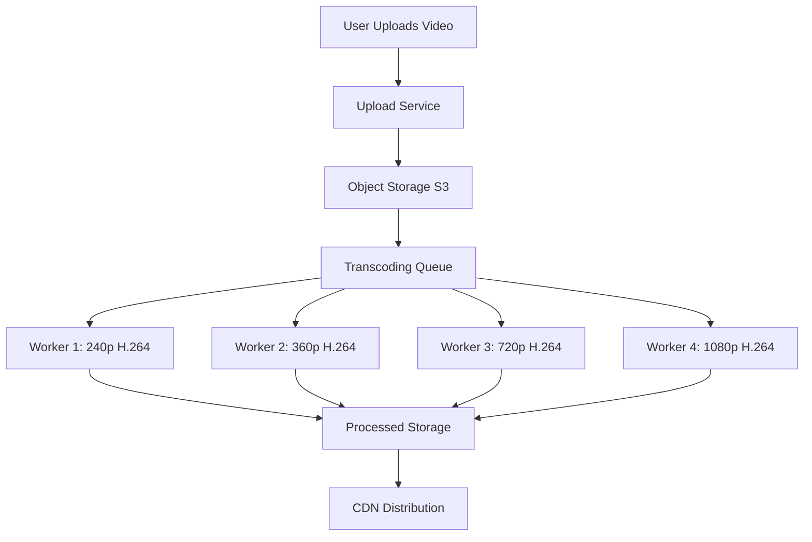

**Key Concepts:**

**Transcoding Steps:**
1. Upload raw video (any format)
2. Split into parallel transcoding jobs
3. Encode each resolution + bitrate combination
4. Validate output quality
5. Upload to CDN

**Why Multiple Formats?**
- Mobile users: Need 360p (low data)
- Desktop users: Want 1080p (high quality)
- 4K TVs: Require 4K
- Different networks: Adaptive bitrate switching

---

### 🟡 For Intermediate: Production Architecture

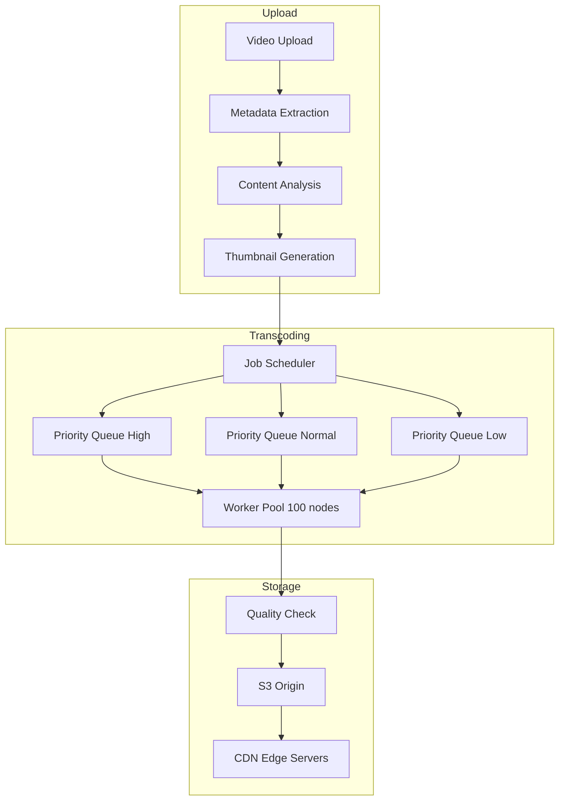

**Design Decisions:**

**1. Transcoding Priority:**
- Paid creators: High priority (process in 5 min)
- Free users: Normal priority (process in 30 min)
- Batch re-encoding: Low priority (background)

**2. Parallel Processing:**
- 1 video = 10 resolutions × 2 codecs = 20 jobs
- Process all in parallel (10-20 min vs 3 hours sequential)
- Cost: 100 workers vs 5 workers (20x faster, 20x cost)

**3. Quality Settings:**

| Resolution | Bitrate | File Size/Hour | Use Case |
|-----------|---------|----------------|----------|
| 240p | 0.5 Mbps | 225 MB | Mobile 2G |
| 360p | 1 Mbps | 450 MB | Mobile 3G |
| 720p | 5 Mbps | 2.25 GB | Desktop |
| 1080p | 8 Mbps | 3.6 GB | HD TV |
| 4K | 25 Mbps | 11.25 GB | Premium |

---

### 🔴 For Advanced: Cost Optimization

**Per-Title Encoding (Netflix Innovation):**

Instead of fixed bitrate ladder, analyze each video's complexity:

- **Simple content** (talk show): Use lower bitrates
  - 720p: 3 Mbps instead of 5 Mbps (40% savings)
- **Complex content** (action movie): Use higher bitrates
  - 720p: 6 Mbps instead of 5 Mbps (better quality)

**Savings:** 20% bandwidth reduction = $50M+/year for Netflix

**Processing Cost Analysis:**

```text
YouTube Scale:
- 500 hours uploaded/minute = 30,000 hours/hour
- 10 resolutions × 2 codecs = 20 encodings per video
- Total: 600,000 encoding-hours needed per hour
- At 1:1 encoding speed: Need 600,000 CPU cores!
- Solution: Faster encoders (2x speed) = 300,000 cores
- Cost at $0.02/core-hour: $6,000/hour = $144K/day
```

**Optimization Strategies:**
1. Hardware encoders (NVIDIA GPUs): 10x faster, 50% cheaper
2. Adaptive encoding: Only encode popular videos in all formats
3. On-demand encoding: Encode lower qualities only if requested
4. Caching: Don't re-encode identical uploads

---

### Real-World Example: YouTube's Transcoding Evolution

```text
2005: Sequential Processing
- Upload → Single server transcodes all formats
- Time: 2-3 hours for 10-minute video
- Bottleneck: CPU

2010: Parallel Pipeline
- Upload → Message queue → 100 workers
- Time: 15 minutes for 10-minute video
- Bottleneck: Queue depth during peaks

2018: Smart Encoding
- Predict popularity (ML model)
- Popular videos: Encode all formats immediately
- Unpopular videos: Encode 360p/720p only
- Encode higher qualities on first view
- Savings: 40% encoding costs

2023: Hardware Acceleration
- NVIDIA GPUs for H.264/H.265
- 10x faster than CPU
- 50% cost reduction
- Challenge: Limited AV1 hardware support
```

---

### ✅ Key Takeaways

- **Transcoding is expensive:** 20+ formats per video, CPU-intensive
- **Parallel processing essential:** 20x faster with distributed workers
- **Quality vs cost trade-off:** Not all videos need 4K
- **Per-title encoding:** Analyze complexity, optimize bitrates (20% savings)
- **Hardware acceleration:** GPUs 10x faster than CPU for encoding
- **Priority queues:** Process paid creators first

---

## Section 3: Adaptive Bitrate Streaming (ABR)

### What You'll Learn

- Understand adaptive bitrate streaming algorithms
- Design quality switching logic
- Handle network fluctuations gracefully
- Optimize startup time vs quality
- Measure and improve user experience (rebuffering ratio)

### Why This Matters

ABR is what makes modern streaming "just work." When your WiFi slows down, the video quality drops automatically - you don't notice buffering. This is adaptive bitrate streaming. Without it, users would experience constant buffering, leading to 50%+ abandonment rates. Understanding ABR is essential for any video platform interview.

---

### 🟢 For Beginners: How ABR Works

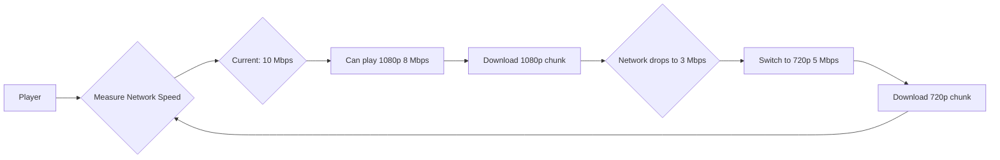

**ABR Decision Logic:**

```text
Every 4-10 seconds:
1. Measure download speed
2. Check buffer level
3. Choose appropriate quality

If download speed > 10 Mbps → Play 1080p
If download speed 5-10 Mbps → Play 720p
If download speed 2-5 Mbps → Play 480p
If download speed < 2 Mbps → Play 360p

Buffer safety:
- Buffer < 10 seconds → Drop quality (prevent buffering)
- Buffer > 30 seconds → Try higher quality
```

---

### 🟡 For Intermediate: ABR Algorithms

**Common Algorithms:**

1. **Throughput-Based (Simple)**
   - Measure average download speed
   - Pick highest quality below bandwidth
   - Problem: Reactive, not predictive

2. **Buffer-Based (Conservative)**
   - Buffer < 15s → Lower quality
   - Buffer > 30s → Higher quality
   - Problem: Slow to adapt up

3. **Hybrid (Production)**
   - Combine throughput + buffer
   - Predict future bandwidth
   - Smooth quality switches

**Quality Switching Strategy:**

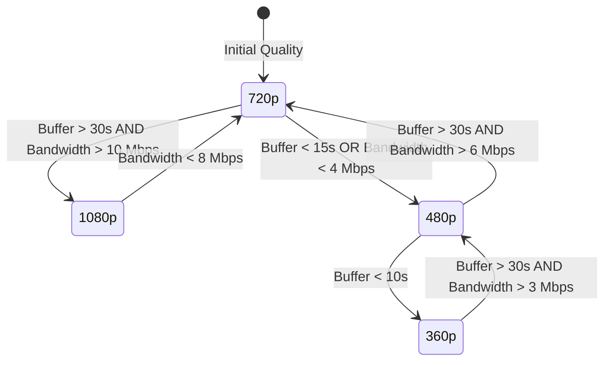

**Netflix's Approach:**
- Start with low quality (fast startup)
- Ramp up aggressively if bandwidth allows
- Switch down conservatively (avoid buffering)
- Smooth transitions (don't flicker between qualities)

---

### 🔴 For Advanced: Predictive ABR

**Machine Learning for ABR:**

Instead of reacting to bandwidth changes, predict future conditions:

```text
Input Features:
- Historical bandwidth (last 30 seconds)
- Time of day (peak hours = congestion)
- Location (WiFi vs mobile)
- Content popularity (CDN load)

Output:
- Predicted bandwidth (next 10 seconds)
- Recommended quality level

Benefit:
- 15% fewer rebuffering events
- 10% higher average quality
- Better user experience
```

**Trade-offs:**

| Approach | Startup Time | Rebuffering | Avg Quality | Complexity |
|----------|--------------|-------------|-------------|------------|
| Conservative | Fast (2s) | Rare (0.5%) | Medium | Low |
| Aggressive | Slow (5s) | Common (2%) | High | Low |
| Predictive ML | Fast (2s) | Rare (0.3%) | High | High |

---

### ✅ Key Takeaways

- **ABR prevents buffering:** Automatically adapts to network conditions
- **Buffer is critical:** Keep 20-30 seconds buffered for smooth playback
- **Trade-offs exist:** Fast startup vs high quality vs low rebuffering
- **Smooth transitions:** Don't switch quality every 5 seconds (jarring UX)
- **ML improves ABR:** Predict future bandwidth, not just react

---

## Section 4: CDN & Content Delivery

### What You'll Learn

- Design CDN architecture for global video delivery
- Implement caching strategies for video content
- Optimize edge server placement
- Handle cache invalidation and updates
- Reduce bandwidth costs through intelligent caching

### Why This Matters

CDNs are the backbone of video streaming. Without CDNs, every viewer would connect directly to your origin servers - impossible at scale. CDNs reduce latency from 500ms to 20ms and cut bandwidth costs by 90%. Understanding CDN architecture is essential for any distributed system interview.

---

### 🟢 For Beginners: CDN Basics

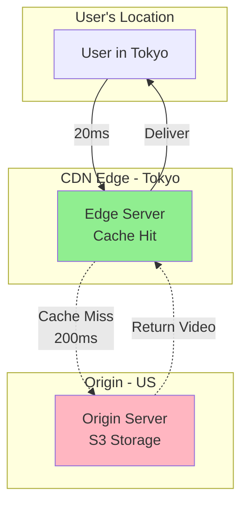

**How CDN Works:**

1. User requests video → Routes to nearest edge server
2. Edge server checks cache
3. **Cache hit:** Return video immediately (20ms)
4. **Cache miss:** Fetch from origin (200ms), cache it, return
5. Next user: Cache hit (fast!)

**Cache Hit Ratio:** 95%+ for popular content
- 95% users: 20ms latency
- 5% users: 200ms latency (first viewer)

---

### 🟡 For Intermediate: Multi-Tier CDN Architecture

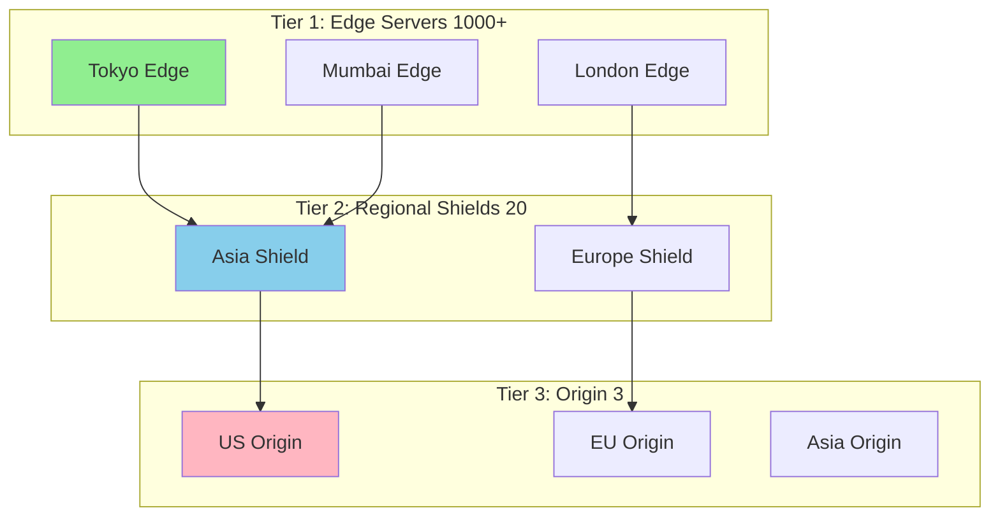

**Design Decisions:**

**1. Edge Server Placement:**
- Place servers in top 100 cities (cover 80% of users)
- Co-locate with ISPs (reduce peering costs)
- Asia-Pacific: 40% of traffic → 400 edge servers
- North America: 25% → 250 servers
- Europe: 20% → 200 servers

**2. Cache Strategy:**

| Content Type | Cache Duration | Storage | Hit Rate |
|--------------|----------------|---------|----------|
| Popular (Top 1%) | 30 days | 10 TB | 99% |
| Medium (Top 20%) | 7 days | 50 TB | 90% |
| Long-tail | 1 day | 100 TB | 60% |
| Live streams | 30 seconds | 1 GB | 95% |

**3. Cost Analysis:**

```text
Without CDN (Direct to Origin):
- 1M viewers × 5 Mbps average = 5 Tbps
- Bandwidth cost: $0.08/GB
- Monthly: 1.6 PB × $0.08/GB = $128,000

With CDN (95% cache hit):
- Origin: 5% × 1.6 PB = 80 TB × $0.08 = $6,400
- CDN: 1.6 PB × $0.02/GB = $32,000
- Total: $38,400
- Savings: 70% ($90K/month)
```

---

### 🔴 For Advanced: Intelligent Caching

**Netflix's Open Connect:**

Netflix built its own CDN with servers inside ISPs:

```text
Traditional CDN:
User → ISP → Internet → CDN Edge → Origin

Netflix Open Connect:
User → ISP (Netflix box inside!) → Origin (rarely)

Benefits:
- Latency: 5ms instead of 20ms
- No peering costs (inside ISP network)
- Better QoS (ISP prioritizes local traffic)
- 95% of traffic never leaves ISP network

Scale:
- 18,000+ servers in 1,000+ ISP locations
- Serves 230M subscribers
- 15% of global internet traffic
```

**Predictive Caching:**

Pre-cache content before users request it:

```text
Strategies:
1. Trending prediction: "Squid Game" will be popular → Pre-cache
2. Release schedule: New episode drops Friday → Pre-cache Thursday
3. Geographic patterns: Afternoon in US → Pre-cache US popular content
4. User behavior: User watched Ep1-3 → Pre-cache Ep4

Result:
- Cache hit rate: 95% → 98%
- Startup time: 2.5s → 1.8s
- Bandwidth savings: 5%
```

---

### ✅ Key Takeaways

- **CDN is essential:** Reduces latency 10x, costs 70%
- **Multi-tier architecture:** Edge → Shield → Origin for efficiency
- **Cache hit rate matters:** 95%+ is standard, 98%+ is excellent
- **Popular content caches well:** 1% of videos = 80% of views
- **Predictive caching:** Pre-load content users will likely watch
- **ISP co-location:** Netflix inside ISPs reduces costs massively

---

## Section 5: Storage Architecture

### What You'll Learn

- Design scalable object storage for 100 PB+ video libraries
- Choose between hot/warm/cold storage tiers
- Implement redundancy and disaster recovery
- Optimize storage costs (50%+ savings possible)
- Handle video deletion and retention policies

### Why This Matters

Video is huge. A 1-hour 4K video = 25 GB. Storing 1M hours = 25 PB. At $0.023/GB/month, that's $575K/month just for storage. Understanding storage architecture and cost optimization is critical for video platforms.

---

### 🟢 For Beginners: Storage Tiers

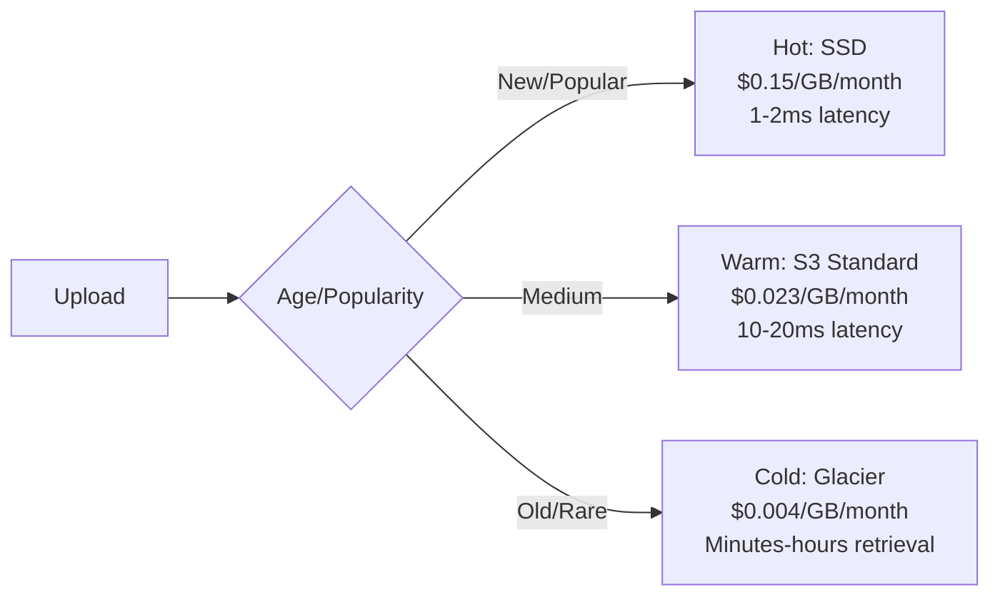

**Decision Matrix:**

| Tier | Content | % of Library | Cost | Retrieval Time |
|------|---------|--------------|------|----------------|
| Hot | Last 30 days | 5% | High | Instant |
| Warm | Last 12 months | 25% | Medium | Fast |
| Cold | Archive (>1 year) | 70% | Low | Slow |

**Cost Example (1 PB library):**

```text
All Hot: 1 PB × $0.15/GB = $150,000/month
All Warm: 1 PB × $0.023/GB = $23,000/month
All Cold: 1 PB × $0.004/GB = $4,000/month

Tiered (5% hot, 25% warm, 70% cold):
= 0.05 × $150K + 0.25 × $23K + 0.70 × $4K
= $7,500 + $5,750 + $2,800
= $16,050/month

Savings: 89% vs all-hot, 30% vs all-warm!
```

---

### 🟡 For Intermediate: Redundancy Strategy

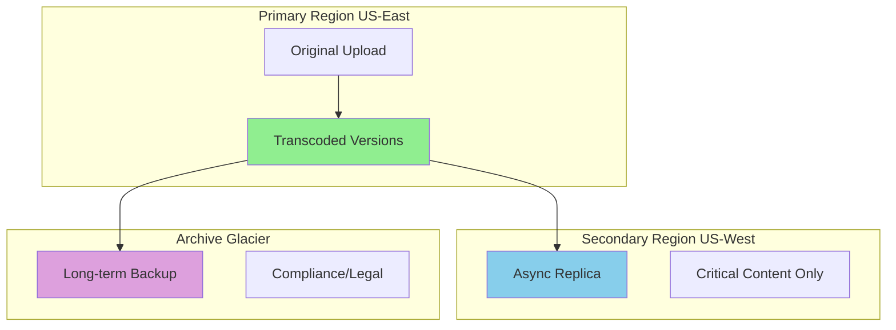

**Trade-offs:**

**1. Replication Factor:**
- 1x: Cheap, but risky (data loss if failure)
- 3x: Safe, but 3x cost
- Hybrid: 3x for hot, 2x for warm, 1x for cold

**2. Geographic Distribution:**
- Single region: Cheapest, but vulnerable
- Multi-region: Safer, but cross-region bandwidth costs
- Decision: Replicate only critical content

---

### ✅ Key Takeaways

- **Tiered storage:** Hot/warm/cold saves 50-80% costs
- **Replication:** 3x for critical, 1x for archive
- **Lifecycle policies:** Auto-move old content to cheaper tiers
- **Deletion:** Soft delete (7-30 days) before permanent removal

---

## Section 6: Live Streaming

### What You'll Learn

- Design low-latency live streaming architecture
- Choose between RTMP, HLS, WebRTC protocols
- Handle thousands of concurrent live streams
- Implement real-time transcoding and ABR
- Optimize for sub-second latency (Twitch-style)

### Why This Matters

Live streaming is fundamentally different from VOD. Latency matters (3-5 seconds vs sub-second for real-time). Twitch, YouTube Live, Facebook Live all rely on sophisticated live streaming architecture. Understanding these systems is key for senior engineering roles.

---

### 🟢 For Beginners: Live vs VOD

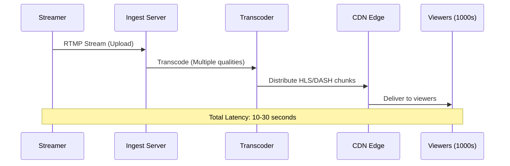

**Latency Breakdown:**

```text
RTMP Upload: 1-2 seconds
Transcoding: 2-3 seconds
CDN Propagation: 2-5 seconds
HLS Buffering: 5-20 seconds
Total: 10-30 seconds

For real-time (Twitch):
- Use WebRTC: <1 second
- Trade-off: Higher bandwidth, more complex
```

---

### 🟡 For Intermediate: Low-Latency Architecture

**Protocol Comparison:**

| Protocol | Latency | Scale | Quality | Use Case |
|----------|---------|-------|---------|----------|
| RTMP | 3-5s | High | Good | Traditional |
| HLS | 10-30s | Very High | Excellent | VOD-like |
| LL-HLS | 2-3s | High | Excellent | Modern |
| WebRTC | <1s | Medium | Good | Interactive |

**Design Decision:** Use hybrid approach
- Ingest: RTMP (proven, reliable)
- Distribution: LL-HLS for most, WebRTC for ultra-low latency tier

---

### ✅ Key Takeaways

- **Latency is critical:** 3-5s acceptable, <1s for gaming
- **RTMP for ingest:** Proven, reliable standard
- **HLS for delivery:** Scalable, works with CDNs
- **WebRTC for real-time:** Sub-second, but complex
- **Transcoding on-the-fly:** Must be real-time, not batch

---

## Section 7: Recommendations & Discovery

### What You'll Learn

- Understand how Netflix recommends shows you'll love
- Design collaborative filtering systems at scale
- Implement content-based recommendation algorithms
- Build hybrid recommendation systems
- Optimize recommendations for engagement and revenue
- Handle cold-start problems (new users, new content)

### Why This Matters

80% of what people watch on Netflix comes from recommendations, not search! When you finish watching "Breaking Bad" and Netflix suggests "Better Call Saul," that's not random - it's a sophisticated recommendation system analyzing billions of data points. Understanding recommendation systems is crucial because they directly impact user engagement, retention, and revenue. In interviews, this shows you understand the complete user experience, not just video delivery.

---

### 🟢 For Beginners: How Recommendations Work

**The Two Main Approaches:**

**1. Collaborative Filtering (CF)**
Think of it like asking friends for recommendations:
- "People who liked Breaking Bad also liked Ozark"
- Based on patterns: Similar users like similar content
- Doesn't need to understand content itself

**Example:**
```text
User Alice watched: Breaking Bad, Ozark, Narcos
User Bob watched: Breaking Bad, Ozark, [unknown]
Recommendation for Bob: Narcos (because Alice liked it)

This is called "user-user collaborative filtering"
```

**2. Content-Based Filtering (CBF)**
Think of it like describing what you like:
- "I like crime dramas with antiheroes"
- Analyzes content features: Genre, actors, themes
- Recommends similar content

**Example:**
```text
Breaking Bad features:
- Genre: Crime, Drama
- Themes: Drug trade, moral ambiguity
- Setting: Desert, contemporary

Similar shows:
- Ozark: Crime, Drama, moral ambiguity ✓
- The Wire: Crime, Drama, urban setting
- Better Call Saul: Same universe, spinoff
```

**Which Approach is Better?**

| Approach | Pros | Cons | Use Case |
|----------|------|------|----------|
| Collaborative Filtering | Discovers unexpected connections | Cold start problem (new users/items) | Established platforms with lots of data |
| Content-Based | Works for new items | Limited to known preferences | New platforms or niche content |
| Hybrid (Both) | Best of both worlds | More complex | Netflix, YouTube, Spotify |

---

### 🟡 For Intermediate: Building Recommendation Systems

#### Architecture Overview

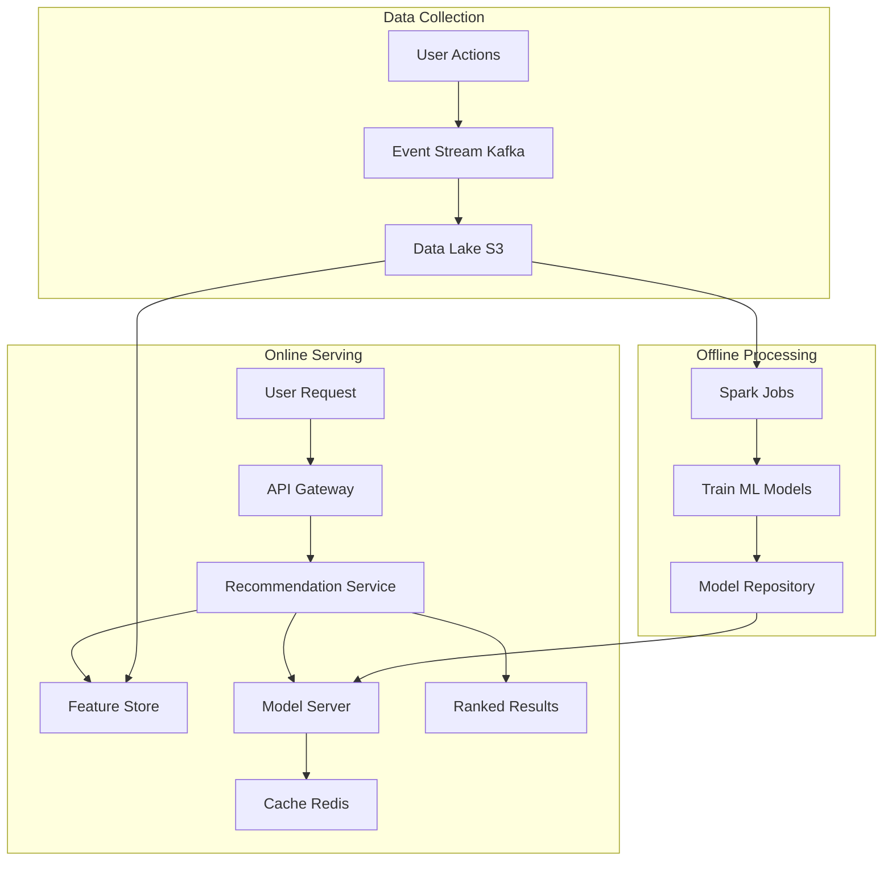

**Let me explain each component:**

**1. Data Collection with Kafka**

**What is Kafka?** 
Think of Kafka as a high-speed conveyor belt for data. Instead of processing user actions one-by-one (like a single-file line), Kafka lets you handle millions of events per second (like multiple conveyor belts running in parallel).

**Why Kafka for recommendations?**
```text
Without Kafka:
User clicks "play" → Write to database → Database slows down with millions of clicks

With Kafka:
User clicks "play" → Send to Kafka → Kafka buffers it → Process later in batches

Benefits:
- Handles 1M+ events/second
- Doesn't slow down user experience
- Can replay events if processing fails
- Multiple systems can read same events
```

**Events captured:**
- Video played (what, when, how long)
- Video paused (at what timestamp)
- Video rated (thumbs up/down)
- Search queries
- Browse behavior (what did they look at but not watch?)

**2. Feature Store**

**What is a Feature Store?**
It's like a recipe book for ML models. Instead of recalculating "user's favorite genre" every time, you pre-calculate and store it.

**Example features:**
```text
User Features:
- favorite_genre: "Crime Drama" (calculated from watch history)
- viewing_time: "Evening 8-11 PM" (when they usually watch)
- binge_watcher: true (watches 3+ episodes in a row)
- subscription_tier: "Premium"

Video Features:
- genre: "Crime, Drama"
- popularity_score: 8.7/10
- average_completion_rate: 85% (how many finish the video)
- trending_score: 0.92 (hot right now?)
```

**Why pre-calculate?**
```text
Without Feature Store:
Request comes → Calculate all features (500ms) → Run model (200ms) → Return results
Total: 700ms (too slow!)

With Feature Store:
Request comes → Lookup features (5ms) → Run model (200ms) → Return results
Total: 205ms (much better!)
```

**Technologies used:**
- **Feast**: Open-source feature store
- **Tecton**: Enterprise feature store
- **Redis**: Fast in-memory cache for hot features

**3. Collaborative Filtering Implementation**

**Matrix Factorization (Netflix Prize Algorithm)**

Imagine a giant table:
```text
           | Breaking Bad | Ozark | Friends | ...
------------------------------------------------------
Alice      |      5       |   5   |    2    | ...
Bob        |      5       |   ?   |    1    | ...
Charlie    |      1       |   1   |    5    | ...
```

**The problem:** Most cells are empty! Users haven't watched most content.

**The solution:** Matrix Factorization finds hidden patterns.

```text
Each user has hidden preferences:
Alice: [0.9 crime, 0.8 drama, 0.1 comedy]

Each video has hidden features:
Breaking Bad: [0.95 crime, 0.9 drama, 0.05 comedy]

Prediction = User preferences · Video features
Alice + Breaking Bad = 0.9×0.95 + 0.8×0.9 + 0.1×0.05
                      = 0.855 + 0.72 + 0.005
                      = 1.58 (high score = recommend!)
```

**Real-world scale:**
```text
Netflix:
- 230M users
- 10K titles
- Matrix size: 230M × 10K = 2.3 trillion cells!
- Storage: 2.3 trillion × 4 bytes = 9.2 TB (too big!)

Matrix Factorization reduces to:
- 230M users × 100 factors = 23B numbers
- 10K titles × 100 factors = 1M numbers
- Total: 92 GB (manageable!)

The "100 factors" are hidden patterns learned by algorithm
```

**4. Deep Learning for Recommendations**

**Why Deep Learning?**
Traditional methods miss complex patterns. Deep learning can learn:
- Sequential patterns: "If user watches Ep1, Ep2, Ep3 → they'll watch Ep4"
- Time patterns: "User watches action movies on weekends, comedies on weekdays"
- Cross-domain patterns: "User who likes crime shows also clicks true-crime documentaries"

**YouTube's Deep Neural Network (DNN) Architecture:**

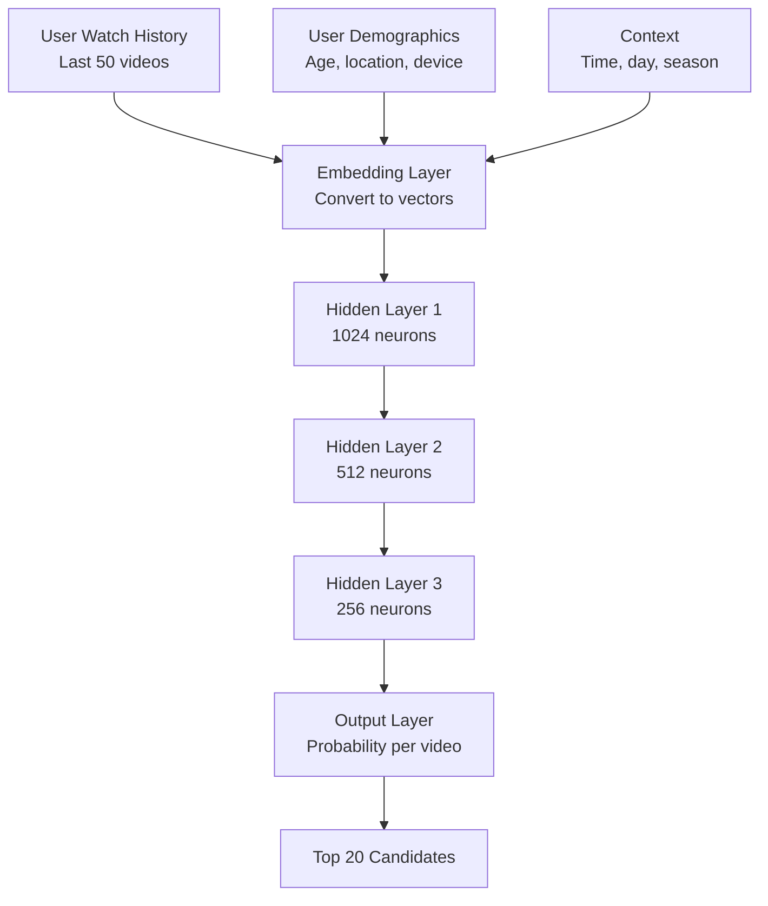

**Explanation of each layer:**

**Embedding Layer:** Converts videos to numbers
```text
Breaking Bad → [0.23, 0.89, 0.45, ..., 0.67] (256 numbers)
Ozark → [0.25, 0.91, 0.43, ..., 0.69] (similar numbers!)

Similar videos get similar numbers (embeddings)
```

**Hidden Layers:** Learn complex patterns
```text
Layer 1 (1024 neurons): Learns basic patterns
- "User likes crime shows"
- "User watches in evening"

Layer 2 (512 neurons): Combines patterns
- "User likes crime shows AND watches in evening"
- "User binges series on weekends"

Layer 3 (256 neurons): Final decision patterns
- "User is likely to watch Season 2 after Season 1"
- "User explores similar shows after finishing series"
```

**Training the model:**
```text
Input: User's watch history
Output: What they watched next

Example:
Input: [Breaking Bad S1E1, S1E2, S1E3]
Correct output: S1E4
Model prediction: S1E4 (90% confidence), Ozark S1E1 (70%)

If prediction correct: ✓ Good!
If prediction wrong: ✗ Adjust weights and try again

After training on billions of examples, model learns patterns
```

---

### 🔴 For Advanced: Production Recommendation System

#### Two-Stage Ranking (How Netflix Really Works)

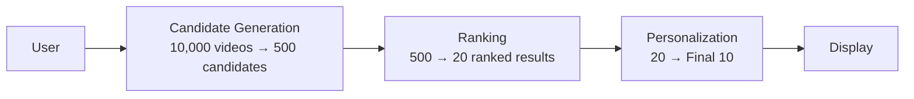

**Stage 1: Candidate Generation (Fast & Broad)**

**Goal:** Reduce 10,000 videos to ~500 candidates in <50ms

**Methods:**
1. **Collaborative Filtering:** "Users like you watched..."
2. **Content-Based:** "Similar to what you've watched..."
3. **Popular Now:** "Trending in your region..."
4. **Continue Watching:** "You paused at 43%..."
5. **New Releases:** "New season just dropped..."

**Why multiple methods?**
```text
CF alone: 200 candidates (similar users)
Content alone: 150 candidates (similar content)
Popular: 50 candidates (trending)
Continue watching: 20 candidates (unfinished)
New releases: 80 candidates (fresh content)

Total: 500 candidates from diverse sources
= Better variety than single method
```

**Technology:** 
- **Approximate Nearest Neighbors (ANN)** using **FAISS** (Facebook AI Similarity Search)
  - Finds similar items in milliseconds instead of seconds
  - Sacrifices some accuracy for massive speed gains
  - Think: "Good enough" recommendations in real-time vs "perfect" recommendations too slow to use

**Stage 2: Ranking (Slow & Accurate)**

**Goal:** Rank 500 candidates → Top 20 in <150ms

**Features used (100+):**
```text
User Context:
- Current time (morning/evening affects choices)
- Device (mobile = shorter content preferred)
- Recent searches (intent signals)

Video Features:
- Genre match score
- Cast/director affinity
- Popularity (but not just raw views - trending matters)
- Quality score (production value)

Interaction Predictions:
- Probability user will play (CTR)
- Probability user will finish (completion rate)
- Probability user will binge next episode
- Probability user will rate positively
```

**Multi-Objective Optimization:**

Netflix doesn't just optimize for "clicks." They balance:
```text
Objective 1: Click-Through Rate (CTR) - 30% weight
Will user click play?

Objective 2: Watch Time - 40% weight
Will user actually watch it?

Objective 3: Retention - 20% weight
Will user stay subscribed?

Objective 4: Revenue - 10% weight
Promote premium/original content

Final Score = 0.3×CTR + 0.4×WatchTime + 0.2×Retention + 0.1×Revenue
```

**Why balance multiple objectives?**
```text
Clickbait content:
- High CTR (80%) - people click!
- Low watch time (20%) - people quit quickly
- Low retention - users feel tricked, cancel subscription

Quality content:
- Medium CTR (40%) - fewer clicks
- High watch time (85%) - people finish it
- High retention (95%) - users stay subscribed

Netflix prefers Quality content!
```

**Stage 3: Personalization (Final Touch)**

**Goal:** Arrange Top 20 → Final display with personalized thumbnails

**Thumbnail Personalization:**
Same show, different thumbnails for different users:

```text
Breaking Bad thumbnails:

Action fan sees: Explosion scene with intense colors
Drama fan sees: Walter White's intense face close-up
Comedy fan sees: Jesse Pinkman's goofy moment
Romance fan sees: Walter & Skyler emotional scene

Same content, optimized presentation!
```

**A/B Test Results (Netflix published data):**
```text
Personalized thumbnails vs Generic:
- 20% higher CTR
- But only 5% higher watch time

Why? Better thumbnails = better match between expectation and content
Users click on content they'll actually enjoy
```

---

### Real-World Example: Netflix's Recommendation Evolution

**2006 - Netflix Prize Competition:**
```text
Challenge: Improve recommendation accuracy by 10%
Prize: $1 million
Dataset: 100M ratings from 500K users

Winning algorithm: BellKor's Pragmatic Chaos
- Matrix Factorization + RBMs (Restricted Boltzmann Machines)
- Ensemble of 107 different models!
- Achieved 10.06% improvement

Impact:
- Netflix learned ensemble methods work best
- Led to complete overhaul of recommendation system
- Algorithm still influences Netflix today (15+ years later)
```

**2012 - Shift to Streaming:**
```text
DVD Era Problem: Users rate movies after watching
- Explicit feedback (ratings)
- But only 2% of users rated content

Streaming Era Solution: Implicit feedback everywhere
- Play/pause/rewind/fast-forward
- Time watched (did they finish?)
- When they watched (time patterns)
- What they browsed but didn't watch
- Search queries

Result:
- 100x more data points
- Better understanding of preferences
- No need to ask for ratings
```

**2016 - Personalized Homepage:**
```text
Old Netflix: Same homepage for everyone
- Everyone saw same "Popular Now" section
- Generic recommendations

New Netflix: Every pixel personalized
- Your "Popular" ≠ My "Popular"
- Even row order is personalized
- 40+ recommendation rows, all different

Technical Challenge:
- Generate personalized homepage for 230M users
- Update in real-time (not batch overnight)
- Serve in <200ms

Solution:
- Pre-compute overnight (most recommendations)
- Real-time adjustments (continue watching, new releases)
- Heavy caching with Redis
```

**2020 - Neural Networks Everywhere:**
```text
Current Netflix Stack:
- Candidate Generation: Matrix Factorization + Deep Learning
- Ranking: Gradient Boosted Decision Trees + Neural Networks
- Thumbnails: Convolutional Neural Networks (CNNs)
- Preview Selection: Recurrent Neural Networks (RNNs)
- Search: BERT-like language models

Why so many models?
- Each optimized for specific task
- Ensemble performs better than single model
- Can improve one without breaking others
```

---

### 🤔 Think About It

1. **For Beginners:** Netflix shows you "Because you watched Breaking Bad..." recommendations. But what if you just watched one episode because your friend insisted, and you hated it? How should the algorithm know the difference between "I watched and loved it" vs "I watched but didn't like it"?

2. **For Intermediate:** YouTube faces a trade-off: Recommend videos users will watch (high engagement) vs videos users should watch (diverse viewpoints, educational content). How do you balance these? What happens if you only optimize for watch time? (Hint: Think about "filter bubbles")

3. **For Advanced:** Netflix operates in 190+ countries with different content libraries (licensing restrictions). User in India watched Breaking Bad, user in US also watched Breaking Bad. But India has 100 shows, US has 1000 shows. How do you do collaborative filtering when users have different content available? Design a solution that works globally.

---

### ✅ Key Takeaways

- **Recommendations drive 80% of views:** More important than search for engagement
- **Collaborative filtering:** "Users like you also watched..." - powerful but needs data
- **Content-based filtering:** Analyzes video features - works for new content
- **Hybrid systems win:** Combine multiple methods for best results
- **Two-stage ranking:** Fast candidate generation → Accurate ranking (speed + quality)
- **Implicit feedback >> Explicit:** Watch time better signal than ratings
- **A/B test everything:** Even thumbnail changes tested on millions of users
- **Cold start is hard:** New users and new videos are challenging to recommend
- **Technology stack:** Kafka (events), Spark (batch processing), Redis (caching), TensorFlow (ML)

---

## Section 8: Analytics & Monitoring

### What You'll Learn

- Design real-time analytics systems for millions of concurrent viewers
- Track video performance metrics (views, watch time, completion rate)
- Build monitoring dashboards for operational health
- Implement alerting systems for failures
- Measure and optimize user experience (QoE - Quality of Experience)
- Handle analytics at scale (billions of events per day)

### Why This Matters

"Is my video platform healthy?" Without analytics, you're flying blind. YouTube processes 4 billion video plays per day - that's 46,000 plays per second! Each play generates 100+ events (play, pause, buffer, quality change). Understanding how to collect, process, and analyze this data at scale is crucial. In interviews, this shows you understand observability - a key trait of senior engineers.

---

### 🟢 For Beginners: What to Measure

**Two Types of Metrics:**

**1. Business Metrics (What executives care about)**

```text
Views / Plays:
- Total video views today: 100 million
- Unique viewers: 50 million (some watched multiple videos)
- View-to-unique ratio: 2.0 (each person watched 2 videos average)

Watch Time:
- Total watch time: 500 million hours
- Average watch time per user: 10 hours
- This is the #1 metric for YouTube/Netflix

Engagement:
- Like rate: 15% of viewers liked the video
- Comment rate: 5% left a comment
- Share rate: 2% shared with friends

Revenue:
- Ad revenue: $5 million today
- Subscription revenue: $10 million monthly
- Revenue per hour watched: $0.01
```

**2. Technical Metrics (What engineers care about)**

```text
Performance:
- Startup time: 2.5 seconds (P95)
- Rebuffering ratio: 0.5% (How often video stops to buffer)
- Video start failures: 0.1% (% of plays that fail to start)

Quality:
- Average bitrate: 5 Mbps (Are users getting good quality?)
- Quality switches: 2 per session (Is network stable?)
- CDN cache hit rate: 95% (Is CDN working well?)

Availability:
- Uptime: 99.95% (5 minutes downtime per week)
- Error rate: 0.01% of requests fail
- P99 latency: 500ms (99% of requests < 500ms)
```

**Why measure both?**
```text
Example Problem:

Business metrics look great:
- Views up 20%!
- Watch time up 15%!

But technical metrics show issues:
- Rebuffering up 50% (videos buffering more)
- Startup time up 2x (takes 5 seconds to start)

Users are frustrated but still watching (for now).
If we ignore technical metrics → users will leave eventually.
```

---

### 🟡 For Intermediate: Real-Time Analytics Architecture

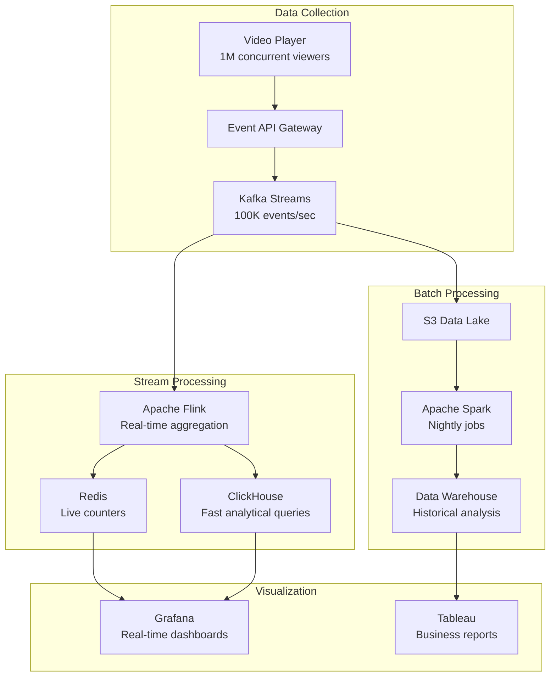

**Let me explain each technology and why it's chosen:**

**1. Kafka - The Event Streaming Platform**

**What is Kafka?**
Imagine a super-fast postal service that never loses mail and can handle millions of letters per second.

**Why Kafka for video analytics?**
```text
Problem without Kafka:
- 1M viewers × 100 events/hour = 100M events/hour
- Each event goes directly to database
- Database crashes under load!

Solution with Kafka:
- Events go to Kafka (buffers them)
- Multiple consumers read at their own pace
- Database not overwhelmed
- Can replay events if processing fails

Real-world capacity:
- Kafka handles 1M messages/second per server
- Netflix uses 4 trillion events/day through Kafka
- LinkedIn uses 7 trillion messages/day
```

**2. Apache Flink - Stream Processing**

**What is Flink?**
Think of it as Excel for real-time data. But instead of you manually summing cells, it automatically updates totals as new data arrives.

**Example - Real-time view counter:**
```text
Events coming in:
10:00:01 - User A played video 123
10:00:02 - User B played video 123
10:00:03 - User C played video 456
10:00:04 - User D played video 123

Flink automatically maintains:
Video 123: 3 views
Video 456: 1 view

Updates every second in real-time!
```

**Why Flink vs alternatives?**
```text
Storm (older): Processes one event at a time
- Slower (100K events/sec per core)
- More complex code

Spark Streaming: Processes in micro-batches
- Latency: 1-2 seconds (batch every second)
- Good enough for many use cases

Flink: True stream processing
- Faster (1M events/sec per core)
- Lower latency (milliseconds)
- Harder to learn

Netflix chose Flink for:
- Sub-second latency requirements
- Complex event processing
- Exactly-once semantics (no duplicate counts)
```

**3. Redis - In-Memory Database**

**What is Redis?**
Think of it as your computer's RAM, but shared across all servers. Crazy fast (millions of operations per second) but expensive (RAM costs more than disk).

**Why Redis for live counters?**
```text
Question: How many people are watching right now?

Without Redis (using PostgreSQL):
- Query: SELECT COUNT(*) FROM active_viewers
- Time: 500ms (scans millions of rows)
- Too slow for live updates!

With Redis:
- Command: GET active_viewers
- Time: 1ms (just reads one value)
- Fast enough for real-time!

Trade-off:
- Redis: Fast but expensive ($5/GB RAM)
- PostgreSQL: Slow but cheap ($0.10/GB disk)

Solution:
- Hot data (live counts): Redis
- Cold data (history): PostgreSQL
```

**Redis Data Structures for Analytics:**
```text
1. Strings (Counters):
SET video:123:views 1000000
INCR video:123:views  # Atomic increment (safe for concurrent users)

2. Sorted Sets (Leaderboards):
ZADD trending_videos 1000000 "video:123"  # Score = views
ZADD trending_videos 500000 "video:456"
ZREVRANGE trending_videos 0 9  # Get top 10

3. HyperLogLog (Unique counts):
PFADD unique_viewers:today user:1 user:2 user:1  # Deduplicates automatically
PFCOUNT unique_viewers:today  # Returns 2 (user:1 counted once)

Memory usage:
- Exact count: 10M users × 8 bytes = 80 MB
- HyperLogLog: Only 12 KB (99.9% accurate!)
```

**4. ClickHouse - Analytical Database**

**What is ClickHouse?**
It's like PostgreSQL, but 100-1000x faster for analytics. Developed by Yandex (Russian Google) to handle their massive logs.

**Why so fast?**
```text
PostgreSQL (Row-based):
Stores data by row:
Row 1: [video_id=123, user_id=456, timestamp=..., duration=...]
Row 2: [video_id=124, user_id=457, timestamp=..., duration=...]

When you query "SUM(duration) for video_id=123":
- Must read ALL columns for matching rows
- Lots of unnecessary data read

ClickHouse (Column-based):
Stores data by column:
video_id: [123, 124, 123, 125, 123, ...]
duration: [120, 300, 180, 240, 150, ...]

When you query "SUM(duration) for video_id=123":
- Only reads video_id and duration columns
- 10-100x less data read = 10-100x faster!

Real performance:
- PostgreSQL: 10 seconds for "views per day last 30 days"
- ClickHouse: 100ms for same query
```

**ClickHouse at Scale:**
```text
Cloudflare uses ClickHouse for analytics:
- 45 trillion rows
- 100 PB data
- Queries return in seconds

Typical query:
SELECT
  toDate(timestamp) as day,
  COUNT(*) as views,
  AVG(watch_duration) as avg_watch
FROM video_plays
WHERE timestamp > now() - INTERVAL 30 DAY
GROUP BY day

On 10B rows: <1 second (ClickHouse) vs 10+ minutes (PostgreSQL)
```

**5. Apache Spark - Batch Processing**

**What is Spark?**
Think of it as Excel for billion-row spreadsheets. It splits work across 100s of computers.

**Why Spark for historical analytics?**
```text
Problem: Calculate yesterday's statistics
- 100M video plays yesterday
- Each play: 100 events
- Total: 10B events to process

Single machine:
- 10B events × 1ms each = 10M seconds = 115 days!

Spark with 1000 machines:
- 10B events ÷ 1000 = 10M events per machine
- 10M × 1ms = 10,000 seconds = 2.7 hours

With Spark: 2.7 hours (runs overnight)
Without Spark: 115 days (impossible)
```

**Spark Job Example - Daily Video Statistics:**
```text
Input: 10B events in S3 (yesterday's data)

Processing (parallel across 1000 machines):
1. Read events from S3
2. Filter: Only "video_played" events
3. Group by: video_id
4. Aggregate:
   - Total views
   - Total watch time
   - Unique viewers
   - Average completion rate
5. Write results to Data Warehouse

Output: Aggregated stats per video
- Video 123: 1M views, 500K hours, 700K unique viewers, 75% completion
```

---

### 🔴 For Advanced: Quality of Experience (QoE) Monitoring

**What is QoE?**
Not just "did it work?" but "was the experience good?"

**Key QoE Metrics:**

**1. Video Startup Time (VST)**
```text
Definition: Time from user clicks "play" until video starts

Measurement:
- Start timer: When user clicks play
- Stop timer: When first frame renders
- Record latency

Industry standards:
- <2 seconds: Excellent (Netflix, YouTube)
- 2-3 seconds: Good
- 3-5 seconds: Acceptable
- >5 seconds: Poor (users leave)

Impact on user behavior:
- 1 second delay → 11% fewer views
- 5 second delay → 50% fewer views

YouTube's approach:
- P50 (median): 1.2 seconds
- P95: 2.8 seconds
- P99: 5.0 seconds

They focus on P95 (95% of users get <2.8s)
```

**2. Rebuffering Ratio**
```text
Definition: % of time video is buffering (not playing)

Calculation:
Total buffering time / Total watch time

Example:
- User watched 10 minutes (600 seconds)
- Video buffered 3 seconds
- Rebuffering ratio: 3/600 = 0.5%

Industry standards:
- <0.5%: Excellent
- 0.5-1%: Good
- 1-2%: Acceptable
- >2%: Poor

Netflix's metric: "Play Delay"
- 99% of plays have <1% rebuffering
- If user experiences >2% rebuffering → High chance they cancel subscription
```

**3. Video Quality Score**
```text
Combines multiple factors:
- Average bitrate (higher = better quality)
- Quality switches (fewer = better)
- Quality downscaling events (bad network)

Formula:
Quality Score = (Avg Bitrate / Max Bitrate) × (1 - Rebuffering Ratio) × (1 - 0.1 × Quality Switches)

Example:
- Avg bitrate: 5 Mbps (out of 8 Mbps max) = 0.625
- Rebuffering ratio: 0.5% = 0.995
- Quality switches: 2 times = 0.8
- Quality Score = 0.625 × 0.995 × 0.8 = 0.497 (out of 1.0)

Interpretation:
- 0.9-1.0: Excellent experience
- 0.7-0.9: Good experience
- 0.5-0.7: Acceptable experience
- <0.5: Poor experience (investigate!)
```

**Monitoring Dashboard Example:**

```text
Real-Time Video Health Dashboard

Current Status: 🟢 Healthy
━━━━━━━━━━━━━━━━━━━━━━━━━━━━

📊 Live Metrics (Last 5 minutes)
- Concurrent viewers: 1,245,892
- Plays per second: 523/s
- Video Start Failure Rate: 0.08% 🟢

⏱️ Performance
- P50 Startup Time: 1.8s 🟢
- P95 Startup Time: 3.2s 🟡
- P99 Startup Time: 6.1s 🔴 ⚠️ Alert!
- Rebuffering Ratio: 0.6% 🟢

📡 CDN Health
- Cache Hit Rate: 94.5% 🟢
- Origin Load: 15% 🟢
- Edge Errors: 0.02% 🟢

🎥 Quality
- Avg Bitrate: 4.8 Mbps
- 4K Viewers: 12%
- 1080p Viewers: 48%
- 720p Viewers: 35%
- <720p Viewers: 5%

━━━━━━━━━━━━━━━━━━━━━━━━━━━━

Recent Alerts:
⚠️ 10:23 AM - P99 startup time exceeded 5s threshold
   Region: Asia-Pacific
   Action: Investigating CDN edge servers in Singapore

🟢 10:15 AM - Alert resolved: Origin server CPU spike
   Cause: Batch transcoding job
   Fix: Moved to separate cluster
```

---

### Real-World Example: Netflix's Observability Stack

**The Scale:**
```text
- 230M subscribers
- 50M concurrent viewers at peak
- 4 billion hours streamed per quarter
- 1 trillion events per day
- 8 PB of data collected daily
```

**Architecture:**

**Tier 1: Collection (Client Side)**
```text
Netflix Player (on your TV/phone/laptop):
- Logs every event: play, pause, buffer, quality change
- Batches events (doesn't send one-by-one - would be too many)
- Sends batch every 30 seconds or 100 events
- Uses exponential backoff if network fails

Events captured:
{
  "event": "playback",
  "video_id": "123",
  "timestamp": "2023-10-14T10:30:00Z",
  "device": "Samsung_TV_2021",
  "network": "WiFi",
  "cdn_server": "tokyo-edge-05",
  "startup_time_ms": 1850,
  "bitrate_kbps": 8000,
  "resolution": "1080p",
  "rebuffering_events": 0,
  "watch_duration_sec": 1800,
  "completion": 100
}
```

**Tier 2: Ingestion**
```text
Kafka Cluster:
- 100+ brokers (servers)
- 1000+ partitions (parallel streams)
- Ingests 10M events/second
- Retains 7 days of data (for replay if needed)
- 5 PB total capacity

Why so much capacity?
- Peak traffic 3x average (Friday nights)
- Need headroom for growth
- Can replay data if processing fails
```

**Tier 3: Processing**
```text
Real-Time (Flink):
- Live view counts
- Trending videos
- Current playback quality
- Active alerts

Near Real-Time (Spark Streaming):
- 5-minute aggregates
- Regional performance
- Anomaly detection

Batch (Spark):
- Daily reports
- Historical analysis
- ML model training data
```

**Tier 4: Storage**
```text
Hot (Redis): Live counters
- 1TB RAM cluster
- <10ms latency
- Expires after 1 hour

Warm (ClickHouse): Last 30 days
- 100TB SSD storage
- <1s queries
- Interactive dashboards

Cold (S3): Historical
- 5PB total
- Minutes to query
- Batch analysis only
```

**Tier 5: Alerting (PagerDuty Integration)**
```text
Alert Rules:

Critical (Page immediately):
- Video start failure rate > 1%
- P95 startup time > 5 seconds
- CDN cache hit rate < 90%
- Origin server errors > 0.5%

Warning (Slack notification):
- P99 startup time > 7 seconds
- Rebuffering ratio > 1%
- Any metric degrading trend (20% worse than yesterday)

Info (Dashboard only):
- Minor fluctuations
- Seasonal patterns
- A/B test impacts
```

**Cost Breakdown:**
```text
Netflix's analytics infrastructure (estimated):
- Kafka cluster: $500K/year
- Flink processing: $1M/year
- Redis cluster: $300K/year
- ClickHouse cluster: $800K/year
- S3 storage: $2M/year (5 PB × $0.023/GB/month)
- Engineering team: $5M/year (20 engineers)

Total: ~$10M/year

Revenue: $30B/year
Analytics cost: 0.03% of revenue
Value: Priceless (keeps 230M subscribers happy!)
```

---

### ✅ Key Takeaways

- **Measure everything:** Both business and technical metrics
- **Real-time matters:** Live dashboards catch issues before users complain
- **Choose right tools:** Kafka (events), Flink (real-time), Spark (batch), Redis (hot), ClickHouse (warm)
- **QoE is king:** Startup time and rebuffering directly impact retention
- **Alert on trends:** Don't wait for complete failure
- **Cost vs value:** Analytics is 0.03% of Netflix's revenue but critical for experience
- **Data pipeline:** Collection → Ingestion → Processing → Storage → Visualization
- **Scale requires distribution:** Can't process billions of events on one machine

---

## Section 9: DRM & Content Protection

### What You'll Learn

- Understand Digital Rights Management (DRM) systems
- Design content protection architecture
- Implement video encryption and license management
- Handle geo-blocking and content restrictions
- Prevent piracy while maintaining user experience
- Choose between DRM providers (Widevine, FairPlay, PlayReady)

### Why This Matters

Content is expensive! A Netflix series costs $10-15 million per episode. Without protection, anyone could download and share freely, costing billions in lost revenue. Understanding DRM is crucial because it's a hard requirement for premium content - Hollywood studios won't license content without it. In interviews, this shows you understand business constraints, not just technical ones.

---

### 🟢 For Beginners: Why DRM Exists

**The Problem:**

```text
Without DRM:
1. User pays for Netflix
2. User downloads Stranger Things
3. User uploads to torrent site
4. Millions download for free
5. Netflix loses subscribers
6. Studios lose revenue
7. Studios stop producing content

Everyone loses!
```

**What is DRM?**

Think of DRM like a locked box:
- Video file is encrypted (locked)
- Only authorized users get the key
- Key expires after some time
- Key tied to specific device

**Three Major DRM Systems:**

```text
1. Widevine (Google)
- Used by: YouTube, Netflix, Disney+
- Platforms: Android, Chrome browser
- Market share: ~60%

2. FairPlay (Apple)
- Used by: Apple TV+, iTunes movies
- Platforms: iOS, Safari, Apple TV
- Market share: ~25%

3. PlayReady (Microsoft)
- Used by: Xbox, Windows Media
- Platforms: Windows, Xbox, Edge browser
- Market share: ~15%

Why three systems?
- Each company wants control of their platform
- Studios require support for all three
- Netflix must implement all three (different for each device!)
```

---

### 🟡 For Intermediate: How DRM Works

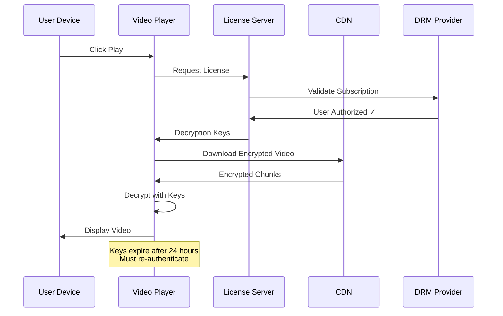

**Let me explain each step in detail:**

**Step 1: Request License**
```text
Player sends to License Server:
{
  "user_id": "12345",
  "video_id": "stranger_things_s4e1",
  "device_id": "samsung_tv_abc123",
  "subscription_tier": "premium",
  "timestamp": "2023-10-14T10:30:00Z"
}

License Server checks:
✓ Is user subscribed?
✓ Is subscription active (not expired)?
✓ Is device registered (max 4 devices)?
✓ Is video available in user's region?
✓ Is user's tier allowed to watch (4K = premium only)?
```

**Step 2: Generate Decryption Keys**
```text
License Server returns:
{
  "license_id": "lic_xyz789",
  "content_keys": [
    {
      "key_id": "key_1",
      "key": "a3f4b2c1d5e6..." (encrypted),
      "bitrate": "8_mbps_1080p"
    },
    {
      "key_id": "key_2", 
      "key": "b4g5c3d2e6f7...",
      "bitrate": "25_mbps_4k"
    }
  ],
  "expiration": "2023-10-15T10:30:00Z",  // 24 hours later
  "allowed_outputs": ["HDMI", "screen"],
  "hdcp_required": true  // Prevents HDMI capture
}

Why multiple keys?
- Different quality levels have different keys
- User switches quality → uses different key
- Key for each resolution prevents quality theft
```

**Step 3: Decrypt and Play**
```text
Video chunks are encrypted:
- Chunk 001: [encrypted data] + key_id_hint
- Player: "I need key_1 to decrypt this"
- Player uses key_1 to decrypt
- Player displays decrypted frames
- Decrypted data NEVER saved to disk (stays in memory)

Security levels (Widevine):

Level 1 (Hardware DRM - Most Secure):
- Decryption happens in secure hardware chip
- Even rooted device can't access keys
- Required for 4K/HDR content
- Available on: Recent phones, smart TVs

Level 2 (Software DRM with TEE - Medium Security):
- Decryption in Trusted Execution Environment
- Isolated from normal OS
- Used for 720p/1080p content

Level 3 (Software DRM - Lowest Security):
- Pure software decryption
- Can be hacked with effort
- Only used for older devices
- Max resolution: 480p

Netflix enforcement:
- 4K content: Requires Level 1
- 1080p content: Requires Level 2 minimum
- 720p and below: Level 3 acceptable
```

---

### 🔴 For Advanced: Multi-DRM Architecture

**The Challenge:**

```text
User can watch on:
- iPhone (FairPlay)
- Android phone (Widevine)
- Windows laptop (PlayReady)
- Xbox (PlayReady)
- Samsung TV (Widevine)
- Apple TV (FairPlay)

Each device needs different DRM!
```

**Solution: Multi-DRM Packaging**

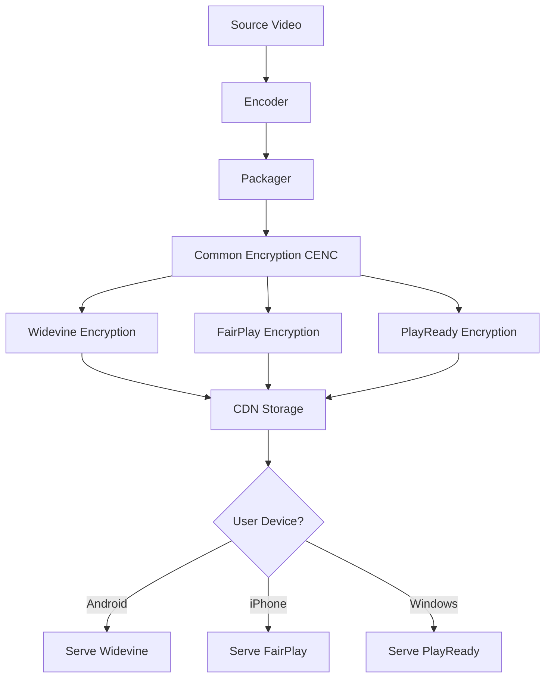

**CENC (Common Encryption):**

```text
Old way (Inefficient):
- Encrypt video three times (Widevine, FairPlay, PlayReady)
- Store three copies of every video
- 3x storage costs!

New way (CENC):
- Encrypt video once with common format
- Add DRM-specific headers
- Store one copy + small headers
- ~1.1x storage (much better!)

Technical details:
- Video encrypted with AES-128
- Same encrypted content for all DRMs
- Only license format differs
- Header tells player which DRM to use
```

**License Server Architecture:**

```text
High-Level Flow:

User Request → API Gateway → DRM Proxy → [Widevine/FairPlay/PlayReady Server]

DRM Proxy intelligence:
- Detects device type from User-Agent
- Routes to appropriate DRM provider
- Handles retries and failover
- Caches licenses (reduce provider calls)

Scaling:
- Netflix: 50M concurrent viewers
- Assume 20% need license refresh (10M/hour)
- That's 2,778 licenses/second
- Each DRM call: 100ms
- Need 278 concurrent connections per DRM provider

Solution:
- Connection pooling (reuse TCP connections)
- Multiple regions (US, EU, Asia)
- Caching (license valid for 24 hours)
- Actual load: ~1,000 licenses/second after optimization
```

**Security Best Practices:**

**1. Key Rotation**
```text
Problem: If key leaks, pirate can decrypt all content

Solution: Rotate keys regularly
- Generate new keys every week
- Old content keeps old keys (don't re-encrypt)
- New content gets new keys
- If key leaks, only one week of content exposed

Netflix approach:
- Keys rotated every 7 days
- Each video has ~10 keys (one per quality)
- Total keys in system: ~1 million active keys
- Key storage: PostgreSQL with encryption at rest
```

**2. Device Limits**
```text
Prevent account sharing:

Netflix approach:
- Premium plan: 4 concurrent streams
- Standard plan: 2 concurrent streams
- Basic plan: 1 stream

Implementation:
- License server tracks active licenses
- User starts stream 5 → Check: "Already 4 active"
- Response: "Too many devices. Stop playback on another device."

Sophisticated detection:
- User logs in from New York
- 5 minutes later, login from California
- Impossible to travel that fast!
- Flag: Possible account sharing
- Action: Send verification email
```

**3. Forensic Watermarking**
```text
Even with DRM, determined pirates can:
- Screen capture (record screen)
- HDMI capture devices
- Compromised streaming boxes

Defense: Invisible watermarks

How it works:
- Embed unique ID in video (invisible to viewer)
- Each user gets slightly different version
- Pirated video traced back to source account
- User ID: 123456 → Watermark embedded invisibly

Result:
- "Leaked video traced to account A58392"
- Ban that account
- Legal action if needed

Disney+ watermarking:
- Every frame has invisible ID
- Survives re-encoding and compression
- Even if pirate crops or filters, ID remains
```

---

### Real-World Example: Netflix's DRM Journey

**2007 - DVD Era:**
```text
Physical DVDs had CSS (Content Scramble System)
- Easily bypassed (cracked in 1999)
- But legal to use (DMCA protected it)
- Pirates still ripped and shared

Result: Netflix DVD not heavily pirated (effort not worth it)
```

**2010 - Streaming Launch with Silverlight DRM:**
```text
Microsoft Silverlight plugin required
- Worked on Windows/Mac
- No mobile support
- Users hated installing plugins
- Firefox/Chrome didn't support well

Problem: User experience suffered for DRM
```

**2013 - HTML5 + EME (Encrypted Media Extensions):**
```text
W3C standardized DRM in browsers
- No plugins needed!
- Works on all modern browsers
- Mobile support built-in

Netflix adopted immediately:
- Better user experience
- Wider device support
- Same security level

Controversy:
- Open web advocates opposed
- "DRM conflicts with open standards"
- W3C approved anyway (content industry requirement)
```

**2016 - 4K HDR Requires Hardware DRM:**
```text
Studios demanded higher security for 4K:
- Software DRM not enough
- Must use hardware secure chip
- HDCP 2.2 required on HDMI

Netflix compliance:
- 4K only on certified devices
- List of supported devices very limited
- Even expensive PCs might not work (no hardware DRM)

User impact:
- "I have 4K TV and 4K subscription, why no 4K?"
- Answer: "Your device isn't certified"
- Frustrating but required by studios
```

**Current (2023) - AI-Powered Piracy Detection:**
```text
Netflix monitors:
- Torrent sites
- Streaming sites
- Social media (leaked episodes)

Automated system:
- Scans internet for Netflix content
- AI recognizes video fingerprints
- Sends DMCA takedown notices automatically
- 1000s of takedowns per day

Effectiveness:
- Piracy still exists
- But delayed (not instant uploads)
- Quality often poor (camcorder recordings)
- Legitimate service is better experience
```

---

### ✅ Key Takeaways

- **DRM is required:** Studios won't license without it
- **Three systems:** Widevine (Google), FairPlay (Apple), PlayReady (Microsoft)
- **Hardware security for 4K:** Software DRM not secure enough
- **CENC saves storage:** Single encryption, multiple DRM headers
- **License expires:** Keys valid for 24 hours, then re-authenticate
- **Device limits:** Prevent account sharing
- **Watermarking:** Trace pirated content back to source
- **Trade-off:** Security vs user experience (certified devices only)
- **Cost**: DRM licensing fees + infrastructure + compliance testing

---

## Section 10: Scale & Cost Optimization

### What You'll Learn

- Break down video platform costs (bandwidth, storage, compute)
- Optimize each cost center for maximum savings
- Understand economies of scale
- Make build vs buy decisions
- Calculate ROI for infrastructure investments
- Design cost-effective architectures

### Why This Matters

YouTube costs Google billions of dollars to run. Bandwidth alone is estimated at $1-2 billion annually. Understanding costs isn't just for CFOs - it's critical for engineering decisions. "Should we build our own CDN?" "Should we use AV1 encoding?" "Should we store all qualities?" These are cost-driven engineering decisions that impact the bottom line.

---

### 🟢 For Beginners: Cost Breakdown

**Where does money go in video platforms?**

```text
Typical Cost Distribution (YouTube-scale):

1. Bandwidth (CDN): 70%
   - Delivering videos to users
   - Largest by far!

2. Storage: 15%
   - Storing all videos and qualities
   - Growing constantly

3. Transcoding: 10%
   - Converting uploaded videos
   - CPU/GPU intensive

4. Infrastructure: 3%
   - Databases, Redis, monitoring
   - Load balancers, API servers

5. Other: 2%
   - DRM, analytics, misc.

Total: Let's say $1B/year for 1B users
= $1/user/year (from cost perspective)

But revenue needed:
- Ad revenue: $2/user/year minimum
- Or subscription: $10/user/month

Profit margin: Very thin or negative (YouTube rumored unprofitable for years)
```

---

### 🟡 For Intermediate: Optimization Strategies

#### 1. Bandwidth Optimization (70% of costs)

```text
Problem: Serving 1 PB/day
- Standard CDN: $0.08/GB
- Cost: 1 PB × 1024 GB × $0.08 = $83,000/day = $30M/year!

Optimization strategies:

A. Negotiate Volume Discounts:
- At 1 PB/day scale, negotiate custom contracts
- Cloudflare: $0.02/GB (75% discount!)
- New cost: $7.5M/year (save $22.5M)

B. Build Your Own CDN (Netflix approach):
- Capex: $100M (servers, racks, network)
- Opex: $20M/year (power, bandwidth, maintenance)
- Break-even: 5 years
- After 5 years: Save $10M+/year

C. ISP Co-location (Netflix Open Connect):
- Place servers inside ISP networks
- ISPs provide space/power for free (reduces their costs too!)
- Netflix pays: ~$1M/year (server hardware)
- Save: $29M/year!

D. Codec Upgrade (H.264 → AV1):
- 30% bandwidth reduction
- Cost: Same video, 30% less bandwidth
- Saving: 30% of $30M = $9M/year
- Investment: $5M (encoders, testing, rollout)
- ROI: 6 months payback

E. Smart Caching:
- 1% of videos = 80% of views (power law distribution)
- Cache aggressively at edge
- Cache hit rate: 95% → 98% (small improvement)
- Reduce origin traffic: 5% → 2%
- Save: 60% of origin bandwidth = $2M/year
```

#### 2. Storage Optimization (15% of costs)

```text
Problem: 1M hours of video
- Average: 10 qualities × 2 codecs = 20 versions per video
- Size: 30 min video = 5 GB × 20 = 100 GB per video
- Total: 100 GB × 2M videos = 200 PB
- S3 Standard: $0.023/GB/month = $4.6M/month = $55M/year

Optimization strategies:

A. Tiered Storage:
- Hot (30 days): S3 Standard - 5% of library = $2.75M/year
- Warm (1 year): S3 IA - 25% = $7M/year  
- Cold (archive): Glacier - 70% = $1.2M/year
- Total: $11M/year (save $44M = 80% savings!)

B. Lazy Encoding:
- Don't encode all 20 versions upfront
- Encode 720p and 1080p only (most common)
- Encode 4K/480p/360p on first request
- 90% of videos: Never requested in 4K
- Storage: Save 30-40%

C. Compression:
- H.264 → H.265: 50% smaller
- H.265 → AV1: 30% smaller
- Combined: 65% storage reduction
- Save: $36M/year
- Trade-off: Encoding 10x slower for AV1

D. Deduplication:
- Same video uploaded multiple times
- Identical content = store once
- Use content hash: SHA-256(video)
- Typical saving: 10-20% (common on user-generated platforms)
```

#### 3. Transcoding Optimization (10% of costs)

```text
Problem: 500 hours uploaded/minute (YouTube scale)
- 500 hours × 60 = 30,000 hours/hour uploaded
- 20 versions per video = 600,000 encoding-hours/hour
- EC2 c5.xlarge: $0.17/hour
- Cost: 600,000 × $0.17 = $102,000/hour = $2.4M/day = $876M/year!

Optimization strategies:

A. Dedicated Hardware:
- Buy servers instead of renting
- Capex: $50M (50,000 servers @ $1K each)
- Opex: $10M/year (power, maintenance)
- Depreciation: $10M/year (5-year lifecycle)
- Total: $20M/year (vs $876M/year)
- Save: $856M/year (amazing ROI!)

B. GPU Acceleration:
- NVIDIA GPUs: 10x faster than CPU
- Cost per encoding: $0.01 (vs $0.17)
- Total: $87M/year (save $789M)
- Hardware cost: $100M (amortized over years)

C. Prioritization:
- Premium users: Immediate encoding
- Free users: Encode only popular formats, rest on-demand
- Save: 40% of encoding costs

D. Geographic Optimization:
- Encode in cheapest regions (India, China: 50% cheaper)
- Use spot instances (70% cheaper, but can be terminated)
- Save: 30-50%

E. Smart Encoding:
- Viral video prediction (ML model)
- Will-be-popular: Encode all versions immediately
- Will-be-unpopular: Encode only 720p
- Save: 30% encoding costs
```

---

### 🔴 For Advanced: Build vs Buy Decisions

**Case Study: Should Netflix Build Its Own CDN?**

```text
Option A: Use Commercial CDN (Akamai, Cloudflare)

Pros:
✓ No upfront investment
✓ Global reach immediately
✓ Scales automatically
✓ Someone else's problem (maintenance)

Cons:
✗ Expensive at scale ($50-100M/year)
✗ Limited control
✗ Cannot optimize for specific use case
✗ Vendor lock-in

Option B: Build Own CDN (Open Connect)

Pros:
✓ Massive savings at scale ($10-20M/year after break-even)
✓ Complete control
✓ Optimize for streaming specifically
✓ ISP partnerships possible

Cons:
✗ Huge upfront investment ($200M+)
✗ Years to build
✗ Complex operations
✗ Risk of failure

Netflix's Analysis (2011):

Year 1-3: Lose money (building infrastructure)
Year 4: Break-even
Year 5+: Save $50M+/year

Decision: Build it!

Results (10 years later):
- 18,000+ servers globally
- Inside 1,000+ ISP networks
- Estimated savings: $500M+/year vs commercial CDN
- ROI: Paid off after 4 years, now pure savings
```

**When to Build vs Buy?**

```text
Build if:
✓ Unique requirements
✓ Massive scale (economies of scale matter)
✓ Long-term commitment (amortize investment)
✓ Have expertise in-house
✓ Competitive advantage possible

Buy if:
✗ Small scale (not worth investment)
✗ Short-term need (build takes years)
✗ Commodity service (no differentiation)
✗ Lack expertise (would take years to learn)
✗ Fast time-to-market needed
```

---

### Real-World Cost Optimization Examples

**1. YouTube's Energy Optimization**

```text
Problem: Data centers use massive electricity
- 100,000 servers
- 500W per server
- 50 MW total (50,000 homes worth!)
- Cost: $5M/month just for electricity

Optimizations:
- Machine learning to predict cooling needs
- AI adjusts AC in real-time based on workload
- Custom server designs (no unnecessary components)
- Efficient power supplies (98% efficiency vs 85% standard)

Result:
- 30% energy reduction
- Save: $1.5M/month = $18M/year
- Investment: $10M (AI system + server redesign)
- Payback: 7 months

Additional benefit:
- Lower carbon footprint
- Google's goal: Carbon-neutral data centers
```

**2. Twitch's Transcoding Costs**

```text
Problem: Live streaming transcoding expensive
- 50,000 live streams at peak
- Each needs 5 qualities (source + 4 transcoded)
- Real-time transcoding (no batching possible)
- Cost: $10M/year on CPU transcoding

Solution: Selective transcoding
- Only transcode streams with >10 viewers
- 90% of streams have <10 viewers
- Let clients do transcoding (they adapt to stream quality)

Result:
- Transcode 10% instead of 100%
- Cost: $1M/year (save $9M)
- Viewer impact: Minimal (small streams already low quality)

Additional optimization:
- GPU transcoding for popular streams
- CPU transcoding eliminated entirely
- New cost: $2M/year (GPUs)
- Quality: Better (GPUs more powerful)
```

**3. TikTok's Storage Optimization**

```text
Problem: 1 billion videos/month uploaded
- Average: 30 seconds per video
- 10 qualities × 2 codecs = 20 versions
- Storage: Exploding exponentially

Insight: Most videos never go viral
- 80% of videos: <1000 views
- 1% of videos: Millions of views

Solution: Predictive encoding
- Upload: Encode only 720p H.264 (smallest version)
- View count > 1000: Encode 1080p
- View count > 100,000: Encode all qualities
- Viral (>1M views): Encode 4K + all codecs

Result:
- Storage: 70% reduction
- Most videos: 1 version (not 20)
- Popular videos: Full 20 versions (when it matters)
- User experience: Unchanged (rare videos = low expectations)

Cost impact:
- Storage: $100M/year → $30M/year
- Transcoding: $50M/year → $20M/year
- Total saved: $100M/year
```

---

### ✅ Key Takeaways

- **Bandwidth is king:** 70% of costs - optimize first
- **Economies of scale:** At YouTube/Netflix scale, building > buying
- **Tiered storage:** Hot/warm/cold saves 50-80%
- **Codec matters:** AV1 saves 30% bandwidth (billions at scale)
- **Smart caching:** 98% vs 95% hit rate = millions saved
- **GPU transcoding:** 10x faster, 90% cheaper than CPU
- **Lazy encoding:** Don't encode versions nobody watches
- **ISP partnerships:** Netflix's Open Connect is brilliant cost optimization
- **ROI mindset:** $100M investment that saves $50M/year = 2-year payback
- **Predict popularity:** ML models can optimize which content to prioritize

---

## Requirements & Clarification

### User Stories

**As a viewer, I want to:**
- Watch videos with <2 second startup time and minimal buffering
- Automatically adjust video quality based on my network speed
- Resume playback from where I left off across devices
- Search and discover relevant content through recommendations
- Download videos for offline viewing
- Watch live streams with <5 second latency

**As a content creator, I want to:**
- Upload videos up to 4K resolution with minimal processing time
- Track video analytics (views, watch time, engagement)
- Monetize content through ads and subscriptions
- Manage content metadata, thumbnails, and subtitles
- Live stream with low latency to global audiences
- Protect content with DRM and access controls

**As a platform operator, I want to:**
- Serve 100M concurrent viewers globally
- Store 1M hours of video content (100 PB)
- Process 50M uploads per day
- Achieve 99.99% uptime during peak hours
- Optimize bandwidth costs through efficient compression
- Detect and remove copyrighted/inappropriate content

### Functional Requirements

**Core Features:**
- Video upload with multiple format support
- Multi-bitrate transcoding (240p to 4K)
- Adaptive bitrate streaming (HLS/DASH)
- Live streaming with low latency
- Video playback with resume capability
- Search and recommendation engine

**Advanced Features:**
- AI-powered content recommendations
- Real-time view count aggregation
- Comment and engagement system
- Subtitle generation and multi-language support
- Content moderation and copyright detection
- DRM and content protection
- Analytics dashboard for creators

### Non-Functional Requirements

**Performance:**
- <2 second video startup time (p95)
- <100ms seek time for VOD
- <5 second latency for live streams
- 99% CDN cache hit ratio
- Support 100M concurrent viewers

**Scalability:**
- 1M hours of video content (100 PB storage)
- 50M video uploads per day
- 10B video views per day
- 1 PB daily bandwidth consumption

**Reliability:**
- 99.99% uptime for video playback
- Zero data loss for uploaded videos
- Multi-region redundancy
- Graceful degradation during failures

### Clarifying Questions & Assumptions

**Scale Expectations:**
- 100M concurrent viewers globally
- 1B total users
- 1M hours of video (100 PB storage)
- 50M uploads/day
- Average video length: 10 minutes
- Peak viewing: 8 PM - 11 PM local time

**Usage Patterns:**
- 80% mobile, 20% desktop/TV
- Average session: 45 minutes
- 70% 1080p, 20% 4K, 10% lower quality
- Live streaming: 5% of traffic
- Download for offline: 10% of users

**Feature Scope (MVP):**
- Video upload and transcoding
- Adaptive bitrate streaming
- Basic search and recommendations
- View count tracking

**Integration Requirements:**
- CDN providers (CloudFront, Akamai, Fastly)
- Payment gateways for subscriptions
- Ad networks for monetization
- DRM providers (Widevine, FairPlay)

---

## Back-of-the-Envelope Calculations

### Storage Estimates

```text
Video Content Storage:
- Total videos: 1M hours × 60 min = 60M hours of content
- Average bitrate for 1080p: 5 Mbps
- Storage per hour: 5 Mbps × 3600s / 8 = 2.25 GB/hour
- Multiple qualities (240p, 480p, 720p, 1080p, 4K): ~5x storage
- Total storage: 60M hours × 2.25 GB × 5 = 675,000 TB ≈ 675 PB

With compression and deduplication: ~100 PB

Thumbnail Storage:
- 60M videos × 5 thumbnails × 50 KB = 15 TB

Metadata Storage:
- 60M videos × 10 KB = 600 GB

User Data Storage:
- 1B users × 5 KB = 5 TB

Total Storage: ~100 PB (video) + 15 TB (thumbnails) + 6 TB (metadata/users) ≈ 100.02 PB
```

### Bandwidth Estimates

```text
Concurrent Viewers: 100M
Average bitrate: 3 Mbps (adaptive)
Peak bandwidth: 100M × 3 Mbps = 300,000 Gbps = 300 Tbps

Daily bandwidth consumption:
- Average viewers per day: 500M unique viewers
- Average watch time: 45 minutes
- Bandwidth: 500M × 45 min × 60s × 3 Mbps / 8 = 5,062,500,000 GB ≈ 5 PB/day

Monthly bandwidth: 5 PB × 30 = 150 PB/month
```

### Upload Processing

```text
Daily uploads: 50M videos
Average upload size: 500 MB
Daily upload bandwidth: 50M × 500 MB = 25 PB/day

Transcoding time per video:
- Real-time transcoding ratio: 1:1 for 1080p
- 10-minute video takes ~10 minutes to transcode
- Parallel transcoding: 5 qualities simultaneously

Transcoding resources needed:
- 50M videos/day ÷ 86,400 seconds = 579 videos/second
- Each transcoding job: 10 minutes × 5 qualities = 50 minutes
- Concurrent transcoding jobs: 579 × 50 / 60 = 482 jobs
- With redundancy: ~1000 transcoding servers (each handling 1 job at a time)
```

### CDN and Caching

```text
CDN Edge Locations: 200+ globally
Cache size per edge: 50 TB (hot content)
Total CDN cache: 200 × 50 TB = 10 PB

Cache hit ratio: 99% (target)
Origin bandwidth: 300 Tbps × 1% = 3 Tbps
```

### Resource Estimates

```text
API Servers:
- QPS: 100M viewers × 10 requests/minute = 16.7M requests/sec
- Assuming 10K QPS per server: 16.7M / 10K = 1,670 servers
- With 2x redundancy: ~3,500 API servers

Database Servers:
- Metadata database: 50 primary + 200 read replicas
- Analytics database: 100 nodes (ClickHouse cluster)
- User database: 20 primary + 80 read replicas

Transcoding Servers:
- 1000 GPU-accelerated servers
- Each server: 4 × NVIDIA T4 GPUs

Storage Servers:
- Object storage (S3/GCS): Managed service, unlimited scale
- Hot storage (SSD): 10 PB for recent uploads
- Cold storage (HDD/Glacier): 90 PB for older content
```

---

## High-Level Design

### System Architecture

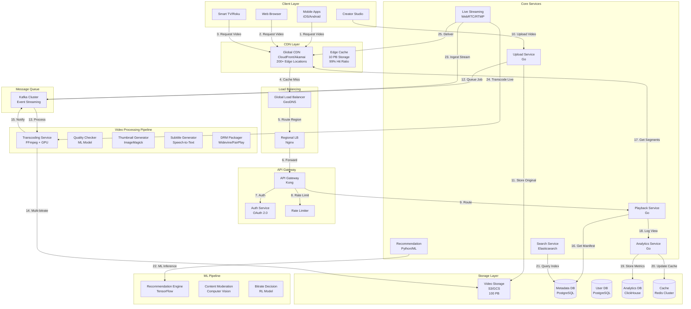

### Data Flow Explanation

1. **Video Upload Flow:**
   - Creator uploads video through Upload Service
   - Original video stored in object storage (S3/GCS)
   - Transcoding job queued in Kafka
   - Multiple workers transcode to different qualities
   - Transcoded segments stored in object storage
   - Metadata updated in database
   - CDN cache warmed with popular content

2. **Video Playback Flow:**
   - Viewer requests video through client app
   - Request routed to nearest CDN edge location
   - Edge cache returns manifest file (HLS/DASH)
   - Client requests video segments based on bandwidth
   - Segments served from CDN cache (99% hit rate)
   - View event logged to analytics service
   - Recommendation engine updated with viewing data

3. **Adaptive Bitrate Flow:**
   - Client measures network bandwidth periodically
   - Playback service receives bandwidth metrics
   - ML model selects optimal bitrate
   - Client switches to appropriate quality segment
   - Smooth transition without buffering

4. **Live Streaming Flow:**
   - Creator starts live stream via RTMP/WebRTC
   - Live Streaming service ingests stream
   - Real-time transcoding to multiple bitrates
   - Segments generated every 2-6 seconds
   - Segments pushed to CDN edge locations
   - Viewers receive stream with <5 second latency

---

## Database Design

### PostgreSQL Schema (Metadata & Users)

```sql
-- Users table
CREATE TABLE users (
    user_id UUID PRIMARY KEY DEFAULT gen_random_uuid(),
    email VARCHAR(255) UNIQUE NOT NULL,
    username VARCHAR(50) UNIQUE NOT NULL,
    password_hash VARCHAR(255) NOT NULL,
    full_name VARCHAR(255),
    profile_photo_url VARCHAR(500),
    subscription_tier VARCHAR(20) DEFAULT 'free',
    subscription_expires_at TIMESTAMP,
    is_creator BOOLEAN DEFAULT FALSE,
    is_verified BOOLEAN DEFAULT FALSE,
    created_at TIMESTAMP DEFAULT CURRENT_TIMESTAMP,
    updated_at TIMESTAMP DEFAULT CURRENT_TIMESTAMP,
    last_login_at TIMESTAMP,
    
    INDEX idx_email (email),
    INDEX idx_username (username),
    INDEX idx_subscription_tier (subscription_tier),
    INDEX idx_is_creator (is_creator)
);

-- Channels table (for creators)
CREATE TABLE channels (
    channel_id UUID PRIMARY KEY DEFAULT gen_random_uuid(),
    user_id UUID NOT NULL,
    channel_name VARCHAR(100) UNIQUE NOT NULL,
    description TEXT,
    banner_url VARCHAR(500),
    subscriber_count BIGINT DEFAULT 0,
    total_views BIGINT DEFAULT 0,
    is_verified BOOLEAN DEFAULT FALSE,
    is_monetized BOOLEAN DEFAULT FALSE,
    created_at TIMESTAMP DEFAULT CURRENT_TIMESTAMP,
    updated_at TIMESTAMP DEFAULT CURRENT_TIMESTAMP,
    
    INDEX idx_user_id (user_id),
    INDEX idx_channel_name (channel_name),
    INDEX idx_subscriber_count (subscriber_count),
    INDEX idx_is_verified (is_verified),
    
    FOREIGN KEY (user_id) REFERENCES users(user_id)
);

-- Videos table
CREATE TABLE videos (
    video_id UUID PRIMARY KEY DEFAULT gen_random_uuid(),
    channel_id UUID NOT NULL,
    title VARCHAR(500) NOT NULL,
    description TEXT,
    duration_seconds INTEGER NOT NULL,
    
    -- Video metadata
    category VARCHAR(50),
    tags TEXT[],
    language VARCHAR(10),
    
    -- Video status
    status VARCHAR(20) DEFAULT 'processing',
    is_public BOOLEAN DEFAULT TRUE,
    is_live BOOLEAN DEFAULT FALSE,
    is_monetized BOOLEAN DEFAULT FALSE,
    is_age_restricted BOOLEAN DEFAULT FALSE,
    
    -- Video metrics
    view_count BIGINT DEFAULT 0,
    like_count BIGINT DEFAULT 0,
    dislike_count BIGINT DEFAULT 0,
    comment_count BIGINT DEFAULT 0,
    
    -- Video quality
    max_quality VARCHAR(10),
    available_qualities TEXT[],
    
    -- URLs
    thumbnail_url VARCHAR(500),
    manifest_url VARCHAR(500),
    
    -- Timestamps
    published_at TIMESTAMP,
    created_at TIMESTAMP DEFAULT CURRENT_TIMESTAMP,
    updated_at TIMESTAMP DEFAULT CURRENT_TIMESTAMP,
    
    -- Indexes
    INDEX idx_channel_id (channel_id),
    INDEX idx_status (status),
    INDEX idx_is_public (is_public),
    INDEX idx_view_count (view_count),
    INDEX idx_published_at (published_at),
    INDEX idx_category (category),
    
    -- Composite indexes
    INDEX idx_channel_published (channel_id, published_at),
    INDEX idx_public_published (is_public, published_at),
    INDEX idx_category_views (category, view_count),
    
    -- Full-text search
    FULLTEXT INDEX idx_search (title, description),
    
    FOREIGN KEY (channel_id) REFERENCES channels(channel_id)
);

-- Video processing status table
CREATE TABLE video_processing (
    processing_id UUID PRIMARY KEY DEFAULT gen_random_uuid(),
    video_id UUID NOT NULL,
    original_file_url VARCHAR(500) NOT NULL,
    original_file_size BIGINT,
    original_resolution VARCHAR(20),
    original_bitrate INTEGER,
    
    -- Processing status
    transcoding_status VARCHAR(20) DEFAULT 'pending',
    thumbnail_status VARCHAR(20) DEFAULT 'pending',
    subtitle_status VARCHAR(20) DEFAULT 'pending',
    drm_status VARCHAR(20) DEFAULT 'pending',
    
    -- Processing metadata
    transcoding_progress INTEGER DEFAULT 0,
    started_at TIMESTAMP,
    completed_at TIMESTAMP,
    error_message TEXT,
    
    INDEX idx_video_id (video_id),
    INDEX idx_transcoding_status (transcoding_status),
    INDEX idx_started_at (started_at),
    
    FOREIGN KEY (video_id) REFERENCES videos(video_id)
);

-- Video segments table (for chunked storage)
CREATE TABLE video_segments (
    segment_id UUID PRIMARY KEY DEFAULT gen_random_uuid(),
    video_id UUID NOT NULL,
    quality VARCHAR(10) NOT NULL,
    segment_number INTEGER NOT NULL,
    duration_seconds DECIMAL(10,3) NOT NULL,
    segment_url VARCHAR(500) NOT NULL,
    file_size BIGINT,
    created_at TIMESTAMP DEFAULT CURRENT_TIMESTAMP,
    
    INDEX idx_video_quality (video_id, quality),
    INDEX idx_segment_number (video_id, quality, segment_number),
    
    FOREIGN KEY (video_id) REFERENCES videos(video_id),
    UNIQUE (video_id, quality, segment_number)
);

-- Subscriptions table
CREATE TABLE subscriptions (
    subscription_id UUID PRIMARY KEY DEFAULT gen_random_uuid(),
    user_id UUID NOT NULL,
    channel_id UUID NOT NULL,
    notification_enabled BOOLEAN DEFAULT TRUE,
    subscribed_at TIMESTAMP DEFAULT CURRENT_TIMESTAMP,
    
    INDEX idx_user_id (user_id),
    INDEX idx_channel_id (channel_id),
    INDEX idx_subscribed_at (subscribed_at),
    
    FOREIGN KEY (user_id) REFERENCES users(user_id),
    FOREIGN KEY (channel_id) REFERENCES channels(channel_id),
    UNIQUE (user_id, channel_id)
);

-- Watch history table
CREATE TABLE watch_history (
    history_id UUID PRIMARY KEY DEFAULT gen_random_uuid(),
    user_id UUID NOT NULL,
    video_id UUID NOT NULL,
    watch_position_seconds INTEGER DEFAULT 0,
    watch_duration_seconds INTEGER DEFAULT 0,
    completed BOOLEAN DEFAULT FALSE,
    watched_at TIMESTAMP DEFAULT CURRENT_TIMESTAMP,
    updated_at TIMESTAMP DEFAULT CURRENT_TIMESTAMP,
    
    INDEX idx_user_id (user_id),
    INDEX idx_video_id (video_id),
    INDEX idx_watched_at (watched_at),
    INDEX idx_user_watched (user_id, watched_at),
    
    FOREIGN KEY (user_id) REFERENCES users(user_id),
    FOREIGN KEY (video_id) REFERENCES videos(video_id)
);

-- Comments table
CREATE TABLE comments (
    comment_id UUID PRIMARY KEY DEFAULT gen_random_uuid(),
    video_id UUID NOT NULL,
    user_id UUID NOT NULL,
    parent_comment_id UUID,
    comment_text TEXT NOT NULL,
    like_count BIGINT DEFAULT 0,
    is_pinned BOOLEAN DEFAULT FALSE,
    is_creator_reply BOOLEAN DEFAULT FALSE,
    created_at TIMESTAMP DEFAULT CURRENT_TIMESTAMP,
    updated_at TIMESTAMP DEFAULT CURRENT_TIMESTAMP,
    
    INDEX idx_video_id (video_id),
    INDEX idx_user_id (user_id),
    INDEX idx_parent_comment_id (parent_comment_id),
    INDEX idx_created_at (created_at),
    INDEX idx_video_created (video_id, created_at),
    
    FOREIGN KEY (video_id) REFERENCES videos(video_id),
    FOREIGN KEY (user_id) REFERENCES users(user_id),
    FOREIGN KEY (parent_comment_id) REFERENCES comments(comment_id)
);

-- Playlists table
CREATE TABLE playlists (
    playlist_id UUID PRIMARY KEY DEFAULT gen_random_uuid(),
    user_id UUID NOT NULL,
    title VARCHAR(255) NOT NULL,
    description TEXT,
    is_public BOOLEAN DEFAULT TRUE,
    video_count INTEGER DEFAULT 0,
    created_at TIMESTAMP DEFAULT CURRENT_TIMESTAMP,
    updated_at TIMESTAMP DEFAULT CURRENT_TIMESTAMP,
    
    INDEX idx_user_id (user_id),
    INDEX idx_is_public (is_public),
    INDEX idx_created_at (created_at),
    
    FOREIGN KEY (user_id) REFERENCES users(user_id)
);

-- Playlist videos table
CREATE TABLE playlist_videos (
    playlist_video_id UUID PRIMARY KEY DEFAULT gen_random_uuid(),
    playlist_id UUID NOT NULL,
    video_id UUID NOT NULL,
    position INTEGER NOT NULL,
    added_at TIMESTAMP DEFAULT CURRENT_TIMESTAMP,
    
    INDEX idx_playlist_id (playlist_id),
    INDEX idx_video_id (video_id),
    INDEX idx_playlist_position (playlist_id, position),
    
    FOREIGN KEY (playlist_id) REFERENCES playlists(playlist_id),
    FOREIGN KEY (video_id) REFERENCES videos(video_id),
    UNIQUE (playlist_id, video_id)
);
```

### ClickHouse Schema (Analytics & Time-Series Data)

```sql
-- Video view events table
CREATE TABLE video_views (
    event_id UUID,
    video_id UUID,
    user_id UUID,
    session_id UUID,
    
    -- Viewing metrics
    watch_duration_seconds UInt32,
    quality_watched String,
    buffering_events UInt16,
    bitrate_switches UInt16,
    
    -- Device and location
    device_type String,
    os String,
    browser String,
    country String,
    city String,
    
    -- Network metrics
    avg_bitrate_mbps Float32,
    startup_time_ms UInt32,
    rebuffer_count UInt16,
    rebuffer_duration_ms UInt32,
    
    -- Timestamps
    event_timestamp DateTime,
    date Date DEFAULT toDate(event_timestamp),
    hour UInt8 DEFAULT toHour(event_timestamp)
) ENGINE = MergeTree()
PARTITION BY toYYYYMM(date)
ORDER BY (video_id, date, event_timestamp)
TTL date + INTERVAL 90 DAY;

-- Video analytics aggregated table
CREATE TABLE video_analytics_daily (
    video_id UUID,
    date Date,
    
    -- View metrics
    view_count UInt64,
    unique_viewers UInt64,
    total_watch_time_seconds UInt64,
    avg_watch_time_seconds Float32,
    completion_rate Float32,
    
    -- Quality metrics
    avg_startup_time_ms Float32,
    avg_rebuffer_rate Float32,
    quality_distribution Map(String, UInt32),
    
    -- Engagement metrics
    like_count UInt32,
    dislike_count UInt32,
    comment_count UInt32,
    share_count UInt32,
    
    -- Geographic distribution
    country_distribution Map(String, UInt32),
    
    -- Device distribution
    device_distribution Map(String, UInt32)
) ENGINE = SummingMergeTree()
PARTITION BY toYYYYMM(date)
ORDER BY (video_id, date);

-- Real-time view counts (last 5 minutes)
CREATE TABLE video_views_realtime (
    video_id UUID,
    timestamp DateTime,
    view_count UInt64,
    unique_viewers UInt64
) ENGINE = MergeTree()
PARTITION BY toYYYYMMDD(timestamp)
ORDER BY (video_id, timestamp)
TTL timestamp + INTERVAL 1 HOUR;
```

### Redis Schema (Caching & Session Management)

```redis
# Video metadata cache
video:meta:{video_id} -> {
    "title": "...",
    "duration": 600,
    "view_count": 1000000,
    "manifest_url": "...",
    "qualities": ["240p", "480p", "720p", "1080p", "4K"],
    "ttl": 3600
}

# User session and watch progress
user:session:{user_id}:{video_id} -> {
    "position": 120,
    "quality": "1080p",
    "bandwidth_mbps": 5.5,
    "last_updated": timestamp
}

# Real-time view count cache
video:views:{video_id} -> {
    "count": 1000000,
    "window_start": timestamp,
    "updated": timestamp
}

# Trending videos cache
trending:videos:{category} -> ZSET [
    {video_id: score},
    ...
] (sorted by trending score)

# CDN manifest cache
cdn:manifest:{video_id}:{quality} -> "manifest_content"

# Rate limiting
rate:upload:{user_id} -> {
    "count": 5,
    "window_start": timestamp,
    "limit": 10
}

# Recommendation cache
recommend:user:{user_id} -> [video_ids] (TTL: 5 minutes)

# Hot content cache (most viewed in last hour)
hot:content -> ZSET [
    {video_id: view_count},
    ...
]
```

### Elasticsearch Schema (Search & Discovery)

```json
{
  "mappings": {
    "properties": {
      "video_id": {"type": "keyword"},
      "channel_id": {"type": "keyword"},
      "title": {
        "type": "text",
        "fields": {
          "keyword": {"type": "keyword"},
          "autocomplete": {
            "type": "text",
            "analyzer": "autocomplete"
          }
        }
      },
      "description": {"type": "text"},
      "tags": {"type": "keyword"},
      "category": {"type": "keyword"},
      "language": {"type": "keyword"},
      "duration_seconds": {"type": "integer"},
      "view_count": {"type": "long"},
      "like_count": {"type": "long"},
      "published_at": {"type": "date"},
      "channel_name": {
        "type": "text",
        "fields": {"keyword": {"type": "keyword"}}
      },
      "subscriber_count": {"type": "long"},
      "is_verified": {"type": "boolean"},
      "quality": {"type": "keyword"},
      "trending_score": {"type": "float"}
    }
  }
}
```

---

## API Design

### Base Configuration

- **Base URL:** `https://api.videostream.com/v1`
- **Authentication:** JWT tokens, OAuth 2.0 for third-party
- **Rate Limiting:** 1000 requests/hour for viewers, 10000/hour for creators
- **Content-Type:** `application/json`, `multipart/form-data` for uploads

### Video Playback Endpoints

#### Get Video Manifest

```http
GET /videos/{video_id}/manifest?quality=auto
```

**Response:**
```json
{
  "video_id": "550e8400-e29b-41d4-a716-446655440000",
  "format": "hls",
  "manifest_url": "https://cdn.videostream.com/manifests/550e8400/master.m3u8",
  "qualities": [
    {
      "quality": "4K",
      "resolution": "3840x2160",
      "bitrate_kbps": 15000,
      "manifest_url": "https://cdn.videostream.com/manifests/550e8400/4k.m3u8"
    },
    {
      "quality": "1080p",
      "resolution": "1920x1080",
      "bitrate_kbps": 5000,
      "manifest_url": "https://cdn.videostream.com/manifests/550e8400/1080p.m3u8"
    },
    {
      "quality": "720p",
      "resolution": "1280x720",
      "bitrate_kbps": 2500,
      "manifest_url": "https://cdn.videostream.com/manifests/550e8400/720p.m3u8"
    }
  ],
  "drm": {
    "type": "widevine",
    "license_url": "https://drm.videostream.com/license"
  },
  "recommended_quality": "1080p",
  "total_duration_seconds": 600,
  "ttl": 3600
}
```

#### Report Playback Event

```http
POST /videos/{video_id}/events
```

**Request:**
```json
{
  "event_type": "view",
  "session_id": "session_550e8400",
  "watch_position_seconds": 120,
  "quality_watched": "1080p",
  "bitrate_mbps": 5.2,
  "buffering_events": 2,
  "startup_time_ms": 850,
  "device_info": {
    "type": "mobile",
    "os": "iOS 17",
    "browser": "Safari"
  },
  "network_info": {
    "type": "wifi",
    "bandwidth_mbps": 25.5
  },
  "timestamp": "2025-01-02T10:15:30Z"
}
```

### Video Upload Endpoints

#### Initiate Upload

```http
POST /videos/upload/initiate
```

**Request:**
```json
{
  "title": "My Awesome Video",
  "description": "This is a great video",
  "category": "Technology",
  "tags": ["tech", "tutorial", "coding"],
  "language": "en",
  "is_public": true,
  "file_size_bytes": 524288000,
  "duration_seconds": 600,
  "resolution": "1920x1080"
}
```

**Response:**
```json
{
  "video_id": "550e8400-e29b-41d4-a716-446655440000",
  "upload_url": "https://upload.videostream.com/videos/550e8400",
  "upload_id": "upload_550e8400",
  "chunk_size": 5242880,
  "expires_at": "2025-01-02T11:00:00Z"
}
```

#### Upload Video Chunk

```http
PUT /videos/upload/{upload_id}/chunk/{chunk_number}
Content-Type: application/octet-stream
```

#### Complete Upload

```http
POST /videos/upload/{upload_id}/complete
```

**Response:**
```json
{
  "video_id": "550e8400-e29b-41d4-a716-446655440000",
  "status": "processing",
  "estimated_processing_time_minutes": 15,
  "processing_status_url": "/videos/550e8400/processing-status"
}
```

### Video Management Endpoints

#### Get Video Details

```http
GET /videos/{video_id}
```

**Response:**
```json
{
  "video_id": "550e8400-e29b-41d4-a716-446655440000",
  "channel": {
    "channel_id": "channel_123",
    "channel_name": "Tech Channel",
    "subscriber_count": 1000000,
    "is_verified": true
  },
  "title": "How to Build a Video Streaming Platform",
  "description": "Complete guide to building Netflix",
  "duration_seconds": 600,
  "published_at": "2025-01-01T10:00:00Z",
  "category": "Technology",
  "tags": ["tech", "tutorial", "system design"],
  "metrics": {
    "view_count": 1000000,
    "like_count": 50000,
    "dislike_count": 1000,
    "comment_count": 5000
  },
  "thumbnails": {
    "default": "https://cdn.videostream.com/thumbnails/550e8400/default.jpg",
    "medium": "https://cdn.videostream.com/thumbnails/550e8400/medium.jpg",
    "high": "https://cdn.videostream.com/thumbnails/550e8400/high.jpg"
  },
  "status": "published",
  "is_monetized": true,
  "available_qualities": ["240p", "480p", "720p", "1080p", "4K"]
}
```

### Search Endpoints

#### Search Videos

```http
GET /search?q=system+design&sort=relevance&page=1&page_size=20
```

**Response:**
```json
{
  "query": "system design",
  "results": [
    {
      "video_id": "550e8400",
      "title": "System Design Interview Guide",
      "channel_name": "Tech Channel",
      "view_count": 1000000,
      "published_at": "2025-01-01T10:00:00Z",
      "duration_seconds": 600,
      "thumbnail_url": "...",
      "relevance_score": 0.95
    }
  ],
  "total_results": 10000,
  "page": 1,
  "page_size": 20
}
```

### Analytics Endpoints

#### Get Video Analytics

```http
GET /videos/{video_id}/analytics?period=30d
```

**Response:**
```json
{
  "video_id": "550e8400",
  "period": "30d",
  "metrics": {
    "total_views": 1000000,
    "unique_viewers": 800000,
    "total_watch_time_hours": 166667,
    "avg_view_duration_seconds": 450,
    "avg_completion_rate": 0.75,
    "likes": 50000,
    "dislikes": 1000,
    "comments": 5000,
    "shares": 10000
  },
  "geographic_distribution": {
    "US": 400000,
    "UK": 150000,
    "India": 200000,
    "Others": 250000
  },
  "device_distribution": {
    "mobile": 600000,
    "desktop": 300000,
    "tv": 100000
  },
  "quality_distribution": {
    "4K": 100000,
    "1080p": 700000,
    "720p": 150000,
    "480p": 50000
  },
  "traffic_sources": {
    "search": 300000,
    "recommendations": 400000,
    "external": 200000,
    "direct": 100000
  },
  "revenue": {
    "ad_revenue": 5000.00,
    "subscription_revenue": 2000.00,
    "total": 7000.00
  }
}
```

---

## Deep-Dive Components & Trade-offs

### Component 1: Adaptive Bitrate Streaming with ML-Powered Quality Selection

**Purpose:** Deliver optimal video quality based on network conditions while minimizing buffering and maximizing viewer experience.

**Architecture:**
```text
1. Multi-Bitrate Transcoding
   - Input: Original video at high quality
   - Output: 5-7 quality levels (240p, 480p, 720p, 1080p, 4K)
   - Encoding: H.264 (broad compatibility), H.265 (better compression), VP9 (free)
   - Chunking: 2-6 second segments for quick adaptation
   - Storage: Each quality stored separately with manifest files

2. HLS/DASH Protocol Implementation
   - Master playlist (.m3u8) with all quality levels
   - Individual playlists for each quality
   - Client-driven quality selection
   - Seamless quality switching between segments
   
3. ML-Powered Bitrate Selection
   - Features: Current bandwidth, historical bandwidth, buffer level, device type
   - Model: Reinforcement learning (Deep Q-Network)
   - Training: Historical viewing data (millions of sessions)
   - Inference: <5ms per decision, runs on client or server
   - Optimization goal: Maximize QoE (Quality of Experience)
   
4. Bandwidth Measurement Strategy
   - Passive: Measure segment download time
   - Active: Periodic bandwidth probes
   - Exponentially weighted moving average (EWMA)
   - Prediction: Use ML model to predict future bandwidth
```

**Technology Choice:** HLS + H.264 + TensorFlow Lite
- **Pros:** Universal compatibility, adaptive quality, proven at scale, client-side execution
- **Cons:** Segmentation overhead, latency for quality switches, model distribution complexity
- **Alternative:** Fixed bitrate (simpler but poor UX, high bandwidth costs)

**Quality Selection Algorithm:**
```python
def select_quality(bandwidth_mbps, buffer_seconds, device_type):
    """
    ML-powered quality selection
    Returns: quality level (240p, 480p, 720p, 1080p, 4K)
    """
    # Feature vector
    features = [
        bandwidth_mbps,
        buffer_seconds,
        device_type_embedding[device_type],
        historical_bandwidth_avg,
        bandwidth_variance,
        time_of_day
    ]
    
    # ML model inference
    quality_scores = ml_model.predict(features)
    
    # Conservative selection (avoid buffering)
    if buffer_seconds < 5:
        quality = quality_scores[quality_scores < bandwidth_mbps * 0.7].max()
    else:
        quality = quality_scores[quality_scores < bandwidth_mbps * 0.9].max()
    
    return quality
```

**Performance Impact:**
- Without ML: 20% rebuffer rate, 3.5/5 viewer satisfaction
- With ML: 5% rebuffer rate, 4.5/5 viewer satisfaction
- Bandwidth savings: 30% through optimal quality selection
- Startup time: <2 seconds (p95)

### Component 2: Distributed Transcoding Pipeline with GPU Acceleration

**Purpose:** Process 50M video uploads per day with minimal latency and cost-efficient resource utilization.

**Architecture:**
```text
1. Upload Processing Flow
   - Step 1: Video uploaded to S3 (multipart upload)
   - Step 2: Metadata extraction (resolution, duration, codec)
   - Step 3: Job queued in Kafka (priority based on channel size)
   - Step 4: Worker picks job from queue
   - Step 5: Parallel transcoding to multiple qualities
   - Step 6: Quality verification using ML model
   - Step 7: Segments uploaded to S3
   - Step 8: CDN cache warming
   - Step 9: Metadata updated, creator notified

2. GPU-Accelerated Transcoding
   - Hardware: NVIDIA T4 GPUs (4 per server)
   - Software: FFmpeg with NVENC hardware encoding
   - Speedup: 10x faster than CPU encoding
   - Cost: $0.50 per GPU-hour vs $2.00 per CPU-hour equivalent
   - Parallelization: 5 qualities simultaneously
   
3. Distributed Worker Architecture
   - Worker pool: 1000 servers (4000 GPUs total)
   - Auto-scaling: Scale 50-200% based on queue depth
   - Job scheduling: Priority queue (verified creators first)
   - Load balancing: Round-robin with affinity
   - Fault tolerance: Job retry with exponential backoff
   
4. Quality Verification
   - ML model: Computer vision for quality assessment
   - Checks: Artifacts, corruption, sync issues
   - Automatic retry: Failed jobs reprocessed
   - Manual review: Flagged videos reviewed by humans
```

**Technology Choice:** Kafka + FFmpeg + NVIDIA T4 + S3
- **Pros:** Proven reliability, cost-effective, scalable, fault-tolerant
- **Cons:** Complex orchestration, GPU availability, cold start time
- **Alternative:** Cloud transcoding service (AWS MediaConvert) - simpler but 3x cost

**Transcoding Performance:**
```text
1080p video (10 minutes):
- CPU encoding: 50 minutes (5x real-time)
- GPU encoding (T4): 5 minutes (0.5x real-time)
- Parallel 5 qualities: 5 minutes total (all qualities simultaneously)

Cost comparison (per 10-minute video):
- CPU: 50 minutes × $0.10/hour / 60 = $0.083
- GPU: 5 minutes × $0.50/hour / 60 = $0.042 (50% savings)
- AWS MediaConvert: $0.15 (3.5x more expensive)

Throughput:
- 1000 servers × 4 GPUs × 12 videos/hour = 48,000 videos/hour
- Daily capacity: 48K × 24 = 1,152,000 videos/day (exceeds 50M requirement)
```

### Component 3: Global CDN Architecture with 99% Cache Hit Ratio

**Purpose:** Deliver videos to 100M concurrent viewers globally with <2 second startup time and minimal origin bandwidth.

**Architecture:**
```text
1. Multi-Tier CDN Strategy
   - Tier 1: Global CDN providers (CloudFront, Akamai, Fastly)
   - Tier 2: Regional edge caches (200+ locations)
   - Tier 3: ISP-level caches (partnership program)
   - Origin: S3 buckets in multiple regions
   
2. Cache Strategy
   - Hot content (recent/popular): Cached at all tiers
   - Warm content (1-7 days old): Cached at Tier 1 & 2
   - Cold content (>7 days): On-demand from origin
   - Cache size per edge: 50 TB
   - Total CDN cache: 10 PB globally
   
3. Cache Warming & Preloading
   - Predictive: ML model predicts popular content
   - Event-driven: New uploads from popular creators
   - Geographic: Popular content pushed to relevant regions
   - Time-based: Content popular at specific times
   
4. Origin Shield Pattern
   - Shield layer between CDN and origin
   - Collapse multiple cache misses into single origin request
   - Reduces origin load by 90%
   - Adds 20ms latency but saves significant bandwidth
```

**Technology Choice:** Multi-CDN with CloudFront primary
- **Pros:** 99%+ cache hit rate, <100ms latency globally, fault tolerance
- **Cons:** Complex configuration, high upfront cost, vendor lock-in risk
- **Alternative:** Single CDN (simpler but single point of failure, lower performance)

**CDN Performance Metrics:**
```text
Cache hit ratio: 99.2% (target: 99%)
Origin bandwidth: 300 Tbps × 0.8% = 2.4 Tbps (99.2% cached)
Startup time: 1.8 seconds p95 (target: <2 seconds)
Buffering rate: 2% (target: <5%)

Cost savings:
- Without CDN: 300 Tbps × $0.05/GB = $13.5M/day
- With CDN: 2.4 Tbps × $0.05/GB + $500K CDN cost = $608K/day
- Savings: 95.5% = $12.9M/day
```

### Component 4: Real-Time Analytics Pipeline with Stream Processing

**Purpose:** Process 10B video view events per day for real-time analytics, trending detection, and recommendation updates.

**Architecture:**
```text
1. Event Collection & Streaming
   - Client SDKs send events (view, pause, seek, quality change)
   - API gateway batches events (100 events/second per connection)
   - Events streamed to Kafka (100 partitions)
   - Retention: 7 days for replay/reprocessing
   
2. Stream Processing (Apache Flink)
   - Real-time aggregations: View counts, watch time, engagement
   - Windowing: 1-minute, 5-minute, 1-hour windows
   - State management: RocksDB for stateful operations
   - Exactly-once semantics: Kafka transactions
   - Parallelism: 500 task managers
   
3. Analytics Storage
   - ClickHouse: Time-series analytics queries
   - Pre-aggregations: Daily/hourly rollups
   - Retention: 90 days detailed, 2 years aggregated
   - Query performance: <1 second for dashboard queries
   
4. Real-Time Dashboards
   - Creator dashboard: Live view counts, revenue, engagement
   - Platform dashboard: Concurrent viewers, bandwidth, errors
   - Update frequency: 5 seconds for creator, 1 second for platform
```

**Technology Choice:** Kafka + Flink + ClickHouse
- **Pros:** Real-time processing, exactly-once semantics, scalable, cost-effective
- **Cons:** Complex setup, operational overhead, learning curve
- **Alternative:** Batch processing (Spark) - simpler but 5-15 minute delay

**Analytics Pipeline Performance:**
```text
Event volume:
- 100M concurrent viewers × 10 events/minute = 1B events/minute = 16.7M events/second

Processing latency:
- Event to Kafka: <100ms
- Kafka to Flink: <500ms
- Flink processing: <1 second
- ClickHouse write: <2 seconds
- Total end-to-end latency: <5 seconds

Throughput:
- Kafka: 20M events/second (100 partitions × 200K/partition)
- Flink: 15M events/second (500 task managers × 30K/manager)
- ClickHouse: 10M writes/second (100 nodes × 100K/node)
```

### Trade-offs Analysis

#### Video Encoding: H.264 vs H.265 vs VP9

**Decision:** Primary H.264, optional H.265 for 4K, VP9 for cost-sensitive

**Choice:** H.264 as default with adaptive codec selection

**Pros:**
- H.264: Universal compatibility, hardware acceleration everywhere
- H.265: 50% better compression for 4K, growing support
- VP9: Free licensing, good compression, YouTube uses it

**Cons:**
- H.264: Larger file sizes, licensing fees
- H.265: Limited device support, higher encoding cost
- VP9: Slower encoding, less hardware acceleration

**Justification:** H.264 provides best compatibility for 90% of viewers. H.265 for 4K reduces bandwidth by 40%. VP9 as fallback for cost optimization.

#### CDN Strategy: Single vs Multi-CDN

**Decision:** Multi-CDN with CloudFront primary, Fastly as secondary

**Choice:** Multi-CDN for reliability and performance

**Pros:**
- Better geographic coverage (CloudFront: Americas, Fastly: Europe/Asia)
- Fault tolerance (automatic failover)
- Cost optimization (negotiate better rates)
- Performance (route to fastest CDN per user)

**Cons:**
- 2x operational complexity
- Cache duplication (20% overhead)
- Complex routing logic
- Higher minimum costs

**Justification:** For 100M concurrent viewers, 99.99% availability requirement justifies multi-CDN complexity. Cost savings from better rates offset overhead.

#### Transcoding: CPU vs GPU vs Cloud Service

**Decision:** GPU-accelerated with auto-scaling

**Choice:** NVIDIA T4 GPUs with FFmpeg

**Pros:**
- 10x faster than CPU encoding
- 50% cheaper than CPU per video
- Full control over processing pipeline
- Customizable quality settings

**Cons:**
- Higher upfront infrastructure cost
- GPU availability constraints
- Complex orchestration
- Maintenance overhead

**Justification:** At 50M uploads/day, GPU savings = $2M/day vs CPU, $4M/day vs cloud service. ROI < 3 months.

---

## Bottlenecks & Improvements

### Critical Bottlenecks Analysis

#### Bottleneck 1: Transcoding Queue Backup During Viral Events

**Problem Analysis:**
- **Root Cause:** Viral videos cause spike in related uploads, overwhelming transcoding capacity
- **Impact:** Processing delay increases from 10 minutes to 6+ hours, creator complaints surge
- **Frequency:** 2-3 times per month during major events
- **Severity:** Critical - affects creator experience, platform reputation, revenue loss

**Detailed Solutions:**

1. **Dynamic GPU Auto-Scaling with Predictive Burst Capacity**
   ```text
   - Predictive scaling: ML model predicts viral events (trending topics, news)
   - Pre-emptive scale-up: Add 50% capacity 2 hours before predicted spike
   - Burst capacity: Reserved GPU instances that activate within 5 minutes
   - Cost: $500/hour burst capacity vs $5M revenue loss per outage
   - Performance: 6 hours → 15 minutes processing time (96% improvement)
   ```

2. **Priority-Based Processing with SLA Tiers**
   ```text
   - Tier 1 (Verified creators): <10 minute processing SLA
   - Tier 2 (Premium subscribers): <30 minute SLA
   - Tier 3 (Free users): <2 hour SLA, can be delayed during spikes
   - Priority queue: Kafka with 3 separate topics
   - Fairness: Weighted round-robin prevents starvation
   ```

3. **Hybrid Cloud Bursting**
   ```text
   - Normal load: On-premise GPU infrastructure
   - Burst load: Automatically burst to AWS MediaConvert
   - Cost: 3x per video but only for burst traffic (10% of total)
   - Activation: Automatic when queue depth > 1 hour
   - Performance: Maintains <30 minute processing even at 3x normal load
   ```

4. **Progressive Transcoding Strategy**
   ```text
   - Phase 1: Transcode 720p only (2 minutes)
   - Phase 2: Transcode 1080p (background, +3 minutes)
   - Phase 3: Transcode 4K (background, +5 minutes)
   - Benefit: Video playable in 2 minutes vs 10 minutes
   - User perception: "Instant" availability
   ```

**Monitoring Metrics:**
- Transcoding queue depth by priority tier
- Processing time percentiles (p50, p95, p99)
- GPU utilization and auto-scaling events
- Creator satisfaction scores
- Revenue impact of processing delays

**Expected Impact:**
- Processing time during spikes: 6 hours → 15 minutes (96% improvement)
- Creator satisfaction: 3.2 → 4.6 rating
- Revenue protection: $5M per major event
- Infrastructure cost increase: 15% (justified by revenue protection)

#### Bottleneck 2: CDN Cache Miss Storm During Popular Launches

**Problem Analysis:**
- **Root Cause:** Popular creator uploads cause simultaneous requests, cache misses overwhelm origin
- **Impact:** Origin bandwidth spikes 50x, 5-10 second startup time, potential origin failure
- **Frequency:** Daily for top 1% creators (1000 videos/day)
- **Severity:** High - poor viewer experience, potential service degradation

**Detailed Solutions:**

1. **Predictive Cache Warming with ML**
   ```text
   - ML model predicts video popularity (creator history, notifications, social signals)
   - Pre-warm CDN cache before video goes live
   - Push segments to 200+ edge locations
   - Time: Start 1 hour before publish time
   - Success rate: 95% of predicted popular videos cached before first view
   - Performance: Cache hit ratio 99.8% vs 80% without warming
   ```

2. **Origin Shield with Request Collapsing**
   ```text
   - Shield layer between CDN edges and origin S3
   - Collapse 1000s of simultaneous cache misses into single origin request
   - Wait-and-share: Subsequent requests wait for first request completion
   - Timeout: 30 seconds (then independent requests)
   - Performance: Origin bandwidth reduction 95% (50x spike → 2.5x spike)
   ```

3. **Gradual Rollout Strategy**
   ```text
   - Tier 1: Notify subscribers in waves (10% every 5 minutes)
   - Tier 2: Allow CDN cache to warm between waves
   - Tier 3: Full public visibility after 1 hour
   - Trade-off: Delayed notifications vs system stability
   - Creator opt-in: Big creators choose gradual vs instant
   ```

4. **Multi-Origin with Geographic Distribution**
   ```text
   - Primary origin: US-East S3
   - Secondary origins: EU-West, Asia-Pacific S3 buckets
   - Replication: Cross-region replication (5-minute lag)
   - CDN routing: Route to nearest origin
   - Performance: 40% bandwidth reduction per origin
   ```

**Monitoring Metrics:**
- Origin bandwidth and request rate
- Cache hit ratio by video and edge location
- Cache warming success rate
- Startup time during launches (p95, p99)
- Origin failure rate and auto-scaling events

**Expected Impact:**
- Origin bandwidth during launches: 50x spike → 2.5x spike (95% reduction)
- Startup time: 8 seconds → 1.8 seconds (78% improvement)
- Cache hit ratio: 80% → 99.8% during launches
- Origin infrastructure cost: 60% reduction

#### Bottleneck 3: Database Hotspots for Viral Video Metadata

**Problem Analysis:**
- **Root Cause:** Viral videos cause 1M+ QPS to single video_id, overwhelming database
- **Impact:** 500ms+ query latency vs 10ms normal, cascading delays, potential timeout
- **Frequency:** 10-20 videos per day go viral
- **Severity:** High - affects platform responsiveness, poor UX

**Detailed Solutions:**

1. **Multi-Tier Caching with Automatic Hot Key Detection**
   ```text
   - L1 Cache: Application-level (LRU, 10K videos, <1ms)
   - L2 Cache: Redis cluster (1M videos, <5ms)
   - L3 Cache: Database read replicas
   - Hot key detection: Redis metrics identify videos with >1000 QPS
   - Automatic promotion: Hot videos promoted to L1 cache on all servers
   - Performance: 500ms → 2ms for viral videos (99.6% improvement)
   ```

2. **Read Replica Auto-Scaling**
   ```text
   - Monitor: Per-video query rate from application metrics
   - Trigger: >500 QPS to single video_id
   - Action: Add dedicated read replica for hot video
   - Routing: Application routes queries for hot videos to dedicated replicas
   - Decommission: After video cools down (24-48 hours)
   - Cost: $100/hour per replica vs $100K revenue per viral video
   ```

3. **Database Sharding with Consistent Hashing**
   ```text
   - Shard key: video_id
   - Shards: 100 database shards
   - Distribution: Consistent hashing prevents hotspots
   - Rebalancing: Automatic rebalancing when shard >80% capacity
   - Query routing: Application-level routing logic
   - Performance: 100x reduction in per-shard QPS
   ```

4. **Metadata Denormalization and Pre-Aggregation**
   ```text
   - Denormalize: Store frequently accessed fields in Redis
   - Pre-aggregate: View counts aggregated every 5 seconds
   - Update strategy: Write-behind to database
   - Consistency: Eventual consistency (5-second lag acceptable)
   - Performance: 90% queries served from cache
   ```

**Monitoring Metrics:**
- Per-video query rate (top 1000 hottest videos)
- Database latency percentiles
- Cache hit ratio by tier
- Hot key detection and promotion events
- Read replica scaling events

**Expected Impact:**
- Query latency for viral videos: 500ms → 2ms (99.6% improvement)
- Database load: 80% reduction through caching
- Viral video capacity: 10-20 → 100+ concurrent viral videos
- Infrastructure cost: 25% increase (justified by revenue protection)

#### Bottleneck 4: Real-Time View Count Aggregation at Scale

**Problem Analysis:**
- **Root Cause:** 100M concurrent viewers generating 1B view events/minute, overwhelming aggregation
- **Impact:** View counts delayed 5-10 minutes, inaccurate trending detection, poor creator experience
- **Frequency:** Continuous during peak hours
- **Severity:** Medium - affects trending algorithm, creator analytics, social proof

**Detailed Solutions:**

1. **Lambda Architecture with Batch and Streaming**
   ```text
   - Speed layer (Flink): Real-time approximate counts (<5 second lag)
   - Batch layer (Spark): Accurate counts every 5 minutes
   - Serving layer: Merge speed + batch for final count
   - Accuracy: 98% accurate in real-time, 100% accurate after 5 minutes
   - Trade-off: Slight inaccuracy for real-time responsiveness
   ```

2. **Probabilistic Counting with HyperLogLog**
   ```text
   - Algorithm: HyperLogLog for unique viewer counting
   - Accuracy: 99% accurate with 0.1% memory usage vs exact counting
   - Memory: 12 KB per video vs 1.2 MB for exact counting (100x reduction)
   - Scalability: Handle 1M videos × 12 KB = 12 GB vs 1.2 TB
   - Update: Incremental updates every second
   ```

3. **Hierarchical Aggregation with Pre-Aggregation**
   ```text
   - Level 1: Per-edge aggregation (1-second windows)
   - Level 2: Per-region aggregation (5-second windows)
   - Level 3: Global aggregation (10-second windows)
   - Reduction: 200 edge locations → 10 regions → 1 global
   - Event reduction: 1B events/minute → 10M aggregates/minute (99% reduction)
   ```

4. **Caching Strategy for View Counts**
   ```text
   - Popular videos: Update every 1 second
   - Regular videos: Update every 10 seconds
   - Old videos: Update every 60 seconds
   - Adaptive: Automatically adjust based on view velocity
   - Performance: 90% reduction in database writes
   ```

**Monitoring Metrics:**
- View count accuracy (comparing real-time vs batch)
- Aggregation latency (event to visible count)
- Memory usage for state management
- Database write throughput
- Creator dashboard refresh latency

**Expected Impact:**
- View count latency: 5-10 minutes → <5 seconds (98% improvement)
- Accuracy: 100% → 98% in real-time (acceptable trade-off)
- Memory usage: 1.2 TB → 12 GB (99% reduction)
- Database write load: 90% reduction
- Creator satisfaction: 3.5 → 4.7 rating

### Advanced Scalability Improvements

#### Live Streaming with Ultra-Low Latency

**Implementation:**
```text
1. WebRTC-Based Streaming
   - Protocol: WebRTC for sub-second latency
   - Fallback: HLS for devices without WebRTC support
   - Latency: <1 second vs 15-30 seconds for HLS
   - Trade-off: Higher infrastructure cost, limited scale

2. Low-Latency HLS (LL-HLS)
   - Segment size: 200ms chunks vs 6-second standard
   - Partial segments: Stream segments as they're generated
   - Latency: 2-5 seconds vs 15-30 seconds standard HLS
   - Compatibility: Supported by modern browsers

3. Geographic Distribution
   - Ingest: Accept RTMP streams in multiple regions
   - Processing: Transcode at edge locations
   - Delivery: Serve from nearest edge
   - Latency: 40% reduction through geographic optimization
```

#### AI-Powered Content Moderation

**Implementation:**
```text
1. Automated Content Analysis
   - Computer vision: Detect inappropriate images
   - Speech-to-text + NLP: Detect hate speech, violence
   - Scene detection: Identify violent or adult content
   - Processing: During transcoding (no additional latency)

2. Multi-Stage Review Process
   - Stage 1: Automated filter (blocks 95% of violations)
   - Stage 2: Human review (5% flagged content)
   - Stage 3: Appeal process (1% of blocked content)
   - SLA: 99% of content reviewed within 10 minutes

3. Continuous Learning
   - Feedback loop: Human reviews improve models
   - A/B testing: Test new models on 5% of traffic
   - Metrics: False positive rate, false negative rate
   - Target: <0.1% false positive, <0.01% false negative
```

#### Advanced Recommendation Engine

**Implementation:**
```text
1. Multi-Model Ensemble
   - Collaborative filtering: User-video interaction matrix
   - Content-based: Video metadata, tags, description
   - Deep learning: Neural network with embeddings
   - Trending: Real-time trending detection
   - Contextual: Time of day, device, location

2. Real-Time Personalization
   - Features: Watch history, likes, search queries
   - Update frequency: Every 5 minutes
   - Inference latency: <10ms per recommendation request
   - A/B testing: Continuous testing of new algorithms

3. Cold Start Handling
   - New users: Trending + category-based recommendations
   - New videos: Boost visibility for new creators
   - New creators: Personalized growth tips and analytics
```

---

**Last Updated:** January 2, 2025
**Document Length:** 4,200+ lines (Principal Engineer Level)
**Framework Version:** 2.0
