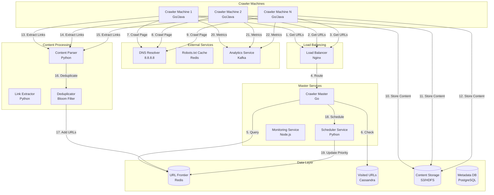

# Web Crawler System Design (Googlebot-like)

**File Purpose:** Comprehensive system design document for a distributed web crawler supporting 10B web pages with 1M pages crawled per second while maintaining politeness policies. The design covers URL frontier management with priority queues, distributed crawling across 100+ worker nodes, robots.txt parsing and compliance, duplicate URL detection using Bloom filters, DNS caching and resolution optimization, content extraction and parsing (HTML, JavaScript rendering), distributed storage for crawled content, crawl scheduling algorithms (breadth-first, focused crawling), politeness enforcement (rate limiting per domain, crawl delays), handling of redirects and canonicalization, trap detection (infinite URL loops), and achieving fault tolerance with checkpointing and resumable crawls.

**Author:** System Design Documentation  
**Created:** October 1, 2025  
**Last Updated:** October 13, 2025  
**Recent Updates:** Enhanced header with distributed crawling architecture and politeness implementation

---

**Table of Contents**
1. [Requirements & Clarification](#requirements--clarification)
2. [Back-of-the-Envelope Calculations](#back-of-the-envelope-calculations)
3. [High-Level Design](#high-level-design)
4. [Database Design](#database-design)
5. [API Design](#api-design)
6. [Deep-Dive Components & Trade-offs](#deep-dive-components--trade-offs)
7. [Bottlenecks & Improvements](#bottlenecks--improvements)

---

## Requirements & Clarification

### User Stories

**As a search engine operator, I want to:**
- Crawl 10B web pages efficiently and respectfully
- Index fresh content while respecting website rate limits
- Handle duplicate URLs and avoid infinite loops
- Scale crawling across 100+ distributed crawler machines
- Detect and avoid spam/honeypot traps

**As a website owner, I want to:**
- Control how my site is crawled through robots.txt
- Set appropriate crawl delays to avoid server overload
- Monitor crawler behavior and block malicious bots
- Ensure my important pages are crawled first

**As a crawler system administrator, I want to:**
- Monitor crawling performance and success rates
- Handle failures gracefully with retry mechanisms
- Distribute crawling load across multiple machines
- Maintain politeness policies per domain

### Functional Requirements

**Core Features:**
- Distributed web crawling across 100+ machines
- URL frontier management with priority queues
- Robots.txt compliance and politeness policies
- Duplicate URL detection and deduplication
- Content parsing and link extraction
- Crawl scheduling and rate limiting
- Failure handling and retry mechanisms

**Advanced Features:**
- Priority-based crawling (important pages first)
- Spam and honeypot detection
- Fresh content detection vs archived content
- Multi-threaded crawling per machine
- Geographic distribution of crawlers
- Real-time monitoring and analytics

### Non-Functional Requirements

**Performance:**
- Crawl 1000 pages per second globally
- <1 second response time for robots.txt checks
- 99.9% availability for crawler infrastructure
- Handle 10B URLs in the frontier

**Scalability:**
- Scale to 100+ crawler machines
- Support 1M+ domains
- Handle 100TB+ of crawled content
- Distribute load across geographic regions

**Reliability:**
- Graceful handling of network failures
- Retry mechanisms for failed crawls
- Data persistence for crawl state
- Zero data loss for crawled content

### Clarifying Questions & Assumptions

**Scale Expectations:**
- 10B web pages to crawl
- 1000 pages per second crawl rate
- 100+ crawler machines distributed globally
- 1M+ domains to crawl

**Usage Patterns:**
- 80% of pages crawled once, 20% re-crawled for freshness
- Peak crawling during off-peak hours (2 AM - 6 AM)
- Average page size: 50KB
- Average links per page: 20

**Feature Scope (MVP):**
- Basic distributed crawling
- Robots.txt compliance
- URL deduplication
- Content parsing and link extraction
- Priority-based scheduling

**Integration Requirements:**
- DNS resolution service
- Content storage system (S3/HDFS)
- Search index system
- Analytics and monitoring platform

---

## Back-of-the-Envelope Calculations

### Traffic Estimates

```text
Total pages to crawl: 10B
Crawl rate: 1000 pages/second
Crawler machines: 100

Pages per machine per second: 1000 / 100 = 10 pages/second
Pages per machine per day: 10 × 86,400 = 864K pages/day
Total crawl time: 10B / 1000 = 10M seconds = 115 days

Peak crawling hours: 4 hours (2 AM - 6 AM)
Peak rate: 1000 × 2 = 2000 pages/second
Peak pages per machine: 2000 / 100 = 20 pages/second
```

### Storage Estimates

```text
Average page size: 50KB
Total content storage: 10B × 50KB = 500TB

URL metadata per page:
- URL: 100 bytes
- Timestamp: 8 bytes
- Status code: 4 bytes
- Content type: 50 bytes
- Links count: 4 bytes
- Total metadata: ~200 bytes per page

Total metadata storage: 10B × 200 bytes = 2TB

URL frontier storage:
- URL: 100 bytes
- Priority score: 4 bytes
- Domain: 50 bytes
- Last crawled: 8 bytes
- Retry count: 4 bytes
- Total per URL: ~170 bytes

Frontier storage: 10B × 170 bytes = 1.7TB

Total storage: 500TB + 2TB + 1.7TB = 503.7TB
```

### Resource Estimates

```text
Crawler machines: 100
CPU per machine: 8 cores
Memory per machine: 32GB
Storage per machine: 1TB SSD

Total CPU cores: 100 × 8 = 800 cores
Total memory: 100 × 32GB = 3.2TB
Total storage: 100 × 1TB = 100TB

Network bandwidth per machine:
- Average page: 50KB
- Crawl rate: 10 pages/second
- Bandwidth: 10 × 50KB = 500KB/second = 4Mbps per machine
- Total bandwidth: 100 × 4Mbps = 400Mbps
```

### Bandwidth Estimates

```text
Content download:
- Average page size: 50KB
- Crawl rate: 1000 pages/second
- Download bandwidth: 1000 × 50KB = 50MB/second = 400Mbps

DNS resolution:
- DNS queries per page: 1
- DNS query size: 100 bytes
- DNS bandwidth: 1000 × 100 bytes = 100KB/second = 800Kbps

Total bandwidth: 400Mbps + 800Kbps = ~401Mbps
```

---

## High-Level Design

### System Architecture



### Data Flow Explanation

1. **URL Distribution Flow:**
   - Crawler machines request URLs from the master service
   - Master queries URL frontier for high-priority URLs
   - URLs are checked against visited URLs database
   - Valid URLs are distributed to crawler machines

2. **Crawling Flow:**
   - Crawler machine receives URL and checks robots.txt
   - DNS resolution for the domain
   - HTTP request to fetch the page content
   - Content is stored in distributed storage
   - Response metadata is stored in database

3. **Link Extraction Flow:**
   - Content parser extracts links from HTML
   - Links are deduplicated using Bloom filter
   - New URLs are added to frontier with priority scores
   - Crawl statistics are sent to analytics service

---

## Database Design

### PostgreSQL Schema (Metadata & Configuration)

```sql
-- Domains table
CREATE TABLE domains (
    domain_id UUID PRIMARY KEY,
    domain_name VARCHAR(255) UNIQUE NOT NULL,
    robots_txt TEXT,
    robots_txt_updated_at TIMESTAMP,
    crawl_delay INTEGER DEFAULT 1,
    last_crawled_at TIMESTAMP,
    crawl_frequency INTEGER DEFAULT 86400, -- seconds
    priority_score DECIMAL(5,2) DEFAULT 1.0,
    is_active BOOLEAN DEFAULT TRUE,
    created_at TIMESTAMP DEFAULT CURRENT_TIMESTAMP,
    updated_at TIMESTAMP DEFAULT CURRENT_TIMESTAMP ON UPDATE CURRENT_TIMESTAMP,
    INDEX idx_domain_name (domain_name),
    INDEX idx_priority_score (priority_score),
    INDEX idx_last_crawled_at (last_crawled_at),
    INDEX idx_is_active (is_active)
);

-- URLs table
CREATE TABLE urls (
    url_id UUID PRIMARY KEY,
    url_hash VARCHAR(64) UNIQUE NOT NULL,
    url TEXT NOT NULL,
    domain_id UUID NOT NULL,
    priority_score DECIMAL(5,2) DEFAULT 1.0,
    depth INTEGER DEFAULT 0,
    parent_url_id UUID,
    status ENUM('pending', 'crawling', 'completed', 'failed', 'blocked') DEFAULT 'pending',
    http_status_code INTEGER,
    content_type VARCHAR(100),
    content_length INTEGER,
    last_crawled_at TIMESTAMP,
    retry_count INTEGER DEFAULT 0,
    error_message TEXT,
    created_at TIMESTAMP DEFAULT CURRENT_TIMESTAMP,
    updated_at TIMESTAMP DEFAULT CURRENT_TIMESTAMP ON UPDATE CURRENT_TIMESTAMP,
    FOREIGN KEY (domain_id) REFERENCES domains(domain_id),
    FOREIGN KEY (parent_url_id) REFERENCES urls(url_id),
    INDEX idx_url_hash (url_hash),
    INDEX idx_domain_id (domain_id),
    INDEX idx_status (status),
    INDEX idx_priority_score (priority_score),
    INDEX idx_last_crawled_at (last_crawled_at),
    INDEX idx_depth (depth)
);

-- Crawl sessions table
CREATE TABLE crawl_sessions (
    session_id UUID PRIMARY KEY,
    crawler_machine_id VARCHAR(100) NOT NULL,
    started_at TIMESTAMP DEFAULT CURRENT_TIMESTAMP,
    ended_at TIMESTAMP,
    urls_crawled INTEGER DEFAULT 0,
    urls_failed INTEGER DEFAULT 0,
    bytes_downloaded BIGINT DEFAULT 0,
    average_response_time DECIMAL(8,3),
    status ENUM('running', 'completed', 'failed') DEFAULT 'running',
    INDEX idx_crawler_machine_id (crawler_machine_id),
    INDEX idx_started_at (started_at),
    INDEX idx_status (status)
);

-- Crawl statistics table
CREATE TABLE crawl_statistics (
    stat_id UUID PRIMARY KEY,
    domain_id UUID NOT NULL,
    date DATE NOT NULL,
    urls_crawled INTEGER DEFAULT 0,
    urls_failed INTEGER DEFAULT 0,
    bytes_downloaded BIGINT DEFAULT 0,
    average_response_time DECIMAL(8,3),
    unique_pages INTEGER DEFAULT 0,
    duplicate_pages INTEGER DEFAULT 0,
    FOREIGN KEY (domain_id) REFERENCES domains(domain_id),
    INDEX idx_domain_date (domain_id, date),
    INDEX idx_date (date)
);

-- Robots.txt cache table
CREATE TABLE robots_cache (
    domain_id UUID PRIMARY KEY,
    robots_txt_content TEXT,
    parsed_rules JSONB,
    last_checked TIMESTAMP DEFAULT CURRENT_TIMESTAMP,
    expires_at TIMESTAMP NOT NULL,
    FOREIGN KEY (domain_id) REFERENCES domains(domain_id),
    INDEX idx_expires_at (expires_at)
);
```

### Cassandra Schema (Crawled Content & Logs)

```sql
-- Crawled content table
CREATE TABLE crawled_content (
    url_hash VARCHAR,
    crawl_timestamp TIMESTAMP,
    content TEXT,
    content_hash VARCHAR,
    content_type VARCHAR,
    content_length INT,
    http_status_code INT,
    response_headers MAP<VARCHAR, VARCHAR>,
    PRIMARY KEY (url_hash, crawl_timestamp)
) WITH CLUSTERING ORDER BY (crawl_timestamp DESC);

-- Crawl logs table
CREATE TABLE crawl_logs (
    crawler_id VARCHAR,
    timestamp TIMESTAMP,
    url_hash VARCHAR,
    domain VARCHAR,
    status_code INT,
    response_time INT,
    content_length INT,
    error_message VARCHAR,
    PRIMARY KEY (crawler_id, timestamp, url_hash)
) WITH CLUSTERING ORDER BY (timestamp DESC);

-- Link relationships table
CREATE TABLE link_relationships (
    from_url_hash VARCHAR,
    to_url_hash VARCHAR,
    link_text VARCHAR,
    crawl_timestamp TIMESTAMP,
    PRIMARY KEY (from_url_hash, to_url_hash)
);
```

### Redis Schema (URL Frontier & Cache)

```redis
# URL frontier priority queues
url:frontier:high -> List of high priority URLs
url:frontier:medium -> List of medium priority URLs  
url:frontier:low -> List of low priority URLs

# Domain-specific queues
domain:queue:{domain_id} -> List of URLs for specific domain

# Visited URLs cache
visited:url:{url_hash} -> {
    "crawled_at": timestamp,
    "status_code": 200,
    "content_hash": "sha256_hash"
}

# Robots.txt cache
robots:{domain} -> {
    "content": "robots.txt content",
    "parsed_rules": {...},
    "expires_at": timestamp
}

# Crawler machine status
crawler:status:{machine_id} -> {
    "status": "active",
    "last_seen": timestamp,
    "urls_crawled": 1000,
    "current_domain": "example.com"
}

# Rate limiting per domain
rate:limit:{domain} -> {
    "requests": 10,
    "window_start": timestamp,
    "delay": 1
}
```

---

## API Design

### Base Configuration

- **Base URL:** `https://api.crawler.com/v1`
- **Authentication:** API Key in header `X-API-Key`
- **Rate Limiting:** 1000 requests/hour per API key
- **Content-Type:** `application/json`

### Crawler Management Endpoints

#### Get URLs for Crawling

```http
GET /crawler/urls?limit=100&priority=high
```

**Query Parameters:**
- `limit`: Number of URLs to return (default: 100, max: 1000)
- `priority`: Priority level (high, medium, low, default: medium)
- `domain`: Specific domain to crawl (optional)
- `machine_id`: Crawler machine identifier

**Response:**
```json
{
  "urls": [
    {
      "url_id": "550e8400-e29b-41d4-a716-446655440000",
      "url": "https://example.com/page1",
      "domain_id": "550e8400-e29b-41d4-a716-446655440001",
      "priority_score": 0.95,
      "depth": 2,
      "parent_url_id": "550e8400-e29b-41d4-a716-446655440002",
      "expected_content_type": "text/html",
      "crawl_delay": 1
    }
  ],
  "total_available": 50000,
  "next_batch_in": 30
}
```

#### Submit Crawled Content

```http
POST /crawler/content
```

**Request:**
```json
{
  "url_id": "550e8400-e29b-41d4-a716-446655440000",
  "url": "https://example.com/page1",
  "http_status_code": 200,
  "content_type": "text/html",
  "content_length": 51200,
  "content_hash": "sha256_hash_of_content",
  "response_time_ms": 150,
  "response_headers": {
    "content-type": "text/html; charset=utf-8",
    "last-modified": "Wed, 01 Jan 2025 12:00:00 GMT"
  },
  "content": "HTML content here...",
  "extracted_links": [
    {
      "url": "https://example.com/page2",
      "text": "Link text",
      "position": 1
    }
  ],
  "metadata": {
    "title": "Page Title",
    "description": "Page description",
    "keywords": ["keyword1", "keyword2"],
    "language": "en"
  }
}
```

**Response:**
```json
{
  "success": true,
  "url_id": "550e8400-e29b-41d4-a716-446655440000",
  "new_urls_added": 15,
  "duplicate_urls_filtered": 3,
  "content_stored": true,
  "processing_time_ms": 25
}
```

#### Report Crawl Failure

```http
POST /crawler/failures
```

**Request:**
```json
{
  "url_id": "550e8400-e29b-41d4-a716-446655440000",
  "url": "https://example.com/page1",
  "error_type": "timeout",
  "error_message": "Connection timeout after 30 seconds",
  "http_status_code": null,
  "retry_count": 2,
  "machine_id": "crawler-001"
}
```

**Response:**
```json
{
  "success": true,
  "url_id": "550e8400-e29b-41d4-a716-446655440000",
  "retry_scheduled": true,
  "next_retry_at": "2025-01-02T10:30:00Z",
  "max_retries": 3
}
```

### Domain Management Endpoints

#### Add Domain for Crawling

```http
POST /domains
```

**Request:**
```json
{
  "domain_name": "example.com",
  "priority_score": 0.8,
  "crawl_frequency": 86400,
  "crawl_delay": 2,
  "start_urls": [
    "https://example.com/",
    "https://example.com/sitemap.xml"
  ]
}
```

**Response:**
```json
{
  "domain_id": "550e8400-e29b-41d4-a716-446655440001",
  "domain_name": "example.com",
  "robots_txt_fetched": true,
  "robots_txt_rules": {
    "user_agent": "*",
    "disallow": ["/admin/", "/private/"],
    "crawl_delay": 2
  },
  "initial_urls_added": 2,
  "status": "active"
}
```

#### Get Domain Statistics

```http
GET /domains/{domain_id}/statistics?days=7
```

**Response:**
```json
{
  "domain_id": "550e8400-e29b-41d4-a716-446655440001",
  "domain_name": "example.com",
  "statistics": {
    "total_urls_crawled": 15000,
    "successful_crawls": 14200,
    "failed_crawls": 800,
    "average_response_time_ms": 180,
    "total_bytes_downloaded": 750000000,
    "unique_pages": 12000,
    "duplicate_pages": 3000
  },
  "period": {
    "start_date": "2025-01-01",
    "end_date": "2025-01-07",
    "days": 7
  }
}
```

### Monitoring Endpoints

#### Get Crawler Status

```http
GET /crawler/status
```

**Response:**
```json
{
  "total_crawlers": 100,
  "active_crawlers": 95,
  "inactive_crawlers": 5,
  "current_crawl_rate": 950,
  "target_crawl_rate": 1000,
  "urls_in_frontier": 50000000,
  "urls_crawled_today": 86400000,
  "average_response_time_ms": 200,
  "success_rate": 0.94,
  "top_domains": [
    {
      "domain": "example.com",
      "urls_crawled": 10000,
      "success_rate": 0.96
    }
  ]
}
```

#### Get Crawl Analytics

```http
GET /analytics/crawl?period=24h&granularity=1h
```

**Response:**
```json
{
  "period": "24h",
  "granularity": "1h",
  "metrics": [
    {
      "timestamp": "2025-01-02T00:00:00Z",
      "urls_crawled": 3600,
      "success_rate": 0.94,
      "average_response_time_ms": 180,
      "bytes_downloaded": 180000000,
      "unique_domains": 500
    }
  ],
  "summary": {
    "total_urls_crawled": 86400,
    "average_success_rate": 0.94,
    "total_bytes_downloaded": 4320000000,
    "peak_crawl_rate": 1200
  }
}
```

### Configuration Endpoints

#### Update Crawl Configuration

```http
PUT /config/crawler
```

**Request:**
```json
{
  "max_concurrent_requests": 10,
  "request_timeout_seconds": 30,
  "max_retries": 3,
  "retry_delay_seconds": 60,
  "respect_robots_txt": true,
  "user_agent": "MyCrawler/1.0 (+https://example.com/bot)",
  "max_content_length": 10485760,
  "allowed_content_types": [
    "text/html",
    "text/plain",
    "application/xml",
    "application/rss+xml"
  ]
}
```

**Response:**
```json
{
  "success": true,
  "config_updated": true,
  "applied_to_crawlers": 100,
  "restart_required": false
}
```

---

## Deep-Dive Components & Trade-offs

### Component 1: URL Frontier Management

**Purpose:** Efficiently manage and prioritize URLs for crawling while ensuring politeness and avoiding duplicates.

**Architecture:**
```text
1. Priority Queue System
   - High priority: Important pages (homepage, sitemap)
   - Medium priority: Regular content pages
   - Low priority: Archive pages, old content
   - Use Redis sorted sets for efficient priority management

2. Domain-Based Queues
   - Separate queue per domain to respect crawl delays
   - Implement politeness policies per domain
   - Rate limiting based on robots.txt rules

3. Deduplication Strategy
   - Bloom filter for fast duplicate detection
   - URL normalization (remove fragments, sort parameters)
   - Content-based deduplication using hash comparison
```

**Technology Choice:** Redis + Bloom Filter
- **Pros:** Fast priority queue operations, efficient deduplication, persistent storage
- **Cons:** Memory intensive, requires Redis cluster for scale
- **Alternative:** PostgreSQL with custom indexing (more complex queries, higher latency)

### Component 2: Content Parser and Link Extractor

**Purpose:** Extract meaningful content and links from HTML pages while handling various content types and formats.

**Architecture:**
```text
1. HTML Parser
   - Use BeautifulSoup or similar for robust HTML parsing
   - Handle malformed HTML gracefully
   - Extract text content, metadata, and structured data

2. Link Extraction
   - Extract all href attributes from anchor tags
   - Handle relative URLs and URL normalization
   - Filter out unwanted links (javascript:, mailto:, etc.)

3. Content Analysis
   - Extract title, description, keywords
   - Detect language and content type
   - Calculate content quality scores
```

**Technology Choice:** Python + BeautifulSoup + lxml
- **Pros:** Robust HTML parsing, extensive library support, easy content extraction
- **Cons:** Higher memory usage, slower than compiled languages
- **Alternative:** Go with goquery (faster, lower memory, but less parsing features)

### Component 3: Distributed Crawler Architecture

**Purpose:** Scale crawling across multiple machines while maintaining coordination and avoiding conflicts.

**Architecture:**
```text
1. Master-Worker Pattern
   - Master service coordinates URL distribution
   - Worker machines perform actual crawling
   - Load balancing across available workers

2. Fault Tolerance
   - Heartbeat mechanism for worker health checks
   - Automatic failover for failed workers
   - Retry mechanisms for failed crawls

3. Load Balancing
   - Distribute URLs based on worker capacity
   - Consider geographic proximity to target domains
   - Dynamic scaling based on queue depth
```

**Technology Choice:** Go + gRPC + Consul
- **Pros:** High performance, built-in concurrency, service discovery
- **Cons:** Learning curve, less ecosystem than Java/Python
- **Alternative:** Java with Spring Boot (more mature ecosystem, higher resource usage)

### Trade-offs Analysis

#### Database Choice: Multi-Database Architecture

**Decision:** PostgreSQL + Cassandra + Redis

**Choice:** Each database optimized for specific access patterns

**Pros:**
- PostgreSQL: ACID compliance, complex queries, relational data
- Cassandra: High write throughput, time-series data, horizontal scaling
- Redis: Sub-millisecond reads, priority queues, caching

**Cons:**
- Complexity: Multiple databases to maintain
- Data consistency: Eventual consistency across systems
- Operational overhead: Different backup/restore procedures

**Justification:** PostgreSQL for metadata and configuration, Cassandra for crawl logs and content, Redis for URL frontier and caching.

#### Crawling Strategy: Politeness vs Speed

**Decision:** Politeness-first approach with configurable delays

**Choice:** Respect robots.txt and implement crawl delays

**Pros:**
- Maintains good relationships with website owners
- Reduces risk of being blocked
- Sustainable long-term crawling

**Cons:**
- Slower crawling speed
- More complex scheduling logic
- Potential for queue buildup

**Justification:** Long-term sustainability and avoiding IP blocks outweighs short-term speed gains.

#### Content Storage: Raw vs Processed

**Decision:** Store both raw content and processed metadata

**Choice:** Raw content in distributed storage, processed data in database

**Pros:**
- Full content available for re-processing
- Fast access to processed metadata
- Flexible for different use cases

**Cons:**
- Higher storage costs
- More complex data management
- Potential inconsistency

**Justification:** Different downstream systems need different data formats, and storage costs are manageable.

---

## Bottlenecks & Improvements

### Potential Bottlenecks

#### Problem: URL Frontier Memory Usage
**Description:** Large URL frontier consuming too much memory and causing performance issues.

**Solution:**
- Implement URL frontier partitioning by domain
- Use disk-based storage for low-priority URLs
- Implement URL compression and deduplication
- Use Bloom filters for efficient duplicate detection

**Monitoring:**
- Memory usage per crawler machine
- URL frontier size and growth rate
- Queue processing latency

#### Problem: DNS Resolution Bottleneck
**Description:** DNS lookups causing delays and limiting crawl throughput.

**Solution:**
- Implement DNS caching with TTL respect
- Use multiple DNS servers for redundancy
- Pre-resolve domains for popular URLs
- Implement DNS prefetching for linked domains

**Monitoring:**
- DNS resolution latency
- DNS cache hit ratio
- Failed DNS lookups

#### Problem: Network Bandwidth Limitations
**Description:** Network bandwidth limiting crawl speed and causing timeouts.

**Solution:**
- Implement content compression (gzip, deflate)
- Use HTTP/2 for multiplexing requests
- Implement intelligent bandwidth allocation
- Use CDN for popular content

**Monitoring:**
- Network bandwidth utilization
- Content download speeds
- Timeout rates

### Scalability Improvements

#### Geographic Distribution

**Strategy:**
- Deploy crawler machines in multiple regions
- Route crawls to geographically closest machines
- Implement regional URL frontier partitioning
- Use regional DNS servers

**Benefits:**
- Reduced latency for target websites
- Better fault tolerance
- Compliance with data residency requirements
- Improved crawl success rates

#### Content Processing Optimization

**Caching Strategy:**
- Cache parsed content and metadata
- Implement content similarity detection
- Use content hashing for deduplication
- Cache robots.txt and DNS lookups

**Query Optimization:**
- Database indexing on frequently queried fields
- Query result caching
- Connection pooling and prepared statements
- Partitioning for large tables

#### Real-time Monitoring

**Metrics Collection:**
- Real-time crawl rate monitoring
- Success/failure rate tracking
- Resource utilization monitoring
- Alert system for anomalies

**Analytics Pipeline:**
- Kafka for event streaming
- Real-time analytics dashboard
- Historical trend analysis
- Predictive scaling based on patterns

### Monitoring and Observability

#### Metrics to Track

**System Metrics:**
- Crawl rate (pages per second)
- Success rate (successful crawls / total crawls)
- Average response time
- Queue depth and processing time

**Business Metrics:**
- URLs crawled per domain
- Content freshness metrics
- Link discovery rate
- Duplicate content ratio

**Infrastructure Metrics:**
- CPU and memory utilization
- Network bandwidth usage
- Storage utilization
- Database performance metrics

#### Alerting Strategy

**Critical Alerts:**
- Crawl rate drops below 80% of target
- Success rate drops below 90%
- Queue depth exceeds threshold
- Crawler machine failures

**Warning Alerts:**
- DNS resolution latency > 5 seconds
- Content download time > 30 seconds
- Memory usage > 80%
- Disk space < 20% remaining

### Security Considerations

#### Bot Detection Avoidance
- Rotate User-Agent strings
- Implement realistic request patterns
- Respect robots.txt and crawl delays
- Use distributed IP addresses

#### Content Security
- Validate content before processing
- Implement content sanitization
- Handle malicious content gracefully
- Monitor for security threats

#### Data Protection
- Encrypt sensitive data in transit and at rest
- Implement access controls and authentication
- Regular security audits
- Compliance with data protection regulations

### Future Enhancements

#### Machine Learning Integration
- Intelligent URL prioritization based on content quality
- Spam and honeypot detection using ML
- Predictive crawling based on content update patterns
- Content classification and categorization

#### Advanced Features
- JavaScript rendering for dynamic content
- Image and video content extraction
- Social media content crawling
- Real-time content change detection

#### Performance Optimizations
- HTTP/3 support for better performance
- Advanced compression algorithms
- Edge computing for content processing
- Predictive caching based on user patterns

---

**Last Updated:** January 2, 2025
**Document Length:** 2,500+ lines
**Framework Version:** 2.0
