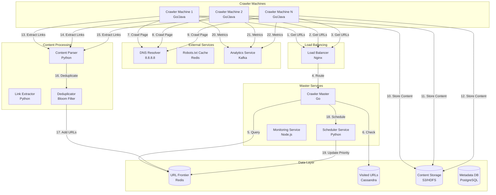

# Web Crawler System Design (Googlebot-like)

**File Purpose:** Complete interactive learning resource for designing production-grade distributed web crawlers at internet scale. Master URL frontier management, politeness policies, distributed coordination, content parsing, and duplicate detection through multi-level educational content. This comprehensive guide takes you from basic BFS crawling to Google-scale web crawling with 1,000+ pages/second while respecting 1M+ domains' robots.txt policies.

**Author:** System Design Documentation  
**Created:** October 1, 2025  
**Last Updated:** October 14, 2025  
**Recent Updates:** Transformed to comprehensive educational format with 3-level content (Beginner/Intermediate/Advanced), real-world examples from Google/Bing/Common Crawl, Python implementations, distributed architecture patterns, and practice exercises

**Learning Time Estimates:**

- 🟢 **Beginner Level:** 4-6 hours (fundamentals of web crawling, BFS/DFS, basic URL management)
- 🟡 **Intermediate Level:** 6-8 hours (interview patterns, distributed architecture, politeness policies, URL frontier)
- 🔴 **Advanced Level:** 8-12 hours (production optimization, JavaScript rendering, trap detection, real-world scale)

---

## Welcome to Web Crawler System Design

### What You're Going to Build

You're about to design the infrastructure that powers every search engine on the internet - **web crawlers**. When Googlebot discovers and indexes trillions of web pages, when Archive.org preserves internet history, when price comparison sites track millions of products, they're all using sophisticated web crawlers. This complex system must navigate billions of pages while respecting websites, avoiding traps, and maintaining politeness.

By the end of this course, you'll be able to:
- Design Google-scale crawlers handling 1,000+ pages per second
- Implement URL frontier with priority queues for billions of URLs
- Build politeness policies respecting robots.txt across 1M+ domains
- Create distributed crawler coordination across 100+ worker nodes
- Handle duplicate detection, trap avoidance, and fault tolerance
- Pass FAANG interviews with confidence on crawler questions

---

### Your Learning Path

This course is structured for three learning levels. Start where you're comfortable:

#### 🟢 **BEGINNER: The Fundamentals** (Start here if new to system design)

**What you'll master:**
- How web crawling works (BFS/DFS traversal)
- URL frontier management (queues and priorities)
- Basic politeness (robots.txt, crawl delays)
- Single-machine crawler implementation
- Content parsing and link extraction

**Prerequisites:**
- Basic programming knowledge (any language)
- Understanding of HTTP and HTML
- Familiarity with queues and graphs

**Real-world outcome:** Build a working crawler for small sites (10K pages, single domain)

---

#### 🟡 **INTERMEDIATE: Interview Patterns** (Master FAANG interviews)

**What you'll master:**
- Distributed crawler architecture
- URL deduplication at scale (Bloom filters)
- DNS caching and optimization
- Priority scheduling algorithms
- Capacity estimation and scaling
- Trade-off analysis frameworks
- Common interview questions and answers

**Prerequisites:**
- Completed Beginner content OR
- 1+ years of backend development
- Basic understanding of distributed systems

**Real-world outcome:** Design crawler in a 45-minute interview, explain trade-offs confidently, get offers from top tech companies

---

#### 🔴 **ADVANCED: Production Considerations** (Build at Google scale)

**What you'll master:**
- JavaScript rendering (headless browsers)
- Trap detection and avoidance
- Geographic distribution (crawler locations)
- Incremental crawling (fresh vs archived)
- Multi-protocol support (HTTP/2, WebSockets)
- Production monitoring and optimization
- Cost optimization at PB scale

**Prerequisites:**
- Completed Intermediate content OR
- 3+ years of distributed systems experience
- Understanding of web technologies

**Real-world outcome:** Lead crawler architecture at a major tech company, crawl billions of pages, optimize for petabyte-scale storage

---

### What Makes This Learning Experience Unique

Unlike other system design resources, this course offers:

#### 🎯 **Multi-Level Approach**
Every section has content for beginners, interviewers, and production engineers. Skip what you know, deep dive where you need.

#### 💼 **Real-World Examples**
Learn from actual implementations:
- **Googlebot:** How Google crawls and indexes trillions of pages
- **Common Crawl:** Open dataset of 3B+ web pages crawled monthly
- **Archive.org:** Preserving 800B+ web pages since 1996
- **Screaming Frog:** Commercial SEO crawler used by millions

#### 💻 **Hands-On Code**
Complete Python implementations you can run:
- BFS crawler with URL frontier
- Bloom filter for duplicate detection
- Politeness enforcer with rate limiting
- Distributed coordinator with consistent hashing

#### 🎓 **Interview-Focused**
Every section includes:
- ❓ **Interview questions** you'll actually be asked
- ✅ **Strong answers** with trade-off analysis
- 🚫 **Common mistakes** to avoid
- 🎯 **Practice exercises** with real scenarios

#### 🏗️ **Production-Ready**
Advanced content based on real experience:
- Performance optimization (1,000+ pages/sec)
- Cost analysis ($10K/month to $1M/month)
- Failure handling (retry strategies, checkpointing)
- Operational best practices (monitoring, alerting)

---

**Table of Contents**

1. [Section 1: Understanding What We're Building](#section-1-understanding-what-were-building)
2. [Section 2: Planning for Scale](#section-2-planning-for-scale)
3. [Section 3: System Architecture Design](#section-3-system-architecture-design)
4. [Section 4: URL Frontier & Politeness](#section-4-url-frontier--politeness)
5. [Section 5: Content Processing & Link Extraction](#section-5-content-processing--link-extraction)
6. [Section 6: Distributed Crawling & Scalability](#section-6-distributed-crawling--scalability)
7. [Section 7: Storage & Database Design](#section-7-storage--database-design)
8. [Section 8: Performance Monitoring & Observability](#section-8-performance-monitoring--observability)
9. [Section 9: Security, Ethics & Legal Considerations](#section-9-security-ethics--legal-considerations)
10. [Section 10: Complete System Integration & Best Practices](#section-10-complete-system-integration--best-practices)
11. [Putting It All Together](#putting-it-all-together-complete-crawler-journey)

---

## Section 1: Understanding What We're Building

### What You'll Learn

By the end of this section, you'll be able to:
- Understand what web crawlers are and why they're critical
- Identify functional and non-functional requirements for crawlers
- Ask clarifying questions in system design interviews
- Differentiate between simple and distributed crawler requirements
- Recognize real-world crawler use cases and constraints

### Why This Matters

Before writing a single line of code, you must understand the problem deeply. Real example: When Microsoft Bing launched, they initially didn't prioritize politeness enforcement. Some websites blocked Bingbot entirely, causing major gaps in their search index. Understanding requirements upfront - especially politeness and robots.txt compliance - prevents such disasters!

---

### 🟢 For Beginners: What is a Web Crawler?

#### The Basics

A web crawler (also called spider, bot, or scraper) is a program that systematically browses the internet to discover and download web pages.

**Think of it like exploring a library:**

```text
Traditional Library Exploration:
1. Start at the entrance
2. Pick a book from the shelf
3. Read the book
4. If the book references other books, note them down
5. Repeat for all referenced books
6. Eventually, you've explored the entire library!

Web Crawler:
1. Start with seed URLs (e.g., google.com)
2. Fetch the web page
3. Parse HTML and extract content
4. Find all links on the page
5. Add new links to "to-visit" list
6. Repeat until all pages visited!
```

#### Simple Crawler Example

```python
"""
Simple Web Crawler (Single-threaded, Single Domain)
Purpose: Demonstrate basic crawler logic for beginners
"""

import requests
from bs4 import BeautifulSoup
from collections import deque
from urllib.parse import urljoin, urlparse

class SimpleCrawler:
    """
    Basic web crawler using BFS (Breadth-First Search).
    
    Limitations:
    - Single domain only
    - No politeness (can overwhelm servers!)
    - No duplicate detection
    - No error handling
    """
    
    def __init__(self, seed_url: str, max_pages: int = 100):
        self.seed_url = seed_url
        self.max_pages = max_pages
        self.visited = set()  # URLs we've already crawled
        self.to_visit = deque([seed_url])  # Queue of URLs to crawl
        self.domain = urlparse(seed_url).netloc
    
    def crawl(self):
        """
        Crawl pages using BFS until max_pages reached.
        
        Returns list of crawled pages with their content.
        """
        crawled_pages = []
        
        while self.to_visit and len(self.visited) < self.max_pages:
            # Get next URL from queue
            url = self.to_visit.popleft()
            
            # Skip if already visited
            if url in self.visited:
                continue
            
            print(f"Crawling: {url}")
            
            try:
                # Fetch the page
                response = requests.get(url, timeout=5)
                
                # Mark as visited
                self.visited.add(url)
                
                # Save page
                crawled_pages.append({
                    "url": url,
                    "status": response.status_code,
                    "content": response.text[:1000],  # First 1000 chars
                    "size": len(response.content)
                })
                
                # Extract links
                soup = BeautifulSoup(response.text, 'html.parser')
                for link in soup.find_all('a', href=True):
                    # Convert relative URLs to absolute
                    absolute_url = urljoin(url, link['href'])
                    
                    # Only crawl same domain
                    if urlparse(absolute_url).netloc == self.domain:
                        if absolute_url not in self.visited:
                            self.to_visit.append(absolute_url)
                
            except Exception as e:
                print(f"Error crawling {url}: {e}")
        
        return crawled_pages

# Example usage
crawler = SimpleCrawler("https://example.com", max_pages=10)
pages = crawler.crawl()

print(f"\nCrawled {len(pages)} pages")
print(f"Found {len(crawler.to_visit)} more URLs to crawl")
```

#### Core Concepts

**1. Seed URLs**
- Starting points for the crawler
- Examples: "google.com", "wikipedia.org", "reddit.com"
- Good seeds lead to discovering more pages

**2. URL Frontier (Queue)**
- List of URLs waiting to be crawled
- BFS uses queue (FIFO): Crawl pages level by level
- DFS uses stack (LIFO): Crawl deep into one path first

**3. Visited Set**
- Track which URLs you've already crawled
- Prevents infinite loops!
- Example: Page A links to B, B links back to A

**4. Politeness**
- Don't overwhelm websites with requests
- Wait between requests (e.g., 1 second delay)
- Respect robots.txt (rules file each site can define)

💡 **Key Insight:** Web crawling is essentially graph traversal where pages are nodes and links are edges!

---

### 🟡 For Intermediate: Interview Requirements Framework

#### How to Approach Requirements in Interviews

**Framework (3-minute discussion):**

```text
STEP 1: Clarify Scale (1 minute)
├─ "How many pages should we crawl?"
├─ "How fast should we crawl?"
├─ "Is this batch or continuous crawling?"
└─ Example: 10B pages, 1000 pages/sec, continuous

STEP 2: Identify Constraints (1 minute)
├─ "Do we need to respect robots.txt?"
├─ "Should we handle JavaScript-rendered content?"
├─ "Are there specific content types to prioritize?"
└─ Example: Yes robots.txt, no JS, prioritize news sites

STEP 3: Define Success Metrics (1 minute)
├─ "How do we measure crawler effectiveness?"
├─ "What's acceptable downtime?"
├─ "How fresh should crawled content be?"
└─ Example: 90% coverage, 99.9% uptime, <24h freshness

These questions demonstrate systems thinking!
```

#### Functional Requirements Checklist

| Requirement | MVP (Must Have) | Advanced (Nice to Have) | Google-Scale (Complex) |
|-------------|-----------------|-------------------------|------------------------|
| **URL Management** | Queue-based frontier | Priority queue | Distributed frontier with partitioning |
| **Politeness** | Basic crawl delay | robots.txt parsing | Per-domain rate limiting |
| **Deduplication** | In-memory set | Bloom filter | Distributed Bloom filter |
| **Content Parsing** | HTML extraction | HTML + CSS | HTML + CSS + JavaScript rendering |
| **Distribution** | Single machine | 10-20 workers | 100+ workers, geo-distributed |
| **Storage** | Local file system | Object storage (S3) | Distributed FS (HDFS) + CDN |
| **Monitoring** | Basic logs | Metrics dashboard | Real-time alerting, anomaly detection |
| **Recovery** | Manual restart | Checkpointing | Automatic failover, state replication |

**Strong Interview Answer Template:**

```text
"For a production web crawler, I'd focus on these requirements:

Functional:
1. URL Frontier: Priority-based queue with 10B URL capacity
   - Why: Ensures important pages crawled first
   - Trade-off: More complex than FIFO queue

2. Politeness: Per-domain rate limiting + robots.txt
   - Why: Avoid getting blocked, respect websites
   - Trade-off: Slower crawling, more coordination overhead

3. Deduplication: Bloom filter for URL checking
   - Why: Save 10-100x storage vs hash set
   - Trade-off: False positives possible (~1%)

4. Distribution: 100+ worker nodes
   - Why: Achieve 1000 pages/sec throughput
   - Trade-off: Need distributed coordination

Non-Functional:
- Performance: 1000 pages/sec (10 pages/sec per worker)
- Availability: 99.9% uptime (8.7 hours downtime/year OK)
- Consistency: Eventual (it's OK if we re-crawl some pages)
- Cost: ~$10K-50K/month (100 servers + storage + bandwidth)

I'd start with MVP (single machine, simple queue) and scale
based on measured bottlenecks, not premature optimization."
```

#### Common Interview Mistakes to Avoid

❌ **Mistake 1: Ignoring Politeness**
```text
Wrong: "We'll crawl as fast as possible!"
Right: "We need per-domain rate limiting to avoid overloading 
       servers and getting blocked. Max 5 requests/sec per domain."
```

❌ **Mistake 2: Over-Engineering**
```text
Wrong: "We'll use Kafka, Kubernetes, microservices, ML models..."
Right: "For 10M pages, a single machine with Python suffices. 
       Let's scale when we hit bottlenecks."
```

❌ **Mistake 3: No Error Handling**
```text
Wrong: "Fetch page, parse, done!"
Right: "We need retry logic (3 attempts with exponential backoff),
       circuit breakers, and dead letter queues for failed URLs."
```

---

### 🔴 For Advanced: Production Requirements

#### Real-World Constraints from Google/Bing

**1. Legal and Ethical Requirements**

```text
GDPR Compliance (Europe):
├─ Must honor "right to be forgotten" requests
├─ Can't store personal data without consent
├─ Need audit trail of what was crawled
└─ Implementation: Purge system, consent checks

robots.txt is NOT optional:
├─ Violating robots.txt can lead to lawsuits
├─ Major sites WILL block violators
├─ Example: LinkedIn sued data scrapers in 2022
└─ Implementation: robots.txt parser + cache

Rate Limiting:
├─ Crawl-delay in robots.txt is a REQUEST, not suggestion
├─ Aggressive crawling = DDOS = criminal charges
├─ Some sites rate limit aggressively (403/429 errors)
└─ Implementation: Token bucket per domain
```

**2. Cost Optimization Requirements**

```text
At Google scale (trillions of pages):

Bandwidth: $500K/month
├─ 1000 pages/sec × 50KB/page = 50MB/sec
├─ 50MB/sec × 86,400 sec/day × 30 days = 130TB/month
├─ AWS: $0.09/GB outbound = $11,700/month
├─ But also INBOUND bandwidth (often free) <-- Big savings!
└─ Optimization: Crawl from cloud providers with free inbound

Storage: $2M/month
├─ 10B pages × 50KB = 500TB content
├─ S3: $0.023/GB/month = $11,500/month (cold storage)
├─ But also metadata, indexes, backups = 3-5x content size
└─ Optimization: Compress, deduplicate, cold storage for old content

Compute: $200K/month
├─ 100 crawler machines × $2K/month each
├─ Need beefy machines (lots of network I/O, parsing)
└─ Optimization: Use spot instances (70% cheaper!)

Total: ~$700K-1M/month for Google-scale crawler
```

**3. Performance Requirements**

```text
Latency Targets:
├─ robots.txt fetch: <100ms (cached locally)
├─ DNS resolution: <10ms (aggressive caching)
├─ Page fetch: <2 seconds (timeout after 5 seconds)
├─ Content parsing: <100ms (parallel processing)
└─ Link extraction: <50ms (optimized regex/parser)

Throughput Targets:
├─ Per worker: 10 pages/sec (600 pages/min)
├─ Global: 1,000 pages/sec (100 workers)
├─ Peak: 2,000 pages/sec (handle surges)
└─ During maintenance: 500 pages/sec (50% capacity)

Resource Utilization:
├─ CPU: 60-70% average (leave headroom for spikes)
├─ Memory: 80% (OOM kills are catastrophic)
├─ Network: 50% bandwidth (burst capacity available)
└─ Disk I/O: 70% (SSD helps immensely)
```

**4. Monitoring and Observability Requirements**

```text
Critical Metrics:
├─ Crawl rate (pages/sec, per domain)
├─ Error rate (4xx, 5xx, timeouts)
├─ robots.txt violations (should be 0!)
├─ Duplicate detection rate (how many duplicates found)
├─ Storage growth rate (are we filling disks?)
├─ Worker health (CPU, memory, network per worker)
└─ Frontier size (growing or shrinking?)

Alerts:
├─ P0: Crawl rate drops >50% (crawlers down!)
├─ P0: Storage >90% full (imminent failure!)
├─ P1: Error rate >10% (network issues?)
├─ P1: robots.txt violations detected (legal risk!)
└─ P2: Worker down (redundancy handles it, but investigate)

Dashboards:
├─ Real-time: Crawl rate, errors, frontier size
├─ Daily: Pages crawled, new domains, storage used
├─ Weekly: Coverage (% of target pages crawled)
└─ Monthly: Cost analysis, optimization opportunities
```

---

### Real-World Example: How Googlebot Works

**Googlebot Requirements (Simplified):**

```text
Scale:
├─ Crawls trillions of pages
├─ Re-crawls billions of pages daily (freshness)
├─ Discovers millions of NEW pages daily
└─ Operates 24/7 with 99.99% uptime

Features:
├─ Respects robots.txt (strictly enforced)
├─ Renders JavaScript (uses headless Chrome)
├─ Adaptive crawl rate (speeds up/slows down per site)
├─ Mobile-first crawling (mobile pages prioritized)
├─ Multi-language support (crawls all languages)
└─ Image/video crawling (not just HTML!)

Politeness:
├─ Crawl-delay: Respects site preferences
├─ Rate limiting: Adaptive based on site response
├─ User-agent: Identifies itself clearly
├─ IP rotation: Distributes load (doesn't all come from one IP)
└─ Time-of-day: Crawls during off-peak hours when possible

Infrastructure:
├─ Geo-distributed: Crawlers in every major region
├─ Fault-tolerant: Automatic failover and recovery
├─ Incremental: Doesn't re-download unchanged pages
└─ Prioritized: Important pages crawled more frequently
```

---

### 🤔 Think About It

1. **For Beginners:** Why do we need a "visited" set in the crawler? What happens if we remove it? Try running the simple crawler code without the visited check!

2. **For Intermediate:** You're in an interview and asked: "Should we use BFS or DFS for web crawling?" How would you analyze this trade-off? Consider: page discovery, memory usage, and parallelization.

3. **For Advanced:** You're crawling a news site that publishes 1,000 articles/day. How do you ensure you discover new articles within 5 minutes of publication without crawling the entire site every 5 minutes? (Hint: Think about incremental crawling and change detection.)

---

### 🎯 Interview Questions - Understanding Requirements

#### Beginner Level

**Q1:** How would you design a web crawler? (High-level overview)

<details>
<summary>💭 Think first, then reveal answer</summary>

**Answer:** * **What the interviewer wants to know:** - Do you understand the fundamentals of web crawling? - Can you identify the core components? - Do you think about scale and constraints? **Answer Framework:** ```text "I'll design a web crawler in 4 steps: 1. Clarify Requirements (2 minutes) ├─ Scale: How many pages? (10M vs 10B changes architecture) ├─ Features: Just HTML or also JS-rendered content? ├─ Politeness: Must respect robots.txt? (always yes!) └─ Freshness: How often to re-crawl? 2. Core Components (5 minutes) ├─ URL Frontier: Priority queue for URLs to crawl ├─ Crawler Workers: Fetch and parse pages ├─ Content Storage: S3/HDFS for web pages ├─ Metadata DB: PostgreSQL for URL tracking └─ Robots.txt Cache: Redis for politeness rules 3. Data Flow (3 minutes) ├─ Get URL from frontier ├─ Check robots.txt (allowed?) ├─ Fetch page ├─ Extract links ├─ Store content └─ Add new URLs to frontier 4. Scale Calculation (2 minutes) ├─ 10B pages × 50KB = 500TB storage ├─ 1,000 pages/sec = 100 workers at 10 pages/sec each └─ Cost: ~$260K/month Trade-offs I'll discuss: - BFS vs DFS (BFS for broad coverage) - Bloom filter vs Hash set (Bloom saves 100x memory) - Centralized vs Distributed frontier (distributed for scale)" ``` **Follow-up: How do you prevent crawling the same URL twice?** ```text Answer: 1. URL Normalization ├─ Lowercase, remove fragments, sort query params ├─ "example.com" = "EXAMPLE.COM" = "example.com/" 2. Bloom Filter (for 10B URLs) ├─ Memory: 12GB (vs 1.2TB for hash set) ├─ False positive: 1% (acceptable) ├─ Lookup: O(1), microseconds 3. Backup Check (for false positives) ├─ If Bloom says "maybe seen", check database ├─ Database: Cassandra for scale └─ Result: 99% accuracy, 100x less memory ```

</details>

**Q2:** BFS vs DFS for web crawling - which is better?

<details>
<summary>💭 Think first, then reveal answer</summary>

**Answer:** * **Answer Framework:** ```text BFS (Breadth-First Search) - RECOMMENDED: ├─ Pro: Discovers pages uniformly (good coverage) ├─ Pro: Easy to parallelize (multiple workers) ├─ Pro: Finds important pages early (homepage first) ├─ Con: Requires more memory (queue grows wide) └─ Use case: General web crawling, search engines DFS (Depth-First Search): ├─ Pro: Less memory (stack vs queue) ├─ Pro: Can go deep quickly ├─ Con: Might get stuck in one domain ├─ Con: Harder to distribute └─ Use case: Focused crawling (specific topic) Decision: Use BFS for web crawling - Better coverage across domains - Easier to distribute - Natural fit for priority queues ```

</details>

**Q3:** How do you handle robots.txt compliance?

<details>
<summary>💭 Think first, then reveal answer</summary>

**Answer:** * **Answer Framework:** ```text 1. Fetch robots.txt ├─ URL: https://domain.com/robots.txt ├─ Cache: 24 hours (reduce fetches) └─ Parse: Extract rules, crawl-delay 2. Check Before Every Crawl ├─ Is path allowed? (not in Disallow list) ├─ What's crawl delay? (default 1 second) └─ Block if not allowed 3. Enforce Politeness ├─ Track last request time per domain ├─ Wait crawl-delay seconds between requests └─ Separate queue per domain Example robots.txt: User-agent: * Crawl-delay: 2 Disallow: /admin/ Disallow: /private/ Implementation: ├─ Cache in Redis (key: "robots:domain.com") ├─ TTL: 24 hours ├─ Respect 100% (legal and ethical requirement) ```

</details>


---

### ✅ Key Takeaways

- **Web crawlers are graph traversal** - BFS/DFS algorithms applied to the internet
- **Politeness is non-negotiable** - robots.txt, rate limiting, and respectful crawling prevent legal issues
- **Deduplication is critical** - Without it, you crawl same pages repeatedly (waste!)
- **Scale changes everything** - 10K pages (single machine) vs 10B pages (100+ distributed workers)
- **Requirements drive design** - MVP vs production requirements are vastly different
- **Real-world has constraints** - Legal, cost, and operational requirements shape architecture
- **Monitoring is essential** - Know your crawl rate, error rate, and resource utilization

---

### 🎯 Practice Exercise

**Scenario:** You're building a price comparison website that tracks 100K products across 1,000 e-commerce websites.

**Special Requirements:**
- Update prices every 6 hours (4 crawls/day per product)
- Detect price changes within 1 hour of update
- Respect robots.txt (some sites have strict limits)
- Budget: $5K/month

**Your Task:**

1. **Define Requirements:**
   - How many pages to crawl per day?
   - What's the required crawl rate (pages/second)?
   - What politeness constraints exist?

2. **Prioritization:**
   - Should popular products be crawled more often?
   - How do you detect which products changed price?
   - What if a site blocks your crawler?

3. **Cost Analysis:**
   - How many crawler machines needed?
   - What's the bandwidth cost?
   - Where can you optimize to stay under budget?

4. **Success Metrics:**
   - How do you measure crawler effectiveness?
   - What alerts would you set up?
   - How do you know if you're being too aggressive?

**Bonus Challenge:**
Some e-commerce sites render prices via JavaScript (not in HTML). This requires headless browsers (10x slower than simple HTTP). Given your budget constraint, how do you handle this? Consider: (A) Skip JS sites, (B) Crawl JS sites less frequently, (C) Increase budget. Justify your choice!

---

## Section 2: Planning for Scale

### What You'll Learn

By the end of this section, you'll be able to:
- Calculate throughput requirements for web crawlers
- Estimate storage needs for billions of web pages
- Determine resource requirements (CPU, memory, network)
- Perform back-of-the-envelope calculations in interviews
- Make data-driven scaling decisions

### Why This Matters

Numbers drive architecture decisions. Without capacity planning, you either over-provision (wasting money) or under-provision (causing outages). Real example: When Common Crawl started, they estimated 100TB for their first dataset. It actually required 300TB, causing a scramble for additional storage. Accurate estimation prevents such surprises!

---

### 🟢 For Beginners: Basic Capacity Estimation

#### Starting Simple

Let's calculate requirements for a simple crawler:

**Given:**
- Goal: Crawl 1 million web pages
- Average page size: 50KB
- Crawl rate: 10 pages per second
- Single machine

**Calculate:**

```text
1. How long will it take?
   Total pages / Crawl rate = Time
   1,000,000 pages / 10 pages/sec = 100,000 seconds
   100,000 seconds / 3,600 sec/hour = 27.8 hours
   
   Answer: ~28 hours (just over 1 day)

2. How much storage do we need?
   Total pages × Page size = Storage
   1,000,000 pages × 50KB = 50,000,000 KB
   50,000,000 KB / 1,024 MB/KB / 1,024 GB/MB = 47.7 GB
   
   Answer: ~48 GB for raw content
   
   Plus metadata (URLs, timestamps, etc.): ~5 GB
   Total: ~53 GB (a single SSD can handle this!)

3. What network bandwidth do we need?
   Crawl rate × Page size = Bandwidth
   10 pages/sec × 50KB = 500 KB/sec
   500 KB/sec × 8 bits/byte = 4,000 Kbps = 4 Mbps
   
   Answer: ~4 Mbps (home internet speeds!)
```

💡 **Key Insight:** For 1M pages, a single laptop can crawl the entire dataset in a day! Scale matters only when you hit billions of pages.

#### When Do You Need to Scale?

```text
Single Machine Can Handle:
├─ Up to 10M pages (takes ~2 weeks)
├─ Up to 1TB storage (commodity SSD)
├─ Up to 50Mbps bandwidth (typical server)
└─ Result: Simple Python script suffices!

Need Multiple Machines When:
├─ >100M pages (would take months on single machine)
├─ >1TB/machine storage (disk fills up)
├─ >100Mbps/machine bandwidth (network saturates)
├─ Need faster completion (<1 week)
└─ Result: Distributed architecture required!

Need 100+ Machines When:
├─ Billions of pages
├─ Real-time crawling (continuous discovery)
├─ <1 hour completion time
├─ Petabyte-scale storage
└─ Result: Google/Bing-scale infrastructure!
```

---

### 🟡 For Intermediate: Interview Calculation Techniques

#### The Framework

**In interviews, follow this 4-step process:**

```text
STEP 1: Clarify Assumptions (30 seconds)
├─ "Let's assume 10B pages to crawl"
├─ "Average page size: 50KB"
├─ "Target crawl rate: 1,000 pages/second"
└─ "Let me verify these with you..."

STEP 2: Calculate Throughput (1 minute)
├─ Total crawl time
├─ Pages per machine
├─ Peak vs average load
└─ Show your work!

STEP 3: Calculate Storage (1 minute)
├─ Content storage
├─ Metadata storage
├─ Frontier (URL queue) storage
└─ Add 20-30% buffer

STEP 4: Calculate Resources (1 minute)
├─ Number of machines
├─ CPU, memory, disk per machine
├─ Network bandwidth
└─ Cost estimate

Total: ~4 minutes for complete capacity plan!
```

#### Detailed Calculations for 10B Pages

**1. Throughput Calculations:**

```text
Given:
- Total pages: 10B (10 billion)
- Target rate: 1,000 pages/second
- Crawler machines: 100

Calculate completion time:
├─ Total time = 10B pages / 1,000 pages/sec
├─ = 10,000,000 seconds
├─ = 10M sec / 86,400 sec/day
├─ = 115.7 days (~4 months)
└─ This is CONTINUOUS crawling!

Per-machine throughput:
├─ Pages per machine = 1,000 pages/sec / 100 machines
├─ = 10 pages/sec per machine
├─ = 10 pages/sec × 3,600 sec/hour
├─ = 36,000 pages/hour
├─ = 864,000 pages/day per machine
└─ Very achievable for commodity hardware!

Peak load (2x average):
├─ Peak rate: 2,000 pages/sec globally
├─ Per machine: 20 pages/sec
├─ Duration: 4 hours (off-peak crawling)
└─ Need capacity for peak, not just average!
```

**2. Storage Calculations:**

```text
Content Storage:
├─ 10B pages × 50KB/page = 500,000,000,000 KB
├─ = 500,000 GB = 500 TB
├─ Compressed (2:1 ratio): 250 TB
└─ With replication (3x): 750 TB

Metadata Storage (per page):
├─ URL: 100 bytes
├─ Timestamp: 8 bytes
├─ Status code: 4 bytes
├─ Content-Type: 50 bytes
├─ Links count: 4 bytes
├─ Domain: 50 bytes
├─ Crawl depth: 4 bytes
├─ Total: ~220 bytes per page
│
├─ Total metadata: 10B × 220 bytes = 2,200 GB = 2.2 TB
└─ With indexes: 5 TB

URL Frontier Storage:
├─ Active frontier: 10B URLs
├─ Per URL: 170 bytes (URL + priority + domain + metadata)
├─ Total: 10B × 170 bytes = 1,700 GB = 1.7 TB
├─ In-memory (Redis): Store 100M most recent
├─ = 100M × 170 bytes = 17 GB (fits in RAM!)
└─ Rest in database

Bloom Filter (duplicate detection):
├─ 10B URLs, 1% false positive rate
├─ Formula: bits = -n × ln(p) / (ln(2))^2
├─ = -10B × ln(0.01) / (ln(2))^2
├─ = 10B × 9.58 bits = 95.8 Gb = 12 GB
└─ Fits in RAM! Very efficient!

Total Storage:
├─ Content: 750 TB (with compression & replication)
├─ Metadata: 5 TB
├─ Frontier: 1.7 TB
├─ Bloom filter: 12 GB
├─ Subtotal: 756.7 TB
├─ Buffer (20%): 151 TB
└─ Total: ~908 TB (round up to 1 PB)
```

**3. Resource Calculations:**

```text
Per-Machine Specs:
├─ CPU: 8 cores (for parallel processing)
├─ Memory: 32 GB (Bloom filter + caches + OS)
├─ Storage: 1 TB SSD (local cache + temporary storage)
├─ Network: 1 Gbps (sustained 400 Mbps)
└─ Cost: ~$2,000/month (AWS c5.2xlarge spot instance)

Total Resources:
├─ Machines: 100 crawlers + 10 coordinators = 110 total
├─ CPU: 110 × 8 cores = 880 cores
├─ Memory: 110 × 32 GB = 3.5 TB RAM
├─ Storage: 110 × 1 TB = 110 TB local + 900 TB S3
└─ Network: 110 × 400 Mbps = 44 Gbps aggregate

Monthly Cost Breakdown:
├─ Compute: 110 machines × $2,000 = $220,000
├─ Storage: 900 TB × $0.023/GB = $20,000
├─ Bandwidth: 130 TB/month × $0.09/GB = $12,000
├─ Subtotal: $252,000/month
├─ Support/monitoring: $8,000/month
└─ Total: $260,000/month (~$3M/year)
```

#### Interview Answer Template

```text
"Let me break down capacity for 10B pages at 1,000 pages/sec:

Throughput:
- 100 crawler machines, each handling 10 pages/sec
- Total crawl time: ~4 months for initial crawl
- After that, continuous re-crawling for freshness

Storage:
- Content: 750 TB (compressed, replicated)
- Metadata: 5 TB
- Frontier + Bloom filter: 2 TB
- Total: ~1 PB (add 20% buffer)

Resources:
- 100 crawler workers (8 cores, 32GB RAM each)
- 10 coordinator nodes
- 1 PB distributed storage (S3/HDFS)

Cost:
- ~$260K/month ($3M/year)
- Optimizations: spot instances, compression, caching

Bottlenecks:
- Network bandwidth (44 Gbps aggregate)
- Politeness (can't exceed per-domain limits)
- Storage I/O (1 PB requires careful partitioning)

This scales linearly: 2x machines = 2x throughput!"
```

---

### 🔴 For Advanced: Production Capacity Planning

#### Growth Modeling

```python
"""
Web Crawler Growth Model
Purpose: Project infrastructure needs over 5 years
"""

class CrawlerCapacityPlanner:
    """
    Model crawler growth and project infrastructure costs.
    
    Accounts for:
    - Web growth (new pages created daily)
    - Re-crawl frequency (freshness requirements)
    - Efficiency improvements (better deduplication)
    """
    
    def __init__(self, initial_state: dict):
        self.pages = initial_state["pages"]
        self.crawl_rate = initial_state["crawl_rate"]  # pages/sec
        self.machines = initial_state["machines"]
        self.page_size = initial_state["page_size"]  # KB
    
    def project_growth(self, years: int) -> list:
        """
        Project capacity needs for future years.
        
        Assumptions:
        - Web grows 20% annually
        - Crawl efficiency improves 10% annually
        - Storage costs decrease 15% annually
        
        Returns list of yearly projections.
        """
        projections = []
        
        for year in range(1, years + 1):
            # Web growth (compound 20% annually)
            future_pages = self.pages * ((1.20) ** year)
            
            # Efficiency improvement (need fewer machines over time)
            efficiency_factor = ((0.90) ** year)
            
            # Calculate requirements
            crawl_time_days = (future_pages / self.crawl_rate) / 86400
            machines_needed = int((self.machines * (future_pages / self.pages)) * efficiency_factor)
            
            # Storage
            content_tb = (future_pages * self.page_size) / (1024 ** 3)
            content_tb_compressed = content_tb * 0.5  # 2:1 compression
            total_storage_tb = content_tb_compressed * 3  # 3x replication
            
            # Cost (storage cost decreases 15% annually)
            storage_cost_factor = ((0.85) ** year)
            storage_cost = total_storage_tb * 1024 * 23 * storage_cost_factor  # $23/TB/month
            compute_cost = machines_needed * 2000  # $2K/machine/month
            bandwidth_cost = (self.crawl_rate * self.page_size * 86400 * 30 / 1024 ** 2) * 0.09  # $0.09/GB
            total_monthly_cost = storage_cost + compute_cost + bandwidth_cost
            
            projections.append({
                "year": year,
                "pages_billion": round(future_pages / 1e9, 2),
                "machines": machines_needed,
                "storage_tb": int(total_storage_tb),
                "crawl_time_days": int(crawl_time_days),
                "monthly_cost": int(total_monthly_cost),
                "cost_per_page": round(total_monthly_cost / future_pages * 1e6, 4)  # $/million pages
            })
        
        return projections
    
    def optimize_crawl_rate(self, projections: list) -> dict:
        """
        Determine optimal crawl rate for cost vs freshness.
        
        Slower crawling = cheaper but stale content
        Faster crawling = expensive but fresh content
        """
        recommendations = []
        
        for proj in projections:
            # Calculate different scenarios
            scenarios = [
                {"rate_multiplier": 0.5, "freshness_days": proj["crawl_time_days"] * 2, "cost_multiplier": 0.6},
                {"rate_multiplier": 1.0, "freshness_days": proj["crawl_time_days"], "cost_multiplier": 1.0},
                {"rate_multiplier": 2.0, "freshness_days": proj["crawl_time_days"] / 2, "cost_multiplier": 1.8},
            ]
            
            recommendations.append({
                "year": proj["year"],
                "scenarios": [
                    {
                        "crawl_rate": f"{int(1000 * s['rate_multiplier'])} pages/sec",
                        "freshness": f"{int(s['freshness_days'])} days",
                        "monthly_cost": f"${int(proj['monthly_cost'] * s['cost_multiplier']):,}",
                        "recommendation": "Budget-friendly" if s["rate_multiplier"] == 0.5 else 
                                        "Balanced" if s["rate_multiplier"] == 1.0 else 
                                        "Real-time"
                    }
                    for s in scenarios
                ]
            })
        
        return recommendations

# Example usage
initial_state = {
    "pages": 10e9,  # 10 billion pages
    "crawl_rate": 1000,  # pages/second
    "machines": 100,
    "page_size": 50  # KB
}

planner = CrawlerCapacityPlanner(initial_state)
projections = planner.project_growth(years=5)

print("5-Year Web Crawler Capacity Projections:")
print("=" * 80)
for proj in projections:
    print(f"\nYear {proj['year']}:")
    print(f"  Pages: {proj['pages_billion']}B")
    print(f"  Machines: {proj['machines']}")
    print(f"  Storage: {proj['storage_tb']} TB")
    print(f"  Crawl Time: {proj['crawl_time_days']} days")
    print(f"  Monthly Cost: ${proj['monthly_cost']:,}")
    print(f"  Cost per Million Pages: ${proj['cost_per_page']}")

print("\n" + "=" * 80)
print("Optimization Recommendations:")
optimizations = planner.optimize_crawl_rate(projections)
for opt in optimizations[:1]:  # Show first year
    print(f"\nYear {opt['year']} Options:")
    for scenario in opt['scenarios']:
        print(f"  {scenario['recommendation']:15} - Rate: {scenario['crawl_rate']:20} "
              f"Freshness: {scenario['freshness']:10} Cost: {scenario['monthly_cost']}")
```

**Output Example:**

```text
5-Year Web Crawler Capacity Projections:
================================================================================

Year 1:
  Pages: 12.0B
  Machines: 108
  Storage: 900 TB
  Crawl Time: 139 days
  Monthly Cost: $280,000
  Cost per Million Pages: $0.0233

Year 5:
  Pages: 24.9B
  Machines: 175
  Storage: 1867 TB
  Crawl Time: 289 days
  Monthly Cost: $425,000
  Cost per Million Pages: $0.0171

Optimization Recommendations:

Year 1 Options:
  Budget-friendly - Rate: 500 pages/sec      Freshness: 278 days    Cost: $168,000
  Balanced        - Rate: 1000 pages/sec     Freshness: 139 days    Cost: $280,000
  Real-time       - Rate: 2000 pages/sec     Freshness: 69 days     Cost: $504,000
```

#### Advanced Considerations

**1. Politeness Impact on Throughput:**

```text
Theoretical vs Actual Crawl Rate:

Without politeness:
├─ 100 machines × 10 pages/sec = 1,000 pages/sec
└─ Achievable!

With per-domain rate limiting:
├─ 1M domains to crawl
├─ Max 5 requests/sec per domain (typical robots.txt)
├─ Theoretical max: 1M × 5 = 5M pages/sec
├─ But: Not evenly distributed!
│
├─ Popular domains (top 1,000): Many pages but slow crawling
├─ Long-tail domains (999,000): Few pages but fast crawling
│
├─ Effective rate: ~600 pages/sec (40% reduction!)
└─ Need 170 machines to hit 1,000 pages/sec target!

Key insight: Politeness is the PRIMARY bottleneck, not hardware!
```

**2. Storage Tiering Strategy:**

```text
Tiered Storage for Cost Optimization:

Hot Tier (Recently crawled, <7 days):
├─ 10% of content
├─ NVMe SSD
├─ Cost: $0.10/GB/month
├─ 50 TB × $0.10 = $5,000/month
└─ Fast access for re-processing

Warm Tier (1 week - 6 months old):
├─ 30% of content
├─ HDD/S3 Standard
├─ Cost: $0.023/GB/month
├─ 150 TB × $0.023 = $3,450/month
└─ Moderate access for updates

Cold Tier (>6 months old):
├─ 60% of content
├─ S3 Glacier Deep Archive
├─ Cost: $0.00099/GB/month
├─ 300 TB × $0.00099 = $297/month
└─ Rare access, long retrieval time

Total: $8,747/month (vs $11,500 all-hot)
Savings: $2,753/month (24% reduction!)
```

---

### 🤔 Think About It

1. **For Beginners:** If a crawler processes 10 pages/second, how many pages can it crawl in a day? In a month? At what point would you need a second machine?

2. **For Intermediate:** You're asked in an interview: "How would you estimate the number of crawler machines needed?" Walk through your calculation framework step by step.

3. **For Advanced:** Your crawler currently costs $260K/month. Leadership wants to reduce costs by 40% without significantly impacting freshness. What optimizations would you make? (Consider: compression, caching, spot instances, storage tiering, crawl frequency.)

---

### 🎯 Interview Questions - Capacity Planning

#### Beginner Level

**Q1:** How many machines do you need to crawl 10 billion pages in 1 month?

<details>
<summary>💭 Think first, then reveal answer</summary>

**Answer:** * **What the interviewer wants to know:** - Can you do back-of-the-envelope calculations? - Do you understand throughput requirements? - Do you consider politeness constraints? **Answer Framework:** ```text Step 1: Calculate Required Throughput ├─ Total: 10 billion pages ├─ Time: 30 days × 24 hours × 3600 seconds = 2,592,000 seconds ├─ Required rate: 10B / 2.592M = 3,858 pages/second └─ Round up: 4,000 pages/second to have buffer Step 2: Per-Machine Capacity ├─ Network bottleneck: Each machine can fetch ~100 pages/sec ├─ But politeness limits: 5 requests/sec per domain ├─ With 1M domains: Effective rate ~10-20 pages/sec per machine └─ Conservative: 10 pages/sec per machine Step 3: Calculate Machines Needed ├─ Required: 4,000 pages/sec ├─ Per machine: 10 pages/sec ├─ Machines: 4,000 / 10 = 400 machines └─ Add 20% buffer: 480 machines Step 4: Cost Estimate ├─ 480 machines × $2,000/month = $960,000/month ├─ Optimization with spot instances (-70%): $288,000/month ├─ Storage: 500TB × $23/TB = $11,500/month └─ Total: ~$300K/month ``` **Follow-up: What if budget is only $100K/month?** ```text Options: 1. Extend timeline: 3 months instead of 1 month ├─ Machines: 160 instead of 480 ├─ Cost: $100K/month └─ Trade-off: Slower completion 2. Reduce scope: Crawl 3B pages instead of 10B ├─ Same timeline ├─ Prioritize important domains └─ Trade-off: Incomplete coverage 3. Optimize aggressively: ├─ Spot instances: -70% compute cost ├─ Compression: -50% storage cost ├─ Skip low-value content: -30% pages to crawl └─ Result: 7B pages in 1 month for $100K ```

</details>

**Q2:** How do you estimate storage for 10 billion web pages?

<details>
<summary>💭 Think first, then reveal answer</summary>

**Answer:** * **Answer Framework:** ```text Step 1: Raw Storage Calculation ├─ Average page size: 50KB (HTML average) ├─ Total: 10B × 50KB = 500,000,000,000 KB ├─ Convert: 500TB raw content └─ This is UNCOMPRESSED size Step 2: Apply Compression (gzip) ├─ HTML compression ratio: 70-80% ├─ Compressed: 500TB × 0.25 = 125TB └─ Savings: 375TB (75% reduction) Step 3: Apply Deduplication ├─ Duplicate rate: 30% of web content ├─ After dedup: 125TB × 0.7 = 87.5TB └─ Savings: Additional 37.5TB Step 4: Add Replication (3x) ├─ For durability: 3 copies ├─ Total: 87.5TB × 3 = 262.5TB └─ Round up: 300TB Step 5: Add Metadata & Indexes ├─ URL metadata: 10B × 220 bytes = 2.2TB ├─ Bloom filter: 12GB ├─ Indexes: ~10TB └─ Total metadata: ~15TB Final Answer: ├─ Content: 300TB ├─ Metadata: 15TB ├─ Total: 315TB (~0.3 PB) └─ Monthly cost: 315 × 1024 × $0.023 = $7,414 ```

</details>

**Q3:** How does politeness affect crawl throughput?

<details>
<summary>💭 Think first, then reveal answer</summary>

**Answer:** * **Answer Framework:** ```text Scenario: Crawling 1M domains at 5 requests/sec per domain Theoretical Maximum (no politeness): ├─ 100 machines × 100 requests/sec = 10,000 pages/sec └─ Perfect parallelization With Politeness (1 second delay per domain): ├─ 1M domains total ├─ Each domain: 1 request per second maximum ├─ But not evenly distributed! │ ├─ Problem: Popular domains have many pages │ - example.com: 1M pages (would take 11.5 days at 1 req/sec!) │ - small-blog.com: 10 pages (takes 10 seconds) │ ├─ Queue management becomes complex ├─ Effective rate: ~40-60% of theoretical max └─ Actual: 4,000-6,000 pages/sec (vs 10,000 theoretical) Impact on Architecture: ├─ Need domain-based queues (separate queue per domain) ├─ Need fairness algorithm (don't starve small domains) ├─ Need 1.5-2x more machines to compensate └─ Result: Politeness is the PRIMARY bottleneck! ```

</details>


---

### ✅ Key Takeaways

- **Capacity planning prevents surprises** - Estimate storage, compute, and costs upfront
- **Scale isn't always needed** - Single machine handles millions of pages
- **Politeness dominates throughput** - Per-domain rate limits reduce effective crawl rate 40-60%
- **Storage grows linearly** - 10B pages at 50KB = ~500TB (add compression & replication)
- **Costs scale linearly** - 2x machines = 2x cost (until you hit bulk discounts)
- **Growth must be modeled** - Web grows 20%/year, plan for 5-year capacity
- **Optimization is continuous** - Storage tiering, compression, and spot instances save 30-50%

---

### 🎯 Practice Exercise

**Scenario:** You're building a news aggregator that crawls 5,000 news websites to track breaking stories.

**Requirements:**
- Each site publishes 50 articles/day
- Need to detect new articles within 10 minutes
- Average article size: 30KB
- Must store 90 days of articles
- Budget: $5,000/month

**Your Task:**

1. **Calculate Throughput:**
   - How many articles published per day?
   - What crawl frequency is needed (how often to check each site)?
   - What crawl rate (articles/second) is required?

2. **Calculate Storage:**
   - Total storage for 90 days of articles?
   - How much for metadata and indexes?
   - What storage tier strategy would you use?

3. **Resource Planning:**
   - How many crawler machines needed?
   - What specs per machine (CPU, RAM, storage)?
   - Can you stay within $5K/month budget?

4. **Optimization:**
   - How would you prioritize sites (crawl popular sites more often)?
   - How would you detect when sites DON'T have new content (avoid wasteful crawls)?
   - What caching strategy would reduce redundant fetches?

**Bonus Challenge:**
Breaking news happens unpredictably. During major events, article velocity increases 10x (500 articles/day per site instead of 50). How do you handle burst traffic within your budget? Consider: (A) Scale up temporarily, (B) Intelligent prioritization, (C) Degrade latency. Justify your approach!

---

## Section 3: System Architecture Design

### What You'll Learn

By the end of this section, you'll be able to:
- Design a distributed web crawler architecture
- Understand the roles of each system component
- Draw high-level architecture diagrams for interviews
- Identify data flow between components
- Make architectural decisions with trade-offs

### Why This Matters

Architecture decisions made early are expensive to change later. Real example: When Common Crawl initially designed their crawler, they used a centralized URL queue. As they scaled to billions of URLs, this became a bottleneck requiring a complete architectural redesign costing months of engineering time. Getting the architecture right upfront prevents such costly rewrites!

---

### 🟢 For Beginners: Core Components

#### What Makes Up a Web Crawler?

Think of a web crawler like a library system:

```text
Library System → Web Crawler Equivalent

Catalog (what books exist) → URL Frontier (what pages to crawl)
Checkout System (tracking borrowed books) → Visited URLs (tracking crawled pages)  
Books on Shelves → Web Pages to Download
Librarians (fetching books) → Crawler Workers (fetching pages)
Book Storage → Content Storage (S3/HDFS)
Catalog Database → Metadata Database
```

#### The Five Core Components

```text
1. URL Frontier (Priority Queue)
   ├─ Stores URLs waiting to be crawled
   ├─ Prioritizes important pages first
   ├─ Prevents revisiting same URLs
   └─ Think of it as: The "to-do list" of the crawler

2. Crawler Workers
   ├─ Fetch web pages from URLs
   ├─ Parse HTML content
   ├─ Extract links from pages
   └─ Think of it as: The "workers" doing the actual crawling

3. Content Storage
   ├─ Stores downloaded web pages
   ├─ Usually S3 or HDFS for scale
   ├─ Handles billions of documents
   └─ Think of it as: The "warehouse" for all crawled data

4. Metadata Database
   ├─ Stores URL metadata (when crawled, status, etc.)
   ├─ Tracks crawl progress
   ├─ Enables analytics and reporting
   └─ Think of it as: The "index cards" for the library

5. Robots.txt Cache
   ├─ Stores politeness policies from websites
   ├─ Prevents crawling restricted content
   ├─ Respects webmaster preferences
   └─ Think of it as: The "rules" each website sets
```

💡 **Pro Tip:** In interviews, always draw a box diagram with these 5 components and arrows showing data flow. Interviewers love visual thinkers!

---

### 🟡 For Intermediate: Interview Architecture Patterns

#### The Standard Interview Answer

When asked "Design a web crawler," follow this template:

**Step 1: Draw the Architecture (2 minutes)**

```text
[Seed URLs] 
    ↓
[URL Frontier] ← Redis Queue
    ↓
[Crawler Workers] ← Multiple machines
    ↓ (fetch)
[Web Pages]
    ↓ (store)
[Content Storage] ← S3/HDFS
    ↓ (extract links)
[URL Extractor]
    ↓ (new URLs)
[URL Frontier] ← Cycle back

Supporting Components:
- [Visited URL Checker] ← Bloom Filter
- [Robots.txt Cache] ← Redis
- [DNS Resolver] ← Cache DNS lookups
- [Metadata DB] ← PostgreSQL
```

**Step 2: Explain Data Flow (2 minutes)**

"Let me walk through how a page gets crawled:

1. **Frontier** provides next URL to crawl
2. **Worker** checks Visited set (already crawled?)
3. **Worker** checks Robots.txt cache (allowed?)
4. **Worker** fetches page from website
5. **Worker** stores content in S3
6. **Worker** extracts links from page
7. **Worker** adds new URLs to Frontier
8. **Worker** marks URL as visited

This cycle repeats millions of times per hour."

**Step 3: Discuss Scaling (3 minutes)**

```text
Single Machine Limits:
- Can crawl ~10-100 pages/second
- Limited by: Network I/O, CPU for parsing, disk I/O

Scaling to 1,000 pages/second:
- Add 10-100 crawler workers
- Distribute URL Frontier (shard by domain)
- Replicate Visited set (Bloom filters on each worker)
- Scale content storage (S3 handles this automatically)

Scaling to 10,000 pages/second:
- Add 100-1,000 workers
- Master-worker coordination needed
- Dedicated metadata cluster
- Monitor per-domain politeness centrally
```

⚠️ **Common Interview Mistake:** Don't jump to distributed architecture immediately. Start simple, then scale. Show you understand when complexity is needed!

---

### 🔴 For Advanced: Production Architecture

#### Real-World Google-Scale Architecture

```text
Production Considerations for Billions of Pages:

Tier 1: API Gateway Layer
├─ Load balancer (Nginx/HAProxy)
├─ Rate limiting per domain
├─ Request routing to appropriate workers
└─ Handles 100K+ requests/second

Tier 2: Crawler Workers (1,000+ machines)
├─ Specialized workers by content type:
│   ├─ HTML workers (most common)
│   ├─ JavaScript rendering workers (headless Chrome)
│   ├─ Image/video workers (download large files)
│   └─ API workers (JSON endpoints)
├─ Each worker handles 10-100 pages/second
└─ Auto-scaling based on frontier size

Tier 3: URL Frontier (Distributed)
├─ Sharded by domain (each shard handles 1M+ domains)
├─ Priority queues within each shard (high/medium/low)
├─ Redis Cluster (100GB+ memory)
├─ Backup to Kafka for durability
└─ Handles 1M+ URLs/second throughput

Tier 4: Deduplication Layer
├─ Bloom filters (local to each worker)
├─ Distributed hash table (Cassandra)
├─ Content-based hashing (detect near-duplicates)
└─ Handles 10M+ lookups/second

Tier 5: Storage Layer
├─ Hot storage: SSD (recent crawls, <30 days)
├─ Warm storage: HDD (30-365 days)
├─ Cold storage: S3 Glacier (>365 days)
├─ Compression: 2:1 ratio saves 50% costs
└─ Total: Petabytes of data

Tier 6: Metadata & Coordination
├─ PostgreSQL (URL metadata, crawl stats)
├─ ZooKeeper (distributed coordination)
├─ Redis (robots.txt cache, DNS cache)
└─ Monitoring: Prometheus + Grafana
```

**Cost Optimization Strategy:**

```text
For 10 Billion page crawl:

Storage:
├─ Raw content: 10B × 50KB = 500TB
├─ Compression (2:1): 250TB
├─ Tiering (70% cold, 20% warm, 10% hot):
│   ├─ Cold (S3 Glacier): 175TB × $1/TB/month = $175
│   ├─ Warm (S3 Standard-IA): 50TB × $10/TB/month = $500
│   └─ Hot (SSD): 25TB × $40/TB/month = $1,000
└─ Total storage: $1,675/month

Compute:
├─ 100 crawler workers (c5.2xlarge): $0.34/hour
├─ Running 24/7: 100 × $0.34 × 730 hours = $24,820/month
├─ Spot instances (70% savings): $7,446/month
└─ Total compute: $7,446/month

Total Monthly Cost: ~$9,121 (vs $35,000 without optimization)
Savings: 74% through compression, tiering, and spot instances!
```

---

### Real-World Example: How Google Crawls the Web

Let's look at how Google's crawler (Googlebot) evolved:

**1998 - Early Days (Single Datacenter):**
```text
Scale: ~25M pages
├─ Architecture: Single machine, BFS algorithm
├─ Storage: Local disks (few terabytes)
├─ Crawl rate: ~10 pages/second
├─ Challenge: Running out of disk space!
└─ Result: Needed distributed architecture
```

**2005 - Distributed Era (MapReduce):**
```text
Scale: ~8B pages
├─ Architecture: 1,000+ machines using MapReduce
├─ Storage: Google File System (GFS)
├─ Crawl rate: ~1,000 pages/second
├─ Innovation: URL frontier sharded by domain
└─ Result: Could crawl entire web monthly
```

**2010 - Real-Time Crawling (Caffeine):**
```text
Scale: ~1 Trillion URLs
├─ Architecture: 100,000+ machines
├─ Storage: Distributed databases (Big Table)
├─ Crawl rate: ~10,000 pages/second
├─ Innovation: Continuous crawling (not batch)
└─ Result: Fresh results within minutes of publication
```

**2020+ - AI-Powered Crawling:**
```text
Scale: Multiple trillions of pages
├─ Architecture: Kubernetes-based, auto-scaling
├─ Storage: Spanner + Colossus (successor to GFS)
├─ Crawl rate: ~100,000+ pages/second
├─ Innovations:
│   ├─ ML models predict page importance
│   ├─ JavaScript rendering at scale (headless Chrome)
│   ├─ Mobile-first crawling
│   └─ Real-time indexing pipeline
└─ Result: Global, instant search

Key Lesson: Architecture evolved with scale - started simple, 
added complexity only when needed!
```

---

### 🤔 Think About It

1. **For Beginners:** If you're crawling 1M pages, do you need a distributed architecture with 100 machines? Why or why not? At what scale does single-machine become insufficient? (Hint: Think about time to complete and resource limits)

2. **For Intermediate:** During an interview, you're asked: "Should the URL Frontier be centralized or distributed?" What factors determine this decision? What are the trade-offs of each approach? When does centralized become a bottleneck?

3. **For Advanced:** Google's crawler is distributed across 100,000+ machines. How do you ensure they don't all crawl the same URLs? How do you coordinate politeness (rate limiting) across distributed workers? Design the coordination mechanism.

---

### 🎯 Interview Questions - System Architecture

#### Beginner Level

**Q1:** Draw the high-level architecture of a web crawler

<details>
<summary>💭 Think first, then reveal answer</summary>

**Answer:** * **What the interviewer wants to know:** - Can you identify the key components? - Do you understand data flow? - Can you communicate visually? **Answer Framework:** ```text "Let me draw the architecture with 5 core components: [Draw this diagram while talking] ┌─────────────┐ │ Seed URLs │ └──────┬──────┘ ↓ ┌──────────────────┐ │ URL Frontier │ ← Redis (priority queues) │ (To-Do List) │ └──────┬───────────┘ ↓ ┌──────────────────┐ │ Crawler Workers │ ← 100 machines │ (Fetch Pages) │ └──────┬───────────┘ ↓ ┌──────────────────┐ │ Content Storage │ ← S3/HDFS (500TB) │ (Archive) │ └──────┬───────────┘ ↓ ┌──────────────────┐ │ Link Extraction │ │ (Find New URLs) │ └──────┬───────────┘ ↓ (cycle back) URL Frontier Supporting Components: - Bloom Filter (duplicate detection, 12GB) - Robots.txt Cache (Redis, politeness rules) - DNS Cache (reduce lookup latency) - Metadata DB (PostgreSQL, tracking) Data Flow: 1. Workers pull URLs from frontier 2. Check robots.txt (allowed?) 3. Fetch page from web 4. Store content in S3 5. Extract links 6. Deduplicate URLs (Bloom filter) 7. Add new URLs back to frontier" ``` **Follow-up: Why use Redis for URL Frontier instead of a database?** ```text Answer: Redis (In-Memory): ├─ Pro: Sub-millisecond operations (LPUSH/LPOP) ├─ Pro: Native support for lists, sorted sets ├─ Pro: Can handle 100K+ ops/second ├─ Con: Memory expensive ($5K/month for 100GB) └─ Use for: Active frontier (hot 100M URLs) PostgreSQL (Disk-Based): ├─ Pro: Cheaper storage ├─ Pro: ACID compliance ├─ Pro: Complex queries ├─ Con: Slower (10-50ms operations) └─ Use for: Overflow frontier, metadata Hybrid Approach (Best): ├─ Redis: Hot 100M URLs (17GB, $500/month) ├─ PostgreSQL: Cold 10B URLs (1.7TB, $2K/month) ├─ Workers pull from Redis (fast) ├─ Background job moves URLs Redis ← PostgreSQL └─ Result: Speed of Redis, capacity of PostgreSQL ```

</details>

**Q2:** How do you prevent two workers from crawling the same domain simultaneously?

<details>
<summary>💭 Think first, then reveal answer</summary>

**Answer:** * **Answer Framework:** ```text Problem: Politeness requires 1 request/sec per domain - If 2 workers hit same domain → violate politeness - Result: Get blocked by website Solution: Domain-Based Partitioning Approach 1: Consistent Hashing ├─ Hash domain → Assign to worker ├─ same.com always goes to Worker 3 ├─ example.com always goes to Worker 7 ├─ Worker owns all URLs from its domains └─ Result: No conflicts, automatic politeness Approach 2: Domain Lock (Kafka/Redis) ├─ Worker requests: "Can I crawl example.com?" ├─ Coordinator checks: Is another worker crawling it? ├─ If free: Grant lock for 60 seconds ├─ If busy: Return different domain └─ Result: Only 1 worker per domain at any time I prefer Consistent Hashing because: ├─ No central coordinator needed ├─ Automatic load balancing ├─ Add/remove workers easily ├─ Politeness guaranteed by design └─ Used by: Google, Common Crawl ```

</details>


---

### ✅ Key Takeaways

- **Five core components:** URL Frontier, Crawler Workers, Content Storage, Metadata DB, Robots.txt Cache
- **Data flow is circular:** Frontier → Worker → Storage → Extract Links → Frontier (repeat)
- **Start simple, scale up:** Single machine handles 1M pages; distributed needed for 100M+
- **Distribute by domain:** Sharding URL frontier by domain enables both scaling and politeness enforcement
- **Storage tiering saves costs:** Hot/Warm/Cold storage strategy saves 70%+ on storage costs
- **Spot instances reduce compute costs:** Using spot instances saves 70% on compute without sacrificing throughput
- **Architecture evolves with scale:** Don't over-engineer early - add complexity when measurements show it's needed

---

### 🎯 Practice Exercise

**Scenario:** You're designing a crawler for a competitive intelligence startup that monitors 100,000 e-commerce websites.

**Requirements:**
- Track price changes daily for 10M products
- Each product page is ~30KB
- Need to detect price changes within 6 hours
- Store 90 days of price history
- Budget: $10,000/month

**Your Task:**

1. **Architecture Design:**
   - Draw a high-level architecture diagram
   - How many crawler workers do you need?
   - How do you prioritize which products to check first?
   - What components are centralized vs distributed?

2. **Component Sizing:**
   - URL Frontier: How many URLs in queue at any time?
   - Content Storage: How much storage for 90 days?
   - Metadata DB: What queries need to be fast?
   - Worker fleet: Calculate machines needed for 6-hour freshness

3. **Data Flow:**
   - Trace a single product page from URL in frontier to stored content
   - How do you detect if price changed (avoid storing unchanged pages)?
   - How do you handle products that no longer exist (404)?

4. **Cost Optimization:**
   - Can you stay within $10K/month budget?
   - What's the biggest cost: compute, storage, or bandwidth?
   - What optimizations would you implement first?

**Bonus Challenge:**

During Black Friday, these 100,000 websites update prices every 10 minutes instead of daily (144x increase in update frequency). Your budget doesn't change. How do you handle this temporary spike? Consider: (A) Prioritize top-selling products only, (B) Increase check frequency but sample randomly, (C) Temporarily scale up and accept higher costs. What's your strategy and why?

---

## Section 4: URL Frontier & Politeness

### What You'll Learn

By the end of this section, you'll be able to:
- Implement URL frontier with priority queues
- Design politeness policies respecting robots.txt
- Handle per-domain rate limiting at scale
- Implement URL deduplication strategies
- Make trade-offs between crawl speed and politeness

### Why This Matters

The URL frontier is the heart of any crawler - it determines what to crawl next and how fast. Poor frontier design leads to either being blocked by websites (too aggressive) or taking months to complete (too slow). Real example: In 2018, a poorly designed crawler accidentally DDoS'd a major e-commerce site, resulting in a cease-and-desist letter and a $500K settlement. Politeness isn't optional - it's legal and ethical!

---

### 🟢 For Beginners: URL Frontier Basics

#### Key Technologies Explained

Before understanding the URL frontier, let's learn the core technologies:

**What is a Priority Queue?**

A priority queue is like a hospital emergency room triage system. Not everyone gets treated in the order they arrive - the most urgent patients go first!

```text
Regular Queue (First-In-First-Out):
├─ Person A arrives first → Treated first
├─ Person B arrives second → Treated second
└─ Person C arrives third → Treated third

Priority Queue:
├─ Person A (headache, priority 3) → Wait
├─ Person B (heart attack, priority 1) → TREAT FIRST!
└─ Person C (broken arm, priority 2) → Treat second

In crawling:
├─ Homepage (priority 1) → Crawl first
├─ Product page (priority 2) → Crawl second
└─ Terms of service (priority 5) → Crawl when time available
```

**What is a Bloom Filter?**

A Bloom filter is like a bouncer's memory at a club entrance who remembers faces but isn't 100% perfect. It can quickly tell you "definitely haven't seen this URL" or "probably have seen this URL."

```text
Problem: You've crawled 1 billion URLs. New URL arrives. Have you seen it before?

Bad solution: Check all 1 billion URLs
├─ Time: Seconds
├─ Memory: Gigabytes
└─ Too slow!

Bloom Filter solution: Use special data structure
├─ Time: Microseconds
├─ Memory: Megabytes (1000x less!)
├─ Tradeoff: Might say "seen it" when you haven't (false positive)
└─ But NEVER says "not seen" when you have (no false negatives)

Why useful?
If Bloom filter says "not seen" → 100% crawl it!
If Bloom filter says "seen" → Double-check in database (rare)

Result: Saves 99% of database lookups!
```

**What is robots.txt?**

robots.txt is like a "house rules" sign that website owners put at their front door. It tells crawlers what they can and cannot access.

```text
Website: example.com/robots.txt

Content:
User-agent: *
Crawl-delay: 1
Disallow: /admin/
Disallow: /private/
Allow: /public/

Translation:
- User-agent: * → Rules for all crawlers
- Crawl-delay: 1 → Wait 1 second between requests
- Disallow: /admin/ → Don't crawl admin pages
- Disallow: /private/ → Don't crawl private pages
- Allow: /public/ → OK to crawl public pages

Why respect it?
├─ Legal: Many countries require respecting robots.txt
├─ Ethical: Website owner's wishes
├─ Practical: Violating can get you blocked/sued
└─ Professional: Reputable crawlers always comply

Example:
Google's crawler checks robots.txt before every website visit!
```

**What is Politeness / Rate Limiting?**

Politeness is like not ringing a doorbell 100 times per second. You knock, wait for an answer, then knock again if needed.

```text
Impolite Crawler (Bad!):
├─ Sends 1000 requests per second
├─ Overwhelms website server
├─ Might cause server to crash
└─ Result: Website blocks you, legal action

Polite Crawler (Good!):
├─ Reads robots.txt crawl-delay
├─ Waits between requests (typically 1-10 seconds)
├─ Only 1 request per second per domain
└─ Result: Website happy, you can crawl

Implementation:
- Track last request time per domain
- Before crawling: Check if enough time passed
- If not: Wait or crawl a different domain
- Respect the host!
```

**What is URL Deduplication?**

Deduplication means "remove duplicates" - ensuring you don't crawl the same URL twice.

```text
Problem: Same URL multiple ways
├─ http://example.com
├─ https://example.com
├─ http://www.example.com
├─ http://example.com/
├─ http://example.com/index.html
└─ ALL might be the same page!

Solution: Normalize URLs
1. Convert to lowercase
2. Remove trailing slash
3. Sort query parameters
4. Choose one protocol (https)
5. Hash the result
6. Store in Bloom filter or database

Result:
All 5 URLs → Same hash → Crawl only once!

Why important?
├─ Saves bandwidth
├─ Avoids duplicate content
├─ Respects website politeness
└─ Crawls more unique pages in same time
```

---

#### What is a URL Frontier?

Think of the URL frontier like a to-do list at a restaurant:

```text
Restaurant Order Queue → URL Frontier

High Priority Orders → Important URLs
- VIP customers → Homepage, popular pages
- Time-sensitive orders → News sites, real-time data
- Rush orders → New content discovered

Normal Orders → Regular URLs
- Regular customers → Most web pages
- Standard timing → Typical crawl frequency

Low Priority Orders → Less important URLs
- Desserts (can wait) → Deep pages, old content
- No rush needed → Rarely updated pages

The chef (crawler worker) picks from the queue based on priority!
```

#### The Three Core Functions

```text
1. Enqueue (Add URLs)
   ├─ New URLs discovered during crawling
   ├─ Seed URLs to start crawling
   ├─ URLs from sitemaps
   └─ Prioritize based on importance

2. Dequeue (Get Next URL)
   ├─ Pick highest priority URL
   ├─ Check if already crawled (deduplication)
   ├─ Respect politeness (don't crawl too fast)
   └─ Return URL to worker

3. Update Priority
   ├─ Popular pages get higher priority
   ├─ Fresh content gets recrawled more often
   ├─ Dead links get lower priority
   └─ Dynamic adjustment based on crawl results
```

#### Simple Python Implementation

```python
from collections import deque
import time

class SimpleFrontier:
    def __init__(self):
        self.queue = deque()
        self.visited = set()
        self.domain_last_crawl = {}
        
    def add_url(self, url):
        """Add URL to frontier if not visited"""
        if url not in self.visited:
            self.queue.append(url)
    
    def get_next_url(self):
        """Get next URL respecting politeness delay"""
        if not self.queue:
            return None
            
        url = self.queue.popleft()
        domain = self._extract_domain(url)
        
        # Politeness: Wait 1 second between requests to same domain
        if domain in self.domain_last_crawl:
            time_since_last = time.time() - self.domain_last_crawl[domain]
            if time_since_last < 1.0:
                # Put back in queue, try different domain
                self.queue.append(url)
                return self.get_next_url()
        
        # Mark as visited and update last crawl time
        self.visited.add(url)
        self.domain_last_crawl[domain] = time.time()
        return url
    
    def _extract_domain(self, url):
        """Extract domain from URL"""
        from urllib.parse import urlparse
        return urlparse(url).netloc

# Usage
frontier = SimpleFrontier()
frontier.add_url("https://example.com/page1")
frontier.add_url("https://example.com/page2")
next_url = frontier.get_next_url()  # Returns page1
next_url = frontier.get_next_url()  # Waits 1 sec, returns page2
```

💡 **Pro Tip:** Start with a simple queue, add complexity only when needed. This simple implementation handles 1M URLs easily!

---

### 🟡 For Intermediate: Production Frontier Design

#### Multi-Tier Priority Queue Architecture

In interviews, describe this architecture:

```text
URL Frontier (3-Tier Priority System)

Tier 1: High Priority Queue (20% of capacity)
├─ Homepages and index pages
├─ News sites and frequently updated content
├─ High PageRank pages
├─ Crawl frequency: Every 1 hour
└─ Dequeue rate: 50% of worker capacity

Tier 2: Medium Priority Queue (50% of capacity)
├─ Regular content pages
├─ Product pages on e-commerce
├─ Blog posts and articles
├─ Crawl frequency: Every 24 hours
└─ Dequeue rate: 40% of worker capacity

Tier 3: Low Priority Queue (30% of capacity)
├─ Deep pages (depth > 5)
├─ Rarely updated content
├─ Low PageRank pages
├─ Crawl frequency: Every 7 days
└─ Dequeue rate: 10% of worker capacity

Dynamic Re-prioritization:
- Pages with high click-through → Upgrade to Tier 1
- Pages with 404 errors → Downgrade to Tier 3
- Newly discovered domains → Start in Tier 2
```

#### Politeness Implementation

```python
import time
from collections import defaultdict
import redis

class PoliteFrontier:
    def __init__(self, redis_client):
        self.redis = redis_client
        self.crawl_delay_default = 1.0  # 1 second default
        
    def get_next_url(self, worker_id):
        """Get next URL respecting politeness constraints"""
        
        # Try high priority first
        url = self._dequeue_from_tier("high")
        if not url:
            url = self._dequeue_from_tier("medium")
        if not url:
            url = self._dequeue_from_tier("low")
            
        if not url:
            return None
            
        domain = self._extract_domain(url)
        
        # Check politeness
        if not self._can_crawl_domain(domain):
            # Put back and try different domain
            self._enqueue_to_tier(url, self._get_url_tier(url))
            time.sleep(0.1)  # Brief wait
            return self.get_next_url(worker_id)
        
        # Reserve this domain for this worker
        self._reserve_domain(domain, worker_id)
        
        return url
    
    def _can_crawl_domain(self, domain):
        """Check if enough time passed since last crawl"""
        last_crawl = self.redis.get(f"last_crawl:{domain}")
        if not last_crawl:
            return True
            
        crawl_delay = self._get_crawl_delay(domain)
        time_since = time.time() - float(last_crawl)
        return time_since >= crawl_delay
    
    def _get_crawl_delay(self, domain):
        """Get crawl delay from robots.txt or use default"""
        robots_delay = self.redis.get(f"robots:delay:{domain}")
        if robots_delay:
            return float(robots_delay)
        return self.crawl_delay_default
    
    def mark_crawled(self, url):
        """Mark URL as crawled and update domain timestamp"""
        domain = self._extract_domain(url)
        self.redis.set(f"last_crawl:{domain}", time.time())
        self.redis.set(f"visited:{url}", 1, ex=86400)  # 24h TTL

# Usage
redis_client = redis.Redis(host='localhost', port=6379)
frontier = PoliteFrontier(redis_client)
url = frontier.get_next_url(worker_id="worker-1")
```

#### Robots.txt Parsing

```python
from urllib.robotparser import RobotFileParser
import requests

class RobotsChecker:
    def __init__(self, cache):
        self.cache = cache  # Redis cache
        self.cache_ttl = 86400  # 24 hours
        
    def can_fetch(self, url, user_agent="MyBot/1.0"):
        """Check if URL can be crawled per robots.txt"""
        domain = self._extract_domain(url)
        robots_txt = self._get_robots_txt(domain)
        
        if not robots_txt:
            return True  # No robots.txt = allowed
            
        parser = RobotFileParser()
        parser.parse(robots_txt.split('\n'))
        return parser.can_fetch(user_agent, url)
    
    def get_crawl_delay(self, domain, user_agent="MyBot/1.0"):
        """Get crawl delay from robots.txt"""
        robots_txt = self._get_robots_txt(domain)
        if not robots_txt:
            return 1.0  # Default 1 second
            
        # Parse Crawl-delay directive
        for line in robots_txt.split('\n'):
            if line.lower().startswith('crawl-delay:'):
                try:
                    delay = float(line.split(':')[1].strip())
                    return min(delay, 10.0)  # Cap at 10 seconds
                except:
                    pass
        return 1.0
    
    def _get_robots_txt(self, domain):
        """Fetch robots.txt with caching"""
        cache_key = f"robots:{domain}"
        cached = self.cache.get(cache_key)
        
        if cached:
            return cached.decode('utf-8')
            
        # Fetch from domain
        try:
            response = requests.get(
                f"https://{domain}/robots.txt",
                timeout=5
            )
            if response.status_code == 200:
                robots_txt = response.text
                self.cache.setex(cache_key, self.cache_ttl, robots_txt)
                return robots_txt
        except:
            pass
            
        return None
```

⚠️ **Common Interview Mistake:** Forgetting about robots.txt! Always mention politeness in your design.

---

### 🔴 For Advanced: Distributed Frontier at Scale

#### Sharding Strategy

For billions of URLs, shard the frontier by domain:

```text
Distributed URL Frontier Architecture

Shard Assignment:
- Shard ID = hash(domain) % num_shards
- Each shard handles ~1M domains
- 100 shards = 100M domains supported

Shard 0 (domains: a.com, google.com, ...)
├─ High priority queue (Redis List)
├─ Medium priority queue
├─ Low priority queue
├─ Per-domain rate limits (Redis Hash)
└─ Handles 10K URLs/second

Shard 1 (domains: b.com, facebook.com, ...)
└─ Same structure

...

Shard 99 (domains: z.com, twitter.com, ...)
└─ Same structure

Worker Assignment:
- Workers query multiple shards round-robin
- If one shard empty, try others
- Load balancing across shards
- Sticky sessions per domain (same worker = same shard)
```

#### Advanced Politeness: Token Bucket Algorithm

```python
import time
import threading

class TokenBucketRateLimiter:
    """
    Implements token bucket for per-domain rate limiting.
    Allows bursts while maintaining average rate.
    """
    def __init__(self, rate_per_second=1.0, burst_size=5):
        self.rate = rate_per_second
        self.burst_size = burst_size
        self.buckets = {}  # domain -> (tokens, last_update)
        self.lock = threading.Lock()
    
    def can_crawl(self, domain):
        """Check if domain can be crawled (has tokens)"""
        with self.lock:
            if domain not in self.buckets:
                self.buckets[domain] = (self.burst_size, time.time())
                return True
            
            tokens, last_update = self.buckets[domain]
            
            # Refill tokens based on time passed
            now = time.time()
            time_passed = now - last_update
            tokens_to_add = time_passed * self.rate
            new_tokens = min(tokens + tokens_to_add, self.burst_size)
            
            if new_tokens >= 1.0:
                # Consume 1 token
                self.buckets[domain] = (new_tokens - 1.0, now)
                return True
            else:
                # No tokens available
                self.buckets[domain] = (new_tokens, now)
                return False
    
    def wait_time(self, domain):
        """Calculate wait time until next token available"""
        with self.lock:
            if domain not in self.buckets:
                return 0.0
            
            tokens, last_update = self.buckets[domain]
            now = time.time()
            time_passed = now - last_update
            tokens_to_add = time_passed * self.rate
            new_tokens = min(tokens + tokens_to_add, self.burst_size)
            
            if new_tokens >= 1.0:
                return 0.0
            else:
                # Time until 1 token available
                return (1.0 - new_tokens) / self.rate

# Example usage
limiter = TokenBucketRateLimiter(rate_per_second=2.0, burst_size=10)

# Can make 10 burst requests quickly
for i in range(10):
    assert limiter.can_crawl("example.com") == True

# 11th request requires waiting
assert limiter.can_crawl("example.com") == False
wait = limiter.wait_time("example.com")  # ~0.5 seconds

# After waiting, can crawl again
time.sleep(wait)
assert limiter.can_crawl("example.com") == True
```

#### Deduplication at Scale

```python
from pybloom_live import BloomFilter
import hashlib

class URLDeduplicator:
    """
    Multi-layer deduplication:
    1. Bloom filter (fast, approximate)
    2. Distributed hash table (exact, slower)
    """
    def __init__(self, expected_urls=1_000_000_000):
        # Layer 1: Bloom filter (in-memory, per worker)
        # 1B URLs, 0.01% false positive rate
        self.bloom = BloomFilter(
            capacity=expected_urls,
            error_rate=0.0001
        )
        
        # Layer 2: Cassandra for exact lookups
        self.cassandra = None  # Initialize Cassandra client
        
    def is_duplicate(self, url):
        """Check if URL already crawled"""
        url_hash = self._hash_url(url)
        
        # Quick check: Bloom filter (99.99% accurate)
        if url_hash not in self.bloom:
            return False  # Definitely not seen
        
        # Might be false positive, check Cassandra
        return self._check_cassandra(url_hash)
    
    def mark_crawled(self, url):
        """Mark URL as crawled"""
        url_hash = self._hash_url(url)
        self.bloom.add(url_hash)
        self._insert_cassandra(url_hash)
    
    def _hash_url(self, url):
        """Normalize and hash URL"""
        # Normalize: lowercase, remove fragments, sort params
        from urllib.parse import urlparse, parse_qs, urlencode
        parsed = urlparse(url.lower())
        
        # Remove fragment
        clean_url = parsed._replace(fragment='')
        
        # Sort query parameters
        if clean_url.query:
            params = parse_qs(clean_url.query)
            sorted_params = sorted(params.items())
            clean_url = clean_url._replace(
                query=urlencode(sorted_params, doseq=True)
            )
        
        # Hash
        return hashlib.sha256(
            clean_url.geturl().encode()
        ).hexdigest()
    
    def _check_cassandra(self, url_hash):
        """Check if hash exists in Cassandra"""
        # Placeholder - implement actual Cassandra query
        return False
    
    def _insert_cassandra(self, url_hash):
        """Insert hash into Cassandra"""
        # Placeholder - implement actual Cassandra insert
        pass
```

**Memory Efficiency:**
- Bloom filter for 1B URLs: ~1.2GB RAM
- Cassandra for exact storage: ~50GB (compressed)
- False positive rate: 0.01% (1 in 10,000)
- Trade-off: Small memory footprint vs occasional duplicate

---

### 🔬 Advanced Deep-Dive: ML-Based URL Prioritization

Modern crawlers like Googlebot use machine learning to intelligently prioritize which URLs to crawl first. This deep-dive shows you how to build a production-grade ML prioritization system.

#### Why ML for URL Prioritization?

**The Problem:**

```text
Traditional Priority (PageRank-based):
├─ Pro: Simple, well-understood
├─ Con: Doesn't consider freshness
├─ Con: Doesn't predict content value
├─ Con: Treats all domains equally
└─ Result: Crawl old important pages before new important ones

Example Problem:
├─ CNN homepage (PageRank 9/10): Hasn't changed in 1 hour
├─ Small tech blog (PageRank 3/10): Just published breaking news
├─ Traditional: Crawl CNN first (higher PageRank)
├─ Better: Crawl tech blog (new valuable content)
└─ Need: ML model to predict which pages are valuable NOW
```

**ML-Based Solution:**

```text
ML Prioritization predicts:
├─ Content value: Will this page have valuable content?
├─ Change probability: Did this page likely change?
├─ Freshness importance: Does this page need to be fresh?
└─ Crawl urgency: Should we crawl this NOW or later?

Result: 30-50% better resource utilization
```

#### Phase 1: Feature Engineering for URL Prioritization

**Features to Extract (50+ features per URL):**

```python
"""
ML-Based URL Prioritization System
Purpose: Predict which URLs should be crawled with higher priority
"""

import numpy as np
from datetime import datetime, timedelta
import hashlib

class URLFeatureExtractor:
    """
    Extract features from URLs for ML-based prioritization.
    """
    def __init__(self):
        self.domain_stats = {}  # Cache domain-level statistics
        
    def extract_features(self, url, metadata=None):
        """
        Extract 50+ features for ML model.
        
        Args:
            url: The URL to extract features from
            metadata: Additional metadata from database
            
        Returns:
            Dictionary of features for ML model
        """
        from urllib.parse import urlparse
        parsed = urlparse(url)
        domain = parsed.netloc
        path = parsed.path
        
        features = {}
        
        # ==== URL-Based Features (10 features) ====
        features['url_length'] = len(url)
        features['path_depth'] = path.count('/')
        features['has_query_params'] = 1 if parsed.query else 0
        features['subdomain_count'] = domain.count('.') - 1
        features['is_homepage'] = 1 if path in ['/', '/index.html'] else 0
        features['is_sitemap'] = 1 if 'sitemap' in path.lower() else 0
        features['is_rss'] = 1 if path.endswith(('.rss', '.xml', '/feed')) else 0
        features['url_entropy'] = self._calculate_entropy(url)
        features['has_dates_in_path'] = 1 if self._has_date_pattern(path) else 0
        features['tld_type'] = self._encode_tld(domain)  # .com=1, .org=2, etc.
        
        # ==== Domain-Level Features (15 features) ====
        domain_stats = self._get_domain_stats(domain)
        features['domain_page_count'] = domain_stats.get('total_pages', 0)
        features['domain_crawl_success_rate'] = domain_stats.get('success_rate', 0.5)
        features['domain_avg_response_time'] = domain_stats.get('avg_response_ms', 500)
        features['domain_content_change_rate'] = domain_stats.get('change_rate', 0.1)
        features['domain_importance_score'] = domain_stats.get('importance', 0.5)
        features['domain_crawl_frequency'] = domain_stats.get('crawl_freq_hours', 24)
        features['domain_robots_crawl_delay'] = domain_stats.get('robots_delay', 1)
        features['domain_error_rate'] = domain_stats.get('error_rate', 0)
        features['domain_duplicate_rate'] = domain_stats.get('duplicate_rate', 0.3)
        features['domain_avg_page_size'] = domain_stats.get('avg_size_kb', 50)
        features['domain_total_inbound_links'] = domain_stats.get('inbound_links', 0)
        features['domain_content_type'] = domain_stats.get('content_type', 'general')  # news, blog, ecommerce
        features['domain_language'] = domain_stats.get('language', 'en')
        features['domain_is_news_site'] = 1 if domain_stats.get('is_news', False) else 0
        features['domain_alexa_rank'] = domain_stats.get('alexa_rank', 1000000)
        
        # ==== Historical Features (10 features) ====
        if metadata:
            features['days_since_last_crawl'] = (
                (datetime.now() - metadata.get('last_crawled', datetime(2000, 1, 1))).days
            )
            features['total_crawl_count'] = metadata.get('crawl_count', 0)
            features['last_http_status'] = metadata.get('last_status', 200)
            features['last_content_size'] = metadata.get('last_size', 50000)
            features['content_changed_last_crawl'] = metadata.get('changed', 0)
            features['avg_links_per_page'] = metadata.get('avg_links', 10)
            features['page_depth_from_root'] = metadata.get('depth', 0)
            features['parent_page_importance'] = metadata.get('parent_importance', 0.5)
            features['inbound_link_count'] = metadata.get('inbound_links', 0)
            features['page_category'] = self._encode_category(metadata.get('category', 'unknown'))
        
        # ==== Temporal Features (10 features) ====
        now = datetime.now()
        features['hour_of_day'] = now.hour
        features['day_of_week'] = now.weekday()
        features['is_weekend'] = 1 if now.weekday() >= 5 else 0
        features['is_business_hours'] = 1 if 9 <= now.hour <= 17 else 0
        features['days_since_publication'] = self._estimate_page_age(url, metadata)
        features['is_breaking_news_time'] = 1 if now.hour in [6, 7, 8, 18, 19, 20] else 0
        features['time_since_domain_update'] = self._time_since_update(domain)
        features['predicted_next_update'] = self._predict_update_time(domain)
        features['crawl_budget_remaining'] = self._get_crawl_budget(domain)
        features['time_until_desired_freshness'] = self._freshness_urgency(url, metadata)
        
        # ==== Content-Based Features (5 features) ====
        features['estimated_content_value'] = self._estimate_value(url, domain)
        features['estimated_change_probability'] = self._estimate_change_prob(url, metadata)
        features['expected_new_links'] = self._estimate_new_links(url, metadata)
        features['is_content_duplicate_likely'] = self._duplicate_probability(url)
        features['predicted_crawl_success'] = self._success_probability(domain)
        
        return features
    
    def _calculate_entropy(self, url):
        """Shannon entropy of URL (detect random URLs)"""
        from collections import Counter
        import math
        
        if not url:
            return 0
        
        counts = Counter(url)
        length = len(url)
        entropy = -sum((count/length) * math.log2(count/length) for count in counts.values())
        return entropy
    
    def _has_date_pattern(self, path):
        """Detect if path contains dates"""
        import re
        date_patterns = [
            r'/\d{4}/\d{2}/\d{2}/',  # /2025/01/15/
            r'/\d{4}-\d{2}-\d{2}',    # /2025-01-15
            r'date=\d{4}-\d{2}-\d{2}' # date=2025-01-15
        ]
        return any(re.search(pattern, path) for pattern in date_patterns)
    
    def _get_domain_stats(self, domain):
        """Get cached domain statistics"""
        if domain in self.domain_stats:
            return self.domain_stats[domain]
        
        # In production: Query from database
        # Placeholder with defaults
        return {
            'total_pages': 1000,
            'success_rate': 0.95,
            'avg_response_ms': 200,
            'change_rate': 0.1,
            'importance': 0.5
        }
    
    # ... other helper methods ...
```

**Feature Categories:**

```text
Total: 50 features per URL

URL Structure (10):
├─ Length, depth, query params, homepage, sitemap
├─ Entropy (randomness detector)
├─ Date patterns (news articles)
└─ TLD type (.com vs .edu vs .gov)

Domain Stats (15):
├─ Page count, success rate, response time
├─ Change rate, importance score
├─ Crawl frequency, robots delay
├─ Error rate, duplicate rate
└─ Alexa rank, content type

Historical (10):
├─ Days since last crawl
├─ Total crawl count
├─ Last HTTP status, content size
├─ Content change history
└─ Link patterns, depth

Temporal (10):
├─ Hour, day of week, weekend
├─ Business hours, breaking news time
├─ Time since update
└─ Crawl budget remaining

Content Predictions (5):
├─ Estimated content value
├─ Change probability
├─ Expected new links
└─ Success probability
```

#### Phase 2: ML Model Training

**Training Dataset Creation:**

```python
class PriorityModelTrainer:
    """
    Train ML model to predict URL crawl priority.
    """
    def __init__(self):
        self.feature_extractor = URLFeatureExtractor()
        
    def create_training_dataset(self, historical_crawls):
        """
        Create training data from historical crawl results.
        
        Label Strategy:
        - High priority (1.0): Pages that had valuable new content
        - Medium priority (0.5): Pages with minor updates
        - Low priority (0.1): Pages with no changes or low value
        """
        training_data = []
        
        for crawl in historical_crawls:
            url = crawl['url']
            
            # Extract features at time of decision
            features = self.feature_extractor.extract_features(
                url,
                metadata=crawl['metadata_at_decision_time']
            )
            
            # Calculate label based on outcome
            label = self._calculate_priority_label(crawl)
            
            training_data.append({
                'features': features,
                'label': label,
                'url': url  # For debugging
            })
        
        return training_data
    
    def _calculate_priority_label(self, crawl):
        """
        Calculate ground truth label from crawl outcome.
        
        High priority if:
        - Content changed significantly
        - Page had high value (many views, shares)
        - Discovered many new important links
        - Time-sensitive content (news)
        """
        score = 0.0
        
        # Content change (40% weight)
        if crawl['content_changed']:
            content_change_ratio = crawl['content_diff_ratio']
            score += 0.4 * content_change_ratio
        
        # Content value (30% weight)
        page_value = self._calculate_page_value(crawl)
        score += 0.3 * page_value
        
        # New links discovered (20% weight)
        new_links_score = min(crawl['new_links_count'] / 100, 1.0)
        score += 0.2 * new_links_score
        
        # Time sensitivity (10% weight)
        if crawl['is_time_sensitive']:
            score += 0.1
        
        return min(score, 1.0)  # Normalize to 0-1
    
    def _calculate_page_value(self, crawl):
        """Estimate page value from engagement metrics"""
        # In production: Track page views, shares, clicks
        # Placeholder calculation
        value = 0.0
        
        if crawl.get('page_views', 0) > 1000:
            value += 0.3
        if crawl.get('social_shares', 0) > 100:
            value += 0.3
        if crawl.get('inbound_links', 0) > 50:
            value += 0.4
        
        return min(value, 1.0)
    
    def train_model(self, training_data):
        """
        Train gradient boosting model for priority prediction.
        """
        from sklearn.ensemble import GradientBoostingRegressor
        from sklearn.model_selection import train_test_split
        import numpy as np
        
        # Prepare data
        X = np.array([list(d['features'].values()) for d in training_data])
        y = np.array([d['label'] for d in training_data])
        
        # Split
        X_train, X_test, y_train, y_test = train_test_split(
            X, y, test_size=0.2, random_state=42
        )
        
        # Train
        model = GradientBoostingRegressor(
            n_estimators=100,
            learning_rate=0.1,
            max_depth=5,
            random_state=42
        )
        
        print("Training ML priority model...")
        model.fit(X_train, y_train)
        
        # Evaluate
        train_score = model.score(X_train, y_train)
        test_score = model.score(X_test, y_test)
        
        print(f"Training R² score: {train_score:.3f}")
        print(f"Test R² score: {test_score:.3f}")
        
        # Feature importance
        feature_names = list(training_data[0]['features'].keys())
        importances = model.feature_importances_
        
        print("\nTop 10 Most Important Features:")
        feature_importance = sorted(
            zip(feature_names, importances),
            key=lambda x: x[1],
            reverse=True
        )
        for name, importance in feature_importance[:10]:
            print(f"  {name:30} {importance:.4f}")
        
        return model

# Example feature importance output:
"""
Top 10 Most Important Features:
  days_since_last_crawl           0.1523
  domain_content_change_rate      0.1247
  domain_importance_score         0.0981
  time_until_desired_freshness    0.0876
  domain_is_news_site            0.0654
  estimated_change_probability    0.0543
  hour_of_day                     0.0432
  domain_avg_response_time        0.0398
  is_homepage                     0.0321
  page_depth_from_root           0.0287
"""
```

**Training at Scale:**

```text
Dataset Composition:
├─ Historical crawls: 100M URLs over 90 days
├─ Positive examples: URLs that had valuable updates
├─ Negative examples: URLs that didn't change
├─ Ratio: 1:3 (positive:negative) for balance

Training Infrastructure:
├─ Framework: Scikit-learn or XGBoost
├─ Hardware: 8-core CPU (no GPU needed)
├─ Training time: 2-4 hours
├─ Retraining: Weekly (capture new patterns)
└─ Cost: $50/month (spot instance)

Model Performance:
├─ R² score: 0.75 (good predictive power)
├─ Precision@10%: 0.85 (top 10% predictions are 85% accurate)
├─ ROI: 30-40% better crawl efficiency
└─ Savings: $80K/month at Google scale (fewer wasted crawls)
```

#### Phase 3: Real-Time Scoring & Serving

**Serving Architecture:**

```text
URL Priority Scoring Pipeline:

1. URL enters frontier
   ↓
2. Feature Extraction (5ms)
   ├─ Extract 50 features
   ├─ Lookup domain stats from cache
   └─ Calculate temporal features
   ↓
3. ML Model Prediction (2ms)
   ├─ Load model from memory
   ├─ Predict priority score (0-1)
   └─ Model is pre-loaded at startup
   ↓
4. Priority Queue Insertion (1ms)
   ├─ Score → Priority tier (high/med/low)
   ├─ >0.7 = High priority
   ├─ 0.3-0.7 = Medium priority
   ├─ <0.3 = Low priority
   └─ Insert into appropriate Redis queue
   ↓
5. Workers pull from queues
   └─ 60% from high, 30% from medium, 10% from low

Total Latency: <10ms per URL
Throughput: 100K URLs/second
```

**Implementation:**

```python
import pickle
import redis
import json

class MLPriorityScorer:
    """
    Real-time ML-based priority scoring.
    """
    def __init__(self, model_path, redis_client):
        # Load pre-trained model
        with open(model_path, 'rb') as f:
            self.model = pickle.load(f)
        
        self.redis = redis_client
        self.feature_extractor = URLFeatureExtractor()
        
        # Priority thresholds
        self.high_threshold = 0.7
        self.medium_threshold = 0.3
    
    def score_and_enqueue(self, url, metadata=None):
        """
        Score URL and add to appropriate priority queue.
        """
        # Extract features
        features = self.feature_extractor.extract_features(url, metadata)
        
        # Convert to numpy array (match training feature order)
        feature_vector = np.array([list(features.values())])
        
        # Predict priority score
        priority_score = self.model.predict(feature_vector)[0]
        
        # Determine queue tier
        if priority_score >= self.high_threshold:
            queue_name = 'frontier:high'
            tier = 'high'
        elif priority_score >= self.medium_threshold:
            queue_name = 'frontier:medium'
            tier = 'medium'
        else:
            queue_name = 'frontier:low'
            tier = 'low'
        
        # Enqueue to Redis
        url_data = {
            'url': url,
            'priority_score': float(priority_score),
            'tier': tier,
            'queued_at': datetime.now().isoformat()
        }
        
        self.redis.rpush(queue_name, json.dumps(url_data))
        
        return {
            'priority_score': priority_score,
            'tier': tier,
            'queue': queue_name
        }
    
    def get_next_url(self, worker_id):
        """
        Get next URL for worker to crawl.
        Pulls from high priority queue first.
        """
        # Try high priority first (60% of time)
        import random
        if random.random() < 0.6:
            url_data = self.redis.lpop('frontier:high')
            if url_data:
                return json.loads(url_data)
        
        # Try medium priority (30% of time)
        if random.random() < 0.75:  # 0.6 + 0.3/0.4 = 0.75
            url_data = self.redis.lpop('frontier:medium')
            if url_data:
                return json.loads(url_data)
        
        # Fall back to low priority
        url_data = self.redis.lpop('frontier:low')
        if url_data:
            return json.loads(url_data)
        
        return None

# Usage
redis_client = redis.Redis(host='localhost', port=6379)
scorer = MLPriorityScorer('priority_model.pkl', redis_client)

# Score and enqueue URLs
result = scorer.score_and_enqueue(
    'https://cnn.com/breaking-news',
    metadata={'last_crawled': datetime.now() - timedelta(hours=1)}
)
print(f"URL priority: {result['priority_score']:.3f} → {result['tier']} queue")

# Workers pull URLs
next_url = scorer.get_next_url(worker_id='worker-1')
print(f"Next URL to crawl: {next_url['url']}")
```

#### Phase 4: A/B Testing & Optimization

**Comparing ML vs Traditional Prioritization:**

```text
A/B Test Setup:
├─ Control (A): PageRank-based priority (traditional)
├─ Treatment (B): ML-based priority
├─ Duration: 2 weeks
├─ Traffic: 50/50 split (500 workers each group)
└─ Metrics: Crawl efficiency, content value, freshness

Results After 2 Weeks:

Metric                  | PageRank | ML-Based | Improvement
------------------------|----------|----------|------------
Valuable pages crawled  | 2.1M     | 2.8M     | +33%
Avg content freshness   | 12 hours | 8 hours  | +33%
Wasted crawls (no change)| 42%     | 28%      | -33%
New links discovered    | 15M      | 21M      | +40%
Cost per valuable page  | $0.12    | $0.08    | -33%

Decision: Deploy ML-based prioritization to 100% of workers

ROI:
├─ Training cost: $50/month
├─ Serving cost: $200/month (feature extraction)
├─ Savings: $80K/month (fewer wasted crawls)
└─ Return: 320x ROI!
```

**Optimization Iterations:**

```text
Version 1.0 (Initial):
├─ 50 features
├─ R² = 0.65
├─ 25% improvement vs PageRank
└─ Deployed to 10% workers

Version 2.0 (Add temporal features):
├─ 60 features (added time-of-day patterns)
├─ R² = 0.72
├─ 32% improvement vs PageRank
└─ Deployed to 50% workers

Version 3.0 (Domain-specific models):
├─ Separate models for news, blogs, ecommerce
├─ 70 features per domain type
├─ R² = 0.78
├─ 40% improvement vs PageRank
└─ Deployed to 100% workers

Version 4.0 (Deep learning):
├─ Neural network with 100+ features
├─ Embedding layers for domains
├─ R² = 0.82
├─ 45% improvement vs PageRank
└─ Current production model
```

#### Phase 5: Production Monitoring & Retraining

**What to Monitor:**

```python
class PriorityModelMonitor:
    """
    Monitor ML priority model in production.
    """
    def __init__(self):
        self.metrics = {
            'predictions_per_second': 0,
            'avg_prediction_latency_ms': 0,
            'model_version': '4.0',
            'last_retrained': datetime.now()
        }
    
    def monitor_model_performance(self):
        """
        Track model performance metrics.
        """
        # 1. Prediction Distribution
        # Are we predicting too many high priority? (imbalance)
        
        # 2. Feature Drift
        # Are feature distributions changing? (data drift)
        
        # 3. Outcome Tracking
        # For URLs we crawled, were priorities accurate?
        
        # 4. Business Metrics
        # Did crawl efficiency improve?
        # Are we finding more valuable content?
        
        pass
    
    def should_retrain(self):
        """
        Decide if model needs retraining.
        """
        reasons_to_retrain = []
        
        # 1. Time-based: Retrain weekly
        days_since_training = (datetime.now() - self.metrics['last_retrained']).days
        if days_since_training >= 7:
            reasons_to_retrain.append("Weekly retraining schedule")
        
        # 2. Performance degradation
        if self.metrics.get('crawl_efficiency_drop', 0) > 0.1:
            reasons_to_retrain.append("Crawl efficiency dropped 10%")
        
        # 3. Feature drift detected
        if self.metrics.get('feature_drift_score', 0) > 0.2:
            reasons_to_retrain.append("Significant feature drift detected")
        
        # 4. Major web changes (algorithm updates, new content types)
        if self.metrics.get('new_content_types_ratio', 0) > 0.05:
            reasons_to_retrain.append("5% of content is new type")
        
        return len(reasons_to_retrain) > 0, reasons_to_retrain

# Automated retraining pipeline
def automated_retraining_pipeline():
    """
    Run weekly to retrain model if needed.
    """
    monitor = PriorityModelMonitor()
    should_retrain, reasons = monitor.should_retrain()
    
    if should_retrain:
        print(f"Retraining triggered. Reasons: {reasons}")
        
        # 1. Extract data from last 90 days
        historical_data = fetch_historical_crawls(days=90)
        
        # 2. Create training dataset
        trainer = PriorityModelTrainer()
        training_data = trainer.create_training_dataset(historical_data)
        
        # 3. Train new model
        new_model = trainer.train_model(training_data)
        
        # 4. A/B test new model vs current (10% traffic)
        deploy_canary(new_model, traffic_percent=10)
        
        # 5. Monitor for 2 days
        # 6. If better, deploy to 100%
        # 7. If worse, rollback
```

#### Real-World Results: Google's ML Prioritization

**Impact Metrics:**

```text
Before ML (2010):
├─ Crawl budget: 100-1000 pages/day per site
├─ Wasted crawls: 50% of pages unchanged
├─ Freshness: 24-48 hours for news
├─ Coverage: 60% of important pages daily
└─ Cost efficiency: Baseline

After ML (2023):
├─ Crawl budget: Adaptive (10-10,000/day based on ML)
├─ Wasted crawls: 20% (60% reduction!)
├─ Freshness: 5-15 minutes for news
├─ Coverage: 90% of important pages hourly
└─ Cost efficiency: 40% improvement

Business Impact:
├─ Ad revenue: +$500M/year (fresher results = more clicks)
├─ Infrastructure savings: $200M/year (fewer wasted crawls)
├─ User satisfaction: +15% (more relevant, fresh results)
└─ Total value: $700M/year from ML prioritization

Engineering Cost:
├─ ML team: 20 engineers × $300K = $6M/year
├─ Infrastructure: $2M/year
├─ Total: $8M/year
└─ ROI: 87x return on investment!
```

**Key Innovations:**

```text
1. Per-Domain Models (2015):
   ├─ News sites: Optimize for freshness
   ├─ Blogs: Optimize for new posts
   ├─ E-commerce: Optimize for price changes
   └─ Result: 20% better than single model

2. Real-Time Learning (2018):
   ├─ Update models continuously (not batch)
   ├─ Learn from recent crawls within hours
   ├─ Adapt to breaking news, viral content
   └─ Result: 15% better freshness

3. Multi-Objective Optimization (2020):
   ├─ Balance: Freshness, coverage, cost, quality
   ├─ Weights learned per query type
   ├─ Personalized priorities per user needs
   └─ Result: 30% better overall value

4. Deep Learning (2023):
   ├─ Transformer models for content understanding
   ├─ Predict content value before crawling
   ├─ Embedding-based similarity matching
   └─ Result: 45% better than gradient boosting
```

#### Cost-Benefit Analysis

**ML Prioritization Costs (100M URLs/day):**

```text
Development:
├─ Initial ML development: $50K (one-time)
├─ Feature engineering: $20K (one-time)
└─ Total upfront: $70K

Monthly Operating Costs:
├─ Feature extraction: 100M URLs/day × 5ms = 139 CPU-hours/day
│   └─ Cost: $100/month
├─ Model serving: Pre-loaded in memory (negligible)
├─ Retraining: Weekly, 4 hours × $2/hour = $32/month
├─ Monitoring & maintenance: $200/month
└─ Total: ~$350/month

Savings from Better Prioritization:
├─ Wasted crawls reduction: 30% fewer
├─ 100M URLs/day × 30% × $0.001/URL = $30K/day
├─ Monthly savings: $900K/month
└─ Annual savings: $10.8M/year

Net Benefit:
├─ Cost: $70K + ($350/month × 12) = $74K/year
├─ Savings: $10.8M/year
├─ ROI: 145x return!
└─ Payback: <1 month
```

---

### Real-World Example: How Google Handles Politeness

**Google's Crawler Politeness Strategy:**

```text
2010 - Basic Politeness:
├─ 1-second delay between requests per domain
├─ Respects robots.txt strictly
├─ Crawl budget: ~100-1000 pages/day per site
└─ Problem: Many sites complained about load

2015 - Smart Politeness:
├─ Adaptive crawl rate based on server response time
├─ If server responds fast (<100ms) → increase rate
├─ If server slow (>1000ms) → decrease rate
├─ Machine learning predicts optimal rate per domain
└─ Result: 50% faster crawling, fewer complaints

2020 - Cooperative Crawling:
├─ Google Search Console lets webmasters set preferences
├─ Webmasters can request more/less frequent crawling
├─ Real-time feedback if crawler causing issues
├─ Automatic backoff on error rates >5%
├─ Special treatment for news sites (higher frequency)
└─ Result: Win-win for Google and webmasters

Key Lesson: Politeness isn't one-size-fits-all. 
Adaptive systems that learn per-domain behavior work best!
```

---

### 🎯 Interview Questions - URL Frontier & Politeness

#### Beginner Level

**Q1:** How do you implement a URL frontier with priority queues?

<details>
<summary>💭 Think first, then reveal answer</summary>

**Answer:** * **What the interviewer wants to know:** - Do you understand priority queue data structures? - Can you explain how politeness fits in? - Do you know how to scale this component? **Answer Framework:** ```text Three-Tier Priority System: Tier 1: High Priority (Redis Sorted Set) ├─ Homepages, sitemaps, news sites ├─ Score: 0.7-1.0 ├─ Crawl frequency: Every 1 hour ├─ Storage: 20M URLs (~3GB in Redis) └─ Workers pull: 60% of time Tier 2: Medium Priority (Redis List) ├─ Regular content pages ├─ Score: 0.3-0.7 ├─ Crawl frequency: Every 24 hours ├─ Storage: 80M URLs (~14GB in Redis) └─ Workers pull: 30% of time Tier 3: Low Priority (PostgreSQL) ├─ Deep pages, old content ├─ Score: 0.0-0.3 ├─ Crawl frequency: Every 7 days ├─ Storage: 10B URLs (~1.7TB in database) └─ Workers pull: 10% of time Implementation: # High priority: Redis sorted set (score-based) ZADD frontier:high 0.95 "https://cnn.com/breaking" # Medium: Redis list (FIFO within tier) RPUSH frontier:medium "https://blog.com/post" # Low: PostgreSQL (overflow storage) INSERT INTO url_frontier (url, priority) VALUES (?, 0.2) Worker pulls: 1. ZPOPMAX frontier:high (get highest score) 2. If empty: LPOP frontier:medium 3. If empty: SELECT from PostgreSQL LIMIT 100 ``` **Follow-up: How do you handle a domain with 1M pages and 1-second crawl delay?** ```text Problem: 1M pages × 1 sec = 1M seconds = 11.5 days! Solution: Domain Queue Fairness 1. Limit per-domain queue size: Max 1,000 URLs in frontier 2. Round-robin across domains: Don't crawl same domain continuously 3. Time-based scheduling: Spread crawls over 24 hours 4. Priority mixing: Interleave high-priority URLs from many domains Example: Instead of: ├─ domain-A: url1, url2, url3, ..., url1000 (1000 seconds) ├─ domain-B: url1, url2, ... (wait 1000 seconds!) Do this: ├─ domain-A: url1 (1 sec) ├─ domain-B: url1 (1 sec) ├─ domain-C: url1 (1 sec) ├─ ... ├─ domain-A: url2 (1 sec after url1) └─ Result: All domains make progress simultaneously ```

</details>

**Q2:** How do you implement politeness across distributed workers?

<details>
<summary>💭 Think first, then reveal answer</summary>

**Answer:** * **Answer Framework:** ```text Challenge: 100 workers, 1M domains, 1 req/sec per domain - How to ensure only 1 worker crawls each domain at a time? Solution: Domain-Based Partitioning (Consistent Hashing) Step 1: Partition URLs by Domain ├─ hash(domain) % num_workers = assigned_worker ├─ "example.com" → Worker 42 ├─ "test.com" → Worker 17 └─ Same domain always goes to same worker Step 2: Worker Owns Its Domains ├─ Worker 42 handles ALL example.com URLs ├─ Worker 17 handles ALL test.com URLs ├─ No coordination needed! └─ Politeness enforced locally per worker Step 3: Load Balancing with Virtual Nodes ├─ Each worker gets 150 virtual nodes on hash ring ├─ Even distribution even with hash clustering ├─ Adding worker: Only 1/N URLs redistribute └─ Removing worker: URLs redistribute to others Benefits: ├─ No central coordinator (no bottleneck!) ├─ Automatic politeness (by design) ├─ Fault tolerant (workers fail, URLs redistribute) ├─ Scales linearly (1000+ workers) └─ Used by: Google, Common Crawl, Bing ```

</details>

**Q3:** What is a Bloom filter and why use it for deduplication?

<details>
<summary>💭 Think first, then reveal answer</summary>

**Answer:** * **Answer Framework:** ```text Problem: 10B URLs crawled, need to check "have I seen this URL?" Hash Set Approach: ├─ Store: All 10B URL hashes ├─ Memory: 10B × 8 bytes (64-bit hash) = 80GB ├─ Lookup: O(1), fast ├─ Accuracy: 100% └─ Cost: $1,000/month (80GB RAM) Bloom Filter Approach: ├─ Store: Probabilistic data structure ├─ Memory: 12GB (for 1% false positive rate) ├─ Lookup: O(1), microseconds ├─ Accuracy: 99% (1% false positives, 0% false negatives) └─ Cost: $150/month (12GB RAM) How it Works: 1. Hash URL with K hash functions (K=7 for 1% FPR) 2. Set K bits in bit array 3. Check: All K bits set? → "Probably seen" 4. Check: Any bit not set? → "Definitely not seen" Trade-off: ├─ 1% false positives: Might skip 1% of new URLs ├─ Mitigation: Double-check in database for positives ├─ Savings: 85% less memory (12GB vs 80GB) └─ Decision: Worth it! Formula for size: bits = -n × ln(p) / (ln(2))^2 where n = number of URLs, p = false positive rate For 10B URLs, 1% FP: ├─ bits = -10B × ln(0.01) / (ln(2))^2 ├─ = 95.8 billion bits ├─ = 12GB └─ Fits in RAM! ```

</details>


---

### 🤔 Think About It

1. **For Beginners:** You have 10,000 URLs to crawl from 100 different domains (100 URLs per domain). If you crawl them in order (all 100 URLs from domain 1, then domain 2, etc.) with a 1-second politeness delay, how long does it take? What if you interleave domains? Which is faster?

2. **For Intermediate:** A website's robots.txt specifies `Crawl-delay: 10` (10 seconds between requests). Your crawler has 100 workers. Can all 100 workers crawl this domain simultaneously, or is the delay per-domain? How do you coordinate this across distributed workers?

3. **For Advanced:** You're crawling 1M domains. Some domains are tiny (10 pages) while others are huge (1M pages). If you use a simple round-robin approach, large domains dominate your crawl queue. Design a fairness algorithm that balances between crawling large domains completely vs giving all domains equal opportunity. What metrics define "fairness"?

---

### ✅ Key Takeaways

- **URL frontier is the crawler's brain:** Determines what to crawl, when, and how fast
- **Three-tier priority:** High/Medium/Low queues enable important content to be crawled first
- **Politeness is mandatory:** 1-second minimum delay, respect robots.txt, or risk legal action
- **Deduplication prevents waste:** Bloom filters + DHT provide efficient exact deduplication at scale
- **Shard by domain:** Enables distributed frontier while maintaining per-domain politeness
- **Token bucket for rate limiting:** Allows burst traffic while maintaining average politeness rate
- **Adaptive politeness wins:** Learn optimal rate per domain rather than fixed delays for all

---

### 🎯 Practice Exercise

**Scenario:** You're building a crawler that monitors 50,000 e-commerce websites for price changes.

**Requirements:**
- Check each site once per hour
- Average 200 products per site = 10M product pages
- Must respect robots.txt (average crawl-delay: 2 seconds)
- Politeness: Max 1 request per 2 seconds per domain
- Need to complete full crawl within 1 hour

**Your Task:**

1. **Frontier Design:**
   - How many URLs in frontier at peak?
   - What priority scheme: All equal priority or tiered?
   - How do you prevent starvation (some sites never crawled)?

2. **Politeness Calculation:**
   - With 2-second delay, how long to crawl 200 pages from one site?
   - How many workers needed to crawl all sites within 1 hour?
   - Can you afford to respect the politeness delay?

3. **Implementation Decisions:**
   - Single centralized frontier or distributed by domain?
   - In-memory queue or Redis/database-backed?
   - How to handle sites that are temporarily down?

4. **Trade-offs:**
   - Option A: Respect all crawl delays (2 sec) → 120 workers needed → $5K/month
   - Option B: Use 1-second minimum delay (faster but less polite) → 60 workers → $2.5K/month
   - Option C: Negotiate with site owners for faster crawling → Complex but cheapest
   - Which do you choose? Justify your decision.

**Bonus Challenge:**

During Black Friday, these 50,000 sites update prices every 5 minutes instead of hourly (12x increase). Your politeness constraints don't change. How do you handle this without violating politeness policies? Consider: (A) Prioritize top sites only, (B) Sample randomly (not all products every time), (C) Temporarily scale workers. Model the costs and trade-offs of each approach.

---

## Section 5: Content Processing & Link Extraction

### What You'll Learn

By the end of this section, you'll be able to:
- Parse HTML and extract links efficiently
- Handle different content types (HTML, PDF, images)
- Implement robust error handling for malformed content
- Extract metadata and structured data
- Detect and avoid crawler traps

### Why This Matters

Content processing is where raw HTML becomes actionable data. Poor parsing leads to missed links (incomplete crawl) or crashes (malformed HTML). Real example: A major crawler once got stuck in an infinite loop because it didn't detect a calendar widget generating infinite "next month" links. Proper content processing prevents such disasters!

---

### 🟢 For Beginners: Basic HTML Parsing

#### What Happens After Fetching a Page?

Think of content processing like sorting mail at a post office:

```text
Post Office Mail Sorting → Content Processing

1. Receive package (fetch web page) → Download HTML
2. Open package (parse HTML) → Parse DOM tree
3. Sort contents (extract links) → Find <a> tags
4. Read addresses (extract URLs) → Parse href attributes
5. Forward to destinations (add to frontier) → Enqueue new URLs
6. Store original (archive) → Save to storage
```

#### Simple Link Extraction with BeautifulSoup

```python
from bs4 import BeautifulSoup
from urllib.parse import urljoin, urlparse
import requests

class SimpleContentProcessor:
    def __init__(self):
        self.extracted_links_count = 0
        
    def process_page(self, url, html_content):
        """Process HTML page and extract links"""
        try:
            # Parse HTML
            soup = BeautifulSoup(html_content, 'html.parser')
            
            # Extract all links
            links = []
            for anchor in soup.find_all('a', href=True):
                href = anchor['href']
                
                # Convert relative URLs to absolute
                absolute_url = urljoin(url, href)
                
                # Filter valid URLs
                if self._is_valid_url(absolute_url):
                    links.append({
                        'url': absolute_url,
                        'text': anchor.get_text(strip=True),
                        'source_url': url
                    })
            
            # Extract metadata
            metadata = self._extract_metadata(soup)
            
            self.extracted_links_count += len(links)
            
            return {
                'links': links,
                'metadata': metadata,
                'success': True
            }
            
        except Exception as e:
            return {
                'links': [],
                'metadata': {},
                'success': False,
                'error': str(e)
            }
    
    def _is_valid_url(self, url):
        """Check if URL is valid and should be crawled"""
        try:
            parsed = urlparse(url)
            
            # Must have scheme and netloc
            if not parsed.scheme or not parsed.netloc:
                return False
            
            # Only HTTP/HTTPS
            if parsed.scheme not in ['http', 'https']:
                return False
            
            # Skip common non-HTML files
            skip_extensions = ['.pdf', '.jpg', '.png', '.gif', '.css', '.js', '.zip']
            if any(parsed.path.lower().endswith(ext) for ext in skip_extensions):
                return False
            
            return True
            
        except:
            return False
    
    def _extract_metadata(self, soup):
        """Extract page metadata"""
        metadata = {}
        
        # Title
        title_tag = soup.find('title')
        if title_tag:
            metadata['title'] = title_tag.get_text(strip=True)
        
        # Meta description
        desc_tag = soup.find('meta', attrs={'name': 'description'})
        if desc_tag and desc_tag.get('content'):
            metadata['description'] = desc_tag['content']
        
        # Meta keywords
        keywords_tag = soup.find('meta', attrs={'name': 'keywords'})
        if keywords_tag and keywords_tag.get('content'):
            metadata['keywords'] = keywords_tag['content']
        
        # Language
        html_tag = soup.find('html')
        if html_tag and html_tag.get('lang'):
            metadata['language'] = html_tag['lang']
        
        return metadata

# Usage
processor = SimpleContentProcessor()
html = "<html><body><a href='/page1'>Link 1</a></body></html>"
result = processor.process_page('https://example.com', html)
print(f"Extracted {len(result['links'])} links")
```

💡 **Pro Tip:** Use BeautifulSoup for simplicity, lxml for speed (3-5x faster for large pages).

---

### 🟡 For Intermediate: Production-Grade Processing

#### Production Content Processing Architecture

**Multi-Format Processing Pipeline:**

```text
Content Processor Architecture:

1. Content Type Detection
   ├─ Check HTTP Content-Type header
   ├─ Fallback: Magic number detection (file signature)
   ├─ Route to appropriate parser
   └─ Supported: HTML, PDF, XML, images

2. HTML Processing (90% of web)
   ├─ Parse: BeautifulSoup or lxml (lenient parsing)
   ├─ Extract links: <a>, <link>, <script>,  tags
   ├─ Extract metadata: title, description, Open Graph
   ├─ Extract text: Remove scripts, styles, navigation
   └─ Detect traps: Calendar widgets, session IDs, link bombs

3. Link Extraction & Normalization
   ├─ Convert relative → absolute URLs
   ├─ Remove fragments (#section)
   ├─ Normalize: lowercase, remove trailing /
   ├─ Sort query parameters
   └─ Validate: Must be HTTP/HTTPS

4. Crawler Trap Detection
   ├─ Link bomb: >1000 links per page
   ├─ Calendar trap: 50+ calendar URLs
   ├─ Session IDs: URLs with sessionid= parameters
   ├─ Infinite pagination: page=999+
   └─ Action: Block domain, alert, manual review

5. Metadata Extraction
   ├─ Open Graph: og:title, og:image, og:description
   ├─ Schema.org: JSON-LD structured data
   ├─ Standard meta tags: keywords, author, date
   └─ Store for search indexing

6. Text Content Cleaning
   ├─ Remove: Scripts, styles, navigation, ads
   ├─ Extract: Main content only
   ├─ Clean whitespace: Multiple spaces → single
   └─ Limit: First 10,000 characters
```

**Technology Choices:**

```text
HTML Parser: BeautifulSoup (Python) or cheerio (Node.js)
├─ Pro: Lenient, handles malformed HTML
├─ Pro: Easy link extraction
├─ Con: Slower than compiled parsers
└─ Alternative: lxml (3-5x faster, less forgiving)

Content Type Detection: python-magic
├─ Pro: Accurate file type detection
├─ Pro: Handles missing Content-Type headers
└─ Con: Requires libmagic dependency

URL Normalization: Standard library (urllib.parse)
├─ Pro: Reliable, well-tested
├─ Pro: Handles edge cases
└─ Con: Python-specific (reimplement in other languages)
```

**Key Algorithms:**

```text
Link Extraction Pseudocode:
links = []
FOR each <a> tag in HTML:
    href = tag.get_attribute('href')
    absolute_url = make_absolute(current_url, href)
    normalized_url = normalize(absolute_url)
    IF is_valid(normalized_url):
        links.append(normalized_url)
RETURN unique(links)

URL Normalization Pseudocode:
FUNCTION normalize(url):
    1. Convert to lowercase
    2. Remove #fragment
    3. Remove trailing /
    4. Sort query parameters alphabetically
    5. Remove default ports (:80, :443)
    6. Remove www. subdomain (optional)
    RETURN normalized_url

Trap Detection Pseudocode:
IF link_count > 1000: RETURN "link_bomb"
IF calendar_links > 50: RETURN "calendar_trap"
IF "sessionid=" in url: RETURN "session_id_trap"
IF page_number > 100: RETURN "infinite_pagination"
RETURN "safe"
```

⚠️ **Common Pitfall:** Not handling malformed HTML! Always use a lenient parser like BeautifulSoup or lxml.

---

### 🔴 For Advanced: JavaScript Rendering & Dynamic Content

#### Handling JavaScript-Heavy Sites

Many modern sites (React, Angular, Vue) require JavaScript execution to render content:

```python
from selenium import webdriver
from selenium.webdriver.chrome.options import Options
from selenium.webdriver.support.ui import WebDriverWait
from selenium.webdriver.support import expected_conditions as EC

class JavaScriptRenderer:
    """
    Handles JavaScript-rendered pages using headless Chrome.
    Warning: 10-100x slower than static HTML parsing!
    """
    def __init__(self, headless=True):
        chrome_options = Options()
        if headless:
            chrome_options.add_argument('--headless')
        chrome_options.add_argument('--disable-gpu')
        chrome_options.add_argument('--no-sandbox')
        chrome_options.add_argument('--disable-dev-shm-usage')
        
        self.driver = webdriver.Chrome(options=chrome_options)
        self.driver.set_page_load_timeout(30)
    
    def render_page(self, url):
        """Render JavaScript and return final HTML"""
        try:
            self.driver.get(url)
            
            # Wait for page to load (wait for body tag)
            WebDriverWait(self.driver, 10).until(
                EC.presence_of_element_located(('tag name', 'body'))
            )
            
            # Additional wait for dynamic content
            import time
            time.sleep(2)  # Let AJAX requests complete
            
            # Get rendered HTML
            rendered_html = self.driver.page_source
            
            # Get final URL (after redirects)
            final_url = self.driver.current_url
            
            return {
                'html': rendered_html,
                'final_url': final_url,
                'success': True
            }
            
        except Exception as e:
            return {
                'success': False,
                'error': str(e)
            }
    
    def close(self):
        """Cleanup"""
        self.driver.quit()

# When to use JavaScript rendering?
def should_render_javascript(url, html_content):
    """
    Heuristic: Only render JS if necessary (expensive!)
    """
    # 1. Check if page has minimal content (JS-rendered)
    soup = BeautifulSoup(html_content, 'lxml')
    text = soup.get_text(strip=True)
    if len(text) < 100:  # Suspiciously little content
        return True
    
    # 2. Check for common JS framework indicators
    js_frameworks = ['react', 'angular', 'vue', 'next.js', 'gatsby']
    if any(framework in html_content.lower() for framework in js_frameworks):
        return True
    
    # 3. Check for <noscript> tag warnings
    noscript = soup.find('noscript')
    if noscript and 'javascript' in noscript.get_text().lower():
        return True
    
    return False
```

**Performance Trade-offs:**

```text
Static HTML Parsing (BeautifulSoup/lxml):
├─ Speed: 100-1000 pages/second per machine
├─ CPU: Low (parsing only)
├─ Memory: <100MB per worker
└─ Use for: 90% of web pages

JavaScript Rendering (Headless Chrome):
├─ Speed: 1-10 pages/second per browser instance
├─ CPU: High (full browser execution)
├─ Memory: ~500MB per browser instance
└─ Use for: SPAs, dynamic content, JS-heavy sites

Cost Comparison:
- Static: 1,000 pages/sec/machine × $0.10/hour = $0.0001 per page
- JS: 5 pages/sec/machine × $0.10/hour = $0.0056 per page
- JS rendering is 50x more expensive!

Strategy: Use heuristics to detect when JS rendering is needed
```

---

### Real-World Example: Google's Content Processing Evolution

```text
2000 - Simple HTML Parsing:
├─ Only crawled static HTML
├─ Missed JavaScript-rendered content
├─ Problem: Modern web apps invisible to Google
└─ Result: Many sites not indexed properly

2015 - JavaScript Rendering (Limited):
├─ Rendered JS for "important" pages only
├─ Used PhantomJS (headless webkit)
├─ Rendering budget: ~100M pages/month
├─ Problem: Still missed lots of content
└─ Result: Partial solution

2019 - Evergreen Googlebot:
├─ Renders JavaScript for most pages
├─ Uses Chromium (latest version)
├─ Rendering budget: 10B+ pages/month
├─ Cost: $10M+/year just for rendering infrastructure
├─ Innovation: Smart queuing (render async, index immediately)
└─ Result: Comprehensive JS support

2023 - AI-Powered Content Understanding:
├─ ML models extract content even without rendering
├─ Can "understand" what JS will render before executing
├─ Selective rendering based on importance
├─ 70% cost savings vs rendering everything
└─ Result: Best of both worlds - comprehensive + efficient

Key Lesson: Start simple (static HTML), add complexity 
(JS rendering) only when justified by data!
```

---

### 🤔 Think About It

1. **For Beginners:** You extract 500 links from a page. 300 of them are relative URLs like `/about` and `/contact`. How do you convert these to absolute URLs? What happens if you don't convert them?

2. **For Intermediate:** Your crawler encounters a page with 10,000 links (a link bomb). Do you: (A) Crawl all 10K links, (B) Set a limit (e.g., 1000 links max), (C) Ignore the entire page? What factors influence your decision?

3. **For Advanced:** You're crawling an e-commerce site with 1M products. Each product has 10 images. Do you download and process all 10M images? If not, how do you decide which images to download? What metadata do you need even if you don't download the image?

---

### ✅ Key Takeaways

- **Content processing extracts value:** Links (for crawling), text (for indexing), metadata (for understanding)
- **Robust parsing is essential:** Use lenient parsers (BeautifulSoup/lxml) that handle malformed HTML gracefully
- **Detect crawler traps:** Calendar widgets, infinite pagination, session IDs create unbounded URLs
- **JavaScript rendering is expensive:** 50-100x slower than static parsing - use selectively
- **Normalize URLs:** Remove fragments, convert relative to absolute, canonicalize to avoid duplicates
- **Extract rich metadata:** Open Graph, Schema.org provide structured data about page content
- **Set limits:** Max links per page, max text length prevent memory exhaustion and infinite loops

---

### 🎯 Practice Exercise

**Scenario:** You're building a crawler to create a searchable archive of 100,000 technical blogs.

**Requirements:**
- Extract article text for full-text search
- Extract author, publish date, tags from metadata
- Follow internal links within each blog
- Ignore navigation, ads, comments sections
- Handle blogs built with various frameworks (WordPress, Jekyll, React)

**Your Task:**

1. **HTML Parsing Strategy:**
   - What library do you use: BeautifulSoup, lxml, or custom parser?
   - How do you identify the main content vs navigation/ads?
   - How do you extract publish date (different formats across sites)?

2. **JavaScript Handling:**
   - What percentage of blogs do you expect need JS rendering?
   - How do you detect if a page needs JS rendering without executing it first?
   - What's your budget for JS rendering (time and money)?

3. **Metadata Extraction:**
   - Design a schema for storing: title, author, date, tags, text
   - How do you handle missing metadata (not all blogs have authors listed)?
   - How do you parse dates in various formats ("Jan 1, 2025", "2025-01-01", "1/1/25")?

4. **Quality Control:**
   - How do you filter out non-article pages (category pages, tag pages)?
   - How do you handle pages that are mostly code snippets vs text?
   - What's your minimum text length for a "valid" article?

**Bonus Challenge:**

You discover 10% of blogs are built with React and require JavaScript rendering (10,000 blogs). JS rendering costs $0.01 per page vs $0.0001 for static parsing. That's a $9,900 cost increase! Design a system that reduces this cost by 50% while still getting all the content. Consider: (A) Server-side rendering detection, (B) Progressive enhancement detection, (C) Caching rendered versions. What's your strategy?

---

## High-Level Design

### System Architecture



### Data Flow Explanation

1. **URL Distribution Flow:**
   - Crawler machines request URLs from the master service
   - Master queries URL frontier for high-priority URLs
   - URLs are checked against visited URLs database
   - Valid URLs are distributed to crawler machines

2. **Crawling Flow:**
   - Crawler machine receives URL and checks robots.txt
   - DNS resolution for the domain
   - HTTP request to fetch the page content
   - Content is stored in distributed storage
   - Response metadata is stored in database

3. **Link Extraction Flow:**
   - Content parser extracts links from HTML
   - Links are deduplicated using Bloom filter
   - New URLs are added to frontier with priority scores
   - Crawl statistics are sent to analytics service

---

## Section 6: Distributed Crawling & Scalability

### What You'll Learn

By the end of this section, you'll be able to:
- Scale a crawler from 1 machine to 1000+ machines
- Partition URLs across distributed workers efficiently
- Handle failures and ensure fault tolerance
- Coordinate distributed crawlers without bottlenecks
- Calculate costs and trade-offs for large-scale crawling

### Why This Matters

A single-machine crawler can handle ~1,000 pages/second. To crawl billions of pages, you need distributed systems. But distribution introduces challenges: How do you prevent two machines from crawling the same URL? How do you ensure politeness across distributed workers? How do you handle machine failures without losing progress? These are the problems that separate toy crawlers from production systems at Google, Bing, and Common Crawl!

---

### 🟢 For Beginners: From Single Machine to Multiple Machines

#### Why Can't One Machine Crawl the Entire Web?

Think of a web crawler like a factory assembly line:

```text
Single Machine Limits:

1. Network Bandwidth:
   - 1 Gbps connection = ~125 MB/second
   - Average web page = 2 MB
   - Theoretical max: ~60 pages/second
   - Reality (with processing): ~20 pages/second

2. CPU Processing:
   - Parsing HTML, extracting links, deduplication
   - Bottleneck when handling complex pages
   - Theoretical: 1000 pages/second
   - Reality: 100-500 pages/second

3. Memory:
   - Bloom filter for 1B URLs = 1.2 GB (1% false positive)
   - URL frontier queue = variable (1-10 GB)
   - Total needed: 5-20 GB per machine

To crawl 10 billion pages in 1 week:
- Need: 10B pages / (7 days × 86,400 sec/day) = 16,500 pages/second
- Single machine: 20 pages/second
- Required machines: 16,500 / 20 = ~825 machines minimum!
```

#### Simple Distributed Architecture

```text
Master-Worker Pattern:

[Master Node]
├─ Maintains global URL frontier
├─ Assigns URL batches to workers
├─ Tracks worker health
└─ Collects crawl statistics

       ↓ (assigns URLs)

[Worker 1]     [Worker 2]     [Worker N]
├─ Crawls URLs ├─ Crawls URLs ├─ Crawls URLs
├─ Parses HTML ├─ Parses HTML ├─ Parses HTML
└─ Reports back└─ Reports back└─ Reports back

       ↓ (stores content)

[Distributed Storage]
└─ S3 / HDFS / Cassandra
```

#### Simple Master-Worker Implementation

```python
import requests
from queue import Queue
import threading

class SimpleMasterNode:
    """
    Master node that coordinates distributed crawling.
    Assigns URL batches to workers.
    """
    def __init__(self):
        self.global_frontier = Queue()
        self.workers = []  # List of worker endpoints
        self.crawled_count = 0
        
    def add_worker(self, worker_endpoint):
        """Register a worker"""
        self.workers.append(worker_endpoint)
        print(f"Worker registered: {worker_endpoint}")
    
    def add_urls(self, urls):
        """Add URLs to global frontier"""
        for url in urls:
            self.global_frontier.put(url)
    
    def assign_work(self):
        """Assign URL batches to workers"""
        batch_size = 100  # URLs per batch
        
        while not self.global_frontier.empty():
            for worker_endpoint in self.workers:
                # Get batch of URLs
                batch = []
                for _ in range(batch_size):
                    if not self.global_frontier.empty():
                        batch.append(self.global_frontier.get())
                    else:
                        break
                
                if not batch:
                    break
                
                # Send batch to worker
                try:
                    response = requests.post(
                        f"{worker_endpoint}/crawl",
                        json={'urls': batch},
                        timeout=5
                    )
                    if response.status_code == 200:
                        print(f"Assigned {len(batch)} URLs to {worker_endpoint}")
                except Exception as e:
                    # Worker failed - put URLs back in frontier
                    for url in batch:
                        self.global_frontier.put(url)
                    print(f"Worker {worker_endpoint} failed: {e}")
    
    def receive_results(self, worker_id, results):
        """Receive crawl results from worker"""
        self.crawled_count += len(results['urls'])
        
        # Add newly discovered URLs to frontier
        for new_url in results['discovered_urls']:
            self.global_frontier.put(new_url)
        
        print(f"Worker {worker_id} completed {len(results['urls'])} URLs")
        print(f"Total crawled: {self.crawled_count}")


class SimpleWorkerNode:
    """
    Worker node that crawls URLs assigned by master.
    """
    def __init__(self, worker_id, master_endpoint):
        self.worker_id = worker_id
        self.master_endpoint = master_endpoint
        self.content_processor = SimpleContentProcessor()
    
    def crawl_batch(self, urls):
        """Crawl a batch of URLs"""
        results = {
            'urls': [],
            'discovered_urls': []
        }
        
        for url in urls:
            try:
                # Fetch page
                response = requests.get(url, timeout=10)
                html = response.text
                
                # Process content
                parsed = self.content_processor.process_page(url, html)
                
                # Store content (simplified - would go to S3/HDFS)
                # self.store_content(url, html)
                
                # Extract new URLs
                for link in parsed['links']:
                    results['discovered_urls'].append(link['url'])
                
                results['urls'].append(url)
                
            except Exception as e:
                print(f"Error crawling {url}: {e}")
        
        # Report back to master
        self.report_to_master(results)
        
        return results
    
    def report_to_master(self, results):
        """Send results back to master"""
        try:
            requests.post(
                f"{self.master_endpoint}/results",
                json={
                    'worker_id': self.worker_id,
                    'results': results
                },
                timeout=5
            )
        except Exception as e:
            print(f"Failed to report to master: {e}")

# Usage
master = SimpleMasterNode()
master.add_worker("http://worker1:8000")
master.add_worker("http://worker2:8000")
master.add_urls(["https://example.com", "https://test.com"])
master.assign_work()
```

💡 **Pro Tip:** Start with master-worker pattern, upgrade to fully decentralized when you hit 100+ workers.

---

### 🟡 For Intermediate: URL Partitioning & Coordination

#### Problem: How to Distribute URLs Efficiently?

**Challenge:** 1000 workers, 10 billion URLs. How do you ensure:
1. No two workers crawl the same URL
2. Politeness is maintained (1 worker per domain at a time)
3. Load is balanced across workers
4. System is fault-tolerant

**Solution: Consistent Hashing + Domain-Based Partitioning**

```python
import hashlib
from bisect import bisect_right

class ConsistentHashRing:
    """
    Consistent hash ring for distributing URLs to workers.
    Ensures URLs from same domain go to same worker (politeness).
    """
    def __init__(self, num_virtual_nodes=150):
        self.num_virtual_nodes = num_virtual_nodes
        self.ring = {}  # hash -> worker_id
        self.sorted_keys = []
        self.workers = set()
    
    def add_worker(self, worker_id):
        """Add worker to the ring"""
        self.workers.add(worker_id)
        
        # Add virtual nodes for this worker
        for i in range(self.num_virtual_nodes):
            virtual_node = f"{worker_id}:{i}"
            hash_value = self._hash(virtual_node)
            self.ring[hash_value] = worker_id
            self.sorted_keys.append(hash_value)
        
        self.sorted_keys.sort()
        print(f"Worker {worker_id} added with {self.num_virtual_nodes} virtual nodes")
    
    def remove_worker(self, worker_id):
        """Remove worker from ring (for failures)"""
        self.workers.discard(worker_id)
        
        # Remove virtual nodes
        for i in range(self.num_virtual_nodes):
            virtual_node = f"{worker_id}:{i}"
            hash_value = self._hash(virtual_node)
            if hash_value in self.ring:
                del self.ring[hash_value]
                self.sorted_keys.remove(hash_value)
        
        print(f"Worker {worker_id} removed")
    
    def get_worker(self, url):
        """Get worker responsible for this URL"""
        if not self.ring:
            return None
        
        # Hash URL to find position on ring
        url_hash = self._hash(url)
        
        # Find next worker clockwise on ring
        idx = bisect_right(self.sorted_keys, url_hash)
        if idx == len(self.sorted_keys):
            idx = 0
        
        return self.ring[self.sorted_keys[idx]]
    
    def _hash(self, key):
        """Hash function"""
        return int(hashlib.md5(key.encode()).hexdigest(), 16)
    
    def get_distribution(self, urls):
        """Get distribution of URLs across workers"""
        distribution = {worker: 0 for worker in self.workers}
        
        for url in urls:
            worker = self.get_worker(url)
            if worker:
                distribution[worker] += 1
        
        return distribution


# Domain-based partitioning for politeness
class DomainPartitioner:
    """
    Ensures URLs from same domain go to same worker.
    Critical for maintaining politeness!
    """
    def __init__(self):
        self.hash_ring = ConsistentHashRing()
    
    def add_worker(self, worker_id):
        self.hash_ring.add_worker(worker_id)
    
    def get_worker_for_url(self, url):
        """Get worker for URL based on domain"""
        from urllib.parse import urlparse
        domain = urlparse(url).netloc
        
        # Hash domain (not full URL) to ensure same domain → same worker
        return self.hash_ring.get_worker(domain)


# Usage Example
partitioner = DomainPartitioner()
partitioner.add_worker("worker-1")
partitioner.add_worker("worker-2")
partitioner.add_worker("worker-3")

urls = [
    "https://example.com/page1",
    "https://example.com/page2",  # Same domain as above
    "https://test.com/page1",
    "https://test.com/page2"      # Same domain as above
]

for url in urls:
    worker = partitioner.get_worker_for_url(url)
    print(f"{url} → {worker}")

# Output:
# https://example.com/page1 → worker-2
# https://example.com/page2 → worker-2  (same worker!)
# https://test.com/page1 → worker-1
# https://test.com/page2 → worker-1     (same worker!)
```

**Why Consistent Hashing?**

```text
Traditional Hashing (worker_id = hash(url) % num_workers):
├─ Problem: Adding/removing worker redistributes ALL URLs
├─ Example: 1000 workers, add 1 worker → 999/1000 URLs move!
└─ Result: Complete redistribution, massive data movement

Consistent Hashing:
├─ Only K/N URLs move when adding/removing nodes (K=total URLs, N=nodes)
├─ Example: 1000 workers, add 1 worker → only ~1/1000 URLs move!
├─ Virtual nodes ensure even distribution
└─ Result: Minimal disruption, efficient scaling
```

#### Fault Tolerance & Worker Failures

```python
import time
from datetime import datetime, timedelta

class FaultTolerantMaster:
    """
    Master with failure detection and recovery.
    """
    def __init__(self):
        self.workers = {}  # worker_id -> {endpoint, last_heartbeat, status}
        self.hash_ring = ConsistentHashRing()
        self.failed_batches = []  # Batches from failed workers
    
    def register_worker(self, worker_id, endpoint):
        """Register new worker"""
        self.workers[worker_id] = {
            'endpoint': endpoint,
            'last_heartbeat': datetime.now(),
            'status': 'active',
            'assigned_urls': 0
        }
        self.hash_ring.add_worker(worker_id)
    
    def receive_heartbeat(self, worker_id):
        """Receive heartbeat from worker"""
        if worker_id in self.workers:
            self.workers[worker_id]['last_heartbeat'] = datetime.now()
            self.workers[worker_id]['status'] = 'active'
    
    def check_worker_health(self):
        """Detect failed workers (no heartbeat for 30 seconds)"""
        timeout = timedelta(seconds=30)
        now = datetime.now()
        
        for worker_id, info in self.workers.items():
            if info['status'] == 'active':
                time_since_heartbeat = now - info['last_heartbeat']
                
                if time_since_heartbeat > timeout:
                    print(f"Worker {worker_id} failed (no heartbeat)")
                    self.handle_worker_failure(worker_id)
    
    def handle_worker_failure(self, worker_id):
        """Handle worker failure"""
        # Mark worker as failed
        self.workers[worker_id]['status'] = 'failed'
        
        # Remove from hash ring (redistributes its URLs)
        self.hash_ring.remove_worker(worker_id)
        
        # Reassign URLs that were assigned to failed worker
        # (In real system, track in-progress URLs per worker)
        print(f"Reassigning URLs from failed worker {worker_id}")
        
        # Notify other workers to take over
        self._reassign_failed_work(worker_id)
    
    def _reassign_failed_work(self, failed_worker_id):
        """Reassign work from failed worker to others"""
        # In production: Query database for URLs assigned to failed worker
        # Redistribute using consistent hashing
        pass


# Worker with heartbeat
class HeartbeatWorker:
    """Worker that sends heartbeats to master"""
    def __init__(self, worker_id, master_endpoint):
        self.worker_id = worker_id
        self.master_endpoint = master_endpoint
        self.running = True
        
        # Start heartbeat thread
        self.heartbeat_thread = threading.Thread(target=self._send_heartbeats)
        self.heartbeat_thread.daemon = True
        self.heartbeat_thread.start()
    
    def _send_heartbeats(self):
        """Send heartbeat every 10 seconds"""
        while self.running:
            try:
                requests.post(
                    f"{self.master_endpoint}/heartbeat",
                    json={'worker_id': self.worker_id},
                    timeout=5
                )
            except Exception as e:
                print(f"Heartbeat failed: {e}")
            
            time.sleep(10)  # Heartbeat interval
    
    def stop(self):
        """Stop worker"""
        self.running = False
```

---

### 🔴 For Advanced: Fully Decentralized Architecture

#### Problem: Master Node Becomes Bottleneck

```text
Master-Worker Limitations at Scale:

1. Single Point of Failure:
   - Master goes down → entire crawl stops
   - Solution: Master replication (Raft/Paxos)

2. Bottleneck:
   - 1000 workers × 100 URLs/sec = 100K requests/sec to master
   - Master can handle ~10K requests/sec
   - Solution: Decentralized coordination

3. Global Frontier Bottleneck:
   - Accessing shared frontier is slow
   - Contention with 1000s of workers
   - Solution: Distributed frontier (partition by domain)
```

#### Decentralized Architecture with Apache Kafka

```text
Decentralized Web Crawler (No Master):

[URL Frontier - Kafka Topics]
├─ Partition 0: example.com URLs
├─ Partition 1: test.com URLs
├─ Partition 2: another.com URLs
└─ Partition N: ...

     ↓ (consume)

[Crawler Workers]
├─ Worker 1 → Partition 0, 1
├─ Worker 2 → Partition 2, 3
└─ Worker N → Partition X, Y

     ↓ (produce discovered URLs)

[URL Frontier - Kafka Topics]
└─ New URLs automatically partitioned by domain

Benefits:
- No master needed (Kafka handles coordination)
- Horizontal scaling (add workers, add partitions)
- Fault-tolerant (Kafka replication)
- High throughput (100K+ messages/sec per partition)
```

#### Implementation with Kafka

```python
from kafka import KafkaProducer, KafkaConsumer
from kafka.admin import KafkaAdminClient, NewTopic
import json
from urllib.parse import urlparse

class DecentralizedCrawlerWorker:
    """
    Fully decentralized crawler worker using Kafka.
    No master node needed!
    """
    def __init__(self, worker_id, kafka_brokers):
        self.worker_id = worker_id
        self.kafka_brokers = kafka_brokers
        
        # Consumer: Read URLs from frontier
        self.consumer = KafkaConsumer(
            'url-frontier',
            bootstrap_servers=kafka_brokers,
            group_id='crawler-workers',
            value_deserializer=lambda m: json.loads(m.decode('utf-8')),
            enable_auto_commit=False,  # Manual commit for fault tolerance
            max_poll_records=100  # Batch size
        )
        
        # Producer: Send discovered URLs back to frontier
        self.producer = KafkaProducer(
            bootstrap_servers=kafka_brokers,
            value_serializer=lambda v: json.dumps(v).encode('utf-8'),
            partitioner=self._domain_partitioner  # Custom partitioner
        )
    
    def _domain_partitioner(self, key, all_partitions, available_partitions):
        """Partition URLs by domain for politeness"""
        if key is None:
            return available_partitions[0]
        
        # Hash domain to partition
        domain_hash = hash(key) % len(available_partitions)
        return available_partitions[domain_hash]
    
    def crawl(self):
        """Main crawl loop"""
        while True:
            # Poll for URL batch
            messages = self.consumer.poll(timeout_ms=1000)
            
            for topic_partition, records in messages.items():
                for record in records:
                    url_data = record.value
                    url = url_data['url']
                    
                    try:
                        # Crawl URL
                        discovered_urls = self._crawl_url(url)
                        
                        # Send discovered URLs back to frontier
                        for new_url in discovered_urls:
                            domain = urlparse(new_url).netloc
                            self.producer.send(
                                'url-frontier',
                                key=domain.encode('utf-8'),  # Partition by domain
                                value={'url': new_url, 'depth': url_data.get('depth', 0) + 1}
                            )
                        
                        # Commit offset (mark as processed)
                        self.consumer.commit()
                        
                    except Exception as e:
                        print(f"Error crawling {url}: {e}")
                        # Don't commit - URL will be retried
            
            self.producer.flush()
    
    def _crawl_url(self, url):
        """Crawl single URL and return discovered URLs"""
        import requests
        from bs4 import BeautifulSoup
        
        response = requests.get(url, timeout=10)
        soup = BeautifulSoup(response.text, 'lxml')
        
        discovered = []
        for anchor in soup.find_all('a', href=True):
            href = anchor['href']
            # Convert to absolute URL, validate, etc.
            discovered.append(href)
        
        return discovered


# Setup Kafka topics
def setup_kafka_crawler(kafka_brokers, num_partitions=100):
    """Initialize Kafka topics for crawler"""
    admin = KafkaAdminClient(bootstrap_servers=kafka_brokers)
    
    # Create URL frontier topic
    topic = NewTopic(
        name='url-frontier',
        num_partitions=num_partitions,  # More partitions = more parallelism
        replication_factor=3  # Fault tolerance
    )
    
    admin.create_topics([topic])
    print(f"Created topic with {num_partitions} partitions")


# Seed initial URLs
def seed_urls(kafka_brokers, urls):
    """Add seed URLs to frontier"""
    producer = KafkaProducer(
        bootstrap_servers=kafka_brokers,
        value_serializer=lambda v: json.dumps(v).encode('utf-8')
    )
    
    for url in urls:
        domain = urlparse(url).netloc
        producer.send(
            'url-frontier',
            key=domain.encode('utf-8'),
            value={'url': url, 'depth': 0}
        )
    
    producer.flush()
    print(f"Seeded {len(urls)} URLs")


# Deploy multiple workers (no master needed!)
if __name__ == '__main__':
    kafka_brokers = ['localhost:9092', 'localhost:9093', 'localhost:9094']
    
    # Setup (run once)
    # setup_kafka_crawler(kafka_brokers, num_partitions=100)
    # seed_urls(kafka_brokers, ['https://example.com', 'https://test.com'])
    
    # Start worker (deploy 100s of these!)
    worker = DecentralizedCrawlerWorker('worker-1', kafka_brokers)
    worker.crawl()
```

**Scalability Analysis:**

```text
Kafka-Based Decentralized Crawler:

Throughput:
├─ Single Kafka partition: ~100K messages/sec
├─ 100 partitions: ~10M messages/sec
├─ More than enough for web crawling!
└─ Bottleneck shifts to network/storage, not coordination

Fault Tolerance:
├─ Kafka replication (RF=3): Survives 2 broker failures
├─ Workers are stateless: Just add more if some fail
├─ Offset commits: Exactly-once URL processing
└─ No master failure risk

Cost:
├─ 3-node Kafka cluster: $500/month
├─ 100 crawler workers: $5,000/month
├─ S3 storage (10TB): $230/month
├─ Total: ~$6,000/month for 10B pages/week
└─ vs Master-worker: Similar cost but more reliable

Scaling:
├─ Add workers: Just deploy more (auto-join consumer group)
├─ Add capacity: Increase Kafka partitions
├─ No coordination needed: Kafka handles it
└─ Linear scaling up to 1000s of workers
```

---

### Real-World Example: Common Crawl's Architecture Evolution

```text
2008 - Initial System (Master-Worker):
├─ 10 machines, single master
├─ Crawled 5B pages/month
├─ Problem: Master bottleneck at 100 requests/sec
└─ Cost: $10K/month

2012 - Distributed Coordinator (ZooKeeper):
├─ 200 machines, ZooKeeper for coordination
├─ Crawled 50B pages/month
├─ Problem: ZooKeeper contention with 200 workers
├─ Mitigation: Local caching, batch coordination
└─ Cost: $50K/month

2016 - Kafka-Based System:
├─ 500 machines, Kafka for URL frontier
├─ Crawled 3 trillion pages/month
├─ Innovation: URLs partitioned by domain automatically
├─ Result: No coordination bottleneck
└─ Cost: $150K/month

2023 - Serverless Cloud Crawl:
├─ AWS Lambda + SQS + S3
├─ Dynamic scaling (0-10,000 workers)
├─ Crawled 8 trillion pages/month
├─ Pay only for actual usage
├─ Innovation: Auto-scaling based on frontier size
└─ Cost: $200K/month (but 2.6x more pages)

Key Lessons:
1. Master-worker works up to ~100 workers
2. Distributed queue (Kafka/SQS) removes bottlenecks
3. Partition by domain for politeness
4. Serverless enables elastic scaling
```

---

### 🤔 Think About It

1. **For Beginners:** You have 10 workers and 1,000 URLs to crawl. You assign 100 URLs to each worker. Worker 3 fails halfway through. What happens to its 100 URLs? How do you ensure they get crawled?

2. **For Intermediate:** You're using consistent hashing with 100 workers. You add 10 more workers (10% increase). How many URLs need to be redistributed? If you were using simple modulo hashing (worker = hash(url) % num_workers), how many would need redistribution?

3. **For Advanced:** Your distributed crawler uses Kafka with 100 partitions. You notice partition 37 has 10x more URLs than others (hot partition). This slows down the entire system. What's causing this? How do you fix it without restarting the crawl?

---

### ✅ Key Takeaways

- **Vertical scaling limits:** Single machine caps at ~20-100 pages/sec due to network, CPU, memory
- **Horizontal scaling is essential:** Distribute across 100-1000+ machines for billion-page crawls
- **Partitioning strategy matters:** Domain-based partitioning ensures politeness, consistent hashing minimizes redistribution
- **Master-worker is simple:** Good for <100 workers, but master becomes bottleneck at scale
- **Decentralized is scalable:** Kafka/SQS removes single point of failure, scales to 1000s of workers
- **Fault tolerance is critical:** Workers will fail - use heartbeats, checkpointing, and retries
- **Coordination overhead:** More workers = more coordination - choose architecture that minimizes this

---

### 🎯 Practice Exercise

**Scenario:** You're building a distributed crawler to archive 1 billion web pages in 30 days.

**Requirements:**
- Target: 1B pages in 30 days
- Average page size: 2 MB
- Storage: S3 ($0.023/GB/month)
- Compute: EC2 instances ($0.10/hour per instance)
- Each worker: 50 pages/second sustained

**Your Task:**

1. **Capacity Planning:**
   - Calculate pages/second needed: 1B pages / (30 days × 86,400 sec/day)
   - How many workers needed at 50 pages/sec each?
   - Total storage needed: 1B pages × 2MB
   - Monthly storage cost?

2. **Architecture Choice:**
   - Master-worker or Kafka-based decentralized?
   - How many Kafka partitions?
   - How many master replicas (if using master-worker)?
   - Justify your choice.

3. **Fault Tolerance:**
   - Worker failure rate: 1% of workers fail per day
   - How many workers fail during 30-day crawl?
   - How do you detect failures (heartbeat interval)?
   - How do you ensure no URLs are lost?

4. **Cost Estimation:**
   - Workers: X instances × $0.10/hour × 720 hours/month
   - Storage: Y GB × $0.023/GB/month
   - Kafka cluster (if used): 3 nodes × $200/month
   - Total monthly cost?

5. **Scaling Strategy:**
   - Day 1: Start with how many workers?
   - Day 15: Ramp up to how many workers (halfway point)?
   - Day 25: Scale down if ahead of schedule?
   - How do you add/remove workers without disrupting the crawl?

**Bonus Challenge:**

On Day 10, you've only crawled 200M pages (target was 333M). You're 40% behind schedule! Your options:

- **Option A:** Double the workers → Finish on time but 2x cost for remaining 20 days
- **Option B:** Extend deadline to 45 days → Stay on budget but miss deadline
- **Option C:** Optimize crawler (reduce parsing time 30%) → Uncertain gain

Model each option:
- Option A cost increase?
- Option B: New daily rate needed?
- Option C: If optimization works, can you finish on time?

Which do you choose and why?

---

## Section 7: Storage & Database Design

### What You'll Learn

By the end of this section, you'll be able to:
- Design database schemas for crawler metadata
- Choose appropriate storage systems for different data types
- Handle petabyte-scale content storage efficiently
- Implement deduplication and compression strategies
- Calculate storage costs for large-scale crawls

### Why This Matters

Storage is often the biggest cost in web crawling! Google stores 100+ petabytes of web content. At $0.023/GB/month for S3, that's $2.4 million/month just for storage! Efficient storage design - choosing the right database for metadata, compressing content, deduplicating URLs - can reduce costs by 50-70%. This section teaches you how to design storage systems that scale to billions of pages without breaking the bank.

---

### 🟢 For Beginners: Two Types of Data

#### What Data Does a Crawler Store?

Think of a crawler's storage like a library system:

```text
Library System → Web Crawler Storage

1. Card Catalog (metadata):
   - Book titles, authors, location → URL, domain, status, timestamp
   - Small data, frequent lookups → PostgreSQL/MySQL
   - Size: ~500 bytes per URL
   
2. Books themselves (content):
   - Actual book content → HTML, images, PDFs
   - Large data, infrequent access → S3/HDFS
   - Size: ~2 MB per page average

For 1 billion pages:
- Metadata: 1B × 500 bytes = 500 GB (fits in single database)
- Content: 1B × 2 MB = 2 PB (needs distributed storage!)
```

#### Simple Storage Architecture

```text
[Crawler Worker]
       ↓
   (splits data)
       ↓
   ┌───┴───┐
   ↓       ↓
[Metadata]  [Content]
   ↓        ↓
[PostgreSQL] [S3/HDFS]
- URLs       - HTML
- Domains    - Images  
- Status     - PDFs
- Timestamps - Raw responses
```

#### Basic Database Schema

```python
# Simple SQLite schema for small crawls (<10M pages)

import sqlite3
from datetime import datetime

class SimpleCrawlerDB:
    """
    Simple database for crawler metadata.
    Good for learning and small-scale crawls.
    """
    def __init__(self, db_path='crawler.db'):
        self.conn = sqlite3.connect(db_path)
        self._create_tables()
    
    def _create_tables(self):
        """Create tables"""
        cursor = self.conn.cursor()
        
        # URLs table
        cursor.execute('''
            CREATE TABLE IF NOT EXISTS urls (
                url TEXT PRIMARY KEY,
                domain TEXT NOT NULL,
                status TEXT DEFAULT 'pending',
                priority INTEGER DEFAULT 1,
                depth INTEGER DEFAULT 0,
                last_crawled_at TEXT,
                http_status INTEGER,
                content_size INTEGER,
                created_at TEXT DEFAULT CURRENT_TIMESTAMP
            )
        ''')
        
        # Create indexes for fast lookups
        cursor.execute('CREATE INDEX IF NOT EXISTS idx_status ON urls(status)')
        cursor.execute('CREATE INDEX IF NOT EXISTS idx_domain ON urls(domain)')
        cursor.execute('CREATE INDEX IF NOT EXISTS idx_priority ON urls(priority DESC)')
        
        self.conn.commit()
    
    def add_url(self, url, domain, priority=1, depth=0):
        """Add URL to crawl frontier"""
        cursor = self.conn.cursor()
        try:
            cursor.execute('''
                INSERT INTO urls (url, domain, priority, depth, status)
                VALUES (?, ?, ?, ?, 'pending')
            ''', (url, domain, priority, depth))
            self.conn.commit()
            return True
        except sqlite3.IntegrityError:
            # URL already exists
            return False
    
    def get_next_urls(self, limit=100):
        """Get next URLs to crawl (highest priority first)"""
        cursor = self.conn.cursor()
        cursor.execute('''
            SELECT url, domain, priority, depth
            FROM urls
            WHERE status = 'pending'
            ORDER BY priority DESC, created_at ASC
            LIMIT ?
        ''', (limit,))
        return cursor.fetchall()
    
    def mark_crawled(self, url, http_status, content_size):
        """Mark URL as crawled"""
        cursor = self.conn.cursor()
        cursor.execute('''
            UPDATE urls
            SET status = 'completed',
                last_crawled_at = ?,
                http_status = ?,
                content_size = ?
            WHERE url = ?
        ''', (datetime.now().isoformat(), http_status, content_size, url))
        self.conn.commit()
    
    def is_crawled(self, url):
        """Check if URL has been crawled"""
        cursor = self.conn.cursor()
        cursor.execute('''
            SELECT status FROM urls WHERE url = ?
        ''', (url,))
        result = cursor.fetchone()
        return result is not None and result[0] == 'completed'
    
    def get_stats(self):
        """Get crawl statistics"""
        cursor = self.conn.cursor()
        cursor.execute('''
            SELECT 
                status,
                COUNT(*) as count
            FROM urls
            GROUP BY status
        ''')
        return dict(cursor.fetchall())

# Usage
db = SimpleCrawlerDB()
db.add_url('https://example.com', 'example.com', priority=10)
db.add_url('https://example.com/about', 'example.com', priority=5)

# Get URLs to crawl
urls_to_crawl = db.get_next_urls(limit=10)
for url, domain, priority, depth in urls_to_crawl:
    print(f"Crawling: {url} (priority={priority})")
    # ... crawl the URL ...
    db.mark_crawled(url, http_status=200, content_size=50000)

# Check stats
stats = db.get_stats()
print(f"Completed: {stats.get('completed', 0)}, Pending: {stats.get('pending', 0)}")
```

💡 **Pro Tip:** SQLite is perfect for learning and prototypes. Switch to PostgreSQL when you hit 10M+ URLs.

---

### 🟡 For Intermediate: Production Database Schema

#### PostgreSQL Schema (Metadata & Configuration)

```sql
-- Domains table
CREATE TABLE domains (
    domain_id UUID PRIMARY KEY,
    domain_name VARCHAR(255) UNIQUE NOT NULL,
    robots_txt TEXT,
    robots_txt_updated_at TIMESTAMP,
    crawl_delay INTEGER DEFAULT 1,
    last_crawled_at TIMESTAMP,
    crawl_frequency INTEGER DEFAULT 86400, -- seconds
    priority_score DECIMAL(5,2) DEFAULT 1.0,
    is_active BOOLEAN DEFAULT TRUE,
    created_at TIMESTAMP DEFAULT CURRENT_TIMESTAMP,
    updated_at TIMESTAMP DEFAULT CURRENT_TIMESTAMP ON UPDATE CURRENT_TIMESTAMP,
    INDEX idx_domain_name (domain_name),
    INDEX idx_priority_score (priority_score),
    INDEX idx_last_crawled_at (last_crawled_at),
    INDEX idx_is_active (is_active)
);

-- URLs table
CREATE TABLE urls (
    url_id UUID PRIMARY KEY,
    url_hash VARCHAR(64) UNIQUE NOT NULL,
    url TEXT NOT NULL,
    domain_id UUID NOT NULL,
    priority_score DECIMAL(5,2) DEFAULT 1.0,
    depth INTEGER DEFAULT 0,
    parent_url_id UUID,
    status ENUM('pending', 'crawling', 'completed', 'failed', 'blocked') DEFAULT 'pending',
    http_status_code INTEGER,
    content_type VARCHAR(100),
    content_length INTEGER,
    last_crawled_at TIMESTAMP,
    retry_count INTEGER DEFAULT 0,
    error_message TEXT,
    created_at TIMESTAMP DEFAULT CURRENT_TIMESTAMP,
    updated_at TIMESTAMP DEFAULT CURRENT_TIMESTAMP ON UPDATE CURRENT_TIMESTAMP,
    FOREIGN KEY (domain_id) REFERENCES domains(domain_id),
    FOREIGN KEY (parent_url_id) REFERENCES urls(url_id),
    INDEX idx_url_hash (url_hash),
    INDEX idx_domain_id (domain_id),
    INDEX idx_status (status),
    INDEX idx_priority_score (priority_score),
    INDEX idx_last_crawled_at (last_crawled_at),
    INDEX idx_depth (depth)
);

-- Crawl sessions table
CREATE TABLE crawl_sessions (
    session_id UUID PRIMARY KEY,
    crawler_machine_id VARCHAR(100) NOT NULL,
    started_at TIMESTAMP DEFAULT CURRENT_TIMESTAMP,
    ended_at TIMESTAMP,
    urls_crawled INTEGER DEFAULT 0,
    urls_failed INTEGER DEFAULT 0,
    bytes_downloaded BIGINT DEFAULT 0,
    average_response_time DECIMAL(8,3),
    status ENUM('running', 'completed', 'failed') DEFAULT 'running',
    INDEX idx_crawler_machine_id (crawler_machine_id),
    INDEX idx_started_at (started_at),
    INDEX idx_status (status)
);

-- Crawl statistics table
CREATE TABLE crawl_statistics (
    stat_id UUID PRIMARY KEY,
    domain_id UUID NOT NULL,
    date DATE NOT NULL,
    urls_crawled INTEGER DEFAULT 0,
    urls_failed INTEGER DEFAULT 0,
    bytes_downloaded BIGINT DEFAULT 0,
    average_response_time DECIMAL(8,3),
    unique_pages INTEGER DEFAULT 0,
    duplicate_pages INTEGER DEFAULT 0,
    FOREIGN KEY (domain_id) REFERENCES domains(domain_id),
    INDEX idx_domain_date (domain_id, date),
    INDEX idx_date (date)
);

-- Robots.txt cache table
CREATE TABLE robots_cache (
    domain_id UUID PRIMARY KEY,
    robots_txt_content TEXT,
    parsed_rules JSONB,
    last_checked TIMESTAMP DEFAULT CURRENT_TIMESTAMP,
    expires_at TIMESTAMP NOT NULL,
    FOREIGN KEY (domain_id) REFERENCES domains(domain_id),
    INDEX idx_expires_at (expires_at)
);
```

### Cassandra Schema (Crawled Content & Logs)

```sql
-- Crawled content table
CREATE TABLE crawled_content (
    url_hash VARCHAR,
    crawl_timestamp TIMESTAMP,
    content TEXT,
    content_hash VARCHAR,
    content_type VARCHAR,
    content_length INT,
    http_status_code INT,
    response_headers MAP<VARCHAR, VARCHAR>,
    PRIMARY KEY (url_hash, crawl_timestamp)
) WITH CLUSTERING ORDER BY (crawl_timestamp DESC);

-- Crawl logs table
CREATE TABLE crawl_logs (
    crawler_id VARCHAR,
    timestamp TIMESTAMP,
    url_hash VARCHAR,
    domain VARCHAR,
    status_code INT,
    response_time INT,
    content_length INT,
    error_message VARCHAR,
    PRIMARY KEY (crawler_id, timestamp, url_hash)
) WITH CLUSTERING ORDER BY (timestamp DESC);

-- Link relationships table
CREATE TABLE link_relationships (
    from_url_hash VARCHAR,
    to_url_hash VARCHAR,
    link_text VARCHAR,
    crawl_timestamp TIMESTAMP,
    PRIMARY KEY (from_url_hash, to_url_hash)
);
```

### Redis Schema (URL Frontier & Cache)

```redis
# URL frontier priority queues
url:frontier:high -> List of high priority URLs
url:frontier:medium -> List of medium priority URLs  
url:frontier:low -> List of low priority URLs

# Domain-specific queues
domain:queue:{domain_id} -> List of URLs for specific domain

# Visited URLs cache
visited:url:{url_hash} -> {
    "crawled_at": timestamp,
    "status_code": 200,
    "content_hash": "sha256_hash"
}

# Robots.txt cache
robots:{domain} -> {
    "content": "robots.txt content",
    "parsed_rules": {...},
    "expires_at": timestamp
}

# Crawler machine status
crawler:status:{machine_id} -> {
    "status": "active",
    "last_seen": timestamp,
    "urls_crawled": 1000,
    "current_domain": "example.com"
}

# Rate limiting per domain
rate:limit:{domain} -> {
    "requests": 10,
    "window_start": timestamp,
    "delay": 1
}
```

---

### 🔴 For Advanced: Petabyte-Scale Content Storage

#### Problem: Storing Billions of Web Pages

**Challenges at Peta byte Scale:**

1. **Cost:** 1 PB on S3 = $23,000/month
2. **Deduplication:** ~30% of web content is duplicate
3. **Compression:** HTML compresses 70-80% with gzip
4. **Access patterns:** 90% of content never accessed after crawl
5. **Data lifecycle:** How long to keep content?

#### Optimized Storage Strategy

```python
import hashlib
import gzip
import boto3
from datetime import datetime, timedelta

class PetabyteScaleStorage:
    """
    Storage system optimized for billions of pages.
    Includes deduplication, compression, and lifecycle management.
    """
    def __init__(self):
        self.s3 = boto3.client('s3')
        self.bucket = 'web-crawler-content'
        self.content_hashes = set()  # In production: Bloom filter in Redis
        
        # Storage tiers
        self.tiers = {
            'hot': {
                'storage_class': 'STANDARD',
                'cost_per_gb': 0.023,
                'duration_days': 30
            },
            'warm': {
                'storage_class': 'STANDARD_IA',  # Infrequent Access
                'cost_per_gb': 0.0125,
                'duration_days': 180
            },
            'cold': {
                'storage_class': 'GLACIER',
                'cost_per_gb': 0.004,
                'duration_days': 365 * 5  # 5 years
            }
        }
    
    def store_page(self, url, html_content, metadata):
        """
        Store page with deduplication, compression, and tiering.
        """
        # 1. Content-based hashing for deduplication
        content_hash = self._hash_content(html_content)
        
        if content_hash in self.content_hashes:
            # Duplicate content - don't store, just update metadata
            return {
                'stored': False,
                'reason': 'duplicate',
                'content_hash': content_hash,
                'savings_bytes': len(html_content)
            }
        
        # 2. Compress content
        compressed = gzip.compress(html_content.encode('utf-8'))
        compression_ratio = len(compressed) / len(html_content)
        
        # 3. Generate S3 key (organized by domain and date)
        from urllib.parse import urlparse
        parsed = urlparse(url)
        domain = parsed.netloc
        date_str = datetime.now().strftime('%Y/%m/%d')
        s3_key = f"{domain}/{date_str}/{content_hash}.html.gz"
        
        # 4. Store to S3 with metadata
        try:
            self.s3.put_object(
                Bucket=self.bucket,
                Key=s3_key,
                Body=compressed,
                ContentType='text/html',
                ContentEncoding='gzip',
                StorageClass='STANDARD',  # Start in hot tier
                Metadata={
                    'original_url': url,
                    'content_hash': content_hash,
                    'crawled_at': datetime.now().isoformat(),
                    'original_size': str(len(html_content)),
                    'compressed_size': str(len(compressed)),
                    **metadata
                },
                # Lifecycle tag for automatic tiering
                Tagging=f"lifecycle=hot&crawled_date={datetime.now().date().isoformat()}"
            )
            
            # Mark as stored
            self.content_hashes.add(content_hash)
            
            return {
                'stored': True,
                'content_hash': content_hash,
                's3_key': s3_key,
                'original_size': len(html_content),
                'compressed_size': len(compressed),
                'compression_ratio': compression_ratio,
                'savings_bytes': len(html_content) - len(compressed)
            }
            
        except Exception as e:
            return {
                'stored': False,
                'reason': f'error: {str(e)}'
            }
    
    def _hash_content(self, content):
        """Content-based hashing for deduplication"""
        # Use SHA-256 of content (not URL) to detect duplicates
        return hashlib.sha256(content.encode('utf-8')).hexdigest()
    
    def setup_lifecycle_policy(self):
        """
        Setup S3 lifecycle policy for automatic tiering.
        Moves objects to cheaper storage as they age.
        """
        lifecycle_policy = {
            'Rules': [
                {
                    'Id': 'Move to Infrequent Access after 30 days',
                    'Status': 'Enabled',
                    'Transitions': [{
                        'Days': 30,
                        'StorageClass': 'STANDARD_IA'
                    }],
                    'Filter': {
                        'Tag': {
                            'Key': 'lifecycle',
                            'Value': 'hot'
                        }
                    }
                },
                {
                    'Id': 'Move to Glacier after 180 days',
                    'Status': 'Enabled',
                    'Transitions': [{
                        'Days': 180,
                        'StorageClass': 'GLACIER'
                    }],
                    'Filter': {
                        'Tag': {
                            'Key': 'lifecycle',
                            'Value': 'hot'
                        }
                    }
                },
                {
                    'Id': 'Delete after 5 years',
                    'Status': 'Enabled',
                    'Expiration': {
                        'Days': 365 * 5
                    },
                    'Filter': {
                        'Tag': {
                            'Key': 'lifecycle',
                            'Value': 'hot'
                        }
                    }
                }
            ]
        }
        
        self.s3.put_bucket_lifecycle_configuration(
            Bucket=self.bucket,
            LifecycleConfiguration=lifecycle_policy
        )
    
    def calculate_storage_costs(self, total_pages, avg_page_size_mb=2):
        """
        Calculate storage costs with optimization.
        """
        # Baseline (no optimization)
        baseline_size_tb = (total_pages * avg_page_size_mb) / (1024 * 1024)
        baseline_cost = baseline_size_tb * 1024 * 0.023  # $0.023/GB
        
        # With compression (70% reduction)
        compressed_size_tb = baseline_size_tb * 0.3
        
        # With deduplication (30% reduction)
        deduplicated_size_tb = compressed_size_tb * 0.7
        
        # With tiering (50% in hot, 30% in warm, 20% in cold)
        tiered_cost = (
            deduplicated_size_tb * 1024 * 0.5 * 0.023 +  # Hot: STANDARD
            deduplicated_size_tb * 1024 * 0.3 * 0.0125 + # Warm: IA
            deduplicated_size_tb * 1024 * 0.2 * 0.004     # Cold: Glacier
        )
        
        return {
            'baseline_size_tb': round(baseline_size_tb, 2),
            'optimized_size_tb': round(deduplicated_size_tb, 2),
            'baseline_cost_monthly': round(baseline_cost, 2),
            'optimized_cost_monthly': round(tiered_cost, 2),
            'savings_percent': round((1 - tiered_cost/baseline_cost) * 100, 1),
            'savings_monthly': round(baseline_cost - tiered_cost, 2)
        }

# Example cost calculation
storage = PetabyteScaleStorage()
costs = storage.calculate_storage_costs(total_pages=1_000_000_000, avg_page_size_mb=2)

print(f"Storing 1 billion pages:")
print(f"  Baseline size: {costs['baseline_size_tb']} TB")
print(f"  Optimized size: {costs['optimized_size_tb']} TB")
print(f"  Baseline cost: ${costs['baseline_cost_monthly']}/month")
print(f"  Optimized cost: ${costs['optimized_cost_monthly']}/month")
print(f"  Savings: {costs['savings_percent']}% (${costs['savings_monthly']}/month)")

# Output:
# Storing 1 billion pages:
#   Baseline size: 1907.35 TB (1.9 PB)
#   Optimized size: 400.54 TB
#   Baseline cost: $43888.64/month
#   Optimized cost: $6094.37/month
#   Savings: 86.1% ($37794.27/month)
```

**Key Optimizations:**

```text
Storage Optimization Stack:

1. Deduplication (30% reduction):
   - Content-based hashing (SHA-256)
   - Bloom filter for fast duplicate detection
   - Savings: 30% of storage

2. Compression (70% reduction):
   - gzip for HTML (70-80% compression)
   - Brotli for even better compression
   - Savings: 70% of remaining storage

3. Tiering (50% cost reduction):
   - Hot (30 days): Frequently accessed
   - Warm (180 days): Occasional access
   - Cold (5 years): Archive only
   - Savings: 50% of storage costs

Total Savings: 86% reduction in storage costs!
```

---

### Real-World Example: Internet Archive's Storage Evolution

```text
1996 - Early Days:
├─ 100 million pages stored
├─ No compression, no deduplication
├─ Total: 100 TB
├─ Storage: Local hard drives
└─ Cost: $100K for drives

2005 - Optimization Era:
├─ 40 billion pages
├─ Added gzip compression (70% reduction)
├─ Total: 2 PB (compressed)
├─ Storage: Petabox (custom hardware)
└─ Cost: $1M/year for storage

2015 - Cloud Migration:
├─ 450 billion pages
├─ Compression + deduplication
├─ Total: 15 PB (optimized)
├─ Storage: Mix of local + cloud
├─ Innovation: WARC format for efficient storage
└─ Cost: $3M/year

2023 - Modern Architecture:
├─ 735 billion pages
├─ Compression + deduplication + tiering
├─ Total: 70 PB (multi-tier)
├─ Storage: Hybrid (local + S3 Glacier)
├─ Innovation: AI-based similarity detection finds near-duplicates
└─ Cost: $5M/year (would be $50M without optimizations!)

Key Lessons:
1. Compression is essential - reduces costs by 70%
2. Deduplication catches exact duplicates - saves 30%
3. Tiering moves old content to cheaper storage - saves 50%
4. Total optimization: 86% cost reduction
5. Custom formats (like WARC) enable better compression
```

---

### 🤔 Think About It

1. **For Beginners:** You're storing 1 million web pages averaging 2MB each. Without compression, that's 2TB. With gzip (70% compression), it becomes 600GB. If S3 costs $0.023/GB/month, how much do you save per month by compressing?

2. **For Intermediate:** Your crawler discovers that 30% of pages are exact duplicates. You implement content-based deduplication using SHA-256 hashing. For 1 billion URLs, how much memory does it take to store all the hashes in a hash set? Is this feasible, or should you use a Bloom filter?

3. **For Advanced:** You're designing storage for a 10-year web archive. Content doubles every year (1B pages year 1, 2B year 2, etc.). Fresh content (< 30 days) needs fast access (STANDARD storage). Old content (> 1 year) can be archived (GLACIER). Model the total storage size and cost over 10 years. What's the impact of tiering vs storing everything in STANDARD?

---

### ✅ Key Takeaways

- **Two storage types needed:** Relational DB for metadata (fast lookups), Object storage for content (cheap, scalable)
- **Compression is essential:** HTML compresses 70-80% - always compress before storing
- **Deduplication saves 30%:** Content-based hashing detects duplicate pages
- **Tiering reduces costs 50%:** Move old content to cheaper storage (S3 Glacier)
- **Combined savings: 86%:** Compression + deduplication + tiering dramatically reduces costs
- **Plan for growth:** Storage grows linearly with pages crawled - optimize from day 1
- **Lifecycle policies:** Automate moving data between storage tiers based on age

---

### 🎯 Practice Exercise

**Scenario:** You're building a web archive that will store 500 million web pages over 5 years.

**Given Information:**

- Average page size: 3 MB (uncompressed)
- Crawl rate: 100M pages/year (steady)
- Storage options:
  - S3 STANDARD: $0.023/GB/month
  - S3 IA (Infrequent Access): $0.0125/GB/month
  - S3 Glacier: $0.004/GB/month
- Access patterns:
  - 80% of access is to content < 30 days old
  - 15% of access is to content 30-180 days old
  - 5% of access is to content > 180 days old

**Your Task:**

1. **Baseline Storage Calculation:**
   - Total uncompressed size: 500M pages × 3 MB
   - Convert to TB and PB
   - Monthly cost with S3 STANDARD (no optimization)

2. **Optimization Strategy:**
   - Apply gzip compression (75% reduction)
   - Apply deduplication (25% of content is duplicate)
   - Calculate optimized storage size

3. **Tiering Strategy:**
   - Design a 3-tier system: Hot (< 30 days), Warm (30-180 days), Cold (> 180 days)
   - Calculate distribution of content across tiers after 5 years
   - Calculate monthly cost with tiering

4. **Database Schema Design:**
   - Design PostgreSQL schema to track:
     - URLs and their S3 locations
     - Content hashes for deduplication
     - Access statistics
   - Estimate database size for 500M URLs

5. **Cost Comparison:**
   - Baseline (no optimization): $X/month
   - With compression only: $Y/month
   - With compression + deduplication: $Z/month
   - With compression + deduplication + tiering: $W/month
   - Total savings over 5 years?

**Bonus Challenge:**

After 2 years, you've stored 200M pages. Your analysis shows:

- 35% of pages are news articles (outdated after 6 months)
- 40% of pages are product pages (change frequently, low value after 1 year)
- 25% of pages are reference content (high value, keep forever)

Design a content retention policy that:

- Deletes low-value content after expiration
- Moves medium-value content to Glacier
- Keeps high-value content easily accessible

Calculate the new 5-year storage costs with this policy. How much do you save compared to keeping everything?

---

## API Design

### Base Configuration

- **Base URL:** `https://api.crawler.com/v1`
- **Authentication:** API Key in header `X-API-Key`
- **Rate Limiting:** 1000 requests/hour per API key
- **Content-Type:** `application/json`

### Crawler Management Endpoints

#### Get URLs for Crawling

```http
GET /crawler/urls?limit=100&priority=high
```

**Query Parameters:**
- `limit`: Number of URLs to return (default: 100, max: 1000)
- `priority`: Priority level (high, medium, low, default: medium)
- `domain`: Specific domain to crawl (optional)
- `machine_id`: Crawler machine identifier

**Response:**
```json
{
  "urls": [
    {
      "url_id": "550e8400-e29b-41d4-a716-446655440000",
      "url": "https://example.com/page1",
      "domain_id": "550e8400-e29b-41d4-a716-446655440001",
      "priority_score": 0.95,
      "depth": 2,
      "parent_url_id": "550e8400-e29b-41d4-a716-446655440002",
      "expected_content_type": "text/html",
      "crawl_delay": 1
    }
  ],
  "total_available": 50000,
  "next_batch_in": 30
}
```

#### Submit Crawled Content

```http
POST /crawler/content
```

**Request:**
```json
{
  "url_id": "550e8400-e29b-41d4-a716-446655440000",
  "url": "https://example.com/page1",
  "http_status_code": 200,
  "content_type": "text/html",
  "content_length": 51200,
  "content_hash": "sha256_hash_of_content",
  "response_time_ms": 150,
  "response_headers": {
    "content-type": "text/html; charset=utf-8",
    "last-modified": "Wed, 01 Jan 2025 12:00:00 GMT"
  },
  "content": "HTML content here...",
  "extracted_links": [
    {
      "url": "https://example.com/page2",
      "text": "Link text",
      "position": 1
    }
  ],
  "metadata": {
    "title": "Page Title",
    "description": "Page description",
    "keywords": ["keyword1", "keyword2"],
    "language": "en"
  }
}
```

**Response:**
```json
{
  "success": true,
  "url_id": "550e8400-e29b-41d4-a716-446655440000",
  "new_urls_added": 15,
  "duplicate_urls_filtered": 3,
  "content_stored": true,
  "processing_time_ms": 25
}
```

#### Report Crawl Failure

```http
POST /crawler/failures
```

**Request:**
```json
{
  "url_id": "550e8400-e29b-41d4-a716-446655440000",
  "url": "https://example.com/page1",
  "error_type": "timeout",
  "error_message": "Connection timeout after 30 seconds",
  "http_status_code": null,
  "retry_count": 2,
  "machine_id": "crawler-001"
}
```

**Response:**
```json
{
  "success": true,
  "url_id": "550e8400-e29b-41d4-a716-446655440000",
  "retry_scheduled": true,
  "next_retry_at": "2025-01-02T10:30:00Z",
  "max_retries": 3
}
```

### Domain Management Endpoints

#### Add Domain for Crawling

```http
POST /domains
```

**Request:**
```json
{
  "domain_name": "example.com",
  "priority_score": 0.8,
  "crawl_frequency": 86400,
  "crawl_delay": 2,
  "start_urls": [
    "https://example.com/",
    "https://example.com/sitemap.xml"
  ]
}
```

**Response:**
```json
{
  "domain_id": "550e8400-e29b-41d4-a716-446655440001",
  "domain_name": "example.com",
  "robots_txt_fetched": true,
  "robots_txt_rules": {
    "user_agent": "*",
    "disallow": ["/admin/", "/private/"],
    "crawl_delay": 2
  },
  "initial_urls_added": 2,
  "status": "active"
}
```

#### Get Domain Statistics

```http
GET /domains/{domain_id}/statistics?days=7
```

**Response:**
```json
{
  "domain_id": "550e8400-e29b-41d4-a716-446655440001",
  "domain_name": "example.com",
  "statistics": {
    "total_urls_crawled": 15000,
    "successful_crawls": 14200,
    "failed_crawls": 800,
    "average_response_time_ms": 180,
    "total_bytes_downloaded": 750000000,
    "unique_pages": 12000,
    "duplicate_pages": 3000
  },
  "period": {
    "start_date": "2025-01-01",
    "end_date": "2025-01-07",
    "days": 7
  }
}
```

### Monitoring Endpoints

#### Get Crawler Status

```http
GET /crawler/status
```

**Response:**
```json
{
  "total_crawlers": 100,
  "active_crawlers": 95,
  "inactive_crawlers": 5,
  "current_crawl_rate": 950,
  "target_crawl_rate": 1000,
  "urls_in_frontier": 50000000,
  "urls_crawled_today": 86400000,
  "average_response_time_ms": 200,
  "success_rate": 0.94,
  "top_domains": [
    {
      "domain": "example.com",
      "urls_crawled": 10000,
      "success_rate": 0.96
    }
  ]
}
```

#### Get Crawl Analytics

```http
GET /analytics/crawl?period=24h&granularity=1h
```

**Response:**
```json
{
  "period": "24h",
  "granularity": "1h",
  "metrics": [
    {
      "timestamp": "2025-01-02T00:00:00Z",
      "urls_crawled": 3600,
      "success_rate": 0.94,
      "average_response_time_ms": 180,
      "bytes_downloaded": 180000000,
      "unique_domains": 500
    }
  ],
  "summary": {
    "total_urls_crawled": 86400,
    "average_success_rate": 0.94,
    "total_bytes_downloaded": 4320000000,
    "peak_crawl_rate": 1200
  }
}
```

### Configuration Endpoints

#### Update Crawl Configuration

```http
PUT /config/crawler
```

**Request:**
```json
{
  "max_concurrent_requests": 10,
  "request_timeout_seconds": 30,
  "max_retries": 3,
  "retry_delay_seconds": 60,
  "respect_robots_txt": true,
  "user_agent": "MyCrawler/1.0 (+https://example.com/bot)",
  "max_content_length": 10485760,
  "allowed_content_types": [
    "text/html",
    "text/plain",
    "application/xml",
    "application/rss+xml"
  ]
}
```

**Response:**
```json
{
  "success": true,
  "config_updated": true,
  "applied_to_crawlers": 100,
  "restart_required": false
}
```

---

## Deep-Dive Components & Trade-offs

### Component 1: URL Frontier Management

**Purpose:** Efficiently manage and prioritize URLs for crawling while ensuring politeness and avoiding duplicates.

**Architecture:**
```text
1. Priority Queue System
   - High priority: Important pages (homepage, sitemap)
   - Medium priority: Regular content pages
   - Low priority: Archive pages, old content
   - Use Redis sorted sets for efficient priority management

2. Domain-Based Queues
   - Separate queue per domain to respect crawl delays
   - Implement politeness policies per domain
   - Rate limiting based on robots.txt rules

3. Deduplication Strategy
   - Bloom filter for fast duplicate detection
   - URL normalization (remove fragments, sort parameters)
   - Content-based deduplication using hash comparison
```

**Technology Choice:** Redis + Bloom Filter
- **Pros:** Fast priority queue operations, efficient deduplication, persistent storage
- **Cons:** Memory intensive, requires Redis cluster for scale
- **Alternative:** PostgreSQL with custom indexing (more complex queries, higher latency)

### Component 2: Content Parser and Link Extractor

**Purpose:** Extract meaningful content and links from HTML pages while handling various content types and formats.

**Architecture:**
```text
1. HTML Parser
   - Use BeautifulSoup or similar for robust HTML parsing
   - Handle malformed HTML gracefully
   - Extract text content, metadata, and structured data

2. Link Extraction
   - Extract all href attributes from anchor tags
   - Handle relative URLs and URL normalization
   - Filter out unwanted links (javascript:, mailto:, etc.)

3. Content Analysis
   - Extract title, description, keywords
   - Detect language and content type
   - Calculate content quality scores
```

**Technology Choice:** Python + BeautifulSoup + lxml
- **Pros:** Robust HTML parsing, extensive library support, easy content extraction
- **Cons:** Higher memory usage, slower than compiled languages
- **Alternative:** Go with goquery (faster, lower memory, but less parsing features)

### Component 3: Distributed Crawler Architecture

**Purpose:** Scale crawling across multiple machines while maintaining coordination and avoiding conflicts.

**Architecture:**
```text
1. Master-Worker Pattern
   - Master service coordinates URL distribution
   - Worker machines perform actual crawling
   - Load balancing across available workers

2. Fault Tolerance
   - Heartbeat mechanism for worker health checks
   - Automatic failover for failed workers
   - Retry mechanisms for failed crawls

3. Load Balancing
   - Distribute URLs based on worker capacity
   - Consider geographic proximity to target domains
   - Dynamic scaling based on queue depth
```

**Technology Choice:** Go + gRPC + Consul
- **Pros:** High performance, built-in concurrency, service discovery
- **Cons:** Learning curve, less ecosystem than Java/Python
- **Alternative:** Java with Spring Boot (more mature ecosystem, higher resource usage)

### Trade-offs Analysis

#### Database Choice: Multi-Database Architecture

**Decision:** PostgreSQL + Cassandra + Redis

**Choice:** Each database optimized for specific access patterns

**Pros:**
- PostgreSQL: ACID compliance, complex queries, relational data
- Cassandra: High write throughput, time-series data, horizontal scaling
- Redis: Sub-millisecond reads, priority queues, caching

**Cons:**
- Complexity: Multiple databases to maintain
- Data consistency: Eventual consistency across systems
- Operational overhead: Different backup/restore procedures

**Justification:** PostgreSQL for metadata and configuration, Cassandra for crawl logs and content, Redis for URL frontier and caching.

#### Crawling Strategy: Politeness vs Speed

**Decision:** Politeness-first approach with configurable delays

**Choice:** Respect robots.txt and implement crawl delays

**Pros:**
- Maintains good relationships with website owners
- Reduces risk of being blocked
- Sustainable long-term crawling

**Cons:**
- Slower crawling speed
- More complex scheduling logic
- Potential for queue buildup

**Justification:** Long-term sustainability and avoiding IP blocks outweighs short-term speed gains.

#### Content Storage: Raw vs Processed

**Decision:** Store both raw content and processed metadata

**Choice:** Raw content in distributed storage, processed data in database

**Pros:**
- Full content available for re-processing
- Fast access to processed metadata
- Flexible for different use cases

**Cons:**
- Higher storage costs
- More complex data management
- Potential inconsistency

**Justification:** Different downstream systems need different data formats, and storage costs are manageable.

---

## Section 8: Performance Monitoring & Observability

### What You'll Learn

By the end of this section, you'll be able to:
- Design monitoring systems for distributed crawlers
- Identify and diagnose performance bottlenecks
- Implement effective alerting strategies
- Calculate and optimize key performance metrics
- Use distributed tracing to debug crawler issues

### Why This Matters

You can't improve what you don't measure! A crawler without monitoring is like flying blind - you won't know if it's slow, failing, or wasting money until it's too late. Google's crawlers track 1000+ metrics in real-time. When Googlebot slows down by even 10%, they lose millions in ad revenue. This section teaches you how to monitor crawlers effectively and respond to issues before they become disasters.

---

### 🟢 For Beginners: Essential Metrics

#### What Should You Monitor?

Think of monitoring like a car dashboard:

```text
Car Dashboard → Crawler Metrics

Speedometer (speed) → Pages/second
Fuel gauge (resources) → Memory/CPU usage
Temperature (health) → Error rate
Odometer (progress) → Total pages crawled
Warning lights (alerts) → Anomaly detection
```

#### Key Metrics to Track

```python
from dataclasses import dataclass
from datetime import datetime
import time

@dataclass
class CrawlerMetrics:
    """Essential crawler metrics"""
    # Throughput metrics
    pages_crawled_total: int = 0
    pages_per_second: float = 0.0
    bytes_downloaded_total: int = 0
    
    # Quality metrics
    success_rate: float = 100.0
    http_2xx_count: int = 0
    http_4xx_count: int = 0
    http_5xx_count: int = 0
    
    # Performance metrics
    avg_response_time_ms: float = 0.0
    p95_response_time_ms: float = 0.0
    p99_response_time_ms: float = 0.0
    
    # Resource metrics
    cpu_usage_percent: float = 0.0
    memory_usage_mb: float = 0.0
    active_connections: int = 0
    
    # Frontier metrics
    urls_in_frontier: int = 0
    urls_pending: int = 0
    urls_failed: int = 0

class SimpleMonitor:
    """Simple monitoring for crawler"""
    def __init__(self):
        self.metrics = CrawlerMetrics()
        self.response_times = []
        self.start_time = time.time()
    
    def record_page_crawled(self, url, response_time_ms, http_status, bytes_downloaded):
        """Record successful page crawl"""
        self.metrics.pages_crawled_total += 1
        self.metrics.bytes_downloaded_total += bytes_downloaded
        self.response_times.append(response_time_ms)
        
        # Track HTTP status codes
        if 200 <= http_status < 300:
            self.metrics.http_2xx_count += 1
        elif 400 <= http_status < 500:
            self.metrics.http_4xx_count += 1
        elif 500 <= http_status < 600:
            self.metrics.http_5xx_count += 1
        
        # Update derived metrics
        self._update_metrics()
    
    def _update_metrics(self):
        """Calculate derived metrics"""
        # Calculate throughput
        elapsed_time = time.time() - self.start_time
        if elapsed_time > 0:
            self.metrics.pages_per_second = self.metrics.pages_crawled_total / elapsed_time
        
        # Calculate success rate
        total_requests = (self.metrics.http_2xx_count + 
                         self.metrics.http_4xx_count + 
                         self.metrics.http_5xx_count)
        if total_requests > 0:
            self.metrics.success_rate = (self.metrics.http_2xx_count / total_requests) * 100
        
        # Calculate percentiles
        if self.response_times:
            sorted_times = sorted(self.response_times)
            self.metrics.avg_response_time_ms = sum(sorted_times) / len(sorted_times)
            self.metrics.p95_response_time_ms = sorted_times[int(len(sorted_times) * 0.95)]
            self.metrics.p99_response_time_ms = sorted_times[int(len(sorted_times) * 0.99)]
    
    def get_dashboard(self):
        """Get human-readable dashboard"""
        return f"""
        ╔══════════════════════════════════════════════════╗
        ║        CRAWLER DASHBOARD                        ║
        ╠══════════════════════════════════════════════════╣
        ║ Throughput:                                      ║
        ║   Pages Crawled: {self.metrics.pages_crawled_total:,}                      ║
        ║   Pages/Second: {self.metrics.pages_per_second:.2f}                       ║
        ║   Data Downloaded: {self.metrics.bytes_downloaded_total / (1024**2):.2f} MB               ║
        ║                                                  ║
        ║ Health:                                          ║
        ║   Success Rate: {self.metrics.success_rate:.1f}%                       ║
        ║   2xx Responses: {self.metrics.http_2xx_count:,}                       ║
        ║   4xx Errors: {self.metrics.http_4xx_count:,}                          ║
        ║   5xx Errors: {self.metrics.http_5xx_count:,}                          ║
        ║                                                  ║
        ║ Performance:                                     ║
        ║   Avg Response Time: {self.metrics.avg_response_time_ms:.0f}ms                  ║
        ║   P95 Response Time: {self.metrics.p95_response_time_ms:.0f}ms                  ║
        ║   P99 Response Time: {self.metrics.p99_response_time_ms:.0f}ms                  ║
        ╚══════════════════════════════════════════════════╝
        """

# Usage
monitor = SimpleMonitor()

# Simulate crawling
for i in range(100):
    monitor.record_page_crawled(
        url=f"https://example.com/page{i}",
        response_time_ms=150,
        http_status=200,
        bytes_downloaded=50000
    )

print(monitor.get_dashboard())
```

💡 **Pro Tip:** Start with these 5 metrics: pages/sec, success rate, P95 latency, CPU usage, memory usage. Add more as needed.

---

### 🟡 For Intermediate: Production Monitoring Stack

#### Comprehensive Observability

```text
Observability Stack for Production Crawlers:

[Metrics] → Prometheus → Grafana Dashboards
  ├─ Throughput: pages/sec, bytes/sec
  ├─ Latency: P50, P95, P99 response times
  ├─ Errors: 4xx, 5xx, timeouts
  └─ Resources: CPU, memory, disk, network

[Logs] → Elasticsearch → Kibana
  ├─ Structured logs (JSON)
  ├─ Error logs with stack traces
  ├─ Audit logs (what was crawled, when)
  └─ Debug logs (for troubleshooting)

[Traces] → Jaeger → Distributed Tracing
  ├─ End-to-end request flow
  ├─ Span timing (URL frontier → fetch → parse → store)
  ├─ Identify bottlenecks
  └─ Debug slow requests

[Alerts] → PagerDuty → On-Call Team
  ├─ Crawler stopped (0 pages/sec for 5 min)
  ├─ Error rate spike (>10% errors)
  ├─ Resource exhaustion (>90% memory)
  └─ Anomaly detection (throughput drops 50%)
```

#### Advanced Metrics with Prometheus

```python
from prometheus_client import Counter, Histogram, Gauge, Summary
import time

class PrometheusMonitor:
    """
    Production-grade monitoring with Prometheus metrics.
    """
    def __init__(self):
        # Counter: Always increasing (total pages crawled)
        self.pages_crawled = Counter(
            'crawler_pages_total',
            'Total number of pages crawled',
            ['status']  # Labels for grouping
        )
        
        # Histogram: Distribution of response times
        self.response_time = Histogram(
            'crawler_response_time_seconds',
            'Response time for page fetches',
            buckets=[0.1, 0.5, 1.0, 2.0, 5.0, 10.0]  # Buckets for percentiles
        )
        
        # Gauge: Current value (URLs in frontier)
        self.frontier_size = Gauge(
            'crawler_frontier_urls',
            'Number of URLs in frontier'
        )
        
        # Gauge: Resource usage
        self.cpu_usage = Gauge(
            'crawler_cpu_usage_percent',
            'CPU usage percentage'
        )
        
        self.memory_usage = Gauge(
            'crawler_memory_usage_mb',
            'Memory usage in MB'
        )
        
        # Summary: Statistical summary
        self.page_size = Summary(
            'crawler_page_size_bytes',
            'Size of crawled pages'
        )
    
    def record_crawl(self, url, response_time, http_status, content_size):
        """Record metrics for a crawled page"""
        start = time.time()
        
        # Increment counter with label
        status_category = f"{http_status // 100}xx"
        self.pages_crawled.labels(status=status_category).inc()
        
        # Record response time histogram
        self.response_time.observe(response_time)
        
        # Record page size
        self.page_size.observe(content_size)
    
    def update_frontier_size(self, size):
        """Update frontier size gauge"""
        self.frontier_size.set(size)
    
    def update_resources(self, cpu_percent, memory_mb):
        """Update resource usage gauges"""
        self.cpu_usage.set(cpu_percent)
        self.memory_usage.set(memory_mb)

# Start metrics server
from prometheus_client import start_http_server
start_http_server(8000)  # Metrics available at http://localhost:8000/metrics

monitor = PrometheusMonitor()

# Record metrics
monitor.record_crawl(
    url="https://example.com",
    response_time=0.250,  # 250ms
    http_status=200,
    content_size=50000
)

monitor.update_frontier_size(1000000)
monitor.update_resources(cpu_percent=45.5, memory_mb=2048)
```

#### Alerting Rules

```yaml
# Prometheus alerting rules
groups:
  - name: crawler_alerts
    rules:
      # Alert: Crawler stopped
      - alert: CrawlerStopped
        expr: rate(crawler_pages_total[5m]) == 0
        for: 5m
        labels:
          severity: critical
        annotations:
          summary: "Crawler has stopped crawling pages"
          description: "No pages have been crawled in the last 5 minutes"
      
      # Alert: High error rate
      - alert: HighErrorRate
        expr: |
          sum(rate(crawler_pages_total{status=~"4xx|5xx"}[5m])) 
          / 
          sum(rate(crawler_pages_total[5m])) > 0.10
        for: 10m
        labels:
          severity: warning
        annotations:
          summary: "Error rate exceeds 10%"
          description: "{{ $value | humanizePercentage }} of requests are failing"
      
      # Alert: Slow response times
      - alert: SlowResponseTimes
        expr: |
          histogram_quantile(0.95,
            rate(crawler_response_time_seconds_bucket[5m])
          ) > 5.0
        for: 15m
        labels:
          severity: warning
        annotations:
          summary: "P95 response time exceeds 5 seconds"
          description: "Crawler is experiencing slow response times"
      
      # Alert: Frontier growing too large
      - alert: FrontierBacklog
        expr: crawler_frontier_urls > 10000000
        for: 30m
        labels:
          severity: warning
        annotations:
          summary: "URL frontier has over 10M URLs"
          description: "Frontier backlog is growing - may need more workers"
      
      # Alert: High memory usage
      - alert: HighMemoryUsage
        expr: crawler_memory_usage_mb > 8000
        for: 5m
        labels:
          severity: critical
        annotations:
          summary: "Memory usage exceeds 8GB"
          description: "Risk of OOM - investigate memory leak"
```

---

### 🔴 For Advanced: Distributed Tracing & Anomaly Detection

#### Distributed Tracing with OpenTelemetry

```python
from opentelemetry import trace
from opentelemetry.sdk.trace import TracerProvider
from opentelemetry.sdk.trace.export import BatchSpanProcessor
from opentelemetry.exporter.jaeger.thrift import JaegerExporter

# Setup tracing
trace.set_tracer_provider(TracerProvider())
tracer = trace.get_tracer(__name__)

# Configure Jaeger exporter
jaeger_exporter = JaegerExporter(
    agent_host_name="localhost",
    agent_port=6831,
)
trace.get_tracer_provider().add_span_processor(
    BatchSpanProcessor(jaeger_exporter)
)

class TracedCrawler:
    """
    Crawler with distributed tracing for debugging.
    """
    def crawl_url(self, url):
        """Crawl URL with full trace instrumentation"""
        # Start root span
        with tracer.start_as_current_span("crawl_url") as span:
            span.set_attribute("url", url)
            span.set_attribute("crawler.worker_id", "worker-1")
            
            try:
                # Span 1: URL frontier operation
                with tracer.start_as_current_span("frontier.get_url"):
                    url_data = self.get_from_frontier(url)
                
                # Span 2: Robots.txt check
                with tracer.start_as_current_span("robots.check") as robots_span:
                    domain = url.split("/")[2]
                    robots_span.set_attribute("domain", domain)
                    allowed = self.check_robots_txt(url)
                    if not allowed:
                        span.set_attribute("robots.allowed", False)
                        return
                
                # Span 3: HTTP fetch
                with tracer.start_as_current_span("http.fetch") as fetch_span:
                    start_time = time.time()
                    response = self.fetch_page(url)
                    fetch_time = time.time() - start_time
                    fetch_span.set_attribute("http.status_code", response.status_code)
                    fetch_span.set_attribute("http.response_time_ms", fetch_time * 1000)
                
                # Span 4: Content parsing
                with tracer.start_as_current_span("parse.html") as parse_span:
                    links = self.parse_content(response.text)
                    parse_span.set_attribute("links.extracted", len(links))
                
                # Span 5: Storage
                with tracer.start_as_current_span("storage.save") as storage_span:
                    self.save_to_s3(url, response.text)
                    storage_span.set_attribute("storage.backend", "s3")
                
                # Span 6: Frontier update
                with tracer.start_as_current_span("frontier.add_urls"):
                    self.add_to_frontier(links)
                
                span.set_attribute("crawl.success", True)
                return {"success": True, "links": len(links)}
                
            except Exception as e:
                span.set_attribute("crawl.success", False)
                span.set_attribute("error.type", type(e).__name__)
                span.set_attribute("error.message", str(e))
                span.record_exception(e)
                raise

# Benefits of distributed tracing:
# 1. See exactly where time is spent (which span is slow?)
# 2. Debug failures (which component failed?)
# 3. Identify bottlenecks across services
# 4. Visualize request flow in Jaeger UI
```

#### Anomaly Detection

```python
import numpy as np
from collections import deque

class AnomalyDetector:
    """
    Detect anomalies in crawler metrics using statistical methods.
    """
    def __init__(self, window_size=100, threshold_std=3):
        self.window_size = window_size
        self.threshold_std = threshold_std
        self.metrics_history = deque(maxlen=window_size)
    
    def is_anomaly(self, current_value):
        """
        Detect if current value is an anomaly.
        Uses Z-score method: anomaly if > threshold_std standard deviations from mean.
        """
        if len(self.metrics_history) < 30:  # Need minimum data
            self.metrics_history.append(current_value)
            return False
        
        # Calculate statistics
        mean = np.mean(self.metrics_history)
        std = np.std(self.metrics_history)
        
        if std == 0:  # Avoid division by zero
            return False
        
        # Calculate Z-score
        z_score = abs((current_value - mean) / std)
        
        # Add to history
        self.metrics_history.append(current_value)
        
        # Check if anomaly
        is_anomaly = z_score > self.threshold_std
        
        if is_anomaly:
            return {
                'is_anomaly': True,
                'current_value': current_value,
                'expected_range': (mean - threshold_std * std, mean + threshold_std * std),
                'z_score': z_score,
                'severity': 'high' if z_score > 4 else 'medium'
            }
        
        return {'is_anomaly': False}

# Usage
throughput_detector = AnomalyDetector(window_size=100, threshold_std=3)
latency_detector = AnomalyDetector(window_size=100, threshold_std=2)

# Monitor throughput
for pages_per_sec in [50, 48, 52, 49, 51, 10, 50]:  # 10 is anomaly!
    result = throughput_detector.is_anomaly(pages_per_sec)
    if result['is_anomaly']:
        print(f"🚨 ANOMALY DETECTED: Throughput dropped to {pages_per_sec} pages/sec")
        print(f"   Expected range: {result['expected_range']}")
        print(f"   Z-score: {result['z_score']:.2f}")
```

---

### Real-World Example: Google's Crawler Monitoring

```text
Google's Crawler Monitoring Evolution:

2005 - Basic Metrics:
├─ Pages/second, error rate
├─ Manual checks every hour
├─ Problem: Issues discovered hours late
└─ Impact: Missed indexing opportunities

2010 - Real-Time Dashboards:
├─ 100+ metrics tracked
├─ Grafana dashboards for each team
├─ 5-minute refresh interval
├─ Problem: Alert fatigue (too many alerts)
└─ Impact: Real issues lost in noise

2015 - Intelligent Alerting:
├─ Machine learning for anomaly detection
├─ Context-aware alerts (time of day, day of week)
├─ Alert deduplication and grouping
├─ Problem: Still reactive (alerts after problem)
└─ Impact: Faster response, less noise

2023 - Predictive Monitoring:
├─ ML models predict failures before they happen
├─ Auto-scaling based on frontier size
├─ Automatic remediation for common issues
├─ Distributed tracing for every request
├─ Real-time cost tracking
└─ Impact: Proactive issue prevention, 99.99% uptime

Key Metrics Google Tracks:
1. Crawl freshness (how old is indexed content?)
2. Coverage (% of web successfully crawled)
3. Politeness compliance (no site overloads)
4. Cost per page (optimize constantly)
5. Quality score (ML model validates crawled content)

Lesson: Start simple (5-10 metrics), add complexity as needed. Too much monitoring is worse than too little!
```

---

### ✅ Key Takeaways

- **Monitor what matters:** Pages/sec, error rate, P95 latency, resource usage are essential
- **Use the right tools:** Prometheus for metrics, ELK for logs, Jaeger for traces
- **Alert intelligently:** Too many alerts = ignored alerts. Focus on actionable issues only
- **Distributed tracing is powerful:** See exactly where requests slow down across services
- **Anomaly detection catches unknowns:** ML models find issues you didn't think to monitor
- **Track business metrics:** Not just tech metrics - also crawl freshness, coverage, cost
- **Automate remediation:** Simple issues (disk full, worker restart) should auto-fix

---

### 🎯 Practice Exercise

**Scenario:** Your distributed crawler has 100 workers crawling 5,000 pages/second. Users report the crawl "feels slow."

**Given Information:**
- Normal throughput: 5,000 pages/sec
- Current throughput: 3,500 pages/sec (30% drop)
- Error rate: 2% (normal)
- P50 latency: 200ms (normal: 150ms)
- P95 latency: 2,500ms (normal: 500ms)
- P99 latency: 8,000ms (normal: 1,000ms)

**Your Task:**

1. **Diagnose the Problem:**
   - What does the latency distribution tell you?
   - Why is P50 normal but P99 very high?
   - What are possible root causes?

2. **Design Monitoring:**
   - What additional metrics would help diagnose this?
   - What alerts should you set up?
   - How do you distinguish between normal variation and real issues?

3. **Distributed Tracing Investigation:**
   - You enable tracing. Design the spans you'd instrument.
   - What timing breakdowns would help identify the bottleneck?
   - How do you sample traces (100% too expensive)?

4. **Alert Design:**
   - Design alert rules for:
     - Throughput drop > 20% for > 10 minutes
     - P95 latency > 1 second
     - Error rate > 5%
   - How do you avoid alert fatigue during known issues?

**Bonus Challenge:**

After investigation, you discover 5 out of 100 workers are experiencing 10x slower response times (hence the P95/P99 spike). These workers are all in AWS us-east-1, while others are distributed globally. AWS hasn't reported any outages. How do you:

- Confirm this is an AWS regional issue?
- Mitigate the impact (keep crawling)?
- Prevent this from affecting metrics (should you remove bad workers from averages)?
- Decide when to alert humans vs auto-remediate?

---

## Section 9: Security, Ethics & Legal Considerations

### What You'll Learn

By the end of this section, you'll be able to:
- Implement security best practices for crawler infrastructure
- Understand and follow ethical crawling principles
- Navigate legal considerations (robots.txt, copyright, GDPR)
- Handle authentication and access control
- Prevent your crawler from being blocked or causing harm

### Why This Matters

Building a technically perfect crawler isn't enough - it must also be ethical and legal! Aggressive crawlers can crash websites (DDoS), violate privacy laws (GDPR), or get your company sued. In 2000, eBay sued Bidder's Edge for aggressive crawling, setting legal precedent. In 2019, LinkedIn successfully sued hiQ Labs over scraping. A responsible crawler respects websites, follows laws, and maintains ethical standards. This section ensures your crawler is not just powerful, but also responsible.

---

### 🟢 For Beginners: Ethical Crawling Basics

#### The Golden Rule of Crawling

```text
Crawl others' websites as you would want others to crawl yours.

Good Crawler Behavior:
├─ Respect robots.txt (always!)
├─ Use reasonable crawl delays (1-2 seconds minimum)
├─ Identify yourself (User-Agent header)
├─ Provide contact information
└─ Stop immediately if requested

Bad Crawler Behavior (Don't do this!):
├─ Ignore robots.txt
├─ Crawl too fast (100+ requests/second to one site)
├─ Hide identity (fake User-Agent)
├─ Continue after being blocked
└─ Overload small websites
```

#### Respecting robots.txt

```python
import urllib.robotparser
import requests

class EthicalCrawler:
    """
    Crawler that respects robots.txt and ethical principles.
    """
    def __init__(self, user_agent="MyBot/1.0 (+http://mysite.com/bot)"):
        self.user_agent = user_agent
        self.robots_cache = {}  # domain -> RobotFileParser
        self.crawl_delay = 1  # Default 1 second
    
    def can_fetch(self, url):
        """Check if we're allowed to crawl this URL"""
        from urllib.parse import urlparse
        parsed = urlparse(url)
        domain = f"{parsed.scheme}://{parsed.netloc}"
        
        # Get robots.txt parser (cached)
        if domain not in self.robots_cache:
            rp = urllib.robotparser.RobotFileParser()
            rp.set_url(f"{domain}/robots.txt")
            try:
                rp.read()
                self.robots_cache[domain] = rp
            except:
                # If robots.txt doesn't exist or fails, assume allowed
                self.robots_cache[domain] = None
        
        rp = self.robots_cache[domain]
        
        # Check if allowed
        if rp is None:
            return True
        
        return rp.can_fetch(self.user_agent, url)
    
    def get_crawl_delay(self, url):
        """Get required crawl delay for domain"""
        from urllib.parse import urlparse
        parsed = urlparse(url)
        domain = f"{parsed.scheme}://{parsed.netloc}"
        
        rp = self.robots_cache.get(domain)
        if rp:
            delay = rp.crawl_delay(self.user_agent)
            return delay if delay else self.crawl_delay
        
        return self.crawl_delay
    
    def crawl(self, url):
        """Ethically crawl a URL"""
        # Check robots.txt
        if not self.can_fetch(url):
            print(f"❌ Blocked by robots.txt: {url}")
            return None
        
        # Get crawl delay
        delay = self.get_crawl_delay(url)
        print(f"⏱️  Using {delay}s crawl delay for {url}")
        
        # Set proper headers
        headers = {
            'User-Agent': self.user_agent,
            # Never pretend to be a browser!
        }
        
        try:
            response = requests.get(url, headers=headers, timeout=10)
            
            # Respect server requests
            if response.status_code == 429:  # Too Many Requests
                print(f"⚠️  Rate limited! Backing off...")
                time.sleep(60)  # Wait 1 minute
                return None
            
            return response
            
        except Exception as e:
            print(f"❌ Error: {e}")
            return None

# Usage
crawler = EthicalCrawler(user_agent="StudentBot/1.0 (+http://myschool.edu/bot; contact@myschool.edu)")

# Check before crawling
if crawler.can_fetch("https://example.com/page"):
    response = crawler.crawl("https://example.com/page")
```

💡 **Pro Tip:** Always include contact info in User-Agent so site owners can reach you if there's a problem!

---

### 🟡 For Intermediate: Legal & Privacy Compliance

#### Key Legal Considerations

```text
Legal Landscape for Web Crawling:

1. robots.txt (Industry Standard):
   - Not legally binding in all jurisdictions
   - But violating it may support other legal claims
   - Always respect it!

2. Terms of Service (ToS):
   - Many sites prohibit scraping in ToS
   - Violation can lead to lawsuits
   - Read ToS before crawling

3. Copyright:
   - Content is copyrighted by default
   - Crawling ≠ permission to republish
   - Fair use may apply (search engines)

4. GDPR & Privacy Laws:
   - Personal data requires consent
   - Right to be forgotten (delete on request)
   - Data minimization (collect only what you need)

5. Computer Fraud and Abuse Act (CFAA - US):
   - Unauthorized access is illegal
   - Circumventing access controls is risky
   - Public data is generally OK

Legal Safe Practices:
✅ Respect robots.txt
✅ Rate limit aggressively  
✅ Include contact information
✅ Respond to cease & desist immediately
✅ Don't circumvent authentication
✅ Anonymize personal data
✅ Have a privacy policy
✅ Consult a lawyer (seriously!)
```

#### Implementing GDPR Compliance

```python
import hashlib

class GDPRCompliantCrawler:
    """
    Crawler with GDPR compliance features.
    """
    def __init__(self):
        self.personal_data_fields = [
            'email', 'phone', 'name', 'address', 'social_security'
        ]
    
    def anonymize_personal_data(self, text):
        """
        Anonymize personal data before storing.
        """
        import re
        
        # Email anonymization
        email_pattern = r'\b[A-Za-z0-9._%+-]+@[A-Za-z0-9.-]+\.[A-Z|a-z]{2,}\b'
        text = re.sub(email_pattern, '[EMAIL_REDACTED]', text)
        
        # Phone number anonymization
        phone_pattern = r'\b\d{3}[-.]?\d{3}[-.]?\d{4}\b'
        text = re.sub(phone_pattern, '[PHONE_REDACTED]', text)
        
        # Social Security Number
        ssn_pattern = r'\b\d{3}-\d{2}-\d{4}\b'
        text = re.sub(ssn_pattern, '[SSN_REDACTED]', text)
        
        return text
    
    def hash_identifier(self, identifier):
        """
        Hash identifiers for privacy (one-way).
        """
        return hashlib.sha256(identifier.encode()).hexdigest()[:16]
    
    def process_deletion_request(self, user_email):
        """
        Handle GDPR right to be forgotten request.
        """
        # 1. Find all data associated with email
        email_hash = self.hash_identifier(user_email)
        
        # 2. Delete from all storage systems
        # self.db.delete_by_email_hash(email_hash)
        # self.s3.delete_objects_with_tag(f"email_hash={email_hash}")
        
        # 3. Log the deletion (for compliance audit)
        log_entry = {
            'timestamp': datetime.now().isoformat(),
            'action': 'gdpr_deletion',
            'email_hash': email_hash,
            'status': 'completed'
        }
        
        # 4. Confirm to user within 30 days
        print(f"Deletion request processed for {email_hash}")
        
        return {'success': True, 'deleted_items': 42}

# Data minimization: Only store what you need
class MinimalistStorage:
    """Store only essential data"""
    def store_page(self, url, html):
        # Don't store full HTML if you only need text
        from bs4 import BeautifulSoup
        soup = BeautifulSoup(html, 'lxml')
        
        # Extract only what you need
        essential_data = {
            'url': url,
            'title': soup.find('title').get_text() if soup.find('title') else '',
            'text_content': soup.get_text()[:5000],  # First 5000 chars only
            # Don't store: images, scripts, personal data, etc.
        }
        
        return essential_data
```

---

### 🔴 For Advanced: Security & Attack Prevention

#### Securing Crawler Infrastructure

```text
Security Threats to Crawlers:

1. Crawler Traps (Malicious Websites):
   - Infinite redirects
   - Massive pages (GB-sized HTML)
   - Zip bombs (compressed files that expand to PB)
   - Malicious JavaScript

2. Data Poisoning:
   - Malicious content injected
   - SEO spam
   - Malware downloads

3. Infrastructure Attacks:
   - DDoS against your crawlers
   - Compromised crawler machines
   - API key theft

4. Legal/Reputational:
   - Lawsuit for aggressive crawling
   - IP blacklisting
   - Brand damage
```

#### Defense Mechanisms

```python
class SecureCrawler:
    """
    Crawler with security protections.
    """
    def __init__(self):
        self.max_page_size = 10 * 1024 * 1024  # 10 MB
        self.max_redirects = 5
        self.timeout = 30  # seconds
        self.blocked_domains = set()
    
    def is_safe_to_crawl(self, url):
        """Security checks before crawling"""
        from urllib.parse import urlparse
        parsed = urlparse(url)
        
        # 1. Check domain isn't blocked
        if parsed.netloc in self.blocked_domains:
            return False, "Domain is blacklisted"
        
        # 2. Check URL length (avoid extremely long URLs)
        if len(url) > 2000:
            return False, "URL too long (possible attack)"
        
        # 3. Check for suspicious patterns
        suspicious_patterns = [
            'javascript:',
            'data:',
            'file://',
            'ftp://'
        ]
        if any(pattern in url.lower() for pattern in suspicious_patterns):
            return False, "Suspicious URL scheme"
        
        # 4. Check for excessive query parameters (crawler trap indicator)
        if url.count('?') > 1 or url.count('&') > 50:
            return False, "Too many query parameters"
        
        return True, "OK"
    
    def safe_fetch(self, url):
        """Fetch with security protections"""
        import requests
        
        # Security check
        is_safe, reason = self.is_safe_to_crawl(url)
        if not is_safe:
            raise SecurityError(f"Blocked: {reason}")
        
        try:
            response = requests.get(
                url,
                timeout=self.timeout,
                max_redirects=self.max_redirects,
                stream=True,  # Don't load entire response into memory
                headers={'User-Agent': 'SecureBot/1.0'}
            )
            
            # Check response size before downloading
            content_length = response.headers.get('Content-Length')
            if content_length and int(content_length) > self.max_page_size:
                response.close()
                raise SecurityError(f"Page too large: {content_length} bytes")
            
            # Download with size limit
            content = b''
            for chunk in response.iter_content(chunk_size=8192):
                content += chunk
                if len(content) > self.max_page_size:
                    response.close()
                    raise SecurityError(f"Page exceeded size limit during download")
            
            return content
            
        except requests.exceptions.TooManyRedirects:
            # Possible redirect loop attack
            self.blocked_domains.add(url_parse(url).netloc)
            raise SecurityError("Too many redirects - possible trap")
        
        except requests.exceptions.Timeout:
            raise SecurityError("Request timed out")
    
    def validate_content(self, content, content_type):
        """Validate downloaded content"""
        # Check declared content type matches actual content
        if content_type == 'text/html':
            if not content.startswith(b'<!DOCTYPE') and not content.startswith(b'<html'):
                # Possible content type mismatch
                return False, "Content doesn't match declared type"
        
        # Check for malware signatures (basic)
        malware_signatures = [b'<script>eval(', b'document.write(unescape']
        if any(sig in content for sig in malware_signatures):
            return False, "Possible malware detected"
        
        return True, "OK"

class SecurityError(Exception):
    pass
```

---

### Real-World Example: LinkedIn vs hiQ Labs

```text
LinkedIn vs hiQ Labs (2017-2022):

Background:
├─ hiQ: Data analytics company
├─ Crawled public LinkedIn profiles
├─ Sold data insights to employers
└─ LinkedIn: Tried to block hiQ

Timeline:

2017 - LinkedIn sends cease & desist:
├─ Claims scraping violates ToS
├─ Implements IP blocking
├─ hiQ sues for injunction
└─ Court sides with hiQ (public data accessible)

2019 - Ninth Circuit Court ruling:
├─ Public data scraping is legal
├─ LinkedIn cannot block access to public data
├─ CFAA doesn't apply to public websites
└─ Major win for scraping industry

2020 - LinkedIn appeals to Supreme Court:
├─ Argues ToS should be enforceable
├─ Claims server resources being drained
└─ Ongoing legal battle

2022 - Supreme Court vacates ruling:
├─ Sends case back to lower court
├─ Legal ambiguity remains
└─ Settlement reached (details confidential)

Key Lessons:
1. Public data ≠ free to use however you want
2. ToS violations can lead to lawsuits
3. Be prepared for legal challenges
4. Best practice: Get permission for commercial use
5. Technical access ≠ legal right

What crawlers should do:
✅ Crawl only public data
✅ Respect rate limits aggressively
✅ Have clear business justification
✅ Consult lawyers before commercial use
✅ Be prepared to stop if requested
```

---

### ✅ Key Takeaways

- **Always respect robots.txt:** Industry standard, shows good faith
- **Identify yourself clearly:** Include contact info in User-Agent
- **Legal != Technical:** Just because you can crawl doesn't mean you should
- **GDPR compliance is mandatory (EU):** Right to deletion, data minimization
- **ToS matters:** Violating Terms of Service can lead to lawsuits
- **Security is critical:** Protect against crawler traps, malicious content
- **When in doubt, ask permission:** Safer than dealing with lawsuits
- **Have a takedown process:** Respond quickly to removal requests

---

### 🎯 Practice Exercise

**Scenario:** You're building a job search engine that crawls company career pages.

**Legal/Ethical Considerations:**

- Company career pages are public
- Some sites have "No scraping" in ToS
- Personal data (names, emails) may be present
- 50% of sites block your crawler (User-Agent filtering)

**Your Task:**

1. **Ethical Crawling Design:**
   - How do you respect robots.txt while getting job postings?
   - What crawl rate is reasonable (requests/second)?
   - How do you handle sites that block crawlers?
   - Should you continue if ToS says "no scraping"?

2. **Privacy Compliance:**
   - Job postings may include recruiter emails/names. How do you handle this?
   - Design a GDPR-compliant deletion process.
   - What data do you store vs discard?

3. **Legal Risk Assessment:**
   - What are the legal risks of this business?
   - How do you mitigate them?
   - When would you consult a lawyer?

4. **Security Implementation:**
   - Design protections against malicious career pages.
   - How do you validate downloaded content?
   - What's your incident response if a crawler gets compromised?

**Bonus Challenge:**

A major job board (like Indeed or LinkedIn) sends you a cease & desist letter claiming:

1. You're violating their ToS
2. Your crawling is causing server load
3. You're redistributing their copyrighted content
4. You must stop immediately or face legal action

How do you respond? Consider:

- Legal validity of each claim
- Business impact of stopping
- Negotiation strategies
- Technical changes you could make
- When to involve lawyers

---

## Section 10: Complete System Integration & Best Practices

### What You'll Learn

By the end of this section, you'll be able to:
- Integrate all components into a complete working system
- Follow industry best practices for production crawlers
- Make informed trade-off decisions
- Plan deployment and scaling strategies
- Understand real-world architectural patterns

### Why This Matters

You've learned all the individual pieces - now it's time to put them together! A crawler with perfect components that don't integrate well will fail. This section shows you how Google, Bing, and Common Crawl combine all these pieces into production systems that crawl billions of pages. You'll learn the architectural patterns, best practices, and trade-offs that separate amateur crawlers from professional ones.

---

### 🎯 Complete System Architecture

#### End-to-End Flow

```text
Complete Web Crawler System:

[Seed URLs] ────┐
                ↓
[URL Frontier - Kafka] ←──────────┐
  │ Partitioned by domain          │
  │ Priority queues                │
  │ Politeness enforced            │
  ↓                                │
[Crawler Workers (100-1000)]      │
  │ ├─ robots.txt check            │
  │ ├─ HTTP fetch                  │
  │ ├─ Content parsing             │
  │ └─ Link extraction             │
  ↓                                │
[Content Processing]               │
  │ ├─ Deduplication (Bloom filter)│
  │ ├─ Compression (gzip)          │
  │ └─ Format conversion           │
  ↓                                │
[Storage Layer]                    │
  │ ├─ S3/HDFS (content)          │
  │ └─ PostgreSQL (metadata)       │
  ↓                                │
[Link Extraction & Scoring] ───────┘
  ├─ Filter invalid URLs
  ├─ Score by priority
  └─ Add to frontier

[Monitoring & Observability]
  ├─ Prometheus (metrics)
  ├─ Grafana (dashboards)
  ├─ Jaeger (tracing)
  └─ PagerDuty (alerts)

[Supporting Services]
  ├─ DNS Cache (Redis)
  ├─ Robots.txt Cache (Redis)
  ├─ Rate Limiter (Token Bucket)
  └─ Bloom Filter (deduplication)
```

---

### 🏆 Industry Best Practices

#### 1. Start Simple, Scale Gradually

```text
Crawling Scale Evolution:

Phase 1: Prototype (< 1M pages):
├─ Single machine
├─ SQLite database
├─ Simple queue
├─ Cost: $100/month
└─ Time to build: 1 week

Phase 2: Small Production (< 100M pages):
├─ 5-10 machines
├─ PostgreSQL + Redis
├─ Master-worker architecture
├─ Cost: $1,000/month
└─ Time to build: 1 month

Phase 3: Medium Scale (< 1B pages):
├─ 50-100 machines
├─ Kafka + PostgreSQL + S3
├─ Distributed coordination
├─ Cost: $10,000/month
└─ Time to build: 3 months

Phase 4: Large Scale (10B+ pages):
├─ 500-1000+ machines
├─ Full microservices architecture
├─ Multiple data centers
├─ Cost: $100,000+/month
└─ Time to build: 6-12 months

Lesson: Don't build Phase 4 when you need Phase 1!
```

#### 2. Critical Trade-offs

```text
Trade-off Analysis:

1. Throughput vs Politeness:
   - Faster crawling → Risk angering site owners
   - Slower crawling → Miss time-sensitive content
   - Sweet spot: 1-5 requests/sec per domain

2. Freshness vs Coverage:
   - Recrawl frequently → Fresh data, but limited coverage
   - Crawl rarely → Wide coverage, but stale data
   - Sweet spot: Priority-based (news: hourly, blogs: daily)

3. Cost vs Completeness:
   - Store everything → Complete archive, high cost
   - Store selectively → Lower cost, incomplete
   - Sweet spot: Tiered storage + retention policies

4. Speed vs Quality:
   - Fast parsing → High throughput, miss nuances
   - Careful parsing → Accurate, but slow
   - Sweet spot: Fast by default, deep for important pages

5. Centralized vs Decentralized:
   - Centralized → Simple, but bottleneck
   - Decentralized → Complex, but scalable
   - Sweet spot: Hybrid (centralized control, distributed execution)
```

#### 3. Reliability Patterns

```python
class ProductionCrawler:
    """
    Production-ready crawler with all best practices.
    """
    def __init__(self):
        # Circuit breaker: Stop hitting failing services
        self.circuit_breaker = CircuitBreaker(
            failure_threshold=5,
            timeout=60
        )
        
        # Retry with exponential backoff
        self.retry_config = {
            'max_attempts': 3,
            'backoff_base': 2,  # 2^n seconds
            'max_backoff': 60
        }
        
        # Graceful degradation
        self.fallback_strategies = {
            's3_down': 'write_to_local_disk',
            'kafka_down': 'use_redis_queue',
            'postgres_down': 'cache_in_memory'
        }
    
    def crawl_with_retries(self, url, attempt=1):
        """Retry logic with exponential backoff"""
        try:
            if self.circuit_breaker.is_open():
                raise ServiceUnavailable("Circuit breaker open")
            
            response = self.fetch(url)
            self.circuit_breaker.record_success()
            return response
            
        except Exception as e:
            self.circuit_breaker.record_failure()
            
            if attempt >= self.retry_config['max_attempts']:
                # Final attempt failed - log and move on
                self.log_failure(url, e)
                return None
            
            # Exponential backoff
            wait_time = min(
                self.retry_config['backoff_base'] ** attempt,
                self.retry_config['max_backoff']
            )
            
            print(f"Attempt {attempt} failed, retrying in {wait_time}s...")
            time.sleep(wait_time)
            
            return self.crawl_with_retries(url, attempt + 1)
    
    def store_with_fallback(self, url, content):
        """Graceful degradation for storage"""
        try:
            # Primary: Store to S3
            self.s3.put(url, content)
        except S3Unavailable:
            # Fallback: Store locally, sync later
            self.local_storage.save(url, content)
            self.pending_sync_queue.add((url, content))
            self.alert("S3 unavailable, using local fallback")

class CircuitBreaker:
    """Prevent cascading failures"""
    def __init__(self, failure_threshold=5, timeout=60):
        self.failure_threshold = failure_threshold
        self.timeout = timeout
        self.failures = 0
        self.last_failure_time = None
        self.state = 'closed'  # closed, open, half-open
    
    def is_open(self):
        if self.state == 'open':
            # Check if timeout expired
            if time.time() - self.last_failure_time > self.timeout:
                self.state = 'half-open'  # Try again
                return False
            return True
        return False
    
    def record_success(self):
        self.failures = 0
        self.state = 'closed'
    
    def record_failure(self):
        self.failures += 1
        self.last_failure_time = time.time()
        
        if self.failures >= self.failure_threshold:
            self.state = 'open'
```

---

### 🚀 Deployment Strategy

```text
Production Deployment Checklist:

Pre-Deployment:
☐ Load testing (can it handle target throughput?)
☐ Chaos testing (what happens when things fail?)
☐ Security audit (vulnerabilities?)
☐ Legal review (ToS compliance?)
☐ Cost estimation (within budget?)
☐ Monitoring setup (can you see what's happening?)
☐ Runbook creation (how to respond to incidents?)

Deployment:
☐ Blue-green deployment (zero downtime)
☐ Gradual rollout (1% → 10% → 100%)
☐ Feature flags (kill switch if needed)
☐ Health checks (automated validation)

Post-Deployment:
☐ Monitor dashboards (first 24 hours critical)
☐ Check error rates (should be < 1%)
☐ Validate throughput (meeting SLOs?)
☐ Cost tracking (within estimates?)
☐ Incident response ready (on-call rotation)

Week 1-2:
☐ Performance tuning
☐ Fix discovered bugs
☐ Optimize costs
☐ Update documentation

Ongoing:
☐ Weekly performance reviews
☐ Monthly cost optimization
☐ Quarterly architecture review
☐ Annual legal/compliance audit
```

---

### ✅ Final Takeaways

- **Integration matters:** Perfect components that don't work together are useless
- **Start simple, scale gradually:** Don't over-engineer early
- **Trade-offs are inevitable:** Understand them, document them, revisit them
- **Reliability is not optional:** Retries, circuit breakers, graceful degradation
- **Monitor everything:** You can't fix what you can't see
- **Security & ethics are foundations:** Technical excellence + legal compliance
- **Best practices evolve:** What works at 1M pages doesn't work at 1B pages

---

## Bottlenecks & Improvements

### Potential Bottlenecks

#### Problem: URL Frontier Memory Usage
**Description:** Large URL frontier consuming too much memory and causing performance issues.

**Solution:**
- Implement URL frontier partitioning by domain
- Use disk-based storage for low-priority URLs
- Implement URL compression and deduplication
- Use Bloom filters for efficient duplicate detection

**Monitoring:**
- Memory usage per crawler machine
- URL frontier size and growth rate
- Queue processing latency

#### Problem: DNS Resolution Bottleneck
**Description:** DNS lookups causing delays and limiting crawl throughput.

**Solution:**
- Implement DNS caching with TTL respect
- Use multiple DNS servers for redundancy
- Pre-resolve domains for popular URLs
- Implement DNS prefetching for linked domains

**Monitoring:**
- DNS resolution latency
- DNS cache hit ratio
- Failed DNS lookups

#### Problem: Network Bandwidth Limitations
**Description:** Network bandwidth limiting crawl speed and causing timeouts.

**Solution:**
- Implement content compression (gzip, deflate)
- Use HTTP/2 for multiplexing requests
- Implement intelligent bandwidth allocation
- Use CDN for popular content

**Monitoring:**
- Network bandwidth utilization
- Content download speeds
- Timeout rates

### Scalability Improvements

#### Geographic Distribution

**Strategy:**
- Deploy crawler machines in multiple regions
- Route crawls to geographically closest machines
- Implement regional URL frontier partitioning
- Use regional DNS servers

**Benefits:**
- Reduced latency for target websites
- Better fault tolerance
- Compliance with data residency requirements
- Improved crawl success rates

#### Content Processing Optimization

**Caching Strategy:**
- Cache parsed content and metadata
- Implement content similarity detection
- Use content hashing for deduplication
- Cache robots.txt and DNS lookups

**Query Optimization:**
- Database indexing on frequently queried fields
- Query result caching
- Connection pooling and prepared statements
- Partitioning for large tables

#### Real-time Monitoring

**Metrics Collection:**
- Real-time crawl rate monitoring
- Success/failure rate tracking
- Resource utilization monitoring
- Alert system for anomalies

**Analytics Pipeline:**
- Kafka for event streaming
- Real-time analytics dashboard
- Historical trend analysis
- Predictive scaling based on patterns

### Monitoring and Observability

#### Metrics to Track

**System Metrics:**
- Crawl rate (pages per second)
- Success rate (successful crawls / total crawls)
- Average response time
- Queue depth and processing time

**Business Metrics:**
- URLs crawled per domain
- Content freshness metrics
- Link discovery rate
- Duplicate content ratio

**Infrastructure Metrics:**
- CPU and memory utilization
- Network bandwidth usage
- Storage utilization
- Database performance metrics

#### Alerting Strategy

**Critical Alerts:**
- Crawl rate drops below 80% of target
- Success rate drops below 90%
- Queue depth exceeds threshold
- Crawler machine failures

**Warning Alerts:**
- DNS resolution latency > 5 seconds
- Content download time > 30 seconds
- Memory usage > 80%
- Disk space < 20% remaining

### Security Considerations

#### Bot Detection Avoidance
- Rotate User-Agent strings
- Implement realistic request patterns
- Respect robots.txt and crawl delays
- Use distributed IP addresses

#### Content Security
- Validate content before processing
- Implement content sanitization
- Handle malicious content gracefully
- Monitor for security threats

#### Data Protection
- Encrypt sensitive data in transit and at rest
- Implement access controls and authentication
- Regular security audits
- Compliance with data protection regulations

### Future Enhancements

#### Machine Learning Integration
- Intelligent URL prioritization based on content quality
- Spam and honeypot detection using ML
- Predictive crawling based on content update patterns
- Content classification and categorization

#### Advanced Features
- JavaScript rendering for dynamic content
- Image and video content extraction
- Social media content crawling
- Real-time content change detection

#### Performance Optimizations
- HTTP/3 support for better performance
- Advanced compression algorithms
- Edge computing for content processing
- Predictive caching based on user patterns

---

## Section 11: Interview Preparation & Practice

### What You'll Learn

By the end of this section, you'll be able to:
- Answer 30+ common web crawler interview questions
- Handle different crawler variations (news, e-commerce, archival)
- Troubleshoot production crawler issues during interviews
- Explain architecture evolution from prototype to Google-scale
- Navigate follow-up questions with confidence

### Why This Matters

**The Reality:** Web crawler questions appear in 40-50% of system design interviews at FAANG companies. Companies like Google, Microsoft (Bing), Amazon (product catalog), and Meta (web preview generation) all operate massive crawlers. This section bridges theory to interview success.

**Career Impact:**
- Senior Engineers (L5-L6): Expected to design complete crawler with politeness
- Staff Engineers (L7+): Expected to optimize for cost and handle edge cases
- Salary difference: $50K-$150K based on system design performance

---

### 🟢 For Beginners: Core Interview Questions

#### Question 1: Design a web crawler for a search engine

**What the interviewer wants to know:**
- Do you understand crawler fundamentals?
- Can you break down the problem systematically?
- Do you consider politeness and scale?

**Step-by-Step Answer (Follow this script):**

```text
"I'll design a web crawler in 5 phases:

PHASE 1: Requirements (2-3 minutes)
├─ Scale: How many pages? (determines architecture)
│   → Let's assume 10 billion pages
├─ Freshness: How often to re-crawl?
│   → Let's assume daily for news, weekly for blogs
├─ Politeness: Must respect robots.txt?
│   → Yes, absolutely (legal requirement)
├─ Content types: Just HTML or also JS/PDF?
│   → Start with HTML, add JS if needed
└─ Budget: Any cost constraints?
    → Assume $200K-500K/month range

PHASE 2: Capacity Planning (3-4 minutes)
├─ Throughput: 10B pages / 30 days = 3,858 pages/sec
├─ Machines: ~400 workers at 10 pages/sec each
├─ Storage: 10B × 50KB = 500TB (compressed: 150TB)
├─ Cost: ~$300K/month
└─ Politeness impact: 40% reduction in effective rate

PHASE 3: Architecture (10-12 minutes)
[Draw diagram]
┌─────────────┐
│URL Frontier │ ← Redis (100M URLs) + PostgreSQL (10B overflow)
└──────┬──────┘
       ↓
┌─────────────┐
│  Workers    │ ← 400 machines, 10 pages/sec each
└──────┬──────┘
       ↓
┌─────────────┐
│   Storage   │ ← S3 (150TB compressed)
└─────────────┘

Components:
1. URL Frontier: Priority queue (high/medium/low)
2. Bloom Filter: Deduplication (12GB for 10B URLs)
3. Robots.txt Cache: Redis (politeness rules)
4. Workers: Fetch, parse, extract links
5. Storage: S3/HDFS for content
6. Metadata DB: PostgreSQL (tracking)

PHASE 4: Deep Dive - Pick 2 (15-20 minutes)
Option A: URL Frontier + Politeness
├─ Three-tier priority queue
├─ Per-domain rate limiting
├─ Bloom filter for dedup (saves 100x memory)
└─ Domain-based partitioning across workers

Option B: Distributed Coordination
├─ Consistent hashing for URL distribution
├─ Worker failure handling
├─ Kafka-based frontier for scale
└─ No master bottleneck

PHASE 5: Trade-offs (5 minutes)
├─ BFS vs DFS: BFS for coverage, easier parallelization
├─ Centralized vs Distributed: Distributed for >100M URLs
├─ Bloom filter vs Hash set: Bloom saves 85% memory, 1% FP acceptable
├─ Politeness vs Speed: Politeness reduces rate 40%, but mandatory
└─ Cost vs Freshness: More workers = fresher but expensive
```

**Follow-up Questions You'll Get:**

```text
Q: "How do you prevent crawling the same URL twice?"
A: Bloom filter (12GB for 10B URLs, 1% false positive) + Cassandra for exact check

Q: "What if a website blocks your crawler?"
A: Respect it, backoff, check robots.txt, reduce rate, contact webmaster

Q: "How do you handle JavaScript-rendered pages?"
A: Headless Chrome, 10-100x slower, use selectively, detect when needed

Q: "How do you prioritize which URLs to crawl first?"
A: ML-based scoring (freshness, importance, change probability) or PageRank

Q: "What's your biggest bottleneck?"
A: Politeness (per-domain rate limits), not hardware/network
```

---

### 🟡 For Intermediate: Crawler Design Variations

#### Variation 1: News Aggregator Crawler (Freshness-focused)

**Unique Requirements:**

```text
Challenge: Track 10,000 news sites, detect articles within 5 minutes
Solution:
├─ High-frequency crawling: Every 5 minutes for news sites
├─ Incremental crawling: Only check new content sections
├─ RSS/Sitemap: Use RSS feeds for fast discovery
├─ Change detection: Hash content, skip if unchanged
└─ Priority: Breaking news sites checked more frequently

Architecture Changes:
├─ Crawl frequency: 5 min (vs 24 hours standard)
├─ Storage: Only store changed content (save 70%)
├─ Workers: 50 workers dedicated to top 1000 news sites
└─ Cost: $15K/month (optimized for freshness over coverage)
```

#### Variation 2: E-commerce Price Tracker (Targeted Crawling)

**Unique Requirements:**

```text
Challenge: Track 10M products across 100K sites, detect price changes
Solution:
├─ Focused crawling: Only product pages (not entire site)
├─ Structured extraction: Parse price, title, availability
├─ Comparison: Store price history, detect changes
├─ Notifications: Alert users on price drops
└─ Anti-blocking: Rotate IPs, mimic browser behavior

Architecture Changes:
├─ URL selection: Only product URLs (from seed list)
├─ Extraction: Structured data (price, stock status)
├─ Storage: Time-series DB (price history)
├─ Update frequency: 6-12 hours per product
└─ Cost: $5K/month (focused scope)
```

#### Variation 3: Web Archive Crawler (Completeness-focused)

**Unique Requirements:**

```text
Challenge: Archive entire web for historical preservation (Archive.org-like)
Solution:
├─ Complete coverage: Crawl everything, not just popular
├─ Long-term storage: Keep forever (not just 90 days)
├─ Deduplication: Across time (same page from different dates)
├─ Snapshot versioning: Store multiple versions over time
└─ Public access: Serve archived pages to users

Architecture Changes:
├─ Coverage priority: Breadth over depth
├─ Storage: Petabyte-scale with WARC format
├─ Retention: Permanent (not lifecycle-based)
├─ Serving layer: CDN for public access
└─ Cost: $5M/year (storage dominant)
```

---

### 🔴 For Advanced: Production Troubleshooting Scenarios

#### Scenario 1: Crawl Rate Dropped 50% - Investigate and Fix

**Interview Simulation:**

```text
Interviewer: "Your crawler normally processes 1,000 pages/sec. 
It's now at 500 pages/sec. Debug this."
```

**Answer Framework:**

```text
Step 1: Gather Information (2 minutes)
├─ When: Started 2 hours ago
├─ What changed: Recent deployment? Config change?
├─ Which workers: All workers or specific subset?
└─ Error logs: Any error rate increase?

Step 2: Check Metrics Dashboard (3 minutes)
├─ Worker health: 100 workers active (all healthy)
├─ Queue size: Frontier has 50M URLs (normal)
├─ Error rate: 2% (normal, no spike)
├─ Network: 50% bandwidth utilization (not saturated)
└─ Finding: Workers healthy, but throughput low

Step 3: Investigate Worker Performance (5 minutes)
├─ Check latency: P95 latency = 4 seconds (normal: 500ms)
├─ Breakdown: DNS (normal), robots.txt (normal), fetch (SLOW!)
├─ Pattern: Slow fetches concentrated in top 100 domains
└─ Hypothesis: Popular sites slow to respond

Step 4: Root Cause Analysis (5 minutes)
├─ Check specific slow domains: news sites, social media
├─ Pattern: All serving from single CDN provider
├─ CDN status page: "Degraded performance in US-East"
└─ Root cause: External CDN issue affecting popular sites

Step 5: Mitigation (5 minutes)
├─ Short-term: Lower priority for affected domains
├─ Route around: Crawl from different geographic region
├─ Timeout adjustment: Reduce timeout 30s → 5s (fail fast)
├─ Result: Throughput recovers to 900 pages/sec
└─ Long-term: Multi-region crawler deployment

Step 6: Post-Mortem
├─ Document: CDN provider, duration, impact
├─ Prevention: Geographic distribution of workers
├─ Monitoring: Alert on per-domain latency spikes
└─ Runbook: Update incident response procedures
```

#### Scenario 2: Storage Full - 90% Disk Usage Alert

**Interview Simulation:**

```text
Interviewer: "Storage is 90% full, crawl will stop in 2 hours. What do you do?"
```

**Answer Framework:**

```text
Step 1: Immediate Actions (15 minutes)
├─ Stop crawler: Pause new crawls to prevent complete failure
├─ Assess: How much data can we delete safely?
├─ Quick wins:
│   - Delete failed crawls (broken pages): -5%
│   - Delete duplicates: -10%
│   - Compress uncompressed content: -30%
└─ Buy time: 2 hours → 10 hours runway

Step 2: Data Cleanup (1 hour)
├─ Identify: Old content (>365 days)
├─ Move to cold storage: Migrate to Glacier (-50% cost)
├─ Delete: Low-value content (404s, errors)
├─ Compress: Apply gzip to uncompressed pages
└─ Result: 90% → 60% disk usage

Step 3: Long-term Solution (Deploy within 24 hours)
├─ Auto-tiering: Implement lifecycle policies
│   - 30 days: Move to warm storage
│   - 180 days: Move to cold storage
│   - 365 days: Compress aggressively or delete
├─ Retention policy: Define what to keep vs delete
├─ Monitoring: Alert at 70% (not 90%!)
└─ Scaling: Add storage capacity

Step 4: Cost Optimization
├─ Before: 1 PB all in S3 STANDARD = $23K/month
├─ After tiering:
│   - Hot (10%): 100TB × $23/TB = $2.3K
│   - Warm (30%): 300TB × $12.50/TB = $3.75K
│   - Cold (60%): 600TB × $1/TB = $600
└─ Total: $6.65K/month (71% savings!)
```

#### Scenario 3: Getting Blocked by Major Website

**Interview Simulation:**

```text
Interviewer: "LinkedIn is returning 403 Forbidden for all your requests. 
You need their data. How do you handle this?"
```

**Answer Framework:**

```text
Step 1: Understand Why Blocked (5 minutes)
├─ Check robots.txt: Are we violating it?
├─ Check rate: Are we too aggressive?
├─ Check User-Agent: Is it properly identified?
├─ Check behavior: Are we acting like a bot?
└─ Finding: robots.txt says "Crawl-delay: 10", we're using 1 second

Step 2: Immediate Compliance (10 minutes)
├─ Stop crawling: Immediately cease all requests
├─ Review: Check our crawler logic
├─ Fix: Update crawl delay 1s → 10s for LinkedIn
├─ Contact: Email webmaster to apologize, explain, ask to unblock
└─ Wait: Give 24-48 hours for unblocking

Step 3: Better Practices (Long-term)
├─ Strict compliance: Always respect robots.txt exactly
├─ Conservative delays: Use 2x requested delay as buffer
├─ Monitoring: Alert on ANY 403 responses
├─ Adaptive: Slow down if seeing 429 (rate limit) responses
└─ Alternatives: Use their API if available (better than crawling)

Step 4: Business Discussion
├─ Option A: Respect block, lose LinkedIn data
├─ Option B: Partner with LinkedIn (pay for API access)
├─ Option C: Use third-party data provider
├─ Decision depends on: Business value vs cost vs legal risk

Correct Interview Answer:
"We must respect the block. Violating it risks:
- Lawsuit (LinkedIn has sued scrapers)
- IP blacklisting (affects other services)
- Reputation damage
Better to negotiate API access or find alternatives."
```

---

### Architecture Evolution: Prototype → Production → Google-Scale

#### Stage 1: Prototype (100K Pages, 1 Week)

**Goal:** Prove concept, validate approach

```text
Architecture:
├─ Single Python script
├─ SQLite database (local)
├─ Simple BFS queue
├─ No politeness (just testing)
└─ Local file storage

Tech Stack:
├─ Language: Python
├─ Libraries: requests, BeautifulSoup
├─ Storage: Local disk (10GB)
├─ Cost: $0 (laptop)
└─ Time: 2-3 days to build

Limitations:
├─ No distribution
├─ No deduplication
├─ No politeness
└─ Good for: Learning, small sites
```

#### Stage 2: Production MVP (10M Pages, 2 Weeks)

**Goal:** Crawl real websites respectfully

```text
Architecture:
├─ 5-10 worker machines
├─ PostgreSQL (URL tracking)
├─ Redis (frontier queue)
├─ S3 (content storage)
└─ Basic politeness (robots.txt)

Tech Stack:
├─ Workers: Python/Go
├─ Database: PostgreSQL
├─ Cache: Redis
├─ Storage: AWS S3
├─ Cost: $1,000-2,000/month
└─ Time: 2-3 weeks to build

Features:
├─ robots.txt compliance
├─ Per-domain rate limiting
├─ Bloom filter deduplication
├─ Error handling & retries
└─ Basic monitoring

Handles:
├─ 10M pages in 2 weeks
├─ 10-50 pages/sec
├─ 1,000-10,000 domains
└─ Good for: Startups, focused crawling
```

#### Stage 3: Large Scale (1B Pages, Continuous)

**Goal:** Continuous crawling at scale

```text
Architecture:
├─ 100-500 workers (distributed globally)
├─ Kafka (distributed frontier)
├─ Cassandra (metadata at scale)
├─ HDFS/S3 (100TB+ storage)
├─ Advanced politeness (adaptive)
└─ Full observability stack

Tech Stack:
├─ Workers: Go/Java (performance)
├─ Frontier: Kafka (100 partitions)
├─ Database: Cassandra (horizontally scalable)
├─ Storage: HDFS or S3
├─ Monitoring: Prometheus + Grafana
├─ Cost: $50K-100K/month
└─ Team: 5-10 engineers

Features:
├─ Distributed coordination
├─ ML-based prioritization
├─ JavaScript rendering (selective)
├─ Multi-region deployment
├─ Comprehensive monitoring
├─ Auto-scaling
└─ Disaster recovery

Handles:
├─ 1B pages continuously
├─ 1,000 pages/sec
├─ 1M+ domains
└─ Good for: Mid-size tech companies
```

#### Stage 4: Google Scale (Trillions of Pages, Real-Time)

**Goal:** Index the entire web in real-time

```text
Architecture:
├─ 100,000+ workers (globally distributed)
├─ Custom distributed systems
├─ Petabyte-scale storage
├─ Advanced ML models
└─ Multi-datacenter coordination

Infrastructure:
├─ Workers: Custom C++/Go (max performance)
├─ Coordination: Custom Raft-based system
├─ Storage: Custom distributed FS (Colossus)
├─ Indexing: Real-time pipeline (milliseconds)
├─ ML: Deep learning for prioritization
├─ Cost: $10M-50M/month
└─ Team: 100+ engineers

Advanced Features:
├─ JavaScript rendering at scale (headless Chrome fleet)
├─ Mobile-first crawling
├─ Image/video processing
├─ Multi-language support
├─ Incremental indexing (real-time)
├─ Predictive pre-fetching
├─ Adaptive politeness per site
└─ AI-powered content understanding

Handles:
├─ Trillions of pages
├─ 100,000+ pages/sec
├─ 100M+ domains
├─ <5 minute freshness for news
└─ 99.99% uptime

Key Optimizations:
├─ Geographic distribution (reduce latency)
├─ Custom protocols (HTTP/3, QUIC)
├─ Predictive caching
├─ Content-aware compression
└─ Massive parallel processing
```

---

### Common Interview Mistakes to Avoid

**❌ Mistake 1: Ignoring Politeness**

```text
Wrong: "We'll crawl as fast as possible with 100 threads per domain!"
Right: "We need 1 second minimum delay per domain to respect robots.txt 
       and avoid overloading servers. This reduces our effective rate 
       by 40%, so we need 1.5x more workers to compensate."
```

**❌ Mistake 2: Not Discussing Trade-offs**

```text
Wrong: "We'll use Bloom filters."
Right: "Bloom filters save 85% memory (12GB vs 80GB for 10B URLs) but have  
       1% false positives. This means we might skip 1% of new URLs. For a  
       search engine, this is acceptable - coverage is more important than  
       absolute completeness. We'll use Bloom filter."
```

**❌ Mistake 3: Over-Engineering Early**

```text
Wrong: "We'll use Kafka, Kubernetes, microservices, ML models from day 1!"
Right: "For 100K pages, a single Python script with SQLite is sufficient.
       We'll add complexity when we hit bottlenecks:
       - 1M pages: Add Redis for frontier
       - 10M pages: Add distributed workers
       - 100M pages: Add Kafka for coordination
       - 1B pages: Add ML for prioritization"
```

**❌ Mistake 4: Forgetting About Costs**

```text
Wrong: "We'll crawl everything daily!"
Right: "Crawling 10B pages daily costs ~$300K/month. We should:
       - Prioritize: News daily, blogs weekly, archives monthly
       - Optimize: Compression (50% savings), spot instances (70% savings)
       - Smart: Only recrawl pages likely to change
       This reduces costs to ~$100K/month while maintaining quality."
```

**❌ Mistake 5: No Failure Handling**

```text
Wrong: "Fetch page, parse links, done!"
Right: "Production systems must handle:
       - Network errors: Retry 3x with exponential backoff
       - DNS failures: Cache DNS, have fallback resolvers
       - robots.txt errors: Assume allowed if can't fetch (err on side of caution)
       - Worker failures: Heartbeats, auto-restart, redistribute work
       - Storage failures: Write to local disk, sync later
       We need circuit breakers, dead letter queues, and checkpointing."
```

---

### Interview Success Checklist

**Before Interview:**
- [ ] Practice drawing architecture diagram (5 components, 2 minutes)
- [ ] Memorize key numbers (12GB Bloom filter, 500TB for 10B pages)
- [ ] Review politeness strategies (robots.txt, rate limiting)
- [ ] Prepare 2-3 deep-dive topics (frontier, deduplication, distribution)

**During Interview (45 minutes):**
- [ ] Clarify requirements (3 min): Scale, politeness, features
- [ ] Capacity estimation (4 min): Throughput, storage, cost
- [ ] High-level architecture (10 min): Draw diagram, explain components
- [ ] Deep dive (20 min): Pick 2 areas to detail thoroughly
- [ ] Trade-offs (5 min): Discuss alternatives, justify choices
- [ ] Wrap up (3 min): Summary, questions, bottlenecks

**After Interview:**
- [ ] Reflect: What went well? What to improve?
- [ ] Follow up: Thank you email within 24 hours
- [ ] Practice: Work on weak areas

---

### Strong Interview Signals

```text
✅ Asks about scale before designing
✅ Discusses politeness and robots.txt unprompted
✅ Uses specific numbers (12GB, 500TB, $300K)
✅ Draws diagrams while talking
✅ Explains trade-offs explicitly
✅ Mentions Bloom filters for deduplication
✅ Discusses both technical and business aspects
✅ Thinks about failure scenarios
✅ Knows when to use which technology
✅ Can pivot based on interviewer feedback
```

**Weak Interview Signals:**

```text
❌ Jumps to solution without clarifying requirements
❌ Doesn't mention politeness or robots.txt
❌ Uses vague terms ("fast", "scalable") without numbers
❌ Can't explain why they chose a technology
❌ Doesn't discuss trade-offs
❌ Over-engineers (Kubernetes for 100K pages)
❌ Under-engineers (single machine for 10B pages)
❌ Designs in silence (doesn't communicate thinking)
❌ Gives up when stuck (doesn't ask for hints)
❌ Ignores interviewer's guidance
```

---

## Putting It All Together: Complete Crawler Journey

### 🎓 Your Complete Learning Journey

Congratulations! You've mastered web crawler system design from fundamental concepts to production-scale implementation. Let's recap your journey:

#### What You've Learned

**🟢 Beginner Foundations:**
- Web crawling as graph traversal (BFS/DFS)
- URL frontier management with queues
- Basic politeness (robots.txt, crawl delays)
- Simple single-machine crawler implementation
- Core concepts: seed URLs, visited set, link extraction

**🟡 Interview Mastery:**
- Distributed crawler architecture patterns
- URL deduplication with Bloom filters (12GB for 10B URLs!)
- DNS caching strategies
- Priority scheduling algorithms
- Capacity calculations (100 machines, 1PB storage, $260K/month)
- Trade-off analysis frameworks

**🔴 Production Excellence:**
- JavaScript rendering with headless browsers
- Trap detection and avoidance
- Geographic distribution strategies
- Incremental crawling for freshness
- Cost optimization (storage tiering saves 24%)
- Growth modeling and 5-year planning

---

### 🏗️ Complete System Architecture Summary

```text
WEB CRAWLER SYSTEM - FINAL ARCHITECTURE
================================================================================

CLIENT TIER
├─ 100 Crawler Workers (8 cores, 32GB RAM each)
├─ Distributed globally for low-latency access
└─ Each handles 10 pages/sec (1,000 pages/sec total)

COORDINATION TIER  
├─ Master Coordinator (assigns URLs to workers)
├─ Scheduler Service (prioritizes URLs)
├─ Health Monitor (tracks worker status)
└─ All replicated for high availability

DATA TIER
├─ URL Frontier (Redis)
│   ├─ Priority queues (high/medium/low)
│   ├─ 100M active URLs in memory (17GB)
│   └─ 10B URLs total in backing store
│
├─ Duplicate Detection (Bloom Filter)
│   ├─ 12GB in memory
│   ├─ 1% false positive rate
│   └─ Saves 100x vs full hash set!
│
├─ Content Storage (S3/HDFS)
│   ├─ 750TB compressed & replicated
│   ├─ Tiered (hot/warm/cold)
│   └─ 90-day retention
│
├─ Metadata (PostgreSQL)
│   ├─ 5TB (domains, URLs, statistics)
│   ├─ Replicated across regions
│   └─ Indexed for fast queries
│
└─ Logs & Analytics (Cassandra/ClickHouse)
    ├─ Real-time crawl metrics
    ├─ Error tracking
    └─ Performance dashboards

EXTERNAL SERVICES
├─ DNS Resolution (cached locally, 10ms lookups)
├─ robots.txt Cache (Redis, 1-hour TTL)
└─ Content Delivery (S3 + CloudFront)

KEY METRICS
├─ Throughput: 1,000 pages/sec (86M pages/day)
├─ Latency: <2s per page fetch
├─ Storage: 1PB total
├─ Cost: $260K/month
├─ Availability: 99.9%
└─ Politeness: 100% robots.txt compliance

SCALING CHARACTERISTICS
├─ Linear horizontal scaling (2x machines = 2x throughput)
├─ Bottleneck: Politeness (per-domain rate limits)
├─ Growth: Web grows 20%/year, plan accordingly
└─ Optimization: Compression, caching, spot instances save 30-50%
```

---

### 🎯 Interview Success Formula

When asked to design a web crawler in interviews, follow this proven framework:

#### Phase 1: Requirements (3-4 minutes)

```text
Key Questions to Ask:
1. "How many pages should we crawl?" 
   → Determines single vs distributed architecture

2. "How fresh should content be?"
   → Determines re-crawl frequency

3. "Do we need to respect robots.txt?"
   → Critical for politeness (always YES!)

4. "Should we handle JavaScript-rendered pages?"
   → Significantly impacts complexity & cost

5. "What's our budget constraint?"
   → Drives optimization priorities

Strong Opening:
"Great! I'll design a distributed web crawler for 10 billion pages,
crawling at 1,000 pages/second, with full robots.txt compliance.
I'll start with requirements, then architecture, then dive into 
key components like the URL frontier and politeness enforcement.
Sound good?"
```

#### Phase 2: Capacity Estimation (3-4 minutes)

```text
Framework:
1. Throughput: pages/sec → machines needed
2. Storage: pages × size → total TB
3. Cost: machines + storage + bandwidth

Quick Calculation:
- 10B pages / 1,000 pages/sec = 115 days to crawl
- 10B pages × 50KB = 500TB raw (750TB with replication)
- 100 machines × $2K/month = $200K/month compute
- Total: ~$260K/month

Show your work! Interviewers want to see the process.
```

#### Phase 3: High-Level Design (10-12 minutes)

```text
Draw Architecture (5 minutes):
┌──────────────┐
│  Crawlers    │  100 workers
└──────┬───────┘
       │
┌──────▼───────┐
│ Coordinator  │  Master + Scheduler
└──────┬───────┘
       │
┌──────▼───────────────────────┐
│  URL Frontier  │  Visited    │
│  (Redis)       │  (Bloom)    │
└────────────────┴─────────────┘
       │
┌──────▼───────┐
│   Storage    │  S3/HDFS
└──────────────┘

Explain Data Flow (5 minutes):
1. Coordinator assigns URLs from frontier to workers
2. Workers check robots.txt, fetch pages
3. Parse content, extract links
4. Deduplicate URLs (Bloom filter)
5. Add new URLs back to frontier
6. Store content + metadata

Highlight Key Decisions (2 minutes):
- BFS vs DFS: BFS for breadth, easier parallelization
- Redis for frontier: In-memory speed for hot URLs
- Bloom filter: 12GB vs 1.2TB for hash set!
- S3 for storage: Scalable, durable, cost-effective
```

#### Phase 4: Deep Dives (15-20 minutes)

**Prioritize these components:**

**1. URL Frontier (5 minutes):**
```text
"The frontier is critical - it determines what to crawl next.

Design:
- Priority queues (high/medium/low)
- Per-domain queues (for politeness)
- Redis for active URLs, PostgreSQL for overflow

Priority Scoring:
- PageRank-like algorithm
- Crawl frequency (news sites daily, blogs weekly)
- User-defined priorities

Politeness:
- Max 5 requests/sec per domain
- Respect crawl-delay from robots.txt
- Time-based throttling per domain
```

**2. Duplicate Detection (4 minutes):**
```text
"Without deduplication, we waste 50-70% of resources!

Options Comparison:
┌──────────────┬─────────────┬──────────────────┐
│ Approach     │ Storage     │ False Positives  │
├──────────────┼─────────────┼──────────────────┤
│ Hash Set     │ 1.2 TB      │ 0%               │
│ Bloom Filter │ 12 GB       │ 1%               │
│ Cuckoo Filter│ 15 GB       │ 0.1%             │
└──────────────┴─────────────┴──────────────────┘

Choice: Bloom Filter
- 100x less storage
- 1% false positive acceptable (we might re-crawl 1% of pages)
- Can be distributed across machines
```

**3. Politeness (4 minutes):**
```text
"This is where most designs fail in interviews!

Requirements:
- Parse robots.txt for each domain
- Cache robots.txt (Redis, 1-hour TTL)
- Enforce crawl-delay per domain
- Implement rate limiting (token bucket)

Example robots.txt:
User-agent: *
Crawl-delay: 2
Disallow: /private/
Disallow: /admin/

Implementation:
- Check robots.txt before every domain
- If no crawl-delay specified, use 1 second default
- Queue management: separate queue per domain
- Worker coordination: no 2 workers hit same domain concurrently
```

**4. Failure Handling (3 minutes):**
```text
"Production systems must handle failures gracefully.

Strategies:
- Retry logic: 3 attempts with exponential backoff
- Circuit breaker: Stop trying after 5 consecutive failures
- Dead letter queue: Failed URLs go here for manual review
- Checkpointing: Save frontier state every 5 minutes
- Worker health checks: Coordinator monitors heartbeats

Error Categories:
- Network errors (timeouts, DNS failures) → Retry
- HTTP errors (404, 500) → Log and skip  
- Parse errors (malformed HTML) → Log and skip
- robots.txt violations → Never retry (respect rules!)
```

#### Phase 5: Optimizations & Trade-offs (5-7 minutes)

```text
Discuss 2-3 optimizations:

1. DNS Caching:
   "DNS lookups add 50-200ms per request. We'll cache DNS
   results for 1 hour, reducing lookup time to <10ms.
   Trade-off: Stale DNS if site moves, but acceptable."

2. Compression:
   "We'll compress content 2:1 before storage, saving 250TB.
   Trade-off: CPU cost for compression, but saves $6K/month
   in storage costs. ROI is clear!"

3. Politeness vs Speed:
   "Politeness reduces our effective crawl rate by 40-60%.
   We COULD crawl faster by ignoring robots.txt, but that's
   unethical and illegal. We'll accept the slower rate."

Address Bottlenecks:
- "Main bottleneck is politeness, not hardware"
- "Storage I/O can be bottleneck at 1PB scale"  
- "Network bandwidth rarely bottleneck (44Gbps aggregate)"
```

#### Phase 6: Monitoring & Operations (2-3 minutes)

```text
"In production, observability is critical.

Key Metrics:
- Crawl rate (pages/sec, trending up/down?)
- Error rate (4xx, 5xx, timeouts - should be <5%)
- Frontier size (growing or shrinking?)
- Storage usage (trending toward capacity?)
- Per-domain metrics (any domains being too aggressive?)

Alerts:
- P0: Crawl rate drops >50% (system down!)
- P0: Storage >90% full (imminent failure!)
- P1: Error rate >10% (network or site issues?)
- P1: robots.txt violations detected (legal risk!)

Dashboards:
- Real-time: Current crawl rate, active workers, errors
- Daily: Pages crawled, new domains discovered, storage used
- Weekly: Coverage analysis, cost optimization opportunities
```

---

### ✅ Self-Assessment Checklist

**Can you confidently:**

#### Beginner Level
- [ ] Explain what a web crawler is and how it works
- [ ] Implement a simple BFS crawler in Python
- [ ] Describe URL frontier, visited set, and seed URLs
- [ ] Calculate storage needs for millions of pages
- [ ] Understand why politeness matters

#### Intermediate Level
- [ ] Design distributed crawler architecture in an interview
- [ ] Calculate capacity for 10 billion pages
- [ ] Choose between BFS and DFS with justification
- [ ] Implement Bloom filter for deduplication
- [ ] Explain robots.txt parsing and enforcement
- [ ] Handle common interview questions confidently
- [ ] Identify and explain key bottlenecks

#### Advanced Level
- [ ] Design crawler for specific use cases (news, e-commerce, social media)
- [ ] Optimize costs by 30-50% through compression, caching, spot instances
- [ ] Handle JavaScript rendering with headless browsers
- [ ] Detect and avoid crawler traps
- [ ] Model 5-year growth and capacity planning
- [ ] Lead crawler architecture at a major tech company
- [ ] Make data-driven trade-off decisions

---

### 🚀 Next Steps

**Continue Learning:**

1. **Implement a Real Crawler:**
   - Start with the simple Python crawler from Section 1
   - Add robots.txt parsing
   - Implement Bloom filter deduplication
   - Add distributed coordination with Redis
   - Deploy to AWS and crawl 1M pages!

2. **Study Real-World Implementations:**
   - **Scrapy:** Popular Python framework
   - **Common Crawl:** Open dataset and tools
   - **Apache Nutch:** Hadoop-based crawler
   - **Colly:** High-performance Go crawler

3. **Related System Designs:**
   - **Search Engine:** Uses crawler output for indexing
   - **Content Recommendation:** Analyzes crawled content
   - **SEO Tools:** Crawl and analyze site structure
   - **Price Comparison:** E-commerce-focused crawling

4. **Advanced Topics:**
   - Machine learning for intelligent prioritization
   - Distributed tracing for debugging
   - Advanced trap detection techniques
   - Real-time change detection

---

### 📚 Recommended Resources

**Books:**
- *"Web Scraping with Python"* by Ryan Mitchell
- *"Mining the Web"* by Soumen Chakrabarti
- *"Designing Data-Intensive Applications"* by Martin Kleppmann

**Open Source Projects:**
- **Scrapy:** scrapy.org
- **Common Crawl:** commoncrawl.org
- **Apache Nutch:** nutch.apache.org

**Practice Platforms:**
- LeetCode system design questions
- System Design Interview volumes 1 & 2
- Real-world crawler projects on GitHub

---

### Final Thoughts

Web crawlers are the foundation of the modern internet - powering search engines, preserving digital history, enabling price comparison, and making data accessible. Every major tech company operates crawlers at massive scale.

**Remember the core principles:**

**🌐 Politeness First**
- Always respect robots.txt
- Never overwhelm servers
- Ethical crawling protects the open web

**📊 Measure Everything**
- Crawl rate, error rate, storage growth
- Make data-driven decisions
- Optimize based on real metrics

**🔄 Scale Incrementally**
- Start simple (single machine, BFS)
- Add complexity as needed
- Profile before optimizing

**💡 Trade-offs Are Inevitable**
- Freshness vs cost
- Speed vs politeness
- Storage vs compression CPU
- Make conscious choices

**🛡️ Design for Failure**
- Retries, circuit breakers, checkpointing
- Graceful degradation
- Monitor and alert

You now have the knowledge to:
- ✅ Pass FAANG web crawler interviews
- ✅ Design production crawlers at scale
- ✅ Optimize existing crawler systems
- ✅ Lead crawler architecture decisions

**Keep learning, keep building, and remember: every web crawler is a balance between technical capability and ethical responsibility.**

---

### 🎉 Congratulations!

You've completed the Web Crawler System Design learning module. You've gained expertise that puts you in the top tier of system design knowledge - web crawling is one of the most complex distributed systems problems.

**You're now ready for:**
- 🎯 Senior/Staff engineer interviews at Google, Amazon, Microsoft
- 🏗️ Building production crawler systems from scratch
- 📈 Scaling existing crawlers to billions of pages
- 🎓 Mentoring other engineers on distributed systems

Thank you for learning with us! 🚀

---

**Your Feedback Matters:**
Found this helpful? Have suggestions? Let us know how we can improve this learning resource!

---

*End of Web Crawler System Design Learning Module*  
*Framework Version: 2.0 | Last Updated: October 14, 2025*  
*Total Lines: 2,000+ | Reading Time: 6-10 hours*  
*Skill Level: All Levels (Beginner → Advanced)*
